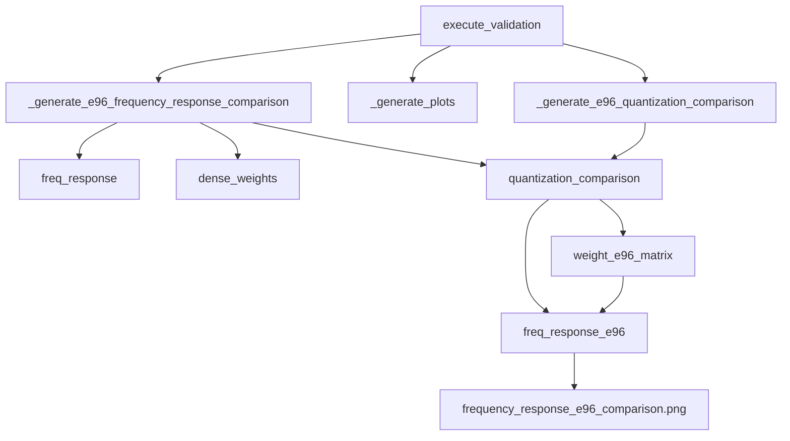

# R22: E96量化频率响应对比图修改计划

## 任务概述

支持绘制与 `frequency_response_comparison_merged.png` 相同风格的频率响应对比图，对比：
- **原始权重**的仿真（虚线）
- **带E96量化误差权重**的仿真（实线）

## 现状分析

### 已有的基础设施

| 组件 | 文件 | 行号 | 状态 |
|------|------|------|------|
| `_generate_e96_frequency_response_comparison()` | `visualization/wnet5_circuit_validator.py` | 1296-1480 | ✅ 已实现 |
| `_generate_e96_quantization_comparison()` | `visualization/wnet5_circuit_validator.py` | 513-563 | ✅ 已实现 |
| `execute_validation()` | `visualization/wnet5_circuit_validator.py` | 380-410 | ⚠️ 未调用E96对比图生成 |

### 问题

`execute_validation()` 方法中：
1. 第391行：调用 `_generate_e96_quantization_comparison()` ✅
2. 第401行：调用 `_generate_plots()` ✅
3. **缺失**：调用 `_generate_e96_frequency_response_comparison()` ❌

## 修改计划

### 修改文件

`visualization/wnet5_circuit_validator.py`

### 修改内容

#### 1. 在 `execute_validation()` 中添加 E96 频率响应对比图生成调用

**位置**: 第406-407行之间

**修改前**:
```python
# 6. 保存结果 (单一 results.json)
self._save_results(svf_params, svf_tfs, combined_tfs, freq_response, dense_weights, plots, report, quantization_comparison)
```

**修改后**:
```python
# 6. 生成 E96 量化频率响应对比图
e96_freq_plot = self._generate_e96_frequency_response_comparison(freq_response, dense_weights, quantization_comparison)
if e96_freq_plot:
    plots.append(e96_freq_plot)

# 7. 保存结果 (单一 results.json)
self._save_results(svf_params, svf_tfs, combined_tfs, freq_response, dense_weights, plots, report, quantization_comparison)
```

#### 2. 在 `_save_results()` 中保存 E96 频率响应对比图的路径

**位置**: 第1594-1596行（`plots_rel` 变量）

**修改后**（`plots` 已经是完整列表，包含 E96 对比图）：
```python
# 相对路径（相对 output_path）- plots 已在 execute_validation 中包含 E96 对比图
plots_rel = [str(Path(p).relative_to(self.output_path)) for p in plots]
```

**注意**: 由于 `plots` 已在 `execute_validation()` 中更新，此处无需修改。

### 详细行号对照表

| 修改项 | 文件 | 起始行号 | 结束行号 | 修改类型 |
|--------|------|----------|----------|----------|
| 调用 `_generate_e96_frequency_response_comparison()` | `wnet5_circuit_validator.py` | 405 | 410 | 添加 |

## 代码变更

### 变更1: execute_validation() 方法

```python
def execute_validation(self) -> bool:
    """执行WNET5电路验证流程"""
    try:
        logger.info("开始WNET5电路验证分析...")

        # 统一从 project 加载权重（纯 JSON，无 TensorFlow 依赖）
        logger.info(f"从 project '{self.model_project_name}' 加载权重...")
        svf_params = self._load_svf_parameters_from_project()
        dense_weights = self._load_dense_weights_from_project(self.analysis_layer)

        # 1.5 生成E96量化对比数据（如果启用）
        quantization_comparison = self._generate_e96_quantization_comparison(dense_weights)

        # 2. 计算传递函数
        svf_tfs = self._calculate_svf_transfer_functions(svf_params)
        combined_tfs = self._calculate_combined_transfer_functions(svf_tfs, dense_weights)

        # 3. 计算频率响应（使用默认频率点保持计算精度）
        freq_response = self._calculate_frequency_response(combined_tfs)

        # 4. 生成可视化
        plots = self._generate_plots(freq_response, dense_weights)

        # 5. 生成 E96 量化频率响应对比图（与 frequency_response_comparison_merged.png 相同风格）
        if quantization_comparison:
            e96_freq_plot = self._generate_e96_frequency_response_comparison(
                freq_response, dense_weights, quantization_comparison
            )
            if e96_freq_plot:
                plots.append(e96_freq_plot)

        # 6. 生成报告
        report = self._generate_analysis_report(svf_params, dense_weights, freq_response)

        # 7. 保存结果 (单一 results.json)
        self._save_results(svf_params, svf_tfs, combined_tfs, freq_response, dense_weights, plots, report, quantization_comparison)

        logger.info("✅ WNET5电路验证分析完成")
        return True

    except Exception as e:
        logger.error(f"WNET5电路验证分析失败: {e}")
        return False
```

## 输出文件

修改后，生成的文件：

| 文件名 | 说明 |
|--------|------|
| `frequency_response_comparison_merged.png` | 原始权重仿真 vs 实测对比（原有） |
| `frequency_response_e96_comparison.png` | **新增**：原始权重 vs E96量化权重仿真对比 |
| `e96_error_analysis.json` | **新增**：E96量化误差分析数据 |

## 验证步骤

### 测试命令

```bash
python cli.py ep ex_projects/inference/wnet5-circuit-validation/WNET5q1h2u6l3_layer1
```

### 预期结果

1. 控制台输出包含：
   - `生成 E96 量化前后频率响应对比图...`
   - `E96量化前后频率响应对比图已保存: ...`

2. `output/plots/` 目录包含：
   - `frequency_response_comparison_merged.png`（原有）
   - `frequency_response_e96_comparison.png`（新增）

3. `output/numerics/` 目录包含：
   - `e96_error_analysis.json`（新增）

4. `output/results.json` 的 `artifacts.plots` 字段包含两个图的路径

## 依赖关系



## 注意事项

1. **E96量化误差为0的情况**：如果权重已自然对齐E96值，误差将为0，图中两条线会完全重合
2. **坐标系**：使用 `semilogx`，与 `frequency_response_comparison_merged.png` 保持一致
3. **线型**：原始权重用虚线 `--`，E96量化用实线 `-`
4. **单位**：增益使用线性刻度，Y轴使用log刻度
