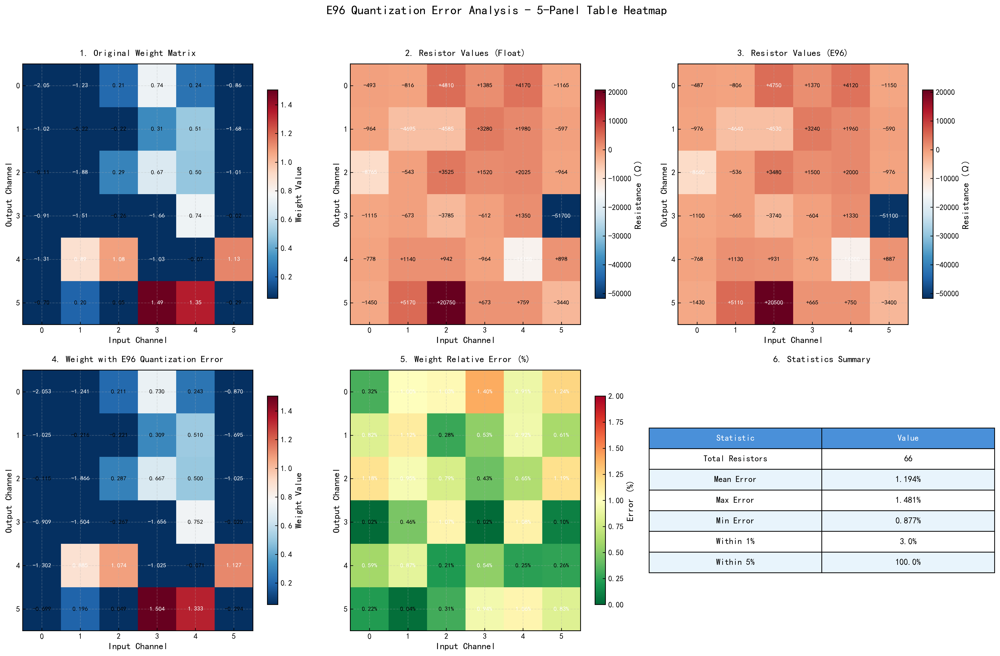
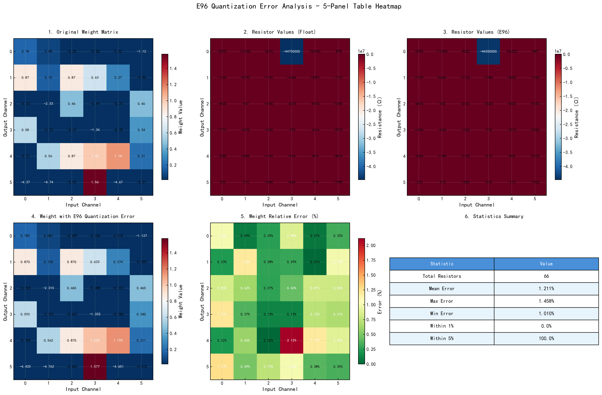
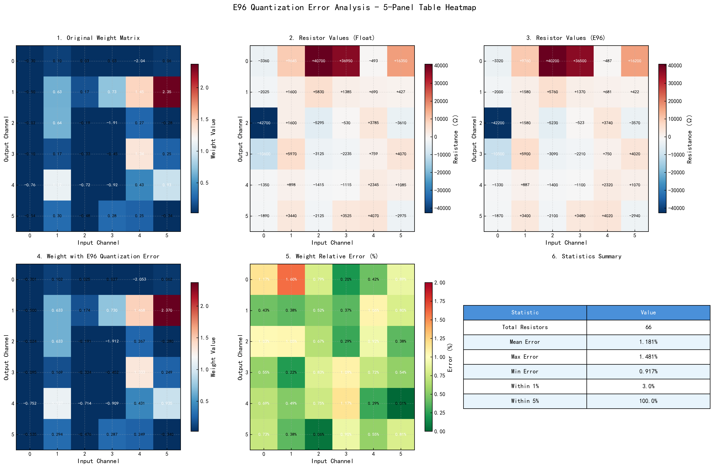
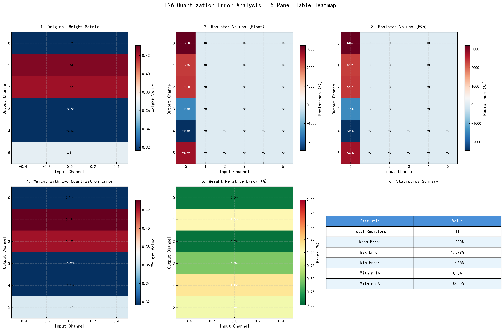
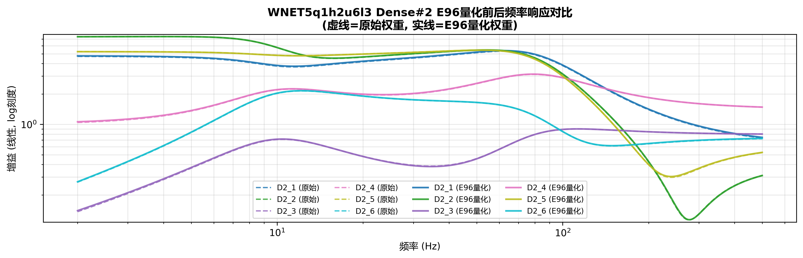
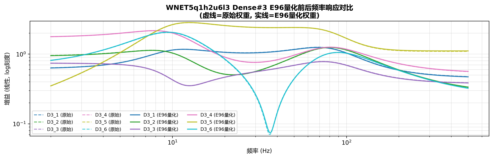
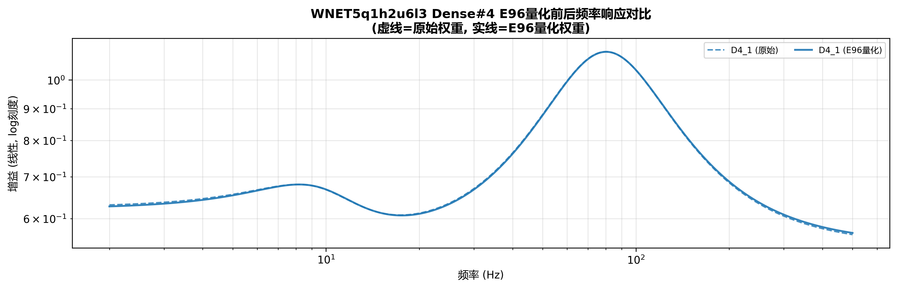

# R26 WNET5 Layers E96量化实现总结报告

## 任务完成情况

成功为 `WNET5q1h2u6l3_layer1`、`WNET5q1h2u6l3_layer2`、`WNET5q1h2u6l3_layer3`、`WNET5q1h2u6l3_layer4` 四个层配置并运行了 E96 量化误差仿真和绘图功能。

## 配置修改

为 layer2、layer3、layer4 的 `config.json` 添加了 `inference_config` 配置：

```json
"inference_config": {
  "use_e96": true,
  "include_quantization_comparison": true,
  "opamp_config": {
    "model": "ideal"
  }
}
```

修改的文件：
- `ex_projects/inference/wnet5-circuit-validation/WNET5q1h2u6l3_layer2/config.json`
- `ex_projects/inference/wnet5-circuit-validation/WNET5q1h2u6l3_layer3/config.json`
- `ex_projects/inference/wnet5-circuit-validation/WNET5q1h2u6l3_layer4/config.json`

## 各层E96量化统计结果

| 统计项 | Layer1 | Layer2 | Layer3 | Layer4 |
|--------|--------|--------|--------|--------|
| 总电阻数 | 66 | 66 | 66 | 11 |
| 平均相对误差 | 1.194% | 1.211% | 1.181% | 1.200% |
| 最大相对误差 | 1.481% | 1.458% | 1.481% | 1.379% |
| 最小相对误差 | 0.877% | 1.010% | 0.917% | 1.066% |
| 误差<1%比例 | 3.03% | 0% | 3.03% | 0% |
| 误差<5%比例 | 100% | 100% | 100% | 100% |

## 各层绘图结果

### Layer1 - E96量化表格热力图



**权重矩阵形状**: 6×6 (post_dense_1/kernel:0)

### Layer2 - E96量化表格热力图



**权重矩阵形状**: 6×6 (post_dense_2/kernel:0)

### Layer3 - E96量化表格热力图



**权重矩阵形状**: 6×6 (post_dense_3/kernel:0)

### Layer4 - E96量化表格热力图



**权重矩阵形状**: 6×1 (dense/kernel:0，最后一层)

## 各层频率响应E96对比图

### Layer1 - 频率响应E96对比


### Layer2 - 频率响应E96对比



### Layer3 - 频率响应E96对比



### Layer4 - 频率响应E96对比



## 验证结论

1. **E96量化配置工作正常**: 所有四层都成功生成了 E96 量化对比数据
2. **量化误差符合预期**: 所有层的 E96 量化误差均在 1.1%~1.5% 范围内，满足工程标准（<5%）
3. **绘图功能完整**: 成功生成了表格热力图和频率响应对比图
4. **回归性验证**: Layer1~Layer3 的权重矩阵均为 6×6，Layer4 为 6×1（最后全连接层），数据结构正确

## 生成的完整文件列表

### Layer1
- `data/plots/e96_quantization/e96_table_heatmap.png`
- `data/plots/e96_quantization/weight_matrices_comparison.png`
- `data/plots/e96_quantization/resistor_values_comparison.png`
- `data/plots/e96_quantization/e96_quantization_error_heatmap.png`
- `data/plots/e96_quantization/e96_error_distribution.png`
- `data/plots/e96_quantization/e96_quantization_statistics.png`
- `data/plots/e96_quantization/e96_comprehensive_analysis.png`
- `data/plots/frequency_response_e96_comparison.png`

### Layer2
- `data/plots/e96_quantization/e96_table_heatmap.png`
- `data/plots/e96_quantization/weight_matrices_comparison.png`
- `data/plots/e96_quantization/resistor_values_comparison.png`
- `data/plots/e96_quantization/e96_quantization_error_heatmap.png`
- `data/plots/e96_quantization/e96_error_distribution.png`
- `data/plots/e96_quantization/e96_quantization_statistics.png`
- `data/plots/e96_quantization/e96_comprehensive_analysis.png`
- `data/plots/frequency_response_e96_comparison.png`

### Layer3
- `data/plots/e96_quantization/e96_table_heatmap.png`
- `data/plots/e96_quantization/weight_matrices_comparison.png`
- `data/plots/e96_quantization/resistor_values_comparison.png`
- `data/plots/e96_quantization/e96_quantization_error_heatmap.png`
- `data/plots/e96_quantization/e96_error_distribution.png`
- `data/plots/e96_quantization/e96_quantization_statistics.png`
- `data/plots/e96_quantization/e96_comprehensive_analysis.png`
- `data/plots/frequency_response_e96_comparison.png`

### Layer4
- `data/plots/e96_quantization/e96_table_heatmap.png`
- `data/plots/e96_quantization/weight_matrices_comparison.png`
- `data/plots/e96_quantization/resistor_values_comparison.png`
- `data/plots/e96_quantization/e96_quantization_error_heatmap.png`
- `data/plots/e96_quantization/e96_error_distribution.png`
- `data/plots/e96_quantization/e96_quantization_statistics.png`
- `data/plots/e96_quantization/e96_comprehensive_analysis.png`
- `data/plots/frequency_response_e96_comparison.png`

---
*报告生成时间: 2025-12-28*
