# SVF-NET (WNET5) 实测结果与仿真对比调查报告

**生成日期**: 2025-12-27
**调查范围**: WNET5模型SVF层实测数据、对比图、代码位置

---

## 1. 调查概述

### 1.1 调查目标
- 定位WNET5(SVF-NET)模型中SVF层的实测结果数据位置
- 查找绘制的频率响应对比图
- 定位仿真与实测对比图
- 整理相关代码文件位置

### 1.2 WNET5模型概述
- **模型名称**: WNET5q1h2u6l3
- **SVF滤波器**: 2个 (中心频率10Hz, 80Hz; Q值均为1.0)
- **Dense层**: 4层 (每层6通道, ReLU激活)
- **主要用途**: 电化学传感器信号处理，抑制90-100Hz假频

---

## 2. 实测SVF层结果数据位置

### 2.1 实验数据目录
| 数据类型 | 路径 | 说明 |
|---------|------|------|
| **原始实验数据** | `exam_data/SVF-W_DENSE/` | Excel格式的实测频响数据 |
| **自测试数据** | `exam_data/SVF-W_DENSE/output_20251103_085135_sweep_selftest_震级1.0.xlsx` | 用于系统补偿的基准数据 |

### 2.2 实验数据文件清单
```
exam_data/SVF-W_DENSE/
├── output_20251103_085135_sweep_selftest_震级1.0.xlsx  # 自测试数据
├── output_20251103_145209_SVF-W_DENSE1_1_震级1.0.xlsx  # 层1通道1
├── output_20251103_150634_SVF-W_DENSE1_2_震级1.0.xlsx  # 层1通道2
├── output_20251103_152754_SVF-W_DENSE1_3_震级1.0.xlsx  # 层1通道3
├── output_20251103_155128_SVF-W_DENSE1_4_震级1.0.xlsx  # 层1通道4
├── output_20251103_185204_SVF-W_DENSE1_5_震级1.0.xlsx  # 层1通道5
├── output_20251103_193315_SVF-W_DENSE1_6_震级1.0.xlsx  # 层1通道6
├── output_20251104_083543_SVF-W_DENSE2_1_震级1.0.xlsx  # 层2通道1
├── output_20251104_085010_SVF-W_DENSE2_2_震级1.0.xlsx  # 层2通道2
├── ... (更多层2-4数据)
└── output_20251104_145508_SVF-W_DENSE3-6_震级1.0.xlsx  # 层3通道6
```

### 2.3 实验数据文件命名规则
- **格式1**: `output_{时间戳}_SVF-W_DENSE{层号}_{通道号}_震级1.0.xlsx`
- **格式2**: `output_{时间戳}_SVF-W_DENSE{层号}-{通道号}_震级1.0.xlsx`
- **包含列**: 频率列 + 增益列 (GAIN/B1, GAIN/CH等)

### 2.4 外部数据源
- **百度同步盘**: `F:\BaiduSyncdisk\data\SVF-NET-CIRCUIT\20251201-SVFNET-Dense1-3层.xlsx`
  - 包含层1-3的实验数据(sheet: layer1, layer2, layer3)

---

## 3. 绘制的图和对比图位置

### 3.0 SVF层（IIR通道）单独频率响应图

**注意**: 以下是**仿真生成的SVF层频率响应图**，不是实测图。

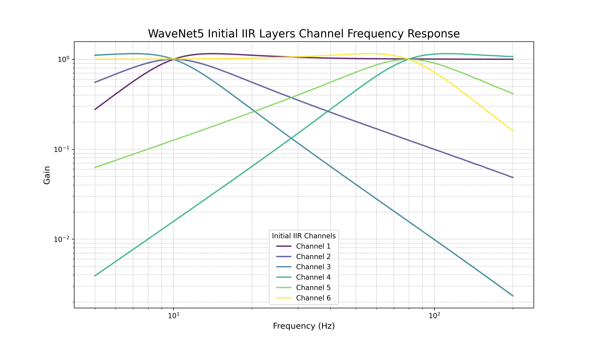

*图3.0-1: WNET5q1h2u6l3 SVF层6个IIR通道频率响应（仿真，HP/BP/LP组合）*

---

#### 3.0.1 SVF层实测数据（无现成图）

**实测数据位置**:
| 数据位置 | 说明 |
|---------|------|
| `exam_data/SVF-W_DENSE/output_20251103_085135_sweep_selftest_震级1.0.xlsx` | 自测试数据 |
| `exam_data/SVF-W_DENSE/output_20251103_145209_SVF-W_DENSE1_1_震级1.0.xlsx` | 层1通道1实测 |
| `exam_data/SVF-W_DENSE/output_20251104_083543_SVF-W_DENSE2_1_震级1.0.xlsx` | 层2通道1实测 |
| `F:\BaiduSyncdisk\data\SVF-NET-CIRCUIT\20251201-SVFNET-Dense1-3层.xlsx` | 百度同步盘（层1-3） |
| `F:\BaiduSyncdisk\data\SVF-NET-CIRCUIT\SVF_W_DENSE1.xlsx` | SVF_W_DENSE1原始数据 |

**实测数据结构**:
- 频率范围: 约2Hz - 512Hz
- 频点数: 25个
- 通道数: 6个（GAIN/CH1 - GAIN/CH6）

**⚠️ 实测图状态**: 项目中**没有现成的SVF层实测频率响应图**，只有Excel数据文件。如需生成实测图，需要用代码从Excel数据绘制。

---

### 3.1 频率响应对比图 (仿真 vs 实测) - SVF+Dense

#### 3.1.1 层1 - 仿真vs实测对比图


*图3.1.1-1: 层1频率响应对比 (仿真虚线 vs 实测实线，loglog坐标)*

---


*图3.1.1-2: 层1频率响应误差比值 (仿真÷实际)*

---

#### 3.1.2 层2 - 仿真vs实测对比图

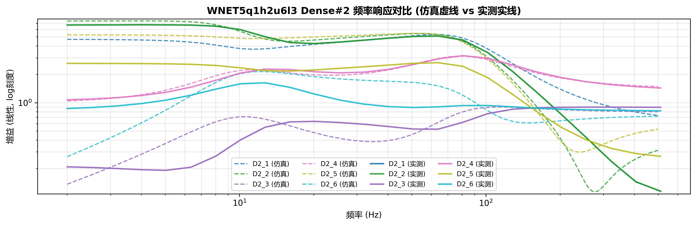

*图3.1.2-1: 层2频率响应对比 (仿真虚线 vs 实测实线，loglog坐标)*

---

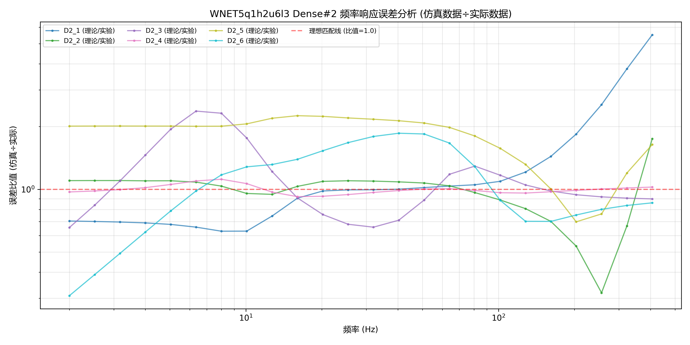

*图3.1.2-2: 层2频率响应误差比值 (仿真÷实际)*

---

#### 3.1.3 层3 - 仿真vs实测对比图

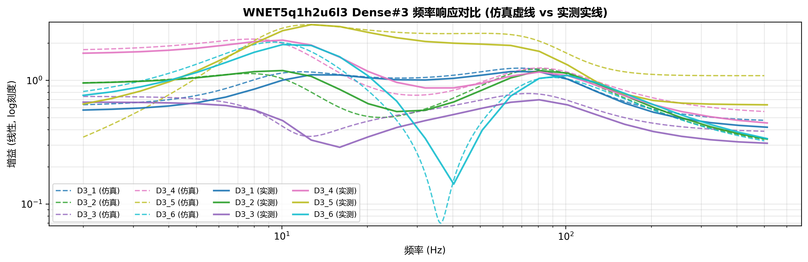

*图3.1.3-1: 层3频率响应对比 (仿真虚线 vs 实测实线，loglog坐标)*

---

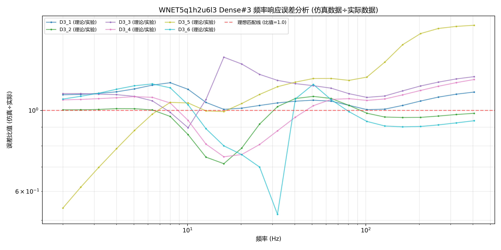

*图3.1.3-2: 层3频率响应误差比值 (仿真÷实际)*

---

#### 3.1.4 层4 - 理论仿真图


*图3.1.4-1: 层4理论频率响应 (仅仿真)*

---

### 3.2 原始单文件对比图

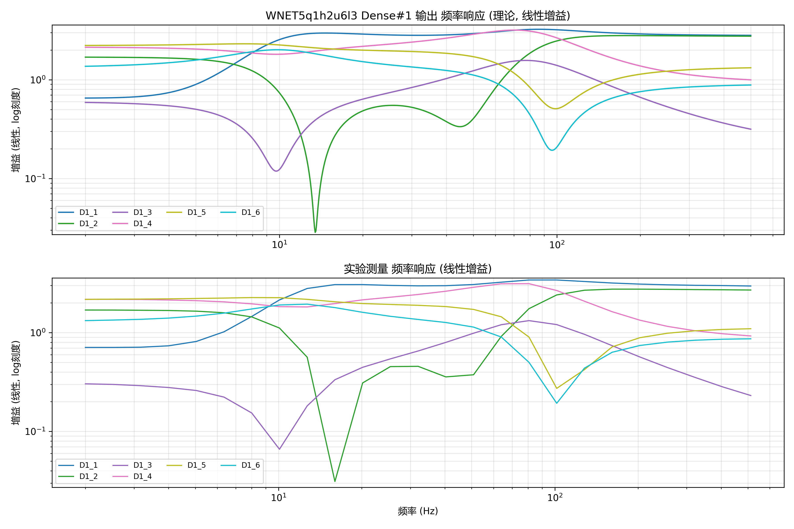

*图3.2-1: 原始层1频率响应对比图 (上下布局)*

---

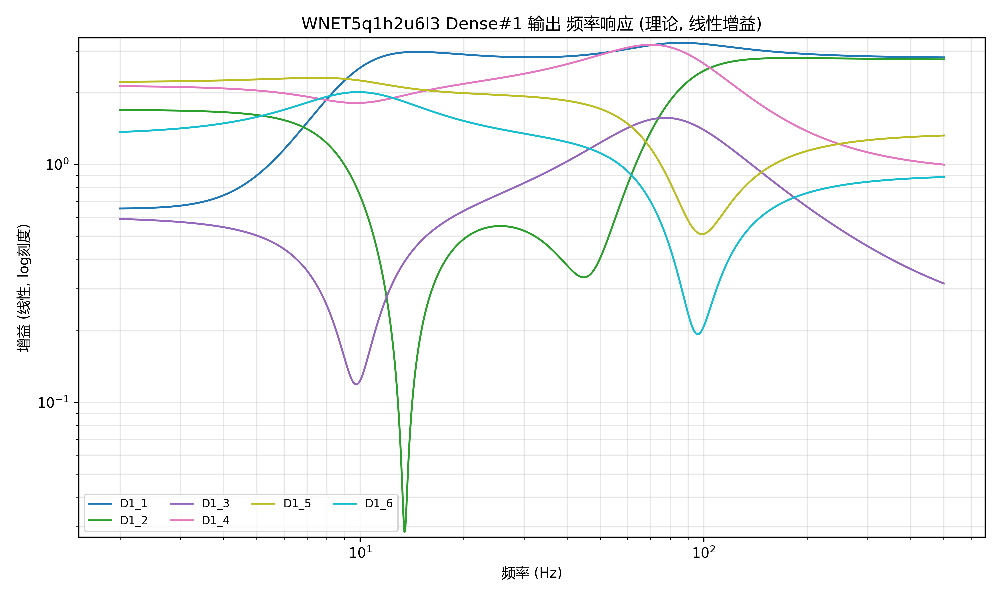

*图3.2-2: 原始层1理论仿真图*

---

### 3.3 频率响应补偿对比图

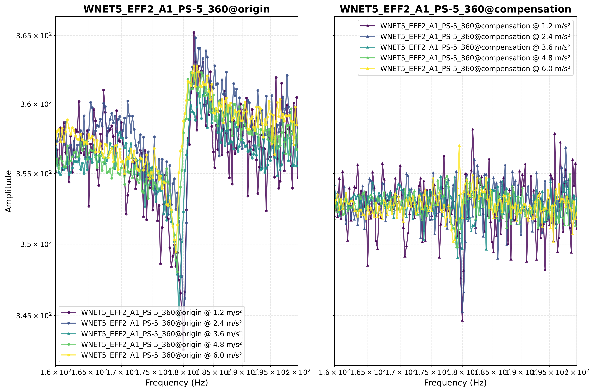

*图3.3-1: WNET5频率响应补偿对比 (左右布局)*

---

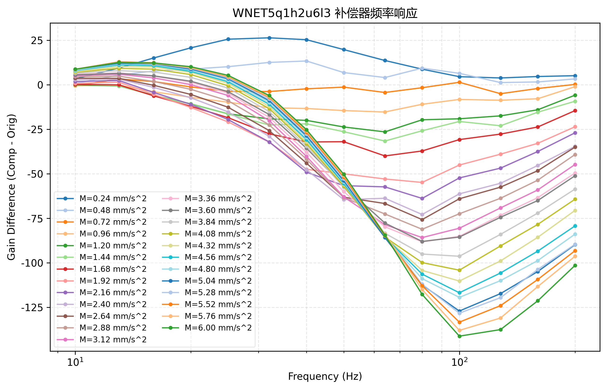

*图3.3-2: WNET5补偿差值曲线*

---

### 3.4 项目级分析图


*图3.4-1: WNET5 IIR通道频率响应*

---

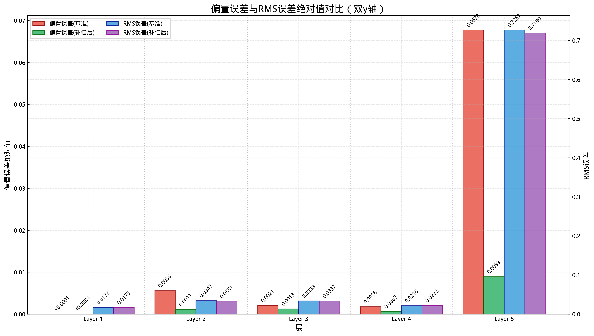

*图3.4-2: Bias RMS双轴对比总览*

---

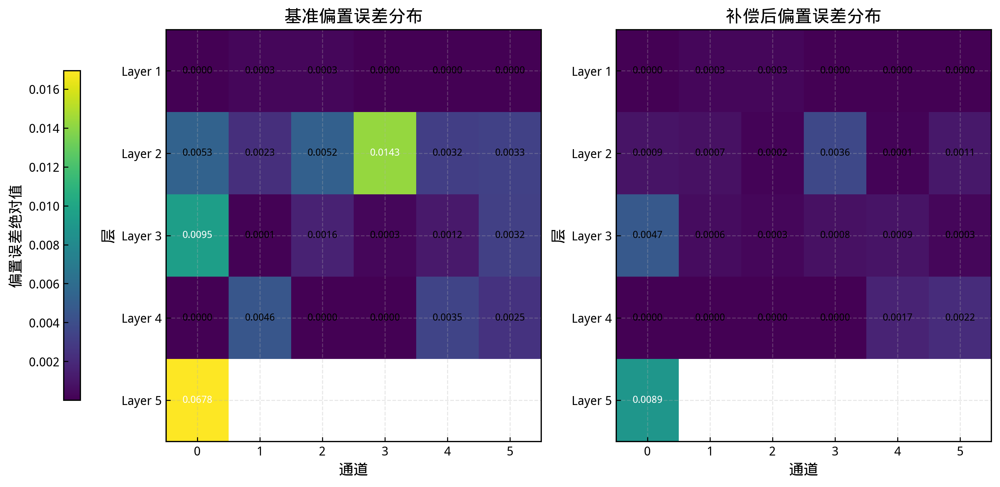

*图3.4-3: 通道Bias误差热图*

---

### 3.5 分层详细分析图

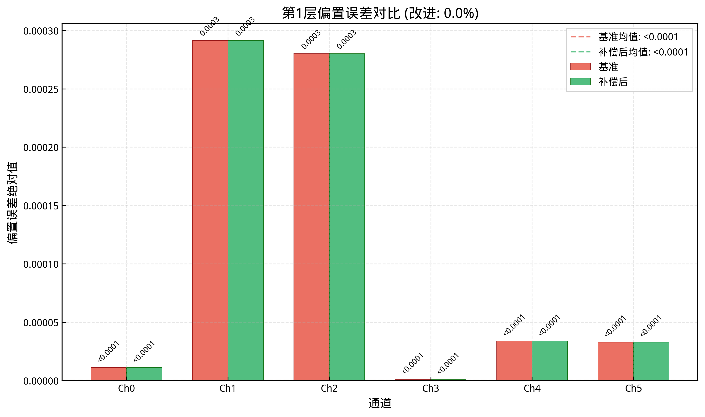

*图3.5-1: 层1单通道Bias对比*

---

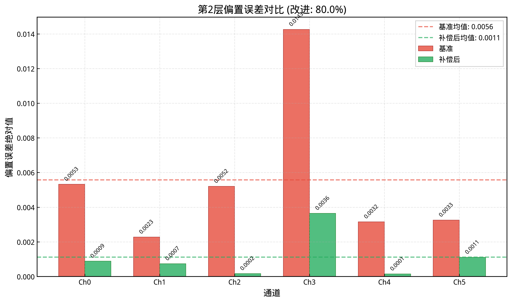

*图3.5-2: 层2单通道Bias对比*

---

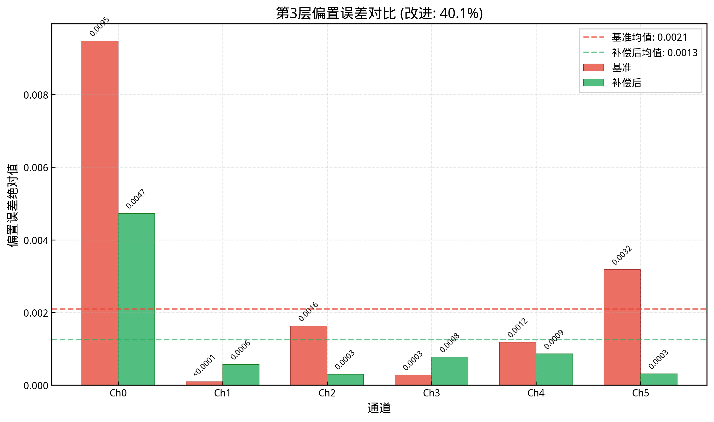

*图3.5-3: 层3单通道Bias对比*

---

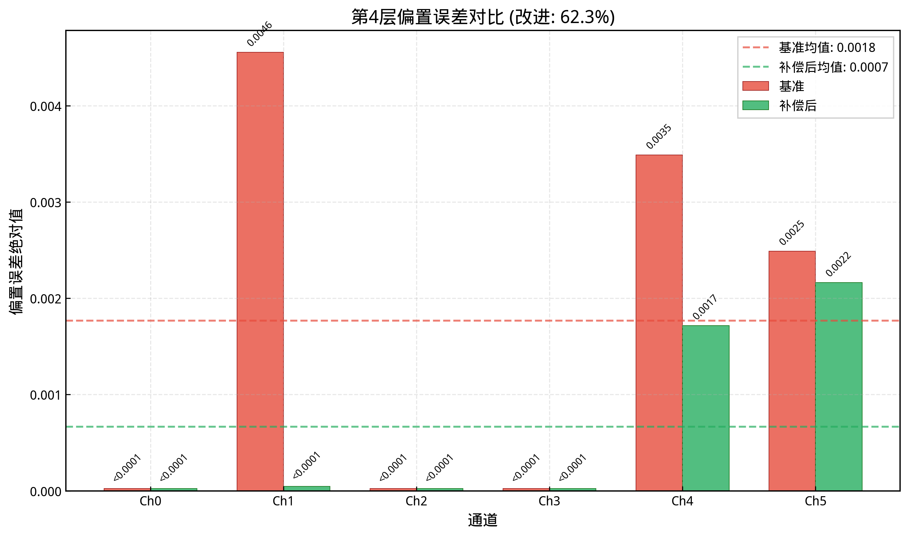

*图3.5-4: 层4单通道Bias对比*

---

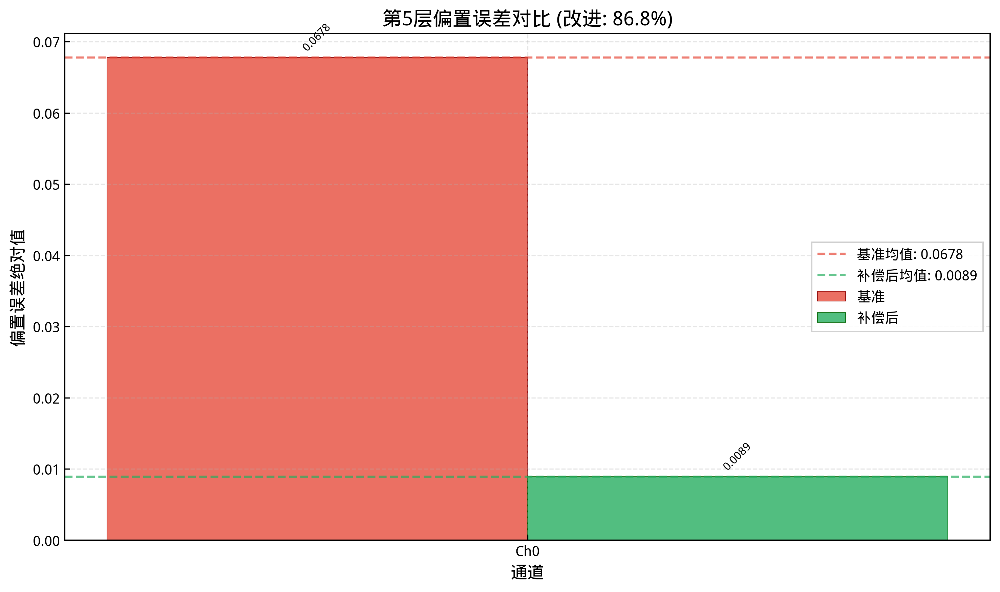

*图3.5-5: 层5单通道Bias对比*

---

### 3.6 全局改进对比图

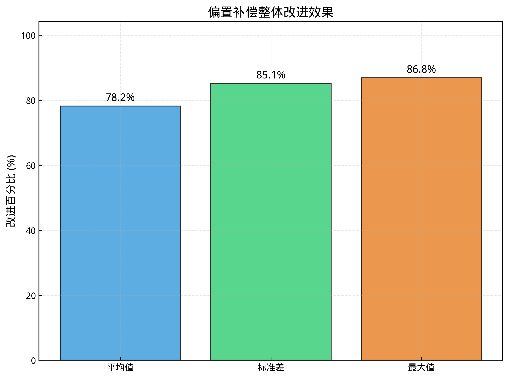

*图3.6-1: 全局改进总览*

---

## 4. 相关代码位置

### 4.1 核心验证代码
| 文件路径 | 功能 |
|----------|------|
| `visualization/wnet5_circuit_validator.py` | **主验证引擎**：计算SVF+Dense传递函数，生成频率响应对比图 |
| `visualization/frequency_response_json_comparator.py` | 基于JSON数据的频率响应对比可视化器 |

### 4.2 核心类和方法
```python
# wnet5_circuit_validator.py

class WNET5CircuitValidator:
    ├── __init__()              # 初始化配置
    ├── execute_validation()    # 执行验证流程
    ├── _load_model()           # 加载WaveNet5模型
    ├── _extract_svf_parameters()    # 提取SVF参数 (center_freqs, Q)
    ├── _extract_dense_weights()     # 提取Dense层权重
    ├── _calculate_svf_transfer_functions()  # 计算SVF传递函数
    ├── _calculate_combined_transfer_functions()  # 计算组合传递函数
    ├── _calculate_frequency_response()    # 计算频率响应
    ├── _generate_plots()          # 生成对比图 (支持单文件/多文件模式)
    ├── _generate_plots_single_file()   # 单文件对比模式
    ├── _generate_plots_multi_file()    # 多文件对比模式 (C05)
    ├── _load_selftest_data()      # 加载自测试数据
    ├── _scan_experiment_files()   # 扫描实验数据文件
    ├── _compensate_with_selftest()    # 自测试补偿
    └── _generate_analysis_report()    # 生成分析报告
```

### 4.3 配置文件位置
| 路径 | 说明 |
|------|------|
| `projects/WNET5q1h2u6l3/config.json` | 主模型配置 (SVF参数, Dense层配置) |
| `ex_projects/inference/wnet5-circuit-validation/WNET5q1h2u6l3_layer1/config.json` | 层1验证配置 |
| `ex_projects/inference/wnet5-circuit-validation/WNET5q1h2u6l3_layer2/config.json` | 层2验证配置 |
| `ex_projects/inference/wnet5-circuit-validation/WNET5q1h2u6l3_layer3/config.json` | 层3验证配置 |
| `ex_projects/inference/wnet5-circuit-validation/WNET5q1h2u6l3_layer4/config.json` | 层4验证配置 |

### 4.4 模型定义和训练代码
| 路径 | 说明 |
|------|------|
| `models/wavenet_models.py` | WaveNet5模型定义 |
| `projects/WNET5q1h2u6l3/data/best.weights.h5` | 训练好的权重文件 |

### 4.5 SPICE导出相关代码
| 路径 | 说明 |
|------|------|
| `inference/export_svf_to_spice.py` | SVF电路SPICE网表导出 |
| `spice_simulator/circuit_svf.py` | SVF电路仿真器 |
| `spice_simulator/simu_svf_sweep.py` | SVF扫频仿真脚本 |
| `spice_simulator/test_svf.py` | SVF测试脚本 |

---

## 5. 验证结果数据位置

### 5.1 JSON结果文件
| 路径 | 内容 |
|------|------|
| `ex_projects/inference/wnet5-circuit-validation/WNET5q1h2u6l3_layer1/data/results.json` | 层1完整结果 (传递函数, 频率响应) |
| `ex_projects/inference/wnet5-circuit-validation/WNET5q1h2u6l3_layer2/data/results.json` | 层2完整结果 |
| `ex_projects/inference/wnet5-circuit-validation/WNET5q1h2u6l3_layer3/data/results.json` | 层3完整结果 |
| `ex_projects/inference/wnet5-circuit-validation/WNET5q1h2u6l3_layer4/data/results.json` | 层4完整结果 |

### 5.2 分析报告
| 路径 | 内容 |
|------|------|
| `ex_projects/inference/wnet5-circuit-validation/WNET5q1h2u6l3_layer1/data/reports/analysis_report.json` | 层1分析报告 |
| `ex_projects/inference/wnet5-circuit-validation/WNET5q1h2u6l3_layer2/data/reports/analysis_report.json` | 层2分析报告 |
| `ex_projects/inference/wnet5-circuit-validation/WNET5q1h2u6l3_layer3/data/reports/analysis_report.json` | 层3分析报告 |
| `ex_projects/inference/wnet5-circuit-validation/WNET5q1h2u6l3_layer4/data/reports/analysis_report.json` | 层4分析报告 |

### 5.3 误差分析数据
| 路径 | 内容 |
|------|------|
| `ex_projects/inference/wnet5-circuit-validation/WNET5q1h2u6l3_layer1/data/numerics/error_analysis.json` | 层1误差统计 |
| `ex_projects/inference/wnet5-circuit-validation/WNET5q1h2u6l3_layer2/data/numerics/error_analysis.json` | 层2误差统计 |
| `ex_projects/inference/wnet5-circuit-validation/WNET5q1h2u6l3_layer3/data/numerics/error_analysis.json` | 层3误差统计 |

---

## 6. 文档和总结报告

### 6.1 分析报告
| 路径 | 说明 |
|------|------|
| `doc/wnet5_multi_layer_frequency_response_comparison_report.md` | **多层频率响应对比分析汇总** (2025-11-04) |
| `doc/research/wnet5_alias_suppression/WNET5_RealAlias_Complete_Summary.md` | 假频抑制实验总结 |
| `analysis/doc/research/wnet5_alias_suppression/WNET5_RealAlias_Comprehensive_Analysis_Report.md` | 假频抑制综合分析 |

### 6.2 计划和方案
| 路径 | 说明 |
|------|------|
| `doc/plan/wnet5_frequency_response_simulation_plan.md` | 频率响应仿真计划 |
| `doc/plan/20251104/wnet5_multilayer_circuit_validation_implementation_plan.md` | 多层电路验证实施方案 |
| `doc/plan/20251104/wnet5_experiment_comparison_implementation_plan.md` | 实验对比实施方案 |

### 6.3 架构文档
| 路径 | 说明 |
|------|------|
| `inference/doc/architecture/spice_svf_phase_correction_plan.md` | SPICE SVF相位校正计划 |
| `inference/doc/architecture/svf_phase_correction_architecture_analysis.md` | 相位校正架构分析 |
| `inference/doc/implementation/spice_svf_phase_correction_implementation_plan.md` | 相位校正实现计划 |

---

## 7. 关键配置参数

### 7.1 WNET5q1h2u6l3 模型配置
```json
{
  "model_subcfg": {
    "init_center_freqs": [10, 80],
    "init_quality_factors": [1.0, 1.0],
    "post_dense": true,
    "post_dense_activation": "relu",
    "post_dense_units": 6,
    "post_dense_layers": 3
  },
  "inference_config": {
    "opamp_config": { "model": "ideal" },
    "high_pass_config": { "enable": false },
    "bias_compensation": { "enabled": false }
  }
}
```

### 7.2 验证配置 (层1示例)
```json
{
  "task_type": "wnet5-circuit-validation",
  "model_project_name": "WNET5q1h2u6l3",
  "analysis_layer": 1,
  "frequency_range": {
    "start_freq": 2,
    "stop_freq": 500
  },
  "compare_with_experiment": "F:\\BaiduSyncdisk\\data\\SVF-NET-CIRCUIT\\20251201-SVFNET-Dense1-3层.xlsx",
  "experiment_comparison": {
    "experiment_sheet_name": "layer1",
    "plot_config": {
      "merged_plot_mode": true
    }
  }
}
```

---

## 8. 调查结论

### 8.1 数据位置总结
| 数据类型 | 主位置 |
|---------|--------|
| **实测数据** | `exam_data/SVF-W_DENSE/` + 百度同步盘 |
| **仿真结果** | `ex_projects/inference/wnet5-circuit-validation/WNET5q1h2u6l3_layer{1-4}/` |
| **对比图** | `ex_projects/inference/wnet5-circuit-validation/WNET5q1h2u6l3_layer{1-3}/data/plots/` |
| **误差分析** | `ex_projects/inference/wnet5-circuit-validation/WNET5q1h2u6l3_layer{1-3}/data/numerics/` |

### 8.2 代码入口
- **主验证**: `visualization/wnet5_circuit_validator.py`
- **JSON对比**: `visualization/frequency_response_json_comparator.py`

### 8.3 关键发现
1. **实测数据来源**: 使用Excel文件存储，包含频率和增益列
2. **补偿方法**: `exp_compensated = exp_mag / selftest_mag` (自测试补偿)
3. **坐标系**: loglog (双对数坐标)
4. **频率范围**: 2Hz - 500Hz
5. **理论-实验偏差**: 存在系统性偏差，需进一步研究

---

**报告生成**: Claude Code
**调查日期**: 2025-12-27
