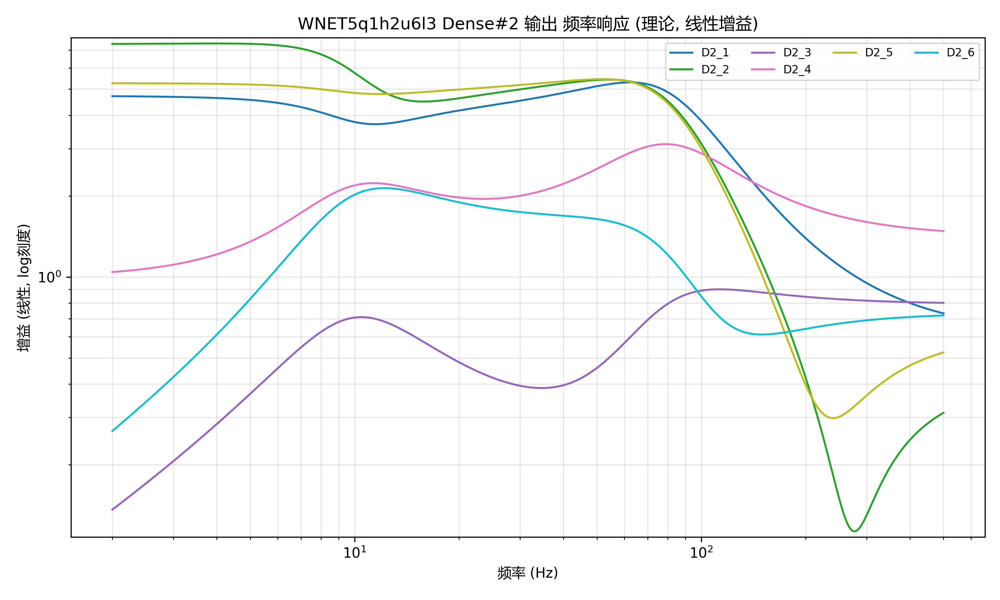
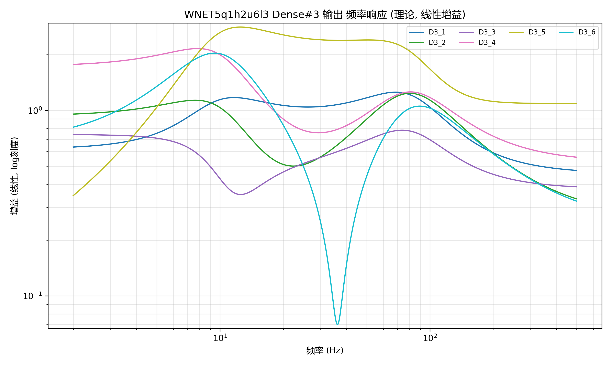
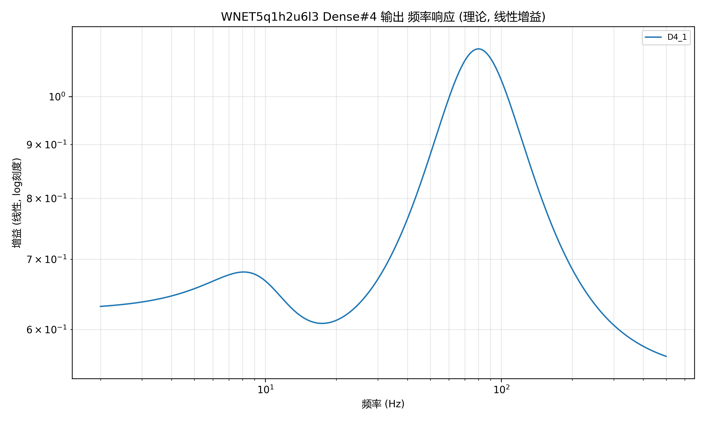

# WNET5 多层电路验证功能实施方案

## 一、需求背景

### 1.1 当前实现

当前 `wnet5-circuit-validation` 功能已实现：
- **SVF层 + Dense层（第一层）的 RELU 前频率响应分析**
- 基于传递函数理论计算电路频率响应
- 支持理论与实验数据对比

### 1.2 扩展需求

需要支持分析多个Dense层的频率响应：
- **SVF层 + Dense层（第二层）的 RELU 前频率响应分析**
- **SVF层 + Dense层（第三层）的 RELU 前频率响应分析**
- **SVF层 + Dense层（第四层）的 RELU 前频率响应分析**

**核心约束**：
- 永远是 **1个SVF层 + 1个Dense层** 的组合进行分析
- 不同时分析多个Dense层
- 通过 `config.json` 的 `analysis_layer` 参数指定要分析的层数（1/2/3/4）

### 1.3 应用场景

对实际电路板的每一层输出进行频率响应对比分析，验证电路实现的正确性。

---

## 二、系统架构深度分析

### 2.1 WaveNet5 模型架构

**layer_to_layer_models 结构**（以WNET5q1h2u6l3为例）：

```
layer_to_layer_models = [
    [0] SVFLayer: IIR_Layer_Model
        - 输入: 1通道
        - 输出: 6通道 (2个SVF滤波器 × 3输出(HP/BP/LP))

    [1] DenseLayer: Dense_Layer_Model_1
        - 输入: 6通道
        - 输出: 6通道
        - 激活: relu

    [2] DenseLayer: Dense_Layer_Model_2
        - 输入: 6通道
        - 输出: 6通道
        - 激活: relu

    [3] DenseLayer: Dense_Layer_Model_3
        - 输入: 6通道
        - 输出: 6通道
        - 激活: relu

    [4] DenseLayer: Output_Layer_Model
        - 输入: 6通道
        - 输出: 1通道
        - 激活: None
]
```

**关键配置参数**（`projects/WNET5q1h2u6l3/config.json`）：
```json
"model_subcfg": {
    "init_center_freqs": [10, 80],           // 2个SVF滤波器
    "init_quality_factors": [1.0, 1.0],
    "post_dense": true,
    "post_dense_activation": "relu",
    "post_dense_units": 6,                    // 每个Dense层6个单元
    "post_dense_layers": 3                    // 3个Dense层
}
```

### 2.2 当前实现机制分析

**文件**: `visualization/wnet5_circuit_validator.py`

**核心流程**：
```python
def execute_validation(self):
    # 1. 加载模型和提取参数
    model = self._load_model()                          # 加载WaveNet5模型
    svf_params = self._extract_svf_parameters(model)    # 提取SVF参数
    dense_weights = self._extract_dense_weights(model)  # ⚠️ 只提取第一层Dense

    # 2. 计算传递函数
    svf_tfs = self._calculate_svf_transfer_functions(svf_params)
    combined_tfs = self._calculate_combined_transfer_functions(svf_tfs, dense_weights)

    # 3. 计算频率响应
    freq_response = self._calculate_frequency_response(combined_tfs)

    # 4-6. 可视化、报告、保存结果
    ...
```

**关键函数分析**：

#### `_load_model()` (第87-133行)
```python
def _load_model(self):
    """加载WaveNet5模型并加载权重"""
    from models.wavenet_models import WaveNet5

    # 1. 决定权重路径
    weights_path = self.config.get('weights_path') or \
                   Path('projects') / self.model_project_name / 'data' / 'best.weights.h5'

    # 2. 读取项目配置获取 model_subcfg
    project_cfg_path = Path('projects') / self.model_project_name / 'config.json'
    with open(project_cfg_path, 'r') as f:
        proj_cfg = json.load(f)
    model_subcfg = proj_cfg.get('model', {}).get('model_subcfg', {})

    # 3. 实例化模型并加载权重
    model = WaveNet5(model_subcfg=model_subcfg)
    model.load_weights(str(weights_path))  # ⚠️ 这会同步所有layer_to_layer_models的权重

    # 4. 记录分层信息
    dense_layers = [l for l in model.layer_to_layer_models if 'Dense' in l.name]
    logger.info(f"检测到Dense相关分层: {[l.name for l in dense_layers]}")

    return model
```

#### `_extract_dense_weights()` (第148-200行) - ⚠️ 需要修改
```python
def _extract_dense_weights(self, model):
    """提取第一层Dense或输出层的权重

    ⚠️ 当前实现问题：
    - 硬编码只提取第一个Dense层
    - 遍历 layer_to_layer_models[1:]，找到第一个有权重的层就break
    """
    dense_candidate = None
    for wrapper in model.layer_to_layer_models[1:]:  # ⚠️ 跳过索引0(SVF层)
        try:
            w = wrapper.model.get_weights()
            if w:
                dense_candidate = wrapper  # ⚠️ 找到第一个就break
                break
        except Exception:
            continue

    if dense_candidate is None:
        raise ValueError("未找到可用的Dense/输出层权重")

    # 提取权重和偏置
    weights_list = dense_candidate.model.get_weights()
    kernel, bias = weights_list[0], weights_list[1] if len(weights_list) > 1 else None

    # 归一化形状到 (in_ch, out_ch)
    if kernel.ndim == 3:  # (k, in, out)
        kernel_mat = kernel[0]
    elif kernel.ndim == 2:
        kernel_mat = kernel

    bias_vec = bias if bias is not None else np.zeros(kernel_mat.shape[1])

    return {
        'layer_name': dense_candidate.name,
        'weights': kernel_mat,
        'bias': bias_vec
    }
```

#### `_calculate_combined_transfer_functions()` (第227-250行)
```python
def _calculate_combined_transfer_functions(self, svf_tfs, dense_weights):
    """计算SVF+Dense组合传递函数

    核心算法：
    1. 展开所有SVF通道 (每个滤波器 HP,BP,LP)
    2. 使用Dense权重矩阵进行加权组合
    3. 公式: Hc[o] = bias[o] + Σ(w[i,o] * H_svf[i])
    """
    all_svf_channels = []
    for svf in svf_tfs:
        all_svf_channels.extend([svf['high_pass'], svf['band_pass'], svf['low_pass']])

    w = dense_weights['weights']  # (in_ch, out_ch)
    bias_vec = dense_weights['bias']
    out_ch = w.shape[1]

    combined = []
    for o in range(out_ch):
        Hc = bias_vec[o]
        for i, H_svf in enumerate(all_svf_channels):
            Hc += w[i, o] * H_svf  # 加权组合
        combined.append(Hc)

    return combined
```

### 2.3 层权重加载机制

**文件**: `models/wavenet_models.py` (第847-892行)

```python
def load_weights(self, weights_file):
    """加载模型权重并同步所有layer_to_layer_models"""
    super().load_weights(weights_file)

    # 创建层名称到层对象的映射
    layer_dict = {layer.name: layer for layer in self.model.layers}

    # 逐个更新 layer_to_layer_models 中的模型权重
    for i, layer_wrapper in enumerate(self.layer_to_layer_models):
        model_name = layer_wrapper.name

        # 遍历层模型中的每一层
        for layer in layer_wrapper.model.layers:
            if isinstance(layer, tf.keras.layers.InputLayer):
                continue

            # 在主模型中查找同名层，复制权重
            if layer.name in layer_dict:
                source_layer = layer_dict[layer.name]
                weights = source_layer.get_weights()
                if weights:
                    layer.set_weights(weights)
                    logger.info(f"已更新层 '{layer.name}' 的权重")
```

**关键理解**：
- `load_weights()` 会自动同步所有 `layer_to_layer_models` 的权重
- 通过层名称匹配（`post_dense_1`, `post_dense_2`, `post_dense_3`）
- 所有Dense层的权重在加载后都已可用

---

## 三、实施方案设计

### 方案1：最小修改方案（推荐）⭐

#### 3.1.1 核心思路

只修改 `_extract_dense_weights()` 函数，通过 `analysis_layer` 参数选择要提取的Dense层。

**优点**：
- ✅ 修改最小，风险最低
- ✅ 不影响现有功能
- ✅ 代码清晰，易于理解和维护
- ✅ 测试简单

**缺点**：
- ⚠️ 需要手动验证层索引的有效性

#### 3.1.2 配置文件修改

**文件**: `ex_projects/inference/wnet5-circuit-validation/{project_name}/config.json`

**新增配置项**：
```json
{
  "task_info": {
    "task_type": "wnet5-circuit-validation",
    "description": "WNET5电路频率响应理论验证"
  },
  "model_project_name": "WNET5q1h2u6l3",
  "analysis_layer": 1,  // ⬅️ 新增：指定要分析的Dense层（1/2/3/4）
  "frequency_range": {
    "start_freq": 2,
    "stop_freq": 500
  },
  "compare_with_experiment": "D:/path/to/experiment.xlsx"
}
```

**配置说明**：
- `analysis_layer`: 整数，指定要分析的Dense层编号
  - `1`: 分析 Dense层1 (对应 `layer_to_layer_models[1]`)
  - `2`: 分析 Dense层2 (对应 `layer_to_layer_models[2]`)
  - `3`: 分析 Dense层3 (对应 `layer_to_layer_models[3]`)
  - `4`: 分析输出层 (对应 `layer_to_layer_models[4]`)，如果存在
- **默认值**: `1` (向后兼容，保持现有行为)

#### 3.1.3 代码修改详情

**文件**: `visualization/wnet5_circuit_validator.py`

**修改点1**: 构造函数 `__init__()` (第26行附近)

```python
# 原代码
def __init__(self, config: Dict[str, Any], output_path: Path):
    self.config = config
    self.output_path = Path(output_path)
    self.model_project_name = config['model_project_name']
    self.frequency_range = config['frequency_range']
    self.experiment_path = config.get('compare_with_experiment')
    self._setup_output_directories()

# 修改后
def __init__(self, config: Dict[str, Any], output_path: Path):
    self.config = config
    self.output_path = Path(output_path)
    self.model_project_name = config['model_project_name']
    self.frequency_range = config['frequency_range']
    self.experiment_path = config.get('compare_with_experiment')
    self.analysis_layer = config.get('analysis_layer', 1)  # ⬅️ 新增：默认为1（向后兼容）
    self._setup_output_directories()
```

**修改点2**: `execute_validation()` 函数 (第62行)

```python
# 原代码
dense_weights = self._extract_dense_weights(model)

# 修改后
dense_weights = self._extract_dense_weights(model, self.analysis_layer)  # ⬅️ 传入analysis_layer
```

**修改点3**: `_extract_dense_weights()` 函数 (第148-200行) - 核心修改

```python
# 原代码
def _extract_dense_weights(self, model):
    """提取第一层Dense或输出层的权重"""
    dense_candidate = None
    for wrapper in model.layer_to_layer_models[1:]:
        try:
            w = wrapper.model.get_weights()
            if w:
                dense_candidate = wrapper
                break  # ⚠️ 找到第一个就停止
        except Exception:
            continue

    if dense_candidate is None:
        raise ValueError("未找到可用的Dense/输出层权重")

    # ... 后续处理
    return {...}

# 修改后
def _extract_dense_weights(self, model, analysis_layer: int = 1):
    """提取指定Dense层的权重

    Args:
        model: WaveNet5模型实例
        analysis_layer: 要分析的Dense层编号 (1/2/3/4)
                       1 = Dense_Layer_Model_1 (layer_to_layer_models[1])
                       2 = Dense_Layer_Model_2 (layer_to_layer_models[2])
                       3 = Dense_Layer_Model_3 (layer_to_layer_models[3])
                       4 = Output_Layer_Model (layer_to_layer_models[4])，如果存在

    Returns:
        Dict: 包含 layer_name, weights, bias 的字典

    Raises:
        ValueError: 如果指定的层不存在或无法获取权重
    """
    # ⬅️ 验证 analysis_layer 的有效性
    if analysis_layer < 1:
        raise ValueError(f"analysis_layer 必须 >= 1，当前值: {analysis_layer}")

    # ⬅️ 计算目标层在 layer_to_layer_models 中的索引
    # analysis_layer=1 -> 索引1 (Dense_Layer_Model_1)
    # analysis_layer=2 -> 索引2 (Dense_Layer_Model_2)
    # analysis_layer=3 -> 索引3 (Dense_Layer_Model_3)
    target_index = analysis_layer  # 直接使用 analysis_layer 作为索引

    # ⬅️ 检查目标索引是否在有效范围内
    if target_index >= len(model.layer_to_layer_models):
        available_layers = len(model.layer_to_layer_models) - 1  # 减去SVF层
        raise ValueError(
            f"请求的 analysis_layer={analysis_layer} 超出范围。"
            f"模型共有 {available_layers} 个Dense/输出层 "
            f"(layer_to_layer_models 长度: {len(model.layer_to_layer_models)}, "
            f"索引0为SVF层)。"
            f"有效的 analysis_layer 值为 1-{available_layers}。"
        )

    # ⬅️ 获取目标层
    dense_candidate = model.layer_to_layer_models[target_index]

    # ⬅️ 验证目标层确实是Dense层（不是SVF层）
    if target_index == 0:
        raise ValueError(f"analysis_layer=0 对应SVF层，无法提取Dense权重。请使用 analysis_layer >= 1。")

    # ⬅️ 尝试获取权重
    try:
        weights_list = dense_candidate.model.get_weights()
        if not weights_list:
            raise ValueError(f"层 '{dense_candidate.name}' 没有可用的权重")
    except Exception as e:
        raise ValueError(f"无法从层 '{dense_candidate.name}' 获取权重: {e}")

    # ⬅️ 提取kernel和bias（与原代码逻辑相同）
    kernel = None
    bias = None
    if len(weights_list) == 2:
        kernel, bias = weights_list
    elif len(weights_list) == 1:
        kernel = weights_list[0]
    else:
        kernel = weights_list[0]
        bias = weights_list[1] if len(weights_list) > 1 else None

    # ⬅️ 归一化形状到 (in_ch, out_ch)
    if kernel.ndim == 3:  # (k, in, out)
        if kernel.shape[0] != 1:
            raise ValueError(f"期望kernel_size=1, 实际kernel第一维={kernel.shape[0]}")
        kernel_mat = kernel[0]
    elif kernel.ndim == 2:
        kernel_mat = kernel
    else:
        raise ValueError(f"无法解析Dense/Conv权重形状: {kernel.shape}")

    if bias is None:
        bias_vec = np.zeros(kernel_mat.shape[1], dtype=np.float32)
    else:
        bias_vec = bias

    # ⬅️ 记录提取的层信息
    logger.info(f"✅ 提取Dense层 '{dense_candidate.name}' (analysis_layer={analysis_layer}, 索引={target_index})")
    logger.info(f"   权重形状: {kernel_mat.shape}, 偏置形状: {bias_vec.shape}")

    return {
        'layer_name': dense_candidate.name,
        'weights': kernel_mat,
        'bias': bias_vec,
        'analysis_layer': analysis_layer  # ⬅️ 新增：记录分析的层编号
    }
```

**修改点4**: `_generate_plots()` 函数 (第285-401行)

更新输出标签，反映当前分析的层：

```python
# 原代码 (第292行附近)
output_labels = [f'D1_{i+1}' for i in range(len(mag_list))]

# 修改后
analysis_layer = dense_weights.get('analysis_layer', 1)  # ⬅️ 从dense_weights获取层编号
output_labels = [f'D{analysis_layer}_{i+1}' for i in range(len(mag_list))]
# 例如：analysis_layer=2 → ['D2_1', 'D2_2', 'D2_3', ...]
```

**修改点5**: `_generate_plots()` 函数 - 图表标题 (第356行和第382行)

```python
# 原代码 (第356行)
ax_top.set_title(f'{self.model_project_name} Dense#1 输出 频率响应 (理论, 线性增益)')

# 修改后
analysis_layer = dense_weights.get('analysis_layer', 1)
ax_top.set_title(f'{self.model_project_name} Dense#{analysis_layer} 输出 频率响应 (理论, 线性增益)')

# 原代码 (第382行)
ax.set_title(f'{self.model_project_name} Dense#1 输出 频率响应 (理论, 线性增益)')

# 修改后
ax.set_title(f'{self.model_project_name} Dense#{analysis_layer} 输出 频率响应 (理论, 线性增益)')
```

**修改点6**: `_generate_analysis_report()` 函数 (第403-433行)

在报告中添加 `analysis_layer` 信息：

```python
# 原代码 (第409行附近)
report = {
    'project_name': self.model_project_name,
    'analysis_type': 'wnet5-circuit-validation',
    'svf_parameters': svf_params,
    'dense_layer': {
        'name': dense_weights['layer_name'],
        'weight_shape': list(dense_weights['weights'].shape),
        'bias_shape': list(dense_weights['bias'].shape)
    },
    # ...
}

# 修改后
report = {
    'project_name': self.model_project_name,
    'analysis_type': 'wnet5-circuit-validation',
    'analysis_layer': dense_weights.get('analysis_layer', 1),  # ⬅️ 新增
    'svf_parameters': svf_params,
    'dense_layer': {
        'name': dense_weights['layer_name'],
        'analysis_layer_index': dense_weights.get('analysis_layer', 1),  # ⬅️ 新增
        'weight_shape': list(dense_weights['weights'].shape),
        'bias_shape': list(dense_weights['bias'].shape)
    },
    # ...
}
```

**修改点7**: `_save_results()` 函数 (第435-539行)

在结果JSON中添加 `analysis_layer` 信息：

```python
# 原代码 (第517-533行)
results = {
    'project_name': self.model_project_name,
    'task_type': 'wnet5-circuit-validation',
    'frequency_range': self.frequency_range,
    # ...
}

# 修改后
results = {
    'project_name': self.model_project_name,
    'task_type': 'wnet5-circuit-validation',
    'analysis_layer': self.analysis_layer,  # ⬅️ 新增
    'frequency_range': self.frequency_range,
    # ...
}
```

#### 3.1.4 配置验证修改（可选但推荐）

**文件**: `core/config_validator.py`

添加对 `analysis_layer` 的验证：

```python
# 在 _validate_wnet5_circuit_validation() 函数中添加

def _validate_wnet5_circuit_validation(self, config: dict) -> bool:
    """验证wnet5-circuit-validation配置"""

    # 现有验证...
    required_fields = ['model_project_name', 'frequency_range']
    # ...

    # ⬅️ 新增：验证 analysis_layer
    if 'analysis_layer' in config:
        analysis_layer = config['analysis_layer']

        # 类型检查
        if not isinstance(analysis_layer, int):
            self._add_error(f"analysis_layer 必须是整数，当前类型: {type(analysis_layer).__name__}")
            return False

        # 范围检查（基本范围，实际上限需要根据模型确定）
        if analysis_layer < 1 or analysis_layer > 10:
            self._add_error(f"analysis_layer 必须在 1-10 范围内，当前值: {analysis_layer}")
            return False

        logger.info(f"✅ analysis_layer 验证通过: {analysis_layer}")
    else:
        # 如果未提供，使用默认值
        logger.info("ℹ️ 未指定 analysis_layer，将使用默认值 1")

    return True
```

#### 3.1.5 预期输出结果

**文件结构**（与现有一致）：
```
ex_projects/inference/wnet5-circuit-validation/{project_name}/
├── config.json                              # 配置文件（新增analysis_layer字段）
└── data/
    ├── plots/
    │   └── frequency_response.png           # 频率响应图（标题和标签更新）
    │       或 frequency_response_comparison.png
    ├── numerics/
    │   └── frequency_response.json          # 频率响应数据（未变化）
    ├── reports/
    │   └── analysis_report.json             # 分析报告（新增analysis_layer字段）
    └── results.json                          # 汇总结果（新增analysis_layer字段）
```

**analysis_report.json 示例**（新增字段）：
```json
{
  "project_name": "WNET5q1h2u6l3",
  "analysis_type": "wnet5-circuit-validation",
  "analysis_layer": 2,                        // ⬅️ 新增
  "svf_parameters": {
    "center_freqs": [10.0, 80.0],
    "quality_factors": [1.0, 1.0]
  },
  "dense_layer": {
    "name": "Dense_Layer_Model_2",            // ⬅️ 根据analysis_layer变化
    "analysis_layer_index": 2,                // ⬅️ 新增
    "weight_shape": [6, 6],
    "bias_shape": [6]
  },
  "frequency_range": {"start_freq": 2, "stop_freq": 500},
  "outputs": 6,
  "analysis_results": {
    "frequency_points": 1000,
    "magnitude_range_db": [-60.2, 12.5],
    "phase_range_deg": [-180.0, 180.0]
  }
}
```

**图表输出变化**：
- **标题**: `WNET5q1h2u6l3 Dense#2 输出 频率响应` (原: `Dense#1`)
- **标签**: `D2_1`, `D2_2`, ... (原: `D1_1`, `D1_2`, ...)

---

### 方案2：层索引映射方案（更健壮）

#### 3.2.1 核心思路

创建一个层索引映射机制，自动检测可用的Dense层并提供更好的错误处理。

**优点**：
- ✅ 更健壮，自动适应不同模型配置
- ✅ 提供详细的层信息和错误提示
- ✅ 可以验证层的类型和属性

**缺点**：
- ⚠️ 实现稍复杂
- ⚠️ 需要额外的层检测逻辑

#### 3.2.2 配置文件修改

与方案1相同，添加 `analysis_layer` 参数。

#### 3.2.3 代码修改详情

**文件**: `visualization/wnet5_circuit_validator.py`

**新增辅助函数**: `_build_dense_layer_mapping()` (在`__init__`之后)

```python
def _build_dense_layer_mapping(self, model):
    """构建Dense层的索引映射

    Args:
        model: WaveNet5模型实例

    Returns:
        Dict: 层映射信息
        {
            'dense_layers': [
                {'index': 1, 'name': 'Dense_Layer_Model_1', 'type': 'Dense'},
                {'index': 2, 'name': 'Dense_Layer_Model_2', 'type': 'Dense'},
                {'index': 3, 'name': 'Dense_Layer_Model_3', 'type': 'Dense'},
                {'index': 4, 'name': 'Output_Layer_Model', 'type': 'Dense'}
            ],
            'max_layer': 4,
            'analysis_layer_to_index': {1: 1, 2: 2, 3: 3, 4: 4}
        }
    """
    dense_layers = []

    # 遍历 layer_to_layer_models，跳过索引0（SVF层）
    for idx in range(1, len(model.layer_to_layer_models)):
        wrapper = model.layer_to_layer_models[idx]

        # 检查是否为Dense层
        if 'Dense' in wrapper.name or 'Output' in wrapper.name:
            dense_layers.append({
                'index': idx,
                'name': wrapper.name,
                'type': wrapper.type if hasattr(wrapper, 'type') else 'Unknown',
                'input_shape': wrapper.input_shape,
                'output_shape': wrapper.output_shape
            })

    # 构建 analysis_layer 到实际索引的映射
    analysis_layer_to_index = {
        i + 1: layer['index'] for i, layer in enumerate(dense_layers)
    }

    mapping = {
        'dense_layers': dense_layers,
        'max_layer': len(dense_layers),
        'analysis_layer_to_index': analysis_layer_to_index
    }

    logger.info(f"🗺️ Dense层映射: {len(dense_layers)} 个层")
    for i, layer in enumerate(dense_layers, 1):
        logger.info(f"   analysis_layer={i} -> 索引{layer['index']}: {layer['name']}")

    return mapping
```

**修改 `__init__()` 函数**：

```python
def __init__(self, config: Dict[str, Any], output_path: Path):
    self.config = config
    self.output_path = Path(output_path)
    self.model_project_name = config['model_project_name']
    self.frequency_range = config['frequency_range']
    self.experiment_path = config.get('compare_with_experiment')
    self.analysis_layer = config.get('analysis_layer', 1)
    self.layer_mapping = None  # ⬅️ 新增：稍后在加载模型后初始化
    self._setup_output_directories()
```

**修改 `execute_validation()` 函数**：

```python
def execute_validation(self) -> bool:
    try:
        logger.info("开始WNET5电路验证分析...")

        # 1. 加载模型
        model = self._load_model()

        # ⬅️ 新增：构建层映射
        self.layer_mapping = self._build_dense_layer_mapping(model)

        # ⬅️ 新增：验证 analysis_layer 的有效性
        if self.analysis_layer > self.layer_mapping['max_layer']:
            raise ValueError(
                f"请求的 analysis_layer={self.analysis_layer} 超出范围。"
                f"模型共有 {self.layer_mapping['max_layer']} 个Dense/输出层。"
                f"有效值: 1-{self.layer_mapping['max_layer']}"
            )

        # 2. 提取参数
        svf_params = self._extract_svf_parameters(model)
        dense_weights = self._extract_dense_weights(model, self.analysis_layer)

        # 3-6. 其他步骤不变
        # ...
```

**修改 `_extract_dense_weights()` 函数**：

```python
def _extract_dense_weights(self, model, analysis_layer: int = 1):
    """使用层映射提取指定Dense层的权重"""

    # ⬅️ 使用映射表获取实际索引
    if not hasattr(self, 'layer_mapping') or self.layer_mapping is None:
        raise RuntimeError("层映射未初始化，请先调用 _build_dense_layer_mapping()")

    mapping = self.layer_mapping['analysis_layer_to_index']
    if analysis_layer not in mapping:
        available = list(mapping.keys())
        raise ValueError(
            f"无效的 analysis_layer={analysis_layer}。"
            f"可用值: {available}"
        )

    target_index = mapping[analysis_layer]
    dense_candidate = model.layer_to_layer_models[target_index]

    # 其余逻辑与方案1相同
    # ...
```

#### 3.2.4 预期输出结果

与方案1相同，但增加了更详细的日志输出：

```
[INFO] 🗺️ Dense层映射: 4 个层
[INFO]    analysis_layer=1 -> 索引1: Dense_Layer_Model_1
[INFO]    analysis_layer=2 -> 索引2: Dense_Layer_Model_2
[INFO]    analysis_layer=3 -> 索引3: Dense_Layer_Model_3
[INFO]    analysis_layer=4 -> 索引4: Output_Layer_Model
[INFO] ✅ 提取Dense层 'Dense_Layer_Model_2' (analysis_layer=2, 索引=2)
```

---

## 四、方案对比

| 对比维度 | 方案1：最小修改方案 | 方案2：层索引映射方案 |
|---------|-------------------|---------------------|
| **实现复杂度** | ⭐ 低 | ⭐⭐ 中等 |
| **代码修改量** | 7处修改 | 10处修改 + 新增1个函数 |
| **向后兼容性** | ✅ 完全兼容 | ✅ 完全兼容 |
| **错误处理** | ⭐⭐⭐ 基本验证 | ⭐⭐⭐⭐⭐ 完善验证 |
| **健壮性** | ⭐⭐⭐ 良好 | ⭐⭐⭐⭐⭐ 优秀 |
| **可维护性** | ⭐⭐⭐⭐ 优秀 | ⭐⭐⭐⭐ 良好 |
| **测试成本** | ⭐⭐ 低 | ⭐⭐⭐ 中等 |
| **适应性** | ⭐⭐⭐ 固定索引映射 | ⭐⭐⭐⭐⭐ 自动适应 |
| **调试友好** | ⭐⭐⭐ 良好 | ⭐⭐⭐⭐⭐ 优秀 |

**推荐**：
- **快速实现**: 选择**方案1**
- **长期维护**: 选择**方案2**

---

## 五、实验对比数据准备

当前实验数据文件格式（Excel）：

**当前列名**（Dense层1）：
```
F | D1_1_GAIN/B1 | D1_2_GAIN/B1 | D1_3_GAIN/B1 | ...
```

**多层数据的列名规范**：

**Dense层2**：
```
F | D2_1_GAIN/B1 | D2_2_GAIN/B1 | D2_3_GAIN/B1 | ...
```

**Dense层3**：
```
F | D3_1_GAIN/B1 | D3_2_GAIN/B1 | D3_3_GAIN/B1 | ...
```

**建议**：
- 同一个Excel文件包含所有层的数据，使用不同的列
- 或使用不同的Excel文件，在 `config.json` 中指定不同的路径

**代码修改**（可选扩展）：

如果需要支持按层自动选择实验数据列：

```python
# _generate_plots() 函数中 (第306行附近)

# 原代码
pattern = re.compile(r'^D1_(\d+)_GAIN/B1$')

# 修改后
analysis_layer = dense_weights.get('analysis_layer', 1)
pattern = re.compile(rf'^D{analysis_layer}_(\d+)_GAIN/B1$')
# 例如：analysis_layer=2 → 匹配 "D2_1_GAIN/B1", "D2_2_GAIN/B1", ...
```

---

## 六、测试验证计划

### 6.1 单元测试

**测试文件**: `tests/test_wnet5_circuit_validator.py` (新建)

**测试用例**：

1. **测试配置默认值**
   ```python
   def test_default_analysis_layer():
       """测试未指定analysis_layer时默认为1"""
       config = {
           'model_project_name': 'WNET5q1h2u6l3',
           'frequency_range': {'start_freq': 2, 'stop_freq': 500}
       }
       validator = WNET5CircuitValidator(config, Path('output'))
       assert validator.analysis_layer == 1
   ```

2. **测试层索引范围验证**
   ```python
   def test_invalid_analysis_layer():
       """测试无效的analysis_layer值"""
       model = load_test_model()  # 假设有3个Dense层

       # 测试超出范围
       with pytest.raises(ValueError, match="超出范围"):
           _extract_dense_weights(model, analysis_layer=10)

       # 测试小于1
       with pytest.raises(ValueError, match="必须 >= 1"):
           _extract_dense_weights(model, analysis_layer=0)
   ```

3. **测试多层权重提取**
   ```python
   def test_extract_different_layers():
       """测试提取不同层的权重"""
       model = load_test_model()

       # 提取层1
       weights_1 = _extract_dense_weights(model, analysis_layer=1)
       assert weights_1['layer_name'] == 'Dense_Layer_Model_1'

       # 提取层2
       weights_2 = _extract_dense_weights(model, analysis_layer=2)
       assert weights_2['layer_name'] == 'Dense_Layer_Model_2'

       # 验证权重不同
       assert not np.array_equal(weights_1['weights'], weights_2['weights'])
   ```

### 6.2 集成测试

**测试步骤**：

1. **准备测试项目**
   ```bash
   # 创建测试配置 - 层1
   cat > ex_projects/inference/wnet5-circuit-validation/test_layer1/config.json <<EOF
   {
     "model_project_name": "WNET5q1h2u6l3",
     "analysis_layer": 1,
     "frequency_range": {"start_freq": 2, "stop_freq": 500}
   }
   EOF

   # 创建测试配置 - 层2
   cat > ex_projects/inference/wnet5-circuit-validation/test_layer2/config.json <<EOF
   {
     "model_project_name": "WNET5q1h2u6l3",
     "analysis_layer": 2,
     "frequency_range": {"start_freq": 2, "stop_freq": 500}
   }
   EOF
   ```

2. **运行测试**
   ```bash
   # 测试层1
   python cli.py ep ex_projects/inference/wnet5-circuit-validation/test_layer1

   # 测试层2
   python cli.py ep ex_projects/inference/wnet5-circuit-validation/test_layer2

   # 测试层3
   python cli.py ep ex_projects/inference/wnet5-circuit-validation/test_layer3
   ```

3. **验证输出**
   - 检查日志输出是否正确显示提取的层名称
   - 检查 `analysis_report.json` 中的 `analysis_layer` 字段
   - 检查图表标题和标签是否正确
   - 对比不同层的频率响应结果

### 6.3 回归测试

**测试场景**：
1. **向后兼容性测试**
   - 使用不包含 `analysis_layer` 的旧配置文件
   - 验证默认行为与原有实现一致

2. **边界条件测试**
   - `analysis_layer = 1` (第一层)
   - `analysis_layer = max_layer` (最后一层)
   - `analysis_layer = 0` (错误情况)
   - `analysis_layer > max_layer` (错误情况)

---

## 七、实施步骤

### 阶段1：代码修改与单元测试 (2小时)

1. ✅ 修改 `wnet5_circuit_validator.py`（按方案1或方案2）
2. ✅ 编写单元测试
3. ✅ 本地测试验证

### 阶段2：集成测试 (1小时)

1. ✅ 创建测试EP项目（层1/2/3）
2. ✅ 运行端到端测试
3. ✅ 验证输出文件和可视化结果

### 阶段3：文档更新 (0.5小时)

1. ✅ 更新 `doc/summary.md`
2. ✅ 更新相关技术文档

### 阶段4：正式验证 (1小时)

1. ✅ 使用实际电路实验数据测试
2. ✅ 对比不同层的频率响应
3. ✅ 完成验证报告

**总计**: 约4.5小时

---

## 八、风险评估与应对

| 风险 | 影响 | 概率 | 应对措施 |
|------|------|------|---------|
| 层索引映射错误 | 高 | 低 | 充分的单元测试 + 详细日志输出 |
| 不同层权重形状不一致 | 中 | 低 | 添加形状验证逻辑 |
| 实验数据列名不匹配 | 低 | 中 | 更新实验数据准备指南 |
| 向后兼容性问题 | 高 | 极低 | 默认值 + 回归测试 |

---

## 九、附录

### A. WaveNet5 layer_to_layer_models 结构示例

```python
# WNET5q1h2u6l3 模型
model.layer_to_layer_models = [
    SVFLayer(
        name='IIR_Layer_Model',
        input_shape=(None, None, 1),
        output_shape=(None, None, 6),  # 2滤波器 × 3输出
        center_freqs=[10, 80],
        quality_factors=[1.0, 1.0]
    ),
    DenseLayer(
        name='Dense_Layer_Model_1',
        input_shape=(None, None, 6),
        output_shape=(None, None, 6),
        activation='relu'
    ),
    DenseLayer(
        name='Dense_Layer_Model_2',
        input_shape=(None, None, 6),
        output_shape=(None, None, 6),
        activation='relu'
    ),
    DenseLayer(
        name='Dense_Layer_Model_3',
        input_shape=(None, None, 6),
        output_shape=(None, None, 6),
        activation='relu'
    ),
    DenseLayer(
        name='Output_Layer_Model',
        input_shape=(None, None, 6),
        output_shape=(None, None, 1),
        activation=None
    )
]
```

### B. 关键代码位置速查

| 功能 | 文件 | 行号范围 |
|------|------|---------|
| WNET5CircuitValidator 类 | `visualization/wnet5_circuit_validator.py` | 23-539 |
| `_extract_dense_weights()` | `visualization/wnet5_circuit_validator.py` | 148-200 |
| `_load_model()` | `visualization/wnet5_circuit_validator.py` | 87-133 |
| `_calculate_combined_transfer_functions()` | `visualization/wnet5_circuit_validator.py` | 227-250 |
| `_generate_plots()` | `visualization/wnet5_circuit_validator.py` | 285-401 |
| WaveNet5 模型定义 | `models/wavenet_models.py` | 602-955 |
| WaveNet5.load_weights() | `models/wavenet_models.py` | 847-892 |
| DenseLayer 定义 | `models/model_layers.py` | 364-540 |
| SVFLayer 定义 | `models/model_layers.py` | 225-362 |

### C. 相关命令

```bash
# 运行单个EP项目
python cli.py ep ex_projects/inference/wnet5-circuit-validation/{project_name}

# 查看日志
tail -f logs/metnl.log

# 运行测试
pytest tests/test_wnet5_circuit_validator.py -v

# 代码风格检查
flake8 visualization/wnet5_circuit_validator.py
```

### D. 多层频率响应图像汇总

| 层级 | 频率响应图 |
|------|------------|
| 第1层 |  |
| 第2层 |  |
| 第3层 |  |
| 第4层 |  |

---

## 十、总结

**方案1（推荐）** 提供了最简洁的实现方式，通过最小修改即可支持多层Dense的频率响应分析。

**方案2** 提供了更健壮的实现，适合长期维护和扩展。

两个方案都完全向后兼容，不影响现有功能，可以根据项目需求和时间预算选择。

**建议优先实施方案1**，如果后续发现需要更强的健壮性，再升级到方案2。
