## IEEE Transactions on Instrumentation & Measurement

Feedforward Nonlinearity Compensation for Electrochemical Seismometer via Frequency Response Prior Injection and Physics-Constrained KAN --Manuscript Draft--

<table><tr><td>Manuscript Number:</td><td>TIM-25-06440</td></tr><tr><td>Article Type:</td><td>Regular Article</td></tr><tr><td>Section/Category:</td><td></td></tr><tr><td>Keywords:</td><td>electrochemical seismometer; KolmogorovArnold network; nonlinearity; frequency response; loss function; low-compute</td></tr><tr><td>Corresponding Author:</td><td>Hongyuan Yang Jilin University CHINA</td></tr><tr><td>First Author:</td><td>Ang Li</td></tr><tr><td rowspan="8">Order of Authors:</td><td>Ang Li</td></tr><tr><td>Hongyuan Yang</td></tr><tr><td>Fan Zheng</td></tr><tr><td>Huaizhu Zhang</td></tr><tr><td>Linhang Zhang</td></tr><tr><td>Xunqian Tong</td></tr><tr><td>Can Liu</td></tr><tr><td>Ruojin Li</td></tr><tr><td>Abstract:</td><td>Electrochemical seismometers (METs) are becoming increasingly important in geophysical exploration due to their high sensitivity, wide bandwidth, and anti-tilt/shock performance, and are expected to be an ideal choice for next-generation seismic signal detection. However, due to their complex electrochemical and fluid-mechanical coupling mechanisms, METs exhibit significant magnitude-dependent nonlinearity, which causes frequency response drift and limits the dynamic range, thus affecting seismic data quality and reliability of seismic event detection. To solve this problem, this paper proposes a novel feedforward compensation network that integrates frequency response prior injection and physics-constrained Kolmogorov-Arnold networks (FRIKAN). The feedforward architecture avoids stability risks associated with force feedback. To overcome overfitting and performance degradation caused by lack of physical information, FRIKAN injects the relative frequency response between the target and ideal system, leveraging the physics-constrained trainable activation function to enhance individual neurons' nonlinear compensation capability throug natural structural adaptation of sensor input-output curves. For the first time, a systematic 3D frequency response dataset incorporating amplitude-frequency coupling effects is constructed through vibration excitation experiments. A tailored amplitude-frequency loss function is designed to improve frequency-domain fitting accuracy. Tes results show that FRIKAN reduces MET's input-output nonlinearity by 95.41% on average with magnitude increases over ${10} \times$ , while decreasing sensitivity drift by 93.95% and natural frequency drift by 96.45%. Compared to LSTM, GRU, and RVTDCNN with similar parameter counts, FRIKAN improves compensation performance by 11.22% on average. A lookup table acceleration strategy enables embedded deployment, achieving 2.1×computational efficiency gain over LSTM (accuracy loss <0.5%), showing promising application potential.</td></tr></table>

# Feedforward Nonlinearity Compensation for Electrochemical Seismometer via Frequency Response Prior Injection and Physics-Constrained KAN

Ang Li, Hongyuan Yang, Fan Zheng, Huaizhu Zhang, Linhang Zhang, Xunqian Tong, Can Liu, Ruojin Li

Abstract-Electrochemical seismometers (METs) are becoming increasingly important in geophysical exploration due to their high sensitivity, wide bandwidth, and anti-tilt/shock performance, and are expected to be an ideal choice for next-generation seismic signal detection. However, due to their complex electrochemical and fluid-mechanical coupling mechanisms, METs exhibit significant magnitude-dependent nonlinearity, which causes frequency response drift and limits the dynamic range, thus affecting seismic data quality and reliability of seismic event detection. To solve this problem, this paper proposes a novel feedfor-ward compensation network that integrates frequency response prior injection and physics-constrained Kolmogorov-Arnold networks (FRIKAN). The feedforward architecture avoids stability risks associated with force feedback. To overcome overfitting and performance degradation caused by lack of physical information, FRIKAN injects the relative frequency response between the target and ideal system, leveraging the physics-constrained trainable activation function to enhance individual neurons' nonlinear compensation capability through natural structural adaptation of sensor input-output curves. For the first time, a systematic 3D frequency response dataset incorporating amplitude-frequency coupling effects is constructed through vibration excitation experiments. A tailored amplitude-frequency loss function is designed to improve frequency-domain fitting accuracy. Test results show that FRIKAN reduces MET's input-output nonlinearity by 95.41% on average with magnitude increases over ${10} \times$ , while decreasing sensitivity drift by ${93.95}\%$ and natural frequency drift by 96.45%. Compared to LSTM, GRU, and RVTDCNN with similar parameter counts, FRIKAN improves compensation performance by 11.22% on average. A lookup table acceleration strategy enables embedded deployment, achieving ${2.1} \times$ computational efficiency gain over LSTM (accuracy loss <0.5%), showing promising application potential.

Index Terms-electrochemical seismometer; Kolmogorov-Arnold network; nonlinearity; frequency response; loss function; low-compute

## I. INTRODUCTION

ELECTROCHEMICAL seismometers (METs) exhibit potential in underground resource exploration and seismic monitoring due to their high sensitivity, wide bandwidth, and tilt/impact resistance, positioning them as leading candidates for next-generation seismometers [1]. With global seismic networks (GSNs) progressively achieving real-time data acquisition with broadband and high dynamic range [2], stricter demands are placed on core sensors' linearity and stability. However, the complex coupling between electrochemical reactions and fluid mechanics introduces significant magnitude-dependent nonlinearity in MET frequency response, including sensitivity and natural frequency drift. This distorts vibration waveform detection, severely limiting dynamic range and compromising seismic exploration data quality and reliable event detection. Consequently, improving nonlinear frequency response has become a research priority.

Previous studies have attempted to improve linearity through structural design optimization. Xu et al. [3] proposed a MEMS electrochemical seismometer using anodic bonding technology, which enhanced sensitivity and device consistency via a silicon-glass-silicon three-layer integrated electrode structure. Sun et al. [4] developed a broadband electrochemical seismometer using single silicon chip with four microelec-trodes, achieving a bandwidth of 0.7-100 Hz and a peak sensitivity of ${6221}\mathrm{\;V} \cdot  \mathrm{s}/\mathrm{m}@3\mathrm{{Hz}}$ . However, constrained by the complex electrochemical-mechanical coupling mechanism of MET, structural optimization showed limited effectiveness in linearity improvement and could not overcome inherent physical limitations. The system maintained linear operation only when the magnitude was below ${1.0}\mathrm{\;{mm}}/\mathrm{s}@{20}\mathrm{\;{Hz}}$ (0.13 $\mathrm{m}/{\mathrm{s}}^{2}$ ) [3] or ${0.7}\mathrm{\;{mm}}/\mathrm{s}@{20}\mathrm{\;{Hz}}\left( {{0.09}\mathrm{\;m}/{\mathrm{s}}^{2}}\right)$ [4].

Force feedback effectively suppresses nonlinearity. For instance, Li et al. [5] tested MET's nonlinear performance at magnitudes below ${1.8}\mathrm{\;{mm}}/\mathrm{s}$ under $1\mathrm{\;{Hz}}\left( {{0.011}\mathrm{\;m}/{\mathrm{s}}^{2}}\right)$ and $5\mathrm{\;{Hz}} \; \left( {{0.057}\mathrm{\;m}/{\mathrm{s}}^{2}}\right)$ , reducing average sensitivity drift by 65.30% via force feedback. Sun et al. [6] tested MET at magnitudes below ${3.7}\mathrm{\;{mm}}/\mathrm{s}@{20}\mathrm{\;{Hz}}\left( {{0.46}\mathrm{\;m}/{\mathrm{s}}^{2}}\right)$ and reduced input-output nonlinear error by 88.66% using force feedback.

However, force feedback relies on additional mechanical feedback units to generate real-time feedback force, increasing system complexity and manufacturing costs. More critically, nonlinearity-induced stability margin reduction and closed-loop oscillation risks at large magnitudes severely constrain system stability, limiting its practicality in wider bandwidth and larger dynamic range applications. This highlights the urgent need for compensation methods independent of hardware feedback units.

Inspired by digital predistortion techniques [7] and predictive model-based sensor correction approaches [8], this study proposes a feedforward compensation framework for MET. Compared to force feedback systems, the feedforward framework offers inherent stability advantages by eliminating closed-loop phase margin concerns, ensuring reliability in large dynamic range scenarios. Moreover, its software-based implementation significantly reduces hardware complexity, making it more suitable for portable and field applications.

---

This work was funded by the DeepEarth Probe and Mineral Resources Exploration - National Science and Technology Major Project (Grant No. 2024ZD1002503). Ang Li, Hongyuan Yang, Fan Zheng, Huaizhu Zhang, Linhang Zhang, Xunqian Tong, Can Liu, Ruojin Li are with the State Key Laboratory of Deep Earth Exploration and Imaging, College of Instrumentation and Electrical Engineering, Jilin University, Changchun 130061, China. (e-mail: liang20@mails.jlu.edu.cn; yang_hy@jlu.edu.cn; zhengfan@jlu.edu.cn; huaizhuzhang@jlu.edu.cn; linxing@jlu.edu.cn; txq@jlu.edu.cn; canliu23@mails.jlu.edu.cn; lirj24@mails.jlu.edu.cn)

Manuscript received June 12, 2025; (Corresponding author: Hongyuan Yang; Fan Zheng.)

---

Recent studies have shown that deep neural networks (DNNs) exhibit remarkable accuracy and generalization when trained on comprehensive time-frequency domain test data [9], yet existing studies are limited to restricted frequency and magnitude conditions. This study implements a systematic testing scheme covering the full bandwidth from ${10}\mathrm{\;{Hz}}$ to ${128}\mathrm{\;{Hz}}$ . Additionally, it expands the upper magnitude from ${0.46}\mathrm{\;m}/{\mathrm{s}}^{2}$ [6] to ${6.0}\mathrm{\;m}/{\mathrm{s}}^{2}$ (an over ${10} \times$ increase). For the first time, a three-dimensional frequency response dataset (including magnitude, frequency, and input-output time series) incorporating amplitude-frequency coupling effects is constructed.

With comprehensive test data available, developing efficient compensation algorithms becomes the new core challenge. The signal processing field has proposed various conventional methods, such as the perturbation method [10], multi-scale method [11], harmonic balance [12], and identification approaches based on Volterra series [13] and Wiener models [14]. However, these models face limitations when handling strongly coupled electrochemical-fluid-mechanical systems like MET, exhibiting high computational complexity and difficulties in precisely determining model parameters.

Data-driven deep learning methods have gained increasing attention due to their superior end-to-end learning capabilities.Anandanatarajan et al. [15] demonstrated the effectiveness of deep neural networks for thermocouple linearization, reducing nonlinearity from 2.03% to 0.002%. However, their study focused exclusively on static nonlinearities and did not consider frequency-dependent effects. While LSTM/GRU-based approaches excel in nonlinear system output prediction [16], with Thangamalar et al. [17] demonstrating a novel two-stage linearization combining analog circuit and LSTM with multi-layer self-attention for thermistor linearization, they are often treated as "black box" solutions and face challenges of overfitting and high computational cost in real-time signal processing. Höfler et al. [9] demonstrated that integrating domain knowledge into machine learning models improves generalization, especially when dealing with complex sensor nonlinearities.

To bridge the gap between physics-based and data-driven approaches, some studies integrate physical information into neural networks (e.g., PINNs [18]). However, METs cannot be precisely described by PDEs, making physics-constrained networks based on differential equations difficult to apply. Beyond PDE-based descriptions, physics-inspired approaches combining sensor environmental parameters with network architectures [19] have shown promise in power amplifier linearization but remain unexplored for sensor nonlinear compensation.

Frequency response information serves as the key physics prior for targeted compensation of frequency drift. To incorporate this prior, we propose a multi-channel RNN kernel array (FRIRNN) with explicit frequency response control, characterizing MET's magnitude-dependent frequency response characteristics. Each RNN kernel contains only 4 hidden states, significantly reducing computational complexity and facilitating subsequent deployment on embedded platforms.

Beyond physics-constrained fusion, improving the mathematical interpretability of network architecture has been proven to enhance model generalization. Traditional MLPs (multilayer perceptrons) can only implicitly approximate sensor input-output relationships through linear weights and fixed activation functions. In contrast, the recently proposed Kolmogorov-Arnold network (KAN) naturally adapts to sensor input-output mappings via learnable activation functions, showing potential to improve both generalization and interpretability [20], [21].

In summary, this study addresses three challenges in MET nonlinear compensation: physical generalization, interpretability, and computational efficiency. By combining MET's frequency-domain physical characteristics with KAN's structural interpretability advantages, we propose FRIKAN: a novel feedforward network that integrates a frequency response prior-injected linear RNN and a physics-constrained KAN, supporting over ${10} \times$ input magnitude increase.

Additionally, an amplitude-frequency loss function is designed based on a 3D frequency response dataset incorporating amplitude-frequency coupling effects to enhance frequency-domain sensitivity. To validate platform feasibility, a lookup table (LUT)-based KAN acceleration scheme is proposed and verified on STM32F405 for real-time feasibility, achieving ${2.1} \times$ speedup over LSTM models compared to traditional approaches.

The remainder of this paper is organized as follows. Section II introduces the research background and working principle of MET. Section III details the network structure of FRIKAN. Section IV presents the experimental setup, dataset, and training analysis. Section V summarizes the main contributions and discusses future research directions.

## II. BACKGROUND AND PRINCIPLE

A. Structure and Principle of MET Electrochemical Seismometers

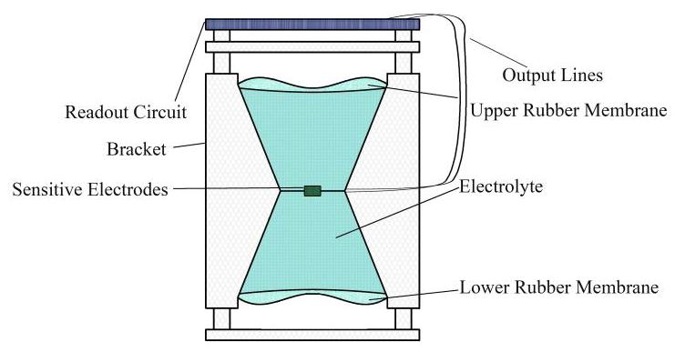

Fig. 1. Schematic diagram of MET structure.

The electrochemical seismometer (MET) is a high sensitivity sensor that detects seismic vibrations based on molecular electron transfer principles. Its core components include an electrochemical chamber, sensitive electrodes, electrolyte, and mechanical vibration pickup parts (rubber membranes and mass body), as shown in Fig. 1. The electrochemical chamber is a sealed plexiglass container housing porous sensitive electrodes (anode/cathode) and electrolyte containing active ions (e.g., iodide ions). The electrolyte is encapsulated by rubber membranes.

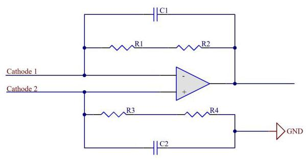

Fig. 2. Readout circuit of MET.

The readout circuit, illustrated in Fig. 2, employs an AD706 operational amplifier to convert the weak differential current from MET electrodes into voltage signals.

Seismic waves induce mechanical deformation, driving electrolyte flow and altering ion concentration distribution in the electrode region, thereby modulating the current density of electrode reactions. The current variation is converted into voltage signals via weak-current detection circuits, then processed by preamplifier and signal conditioning modules to output electrical signals reflecting seismic vibrations.

The overall transfer function of MET can be expressed as the coupling between the mechanical vibration pickup and the electrochemical-fluid system [22], as shown in Eq. (1).

$$
H\left( s\right)  = {H}_{\text{ mech }}\left( s\right)  \cdot  {H}_{\mathrm{{ec}}}\left( s\right) \tag{1}
$$

where ${H}_{\text{ mech }}\left( s\right)$ is the transfer function of the mechanical vibration pickup part, and ${H}_{\mathrm{{ec}}}\left( s\right)$ is the transfer function of the fluid mechanics and electrochemical conversion part.

The mechanical vibration pickup is approximated as a linear system during transfer function analysis, resembling a solid-state damped, driven harmonic oscillator, as shown in Eq. (2). It should be noted that experiments indicate this linear approximation is only valid for small magnitudes, while significant drift occurs under large magnitudes.

$$
\frac{{d}^{2}V}{d{t}^{2}} + \frac{{R}_{\mathrm{h}}{S}_{\mathrm{{ch}}}}{\rho L}\frac{dV}{dt} + \frac{{k}_{\mathrm{r}}}{\rho L}V =  - {S}_{\mathrm{{ch}}}a \tag{2}
$$

where $V$ is the fluid volume through the channel, $a$ is the external vibration acceleration, ${S}_{\mathrm{{ch}}}$ is the channel cross-sectional area, ${k}_{\mathrm{r}}$ is the membrane elasticity coefficient, $\rho$ is the electrolyte density, $L$ denotes the channel length, and ${R}_{\mathrm{h}}$ is the hydrodynamic resistance [23]. The characteristics of the electrochemical-fluid system are primarily governed by the Navier-Stokes equation, Nernst-Planck equation, and Butler-Volmer equation, as shown in Eq. (3).

$$
\left\{  \begin{array}{l} \rho \left( {\frac{\partial \mathbf{u}}{\partial t} + \left( {\mathbf{u} \cdot  \nabla }\right) \mathbf{u}}\right)  =  - \nabla P + \mu {\nabla }^{2}\mathbf{u} \\  \nabla  \cdot  \mathbf{u} = 0 \\  \frac{\partial c}{\partial t} + \nabla  \cdot  \left( {-D\nabla c + c\mathbf{u}}\right)  = 0 \end{array}\right. \tag{3}
$$

where $\rho$ denotes the fluid density, $\mathbf{u}$ represents the flow velocity vector, $P$ is the pressure, $\mu$ indicates the dynamic viscosity, $c$ stands for the ion concentration, and $D$ corresponds to the diffusion coefficient.

From Eq. (2), the transfer function of ${H}_{\text{ mech }}$ can be expressed as Eq. (4), where $Q = \frac{dV}{dt}$ denotes the volumetric flow rate, ${S}_{\mathrm{{ch}}}$ represents the channel cross-sectional area, ${k}_{\mathrm{r}}$ is the elastic coefficient of the membrane, $\rho$ indicates the electrolyte density, $L$ denotes the channel length, and ${R}_{\mathrm{h}}$ stands for the hydrodynamic resistance [23]. Through theoretical analysis, Eq. (3) is approximated as a first-order lag model shown in Eq. (5) [22].

$$
{H}_{\text{ mech }}\left( s\right)  = \frac{Q\left( s\right) }{v\left( s\right) } = \frac{-{S}_{\mathrm{{ch}}}s}{{s}^{2} + \frac{{R}_{\mathrm{h}}{S}_{\mathrm{{ch}}}}{\rho L}s + \frac{{k}_{\mathrm{r}}}{\rho L}} \tag{4}
$$

$$
{H}_{\mathrm{{ec}}}\left( s\right)  = \frac{I\left( s\right) }{Q\left( s\right) } = \frac{C}{1 + \frac{s}{{s}_{\mathrm{D}}}} \tag{5}
$$

where $v$ denotes the external vibration velocity, $I$ represents the current, $C$ is the sensitivity constant of the electrochemical reaction, and ${s}_{\mathrm{D}}$ stands for the time constant of the electrochemical reaction. Based on existing data analysis, the $H$ transfer function in the studied bandwidth is dominated by ${H}_{\text{ mech }}$ . The expression of $H$ used in this work is given by Eq. (6), which is equivalently rewritten as Eq. (7) for subsequent frequency response analysis.

$$
H\left( s\right)  = \frac{Q\left( s\right) }{v\left( s\right) } = \frac{{S}_{\mathrm{{ch}}}s}{{s}^{2} + \frac{{R}_{\mathrm{h}}{S}_{\mathrm{{ch}}}}{\rho L}s + \frac{{k}_{\mathrm{r}}}{\rho L}} \tag{6}
$$

$$
H\left( s\right)  = S\frac{4\pi \zeta \eta s}{{s}^{2} + {4\pi \zeta \eta s} + 4{\pi }^{2}{\eta }^{2}} \tag{7}
$$

where the natural frequency $\eta  = \frac{1}{2\pi }\sqrt{\frac{{k}_{\mathrm{r}}}{\rho L}}$ , sensitivity $S = \; {\rho L}/{R}_{\mathrm{h}}$ , and damping ratio $\zeta  = \frac{{R}_{\mathrm{h}}{S}_{\mathrm{{ch}}}}{2\sqrt{{\rho L}{k}_{\mathrm{r}}}}$ .

## B. Nonlinear Frequency Response Characteristics of MET

However, the MET exhibits significant nonlinearity due to the complex coupling effects between electrochemical reactions and fluid mechanics. Fig. 3 shows the frequency response of MET under different magnitudes (data from experiments in Section IV). When the input magnitude increases from ${0.24}\mathrm{\;m}/{\mathrm{s}}^{2}$ to ${6.0}\mathrm{\;m}/{\mathrm{s}}^{2}$ , the natural frequency shifts from ${34.2}\mathrm{\;{Hz}}$ to ${93.4}\mathrm{\;{Hz}}\left( {{173.1}\% \text{ variation }}\right)$ , while the sensitivity changes from ${60.6}\mathrm{\;V} \cdot  \mathrm{s}/\mathrm{m}$ to ${203.4}\mathrm{\;V} \cdot  \mathrm{s}/\mathrm{m}\left( {{254.6}\% \text{ variation }}\right)$ , indicating severe frequency response drift.

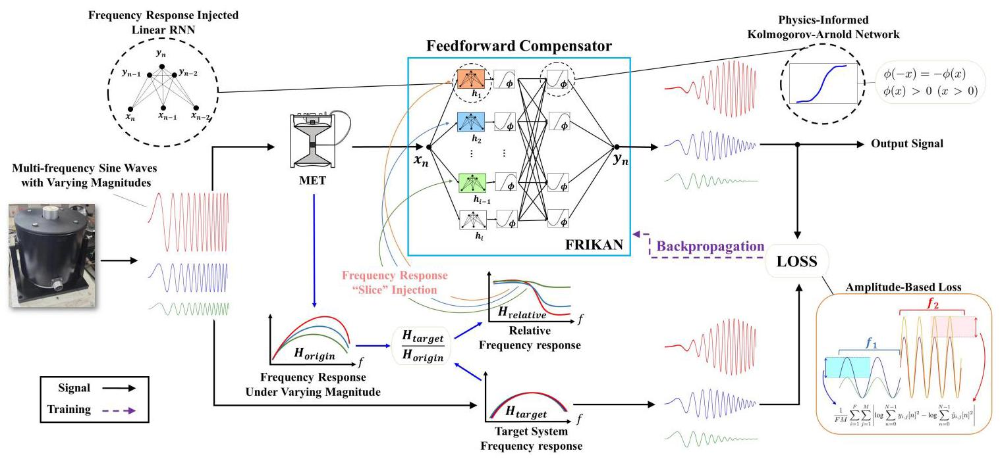

Fig. 4. Schematic of the FRIKAN compensation framework.

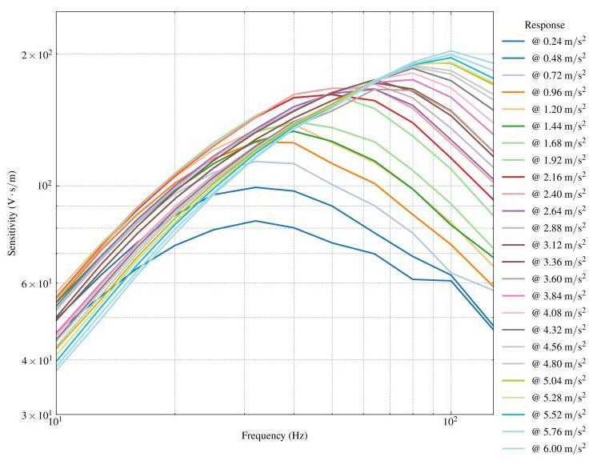

Fig. 3. The nonlinear frequency response characteristics of MET.

This nonlinearity causes distortion in seismic records, affecting the correct interpretation of seismic waveforms. In oil and gas exploration, it reduces seismic image resolution, ultimately impacting drilling decisions and resource assessment accuracy while increasing exploration risks and costs. Thus, addressing the MET nonlinearity is critical for improving seismic data quality and exploration efficiency.

## III. PROPOSED METHOD

The feedforward compensation architecture proposed in this study is illustrated in Fig. 4, inspired by the digital predistortion method for power amplifier linearization [7]. Its core concept is to compensate the MET output signal through a nonlinear compensator connected in series. Compared with traditional force feedback schemes, this architecture eliminates the need for additional mechanical feedback devices, avoiding stability issues caused by nonlinearity in force feedback systems, thus enabling operation under broader magnitude and bandwidth conditions.

Under the feedforward framework, we propose a frequency response informed Kolmogorov-Arnold network(FRIKAN). FRIKAN consists of two key components: a physics-constrained Kolmogorov-Arnold network (PIKAN) and a frequency response-injected linear RNN (FRIRNN). Prior to training, the frequency response prior is injected into FRIRNN. During training, multi-frequency multi-magnitude vibration signals are simultaneously input to the MET and an ideal linear system via a vibration table. The outputs of the ideal linear system and FRIKAN-compensated MET are compared to compute the loss function, which backpropagates to train FRIKAN weights.

## A. Physics-Constrained KAN Spline Activation Function

Selecting an appropriate neural network structure to represent the sensor input-output relationship is crucial for achieving a compensator with interpretability and strong generalization. Traditional MLP (multilayer perceptron) can only implicitly approximate the true calibration curve of the sensor through linear weights and fixed activation functions (e.g., ReLU, tanh), increasing training difficulty and overfitting risk while lacking interpretability. To address this, we introduce trainable B-spline activation functions via KAN to directly learn the sensor's calibration curve. Compared to MLP's indirect fitting using fixed-shape activation functions, PIKAN optimizes activation function shapes through learnable B-spline coefficients, enhancing single-neuron modeling capability for sensor nonlinearity [21]. Building upon KAN, we incorporate physics constraints such as odd symmetry and positivity, as shown in Eq. (8).

$$
\phi \left( x\right)  = \operatorname{sign}\left( x\right) \mathop{\sum }\limits_{{k = 1}}^{K}{c}_{k}{B}_{k}\left( \left| x\right| \right) ,{B}_{i}\left( x\right)  \geq  0\forall x \in  \mathbb{R},{c}_{k} \geq  0 \tag{8}
$$

where ${B}_{k}\left( x\right)$ denotes the B-spline basis function and ${c}_{k}$ represents the trainable weights. Through training, these weights can adaptively approximate the sensor calibration curve under the physics constraints:

1) Odd symmetry $\phi \left( {-x}\right)  =  - \phi \left( x\right)$ : Achieved by computing activation values using absolute input signals followed by sign recovery;

2) Positivity $\phi \left( x\right)  > 0\left( {x > 0}\right)$ : Enforced through nonnegative basis functions ${B}_{k}\left( \cdot \right)  \geq  0$ with constrained weights ${c}_{k} \geq  0$ , ensuring consistent input-output sign direction.

For MET sensors, the electrochemical-based input-output relationship exhibits specific symmetry and positivity characteristics. Incorporating corresponding mathematical constraints into the model may help maintain physically plausible predictions in data-sparse regions. Conventional MLPs can only implement soft constraints through penalty terms in the loss function, where constraint strength is difficult to balance during training. In contrast, KAN achieves structural constraints by directly restricting the B-spline coefficient space.

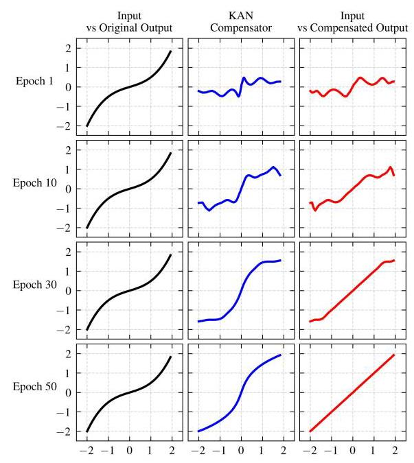

Fig. 5. Compensation results of a single KAN neuron for a typical third-order nonlinear system.

In terms of sensor characteristic modeling structure, MLP typically requires increasing network depth or neuron count when modeling complex nonlinear relationships. In contrast, the B-spline activation function adopted by KAN exhibits a piecewise polynomial structure, which shares mathematical similarity with the segmented response characteristics of MET sensors across different magnitude intervals. From a function approximation perspective, piecewise polynomials may offer parameter efficiency when modeling functions with interval-dependent variations. We simulated a single KAN neuron on a typical third-order nonlinear system $\left( {y = {k}_{1}x + {k}_{3}{x}^{3}}\right)$ with ${k}_{1} = \frac{1}{3}$ and ${k}_{3} = \frac{1}{6}$ . Fig. 5 demonstrates the nonlinear compensation effects under different training epochs. The left column shows input-original output relationships, the middle column displays KAN compensator outputs, and the right column presents input-compensated output relationships. The compensated output progressively restores ideal linearity during training (Epoch 10, 30, 50), validating the effectiveness of physics-informed constraints in the KAN compensator.

To address more complex MET nonlinear compensation, a multi-layer KAN structure in Eq. (9) [24] is employed. Given an input vector $\mathbf{x}$ , the output is $\operatorname{PIKAN}\left( \mathbf{x}\right)$ .

$$
\operatorname{PIKAN}\left( \mathbf{x}\right)  = \left( {{\mathbf{\Phi }}_{L - 1} \circ  {\mathbf{\Phi }}_{L - 2} \circ  \cdots  \circ  {\mathbf{\Phi }}_{0}}\right) \mathbf{x} \tag{9}
$$

where ${\mathbf{\Phi }}_{l}$ denotes the function matrix of the $l$ -th layer, whose element ${\phi }_{l, j, i}$ represents the physics-constrained activation function connecting the $i$ -th node in layer $l$ to the $j$ -th node in layer $l + 1$ , as defined in Eq. (8), and $L$ is the total number of KAN layers.

However, the standalone KAN cannot capture frequency domain information. Thus, we cascade a frequency response injection RNN (FRIRNN) before the KAN to provide frequency response prior.

B. FRIRNN with Quasi-Linear Frequency Response Slice (QLFRS) Injection

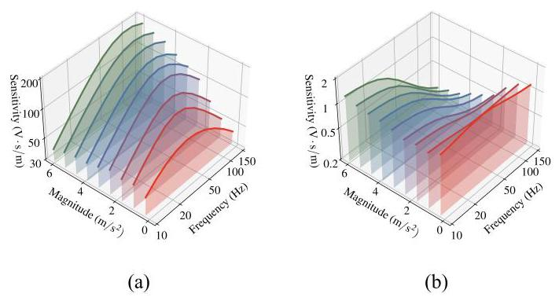

Fig. 6. QLFRS illustration. (a) QLFRS of the MET's frequency response. (b) QLFRS of the relative transfer function.

We propose a frequency response-injected recurrent neural network (FRIRNN) architecture that integrates frequency response prior, effectively addressing the compensation performance bottleneck caused by the lack of physical prior in existing models. The core concept of FRIRNN lies in linear approximation of the MET under local conditions. We define the approximated frequency response of MET at a single magnitude as quasi-linear frequency response slice (QLFRS), as shown in Fig. 6(a). Following the relative transfer function method of linear systems, we calculate the compensator's QLFRS (Fig. 6(b)). By injecting QLFRS into the neural network, we incorporate domain knowledge from signal processing, enhancing frequency-dependent compensation capability. Specifically, FRIRNN converts QLFRS parameters into initial weights of linear RNN and constructs parallel RNN layers with multiple QLFRS compensators.

The computational process for injecting QLFRS into the RNN is described below. First, the measured transfer function $\widetilde{H}$ is obtained by fitting the frequency response of the MET at a specific magnitude using Eq. (7). Compared with the ideal system, $\widetilde{H}$ exhibits nonlinear drift characterized by natural frequency $\widetilde{\eta }$ , sensitivity $\widetilde{S}$ at $\widetilde{\eta }$ , and damping ratio $\widetilde{\zeta }$ . To construct the target response, the transfer function $H$ of an ideal linear system is defined with preset parameters: natural frequency $\overset{ \circ  }{\eta }$ , sensitivity $S$ at $\overset{ \circ  }{\eta }$ , and damping ratio $\overset{ \circ  }{\zeta }$ .

Based on linear system theory, the compensation for a specific magnitude's frequency response can be achieved by connecting a relative transfer function $\overset{\rho }{H}$ in series with $\widetilde{H}$ , expressed as $\overset{ \circ  }{H} = \widetilde{H} \cdot  \overset{\rho }{H}$ . Here, $\overset{\rho }{H}$ represents the relative transfer function given in Eq. (10).

$$
\overset{\rho }{H}\left( s\right)  = \frac{\overset{ \circ  }{H}\left( s\right) }{\widetilde{H}\left( s\right) } = \frac{\overset{ \circ  }{S}\overset{ \circ  }{\zeta }\overset{ \circ  }{\eta }}{\widetilde{S}\widetilde{\zeta }\overset{ \circ  }{\eta }} \cdot  \frac{{s}^{2} + {4\pi }\widetilde{\zeta }\widetilde{\eta }s + 4{\pi }^{2}{\widetilde{\eta }}^{2}}{{s}^{2} + {4\pi }\overset{ \circ  }{\zeta }{\eta s} + 4{\pi }^{2}{\overset{ \circ  }{\eta }}^{2}} \tag{10}
$$

Subsequently, the continuous-domain transfer function $H\left( s\right)$ is mapped to the digital domain via bilinear transformation to obtain the IIR filter coefficients, whose form is given by Eq. (11).

(11)

$$
y\left\lbrack  n\right\rbrack   = {b}_{0}x\left\lbrack  n\right\rbrack   + {b}_{1}x\left\lbrack  {n - 1}\right\rbrack   + {b}_{2}x\left\lbrack  {n - 2}\right\rbrack
$$

$$
- {a}_{1}y\left\lbrack  {n - 1}\right\rbrack   - {a}_{2}y\left\lbrack  {n - 2}\right\rbrack
$$

where $y\left\lbrack  n\right\rbrack$ denotes the output at the $n$ -th time step, $x\left\lbrack  n\right\rbrack$ represents the input at the $n$ -th time step, ${b}_{0},{b}_{1},{b}_{2}$ are the zero coefficients of the filter, and ${a}_{1},{a}_{2}$ are the pole coefficients of the filter.

To enable gradient descent training for the IIR linear frequency response unit, we developed an activation-free linear RNN (LRNN) that fully represents the frequency response characteristics of second-order IIR filters. This LRNN with 4-dimensional hidden states can precisely map Eq. (11).

To achieve the IIR-to-LRNN conversion, we first transform the IIR system in Eq. (11) into a state-space model that matches the matrix form of RNNs. The state vector $\mathbf{z}\left\lbrack  n\right\rbrack$ is defined to include the delayed terms of both output and input in the IIR filter, with its formulation given by Eq. (12).

$$
\mathbf{z}\left\lbrack  n\right\rbrack   = {\left\lbrack  \begin{array}{llll} y\left\lbrack  {n - 1}\right\rbrack  & y\left\lbrack  {n - 2}\right\rbrack  & x\left\lbrack  {n - 1}\right\rbrack  & x\left\lbrack  {n - 2}\right\rbrack   \end{array}\right\rbrack  }^{\top } \tag{12}
$$

where $\mathbf{z}\left\lbrack  n\right\rbrack$ contains the delayed terms of the output and input. Then, based on this state vector, the state update equation of the system is shown in Eq. (13).

$$
\mathbf{z}\left\lbrack  {n + 1}\right\rbrack   = \mathbf{A}\mathbf{z}\left\lbrack  n\right\rbrack   + \mathbf{B}x\left\lbrack  n\right\rbrack \tag{13}
$$

where $\mathbf{A} \in  {\mathbb{R}}^{4 \times  4}$ and $\mathbf{B} \in  {\mathbb{R}}^{4 \times  1}$ denote the state transition matrix and input matrix, respectively. By comparing the difference equation (Eq. (11)) with the state update equation (Eq. (13)), we derive the explicit forms of these matrices as shown in Eq. (14).

$$
\mathbf{A} = \left\lbrack  \begin{matrix}  - {a}_{1} &  - {a}_{2} & {b}_{1} & {b}_{2} \\  1 & 0 & 0 & 0 \\  0 & 0 & 0 & 0 \\  0 & 0 & 1 & 0 \end{matrix}\right\rbrack  ,\;\mathbf{B} = \left\lbrack  \begin{array}{l} {b}_{0} \\  0 \\  1 \\  0 \end{array}\right\rbrack \tag{14}
$$

The output equation can also be expressed through the output matrix $\mathbf{C}$ and the direct transfer term $D$ of the state-space model, as shown in Eq. (15).

$$
y\left\lbrack  n\right\rbrack   = \mathbf{{Cz}}\left\lbrack  n\right\rbrack   + D \tag{15}
$$

In this model, $\mathbf{C} \in  {\mathbb{R}}^{1 \times  4}$ and $D \in  \mathbb{R}$ . By comparing with the difference equation (Eq. (11)), we derive the explicit forms of the output matrix and direct transmission term as shown in Eq. (16).

$$
\mathbf{C} = \left\lbrack  \begin{array}{llll}  - {a}_{1} &  - {a}_{2} & {b}_{1} & {b}_{2} \end{array}\right\rbrack  ,\;D = {b}_{0} \tag{16}
$$

Next, we consider transforming the state-space equation of the IIR into the standard RNN form. The state update equation of the standard RNN is shown in Eq. (17).

$$
\mathbf{h}\left\lbrack  {n + 1}\right\rbrack   = {\mathbf{W}}_{\text{ rec }}\mathbf{h}\left\lbrack  n\right\rbrack   + {\mathbf{W}}_{\text{ in }}x\left\lbrack  n\right\rbrack \tag{17}
$$

where $\mathbf{h}\left\lbrack  n\right\rbrack$ is the hidden state, ${\mathbf{W}}_{\text{ rec }}$ is the hidden-to-hidden weight matrix, and ${\mathbf{W}}_{\text{ in }}$ is the input-to-hidden weight matrix. To match the structure of the second-order IIR filter, we set the matrix dimensions as: $\mathbf{h} \in  {\mathbb{R}}^{4 \times  1},{\mathbf{W}}_{\text{ rec }} \in  {\mathbb{R}}^{4 \times  4}$ , and ${\mathbf{W}}_{\text{ in }} \in \; {\mathbb{R}}^{4 \times  1}$ .

Compared with Eq. (12), the hidden state $\mathbf{h}\left\lbrack  n\right\rbrack   = \mathbf{z}\left\lbrack  {n + 1}\right\rbrack$ can be obtained, which is expressed as shown in Eq. (18).

$$
\mathbf{h}\left\lbrack  n\right\rbrack   = {\left\lbrack  \begin{array}{llll} y\left\lbrack  n\right\rbrack  & y\left\lbrack  {n - 1}\right\rbrack  & x\left\lbrack  n\right\rbrack  & x\left\lbrack  {n - 1}\right\rbrack   \end{array}\right\rbrack  }^{\top } \tag{18}
$$

Through comparison, we establish the correspondence between the IIR filter and RNN: ${\mathbf{W}}_{\text{ rec }} = \mathbf{A},{\mathbf{W}}_{\text{ in }} = \mathbf{B}$ . Since the IIR filter output is a one-dimensional signal, we append a fully connected layer after the RNN to output the first element of the hidden state as the final result, ensuring consistency. The mathematical expression of LRNN is given by Eq. (19).

$$
\operatorname{LRNN}\left( {x\left\lbrack  n\right\rbrack  }\right)  = y\left\lbrack  n\right\rbrack   = {\mathbf{W}}_{\text{ out }}\mathbf{h}\left\lbrack  n\right\rbrack \tag{19}
$$

where ${\mathbf{W}}_{\text{ out }} \in  {\mathbb{R}}^{1 \times  4}$ is the weight matrix of the output layer.

where the input weights, output weights, and recurrent weights are defined as shown in Eq. (20).

$$
\left\{  \begin{array}{l} {\mathbf{W}}_{\text{ in }} = {\left\lbrack  \begin{array}{llll} {b}_{0} & 0 & 1 & 0 \end{array}\right\rbrack  }^{\top } \\  {\mathbf{W}}_{\text{ out }} = \left\lbrack  \begin{array}{llll} {1.0} & {0.0} & {0.0} & {0.0} \end{array}\right\rbrack  \\  {\mathbf{W}}_{\text{ rec }} = \left\lbrack  \begin{matrix}  - {a}_{1} &  - {a}_{2} & {b}_{1} & {b}_{2} \\  1 & 0 & 0 & 0 \\  0 & 0 & 0 & 0 \end{matrix}\right\rbrack  \\  {\mathbf{W}}_{\text{ out }} = \left\lbrack  \begin{array}{llll} 0 & 0 & 0 & 0 \\  0 & 0 & 1 & 0 \end{array}\right\rbrack   \end{array}\right. \tag{20}
$$

It can be proved that injecting stable IIR filter parameters into the RNN directly ensures its initial stability [25]. By connecting M FRIRNN kernels corresponding to different magnitude slices in parallel to process the same input $x\left\lbrack  n\right\rbrack$ , a single-input multi-output (SIMO) RNN kernel array with multi-core parallel structure is formed, as shown in Eq. (21).

$$
\operatorname{FRIRNN}\left( {x\left\lbrack  n\right\rbrack  }\right)  = \left\lbrack  \begin{matrix} {\operatorname{LRNN}}_{1}\left( {x\left\lbrack  n\right\rbrack  }\right) \\  {\operatorname{LRNN}}_{2}\left( {x\left\lbrack  n\right\rbrack  }\right) \\  \vdots \\  {\operatorname{LRNN}}_{M}\left( {x\left\lbrack  n\right\rbrack  }\right)  \end{matrix}\right\rbrack \tag{21}
$$

We employ a block diagonal matrix algorithm to implement the parallel computation of FRIRNN. The block diagonal matrix completes state updates for all slices through a single matrix multiplication, enhancing computational efficiency and reducing structural complexity compared to multiple matrix operations in individual kernels.

Use $m$ to denote a set of input amplitude slices as shown in Eq. (22).

$$
\mathbf{m} = \left\lbrack  {{m}_{1},{m}_{2},\cdots ,{m}_{j},\cdots ,{m}_{M}}\right\rbrack \tag{22}
$$

where $M$ denotes the number of magnitude slices. For each amplitude ${m}_{j}$ , the weight transformation formula in Eq. (20) converts it into corresponding FRIRNN kernel weights ${\mathbf{W}}_{\text{ rec }, j}^{\rho }$ and ${\mathbf{W}}_{\text{ in }, j}^{\rho }$ .

In the block diagonal matrix FRIRNN kernel array layer, the total hidden state vector $\mathcal{H}\left\lbrack  n\right\rbrack$ is the concatenation of the hidden states from all slices, as shown in Eq. (23).

$$
\mathcal{H}\left\lbrack  n\right\rbrack   = {\left\lbrack  \begin{array}{llll} {\mathbf{h}}_{1}\left\lbrack  n\right\rbrack  & {\mathbf{h}}_{j}\left\lbrack  n\right\rbrack  & \cdots & {\mathbf{h}}_{M}\left\lbrack  n\right\rbrack   \end{array}\right\rbrack  }^{\top } \in  {\mathbb{R}}^{{4M} \times  1} \tag{23}
$$

where ${\mathbf{h}}_{j}\left\lbrack  n\right\rbrack$ is the hidden state vector corresponding to the $j$ -th slice, and the state update equation of $\mathcal{H}\left\lbrack  n\right\rbrack$ can be expressed as:

$$
\mathcal{H}\left\lbrack  {n + 1}\right\rbrack   = {\mathcal{W}}_{\text{ rec }}\mathcal{H}\left\lbrack  n\right\rbrack   + {\mathcal{W}}_{\text{ in }}x\left\lbrack  n\right\rbrack \tag{24}
$$

where: ${\mathcal{W}}_{\text{ rec }} \in  {\mathbb{R}}^{{4M} \times  {4M}}$ is the block diagonal recursive weight matrix, as shown in Eq. (25).

$$
{\mathcal{W}}_{\text{ rec }} = \left\lbrack  \begin{matrix} {\mathbf{W}}_{\text{ rec },1}^{\rho } & \mathbf{0} & \cdots & \mathbf{0} \\  \mathbf{0} & {\mathbf{W}}_{\text{ rec }, j}^{\rho } & \cdots & \mathbf{0} \\  \vdots & \vdots &  \ddots  & \vdots \\  \mathbf{0} & \mathbf{0} & \cdots & {\mathbf{W}}_{\text{ rec }, M}^{\rho } \end{matrix}\right\rbrack \tag{25}
$$

where each ${\mathbf{W}}_{\text{ rec }, j}^{\rho } \in  {\mathbb{R}}^{4 \times  4}$ is the recurrent weight matrix corresponding to the $j$ -th amplitude slice.

${\mathcal{W}}_{\text{ in }} \in  {\mathbb{R}}^{{4M} \times  1}$ is the stacked form of the input weight vector, as shown in Eq. (26).

$$
{\mathcal{W}}_{\text{ in }} = \left\lbrack  \begin{matrix} \rho & {\mathbf{W}}_{\text{ in },1}^{\rho } & \vdots & {\mathbf{W}}_{\text{ in }, M}^{\rho } \end{matrix}\right\rbrack \tag{26}
$$

where each ${\mathbf{W}}_{\text{ in }, j}^{\rho } \in  {\mathbb{R}}^{4 \times  1}$ is the input weight matrix corresponding to the $j$ -th amplitude slice. The output vector of the multi-slice FRIRNN kernel array layer is shown in Eq. (27).

$$
\operatorname{FRIRNN}\left( {x\left\lbrack  n\right\rbrack  }\right)  = \mathbf{y}\left\lbrack  n\right\rbrack   = {\mathcal{W}}_{\text{ out }}\mathcal{H}\left\lbrack  n\right\rbrack   = \left\lbrack  \begin{matrix} {y}_{1}\left\lbrack  n\right\rbrack  \\  {y}_{j}\left\lbrack  n\right\rbrack  \\  \vdots \\  {y}_{M}\left\lbrack  n\right\rbrack   \end{matrix}\right\rbrack \tag{27}
$$

where ${\mathcal{W}}_{\text{ out }} \in  {\mathbb{R}}^{M \times  {4M}}$ is the output weight matrix, as shown in Eq. (28).

$$
{\mathcal{W}}_{\text{ out }} = \left\lbrack  \begin{matrix} {\mathbf{W}}_{\text{ out, }1}^{\rho } & \mathbf{0} & \cdots & \mathbf{0} \\  \mathbf{0} & {\mathbf{W}}_{\text{ out, }j}^{\rho } & \cdots & \mathbf{0} \\  \vdots & \vdots &  \ddots  & \vdots \\  \mathbf{0} & \mathbf{0} & \cdots & {\mathbf{W}}_{\text{ out, }M}^{\rho } \end{matrix}\right\rbrack \tag{28}
$$

where each ${\mathbf{W}}_{\text{ out }, j}^{\rho } \in  {\mathbb{R}}^{1 \times  4}$ is the output weight matrix corresponding to the $j$ -th amplitude slice.

Finally, the FRIRNN and PIKAN are connected in series to form the FRIKAN model for nonlinear compensation of the MET system's frequency response, as shown in Eq. (29).

$$
\operatorname{FRIKAN}\left( {x\left\lbrack  n\right\rbrack  }\right)  = \operatorname{PIKAN} \circ  \operatorname{FRIRNN}\left( {x\left\lbrack  n\right\rbrack  }\right) \tag{29}
$$

## C. Amplitude-Frequency Response MAE Loss Function

Conventional mean absolute error (MAE) and mean squared error (MSE) are widely adopted in regression tasks, but they primarily measure point-to-point error accumulation and often exhibit excessive sensitivity to high-frequency random noise. For nonlinear system modeling, greater emphasis is placed on the overall frequency response of signals. Therefore, we design amplitude-frequency mean absolute error (AFMAE) to quantify the discrepancy between compensated output and ideal output in the frequency domain.

To derive the expression of AFMAE, we first examine the energy-amplitude relationship of sinusoidal signals. For a sine wave $A\sin \left( {\omega t}\right)$ with period $T = \frac{2\pi }{\omega }$ , its energy $E$ can be expressed as Eq. (30).

$$
E = {\int }_{0}^{T}{A}^{2}{\sin }^{2}\left( {\omega t}\right) {dt} = \frac{1}{2}{A}^{2}T \tag{30}
$$

In the discrete case (sampling frequency ${f}_{s}$ , number of samples $N$ , thus $T = \frac{N}{{f}_{s}}$ ), the signal energy can be approximated by Eq. (31).

$$
E \approx  \frac{1}{{f}_{s}}\mathop{\sum }\limits_{{n = 0}}^{{N - 1}}{\left( y\left\lbrack  n\right\rbrack  \right) }^{2} \tag{31}
$$

Accordingly, the amplitude of the output signal can be written as $A \approx  \sqrt{\frac{2E}{T}}$ . For a sinusoidal input with amplitude ${m}_{j}$ at frequency ${f}_{i}$ , its frequency response is defined by Eq. (32).

$$
\left| {\widehat{H}\left( {{f}_{i},{m}_{j}}\right) }\right|  = \frac{\widehat{A}\left( {{f}_{i},{m}_{j}}\right) }{{m}_{j}} = \sqrt{\frac{2}{T}}\frac{\sqrt{\widehat{E}\left( {{f}_{i},{m}_{j}}\right) }}{{m}_{j}} \tag{32}
$$

$$
= \sqrt{\frac{2}{T{f}_{s}}}\frac{\sqrt{\mathop{\sum }\limits_{{n = 0}}^{{N - 1}}{\widehat{y}}_{i, j}{\left\lbrack  n\right\rbrack  }^{2}}}{{m}_{j}}
$$

where $\widehat{H}$ is the network-predicted frequency response, $\widehat{A}$ and $\widehat{E}$ are the network-predicted output amplitude and discrete energy estimate, respectively, and ${\widehat{y}}_{i, j}\left\lbrack  n\right\rbrack$ is the network-predicted sample under input amplitude ${m}_{j}$ and frequency ${f}_{i}$ .

To quantify the frequency response difference between the model prediction and the true output, the logarithmic difference between the true frequency response $H\left( {{f}_{i},{m}_{j}}\right)$ and the network-predicted frequency response $\widehat{H}\left( {{f}_{i},{m}_{j}}\right)$ is calculated, yielding Eq. (33).

$$
\log \left| {H\left( {{f}_{i},{m}_{j}}\right) }\right|  - \log \left| {\widehat{H}\left( {{f}_{i},{m}_{j}}\right) }\right|
$$

$$
= \log \sqrt{\frac{\mathop{\sum }\limits_{{n = 0}}^{{N - 1}}{y}_{i, j}{\left\lbrack  n\right\rbrack  }^{2}}{\mathop{\sum }\limits_{{n = 0}}^{{N - 1}}{\widehat{y}}_{i, j}{\left\lbrack  n\right\rbrack  }^{2}}} \tag{33}
$$

$$
= \frac{1}{2}\left( {\log \mathop{\sum }\limits_{{n = 0}}^{{N - 1}}{y}_{i, j}{\left\lbrack  n\right\rbrack  }^{2} - \log \mathop{\sum }\limits_{{n = 0}}^{{N - 1}}{\widehat{y}}_{i, j}{\left\lbrack  n\right\rbrack  }^{2}}\right)
$$

where $H$ denotes the true frequency response. Taking the logarithm ensures symmetric measurement of output differences on the logarithmic amplitude axis (dB scale), thereby balancing the loss when the predicted value exceeds or falls below the true value, while eliminating the need for ${m}_{j}$ computation.

Based on Eq. (33), we simplified the coefficients and subsequently defined ${\mathcal{L}}_{\text{ AFMAE }}$ as Eq. (34).

$$
{\mathcal{L}}_{\text{ AFMAE }} = \frac{1}{FM}\mathop{\sum }\limits_{{i = 1}}^{F}\mathop{\sum }\limits_{{j = 1}}^{M}\left| {\log \mathop{\sum }\limits_{{n = 0}}^{{N - 1}}{y}_{i, j}{\left\lbrack  n\right\rbrack  }^{2} - \log \mathop{\sum }\limits_{{n = 0}}^{{N - 1}}{\widehat{y}}_{i, j}{\left\lbrack  n\right\rbrack  }^{2}}\right|
$$

(34)

where $F$ is the sample count of frequencies involved in computation, and $M$ is the sample count of magnitudes. This method requires only a single energy calculation, efficiently characterizing the amplitude-frequency characteristics of the system.

In practical training, the weighted combination of MAE and AFMAE achieves optimal results. We introduce a weighting hyperparameter $\beta$ into the total loss function as shown in Eq. (35).

$$
{\mathcal{L}}_{\text{ total }} = \left( {1 - \beta }\right) {\mathcal{L}}_{\text{ MAE }} + \beta {\mathcal{L}}_{\text{ AFMAE }} \tag{35}
$$

## IV. EXPERIMENTATION AND RESULTS

A. Experimental Setup and Data Acquisition

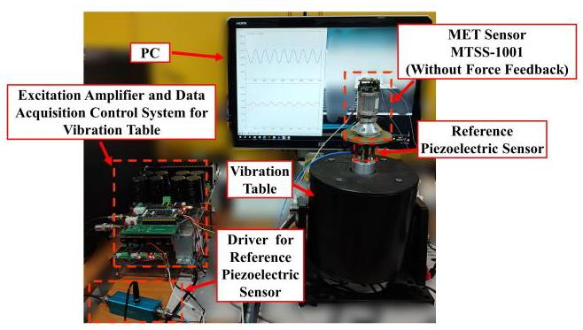

Fig. 7. Physical diagram of the experimental test setup.

As shown in Fig. 7, the vibration table generates vibration signals with varying magnitude and frequency, which are converted into electrical signals by the MET and recorded by the data acquisition system. Tab. I summarizes the experimental setup. The test specimen is an MTSS-1001 [26] electrochemical chamber without force feedback.

TABLE I EXPERIMENTAL SETUP.

<table><tr><td colspan="2">Experimental Setup</td></tr><tr><td>Vibration Table Distortion Rate</td><td>≤ 1%</td></tr><tr><td>Data Acquisition Resolution</td><td>16-bit</td></tr><tr><td>Environment Temperature</td><td>${25}^{ \circ  }\mathrm{C}$</td></tr><tr><td>Test Frequency Range</td><td>${10} \sim  {128}\mathrm{\;{Hz}}$</td></tr><tr><td>Magnitude Range</td><td>${0.24} \sim  {6.0}\mathrm{\;m}/{\mathrm{s}}^{2}$</td></tr><tr><td>Sampling Frequency</td><td>2000 Hz</td></tr><tr><td>Number of Frequency Sequences $F$</td><td>13</td></tr><tr><td>Number of Amplitude Sequences $M$</td><td>25</td></tr><tr><td>Sampling Points per Sequence $N$</td><td>8000</td></tr></table>

To evaluate the performance of FRIKAN, we compare it with four representative nonlinear compensation techniques. First is the conventional Wiener model, a Volterra series-based method widely used for nonlinear system modeling. Next are two improved RNN models: LSTM and GRU. LSTM (long short-term memory) excels in capturing long-term dependencies through independent memory cells and forget gates. GRU (gated recurrent unit) has a more compact structure by merging forget and input gates into update gates, achieving higher computational efficiency.

Finally, the physics-informed digital predistortion model RVTDCNN [19] incorporates physical priors by mapping temperature, I/Q signals, and high-order power terms into 2D feature maps via real-valued time-delay convolutional networks, demonstrating notable efficacy in PA linearization. Notably, since the MET cannot be expressed as explicit PDEs, standard PDE-based PINNs are inapplicable. Thus, RVTDCNN with physics-prior fusion is selected as the comparative model for generalized physics-inspired methods.

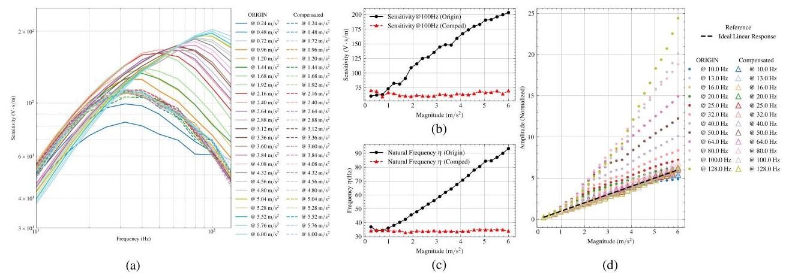

Fig. 8. Effectiveness of FRIKAN(h8u616) in suppressing frequency drift. (a) Comparison of frequency response curves before and after compensation by the FRIKAN model at different magnitudes. (b) Sensitivity (@100 Hz) comparison before and after compensation. (c) Natural frequency $\eta$ comparison before and after compensation. (d) Improvement of input-output curves by FRIKAN.

## B. Dataset and Training

The dataset can be represented by a $F \times  M$ matrix $\mathcal{D}$ as shown in Eq. (36), where $i = 1,\ldots , F$ denotes the frequency index ${f}_{i}, j = 1,\ldots , M$ represents the magnitude index ${m}_{j}$ , and $n = 0,\ldots , N - 1$ indicates the sampling point index of the output signal sequence.

$$
\mathcal{D} = \left\{  {\left. \left( {{\widetilde{\mathbf{Y}}}_{i, j},{\overset{ \circ  }{\mathbf{Y}}}_{i, j}}\right) \right| \;i = 1,\ldots , F, j = 1,\ldots , M}\right\} \tag{36}
$$

$$
\left\{  \begin{array}{l} {\widetilde{\mathbf{Y}}}_{i, j} = \left\lbrack  {{\widetilde{y}}_{i, j}\left\lbrack  0\right\rbrack  ,{\widetilde{y}}_{i, j}\left\lbrack  1\right\rbrack  ,\ldots ,{\widetilde{y}}_{i, j}\left\lbrack  {N - 1}\right\rbrack  }\right\rbrack  \\  {\overset{ \circ  }{\mathbf{Y}}}_{i, j} = \left\lbrack  {{\overset{ \circ  }{y}}_{i, j}\left\lbrack  0\right\rbrack  ,{\overset{ \circ  }{y}}_{i, j}\left\lbrack  1\right\rbrack  ,\ldots ,{\overset{ \circ  }{y}}_{i, j}\left\lbrack  {N - 1}\right\rbrack  }\right\rbrack   \end{array}\right. \tag{37}
$$

In the dataset $\mathcal{D}$ , each element $\left( {{\widetilde{\mathbf{Y}}}_{i, j},{\overset{ \circ  }{\mathbf{Y}}}_{i, j}}\right)$ represents a pair of signal sequences: ${\widetilde{\mathbf{Y}}}_{i, j}$ denotes the measured MET compensated output sequence, while ${\overset{ \circ  }{\mathbf{Y}}}_{i, j}$ corresponds to the ideal linear system output at identical frequency and magnitude. Each sequence has a length of $N$ .

The data is normalized to the range $- 1 \sim  1$ before training. Each time series (length $N$ ) is sliced into subsequences of length $N/2$ , with random sampling for the training and test sets. The model is trained on TensorFlow using the Adam optimizer, with a batch size of 260000 and 30000 training epochs. A learning rate strategy combining cosine annealing, exponential decay, and periodic restart is employed as in Eq. (38), where the initial maximum learning rate ${\alpha }_{\max }$ is 0.002, the annealing period ${K}_{\cos }$ is 100, the decay factor $\gamma$ is 0.9, and the learning rate resets every ${K}_{\text{ restart }}\left( {5000}\right)$ epochs. The loss function weight coefficient $\beta$ is set to 0.2 .

$$
\alpha \left( k\right)  = {\alpha }_{\max } \cdot  \frac{1}{2}\left\lbrack  {1 + \cos \left( \frac{{2\pi }\left( {k{\;\operatorname{mod}\;{K}_{\cos }}}\right) }{{K}_{\cos }}\right) }\right\rbrack   \cdot  {\gamma }^{\left\lfloor  k/{K}_{\cos }\right\rfloor  }, \tag{38}
$$

## C. Nonlinear Compensation Effect of FRIKAN on MET

The hyperparameters of FRIKAN include the relative frequency response injection quantity $h$ of FRIRNN layer, the layer count $l$ and unit number $u$ of PIKAN, the order of B-spline activation function, and the grid count of B-spline. These hyperparameters were determined through systematic parameter scanning on real-world data, ultimately selecting a configuration with grid count 8 and B-spline order 2. Additionally, we designed three FRIKAN variants with varying parameter scales: FRIKANh6u613(Small), FRIKANh6u614(Medium), and FRIKANh8u616(Large), to accommodate different performance requirements and resource constraints.

Fig.8(a) illustrates the convergence of the compensated frequency response curves.The amplitude-frequency loss function AFMAE focuses on holistic frequency-domain characteristics, manifested in Fig. 8(b) as sensitivity drift suppression (93.95%), outperforming the force feedback solution [5] (65.30%). The frequency response injection mechanism of FRIRNN provides the network with prior knowledge of frequency response nonlinearity. Fig. 8(c) demonstrates its significant improvement on the natural frequency drift (96.45%). For standardized comparison under varying frequency and sensitivity conditions, test data underwent sensitivity normalization, converting ideal linear input-output characteristics to unity-slope lines. As shown in Fig. 8(d), input-output nonlinearity suppression reaches 95.41%, surpassing traditional force feedback [6] (88.66%).

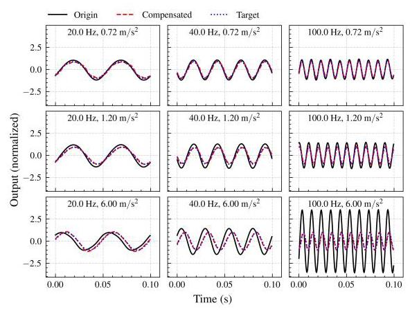

Fig. 9. Time-domain outputs of the FRIKAN compensator under different frequency and magnitude conditions.

To validate FRIKAN's time-domain performance, Fig. 9 displays representative waveforms across ${10}\mathrm{\;{Hz}}$ to ${128}\mathrm{\;{Hz}}$ with varying magnitudes.

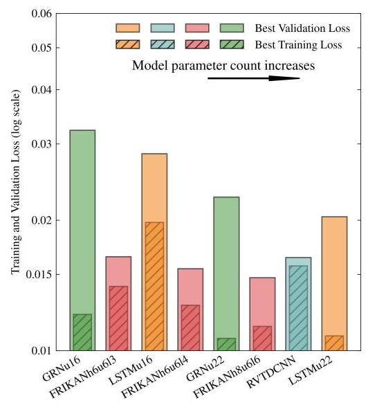

Fig. 10. Training loss and validation loss across different models.

Fig. 10 shows that FRIKAN achieves lower validation loss than GRU and LSTM under comparable parameter counts.

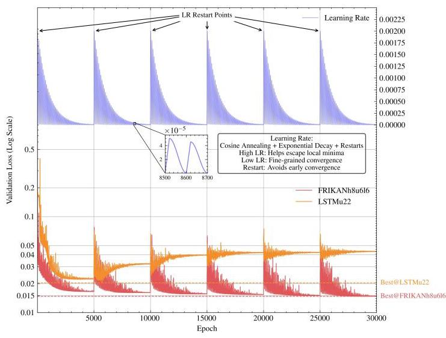

Fig. 11. Validation loss versus learning rate.

The physics constraint introduced by PIKAN enhances model generalization, with Fig. 11 showing FRIKAN's suppression of LSTM's overfitting.

As shown in Tab.II, the proposed FRIKAN models achieve state-of-the-art performance across different scales. At the medium scale, FRIKANh6u614 demonstrates significant improvements in all three key metrics: input-output nonlinearity suppression (IONS) reaches 95.41% (vs 89.74% in LSTMu16), sensitivity drift suppression (SDS) achieves 93.95% (vs 85.40% in LSTMu22), and natural frequency drift suppression (NFDS) attains 96.45%. The large-scale FRIKANh8u616 further improves NFDS to 96.59%. While RVTDCNN performs competitively on NFDS(93.82%), it un-derperforms FRIKAN models in both IONS and SDS.

TABLE II

MODEL PERFORMANCE COMPARISON, IONS: INPUT-OUTPUT NONLINEARITY SUPPRESSION, SDS: SENSITIVITY DRIFT SUPPRESSION, NFDS: NATURAL FREQUENCY DRIFT SUPPRESSION.

<table><tr><td>Scale</td><td>Method</td><td>IONS</td><td>SDS</td><td>NFDS</td><td>Params</td></tr><tr><td></td><td>WIENER</td><td>46.29%</td><td>55.54%</td><td>-18.37%</td><td>-</td></tr><tr><td rowspan="3">Small</td><td>GRNu16</td><td>86.70%</td><td>76.47%</td><td>91.33%</td><td>1,201</td></tr><tr><td>FRIKANh6u6l3</td><td>95.34%</td><td>92.59%</td><td>95.67%</td><td>1,303</td></tr><tr><td>LSTMu16</td><td>89.74%</td><td>84.32%</td><td>92.95%</td><td>1,441</td></tr><tr><td rowspan="2">Medium</td><td>FRIKANh6u6l4</td><td>95.41%</td><td>93.95%</td><td>96.45%</td><td>1,669</td></tr><tr><td>GRNu22</td><td>78.96%</td><td>84.57%</td><td>91.06%</td><td>2,179</td></tr><tr><td rowspan="3">Large</td><td>FRIKANh8u6l6</td><td>94.30%</td><td>93.14%</td><td>96.59%</td><td>2,569</td></tr><tr><td>RVTDCNN [19]</td><td>81.77%</td><td>77.58%</td><td>93.82%</td><td>2,595</td></tr><tr><td>LSTMu22</td><td>72.20%</td><td>85.40%</td><td>91.51%</td><td>2,641</td></tr></table>

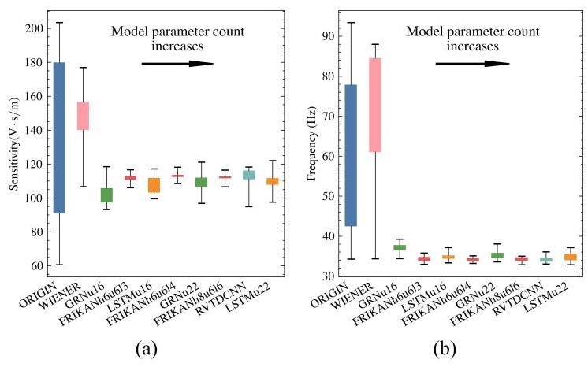

Fig. 12. (a) Sensitivity compensation distribution. (b) natural frequency compensation distribution.

Fig. 12(a) indicates FRIKAN's superior convergence in sensitivity distribution compared to other models. Fig. 12(b) demonstrates FRIKAN's optimal compensation for natural frequency $\eta$ , exhibiting maximal box-and-whisker convergence.

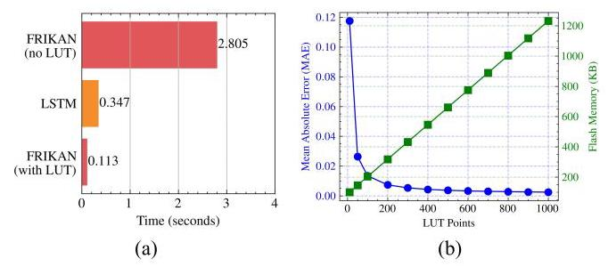

Fig. 13. (a) Inference latency comparison for 1000 points (b) LUT accuracy versus memory relationship.

We further evaluate FRIKAN's real-time feasibility for sensor applications. Benchmarking on STM32F405 shows FRIKAN's unaccelerated inference latency of 2.805 s, reduced to 0.113 s using an 800-point lookup table (LUT), outperforming LSTM's 0.347 s (Fig. 13(a)). When increasing LUT points to achieve MAE $< {0.005}$ , Flash usage remains below 550 KB (Fig. 13(b)). FRIKAN not only suppresses nonlinearity but also surpasses conventional models in computational efficiency, demonstrating deployment potential in resource-constrained embedded platforms.

## V. CONCLUSION

This paper proposes the FRIKAN nonlinear compensation framework by integrating frequency response physical priors with the structural advantages of Kolmogorov-Arnold networks, achieving three contributions: 1) In physics-data fusion, slicing relative frequency responses into RNN initial weights bridges expert knowledge and neural networks in the frequency domain; 2) Architecturally, physics-constrained trainable spline activation functions directly learn sensor calibration curves, enhancing individual neurons' nonlinear modeling capability; 3) For loss function design, the proposed AFMAE efficiently computes amplitude-frequency differences using energy metrics, overcoming traditional MAE's oversensitivity to high-frequency noise and enabling precise frequency-domain compensation.

Experimental results demonstrate that the FRIKAN model outperforms conventional methods in improving the input-output curve of electrochemical seismometers and suppressing frequency drift, significantly mitigating nonlinearity issues in electrochemical systems. This advancement promotes large-scale applications of electrochemical seismometers in oil/gas reservoir enhancement. Moreover, FRIKAN's low-compute requirement makes it promising for deployment on embedded platforms and large-scale sensor arrays.

Future research will integrate FRIKAN into the sensor interior and conduct large-scale multi-sensor field experiments to validate and further improve its nonlinear compensation performance in seismic imaging. Additionally, environmental factors (temperature, humidity) may affect the MET's nonlinearity. Investigating their impacts on FRIKAN's compensation efficacy and developing corresponding adaptive compensation methods remain critical future directions.

## REFERENCES

[1] H. Yang, A. Li, F. Zheng, D. Yang, H. Zhang, L. Zhang, and F. Bian, "Temperature adaptation for electrochemical seismometers based on dynamic feedback network," IEEE Transactions on Instrumentation and Measurement, pp. 1-1, 2025.

[2] A. T. Ringler, R. E. Anthony, R. C. Aster, C. J. Ammon, S. Arrowsmith, H. Benz, C. Ebeling, A. Frassetto, W.-Y. Kim, P. Koelemeijer, H. C. P. Lau, J. P. Montagner, P. G. Richards, D. P. Schaff, M. Vallee, W. Yeck, and V. Lekic, "Achievements and prospects of global broadband seismographic networks after 30 years of continuous geophysical observations," REVIEWS OF GEOPHYSICS, vol. 60, no. 3, SEP 2022.

[3] C. Xu, J. Wang, D. Chen, J. Chen, B. Liu, W. Qi, T. Liang, and X. She, "The mems-based electrochemical seismic sensor with integrated sensitive electrodes by adopting anodic bonding technology," IEEE Sensors Journal, vol. 21, no. 18, pp. 19833-19839, 2021.

[4] Z. Sun, T. Liang, L. Hu, M. Zhu, M. Zhang, Q. Liu, Y. Lu, J. Chen, D. Chen, and J. Wang, "Broadband electrochemical seismometer using a single silicon chip with four microelectrodes," IEEE TRANSACTIONS ON INSTRUMENTATION AND MEASUREMENT, vol. 74, 2025.

[5] G. Li, J. Wang, D. Chen, J. Chen, L. Chen, and C. Xu, "An Electrochemical, Low-Frequency Seismic Micro-Sensor Based on MEMS with a Force-Balanced Feedback System," SENSORS, vol. 17, no. 9, Sep. 2017.

[6] Z. Sun, G. Li, L. Chen, D. Chen, J. Wang, and J. Chen, "A high-consistency broadband mems-based electrochemical seismometer with integrated planar microelectrodes," IEEE TRANSACTIONS ON ELECTRON DEVICES, vol. 64, no. 9, pp. 3829-3835, SEP 2017.

[7] J. Wang, C. Jiang, R. Han, Q. Zhang, H. Chang, K. Zhou, and F. Liu, "Input Amplitude-Based Adaptive Tuning Neural Networks for Digital Predistortion of Doherty Power Amplifiers," IEEE TRANSACTIONS ON MICROWAVE THEORY AND TECHNIQUES, Sep. 2024.

[8] Z. Lu, L. Yang, B. Wang, K. Wu, Y. Li, and X. Zheng, "Predictive model-based correction of magnetic sensor array sway errors," IEEE TRANSACTIONS ON GEOSCIENCE AND REMOTE SENSING, vol. 62, 2024.

[9] L. Höfler, "Good results from sensor data: Performance of machine learning algorithms for regression problems in chemical sensors," Sensors and Actuators B: Chemical, vol. 421, p. 136528, 2024. [Online]. Available: https://www.sciencedirect.com/science/article/pii/ S0925400524012589

[10] T. Roy and D. Maiti, "An optimal and modified homotopy perturbation method for strongly nonlinear differential equations," NONLINEAR DYNAMICS, vol. 111, no. 16, pp. 15 215-15231, Aug. 2023.

[11] S. Jain and P. Tiso, "Model order reduction for temperature-dependent nonlinear mechanical systems: A multiple scales approach," JOURNAL OF SOUND AND VIBRATION, vol. 465, Jan. 2020.

[12] S. Shaw, S. Rosenberg, and O. Shoshani, "A hybrid averaging and harmonic balance method for weakly nonlinear asymmetric resonators," NONLINEAR DYNAMICS, vol. 111, no. 5, pp. 3969-3979, Mar. 2023.

[13] T. Hélie and B. Laroche, "Input/output reduced model of a damped nonlinear beam based on Volterra series and modal decomposition with convergence results," NONLINEAR DYNAMICS, vol. 105, no. 1, pp. 515-540, Jul. 2021.

[14] L. Sersour, T. Djamah, and M. Bettayeb, "Nonlinear system identification of fractional Wiener models," NONLINEAR DYNAMICS, vol. 92, no. 4, pp. 1493-1505, Jun. 2018.

[15] R. Anandanatarajan, U. Mangalanathan, and U. Gandhi, "Deep neural network-based linearization and cold junction compensation of thermocouple," IEEE TRANSACTIONS ON INSTRUMENTATION AND MEASUREMENT, vol. 72, 2023.

[16] B. Zhao, C. Cheng, Z. Peng, X. Dong, and G. Meng, "Detecting the Early Damages in Structures With Nonlinear Output Frequency Response Functions and the CNN-LSTM Model," IEEE TRANSACTIONS ON INSTRUMENTATION AND MEASUREMENT, vol. 69, no. 12, pp. 9557-9567, Dec. 2020.

[17] J. B. Thangamalar, R. Gomathi, S. Gopalakrishnan, and B. Jackson, "A two-stage linearized model for thermistor circuit linearization using Istm based multi-layer self-attention model," MEASUREMENT, vol. 246, MAR 31 2025.

[18] S. Wang, H. Wang, and P. Perdikaris, "On the eigenvector bias of Fourier feature networks: From regression to solving multi-scale PDEs with physics-informed neural networks," COMPUTER METHODS IN APPLIED MECHANICS AND ENGINEERING, vol. 384, Oct. 2021.

[19] A. Motaqi, M. Helaoui, N. Boulejfen, WH. Chen, and FM. Ghannouchi, "Artificial Intelligence-Based Power-Temperature Inclusive Digital Predistortion," IEEE TRANSACTIONS ON INDUSTRIAL ELECTRONICS, vol. 69, no. 12, pp. 13872-13880, Dec. 2022.

[20] J. Schmidt-Hieber, "The Kolmogorov-Arnold representation theorem revisited," Neural Networks, vol. 137, pp. 119-126, May 2021.

[21] IE. Livieris, "C-KAN: A New Approach for Integrating Convolutional Layers with Kolmogorov-Arnold Networks for Time-Series Forecasting," MATHEMATICS, vol. 12, no. 19, Oct. 2024.

[22] H. Huang, V. Agafonov, and H. Yu, "Molecular electric transducers as motion sensors: A review," SENSORS, vol. 13, no. 4, pp. 4581-4597, APR 2013.

[23] V. Agafonov, A. Neeshpapa, and A. Shabalina, "Electrochemical seismometers of linear and angular motion," Springer Berlin Heidelberg, 2015.

[24] Z. Liu, Y. Wang, S. Vaidya, F. Ruehle, J. Halverson, M. Soljačić, T. Y. Hou, and M. Tegmark, "Kan: Kolmogorov-arnold networks," 2025. [Online]. Available: https://arxiv.org/abs/2404.19756

[25] B. Hayes, J. Shier, G. Fazekas, A. McPherson, and C. Saitis, "A review of differentiable digital signal processing for music and speech synthesis," FRONTIERS IN SIGNAL PROCESSING, vol. 3, JAN 11 2024.

[26] R-Sensors LLC, "MTSS-1001 Geophone," http://r-sensors.ru/en/ products/geophones/mtss-1001-eng, 2024, accessed: 2024-05-12.

Ang Li received the B.S. degree in instrumentation science and technology from Jilin University, China, in 2020, where he is currently pursuing the Ph.D. degree. His research interests include physics-informed neural networks for sensor signal processing, nonlinear compensation of geophysical instruments, embedded AI implementation for sensing systems, and electrochemical seismometer technology.

Hongyuan Yang received the Ph.D. degree in geophysical exploration and information technology from Jilin University, Changchun, China, in 2009. He was a Visiting Scholar with the University of Houston, Houston, TX, USA, from 2017 to 2018. He is currently a Professor with the College of Instrumentation and Electrical Engineering, Jilin University. His research interests include development of seismic exploration instrument, wireless seismic data acquisition, and seismic data processing.

Huaizhu Zhang received the B.S. degree in Mecha-tronics Engineering in 1998 from Jilin University of Technology, and the Ph.D. degree in 2008 from Changchun Institute of Optics and Machinery, Chinese Academy of Sciences. He was a Visiting Scholar with the University of Houston, Houston, TX, USA, from 2018 to 2019. He is currently an Associate Professor with the College of Instrumentation and Electrical Engineering, Jilin University. His research interests include seismic instruments, data acquisition and signal processing.

Linhang Zhang received the Ph.D. degree in Earth exploration & information technology from Jilin University, Changchun, China, in 2007. He was a Visiting Scholar with the University of Houston, Houston, TX, USA, from 2019 to 2020. He is currently an Associate Professor with the College of Instrumentation and Electrical Engineering, Jilin University. His research interests include development of seismic exploration instrument, wireless seismic data acquisition, and seismic data processing.

Fan Zheng received the Ph.D. degree in circuits and systems from Jilin University, Changchun, China, in 2008. He was a Visiting Scholar with Uppsala University, Uppsala, Sweden, from 2016 to 2017. He is currently an Associate Professor with the College of Instrumentation and Electrical Engineering, Jilin University. His research interests include development of seismic exploration instrument, wireless seismic data acquisition, and seismic data processing.

Xunqian Tong received the Ph.D. degree from Jilin University, China, in 2016. He was a cotutelle student in Macquarie University, Australia under the CSC sponsor from 2014 to 2016. He is currently an Associate Professor with the College of Instrumentation & Electrical Engineering, Jilin University. His research interests include IOT protocol design and LPWAN performance analysis.

Can Liu is currently pursuing the Ph.D. degree at Jilin University. He received the Master's degree in Instrument Science and Technology from North University of China in 2022. His research interests include sensor signal processing and nonlinear compensation techniques for geophysical instruments.

Ruojin Li received the B.S. degree in instrumentation science and technology from Jilin University, China, in 2024, where she is currently pursuing the Ph.D. degree. Her research interests include application of sensor signal processing, zero-phase correction of geophysical instruments , and force feedback technology in seismic sensing systems.

Click here to access/download

Supplemental Material

README for Supplementary Code.pdf

Click here to access/download Supplemental Material Supplementary Code.7z