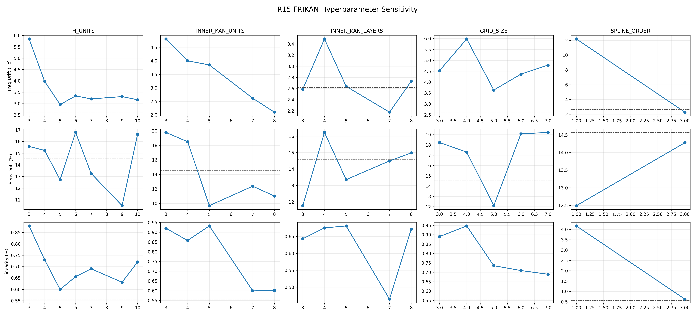
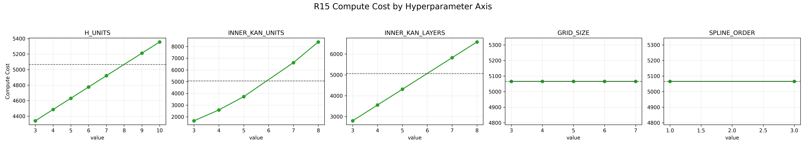

# Wiener-KAN 超参数敏感性专题过程稿

## 写作目标

本稿用于收束 R15 超参数敏感性实验的正式结果，服务于论文中 “Hyperparameter sensitivity / robustness analysis” 小节，并直接回应 TIM 审稿意见中“需要覆盖主要超参数以证明鲁棒性和稳定性”的要求。

本稿只保留可进入总稿的稳定内容：实验设计、控制变量、正式取值口径、结果表、可视化引用和论文写法边界。一次性的训练中断、显卡切换、日志流水账不进入正文，只在任务报告中保留。

## 1. 实验对象与语义边界

本专题固定同一个 Wiener-KAN / FRIKAN 基线：

- `projects/09_HPARAM_SENSITIVITY/FRIKANh8u6l6g8s2_e1k_lr7e4_base`

基线结构记为 `h8u6l6g8s2`，其中：

- `h` 对应 `H_UNITS`，即 Wiener/IIR 前端输出到 KAN 主体的隐状态通道数；
- `u` 对应 `INNER_KAN_UNITS`，即 KAN 内部宽度；
- `l` 对应 `INNER_KAN_LAYERS`，即 KAN 主体堆叠深度；
- `g` 对应 `GRID_SIZE`，即样条基网格数；
- `s` 对应 `SPLINE_ORDER`，即样条阶数。

这组实验比较的是**同一 Wiener-KAN 设计内的单因素超参数敏感性**，不是重新做横向模型对比，也不是重新搜索最优学习率。正文中不能把它写成“全局 exhaustive search”，而应写成围绕 canonical baseline 的 controlled one-factor sweep。

## 2. 控制变量与扫描范围

所有项目保持以下条件不变：

- 训练轮数：`epoch_train = 1000`
- 学习率：`learning_rate = 7e-4`
- 损失函数：基线 `MAE+AFMAE` 组合损失
- 数据集、输入窗口、缩放器、评估链路与基线一致
- 每个变体独立放在 `projects/09_HPARAM_SENSITIVITY/` 下，禁止在同一 project 上覆盖配置反复重训

扫描按单因素展开：

| Axis | Baseline | Scanned values | 解释 |
| --- | ---: | --- | --- |
| `H_UNITS` | 8 | 3, 4, 5, 6, 7, 9, 10 | 改变 Wiener 前端传给 KAN 的隐状态维度 |
| `INNER_KAN_UNITS` | 6 | 3, 4, 5, 7, 8 | 改变 KAN 主体宽度 |
| `INNER_KAN_LAYERS` | 6 | 3, 4, 5, 7, 8 | 改变 KAN 主体深度 |
| `GRID_SIZE` | 8 | 3, 4, 5, 6, 7 | 改变样条网格分辨率 |
| `SPLINE_ORDER` | 2 | 1, 3 | 改变样条阶数 |

> 注：表中不重复列出 baseline 值本身；正式作图和每个轴的小表都应把 baseline 作为虚线或参考行一起展示。

## 3. 正式数据来源与复现入口

本专题的唯一正式后处理入口为：

```powershell
conda run --no-capture-output -n tf26 python cli.py ep "compare/hparam_sensitivity_r15"
```

该入口读取：

- manifest：`projects/09_HPARAM_SENSITIVITY/R15_projects.tsv`
- 训练状态：`projects/09_HPARAM_SENSITIVITY/R15_training_status.tsv`
- 每个项目的统一指标：`projects/09_HPARAM_SENSITIVITY/<project>/data/metrics.json`

并输出：

- `ex_projects/compare/hparam_sensitivity_r15/data/summary.json`
- `ex_projects/compare/hparam_sensitivity_r15/data/summary.csv`
- `ex_projects/compare/hparam_sensitivity_r15/data/summary.md`
- `ex_projects/compare/hparam_sensitivity_r15/data/sensitivity_curves.png`
- `ex_projects/compare/hparam_sensitivity_r15/data/compute_cost.png`

当前可直接引用的两张专题图为：





## 4. 指标口径

正文应只使用统一指标文件中的以下字段：

- `freq_drift_hz`：写作显示为 `Freq Drift (Hz)`，表示带限拟合中心频率漂移；
- `sens_drift_percent`：写作显示为 `Sens Drift (%)`，表示指定频点灵敏度漂移；
- `linearity_percent`：写作显示为 `Linearity (%)`，表示 `<=128 Hz` 带内平均线性度误差；
- `compute_cost`：写作显示为 `Compute Cost`，表示当前静态推理成本估计，不等同于板端实测时延。

对三项物理误差，数值越小越好；对 `Compute Cost`，数值越小表示静态估算成本越低。`GRID_SIZE` 与 `SPLINE_ORDER` 的一个重要现象是：在当前 LUT 部署成本估计中，只要 `H/U/L` 不变，`compute_cost` 保持为 `5066`，因此它们主要改变训练后的拟合质量，而不改变当前 LUT 后推理成本估计。

## 5. 总体结果摘要

基线结果为：

| Project | Freq Drift (Hz) | Sens Drift (%) | Linearity (%) | Compute Cost |
| --- | ---: | ---: | ---: | ---: |
| `FRIKANh8u6l6g8s2_e1k_lr7e4_base` | 2.6221 | 14.5689 | 0.5570 | 5066 |

五条轴的总体摘要如下：

| Axis | Complete | Best Freq | Best Sens | Best Linearity | Compute Cost Pattern |
| --- | ---: | --- | --- | --- | --- |
| `H_UNITS` | 7/7 | `FRIKANh5u6l6g8s2_e1k_lr7e4_axisH` (2.9568) | `FRIKANh9u6l6g8s2_e1k_lr7e4_axisH` (10.4979) | `FRIKANh5u6l6g8s2_e1k_lr7e4_axisH` (0.5994) | 4341 - 5356 |
| `INNER_KAN_UNITS` | 5/5 | `FRIKANh8u8l6g8s2_e1k_lr7e4_axisU` (2.0998) | `FRIKANh8u5l6g8s2_e1k_lr7e4_axisU` (9.6899) | `FRIKANh8u7l6g8s2_e1k_lr7e4_axisU` (0.5993) | 1664 - 8384 |
| `INNER_KAN_LAYERS` | 5/5 | `FRIKANh8u6l7g8s2_e1k_lr7e4_axisL` (2.1767) | `FRIKANh8u6l3g8s2_e1k_lr7e4_axisL` (11.7714) | `FRIKANh8u6l7g8s2_e1k_lr7e4_axisL` (0.4648) | 2798 - 6578 |
| `GRID_SIZE` | 5/5 | `FRIKANh8u6l6g5s2_e1k_lr7e4_axisG` (3.6372) | `FRIKANh8u6l6g5s2_e1k_lr7e4_axisG` (12.0957) | `FRIKANh8u6l6g7s2_e1k_lr7e4_axisG` (0.6895) | constant 5066 |
| `SPLINE_ORDER` | 2/2 | `FRIKANh8u6l6g8s3_e1k_lr7e4_axisS` (2.2806) | `FRIKANh8u6l6g8s1_e1k_lr7e4_axisS` (12.4934) | `FRIKANh8u6l6g8s3_e1k_lr7e4_axisS` (0.6250) | constant 5066 |

当前 25 个计划点均已得到 `complete` 指标结果；早期在小显存设备上 OOM 的 `u7/u8/l7/l8/s3` 已在 RTX 2080 Ti 上训练完成。因此正式论文中不应继续把这些点写成“最终 OOM 点”，而应把显存边界作为实验执行历史或环境说明放在任务报告中。正文只需说明：更大的 `U/L/S` 会带来更高训练/推理成本，并不总是产生稳定收益。

## 6. 分轴结果

### H_UNITS

| Value | Project | Freq Drift (Hz) | Sens Drift (%) | Linearity (%) | Compute Cost | 结果解读 |
| ---: | --- | ---: | ---: | ---: | ---: | --- |
| 8 | `FRIKANh8u6l6g8s2_e1k_lr7e4_base` | 2.6221 | 14.5689 | 0.5570 | 5066 | baseline |
| 3 | `FRIKANh3u6l6g8s2_e1k_lr7e4_axisH` | 5.8467 | 15.5800 | 0.8788 | 4341 | 容量改变，未全面支配 baseline |
| 4 | `FRIKANh4u6l6g8s2_e1k_lr7e4_axisH` | 3.9782 | 15.2381 | 0.7298 | 4486 | 容量改变，未全面支配 baseline |
| 5 | `FRIKANh5u6l6g8s2_e1k_lr7e4_axisH` | 2.9568 | 12.7238 | 0.5994 | 4631 | 容量改变，未全面支配 baseline |
| 6 | `FRIKANh6u6l6g8s2_e1k_lr7e4_axisH` | 3.3389 | 16.7806 | 0.6560 | 4776 | 容量改变，未全面支配 baseline |
| 7 | `FRIKANh7u6l6g8s2_e1k_lr7e4_axisH` | 3.2066 | 13.2686 | 0.6905 | 4921 | 容量改变，未全面支配 baseline |
| 9 | `FRIKANh9u6l6g8s2_e1k_lr7e4_axisH` | 3.3085 | 10.4979 | 0.6312 | 5211 | 容量改变，未全面支配 baseline |
| 10 | `FRIKANh10u6l6g8s2_e1k_lr7e4_axisH` | 3.1691 | 16.6152 | 0.7203 | 5356 | 容量改变，未全面支配 baseline |

### INNER_KAN_UNITS

| Value | Project | Freq Drift (Hz) | Sens Drift (%) | Linearity (%) | Compute Cost | 结果解读 |
| ---: | --- | ---: | ---: | ---: | ---: | --- |
| 6 | `FRIKANh8u6l6g8s2_e1k_lr7e4_base` | 2.6221 | 14.5689 | 0.5570 | 5066 | baseline |
| 3 | `FRIKANh8u3l6g8s2_e1k_lr7e4_axisU` | 4.8083 | 19.7816 | 0.9205 | 1664 | 宽度降低会显著降低 cost，但物理指标变差 |
| 4 | `FRIKANh8u4l6g8s2_e1k_lr7e4_axisU` | 3.9999 | 18.5022 | 0.8577 | 2588 | 宽度降低会显著降低 cost，但物理指标变差 |
| 5 | `FRIKANh8u5l6g8s2_e1k_lr7e4_axisU` | 3.8476 | 9.6899 | 0.9324 | 3722 | 灵敏度单项改善，但频漂和线性度变差 |
| 7 | `FRIKANh8u7l6g8s2_e1k_lr7e4_axisU` | 2.6160 | 12.3730 | 0.5993 | 6620 | 2080 可训练，高容量但 cost 增长明显 |
| 8 | `FRIKANh8u8l6g8s2_e1k_lr7e4_axisU` | 2.0998 | 11.0143 | 0.6014 | 8384 | 频漂最优之一，但线性度与 cost 不占优 |

### INNER_KAN_LAYERS

| Value | Project | Freq Drift (Hz) | Sens Drift (%) | Linearity (%) | Compute Cost | 结果解读 |
| ---: | --- | ---: | ---: | ---: | ---: | --- |
| 6 | `FRIKANh8u6l6g8s2_e1k_lr7e4_base` | 2.6221 | 14.5689 | 0.5570 | 5066 | baseline |
| 3 | `FRIKANh8u6l3g8s2_e1k_lr7e4_axisL` | 2.5880 | 11.7714 | 0.6430 | 2798 | 较低 cost，频漂和灵敏度接近或优于 baseline，但线性度变差 |
| 4 | `FRIKANh8u6l4g8s2_e1k_lr7e4_axisL` | 3.4905 | 16.2274 | 0.6752 | 3554 | 深度不足时三项指标整体变差 |
| 5 | `FRIKANh8u6l5g8s2_e1k_lr7e4_axisL` | 2.6401 | 13.3563 | 0.6810 | 4310 | 灵敏度改善，但频漂和线性度不占优 |
| 7 | `FRIKANh8u6l7g8s2_e1k_lr7e4_axisL` | 2.1767 | 14.4939 | 0.4648 | 5822 | 三项核心指标严格优于 baseline，但 cost 更高 |
| 8 | `FRIKANh8u6l8g8s2_e1k_lr7e4_axisL` | 2.7318 | 14.9822 | 0.6716 | 6578 | 更深并不稳定带来收益，且 cost 继续增加 |

### GRID_SIZE

| Value | Project | Freq Drift (Hz) | Sens Drift (%) | Linearity (%) | Compute Cost | 结果解读 |
| ---: | --- | ---: | ---: | ---: | ---: | --- |
| 8 | `FRIKANh8u6l6g8s2_e1k_lr7e4_base` | 2.6221 | 14.5689 | 0.5570 | 5066 | baseline |
| 3 | `FRIKANh8u6l6g3s2_e1k_lr7e4_axisG` | 4.5274 | 18.2340 | 0.8900 | 5066 | LUT cost 不变，主要影响拟合质量 |
| 4 | `FRIKANh8u6l6g4s2_e1k_lr7e4_axisG` | 5.9801 | 17.3043 | 0.9466 | 5066 | LUT cost 不变，主要影响拟合质量 |
| 5 | `FRIKANh8u6l6g5s2_e1k_lr7e4_axisG` | 3.6372 | 12.0957 | 0.7350 | 5066 | 灵敏度改善，但频漂和线性度变差 |
| 6 | `FRIKANh8u6l6g6s2_e1k_lr7e4_axisG` | 4.3664 | 19.0807 | 0.7092 | 5066 | LUT cost 不变，主要影响拟合质量 |
| 7 | `FRIKANh8u6l6g7s2_e1k_lr7e4_axisG` | 4.7827 | 19.2147 | 0.6895 | 5066 | LUT cost 不变，主要影响拟合质量 |

### SPLINE_ORDER

| Value | Project | Freq Drift (Hz) | Sens Drift (%) | Linearity (%) | Compute Cost | 结果解读 |
| ---: | --- | ---: | ---: | ---: | ---: | --- |
| 2 | `FRIKANh8u6l6g8s2_e1k_lr7e4_base` | 2.6221 | 14.5689 | 0.5570 | 5066 | baseline |
| 1 | `FRIKANh8u6l6g8s1_e1k_lr7e4_axisS` | 12.1937 | 12.4934 | 4.1679 | 5066 | 一阶样条明显恶化频漂和线性度 |
| 3 | `FRIKANh8u6l6g8s3_e1k_lr7e4_axisS` | 2.2806 | 14.2774 | 0.6250 | 5066 | 频漂和灵敏度略优，但线性度不占优 |

## 7. 关键结论与论文写法

### 7.1 基线不是脆弱偶然点

大多数单轴扰动不会让三项物理指标同时显著崩塌。特别是 `H_UNITS`、`GRID_SIZE` 与 `SPLINE_ORDER` 的可训练点显示：改变容量或样条表达能力会带来指标波动，但原始 `h8u6l6g8s2` 仍是一个稳定的工程折中点。

建议正文写法：

> The proposed configuration is not an isolated fragile optimum; most one-factor perturbations around the baseline remain trainable and yield comparable physical calibration metrics.

### 7.2 存在一个高成本更优点，但不能替代基线叙事

当前唯一在三项核心物理指标上严格优于基线的点是：

| Project | Axis | Value | Freq Drift (Hz) | Sens Drift (%) | Linearity (%) | Compute Cost |
| --- | --- | ---: | ---: | ---: | ---: | ---: |
| `FRIKANh8u6l7g8s2_e1k_lr7e4_axisL` | `INNER_KAN_LAYERS` | 7 | 2.1767 | 14.4939 | 0.4648 | 5822 |

它把频漂、灵敏度漂移和线性度都压低到基线以下，但 `Compute Cost` 从 `5066` 增加到 `5822`。因此总稿中应将其写作“更深 KAN 主体可以进一步改善校准，但会提高复杂度”，而不是直接否定 baseline。

建议正文写法：

> Increasing the KAN depth to seven layers further improves all three physical metrics, at the cost of a higher static inference estimate. We therefore keep the original configuration as the default accuracy-complexity trade-off, while reporting the deeper variant as a high-capacity alternative.

### 7.3 `GRID_SIZE` 和 `SPLINE_ORDER` 的部署成本结论最清晰

在 `H/U/L` 保持不变时：

- `GRID_SIZE = 3,4,5,6,7,8` 对应的 `Compute Cost` 均为 `5066`；
- `SPLINE_ORDER = 1,2,3` 对应的 `Compute Cost` 也均为 `5066`。

这说明当前 LUT 成本模型主要由前端通道数、KAN 宽度和层数决定，样条网格密度与阶数主要影响训练后的函数形状，而不是当前 LUT 后的静态推理成本估计。

建议正文写法：

> Grid size and spline order primarily affect the learned static nonlinearity, while the LUT-based inference estimate remains unchanged when the network width and depth are fixed.

### 7.4 宽度和深度的收益需要同时看指标与成本

`INNER_KAN_UNITS = 8` 给出最低的 `Freq Drift = 2.0998 Hz`，但 `Linearity = 0.6014%` 略差于基线且 `Compute Cost = 8384`。`INNER_KAN_LAYERS = 7` 是更均衡的高容量候选点，但同样带来成本增长。因此正文中不应只按单项指标排序，而应明确这是一个多目标折中问题。

## 8. 可直接吸收进总稿的段落草案

> To evaluate the robustness of the proposed Wiener-KAN configuration, we performed a one-factor hyperparameter sensitivity analysis around the canonical `h8u6l6g8s2` baseline. The training epoch, learning rate, loss function, dataset split, and evaluation pipeline were fixed, while one of the five main hyperparameters was changed at a time: the Wiener feature dimension (`H_UNITS`), KAN width (`INNER_KAN_UNITS`), KAN depth (`INNER_KAN_LAYERS`), spline grid size, and spline order. All reported values were recomputed through the unified `metrics.json` pipeline and summarized by the dedicated `hparam_sensitivity_r15` comparison task.
>
> The baseline achieved `Freq Drift = 2.62 Hz`, `Sens Drift = 14.57%`, `Linearity = 0.557%`, and `Compute Cost = 5066`. Across the one-factor sweep, most nearby configurations remained trainable and produced comparable physical metrics, indicating that the proposed configuration is not a fragile isolated optimum. A deeper KAN variant (`INNER_KAN_LAYERS = 7`) further reduced all three physical errors, but increased the static inference estimate from `5066` to `5822`. We therefore retain the baseline as the default accuracy-complexity trade-off and report the deeper variant as a high-capacity alternative. In contrast, changing the spline grid size or spline order did not change the current LUT-based compute-cost estimate, confirming that these parameters mainly affect the learned static nonlinearity rather than the deployed inference path.

## 9. 写作边界

1. 不要写成“全局调参搜索”或“找到理论最优超参数”；本实验是围绕 canonical baseline 的单因素敏感性分析。
2. 不要只展示单项最优；必须同时展示 `Freq Drift`、`Sens Drift`、`Linearity` 和 `Compute Cost`。
3. 早期 OOM 是训练环境历史，不再是当前最终结果；最终稿应以 `summary.json` 中 25 个 complete 点为准。
4. `Compute Cost` 是静态估计，不是 Keil 实测吞吐；如果要写板端速度，必须另接 MCU deployment 专题。
5. `GRID_SIZE` / `SPLINE_ORDER` 不改变当前 LUT cost 的结论只在 `H/U/L` 不变和当前成本模型下成立。

## 10. 相关文件

- 方法规范：`docs/reference/paper_hyperparameter_sensitivity_method.md`
- 指标规范：`docs/reference/paper_metric_calculation_method.md`
- 训练规范：`docs/reference/training.md`
- 项目清单：`projects/09_HPARAM_SENSITIVITY/R15_projects.tsv`
- 后处理配置：`ex_projects/compare/hparam_sensitivity_r15/config.json`
- 结构化结果：`ex_projects/compare/hparam_sensitivity_r15/data/summary.json`
- Markdown 结果：`ex_projects/compare/hparam_sensitivity_r15/data/summary.md`
