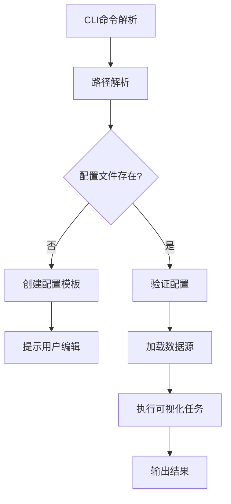

# EP (External Project) 架构文档

## 概述

EP (External Project) 是 MET Nonlinear 项目中的拓展项目管理系统，通过 `python cli.py ep` 命令提供工程化的拓展项目解决方案。该系统采用基于配置文件的智能执行机制，实现了拓展项目任务的标准化管理和自动化执行。

## 设计目标

1. **工程化拓展项目管理**：提供标准化的拓展项目结构和配置管理
2. **智能执行**：自动检测配置文件，不存在时创建模板，存在时直接执行
3. **拓展工程支持**：不仅负责可视化，还负责除了神经网络本身工程之外的所有拓展工程
3. **多格式路径支持**：支持完整路径、相对路径、简化路径等多种输入格式
4. **任务类型管理**：支持多种可视化任务类型的模板化配置
5. **数据源抽象**：基于JSON数据的轻量级可视化，无需加载完整模型

## 系统架构

### 1. 核心组件架构

```
EP System Architecture
├── CLI Interface Layer (cli.py)
│   ├── Main CLI Parser (core/cli_parser.py)
│   └── EP Subcommand Handler
├── Command Processing Layer
│   ├── External CLI Handler (core/external_cli_handler.py)
│   ├── Path Parser (core/external_path_parser.py)
│   └── Task Dispatcher (core/task_dispatcher.py)
├── Configuration Management Layer
│   ├── Template Generator
│   ├── Config Validator
│   └── JSON Schema Manager
├── External Project Engine Layer
│   ├── Frequency Response Comparator (visualization/frequency_response_json_comparator.py)
│   ├── Data Analysis Engine
│   ├── Model Export Engine
│   ├── Performance Benchmark Engine
│   └── Generic External Project Framework
└── Data Access Layer
    ├── Linear Response Data Loader
    ├── Project Data Manager
    └── Result Output Manager
```

### 2. 模块职责分析

#### 2.1 CLI接口层 (CLI Interface Layer)

**文件位置**: `cli.py`, `core/cli_parser.py`

**核心功能**:
- 解析命令行参数，识别 `ep` 子命令
- 参数验证和格式化
- 向后兼容性保证

**关键代码片段**:
```python
# cli.py
if hasattr(args, 'command') and args.command == 'ep':
    from core.external_cli_handler import handle_ep_command
    handle_ep_command(args)

# core/cli_parser.py
ep_parser = subparsers.add_parser('ep', help='拓展项目管理 (External Project)')
ep_parser.add_argument('ep_project_path', 
                        help='拓展项目路径，格式: project/task-type/task-name 或 project/task-name')
```

#### 2.2 命令处理层 (Command Processing Layer)

**文件位置**: `core/external_cli_handler.py`, `core/external_path_parser.py`

**核心功能**:
- 处理 ep 子命令的所有操作
- 解析多种路径格式
- 智能执行逻辑

**智能执行流程**:
```python
def handle_ep_command(args: CLIArgs) -> None:
    """智能执行逻辑：
    1. 解析拓展项目路径
    2. 检查配置文件是否存在
    3. 如果不存在，创建配置模板并提示用户编辑
    4. 如果存在，直接执行可视化任务
    """
```

**路径解析支持**:
1. **完整训练项目格式**: `projects/{project_name}/external/{task_type}/{task_name}`
2. **相对训练项目格式**: `{project_name}/{task_type}/{task_name}`
3. **简化训练项目格式**: `{project_name}/{task_name}`
4. **独立拓展项目格式**: `external/projects/{task_type}/{task_name}`
5. **绝对路径格式**: 任意绝对路径

#### 2.3 配置管理层 (Configuration Management Layer)

**核心功能**:
- 基于任务类型的配置模板生成
- JSON 配置文件验证
- 动态配置参数管理

**支持的任务类型**:
- `freq-response-compare`: 频率响应对比
- `bias-visualization`: 偏置可视化
- `waveform-analysis`: 波形分析

**配置模板示例**:
```json
{
  "task_info": {
    "task_type": "freq-response-compare"
  },
  "visualization_config": {
    "layout": "side_by_side",
    "freq_range": [10, 200],
    "output_format": "png",
    "dpi": 300,
    "figsize": [12, 8],
    "title": "LSTMu32al_rs300_ex2 频率响应对比"
  },
  "data_sources": [
    {
      "project": "LSTMu32al_rs300_ex2",
      "state": "origin",
      "label": "补偿前"
    },
    {
      "project": "LSTMu32al_rs300_ex2",
      "state": "compensation",
      "label": "补偿后"
    }
  ]
}
```

#### 2.4 可视化引擎层 (Visualization Engine Layer)

**文件位置**: `visualization/frequency_response_json_comparator.py`, 等

**核心功能**:
- 基于JSON数据的轻量级可视化
- 多种布局模式支持 (overlay, side_by_side)
- 高性能数据处理和缓存

**数据状态枚举**:
```python
class DataState(Enum):
    ORIGIN = "origin"          # 补偿前数据
    COMPENSATION = "compensation"  # 补偿后数据

class LayoutMode(Enum):
    OVERLAY = "overlay"
    SIDE_BY_SIDE = "side_by_side"
```

#### 2.5 数据访问层 (Data Access Layer)

**核心功能**:
- 从 `linear_response.json` 文件加载数据
- 数据缓存和性能优化
- 项目数据完整性验证

**数据加载流程**:
```python
class LinearResponseDataLoader:
    def load_project_data(self, project_name: str) -> Dict[str, Any]:
        """加载项目的线性响应数据"""
        json_path = os.path.join(self.projects_root, project_name, "data", "linear_response.json")
        # 验证数据完整性
        required_fields = ['gains_origin', 'gains_comped', 'magnitudes', 'frequencies']
```

## 工作流程

### 1. 典型使用流程

```bash
# 1. 创建配置模板
python cli.py ep LSTMu32al_rs300_ex2/freq-response-compare/baseline-comparison

# 2. 编辑配置文件
# 系统提示编辑: projects/LSTMu32al_rs300_ex2/external/freq-response-compare/baseline-comparison/config.json

# 3. 执行拓展项目任务
python cli.py ep LSTMu32al_rs300_ex2/freq-response-compare/baseline-comparison
```

### 2. 内部执行流程



### 3. 路径解析流程

```python
# 输入路径示例
"LSTMu32al_rs300_ex2/freq-response-compare/baseline-comparison"

# 解析结果
ExternalPath(
    project_name="LSTMu32al_rs300_ex2",
    task_type="freq-response-compare", 
    task_name="baseline-comparison",
    full_path=Path("projects/LSTMu32al_rs300_ex2/external/freq-response-compare/baseline-comparison"),
    config_path=Path("projects/LSTMu32al_rs300_ex2/external/freq-response-compare/baseline-comparison/config.json"),
    output_path=Path("projects/LSTMu32al_rs300_ex2/external/freq-response-compare/baseline-comparison/output")
)
```

## 技术特性

### 1. 智能执行机制

- **自动模板生成**: 配置文件不存在时自动创建相应的模板
- **增量执行**: 配置存在时直接执行，避免重复配置
- **错误恢复**: 提供详细的错误信息和修复建议

### 2. 多格式路径支持

- **灵活输入**: 支持完整路径、相对路径、简化路径
- **自动检测**: 智能识别路径格式和任务类型
- **路径标准化**: 统一的内部路径表示

### 3. 配置驱动架构

- **模板化配置**: 基于任务类型的配置模板
- **JSON Schema**: 结构化的配置验证
- **参数化控制**: 通过配置文件控制所有可视化参数

### 4. 轻量级数据访问

- **JSON数据源**: 直接读取 `linear_response.json` 文件
- **无模型依赖**: 不需要加载完整的深度学习模型
- **高性能缓存**: 数据缓存机制优化重复访问

## 项目结构

### 1. 代码组织结构

```
├── cli.py                                          # 主CLI入口
├── core/
│   ├── cli_parser.py                              # CLI参数解析
│   ├── external_cli_handler.py               # EP命令处理器
│   ├── visualization_path_parser.py               # 路径解析器
│   └── task_dispatcher.py                         # 任务分发器
├── visualization/
│   ├── frequency_response_json_comparator.py      # 频率响应对比器
│   ├── projects/                                  # 独立可视化项目
│   │   └── freq-response-compare/
│   └── __init__.py
└── projects/                                      # 训练项目
    └── {project_name}/
        ├── data/
        │   └── linear_response.json                # 线性响应数据
        └── visualization/
            └── {task_type}/
                └── {task_name}/
                    ├── config.json                 # 配置文件
                    └── output/                     # 输出目录
```

### 2. 数据流结构

```
Data Flow Architecture
├── Training Projects (/projects/{project_name}/data/linear_response.json)
│   ├── gains_origin: 补偿前增益数据
│   ├── gains_comped: 补偿后增益数据
│   ├── magnitudes: 震级数据
│   └── frequencies: 频率数据
├── Configuration Files (/projects/{project_name}/visualization/{task_type}/{task_name}/config.json)
│   ├── task_info: 任务元信息
│   ├── visualization_config: 可视化参数
│   └── data_sources: 数据源规范
└── Output Results (/projects/{project_name}/visualization/{task_type}/{task_name}/output/)
    ├── Generated Plots
    ├── Analysis Reports
    └── Metadata Files
```

## 扩展性设计

### 1. 新任务类型添加

添加新的可视化任务类型需要：

1. **在 `visualization_path_parser.py` 中添加任务类型**:
   ```python
   SUPPORTED_TASK_TYPES = [
       'freq-response-compare',
       'bias-visualization', 
       'waveform-analysis',
       'new-task-type'  # 新增
   ]
   ```

2. **在 `visualization_cli_handler.py` 中添加模板生成器**:
   ```python
   def _create_new_task_template(vis_path: VisualizationPath) -> dict:
       return {
           "task_info": {"task_type": "new-task-type"},
           "visualization_config": {...},
           "data_sources": [...]
       }
   ```

3. **实现对应的可视化引擎**:
   ```python
   class NewTaskVisualizer:
       def execute(self, config: dict) -> bool:
           # 实现具体的可视化逻辑
           pass
   ```

### 2. 数据源扩展

当前系统主要基于 `linear_response.json` 数据，可扩展支持：

- **多种数据格式**: CSV, HDF5, Parquet
- **实时数据源**: API 接口, 数据库连接
- **分布式数据**: 集群数据, 云存储

### 3. 输出格式扩展

支持更多输出格式：

- **交互式可视化**: Plotly, Bokeh
- **动态图表**: GIF, MP4
- **3D可视化**: Three.js, VTK

## 性能特性

### 1. 数据加载优化

- **懒加载**: 按需加载数据文件
- **缓存机制**: 内存缓存已加载的数据
- **数据验证**: 启动时验证数据完整性

### 2. 可视化性能

- **矢量图形**: 支持高分辨率输出
- **批量处理**: 支持多任务并行执行
- **资源管理**: 自动清理临时文件

### 3. 内存管理

- **流式处理**: 大数据集分块处理
- **垃圾回收**: 及时释放不需要的数据
- **资源监控**: 内存使用情况追踪

## 监控和日志

### 1. 日志系统

```python
logger = logging.getLogger('ep')
logger.info(f"🎯 开始处理拓展项目: {args.ep_project_path}")
logger.info(f"📂 项目信息:")
logger.info(f"   项目名称: {ep_path.project_name}")
logger.info(f"   任务类型: {ep_path.task_type}")
logger.info(f"✅ 任务执行完成")
```

### 2. 错误处理

- **详细错误信息**: 包含具体的错误位置和原因
- **恢复建议**: 提供问题解决方案
- **优雅降级**: 部分功能失败时继续执行其他任务

### 3. 性能监控

- **执行时间追踪**: 记录各阶段执行时间
- **资源使用监控**: CPU, 内存, 磁盘使用情况
- **任务成功率统计**: 成功/失败任务统计

## 总结

EP系统是一个设计良好的工程化拓展项目解决方案，具有以下核心优势：

1. **工程化标准**: 标准化的项目结构和配置管理
2. **智能化执行**: 自动模板生成和智能执行流程
3. **高度可扩展**: 模块化设计支持新功能快速添加
4. **性能优化**: 轻量级数据访问和高效缓存机制
5. **用户友好**: 直观的命令行界面和详细的错误提示

该系统成功地将复杂的深度学习模型可视化任务工程化，为研究人员和工程师提供了一个高效、标准化的可视化工具链。通过配置驱动的架构设计，用户可以专注于分析结果而非技术实现细节，大大提高了工作效率。

系统的模块化设计也为未来的功能扩展奠定了良好的基础，可以轻松添加新的可视化任务类型、数据源和输出格式，满足不断变化的业务需求。