# Exploring Kolmogorov-Arnold Networks for Interpretable Time Series Classification

# 探索用于可解释时间序列分类的柯尔莫哥洛夫 - 阿诺德网络

Irina Barašin, Blaž Bertalanič, Mihael Mohorčić and Carolina Fortuna

伊琳娜·巴拉辛、布拉日·贝塔尔拉尼奇、米哈伊尔·莫霍尔契奇和卡罗琳娜·福尔图纳

Department of Communication Systems, Jožef Stefan Institute

通信系统系，约瑟夫·施特凡研究所

Jamova ulica 39, 1000 Ljubljana, Slovenia

斯洛文尼亚卢布尔雅那市亚莫瓦街39号，邮编1000

irina.barasin@gmail.com, \{blaz.bertalanic, miha.mohorcic, carolina.fortuna\}@ijs.si

irina.barasin@gmail.com，\{blaz.bertalanic, miha.mohorcic, carolina.fortuna\}@ijs.si

Abstract-Time series classification is a relevant step supporting decision-making processes in various domains, and deep neural models have shown promising performance in this respect. Despite significant advancements in deep learning, the theoretical understanding of how and why complex architectures function remains limited, prompting the need for more interpretable models. Recently, the Kolmogorov-Arnold Networks (KANs) have been proposed as a more interpretable alternative to deep learning. While KAN-related research is significantly rising, to date, the study of KAN architectures for time series classification has been limited. In this paper, we aim to conduct a comprehensive and robust exploration of the KAN architecture for time series classification utilising 117 datasets from UCR benchmark archive, from multiple different domains. More specifically, we investigate a) the transferability of reference architectures designed for regression to classification tasks, b) identifying the hyperparameter and implementation configurations for an architecture that best generalizes across 117 datasets, c) the associated complexity trade-offs and d) evaluate KANs interpretability. Our results demonstrate that (1) the Efficient KAN outperforms MLPs in both performance and training times, showcasing its suitability for classification tasks. (2) Efficient KAN exhibits greater stability than the original KAN across grid sizes, depths, and layer configurations, especially when lower learning rates are employed. (3) KAN achieves competitive accuracy compared to state-of-the-art models such as HIVE-COTE2 and InceptionTime, while maintaining smaller architectures and faster training times, highlighting its favorable balance of performance and transparency. (4) The interpretability of the KAN model, as confirmed by SHAP analysis, reinforces its capacity for transparent decision-making.

摘要 - 时间序列分类是支持各领域决策过程的重要步骤，深度神经模型在这方面已展现出良好性能。尽管深度学习取得了显著进展，但对复杂架构如何以及为何起作用的理论理解仍然有限，这促使人们需要更具可解释性的模型。最近，柯尔莫哥洛夫 - 阿诺德网络(KANs)被提出作为深度学习的一种更具可解释性的替代方案。虽然与KAN相关的研究显著增加，但迄今为止，针对时间序列分类的KAN架构研究仍然有限。在本文中，我们旨在利用来自UCR基准存档的117个数据集，从多个不同领域对用于时间序列分类的KAN架构进行全面而稳健的探索。更具体地说，我们研究了a)为回归设计的参考架构向分类任务的可迁移性，b)确定在117个数据集上最佳泛化的架构的超参数和实现配置，c)相关的复杂度权衡，以及d)评估KANs的可解释性。我们的结果表明:(1)高效KAN在性能和训练时间方面均优于多层感知器(MLP)，展示了其对分类任务的适用性。(2)在网格大小、深度和层配置方面，高效KAN比原始KAN表现出更高的稳定性，特别是在采用较低学习率时。(3)与诸如HIVE - COTE2和InceptionTime等先进模型相比，KAN实现了具有竞争力的准确率，同时保持了较小的架构和更快的训练时间，突出了其在性能和透明度方面的良好平衡。(4)如SHAP分析所证实的，KAN模型的可解释性增强了其透明决策的能力。

Index Terms-classification, time series, Kolmogorov Arnold networks, multilayer perceptrons

关键词 - 分类，时间序列，柯尔莫哥洛夫 - 阿诺德网络，多层感知器

## I. INTRODUCTION

## I. 引言

Time series classification is a relevant step supporting decision-making processes in various domains. For instance, in healthcare time series classification enables the diagnosis and monitoring of conditions by analyzing patterns in physiological signals such as electrocardiograms or brain activity [1]. In finance, it enhances risk management and fraud detection by classifying trading behaviors and transaction patterns [2]. By classifying activities based on sensor data in human activity recognition, it supports personalized recommendations and safety monitoring [3]. In remote sensing, it contributes to environmental monitoring and land use classification by categorizing satellite or aerial imagery data over time [4]. In these fields, accurate time series classification plays a central role in advancing predictive and analytic capabilities that drive critical decisions.

时间序列分类是支持各领域决策过程的重要步骤。例如，在医疗保健领域，时间序列分类通过分析心电图或脑活动等生理信号中的模式，实现疾病的诊断和监测[1]。在金融领域，它通过对交易行为和交易模式进行分类，增强风险管理和欺诈检测[2]。在人类活动识别中，通过基于传感器数据对活动进行分类，它支持个性化推荐和安全监测[3]。在遥感领域，它通过对卫星或航空图像数据随时间进行分类，有助于环境监测和土地利用分类[4]。在这些领域中，准确的时间序列分类在提升驱动关键决策的预测和分析能力方面发挥着核心作用。

Unlike time series forecasting, which aims to predict future data points, time series classification aims to provide accurate interpretation and categorization of temporal data sequences by assigning a categorical label or a class label to each sequence [5]. Following a well-accepted survey [6] that revealed the lack of investigation of deep learning techniques for time series classification, significant progress has been achieved in related research with hundreds of new works, some of them surpassing the non-deep state of the art [7]. According to the most recent and extensive benchmarking work on more than 100 datasets from the UCR archive, the most extensive benchmark for time series classification, the state of the art F1 score of 0.886 is achieved by Hive-Cote2 [8, 9], a large ensemble with considerable training time. The non-deep and non-hybrid classification methods that are more explainable at both feature engineering and decision making steps achieve F1 of up to 0.869 while the deep architectures reach around 0.88 F1 score. Foundation models for time series, based on transformers, are yet to be studied on cross-domain benchmarks such as UCR [10].

与旨在预测未来数据点的时间序列预测不同，时间序列分类旨在通过为每个序列分配一个类别标签或类标签，对时间数据序列进行准确的解释和分类[5]。一项广泛认可的调查[6]揭示了对时间序列分类深度学习技术研究的不足，随后相关研究取得了显著进展，涌现出数百篇新作品，其中一些超越了非深度学习的现有技术水平[7]。根据对UCR存档中100多个数据集进行的最新且广泛的基准测试工作(这是时间序列分类最广泛的基准测试)，最先进的Hive - Cote2[8, 9](一个大型集成模型，训练时间较长)实现了0.886的F1分数。在特征工程和决策步骤上更具可解释性的非深度学习和非混合分类方法，F1分数最高可达0.869，而深度架构的F1分数约为0.88。基于Transformer的时间序列基础模型尚未在UCR等跨域基准测试中得到研究[10]。

Despite the disruptive advancements introduced by breakthroughs in machine vision and natural language processing over the last decades, the theoretical understanding of why and how complex deep architectures function has lagged behind [11]. This has prompted researchers to step back and reconsider fundamental and mathematically simpler architectures, such as MLPs [12]. Furthermore, the influence of the academic scientific community in this new era of AI is decreasing [13], while non-AI scientific communities are concerned with the interpretability of deep models [11]. Recently, the Kolmogorov-Arnold Networks (KANs) [14] have been proposed as addressing the limitations of traditional neural networks. KANs have demonstrated to be interpretable, even enabling symbolic regression, and have comparable performance with MLPs on small scale and science tasks with shallower architectures. Additional advantages have been explored for data fitting and solving partial differential equations [15].

尽管在过去几十年里，机器视觉和自然语言处理方面的突破性进展带来了颠覆性的进步，但对复杂深度架构为何以及如何发挥作用的理论理解却滞后了[11]。这促使研究人员回过头来重新考虑更基础、数学上更简单的架构，比如多层感知器(MLP)[12]。此外，在这个人工智能的新时代，学术科学界的影响力正在下降[13]，而非人工智能科学界则关注深度模型的可解释性[11]。最近，有人提出了柯尔莫哥洛夫 - 阿诺德网络(KAN)[14]来解决传统神经网络的局限性。KAN已被证明是可解释的，甚至能够进行符号回归，并且在小规模和架构较浅的科学任务上与MLP具有可比的性能。在数据拟合和求解偏微分方程方面也探索了其额外的优势[15]。

The main critique of the original KAN work is concerned with the fairness of the comparison, triggering substantial research into better understanding of their overall performance beyond the initial small scale scientific tasks. Subsequently it has been shown that their performance advantage in nonscientific ML tasks such as vision, natural language and audio processing does not hold [16]. Additional work reveals their reduced effectiveness on functions with noise [17] while other works investigate the suitability of replacing the spline functions with wavelets [18]. The performance of KANs vs MLPs on graph learning tasks is compared in [19]. Their preliminary results reveal that while KANs are on-par with MLPs in classification tasks, they seem to have a clear advantage in the graph regression tasks.

对原始KAN工作的主要批评集中在比较的公平性上，这引发了大量研究，以更好地理解其在最初的小规模科学任务之外的整体性能。随后表明它们在诸如视觉、自然语言和音频处理等非科学ML任务中的性能优势并不成立[16]。更多工作揭示了它们在处理有噪声函数时有效性降低[17]，而其他工作则研究了用小波替换样条函数的适用性[18]。[19]中比较了KAN和MLP在图学习任务上的性能。其初步结果表明，虽然KAN在分类任务中与MLP相当，但在图回归任务中似乎具有明显优势。

While KAN-related research is significantly rising, with new scientific works published almost weekly, the study of KAN architectures for time series has been limited to date. Very early forecasting studies encompass Temporal KANs (TKANs) [20], Temporal Kolmogorov Arnold Transformer [21] and mixture-of-experts [22] for various domains from traffic and weather to satellite traffic [23] and integrating convolutional layers with KANs to improve time-series forecasting [24]. Furthermore, with respect to time series classification, studies on KANs robustness are emerging [25].

虽然与KAN相关的研究显著增加，几乎每周都有新的科学论文发表，但迄今为止，针对时间序列的KAN架构研究仍然有限。非常早期的预测研究包括针对从交通、天气到卫星交通等各种领域的时间KAN(TKAN)[20]、时间柯尔莫哥洛夫 - 阿诺德变换器[21]以及专家混合模型[22]，还有将卷积层与KAN集成以改进时间序列预测[24]。此外，关于时间序列分类，对KAN鲁棒性的研究也正在兴起[25]。

In this paper, we aim to conduct a comprehensive and robust exploration of the KAN architecture for time series classification on the UCR benchmark. More specifically, we look at a) how the existing architectures for forecasting [23] transfer to classification, b) the hyperparameter and implementation influence on the classification performance in view of finding the one that performs best on the selected benchmark, c) the complexity trade-offs, and d) interpretability advantages. The contributions of this paper are as follows.

在本文中，我们旨在对UCR基准上用于时间序列分类的KAN架构进行全面而稳健的探索。更具体地说，我们研究:a)现有的预测架构[23]如何转换用于分类；b)鉴于要找到在选定基准上表现最佳的架构，超参数和实现方式对分类性能的影响；c)复杂度权衡；d)可解释性优势。本文的贡献如下。

- A study on the suitability of KAN architectures for classification tasks on the UCR benchmark consisting of 117 datasets. The study first investigates the feasibility of transferring existing architectures designed for regression followed by finding the most suitable architecture for classification.

- 一项关于KAN架构在由117个数据集组成的UCR基准上进行分类任务适用性的研究。该研究首先调查为回归设计的现有架构转换的可行性，然后找到最适合分类的架构。

- A hyperparameter impact analysis of two KAN implementations, analyzing how variations in grid size, network depth, and node configurations impact classification performance. The analysis leads to finding the best performing KAN configuration that best generalizes across the 117 datasets.

- 对两种KAN实现的超参数影响分析，分析网格大小、网络深度和节点配置的变化如何影响分类性能。该分析得出了在117个数据集上具有最佳泛化能力的表现最佳的KAN配置。

- The performance and computational complexity comparison of the original KAN, the Efficient KAN implementation, and Multi-Layer Perceptrons (MLPs) on time series classification tasks revealing Efficient KAN's superior stability across grid sizes, depths, and layer configurations.

- 在时间序列分类任务上对原始KAN、高效KAN实现和多层感知器(MLP)的性能和计算复杂度比较，揭示了高效KAN在不同网格大小、深度和层配置下的卓越稳定性。

- We confirm KAN's interpretability by diving deeper into the learnt feature importance and activations functions vs SHAP importance.

- 通过更深入地研究学习到的特征重要性以及激活函数与SHAP重要性的对比，我们证实了KAN的可解释性。

The paper is structured as follows. We discuss related work in Section II Section III outlines the problem statement, followed by Section IV detailing methodological aspects. A comprehensive analysis of the results is presented in Section V Lastly, the paper concludes with Section VI

本文结构如下。我们在第二节讨论相关工作。第三节概述问题陈述，随后第四节详细阐述方法学方面。第五节对结果进行全面分析。最后，本文在第六节得出结论。

## II. RELATED WORK

## 二、相关工作

Kolmogorov-Arnold Networks (KANs) emerged as an innovative alternative to traditional Multi-Layer Perceptrons (MLPs), inspired by the Kolmogorov-Arnold representation theorem. KANs were shown to outperform MLPs in both accuracy and interpretability on small-scale scientific tasks. Their design, which models complex functions and patterns with fewer parameters, demonstrated potential to aid in mathematical and physical discoveries [14]. Building on these findings, subsequent research [15] further developed KANs to bridge the gap between artificial intelligence and scientific research. By allowing KANs to identify relevant features, reveal modular structures, and discover symbolic formulas, KAN 2.0 [15] introduced a bidirectional approach that not only incorporates scientific knowledge into KANs but also enables KANs to extract interpretable scientific insights from data. However, KANs have been shown to be highly sensitive to noise, prompting the introduction of oversampling and denois-ing techniques, such as kernel filtering with diffusion maps, to mitigate noise effects [17]. To improve the handling of noisy data, architectural extensions have additionally explored the replacement of splines with wavelets [18], enhancing KAN's robustness and adaptability in broader applications.

受柯尔莫哥洛夫 - 阿诺德表示定理的启发，柯尔莫哥洛夫 - 阿诺德网络(KANs)作为传统多层感知器(MLPs)的一种创新替代方案应运而生。在小规模科学任务中KANs在准确性和可解释性方面均优于MLPs。其设计以更少的参数对复杂函数和模式进行建模，显示出有助于数学和物理发现的潜力[14]。基于这些发现，后续研究[15]进一步发展了KANs，以弥合人工智能与科学研究之间的差距。通过允许KANs识别相关特征、揭示模块化结构并发现符号公式，KAN 2.0[15]引入了一种双向方法，不仅将科学知识融入KANs，还使KANs能够从数据中提取可解释的科学见解。然而，已证明KANs对噪声高度敏感，这促使引入过采样和去噪技术，如带扩散映射的核滤波，以减轻噪声影响[17]。为了改进对噪声数据的处理，架构扩展还探索了用小波替代样条[18]，增强了KAN在更广泛应用中的鲁棒性和适应性。

KANs and MLPs were also investigated beyond scientific datasets in various domains in a controlled study with consistent parameters and FLOPs [16]. While MLPs outperformed KANs in most areas, KANs retained a distinct advantage in symbolic formula representation due to B-spline activation functions. Replacing MLPs' activations with B-splines improved their performance, suggesting KAN-inspired enhancements for MLPs. However, KANs faced memory stability issues in continual learning, requiring specialized tuning or hybrid models. In graph learning tasks [19], experiments on node classification, graph classification, and graph regression datasets indicated that KANs are on par with MLPs in classification but exhibit an advantage in graph regression tasks.

在一项具有一致参数和浮点运算次数(FLOPs)的对照研究中，还在各个领域的科学数据集之外对KANs和MLPs进行了研究[16]。虽然MLPs在大多数领域表现优于KANs，但由于B样条激活函数，KANs在符号公式表示方面保持着明显优势。用B样条替换MLPs的激活函数提高了它们的性能，这表明了受KAN启发对MLPs的增强。然而，KANs在持续学习中面临内存稳定性问题，需要专门的调优或混合模型。在图学习任务[19]中，对节点分类、图分类和图回归数据集的实验表明，KANs在分类方面与MLPs相当，但在图回归任务中表现出优势。

In a real-world satellite traffic forecasting task, KANs achieved comparable or superior accuracy to MLPs while using fewer parameters, showcasing their potential in predictive analytics [23]. This application framed forecasting as a supervised learning problem with specific input-output mappings across time steps, using a GEO satellite traffic dataset. The success of KANs in this setting prompted specialized variants, such as Temporal KAN (T-KAN) and Multivariate Temporal KAN (MT-KAN) [26]. T-KAN targets univariate time series, capturing nonlinear relationships with symbolic regression, while MT-KAN models dependencies between multiple variables for improved accuracy in multivariate settings. Further advancements, such as Temporal Kolmogorov-Arnold Networks (TKANs), incorporated LSTM-inspired memory layers, excelling in tasks such as cryptocurrency trading volume forecasting. Temporal Kolmogorov-Arnold Transformer (TKAT) added self-attention mechanisms, outperforming conventional transformers in interpretability and precision in multivariate time series forcasting [20], [21]. Signature-Weighted KANs (SigKAN) extended these innovations by integrating path signatures, making them robust for market volume prediction [27]. The Reversible Mixture of KAN Experts (RMoK) model, another KAN-based approach, introduced a mixture-of-experts structure to assign variables to KAN experts, achieving strong performance in time series forecasting tasks by leveraging temporal feature weights to explain data periodicity [22].

在一个实际的卫星流量预测任务中，KANs在使用更少参数的情况下实现了与MLPs相当或更高的准确性，展示了它们在预测分析中的潜力[23]。此应用将预测构建为一个具有跨时间步特定输入 - 输出映射的监督学习问题，使用了一个地球静止轨道(GEO)卫星流量数据集。KANs在此设置中的成功促使了专门的变体出现，如时间KAN(T - KAN)和多变量时间KAN(MT - KAN)[26]。T - KAN针对单变量时间序列，通过符号回归捕获非线性关系，而MT - KAN对多个变量之间的依赖性进行建模，以提高多变量设置中的准确性。进一步的进展，如时间柯尔莫哥洛夫 - 阿诺德网络(TKANs)，纳入了受长短期记忆网络(LSTM)启发的记忆层，在诸如加密货币交易量预测等任务中表现出色。时间柯尔莫哥洛夫 - 阿诺德变换器(TKAT)添加了自注意力机制，在多变量时间序列预测的可解释性和精度方面优于传统变换器[20]，[21]。签名加权KANs(SigKAN)通过整合路径签名扩展了这些创新，使其在市场交易量预测中具有鲁棒性[27]。基于KAN的另一种方法——KAN专家可逆混合(RMoK)模型，引入了一种专家混合结构，通过利用时间特征权重来解释数据周期性，在时间序列预测任务中取得了强大的性能[22]。

Although T-KAN, MT-KAN, TKAN, TKAT and SigKAN extend the Kolmogorov-Arnold mapping, they integrate forecasting-specific modules (e.g. temporal kernels, attention masks) that diverge from the original design. As a result, they are unfit for classification without stripping or redesigning these components and retraining under a classification objective.

尽管T - KAN、MT - KAN、TKAN、TKAT和SigKAN扩展了柯尔莫哥洛夫 - 阿诺德映射，但它们集成了与原始设计不同的特定于预测的模块(例如时间核、注意力掩码)。因此，在不剥离或重新设计这些组件并在分类目标下重新训练的情况下，它们不适合用于分类。

To enhance time series classification robustness, hybrid models that combine KAN and MLP architectures were further explored [25]. The study employed Efficient KAN as the primary implementation of KAN rather than the original implementation. Two hybrid configurations, KAN MLP (KAN with an MLP as the final layer) and MLP KAN (MLP with a KAN as the final layer), were tested across the UCR datasets, and both hybrids achieved performance comparable to traditional KAN and MLP models. Notably, MLP KAN demonstrated increased resilience against adversarial attacks. This robustness is attributed to the lower Lipschitz constant of KAN layers, suggesting that combining KAN with MLP structures can strengthen adversarial resistance in neural networks, thus opening possibilities for more secure and reliable models. Rather than focusing on robustness and hybrid architecture, this study aims at understanding in depth the performance and interpretability of KANs for time series classification.

为了增强时间序列分类的鲁棒性，进一步探索了结合KAN和MLP架构的混合模型[25]。该研究采用高效KAN作为KAN的主要实现方式，而非原始实现方式。在UCR数据集上测试了两种混合配置，即KAN MLP(以MLP为最后一层的KAN)和MLP KAN(以KAN为最后一层的MLP)，并且两种混合模型都取得了与传统KAN和MLP模型相当的性能。值得注意的是，MLP KAN在对抗攻击方面表现出更高的弹性。这种鲁棒性归因于KAN层较低的利普希茨常数，这表明将KAN与MLP结构相结合可以增强神经网络的对抗抗性，从而为更安全可靠的模型开辟了可能性。本研究并非专注于鲁棒性和混合架构，而是旨在深入理解KANs在时间序列分类中的性能和可解释性。

## III. PROBLEM STATEMENT

## III. 问题陈述

In this paper we analyze the potential of KAN for solving univariate time-series classification problems. A univariate time series $X$ consists of a sequence of observations $\left\lbrack  {{x}_{1},{x}_{2},\ldots ,{x}_{T}}\right\rbrack$ , where each ${x}_{t}, t \in  \{ 1,2,\ldots , T\}$ represents a value observed at time $t$ representing an ordered set of real values [6].

在本文中，我们分析了KAN在解决单变量时间序列分类问题方面的潜力。单变量时间序列$X$由一系列观测值$\left\lbrack  {{x}_{1},{x}_{2},\ldots ,{x}_{T}}\right\rbrack$组成，其中每个${x}_{t}, t \in  \{ 1,2,\ldots , T\}$代表在时间$t$观测到的值，$t$表示一组有序的实值[6]。

A class label $Y$ is a categorical variable associated with a time series $X$ , indicating the class that the time series belongs to. The number of distinct classes is denoted by the cardinality $C$ of $Y$ , meaning $Y$ can take a value from the set $\left\{  {{y}_{1},{y}_{2},\ldots ,{y}_{C}}\right\}$ . When $C = 2$ , this corresponds to a binary classification problem, while $C > 2$ represents a multiclass classification problem. As shown in Fig. 1, where $C = 3$ , each plot corresponds to a different class, illustrating the distinct patterns for ${y}_{1},{y}_{2}$ , and ${y}_{3}$ .

类别标签$Y$是与时间序列$X$相关联的分类变量，指示该时间序列所属的类别。不同类别的数量由$Y$的基数$C$表示，这意味着$Y$可以从集合$\left\{  {{y}_{1},{y}_{2},\ldots ,{y}_{C}}\right\}$中取值。当$C = 2$时，这对应于二元分类问题，而$C > 2$表示多类分类问题。如图1所示，其中$C = 3$，每个图对应一个不同的类别，说明了${y}_{1},{y}_{2}$以及${y}_{3}$的不同模式。

A dataset $D = \left\{  {\left( {{X}_{1},{Y}_{1}}\right) ,\left( {{X}_{2},{Y}_{2}}\right) ,\ldots ,\left( {{X}_{N},{Y}_{N}}\right) }\right\}$ consists of pairs $\left( {{X}_{i},{Y}_{i}}\right)$ , where ${X}_{i}, i \in  \{ 1,2,3\ldots , N\}$ represents a univariate time series, and ${Y}_{i}$ is the corresponding class label.

数据集$D = \left\{  {\left( {{X}_{1},{Y}_{1}}\right) ,\left( {{X}_{2},{Y}_{2}}\right) ,\ldots ,\left( {{X}_{N},{Y}_{N}}\right) }\right\}$由对$\left( {{X}_{i},{Y}_{i}}\right)$组成，其中${X}_{i}, i \in  \{ 1,2,3\ldots , N\}$代表一个单变量时间序列，而${Y}_{i}$是相应的类别标签。

The task of time series classification involves training a classifier on a dataset $D$ to map each input ${X}_{i}$ to a probability distribution across the possible class labels [6].

时间序列分类任务涉及在数据集$D$上训练一个分类器，以将每个输入${X}_{i}$映射到所有可能类别标签上的概率分布[6]。

$$
f\left( D\right)  \approx  Y \tag{1}
$$

Specifically, instead of assigning a single class label to each time series, the classifier outputs a probability distribution across all possible classes. That is, for each time series ${X}_{i}$ , the classifier predicts a vector of probabilities $P\left( {{Y}_{i} = {y}_{c} \mid  {X}_{i}}\right)$ for each class $c \in  \{ 1,2,\ldots , C\}$ .

具体而言，分类器不是为每个时间序列分配单个类别标签，而是输出所有可能类别的概率分布。也就是说，对于每个时间序列${X}_{i}$，分类器为每个类别$c \in  \{ 1,2,\ldots , C\}$预测一个概率向量$P\left( {{Y}_{i} = {y}_{c} \mid  {X}_{i}}\right)$。

The classification function $f$ can be realized through a multitude of exiting approaches [7], however we investigate the recently proposed Kolmogorov Arnold Network (KAN) [14] promising increased interpretability and potential computational benefits compared to standard Multilayer Perceptron (MLP).

分类函数$f$可以通过多种现有方法实现[7]，然而我们研究了最近提出的Kolmogorov Arnold网络(KAN)[14]，与标准多层感知器(MLP)相比，它有望提高可解释性并带来潜在的计算优势。

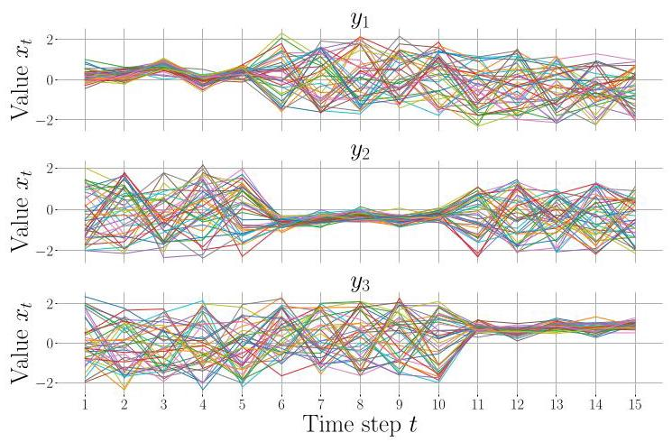

Fig. 1: Example of time series data plotted by class, with time steps on the x-axis and observed values ${x}_{t}$ on the y-axis. Figure depicts SmoothSubspace, one of the 117 datasets from the UCR repository.

图1:按类别绘制的时间序列数据示例，x轴为时间步长，y轴为观测值${x}_{t}$。图描绘了SmoothSubspace，它是UCR存储库中的117个数据集之一。

### A.KAN for time series classification

### A.KAN用于时间序列分类

The architecture of a KAN is depicted in Fig. 2. It can be seen from the figure that, for an input instance ${X}_{i}$ , the network outputs ${Y}_{i}$ label assignment probability vector. $Y$ is learnt from $D$ as a composition of $L$ appropriate univariate functions $\Phi$ , as depicted in Fig. 2 and formalized in Eq. 2 where $L$ stands for the number of layers in the network.

KAN的架构如图2所示。从图中可以看出，对于输入实例${X}_{i}$，网络输出${Y}_{i}$标签分配概率向量。$Y$是从$D$学习得到的，是$L$个合适的单变量函数$\Phi$的组合，如图2所示，并在式2中形式化，其中$L$代表网络中的层数。

Each layer of a KAN is represented by a matrix where each entry is an activation function. If there is a layer with ${d}_{in}$ nodes and its neighboring layer with ${d}_{\text{ out }}$ nodes, the layer can be represented as a ${d}_{\text{ in }} \times  {d}_{\text{ out }}$ matrix of activation functions:

KAN的每一层由一个矩阵表示，其中每个元素都是一个激活函数。如果有一层有${d}_{in}$个节点，其相邻层有${d}_{\text{ out }}$个节点，则该层可以表示为一个由激活函数组成的${d}_{\text{ in }} \times  {d}_{\text{ out }}$矩阵:

The structure of a KAN can be represented as $\left\lbrack  {{n}_{1},\ldots ,{n}_{L + 1}}\right\rbrack$ , where $L$ signifies the total number of layers in the KAN. A deeper KAN can be thus formulated through the composition of $L$ layers as:

KAN的结构可以表示为$\left\lbrack  {{n}_{1},\ldots ,{n}_{L + 1}}\right\rbrack$，其中$L$表示KAN中的总层数。因此，可以通过$L$层的组合来构建更深的KAN，如下所示:

$$
Y = \operatorname{KAN}\left( X\right)  = \left( {{\Phi }_{L} \circ  {\Phi }_{L - 1} \circ  \cdots  \circ  {\Phi }_{1}}\right) X. \tag{2}
$$

$$
\Phi  = \left\{  {\phi }_{q, p}\right\}  , p = 1,2,\ldots ,{d}_{in}, q = 1,2,\ldots ,{d}_{out}. \tag{3}
$$

Unlike traditional MLPs, where activation functions are applied at the nodes themselves, KAN places them at the edges between the nodes. KAN employs the SiLU activation function in combination with B-splines to enhance its expressiveness, as per Eq. 4 This setup allows the edges to control the transformations between layers, while the nodes perform simple summation operations.

与传统多层感知器不同，传统多层感知器的激活函数应用于节点本身，而KAN将它们置于节点之间的边上。根据公式4，KAN采用SiLU激活函数并结合B样条来增强其表现力。这种设置允许边控制层之间的变换，而节点执行简单的求和操作。

$$
\phi \left( x\right)  = {w}_{b}\operatorname{silu}\left( x\right)  + {w}_{s}\operatorname{spline}\left( x\right) . \tag{4}
$$

SiLU is defined as $\operatorname{silu}\left( x\right)  = x/\left( {1 + {e}^{-x}}\right)$ . This activation function allows for smooth, non-linear transformations, which helps the network capture complex patterns in time series data more effectively.

SiLU定义为$\operatorname{silu}\left( x\right)  = x/\left( {1 + {e}^{-x}}\right)$。这种激活函数允许进行平滑的非线性变换，这有助于网络更有效地捕捉时间序列数据中的复杂模式。

B-splines are smooth polynomial functions of degree (order) $k$ , which approximate data using control points. The order $k$ controls the smoothness of the spline. Commonly, $k = 3$ is used for cubic splines. Each spline operates over a defined grid $G$ , which divides the input space into smaller intervals. The grid is determined by a set of grid points that define the segments of the spline. Increasing the number of grid points increases spline resolution, enabling more fine grained approximation of the underlying univariate function.

B样条是次数(阶数)为$k$的平滑多项式函数，它使用控制点来逼近数据。阶数$k$控制样条的平滑度。通常，$k = 3$用于三次}}用于三次样条。每个样条在定义的网格$G$上运行，该网格将输入空间划分为更小的区间。网格由一组定义样条段的网格点确定。增加网格点的数量会提高样条分辨率，从而能够更精细地逼近基础单变量函数。

A B-spline of order $k$ requires $G + k$ basis functions to represent the spline over the grid. For each input (node in a layer), the evaluation of a B-spline of order $k$ thus involves computing $G + k - 1$ basis functions and performing a weighted sum with the corresponding control points.

一个阶数为$k$的B样条需要$G + k$个基函数来在网格上表示该样条。对于每个输入(层中的节点)，对阶数为$k$的B样条进行求值因此涉及计算$G + k - 1$个基函数并与相应的控制点进行加权求和。

$$
\operatorname{spline}\left( x\right)  = \mathop{\sum }\limits_{{i = 0}}^{{G + k - 1}}{c}_{i}{B}_{i}\left( x\right) \tag{5}
$$

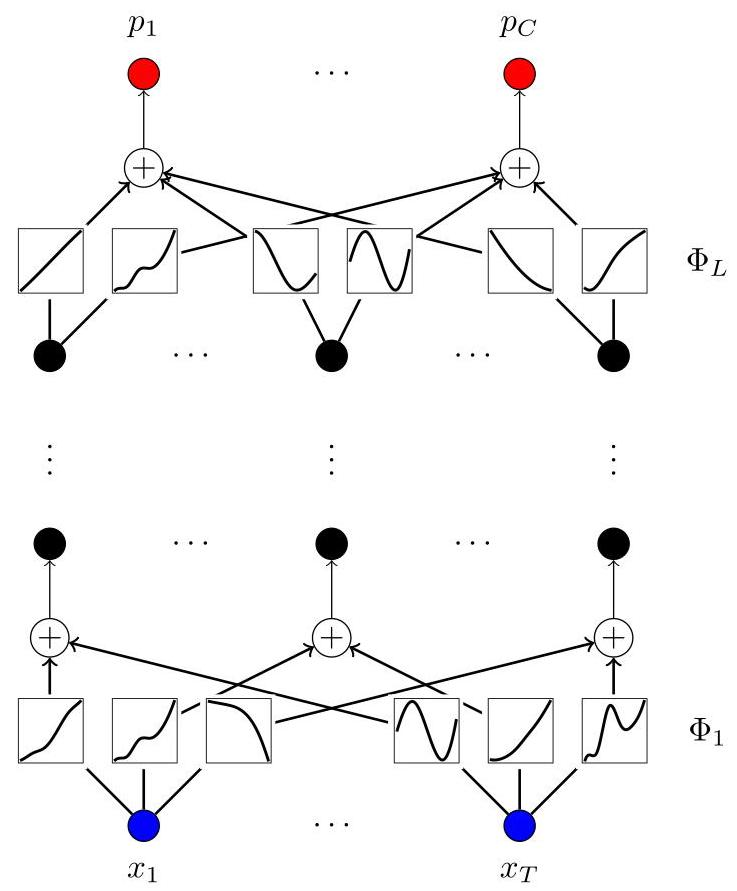

Fig. 2: KAN architecture.

图2:KAN架构。

To better understand the performance of the evaluated models, it is crucial to explain their decision-making processes. Although black-box models achieve high accuracy, they often lack interpretability. KANs offer a shift in the interpretability paradigm by allowing visualization of the model structure along with its learned B-splines as shown in Fig. 2. Interpretability is further enhanced by model pruning that simplifies visual representation by removing less important connections within the model, which were determined through their significance scores. These scores identify critical connections, which highlight the most important features for the decision of the model. This approach provides insights into how KANs process data and make predictions by focusing on the most influential connections within the structure of the model.

为了更好地理解所评估模型的性能，解释它们的决策过程至关重要。尽管黑箱模型具有很高的准确性，但它们往往缺乏可解释性。KAN通过允许可视化模型结构及其学习到的B样条(如图2所示)，在可解释性范式上实现了转变。通过模型剪枝进一步增强了可解释性，模型剪枝通过去除模型中不太重要的连接(这些连接是通过其重要性得分确定的)来简化视觉表示。这些得分识别关键连接，突出了对模型决策最重要的特征。这种方法通过关注模型结构中最有影响力的连接，深入了解KAN如何处理数据并进行预测。

1) KAN learnable parameters: The number of learnable parameters in a KAN layer is determined by its architecture, which includes contributions from the B-spline control points, shortcut path weights, B-spline weights, and bias terms. As discussed in [16], the number of learnable parameters for each KAN layer is:

1) KAN可学习参数:KAN层中可学习参数的数量由其架构决定，架构包括B样条控制点、捷径路径权重、B样条权重和偏差项的贡献。如[16]中所讨论的，每个KAN层的可学习参数数量为:

$$
\text{ Parameters } = \left( {{d}_{\text{ in }} \cdot  {d}_{\text{ out }}}\right)  \cdot  \left( {G + k + 3}\right)  + {d}_{\text{ out }}\text{ , } \tag{6}
$$

where ${d}_{in}$ and ${d}_{\text{ out }}$ represent the input and output dimensions of the layer. This is consistent with findings in [14], which also emphasize the role of learnable control points and weights associated with the spline functions.

其中${d}_{in}$和${d}_{\text{ out }}$表示层的输入和输出维度。这与[14]中的发现一致，[14]也强调了与样条函数相关的可学习控制点和权重的作用。

2) KAN FLOPs computation: The number of FLOPs in a Kolmogorov-Arnold Network (KAN) is highly dependent on the specific implementation and the way the network is compiled on various processor architectures. Different hardware platforms optimize these computations differently, leading to variations in practical FLOPs performance. However, we adopt the theoretical FLOPs computation model as outlined in [16] for consistency and comparison purposes.

2) KAN FLOPs计算:柯尔莫哥洛夫 - 阿诺德网络(KAN)中的FLOPs数量高度依赖于具体实现以及网络在各种处理器架构上的编译方式。不同的硬件平台对这些计算的优化方式不同，导致实际FLOPs性能存在差异。然而，为了保持一致性和便于比较，我们采用[16]中概述的理论FLOPs计算模型。

The total FLOPs for a KAN layer come from three parts: the B-spline transformation, the shortcut path, and the merging of the two branches. Using the De Boor-Cox iterative formulation for B-splines, the FLOPs for one KAN layer in the original KAN implementation is given by Eq. 7 [16]:

KAN层的总FLOPs来自三个部分:B样条变换、捷径路径以及两个分支的合并。使用B样条的德布尔 - 考克斯迭代公式，原始KAN实现中一个KAN层的FLOPs由公式7给出[16]:

$$
\text{ FLOPs } = \text{ FLOPs of non-linear function } \cdot  {d}_{\text{ in }}
$$

$$
+ \left( {{d}_{\text{ in }} \cdot  {d}_{\text{ out }}}\right)  \cdot  \left\lbrack  {9 \cdot  k \cdot  \left( {G + {1.5} \cdot  k}\right) }\right. \tag{7}
$$

$$
\left. {+2 \cdot  G - {2.5} \cdot  k + 3}\right\rbrack  \text{ . }
$$

FLOPs of one forward pass ${FP}$ through a network with uniform hidden layers of size ${d}_{in} \cdot  {d}_{\text{ out }} = M \cdot  M$ are calculated as in Eq. 8 16.

通过具有大小为${d}_{in} \cdot  {d}_{\text{ out }} = M \cdot  M$的均匀隐藏层的网络进行一次前向传播${FP}$的FLOPs计算如公式8[16]所示。

$$
{N}_{FP} = \text{ FLOPs of non-linear function } \cdot  T
$$

$$
+ T \cdot  M \cdot  \lbrack 9 \cdot  k \cdot  \left( {G + {1.5} \cdot  k}\right)
$$

$$
\left. {+2 \cdot  G - {2.5} \cdot  k + 3}\right\rbrack
$$

$$
+ \left( {L - 2}\right)  \cdot  (\text{ FLOPs of non-linear function } \cdot  M
$$

$$
+ {M}^{2} \cdot  \left\lbrack  {9 \cdot  k \cdot  \left( {G + {1.5} \cdot  k}\right) }\right\rbrack
$$

$$
\left. \left. {+2 \cdot  G - {2.5} \cdot  k + 3}\right\rbrack  \right)
$$

$$
\text{ + FLOPs of non-linear function } \cdot  M
$$

$$
+ M \cdot  C \cdot  \lbrack 9 \cdot  k \cdot  \left( {G + {1.5} \cdot  k}\right)
$$

$$
+ 2 \cdot  G - {2.5} \cdot  k + 3\rbrack \text{ . }
$$

(8)

B. Comparison of KAN to MLP for time series classification

B. KAN与MLP在时间序列分类方面的比较

A Multilayer Perceptron (MLP) is a very well known type of feed-forward neural network widely used for time series classification.

多层感知器(MLP)是一种非常著名的前馈神经网络类型，广泛用于时间序列分类。

KANs and MLPs share several architectural principles but differ significantly in how they implement non-linearity and function approximation. Both are fully connected neural networks in which each layer's nodes are densely connected to the next. The input layer in each architecture corresponds to the length of the input time series, and the output layer produces a probability distribution over class labels, allowing for multiclass classification.

KAN和MLP共享一些架构原则，但在实现非线性和函数逼近的方式上有显著差异。两者都是全连接神经网络，其中每层的节点与下一层紧密连接。每个架构中的输入层对应于输入时间序列的长度，输出层生成类标签上的概率分布，允许进行多类分类。

However, their treatment of activation differs notably. In MLPs, activation functions are applied at the neurons (i.e. nodes). In KANs, activation functions are applied on the edges between nodes. Regarding activation functions, the two architectures also use different approaches. MLPs commonly use standard functions such as ReLU, defined as $\operatorname{ReLU}\left( z\right)  = \; \max \left( {0, z}\right)$ . KANs employ the SiLU (Sigmoid Linear Unit) activation in combination with B-splines.

然而，它们对激活的处理方式有显著差异。在多层感知器(MLP)中，激活函数应用于神经元(即节点)。在KAN中，激活函数应用于节点之间的边。关于激活函数，这两种架构也采用了不同的方法。MLP通常使用标准函数，如定义为$\operatorname{ReLU}\left( z\right)  = \; \max \left( {0, z}\right)$的ReLU。KAN结合使用SiLU(Sigmoid线性单元)激活和B样条。

1) MLP learnable parameters: The number of learnable parameters in an MLP is determined by the connections between neurons across layers. For a fully connected layer with ${d}_{in}$ input neurons and ${d}_{out}$ output neurons, the number of learnable parameters [16] is:

1)MLP可学习参数:MLP中可学习参数的数量由跨层神经元之间的连接决定。对于一个具有${d}_{in}$个输入神经元和${d}_{out}$个输出神经元的全连接层，可学习参数的数量[16]为:

$$
\text{ Parameters } = \left( {{d}_{\text{ in }}{d}_{\text{ out }}}\right)  + {d}_{\text{ out }}\text{ . } \tag{9}
$$

2) MLP FLOPs computation: In a fully connected MLP, each connection between two neurons ${wx} + b$ performs a weighted sum $w \cdot  x$ and adds bias $b$ , resulting in 1 multiplication and 1 addition. Thus, each connection requires 2 FLOPs.

2)MLP浮点运算次数(FLOPs)计算:在全连接的MLP中，两个神经元${wx} + b$之间的每个连接执行加权和$w \cdot  x$并加上偏差$b$，这导致1次乘法和1次加法。因此，每个连接需要2次FLOPs。

For a neuron with ${d}_{\text{ in }}$ inputs, calculating the output requires $2 \times  {d}_{\text{ in }}$ FLOPs (for weights) and 1 FLOP for the bias, resulting in a total of $2 \times  {d}_{\text{ in }} + 1$ FLOPs. If there are ${d}_{\text{ out }}$ output neurons, the total FLOPs for the layer is ${d}_{\text{ out }} \times  \left( {2 \times  {d}_{\text{ in }} + 1}\right)$ .

对于一个具有${d}_{\text{ in }}$个输入的神经元，计算输出需要$2 \times  {d}_{\text{ in }}$次FLOPs(用于权重)和1次FLOP用于偏差，总共$2 \times  {d}_{\text{ in }} + 1$次FLOPs。如果有${d}_{\text{ out }}$个输出神经元，该层的总FLOPs为${d}_{\text{ out }} \times  \left( {2 \times  {d}_{\text{ in }} + 1}\right)$。

We consider fully connected MLP which has input layer with $T$ neurons, $K$ hidden layers, with $M$ neurons in each, and $C$ neurons in output layer. FLOPs for forward propagation are therefore calculated as:

我们考虑具有输入层$T$个神经元、$K$个隐藏层、每层$M$个神经元和输出层$C$个神经元的全连接MLP。因此，前向传播的FLOPs计算如下:

$$
{N}_{FP} = \left( {M + {2MT}}\right)  + \left( {K - 1}\right) \left( {M + 2{M}^{2}}\right)  + \left( {M + {2MC}}\right) .
$$

(10)

## IV. METHODOLOGY

## 四、方法

In this section we elaborate on the methodology adopted for this study First we provide considerations on data and preprocessing, followed by reference model configurations, training process, hyperparamater, complexity and interpretability analysis.

在本节中，我们详细阐述本研究采用的方法。首先，我们提供关于数据和预处理的考虑因素，接着是参考模型配置、训练过程、超参数、复杂度和可解释性分析。

## A. Data and preprocessing

## A. 数据和预处理

In this study, the UCR (University of California, Riverside) [28] dataset archive time series classification benchmark is utilized, which contains a total of 128 univariate datasets from diverse domains, ranging from ECG signals and motion capture data to spectrographs and simulated control systems.

在本研究中，使用了加州大学河滨分校(UCR)[28]数据集存档时间序列分类基准，它总共包含128个来自不同领域的单变量数据集，范围从心电图信号和运动捕捉数据到光谱图和模拟控制系统。

The datasets were selected based on their completeness, since some datasets include time series instances containing missing values. To ensure that an adequate amount of data remained for both the training and testing phases, these datasets were excluded, resulting in total of 117 datasets used. For each dataset, the Appendix provides the number of training and test instances, the length of time series, and the number of classes.

根据数据集的完整性进行选择，因为一些数据集包含有缺失值的时间序列实例。为确保在训练和测试阶段都有足够的数据，这些数据集被排除，最终共使用117个数据集。对于每个数据集，附录提供了训练和测试实例的数量、时间序列的长度以及类别数量。

Table 1 further shows descriptive statistics for 117 datasets. Each row represents a statistical measure: minimum, maximum, mean, median and standard deviation. The columns correspond to the number of training samples, the number of test samples, the length of each time series and the number of classes across the 117 UCR datasets.

表1进一步展示了117个数据集的描述性统计信息。每一行代表一种统计量:最小值、最大值、均值、中位数和标准差。列对应于117个UCR数据集中训练样本的数量、测试样本的数量、每个时间序列的长度以及类别数量。

In terms of size, for training specifically, the datasets vary significantly, ranging from 16 up to 8,926 time series instances. The input lengths of these time series also showed considerable diversity, ranging from 15 to 2,844 time steps per instance in different datasets. Furthermore, the datasets included varying numbers of classes for classification tasks, with scenarios ranging from binary classifications with 2 classes to multiclass problems with up to 60 distinct classes. To illustrate the diversity in shape and class structure, we visualize 15 randomly selected datasets in Fig. 3, where each subplot displays one representative instance per class, with distinct colors denoting different classes.

在规模方面，仅就训练而言，数据集差异显著，从16个到8926个时间序列实例不等。这些时间序列的输入长度也显示出相当大的多样性，不同数据集中每个实例的时间步长从15到2844不等。此外，数据集在分类任务中包含不同数量的类别，场景从2类的二元分类到多达60个不同类别的多类问题。为说明形状和类别结构的多样性，我们在图3中可视化了15个随机选择的数据集，其中每个子图显示每个类别的一个代表性实例，不同颜色表示不同类别。

The first step in data preprocessing was normalization, using 'StandardScaler' from the scikit-learn library. Each time series $X$ in the dataset $D$ was standardized by applying the transformation ${x}_{t,\text{ scaled }} = \frac{{x}_{t} - {\mu }_{t}}{{\sigma }_{t}}$ , where ${\mu }_{t}$ and ${\sigma }_{t}$ are the mean and standard deviation for the value at time $t$ across all time series in $D$ . This ensures that each time point $t$ has a mean of 0 and a standard deviation of 1 , allowing for consistent scaling across the dataset. This normalization is crucial for ensuring that the input features are on a comparable scale, which helps in efficient training.

数据预处理的第一步是归一化，使用scikit-learn库中的'StandardScaler'。数据集中的每个时间序列$X$通过应用变换${x}_{t,\text{ scaled }} = \frac{{x}_{t} - {\mu }_{t}}{{\sigma }_{t}}$进行标准化，其中${\mu }_{t}$和${\sigma }_{t}$是$D$中所有时间序列在时间$t$处值的均值和标准差。这确保每个时间点$t$的均值为0且标准差为1，从而允许在数据集上进行一致的缩放。这种归一化对于确保输入特征在可比尺度上至关重要，有助于高效训练。

Data Availability Statement. The data that support the findings of this study are available in the UCR Archive at https://doi.org/10.1109/JAS.2019.1911747, and are also available in the public domain at https://www.timeseriesclassification.com/.

数据可用性声明。支持本研究结果的数据可在UCR存档中获取，网址为https://doi.org/10.1109/JAS.2019.1911747，也可在公共领域获取，网址为https://www.timeseriesclassification.com/。

---

${}^{1}$ https://github.com/irina-bl/KAN_TS

${}^{1}$ https://github.com/irina-bl/KAN_TS

---

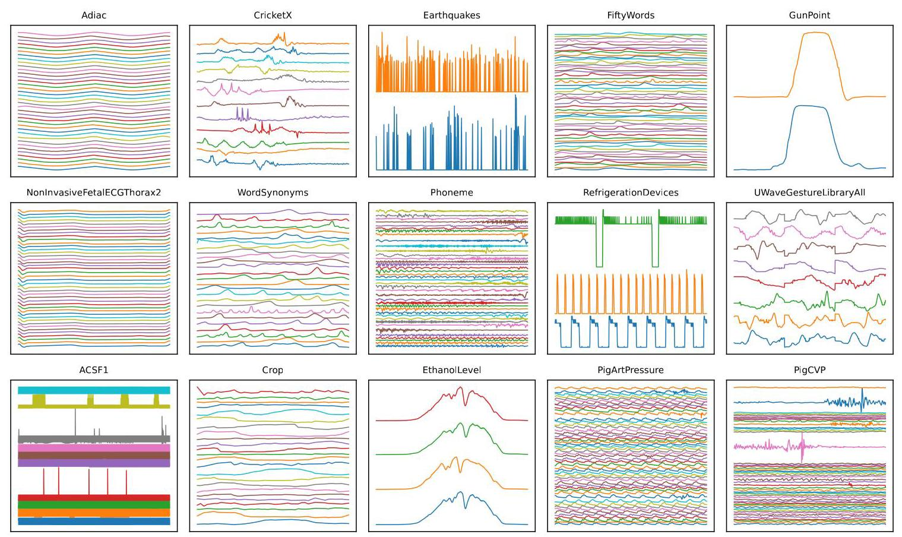

Fig. 3: 15 datasets showing one representative time series per class. Distinct colors indicate different classes

图3:15个数据集，每个类别显示一个代表性时间序列。不同颜色表示不同类别

<table><tr><td>Statistic</td><td>Train</td><td>Test</td><td>Length</td><td>Class</td></tr><tr><td>Min</td><td>16</td><td>20</td><td>15</td><td>2</td></tr><tr><td>Max</td><td>8926</td><td>16800</td><td>2 844</td><td>60</td></tr><tr><td>Mean</td><td>496.72</td><td>1 086.72</td><td>537.10</td><td>8.26</td></tr><tr><td>Median</td><td>181</td><td>343</td><td>301</td><td>3</td></tr><tr><td>StdDev</td><td>1 155.16</td><td>2080.59</td><td>583.14</td><td>12.26</td></tr></table>

TABLE I: Summary statistics of the 117 UCR archive time series datasets

表一:117个UCR存档时间序列数据集的汇总统计

## B. Training setup

## B. 训练设置

For training, each dataset was partitioned into a training dataset and a validation dataset in an 80:20 ratio. The test datasets are provided separately by default. To ensure robustness and mitigate the effects of random initialization, each model was trained on 5 different random seeds. The presented results are averages of these 5 runs across all 117 datasets. The models were trained for 500 epochs using batch size 16.

在训练时，每个数据集按80:20的比例划分为训练数据集和验证数据集。测试数据集默认单独提供。为确保稳健性并减轻随机初始化的影响，每个模型在5个不同的随机种子上进行训练。呈现的结果是这5次运行在所有117个数据集上的平均值。模型使用批量大小为16，训练500个轮次。

The training process across all models used the Adam optimizer. The baseline architectures from [23] were trained with a learning rate of 0.001 . However, instead of the mean absolute error (MAE) loss function used for regression tasks in the original work, we employed the cross-entropy loss function to address the classification nature of our problem. Additionally, we introduced ${L1}$ regularization with a weight factor of 0.1 .

所有模型的训练过程都使用Adam优化器。[23]中的基线架构以0.001的学习率进行训练。然而，与原始工作中用于回归任务的平均绝对误差(MAE)损失函数不同，我们采用交叉熵损失函数来处理我们问题的分类性质。此外，我们引入了权重因子为0.1的${L1}$正则化。

Similarly, in the baseline MLP models, we used the same Adam optimizer, learning rate (0.001), and cross-entropy loss function as in the KAN models, for the same reasons. However, instead of L1 we applied L2 regularization with a weight factor of 1, selected through empirical tuning.

同样，在基线MLP模型中，出于相同原因，我们使用与KAN模型相同的Adam优化器、学习率(0.001)和交叉熵损失函数。然而，我们应用的不是L1正则化，而是权重因子为1的L2正则化，这是通过经验调整选择的。

The original KAN library [14] was modified to enable GPU support, allowing the experiments to leverage the computational power of GPUs rather than relying solely on CPU execution. Thus, all evaluations of each model were conducted on an NVIDIA A100 80GB GPU.

对原始的KAN库[14]进行了修改，以支持GPU，使实验能够利用GPU的计算能力，而不是仅依赖CPU执行。因此，每个模型的所有评估都在NVIDIA A100 80GB GPU上进行。

For performance evaluation, we use precision, recall and F1 score. The precision measures how many instances predicted as a certain class actually belong to that class, expressed as: Precision $= \frac{\mathrm{{TP}}}{\mathrm{{TP}} + \mathrm{{FP}}}$ , where TP (true positives) represents the number of correctly identified positive instances, and FP (false positives) refers to the number of instances incorrectly identified as positive. Recall measures how many instances of some class were correctly detected. It is given by: Recall = $\frac{\mathrm{{TP}}}{\mathrm{{TP}} + \mathrm{{FN}}}$ , where FN (false negatives) represents the number of actual positive instances that the model failed to identify as positive. The F1 score is expressed as: ${F1} = 2 \times  \frac{\text{ Precision } \times  \text{ Recall }}{\text{ Precision } + \text{ Recall }}$ , where higher values indicate better performance in balancing precision and recall (better classification).

在性能评估中，我们使用精确率、召回率和 F1 分数。精确率衡量的是被预测为某一类别实例中实际属于该类别的比例，表达式为:精确率 $= \frac{\mathrm{{TP}}}{\mathrm{{TP}} + \mathrm{{FP}}}$ ，其中 TP(真阳性)表示正确识别的正例数量，FP(假阳性)指的是被错误识别为正例的数量。召回率衡量的是某一类别中被正确检测到的实例比例。其表达式为:召回率 = $\frac{\mathrm{{TP}}}{\mathrm{{TP}} + \mathrm{{FN}}}$ ，其中 FN(假阴性)表示模型未能识别为正例的实际正例数量。F1 分数的表达式为:${F1} = 2 \times  \frac{\text{ Precision } \times  \text{ Recall }}{\text{ Precision } + \text{ Recall }}$ ，其值越高，表示在平衡精确率和召回率方面表现越好(分类效果越好)。

## C. Reference architecture configurations

## C. 参考架构配置

Initially, we analyze the performance of KAN and MLP by adopting the regression designs from the extensive empirical study in [23]. The goal is to gain insights into the generalization capabilities and transfer potential of these architectures from regression to classification problems.

最初，我们通过采用[23]中广泛实证研究的回归设计来分析KAN和MLP的性能。目标是深入了解这些架构从回归问题到分类问题的泛化能力和迁移潜力。

As discussed in Section III, we employ two different models: KAN and MLP. Alongside the original implementation of ${\mathrm{{KAN}}}^{2}$ we also include its variant, Efficient ${\mathrm{{KAN}}}^{3}$ , which optimizes memory by reformulating the activation process, applying B-splines directly to inputs and combining them linearly, thus avoiding the need for large tensor expansions. It replaces input-based L1 regularization with weight-based L1, improving efficiency. The L1 regularization is now computed as mean absolute value of the spline weights [29].

如第三节所述，我们采用两种不同的模型:KAN和MLP。除了${\mathrm{{KAN}}}^{2}$的原始实现，我们还包括其变体，高效${\mathrm{{KAN}}}^{3}$，它通过重新构建激活过程来优化内存，直接将B样条应用于输入并进行线性组合，从而避免了大型张量扩展的需要。它用基于权重的L1替换了基于输入的L1正则化，提高了效率。现在L1正则化计算为样条权重的平均绝对值[29]。

KAN and Efficient KAN are configured as $\left\lbrack  {T,{40},{40}, C}\right\rbrack$ , representing a dapth 3 network, where $T$ represents the length of the input time series, while $C$ denotes the number of classes for classification, as per Section III. Although this architecture appears to involve two layers between input and output, in KANs depth refers to the number of trainable connections between layers. Thus, although there are two hidden layers, the model has three learnable transformations. A depth 4 variant includes an additional hidden layer with 40 nodes. We retained the spline order $k = 3$ and a fixed grid size $G = 5$ .

KAN和高效KAN配置为$\left\lbrack  {T,{40},{40}, C}\right\rbrack$，表示一个深度为3的网络，其中$T$表示输入时间序列的长度，而$C$表示分类的类别数量，如第三节所述。尽管这种架构在输入和输出之间似乎涉及两层，但在KAN中深度指的是层之间可训练连接的数量。因此，虽然有两个隐藏层，但模型有三个可学习的变换。深度为4的变体包括一个额外的具有40个节点的隐藏层。我们保留了样条阶数$k = 3$和固定的网格大小$G = 5$。

In contrast, the MLP architecture is configured as $\lbrack T,{300}$ , 300,300, $C\rbrack$ , representing a depth 3 network. The depth 4 variant adds a hidden layer of 300 nodes.

相比之下，MLP架构配置为$\lbrack T,{300}$，300,300，$C\rbrack$，表示一个深度为3的网络。深度为4的变体增加了一个具有300个节点的隐藏层。

## D. Hyperparameter impact analysis

## D. 超参数影响分析

To provide deeper insights into the KAN architecture's performance and provide design guidelines, we conduct an analysis of hyperparameters and configuration parameters with the goal of finding the best model for time series classification on the UCR behcmark , using a curated subset of 117 UCR datasets. To assess hyperparameter effects, we systematically varied grid size $\left( G\right)$ , network depth $\left( L\right)$ and layer width $\left( M\right)$ . Table II summarizes these parameters, where the first column lists each hyperparameter and the second indicates the range of values evaluated. For each of these evaluations, the models were trained using different learning rates $\operatorname{lr} \in \; \{ {0.0001},{0.001},{0.01},{0.1},1\}$ .

为了更深入地了解KAN架构的性能并提供设计指南，我们对超参数和配置参数进行了分析，目的是在UCR基准上找到用于时间序列分类的最佳模型，使用117个UCR数据集的精选子集。为了评估超参数的影响，我们系统地改变了网格大小$\left( G\right)$、网络深度$\left( L\right)$和层宽度$\left( M\right)$。表二总结了这些参数，其中第一列列出了每个超参数，第二列指出了评估的值范围。对于这些评估中的每一个，模型都使用不同的学习率$\operatorname{lr} \in \; \{ {0.0001},{0.001},{0.01},{0.1},1\}$进行训练。

The first evaluation examined the effect of grid size, where $G \in  \{ 3,5,{10},{15},{20}\}$ while keeping depth and layer size parameters fixed. Specifically, $L = 3, M = {40}$ .

第一次评估研究了网格大小的影响，其中$G \in  \{ 3,5,{10},{15},{20}\}$，同时保持深度和层大小参数不变。具体来说，$L = 3, M = {40}$。

In the second evaluation, we varied the depth of the network by adjusting the number of layers $L$ between 2 and 10, with constant grid $G = 5$ and layer size $M = {40}$ .

在第二次评估中，我们通过调整2到10之间的层数$L$来改变网络的深度，同时保持网格$G = 5$和层大小$M = {40}$不变。

In the final evaluation, the number of nodes per layer $M \in \; \{ 5,{10},\ldots {100}\}$ was varied, while keeping the depth fixed at $L = 3$ and grid size at $G = 5$ .

在最终评估中，每层$M \in \; \{ 5,{10},\ldots {100}\}$的节点数量是变化的，同时将深度固定为$L = 3$，网格大小固定为$G = 5$。

In summary, to ensure robust and representative results, separate models were trained for each of the 117 UCR datasets, with input and output layer sizes matched to the the specific time series lengths and number of classes, respectively. Multiple hyperparameter settings were tested for each one, including different learning rates, depths, hidden layer sizes,

总之，为确保结果的稳健性和代表性，针对117个UCR数据集分别训练了模型，输入层和输出层的大小分别与特定时间序列长度和类别数量相匹配。针对每个数据集测试了多种超参数设置，包括不同的学习率、深度、隐藏层大小，

and spline grid resolutions. Taken together, this resulted in the development and evaluation of several tens of thousands of individual models across the full range of datasets and configurations within the UCR archive.

以及样条网格分辨率。综合起来，这导致在UCR存档中对全系列数据集和配置下的数万个单独模型进行了开发和评估。

<table><tr><td>Hyperparameters</td><td>Values</td></tr><tr><td>Grid size</td><td>$G \in  \{ 3,5,{10},{15},{20}\}$</td></tr><tr><td>Network depth</td><td>$L \in  \{ 2,3,\ldots ,{10}\}$</td></tr><tr><td>Hidden layer size</td><td>$M \in  \{ 5,{10},\ldots ,{100}\}$</td></tr><tr><td>Learning rate</td><td>${lr} \in  \{ {0.0001},{0.001},{0.01},{0.1},1\}$</td></tr><tr><td>Random seed</td><td>$\{ 0,1,2,5,{42}\}$</td></tr><tr><td>Batch size</td><td>16</td></tr><tr><td>Epochs</td><td>500</td></tr></table>

TABLE II: Hyperparameters utilised for impact analysis for KAN and Efficient KAN models.

表二:用于KAN和高效KAN模型影响分析的超参数。

## E. Complexity analysis

## E. 复杂度分析

In this section we evaluate resource consumption by calculating the average FLOPs over the 117 UCR datasets for one prediction, and the theoretical energy consumption (TEC) per prediction. FLOPs were computed theoretically using Eqs. 8 and 10 outlined in Section III As per Section IV-A $T \in  \{ {16},\ldots ,8,{926}\} , C \in  \{ 2,\ldots ,\overline{60}\}$ .

在本节中，我们通过计算在117个UCR数据集上进行一次预测的平均浮点运算次数(FLOPs)以及每次预测的理论能耗(TEC)来评估资源消耗。浮点运算次数是根据第三节中概述的方程8和10从理论上计算得出的。根据第四节-A $T \in  \{ {16},\ldots ,8,{926}\} , C \in  \{ 2,\ldots ,\overline{60}\}$ 。

We estimated TEC as TEC = FLOPs FLOPS/Watt represents the number of floating-point operations executed per second per watt. As the experiments were conducted on an NVIDIA A100 80GB PCIe GPU, its theoretical power consumption is 65 GFLOPS/Watt, for float32 operations, which were used for calculation.

我们将TEC估计为TEC = FLOPs。FLOPS/瓦特表示每瓦特每秒执行的浮点运算次数。由于实验是在NVIDIA A100 80GB PCIe GPU上进行的，其理论功耗为65 GFLOPS/瓦特，用于float32运算，这些运算用于计算。

## F. Interpretability analysis

## F. 可解释性分析

We demonstrate the interpretability of KANs on architecture of shape $\left\lbrack  {{15},{15},{15},3}\right\rbrack$ , that is amenable to visualization, with a grid size $\mathrm{G} = 5$ , learning rate ${lr} = 1$ , and $\mathrm{L}1$ regularization of 0.01 . The architecture and hyperparameters were iteratively optimized to ensure the model's performance was competitive with MLPs and HiveCote 2.0, ensuring that the model achieved comparable results while being significantly less computationally complex. The interpretability results are showcased on the SmoothSubspace dataset from the UCR repository, which has a length of 15 and 3 output classes. However, the methods are equally effective across all datasets in the UCR repository.

我们展示了KANs在形状$\left\lbrack  {{15},{15},{15},3}\right\rbrack$架构上的可解释性，该架构适合可视化，网格大小为$\mathrm{G} = 5$，学习率为${lr} = 1$，正则化参数$\mathrm{L}1$为0.01。对架构和超参数进行了迭代优化，以确保模型的性能与多层感知器(MLP)和HiveCote 2.0具有竞争力，确保模型在计算复杂度显著降低的情况下取得可比的结果。可解释性结果在UCR存储库的SmoothSubspace数据集上展示，该数据集长度为15，有3个输出类别。然而，这些方法在UCR存储库中的所有数据集上同样有效。

Furthermore, to validate the inherent interpretability of KAN and to extract any insight from the MLP, global SHapley Additive exPlanations (SHAP) values [31] were used. SHAP offers a model-agnostic framework for global interpretability by quantifying the average contribution of each feature to the model's predictions across the entire dataset. The contribution of a feature ${x}_{i}$ is represented by its Shapley value, ${\phi }_{i}$ , which is computed based on cooperative game theory. For a model the prediction for an instance $X$ is expressed as:

此外，为了验证KAN的内在可解释性并从MLP中提取任何见解，使用了全局SHapley Additive exPlanations (SHAP) 值 [31]。SHAP通过量化每个特征对整个数据集上模型预测的平均贡献，提供了一个与模型无关的全局可解释性框架。特征${x}_{i}$的贡献由其Shapley值${\phi }_{i}$表示，该值基于合作博弈论计算得出。对于一个模型，实例$X$的预测表示为:

$$
{SHAP} = {\phi }_{0} + \mathop{\sum }\limits_{{i = 1}}^{M}{\phi }_{i} \tag{11}
$$

where ${\phi }_{0}$ is the model’s baseline expected value across the dataset, ${\phi }_{i}$ is the Shapley value of feature ${x}_{i}$ , and $\mathrm{M}$ represents the total number of features. By aggregating these values, SHAP enables insights into the global decisions of the model. In addition, SHAP is also utilized to compare the feature importance of KANs to the MLP architecture.

其中${\phi }_{0}$是模型在整个数据集上的基线期望值，${\phi }_{i}$是特征${x}_{i}$的Shapley值，$\mathrm{M}$表示特征总数。通过聚合这些值，SHAP能够洞察模型的全局决策。此外，SHAP还用于比较KAN对MLP架构的特征重要性。

---

${}^{2}$ github.com/KindXiaoming/pykan

${}^{2}$ github.com/KindXiaoming/pykan

${}^{3}$ github.com/Blealtan/efficient-kan

${}^{3}$ github.com/Blealtan/efficient-kan

---

## V. RESULTS

## 五、结果

This section presents a comprehensive analysis of the results through classification performance of reference architectures, computational complexity comparison, hyperparameter impact analysis, and interpretability evaluation.

本节通过参考架构的分类性能、计算复杂度比较、超参数影响分析和可解释性评估，对结果进行了全面分析。

## A. Classification performance analysis of reference architec- tures

## A. 参考架构的分类性能分析

Table III presents the results of the classifiers with rows representing different models and their configurations. The first two rows provide the results for MLP models and the subsequent four rows for KAN and Efficient KAN models. The first column lists the type of model, while the second column details the specific configuration of each model, including the nodes per layer and grid size for KAN models. The subsequent columns provide the performance metrics for each model, split into three main categories: precision, recall, and F1 score. Each of these categories is further divided into two subcolumns that show the mean and standard deviation (StdDev) of the results across multiple (i.e. 5) runs. The last column presents average time, measured in seconds, for training one model.

表三展示了分类器的结果，行代表不同的模型及其配置。前两行提供了MLP模型的结果，随后四行是KAN和高效KAN模型的结果。第一列列出模型类型，第二列详细说明了每个模型的具体配置，包括KAN模型的每层节点数和网格大小。随后的列提供了每个模型的性能指标，分为三个主要类别:精确率、召回率和F1分数。每个类别进一步分为两个子列，分别显示多次(即5次)运行结果的平均值和标准差(StdDev)。最后一列给出了训练一个模型的平均时间，以秒为单位。

The MLP models demonstrate relatively high and consistent performance across the precision, recall, and F1 score metrics for both depths. For the 3-layer MLP, the mean precision is 0.73 with a standard deviation of 0.20 , and the 4-layer model exhibits the same mean and standard deviation for precision. In terms of recall, the mean values are very similar, at 0.66 for the 3-layer model and 0.65 for the 4-layer model, with standard deviations of 0.23 and 0.20 , respectively. This indicates that increasing the depth has little effect on the model's ability to identify relevant instances. Additionally, both models maintain comparable F1 score means of 0.64 (3 layers) and 0.62 (4 layers), although the standard deviation increases slightly from 0.25 to 0.26 , suggesting a minor decrease in consistency for the F1 score with the deeper model.

MLP模型在两个深度的精确率、召回率和F1分数指标上都表现出相对较高且一致的性能。对于3层MLP，平均精确率为0.73，标准差为0.20，4层模型的精确率平均值和标准差相同。在召回率方面，平均值非常相似，3层模型为0.66，4层模型为0.65，标准差分别为0.23和0.20。这表明增加深度对模型识别相关实例的能力影响不大。此外，两个模型的F1分数平均值相当，3层为0.64，4层为0.62，尽管标准差从0.25略有增加到0.26，这表明较深模型的F1分数一致性略有下降。

The original KAN implementations show a substantial drop in performance compared to the MLP models. The 3-depth KAN has a mean precision of 0.38 , with a recall of 0.33 and an F1 score of 0.30 . The 4-depth KAN model continues this trend with slightly lower performance, showing a mean precision of 0.37 , recall of 0.32 , and F1 score of 0.29 . The further decline in performance suggests that adding depth does not improve generalization but may instead lead to overfitting, especially across multiple diverse datasets. These results indicate that the original KAN struggles to match the classification performance of the MLP. While previous research demonstrated that KAN performed well for time series prediction and exhibited strong generalization abilities [23], here KAN's transferability to a different problem, i.e. classification, appears less successful.

与MLP模型相比，原始KAN实现的性能大幅下降。3深度KAN的平均精确率为0.38，召回率为0.33，F1分数为0.30。4深度KAN模型延续了这一趋势，性能略低，平均精确率为0.37，召回率为0.32，F1分数为0.29。性能的进一步下降表明增加深度并不能提高泛化能力，反而可能导致过拟合，尤其是在多个不同数据集上。这些结果表明原始KAN难以与MLP的分类性能相匹配。虽然先前的研究表明KAN在时间序列预测方面表现良好且具有很强的泛化能力[23]，但在这里KAN在不同问题(即分类)上的可转移性似乎不太成功。

Lower performance results come with a significantly reduced training time of $\sim  {45}$ seconds for depth 3 KAN, due to the GPU acceleration, as described in Section IV-E suggesting a trade-off between performance and efficiency. However, the training time in depth 4 KAN increases to $\sim  {57}$ seconds, reflecting the impact of the added depth on computational cost.

由于GPU加速，如第四节E部分所述，深度3 KAN的训练时间显著减少至$\sim  {45}$秒，性能结果较低，这表明在性能和效率之间存在权衡。然而，深度4 KAN的训练时间增加到$\sim  {57}$秒，反映了增加深度对计算成本的影响。

The models trained with the Efficient KAN implementation offer a notable improvement in performance compared to the original KAN implementation. The Efficient KAN with 3- depth demonstrates a significant boost in performance with a mean precision of 0.72 , recall of 0.70 , and F1 score of 0.70. Similarly, the 4-depth Efficient KAN, maintains high performance metrics with a mean precision of 0.71 , recall of 0.70, and F1 score of 0.69 . Improvements in comparison to KAN can be attributed to implementation changes, as discussed in Section IV-C

与原始KAN实现相比，使用高效KAN实现训练的模型在性能上有显著提升。3深度的高效KAN在性能上有显著提升，平均精确率为0.72，召回率为0.70，F1分数为0.70。同样，4深度的高效KAN保持了高性能指标，并保持了较高的平均精确率0.71，召回率0.70，F1分数0.69。与KAN相比的改进可归因于实现上的变化，如第四节C部分所述。

The precision of Efficient KAN is slightly lower than that of the MLP models, which means that the model may produce more false positives. However, the Efficient KAN model compensates for this with higher recall, indicating that it is better at identifying true positives. As a result, the F1 score is also higher for Efficient KAN. This suggests that while Efficient KAN sacrifices a bit of precision, it achieves a better overall performance by improving recall and providing a more balanced model for classification. Along with the increased performance, Efficient KAN maintains fast training times. The training time for the 3-depth model is approximately 91 seconds, with a slight increase to 93 seconds for the 4-depth model. This shows that while the original KAN implementation is less successful in transferring from time series prediction to classification tasks, the Efficient KAN not only achieves this transfer effectively but also generalizes better across different datasets, making it a more effective model overall.

高效KAN的精确率略低于MLP模型，这意味着该模型可能会产生更多误报。然而，高效KAN模型通过更高的召回率弥补了这一点，表明它在识别真阳性方面表现更好。因此，高效KAN的F1分数也更高。这表明虽然高效KAN牺牲了一点精确率，但它通过提高召回率并提供更平衡的分类模型，实现了更好的整体性能。随着性能的提高，高效KAN保持了快速的训练时间。3深度模型的训练时间约为91秒，4深度模型略有增加至93秒。这表明虽然原始KAN实现在从时间序列预测转移到分类任务方面不太成功，但高效KAN不仅有效地实现了这种转移，而且在不同数据集上的泛化能力更好，使其成为一个更有效的整体模型。

## B. Complexity analysis for the reference models

## B. 参考模型的复杂度分析

Table IV presents the computational complexity analysis for the MLP and KAN configurations. The first two columns, listing the model and configuration, are repeated from Table III The subsequent columns provide key complexity metrics: the third column displays the total number of lernable parameters in each model, while the fourth column reports the average theoretical FLOPs for one prediction across all used UCR datasets, based on model architectures discussed in Section III The last column presents the Theoretical Energy Consumption (TEC) in Joules, calculated based on the FLOPs and GPU efficiency, as per Section IV-E

表四展示了多层感知器(MLP)和KAN配置的计算复杂度分析。前两列列出了模型和配置，与表三重复。后续列提供了关键的复杂度指标:第三列显示每个模型中可学习参数的总数，而第四列报告基于第三节讨论的模型架构，在所有使用的UCR数据集中一次预测的平均理论浮点运算次数(FLOPs)。最后一列给出了以焦耳为单位的理论能耗(TEC)，根据第四节E部分，基于FLOPs和GPU效率计算得出。

In the table we observe that MLPs, with approximately ${344k}$ and ${434k}$ learnable parameters for 3-depth and 4-depth, respectively, are the most computationally demanding models in terms of learnable parameters and training duration. Their theoretical FLOPs reach 688, 420 and 868, 720, while requiring ${1.008} \times  {10}^{-5}$ and ${1.336} \times  {10}^{-5}$ Joules of energy per single prediction, positioning them as the best-performing models in theoretical FLOPs and TEC (Total Energy Consumption).

在表中我们观察到，对于3层和4层的MLP，分别具有大约${344k}$和${434k}$个可学习参数，就可学习参数和训练时长而言，是计算要求最高的模型。它们的理论FLOPs分别达到688,420和868,720，而每次预测需要${1.008} \times  {10}^{-5}$和${1.336} \times  {10}^{-5}$焦耳的能量，这使它们在理论FLOPs和TEC(总能耗)方面成为性能最佳的模型。

<table><tr><td rowspan="2">Model</td><td rowspan="2">Configuration</td><td colspan="2">Precision</td><td colspan="2">Recall</td><td colspan="2">F1 score</td><td rowspan="2">Training Time (s)</td></tr><tr><td>Mean</td><td>StdDev</td><td>Mean</td><td>StdDev</td><td>Mean</td><td>StdDev</td></tr><tr><td>MLP (3-depth)</td><td>[300, 300, 300]</td><td>0.73</td><td>0.20</td><td>0.66</td><td>0.23</td><td>0.64</td><td>0.25</td><td>109.50</td></tr><tr><td>MLP (4-depth)</td><td>[300, 300, 300, 300]</td><td>0.73</td><td>0.20</td><td>0.65</td><td>0.20</td><td>0.62</td><td>0.26</td><td>105.53</td></tr><tr><td>KAN (3-depth)</td><td>[40, 40], $G = 5$</td><td>0.38</td><td>0.17</td><td>0.33</td><td>0.21</td><td>0.30</td><td>0.21</td><td>44.99</td></tr><tr><td>KAN (4-depth)</td><td>$\left\lbrack  {{40},{40},{40}}\right\rbrack  , G = 5$</td><td>0.37</td><td>0.11</td><td>0.32</td><td>0.20</td><td>0.29</td><td>0.20</td><td>56.88</td></tr><tr><td>Efficient KAN (3-depth)</td><td>$\left\lbrack  {{40},{40}}\right\rbrack  , G = 5$</td><td>0.72</td><td>0.20</td><td>0.70</td><td>0.21</td><td>0.70</td><td>0.22</td><td>90.80</td></tr><tr><td>Efficient KAN (4-depth)</td><td>$\left\lbrack  {{40},{40},{40}}\right\rbrack  , G = 5$</td><td>0.71</td><td>0.20</td><td>0.70</td><td>0.22</td><td>0.69</td><td>0.22</td><td>92.71</td></tr></table>

TABLE III: Performance of reference regression architectures introduced in [23].

表三:[23]中引入的参考回归架构的性能。

<table><tr><td>Model</td><td>Configuration</td><td>Lernable Parameters</td><td>Theor. FLOPs</td><td>TEC (Joules)</td></tr><tr><td>MLP (3-depth)</td><td>[300, 300, 300]</td><td>344 518</td><td>688 420</td><td>1.008 × 10^-5</td></tr><tr><td>MLP (4-depth)</td><td>[300, 300, 300, 300]</td><td>434 818</td><td>868 720</td><td>${1.336} \times  {10}^{-5}$</td></tr><tr><td>KAN (3-depth)</td><td>[40, 40], $G = 5$</td><td>257 649</td><td>6 146 993</td><td>${9.457} \times  {10}^{-5}$</td></tr><tr><td>KAN (4-depth)</td><td>$\left\lbrack  {{40},{40},{40}}\right\rbrack  , G = 5$</td><td>275 289</td><td>6 566 993</td><td>10.103 $\times  {\text{ 10 }}^{-5}$</td></tr><tr><td>Efficient KAN (3-depth)</td><td>$\left\lbrack  {{40},{40}}\right\rbrack  , G = 5$</td><td>257 649</td><td>6 146 993</td><td>${9.457} \times  {10}^{-5}$</td></tr><tr><td>Efficient KAN (4-depth)</td><td>$\left\lbrack  {{40},{40},{40}}\right\rbrack  , G = 5$</td><td>275 289</td><td>6 566 993</td><td>${10.103} \times  {10}^{-5}$</td></tr></table>

TABLE IV: Comparison of performance and computational characteristics across the reference models

表四:参考模型的性能和计算特性比较

Next, the table reveal that the original KAN implementation has noticeably fewer learnable parameters compared to the MLP models, consistent with the theoretical analysis in Section III-A Despite the reduction in parameters, they come with significantly higher theoretical FLOPs, with values of 6,146,993 for depth 3 and 6,566,993 for depth 4, due to B-spline computation, as per Eq. 8 The energy required for a single prediction also reflects this increase, amounting to ${9.457} \times  {10}^{-5}$ Joules for depth 3 and ${10.103} \times  {10}^{-5}$ Joules for depth 4. These results illustrate a trade-off, where KAN achieves a smaller parameter count but requires greater computational resources in terms of FLOPs and energy per prediction.

接下来，表格显示原始KAN实现与MLP模型相比，可学习参数明显更少，这与第三节A部分的理论分析一致。尽管参数减少，但由于B样条计算(根据公式8)，它们的理论FLOPs显著更高，3层深度的值为6,146,993，4层深度的值为6,566,993。单次预测所需的能量也反映了这种增加，3层深度为${9.457} \times  {10}^{-5}$焦耳，4层深度为${10.103} \times  {10}^{-5}$焦耳。这些结果说明了一种权衡，即KAN实现了较少的参数数量，但每次预测在FLOPs和能量方面需要更多的计算资源。

The last two rows for the Efficient KAN implementation show the same number of weights and theoretical FLOPs as the original KAN implementation, as the model architectures are identical. Despite higher energy consumption, Efficient KAN maintains fast training times. Along with the discussed increased performance, this balance of high performance and lower computational costs makes these models strong candidates for applications requiring both efficiency and effectiveness.

高效KAN实现的最后两行显示与原始KAN实现相同数量的权重和理论FLOPs，因为模型架构相同。尽管能耗更高，但高效KAN保持了快速的训练时间。连同所讨论的性能提升，这种高性能和较低计算成本的平衡使这些模型成为需要效率和有效性的应用的有力候选者。

However, despite these improvements, MLP models remain far more energy-efficient, requiring 10 times less energy (TEC) per prediction than both KAN and Efficient KAN models.

然而，尽管有这些改进，MLP模型的能源效率仍然高得多，每次预测所需的能量(TEC)比KAN和高效KAN模型少10倍。

## C. Hyperparameter impact analysis

## C. 超参数影响分析

In this section, we analyze the impact of key hyperparam-eters on KAN and Efficient KAN models, with Figs. 4, 5 and 6 illustrating results for specific hyperparameter variations as detailed in Section IV-D Each figure includes line plots for five different learning rates, where the same color represents the results with the same learning rate for both models, with KAN depicted with solid lines and Efficient KAN with dashed lines.

在本节中，我们分析关键超参数对KAN和高效KAN模型的影响，图4、5和6展示了如第四节D部分详细说明的特定超参数变化的结果。每个图包括五条不同学习率的线图，相同颜色代表两个模型相同学习率的结果，KAN用实线表示，高效KAN用虚线表示。

The impact of grid size $G$ on model performance was evaluated across various learning rates, focusing on mean F1 score outcomes for both KAN and Efficient KAN. As it can be seen in Fig. 4 results show a general trend of decreasing F1 performance with increased grid size, which aligns with findings that larger grid configurations can lead to optimization challenges in KAN models [25]. This also suggests that while increasing grid size makes B-splines locally accurate, it potentially reduces the model's overall performance by making it globally inaccurate. While both models' performances decrease with grid size, Efficient KAN maintains greater stability across grid configurations and learning rates, with lower learning rates proving more effective in preserving model performance.

在各种学习率下评估了网格大小$G$对模型性能的影响，重点关注KAN和高效KAN的平均F1分数结果。如图4所示，结果显示随着网格大小增加，F1性能总体呈下降趋势，这与更大网格配置会导致KAN模型优化挑战的研究结果一致[25]。这也表明，虽然增加网格大小使B样条在局部更精确，但可能会因使模型在全局不准确而降低模型的整体性能。虽然两个模型的性能都随网格大小下降，但高效KAN在不同网格配置和学习率下保持了更大的稳定性，较低的学习率在保持模型性能方面更有效。

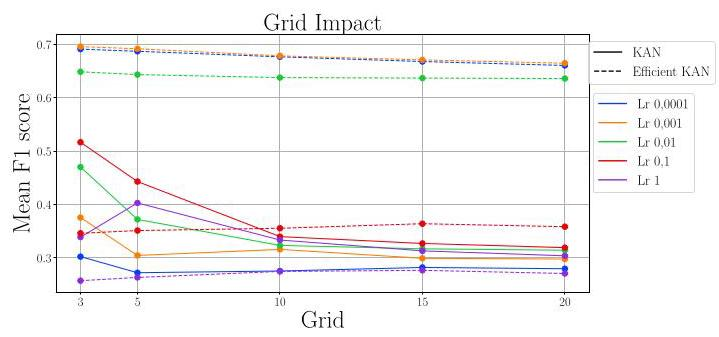

Fig. 4: Grid impact on KAN and Efficient KAN models

图4:网格对KAN和高效KAN模型的影响

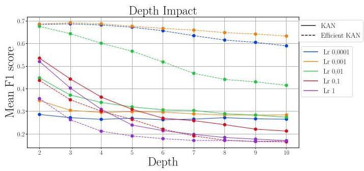

Fig. 5: Depth impact on KAN and Efficient KAN models

图5:深度对KAN和高效KAN模型的影响

At the lowest learning rates, Efficient KAN achieved the highest F1 scores, with $\operatorname{lr} = {0.0001}$ and $\operatorname{lr} = {0.001}$ yielding nearly identical and stable results across grid sizes. For these rates, the F1 score exhibited a slight, linear decrease from 0.69 at $G = 3$ to approximately 0.66 at $G = {20}$ , suggesting minimal sensitivity to grid variation. The learning rate ${lr} =$ 0.01 yielded slightly lower performance than $\operatorname{lr} = {0.0001}$ and $\operatorname{lr} = {0.001}$ , following a similarly gradual decrease across grid sizes. In contrast, higher learning rates $\left( {\operatorname{lr} = {0.1}\text{ and }\operatorname{lr} = 1}\right)$ resulted in significantly lower F1 scores, averaging around 0.3 across all grid sizes, showing limited grid sensitivity but almost 50% reduced effectiveness relative to lower rates.

在最低学习率下，高效KAN取得了最高的F1分数，$\operatorname{lr} = {0.0001}$和$\operatorname{lr} = {0.001}$在不同网格大小下产生了几乎相同且稳定的结果。对于这些学习率，F1分数从$G = 3$时的0.69略有线性下降至$G = {20}$时的约0.66，表明对网格变化的敏感性最小。学习率${lr} =$ 0.01的性能略低于$\operatorname{lr} = {0.0001}$和$\operatorname{lr} = {0.001}$，在不同网格大小下也呈现类似的逐渐下降趋势。相比之下，较高的学习率$\left( {\operatorname{lr} = {0.1}\text{ and }\operatorname{lr} = 1}\right)$导致F1分数显著降低，在所有网格大小下平均约为0.3，显示出有限的网格敏感性，但相对于较低学习率，有效性几乎降低了50%。

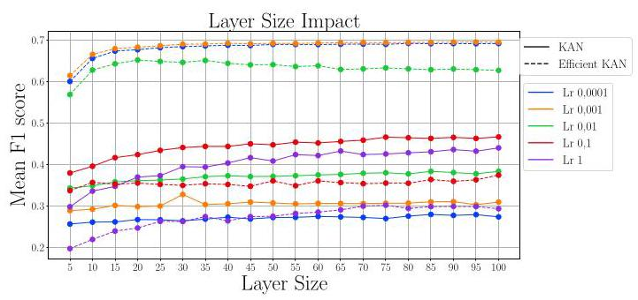

Fig. 6: Layer size impact on KAN and Efficient KAN models

图6:层大小对KAN和高效KAN模型的影响

KAN, in contrast, exhibited an opposing learning rate trend, with performance improving as learning rates increased. All learning rates for KAN showed a similar pattern: a substantial drop in F1 score from $G = 3$ to $G = {10}$ , followed by a more gradual decline with increasing grid size. Notably, even KAN's best configurations fell well below the best results of Efficient KAN, underscoring a clear performance gap. A deviation in KAN’s trend was seen at $\operatorname{lr} = 1$ for $G = 3$ , where the F1 score was unexpectedly lower than at $G = 5$ , unlike other rates where $G = 3$ consistently achieved the highest performance.

相比之下，KAN呈现出相反的学习率趋势，随着学习率的增加性能提高。KAN的所有学习率都呈现出类似的模式:F1分数从$G = 3$到$G = {10}$大幅下降，随后随着网格大小的增加下降更为平缓。值得注意的是，即使是KAN的最佳配置也远低于高效KAN的最佳结果，凸显了明显的性能差距。在$\operatorname{lr} = 1$时，$G = 3$的KAN趋势出现偏差，此时F1分数意外低于$G = 5$，与其他学习率下$G = 3$始终取得最高性能的情况不同。

The effect of model depth reveals similar trends, as shown in Fig. 5 Efficient KAN achieved the highest performance at the smallest learning rates (lr $= {0.0001}$ and $\operatorname{lr} = {0.001}$ ), though differences between these rates became more pronounced with increasing depth. At a learning rate of $\operatorname{lr} = {0.01}$ , Efficient KAN's performance declined more sharply with increasing depth, achieving a peak F1 score of 0.69 at depth 2, but dropping to 0.64 at depth 10 . This pattern aligns with previous research indicating that higher learning rates can destabilize training by causing the model to overshoot optimal parameter values. In time-series tasks, lower learning rates in combination with Efficient KAN's regularization mechanisms enable it to adjust gradually, allowing the model to learn nuanced temporal patterns without abrupt parameter updates, thereby supporting stable and high performance.

模型深度的影响也呈现出类似趋势，如图5所示，高效KAN在最小学习率(学习率$= {0.0001}$和$\operatorname{lr} = {0.001}$)下取得了最高性能，尽管随着深度增加，这些学习率之间的差异变得更加明显。在学习率为$\operatorname{lr} = {0.01}$时，高效KAN的性能随着深度增加下降得更为急剧，在深度2时达到F1分数峰值0.69，但在深度10时降至0.64。这种模式与先前的研究一致，表明较高的学习率会导致模型超过最佳参数值，从而使训练不稳定。在时间序列任务中，较低的学习率与高效KAN的正则化机制相结合，使其能够逐渐调整，允许模型在不进行突然参数更新的情况下学习细微的时间模式，从而支持稳定和高性能。

In contrast, KAN's behavior across learning rates mirrored the patterns observed in the grid size analysis, with generally lower performance compared to Efficient KAN. For shallower depths (2-3), KAN achieved its best performance with higher learning rates; however, these rates led to a sharp performance drop as depth increased, with F1 scores falling below 0.2. Lower learning rates yielded a more gradual decline, stabilizing around 0.3 before slightly decreasing further. Regardless of the learning rate, increasing depth consistently resulted in lower performance. These results suggest that KAN performs best with smaller depths and benefits less from deeper configurations due to challenges in capturing complex time-series dependencies effectively at greater depths.

相比之下，KAN在不同学习率下的表现反映了在网格大小分析中观察到的模式，与高效KAN相比，其性能总体较低。对于较浅的深度(2 - 3)，KAN在较高学习率下取得了最佳性能；然而，随着深度增加，这些学习率导致性能急剧下降，F1分数降至0.2以下。较低的学习率下降更为平缓，在略微进一步下降之前稳定在0.3左右。无论学习率如何，深度增加始终导致性能下降。这些结果表明，KAN在较小深度下表现最佳，由于在更大深度下有效捕捉复杂时间序列依赖关系存在挑战，从更深的配置中受益较少。

We further analyzed the effect of layer size, defined as the number of nodes in each layer, on model performance. Results are presented in Fig. 6 For Efficient KAN, lower learning rates (lr = 0.0001 and $\operatorname{lr} = {0.001}$ ) consistently yielded the best results, with $\operatorname{lr} = {0.01}$ performing slightly worse. Larger learning rates led to a significant performance drop, mirroring previous observations. Among layer sizes, configurations with 5 and 10 nodes per layer generally underperformed compared to larger sizes, which yielded stable F1 scores. These smaller configurations lack the complexity required to model diverse time-series data effectively, especially given the shortest series length of 15 data points. When layer sizes exceeded this threshold, Efficient KAN maintained consistent performance by avoiding overgeneralization and better capturing the data's intricacies.

我们进一步分析了层大小(定义为每层节点数)对模型性能的影响。结果如图6所示。对于高效KAN，较低的学习率(学习率 = 0.0001和$\operatorname{lr} = {0.001}$)始终产生最佳结果，$\operatorname{lr} = {0.01}$的表现略差。较大的学习率导致性能显著下降，这与之前的观察结果一致。在层大小方面，每层有5个和10个节点的配置通常比更大的配置表现更差，更大配置产生稳定的F1分数。这些较小的配置缺乏有效建模多样时间序列数据所需的复杂性，特别是考虑到最短序列长度为15个数据点。当层大小超过此阈值时，高效KAN通过避免过度泛化并更好地捕捉数据的复杂性来保持一致的性能。

For KAN, the trend remained opposite: higher learning rates produced better F1 scores, with $\operatorname{lr} = {0.1}$ consistently yielding the highest performance. Unlike Efficient KAN, KAN's performance gradually improved with increasing layer size, indicating that a larger number of nodes allowed it to capture more complex dependencies in the time-series data. A notable increase in F1 performance occurred with a layer configuration of 30 nodes per layer and a learning rate of lr = 0.001, highlighting this setup's capacity to leverage both the model's structure and time-series complexity. However, the worst-performing configuration for KAN was a high learning rate with very few nodes (5-20 per layer), which led to significant overgeneralization and poor performance. Smaller configurations likely struggle to represent complex patterns effectively, leading to overly simplistic models that underfit the data's temporal dependencies.

对于KAN，趋势则相反:学习率越高，F1分数越高，$\operatorname{lr} = {0.1}$始终产生最高性能。与高效KAN不同，KAN的性能随着层大小的增加而逐渐提高，这表明更多的节点使其能够在时间序列数据中捕获更复杂的依赖关系。当每层配置30个节点且学习率为lr = 0.001时，F1性能显著提高，突出了此设置利用模型结构和时间序列复杂性的能力。然而，KAN性能最差的配置是高学习率且节点很少(每层5 - 20个)，这导致了严重的过度泛化和性能不佳。较小的配置可能难以有效表示复杂模式，导致模型过于简单，无法拟合数据的时间依赖性。

In summary, the analyses of grid size, depth, and layer size reveal clear distinctions in how KAN and Efficient KAN respond to different hyperparameter configurations. Efficient KAN consistently performs best with smaller learning rates, showing stability across grid, depth, and layer size variations due to its inherent regularization mechanisms. This stability allows Efficient KAN to avoid overfitting and adapt effectively even with moderate layer sizes, particularly when layer sizes exceed the shortest time series length. In contrast, KAN's optimal performance relies on higher learning rates and increased layer sizes, as these configurations enable it to capture more complex dependencies in the time-series data. KAN's performance improves gradually with layer size and depth but is more sensitive to increases in grid size. Overall, Efficient KAN demonstrates a robust ability to maintain high performance with conservative hyperparameter settings, whereas KAN benefits more from expanded configurations to reach its optimal performance.

总之，对网格大小、深度和层大小的分析揭示了KAN和高效KAN对不同超参数配置的响应存在明显差异。高效KAN在较小学习率下始终表现最佳，由于其固有的正则化机制，在网格、深度和层大小变化时表现出稳定性。这种稳定性使高效KAN能够避免过拟合，即使在中等层大小下也能有效适应，特别是当层大小超过最短时间序列长度时。相比之下，KAN的最佳性能依赖于更高的学习率和增加的层大小，因为这些配置使其能够在时间序列数据中捕获更复杂的依赖关系。KAN的性能随着层大小和深度逐渐提高，但对网格大小的增加更敏感。总体而言，高效KAN展示了在保守超参数设置下保持高性能的强大能力，而KAN从扩展配置中受益更多以达到其最佳性能。

<table><tr><td rowspan="2">Model</td><td rowspan="2">Configuration</td><td colspan="2">Precision</td><td colspan="2">Recall</td><td colspan="2">F1 score</td><td colspan="2">Training time (seconds)</td></tr><tr><td>Mean</td><td>StdDev</td><td>Mean</td><td>StdDev</td><td>Mean</td><td>StdDev</td><td>Mean</td><td>StdDev</td></tr><tr><td>KAN</td><td>[40], $G = 5$</td><td>0.58</td><td>0.19</td><td>0.56</td><td>0.21</td><td>0.54</td><td>0.22</td><td>6.36</td><td>2.8</td></tr><tr><td>Efficient KAN</td><td>[40, 40], $G = 3$</td><td>0.72</td><td>0.20</td><td>0.71</td><td>0.21</td><td>0.70</td><td>0.23</td><td>95.00</td><td>205.1</td></tr><tr><td>MLP (3-depth)</td><td>[300, 300, 300]</td><td>0.73</td><td>0.20</td><td>0.66</td><td>0.23</td><td>0.64</td><td>0.25</td><td>109.5</td><td>368.5</td></tr><tr><td>InceptionTime</td><td>/</td><td>0.84</td><td>0.17</td><td>0.83</td><td>0.18</td><td>0.84</td><td>0.18</td><td>4 006.60</td><td>5 049.82</td></tr><tr><td>Hive-Cote 2.0</td><td>/</td><td>0.87</td><td>0.13</td><td>0.85</td><td>0.16</td><td>0.85</td><td>0.17</td><td>14 700.32</td><td>57 228.95</td></tr></table>

TABLE V: Comparison of top-performing KAN models vs the reference MLP, InceptionTime and Hive-Cote2 SotA on 117 datasets in UCR archive.

表五:在UCR存档中的117个数据集上，表现最佳的KAN模型与参考MLP、InceptionTime和Hive - Cote2 SotA的比较。

Out of all computed results across various hyperparameter configurations, we selected the best-performing KAN and Efficient KAN models. Their results are presented in Table V The table is structured in a similar manner as Table III, along with additional column showing mean and standard deviation of average training time in seconds.

在所有不同超参数配置的计算结果中，我们选择了表现最佳的KAN和高效KAN模型。它们的结果列于表五。该表的结构与表三类似，另外还有一列显示以秒为单位的平均训练时间的均值和标准差。

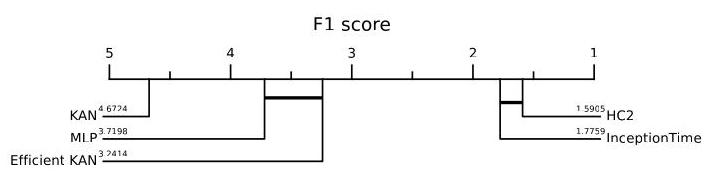

Fig. 7: Critical diagram of F1 score for five models

图7:五个模型的F1分数关键图

For comparison, we also include results from the MLP model discussed in Section V-A InceptionTime [32] baseline and Hive-Cote 2.0 as a state-of-the-art benchmark. Efficient KAN demonstrates comparable performance to MLP, with higher F1 scores and significantly faster training times. Although Hive-Cote 2.0 achieves the highest overall performance, Efficient KAN provides a balanced tradeoff with substantially reduced training time, making it a practical alternative for time-sensitive applications. This is further illustrated in the critical difference diagrams in Fig. 7, where Efficient KAN ranks above MLP but still below Hive-Cote 2.0 and InceptionTime, reflecting its competitive accuracy while maintaining efficiency. In contrast, KAN ranks lowest, showing a more significant deviation in performance. To provide a more detailed insight into comparison between the three best developed models, we also include three scatter-plots in Fig. 8 , that visualize pairwise comparisons between them: KAN vs. MLP, Efficient KAN vs. MLP, and KAN vs. Efficient KAN. In each scatterplot, the mean F1-score across 5 different runs for each dataset obtained by one model is plotted on the x-axis, while the mean F1-score of the other model is plotted on the y-axis. These plots provide an intuitive visual comparison of relative performance across datasets. Points above the diagonal line indicate datasets where the model on the y-axis outperforms the one on the x-axis.

为作比较，我们还纳入了第五节A部分讨论的MLP模型、InceptionTime [32]基线以及作为最先进基准的Hive - Cote 2.0的结果。高效KAN展示出与MLP相当的性能，具有更高的F1分数和显著更快的训练时间。尽管Hive - Cote 2.0实现了最高的总体性能，但高效KAN在大幅减少训练时间的情况下提供了平衡的权衡，使其成为对时间敏感应用的实用替代方案。图7中的关键差异图进一步说明了这一点，其中高效KAN排名高于MLP，但仍低于Hive - Cote 2.0和InceptionTime，反映了其在保持效率的同时具有竞争力的准确性。相比之下，KAN排名最低，表现出更显著的性能偏差。为了更详细地洞察三个最佳开发模型之间的比较，我们还在图8中包括了三个散点图，直观显示它们之间的两两比较:KAN与MLP、高效KAN与MLP以及KAN与高效KAN。在每个散点图中，一个模型在每个数据集上通过5次不同运行获得的平均F1分数绘制在x轴上，而另一个模型的平均F1分数绘制在y轴上。这些图提供了跨数据集相对性能的直观视觉比较。对角线上方的点表示y轴上的模型在该数据集上优于x轴上的模型的数据集。

In Figure 8a, Efficient KAN is compared to the original KAN. The majority of points lie above the diagonal, indicating that Efficient KAN achieves higher F1-scores than the original KAN on most datasets. Similarly, scatter plot in Figure 8b confirms that Efficient KAN generally outperforms MLP. In Figure 8c, original KAN is compared to MLP. While MLP outperforms KAN on a number of datasets, the distinction is less prominent compared to the previous two comparisons.

在图8a中，将高效KAN与原始KAN进行比较。大多数点位于对角线上方，表明在大多数数据集上高效KAN比原始KAN获得更高的F1分数。同样，图8b中的散点图证实高效KAN通常优于MLP。在图8c中，将原始KAN与MLP进行比较。虽然MLP在许多数据集上优于KAN，但与前两个比较相比，这种差异不太明显。

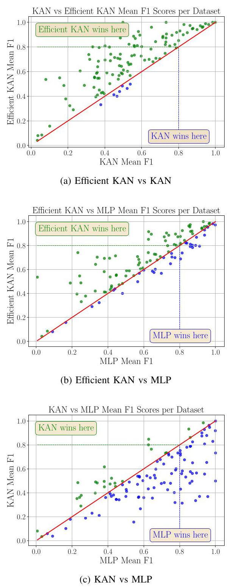

Fig. 8: Scatter plots comparing mean F1 scores of different model pairs.

图8:比较不同模型对平均F1分数的散点图

## D. Interpretability analysis

## D. 可解释性分析

In this section, we evaluate the interpretability of the KAN model and compare it with the interpretability of MLP, following the methodology described in Section IV-F. The interpretability of the two models is demonstrated using the SmoothSubspace dataset from the UCR archive shown in Fig. 1 We compare the interpretability of the KAN model with the best MLP configuration (see Table V), which achieved an F1 score of almost 0.88 on the used dataset, which is similar to the fine-tuned KAN model utilised to demonstrate interpretability described in Section IV-F

在本节中，我们按照第四节F部分所述的方法评估KAN模型的可解释性，并将其与MLP的可解释性进行比较。使用图1所示的UCR存档中的SmoothSubspace数据集展示这两个模型的可解释性。我们将KAN模型的可解释性与最佳MLP配置(见表五)进行比较，该配置在使用的数据集上实现了接近0.88的F1分数，这与第四节F部分用于展示可解释性的微调KAN模型相似。

Unlike traditional neural networks such as MLPs, which require post-hoc techniques like SHAP to gain interpretability, KANs offer interpretability by design through their composition graph. Fig. 9 provides a visualization of the structure of the KAN model, where the thickness of the edges represents the importance of the connections based on the edge scores according to Section IV-F The corresponding B-splines for these edges show which function is applied to the input features and provide information on how the input features are modified by the architecture. The x-axis of the enhanced B-spline in Fig. 9 represents the range of input features, while the y-axis indicates the corresponding outputs of the spline function applied to these inputs.

与传统神经网络(如多层感知器)不同，多层感知器需要诸如SHAP等事后技术来获得可解释性，而KAN通过其组合图在设计时就提供了可解释性。图9展示了KAN模型的结构可视化，其中边的粗细表示基于第四章F部分的边得分的连接重要性。这些边对应的B样条显示了应用于输入特征的函数，并提供了关于输入特征如何被该架构修改的信息。图9中增强B样条的x轴表示输入特征的范围，而y轴表示应用于这些输入的样条函数的相应输出。

Looking at the KAN graph in Fig. 9 it can be seen that features ${x}_{5},{x}_{10}$ , and ${x}_{12}$ emerge as the most influential for the models decision, based on the edge weights where thicker lines represent higher edge weight. Looking at Fig. 1 that input features ${x}_{5},{x}_{10}$ are effective in differentiating class ${y}_{2}$ from classes ${y}_{1}$ and ${y}_{3}$ , while feature ${x}_{12}$ further distinguishes between classes ${y}_{1}$ and ${y}_{3}$ . Additionally, looking at class ${y}_{3}$ in Fig. 1, we can see that majority of the values within the dataset are whithin $\left\lbrack  {0,1}\right\rbrack$ for input feature ${x}_{12}$ . Looking at the learned B-spline corresponding to this feature in Fig. 9 we can see that when ${x}_{12}$ is between 0 and 1, the spline increases the values up to 300 , while the values outside of this range decrease to values between 0 and -200, diminishing their contribution. Similar observations can also be made for the input features ${x}_{5}$ and ${x}_{10}$ . In contrast, looking at feature ${x}_{9}$ , we can see that it provides limited relevance for classification indicated by its thinner connection edges in Fig. 9. As seen in Fig. 1, it helps separating class ${y}_{2}$ , but offers little distinction between classes ${y}_{1}$ and ${y}_{3}$ , where values largely overlap. This aligns with the low model sensitivity reflected in the KAN graph.

从图9中的KAN图可以看出，基于边权重(较粗的线表示较高的边权重)，特征${x}_{5},{x}_{10}$和${x}_{12}$对模型决策的影响最为显著。从图1可以看出，输入特征${x}_{5},{x}_{10}$在区分${y}_{2}$类与${y}_{1}$类和${y}_{3}$类时有效，而特征${x}_{12}$进一步区分了${y}_{1}$类和${y}_{3}$类。此外，查看图1中的${y}_{3}$类，我们可以看到数据集中大多数值在输入特征${x}_{12}$的$\left\lbrack  {0,1}\right\rbrack$范围内。查看图9中与该特征对应的学习到的B样条，我们可以看到当${x}_{12}$在0到1之间时，样条将值增加到300，而此范围之外的值减小到0到 -200之间的值，从而减少了它们的贡献。对于输入特征${x}_{5}$和${x}_{10}$也可以进行类似的观察。相比之下，查看特征${x}_{9}$，我们可以看到它在图9中的连接边较细，表明其对分类的相关性有限。如图1所示，它有助于区分${y}_{2}$类，但在${y}_{1}$类和${y}_{3}$类之间区分不大，其中值大部分重叠。这与KAN图中反映的低模型敏感性一致。

To validate and further quantify feature contributions and also compare feature importance of KAN to MLP, we apply SHAP analysis as described in Section IV-F This allows us to validate whether the influential features identified through KAN's structure and learned B-splines in Fig. 9 are also reflected consistently by the more established SHAP explanations. Figs. 10 and 11 display the feature importance for each class of the SmoothSubspace dataset for both KAN and MLP, sorted from the most important to the least important feature for each predicted class. Each figure is divided into three sections, corresponding to the three output classes. In the plots, each feature's contribution is represented by its SHAP value, which indicates whether it positively contributes to the prediction or negatively. Feature values are color-coded, with red indicating high values and blue low values. As it can be seen in Fig. 1, 2 represents the highest value, while -2 represents the lowest value. Middle-range values between -1 to 1, are shown as purple dots. Purple dots correspond to the flat parts of the series, where consecutive values show minimal variation, while red and blue dots are associated with the highly fluctuating sections of the series.

为了验证并进一步量化特征贡献，同时比较KAN和MLP的特征重要性，我们应用第四章F部分所述的SHAP分析。这使我们能够验证通过KAN结构和图9中学习到的B样条识别出的有影响的特征是否也能在更成熟的SHAP解释中得到一致反映。图10和图11展示了KAN和MLP对SmoothSubspace数据集每个类别的特征重要性，按每个预测类别的最重要到最不重要特征排序。每个图分为三个部分，对应三个输出类。在图中，每个特征的贡献由其SHAP值表示，该值表明它对预测是正向贡献还是负向贡献。特征值用颜色编码，红色表示高值，蓝色表示低值。如图1所示，2表示最高值，而 -2表示最低值。介于 -1到1之间的中间值显示为紫色点。紫色点对应于序列的平坦部分，其中连续值变化最小，而红色和蓝色点与序列的高度波动部分相关。

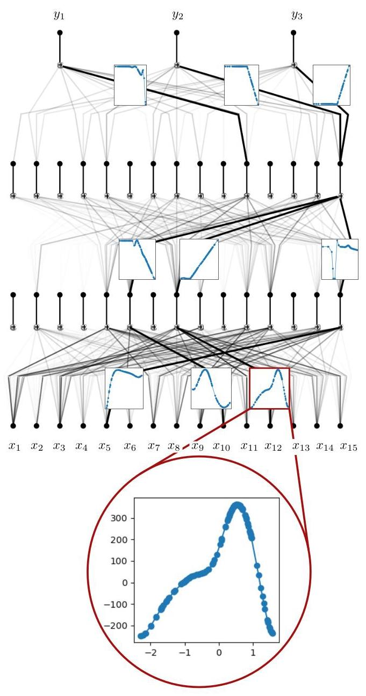

Fig. 9: KAN model with edge thickness indicating connection importance and B-spline plots showing learned functions on edges.

图9:KAN模型，边的粗细表示连接重要性，B样条图显示边上学习到的函数。

Examining the SHAP plot for the KAN model in Fig. 10 it can be seen that the top contributors, features ${x}_{10}$ and ${x}_{12}$ consistently stand out, aligning with KAN's interpretability findings from Fig. [9] Interestingly, compared to the feature importance from Fig. 9, feature ${x}_{5}$ is not present among the top contributors according to SHAP. This contrast shows how different interpretability methods can yield complementary insights, each capturing unique aspects of feature importance.

检查图10中KAN模型的SHAP图，可以看到最重要的贡献特征${x}_{10}$和${x}_{12}$始终突出，这与图[9]中KAN的可解释性发现一致。有趣的是，与图9中的特征重要性相比，根据SHAP，特征${x}_{5}$不在最重要的贡献特征中。这种对比表明不同的可解释性方法如何能产生互补的见解，每种方法都捕捉到特征重要性的独特方面。

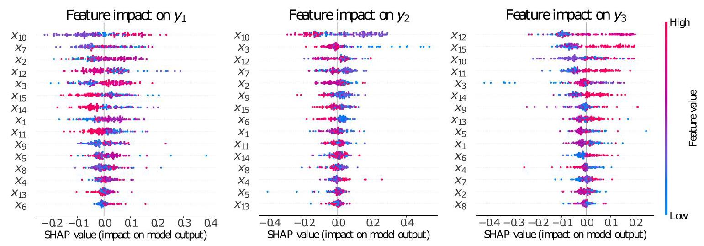

Fig. 10: SHAP summary plots showing feature impacts in KAN model

图10:SHAP总结图显示KAN模型中的特征影响

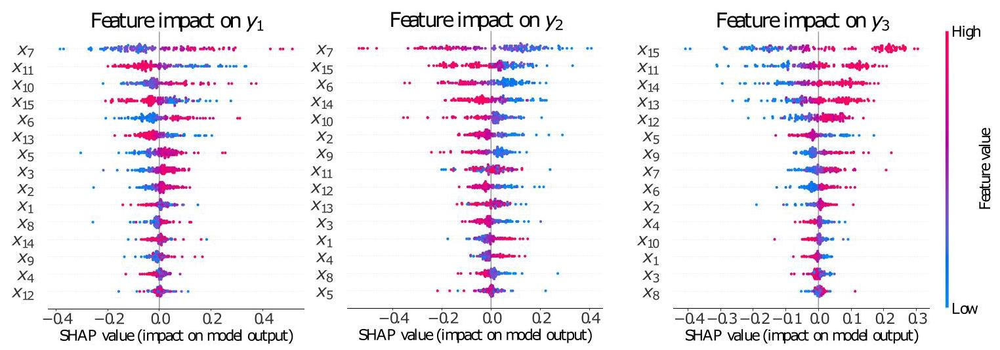

Fig. 11: SHAP summary plots showing feature impacts in MLP model

图11:SHAP总结图显示MLP模型中的特征影响

For the MLP model, which lacks inherent interpretability, SHAP is essential. Fig. 11 presents SHAP-based feature importances for MLP. As it can be seen, feature ${x}_{7}$ is the most important in distinguishing classes ${y}_{1}$ and ${y}_{2}$ , compared to ${x}_{10}$ for KAN model. However, for both MLP and KAN the ${x}_{10}$ and ${x}_{7}$ are shown as top 4 contributing features in distinguishing between the classes, indicating that both MLP and KAN model in general consider similar features as key to distinguish between the three classes.

对于缺乏内在可解释性的多层感知器(MLP)模型，SHAP至关重要。图11展示了基于SHAP的MLP特征重要性。可以看出，与KAN模型的${x}_{10}$相比，特征${x}_{7}$在区分类别${y}_{1}$和${y}_{2}$时最为重要。然而，对于MLP和KAN，${x}_{10}$和${x}_{7}$在区分类别时均显示为前四大贡献特征，这表明MLP和KAN模型总体上都将类似特征视为区分这三个类别的关键。

However, while both models highlight similar features overall, it is evident that for KAN the SHAP color coding aligns consistently with the structure of the time series, whereas in the MLP the color mapping appears more scattered and less coherent with the underlying sequential patterns, which makes its feature contributions harder to interpret in relation to the original series.

然而，虽然两个模型总体上都突出了类似特征，但很明显，对于KAN，SHAP颜色编码与时间序列结构一致，而在MLP中，颜色映射显得更加分散，与底层序列模式的连贯性较差，这使得其特征贡献相对于原始序列更难解释。

In summary, KAN provides interpretability inherently through its graph structure and learned splines. SHAP is employed primarily to validate and complement this built-in transparency. In contrast, MLP requires SHAP or similar tools to expose any interpretability, underscoring the advantage of KANs in applications where understanding model decisions is critical.

总之，KAN通过其图结构和学习到的样条曲线固有地提供可解释性。SHAP主要用于验证和补充这种内置的透明度。相比之下，MLP需要SHAP或类似工具来展现任何可解释性，这突出了KAN在理解模型决策至关重要的应用中的优势。

## VI. CONCLUSION

## 六、结论

The aim of this study was to conduct a comprehensive and robust exploration of the KAN architecture for time series classification. To achieve that, we first investigated the transferability of reference Kolmogorov-Arnold Networks (KANs) from regression to classification tasks, running a large number of models across 117 diverse datasets from the UCR Benchmark. We conducted hyperparameter search on two KAN implementations in view of finding the best architecture for the task at hand and concluded with an interpretability analysis. Our findings show that the Efficient KAN implementation has a significant performance improvement over the original KAN and is also superior to MLPs by 6 percentage points in F1 score on the reference architectures. The hyperparameter analysis revealed that Efficient KAN consistently outperforms KAN across variations in grid size, depth, and layer size, showcasing its robustness and adaptability to diverse datasets. Efficient KAN proved more stable than KAN across grid sizes, depths, and layer configurations, particularly with lower learning rates. The interpretability of KANs was confirmed through SHAP analysis and B-spline visualization, highlighting their potential for transparent decision-making. In contrast, MLPs, though competitive in performance, exhibited less interpretability. Future work could explore hybrid architectures and further optimization to enhance KAN's application scope.

本研究的目的是对用于时间序列分类的KAN架构进行全面而稳健的探索。为此，我们首先研究了参考柯尔莫哥洛夫 - 阿诺德网络(KAN)从回归到分类任务的可迁移性，在来自UCR基准的117个不同数据集上运行了大量模型。鉴于要找到适合手头任务的最佳架构，我们对两种KAN实现进行了超参数搜索，并以可解释性分析作为结束。我们的研究结果表明，高效KAN实现在性能上比原始KAN有显著提升，并且在参考架构上的F1分数比MLP高出6个百分点。超参数分析表明，在网格大小、深度和层大小的变化中，高效KAN始终优于KAN，展示了其对不同数据集的鲁棒性和适应性。在不同的网格大小、深度和层配置中，高效KAN比KAN更稳定，特别是在较低学习率下。通过SHAP分析和B样条可视化证实了KAN的可解释性，突出了它们在透明决策方面的潜力。相比之下，MLP虽然在性能上具有竞争力，但可解释性较差。未来的工作可以探索混合架构并进一步优化，以扩大KAN的应用范围。

## FUNDING

## 资金

This work was supported by the Slovenian Research Agency (Javna Agencija za Raziskovalno Dejavnost RS) under grant P2-0016. A preprint has previously been published [33].

本工作得到了斯洛文尼亚研究机构(Javna Agencija za Raziskovalno Dejavnost RS)的资助，项目编号为P2 - 0016。此前已发表预印本[33]。

Conflict of Interest: The authors declare that they have no conflict of interest.

利益冲突:作者声明他们没有利益冲突。

## REFERENCES

## 参考文献

[1] W. K. Wang, I. Chen, L. Hershkovich, J. Yang, A. Shetty, G. Singh,Y. Jiang, A. Kotla, J. Z. Shang, R. Yerrabelli et al., "A systematic review of time series classification techniques used in biomedical applications,"

Y. Jiang、A. Kotla、J. Z. Shang、R. Yerrabelli等人，“生物医学应用中时间序列分类技术的系统综述”Sensors, vol. 22, no. 20, p. 8016, 2022.

[2] R. Devaki, V. Kathiresan, and S. Gunasekaran, "Credit card frauddetection using time series analysis," International Journal of Computer

“使用时间序列分析进行检测”，《国际计算机杂志》Applications, vol. 3, pp. 8-10, 2014.

[3] J. Yang, M. N. Nguyen, P. P. San, X. Li, and S. Krishnaswamy, "Deepconvolutional neural networks on multichannel time series for human

“用于人类的多通道时间序列上的卷积神经网络”activity recognition." in Ijcai, vol. 15. Buenos Aires, Argentina, 2015,pp. 3995-4001.

[4] C. Gómez, J. C. White, and M. A. Wulder, "Optical remotely sensedtime series data for land cover classification: A review," ISPRS Journal

“用于土地覆盖分类的时间序列数据综述”，《国际摄影测量与遥感学会杂志》of photogrammetry and Remote Sensing, vol. 116, pp. 55-72, 2016.

[5] A. Bagnall, M. Middlehurst, G. Forestier, A. Ismail-Fawaz, A. Guil-laume, D. Guijo-Rubio, C. W. Tan, A. Dempster, and G. I. Webb, "A hands-on introduction to time series classification and regression," in Proceedings of the 30th ACM SIGKDD Conference on Knowledge

laume、D. Guijo - Rubio、C. W. Tan、A. Dempster和G. I. Webb，“时间序列分类和回归的实践介绍”，发表于第30届ACM SIGKDD知识发现会议论文集Discovery and Data Mining, 2024, pp. 6410-6411.

[6] H. Ismail Fawaz, G. Forestier, J. Weber, L. Idoumghar, and P.-A. Muller,"Deep learning for time series classification: a review," Data mining and

“深度学习用于时间序列分类:综述”，《数据挖掘与》knowledge discovery, vol. 33, no. 4, pp. 917-963, 2019.

[7] M. Middlehurst, P. Schäfer, and A. Bagnall, "Bake off redux: a reviewand experimental evaluation of recent time series classification algo-

“近期时间序列分类算法的实验评估”rithms," Data Mining and Knowledge Discovery, pp. 1-74, 2024.

[8] A. Bagnall, J. Lines, J. Hills, and A. Bostrom, "Time-series classificationwith cote: The collective of transformation-based ensembles," IEEE Transactions on Knowledge and Data Engineering, vol. 27, no. 9, pp. 2522-2535, 2015.

与科特相关:基于变换的集成方法的集合，《IEEE 知识与数据工程汇刊》，第 27 卷，第 9 期，第 2522 - 2535 页，2015 年。

[9] M. Middlehurst, J. Large, M. Flynn, J. Lines, A. Bostrom, and A. Bag-nall, "Hive-cote 2.0: a new meta ensemble for time series classification,"

纳尔，“Hive - cote 2.0:一种用于时间序列分类的新元集成方法”Machine Learning, vol. 110, no. 11, pp. 3211-3243, 2021.

[10] Y. Liang, H. Wen, Y. Nie, Y. Jiang, M. Jin, D. Song, S. Pan, and Q. Wen,"Foundation models for time series analysis: A tutorial and survey," in Proceedings of the 30th ACM SIGKDD Conference on Knowledge

“时间序列分析的基础模型:教程与综述”，发表于第 30 届 ACM SIGKDD 知识会议论文集Discovery and Data Mining, 2024, pp. 6555-6565.

[11] G. Bachmann, S. Anagnostidis, and T. Hofmann, "Scaling mlps: A taleof inductive bias," Advances in Neural Information Processing Systems, vol. 36, 2024.

关于归纳偏差”，《神经信息处理系统进展》，第 36 卷，2024 年。

[12] D. Teney, A. M. Nicolicioiu, V. Hartmann, and E. Abbasnejad, "Neuralredshift: Random networks are not random functions," in Proceedings of the IEEE/CVF Conference on Computer Vision and Pattern Recognition, 2024, pp. 4786-4796.

红移:随机网络不是随机函数”，发表于 IEEE/CVF 计算机视觉与模式识别会议论文集，2024 年，第 4786 - 4796 页。

[13] N. Ahmed, M. Wahed, and N. C. Thompson, "The growing influenceof industry in ai research," Science, vol. 379, no. 6635, pp. 884-886, 2023. [Online]. Available: https://www.science.org/doi/abs/ 10.1126/science.ade2420

人工智能研究中的行业情况”，《科学》，第 379 卷，第 6635 期，第 884 - 886 页，2023 年。[在线]。可获取:https://www.science.org/doi/abs/10.1126/science.ade2420

[14] Z. Liu, Y. Wang, S. Vaidya, F. Ruehle, J. Halverson, M. Soljačić,T. Y. Hou, and M. Tegmark, "Kan: Kolmogorov-arnold networks," arXiv

T. Y. 侯和 M. 泰格马克，“Kan:柯尔莫哥洛夫 - 阿诺德网络”，arXivpreprint arXiv:2404.19756, 2024.

[15] Z. Liu, P. Ma, Y. Wang, W. Matusik, and M. Tegmark, "Kan2.0: Kolmogorov-arnold networks meet science," arXiv preprint

2.0:柯尔莫哥洛夫 - 阿诺德网络与科学相遇”，arXiv 预印本arXiv:2408.10205, 2024.

[16] R. Yu, W. Yu, and X. Wang, "Kan or mlp: A fairer comparison," arXiv preprint arXiv:2407.16674, 2024.

[17] H. Shen, C. Zeng, J. Wang, and Q. Wang, "Reduced effectiveness ofkolmogorov-arnold networks on functions with noise," arXiv preprint

带噪声函数上的柯尔莫哥洛夫 - 阿诺德网络”，arXiv 预印本arXiv:2407.14882, 2024.

[18] Z. Bozorgasl and H. Chen, "Wav-kan: Wavelet kolmogorov-arnold networks," arXiv preprint arXiv:2405.12832, 2024.

[19] R. Bresson, G. Nikolentzos, G. Panagopoulos, M. Chatzianastasis,J. Pang, and M. Vazirgiannis, "Kagnns: Kolmogorov-arnold networks

J. 庞和 M. 瓦齐尔吉安尼斯，“Kagnns:柯尔莫哥洛夫 - 阿诺德网络meet graph learning," arXiv preprint arXiv:2406.18380, 2024.

[20] R. Genet and H. Inzirillo, "Tkan: Temporal kolmogorov-arnold networks," arXiv preprint arXiv:2405.07344, 2024.

[21] —, "A temporal kolmogorov-arnold transformer for time series forecasting," arXiv preprint arXiv:2406.02486, 2024.

[22] X. Han, X. Zhang, Y. Wu, Z. Zhang, and Z. Wu, "Kan4tsf: Are kan andkan-based models effective for time series forecasting?" arXiv preprint

基于 kan 的模型对时间序列预测有效吗？”，arXiv 预印本arXiv:2408.11306, 2024.

[23] C. J. Vaca-Rubio, L. Blanco, R. Pereira, and M. Caus, "Kolmogorov-arnold networks (kans) for time series analysis," arXiv preprint

用于时间序列分析的阿诺德网络(kans)”，arXiv 预印本arXiv:2405.08790, 2024.

[24] I. E. Livieris, "C-kan: A new approach for integrating convolutionallayers with kolmogorov-arnold networks for time-series forecasting,"

用于时间序列预测的带柯尔莫哥洛夫 - 阿诺德网络的层”Mathematics, vol. 12, no. 19, p. 3022, 2024.

[25] C. Dong, L. Zheng, and W. Chen, "Kolmogorov-arnold networks(kan) for time series classification and robust analysis," arXiv preprint

(kan)用于时间序列分类和稳健分析”，arXiv 预印本arXiv:2408.07314, 2024.

[26] K. Xu, L. Chen, and S. Wang, "Kolmogorov-arnold networks for timeseries: Bridging predictive power and interpretability," arXiv preprint

时间序列:连接预测能力和可解释性”，arXiv 预印本arXiv:2406.02496, 2024.

[27] H. Inzirillo and R. Genet, "Sigkan: Signature-weighted kolmogorov-arnold networks for time series," arXiv preprint arXiv:2406.17890, 2024.

[28] H. A. Dau, A. Bagnall, K. Kamgar, C.-C. M. Yeh, Y. Zhu, S. Gharghabi,C. A. Ratanamahatana, and E. Keogh, "The ucr time series archive," IEEE/CAA Journal of Automatica Sinica, vol. 6, no. 6, pp. 1293-1305, 2019.

C. A. 拉塔纳马哈塔纳和 E. 基奥，“UCR 时间序列存档”，《IEEE/CAA 自动化学报》，第 6 卷，第 6 期，第 1293 - 1305 页，2019 年。

[29] Blealtan, "Efficient-kan," 2024, gitHub repository. [Online]. Available:https://github.com/Blealtan/efficient-kan

[30] B. Subramaniam, W. Saunders, T. Scogland, and W.-c. Feng, "Trends inenergy-efficient computing: A perspective from the green500," in 2013

“节能计算:绿色500强的视角”，2013年International Green Computing Conference Proceedings. IEEE, 2013,pp. 1-8.

[31] S. Lundberg, "A unified approach to interpreting model predictions," arXiv preprint arXiv:1705.07874, 2017.

[32] H. Ismail Fawaz, B. Lucas, G. Forestier, C. Pelletier, D. F. Schmidt,J. Weber, G. I. Webb, L. Idoumghar, P.-A. Muller, and F. Petitjean, "Inceptiontime: Finding alexnet for time series classification," Data

J. 韦伯、G. I. 韦伯、L. 伊杜姆加尔、P.-A. 米勒和F. 佩蒂让，“初始时间:为时间序列分类寻找AlexNet”，数据Mining and Knowledge Discovery, vol. 34, no. 6, pp. 1936-1962, 2020.

[33] I. Barašin, B. Bertalanič, M. Mohorčič, and C. Fortuna, "Exploringkolmogorov-arnold networks for interpretable time series classification,"

用于可解释时间序列分类的柯尔莫哥洛夫 - 阿诺德网络arXiv preprint arXiv:2411.14904, 2024.

## APPENDIX

## 附录

In this section, we present a summary table of the average F1-scores for the best-performing models identified during our experiments. Specifically, this includes the Kolmogorov-Arnold Network (KAN) with configuration [40], G = 5 and learning rate 0.1, the Efficient KAN variant with configuration $\left\lbrack  {{40},{40}}\right\rbrack  ,\mathrm{G} = 3$ and learning rate 0.001, and a baseline Multi-Layer Perceptron (MLP) with three hidden layers of size 300 and a learning rate of 0.001 . The results are reported as mean F1-scores averaged across five random seeds to ensure robustness and comparability. The table is structured as follows: The first column lists the dataset names, followed by the size of the training and test subsets. The next column shows the length of the time series (input) and the number of classes (output), which correspond to the input and output layer sizes of the models. The remaining columns display the average F1-scores and standard deviations for each model configuration.

在本节中，我们展示了在实验中确定的最佳性能模型的平均F1分数汇总表。具体而言，这包括配置为[40]、G = 5且学习率为0.1的柯尔莫哥洛夫 - 阿诺德网络(KAN)，配置为$\left\lbrack  {{40},{40}}\right\rbrack  ,\mathrm{G} = 3$且学习率为0.001的高效KAN变体，以及具有三个大小为300的隐藏层且学习率为0.001的基线多层感知器(MLP)。结果报告为在五个随机种子上平均的平均F1分数，以确保稳健性和可比性。表格结构如下:第一列列出数据集名称，后跟训练和测试子集的大小。下一列显示时间序列(输入)的长度和类别数量(输出)，它们对应于模型的输入和输出层大小。其余列显示每个模型配置的平均F1分数和标准差。

<table><tr><td>Name</td><td>Train/Test</td><td>Length/Class</td><td>KAN</td><td>Efficient KAN</td><td>MLP</td></tr><tr><td>Adiac</td><td>390 / 391</td><td>176 / 37</td><td>0.401 ± 0.051</td><td>0.694 ± 0.019</td><td>0.409 ± 0.026</td></tr><tr><td>ArrowHead</td><td>36 / 175</td><td>251 / 3</td><td>0.430 ± 0.039</td><td>0.688 ± 0.005</td><td>0.805 ± 0.013</td></tr><tr><td>Beef</td><td>30 / 30</td><td>470 / 5</td><td>0.334 ± 0.092</td><td>0.801 ± 0.000</td><td>0.889 ± 0.015</td></tr><tr><td>BeetleFly</td><td>20 / 20</td><td>512 / 2</td><td>0.565 ± 0.065</td><td>0.869 ± 0.028</td><td>0.894 ± 0.001</td></tr><tr><td>BirdChicken</td><td>20 / 20</td><td>512 / 2</td><td>0.560 ± 0.061</td><td>0.734 ± 0.000</td><td>0.755 ± 0.051</td></tr><tr><td>Car</td><td>60 / 60</td><td>577 / 4</td><td>0.600 ± 0.076</td><td>0.803 ± 0.034</td><td>0.780 ± 0.016</td></tr><tr><td>CBF</td><td>30 / 900</td><td>128 / 3</td><td>0.480 ± 0.063</td><td>0.956 ± 0.006</td><td>0.857 ± 0.002</td></tr><tr><td>ChlorineConcentration</td><td>467 / 3840</td><td>166 / 3</td><td>0.484 ± 0.019</td><td>0.741 ± 0.007</td><td>0.232 ± 0.000</td></tr><tr><td>CinCECGTorso</td><td>40 / 1380</td><td>1639 / 4</td><td>0.425 ± 0.075</td><td>0.799 ± 0.010</td><td>0.733 ± 0.009</td></tr><tr><td>Coffee</td><td>28 / 28</td><td>286 / 2</td><td>0.498 ± 0.076</td><td>1.000 ± 0.000</td><td>1.000 ± 0.000</td></tr><tr><td>Computers</td><td>250 / 250</td><td>720 / 2</td><td>0.538 ± 0.023</td><td>0.498 ± 0.007</td><td>0.566 ± 0.030</td></tr><tr><td>CricketX</td><td>390 / 390</td><td>300 / 12</td><td>0.344 ± 0.009</td><td>0.550 ± 0.012</td><td>0.446 ± 0.006</td></tr><tr><td>CricketY</td><td>390 / 390</td><td>300 / 12</td><td>0.369 ± 0.016</td><td>0.546 ± 0.010</td><td>0.500 ± 0.012</td></tr><tr><td>CricketZ</td><td>390 / 390</td><td>300 / 12</td><td>0.344 ± 0.022</td><td>0.555 ± 0.017</td><td>0.447 ± 0.025</td></tr><tr><td>DiatomSizeReduction</td><td>16 / 306</td><td>345 / 4</td><td>0.401 ± 0.047</td><td>0.809 ± 0.020</td><td>0.770 ± 0.013</td></tr><tr><td>DistalPhalanxOutlineAgeGroup</td><td>400 / 139</td><td>80 / 3</td><td>0.489 ± 0.049</td><td>0.589 ± 0.007</td><td>0.519 ± 0.016</td></tr><tr><td>DistalPhalanxOutlineCorrect</td><td>600 / 276</td><td>80 / 2</td><td>0.677 ± 0.043</td><td>0.708 ± 0.004</td><td>0.692 ± 0.014</td></tr><tr><td>DistalPhalanxTW</td><td>400 / 139</td><td>80 / 6</td><td>0.397 ± 0.026</td><td>0.420 ± 0.011</td><td>0.329 ± 0.010</td></tr><tr><td>Earthquakes</td><td>322 / 139</td><td>512 / 2</td><td>0.495 ± 0.028</td><td>0.483 ± 0.025</td><td>0.481 ± 0.011</td></tr><tr><td>ECG200</td><td>100 / 100</td><td>96 / 2</td><td>0.714 ± 0.075</td><td>0.876 ± 0.010</td><td>0.804 ± 0.022</td></tr><tr><td>ECG5000</td><td>500 / 4500</td><td>140 / 5</td><td>0.495 ± 0.025</td><td>0.582 ± 0.007</td><td>0.379 ± 0.001</td></tr><tr><td>ECGFiveDays</td><td>23 / 861</td><td>136 / 2</td><td>0.556 ± 0.053</td><td>0.887 ± 0.005</td><td>0.939 ± 0.006</td></tr><tr><td>ElectricDevices</td><td>8926 / 7711</td><td>96 / 7</td><td>0.289 ± 0.032</td><td>0.488 ± 0.007</td><td>0.249 ± 0.016</td></tr><tr><td>FaceAll</td><td>560 / 1690</td><td>131 / 14</td><td>0.546 ± 0.042</td><td>0.728 ± 0.012</td><td>0.659 ± 0.007</td></tr><tr><td>FaceFour</td><td>24 / 88</td><td>350 / 4</td><td>0.318 ± 0.027</td><td>0.699 ± 0.011</td><td>0.774 ± 0.021</td></tr><tr><td>FacesUCR</td><td>200 / 2050</td><td>131 / 14</td><td>0.432 ± 0.030</td><td>0.741 ± 0.008</td><td>0.625 ± 0.012</td></tr><tr><td>FiftyWords</td><td>450 / 455</td><td>270 / 50</td><td>0.178 ± 0.019</td><td>0.487 ± 0.005</td><td>0.190 ± 0.015</td></tr><tr><td>Fish</td><td>175 / 175</td><td>463 / 7</td><td>0.675 ± 0.035</td><td>0.843 ± 0.006</td><td>0.827 ± 0.014</td></tr><tr><td>FordA</td><td>3601 / 1320</td><td>500 / 2</td><td>0.482 ± 0.063</td><td>0.703 ± 0.007</td><td>0.340 ± 0.000</td></tr><tr><td>FordB</td><td>3636 / 810</td><td>500 / 2</td><td>0.490 ± 0.022</td><td>0.643 ± 0.012</td><td>0.331 ± 0.000</td></tr><tr><td>GunPoint</td><td>50 / 150</td><td>150 / 2</td><td>0.734 ± 0.081</td><td>0.905 ± 0.005</td><td>0.727 ± 0.041</td></tr><tr><td>Ham</td><td>109 / 105</td><td>431 / 2</td><td>0.640 ± 0.050</td><td>0.699 ± 0.007</td><td>0.711 ± 0.012</td></tr><tr><td>HandOutlines</td><td>1000 / 370</td><td>2709 / 2</td><td>0.787 ± 0.048</td><td>0.792 ± 0.007</td><td>0.859 ± 0.016</td></tr><tr><td>Haptics</td><td>155 / 308</td><td>1092 / 5</td><td>0.389 ± 0.026</td><td>0.432 ± 0.007</td><td>0.413 ± 0.017</td></tr><tr><td>Herring</td><td>64 / 64</td><td>512 / 2</td><td>0.477 ± 0.070</td><td>0.568 ± 0.028</td><td>0.698 ± 0.035</td></tr><tr><td>InlineSkate</td><td>100 / 550</td><td>1882 / 7</td><td>0.229 ± 0.015</td><td>0.290 ± 0.009</td><td>0.311 ± 0.010</td></tr><tr><td>InsectWingbeatSound</td><td>220 / 1980</td><td>256 / 11</td><td>0.359 ± 0.047</td><td>0.594 ± 0.004</td><td>0.600 ± 0.015</td></tr><tr><td>ItalyPowerDemand</td><td>67 / 1029</td><td>24 / 2</td><td>0.878 ± 0.020</td><td>0.951 ± 0.002</td><td>0.951 ± 0.005</td></tr><tr><td>LargeKitchenAppliances</td><td>375 / 375</td><td>720 / 3</td><td>0.480 ± 0.034</td><td>0.438 ± 0.013</td><td>0.439 ± 0.011</td></tr><tr><td>Lightning2</td><td>60 / 61</td><td>637 / 2</td><td>0.661 ± 0.088</td><td>0.680 ± 0.026</td><td>0.675 ± 0.037</td></tr><tr><td>Lightning7</td><td>70 / 73</td><td>319 / 7</td><td>0.361 ± 0.057</td><td>0.639 ± 0.017</td><td>0.570 ± 0.028</td></tr><tr><td>Mallat</td><td>55 / 2345</td><td>1024 / 8</td><td>0.496 ± 0.053</td><td>0.921 ± 0.008</td><td>0.869 ± 0.041</td></tr><tr><td>Meat</td><td>60 / 60</td><td>448 / 3</td><td>0.807 ± 0.125</td><td>0.930 ± 0.006</td><td>0.939 ± 0.009</td></tr><tr><td>MedicalImages</td><td>381 / 760</td><td>99 / 10</td><td>0.361 ± 0.039</td><td>0.546 ± 0.015</td><td>0.242 ± 0.028</td></tr><tr><td>MiddlePhalanxOutlineAgeGroup</td><td>400 / 154</td><td>80 / 3</td><td>0.351 ± 0.043</td><td>0.395 ± 0.024</td><td>0.227 ± 0.043</td></tr><tr><td>MiddlePhalanxOutlineCorrect</td><td>600 / 291</td><td>80 / 2</td><td>0.521 ± 0.043</td><td>0.463 ± 0.013</td><td>0.420 ± 0.027</td></tr><tr><td>MiddlePhalanxTW</td><td>399 / 154</td><td>80 / 6</td><td>0.378 ± 0.026</td><td>0.331 ± 0.010</td><td>0.251 ± 0.002</td></tr><tr><td>MoteStrain</td><td>20 / 1252</td><td>8472</td><td>0.576 ± 0.088</td><td>0.811 ± 0.013</td><td>0.860 ± 0.002</td></tr><tr><td>NonInvasiveFetalECGThorax1</td><td>1800 / 1965</td><td>750 / 42</td><td>0.590 ± 0.038</td><td>0.896 ± 0.005</td><td>0.777 ± 0.009</td></tr><tr><td>NonInvasiveFetalECGThorax2</td><td>1800 / 1965</td><td>750 / 42</td><td>0.582 ± 0.049</td><td>0.925 ± 0.002</td><td>0.815 ± 0.019</td></tr><tr><td>OliveOil</td><td>30 / 30</td><td>570 / 4</td><td>0.531 ± 0.047</td><td>0.822 ± 0.033</td><td>0.834 ± 0.028</td></tr></table>

Continued on next page

下一页继续

<table><tr><td>Name</td><td>Train/Test</td><td>Length/Class</td><td>KAN</td><td>Efficient KAN</td><td>MLP</td></tr><tr><td>OSULeaf</td><td>200 / 242</td><td>427 / 6</td><td>0.427 ± 0.023</td><td>0.502 ± 0.020</td><td>0.502 ± 0.010</td></tr><tr><td>PhalangesOutlinesCorrect</td><td>1800 / 858</td><td>80 / 2</td><td>0.616 ± 0.031</td><td>0.693 ± 0.014</td><td>0.380 ± 0.000</td></tr><tr><td>Phoneme</td><td>214 / 1896</td><td>1024 / 39</td><td>0.034 ± 0.004</td><td>0.042 ± 0.001</td><td>0.031 ± 0.003</td></tr><tr><td>Plane</td><td>105 / 105</td><td>144 / 7</td><td>0.829 ± 0.060</td><td>0.982 ± 0.000</td><td>0.985 ± 0.005</td></tr><tr><td>ProximalPhalanxOutlineAgeGroup</td><td>400 / 205</td><td>80 / 3</td><td>0.698 ± 0.035</td><td>0.704 ± 0.008</td><td>0.757 ± 0.016</td></tr><tr><td>ProximalPhalanxOutlineCorrect</td><td>600 / 291</td><td>80 / 2</td><td>0.780 ± 0.026</td><td>0.820 ± 0.009</td><td>0.840 ± 0.018</td></tr><tr><td>ProximalPhalanxTW</td><td>400 / 205</td><td>80 / 6</td><td>0.473 ± 0.016</td><td>0.538 ± 0.013</td><td>0.412 ± 0.012</td></tr><tr><td>RefrigerationDevices</td><td>375 / 375</td><td>720 / 3</td><td>0.449 ± 0.030</td><td>0.412 ± 0.009</td><td>0.380 ± 0.009</td></tr><tr><td>ScreenType</td><td>375 / 375</td><td>720 / 3</td><td>0.360 ± 0.021</td><td>0.410 ± 0.014</td><td>0.387 ± 0.013</td></tr><tr><td>ShapeletSim</td><td>20 / 180</td><td>500 / 2</td><td>0.466 ± 0.053</td><td>0.400 ± 0.043</td><td>0.481 ± 0.010</td></tr><tr><td>ShapesAll</td><td>600 / 600</td><td>512 / 60</td><td>0.365 ± 0.060</td><td>0.684 ± 0.007</td><td>0.572 ± 0.015</td></tr><tr><td>SmallKitchenAppliances</td><td>375 / 375</td><td>720 / 3</td><td>0.341 ± 0.049</td><td>0.472 ± 0.012</td><td>0.462 ± 0.012</td></tr><tr><td>SonyAIBORobotSurface1</td><td>20 / 601</td><td>70 / 2</td><td>0.523 ± 0.093</td><td>0.602 ± 0.008</td><td>0.664 ± 0.023</td></tr><tr><td>SonyAIBORobotSurface2</td><td>27 / 953</td><td>65 / 2</td><td>0.559 ± 0.056</td><td>0.811 ± 0.003</td><td>0.811 ± 0.002</td></tr><tr><td>StarLightCurves</td><td>1000 / 8236</td><td>1024 / 3</td><td>0.847 ± 0.024</td><td>0.916 ± 0.003</td><td>0.627 ± 0.001</td></tr><tr><td>Strawberry</td><td>613 / 370</td><td>235 / 2</td><td>0.928 ± 0.018</td><td>0.959 ± 0.002</td><td>0.938 ± 0.005</td></tr><tr><td>SwedishLeaf</td><td>500 / 625</td><td>128 / 15</td><td>0.715 ± 0.037</td><td>0.886 ± 0.006</td><td>0.739 ± 0.023</td></tr><tr><td>Symbols</td><td>25 / 995</td><td>398 / 6</td><td>0.313 ± 0.091</td><td>0.738 ± 0.007</td><td>0.814 ± 0.019</td></tr><tr><td>SyntheticControl</td><td>300 / 300</td><td>60 / 6</td><td>0.900 ± 0.016</td><td>0.941 ± 0.006</td><td>0.924 ± 0.012</td></tr><tr><td>ToeSegmentation1</td><td>40 / 228</td><td>277 / 2</td><td>0.501 ± 0.034</td><td>0.613 ± 0.012</td><td>0.595 ± 0.006</td></tr><tr><td>ToeSegmentation2</td><td>36 / 130</td><td>343 / 2</td><td>0.442 ± 0.033</td><td>0.575 ± 0.022</td><td>0.657 ± 0.016</td></tr><tr><td>Trace</td><td>100 / 100</td><td>275 / 4</td><td>0.800 ± 0.038</td><td>0.852 ± 0.014</td><td>0.626 ± 0.016</td></tr><tr><td>TwoLeadECG</td><td>23 / 1139</td><td>82 / 2</td><td>0.561 ± 0.070</td><td>0.803 ± 0.007</td><td>0.871 ± 0.026</td></tr><tr><td>TwoPatterns</td><td>1000 / 4000</td><td>128 / 4</td><td>0.789 ± 0.041</td><td>0.918 ± 0.009</td><td>0.861 ± 0.011</td></tr><tr><td>UWaveGestureLibraryAll</td><td>896 / 3582</td><td>945 / 8</td><td>0.874 ± 0.024</td><td>0.947 ± 0.003</td><td>0.924 ± 0.008</td></tr><tr><td>UWaveGestureLibraryX</td><td>896 / 3582</td><td>315 / 8</td><td>0.597 ± 0.017</td><td>0.726 ± 0.002</td><td>0.667 ± 0.018</td></tr><tr><td>UWaveGestureLibraryY</td><td>896 / 3582</td><td>315 / 8</td><td>0.541 ± 0.018</td><td>0.661 ± 0.002</td><td>0.617 ± 0.023</td></tr><tr><td>UWaveGestureLibraryZ</td><td>896 / 3582</td><td>315 / 8</td><td>0.531 ± 0.027</td><td>0.657 ± 0.007</td><td>0.576 ± 0.011</td></tr><tr><td>Wafer</td><td>1000 / 6164</td><td>152 / 2</td><td>0.963 ± 0.006</td><td>0.982 ± 0.002</td><td>0.964 ± 0.010</td></tr><tr><td>Wine</td><td>57 / 54</td><td>234 / 2</td><td>0.650 ± 0.024</td><td>0.783 ± 0.020</td><td>0.872 ± 0.033</td></tr><tr><td>WordSynonyms</td><td>267 / 638</td><td>270 / 25</td><td>0.188 ± 0.022</td><td>0.378 ± 0.012</td><td>0.275 ± 0.025</td></tr><tr><td>Worms</td><td>181 / 77</td><td>900 / 5</td><td>0.370 ± 0.033</td><td>0.450 ± 0.020</td><td>0.419 ± 0.022</td></tr><tr><td>WormsTwoClass</td><td>181 / 77</td><td>900 / 2</td><td>0.537 ± 0.021</td><td>0.568 ± 0.020</td><td>0.575 ± 0.031</td></tr><tr><td>Yoga</td><td>300 / 3000</td><td>426 / 2</td><td>0.731 ± 0.054</td><td>0.840 ± 0.006</td><td>0.721 ± 0.022</td></tr><tr><td>ACSF1</td><td>100 / 100</td><td>1460 / 10</td><td>0.525 ± 0.057</td><td>0.674 ± 0.031</td><td>0.636 ± 0.051</td></tr><tr><td>BME</td><td>30 / 150</td><td>128 / 3</td><td>0.368 ± 0.040</td><td>0.953 ± 0.006</td><td>0.957 ± 0.007</td></tr><tr><td>Chinatown</td><td>20 / 343</td><td>24 / 2</td><td>0.653 ± 0.129</td><td>0.960 ± 0.013</td><td>0.951 ± 0.007</td></tr><tr><td>Crop</td><td>7200 / 16800</td><td>46 / 24</td><td>0.453 ± 0.022</td><td>0.714 ± 0.005</td><td>0.442 ± 0.022</td></tr><tr><td>DodgerLoopDay</td><td>78 / 80</td><td>288 / 7</td><td>0.155 ± 0.030</td><td>0.549 ± 0.026</td><td>0.544 ± 0.027</td></tr><tr><td>DodgerLoopGame</td><td>20 / 138</td><td>288 / 2</td><td>0.479 ± 0.016</td><td>0.648 ± 0.020</td><td>0.749 ± 0.004</td></tr><tr><td>DodgerLoopWeekend</td><td>20 / 138</td><td>288 / 2</td><td>0.470 ± 0.098</td><td>0.708 ± 0.049</td><td>0.565 ± 0.223</td></tr><tr><td>EOGHorizontalSignal</td><td>362 / 362</td><td>1250 / 12</td><td>0.381 ± 0.051</td><td>0.427 ± 0.015</td><td>0.431 ± 0.017</td></tr><tr><td>EOGVerticalSignal</td><td>362 / 362</td><td>1250 / 12</td><td>0.210 ± 0.023</td><td>0.323 ± 0.021</td><td>0.351 ± 0.039</td></tr><tr><td>EthanolLevel</td><td>504 / 500</td><td>1751 / 4</td><td>0.355 ± 0.030</td><td>0.586 ± 0.007</td><td>0.648 ± 0.039</td></tr><tr><td>FreezerRegularTrain</td><td>150 / 2850</td><td>301 / 2</td><td>0.946 ± 0.027</td><td>0.989 ± 0.001</td><td>0.967 ± 0.006</td></tr><tr><td>FreezerSmallTrain</td><td>28 / 2850</td><td>301 / 2</td><td>0.728 ± 0.023</td><td>0.819 ± 0.006</td><td>0.804 ± 0.004</td></tr><tr><td>Fungi</td><td>18 / 186</td><td>201 / 18</td><td>0.080 ± 0.030</td><td>0.536 ± 0.014</td><td>0.006 ± 0.003</td></tr><tr><td>GunPointAgeSpan</td><td>135 / 316</td><td>150 / 2</td><td>0.932 ± 0.028</td><td>0.964 ± 0.001</td><td>0.851 ± 0.055</td></tr><tr><td>GunPointMaleVersusFemale</td><td>135 / 316</td><td>150 / 2</td><td>0.984 ± 0.009</td><td>1.000 ± 0.000</td><td>0.932 ± 0.022</td></tr><tr><td>GunPointOldVersusYoung</td><td>136 / 315</td><td>150 / 2</td><td>0.999 ± 0.001</td><td>1.000 ± 0.000</td><td>1.000 ± 0.000</td></tr><tr><td>HouseTwenty</td><td>40 / 119</td><td>2000 / 2</td><td>0.727 ± 0.020</td><td>0.748 ± 0.007</td><td>0.738 ± 0.014</td></tr><tr><td>InsectEPGRegularTrain</td><td>62 / 249</td><td>601 / 3</td><td>1.000 ± 0.000</td><td>1.000 ± 0.000</td><td>1.000 ± 0.000</td></tr><tr><td>InsectEPGSmallTrain</td><td>17 / 249</td><td>601 / 3</td><td>0.732 ± 0.155</td><td>1.000 ± 0.000</td><td>1.000 ± 0.000</td></tr><tr><td>MelbournePedestrian</td><td>1194 / 2439</td><td>24 / 10</td><td>0.764±0.032</td><td>0.895 ± 0.007</td><td>0.642 ± 0.046</td></tr><tr><td>MixedShapesRegularTrain</td><td>500 / 2425</td><td>1024 / 5</td><td>0.825±0.024</td><td>0.899 ± 0.002</td><td>0.872 ± 0.014</td></tr><tr><td>MixedShapesSmallTrain</td><td>100 / 2425</td><td>1024 / 5</td><td>0.752±0.028</td><td>0.808 ± 0.003</td><td>0.803 ± 0.014</td></tr><tr><td>PigAirwayPressure</td><td>104 / 208</td><td>2000 / 52</td><td>0.037 ± 0.010</td><td>0.080 ± 0.012</td><td>0.091 ± 0.010</td></tr><tr><td>PigArtPressure</td><td>104 / 208</td><td>2000 / 52</td><td>0.101 ± 0.014</td><td>0.157 ± 0.012</td><td>0.165 ± 0.021</td></tr><tr><td>PigCVP</td><td>104 / 208</td><td>2000 / 52</td><td>0.058 ± 0.021</td><td>0.085 ± 0.009</td><td>0.062 ± 0.006</td></tr><tr><td>PowerCons</td><td>180 / 180</td><td>144 / 2</td><td>0.918 ± 0.040</td><td>0.972 ± 0.005</td><td>0.999 ± 0.002</td></tr><tr><td>Rock</td><td>20 / 50</td><td>2844 / 4</td><td>0.266 ± 0.058</td><td>0.605 ± 0.028</td><td>0.581 ± 0.017</td></tr><tr><td>SemgHandGenderCh2</td><td>300 / 600</td><td>1500 / 2</td><td>0.732 ± 0.025</td><td>0.873 ± 0.011</td><td>0.790 ± 0.016</td></tr><tr><td>SemgHandMovementCh2</td><td>450 / 450</td><td>1500 / 6</td><td>0.411 ± 0.021</td><td>0.590 ± 0.010</td><td>0.504 ± 0.016</td></tr></table>

Continued on next page

下一页继续

<table><tr><td>Name</td><td>Train/Test</td><td>Length/Class</td><td>KAN</td><td>Efficient KAN</td><td>MLP</td></tr><tr><td>SemgHandSubjectCh2</td><td>450 / 450</td><td>1500 / 5</td><td>0.484 ± 0.056</td><td>0.873 ± 0.004</td><td>0.714 ± 0.056</td></tr><tr><td>SmoothSubspace</td><td>150 / 150</td><td>15 / 3</td><td>0.862 ± 0.048</td><td>0.974 ± 0.003</td><td>0.859 ± 0.009</td></tr><tr><td>UMD</td><td>36 / 144</td><td>150 / 3</td><td>0.369 ± 0.071</td><td>0.795 ± 0.020</td><td>0.911 ± 0.011</td></tr></table>