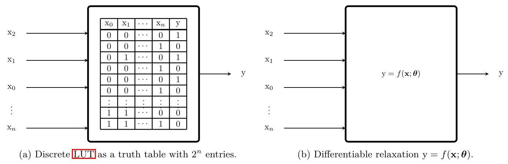
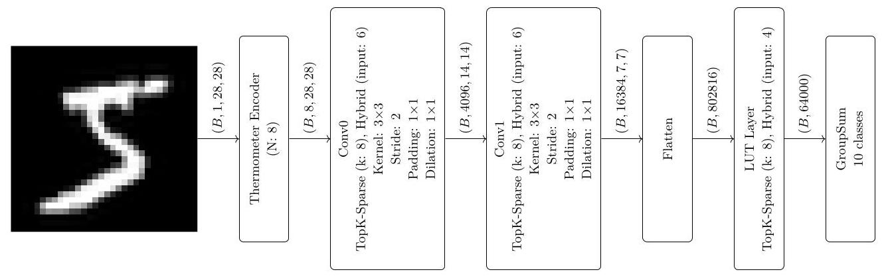
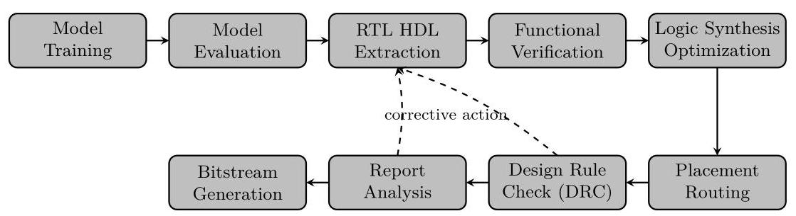
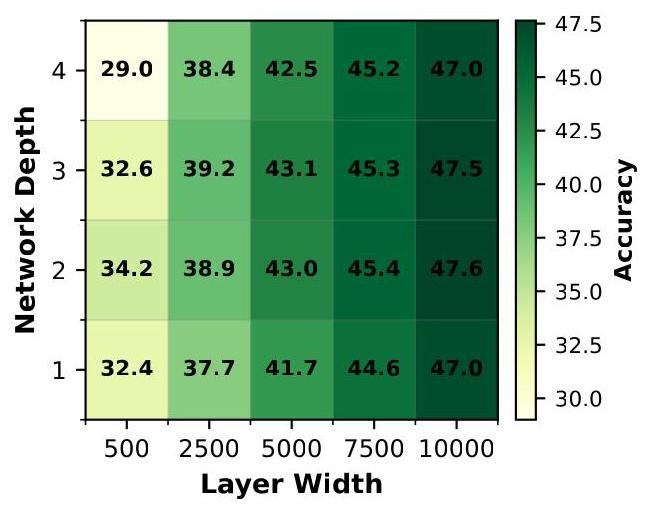
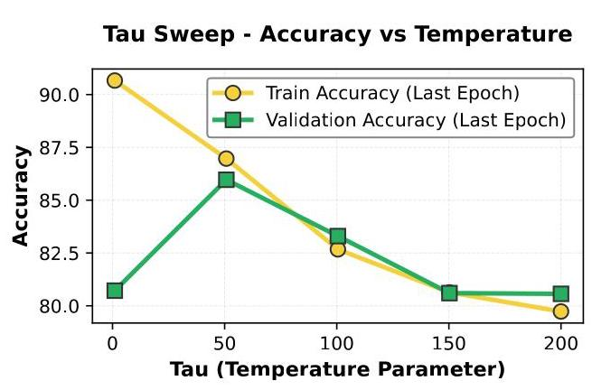

# BitLogic: Training Framework for Gradient-Based FPGA- Native Neural Networks

# 位逻辑:基于梯度的原生FPGA神经网络训练框架

Simon Bührer sbuehrer@ethz.ch

西蒙·比勒 sbuehrer@ethz.ch

ETH Zurich

苏黎世联邦理工学院

Zurich, Switzerland

瑞士苏黎世

Andreas Plesner aplesner@ethz.ch

安德烈亚斯·普莱斯纳 aplesner@ethz.ch

ETH Zurich

苏黎世联邦理工学院

Zurich, Switzerland

瑞士苏黎世

Aczel Till taczel@ethz.ch

阿泽尔·蒂尔 taczel@ethz.ch

ETH Zurich

苏黎世联邦理工学院

Zurich, Switzerland

瑞士苏黎世

Roger Wattenhofer wattenhofer@ethz.ch

罗杰·瓦滕霍费尔 wattenhofer@ethz.ch

ETH Zurich

苏黎世联邦理工学院

Zurich, Switzerland

瑞士苏黎世

## Abstract

## 摘要

The energy and latency costs of deep neural network inference are increasingly driven by deployment rather than training, motivating hardware-specialized alternatives to arithmetic-heavy models. Field-Programmable Gate Arrays (FPGAs) provide an attractive substrate for such specialization, yet existing FPGA-based neural approaches are fragmented and difficult to compare. We present BitLogic, a fully gradient-based, end-to-end trainable framework for FPGA-native neural networks built around Lookup Table (LUT) computation. BitLogic replaces multiply-accumulate operations with differentiable LUT nodes that map directly to FPGA primitives, enabling native binary computation, sparse connectivity, and efficient hardware realization. The framework offers a modular functional API supporting diverse architectures, along with learned encoders, hardware-aware heads, and multiple boundary-consistent LUT relaxations. An automated Register Transfer Level (RTL) export pipeline translates trained PyTorch models into synthesizable HDL, ensuring equivalence between software and hardware inference. Experiments across standard vision benchmarks and heterogeneous hardware platforms demonstrate competitive accuracy and substantial gains in FPGA efficiency, including 72.3% test accuracy on CIFAR-10 achieved with fewer than ${0.3}\mathrm{M}$ logic gates, while attaining sub-20 ns single-sample inference using only LUT resources. 1

深度神经网络推理的能量和延迟成本越来越多地由部署而非训练驱动，这促使人们寻求算术密集型模型的硬件专用替代方案。现场可编程门阵列(FPGA)为这种专业化提供了有吸引力的基础，但现有的基于FPGA的神经方法零散且难以比较。我们提出了BitLogic，这是一个基于查找表(LUT)计算构建的、完全基于梯度的、端到端可训练的原生FPGA神经网络框架。BitLogic用可微LUT节点取代乘法累加运算，这些节点直接映射到FPGA原语，实现原生二进制计算、稀疏连接和高效硬件实现。该框架提供了一个模块化功能API，支持多种架构，以及学习编码器、硬件感知头和多个边界一致的LUT松弛。一个自动寄存器传输级(RTL)导出管道将训练好的PyTorch模型转换为可合成的HDL，确保软件和硬件推理之间的等效性。在标准视觉基准和异构硬件平台上的实验表明，该方法具有有竞争力的准确率，并且在FPGA效率方面有显著提高，包括在CIFAR-10上达到72.3%的测试准确率，使用少于${0.3}\mathrm{M}$个逻辑门，同时仅使用LUT资源就能实现低于20纳秒的单样本推理。1

## 1 Introduction

## 1 引言

Deep Neural Networks (DNNs) have transformed applications ranging from autonomous driving to large-scale language modeling, yet their growing size and complexity increasingly strain energy and hardware resources. In production environments, inference now dominates machine-learning energy consumption: Yang et al. (2024) report that ML workloads accounted for 10-15% of Google's total energy use from 2019 to 2021, with inference responsible for roughly 60%, while Meta observed a 10:20:70 split across experimentation, training, and inference. These trends underscore that the energy footprint of AI is increasingly driven by deployment rather than model development.

深度神经网络(DNN)已经改变了从自动驾驶到大规模语言建模等各种应用，但它们不断增长的规模和复杂性对能源和硬件资源的压力越来越大。在生产环境中，推理现在主导着机器学习的能源消耗:Yang等人(2024年)报告称，2019年至2021年，机器学习工作负载占谷歌总能源使用量的10-15%，其中推理约占60%，而Meta观察到实验、训练和推理的能源消耗比例为10:20:70。这些趋势凸显出，人工智能的能源足迹越来越由部署而非模型开发所驱动。

---

${}^{1}$ The code will be made public once licensing has been resolved. If interested, please reach out.

${}^{1}$ 一旦许可问题解决，代码将公开。如有兴趣，请联系。

---

While traditional Graphics Processing Units (GPUs) provide high compute throughput, they often lack efficiency for large-scale inference or power-constrained edge deployment. FPGAs by contrast, offers programmable specialization, enabling custom datapaths, optimized memory access, and lower power consumption. Differentiable, LUT based neural architectures exploit these strengths by replacing arithmetic-heavy operations with compact lookup-table computations, paving the way for high-performance, energy-efficient inference on FPGAs

虽然传统图形处理单元(GPU)提供了高计算吞吐量，但它们在大规模推理或功率受限的边缘部署中往往缺乏效率。相比之下，现场可编程门阵列(FPGA)提供可编程的专业化能力，能够实现定制的数据路径、优化内存访问并降低功耗。基于可微查找表的神经架构利用这些优势，通过用紧凑的查找表计算取代算术密集型操作，为在FPGA上进行高性能、高能效的推理铺平了道路。

A major source of inference inefficiency on general-purpose accelerators is the reliance on floating-point or high-precision integer arithmetic. Digital hardware, however, natively operates on bit-level logic, where Boolean functions can be realized directly as combinational circuits or lookup tables. LUT based neural networks align with this hardware's "native language," replacing arithmetic-heavy multiply-accumulate operations with simple table lookups and bitwise logic. Importantly, LUT-based representations are strictly more general: given sufficient capacity, they can approximate or even exactly implement floating-point or integer operations when beneficial, rather than being limited to a fixed arithmetic abstraction. On FPGAs this enables efficient mapping to on-chip resources, reduced data movement, and lower energy consumption compared to floating-point or integer-based designs.

通用加速器上推理效率低下的一个主要原因是依赖浮点或高精度整数运算。然而，数字硬件本质上是在位级逻辑上运行的，布尔函数可以直接实现为组合电路或查找表。基于查找表的神经网络与这种硬件的“母语”相匹配，用简单的查表和按位逻辑取代算术密集型的乘法累加操作。重要的是，基于查找表的表示严格来说更通用:在有足够容量的情况下，当有益时，它们可以近似甚至精确实现浮点或整数运算，而不限于固定的算术抽象。在FPGA上，与基于浮点或整数的设计相比，这能够实现对片上资源的高效映射、减少数据移动并降低能耗。

A growing body of recent work explores LUT-centric and hardware-native neural architectures, demonstrating promising gains in latency, energy efficiency, and resource utilization Guo (2025). However, a meaningful comparison of these approaches remains challenging. Existing studies evaluate on heterogeneous hardware platforms, adopt differing assumptions about pipelining and clocking, and are often opaque about how latency and throughput are measured. Moreover, several works investigate orthogonal design dimensions that could, in principle, be combined, yet are typically studied in isolation.

最近越来越多的工作探索以查找表为中心和硬件原生的神经架构，在延迟、能源效率和资源利用率方面展示出了有前景的提升(Guo，2025年)。然而，对这些方法进行有意义的比较仍然具有挑战性。现有研究在异构硬件平台上进行评估，对流水线和时钟采用不同的假设，并且在测量延迟和吞吐量的方式上往往不透明。此外，有几项工作研究了原则上可以组合的正交设计维度，但通常是孤立研究的。

The goal of this work is to consolidate these efforts by providing a unified framework that summarizes and systematizes existing approaches, enables fair and reproducible comparison under consistent assumptions, and facilitates exploration of interactions between their core ideas. By establishing conceptual and empirical links between prior methods, our framework supports rapid development of new LUT based architectures and aims to make future research in this space more accessible, comparable, and cumulative.

这项工作的目标是通过提供一个统一的框架来整合这些努力，该框架总结并系统化现有方法，在一致的假设下实现公平且可重复的比较，并促进对其核心思想之间相互作用的探索。通过在先前方法之间建立概念和实证联系，我们的框架支持基于查找表的新架构的快速开发，并旨在使该领域的未来研究更易于理解、可比且具有累积性。

In this work, we present a fully gradient-based, end-to-end trainable framework for hardware-native neural network design. The main contributions of this paper are as follows:

在这项工作中，我们提出了一个用于硬件原生神经网络设计的完全基于梯度的、端到端可训练的框架。本文的主要贡献如下:

- Modular and extensible architecture. We introduce a highly modular framework that enables the construction of arbitrary models across diverse problem domains, with built-in support for automatic RTL design generation. The architecture is designed for extensibility, allowing new modules and components to be integrated with minimal effort.

- 模块化和可扩展架构。我们引入了一个高度模块化的框架，该框架能够跨不同问题领域构建任意模型，并内置对自动RTL设计生成的支持。该架构专为可扩展性而设计，允许以最小的努力集成新的模块和组件。

- Novel architectural and training components. We propose several new building blocks, including a GroupedDSP head, transposed convolution blocks, attention mechanisms, residual connections, and probabilistic nodes. In addition, we introduce gradient stabilization techniques, in-layer bit-flip operations, and novel regularization and initialization strategies to improve training stability and robustness.

- 新颖的架构和训练组件。我们提出了几个新的构建块(block)，包括分组数字信号处理器(GroupedDSP)头、转置卷积块、注意力机制、残差连接和概率节点。此外，我们引入了梯度稳定技术、层内位翻转操作以及新颖的正则化和初始化策略，以提高训练的稳定性和鲁棒性。

- Comprehensive empirical evaluation. We systematically evaluate the performance of individual components within a unified experimental setting, enabling fair and controlled comparisons. Furthermore, we assess the framework across multiple hardware platforms (GPU, CPU, and FPGA), reporting inference throughput, latency, and hardware resource utilization. On FPGA, the framework achieves inference times under 20 ns while maintaining the following test accuracies: CIFAR-10: 72.3%, CIFAR-100: 23.4%, Fashion-MNIST: 93.8%, and MNIST: 99.1%.

- 全面的实证评估。我们在统一的实验设置中系统地评估各个组件的性能，实现公平且可控的比较。此外，我们在多个硬件平台(GPU、CPU和FPGA)上评估该框架，报告推理吞吐量、延迟和硬件资源利用率。在FPGA上，该框架在保持以下测试准确率的同时，推理时间低于20纳秒:CIFAR-10:72.3%，CIFAR-100:23.4%，Fashion-MNIST:93.8%，MNIST:99.1%。

## 2 Related Work

## 2相关工作

### 2.1 Mapping Conventional Models to FPGA Resources

### 2.1将传统模型映射到FPGA资源

Early approaches for FPGA-based neural network inference focused on adapting conventional models via quantization to fixed-point arithmetic and mapping computations to existing hardware resources. For instance, Farabet et al. (2009) trained a CNN on a CPU, then compiled it into instructions for an FPGA-based processor that executed convolutions using hardwired DSP multipliers and a soft CPU for control. To further reduce computational complexity, binarization methods like BinaryConnect (Courbariaux et al., 2016b.) constrained weights to binary values during forward/backward propagation (while maintaining full-precision updates), effectively replacing multiplications with bitwise operations. More recent work by Gerlinghoff et al. (2024) exploited weight redundancy in quantized networks by encoding weights directly into LUTs implementing Multiply-Accumulate (MAC) operations through table lookups and clustering algorithms to minimize resource usage.

早期基于现场可编程门阵列(FPGA)的神经网络推理方法主要致力于通过量化将传统模型适配到定点运算，并将计算映射到现有的硬件资源上。例如，法拉贝特等人(2009年)在中央处理器(CPU)上训练了一个卷积神经网络(CNN)，然后将其编译为基于FPGA的处理器的指令，该处理器使用硬连线数字信号处理(DSP)乘法器和一个软CPU进行控制来执行卷积运算。为了进一步降低计算复杂度，像BinaryConnect(库尔巴里奥克斯等人，2016b.)这样的二值化方法在前向/反向传播过程中将权重限制为二进制值(同时保持全精度更新)，有效地用按位运算取代了乘法运算。格尔林霍夫等人(2024年)的最新工作通过将权重直接编码到实现乘法累加(MAC)操作的查找表(LUT)中，并利用量化网络中的权重冗余，通过查表和聚类算法来最小化资源使用。

### 2.2 LUT-Centric and Differentiable Architectures

### 2.2 以查找表为中心的可微架构

LUT-centric and differentiable architectures depart from mapping conventional neural networks onto hardware and instead design the network directly in terms of lookup tables. Optimizing LUT contents and connectivity is an exponentially hard combinatorial problem; to make it tractable, these methods introduce continuous relaxations that render LUT parameters differentiable. Gradient-based optimization is then used to learn both functions and/or connections, after which the relaxed representations are collapsed back to exact Boolean functions or finite truth tables, yielding hardware-ready, fully discrete implementations. This paradigm enables end-to-end learning while preserving a tight correspondence between the trained model and its final FPGA realization.

以查找表为中心的可微架构不再将传统神经网络映射到硬件上，而是直接根据查找表来设计网络。优化查找表的内容和连接性是一个指数级困难的组合问题；为了使其易于处理，这些方法引入了连续松弛，使查找表参数可微。然后使用基于梯度的优化来学习函数和/或连接，之后将松弛表示折叠回精确的布尔函数或有限真值表，从而产生可用于硬件的完全离散实现。这种范式实现了端到端学习，同时在训练模型与其最终的FPGA实现之间保持紧密对应。

The shift toward FPGA native computation began with LUTNet (Wang et al., 2019), which replaced binary exclusive NOR (XNOR) operations in Binarized Neural Networks (BNNs) with arbitrary $K$ -input LUTs to increase logic density and enable aggressive pruning. LogicNets (Umuroglu et al., 2020) extended this by co-designing sparse, quantized networks where neurons with limited fan-in map directly to truth tables, producing deeply pipelined circuits for extreme-throughput applications.

向FPGA原生计算的转变始于LUTNet(王等人，2019年)，它用任意的$K$输入查找表取代了二值化神经网络(BNN)中的二进制异或非(XNOR)操作，以提高逻辑密度并实现激进的剪枝。LogicNets(乌穆罗格鲁等人，2020年)通过共同设计稀疏量化网络扩展了这一方法，其中具有有限扇入的神经元直接映射到真值表，为极高吞吐量的应用生成深度流水线电路。

Building on learned LUTs, several architectures have emerged. PolyLUT embeds multivariate polynomial functions and applies hardware-aware structured pruning for ultra-low-latency inference (Andronic et al. 2025). NeuralUT implements each logical neuron as a small Multilayer Perceptron (MLP) with skip connections, compiled into LUT structures (Andronic & Constantinides, 2025). WARP-LUTs use Walsh-based probabilistic relaxations to better match discrete inference (Gerlach et al., 2025), while Differentiable Weightless Neural Networks learn both address mapping and reduction over symbolic inputs, generalizing classical weightless and LUT-based models (Bacellar et al. 2025). For a comprehensive overview, Guo (2025) survey LUT-based FPGA DNNs, covering training schemes from gradient-based to combinatorial and hybrid approaches.

基于学习到的查找表，出现了几种架构。PolyLUT嵌入多元多项式函数，并应用硬件感知的结构化剪枝进行超低延迟推理(安德罗尼克等人，2025年)。NeuralUT将每个逻辑神经元实现为一个带有跳跃连接的小型多层感知器(MLP)，并编译成查找表结构(安德罗尼克和康斯坦丁ides，2025年)。WARP-LUTs使用基于沃尔什的概率松弛来更好地匹配离散推理(格拉赫等人，2025年)，而可微无权重神经网络学习地址映射和对符号输入的归约，推广了经典的无权重和基于查找表的模型(巴塞拉尔等人，2025年)。为了全面概述，郭(2025年)综述了基于查找表的FPGA深度神经网络，涵盖了从基于梯度的到组合和混合方法的训练方案。

In parallel, a distinct paradigm has emerged with differentiable logic gate networks, which use binary logic gates as fundamental neurons instead of LUTs. The foundation was established by Petersen et al. (2022), who introduced Deep Differentiable Logic Gate Networks (DDLGNs) by relaxing two-input Boolean functions to enable gradient-based training of sparse, gate-level networks. This work was later extended to convolutional architectures by Petersen et al. (2024), who achieved 86.29% accuracy on CIFAR-10 using logic gate tree convolutions and OR pooling, while reducing the gate count by 29x. Subsequent research has focused on improving scalability and training. Rüttgers et al. (2025) introduced a parameter reparameterization that reduces complexity from $O\left( {2}^{{2}^{n}}\right)$ to $O\left( {2}^{n}\right)$ , forming the theoretical basis for our probabilistic node design. Yousefi et al. (2025) employed Gumbel noise to reduce discretization gap and enhance model robustness. Furthermore, Bührer et al. (2025) demonstrated the applicability of this paradigm to sequence modeling with recurrent architectures. In contrast to LUT-based methods, this line of work treats binary gates as native computational units, resulting in extreme sparsity and direct compatibility with digital circuit synthesis.

与此同时，出现了一种独特的范式，即可微逻辑门网络，它使用二进制逻辑门作为基本神经元而不是查找表。彼得森等人(2022年)奠定了基础，他们通过放宽双输入布尔函数引入了深度可微逻辑门网络(DDLGN)，以实现基于梯度的稀疏门级网络训练。这项工作后来被彼得森等人(2024年)扩展到卷积架构，他们使用逻辑门树卷积和或池化在CIFAR-10上达到了86.29%的准确率，同时将门数减少了29倍。后续研究主要集中在提高可扩展性和训练方面。吕特格斯等人(2025年)引入了一种参数重参数化方法，将复杂度从$O\left( {2}^{{2}^{n}}\right)$降低到$O\left( {2}^{n}\right)$，为我们的概率节点设计奠定了理论基础。尤塞菲等人(2025年)使用甘贝尔噪声来减少离散化差距并增强模型鲁棒性。此外，比勒等人(2025年)证明了这种范式在循环架构的序列建模中的适用性。与基于查找表的方法不同，这一系列工作将二进制门视为原生计算单元，导致极高的稀疏性并与数字电路合成直接兼容。

### 2.3 Hybrid Models and Emerging Research Directions

### 2.3 混合模型与新兴研究方向

LUT-based and logic operatored based components are increasingly integrated into larger architectures and non-neural models. Nag et al. (2025) introduce LL-ViT, which replaces channel-mixing MLPs in vision transformers with LUT-neuron operators alongside an FPGA accelerator, targeting edge deployment with fewer multiplications and reduced latency and energy consumption. TreeLUTquantizes gradient-boosted decision trees into fully unrolled, pipelined LUT only designs, achieving competitive accuracy and favorable area-delay product compared to both LUT based neural networks and prior GBDT accelerators (Khataei & Bazargan, 2025). Complementary work on interconnect learning develops scalable wiring parametrizations whose size does not grow with input width, highlighting routing, sparsity, and learning rules as key open dimensions for LUT-based and Boolean networks (Kresse et al., 2025). Fojcik et al., 2025).

基于查找表(LUT)和基于逻辑运算的组件越来越多地集成到更大的架构和非神经模型中。Nag等人(2025年)介绍了LL-ViT，它在视觉变换器中用LUT神经元算子取代了通道混合多层感知器，并配备了FPGA加速器，目标是在边缘部署中减少乘法运算、降低延迟和能耗。TreeLUT将梯度提升决策树量化为完全展开的、仅流水线化的LUT设计，与基于LUT的神经网络和先前的GBDT加速器相比，实现了有竞争力的精度和良好的面积延迟积(Khataei & Bazargan，2025年)。关于互连学习的补充工作开发了可扩展的布线参数化，其大小不会随输入宽度增长，突出了路由、稀疏性和学习规则作为基于LUT和布尔网络的关键开放维度(Kresse等人，2025年)。Fojcik等人，2025年)。

## 3 Method

## 3方法

### 3.1 LUT Nodes and a Differentiable Training Relaxation

### 3.1 LUT节点和可微训练松弛

The main building block of our networks is a LUT node. A LUT node implements an $n$ -input Boolean function using a truth table with ${2}^{n}$ entries:

我们网络的主要构建块是一个LUT节点。一个LUT节点使用一个有${2}^{n}$个条目的真值表来实现一个$n$输入的布尔函数:

$$
\mathrm{y} = g\left( {\mathbf{x};\mathbf{\theta }}\right) ,\;\mathbf{x} \in  \{ 0,1{\} }^{n},\mathrm{y} \in  \{ 0,1\} ,\mathbf{\theta } \in  \{ 0,1{\} }^{{2}^{n}}. \tag{1}
$$

This maps directly to FPGA LUTs, which makes deployment efficient. Compared to standard neural network neurons, LUT nodes have a fixed, small fan-in $n$ (sparse connectivity) and operate on binary values (discrete computation). This lets us consider accuracy and hardware cost already during training.

这直接映射到FPGA的LUT，这使得部署效率很高。与标准神经网络神经元相比，LUT节点有一个固定的、小的扇入$n$(稀疏连接)，并且对二进制值进行操作(离散计算)。这使我们在训练期间就可以考虑精度和硬件成本。

Because $g$ is discrete, we use a differentiable surrogate function during training:

因为$g$是离散的，我们在训练期间使用一个可微替代函数:

$$
\mathrm{y} = f\left( {\mathbf{x};\mathbf{\theta }}\right) ,\;\mathbf{x} \in  {\left\lbrack  0,1\right\rbrack  }^{n},\mathrm{y} \in  \left\lbrack  {0,1}\right\rbrack  ,\mathbf{\theta } \in  {\mathbb{R}}^{d}. \tag{2}
$$

In the forward pass we compute $f$ ; in the backward pass we use either exact or surrogate gradients (see Section A for the implemented options). After training, we discretize inputs and outputs again to recover a Boolean LUT

在前向传播中我们计算$f$；在反向传播中我们使用精确梯度或替代梯度(实现的选项见A节)。训练后，我们再次离散化输入和输出以恢复一个布尔LUT

Example: Probabilistic relaxation. A simple relaxation interprets each input ${x}_{j} \in  \left\lbrack  {0,1}\right\rbrack$ as the probability of a Bernoulli variable being 1. The LUT output is then the expected value over all binary input patterns Rüttgers et al. (2025):

示例:概率松弛。一种简单的松弛方法将每个输入${x}_{j} \in  \left\lbrack  {0,1}\right\rbrack$解释为伯努利变量为1的概率。然后LUT输出是所有二进制输入模式上的期望值Rüttgers等人(2025年):

$$
f\left( {\mathbf{x};\mathbf{\theta }}\right)  = \mathop{\sum }\limits_{{\mathbf{a} \in  \{ 0,1{\} }^{n}}}\sigma \left( {\theta }_{\iota \left( \mathbf{a}\right) }\right) \mathop{\prod }\limits_{{j = 1}}^{n}{x}_{j}^{{a}_{j}}{\left( 1 - {x}_{j}\right) }^{1 - {a}_{j}}, \tag{3}
$$

where $\mathbf{\theta } \in  {\mathbb{R}}^{{2}^{n}}$ are trainable logits, $\sigma \left( \cdot \right)$ is the hard sigmoid function, and $\iota \left( \mathbf{a}\right)  = \mathop{\sum }\limits_{{j = 1}}^{n}{a}_{j}{2}^{j - 1}$ maps a bit pattern to its truth table index. For binary inputs, exactly one term in the sum remains, which is equivalent to a normal LUT lookup. For inference we discretize with a 0.5 threshold:

其中$\mathbf{\theta } \in  {\mathbb{R}}^{{2}^{n}}$是可训练的对数its，$\sigma \left( \cdot \right)$是硬sigmoid函数，$\iota \left( \mathbf{a}\right)  = \mathop{\sum }\limits_{{j = 1}}^{n}{a}_{j}{2}^{j - 1}$将一个位模式映射到其真值表索引。对于二进制输入，求和中恰好有一项保留，这等同于普通的LUT查找。对于推理，我们用0.5的阈值进行离散化:

$$
g\left( {\mathbf{x};\mathbf{\theta }}\right)  = \mathbf{1}\left\lbrack  {f\left( {\mathbf{x};\mathbf{\theta }}\right)  \geq  {0.5}}\right\rbrack  .
$$

Figure 1: LUT representations. Left: discrete lookup table mapping $\mathbf{x} \in  \{ 0,1{\} }^{n}$ to $\mathbf{y} \in  \{ 0,1\}$ . Right: continuous relaxation with $\mathbf{x} \in  {\left\lbrack  0,1\right\rbrack  }^{n}$ and $\mathbf{y} \in  \left\lbrack  {0,1}\right\rbrack$ for gradient-based training.

图1:LUT表示。左:将$\mathbf{x} \in  \{ 0,1{\} }^{n}$映射到$\mathbf{y} \in  \{ 0,1\}$的离散查找表。右:用于基于梯度训练的带有$\mathbf{x} \in  {\left\lbrack  0,1\right\rbrack  }^{n}$和$\mathbf{y} \in  \left\lbrack  {0,1}\right\rbrack$的连续松弛。

### 3.2 Layers and Blocks

### 3.2层和块

Layers. To build larger networks, we group LUT nodes into layers. A layer $\mathcal{L}$ contains $w$ nodes, each computing

层。为了构建更大的网络，我们将LUT节点分组为层。一层$\mathcal{L}$包含$w$个节点，每个节点计算

$$
{y}_{j} = f\left( {\left( {{x}_{{\mathcal{M}}_{j}\left( 1\right) },\ldots ,{x}_{{\mathcal{M}}_{j}\left( n\right) }}\right) ;{\mathbf{\theta }}^{\left( j\right) }}\right) ,\;j = 1,\ldots , w, \tag{4}
$$

where the connection mapping ${\mathcal{M}}_{j} : \{ 1,\ldots , n\}  \rightarrow  \left\{  {1,\ldots ,{w}_{\text{ in }}}\right\}$ selects which $n$ inputs feed into node $j$ . This mapping is the main design choice for a layer. It can be set randomly, follow a structure (e.g., local neighborhoods), or be learned during training. For FPGA deployment, the final mapping must be sparse and fixed. Training may start with richer connectivity as long as it can be discretized to a valid sparse mapping in the end. All implemented layer variants are listed in Section B.

其中连接映射${\mathcal{M}}_{j} : \{ 1,\ldots , n\}  \rightarrow  \left\{  {1,\ldots ,{w}_{\text{ in }}}\right\}$选择哪些$n$输入馈入节点$j$。此映射是层的主要设计选择。它可以随机设置、遵循某种结构(例如局部邻域)或在训练期间学习。对于FPGA部署，最终映射必须是稀疏且固定的。只要最终可以离散化为有效的稀疏映射，训练可以从更丰富的连接性开始。所有实现的层变体列在B节中。

Blocks. Blocks apply a layer repeatedly to different parts of the input while reusing the same parameters (parameter sharing):

块。块将一层反复应用于输入的不同部分，同时重用相同的参数(参数共享):

$$
\mathcal{B}\left( {\mathbf{X};\mathbf{\Theta }}\right)  = \left\lbrack  {\mathcal{L}\left( {{\mathbf{X}}_{1};\mathbf{\Theta }}\right) ,\ldots ,\mathcal{L}\left( {{\mathbf{X}}_{m};\mathbf{\Theta }}\right) }\right\rbrack  , \tag{5}
$$

where ${\mathbf{X}}_{1},\ldots ,{\mathbf{X}}_{m}$ are partitions of the input (e.g., sliding windows). Sharing parameters reduces FPGA resource usage and matches common hardware-friendly patterns (see Section 3.5).

其中${\mathbf{X}}_{1},\ldots ,{\mathbf{X}}_{m}$是输入的分区(例如滑动窗口)。共享参数减少了FPGA资源使用，并匹配了常见的硬件友好模式(见3.5节)。

Example: Convolutional block. For images, we extract small patches (windows) and apply the same LUT layer to every patch, similar to a Convolutional Neural Network (CNN). For example, for a ${32} \times  {32}$ image, a $3 \times  3$ convolutional block slides a $3 \times  3$ window across the image and produces feature maps. Additional blocks (e.g., residual and attention-style) are described in Section C

示例:卷积块。对于图像，我们提取小的图像块(窗口)，并对每个图像块应用相同的查找表(LUT)层，这类似于卷积神经网络(CNN)。例如，对于一个${32} \times  {32}$图像，一个$3 \times  3$卷积块在图像上滑动一个$3 \times  3$窗口并生成特征图。其他块(例如，残差块和注意力风格的块)将在C节中描述。

### 3.3 Encoders and Heads

### 3.3编码器与头部

Encoders. LUT nodes operate on binary inputs, but real-world data is often continuous or integer-valued. We therefore use an encoder to convert each input dimension into a binary representation:

编码器。查找表节点对二进制输入进行操作，但现实世界的数据通常是连续的或整数值的。因此，我们使用编码器将每个输入维度转换为二进制表示:

$$
\mathcal{E} : {\mathbb{R}}^{d} \rightarrow  \{ 0,1{\} }^{d \cdot  b}, \tag{6}
$$

where $b$ is the number of encoding bits per input dimension. Encoders are fitted on training data and then applied deterministically at inference time. This keeps the LUT-based core computation purely binary while still supporting different input modalities.

其中$b$是每个输入维度的编码位数。编码器在训练数据上进行拟合，然后在推理时确定性地应用。这使得基于查找表的核心计算纯粹为二进制，同时仍支持不同的输入模态。

Example: Thermometer encoding. Thermometer encoding compares an input value to $b$ thresholds $\mathbf{t} = \left( {{t}_{1},\ldots ,{t}_{b}}\right)$

示例:温度计编码。温度计编码将输入值与$b$个阈值$\mathbf{t} = \left( {{t}_{1},\ldots ,{t}_{b}}\right)$进行比较

$$
\mathcal{E}\left( {x;\mathbf{t}}\right)  = \left( {{\mathbf{1}}_{x > {t}_{1}},\ldots ,{\mathbf{1}}_{x > {t}_{b}}}\right) . \tag{7}
$$

Thresholds can be uniform, based on Gaussian quantiles, or chosen from empirical data quantiles. See Section D for all encoders.

阈值可以是均匀的、基于高斯分位数的，或者从经验数据分位数中选择。有关所有编码器的详细信息，请参阅D节。

Heads. The final layer outputs a binary feature vector, but tasks like multi-class classification or regression need real-valued outputs. A head aggregates the binary vector into the desired output:

头部。最后一层输出一个二进制特征向量，但多类分类或回归等任务需要实值输出。头部将二进制向量聚合为所需的输出:

$$
\mathcal{H} : \{ 0,1{\} }^{w} \rightarrow  {\mathbb{R}}^{c} \tag{8}
$$

where $w$ is the final width and $c$ is the number of output classes (or targets). A simple head is group-sum (popcount): it splits the $w$ bits into $c$ groups and counts the number of active bits per group. We also tested weighted variants with learnable coefficients. See Section E for details.

其中$w$是最终宽度，$c$是输出类别(或目标)的数量。一个简单的头部是分组求和(按位计数):它将$w$位分成$c$组，并计算每组中激活位的数量。我们还测试了具有可学习系数的加权变体。有关详细信息，请参阅E节。

Hardware mapping. Encoders and heads can be implemented efficiently on FPGAs, for example using Digital Signal Processing (DSP) blocks for arithmetic and Block Random Access Memories (BRAMs) for storing thresholds (see Section 3.5).

硬件映射。编码器和头部可以在FPGA上高效实现，例如使用数字信号处理(DSP)块进行算术运算，并使用块随机存取存储器(BRAM)存储阈值(请参阅3.5节)。

### 3.4 Models and Functional API

### 3.4模型与功能API

BitLogic provides a functional, configuration-driven API to build complete models by composing encoders, layers/blocks, and heads. The key idea is that model structure is defined in a configuration, while component implementations live in a registry.

BitLogic提供了一个功能强大的、由配置驱动的API，通过组合编码器、层/块和头部来构建完整的模型。关键思想是模型结构在配置中定义，而组件实现则存储在注册表中。

Configuration-driven composition. A model is specified as an ordered sequence of registered components:

由配置驱动的组合。模型被指定为已注册组件的有序序列:

$$
\text{ Model } = \operatorname{Encoders}\left( {{\mathcal{E}}_{1},\ldots ,{\mathcal{E}}_{m}}\right)  \rightarrow  \text{ Blocks }/\operatorname{Layers}\left( {{\mathcal{L}}_{1},\ldots ,{\mathcal{L}}_{k}}\right)  \rightarrow  \operatorname{Heads}\left( {{\mathcal{H}}_{1},\ldots ,{\mathcal{H}}_{p}}\right) \text{ . }
$$

All architectural choices (widths, kernels, encoding type, connectivity, node type, etc.) are set in the configuration. This makes it easy to swap components and compare variants without rewriting code.

所有架构选择(宽度、内核、编码类型、连接性、节点类型等)都在配置中设置。这使得在不重写代码的情况下轻松交换组件并比较变体。

With this approach, different architectures (feedforward, CNN, style, autoencoder, multi-input/output) can be expressed by changing the configuration only. Figure 2 shows an MNIST CNN example: a thermometer encoder, two TopK-sparse convolutional blocks, flattening, a TopK-sparse lookup layer, and a GroupSum head.

通过这种方法，不同的架构(前馈、CNN、风格、自动编码器、多输入/输出)只需通过更改配置即可表达。图2展示了一个MNIST CNN示例:一个温度计编码器、两个TopK稀疏卷积块、展平操作、一个TopK稀疏查找层和一个分组求和头部。

Figure 2: Declarative MNIST CNN Thermometer encoder (N: 8) feeds two TopK-Sparse convolutional layers (k: 8, Hybrid nodes with input dimension 6) that reduce spatial dimensions via stride-2 convolutions. Features are flattened and processed by a TopK-Sparse lookup layer (input: 4, k: 8), then aggregated by a GroupSum head into 10 class predictions. Tensor shapes annotated on edges.

图2:声明式MNIST CNN温度计编码器(N:8)为两个TopK稀疏卷积层(k:8，具有6维输入的混合节点)提供输入，这两个卷积层通过步长为2的卷积来减小空间维度。特征被展平并由一个TopK稀疏查找层(输入:4，k:8)处理，然后由一个分组求和头部聚合为10个类别预测。边上标注了张量形状。

### 3.5 FPGA Export

### 3.5 FPGA导出

BitLogic includes an export pipeline that converts a trained PyTorch model into synthesizable RTL for FPGA deployment. The model is exported hierarchically: each component exports itself, and the full design is built by composing these exported modules.

比特逻辑包括一个导出管道，该管道将经过训练的PyTorch模型转换为可综合的RTL，以便进行FPGA部署。模型按层次结构导出:每个组件自行导出，完整设计通过组合这些导出模块构建而成。

Hierarchical RTL extraction. Each component provides a to_hdl() method that generates Hardware Description Language (HDL) modules. These modules are composed recursively and keep the same hierarchy as the PyTorch model. Learned parameters (e.g., LUT contents, thresholds) are embedded directly into the generated logic, so no external configuration is needed. A helper script generates a full Vivado project structure (see Figure 3).

分层RTL提取。每个组件都提供一个to_hdl()方法，该方法生成硬件描述语言(HDL)模块。这些模块递归组合，并保持与PyTorch模型相同的层次结构。学习到的参数(例如，查找表内容、阈值)直接嵌入到生成的逻辑中，因此无需外部配置。一个辅助脚本生成完整的Vivado项目结构(见图3)。

Combinational optimization. The exported compute path is fully combinational. Vivado can optimize the logic by removing redundancies, factoring common subexpressions, and packing logic efficiently into LUTs. In practice, synthesis can sometimes reduce the number of required LUTs compared to the unoptimized trained structure. After synthesis and implementation, timing and resource reports allow checking feasibility for target clock rates and FPGA capacity.

组合优化。导出的计算路径完全是组合式的。Vivado可以通过消除冗余、分解公共子表达式以及有效地将逻辑打包到查找表中来优化逻辑。实际上，与未优化的训练结构相比，合成有时可以减少所需查找表的数量。在合成和实现之后，时序和资源报告会检查目标时钟速率和FPGA容量的可行性。

Sequential optimization. The export step also supports resource/latency trade-offs via configuration options: pipelining (insert registers for higher throughput), replication (duplicate modules for parallelism), and iterative decomposition (process over multiple cycles to save area). These options are chosen at export time to match different hardware targets and throughput/latency requirements.

时序优化。导出步骤还通过配置选项支持资源/延迟权衡:流水线化(插入寄存器以提高吞吐量)、复制(复制模块以实现并行性)和迭代分解(在多个周期内处理以节省面积)。这些选项在导出时选择，以匹配不同的硬件目标和吞吐量/延迟要求。

Figure 3: End-to-end FPGA deployment methodology. The pipeline transforms a trained PyTorch model into deployable hardware through automated RTL generation, synthesis and implementation, verification (including Design Rule Check (DRC)), and bitstream generation.

图3:端到端FPGA部署方法。该管道通过自动RTL生成、合成与实现、验证(包括设计规则检查(DRC))和比特流生成，将经过训练的PyTorch模型转换为可部署的硬件。

Verification and deployment. The deployment flow is automated using Tool Command Language (TCL) scripts: Stage 1: run testbenches for functional verification before synthesis; Stage 2: run Vivado synthesis, placement/routing, DRC, and collect timing/resource reports; Stage 3: generate the final bitstream if all checks pass.

验证与部署。使用工具命令语言(TCL)脚本自动执行部署流程:第1阶段:在合成之前运行测试平台进行功能验证；第2阶段:运行Vivado合成、布局/布线、DRC，并收集时序/资源报告；第3阶段:如果所有检查都通过，则生成最终的比特流。

## 4 Experiments

## 4实验

### 4.1 Benchmark Accuracy

### 4.1基准精度

We evaluate BitLogic on four standard image-classification benchmarks: MNIST LeCun et al. (2010), Fashion-MNIST Xiao et al. (2017), CIFAR-10, and CIFAR-100 Krizhevsky (2009). Test accuracies are reported in Table 1 Full training protocols and hyperparameters are provided in Section 1

我们在四个标准图像分类基准上评估比特逻辑:MNIST(LeCun等人，2010年)、Fashion-MNIST(Xiao等人，2017年)、CIFAR-10和CIFAR-100(Krizhevsky，2009年)。测试精度在表1中报告。完整的训练协议和超参数在第1节中提供。

Comparing logic-based neural models by parameter count can be misleading because architectures differ in their primitive operations (e.g., node input sizes, internal representations, and parameterization). To enable a more hardware-relevant comparison, we therefore report equivalent binary gate counts as a proxy for computational size. For BitLogic, the reported gate counts include only the computational logic layers and exclude the encoder and decoder/classification head. We conservatively upper-bound an $n$ -input LUT by ${2}^{n} - 1$ binary gates; this bound ignores possible reductions from synthesis and optimization, which we analyze separately in Section 4.3. For prior work, gate counts are taken from the original publications when available. Since reporting conventions vary (e.g., whether auxiliary modules are included and whether numbers are pre- or post-optimization), absolute comparisons should be interpreted with care.

通过参数数量比较基于逻辑的神经模型可能会产生误导，因为不同架构的原始操作(例如，节点输入大小、内部表示和参数化)不同。因此，为了进行更与硬件相关的比较，我们报告等效的二进制门数量作为计算规模的代理。对于比特逻辑，报告的门数量仅包括计算逻辑层，不包括编码器和解码器/分类头。我们保守地将一个$n$输入查找表的上限设为${2}^{n} - 1$个二进制门；这个上限忽略了合成和优化可能带来的减少，我们将在4.3节中单独分析。对于先前的工作，门数量在可用时取自原始出版物。由于报告惯例不同(例如，是否包括辅助模块以及数字是优化前还是优化后)，绝对比较应谨慎解释。

Table 1: Benchmark comparison of BitLogic against logic-based neural network baselines. Our methods are highlighted. Gate counts denote equivalent binary gates and, for BitLogic, cover only the computational logic layers.

表1:比特逻辑与基于逻辑的神经网络基线的基准比较。我们的方法突出显示。门数量表示等效的二进制门，对于比特逻辑，仅涵盖计算逻辑层。

<table><tr><td>Dataset</td><td>Model</td><td>Method</td><td>Accuracy (%)</td><td>Gate count</td></tr><tr><td rowspan="10">MNIST</td><td rowspan="6">FFN</td><td>DiffLogic Net (small) Petersen et al. (2022)</td><td>97.69</td><td>48 K</td></tr><tr><td>DiffLogic Net (largest) Petersen et al. (2022)</td><td>98.47</td><td>384 K</td></tr><tr><td>LILogicNet-S Fojcik et al. (2025)</td><td>97.96</td><td>4 K</td></tr><tr><td>LILogicNet-M Fojcik et al. (2025)</td><td>98.45</td><td>8 K</td></tr><tr><td>LILogicNet-L Fojcik et al. (2025)</td><td>98.95</td><td>32 K</td></tr><tr><td>Ours</td><td>99.15</td><td>384 K</td></tr><tr><td rowspan="4">CNN</td><td>LogicTreeNet-S Petersen et al. (2024</td><td>98.46</td><td>147 K</td></tr><tr><td>LogicTreeNet-M Petersen et al. (2024</td><td>99.23</td><td>566 K</td></tr><tr><td>LogicTreeNet-L Petersen et al. (2024)</td><td>99.35</td><td>1.27 M</td></tr><tr><td>Ours</td><td>95.72</td><td>253.4 K</td></tr><tr><td rowspan="4">Fashion-MNIST</td><td rowspan="3">FFN</td><td>DWN $\left( {n = 2}\right)$ Bacellar et al. (2025</td><td>89.12</td><td>-</td></tr><tr><td>DWN $\left( {n = 6}\right)$ Bacellar et al. (2025</td><td>89.01</td><td>-</td></tr><tr><td>Ours</td><td>93.81</td><td>384K</td></tr><tr><td>CNN</td><td>Ours</td><td>81.07</td><td>253.4 K</td></tr><tr><td rowspan="11">CIFAR-10</td><td rowspan="7">FFN</td><td>DiffLogic Net-S Petersen et al. (2022)</td><td>51.27</td><td>48 K</td></tr><tr><td>DiffLogic Net-M Petersen et al. (2022)</td><td>57.39</td><td>512 K</td></tr><tr><td>DiffLogic Net-L Petersen et al. (2022)</td><td>60.78</td><td>1.28 M</td></tr><tr><td>LILogicNet-S Fojcik et al. (2025)</td><td>55.11</td><td>8 K</td></tr><tr><td>LILogicNet-M Fojcik et al. (2025)</td><td>57.66</td><td>64 K</td></tr><tr><td>LILogicNet-L Fojcik et al. (2025)</td><td>60.98</td><td>256 K</td></tr><tr><td>Ours</td><td>72.36</td><td>384 K</td></tr><tr><td rowspan="4">CNN</td><td>LogicTreeNet-S|Petersen et al. (2024)</td><td>60.38</td><td>400 K</td></tr><tr><td>LogicTreeNet-M Petersen et al. (2024)</td><td>71.01</td><td>3.08 M</td></tr><tr><td>LogicTreeNet-G Petersen et al. (2024)</td><td>86.29</td><td>61.0 M</td></tr><tr><td>Ours</td><td>50.53</td><td>253.4 K</td></tr><tr><td rowspan="2">CIFAR-100</td><td>FFN</td><td>Ours</td><td>23.43</td><td>384 K</td></tr><tr><td>CNN</td><td>Ours</td><td>10.18</td><td>253.4 K</td></tr></table>

- Gate count not reported in the original work.

- 原始工作中未报告门数量。

### 4.2 Component-wise Analysis

### 4.2逐组件分析

To identify which design choices contribute most to performance in the feedforward BitLogic architecture, we run a controlled ablation study over five component families: (A) input encoding, (B) layer type, (C) node type, (D) node input dimensionality, and (E) classification head. Results on Fashion-MNIST are summarized in Table 2

为了确定在比特逻辑前馈架构中哪些设计选择对性能贡献最大，我们对五个组件类别进行了可控的消融研究:(A)输入编码，(B)层类型(C)节点类型，(D)节点输入维度，和(E)分类头。Fashion-MNIST上的结果总结在表2中。

Each configuration changes exactly one component relative to a fixed base model (two-layer FFN, 4000 units per layer, 20 epochs, batch size 128). This design separates the influence of each individual component and prevents interfering interactions between them. Since every component family brings in its own set of hyperparameters, we avoid extensive retuning of each variant. Instead, we evaluate different options under the same training budget and within a shared architectural framework.

每个配置相对于固定的基础模型(两层FFN，每层4000个单元，20个epoch，批量大小128)仅更改一个组件。这种设计分离了每个单独组件的影响，并防止它们之间的干扰性相互作用。由于每个组件类别都有自己的一组超参数，我们避免对每个变体进行广泛的重新调整。相反，我们在相同的训练预算和共享的架构框架内评估不同的选项。

Two patterns stand out. First, accuracy is strongly affected by the node input dimensionality (Table 2 block D): in this setting, increasing the number of inputs per node consistently improves performance. Second, increasing width is more effective than increasing depth. This is illustrated in Figure 4a for CIFAR-10: the best result occurs with two layers and higher width, while deeper networks show diminishing returns. In practice, this suggests allocating capacity to width, especially because several node types (e.g., hybrid, DWN, probabilistic) have memory costs that scale as ${2}^{n}$ (or worse) with node fan-in.

有两种模式很突出。首先，节点输入维度对比特逻辑架构的精度有很大影响(表2中的D块):在这种设置下，增加每个节点的输入数量始终能提高性能。其次，增加宽度比增加深度更有效。这在图4a中针对CIFAR-10进行了说明:最佳结果出现在两层且宽度更高的情况下，而更深的网络收益递减。实际上，这表明应将容量分配给宽度，特别是因为几种节点类型(例如，混合、DWN、概率型)的内存成本随着节点扇入按${2}^{n}$(或更糟)的比例缩放。

Table 2: Component-wise ablation on Fashion-MNIST. Base model: two-layer FFN with 4000 units per layer, trained for 20 epochs (batch size 128). Test accuracy is mean $\pm$ std over two runs. Each block (A-E) modifies one component. DiffLogic node memory grows as ${2}^{{2}^{n}}$ ; we therefore only evaluate the case with two inputs per node.

表2:Fashion-MNIST上的逐组件消融。基础模型:每层有4000个单元的两层FFN，训练20个epoch(批量大小128)。测试准确率是两次运行的均值$\pm$标准差。每个块(A-E)修改一个组件。DiffLogic节点内存随着${2}^{{2}^{n}}$增长；因此我们仅评估每个节点有两个输入的情况。

<table><tr><td>Cfg</td><td>Encoder</td><td>Head</td><td>Layer type</td><td>Fan-in</td><td>Node type</td><td>Acc. (%)</td></tr><tr><td>Base</td><td>distributive</td><td>groupsum</td><td>topk_sparse</td><td>4</td><td>probabilistic</td><td>83.4±0.1</td></tr><tr><td>A1</td><td>binary</td><td></td><td></td><td></td><td></td><td>80.3±0.1</td></tr><tr><td>A2</td><td>distributive</td><td></td><td></td><td></td><td></td><td>83.5±0.1</td></tr><tr><td>A3</td><td>gaussian</td><td></td><td></td><td></td><td></td><td>81.8±0.1</td></tr><tr><td>A4</td><td>gray</td><td></td><td></td><td></td><td></td><td>81.0±0.0</td></tr><tr><td>A5</td><td>logarithmic</td><td></td><td></td><td></td><td></td><td>83.8±0.2</td></tr><tr><td>A6</td><td>onehot</td><td></td><td></td><td></td><td></td><td>83.2±0.2</td></tr><tr><td>A7</td><td>sign</td><td></td><td></td><td></td><td></td><td>79.7±0.1</td></tr><tr><td>A8</td><td>thermometer</td><td></td><td></td><td></td><td></td><td>82.4±0.0</td></tr><tr><td>B1</td><td></td><td></td><td>learnable</td><td></td><td></td><td>70.0±1.5</td></tr><tr><td>B2</td><td></td><td></td><td>random</td><td></td><td></td><td>77.3±0.0</td></tr><tr><td>B3</td><td></td><td></td><td>topk_sparse</td><td></td><td></td><td>83.5±0.1</td></tr><tr><td>C1</td><td></td><td></td><td></td><td>2</td><td>difflogic</td><td>78.8±0.1</td></tr><tr><td>C2</td><td></td><td></td><td></td><td>4</td><td>dwn</td><td>73.0±0.4</td></tr><tr><td>C3</td><td></td><td></td><td></td><td>4</td><td>fourier</td><td>77.8±0.7</td></tr><tr><td>C4</td><td></td><td></td><td></td><td>4</td><td>hybrid</td><td>84.0±0.1</td></tr><tr><td>C5</td><td></td><td></td><td></td><td>4</td><td>linear</td><td>70.8±1.5</td></tr><tr><td>C6</td><td></td><td></td><td></td><td>4</td><td>neurallut</td><td>81.7±1.0</td></tr><tr><td>C7</td><td></td><td></td><td></td><td>4</td><td>polylut</td><td>70.2±1.9</td></tr><tr><td>C8</td><td></td><td></td><td></td><td>4</td><td>probabilistic</td><td>83.5±0.1</td></tr><tr><td>C9</td><td></td><td></td><td></td><td>4</td><td>warp</td><td>69.2±2.5</td></tr><tr><td>D1</td><td></td><td></td><td></td><td>2</td><td></td><td>79.3±0.1</td></tr><tr><td>D2</td><td></td><td></td><td></td><td>3</td><td></td><td>82.0±0.1</td></tr><tr><td>D3</td><td></td><td></td><td></td><td>4</td><td></td><td>83.5±0.1</td></tr><tr><td>D4</td><td></td><td></td><td></td><td>5</td><td></td><td>84.2±0.2</td></tr><tr><td>D5</td><td></td><td></td><td></td><td>6</td><td></td><td>84.9±0.0</td></tr><tr><td>E1</td><td></td><td>grouped_dsp</td><td></td><td></td><td></td><td>80.9±0.1</td></tr><tr><td>E2</td><td></td><td>groupsum</td><td></td><td></td><td></td><td>83.5±0.1</td></tr></table>

Models with discretized nodes are prone to overfitting. We find that the temperature parameter $\tau$ in the GroupSum head provides a simple and effective way to prevent this. As shown in Figure 4b, the optimal $\tau$ depends on the dataset and architecture. With Fashion-MNIST (5 epochs), validation accuracy peaks at $\tau  = {50}\left( {{85.97}\% }\right)$ , while $\tau  = {1.0}$ causes severe overfitting $({90.66}\%$ train vs ${80.72}\%$ validation). This suggests treating $\tau$ as a tunable hyperparameter that controls the tradeoff between training performance and generalization in discrete networks.

具有离散化节点的模型容易过拟合。我们发现GroupSum头中的温度参数$\tau$提供了一种简单有效的方法来防止这种情况。如图4b所示，最优的$\tau$取决于数据集和架构。对于Fashion-MNIST(5个epoch)，验证准确率在$\tau  = {50}\left( {{85.97}\% }\right)$时达到峰值，而$\tau  = {1.0}$会导致严重过拟合$({90.66}\%$训练与${80.72}\%$验证)。这表明将$\tau$视为一个可调整的超参数，用于控制离散网络中训练性能和泛化之间的权衡。

(a) CIFAR-10 test accuracy as a function of network depth (rows) and width (columns). Accuracy peaks at two layers and 4000 nodes per layer; increasing depth yields diminishing or negative returns.

(a) CIFAR-10测试准确率作为网络深度(行)和宽度(列)的函数。准确率在两层且每层4000个节点时达到峰值；增加深度会产生递减或负回报。

(b) FashionMNIST training and validation accuracy as a function of the temperature parameter $\tau$ in the Group-Sum head. Validation accuracy peaks at $\tau  = {50}$ (85.97%), while training accuracy monotonically decreases with increasing $\tau$ , suggesting that moderate temperature values prevent overfitting.

(b) FashionMNIST训练和验证准确率作为Group-Sum头中温度参数$\tau$的函数。验证准确率在$\tau  = {50}$(85.97%)时达到峰值，而训练准确率随着$\tau$的增加单调下降，这表明适度的温度值可防止过拟合。

### 4.3 Multi-Platform Hardware Efficiency

### 4.3多平台硬件效率

We profile inference for the best Fashion-MNIST (see Section II): CPU (Intel Xeon Silver 4208, single-threaded), GPU (NVIDIA RTX 2080 Ti), and FPGA (Xilinx Zynq-7020). We report latency in microseconds for CPU/GPU and in nanoseconds for FPGA, together with a component-level breakdown that highlights bottlenecks.

我们对最佳Fashion-MNIST模型进行推理分析(见第二节):CPU(英特尔至强银牌4208，单线程)、GPU(英伟达RTX 2080 Ti)和FPGA(赛灵思Zynq-7020)。我们报告CPU/GPU的延迟(以微秒为单位)和FPGA的延迟(以纳秒为单位)，以及突出瓶颈的组件级分解。

Table 3: Hardware profiling on CPU, GPU, and FPGA. Latencies measured end-to-end in PyTorch (CPU/GPU) or post-synthesis timing (FPGA). FPGA energy per sample: $E = P \times  t = {179.2}\mathrm{\;W} \times  {18.63}\mathrm{\;{ns}} = \; {3.34}\mathrm{{nJ}}$ (total on-chip power at full switching activity from post-synthesis estimation; includes 40.3 W slice logic, 31.0 W signals, and 106.8 W I/O power is overestimated due to unconstrained synthesis). The layer instances are optimized into encoder during synthesis, showing as a single instance in Vivado reports. FPGA model uses 4K nodes per layer rather than 128K due to Vivado synthesis limitations-the tool enforces a 1,000,000-element maximum for constant arrays, while 128K nodes require 8,192,000 elements for the LUT mapping table, exceeding this limit.

表3:CPU、GPU和FPGA上的硬件分析。在PyTorch中(CPU/GPU)或合成后时序(FPGA)进行端到端延迟测量。每个样本的FPGA能量:$E = P \times  t = {179.2}\mathrm{\;W} \times  {18.63}\mathrm{\;{ns}} = \; {3.34}\mathrm{{nJ}}$(根据合成后估计在全切换活动下的总片上功率；包括40.3W的切片逻辑、31.0W的信号和106.8W的I/O功率，由于无约束合成，该功率被高估)。层实例在合成期间被优化为编码器，在Vivado报告中显示为单个实例。由于Vivado合成限制，FPGA模型每层使用4K节点而不是128K节点——该工具对常量数组强制设置最大1,000,000元素的限制，而128K节点的LUT映射表需要8,192,000元素，超出了此限制。

<table><tr><td>Platform</td><td>Component</td><td>Latency</td><td>Throughput</td><td>Energy/Sample</td><td>Resources</td></tr><tr><td rowspan="4">GPU</td><td>Encoder</td><td>${2.55\mu }\mathrm{s}$</td><td></td><td></td><td>153.12 MB</td></tr><tr><td>Layers</td><td>${22.59\mu }\mathrm{s}$</td><td></td><td></td><td>1562.50 MB</td></tr><tr><td>Head</td><td>${1.69\mu }\mathrm{s}$</td><td></td><td></td><td>0.29 MB</td></tr><tr><td>Total</td><td>${26.80\mu }\mathrm{s}$</td><td>37,307 FPS</td><td>${130\mu }\mathrm{J}$</td><td>1715.92 MB</td></tr><tr><td rowspan="4">CPU</td><td>Encoder</td><td>131.33 $\mu \mathrm{s}$</td><td></td><td></td><td>153.12 MB</td></tr><tr><td>Layers</td><td>1,164.78 $\mu \mathrm{s}$</td><td></td><td></td><td>1562.50 MB</td></tr><tr><td>Head</td><td>87.08 $\mu \mathrm{s}$</td><td></td><td></td><td>0.29 MB</td></tr><tr><td>Total</td><td>1,382.54 $\mu \mathrm{s}$</td><td>723 FPS</td><td>5.63 mJ</td><td>1715.92 MB</td></tr><tr><td>FPGA ${}^{ \dagger  }$</td><td>Total</td><td>18.63 ns</td><td>53.7 M FPS</td><td>3.34 nJ</td><td>11,234 LUTs</td></tr></table>

${}^{ \dagger  }$ Component-wise breakdown unavailable for FPGA due to aggressive logic optimization during synthesis-modules are fused together, making individual latency measurements impossible. Total latencies and resource utilization reported for end-to-end implementation.

${}^{ \dagger  }$由于合成期间的激进逻辑优化，FPGA无法进行组件级分解——模块被融合在一起，使得无法进行单独的延迟测量。报告的是端到端实现的总延迟和资源利用率。

## 5 Conclusion

## 5结论

This work evaluates BitLogic in two representative settings: a feedforward architecture and a convolutional architecture. We focused most of our tuning effort on the feedforward model, since it provides a clean baseline for analyzing node types, fan-in, and hardware cost. In this regime, BitLogic reaches state-of-the-art accuracy among logic-based neural approaches on the evaluated benchmarks.

这项工作在两种代表性设置下评估了BitLogic:前馈架构和卷积架构。我们将大部分调优工作集中在前馈模型上，因为它为分析节点类型、扇入和硬件成本提供了一个清晰的基线。在这种情况下，BitLogic在评估基准上的基于逻辑的神经方法中达到了当前的最优准确率。

In contrast, our convolutional variant underperforms the feedforward model in the current experiments. We believe this result is primarily due to limited tuning rather than a fundamental limitation of convolutional BitLogic. In particular, longer training, wider channel configurations, and more careful optimization of the layers could plausibly close part of the gap.

相比之下，我们的卷积变体在当前实验中表现不如前馈模型。我们认为这个结果主要是由于调优有限，而不是卷积BitLogic的根本限制。特别是，更长时间的训练、更宽的通道配置以及对层的更仔细优化可能会合理地缩小部分差距。

From a hardware perspective, convolution introduces a clear trade-off. Using local receptive fields can reduce the number of unique gates compared to a dense feedforward layer at similar representational capacity. However, when convolution is executed in an iterative (sliding-window) manner, latency scales with the number of patches. Fully parallelizing over patches can avoid this latency increase, but it substantially increases resource utilization. Which option is preferable depends on the target device and the deployment constraints (e.g., strict latency budgets versus strict LUT budgets).

从硬件角度来看，卷积引入了一个明显的权衡。与具有相似表示能力的密集前馈层相比，使用局部感受野可以减少唯一门的数量。然而，当卷积以迭代(滑动窗口)方式执行时，延迟会随着补丁数量而增加。对补丁进行完全并行化可以避免这种延迟增加，但会大幅增加资源利用率。哪种选择更可取取决于目标设备和部署约束(例如，严格的延迟预算与严格的LUT预算)。

### 5.1 Future Work

### 5.1未来工作

BitLogic provides an initial framework for FPGA-native neural networks, but several directions remain open.

BitLogic为FPGA原生神经网络提供了一个初始框架，但仍有几个方向有待探索。

Training stability at depth. While training is stable for shallow models, performance degrades as depth increases. Future work should study improved gradient flow and optimization in deep BitLogic networks, for example via normalization, better initialization, or residual-style wiring adapted to logic nodes.

深度训练的稳定性。虽然浅层模型的训练是稳定的，但随着深度增加，性能会下降。未来的工作应该研究如何在深度比特逻辑网络中改善梯度流和优化，例如通过归一化、更好的初始化或适用于逻辑节点的残差式布线。

Broader architectural coverage and tasks. The current implementation and evaluation focus mainly on image classification. Extending BitLogic to additional tasks such as segmentation, reconstruction, and sequence modeling will likely require stronger support for recurrent and encoder-decoder style components, as well as careful choices of output representations and heads.

更广泛的架构覆盖范围和任务。当前的实现和评估主要集中在图像分类上。将比特逻辑扩展到诸如分割、重建和序列建模等其他任务可能需要对循环和编码器 - 解码器风格的组件提供更强的支持，以及仔细选择输出表示和头部。

More complete HDL export and sequential logic support. Automatic HDL export is robust for feedforward, fully combinational graphs, but support for more complex components is not yet complete. Improving the handling of sequential logic (e.g., explicit pipelining, stateful modules, and streaming interfaces) would enable cleaner hardware-accuracy trade-offs and make the framework easier to deploy in practical systems.

更完整的HDL导出和时序逻辑支持。自动HDL导出对于前馈全组合图是稳健的，但对更复杂组件的支持尚未完善。改进时序逻辑的处理(例如显式流水线化、有状态模块和流接口)将实现更清晰的硬件与精度权衡，并使框架更易于在实际系统中部署。

Hardware-aware training and co-design. A natural next step is to incorporate hardware constraints directly into training, e.g., by optimizing for LUT utilization, timing budgets, and target clock frequency. Combining BitLogic with hardware-aware Neural Architecture Search (NAS) could automatically discover architectures that best match a specific FPGA, narrowing the gap between model capacity and implementable efficiency.

硬件感知训练和协同设计。自然的下一步是将硬件约束直接纳入训练，例如通过优化查找表利用率、时序预算和目标时钟频率。将比特逻辑与硬件感知神经架构搜索(NAS)相结合可以自动发现最适合特定FPGA的架构，缩小模型容量和可实现效率之间的差距。

## References

## 参考文献

Marta Andronic and George A. Constantinides. Neuralut-assemble: Hardware-aware assembling of subneural networks for efficient lut inference, 2025. URL https://arxiv.org/abs/2504.00592

玛尔塔·安德罗尼克和乔治·A·康斯坦丁ides。Neuralut - assemble:用于高效查找表推理的子神经网络的硬件感知组装，2025年。网址https://arxiv.org/abs/2504.00592

Marta Andronic, Jiawen Li, and George A. Constantinides. Polylut: Ultra-low latency polynomial inference with hardware-aware structured pruning, 2025. URL https://arxiv.org/abs/2501.08043.

玛尔塔·安德罗尼克、李佳文和乔治·A·康斯坦丁ides。Polylut:具有硬件感知结构化剪枝的超低延迟多项式推理，2025年。网址https://arxiv.org/abs/2501.08043。

Alan T. L. Bacellar, Zachary Susskind, Mauricio Breternitz Jr., Eugene John, Lizy K. John, Priscila M. V.

艾伦·T·L·巴塞拉尔、扎卡里·苏斯金德、小毛里西奥·布雷特尼茨、尤金·约翰、利齐·K·约翰、普丽西拉·M·V。Lima, and Felipe M. G. França. Differentiable weightless neural networks, 2025. URL https://arxiv.org/abs/2410.11112

org/abs/2410.11112

Simon Bührer, Andreas Plesner, Till Aczel, and Roger Wattenhofer. Recurrent deep differentiable logic gate networks, 2025. URL https://arxiv.org/abs/2508.06097

西蒙·比尔勒、安德烈亚斯·普莱斯纳、蒂尔·阿策尔和罗杰·瓦滕霍费尔。循环深度可微逻辑门网络，2025年。网址https://arxiv.org/abs/2508.06097

Matthieu Courbariaux, Yoshua Bengio, and Jean-Pierre David. Binaryconnect: Training deep neural networks with binary weights during propagations, 2016a. URL https://arxiv.org/abs/1511.00363.

马修·库尔巴里奥、约书亚·本吉奥和让 - 皮埃尔·大卫。Binaryconnect:在传播过程中使用二进制权重训练深度神经网络，2016年a。网址https://arxiv.org/abs/1511.00363。

Matthieu Courbariaux, Itay Hubara, Daniel Soudry, Ran El-Yaniv, and Yoshua Bengio. Binarized neural networks: Training deep neural networks with weights and activations constrained to +1 or -1, 2016b. URL https://arxiv.org/abs/1602.02830

马修·库尔巴里奥、伊泰·胡巴拉、丹尼尔·苏德里、兰·埃尔 - 亚尼夫和约书亚·本吉奥。二值化神经网络:训练权重和激活值受限为 +1或 -1的深度神经网络，2016年b。网址https://arxiv.org/abs/1602.02830

Clement Farabet, Cyril Poulet, Jefferson Y. Han, and Yann LeCun. Cnp: An fpga-based processor for

克莱门特·法拉贝、西里尔·普莱、杰斐逊·Y·韩和扬·勒昆。Cnp:一种基于FPGA的处理器用于convolutional networks. In 2009 International Conference on Field Programmable Logic and Applications,pp. 32-37, 2009. doi: 10.1109/FPL.2009.5272559.

第32 - 37页，2009年。doi:10.1109/FPL.2009.5272559。

Katarzyna Fojcik, Renaldas Zioma, and Jogundas Armaitis. Lilogic net: Compact logic gate networks with learnable connectivity for efficient hardware deployment, 2025. URL https://arxiv.org/abs/2511.12340

卡塔日娜·福伊奇克、雷纳达斯·齐奥马和乔贡达斯·阿尔马伊蒂斯。Lilogic net:具有可学习连接性的紧凑型逻辑门网络，用于高效硬件部署，2025年。网址https://arxiv.org/abs/2511.12340

Lino Gerlach, Liv Våge, Thore Gerlach, and Elliott Kauffman. Warp-luts - walsh-assisted relaxation for probabilistic look up tables, 2025. URL https://arxiv.org/abs/2510.15655

利诺·格拉赫、利夫·瓦格、索雷·格拉赫和埃利奥特·考夫曼。Warp - luts - 用于概率查找表的沃尔什辅助松弛，2025年。网址https://arxiv.org/abs/2510.15655

Daniel Gerlinghoff, Benjamin Chen Ming Choong, Rick Siow Mong Goh, Weng-Fai Wong, and Tao Luo. Table-lookup mac: Scalable processing of quantised neural networks in fpga soft logic. In Proceedings of the

丹尼尔·格林霍夫、本杰明·陈铭聪、里克·萧孟戈、翁辉·王和罗涛。查找表MAC:在FPGA软逻辑中对量化神经网络进行可扩展处理。发表于《……会议论文集》2024 ACM/SIGDA International Symposium on Field Programmable Gate Arrays, FPGA '24, pp. 235-245. ACM, April 2024. doi: 10.1145/3626202.3637576. URL http://dx.doi.org/10.1145/3626202.3637576.

Zeyu Guo. A survey on lut-based deep neural networks implemented in fpgas, 2025. URL https://arxiv.org/abs/2506.07367

郭泽宇。基于查找表的深度神经网络在FPGA中的实现综述，2025年。网址:https://arxiv.org/abs/2506.07367

Alireza Khataei and Kia Bazargan. Treelut: An efficient alternative to deep neural networks for inference

阿里雷扎·哈塔伊和基亚·巴扎尔甘。树状查找表:一种用于推理的深度神经网络的高效替代方案acceleration using gradient boosted decision trees. In Proceedings of the 2025 ACM/SIGDA International Symposium on Field Programmable Gate Arrays, FPGA '25, pp. 14-24. ACM, February 2025. doi: 10.1145/3706628.3708877. URL http://dx.doi.org/10.1145/3706628.3708877.

1145/3706628.3708877。网址:http://dx.doi.org/10.1145/3706628.3708877。

Fabian Kresse, Emily Yu, and Christoph H. Lampert. Scalable interconnect learning in boolean networks,

法比安·克雷斯、艾米丽·于和克里斯托夫·H·兰佩特。布尔网络中的可扩展互连学习，2025. URL https://arxiv.org/abs/2507.02585

Alex Krizhevsky. Learning multiple layers of features from tiny images. Technical report, University of Toronto, 2009.

亚历克斯·克里兹hevsky。从小图像中学习多层特征。技术报告，多伦多大学，2009年。

Yann LeCun, Corinna Cortes, and CJ Burges. Mnist handwritten digit database. ATT Labs [Online].

扬·勒昆、科琳娜·科尔特斯和CJ·伯吉斯。MNIST手写数字数据库。美国电话电报公司实验室[在线]。Available: http://yann.lecun.com/exdb/mnist, 2, 2010.

Shashank Nag, Alan T. L. Bacellar, Zachary Susskind, Anshul Jha, Logan Liberty, Aishwarya Sivakumar, Eugene B. John, Krishnan Kailas, Priscila M. V. Lima, Neeraja J. Yadwadkar, Felipe M. G. Franca, and Lizy K. John. Ll-vit: Edge deployable vision transformers with look up table neurons, 2025. URL https://arxiv.org/abs/2511.00812

沙尚克·纳格、艾伦·T·L·巴塞拉尔、扎卡里·苏斯金德、安舒尔·贾、洛根·利伯蒂、艾什瓦里亚·西瓦库马尔、尤金·B·约翰、克里什南·凯拉斯、普里西拉·M·V·利马、内拉贾·J·亚德瓦德卡尔、费利佩·M·G·弗兰卡和利齐·K·约翰。LL-ViT:具有查找表神经元的边缘可部署视觉Transformer，2025年。网址:https://arxiv.org/abs/2511.00812

Felix Petersen, Christian Borgelt, Hilde Kuehne, and Oliver Deussen. Deep differentiable logic gate networks,

费利克斯·彼得森、克里斯蒂安·博尔格特、希尔德·库内和奥利弗·德森。深度可微逻辑门网络，2022. URL https://arxiv.org/abs/2210.08277

Felix Petersen, Hilde Kuehne, Christian Borgelt, Julian Welzel, and Stefano Ermon. Convolutional differentiable logic gate networks, 2024. URL https://arxiv.org/abs/2411.04732

费利克斯·彼得森、希尔德·库内、克里斯蒂安·博尔格特、朱利安·韦尔泽尔和斯特凡诺·埃尔蒙。卷积可微逻辑门网络，2024年。网址:https://arxiv.org/abs/2411.04732

Lukas Rüttgers, Till Aczel, Andreas Plesner, and Roger Wattenhofer. Light differentiable logic gate networks,

卢卡斯·吕特格斯、蒂尔·阿泽尔、安德烈亚斯·普莱斯纳和罗杰·瓦滕霍费尔。轻量级可微逻辑门网络，2025. URL https://arxiv.org/abs/2510.03250.

Yaman Umuroglu, Yash Akhauri, Nicholas J. Fraser, and Michaela Blott. Logicnets: Co-designed neural networks and circuits for extreme-throughput applications, 2020. URL https://arxiv.org/abs/2004.03021

亚曼·乌穆罗格鲁、亚什·阿卡里、尼古拉斯·J·弗雷泽和米凯拉·布洛特。逻辑网络:用于极端吞吐量应用的协同设计神经网络和电路，2020年。网址:https://arxiv.org/abs/2004.03021

Erwei Wang, James J. Davis, Peter Y. K. Cheung, and George A. Constantinides. Lutnet: Rethinking inference in fpga soft logic, 2019. URL https://arxiv.org/abs/1904.00938

王尔伟、詹姆斯·J·戴维斯、彼得·Y·K·张和乔治·A·康斯坦丁ides。查找表网络:重新思考FPGA软逻辑中的推理，2019年。网址:https://arxiv.org/abs/1904.00938

Han Xiao, Kashif Rasul, and Roland Vollgraf. Fashion-mnist: a novel image dataset for benchmarking

肖涵、卡西夫·拉苏尔和罗兰·沃尔格拉夫。时尚-MNIST:一个用于基准测试的新型图像数据集machine learning algorithms. CoRR, abs/1708.07747, 2017. URL http://arxiv.org/abs/1708.07747.

Zeyu Yang, Karel Adamek, and Wesley Armour. Double-exponential increases in inference energy: The cost of the race for accuracy, 2024. URL https://arxiv.org/abs/2412.09731

杨泽宇、卡雷尔·阿达梅克和韦斯利·阿莫尔。推理能量的双指数增长:追求准确性的代价，2024年。网址:https://arxiv.org/abs/2412.09731

Shakir Yousefi, Andreas Plesner, Till Aczel, and Roger Wattenhofer. Mind the gap: Removing the discretiza-tion gap in differentiable logic gate networks, 2025. URL https://arxiv.org/abs/2506.07500

沙基尔·尤塞菲、安德烈亚斯·普莱斯纳、蒂尔·阿泽尔和罗杰·瓦滕霍费尔。注意差距:消除可微逻辑门网络中的离散化差距，2025年。网址:https://arxiv.org/abs/2506.07500

## List of Acronyms

## 首字母缩略词列表

<table><tr><td>DNN</td><td>Deep Neural Network</td></tr><tr><td>BNN</td><td>Binarized Neural Network . . . .</td></tr><tr><td>MAC</td><td>Multiply-Accumulate</td></tr><tr><td>DSP</td><td>Digital Signal Processing</td></tr><tr><td>BRAM</td><td>Block Random Access Memory</td></tr><tr><td>LUT</td><td>Lookup Table</td></tr><tr><td>MLP</td><td>Multilayer Perceptron</td></tr><tr><td>FPGA</td><td>Field-Programmable Gate Array</td></tr><tr><td>GPU</td><td>Graphics Processing Unit</td></tr><tr><td>CNN</td><td>Convolutional Neural Network</td></tr><tr><td>XNOR</td><td>exclusive NOR . . . . . . . . . .</td></tr><tr><td>TCL</td><td>Tool Command Language . . . .</td></tr><tr><td>HDL</td><td>Hardware Description Language</td></tr><tr><td>RTL</td><td>Register Transfer Level . . . .</td></tr><tr><td>DRC</td><td>Design Rule Check . . . . . . .</td></tr><tr><td>DRC</td><td>Design Rule Check</td></tr><tr><td>NAS</td><td>Neural Architecture Search</td></tr></table>

1

3

3

5

5

1

3

1

2

5

3

7

6

1

7

7

11

## A Implemented Differentiable LUT relaxations

## A 已实现的可微查找表松弛方法

A relaxation $f$ is boundary-consistent if discretization maps ${D}_{\text{ in }} : {\mathcal{X}}^{n} \rightarrow  \{ 0,1{\} }^{n}$ and ${D}_{\text{ out }} : \mathcal{Y} \rightarrow  \{ 0,1\}$ exist with retrieval map $R : \Theta  \rightarrow  \{ 0,1{\} }^{{2}^{n}}$ such that for all $\mathbf{x} \in  \{ 0,1{\} }^{n}$ :

如果存在离散化映射${D}_{\text{ in }} : {\mathcal{X}}^{n} \rightarrow  \{ 0,1{\} }^{n}$和${D}_{\text{ out }} : \mathcal{Y} \rightarrow  \{ 0,1\}$以及检索映射$R : \Theta  \rightarrow  \{ 0,1{\} }^{{2}^{n}}$，使得对于所有$\mathbf{x} \in  \{ 0,1{\} }^{n}$，松弛$f$是边界一致的，则:

$$
{D}_{\text{ out }}\left( {f\left( {{D}_{\text{ in }}\left( \mathbf{x}\right) ;\mathbf{\theta }}\right) }\right)  = g\left( {\mathbf{x};R\left( \mathbf{\theta }\right) }\right) . \tag{9}
$$

This ensures faithful transfer of learned relaxations to discrete hardware.

这确保了将学习到的松弛方法忠实地转移到离散硬件上。

More compact parameterizations (e.g., $O\left( n\right)$ linear parameters or $O\left( {n}^{d}\right)$ degree- $d$ polynomials) reduce VC dimension and induce implicit regularization, while full truth tables achieve expressiveness at cost of $O\left( {2}^{n}\right)$ parameters. Boundary-consistency holds across all parameterization choices.

更紧凑的参数化(例如，$O\left( n\right)$线性参数或$O\left( {n}^{d}\right)$ $d$次多项式)会降低VC维并引入隐式正则化，而完整的真值表以$O\left( {2}^{n}\right)$参数为代价实现表达能力。所有参数化选择都保持边界一致性。

### A.1 Implemented Relaxations

### A.1 已实现的松弛方法

Table 4 summarizes the differentiable LUT relaxations. All operate on continuous inputs $\mathbf{x} \in  {\left\lbrack  0,1\right\rbrack  }^{n}$ during training, discretize to Boolean LUTs post-training, and maintain boundary-consistency. $H\left( \mathbf{x}\right)$ denotes hard thresholding at ${0.5};\iota \left( \cdot \right)$ maps binary patterns to truth table indices; ${S}_{s}$ is the subset corresponding to index $s$ .

表4总结了可微查找表松弛方法。所有方法在训练期间对连续输入$\mathbf{x} \in  {\left\lbrack  0,1\right\rbrack  }^{n}$进行操作，训练后离散化为布尔查找表，并保持边界一致性。$H\left( \mathbf{x}\right)$表示在${0.5};\iota \left( \cdot \right)$处的硬阈值处理，将二进制模式映射到真值表索引；${S}_{s}$是对应于索引$s$的子集。

<table><tr><td>Method</td><td>Parameters $\theta$</td><td>Forward $f\left( {\mathbf{x};\mathbf{\theta }}\right)$</td><td>Gradient Method</td></tr><tr><td>Linear Umuroglu et al. (2020)</td><td>${\mathbb{R}}^{n + 1}$</td><td>$\sigma \left( {{\theta }_{0} + \mathop{\sum }\limits_{i}{\theta }_{i}{x}_{i}}\right)$</td><td>Autograd</td></tr><tr><td>DWN Bacellar et al. (2025)</td><td>${\mathbb{R}}^{{2}^{n}}$</td><td>$\sigma {\left( \mathbf{\theta }\right) }_{\iota \left( {H\left( \mathbf{x}\right) }\right) }$</td><td>Extended Finite Difference</td></tr><tr><td>Probabilistic Rüttgers et al. (2025</td><td>${\mathbb{R}}^{{2}^{n}}$</td><td>$\mathop{\sum }\limits_{{\mathbf{a} \in  \{ 0,1{\} }^{n}}}\sigma \left( {\theta }_{\iota \left( \mathbf{a}\right) }\right) \mathop{\prod }\limits_{j}{x}_{j}^{{a}_{j}}{\left( 1 - {x}_{j}\right) }^{1 - {a}_{j}}$</td><td>Autograd</td></tr><tr><td>Hybrid</td><td>${\mathbb{R}}^{{2}^{n}}$</td><td>$\sigma {\left( \mathbf{\theta }\right) }_{\iota \left( {H\left( \mathbf{x}\right) }\right) }$</td><td>Probabilistic surrogate</td></tr><tr><td>DiffLogic Petersen et al. (2022)</td><td>${\mathbb{R}}^{16m}$</td><td>$\mathop{\sum }\limits_{{k = 1}}^{{16}}\operatorname{softmax}{\left( \theta \right) }_{k} \cdot  {f}_{k}\left( {{x}_{{i}_{1}},{x}_{{i}_{2}}}\right)$</td><td>Autograd</td></tr><tr><td>Polynomial Andronic et al. (202)</td><td>${\mathbb{R}}^{\mathop{\sum }\limits_{{{d}^{\prime } \leq  d}}\left( \begin{matrix} n \\  {d}^{\prime } \end{matrix}\right) }$</td><td>$\sigma \left( {\mathop{\sum }\limits_{{\left| \alpha \right|  < d}}{\theta }_{\alpha }{\mathbf{x}}^{\alpha }}\right)$</td><td>Autograd</td></tr><tr><td>WARP Gerlach et al. (2025)</td><td>${\mathbb{R}}^{{2}^{n}}$</td><td>$\sigma \left( {\frac{1}{\tau }\mathop{\sum }\limits_{{s = 0}}^{{{2}^{n} - 1}}{\theta }_{s}\mathop{\prod }\limits_{{j \in  {S}_{s}}}\left( {2{x}_{j} - 1}\right) }\right)$</td><td>Autograd</td></tr><tr><td>Fourier</td><td>${\mathbb{R}}^{3m}$</td><td>$\sigma \left( {\text{ bias } + \mathop{\sum }\limits_{{k = 1}}^{m}\left| {a}_{k}\right| \cos \left( {{2\pi }\left\langle  {{\mathbf{k}}_{k},\mathbf{x}}\right\rangle   + {\phi }_{k}}\right) }\right)$</td><td>Autograd</td></tr><tr><td>MLP Andronic & Constantinides 2025)</td><td>${\left\{  {\mathbf{W}}^{\left( \ell \right) },{\mathbf{b}}^{\left( \ell \right) }\right\}  }_{\ell  = 1}^{L}$</td><td>$\sigma \left( {{\mathbf{W}}^{\left( L\right) }\sigma \left( {\cdots \sigma \left( {{\mathbf{W}}^{\left( 1\right) }\mathbf{x} + {\mathbf{b}}^{\left( \left( 1\right) \right) }\cdots }\right)  + {\mathbf{b}}^{\left( L\right) }}\right) }\right)$</td><td>Autograd</td></tr></table>

Table 4: Differentiable LUT relaxations: parameterization, forward pass, and gradient computation. The cited works serve as conceptual inspiration; the implementations used in this work may deviate from the original implementation logic to ensure compatibility with the node input-output domain and to support residual initialization schemes.

表4:可微查找表松弛方法:参数化、前向传播和梯度计算。引用的工作提供了概念上的灵感；本工作中使用的实现可能与原始实现逻辑有所不同，以确保与节点输入 - 输出域兼容并支持残差初始化方案。

Gradient computation follows standard automatic differentiation except where noted: DWN uses Extended Finite Difference as a surrogate gradient for the hard thresholding operation; Hybrid combines DWN's discrete forward pass with probabilistic surrogate gradients to enable smooth backpropagation despite nondifferentiable binary thresholding.

梯度计算遵循标准的自动微分，除非另有说明:DWN使用扩展有限差分作为硬阈值处理操作的替代梯度；Hybrid将DWN的离散前向传播与概率替代梯度相结合，以实现尽管存在不可微的二进制阈值处理仍能进行平滑反向传播。

## B Implemented Layers

## B 已实现的层

A layer $\mathcal{L}$ instantiates $w$ parallel LUT nodes, each receiving $n$ inputs according to a connection mapping $\mathcal{M}$ . The mapping strategy is the central design choice, determining expressiveness, trainability, and hardware feasibility. We implement three principal layer types, each balancing different tradeoffs between flexibility, efficiency, and learnability.

层$\mathcal{L}$实例化$w$个并行查找表节点，每个节点根据连接映射$\mathcal{M}$接收$n$个输入。映射策略是核心设计选择，决定了表达能力、可训练性和硬件可行性。我们实现了三种主要的层类型，每种类型在灵活性、效率和可学习性之间平衡不同的权衡。

Random Layers. Petersen et al. (2022) Random layers fix the connection mapping $\mathcal{M}$ at initialization and do not update it during training. Each LUT node $j$ receives $n$ inputs selected uniformly at random from the input vector. During training, only LUT configurations ${\mathbf{\theta }}^{\left( j\right) }$ are learned; the fixed random wiring provides implicit regularization and avoids learning overly specialized connections. This approach parallels random feature mappings in kernel methods, offering universal approximation guarantees in expectation when layer width is sufficiently large.

随机层。彼得森等人(2022年)随机层在初始化时固定连接映射$\mathcal{M}$，并在训练期间不更新它。每个查找表节点$j$从输入向量中均匀随机选择$n$个输入。在训练期间，仅学习查找表配置${\mathbf{\theta }}^{\left( j\right) }$；固定的随机布线提供隐式正则化并避免学习过于特殊的连接。这种方法类似于核方法中的随机特征映射，当层宽度足够大时，在期望上提供通用逼近保证。

Learnable Layers. Bacellar et al. (2025) Learnable layers optimize the connection mapping jointly with LUT parameters, enabling task-specific adaptive routing. The mapping is parameterized as a weight matrix $\mathbf{W} \in  {\mathbb{R}}^{w \cdot  n \times  {w}_{\text{ in }}}$ where each input position learns which input dimension to select. During training, soft selection employs temperature-controlled softmax:

可学习层。巴塞拉尔等人(2025年)可学习层与查找表参数一起优化连接映射，实现特定任务的自适应路由。映射被参数化为权重矩阵$\mathbf{W} \in  {\mathbb{R}}^{w \cdot  n \times  {w}_{\text{ in }}}$，其中每个输入位置学习选择哪个输入维度。在训练期间，软选择采用温度控制的softmax:

$$
{\mathcal{M}}_{j}^{\left( \text{ soft }\right) }\left( {x;\mathbf{W},\tau }\right)  = \operatorname{softmax}{\left( \frac{{\mathbf{W}}_{j}}{\tau }\right) }^{\top }x, \tag{10}
$$

where ${\mathbf{W}}_{j}$ is the weight vector for position $j$ . As training progresses, temperature $\tau$ is annealed toward 0, gradually hardening the selection to discrete indices. At inference, the mapping discretizes via arg max:

其中${\mathbf{W}}_{j}$是位置$j$的权重向量。随着训练的进行，温度$\tau$朝着0退火，逐渐将选择硬化为离散索引。在推理时，映射通过arg max离散化:

$$
{\mathcal{M}}_{j}^{\left( \text{ hard }\right) }\left( {x;\mathbf{W}}\right)  = {x}_{\arg \mathop{\max }\limits_{i}{W}_{j, i}}, \tag{11}
$$

yielding sparse, fixed wiring that enables the network to discover task-optimal connection patterns.

产生稀疏、固定的布线，使网络能够发现任务最优的连接模式。

Top-K Sparse Layers. Fojcik et al. (2025) Top-K sparse layers balance expressivity with efficiency by restricting selection to a fixed set of $k$ randomly sampled input candidates per node input position. For each position $j$ , a set of $k$ candidate input indices ${\mathcal{C}}_{j}$ is sampled uniformly at random and fixed at initialization. A learnable weight matrix ${\mathbf{W}}_{k} \in  {\mathbb{R}}^{w \cdot  n \times  k}$ then selects among these $k$ fixed candidates. During training, soft selection applies:

Top-K稀疏层。Fojcik等人(2025年)提出，Top-K稀疏层通过将选择限制为每个节点输入位置的固定一组$k$随机采样输入候选来平衡表现力和效率。对于每个位置$j$，一组$k$候选输入索引${\mathcal{C}}_{j}$在初始化时被随机均匀采样并固定。然后，一个可学习的权重矩阵${\mathbf{W}}_{k} \in  {\mathbb{R}}^{w \cdot  n \times  k}$在这$k$个固定候选中进行选择。在训练期间，应用软选择:

$$
{\mathcal{M}}_{j}^{\left( \text{ soft }\right) }\left( {x;{\mathbf{W}}_{k},{\mathcal{C}}_{j},\tau }\right)  = \mathop{\sum }\limits_{{i = 1}}^{k}\frac{\exp \left( {{W}_{k, j, i}/\tau }\right) }{\mathop{\sum }\limits_{{{i}^{\prime } = 1}}^{k}\exp \left( {{W}_{k, j,{i}^{\prime }}/\tau }\right) }{x}_{{\mathcal{C}}_{j, i}}, \tag{12}
$$

where ${W}_{k, j, i}$ is the weight for the $i$ -th candidate. Temperature annealing gradually sharpens the selection. At inference, hard selection picks the best candidate:

其中${W}_{k, j, i}$是第$i$个候选的权重。温度退火逐渐锐化选择。在推理时，硬选择挑选最佳候选:

$$
{\mathcal{M}}_{j}^{\left( \text{ hard }\right) }\left( {x;{\mathbf{W}}_{k},{\mathcal{C}}_{j}}\right)  = {x}_{{\mathcal{C}}_{j,\arg \mathop{\max }\limits_{{i = 1}}^{k}{W}_{k, j, i}}}, \tag{13}
$$

This approach reduces parameters from $O\left( {w \cdot  n \cdot  {w}_{\text{ in }}}\right)$ to $O\left( {w \cdot  n \cdot  k}\right)$ , enabling deployment in memory-constrained settings while providing implicit regularization through the fixed sparse candidate pool.

这种方法将参数从$O\left( {w \cdot  n \cdot  {w}_{\text{ in }}}\right)$减少到$O\left( {w \cdot  n \cdot  k}\right)$，能够在内存受限的环境中进行部署，同时通过固定的稀疏候选池提供隐式正则化。

Training Enhancements. All layer types support optional mechanisms to improve learning dynamics and robustness. Bit-flip augmentation randomly inverts input bits during training with probability ${p}_{\text{ flip }} \in  \left\lbrack  {0,1}\right\rbrack$ , encouraging nodes to learn robust functions invariant to input perturbations. Gradient stabilization normalizes activation statistics in the backward pass to prevent gradient explosion or vanishing, with three modes: none (default), layerwise (normalize across entire layer), or batchwise (normalize per batch element). Gradients are normalized as:

训练增强。所有层类型都支持可选机制来改善学习动态和鲁棒性。位翻转增强在训练期间以概率${p}_{\text{ flip }} \in  \left\lbrack  {0,1}\right\rbrack$随机反转输入位，鼓励节点学习对输入扰动不变的鲁棒函数。梯度稳定在反向传播中对激活统计进行归一化以防止梯度爆炸或消失，有三种模式:无(默认)、逐层(在整个层上归一化)或逐批(对每个批元素归一化)。梯度按以下方式归一化:

$$
\widetilde{\nabla } = \frac{\nabla  - \mu \left( \nabla \right) }{\sigma \left( \nabla \right)  + \epsilon } \cdot  {\sigma }_{\text{ target }}, \tag{14}
$$

where ${\sigma }_{\text{ target }}$ is the desired output standard deviation and $\epsilon$ prevents numerical instability. Both mechanisms are applied only during training and improve convergence in deeper networks.

其中${\sigma }_{\text{ target }}$是期望的输出标准差，$\epsilon$防止数值不稳定。这两种机制仅在训练期间应用，并改善更深网络中的收敛。

## C Implemented Blocks

## C实现的模块

Blocks are composable modules that combine one or more layers to enable structured computation patterns for standard deep learning architectures. Unlike individual layers, blocks exploit domain-specific structure (e.g., spatial locality, token interactions) to provide parameter sharing and efficient information flow. They serve as building blocks for complete models while remaining flexible enough to support diverse topologies.

模块是可组合的组件，它组合一个或多个层以实现标准深度学习架构的结构化计算模式。与单个层不同，模块利用特定领域的结构(例如，空间局部性、令牌交互)来提供参数共享和高效的信息流。它们作为完整模型的构建块，同时保持足够的灵活性以支持各种拓扑结构。

### C.1 Convolutional Blocks

### C.1卷积模块

Convolutional blocks apply a LUT layer to spatial patches extracted from multi-dimensional input, enabling weight sharing across space. We implement 1D, 2D, and 3D variants for sequences, images, and volumetric data.

卷积模块将查找表(LUT)层应用于从多维输入中提取的空间块，从而实现跨空间的权重共享。我们针对序列、图像和体数据实现了1D、2D和3D变体。

For 2D convolution with input $\mathbf{X} \in  {\mathbb{R}}^{N \times  {C}_{\text{ in }} \times  H \times  W}$ , patches are extracted at each spatial position $\left( {h, w}\right)$ :

对于具有输入$\mathbf{X} \in  {\mathbb{R}}^{N \times  {C}_{\text{ in }} \times  H \times  W}$的2D卷积，在每个空间位置$\left( {h, w}\right)$提取块:

$$
{\mathbf{P}}_{h, w} = \operatorname{unfold}\left( \mathbf{X}\right) \left\lbrack  {h, w}\right\rbrack   \in  {\mathbb{R}}^{{k}_{H}{k}_{W}{C}_{\text{ in }}}, \tag{15}
$$

processed through a LUT layer $\mathcal{L}$ :

通过查找表(LUT)层$\mathcal{L}$进行处理:

$$
{\mathbf{Y}}_{h, w} = \mathcal{L}\left( {\mathbf{P}}_{h, w}\right)  \in  {\mathbb{R}}^{{C}_{\text{ out }}}, \tag{16}
$$

producing output shape $\left( {N,{C}_{\text{ out }},{H}_{\text{ out }},{W}_{\text{ out }}}\right)$ with output dimensions:

产生输出形状$\left( {N,{C}_{\text{ out }},{H}_{\text{ out }},{W}_{\text{ out }}}\right)$，其输出维度为:

$$
{H}_{\text{ out }} = \left\lfloor  \frac{H + 2{p}_{H} - {d}_{H}\left( {{k}_{H} - 1}\right)  - 1}{{s}_{H}}\right\rfloor   + 1. \tag{17}
$$

Grouped convolution partitions channels into independent groups:

分组卷积将通道划分为独立的组:

$$
\text{ input\_dim per group } = \frac{{C}_{\text{ in }}}{\text{ groups }} \times  {k}_{H} \times  {k}_{W},\;\text{ output\_dim per group } = \frac{{C}_{\text{ out }}}{\text{ groups }}, \tag{18}
$$

enabling parameter reduction and structured subnetwork learning. 1D and 3D variants follow analogous formulations applied to sequences and volumetric data respectively, supporting equivalent padding, stride, dilation, and grouping mechanisms.

实现参数减少和结构化子网学习。1D和3D变体分别遵循应用于序列和体数据的类似公式，支持等效的填充、步长、扩张和分组机制。

### C.2 Transposed Convolutional Blocks

### C.2转置卷积模块

Transposed convolutional blocks implement learnable upsampling via grid tiling. For each input position $i$ with value ${x}_{i} \in  {\mathbb{R}}^{{C}_{\text{ in }}}$ , a LUT layer produces a kernel-sized tile:

转置卷积模块通过网格平铺实现可学习的上采样。对于每个值为${x}_{i} \in  {\mathbb{R}}^{{C}_{\text{ in }}}$的输入位置$i$，查找表(LUT)层产生一个内核大小的平铺:

$$
{z}_{i} = \mathcal{L}\left( {x}_{i}\right)  \in  {\mathbb{R}}^{{C}_{\text{ out }} \times  {k}_{H} \times  {k}_{W}}, \tag{19}
$$

which is placed directly in the output grid at position $\left( {{i}_{H} \cdot  {k}_{H} : \left( {{i}_{H} + 1}\right)  \cdot  {k}_{H},{i}_{W} \cdot  {k}_{W} : \left( {{i}_{W} + 1}\right)  \cdot  {k}_{W}}\right)$ without overlapping. Output spatial dimensions are controlled by padding:

它被直接放置在输出网格中位置为$\left( {{i}_{H} \cdot  {k}_{H} : \left( {{i}_{H} + 1}\right)  \cdot  {k}_{H},{i}_{W} \cdot  {k}_{W} : \left( {{i}_{W} + 1}\right)  \cdot  {k}_{W}}\right)$处，且不重叠。输出空间维度由填充控制:

$$
{H}_{\text{ out }} = \left( {{H}_{\text{ in }} - 1}\right)  \cdot  {k}_{H} + 2{p}_{H} + 1 + \text{ output\_padding }{}_{H}. \tag{20}
$$

Stride and dilation are fixed to 1 for simplicity, distinguishing this from standard transposed convolution which permits overlapping summation.

为简化起见，步长和扩张率固定为1，这使其与允许重叠求和的标准转置卷积区分开来。

### C.3 Residual Blocks

### C.3 残差块

Residual blocks chain multiple LUT layers sequentially with skip connections that concatenate selected input channels to the output, improving gradient flow and enabling feature reuse:

残差块通过跳跃连接顺序连接多个查找表(LUT)层，这些跳跃连接将选定的输入通道连接到输出，改善梯度流并实现特征重用:

$$
{x}_{1} = {\mathcal{L}}_{1}\left( x\right) ,\;{x}_{2} = {\mathcal{L}}_{2}\left( {x}_{1}\right) ,\;\ldots ,\;{x}_{N} = {\mathcal{L}}_{N}\left( {x}_{N - 1}\right) , \tag{21}
$$

$$
\text{ output } = \operatorname{concat}\left( {x\left\lbrack  { : p}\right\rbrack  ,{x}_{N}}\right) \text{ , } \tag{22}
$$

where $p$ is the number of residual channels (a configurable fraction of input dimension). Residual channel indices are sampled at initialization with a seeded random generator, ensuring reproducibility and providing implicit regularization. Unlike traditional residual addition, concatenation enables flexible dimension matching and richer feature combination.

其中$p$是残差通道的数量(输入维度的可配置分数)。残差通道索引在初始化时使用带种子的随机生成器进行采样，确保可重复性并提供隐式正则化。与传统的残差相加不同，连接允许灵活的维度匹配和更丰富的特征组合。

### C.4 Attention Blocks

### C.4 注意力块

Attention blocks compute pairwise token interactions and aggregate results, modeling long-range dependencies through two-stage processing on sequences of shape $\left( {B, N, D}\right)$ .

注意力块计算成对的令牌交互并聚合结果，通过对形状为$\left( {B, N, D}\right)$的序列进行两阶段处理来建模长距离依赖关系。

Stage 1: Pairwise Attention. For each pair of tokens $\left( {i, j}\right)$ , concatenate and process through a LUT layer:

阶段1:成对注意力。对于每对令牌$\left( {i, j}\right)$，连接并通过一个查找表(LUT)层进行处理:

$$
\text{ pair\_input }{}_{ij} = \operatorname{concat}\left( {{t}_{i},{t}_{j}}\right)  \in  {\mathbb{R}}^{2D}\text{ , } \tag{23}
$$

$$
{\operatorname{attn}}_{ij} = {\mathcal{L}}_{1}\left( {\text{ pair\_input }}_{ij}\right)  \in  {\mathbb{R}}^{{D}_{\text{ attn }}}, \tag{24}
$$

producing an $N \times  N \times  {D}_{\text{ attn }}$ attention tensor.

生成一个$N \times  N \times  {D}_{\text{ attn }}$注意力张量。

Stage 2: Aggregation. Flatten the attention tensor and process with the original input:

阶段2:聚合。展平注意力张量并与原始输入一起处理:

$$
\text{ agg\_input } = \operatorname{concat}\left( {x,\operatorname{flatten}\left( \operatorname{attn}\right) }\right)  \in  {\mathbb{R}}^{D + {N}^{2}{D}_{\text{ attn }}}\text{ , } \tag{25}
$$

$$
\text{ output } = {\mathcal{L}}_{2}\left( \text{ agg\_input }\right)  \in  {\mathbb{R}}^{{D}_{\text{ out }}}\text{ . } \tag{26}
$$

The block requires exactly two layer configurations for ${\mathcal{L}}_{1}$ and ${\mathcal{L}}_{2}$ . Computational complexity is $O\left( {{N}^{2}D}\right)$ due to the quadratic number of token pairs, inherent to any attention mechanism.

该块对于${\mathcal{L}}_{1}$和${\mathcal{L}}_{2}$恰好需要两个层配置。由于任何注意力机制的基础令牌对数量是二次方的，计算复杂度为$O\left( {{N}^{2}D}\right)$。

## D Implemented Encoders

## D 已实现的编码器

Encoders transform continuous or integer-valued inputs into binary representations suitable for LUT-based computation. They form a critical preprocessing layer, enabling LUT nodes to operate on diverse input modalities while maintaining the binary abstraction required for efficient FPGA synthesis. All encoders are fitted to training data to learn task-appropriate transformations, then applied deterministically at inference. This design decouples input preprocessing from core LUT-based computation, enabling flexible handling of diverse input modalities.

编码器将连续或整数值输入转换为适合基于查找表(LUT)计算的二进制表示。它们构成关键的预处理层，使查找表节点能够在各种输入模态上运行，同时保持高效FPGA合成所需的二进制抽象。所有编码器都根据训练数据进行拟合以学习任务合适的变换，然后在推理时确定性地应用。这种设计将输入预处理与基于核心查找表的计算解耦，实现对各种输入模态的灵活处理。

### D.1 Encoding Principles

### D.1 编码原理

An encoder $\mathcal{E}$ maps each input dimension into a binary representation:

一个编码器$\mathcal{E}$将每个输入维度映射到一个二进制表示:

$$
\mathcal{E} : {\mathbb{R}}^{d} \rightarrow  \{ 0,1{\} }^{d \cdot  b}, \tag{27}
$$

where $b$ denotes the number of encoding bits per input dimension. The encoder is fitted to training data to learn thresholds, statistics, or other task-specific parameters, then applied deterministically at inference.

其中$b$表示每个输入维度的编码位数。编码器根据训练数据进行拟合以学习阈值、统计信息或其他特定于任务的参数，然后在推理时确定性地应用。

### D.2 Implemented Encoders

### D.2 已实现的编码器

Table 5 summarizes all implemented encoders. Each operates on continuous inputs and produces binary representations through different mechanisms: threshold-based comparisons, bit representations, or distribution-based mappings.

表5总结了所有已实现的编码器。每个编码器都对连续输入进行操作，并通过不同的机制生成二进制表示:基于阈值的比较、位表示或基于分布的映射。

Table 5: Implemented encoders: parameterization, transformation, and fitting strategy.

表5:已实现的编码器:参数化、变换和拟合策略。

<table><tr><td>Encoder</td><td>Parameters</td><td>Encoding</td><td>Fitting</td></tr><tr><td>Thermometer</td><td>$\mathbf{\theta } \in  {\mathbb{R}}^{b}$</td><td>$\left( {{\mathbf{1}}_{x > {\theta }_{1}},\ldots ,{\mathbf{1}}_{x > {\theta }_{b}}}\right)$</td><td>Quantiles</td></tr><tr><td>Gaussian Therm.</td><td>$\mathbf{\theta } \in  {\mathbb{R}}^{b}$</td><td>$\left( {{\mathbf{1}}_{x > {\theta }_{1}},\ldots ,{\mathbf{1}}_{x > {\theta }_{b}}}\right)$</td><td>Gaussian</td></tr><tr><td>Dist. Therm.</td><td>$\mathbf{\theta } \in  {\mathbb{R}}^{b}$</td><td>$\left( {{\mathbf{1}}_{x > {\theta }_{1}},\ldots ,{\mathbf{1}}_{x > {\theta }_{b}}}\right)$</td><td>Empirical</td></tr><tr><td>Binary</td><td>(min, max)</td><td>int2bits $\left( \left\lfloor  {\left( {x - \min }\right) /\Delta  \cdot  \left( {{2}^{b} - 1}\right) }\right\rfloor  \right)$</td><td>Min/max</td></tr><tr><td>Gray</td><td>(min, max)</td><td>gray(int2bits(·) $)$</td><td>Min/max</td></tr><tr><td>One-Hot</td><td>Edges</td><td>onehot(bucketize $\left( x\right)$ )</td><td>Quantiles</td></tr><tr><td>Sign-Magnitude</td><td>max | · |</td><td>$\left( {\operatorname{sign}\left( x\right) ,\operatorname{bits}\left( \left| \cdot \right| \right) }\right)$</td><td>Max abs</td></tr><tr><td>Logarithmic</td><td>Offset, range</td><td>int2bits $\left( {\lfloor \left( {\log \left( {x + \text{ off }}\right)  - \mathop{\min }\limits_{\log }}\right) /\Delta \rfloor }\right)$</td><td>Log range</td></tr></table>

## E Implemented Heads

## E 已实现的头部

Heads are output layers that transform the final layer's binary feature vectors into task-appropriate predictions. A head $\mathcal{H}$ maps from the final layer’s output to the target space:

头部是将最后一层的二进制特征向量转换为适合任务的预测的输出层。一个头部$\mathcal{H}$从最后一层的输出映射到目标空间:

$$
\mathcal{H} : \{ 0,1{\} }^{w} \rightarrow  {\mathbb{R}}^{c} \tag{28}
$$

where $w$ is the final layer width and $c$ is the number of output classes or targets. All heads partition the binary output into groups, aggregate within groups, and optionally apply learnable weights - enabling simple, hardware-friendly aggregation while maintaining expressiveness.

其中$w$是最后一层的宽度，$c$是输出类或目标的数量。所有头部将二进制输出划分为组，在组内进行聚合，并可选地应用可学习的权重 - 从而在保持表现力的同时实现简单、硬件友好的聚合。

### E.1 GroupSum Head

### E.1 分组求和头部

GroupSum partitions the final layer output into $c$ groups and sums within each group:

分组求和将最后一层的输出划分为$c$组，并在每组内求和:

$$
{\text{ output }}_{i} = \frac{1}{\tau }\mathop{\sum }\limits_{{j = 1}}^{g}{x}_{i, j},\;g = \frac{w}{c}, \tag{29}
$$

where $\tau$ is a learnable temperature parameter controlling output magnitude. Each group receives $g$ binary features; the sum ranges from 0 to $g$ , providing a coarse but interpretable aggregation. If $w$ is not divisible by $c$ , input is zero-padded. GroupSum maps directly to addition trees on FPGA

其中$\tau$是一个可学习的温度参数，用于控制输出幅度。每组接收$g$个二进制特征；求和范围从0到$g$，提供了一个粗略但可解释的聚合。如果$w$不能被$c$整除，则输入用零填充。分组求和直接映射到FPGA上的加法树

### E.2 GroupedDSP Head

### E.2 分组DSP头部

GroupedDSP extends GroupSum by adding learnable weights per group while maintaining DSP-safe integer quantization at inference. During training:

分组DSP通过为每组添加可学习的权重来扩展分组求和，同时在推理时保持DSP安全的整数量化。在训练期间:

$$
\text{ output } = \mathbf{W}\text{ -group\_sums, }\;\mathbf{W} \in  {\mathbb{R}}^{c \times  c}\text{ , } \tag{30}
$$

where $\mathbf{W}$ contains continuous weights constrained to $\left\lbrack  {-1,1}\right\rbrack$ via tanh. During inference (eval mode), weights are quantized to $w$ -bits integers:

其中$\mathbf{W}$包含通过tanh约束为$\left\lbrack  {-1,1}\right\rbrack$的连续权重。在推理(评估模式)期间，权重被量化为$w$位整数:

$$
{\mathbf{W}}_{\text{ quantized }} = \operatorname{clamp}\left( {\operatorname{round}\left( {\tanh \left( \mathbf{W}\right)  \cdot  \left( {{2}^{w\operatorname{bits} - 1} - 1}\right) }\right) , - {2}^{w\text{ bits } - 1},{2}^{w\text{ bits } - 1}}\right) . \tag{31}
$$

The quantized weights are normalized by their scale to maintain output magnitude consistency with training mode. With $w$ -bits $\leq  {15}$ (default: 12), weights fit safely in DSP48E1 blocks, enabling single-cycle inference on FPGA. GroupedDSP provides higher model capacity than GroupSum at the cost of using Latency due to use of DSPs

量化后的权重通过其比例进行归一化，以保持与训练模式下输出幅度的一致性。对于$w$位$\leq  {15}$(默认:12)，权重可以安全地放入DSP48E1模块中，从而在FPGA上实现单周期推理。分组DSP以使用DSP导致的延迟为代价，提供了比分组求和更高的模型容量

## F Residual Initialization for Deep LUT Networks

## F 深度查找表网络的残差初始化

Training deep differentiable lookup-table (LUT) networks is challenging due to vanishing gradients induced by repeated nonlinear compositions. Residual initialization mitigates this issue by initializing each node to approximate an identity mapping, such that early forward passes preserve the input signal while deeper layers learn residual corrections.

由于重复的非线性组合导致梯度消失，训练深度可微查找表(LUT)网络具有挑战性。残差初始化通过将每个节点初始化为近似恒等映射来缓解此问题，使得早期的前向传播保留输入信号，而更深的层学习残差校正。

General principle. Consider a node with parameters $\theta$ and output

一般原则。考虑一个具有参数$\theta$和输出的节点

$$
f\left( \mathbf{x}\right)  = \sigma \left( {\mathop{\sum }\limits_{i}{w}_{i}{\phi }_{i}\left( \mathbf{x}\right)  + b}\right) ,
$$

where ${\phi }_{i}$ are node-specific basis functions and $\sigma$ is a sigmoid. Residual initialization enforces

其中${\phi }_{i}$是特定于节点的基函数，$\sigma$是一个Sigmoid函数。残差初始化强制

$$
f\left( \mathbf{x}\right)  \approx  {x}_{1}
$$

by assigning a large positive logit to the basis function corresponding to the first input and a compensating negative bias, while all remaining parameters are set to zero or small Gaussian noise. Two hyperparameters control this behavior:

通过为与第一个输入对应的基函数分配一个大的正对数几率和一个补偿性负偏差，同时将所有其余参数设置为零或小的高斯噪声。有两个超参数控制这种行为:

- logit clarity $c > 0$ : determines how closely the initialized node approximates a binary identity $\left( {\sigma \left( {\pm c}\right)  \approx  1/0}\right)$

- 对数几率清晰度$c > 0$:确定初始化节点近似二元恒等函数$\left( {\sigma \left( {\pm c}\right)  \approx  1/0}\right)$的程度

- noise level ${\sigma }_{\text{ noise }}$ : standard deviation of optional Gaussian perturbations enabling residual diversity.

- 噪声水平${\sigma }_{\text{ noise }}$:可选高斯扰动的标准差，用于实现残差多样性。

Example (Probabilistic LUT node). For a probabilistic node with $k$ binary inputs,

示例(概率查找表节点)。对于具有$k$个二元输入的概率节点，

$$
f\left( \mathbf{x}\right)  = \mathop{\sum }\limits_{{\mathbf{a} \in  \{ 0,1{\} }^{k}}}\sigma \left( {\theta }_{\iota \left( \mathbf{a}\right) }\right) \mathop{\prod }\limits_{{j = 1}}^{k}{x}_{j}^{{a}_{j}}{\left( 1 - {x}_{j}\right) }^{1 - {a}_{j}},
$$

residual initialization sets

残差初始化设置

$$
{\theta }_{\iota \left( \mathbf{a}\right) } = \left\{  {\begin{matrix} c + \varepsilon , & {a}_{1} = 1, \\   - c + \varepsilon , & {a}_{1} = 0, \end{matrix}\;\varepsilon  \sim  \mathcal{N}\left( {0,{\sigma }_{\text{ noise }}^{2}}\right) .}\right.
$$

For ${\sigma }_{\text{ noise }} = 0$ , the node implements an exact identity $f\left( \mathbf{x}\right)  = {x}_{1}$ after the sigmoid; for ${\sigma }_{\text{ noise }} > 0$ , it realizes a noisy identity that supports residual learning. This initialization is boundary-consistent, fully differentiable, and preserves gradient flow.

对于${\sigma }_{\text{ noise }} = 0$，节点在经过 sigmoid 函数后实现精确的恒等函数$f\left( \mathbf{x}\right)  = {x}_{1}$；对于${\sigma }_{\text{ noise }} > 0$，它实现一个支持残差学习的有噪声的恒等函数。这种初始化是边界一致的、完全可微的，并保留梯度流。

Generality. The same construction applies across node families (linear, polynomial, neural, Fourier, DWN, hybrid, DiffLogic, WARP) by identifying the parameter associated with the first-input basis function, assigning it a logit of $+ c$ , introducing a compensating bias (typically $- c$ ), and optionally perturbing all other parameters with small Gaussian noise. This unified strategy enables stable training of very deep LUT networks by maintaining signal propagation at initialization.

通用性。通过识别与第一个输入基函数相关联的参数，为其分配$+ c$的对数几率，引入一个补偿偏差(通常为$- c$)，并可选地用小的高斯噪声扰动所有其他参数，相同的构造适用于所有节点家族(线性、多项式、神经网络、傅里叶、DWN、混合、DiffLogic、WARP)。这种统一策略通过在初始化时保持信号传播，实现了非常深的查找表网络的稳定训练。

## G Node Regularization

## G节点正则化

Two complementary regularization techniques ensure learned LUT functions discretize cleanly to Boolean operations and remain robust under input perturbations:

两种互补的正则化技术可确保学习到的查找表函数能干净地离散化为布尔运算，并在输入扰动下保持鲁棒性:

Discretization gap. To avoid the ambiguous 0.5 region where discretization error is largest, discretization gap penalizes outputs not decisively 0 or 1 :

离散化间隙。为避免离散化误差最大的模糊的0.5区域，离散化间隙会惩罚那些不是明确为0或1的输出:

$$
{\mathcal{L}}_{\text{ gap }} = \parallel \mathbf{y} - {0.5}{\parallel }_{p},\;p \in  \{ 1,2,\infty \} , \tag{32}
$$

where $\mathbf{y} \in  {\left\lbrack  0,1\right\rbrack  }^{m}$ is the node output. This is computationally efficient $(O\left( m\right)$ , no additional forward passes) and purely output-dependent. During training with weight ${\lambda }_{\text{ gap }} > 0$ , outputs are driven toward extremes, making post-training discretization via ${D}_{\text{ out }}\left( y\right)  = H\left( {y - {0.5}}\right)$ faithful.

其中$\mathbf{y} \in  {\left\lbrack  0,1\right\rbrack  }^{m}$是节点输出。这在计算上是高效的$(O\left( m\right)$(无需额外的前向传播)且纯粹依赖于输出。在使用权重${\lambda }_{\text{ gap }} > 0$进行训练期间，输出会被驱动到极端值，使得通过${D}_{\text{ out }}\left( y\right)  = H\left( {y - {0.5}}\right)$进行的训练后离散化是可靠的。

Bitflip consistency. For hardware robustness, penalize large output changes under single-bit input flips. For input $\mathbf{x} \in  {\left\lbrack  0,1\right\rbrack  }^{n}$ and bitflipped variants ${\mathbf{x}}^{\left( i\right) } = \mathbf{x} \oplus  {\mathbf{e}}_{i}$ :

位翻转一致性。为了保证硬件的鲁棒性，惩罚在单比特输入翻转下输出的大幅变化。对于输入$\mathbf{x} \in  {\left\lbrack  0,1\right\rbrack  }^{n}$及其位翻转变体${\mathbf{x}}^{\left( i\right) } = \mathbf{x} \oplus  {\mathbf{e}}_{i}$:

$$
{\mathcal{L}}_{\text{ bitflip }} = \frac{1}{n}\mathop{\sum }\limits_{{i = 1}}^{n}\parallel f\left( \mathbf{x}\right)  - f\left( {\mathbf{x}}^{\left( i\right) }\right) {\parallel }_{p}, \tag{33}
$$

where $f$ is the node forward function. This measures Hamming sensitivity and costs $O\left( {n \cdot  \operatorname{cost}\left( f\right) }\right)$ (requires $n$ forward passes) but enables end-to-end gradient-based learning.

其中$f$是节点的前向函数。这衡量了汉明敏感性，并且成本为$O\left( {n \cdot  \operatorname{cost}\left( f\right) }\right)$(需要$n$次前向传播)，但能实现基于梯度的端到端学习。

## H Experiment Details

## H实验细节

To enable reproducibility and provide detailed insights into our baseline model configurations, we present a comprehensive description of the architectures, training procedures, and hyperparameters used in our comparative analysis.

为了实现可重复性并深入了解我们的基线模型配置，我们对比较分析中使用的架构、训练过程和超参数进行了全面描述。

### H.1 Model Architecture Details

### H.1模型架构细节

Our baseline study encompasses two primary architectures: feedforward networks (FFN) and convolutional neural networks (CNN). Both architectures utilize probabilistic logic gates as their fundamental computational units, with differences in their structural organization and parameter scaling.

我们的基线研究包含两种主要架构:前馈网络(FFN)和卷积神经网络(CNN)。这两种架构都将概率逻辑门用作其基本计算单元，只是在结构组织和参数缩放方面存在差异。

#### H.1.1 Feedforward Network (FFN) Architecture

#### H.1.1 前馈网络(FFN)架构

The feedforward baseline models follow a simple yet effective design pattern. The architecture consists of:

前馈基线模型遵循一种简单而有效的设计模式。该架构由以下部分组成:

- Input encoding layer: A distributive thermometer encoder with 8 bits, flattening the input representation.

- 输入编码层:一个8位的分布式温度计编码器，将输入表示扁平化。

- Hidden layer 1: A top- $k$ sparse layer with $k = 8$ and output dimension of 64,000, using residual weight initialization with clarity parameter ${\tau }_{\text{ logit }} = {5.0}$ and noise factor $\sigma  = {0.0}$ .

- 隐藏层1:一个顶部为$k$稀疏的层，具有$k = 8$，输出维度为64,000，使用具有清晰度参数${\tau }_{\text{ logit }} = {5.0}$和噪声因子$\sigma  = {0.0}$的残差权重初始化。

- Hidden layer 2: A second top- $k$ sparse layer with identical dimensionality, sparsity $\left( {k = 8}\right)$ , and initialization parameters as layer 1.

- 隐藏层2:第二个顶部为$k$稀疏的层，具有相同的维度、稀疏度$\left( {k = 8}\right)$以及与第1层相同的初始化参数。

- Output head: A GroupSum classifier head mapping to the appropriate number of classes (10 for CIFAR-10, MNIST, and FashionMNIST; 100 for CIFAR-100) with softmax temperature $\tau  = {150}$ .

- 输出头:一个GroupSum分类器头，映射到适当数量的类别(CIFAR - 10、MNIST和FashionMNIST为10类；CIFAR - 100为100类)，具有softmax温度$\tau  = {150}$。

Input dimensions are dataset-dependent: CIFAR datasets (32 × 32 × 3 RGB) map to 24,576 dimensions after encoding, while MNIST/FashionMNIST (28 × 28 grayscale) map to 6,272 dimensions. Each hybrid probabilistic node in FFN layers uses input dimension 4 and output dimension 1 within the top- $k$ sparse framework.

输入维度取决于数据集:CIFAR数据集(32×32×3 RGB)在编码后映射到24,576维，而MNIST/FashionMNIST(28×28灰度)映射到6,272维。FFN层中的每个混合概率节点在顶部为$k$的稀疏框架内使用输入维度4和输出维度1。

#### H.1.2 Convolutional Network (CNN) Architecture

#### H.1.2 卷积网络(CNN)架构

The convolutional baselines employ stacked convolutional blocks followed by a fully connected layer. The architecture differs only in input encoding channels: CIFAR variants (32×32 RGB) use 24 input channels after encoding, while MNIST-like variants (28×28 grayscale) use 8 input channels. The core structure is:

卷积基线采用堆叠的卷积块，后跟一个全连接层。该架构仅在输入编码通道上有所不同:CIFAR变体(32×32 RGB)在编码后使用24个输入通道，而类似MNIST的变体(28×28灰度)使用8个输入通道。核心结构如下:

- Input encoding: Distributive thermometer encoder with 8 bits, maintaining spatial structure (not flattened).

- 输入编码:一个8位的分布式温度计编码器，保持空间结构(不扁平化)。

- Convolutional block 1: Input channels $\rightarrow  4,{096}$ output channels, $3 \times  3$ kernel, stride 2, padding 1.

- 卷积块1:输入通道$\rightarrow  4,{096}$，输出通道$3 \times  3$，内核大小$3 \times  3$，步长2，填充1。

- Convolutional block 2: 4,096 → 16,384 channels, 3 × 3 kernel, stride 2, padding 1.

- 卷积块2:4,096 → 16,384通道，3×3内核，步长2，填充1。

- Fully connected layer (lut_0): Flattened spatial representation mapped to 64,000 dimensions.

- 全连接层(lut_0):将扁平化的空间表示映射到64,000维。

- Output head: GroupSum classifier with dataset-appropriate classes (10 or 100) and $\tau  = {150}$ .

- 输出头:具有适合数据集的类别(10或100)和$\tau  = {150}$的GroupSum分类器。

All convolutional blocks employ zero-padding to maintain specified spatial dimensions. Each convolutional layer is built from top- $k$ sparse layers with $k = 8$ , where each hybrid probabilistic node uses input dimension 6, output dimension 1, and residual weight initialization with ${\tau }_{\text{ logit }} = {5.0}$ and noise factor 0.0 . The fully connected layer (lut_0) also uses a top- $k$ sparse layer with $k = 8$ and hybrid nodes having input dimension 4 and output dimension 1, but with normal weight initialization (standard deviation 0.1) instead of residual initialization.

所有卷积块都采用零填充以保持指定的空间维度。每个卷积层由顶部为$k$稀疏的层构建，具有$k = 8$，其中每个混合概率节点使用输入维度6、输出维度1，并使用${\tau }_{\text{ logit }} = {5.0}$和噪声因子0.0进行残差权重初始化。全连接层(lut_0)也使用顶部为$k$稀疏的层，具有$k = 8$，并且混合节点的输入维度为4，输出维度为1，但使用正常权重初始化(标准差0.1)而不是残差初始化。

### H.2 Training Details

### H.2训练细节

#### H.2.1 Hyperparameters

#### H.2.1超参数

Table 6 lists key hyperparameters. All models use Adam with $\eta  = {0.01},{50}$ epochs, and $\tau  = {150}$ . Weight decay $\left( {\beta  = {10}^{-4}}\right)$ applies only to CIFAR FFN models.

表6列出了关键超参数。所有模型均使用Adam优化器，训练$\eta  = {0.01},{50}$个轮次，并采用$\tau  = {150}$。权重衰减$\left( {\beta  = {10}^{-4}}\right)$仅适用于CIFAR FFN模型。

Table 6: Hyperparameter settings.

表6:超参数设置。

<table><tr><td>Dataset</td><td>Arch.</td><td>$\beta$</td><td>Batch</td></tr><tr><td rowspan="2">CIFAR (10/100)</td><td>FFN</td><td>${10}^{-4}$</td><td>32</td></tr><tr><td>CNN</td><td>0.0</td><td>8</td></tr><tr><td rowspan="2">MNIST/Fashion</td><td>FFN</td><td>0.0</td><td>32</td></tr><tr><td>CNN</td><td>0.0</td><td>8</td></tr></table>

#### H.2.2 Node Complexity Analysis

#### H.2.2节点复杂度分析

Table 7 reports trainable and computational node counts. For CNN, computational nodes account for spatial patches: CIFAR variants (32×32) yield 256 and 64 patches for Conv_0/Conv_1; MNIST variants (28×28) yield 196 and 49 patches respectively.

表7报告了可训练节点数和计算节点数。对于CNN，计算节点对应于空间块:CIFAR变体(32×32)在Conv_0/Conv_1层分别产生256和64个块；MNIST变体(28×28)分别产生196和49个块。

Table 7: Node counts per architecture variant.

表7:每个架构变体的节点数。

<table><tr><td>Model</td><td>Trainable Nodes</td><td>Computational Nodes</td></tr><tr><td>FFN</td><td>128K</td><td>128K</td></tr><tr><td>CNN (CIFAR)</td><td>84.48K</td><td>2.16M</td></tr><tr><td>CNN (MNIST)</td><td>84.48K</td><td>1.67M</td></tr></table>

### H.3 Implementation Considerations

### H.3实现注意事项

All experiments use random seed 42 for reproducibility and are trained on NVIDIA GPUs (TITAN RTX or RTX 3090) with CUDA 12.1 using PyTorch's Distributed Data Parallel framework with NCCL backend across 2 GPUs per node. The BitLogic framework provides efficient implementations of the differentiable logic gates and custom CUDA kernels. Training times per epoch and GPU utilization are shown in Table 8 This substantial difference reflects CNN's larger output dimensions and increased computational complexity compared to FFN. GPU utilization is consistently low $\left( { \sim  2\% }\right)$ , indicating LUT-based operations are memory-bound rather than compute-bound-expected for logic gate architectures emphasizing bit-width reduction.

所有实验均使用随机种子42以确保可重复性，并在NVIDIA GPU(TITAN RTX或RTX 3090)上使用CUDA 12.1，通过PyTorch的分布式数据并行框架以及每个节点2个GPU的NCCL后端进行训练。BitLogic框架提供了可微逻辑门和自定义CUDA内核的高效实现。每个轮次的训练时间和GPU利用率如表8所示。这种显著差异反映了与FFN相比，CNN具有更大的输出维度和更高的计算复杂度。GPU利用率始终较低$\left( { \sim  2\% }\right)$，这表明基于查找表的操作受内存限制，而不是计算限制，这对于强调位宽缩减的逻辑门架构来说是预期的。

Table 8: Per-epoch training time on 2 Titan RTX using DDP. Times are averages across all datasets.

表8:使用DDP在2块Titan RTX上每个轮次的训练时间。时间是所有数据集的平均值。

<table><tr><td>Architecture</td><td>Time/Epoch (min)</td><td>Avg GPU Mem (GB)</td></tr><tr><td>FFN</td><td>103.67</td><td>3.96</td></tr><tr><td>CNN</td><td>285.80</td><td>15.21</td></tr></table>