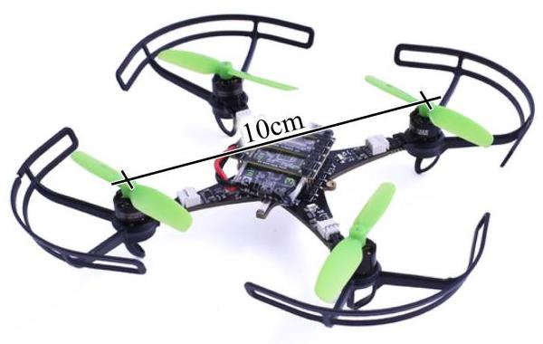
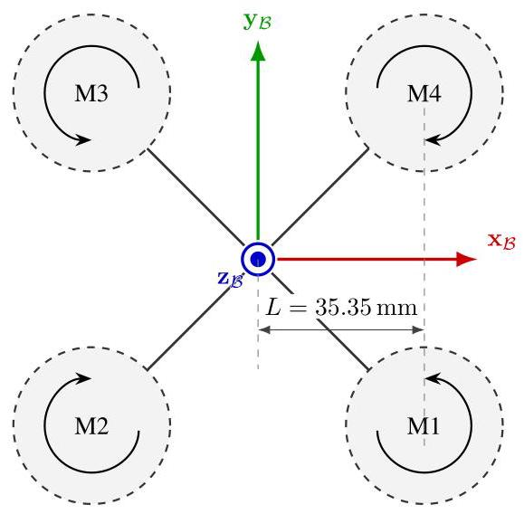
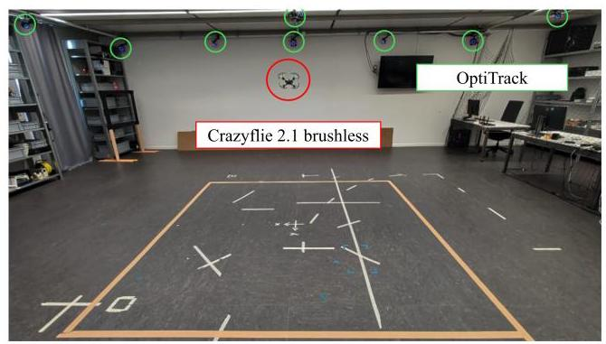
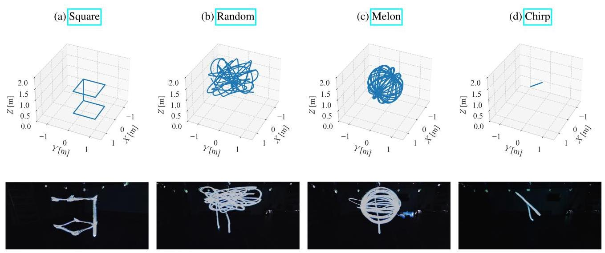
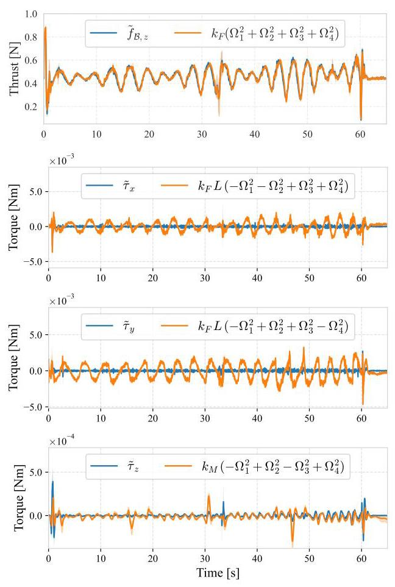
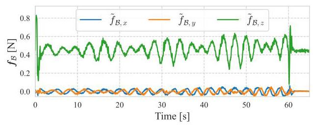
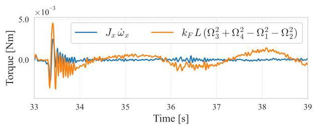
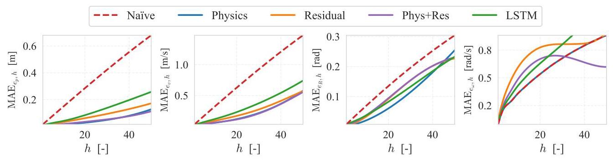
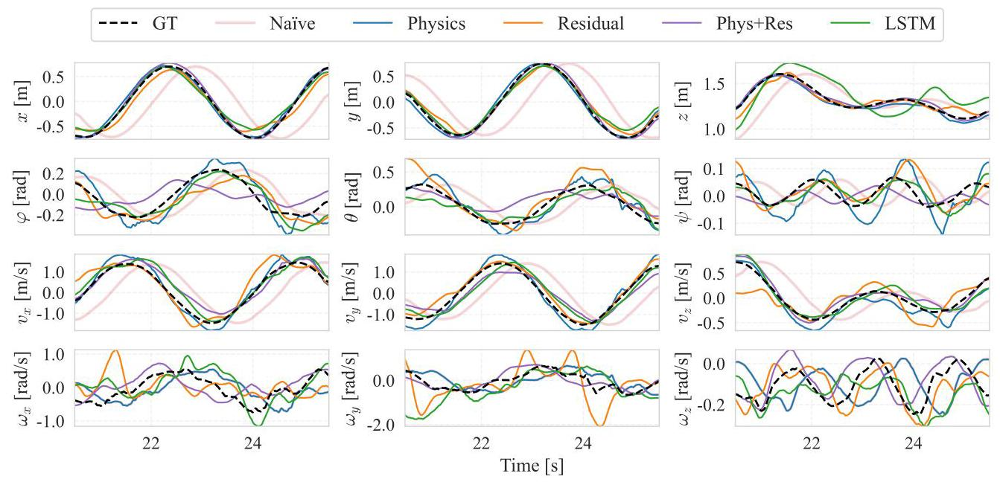

# Nonlinear System Identification Nano-drone Benchmark

# 非线性系统识别纳米无人机基准测试

Riccardo Busetto**1, Elia Cereda*1, Marco Forgione ${}^{1}$ , Gabriele Maroni ${}^{1}$ , Dario Piga ${}^{1}$ , and Daniele Palossi ${}^{1,2}$

里卡多·布塞托**1，埃利亚·切雷达*1，马尔科·福尔焦内${}^{1}$，加布里埃莱·马罗尼${}^{1}$，达里奥·皮加${}^{1}$，以及达尼埃莱·帕洛西${}^{1,2}$

${}^{1}$ Dalle Molle Institute for Artificial Intelligence (IDSIA), USI-SUPSI, Lugano, Switzerland

${}^{1}$ 瑞士卢加诺USI - SUPSI的达勒莫勒人工智能研究所(IDSIA)

name.surname@supsi.ch

${}^{2}$ Integrated Systems Laboratory (IIS), ETH Zürich, Switzerland

${}^{2}$ 瑞士苏黎世联邦理工学院集成系统实验室(IIS)

dpalossi@iis.ee.ethz.ch

## Abstract

## 摘要

We introduce a benchmark for system identification based on ${75}\mathrm{k}$ real-world samples from the Crazyflie 2.1 Brushless nano-quadrotor, a sub-50 g aerial vehicle widely adopted in robotics research. The platform presents a challenging testbed due to its multi-input, multi-output nature, open-loop instability, and nonlinear dynamics under agile maneuvers. The dataset comprises four aggressive trajectories with synchronized 4-dimensional motor inputs and 13-dimensional output measurements. To enable fair comparison of identification methods, the benchmark includes a suite of multi-horizon prediction metrics for evaluating both one-step and multi-step error propagation. In addition to the data, we provide a detailed description of the platform and experimental setup, as well as baseline models highlighting the challenge of accurate prediction under real-world noise and actuation nonlinearities. All data, scripts, and reference implementations are released as open-source at https://github.com/idsia-robotics/ nanodrone-sysid-benchmark to facilitate transparent comparison of algorithms and support research on agile, miniaturized aerial robotics.

我们基于来自Crazyflie 2.1无刷纳米四旋翼飞行器${75}\mathrm{k}$的真实世界样本，引入了一个用于系统识别的基准测试。Crazyflie 2.1是一款重量低于50克的飞行器，在机器人研究中被广泛采用。由于其多输入、多输出特性、开环不稳定性以及敏捷机动下的非线性动力学，该平台提供了一个具有挑战性的测试平台。数据集包括四条具有同步4维电机输入和13维输出测量的激进轨迹。为了能够公平比较识别方法，该基准测试包括一套多步预测指标，用于评估单步和多步误差传播。除了数据，我们还提供了平台和实验设置的详细描述，以及突出在真实世界噪声和驱动非线性下准确预测挑战的基线模型。所有数据、脚本和参考实现都在https://github.com/idsia - robotics/nanodrone - sysid - benchmark上作为开源发布，以促进算法的透明比较，并支持对敏捷小型空中机器人的研究。

Keywords: Nonlinear system identification, Benchmarks, Quadrotor

关键词:非线性系统识别，基准测试，四旋翼飞行器

## 1 Introduction

## 1引言

Standardized benchmarks play a central role in accelerating scientific progress by enabling fair comparison, reproducibility, and rapid testing of new algorithms. Their impact has been particularly evident in machine learning and deep learning, where well-defined datasets and evaluation protocols have catalyzed major breakthroughs [1, 2, 3]. In the field of system identification, the Nonlinear Benchmark Initiative [4.5] serves a similar purpose by promoting reproducible and comparable research efforts, highlighting the importance of high-quality datasets and reference methods for rigorous and comparable evaluation.

标准化基准测试通过实现新算法公平比较、可重复性和快速测试，在加速科学进步方面发挥着核心作用。它们的影响在机器学习和深度学习中尤为明显，其中定义明确的数据集和评估协议促成了重大突破[1, 2, 3]。在系统识别领域，非线性基准测试倡议[4, 5]通过促进可重复和可比的研究工作，突出高质量数据集和参考方法对于严格和可比评估的重要性，起到了类似的作用。

However, within the domain of aerial robotics, the availability of such standardized benchmarks remains limited. While public datasets exist, they typically focus on perception-centric tasks such as visual-inertial odometry or Simultaneous Localization and Mapping (SLAM) [6, 7, 8], rather than dynamical modeling or system identification. Even when high-quality flight data is available from aggressive flight sequences as in [9], it is typically provided as a resource to support a specific method, rather than as a structured benchmark with unified evaluation metrics and diverse baselines. This leaves a gap for researchers who wish to rapidly test and compare new identification algorithms without the burden of designing their own evaluation protocols or reference implementations.

然而，在空中机器人领域，这种标准化基准测试的可用性仍然有限。虽然存在公共数据集，但它们通常专注于以感知为中心的任务，如视觉惯性里程计或同时定位与地图构建(SLAM)[6, 7, 8]，而不是动力学建模或系统识别。即使像[9]中那样有来自激进飞行序列的高质量飞行数据，通常也只是作为一种支持特定方法的资源提供，而不是作为具有统一评估指标和多样基线的结构化基准测试。这给希望快速测试和比较新识别算法而无需自行设计评估协议或参考实现的研究人员留下了空白。

This gap is critical for miniaturized platforms, such as nano-drones (quadrotors with a mass below ${50}\mathrm{\;g}$ and a diameter below ${10}\mathrm{\;{cm}}$ ), whose adoption has skyrocketed due to their low cost and suitability for safe indoor operation ([10, 11]). Yet nano-drones operate in a uniquely challenging dynamical regime: their extremely low mass and compact geometry limit the thrust and torque generated by their motors and propellers. Consequently, they are more sensitive to disturbances and less capable of rapid corrective action, making them significantly more challenging to model and control during agile flight compared to standard-sized vehicles. Therefore, this emerging robotic platform represents a compelling candidate for our novel system identification benchmark.

对于纳米无人机(质量低于${50}\mathrm{\;g}$且直径低于${10}\mathrm{\;{cm}}$的四旋翼飞行器)等小型平台而言，这一空白至关重要。由于其低成本和适合安全室内操作的特点，纳米无人机的应用迅速增长([10, 11])。然而，纳米无人机在一个独特的具有挑战性的动力学环境中运行:其极低的质量和紧凑的几何形状限制了电机和螺旋桨产生的推力和扭矩。因此，它们对干扰更敏感，且快速纠正动作的能力较弱，与标准尺寸的飞行器相比，在敏捷飞行期间对其进行建模和控制具有更大的挑战性。所以，这个新兴的机器人平台是我们新型系统识别基准测试的一个极具吸引力的候选对象。

Despite these challenges and the growing scientific interest in such platforms, there is currently no publicly available benchmark that provides real flight data for nano-drones, together with a well-defined evaluation protocol suitable for system identification and control. Existing datasets for small aerial vehicles either offer limited scope, target different tasks, or lack the structure required for systematic algorithmic comparison [12]. As a result, researchers must often collect their own trajectory data, which is typically restricted to simple maneuvers or narrow experimental conditions, thereby preventing reproducibility and slowing progress.

尽管存在这些挑战，且科学界对此类平台的兴趣日益浓厚，但目前尚无公开可用的基准测试，能为纳米无人机提供真实飞行数据以及适合系统识别和控制的明确评估协议。现有的小型飞行器数据集要么范围有限，要么针对不同任务，要么缺乏系统算法比较所需的结构[12]。结果，研究人员常常必须自行收集轨迹数据，而这些数据通常仅限于简单机动或狭窄的实验条件，从而阻碍了可重复性并减缓了研究进展。

在这项工作中，我们引入了一个专门设计来填补这一空白的基准测试。该基准测试围绕Crazyflie 2.1无刷纳米四旋翼飞行器构建，它是一个商业可用的开源硬件和软件/固件平台，最近在机器人和控制研究中受到关注[13, 14, 10]。尽管体积小，但Crazyflie表现出复杂的非线性动力学，因为它是一个多输入多输出系统，本质上是开环不稳定的，在激进条件下运行时表现出强烈的非线性行为。这些特性使其成为非线性系统识别和基于模型控制的一个有吸引力且具有挑战性的测试平台。

在这项工作中，我们引入了一个专门设计来填补这一空白的基准测试。该基准测试围绕Crazyflie 2.1无刷纳米四旋翼飞行器构建，它是一个商业可用的开源硬件和软件/固件平台，最近在机器人和控制研究中受到关注[13, 14, 10]。尽管体积小，但Crazyflie表现出复杂的非线性动力学，因为它是一个多输入多输出系统，本质上是开环不稳定的，在激进条件下运行时表现出强烈的非线性行为。这些特性使其成为非线性系统识别和基于模型控制的一个有吸引力且具有挑战性的测试平台。

---

Corresponding author: name.surname@supsi.ch

通信作者:name.surname@supsi.ch

lavailable at https://www.nonlinearbenchmark.org/

可在https://www.nonlinearbenchmark.org/获取

---

The primary contribution of this work is a ready-to-use, high-quality benchmark that, to the best of our knowledge, constitutes the first publicly available dataset of real flight trajectories collected on a nano-drone. Importantly, the dataset not only covers favorable or quasi-static motion, but also includes aggressive maneuvers that challenge the dynamics of such a small platform and expose the difficulty of achieving accurate multi-step prediction on highly agile nano-scale vehicles. Specifically, the benchmark provides:

这项工作的主要贡献是一个现成的、高质量的基准测试，据我们所知，它构成了第一个公开可用的纳米无人机真实飞行轨迹数据集。重要的是，该数据集不仅涵盖了有利或准静态运动，还包括具有挑战性的机动动作，这些动作挑战了如此小平台的动力学，并暴露了在高度敏捷的纳米级飞行器上实现准确多步预测的困难。具体来说，该基准测试提供:

1. A thoroughly-collected dataset of real flight trajectories recorded using synchronized onboard sensing and motion-capture ground truth, specifically designed to excite the system across a broad dynamic range. The dataset allows for an as is use, without requiring access to costly hardware or motion-capture infrastructure.

1. 一个通过同步机载传感和运动捕捉地面真值记录的真实飞行轨迹的全面收集数据集，专门设计用于在广泛的动态范围内激发系统。该数据集可直接使用，无需使用昂贵的硬件或运动捕捉基础设施。

2. A fully specified evaluation protocol based on multistep-ahead prediction, enabling consistent and transparent comparison of identification methods.

2. 一个基于多步预测的完全指定的评估协议，能够对识别方法进行一致且透明的比较。

3. Reference baseline models, including a nominal physics model, a hybrid physics-learning architecture, and purely data-driven models, illustrating the intrinsic difficulty of the task and providing starting points for future research.

3. 参考基线模型，包括名义物理模型、混合物理学习架构和纯数据驱动模型，说明了任务的内在难度，并为未来研究提供了起点。

4. Open-source data and code, lowering the barrier to entry for system identification and control studies on agile, miniaturized aerial platforms.

4. 开源数据和代码，降低了在敏捷、小型化空中平台上进行系统识别和控制研究的入门门槛。

5. A calibrated motor-speed mapping, extending the off-the-shelf drone's firmware with the bidirectional DSHOT protocol for accurate telemetry of the motor speeds (RPM).

5. 一个校准的电机速度映射，通过双向DSHOT协议扩展现成无人机的固件，以实现电机速度(RPM)的精确遥测。

The remainder of the paper is organized as follows. Section 2 surveys the relevant literature, identifies the main shortcomings of existing datasets and identification studies, and further motivates the contributions presented in this work. Section 3 provides a detailed description of quadrotor operation, introducing the notation, conventions, and the fundamental dynamic model. Section 4 presents the specific Crazyflie platform and the experimental setup employed for data acquisition. In Section 5 we describe in detail the executed trajectories and the resulting dataset, including preprocessing and the proposed evaluation strategy for this benchmark. Section 6 introduces several baseline models, ranging from a purely physics-based formulation to black-box approaches, for performing $N$ -step-ahead predictions. Finally, Section 7 concludes the paper by highlighting the main challenges and outlining potential directions for future research.

本文的其余部分组织如下。第2节调查了相关文献，确定了现有数据集和识别研究的主要缺点，并进一步阐述了本工作中提出的贡献的动机。第3节详细描述了四旋翼飞行器的操作，介绍了符号、惯例和基本动力学模型。第4节介绍了具体的Crazyflie平台和用于数据采集的实验设置。在第5节中，我们详细描述了执行的轨迹和由此产生的数据集，包括预处理和针对该基准测试提出的评估策略。第6节介绍了几个基线模型，从基于纯物理的公式到黑箱方法，用于执行$N$步预测。最后，第7节通过强调主要挑战并概述未来研究的潜在方向来总结本文。

## 2 Related Work

## 2相关工作

Research on quadrotor system identification encompasses a wide range of platforms, modeling objectives, and data collection methodologies. In Table 1, we report a taxonomy on aerial vehicles, commonly used in the robotics community. Our taxonomy reports the diameter, weight, total power consumption (both motors and electronics), and onboard processing device of the platforms. The class of devices available onboard is a direct consequence of the total power envelope available, as only $\sim  {15}\%$ of this total can be spent on the electronics (both sensing and computing), see [15].

四旋翼系统识别的研究涵盖了广泛的平台、建模目标和数据收集方法。在表1中，我们报告了机器人社区中常用的飞行器分类法。我们的分类法报告了平台的直径、重量、总功耗(电机和电子设备)以及机载处理设备。机载可用设备的类别是可用总功率包络的直接结果，因为只有$\sim  {15}\%$的总功率可用于电子设备(传感和计算)，见[15]。

Figure 1: Crazyflie 2.1 Brushless nano-drone.

图1:Crazyflie 2.1无刷纳米无人机。

Table 1: Aerial drones taxonomy by vehicle class-size.

表1:按飞行器类别大小分类的无人机分类法。

<table><tr><td>Vehicle class</td><td>Diameter</td><td>Weight</td><td>Power</td><td>Device</td></tr><tr><td>standard-size</td><td>$\geq  {50}\mathrm{\;{cm}}$</td><td>$\geq  1\mathrm{\;{kg}}$</td><td>≥100 W</td><td>GPU</td></tr><tr><td>micro-size</td><td>$\sim  {25}\mathrm{\;{cm}}$</td><td>$\sim  {500}\mathrm{\;g}$</td><td>$\sim  {50}\mathrm{\;W}$</td><td>CPU</td></tr><tr><td>nano-size</td><td>$\sim  {10}\mathrm{\;{cm}}$</td><td>$\sim  {50}\mathrm{\;g}$</td><td>$\sim  5\mathrm{\;W}$</td><td>MCU</td></tr><tr><td>pico-size</td><td>$\leq  2\mathrm{\;{cm}}$</td><td>$\leq  5\mathrm{\;g}$</td><td>$\leq  {0.1}\mathrm{\;W}$</td><td>ULP</td></tr></table>

Standard-sized drones have a diameter of more than ${50}\mathrm{\;{cm}}$ , a total power envelope of more than ${100}\mathrm{\;W}$ , and a payload that allows them to afford powerful CPUs and GPUs [16]. Micro-sized drones are slightly smaller in size, but with a lower total power envelope of approximately 50 W, they can still host powerful embedded CPUs, such as NVIDIA Jetson/Xavier devices. Nano-sized drones, with their sub-50 g weight and a few ${100}\mathrm{\;s}\mathrm{\;{mW}}$ for onboard processing, can only afford resource-constrained MicroCon-troller Units (MCUs), featuring a few 100s kB on-chip memories. Finally, the smaller class of vehicles is represented by pico-sized UAVs, which are as small as a coin but remain out of reach for widespread adoption [15] and would require Ultra-Low Power (ULP) chips, consuming only a few tens of mW.

标准尺寸的无人机直径超过${50}\mathrm{\;{cm}}$，总功率包络超过${100}\mathrm{\;W}$，并且其有效载荷使其能够配备强大的CPU和GPU[16]。微型无人机尺寸稍小，但总功率包络约为50W，它们仍然可以搭载强大的嵌入式CPU，如NVIDIA Jetson/Xavier设备。纳米尺寸的无人机重量低于50g，机载处理能力为几${100}\mathrm{\;s}\mathrm{\;{mW}}$，只能配备资源受限的微控制器单元(MCU)，其片上内存为几百kB。最后，更小的飞行器类别由皮克尺寸的无人机代表，它们小如硬币，但仍无法广泛采用[15]，并且需要超低功耗(ULP)芯片，仅消耗几十毫瓦。

In this context, the majority of publicly available datasets have been developed either for standard-sized multirotors or for perception-focused tasks, with only limited attention given to dynamical modeling of nano-scale vehicles. This section reviews the most relevant efforts and highlights the absence of benchmarks tailored to nano-quadrotor system identification.

在这种背景下，大多数公开可用的数据集是为标准尺寸的多旋翼飞行器或专注于感知的任务开发的，对纳米级飞行器的动力学建模关注有限。本节回顾了最相关的工作，并强调了缺乏针对纳米四旋翼系统识别的基准测试。

Aggressiveness of trajectories In the aerial robotics literature, a trajectory is typically considered as aggressive when it drives the vehicle through fast translational or rotational motions relative to its actuation capabilities. Concretely, aggressive flight is characterized by (i) translational speeds exceeding $2 - 3\mathrm{\;m}/\mathrm{s}$ for nano-scale platforms (and $> {10}\mathrm{\;m}/\mathrm{s}$ for larger multirotors), (ii) angular rates above ${400} - {600}^{ \circ  }/\mathrm{s}$ , or (iii) linear accelerations approaching or exceeding 1-2 times gravity. Such trajectories induce actuator saturation, strong axis couplings, and aerodynamic effects far from near-hover conditions, all of which are essential for evaluating nonlinear system-identification algorithms.

轨迹的激进程度 在航空机器人学文献中，当轨迹相对于其驱动能力使飞行器进行快速平移或旋转运动时，通常被认为是激进的。具体而言，激进飞行的特征在于:(i)对于纳米级平台，平移速度超过$2 - 3\mathrm{\;m}/\mathrm{s}$(对于较大的多旋翼飞行器为$> {10}\mathrm{\;m}/\mathrm{s}$)；(ii)角速率高于${400} - {600}^{ \circ  }/\mathrm{s}$；或(iii)线性加速度接近或超过重力的1 - 2倍。这样的轨迹会导致执行器饱和、强烈的轴耦合以及远离近悬停状态的气动效应，所有这些对于评估非线性系统识别算法都至关重要。

### 2.1 System Identification on Larger Quadro- tors

### 2.1 大型四旋翼飞行器的系统识别

Several high-fidelity identification studies target custom or commercial multirotors equipped with specialized sensing. Sun et al. [17] perform gray-box identification of a standard-sized quadrotor using high-speed flight data recorded in the Open Jet Facility wind tunnel, revealing strong aerodynamic interactions at high speed. Bauersfeld et al. [9] propose the NeuroBEM hybrid aerodynamic model for a custom quadrotor, using aggressive free-flight trajectories collected inside a large ${25} \times  {25} \times  8\mathrm{\;m}$ motion-capture arena. While these datasets provide rich aerodynamic information, the platforms are significantly larger than nano-quadrotors and rely on expensive, non-standard infrastructure.

一些高保真识别研究针对配备专门传感设备的定制或商用多旋翼飞行器。Sun等人[17]使用在开放式喷气设施风洞中记录的高速飞行数据，对标准尺寸的四旋翼飞行器进行灰箱识别，揭示了高速下强烈的气动相互作用。Bauersfeld等人[9]为定制的四旋翼飞行器提出了NeuroBEM混合气动模型，使用在大型${25} \times  {25} \times  8\mathrm{\;m}$运动捕捉场地内收集的激进自由飞行轨迹。虽然这些数据集提供了丰富的气动信息，但这些平台比纳米四旋翼飞行器大得多，并且依赖于昂贵的非标准基础设施。

The DronePropA dataset [18] focuses on fault detection in a standard-sized ${1.5}\mathrm{\;{kg}}$ quadrotor and includes 130 flight sequences with various propeller defects. Although extensive, it targets health monitoring rather than predictive modeling, and the platform size places it far from the dynamical regime of sub-50 g nano-scale vehicles.

DronePropA数据集[18]专注于标准尺寸的${1.5}\mathrm{\;{kg}}$四旋翼飞行器的故障检测，包括130个具有各种螺旋桨缺陷的飞行序列。尽管数据丰富，但它针对的是健康监测而非预测建模，并且平台尺寸使其远离50克以下纳米级飞行器的动力学范围。

### 2.2 Nano-Quadrotor Identification

### 2.2 纳米四旋翼飞行器识别

Only a limited number of works consider nano-scale platforms. Szécsi et al. [12] study deep-learning-based identification of a Crazyflie 2.1 using simulation data, without releasing real-flight measurements or standardized evaluation protocols. Förster [19] provides an early characterization of the Crazyflie 2.0, identifying inertial parameters, thrust curves, and motor dynamics using separate static and dynamic tests. Their work provides valuable physical insights, but (i) does not include aggressive flight trajectories, (ii) does not release a public dataset, and (iii) does not provide an evaluation protocol for multi-step-ahead prediction. Beyond these studies, several perception-oriented datasets (e.g., VIO/SLAM-focused micro-UAV datasets) include nano-scale platforms. Still, they do not provide the state, actuation, and ground-truth signals required for system identification or control design.

只有少数研究考虑纳米级平台。Szécsi等人[12]使用模拟数据研究基于深度学习的Crazyflie 2.1识别，未发布实际飞行测量数据或标准化评估协议。Förster[19]对Crazyflie 2.0进行了早期特征描述，通过单独的静态和动态测试识别惯性参数、推力曲线和电机动力学。他们的工作提供了有价值的物理见解，但(i)不包括激进飞行轨迹，(ii)未发布公共数据集，(iii)未提供多步预测的评估协议。除了这些研究，一些面向感知的数据集(例如专注于视觉惯性里程计/同步定位与地图构建的微型无人机数据集)包括纳米级平台。然而，它们没有提供系统识别或控制设计所需的状态、驱动和真实信号。

### 2.3 Positioning of the Contribution

### 2.3 贡献的定位

Existing resources suffer from at least one of the following limitations: (i) platforms are medium- or large-scale [17, 9] 18]; (ii) datasets target perception or fault detection rather than dynamical modeling; (iii) data are not publicly available, simulation-only, or not suitable for multi-step prediction; or (iv) no unified evaluation protocol is given.

现有资源至少存在以下限制之一:(i)平台为中型或大型[17, 9, 18]；(ii)数据集针对感知或故障检测而非动力学建模；(iii)数据不可公开获取、仅为模拟数据或不适用于多步预测；或(iv)未给出统一的评估协议。

Table 2 provides a consolidated comparison of existing datasets and system-identification studies on quadrotors, highlighting their limitations in terms of platform size, data availability, aggressiveness of flight trajectories, and suitability as benchmarks. This comparison further motivates the need for a dedicated nano-drone benchmark, as introduced in this work. Indeed, to the best of our knowledge, no publicly available benchmark provides real, aggressive flight data for a nano-quadrotor together with a standardized system-identification protocol and baseline models. The present work fills this gap by releasing a complete benchmark tailored for control and system identification.

表2提供了现有数据集和四旋翼飞行器系统识别研究的综合比较，突出了它们在平台尺寸、数据可用性、飞行轨迹的激进程度以及作为基准的适用性方面的局限性。这种比较进一步激发了对本文所介绍的专用纳米无人机基准的需求。事实上，据我们所知，没有公开可用的基准为纳米四旋翼飞行器提供真实的激进飞行数据以及标准化的系统识别协议和基线模型。本工作通过发布一个针对控制和系统识别量身定制的完整基准填补了这一空白。

## 3 Quadrotor Model

## 3 四旋翼飞行器模型

### 3.1 Notation

### 3.1 符号表示

Throughout this paper, scalars are denoted by regular letters $s, S$ , vectors by lowercase bold symbols $\mathbf{v}$ , and matrices by uppercase bold symbols $\mathbf{M}$ . The quadrotor dynamics are formulated using two right-handed reference frames: the inertial world frame $\mathcal{W}$ , with axes $\left\{  {{\mathbf{x}}_{\mathcal{W}},{\mathbf{y}}_{\mathcal{W}},{\mathbf{z}}_{\mathcal{W}}}\right\}$ , fixed to the ground and oriented such that ${\mathbf{z}}_{\mathcal{W}}$ points upward; and the body frame $\mathcal{B}$ , attached to the vehicle, with origin at the center of mass, and equipped with axes $\left\{  {{\mathbf{x}}_{\mathcal{B}},{\mathbf{y}}_{\mathcal{B}},{\mathbf{z}}_{\mathcal{B}}}\right\}$ oriented as shown in Fig. 2. The orientation of $\mathcal{B}$ with respect to $\mathcal{W}$ is represented by a unit Hamilton quaternion $\mathbf{q} \in  \mathbb{H}$ following the scalar-last convention, i.e., $\mathbf{q} = {\left\lbrack  {q}_{x},{q}_{y},{q}_{z},{q}_{w}\right\rbrack  }^{\top }$ with $\parallel \mathbf{q}\parallel  = 1$ . The set of all unit quaternions forms the three-dimensional sphere ${\mathbb{S}}^{3} = \{ \mathbf{q} \in  \mathbb{H}\left| {\parallel \mathbf{q}\parallel  = 1\} \text{ . }}\right|$ Each unit quaternion $\mathbf{q} \in  {\mathbb{S}}^{3}$ is associated with a rotation matrix $\mathbf{R}\left( \mathbf{q}\right)  \in  \mathrm{{SO}}\left( 3\right)$ through a smooth mapping $\mathbf{R} : {\mathbb{S}}^{3} \rightarrow  \mathrm{{SO}}\left( 3\right)$ . Finally, the operator $\otimes$ denotes quaternion multiplication.

在本文中，标量用常规字母$s, S$表示，向量用小写粗体符号$\mathbf{v}$表示，矩阵用大写粗体符号$\mathbf{M}$表示。四旋翼动力学使用两个右手参考系来表述:惯性世界系$\mathcal{W}$，其坐标轴为$\left\{  {{\mathbf{x}}_{\mathcal{W}},{\mathbf{y}}_{\mathcal{W}},{\mathbf{z}}_{\mathcal{W}}}\right\}$，固定在地面上且方向使得${\mathbf{z}}_{\mathcal{W}}$向上；以及机体坐标系$\mathcal{B}$，附着于飞行器，原点位于质心，并配备如图2所示方向的坐标轴$\left\{  {{\mathbf{x}}_{\mathcal{B}},{\mathbf{y}}_{\mathcal{B}},{\mathbf{z}}_{\mathcal{B}}}\right\}$。$\mathcal{B}$相对于$\mathcal{W}$的方向由一个单位哈密顿四元数$\mathbf{q} \in  \mathbb{H}$表示，遵循标量在最后的约定，即$\mathbf{q} = {\left\lbrack  {q}_{x},{q}_{y},{q}_{z},{q}_{w}\right\rbrack  }^{\top }$，其中$\parallel \mathbf{q}\parallel  = 1$。所有单位四元数的集合构成三维球面${\mathbb{S}}^{3} = \{ \mathbf{q} \in  \mathbb{H}\left| {\parallel \mathbf{q}\parallel  = 1\} \text{ . }}\right|$。每个单位四元数$\mathbf{q} \in  {\mathbb{S}}^{3}$通过一个光滑映射$\mathbf{R} : {\mathbb{S}}^{3} \rightarrow  \mathrm{{SO}}\left( 3\right)$与一个旋转矩阵$\mathbf{R}\left( \mathbf{q}\right)  \in  \mathrm{{SO}}\left( 3\right)$相关联。最后，运算符$\otimes$表示四元数乘法。

Unless otherwise specified, vectors are expressed in world coordinates; e.g., $\mathbf{p}$ denotes the position of the drone’s center of mass with respect to $\mathcal{W}$ expressed in world coordinates. To stress that a vector is expressed in a particular reference frame, we attach the frame name as a subscript. For example, ${\mathbf{f}}_{\mathcal{B}}$ denotes the forces acting on the drone expressed in the body frame.

除非另有说明，向量用世界坐标表示；例如，$\mathbf{p}$表示无人机质心相对于$\mathcal{W}$在世界坐标中的位置。为强调一个向量是在特定参考系中表示的，我们将参考系名称作为下标附加。例如，${\mathbf{f}}_{\mathcal{B}}$表示在机体坐标系中作用于无人机的力。

### 3.2 Quadrotor and propeller dynamics

### 3.2四旋翼和螺旋桨动力学

The state $\mathbf{x} \in  {\mathbb{R}}^{13}$ of the quadrotor is defined as:

四旋翼的状态$\mathbf{x} \in  {\mathbb{R}}^{13}$定义为:

$$
\mathbf{x} = {\left\lbrack  {\mathbf{p}}^{\top }{\mathbf{v}}^{\top }{\mathbf{q}}^{\top }{\mathbf{\omega }}^{\top }\right\rbrack  }^{\top }, \tag{1}
$$

where $\mathbf{p} = {\left\lbrack  {p}_{x},{p}_{y},{p}_{z}\right\rbrack  }^{\top } \in  {\mathbb{R}}^{3}\left\lbrack  \mathrm{\;m}\right\rbrack$ is the position of the vehicle’s center of mass expressed in the world frame $\mathcal{W}$ , and $\mathbf{v} = {\left\lbrack  {v}_{x},{v}_{y},{v}_{z}\right\rbrack  }^{\top } \in  {\mathbb{R}}^{3}\left\lbrack  {\mathrm{\;m}/\mathrm{s}}\right\rbrack$ is the corresponding linear velocity, also expressed in $\mathcal{W}$ . The unit quaternion $\mathbf{q} = {\left\lbrack  {q}_{x},{q}_{y},{q}_{z},{q}_{w}\right\rbrack  }^{\top }$ represents the orientation of the body frame $\mathcal{B}$ with respect to the world frame $\mathcal{W}$ . Finally, $\mathbf{\omega } = {\left\lbrack  {\omega }_{x},{\omega }_{y},{\omega }_{z}\right\rbrack  }^{\top } \in  {\mathbb{R}}^{3}$ [rad/s] denotes the angular velocity of the body relative to the world, expressed in body coordinates $\mathcal{B}$ . The components ${\omega }_{x},{\omega }_{y}$ , and ${\omega }_{z}$ correspond to rotation rates around the body axes ${\mathbf{x}}_{\mathcal{B}},{\mathbf{y}}_{\mathcal{B}}$ , and ${\mathbf{z}}_{\mathcal{B}}$ , respectively.

其中$\mathbf{p} = {\left\lbrack  {p}_{x},{p}_{y},{p}_{z}\right\rbrack  }^{\top } \in  {\mathbb{R}}^{3}\left\lbrack  \mathrm{\;m}\right\rbrack$是车辆质心在世界坐标系$\mathcal{W}$中的位置，$\mathbf{v} = {\left\lbrack  {v}_{x},{v}_{y},{v}_{z}\right\rbrack  }^{\top } \in  {\mathbb{R}}^{3}\left\lbrack  {\mathrm{\;m}/\mathrm{s}}\right\rbrack$是相应的线速度，同样在$\mathcal{W}$中表示。单位四元数$\mathbf{q} = {\left\lbrack  {q}_{x},{q}_{y},{q}_{z},{q}_{w}\right\rbrack  }^{\top }$表示体坐标系$\mathcal{B}$相对于世界坐标系$\mathcal{W}$的方向。最后，$\mathbf{\omega } = {\left\lbrack  {\omega }_{x},{\omega }_{y},{\omega }_{z}\right\rbrack  }^{\top } \in  {\mathbb{R}}^{3}$[rad/s]表示物体相对于世界的角速度，在体坐标系$\mathcal{B}$中表示。分量${\omega }_{x},{\omega }_{y}$和${\omega }_{z}$分别对应绕体轴${\mathbf{x}}_{\mathcal{B}},{\mathbf{y}}_{\mathcal{B}}$和${\mathbf{z}}_{\mathcal{B}}$的旋转速率。

The continuous-time dynamics of the quadrotor can be written compactly as:

四旋翼飞行器的连续时间动力学可以紧凑地写为:

$$
\dot{\mathbf{x}} = \left\lbrack  \begin{matrix} \dot{\mathbf{p}} \\  \dot{\mathbf{v}} \\  \dot{\mathbf{q}} \\  \dot{\mathbf{\omega }} \end{matrix}\right\rbrack   = \left\lbrack  \begin{matrix} \mathbf{v} \\  \frac{1}{m}\mathbf{R}\left( \mathbf{q}\right) {\mathbf{f}}_{\mathcal{B}} + \mathbf{g} \\  \frac{1}{2}\mathbf{q} \otimes  \left\lbrack  \begin{matrix} \mathbf{\omega } \\  0 \end{matrix}\right\rbrack  \\  {\mathbf{J}}^{-1}\left( {\mathbf{\tau } - \mathbf{\omega } \times  \left( {\mathbf{J}\mathbf{\omega }}\right) }\right)  \end{matrix}\right\rbrack  , \tag{2}
$$

Table 2: Comparison of related datasets and system-identification studies on quadrotors.

表2:四旋翼飞行器相关数据集和系统识别研究的比较。

<table><tr><td>Work</td><td>Class-size</td><td>Real/Sim</td><td>Application</td><td>Open-source</td><td>Benchmark</td><td>Aggressive</td></tr><tr><td>17</td><td>Micro</td><td>Real</td><td>Aerodynamics Gray-box SysID</td><td>✘</td><td>✓</td><td>✘</td></tr><tr><td>9</td><td>Standard</td><td>Real/Sim</td><td>Aerodynamics / Hybrid modeling</td><td>✓</td><td>✓</td><td>✓</td></tr><tr><td>18</td><td>Standard</td><td>Real</td><td>Fault diagnosis</td><td>✓</td><td>✘</td><td>✘</td></tr><tr><td>12</td><td>Nano</td><td>Sim</td><td>Learning-based SysID</td><td>✘</td><td>✓</td><td>✘</td></tr><tr><td>19</td><td>Nano</td><td>Real</td><td>Parameter estimation</td><td>✘</td><td>✘</td><td>✘</td></tr><tr><td>This work</td><td>Nano</td><td>Real</td><td>SysID & control</td><td>✓</td><td>✓</td><td>✓</td></tr></table>

where $m$ is the quadrotor mass, $\mathbf{J}$ is the inertia matrix in body coordinates, ${\mathbf{f}}_{\mathcal{B}} = {\left\lbrack  0,0, T\right\rbrack  }^{\top }$ is the total force acting on the drone expressed in the body frame, $\mathbf{\tau } = {\left\lbrack  {\tau }_{x},{\tau }_{y},{\tau }_{z}\right\rbrack  }^{\top }$ is the control torque vector, and $\mathbf{g} = {\left\lbrack  0,0, - g\right\rbrack  }^{\top }$ is the gravity vector in world-frame coordinates, with $g = {9.81}\mathrm{\;m}/{\mathrm{s}}^{2}$ .

其中$m$是四旋翼飞行器的质量，$\mathbf{J}$是体坐标系中的惯性矩阵，${\mathbf{f}}_{\mathcal{B}} = {\left\lbrack  0,0, T\right\rbrack  }^{\top }$是作用在无人机上的总力，在体坐标系中表示，$\mathbf{\tau } = {\left\lbrack  {\tau }_{x},{\tau }_{y},{\tau }_{z}\right\rbrack  }^{\top }$是控制扭矩向量，$\mathbf{g} = {\left\lbrack  0,0, - g\right\rbrack  }^{\top }$是世界坐标系中的重力向量，其中$g = {9.81}\mathrm{\;m}/{\mathrm{s}}^{2}$。

For control design, the input is typically defined as:

对于控制设计，输入通常定义为:

$$
{\mathbf{u}}_{\text{ ctrl }} = {\left\lbrack  \begin{array}{llll} T & {\tau }_{x} & {\tau }_{y} & {\tau }_{z} \end{array}\right\rbrack  }^{\top }, \tag{3}
$$

where $T$ is the total thrust acting along the body $z$ -axis ${\mathbf{z}}_{\mathcal{B}}$ , and $\left( {{\tau }_{x},{\tau }_{y},{\tau }_{z}}\right)$ are the torques about the body axes ${\mathbf{x}}_{\mathcal{B}},{\mathbf{y}}_{\mathcal{B}}$ , and ${\mathbf{z}}_{\mathcal{B}}$ , corresponding respectively to roll, pitch, and yaw rotations.

其中$T$是沿体$z$轴${\mathbf{z}}_{\mathcal{B}}$作用的总推力，$\left( {{\tau }_{x},{\tau }_{y},{\tau }_{z}}\right)$是绕体轴${\mathbf{x}}_{\mathcal{B}},{\mathbf{y}}_{\mathcal{B}}$和${\mathbf{z}}_{\mathcal{B}}$的扭矩，分别对应滚转、俯仰和偏航旋转。

In this work, however, we take as input the individual propeller angular velocities (in rad/s):

然而，在这项工作中，我们将各个螺旋桨的角速度(以rad/s为单位)作为输入:

$$
\mathbf{u} = {\left\lbrack  {\Omega }_{1}{\Omega }_{2}{\Omega }_{3}{\Omega }_{4}\right\rbrack  }^{\top }, \tag{4}
$$

since these are the physical quantities that generate the abovementioned thrust and torques. Assuming a quadratic relation between the propellers' angular velocities and the resulting forces/torques [20], and considering the " $\times$ " quadrotor configuration characterizing the Crazyflie (see Figure 2), the relation between angular velocities [4] and control inputs [3] is given by:

因为这些是产生上述推力和扭矩的物理量。假设螺旋桨角速度与产生的力/扭矩之间存在二次关系[20]，并考虑表征Crazyflie的“$\times$”四旋翼飞行器配置(见图2)，角速度[4]与控制输入[3]之间的关系由下式给出:

$$
\left\lbrack  \begin{array}{l} T \\  {\tau }_{x} \\  {\tau }_{y} \\  {\tau }_{z} \end{array}\right\rbrack   = \left\lbrack  \begin{matrix} {k}_{F} & {k}_{F} & {k}_{F} & {k}_{F} \\   - {k}_{F}L &  - {k}_{F}L & {k}_{F}L & {k}_{F}L \\   - {k}_{F}L & {k}_{F}L & {k}_{F}L &  - {k}_{F}L \\   - {k}_{M} & {k}_{M} &  - {k}_{M} & {k}_{M} \end{matrix}\right\rbrack  \left\lbrack  \begin{array}{l} {\Omega }_{1}^{2} \\  {\Omega }_{2}^{2} \\  {\Omega }_{3}^{2} \\  {\Omega }_{4}^{2} \end{array}\right\rbrack  . \tag{5}
$$

In (5), ${k}_{F}$ and ${k}_{M}$ are the thrust and moment coefficients of the propellers, while $L$ is the effective arm length, defined as the orthogonal distance from the nano-drone's center of mass to each rotor projection on the body axes (see Figure 2). The first row expresses the total thrust as the sum of the four rotor contributions, while the remaining rows describe the roll, pitch, and yaw torques resulting from differential thrust and propeller drag.

在(5)中，${k}_{F}$和${k}_{M}$是螺旋桨的推力系数和力矩系数，而$L$是有效臂长，定义为从纳米无人机质心到机身轴上每个旋翼投影的垂直距离(见图2)。第一行将总推力表示为四个旋翼贡献的总和，而其余行描述了由差动推力和螺旋桨阻力产生的滚转、俯仰和偏航力矩。

Figure 2: " $\times$ " configuration and axis convention adopted in this work (geometry based on [21]).

图2:本工作采用的“$\times$”配置和坐标轴约定(基于[21]的几何结构)。

Remark 1 (Quadratic Rotor Model) Equation 5 relies on the assumption that each propeller produces thrust and torque proportional to the square of its angular speed, with proportionality coefficients ${k}_{F}$ and ${k}_{M}$ , respectively. Although this approximation suffices to illustrate the main dynamics and remains the standard in quadrotor modeling and control [22], recent advances have produced more accurate descriptions of the aerodynamics [9]. These newer approaches, whether physics-based or data-driven, may offer a more accurate description of drone behavior, particularly during aggressive maneuvers.

注1(二次旋翼模型)方程5基于这样的假设:每个螺旋桨产生的推力和扭矩分别与其角速度的平方成正比，比例系数分别为${k}_{F}$和${k}_{M}$。虽然这种近似足以说明主要动力学，并且仍然是四旋翼建模和控制的标准方法[22]，但最近的进展已经对空气动力学给出了更准确的描述[9]。这些更新的方法，无论是基于物理的还是数据驱动的，都可能对无人机行为给出更准确的描述，特别是在激进机动期间。

## 4 Experimental Setup

## 4实验设置

All flights were carried out in the motion-capture arena described below and shown in Figure 3 with safety nets surrounding the test volume in an enclosed room to prevent external air flow during experiments.

所有飞行均在如下所述的运动捕捉场地中进行，如图3所示，在一个封闭房间内，测试区域周围设有安全网，以防止实验期间的外部气流。

### 4.1 Crazyflie 2.1 Brushless Platform

### 4.1 Crazyflie 2.1无刷平台

All experiments were conducted on a Crazyflie 2.1 Brushless nano-quadrotor equipped with a Flow-deck v2 and AI-deck expansion boards. The platform provides on-board computation, sensing, and communication through an STM32F405 flight MCU running the official Crazyflie firmware a Bosch BMI088 6-DOF Inertial Measurement Unit (IMU), and an NRF51822 2.4 GHz low-latency radio. The vehicle is powered by four $8\mathrm{\;{mm}}{10000}\mathrm{{KV}}$ brushless motors, driven by EFM8BB21 Electronic Speed Controllers (ESCs) with the Bluejay ${}^{3}$ open-source ESC firmware.

所有实验均在配备Flow-deck v2和AI-deck扩展板的Crazyflie 2.1无刷纳米四旋翼上进行。该平台通过运行官方Crazyflie固件的STM32F405飞行微控制器、博世BMI088 6自由度惯性测量单元(IMU)和NRF51822 2.4 GHz低延迟无线电提供机载计算、传感和通信。该飞行器由四个$8\mathrm{\;{mm}}{10000}\mathrm{{KV}}$无刷电机供电，由带有Bluejay ${}^{3}$开源电子调速器(ESC)固件的EFM8BB21电子调速器驱动。

Figure 3: A Crazyflie 2.1 brushless flying in the motion-capture-equipped laboratory.

图3:在配备运动捕捉设备的实验室中飞行的Crazyflie 2.1无刷飞行器。

The Flow-deck v2 also provides an ST VL53L1X Time-of-Flight laser-based altitude sensor and a PMW3901 optical flow sensor to measure horizontal displacement relative to the ground. The AI-deck provides a Greenwaves Technologies GAP8 System-on-Chip for computation-intensive workloads [14] and an ublox NINA-W102 2.4 GHz Wi-Fi module for high-bandwidth communication. A 1S ${350}\mathrm{{mAh}}$ LiPo battery powers the platform at a nominal voltage of ${3.7}\mathrm{\;V}$ . The total mass of the platform, including the battery, amounts to $m = {45}\mathrm{\;g}$ . The inertia matrix $\mathbf{J} = \operatorname{diag}\left( {{J}_{x},{J}_{y},{J}_{z}}\right)$ is diagonal due to the symmetric construction. The numerical values of the diagonal entries, taken from the Crazyflow ${}^{4}$ simulator, are: ${J}_{x} = \; {2.3951} \times  {10}^{-5},{J}_{y} = {2.3951} \times  {10}^{-5},{J}_{z} = {3.2347} \times  {10}^{-5} \; \mathrm{{kg}} \times  {\mathrm{m}}^{2}$ .

Flow-deck v2还提供一个基于飞行时间激光的ST VL53L1X高度传感器和一个PMW3901光流传感器，以测量相对于地面的水平位移。AI-deck提供一个用于计算密集型工作负载的Greenwaves Technologies GAP8片上系统[14]和一个用于高带宽通信的ublox NINA-W102 2.4 GHz Wi-Fi模块。一个1S ${350}\mathrm{{mAh}}$锂聚合物电池以${3.7}\mathrm{\;V}$的标称电压为平台供电。平台的总质量，包括电池，为$m = {45}\mathrm{\;g}$。由于结构对称，惯性矩阵$\mathbf{J} = \operatorname{diag}\left( {{J}_{x},{J}_{y},{J}_{z}}\right)$是对角矩阵。对角元素的数值取自Crazyflow ${}^{4}$模拟器，为:${J}_{x} = \; {2.3951} \times  {10}^{-5},{J}_{y} = {2.3951} \times  {10}^{-5},{J}_{z} = {3.2347} \times  {10}^{-5} \; \mathrm{{kg}} \times  {\mathrm{m}}^{2}$。

### 4.2 Control System

### 4.2控制系统

The quadrotor is controlled using a modified version of the geometric controller originally proposed by [23], with integral control action added, as implemented in the Crazyflie's official firmware and running at ${500}\mathrm{\;{Hz}}$ on the embedded STM32 MCU.

四旋翼使用最初由[23]提出的几何控制器的修改版本进行控制，并添加了积分控制作用，如在Crazyflie的官方固件中实现，并在嵌入式STM32微控制器上以${500}\mathrm{\;{Hz}}$运行。

Control setpoints are streamed from a laptop computer over the NRF51 radio using the Crazyswarm2 ROS package. The controller tracks a desired position and yaw trajectory ${\mathbf{p}}_{d}\left( t\right) ,{\psi }_{d}\left( t\right)$ by computing the required total thrust $T$ and body torques $\mathbf{\tau } = {\left\lbrack  {\tau }_{x},{\tau }_{y},{\tau }_{z}\right\rbrack  }^{\top }$ that drive the vehicle toward the reference. The outer position loop computes the desired force vector

控制设定点通过Crazyswarm2 ROS包从笔记本电脑通过NRF51无线电传输。控制器通过计算所需的总推力$T$和机体扭矩$\mathbf{\tau } = {\left\lbrack  {\tau }_{x},{\tau }_{y},{\tau }_{z}\right\rbrack  }^{\top }$来跟踪期望的位置和偏航轨迹${\mathbf{p}}_{d}\left( t\right) ,{\psi }_{d}\left( t\right)$ ,这些力和扭矩驱动飞行器朝向参考点。外部位置环计算期望的力矢量

$$
{\mathbf{F}}_{d} = {\mathbf{K}}_{p}\left( {{\mathbf{p}}_{d} - \mathbf{p}}\right)  + {\mathbf{K}}_{i}\int \left( {{\mathbf{p}}_{d} - \mathbf{p}}\right) {dt} + {\mathbf{K}}_{d}\left( {{\dot{\mathbf{p}}}_{d} - \mathbf{v}}\right)  + m\left( {{\ddot{\mathbf{p}}}_{d} - }\right.
$$

where ${\mathbf{K}}_{p},{\mathbf{K}}_{i}$ , and ${\mathbf{K}}_{d}$ are proportional, integral, and derivative diagonal matrix gains, while ${\ddot{\mathbf{p}}}_{d}$ is the desired feedfor-ward acceleration. The commanded thrust $T$ is then set as the component of ${\mathbf{F}}_{d}$ along the body’s current $z$ -axis: $T = {\mathbf{F}}_{d} \cdot  {z}_{\mathcal{B}}.$

其中${\mathbf{K}}_{p},{\mathbf{K}}_{i}$以及${\mathbf{K}}_{d}$分别为比例、积分和微分对角矩阵增益，而${\ddot{\mathbf{p}}}_{d}$是期望的前馈加速度。然后，将指令推力$T$设置为${\mathbf{F}}_{d}$沿机体当前$z$轴的分量:$T = {\mathbf{F}}_{d} \cdot  {z}_{\mathcal{B}}.$

The desired orientation ${\mathbf{R}}_{d}$ is then constructed with $z$ - axis pointing in the direction of ${\mathbf{F}}_{d}$ , while maintaining the reference yaw angle ${\psi }_{d}$ . The inner (attitude) loop runs directly on the manifold $\mathrm{{SO}}\left( 3\right)$ and computes the angular velocity and torque commands required to track the desired attitude. The attitude error is defined as ${\mathbf{e}}_{R} = \; \frac{1}{2}{\left( {\mathbf{R}}_{d}^{\top }\mathbf{R}\left( q\right)  - {\mathbf{R}}^{\top }\left( q\right) {\mathbf{R}}_{d}\right) }^{ \vee  }$ , where ${\left( \cdot \right) }^{ \vee  }$ is the standard vee operator that unpacks the 3 independent elements of skew-symmetric $3 \times  3$ matrices into a vector with 3 components. The angular velocity error is ${\mathbf{e}}_{\omega } = \mathbf{\omega } - {\mathbf{\omega }}_{d}$ . The control torque is then

然后构建期望姿态${\mathbf{R}}_{d}$，使$z$轴指向${\mathbf{F}}_{d}$的方向，同时保持参考偏航角${\psi }_{d}$。内(姿态)环直接在流形$\mathrm{{SO}}\left( 3\right)$上运行，并计算跟踪期望姿态所需的角速度和扭矩指令。姿态误差定义为${\mathbf{e}}_{R} = \; \frac{1}{2}{\left( {\mathbf{R}}_{d}^{\top }\mathbf{R}\left( q\right)  - {\mathbf{R}}^{\top }\left( q\right) {\mathbf{R}}_{d}\right) }^{ \vee  }$，其中${\left( \cdot \right) }^{ \vee  }$是标准的vee算子，它将反对称$3 \times  3$矩阵的3个独立元素解包为一个具有3个分量的向量。角速度误差为${\mathbf{e}}_{\omega } = \mathbf{\omega } - {\mathbf{\omega }}_{d}$。然后控制扭矩为

$$
\mathbf{\tau } =  - {\mathbf{K}}_{R}{\mathbf{e}}_{R} - {\mathbf{K}}_{R, i}\int {\mathbf{e}}_{R}{dt} - {\mathbf{K}}_{\omega }{\mathbf{e}}_{\omega },
$$

with ${\mathbf{K}}_{R},{\mathbf{K}}_{R, i}$ , and ${\mathbf{K}}_{\omega }$ the diagonal attitude, integral attitude, and angular-rate gain matrices.

其中${\mathbf{K}}_{R},{\mathbf{K}}_{R, i}$以及${\mathbf{K}}_{\omega }$分别为对角姿态、积分姿态和角速率增益矩阵。

### 4.3 Sensing and State Estimation

### 4.3 传感与状态估计

Data were recorded using a combination of onboard sensors and an external motion-capture system. Ground-truth position and orientation were obtained from an OptiTrack setup with 18 cameras covering a $6 \times  6 \times  {2.5}\mathrm{\;m}$ volume.

数据通过机载传感器和外部运动捕捉系统相结合的方式进行记录。地面真值位置和姿态由一个OptiTrack装置获得，该装置有18个摄像头，覆盖一个$6 \times  6 \times  {2.5}\mathrm{\;m}$体积。

The onboard sensing suite includes: (i) a 3-axis gyroscope and accelerometer for angular velocity and specific acceleration, (ii) a PMW3901 optical flow module for horizontal velocity estimation, (iii) a VL53L1x time-of-flight sensor for altitude, and (iv) propeller angular velocity measurements obtained from the ESCs via back-EMF zero-crossing detection. These angular velocities values are transmitted to the STM32 flight controller using the bidirectional DSHOT protocol.

机载传感套件包括:(i) 一个用于测量角速度和比加速度的3轴陀螺仪和加速度计，(ii) 一个用于水平速度估计的PMW3901光流模块，(iii) 一个用于测量高度的VL53L1x飞行时间传感器，以及(iv) 通过反电动势过零检测从电子速度控制器获得的螺旋桨角速度测量值。这些角速度值使用双向DSHOT协议传输到STM32飞行控制器。

State estimation is performed online by an Extended Kalman Filter (EKF) [24, 25], executed at 100 Hz in the Crazyflie firmware. The filter fuses IMU, optical flow, time-of-flight, and motion-capture measurements to provide a full 6-DoF pose estimate, used as feedback by the low-level controller.

状态估计由扩展卡尔曼滤波器(EKF)[24, 25]在线执行，在Crazyflie固件中以100 Hz的频率运行。该滤波器融合了惯性测量单元、光流、飞行时间和运动捕捉测量值，以提供完整的6自由度姿态估计，作为低级控制器的反馈。

Because the official Crazyflie firmware supports only unidirectional DSHOT, we developed a bidirectional driver to enable motor-speed telemetry. The implementation requires precise synchronization of transmit and receive phases across the four motors. We open-source this driver and are integrating it into the official firmware.

由于官方的Crazyflie固件仅支持单向DSHOT，我们开发了一个双向驱动程序以实现电机速度遥测。该实现需要在四个电机上精确同步发送和接收相位。我们将此驱动程序开源并正在将其集成到官方固件中。

## 5 Dataset and Evaluation Protocol

## 5 数据集与评估协议

This section describes the trajectories used to collect the dataset. It provides details on the data itself, as well as the evaluation settings adopted to assess model identification per-gformance on the proposed benchmark. Table 3 summarizes the structure of the recorded dataset, which includes motor speeds $\mathbf{u} = {\left\lbrack  \begin{array}{llll} {\Omega }_{1} & {\Omega }_{2} & {\Omega }_{3} & {\Omega }_{4} \end{array}\right\rbrack  }^{\top }$ , position and orientation (in quaternion form), angular velocity, and linear acceleration.

本节描述了用于收集数据集的轨迹。它提供了关于数据本身的详细信息，以及为评估所提出基准上的模型识别性能而采用的评估设置。表3总结了记录的数据集的结构，其中包括电机速度$\mathbf{u} = {\left\lbrack  \begin{array}{llll} {\Omega }_{1} & {\Omega }_{2} & {\Omega }_{3} & {\Omega }_{4} \end{array}\right\rbrack  }^{\top }$、位置和姿态(四元数形式)、角速度和线性加速度。

### 5.1 Data Preprocessing

### 5.1 数据预处理

All data is streamed in real-time using high-throughput Wi-Fi streaming through our internally developed NanoCockpit framework and recorded in a rosbag file. This recording is asynchronous and timestamped at the source using the onboard STM32 hardware clock. Since the motion-capture system and the flight controller operate at different frequencies and with independent clocks, each experiment required careful post-processing to obtain a time-aligned, uniformly sampled dataset.

所有数据通过我们内部开发的NanoCockpit框架使用高吞吐量Wi-Fi实时流式传输，并记录在一个rosbag文件中。此记录是异步的，并在源端使用机载STM32硬件时钟进行时间戳标记。由于运动捕捉系统和飞行控制器以不同频率运行且具有独立时钟，每个实验都需要仔细的后处理以获得时间对齐、均匀采样的数据集。

---

https://github.com/bitcraze/crazyflie-firmware https://github.com/bitcraze/bluejay https://github.com/utiasDSL/crazyflow https://imrclab.github.io/crazyswarm2/

https://github.com/bitcraze/crazyflie-firmware https://github.com/bitcraze/bluejay https://github.com/utiasDSL/crazyflow https://imrclab.github.io/crazyswarm2/

---

Table 3: Dataset structure. Dataset columns denotes the name of the column in the csv file of the provided benchmark dataset.

表3:数据集结构。数据集中的列表示所提供基准数据集中csv文件中的列名。

<table><tr><td>Variable</td><td>Symbol</td><td>Unit</td><td>Ref. frame</td><td>Dataset columns</td><td>Measurement source</td></tr><tr><td>Timestamp   Inputs</td><td>$t$</td><td>S</td><td>-</td><td>t</td><td>STM32 hardware timer</td></tr><tr><td>Propeller speeds   Outputs</td><td>Ω</td><td>rad/s</td><td>-</td><td>m\{1,2,3,4\}_rads</td><td>Sensorless back-EMF zero crossing</td></tr><tr><td>Position</td><td>p</td><td>m</td><td>world</td><td>$x, y, z$</td><td>Motion capture + Laser altimeter (z only)</td></tr><tr><td>Velocity</td><td>V</td><td>m/s</td><td>world</td><td>${yx},{vy},{vz}$</td><td>Optical flow (vx, vy only)</td></tr><tr><td>Orientation</td><td>q</td><td>quaternion</td><td>world</td><td>${qx},{qy},{qz},{qw}$</td><td>Motion capture</td></tr><tr><td>Angular velocity</td><td>$\omega$</td><td>rad/s</td><td>body</td><td>${wx},{wy},{wz}$</td><td>Gyroscope</td></tr><tr><td>Additional</td><td></td><td></td><td></td><td></td><td></td></tr><tr><td>Specific acceleration</td><td>a</td><td>$\mathrm{m}/{\mathrm{s}}^{2}$</td><td>body</td><td>a\{x, y, x\}_body</td><td>Accelerometer. It measures ${\left( \mathbf{a} - \mathbf{g}\right) }_{\mathcal{B}}$</td></tr></table>

Timestamp synchronization Raw data from the Crazyflie firmware and the motion-capture system are first aligned in time by estimating their relative delay. We compute the lag that maximizes the cross-correlation between the position signals $\left( {x, y, z}\right)$ from the OptiTrack and the corresponding onboard estimates, and subtract the average of the three estimated lags to reduce noise sensitivity. After alignment, all channels are resampled to a common ${100}\mathrm{\;{Hz}}$ rate using interpolation. Because the embedded hardware clock may exhibit irregular sampling intervals, we additionally perform a retiming with nearest-neighbor interpolation, to guarantee that all data after processing are uniformly sampled. This also compensates for any potentially missing packets by assigning them the closest available measurement.

时间戳同步 首先通过估计相对延迟，将来自Crazyflie固件和运动捕捉系统的原始数据在时间上对齐。我们计算使OptiTrack的位置信号$\left( {x, y, z}\right)$与相应的机载估计值之间的互相关性最大化的滞后，并减去三个估计滞后的平均值以降低噪声敏感性。对齐后，所有通道使用插值法重新采样到一个共同的${100}\mathrm{\;{Hz}}$速率。由于嵌入式硬件时钟可能表现出不规则的采样间隔，我们还使用最近邻插值法进行重定时，以确保处理后的所有数据都是均匀采样的。这也通过为它们分配最接近的可用测量值来补偿任何潜在的丢失数据包。

Flight-segment extraction Each experiment begins with an initial stationary phase, during which the trajectory is uploaded, and the vehicle takes off. We automatically extract the flight segment by selecting the time interval in which the reference position is non-zero. This produces consistent flight windows across repetitions without manual trimming.

飞行段提取 每个实验都从一个初始静止阶段开始，在此期间上传轨迹，然后飞行器起飞。我们通过选择参考位置不为零的时间间隔来自动提取飞行段。这在重复实验中产生一致的飞行窗口，无需手动修剪。

Motor-acceleration alignment Motor speed telemetry is affected by an additional delay in communication and actuation. To compensate for this, we align the motor commands to the inertial measurements by maximizing the cross-correlation between the vertical body acceleration ${a}_{z}$ and the instantaneous total thrust, approximated as the sum of squared motor speeds. This yields a robust estimate of the command-actuation delay, ensuring consistent temporal alignment between the thrust input and measured accelerations.

电机加速度对齐 电机速度遥测受到通信和驱动中的额外延迟影响。为了补偿这一点，我们通过使垂直机身加速度${a}_{z}$与瞬时总推力(近似为电机速度平方和)之间的互相关性最大化，将电机命令与惯性测量对齐。这产生了命令 - 驱动延迟的稳健估计，确保了推力输入与测量加速度之间的一致时间对齐。

Table 4: Low-pass filter cutoff frequencies for different signal groups $\left( {{f}_{s} = {100}\mathrm{\;{Hz}}}\right.$ , Butterworth order $= 4)$ .

表4:不同信号组$\left( {{f}_{s} = {100}\mathrm{\;{Hz}}}\right.$的低通滤波器截止频率，巴特沃斯阶数$= 4)$。

<table><tr><td>Signal group</td><td>Cutoff frequency [Hz]</td></tr><tr><td>Position $\left( {x, y, z}\right)$</td><td>10</td></tr><tr><td>Linear and angular velocities $\left( {v,\omega }\right)$</td><td>18</td></tr><tr><td>Linear accelerations $\left( {{a}_{x},{a}_{y},{a}_{z}}\right)$</td><td>25</td></tr><tr><td>Motor speeds</td><td>20</td></tr><tr><td>Quaternions (via log-map)</td><td>12</td></tr></table>

Filtering pipeline To reduce measurement noise while preserving dynamic content relevant for system identification, all continuous-valued signals are filtered using zero-phase fourth-order Butterworth low-pass filters. Since different physical quantities exhibit different spectral characteristics, we assign a dedicated cutoff frequency to each signal group. Short gaps in the raw data (up to 10 samples) are filled via bounded interpolation, while longer gaps remain untouched. Quaternion signals are mapped to the rotation-vector representation via the logarithmic map, low-pass filtered component-wise, and mapped back using the exponential map. This procedure ensures that filtering operates in a linear space, avoids quaternion drift or non-unit norms, and preserves the manifold structure of SO(3), which would be violated by direct filtering in quaternion coordinates. Table 4 summarizes the cutoff frequencies applied to each variable group.

滤波管道 为了在保留与系统识别相关的动态内容的同时降低测量噪声，所有连续值信号使用零相位四阶巴特沃斯低通滤波器进行滤波。由于不同的物理量表现出不同的频谱特性，我们为每个信号组分配一个专用的截止频率。原始数据中的短间隙(最多10个样本)通过有界插值填充，而较长的间隙保持不变。四元数信号通过对数映射映射到旋转向量表示，按分量进行低通滤波，然后使用指数映射映射回。此过程确保滤波在线性空间中操作，避免四元数漂移或非单位范数，并保留SO(3)的流形结构，直接在四元数坐标中滤波会违反该结构。表4总结了应用于每个变量组的截止频率。

### 5.2 Trajectory Design

### 5.2轨迹设计

Four reference trajectories (named Square, Random, Melon, and Chirp) were designed to excite the quadrotor dynamics over a broad range of operating conditions while remaining bounded and repeatable. All trajectories were sampled at ${100}\mathrm{\;{Hz}}$ and executed at least three times (referred to as runs); Square, Random, and Chirp include a 4th run, for a total of 15 flights. The reference paths are illustrated in Figure 4 and their main statistics are summarized in Table 5 Together, these trajectories provide a balanced set of structured, random, and frequency-rich motions for identification and validation.

设计了四条参考轨迹(名为Square、Random、Melon和Chirp)，以在广泛的操作条件下激发四旋翼动力学，同时保持有界且可重复。所有轨迹均以${100}\mathrm{\;{Hz}}$采样并至少执行三次(称为运行)；Square、Random和Chirp包括第四次运行，总共进行15次飞行。参考路径如图4所示，其主要统计信息总结在表5中。这些轨迹共同提供了一组平衡的结构化、随机和频率丰富的运动，用于识别和验证。

Figure 4: Reference trajectories and corresponding long-exposure flight traces. Top row: ideal 3D reference trajectories generated in Python. Bottom row: long-exposure images of Crazyflie 2.1 executing the same trajectories in the motion-capture arena. (Click sub-captions in the PDF viewer to see the animations).

图4:参考轨迹和相应的长时间曝光飞行轨迹。上图:在Python中生成的理想3D参考轨迹。下图:Crazyflie 2.1在运动捕捉场地中执行相同轨迹的长时间曝光图像。(在PDF查看器中点击子标题查看动画)。

Square A structured path consisting of two horizontal squares of $1\mathrm{\;m}$ side length, stacked $1\mathrm{\;m}$ apart in height. Each segment is executed in $1\mathrm{\;s}$ , followed by $1\mathrm{\;s}$ of hovering to allow stabilization between transitions. The motion along each edge is generated using minimum-snap interpolation, ensuring continuity in position, velocity, and acceleration. After completing the lower loop, the vehicle ascends to the upper plane, repeats the same pattern, and finally returns to the starting height. This trajectory primarily excites roll and pitch dynamics independently, providing a repeatable planar motion for controller validation.

Square 一条结构化路径，由两个边长为$1\mathrm{\;m}$的水平正方形组成，高度上相隔$1\mathrm{\;m}$堆叠。每个段以$1\mathrm{\;s}$执行，随后是$1\mathrm{\;s}$的悬停，以允许在过渡之间稳定。沿每条边的运动使用最小急动插值生成，确保位置、速度和加速度的连续性。完成下环后，飞行器上升到上平面，重复相同模式，最后返回起始高度。此轨迹主要独立激发滚转和俯仰动力学，为控制器验证提供可重复的平面运动。

Random-points A ${60}\mathrm{\;s}$ trajectory composed of 52 way-points uniformly sampled within a box of size $1 \times  1 \times  {0.5}\mathrm{\;m}$ centered at $\left( {0,0,{1.5}}\right)$ . Positions are interpolated using cubic splines to generate smooth velocity and acceleration profiles. The resulting motion is irregular and non-periodic, with broadband excitation arising from the random spacing of consecutive points.

随机点 一条由52个航路点组成的${60}\mathrm{\;s}$轨迹，这些点在以$\left( {0,0,{1.5}}\right)$为中心、大小为$1 \times  1 \times  {0.5}\mathrm{\;m}$的盒子内均匀采样。使用三次样条对位置进行插值，以生成平滑的速度和加速度曲线。由此产生的运动是不规则且非周期性的，连续点的随机间距会产生宽带激励。

Melon A smooth, periodic 65 s motion combining elliptical oscillations in the local $x - z$ plane with a slow rotation of the plane about the $x$ -axis ${\omega }_{\text{ plane }} = {0.4}\mathrm{{rad}}/\mathrm{s}$ . The ellipse radii are fixed to ${0.75}\mathrm{\;m}$ , and the angular velocity to ${\omega }_{\text{ circle }} = {2.5}\mathrm{{rad}}/\mathrm{s}$ . After the main segment, the drone returns smoothly to the center using a minimum-jerk transition. This trajectory generates coupled translational and rotational motion, providing significant excitation of the attitude dynamics.

甜瓜 一种平滑的周期性65秒运动，将局部$x - z$平面内的椭圆振荡与该平面绕$x$轴${\omega }_{\text{ plane }} = {0.4}\mathrm{{rad}}/\mathrm{s}$的缓慢旋转相结合。椭圆半径固定为${0.75}\mathrm{\;m}$，角速度固定为${\omega }_{\text{ circle }} = {2.5}\mathrm{{rad}}/\mathrm{s}$。在主段之后，无人机使用最小加加速度过渡平稳地返回中心。此轨迹会产生耦合的平移和旋转运动，对姿态动力学产生显著激励。

Chirp A 60 s trajectory in which the three position axes are simultaneously driven by independent sinusoidal signals of amplitude ${0.5}\mathrm{\;m}$ . The instantaneous frequencies are linearly increased from ${0.1}\mathrm{\;{Hz}}$ to ${0.5}\mathrm{\;{Hz}}$ , resulting in a rich spectral content across multiple frequency bands. This trajectory yields persistent excitation of both translational and rotational modes.

啁啾 一条60秒的轨迹，其中三个位置轴由幅度为${0.5}\mathrm{\;m}$的独立正弦信号同时驱动。瞬时频率从${0.1}\mathrm{\;{Hz}}$线性增加到${0.5}\mathrm{\;{Hz}}$，从而在多个频段产生丰富的频谱内容。此轨迹会对平移和旋转模式产生持续激励。

Train-test split Experimental data collected from the Square, Random, and Chirp trajectories are used for training, while the Melon trajectory is reserved exclusively for testing, yielding 55999 training samples (74.2%) and 19497 testing samples (25.8%). We decided to exclude the measured acceleration from the output variables, as it is not a state of the system.

训练-测试划分 从正方形、随机和啁啾轨迹收集的实验数据用于训练，而甜瓜轨迹专门留作测试，得到55999个训练样本(74.2%)和19497个测试样本(25.8%)。我们决定将测量的加速度从输出变量中排除，因为它不是系统的一个状态。

Remark 2 (Zero yaw rate) All trajectories were generated with a fixed yaw orientation, i.e., the reference yaw satisfies ${\psi }^{\text{ ref }} = 0$ throughout the experiments. This choice simplifies the control problem by decoupling yaw from roll and pitch dynamics. It reflects common practice in the identification of drone dynamics, where the focus is typically on modeling translational and attitude dynamics under a constant heading [9].

备注2(零偏航率) 所有轨迹均以固定的偏航方向生成，即参考偏航在整个实验过程中满足${\psi }^{\text{ ref }} = 0$。这种选择通过将偏航与滚转和俯仰动力学解耦来简化控制问题。它反映了无人机动力学识别中的常见做法，其中通常关注在恒定航向[9]下对平移和姿态动力学进行建模。

Table 5: Benchmark statistics for real quadrotor trajectories. Reported values are averaged across runs.

表5:真实四旋翼轨迹的基准统计。报告的值是在多次运行中平均得到的。

<table><tr><td></td><td>Duration [s]</td><td>${v}_{\text{ mean }}\left\lbrack  {\mathrm{m}/\mathrm{s}}\right\rbrack$</td><td></td><td></td><td>Max tilt $\left\lbrack  {}^{ \circ  }\right\rbrack$</td></tr><tr><td>Square</td><td>19.00</td><td>0.83</td><td>2.60</td><td>12.53</td><td>42.95</td></tr><tr><td>Random</td><td>60.00</td><td>1.11</td><td>2.69</td><td>8.30</td><td>43.23</td></tr><tr><td>Melon</td><td>65.00</td><td>1.44</td><td>3.06</td><td>10.91</td><td>56.07</td></tr><tr><td>Chirp</td><td>60.00</td><td>0.88</td><td>3.02</td><td>10.13</td><td>62.69</td></tr></table>

### 5.3 Evaluation and Metrics

### 5.3评估与指标

Let ${\mathbf{y}}_{t}$ denote the set of the Outputs variables in Table 3 at time $t$ :

令${\mathbf{y}}_{t}$表示表3中在时间$t$的输出变量集:

$$
{\mathbf{y}}_{t} = {\left\lbrack  \begin{array}{llll} {\mathbf{p}}_{t}^{\top } & {\mathbf{v}}_{t}^{\top } & {\mathbf{q}}_{t}^{\top } & {\mathbf{\omega }}_{t}^{\top } \end{array}\right\rbrack  }^{\top } \in  {\mathbb{R}}^{13}, \tag{6}
$$

where ${\mathbf{p}}_{t} \in  {\mathbb{R}}^{3}$ is the position, ${\mathbf{v}}_{t} \in  {\mathbb{R}}^{3}$ the linear velocity, ${\mathbf{q}}_{t} \in  {\mathbb{R}}^{4}$ the unit quaternion representing attitude, and ${\mathbf{\omega }}_{t} \in  {\mathbb{R}}^{3}$ the angular velocity. The benchmark evaluates how accurately the model predicts the evolution of the output variables over rolling windows of maximum length $H = {50}$ (corresponding to ${0.5}\mathrm{\;s}$ at ${100}\mathrm{\;{Hz}}$ ). At test time, the model receives the true variables ${\mathbf{y}}_{t}$ at the beginning of the window and the full input sequence ${\left\{  {\mathbf{u}}_{t + k}\right\}  }_{k = 0}^{H - 1}$ , and must predict the future states ${\left\{  {\widehat{\mathbf{y}}}_{t + k}\right\}  }_{k = 1}^{H}$ without additional state corrections.

其中${\mathbf{p}}_{t} \in  {\mathbb{R}}^{3}$是位置，${\mathbf{v}}_{t} \in  {\mathbb{R}}^{3}$是线速度，${\mathbf{q}}_{t} \in  {\mathbb{R}}^{4}$是表示姿态的单位四元数，${\mathbf{\omega }}_{t} \in  {\mathbb{R}}^{3}$是角速度。基准评估模型在最大长度为$H = {50}$(对应于${100}\mathrm{\;{Hz}}$时的${0.5}\mathrm{\;s}$)的滚动窗口上预测输出变量演变的准确程度。在测试时，模型在窗口开始时接收真实变量${\mathbf{y}}_{t}$和完整输入序列${\left\{  {\mathbf{u}}_{t + k}\right\}  }_{k = 0}^{H - 1}$，并且必须在无额外状态校正的情况下预测未来状态${\left\{  {\widehat{\mathbf{y}}}_{t + k}\right\}  }_{k = 1}^{H}$。

Metrics are computed on the held-out Melon trajectory ${\left\{  \left( {\mathbf{y}}_{t},{\mathbf{u}}_{t}\right) \right\}  }_{t = 0}^{{T}_{\text{ test }} - 1}$ . For each admissible start time $t \in  \mathcal{T} \mathrel{\text{ := }} \; \{ 0,1,\ldots ,{T}_{\text{ test }} - H - 1\}$ , the model produces a multi-step open-loop prediction:

指标是在留出的甜瓜轨迹${\left\{  \left( {\mathbf{y}}_{t},{\mathbf{u}}_{t}\right) \right\}  }_{t = 0}^{{T}_{\text{ test }} - 1}$上计算的。对于每个允许的起始时间$t \in  \mathcal{T} \mathrel{\text{ := }} \; \{ 0,1,\ldots ,{T}_{\text{ test }} - H - 1\}$，模型产生一个多步开环预测:

$$
{\widehat{\mathbf{y}}}_{t + 1 : t + H} = M\left( {{\mathbf{y}}_{t},{\mathbf{u}}_{t : t + H - 1}}\right) .
$$

Thus, each start time $t \in  \mathcal{T}$ yields a set of $H$ predictions $\left\{  {{\widehat{\mathbf{y}}}_{t + 1 \mid  t},\ldots ,{\widehat{\mathbf{y}}}_{t + H \mid  t}}\right\}$ , which is compared to the corresponding ground-truth sequence ${\mathbf{y}}_{t + 1 : t + H}$ using error metrics defined below.

因此，每个起始时间$t \in  \mathcal{T}$都会产生一组$H$预测$\left\{  {{\widehat{\mathbf{y}}}_{t + 1 \mid  t},\ldots ,{\widehat{\mathbf{y}}}_{t + H \mid  t}}\right\}$，使用下文定义的误差度量将其与相应的真实序列${\mathbf{y}}_{t + 1 : t + H}$进行比较。

For positions, linear velocities, and angular velocities, we define the instantaneous Euclidean prediction error at horizon $h$ as:

对于位置、线速度和角速度，我们将水平$h$处的瞬时欧几里得预测误差定义为:

$$
{e}_{p, t, h} = {\begin{Vmatrix}{\mathbf{p}}_{t + h} - {\widehat{\mathbf{p}}}_{t + h \mid  t}\end{Vmatrix}}_{2}, \tag{7}
$$

$$
{e}_{v, t, h} = {\begin{Vmatrix}{\mathbf{v}}_{t + h} - {\widehat{\mathbf{v}}}_{t + h \mid  t}\end{Vmatrix}}_{2}, \tag{8}
$$

$$
{e}_{\omega , t, h} = {\begin{Vmatrix}{\mathbf{\omega }}_{t + h} - {\widehat{\mathbf{\omega }}}_{t + h \mid  t}\end{Vmatrix}}_{2}. \tag{9}
$$

For the orientation, we adopt as error metric the geodesic distance on $\mathrm{{SO}}\left( 3\right)$ [26] between the true attitude ${q}_{t + h}$ and its prediction ${\widehat{q}}_{t + h \mid  t}$ . The relative rotation is

对于方向，我们采用$\mathrm{{SO}}\left( 3\right)$上[26]真实姿态${q}_{t + h}$与其预测${\widehat{q}}_{t + h \mid  t}$之间的测地距离作为误差度量。相对旋转为

$$
{q}_{\text{ rel }, t, h} = {q}_{t + h}^{-1} \otimes  {\widehat{q}}_{t + h \mid  t} = \left\lbrack  \begin{array}{l} {\mathbf{q}}_{v} \\  {q}_{w} \end{array}\right\rbrack  ,
$$

with vector part ${\mathbf{q}}_{v}$ and scalar part ${q}_{w}$ . The corresponding axis-angle rotation error is given by:

其向量部分为${\mathbf{q}}_{v}$，标量部分为${q}_{w}$。相应的轴角旋转误差由下式给出:

$$
{e}_{R, t, h} = 2\operatorname{atan}2\left( {\begin{Vmatrix}{\mathbf{q}}_{v}\end{Vmatrix},{q}_{w}}\right) , \tag{10}
$$

which yields the geodesic orientation error in radians.

这会产生以弧度为单位的测地方向误差。

We evaluate the prediction accuracy using the mean absolute error per-prediction horizon, defined as:

我们使用每个预测水平的平均绝对误差来评估预测准确性，定义为:

$$
{\operatorname{MAE}}_{\left( \cdot \right) , h} = \frac{1}{\left| \mathcal{T}\right| }\mathop{\sum }\limits_{{t \in  \mathcal{T}}}{e}_{\left( \cdot \right) , t, h},\;h = 1,\ldots , H, \tag{11}
$$

where $\left( \cdot \right)  \in  \{ p, v,\omega , R\}$ indicates quantity of interest. For a compact comparison across models, we also report an aggregated simulation error metric, defined as the average prediction error accumulated over a $H = {50}$ -step open-loop rollout:

其中$\left( \cdot \right)  \in  \{ p, v,\omega , R\}$表示感兴趣的量。为了在模型之间进行紧凑比较，我们还报告了一个聚合模拟误差度量，定义为在$H = {50}$步开环展开中累积的平均预测误差:

$$
{\mathrm{{MAE}}}_{\left( \cdot \right) ,1 : H} = \mathop{\sum }\limits_{{h = 1}}^{H}{\mathrm{{MAE}}}_{\left( \cdot \right) , h}. \tag{12}
$$

This 50-step simulation error summarizes the model's open-loop performance over a finite horizon, providing a compact indicator of overall simulation quality. For reproducibility, the accompanying repository provides ready-to-use implementations of all the evaluation metrics defined above.

这个50步模拟误差总结了模型在有限水平上的开环性能，提供了一个整体模拟质量的紧凑指标。为了便于重现，随附的代码库提供了上述所有评估度量的即用型实现。

## 6 Results

## 6结果

All models were implemented in PyTorch with differentiable integration and trained using the data splits described in Section 5.1 Preprocessing, model training, and evaluation were performed on a laptop equipped with an Intel ${}^{\circledR }$ Core™ i9-14900HX CPU (24 cores, 32 threads), 32 GB of RAM, and an NVIDIA GeForce RTX 4070 Laptop GPU, running Windows 11 (build 22621). The complete implementation is publicly available https://github.com/idsia-robotics/ nanodrone-sysid-benchmark

所有模型均在PyTorch中实现，具有可微积分，并使用5.1节中描述的数据分割进行训练。预处理、模型训练和评估在一台配备英特尔${}^{\circledR }$酷睿™i9 - 14900HX CPU(24核，32线程)、32GB内存和NVIDIA GeForce RTX 4070笔记本电脑GPU的笔记本电脑上进行，运行Windows 11(版本22621)。完整实现可在https://github.com/idsia - robotics/ nanodrone - sysid - benchmark上公开获取

### 6.1 Data representation for black-box model learning

### 6.1黑箱模型学习的数据表示

As introduced in Section 3, the quadrotor is actuated by four brushless motors whose angular velocities form the input vector $\mathbf{u} \in  {\mathbb{R}}^{4}$ , see 4 ). Selecting a subset of relevant variables from the measurement vector $\mathbf{y}$ and expressing them in a representation tailored for learning can simplify the regression problem and improve numerical stability.

如第3节所述，四旋翼由四个无刷电机驱动，其角速度形成输入向量$\mathbf{u} \in  {\mathbb{R}}^{4}$，见图4)。从测量向量$\mathbf{y}$中选择相关变量的子集，并以适合学习的表示形式表达它们，可以简化回归问题并提高数值稳定性。

For example, a direct regression on quaternion orientations $\mathbf{q} = {\left\lbrack  {q}_{x},{q}_{y},{q}_{z},{q}_{w}\right\rbrack  }^{\top }$ is undesirable due to the unit-norm constraint and the double-covering property of quater-nions, both of which introduce discontinuities in the learning problem. To avoid these issues, we map each quaternion into its equivalent rotation-vector (axis-angle) form using the logarithmic map on $\mathrm{{SO}}\left( 3\right)$ :

例如，由于四元数的单位范数约束和双覆盖特性，对四元数方向$\mathbf{q} = {\left\lbrack  {q}_{x},{q}_{y},{q}_{z},{q}_{w}\right\rbrack  }^{\top }$进行直接回归是不可取的，这两者都会在学习问题中引入不连续性。为了避免这些问题，我们使用$\mathrm{{SO}}\left( 3\right)$上的对数映射将每个四元数映射到其等效的旋转向量(轴角)形式:

$$
\mathbf{r} = 2\operatorname{atan}2\left( {\begin{Vmatrix}{\mathbf{q}}_{v}\end{Vmatrix},{q}_{w}}\right) \frac{{\mathbf{q}}_{v}}{\begin{Vmatrix}{\mathbf{q}}_{v}\end{Vmatrix}}, \tag{13}
$$

where ${\mathbf{q}}_{v} = {\left\lbrack  {q}_{x},{q}_{y},{q}_{z}\right\rbrack  }^{\top }$ is the vector part of the quaternion. The resulting vector $\mathbf{r} \in  {\mathbb{R}}^{3}$ provides a minimal and topologically consistent parameterization of orientation, free of normalization constraints and sign ambiguities [27].

其中${\mathbf{q}}_{v} = {\left\lbrack  {q}_{x},{q}_{y},{q}_{z}\right\rbrack  }^{\top }$是四元数的向量部分。得到的向量$\mathbf{r} \in  {\mathbb{R}}^{3}$提供了方向的最小且拓扑一致的参数化，没有归一化约束和符号模糊性[27]。

Using this representation, the output vector used for learning is defined as:

使用这种表示形式，用于学习而定义的输出向量为:

$$
\widetilde{\mathbf{y}} = {\left\lbrack  \begin{array}{llll} {\mathbf{p}}^{\top } & {\mathbf{v}}^{\top } & {\mathbf{r}}^{\top } & {\mathbf{\omega }}^{\top } \end{array}\right\rbrack  }^{\top } \in  {\mathbb{R}}^{12}, \tag{14}
$$

where $\mathbf{p} = {\left\lbrack  {p}_{x},{p}_{y},{p}_{z}\right\rbrack  }^{\top }$ is the position in the world frame $\mathcal{W},\mathbf{r}$ is the rotation vector obtained from the quaternion orientation, $\mathbf{v} = {\left\lbrack  {v}_{x},{v}_{y},{v}_{z}\right\rbrack  }^{\top }$ is the linear velocity in $\mathcal{W}$ , and $\mathbf{\omega } = {\left\lbrack  {\omega }_{x},{\omega }_{y},{\omega }_{z}\right\rbrack  }^{\top }$ is the body-frame angular velocity.

其中$\mathbf{p} = {\left\lbrack  {p}_{x},{p}_{y},{p}_{z}\right\rbrack  }^{\top }$是世界坐标系中的位置，$\mathcal{W},\mathbf{r}$是从四元数方向获得的旋转向量，$\mathbf{v} = {\left\lbrack  {v}_{x},{v}_{y},{v}_{z}\right\rbrack  }^{\top }$是在$\mathcal{W}$中的线速度，$\mathbf{\omega } = {\left\lbrack  {\omega }_{x},{\omega }_{y},{\omega }_{z}\right\rbrack  }^{\top }$是机体坐标系角速度。

Training is performed using fixed-length input-output windows of horizon $H = {50}$ samples $\left( {{0.5}\mathrm{\;s}}\right)$ . For each trajectory $j \in  {\mathcal{J}}_{\text{ train }} = \{$ Square, Random, Multisine $\}$ , with ${T}_{j}$ denoting the total number of time samples, the dataset is constructed as:

使用长度固定的输入输出窗口进行训练，窗口时域为$H = {50}$个样本$\left( {{0.5}\mathrm{\;s}}\right)$。对于每个轨迹$j \in  {\mathcal{J}}_{\text{ train }} = \{$正方形、随机、多正弦波$\}$，其中${T}_{j}$表示时间样本总数，数据集构建如下:

$$
{\mathcal{D}}_{\text{ train }} = \mathop{\bigcup }\limits_{{j \in  {\mathcal{J}}_{\text{ train }}}}{\left\{  \left( {\mathbf{X}}_{t},{\mathbf{Y}}_{t}\right) \right\}  }_{t = 0}^{{T}_{j} - H}, \tag{15}
$$

where each pair corresponds to a temporal window:

其中每一对对应一个时间窗口:

$$
{\mathbf{X}}_{t} = \left\{  {{\widetilde{\mathbf{y}}}_{t},{\mathbf{u}}_{t : t + H - 1}}\right\} \tag{16}
$$

$$
{\mathbf{Y}}_{t} = \left\{  {\widetilde{\mathbf{y}}}_{t + 1 : t + H}\right\}  . \tag{17}
$$

The same construction is applied to the Melon trajectory to obtain the test set ${\mathcal{D}}_{\text{ test }}$ .

相同的构建方法应用于甜瓜轨迹以获得测试集${\mathcal{D}}_{\text{ test }}$。

### 6.2 Naïve Model

### 6.2 朴素模型

As a reference for evaluating the predictive performance of the proposed models, we consider a constant predictor as a baseline. This model assumes that the system output remains constant over the prediction horizon:

作为评估所提出模型预测性能的参考，我们将一个常数预测器作为基线。该模型假设系统输出在预测时域内保持不变:

$$
{\widehat{\mathbf{y}}}_{t + h \mid  t} = {\widetilde{\mathbf{y}}}_{t},\;h = 1,\ldots , H, \tag{18}
$$

where ${\widehat{\mathbf{y}}}_{t + h \mid  t}$ denotes the prediction of the output vector ${\widetilde{\mathbf{y}}}_{t + h \mid  t}$ (used for model training) $h$ steps ahead given the current measurement ${\widetilde{\mathbf{y}}}_{t}$ . Although this approach neglects the system dynamics entirely, it establishes a meaningful reference level for short-horizon predictions, since it captures the strong temporal correlation often present in high-rate sampled data. Models that do not outperform this baseline for small horizons $h$ can be considered ineffective, while a consistent improvement indicates that the model has successfully captured meaningful system dynamics.

其中${\widehat{\mathbf{y}}}_{t + h \mid  t}$表示输出向量${\widetilde{\mathbf{y}}}_{t + h \mid  t}$(用于模型训练)在给定当前测量值${\widetilde{\mathbf{y}}}_{t}$的情况下提前$h$步的预测。尽管这种方法完全忽略了系统动态，但它为短时域预测建立了一个有意义的参考水平，因为它捕捉了高速率采样数据中经常出现的强时间相关性。对于小时域$h$，性能未超过此基线的模型可被视为无效，而持续的改进表明该模型已成功捕捉到有意义的系统动态。

### 6.3 Physical model

### 6.3 物理模型

The nominal physical model is based on the continuous-time quadrotor dynamics given in (2), together with the quadratic aerodynamics equations in (5). The system state is $\mathbf{x} = \mathbf{y} = {\left\lbrack  {\mathbf{p}}^{\top },{\mathbf{v}}^{\top },{\mathbf{q}}^{\top },{\mathbf{\omega }}^{\top }\right\rbrack  }^{\top }$ , while the control input $\mathbf{u}$ corresponds to the four propellers' rotational speeds.

标称物理模型基于(2)中给出的连续时间四旋翼动力学以及(5)中的二次空气动力学方程。系统状态为$\mathbf{x} = \mathbf{y} = {\left\lbrack  {\mathbf{p}}^{\top },{\mathbf{v}}^{\top },{\mathbf{q}}^{\top },{\mathbf{\omega }}^{\top }\right\rbrack  }^{\top }$，而控制输入$\mathbf{u}$对应于四个螺旋桨的转速。

To obtain a discrete-time model suitable for multi-step prediction and simulation, the continuous-time dynamics are numerically integrated over each sampling interval ${\Delta t}$ using a fourth-order Runge-Kutta (RK4) scheme. Starting from the current measurement ${\mathbf{y}}_{t}$ , the physical model recursively predicts the future outputs as:

为了获得适用于多步预测和仿真的离散时间模型，使用四阶龙格 - 库塔(RK4)方法在每个采样间隔${\Delta t}$上对连续时间动态进行数值积分。从当前测量值${\mathbf{y}}_{t}$开始，物理模型递归地预测未来输出如下:

$$
{\widehat{\mathbf{y}}}_{t \mid  t} = {\widetilde{\mathbf{y}}}_{t}, \tag{19}
$$

$$
{\widehat{\mathbf{y}}}_{t + h \mid  t} = {f}_{\text{ phys }}\left( {{\widehat{\mathbf{y}}}_{t + h - 1 \mid  t},{\mathbf{u}}_{t + h - 1}}\right) ,\;h = 1,\ldots , H, \tag{20}
$$

where ${f}_{\text{ phys }}$ denotes the discrete-time transition function implementing the full rigid-body and motor dynamics. Notice that ${f}_{\text{ phys }}$ contains the transformation from axes-angle convention to quaternions and the inverse, to keep consistency with data representation in 16 . This model requires the identification of the propeller thrust and drag coefficients, ${k}_{F}$ and ${k}_{M}$ , which map the normalized motor commands to physical thrust and torque values.

其中${f}_{\text{ phys }}$表示实现完整刚体和电机动力学的离散时间转移函数。注意，${f}_{\text{ phys }}$包含从轴角约定到四元数的变换及其逆变换，以与16中的数据表示保持一致。该模型需要识别螺旋桨推力和阻力系数${k}_{F}$和${k}_{M}$，它们将归一化的电机命令映射到物理推力和扭矩值。

Parameter Estimation The total thrust and torques generated by the propellers are modeled according to the quadratic aerodynamics model in 5), which depends on the unknown coefficients ${k}_{F}$ and ${k}_{M}$ . To estimate the thrust coefficient ${k}_{F}$ , it is convenient to express the translation dynamics (second equation of 2) in body coordinates: ${\mathbf{f}}_{\mathcal{B}} = m{\left( \mathbf{a} - \mathbf{g}\right) }_{\mathcal{B}} = \; {\left\lbrack  \begin{array}{lll} 0 & 0 & T \end{array}\right\rbrack  }^{\top }$ . We replace ${\left( \mathbf{a} - \mathbf{g}\right) }_{\mathcal{B}}$ with the accelerometer reading ${\mathbf{a}}^{\mathrm{{IMU}}}$ , which directly measures specific acceleration in body frame coordinates: ${\mathbf{f}}_{\mathcal{B}} \approx  {\widetilde{\mathbf{f}}}_{\mathcal{B}} = m{\mathbf{a}}^{\mathrm{{IMU}}}$ . By considering the force balance along the body’s $z$ -axis and by substituting the total thrust $T$ with its constitutive equation from the first row of 5 , we get:

参数估计 螺旋桨产生的总推力和扭矩根据文献[5]中的二次空气动力学模型进行建模，该模型取决于未知系数${k}_{F}$和${k}_{M}$。为了估计推力系数${k}_{F}$，将平移动力学方程(式2中的第二个方程)在机体坐标系中表示会很方便:${\mathbf{f}}_{\mathcal{B}} = m{\left( \mathbf{a} - \mathbf{g}\right) }_{\mathcal{B}} = \; {\left\lbrack  \begin{array}{lll} 0 & 0 & T \end{array}\right\rbrack  }^{\top }$。我们用加速度计读数${\mathbf{a}}^{\mathrm{{IMU}}}$替换${\left( \mathbf{a} - \mathbf{g}\right) }_{\mathcal{B}}$，加速度计直接测量机体坐标系中的比加速度:${\mathbf{f}}_{\mathcal{B}} \approx  {\widetilde{\mathbf{f}}}_{\mathcal{B}} = m{\mathbf{a}}^{\mathrm{{IMU}}}$。通过考虑沿机体$z$轴的力平衡，并将总推力$T$用其在式5第一行中的本构方程替换，我们得到:

$$
{\widetilde{f}}_{\mathcal{B}, z} = m{a}_{z}^{\mathrm{{IMU}}} = {k}_{F}\left( {{\Omega }_{1}^{2} + {\Omega }_{2}^{2} + {\Omega }_{3}^{2} + {\Omega }_{4}^{2}}\right) . \tag{21}
$$

The equation above depends on measured quantities and the unknown parameter ${k}_{F}$ , allowing for the estimation of the

上述方程取决于测量量和未知参数${k}_{F}$，从而可以估计后者。在训练数据集上进行最小二乘拟合得到${k}_{F}$

Figure 5: Comparison between measured and model-predicted thrust and yaw torque on the Melon test trajectory (run 1), averaged over three runs, using the identified aerodynamic coefficients ${k}_{F}$ and ${k}_{M}$ .

图5:在甜瓜测试轨迹(运行1)上测量的和模型预测的推力及偏航扭矩之间的比较，使用识别出的空气动力学系数${k}_{F}$和${k}_{M}$，在三次运行上进行平均。

latter. Least-squares fittings over the training dataset yields ${k}_{F} = {3.72} \times  {10}^{-8}{\mathrm{{Ns}}}^{2}/{\mathrm{{rad}}}^{2}.$

后者。在训练数据集上进行最小二乘拟合得到${k}_{F} = {3.72} \times  {10}^{-8}{\mathrm{{Ns}}}^{2}/{\mathrm{{rad}}}^{2}.$

A similar procedure is used to estimate the torque coefficient ${k}_{M}$ . The ground-truth torque signal $\widetilde{\tau }$ is first reconstructed as

使用类似的程序来估计扭矩系数${k}_{M}$。首先将地面真值扭矩信号$\widetilde{\tau }$重建为

$$
\widetilde{\mathbf{\tau }} = \mathbf{J}\dot{\mathbf{\omega }} + \mathbf{\omega } \times  \left( {\mathbf{J}\mathbf{\omega }}\right) ,
$$

following the rigid body angular dynamics in the last equation of 2). The reconstruction is based on the known inertia matrix $\mathbf{J}$ , the angular velocity $\mathbf{\omega }$ measured by the gyroscope, and a finite difference approximation of the angular acceleration $\dot{\mathbf{\omega }}$ obtained from the same signal.

遵循2)最后一个方程中的刚体角动力学。重建基于已知的惯性矩阵$\mathbf{J}$、陀螺仪测量的角速度$\mathbf{\omega }$以及从同一信号获得的角加速度$\dot{\mathbf{\omega }}$的有限差分近似。

Considering the constitutive equation for ${\tau }_{z}$ at the last row of [5], we get:

考虑[5]最后一行中${\tau }_{z}$的本构方程，我们得到:

$$
{\widetilde{\tau }}_{z} = {k}_{M}\left( {-{\Omega }_{1}^{2} + {\Omega }_{2}^{2} - {\Omega }_{3}^{2} + {\Omega }_{4}}\right) . \tag{22}
$$

The parameter ${k}_{M}$ is then estimated via least-squares regression over the training dataset based on 22 . We obtain ${k}_{M} = {7.73} \times  {10}^{-{11}}{\mathrm{{Nms}}}^{2}/{\mathrm{{rad}}}^{2}$ .

然后基于22在训练数据集上通过最小二乘回归估计参数${k}_{M}$。我们得到${k}_{M} = {7.73} \times  {10}^{-{11}}{\mathrm{{Nms}}}^{2}/{\mathrm{{rad}}}^{2}$。

Limitations of the physical model Thrust predictions obtained with the estimated ${k}_{F}$ are compared with experimental measurements of the Melon trajectory in the top panel of Figure 5 The estimated thrust along $z$ aligns closely with the measurements. However, as shown in Figure 6 the reconstructed body frame forces exhibit additional components in the $x$ and $y$ directions that the model does not explain.

在图5的上图中，将利用估计的${k}_{F}$得到的推力预测结果与甜瓜轨迹的实验测量值进行了比较。沿$z$方向估计的推力与测量值紧密吻合。然而，如图6所示，重构的机体坐标系力在$x$和$y$方向上表现出模型无法解释的额外分量。

Figure 6: Example of measured forces in body frame. ${f}_{\mathcal{B}, x}$ and ${f}_{\mathcal{B}, y}$ are the non-ideal lateral force components during the Melon trajectory (run 1).

在图5的下图中，将重构的偏航扭矩${f}_{\mathcal{B}, x}$与地面真值扭矩${f}_{\mathcal{B}, y}$一起显示。看起来该模型仅解释了偏航动力学的一部分。

The reconstructed yaw torque ${k}_{M}\left( {-{\Omega }_{1}^{2} + {\Omega }_{2}^{2} - {\Omega }_{3}^{2} + {\Omega }_{4}^{2}}\right)$ is shown together with the ground truth torque ${\widetilde{\tau }}_{z}$ in the bottom panel of Figure 5 It appears that the model explains only part of the yaw dynamics.

在图5的下图中，将重构的偏航扭矩${k}_{M}\left( {-{\Omega }_{1}^{2} + {\Omega }_{2}^{2} - {\Omega }_{3}^{2} + {\Omega }_{4}^{2}}\right)$与地面真值扭矩${\widetilde{\tau }}_{z}$一起显示。看起来该模型仅解释了偏航动力学的一部分。

An even larger model mismatch occurs in the roll and pitch torques, visualized in the second and third panels of Figure 5 For instance, the predicted pitch torque ${k}_{F}L\left( {-{\Omega }_{1}^{2} - {\Omega }_{2}^{2} + {\Omega }_{3}^{2} + {\Omega }_{4}^{2}}\right)$ based on the second row of 5 departs significantly from the ground-truth ${\widetilde{\tau }}_{x}$ .

在滚转和俯仰扭矩中出现了更大的模型不匹配，如图5的第二和第三幅图所示。例如，基于图5第二行预测的俯仰扭矩${k}_{F}L\left( {-{\Omega }_{1}^{2} - {\Omega }_{2}^{2} + {\Omega }_{3}^{2} + {\Omega }_{4}^{2}}\right)$与真实值${\widetilde{\tau }}_{x}$有显著差异。

Figure 7 presents a zoomed view of the ground-truth torque roll ${\widetilde{\tau }}_{x}$ , together with its prediction based on the quadratic model. The predicted signal appears to comprise two components: a high-frequency part that agrees with the measured torque and a lower-frequency part that the model cannot account for. This indicates that additional torques, not captured by 5 , are acting on the drone.

图7展示了真实扭矩滚转${\widetilde{\tau }}_{x}$的放大视图，以及基于二次模型的预测。预测信号似乎由两个部分组成:一个与测量扭矩一致的高频部分和一个模型无法解释的低频部分。这表明有未被图5捕获的额外扭矩作用在无人机上。

We hypothesize that the observed lack of fit arises from the limitations of the quadratic model in (5) when applied to aggressive maneuvers, as anticipated in Remark 1 Similar issues have been reported for larger quadrotors [9, 17], although, to our knowledge, they have not yet been investigated at the nano scale.

我们假设观察到的拟合不足源于二次模型(5)在应用于激进机动时的局限性，如备注1中所预期的。对于更大的四旋翼飞行器，也有类似问题的报道[9, 17]，不过据我们所知，尚未在纳米尺度上进行研究。

Since this behaviour is also observed in the training data, in light of the considerations above, we adopt a simplified physical baseline in which $\dot{\mathbf{\omega }} = \mathbf{0}$ . We stress that this does not imply that the angular acceleration is actually zero. Instead, we retain the portion of the physical model that accurately reflects the underlying dynamics and make a conservative modeling choice for the rotational dynamics, which we later compensate with black box components. Attempts to incorporate the rotational dynamics from the physical equations yielded overall worse results.

由于在训练数据中也观察到了这种行为，基于上述考虑，我们采用了一个简化的物理基线，其中$\dot{\mathbf{\omega }} = \mathbf{0}$。我们强调这并不意味着角加速度实际上为零。相反，我们保留了物理模型中准确反映潜在动力学的部分，并对旋转动力学做出保守的建模选择，稍后我们会用黑箱组件进行补偿。尝试将物理方程中的旋转动力学纳入总体上得到了更差的结果。

### 6.4 Black-box models

### 6.4黑箱模型

The purely data-driven models learn the state transition directly from data, without explicit physics priors. Both architectures predict the next output as a residual correction on top of the current state. For multi-step prediction, starting from ${\widehat{\mathbf{y}}}_{t \mid  t} = {\widetilde{\mathbf{y}}}_{t}$ , the models are recursively applied as:

纯数据驱动模型直接从数据中学习状态转换，没有明确的物理先验知识。两种架构都将下一个输出预测为当前状态之上的残差校正。对于多步预测，从${\widehat{\mathbf{y}}}_{t \mid  t} = {\widetilde{\mathbf{y}}}_{t}$开始，模型按以下方式递归应用:

$$
{\widehat{\mathbf{y}}}_{t + h \mid  t} = {\widehat{\mathbf{y}}}_{t + h - 1 \mid  t} + {f}_{\mathrm{{bb}}}\left( \ldots \right) ,\;h = 1,\ldots , H, \tag{23}
$$

where the structure of ${f}_{\mathrm{{bb}}}$ depends on the specific architecture described below.

其中${f}_{\mathrm{{bb}}}$的结构取决于下面描述的特定架构。

Figure 7: Zoomed comparison between measured and model-predicted thrust and yaw torque on the Melon test trajectory (run1).

图7:甜瓜测试轨迹(运行1)上测量的和模型预测的推力及偏航扭矩的放大比较。

Rolling Feed-Forward The rolling feed-forward (FF) model implements ${f}_{\mathrm{{bb}}}$ as a multilayer perceptron (MLP) that outputs the residual increment $\Delta \widehat{\mathbf{y}}$ based solely on the immediate state and input. The recursion becomes:

滚动前馈 滚动前馈(FF)模型将${f}_{\mathrm{{bb}}}$实现为一个多层感知器(MLP)，它仅根据当前状态和输入输出残差增量$\Delta \widehat{\mathbf{y}}$。递归变为:

$$
{\widehat{\mathbf{y}}}_{t + h \mid  t} = {\widehat{\mathbf{y}}}_{t + h - 1 \mid  t} + {f}_{\mathrm{{MLP}}}\left( {{\widehat{\mathbf{y}}}_{t + h - 1 \mid  t},{\mathbf{u}}_{t + h - 1}}\right) . \tag{24}
$$

It captures instantaneous nonlinear relationships between state and input, providing a purely static approximation of the residual dynamics.

它捕捉状态和输入之间的瞬时非线性关系，提供残差动力学的纯静态近似。

Long Short-Term Memory The LSTM model extends the residual formulation by introducing a recurrent hidden state $\mathbf{h}$ , which evolves dynamically over the prediction horizon. To properly initialize the internal dynamics from the static observation ${\mathbf{y}}_{t}$ , the initial hidden state is inferred via a dedicated mapping ${\mathbf{h}}_{t \mid  t} = {f}_{\text{ init }}\left( {\widetilde{\mathbf{y}}}_{t}\right)$ , parameterized as a small MLP. The multi-step prediction is then generated via the coupled update law:

长短期记忆 LSTM模型通过引入一个循环隐藏状态$\mathbf{h}$扩展了残差公式，该隐藏状态在预测范围内动态演化。为了从静态观测${\mathbf{y}}_{t}$正确初始化内部动力学，通过一个专门的映射${\mathbf{h}}_{t \mid  t} = {f}_{\text{ init }}\left( {\widetilde{\mathbf{y}}}_{t}\right)$推断初始隐藏状态，该映射参数化为一个小的MLP。然后通过耦合更新定律生成多步预测:

$$
{\mathbf{h}}_{t + h \mid  t} = {\phi }_{\mathrm{{LSTM}}}\left( {{\mathbf{h}}_{t + h - 1 \mid  t},{\widehat{\mathbf{y}}}_{t + h - 1 \mid  t},{\mathbf{u}}_{t + h - 1}}\right) , \tag{25a}
$$

$$
{\widehat{\mathbf{y}}}_{t + h \mid  t} = {\widehat{\mathbf{y}}}_{t + h - 1 \mid  t} + {\psi }_{\text{ out }}\left( {\mathbf{h}}_{t + h \mid  t}\right) , \tag{25b}
$$

for $h = 1,\ldots , H$ . Here, ${f}_{\text{ init }}$ projects the initial system state into the latent space, ${\phi }_{\text{ LSTM }}$ propagates the temporal context, and ${\psi }_{\text{ out }}$ is a linear readout layer mapping the updated hidden state to the residual increment.

对于$h = 1,\ldots , H$。这里，${f}_{\text{ init }}$将初始系统状态投影到潜在空间，${\phi }_{\text{ LSTM }}$传播时间上下文，${\psi }_{\text{ out }}$是一个将更新后的隐藏状态映射到残差增量的线性读出层。

### 6.5 Hybrid model

### 6.5混合模型

The hybrid model (Physical + Residual) extends the physical predictor ${f}_{\text{ phys }}$ with a neural correction term that learns to compensate for unmodeled residual effects. Starting from the current measurement ${\mathbf{y}}_{t}$ , the model recursively predicts future outputs as:

混合模型(物理+残差)用一个神经校正项扩展物理预测器${f}_{\text{ phys }}$，该项学习补偿未建模的残差效应。从当前测量值${\mathbf{y}}_{t}$开始，模型按以下方式递归预测未来输出:

$$
{\widehat{\mathbf{y}}}_{t \mid  t} = {\widetilde{\mathbf{y}}}_{t}
$$

$$
{\widehat{\mathbf{y}}}_{t + h \mid  t} = {f}_{\text{ phys }}\left( {{\widehat{\mathbf{y}}}_{t + h - 1 \mid  t},{\mathbf{u}}_{t + h - 1}}\right)  + \tag{26}
$$

$$
{f}_{\text{ res }}\left( {{\widehat{\mathbf{y}}}_{t + h - 1 \mid  t},{\mathbf{u}}_{t + h - 1}}\right) ,\;h = 1,\ldots , H.
$$

where ${f}_{\text{ phys }}$ denotes the discrete-time physical mapping defined in (20), and ${f}_{\text{ res }}$ is a feed-forward neural network that outputs a residual correction $\Delta {\mathbf{y}}_{t}$ in the same representation as $\mathbf{y}$ . The residual component is initialized to zero and progressively learns to correct systematic errors of the physical model, such as aerodynamic drag, blade interference, or motor lag.

其中${f}_{\text{ phys }}$表示(20)中定义的离散时间物理映射，${f}_{\text{ res }}$是一个前馈神经网络，它输出与$\mathbf{y}$具有相同表示形式的残差校正$\Delta {\mathbf{y}}_{t}$。残差分量初始化为零，并逐渐学习校正物理模型的系统误差，如气动阻力、叶片干扰或电机滞后。

### 6.6 Performance discussion

### 6.6性能讨论

Figure 8 reports the full ${\mathrm{{MAE}}}_{\left( \cdot \right) , h}$ curves for $h = 1,\ldots ,{50}$ across all models and averaged across the three runs of the Melon trajectory, while Figure 9 illustrates qualitatively the 50-step-ahead predictions on a representative segment of the first test trajectory. For clarity, Table 6 summarizes the MAE at three representative horizons $(h = 1, h = {10}$ , and $h = {50})$ for the five models considered: Naïve, Physics, Residual, Phys. + Res., and LSTM.

图 8 展示了所有模型下 ${\mathrm{{MAE}}}_{\left( \cdot \right) , h}$ 针对 $h = 1,\ldots ,{50}$ 的完整曲线，以及甜瓜轨迹三次运行的平均值曲线，而图 9 则定性地展示了对第一条测试轨迹的代表性片段的 50 步超前预测结果。为清晰起见，表 6 总结了所考虑的五个模型(朴素模型、物理模型、残差模型、物理 + 残差模型和 LSTM 模型)在三个代表性时间范围 $(h = 1, h = {10}$、$h = {50})$ 处的平均绝对误差(MAE)。

All learned models operate in a residual fashion: they predict state increments and construct trajectories through recursive summation, instead of predicting absolute states. Formally, each model learns:

所有学习到的模型都以残差方式运行:它们预测状态增量并通过递归求和构建轨迹，而不是预测绝对状态。形式上，每个模型学习:

$$
\Delta {\widehat{\mathbf{y}}}_{t + h - 1 \mid  t} = {\widehat{\mathbf{y}}}_{t + h \mid  t} - {\widehat{\mathbf{y}}}_{t + h - 1 \mid  t}, \tag{27}
$$

and the multi-step prediction is obtained by accumulating these residuals. Note that any systematic bias in the learned increments compounds over time, making long-horizon prediction sensitive to model structure. Models without strong inductive priors - notably the pure neural residual model and the LSTM - are therefore more prone to drift. Indeed, feed-forward neural networks must approximate the full transition map directly from noisy data, making them especially sensitive to bias in the learned residual increments. The LSTM faces an additional limitation: its recurrent update is governed by an internal hidden state rather than explicit physical variables, making it challenging to enforce physical consistency and causing hidden-state drift to accumulate over time. In contrast, the Phys+Res model benefits from the stability of the physical integrator, requiring the network to learn only minor corrections to account for unmodelled effects. This structural prior provides a more reliable foundation for multi-step prediction, explaining its superior long-horizon performance.

并且通过累积这些残差来获得多步预测。请注意，学习到的增量中的任何系统偏差会随着时间累积，使得长期预测对模型结构敏感。因此，没有强归纳先验的模型——特别是纯神经残差模型和LSTM——更容易出现漂移。实际上，前馈神经网络必须直接从噪声数据中近似完整的转移映射，这使得它们对学习到的残差增量中的偏差特别敏感。LSTM面临另一个限制:其循环更新由内部隐藏状态控制，而不是明确的物理变量，这使得强制执行物理一致性具有挑战性，并导致隐藏状态漂移随时间累积。相比之下，物理+残差模型受益于物理积分器的稳定性，要求网络仅学习微小的校正以考虑未建模的影响。这种结构先验为多步预测提供了更可靠的基础，解释了其卓越的长期性能。

For position and linear velocity, all learned models outperform the naïve integrator. The physical model and the physics-plus-residual network deliver the best performance, followed by the purely neural residual model and the LSTM. Translational dynamics are comparatively easier to identify: the mass is known with high accuracy, and the linear accelerometer provides low-noise measurements, making the thrust contribution to linear acceleration very reliable, even if torque estimation is more uncertain. This behaviour is clearly visible in the first row of Figure 9 the 50-step-ahead predictions from the learned models align closely with the ground truth (GT), in sharp contrast with the Naïve prediction (pink), which behaves as a pure delay. An analogous pattern is observed for the linear velocities (third row): despite the higher variability inherent to these signals, the learned models remain temporally aligned with the GT, whereas the Naïve fails to track the correct timing of the motion.

对于位置和线速度，所有学习到的模型都优于朴素积分器。物理模型和物理+残差网络表现最佳，其次是纯神经残差模型和LSTM。平移动力学相对更容易识别:质量已知精度很高，线性加速度计提供低噪声测量，使得推力对线性加速度的贡献非常可靠，即使扭矩估计更不确定。这种行为在图9的第一行中清晰可见，学习到的数据模型提前50步的预测与地面真值(GT)紧密对齐，与朴素预测(粉色)形成鲜明对比，朴素预测表现为纯粹的延迟。在线速度(第三行)中也观察到类似的模式:尽管这些信号固有更高的变异性，但学习到的模型在时间上仍与GT对齐，而朴素模型未能跟踪运动的正确时间。

Rotational dynamics are particularly challenging to predict due to limitations in the standard quadratic motor model, which does not capture a slow, low-frequency component of the actuation dynamics and therefore introduces systematic errors in the torque prediction. The physics model mitigates this by driving the rotational motion directly from the measured angular velocity and setting its derivative to zero, preventing the instability that would arise from integrating an incorrect torque model and explaining its comparatively strong performance at short horizons. Learned residual models, both the feedforward and the LSTM, do not substantially improve rotational accuracy, as they are trained and evaluated on 50-step windows that are too short to resolve the underlying slow dynamics. This choice is deliberate: the benchmark targets 0.5-s multi-step prediction, and longer temporal windows would be incompatible with real-time deployment on embedded hardware such as the Crazyflie's STM32 microcontroller. Moreover, even if trained on longer sequences, test-time rollouts would still be limited to the same short horizons, preventing reconstruction of long-timescale actuation effects. As a result, improvements in rotational prediction remain modest across baselines, pointing to the need for either more expressive temporal models with longer context or enhanced physics-based descriptions of rotor and motor dynamics.

由于标准二次电机模型的局限性，旋转动力学特别难以预测，该模型无法捕捉驱动动力学的缓慢、低频分量，因此在扭矩预测中引入了系统误差。物理模型通过直接从测量的角速度驱动旋转运动并将其导数设置为零来减轻这种情况，防止因积分错误的扭矩模型而产生的不稳定性，并解释了其在短时间范围内相对较强的性能。学习到的残差模型，无论是前馈模型还是LSTM，都没有显著提高旋转精度，因为它们是在太短而无法解析潜在缓慢动力学的50步窗口上进行训练和评估的。这种选择是有意的:基准测试目标是提前0.5秒的多步预测，更长的时间窗口与在诸如Crazyflie的STM32微控制器等嵌入式硬件上的实时部署不兼容。此外，即使在更长的序列上进行训练，但测试时的展开仍然限于相同的短时间范围，无法重建长期尺度的驱动效应。因此，整个基线的旋转预测改进仍然不大，这表明需要具有更长上下文信息的更具表现力的时间模型，或者对转子和电机动力学进行基于物理的增强描述。

Table 7 summarizes the main architectural and computational characteristics of the evaluated models, which we encourage practitioners to take into account when designing or assessing new benchmarks. In particular, the table lists the number of trainable parameters for each model. All learned architectures were selected to have a comparable order of magnitude in terms of parameter count, thereby avoiding biased comparisons and, most importantly, preventing excessively demanding computational loads on embedded hardware. The second column reports the number of floating-point operations (FLOPs) per forward pass. We further deploy all models in 32-bit float precision on our platform's STM32 MCU with STM32EdgeAI Developer Cloud This service enables model benchmarking on the target MCU without on having access to a Crazyflie drone, leveraging the service's test farm of physical MCUs in the cloud. We measure the resulting inference time ${T}^{\text{ inf }}$ , reflecting the computational cost of running each model on board. Among the learned architectures, the LSTM is the most computationally demanding, with an inference time of ${2.09}\mathrm{\;{ms}}$ for a single one-step prediction. This is approximately twice the inference time of the purely residual feed-forward model, which is the lightest architecture.

表7总结了评估模型的主要架构和计算特性，我们鼓励从业者在设计或评估新基准时考虑这些特性。特别是，该表列出了每个模型的可训练参数数量。所有学习到的架构在参数数量方面都被选择为具有可比的数量级，从而避免有偏差的比较，最重要的是，防止对嵌入式硬件造成过高的计算负载。第二列报告了每次前向传播的浮点运算次数(FLOPs)。我们还在我们平台的带有STM32EdgeAI开发者云的STM32 MCU上以32位浮点精度部署了所有模型。这项服务能够在目标MCU上对模型进行基准测试，而无需使用Crazyflie无人机，借助该服务在云中的物理MCU测试场。我们测量了由此产生的推理时间${T}^{\text{ inf }}$，它反映了在板上运行每个模型的计算成本。在学习到的架构中，LSTM的计算要求最高，对于单个单步预测，其推理时间为${2.09}\mathrm{\;{ms}}$。这大约是纯残差前馈模型推理时间的两倍，而纯残差前馈模型是最轻量级的架构。

For $N$ -step-ahead predictions, the computational cost scales linearly as $N \times  {T}^{\text{ inf }}$ . At a sampling rate of ${100}\mathrm{\;{Hz}}$ , this implies that only 4 to 8 steps could be predicted within a single control cycle, which may still be suitable for a short-horizon model predictive control. It is worth noting that the Physics model (and, consequently, the Phys. + Res. model) is slower than the purely residual network despite having zero trainable parameters. This is due to the more expensive operations inherent to rigid-body dynamics, such as cross products, normalization steps, and matrix-vector computations, which impose a higher computational burden on embedded hardware.

对于$N$步超前预测，计算成本随$N \times  {T}^{\text{ inf }}$呈线性缩放。在${100}\mathrm{\;{Hz}}$的采样率下，这意味着在单个控制周期内只能预测4到8步，这对于短视距模型预测控制可能仍然适用。值得注意的是，物理模型(以及因此的物理+残差模型)尽管可训练参数为零，但比纯残差网络要慢。这是由于刚体动力学固有的操作成本更高，如叉积、归一化步骤和矩阵向量计算，这些对嵌入式硬件施加了更高的计算负担。

## 7 Conclusions

## 7结论

We have presented a comprehensive benchmark for nonlinear system identification on nano-quadrotors, comprising high-frequency flight data, a standardized evaluation protocol, and a suite of baseline models. Our comparative analysis demonstrates that while current methods achieve high-fidelity prediction of position and linear velocity, making them viable for model-based control, accurate modeling of rotational dynamics remains a significant open challenge. A primary bottleneck is the standard quadratic motor model, which neglects low-frequency actuation dynamics that residual feedforward corrections alone cannot fully compensate. This finding suggests that future hybrid approaches must leverage temporal learning architectures or incorporate more expressive physics-based rotor models. Finally, while the proposed trajectories are sufficiently aggressive to excite nonlinearities, improved actuation modeling will likely unlock the platform's full flight envelope. This creates a virtuous cycle where better models enable more agile data collection, further enriching the benchmark and accelerating progress in control for miniaturized aerial vehicles.

我们提出了一个用于纳米四旋翼非线性系统识别的综合基准，包括高频飞行数据、标准化评估协议和一组基线模型。我们的比较分析表明，虽然当前方法在位置和线速度的预测上实现了高保真度，使其适用于基于模型的控制，但旋转动力学的精确建模仍然是一个重大的开放挑战。一个主要瓶颈是标准二次电机模型，它忽略了低频驱动动力学，仅靠残差前馈校正无法完全补偿。这一发现表明，未来的混合方法必须利用时间学习架构或纳入更具表现力的基于物理的转子模型。最后，虽然所提出的轨迹足够激进以激发非线性，但改进的驱动建模可能会解锁平台的全飞行包线。这创造了一个良性循环，更好的模型能够实现更灵活的数据收集，进一步丰富基准并加速小型飞行器控制方面的进展。

---

thttps://stedgeai-dc.st.com Model export process and benchmark setup are described in our GitHub repo.

thttps://stedgeai-dc.st.com模型导出过程和基准设置在我们的GitHub仓库中进行了描述。

---

Figure 8: ${\mathrm{{MAE}}}_{\left( \cdot \right) , h}$ scores (for position, linear velocity, orientation and angular velocity) for $h = 1,\ldots ,{50}$

图8:$h = 1,\ldots ,{50}$的${\mathrm{{MAE}}}_{\left( \cdot \right) , h}$分数(用于位置、线速度、方向和角速度)

Table 6: Numerical performance at $h = 1,{10},{50}$ . The italic column reports the cumulative simulation error (sum of MAEs over $h = 1.{.50})$ .

表6:在$h = 1,{10},{50}$时的数值性能。斜体列报告了累积模拟误差(在$h = 1.{.50})$上的MAE总和)。

<table><tr><td rowspan="2">Model</td><td colspan="4">${\operatorname{MAE}}_{p, h}\left\lbrack  \mathrm{\;m}\right\rbrack$</td><td colspan="4">${\mathrm{{MAE}}}_{v, h}\left\lbrack  {\mathrm{\;m}/\mathrm{s}}\right\rbrack$</td><td colspan="4">${\mathrm{{MAE}}}_{R, h}$ [rad]</td><td colspan="4">${\mathrm{{MAE}}}_{\omega , h}\left\lbrack  {\mathrm{{rad}}/\mathrm{s}}\right\rbrack$</td></tr><tr><td>$h = 1$</td><td>$h = {10}$</td><td>$h = {50}$</td><td>$h = 1 : {50}$</td><td>$h = 1$</td><td>$h = {10}$</td><td>$h = {50}$</td><td>$h = 1 : {50}$</td><td>$h = 1$</td><td>$h = {10}$</td><td>$h = {50}$</td><td>$h = 1 : {50}$</td><td>$h = 1$</td><td>$h = {10}$</td><td>$h = {50}$</td><td>$h = 1 : {50}$</td></tr><tr><td>Naïve</td><td>0.0143</td><td>0.1430</td><td>0.6797</td><td>17.7878</td><td>0.0329</td><td>0.3182</td><td>1.4749</td><td>38.9241</td><td>0.0071</td><td>0.0692</td><td>0.3041</td><td>8.2138</td><td>0.0796</td><td>0.3596</td><td>0.8837</td><td>29.0866</td></tr><tr><td>Physics</td><td>0.0013</td><td>0.0126</td><td>0.1269</td><td>2.3223</td><td>0.0080</td><td>0.0570</td><td>0.5781</td><td>10.6232</td><td>0.0011</td><td>0.0205</td><td>0.2544</td><td>5.1013</td><td>0.0796</td><td>0.3596</td><td>0.8837</td><td>29.0866</td></tr><tr><td>Residual</td><td>0.0032</td><td>0.0305</td><td>0.1712</td><td>4.0519</td><td>0.0116</td><td>0.0890</td><td>0.5720</td><td>12.5809</td><td>0.0022</td><td>0.0331</td><td>0.2268</td><td>6.0591</td><td>0.1138</td><td>0.5949</td><td>0.9005</td><td>35.5735</td></tr><tr><td>Phys+Res</td><td>0.0016</td><td>0.0166</td><td>0.1119</td><td>2.3625</td><td>0.0092</td><td>0.0613</td><td>0.5556</td><td>10.4033</td><td>0.0027</td><td>0.0376</td><td>0.2306</td><td>6.1534</td><td>0.0912</td><td>0.4880</td><td>0.5979</td><td>28.9873</td></tr><tr><td>LSTM</td><td>0.0079</td><td>0.0390</td><td>0.2572</td><td>5.9711</td><td>0.0247</td><td>0.1175</td><td>0.7407</td><td>16.7207</td><td>0.0066</td><td>0.0372</td><td>0.2325</td><td>5.6525</td><td>0.1021</td><td>0.4292</td><td>1.2407</td><td>35.8353</td></tr></table>

Figure 9: Output trajectories of Melon (run 1), from 20 to 25 s, comparing 50-step ahead predictions ${\widehat{\mathbf{y}}}_{t + {50} \mid  t}$ from different models with respect the ground truth ${\mathbf{y}}_{t + {50}}$ Trajectories have been filtered (centered rolling mean with window 20) for visualization purpose.

图9:Melon(运行1)在20到25秒之间的输出轨迹，比较不同模型相对于地面真值${\mathbf{y}}_{t + {50}}$的50步超前预测${\widehat{\mathbf{y}}}_{t + {50} \mid  t}$。为了可视化目的，轨迹已进行滤波(窗口为20的中心滚动平均值)。

## Acknowledgments

## 致谢

Supported by IDSIA.

由IDSIA支持。

Table 7: #params indicates the number of trainable parameters, Compute denotes the floating-point operations (FLOPs) per step, and ${T}^{\text{ inf }}$ is the average inference time measured on the target STM32 MCU.

表7:#params表示可训练参数的数量，Compute表示每步的浮点运算次数(FLOPs)，${T}^{\text{ inf }}$是在目标STM32 MCU上测量的平均推理时间。

<table><tr><td>Model</td><td>#params [k]</td><td>Compute [kFLOPs]</td><td>${T}^{\text{ inf }}\left\lbrack  \mathrm{{ms}}\right\rbrack$</td></tr><tr><td>Naïve</td><td>-</td><td>-</td><td>-</td></tr><tr><td>Physics</td><td>-</td><td>0.8</td><td>1.79</td></tr><tr><td>Residual</td><td>18.5</td><td>18.2</td><td>1.03</td></tr><tr><td>Phys+Res</td><td>18.5</td><td>18.2</td><td>2.82</td></tr><tr><td>LSTM</td><td>24.7</td><td>25.1</td><td>2.09</td></tr></table>

## References

## 参考文献

[1] Jia Deng, Wei Dong, Richard Socher, Li-Jia Li, Kai Li,and Li Fei-Fei. Imagenet: A large-scale hierarchical

以及李飞飞。ImageNet:一个大规模分层image database. In 2009 IEEE conference on computervision and pattern recognition, pages 248-255. Ieee, 2009.

视觉与模式识别，第248 - 255页。IEEE，2009年。

[2] Marc G Bellemare, Yavar Naddaf, Joel Veness, andMichael Bowling. The arcade learning environment: An evaluation platform for general agents. Journal of

迈克尔·鲍林。街机学习环境:通用智能体的评估平台。《》杂志artificial intelligence research, 47:253-279, 2013.

[3] Zhenqin Wu, Bharath Ramsundar, Evan N Feinberg,Joseph Gomes, Caleb Geniesse, Aneesh S Pappu, Karl Leswing, and Vijay Pande. Moleculenet: a benchmark for molecular machine learning. Chemical science, 9

约瑟夫·戈麦斯、迦勒·吉内斯、阿内什·S·帕普、卡尔·莱斯温、维贾伊·潘德。分子网络:分子机器学习的基准。《化学科学》，9(2):513-530, 2018.

[4] Max Champneys, Gerben I Beintema, Roland Tóth,Maarten Schoukens, and Timothy J Rogers. Baseline results for selected nonlinear system identification benchmarks. IFAC-PapersOnLine, 58(15):474-479, 2024.

Maarten Schoukens和Timothy J Rogers。选定非线性系统识别基准的基线结果。《IFAC论文在线》，58(15):474 - 479，2024年。

[5] Maarten Schoukens and Jean Philippe Noël. Threebenchmarks addressing open challenges in nonlinear system identification. IFAC-PapersOnLine, 50(1):446- 451, 2017.

解决非线性系统识别中开放挑战的基准。《IFAC论文在线》，50(1):446 - 451，2017年。

[6] Ravindu G Thalagala, Oscar De Silva, AwanthaJayasiri, Arthur Gubbels, George KI Mann, and Raymond G Gosine. Mun-frl: a visual-inertial-lidar dataset for aerial autonomous navigation and mapping. The International Journal of Robotics Research, 43(12): 1853-1866, 2024.

Jayasiri、Arthur Gubbels、George KI Mann和Raymond G Gosine。Mun - frl:用于空中自主导航和测绘的视觉惯性激光雷达数据集。《国际机器人研究杂志》，43(12):1853 - 1866，2024年。

[7] Jeffrey Delmerico, Titus Cieslewski, Henri Rebecq,Matthias Faessler, and Davide Scaramuzza. Are we ready for autonomous drone racing? the UZH-FPV

Matthias Faessler和Davide Scaramuzza。我们准备好进行自主无人机竞赛了吗？UZH - FPVdrone racing dataset. In 2019 International Conferenceon Robotics and Automation (ICRA), pages 6713-6719. IEEE, 2019.

关于机器人与自动化(ICRA)，第6713 - 6719页。IEEE，2019年。

[8] Michael Burri, Janosch Nikolic, Pascal Gohl, ThomasSchneider, Joern Rehder, Sammy Omari, Markus W Achtelik, and Roland Siegwart. The euroc micro aerial vehicle datasets. The International Journal of Robotics

Schneider、Joern Rehder、Sammy Omari、Markus W Achtelik和Roland Siegwart。欧洲微型飞行器数据集。《国际机器人学》Research, 35(10):1157-1163, 2016.

[9] Leonard Bauersfeld, Elia Kaufmann, Philipp Foehn,Sihao Sun, and Davide Scaramuzza. Neurobem: Hybrid aerodynamic quadrotor model. arXiv preprint

Sihao Sun和Davide Scaramuzza。Neurobem:混合空气动力学四旋翼模型。arXiv预印本arXiv:2106.08015, 2021.

[10] Lorenzo Lamberti, Elia Cereda, Gabriele Abbate,Lorenzo Bellone, Victor Javier Kartsch Morinigo, Michał Barciś, Agata Barciś, Alessandro Giusti, Francesco Conti, and Daniele Palossi. A sim-to-real deep learning-based framework for autonomous nano-drone racing. IEEE Robotics and Automation Let-

Lorenzo Bellone、Victor Javier Kartsch Morinigo、Michał Barciś、Agata Barciś、Alessandro Giusti、Francesco Conti和Daniele Palossi。用于自主纳米无人机竞赛的基于深度学习的从模拟到现实框架。IEEE机器人与自动化快报ters, 9(2):1899-1906, 2024. doi: 10.1109/LRA.2024.3349814.

[11] S Bonato, SC Lambertenghi, E Cereda, A Giusti,and D Palossi. Ultra-low power deep learning-based monocular relative localization onboard nano-

和D Palossi。基于超低功耗深度学习的纳米级单目相对定位quadrotors. In 2023 IEEE International Conference onRobotics and Automation (ICRA), pages 3411-3417. IEEE, 2023.

关于机器人与自动化(ICRA)，第3411 - 3417页。IEEE，2023年。

[12] M Szécsi, B Györök, Á Weinhardt-Kovács, GI Bein-tema, M Schoukens, T Péni, and R Tóth. Deep learning of vehicle dynamics. IFAC-PapersOnLine, 58(15):283- 288, 2024.

tema、M Schoukens、T Péni和R Tóth。车辆动力学的深度学习。《IFAC论文在线》，58(15):283 - 288，2024年。

[13] Babak Akbari, Justin Frank, and Melissa Greeff. Tinylearning-based MPC for multirotors: Solver-aware learning for efficient embedded predictive control.

基于深度学习的多旋翼MPC:用于高效嵌入式预测控制的求解器感知学习。arXiv preprint arXiv:2410.23634, 2024.

[14] Elia Cereda, Alessandro Giusti, and Daniele Palossi.Training on the fly: On-device self-supervised learning aboard nano-drones within ${20}\mathrm{\;{mw}}$ . IEEE Transactions on Computer-Aided Design of Integrated Cir-

实时训练:在${20}\mathrm{\;{mw}}$内纳米无人机上的设备内自监督学习。《IEEE计算机辅助集成电路设计汇刊》cuits and Systems, 43(11):3685-3695, 2024. doi:10.1109/TCAD.2024.3447208.

10.1109/TCAD.2024.3447208。

[15] Robert J. Wood, Benjamin Finio, Michael Karpelson,Kevin Ma, Néstor O. Pérez-Arancibia, Pratheev S. Sreetharan, Hiro Tanaka, and John P. Whitney. Progress on "Pico" air vehicles. In Henrik I. Christensen and Oussama Khatib, editors, Robotics Research : The 15th International Symposium ISRR, pages 3-19. Springer International Publishing, Cham,

Kevin Ma、Néstor O. Pérez - Arancibia、Pratheev S. Sreetharan、Hiro Tanaka和John P. Whitney。“皮可”飞行器的进展。在Henrik I. Christensen和Oussama Khatib编辑的《机器人研究:第15届国际研讨会ISRR》，第3 - 19页。施普林格国际出版社，尚姆，2017. ISBN 978-3-319-29363-9. doi: 10.1007/978-3-319-29363-9âĆA.

978 - 3 - 319 - 29363 - 9âĆA。

[16] Vlad Niculescu, Daniele Palossi, Michele Magno, andLuca Benini. Fly, wake-up, find: Uav-based energy-efficient localization for distributed sensor nodes. Sustainable Computing: Informatics and Systems, 34: 100666, 2022.

卢卡·贝尼尼。飞行、唤醒、发现:用于分布式传感器节点的基于无人机的节能定位。《可持续计算:信息学与系统》，第34卷:100666，2022年。

[17] Sihao Sun, Coen C de Visser, and Qiping Chu. Quadro-tor gray-box model identification from high-speed

基于高速的灰色箱模型识别flight data. Journal of Aircraft, 56(2):645-661, 2019.

[18] Mohamed AA Ismail, Mohssen E Elshaar, Ayman Ab-dallah, and Quan Quan. Dronepropa: Motion trajectories dataset for defective drones. Data in Brief, page 111589, 2025.

达拉赫和全泉。Dronepropa:有缺陷无人机的运动轨迹数据集。《数据简报》，第111589页，2025年。

[19] Julian Förster. System identification of the crazyflie 2.0 nano quadrocopter. B.S. thesis, ETH Zurich, 2015.

[19]朱利安·福斯特。Crazyflie 2.0纳米四旋翼飞行器的系统识别。理学学士论文，苏黎世联邦理工学院，2015年。

[20] Fadri Furrer, Michael Burri, Markus Achtelik, andRoland Siegwart. RotorS-a modular gazebo MAV simulator framework. In Robot Operating System (ROS) The Complete Reference (Volume 1), pages 595-

罗兰·西格瓦特。RotorS - 一个模块化的仿真器MAV框架。载于《机器人操作系统(ROS)完全参考手册(第1卷)》，第595 - 页625. Springer, 2016.

[21] Wojciech Giernacki, Mateusz Skwierczyński, Woj-ciech Witwicki, Pawel Wroński, and Piotr Kozierski. Crazyflie 2.0 quadrotor as a platform for research and education in robotics and control engineering. In 2017 22nd international conference on methods and models in automation and robotics (MMAR), pages 37-42. IEEE, 2017.

切赫·维特维茨基、帕维尔·弗罗尼斯基和彼得·科齐尔斯基。Crazyflie 2.0四旋翼飞行器作为机器人技术和控制工程研究与教育的平台。载于2017年第22届自动化与机器人技术方法和模型国际会议(MMAR)，第37 - 42页。IEEE，2017年。

[22] Robert Mahony, Vijay Kumar, and Peter Corke. Multi-rotor aerial vehicles: Modeling, estimation, and control of quadrotor. IEEE robotics & automation magazine, 19(3):20-32, 2012.

旋翼飞行器:四旋翼飞行器的建模、估计与控制。《IEEE机器人与自动化杂志》，19(3):20 - 32，2012年。

[23] Daniel Mellinger and Vijay Kumar. Minimum snaptrajectory generation and control for quadrotors. In

四旋翼飞行器的轨迹生成与控制。于2011 IEEE international conference on robotics and automation, pages 2520-2525. IEEE, 2011.

[24] Mark W. Mueller, Michael Hamer, and RaffaelloD'Andrea. Fusing ultra-wideband range measurements with accelerometers and rate gyroscopes for quadro-copter state estimation. In 2015 IEEE International Conference on Robotics and Automation (ICRA), pages 1730-1736, 2015. doi: 10.1109/ICRA.2015.7139421.

丹德雷亚。将超宽带距离测量与加速度计和速率陀螺仪融合用于四旋翼飞行器状态估计。在2015年IEEE国际机器人与自动化会议(ICRA)上，第1730 - 1736页，2015年。doi: 10.1109/ICRA.2015.7139421。

[25] Mark W. Mueller, Markus Hehn, and RaffaelloD'Andrea. Covariance correction step for kalman filtering with an attitude. Journal of Guidance, Control,

丹德雷亚。具有姿态的卡尔曼滤波的协方差校正步骤。《制导、控制》杂志and Dynamics, 40(9):2301-2306, 2017.

[26] Du Q Huynh. Metrics for 3d rotations: Comparisonand analysis. Journal of Mathematical Imaging and

与分析。《数学成像与》杂志Vision, 35(2):155-164, 2009.

[27] Joan Solà, Jeremie Deray, and Dinesh Atchuthan.A micro lie theory for state estimation in robotics,

机器人技术中状态估计的微观李理论，2021. URL https://arxiv.org/abs/181201537