# Binned Spectral Power Loss for Improved Prediction of Chaotic Systems

# 用于改进混沌系统预测的分箱谱功率损失

Dibyajyoti Chakraborty*

迪比亚乔蒂·恰克拉波蒂*

College of Information Sciences and Technology

信息科学与技术学院

Pennsylvania State University

宾夕法尼亚州立大学

University Park, PA, USA.

美国宾夕法尼亚州大学公园市

Arvind T. Mohan

阿尔文德·T·莫汉

Computational Physics and Methods

计算物理与方法

Los Alamos National Laboratory

洛斯阿拉莫斯国家实验室

Los Alamos, NM, USA

美国新墨西哥州洛斯阿拉莫斯市

Romit Maulik

罗米特·毛里克

College of Information Sciences and Technology

信息科学与技术学院

Pennsylvania State University

宾夕法尼亚州立大学

University Park, PA, USA.

美国宾夕法尼亚州大学公园市

## Abstract

## 摘要

Forecasting multiscale chaotic dynamical systems with deep learning remains a formidable challenge due to the spectral bias of neural networks, which hinders the accurate representation of fine-scale structures in long-term predictions. This issue is exacerbated when models are deployed autoregressively, leading to compounding errors and instability. In this work, we introduce a novel approach to mitigate the spectral bias which we call the Binned Spectral Power (BSP) Loss. The BSP loss is a frequency-domain loss function that adaptively weighs errors in predicting both larger and smaller scales of the dataset. Unlike traditional losses that focus on pointwise misfits, our BSP loss explicitly penalizes deviations in the energy distribution across different scales, promoting stable and physically consistent predictions. We demonstrate that the BSP loss mitigates the well-known problem of spectral bias in deep learning. We further validate our approach for the data-driven high-dimensional time-series forecasting of a range of benchmark chaotic systems which are typically intractable due to spectral bias. Our results demonstrate that the BSP loss significantly improves the stability and spectral accuracy of neural forecasting models without requiring architectural modifications. By directly targeting spectral consistency, our approach paves the way for more robust deep learning models for long-term forecasting of chaotic dynamical systems.

由于神经网络的谱偏差，利用深度学习预测多尺度混沌动力系统仍然是一项艰巨的挑战，这阻碍了长期预测中精细尺度结构的准确表示。当模型自回归部署时，这个问题会加剧，导致误差累积和不稳定性。在这项工作中，我们引入了一种新颖的方法来减轻谱偏差，我们称之为分箱谱功率(BSP)损失。BSP损失是一种频域损失函数，它自适应地权衡预测数据集中较大和较小尺度时的误差。与传统的关注逐点不匹配的损失不同，我们的BSP损失明确惩罚不同尺度上能量分布的偏差，促进稳定且物理上一致的预测。我们证明了BSP损失减轻了深度学习中众所周知的谱偏差问题。我们进一步验证了我们的方法在一系列基准混沌系统的数据驱动高维时间序列预测中的有效性，这些系统由于谱偏差通常难以处理。我们的结果表明，BSP损失显著提高了神经预测模型的稳定性和谱准确性，而无需修改架构。通过直接针对谱一致性，我们的方法为更强大的深度学习模型用于混沌动力系统的长期预测铺平了道路。

## 1 Introduction

## 1 引言

The improved forecasting of complex nonlinear dynamical systems is of vital importance to several real-world applications such as in engineering [Kong et al. 2022], geoscience [Sun et al. 2024], public health [Wang et al. 2021], and beyond. Frequently, the accurate modeling of such systems is complicated by their multiscale nature and chaotic behavior. Physics-based models for such systems are generally described as partial differential equations (PDE), the numerical solutions of which require significant computational effort. For instance, the presence of multiscale behavior require very fine spatial and temporal resolutions, when numerically solving such PDEs, which can be severely limiting for real-time forecasting tasks [Harnish et al., 2021]. Chaotic systems also require the assessment of statistics using ensembles of simulations, adding significant costs. This is one of they key bottlenecks in a variety of applications in earth sciences, energy engineering and aeronautics.

复杂非线性动力系统预测的改进对于工程学[Kong等人，2022年]、地球科学[Sun等人，2024年]、公共卫生[Wang等人，2021年]及其他领域的多个实际应用至关重要。通常，此类系统的准确建模因其多尺度性质和混沌行为而变得复杂。此类系统基于物理的模型通常被描述为偏微分方程(PDE)，其数值解需要大量计算工作。例如，在数值求解此类PDE时，多尺度行为的存在需要非常精细的空间和时间分辨率，这对于实时预测任务可能是严重限制[Harnish等人，2021年]。混沌系统还需要使用模拟集合来评估统计数据，这会增加大量成本。这是地球科学、能源工程和航空航天等各种应用中的关键瓶颈之一。

One approach to addressing the aforementioned challenges is through the use of data-driven methods for learning the time-evolution of such systems. In such methods, function approximation techniques such as neural networks [Cybenko, 1989, McCulloch and Pitts, 1943], Gaussian processes [Santner 2003], and neural operators [Chen and Chen, 1995], among others, are utilized to learn the map between subsequent time-steps from training data. Subsequently, these trained models are deployed autoregressively to perform roll-out forecasts for dynamics into the future. This approach holds particular promise for systems where large volumes of data are available from open-sourced simulations or observations. Recently, this approach to forecasting has been applied with remarkable success to dynamical systems emerging in applications such as weather [Bi et al., 2022, Lam et al. 2022, Pathak et al. 2022, Nguyen et al. 2023], climate [Guan et al., 2024] Watt-Meyer et al., 2023 Rühling Cachay et al. 2024], nuclear fusion [Mehta et al. 2021, Burby et al. 2020]. Li et al. 2024], renewable energy [Sun et al. 2019 Wang et al. 2019], etc.

解决上述挑战的一种方法是使用数据驱动方法来学习此类系统的时间演化。在这些方法中，诸如神经网络[Cybenko，1989年，McCulloch和Pitts，1943年]、高斯过程[Santner 2003年]和神经算子[Chen和Chen，1995年]等函数逼近技术被用于从训练数据中学习后续时间步之间的映射。随后，这些经过训练的模型被自回归地部署，以对未来的动态进行滚动预测。这种方法对于可从开源模拟或观测中获得大量数据的系统具有特别的前景。最近，这种预测方法已在天气[Bi等人，2022年，Lam等人，2022年，Pathak等人，2022年，Nguyen等人，2023年]、气候[Guan等人，2024年]、瓦特 - 迈耶等人，2023年，吕林·卡查伊等人，2024年]、核聚变[Mehta等人，2021年，Burby等人，2020年，Li等人，2024年]、可再生能源[Sun等人，2019年，Wang等人，2019年]等应用中出现的动力系统中取得了显著成功。

---

*Corresponding author: d.chakraborty@psu.edu

*通讯作者:d.chakraborty@psu.edu

---

However, for several multiscale applications, purely data-driven forecast models suffer from a common limitation that degrades their performance in comparison with physics-based solvers. This pertains to an inability to capture the information at smaller scales in the spatial domain of the dynamical system [Bonavita, 2024, Olivetti and Messori, 2024, Pasche et al., 2025, Mahesh et al., 2024]. In the spectral space, these refer to the energy associated at higher wavenumbers. Consequently, data-driven models may be over or under-dissipative during autoregressive predictions which eventually cause a significant disagreement with ground-truth and in worse-case scenarios, leading to completely non-physical behavior [Chattopadhyay and Hassanzadeh, 2023]. These errors are commonly understood to be caused by so-called spectral biases [Rahaman et al. 2019], defined by the tendency of a neural network trained on a typical mean-squared-error loss function to optimize the larger wavenumbers first while training. This phenomena has been observed across a variety of architectures like generative adversarial networks [Schwarz et al. 2021, Chen et al. 2021], transformers [Bhattamishra et al. 2022], state space models [Yu et al. 2024], physics-informed neural networks [Chai et al. 2024], Kolmogorov-Arnold networks [Wang et al. 2024b], etc. The mathematical relation to spectral biases is presented later in this manuscript.

然而，对于一些多尺度应用，纯数据驱动的预测模型存在一个共同的局限性，与基于物理的求解器相比，这会降低它们的性能。这涉及到无法在动力系统空间域的较小尺度上捕获信息[Bonavita，2024年，Olivetti和Messori，2024年，Pasche等人，2025年，Mahesh等人，2024年]。在谱空间中，这些指的是与高波数相关的能量。因此，数据驱动模型在自回归预测期间可能过度或不足耗散，最终导致与真实情况存在显著差异，在最坏的情况下，会导致完全非物理行为[Chattopadhyay和Hassanzadeh，2023年]。这些误差通常被认为是由所谓的谱偏差[Rahaman等人，2019年]引起的，谱偏差定义为在典型均方误差损失函数上训练的神经网络在训练时倾向于首先优化较大波数。这种现象在各种架构中都有观察到，如生成对抗网络[Schwarz等人，2021年，Chen等人，2021年]、变压器[Bhattamishra等人，2022年]、状态空间模型[Yu等人，2024年]、物理信息神经网络[Chai等人，2024年]、柯尔莫哥洛夫 - 阿诺德网络[Wang等人，2024b年]等。本文后面将介绍与谱偏差的数学关系。

Related Works : Significant research has focused on addressing the challenges of difficulty in capturing high-frequency structures [Karniadakis et al. 2021, Lai et al., 2024, Chakraborty et al., 2024, Chen et al., 2024]. A major direction of work involves architectural innovations in neural networks aimed at mitigating spectral bias and improving resolution of fine-scale features. For instance, Tancik et al. [2020] introduce Fourier feature mappings to enhance fully connected networks, while the Hierarchical Attention Neural Operator (HANO) proposed by Liu et al. [2024] leverage multilevel representations with self-attention and local aggregation to capture multiscale dependencies. Similarly, diffusion models have shown promise by modeling the forecast as a sample from a learnable stochastic process [Gao et al., 2023, Oommen et al., 2024, Luo et al., 2023]. PDE-Refiner [Lippe et al., 2023b] progressively refines predictions to capture both dominant and weak frequency modes. Gestalt autoencoders [Liu et al., 2023] enhance reconstruction in both spatial and spectral domains, while frequency-aware training strategies such as dynamic spectral weighting have been proposed to prioritize specific wavenumber bands [Lin et al., 2023]. Multiscale neural approximations and hierarchical discretization frameworks have also been used to improve fine-scale information exchange and prediction quality [Barwey et al., 2023, Wang et al., 2020, Liu et al., 2020, Khodakarami et al. 2025]. Some new approaches propose choices for hyperparameters or data processing to improve the quality of the predictions [Cai et al., 2024]. Another direction is to use hybrid techniques which combine numerical solvers with neural networks to improve energy spectrum accuracy across scales [Shankar et al. 2023, Zhang et al. 2024]. Despite their effectiveness, many of these methods involve complex architectural designs or heavy computational overhead.

相关工作:大量研究致力于应对捕捉高频结构困难的挑战[卡尔尼亚达基斯等人，2021年；赖等人，2024年；恰克拉波蒂等人，2024年；陈等人，2024年]。工作的一个主要方向涉及神经网络的架构创新，旨在减轻频谱偏差并提高精细尺度特征的分辨率。例如，坦西克等人[2020年]引入傅里叶特征映射以增强全连接网络，而刘等人[2024年]提出的分层注意力神经算子(HANO)利用具有自注意力和局部聚合的多级表示来捕捉多尺度依赖性。同样，扩散模型通过将预测建模为可学习随机过程的样本显示出前景[高等人，2023年；奥门等人，2024年；罗等人，2023年]。PDE - Refiner[利佩等人，2023b]逐步细化预测以捕捉主导和弱频率模式。格式塔自动编码器[刘等人，2023年]在空间和频谱域中增强重建，同时还提出了诸如动态频谱加权等频率感知训练策略，以优先处理特定波数带[林等人，2023年]。多尺度神经近似和分层离散化框架也已用于改善精细尺度信息交换和预测质量[巴韦等人，2023年；王等人，2020年；刘等人，2020年；霍达卡拉米等人，2025年]。一些新方法提出了超参数或数据处理的选择以提高预测质量[蔡等人，2024年]。另一个方向是使用将数值求解器与神经网络相结合的混合技术，以提高跨尺度的能谱精度[尚卡尔等人，2023年；张等人，2024年]。尽管它们有效，但这些方法中的许多都涉及复杂的架构设计或繁重的计算开销。

We aim to address the following open question: How can we develop a universally adaptable method that seamlessly integrates into any existing deep learning forecast architecture to mitigate spectral bias and improve stability while maintaining computational efficiency? In this work, we propose a novel approach to tackle this challenge, with a particular focus on its application in forecasting chaotic dynamical systems.

我们旨在解决以下开放性问题:我们如何开发一种通用的适应性方法，该方法能无缝集成到任何现有的深度学习预测架构中，以减轻频谱偏差并提高稳定性，同时保持计算效率？在这项工作中，我们提出了一种新颖的方法来应对这一挑战，特别关注其在预测混沌动力系统中的应用。

Contributions : The contributions of this paper is as follows: First, we introduce the Binned Spectral Power (BSP) Loss, a novel approach to address the spectral bias of arbitrary neural forecasting models. By focusing on preserving the distribution of energy across different spatial scales instead of relying solely on pointwise comparisons, our method enhances the stability and quality of long-term predictions. Second, our proposed framework is architecture agnostic, easily deployable, and requires minimum additional hyperparameter tuning. This ensures that our approach remains broadly applicable, computationally feasible, and adaptable to a variety of dynamical systems. Third, we show that the BSP loss can actually mitigate the spectral bias using a synthetic example from Rahaman et al. [2019]. Fourth, we further examine the effectiveness of our method through extensive testing on the forecasting of the following complex and high-dimensional chaotic systems: Kolmogorov flow [Obukhov, 1983], a 2D benchmark for chaotic systems used for various studies [Kochkov et al. 2021b], a high Reynolds number flow over NACA0012 airfoil [Towne et al., 2023] and the 3D homogeneous isotropic turbulence [Mohan et al. 2020]. Our results indicate that the proposed loss function significantly improves both predictive stability and spectral accuracy, mitigating common limitations of deep learning models in capturing fine-scale structures over long forecasting horizons.

贡献:本文的贡献如下:首先，我们引入了分箱频谱功率(BSP)损失，这是一种解决任意神经预测模型频谱偏差的新颖方法。通过专注于保留不同空间尺度上的能量分布，而不是仅依赖逐点比较，我们的方法提高了长期预测的稳定性和质量。其次，我们提出的框架与架构无关，易于部署，并且需要最少额外的超参数调整。这确保了我们的方法仍然广泛适用、计算可行并且适用于各种动力系统。第三，我们使用拉哈曼等人[2019年]的一个合成示例表明BSP损失实际上可以减轻频谱偏差。第四，我们通过对以下复杂和高维混沌系统的预测进行广泛测试，进一步检验了我们方法的有效性:柯尔莫哥洛夫流[奥布霍夫，1983年]，用于各种研究的混沌系统的二维基准[科赫科夫等人，2021b]，NACA0012翼型上的高雷诺数流[汤恩等人，2023年]以及三维均匀各向同性湍流[莫汉等人，2020年]。我们的结果表明，提出的损失函数显著提高了预测稳定性和频谱准确性，减轻了深度学习模型在长期预测范围内捕捉精细尺度结构方面的常见局限性。

## 2 Background

## 2背景

We consider an operator $G$ that maps one timestep of the state $x$ of a dynamical system to the next. This operator can be viewed as the optimal data-driven process that bypasses the direct solution of the governing differential equation for each timestep, effectively describing the system's dynamics. The evolution of the the state at time $t$ is given as ${x}_{t} = G\left( {x}_{t - 1}\right)  = G\left( {G\left( {G\left( {\ldots G\left( {x}_{0}\right) }\right) }\right) }\right)  = {G}^{t}\left( {x}_{0}\right)$ . The operator $G$ can be approximated using a neural network model ${F}_{\phi }\left( x\right)$ , parameterized by learnable variables $\phi$ . Such an approximation is backed by the universal approximation theorem for operators Chen and Chen,1995]. These parameters of ${F}_{\phi }\left( x\right)$ are optimized by minimizing the discrepancy from the ground truth data (indexed discretely by $j$ ) using a one-step loss function defined as:

我们考虑一个算子$G$，它将动力系统状态$x$的一个时间步映射到下一个时间步。这个算子可以被看作是最优的数据驱动过程，它绕过了对每个时间步直接求解控制微分方程的过程，有效地描述了系统的动力学。时间$t$时状态的演化表示为${x}_{t} = G\left( {x}_{t - 1}\right)  = G\left( {G\left( {G\left( {\ldots G\left( {x}_{0}\right) }\right) }\right) }\right)  = {G}^{t}\left( {x}_{0}\right)$。算子$G$可以使用由可学习变量$\phi$参数化的神经网络模型${F}_{\phi }\left( x\right)$来近似。这种近似有陈和陈(1995年)提出的算子通用近似定理作为支撑。${F}_{\phi }\left( x\right)$的这些参数通过使用定义为以下的单步损失函数，最小化与真实数据(由$j$离散索引)的差异来进行优化:

$$
L = {\mathbb{E}}_{j}\left\lbrack  {\begin{Vmatrix}{F}_{\phi }\left( {x}_{j}\right)  - G\left( {x}_{j}\right) \end{Vmatrix}}^{2}\right\rbrack  . \tag{1}
$$

A commonly employed multi-rollout loss function [Keisler, 2022], ${L}_{R}$ , utilized in training many state-of-the-art models, is defined as:

一种在训练许多先进模型时常用的多步展开损失函数[Keisler，2022]，${L}_{R}$，定义为:

$$
{L}_{R} = {\mathbb{E}}_{j}\left\lbrack  {\mathop{\sum }\limits_{{t = 1}}^{{t = m}}{\begin{Vmatrix}\gamma \left( t\right) \left( {F}_{\phi }^{t}\left( {x}_{j}\right)  - {G}^{t}\left( {x}_{j}\right) \right) \end{Vmatrix}}^{2}}\right\rbrack  , \tag{2}
$$

where $m$ denotes the number of rollouts included during training, and $\gamma \left( t\right)$ is a hyperparameter that assigns diminishing weights to errors in trajectories further along in time [Kochkov et al., 2023]. It has an effect similar to the discount factor used in reinforcement learning(RL) [Amit et al., 2020]. Furthermore, to enhance computational efficiency and improve stability, the Pushforward Trick, introduced in Brandstetter et al. [2022], is often used. This approach reduces computational overhead by detaching the computational graph at intermediate rollouts. However, such methods alone cannot address neither the phenomenon of spectral bias of neural networks nor stability [Chakraborty et al. 2024 Schiff et al. 2024].

其中$m$表示训练期间包含的展开步数，$\gamma \left( t\right)$是一个超参数，它给时间上更靠后的轨迹中的误差赋予递减的权重[Kochkov等人，2023]。它具有与强化学习(RL)中使用的折扣因子类似的效果[Amit等人，2020]。此外，为了提高计算效率和稳定性，Brandstetter等人[2022]中引入的前推技巧经常被使用。这种方法通过在中间展开步分离计算图来减少计算开销。然而，仅靠这些方法既无法解决神经网络的频谱偏差现象，也无法解决稳定性问题[Chakraborty等人，2024；Schiff等人，2024]。

### 2.1 Spectral Bias in Deep Learning

### 2.1深度学习中的频谱偏差

Rahaman et al. [2019] showed that a combination of the theoretical properties of gradient descent optimization, the architecture of neural networks, and the nature of function approximation in high-dimensional spaces causes the network to learn lower frequencies faster and more effectively. Mathematically, for $N$ samples in a training batch, Equation 1 can be approximated by ${L}_{1}$ as follows, where subscript 1 signifies one step MSE loss.

Rahaman等人[2019]表明，梯度下降优化的理论性质、神经网络的架构以及高维空间中函数近似的性质相结合，导致网络更快、更有效地学习低频。在数学上，对于训练批次中的$N$个样本，式(1)可以由${L}_{1}$近似如下，其中下标1表示单步均方误差损失。

$$
{L}_{1} = \frac{1}{N}\mathop{\sum }\limits_{{j = 0}}^{N}{\begin{Vmatrix}{F}_{\phi }\left( {x}_{j}\right)  - G\left( {x}_{j}\right) \end{Vmatrix}}^{2}. \tag{3}
$$

The gradient of this loss function with respect to parameters $\phi$ is given by ${\nabla }_{\phi }{L}_{1} = \; \frac{2}{N}\mathop{\sum }\limits_{{j = 0}}^{N}\left( {{F}_{\phi }\left( {x}_{j}\right)  - G\left( {x}_{j}\right) }\right) {\nabla }_{\phi }{F}_{\phi }\left( {x}_{j}\right)$ , which may be used in a gradient descent update step as ${\phi }_{k + 1} = {\phi }_{k} - \alpha {\nabla }_{\phi }{L}_{1}$ , where $\alpha$ is the learning rate. Intuitively, gradient descent naturally favors changes that yield the most substantial reduction in loss early in training. In the spectral space, this is reflected in the components that have higher values in the Fourier series representation of ${F}_{\phi }$ [Oommen et al., 2024]. This causes the lower frequencies to be learned first which correspond to global patterns that tend to dominate the error landscape in the initial phases of training. For more details, readers are directed to Section 3 in Rahaman et al. [2019] and Section 4.1 in Oommen et al. 2024].

这个损失函数关于参数$\phi$的梯度由${\nabla }_{\phi }{L}_{1} = \; \frac{2}{N}\mathop{\sum }\limits_{{j = 0}}^{N}\left( {{F}_{\phi }\left( {x}_{j}\right)  - G\left( {x}_{j}\right) }\right) {\nabla }_{\phi }{F}_{\phi }\left( {x}_{j}\right)$给出，它可以在梯度下降更新步骤中用作${\phi }_{k + 1} = {\phi }_{k} - \alpha {\nabla }_{\phi }{L}_{1}$，其中$\alpha$是学习率。直观地说，梯度下降自然有利于在训练早期能使损失大幅减少的变化。在频谱空间中，这反映在${F}_{\phi }$的傅里叶级数表示中具有较高值的分量上[Oommen等人，2024]。这导致低频先被学习，这些低频对应于在训练初始阶段往往主导误差格局的全局模式。更多细节，请读者参考Rahaman等人[2019]的第3节和Oommen等人[2024]的第4.1节。

---

${}^{2}$ Although the discount factor in RL is unrelated directly to the $\gamma \left( t\right)$ used here, there might be interesting theoretical connections which we leave for future exploration.

${}^{2}$虽然RL中的折扣因子与这里使用的$\gamma \left( t\right)$没有直接关系，但可能存在有趣的理论联系，我们留待未来探索。

---

### 2.2 Energy Spectrum

### 2.2能谱

The energy spectrum $E\left( k\right)$ characterizes the distribution of energy among different frequency or wavenumber components [Kolmogorov, 1941]. In our work the Fourier Transform is always taken spatially. However, we use the terms frequency and wavenumber interchangeably henceforth. For an arbitrary field $u\left( x\right)$ (can be ${F}_{\phi }\left( x\right)$ or $G\left( x\right)$ from Equation 1) in a periodic domain of length $L$ , the Fourier transform $\mathcal{F}$ is defined as $\widehat{u}\left( k\right)  = \mathcal{F}\left( {u\left( x\right) }\right)  = \frac{1}{L}{\int }_{0}^{L}u\left( x\right) {e}^{-{ikx}}{dx}$ , where $\widehat{u}\left( k\right)$ represents the spectral coefficients corresponding to wavenumber $k$ .

能谱$E\left( k\right)$表征了能量在不同频率或波数分量之间的分布情况[Kolmogorov, 1941]。在我们的工作中，傅里叶变换总是在空间上进行。然而，我们此后将交替使用频率和波数这两个术语。对于长度为$L$的周期域中的任意场$u\left( x\right)$(可以是式1中的${F}_{\phi }\left( x\right)$或$G\left( x\right)$)，傅里叶变换$\mathcal{F}$定义为$\widehat{u}\left( k\right)  = \mathcal{F}\left( {u\left( x\right) }\right)  = \frac{1}{L}{\int }_{0}^{L}u\left( x\right) {e}^{-{ikx}}{dx}$，其中$\widehat{u}\left( k\right)$表示对应于波数$k$的谱系数。

For higher-dimensional fields $u\left( {x, y, t}\right)$ or $u\left( {x, y, z, t}\right)$ , the Fourier transform is extended to multiple dimensions, and the energy density is computed by summing over all wavevectors of the same magnitude: $E\left( k\right)  = \frac{1}{2}\mathop{\sum }\limits_{{\left| \mathbf{k}\right|  = k}}{\left| \widehat{u}\left( \mathbf{k}\right) \right| }^{2}$ , where $\mathbf{k} = \left( {{k}_{x},{k}_{y},{k}_{z}}\right)$ is the wavevector, and summation is performed over spherical shells in Fourier space. In computational settings, we often work with discretized fields defined on a uniform grid. The discrete Fourier transform (DFT) is used to approximate the energy spectrum: $\widehat{u}\left( \mathbf{k}\right)  = \frac{1}{N}\mathop{\sum }\limits_{{n = 0}}^{{N - 1}}{u}_{n}{e}^{-{i2\pi kn}/N}$ , where $N$ is the number of grid points. For handling discrete wavenumbers in computational grids, binning helps to efficiently average the energy over wavenumber shells, ensuring a smooth representation of the spectrum. The magnitude of each wavenumber $k$ is given as

对于高维场$u\left( {x, y, t}\right)$或$u\left( {x, y, z, t}\right)$，傅里叶变换扩展到多个维度，并且能量密度通过对相同大小的所有波矢求和来计算:$E\left( k\right)  = \frac{1}{2}\mathop{\sum }\limits_{{\left| \mathbf{k}\right|  = k}}{\left| \widehat{u}\left( \mathbf{k}\right) \right| }^{2}$，其中$\mathbf{k} = \left( {{k}_{x},{k}_{y},{k}_{z}}\right)$是波矢，并且求和是在傅里叶空间中的球壳上进行的。在计算设置中，我们经常处理在均匀网格上定义的离散场。离散傅里叶变换(DFT)用于近似能谱:$\widehat{u}\left( \mathbf{k}\right)  = \frac{1}{N}\mathop{\sum }\limits_{{n = 0}}^{{N - 1}}{u}_{n}{e}^{-{i2\pi kn}/N}$，其中$N$是网格点的数量。为了在计算网格中处理离散波数，装箱有助于有效地对波数壳上的能量进行平均，确保谱的平滑表示。每个波数$k$的大小给定为

$$
k = \sqrt{{k}_{x}^{2} + {k}_{y}^{2} + {k}_{z}^{2}} \tag{4}
$$

The bins can be logarithmically or linearly spaced. In our experiments, we use linearly spaced bins for computing the energy contributions into wavenumber shells as:

这些箱可以是对数间隔或线性间隔的。在我们的实验中，我们使用线性间隔的箱来计算对波数壳的能量贡献，如下所示:

$$
E\left( k\right)  = \mathop{\sum }\limits_{{k - {\Delta k}/2 \leq  \left| \mathbf{k}\right|  < k + {\Delta k}/2}}\frac{1}{2}{\left| \widehat{u}\left( \mathbf{k}\right) \right| }^{2}, \tag{5}
$$

where ${\Delta k}$ is the width of the bin. In several scenarios, a major portion of the energy is stored in the lower wavenumbers, highlighted by the rapid decay of their energy spectrum. However, in complex real-world systems, the energy spectrum typically exhibits a slow decay, preserving substantial energy and valuable information at higher wave numbers. For example, in weather data, the small and intermediate scale details correspond to anomalies like initial phases of storms [Ritchie and Holland 1997], especially in a model with coarser grids.

其中${\Delta k}$是箱的宽度。在几种情况下，大部分能量存储在低波数中，其能谱的快速衰减突出了这一点。然而，在复杂的现实世界系统中，能谱通常表现出缓慢衰减，在高波数处保留了大量能量和有价值的信息。例如，在气象数据中，小尺度和中尺度细节对应于风暴初始阶段等异常情况[Ritchie和Holland 1997]，特别是在具有较粗网格的模型中。

### 2.3 Regularization in Fourier Space

### 2.3 傅里叶空间中的正则化

An intuitive solution to the problem of capturing the fine scales can be to penalize the mismatch of the Fourier transform of the model outputs from the ground truth [Chattopadhyay et al., 2024, Guan et al., 2024, Kochkov et al., 2023]. This is typically done by a regularization in the Fourier space such as

解决捕捉精细尺度问题的一种直观方法可以是惩罚模型输出的傅里叶变换与真实值之间的不匹配[Chattopadhyay等人，2024年，Guan等人，2024年，Kochkov等人，2023年]。这通常通过傅里叶空间中的正则化来完成，例如

$$
{L}_{f} = \frac{1}{N}\mathop{\sum }\limits_{{j = 0}}^{{N - 1}}\mathop{\sum }\limits_{k}{w}_{k}{\left| \mathcal{F}\left( {F}_{\phi }\left( {x}_{j}\right)  - G\left( {x}_{j}\right) \right) \right| }_{k}^{2}. \tag{6}
$$

where $\mathcal{F}$ is the Fourier transform, and ${w}_{k}$ is a hyperparameter used to weigh or cut-off some modes. It is evident that Equation 6 will also be heavily biased towards the larger values in the Fourier spectrum which typically correspond to the lower frequency modes. For example, if ${w}_{k} = 1$ , the effect of Equation 6 is same as the loss function in Equation 3 To overcome this, Chattopadhyay et al. [2024] used a cutoff to empirically ignore some of the lower frequencies. Guan et al. [2024] used a mean absolute error in the tendency space after Fourier transform to obtain better performance. However, for higher frequencies with extremely low contributions, it is not judicious to try to match them exactly in a point wise manner. This is demonstrated by our experiments in later sections. Another version of this loss function where ${w}_{k} = {\left( 1 + {\left| k\right| }^{2}\right) }^{s}$ is called the Sobolev Loss [Li et al.,2021 Czarnecki et al. 2017]. It shows promise in PDE applications as the Sobolev norms correspond to certain physical quantities (e.g. energy, enstrophy). We compare against this loss function in further sections. However, we note that the weight in the Sobolev loss is fixed to ${k}^{2}$ and is not determined by the distribution of energy in different scales of the training data. In the following section, we come up a new strategy to solve the mentioned problems without modifying the network architecture or incurring a heavy cost during training and inference.

其中$\mathcal{F}$是傅里叶变换，${w}_{k}$是用于权衡或截断某些模式的超参数。显然，方程6也会严重偏向傅里叶频谱中较大的值，这些值通常对应于较低频率的模式。例如，如果${w}_{k} = 1$，方程6的效果与方程3中的损失函数相同。为了克服这个问题，Chattopadhyay等人[2024]使用了一个截止值来经验性地忽略一些较低频率。Guan等人[2024]在傅里叶变换后的趋势空间中使用平均绝对误差来获得更好的性能。然而，对于贡献极低的较高频率，试图逐点精确匹配它们是不明智的。我们在后面的章节中的实验证明了这一点。这个损失函数的另一个版本，其中${w}_{k} = {\left( 1 + {\left| k\right| }^{2}\right) }^{s}$被称为Sobolev损失[Li等人，2021；Czarnecki等人，2017]。它在偏微分方程应用中显示出前景，因为Sobolev范数对应于某些物理量(例如能量、涡量)。我们在后面的章节中与这个损失函数进行比较。然而，我们注意到Sobolev损失中的权重固定为${k}^{2}$，并且不由训练数据不同尺度上的能量分布决定。在接下来的部分中，我们提出了一种新的策略来解决上述问题，而无需修改网络架构或在训练和推理过程中产生沉重的成本。

## 3 Methodology

## 3 方法

We introduce a novel Binned Spectral Power (BSP) loss function mentioned in Algorithm 1 This is designed to evaluate discrepancies between predicted and target data fields by comparing their spatial energy spectra at different scales. We reuse the concept of energy spectrum mentioned in Section 2.2 First, the predicted and target samples are transformed into the wavenumber domain using the Fourier transform. The magnitudes of energy components are computed by squaring the Fourier coefficients. The wavenumber magnitudes are then computed using Equation 4 to group spatial frequency components into scalar values. The energy components are binned by wavenumber ranges, averaging the energy within each bin ${E}^{\text{ bin }}$ using Equation 5 Here every bin $\left( k\right)$ is defined as $\left( {k - {\Delta k}/2}\right)  \leq  \left| \mathbf{k}\right|  < \left( {k + {\Delta k}/2}\right)$ . The BSP loss is calculated by comparing the binned energy spectra of the predicted and target samples.

我们引入了算法1中提到的一种新颖的分箱谱功率(BSP)损失函数。这旨在通过比较预测数据场和目标数据场在不同尺度下的空间能谱来评估它们之间的差异。我们复用了2.2节中提到的能谱概念。首先，使用傅里叶变换将预测样本和目标样本转换到波数域。通过对傅里叶系数取平方来计算能量分量的大小。然后使用公式4计算波数大小，以便将空间频率分量分组为标量值。根据波数范围对能量分量进行分箱，使用公式5对每个箱${E}^{\text{ bin }}$内的能量求平均值。这里每个箱$\left( k\right)$定义为$\left( {k - {\Delta k}/2}\right)  \leq  \left| \mathbf{k}\right|  < \left( {k + {\Delta k}/2}\right)$。通过比较预测样本和目标样本的分箱能谱来计算BSP损失。

Algorithm 1 Binned Spectral Power (BSP) Loss Computation

算法1 分箱谱功率(BSP)损失计算

---

Require: Predicted data ${u}_{j}$ , Target data ${v}_{j} \in  {\mathbb{R}}^{C \times  H \times  W \times  \ldots }$ , a small positive constant $\epsilon$

Require: Number of wavenumber bins ${N}_{k}$ , and method to define bin $i$ (e.g., linear : 0-1,1-2,..)

Require: Non-negative weights ${\lambda }_{i}$ for each bin $i = 1,\ldots ,{N}_{k}$

Ensure: Spectral Loss ${L}_{\text{ spec }}^{\left( j\right) }$

																												$\widehat{u} \leftarrow  \mathcal{F}\left( {u}_{j}\right) ,\widehat{v} \leftarrow  \mathcal{F}\left( {v}_{j}\right)$ 																											 #N-D Spatial Fourier Transform

																																${E}_{u} \leftarrow  \frac{1}{2}{\left| \widehat{u}\right| }^{2},{E}_{v} \leftarrow  \frac{1}{2}{\left| \widehat{v}\right| }^{2}$ 																															 #Energy per mode $\left( {c,\mathbf{k}}\right)$

																															$k \leftarrow  \sqrt{{\mathbf{k}}_{x}^{2} + {\mathbf{k}}_{y}^{2} + \ldots }$ 																														 #Wavenumber magnitude

	for $i = 1$ to ${N}_{k}$ do

																											${E}_{u}^{\mathrm{{bin}}}\left( {c, i}\right)  \leftarrow  \left( {\frac{1}{{N}_{i}}\mathop{\sum }\limits_{{k \in  {\mathrm{{bin}}}_{i}}}{E}_{u}\left( {c,\mathbf{k}}\right) }\right)  \cdot  {\lambda }_{i}$ 																									 #Avg. ${E}_{u}\left( {c,\mathbf{k}}\right)$ in bin and scale by ${\lambda }_{i}$

		${E}_{v}^{\text{ bin }}\left( {c, i}\right)  \leftarrow  \left( {\frac{1}{{N}_{i}}\mathop{\sum }\limits_{{k \in  {\text{ bin }}_{i}}}{E}_{v}\left( {c,\mathbf{k}}\right) }\right)  \cdot  {\lambda }_{i}$

	end for

$$
{L}_{\text{ spec }}^{\left( j\right) } \leftarrow  \frac{1}{{N}_{k}}\mathop{\sum }\limits_{{c = 1}}^{C}\mathop{\sum }\limits_{{i = 1}}^{{N}_{k}}{\left( 1 - \frac{{E}_{u}^{\text{ bin }}\left( {c, i}\right)  + \epsilon }{{E}_{v}^{\text{ bin }}\left( {c, i}\right)  + \epsilon }\right) }^{2}
$$

																															#Final loss computation

---

Unlike traditional loss functions like Mean Squared Error (MSE), which operate point-wise in the physical domain, the BSP loss provides a robust learning of the various scales in the data, as explained in the following. To ensure the accurate capturing of different scales we aim to get the ratio of the energy in different bins close to identity. This squared relative error loss is successful to provide equal weights to energy component at all wavenumber bins. The BSP Loss is defined as:

与传统的损失函数如均方误差(MSE)不同，MSE在物理域中逐点操作，BSP损失如下面所解释的那样，为数据中的各种尺度提供了稳健的学习。为了确保准确捕捉不同尺度，我们旨在使不同箱中的能量比接近恒等。这种平方相对误差损失成功地为所有波数箱中的能量分量提供了相等的权重。BSP损失定义为:

$$
{L}_{\mathrm{{BSP}}}\left( {u, v}\right)  = \frac{1}{{N}_{k}}\mathop{\sum }\limits_{{c = 1}}^{C}\mathop{\sum }\limits_{{i = 1}}^{{N}_{k}}{\left( 1 - \frac{{E}_{u}^{\mathrm{{bin}}}\left( {c, i}\right)  + \epsilon }{{E}_{v}^{\mathrm{{bin}}}\left( {c, i}\right)  + \epsilon }\right) }^{2} \tag{7}
$$

where ${N}_{k}$ is the number of bins, $i$ refers to a specific bin spanning a range of wavenumbers, and $C$ is the number of features (channels) in input $u$ and target $v.\epsilon$ is used to eliminate the effect of extremely small values in ${E}^{\text{ bin }}$ . The hyper-parameter ${\lambda }_{i}$ (see Algorithm 1) is used to variably weight different bins based on the requirements of the application. In most cases, this can be set to unity - however special treatment may be needed for specific examples (see Experiment section). For computational purposes, we empirically suggest to use predicted values and true values as $u$ and $v$ respectively in ${L}_{\mathrm{{BSP}}}$ . The algorithm can be written in a differentiable programming language to efficiently compute the gradients required to minimize the BSP loss. A differentiable histogram can also be used to efficiently perform the binning using latest libraries like Jax [Bradbury et al., 2018].

其中${N}_{k}$是箱的数量，$i$指跨越一定波数范围的特定箱，$C$是输入$u$和目标$v.\epsilon$中的特征(通道)数量，${E}^{\text{ bin }}$用于消除${E}^{\text{ bin }}$中极小值的影响。超参数${\lambda }_{i}$(见算法1)用于根据应用需求对不同箱进行可变加权。在大多数情况下，这可以设置为1——然而对于特定示例可能需要特殊处理(见实验部分)。出于计算目的，我们根据经验建议在${L}_{\mathrm{{BSP}}}$中分别将预测值和真实值用作$u$和$v$。该算法可以用可微编程语言编写，以有效地计算最小化BSP损失所需的梯度。也可以使用可微直方图，利用像Jax[Bradbury等人，2018]这样的最新库来有效地执行分箱操作。

The BSP loss can be combined with the multi-step rollout loss given in Equation 2 for short term accuracy, long term stability and spectral bias mitigation.

BSP损失可以与方程2中给出的多步展开损失相结合，以实现短期精度、长期稳定性和谱偏差缓解。

$$
{L}_{R}^{ * } = {\mathbb{E}}_{j}\left\lbrack  {\mathop{\sum }\limits_{{t = 1}}^{{t = m}}{\begin{Vmatrix}\gamma \left( t\right) \left( {F}_{\phi }^{t}\left( {x}_{j}\right)  - {G}^{t}\left( {x}_{j}\right) \right) \end{Vmatrix}}^{2} + \mu {L}_{\mathrm{{BSP}}}^{\left( j, t\right) }}\right\rbrack \tag{8}
$$

where

其中

$$
{L}_{\mathrm{{BSP}}}^{\left( j, t\right) } = {L}_{\mathrm{{BSP}}}\left( {{F}_{\phi }^{t}\left( {x}_{j}\right) ,{G}^{t}\left( {x}_{j}\right) }\right) \tag{9}
$$

is the BSP loss at ${t}^{th}$ autoregressive rollout step of the model and $\mu$ is a hyper-parameter that is used to weigh the two loss terms differently. The gradient of the BSP loss is

是模型在${t}^{th}$自回归展开步骤时的BSP损失，$\mu$是一个超参数，用于对两个损失项进行不同的加权。BSP损失的梯度为

$$
{\nabla }_{\phi }{L}_{\mathrm{{BSP}}} = \frac{-2}{N}\mathop{\sum }\limits_{{j = 1}}^{N}\frac{1}{{N}_{k}}\mathop{\sum }\limits_{{i = 1}}^{{N}_{k}}\mathop{\sum }\limits_{{c = 1}}^{C}\left( {1 - \frac{{E}_{F}^{bin}\left( {c, i}\right)  + \epsilon }{{E}_{G}^{bin}\left( {c, i}\right)  + \epsilon }}\right) \frac{{\nabla }_{\phi }{E}_{F}^{bin}\left( {c, i}\right) }{{E}_{G}^{bin}\left( {c, i}\right)  + \epsilon } \tag{10}
$$

It can be shown, following a similar treatment as for the MSE Loss (also refer Section 4.1 from Oommen et al. [2024]), that the ratio term present in the gradient of the BSP loss leads to equal importance to all ranges of the energy spectrum. However, combining the BSP loss with the mean square error loss gives slightly higher importance to the lower wavenumbers, which is desirable as they contain the maximum energy. The weight $\mu$ can be adjusted to compensate for this when needed. A detailed mathematical reasoning on the training dynamics using BSP loss and its comparison with MSE loss is shown in Appendix B. The BSP loss mentioned henceforth is the combined MSE + BSP loss mentioned in Equation 8

可以证明，与MSE损失采用类似的处理方式(也可参考Oommen等人[2024]的第4.1节)，BSP损失梯度中存在的比率项使得能谱的所有范围具有同等重要性。然而，将BSP损失与均方误差损失相结合会使较低波数具有稍高的重要性，这是理想的，因为它们包含了最大能量。必要时可调整权重$\mu$来对此进行补偿。附录B中展示了使用BSP损失的训练动态过程及其与MSE损失比较的详细数学推理。此后提及的BSP损失是方程8中提到的组合MSE + BSP损失

### 3.1 Complexity

### 3.1 复杂度

The BSP loss introduces minimal computational overhead compared to baseline objectives. The additional cost scales linearly with batch size $\left( {n}_{b}\right)$ and quasi-linearly with the state dimension $\left( d\right)$ . It is easily estimated by considering the cost of the FFT step and assuming a small number of frequency bins $\left( {{N}_{k} \ll  d}\right)$ . As detailed in Table 1, BSP has lower time and space complexity than MMD [Schiff et al. 2024], and is comparable to standard MSE and push-forward losses. Here, $d$ is the state dimension, $\left| \phi \right|$ the number of model parameters, ${NN}$ the cost of a network forward pass, ${n}_{b}$ the batch size, and ${n}_{t}$ the number of rollout steps. ${\mathrm{{MSE}}}_{1}$ and ${\mathrm{{MSE}}}_{t}$ refer to one-step and multi-step MSE losses, respectively, and Pfwd denotes the push-forward trick from Brandstetter et al. [2022].

与基线目标相比，BSP损失引入的计算开销最小。额外成本与批量大小$\left( {n}_{b}\right)$成线性比例，与状态维度$\left( d\right)$成准线性比例。通过考虑FFT步骤的成本并假设频率仓数量$\left( {{N}_{k} \ll  d}\right)$较少，很容易进行估计。如表1所示，BSP的时间和空间复杂度低于MMD[Schiff等人，2024]，与标准MSE和前向推进损失相当。这里，$d$是状态维度，$\left| \phi \right|$是模型参数数量，${NN}$是网络前向传播的成本，${n}_{b}$是批量大小，${n}_{t}$是展开步骤的数量。${\mathrm{{MSE}}}_{1}$和${\mathrm{{MSE}}}_{t}$分别指单步和多步MSE损失，Pfwd表示Brandstetter等人[2022]的前向推进技巧。

Table 1: Time and space complexity of different objectives.

表1:不同目标的时间和空间复杂度。

<table><tr><td>Objective</td><td>Cost $\mathcal{O}\left( \cdot \right)$</td><td>Memory $\mathcal{O}\left( \cdot \right)$</td></tr><tr><td>${\mathrm{{MSE}}}_{1}$</td><td>${n}_{b}d + {n}_{b}{NN}$</td><td>${n}_{b}d + {n}_{b}\left| \phi \right|$</td></tr><tr><td>${\mathrm{{MSE}}}_{t}$</td><td>${n}_{t}{n}_{b}d + {n}_{t}{n}_{b}{NN}$</td><td>${n}_{t}{n}_{b}d + {n}_{t}{n}_{b}\left| \phi \right|$</td></tr><tr><td>PFWD</td><td>${n}_{b}d + {n}_{b}{NN}$</td><td>${n}_{b}d + {n}_{b}\left| \phi \right|$</td></tr><tr><td>MMD</td><td>${n}_{b}^{2}d + {n}_{b}{NN}$</td><td>${n}_{b}^{2}d + {n}_{b}\left| \phi \right|$</td></tr><tr><td>BSP</td><td>${n}_{b}d\log d + {n}_{b}{NN}$</td><td>${n}_{b}d + {n}_{b}\left| \phi \right|$</td></tr></table>

## 4 Experiments

## 4 实验

We test our proposed methodology for several benchmark problems. These experiments aim to test the capabilities of our proposed loss function function to preserve the small scale structures when applied to high-dimensional dynamical systems using existing deep learning architectures.

我们针对几个基准问题测试了我们提出的方法。这些实验旨在测试我们提出的损失函数在应用于使用现有深度学习架构的高维动力系统时保留小尺度结构的能力。

### 4.1 Mitigating the Spectral Bias

### 4.1 减轻频谱偏差

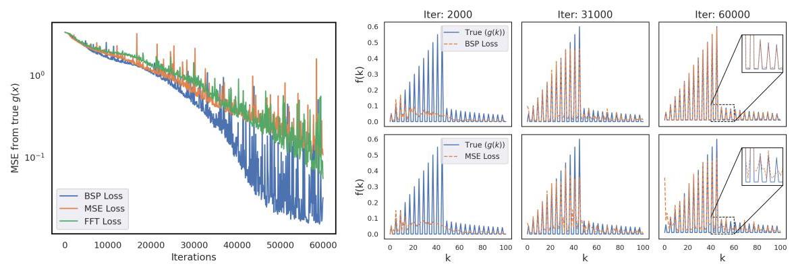

Figure 1: (left) MSE over training iterations for BSP Loss (blue), MSE (orange), and FFT Loss (green), showing faster convergence of BSP. (right) Frequency domain plot of predictions across training: BSP (top) recovers high-frequency components of $g\left( k\right)$ better than MSE (bottom).

图1:(左)BSP损失(蓝色)、MSE(橙色)和FFT损失(绿色)在训练迭代中的MSE，显示BSP收敛更快。(右)训练过程中预测的频域图:BSP(顶部)比MSE(底部)更好地恢复了$g\left( k\right)$的高频分量。

We follow Rahaman et al. [2019] to evaluate the mitigation of spectral bias using BSP loss. A target function $g\left( x\right)  = \mathop{\sum }\limits_{i}{A}_{i}\sin \left( {{2\pi }{k}_{i}x + {\phi }_{i}}\right)$ is constructed as a sum of sinusoidal components with varying frequencies, amplitudes, and phases. A 6-layer ReLU network with 256 units per layer is trained to approximate $g\left( x\right)$ using 200 uniformly spaced samples over $\left\lbrack  {0,1}\right\rbrack$ . We compare models trained with standard MSE loss versus BSP loss. Further details are provided in Appendix C.1

我们遵循Rahaman等人[2019]的方法，使用BSP损失评估频谱偏差的减轻情况。目标函数$g\left( x\right)  = \mathop{\sum }\limits_{i}{A}_{i}\sin \left( {{2\pi }{k}_{i}x + {\phi }_{i}}\right)$被构建为具有不同频率、幅度和相位的正弦分量之和。一个每层有256个单元的6层ReLU网络被训练，使用$\left\lbrack  {0,1}\right\rbrack$上的200个均匀间隔样本近似$g\left( x\right)$。我们比较了使用标准MSE损失和BSP损失训练的模型。附录C.1中提供了更多细节。

The impact of BSP Loss on function approximation and frequency learning is evident across the training iterations. The model trained with BSP Loss reconstructs the true function $g\left( x\right)$ with higher accuracy compared to those trained with MSE Loss, particularly in the earlier training stages (refer Figure 6 in Appendix). The advantage of BSP Loss is highlighted in Figure 1 (right), where its Fourier Transform representations capture high-frequency components of the true function $g\left( k\right)$ more effectively than MSE Loss, which struggles to learn these components. Additionally, in Figure 1 (left) we indicate the Mean Squared Error (MSE) throughout training iterations for the MSE loss, the BSP loss and the FFT regularizer mentioned in [Chattopadhyay et al. 2024]. Although the FFT loss performs slightly better than just using the MSE loss, BSP clearly outperforms all of them illustrating its superior convergence properties. Additionally we would like to mention that we can not use the MMD loss here as it is a simple function approximation task and there is no concept of underlying distribution or attractor (in other words, we do not have any batches to compute the MMD). These results collectively demonstrate that BSP Loss mitigates spectral bias and enhances function approximation by preserving the higher-frequency information in the learning process.

在整个训练迭代过程中，BSP损失对函数逼近和频率学习的影响是显而易见的。与使用均方误差(MSE)损失训练的模型相比，使用BSP损失训练的模型能够以更高的精度重构真实函数$g\left( x\right)$，尤其是在早期训练阶段(参见附录中的图6)。图1(右)突出显示了BSP损失的优势，其中其傅里叶变换表示比MSE损失更有效地捕获了真实函数$g\left( k\right)$的高频分量，而MSE损失在学习这些分量时遇到了困难。此外，在图1(左)中，我们展示了在整个训练迭代过程中，[Chattopadhyay等人，2024]中提到的MSE损失、BSP损失和FFT正则化器的均方误差(MSE)。尽管FFT损失的表现略优于仅使用MSE损失，但BSP明显优于所有这些方法，说明了其优越的收敛特性。此外，我们想指出，在这里我们不能使用MMD损失，因为这是一个简单的函数逼近任务，没有潜在分布或吸引子的概念(换句话说，我们没有任何批次来计算MMD)。这些结果共同表明，BSP损失通过在学习过程中保留高频信息来减轻频谱偏差并增强函数逼近。

### 4.2 Two-dimensional turbulence

### 4.2二维湍流

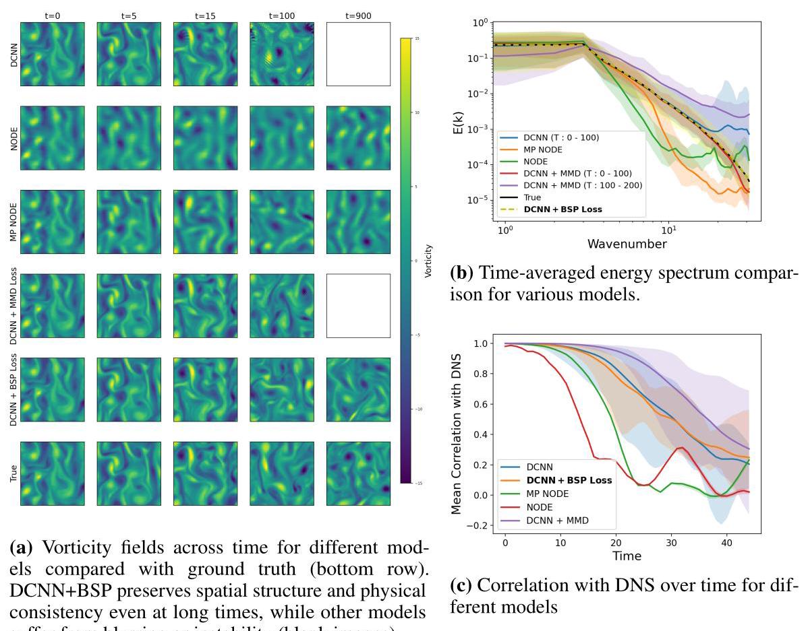

suffer from blurring or instability (blank images).

会出现模糊或不稳定(空白图像)的情况。

Figure 2: Comparison of NODE, MP-NODE, and DCNN models with MSE, MMD, and BSP losses. (a) shows spatial accuracy and stability over time; (b-c) summarize spectral fidelity and correlation behavior. BSP matches ground truth energy spectrum best over 900 steps. MMD aligns the best at short times (t<100) but degrades later. Overall, BSP maintains structure and energy distribution across long forecast horizons.

图2:具有MSE、MMD和BSP损失的NODE、MP - NODE和DCNN模型的比较。(a)显示了随时间的空间精度和稳定性；(b - c)总结了频谱保真度和相关行为。在900步的过程中，BSP与地面真实能量谱的匹配最佳。MMD在短时间内(t < 100)对齐最佳，但随后会退化。总体而言，BSP在长时间预测范围内保持结构和能量分布。

Forced two-dimensional turbulence is a standard benchmark for dynamical system prediction due to its chaotic behavior [Stachenfeld et al., 2021, Schiff et al., 2024, Frerix et al., 2021]. We evaluate our proposed loss on 2D homogeneous isotropic turbulence with Kolmogorov forcing, governed by the incompressible Navier-Stokes equations. Dataset details are in Appendix C.2 All baseline models are trained using the multi-step rollout loss from Equation 2 and the pushforward-trick. We use the dilated Convolutional Neural Network (DCNN) architecture [Stachenfeld et al., 2021], with hyperparameters listed in Appendix F For this test case as well as the following example in Section 4.3, we use ${\lambda }_{i}$ as ${k}_{\left( bini\right) }^{2}$ following widely used procedure in literature [Shankar et al. 2023, Oommen et al. 2024, Li et al. 2021].As benchmarks, we include DCNN with Maximum Mean Discrepancy (DCNN + MMD) [Schiff et al. 2024], which promotes attractor learning for stability, and Neural ODE (NODE) and MP-NODE [Chen et al., 2018, Chakraborty et al., 2024], with results taken from [Chakraborty et al. 2024]. Appendix A details these baselines.

由于其混沌行为，强迫二维湍流是动力系统预测的标准基准[Stachenfeld等人，2021年，Schiff等人，2024年，Frerix等人，2021年]。我们在具有Kolmogorov强迫的二维均匀各向同性湍流上评估我们提出的损失，该湍流由不可压缩的纳维 - 斯托克斯方程控制。数据集详细信息在附录C.2中。所有基线模型均使用来自方程2的多步展开损失和前推技巧进行训练。我们使用扩张卷积神经网络(DCNN)架构[Stachenfeld等人，2021年]，附录F中列出了超参数。对于此测试案例以及第4.3节中的以下示例，我们按照文献[Shankar等人，2023年，Oommen等人，2024年，Li等人，2021年]中广泛使用的程序，将${\lambda }_{i}$用作${k}_{\left( bini\right) }^{2}$。作为基准，我们包括具有最大均值差异(DCNN + MMD)的DCNN [Schiff等人，2024年]，其促进吸引子学习以实现稳定性，以及神经常微分方程(NODE)和MP - NODE [Chen等人，2018年，Chakraborty等人，2024年]，结果取自[Chakraborty等人，2024年]。附录A详细介绍了这些基线。

Figure 2a shows that DCNN trained with MSE becomes unstable at longer rollouts, consistent with prior works. DCNN + MMD improves stability up to $t = {100}$ but becomes unstable after that, diverging in high-wavenumber energy (Figure 2b) due to failure to capture finer details [Maulik et al. 2019]. NODE and MP-NODE remain stable but fail to preserve small-scale structures. In contrast, DCNN + BSP maintains stability and resolves both large- and small-scale features across the trajectory, preserving the energy spectrum throughout (Figure 2b). Unlike MMD, the BSP loss does not minimize error in physical-space, leading to no significant improvement in correlation metrics here(Figure 2c). However, for stochastic systems like turbulence, invariant metrics are more meaningful. Appendix C.2. Figure 7 compares distributions of velocity, vorticity, turbulence kinetic energy, and dissipation rate, showing BSP better preserves physical invariants than baselines.

图2a表明，使用MSE训练的DCNN在较长的展开过程中变得不稳定，这与先前的工作一致。DCNN + MMD在达到$t = {100}$之前提高了稳定性，但之后变得不稳定，由于未能捕获更精细的细节(图2b)，在高波数能量中发散[Maulik等人，2019年]。NODE和MP - NODE保持稳定，但未能保留小尺度结构。相比之下，DCNN + BSP在整个轨迹上保持稳定性，并解析了大尺度和小尺度特征，始终保留了能量谱(图2b)。与MMD不同，BSP损失不会在物理空间中最小化误差，因此在此处相关指标没有显著改善(图2c)。然而，对于像湍流这样的随机系统，不变指标更有意义。附录C.2中的图7比较了速度、涡度、湍流动能和耗散率的分布，显示BSP比基线更好地保留了物理不变量。

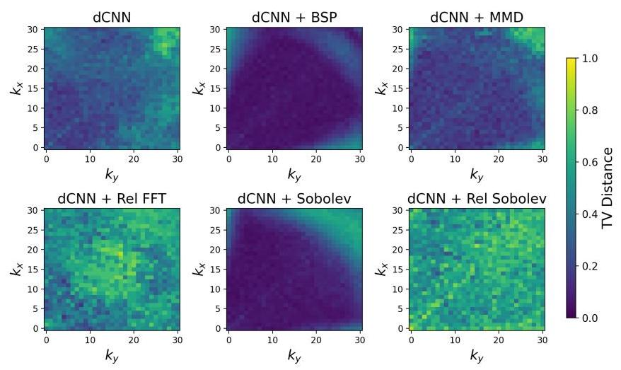

Figure 3: Total variation (TV) distance between the predicted and true spectral component distributions across wavenumbers ${k}_{x}$ and ${k}_{y}$ for different loss functions. Among all methods, the model trained with the BSP loss exhibits the lowest TV distance, indicating the closest match to the true spectral distribution and the most effective mitigation of spectral bias.

图3:不同损失函数在波数${k}_{x}$和${k}_{y}$上预测和真实谱分量分布之间的总变差(TV)距离。在所有方法中，使用BSP损失训练的模型表现出最低的TV距离，表明与真实谱分布最接近匹配，并且最有效地减轻了频谱偏差。

We also benchmark against other spectral losses: Sobolev [Li et al. 2021], relative FFT, and relative Sobolev. The total variation (TV) distance is employed to quantify discrepancies between the spectral component distributions at different wavenumbers, providing a robust measure of how predicted and true spectra differ across scales. As shown in Figure 3, BSP outperforms other losses in spectral fidelity. We note that the Sobolev loss also shows decent performance. We hypothesize that the poor performance of the relative losses is due to them trying to minimize very small values in the Fourier domain in a point-to-point manner, which is nontrivial. This justifies our use of binning to capture the energy at different scales in the BSP loss.

我们还与其他频谱损失进行了基准测试:Sobolev [Li等人，2021年]、相对FFT和相对Sobolev。采用总变差(TV)距离来量化不同波数下频谱分量分布之间的差异，从而有力地衡量预测频谱和真实频谱在不同尺度上的差异。如图3所示，BSP在频谱保真度方面优于其他损失。我们注意到Sobolev损失也表现出不错的性能。我们推测相对损失的性能较差是因为它们试图在傅里叶域中逐点最小化非常小的值，这并非易事。这证明了我们在BSP损失中使用分箱来捕获不同尺度能量的合理性。

### 4.3 3D Turbulence

### 4.3三维湍流

This experiment uses data from a three-dimensional direct numerical simulation (DNS) of incompressible, homogeneous, isotropic turbulence [Mohan et al., 2020]. Further details of this dataset are mentioned in Appendix C.3. We use a UNet based architecture for both MSE and BSP loss implementation.The hyperparameters of the model is mentioned in the Appendix F. In Figure 4, we observe here that both the models show minimal spectral bias and improved stability. This is related to the reduced spectral bias of models with larger parameter space(refer Appendix A.5. in [Rahaman et al. 2019]). We limit the extent of forecasting in this experiment due to limited training and validation data. We tested all models with 30 autoregressive rollouts, which represents approximately one cycle of turbulence for this dataset. Figure 4 shows the model trained with BSP loss captures the fine scales better visually. It is also evident from Figure 5 that the BSP loss shows a marked accuracy in the energy spectrum at high wavenumbers, corresponding to dynamically important small-scale structures in chaotic systems. Moreover, we present more metrics to further explore the performance of our method in Appendix C.3. With this evidence, we can conclude that the BSP loss helps in preserving the distribution of energy across different scales and spatial structures.

本实验使用了来自不可压缩、均匀、各向同性湍流的三维直接数值模拟(DNS)的数据[Mohan等人，2020年]。该数据集的更多详细信息在附录C.3中提及。我们使用基于UNet的架构来实现MSE和BSP损失。模型的超参数在附录F中提及。在图4中，我们观察到两个模型都显示出最小的频谱偏差并提高了稳定性。这与具有更大参数空间的模型的频谱偏差减小有关(参考[Rahaman等人，2019年]中的附录A.5)。由于训练和验证数据有限，我们在本实验中限制了预测范围。我们用30次自回归展开测试了所有模型，这对于该数据集来说大约代表一个湍流周期。图4显示，用BSP损失训练的模型在视觉上能更好地捕捉精细尺度。从图5中也可以明显看出，BSP损失在高波数处的能量谱中显示出显著的准确性，这对应于混沌系统中动态重要的小尺度结构。此外，我们在附录C.3中展示了更多指标以进一步探索我们方法 的性能。有了这些证据，我们可以得出结论，BSP损失有助于保持不同尺度和空间结构上的能量分布。

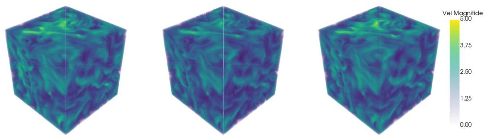

Figure 4: Velocity magnitude 3D plot for ground truth(left), UNet prediction(mid), and UNet + BSP loss prediction(right) after 5 auto-regressive rollouts. Clearly the UNet prediction has some blurring effect compared to other two.

图4:经过5次自回归展开后的真实速度大小三维图(左)、UNet预测(中)和UNet + BSP损失预测(右)。显然，与其他两者相比，UNet预测有一些模糊效果。

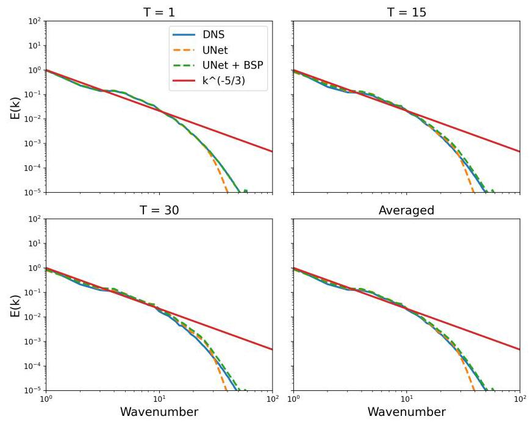

Figure 5: Comparison of energy spectra $E\left( k\right)$ as a function of wavenumber at different time steps $\left( {T = 1,{15},{30}}\right)$ and averaged over time. The plots show results from DNS (blue solid line), UNet (orange dashed line), and UNet model trained with BSP loss (green dashed line), along with the theoretical ${k}^{-5/3}$ scaling [Kolmogorov,1941] (red solid line). The inclusion of BSP improves the spectral accuracy at high wavenumbers compared to the standalone UNet approach.

图5:在不同时间步$\left( {T = 1,{15},{30}}\right)$并随时间平均的能量谱$E\left( k\right)$作为波数的函数的比较。这些图显示了DNS(蓝色实线)、UNet(橙色虚线)和用BSP损失训练的UNet模型(绿色虚线)的结果，以及理论${k}^{-5/3}$标度[Kolmogorov，1941年](红色实线)。与独立的UNet方法相比，加入BSP提高了高波数处的频谱准确性。

## 5 Discussion

## 5讨论

Capturing features across a wide range of spatial and temporal scales in complex, real-world dynamical systems is a significant challenge for data-driven forecasting techniques. While recent studies have started to address the issue, they often require specialized neural architectures or end up adding substantial computational costs both during training and forecasting. To address this, we introduce a novel Binned Spectral Power (BSP) loss function that steps away from point-wise comparisons in the physical domain and instead measures differences in terms of spatial energy distributions. By applying a Fourier transform to the input fields and binning the magnitude of the Fourier coefficients by wavenumbers, we minimize discrepancies between the predicted fields and target data across multiple scales. The BSP loss offers a more balanced and efficient way to capture both large and small features without heavily modifying the model or incurring significant extra costs.

在复杂的现实世界动态系统中跨广泛的空间和时间尺度捕捉特征对于数据驱动的预测技术来说是一项重大挑战。虽然最近的研究已经开始解决这个问题，但它们通常需要专门的神经架构，或者最终在训练和预测过程中增加大量的计算成本。为了解决这个问题，我们引入了一种新颖的分箱频谱功率(BSP)损失函数，它摆脱了物理域中的逐点比较，而是在空间能量分布方面测量差异。通过对输入场应用傅里叶变换并按波数对傅里叶系数的幅度进行分箱，我们最小化了预测场与目标数据在多个尺度上的差异。BSP损失提供了一种更平衡、更有效的方法来捕捉大特征和小特征，而无需对模型进行大量修改或产生大量额外成本。

Our experiments demonstrate that we can effectively reduce the spectral bias of neural networks in function approximation. We also showcase the advantages of BSP loss using challenging test cases such as turbulent flow forecasting. These results empirically show that the BSP loss function improves the ability of a neural network model to mitigate spectral bias and capture information at different scales in the data.

我们的实验表明，我们可以有效地减少神经网络在函数逼近中的频谱偏差。我们还使用具有挑战性的测试案例(如湍流预测)展示了BSP损失的优势。这些结果从经验上表明，BSP损失函数提高了神经网络模型减轻频谱偏差并在数据中不同尺度捕捉信息的能力。

Limitation : We would like to emphasize that it is non-trivial to define the BSP loss in an unstructured grid. As demonstrated in Appendix D, when applied to a problem with a non-uniform grid using interpolation, the resulting improvement is minimal. While we implement some potential solutions there, addressing this challenge in a broader context remains an avenue for future research.

局限性:我们想强调的是，在非结构化网格中定义BSP损失并非易事。如附录D所示，当使用插值应用于非均匀网格问题时，得到的改进很小。虽然我们在那里实现了一些潜在的解决方案，但在更广泛的背景下解决这个挑战仍然是未来研究的一个方向。

## Acknowledgments and Disclosure of Funding

## 致谢与资金披露

This research used resources of the Argonne Leadership Computing Facility (ALCF), a U.S. Department of Energy (DOE) Office of Science user facility at Argonne National Laboratory and is based on research supported by the U.S. DOE Office of Science-Advanced Scientific Computing Research (ASCR) Program, under Contract No. DE-AC02-06CH11357. RM/DC acknowledge funding support from the DOE Office of Science ASCR program (DOE-FOA-2493, PM-Dr. Steve Lee), Fusion Energy Sciences program (DOE-FOA-2905, PM-Dr. Michael Halfmoon), and computational resources from the Penn State Institute for Computational and Data Sciences. ATM acknowledge support from Artimis LDRD project at Los Alamos National Lab.

本研究使用了阿贡国家实验室的阿贡领导计算设施(ALCF)的资源，该设施是美国能源部(DOE)科学办公室的用户设施，并且基于美国能源部科学办公室高级科学计算研究(ASCR)计划支持的研究，合同编号为DE-AC02-06CH11357。RM/DC感谢美国能源部科学办公室ASCR计划(DOE-FOA-2493，项目负责人——史蒂夫·李博士)、聚变能源科学计划(DOE-FOA-2905，项目负责人——迈克尔·半月博士)的资金支持，以及宾夕法尼亚州立大学计算与数据科学研究所的计算资源。ATM感谢洛斯阿拉莫斯国家实验室的阿尔忒弥斯LDRD项目的支持。

## References

## 参考文献

Ron Amit, Ron Meir, and Kamil Ciosek. Discount factor as a regularizer in reinforcement learning.

罗恩·阿米特、罗恩·迈尔和卡米尔·乔塞克。折扣因子作为强化学习中的正则化器。In International conference on machine learning, pages 269-278. PMLR, 2020.

Shivam Barwey, Varun Shankar, Venkatasubramanian Viswanathan, and Romit Maulik. Multiscale graph neural network autoencoders for interpretable scientific machine learning. Journal of

希瓦姆·巴韦、瓦伦·尚卡尔、文卡塔苏布拉马尼亚·维斯瓦纳坦和罗米特·毛里克。用于可解释科学机器学习的多尺度图神经网络自编码器。《……杂志》Computational Physics, 495:112537, 2023.

Satwik Bhattamishra, Arkil Patel, Varun Kanade, and Phil Blunsom. Simplicity bias in transformers

萨特维克·巴塔米什拉、阿基尔·帕特尔、瓦伦·卡纳德和菲尔·布伦索姆。变压器中的简单性偏差and their ability to learn sparse boolean functions. arXiv preprint arXiv:2211.12316, 2022.

Kaifeng Bi, Lingxi Xie, Hengheng Zhang, Xin Chen, Xiaotao Gu, and Qi Tian. Pangu-weather: A 3d high-resolution model for fast and accurate global weather forecast. arXiv preprint

毕凯峰、谢凌曦、张恒恒、陈鑫、顾小涛和齐天。盘古气象:一种用于快速准确全球天气预报的三维高分辨率模型。arXiv预印本arXiv:2211.02556, 2022.

Massimo Bonavita. On some limitations of current machine learning weather prediction models.

马西莫·博纳维塔。论当前机器学习天气预报模型的一些局限性。Geophysical Research Letters, 51(12):e2023GL107377, 2024.

James Bradbury, Roy Frostig, Peter Hawkins, Matthew James Johnson, Chris Leary, Dougal Maclaurin, George Necula, Adam Paszke, Jake VanderPlas, Skye Wanderman-Milne, and Qiao Zhang. JAX: composable transformations of Python+NumPy programs, 2018. URL http://github.com/google/jax

詹姆斯·布拉德伯里、罗伊·弗罗斯蒂格、彼得·霍金斯、马修·詹姆斯·约翰逊、克里斯·利里、道格尔·麦克劳林、乔治·内库拉、亚当·帕兹克、杰克·范德普拉斯、斯凯·万德曼 - 米尔恩和乔·张。JAX:Python + NumPy程序的可组合变换，2018年。网址:http://github.com/google/jax

Johannes Brandstetter, Daniel Worrall, and Max Welling. Message passing neural pde solvers. arXiv

约翰内斯·布兰德施泰特、丹尼尔·沃勒尔和马克斯·韦林。消息传递神经偏微分方程求解器。arXivpreprint arXiv:2202.03376, 2022.

Joshua William Burby, Qi Tang, and R Maulik. Fast neural poincaré maps for toroidal magnetic

约书亚·威廉·伯比、唐琦和R·毛里克。用于环形磁场的快速神经庞加莱映射fields. Plasma Physics and Controlled Fusion, 63(2):024001, 2020.

Zhicheng Cai, Hao Zhu, Qiu Shen, Xinran Wang, and Xun Cao. Batch normalization alleviates the spectral bias in coordinate networks. In Proceedings of the IEEE/CVF Conference on Computer

蔡志成、朱浩、沈秋、王欣然和曹 Xun。批量归一化减轻坐标网络中的谱偏差。在IEEE/CVF计算机视觉与模式识别会议论文集Vision and Pattern Recognition, pages 25160-25171, 2024.

Abdulkadir Canatar, Blake Bordelon, and Cengiz Pehlevan. Spectral bias and task-model alignment explain generalization in kernel regression and infinitely wide neural networks. Nature

阿卜杜勒卡迪尔·卡纳塔尔、布莱克·博尔德伦和曾吉兹·佩赫莱万。谱偏差和任务 - 模型对齐解释核回归和无限宽神经网络中的泛化。《自然》communications, 12(1):2914, 2021.

Xintao Chai, Wenjun Cao, Jianhui Li, Hang Long, and Xiaodong Sun. Overcoming the spectral bias problem of physics-informed neural networks in solving the frequency-domain acoustic wave equation. IEEE Transactions on Geoscience and Remote Sensing, 2024.

柴新涛、曹文君、李建辉、龙航和孙晓东。克服物理信息神经网络在求解频域声波方程中的谱偏差问题。《IEEE地球科学与遥感汇刊》，2024年。

Dibyajyoti Chakraborty, Seung Whan Chung, and Romit Maulik. Divide and conquer: Learning chaotic dynamical systems with multistep penalty neural ordinary differential equations. arXiv

迪比亚乔蒂·恰克拉波蒂、郑升焕和罗米特·毛里克。分而治之:用多步惩罚神经常微分方程学习混沌动力系统。arXivpreprint arXiv:2407.00568, 2024.

Ashesh Chattopadhyay and Pedram Hassanzadeh. Long-term instabilities of deep learning-based

阿舍什·查托帕迪亚和佩德拉姆·哈桑扎德。基于深度学习的长期不稳定性digital twins of the climate system: The cause and a solution. arXiv preprint arXiv:2304.07029,2023.

Ashesh Chattopadhyay, Michael Gray, Tianning Wu, Anna B Lowe, and Ruoying He. Oceannet: A principled neural operator-based digital twin for regional oceans. Scientific Reports, 14(1):21181, 2024.

阿舍什·查托帕迪亚、迈克尔·格雷、吴天宁、安娜·B·洛维和何若莹。海洋网络:一种基于原理的神经算子的区域海洋数字孪生。《科学报告》，14(1):21181，2024年。

Ricky TQ Chen, Yulia Rubanova, Jesse Bettencourt, and David K Duvenaud. Neural ordinary

瑞奇·TQ·陈、尤利娅·鲁巴诺娃、杰西·贝当古和大卫·K·杜韦瑙德。神经常微分方程
differential equations. Advances in neural information processing systems, 31, 2018.

Shengyu Chen, Peyman Givi, Can Zheng, and Xiaowei Jia. Physics-enhanced neural operator for

陈圣宇、佩曼·吉维、郑灿和贾晓伟。物理增强神经算子用于
simulating turbulent transport. arXiv preprint arXiv:2406.04367, 2024.

Tianping Chen and Hong Chen. Universal approximation to nonlinear operators by neural networks with arbitrary activation functions and its application to dynamical systems. IEEE transactions on

陈天平、陈洪。具有任意激活函数的神经网络对非线性算子的通用逼近及其在动力系统中的应用。IEEE 汇刊
neural networks, 6(4):911-917, 1995.

Yuanqi Chen, Ge Li, Cece Jin, Shan Liu, and Thomas Li. Ssd-gan: measuring the realness in the spatial and spectral domains. In Proceedings of the AAAI Conference on Artificial Intelligence,

陈元奇、李戈、金策策、刘杉和托马斯·李。Ssd - gan:在空间和光谱域中测量真实性。在人工智能AAAI会议论文集中，
volume 35, pages 1105-1112, 2021.

Michael Chertkov, Alain Pumir, and Boris I Shraiman. Lagrangian tetrad dynamics and the phe-

迈克尔·切尔特科夫、阿兰·皮米尔和鲍里斯·I·施莱曼。拉格朗日四分体动力学与
nomenology of turbulence. Physics of fluids, 11(8):2394-2410, 1999.

Seung Whan Chung and Jonathan B Freund. An optimization method for chaotic turbulent flow.

郑承焕和乔纳森·B·弗罗因德。一种用于混沌湍流的优化方法。
Journal of Computational Physics, 457:111077, 2022.

George Cybenko. Approximation by superpositions of a sigmoidal function. Mathematics of control,

乔治·西本科。用 sigmoidal 函数叠加进行逼近。控制数学，
signals and systems, 2(4):303-314, 1989.

Wojciech M Czarnecki, Simon Osindero, Max Jaderberg, Grzegorz Swirszcz, and Razvan Pascanu. Sobolev training for neural networks. Advances in neural information processing systems, 30, 2017.

沃伊切赫·M·查尔内茨基、西蒙·奥辛德罗、马克斯·亚德伯格、格热戈日·斯维尔斯茨、拉兹万·帕斯库努。神经网络的索伯列夫训练。神经信息处理系统进展，30，2017年。

Don Daniel, Daniel Livescu, and Jaiyoung Ryu. Reaction analogy based forcing for incompressible

唐·丹尼尔、丹尼尔·利夫斯库、贾扬·柳。基于反应类比的不可压缩流强迫scalar turbulence. Physical Review Fluids, 3(9):094602, 2018.

Thomas Frerix, Dmitrii Kochkov, Jamie Smith, Daniel Cremers, Michael Brenner, and Stephan Hoyer. Variational data assimilation with a learned inverse observation operator. In International

托马斯·弗雷里克斯、德米特里·科奇科夫、杰米·史密斯、丹尼尔·克雷默斯、迈克尔·布伦纳、斯特凡·霍耶。基于学习的逆观测算子的变分数据同化。在国际Conference on Machine Learning, pages 3449-3458. PMLR, 2021.

Sicheng Gao, Xuhui Liu, Bohan Zeng, Sheng Xu, Yanjing Li, Xiaoyan Luo, Jianzhuang Liu, Xiantong Zhen, and Baochang Zhang. Implicit diffusion models for continuous super-resolution. In Proceedings of the IEEE/CVF conference on computer vision and pattern recognition, pages 10021-10030, 2023.

高思成、刘旭辉、曾博涵、徐升、李燕晶、罗晓燕、刘建庄、甄先通、张宝昌。用于连续超分辨率的隐式扩散模型。在IEEE/CVF计算机视觉与模式识别会议论文集，第10021 - 10030页，2023年。

Haiwen Guan, Troy Arcomano, Ashesh Chattopadhyay, and Romit Maulik. Lucie: A lightweight uncoupled climate emulator with long-term stability and physical consistency for o (1000)-member

关海文、特洛伊·阿科马诺、阿舍什·查托帕迪亚、罗米特·马利克。露西:一种轻量级解耦气候模拟器，具有长期稳定性和物理一致性，适用于o(1000)成员ensembles. arXiv preprint arXiv:2405.16297, 2024.

Cale Harnish, Luke Dalessandro, Karel Matous, and Daniel Livescu. A multiresolution adaptive wavelet method for nonlinear partial differential equations. International Journal for Multiscale

凯尔·哈尼斯、卢克·达莱桑德罗、卡雷尔·马托斯、丹尼尔·利夫斯库。一种用于非线性偏微分方程的多分辨率自适应小波方法。国际多尺度杂志Computational Engineering, 19(2), 2021.

Arthur Jacot, Franck Gabriel, and Clément Hongler. Neural tangent kernel: Convergence and

亚瑟·雅科、弗兰克·加布里埃尔、克莱门特·洪格勒。神经切线核:收敛性与generalization in neural networks. Advances in neural information processing systems, 31, 2018.

Ruoxi Jiang, Peter Y Lu, Elena Orlova, and Rebecca Willett. Training neural operators to preserve invariant measures of chaotic attractors. Advances in Neural Information Processing Systems, 36: 27645-27669, 2023.

蒋若曦、彼得·Y·卢、叶连娜·奥尔洛娃、丽贝卡·威利特。训练神经算子以保持混沌吸引子的不变测度。神经信息处理系统进展，36: 27645 - 27669，2023年。

George Em Karniadakis, Ioannis G Kevrekidis, Lu Lu, Paris Perdikaris, Sifan Wang, and Liu Yang.

乔治·埃姆·卡尔尼亚达基斯、约阿尼斯·G·凯夫雷基迪斯、陆璐、帕里斯·佩迪卡里、司凡·王、刘洋。Physics-informed machine learning. Nature Reviews Physics, 3(6):422-440, 2021.

Ryan Keisler. Forecasting global weather with graph neural networks. arXiv preprint

瑞安·基斯勒。用图神经网络预测全球天气。arXiv预印本arXiv:2202.07575, 2022.

Siavash Khodakarami, Vivek Oommen, Aniruddha Bora, and George Em Karniadakis. Mitigating spectral bias in neural operators via high-frequency scaling for physical systems. arXiv preprint

西亚瓦什·霍达卡拉米、维韦克·奥门、阿尼尔鲁达·博拉、乔治·埃姆·卡尔尼亚达基斯。通过物理系统的高频缩放减轻神经算子中的频谱偏差。arXiv预印本arXiv:2503.13695, 2025.

Dmitrii Kochkov, Jamie A. Smith, Ayya Alieva, Qing Wang, Michael P. Brenner, and Stephan Hoyer. Machine learning-accelerated computational fluid dynamics. Proceedings of the National Academy of Sciences, 118(21), 2021a. ISSN 0027-8424. doi: 10.1073/pnas.2101784118. URL https://www.pnas.org/content/118/21/e2101784118.

德米特里·科奇科夫、杰米·A·史密斯、阿亚·阿利耶娃、王清、迈克尔·P·布伦纳、斯特凡·霍耶。机器学习加速的计算流体动力学。美国国家科学院院刊，118(21)，2021a。ISSN 0027 - 8424。doi: 10.1073/pnas.2101784118。URL https://www.pnas.org/content/118/21/e2101784118。

Dmitrii Kochkov, Jamie A Smith, Ayya Alieva, Qing Wang, Michael P Brenner, and Stephan Hoyer. Machine learning-accelerated computational fluid dynamics. Proceedings of the National Academy of Sciences, 118(21):e2101784118, 2021b.

德米特里·科奇科夫、杰米·A·史密斯、阿亚·阿利耶娃、王清、迈克尔·P·布伦纳、斯特凡·霍耶。机器学习加速的计算流体动力学。美国国家科学院院刊，118(21):e2101784118，2021b。

Dmitrii Kochkov, Janni Yuval, Ian Langmore, Peter Norgaard, Jamie A Smith, Griffin Mooers, James Lottes, Stephan Rasp, Peter D Düben, Milan Klöwer, et al. Neural general circulation models. CoRR, 2023.

德米特里·科奇科夫、詹尼·尤瓦尔、伊恩·朗莫尔、彼得·诺尔加德、杰米·A·史密斯、格里芬·穆尔斯、詹姆斯·洛茨、斯特凡·拉斯普、彼得·D·迪本、米兰·克洛韦尔等。神经通用环流模型。CoRR，2023年。

Andrey Nikolaevich Kolmogorov. The local structure of turbulence in incompressible viscous fluid

安德烈·尼古拉耶维奇·科尔莫戈罗夫。不可压缩粘性流体中湍流的局部结构for very large reynolds. Numbers. In Dokl. Akad. Nauk SSSR, 30:301, 1941.

Ling-Wei Kong, Yang Weng, Bryan Glaz, Mulugeta Haile, and Ying-Cheng Lai. Digital twins of

孔令伟、翁杨、布莱恩·格拉兹、穆卢盖塔·海尔、赖英成。数字孪生nonlinear dynamical systems. arXiv preprint arXiv:2210.06144, 2022.

Ching-Yao Lai, Pedram Hassanzadeh, Aditi Sheshadri, Maike Sonnewald, Raffaele Ferrari, and Venkatramani Balaji. Machine learning for climate physics and simulations. Annual Review of

赖清耀、佩德拉姆·哈桑扎德、阿迪蒂·谢沙德里、迈克·索内瓦尔德、拉斐尔·法拉利和文卡特拉马尼·巴拉吉。用于气候物理和模拟的机器学习。《年度评论》Condensed Matter Physics, 16, 2024.

Remi Lam, Alvaro Sanchez-Gonzalez, Matthew Willson, Peter Wirnsberger, Meire Fortunato, Alexander Pritzel, Suman Ravuri, Timo Ewalds, Ferran Alet, Zach Eaton-Rosen, et al. Graphcast: Learning

雷米·拉姆、阿尔瓦罗·桑切斯 - 冈萨雷斯、马修·威尔森、彼得·维尔恩斯伯格、梅雷·福尔图纳托、亚历山大·普里茨尔、苏曼·拉武里、蒂莫·埃瓦尔德斯、费兰·阿莱特、扎克·伊顿 - 罗森等人。Graphcast:学习skillful medium-range global weather forecasting. arXiv preprint arXiv:2212.12794, 2022.

H Li, L Wang, YL Fu, ZX Wang, TB Wang, and JQ Li. Surrogate model of turbulent transport in

H李、L王、YL傅、ZX王、TB王和JQ李。中的湍流输运替代模型fusion plasmas using machine learning. Nuclear Fusion, 65(1):016015, 2024.

Zongyi Li, Nikola Kovachki, Kamyar Azizzadenesheli, Burigede Liu, Kaushik Bhattacharya, Andrew Stuart, and Anima Anandkumar. Markov neural operators for learning chaotic systems. arXiv

李宗义、尼古拉·科瓦奇基、卡米亚尔·阿齐扎德内舍利、布里格德·刘、考希克·巴塔查里亚、安德鲁·斯图尔特和阿尼马·阿南德库马尔。用于学习混沌系统的马尔可夫神经算子。arXivpreprint arXiv:2106.06898, pages 2-3, 2021.

Zongyi Li, Daniel Zhengyu Huang, Burigede Liu, and Anima Anandkumar. Fourier neural operator with learned deformations for pdes on general geometries. Journal of Machine Learning Research, 24(388):1-26, 2023.

李宗义、丹尼尔·郑宇·黄、布里格德·刘和阿尼马·阿南德库马尔。具有学习变形的傅里叶神经算子用于一般几何上的偏微分方程。《机器学习研究杂志》，24(388):1 - 26，2023年。

Xinmiao Lin, Yikang Li, Jenhao Hsiao, Chiuman Ho, and Yu Kong. Catch missing details: Image reconstruction with frequency augmented variational autoencoder. In Proceedings of the IEEE/CVF

林新苗、李亦康、萧仁浩、邱曼·何和孔宇。捕捉缺失细节:使用频率增强变分自编码器进行图像重建。在IEEE/CVF会议论文集Conference on Computer Vision and Pattern Recognition, pages 1736-1745, 2023.

Alec J Linot and Michael D Graham. Data-driven reduced-order modeling of spatiotemporal chaos with neural ordinary differential equations. Chaos: An Interdisciplinary Journal of Nonlinear

亚历克·J·利诺特和迈克尔·D·格雷厄姆。使用神经常微分方程对时空混沌进行数据驱动的降阶建模。《混沌:非线性跨学科杂志》Science, 32(7), 2022.

Alec J Linot, Joshua W Burby, Qi Tang, Prasanna Balaprakash, Michael D Graham, and Romit Maulik. Stabilized neural ordinary differential equations for long-time forecasting of dynamical

亚历克·J·利诺特、约书亚·W·伯比、唐琦、普拉萨纳·巴拉普拉卡什、迈克尔·D·格雷厄姆和罗米特·毛里克。用于动力系统长期预测的稳定神经常微分方程systems. Journal of Computational Physics, 474:111838, 2023.

Phillip Lippe, Bas Veeling, Paris Perdikaris, Richard Turner, and Johannes Brandstetter. Pde-refiner: Achieving accurate long rollouts with neural pde solvers. Advances in Neural Information Processing Systems, 36:67398-67433, 2023a.

菲利普·利佩、巴斯·维林、帕里斯·佩迪卡里、理查德·特纳和约翰内斯·布兰德施泰特。Pde - refiner:使用神经偏微分方程求解器实现准确的长序列模拟。《神经信息处理系统进展》，36:67398 - 67433，2023年a。

Phillip Lippe, Bastiaan S Veeling, Paris Perdikaris, Richard E Turner, and Johannes Brandstetter. Modeling accurate long rollouts with temporal neural pde solvers. In ICML Workshop on New Frontiers in Learning, Control, and Dynamical Systems, 2023b.

菲利普·利佩、巴斯蒂安·S·维林、帕里斯·佩迪卡里、理查德·E·特纳和约翰内斯·布兰德施泰特。使用时间神经偏微分方程求解器对准确的长序列进行建模。在2023年b的ICML学习、控制和动力系统新前沿研讨会上。

Hao Liu, Xinghua Jiang, Xin Li, Antai Guo, Yiqing Hu, Deqiang Jiang, and Bo Ren. The devil is in the frequency: Geminated gestalt autoencoder for self-supervised visual pre-training. In

刘浩、蒋兴华、李鑫、郭安泰、胡逸青、蒋德强和任博。关键在于频率:用于自监督视觉预训练的孪生格式塔自动编码器。在Proceedings of the AAAI Conference on Artificial Intelligence, volume 37, pages 1649-1656, 2023.

Xinliang Liu, Bo Xu, Shuhao Cao, and Lei Zhang. Mitigating spectral bias for the multiscale operator

刘新亮、徐波、曹书浩和张磊。减轻多尺度算子的频谱偏差learning. Journal of Computational Physics, 506:112944, 2024.

Ziqi Liu, Wei Cai, and Zhi-Qin John Xu. Multi-scale deep neural network (mscalednn) for solving

刘子奇、蔡伟和徐志勤。用于求解的多尺度深度神经网络(mscalednn)poisson-boltzmann equation in complex domains. arXiv preprint arXiv:2007.11207, 2020.

Feng Luo, Jinxi Xiang, Jun Zhang, Xiao Han, and Wei Yang. Image super-resolution via latent diffusion: A sampling-space mixture of experts and frequency-augmented decoder approach. arXiv

罗峰、向锦熙、张军、肖涵和杨威。通过潜在扩散进行图像超分辨率:一种采样空间专家混合和频率增强解码器方法。arXivpreprint arXiv:2310.12004, 2023.

Ankur Mahesh, William Collins, Boris Bonev, Noah Brenowitz, Yair Cohen, Joshua Elms, Peter Harrington, Karthik Kashinath, Thorsten Kurth, Joshua North, et al. Huge ensembles part i: Design of ensemble weather forecasts using spherical fourier neural operators. arXiv preprint

安库尔·马赫什、威廉·柯林斯、鲍里斯·博内夫、诺亚·布伦诺维茨、亚伊尔·科恩、约书亚·埃尔姆斯、彼得·哈灵顿、卡尔蒂克·卡希纳特、托尔斯滕·库尔思、约书亚·诺思等人。巨大集合体第一部分:使用球面傅里叶神经算子设计集合天气预报。arXiv预印本arXiv:2408.03100, 2024.

Romit Maulik, Omer San, Adil Rasheed, and Prakash Vedula. Subgrid modelling for two-dimensional

罗米特·毛里克、奥默·桑、阿迪尔·拉希德和普拉卡什·韦杜拉。二维的亚网格建模turbulence using neural networks. Journal of Fluid Mechanics, 858:122-144, 2019.

Warren S McCulloch and Walter Pitts. A logical calculus of the ideas immanent in nervous activity.

沃伦·S·麦卡洛克和沃尔特·皮茨。神经活动中内在思想的逻辑演算。The bulletin of mathematical biophysics, 5:115-133, 1943.

Viraj Mehta, Ian Char, Willie Neiswanger, Youngseog Chung, Andrew Nelson, Mark Boyer, Egemen Kolemen, and Jeff Schneider. Neural dynamical systems: Balancing structure and flexibility

维贾伊·梅塔、伊恩·查尔、威利·尼斯万格、杨世燮·钟、安德鲁·纳尔逊、马克·博耶、埃格门·科莱门和杰夫·施耐德。神经动力系统:平衡结构与灵活性in physical prediction. In 2021 60th IEEE Conference on Decision and Control (CDC), pages3735-3742. IEEE, 2021.

3735 - 3742。电气和电子工程师协会，2021年。

Arvind T Mohan, Dima Tretiak, Misha Chertkov, and Daniel Livescu. Spatio-temporal deep learning models of 3d turbulence with physics informed diagnostics. Journal of Turbulence, 21(9-10): 484-524, 2020.

阿尔文德·T·莫汉、迪马·特雷蒂亚克、米沙·切尔特科夫和丹尼尔·利夫斯库。具有物理信息诊断的三维湍流时空深度学习模型。《湍流杂志》，21(9 - 10):484 - 524，2020年。

Tung Nguyen, Rohan Shah, Hritik Bansal, Troy Arcomano, Romit Maulik, Veerabhadra Kotamarthi, Ian Foster, Sandeep Madireddy, and Aditya Grover. Scaling transformer neural networks for

董·阮、罗汉·沙阿、赫里蒂克·班萨尔、特洛伊·阿科马诺、罗米特·毛里克、维拉巴德拉·科塔马尔蒂、伊恩·福斯特、桑迪普·马迪雷迪和阿迪蒂亚·格罗弗。用于扩展变压器神经网络以用于skillful and reliable medium-range weather forecasting. arXiv preprint arXiv:2312.03876, 2023.

AM Obukhov. Kolmogorov flow and laboratory simulation of it. Russ. Math. Surv, 38(4):113-126, 1983.

A.M. 奥布霍夫。柯尔莫哥洛夫流及其实验室模拟。《俄罗斯数学综述》，38(4):113 - 126，1983年。

Leonardo Olivetti and Gabriele Messori. Do data-driven models beat numerical models in forecasting weather extremes? a comparison of ifs hres, pangu-weather, and graphcast. Geoscientific Model

莱昂纳多·奥利维蒂和加布里埃莱·梅索里。数据驱动模型在极端天气预测中能否击败数值模型？对ifs hres、盘古气象和图播的比较。地球科学模型Development, 17(21):7915-7962, 2024.

Vivek Oommen, Aniruddha Bora, Zhen Zhang, and George Em Karniadakis. Integrating neural operators with diffusion models improves spectral representation in turbulence modeling. arXiv

维韦克·奥ommen、阿尼尔鲁达·博拉、张震和乔治·埃姆·卡尔尼亚达基斯。将神经算子与扩散模型相结合可改善湍流建模中的频谱表示。arXivpreprint arXiv:2409.08477, 2024.

Olivier C Pasche, Jonathan Wider, Zhongwei Zhang, Jakob Zscheischler, and Sebastian Engelke. Validating deep learning weather forecast models on recent high-impact extreme events. Artificial

奥利维尔·C·帕舍、乔纳森·维德、张中伟、雅各布·茨谢施勒和塞巴斯蒂安·恩格尔克。在近期高影响极端事件上验证深度学习天气预报模型。人工智能Intelligence for the Earth Systems, 4(1):e240033, 2025.

Jaideep Pathak, Shashank Subramanian, Peter Harrington, Sanjeev Raja, Ashesh Chattopadhyay, Morteza Mardani, Thorsten Kurth, David Hall, Zongyi Li, Kamyar Azizzadenesheli, et al. Fourcast-net: A global data-driven high-resolution weather model using adaptive Fourier neural operators.

杰迪普·帕塔克、沙尚克·苏布拉马尼亚姆、彼得·哈灵顿、桑吉夫·拉贾、阿舍什·恰托帕迪亚、莫尔塔扎·马尔达尼、托尔斯滕·库尔思、大卫·霍尔、宗义·李、卡米亚尔·阿齐扎德内舍利等人。四预测网:一种使用自适应傅里叶神经算子的全球数据驱动高分辨率天气模型。arXiv preprint arXiv:2202.11214, 2022.

Nasim Rahaman, Aristide Baratin, Devansh Arpit, Felix Draxler, Min Lin, Fred Hamprecht, Yoshua Bengio, and Aaron Courville. On the spectral bias of neural networks. In International conference

纳西姆·拉哈曼、阿里斯蒂德·巴拉廷、德文什·阿皮特、费利克斯·德拉克勒、林敏、弗雷德·汉普雷希特、约书亚·本吉奥和亚伦·库维尔。关于神经网络的频谱偏差。在国际会议上on machine learning, pages 5301-5310. PMLR, 2019.

Elizabeth A Ritchie and Greg J Holland. Scale interactions during the formation of typhoon irving.

伊丽莎白·A·里奇和格雷格·J·霍兰德。台风欧文形成期间的尺度相互作用。Monthly weather review, 125(7):1377-1396, 1997.

Olaf Ronneberger, Philipp Fischer, and Thomas Brox. U-net: Convolutional networks for biomedical image segmentation. In Medical image computing and computer-assisted intervention-MICCAI

奥拉夫·罗恩内伯格、菲利普·菲舍尔和托马斯·布罗克斯。U - 网:用于生物医学图像分割的卷积网络。在医学图像计算与计算机辅助干预 - MICCAI会议上2015: 18th international conference, Munich, Germany, October 5-9, 2015, proceedings, part III 18, pages 234-241. Springer, 2015.

Salva Rühling Cachay, Bo Zhao, Hailey Joren, and Rose Yu. Dyffusion: A dynamics-informed diffusion model for spatiotemporal forecasting. Advances in Neural Information Processing

萨尔瓦·吕林·卡查伊、赵博、海莉·乔伦和罗斯·于。Dyffusion:一种用于时空预测的动力学信息扩散模型。神经信息处理进展Systems, 36, 2024.

TJ Santner. The design and analysis of computer experiments, 2003.

TJ·桑特纳。计算机实验的设计与分析，2003年。

Yair Schiff, Zhong Yi Wan, Jeffrey B Parker, Stephan Hoyer, Volodymyr Kuleshov, Fei Sha, and Leonardo Zepeda-Núñez. Dyslim: Dynamics stable learning by invariant measure for chaotic

亚伊尔·希夫、钟毅·万、杰弗里·B·帕克、斯蒂芬·霍耶、沃洛季米尔·库列绍夫、费沙和莱昂纳多·塞佩达 - 努涅斯。Dyslim:通过混沌不变测度实现动力学稳定学习systems. arXiv preprint arXiv:2402.04467, 2024.

Katja Schwarz, Yiyi Liao, and Andreas Geiger. On the frequency bias of generative models. Advances

卡特娅·施瓦茨、廖依伊和安德里亚斯·盖格。关于生成模型的频率偏差。进展in Neural Information Processing Systems, 34:18126-18136, 2021.

Varun Shankar, Vedant Puri, Ramesh Balakrishnan, Romit Maulik, and Venkatasubramanian Viswanathan. Differentiable physics-enabled closure modeling for burgers' turbulence. Ma-

瓦伦·尚卡尔、维丹特·普里、拉梅什·巴拉吉什南、罗米特·毛里克和文卡塔斯布拉马尼亚·维斯瓦纳坦。用于伯格斯湍流的可微物理驱动封闭建模。马 -chine Learning: Science and Technology, 4(1):015017, 2023.

Kimberly Stachenfeld, Drummond B Fielding, Dmitrii Kochkov, Miles Cranmer, Tobias Pfaff, Jonathan Godwin, Can Cui, Shirley Ho, Peter Battaglia, and Alvaro Sanchez-Gonzalez. Learned

金伯利·斯塔申菲尔德、德拉蒙德·B·菲尔丁、德米特里·科奇科夫、迈尔斯·克兰默、托比亚斯·普法夫、乔纳森·戈德温、蔡灿、雪莉·何、彼得·巴塔利亚和阿尔瓦罗·桑切斯 - 冈萨雷斯。学习到的coarse models for efficient turbulence simulation. arXiv preprint arXiv:2112.15275, 2021.

Yiming Sun, Ian Simpson, Hua-Liang Wei, and Edward Hanna. Probabilistic seasonal forecasts of north atlantic atmospheric circulation using complex systems modelling and comparison with

孙一鸣、伊恩·辛普森、魏华良和爱德华·汉纳。使用复杂系统建模对北大西洋大气环流进行概率季节性预测并与……进行比较dynamical models. Meteorological Applications, 31(1):e2178, 2024.

Yuchi Sun, Vignesh Venugopal, and Adam R Brandt. Short-term solar power forecast with deep

孙宇驰、维涅什·韦努戈帕尔和亚当·R·布兰特。使用深度……进行短期太阳能功率预测learning: Exploring optimal input and output configuration. Solar Energy, 188:730-741, 2019.

Matthew Tancik, Pratul Srinivasan, Ben Mildenhall, Sara Fridovich-Keil, Nithin Raghavan, Utkarsh Singhal, Ravi Ramamoorthi, Jonathan Barron, and Ren Ng. Fourier features let networks learn high frequency functions in low dimensional domains. Advances in neural information processing

马修·坦西克、普拉图尔·斯里尼瓦桑、本·米尔登霍尔、萨拉·弗里多维奇 - 凯尔、尼廷·拉格万、乌特卡尔什·辛哈尔、拉维·拉马穆尔蒂、乔纳森·巴伦和任 Ng。傅里叶特征使网络能够在低维域中学习高频函数。神经信息处理进展systems, 33:7537-7547, 2020.

Aaron Towne, Scott TM Dawson, Guillaume A Brès, Adrián Lozano-Durán, Theresa Saxton-Fox, Aadhy Parthasarathy, Anya R Jones, Hulya Biler, Chi-An Yeh, Het D Patel, et al. A database for

亚伦·汤恩、斯科特·TM·道森、纪尧姆·A·布雷斯、阿德里安·洛萨诺 - 杜兰、特里萨·萨克斯顿 - 福克斯、阿迪·帕尔塔萨拉蒂、安雅·R·琼斯、胡利亚·比勒、叶启安、赫特·D·帕特尔等。一个用于……的数据库reduced-complexity modeling of fluid flows. AIAA journal, 61(7):2867-2892, 2023.

Bo Wang, Wenzhong Zhang, and Wei Cai. Multi-scale deep neural network (mscalednn) methods for

王博、张文忠和蔡伟。用于……的多尺度深度神经网络(mscalednn)方法oscillatory stokes flows in complex domains. arXiv preprint arXiv:2009.12729, 2020.

Huaizhi Wang, Zhenxing Lei, Xian Zhang, Bin Zhou, and Jianchun Peng. A review of deep learning

王怀志、雷振兴、张先、周斌和彭建春。深度学习综述for renewable energy forecasting. Energy Conversion and Management, 198:111799, 2019.

Rui Wang, Danielle Maddix, Christos Faloutsos, Yuyang Wang, and Rose Yu. Bridging physics-based and data-driven modeling for learning dynamical systems. In Learning for dynamics and control, pages 385-398. PMLR, 2021.

王锐、丹妮尔·马迪克斯、克里斯托斯·法洛托斯、王宇阳和罗斯·于。为学习动力系统搭建基于物理和数据驱动建模之间的桥梁。在《学习动力学与控制》中，第385 - 398页。PMLR，2021年。

Sifan Wang, Jacob H Seidman, Shyam Sankaran, Hanwen Wang, George J Pappas, and Paris Perdikaris. Bridging operator learning and conditioned neural fields: A unifying perspective. arXiv

王司凡、雅各布·H·西德曼、施亚姆·桑卡兰、王汉文、乔治·J·帕帕斯和帕里斯·佩迪卡里。连接算子学习和条件神经场:一个统一的视角。arXivpreprint arXiv:2405.13998, 2024a.

Yixuan Wang, Jonathan W Siegel, Ziming Liu, and Thomas Y Hou. On the expressiveness and

王逸轩、乔纳森·W·西格尔、刘子铭和侯一钊。关于表现力和spectral bias of kans. arXiv preprint arXiv:2410.01803, 2024b.

Oliver Watt-Meyer, Gideon Dresdner, Jeremy McGibbon, Spencer K Clark, Brian Henn, James Duncan, Noah D Brenowitz, Karthik Kashinath, Michael S Pritchard, Boris Bonev, et al. Ace: A fast, skillful learned global atmospheric model for climate prediction. arXiv preprint arXiv:2310.02074, 2023.

奥利弗·瓦特 - 迈耶、吉迪恩·德雷斯德纳、杰里米·麦吉本、斯宾塞·K·克拉克、布莱恩·亨、詹姆斯·邓肯、诺亚·D·布雷诺维茨、卡尔迪克·卡希纳特、迈克尔·S·普里查德、鲍里斯·博内夫等。Ace:一个用于气候预测的快速、有技巧的学习全球大气模型。arXiv预印本arXiv:2310.02074，2023年。

Annan Yu, Dongwei Lyu, Soon Hoe Lim, Michael W Mahoney, and N Benjamin Erichson. Tuning frequency bias of state space models. arXiv preprint arXiv:2410.02035, 2024.

于安南、吕东伟、林顺和、迈克尔·W·马奥尼和N·本杰明·埃里克森。调整状态空间模型的频率偏差。arXiv预印本arXiv:2410.02035，2024年。

Enrui Zhang, Adar Kahana, Alena Kopaničáková, Eli Turkel, Rishikesh Ranade, Jay Pathak, and George Em Karniadakis. Blending neural operators and relaxation methods in pde numerical solvers. Nature Machine Intelligence, pages 1-11, 2024.

张恩瑞、阿达尔·卡哈纳、阿莱娜·科帕尼恰科娃、伊莱·图克尔、里希克什·拉纳德、杰伊·帕塔克和乔治·埃姆·卡尔尼亚达基斯。在偏微分方程数值求解器中融合神经算子和松弛方法。《自然机器智能》，第1 - 11页，2024年。

## A Baseline Models and Loss Functions

## 基线模型和损失函数

### A.1 Dilated Convolutional Neural Networks

### A.1 扩张卷积神经网络

Dilated Convolutional Neural Networks (DCNNs) enhance traditional convolutional layers by introducing a dilation rate $d$ into the convolution operation. This allows the receptive field to expand exponentially without increasing the number of parameters. This architecture is used in several dynamical systems forecasting models [Schiff et al., 2024, Chai et al., 2024, Stachenfeld et al., 2021].

扩张卷积神经网络(DCNN)通过在卷积操作中引入扩张率$d$来增强传统卷积层。这使得感受野能够指数级扩展，而无需增加参数数量。这种架构被用于多个动态系统预测模型中[Schiff等人，2024年，Chai等人，2024年，Stachenfeld等人，2021年]。

In our work we use the architecture similar to [Schiff et al., 2024]. It has an encoder, CNN blocks, and a decoder. The Encoder first transforms the input through two Convolutional layers with circular padding and GELU activation, ensuring smooth feature extraction. The CNN block then applies a sequence of dilated convolutions with varying dilation rates $\left\lbrack  {1,2,4,8,4,2,1}\right\rbrack$ , allowing the network to efficiently capture both local and long-range dependencies while preserving resolution. A residual connection is added to stabilize learning and maintain input information. We employ 4 such CNN blocks. The Decoder then reconstructs the output using a couple of Convolutional layers with circular padding. The model operates recursively over multiple rollout steps, where each prediction is fed back into the network, making it particularly effective for sequence forecasting tasks.

在我们的工作中，我们使用了与[Schiff等人，2024年]类似的架构。它有一个编码器、卷积神经网络块和解码器。编码器首先通过两个具有循环填充和GELU激活的卷积层对输入进行变换，确保平滑的特征提取。然后，卷积神经网络块应用一系列具有不同扩张率$\left\lbrack  {1,2,4,8,4,2,1}\right\rbrack$的扩张卷积，使网络能够在保持分辨率的同时有效地捕捉局部和长期依赖关系。添加了一个残差连接以稳定学习并保留输入信息。我们使用了4个这样的卷积神经网络块。然后，解码器使用几个具有循环填充的卷积层重建输出。该模型在多个展开步骤上递归运行，其中每个预测都反馈到网络中，使其对序列预测任务特别有效。

### A.2 Maximum Mean Discrepancy (MMD) Loss

### A.2 最大均值差异(MMD)损失

Maximum Mean Discrepancy (MMD) used in [Schiff et al. 2024] is a statistical measure that quantifies the difference between two probability distributions in a reproducing kernel Hilbert space (RKHS). Given two distributions $P$ and $Q$ over a space $\mathcal{X}$ , the squared MMD is defined as:

[Schiff等人，2024年]中使用的最大均值差异(MMD)是一种统计量，用于量化再生核希尔伯特空间(RKHS)中两个概率分布之间的差异。给定空间$\mathcal{X}$上的两个分布$P$和$Q$，平方MMD定义为:

$$
{\operatorname{MMD}}^{2}\left( {P, Q}\right)  = {\mathbb{E}}_{x,{x}^{\prime } \sim  P}\left\lbrack  {k\left( {x,{x}^{\prime }}\right) }\right\rbrack   + {\mathbb{E}}_{y,{y}^{\prime } \sim  Q}\left\lbrack  {k\left( {y,{y}^{\prime }}\right) }\right\rbrack   - 2{\mathbb{E}}_{x \sim  P, y \sim  Q}\left\lbrack  {k\left( {x, y}\right) }\right\rbrack  , \tag{11}
$$

where $k : \mathcal{X} \times  \mathcal{X} \rightarrow  \mathbb{R}$ is a positive-definite kernel. In the context of chaotic systems, MMD loss is used to match the empirical invariant measure $\mu$ with the learned distribution $\widehat{\mu }$ . Given observed samples ${\left\{  {x}_{i}\right\}  }_{i = 1}^{N}$ and generated samples ${\left\{  {\widehat{x}}_{j}\right\}  }_{j = 1}^{M}$ , the empirical MMD estimate is:

其中$k : \mathcal{X} \times  \mathcal{X} \rightarrow  \mathbb{R}$是一个正定核。在混沌系统的背景下，MMD损失用于将经验不变测度$\mu$与学习到的分布$\widehat{\mu }$进行匹配。给定观测样本${\left\{  {x}_{i}\right\}  }_{i = 1}^{N}$和生成样本${\left\{  {\widehat{x}}_{j}\right\}  }_{j = 1}^{M}$，经验MMD估计为:

$$
{\widehat{\mathrm{{MMD}}}}^{2} = \frac{1}{{N}^{2}}\mathop{\sum }\limits_{{i, j}}k\left( {{x}_{i},{x}_{j}}\right)  + \frac{1}{{M}^{2}}\mathop{\sum }\limits_{{i, j}}k\left( {{\widehat{x}}_{i},{\widehat{x}}_{j}}\right)  - \frac{2}{NM}\mathop{\sum }\limits_{{i, j}}k\left( {{x}_{i},{\widehat{x}}_{j}}\right) . \tag{12}
$$

Minimizing this loss ensures that the learned model captures the long-term statistical properties of the chaotic system.

最小化此损失可确保学习到的模型捕捉混沌系统的长期统计特性。

### A.3 Neural Ordinary Differential Equations

### A.3 神经常微分方程

Neural Ordinary Differential Equations (NODEs) provide a continuous-time approach to modeling dynamic systems by parameterizing the derivative of the state variable using a neural network [Chen et al. 2018]. It is described as follows:

神经常微分方程(NODE)通过使用神经网络对状态变量的导数进行参数化，提供了一种对动态系统进行建模的连续时间方法[Chen等人，2018年]。它的描述如下:

$$
\frac{d\mathbf{u}\left( t\right) }{dt} = \mathcal{R}\left( {\mathbf{u}\left( t\right) , t,\mathbf{\Theta }}\right) ,\;\text{ for }\;t \in  \left\lbrack  {{t}_{0}, T}\right\rbrack  , \tag{13}
$$

where $\mathcal{R}\left( {\mathbf{u}\left( t\right) , t,\mathbf{\Theta }}\right)$ is a neural network parameterized by $\mathbf{\Theta }$ . The initial condition is given as:

其中$\mathcal{R}\left( {\mathbf{u}\left( t\right) , t,\mathbf{\Theta }}\right)$是一个由$\mathbf{\Theta }$参数化的神经网络。初始条件给定为:

$$
\mathbf{u}\left( {t}_{0}\right)  = {\mathbf{u}}_{0}. \tag{14}
$$

The solution $\mathbf{u}\left( t\right)$ is obtained by integrating the system over time using numerical solvers such as Euler's method or higher-order solvers like Runge-Kutta. In our case it can be the state of the dynamical system. The parameters $\mathbf{\Theta }$ are learned by minimizing a loss function (typically MSE from ground truth) using backpropagation through the solver or with the adjoint method. Neural ODEs are particularly useful for modeling time-series data, continuous normalizing flows, and various physical systems where the dynamics are governed by differential equations [Chen et al. 2018]. Their continuous nature provides a flexible alternative to traditional discrete-layer neural networks.

通过使用数值求解器(如欧拉方法或龙格 - 库塔等高阶求解器)对系统进行时间积分来获得解$\mathbf{u}\left( t\right)$。在我们的情况下，它可以是动态系统的状态。参数$\mathbf{\Theta }$通过使用反向传播通过求解器或伴随方法最小化损失函数(通常是与真实值的均方误差)来学习。神经常微分方程对于对时间序列数据、连续归一化流以及各种由微分方程控制动态的物理系统进行建模特别有用[Chen等人，2018年]。它们的连续性质为传统离散层神经网络提供了一种灵活的替代方案。

### A.4 Multi-step Penalty Neural ODE

### A.4 多步惩罚神经常微分方程

The Multi-step Penalty Neural ODE (MP-NODE) is formulated by [Chakraborty et al. 2024] as:

多步惩罚神经常微分方程(MP - NODE)由[Chakraborty等人，2024年]制定为:

$$
\frac{d\mathbf{u}\left( t\right) }{dt} - \mathcal{R}\left( {\mathbf{u}\left( t\right) , t,\mathbf{\Theta }}\right)  = 0,\;\text{ for }\;t \in  \left\lbrack  {{t}_{k},{t}_{k + 1}}\right) \tag{15}
$$

$$
\mathbf{u}\left( {t}_{k}\right)  = {\mathbf{u}}_{k}^{ + },\;\text{ for }\;k = 0,\ldots , n - 1.
$$

The corresponding loss function incorporates a penalty term and is expressed as:

相应的损失函数包含一个惩罚项，并表示为:

$$
\mathcal{L} = {\mathcal{L}}_{GT} + \frac{\mu }{2}{\mathcal{L}}_{P} \tag{16}
$$

where:

其中:

$$
{\mathcal{L}}_{GT} = \frac{\mathop{\sum }\limits_{{i = 1}}^{N}{\left| {\mathbf{u}}_{i} - {\mathbf{u}}_{i}^{\text{ true }}\right| }^{2}}{2N},\;{\mathcal{L}}_{P} = \frac{\mathop{\sum }\limits_{{k = 1}}^{{n - 1}}{\left| {\mathbf{u}}_{k}^{ + } - {\mathbf{u}}_{k}^{ - }\right| }^{2}}{n - 1}, \tag{17}
$$

represent the loss with respect to ground truth and the penalty loss enforcing continuity, respectively. For $k = 1,2,\ldots , n$ , the term ${\mathbf{u}}_{k}^{ - }$ is computed as:

分别表示相对于真实值的损失和强制连续性的惩罚损失。对于$k = 1,2,\ldots , n$，项${\mathbf{u}}_{k}^{ - }$计算为:

$$
{\mathbf{u}}_{k}^{ - } = {\mathbf{u}}_{k - 1} + {\int }_{{t}_{k - 1}^{ + }}^{{t}_{k}^{ - }}\mathcal{R}\left( {\mathbf{u}\left( t\right) , t,\mathbf{\Theta }}\right) {dt}. \tag{18}
$$

The penalty strength $\mu$ (here) plays a critical role in handling local discontinuities (quantified by $\left| {{\mathbf{u}}_{k}^{ + } - {\mathbf{u}}_{k}^{ - }}\right|$ ). The update strategy for $\mu$ follows a heuristic approach, where adjustments are made based on the observed loss curves [Chung and Freund, 2022]. Chakraborty et al. [2024] show that the MP-NODE performs better for forecasting of chaotic systems.

惩罚强度$\mu$(在此处)在处理局部不连续性(由$\left| {{\mathbf{u}}_{k}^{ + } - {\mathbf{u}}_{k}^{ - }}\right|$量化)方面起着关键作用。$\mu$的更新策略遵循一种启发式方法，其中调整是基于观察到的损失曲线进行的[Chung和Freund，2022]。Chakraborty等人[2024]表明，MP-NODE在混沌系统预测方面表现更好。

## B Training Dynamics via Neural Tangent Kernel Approximation

## B 通过神经切线核近似进行训练动态分析

To understand how the Binned Spectral Power (BSP) loss potentially mitigates spectral bias, we analyze the training dynamics of Fourier modes under gradient descent. Let $\Omega  \subset  {\mathbb{R}}^{d}$ be a compact domain and ${\mathbf{f}}_{\theta } : \Omega  \rightarrow  {\mathbb{R}}^{D}$ be a smooth vector-valued neural network parameterized by $\theta  \in  {\mathbb{R}}^{p}$ , which aims to approximate a target vector-valued function $\mathbf{v} : \Omega  \rightarrow  {\mathbb{R}}^{D}$ . This section uses simplified definitions and reasonable assumptions following prior works on training dynamics using Neural Tangent Kernel(NTK) approximation [Jacot et al., 2018, Canatar et al., 2021, Rahaman et al., 2019]. For any wavevector $k \in  {\mathbb{Z}}^{d}$ , the Fourier coefficients of ${\mathbf{f}}_{\theta }\left( x\right)$ and $\mathbf{v}\left( x\right)$ are vectors in ${\mathbb{C}}^{D}$ :

为了理解分箱谱功率(BSP)损失如何潜在地减轻谱偏差，我们分析了梯度下降下傅里叶模式的训练动态。设$\Omega  \subset  {\mathbb{R}}^{d}$为一个紧凑域，${\mathbf{f}}_{\theta } : \Omega  \rightarrow  {\mathbb{R}}^{D}$为由$\theta  \in  {\mathbb{R}}^{p}$参数化的光滑向量值神经网络，其旨在逼近目标向量值函数$\mathbf{v} : \Omega  \rightarrow  {\mathbb{R}}^{D}$。本节使用了简化定义和合理假设，遵循先前关于使用神经切线核(NTK)近似进行训练动态分析的工作[Jacot等人，2018，Canatar等人，2021，Rahaman等人，2019]。对于任何波矢$k \in  {\mathbb{Z}}^{d}$，${\mathbf{f}}_{\theta }\left( x\right)$和$\mathbf{v}\left( x\right)$的傅里叶系数是${\mathbb{C}}^{D}$中的向量:

$$
{\widehat{\mathbf{f}}}_{\theta }\left( k\right)  = {\int }_{\Omega }{\mathbf{f}}_{\theta }\left( x\right) {e}^{-{2\pi ik} \cdot  x}{dx},\;\widehat{\mathbf{v}}\left( k\right)  = {\int }_{\Omega }\mathbf{v}\left( x\right) {e}^{-{2\pi ik} \cdot  x}{dx}. \tag{19}
$$

Each component $j \in  \{ 1,\ldots , D\}$ of these vector coefficients, ${\widehat{f}}_{\theta , j}\left( k\right)$ and ${\widehat{v}}_{j}\left( k\right)$ , is a complex number. Since ${\mathbf{f}}_{\theta }\left( x\right)$ and $\mathbf{v}\left( x\right)$ are real-valued, their Fourier coefficients satisfy ${\widehat{\mathbf{f}}}_{\theta }\left( {-k}\right)  = {\widehat{\mathbf{f}}}_{\theta }{\left( k\right) }^{ * }$ and $\widehat{\mathbf{v}}\left( {-k}\right)  = \widehat{\mathbf{v}}{\left( k\right) }^{ * }$ , where ${\mathbf{z}}^{ * }$ denotes the component-wise complex conjugate of vector $\mathbf{z}$ .

这些向量系数$j \in  \{ 1,\ldots , D\}$、${\widehat{f}}_{\theta , j}\left( k\right)$和${\widehat{v}}_{j}\left( k\right)$的每个分量都是复数。由于${\mathbf{f}}_{\theta }\left( x\right)$和$\mathbf{v}\left( x\right)$是实值的，它们的傅里叶系数满足${\widehat{\mathbf{f}}}_{\theta }\left( {-k}\right)  = {\widehat{\mathbf{f}}}_{\theta }{\left( k\right) }^{ * }$和$\widehat{\mathbf{v}}\left( {-k}\right)  = \widehat{\mathbf{v}}{\left( k\right) }^{ * }$，其中${\mathbf{z}}^{ * }$表示向量$\mathbf{z}$的逐元素复共轭。

We consider the continuous-time analogue of gradient descent:

我们考虑梯度下降的连续时间类似物:

$$
\frac{d\theta }{dn} =  - {\nabla }_{\theta }L\left( \theta \right) \tag{20}
$$

where $L\left( \theta \right)$ is the training loss. The evolution of the $k$ -th Fourier coefficient vector ${\widehat{\mathbf{f}}}_{\theta }\left( k\right)$ is then given by the chain rule, applied component-wise or using Jacobians:

其中$L\left( \theta \right)$是训练损失。那么第$k$个傅里叶系数向量${\widehat{\mathbf{f}}}_{\theta }\left( k\right)$的演化由链式法则给出，按分量应用或使用雅可比矩阵:

$$
\frac{d{\widehat{\mathbf{f}}}_{\theta }\left( k\right) }{dn} = \left( {{\nabla }_{\theta }{\widehat{\mathbf{f}}}_{\theta }\left( k\right) }\right) \frac{d\theta }{dn} =  - \left( {{\nabla }_{\theta }{\widehat{\mathbf{f}}}_{\theta }\left( k\right) }\right) {\nabla }_{\theta }L\left( \theta \right) , \tag{21}
$$

where ${\nabla }_{\theta }{\widehat{\mathbf{f}}}_{\theta }\left( k\right)$ is the $D \times  p$ Jacobian matrix whose $\left( {j, l}\right)$ -th entry is $\frac{\partial {\widehat{f}}_{\theta , j}\left( k\right) }{\partial {\theta }_{l}}$ .

其中${\nabla }_{\theta }{\widehat{\mathbf{f}}}_{\theta }\left( k\right)$是$D \times  p$雅可比矩阵，其第$\left( {j, l}\right)$个元素是$\frac{\partial {\widehat{f}}_{\theta , j}\left( k\right) }{\partial {\theta }_{l}}$。

The Neural Tangent Kernel (NTK) for vector-valued outputs is a matrix-valued kernel. The $\left( {j, m}\right)$ -th component of the NTK matrix $\widehat{\mathbf{\Theta }}\left( {k,{k}^{\prime }}\right)$ (of size $D \times  D$ ) is defined as [Canatar et al.,2021]:

用于向量值输出的神经切线核(NTK)是一个矩阵值核。NTK矩阵$\widehat{\mathbf{\Theta }}\left( {k,{k}^{\prime }}\right)$(大小为$D \times  D$)的第$\left( {j, m}\right)$个分量定义为[Canatar等人，2021]:

$$
{\widehat{\Theta }}_{jm}\left( {k,{k}^{\prime }}\right)  \mathrel{\text{ := }} \left\langle  {{\nabla }_{\theta }{\widehat{f}}_{\theta , j}\left( k\right) ,{\nabla }_{\theta }{\widehat{f}}_{\theta , m}{\left( {k}^{\prime }\right) }^{ * }}\right\rangle   = \mathop{\sum }\limits_{{l = 1}}^{p}\frac{\partial {\widehat{f}}_{\theta , j}\left( k\right) }{\partial {\theta }_{l}}\frac{\partial {\widehat{f}}_{\theta , m}{\left( {k}^{\prime }\right) }^{ * }}{\partial {\theta }_{l}}. \tag{22}
$$

In the infinite-width limit, $\widehat{\mathbf{\Theta }}\left( {k,{k}^{\prime }}\right)$ is assumed constant during training [Jacot et al.,2018] and approximately diagonal in the Fourier basis [Canatar et al. 2021, Rahaman et al. 2019]:

在无限宽度极限下，$\widehat{\mathbf{\Theta }}\left( {k,{k}^{\prime }}\right)$在训练期间被假设为常数[Jacot等人，2018]，并且在傅里叶基中近似为对角矩阵[Canatar等人，2021，Rahaman等人，2019]:

$$
\widehat{\mathbf{\Theta }}\left( {k,{k}^{\prime }}\right)  \approx  {\delta }_{k,{k}^{\prime }}\mathbf{\Theta }\left( k\right) , \tag{23}
$$

where $\mathbf{\Theta }\left( k\right)$ is a $D \times  D$ positive semi-definite matrix for each frequency $k$ . "Anomalous" NTK terms are assumed negligible. A common further simplification is that $\mathbf{\Theta }\left( k\right)$ is itself diagonal or even scalar, i.e., $\mathbf{\Theta }\left( k\right)  = \Theta \left( k\right) {\mathbf{I}}_{D}$ , where ${\mathbf{I}}_{D}$ is the $D \times  D$ identity matrix and $\Theta \left( k\right)  \geq  0$ .

其中对于每个频率$k$，$\mathbf{\Theta }\left( k\right)$是一个$D \times  D$正定矩阵。“异常”的NTK项被认为可以忽略不计。一个常见的进一步简化是$\mathbf{\Theta }\left( k\right)$本身是对角矩阵甚至是标量，即$\mathbf{\Theta }\left( k\right)  = \Theta \left( k\right) {\mathbf{I}}_{D}$，其中${\mathbf{I}}_{D}$是$D \times  D$单位矩阵且$\Theta \left( k\right)  \geq  0$。

The general training dynamic for the vector ${\widehat{\mathbf{f}}}_{\theta }\left( k\right)$ , derived from NTK theory for vector outputs, is:

从向量输出的NTK理论推导出来的向量${\widehat{\mathbf{f}}}_{\theta }\left( k\right)$的一般训练动态为:

$$
\frac{d{\widehat{\mathbf{f}}}_{\theta }\left( k\right) }{dn} \approx   - \mathbf{\Theta }\left( k\right) \frac{\partial L}{\partial {\widehat{\mathbf{f}}}_{\theta }{\left( k\right) }^{ * }}. \tag{24}
$$

Here $\frac{\partial L}{\partial {\widehat{\mathbf{f}}}_{\theta }{\left( k\right) }^{ * }}$ is a $D$ -dimensional column vector whose $j$ -th component is $\frac{\partial L}{\partial {\widehat{f}}_{\theta , j}{\left( k\right) }^{ * }}$ .

这里$\frac{\partial L}{\partial {\widehat{\mathbf{f}}}_{\theta }{\left( k\right) }^{ * }}$是一个$D$维列向量，其第$j$个分量是$\frac{\partial L}{\partial {\widehat{f}}_{\theta , j}{\left( k\right) }^{ * }}$。

### B.1 Training dynamics under MSE Loss

### B.1均方误差损失下的训练动态

The Mean Squared Error (MSE) loss for vector-valued functions is:

向量值函数的均方误差(MSE)损失为:

$$
{L}_{\mathrm{{MSE}}}\left( \theta \right)  = \frac{1}{2}{\int }_{\Omega }{\begin{Vmatrix}{\mathbf{f}}_{\theta }\left( x\right)  - \mathbf{v}\left( x\right) \end{Vmatrix}}_{{\mathbb{R}}^{D}}^{2}{dx} = \frac{1}{2}{\int }_{\Omega }\mathop{\sum }\limits_{{j = 1}}^{D}{\left( {f}_{\theta , j}\left( x\right)  - {v}_{j}\left( x\right) \right) }^{2}{dx}. \tag{25}
$$

Using Parseval’s theorem (component-wise, assuming $\left| \Omega \right|  = 1$ ):

使用帕塞瓦尔定理(逐分量，假设$\left| \Omega \right|  = 1$):

$$
{L}_{\mathrm{{MSE}}}\left( \theta \right)  = \frac{1}{2}\mathop{\sum }\limits_{p}\mathop{\sum }\limits_{{j = 1}}^{D}{\left| {\widehat{f}}_{\theta , j}\left( p\right)  - {\widehat{v}}_{j}\left( p\right) \right| }^{2} = \frac{1}{2}\mathop{\sum }\limits_{p}{\begin{Vmatrix}{\widehat{\mathbf{f}}}_{\theta }\left( p\right)  - \widehat{\mathbf{v}}\left( p\right) \end{Vmatrix}}_{{\mathbb{C}}^{D}}^{2}. \tag{26}
$$

The derivative vector $\frac{\partial {L}_{\mathrm{{MSE}}}}{\partial {\widehat{\mathbf{f}}}_{\theta }{\left( k\right) }^{ * }}$ has components $\frac{\partial {L}_{\mathrm{{MSE}}}}{\partial {\widehat{f}}_{\theta , j}{\left( k\right) }^{ * }} = \frac{1}{2}\left( {{\widehat{f}}_{\theta , j}\left( k\right)  - {\widehat{v}}_{j}\left( k\right) }\right)$ . Thus:

导数向量$\frac{\partial {L}_{\mathrm{{MSE}}}}{\partial {\widehat{\mathbf{f}}}_{\theta }{\left( k\right) }^{ * }}$的分量为$\frac{\partial {L}_{\mathrm{{MSE}}}}{\partial {\widehat{f}}_{\theta , j}{\left( k\right) }^{ * }} = \frac{1}{2}\left( {{\widehat{f}}_{\theta , j}\left( k\right)  - {\widehat{v}}_{j}\left( k\right) }\right)$。因此:

$$
\frac{\partial {L}_{\mathrm{{MSE}}}}{\partial {\widehat{\mathbf{f}}}_{\theta }{\left( k\right) }^{ * }} = \frac{1}{2}\left( {{\widehat{\mathbf{f}}}_{\theta }\left( k\right)  - \widehat{\mathbf{v}}\left( k\right) }\right) . \tag{27}
$$

Substituting into Eq. 24):

代入式(24):

$$
\frac{d{\widehat{\mathbf{f}}}_{\theta }\left( k\right) }{dn} \approx   - \frac{1}{2}\mathbf{\Theta }\left( k\right) \left( {{\widehat{\mathbf{f}}}_{\theta }\left( k\right)  - \widehat{\mathbf{v}}\left( k\right) }\right) . \tag{28}
$$

If $\mathbf{\Theta }\left( k\right)  = \Theta \left( k\right) {\mathbf{I}}_{D}$ , and absorbing the $1/2$ factor as before:

如果$\mathbf{\Theta }\left( k\right)  = \Theta \left( k\right) {\mathbf{I}}_{D}$，并且如前所述吸收$1/2$因子:

$$
\frac{d{\widehat{\mathbf{f}}}_{\theta }\left( k\right) }{dn} \approx   - \Theta \left( k\right) \left( {{\widehat{\mathbf{f}}}_{\theta }\left( k\right)  - \widehat{\mathbf{v}}\left( k\right) }\right) . \tag{29}
$$

Each component of ${\widehat{\mathbf{f}}}_{\theta }\left( k\right)$ evolves towards the corresponding component of $\widehat{\mathbf{v}}\left( k\right)$ , governed by the scalar rate $\Theta \left( k\right)$ . Here $\Theta \left( k\right)$ is larger for lower modes which causes the spectral bias Rahaman et al. 2019]. However, we note that the term $\left( {{\widehat{\mathbf{f}}}_{\theta }\left( k\right)  - \widehat{\mathbf{v}}\left( k\right) }\right)$ is also larger intuitively for lower modes.

${\widehat{\mathbf{f}}}_{\theta }\left( k\right)$的每个分量朝着$\widehat{\mathbf{v}}\left( k\right)$的相应分量演化，由标量速率$\Theta \left( k\right)$控制。这里对于较低模式$\Theta \left( k\right)$更大，这导致了光谱偏差[拉哈曼等人，2019年]。然而，我们注意到对于较低模式，直观上$\left( {{\widehat{\mathbf{f}}}_{\theta }\left( k\right)  - \widehat{\mathbf{v}}\left( k\right) }\right)$项也更大。

### B.2 Training dynamics under BSP Loss

### B.2 BSP损失下的训练动态

For vector-valued functions, the spectral energy ${E}_{\theta }\left( k\right)$ at mode $k$ is typically defined as the sum of energies over all $D$ output dimensions:

对于向量值函数，模式$k$处的光谱能量${E}_{\theta }\left( k\right)$通常定义为所有$D$输出维度上的能量之和:

$$
{E}_{\theta }\left( k\right)  \mathrel{\text{ := }} \frac{1}{2}{\begin{Vmatrix}{\widehat{\mathbf{f}}}_{\theta }\left( k\right) \end{Vmatrix}}_{{\mathbb{C}}^{D}}^{2} = \frac{1}{2}\mathop{\sum }\limits_{{j = 1}}^{D}{\left| {\widehat{f}}_{\theta , j}\left( k\right) \right| }^{2} = \frac{1}{2}{\widehat{\mathbf{f}}}_{\theta }{\left( k\right) }^{ \dagger  }{\widehat{\mathbf{f}}}_{\theta }\left( k\right) . \tag{30}
$$

Similarly for ${E}_{v}\left( k\right)  \mathrel{\text{ := }} \frac{1}{2}\parallel \widehat{\mathbf{v}}\left( k\right) {\parallel }_{{\mathbb{C}}^{D}}^{2}$ . With this scalar definition of energy per mode $k$ , we define a continuous analogue of the BSP loss (without the binning for simplicity):

${E}_{v}\left( k\right)  \mathrel{\text{ := }} \frac{1}{2}\parallel \widehat{\mathbf{v}}\left( k\right) {\parallel }_{{\mathbb{C}}^{D}}^{2}$同理。通过这种每个模式$k$的能量标量定义，我们定义了BSP损失的连续类似物(为简单起见不进行分箱):

$$
{L}_{\mathrm{{BSP}}}\left( \theta \right)  = \int {\left( 1 - \frac{{E}_{\theta }\left( {k}^{\prime }\right)  + \varepsilon }{{E}_{v}\left( {k}^{\prime }\right)  + \varepsilon }\right) }^{2}d{k}^{\prime }. \tag{31}
$$

The derivative $\frac{\partial {L}_{\mathrm{{BSP}}}}{\partial {E}_{\theta }\left( k\right) }$ is as before: $\frac{\partial {L}_{\mathrm{{BSP}}}}{\partial {E}_{\theta }\left( k\right) } =  - 2\frac{{E}_{v}\left( k\right)  - {E}_{\theta }\left( k\right) }{{\left( {E}_{v}\left( k\right)  + \varepsilon \right) }^{2}}$ . The derivative of ${E}_{\theta }\left( k\right)$ with respect to a component ${\widehat{f}}_{\theta , j}{\left( k\right) }^{ * }$ is $\frac{\partial {E}_{\theta }\left( k\right) }{\partial {\widehat{f}}_{\theta , j}{\left( k\right) }^{ * }} = \frac{1}{2}{\widehat{f}}_{\theta , j}\left( k\right)$ . Thus, the $j$ -th component of $\frac{\partial {L}_{\mathrm{{BSP}}}}{\partial {\widehat{\mathbf{f}}}_{\theta }{\left( k\right) }^{ * }}$ is: $\frac{\partial {L}_{\mathrm{{BSP}}}}{\partial {\widehat{f}}_{\theta , j}{\left( k\right) }^{ * }} = \; \frac{\partial {L}_{\mathrm{{BSP}}}}{\partial {E}_{\theta }\left( k\right) }\frac{\partial {E}_{\theta }\left( k\right) }{\partial {\widehat{f}}_{\theta , j}{\left( k\right) }^{ * }} = \left( {-2\frac{{E}_{v}\left( k\right)  - {E}_{\theta }\left( k\right) }{{\left( {E}_{v}\left( k\right)  + \varepsilon \right) }^{2}}}\right) \left( {\frac{1}{2}{\widehat{f}}_{\theta , j}\left( k\right) }\right)$ . So, the derivative vector is:

导数$\frac{\partial {L}_{\mathrm{{BSP}}}}{\partial {E}_{\theta }\left( k\right) }$如前:$\frac{\partial {L}_{\mathrm{{BSP}}}}{\partial {E}_{\theta }\left( k\right) } =  - 2\frac{{E}_{v}\left( k\right)  - {E}_{\theta }\left( k\right) }{{\left( {E}_{v}\left( k\right)  + \varepsilon \right) }^{2}}$。${E}_{\theta }\left( k\right)$关于分量${\widehat{f}}_{\theta , j}{\left( k\right) }^{ * }$的导数是$\frac{\partial {E}_{\theta }\left( k\right) }{\partial {\widehat{f}}_{\theta , j}{\left( k\right) }^{ * }} = \frac{1}{2}{\widehat{f}}_{\theta , j}\left( k\right)$。因此，$\frac{\partial {L}_{\mathrm{{BSP}}}}{\partial {\widehat{\mathbf{f}}}_{\theta }{\left( k\right) }^{ * }}$的第$j$个分量是:$\frac{\partial {L}_{\mathrm{{BSP}}}}{\partial {\widehat{f}}_{\theta , j}{\left( k\right) }^{ * }} = \; \frac{\partial {L}_{\mathrm{{BSP}}}}{\partial {E}_{\theta }\left( k\right) }\frac{\partial {E}_{\theta }\left( k\right) }{\partial {\widehat{f}}_{\theta , j}{\left( k\right) }^{ * }} = \left( {-2\frac{{E}_{v}\left( k\right)  - {E}_{\theta }\left( k\right) }{{\left( {E}_{v}\left( k\right)  + \varepsilon \right) }^{2}}}\right) \left( {\frac{1}{2}{\widehat{f}}_{\theta , j}\left( k\right) }\right)$。所以，导数向量是:

$$
\frac{\partial {L}_{\mathrm{{BSP}}}}{\partial {\widehat{\mathbf{f}}}_{\theta }{\left( k\right) }^{ * }} =  - \frac{{E}_{v}\left( k\right)  - {E}_{\theta }\left( k\right) }{{\left( {E}_{v}\left( k\right)  + \varepsilon \right) }^{2}} \cdot  {\widehat{\mathbf{f}}}_{\theta }\left( k\right) . \tag{32}
$$

Substituting into Eq. 24):

代入式(24):

$$
\frac{d{\widehat{\mathbf{f}}}_{\theta }\left( k\right) }{dn} \approx   - \mathbf{\Theta }\left( k\right) \left( {-\frac{{E}_{v}\left( k\right)  - {E}_{\theta }\left( k\right) }{{\left( {E}_{v}\left( k\right)  + \varepsilon \right) }^{2}} \cdot  {\widehat{\mathbf{f}}}_{\theta }\left( k\right) }\right)
$$

$$
\approx  \mathbf{\Theta }\left( k\right) \frac{{E}_{v}\left( k\right)  - {E}_{\theta }\left( k\right) }{{\left( {E}_{v}\left( k\right)  + \varepsilon \right) }^{2}}{\widehat{\mathbf{f}}}_{\theta }\left( k\right) . \tag{33}
$$

If $\mathbf{\Theta }\left( k\right)  = \Theta \left( k\right) {\mathbf{I}}_{D}$ , the dynamics become:

如果$\mathbf{\Theta }\left( k\right)  = \Theta \left( k\right) {\mathbf{I}}_{D}$，动态变为:

$$
\frac{d{\widehat{\mathbf{f}}}_{\theta }\left( k\right) }{dn} \approx  \Theta \left( k\right) \frac{{E}_{v}\left( k\right)  - {E}_{\theta }\left( k\right) }{{\left( {E}_{v}\left( k\right)  + \varepsilon \right) }^{2}}{\widehat{\mathbf{f}}}_{\theta }\left( k\right) . \tag{34}
$$

In this case, all components of ${\widehat{\mathbf{f}}}_{\theta }\left( k\right)$ are scaled by the factor, which depends on the square of the total energy ${E}_{v}\left( k\right)$ in mode $k$ . This adaptive reweighting (based on training data) in BSP loss based on different frequency modes $k$ helps mitigate spectral bias.

在这种情况下，${\widehat{\mathbf{f}}}_{\theta }\left( k\right)$ 的所有分量都乘以一个因子，该因子取决于模式 $k$ 中总能量 ${E}_{v}\left( k\right)$ 的平方。基于不同频率模式 $k$ 的 BSP 损失中的这种自适应重新加权(基于训练数据)有助于减轻频谱偏差。

## C Additional Information, Results and Experiments

## C 附加信息、结果与实验

### C.1 Mitigating the Spectral Bias

### C.1 减轻频谱偏差

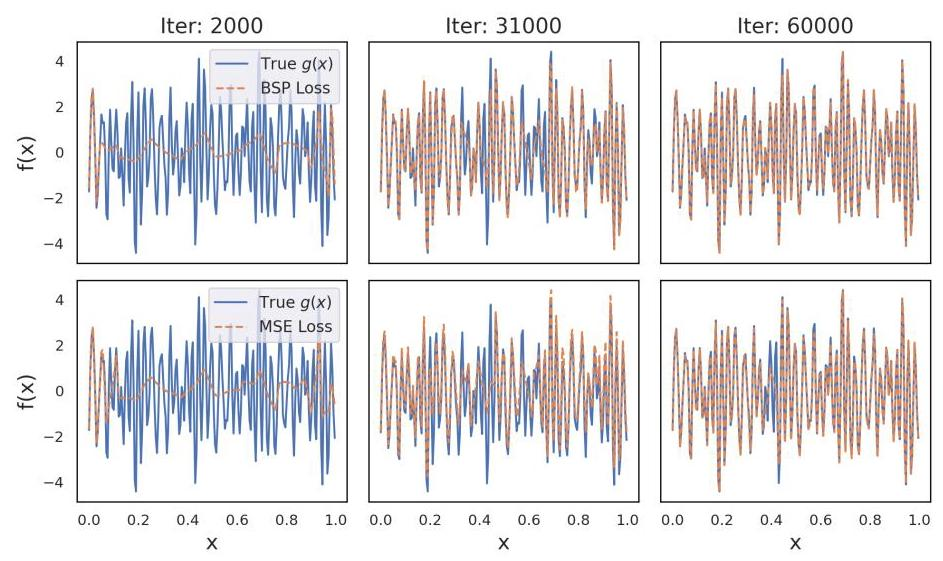

Figure 6: Function approximation across training iterations. Top: BSP Loss; Bottom: MSE Loss. BSP better captures sharp transitions and high-frequency modes early in training.

图6:训练迭代过程中的函数逼近。上图:BSP损失；下图:均方误差损失。BSP在训练早期能更好地捕捉急剧变化和高频模式。

We replicate the setup from Rahaman et al. [2019] to construct a target function $g : \left\lbrack  {0,1}\right\rbrack   \rightarrow  \mathbb{R}$ as a weighted sum of sinusoids:

我们复制了Rahaman等人[2019]的设置，以构造目标函数 $g : \left\lbrack  {0,1}\right\rbrack   \rightarrow  \mathbb{R}$ 作为正弦波的加权和:

$$
g\left( x\right)  = \mathop{\sum }\limits_{i}{A}_{i}\sin \left( {{2\pi }{k}_{i}x + {\phi }_{i}}\right) , \tag{35}
$$

where $\kappa  = \left( {5,{10},\ldots ,{50}}\right)$ are the frequencies, amplitudes $\alpha  = \left( {{A}_{1},\ldots ,{A}_{n}}\right)$ vary smoothly from 0.08 to 1.2, and ${\phi }_{i}$ are uniformly sampled phases. The amplitudes rise to a peak and fall off, to highlight spectral bias in the learned function (see Figure 1 (right)).

其中 $\kappa  = \left( {5,{10},\ldots ,{50}}\right)$ 是频率，幅度 $\alpha  = \left( {{A}_{1},\ldots ,{A}_{n}}\right)$ 从0.08到1.2平滑变化，${\phi }_{i}$ 是均匀采样的相位。幅度先上升到峰值然后下降，以突出学习到的函数中的频谱偏差(见图1(右))。

We train a 6-layer ReLU network with 256 units per layer on 200 uniform samples over $\left\lbrack  {0,1}\right\rbrack$ , for 60,000 iterations. Two variants are compared: one trained with MSE loss and another with BSP loss.

我们在200个关于 $\left\lbrack  {0,1}\right\rbrack$ 的均匀样本上训练一个6层ReLU网络，每层256个单元，共60000次迭代。比较了两种变体:一种用均方误差损失训练，另一种用BSP损失训练。

Since this is a 1D problem, the Fourier transform directly resolves the wavenumber content, so no binning is required. This leads to the simplified form of BSP loss:

由于这是一个一维问题，傅里叶变换直接解析波数内容，因此无需分箱。这导致了BSP损失的简化形式:

$$
L = {\begin{Vmatrix}{f}_{\phi }\left( x\right)  - g\left( x\right) \end{Vmatrix}}^{2} + \mu {\left\lbrack  1 - \frac{\begin{Vmatrix}{\mathcal{F}\left( {{f}_{\phi }\left( x\right) }\right) }\end{Vmatrix} + \epsilon }{\parallel \mathcal{F}\left( {g\left( x\right) }\right) \parallel  + \epsilon }\right\rbrack  }^{2}, \tag{36}
$$

where $\mu  = 5$ controls the strength of spectral alignment and $\epsilon  = 1$ ensures numerical stability. We conduct an ablation study on relevant hyperparameters in Appendix E

其中 $\mu  = 5$ 控制频谱对齐的强度，$\epsilon  = 1$ 确保数值稳定性。我们在附录E中对相关超参数进行了消融研究

In higher-dimensional problems, Fourier modes are typically grouped by isotropic wavenumber magnitude (see Equation 4), requiring binning across Cartesian shells. This is not needed here due to the 1D structure. Figure 6 shows that model trained with BSP Loss reconstructs the target function $g\left( x\right)$ more accurately than models trained with MSE Loss, especially during the initial phases of training.

在高维问题中，傅里叶模式通常按各向同性波数大小分组(见公式4)，需要在笛卡尔壳上进行分箱。由于一维结构，这里不需要。图6表明，用BSP损失训练的模型比用均方误差损失训练的模型更准确地重建目标函数 $g\left( x\right)$，特别是在训练的初始阶段。

### C.2 Kolmogorov Flow

### C.2 柯尔莫哥洛夫流

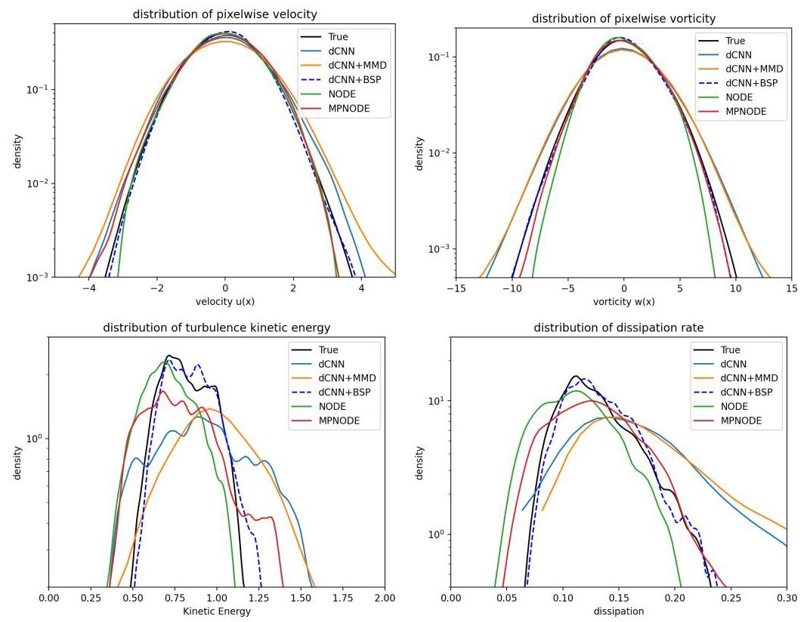

Figure 7: Comparison of the probability density functions (PDFs) of various invariant physical quantities of different models predictions against the true data. The quantities shown are distributions of: (top left) pixelwise velocity $u\left( x\right)$ ,(top right) pixelwise vorticity,(bottom left) turbulence kinetic energy, and (bottom right) dissipation rate. The models compared include a baseline deterministic convolutional neural network (dCNN), dCNN with maximum mean discrepancy (MMD) loss, dCNN with Binned Spectral Power (BSP) loss, a Neural Ordinary Differential Equation (NODE), and a Multi-step Penalty NODE (MPNODE). The distribution of quantities for model trained with BSP loss (dashed blue line) is the closest to the ground truth(solid black line) for all the invariant quantities.

图7:不同模型预测的各种不变物理量的概率密度函数(PDF)与真实数据的比较。所示的量是以下分布:(左上)逐像素速度 $u\left( x\right)$，(右上)逐像素涡度，(左下)湍动能，以及(右下)耗散率。比较的模型包括基线确定性卷积神经网络(dCNN)、具有最大均值差异(MMD)损失的dCNN、具有分箱谱功率(BSP)损失的dCNN、神经常微分方程(NODE)和多步惩罚NODE(MPNODE)。对于所有不变量，用BSP损失训练的模型(蓝色虚线)的量的分布最接近地面真值(黑色实线)。

Dataset : The two-dimensional Navier-Stokes equations are given by:

数据集:二维纳维 - 斯托克斯方程由下式给出:

$$
\frac{\partial \mathbf{u}}{\partial t} + \nabla  \cdot  \left( {\mathbf{u} \otimes  \mathbf{u}}\right)  = \frac{1}{Re}{\nabla }^{2}\mathbf{u} - \frac{1}{\rho }\nabla p + \mathbf{f}, \tag{37}
$$

$$
\nabla  \cdot  \mathbf{u} = 0,
$$

where $\mathbf{u} = \left( {u, v}\right)$ is the velocity vector, $p$ is the pressure, $\rho$ is the density, ${Re}$ is the Reynolds number, and $\mathbf{f}$ represents the forcing function, defined as:

其中 $\mathbf{u} = \left( {u, v}\right)$ 是速度矢量，$p$ 是压力，$\rho$ 是密度，${Re}$ 是雷诺数，$\mathbf{f}$ 表示强迫函数，定义为:

$$
\mathbf{f} = A\sin \left( {ky}\right) \widehat{\mathbf{e}} - r\mathbf{u}, \tag{38}
$$

with parameters $A = 1$ (amplitude), $k = 4$ (wavenumber), $r = {0.1}$ (linear drag), and ${Re} = {1000}$ (Reynolds number) selected for this study as given in [Shankar et al. 2023]. Here, e denotes the unit vector in the $x$ -direction. The initial condition is a random divergence-free velocity field [Kochkov et al. 2021a]. The ground truth datasets are generated using direct numerical simulations (DNS) [Kochkov et al., 2021b] of the governing equations within a doubly periodic square domain of size $L = {2\pi }$ , discretized on a uniform ${512} \times  {512}$ grid and filtered to a coarser ${64} \times  {64}$ grid. The trajectories are sampled temporally after the flow reaches the chaotic regime, with snapshots spaced by $T = {256\Delta }{t}_{DNS}$ , ensuring sufficient distinction between consecutive states. Details of the dataset construction can be found in the work by [Shankar et al., 2023].

对于本研究，按照[Shankar等人，2023年]中的规定选择了参数$A = 1$(振幅)、$k = 4$(波数)、$r = {0.1}$(线性阻力)和${Re} = {1000}$(雷诺数)。这里，e表示$x$方向上的单位向量。初始条件是一个随机无散度速度场[Kochkov等人，2021a]。地面真值数据集是使用直接数值模拟(DNS)[Kochkov等人，2021b]在大小为$L = {2\pi }$的双周期方形域内生成的，该域在均匀的${512} \times  {512}$网格上离散化，并过滤到更粗的${64} \times  {64}$网格。在流动达到混沌状态后对轨迹进行时间采样，快照间隔为$T = {256\Delta }{t}_{DNS}$，以确保连续状态之间有足够的区分度。数据集构建的详细信息可在[Shankar等人，2023年]的工作中找到。

Additional results: Figure 7 presents a detailed comparison of how well different models reproduce key physical invariants of the underlying dynamics by plotting the probability density functions (PDFs) of four important quantities: pixel-wise $u\left( x\right)$ velocity, vorticity, turbulence kinetic energy (TKE), and dissipation rate. These metrics are crucial because they characterize both large-scale flow structures and small-scale turbulent behaviors, providing a comprehensive assessment of the physical fidelity of the models. The models evaluated include the same baselines as mentioned in section 4.2. The results show that across all four quantities, the model trained with BSP loss (shown by a dashed blue line) produces distributions that align most closely with the ground truth data (solid black line). This indicates that the BSP loss not only improves spectral accuracy but also enables the model to better capture the complex statistical properties of the underlying dynamical system, outperforming both baseline loss functions and other models like NODE and MPNODE in preserving invariant physical characteristics.

附加结果:图7通过绘制四个重要量的概率密度函数(PDF)，详细比较了不同模型对基础动力学关键物理不变量的再现程度:逐像素$u\left( x\right)$速度、涡度、湍流动能(TKE)和耗散率。这些指标至关重要，因为它们既表征了大尺度流动结构，又表征了小尺度湍流行为，从而对模型的物理保真度进行了全面评估。评估的模型包括4.2节中提到的相同基线。结果表明，在所有四个量上，用BSP损失训练的模型(由蓝色虚线表示)产生的分布与地面真值数据(黑色实线)最接近。这表明BSP损失不仅提高了频谱精度，还使模型能够更好地捕捉基础动力系统的复杂统计特性，在保持不变物理特性方面优于基线损失函数和其他模型，如NODE和MPNODE。

### C.3 3D Homogeneous Isotropic Turbulence

### C.3三维均匀各向同性湍流

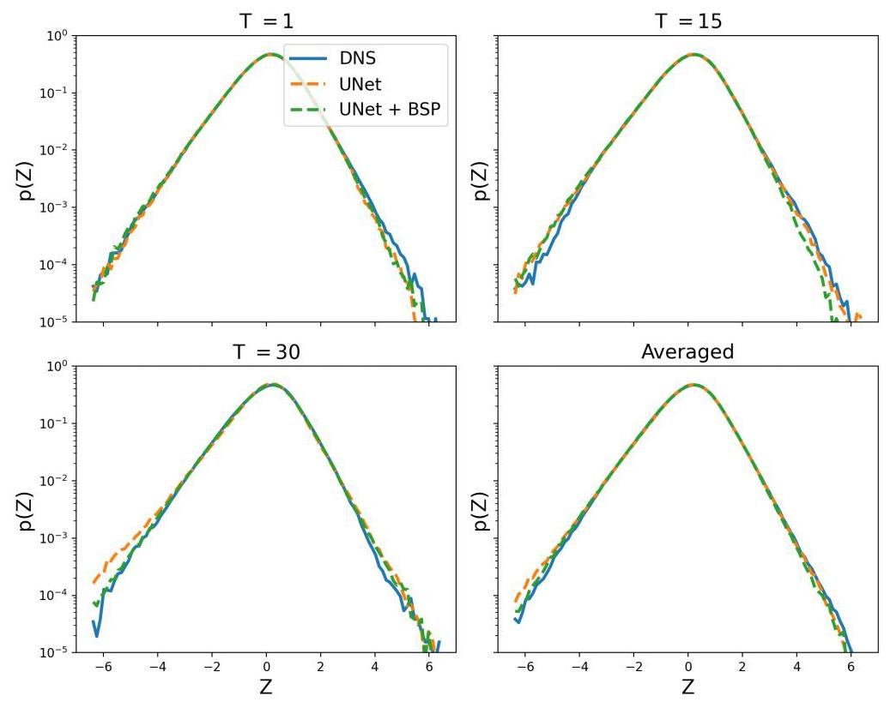

Figure 8: The figure illustrates the comparison of the intermittency plots for UNet models trained with MSE loss (orange) and UNet trained with BSP loss (green) across different time steps (T).

图8:该图展示了用均方误差损失(橙色)训练的UNet模型和用BSP损失(绿色)训练的UNet模型在不同时间步长(T)下的间歇性图的比较。

Dataset : The computational domain is a cubic box with dimensions of ${128}^{3}$ grid points. Two scalar fields, each with distinct probability density function (PDF) characteristics, are advected as passive scalars by the turbulent flow. This dataset is taken from [Mohan et al., 2020]. They refer to this dataset as ScalarHIT, following [Daniel et al. 2018]. The DNS is performed with a pseudo-spectral code, ensuring incompressibility via

数据集:计算域是一个具有${128}^{3}$个网格点维度的立方盒。两个标量场，每个都具有独特的概率密度函数(PDF)特征，作为被动标量由湍流平流输送。该数据集取自[Mohan等人，2020年]。遵循[Daniel等人，2018年]，他们将此数据集称为ScalarHIT。DNS使用伪谱代码进行，通过

$$
{\partial }_{{x}_{i}}{v}_{i} = 0, \tag{39}
$$

and solving the Navier-Stokes equations

并求解纳维 - 斯托克斯方程

$$
{\partial }_{t}{v}_{i} + {v}_{j}{\partial }_{{x}_{j}}{v}_{i} =  - \frac{1}{\rho }{\partial }_{{x}_{i}}p + \nu {\nabla }^{2}{v}_{i} + {f}_{i}^{v}. \tag{40}
$$

Low-wavenumber forcing $\left( {k < {1.5}}\right)$ maintains a statistically steady state. Dealiasing is performed

低波数强迫$\left( {k < {1.5}}\right)$维持统计稳定状态。去混淆处理通过

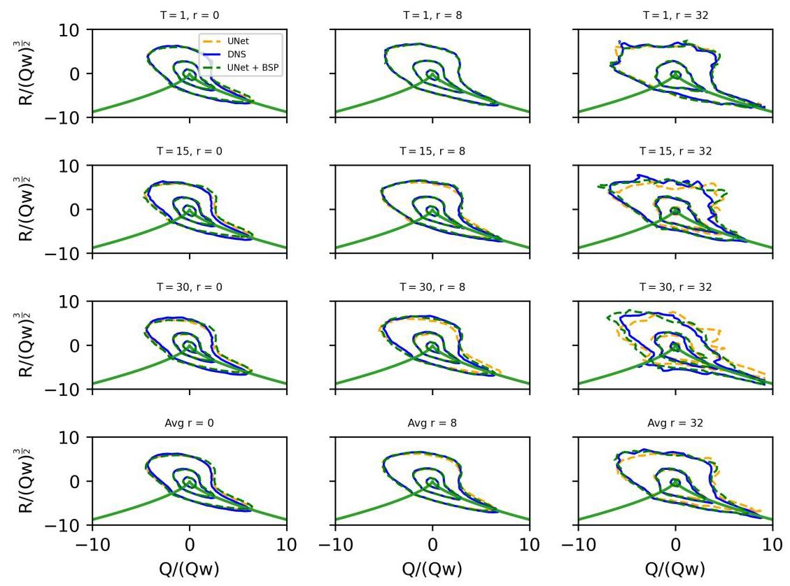

Figure 9: The figure illustrates the comparison of the QR plots for UNet models trained with MSE loss (orange) and UNet trained with BSP loss (green) across different time steps (T) and resolutions (r). The QR plots signify the theree dimensional chaos in turbulence.

图9:该图展示了用均方误差损失(橙色)训练的UNet模型和用BSP损失(绿色)训练的UNet模型在不同时间步长(T)和分辨率(r)下的QR图的比较。QR图表示湍流中的三维混沌。

through phase-shifting and truncation, achieving a resolved maximum wavenumber of ${k}_{\max } \approx  {60}$ with spectral resolution $\eta {k}_{\max } \approx  {1.5}$ . Scalar transport is governed by

通过相移和截断实现，达到分辨率为$\eta {k}_{\max } \approx  {1.5}$的最大解析波数${k}_{\max } \approx  {60}$。标量输运由

$$
{\partial }_{t}\phi  + {v}_{j}{\partial }_{{x}_{j}}\phi  = D{\nabla }^{2}\phi  + {f}^{\phi }, \tag{41}
$$

where $\phi$ is a passive scalar and $D$ is its diffusivity. Both the viscosity $\nu$ and diffusivity $D$ are chosen so that the Schmidt number ${Sc} = \nu /D = 1$ . The integral-scale Reynolds number is expressed in terms of the Taylor microscale as

其中$\phi$是一个被动标量，$D$是其扩散率。选择粘度$\nu$和扩散率$D$使得施密特数为${Sc} = \nu /D = 1$。积分尺度雷诺数根据泰勒微尺度表示为

$$
R{e}_{\lambda } = \sqrt{\frac{20}{3}}\frac{\mathrm{{TKE}}}{\nu }, \tag{42}
$$

where TKE denotes the turbulent kinetic energy. They use a novel scalar forcing approach, inspired by chemical reaction kinetics [Daniel et al., 2018] to achieve desired stationary scalar PDFs and ensure scalar boundedness. Assuming scalar bounds ${\phi }_{l} =  - 1$ and ${\phi }_{u} =  + 1$ , the forcing term is modeled as

其中TKE表示湍流动能。他们采用一种受化学反应动力学启发的新型标量强迫方法[Daniel等人，2018年]来实现所需的稳态标量PDF并确保标量有界性。假设标量界限为${\phi }_{l} =  - 1$和${\phi }_{u} =  + 1$，强迫项建模为

$$
{f}^{\phi } = \operatorname{sign}\left( \phi \right) {f}_{c}{\left| \phi \right| }^{n}{\left( 1 - \left| \phi \right| \right) }^{m}, \tag{43}
$$

where ${f}_{c}, m$ , and $n$ adjust PDF shape and scalar distribution. By appropriate parameter choices, different scalar PDFs are realized. For the present dataset, one scalar exhibits near-Gaussian behavior

其中${f}_{c}, m$和$n$调整PDF形状和标量分布。通过适当的参数选择，实现了不同的标量PDF。对于当前数据集，一个标量表现出近高斯行为

(kurtosis $\approx  3$ ) while the other has a lower kurtosis $\left( { \approx  {2.2}}\right)$ . With this forcing, the velocity and scalar fields reach a statistically stationary state at $R{e}_{\lambda } \approx  {91}$ . Two scalars with distinct PDFs allow for testing model capabilities to reproduce both Gaussian-like and bounded scalar distributions.

(峰度$\approx  3$)，而另一个具有较低的峰度$\left( { \approx  {2.2}}\right)$。在这种强迫作用下，速度场和标量场在$R{e}_{\lambda } \approx  {91}$时达到统计稳定状态。两个具有不同概率密度函数(PDF)的标量允许测试模型再现类高斯和有界标量分布的能力。

Additional Results : In Fig. 8, we present the intermittency plots. Intermittency refers to the fluctuations in velocity gradients, leading to deviations from Gaussian statistics. This can be analyzed using the probability density function (PDF) of the velocity gradient tensor, which often exhibits heavy tails due to strong localized fluctuations and is a harder quantity to learn correctly [Mohan et al. 2020]. The tensor, defined as the spatial derivatives of the velocity components, captures small-scale structures where intermittency effects are most pronounced. We observe near perfect prediction at high frequencies, represented by the tails of the PDF.

附加结果:在图8中，我们展示了间歇性图。间歇性是指速度梯度的波动，导致偏离高斯统计。这可以使用速度梯度张量的概率密度函数(PDF)进行分析，由于强烈的局部波动，该函数通常呈现重尾分布，并且是一个更难正确学习的量[Mohan等人，2020]。该张量定义为速度分量的空间导数，捕获间歇性效应最明显的小尺度结构。我们在高频处观察到近乎完美的预测，由PDF的尾部表示。

Finally, the most stringent test of this method is presented in the Q-R plane spectra in Fig. 9 which represents the three-dimensional chaos in turbulence. QR plots are used to analyze the local flow topology by examining the invariants of the velocity gradient tensor [Chertkov et al., 1999]. The second invariant, Q, represents the balance between rotational and strain effects, while the third invariant, $\mathrm{R}$ , characterizes the nature of vortex stretching and flow structures. The spectra at $r = 0$ indicate high frequencies, while those at $r = 8$ and $r = {32}$ indicate intermediate frequencies and low frequencies, respectively. Historically, ML methods have struggled to capture the $r = 0$ spectra and instead predict Gaussian-like noise [Mohan et al., 2020], but we show that the BSP loss accurately captures these dynamics without compromising dynamics at $r = 8,{32}$ . These plots show that even after conserving the smaller structures in the flow, the predictions do not deviate from key characteristics of turbulence.

最后，该方法最严格的测试在图9的Q - R平面谱中给出，该谱表示湍流中的三维混沌。QR图用于通过检查速度梯度张量的不变量来分析局部流动拓扑[Chertkov等人，1999]。第二个不变量Q表示旋转和应变效应之间的平衡，而第三个不变量$\mathrm{R}$表征涡旋拉伸和流动结构的性质。$r = 0$处的谱表示高频，而$r = 8$和$r = {32}$处的谱分别表示中频和低频。从历史上看，机器学习方法一直难以捕捉$r = 0$谱，而是预测类高斯噪声[Mohan等人，2020]，但我们表明BSP损失准确地捕捉了这些动力学，而不会在$r = 8,{32}$处损害动力学。这些图表明，即使在保留流动中较小结构之后，预测也不会偏离湍流的关键特征。

## D Turbulent flow over an airfoil

## D 翼型上的湍流流动

In this section, we examine the turbulent wake flow downstream of a NACA0012 airfoil operating at a Reynolds number of 23,000, a free-stream Mach number of 0.3 , and an angle of attack of ${6}^{ \circ  }$ . We utilize a large eddy simulation (LES) dataset provided by [Towne et al.,2023], available through the publicly accessible Deep Blue Data repository from the University of Michigan. The flow features have coherent structures associated with Kelvin-Helmholtz instability over the separation bubble and Von-Kármán vortex shedding in the wake, while exhibiting features at multiple scales characteristic of turbulent flows. This makes it an ideal test case for several experiments including validating computational fluid dynamics (CFD) models, analyzing flow dynamics, and exploring reduced-order modeling approaches. For more details on the dataset refer Section VII in [Towne et al., 2023]. We follow the same data pre-processing strategy as given in [Oommen et al., 2024]. The field is interpolated to convert it to a rectangular domain (200x400 pixels). We implement a UNet architecture [Ronneberger et al. 2015] for the base model and improve it by using our BSP loss. The hyperparameters of the model are mentioned in Appendix F

在本节中，我们研究在雷诺数为23000、自由流马赫数为0.3以及攻角为${6}^{ \circ  }$的条件下运行的NACA0012翼型下游的湍流尾流。我们利用[Towne等人，2023]提供的大涡模拟(LES)数据集，该数据集可通过密歇根大学公开访问的深蓝数据存储库获得。流动特征具有与分离泡上的开尔文 - 亥姆霍兹不稳定性以及尾流中的冯·卡门涡街相关的相干结构，同时呈现出湍流流动的多尺度特征。这使其成为包括验证计算流体动力学(CFD)模型、分析流动动力学和探索降阶建模方法在内的多个实验的理想测试案例。有关数据集的更多详细信息，请参考[Towne等人，2023]中的第七节。我们遵循与[Oommen等人，2024]中给出的相同的数据预处理策略。将场进行插值以将其转换为矩形域(200x400像素)。我们为基础模型实现了一个UNet架构[Ronneberger等人，2015]，并通过使用我们的BSP损失对其进行改进。模型的超参数在附录F中提及。

Contrary to the previous case, here we observed that the energy spectrum of the UNet model prediction is very close to the ground truth even without the BSP loss. Therefore, we use the square root of the Fourier amplitudes in the energy spectrum to highlight the difference following [Oommen et al. 2024]. Although it is difficult to compare the results visually from Figure D, we observe that the BSP loss enhances the model's ability to capture smaller scale structures given by the higher wavenumbers in the energy spectrum ( $\sqrt{E\left( k\right) }$ in this case) in Figure 11 (left). The improvement here is marginal as the model without BSP loss itself does a good job in preserving the energy spectrum of the flow field.

与前一种情况相反，在这里我们观察到即使没有BSP损失，UNet模型预测的能量谱也非常接近真实值。因此，我们按照[Oommen等人，2024]的方法使用能量谱中傅里叶振幅的平方根来突出差异。尽管从图D中很难直观地比较结果，但我们观察到BSP损失增强了模型捕捉能量谱中由较高波数给出的较小尺度结构的能力(在这种情况下为$\sqrt{E\left( k\right) }$)，如图11(左)所示。这里的改进是微不足道的，因为没有BSP损失的模型本身在保留流场的能量谱方面做得很好。

To determine the performance of the BSP loss further, we compare it with a larger(as per number of parameters) state-of-the-art, Continuous Vision Transformer(CVIT) [Wang et al., 2024a] model. Due to the stochastic nature of the flow field, we compare the probability density function for the velocity values at a probe in the flow mentioned by the red dot in Figure 10 In Figure 11 (right), we observe that the UNet (trained with MSE loss) model does not preserve the probability distribution of the velocity field at the probe. However, the BSP loss improves its performance which is comparable to the approximately 60 times larger CVIT model. The UNet has a narrower distribution due to the spectral bias shifting the flow towards its mean after several rollouts. However, UNet with BSP loss has a wider distribution encompassing a wide range of values. The BSP loss can also be implemented with the CVIT model for further comparison. Since CVIT is operated point-wise, defining the BSP loss can be challenging. The vmap function can be used to overcome this and reshape the output to a 2D grid. Moreover, models like geo-FNO [Li et al., 2023] can be used to extend the predictive model

为了进一步确定BSP损失的性能，我们将其与一个更大的(按参数数量)先进的连续视觉Transformer(CVIT)[Wang等人，2024a]模型进行比较。由于流场的随机性，我们比较了图10中红点所示流场中一个探头处速度值的概率密度函数。在图11(右)中，我们观察到UNet(使用MSE损失训练)模型没有保留探头处速度场的概率分布。然而，BSP损失提高了其性能，与大约大60倍的CVIT模型相当。由于频谱偏差在几次展开后将流场移向其均值，UNet的分布较窄。然而，使用BSP损失的UNet具有更宽的分布，涵盖了广泛的值。BSP损失也可以与CVIT模型一起实现以进行进一步比较。由于CVIT是逐点操作的，定义BSP损失可能具有挑战性。vmap函数可用于克服此问题并将输出重塑为二维网格。此外，像geo-FNO[Li等人，2023]这样的模型可用于扩展预测模型

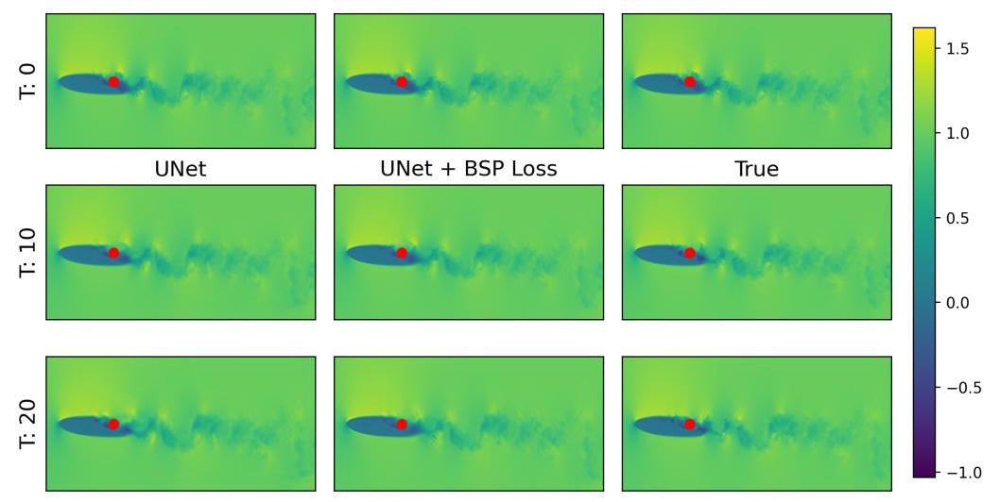

Figure 10: Comparison of model predictions at different timesteps for UNet (trained with MSE loss) and UNet + BSP Loss. The red dot is the point where the PDF is computed.

图10:UNet(使用MSE损失训练)和UNet + BSP损失在不同时间步的模型预测比较。红点是计算PDF的点。

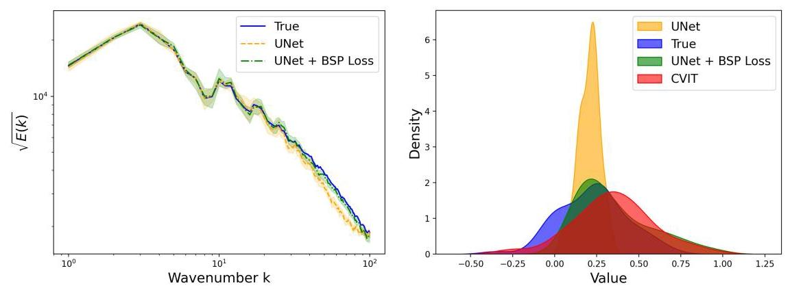

Figure 11: (left)Square root of the energy spectra for ground truth and model predictions. The energy spectra shown here is the mean of first 10 timestep predictions. (right)Distribution of velocity field at a location downstream of the airfoil. It shows the comparison of PDFs of ground truth and various model predictions.

图11:(左)地面真值和模型预测的能量谱平方根。这里显示的能量谱是前10个时间步预测的平均值。(右)翼型下游某位置的速度场分布。它显示了地面真值和各种模型预测的PDF比较。

to non-uniform grids and BSP loss can be applied in the uniform latent dimension. We leave these paradigms for future research.

到非均匀网格，并且BSP损失可以应用于均匀的潜在维度。我们将这些范式留待未来研究。

## E Ablation Study

## E消融研究

In this section we perform ablation study for the hyperparamers in the BSP loss function, namely $\mu$ and $\epsilon$ . From Table 2 it is observed that for all values of $\mu$ that we considered, the BSP loss consistently shows better performance by an order of magnitude from other baselines.

在本节中，我们对BSP损失函数中的超参数$\mu$和$\epsilon$进行消融研究。从表2中可以观察到，对于我们考虑的所有$\mu$值，BSP损失始终比其他基线表现出好一个数量级的性能。

### E.1 Kuramoto-Shivashinsky Equation

### E.1 Kuramoto-Shivashinsky方程

The Kuramoto-Sivashinsky (KS) equation is a nonlinear partial differential equation that shows chaotic dynamics and is used as a benchmark for comparing forecast models [Lippe et al., 2023a Li et al. 2021 Jiang et al. 2023]. In one spatial dimension, it is given by:

Kuramoto-Sivashinsky(KS)方程是一个非线性偏微分方程，表现出混沌动力学，用作比较预测模型的基准[Lippe等人，2023a；Li等人，2021；Jiang等人，2023]。在一维空间中，它由下式给出:

$$
{\partial }_{t}u + u{\partial }_{x}u + {\partial }_{xx}u + {\partial }_{xxxx}u = 0, \tag{44}
$$

Table 2: Comparison of mean square error at the end of optimization metrics for different values of $\mu$ for the Synthetic Experiment in Section 4.1. The table compares models trained with MSE loss, BSP loss, and FFT loss [Chattopadhyay et al., 2024]. The MSE loss column is just for comparison as it does not have the hyperparameter $\mu$ . The best performing model is highlighted in bold.

表2:第4.1节合成实验中不同$\mu$值下优化指标末尾的均方误差比较。该表比较了使用MSE损失、BSP损失和FFT损失[Chattopadhyay等人，2024]训练的模型。MSE损失列仅用于比较，因为它没有超参数$\mu$。表现最佳的模型以粗体突出显示。

<table><tr><td>$\mu$</td><td>MSE</td><td>BSP</td><td>FFT</td></tr><tr><td>0.1</td><td></td><td>0.206±0.190</td><td>0.302±0.213</td></tr><tr><td>1</td><td></td><td>0.026±0.011</td><td>0.081±0.027</td></tr><tr><td>5</td><td>0.202±0.057</td><td>0.018±0.007</td><td>0.226±0.045</td></tr><tr><td>7.5</td><td></td><td>0.048 ± 0.033</td><td>0.260±0.024</td></tr><tr><td>10</td><td></td><td>0.081 ± 0.045</td><td>0.381±0.012</td></tr></table>

where $u\left( {x, t}\right)$ represents the evolving field, typically taken to be periodic in space. The term $u{\partial }_{x}u$ introduces nonlinearity, ${\partial }_{xx}u$ accounts for linear instability, and the hyperviscous term ${\partial }_{xxxx}u$ provides stabilizing dissipation. Despite its simple form, the KS equation exhibits spatiotemporal chaos and is often used as a benchmark for studying nonlinear dynamics, chaos, and reduced-order modeling in dynamical systems. The training dataset is generated from a single long-term simulation of the Kuramoto-Sivashinsky equation, spanning $t = 0$ to $t = {105}$ , with samples recorded every 0.25 time units. Owing to the ergodic nature of the KS system, this extended trajectory effectively captures a wide range of dynamical behaviors and can be partitioned into multiple shorter sub-trajectories with distinct initial conditions. We used this dataset directly from previous studies [Linot and Graham 2022, Linot et al. 2023 Chakraborty et al. 2024].

其中$u\left( {x, t}\right)$表示演化场，通常在空间中取为周期性的。项$u{\partial }_{x}u$引入非线性，${\partial }_{xx}u$考虑线性不稳定性，超粘性项${\partial }_{xxxx}u$提供稳定耗散。尽管KS方程形式简单，但它表现出时空混沌，经常用作研究动力系统中的非线性动力学、混沌和降阶建模的基准。训练数据集是从Kuramoto-Sivashinsky方程的单个长期模拟中生成的，跨越$t = 0$到$t = {105}$，每0.25时间单位记录一次样本。由于KS系统的遍历性，这个扩展轨迹有效地捕获了广泛的动力学行为，并且可以被划分为多个具有不同初始条件的较短子轨迹。我们直接使用了以前研究[Linot和Graham，2022；Linot等人，2023；Chakraborty等人，2024]中的这个数据集。

We implement a recurrent forecasting model using a two-layer Long Short Term Memory (LSTM) network. The model processes input sequences of dimension 64 and projects the final hidden state of the 2 layer LSTM (with 128 hidden units) through a fully connected layer to produce a 64-dimensional output. The LSTM captures temporal dependencies in the input sequence, enabling the model to learn effective representations for time series prediction. Forecasting is done in an autoregressive manner. We choose this model to show the ability of BSP loss to work with different model architectures. We perform an ablation study by implementing the BSP loss with values of $\varepsilon  \in  \left\{  {0,{10}^{-6},{10}^{-8},{10}^{-{10}}}\right\}$ and compare it with the model trained with just the MSE loss. As shown in Fig. 12, models trained with BSP loss exhibit consistently lower ensemble RMSE over time, with larger $\epsilon$ values yielding improved medium-range forecasting accuracy. Spectral analysis further confirms that BSP loss trained with any $\epsilon$ value aligns spatial structures at different scales more closely with ground truth (refer Fig. 13b). The tradeoff between better medium-range forecast and better spatial structure fidelity for high and low $\varepsilon$ respectively can be clearly seen from Table 3

我们使用两层长短期记忆(LSTM)网络实现了一个递归预测模型。该模型处理维度为64的输入序列，并通过一个全连接层将两层LSTM(具有128个隐藏单元)的最终隐藏状态进行投影，以产生一个64维的输出。LSTM捕捉输入序列中的时间依赖性，使模型能够学习用于时间序列预测的有效表示。预测以自回归方式进行。我们选择这个模型来展示BSP损失与不同模型架构配合工作的能力。我们通过使用$\varepsilon  \in  \left\{  {0,{10}^{-6},{10}^{-8},{10}^{-{10}}}\right\}$值实现BSP损失并将其与仅使用MSE损失训练的模型进行比较，进行了消融研究。如图12所示，使用BSP损失训练的模型随着时间的推移始终表现出更低的整体RMSE，$\epsilon$值越大，中期预测精度越高。频谱分析进一步证实，使用任何$\epsilon$值训练的BSP损失在不同尺度上使空间结构与地面真值更紧密地对齐(见图13b)。从表3中可以清楚地看到，分别针对高低$\varepsilon$，在更好的中期预测和更好的空间结构保真度之间的权衡。

Table 3: Comparison of total RMSE over timesteps (0 to 100) and relative spectrum RMSE for models trained with MSE loss and BSP loss at varying $\varepsilon$ . The lowest error in each column is highlighted in bold. The relative RMSE is chosen for energy spectrum due to varying sclaes.

表3:在不同$\varepsilon$下，使用MSE损失和BSP损失训练的模型在时间步长(0到100)上的总RMSE和相对频谱RMSE的比较。每列中的最低误差以粗体突出显示。由于尺度不同，能量谱选择了相对RMSE。

<table><tr><td>Model</td><td>Forecast RMSE</td><td>$E\left( k\right)$ relative RMSE</td></tr><tr><td>MSE Loss</td><td>0.2112 ± 0.1747</td><td>2283.2818 $\pm$ 696.5619</td></tr><tr><td>BSP Loss $\left( {\epsilon  = {10}^{-6}}\right)$</td><td>0.1313 ± 0.1114</td><td>1081.0023 ± 348.6294</td></tr><tr><td>BSP Loss $\left( {\epsilon  = {10}^{-8}}\right)$</td><td>0.1385 ± 0.1180</td><td>79.1884 ± 26.0279</td></tr><tr><td>BSP Loss $\left( {\epsilon  = {10}^{-{10}}}\right)$</td><td>0.1459 ± 0.1320</td><td>1.6356 ± 0.5601</td></tr><tr><td>BSP Loss $\left( {\epsilon  = 0}\right)$</td><td>0.1632 ± 0.1352</td><td>0.3638 ± 0.2560</td></tr></table>

## F Hyperparameters

## F超参数

In this section we declare the model hyperparametrs in Table 4 All model hyperparameters are kept same for both baselines and the model trained with BSP loss. The NODE and MPNODE models are used directly from Chakraborty et al. [2024]. The hyperparameters of CVIT model is taken form [Wang et al. 2024a]. The length of trajectory used in training is started from 1 and gradually increased to Max Timesteps(t).

在本节中，我们在表4中声明了模型超参数。对于基线模型和使用BSP损失训练的模型，所有模型超参数都保持相同。NODE和MPNODE模型直接取自Chakraborty等人[2024]。CVIT模型的超参数取自[Wang等人2024a]。训练中使用的轨迹长度从1开始，逐渐增加到最大时间步长(t)。

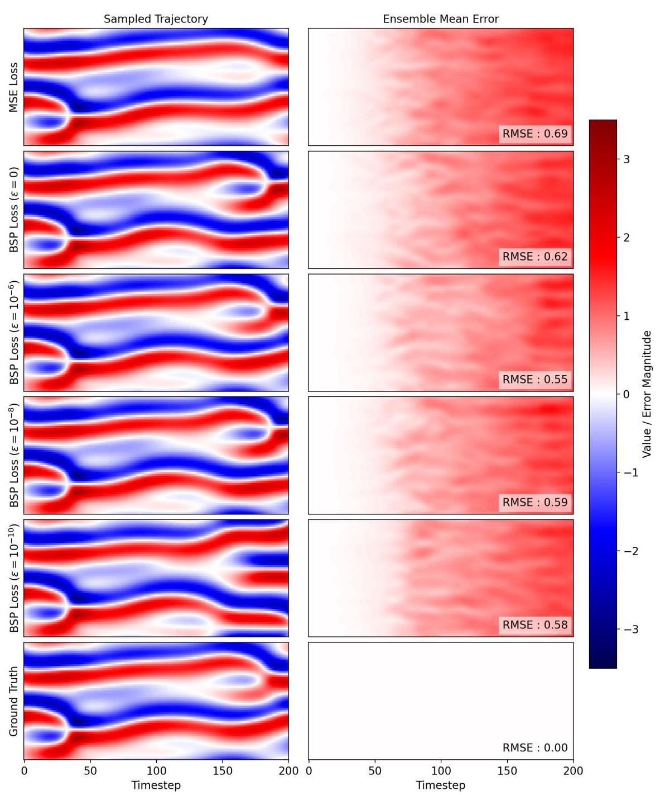

Figure 12: Comparison of predicted trajectories (left) and ensemble mean absolute error (right) for models trained with different loss functions. Rows correspond to models trained with MSE loss and BSP loss with varying $\varepsilon  \in  \left\{  {0,{10}^{-6},{10}^{-8},{10}^{-{10}}}\right\}$ , along with the ground truth (bottom row). BSP-trained models exhibit reduced forecast error, particularly for larger values of $\varepsilon$ .

图12:使用不同损失函数训练的模型的预测轨迹(左)和整体平均绝对误差(右)的比较。行对应于使用MSE损失和不同$\varepsilon  \in  \left\{  {0,{10}^{-6},{10}^{-8},{10}^{-{10}}}\right\}$的BSP损失训练的模型，以及地面真值(底行)。使用BSP训练的模型表现出更低的预测误差，特别是对于较大的$\varepsilon$值。

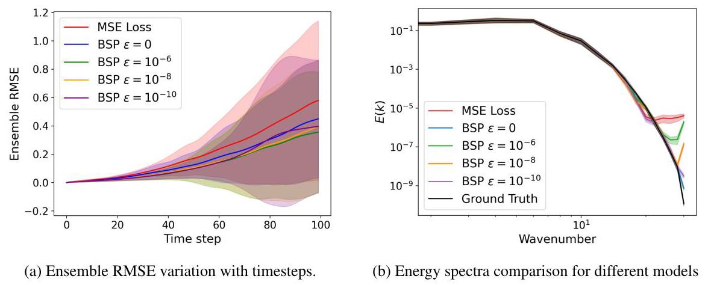

Figure 13: Comparison of MSE and BSP-trained models across two diagnostics: (a) RMSE : BSP-trained models achieve consistently lower RMSE than MSE. Larger values of $\varepsilon$ show better RMSE. (b) Energy spectrum $E\left( k\right)$ . BSP loss improves spectral fidelity, particularly for smaller values of $\varepsilon$ (e.g., $0,{10}^{-{10}}$ ). Shaded regions denote ${1\sigma }$ ensemble variability.

图13:MSE和BSP训练的模型在两个诊断指标上的比较:(a)RMSE:使用BSP训练的模型始终比MSE实现更低的RMSE。$\varepsilon$值越大，RMSE越好。(b)能量谱$E\left( k\right)$。BSP损失提高了频谱保真度，特别是对于较小的$\varepsilon$值(例如，$0,{10}^{-{10}}$)。阴影区域表示${1\sigma }$整体变异性。

Table 4: Hyperparameters used for different models and datasets.

表4:用于不同模型和数据集的超参数。

<table><tr><td>Setting</td><td>2D Turbulence</td><td>Airfoil</td><td>3D Turbulence</td><td>Airfoil Large</td></tr><tr><td>Model Name</td><td>DCNN</td><td>UNet</td><td>UNet</td><td>CVIT</td></tr><tr><td>Parameters</td><td>1.1M</td><td>0.6M</td><td>90M</td><td>37M</td></tr><tr><td>Learning Rate</td><td>${10}^{-3}$ to ${10}^{-5}$</td><td>$5 \times  {10}^{-4}$ to ${10}^{-6}$</td><td>$5 \times  {10}^{-4}$ to ${10}^{-6}$</td><td>${10}^{-3}$ to ${10}^{-6}$</td></tr><tr><td>Max Timesteps (t)</td><td>4</td><td>5</td><td>3</td><td>1</td></tr><tr><td>$\gamma \left( t\right)$</td><td>${0.9}^{t - 1}$</td><td>${0.9}^{t - 1}$</td><td>${0.9}^{t - 1}$</td><td>NA</td></tr><tr><td>$\mu$</td><td>1</td><td>0.1</td><td>1</td><td>NA</td></tr><tr><td>${\lambda }_{k}$</td><td>${k}^{2}$</td><td>1</td><td>${k}^{2}$</td><td>NA</td></tr><tr><td>Optimizer</td><td>Adam</td><td>Adam</td><td>Adam</td><td>Adam</td></tr><tr><td>Scheduler</td><td>Cosine</td><td>ReduceLROnPlateau</td><td>Cosine</td><td>NA</td></tr><tr><td>Batch Size</td><td>32</td><td>32</td><td>8</td><td>32</td></tr></table>