# The temperature dependence of amplitude- frequency response of the MET sensor of linear motion in a broad frequency range

# 宽频范围内线性运动的分子电子传感器的幅频响应的温度依赖性

Dmitry A. Chikishev, Dmitry L. Zaitsev, Konstantin S. Belotelov, Ivan V. Egorov

德米特里·A·奇基舍夫、德米特里·L·扎伊采夫、康斯坦丁·S·别洛捷洛夫、伊万·V·叶戈罗夫

Abstract - This paper is the first to present the experimental results on the measurement of amplitude-frequency characteristics of linear motion sensors based on molecular-electronic transducers in a wide frequency and temperature range. The analytical dependence of the temperature behavior of the amplitude-frequency characteristic of the studied sensor type in the 0.1-443 Hz band and the $- {35}/{\left( -{15}\right) }^{ \circ  }\mathrm{C}$ to $+ {70}^{ \circ  }\mathrm{C}$ bands fully consistent with the experimental data has been presented for the first time. The verification of the theoretical model for the experimentally found approximation parameters has been performed. Different methods have been used to find the activation energies of the components of electrolyte solutions of several types.

摘要 - 本文首次展示了在宽频率和温度范围内基于分子电子换能器的线性运动传感器的幅频特性测量的实验结果。首次给出了在0.1 - 443 Hz频段以及$- {35}/{\left( -{15}\right) }^{ \circ  }\mathrm{C}$至$+ {70}^{ \circ  }\mathrm{C}$频段内所研究传感器类型的幅频特性温度行为的解析依赖性，且该依赖性与实验数据完全一致。已对实验发现的近似参数的理论模型进行了验证。已使用不同方法来找出几种类型电解质溶液成分的活化能。

Index Terms - molecular electronics, accelerometer, geophone, temperature sensitivity, activation energy, transfer function.

关键词 - 分子电子学、加速度计、地震检波器、温度灵敏度、活化能、传递函数

## I. INTRODUCTION

## 一、引言

The development of modern methods of geophysical monitoring imposes ever higher requirements on instrumental means of recording seismic signals [1], which poses the task of finding new technologies for sensors of primary information [2, 3]. Molecular-electronic technology (MET) measurers [4, 5] are used in such areas as land and offshore seismic prospecting $\left\lbrack  {6,7}\right\rbrack$ , monitoring of building structures [8], navigation [9,10], world ocean studies [11,12] and even the study of medical and sport science [13]. The advantages of modern sensors based on MET are high sensitivity, low level of self-noise combined with low production costs [14]. At the same time, devices based on the liquid inertial mass also have traditional disadvantages. First of all, it is a relatively narrow operating temperature range, limited by the boiling and freezing temperatures of the electrolyte.

现代地球物理监测方法的发展对记录地震信号的仪器手段提出了越来越高的要求[1]，这就带来了寻找用于初级信息传感器的新技术的任务[2, 3]。分子电子技术(MET)测量仪[4, 5]用于陆地和海上地震勘探$\left\lbrack  {6,7}\right\rbrack$、建筑结构监测[8]、导航[9, 10]、世界海洋研究[11, 12]，甚至医学和体育科学研究[13]等领域。基于MET的现代传感器的优点是灵敏度高、自噪声水平低且生产成本低[14]。同时，基于液体惯性质量的设备也存在传统缺点。首先，它的工作温度范围相对较窄，受电解质的沸点和冰点温度限制。

However, there are already such electrolytes that allow devices based on MET transducers to operate in a fairly wide range of temperatures, which is from -40 to +60 degrees Celsius, which is sufficient for use in almost any terrain. Since the MET transducers transfer characteristics are determined, among other things, by the type of electrolyte used, which implies that its viscosity and diffusion coefficient vary quite intensely with temperature, the MET transducers transfer characteristics significantly depend on the temperature [15]. Of course, it is possible to significantly reduce the influence of ambient temperature by special thermostatic housings and devices, but this significantly increases the power consumption of the device and weight and size parameters, which sharply limits the area of application. Therefore, when designing final measuring instruments, special attention is currently being paid to the methods of compensating the temperature drift of the amplitude-frequency response (AFR) [16]. To do this, it is essential to know precisely the characteristics behavior of the MET transducers of various types in the entire temperature range.

然而，已经有这样的电解质，使得基于MET换能器的设备能够在相当宽的温度范围内运行，即从 - 40到 + 60摄氏度，这对于几乎任何地形的使用来说都足够了。由于MET换能器的传递特性除其他因素外还由所使用的电解质类型决定，这意味着其粘度和扩散系数随温度变化相当剧烈，MET换能器的传递特性显著依赖于温度[15]。当然，可以通过特殊的恒温外壳和设备显著降低环境温度的影响，但这会显著增加设备的功耗以及重量和尺寸参数，从而极大地限制了应用领域。因此，在设计最终测量仪器时，目前特别关注补偿幅频响应(AFR)温度漂移的方法[16]。为此，精确了解各种类型的MET换能器在整个温度范围内的特性行为至关重要。

The complexity of studying the MET transducers characteristics is conditioned by the fact that the complete transfer function is determined by both mechanical and electrochemical subsystems [17]. At that, both components of the transfer function have a rather complicated frequency and temperature dependence. Moreover, many converter parameters affect both the mechanical and the electrochemical subsystem simultaneously.

研究MET换能器特性的复杂性在于，完整的传递函数由机械和电化学子系统共同决定[17]。此时传递函数的两个组成部分都具有相当复杂的频率和温度依赖性。此外，许多转换器参数同时影响机械和电化学子系统。

The objectives of this study are to try to expand the existing knowledge of the temperature dependence of the amplitude-frequency response of the MET sensors of linear movements in the extended towards the low-frequency direction range; to build a clear analytical model describing experimental patterns; its experimental verification in a wide range of temperature changes, study of the temperature dependences for different types of electrolytes used in traditional MET devices [18].

本研究的目标是尝试扩展关于线性运动的MET传感器的幅频响应温度依赖性的现有知识，该依赖性在向低频方向扩展的范围内；建立一个清晰的解析模型来描述实验模式；在宽温度变化范围内对其进行实验验证，研究传统MET设备中使用的不同类型电解质的温度依赖性[18]。

## II. TRANSFER FUNCTION OF MOLECULAR- ELECTRONIC CONVERTER

## 二、分子电子转换器的传递函数

In this work, the MET sensors of linear motions (velocities or accelerations) have been studied. By their physical nature, all the meters based on the MET are accelerometers. The importance of developing accelerometers based on new physical principles is confirmed by numerous publications, including [19,20]. while the amplitude frequency response of the MET sensor can be expressed in units of the measured speed in a certain frequency band. The basis of the operation of all devices based on the MET is the process of convective diffusion of ions in electrolyte solutions. In the liquid electrolyte solution is immersed converting cell, consisting, as a rule, of 4 electrodes (two pairs of anode-cathode). Some potential difference ( $< 1\mathrm{\;V}$ ) is applied to the anodes, which triggers oxidation-reduction reactions on the electrodes. At the anode, an excess number of current carriers is formed, at the cathode these carriers recombine and they are few. As a result, in each pair between the anode and the cathode in a stationary state, a gradient of the current carrier concentration is established, which changes when the liquid moves, leading to variations in the current on the signal electrodes (cathodes) of the device, see diagram (Fig. 1). A detailed description of the principles of operation of such devices is presented in [21, 22]. Traditionally, linear sensors based on MET are equipped with magnetic force feedback [23], which ensures the stability of characteristics. A diagram (Fig. 2) shows the tradition scheme of linear motions MET sensor construction. On the figure 1 and 2 - are anodes and cathodes, 3 - electrolyte, 4- elastic membranes, used as a restoring force, 5 and 6 - magnet and coil for electromagnetic feedback organization. At the same time, for the purposes of this study, the feedback was not used and was opened, and the elements of its design were used to perform calibration effects on the sensor (for more details, see Section III).

在这项工作中，对线性运动(速度或加速度)的MET传感器进行了研究。基于其物理性质，所有基于MET的仪表都是加速度计。包括[19,20]在内的众多出版物证实了基于新物理原理开发加速度计的重要性。而MET传感器的幅度频率响应可以在特定频带内以测量速度的单位表示。所有基于MET的设备的运行基础是离子在电解质溶液中的对流扩散过程。在液体电解质溶液中浸入转换电池，通常由4个电极(两对阳极 - 阴极)组成。在阳极上施加一些电位差($< 1\mathrm{\;V}$)，这会触发电极上的氧化还原反应。在阳极处形成过量的电流载流子，在阴极处这些载流子重新组合且数量很少。结果，在阳极和阴极之间的每一对中，在稳态下建立了电流载流子浓度梯度，当液体移动时该梯度会发生变化，导致设备信号电极(阴极)上的电流变化，见图(图1)。[21, 22]中给出了此类设备运行原理的详细描述。传统上，基于MET的线性传感器配备有磁力反馈[23]，以确保特性的稳定性。图(图2)展示了线性运动MET传感器结构的传统方案。在图1和图2中 - 是阳极和阴极，3 - 电解质，4 - 弹性膜，用作恢复力，5和⑥ - 用于电磁反馈组织的磁体和线圈。同时，出于本研究的目的，未使用反馈并将其打开，并且其设计元件用于对传感器执行校准效果(更多细节见第三节)。

---

This work was financially supported by the Ministry of Science and Higher Education of Russian Federation the project ID is RFMEFI57817X0243 D.A. Chikishev, D. L. Zaitsev and I.V. Egorov are with the Moscow Institute of Physics and Technology, Moscow 141701, Russia (e-mail: chikishev@phystech.edu; zaitcev.dl@mipt.ru; egorov.ivan83@gmail.com). K.S. Belotelov is with R-sensors LLC, Moscow 141700, Russia (e-mail: costia.17@gmail.com)

这项工作得到了俄罗斯联邦科学与高等教育部的资助，项目编号为RFMEFI57817X0243。D.A. Chikishev、D.L. Zaitsev和I.V. Egorov隶属于莫斯科物理技术学院，俄罗斯莫斯科141701(电子邮件:chikishev@phystech.edu；zaitcev.dl@mipt.ru；egorov.ivan83@gmail.com)。K.S. Belotelov隶属于R - sensors LLC，俄罗斯莫斯科141700(电子邮件:costia.17@gmail.com)

---

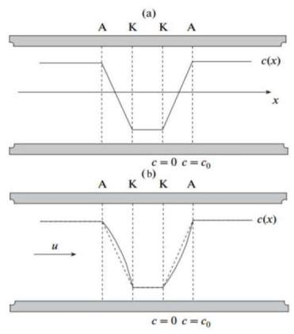

Fig. 1. Distribution of the current carriers concentration in the converting cell. c(x) is the steady state concentration of ions; (a) distribution without mechanical motion; (b) the distribution of concentration c(x) varies under the oncoming flow of liquid; u - fluid flow rate. A - anodes, K - cathodes.

图1. 转换电池中电流载流子浓度的分布。c(x)是离子的稳态浓度；(a) 无机械运动时的分布；(b) 浓度c(x)的分布在液体迎面流动时发生变化；u - 流体流速。A - 阳极，K - 阴极。

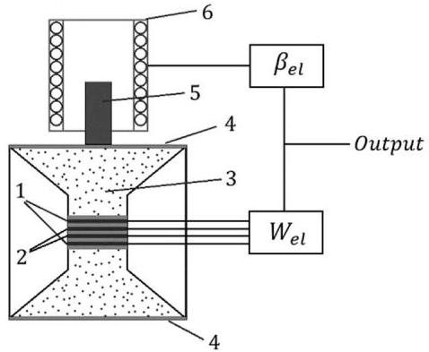

Fig. 2. Schematic representation of the MET sensor with magnetic-force feedback: 1 - anodes; 2 - cathodes; 3 - electrolyte; 4 - membranes; 5 - magnet; 6 - electromagnetic coil.

图2. 带有磁力反馈的MET传感器的示意图:1 - 阳极；2 - 阴极；3 - 电解质；4 - 膜；5 - 磁体；6 - 电磁线圈。

In general, for MET, the conversion of surface movement into electric current looks like a two-step process: a) conversion of external acceleration into the liquid flow through a transducer (determined by the properties of the mechanical subsystem), b) conversion of the liquid flow into current on the transducer electrodes (determined by the properties of conversion efficiency and by the electrochemical subsystem). In this connection, the transfer function of the MET transducers can be defined as follows:

一般来说，对于MET，表面运动到电流的转换看起来像一个两步过程:a) 通过换能器将外部加速度转换为液体流动(由机械子系统的特性决定)，b) 将液体流动转换为换能器电极上的电流(由转换效率特性和电化学子系统决定)。就此而言，MET换能器的传递函数可以定义如下:

$$
W = {W}_{\text{ mech }} \cdot  {W}_{{el} - {ch}} \tag{1}
$$

where ${W}_{\text{ mech }},{W}_{\text{ el-ch }}$ denote the transfer functions of the mechanical and electrochemical subsystems, respectively.

其中${W}_{\text{ mech }},{W}_{\text{ el-ch }}$分别表示机械和电化学子系统的传递函数。

## A. Transfer function of the mechanical system.

## A. 机械系统的传递函数。

In accordance with [24], to calculate the transfer function of a mechanical system, the following equation can be used:

根据[24]，为了计算机械系统的传递函数，可以使用以下方程:

$$
{W}_{\text{ mech }} = \frac{Q}{V} = \frac{{\rho L}{\omega }^{2}}{\sqrt{{\left( \frac{\rho L}{{S}_{CH}}\right) }^{2}{\left( {\omega }^{2} - {\omega }_{0}^{2}\right) }^{2} + {R}_{h}^{2} \cdot  {\omega }^{2}}}, \tag{2}
$$

where $Q$ denotes the volume liquid flow through the transducer generated by the measured mechanical signal, $V$ denotes the liquid velocity in the channel, $L$ denotes the channel length, ${S}_{CH}$ denotes the channel area, ${\omega }_{0}$ denote the mechanical frequency, $\rho$ denotes the electrolyte density. ${R}_{h} = \frac{\Delta p}{Q}$ is the hydrodynamic resistance of the transducer. Since the electrode node makes the main contribution to the total hydrodynamic resistance of the system, for all practical calculations it should be assumed that ${\Delta p}$ is the pressure difference at the edges of the electrode node. In the particular case when flexible membranes are used as an elastic element, the natural frequency is calculated as follows [25]:

其中$Q$表示由测量的机械信号在换能器中产生的体积液体流量，$V$表示通道中的液体速度，$L$表示通道长度，${S}_{CH}$表示通道面积，${\omega }_{0}$表示机械频率，$\rho$表示电解质密度。${R}_{h} = \frac{\Delta p}{Q}$是换能器的流体动力阻力。由于电极节点对系统的总流体动力阻力起主要作用，对于所有实际计算，应假设${\Delta p}$是电极节点边缘的压力差。在使用柔性膜作为弹性元件的特殊情况下，固有频率按如下方式计算[25]:

$$
{\omega }_{0} = \sqrt{\frac{\alpha }{\rho L}}\sigma
$$

where $\alpha$ denotes the membrane bulk stiffness, $\alpha  = \; {2\Delta p}/{\Delta V}$ , where ${\Delta p}$ is the pressure difference from the two sides of the membrane, provided that a volume ${\Delta V}$ flows through the node, the coefficient 2 indicates that 2 membranes are used, $\sigma  = {S}_{eff}/{S}_{CH}2,{S}_{eff}$ is the membrane effective area.

其中$\alpha$表示膜的整体刚度，$\alpha  = \; {2\Delta p}/{\Delta V}$，其中${\Delta p}$是膜两侧的压差，假设体积${\Delta V}$流经节点，系数2表示使用了2个膜，$\sigma  = {S}_{eff}/{S}_{CH}2,{S}_{eff}$是膜的有效面积。

As a rule, converters have very high ${R}_{h}$ and the resonance is well damped. In this case, the following expression can be used instead of (2):

通常，转换器具有非常高的${R}_{h}$，并且共振得到很好的阻尼。在这种情况下，可以使用以下表达式代替(2):

$$
{W}_{\text{ mech }} = \frac{{A}_{0}}{{\left( 1 + \frac{{\omega }_{\text{ me },1}^{2}}{{\omega }^{2}}\right) }^{\frac{1}{2}}{\left( 1 + \frac{{\omega }_{\text{ mech, }2}^{2}}{{\omega }^{2}}\right) }^{\frac{1}{2}}}, \tag{3}
$$

$$
{\omega }_{\text{ mech, }1} = \frac{\alpha }{{R}_{h}{S}_{CH}}{\sigma }^{2},{\omega }_{\text{ mech, }2} = \frac{{R}_{h}{S}_{CH}}{\rho L}
$$

where ${A}_{0}$ is the converter sensitivity at a very high frequency. The main part of the frequency range of velocity sensors based on MET usually lies between ${\omega }_{\text{ mech },1}$ and ${\omega }_{\text{ mech },2}$ .

其中${A}_{0}$是转换器在非常高频率下的灵敏度。基于MET的速度传感器的频率范围主要部分通常位于${\omega }_{\text{ mech },1}$和${\omega }_{\text{ mech },2}$之间。

It is easy to see that the higher is the ${R}_{h}$ and the greater is the ${S}_{CH}$ , the wider frequency range of the sensors can be achieved.

很容易看出，${R}_{h}$越高且${S}_{CH}$越大，传感器可实现的频率范围就越宽。

## B. Transfer function of the electrochemical system.

## B. 电化学系统的传递函数。

The calculation of the transfer function of the electrochemical system is described by the system of Navier-Stokes equations, non-compressibility of the liquid and convective diffusion [17]:

电化学系统传递函数的计算由纳维 - 斯托克斯方程组、液体的不可压缩性和对流扩散描述[17]:

$$
\left\{  {\begin{matrix} \frac{\partial \overrightarrow{v}}{\partial t} + \left( {\overrightarrow{V}\nabla }\right) \overrightarrow{V} =  - \frac{\nabla p}{\rho } + {v\Delta }\overrightarrow{V} \\  \operatorname{div}\left( \overrightarrow{V}\right)  = 0 \\  \frac{\partial c}{\partial t} + \left( {\overrightarrow{V}\nabla }\right) c = {D\Delta c} \end{matrix},}\right.
$$

where $\overrightarrow{V}$ is the flow velocity, $p$ is the pressure, $c$ is the active electrolyte ions concentration, $D$ is the diffusion coefficient, $v$ is the liquid viscosity, $\rho$ is the electrolyte density.

其中$\overrightarrow{V}$是流速，$p$是压力，$c$是活性电解质离子浓度，$D$是扩散系数，$v$是液体粘度，$\rho$是电解质密度。

The first equation in the above system is the Navier-Stokes equation, the second one is the condition of the liquid incompressibility, and the last one is the equation of convective diffusion, under the assumption that a high concentration of background electrolyte is created and the contribution of migration to charge transfer is insignificant. As the boundary conditions, the 'sticking' condition is usually used - the liquid velocity on a solid surface is zero, the absence of the normal component of current on dielectric surfaces, and the condition for concentration on electrodes: in the saturation mode on cathodes $c = 0$ . All these assumptions were used to find the transfer function of MET transducer.

上述系统中的第一个方程是纳维 - 斯托克斯方程，第二个是液体不可压缩性条件，最后一个是对流扩散方程，假设创建了高浓度的背景电解质且迁移对电荷转移的贡献微不足道。作为边界条件，通常使用“附着”条件——固体表面上的液体速度为零，电介质表面上电流的法向分量不存在，以及电极上的浓度条件:在阴极的饱和模式下$c = 0$。所有这些假设都用于找到MET换能器的传递函数。

For a known concentration distribution, the currents through the electrodes can be found [17] according to the expression:

对于已知的浓度分布，可以根据表达式[17]找到通过电极的电流:

$$
I =  - {Dq}{\phi }_{S}\left( {\nabla c,\overrightarrow{n}}\right) {dS}, \tag{4}
$$

here integration is performed over the electrode surface $S$ , $\overrightarrow{n}$ is a unit vector normal to the surface, $q$ is the charge transferred through the electrode in a unit reaction.

这里积分是在电极表面$S$上进行的，$\overrightarrow{n}$是垂直于表面的单位向量，$q$是在单位反应中通过电极转移的电荷。

Using numerical and analytical methods, various cell configurations can be calculated. The choice of a particular method depends on the geometry of the electrodes and the required accuracy.

使用数值和分析方法，可以计算各种电池配置。具体方法的选择取决于电极的几何形状和所需的精度。

## C. Mesh electrodes.

## C. 网状电极。

Currently, electrode nodes for MET transducers are manufactured out of platinum mesh. According to [15], where one of the types of rotary motion meters based on the MET has been studied, having an electrochemical subsystem similar to the studied sensor type, in the case when the distance between electrodes is of the order of the channel size, the electrochemical transfer function can be approximated by the following expression:

目前，MET换能器的电极节点由铂网制成。根据[15]，其中研究了基于MET的一种旋转运动计类型，其具有与所研究的传感器类型类似的电化学子系统，在电极之间的距离约为通道尺寸的情况下，电化学传递函数可以由以下表达式近似:

$$
{W}_{{el} - {ch}} = \frac{q{c}_{0}}{{\left( 1 + \frac{{\omega }^{2}}{{\omega }_{{el} - {ch}}^{2}}\right) }^{1/2}} \tag{5}
$$

where ${\omega }_{{el} - {ch}} = {bD}/{d}^{2}, D$ is the diffusion coefficient, $d$ is the distance between the electrodes, $b$ is the parameter depending on the electrode system geometry, ${c}_{0}$ is the equilibrium concentration.

其中${\omega }_{{el} - {ch}} = {bD}/{d}^{2}, D$是扩散系数，$d$是电极之间的距离，$b$是取决于电极系统几何形状的参数，${c}_{0}$是平衡浓度。

Putting (3) and (5) into (1) and considering [17], get that for practical calculations of the MET transducer transfer function, the following functions can be used:

将(3)和(5)代入(1)并考虑[17]，得到对于MET换能器传递函数的实际计算，可以使用以下函数:

$$
W = \frac{{A}_{0}}{{\left( 1 + \frac{{\omega }_{mech1}^{2}}{{\omega }^{2}}\right) }^{\frac{1}{2}}{\left( 1 + \frac{{\omega }_{mech2}^{2}}{{\omega }^{2}}\right) }^{\frac{1}{2}}}
$$

$$
\cdot  \frac{1}{{\left( 1 + \frac{{\omega }^{2}}{{\omega }_{{el} - {ch}}^{2}}\right) }^{\frac{1}{2}}{\left( 1 + \frac{{\omega }^{2}}{{\omega }_{D}^{2}}\right) }^{\alpha }}\text{ , } \tag{6}
$$

where ${A}_{0},{\omega }_{\text{ mech },1},{\omega }_{\text{ mech },2},{\omega }_{\text{ el- }{ch}},{\omega }_{D}$ and $\alpha$ are the approximation parameters. These parameters can be calculated both from theoretical considerations and selected in the process of experimental studies. The theoretical value of ${\omega }_{D} \sim  D/{R}^{2}$ is shown according to [15]. The theoretical value of the parameter $\alpha  = 1/4$ , which corresponds to the dependence $W \sim  1/{R}^{3/2}$ at high frequencies, which has been obtained from [26] and verified in a series of experiments for converters of various types.

其中${A}_{0},{\omega }_{\text{ mech },1},{\omega }_{\text{ mech },2},{\omega }_{\text{ el- }{ch}},{\omega }_{D}$和$\alpha$是近似参数。这些参数既可以从理论考虑计算得出，也可以在实验研究过程中选择。${\omega }_{D} \sim  D/{R}^{2}$的理论值根据[15]给出。参数$\alpha  = 1/4$的理论值，它对应于高频下的$W \sim  1/{R}^{3/2}$依赖性，已从[26]中获得并在一系列不同类型转换器的实验中得到验证。

## D. Temperature dependence of electrolyte parameters.

## D. 电解质参数的温度依赖性。

The rate of ion transport in an electrolyte is determined by its diffusion coefficient and viscosity. They significantly affect the MET transducers conversion parameters. According to the Frenkel theory from [27], the viscosity of a simple liquid depends on the temperature as follows:

电解质中离子的传输速率由其扩散系数和粘度决定。它们对MET换能器的转换参数有显著影响。根据文献[27]中的弗伦克尔理论，简单液体的粘度与温度的关系如下:

$$
v = A \cdot  \exp \left( \frac{{E}_{a}}{kT}\right) . \tag{7}
$$

Here ${E}_{a}$ is the electrolyte activation energy, $A = \; {kT}/\pi {\omega }_{0}r{\sigma }^{2}$ , where $r$ is the molecule radius, $\sigma$ is the interparticle distance, ${\omega }_{0}$ is the molecular frequency.

这里${E}_{a}$是电解质的活化能，$A = \; {kT}/\pi {\omega }_{0}r{\sigma }^{2}$，其中$r$是分子半径，$\sigma$是粒子间距离，${\omega }_{0}$是分子频率。

In this case, the diffusion coefficient is related to viscosity the following way:

在这种情况下，扩散系数与粘度的关系如下:

$$
D = \frac{kT}{6\pi r\nu } = \frac{{\omega }_{0}{\sigma }^{2}}{6}\exp \left( {-\frac{{E}_{a}}{kT}}\right) . \tag{8}
$$

It is obvious from (7) and (8) that viscosity and diffusion coefficient strongly depend on temperature, and, while viscosity decreases exponentially with the temperature increase, the diffusion coefficient increases exponentially. Since the process of convective diffusion is determined by these qualities of the electrolyte, the temperature change has a strong influence on the MET transducers characteristics. It should be comprehensively studied to determine methods and approaches to reduce the temperature sensitivity of the final products based on MET.

从(7)和(8)可以明显看出，粘度和扩散系数强烈依赖于温度，并且，随着温度升高粘度呈指数下降，而扩散系数呈指数增加。由于对流扩散过程由电解质的这些性质决定，温度变化对MET换能器的特性有很大影响。应该进行全面研究以确定降低基于MET的最终产品温度敏感性的方法和途径。

## III. MEASUREMENT METHOD

## III. 测量方法

To study the temperature dependences, the following setup was used, Fig. 3:

为了研究温度依赖性，使用了以下装置，图3:

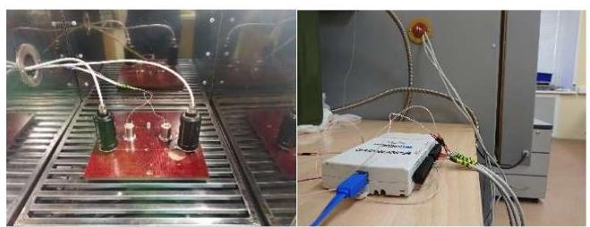

Fig. 3. The setup diagram of the study of the temperature dependence of the MET devices (two MET sensors in thermo-chamber (black ones), DAC NI6212 out of chamber collect the data to the PC).

图3. MET器件温度依赖性研究的装置图(热室中有两个MET传感器(黑色)，室外部的DAC NI6212将数据采集到PC)。

The studied MET linear displacement sensors have been placed vertically in a heat chamber. Temperature regimes were created by the heat chamber M-60 / 100-120 KTX-T. For the purity of experiments, electrical circuits have been brought outside.

所研究的MET线性位移传感器垂直放置在加热室中。温度范围由加热室M - 60 / 100 - 120 KTX - T创建。为了保证实验的纯净性，电路已引出室外。

To obtain the amplitude-frequency characteristics of the device with open-loop feedback, the National Instruments NI-6215 data acquisition system has been used. Calibration was carried out as follows. Device feedback was open. The specified signal was fed through the DAC to the electromagnetic coil in the feedback loop. The force created by the action of the coil field on the magnetic core created the acceleration of the liquid in the electrode node. The change in the ion concentration gradient created a current on the MET transducers electrodes, which, after passing through the electronics with a known transfer function, was converted into a voltage signal. That signal, recorded using a data acquisition system, was fed to a PC.

为了获得具有开环反馈的器件的幅频特性，使用了National Instruments NI - 6215数据采集系统。校准如下进行。器件反馈打开。指定信号通过DAC馈入反馈回路中的电磁线圈。线圈磁场作用在磁芯上产生的力使电极节点中的液体产生加速度。离子浓度梯度的变化在MET换能器电极上产生电流，该电流在经过具有已知传递函数的电子设备后被转换为电压信号。使用数据采集系统记录的该信号被馈入PC。

Further, for each frequency, the spectrum of the signal from the sensor was plotted. The maximum of this spectrum was divided by the same maximum signal from the generator. From the points thus obtained, the amplitude frequency response of the instruments was obtained in units of applied acceleration. The instruments were calibrated using sinusoidal signals in the range from 0.1 to 443 Hz at various temperatures. To convert the characteristics into units of speed and compare them with theoretical models in the spectral region, it is sufficient to multiply the values of the experimental amplitude frequency response by the appropriate frequency.

此外，对于每个频率，绘制传感器信号的频谱。该频谱的最大值除以来自发生器的相同最大信号。从由此获得的点，以施加加速度为单位获得仪器的幅频响应。在不同温度下，使用0.1至443 Hz范围内的正弦信号对仪器进行校准。为了将特性转换为速度单位并在频谱区域中与理论模型进行比较，将实验幅频响应的值乘以适当的频率就足够了。

Also, dependencies of the values of background currents on temperature have been taken. For this, voltage drops on resistors R in the cascade of signal conversion from current to voltage have been measured (Fig. 4).

还获取了背景电流值对温度的依赖性。为此，测量了从电流到电压的信号转换级联中电阻R上的电压降(图4)。

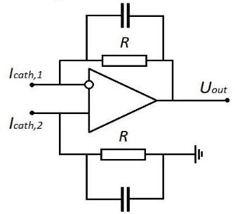

Fig. 4. Circuit of the current-voltage converter cascade.

图4. 电流 - 电压转换器级联电路。

As noted above, in this study sensors that were filled with different electrolytes have been investigated. To do this, 2 devices were filled initially with an aqueous solution of ${KI}$ , with a concentration of $4\mathrm{\;{mol}}/\mathrm{l}$ , with the addition of ${I}_{2}$ , with a concentration of ${0.1}\mathrm{\;{mol}}/\mathrm{l}$ . Experimental works have been carried out with these devices in the temperature range from $- {15}^{ \circ  }\mathrm{C}$ to $+ {70}^{ \circ  }\mathrm{C}$ . After that, the devices were refilled with an aqueous solution of LiI with the addition of ${I}_{2}$ at the same concentrations, and similar experimental works have been carried out in the temperature range from $- {35}^{ \circ  }\mathrm{C}$ to $+ {70}^{ \circ  }\mathrm{C}$ . Thus, we have achieved the use of the same mechanical subsystem and could compare the dependences of electrochemical subsystems on temperature.

如上所述，在本研究中对填充不同电解质的传感器进行了研究。为此，最初向2个器件中填充了${KI}$的水溶液，浓度为$4\mathrm{\;{mol}}/\mathrm{l}$，添加了${I}_{2}$，浓度为${0.1}\mathrm{\;{mol}}/\mathrm{l}$。在温度范围从$- {15}^{ \circ  }\mathrm{C}$到$+ {70}^{ \circ  }\mathrm{C}$对这些器件进行了实验工作。之后，用添加了相同浓度${I}_{2}$的LiI水溶液重新填充器件，并在温度范围从$- {35}^{ \circ  }\mathrm{C}$到$+ {70}^{ \circ  }\mathrm{C}$进行了类似的实验工作。因此，我们实现了使用相同的机械子系统，并能够比较电化学子系统对温度的依赖性。

## IV. OBTAINED RESULTS

## IV. 获得的结果

For each device, transfer functions of devices have been obtained with increments ${5}^{ \circ  }\mathrm{C}$ . The examples are presented in Figures 4 and 5.

对于每个器件，以${5}^{ \circ  }\mathrm{C}$的增量获得了器件的传递函数。示例见图4和图5。

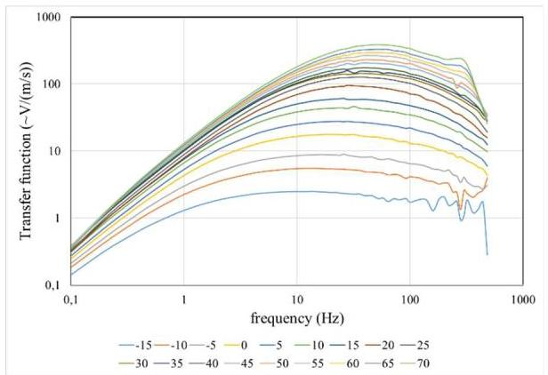

Fig. 4. The amplitude frequency response family for one of the KI-based sensors from $- {15}^{ \circ  }\mathrm{C}$ to $+ {70}^{ \circ  }\mathrm{C}$

图4. 来自$- {15}^{ \circ  }\mathrm{C}$至$+ {70}^{ \circ  }\mathrm{C}$的一种基于KI的传感器的幅度频率响应族

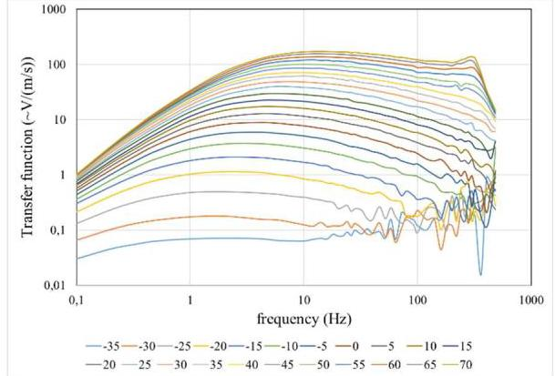

Fig. 5. The amplitude frequency response family for one of the sensors on the basis of LI from $- {35}^{ \circ  }\mathrm{C}$ to ${70}^{ \circ  }\mathrm{C}$

图5. 基于$- {35}^{ \circ  }\mathrm{C}$至${70}^{ \circ  }\mathrm{C}$的LI，其中一个传感器的幅频响应族

It is clearly seen that the amplitude frequency response of the MET devices changes significantly with increasing temperature, and the nature of the changes is not linear, both in the frequency and temperature range.

可以清楚地看到，MET器件的幅频响应随温度升高而显著变化，并且在频率和温度范围内，变化的性质是非线性的。

At the same time, the dependences of the background currents on temperature for the same linear displacement sensors have been obtained. They are shown below in Fig. 7.

同时，已获得相同线性位移传感器的背景电流对温度的依赖性。它们如下所示于图7中。

It can be concluded from Figure 7 that it is obvious that the background currents have a dependence similar to the exponent on temperature. The close dependencies of the background currents of the devices with the same electrolytes confirm the identity of the devices.

从图7可以得出结论，很明显背景电流对温度的依赖性类似于指数关系。具有相同电解质的器件的背景电流的紧密依赖性证实了这些器件的一致性。

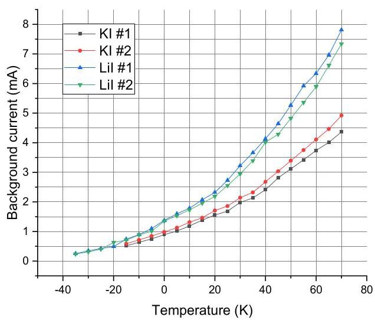

Fig. 7. The dependences of background currents on temperature for the tested sensors in both fillings.

图7. 两种填充物中测试传感器的背景电流与温度的关系。

## V. INTERPRETATION OF RESULTS

## 五、结果解读

First consider the behavior of the recorded characteristics at high frequencies. Perform calculations similar to those done in the previous study [16], but already for two types of electrolytes. As a result, obtain a strict correspondence of the results with previous studies. In particular, dependences of $\ln \left( W\right)$ on $1/T$ based on the presented data have been constructed for each of the frequencies at temperatures from ${0}^{ \circ  }\mathrm{C}$ to ${50}^{ \circ  }\mathrm{C}$ . Each color line illustrates the value of $W\left( \omega \right)$ at the same frequency $\omega \; \omega$ for different temperatures in the range of ${80} - {403}\mathrm{\;{Hz}}$ (Fig. 8 and Fig. 9).

首先考虑高频下记录特性的行为。进行与先前研究[16]中所做计算类似的计算，但这次是针对两种电解质。结果，得到了与先前研究结果的严格对应。具体而言，基于所呈现的数据，已经构建了在温度从${0}^{ \circ  }\mathrm{C}$到${50}^{ \circ  }\mathrm{C}$范围内每个频率下$\ln \left( W\right)$对$1/T$的依赖关系。每条彩色线表示在${80} - {403}\mathrm{\;{Hz}}$范围内不同温度下相同频率$\omega \; \omega$处的$W\left( \omega \right)$值(图8和图9)。

A linear approximation for each array of experimental points will give a slope for each frequency $\alpha  = T \cdot  \ln \left( W\right)$ . According to (6), $\alpha  =$ const at $\omega  >$ 100 Hz, which strictly corresponds to the experimental results. In this case, the transfer functions of the MET devices have a constant temperature dependence for both types of electrolytes, similar to [16]:

对每组实验点进行线性近似将得到每个频率$\alpha  = T \cdot  \ln \left( W\right)$的斜率。根据(6)，在$\omega  >$为100Hz时$\alpha  =$为常数，这与实验结果严格相符。在这种情况下，MET器件的传递函数对于两种电解质都具有恒定的温度依赖性，类似于[16]:

$$
W = {W}_{0} \cdot  \exp \left( \frac{\alpha }{T}\right) \tag{9}
$$

Thus, for the high-frequency range, the results from [16] got verified and supplemented with new information for the electrolyte based on LiI. Temperature compensating circuit at high frequencies for it can be calculated using similar methods.

因此，对于高频范围，[16]的结果得到了验证，并补充了基于LiI的电解质的新信息。其高频温度补偿电路可以用类似方法计算。

As noted above, the model from [16] is however reliable only in the high frequency range and at temperatures above ${0}^{ \circ  }\mathrm{C}$ . To get rid of the restrictions imposed on (9), an approximation has been made in accordance with the theoretical model (6) proposed in Section II:

如上所述，然而，[16]中的模型仅在高频范围内以及温度高于${0}^{ \circ  }\mathrm{C}$时才可靠。为了消除对(9)所施加的限制，已根据第二节中提出的理论模型(6)进行了近似:

$$
W = \frac{{A}_{0}}{{\left( 1 + \frac{{\omega }_{mech1}^{2}}{{\omega }^{2}}\right) }^{\frac{1}{2}}{\left( 1 + \frac{{\omega }_{mech2}^{2}}{{\omega }^{2}}\right) }^{\frac{1}{2}}}
$$

$$
\frac{1}{{\left( 1 + \frac{{\omega }^{2}}{{\omega }_{{el} - {ch}}^{2}}\right) }^{\frac{1}{2}}{\left( 1 + \frac{{\omega }^{2}}{{\omega }_{D}^{2}}\right) }^{\alpha }}\text{ , }
$$

where ${A}_{0},{\omega }_{\text{ mech },1},{\omega }_{\text{ mech },2},{\omega }_{\text{ el- }{ch}},{\omega }_{D}$ and $\alpha$ are the approximation parameters.

其中${A}_{0},{\omega }_{\text{ mech },1},{\omega }_{\text{ mech },2},{\omega }_{\text{ el- }{ch}},{\omega }_{D}$和$\alpha$是近似参数。

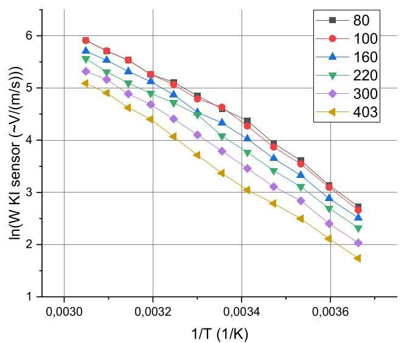

Fig. 8. Dependencies $\ln \left( {W}_{{KI}\text{ sensor }}\right)$ on $1/T$ from $0,1\mathrm{\;{Hz}}$ to ${403}\mathrm{\;{Hz}}$ .

图8. 从$0,1\mathrm{\;{Hz}}$到${403}\mathrm{\;{Hz}}$对$1/T$的$\ln \left( {W}_{{KI}\text{ sensor }}\right)$依赖性。

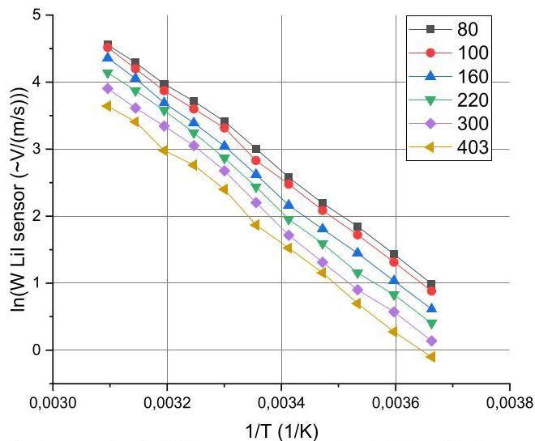

Fig. 9. Dependencies $\ln \left( {W}_{\text{ LiI sensor }}\right)$ on $1/T$ from $0,1\mathrm{\;{Hz}}$ to ${403}\mathrm{\;{Hz}}$ .

图9. 从$0,1\mathrm{\;{Hz}}$到${403}\mathrm{\;{Hz}}$对$1/T$的$\ln \left( {W}_{\text{ LiI sensor }}\right)$依赖性。

Approximation has been carried out in the program Origin 2018 on a logarithmic scale using the method of least squares.

在程序Origin 2018中，已使用最小二乘法在对数尺度上进行了近似计算。

It has been found out that the parameter ${A}_{0}$ almost does not change with a temperature change, and the parameter $\alpha$ received a scatter of values from 0.24 to 0.27, which well agrees with the theoretical value 0.25 [17]. Further selection of the approximation parameters has been carried out with fixed ${A}_{0}$ and $\alpha$ . Figures 10 - 12 show typical approximations of sensor characteristics.

已经发现参数${A}_{0}$几乎不会随温度变化而改变，并且参数$\alpha$的值在0.24到0.27之间分散，这与理论值0.25 [17]非常吻合。在固定${A}_{0}$和$\alpha$的情况下进一步选择了近似参数。图10 - 12展示了传感器特性的典型近似。

It is worth noting that at low temperatures at the highest frequencies, the set gain and bitness of the ADC have not always been enough to remove the amplitude frequency response points, which did not significantly affect the reliability and verifiability of the models and experimental data.

值得注意的是，在低温和最高频率下，ADC 的设定增益和位数并不总是足以消除幅度频率响应点，这对模型和实验数据的可靠性和可验证性没有显著影响。

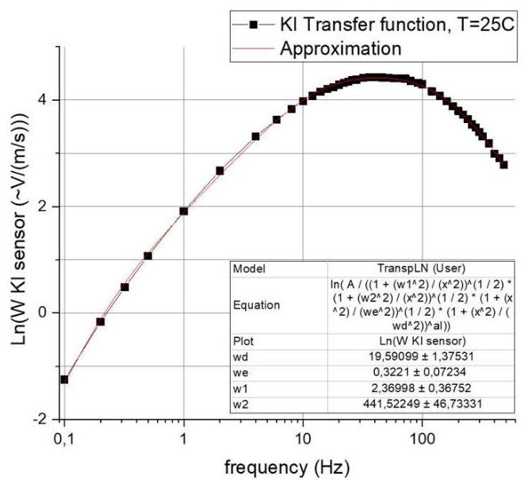

Fig. 10. Approximation of the transfer function for one of the KI-based sensors at ${25}^{ \circ  }\mathrm{C}$ .

图 10. 基于 KI 的传感器之一在${25}^{ \circ  }\mathrm{C}$ 时传递函数的近似值。

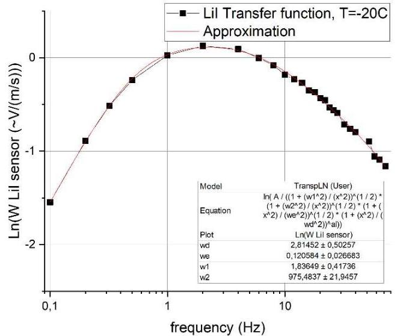

Fig. 11 Approximation of the transfer function for one of the LiI-based sensors at $- {20}^{ \circ  }\mathrm{C}$ .

图 11 基于 LiI 的传感器之一在$- {20}^{ \circ  }\mathrm{C}$ 时传递函数的近似值。

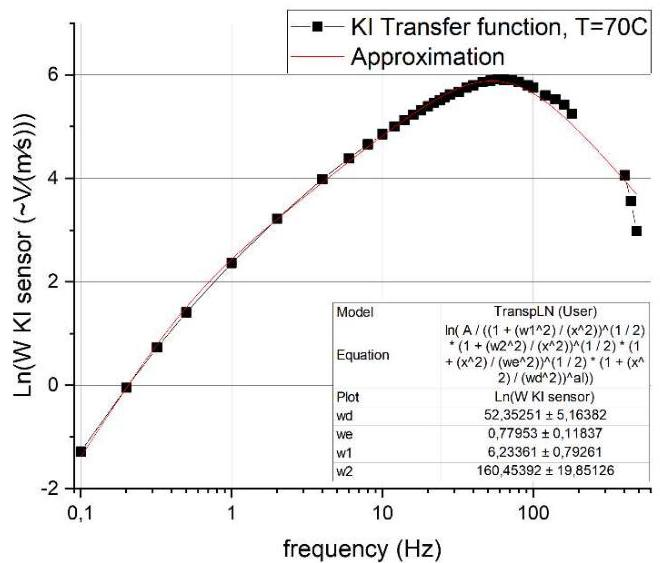

Fig. 12. Approximation of the transfer function for one of the KI-based sensors at ${70}^{ \circ  }\mathrm{C}$ .

图 12. 基于 KI 的传感器之一在${70}^{ \circ  }\mathrm{C}$ 时传递函数的近似值。

Thus, for each of the transfer functions taken at each temperature, values ${\omega }_{{mech},1},{\omega }_{{mech},2},{\omega }_{{el} - {ch}}$ and ${\omega }_{D}$ have been obtained, that is, according to the experimental points for each temperature, approximation parameters have been given to adhere clearly to the AFC of the theoretical analytical dependence proposed in (6).

因此，对于在每个温度下获取的每个传递函数，都得到了值${\omega }_{{mech},1},{\omega }_{{mech},2},{\omega }_{{el} - {ch}}$ 和${\omega }_{D}$ ，也就是说，根据每个温度下的实验点，给出了近似参数，以严格符合(6)中提出的理论分析依赖性的AFC。

## VI. VERIFICATION OF RESULTS

## VI. 结果验证

According to the theoretical model from Section II, each of these parameters is associated with temperature-dependent viscosity and diffusion coefficients, such as:

根据第二节中的理论模型，这些参数中的每一个都与温度相关的粘度和扩散系数相关，例如:

$$
{\omega }_{\text{ mech },1} = \frac{\alpha }{{R}_{h}{S}_{CH}}{\sigma }^{2} \sim  \frac{1}{v}
$$

$$
{\omega }_{\text{ mech },2} = \frac{{R}_{h}{S}_{CH}}{\rho L} \sim  v
$$

$$
{\omega }_{{el} - {ch}} = b\frac{bD}{{d}^{2}} \sim  D
$$

${\omega }_{D} \sim  D$

in turn, the diffusion coefficient D and the liquid viscosity $v$ exponentially depend on temperature (7) and (8).

反过来，扩散系数 D 和液体粘度$v$ 与温度呈指数关系(7)和(8)。

To test the theoretical model and the obtained approximation coefficients of the experimental data, construct on a logarithmic scale ${\omega }_{\text{ mech },1},{\omega }_{\text{ mech },2},{\omega }_{\text{ el-ch }}$ and ${\omega }_{D}$ from the inverse temperature $\left( {1/\mathrm{T}}\right)$ , in Figures 13 - 14 examples of such dependencies for ${\omega }_{D}$ are given. It can be seen that the experimental points strictly lie on the linear dependence, which is fully consistent with the model of temperature behavior from (7) and (8). The angular coefficient of such dependences must correspond to the activation energies ${E}_{a}$ of the corresponding ions of the corresponding electrolyte divided by the Boltzmann constant $k$ .

为了测试理论模型和获得的实验数据的近似系数，根据逆温度$\left( {1/\mathrm{T}}\right)$ 在对数尺度上构建${\omega }_{\text{ mech },1},{\omega }_{\text{ mech },2},{\omega }_{\text{ el-ch }}$ 和${\omega }_{D}$ ，在图 13 - 14 中给出了${\omega }_{D}$ 的这种依赖性示例。可以看出，实验点严格位于线性依赖性上，这与(7)和(8)中的温度行为模型完全一致。这种依赖性的角系数必须对应于相应电解质的相应离子的活化能${E}_{a}$ 除以玻尔兹曼常数$k$ 。

Similar dependencies have been constructed for the remaining approximation parameters ${\omega }_{\text{ mech },1},{\omega }_{\text{ mech },2}$ , ${\omega }_{{el} - {ch}}$ and ${\omega }_{D}$ and the angular coefficients of the straight line for each of the characteristic frequencies corresponding to the activation energy has been calculated similarly. The results are shown in Table 1.

针对其余近似参数${\omega }_{\text{ mech },1},{\omega }_{\text{ mech },2}$ 、${\omega }_{{el} - {ch}}$ 和${\omega }_{D}$ 构建了类似的依赖性，并类似地计算了每个对应于活化能的特征频率的直线角系数。结果如表 1 所示。

The table shows that, within the error limits, the activation energies coincide well with each other for each approximation parameter, which is a good verification of the correctness of the chosen mathematical model of the temperature behavior of the MET sensors in the 0.1 - 483 Hz frequency band.

该表表明，在误差范围内，每个近似参数的活化能彼此吻合良好，这很好地验证了在 0.1 - 483 Hz 频带内 MET 传感器温度行为所选数学模型的正确性。

Note that the activation energies for the ’electrochemical’ coefficients $\left( {\omega }_{{el} - {ch}}\right.$ and $\left. {\omega }_{D}\right)$ in all cases turned out to be slightly higher than for the 'mechanical' coefficients $\left( {{\omega }_{\text{ mech },1},{\omega }_{\text{ mech },2}}\right)$ . It happens because when considering the indicated effects of diffusion and viscosity, different ions of the electrolyte solution are important. Since the current carriers in the MET transducers, which is determined by the diffusion coefficient (4), are only triiodide ions $\left( {I}_{3}^{ - }\right)$ , so the activation energy of these ions corresponds to the electrochemical subsystem. Whereas viscosity enters already as a parameter of the mechanical system and the averaged energy of activation of all molecules and solution ions plays a significant role here: water molecules ${\mathrm{H}}_{2}\mathrm{O}$ , iodine ions $I,{\mathrm{\;K}}^{ + }$ ions (or ${\mathrm{{Li}}}^{ + }$ ), triiodide ions ${I}_{3}$ .

请注意，在所有情况下，“电化学”系数$\left( {\omega }_{{el} - {ch}}\right.$ 和$\left. {\omega }_{D}\right)$ 的活化能都略高于“机械”系数$\left( {{\omega }_{\text{ mech },1},{\omega }_{\text{ mech },2}}\right)$ 的活化能。之所以会这样，是因为在考虑扩散和粘度的上述影响时，电解质溶液的不同离子很重要。由于 MET 换能器中的电流载体由扩散系数(4)决定，仅为三碘离子$\left( {I}_{3}^{ - }\right)$ ，因此这些离子的活化能对应于电化学子系统。而粘度已经作为机械系统的一个参数进入，并且所有分子和溶液离子的平均活化能在这里起着重要作用:水分子${\mathrm{H}}_{2}\mathrm{O}$ 、碘离子$I,{\mathrm{\;K}}^{ + }$ 离子(或${\mathrm{{Li}}}^{ + }$ )、三碘离子${I}_{3}$ 。

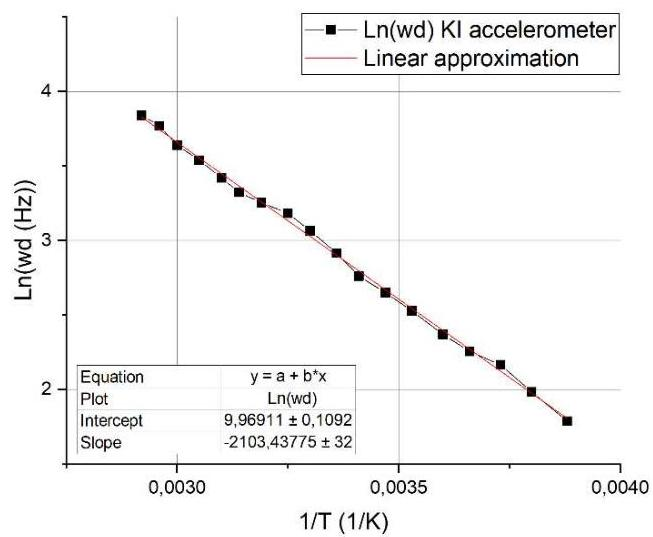

Fig. 13. Angular coefficient approximation for ${\omega }_{D}$ for one of the ${KI}$ -based sensors.

图 13. 基于${KI}$ 的传感器之一的${\omega }_{D}$ 的角系数近似值。

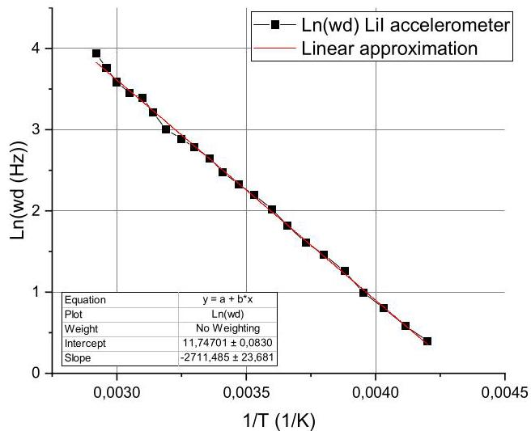

Fig. 14. Angular coefficient approximation for ${\omega }_{D}$ for one of the LiI-based sensors.

图 14. 基于 LiI 的传感器之一的${\omega }_{D}$ 的角系数近似值。

<table><tr><td colspan="5">Angular coefficients, ${E}_{a}/k\left( {{}^{0}\mathrm{\;K}}\right)$</td></tr><tr><td>Parameter</td><td>KI #1</td><td>KI #2</td><td>LiI #1</td><td>LiI #2</td></tr><tr><td>${\omega }_{D}$</td><td>2168±27</td><td>2103+24</td><td>2711±31</td><td>2698±33</td></tr><tr><td>${\omega }_{{el} - {ch}}$</td><td>2133±28</td><td>2090±19</td><td>2612+21</td><td>2594±35</td></tr><tr><td>${\omega }_{{mech},1}$</td><td>1989±39</td><td>1922±43</td><td>2420±47</td><td>2297±51</td></tr><tr><td>${\omega }_{{mech},2}$</td><td>2018±54</td><td>1934±51</td><td>2412±62</td><td>2251±50</td></tr></table>

Table 1. Activation energies found from approximation coefficients

表 1. 从近似系数中找到的活化能

Remember that in Section IV we obtained the dependences of background currents on temperature, Fig.7. In accordance with (4), background currents also have a temperature dependence proportional to the diffusion coefficient. The dependence of background currents on temperature on a logarithmic scale should be linear, and the angular coefficient should be the same as that obtained from the ${\omega }_{D}$ and ${\omega }_{{el} - {ch}}$ dependences. In Figure 15, the corresponding patterns have been constructed.

请记住，在第四节中，我们得到了背景电流与温度的关系，如图7所示。根据式(4)，背景电流也具有与扩散系数成比例的温度依赖性。背景电流在对数尺度上与温度的关系应该是线性的，并且其斜率应该与从${\omega }_{D}$和${\omega }_{{el} - {ch}}$关系中得到的斜率相同。在图15中，已经构建了相应的曲线。

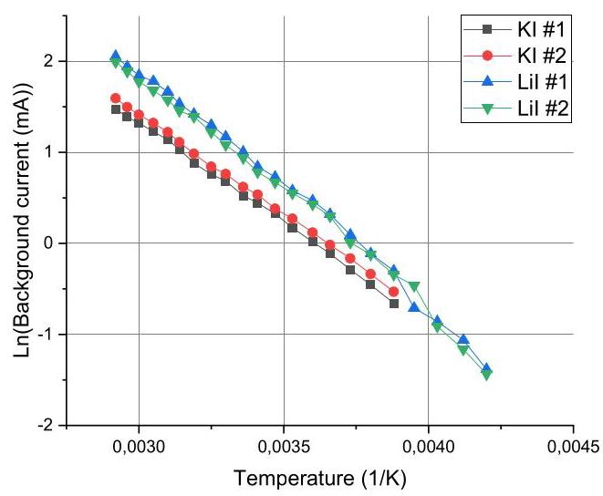

Fig. 15. The approximation of the angular coefficient for the background current of ${KI}$ - and ${LiI}$ -based sensors. The $x$ -axis shows the reverse temperature $\left( {1/\mathrm{K}}\right)$ , the $y$ -axis shows the background current value, the scale is logarithmic

图15. 基于${KI}$和${LiI}$的传感器背景电流斜率的近似值。$x$轴表示反向温度$\left( {1/\mathrm{K}}\right)$，$y$轴表示背景电流值，比例尺为对数

<table><tr><td colspan="4">Angular coefficients, ${E}_{a}/k\left( {{}^{0}\mathrm{\;K}}\right)$</td></tr><tr><td>KI #1</td><td>KI #2</td><td>LiI #1</td><td>LiI #2</td></tr><tr><td>2184±28</td><td>2102+24</td><td>2626±33</td><td>2567±39</td></tr></table>

Table 2. Triiodide $\left( {I}_{3}^{ - }\right)$ activation energies, found from background currents

表2. 从背景电流中得出的三碘化物$\left( {I}_{3}^{ - }\right)$的活化能

Comparing the results of Tables 1 and 2, we see that the activation energies obtained for the parameters depending on the diffusion coefficient for the triiodide ions $\left( {I}_{3}^{ - }\right)$ are very close to each other, which indicates the correct choice of the model and full agreement with the experiment.

比较表1和表2的结果，我们发现，对于取决于三碘化物离子$\left( {I}_{3}^{ - }\right)$扩散系数的参数所获得的活化能彼此非常接近，这表明模型的选择是正确的，并且与实验完全一致。

The electrolyte viscosity and the activation energy of the ions of a 4-molar ${KI}$ solution can be measured independently of the sensor operation with a conventional viscometer, with the possibility of thermoregulation of the selected volume. In this work, the "BΠ3-3" viscometer has been used (Fig. 16).

可以使用传统粘度计独立于传感器操作来测量4摩尔${KI}$溶液的电解质粘度和离子活化能，并且可以对选定体积进行温度调节。在这项工作中，使用了“BΠ3 - 3”粘度计(图16)。

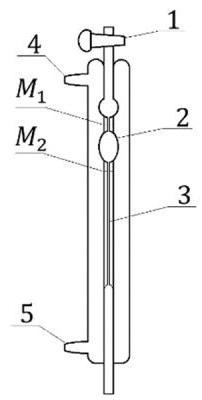

Fig. 16. The «BIN3-3» viscometer diagram: 1 - tap, 2 - measuring tank, 3 - capillary tube,4 and 5 - taps for connecting to a thermostat, ${M}_{1}$ and ${M}_{2}$ - tags.

图16. “BIN3 - 3”粘度计示意图:1 - 龙头，2 - 测量槽，3 - 毛细管，4和5 - 连接恒温器的龙头，${M}_{1}$和${M}_{2}$ - 标签。

To measure the viscosity, the viscometer is filled with electrolyte through the valve (1), then the valve (1) is sealed. The thermostat is connected to (5) and the cavity around the capillary tube is filled with water of a known temperature. Drain for the circulation of water is performed through (4). After holding the device at the given temperature, the valve (1) opens and the time of electrolyte flow between the marks ${M}_{1}$ and ${M}_{2}$ is measured. After several measurements, viscosity is calculated from the average electrolyte flow time using the formula presented in the device instructions:

为了测量粘度，通过阀门(1)将电解质注入粘度计，然后密封阀门(1)。将恒温器连接到(5)，并在毛细管周围的腔中充满已知温度的水。通过(4)进行水的循环排水。在将设备保持在给定温度后，打开阀门(1)并测量电解质在标记${M}_{1}$和${M}_{2}$之间流动的时间。经过几次测量后，使用设备说明书中给出的公式根据电解质平均流动时间计算粘度:

$$
v = k \cdot  t \cdot  \rho
$$

where $v$ is the liquid dynamic viscosity $\left( {{10}^{6}\mathrm{\;{Pa}} \cdot  \mathrm{s}}\right) k = \; 0,{1074}\left( {\mathrm{\;{mm}}/{\mathrm{s}}^{2}}\right)$ is the viscometer constant, $t$ is the average fluid flow time (s), $\rho$ is the liquid density $\left( {\mathrm{g}/{\mathrm{{cm}}}^{3}}\right)$ . The density was measured by weighing ${100}\mathrm{{ml}}$ of each electrolyte: ${\rho }_{KI} = 1,5\mathrm{\;g}/{\mathrm{{cm}}}^{3}$ and ${\rho }_{LiI} = 1,{41}\mathrm{\;g}/{\mathrm{{cm}}}^{3}$ . The Figures 17 - 18 show diagrams of logarithms of viscosity on inverse temperature, approximated by a linear function.

其中$v$是液体动态粘度，$\left( {{10}^{6}\mathrm{\;{Pa}} \cdot  \mathrm{s}}\right) k = \; 0,{1074}\left( {\mathrm{\;{mm}}/{\mathrm{s}}^{2}}\right)$是粘度计常数，$t$是平均流体流动时间(秒)，$\rho$是液体密度，$\left( {\mathrm{g}/{\mathrm{{cm}}}^{3}}\right)$。通过称量每种电解质${100}\mathrm{{ml}}$来测量密度:${\rho }_{KI} = 1,5\mathrm{\;g}/{\mathrm{{cm}}}^{3}$和${\rho }_{LiI} = 1,{41}\mathrm{\;g}/{\mathrm{{cm}}}^{3}$。图17 - 18显示了粘度对数与倒数温度的关系曲线，用线性函数近似。

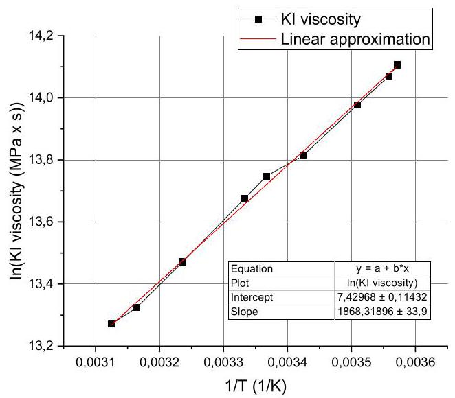

Fig. 17. Approximation of the ${KI}$ electrolyte viscosity coefficient.

图17. ${KI}$电解质粘度系数的近似值。

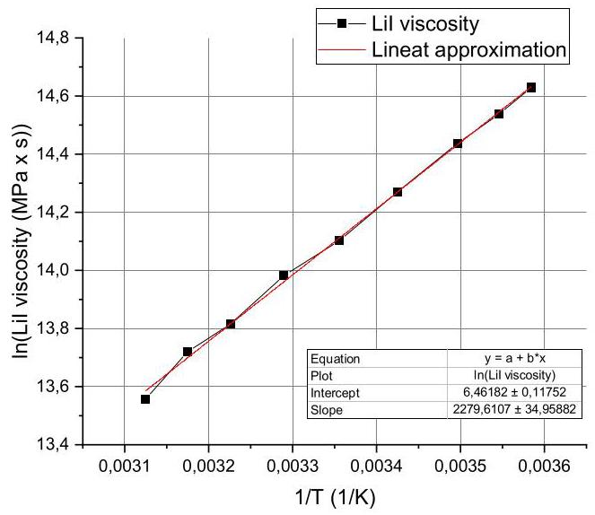

Fig. 18. Approximation of the LiI electrolyte viscosity coefficient.

图18. LiI电解质粘度系数的近似值。

This way, angular coefficients ${E}_{a}/k$ have been obtained using direct measurements of the electrolyte's viscosity from temperature, presented in Table 3.

通过这种方式，使用从温度直接测量电解质粘度的方法获得了斜率${E}_{a}/k$，如表3所示。

<table><tr><td colspan="2">Angular coefficients, ${E}_{a}/k\left( {{}^{0}\mathrm{\;K}}\right)$</td></tr><tr><td>KI</td><td>LiI</td></tr><tr><td>1868±34</td><td>2280±35</td></tr></table>

Table 3. Activation energies of 4-molar solutions of ${KI}$ and ${LiI}$ , found from viscosity coefficients.

表3. 从粘度系数中得出的4摩尔${KI}$和${LiI}$溶液的活化能。

When comparing Tables 1 and 3, it can be seen that the values of the energies obtained for the parameters depending on the viscosity coefficient for 4-molar solutions of ${KI}$ and ${LiI}$ coincide within the limits of measurement error. Therefore, the proposed theoretical model (6) has been fully confirmed.

比较表1和表3时，可以看出，对于4摩尔${KI}$和${LiI}$溶液中取决于粘度系数的参数所获得的能量值在测量误差范围内一致。因此，所提出的理论模型(6)得到了充分证实。

The results of this study are in good agreement with the latest results of studies of the transfer characteristics of molecular electronic meters at elevated temperatures and pressures [28].

本研究结果与高温高压下分子电子仪表传输特性研究的最新结果[28]非常吻合。

## CONCLUSION

## 结论

According to the results of this work, temperature dependence of the MET transducer amplitude-frequency characteristic can be described by a well-known explicit analytical dependence containing simple power and exponential functions, which opens up the possibility of direct and precise circuit thermal compensation of final products based on molecular electronics principles.

根据本研究结果，MET传感器幅频特性的温度依赖性可以用一个包含简单幂函数和指数函数的著名显式解析关系式来描述，这为基于分子电子学原理的最终产品进行直接而精确的电路热补偿开辟了可能性。

## REFERENCES

## 参考文献

[1] C.-H. Lin, C.-P. Lin, Y.-C. Hung, C.-C. Chung, P.-L. Wu, H.-C. Liu,"Application of geophysical methods in a dam project: Life cycle perspective and Taiwan experience," J. of Applied Geophysics, vol.

"地球物理方法在大坝工程中的应用:生命周期视角与台湾经验," 《应用地球物理学杂志》, 卷158, Nov. 2018, pp. 82-92. [Online]. Available:doi.org/10.1016/j.jappgeo.2018.07.012

doi.org/10.1016/j.jappgeo.2018.07.012

[2] Xu, R., Guo, H. & Liang, L. Photonic Sens 7, 246, 2017. [Online].Available: https://doi.org/10.1007/s13320-017-0408-2

可获取: https://doi.org/10.1007/s13320-017-0408-2

[3] Y.H. Kim, T.-S. Kang, J. Rhie, "Development and application of areal-Time warning system based on a MEMS seismic network and response procedure for the day of the national college entrance examination in South Korea," J. Seismological Research Letters, vol.

基于MEMS地震网络的韩国高考当天实时预警系统及响应程序," 《地震研究通讯》, 卷88 (5), 2017, pp. 1322-1326. [Online]. Available:doi.org/10.1785/0220160208

doi.org/10.1785/0220160208

[4] C.W. Larcam, "Theoretical analysis of the solution solion polarized cathode acoustic linear transducer," J. Acoust. Soc. Am., no. 37, 1965,pp. 664- 678.

[5] A.S. Bugaev, A.N. Antonov, V.M. Agafonov, "Measuring DevicesBased on Molecular-Electronic Transducers", J. Commun. Technol.

基于分子电子传感器", 《通信技术杂志》Electron, no. 63, 1339, 2018. [Online]. Available:doi.org/10.1134/S1064226918110025E

doi.org/10.1134/S1064226918110025E

[6] H. Huang, B. Carande, R. Tang, J. Oiler, D. Zaitsev, V. Agafonov,Y. Hongyu "A micro seismometer based on molecular electronic transducer technology for planetary exploration," Appl. Phys. Lett.

洪宇 "用于行星探测的基于分子电子传感器技术的微地震仪," 《应用物理快报》102, 193512, 2013. [Online]. Available: doi.org/10.1063/1.4806983

[7] A. Antonov, A. Shabalina, A. Razin, S. Avdyukhina, I. Egorov, V.Agafonov, "Low-Frequency Seismic Node Based on Molecular-Electronic Transfer Sensors for Marine and Transition Zone

阿加福诺夫, "基于分子电子转移传感器的海洋和过渡带低频地震节点Exploration," J. Atmos. Oceanic Technol, no. 34, 2017, pp. 1743- 1748. [Online]. Available: doi.org/10.1175/ JTECH-D-16-0254.1

[8] N. Kapustian, G. Antonovskaya, V. Agafonov, K. Neumoin, M.Safonov, "Seismic Monitoring of Linear and Rotational Oscillations of the Multistory Buildings in Moscow". In: Lavan O., De Stefano M. (eds) Seismic Behaviour and Design of Irregular and Complex Civil Structures. Geotechnical, Geological and Earthquake

萨福诺夫, "莫斯科多层建筑线性和旋转振动的地震监测". 载于: 拉万 O., 德斯特凡诺 M. (编) 《不规则和复杂土木结构的地震行为与设计》. 岩土、地质与地震Engineering, vol 24, 2013, pp. 353-365.

[9] D.L. Zaitsev, V.M. Agafonov, E.V. Egorov, A.N. Antonov, V.G.Krishtop, "Precession azimuth sensing with low noise molecular

克里斯托普, "低噪声分子进动方位传感electronics angular sensors," J. Sensors, no. 6148019, 2016. [Online].Available: doi.org/10.1155/2016/6148019

可获取: doi.org/10.1155/2016/6148019

[10] D.L. Zaitsev, V.M. Agafonov, I.A. Evseev, "Study of SystemsError Compensation Methods Based on Molecular-Electronic

基于分子电子学的误差补偿方法Transducers of Motion Parameters," J. of Sensors, vol. 2018.[Online]. Available: doi.org/10.1155/2018/6261384

[在线]。可获取:doi.org/10.1155/2018/6261384

[11] V.M. Agafonov, S.Yu. Avdyukhina, A.S. Bugaev, E.V.Egorov, D.L. Zaitsev, "A Molecular-Electronic Hydrophone for Low-Frequency Research of Ambient Noise in the World Ocean," J.

叶戈罗夫，D.L. 扎伊采夫，“用于世界海洋环境噪声低频研究的分子电子水听器”，J.Doklady Earth Sciences, 2018, vol. 483, no. 6. part 2, pp.1579-1581.[Online]. Available: doi.org/10.1134/ S1028334X1812022X

[在线]。可获取:doi.org/10.1134/ S1028334X1812022X

[12] D.L. Zaitsev, S.Y. Avdyukhina, M.A. Ryzhkov, I. Evseev,E.V. Egorov, V.M. Agafonov, "Frequency response and self-noise of

E.V. 叶戈罗夫，V.M. 阿加福诺夫，“……的频率响应和自噪声”the MET hydrophone", J. Sens. Sens. Syst., 7, 2018, pp. 443-452.[Online]. Available: doi.org/10.5194/jsss-7-443-2018

[在线]。可获取:doi.org/10.5194/jsss-7-443-2018

[13] D.L. Zaitsev, E.V. Egorov, A.S. Shabalina, "High resolutionminiature MET sensors for healthcare and sport

用于医疗保健和运动的微型MET传感器applications," presented at the 2018 20th Int. Conference on Sensing Technology (ICST 2018), Limerick, Ireland, 4-6 Dec. 2018, pp. 287-292.

[14] H. Huang, V.M. Agafonov, H. Yu, "Molecular electrictransducers as motion sensors: A review," J. Sensors, vol. 13, no. 4, pp. 4581-4597, 2013.

作为运动传感器的换能器:综述”，《传感器杂志》，第13卷，第4期，第4581 - 4597页，2013年。

[15] V.G. Krishtop, "Experimental Modeling of the TemperatureDependence of the Transfer Function of Rotational Motion Sensors Based on Electrochemical Transducers," Russian J. of

基于电化学换能器的旋转运动传感器传递函数的依赖性”，《俄罗斯……杂志》Electrochemistry, vol. 50, issue 4, 2014, pp. 350-354.

[16] D.L. Zaitsev, P.V. Dudkin, T.V. Krishtop, A.V. Neeshpapa,V.G. Popov, V.V. Uskov, V.G. Krishtop, "Experimental studies of temperature dependence of transfer function of molecular electronic transducers at high frequencies," IEEE Sensors J., vol. 16, no. 22,

V.G. 波波夫, V.V. 乌斯科夫, V.G. 克里斯托普，“高频下分子电子换能器传递函数温度依赖性的实验研究”，《IEEE传感器杂志》，第16卷，第22期，Nov. 15, 2016, pp. 7864-7869. [Online]. Available:doi.org/10.1109/JSEN.2016.2606517

doi.org/10.1109/JSEN.2016.2606517

[17] V.M. Agafonov, V.G. Krishtop, "Diffusion Sensor ofMechanical Signals: Frequency Response at High Frequencies,"

机械信号:高频下的频率响应”Russian J. of Electrochemistry, vol. 40, no. 5, 2004, pp. 537-541.

[18] "R-sensors" LLC. [Online]. Available: r-sensors.ru/en

[19] M. Ahmadian and K. Jafari, "A Graphene-Based Wide-BandMEMS Accelerometer Sensor Dependent on Wavelength

依赖于波长的MEMS加速度计传感器Modulation," in IEEE Sensors Journal, 2019.[Online]. Available: doi.org/10.1109/JSEN.2019.2908881

[在线]。可获取:doi.org/10.1109/JSEN.2019.2908881

[20] M. Ahmadian, K. Jafari, M.J. Sharifi, "Novel graphene-basedoptical MEMS accelerometer dependent on intensity modulation,"

依赖于强度调制的光学MEMS加速度计”ETRI Journal, 40 (6), 2018, pp. 794-801. [Online]. Available:doi.org/10.4218/etrij.2017-0309

doi.org/10.4218/etrij.2017-0309

[21] V.M. Agafonov, E.V. Egorov, A.S. Bugaev, "Application ofthe convective diffusion equation with potential-dependent boundary conditions to the charge transfer problem in four-electrode electrochemical cell on the condition of small hydrodynamic

在小流体动力学条件下，将具有电位相关边界条件的对流扩散方程应用于四电极电化学电池中的电荷转移问题velocity," Int. J. of Electrochemical Science, vol. 11, issue 2, 2016,pp. 359-373

[22] V. Agafonov, A. Shabalina, D. Ma, V. Krishtop, "Modelingand experimental study of convective noise in electrochemical planar sensitive element of MET motion sensor", Sensors and Actuators A:

“MET运动传感器电化学平面敏感元件中对流噪声的实验研究”，《传感器与执行器A》Physical, Volume 293, 2019, Pages 259-268. [Online]. Available:doi.org/10.1016/j.sna.2019.04.030

doi.org/10.1016/j.sna.2019.04.030

[23] I.V. Egorov, A.S. Shabalina, V.M. Agafonov, "Design andSelf-Noise of MET Closed-Loop Seismic Accelerometers, IEEE

MET闭环地震加速度计的自噪声，IEEESensors J., vol. 17, no. 7, 2017. [Online]. Available:doi.org/10.1109/JSEN.2017.2662207

doi.org/10.1109/JSEN.2017.2662207

[24] V.A. Kozlov, D.A. Terentyev, "Transfer Function of aDiffusion Transducer at Frequencies Exceeding the Thermodynamic

频率超过热力学范围时的扩散换能器Frequency," Russian J. of Electrochemistry, vol. 39, no. 4, 2003, pp.401-406.

[25] V.A. Kozlov, K.A. Sakharov, "Self noises of molecular-electronic transducers of diffusion type," in Physical bases of liquid and solid-state measuring systems and information processing

“扩散型电子换能器”，载于《液体和固态测量系统及信息处理的物理基础》devices, Moscow: MIPT, 1994, pp. 43-49.

[26] V.A. Kozlov, D.A. Terentyev, "Investigation of frequencycharacteristics of a spatially bounded electrochemical cell under conditions of convective diffusion," J. Electro-chemistry, vol. 38, 2002, pp. 1104-1112.

“对流扩散条件下空间受限电化学池的特性”，《电化学杂志》，第38卷，2002年，第1104 - 1112页。

[27] Y.I. Frenkel, Kinetic theory of liquids, Leningrad: Science, 1975.

[27] Y.I. 弗伦克尔，《液体动力学理论》，列宁格勒:科学出版社，1975年。

[28] I. Evseev, D. Zaitsev, V. Agafonov, "Study of Transfer Characteristics of a Molecular Electronic Sensor for Borehole Surveys at High Temperatures and Pressures," Sensors, 19, 2545, 2019. [Online]. Available: https://doi.org/10.3390/s19112545

[28] I. 叶夫谢耶夫、D. 扎伊采夫、V. 阿加福诺夫，“高温高压下用于钻孔测量的分子电子传感器传输特性研究”，《传感器》，第19卷，第2545期，2019年。[在线]。可获取:https://doi.org/10.3390/s19112545

Dmitry A. Chikishev was born in Ulyanovsk, Russia, in 1996. He received the B.S. degree in applied mathematics and physics from the Department of Physical and Quantum Electronics, Moscow Institute of Physics and Technology (MIPT) in 2017. He has been a Research Assistant with the Center for Molecular Electronics of MIPT from 2016 to 2019. Since 2018 Dmitry has been an Engineer at Scientific and Technological Center of Marine Geophysics, MIPT.

德米特里·A. 奇基舍夫1996年出生于俄罗斯乌里扬诺夫斯克。2017年，他从莫斯科物理技术学院(MIPT)物理与量子电子学系获得应用数学与物理学学士学位。2016年至2019年，他在MIPT分子电子学中心担任研究助理。自2018年起，德米特里一直是MIPT海洋地球物理科学技术中心的工程师。

He won grant at competition UMNIK 2017 from Foundation for Assistance to Small Innovative Enterprises (FASIE). His research interests include electronics, electrochemistry, hydrodynamics, applied physics, seismology and signal analysis.

他在2017年的UMNIK竞赛中获得了小型创新企业援助基金会(FASIE)的资助。他的研究兴趣包括电子学、电化学、流体动力学、应用物理学、地震学和信号分析。

Dmitry L. Zaitsev received the B.S. and M.S. degrees in applied mathematics and physics from the Moscow Institute of Physics and Technology (MIPT), Moscow, in 2005, and the Ph.D. degree in physical electronics from MIPT in 2009.

德米特里·L. 扎伊采夫于2005年从莫斯科物理技术学院(MIPT)获得应用数学与物理学学士和硕士学位，并于2009年从MIPT获得物理电子学博士学位。

From 2003 to 2009, he was a Research Assistant with the Center for Molecular Electronics of MIPT. Since 2009, he has been a Senior Researcher with the Center for Molecular Electronics, MIPT. Since 2013, he has been the Deputy Dean of the Department of Problems of Physics and Energetics, MIPT. He has authored over 20 articles, and holds seven patents. His research interests include electronics, hydrodynamics, electrochemistry, applied physics, seismology, and signal analysis. Mr. Zaitsev was a recipient of the Gold Medal for the young scientists of the Russian Academy of Science in 2009, and the Russian President's.

2003年至2009年，他在MIPT分子电子学中心担任研究助理。自2009年起，他一直是MIPT分子电子学中心的高级研究员。自2013年起，他一直担任MIPT物理与能量问题系副主任。他撰写了20多篇文章，并拥有7项专利。他的研究兴趣包括电子学、流体动力学、电化学、应用物理学、地震学和信号分析。扎伊采夫先生在2009年获得了俄罗斯科学院青年科学家金奖以及俄罗斯总统奖。

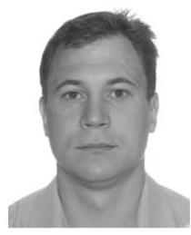

Ivan V. Egorov was born in Saratov, Russia, in 1983. He received the B.S. and M.S. degrees in physical engineering from the Department of Physical and Quantum Electronics, Moscow Institute of Physics and Technology, in 2006. He has been a Research Engineer with the Center for Molecular Electronics, Moscow Institute of Physics and Technology, since 2004. He is the author of eight articles. His research interests include seismic sensors development, influence of electrochemical cell parameters on noise, and nonlinear charactцеristics of electrochemical cell at extreme external parameters: input signal, temperature.

伊万·V. 叶戈罗夫1983年出生于俄罗斯萨拉托夫。2006年，他从莫斯科物理技术学院物理与量子电子学系获得物理工程学士和硕士学位。自2004年起，他一直是莫斯科物理技术学院分子电子学中心的研究工程师。他是8篇文章的作者。他的研究兴趣包括地震传感器开发、电化学池参数对噪声的影响以及极端外部参数(输入信号、温度)下电化学池的非线性特性。

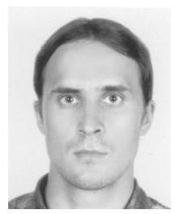

Konstantin S. Belotelov received the B.S. and M.S. degrees in applied mathematics and physics from the Moscow Institute of Physics and Technology (MIPT), Moscow, in 2009 and 2011 respectively. In 2018 graduated in data analysis from the St. Petersburg Academic University and Bioinformatics Institute.

康斯坦丁·S. 别洛捷洛夫分别于2009年和2011年从莫斯科物理技术学院(MIPT)获得应用数学与物理学学士和硕士学位。2018年，他毕业于圣彼得堡学术大学和生物信息学研究所的数据分析专业。

From 2009 to 2016, he was a Research Assistant with the Center for Molecular Electronics of MIPT. From 2013 till 2018, he is an engineer at LLC «R-sensors». His research interest includes electronics, electrochemistry, signal analysis.

2009年至2016年，他在MIPT分子电子学中心担任研究助理。2013年至2018年，他是LLC “R - 传感器” 的工程师。他の研究兴趣包括电子学､电化学､信号分析。(原文此处“His research interest”表述有误，应为“His research interests”，译文已修正)