# ConTSG-Bench: A Unified Benchmark for Conditional Time Series Generation

# ConTSG-Bench:用于条件时间序列生成的统一基准测试

Shaocheng Lan ${}^{1}$ Shuqi Gu ${}^{1}$ Zhangzhi Xiong ${}^{1}$ Kan Ren ${}^{1}$

兰少成 ${}^{1}$ 顾书旗 ${}^{1}$ 熊章志 ${}^{1}$ 任侃 ${}^{1}$

## Abstract

## 摘要

Conditional time series generation plays a critical role in addressing data scarcity and enabling causal analysis in real-world applications. Despite its increasing importance, the field lacks a standardized and systematic benchmarking framework for evaluating generative models across diverse conditions. To address this gap, we introduce the Conditional Time Series Generation Benchmark (ConTSG-Bench). ConTSG-Bench comprises a large-scale, well-aligned dataset spanning diverse conditioning modalities and levels of semantic abstraction, first enabling systematic evaluation of representative generation methods across these dimensions with a comprehensive suite of metrics for generation fidelity and condition adherence. Both the quantitative benchmarking and in-depth analyses of conditional generation behaviors have revealed the traits and limitations of the current approaches, highlighting critical challenges and promising research directions, particularly with respect to precise structural controllability and downstream task utility under complex conditions. We have open-sourced ConTSG-Bench at Github.

条件时间序列生成在解决数据稀缺问题以及实现现实世界应用中的因果分析方面发挥着关键作用。尽管其重要性日益凸显，但该领域缺乏一个标准化且系统的基准测试框架，用于评估不同条件下的生成模型。为填补这一空白，我们引入了条件时间序列生成基准测试(ConTSG-Bench)。ConTSG-Bench包含一个大规模、精心对齐的数据集，涵盖各种条件模态和语义抽象级别，首次能够通过一套全面的生成保真度和条件遵循度量标准，在这些维度上对代表性生成方法进行系统评估。定量基准测试和对条件生成行为的深入分析都揭示了当前方法的特点和局限性，突出了关键挑战和有前景的研究方向，特别是在复杂条件下的精确结构可控性和下游任务实用性方面。我们已在Github上开源了ConTSG-Bench。

## 1. Introduction

## 1. 引言

Conditional time series generation (ConTSG) has emerged as a transformative capability for scientific and industrial advancement. Its application spans from realistic data simulation for healthcare and climate applications (Lai et al., 2025b; Lu et al., 2024; Narasimhan et al., 2024), causal inference (Xia et al., 2025), to privacy-preserving data synthesis (Liu et al., 2025). While unconditional generation has seen significant progress (Pei et al., 2021; Desai et al., 2021; Jeon et al., 2022) with established benchmarks for fidelity and diversity (Ang et al., 2023), the research frontier has shifted toward controllable synthesis: the ability to generate high-fidelity time series data that strictly adheres to user-defined, multimodal conditions.

条件时间序列生成(ConTSG)已成为科学和工业进步的变革性能力。其应用范围从医疗保健和气候应用的现实数据模拟(赖等人，2025b；陆等人，2024；纳拉辛汉等人，2024)、因果推断(夏等人，2025)到隐私保护数据合成(刘等人，2025)。虽然无条件生成在保真度和多样性的既定基准测试方面取得了显著进展(裴等人，2021；德赛等人，2021；全等人，2022)(安等人，2023)，但研究前沿已转向可控合成:即生成严格遵循用户定义的多模态条件的高保真时间序列数据的能力。

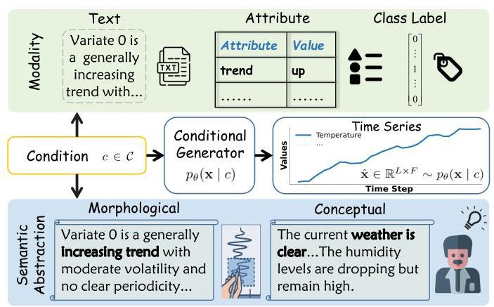

Figure 1. Conditional time series generation with varying conditioning modalities (text, attribute, class label) and semantic abstraction levels (morphological vs. conceptual).

图1. 具有不同条件模态(文本、属性、类别标签)和语义抽象级别(形态学与概念)的条件时间序列生成。

However, the landscape of ConTSG remains highly fragmented, hindering algorithmic innovation and practically effective model development. Current methodologies are isolated by their specific conditioning modalities: some rely on discrete class labels (Lee et al., 2023), others on structured attributes (Narasimhan et al., 2024), and recent works have begun exploring natural language descriptions (Gu et al., 2025). These models are typically evaluated on incompatible datasets with different condition modalities, making it infeasible to systematically compare conditional generation effectiveness or relative model performance.

然而，ConTSG的格局仍然高度分散，阻碍了算法创新和实际有效的模型开发。当前方法因其特定的条件模态而相互孤立:一些依赖离散类别标签(李等人，2023)，另一些依赖结构化属性(纳拉辛汉等人，2024)；最近的工作开始探索自然语言描述(顾等人，2025)。这些模型通常在具有不同条件模态的不兼容数据集上进行评估，使得系统比较条件生成有效性或相对模型性能变得不可行。

Furthermore, evaluations in prior works overlook critical capabilities required for robust real-world deployment of Con-TSG models. The primary dimension involves the semantic abstraction of conditions (Figure 1): while some methods specify target morphology directly (Dohi et al., 2025) (e.g., specify volatility and periodicity), others describe high-level concepts (Wagner et al., 2020) (e.g., weather conditions). The latter requires models to autonomously infer corresponding temporal patterns from abstract semantics, which is significantly more challenging. Beyond semantic abstraction level, practical simulation demands fine-grained controllability to execute precise local constraints, which is often obscured by aggregate global metrics (Williams et al., 2025). Finally, true robustness necessitates compositional generalization, ensuring models can synthesize time series underlying novel conditions, e.g., attribute combinations that are absent from the training distribution (Jing et al., 2024). As current evaluations typically isolate these factors under single-modality settings, the resulting performance landscape of ConTSG models remains incomplete.

此外，先前工作中的评估忽略了Con-TSG模型在稳健的现实世界部署中所需的关键能力。主要维度涉及条件的语义抽象(图1):虽然一些方法直接指定目标形态(多希等人，2025)(例如，指定波动率和周期性)，但其他方法描述高级概念(瓦格纳等人，2020)(例如，天气条件)。后者要求模型从抽象语义中自主推断相应的时间模式，这具有显著更高的挑战性。除了语义抽象级别，实际模拟需要细粒度的可控性来执行精确的局部约束，而这往往被总体全局度量标准所掩盖(威廉姆斯等人，2025)。最后，真正的稳健性需要组合泛化，确保模型能够合成训练分布中不存在的新条件下的时间序列，例如属性组合(景等人，2024)。由于当前评估通常在单模态设置下孤立这些因素，ConTSG模型的最终性能格局仍然不完整。

---

${}^{1}$ School of Information Science and Technology, ShanghaiTech University, Shanghai, China. Correspondence to: Kan Ren <renkan@shanghaitech.edu.cn>.

${}^{1}$ 中国上海上海科技大学信息科学与技术学院。通信作者:任侃 <renkan@shanghaitech.edu.cn>。

Preprint. March 6, 2026.

预印本。2026年3月6日。

---

To resolve these critical gaps, we introduce ConTSG-Bench, a unified evaluation benchmark for conditional time series generation. Our benchmark is the first to systematically disentangle condition types along two axes (Figure 1): modality (class label, attribute, text) and semantic abstraction level (morphology, concept). We curate a series of large-scale datasets featuring aligned conditions across all three modalities, including dual-level annotations for selected subsets to enable controlled cross-abstraction comparisons. Furthermore, ConTSG-Bench provides a unified evaluation suite that jointly assesses fidelity, condition adherence, fine-grained control, compositional generalization and downstream utility, allowing model behaviors to be characterized along multiple practically relevant dimensions.

为了解决这些关键差距，我们引入了ConTSG-Bench，这是一个用于条件时间序列生成的统一评估基准。我们的基准是第一个沿着两个轴系统地分解条件类型的(图1):模态(类别标签、属性、文本)和语义抽象级别(形态学、概念)。我们策划了一系列大规模数据集，在所有三种模态中都具有对齐的条件，包括为选定子集提供的双层注释，以实现可控的跨抽象比较。此外，ConTSG-Bench提供了一个统一的评估套件，联合评估保真度、条件遵循、细粒度控制、组合泛化和下游实用性，允许沿着多个实际相关维度对模型行为进行表征。

Leveraging this framework, we conduct a rigorous evaluation of representative models, yielding several pivotal insights. For instance, we observe that text-conditioned models achieve the highest performance ceiling yet exhibit significant variance across architectures. Notably, current generators universally struggle with precise fine-grained control and compositional generalization, suggesting that existing methods may lack the structural inductive biases or algorithmic innovation necessary for complex real-world synthesis.

利用这个框架，我们对代表性模型进行了严格评估，得出了几个关键见解。例如，我们观察到文本条件模型实现了最高的性能上限，但在不同架构之间表现出显著差异。值得注意的是，当前的生成器普遍难以实现精确的细粒度控制和组合泛化，这表明现有方法可能缺乏复杂现实世界合成所需的结构归纳偏差或算法创新。

In summary, our contributions are summarized as follows:

总之，我们的贡献总结如下:

- A Unified Benchmarking Framework: We establish the first systematic evaluation protocol for conditional time series generation, covering diverse condition types and multi-faceted metrics for fidelity and condition adherence.

- 统一基准框架:我们建立了第一个用于条件时间序列生成的系统评估协议，涵盖了不同的条件类型以及用于保真度和条件遵循的多方面指标。

- Multimodal Aligned Datasets: We construct large-scale datasets with aligned multimodal conditions and varied semantic abstraction levels, specifically designed to address the scarcity of aligned data and enable rigorous cross-modality benchmarking.

- 多模态对齐数据集:我们构建了具有对齐多模态条件和不同语义抽象级别的大规模数据集，专门用于解决对齐数据的稀缺问题，并实现严格的跨模态基准测试。

- Systematic Evaluation and Analysis: We provide an in-depth characterization of state-of-the-art models, uncovering critical bottlenecks, which may shed some light on future research in conditional time series generation. To facilitate reproducibility and future research, we will publicly release all code, datasets, and evaluation pipelines.

- 系统评估与分析:我们对当前最先进的模型进行了深入刻画，发现了关键瓶颈，这可能为条件时间序列生成的未来研究提供一些启示。为便于重现和未来研究，我们将公开发布所有代码、数据集和评估管道。

## 2. Related Works

## 2. 相关工作

Time Series Generation Early work on time series generation mainly focuses on unconditional synthesis, where the goal is to model the marginal distribution of a sequence without explicit control signals. Representative approaches include Generative Adversarial Network (GAN) (Goodfellow et al., 2020) and Variational Autoencoders (VAE) (Kingma & Welling, 2019) based models such as TimeGAN (Pei et al., 2021), TimeVAE (Desai et al., 2021), and GT-GAN (Jeon et al., 2022), used for tasks like data augmentation and privacy preservation. These methods establish the basic toolkit for time series synthesis but lack mechanisms for fine-grained control over the generated trajectories.

时间序列生成 早期关于时间序列生成的工作主要集中在无条件合成上，其目标是在没有明确控制信号的情况下对序列的边际分布进行建模。代表性方法包括基于生成对抗网络(GAN)(Goodfellow等人，2020)和变分自编码器(VAE)(Kingma和Welling，2019)的模型，如用于数据增强和隐私保护等任务的TimeGAN(Pei等人，2021)、TimeVAE(Desai等人，2021)和GT - GAN(Jeon等人，2022)。这些方法建立了时间序列合成的基本工具包，但缺乏对生成轨迹进行细粒度控制的机制。

More recently, the field has shifted towards conditional time series generation, where models are guided by auxiliary information. Label-based approaches use discrete class labels within conditional Generative Adversarial Networks (GAN) (Goodfellow et al., 2020) or Variational Auto-Encoder (VAE) (Kingma & Welling, 2019) frameworks. TTS-CGAN (Li et al., 2022) employs a Transformer-based conditional GAN with auxiliary classification, while TimeVQVAE (Lee et al., 2023) learns discrete latent codes with label-aware priors to improve fidelity.

最近，该领域已转向条件时间序列生成，其中模型由辅助信息引导。基于标签的方法在条件生成对抗网络(GAN)(Goodfellow等人，2020)或变分自编码器(VAE)(Kingma和Welling, 2019)框架内使用离散类标签。TTS - CGAN(Li等人，2022)采用基于Transformer的带辅助分类的条件GAN，而TimeVQVAE(Lee等人，2023)学习具有标签感知先验的离散潜在代码以提高保真度。

Beyond labels, attribute-conditioned models condition on low-dimensional metadata, including categorical and continuous covariates. TimeWeaver (Narasimhan et al., 2024) leverages attention-based diffusion with heterogeneous metadata; WaveStitch (Shankar et al., 2025) employs state-space-based diffusion for tabular series with hierarchical attributes; TEdit (Jing et al., 2024) uses multi-scale patch diffusion for attribute-guided editing.

除了标签之外，属性条件模型以低维元数据为条件，包括分类和连续协变量。TimeWeaver(Narasimhan等人，2024)利用基于注意力的扩散与异构元数据；WaveStitch(Shankar等人，2025)对具有分层属性的表格序列采用基于状态空间的扩散；TEdit(Jing等人，2024)使用多尺度补丁扩散进行属性引导编辑。

Recently, a complementary line of work explores text-conditioned time series generation, using natural language as the conditioning modality. Several concurrent methods study general text-to-time-series generation with diffusion-based (Ho et al., 2020) or Transformer-based (Vaswani et al., 2017) architectures. BRIDGE (Li et al., 2025) and Ver-balTS (Gu et al., 2025) propose domain-agnostic diffusion-based generators that couple text encoders with time-series backbones, with VerbalTS further introducing multi-view noise estimation and multi-focal text processing to enhance semantic alignment. T2S (Ge et al., 2025) combines flow matching with a diffusion transformer (DiT) backbone for prompt-based series generation, while Text2Motion (Guo et al., 2022) employs a latent-space autoregressive VAE originally designed for motion synthesis. DiffuSETS (Lai et al., 2025a) instead targets the medical domain, conditioning 12-lead ECG synthesis on clinical reports and patient information. Overall, conditional time series generation is moving from low-dimensional structured conditions toward flexible natural language prompts, but each method is evaluated on its own datasets, condition formats, and metrics.

最近，一项补充性的工作探索了文本条件时间序列生成，使用自然语言作为条件模态。几种并行方法研究了基于扩散(Ho等人，2020)或基于Transformer(Vaswani等人，2017)架构的通用文本到时间序列生成。BRIDGE(Li等人，2025)和Ver - balTS(Gu等人，2025)提出了基于域无关扩散的生成器，将文本编码器与时间序列主干相结合，VerbalTS进一步引入多视图噪声估计和多焦点文本处理以增强语义对齐。T2S(Ge等人，2025)将流匹配与扩散Transformer(DiT)主干相结合用于基于提示的序列生成，而Text2Motion(Guo等人，2022)采用最初为运动合成设计的潜在空间自回归VAE。DiffuSETS(Lai等人，2025a)则针对医学领域，根据临床报告和患者信息对12导联心电图合成进行条件设定。总体而言，条件时间序列生成正从低维结构化条件转向灵活的自然语言提示，但每种方法都在其自己的数据集、条件格式和指标上进行评估。

Time Series Benchmark Standardized benchmarking serves as a critical foundation for advancing time series research. Within this landscape, evaluation frameworks for forecasting are comparatively mature. TSLib (Wang et al., 2024), ProbTS (Zhang et al., 2024b) and GIFT-Eval (Aksu et al., 2024) provide unified codebases, large collections of datasets, and standardized pipelines for evaluating deep and foundation models across diverse forecasting settings. These efforts, however, primarily target predictive accuracy and uncertainty quantification rather than generative modeling under rich conditioning modalities.

时间序列基准 标准化基准测试是推进时间序列研究的关键基础。在这一领域中，预测的评估框架相对成熟。TSLib(Wang等人，2024)、ProbTS(Zhang等人，2024b)和GIFT - Eval(Aksu等人，2024)提供了统一的代码库、大量数据集以及用于评估各种预测设置下的深度和基础模型的标准化管道。然而，这些工作主要针对预测准确性和不确定性量化，而非丰富条件模态下的生成建模。

Regarding time series generation, TSGBench (Ang et al., 2023) is the pioneering benchmark that standardizes the evaluation of unconditional models. While it incorporates limited experiments on weakly conditioned settings (e.g., discrete class labels), it does not provide a systematic evaluation framework for controllable generation. Crucially, it fails to cover heterogeneous conditioning modalities, such as structured attributes and natural language text, and lacks metrics designed to verify the condition adherence between complex conditions and generated time series.

关于时间序列生成，TSGBench(Ang等人，2023年)是开创性的基准测试，它规范了无条件模型的评估。虽然它纳入了对弱条件设置(例如离散类标签)的有限实验，但它没有为可控生成提供系统的评估框架。至关重要的是，它未能涵盖异构条件模态，如结构化属性和自然语言文本，并且缺乏用于验证复杂条件与生成的时间序列之间条件一致性的指标。

Our work is complementary to these benchmarks and focuses specifically on conditional time series generation. By establishing aligned conditions across modalities and semantic levels, ConTSG-Bench enables systematic cross-method comparison and reveals failure modes that remain invisible under existing protocols. Table 1 summarizes the key differences across conditioning modalities and evaluation dimensions.

我们的工作是对这些基准测试的补充，特别关注条件时间序列生成。通过在模态和语义层面建立对齐的条件，ConTSG - Bench能够进行系统的跨方法比较，并揭示在现有协议下仍不可见的失败模式。表1总结了跨条件模态和评估维度的关键差异。

## 3. ConTSG-Bench Framework

## 3. ConTSG - Bench框架

This section formalizes the conditional generation task, outlines our research questions, and describes the dataset construction and evaluation pipeline.

本节形式化了条件生成任务，概述了我们的研究问题，并描述了数据集构建和评估流程。

### 3.1. Task: Conditional Time Series Generation

### 3.1. 任务:条件时间序列生成

We study conditional time series generation, where the goal is to synthesize realistic time series that both match the real-data distribution and adhere to a user-specified condition. Let $\mathbf{x} \in  {\mathbb{R}}^{L \times  F}$ denote a time series of length $L$ with $F$ variables. Condition is denoted by $c \in  \mathcal{C}$ , where $\mathcal{C}$ may take different modalities, including (i) discrete class label ${c}^{\text{ label }}$ ,(ii) structured attribute vector ${c}^{\text{ attr }}$ with heterogeneous categorical fields, and (iii) natural-language description ${c}^{\text{ text }}$ .

我们研究条件时间序列生成，目标是合成既匹配真实数据分布又符合用户指定条件的逼真时间序列。设$\mathbf{x} \in  {\mathbb{R}}^{L \times  F}$表示长度为$L$且具有$F$个变量的时间序列。条件用$c \in  \mathcal{C}$表示，其中$\mathcal{C}$可以采用不同的模态，包括(i)离散类标签${c}^{\text{ label }}$，(ii)具有异构分类字段的结构化属性向量${c}^{\text{ attr }}$，以及(iii)自然语言描述${c}^{\text{ text }}$。

Given a dataset of aligned pairs $\mathcal{D} = {\left\{  \left( {\mathbf{x}}_{i},{c}_{i}\right) \right\}  }_{i = 1}^{N}$ sampled from an unknown real joint distribution ${p}_{r}\left( {\mathbf{x}, c}\right)$ , a conditional generator aims to learn a distribution ${p}_{\theta }\left( {\mathbf{x} \mid  c}\right)$ such that samples $\widehat{\mathbf{x}} \sim  {p}_{\theta }\left( {\mathbf{x} \mid  c}\right)$ are (1) realistic with respect to the marginal data distribution and (2) faithful to the condition. Importantly, these two objectives are orthogonal: a model may produce plausible outputs that ignore the condition, or faithfully follow the condition while generating implausible patterns. Our evaluation therefore assesses fidelity and adherence separately.

给定从未知真实联合分布${p}_{r}\left( {\mathbf{x}, c}\right)$中采样的对齐对$\mathcal{D} = {\left\{  \left( {\mathbf{x}}_{i},{c}_{i}\right) \right\}  }_{i = 1}^{N}$的数据集，条件生成器旨在学习分布${p}_{\theta }\left( {\mathbf{x} \mid  c}\right)$，使得样本$\widehat{\mathbf{x}} \sim  {p}_{\theta }\left( {\mathbf{x} \mid  c}\right)$满足:(1)相对于边际数据分布是逼真的，并且(2)忠实于条件。重要的是，这两个目标是正交的:一个模型可能产生忽略条件的合理输出，或者在生成不合理模式时忠实遵循条件。因此，我们的评估分别评估保真度和一致性。

Beyond modality, conditions also vary in semantic abstraction (Figure 1). We distinguish two levels: morphological conditions that directly specify temporal structures (e.g., trends, peaks, and their placement), and conceptual conditions that describe high-level semantics (e.g., a clinical diagnosis) and require the model to infer the corresponding temporal patterns. ConTSG-Bench systematically covers both dimensions under a unified task formulation.

除了模态之外，条件在语义抽象方面也有所不同(图1)。我们区分两个层次:直接指定时间结构(例如趋势、峰值及其位置)的形态条件，以及描述高级语义(例如临床诊断)并要求模型推断相应时间模式的概念条件。ConTSG - Bench在统一的任务表述下系统地涵盖了这两个维度。

### 3.2. Evaluation Dimensions

### 3.2. 评估维度

ConTSG-Bench is designed not only to rank models, but also to stress-test the key capabilities that conditional time series generators are expected to have in practice: producing realistic data, following conditions, handling different kinds of conditions, and being useful for downstream tasks. To make these desiderata explicit, we organize our study around five research questions.

ConTSG - Bench不仅旨在对模型进行排名，还旨在对条件时间序列生成器在实践中预期具备的关键能力进行压力测试:生成逼真的数据、遵循条件、处理不同类型的条件以及对下游任务有用。为了明确这些需求，我们围绕五个研究问题组织我们的研究。

Generating realistic time series and following conditions are complementary but distinct capabilities: a model may produce plausible outputs that ignore the condition, or faithfully adhere to the condition while generating implausible patterns. To disentangle these two dimensions, we first ask: RQ1 (Overall benchmarking). How do representative conditional time series generation models compare in terms of generation fidelity and condition adherence across diverse datasets and conditioning modalities?

生成逼真的时间序列和遵循条件是互补但不同的能力:一个模型可能产生忽略条件的合理输出，或者在生成不合理模式时忠实遵循条件。为了区分这两个维度，我们首先提出:RQ1(总体基准测试)。在不同的数据集和条件模态下，代表性的条件时间序列生成模型在生成保真度和条件一致性方面如何比较？

Beyond overall performance, models may behave very differently depending on the semantic abstraction of conditions. For instance, in ECG generation, a condition can describe observable waveform morphology ("irregular R-R intervals and absent P-waves") or a high-level clinical concept ("atrial fibrillation"). Both refer to the same underlying pattern, yet the latter requires the model to infer temporal structures from abstract domain semantics. Since conceptual conditions require expert annotation while morphological descriptions are domain-agnostic and lower-cost, understanding model sensitivity to this distinction has practical value. This motivates RQ2 (Semantic abstraction): How sensitive are models to the semantic type of conditions, specifically morphological versus conceptual descriptions, when the underlying time series is fixed?

除了总体性能之外，模型的行为可能会因条件的语义抽象而有很大不同。例如，在心电图生成中，一个条件可以描述可观察到的波形形态(“不规则的R - R间期和无P波”)或高级临床概念(“心房颤动”)。两者都指的是相同的潜在模式，但后者要求模型从抽象领域语义中推断时间结构。由于概念条件需要专家注释，而形态描述与领域无关且成本较低，了解模型对这种区别的敏感性具有实际价值。这激发了RQ2(语义抽象):当基础时间序列固定时，模型对条件的语义类型，特别是形态描述与概念描述的敏感性如何？

Practical applications often require precise control over local temporal patterns. For instance, in network monitoring, a user may specify "signal drops in the middle segment, then recovers in the final quarter". RQ3 (Fine-grained control) probes: To what extent can models follow such fine-grained local specifications, and what are the dominant failure modes?

实际应用通常需要对局部时间模式进行精确控制。例如，在网络监控中，用户可能会指定“中间段信号下降，然后在最后一个季度恢复”。RQ3(细粒度控制)探究:模型在多大程度上能够遵循这种细粒度的局部规范，以及主要的失败模式是什么？

In practice, test-time conditions may be out-of-distribution, involving novel attribute combinations unseen during training. For example, a model may encounter "high volatility + downward trend + multiple level shifts", a combination absent in the training set. Robust models should compositionally understand each attribute rather than memorize training combinations. This raises RQ4 (Compositional generalization): Can models generalize to novel attribute combinations where multiple attribute values differ from those observed during training?

在实践中，测试时的条件可能是分布外的，涉及训练期间未见过的新颖属性组合。例如，模型可能会遇到“高波动性 + 下降趋势 + 多个水平变化”，这是训练集中不存在的组合。稳健的模型应该能够组合理解每个属性，而不是记住训练组合。这就引出了RQ4(组合泛化):模型能否推广到多个属性值与训练期间观察到的值不同的新颖属性组合？

Table 1. Comparison of conditional time series generation methods and benchmarks along three dimensions: (1) supported condition modalities, (2) semantic abstraction levels, and (3) evaluation dimensions beyond fidelity, which is universally assessed. Abbreviations: Attr = Attribute; Morph = Morphological; Adh. = Condition Adherence; Fine-gr. = Fine-grained control; Comp. Gen. = Compositional generalization; Down. Util. = Downstream utility.

表1. 条件时间序列生成方法和基准在三个维度上的比较:(1) 支持的条件模态，(2) 语义抽象级别，以及 (3) 除了普遍评估的保真度之外的评估维度。缩写:Attr = 属性；Morph = 形态学；Adh. = 条件遵守；Fine-gr. = 细粒度控制；Comp. Gen. = 组合泛化；Down. Util. = 下游效用。

<table><tr><td rowspan="2">Method</td><td colspan="3">Condition Modality</td><td colspan="2">Condition Semantic</td><td colspan="4">Evaluation Dimensions</td></tr><tr><td>Text</td><td>Attr</td><td>Label</td><td>Morph</td><td>Concept</td><td>Adh.</td><td>Fine-gr.</td><td>Comp. Gen.</td><td>Down. Util.</td></tr><tr><td colspan="10">Existing Benchmark</td></tr><tr><td>TSGBench (Ang et al., 2023)</td><td>✘</td><td>✘</td><td>✓</td><td>✘</td><td>✘</td><td>✘</td><td>✘</td><td>✘</td><td>✓</td></tr><tr><td colspan="10">Label-conditioned</td></tr><tr><td>TimeVOVAE (Lee et al., 2023)</td><td>✘</td><td>✘</td><td>✓</td><td>✘</td><td>✘</td><td>✘</td><td>✘</td><td>✘</td><td>✓</td></tr><tr><td>TTS-CGAN (Li et al., 2022)</td><td>✘</td><td>✘</td><td>✓</td><td>✘</td><td>✘</td><td>✘</td><td>✘</td><td>✘</td><td>✓</td></tr><tr><td colspan="10">Attribute-conditioned</td></tr><tr><td>TimeWeaver (Narasimhan et al., 2024)</td><td>✘</td><td>✓</td><td>✘</td><td>✘</td><td>✘</td><td>✓</td><td>✘</td><td>✘</td><td>✓</td></tr><tr><td>TEdit (Jing et al., 2024)</td><td>✘</td><td>✓</td><td>✘</td><td>✘</td><td>✘</td><td>✓</td><td>✘</td><td>✓</td><td>✘</td></tr><tr><td>WaveStitch (Shankar et al., 2025)</td><td>✘</td><td>✓</td><td>✘</td><td>✘</td><td>✘</td><td>✘</td><td>✘</td><td>✘</td><td>✘</td></tr><tr><td colspan="10">Text-conditioned</td></tr><tr><td>Text2Motion (Guo et al., 2022)</td><td>✓</td><td>✘</td><td>✘</td><td>✓</td><td>✘</td><td>✓</td><td>✘</td><td>✘</td><td>✘</td></tr><tr><td>DiffuSETS (Lai et al., 2025a)</td><td>✓</td><td>✘</td><td>✘</td><td>✘</td><td>✓</td><td>✘</td><td>✘</td><td>✘</td><td>✘</td></tr><tr><td>BRIDGE (Li et al., 2025)</td><td>✓</td><td>✘</td><td>✘</td><td>✘</td><td>✓</td><td>✓</td><td>✘</td><td>✘</td><td>✓</td></tr><tr><td>T2S (Ge et al., 2025)</td><td>✓</td><td>✘</td><td>✘</td><td>✓</td><td>✘</td><td>✓</td><td>✘</td><td>✘</td><td>✘</td></tr><tr><td>VerbalTS (Gu et al., 2025)</td><td>✓</td><td>✓</td><td>✓</td><td>✓</td><td>✘</td><td>✓</td><td>✘</td><td>✘</td><td>✘</td></tr><tr><td colspan="10">Unified Benchmark</td></tr><tr><td>ConTSG-Bench (Ours)</td><td>✓</td><td>✓</td><td>✓</td><td>✓</td><td>✓</td><td>✓</td><td>✓</td><td>✓</td><td>✓</td></tr></table>

Ultimately, generation quality is meaningful only if it translates to practical value. A key use case is data scarcity: when real labeled data is limited, can generated samples substitute for real data in training downstream classifiers? This leads to RQ5 (Practical utility): How well can generated data substitute for real data in downstream tasks?

最终，只有当生成质量转化为实际价值时才有意义。一个关键用例是数据稀缺:当真实标记数据有限时，生成的样本能否在训练下游分类器时替代真实数据？这就引出了RQ5(实际效用):生成的数据在下游任务中替代真实数据的效果如何？

Sections 4.1-4.5 present experimental results and findings for each research question.

第4.1 - 4.5节展示了每个研究问题的实验结果和发现。

### 3.3. Datasets

### 3.3. 数据集

ConTSG-Bench comprises eight datasets spanning diverse domains including healthcare, meteorology, energy, traffic, and network telemetry, covering both synthetic benchmarks with known ground-truth and real-world data with authentic temporal dynamics. Full statistics are provided in Appendix A.

ConTSG - Bench包含八个数据集，涵盖医疗保健、气象、能源、交通和网络遥测等不同领域，包括具有已知真实情况的合成基准和具有真实时间动态的真实世界数据。完整统计信息见附录A。

As discussed in Section 2, existing conditional generators operate under heterogeneous conditioning modalities: label-conditioned methods use discrete class labels, attribute-conditioned methods condition on structured metadata, and text-conditioned methods leverage natural language prompts. A key contribution of ConTSG-Bench is providing aligned conditions across all three modalities for each time series: a class label ${c}^{\text{ label }}$ , a structured attribute vector ${c}^{\text{ attr }}$ , and a textual description ${c}^{\text{ text }}$ . Since these conditions are derived from the same underlying semantics, our benchmark enables controlled cross-modality comparison that is otherwise infeasible with existing datasets.

如第2节所述，现有的条件生成器在异构条件模态下运行:标签条件方法使用离散类标签，属性条件方法基于结构化元数据进行条件设定，文本条件方法利用自然语言提示。ConTSG - Bench的一个关键贡献是为每个时间序列在所有三种模态下提供对齐的条件:一个类标签${c}^{\text{ label }}$ ，一个结构化属性向量${c}^{\text{ attr }}$ ，以及一个文本描述${c}^{\text{ text }}$ 。由于这些条件源自相同的底层语义，我们的基准使得可控的跨模态比较成为可能，而这对于现有数据集来说是不可行的。

To align these modalities, we design an LLM-based pipeline with three stages. First, we prompt an LLM to generate morphological captions ${c}^{\text{ text }}$ that describe observable temporal patterns (e.g., trend direction, periodicity, local anomalies) from time series (Appendix A.2.1). Second, we apply an iterative attribute-schema discovery procedure: the LLM proposes candidate attributes from sampled captions, merges redundant categories, and finalizes a compact schema; attribute values are then extracted from each caption to form ${c}^{\text{ attr }}$ (Appendix A.2.2). Finally, class labels ${c}^{\text{ label }}$ are obtained by indexing unique attribute combinations (Appendix A.2.3). This pipeline ensures consistency across modalities while requiring minimal manual effort.

为了对齐这些模态，我们设计了一个基于大语言模型的三阶段管道。首先，我们提示大语言模型生成形态学描述${c}^{\text{ text }}$ ，这些描述从时间序列中描述可观察到的时间模式(例如，趋势方向、周期性、局部异常)(附录A.2.1)。其次，我们应用一个迭代的属性模式发现过程:大语言模型从采样的描述中提出候选属性，合并冗余类别，并确定一个紧凑的模式；然后从每个描述中提取属性值以形成${c}^{\text{ attr }}$ (附录A.2.2)。最后，通过对唯一属性组合进行索引获得类标签${c}^{\text{ label }}$ (附录A.2.3)。这个管道确保了模态之间的一致性，同时需要最少的人工干预。

Beyond modality, we observe that existing text-conditioned datasets conflate two distinct levels of semantic abstraction. Some datasets provide morphological conditions that directly describe observable temporal structures, such as trend shapes and local patterns (Ge et al., 2025); others provide conceptual conditions that describe high-level domain semantics without revealing the waveform (Li et al., 2025); still others mix both types without explicit distinction (Feng et al., 2025). ConTSG-Bench explicitly disentangles these two levels: for PTB-XL and Weather datasets, we provide paired morphological and conceptual conditions for the same time series, enabling direct comparison of how models handle different abstraction levels (Appendix A.3).

除了模态之外，我们观察到现有的文本条件数据集混淆了两个不同层次的语义抽象。一些数据集提供直接描述可观察到的时间结构的形态学条件，如趋势形状和局部模式(Ge等人，2025)；其他数据集提供描述高级领域语义而不揭示波形的概念性条件(Li等人，2025)；还有一些数据集混合了这两种类型而没有明确区分(Feng等人，2025)。ConTSG - Bench明确区分了这两个层次:对于PTB - XL和天气数据集，我们为同一时间序列提供了配对的形态学和概念性条件，从而能够直接比较模型如何处理不同的抽象层次(附录A.3)。

This two-dimensional design, systematically covering condition modality and semantic abstraction, distinguishes ConTSG-Bench from prior work and enables more fine-grained analysis of conditional generation capabilities.

这种二维设计系统地涵盖了条件模态和语义抽象，使ConTSG - Bench与先前的工作区分开来，并能够对条件生成能力进行更细粒度的分析。

### 3.4. Evaluated Methods

### 3.4. 评估方法

To comprehensively assess conditional time series generation, we benchmark ten representative models spanning all three conditioning modalities supported by ConTSG-Bench (Table 1). We include label-conditioned models TimeVQVAE (Lee et al., 2023) and TTS-CGAN (Li et al., 2022), which condition on discrete class labels and represent early approaches to conditional time series synthesis. For attribute-conditioned generation, we evaluate TimeWeaver (Narasimhan et al., 2024), TEdit (Jing et al., 2024), and WaveStitch (Shankar et al., 2025), which condition on structured attribute vectors containing heterogeneous categorical and continuous fields, and are designed for controllable synthesis and counterfactual analysis. We also benchmark five recent text-conditioned generators: BRIDGE (Li et al., 2025), VerbalTS (Gu et al., 2025), T2S (Ge et al., 2025), DiffuSETS (Lai et al., 2025a), and Text2Motion (Guo et al., 2022), which generate time series from natural-language descriptions using various generative approaches and text encoding strategies. As shown in Table 1, text-conditioned models exhibit the richest diversity in design choices, yet their coverage of semantic abstraction levels and evaluation dimensions remains limited prior to our benchmark. All models are trained on the same training splits of ConTSG-Bench with validation-based early stopping, ensuring fair comparison. Detailed model implementations and training configurations are provided in Appendix B.

为了全面评估条件时间序列生成，我们对ConTSG-Bench支持的所有三种条件模态的十个代表性模型进行了基准测试(表1)。我们纳入了标签条件模型TimeVQVAE(Lee等人，2023年)和TTS-CGAN(Li等人，2022年)，它们以离散类别标签为条件，代表了条件时间序列合成的早期方法。对于属性条件生成，我们评估了TimeWeaver(Narasimhan等人，2024年)、TEdit(Jing等人，2024年)和WaveStitch(Shankar等人，2025年)，它们以包含异构分类和连续字段的结构化属性向量为条件，旨在进行可控合成和反事实分析。我们还对五个最近的文本条件生成器进行了基准测试:BRIDGE(Li等人，2025年)、VerbalTS(Gu等人，2025年)、T2S(Ge等人，2025年)、DiffuSETS(Lai等人，2025a)和Text2Motion(Guo等人，2022年)，它们使用各种生成方法和文本编码策略从自然语言描述中生成时间序列。如表1所示，文本条件模型在设计选择上表现出最丰富的多样性，但在我们的基准测试之前，它们在语义抽象层次和评估维度上的覆盖范围仍然有限。所有模型都在ConTSG-Bench的相同训练分割上进行训练，并基于验证进行早期停止，以确保公平比较。附录B中提供了详细的模型实现和训练配置。

### 3.5. Evaluation Protocol

### 3.5. 评估协议

Since conditional generation is inherently one-to-many, each model produces $K$ samples ${\left\{  {\widehat{\mathbf{x}}}^{\left( k\right) }\right\}  }_{k = 1}^{K} \sim  {p}_{\theta }\left( {\mathbf{x} \mid  c}\right)$ per condition. Depending on the evaluation goal, metrics either aggregate statistics over all $K$ samples or adopt a best-of- $K$ strategy that selects the sample closest to a reference time series.

由于条件生成本质上是一对多的，每个模型针对每个条件生成$K$个样本${\left\{  {\widehat{\mathbf{x}}}^{\left( k\right) }\right\}  }_{k = 1}^{K} \sim  {p}_{\theta }\left( {\mathbf{x} \mid  c}\right)$。根据评估目标，指标要么汇总所有$K$个样本的统计信息，要么采用最佳$K$策略，即选择最接近参考时间序列的样本。

We organize our evaluation along two complementary axes: generation fidelity, which assesses whether generated series are statistically realistic regardless of the specific condition; and condition adherence, which measures alignment between the generated output and the specified condition. Within each axis, we employ both embedding-based and statistical metrics. Embedding-based metrics require a shared representation space where time series and textual conditions can be directly compared. To this end, we train a Contrastive Text-Time Series Pretraining (CTTP) model (Gu et al., 2025) per dataset, which learns aligned representations by maximizing similarity between matched (time series, text) pairs. The resulting time-series encoder ${\phi }_{\mathrm{{ts}}}$ and text encoder ${\phi }_{\text{ text }}$ are frozen and reused for all embedding-based evaluations (see Appendix C. 2 for training details).

我们沿着两个互补的轴组织评估:生成保真度，评估生成的序列在统计上是否现实，而不考虑特定条件；条件一致性，衡量生成输出与指定条件之间的对齐程度。在每个轴内，我们同时使用基于嵌入的指标和统计指标。基于嵌入的指标需要一个共享的表示空间，在这个空间中可以直接比较时间序列和文本条件。为此，我们为每个数据集训练一个对比文本-时间序列预训练(CTTP)模型(Gu等人，2025年)，该模型通过最大化匹配(时间序列，文本)对之间的相似度来学习对齐的表示。得到的时间序列编码器${\phi }_{\mathrm{{ts}}}$和文本编码器${\phi }_{\text{ text }}$被冻结，并用于所有基于嵌入的评估(训练细节见附录C.2)。

The detailed evaluation protocols, including specific metrics, formulas, and experimental settings for each research question, are presented alongside their corresponding experimental results in Section 4.

详细的评估协议，包括每个研究问题的具体指标、公式和实验设置，将在第4节与其相应的实验结果一起呈现。

## 4. Experimental Results

## 4. 实验结果

### 4.1. Overall Benchmarking

### 4.1. 整体基准测试

Protocol. We assess both generation fidelity and condition adherence using the following metrics. Generation fidelity assesses whether generated series are statistically realistic regardless of specific conditions. We report embedding-based metrics including Fréchet Inception Distance (FID) (Heusel et al., 2017) between CTTP embeddings of real and generated series, and Precision/Recall (Kynkäänniemi et al., 2019) in the embedding space, as well as statistical metrics such as marginal distribution difference, autocorrelation difference, skewness, and kurtosis differences. Condition adherence measures alignment between generated outputs and specified conditions. We report CTTP Score (similarity between embeddings of generated time series and the conditioning text), Joint Fréchet Time Series Distance (J-FTSD) (Narasimhan et al., 2024), and joint Precision/Recall, where each sample is represented by the concatenation of its time series embedding and condition embedding. Formal definitions are provided in Appendix C.1. For each model, dataset, and metric, we obtain a scalar score averaged over three random seeds. We normalize metric directions so that higher values indicate better performance, then convert scores to ranks per metric and dataset. To summarize overall performance, we first average ranks across all metrics within each metric group (fidelity or adherence), then average these group-level ranks across datasets; error bars reflect cross-dataset variability.

协议。我们使用以下指标评估生成保真度和条件一致性。生成保真度评估生成序列在统计上是否现实，而不考虑特定条件。我们报告基于嵌入的指标，包括真实序列和生成序列的CTTP嵌入之间的Fréchet Inception距离(FID)(Heusel等人，2017年)，以及嵌入空间中的精确率/召回率(Kynkäänniemi等人，2019年)，以及统计指标，如边缘分布差异、自相关差异、偏度和峰度差异。条件一致性衡量生成输出与指定条件之间的对齐程度。我们报告CTTP分数(生成时间序列的嵌入与条件文本之间的相似度)、联合Fréchet时间序列距离(J-FTSD)(Narasimhan等人，2024年)和联合精确率/召回率，其中每个样本由其时间序列嵌入和条件嵌入的连接表示。附录C.1中提供了正式定义。对于每个模型、数据集和指标，我们获得一个在三个随机种子上平均的标量分数。我们对指标方向进行归一化，以便更高的值表示更好的性能，然后将分数转换为每个指标和数据集的排名。为了总结整体性能，我们首先在每个指标组(保真度或一致性)内的所有指标上平均排名，然后在数据集之间平均这些组级排名；误差条反映跨数据集的可变性。

Results. Figure 2 presents overall rankings across both metric groups, with the left panel reflecting generation fidelity and the right panel reflecting condition adherence. Our results for RQ1 reveal three high-level patterns. First, good generation fidelity does not guarantee condition adherence. While some models (e.g., VerbalTS) perform consistently well on both dimensions, others (e.g., DiffuSETS) show significant rank improvements only under conditional evaluation, confirming the need to evaluate these two aspects separately. Second, text conditioning offers the highest performance ceiling but also the largest variance. Text-conditioned models span the full range from top (VerbalTS) to bottom, whereas attribute-conditioned methods cluster in the upper-middle tier and label-conditioned baselines consistently rank lowest. This suggests that while natural language provides richer expressiveness, current architectures vary widely in their ability to leverage it. Third, cross-dataset robustness remains a major challenge. The large error bars indicate that no model dominates across all datasets, and rankings can shift substantially depending on data characteristics. This motivates future work on domain-agnostic architectures and training strategies that generalize across heterogeneous time series domains. Detailed per-dataset metric scores are reported in Appendix D.1.

结果。图2展示了两个指标组的总体排名，左图反映生成保真度，右图反映条件遵循情况。我们对研究问题1(RQ1)的结果揭示了三个高层次模式。首先，良好的生成保真度并不能保证条件遵循。虽然一些模型(如VerbalTS)在两个维度上都表现稳定，但其他模型(如DiffuSETS)仅在条件评估下显示出显著的排名提升，这证实了分别评估这两个方面的必要性。其次，文本条件提供了最高的性能上限，但也有最大的方差。文本条件模型的排名范围从最高(VerbalTS)到最低，而属性条件方法聚集在中上层，标签条件基线始终排名最低。这表明，虽然自然语言提供了更丰富的表达能力，但当前架构在利用它的能力上差异很大。第三，跨数据集的稳健性仍然是一个重大挑战。较大的误差条表明没有模型在所有数据集上都占主导地位，并且排名会根据数据特征而大幅变化。这激发了未来在跨异构时间序列域进行泛化的领域无关架构和训练策略方面的工作。每个数据集的详细指标分数报告在附录D.1中。

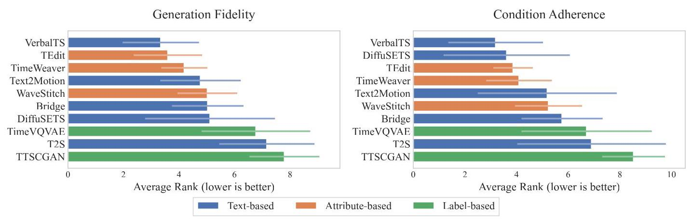

Figure 2. Model ranking under two metric groups: (left) generation fidelity that evaluates marginal distribution of generated time series; (right) condition adherence that evaluates joint/conditional alignment between time series and conditions.

图2。两个指标组下的模型排名:(左)评估生成时间序列边际分布的生成保真度；(右)评估时间序列与条件之间联合/条件对齐的条件遵循情况。

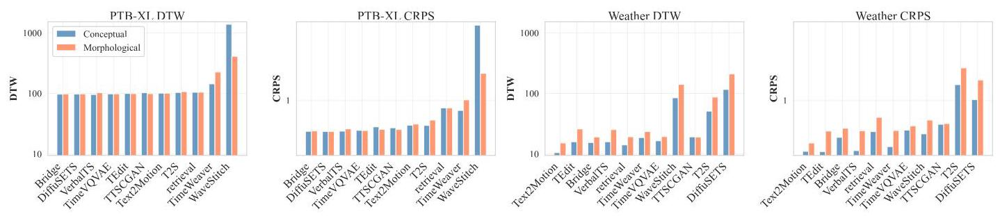

Figure 3. Morphological vs. conceptual conditioning: absolute performance. DTW and CRPS on PTB-XL and Weather under the two condition types.

图3。形态条件与概念条件:绝对性能。两种条件类型下PTB-XL和Weather数据集上的DTW和CRPS。

### 4.2. Morphological vs. Conceptual Conditions

### 4.2. 形态条件与概念条件

Protocol. To compare how models handle conditions at different semantic abstraction levels, we need metrics that capture generation quality when the underlying time series is fixed but the condition form varies. Embedding-based metrics such as CTTP Score are sensitive to the textual form of conditions: morphological and conceptual descriptions have different text representations even when describing the same time series, making cross-type comparisons unfair. We therefore adopt reference-based metrics that use the source time series as a fixed anchor. Specifically, for each condition, we generate $K$ samples and compute Dynamic Time Warping (DTW) and Continuous Ranked Probability Score (CRPS) relative to the source time series from which the condition was derived. We report minimum DTW (best-of- $K$ ) and mean CRPS (over all $K$ samples) (Appendix C.1).

实验方案。为了比较模型在不同语义抽象层次上处理条件的方式，我们需要一些指标来衡量在基础时间序列固定但条件形式变化时的生成质量。基于嵌入的指标(如CTTP分数)对条件的文本形式敏感:形态和概念描述即使在描述相同时间序列时也有不同的文本表示，这使得跨类型比较不公平。因此，我们采用基于参考的指标，将源时间序列作为固定锚点。具体来说，对于每个条件，我们生成$K$个样本，并相对于从中导出条件的源时间序列计算动态时间规整(DTW)和连续排序概率得分(CRPS)。我们报告最小DTW($K$个中的最佳值)和平均CRPS(所有$K$个样本上)(附录C.1)。

Results. Figure 3 reveals that condition semantics affect generation difficulty in a dataset-dependent manner. On PTB-XL, morphological and conceptual conditions lead to similar DTW/CRPS for most models, whereas on Weather the gap is substantial, with conceptual conditions often yielding lower error. This suggests that the relative difficulty of morphological versus conceptual conditioning depends on the intrinsic regularity of the underlying signals: highly structured domains (e.g., ECG) may be equally accessible from either condition type, while complex natural phenomena benefit more from expert-level conceptual descriptions. We provide additional analysis of model ranking stability across condition types in Appendix D.2.

结果。图3显示，条件语义以数据集依赖的方式影响生成难度。在PTB-XL数据集上，对于大多数模型，形态条件和概念条件导致相似的DTW/CRPS，而在Weather数据集上差距很大，概念条件通常产生更低的误差。这表明形态条件与概念条件的相对难度取决于基础信号的内在规律性:高度结构化的领域(如心电图)可能从任何一种条件类型中同样容易获取，而复杂的自然现象更受益于专家级的概念描述。我们在附录D.2中提供了跨条件类型的模型排名稳定性的额外分析。

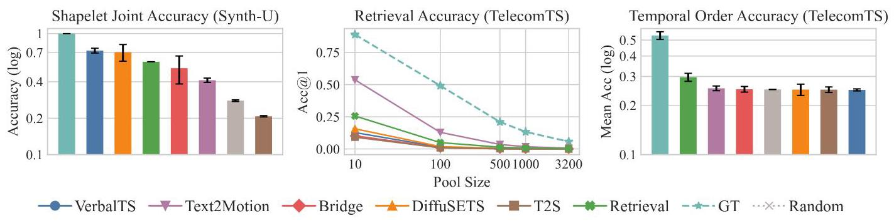

Figure 4. Fine-grained control evaluation. Left: Joint shapelet classification accuracy on Synth-U, where all three segment-level local patterns must be correctly generated. Middle: Segment retrieval accuracy (Acc@1) as a function of candidate pool size on TelecomTS-Segment. Right: Segment-text temporal order accuracy on TelecomTS-Segment.

图4。细粒度控制评估。左:Synth-U上的联合形状let分类准确率，其中所有三个段级局部模式都必须正确生成。中:TelecomTS-Segment上作为候选池大小函数的段检索准确率(Acc@1)。右:TelecomTS-Segment上的段-文本时间顺序准确率。

### 4.3. Fine-grained Control

### 4.3. 细粒度控制

Protocol. To evaluate whether models can follow fine-grained local specifications, we employ three complementary approaches depending on dataset characteristics. (i) Classifier-based evaluation. On synthetic data where the local pattern of each segment (e.g., peak, sag) is determined by the generation script, we train a segment-level 1D-CNN classifier to verify whether generated segments contain the specified patterns. We report joint classification accuracy, which requires all segment-level patterns to be correctly generated. (ii) Retrieval-based evaluation. For each segment of a generated sample, we construct a candidate pool containing its true segment-level description plus $n - 1$ distractors sampled from the test set, retrieve the closest description using CTTP embeddings, and report top-1 retrieval accuracy. To reduce variance from pool composition, we repeat the construction $m$ times and average results. We additionally compare against a naive retrieval baseline that retrieves the nearest training segment based on text embeddings. (iii) Temporal order evaluation. On real-world data with segment-level captions, we test whether each generated segment can correctly retrieve its corresponding positional description (e.g., segment $1 \rightarrow$ description 1). Retrieval accuracy and confusion matrices reveal whether models preserve the intended temporal order. We instantiate these protocols on two datasets: Synth-U (three segments with controllable peaks and sags) and TelecomTS-Segment, where each sequence is partitioned into four segments with independent captions. Implementation details are provided in Appendix D.3.

实验方案。为了评估模型是否能够遵循细粒度的局部规范，我们根据数据集特征采用三种互补方法。(i)基于分类器的评估。在合成数据上，每个段的局部模式(如峰值、凹陷)由生成脚本确定，我们训练一个段级1D-CNN分类器来验证生成的段是否包含指定模式。我们报告联合分类准确率，这要求所有段级模式都正确生成。(ii)基于检索的评估。对于生成样本的每个段，我们构建一个候选池，其中包含其真实的段级描述加上从测试集中采样的$n - 1$个干扰项，使用CTTP嵌入检索最接近的描述，并报告top-1检索准确率。为了减少池组成的方差，我们重复构建$m$次并平均结果。我们还与基于文本嵌入检索最近训练段的朴素检索基线进行比较。(iii)时间顺序评估。在具有段级字幕的真实世界数据上，我们测试每个生成的段是否能够正确检索其相应的位置描述(如段$1 \rightarrow$描述1)。检索准确率和混淆矩阵揭示模型是否保留了预期的时间顺序。我们在两个数据集上实例化这些方案:Synth-U(三个具有可控峰值和凹陷的段)和TelecomTS-Segment，其中每个序列被划分为四个具有独立字幕的段。实现细节在附录D.3中提供。

Results. On Synth-U (Figure 4, left), most text-conditioned generators exceed the random baseline, indicating they can capture coarse local patterns when the underlying signal family is simple. However, only VerbalTS and DiffuSETS consistently outperform a naive retrieval baseline, indicating that simple retrieval is already highly competitive. On TelecomTS-Segment (Figure 4, middle and right), results differ markedly: as the candidate pool grows, most generators rapidly approach the random baseline, implying insufficient discriminability for segment-level retrieval. For temporal order, mean accuracy is near chance for all generators; detailed confusion matrices in Appendix D.3.2 reveal that failure patterns vary across models. Together, these results reveal that fine-grained controllability does not reliably transfer from simple synthetic data to real-world dynamics, and most models fail to achieve segment-level semantic alignment comparable to simple retrieval baselines. This motivates future work on segment-aware objectives and architectures with explicit positional control.

结果。在Synth-U数据集上(图4，左)，大多数文本条件生成器超过了随机基线，这表明当基础信号族简单时，它们能够捕捉粗略的局部模式。然而，只有VerbalTS和DiffuSETS始终优于朴素检索基线，这表明简单检索已经具有很强的竞争力。在TelecomTS-Segment数据集上(图4，中、右)，结果有显著差异:随着候选池的增长，大多数生成器迅速接近随机基线，这意味着对于段级检索的可辨别性不足。对于时间顺序，所有生成器的平均准确率接近随机水平；附录D.3.2中的详细混淆矩阵显示，不同模型的失败模式各不相同。综合来看，这些结果表明，细粒度可控性并不能可靠地从简单的合成数据转移到现实世界的动态中，并且大多数模型未能实现与简单检索基线相当的段级语义对齐。这激发了未来关于具有显式位置控制的段感知目标和架构的研究工作。

### 4.4. Compositional Generalization

### 4.4. 组合泛化

Protocol. To assess generalization to novel attribute combinations, we adopt the same retrieval-based protocol as RQ3 and additionally measure compositional distance from the training distribution. To quantify how far a test condition lies from training examples, we define the Hamming distance between two attribute vectors as $\mathrm{{HD}}\left( {{c}_{1}^{\text{ attr }},{c}_{2}^{\text{ attr }}}\right)  = \; \mathop{\sum }\limits_{{j = 1}}^{M}\mathbf{1}\left\lbrack  {{c}_{1, j}^{\text{ attr }} \neq  {c}_{2, j}^{\text{ attr }}}\right\rbrack$ , where $M$ is the number of attributes. For each test condition with attribute vector ${c}_{\text{ test }}^{\text{ attr }}$ , we compute the average Hamming distance to its $k$ nearest neighbors in the training set:

实验方案。为了评估对新属性组合的泛化能力，我们采用与研究问题3相同的基于检索的实验方案，并额外测量与训练分布的组合距离。为了量化测试条件与训练示例的差异程度，我们将两个属性向量之间的汉明距离定义为$\mathrm{{HD}}\left( {{c}_{1}^{\text{ attr }},{c}_{2}^{\text{ attr }}}\right)  = \; \mathop{\sum }\limits_{{j = 1}}^{M}\mathbf{1}\left\lbrack  {{c}_{1, j}^{\text{ attr }} \neq  {c}_{2, j}^{\text{ attr }}}\right\rbrack$，其中$M$是属性的数量。对于每个具有属性向量${c}_{\text{ test }}^{\text{ attr }}$的测试条件，我们计算其在训练集中与其$k$个最近邻的平均汉明距离:

$$
{d}_{\mathrm{{knn}}}\left( {c}_{\mathrm{{test}}}^{\mathrm{{attr}}}\right)  = \frac{1}{k}\mathop{\sum }\limits_{{{c}^{\mathrm{{attr}}} \in  {\mathrm{{KNN}}}_{k}\left( {c}_{\mathrm{{test}}}^{\mathrm{{attr}}}\right) }}\mathrm{{HD}}\left( {{c}_{\mathrm{{test}}}^{\mathrm{{attr}}},{c}^{\mathrm{{attr}}}}\right) . \tag{1}
$$

Since CTTP encoders themselves may exhibit limited compositional generalization, we normalize retrieval accuracy as ${\mathrm{{Acc}}}_{\text{ norm }} = {\mathrm{{Acc}}}_{\text{ gen }}/{\mathrm{{Acc}}}_{\text{ ref }}$ , where ${\mathrm{{Acc}}}_{\text{ gen }}$ and ${\mathrm{{Acc}}}_{\text{ ref }}$ denote accuracy using generated samples and reference time series respectively. We partition test samples into the closest ${20}\%$ and farthest ${20}\%$ by ${d}_{\mathrm{{knn}}}$ and compare their ${\mathrm{{Acc}}}_{\text{ norm }}$ to quantify robustness to novel attribute combinations.

由于CTTP编码器本身可能表现出有限的组合泛化能力，我们将检索准确率归一化为${\mathrm{{Acc}}}_{\text{ norm }} = {\mathrm{{Acc}}}_{\text{ gen }}/{\mathrm{{Acc}}}_{\text{ ref }}$，其中${\mathrm{{Acc}}}_{\text{ gen }}$和${\mathrm{{Acc}}}_{\text{ ref }}$分别表示使用生成样本和参考时间序列的准确率。我们根据${d}_{\mathrm{{knn}}}$将测试样本分为最接近的${20}\%$个和最远的${20}\%$个，并比较它们的${\mathrm{{Acc}}}_{\text{ norm }}$以量化对新属性组合的鲁棒性。

Figure 5 compares normalized retrieval accuracy between test samples whose attribute combinations are closest to (top 20%) and farthest from (bottom 20%) the training distribution, quantifying generalization to novel compositions.

图5比较了属性组合最接近(前20%)和最远离(后20%)训练分布的测试样本之间的归一化检索准确率，量化了对新组合的泛化能力。

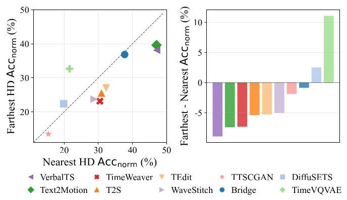

Figure 5. Compositional generalization analysis. Left: normalized retrieval accuracy for head (closest 20% to training distribution) vs. tail (farthest 20%, novel attribute combinations) test samples; points below the diagonal indicate performance degradation on out-of-distribution combinations. Right: accuracy gap (tail - head) for each model, where negative values reflect sensitivity to novel attribute combinations.

图5. 组合泛化分析。左:头部(最接近训练分布的20%)与尾部(最远离的20%，新属性组合)测试样本的归一化检索准确率；对角线下方的点表示分布外组合的性能下降。右:每个模型的准确率差距(尾部 - 头部)，其中负值反映了对新属性组合的敏感性。

Results. Three patterns emerge from the results. First, most models exhibit performance degradation from head to tail, confirming that novel attribute combinations pose a universal challenge. Second, stronger models (e.g., VerbalTS, which also achieves better performance in Section 4.1) show larger drops yet their tail accuracy still exceeds the head accuracy of weaker models, suggesting that better condition adherence provides an absolute advantage even under distribution shift. Third, models with minimal or reversed degradation (e.g., TimeVQVAE) tend to have low absolute accuracy, indicating that their apparent robustness stems from weak responsiveness to conditions rather than true compositional understanding. Together, these findings suggest that models which faithfully adhere to conditions are more sensitive to novel combinations, highlighting the need for architectures that can generalize individual attribute semantics beyond memorized training patterns.

结果。结果呈现出三种模式。首先，大多数模型从头部到尾部表现出性能下降，证实了新属性组合带来了普遍挑战。其次，更强的模型(例如，在4.1节中也表现出更好性能的VerbalTS)下降幅度更大，但其尾部准确率仍超过较弱模型的头部准确率，这表明即使在分布转移的情况下，更好地遵循条件也具有绝对优势。第三，退化最小或退化方向相反的模型(例如，TimeVQVAE)往往绝对准确率较低，这表明它们明显的鲁棒性源于对条件的弱响应性而非真正的组合理解。综合来看，这些发现表明，忠实地遵循条件的模型对新组合更敏感，凸显了需要能够超越记忆训练模式来泛化单个属性语义的架构。

### 4.5. Practical Utility

### 4.5. 实际效用

Protocol. To measure practical utility, we evaluate whether generated data can substitute for real data in training downstream classifiers. We train a multi-head classifier where each head predicts the value of a corresponding attribute, and compare two training settings: using fully real data versus fully generated data. We report macro-averaged accuracy across attribute classes and quantify utility loss using the drop rate:

实验方案。为了衡量实际效用，我们评估生成的数据是否可以在训练下游分类器时替代真实数据。我们训练一个多头分类器，其中每个头预测相应属性的值，并比较两种训练设置:使用完全真实的数据与完全生成的数据。我们报告跨属性类别的宏平均准确率，并使用下降率量化效用损失:

$$
\text{ Drop Rate } = 1 - \frac{{\mathrm{{acc}}}_{\text{ gen }} - {\mathrm{{acc}}}_{\text{ rand }}}{{\mathrm{{acc}}}_{\text{ real }} - {\mathrm{{acc}}}_{\text{ rand }}}, \tag{2}
$$

where ${\mathrm{{acc}}}_{\text{ real }}$ and ${\mathrm{{acc}}}_{\text{ gen }}$ denote classifier accuracy when trained on real and generated data respectively, and acc ${}_{\text{ rand }}$ is the random-guessing baseline. This formulation normalizes the utility gap by the maximum achievable improvement over random guessing, making the metric comparable across datasets with varying task difficulty. A lower drop rate indicates better substitutability.

其中${\mathrm{{acc}}}_{\text{ real }}$和${\mathrm{{acc}}}_{\text{ gen }}$分别表示在真实数据和生成数据上训练时的分类器准确率，而acc${}_{\text{ rand }}$是随机猜测基线。这种公式通过相对于随机猜测可实现的最大改进来对效用差距进行归一化，使得该指标在不同任务难度的数据集之间具有可比性。较低的下降率表示更好的可替代性。

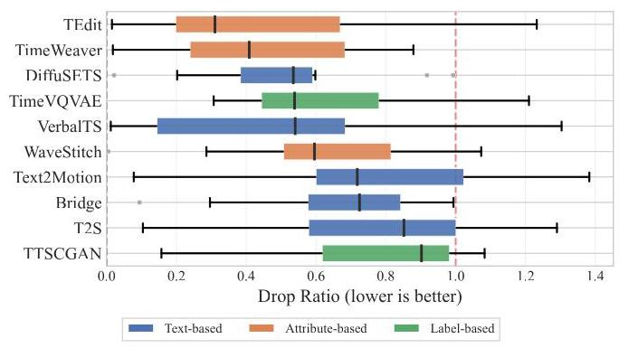

Figure 6. Drop rate distribution across datasets and models. Lower drop rate indicates better substitutability of generated data.

图6. 跨数据集和模型的下降率分布。较低的下降率表明生成数据具有更好的可替代性。

Results. Figure 6 visualizes the drop rate across all models and datasets. Most generative models achieve lower drop rates than the random baseline, indicating that synthetic series preserve discriminative features for classification. However, on complex datasets, some models exhibit drop rates exceeding the random baseline, suggesting that mode collapse or distribution shift can produce data that harms classifier training. Moreover, we observe substantial variance in model rankings across datasets, indicating that no single model consistently dominates. This suggests that the utility of generated data is highly dataset-dependent and cannot be reliably predicted from generation fidelity metrics alone. Detailed results are provided in Appendix D.4.

结果。图6展示了所有模型和数据集的下降率。大多数生成模型的下降率低于随机基线，这表明合成序列保留了用于分类的判别特征。然而，在复杂数据集上，一些模型的下降率超过了随机基线，这表明模式坍塌或分布偏移可能会产生损害分类器训练的数据。此外，我们观察到不同数据集上模型排名存在很大差异，这表明没有一个模型能始终占据主导地位。这表明生成数据的效用高度依赖于数据集，不能仅从生成保真度指标可靠地预测。详细结果见附录D.4。

## 5. Conclusion and Future Work

## 5. 结论与未来工作

We introduced ConTSG-Bench, the first comprehensive benchmark for conditional time series generation that spans multiple conditioning modalities and semantic abstraction levels. Our large-scale evaluation of representative models reveals several key insights. First, generation fidelity and condition adherence are complementary capabilities that require separate evaluation, and text-based conditioning offers the highest performance ceiling but also the widest variance. Second, current methods universally struggle with fine-grained local control and compositional generalization: most models fail to surpass simple retrieval baselines on segment-level tasks, and stronger condition adherence paradoxically leads to greater sensitivity to novel attribute combinations. Third, the downstream utility of generated data varies substantially across datasets and cannot be reliably predicted from fidelity metrics alone. These findings motivate future work on architectures with compositional inductive biases, segment-aware objectives, and domain-agnostic generalization strategies.

我们引入了ConTSG-Bench，这是第一个针对条件时间序列生成的全面基准，涵盖多种条件模式和语义抽象级别。我们对代表性模型的大规模评估揭示了几个关键见解。首先，生成保真度和条件遵循是互补能力，需要单独评估，基于文本的条件提供了最高的性能上限，但也存在最大的方差。其次，当前方法普遍在细粒度局部控制和组合泛化方面存在困难:大多数模型在段级任务上未能超越简单的检索基线，而更强的条件遵循反而导致对新属性组合的更大敏感性。第三，生成数据的下游效用在不同数据集之间差异很大，不能仅从保真度指标可靠地预测。这些发现推动了未来在具有组合归纳偏差、段感知目标和领域无关泛化策略的架构方面的工作。

## Impact Statement

## 影响声明

This paper introduces a benchmark for conditional time series generation, aiming to facilitate standardized evaluation and reproducible research in this area. Time series generation has broad applications in domains such as healthcare, finance, and climate science, where synthetic data can help address data scarcity and enable safer experimentation. While we do not foresee immediate negative societal impacts from our benchmarking framework itself, we acknowledge that generative models, if misused, could potentially produce misleading synthetic data. We encourage practitioners to apply appropriate validation when using generated time series in safety-critical applications.

本文介绍了一个用于条件时间序列生成的基准，旨在促进该领域的标准化评估和可重复研究。时间序列生成在医疗保健、金融和气候科学等领域有广泛应用，其中合成数据有助于解决数据稀缺问题并实现更安全的实验。虽然我们预计我们的基准框架本身不会立即产生负面社会影响，但我们承认，如果生成模型被滥用，可能会产生误导性的合成数据。我们鼓励从业者在安全关键应用中使用生成的时间序列时进行适当的验证。

## References

## 参考文献

Aksu, T., Woo, G., Liu, J., Liu, X., Liu, C., Savarese, S., Xiong, C., and Sahoo, D. Gift-eval: A benchmark for general time series forecasting model evaluation.

阿克苏，T.，吴，G.，刘，J.等人。Gift-eval:通用时间序列预测模型评估的基准。CoRR, abs/2410.10393, 2024. doi: 10.48550/ARXIV.2410.10393. URL https://doi.org/10.48550/ arXiv.2410.10393.

2410.10393。网址https://doi.org/10.48550/arXiv.2410.10393。

Ang, Y., Huang, Q., Bao, Y., Tung, A. K., and Huang, Z. Tsgbench: Time series generation benchmark. Proc.

安，Y.，黄，Q.，鲍，Y.等人。Tsgbench:时间序列生成基准。会议论文集。VLDB Endow., 17(3):305-318, 2023.

Ansari, A. F., Stella, L., Turkmen, C., Zhang, X., Mercado, P., Shen, H., Shchur, O., Rangapuram, S. S., Arango, S. P., Kapoor, S., et al. Chronos: Learning the language of time

安萨里，A. F.，斯特拉，L.，图尔克门，C.等人。Chronos:学习时间的语言series. arXiv preprint arXiv:2403.07815, 2024.

Chang, H., Zhang, H., Jiang, L., Liu, C., and Freeman, W. T. Maskgit: Masked generative image transformer. In IEEE/CVF Conference on Computer Vision and Pattern

张，H.，张，H. J.，江，L.等人。Maskgit:掩码生成图像变压器。在IEEE/CVF计算机视觉与模式识别会议上。Recognition, CVPR 2022, New Orleans, LA, USA, June 18-24, 2022, pp. 11305-11315. IEEE, 2022. doi: 10.1109/CVPR52688.2022.01103. URL https://doi.org/10.1109/CVPR52688.2022.01103.

1109/CVPR52688.2022.01103。网址https://doi.org/10.1109/CVPR52688.2022.01103。

Chen, S. Beijing multi-site air-quality data. UCI Machine

陈，S. 北京多站点空气质量数据。UCI机器学习库。Learning Repository, 10:C5RK5G, 2019.

Comanici, G., Bieber, E., Schaekermann, M., Pasupat, I., Sachdeva, N., Dhillon, I., Blistein, M., Ram, O., Zhang, D., Rosen, E., et al. Gemini 2.5: Pushing the frontier with advanced reasoning, multimodality, long context, and next generation agentic capabilities. arXiv preprint

科马尼奇，G.，比伯，E.，沙克曼，M.等人。Gemini 2.5:以先进推理、多模态、长上下文和下一代智能能力推动前沿。arXiv预印本arXiv:2507.06261, 2025.

Desai, A., Freeman, C., Wang, Z., and Beaver, I. Timevae: A variational auto-encoder for multivariate time series

德赛，A.，弗里曼，C.，王，Z.，以及比弗，I.《Timevae:用于多变量时间序列的变分自编码器》generation. arXiv preprint arXiv:2111.08095, 2021.

Dohi, K., Ito, A., Purohit, H., Nishida, T., Endo, T., and Kawaguchi, Y. Domain-independent automatic generation of descriptive texts for time-series data. In 2025 IEEE International Conference on Acoustics, Speech

土肥，K.，伊藤，A.，普罗希特，H.，西田，T.，远藤，T.，以及川口，Y.《时间序列数据的领域无关描述性文本自动生成》。发表于2025年IEEE国际声学、语音会议and Signal Processing, ICASSP 2025, Hyderabad, India, April 6-11, 2025, pp. 1-5. IEEE, 2025. doi: 10.1109/ICASSP49660.2025.10888432. URL https://doi.org/10.1109/ICASSP49660.2025.10888432.

ICASSP49660.2025.10888432。网址:https://doi.org/10.1109/ICASSP49660.2025.10888432。

Feng, A., Varvarigos, A., Panitsas, I., Fernandez, D., Wei, J., Guo, Y., Chen, J., Maatouk, A., Tassiulas, L., and Ying, R. Telecomts: A multi-modal observability dataset for time series and language analysis. arXiv preprint

冯，A.，瓦尔瓦里戈斯，A.，帕尼察斯，I.，费尔南德斯，D.，魏，J.，郭，Y.，陈，J.，马图克，A.，塔西拉斯，L.，以及英，R.《Telecomts:用于时间序列和语言分析的多模态可观测性数据集》。arXiv预印本arXiv:2510.06063, 2025.

Ge, Y., Li, J., Zhao, Y., Wen, H., Li, Z., Qiu, M., Li, H., Jin, M., and Pan, S. T2s: High-resolution time series generation with text-to-series diffusion models. arXiv

葛，Y.，李，J.，赵，Y.，温，H.，李，Z.，邱，M.，李，H.，金，M.，以及潘，S.《T2s:使用文本到序列扩散模型的高分辨率时间序列生成》。arXivpreprint arXiv:2505.02417, 2025.

Gneiting, T. and Raftery, A. E. Strictly proper scoring rules, prediction, and estimation. Journal of the American

格内廷，T.和拉夫蒂，A. E.《严格恰当评分规则、预测与估计》。《美国统计学会杂志》statistical Association, 102(477):359-378, 2007.

Goodfellow, I. J., Pouget-Abadie, J., Mirza, M., Xu, B., Warde-Farley, D., Ozair, S., Courville, A. C., and Bengio, Y. Generative adversarial networks. Commun. ACM, 63(11):139-144, 2020. doi: 10.1145/3422622. URL https://doi.org/10.1145/3422622.

古德费洛，I. J.，普热-阿巴迪，J.，米尔扎，M.，徐，B.，沃德-法利，D.，奥扎尔，S.，库尔维尔，A. C.，以及本吉奥，Y.《生成对抗网络》。《美国计算机协会通讯》，63(11):139 - 144，2020。doi: 1%200.1145/3422622。网址:https://doi.org/10.1145/3422622。

Gu, A., Goel, K., and Ré, C. Efficiently modeling long sequences with structured state spaces. In The Tenth International Conference on Learning Representations,

顾，A.，戈尔，K.，和雷，C. 使用结构化状态空间对长序列进行高效建模。在第十届国际学习表征会议上，ICLR 2022, Virtual Event, April 25-29, 2022. OpenRe-view.net, 2022. URL https://openreview.net/ forum?id=uYLFoz1vlAC.

视图网络，2022年。网址:https://openreview.net/ forum?id=uYLFoz1vlAC。

Gu, S., Li, C., Jing, B., and Ren, K. Verbalts: Generating time series from texts. In Forty-second International

顾，S.，李，C.，景，B.，和任，K. Verbalts:从文本生成时间序列。在第四十二届国际Conference on Machine Learning, 2025.

Gulrajani, I., Ahmed, F., Arjovsky, M., Dumoulin, V., and Courville, A. C. Improved training of wasserstein gans. Advances in neural information processing systems, 30, 2017.

古拉贾尼，I.，艾哈迈德，F.，阿尔乔夫斯基，M.，杜穆林，V.，以及库尔维尔，A. C. 改进瓦瑟斯坦生成对抗网络的训练。《神经信息处理系统进展》，30，2017年。

Guo, C., Zou, S., Zuo, X., Wang, S., Ji, W., Li, X., and Cheng, L. Generating diverse and natural 3d human motions from text. In IEEE/CVF Conference on Computer Vi-

郭，C.，邹，S.，左，X.，王，S.，季，W.，李，X.，和程，L. 从文本生成多样且自然的3D人体运动。在IEEE/CVF计算机视觉会议上 -sion and Pattern Recognition, CVPR 2022, New Orleans, LA, USA, June 18-24, 2022, pp. 5142-5151. IEEE, 2022.doi: 10.1109/CVPR52688.2022.00509. URL https:// doi.org/10.1109/CVPR52688.2022.00509.

doi: 10.1109/CVPR52688.2022.00509. 网址 https:// doi.org/10.1109/CVPR52688.2022.00509.

Heusel, M., Ramsauer, H., Unterthiner, T., Nessler, B., and Hochreiter, S. Gans trained by a two time-scale update rule converge to a local nash equilibrium. Advances in

赫塞尔，M.，拉姆绍尔，H.，昂特蒂纳，T.，内斯勒，B.，以及霍赫赖特，S. 通过双时间尺度更新规则训练的甘斯收敛到局部纳什均衡。进展于neural information processing systems, 30, 2017.

Ho, J., Jain, A., and Abbeel, P. Denoising diffusion probabilistic models. Advances in neural information process-

何，J.，贾恩，A.，以及阿贝厄尔，P. 去噪扩散概率模型。神经信息处理进展-ing systems, 33:6840-6851, 2020.

Jeon, J., Kim, J., Song, H., Cho, S., and Park, N. Gt-gan: General purpose time series synthesis with generative adversarial networks. Advances in Neural Information

全，J.，金，J.，宋，H.，赵，S.，以及朴，N. Gt-gan:使用生成对抗网络的通用时间序列合成。神经信息进展Processing Systems, 35:36999-37010, 2022.

Jing, B., Gu, S., Chen, T., Yang, Z., Li, D., He, J., and Ren, K. Towards editing time series. In Globersons, A., Mackey, L., Belgrave, D., Fan, A., Paquet, U., Tomczak, J. M., and Zhang, C. (eds.), Advances in Neural Information Processing Systems 38: Annual Conference on Neural Information Processing Systems 2024, NeurIPS

景，B.，顾，S.，陈，T.，杨，Z.，李，D.，何，J.，以及任，K. 关于编辑时间序列。载于格洛伯森，A.，麦基，L.，贝尔格雷夫，D.，范，A.，帕克特，U.，托姆扎克，J. M.，以及张，C.(编)，《神经信息处理系统进展38:2024年神经信息处理系统年度会议，神经信息处理系统大会》2024, Vancouver, BC, Canada, December 10 - 15, 2024,2024.

Kingma, D. P. and Welling, M. An introduction to variational autoencoders. Found. Trends Mach. Learn., 12

金马，D. P. 和韦林，M. 变分自编码器简介。《机器学习基础与趋势》，第12卷(4):307-392, 2019. doi: 10.1561/2200000056. URLhttps://doi.org/10.1561/2200000056.

Kynkäänniemi, T., Karras, T., Laine, S., Lehtinen, J., and Aila, T. Improved precision and recall metric for assessing generative models. Advances in neural information

Kynkäänniemi, T., Karras, T., Laine, S., Lehtinen, J., 和 Aila, T. 用于评估生成模型的改进的精确率和召回率指标。神经信息进展processing systems, 32, 2019.

Lai, G., Chang, W.-C., Yang, Y., and Liu, H. Modeling long-and short-term temporal patterns with deep neural networks. In The 41st international ACM SIGIR conference on research & development in information retrieval, pp. 95-104, 2018.

赖，G.，张，W.-C.，杨，Y.，和刘，H. 使用深度神经网络对长期和短期时间模式进行建模。发表于第41届国际ACM SIGIR信息检索研究与发展会议，第95 - 104页，2018年。

Lai, Y., Chen, J., Zhao, Q., Zhang, D., Wang, Y., Geng, S., Li, H., and Hong, S. Diffusets: 12-lead ECG generation conditioned on clinical text reports and patient-specific information. Patterns, 6(10):101291, 2025a. doi: 10.1016/J.PATTER.2025.101291. URL https://doi.org/10.1016/j.patter.2025.101291.

赖，Y.，陈，J.，赵，Q.，张，D.，王，Y.，耿，S.，李，H.，和洪，S. Diffusets:基于临床文本报告和患者特定信息的12导联心电图生成。《模式》，6(10):101291，2025a。doi: 10.1016/J.PATTER.2025.101291。网址:https://doi.org/10.1016/j.patter.2025.101291。

Lai, Y., Chen, J., Zhao, Q., Zhang, D., Wang, Y., Geng, S., Li, H., and Hong, S. Diffusets: 12-lead ecg generation conditioned on clinical text reports and patient-specific information. Patterns, 2025b.

赖，Y.，陈，J.，赵，Q.，张，D.，王，Y.，耿，S.，李，H.，和洪，S. Diffusets:基于临床文本报告和患者特定信息生成12导联心电图。《模式》，2025年b期。

Lee, D., Malacarne, S., and Aune, E. Vector quantized time series generation with a bidirectional prior model. arXiv

李，D.，马拉卡内，S.，以及奥内，E. 基于双向先验模型的矢量量化时间序列生成。arXivpreprint arXiv:2303.04743, 2023.

Leo. Istanbul traffic index. Kaggle, 2024. URL https: //www.kaggle.com/datasets/leonardo00/ istanbul-traffic-index/data.

利奥。伊斯坦布尔交通指数。Kaggle，2024年。网址:https://www.kaggle.com/datasets/leonardo00/istanbul-traffic-index/data。

Li, H., Huang, Y., Xu, C., Schlegel, V., Jiang, R., Batista-Navarro, R., Nenadic, G., and Bian, J. Bridge: Bootstrapping text to control time-series generation via multi-agent iterative optimization and diffusion modelling. arXiv

李，H.，黄，Y.，徐，C.，施莱格尔，V.，江，R.，巴蒂斯塔 - 纳瓦罗，R.，内纳迪奇，G.，和边，J.《Bridge:通过多智能体迭代优化和扩散建模引导文本以控制时间序列生成》。arXivpreprint arXiv:2503.02445, 2025.

Li, X., Ngu, A. H. H., and Metsis, V. TTS-CGAN: A transformer time-series conditional GAN for biosignal

李，X.；恩古，A.H.H.；和梅茨斯，V.《TTS - CGAN:用于生物信号的变压器时间序列条件生成对抗网络》data augmentation. CoRR, abs/2206.13676, 2022. doi:10.48550/ARXIV.2206.13676. URL https://doi.org/10.48550/arXiv.2206.13676.

10.48550/ARXIV.2206.13676。网址:https://doi.org/10.48550/arXiv.2206.13676。

Liu, P., Zhu, H., Kreacic, E., and Vyetrenko, S. Privacy-aware time series synthesis via public knowledge distilla-

刘，P.，朱，H.，克雷亚奇，E.，和维特伦科，S.《通过公共知识蒸馏实现隐私感知时间序列合成》tion. arXiv preprint arXiv:2511.00700, 2025.

Liu, X., Gong, C., and Liu, Q. Flow straight and fast: Learning to generate and transfer data with rectified flow. In The Eleventh International Conference on

刘，X.，龚，C.，和刘，Q.《Flow straight and fast:学习用整流流生成和传输数据》。于第十一届国际会议Learning Representations, ICLR 2023, Kigali, Rwanda, May 1-5, 2023. OpenReview.net, 2023. URL https://openreview.net/forum?id=XVjTT1nw5z.

//openreview.net/forum?id=XVjTT1nwdz。

Lu, C., Reddy, C. K., Wang, P., Nie, D., and Ning, Y. Multi-label clinical time-series generation via conditional gan. IEEE Transactions on Knowledge and Data Engineer-

卢，C.，雷迪，C.K.，王，P.，聂，D.，和宁，Y.《通过条件生成对抗网络进行多标签临床时间序列生成》。《IEEE知识与数据工程汇刊》ing, 36(4):1728-1740, 2024. doi: 10.1109/TKDE.2023.3310909.

Makowski, D., Pham, T., Lau, Z. J., Brammer, J. C., Lespinasse, F., Pham, H., Schölzel, C., and Chen, S. H. A. NeuroKit2: A python toolbox for neurophysiological signal processing. Behavior Research

马科夫斯基，D.，范，T.，刘，Z.J.，布拉默，J.C.，莱斯皮纳斯，F.，范，H.，舍尔策尔，C.，和陈，S.H.A.《NeuroKit2:用于神经生理信号处理的Python工具箱》。《行为研究》Methods, 53(4):1689-1696, feb 2021. doi: 10.3758/s13428-020-01516-y. URL https://doi.org/10.3758%2Fs13428-020-01516-y.

s13428 - 020 - 01516 - y。网址:https://doi.org/10.3758%2Fs13428 - 020 - 01516 - y。

Narasimhan, S. S., Agarwal, S., Akcin, O., Sanghavi, S., and Chinchali, S. Time weaver: A conditional time se-

纳拉辛汉，S.S.，阿加瓦尔，S.，阿克辛，O.，桑加维，S.，和钦查利，S.《时间编织者:一种条件时间序列》ries generation model. arXiv preprint arXiv:2403.02682,2024.

Ni, H., Szpruch, L., Sabate-Vidales, M., Xiao, B., Wiese, M., and Liao, S. Sig-wasserstein gans for time series generation. In Proceedings of the Second ACM International

倪，H.，斯普鲁赫，L.，萨巴特 - 维达莱斯，M.，肖，B.，维泽，M.，和廖，S.《用于时间序列生成的信号瓦瑟斯坦生成对抗网络》。于第二届ACM国际会议论文集Conference on AI in Finance, pp. 1-8, 2021.

Nie, Y. A time series is worth 64words: Long-term forecast-

聂，Y.《一个时间序列值64个词:长期预测》ing with transformers. arXiv preprint arXiv:2211.14730,2022.

Peebles, W. and Xie, S. Scalable diffusion models with transformers. In IEEE/CVF International Conference on

皮布尔斯，W.和谢，S.《具有变压器的可扩展扩散模型》。于IEEE/CVF国际会议Computer Vision, ICCV 2023, Paris, France, October 1-6, 2023, pp. 4172-4182. IEEE, 2023. doi: 10.1109/ICCV51070.2023.00387. URL https://doi.org/ 10.1109/ICCV51070.2023.00387.

ICCV51070.2023.00387。网址:https://doi.org/10.1109/ICCV51070.2023.00387。

Pei, H., Ren, K., Yang, Y., Liu, C., Qin, T., and Li, D. Towards generating real-world time series data. In Pro-

裴，H.，任，K.，杨，Y.，刘，C.，秦，T.，和李，D.《迈向生成真实世界时间序列数据》。于会议论文集ceedings of the 2021 IEEE International Conference on Data Mining (ICDM), Auckland, New Zealand, 2021.

Radford, A., Kim, J. W., Hallacy, C., Ramesh, A., Goh, G., Agarwal, S., Sastry, G., Askell, A., Mishkin, P., Clark, J., Krueger, G., and Sutskever, I. Learning transferable visual models from natural language supervision. CoRR, abs/2103.00020, 2021. URL https://arxiv.org/ abs/2103.00020.

拉德福德，A.，金，J. W.，哈拉西，C.，拉梅什，A.，戈，G.，阿加瓦尔，S.，萨斯特里，G.，阿斯克尔，A.，米什金，P.，克拉克，J.，克鲁格，G.，以及苏茨克维，I. 从自然语言监督中学习可迁移视觉模型。CoRR，abs/2103.00020，2021年。网址:https://arxiv.org/ abs/2103.00020。

Ronneberger, O., Fischer, P., and Brox, T. U-net: Convolutional networks for biomedical image segmentation. In International Conference on Medical image computing and computer-assisted intervention, pp. 234-241. Springer, 2015.

罗纳伯格，O.，菲舍尔，P.，以及布罗克斯，T. U-net:用于生物医学图像分割的卷积网络。在医学图像计算与计算机辅助干预国际会议上，第234 - 241页。施普林格出版社，2015年。

Shankar, A., Chen, L. Y., van Deursen, A., and Hai, R. Wavestitch: Flexible and fast conditional time series generation with diffusion models. Proc. ACM Manag.

尚卡尔，A.，陈，L. Y.，范德森，A.，以及海，R. Wavestitch:使用扩散模型进行灵活快速的条件时间序列生成。ACM管理会议论文集。Data, 3(6):1-25, 2025. doi: 10.1145/3769842. URLhttps://doi.org/10.1145/3769842.

Song, J., Meng, C., and Ermon, S. Denoising diffusion implicit models. In 9th International Conference on Learn-

宋，J.，孟，C.，以及埃尔蒙，S. 去噪扩散隐式模型。在第9届国际学习会议上。ing Representations, ICLR 2021, Virtual Event, Austria, May 3-7, 2021. OpenReview.net, 2021. URL https://openreview.net/forum?id=St1giarCHLP.

//openreview.net/forum?id=St1giarCHLP。

Tashiro, Y., Song, J., Song, Y., and Ermon, S. Csdi: Conditional score-based diffusion models for probabilistic time series imputation. Advances in neural information

田代，Y.，宋，J.，宋，Y.，以及埃尔蒙，S. Csdi:用于概率时间序列插补的基于条件分数的扩散模型。神经信息进展。processing systems, 34:24804-24816, 2021.

Van Den Oord, A., Vinyals, O., et al. Neural discrete representation learning. Advances in neural information

范登奥德，A.，维尼亚尔斯，O. 等人。神经离散表示学习。神经信息进展。processing systems, 30, 2017.

Vaswani, A., Shazeer, N., Parmar, N., Uszkoreit, J., Jones, L., Gomez, A. N., Kaiser, L., and Polosukhin, I. Attention is all you need. Advances in neural information

瓦斯瓦尼，A.，沙泽尔，N.，帕尔马尔，N.，乌兹科雷特，J.，琼斯，L.，戈麦斯，A. N.，凯泽，L.，以及波洛苏欣，I. 你只需要注意力。神经信息进展。processing systems, 30, 2017.

Wagner, P., Strodthoff, N., Bousseljot, R., Kreiseler, D., Lunze, F. I., Samek, W., and Schaeffter, T. Ptb-xl, a large publicly available electrocardiography

瓦格纳，P.，斯特罗德托夫，N.，布塞尔约特，R.，克赖泽勒，D.，伦泽，F. I.，萨梅克，W.，以及沙费特，T. Ptb-xl，一个大型公开可用的心电图数据集。dataset. Scientific Data, 7, 2020. URL https://api.semanticscholar.org/CorpusID: 218865062.

//api.semanticscholar.org/CorpusID: 218865062。

Wang, Y., Wu, H., Dong, J., Liu, Y., Long, M., and Wang, J. Deep time series models: A comprehensive survey and

王，Y.，吴，H.，董，J.，刘，Y.，龙，M.，以及王，J. 深度时间序列模型:全面综述与benchmark. CoRR, abs/2407.13278, 2024. doi: 10.48550/ARXIV.2407.13278. URL https://doi.org/10.48550/arXiv.2407.13278.

ARXIV.2407.13278。网址:https://doi.org/10.48550/arXiv.2407.13278。

Williams, A. R., Ashok, A., Marcotte, É., Zantedeschi, V., Subramanian, J., Riachi, R., Requeima, J., Lacoste, A., Rish, I., Chapados, N., and Drouin, A. Context is key: A benchmark for forecasting with essential textual information. In Forty-second International Conference on

威廉姆斯，A. R.，阿肖克，A.，马尔科特，É.，赞泰德斯基，V.，苏布拉马尼亚姆，J.，里亚奇，R.，雷克马，J.，拉科斯特，A.，里什，I.，查帕多斯，N.，以及德鲁因，A. 上下文是关键:使用基本文本信息进行预测的基准。在第四十二届国际会议上。Machine Learning, ICML 2025, Vancouver; BC, Canada, July 13-19, 2025. OpenReview.net, 2025. URL https ://openreview.net/forum?id=ih2WuBT1Fn.

//openreview.net/forum?id=ih2WuBT1Fn。

Xia, Y., Xu, C., Liang, Y., Wen, Q., Zimmermann, R., and Bian, J. Causal time series generation via diffusion mod-

夏，Y.，徐，C.，梁，Y.，温，Q.，齐默尔曼，R.，以及卞，J. 通过扩散模型进行因果时间序列生成。els. arXiv preprint arXiv:2509.20846, 2025.

Xu, Z., Bian, Y., Zhong, J., Wen, X., and Xu, Q. Beyond trend and periodicity: Guiding time series forecasting

徐，Z.，卞，Y.，钟，J.，温，X.，以及徐，Q. 超越趋势和周期性:引导时间序列预测。with textual cues. arXiv e-prints, pp. arXiv-2405, 2024.

Zhang, B., Zhang, P., Dong, X., Zang, Y., and Wang, J. Long-clip: Unlocking the long-text capability of clip. In European conference on computer vision, pp. 310-325. Springer, 2024a.

张，B.，张，P.，董，X.，臧，Y.，和王，J. Long-clip:解锁Clip的长文本能力。在欧洲计算机视觉会议上，第310 - 325页。施普林格，2024a。

Zhang, J., Wen, X., Zhang, Z., Zheng, S., Li, J., and Bian, J. Probts: Benchmarking point and distributional forecasting across diverse prediction horizons. In Globersons, A., Mackey, L., Belgrave, D., Fan, A., Paquet, U., Tomczak, J. M., and Zhang, C. (eds.), Advances in Neural Information Processing Systems 38: Annual Conference on Neural Information Processing Systems 2024, NeurIPS

张，J.，文，X.，张，Z.，郑，S.，李，J.，和卞，J. Probts:跨不同预测范围的基准点和分布预测。在Globersons，A.，Mackey，L.，Belgrave，D.，Fan，A.，Paquet，U.，Tomczak，J. M.，和张，C.(编辑)，《神经信息处理系统进展38:2024年神经信息处理系统年度会议》，NeurIPS2024, Vancouver, BC, Canada, December 10 - 15, 2024,2024b.

Zhang, Y., Li, M., Long, D., Zhang, X., Lin, H., Yang, B., Xie, P., Yang, A., Liu, D., Lin, J., Huang, F., and Zhou, J. Qwen3 embedding: Advancing text embedding and reranking through foundation models.

张，Y.，李，M.，龙，D.，张，X.，林，H.，杨，B.，谢，P.，杨，A.，刘，D.，林，J.，黄，F.，和周，J. Qwen3嵌入:通过基础模型推进文本嵌入和重新排序。CoRR, abs/2506.05176, 2025. doi: 10.48550/ARXIV.2506.05176. URL https://doi.org/10.48550/ arXiv.2506.05176.

2506.05176。网址https://doi.org/10.48550/arXiv.2506.05176。

Zhou, H., Zhang, S., Peng, J., Zhang, S., Li, J., Xiong, H., and Zhang, W. Informer: Beyond efficient transformer for long sequence time-series forecasting. In Proceedings of the AAAI conference on artificial intelligence, volume 35, pp. 11106-11115, 2021.

周，H.，张，S.，彭，J.，张，S.，李，J.，熊，H.，和张，W. Informer:超越用于长序列时间序列预测的高效Transformer。在《人工智能AAAI会议论文集》，第35卷，第11106 - 11115页，2021年。

## A. Dataset Construction Details

## A. 数据集构建细节

### A.1. Synthetic Datasets

### A.1. 合成数据集

We utilize synthetic datasets constructed in VerbalTS (Gu et al., 2025), including univariate dataset (Synth-U) and multivariate dataset (Synth-M). With a human-defined attribute set, both datasets are generated using an established pipeline which first synthesizes time series data based on sampled attributes from the set and then synthesizes corresponding textual description through substituting attribute values into the text templates. The Synth-U and Synth-M statistic details of the number of tokens in the text data are given in Table 2 and Table 3 respectively. Note that we utilize tokenizer from Long-clip(Zhang et al., 2024a) for all the datasets in our experiments.

我们使用在VerbalTS(Gu等人，2025)中构建的合成数据集，包括单变量数据集(Synth-U)和多变量数据集(Synth-M)。通过人工定义的属性集，这两个数据集都使用既定的管道生成，该管道首先根据从该集合中采样的属性合成时间序列数据，然后通过将属性值代入文本模板来合成相应的文本描述。文本数据中令牌数量的Synth-U和Synth-M统计细节分别在表2和表3中给出。请注意，我们在实验中对所有数据集都使用了来自Long-clip(Zhang等人，2024a)的分词器。

<table><tr><td>Set</td><td>Average Tokens</td><td>Median Tokens</td><td>Max Tokens</td><td>$\mathbf{{Std}.{Dev}.}$</td></tr><tr><td>Training</td><td>41.09</td><td>42.0</td><td>60</td><td>8.90</td></tr><tr><td>Validation</td><td>41.21</td><td>42.0</td><td>60</td><td>8.94</td></tr><tr><td>Test</td><td>41.21</td><td>42.0</td><td>60</td><td>8.92</td></tr></table>

Table 2. Summary of token number statistics for Synth-U dataset.

表2. Synth-U数据集令牌数量统计摘要。

<table><tr><td>Set</td><td>Average Tokens</td><td>Median Tokens</td><td>Max Tokens</td><td>Std. Dev.</td></tr><tr><td>Training</td><td>62.23</td><td>63.0</td><td>83</td><td>8.97</td></tr><tr><td>Validation</td><td>62.27</td><td>63.0</td><td>83</td><td>9.10</td></tr><tr><td>Test</td><td>62.39</td><td>63.0</td><td>82</td><td>9.17</td></tr></table>

Table 3. Summary of token number statistics for Synth-M dataset.

表3. Synth-M数据集令牌数量统计摘要。

#### A.1.1. ATTRIBUTE SET

#### A.1.1. 属性集

<table><tr><td>Attribute Category</td><td>Value Options</td></tr><tr><td>Trend Types1</td><td>[Linear, Quadratic, Exponential, Logistic]</td></tr><tr><td>Trend Directions1</td><td>[Up, Down]</td></tr><tr><td>Season Cycles1</td><td>$\left\lbrack  {0,1,2,4}\right\rbrack$</td></tr><tr><td>Local Shapelets2</td><td>[None, Single Peak, Sag, Double Peaks]</td></tr><tr><td>High Freq. Components2</td><td>[0, 16, 32, 64]</td></tr><tr><td>Multivariable*</td><td>[X/Y-axis Flip, Shift Forward/Backward]</td></tr></table>

* Only applicable to Synth-M. ${}^{1}$ Primary Attribute. ${}^{2}$ Secondary Attribute. Table 4. Attribute Set

* 仅适用于Synth-M。${}^{1}$ 主要属性。${}^{2}$ 次要属性。表4. 属性集

<table><tr><td>Trend Type</td><td>Function</td></tr><tr><td>Linear</td><td>${\mathbf{x}}_{\text{ trend }} = \mathbf{t}$</td></tr><tr><td>Quadratic</td><td>${\mathbf{x}}_{\text{ trend }} = {\mathbf{t}}^{2}$</td></tr><tr><td>Exponential</td><td>${\mathbf{x}}_{\text{ trend }} = \frac{{2}^{{\mathbf{t}}^{\prime }}}{1024}$</td></tr><tr><td>Logistic</td><td>${\mathbf{x}}_{\text{ trend }} = \frac{1}{1 + \exp \left( {-{\mathbf{t}}^{\prime }}\right) }$</td></tr></table>

${t}_{i} \in  \left\lbrack  {0,1}\right\rbrack$ and ${t}^{\prime } \in  \left\lbrack  {-{10},{10}}\right\rbrack$ .

${t}_{i} \in  \left\lbrack  {0,1}\right\rbrack$ 和 ${t}^{\prime } \in  \left\lbrack  {-{10},{10}}\right\rbrack$ 。

Table 5. Trend Type Functions

表5. 趋势类型函数

VerbalTS defines 6 types of attribute as summarized in Table 4, including Trend Types, Trend Directions, Season cycles, Shapelets, High Frequency Components and Multivariables. Note that only the construction for Synth-M dataset will be assigned with a sampled Multivariable attribute. Elaborations on these attributes are as follows.

VerbalTS定义了6种类型的属性，总结在表4中，包括趋势类型、趋势方向、季节周期、形状let、高频分量和多变量。请注意，只有Synth-M数据集的构建将被分配一个采样的多变量属性。对这些属性的详细说明如下。

- Trend Types and Trend Directions: Trend component ${\mathbf{x}}_{\text{ trend }}$ of the time series is jointly composed by trend types and trend directions. The trend trajectory types are characterized by 4 functions: linear, quadratic, exponential, and logistic. For each trend trajectory, direction can be either up or down. Complete details of the corresponding functions and value ranges of the trend type are listed in Table 5. For trend directions, up trend indicates ${\mathbf{x}}_{\text{ trend }} = {\mathbf{x}}_{\text{ trend }}$ and down trend indicates ${\mathbf{x}}_{\text{ trend }} =  - {\mathbf{x}}_{\text{ trend }}$ .

- 趋势类型和趋势方向:时间序列的趋势分量${\mathbf{x}}_{\text{ trend }}$ 由趋势类型和趋势方向共同组成。趋势轨迹类型由4个函数表征:线性、二次、指数和逻辑。对于每个趋势轨迹，方向可以是向上或向下。趋势类型的相应函数和值范围的完整细节列在表5中。对于趋势方向，上升趋势表示${\mathbf{x}}_{\text{ trend }} = {\mathbf{x}}_{\text{ trend }}$ ，下降趋势表示${\mathbf{x}}_{\text{ trend }} =  - {\mathbf{x}}_{\text{ trend }}$ 。

- Season Cycles: To simulate season component ${\mathbf{x}}_{\text{ season }}$ , synthetic time series data incorporate a set of sinusoidal waves. The periodicity of waves is controlled by parameter ${n}_{\text{ cycle }}$ , which takes values from the set $\{ 0,1,2,4\}$ to represent

- 季节周期:为了模拟季节成分${\mathbf{x}}_{\text{ season }}$，合成时间序列数据包含一组正弦波。波的周期性由参数${n}_{\text{ cycle }}$控制，该参数从集合$\{ 0,1,2,4\}$中取值以表示

different cycles. Season component ${\mathbf{x}}_{\text{ season }}$ can be mathematically formulated as:

不同的周期。季节成分${\mathbf{x}}_{\text{ season }}$可以用数学公式表示为:

$$
{\mathbf{x}}_{\text{ season }} = a\sin \left( {{2\pi t} + \phi }\right) ,\;\text{ where }t \in  \left\lbrack  {0,{n}_{\text{ cycle }}}\right\rbrack  ,{n}_{\text{ cycle }} \in  \left\lbrack  {0,{2}^{0},{2}^{1},{2}^{2}}\right\rbrack  , a \sim  \mathcal{U}\left( {{0.4},{0.6}}\right) ,\phi  \sim  \mathcal{U}\left( {0,{2\pi }}\right) \tag{3}
$$

- Local Shapelets: Three distinct local shapelets—single peak, sag, and double peaks—are defined to simulate local details in real-world time series which is denoted as ${\mathbf{x}}_{\text{ local }}$ . Further details of local shapelets, including morphological definition and stochastic injection, can be referred to Appendix A.1.3.

- 局部形状子:定义了三种不同的局部形状子——单峰、凹陷和双峰——来模拟现实世界时间序列中的局部细节，该时间序列记为${\mathbf{x}}_{\text{ local }}$。局部形状子的更多细节，包括形态定义和随机注入，可参考附录A.1.3。

- High Frequency Components: To simulate high-frequency signals in real-world data, synthetic time series incorporate high-frequency components, denoted as ${\mathbf{x}}_{\mathrm{{hf}}}$ , which are constructed using the same equation 3 as introduced in the Season Cycles except for ${n}_{\text{ cycle }} \in  \left\lbrack  {0,{16},{32},{64}}\right\rbrack  , a \sim  \mathcal{U}\left( {{0.1},{0.3}}\right)$ .

- 高频成分:为了模拟现实世界数据中的高频信号，合成时间序列包含高频成分，记为${\mathbf{x}}_{\mathrm{{hf}}}$，其使用与季节周期中引入的相同方程3构建，但${n}_{\text{ cycle }} \in  \left\lbrack  {0,{16},{32},{64}}\right\rbrack  , a \sim  \mathcal{U}\left( {{0.1},{0.3}}\right)$除外。

- Multivariable: The multi-variable transfer rules comprise X-axis flip, Y-axis flip, and temporal shifts (forward and backward). Flipping operations flip the time series of the first variable along X-axis or Y-axis to generate time series for the second variable, and the shifting operations translate the time series along the temporal dimension by a shift distance ${d}_{\text{ shift }} \in  \left\lbrack  {{20},{40}}\right\rbrack$ . Multivariable attribute is adopted only when generating Synth-M dataset.

- 多变量:多变量传递规则包括X轴翻转、Y轴翻转和时间偏移(向前和向后)。翻转操作会沿X轴或Y轴翻转第一个变量的时间序列，以生成第二个变量的时间序列，而偏移操作会将时间序列沿时间维度平移一个偏移距离${d}_{\text{ shift }} \in  \left\lbrack  {{20},{40}}\right\rbrack$。仅在生成Synth-M数据集时采用多变量属性。

#### A.1.2. SYNTH-U AND SYNTH-M

#### A.1.2. SYNTH-U和SYNTH-M

As aforementioned, with defined attribute set, time series data can be synthesized accordingly. In addition, VerbalTS further categorizes attributes into primary and secondary as shown in Table 4. Primary attributes, including Trend Types, Trend Directions and Season Cycles, are shared by all data in the dataset, while secondary attributes, including Local Shapelets and High Frequency Components, are sample-specific in the dataset. Meanwhile noises are common in real-world time series, so noise will be added to the time series to increase randomness. The injection of noise is sample-specific and noise is sampled from a Gaussian distribution ${\mathbf{x}}_{\text{ noise }} \sim  \mathcal{N}\left( {\mu ,{\sigma }^{2}}\right) ,\sigma  \in  \left\lbrack  {{0.04},{0.06}}\right\rbrack$ .

如前所述，通过定义的属性集，可以相应地合成时间序列数据。此外，VerbalTS进一步将属性分为主要属性和次要属性，如表4所示。主要属性，包括趋势类型、趋势方向和季节周期，由数据集中的所有数据共享，而次要属性，包括局部形状子和高频成分，在数据集中是特定于样本的。同时，噪声在现实世界时间序列中很常见，因此将向时间序列中添加噪声以增加随机性。噪声的注入是特定于样本的，并且噪声是从高斯分布${\mathbf{x}}_{\text{ noise }} \sim  \mathcal{N}\left( {\mu ,{\sigma }^{2}}\right) ,\sigma  \in  \left\lbrack  {{0.04},{0.06}}\right\rbrack$中采样的。

Utilizing the attribute components predefined above, the synthesis formula for generating Synth-U dataset can be formulated as:

利用上述预定义的属性成分，生成Synth-U数据集的合成公式可以表示为:

$$
\mathbf{x} = {\mathbf{x}}_{\text{ trend }} + {\mathbf{x}}_{\text{ season }} + {\mathbf{x}}_{\text{ local }} + {\mathbf{x}}_{\text{ hf }} + {\mathbf{x}}_{\text{ noise }} \tag{4}
$$

Synth-M shares the similar generation formula but in a multivariate setting with the extra attribute Multivariable. Following VerbalTS (Gu et al., 2025), each of Synth-U and Synth-M dataset includes 32000 instances through sampling 1000 samples for 32 (4 Trend Types×2 Trend Directions×4 Season Cycles) combinations of primary attribiutes. Instances are split into training set, validation set and test set in the ratio of 6:1:1.

Synth-M共享类似的生成公式，但在多变量设置中具有额外的多变量属性。遵循VerbalTS(Gu等人，2025)，Synth-U和Synth-M数据集中的每一个都通过对32(4种趋势类型×2种趋势方向×4个季节周期)种主要属性组合的1000个样本进行采样，包含32000个实例。实例按6:1:1的比例分为训练集、验证集和测试集。

#### A.1.3. LABELING SEGMENTS

#### A.1.3. 标记段

Leveraging local shapelets attributes, we define four corresponding morphological shapelet labels, including single peak, sag, double peaks and nothing, to simulate real-world time series fine-grained details. Textual description generation utilizes these labels and corresponding templates. A single peak is characterized by a symmetrical linear incline and decline over a time span of length 9, with zeros on both sides and a peak midpoint in the range of [1.0, 1.2]. The sag is defined as the symmetrical shape of a single peak across the x-axis. A double peak is formed by concatenating two single-peak structures. We partition the time series into three segments of equal length. Within each segment, there is a 70% chance of nothing, while the single peak, sag, and double peak each have a 10% probability of being inserted at a random location.

利用局部形状子属性，我们定义了四个相应的形态形状子标签，包括单峰、凹陷、双峰和无，以模拟现实世界时间序列的细粒度细节。文本描述生成利用这些标签和相应的模板。单峰的特征是在长度为9的时间跨度内对称的线性上升和下降，两侧为零，峰值中点在[1.0, 1.2]范围内。凹陷定义为单峰在x轴上的对称形状。双峰由两个单峰结构连接而成。我们将时间序列分成三个等长的段。在每个段内，无的概率为70%，而单峰、凹陷和双峰在随机位置插入的概率均为10%。

### A.2. Real-World Augmented Datasets

### A.2. 现实世界增强数据集

##### A.2.1.LLM CAPTION GENERATION

##### A.2.1.大语言模型字幕生成

The overall LLM caption generation pipeline is illustrated in Figure 7. For datasets without textual information, we generate high-quality morphological caption for these time series by leveraging the capability of Large Language Model (LLM). In our implementation, we choose Gemini-2.5-flash (Comanici et al., 2025) as the LLM. LLM Caption Generation pipeline can be applied to both univariate and multivariate time series. Each variate data of the multivariate time series can also be processed by the pipeline separately if specifically required. To efficiently execute captioning operation, we pre-process time series data as follows:

图7展示了整体的大语言模型标题生成流程。对于没有文本信息的数据集，我们利用大语言模型(LLM)的能力为这些时间序列生成高质量的形态学标题。在我们的实现中，我们选择Gemini-2.5-flash(Comanici等人，2025)作为大语言模型。大语言模型标题生成流程可应用于单变量和多变量时间序列。如果有特殊要求，多变量时间序列的每个变量数据也可由该流程单独处理。为了高效执行标题生成操作，我们按如下方式对时间序列数据进行预处理:

- Rounding: We first round the numerical values of time series to 3 decimal places to reduce massive token cost.

- 四舍五入:我们首先将时间序列的数值四舍五入到3位小数，以降低大量的令牌成本。

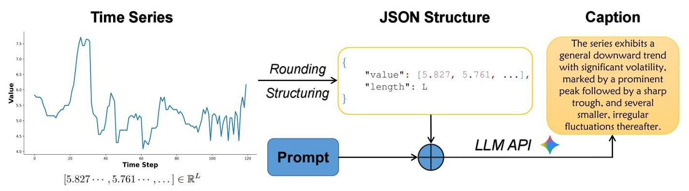

Figure 7. Overall Pipeline of LLM Caption Generation

图7. 大语言模型标题生成的整体流程

- Structuring: We then convert the numpy number sequence into a list, compute its length, and encapsulate them into a JSON object which includes the sequence information and its length information. For processing multivariate time series, sequence information will be a nested list. Note that when dumping JSON for uploading to the LLM, the number list will be serialized into strings.

- 结构化:然后我们将numpy数字序列转换为列表，计算其长度，并将它们封装到一个JSON对象中，该对象包括序列信息及其长度信息。对于处理多变量时间序列，序列信息将是一个嵌套列表。请注意，当转储JSON以上传到大语言模型时，数字列表将被序列化为字符串。

Code Snippet 1. LLM Captioning Generation Prompt for Univariate Time Series

代码片段1. 单变量时间序列的大语言模型标题生成提示

---

def make_prompt(   )

		include_context: bool,

		forbid_semantics: bool,

-> str:

		context_line = (   )

				"If a channel_description is provided, include that context in your description."

				if include_context

				else "Do NOT mention any domain semantics or variable names."

		)

		if forbid_semantics:

				context_line $=$ "DO NOT mention any domain semantics or variable names."

		prompt $=$ f"""You are a time-series analyst. You will receive a single-channel sequence

		Task:

		- Write a concise intrinsic description focusing on trend, volatility, periodicity,

				and notable peaks/troughs.

		- Mention level shifts if present.

		- Keep it short (1-2 sentences).

		- \{context_line\}

		Output JSON schema:

		\{\{

			\\"description\\": \\"<short description>\\"

		\}\}

		Return only JSON (no extra text).

		""".strip()

		return prompt

---

As for prompt engineering, we carefully design the system instruction to prompt LLM to act as a 'Time-Series Analyst' and output structured JSON schema for returning caption. The instructions specifically instruct LLM to pay attention to the morphology of time series, including trend, periodicity, etc. It is worth noticing that mentioning any domain semantics or variable names of time series is not permitted and this can be assured through prompt engineering. An example prompt template for univariate time series can be referred to code snippet 1.

至于提示工程，我们精心设计系统指令，以促使大语言模型充当“时间序列分析师”，并输出结构化JSON模式以返回标题。这些指令特别指示大语言模型关注时间序列的形态，包括趋势、周期性等。值得注意的是，不允许提及时间序列的任何领域语义或变量名，这可以通过提示工程来确保。单变量时间序列的一个示例提示模板可参考代码片段1。

After combining the structured data and prompt into payload, we can obtain the morphological caption of time series by LLM API with rigorous configuration setting.

将结构化数据和提示组合成有效负载后，我们可以通过严格配置设置的大语言模型API获得时间序列的形态学标题。

#### A.2.2. ATTRIBUTE VECTOR EXTRACTION

#### A.2.2. 属性向量提取

As aforementioned in Section 3.3, to obtain structured attribute vector ${c}^{\text{ attr }}$ , Attribute Vector Extraction comprises two procedures: Attribute Schema Discovery and Attribute Vector Value Assignment.

如3.3节所述，为了获得结构化属性向量${c}^{\text{ attr }}$，属性向量提取包括两个过程:属性模式发现和属性向量值分配。

Attribute Schema Discovery Pipeline is developed to, if structured attribute information is not provided in the dataset, discover an appropriate and structured attribute set for all unstructured textual descriptions or captions in the dataset through leveraging the capability of Large Language Model(LLM). In our implementation, we choose Gemini-2.5-flash (Comanici et al., 2025) as the LLM.

属性模式发现流程旨在，如果数据集中未提供结构化属性信息，则通过利用大语言模型(LLM)的能力为数据集中所有非结构化文本描述或标题发现合适的结构化属性集。在我们的实现中，我们选择Gemini-2.5-flash(Comanici等人，2025)作为大语言模型。

The formal objective of the pipeline is to obtain a discrete attribute schema $\mathcal{S}$ mainly consisting of a set of attributes $\mathcal{A} = \left\{  {{a}_{1},{a}_{2},\ldots ,{a}_{m}}\right\}$ , where each attribute ${a}_{i}$ is defined by a name, a semantic definition, and a set of discrete value options ${\mathcal{V}}_{i}$ . Each discrete value option has a string name and a corresponding index. We denote dataset as $\mathcal{D}$ , mini-batch size as $N$ , stability threshold as $K$ and maximum iteration as $T$ . An example schema of ETTm1 produced by the pipeline is presented in code snippet 2.

该流程的正式目标是获得一个离散属性模式$\mathcal{S}$，主要由一组属性$\mathcal{A} = \left\{  {{a}_{1},{a}_{2},\ldots ,{a}_{m}}\right\}$组成，其中每个属性${a}_{i}$由一个名称、一个语义定义和一组离散值选项${\mathcal{V}}_{i}$定义。每个离散值选项都有一个字符串名称和一个相应的索引。我们将数据集表示为$\mathcal{D}$，小批量大小表示为$N$，稳定性阈值表示为$K$，最大迭代次数表示为$T$。该流程生成的ETTm1的一个示例模式在代码片段2中给出。

Because prompting LLM to look into the whole text dataset and extract our desired schema is nearly impossible, the discovery process is formulated as an iterative algorithm. Pipeline progressively refines the schema by exposing the model to random batches of data samples. The process continues until the schema converges and stabilizes. The pipeline of algorithm is elaborated as follows:

由于促使大语言模型查看整个文本数据集并提取我们所需的模式几乎是不可能的，因此发现过程被制定为一种迭代算法。该流程通过将模型暴露于随机批次的数据样本中逐步完善模式。该过程持续进行，直到模式收敛并稳定。算法流程详细说明如下:

Code Snippet 2. Example Schema of ETTm1 Dataset A.2.4

代码片段2. ETTm1数据集A.2.4的示例模式

---

\{

		"scope": "text",

		"attributes": [

			\{

					"name": "level_shift_presence",

					"definition": "Indicates if there are abrupt changes in the average level

								of the series.",

					"values": [

							"multiple_shifts", "no_shifts", "other",

							"single_downward_shift", "single_upward_shift"

					]

			\},

			......

		]

\}

---

1. Sampling: A mini-batch of text samples ${B}_{t} \subset  \mathcal{D}$ is drawn without replacement (where possible) to ensure diversity.

1. 采样:抽取一个无放回的小批量文本样本${B}_{t} \subset  \mathcal{D}$(在可能的情况下)以确保多样性。

2. Prompt Engineering: A prompt ${P}_{t}$ is constructed containing:

2. 提示工程:构建一个提示${P}_{t}$，包含:

- System Instruction: Defines the task (designing a coarse discrete schema), constraints (e.g., 3-8 values per attribute), and the mandatory inclusion of an 'other' category for robustness.

- 系统指令:定义任务(设计一个粗略的离散模式)、约束条件(例如，每个属性3 - 8个值)，以及为了稳健性必须包含一个“其他”类别。

- Current State: The schema from the previous iteration, ${\mathcal{S}}_{t - 1}$ .

- 当前状态:上一轮迭代的模式，${\mathcal{S}}_{t - 1}$ 。

- Observations: The current data batch ${B}_{t}$ .

- 观察结果:当前数据批次 ${B}_{t}$ 。

3. Inference &Parsing: The LLM generates a candidate update ${\mathcal{S}}_{t}^{\prime }$ . We enforce a strict JSON output schema to ensure syntactic validity. If schema parsing fails, the model is recursively prompted to repair the error JSON.

3. 推理与解析:大语言模型生成一个候选更新 ${\mathcal{S}}_{t}^{\prime }$ 。我们强制使用严格的JSON输出模式以确保语法有效性。如果模式解析失败，会递归提示模型修复错误的JSON。

4. Canonicalization: The raw output is normalized (e.g., whitespace stripping) and deduplicated to form ${\mathcal{S}}_{t}$ .

4. 规范化:对原始输出进行标准化处理(例如，去除空白字符)并去重，以形成${\mathcal{S}}_{t}$。

5. Stability Check: We compute the hash value $H\left( {\mathcal{S}}_{t}\right)$ . If $H\left( {\mathcal{S}}_{t}\right)  = H\left( {\mathcal{S}}_{t - 1}\right)$ for $K$ consecutive rounds, the process terminates.

5. 稳定性检查:我们计算哈希值$H\left( {\mathcal{S}}_{t}\right)$。如果在$K$连续轮次中出现$H\left( {\mathcal{S}}_{t}\right)  = H\left( {\mathcal{S}}_{t - 1}\right)$，则该过程终止。

6. Ending: If stability check is passed within the maximum iteration limit, the algorithm immediately terminates and the final output schema is preserved. Otherwise the algorithm ends when iteration times reach the maximum limit $T$ .

6. 结束:如果在最大迭代次数限制内通过了稳定性检查，算法立即终止并保留最终输出模式。否则，当迭代次数达到最大限制$T$时算法结束。

In our implementation, we empirically set $N = {100}, K = 3$ and $T = {50}$ . Pseudocode of the algorithm can be referred to 1.

在我们的实现中，我们根据经验设置了$N = {100}, K = 3$和$T = {50}$。算法的伪代码可参考1。

After obtaining the attribute set from the Attribute Schema Discovery Pipeline, we can further integrate dataset samples' textual descriptions with this attribute set through appropriate prompting and structuring, so as to subsequently feed them into LLM for value assignment to every sample's structured attribute vector.

从属性模式发现管道获得属性集后，我们可以通过适当的提示和结构化，将数据集样本的文本描述与该属性集进一步整合，以便随后将它们输入到语言模型中，为每个样本的结构化属性向量赋值。

Algorithm 1 Attribute Schema Discovery Pipeline

算法1 属性模式发现管道

---

1: Input: Dataset $\mathcal{D}$ , Mini-Batch size $N$ , Stability threshold $K$ , Maximum Iteration $T$

	Output: Optimized Schema ${\mathcal{S}}^{ * }$

	${\mathcal{S}}_{\text{ prev }} \leftarrow  \varnothing ,{k}_{\text{ stable }} \leftarrow  0,{t}_{\text{ round }} \leftarrow  0,$ UsedIndices $\leftarrow  \varnothing$

	while ${k}_{\text{ stable }} < K$ and ${t}_{\text{ round }} < T$ do

		${t}_{\text{ round }} \leftarrow  {t}_{\text{ round }} + 1$

		Indices $\leftarrow$ SAMPLEINDICES $\left( {\left| \mathcal{D}\right| , N}\right)  \smallsetminus$ UsedIndices

		$B \leftarrow  \{ \mathcal{D}\left\lbrack  i\right\rbrack   \mid  i \in$ Indices $\}$

		UsedIndices $\leftarrow$ UsedIndices $\cup$ Indices

		Prompt $\leftarrow$ BUILDPROMPT $\left( {B,{\mathcal{S}}_{\text{ prev }}}\right)$

		${\mathcal{S}}_{\text{ raw }} \leftarrow  \operatorname{LLM}\left( \text{ Prompt }\right)$

		${\mathcal{S}}_{\text{ curr }} \leftarrow$ CANONICALIZE $\left( {\mathcal{S}}_{\text{ raw }}\right)$

		if $\operatorname{HASH}\left( {\mathcal{S}}_{\text{ curr }}\right)  =  = \operatorname{HASH}\left( {\mathcal{S}}_{\text{ prev }}\right)$ then

				${k}_{\text{ stable }} \leftarrow  {k}_{\text{ stable }} + 1$

		else

				${k}_{\text{ stable }} \leftarrow  0$

		end if

		${\mathcal{S}}_{\text{ prev }} \leftarrow  {\mathcal{S}}_{\text{ curr }}$

	end while

	return ${\mathcal{S}}_{\text{ prev }}$

---

#### A.2.3. CLASS LABEL ACQUISITION

#### A.2.3. 类别标签获取

After attribute vector extraction, each sample in the dataset is assigned a structured attribute vector. The specific values within each vector define a unique attribute combination. By aggregating all such combinations in the dataset, we form a set of $N$ distinct entries. Therefore, each attribute vector can be accordingly mapped to an $N$ -dimensional one-hot vector through indexing, denoted as its class label ${c}^{\text{ label }}$ .

在提取属性向量后，数据集中的每个样本都被分配一个结构化属性向量。每个向量中的具体值定义了一个唯一的属性组合。通过汇总数据集中所有此类组合，我们形成了一组$N$个不同的条目。因此，每个属性向量可以通过索引相应地映射到一个$N$维的独热向量，记为其类别标签${c}^{\text{ label }}$。

#### A.2.4. INDIVIDUAL DATASET DETAILS

#### A.2.4. 单个数据集详细信息

AirQuality Beijing (Chen, 2019) Pollutants readings are often included in the air quality reports and are very important for the environment and human society. Collected from 12 nationally-controlled monitoring stations and provided by the Beijing Municipal Environmental Monitoring Center, AirQuality Beijing dataset comprises hourly atmospheric pollutant records integrated with corresponding meteorological data. The time period is from March 1st, 2013 to February 28, 2017.

北京空气质量数据集(Chen，2019年) 污染物读数通常包含在空气质量报告中，对环境和人类社会非常重要。北京空气质量数据集由北京市环境监测中心从12个国家控制的监测站收集，包含每小时的大气污染物记录以及相应的气象数据。时间段为2013年3月1日至2017年2月28日。

For each initial raw data sequence from one station, it contains 35,064 observations and is partitioned along the temporal axis into training, validation and test subsets using a ratio of 8:1:1. Then the dataset is obtained by using a sliding window with a sequence length of 24 and a stride of 24 to slice every station's subset data. Finally each sample in the dataset is a multivariate time series with a sequence length of 24 (representing 24-hour window in a day) and 6 variates which correspond to 6 critical air pollutants: PM2.5, PM10, ${\mathrm{{SO}}}_{2},{\mathrm{{NO}}}_{2},\mathrm{{CO}}$ , and ${\mathrm{O}}_{3}$ . The dataset contains $N = {17},{532}$ samples in total and the sizes of training, validation, and testing sets are ${N}_{\text{ train }} = {14},{025},{N}_{\text{ valid }} = 1,{753}$ , and ${N}_{\text{ test }} = 1,{754}$ , respectively. There are 5 attributes extracted from the schema produced by LLM Caption Generation A.2.1 and Attribute Schema Discovery Pipeline A.2.2 and are shown in Table 6.

对于来自一个站点的每个初始原始数据序列，它包含35,064个观测值，并沿时间轴按8:1:1的比例划分为训练、验证和测试子集。然后，通过使用长度为24且步长为24的滑动窗口对每个站点的子集数据进行切片来获得数据集。最后，数据集中的每个样本都是一个多变量时间序列，序列长度为24(代表一天中的24小时窗口)，有6个变量，分别对应6种关键空气污染物:PM2.5、PM10、${\mathrm{{SO}}}_{2},{\mathrm{{NO}}}_{2},\mathrm{{CO}}$和${\mathrm{O}}_{3}$。该数据集总共包含$N = {17},{532}$个样本，训练集、验证集和测试集的大小分别为${N}_{\text{ train }} = {14},{025},{N}_{\text{ valid }} = 1,{753}$、${N}_{\text{ test }} = 1,{754}$。从LLM字幕生成A.2.1和属性模式发现管道A.2.2产生的数据模式中提取了5个属性，如表6所示。

The case visualization of Airquality Beijing time series data with its corresponding condition in three modalities is shown in Figure 8. The statistic details of the number of tokens in the text data are given in Table 7.

图8展示了北京空气质量时间序列数据及其在三种模态下相应情况的案例可视化。表7给出了文本数据中令牌数量的统计详细信息。

<table><tr><td>Attribute</td><td>Value Options</td><td>Definition</td></tr><tr><td>Particulate_Matter_Profile</td><td>Consistently Low, Low with a Significant Spike, Moderate and Fluctuating, High and Worsening, Consistently High, High with Significant Improvement</td><td>The overall 24-hour trend and severity of PM2.5 and PM10.</td></tr><tr><td>Ozone_Peak_Intensity</td><td>Suppressed or No Peak, Moderate Peak, Strong/Very High Peak</td><td>The strength of the afternoon ozone (O3) peak.</td></tr><tr><td>Inverse_Relationship_Strength</td><td>No Clear Relationship, Weak Relationship, Strong and Clear Relationship</td><td>The clarity of the inverse relationship between O3 and primary pollutants (NO2, CO).</td></tr><tr><td>Primary_Pollution_Event_Timing</td><td>No Specific Event, Morning Peak, Midday/Afternoon Peak, Evening/Nighttime Peak</td><td>The main time of day when primary pollutants (PM, CO, NO2) are highest.</td></tr></table>

Table 6. Attribute Set for Air Quality Profile.

表6. 空气质量概况的属性集。

<table><tr><td>Set</td><td>Average Tokens</td><td>Median Tokens</td><td>Max Tokens</td><td>Std. Dev.</td></tr><tr><td>Training</td><td>220.00</td><td>212.0</td><td>611</td><td>54.85</td></tr><tr><td>Validation</td><td>221.61</td><td>213.0</td><td>508</td><td>55.64</td></tr><tr><td>Test</td><td>218.08</td><td>209.0</td><td>472</td><td>54.33</td></tr></table>

Table 7. Summary of token number statistics for Airquality Beijing dataset.

表7. 北京空气质量数据集令牌数量统计摘要。

TelecomTS (Feng et al., 2025) In the context of monitoring complex systems, vast streams of time-series metrics produced by modern enterprises, also known as observability data, can be very important. Unlike conventional datasets that operate on minute-level aggregations, TelecomTS captures high-frequency network dynamics with a sampling interval of 100ms. The data was collected from a real-world 5G network testbed, incorporating Commercial Off-The-Shelf (COTS) user equipment (UE) under varying channel conditions.

电信时间序列数据集(Feng等人，2025年) 在监控复杂系统的背景下，现代企业产生的大量时间序列指标流，也称为可观测性数据，可能非常重要。与传统数据集以分钟级聚合运行不同，电信时间序列数据集以100毫秒的采样间隔捕获高频网络动态。数据是从一个真实世界的5G网络测试平台收集的，纳入了在不同信道条件下的商用现货(COTS)用户设备(UE)。

The dataset comprises 32,000 samples generated from diverse realistic internet traffic scenarios. Following the ratio of 8:1:1, dataset is empirically split into training, validation and test set with size of 25600, 3200, 3200, respectively. Each sample in the dataset is a multivariate time series with a sequence length of 128 and 18 distinct Key Performance Indicator variates. In our experiments, we only utilize time series data from variate Reference Signal Received Power (RSRP) and Uplink Signal-to-Noise Ratio (UL_SNR), and further treat it as a new multivariate dataset. In our implementation, we predefine the attribute names as rsrp_seg\{i\}, ul_snr_seg\{i\}, $i \in  \{ 1,2,3,4\}$ , and then use LLM Caption Generation A.2.1 and Attribute Schema Discovery Pipeline A.2.2 to produce discrete attribute value options. Eventually there are 8 attributes whose value options are identical, including "drop", "drop_recovery", "other", "periodic", "spiky", "stable", "step_change", "trend_down", "trend_up", "volatile". The case visualization of TelecomTS time series data with its corresponding condition in three modalities is shown in Figure 9.

该数据集包含从各种现实互联网流量场景生成的32,000个样本。按照8:1:1的比例，数据集凭经验被划分为训练集、验证集和测试集，大小分别为25600、3200、3200。数据集中的每个样本都是一个多变量时间序列，序列长度为128，有18个不同的关键性能指标变量。在我们的实验中，我们仅使用来自变量参考信号接收功率(RSRP)和上行链路信噪比(UL_SNR)的时间序列数据，并将其进一步视为一个新的多变量数据集。在我们的实现中，我们将属性名称预定义为rsrp_seg\{i\}、ul_snr_seg\{i\}、$i \in  \{ 1,2,3,4\}$，然后使用大语言模型字幕生成A.2.1和属性模式发现管道A.2.2来生成离散属性值选项。最终有8个属性，其值选项相同，包括“drop”、“drop_recovery”、“other”、“periodic”、“spiky”、“stable”、“step_change”、“trend_down”、“trend_up”、“volatile”。图9展示了TelecomTS时间序列数据及其在三种模态下相应情况的案例可视化。

In addition, we further prepare augmented TelecomTS dataset, denoted as TelecomTS-Segment, for the Fine-grained Control experiment in RQ3. We partition the sequence into four segments and perform captioning for each segment. The TelecomTS-Segment statistic details of the number of tokens in the text data are given in Table 8.

此外，我们还为RQ3中的细粒度控制实验进一步准备了增强的TelecomTS数据集，记为TelecomTS-Segment。我们将序列划分为四个段，并对每个段进行字幕生成。表8给出了文本数据中令牌数量的TelecomTS-Segment统计细节。

<table><tr><td>Set</td><td>Average Tokens</td><td>Median Tokens</td><td>Max Tokens</td><td>Std. Dev.</td></tr><tr><td>Training</td><td>168.14</td><td>165.0</td><td>386</td><td>31.06</td></tr><tr><td>Validation</td><td>167.30</td><td>164.0</td><td>302</td><td>30.07</td></tr><tr><td>Test</td><td>168.67</td><td>165.0</td><td>323</td><td>31.27</td></tr></table>

Table 8. Summary of token number statistics for Telecomts-Segment dataset.

表8. Telecomts-Segment数据集令牌数量统计摘要。

ETTm1 The ETTm1 dataset is derived from the Electricity Transformer Dataset (ETDataset) (Zhou et al., 2021), which is collected via a real-world platform in partnership with the Beijing Guowang Fuda Science and Technology Development Company. The time period is from July 2016 to July 2018. There are 7 variates in the raw data: three variates of useful load (HUFL, MUFL, LUFL), three variates of useless load (HULL, MULL, LULL), and Oil Temperature (OT).

ETTm1 ETTm1数据集源自电力变压器数据集(ETDataset)(Zhou等人，2021年)，该数据集是通过与北京国网富达科技发展公司合作的一个现实世界平台收集的。时间段为2016年7月至2018年7月。原始数据中有7个变量:三个有用负载变量(HUFL、MUFL、LUFL)、三个无用负载变量(HULL、MULL,、LULL)和油温(OT)。

The initial raw data sequence, containing 69,680 observations, is partitioned along the temporal axis into training, validation and test subsets using a ratio of 8:1:1. Then the dataset is obtained by using a sliding window with a sequence length of 120 and a stride of 30 to slice each subset. In addition, in our experiments, we decompose these multivariate time series into individual univariate sequences. Finally each sample in the dataset is a univariate time series with a sequence length of 120. The dataset contains $N = {17},{532}$ samples in total and the sizes of training, validation, and testing sets are ${N}_{\text{ train }} = {13},{013}$ , ${N}_{\text{ valid }} = 1,{631}$ , and ${N}_{\text{ test }} = 1,{631}$ , respectively. There are 5 attributes extracted from the schema produced by LLM Caption Generation A.2.1 and Attribute Schema Discovery Pipeline A.2.2 and are shown in Table 9.

初始原始数据序列包含69,680个观测值，使用8:1:1的比例沿时间轴划分为训练集、验证集和测试子集。然后通过使用序列长度为120、步长为30的滑动窗口对每个子集进行切片来获得数据集。此外，在我们的实验中，我们将这些多变量时间序列分解为单个单变量序列。最终数据集中的每个样本都是一个序列长度为120的单变量时间序列。该数据集总共包含$N = {17},{532}$个样本，训练集、验证集和测试集的大小分别为${N}_{\text{ train }} = {13},{013}$、${N}_{\text{ valid }} = 1,{631}$和${N}_{\text{ test }} = 1,{631}$。从大语言模型字幕生成A.2.1和属性模式发现管道A.2.2生成的模式中提取了5个属性，并在表9中显示。

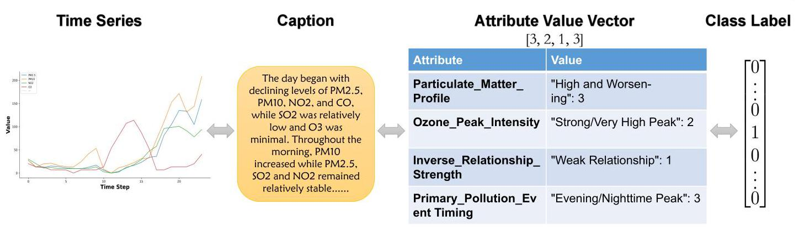

Figure 8. Case Visualization of Airquality Beijing Data

图8. 北京空气质量数据的案例可视化

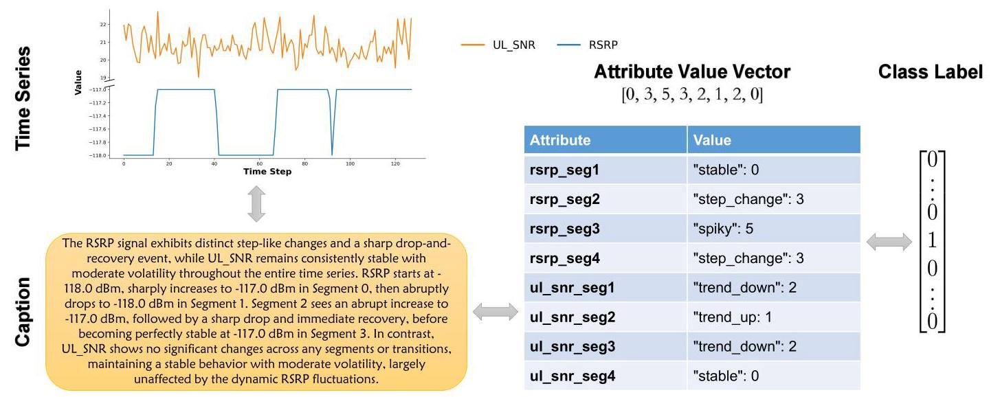

Figure 9. Case Visualization of TelecomTS Data

图9. TelecomTS数据的案例可视化

The case visualization of ETTml time series data with its corresponding condition in three modalities is shown in Figure 10. The statistic details of the number of tokens in the text data are given in Table 10.

图10展示了ETTml时间序列数据及其在三种模态下相应情况的案例可视化。表10给出了文本数据中令牌数量的统计细节。

Figure 10. Case Visualization of ETTm1 Data

图10. ETTm1数据的案例可视化

<table><tr><td>Attribute</td><td>Value Options</td><td>Definition</td></tr><tr><td>level_shift_presence</td><td>multiple_shifts, no_shifts, other, sin gle_downward_shift, single_upward_shift</td><td>Indicates if there are abrupt changes in the average level of the series.</td></tr><tr><td>overall_trend</td><td>downward_trend, fluctuating_trend, mixed_trend, no_clear_trend, other, stable_level, upward_trend</td><td>Captures the long-term trajectory and persistent directional movement of the signal.</td></tr><tr><td>periodicity</td><td>absent, other, present, unclear</td><td>Assesses the existence of repetitive cycles or patterns occurring at fixed time intervals.</td></tr><tr><td>prominent_features</td><td>minor_fluctuations, other, peaks_and_troughs, peaks_only, troughs_only</td><td>Characterizes the most distinct visual landmarks or morphological events within the data.</td></tr><tr><td>volatility_level</td><td>decreasing_volatility, high_volatility, increasing_volatility, low_volatility, mixed_volatility, moderate_volatility, other</td><td>Evaluates the intensity and temporal evolution of variance and fluctuations in the series.</td></tr></table>

Table 9. Attribute Set for ETTm1.

表9. ETTm1的属性集。

<table><tr><td>Set</td><td>Average Tokens</td><td>Median Tokens</td><td>Max Tokens</td><td>Std. Dev.</td></tr><tr><td>Training</td><td>43.37</td><td>42.0</td><td>86</td><td>7.54</td></tr><tr><td>Validation</td><td>43.84</td><td>43.0</td><td>81</td><td>8.03</td></tr><tr><td>Test</td><td>44.24</td><td>43.0</td><td>74</td><td>7.71</td></tr></table>

Table 10. Summary of token number statistics for ETTm1 dataset.

表10. ETTm1数据集令牌数量统计摘要。

Istanbul Traffic (Leo, 2024) Istanbul Traffic dataset records Istanbul city's traffic index at one-minute intervals. The time series data includes three key variates: a city-wide index (TI) and separate indices for the Asian (TI_An) and European (TI_Av) regions. The time period is from November 2022 to June 2024, with a sampling frequency of one minute and update frequency of a week.

伊斯坦布尔交通(Leo，2024年)伊斯坦布尔交通数据集以一分钟的间隔记录伊斯坦布尔市的交通指数。时间序列数据包括三个关键变量:一个全市范围的指数(TI)以及亚洲(TI_An)和欧洲(TI_Av)地区的单独指数。时间段为2022年11月至2024年6月，采样频率为一分钟，更新频率为一周。

The initial raw data sequence, containing 817,769 observations, is first taken a sample every ten minutes and then partitioned along the temporal axis into training, validation and test subsets using a ratio of 8:1:1. Then the Istanbul Traffic dataset is obtained by using a sliding window with a sequence length of 144 and a stride of 24 to slice each subset. In addition, in our experiments, we decompose these multivariate time series into individual univariate sequences. Finally each sample in the dataset is a univariate time series with a sequence length of 144. The dataset contains $N = {31},{971}$ samples in total and the sizes of training, validation, and testing sets are ${N}_{\text{ train }} = {25},{596},{N}_{\text{ valid }} = 3,{186}$ , and ${N}_{\text{ test }} = 3,{189}$ , respectively. There are 6 attributes extracted from the schema produced by LLM Caption Generation A.2.1 and Attribute Schema Discovery Pipeline A.2.2 and are shown in Table 11.

初始原始数据序列包含817,769个观测值，首先每十分钟抽取一个样本，然后沿时间轴按8:1:1的比例划分为训练集、验证集和测试集。然后，通过使用长度为144且步长为24的滑动窗口对每个子集进行切片，从而获得伊斯坦布尔交通数据集。此外，在我们的实验中，我们将这些多变量时间序列分解为单独的单变量序列。最后，数据集中的每个样本都是一个长度为144的单变量时间序列。该数据集总共包含$N = {31},{971}$个样本，训练集、验证集和测试集的大小分别为${N}_{\text{ train }} = {25},{596},{N}_{\text{ valid }} = 3,{186}$和${N}_{\text{ test }} = 3,{189}$。从大语言模型字幕生成A.2.1和属性模式发现管道A.2.2生成的模式中提取了6个属性，并如表11所示。

<table><tr><td>Attribute</td><td>Value Options</td><td>Definition</td></tr><tr><td>extreme_points</td><td>absent, other, present</td><td>Denotes the existence of significant local maxima (peaks) or minima (troughs) within the signal.</td></tr><tr><td>level_shifts</td><td>absent, other, present_distinct, present_gradual, step_wise</td><td>Specifies the occurrence and specific characteristics of sudden transitions in the series' baseline.</td></tr><tr><td>overall_trend</td><td>downward, mixed, other, stable, upward</td><td>Represents the predominant long-term trajectory of the data over the entire observation window.</td></tr><tr><td>periodicity</td><td>absent, other, present</td><td>Evaluates whether the sequence demonstrates rhythmic or recurring temporal structures.</td></tr><tr><td>volatility_change</td><td>decreasing, increasing, other, stable_volatility</td><td>Tracks the evolution of fluctuation intensity, indicating if the variance expands or contracts over time.</td></tr><tr><td>volatility_level</td><td>high, low, moderate, no_volatility, other</td><td>Quantifies the overall magnitude of oscillations and noise levels present in the time series.</td></tr></table>

Table 11. Attribute Set for Istanbul Traffic.

表11. 伊斯坦布尔交通的属性集。

The case visualization of Istanbul Traffic time series data with its corresponding condition in three modalities is shown in Figure 11. The statistic details of the number of tokens in the text data are given in Table 12.

图11展示了伊斯坦布尔交通时间序列数据及其对应条件在三种模态下的案例可视化。表12给出了文本数据中令牌数量的统计细节。

<table><tr><td>Set</td><td>Average Tokens</td><td>Median Tokens</td><td>Max Tokens</td><td>Std. Dev.</td></tr><tr><td>Training</td><td>45.64</td><td>44.0</td><td>288</td><td>11.60</td></tr><tr><td>Validation</td><td>45.40</td><td>43.0</td><td>188</td><td>11.73</td></tr><tr><td>Test</td><td>44.41</td><td>43.0</td><td>122</td><td>11.22</td></tr></table>

Table 12. Summary of token number statistics for Istanbul Traffic dataset.

表12. 伊斯坦布尔交通数据集令牌数量统计摘要。

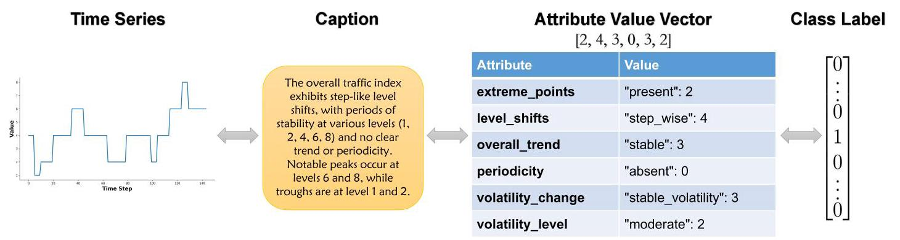

Figure 11. Case Visualization of Istanbul Traffic Data

图11. 伊斯坦布尔交通数据的案例可视化

### A.3. Real-World Datasets with Paired Conditions

### A.3. 具有配对条件的真实世界数据集

As aforementioned, with respect to the experiment in RQ2, PTB-XL (Wagner et al., 2020) and Weather (Xu et al., 2024) datasets are further processed to annotate every time series instance with both a morphological description and conceptual description.

如前所述，关于RQ2中的实验，PTB-XL(Wagner等人，2020)和天气(Xu等人，2024)数据集被进一步处理，以便用形态学描述和概念描述对每个时间序列实例进行注释。

#### A.3.1. PTB-XL

#### A.3.1. PTB-XL

Electrocardiography (ECG) remains a fundamental diagnostic instrument for evaluating cardiac health. The integration of automated ECG interpretation systems can be rather important and beneficial. PTB-XL dataset is a dataset is a large dataset of 21837 clinical 12-lead ECGs from 18885 patients of 10 second length. We split the dataset in a ratio of 8:1:1 and obtain training, validation and testing set with the size of 17418, 2183 and 2198 respectively. Each sample data contains a multivariate time series with the length of 1000 and variate number of 12.

心电图(ECG)仍然是评估心脏健康的基本诊断工具。自动化心电图解释系统的集成可能相当重要且有益。PTB-XL数据集是一个包含来自18885名患者的21837份10秒长的临床12导联心电图的大型数据集。我们按8:1:1的比例拆分数据集，分别获得大小为17418、2183和2198的训练集、验证集和测试集。每个样本数据包含一个长度为1000且变量数量为12的多变量时间序列。

Conceptual information is included in the original dataset for each sample and is further utilized to form conceptual description. Following Neurokit2 (Makowski et al., 2021), to annotate samples with more accurate morphological description, instead of prompting LLM to do morphological captioning, we first leverage neuropsychological library neurokit2 to obtain the physical features of ECG signals, categorize them into single-label attributes, and then generate textual description utilizing the attribute values and there corresponding predefined templates.

原始数据集中为每个样本包含了概念信息，并进一步用于形成概念描述。遵循Neurokit2(Makowski等人，2021)，为了用更准确的形态学描述注释样本，我们不是促使大语言模型进行形态学字幕生成，而是首先利用神经心理学库Neurokit2获取心电图信号的物理特征，将它们分类为单标签属性，然后利用属性值和相应的预定义模板生成文本描述。

Instead of using Attribute Schema Discovery Pipeline A.2.2, the attribute sets for the morphological condition and conceptual condition are obtained from Neurokit2 library and patient diagnostic information respectively. The details of these two attribute sets are presented in Table 13 and Table 14.

形态学条件和概念条件的属性集不是使用属性模式发现管道A.2.2获得的，而是分别从Neurokit2库和患者诊断信息中获得的。这两个属性集的详细信息见表13和表14。

The case visualization of PTB-XL time series data with its corresponding condition in three modalities is shown in Figure 12. The statistic details of the number of tokens in the morphological and conceptual text data are given in Table 15 and 16 respectively.

图12展示了PTB-XL时间序列数据及其对应条件在三种模态下的案例可视化。形态学和概念文本数据中令牌数量的统计细节分别见表15和表16。

#### A.3.2. WEATHER

#### A.3.2. 天气

Collected at the Max Planck Institute for Biogeochemistry's WS Beutenberg station in Jena, Germany, this comprehensive dataset includes an eight-year climatic observations from 2014 to 2022. There are 21 distinct meteorological parameters included in the dataset, ranging from atmospheric pressure (p, mbar) to carbon dioxide concentration (CO2, ppm). They are captured at frequent 10-minute intervals with per-second timestamp precision.

该综合数据集在德国耶拿的马克斯·普朗克生物地球化学研究所的WS贝滕贝格站收集，包括2014年至2022年的八年气候观测数据。数据集中包含21个不同的气象参数，范围从大气压力(p，毫巴)到二氧化碳浓度(CO2，ppm)。它们以每秒时间戳精度每10分钟频繁采集一次。

The raw data is sliced into 6-hour windows (36 time steps), strictly anchored by existing caption timestamps to ensure data validity. These time series snippets are partitioned in chronological order and in the ratio of 8:1:1, producing training, validation and testing sets with the size of 10489, 1311, 1312 respectively. In addition, given that time series with 21 variates will result in rather long captions produced by LLM, we extract 10 meteorological variates data out and treat them as the new multivariate data used for our experiment. These 10 variates include: temperature (T, degC), wind speed (wv, m/s), wind direction (wd, deg), atmospheric pressure (p, mbar), relative humidity (rh, %), rainfall (rain, mm), rain duration (raining, s), shortwave radiation (SWDR, W/m2), photosynthetically active radiation (PAR, μmol/m2/s) and maximum photosynthetically active radiation (max. PAR, μmol/m2/s).

原始数据被切成6小时的窗口(36个时间步长)，严格以现有的字幕时间戳为锚点，以确保数据有效性。这些时间序列片段按时间顺序以8:1:1的比例进行划分，分别生成大小为10489、1311、1312的训练集、验证集和测试集。此外，鉴于具有21个变量的时间序列会导致大语言模型生成相当长的字幕，我们提取出10个气象变量数据，并将它们作为用于我们实验的新多变量数据。这10个变量包括:温度(T，摄氏度)、风速(wv，米/秒)、风向(wd，度)、气压(p，毫巴)、相对湿度(rh，%)、降雨量(rain，毫米)、降雨持续时间(raining，秒)、短波辐射(SWDR，瓦/平方米)、光合有效辐射(PAR，微摩尔/平方米/秒)和最大光合有效辐射(最大PAR，微摩尔/平方米/秒)。

<table><tr><td>Attribute</td><td>Value Options</td><td>Definition</td></tr><tr><td>rhythm</td><td>SR, AFIB, AFLT, STACH, SBRAD, SARRH, PACE, SVARR, BIGU, TRIGU, SVTAC, PSVT, unknown</td><td>Primary rhythm code (highest confidence)</td></tr><tr><td>hr_cat</td><td>bradycardia, normal, tachycardia</td><td>HR < 60 / 60-100 / > 100 bpm</td></tr><tr><td>rr_regularity</td><td>regular, mild_irregular, irregular</td><td>RR CV < 0.05 / 0.05-0.12 / > 0.12</td></tr><tr><td>qrs_cat</td><td>normal, borderline, wide</td><td>QRS < 100 / 100-120 / > 120 ms</td></tr><tr><td>qtc_cat</td><td>normal, borderline, prolonged</td><td>QTc < 450 / 450-480 / > 480 ms</td></tr><tr><td>st_anterior</td><td>normal, mild_elevation, high_elevation, mild_depression, high_depression</td><td>ST deviation in V1-V4</td></tr><tr><td>st_lateral</td><td>normal, mild_elevation, high_elevation, mild_depression, high_depression</td><td>ST deviation in I, aVL, V5-V6</td></tr><tr><td>st_inferior</td><td>normal, mild_elevation, high_elevation, mild_depression, high_depression</td><td>ST deviation in II, III, aVF</td></tr></table>

Table 13. Morphological Condition Attribute Set for PTB-XL

表13. PTB-XL的形态条件属性集

<table><tr><td>Attribute</td><td>Value Options</td><td>Definition</td></tr><tr><td>age_group</td><td>young, middle_aged, elderly</td><td>Age < 40 / 40-65 / > 65</td></tr><tr><td>sex</td><td>male, female</td><td>From metadata</td></tr><tr><td>diagnosis</td><td>43 diagnostic codes (e.g., NORM, IMI, ASMI, LVH, ...)</td><td>Primary diagnosis (highest confidence)</td></tr><tr><td>heart_axis</td><td>normal, LAD, RAD, ALAD, ARAD, unknown</td><td>From metadata</td></tr></table>

Table 14. Conceptual Condition Attribute Set for PTB-XL

表14. PTB-XL的概念条件属性集

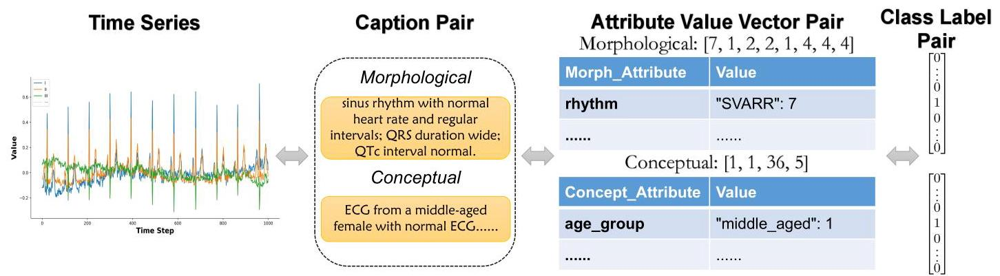

Figure 12. Case Visualization of PTB-XL Data

图12. PTB-XL数据的案例可视化

The conceptual descriptions of the data are human expert weather forecasts obtained from public platforms. The morphological descriptions of the data are generated using Gemini-2.5-flash with appropriate structured payload and prompting.

数据的概念描述是从公共平台获得的人类专家天气预报。数据的形态描述是使用Gemini-2.5-flash并带有适当的结构化有效载荷和提示生成的。

<table><tr><td>Set</td><td>Average Tokens</td><td>Median Tokens</td><td>Max Tokens</td><td>Std. Dev.</td></tr><tr><td>Training</td><td>25.94</td><td>24.0</td><td>51</td><td>5.07</td></tr><tr><td>Validation</td><td>26.17</td><td>24.0</td><td>50</td><td>5.17</td></tr><tr><td>Test</td><td>26.16</td><td>24.0</td><td>50</td><td>4.98</td></tr></table>

Table 15. Summary of token number statistics for PTB-XL morphological text data.

表15. PTB-XL形态文本数据的令牌数量统计摘要。

<table><tr><td>Set</td><td>Average Tokens</td><td>Median Tokens</td><td>Max Tokens</td><td>Std. Dev.</td></tr><tr><td>Training</td><td>16.29</td><td>16.0</td><td>29</td><td>4.37</td></tr><tr><td>Validation</td><td>16.13</td><td>16.0</td><td>28</td><td>4.17</td></tr><tr><td>Test</td><td>16.19</td><td>16.0</td><td>27</td><td>4.19</td></tr></table>

Table 16. Summary of token number statistics for PTB-XL conceptual text data.

表16. PTB-XL概念文本数据的令牌数量统计摘要。

We utilize Attribute Schema Discovery Pipeline A.2.2 to obtain the attribute set for both morphological and conceptual conditions. For the morphological condition, so as to converge faster and produce more morphologically reasonable schema, we predefine each variate of time series as an attribute without specifying variate name or semantic meaning, and eventually obtain identical value options for each attribute, including "flat", "level_shift", "other", "periodic", "spiky", "trend_down" and "trend_up". For the conceptual condition, there are 7 attributes extracted from the produced schema shown in Table 17.

我们利用属性模式发现管道A.2.2来获取形态和概念条件的属性集。对于形态条件，为了更快收敛并产生更符合形态的模式，我们将时间序列的每个变量预定义为一个属性，而不指定变量名称或语义含义，最终为每个属性获得相同的值选项，包括“flat”、“level_shift”、“other”、“periodic”、“spiky”、“trend_down”和“trend_up”。对于概念条件，从表17所示的生成模式中提取了7个属性。

<table><tr><td>Attribute</td><td>Value Options</td><td>Definition</td></tr><tr><td>humidity_level</td><td>dry, extremely_high, high, low, medium, moderately_dry, saturated, somewhat_humid, unknown, very_high</td><td>A qualitative representation of the ambient moisture concentration in the atmosphere.</td></tr><tr><td>pressure_level</td><td>average, high, low, unknown, very_high, very_low</td><td>Reflects the barometric status and atmospheric pressure fluctuations.</td></tr><tr><td>season</td><td>autumn, spring, summer, unknown, winter</td><td>Identifies the specific climatological period of the year for the given data.</td></tr><tr><td>sky_condition</td><td>broken_clouds, clear, cloudy, fog, other, partly_cloudy, passing_clouds, precipitation, scattered_clouds, sunny</td><td>Characterizes the visual appearance of the firmament and the density of cloud coverage.</td></tr><tr><td>temperature_level</td><td>chilly, cool, high, low, medium, unknown, warm</td><td>Provides a non-numeric evaluation of the thermal state of the environment.</td></tr><tr><td>time_of_day</td><td>afternoon, early_morning, evening, morning, night, unknown</td><td>Categorizes the observation into broad diurnal temporal segments.</td></tr><tr><td>wind_strength</td><td>calm, fresh, gentle, light, moderate, strong, unknown</td><td>Describes the magnitude and kinetic energy of atmospheric air flow.</td></tr></table>

Table 17. Conceptual Condition Attribute Set for Weather.

表17. 天气的概念条件属性集。

The case visualization of Weather time series data with its corresponding condition in three modalities is shown in Figure 13. The statistic details of the number of tokens in the morphological and conceptual text data are given in Table 18 and Table 19 respectively.

图13展示了天气时间序列数据及其对应条件在三种模态下的案例可视化。表18和表19分别给出了形态和概念文本数据中令牌数量的统计细节。

## B. Model Implementation Details

## B. 模型实现细节

In this section, we provide the implementation details for all evaluated models in ConTSG-Bench. We first describe the unified training configuration shared across all models, followed by model-specific adaptations organized by conditioning modality.

在本节中，我们提供了ConTSG-Bench中所有评估模型的实现细节。我们首先描述所有模型共享的统一训练配置，然后按条件模态组织特定于模型的调整。

### B.1. General Training Configuration

### B.1. 通用训练配置

All experiments are conducted on a single NVIDIA A40 GPU with 48GB memory using full-precision (FP32) training. All datasets are normalized using channel-wise z-score standardization, where each feature dimension is independently standardized to zero mean and unit variance based on training set statistics.

所有实验均在一台具有48GB内存的NVIDIA A40 GPU上使用全精度(FP32)训练进行。所有数据集都使用逐通道z分数标准化进行归一化，其中每个特征维度根据训练集统计信息独立标准化为零均值和单位方差。

<table><tr><td>Set</td><td>Average Tokens</td><td>Median Tokens</td><td>Max Tokens</td><td>Std. Dev.</td></tr><tr><td>Training</td><td>142.49</td><td>140.0</td><td>276</td><td>28.91</td></tr><tr><td>Validation</td><td>146.09</td><td>143.0</td><td>251</td><td>31.04</td></tr><tr><td>Test</td><td>144.45</td><td>142.0</td><td>269</td><td>31.14</td></tr></table>

Table 18. Summary of token number statistics for Weather morphological text data.

表18. 天气形态文本数据的令牌数量统计摘要。

<table><tr><td>Set</td><td>Average Tokens</td><td>Median Tokens</td><td>Max Tokens</td><td>Std. Dev.</td></tr><tr><td>Training</td><td>70.10</td><td>69.0</td><td>130</td><td>10.05</td></tr><tr><td>Validation</td><td>73.40</td><td>73.0</td><td>125</td><td>10.64</td></tr><tr><td>Test</td><td>72.87</td><td>73.0</td><td>112</td><td>10.58</td></tr></table>

Table 19. Summary of token number statistics for Weather conceptual text data.

表19. 天气概念文本数据的令牌数量统计摘要。

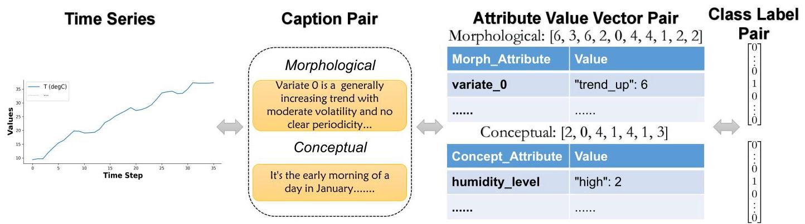

Figure 13. Case Visualization of Weather Data

图13. 天气数据案例可视化

The maximum number of training epochs is set to 700, with early stopping triggered if the validation loss fails to improve for 50 consecutive epochs. For two-stage models (TimeVQVAE (Lee et al., 2023), T2S (Ge et al., 2025), Text2Motion (Guo et al., 2022), and DiffuSETS (Lai et al., 2025a)), we allocate 200 epochs for the first stage and 500 epochs for the second stage, with early stopping applied independently to each stage. All models use the AdamW optimizer with a weight decay of $1 \times  {10}^{-4}$ . We perform grid search over learning rate $\in  \left\{  {{10}^{-3},{10}^{-4}}\right\}$ , batch size $\in  \{ {32},{64},{128},{256}\}$ , and learning rate scheduler $\in  \{$ cosine, linear, none $\}$ , selecting the best configuration based on validation loss.

训练轮次的最大数量设置为700，如果验证损失连续50个轮次没有改善，则触发提前停止。对于两阶段模型(TimeVQVAE (Lee等人，2023年)，T2S (Ge等人，2025年)，Text2Motion (Guo等人，2022年)，以及DiffuSETS (Lai等人，2025a))，我们为第一阶段分配200个轮次，为第二阶段分配500个轮次，每个阶段独立应用提前停止。所有模型都使用AdamW优化器，权重衰减为$1 \times  {10}^{-4}$。我们对学习率$\in  \left\{  {{10}^{-3},{10}^{-4}}\right\}$、批量大小$\in  \{ {32},{64},{128},{256}\}$和学习率调度器$\in  \{$ 余弦、线性、无$\}$进行网格搜索，根据验证损失选择最佳配置。

For diffusion-based models, we adopt DDIM (Song et al., 2021) as the unified sampling framework, except for T2S (Ge et al., 2025) which employs rectified flow with Euler ODE integration. For text-conditioned models, we use Qwen3-Embedding- 0.6B (Zhang et al., 2025) as the sentence encoder, except for VerbalTS (Gu et al., 2025) which trains its own text encoder from scratch.

对于基于扩散的模型，我们采用DDIM (Song等人，2021年) 作为统一的采样框架，除了T2S (Ge等人，2025年) 采用带欧拉常微分方程积分的整流流。对于文本条件模型，我们使用Qwen3-Embedding- 0.6B (Zhang等人，2025年) 作为句子编码器，除了VerbalTS (Gu等人，2025年) 从零开始训练自己的文本编码器。

### B.2. Label-Conditioned Models

### B.2. 标签条件模型

TTS-CGAN (Li et al., 2022). TTS-CGAN employs a Transformer-based conditional GAN architecture (Goodfellow et al., 2020) for class-conditioned time series synthesis. We include it as a representative of GAN-based approaches, offering a fundamentally different training paradigm compared to diffusion-based methods. The model uses WGAN-GP (Gulrajani et al., 2017) training with auxiliary classification losses to encourage class-distinctive pattern generation. The core architecture, including the Transformer-based generator and patch-based discriminator, remains unchanged.

TTS-CGAN (Li等人，2022年)。TTS-CGAN采用基于Transformer的条件GAN架构 (Goodfellow等人，2020年) 进行类条件时间序列合成。我们将其作为基于GAN的方法的代表，与基于扩散的方法相比，提供了一种根本不同的训练范式。该模型使用WGAN-GP (Gulrajani等人，2017年) 训练，并带有辅助分类损失，以鼓励生成类独特模式。核心架构，包括基于Transformer的生成器和基于补丁的判别器，保持不变。

TimeVQVAE (Lee et al., 2023). TimeVQVAE leverages vector quantization (Van Den Oord et al., 2017) to compress time series into discrete latent representations, offering an alternative paradigm to continuous diffusion-based methods. The model operates in two stages: (1) a VQ-VAE encodes time series into discrete tokens via time-frequency decomposition with separate codebooks for low and high-frequency components; (2) a MaskGIT-style (Chang et al., 2022) bidirectional Transformer learns the prior distribution over quantized tokens. Our implementation is based on the official repository and preserves all core components. For adaptation to our benchmark, we map discrete attribute combinations onto class labels through Cartesian product encoding. The two-stage training is integrated into our multi-stage framework with automatic weight loading between phases.

TimeVQVAE (Lee等人，2023年)。TimeVQVAE利用矢量量化 (Van Den Oord等人，2017年) 将时间序列压缩为离散的潜在表示，为基于连续扩散的方法提供了一种替代范式。该模型分两个阶段运行:(1) 一个VQ-VAE通过时频分解将时间序列编码为离散令牌，低频和高频分量使用单独的码本；(2) 一个MaskGIT风格 (Chang等人，2022年) 的双向Transformer学习量化令牌上的先验分布。我们的实现基于官方仓库，并保留所有核心组件。为了适应我们的基准测试，我们通过笛卡尔积编码将离散属性组合映射到类标签上。两阶段训练被集成到我们的多阶段框架中，各阶段之间自动加载权重。

### B.3. Attribute-Conditioned Models

### B.3. 属性条件模型

TEdit (Jing et al., 2024). TEdit was originally designed for the task of Time Series Editing (TSE), employing a multi-resolution diffusion architecture with attribute conditioning. We include it as a representative of multi-scale patch-based diffusion approaches. For adaptation to our benchmark, we reformulate TEdit from an editing model to a conditional generation model by removing the two-stage editing procedure (DDIM forward encoding followed by reverse decoding) and instead performing standard diffusion-based generation from Gaussian noise. The bootstrap learning component is also removed as it is specific to the editing task. The core architecture remains unchanged, including the multi-resolution patch embedding, residual blocks with time-feature Transformer attention, and the heterogeneous attribute encoder.

TEdit (Jing等人，2024年)。TEdit最初是为时间序列编辑 (TSE) 任务设计的，采用具有属性条件的多分辨率扩散架构。我们将其作为基于多尺度补丁的扩散方法的代表。为了适应我们的基准测试，我们通过去除两阶段编辑过程(DDIM正向编码后跟反向解码)，将TEdit从编辑模型重新表述为条件生成模型，而是从高斯噪声进行基于标准扩散的生成。引导学习组件也被移除，因为它特定于编辑任务。核心架构保持不变，包括多分辨率补丁嵌入、带时间特征Transformer注意力的残差块和异构属性编码器。

TimeWeaver (Narasimhan et al., 2024). TimeWeaver is a diffusion-based model designed for generating time series conditioned on heterogeneous metadata. As the original implementation is not publicly available, we provide a faithful reimplementation based on the published paper, following the CSDI-based backbone architecture (Tashiro et al., 2021). For adaptation to our benchmark, we focus on discrete attribute conditioning while omitting support for continuous and time-varying metadata, as these modalities are not present in our evaluation datasets. The core architectural components, including interleaved temporal-feature attention and the metadata fusion mechanism, closely follow the original paper.

TimeWeaver (Narasimhan等人，2024年)。TimeWeaver是一个基于扩散的模型，设计用于根据异构元数据生成时间序列。由于原始实现未公开，我们根据已发表的论文提供了一个忠实的重新实现，遵循基于CSDI的骨干架构 (Tashiro等人，2021年)。为了适应我们的基准测试，我们专注于离散属性条件，同时省略对连续和时变元数据的支持，因为这些模态在我们的评估数据集中不存在。核心架构组件，包括交错的时间特征注意力和元数据融合机制，紧密遵循原始论文。

WaveStitch (Shankar et al., 2025). WaveStitch is designed for synthesizing tabular time series with hierarchical attributes. It employs a diffusion model backbone based on Structured State Spaces (S4) (Gu et al., 2022), which captures long-range temporal dependencies more efficiently than standard attention mechanisms. We include it as a representative of S4-based conditional diffusion architectures. The original implementation uses cyclic encoding that maps temporal attributes (e.g., hour-of-day) to sine-cosine pairs, assuming periodic semantics. For our benchmark, we replace cyclic encoding with learnable embeddings to handle general discrete attributes without assuming specific semantics. The embeddings are injected into each residual block through additive conditioning. The core S4-based diffusion backbone with skip connections and gating mechanism remains unchanged.

WaveStitch(Shankar等人，2025年)。WaveStitch旨在合成具有分层属性的表格时间序列。它采用基于结构化状态空间(S4)的扩散模型主干(Gu等人，2022年)，与标准注意力机制相比，该主干能更有效地捕捉长程时间依赖性。我们将其作为基于S4的条件扩散架构的代表纳入。原始实现使用循环编码将时间属性(例如，一天中的小时)映射到正弦 - 余弦对，假设具有周期性语义。对于我们的基准测试，我们用可学习的嵌入替换循环编码，以处理一般离散属性而不假设特定语义。这些嵌入通过加法条件注入到每个残差块中。基于S4的带有跳跃连接和门控机制的核心扩散主干保持不变。

### B.4. Text-Conditioned Models

### B.4. 文本条件模型

BRIDGE (Li et al., 2025). BRIDGE was originally proposed for text-controlled time series generation, serving as a representative of prototype-based diffusion architectures. The core architecture comprises a Domain-Unified Prototyper that extracts latent representations from example time series, and a 1D U-Net (Ronneberger et al., 2015) diffusion backbone with cross-attention between the denoising signal and the extracted prototypes. We adopt the official implementation from the TimeCraft repository and extend the input dimension from univariate to multivariate by modifying only the input channel dimension. At inference time, this model requires an additional example time series to guide generation through prototype extraction. To ensure fair comparison with other models, we randomly sample these example prompts from the training set rather than using oracle references. The core generative mechanism remains unchanged, including the prototype extraction, the cross-attention conditioning pathway, and the classifier-free guidance.

BRIDGE(Li等人，2025年)。BRIDGE最初是为文本控制的时间序列生成而提出的，是基于原型的扩散架构的代表。核心架构包括一个从示例时间序列中提取潜在表示的域统一原型器，以及一个在去噪信号和提取的原型之间具有交叉注意力的1D U - Net(Ronneberger等人，2015年)扩散主干。我们采用TimeCraft存储库中的官方实现，并通过仅修改输入通道维度将输入维度从单变量扩展到多变量。在推理时，该模型需要一个额外的示例时间序列来通过原型提取指导生成。为确保与其他模型公平比较，我们从训练集中随机采样这些示例提示，而不是使用神谕参考。核心生成机制保持不变，包括原型提取、交叉注意力条件路径和无分类器指导。

T2S (Ge et al., 2025). T2S employs a two-stage latent diffusion framework. In stage one, a convolutional AutoEncoder compresses time series into a fixed 30-position latent space via bilinear interpolation. In stage two, a Diffusion Transformer (Peebles & Xie, 2023) with Adaptive Layer Normalization (AdaLN) performs Rectified Flow (Liu et al., 2023) generation in the latent space. Although the original paper describes a VAE architecture, we follow the official codebase which implements a standard AutoEncoder without the variational component. The original implementation is restricted to univariate series. We extend the encoder and decoder to accept $C$ input channels, where the convolutional layers naturally aggregate cross-variate information.

T2S(Ge等人，2025年)。T2S采用两阶段潜在扩散框架。在第一阶段，一个卷积自动编码器通过双线性插值将时间序列压缩到固定的30位置潜在空间。在第二阶段，一个带有自适应层归一化(AdaLN)(Peebles & Xie，2023年)的扩散Transformer在潜在空间中执行整流流(Liu等人，2023年)生成。尽管原始论文描述了一个VAE架构，但我们遵循官方代码库，该代码库实现了一个没有变分组件的标准自动编码器。原始实现仅限于单变量序列。我们扩展了编码器和解码器以接受$C$个输入通道，其中卷积层自然地聚合交叉变量信息。

VerbalTS (Gu et al., 2025). VerbalTS was originally proposed for text-conditioned multivariate time series generation. We include it as a representative of multi-scale diffusion approaches with hierarchical text conditioning mechanisms. Unlike other text-conditioned models that rely on pretrained sentence encoders, VerbalTS trains its text encoder from scratch jointly with the generation model, enabling end-to-end optimization of text-time series alignment. Our implementation follows the official repository and preserves all core components, including the multi-scale patch-based architecture and adaptive layer normalization conditioning.

VerbalTS(Gu等人，2025年)。VerbalTS最初是为文本条件的多变量时间序列生成而提出的。我们将其作为具有分层文本条件机制的多尺度扩散方法的代表纳入。与其他依赖预训练句子编码器的文本条件模型不同，VerbalTS与生成模型一起从头开始训练其文本编码器，实现文本 - 时间序列对齐的端到端优化。我们的实现遵循官方存储库并保留所有核心组件，包括基于多尺度补丁的架构和自适应层归一化条件。

Text2Motion (Guo et al., 2022). Text2Motion was originally proposed for generating human motion from natural language descriptions. We include this method as a representative of latent-space autoregressive VAE architectures, offering an alternative generative paradigm to diffusion-based approaches. For adaptation to our benchmark, we replace the original token-level word embeddings (which require part-of-speech annotations and language-specific preprocessing) with precomputed sentence embeddings from Qwen3-Embedding-0.6B, projected through a learnable linear layer. This modification ensures consistency with other text-conditioned baselines while eliminating external NLP dependencies. The core generative mechanism, including the two-stage training protocol (autoencoder pretraining followed by conditional latent generator training), remains unchanged.

Text2Motion(Guo等人，2022年)。Text2Motion最初是为从自然语言描述中生成人体运动而提出的。我们将此方法作为潜在空间自回归VAE架构的代表纳入，为基于扩散的方法提供了另一种生成范式。为适应我们的基准测试，我们用来自Qwen3 - Embedding - 0.6B的预计算句子嵌入替换原始的令牌级单词嵌入(这需要词性标注和特定语言的预处理)，通过一个可学习的线性层进行投影。此修改确保与其他文本条件基线一致，同时消除外部NLP依赖。核心生成机制，包括两阶段训练协议(自动编码器预训练，然后是条件潜在生成器训练)，保持不变。

DiffuSETS (Lai et al., 2025a). DiffuSETS was originally designed for 12-lead ECG generation conditioned on clinical text reports and patient-specific attributes. We include it as a representative of the latent diffusion paradigm, employing a two-stage architecture: a VAE (Kingma & Welling, 2019) compresses time series into latent space, followed by a U-Net (Ronneberger et al., 2015) denoiser with text conditioning via cross-attention. For adaptation to our benchmark, we generalize the input channel dimension to support arbitrary multivariate time series and remove patient-specific attributes (age, sex, heart rate), as these attributes are not consistently available across all benchmark datasets. The core latent diffusion mechanism remains unchanged.

DiffuSETS(Lai等人，2025a)。DiffuSETS最初是为基于临床文本报告和患者特定属性生成12导联心电图而设计的。我们将其作为潜在扩散范式的代表纳入，采用两阶段架构:一个VAE(Kingma & Welling，2019年)将时间序列压缩到潜在空间，然后是一个通过交叉注意力进行文本条件的U - Net(Ronneberger等人，2015年)去噪器。为适应我们的基准测试，我们将输入通道维度推广以支持任意多变量时间序列，并删除患者特定属性(年龄、性别、心率)，因为这些属性在所有基准数据集中并非始终可用。核心潜在扩散机制保持不变。

## C. Evaluation Metrics Implementation Details

## C. 评估指标实现细节

### C.1. Metric Implementation Details

### C.1. 指标实现细节

In this section, we provide the mathematical formulations and implementation details for the evaluation metrics introduced in the main text. As aforementioned, we categorize these evaluation metrics into two groups: (1) generation fidelity and (2) condition adherence. Furthermore, depending on whether the metric leverages embeddings, we categorize these evaluation metrics into two groups: (1) statistical and (2) embedding-based. The taxonomy of evaluation metrics are listed in Table 20.

在本节中，我们提供了正文中引入的评估指标的数学公式和实现细节。如前所述，我们将这些评估指标分为两组:(1) 生成保真度和 (2) 条件依从性。此外，根据指标是否利用嵌入，我们将这些评估指标分为两组:(1) 基于统计的和 (2) 基于嵌入的。评估指标的分类列于表20中。

Table 20. Taxonomy of Evaluation Metrics for ConTSG

表20. ConTSG评估指标分类法

<table><tr><td>Category</td><td>Statistical</td><td>Embedding-based</td></tr><tr><td>Generation Fidelity</td><td>- MDD (Marginal Distribution Difference)   - ACD (Auto-Correlation Difference)   - SD / KD (Skewness / Kurtosis Difference)</td><td>- FID (Fréchet Inception Distance)   - Precision & Recall</td></tr><tr><td>Condition Adherence</td><td>- DTW Score (Alignment Distance)   - CRPS (Distribution Calibration and Sharpness)</td><td>- CTTP Score (Cosine Similarity)   - J-FTSD (Joint-Space FID)   - Joint Precision & Recall</td></tr></table>

We denote the real data distribution consisting of $n$ pairs of time series and conditions as ${D}_{r} = \left\{  {\left( {{x}_{1}^{r},{c}_{1}}\right) ,\ldots ,\left( {{x}_{n}^{r},{c}_{n}}\right) }\right\}$ , where ${x}_{i}^{r} \in  {\mathbb{R}}^{L \times  F}$ represents the real time series with length $L$ and $F$ features, and ${c}_{i}$ represents the corresponding condition. Similarly, we denote the dataset of generated time series produced by any arbitrary conditional generation model $G$ and corresponding conditions as ${D}_{g} = \left\{  {\left( {{x}_{1}^{g},{c}_{1}}\right) ,\ldots ,\left( {{x}_{n}^{g},{c}_{n}}\right) }\right\}$ , where ${x}_{i}^{g} = G\left( {c}_{i}\right)$ . We utilize time series encoder and textual description encoder from the trained CTTP model to project time series data and text data into the embedding space respectively. For embedding-based metrics, let ${\phi }_{\mathrm{{ts}}}\left( \cdot \right)$ denote the time series encoder and ${\phi }_{\text{ text }}\left( \cdot \right)$ denote the text encoder.

我们将由$n$对时间序列和条件组成的真实数据分布表示为${D}_{r} = \left\{  {\left( {{x}_{1}^{r},{c}_{1}}\right) ,\ldots ,\left( {{x}_{n}^{r},{c}_{n}}\right) }\right\}$，其中${x}_{i}^{r} \in  {\mathbb{R}}^{L \times  F}$表示长度为$L$且具有$F$个特征的真实时间序列，${c}_{i}$表示相应的条件。类似地，我们将由任意条件生成模型$G$生成的时间序列数据集和相应条件表示为${D}_{g} = \left\{  {\left( {{x}_{1}^{g},{c}_{1}}\right) ,\ldots ,\left( {{x}_{n}^{g},{c}_{n}}\right) }\right\}$，其中${x}_{i}^{g} = G\left( {c}_{i}\right)$。我们利用经过训练的CTTP模型中的时间序列编码器和文本描述编码器，分别将时间序列数据和文本数据投影到嵌入空间中。对于基于嵌入的度量，令${\phi }_{\mathrm{{ts}}}\left( \cdot \right)$表示时间序列编码器，${\phi }_{\text{ text }}\left( \cdot \right)$表示文本编码器。

#### C.1.1. GENERATION FIDELITY

#### C.1.1. 生成保真度

These metrics evaluate the quality of generated distribution ${x}^{g}$ against the real distribution ${x}^{r}$ without considering condition adherence of the generated time series. The primary focus is to quantify the fidelity of generated time series samples and to assess whether the generator accurately captures the marginal distribution of the real time series data.

这些指标评估生成的分布${x}^{g}$相对于真实分布${x}^{r}$的质量，而不考虑生成的时间序列的条件依从性。主要重点是量化生成的时间序列样本的保真度，并评估生成器是否准确捕获真实时间序列数据的边际分布。

Fréchet Inception Distance (Heusel et al., 2017) Utilizing the Wasserstein-2 distance between the Gaussian approximations of two embeddings, FID assesses the distance between the feature distributions of real and generated data. We compute the embeddings of time series data ${z}_{i}^{d} = {\phi }_{\mathrm{{ts}}}\left( {x}_{i}^{d}\right)$ for $d \in  \{ r, g\}$ and further approximate these two embedding distributions

弗雷歇 inception 距离(Heusel 等人，2017 年)利用两个嵌入的高斯近似之间的 Wasserstein-2 距离，FID 评估真实数据和生成数据的特征分布之间的距离。我们计算了${z}_{i}^{d} = {\phi }_{\mathrm{{ts}}}\left( {x}_{i}^{d}\right)$的时间序列数据的嵌入$d \in  \{ r, g\}$，并进一步近似这两个嵌入分布

as Gaussian Distributions $\mathcal{N}\left( {{\mu }_{{z}^{r}},{\sum }_{{z}^{r}}}\right)$ and $\mathcal{N}\left( {{\mu }_{{z}^{g}},{\sum }_{{z}^{g}}}\right)$ where $\mu$ and $\sum$ are the empirical mean and covariance. Therefore FID metric is formally formulated as:

作为高斯分布$\mathcal{N}\left( {{\mu }_{{z}^{r}},{\sum }_{{z}^{r}}}\right)$和$\mathcal{N}\left( {{\mu }_{{z}^{g}},{\sum }_{{z}^{g}}}\right)$，其中$\mu$和$\sum$是经验均值和协方差。因此，FID度量正式定义为:

$$
\operatorname{FID}\left( {{D}_{r},{D}_{g}}\right)  = {\begin{Vmatrix}{\mu }_{{z}^{r}} - {\mu }_{{z}^{g}}\end{Vmatrix}}_{2}^{2} + \operatorname{Tr}\left( {{\sum }_{{z}^{r}} + {\sum }_{{z}^{g}} - 2{\left( {\sum }_{{z}^{r}}{\sum }_{{z}^{g}}\right) }^{1/2}}\right) . \tag{5}
$$

where ${\mu }_{{z}^{d}}$ and ${\sum }_{{z}^{d}}$ for $d \in  \{ g, r\}$ are calculated as:

其中，${\mu }_{{z}^{d}}$和${\sum }_{{z}^{d}}$针对$d \in  \{ g, r\}$的计算方式如下:

$$
{\mu }_{{z}^{d}} = \frac{1}{n}\mathop{\sum }\limits_{{i = 1}}^{n}{z}_{i}^{d},\;{\sum }_{{z}^{d}} = \frac{1}{n - 1}\mathop{\sum }\limits_{{i = 1}}^{n}\left( {{z}_{i}^{d} - {\mu }_{{z}^{d}}}\right) {\left( {z}_{i}^{d} - {\mu }_{{z}^{d}}\right) }^{\top }. \tag{6}
$$

Precision & Recall (Kynkäänniemi et al., 2019) While FID provides a statistic of the distance between feature distributions, Precision and Recall can evaluate the fidelity of generated samples and the diversity of generated distribution respectively. These metrics rely on constructing an explicit non-parametric representations of the manifolds of real and generated data in the feature space. Here we use ${\Phi }_{r} = \left\{  {{\phi }_{\mathrm{{ts}}}\left( x\right)  \mid  x \in  {D}_{r}}\right\}$ and ${\Phi }_{g} = \left\{  {{\phi }_{\mathrm{{ts}}}\left( x\right)  \mid  x \in  {D}_{g}}\right\}$ to denote the sets of embeddings for real and generated time series.

精度与召回率(Kynkäänniemi等人，2019年)虽然FID提供了特征分布之间距离的统计量，但精度和召回率可以分别评估生成样本的保真度和生成分布的多样性。这些指标依赖于在特征空间中构建真实数据和生成数据的流形的显式非参数表示。在这里，我们使用${\Phi }_{r} = \left\{  {{\phi }_{\mathrm{{ts}}}\left( x\right)  \mid  x \in  {D}_{r}}\right\}$和${\Phi }_{g} = \left\{  {{\phi }_{\mathrm{{ts}}}\left( x\right)  \mid  x \in  {D}_{g}}\right\}$来表示真实和生成时间序列的嵌入集。

The manifold of $\Phi$ is approximated by forming a hypersphere for each sample embedding $\mathbf{v} \in  \Phi$ , where the radius of hypersphere is determined by the distance to its $k$ -th nearest neighbor in $\Phi$ . As such, a binary indicator function $f\left( {\mathbf{q},\Phi }\right)$ can be defined to determine whether a query sample $\mathbf{q}$ in the embedding space lies within the manifold of $\Phi$ :

通过为每个样本嵌入$\mathbf{v} \in  \Phi$形成一个超球体来近似$\Phi$的流形，其中超球体的半径由其在$\Phi$中到第$k$近邻的距离确定。因此，可以定义一个二元指示函数$f\left( {\mathbf{q},\Phi }\right)$来确定嵌入空间中的查询样本$\mathbf{q}$是否位于$\Phi$的流形内:

$$
f\left( {\mathbf{q},\mathbf{\Phi }}\right)  = \left\{  \begin{array}{ll} 1, & \text{ if }\exists {\phi }^{\prime } \in  \mathbf{\Phi }\text{ s.t. }{\begin{Vmatrix}\mathbf{q} - {\phi }^{\prime }\end{Vmatrix}}_{2} \leq  {\begin{Vmatrix}{\phi }^{\prime } - {\mathrm{{NN}}}_{k}\left( {\phi }^{\prime },\mathbf{\Phi }\right) \end{Vmatrix}}_{2} \\  0, & \text{ otherwise, } \end{array}\right. \tag{7}
$$

where ${\mathrm{{NN}}}_{k}\left( {{\phi }^{\prime },\mathbf{\Phi }}\right)$ returns $k$ -th nearest feature vector of ${\phi }^{\prime }$ from set $\Phi$ . Intuitively, $f\left( {\mathbf{q},\Phi }\right)$ indicates if a sample in the embedding space falls within the $k$ -NN hypersphere of at least one sample in the reference set $\mathbf{\Phi }$ . We adopt $k = 5$ in our experiments. Now Precision and Recall metrics can be formally formulated leveraging manifold and function $f\left( {\mathbf{q},\Phi }\right)$ . Precision measures the fraction of generated samples that fall within the estimated manifold of the real data. A high precision indicates that the generated samples are realistic and resemble the training data. Precision is mathematically formulated as:

其中${\mathrm{{NN}}}_{k}\left( {{\phi }^{\prime },\mathbf{\Phi }}\right)$从集合$\Phi$中返回${\phi }^{\prime }$的第$k$近特征向量。直观地说，$f\left( {\mathbf{q},\Phi }\right)$表示嵌入空间中的一个样本是否落在参考集$\mathbf{\Phi }$中至少一个样本的$k$-NN超球体内。我们在实验中采用$k = 5$。现在，可以利用流形和函数$f\left( {\mathbf{q},\Phi }\right)$正式制定精确率和召回率指标。精确率衡量生成的样本落在真实数据估计流形内的比例。高精确率表明生成的样本是真实的，并且与训练数据相似。精确率在数学上的定义为:

$$
\operatorname{Precision}\left( {{\Phi }_{r},{\Phi }_{g}}\right)  = \frac{1}{\left| {\Phi }_{g}\right| }\mathop{\sum }\limits_{{\mathbf{g} \in  {\Phi }_{g}}}f\left( {\mathbf{g},{\Phi }_{r}}\right) . \tag{8}
$$

Recall measures the fraction of real samples that fall within the estimated manifold of the generated data. A high recall indicates that the generator covers diversity of the true distribution without mode collapse. Recall is mathematically formulated as:

召回率衡量真实样本落在生成数据估计流形内的比例。高召回率表明生成器涵盖了真实分布的多样性，没有出现模式坍塌。召回率在数学上的定义为:

$$
\operatorname{Recall}\left( {{\Phi }_{g},{\Phi }_{r}}\right)  = \frac{1}{\left| {\Phi }_{r}\right| }\mathop{\sum }\limits_{{\mathbf{r} \in  {\Phi }_{r}}}f\left( {\mathbf{r},{\Phi }_{g}}\right) . \tag{9}
$$

Distributional Statistics Following TSGBench (Ang et al., 2023), to assess whether the generated time series captures fine-grained temporal properties, we utilize four key statistical measures including marginal distribution difference (MDD) (Ni et al., 2021), auto-correlation difference (ACD) (Lai et al., 2018), skewness difference (SD), and kurtosis difference (KD). For these four metrics, smaller values indicate more similar statistical distributions between the generated time series data and the real-world data.

分布统计 遵循TSGBench(Ang等人，2023年)，为了评估生成的时间序列是否捕捉到细粒度的时间属性，我们使用四个关键统计指标，包括边际分布差异(MDD)(Ni等人，2021年)、自相关差异(ACD)(Lai等人，2018年)、偏度差异(SD)和峰度差异(KD)。对于这四个指标，值越小表明生成时间序列数据与真实世界数据之间的统计分布越相似。

Marginal Distribution Difference (MDD) measures how closely the distributions of the real and generated series align. The probability density functions of real and generated time series data are approximated using empirical histograms with $B$ bins for each dimension and time step. In our experiments, we discretize the continuous time series values into histograms with $B = {32}$ bins whose boundaries are determined by the dynamic range in the training set. To ensure consistent evaluation, any values in the generated or test sets falling outside this pre-defined range are assigned to the first or last bin. Let ${p}_{r}\left( b\right)$ and ${p}_{g}\left( b\right)$ denote the probability mass in the $b$ -th bin for real and generated data, respectively. MDD is therefore defined as the average absolute difference between two histograms across bins:

边际分布差异(MDD)衡量真实序列和生成序列的分布对齐程度。使用每个维度和时间步长有$B$个箱的经验直方图来近似真实和生成时间序列数据的概率密度函数。在我们的实验中，我们将连续时间序列值离散化为有$B = {32}$个箱的直方图，其边界由训练集中的动态范围确定。为确保一致评估，生成集或测试集中超出此预定义范围的任何值都被分配到第一个或最后一个箱中。分别用${p}_{r}\left( b\right)$和${p}_{g}\left( b\right)$表示真实数据和生成数据在第$b$个箱中的概率质量。因此，MDD被定义为两个直方图在各个箱上的平均绝对差异:

$$
\operatorname{MDD}\left( {{D}_{r},{D}_{g}}\right)  = \frac{1}{B}\mathop{\sum }\limits_{{b = 1}}^{B}\left| {{p}_{r}\left( b\right)  - {p}_{g}\left( b\right) }\right| . \tag{10}
$$

Auto-Correlation Difference (ACD) evaluates the preservation of temporal dependencies through computing the difference of autocorrelation of real and generated time series. Autocorrelation coefficient ${\rho }_{k}$ at lag $k$ for a single time series $x$ from dataset $D$ , which measures the linear relationship between observations separated by $k$ time steps, is calculated as:

自相关差异(ACD)通过计算真实和生成时间序列的自相关差异来评估时间依赖性的保留情况。数据集$D$中单个时间序列$x$在滞后$k$时的自相关系数${\rho }_{k}$，它衡量相隔$k$个时间步长的观测值之间的线性关系，计算如下:

$$
{\rho }_{k}\left( x\right)  = \frac{\mathop{\sum }\limits_{{t = 1}}^{{L - k}}\left( {{x}_{t} - \mu }\right) \left( {{x}_{t + k} - \mu }\right) }{\mathop{\sum }\limits_{{t = 1}}^{L}{\left( {x}_{t} - \mu \right) }^{2}}. \tag{11}
$$

where $\mu$ is the mean of this time series. Therefore the average lag $k$ autocorrelation profile for the entire dataset $D$ is denoted as ${\overline{\rho }}_{k}\left( D\right)  = \frac{1}{\left| D\right| }\mathop{\sum }\limits_{{x \in  D}}{\rho }_{k}\left( x\right)$ . As such, ACD is formally defined as the Euclidean distance between the mean autocorrelation profile vectors of real and generated data denoted as ${\overline{\mathbf{\rho }}}^{r}$ and ${\overline{\mathbf{\rho }}}^{g}$ :

其中$\mu$是该时间序列的均值。因此，整个数据集$D$的平均滞后$k$自相关轮廓表示为${\overline{\rho }}_{k}\left( D\right)  = \frac{1}{\left| D\right| }\mathop{\sum }\limits_{{x \in  D}}{\rho }_{k}\left( x\right)$。这样，ACD被正式定义为真实数据和生成数据的平均自相关轮廓向量${\overline{\mathbf{\rho }}}^{r}$和${\overline{\mathbf{\rho }}}^{g}$之间的欧几里得距离:

$$
\operatorname{ACD}\left( {{D}_{r},{D}_{g}}\right)  = {\begin{Vmatrix}{\overline{\mathbf{\rho }}}^{r} - {\overline{\mathbf{\rho }}}^{g}\end{Vmatrix}}_{2} = \sqrt{\mathop{\sum }\limits_{{k = 1}}^{{L - 1}}{\left( {\overline{\rho }}_{k}\left( {D}_{r}\right)  - {\overline{\rho }}_{k}\left( {D}_{g}\right) \right) }^{2}}. \tag{12}
$$

Skewness characterizes difference in the asymmetry of the data distribution around its mean. Given the mean (standard deviation) of the real time series as ${\mu }_{r}\left( {\sigma }_{r}\right)$ and the generated time series as ${\mu }_{g}\left( {\sigma }_{g}\right)$ , Skewness Difference (SD) is formulated as the difference of Skewness coefficients between the real and generated data distributions:

偏度表征数据分布围绕其均值的不对称性差异。给定真实时间序列的均值(标准差)为${\mu }_{r}\left( {\sigma }_{r}\right)$，生成时间序列的均值(标准差)为${\mu }_{g}\left( {\sigma }_{g}\right)$，偏度差异(SD)被制定为真实和生成数据分布之间偏度系数的差异:

$$
\mathrm{{SD}}\left( {{D}_{r},{D}_{g}}\right)  = \left| {\mathcal{S}\left( {D}_{r}\right)  - \mathcal{S}\left( {D}_{g}\right) }\right| ,\;\text{ where }\underset{i \in  \{ r, g\} }{\mathcal{S}} = \mathbb{E}\left\lbrack  {\left( \frac{{D}_{i} - {\mu }_{i}}{{\sigma }_{i}}\right) }^{3}\right\rbrack  . \tag{13}
$$

Kurtosis measures the presence of outliers in a distribution, revealing extreme deviations from the mean. Given the mean (standard deviation) of the real time series as ${\mu }_{r}\left( {\sigma }_{r}\right)$ and the generated time series as ${\mu }_{g}\left( {\sigma }_{g}\right)$ , Kurtosis Difference (KD) is formulated as the difference of Kurtosis coefficients between the real and generated data distributions:

峰度衡量分布中异常值的存在情况，揭示与均值的极端偏差。给定实时序列的均值(标准差)为${\mu }_{r}\left( {\sigma }_{r}\right)$，生成的时间序列为${\mu }_{g}\left( {\sigma }_{g}\right)$，峰度差异(KD)被定义为真实数据分布和生成数据分布的峰度系数之差:

$$
\mathrm{{KD}}\left( {{D}_{r},{D}_{g}}\right)  = \left| {\mathcal{K}\left( {D}_{r}\right)  - \mathcal{K}\left( {D}_{g}\right) }\right| ,\;\text{ where }\underset{i \in  \{ r, g\} }{\mathcal{K}\left( {D}_{i}\right) } = \mathbb{E}\left\lbrack  {\left( \frac{{D}_{i} - {\mu }_{i}}{{\sigma }_{i}}\right) }^{4}\right\rbrack  . \tag{14}
$$

#### C.1.2. CONDITION ADHERENCE

#### C.1.2. 条件遵循

Since the aforementioned metrics exclusively focus on evaluating the generation fidelity and marginal distribution of time series features, they are insensitive to the condition adherence. They fail to penalize realistic samples that are mismatched with their corresponding conditions, making them insufficient for assessing conditional generation. Consequently, we introduce condition-adherence metrics to fairly evaluate whether the generated sample ${x}_{i}^{g}$ adhere to the specific condition ${c}_{i}$ and preserve the joint distribution properties.

由于上述指标仅专注于评估时间序列特征的生成保真度和边缘分布，它们对条件遵循不敏感。它们无法惩罚与相应条件不匹配的逼真样本，因此不足以评估条件生成。因此，我们引入条件遵循指标来公平地评估生成的样本${x}_{i}^{g}$是否遵循特定条件${c}_{i}$并保留联合分布属性。

CTTP Score (Gu et al., 2025) Similar to CLIP Score (Radford et al., 2021), CTTP Score measures the direct adherence between the generated time series and its condition using cosine similarity in the latent space:

CTTP分数(Gu等人，2025年)与CLIP分数(Radford等人，2021年)类似，CTTP分数使用潜在空间中的余弦相似度来衡量生成的时间序列与其条件之间的直接遵循情况:

$$
\text{ CTTP Score } = \frac{1}{n}\mathop{\sum }\limits_{{i = 1}}^{n}\frac{{\phi }_{\mathrm{{ts}}}\left( {x}_{i}^{g}\right)  \cdot  {\phi }_{\text{ text }}\left( {c}_{i}\right) }{{\begin{Vmatrix}{\phi }_{\mathrm{{ts}}}\left( {x}_{i}^{g}\right) \end{Vmatrix}}_{2}{\begin{Vmatrix}{\phi }_{\text{ text }}\left( {c}_{i}\right) \end{Vmatrix}}_{2}}. \tag{15}
$$

A higher CTTP score shows better semantic alignment between the embedding vectors of the time series and its corresponding textual description, indicating stronger condition adherence. In our implementation, we compute the CTTP Score between time series and textual descriptions, rather than directly between time series and other condition modalities (e.g., numerical forecasting horizons or categorical labels). This design choice is motivated by our dataset construction process, where each sample is paired with a textual description that semantically encapsulates the conditioning information. As a result, the textual description can serve as a unified semantic proxy for evaluating condition adherence across different conditioning modalities within our benchmark.

较高的CTTP分数表明时间序列的嵌入向量与其相应的文本描述之间具有更好的语义对齐，这表明更强的条件遵守情况。在我们的实现中，我们计算时间序列与文本描述之间的CTTP分数，而不是直接在时间序列与其他条件模态(例如数值预测范围或分类标签)之间计算。这种设计选择是由我们的数据集构建过程驱动的，在该过程中，每个样本都与一个语义上封装条件信息的文本描述配对。因此，文本描述可以作为一个统一的语义代理，用于评估我们基准测试中不同条件模态下的条件遵守情况。

Joint Frechet Time Series Distance (J-FTSD) (Narasimhan et al., 2024) J-FTSD extends the FID to the joint feature space of time series and condition to reflect condition adherence. Let $\mathcal{X} \subseteq  {\mathbb{R}}^{L \times  F}$ be the domain of time series, $\mathcal{C}$ be the domain of conditions. Denote the dimension of embedding space of time series and text conditions as $k$ . We define the Joint Feature Space $\mathcal{Z}$ as the image of the Cartesian product $\mathcal{X} \times  \mathcal{C}$ under the joint projection $\Phi$ :

联合弗雷歇时间序列距离(J-FTSD)(Narasimhan等人，2024年)J-FTSD将FID扩展到时间序列和条件的联合特征空间，以反映条件遵守情况。设$\mathcal{X} \subseteq  {\mathbb{R}}^{L \times  F}$为时间序列的域，$\mathcal{C}$为条件的域。将时间序列和文本条件的嵌入空间维度记为$k$。我们将联合特征空间$\mathcal{Z}$定义为笛卡尔积$\mathcal{X} \times  \mathcal{C}$在联合投影$\Phi$下的像:

$$
\mathcal{Z} \triangleq  \left\{  {z \in  {\mathbb{R}}^{2k} \mid  z = {\phi }_{\mathrm{{ts}}}\left( x\right)  \oplus  {\phi }_{\mathrm{{text}}}\left( c\right) ,\;\forall x \in  \mathcal{X},\forall c \in  \mathcal{C}}\right\}  ,\;\Phi \left( {x, c}\right)  = {\phi }_{\mathrm{{ts}}}\left( x\right)  \oplus  {\phi }_{\mathrm{{text}}}\left( c\right) . \tag{16}
$$

Here, $\oplus$ denotes concatenation, and $\Phi \left( {x, c}\right)$ maps the pair into the ${2d}$ -dimensional vector space. Consequently we can construct joint space embeddings ${z}_{i}^{d}$ for $d \in  \{ g, r\}$ by concatenating the time series and condition embeddings:

这里，$\oplus$表示连接，$\Phi \left( {x, c}\right)$将该对映射到${2d}$维向量空间。因此，我们可以通过连接时间序列和条件嵌入来为$d \in  \{ g, r\}$构建联合空间嵌入${z}_{i}^{d}$:

$$
{z}_{i}^{d} = \Phi \left( {{x}_{i}^{d},{c}_{i}}\right) \;\forall i : \left( {{x}_{i}^{d},{c}_{i}}\right)  \in  {D}_{d},\;d \in  \{ g, r\} . \tag{17}
$$

As such, J-FTSD is formally formulated as the Fréchet distance between these joint distributions on joint feature space. The metric function J-FTSD $\left( {{D}_{g},{D}_{r}}\right)$ adopts the same formulation as formulae 5 and 6 but operate on the joint feature space 16.

因此，J-FTSD被正式定义为这些联合分布在联合特征空间上的弗雷歇距离。度量函数J-FTSD $\left( {{D}_{g},{D}_{r}}\right)$采用与公式5和6相同的形式，但在联合特征空间16上操作。

Joint Precision & Recall Complementary to J-FTSD, we extend Precision & Recall metrics on the joint feature space of time series and condition. The formulae for these two metrics remain the same as equations 7, 8 and 9 but operate on the joint feature space 16.

联合精确率和召回率 作为J-FTSD的补充，我们在时间序列和条件的联合特征空间上扩展了精确率和召回率度量。这两个度量的公式与方程7、8和9保持相同，但在联合特征空间16上操作。

Dynamic Time Warping (DTW) DTW measures the alignment distance between the generated sample ${x}_{i}^{g}$ and the ground truth reference ${x}_{i}^{r}$ associated with the same condition. Given two time series sequences $X = \left( {{x}_{1},\ldots ,{x}_{N}}\right)$ and $Y = \left( {{y}_{1},\ldots ,{y}_{M}}\right)$ , DTW computes the optimal sequence alignment by minimizing the cumulative distance between aligned points. Under defined local distance measure $d\left( {{x}_{i},{y}_{j}}\right)$ , typically the Euclidean distance ${\begin{Vmatrix}{x}_{i} - {y}_{j}\end{Vmatrix}}_{2}$ , DTW distance is computed using dynamic programming to find the minimum cumulative cost matrix ${D}_{p} \in  {\mathbb{R}}^{N \times  M}$ . Each element ${D}_{p}\left( {i, j}\right)$ represents the minimum distance between the subsequences ${X}_{1 : i}$ and ${Y}_{1 : j}$ , governed by the following recurrence relation:

动态时间规整(DTW)DTW测量生成样本${x}_{i}^{g}$与与相同条件相关联的真实参考${x}_{i}^{r}$之间的对齐距离。给定两个时间序列序列$X = \left( {{x}_{1},\ldots ,{x}_{N}}\right)$和$Y = \left( {{y}_{1},\ldots ,{y}_{M}}\right)$，DTW通过最小化对齐点之间的累积距离来计算最优序列对齐。在定义的局部距离度量$d\left( {{x}_{i},{y}_{j}}\right)$下，通常是欧几里得距离${\begin{Vmatrix}{x}_{i} - {y}_{j}\end{Vmatrix}}_{2}$，DTW距离使用动态规划来计算最小累积成本矩阵${D}_{p} \in  {\mathbb{R}}^{N \times  M}$。每个元素${D}_{p}\left( {i, j}\right)$表示子序列${X}_{1 : i}$和${Y}_{1 : j}$之间的最小距离，由以下递归关系控制:

$$
{D}_{p}\left( {i, j}\right)  = d\left( {{x}_{i},{y}_{j}}\right)  + \min \left\{  \begin{array}{ll} {D}_{p}\left( {i - 1, j}\right) & \text{ (insertion) } \\  {D}_{p}\left( {i, j - 1}\right) & \text{ (deletion) } \\  {D}_{p}\left( {i - 1, j - 1}\right) & \text{ (match) } \end{array}\right. \tag{18}
$$

where boundary conditions are ${D}_{p}\left( {0,0}\right)  = 0$ and ${D}_{p}\left( {i,0}\right)  = {D}_{p}\left( {0, j}\right)  = \infty$ for $i, j > 0$ . The final DTW distance is given by ${D}_{p}\left( {N, M}\right)$ and thus we denote operator $\operatorname{DTW}\left( {\cdot , \cdot  }\right)$ :

其中边界条件对于$i, j > 0$是${D}_{p}\left( {0,0}\right)  = 0$和${D}_{p}\left( {i,0}\right)  = {D}_{p}\left( {0, j}\right)  = \infty$。最终的DTW距离由${D}_{p}\left( {N, M}\right)$给出，因此我们表示算子$\operatorname{DTW}\left( {\cdot , \cdot  }\right)$:

$$
\operatorname{DTW}\left( {X, Y}\right)  = {D}_{p}\left( {N, M}\right) ,\;\text{ where }\left| X\right|  = M,\left| Y\right|  = N. \tag{19}
$$

Utilizing operator $\operatorname{DTW}\left( {\cdot , \cdot  }\right)$ , for each sample in the real-world dataset ${D}_{r}$ with condition ${c}_{i}$ , we generate $K$ time series ${\left\{  {x}_{i, k}^{g}\right\}  }_{k = 1}^{K}$ , take the minimum as sample score so as to leverage best-of- $K$ strategy to account for the stochasticity of generation, and eventually average over samples:

利用运算符$\operatorname{DTW}\left( {\cdot , \cdot  }\right)$，对于真实世界数据集中${D}_{r}$满足条件${c}_{i}$的每个样本，我们生成$K$个时间序列${\left\{  {x}_{i, k}^{g}\right\}  }_{k = 1}^{K}$，取最小值作为样本分数，以便利用最佳的$K$策略来考虑生成的随机性，最终对样本求平均值:

$$
\text{ DTW Score } = \frac{1}{n}\mathop{\sum }\limits_{{i = 1}}^{n}\mathop{\min }\limits_{{k \in  \{ 1\ldots K\} }}\operatorname{DTW}\left( {{x}_{i}^{r},{x}_{i, k}^{g}}\right) ,\;\text{ where }{x}_{i, k}^{g} = G\left( {c}_{i}\right) . \tag{20}
$$

Continuous Ranked Probability Score (CRPS) (Ansari et al., 2024) CRPS generalizes the Mean Absolute Error (MAE) to the probabilistic setting by measuring the distance between the empirical cumulative distribution of generated samples and a reference value, therefore can better assess both the calibration and sharpness of the generation distribution.

连续排序概率得分(CRPS)(安萨里等人，2024年)。CRPS通过测量生成样本的经验累积分布与参考值之间的距离，将平均绝对误差(MAE)推广到概率设置中，因此可以更好地评估生成分布的校准和清晰度。

Let ${F}_{cd}$ denote the cumulative distribution function (CDF) of the generated probabilistic forecast, and $y$ be the ground truth observation value. The CRPS measures the integrated squared difference between the forecast CDF and the Heaviside step function of the observation, and can be mathematically formulated as:

令${F}_{cd}$表示生成的概率预报的累积分布函数(CDF)，$y$为真实观测值。连续秩概率得分(CRPS)衡量预报CDF与观测值的海维赛德阶跃函数之间的积分平方差，其数学表达式为:

$$
\operatorname{CRPS}\left( {{F}_{cd}, y}\right)  = {\int }_{-\infty }^{\infty }{\left( {F}_{cd}\left( z\right)  - \mathbb{I}\left( z \geq  y\right) \right) }^{2}{dz}. \tag{21}
$$

where $\mathbb{I}\left( \cdot \right)$ is the indicator function. Since generative models produce samples rather than CDF, this integral is approximated by leveraging the key property of CRPS showed by (Gneiting & Raftery, 2007) which is mathematically formulated as:

其中$\mathbb{I}\left( \cdot \right)$为指示函数。由于生成模型生成的是样本而非累积分布函数(CDF)，因此利用(Gneiting & Raftery, 2007)所展示的连续秩概率得分(CRPS)的关键性质来近似此积分，其数学表达式为:

$$
\operatorname{CRPS}\left( {F, y}\right)  = {\mathbb{E}}_{X \sim  F}\left\lbrack  \left| {X - y}\right| \right\rbrack   - \frac{1}{2}{\mathbb{E}}_{X,{X}^{ * } \sim  F}\left\lbrack  \left| {X - {X}^{ * }}\right| \right\rbrack  , \tag{22}
$$

where $X$ and ${X}^{ * }$ are independent random variables drawn from distribution $F$ and $\mathbb{E}\left\lbrack  \cdot \right\rbrack$ . Leveraging the strategy of aggregating over all $K$ samples, let ${\widehat{y}}_{t} = \left\{  {{\widehat{y}}_{t}^{\left( 1\right) },\ldots ,{\widehat{y}}_{t}^{\left( K\right) }}\right\}$ denote the set of $K$ generated samples at time step $t$ for one

其中$X$和${X}^{ * }$是从分布$F$和$\mathbb{E}\left\lbrack  \cdot \right\rbrack$中抽取的独立随机变量。利用对所有$K$样本进行汇总的策略，令${\widehat{y}}_{t} = \left\{  {{\widehat{y}}_{t}^{\left( 1\right) },\ldots ,{\widehat{y}}_{t}^{\left( K\right) }}\right\}$表示在时间步$t$为一个生成的$K$样本集

instance, and ${y}_{t}$ be the corresponding real-world data value. Utilizing the approximation equation 22, the instance-level CRPS at time $t$ is computed as:

实例，并且${y}_{t}$为对应的现实世界数据值。利用近似方程22，在时间$t$的实例级CRPS计算如下:

$$
\widehat{\operatorname{CRPS}}\left( t\right)  = \frac{1}{S}\mathop{\sum }\limits_{{i = 1}}^{K}\left| {{\widehat{y}}_{t}^{\left( i\right) } - {y}_{t}}\right|  - \frac{1}{2{S}^{2}}\mathop{\sum }\limits_{{i = 1}}^{K}\mathop{\sum }\limits_{{j = 1}}^{K}\left| {{\widehat{y}}_{t}^{\left( i\right) } - {\widehat{y}}_{t}^{\left( j\right) }}\right| . \tag{23}
$$

The final metric for one instance is computed as the average CRPS across all time steps.

一个实例的最终指标是通过所有时间步上的 CRPS 平均值来计算的。

### C.2. CTTP Model Training

### C.2. CTTP模型训练

The Contrastive Text-Time Series Pretraining (CTTP) is used to bridge time series representation and condition representation. In the evaluation setup of our benchmark, we train CTTP model for each dataset so as to obtain time-series encoder ${\phi }_{ts}$ and text encoder ${\phi }_{\text{ text }}$ . These encoders after training can be utilized to produce corresponding embedding representation which is critical for embedding-based metrics introduced in Appendix C.1.

对比文本-时间序列预训练(CTTP)用于弥合时间序列表示和条件表示之间的差距。在我们基准测试的评估设置中，我们为每个数据集训练CTTP模型，以获得时间序列编码器${\phi }_{ts}$和文本编码器${\phi }_{\text{ text }}$。这些经过训练的编码器可用于生成相应的嵌入表示，这对于附录C.1中引入的基于嵌入的指标至关重要。

Conceptually similar to the CLIP model (Radford et al., 2021), CTTP training leverages contrastive learning technique to align time series data and associated textual conditions. Specifically, let $\mathbf{X} \in  {\mathbb{R}}^{B \times  K \times  L}$ denote a batch of $B$ time-series samples and $\mathbf{C} \in  {\mathbb{N}}^{B \times  M}$ represent the associated tokenized textual description data. Following VerbalTS (Gu et al.,2025), we utilize PatchTST (Nie,2022) as the temporal encoder ${\psi }_{\mathrm{{ts}}}\left( \cdot \right)$ and Long-clip (Zhang et al.,2024a) as the tokenizer and text encoder ${\psi }_{\text{ text }}\left( \cdot \right)$ . As shown in Algorithm 2, these encoders project the raw data into a unified $d$ -dimensional embedding space, yielding ${\mathbf{Z}}_{\mathbf{x}} \in  {\mathbb{R}}^{B \times  d}$ and ${\mathbf{Z}}_{\mathbf{c}} \in  {\mathbb{R}}^{B \times  d}$ respectively. Then we compute the cosine similarity score matrix $\mathbf{S} \in  {\mathbb{R}}^{B \times  B}$ of ${\mathbf{Z}}_{\mathbf{x}}$ and ${\mathbf{Z}}_{\mathbf{c}}$ . Subsequently, cross-entropy loss of similarity matrix $\mathbf{S}$ against ground truth label identity matrix $\mathbf{I} \in  {\mathbb{R}}^{B \times  B}$ can be calculated across two dimensions. The optimization target is to minimize a bidirectional cross-entropy loss that maximizes the similarity between true pairs while penalizing all mismatched pairs.

从概念上讲，CTTP训练与CLIP模型(Radford等人，2021年)类似，它利用对比学习技术来对齐时间序列数据和相关的文本条件。具体来说，令$\mathbf{X} \in  {\mathbb{R}}^{B \times  K \times  L}$表示一批$B$个时间序列样本，$\mathbf{C} \in  {\mathbb{N}}^{B \times  M}$表示相关的分词文本描述数据。遵循VerbalTS(Gu等人，2025年)，我们使用PatchTST(Nie，2022年)作为时间编码器${\psi }_{\mathrm{{ts}}}\left( \cdot \right)$，并使用Long-clip(Zhang等人，2024a)作为分词器和文本编码器${\psi }_{\text{ text }}\left( \cdot \right)$。如算法2所示，这些编码器将原始数据投影到一个统一的$d$维嵌入空间中，分别产生${\mathbf{Z}}_{\mathbf{x}} \in  {\mathbb{R}}^{B \times  d}$和${\mathbf{Z}}_{\mathbf{c}} \in  {\mathbb{R}}^{B \times  d}$。然后，我们计算${\mathbf{Z}}_{\mathbf{x}}$和${\mathbf{Z}}_{\mathbf{c}}$的余弦相似度得分矩阵$\mathbf{S} \in  {\mathbb{R}}^{B \times  B}$。随后，可以在两个维度上计算相似度矩阵$\mathbf{S}$相对于真实标签恒等矩阵$\mathbf{I} \in  {\mathbb{R}}^{B \times  B}$的交叉熵损失。优化目标是最小化双向交叉熵损失，该损失最大化真实对之间的相似度，同时惩罚所有不匹配的对。

Algorithm 2 CTTP

算法2 CTTP

---

1: Input: Batch of aligned time-series data $\mathbf{X}$ and textual descriptions $\mathbf{C}$ .

	Output: Bidirectional cross-entropy loss ${\mathcal{L}}_{\text{ total }}$ .

	// Embeddings Extraction

	${\mathbf{Z}}_{\mathbf{x}} \leftarrow  {\phi }_{\mathrm{{ts}}}\left( \mathbf{X}\right)$

	${\mathbf{Z}}_{\mathbf{c}} \leftarrow  {\phi }_{\text{ text }}\left( \mathbf{C}\right)$

	// Similarity Computation

	$\mathbf{S} \leftarrow  \operatorname{Similarity}\left( {{\mathbf{Z}}_{\mathbf{x}},{\mathbf{Z}}_{\mathbf{c}}}\right)$

	// Compute Cross-Entropy Loss

	${\mathcal{L}}_{\text{ ts\_align }} \leftarrow$ CrossEntropy $\left( {\mathbf{S},\mathbf{I},\dim  = 1}\right)$

	${\mathcal{L}}_{\text{ txt\_align }} \leftarrow$ CrossEntropy $\left( {\mathbf{S},\mathbf{I},\dim  = 0}\right)$

	// Compute Bidirectional Cross-Entropy Loss

	${\mathcal{L}}_{\text{ total }} \leftarrow  \frac{1}{2}\left( {{\mathcal{L}}_{\text{ ts\_align }} + {\mathcal{L}}_{\text{ txt\_align }}}\right)$

	return ${\mathcal{L}}_{\text{ total }}$

---

We train the CTTP model with batch size $B = {256}$ , learning rate $1 \times  {10}^{-4}$ , early stopping patience of 50 epochs, and a maximum of 500 epochs. Table 21 reports the validation accuracy for each dataset. Note that under a batch size of 256, the random baseline accuracy is merely $1/{256} \approx  {0.39}\%$ . Even the lowest observed accuracy (16.09% on TelecomTS-Segment) exceeds this baseline by over ${40} \times$ , indicating that CTTP successfully learns meaningful alignment between time series and textual conditions. The variation in accuracy across datasets reflects inherent differences in task difficulty, such as the discriminability of textual descriptions and the complexity of temporal patterns.

我们使用批量大小$B = {256}$、学习率$1 \times  {10}^{-4}$、50个epoch的早期停止耐心以及最多500个epoch来训练CTTP模型。表21报告了每个数据集的验证准确率。请注意，在批量大小为256的情况下，随机基线准确率仅为$1/{256} \approx  {0.39}\%$。即使观察到的最低准确率(在TelecomTS-Segment上为16.09%)也比这个基线高出${40} \times$以上，这表明CTTP成功地学习了时间序列和文本条件之间有意义的对齐。不同数据集上准确率的变化反映了任务难度的固有差异，例如文本描述的可区分性和时间模式的复杂性。

Table 21. CTTP validation accuracy across different datasets. The values represent the maximum validation accuracy achieved during training.

表21. CTTP在不同数据集上的验证准确率。这些值表示训练期间达到的最大验证准确率。

<table><tr><td>Dataset</td><td>Acc (%)</td><td>Dataset</td><td>Acc (%)</td></tr><tr><td>TelecomTS</td><td>37.19</td><td>ETTm1</td><td>16.59</td></tr><tr><td>TelecomTS-Segment</td><td>16.09</td><td>Istanbul Traffic</td><td>17.45</td></tr><tr><td>PTB-XL (Morph.)</td><td>28.31</td><td>Synth-M</td><td>98.35</td></tr><tr><td>PTB-XL (Concept)</td><td>33.85</td><td>Synth-U</td><td>92.52</td></tr><tr><td>Weather (Morph.)</td><td>20.52</td><td>Air Quality</td><td>18.37</td></tr><tr><td>Weather (Concept)</td><td>20.90</td><td></td><td></td></tr></table>

## D. Additional Experimental Results

## D. 附加实验结果

### D.1. Main Results (RQ1)

### D.1. 主要结果(RQ1)

#### D.1.1. COMPLETE RESULTS

#### D.1.1. 完整结果

This section provides the complete per-dataset evaluation results for all benchmark models, as summarized in Section 4.1. Tables 22-31 report detailed metric scores across all ten dataset configurations, including both generation fidelity metrics (ACD, SD, KD, MDD, FID, Precision, Recall) and condition adherence metrics (J-FTSD, Joint Precision, Joint Recall, CTTP Score). Each entry reports the mean and standard deviation over three independent runs. Bold values indicate the best-performing model for each metric on each dataset.

本节提供了所有基准模型在每个数据集上的完整评估结果，如4.1节所述。表22 - 31报告了所有十个数据集配置的详细指标分数，包括生成保真度指标(ACD、SD、KD、MDD、FID、Precision、Recall)和条件遵循指标(J - FTSD、联合Precision、联合Recall、CTTP分数)。每个条目报告了三次独立运行的平均值和标准差。粗体值表示每个数据集上每个指标的最佳性能模型。

Table 22. Evaluation results for Synth-U dataset

表22. Synth - U数据集的评估结果

<table><tr><td>Model</td><td>ACD</td><td>SD</td><td>KD</td><td>MDD</td><td>FID</td><td>J-FTSD</td><td>Precision</td><td>Recall</td><td>Joint Precision</td><td>Joint Recall</td><td>CTTP Score</td></tr><tr><td>Bridge</td><td>${0.0314}_{\pm {0.0116}}$</td><td>${0.0974}_{\pm {0.0775}}$</td><td>${0.6417}_{\pm {0.0562}}$</td><td>${0.0282}_{\pm {0.0001}}$</td><td>${50.1814}_{\pm {3.8816}}$</td><td>${55.1401}_{\pm {2.8398}}$</td><td>${0.5906}_{\pm {0.0411}}$</td><td>${0.0745}_{\pm {0.0104}}$</td><td>${0.8228}_{\pm {0.0404}}$</td><td>${0.4752}_{\pm {0.0240}}$</td><td>${22.9919}_{\pm {0.7649}}$</td></tr><tr><td>DiffuSETS</td><td>${0.0552}_{\pm {0.0113}}$</td><td>${0.1404}_{\pm {0.1382}}$</td><td>${0.8331}_{\pm {0.8645}}$</td><td>${0.0203}_{\pm {0.0050}}$</td><td>${41.5913}_{\pm {8.8965}}$</td><td>${46.5630}_{\pm {10.9944}}$</td><td>${0.5842}_{\pm {0.0770}}$</td><td>${0.2054}_{\pm {0.0257}}$</td><td>${0.8427}_{\pm {0.1608}}$</td><td>${0.6600}_{\pm {0.1285}}$</td><td>${24.6628}_{\pm {4.6115}}$</td></tr><tr><td>T2S</td><td>${0.0489}_{\pm {0.0098}}$</td><td>${0.4960}_{\pm {0.4106}}$</td><td>${0.7833}_{\pm {0.4301}}$</td><td>${0.0358}_{\pm {0.0165}}$</td><td>${144.4827}_{\pm {27.3339}}$</td><td>${156.3209}_{\pm {27.2652}}$</td><td>${0.2330}_{\pm {0.1987}}$</td><td>${0.0000}_{\pm {0.0000}}$</td><td>${0.2862}_{\pm {0.0746}}$</td><td>${0.0140}_{\pm {0.0109}}$</td><td>${10.3251}_{\pm {4.3402}}$</td></tr><tr><td>TEdit</td><td>${0.0658}_{\pm {0.0015}}$</td><td>${0.1632}_{\pm {0.1069}}$</td><td>${0.2876}_{\pm {0.1147}}$</td><td>${0.0216}_{\pm {0.0056}}$</td><td>${49.1590}_{\pm {7.0552}}$</td><td>${59.9647}_{\pm {6.4816}}$</td><td>${0.5448}_{\pm {0.0081}}$</td><td>${0.1217}_{\pm {0.0344}}$</td><td>${0.7358}_{\pm {0.0081}}$</td><td>${0.3991}_{\pm {0.0576}}$</td><td>${20.3756}_{\pm {0.7434}}$</td></tr><tr><td>Text2Motion</td><td>${0.0821}_{\pm {0.0067}}$</td><td>${0.0715}_{\pm {0.0413}}$</td><td>${0.2046}_{\pm {0.0673}}$</td><td>${0.0150}_{\pm {0.0029}}$</td><td>${58.5985}_{\pm {12.4265}}$</td><td>${66.6559}_{\pm {11.6903}}$</td><td>${0.5509}_{\pm {0.0702}}$</td><td>${0.0562}_{\pm {0.0002}}$</td><td>${0.7030}_{\pm {0.0355}}$</td><td>${0.3052}_{\pm {0.0937}}$</td><td>17.6067 ${}_{\pm {1.7010}}$</td></tr><tr><td>TimeVQVAE</td><td>${0.0800}_{\pm {0.0016}}$</td><td>${0.0457}_{\pm {0.0244}}$</td><td>${0.7758}_{\pm {0.0165}}$</td><td>${0.0245}_{\pm {0.0012}}$</td><td>${75.7424}_{\pm {2.1271}}$</td><td>${83.9404}_{\pm {2.0995}}$</td><td>${0.7228}_{\pm {0.0130}}$</td><td>${0.0170}_{\pm {0.0011}}$</td><td>${0.7329}_{\pm {0.0121}}$</td><td>${0.2192}_{\pm {0.0138}}$</td><td>${16.0165}_{\pm {0.2354}}$</td></tr><tr><td>TimeWeaver</td><td>${0.0735}_{\pm {0.0098}}$</td><td>${0.0469}_{\pm {0.0182}}$</td><td>${0.5210}_{\pm {0.1770}}$</td><td>${0.0207}_{\pm {0.0058}}$</td><td>${55.4405}_{\pm {14.8883}}$</td><td>${65.8629}_{\pm {14.1253}}$</td><td>${0.6252}_{\pm {0.0406}}$</td><td>${0.1102}_{\pm {0.0759}}$</td><td>${0.7436}_{\pm {0.0266}}$</td><td>${0.3437}_{\pm {0.1154}}$</td><td>${19.0760}_{\pm {1.8983}}$</td></tr><tr><td>TTSCGAN</td><td>${0.2849}_{\pm {0.0016}}$</td><td>${0.1043}_{\pm {0.0575}}$</td><td>${0.1352}_{\pm {0.0728}}$</td><td>${0.0233}_{\pm {0.0049}}$</td><td>${119.9663}_{\pm {24.7832}}$</td><td>${132.8113}_{\pm {21.8516}}$</td><td>${0.1867}_{\pm {0.0720}}$</td><td>${0.0000}_{\pm {0.0000}}$</td><td>${0.1907}_{\pm {0.0009}}$</td><td>${0.0290}_{\pm {0.0273}}$</td><td>${9.3852}_{\pm {2.2275}}$</td></tr><tr><td>VerbalTS</td><td>${0.0601}_{\pm {0.0037}}$</td><td>${\mathbf{{0.0317}}}_{\pm {0.0252}}$</td><td>${0.3739}_{\pm {0.0601}}$</td><td>${0.0156}_{\pm {0.0020}}$</td><td>${\mathbf{{37.9622}}}_{\pm {1.8307}}$</td><td>${41.3352}_{\pm {2.0161}}$</td><td>${0.6828}_{\pm {0.0204}}$</td><td>${0.2021}_{\pm {0.0208}}$</td><td>${\mathbf{{0.9524}}}_{\pm {0.0080}}$</td><td>${0.7239}_{\pm {0.0285}}$</td><td>${27.2469}_{\pm {0.5870}}$</td></tr><tr><td>WaveStitch</td><td>${0.0491}_{\pm {0.0262}}$</td><td>${0.1236}_{\pm {0.1098}}$</td><td>${0.3398}_{\pm {0.1632}}$</td><td>${0.0354}_{\pm {0.0135}}$</td><td>${54.6382}_{\pm {15.5595}}$</td><td>${66.8958}_{\pm {16.9945}}$</td><td>${0.4412}_{\pm {0.1738}}$</td><td>${0.1430}_{\pm {0.1044}}$</td><td>${0.6172}_{\pm {0.1921}}$</td><td>${0.3617}_{\pm {0.1186}}$</td><td>${19.1474}_{\pm {1.8355}}$</td></tr></table>

Table 23. Evaluation results for Synth-M dataset

表23. Synth - M数据集的评估结果

<table><tr><td>Model</td><td>ACD</td><td>SD</td><td>KD</td><td>MDD</td><td>FID</td><td>J-FTSD</td><td>Precision</td><td>Recall</td><td>Joint Precision</td><td>Joint Recall</td><td>CTTP Score</td></tr><tr><td>Bridge</td><td>${0.0580}_{\pm {0.0239}}$</td><td>${0.1382}_{\pm {0.1703}}$</td><td>${0.4220}_{\pm {0.2471}}$</td><td>${0.0294}_{\pm {0.0003}}$</td><td>${46.1556}_{\pm {12.6821}}$</td><td>${53.5891}_{\pm {12.6868}}$</td><td>${0.6962}_{\pm {0.0760}}$</td><td>${0.1510}_{\pm {0.0483}}$</td><td>${0.4030}_{\pm {0.0832}}$</td><td>${0.2333}_{\pm {0.0861}}$</td><td>${18.8397}_{\pm {0.5783}}$</td></tr><tr><td>DiffuSETS</td><td>${\mathbf{{0.0413}}}_{\pm {0.0190}}$</td><td>${0.0847}_{\pm {0.0714}}$</td><td>${0.1596}_{\pm {0.1405}}$</td><td>${0.0209}_{\pm {0.0047}}$</td><td>${35.6547}_{\pm {6.2623}}$</td><td>${42.0699}_{\pm {9.1293}}$</td><td>${0.6668}_{\pm {0.1098}}$</td><td>${0.2551}_{\pm {0.0755}}$</td><td>${0.5958}_{\pm {0.2316}}$</td><td>${0.4658}_{\pm {0.1855}}$</td><td>${21.2378}_{\pm {4.6499}}$</td></tr><tr><td>T2S</td><td>${0.0753}_{\pm {0.0360}}$</td><td>${0.3972}_{\pm {0.1165}}$</td><td>${1.4948}_{\pm {0.1724}}$</td><td>${0.0305}_{\pm {0.0047}}$</td><td>${113.6724}_{\pm {0.9255}}$</td><td>${123.0193}_{\pm {7.4631}}$</td><td>${0.4246}_{\pm {0.0932}}$</td><td>${0.0000}_{\pm {0.0000}}$</td><td>${0.1523}_{\pm {0.0379}}$</td><td>${0.0096}_{\pm {0.0025}}$</td><td>${1.6491}_{\pm {3.4922}}$</td></tr><tr><td>TEdit</td><td>${0.0556}_{\pm {0.0061}}$</td><td>${0.0314}_{\pm {0.0065}}$</td><td>${0.2552}_{\pm {0.1086}}$</td><td>${0.0155}_{\pm {0.0016}}$</td><td>${35.1944}_{\pm {0.9255}}$</td><td>${43.8138}_{\pm {1.1236}}$</td><td>${0.7398}_{\pm {0.0177}}$</td><td>${0.2298}_{\pm {0.0203}}$</td><td>${0.6117}_{\pm {0.0138}}$</td><td>${0.3923}_{\pm {0.0090}}$</td><td>${21.2387}_{\pm {0.3449}}$</td></tr><tr><td>Text2Motion</td><td>${0.0763}_{\pm {0.0028}}$</td><td>${0.0572}_{\pm {0.0455}}$</td><td>${0.2479}_{\pm {0.0465}}$</td><td>${0.0140}_{\pm {0.0007}}$</td><td>${60.4473}_{\pm {16.6599}}$</td><td>${65.1781}_{\pm {16.1543}}$</td><td>${0.8230}_{\pm {0.0588}}$</td><td>${0.0746}_{\pm {0.0694}}$</td><td>${0.6024}_{\pm {0.0818}}$</td><td>${0.2304}_{\pm {0.1378}}$</td><td>${19.9581}_{\pm {1.7206}}$</td></tr><tr><td>TimeVQVAE</td><td>${0.0733}_{\pm {0.0028}}$</td><td>${0.0282}_{\pm {0.0148}}$</td><td>${0.6307}_{\pm {0.1129}}$</td><td>${0.0211}_{\pm {0.0006}}$</td><td>${60.6209}_{\pm {0.4303}}$</td><td>${66.8617}_{\pm {0.3628}}$</td><td>${0.8671}_{\pm {0.0062}}$</td><td>${0.0531}_{\pm {0.0037}}$</td><td>${0.5932}_{\pm {0.0054}}$</td><td>${0.2115}_{\pm {0.0043}}$</td><td>${19.8635}_{\pm {0.1381}}$</td></tr><tr><td>TimeWeaver</td><td>${0.0580}_{\pm {0.0070}}$</td><td>${0.0508}_{\pm {0.0214}}$</td><td>${0.1758}_{\pm {0.1539}}$</td><td>${0.0155}_{\pm {0.0010}}$</td><td>${31.1737}_{\pm {2.9653}}$</td><td>${40.3713}_{\pm {3.1536}}$</td><td>${0.7210}_{\pm {0.0280}}$</td><td>${0.2762}_{\pm {0.0169}}$</td><td>${0.5937}_{\pm {0.0572}}$</td><td>${0.4322}_{\pm {0.0477}}$</td><td>${20.8463}_{\pm {0.9775}}$</td></tr><tr><td>TTSCGAN</td><td>${0.2652}_{\pm {0.0004}}$</td><td>${0.0990}_{\pm {0.0456}}$</td><td>${0.6451}_{\pm {0.0323}}$</td><td>${0.0397}_{\pm {0.0013}}$</td><td>${99.8948}_{\pm {16.5567}}$</td><td>${111.5366}_{\pm {15.1510}}$</td><td>${0.0789}_{\pm {0.0287}}$</td><td>${0.0001}_{\pm {0.0001}}$</td><td>${0.0726}_{\pm {0.0003}}$</td><td>${0.0166}_{\pm {0.0080}}$</td><td>${10.1633}_{\pm {0.3424}}$</td></tr><tr><td>VerbalTS</td><td>${0.0514}_{\pm {0.0023}}$</td><td>${0.0405}_{\pm {0.0323}}$</td><td>${0.1925}_{\pm {0.0603}}$</td><td>${0.0153}_{\pm {0.0002}}$</td><td>${23.5063}_{\pm {7.4868}}$</td><td>${38.0327}_{\pm {5.2630}}$</td><td>${0.7711}_{\pm {0.0128}}$</td><td>${0.2871}_{\pm {0.0439}}$</td><td>${0.7493}_{\pm {0.0315}}$</td><td>${0.5033}_{+{0.0727}}$</td><td>${14.6611}_{\pm {0.8267}}$</td></tr><tr><td>WaveStitch</td><td>${0.0539}_{\pm {0.0225}}$</td><td>${0.2148}_{\pm {0.1342}}$</td><td>${0.3029}_{\pm {0.2332}}$</td><td>${0.0137}_{\pm {0.0042}}$</td><td>${22.2000}_{\pm {7.4868}}$</td><td>${\mathbf{{96.2440}}}_{\pm {6.5269}}$</td><td>${0.5129}_{\pm {0.0297}}$</td><td>${0.5322}_{\pm {0.1085}}$</td><td>${0.2262}_{\pm {0.0381}}$</td><td>${\mathbf{{0.5402}}}_{\pm {0.1755}}$</td><td>${11.9796}_{\pm {2.1070}}$</td></tr></table>

#### D.1.2. Generation Quality Visualization and Case Studies

#### D.1.2. 生成质量可视化和案例研究

To complement the quantitative metrics reported in Section 4.1, we provide qualitative visualizations of generated time series across all benchmark datasets. Figures 14-23 present side-by-side comparisons of all evaluated models, where each subplot displays the ground truth (blue) against the generated distribution characterized by the median (red line) and quantile bands (25%-75% dark, 10%-90% light) computed from 10 independent samples. These visualizations offer intuitive insights into each model's ability to capture temporal dynamics, variance calibration, and condition adherence that may not be fully reflected by aggregate metrics.

为了补充4.1节中报告的定量指标，我们提供了所有基准数据集上生成的时间序列的定性可视化。图14 - 23展示了所有评估模型的并排比较，其中每个子图显示了真实值(蓝色)与由10个独立样本计算出的中位数(红线)和分位数带(25% - 75%深色，10% - 90%浅色)所表征的生成分布。这些可视化提供了对每个模型捕捉时间动态、方差校准和条件遵循能力的直观见解，而这些能力可能无法完全由汇总指标反映出来。

### D.2. Morphological vs. conceptual Conditions (RQ2)

### D.2. 形态学条件与概念性条件(RQ2)

This section extends the analysis in Section 4.2 by visualizing the rank stability of models across morphological and conceptual conditions. Figure 24 reveals substantial rank shifts when switching between condition types: many models lie far from the diagonal, indicating that their relative performance is highly sensitive to the semantic abstraction level of the conditioning signal. For instance, some models excel under morphological descriptions that explicitly specify temporal patterns, yet underperform when conditioned on conceptual descriptions that require implicit domain knowledge mapping. This divergence underscores that semantic abstraction level constitutes a critical axis for benchmarking conditional generation-evaluations conducted under only one condition type may yield conclusions that do not generalize to the other. The dataset-dependent patterns (compare PTB-XL vs. Weather panels) further suggest that the optimal condition type depends on domain characteristics, motivating future work on condition-adaptive architectures.

本节通过可视化模型在形态学和概念条件下的排名稳定性，扩展了4.2节中的分析。图24显示了在不同条件类型之间切换时，排名发生了显著变化:许多模型远离对角线，这表明它们的相对性能对条件信号的语义抽象水平高度敏感。例如，一些模型在明确指定时间模式的形态学描述下表现出色，但在基于需要隐式领域知识映射的概念描述下表现不佳。这种差异强调了语义抽象水平是基准测试条件生成的关键轴——仅在一种条件类型下进行的评估可能得出无法推广到其他条件类型的结论。数据集相关的模式(比较PTB-XL和天气面板)进一步表明，最佳条件类型取决于领域特征，这激发了未来对条件自适应架构的研究。

Table 24. Evaluation results for AirQuality Beijing dataset

表24. 北京空气质量数据集的评估结果

<table><tr><td>Model</td><td>ACD</td><td>SD</td><td>KD</td><td>MDD</td><td>FID</td><td>J-FTSD</td><td>Precision</td><td>Recall</td><td>Joint Precision</td><td>Joint Recall</td><td>CTTP Score</td></tr><tr><td>Bridge</td><td>${0.0337}_{\pm {0.0069}}$</td><td>${0.2094}_{\pm {0.0560}}$</td><td>${0.7371}_{\pm {0.0695}}$</td><td>${0.0290}_{\pm {0.0012}}$</td><td>${159.6945}_{\pm {20.3313}}$</td><td>${160.6358}_{\pm {20.4623}}$</td><td>${0.8957}_{\pm {0.0040}}$</td><td>${0.0458}_{\pm {0.0079}}$</td><td>${0.8081}_{\pm {0.0362}}$</td><td>${0.2602}_{\pm {0.0690}}$</td><td>${5.2102}_{\pm {0.7037}}$</td></tr><tr><td>DiffuSETS</td><td>${0.0467}_{\pm {0.0051}}$</td><td>${0.1189}_{\pm {0.0173}}$</td><td>${0.3604}_{\pm {0.1177}}$</td><td>${0.0249}_{\pm {0.0016}}$</td><td>${121.7182}_{\pm {10.4377}}$</td><td>${122.5601}_{\pm {10.4545}}$</td><td>${0.9183}_{\pm {0.0111}}$</td><td>${0.0466}_{\pm {0.0323}}$</td><td>${0.8985}_{\pm {0.0229}}$</td><td>${0.4681}_{\pm {0.0790}}$</td><td>${6.1099}_{\pm {0.2019}}$</td></tr><tr><td>T2S</td><td>${0.1079}_{\pm {0.0264}}$</td><td>${0.3482}_{\pm {0.1443}}$</td><td>${1.5353}_{\pm {0.2622}}$</td><td>${0.0382}_{\pm {0.0045}}$</td><td>${223.7563}_{\pm {5.9814}}$</td><td>${225.3871}_{\pm {25.8658}}$</td><td>${0.0029}_{\pm {0.0040}}$</td><td>${\mathbf{{0.3919}}}_{\pm {0.2264}}$</td><td>${0.1564}_{\pm {0.0922}}$</td><td>${0.0281}_{\pm {0.0088}}$</td><td>$- {1.2634}_{\pm {1.6210}}$</td></tr><tr><td>TEdit</td><td>${0.0369}_{\pm {0.0082}}$</td><td>${0.0975}_{\pm {0.0171}}$</td><td>${0.5143}_{\pm {0.0824}}$</td><td>${0.0213}_{\pm {0.0008}}$</td><td>${109.7493}_{\pm {5.9814}}$</td><td>${140.7139}_{\pm {5.3951}}$</td><td>${0.8953}_{\pm {0.0242}}$</td><td>${0.1456}_{\pm {0.0287}}$</td><td>${0.8407}_{\pm {0.0087}}$</td><td>${0.5160}_{\pm {0.0375}}$</td><td>${4.8901}_{\pm {0.5026}}$</td></tr><tr><td>Text2Motion</td><td>${0.0518}_{\pm {0.0023}}$</td><td>${0.1444}_{\pm {0.0659}}$</td><td>${0.5000}_{\pm {0.0190}}$</td><td>${0.0246}_{\pm {0.0003}}$</td><td>${83.4466}_{\pm {5.3609}}$</td><td>${84.2614}_{\pm {5.3351}}$</td><td>${0.9126}_{\pm {0.0092}}$</td><td>${0.1368}_{\pm {0.0201}}$</td><td>${0.9610}_{\pm {0.0023}}$</td><td>${0.7296}_{\pm {0.0086}}$</td><td>${6.9590}_{\pm {0.1399}}$</td></tr><tr><td>TimeVOVAE</td><td>-</td><td>-</td><td>-</td><td>${0.0469}_{\pm {0.0199}}$</td><td>-</td><td>-</td><td>-</td><td>-</td><td>-</td><td>-</td><td>-</td></tr><tr><td>TimeWeaver</td><td>${0.0400}_{\pm {0.0090}}$</td><td>${0.3657}_{\pm {0.3719}}$</td><td>${1.1163}_{\pm {0.9383}}$</td><td>${0.0223}_{\pm {0.0011}}$</td><td>${108.5736}_{\pm {17.3495}}$</td><td>109.5707 +17.4145</td><td>${0.8407}_{\pm {0.0568}}$</td><td>${0.1144}_{\pm {0.0389}}$</td><td>${0.8267}_{\pm {0.0478}}$</td><td>${0.4719}_{\pm {0.0876}}$</td><td>${4.8673}_{\pm {0.3098}}$</td></tr><tr><td>TTSCGAN</td><td>${0.1453}_{\pm {0.0008}}$</td><td>${0.3554}_{+{0.0263}}$</td><td>${1.1388}_{\pm {0.0845}}$</td><td>${0.0408}_{\pm {0.0021}}$</td><td>${260.6018}_{\pm {8.8347}}$</td><td>${261.9308}_{\pm {8.7990}}$</td><td>${0.9905}_{\pm {0.0097}}$</td><td>${0.0002}_{\pm {0.0003}}$</td><td>${0.6790}_{\pm {0.0311}}$</td><td>${0.0272}_{\pm {0.0046}}$</td><td>${4.5250}_{\pm {0.2955}}$</td></tr><tr><td>VerbalTS</td><td>${0.0433}_{\pm {0.0067}}$</td><td>${0.1661}_{\pm {0.0616}}$</td><td>${0.6455}_{\pm {0.0758}}$</td><td>${0.0238}_{\pm {0.0021}}$</td><td>${116.6491}_{\pm {7.8526}}$</td><td>111.3438 ${}_{\pm {15.5030}}$</td><td>${0.8862}_{\pm {0.0116}}$</td><td>${0.1045}_{\pm {0.0216}}$</td><td>${0.8719}_{\pm {0.0354}}$</td><td>${0.4574}_{\pm {0.1072}}$</td><td>${5.9685}_{\pm {0.3691}}$</td></tr><tr><td>WaveStitch</td><td>${0.0497}_{\pm {0.0059}}$</td><td>${0.4480}_{\pm {0.0737}}$</td><td>${3.6987}_{\pm {2.3803}}$</td><td>${0.0256}_{\pm {0.0020}}$</td><td>${145.6924}_{\pm {7.8526}}$</td><td>${146.9278}_{\pm {7.8691}}$</td><td>${0.8476}_{\pm {0.0803}}$</td><td>${0.0829}_{\pm {0.0568}}$</td><td>${0.7385}_{\pm {0.0465}}$</td><td>${0.2315}_{\pm {0.0299}}$</td><td>${4.0933}_{\pm {0.2179}}$</td></tr></table>

Table 25. Evaluation results for ETTm1 dataset

表25. ETTm1数据集的评估结果

<table><tr><td>Model</td><td>ACD</td><td>SD</td><td>KD</td><td>MDD</td><td>FID</td><td>J-FTSD</td><td>Precision</td><td>Recall</td><td>Joint Precision</td><td>Joint Recall</td><td>CTTP Score</td></tr><tr><td>Bridge</td><td>${0.1069}_{\pm {0.0210}}$</td><td>${0.4925}_{\pm {0.0322}}$</td><td>${3.3521}_{\pm {0.0656}}$</td><td>${0.0272}_{\pm {0.0021}}$</td><td>${42.0076}_{\pm {9.4701}}$</td><td>${42.6005}_{\pm {9.5725}}$</td><td>${0.6698}_{\pm {0.0357}}$</td><td>${0.4616}_{\pm {0.0276}}$</td><td>${0.6089}_{\pm {0.0069}}$</td><td>${0.4793}_{\pm {0.0305}}$</td><td>${1.8156}_{\pm {0.3851}}$</td></tr><tr><td>DiffuSETS</td><td>${0.1420}_{\pm {0.0860}}$</td><td>${8.5331}_{\pm {11.3647}}$</td><td>${258.7216}_{\pm {428.3528}}$</td><td>${0.0424}_{\pm {0.0130}}$</td><td>${56.4434}_{\pm {37.3998}}$</td><td>${56.9916}_{\pm {37.5302}}$</td><td>${0.6126}_{\pm {0.4295}}$</td><td>${0.3859}_{\pm {0.2482}}$</td><td>${0.5409}_{\pm {0.1071}}$</td><td>${0.4806}_{\pm {0.2584}}$</td><td>${1.9019}_{\pm {1.1863}}$</td></tr><tr><td>T2S</td><td>${0.1150}_{\pm {0.1321}}$</td><td>${1.1269}_{\pm {1.5301}}$</td><td>${3.1332}_{\pm {1.8773}}$</td><td>${0.0540}_{\pm {0.0060}}$</td><td>${95.0026}_{\pm {49.3734}}$</td><td>${95.6860}_{\pm {49.4863}}$</td><td>${0.1115}_{\pm {0.0891}}$</td><td>${0.3323}_{\pm {0.2293}}$</td><td>${0.2886}_{\pm {0.1804}}$</td><td>${0.2387}_{\pm {0.1566}}$</td><td>${3.4514}_{\pm {0.9474}}$</td></tr><tr><td>TEdit</td><td>${0.1692}_{\pm {0.0495}}$</td><td>${0.7493}_{\pm {0.1854}}$</td><td>${3.8786}_{\pm {0.3975}}$</td><td>${0.0233}_{\pm {0.0058}}$</td><td>${23.1472}_{\pm {1.4568}}$</td><td>${23.8535}_{\pm {1.4339}}$</td><td>${0.6089}_{\pm {0.0985}}$</td><td>${0.5883}_{\pm {0.0525}}$</td><td>${0.4828}_{\pm {0.0635}}$</td><td>${0.5748}_{\pm {0.0152}}$</td><td>${1.9972}_{\pm {0.0725}}$</td></tr><tr><td>Text2Motion</td><td>${0.1114}_{\pm {0.0418}}$</td><td>${0.8648}_{\pm {1.1884}}$</td><td>${8.8360}_{\pm {13.6306}}$</td><td>${0.0243}_{\pm {0.0050}}$</td><td>${48.5253}_{\pm {14.8678}}$</td><td>${48.9968}_{\pm {14.9018}}$</td><td>${0.6105}_{\pm {0.1036}}$</td><td>${0.2676}_{\pm {0.1474}}$</td><td>${0.6579}_{\pm {0.0434}}$</td><td>${0.4560}_{\pm {0.0629}}$</td><td>${1.9365}_{\pm {0.4914}}$</td></tr><tr><td>TimeVOVAE</td><td>${0.0530}_{\pm {0.0183}}$</td><td>${1.9516}_{\pm {0.1991}}$</td><td>${9.3044}_{\pm {5.1511}}$</td><td>${0.0358}_{\pm {0.0025}}$</td><td>${28.2658}_{\pm {6.1412}}$</td><td>${28.7677}_{\pm {6.1357}}$</td><td>${0.7515}_{\pm {0.0630}}$</td><td>${0.3961}_{\pm {0.0843}}$</td><td>${0.6195}_{\pm {0.0233}}$</td><td>${0.6089}_{\pm {0.0345}}$</td><td>${2.1357}_{\pm {0.1940}}$</td></tr><tr><td>TimeWeaver</td><td>${0.0840}_{\pm {0.0421}}$</td><td>${1.0313}_{\pm {0.2021}}$</td><td>${4.1960}_{\pm {0.0738}}$</td><td>${0.0284}_{\pm {0.0096}}$</td><td>${48.9813}_{\pm {10.8794}}$</td><td>${49.6649}_{\pm {10.8627}}$</td><td>${0.6918}_{\pm {0.0608}}$</td><td>${0.6074}_{\pm {0.0544}}$</td><td>${0.4462}_{\pm {0.0399}}$</td><td>${0.5810}_{\pm {0.0774}}$</td><td>${2.6474}_{\pm {0.6668}}$</td></tr><tr><td>TTSCGAN</td><td>${0.3025}_{\pm {0.0004}}$</td><td>${1.4856}_{\pm {0.1301}}$</td><td>${4.8669}_{\pm {0.0738}}$</td><td>${0.0397}_{\pm {0.0128}}$</td><td>${109.9494}_{\pm {39.1794}}$</td><td>110.6666 ${}_{\pm {39.2287}}$</td><td>${0.5916}_{\pm {0.2918}}$</td><td>${0.0310}_{\pm {0.0434}}$</td><td>${0.5872}_{\pm {0.0650}}$</td><td>${0.2304}_{\pm {0.1585}}$</td><td>${1.5059}_{\pm {0.4984}}$</td></tr><tr><td>VerbalTS</td><td>${0.1580}_{\pm {0.0851}}$</td><td>${1.7842}_{\pm {1.0089}}$</td><td>${4.5994}_{\pm {2.9595}}$</td><td>${0.0312}_{\pm {0.0158}}$</td><td>${45.1654}_{\pm {36.0804}}$</td><td>${48.7078}_{\pm {36.0243}}$</td><td>${0.5001}_{\pm {0.1365}}$</td><td>${0.4321}_{\pm {0.2522}}$</td><td>${0.5983}_{\pm {0.1195}}$</td><td>${0.4766}_{\pm {0.1713}}$</td><td>${2.0389}_{\pm {0.6608}}$</td></tr><tr><td>WaveStitch</td><td>${0.0522}_{\pm {0.0263}}$</td><td>${0.8096}_{\pm {0.6837}}$</td><td>${2.1095}_{\pm {1.8257}}$</td><td>${0.0346}_{\pm {0.0037}}$</td><td>${57.2002}_{\pm {27.9974}}$</td><td>${57.7153}_{\pm {27.9582}}$</td><td>${0.6116}_{\pm {0.1092}}$</td><td>${0.4460}_{\pm {0.1493}}$</td><td>${0.5980}_{\pm {0.0778}}$</td><td>${0.4833}_{\pm {0.1294}}$</td><td>${1.9481}_{\pm {0.8432}}$</td></tr></table>

Table 26. Evaluation results for Istanbul Traffic dataset

表26. 伊斯坦布尔交通数据集的评估结果

<table><tr><td>Model</td><td>ACD</td><td>SD</td><td>KD</td><td>MDD</td><td>FID</td><td>J-FTSD</td><td>Precision</td><td>Recall</td><td>Joint Precision</td><td>Joint Recall</td><td>CTTP Score</td></tr><tr><td>Bridge</td><td>${0.0294}_{\pm {0.0019}}$</td><td>${0.4812}_{\pm {0.2556}}$</td><td>${0.1500}_{\pm {0.1943}}$</td><td>${0.0363}_{\pm {0.0051}}$</td><td>${14.5301}_{\pm {2.1501}}$</td><td>${15.0547}_{\pm {2.1321}}$</td><td>${0.9347}_{\pm {0.0086}}$</td><td>${0.2896}_{\pm {0.0140}}$</td><td>${0.6885}_{\pm {0.0511}}$</td><td>${0.5944}_{\pm {0.0409}}$</td><td>${4.7030}_{\pm {0.0194}}$</td></tr><tr><td>DiffuSETS</td><td>${0.1470}_{\pm {0.0883}}$</td><td>${2.2346}_{\pm {1.5908}}$</td><td>${12.9962}_{\pm {11.1741}}$</td><td>${0.0408}_{\pm {0.0067}}$</td><td>${28.6764}_{\pm {21.1976}}$</td><td>${29.3117}_{\pm {21.3957}}$</td><td>${0.5917}_{\pm {0.3045}}$</td><td>${0.3923}_{\pm {0.3925}}$</td><td>${0.6023}_{\pm {0.1723}}$</td><td>${0.6127}_{\pm {0.1566}}$</td><td>${4.7812}_{\pm {0.0942}}$</td></tr><tr><td>T2S</td><td>${0.2451}_{\pm {0.0331}}$</td><td>${0.3192}_{\pm {0.3463}}$</td><td>${1.5178}_{\pm {1.0697}}$</td><td>${0.0281}_{\pm {0.0067}}$</td><td>${142.4714}_{\pm {16.1469}}$</td><td>${143.6973}_{\pm {16.1239}}$</td><td>${0.0000}_{\pm {0.0000}}$</td><td>${0.1653}_{\pm {0.1908}}$</td><td>${0.0052}_{\pm {0.0042}}$</td><td>${0.0708}_{\pm {0.0754}}$</td><td>${5.4458}_{\pm {0.1697}}$</td></tr><tr><td>TEdit</td><td>${0.0310}_{\pm {0.0013}}$</td><td>${0.2893}_{\pm {0.1829}}$</td><td>${0.2992}_{\pm {0.2275}}$</td><td>${0.0176}_{\pm {0.0020}}$</td><td>${7.4086}_{\pm {1.4342}}$</td><td>${8.1024}_{\pm {1.4941}}$</td><td>${0.8277}_{\pm {0.0097}}$</td><td>${0.8405}_{\pm {0.0470}}$</td><td>${0.6223}_{\pm {0.0059}}$</td><td>${0.7407}_{\pm {0.0267}}$</td><td>${4.7114}_{\pm {0.0205}}$</td></tr><tr><td>Text2Motion</td><td>${0.0573}_{\pm {0.0095}}$</td><td>${0.1450}_{\pm {0.0801}}$</td><td>${0.0779}_{\pm {0.0754}}$</td><td>${0.0102}_{\pm {0.0015}}$</td><td>${2.7859}_{\pm {1.9849}}$</td><td>${3.1654}_{\pm {1.9895}}$</td><td>${0.8548}_{\pm {0.0071}}$</td><td>${0.7271}_{\pm {0.0547}}$</td><td>${0.8559}_{\pm {0.0074}}$</td><td>${0.8218}_{\pm {0.0083}}$</td><td>${4.8171}_{\pm {0.0368}}$</td></tr><tr><td>TimeVQVAE</td><td>${0.2015}_{\pm {0.2004}}$</td><td>${0.3223}_{\pm {0.1256}}$</td><td>${2.0618}_{\pm {2.2354}}$</td><td>${0.0401}_{\pm {0.0049}}$</td><td>${33.9157}_{\pm {29.6866}}$</td><td>${34.7945}_{\pm {29.9070}}$</td><td>${0.4548}_{\pm {0.5252}}$</td><td>${0.1102}_{\pm {0.1273}}$</td><td>${0.3241}_{\pm {0.3565}}$</td><td>${0.3084}_{\pm {0.2928}}$</td><td>${4.7204}_{\pm {0.2820}}$</td></tr><tr><td>TimeWeaver</td><td>${0.0267}_{\pm {0.0040}}$</td><td>${0.2055}_{\pm {0.1461}}$</td><td>${0.5147}_{\pm {0.1591}}$</td><td>${0.0200}_{\pm {0.0013}}$</td><td>${8.5903}_{\pm {1.4171}}$</td><td>${9.3096}_{\pm {1.3745}}$</td><td>${0.6785}_{\pm {0.0899}}$</td><td>${0.8306}_{\pm {0.0199}}$</td><td>${0.6244}_{\pm {0.0079}}$</td><td>${0.7515}_{\pm {0.0314}}$</td><td>${4.7321}_{\pm {0.0164}}$</td></tr><tr><td>TTSCGAN</td><td>${0.3399}_{\pm {0.0019}}$</td><td>${\mathbf{{0.1098}}}_{\pm {0.1733}}$</td><td>${0.3162}_{\pm {0.3823}}$</td><td>${0.0205}_{\pm {0.0065}}$</td><td>${10.5484}_{\pm {1.9197}}$</td><td>${11.4818}_{\pm {1.7699}}$</td><td>${0.2352}_{\pm {0.3364}}$</td><td>${0.1501}_{\pm {0.0575}}$</td><td>${0.5300}_{\pm {0.0348}}$</td><td>${0.6533}_{\pm {0.0315}}$</td><td>${4.7343}_{\pm {0.0327}}$</td></tr><tr><td>VerbalTS</td><td>${0.0236}_{\pm {0.0064}}$</td><td>${0.1323}_{\pm {0.1749}}$</td><td>${0.0921}_{\pm {0.1554}}$</td><td>${0.0114}_{\pm {0.0013}}$</td><td>${4.2518}_{\pm {1.3981}}$</td><td>${4.6698}_{\pm {1.4376}}$</td><td>${0.8212}_{\pm {0.0148}}$</td><td>${0.8730}_{\pm {0.0154}}$</td><td>${0.8438}_{\pm {0.0212}}$</td><td>${0.8502}_{\pm {0.0111}}$</td><td>${4.8572}_{\pm {0.0309}}$</td></tr><tr><td>WaveStitch</td><td>${0.0215}_{\pm {0.0143}}$</td><td>${0.4960}_{\pm {0.5091}}$</td><td>${0.5819}_{\pm {0.8230}}$</td><td>${0.0179}_{\pm {0.0085}}$</td><td>${10.9867}_{\pm {7.3042}}$</td><td>${11.7453}_{\pm {7.4962}}$</td><td>${0.8430}_{\pm {0.0097}}$</td><td>${0.8246}_{\pm {0.0213}}$</td><td>${0.5964}_{\pm {0.0711}}$</td><td>${0.7315}_{\pm {0.0028}}$</td><td>${4.8229}_{\pm {0.1616}}$</td></tr></table>

Table 27. Evaluation results for TelecomTS dataset

表27. 电信TS数据集的评估结果

<table><tr><td>Model</td><td>ACD</td><td>SD</td><td>KD</td><td>MDD</td><td>FID</td><td>J-FTSD</td><td>Precision</td><td>Recall</td><td>Joint Precision</td><td>Joint Recall</td><td>CTTP Score</td></tr><tr><td>Bridge</td><td>${0.0487}_{\pm {0.0105}}$</td><td>${0.9491}_{\pm {0.4001}}$</td><td>${9.1130}_{\pm {2.3490}}$</td><td>${0.0328}_{\pm {0.0091}}$</td><td>${91.1473}_{\pm {30.6606}}$</td><td>${97.2862}_{\pm {34.8033}}$</td><td>${\mathbf{{0.6494}}}_{\pm {0.2329}}$</td><td>${0.1973}_{\pm {0.1341}}$</td><td>${0.1758}_{\pm {0.0312}}$</td><td>${0.2073}_{\pm {0.1534}}$</td><td>${1.6884}_{\pm {1.3374}}$</td></tr><tr><td>DiffuSETS</td><td>${0.0510}_{\pm {0.0225}}$</td><td>${0.7260}_{\pm {0.4397}}$</td><td>${5.6203}_{\pm {2.3342}}$</td><td>${0.0237}_{\pm {0.0061}}$</td><td>${65.9887}_{\pm {43.5030}}$</td><td>${71.4901}_{\pm {48.4934}}$</td><td>${0.5795}_{\pm {0.0342}}$</td><td>${0.2395}_{\pm {0.1685}}$</td><td>${0.2928}_{\pm {0.0737}}$</td><td>${0.3366}_{\pm {0.1251}}$</td><td>${4.5457}_{\pm {3.3877}}$</td></tr><tr><td>T2S</td><td>${0.1037}_{\pm {0.0461}}$</td><td>${\mathbf{{0.5110}}}_{\pm {0.3631}}$</td><td>${7.4168}_{\pm {1.4742}}$</td><td>${0.0352}_{\pm {0.0099}}$</td><td>${155.1567}_{\pm {53.1827}}$</td><td>${161.8594}_{\pm {51.7074}}$</td><td>${0.6012}_{\pm {0.1847}}$</td><td>${0.0556}_{\pm {0.0582}}$</td><td>${0.1321}_{\pm {0.0769}}$</td><td>${0.0390}_{\pm {0.0366}}$</td><td>${0.1068}_{\pm {1.1882}}$</td></tr><tr><td>TEdit</td><td>${0.0661}_{\pm {0.0202}}$</td><td>${0.5190}_{\pm {0.2698}}$</td><td>${8.3735}_{\pm {1.4039}}$</td><td>${0.0240}_{\pm {0.0027}}$</td><td>${58.6366}_{\pm {7.6197}}$</td><td>${62.8779}_{\pm {7.5856}}$</td><td>${0.5381}_{\pm {0.0291}}$</td><td>${0.4052}_{\pm {0.1134}}$</td><td>${0.1658}_{\pm {0.0115}}$</td><td>${0.4103}_{\pm {0.0534}}$</td><td>${2.1875}_{\pm {0.3157}}$</td></tr><tr><td>Text2Motion</td><td>${0.0791}_{\pm {0.0194}}$</td><td>${0.9901}_{\pm {0.5188}}$</td><td>${6.9028}_{\pm {7.4454}}$</td><td>${0.0134}_{\pm {0.0013}}$</td><td>${53.5293}_{\pm {49.7279}}$</td><td>${57.1443}_{\pm {55.5941}}$</td><td>${0.6083}_{\pm {0.0382}}$</td><td>${0.3191}_{\pm {0.0470}}$</td><td>${0.6771}_{\pm {0.0478}}$</td><td>${0.5239}_{\pm {0.0683}}$</td><td>${9.3332}_{\pm {5.8628}}$</td></tr><tr><td>TimeVOVAE</td><td>${0.0945}_{\pm {0.0048}}$</td><td>${0.6221}_{\pm {0.5406}}$</td><td>${9.2415}_{\pm {5.1114}}$</td><td>${0.0356}_{\pm {0.0044}}$</td><td>${123.6608}_{\pm {29.9672}}$</td><td>127.4633 ${}_{\pm {29.4431}}$</td><td>${0.4742}_{\pm {0.0994}}$</td><td>${0.1486}_{\pm {0.0431}}$</td><td>${0.1206}_{\pm {0.0329}}$</td><td>${0.1557}_{\pm {0.0355}}$</td><td>${1.1549}_{\pm {0.2186}}$</td></tr><tr><td>TimeWeaver</td><td>${0.0405}_{\pm {0.0017}}$</td><td>${0.5127}_{\pm {0.4358}}$</td><td>${7.8662}_{\pm {1.0464}}$</td><td>${0.0270}_{\pm {0.0033}}$</td><td>${61.9709}_{\pm {8.2364}}$</td><td>66.1418 ${}_{\pm {8.0489}}$</td><td>${0.5307}_{\pm {0.0174}}$</td><td>${0.3902}_{\pm {0.0212}}$</td><td>${0.1752}_{\pm {0.0253}}$</td><td>${0.3628}_{\pm {0.00304}}$</td><td>${2.2295}_{\pm {0.7243}}$</td></tr><tr><td>TTSCGAN</td><td>${0.0968}_{\pm {0.0016}}$</td><td>${0.6770}_{\pm {0.1124}}$</td><td>${7.1605}_{\pm {0.0680}}$</td><td>${0.0336}_{\pm {0.0049}}$</td><td>${162.4984}_{\pm {16.7258}}$</td><td>165.5502+16.3078</td><td>${0.4214}_{\pm {0.1161}}$</td><td>${0.0081}_{\pm {0.0087}}$</td><td>${0.1009}_{\pm {0.0369}}$</td><td>${0.0343}_{\pm {0.0203}}$</td><td>${1.0022}_{\pm {0.3437}}$</td></tr><tr><td>VerbalTS</td><td>${0.0681}_{\pm {0.0123}}$</td><td>${0.7456}_{\pm {0.4566}}$</td><td>${3.0511}_{+{2.1876}}$</td><td>${0.0244}_{\pm {0.0123}}$</td><td>${72.9260}_{\pm {3.8831}}$</td><td>76.3063+54.6152</td><td>${0.4344}_{\pm {0.1827}}$</td><td>${0.4723}_{\pm {0.1165}}$</td><td>${0.2819}_{\pm {0.1858}}$</td><td>${0.4065}_{\pm {0.1094}}$</td><td>${4.8817}_{\pm {4.8977}}$</td></tr><tr><td>WaveStitch</td><td>${0.0359}_{\pm {0.0131}}$</td><td>${9.1142}_{\pm {7.8505}}$</td><td>${520.8309}_{\pm {673.3080}}$</td><td>${0.0254}_{\pm {0.0027}}$</td><td>${52.9260}_{\pm {3.8831}}$</td><td>57.0388</td><td>${0.5677}_{\pm {0.0573}}$</td><td>${0.5003}_{\pm {0.0939}}$</td><td>${0.1884}_{\pm {0.0125}}$</td><td>${0.4248}_{\pm {0.0151}}$</td><td>${2.9696}_{\pm {0.4048}}$</td></tr></table>

Table 28. Evaluation results for Weather Conceptual dataset

表28. 天气概念数据集的评估结果

<table><tr><td>Model</td><td>ACD</td><td>SD</td><td>KD</td><td>MDD</td><td>FID</td><td>J-FTSD</td><td>Precision</td><td>Recall</td><td>Joint Precision</td><td>Joint Recall</td><td>CTTP Score</td></tr><tr><td>Bridge</td><td>${0.0343}_{\pm {0.0026}}$</td><td>${19.5672}_{\pm {0.0892}}$</td><td>${2320.6266}_{\pm {0.5614}}$</td><td>${0.0205}_{\pm {0.0002}}$</td><td>${45.0646}_{\pm {12.7574}}$</td><td>${47.7810}_{\pm {13.0501}}$</td><td>${0.7533}_{\pm {0.0367}}$</td><td>${0.0292}_{\pm {0.0035}}$</td><td>${0.6301}_{\pm {0.0803}}$</td><td>${0.2497}_{\pm {0.0523}}$</td><td>${27.3101}_{\pm {2.2800}}$</td></tr><tr><td>DiffuSETS</td><td>${0.1379}_{\pm {0.0601}}$</td><td>${19.1210}_{\pm {0.2734}}$</td><td>${2317.8549}_{\pm {1.5389}}$</td><td>${0.0395}_{\pm {0.0004}}$</td><td>${149.2328}_{\pm {16.4051}}$</td><td>${156.1811}_{\pm {15.6110}}$</td><td>${0.5943}_{\pm {0.5162}}$</td><td>${0.0025}_{\pm {0.0027}}$</td><td>${0.1057}_{\pm {0.0414}}$</td><td>${0.0368}_{\pm {0.0335}}$</td><td>${16.0544}_{\pm {1.6389}}$</td></tr><tr><td>T2S</td><td>${0.0932}_{\pm {0.0099}}$</td><td>${18.8126}_{\pm {0.2219}}$</td><td>${2315.7835}_{\pm {3.1762}}$</td><td>${0.0303}_{\pm {0.0120}}$</td><td>${110.0314}_{\pm {0.3898}}$</td><td>114.0980 ${}_{\pm {71.4178}}$</td><td>${0.1852}_{\pm {0.2814}}$</td><td>${0.2594}_{\pm {0.2369}}$</td><td>${0.2071}_{\pm {0.2433}}$</td><td>${0.2154}_{\pm {0.2516}}$</td><td>${20.2179}_{\pm {6.5903}}$</td></tr><tr><td>TEdit</td><td>${0.0341}_{\pm {0.0079}}$</td><td>${23.4401}_{\pm {3.5566}}$</td><td>${2362.1122}_{\pm {232.1081}}$</td><td>${0.0087}_{\pm {0.0006}}$</td><td>${12.0106}_{\pm {0.3898}}$</td><td>${14.0126}_{\pm {0.3269}}$</td><td>${0.8595}_{\pm {0.0103}}$</td><td>${0.4530}_{\pm {0.0183}}$</td><td>${0.8321}_{\pm {0.0394}}$</td><td>${0.7543}_{\pm {0.0223}}$</td><td>${30.2036}_{\pm {0.6333}}$</td></tr><tr><td>Text2Motion</td><td>${0.0500}_{\pm {0.0067}}$</td><td>${18.1200}_{\pm {0.0192}}$</td><td>${2298.9082}_{\pm {3.6489}}$</td><td>${0.0077}_{\pm {0.0002}}$</td><td>${5.5376}_{\pm {0.3020}}$</td><td>${6.8965}_{\pm {0.3269}}$</td><td>${0.9215}_{\pm {0.0068}}$</td><td>${0.5861}_{\pm {0.0076}}$</td><td>${\mathbf{{0.9726}}}_{\pm {0.0013}}$</td><td>${0.9174}_{\pm {0.0080}}$</td><td>${32.8174}_{\pm {0.0093}}$</td></tr><tr><td>TimeVOVAE</td><td>${0.0707}_{\pm {0.0160}}$</td><td>${19.0337}_{\pm {0.1169}}$</td><td>${2319.5249}_{\pm {4.1065}}$</td><td>${0.0263}_{\pm {0.0006}}$</td><td>${47.5908}_{\pm {4.9055}}$</td><td>${53.5766}_{\pm {5.1236}}$</td><td>${0.3864}_{\pm {0.0614}}$</td><td>${0.0030}_{\pm {0.0033}}$</td><td>${0.2642}_{\pm {0.0303}}$</td><td>${0.1413}_{\pm {0.0256}}$</td><td>${22.9355}_{\pm {0.3264}}$</td></tr><tr><td>TimeWeaver</td><td>${0.0417}_{\pm {0.0111}}$</td><td>${30.7571}_{\pm {5.0285}}$</td><td>${2618.7799}_{\pm {427.4573}}$</td><td>${0.0092}_{\pm {0.0009}}$</td><td>${14.5267}_{\pm {2.7804}}$</td><td>${16.7852}_{\pm {2.8460}}$</td><td>${0.8554}_{\pm {0.0144}}$</td><td>${0.3404}_{\pm {0.0782}}$</td><td>${0.7838}_{\pm {0.0635}}$</td><td>${0.6519}_{\pm {0.1023}}$</td><td>${29.3724}_{\pm {1.0899}}$</td></tr><tr><td>TTSCGAN</td><td>${0.1674}_{\pm {0.0007}}$</td><td>${19.5566}_{\pm {0.0473}}$</td><td>${2319.8547}_{\pm {0.0190}}$</td><td>${0.0278}_{\pm {0.0014}}$</td><td>${77.7704}_{\pm {8.0560}}$</td><td>${87.3545}_{\pm {6.9016}}$</td><td>${0.0988}_{\pm {0.0421}}$</td><td>${0.0023}_{\pm {0.0040}}$</td><td>${0.1047}_{\pm {0.0207}}$</td><td>${0.0302}_{\pm {0.0133}}$</td><td>${19.4969}_{\pm {0.6018}}$</td></tr><tr><td>VerbalTS</td><td>${0.0312}_{\pm {0.0063}}$</td><td>${16.8770}_{\pm {0.3247}}$</td><td>2119.4812 ${}_{\pm {115.5857}}$</td><td>${0.0069}_{\pm {0.0005}}$</td><td>${6.7655}_{\pm {0.4107}}$</td><td>${8.2458}_{\pm {0.4857}}$</td><td>${0.9062}_{\pm {0.0115}}$</td><td>${0.5810}_{\pm {0.0376}}$</td><td>${0.9365}_{\pm {0.0206}}$</td><td>${0.8643}_{\pm {0.0387}}$</td><td>${32.0586}_{\pm {2.5472}}$</td></tr><tr><td>WaveStitch</td><td>${0.0360}_{\pm {0.0078}}$</td><td>${19.3397}_{\pm {3.0419}}$</td><td>${2381.9672}_{\pm {223.8178}}$</td><td>${0.0100}_{\pm {0.0015}}$</td><td>${23.5472}_{\pm {10.8784}}$</td><td>${25.8877}_{\pm {11.4028}}$</td><td>${0.8214}_{\pm {0.0593}}$</td><td>${0.3806}_{\pm {0.1746}}$</td><td>${0.6773}_{\pm {0.1797}}$</td><td>${0.5343}_{\pm {0.2120}}$</td><td>${28.1586}_{\pm {2.5472}}$</td></tr></table>

Table 29. Evaluation results for Weather Morphological dataset

表29. 天气形态学数据集的评估结果

<table><tr><td>Model</td><td>ACD</td><td>SD</td><td>KD</td><td>MDD</td><td>FID</td><td>J-FTSD</td><td>Precision</td><td>Recall</td><td>Joint Precision</td><td>Joint Recall</td><td>CTTP Score</td></tr><tr><td>Bridge</td><td>${0.0434}_{\pm {0.0056}}$</td><td>${20.2137}_{\pm {1.0936}}$</td><td>${2332.3187}_{\pm {23.7888}}$</td><td>${0.0247}_{\pm {0.0019}}$</td><td>${64.8944}_{\pm {13.2709}}$</td><td>${66.2769}_{\pm {13.2006}}$</td><td>${0.6966}_{\pm {0.0382}}$</td><td>${0.0536}_{\pm {0.0298}}$</td><td>${0.5948}_{\pm {0.0314}}$</td><td>${0.3425}_{\pm {0.0798}}$</td><td>${9.3509}_{\pm {0.6411}}$</td></tr><tr><td>DiffuSETS</td><td>${0.1140}_{\pm {0.0194}}$</td><td>${19.3972}_{\pm {0.0958}}$</td><td>${2316.9628}_{\pm {0.8818}}$</td><td>${0.0351}_{\pm {0.0067}}$</td><td>${157.8052}_{\pm {30.8667}}$</td><td>${159.6305}_{\pm {30.7734}}$</td><td>${0.6047}_{\pm {0.0700}}$</td><td>${0.0000}_{\pm {0.0000}}$</td><td>${0.3559}_{\pm {0.1084}}$</td><td>${0.0432}_{\pm {0.0213}}$</td><td>${6.6785}_{\pm {0.4084}}$</td></tr><tr><td>T2S</td><td>${0.1051}_{\pm {0.0062}}$</td><td>${18.9384}_{\pm {0.1181}}$</td><td>${2307.1773}_{\pm {15.1844}}$</td><td>${0.0379}_{\pm {0.0060}}$</td><td>${192.1624}_{\pm {16.7269}}$</td><td>${194.2186}_{\pm {16.1008}}$</td><td>${0.0262}_{\pm {0.0197}}$</td><td>${0.0000}_{\pm {0.0000}}$</td><td>${0.1502}_{\pm {0.0008}}$</td><td>${0.0246}_{\pm {0.0032}}$</td><td>${5.9304}_{\pm {0.0988}}$</td></tr><tr><td>TEdit</td><td>${0.0678}_{\pm {0.0148}}$</td><td>${22.1650}_{\pm {2.8657}}$</td><td>${2419.3456}_{\pm {169.2376}}$</td><td>${0.0218}_{\pm {0.0031}}$</td><td>${65.5004}_{\pm {3.5415}}$</td><td>${67.7105}_{\pm {3.5280}}$</td><td>${0.6801}_{\pm {0.1054}}$</td><td>${0.2309}_{\pm {0.0457}}$</td><td>${0.4573}_{\pm {0.0650}}$</td><td>${0.3496}_{\pm {0.0237}}$</td><td>${7.0731}_{\pm {0.0988}}$</td></tr><tr><td>Text2Motion</td><td>${0.0537}_{\pm {0.0011}}$</td><td>${16.9457}_{\pm {0.8890}}$</td><td>${2202.2627}_{\pm {81.5057}}$</td><td>${0.0116}_{\pm {0.0008}}$</td><td>${28.5415}_{\pm {3.2102}}$</td><td>${29.2164}_{\pm {3.2280}}$</td><td>${0.8674}_{\pm {0.0180}}$</td><td>${0.2289}_{\pm {0.0476}}$</td><td>${0.8948}_{\pm {0.0168}}$</td><td>${0.7569}_{\pm {0.0231}}$</td><td>${12.2402}_{\pm {0.2928}}$</td></tr><tr><td>TimeVQVAE</td><td>${0.0743}_{\pm {0.0107}}$</td><td>${19.5004}_{\pm {0.0346}}$</td><td>${2320.3193}_{\pm {5.6500}}$</td><td>${0.0276}_{\pm {0.0012}}$</td><td>${56.0410}_{\pm {1.7473}}$</td><td>${58.1840}_{\pm {1.7424}}$</td><td>${0.4939}_{\pm {0.1206}}$</td><td>${0.0224}_{\pm {0.0178}}$</td><td>${0.4527}_{\pm {0.0118}}$</td><td>${0.2782}_{\pm {0.0165}}$</td><td>${7.1866}_{\pm {0.1688}}$</td></tr><tr><td>TimeWeaver</td><td>${0.0577}_{\pm {0.0045}}$</td><td>${30.4996}_{\pm {9.8795}}$</td><td>${3074.8412}_{\pm {1242.8652}}$</td><td>${0.0209}_{\pm {0.0031}}$</td><td>${59.2733}_{\pm {7.1994}}$</td><td>${61.5426}_{\pm {7.1911}}$</td><td>${0.6905}_{\pm {0.0756}}$</td><td>${0.1913}_{\pm {0.0212}}$</td><td>${0.4632}_{\pm {0.0466}}$</td><td>${0.3435}_{\pm {0.0263}}$</td><td>${6.9464}_{\pm {0.2249}}$</td></tr><tr><td>TTSCGAN</td><td>${0.1674}_{\pm {0.0003}}$</td><td>${19.5790}_{\pm {0.0341}}$</td><td>${2317.6421}_{\pm {0.0104}}$</td><td>${0.0287}_{\pm {0.0021}}$</td><td>${90.0769}_{\pm {2.5817}}$</td><td>${92.3755}_{\pm {2.5714}}$</td><td>${0.3608}_{\pm {0.0361}}$</td><td>${0.0114}_{\pm {0.0077}}$</td><td>${0.3905}_{\pm {0.0179}}$</td><td>${0.1065}_{\pm {0.0104}}$</td><td>${7.5842}_{\pm {0.1109}}$</td></tr><tr><td>VerbalTS</td><td>${\mathbf{{0.0380}}}_{\pm {0.0095}}$</td><td>${19.9470}_{\pm {5.1280}}$</td><td>2189.2177 ${}_{\pm {79.7855}}$</td><td>${0.0131}_{\pm {0.0015}}$</td><td>${73.5734}_{\pm {26.5046}}$</td><td>${28.4955}_{\pm {0.7503}}$</td><td>${0.8168}_{\pm {0.0375}}$</td><td>${0.3803}_{\pm {0.0366}}$</td><td>${0.7990}_{\pm {0.0427}}$</td><td>${0.6867}_{\pm {0.0249}}$</td><td>${71.0544}_{\pm {0.3958}}$</td></tr><tr><td>WaveStitch</td><td>${0.0847}_{\pm {0.0280}}$</td><td>${23.5656}_{\pm {3.5672}}$</td><td>${2753.7917}_{\pm {388.6124}}$</td><td>${0.0230}_{\pm {0.0010}}$</td><td>${73.5734}_{\pm {26.5046}}$</td><td>${75.6773}_{\pm {26.4374}}$</td><td>${0.6954}_{\pm {0.1230}}$</td><td>${0.1049}_{\pm {0.0660}}$</td><td>${0.4726}_{\pm {0.0331}}$</td><td>${0.2945}_{\pm {0.1092}}$</td><td>${7.0805}_{\pm {0.4286}}$</td></tr></table>

Table 30. Evaluation results for PTB-XL Conceptual dataset

表30. PTB-XL概念数据集的评估结果

<table><tr><td>Model</td><td>ACD</td><td>SD</td><td>KD</td><td>MDD</td><td>FID</td><td>J-FTSD</td><td>Precision</td><td>Recall</td><td>Joint Precision</td><td>Joint Recall</td><td>CTTP Score</td></tr><tr><td>Bridge</td><td>${0.0623}_{\pm {0.0109}}$</td><td>${2.8098}_{\pm {0.0209}}$</td><td>${184.4093}_{\pm {0.2316}}$</td><td>${0.0149}_{\pm {0.0004}}$</td><td>${324.8132}_{\pm {8.8372}}$</td><td>${336.5941}_{\pm {8.4960}}$</td><td>${0.9994}_{\pm {0.0011}}$</td><td>${0.0000}_{\pm {0.0000}}$</td><td>${0.5886}_{\pm {0.0157}}$</td><td>${0.0002}_{\pm {0.0003}}$</td><td>${219.3064}_{\pm {2.9385}}$</td></tr><tr><td>DiffuSETS</td><td>${0.1051}_{\pm {0.0163}}$</td><td>${5.8130}_{\pm {2.0835}}$</td><td>${212.3178}_{\pm {45.9144}}$</td><td>${0.0187}_{\pm {0.0113}}$</td><td>${247.9444}_{\pm {75.7033}}$</td><td>${277.3275}_{\pm {56.9501}}$</td><td>${0.7419}_{\pm {0.3434}}$</td><td>${0.0027}_{\pm {0.0023}}$</td><td>${0.4659}_{\pm {0.2270}}$</td><td>${0.0224}_{\pm {0.0357}}$</td><td>${234.0506}_{\pm {9.7990}}$</td></tr><tr><td>T2S</td><td>${0.2110}_{\pm {0.0467}}$</td><td>${3.2119}_{\pm {0.2035}}$</td><td>${177.6389}_{\pm {4.7735}}$</td><td>${0.0296}_{\pm {0.0113}}$</td><td>${264.7998}_{\pm {77.9925}}$</td><td>${298.9812}_{\pm {71.9978}}$</td><td>${0.5946}_{\pm {0.1745}}$</td><td>${0.0005}_{\pm {0.0008}}$</td><td>${0.4369}_{\pm {0.1171}}$</td><td>${0.0030}_{\pm {0.0041}}$</td><td>${251.9576}_{\pm {41.4880}}$</td></tr><tr><td>TEdit</td><td>${0.0861}_{\pm {0.0166}}$</td><td>${2.7860}_{\pm {0.0251}}$</td><td>${182.9535}_{\pm {0.4488}}$</td><td>${0.0123}_{\pm {0.0031}}$</td><td>${250.0269}_{\pm {17.9467}}$</td><td>${283.1505}_{\pm {12.3875}}$</td><td>${0.7050}_{\pm {0.1150}}$</td><td>${0.0000} \pm  {0.0000}$</td><td>${0.5127}_{\pm {0.0309}}$</td><td>${0.0015}_{\pm {0.0027}}$</td><td>${247.6307}_{\pm {9.3556}}$</td></tr><tr><td>Text2Motion</td><td>${0.3232}_{\pm {0.0300}}$</td><td>${3.6515}_{\pm {0.3254}}$</td><td>176.4981 ${}_{\pm {6.7947}}$</td><td>${0.0184}_{\pm {0.0003}}$</td><td>${375.3458}_{\pm {11.3807}}$</td><td>${384.0842}_{\pm {10.1483}}$</td><td>${1.0000}_{\pm {0.0000}}$</td><td>${0.0000} \pm  {0.0000}$</td><td>${0.4729}_{\pm {0.0241}}$</td><td>${0.0000}_{\pm {0.0000}}$</td><td>${202.0106}_{\pm {3.7835}}$</td></tr><tr><td>TimeVOVAE</td><td>${0.1330}_{\pm {0.0069}}$</td><td>${3.0693}_{\pm {0.0762}}$</td><td>${178.4336}_{\pm {5.5833}}$</td><td>${0.0169}_{\pm {0.0001}}$</td><td>${336.9363}_{\pm {5.3872}}$</td><td>${348.3181}_{\pm {4.9416}}$</td><td>${1.0000}_{\pm {0.0000}}$</td><td>${0.0000}_{\pm {0.0000}}$</td><td>${0.5535}_{\pm {0.0279}}$</td><td>${0.0000}_{\pm {0.0000}}$</td><td>${213.6566}_{\pm {2.1786}}$</td></tr><tr><td>TimeWeaver</td><td>${0.0957}_{\pm {0.0134}}$</td><td>${2.7221}_{\pm {0.0887}}$</td><td>${182.5281}_{\pm {1.0799}}$</td><td>${0.0166}_{\pm {0.0024}}$</td><td>${226.2710}_{\pm {35.8371}}$</td><td>${269.3634}_{\pm {34.6358}}$</td><td>${0.6708}_{\pm {0.0833}}$</td><td>${0.0003}_{\pm {0.0003}}$</td><td>${0.3922}_{\pm {0.0087}}$</td><td>${0.0070}_{\pm {0.0046}}$</td><td>${247.5866}_{\pm {7.5712}}$</td></tr><tr><td>TTSCGAN</td><td>${0.1191}_{\pm {0.0052}}$</td><td>${2.8939}_{\pm {0.0169}}$</td><td>${185.1279}_{\pm {0.0856}}$</td><td>${0.0099}_{\pm {0.0010}}$</td><td>${253.2181}_{\pm {44.4526}}$</td><td>${283.2832}_{\pm {37.8909}}$</td><td>${0.8003}_{\pm {0.1479}}$</td><td>${0.0000}_{\pm {0.0000}}$</td><td>${0.5071}_{\pm {0.0272}}$</td><td>${0.0002}_{\pm {0.0005}}$</td><td>${237.0574}_{\pm {19.2923}}$</td></tr><tr><td>VerbalTS</td><td>${0.0877}_{\pm {0.0035}}$</td><td>${2.7724}_{\pm {0.0393}}$</td><td>${182.9009}_{\pm {0.4347}}$</td><td>${0.0147}_{\pm {0.0024}}$</td><td>${291.2634}_{+{22.8198}}$</td><td>312.2934+16.3870</td><td>${0.7965}_{\pm {0.2009}}$</td><td>${0.0000}_{\pm {0.0000}}$</td><td>${0.5801}_{\pm {0.0384}}$</td><td>${0.0000}_{\pm {0.0000}}$</td><td>${301.7921}_{\pm {35.3379}}$</td></tr><tr><td>WaveStitch</td><td>${0.2455}_{\pm {0.0231}}$</td><td>${2.9168}_{\pm {0.1337}}$</td><td>${183.0252}_{\pm {1.0258}}$</td><td>${0.0454}_{\pm {0.0030}}$</td><td>${\mathbf{{159.5548}}}_{\pm {18.2590}}$</td><td>${\mathbf{{200.7510}}}_{\pm {16.2223}}$</td><td>${0.3872}_{\pm {0.1124}}$</td><td>${0.0010}_{\pm {0.0020}}$</td><td>${0.3751}_{\pm {0.0228}}$</td><td>${0.0106}_{\pm {0.0123}}$</td><td>${301.7921}_{\pm {35.3379}}$</td></tr></table>

Table 31. Evaluation results for PTB-XL Morphological dataset

表31. PTB-XL形态学数据集的评估结果

<table><tr><td>Model</td><td>ACD</td><td>SD</td><td>KD</td><td>MDD</td><td>FID</td><td>J-FTSD</td><td>Precision</td><td>Recall</td><td>Joint Precision</td><td>Joint Recall</td><td>CTTP Score</td></tr><tr><td>Bridge</td><td>${0.0561}_{\pm {0.0069}}$</td><td>${2.8160}_{\pm {0.0264}}$</td><td>${184.2775}_{\pm {0.0876}}$</td><td>${0.0158}_{\pm {0.0004}}$</td><td>${500.8181}_{\pm {26.0678}}$</td><td>${513.6664}_{\pm {22.7653}}$</td><td>${0.5895}_{\pm {0.3693}}$</td><td>${0.0000} \pm  {0.0000}$</td><td>${0.3423}_{\pm {0.0101}}$</td><td>${0.0011}_{\pm {0.0003}}$</td><td>${140.6902}_{\pm {12.3004}}$</td></tr><tr><td>DiffuSETS</td><td>${0.1072}_{\pm {0.0214}}$</td><td>${\mathbf{{2.6434}}}_{\pm {0.4425}}$</td><td>${157.9633}_{\pm {33.0249}}$</td><td>${0.0134}_{\pm {0.0048}}$</td><td>${313.8154}_{\pm {93.6001}}$</td><td>${346.6596}_{\pm {89.2739}}$</td><td>${0.4795}_{\pm {0.2270}}$</td><td>${0.0073}_{\pm {0.0043}}$</td><td>${0.4268}_{\pm {0.0776}}$</td><td>${0.0173}_{\pm {0.0132}}$</td><td>${211.1689}_{\pm {39.4551}}$</td></tr><tr><td>T2S</td><td>${0.1938}_{\pm {0.0339}}$</td><td>${3.5991}_{\pm {0.9877}}$</td><td>${176.7059}_{\pm {6.9755}}$</td><td>${0.0295}_{\pm {0.0149}}$</td><td>${399.7197}_{\pm {70.8724}}$</td><td>${437.2591}_{\pm {62.4090}}$</td><td>${0.9020}_{\pm {0.0396}}$</td><td>${0.0021}_{\pm {0.0021}}$</td><td>${0.4022}_{\pm {0.0374}}$</td><td>${0.0026}_{\pm {0.0026}}$</td><td>${150.1159}_{\pm {18.8086}}$</td></tr><tr><td>TEdit</td><td>${0.0896}_{\pm {0.0067}}$</td><td>${2.8194}_{\pm {0.0438}}$</td><td>${182.7912}_{\pm {0.4054}}$</td><td>${0.0107}_{\pm {0.0013}}$</td><td>${258.1951}_{\pm {37.9238}}$</td><td>${262.2583}_{\pm {34.9973}}$</td><td>${0.8967}_{\pm {0.0563}}$</td><td>${0.0009}_{\pm {0.0010}}$</td><td>${0.5207}_{\pm {0.0606}}$</td><td>${0.0047}_{\pm {0.0024}}$</td><td>${256.6325}_{\pm {15.342}}\rbrack$</td></tr><tr><td>Text2Motion</td><td>${0.2502}_{\pm {0.0827}}$</td><td>${4.7425}_{\pm {0.1136}}$</td><td>${165.2220}_{\pm {3.7201}}$</td><td>${0.0192}_{\pm {0.0001}}$</td><td>${558.6359}_{\pm {0.9435}}$</td><td>${564.2688}_{\pm {0.3375}}$</td><td>${0.9998}_{\pm {0.0003}}$</td><td>${0.0002}_{\pm {0.0003}}$</td><td>${0.3270}_{\pm {0.0009}}$</td><td>${0.0003}_{\pm {0.0005}}$</td><td>${115.7349}_{\pm {0.4308}}$</td></tr><tr><td>TimeVOVAE</td><td>${0.1271}_{\pm {0.0131}}$</td><td>${3.8563}_{\pm {0.7084}}$</td><td>${204.6594}_{\pm {31.9805}}$</td><td>${0.0167}_{\pm {0.0004}}$</td><td>${541.0195}_{\pm {10.8172}}$</td><td>${554.5409}_{\pm {9.8160}}$</td><td>${0.9472}_{\pm {0.0359}}$</td><td>${0.2059}_{\pm {0.1926}}$</td><td>${0.2991}_{\pm {0.0128}}$</td><td>${0.0231}_{\pm {0.0257}}$</td><td>${120.2263}_{\pm {3.5252}}$</td></tr><tr><td>TimeWeaver</td><td>${0.1583}_{\pm {0.0744}}$</td><td>${2.9044}_{\pm {0.1796}}$</td><td>${182.1393}_{\pm {1.1913}}$</td><td>${0.0276}_{\pm {0.0136}}$</td><td>${414.3049}_{\pm {42.5995}}$</td><td>${446.2753}_{\pm {44.4224}}$</td><td>${0.6742}_{\pm {0.0786}}$</td><td>${0.0003}_{\pm {0.0005}}$</td><td>${0.4823}_{\pm {0.0609}}$</td><td>${0.0049}_{\pm {0.0053}}$</td><td>${153.4790}_{\pm {20.0120}}$</td></tr><tr><td>TTSCGAN</td><td>${0.1137}_{\pm {0.0114}}$</td><td>${2.8947}_{\pm {0.0903}}$</td><td>${185.0735}_{\pm {0.1622}}$</td><td>${0.0095}_{\pm {0.0007}}$</td><td>${285.7187}_{\pm {26.8165}}$</td><td>${324.8612}_{\pm {32.3804}}$</td><td>${0.8935}_{\pm {0.0274}}$</td><td>${0.0010}_{\pm {0.0018}}$</td><td>${0.5270}_{\pm {0.0173}}$</td><td>${0.0049}_{\pm {0.0004}}$</td><td>${240.9490}_{+{37.7297}}$</td></tr><tr><td>VerbalTS</td><td>${0.0806}_{\pm {0.0009}}$</td><td>${2.7478}_{\pm {0.0734}}$</td><td>${182.2294}_{\pm {0.8419}}$</td><td>${0.0147}_{\pm {0.0018}}$</td><td>${410.6861}_{\pm {20.8180}}$</td><td>${440.4774}_{\pm {22.6577}}$</td><td>${0.4398}_{\pm {0.4801}}$</td><td>${0.0035}_{\pm {0.0025}}$</td><td>${0.3800}_{\pm {0.1228}}$</td><td>${0.0015}_{\pm {0.0009}}$</td><td>${183.1183}_{\pm {26.2431}}$</td></tr><tr><td>WaveStitch</td><td>${0.1745}_{\pm {0.0565}}$</td><td>${2.9124}_{\pm {0.1740}}$</td><td>${182.5091}_{\pm {0.5141}}$</td><td>${0.0415}_{\pm {0.0090}}$</td><td>397.0965+128.0726</td><td>${433.9989}_{+{125.4409}}$</td><td>${0.5732}_{\pm {0.1572}}$</td><td>${0.0025}_{\pm {0.0022}}$</td><td>${0.4787}_{\pm {0.0527}}$</td><td>${0.0146}_{\pm {0.0120}}$</td><td>${140.0256}_{\pm {65.4110}}$</td></tr></table>

### D.3. Fine-grained Control (RQ3)

### D.3. 细粒度控制(RQ3)

This section supplements the fine-grained control experiments with implementation details and additional failure mode analysis.

本节补充了细粒度控制实验的实现细节和额外的失败模式分析。

#### D.3.1. SYNTH-U CLASSIFIER DETAILS

#### D.3.1. SYNTH-U分类器细节

To verify whether generated segments contain the specified local patterns, we train a lightweight 1D-CNN classifier on ground-truth Synth-U segments. The classifier consists of three convolutional layers followed by global average pooling and two independent linear heads predicting the number of peaks (3 classes) and sags (2 classes) as defined in Section A.1.3. We train with AdamW (lr=10 ${}^{-3}$ , weight decay=10 ${}^{-4}$ ) for 30 epochs and select the checkpoint with the highest validation joint accuracy. Joint accuracy requires all three segment-level predictions (peaks and sags) to be correct simultaneously, providing a strict measure of fine-grained control success.

为了验证生成的片段是否包含指定的局部模式，我们在真实的Synth-U片段上训练了一个轻量级的1D-CNN分类器。该分类器由三个卷积层组成，随后是全局平均池化层和两个独立的线性头，分别预测如A.1.3节所定义的峰值数量(3类)和谷值数量(2类)。我们使用AdamW(学习率=10 ${}^{-3}$ ，权重衰减=10 ${}^{-4}$ )训练30个epoch，并选择验证联合准确率最高的检查点。联合准确率要求所有三个片段级预测(峰值和谷值)同时正确，这提供了一个衡量细粒度控制成功的严格指标。

#### D.3.2. TEMPORAL ORDER ANALYSIS ON TELECOMTS-SEGMENT

#### D.3.2. 电信TS片段上的时间顺序分析

Figure 25 visualizes the temporal order confusion matrices. Each row corresponds to a generated segment (TS $i$ ), and each column to a within-series caption (Text $j$ ); an ideal model should exhibit strong diagonal dominance. Strikingly, all generative models produce near-uniform distributions (entries $\approx  {0.25}$ ), indicating that they fail to associate segment-level descriptions with their correct temporal positions. In contrast, the ground-truth retrieval (rightmost panel) shows clear diagonal structure, confirming that the alignment between segments and texts is learnable in principle; however, current generators fail to capture it.

图25可视化了时间顺序混淆矩阵。每行对应一个生成的片段(TS $i$ )，每列对应一个系列内的标题(文本 $j$ )；理想的模型应该表现出强烈的对角线优势。令人惊讶的是，所有生成模型都产生了近乎均匀的分布(条目 $\approx  {0.25}$ )，这表明它们未能将片段级描述与其正确的时间位置相关联。相比之下，真实检索(最右边的面板)显示出清晰的对角线结构，证实了片段和文本之间的对齐原则上是可学习的；然而，当前的生成器未能捕捉到这一点。

### D.4. Practical Utility (RQ5)

### D.4. 实际效用(RQ5)

As discussed in Section 4.5, we evaluate the practical utility of generated time series by measuring how well they can substitute for real data in downstream classification tasks. Following the drop rate metric defined in Equation 2, we train classifiers on fully generated data and compare their performance against classifiers trained on real data. Table 32 presents the detailed drop rate for each model across all datasets, complementing the aggregated visualization in Figure 6.

如4.5节所讨论，我们通过衡量生成的时间序列在下游分类任务中替代真实数据的能力来评估其实际效用。按照公式2中定义的下降率指标，我们在完全生成的数据上训练分类器，并将其性能与在真实数据上训练的分类器进行比较。表32展示了所有数据集上每个模型的详细下降率，补充了图6中的汇总可视化结果。

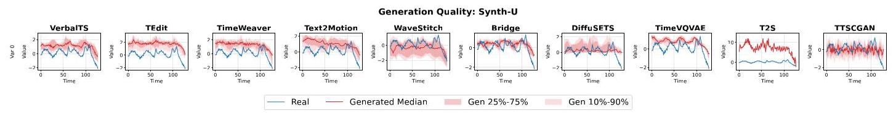

Figure 14. Generation Quality Comparison: Synth-U. Each subplot shows one model's performance on one variable. Blue line: ground truth; Red line: generated median; Red bands: 25%-75% (dark) and 10%-90% (light) quantile ranges of 10 generated samples.

图14. 生成质量比较:Synth-U。每个子图展示了一个模型在一个变量上的性能。蓝线:真实值；红线:生成的中位数；红色带:10个生成样本的25%-75%(深色)和10%-90%(浅色)分位数范围。

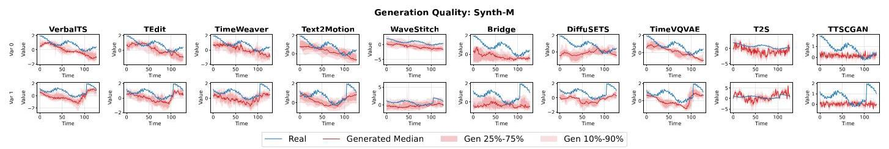

Figure 15. Generation Quality Comparison: Synth-M. Each subplot shows one model's performance on one variable. Blue line: ground truth; Red line: generated median; Red bands: 25%-75% (dark) and 10%-90% (light) quantile ranges of 10 generated samples.

图15. 生成质量比较:Synth-M。每个子图展示了一个模型在一个变量上的性能。蓝线:真实值；红线:生成的中位数；红色带:10个生成样本的25%-75%(深色)和10%-90%(浅色)分位数范围。

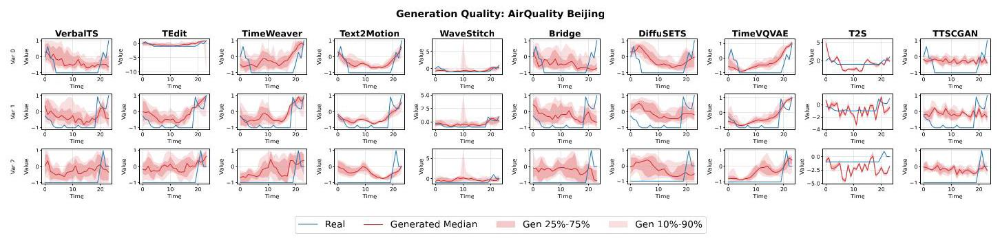

Figure 16. Generation Quality Comparison: AirQuality Beijing. Each subplot shows one model's performance on one variable. Blue line: ground truth; Red line: generated median; Red bands: 25%-75% (dark) and 10%-90% (light) quantile ranges of 10 generated samples.

图16. 生成质量比较:北京空气质量。每个子图展示了一个模型在一个变量上的性能。蓝线:真实值；红线:生成的中位数；红色带:10个生成样本的25%-75%(深色)和10%-90%(浅色)分位数范围。

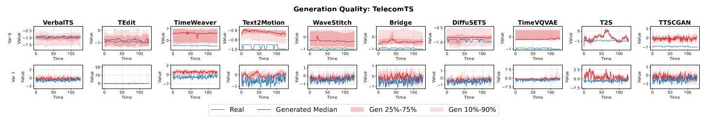

Figure 17. Generation Quality Comparison: TelecomTS. Each subplot shows one model's performance on one variable. Blue line: ground truth; Red line: generated median; Red bands: 25%-75% (dark) and 10%-90% (light) quantile ranges of 10 generated samples.

图17. 生成质量比较:电信时间序列。每个子图展示了一个模型在一个变量上的性能。蓝线:真实值；红线:生成的中位数；红色带:10个生成样本的25%-75%(深色)和10%-90%(浅色)分位数范围。

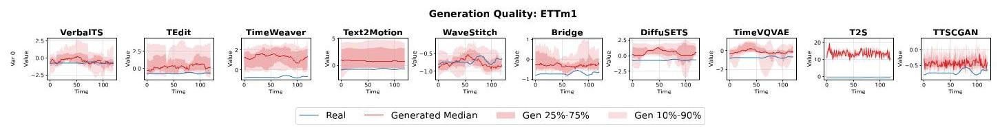

Figure 18. Generation Quality Comparison: ETTm1. Each subplot shows one model's performance on one variable. Blue line: ground truth; Red line: generated median; Red bands: 25%-75% (dark) and 10%-90% (light) quantile ranges of 10 generated samples.

图18. 生成质量比较:ETTm1。每个子图展示了一个模型在一个变量上的性能。蓝线:真实值；红线:生成的中位数；红色带:10个生成样本的25%-75%(深色)和10%-90%(浅色)分位数范围。

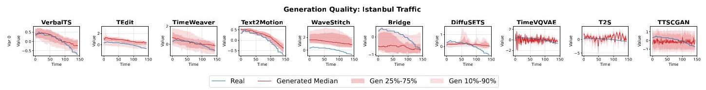

Figure 19. Generation Quality Comparison: Istanbul Traffic. Each subplot shows one model's performance on one variable. Blue line: ground truth; Red line: generated median; Red bands: 25%-75% (dark) and 10%-90% (light) quantile ranges of 10 generated samples.

图19. 生成质量比较:伊斯坦布尔交通。每个子图展示了一个模型在一个变量上的性能。蓝线:真实值；红线:生成的中位数；红色带:10个生成样本的25%-75%(深色)和10%-90%(浅色)分位数范围。

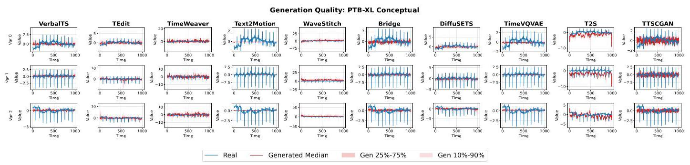

Figure 20. Generation Quality Comparison: PTB-XL Conceptual. Each subplot shows one model's performance on one variable. Blue line: ground truth; Red line: generated median; Red bands: 25%-75% (dark) and 10%-90% (light) quantile ranges of 10 generated samples.

图20. 生成质量比较:PTB-XL概念性。每个子图展示了一个模型在一个变量上的性能。蓝线:真实值；红线:生成的中位数；红色带:10个生成样本的25%-75%(深色)和10%-90%(浅色)分位数范围。

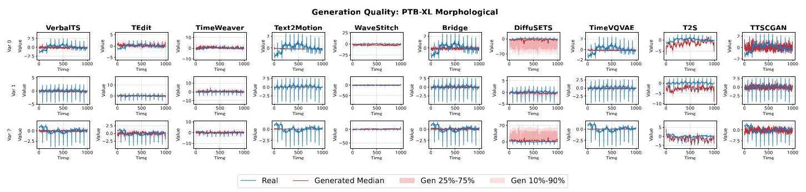

Figure 21. Generation Quality Comparison: PTB-XL Morphological. Each subplot shows one model's performance on one variable. Blue line: ground truth; Red line: generated median; Red bands: 25%-75% (dark) and 10%-90% (light) quantile ranges of 10 generated samples.

图21. 生成质量比较:PTB-XL形态学。每个子图展示了一个模型在一个变量上的性能。蓝线:真实值；红线:生成的中位数；红色带:10个生成样本的25%-75%(深色)和10%-90%(浅色)分位数范围。

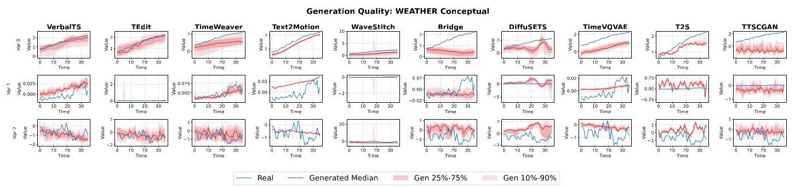

Figure 22. Generation Quality Comparison: WEATHER Conceptual. Each subplot shows one model's performance on one variable. Blue line: ground truth; Red line: generated median; Red bands: 25%-75% (dark) and 10%-90% (light) quantile ranges of 10 generated samples.

图22. 生成质量比较:天气概念性。每个子图展示了一个模型在一个变量上的性能。蓝线:真实值；红线:生成的中位数；红色带:10个生成样本的25%-75%(深色)和10%-90%(浅色)分位数范围。

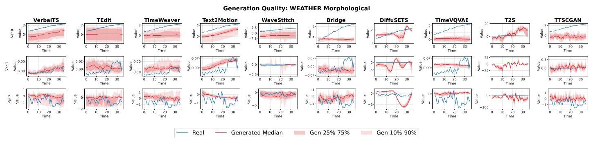

Figure 23. Generation Quality Comparison: WEATHER Morphological. Each subplot shows one model's performance on one variable. Blue line: ground truth; Red line: generated median; Red bands: 25%-75% (dark) and 10%-90% (light) quantile ranges of 10 generated samples.

图23. 生成质量比较:天气形态学。每个子图展示了一个模型在一个变量上的性能。蓝线:真实值；红线:生成的中位数；红色带:10个生成样本的25%-75%(深色)和10%-90%(浅色)分位数范围。

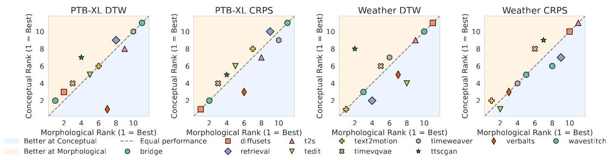

Figure 24. Morphological vs. conceptual conditioning: rank stability. Each point is a model with ranks computed separately under morphological (x-axis) and conceptual (y-axis) conditions (lower is better). Points near the diagonal indicate stable rankings across condition types, while off-diagonal points indicate sensitivity to condition semantics.

图24. 形态学与概念性条件:排名稳定性。每个点代表一个模型，其排名分别在形态学(x轴)和概念性(y轴)条件下计算(越低越好)。对角线附近的点表示跨条件类型的稳定排名，而偏离对角线的点表示对条件语义的敏感性。

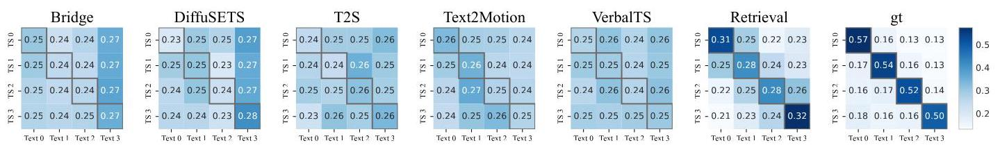

Figure 25. Temporal order confusion matrices on TelecomTS-Segment. Rows denote generated segments (TS $i$ ) and columns denote within-series captions (Text $j$ ); diagonal dominance indicates correct segment-text alignment.

图25. 电信时间序列分段上的时间顺序混淆矩阵。行表示生成的段(时间序列$i$)，列表示序列内的标题(文本$j$)；对角线优势表示正确的段-文本对齐。

Table 32. Drop Rate by Model and Dataset (lower is better)

表32. 按模型和数据集划分的下降率(越低越好)

<table><tr><td>Dataset</td><td>TEdit</td><td>TimeWeaver</td><td>DiffuSETS</td><td>TimeVQVAE</td><td>VerbalTS</td><td>WaveStitch</td><td>Text2Motion</td><td>Bridge</td><td>T2S</td><td>TTSCGAN</td></tr><tr><td>AirQuality Beijing</td><td>0.301</td><td>0.336</td><td>0.574</td><td>0.509</td><td>0.631</td><td>0.505</td><td>0.696</td><td>0.787</td><td>1.106</td><td>0.863</td></tr><tr><td>ETTm1</td><td>0.290</td><td>0.382</td><td>0.365</td><td>0.560</td><td>0.279</td><td>0.507</td><td>1.086</td><td>0.598</td><td>0.426</td><td>0.573</td></tr><tr><td>Istanbul Traffic</td><td>1.232</td><td>0.705</td><td>0.918</td><td>1.210</td><td>1.020</td><td>1.046</td><td>0.741</td><td>0.953</td><td>1.290</td><td>0.747</td></tr><tr><td>PTB-XL (Conceptual)</td><td>0.672</td><td>0.722</td><td>0.532</td><td>0.841</td><td>0.582</td><td>0.827</td><td>1.383</td><td>0.568</td><td>1.003</td><td>1.083</td></tr><tr><td>PTB-XL (Morphological)</td><td>0.320</td><td>0.624</td><td>0.202</td><td>0.607</td><td>0.499</td><td>0.620</td><td>0.585</td><td>0.719</td><td>0.645</td><td>0.546</td></tr><tr><td>Synth-M</td><td>0.093</td><td>0.096</td><td>0.538</td><td>0.420</td><td>0.098</td><td>0.571</td><td>0.537</td><td>0.730</td><td>0.905</td><td>0.989</td></tr><tr><td>Synth-U</td><td>0.165</td><td>0.205</td><td>0.598</td><td>0.389</td><td>0.035</td><td>0.286</td><td>0.640</td><td>0.296</td><td>1.000</td><td>0.967</td></tr><tr><td>TelecomTS</td><td>0.015</td><td>0.018</td><td>0.022</td><td>0.307</td><td>0.012</td><td>0.005</td><td>0.078</td><td>0.094</td><td>0.104</td><td>0.157</td></tr><tr><td>Weather (Conceptual)</td><td>0.850</td><td>0.879</td><td>0.993</td><td>0.898</td><td>0.704</td><td>0.787</td><td>0.840</td><td>0.863</td><td>0.799</td><td>0.942</td></tr><tr><td>Weather (Morphological)</td><td>0.668</td><td>0.436</td><td>0.433</td><td>0.517</td><td>1.303</td><td>1.073</td><td>1.311</td><td>0.994</td><td>0.555</td><td>1.036</td></tr><tr><td>Mean</td><td>0.461</td><td>0.440</td><td>0.517</td><td>0.626</td><td>0.516</td><td>0.623</td><td>0.790</td><td>0.660</td><td>0.783</td><td>0.790</td></tr></table>