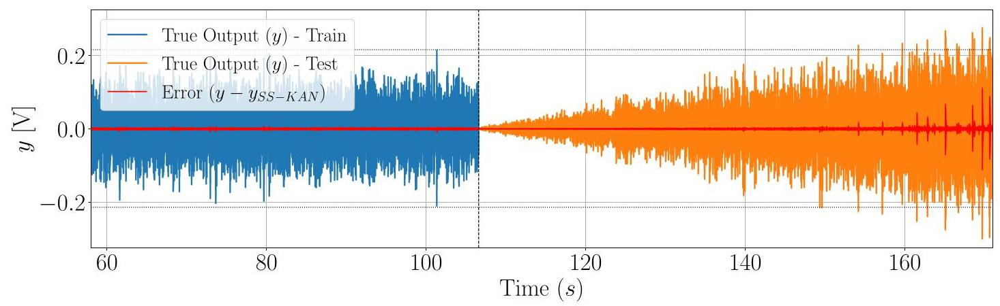
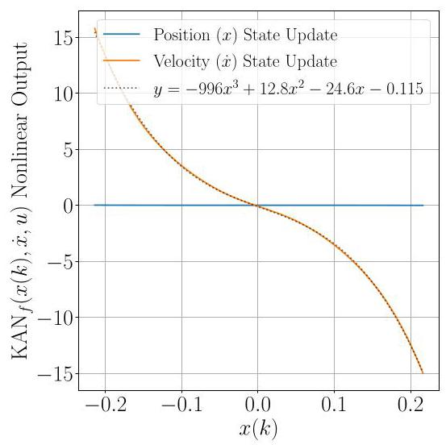
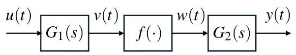
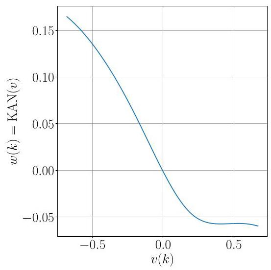

# State-Space Kolmogorov Arnold Networks for Interpretable Nonlinear System Identification

# 用于可解释非线性系统辨识的状态空间柯尔莫哥洛夫 - 阿诺德网络

Gonçalo G. Cruz, Balázs Renczes, Mark C. Runacres and Jan Decuyper

贡萨洛·G·克鲁兹、巴拉兹·伦采斯、马克·C·鲁纳克斯和扬·德库伊珀

Abstract-While accurate, black-box system identification models lack interpretability of the underlying system dynamics. This paper proposes State-Space Kolmogorov-Arnold Networks (SS-KAN) to address this challenge by integrating Kolmogorov-Arnold Networks within a state-space framework. The proposed model is validated on two benchmark systems: the Silverbox and the Wiener-Hammerstein benchmarks. Results show that SS-KAN provides enhanced interpretability due to sparsity-promoting regularization and the direct visualization of its learned univariate functions, which reveal system nonlinearities at the cost of accuracy when compared to state-of-the-art black-box models, highlighting SS-KAN as a promising approach for interpretable nonlinear system identification, balancing accuracy and interpretability of nonlinear system dynamics.

摘要——虽然精确，但黑箱系统辨识模型缺乏对潜在系统动态的可解释性。本文提出状态空间柯尔莫哥洛夫 - 阿诺德网络(SS - KAN)，通过将柯尔莫哥洛夫 - 阿诺德网络集成到状态空间框架中来应对这一挑战。所提出的模型在两个基准系统上进行了验证:银箱和维纳 - 哈默斯坦基准。结果表明，由于促进稀疏性的正则化及其学习到的单变量函数的直接可视化，SS - KAN提供了增强的可解释性，与当前最先进的黑箱模型相比，其以准确性为代价揭示了系统非线性，突出了SS - KAN作为可解释非线性系统辨识的一种有前途的方法，在非线性系统动态的准确性和可解释性之间取得平衡。

Index Terms-Nonlinear systems identification, Grey-box modelling, Machine learning

关键词——非线性系统辨识、灰箱建模、机器学习

## I. INTRODUCTION

## 一、引言

SYSTEM identification, the process of building mathematical models from observed data, is a fundamental discipline in engineering and control. Accurate system models are useful for tasks ranging from controller design and performance optimization to fault detection and system analysis. Linear system identification techniques have provided a robust and well-understood framework for modeling linear systems [1]. However, real-world engineering systems are often nonlinear, and relying solely on linear models can lead to inadequate performance or even instability, particularly when operating in extended regimes or encountering complex dynamics. While black-box nonlinear system identification methods, especially those leveraging deep neural networks, have demonstrated impressive accuracy in capturing complex nonlinear behaviors [2], as highlighted in comprehensive reviews of recent advancements and challenges in the field [3], a critical limitation remains: their inherent lack of interpretability. Black-box models lack transparency between model structure and system physics by representing dynamics in latent spaces with a high number of parameters, thus limiting the understanding of the identified system's behavior. Existing techniques like polynomial decoupling have been proposed to address this challenge by simplifying complex nonlinearities into more understandable forms, aiming to extract structured models from black-box representations [4], [5], though these might be constrained by the initial black-box model's structure. Other authors have explored augmenting physical models [6] and imposing prior physical information [7], reinforcing model transparency and physical consistency.

系统辨识是从观测数据构建数学模型的过程，是工程和控制领域的一门基础学科。精确的系统模型对于从控制器设计、性能优化到故障检测和系统分析等一系列任务都很有用。线性系统辨识技术为线性系统建模提供了一个强大且易于理解的框架[1]。然而，实际工程系统往往是非线性的，仅依赖线性模型可能导致性能不足甚至不稳定，特别是在扩展工况下运行或遇到复杂动态时。虽然黑箱非线性系统辨识方法，尤其是那些利用深度神经网络的方法，在捕捉复杂非线性行为方面表现出了令人印象深刻的准确性[2]，正如该领域最近进展和挑战的综合综述中所强调的[3]，一个关键限制仍然存在:它们固有的缺乏可解释性。黑箱模型通过在具有大量参数的潜在空间中表示动态，在模型结构和系统物理之间缺乏透明度，从而限制了对所辨识系统行为的理解。现有的技术如多项式解耦已被提出通过将复杂非线性简化为更易于理解的形式来应对这一挑战，旨在从黑箱表示中提取结构化模型[4,5]，尽管这些可能受到初始黑箱模型结构的限制。其他作者探索了增强物理模型[6]和施加先验物理信息[7]，以增强模型透明度和物理一致性。

To address the interpretability challenge, Kolmogorov-Arnold Networks (KANs) [8] have emerged as an alternative, expressing any multivariate continuous function as a sum of compositions of learnable univariate functions. This structured decomposition makes KANs more interpretable than traditional black-box models, being explored in various scientific machine learning applications, potentially enabling hidden physics discovery [9], [10], though practical challenges are still under investigation [11].

为了应对可解释性挑战，柯尔莫哥洛夫 - 阿诺德网络(KANs)[8]作为一种替代方案出现，它将任何多元连续函数表示为可学习单变量函数的组合之和。这种结构化分解使KANs比传统黑箱模型更具可解释性，正在各种科学机器学习应用中进行探索，有可能实现隐藏物理的发现[9,10]，尽管实际挑战仍在研究中[11]。

In the context of system identification, KANs offer multiple advantages for modeling nonlinear systems, that are actively being studied [12]. Their structured representation, based on univariate functions, aims to capture complex nonlinear dynamics while simultaneously enhancing interpretability, making them attractive for modeling unknown system behaviors from input-output data. Moreover, the functional decomposition inherent in KANs offers the potential to extract meaningful insights from identified models, such as identifying dominant input variables influencing system behavior. This transparency can be valuable for understanding the identified system and potentially for ensuring physical consistency in the learned model.

在系统辨识的背景下，KANs为非线性系统建模提供了多个优势，目前正在积极研究[12]。它们基于单变量函数的结构化表示旨在捕捉复杂非线性动态，同时增强可解释性，使其对于从输入 - 输出数据建模未知系统行为具有吸引力。此外，KANs固有的函数分解提供了从所辨识模型中提取有意义见解的潜力，例如识别影响系统行为的主要输入变量。这种透明度对于理解所辨识系统以及潜在地确保学习模型中的物理一致性可能是有价值的。

In this paper, we propose State-Space Kolmogorov Arnold Networks (SS-KAN), an approach that integrates KANs into a state-space structure. Our primary contributions are the development of this architecture, the demonstration of its trade-off between accuracy and enhanced interpretability through the visualization of learned univariate functions, and its successful application to complex benchmark systems.

在本文中，我们提出状态空间柯尔莫哥洛夫 - 阿诺德网络(SS - KAN)，一种将KANs集成到状态空间结构中的方法。我们的主要贡献是开发了这种架构，通过学习到的单变量函数的可视化展示了其在准确性和增强可解释性之间的权衡，以及它在复杂基准系统上的成功应用。

---

This article has been accepted for publication in IEEE Control Systems Letters. Citation information: DOI 10.1109/LC-SYS.2025.3578019. For the publisher's version and full citation details see: https://doi.org/10.1109/LCSYS.2025.3578019

本文已被IEEE控制系统快报接受发表。引用信息:DOI 10.1109/LC - SYS.2025.3578019。有关出版商版本和完整引用细节，请参阅:https://doi.org/10.1109/LCSYS.2025.3578019

Manuscript received March 17, 2025; revised April 21, 2025; accepted June 2, 2025. Date of publication June 09, 2025.

稿件于2025年3月17日收到；2025年4月21日修订；2025年6月2日接受。出版日期为2025年6月9日。

This work was funded by the Strategic Research Program SRP60 of the Vrije Universiteit Brussel.

这项工作由布鲁塞尔自由大学的战略研究计划SRP60资助。

G.G. Cruz, M. C. Runacres and J. Decuyper are with the Faculty of Engineering Technology, Vrije Universiteit Brussel, 1050 Brussel, Belgium (e-mail: goncalo.granjal.cruz@vub.be;mark.runacres@vub.be; jan.decuyper@vub.be)

贡萨洛·G·克鲁兹、马克·C·鲁纳克斯和扬·德库伊珀隶属于布鲁塞尔自由大学工程技术学院，比利时布鲁塞尔1050(电子邮件:goncalo.granjal.cruz@vub.be；mark.runacres@vub.be；jan.decuyper@vub.be)

B. Renczes is with the Department of Artificial Intelligence and Systems Engineering, Budapest University of Technology and Economics, Budapest, Hungary (e-mail: renczes@mit.bme.hu)

巴拉兹·伦采斯隶属于布达佩斯技术与经济大学人工智能与系统工程系，匈牙利布达佩斯(电子邮件:renczes@mit.bme.hu)

©2025 IEEE. All rights reserved, including rights for text and data mining and training of artificial intelligence and similar technologies. Personal use is permitted, but republication/redistribution requires IEEE permission.

©2025电气和电子工程师协会。保留所有权利，包括文本和数据挖掘以及人工智能和类似技术训练的权利。允许个人使用，但重新发布/重新分发需要电气和电子工程师协会的许可。

---

## II. KOLMOGOROV-ARNOLD NETWORKS

## 二、柯尔莫哥洛夫 - 阿诺德网络

KANs are an alternative neural network architecture inspired by the Kolmogorov-Arnold representation theorem, which states that any continuous multivariate function $f\left( \mathbf{x}\right)$ : ${\left\lbrack  0,1\right\rbrack  }^{n} \mapsto  \mathbb{R}$ can be expressed as a sum of compositions of univariate functions:

KAN是一种受柯尔莫哥洛夫 - 阿诺德表示定理启发的替代神经网络架构，该定理指出任何连续多变量函数$f\left( \mathbf{x}\right)$ : ${\left\lbrack  0,1\right\rbrack  }^{n} \mapsto  \mathbb{R}$都可以表示为单变量函数组合的和:

$$
f\left( \mathbf{x}\right)  = \mathop{\sum }\limits_{{q = 1}}^{{{2n} + 1}}{\Phi }_{q}\left( {\mathop{\sum }\limits_{{p = 1}}^{n}{\phi }_{q, p}\left( {x}_{p}\right) }\right) \tag{1}
$$

where ${\phi }_{q, p} : \left\lbrack  {0,1}\right\rbrack   \mapsto  \mathbb{R}$ are "inner" univariate functions applied to individual input variables ${x}_{p}$ , and ${\Phi }_{q} : \mathbb{R} \mapsto  \mathbb{R}$ are "outer" univariate functions applied to the sum of these inner function outputs. This essentially means that complex functions can be decomposed into sums of simpler, one-dimensional transformations.

其中${\phi }_{q, p} : \left\lbrack  {0,1}\right\rbrack   \mapsto  \mathbb{R}$是应用于各个输入变量${x}_{p}$的“内部”单变量函数，${\Phi }_{q} : \mathbb{R} \mapsto  \mathbb{R}$是应用于这些内部函数输出之和的“外部”单变量函数。这本质上意味着复杂函数可以分解为更简单的一维变换之和。

Extending this concept, a KAN [8] structures these univariate functions sequentially into $L$ layers:

扩展这个概念，一个KAN [8]将这些单变量函数顺序地构建成$L$层:

$$
\operatorname{KAN}\left( \mathbf{x}\right)  = \left( {{\Phi }_{L - 1} \circ  {\Phi }_{L - 2} \circ  \cdots  \circ  {\Phi }_{1} \circ  {\Phi }_{0}}\right) \left( \mathbf{x}\right) \tag{2}
$$

where $\circ$ denotes function composition and each layer function ${\Phi }_{l}$ consists of learnable univariate functions that connect to the next layer $l + 1$ .

其中$\circ$表示函数组合，并且每个层函数${\Phi }_{l}$由可学习的单变量函数组成，这些函数连接到下一层$l + 1$。

Considering layer $l$ has ${n}_{l}$ nodes corresponding to outputs from the previous layer, and layer $l + 1$ has ${n}_{l + 1}$ nodes, then ${\Phi }_{l}$ can be expressed as a matrix of learnable univariate functions, ${\phi }_{l, i, j}\left( \cdot \right)$ :

考虑到层$l$有${n}_{l}$个对应于前一层输出的节点，并且层$l + 1$有${n}_{l + 1}$个节点，那么${\Phi }_{l}$可以表示为可学习单变量函数的矩阵，${\phi }_{l, i, j}\left( \cdot \right)$:

$$
{\Phi }_{l} = \left( \begin{matrix} {\phi }_{l,1,1}\left( \cdot \right) & {\phi }_{l,1,2}\left( \cdot \right) & \cdots & {\phi }_{l,1,{n}_{l}}\left( \cdot \right) \\  {\phi }_{l,2,1}\left( \cdot \right) & {\phi }_{l,2,2}\left( \cdot \right) & \cdots & {\phi }_{l,2,{n}_{l}}\left( \cdot \right) \\  \vdots & \vdots & & \vdots \\  {\phi }_{l,{n}_{l + 1},1}\left( \cdot \right) & {\phi }_{l,{n}_{l + 1},2}\left( \cdot \right) & \cdots & {\phi }_{l,{n}_{l + 1},{n}_{l}}\left( \cdot \right)  \end{matrix}\right) \tag{3}
$$

where each univariate function $\phi$ is parameterized as a sum of a SiLU residual activation function and a linear combination of B-spline functions, $\phi \left( x\right)  = {w}_{b}\operatorname{SiLU}\left( x\right)  + {w}_{s}\mathop{\sum }\limits_{i}{c}_{i}{B}_{i}\left( x\right)$ where the coefficients ${c}_{i}$ of the B-splines, as well as the scaling factors ${w}_{b}$ and ${w}_{s}$ , are learnable parameters.

其中每个单变量函数$\phi$被参数化为SiLU残差激活函数与B样条函数线性组合的和，$\phi \left( x\right)  = {w}_{b}\operatorname{SiLU}\left( x\right)  + {w}_{s}\mathop{\sum }\limits_{i}{c}_{i}{B}_{i}\left( x\right)$其中B样条的系数${c}_{i}$以及缩放因子${w}_{b}$和${w}_{s}$是可学习参数。

Unlike traditional neural networks with fixed nodal activations and learnable scalar weights on edges, KANs feature learnable univariate activation functions on the edges and summations at the nodes. This can reduce the number of required parameters while simultaneously increasing interpretability, as the learned shapes of these edge functions can be visualized, making KANs an attractive option for interpretable nonlinear system identification.

与具有固定节点激活和可学习边标量权重的传统神经网络不同，KAN在边上具有可学习的单变量激活函数并且在节点处进行求和。这可以减少所需参数的数量，同时增加可解释性。因为这些边函数的学习形状可以可视化，这使得KAN成为可解释非线性系统识别的有吸引力的选择。

## III. STATE-SPACE KOLMOGOROV-ARNOLD NETWORKS

## 三、状态空间柯尔莫哥洛夫 - 阿诺德网络

Building upon the motivation for interpretable system identification and drawing inspiration from the structural advantages of state-space models and the interpretability of KANs, we propose State-Space Kolmogorov-Arnold Networks (SS-KAN). This approach aims to combine the strengths of both methodologies: the physically meaningful structure of state-space representations with the function approximation and interpretability capabilities of KANs.

基于可解释系统识别的动机，并从状态空间模型的结构优势和KAN的可解释性中汲取灵感，我们提出了状态空间柯尔莫哥洛夫 - 阿诺德网络(SS - KAN)。这种方法旨在结合两种方法的优势:状态空间表示的物理意义结构与KAN的函数逼近和可解释性能力。

A general nonlinear dynamical system in a discrete-time state-space form is written as:

离散时间状态空间形式的一般非线性动力系统写为:

(4)

$$
\mathbf{x}\left( {k + 1}\right)  = \mathbf{A}\mathbf{x}\left( k\right)  + \mathbf{B}\mathbf{u}\left( k\right)  + \mathbf{f}\left( {\mathbf{x}\left( k\right) ,\mathbf{u}\left( k\right) }\right)
$$

$$
\mathbf{y}\left( k\right)  = \mathbf{C}\mathbf{x}\left( k\right)  + \mathbf{D}\mathbf{u}\left( k\right)  + \mathbf{g}\left( {\mathbf{x}\left( k\right) ,\mathbf{u}\left( k\right) }\right)
$$

where $\mathbf{x}\left( k\right)  \in  {\mathbb{R}}^{{n}_{x}}$ represents the ${n}_{x}$ -dimensional state vector at time step $k,\mathbf{u}\left( k\right)  \in  {\mathbb{R}}^{{n}_{u}}$ is the ${n}_{u}$ -dimensional forcing input, and $\mathbf{y}\left( k\right)  \in  {\mathbb{R}}^{{n}_{y}}$ denotes the ${n}_{y}$ -dimensional observable output. The matrices $\mathbf{A} \in  {\mathbb{R}}^{{n}_{x} \times  {n}_{x}}$ and $\mathbf{B} \in  {\mathbb{R}}^{{n}_{x} \times  {n}_{u}}$ are the discrete-time state and input matrices respectively, representing the linear part of the state transition. The function $\mathbf{f} : {\mathbb{R}}^{{n}_{x}} \times  {\mathbb{R}}^{{n}_{u}} \rightarrow  {\mathbb{R}}^{{n}_{x}}$ is a nonlinear function describing nonlinear state transitions. Similarly, $\mathbf{C} \in  {\mathbb{R}}^{{n}_{y} \times  {n}_{x}}$ and $\mathbf{D} \in \; {\mathbb{R}}^{{n}_{y} \times  {n}_{u}}$ are the output and direct feedthrough matrices, and $\mathbf{g} : {\mathbb{R}}^{{n}_{x}} \times  {\mathbb{R}}^{{n}_{u}} \rightarrow  {\mathbb{R}}^{{n}_{y}}$ is a nonlinear function for the output mapping. While traditional black-box system identification might directly model the entire nonlinear system using a large neural network, SS-KAN aims to retain the linear state-space structure and enhance interpretability by modeling the nonlinear functions $\mathbf{f}\left( \cdot \right)$ and $\mathbf{g}\left( \cdot \right)$ . This explicit separation simplifies the complexity of the functions KANs must approximate, improving training stability and allowing for stable linear initialization, which is a common approach in system identification and naturally reduces initialization sensitivity inherent in KANs.

其中$\mathbf{x}\left( k\right)  \in  {\mathbb{R}}^{{n}_{x}}$表示时间步$k,\mathbf{u}\left( k\right)  \in  {\mathbb{R}}^{{n}_{u}}$处的${n}_{x}$维状态向量，${n}_{u}$是${n}_{u}$维强迫输入，$\mathbf{y}\left( k\right)  \in  {\mathbb{R}}^{{n}_{y}}$表示${n}_{y}$维可观测输出。矩阵$\mathbf{A} \in  {\mathbb{R}}^{{n}_{x} \times  {n}_{x}}$和$\mathbf{B} \in  {\mathbb{R}}^{{n}_{x} \times  {n}_{u}}$分别是离散时间状态矩阵和输入矩阵，代表状态转移的线性部分。函数$\mathbf{f} : {\mathbb{R}}^{{n}_{x}} \times  {\mathbb{R}}^{{n}_{u}} \rightarrow  {\mathbb{R}}^{{n}_{x}}$是描述非线性状态转移的非线性函数。类似地，$\mathbf{C} \in  {\mathbb{R}}^{{n}_{y} \times  {n}_{x}}$和$\mathbf{D} \in \; {\mathbb{R}}^{{n}_{y} \times  {n}_{u}}$是输出矩阵和直接馈通矩阵，$\mathbf{g} : {\mathbb{R}}^{{n}_{x}} \times  {\mathbb{R}}^{{n}_{u}} \rightarrow  {\mathbb{R}}^{{n}_{y}}$是用于输出映射的非线性函数。虽然传统的黑箱系统识别可能会使用大型神经网络直接对整个非线性系统进行建模，但SS-KAN旨在保留线性状态空间结构，并通过对非线性函数$\mathbf{f}\left( \cdot \right)$和$\mathbf{g}\left( \cdot \right)$进行建模来增强可解释性。这种明确的分离简化了KAN必须逼近的函数的复杂性，提高了训练稳定性，并允许进行稳定的线性初始化，这是系统识别中的一种常见方法，自然地降低了KAN中固有的初始化敏感性。

## A. SS-KAN model structure

## A. SS-KAN模型结构

To formalize the SS-KAN architecture, we propose to replace the unknown nonlinear functions $\mathbf{f}\left( \cdot \right)$ and $\mathbf{g}\left( \cdot \right)$ in (4) with KANs. This leads to the SS-KAN model equations:

为了形式化SS-KAN架构，我们建议用KAN替换(4)中未知的非线性函数$\mathbf{f}\left( \cdot \right)$和$\mathbf{g}\left( \cdot \right)$。这就得到了SS-KAN模型方程:

(5)

$$
\mathbf{x}\left( {k + 1}\right)  = \mathbf{A}\mathbf{x}\left( k\right)  + \mathbf{B}\mathbf{u}\left( k\right)  + {\operatorname{KAN}}_{f}\left( {\mathbf{x}\left( k\right) ,\mathbf{u}\left( k\right) }\right)
$$

$$
\mathbf{y}\left( k\right)  = \mathbf{C}\mathbf{x}\left( k\right)  + \mathbf{D}\mathbf{u}\left( k\right)  + {\operatorname{KAN}}_{g}\left( {\mathbf{x}\left( k\right) ,\mathbf{u}\left( k\right) }\right)
$$

where ${\mathrm{{KAN}}}_{f} : {\mathbb{R}}^{{n}_{x}} \times  {\mathbb{R}}^{{n}_{u}} \rightarrow  {\mathbb{R}}^{{n}_{x}}$ and ${\mathrm{{KAN}}}_{g} : {\mathbb{R}}^{{n}_{x}} \times \; {\mathbb{R}}^{{n}_{u}} \rightarrow  {\mathbb{R}}^{{n}_{y}}$ . In this work, we utilize the efficientkan [13] implementation of KANs. The inputs to both ${\mathrm{{KAN}}}_{f}$ and ${\mathrm{{KAN}}}_{g}$ are the state vector $\mathbf{x}\left( k\right)$ and the input vector $\mathbf{u}\left( k\right)$ .

其中${\mathrm{{KAN}}}_{f} : {\mathbb{R}}^{{n}_{x}} \times  {\mathbb{R}}^{{n}_{u}} \rightarrow  {\mathbb{R}}^{{n}_{x}}$和${\mathrm{{KAN}}}_{g} : {\mathbb{R}}^{{n}_{x}} \times \; {\mathbb{R}}^{{n}_{u}} \rightarrow  {\mathbb{R}}^{{n}_{y}}$。在这项工作中，我们使用了KAN的efficientkan [13]实现。${\mathrm{{KAN}}}_{f}$和${\mathrm{{KAN}}}_{g}$的输入都是状态向量$\mathbf{x}\left( k\right)$和输入向量$\mathbf{u}\left( k\right)$。

The trainable parameters of the SS-KAN model, denoted by $\mathbf{\theta }$ , are composed of the linear state-space matrices and the weights of the KAN:

SS-KAN模型的可训练参数，用$\mathbf{\theta }$表示，由线性状态空间矩阵和KAN的权重组成:

$$
\mathbf{\theta } = {\left\lbrack  \mathbf{A},\mathbf{B},\mathbf{C},\mathbf{D},{\mathbf{\theta }}_{{\mathrm{{KAN}}}_{f}},{\mathbf{\theta }}_{{\mathrm{{KAN}}}_{g}}\right\rbrack  }^{T} \tag{6}
$$

where ${\mathbf{\theta }}_{{\mathrm{{KAN}}}_{f}}$ and ${\mathbf{\theta }}_{{\mathrm{{KAN}}}_{g}}$ represent the sets of trainable parameters within the KANs used for the state transition and output mapping nonlinearities, respectively.

其中${\mathbf{\theta }}_{{\mathrm{{KAN}}}_{f}}$和${\mathbf{\theta }}_{{\mathrm{{KAN}}}_{g}}$分别表示用于状态转移和输出映射非线性的KAN内的可训练参数集。

## B. Cost Function and Optimization

## B. 代价函数与优化

The SS-KAN model parameters (6) are trained by minimizing a cost function that balances model accuracy with interpretability:

通过最小化一个平衡模型准确性和可解释性的代价函数来训练SS-KAN模型参数(6):

$$
\mathcal{L}\left( \mathbf{\theta }\right)  = \frac{1}{N}{\begin{Vmatrix}{\mathbf{y}}_{{SS} - {KAN}} - {\mathbf{y}}_{\text{ data }}\end{Vmatrix}}_{2}^{2}
$$

$$
+ {\lambda }_{L2}\left( {\parallel \mathbf{A}{\parallel }_{F}^{2} + \parallel \mathbf{B}{\parallel }_{F}^{2} + \parallel \mathbf{C}{\parallel }_{F}^{2} + \parallel \mathbf{D}{\parallel }_{F}^{2}}\right) \tag{7}
$$

$$
+ {\lambda }_{L1}\left( {{\begin{Vmatrix}{\mathbf{\theta }}_{{\mathrm{{KAN}}}_{f}}\end{Vmatrix}}_{1} + {\begin{Vmatrix}{\mathbf{\theta }}_{{\mathrm{{KAN}}}_{g}}\end{Vmatrix}}_{1}}\right)
$$

Here, the first term represents the mean squared L2 norm error, quantifying the discrepancy between the predicted output ${\mathbf{y}}_{{SS} - {KAN}}$ and the available ${\mathbf{y}}_{\text{ data }}$ over $N$ data points. The second term is an ${L2}$ regularization penalty with the Frobenius norm applied to the linear state-space matrices $\left( {\mathbf{A},\mathbf{B},\mathbf{C},\mathbf{D}}\right)$ , with ${\lambda }_{L2}$ controlling its strength to improve generalization of the linear components and prevent overfitting. The third term is an ${L1}$ regularization penalty on the KAN parameters $\left( {\mathbf{\theta }}_{{\mathrm{{KAN}}}_{f}}\right.$ and ${\mathbf{\theta }}_{{\mathrm{{KAN}}}_{g}}$ ), with ${\lambda }_{L1}$ controlling its strength to promote sparsity in the activation functions thus increasing the model interpretability. In this work, for the internal KAN architecture, we utilize cubic B-splines defined on a 5-point grid for each univariate function and use two layers to showcase benchmark interpretability. Increasing grid points can enhance detail but adds parameters, while deeper KANs might be needed for highly complex systems.

在此，第一项表示均方 L2 范数误差，用于量化预测输出${\mathbf{y}}_{{SS} - {KAN}}$与$N$个数据点上可用的${\mathbf{y}}_{\text{ data }}$之间的差异。第二项是对线性状态空间矩阵$\left( {\mathbf{A},\mathbf{B},\mathbf{C},\mathbf{D}}\right)$应用弗罗贝尼乌斯范数的${L2}$正则化惩罚项，其中${\lambda }_{L2}$控制其强度以提高线性组件的泛化能力并防止过拟合。第三项是对 KAN 参数$\left( {\mathbf{\theta }}_{{\mathrm{{KAN}}}_{f}}\right.$和${\mathbf{\theta }}_{{\mathrm{{KAN}}}_{g}}$的${L1}$正则化惩罚项，其中${\lambda }_{L1}$控制其强度以促进激活函数的稀疏性，从而提高模型的可解释性。在本工作中，对于内部 KAN 架构，我们对每个单变量函数使用在 5 点网格上定义的三次 B 样条，并使用两层来展示基准可解释性。增加网格点可以增强细节但会增加参数，而对于高度复杂的系统可能需要更深的 KAN。

To optimize the model parameters $\mathbf{\theta }$ , we utilize the AdamW optimizer [14] with conservative initial learning rates, as this was found to stabilize convergence. The training process employs batch optimization which was found to speedup convergence. The training dataset is divided into empirically chosen $B$ batches of size ${N}_{\text{ batch }} = N/B$ . The data is normalized before training to a [-1,1] range where the B-splines domain is initially defined, and is processed sequentially in time to maintain temporal dependencies within each epoch.

为了优化模型参数$\mathbf{\theta }$，我们使用具有保守初始学习率的 AdamW 优化器[14]，因为发现这样可以稳定收敛。训练过程采用批量优化，发现这可以加速收敛。训练数据集被划分为根据经验选择的大小为${N}_{\text{ batch }} = N/B$的$B$个批次。数据在训练前被归一化到[-1,1]范围，这是 B 样条域最初定义的范围，并且在每个 epoch 内按时间顺序进行处理以保持时间依赖性。

The performance of the SS-KAN model is quantitatively evaluated using the Root Mean Squared Error (RMSE). RMSE provides a measure of the average error magnitude between the predicted output ${\mathbf{y}}_{{SS} - {KAN}}$ and the measured data ${\mathbf{y}}_{\text{ data }}$ . For a dataset with $N$ data points, RMSE is defined as:

使用均方根误差(RMSE)对 SS-KAN 模型的性能进行定量评估。RMSE 提供了预测输出${\mathbf{y}}_{{SS} - {KAN}}$与测量数据${\mathbf{y}}_{\text{ data }}$之间平均误差大小的度量。对于具有$N$个数据点的数据集，RMSE 定义为:

$$
\text{ RMSE } = \sqrt{\frac{1}{N}\mathop{\sum }\limits_{{k = 1}}^{N}{\left( {\mathbf{y}}_{{SS} - {KAN}}\left( k\right)  - {\mathbf{y}}_{\text{ data }}\left( k\right) \right) }^{2}} \tag{8}
$$

### C.On the connection with decoupled state-space models

### C. 关于与解耦状态空间模型的联系

A key aspect of regaining interpretability in KANs lies in their reliance on an additive structure of univariate functionals. Since univariate functions can be easily visualized, this often leads to valuable insights into nonlinear relationships. Building on similar reasoning, so-called decoupled functions have also been proposed. In this approach, nonlinearity is constrained within a set of so-called univariate "branches", effectively decoupling the multivariate relationship. Decoupled functions are defined as $f\left( \mathbf{x}\right)  = \mathbf{{Wg}}\left( {{\mathbf{V}}^{T}\mathbf{x}}\right)$ , with univariate functions ${g}_{i}\left( {z}_{i}\right)  : \mathbb{R} \mapsto  \mathbb{R}$ of linear forms ${z}_{i} \mathrel{\text{ := }} {\mathbf{v}}_{i}^{\top }\mathbf{x}$ , and $i = 1,\ldots , r$ . Here, $r$ is the number of branches, and $\mathbf{W}$ and $\mathbf{V}$ are linear transformation matrices. It has been demonstrated [15] that a broad class of multivariate functions can be accurately approximated in a decoupled form. A notable distinction is that KANs use regularization to promote sparsity and model simplicity, while in decoupled functions, model complexity is usually controlled through the parameter $r$ . Beyond visualizing the nonlinearities, further insight may be gained by examining the inputs to the nonlinear components, particularly in systems where a dominant nonlinear term involves a specific physical state variable (e.g., a hardening spring in mechanical systems, see section IV). In this regard [5] demonstrated that single-branch decoupled functions, when embedded in state-space models, could yield physically meaningful intermediate variables ${z}_{i}$ . However, this physical interpretability is not preserved in the state variables themselves, due to the mixing introduced by the linear transformation matrix V. KANs, on the other hand, guided towards a lean network through regularization, may naturally revert to a structure where only one of the input variables drives the nonlinearity. Since SS-KANs take the state variables as input, and under the assumption of a well-approximated nonlinearity, this structure may help preserve or even promote physical interpretability of the state variables themselves, particularly for systems governed by a single dominant nonlinear term.

KANs中恢复可解释性的一个关键方面在于它们对单变量泛函加法结构的依赖。由于单变量函数可以很容易地可视化，这通常能带来对非线性关系的宝贵见解。基于类似的推理，也提出了所谓的解耦函数。在这种方法中，非线性被限制在一组所谓的单变量“分支”内，有效地解耦了多变量关系。解耦函数被定义为$f\left( \mathbf{x}\right)  = \mathbf{{Wg}}\left( {{\mathbf{V}}^{T}\mathbf{x}}\right)$，其中单变量函数${g}_{i}\left( {z}_{i}\right)  : \mathbb{R} \mapsto  \mathbb{R}$具有线性形式${z}_{i} \mathrel{\text{ := }} {\mathbf{v}}_{i}^{\top }\mathbf{x}$，以及$i = 1,\ldots , r$。这里，$r$是分支的数量，$\mathbf{W}$和$\mathbf{V}$是线性变换矩阵。已经证明[15]，一大类多变量函数可以用解耦形式精确逼近。一个显著的区别是，KANs使用正则化来促进稀疏性和模型简单性，而在解耦函数中，模型复杂性通常通过参数$r$来控制。除了可视化非线性之外，通过检查非线性组件的输入可能会获得进一步的见解，特别是在主导非线性项涉及特定物理状态变量的系统中(例如机械系统中的硬化弹簧，见第四节)。在这方面[5]表明，单分支解耦函数嵌入状态空间模型时，可以产生具有物理意义的中间变量${z}_{i}$。然而，由于线性变换矩阵V引入的混合，这种物理可解释性在状态变量本身中并未保留。另一方面，通过正则化导向精简网络的KANs可能自然地恢复到只有一个输入变量驱动非线性的结构。由于SS-KANs将状态变量作为输入，并且在非线性近似良好的假设下，这种结构可能有助于保留甚至促进状态变量本身的物理可解释性,特别是对于由单个主导非线性项控制的系统。

## IV. SILVERBOX TEST CASE - DUFFING OSCILLATOR

## 四、银盒测试案例 - 杜芬振子

To evaluate the effectiveness of the SS-KAN model, we consider the well-known Silverbox benchmark system [16], which can be viewed as an electronic version of the forced Duffing oscillator, a second-order nonlinear system with a cubic nonlinearity. The Duffing oscillator is a widely recognized benchmark in nonlinear system identification due to its well-characterized nonlinear behavior and relevance to many physical systems, particularly in mechanics and structural dynamics. The true equation of motion for the Duffing oscillator is given by:

为了评估SS-KAN模型的有效性，我们考虑著名的银盒基准系统[16]，它可以被视为强迫杜芬振子的电子版本，一个具有三次非线性的二阶非线性系统。由于其特征明确的非线性行为以及与许多物理系统的相关性，特别是在力学和结构动力学方面，杜芬振子是非线性系统识别中广泛认可的基准。杜芬振子的真实运动方程如下:

$$
m\ddot{x} + c\dot{x} + {kx} + \alpha {x}^{3} = u\left( t\right) \tag{9}
$$

where, $x$ represents the displacement, $\dot{x}$ and $\ddot{x}$ are its time derivatives, $m$ is the mass, $c$ is the damping coefficient, $k$ is the linear stiffness, $\alpha$ is the cubic nonlinear stiffness, and $u\left( t\right)$ is the external forcing input. The cubic term $\alpha {x}^{3}$ is the key nonlinear element that we aim to identify and interpret using our SS-KAN approach in a pure system identification approach where the true parameters of the Duffing oscillator $\left( {\mathrm{m},\mathrm{c},\mathrm{k},\alpha }\right)$ are unknown.

其中，$x$表示位移，$\dot{x}$和$\ddot{x}$是其时间导数，$m$是质量，$c$是阻尼系数，$k$是线性刚度，$\alpha$是三次非线性刚度，$u\left( t\right)$是外部强迫输入。三次项$\alpha {x}^{3}$是关键的非线性元素，我们旨在使用我们的SS-KAN方法在纯系统识别方法中进行识别和解释，其中杜芬振子$\left( {\mathrm{m},\mathrm{c},\mathrm{k},\alpha }\right)$的真实参数是未知的。

The data for the Silverbox benchmark is obtained from the Nonlinear Benchmark repository [17]. It consists of a training set of ${N}_{\text{ train }} = {65000}$ samples and a test set of ${N}_{\text{ test }} = {40000}$ samples. The training data comprises a collection of random phase multisines with a constant amplitude in a frequency range up to ${200}\mathrm{\;{Hz}}$ . The test data consists of filtered Gaussian noise with a linearly increasing amplitude, including extrapolation regions beyond the training range.

银盒基准的数据来自非线性基准库[17]。它由${N}_{\text{ train }} = {65000}$个样本的训练集和${N}_{\text{ test }} = {40000}$个样本的测试集组成。训练数据包括在高达${200}\mathrm{\;{Hz}}$的频率范围内具有恒定幅度的随机相位多正弦的集合。测试数据由幅度线性增加的滤波高斯噪声组成，包括超出训练范围的外推区域。

## A. SS-KAN Model Setup

## A. SS-KAN模型设置

For state-space representation, we define the state vector $\mathbf{x} = {\left\lbrack  \begin{array}{ll} x & \dot{x} \end{array}\right\rbrack  }^{T}$ , where $x$ represents position and $\dot{x}$ velocity.

对于状态空间表示，我们定义状态向量$\mathbf{x} = {\left\lbrack  \begin{array}{ll} x & \dot{x} \end{array}\right\rbrack  }^{T}$，其中$x$表示位置，$\dot{x}$表示速度。

The discrete-time SS-KAN model for the Silverbox benchmark utilizes a state vector of dimension ${n}_{x} = 2$ and a scalar input ${n}_{u} = 1$ and output ${n}_{y} = 1$ , making it a single input single output (SISO) test case. The KAN for the state transition, ${\mathrm{{KAN}}}_{f}$ , consists of 2 layers with the hidden layer size ${n}_{l} = 2$ , while the KAN for the output mapping, ${\mathrm{{KAN}}}_{g}$ , is set to zero $\left( {{\mathrm{{KAN}}}_{g} = 0}\right)$ , implying a purely linear output mapping in this SS-KAN configuration. The data are scaled to the range $\left\lbrack  {-1,1}\right\rbrack$ to align with the grid domain of the B-spline basis functions used in the KAN implementation. The linear state-space matrices $\left( {\mathbf{A},\mathbf{B},\mathbf{C},\mathbf{D}}\right)$ are initialized to represent a stable, weakly damped linear system close to an identity mapping. The regularization penalties are applied with ${\lambda }_{L1} = {\lambda }_{L2} = {10}^{-4}$ . The AdamW optimizer is run with a learning rate set to ${10}^{-3}$ and a batch size ${N}_{\text{ batch }} = {64}$ for 100 epochs ( $\approx  1$ hour) in a M4 Pro (10 CPU cores at ${4.5}\mathrm{{GHz}}$ ).

用于银盒基准测试的离散时间SS-KAN模型使用维度为${n}_{x} = 2$的状态向量、标量输入${n}_{u} = 1$和输出${n}_{y} = 1$，使其成为单输入单输出(SISO)测试用例。用于状态转移的KAN，即${\mathrm{{KAN}}}_{f}$，由两层组成，隐藏层大小为${n}_{l} = 2$，而用于输出映射的KAN，即${\mathrm{{KAN}}}_{g}$，设置为零$\left( {{\mathrm{{KAN}}}_{g} = 0}\right)$，这意味着在此SS-KAN配置中输出映射是纯线性的。数据被缩放到$\left\lbrack  {-1,1}\right\rbrack$范围内，以与KAN实现中使用的B样条基函数的网格域对齐。线性状态空间矩阵$\left( {\mathbf{A},\mathbf{B},\mathbf{C},\mathbf{D}}\right)$被初始化为表示一个接近恒等映射的稳定、弱阻尼线性系统。正则化惩罚通过${\lambda }_{L1} = {\lambda }_{L2} = {10}^{-4}$应用。AdamW优化器以设置为${10}^{-3}$的学习率和批量大小${N}_{\text{ batch }} = {64}$运行100个epoch($\approx  1$小时)，在M4 Pro(${4.5}\mathrm{{GHz}}$时具有10个CPU核心)中。

Fig. 1. Time-Domain Performance of SS-KAN Model on Silverbox Benchmark. The blue and orange lines show the true output signal for the (partial) training and test sets, respectively. The red line represents the simulation error $\left( {y - {y}_{{SS} - {KAN}}}\right)$ across both datasets. The vertical dashed line indicates the split between the training and testing data. The horizontal dotted lines indicate the amplitude extrapolation bound where the error increases.

图1. SS-KAN模型在银盒基准测试中的时域性能。蓝色和橙色线分别显示(部分)训练集和测试集的真实输出信号。红线表示两个数据集上的模拟误差$\left( {y - {y}_{{SS} - {KAN}}}\right)$。垂直虚线表示训练数据和测试数据之间的分割。水平虚线表示误差增加的幅度外推界限。

## B. Results

## B. 结果

The RMSE on the test data obtained on the Silverbox benchmark with the proposed SS-KAN model is compared against several established baseline models reported in the literature and summarized in Table 1

将使用所提出的SS-KAN模型在Silverbox基准测试中获得的测试数据上的均方根误差与文献中报道并总结在表1中的几个既定基线模型进行比较

TABLE I

表一

RMSE COMPARISON ON SILVERBOX TEST DATA

银盒测试数据的均方根误差比较

<table><tr><td>Model</td><td>Model Type</td><td>RMSE [V]</td><td>Train Time</td></tr><tr><td>BLA [16]</td><td>Linear Black-Box</td><td>0.0135</td><td>$\sim$ seconds</td></tr><tr><td>PNLSS [18]</td><td>Nonlinear Black-Box</td><td>0.0003</td><td>0 hours</td></tr><tr><td>Deep Encoder [2]</td><td>Nonlinear Black-Box</td><td>0.0014</td><td>$\sim$ days</td></tr><tr><td>SS-KAN</td><td>Nonlinear Grey-Box</td><td>0.0039</td><td>hours</td></tr></table>

The proposed SS-KAN model achieves a Test RMSE of 0.0039 V on the Silverbox benchmark. While the mature polynomial nonlinear state-space (PNLSS) model demonstrates the lowest RMSE, achieving the highest quantitative accuracy on this benchmark, linked to the underlying system's polynomial nature, SS-KAN still exhibits a significantly lower RMSE - approximately one order of magnitude - compared to the Best Linear Approximation (BLA). Compared to the Deep Enconder approach, SS-KAN's RMSE is slightly higher.

所提出的SS-KAN模型在银盒基准测试中实现了0.0039 V的测试均方根误差(RMSE)。虽然成熟的多项式非线性状态空间(PNLSS)模型展示出了最低的RMSE，在该基准测试中实现了最高的定量精度，这与基础系统的多项式性质相关，但与最佳线性近似(BLA)相比，SS-KAN的RMSE仍然显著更低——大约低一个数量级。与深度编码器方法相比，SS-KAN的RMSE略高。

However, our SS-KAN implementation, not only preserves the original state dimensions but has fewer degrees of freedom due to the simpler chosen architecture, training effectively in 100 epochs, requiring only around one hour of computation time on a modern laptop. This contrasts with the reported multi-day training for the Deep Encoder approach but is comparable to PNLSS models which achieve high accuracy but have training times that are dependent on specific model complexity (e.g., polynomial degree used). While not achieving the absolute lowest RMSE, the quantitative performance of SS-KAN in Table 1 demonstrates a strong balance between accuracy and efficiency. A qualitative analysis of the time-domain response offers further insights regarding its ability to track the system's dynamic behavior over time. Fig. 1 presents the time-domain absolute error between the SS-KAN model predicted output and the measured output for part of the training and testing datasets.

然而，我们的SS-KAN实现不仅保留了原始状态维度，而且由于选择了更简单的架构，自由度更少，在100个epoch内有效训练，在现代笔记本电脑上仅需大约一小时的计算时间。这与报道的深度编码器方法的多日训练形成对比，但与PNLSS模型相当，PNLSS模型实现了高精度，但训练时间取决于特定的模型复杂度(例如，使用的多项式次数)。虽然没有达到绝对最低的RMSE，但表1中SS-KAN的定量性能表明在准确性和效率之间取得了很强的平衡。对时域响应的定性分析提供了关于其随时间跟踪系统动态行为能力的进一步见解。图1展示了SS-KAN模型预测输出与部分训练和测试数据集的测量输出之间的时域绝对误差。

The simulation error (red line) remains small throughout the majority of the time series, indicating accurate tracking of the system's dynamics by the SS-KAN model. A slight increase in simulation error is observed within the extrapolation region (horizontal dotted lines) in the test data. Despite this, the overall error magnitude remains low, demonstrating good generalization and suggesting that the nonlinear dynamics have been effectively identified by the KAN. The low simulation error visualized in Fig. 1 supports the quantitative RMSE results presented in Table I, confirming the SS-KAN model's ability to accurately capture the nonlinear dynamics of the Silverbox benchmark in the time domain.

在大部分时间序列中，模拟误差(红线)一直保持较小，这表明SS-KAN模型能够准确跟踪系统动态。在测试数据的外推区域(水平虚线)内，观察到模拟误差略有增加。尽管如此，整体误差幅度仍然较低，这表明该模型具有良好的泛化能力，也表明KAN能够有效地识别非线性动态。图1中可视化的低模拟误差支持了表I中给出的定量RMSE结果，证实了SS-KAN模型在时域中准确捕捉Silverbox基准非线性动态的能力。

After showcasing the SS-KAN's ability to capture the system's dynamics over time, we now focus on the interpretability advantage of the model. Since ${\mathrm{{KAN}}}_{f}$ in the SS-KAN model (5) learns the nonlinear state updates, visualizing its output as a function of the state and input can reveal how the model represents the system's nonlinear dynamics, especially since the KAN preserves the function inputs without mixing, unlike the decoupling approach discussed above.

在展示了SS-KAN捕捉系统随时间变化的动态特性的能力之后，我们现在关注该模型的可解释性优势。由于SS-KAN模型(5)中的${\mathrm{{KAN}}}_{f}$学习非线性状态更新，将其输出可视化为状态和输入的函数可以揭示模型如何表示系统的非线性动态，特别是因为与上述解耦方法不同，KAN在不混合的情况下保留了函数输入。

For the Silverbox test case, we focus on visualizing the univariate functions within ${\mathrm{{KAN}}}_{f}$ by fixing the velocity state $\left( \dot{x}\right)$ and the input $\left( u\right)$ to their mean values and then varying the position state $\left( x\right)$ over the training data range. As it can be seen in Fig. 2, this allows to isolate and visualize the direct influence of the displacement state variable on the learned nonlinear state updates.

对于银盒测试案例，我们通过将速度状态$\left( \dot{x}\right)$和输入$\left( u\right)$固定为它们的平均值，然后在训练数据范围内改变位置状态$\left( x\right)$，来关注${\mathrm{{KAN}}}_{f}$内单变量函数的可视化。如图2所示，这允许隔离并可视化位移状态变量对学习到的非线性状态更新的直接影响。

The KAN function for the velocity $\dot{x}$ state update (orange) exhibits a cubic shape, indicating that SS-KAN effectively captures the cubic stiffness nonlinearity of the Duffing oscillator in the velocity state equation. A polynomial fit shows it to be well approximated by $y \approx   - {996}{x}^{3} + {12.8}{x}^{2} - {24.6x} - {0.115}$ (dotted black line). The dominant cubic term clearly indicates that SS-KAN effectively captures the cubic stiffness nonlinearity of the Duffing oscillator. The presence of a quadratic term suggests the model has identified secondary nonlinear effects, known to be potentially present in the Silverbox benchmark's physical realization. The residual linear dynamics are captured by the KAN, which is not constrained to model purely nonlinear effects and can thus account for linear components not fully represented by the global linear matrices. The constant term is minimal, suggesting a minor offset. In contrast, the KAN function for the position state update (blue) remains near-zero, suggesting a negligible nonlinear contribution to the position state evolution. This analysis aligns with the expected nonlinear dynamics in 9). Moreover, the cubic shape of the ${\mathrm{{KAN}}}_{f}$ velocity state update remains consistent even when the fixed values of the velocity state $\left( \dot{x}\right)$ and input $\left( u\right)$ for Fig. 2 are varied across their respective ranges from minimum to maximum values observed in the training data. This highlights that the SS-KAN model correctly identifies the position state (x) as the dominant input variable driving the cubic nonlinearity, with the other inputs playing a negligible role in shaping this specific nonlinear behavior. In parallel, a complementary analysis to further emphasize this point, omitted here, of fixing both the position state $x$ and input $u$ , while varying the velocity state $\dot{x}$ and of fixing the both position and velocity states $\mathbf{x}$ , while varying the input $u$ , was performed. This analysis confirms the negligible magnitude of the univariate functions in both cases, reinforcing the interpretability strengths of the SS-KAN approach, revealing not only the functional shape of the dominant cubic nonlinearity but also the negligible influence of other input variables on the state updates.

速度$\dot{x}$状态更新的KAN函数(橙色)呈现出三次形状，表明SS-KAN有效地捕捉了达芬振子在速度状态方程中的三次刚度非线性。多项式拟合表明它可以被$y \approx   - {996}{x}^{3} + {12.8}{x}^{2} - {24.6x} - {0.115}$(黑色虚线)很好地近似。主导的三次项清楚地表明SS-KAN有效地捕捉了达芬振子的三次刚度非线性。二次项的存在表明模型识别出了二次非线性效应，已知在银盒基准的物理实现中可能存在这种效应。剩余的线性动态由KAN捕捉，KAN不受限于仅对纯非线性效应建模，因此可以考虑全局线性矩阵未完全表示的线性分量。常数项最小，表明偏移较小。相比之下，位置状态更新的KAN函数(蓝色)接近零，表明对位置状态演化的非线性贡献可忽略不计。该分析与9)中的预期非线性动态一致。此外，即使图2中速度状态$\left( \dot{x}\right)$和输入$\left( u\right)$的固定值在训练数据中观察到的各自最小值到最大值范围内变化，${\mathrm{{KAN}}}_{f}$速度状态更新的三次形状仍然保持一致。这突出表明SS-KAN模型正确地将位置状态(x)识别为驱动三次非线性的主要输入变量，而其他输入在塑造这种特定非线性行为中起可忽略不计的作用。同时，为了进一步强调这一点，这里省略了一项补充分析，即固定位置状态$x$和输入$u$，同时改变速度状态$\dot{x}$，以及固定位置和速度状态$\mathbf{x}$，同时改变输入$u$。该分析证实了在这两种情况下单变量函数的幅度可忽略不计，加强了SS-KAN方法的可解释性优势，不仅揭示了主导三次非线性的函数形状，还揭示了其他输入变量对状态更新的可忽略不计的影响。

Fig. 2. Learned ${\operatorname{KAN}}_{f}\left( {x\left( k\right) ,\dot{x}, u}\right)$ nonlinear functions by varying the position state variable $\left( \mathbf{x}\right)$ for both position $\mathbf{x}$ (blue) and velocity $\dot{\mathbf{x}}$ (orange) state updates. The velocity $\dot{\mathbf{x}}$ state update is well-approximated by $y \approx   - {996}{x}^{3} + {12.8}{x}^{2} - {24.6x} - {0.115}$ (dotted black). The dominant cubic term captures the Duffing oscillator's stiffness, while the smaller quadratic and linear terms reveal the KAN's ability to identify more subtle dynamic effects.

图2. 通过改变位置状态变量$\left( \mathbf{x}\right)$对位置$\mathbf{x}$(蓝色)和速度$\dot{\mathbf{x}}$(橙色)状态更新学习到的${\operatorname{KAN}}_{f}\left( {x\left( k\right) ,\dot{x}, u}\right)$非线性函数。速度$\dot{\mathbf{x}}$状态更新可以被$y \approx   - {996}{x}^{3} + {12.8}{x}^{2} - {24.6x} - {0.115}$(黑色虚线)很好地近似。主导的三次项捕捉了达芬振子的刚度，而较小的二次项和线性项揭示了KAN识别更细微动态效应的能力。

## V. WIENER-HAMMERSTEIN TEST CASE

## V. 维纳-哈默斯坦测试案例

To further evaluate the generalizability of the proposed SS-KAN model, we consider the Wiener-Hammerstein benchmark system [19], schematically represented in Fig. 3 This benchmark presents a distinct identification challenge compared to the Silverbox. Instead of a localized nonlinearity within the state dynamics, the Wiener-Hammerstein system features a saturation-type nonlinearity (diode-resistor), $f\left( \cdot \right)$ between two third order linear dynamic blocks, ${G}_{1}\left( s\right)$ and ${G}_{2}\left( s\right)$ . This structure and the lack of direct access to internal states require the model to infer the system's nonlinear behavior only from the input-output signals, respectively, $u\left( t\right)$ and $y\left( t\right)$ , making it a SISO system. The dataset, generated with an electronic circuit excited by a filtered Gaussian excitation signal, consists of ${N}_{\text{ train }} = {80000}$ samples for training and ${N}_{\text{ test }} = {78000}$ samples for testing.

为了进一步评估所提出的SS-KAN模型的通用性，我们考虑了维纳-哈默斯坦基准系统[19]，其示意图如图3所示。与银盒系统相比，该基准系统提出了一个独特的识别挑战。维纳-哈默斯坦系统不是在状态动态中存在局部非线性，而是在两个三阶线性动态模块$f\left( \cdot \right)$、${G}_{1}\left( s\right)$和${G}_{2}\left( s\right)$之间具有饱和型非线性(二极管-电阻)。这种结构以及无法直接访问内部状态要求模型仅从输入-输出信号$u\left( t\right)$和$y\left( t\right)$中推断系统的非线性行为，使其成为一个单输入单输出(SISO)系统。该数据集由经过滤波的高斯激励信号激励的电子电路生成，包括${N}_{\text{ train }} = {80000}$个训练样本和${N}_{\text{ test }} = {78000}$个测试样本。

Fig. 3. Schematic description of the Wiener-Hammerstein system.

图3. 维纳-哈默斯坦系统的示意图描述。

## A. SS-KAN Model Setup

## A. SS-KAN模型设置

To model the Wiener-Hammerstein structure within the SS-KAN framework, we adapt the general model equations 5 to explicitly represent the cascaded linear-nonlinear-linear blocks. The discrete-time state-space equations are given by:

为了在SS-KAN框架内对维纳-哈默斯坦结构进行建模，我们调整了通用模型方程5以明确表示级联的线性-非线性-线性模块。离散时间状态空间方程如下:

$$
{\mathbf{x}}_{1}\left( {k + 1}\right)  = {\mathbf{A}}_{\mathbf{1}}{\mathbf{x}}_{1}\left( k\right)  + {\mathbf{B}}_{\mathbf{1}}u\left( k\right)
$$

$$
v\left( k\right)  = {\mathbf{C}}_{\mathbf{1}}{\mathbf{x}}_{1}\left( k\right)  + {\mathbf{D}}_{\mathbf{1}}u\left( k\right)
$$

$$
w\left( k\right)  = \operatorname{KAN}\left( {v\left( k\right) }\right) \tag{10}
$$

$$
{\mathbf{x}}_{2}\left( {k + 1}\right)  = {\mathbf{A}}_{\mathbf{2}}{\mathbf{x}}_{2}\left( k\right)  + {\mathbf{B}}_{\mathbf{2}}w\left( k\right)
$$

$$
y\left( k\right)  = {\mathbf{C}}_{\mathbf{2}}{\mathbf{x}}_{2}\left( k\right)  + {\mathbf{D}}_{\mathbf{2}}w\left( k\right)
$$

where, ${\mathbf{x}}_{1}\left( k\right)  \in  {\mathbb{R}}^{3}$ and ${\mathbf{x}}_{2}\left( k\right)  \in  {\mathbb{R}}^{3}$ represent the state vectors of the linear blocks. The intermediate signal $v\left( k\right)$ represents the output of the ${G}_{1}\left( s\right)$ linear block and is the input to the static nonlinearity, modeled by KAN : $\mathbb{R} \rightarrow  \mathbb{R}$ , approximating the static diode-resistor nonlinearity. The output of the KAN then drives the ${G}_{2}\left( s\right)$ linear block. The overall measured system output is denoted by $y\left( k\right)$ .

其中，${\mathbf{x}}_{1}\left( k\right)  \in  {\mathbb{R}}^{3}$和${\mathbf{x}}_{2}\left( k\right)  \in  {\mathbb{R}}^{3}$表示线性模块的状态向量。中间信号$v\left( k\right)$表示${G}_{1}\left( s\right)$线性模块的输出，并且是由KAN建模的静态非线性的输入:$\mathbb{R} \rightarrow  \mathbb{R}$，它近似静态二极管-电阻非线性。然后，KAN的输出驱动${G}_{2}\left( s\right)$线性模块。整个测量系统输出用$y\left( k\right)$表示。

The KAN architecture consists of 2 layers with a hidden layer size ${n}_{l} = {15}$ . The dynamic grid update approach [8] adapts the spline grids based on the input activations range during training. The linear matrices $\left( {{A}_{1},{B}_{1},{C}_{1},{D}_{1},{A}_{2},{B}_{2},{C}_{2},{D}_{2}}\right)$ are initialized using Chebyshev filter information from the benchmark reference. The regularization penalties are ${\lambda }_{L1} = {\lambda }_{L2} = {10}^{-4}$ . The AdamW optimizer is run with a decaying learning rate from ${10}^{-4}$ and a batch size ${N}_{\text{ batch }} = {2048}$ for 500 epochs ( $\approx  6 - 8$ hours) using the same hardware as the Silverbox test case.

KAN架构由两层组成，隐藏层大小为${n}_{l} = {15}$。动态网格更新方法[8]在训练期间根据输入激活范围调整样条网格。线性矩阵$\left( {{A}_{1},{B}_{1},{C}_{1},{D}_{1},{A}_{2},{B}_{2},{C}_{2},{D}_{2}}\right)$使用来自基准参考的切比雪夫滤波器信息进行初始化。正则化惩罚为${\lambda }_{L1} = {\lambda }_{L2} = {10}^{-4}$。使用与银盒测试案例相同的硬件，AdamW优化器以从${10}^{-4}$衰减的学习率和批量大小${N}_{\text{ batch }} = {2048}$运行500个epoch($\approx  6 - 8$小时)。

## B. Results

## B. 结果

Similar to the Silverbox test case, we quantitatively evaluate the performance of the SS-KAN model on the Wiener-Hammerstein benchmark by comparing the obtained test RMSE to literature, as summarized in Table II

与银盒测试案例类似，我们通过将获得的测试均方根误差(RMSE)与文献进行比较，定量评估SS-KAN模型在维纳-哈默斯坦基准上的性能，如表二所示

The SS-KAN model achieves a Test RMSE of 0.0114 V on the Wiener-Hammerstein benchmark. As shown in Table II, while SS-KAN outperforms the BLA, its RMSE is higher than that of the PNLSS and Deep Encoder models. This highlights a trade-off between prioritizing SS-KAN interpretability against achieving the lowest possible quantitative error of black-box models. In terms of computational efficiency, SS-KAN ( $\sim  6 - 8$ hours) is considerably faster than the Deep Encoder ( $\sim$ days) and falls within a similar order of magnitude as PNLSS models ( $\sim$ hours), whose specific training times are highly dependent on their complexity. Fig. 4 displays the KAN learned nonlinear function of the Wiener-Hammerstein system (10). The KAN exhibits a linear trend with saturation. For lower input values, the function shows a near-linear trend, corresponding to the diode being "off" or non-conducting, resulting in a linear relationship (voltage divider behavior) in the electronic circuit. Beyond a certain input threshold, the function saturates and becomes nearly constant, representing the diode "turning on" and clamping the voltage to a saturation level, thus capturing the saturation nonlinearity of the diode-resistor circuit. The physical interpretation of the learned nonlinear function, is a key strength of the SS-KAN approach, particularly in contrast to black-box models where such insights are often hidden in latent spaces or hyperparameters.

SS-KAN模型在维纳-哈默斯坦基准测试中实现了0.0114 V的测试均方根误差(RMSE)。如表二所示，虽然SS-KAN优于BLA，但其RMSE高于PNLSS和深度编码器模型。这突出了在优先考虑SS-KAN的可解释性与实现黑箱模型尽可能低的定量误差之间的权衡。在计算效率方面，SS-KAN($\sim  6 - 8$小时)比深度编码器($\sim$天)快得多，并且与PNLSS模型($\sim$小时)处于相似的数量级，PNLSS模型的具体训练时间高度依赖于其复杂性。图4展示了维纳-哈默斯坦系统(10)的KAN学习到的非线性函数。KAN呈现出带有饱和的线性趋势。对于较低的输入值，该函数显示出近似线性趋势，对应于二极管“关闭”或不导通，导致电子电路中的线性关系(分压器行为)。超过某个输入阈值后，函数饱和并变得几乎恒定，代表二极管“导通”并将电压钳位到饱和水平，从而捕捉到二极管-电阻电路的饱和非线性。所学习到的非线性函数的物理解释是SS-KAN方法的关键优势，特别是与黑箱模型相比，在黑箱模型中，此类见解通常隐藏在潜在空间或超参数中。

TABLE II

表二

RMSE COMPARISON ON WIENER-HAMMERSTEIN TEST DATA

维纳-哈默斯坦测试数据的RMSE比较

<table><tr><td>Model</td><td>Model Type</td><td>RMSE [V]</td><td>Train Time</td></tr><tr><td>BLA [20]</td><td>Linear Black-Box</td><td>0.0562</td><td>$\sim$ seconds</td></tr><tr><td>PNLSS [21]</td><td>Nonlinear Black-Box</td><td>0.0004</td><td>heurs</td></tr><tr><td>Deep Encoder [2]</td><td>Nonlinear Black-Box</td><td>0.0002</td><td>$\sim$ days</td></tr><tr><td>SS-KAN</td><td>Nonlinear Grey-Box</td><td>0.0114</td><td>hours</td></tr></table>

Fig. 4. Learned KAN function for Wiener-Hammerstein nonlinearity. The x-axis represents the input to the KAN, the intermediate signal $v\left( k\right)$ , and the y-axis represents the output of the KAN, $w\left( k\right)$ . It exhibits a linear trend with saturation, directly reflecting the behavior of the diode-resistor nonlinearity.

图4. 维纳-哈默斯坦非线性的学习到的KAN函数。x轴表示输入到KAN的信号，中间信号$v\left( k\right)$，y轴表示KAN的输出，$w\left( k\right)$。它呈现出带有饱和的线性趋势，直接反映了二极管-电阻非线性的行为。

## VI. CONCLUSION

## 六、结论

We introduced State-Space Kolmogorov-Arnold Networks (SS-KAN), a new approach for interpretable nonlinear system identification that integrates Kolmogorov-Arnold Networks into a state-space framework. The analysis on the Silverbox and Wiener-Hammerstein benchmarks demonstrates that SS-KAN trades-off black-box quantitative accuracy for interpretability. While SS-KAN does not reach the absolute lowest RMSE compared to highly flexible black-box models, the visualization of learned KAN functions within SS-KAN provides direct and physically meaningful insights into the system nonlinearities, revealing the cubic stiffness of the Duffing oscillator and the saturation characteristic of the Wiener-Hammerstein system. This enhanced interpretability, achieved without sacrificing significant accuracy, is the key contribution of SS-KAN, offering a valuable tool for interpretable system identification.

我们介绍了状态空间柯尔莫哥洛夫-阿诺德网络(SS-KAN)，这是一种将柯尔莫哥洛夫-阿诺德网络集成到状态空间框架中的可解释非线性系统识别新方法。对银盒和维纳-哈默斯坦基准测试的分析表明，SS-KAN在可解释性方面牺牲了黑箱定量精度。虽然与高度灵活的黑箱模型相比，SS-KAN没有达到绝对最低的RMSE，但SS-KAN中学习到的KAN函数的可视化提供了对系统非线性的直接且具有物理意义的见解，揭示了杜芬振子的三次刚度和维纳-哈默斯坦系统的饱和特性。在不牺牲显著精度的情况下实现的这种增强的可解释性是SS-KAN的关键贡献，为可解释系统识别提供了一个有价值的工具。

## REFERENCES

## 参考文献

[1] R. Pintelon and J. Schoukens, System identification: a frequency domainapproach. John Wiley & Sons, 2012.

方法。约翰威立父子出版公司，2012年。

[2] G. Beintema, R. Toth, and M. Schoukens, "Nonlinear state-spaceidentification using deep encoder networks," Proceedings of Machine

“使用深度编码器网络进行系统识别”，《机器学习会议论文集》Learning Research, vol. 144, no. 2021, pp. 241-250, 2021.

[3] G. Pillonetto, A. Aravkin, D. Gedon, L. Ljung, A. H. Ribeiro, andT. B. Schön, "Deep networks for system identification: A survey,"

T. B. 舍恩，“用于系统识别的深度网络:综述”Automatica, vol. 171, p. 111907, 1 2025.

[4] J. Decuyper, P. Dreesen, J. Schoukens, M. C. Runacres, and K. Tiels,"Decoupling Multivariate Polynomials for Nonlinear State-Space Models," IEEE Control Systems Letters, vol. 3, no. 3, pp. 745-750, 7 2019.

“用于非线性状态空间模型的多元多项式解耦”，《IEEE控制系统快报》，第3卷，第3期，第745 - 750页，2019年7月。

[5] J. Decuyper, K. Tiels, M. Runacres, and J. Schoukens, "Retrievinghighly structured models starting from black-box nonlinear state-space models using polynomial decoupling," Mechanical Systems and Signal

“从黑箱非线性状态空间模型开始使用多项式解耦构建高度结构化模型”，《机械系统与信号处理》Processing, vol. 146, p. 106966, 1 2021.

[6] Y. Liu, R. Tóth, and M. Schoukens, "Physics-Guided State-SpaceModel Augmentation Using Weighted Regularized Neural Networks,"

“使用加权正则化神经网络进行模型增强”IFAC-PapersOnLine, vol. 58, no. 15, pp. 295-300, 5 2024.

[7] S. Moradi, N. Jaensson, R. Tóth, and M. Schoukens, "Physics-InformedLearning Using Hamiltonian Neural Networks with Output Error Noise

“使用具有输出误差噪声的哈密顿神经网络进行学习”Models," IFAC-PapersOnLine, vol. 56, no. 2, pp. 5152-5157, 7 2023.

[8] Z. Liu, Y. Wang, S. Vaidya, F. Ruehle, J. Halverson, M. Soljacic,T. Y. Hou, and M. Tegmark, "KAN: Kolmogorov-arnold networks," in The Thirteenth International Conference on Learning Representations, 2025.

T. Y. 侯和M. 泰格马克，“KAN:柯尔莫哥洛夫-阿诺德网络”，发表于第十三届国际学习表征会议，2025年。

[9] B. C. Koenig, S. Kim, and S. Deng, "KAN-ODEs: Kolmogorov-Arnoldnetwork ordinary differential equations for learning dynamical systems and hidden physics," Computer Methods in Applied Mechanics and

“用于学习动力系统和隐藏物理的网络常微分方程”，《应用力学与计算机方法》Engineering, vol. 432, no. PA, p. 117397, 12 2024.

[10] A. Pal and S. Nagarajaiah, "Kan/multkan with physics-informedspline fitting (kan-pisf) for ordinary/partial differential equation discovery of nonlinear dynamic systems," 2024. [Online]. Available: https://arxiv.org/abs/2411.11801

用于非线性动态系统的常微分方程/偏微分方程发现的样条拟合(kan-pisf)，2024年。[在线]。可获取:https://arxiv.org/abs/2411.11801

[11] K. Shukla, J. D. Toscano, Z. Wang, Z. Zou, and G. E. Karniadakis, "Acomprehensive and FAIR comparison between MLP and KAN representations for differential equations and operator networks," Computer

关于微分方程和算子网络的MLP与KAN表示之间的全面且公平的比较，《计算机》Methods in Applied Mechanics and Engineering, vol. 431, 11 2024.

[12] K. Cherifi, A. E. Messaoudi, H. Gernandt, and M. Roschkowski,"Nonlinear port-hamiltonian system identification from input-state-output data," 2025. [Online]. Available: https://arxiv.org/abs/2501.06118

"从输入 - 状态 - 输出数据识别非线性端口哈密顿系统"，2025年。[在线]。可获取:https://arxiv.org/abs/2501.06118

[13] Blealtan, "efficientkan," 2024. [Online]. Available: https://github.com/Blealtan/efficient-kan

Blealtan/efficient-kan

[14] I. Loshchilov and F. Hutter, "Decoupled Weight Decay Regularization," in International Conference on Learning Representations, 2017.

[15] J. Decuyper, K. Tiels, S. Weiland, and J. Schoukens, "Decouplingmultivariate functions using a non-parametric Filtered CPD approach,"

使用非参数滤波CPD方法的多元函数IFAC-PapersOnLine, vol. 54, no. 7, pp. 451-456, 7 2021.

[16] A. Marconato, J. Sjöberg, J. Suykens, and J. Schoukens, "Identificationof the Silverbox Benchmark Using Nonlinear State-Space Models,"

使用非线性状态空间模型的银盒基准测试IFAC Proceedings Volumes, vol. 45, no. 16, pp. 632-637, 7 2012.

[17] Schoukens, "Nonlinear Benchmarks," 2024. [Online]. Available:https://github.com/MaartenSchoukens/nonlinear_benchmarks

[18] J. Paduart, L. Lauwers, J. Swevers, K. Smolders, J. Schoukens, andR. Pintelon, "Identification of nonlinear systems using Polynomial Nonlinear State Space models," Automatica, vol. 46, no. 4, pp. 647-656, 2010.

R. 平泰隆，"使用多项式非线性状态空间模型识别非线性系统"，《自动化学报》，第46卷，第4期，第647 - 656页，2010年。

[19] J. Schoukens, J. Suykens, and L. Ljung, "Wiener-hammerstein benchmark," in 15th IFAC Symposium on System Identification (SYSID 2009), July 6-8, 2009, St. Malo, France, 2009.

[20] L. Lauwers, R. Pintelon, and J. Schoukens, "Modelling of Wiener-Hammerstein Systems via the Best Linear Approximation," IFAC

通过最佳线性逼近的哈默斯坦系统，国际自动控制联合会Proceedings Volumes, vol. 42, no. 10, pp. 1098-1103, 2009.

[21] J. Paduart, L. Lauwers, R. Pintelon, and J. Schoukens, "Identificationof a Wiener-Hammerstein system using the polynomial nonlinear state space approach," Control Engineering Practice, vol. 20, no. 11, pp. 1133-1139, 11 2012.

使用多项式非线性状态空间方法的维纳 - 哈默斯坦系统，《控制工程实践》，第20卷，第11期，第1133 - 1139页，2012年11月。