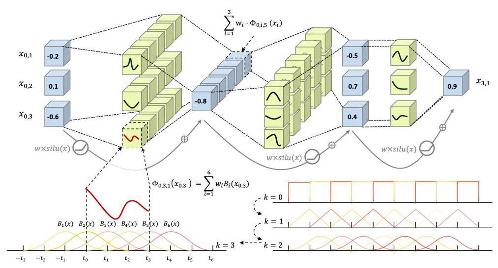
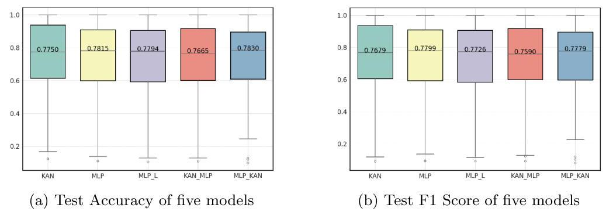
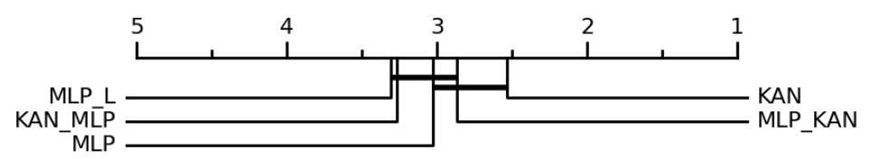
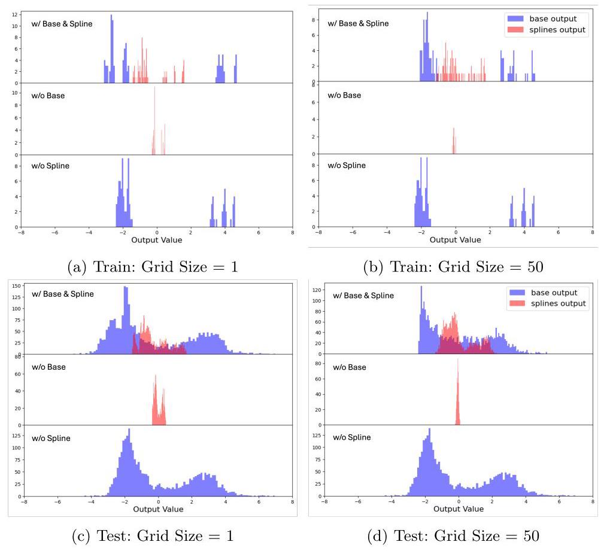
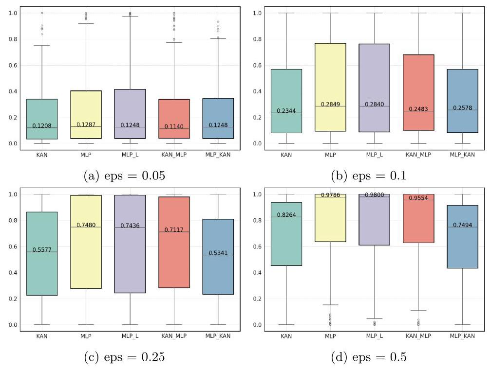
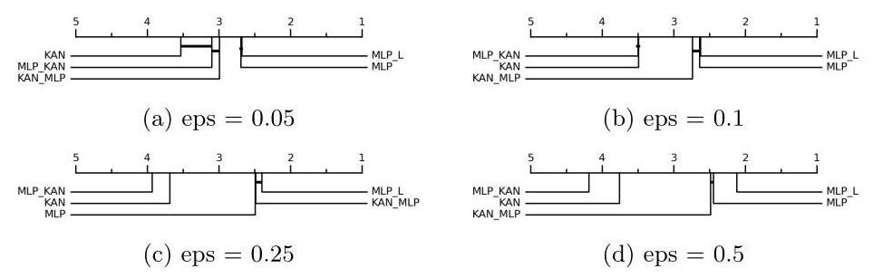
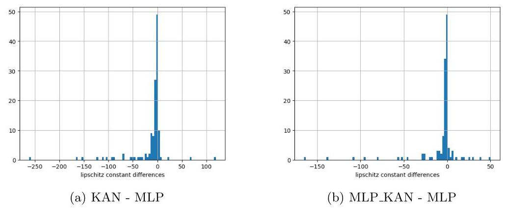
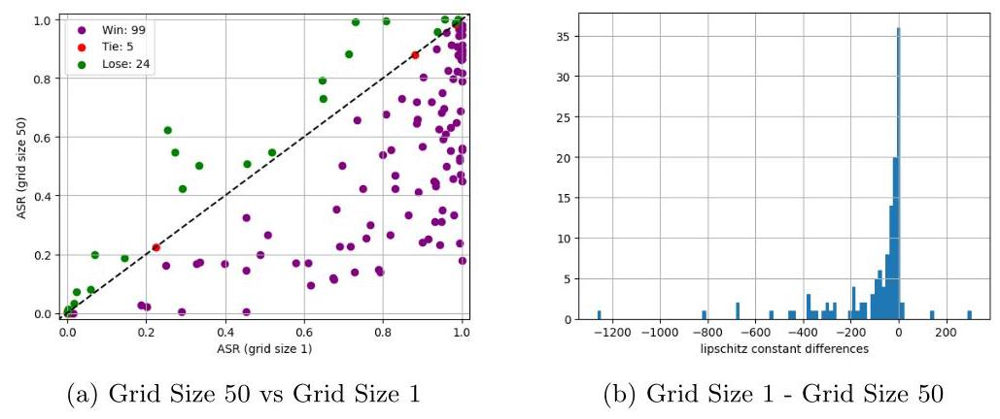

# Kolmogorov-Arnold Networks (KAN) for Time Series Classification and Robust Analysis

# 用于时间序列分类和稳健分析的柯尔莫哥洛夫 - 阿诺德网络(KAN)

Chang Dong ${}^{1}$ , Liangwei Zheng ${}^{1}$ , and Weitong Chen *1

常东${}^{1}$，郑良伟${}^{1}$，以及陈韦彤*1

${}^{1}$ The University of Adelaide

${}^{1}$ 阿德莱德大学

\{chang.dong, liangwei.zheng, weitong.chen\}@adelaide.edu.au

来自阿德莱德大学的{chang.dong, liangwei.zheng, weitong.chen}@adelaide.edu.au

Abstract. Kolmogorov-Arnold Networks (KAN) has recently attracted significant attention as a promising alternative to traditional Multi-Layer Perceptrons (MLP). Despite their theoretical appeal, KAN require validation on large-scale benchmark datasets. Time series data, which has become increasingly prevalent in recent years, especially univariate time series are naturally suited for validating KAN. Therefore, we conducted a fair comparison among KAN, MLP, and mixed structures. The results indicate that KAN can achieve performance comparable to, or even slightly better than, MLP across 128 time series datasets. We also performed an ablation study on KAN, revealing that the output is primarily determined by the base component instead of b-spline function. Furthermore, we assessed the robustness of these models and found that KAN and the hybrid structure MLP_KAN exhibit significant robustness advantages, attributed to their lower Lipschitz constants. This suggests that KAN and KAN layers hold strong potential to be robust models or to improve the adversarial robustness of other models.

摘要。近年来，作为传统多层感知器(MLP)的一种有前途的替代方案，柯尔莫哥洛夫 - 阿诺德网络(KAN)引起了广泛关注。尽管它们在理论上具有吸引力，但KAN需要在大规模基准数据集上进行验证。近年来越来越普遍的时间序列数据，尤其是单变量时间序列，天然适合用于验证KAN。因此，我们在KAN、MLP和混合结构之间进行了公平的比较。结果表明，在128个时间序列数据集上，KAN能够实现与MLP相当甚至略好的性能。我们还对KAN进行了消融研究，发现输出主要由基础组件而非B样条函数决定。此外，我们评估了这些模型的鲁棒性，发现KAN和混合结构MLP_KAN由于其较低的李普希茨常数而表现出显著的鲁棒性优势。这表明KAN和KAN层有很强的潜力成为鲁棒模型或提高其他模型的对抗鲁棒性。

Keywords: Kolmogorov-Arnold Networks- Time-Series - Adversarial Attack

关键词:柯尔莫哥洛夫 - 阿诺德网络 - 时间序列 - 对抗攻击

## 1 Introduction

## 1 引言

In recent years, time-series analysis has become increasingly prevalent in various fields, including healthcare [6], human activity recognition [16], remote sensing 17 etc. Among these, time series classification (TSC) is one of the key challenges in time series analysis. Due to rapid advancements in machine learning research, many TSC algorithms have been proposed. Before the prevalence of deep learning, numerous effective algorithms existed. For instance, NN-DTW [1] is based on measuring the general similarity of whole sequences using different distance metrics. Other methods included identifying repeated shapelets in sequences as features [7], discriminating time series by the frequency of repetition of some subseries 18, and using ensemble methods [13]. However, these approaches often faced limitations, as they were either difficult to generalize to various scenarios or had high time complexity.

近年来，时间序列分析在包括医疗保健[6]、人类活动识别[16]、遥感17等在内的各个领域中越来越普遍。其中，时间序列分类(TSC)是时间序列分析中的关键挑战之一。由于机器学习研究的快速发展，已经提出了许多TSC算法。在深度学习盛行之前，存在许多有效的算法。例如，NN-DTW[1]基于使用不同距离度量来测量整个序列的一般相似性。其他方法包括将序列中重复的形状let识别为特征[7]、通过某些子序列18的重复频率来区分时间序列，以及使用集成方法[13]。然而，这些方法往往面临局限性，因为它们要么难以推广到各种场景，要么具有很高的时间复杂度。

---

* Corresponding Author

* 通讯作者

---

In recent years, deep learning-based methods have achieved notable success in various fields such as image recognition and natural language processing. Consequently, many techniques from these domains have been adapted for time series classification, including Convolutional Neural Networks (CNNs) 9, Recurrent Neural Networks (RNNs) [11], and Transformers [20]. Even large model-based classification has found extensive application in time series classification 21.

近年来，基于深度学习的方法在图像识别和自然语言处理等多个领域取得了显著成功。因此，许多来自这些领域的技术已被应用于时间序列分类，包括卷积神经网络(CNNs)9、循环神经网络(RNNs)[11]和Transformer模型[20]。甚至基于大模型的分类方法也在时间序列分类中得到了广泛应用21。

The development of neural networks is fundamentally rooted in the concept of the multi-layer perceptron (MLP). Regardless of their complexity, neural networks retain an architecture similar to that of MLP. According to the Universal Approximation Theorem (UAT), any function can be approximated by a finite number of single-layer perceptrons[8]. This theorem underpins the capability of MLP to model and fit complex distributions. Recently, Liu, et al have proposed a new paradigm for neural networks called Kolmogorov-Arnold Networks (KAN) [14], which contrasts with traditional MLP-based neural networks. Unlike MLP, KAN is based on Kolmogorov-Arnold Theory (KAT) [12] and explicitly defines the model size required for fitting. Both MLP and KAN have analogous structures: in MLP, neuron outputs undergo a linear transformation followed by activation before being passed to the next neuron, whereas in KAN, the edges serve as learnable activation functions, followed by a linear transformation before passing to the next neuron. This learnable activation function makes KAN a potential competitor to MLP neural networks. However, KAN has only been validated within formulas constructed in the physical domain and has not been tested on large-scale datasets, leaving its scalability unproven. Univariate time series are inherently well-suited to KAN' inputs, making them excellent candidates for validation. Furthermore, the robustness of TSC has garnered significant attention in recent years 34510. As a new architecture, KAN' robustness has not yet been studied. Given these circumstances, to validate the performance and robustness of KAN in TSC tasks, we conducted the following work:

神经网络的发展从根本上源于多层感知器(MLP)的概念。无论其复杂性如何，神经网络都保留了与MLP相似的架构。根据通用逼近定理(UAT)，任何函数都可以由有限数量的单层感知器近似表示[8]。该定理支撑了MLP对复杂分布进行建模和拟合的能力。最近，Liu等人提出了一种名为Kolmogorov-Arnold Networks(KAN)的神经网络新范式[14]，它与传统的基于MLP的神经网络形成对比。与MLP不同，KAN基于Kolmogorov-Arnold理论(KAT)[12]，并明确定义了拟合所需的模型大小。MLP和KAN都具有类似的结构:在MLP中，神经元输出在传递到下一个神经元之前先经过线性变换，然后进行激活；而在KAN中，边充当可学习的激活函数，然后进行线性变换，再传递到下一个神经元。这种可学习的激活函数使KAN成为MLP神经网络的潜在竞争对手。然而，KAN仅在物理领域构建的公式中得到验证，尚未在大规模数据集上进行测试，其可扩展性尚未得到证实。单变量时间序列天生适合KAN的输入，使其成为验证的优秀候选对象。此外，近年来时间序列分类(TSC)的鲁棒性受到了广泛关注34510。作为一种新架构，KAN的鲁棒性尚未得到研究。鉴于这些情况，为了验证KAN在TSC任务中的性能和鲁棒性，我们进行了以下工作:

- We performed a fair comparison across 128 UCR datasets among KAN, MLP, KAN_MLP (KAN with the last layer replaced by MLP), MLP_KAN (MLP with the last layer replaced by KAN) under identical configurations, and MLP_L (MLP with the same number of parameters). We found that KAN could achieve performance comparable to MLP.

- 我们在相同配置下，对KAN、MLP、KAN_MLP(最后一层由MLP替换的KAN)、MLP_KAN(最后一层由KAN替换的MLP)以及MLP_L(具有相同参数数量的MLP)在128个UCR数据集上进行了公平比较。我们发现KAN能够实现与MLP相当的性能。

- We conducted an ablation study to investigate the roles of the base and B-spline functions. The results indicated that the output values were predominantly determined by the base function. Additionally, we observed that in the absence of the base function, spline functions with large grid sizes were difficult to optimize.

- 我们进行了一项消融研究，以探究基函数和B样条函数的作用。结果表明，输出值主要由基函数决定。此外，我们观察到，在没有基函数的情况下，具有大网格尺寸的样条函数难以优化。

- We assessed the robustness of KAN by comparing it with other models. Our findings revealed that KAN exhibited superior adversarial robustness due to its lower Lipschitz constant.

- 我们通过将KAN与其他模型进行比较来评估其鲁棒性。我们的研究结果表明，由于其较低的利普希茨常数，KAN表现出卓越的对抗鲁棒性。

- We observed an anomalous phenomenon that KAN with higher grid sizes demonstrated greater robustness despite having a higher Lipschitz constant. We provided a reasonable hypothesis for this observation in the final section.

- 我们观察到一个异常现象，即具有较高网格尺寸的KAN尽管具有较高的利普希茨常数，但却表现出更强的鲁棒性。我们在最后一节为这一观察结果提供了一个合理的假设。

## 2 Background

## 2背景

### 2.1 Kolmogorov-Arnold representation

### 2.1 柯尔莫哥洛夫 - 阿诺德表示

KAN is inspired by Kolmogorov-Arnold representation theory (KAT). It states that any multivariate continuous function defined in a bounded domain can be represented as a finite composition of continuous functions of a single variable and the binary operation of addition. Specifically, if $f$ is a continuous function on a bounded domain $D \subset  {\mathbb{R}}^{n}$ , then there exist continuous functions ${\phi }_{ij}$ and ${\psi }_{i}$ such that:

KAN受到柯尔莫哥洛夫 - 阿诺德表示理论(KAT)的启发。该理论指出，在有界域中定义的任何多元连续函数都可以表示为单变量连续函数的有限组合以及加法的二元运算。具体而言，如果$f$是有界域$D \subset  {\mathbb{R}}^{n}$上的连续函数，那么存在连续函数${\phi }_{ij}$和${\psi }_{i}$使得:

$$
f\left( {{x}_{1},{x}_{2},\ldots ,{x}_{n}}\right)  = \mathop{\sum }\limits_{{i = 1}}^{{{2n} + 1}}{\psi }_{i}\left( {\mathop{\sum }\limits_{{j = 1}}^{n}{\phi }_{ij}\left( {x}_{j}\right) }\right) , \tag{1}
$$

where ${\phi }_{ij} : \left\lbrack  {0,1}\right\rbrack   \rightarrow  \mathbb{R}$ and ${\psi }_{i} : \mathbb{R} \rightarrow  \mathbb{R}$ . It transforms the task of learning a mul-tivariable function into learning a finite number of univariable functions. Compared to MLP, it explicitly provides the number of one-dimensional functions needed for fitting. However, these univariable functions could be non-smooth or even fractal, making it theoretically feasible but practically useless. Nevertheless, Liu et al. [14] found that, by analogy to MLP in neural networks, KAN need not be limited to two layers and finite width to fit all non-linearities. Furthermore, most natural functions tend to be smooth and have sparse structures. These insights suggest that an scalable KAN could become a strong competitor to MLP.

其中${\phi }_{ij} : \left\lbrack  {0,1}\right\rbrack   \rightarrow  \mathbb{R}$和${\psi }_{i} : \mathbb{R} \rightarrow  \mathbb{R}$。它将学习多变量函数的任务转化为学习有限数量的单变量函数。与多层感知器(MLP)相比，它明确提供了拟合所需的一维函数的数量。然而，这些单变量函数可能是非光滑的，甚至是分形的，这使得它在理论上可行但实际上无用。尽管如此，Liu等人[14]发现，类似于神经网络中的MLP，KAN不必局限于两层和有限宽度来拟合所有非线性。此外，大多数自然函数往往是光滑的并且具有稀疏结构。这些见解表明，一个可扩展的KAN可能成为MLP的有力竞争对手。

### 2.2 Adversarial Attack

### 2.2 对抗攻击

Adversarial attacks involve applying carefully crafted small perturbations $r \in  {\mathbb{R}}^{d}$ to input data $x \in  {\mathbb{R}}^{d}$ , leading to significant changes in a model’s output, such as fooling a classifier $f : x \rightarrow  {\mathbb{R}}^{m}$ with the goal of altering the predicted label.

对抗攻击涉及对输入数据$x \in  {\mathbb{R}}^{d}$应用精心设计的小扰动$r \in  {\mathbb{R}}^{d}$，从而导致模型输出发生显著变化，例如以改变预测标签为目标欺骗分类器$f : x \rightarrow  {\mathbb{R}}^{m}$。

(2)

$$
\operatorname{argmax}\{ f\left( x\right) \}  \neq  \operatorname{argmax}\left\{  {f\left( {x}_{adv}\right) }\right\}  ,
$$

$$
{x}_{adv} = x + r\text{ , s.t. }\parallel r{\parallel }^{2} \ll  \parallel x{\parallel }^{2}.
$$

here, the perturbation $r$ is small in magnitude relative to $x$ as indicated by their norms. We normally apply these perturbations to test whether the model can be fooled, thus assessing its robustness. To consider the worst-case scenario, we typically implement the gradient attacks which require knowledge of all the information about the model and the data. Among them, the most widely used method is the Projection Gradient Descent (PGD) [15], the gradient-based iterative attack method, which is the most effective method to evaluate the robustness of models against gradient attacks. This can be characterized by:

在此，如它们的范数所示，扰动$r$相对于$x$在幅度上较小。我们通常应用这些扰动来测试模型是否会被欺骗，从而评估其鲁棒性。为了考虑最坏情况，我们通常实施梯度攻击，这需要了解有关模型和数据的所有信息。其中，最广泛使用的方法是投影梯度下降(PGD)[15]，这是一种基于梯度的迭代攻击方法，是评估模型对梯度攻击的鲁棒性的最有效方法。这可以通过以下方式表征:

$$
{x}_{adv}^{\left( t + 1\right) } = {\operatorname{Clip}}_{x,\epsilon }\left\{  {{x}_{adv}^{\left( t\right) } + \alpha  \cdot  \operatorname{sign}\left( {{\nabla }_{{x}_{adv}^{\left( t\right) }}\mathcal{L}\left( {{x}_{adv}^{\left( t\right) }, y}\right) }\right) }\right\}  , \tag{3}
$$

here, $t$ is the iteration index, ${Cli}{p}_{x,\epsilon }\{  \cdot  \}$ ensures that ${x}_{adv}^{\left( t + 1\right) }$ remains within $\epsilon$ of the original input $x$ . This method iteratively adjusts ${x}_{adv}$ to maximize the loss function in the direction that moves it away from its original prediction $y$ , while ensuring ${x}_{adv}$ stays within a small perturbation distance $\epsilon$ from $x$ .

在此，$t$是迭代索引，${Cli}{p}_{x,\epsilon }\{  \cdot  \}$确保${x}_{adv}^{\left( t + 1\right) }$保持在原始输入$x$的$\epsilon$范围内。此方法迭代调整${x}_{adv}$，以在使其远离其原始预测$y$的方向上最大化损失函数，同时确保${x}_{adv}$与$x$保持在小扰动距离$\epsilon$内。

### 2.3 Local Lipschitz Constant

### 2.3 局部利普希茨常数

A function $f : {\mathbb{R}}^{m} \rightarrow  {\mathbb{R}}^{n}$ is defined to be ${\ell }_{f}$ -locally Lipschitz continuous at radius $r$ if for each $i = 1,\ldots , n$ , and $\forall \begin{Vmatrix}{{x}_{1} - {x}_{2}}\end{Vmatrix} \leq  r$ , the following holds:

如果对于每个$i = 1,\ldots , n$和$\forall \begin{Vmatrix}{{x}_{1} - {x}_{2}}\end{Vmatrix} \leq  r$，函数$f : {\mathbb{R}}^{m} \rightarrow  {\mathbb{R}}^{n}$在半径$r$处被定义为${\ell }_{f}$ - 局部利普希茨连续，则以下成立:

$$
\begin{Vmatrix}{f\left( {x}_{1}\right)  - f\left( {x}_{2}\right) }\end{Vmatrix} \leq  {\ell }_{f}\begin{Vmatrix}{{x}_{1} - {x}_{2}}\end{Vmatrix} \tag{4}
$$

where ${\ell }_{f}$ is the local Lipschitz constant. Hereafter, we will refer to it simply as the Lipschitz constant. The Lipschitz constant is directly linked to perturbation stability, which in turn relates to robustness [19].

其中${\ell }_{f}$是局部利普希茨常数。此后，我们将简单地将其称为利普希茨常数。利普希茨常数与扰动稳定性直接相关，而扰动稳定性又与鲁棒性相关[19]。

## 3 Methodology

## 3方法

### 3.1 Kolmogorov-Arnold Networks (KAN)

### 3.1 柯尔莫哥洛夫 - 阿诺德网络(KAN)

Assume there is a data distribution $D \subseteq  {\mathbb{R}}^{d} \times  {\mathbb{R}}^{m}$ . Our objective is to learn a function $f : x \in  {\mathbb{R}}^{d} \rightarrow  y \in  {\mathbb{R}}^{m}$ such that the following risk is minimized as $\widehat{R}\left( f\right)  = \frac{1}{n}\mathop{\sum }\limits_{{i = 1}}^{n}\begin{Vmatrix}{{y}_{i} - f\left( {x}_{i}\right) }\end{Vmatrix}$ . The purpose of the KAN is to learn such a representation of $f$ , thereby minimizing the objective loss. The original KAN used a two-layer structure, while Liu, et al. [14] extended to arbitrary width and depth. In contrast to MLP, the activation function are placed on edges instead of the neurons, KAN use ${3}^{rd}$ -order B-spline $\left( {k = 3}\right)$ functions for fitting, which allows learning sophisticated activation function by controlling the weight of each basis. In this case, the neuron $q$ in the layer $l + 1$ can be represented as :

假设存在一个数据分布$D \subseteq  {\mathbb{R}}^{d} \times  {\mathbb{R}}^{m}$。我们的目标是学习一个函数$f : x \in  {\mathbb{R}}^{d} \rightarrow  y \in  {\mathbb{R}}^{m}$，使得随着$\widehat{R}\left( f\right)  = \frac{1}{n}\mathop{\sum }\limits_{{i = 1}}^{n}\begin{Vmatrix}{{y}_{i} - f\left( {x}_{i}\right) }\end{Vmatrix}$，以下风险最小化。KAN的目的是学习这样一种$f$的表示，从而最小化目标损失。原始的KAN使用两层结构，而Liu等人[14]将其扩展到任意宽度和深度。与MLP不同，激活函数放在边上而不是神经元上，KAN使用${3}^{rd}$阶B样条$\left( {k = 3}\right)$函数进行拟合，这允许通过控制每个基的权重来学习复杂的激活函数。在这种情况下，层$l + 1$中的神经元$q$可以表示为:

$$
{x}_{l + 1, q}^{\text{ spline }} = \mathop{\sum }\limits_{{p = 1}}^{n}{w}_{p, q}^{\text{ spline }} \cdot  {\Phi }_{l, q, p}\left( {x}_{l, p}\right)  = \mathop{\sum }\limits_{{p = 1}}^{n}{w}_{p, q}^{\text{ spline }} \cdot  \mathop{\sum }\limits_{{i = 1}}^{{k + G}}{w}_{i} \cdot  {B}_{i}\left( {x}_{l, p}\right) , \tag{5}
$$

where ${x}_{l, p}$ is the input from an arbitrary neuron $p$ in the previous layer $l$ . The input from all $n$ neurons in the previous layer $l$ undergoes a nonlinear transformation produced by a learnable B-spline combination, where $G$ is the grid size which determines the number of B-spline bases $\left( {k + G}\right)$ . This is followed by a weighted summation to obtain the ${q}^{\text{ th }}$ output of ${x}_{l + 1, q}^{\text{ spline }}$ . Additionally, KAN introduce a base function similar to residual connections, using weighted silu, to stabilize optimization, which can be represented as:

其中${x}_{l, p}$是来自前一层$l$中任意神经元$p$的输入。来自前一层$l$中所有$n$神经元的输入经过由可学习的B样条组合产生的非线性变换，其中$G$是确定B样条基$\left( {k + G}\right)$数量的网格大小。接下来是加权求和以获得${x}_{l + 1, q}^{\text{ spline }}$的${q}^{\text{ th }}$输出。此外，KAN引入了一个类似于残差连接的基函数，使用加权silu来稳定优化，其可以表示为:

$$
{x}_{l + 1, q}^{\text{ base }} = \mathop{\sum }\limits_{{p = 1}}^{n}{w}_{p, q}^{\text{ base }} \cdot  \operatorname{silu}\left( {x}_{l, p}\right)  = \mathop{\sum }\limits_{{p = 1}}^{n}{w}_{p, q}^{\text{ base }} \cdot  \frac{{x}_{l, p}}{1 + {e}^{-{x}_{l, p}}} \tag{6}
$$

Fig. 1: A three-layer KAN structure with the architecture [3-5-3-1].

图1:具有[3-5-3-1]架构的三层KAN结构。

Therefore, the output of the ${q}^{th}$ neuron in layer $l + 1$ can be represented as:

因此，层$l + 1$中${q}^{th}$神经元的输出可以表示为:

$$
{x}_{l + 1, q} = {x}_{l + 1, q}^{\text{ spline }} + {x}_{l + 1, q}^{\text{ base }} \tag{7}
$$

For a multi-layer KAN, the final output can be represented as a nested structure of layers:

对于多层KAN，最终输出可以表示为层的嵌套结构:

$$
f\left( \mathbf{x}\right)  = f\left( {{x}_{1},{x}_{2},\ldots ,{x}_{n}}\right)  = {\Psi }_{L} \circ  {\Psi }_{L - 1}\ldots  \circ  {\Psi }_{1} \circ  \mathbf{x} \tag{8}
$$

where ${\Psi }_{l}$ denotes the ${l}^{th}$ layer, which includes the combination of the above two operations: a spline transformation and a base activation silu. Fig. 1 illustrates a three-layer KAN structure with the architecture [3-5-3-1], clearly depicting how KAN operate.

其中${\Psi }_{l}$表示${l}^{th}$层，它包括上述两个操作的组合:样条变换和基激活silu。图1说明了具有[3-5-3-1]架构的三层KAN结构，清楚地描绘了KAN的操作方式。

### 3.2 KAN for time series classification

### 3.2 用于时间序列分类的KAN

We constructed classifiers using KAN, similar to the structure shown in fig. 1 Due to the setting of the B-spline fitting interval being $\left\lbrack  {-1,1}\right\rbrack$ , the data distribution outside this interval will not achieve an effective fitting. Instead of directly adopting the method proposed by Liu et al., which suggested updating the grid interval according to data distribution, We employed a more straightforward approach. We fixed the B-Spline grid interval to $\left\lbrack  {-1,1}\right\rbrack$ throughout the process, and applied batch normalization to keep the distribution within [-1,1] in each KAN Layer, to ensure the data distribution conforms to the grid and optimize the training process. Thus, to build a KAN for TSC, we adopted a 3- layer structure with the output transformed to the number of classes, having an architecture of [d-d-128-m], where $d$ is the sequence length and $m$ is the number of classes. Meanwhile, We compared KAN with MLP that had the same number of parameters and neurons per layer, as well as networks where the last layer of KAN was replaced with MLP (KAN_MLP) and the last layer of MLP was replaced with KAN (MLP_KAN). The experimental design is shown in tab. 1

我们使用KAN构建分类器，类似于图1所示的结构。由于B样条拟合区间设置为$\left\lbrack  {-1,1}\right\rbrack$，该区间之外的数据分布将无法实现有效拟合。我们没有直接采用Liu等人提出的根据数据分布更新网格区间的方法，而是采用了一种更直接的方法。我们在整个过程中将B样条网格区间固定为$\left\lbrack  {-1,1}\right\rbrack$，并应用批归一化以在每个KAN层中将分布保持在[-1,1]内，以确保数据分布符合网格并优化训练过程。因此，为了构建用于TSC的KAN，我们采用了三层结构，并将输出转换为类别数量，其架构为[d-d-128-m]，其中$d$是序列长度，$m$是类别数量。同时，我们将KAN与每层具有相同参数和神经元数量的MLP以及将KAN的最后一层替换为MLP(KAN_MLP)和将MLP的最后一层替换为KAN(MLP_KAN)的网络进行了比较。实验设计如表1所示

Table 1: Model Architectures and Parameters(G=5, k= 3 for all B-splines)

表1:模型架构和参数(所有B样条的G = 5，k = 3)

<table><tr><td>Networks</td><td>Architecture</td><td>Activation</td><td>Parameters $\left(  \approx  \right)$</td></tr><tr><td>KAN</td><td>[d-d-128-m]</td><td>Silu, B-Spline</td><td>$\left( {2 + G + k}\right)  \cdot  {d}^{2} + \left( {{258} + {128} \cdot  \left( {G + k}\right) }\right)  \cdot  d$</td></tr><tr><td>MLP_I</td><td>[d-d-128-m]</td><td>Relu</td><td>${d}^{2} + {131d}$</td></tr><tr><td>MLP_II</td><td>[d-10d-128-m]</td><td>Relu</td><td>${10}{d}^{2} + {1310d}$</td></tr><tr><td>KAN_MLP</td><td>[d-d-128-m]</td><td>Relu, Silu, B-Spline</td><td>$\left( {2 + G + k}\right)  \cdot  {d}^{2} + {130d}$</td></tr><tr><td>MLP_KAN</td><td>[d-d-128-m]</td><td>Relu, Silu, B-Spline</td><td>${d}^{2} + \left( {2 + G + k}\right)  \cdot  {128d}$</td></tr></table>

## 4 Experiment Settings

## 4 实验设置

Dataset: We applied the UCR2018 datasets [2] to evaluate these models. The UCR Time Series Archive encompasses 128 datasets, which are all univariate. These datasets span a diverse range of real-world domains, including healthcare, human activity recognition, remote sensing and more. Each dataset comprises a distinct number of samples, all of which have been pre-partitioned into training and testing sets. Reflecting the intricacies of real-world data, the archive includes datasets with missing values, imbalances, and those with limited training samples.

数据集:我们应用了UCR2018数据集[2]来评估这些模型。UCR时间序列存档包含128个数据集，均为单变量数据集。这些数据集涵盖了各种不同的现实世界领域，包括医疗保健、人类活动识别、遥感等。每个数据集包含不同数量的样本，所有样本都已预先划分为训练集和测试集。反映现实世界数据的复杂性，该存档包括具有缺失值、不平衡以及训练样本有限的数据集。

Evaluation Metrics: We used the accuracy and the F1 score to assess the performance of all models in tab. 1. During adversarial attacks, we evaluate the robustness of the models using the Attack Success Rate (ASR).

评估指标:我们使用准确率和F1分数来评估表1中所有模型的性能。在对抗攻击期间，我们使用攻击成功率(ASR)来评估模型的鲁棒性。

Experiment setup: Our experiments were executed on a server equipped with Nvidia RTX 4090 GPUs, 64 GB RAM, and an AMD EPYC 7320 processor.

实验设置:我们的实验在配备英伟达RTX 4090 GPU、64GB内存和AMD EPYC 7320处理器的服务器上执行。

Parameter setting: In our experiments, we utilized the open-source GitHub project efficient-KAN ${}^{1}$ to replace the original CPU-based KAN architecture proposed by Liu et al. [14]. This modification, along with switching the optimizer to AdamW from BFGS, allowed for faster training speeds. We set the dropout rate to 0.1 and trained all the models for 1000 epochs. The learning rate was initialized at 1e-2 and decayed to 90% of its previous value every 25 epochs. Especially for KAN, we used a weight decay of 1e-2, set L1 regularization for the weights to 0, and entropy regularization to 1e-5. For adversarial attacks, we employed the PGD with non-targeted attacks. The perturbation magnitude eps $\left( \epsilon \right)$ is set at $\left\lbrack  {{0.05},{0.1},{0.25},{0.5}}\right\rbrack$ , with a step size of 0.01 times eps and 100 iterations for each attack.

参数设置:在我们的实验中，我们利用开源的GitHub项目efficient-KAN ${}^{1}$来替代Liu等人[14]提出的基于CPU的原始KAN架构。此修改，连同将优化器从BFGS切换到AdamW，实现了更快的训练速度。我们将随机失活率设置为0.1，并对所有模型训练1000个轮次。学习率初始化为1e-2，每25个轮次衰减为前一个值的90%。特别是对于KAN，我们使用1e-2的权重衰减，将权重的L1正则化设置为0，熵正则化设置为1e-5。对于对抗攻击，我们采用非目标攻击的PGD。扰动幅度eps $\left( \epsilon \right)$设置为$\left\lbrack  {{0.05},{0.1},{0.25},{0.5}}\right\rbrack$，步长为eps的0.01倍，每次攻击进行100次迭代。

---

1 Our Github, and efficient-KAN

1 我们的Github和efficient-KAN

---

## 5 Result

## 5 结果

### 5.1 Performance Comparison

### 5.1 性能比较

Fig. 2 (a) and (b) show the accuracy and F1 distribution across 128 UCR datasets for the five models respectively. We observe that these five models achieve relatively similar performance across the 128 datasets, both in terms of F1 score and accuracy. However, KAN performs slightly better overall. This conclusion is also supported by the results shown from the critical diagrams in Fig. 3, where only KAN and MLP_L in the same parameters exhibit statistically significant differences. In the critical diagram, KAN ranks the highest, indicating its strong fitting capability and demonstrating that it can achieve performance comparable to, or even better than, traditional neural networks on the benchmark time series datasets.

图2(a)和(b)分别展示了五个模型在128个UCR数据集上的准确率和F1分布。我们观察到，这五个模型在128个数据集上的F1分数和准确率方面表现出相对相似的性能。然而，总体而言KAN表现稍好。图3中的关键图所示结果也支持这一结论，在相同参数下，只有KAN和MLP_L表现出统计学上的显著差异。在关键图中，KAN排名最高，表明其强大的拟合能力，并证明它在基准时间序列数据集上能够实现与传统神经网络相当甚至更好的性能。

Fig. 2: Performance comparison of five models across 128 datasets

图2:五个模型在128个数据集上的性能比较

### 5.2 Ablation Study of KAN

### 5.2 KAN的消融研究

KAN have a more complex structure compared to MLP, due to the combinations of base and spline functions. The different grid sizes of spline functions have varying impacts on performance. To evaluate their influences, we investigated three configurations of KAN as follows:

与MLP相比，KAN具有更复杂 的结构，这是由于基函数和样条函数的组合。样条函数的不同网格大小对性能有不同影响。为了评估它们的影响，我们研究了KAN的三种配置如下:

Fig. 3: Critical diagram of accuracy for five models across 128 datasets (higher rank is better)

图3:五个模型在128个数据集上的准确率关键图(排名越高越好)

1. Complete KAN with different grid sizes: 1, 5, 50

1. 具有不同网格大小的完整KAN:1、5、50

2. KAN with only the wpline component, with different grid sizes: 1, 5, 50

2. 仅具有wpline组件的KAN，具有不同网格大小:1、5、50

3. KAN with only the base component

3. 仅具有基组件的KAN

Table 2: Test accuracy of models with different architectures on the 128 dataset. The values corresponding to columns 1, 5, and 50 represent the number of datasets out of 128 where the accuracy of the grid size corresponding to each row is greater than or equal to that of the grid size in the column, under the same architecture. Q1, Q2, and Q3 denote the quantiles of the accuracy distribution across the 128 datasets.

表2:不同架构模型在128个数据集上的测试准确率。对应第1、5和50列的值表示在相同架构下，128个数据集中每行对应网格大小的准确率大于或等于该列网格大小准确率的数据集数量。Q1、Q2和Q3表示128个数据集上准确率分布的分位数。

<table><tr><td>KAN Configuration</td><td>Grid Size</td><td>1</td><td>5</td><td>50</td><td>Q1</td><td>Q2</td><td>Q3</td></tr><tr><td rowspan="3">w/ base & Spline</td><td>1</td><td>128</td><td>64</td><td>96</td><td>0.6000</td><td>0.7991</td><td>0.9214</td></tr><tr><td>5</td><td>76</td><td>128</td><td>112</td><td>0.6146</td><td>0.7750</td><td>0.9387</td></tr><tr><td>50</td><td>39</td><td>24</td><td>128</td><td>0.5626</td><td>0.6976</td><td>0.847</td></tr><tr><td rowspan="3">w/o Base</td><td>1</td><td>128</td><td>100</td><td>122</td><td>0.5591</td><td>0.7571</td><td>0.9009</td></tr><tr><td>5</td><td>40</td><td>128</td><td>119</td><td>0.5054</td><td>0.6706</td><td>0.8271</td></tr><tr><td>50</td><td>13</td><td>19</td><td>128</td><td>0.2226</td><td>0.4315</td><td>0.5732</td></tr><tr><td>w/o Spline</td><td>-</td><td></td><td>-</td><td></td><td>0.5652</td><td>0.7698</td><td>0.9000</td></tr></table>

Tab. 2 presents the overall performance of these three configurations across 128 datasets. We observed that an excessively large grid size leads to performance degradation, regardless of whether it is in the complete KAN or without the base function. In the complete KAN, there is little difference in performance with smaller grid sizes. For grid size $= 1$ , nearly ${50}\%$ of the datasets achieved over ${80}\%$ accuracy, whereas for grid size $= {50}$ , this value drops to less than ${70}\%$ . In the KAN without the base function, overall performance significantly declines as the grid size increases. Particularly, for grid size $= {50}$ , the accuracy of ${50}\%$ of the datasets is below 43.15%. Additionally, we found that the performance of KAN without the spline function is close to that of the KAN network with only the spline function and with grid size $= 1$ . This indicates that the fitting capability of KAN largely comes from the simple activation functions, suggesting that complex B-spline combinations may lead to optimization difficulties. To explain the result above, we analyzed the CBF dataset, which exhibited results similar to the overall trend as shown in tab. 3. Most results are comparable, except for the model with only the Spline function and a grid size of 50 , which performed significantly worse. We analyzed the output results of the two parts at the last layer as shown in the fig. 4.

表2展示了这三种配置在128个数据集上的整体性能。我们观察到，无论在完整的KAN中还是没有基函数的情况下，过大的网格大小都会导致性能下降。在完整的KAN中，较小网格大小的性能差异不大。对于网格大小$= 1$，近${50}\%$的数据集达到了超过${80}\%$的准确率，而对于网格大小$= {50}$，该值降至低于${70}\%$。在没有基函数的KAN中，随着网格大小的增加，整体性能显著下降。特别是，对于网格大小$= {50}$，${50}\%$的数据集的准确率低于43.15%。此外，我们发现没有样条函数的KAN的性能与仅具有样条函数且网格大小为$= 1$的KAN网络接近。这表明KAN的拟合能力很大程度上来自简单的激活函数，这表明复杂的B样条组合可能会导致优化困难。为了解释上述结果，我们分析了CBF数据集，其结果与表3中所示的总体趋势相似。除了仅具有样条函数且网格大小为50的模型表现明显更差外，大多数结果具有可比性。我们分析了如图4所示的最后一层两个部分的输出结果。

Table 3: Test(Train) accuracy of different KAN on the CBF dataset.

表3:不同KAN在CBF数据集上的测试(训练)准确率。

<table><tr><td>KAN Configuration</td><td>1</td><td>5</td><td>50</td></tr><tr><td>w/ Base & Spline</td><td>0.9011(0.9667)</td><td>0.9644(0.9667)</td><td>0.9300(0.9667)</td></tr><tr><td>w/o Base</td><td>0.8722(1.0000)</td><td>0.8644(0.9667)</td><td>0.3178(0.6667)</td></tr><tr><td>w/o Spline</td><td>0.8811(1.0000)</td><td>0.8811(1.0000)</td><td>0.8811(1.0000)</td></tr></table>

We observed two phenomena across both the training and testing sets: First, the output values of the spline are relatively smaller and more concentrated compared to those of the base configuration. This indicates that the spline's contribution to the final decision is less significant than that of the base, suggesting that the base configuration plays a more critical role in decision-making. Second, the most significant difference between fig. 4c and 4d is the distinct distribution observed when the base component is removed. When the grid size is set to 1 , the output distributions for these three configurations are similar, exhibiting two prominent peaks on both the positive and negative sides, with the negative peak being higher and more numerous. This pattern occurs because the CBF dataset has 3 categories, thus, when one class is predicted with high confidence, the other two classes tend to output negative values. However, this scenario changes drastically at a grid size of 50 . Here, the spline output shows only a single peak concentrated around zero both in the training and testing set, corresponding to the lower accuracy observed in tab. 2 for a grid size of 50 (without Base). This further confirms that an excessively large grid size complicates the network's optimization.

我们在训练集和测试集中都观察到了两种现象:第一，与基本配置相比，样条的输出值相对较小且更集中。这表明样条对最终决策的贡献不如基本配置显著，这表明基本配置在决策中起着更关键的作用。第二，图4c和4d之间最显著的差异是去除基组件时观察到的明显分布。当网格大小设置为1时，这三种配置的输出分布相似，在正负两侧都有两个突出的峰值，负峰值更高且更多。出现这种模式是因为CBF数据集有3个类别，因此，当一个类别被高置信度预测时，其他两个类别往往会输出负值。然而，在网格大小为50时，这种情况发生了巨大变化。在这里，样条输出在训练集和测试集中都仅显示一个集中在零附近的单峰，这与表2中网格大小为50(无基)时观察到的较低准确率相对应。这进一步证实了过大的网格大小会使网络的优化变得复杂。

### 5.3 Evaluation and Analysis of Adversarial Robustness

### 5.3对抗鲁棒性的评估与分析

We also found that KAN demonstrate better robustness compared to MLP. We performed PGD untargeted attacks on the aforementioned five models, with $\epsilon$ ranging from 0.05 to 0.5 . The results consistently show that KAN significantly outperform MLP. Fig. 5 illustrates the ASR of PGD on these models. We observe that KAN and MLP_KAN exhibit remarkable robustness compared to the other three models, with this advantage increasing as $\epsilon$ grows. Specifically, at $\epsilon  = {0.5}$ , the MLP_KAN model shows the best robustness among the five, with the ASR on 50% of the dataset remaining below approximately 75%, whereas the ASR for MLP, MLP_L, and KAN_MLP approach 1 for nearly 50% of the dataset. From fig. 6 it is evident that KAN and MLP_KAN demonstrate significantly different robustness across 128 datasets compared to the other three models.

我们还发现，与MLP相比，KAN表现出更好的鲁棒性。我们对上述五个模型进行了PGD无目标攻击，$\epsilon$范围为0.05至0.5。结果一致表明，KAN明显优于MLP。图5展示了PGD对这些模型的ASR。我们观察到，与其他三个模型相比，KAN和MLP_KAN表现出显著的鲁棒性，并且随着$\epsilon$的增加，这种优势会增加。具体而言，在$\epsilon  = {0.5}$时，MLP_KAN模型在五个模型中表现出最佳的鲁棒性，50%的数据集上的ASR保持在约75%以下，而MLP、MLP_L和KAN_MLP在近50%的数据集上的ASR接近1。从图6中可以明显看出，与其他三个模型相比，KAN和MLP_KAN在128个数据集上表现出显著不同的鲁棒性。

Fig. 4: Distribution of the flattened Train/Test output values of the last layer of the model under different configurations on the CBF dataset. (a) Train: Grid size of 1, (b)Train: Grid size of 50, (c) Test: Grid size of 1, and (d)Test: Grid size of 50.

图4:CBF数据集上不同配置下模型最后一层展平的训练/测试输出值的分布。(a)训练:网格大小为1，(b)训练:网格大小为50，(c)测试:网格大小为1，以及(d)测试:网格大小为50。

To explain this phenomenon, we obtained the Lipschitz constants for the KAN, MLP, and MLP_KAN models. Fig. 7 shows the distribution of Lipschitz constant differences across 128 datasets. Fig. 8a and 8b both indicate that the model with KAN layer generally results in a decrease in the Lipschitz constants for most datasets, which is consistent with the observations in fig. 5. The combination of spline functions produced by KAN with a low grid size tends to be smooth and flat, making it difficult for small changes in input to cause significant changes in the output $y$ . Additionally, as shown in the previous fig. 4, the output distribution of the B-spline function is more narrow compared to the combination of activation and linear functions, thus contributing minimally to the output. This could be the primary reason why KAN is more robust under attack.

为了解释这一现象，我们获取了KAN、MLP和MLP_KAN模型的利普希茨常数。图7展示了128个数据集上利普希茨常数差异的分布情况。图8a和8b均表明，对于大多数数据集而言，具有KAN层的模型通常会使利普希茨常数降低，这与图5中的观察结果一致。KAN生成的具有低网格大小的样条函数组合往往平滑且平坦，使得输入的微小变化难以导致输出$y$发生显著变化。此外，如前图4所示，与激活函数和线性函数的组合相比，B样条函数的输出分布更窄，因此对输出的贡献最小。这可能是KAN在攻击下更具鲁棒性的主要原因。

Fig. 5: ASR distribution across 128 datasets for five models in different perturbation eps.

图5:五个模型在不同扰动ε下，128个数据集的ASR分布。

However, we observed the opposite result in another experiment. Fig. 8 shows that the Lipschitz constant corresponding to a larger grid size is greater. This is evident because as the number of grids increases, the slopes of the spline basis also increase, making the overall B-spline function more likely to produce larger slopes. However, the results indicate that a larger Lipschitz constant leads to greater robustness, with 104 out of 128 datasets having an ASR less than or equal to that corresponding to a grid size of 1 , demonstrating stronger robustness. We preliminarily believe this might be because the value distribution produced by the B-spline is much smaller compared to the base function, thus the base contributes the majority in decision-making. However, the gradients of the B-spline with a larger grid size are substantial, thus during PGD attacks, the gradient is mainly provided by the B-spline part, which might not necessarily provide the correct direction compared to the base. Therefore, networks with larger Lipschitz constants exhibit stronger robustness. This may also further imply why models are difficult to optimize as the grid size increases.

然而，我们在另一个实验中观察到了相反的结果。图8表明，对应较大网格大小的利普希茨常数更大。这很明显，因为随着网格数量的增加，样条基的斜率也会增加，使得整体B样条函数更有可能产生更大的斜率。然而，结果表明，更大的利普希茨常数会带来更强的鲁棒性，128个数据集中有104个数据集的ASR小于或等于对应网格大小为1时的ASR，显示出更强的鲁棒性。我们初步认为，这可能是因为B样条产生的值分布与基函数相比要小得多，因此在决策中基函数贡献了大部分。然而，具有较大网格大小的B样条的梯度很大，因此在PGD攻击期间，梯度主要由B样条部分提供，与基函数相比，这不一定能提供正确的方向。因此，具有较大利普希茨常数的网络表现出更强的鲁棒性。这也可能进一步暗示了为什么随着网格大小的增加，模型难以优化。

Fig. 6: Critical diagram of ASR rank across 128 datasets for five models in different perturbation eps (lower rank is better)

图6:五个模型在不同扰动ε下，128个数据集的ASR排名临界图(排名越低越好)

Fig. 7: Lipschitz constant distribution differences across 128 dataset

图7:128个数据集上的利普希茨常数分布差异

Fig. 8: Comparison of (a) ASR and (b) Lipschitz constant distribution differences across 128 dataset between Grid Size of 50 and Grid Size of 1

图8:(a)ASR和(b)128个数据集上，网格大小为50和网格大小为1时的利普希茨常数分布差异比较

## 6 Conclusion

## 6结论

In this paper, we applied the KAN in Time Series Classification and conducted a fair comparison among KAN, MLP, and mixed structures. We found that KAN can achieve comparable performance to MLP. Additionally, we analyzed the importance of each component of KAN and discovered that a larger grid size can be difficult to optimize, leading to lower performance. Furthermore, we evaluated the adversarial robustness of KAN and these models, finding that KAN exhibited remarkable robustness. This robustness is attributed to KAN's lower Lipschitz constant. Moreover, we found that KAN with a larger grid size have a greater Lipschitz constant but exhibit stronger robustness. We provided an explanation for this phenomenon, although it requires further verification and broader experiments in our future work.

在本文中，我们将KAN应用于时间序列分类，并在KAN、MLP和混合结构之间进行了公平比较。我们发现KAN可以实现与MLP相当的性能。此外，我们分析了KAN各组件的重要性，发现较大的网格大小可能难以优化，导致性能下降。此外，我们评估了KAN和这些模型的对抗鲁棒性，发现KAN表现出显著的鲁棒性。这种鲁棒性归因于KAN较低的利普希茨常数。此外，我们发现具有较大网格大小的KAN具有更大的利普希茨常数，但表现出更强的鲁棒性。我们对这一现象进行了解释，尽管这需要在我们未来的工作中进一步验证和进行更广泛的实验。

## 7 Acknowledgments

## 7致谢

We thank all the creators and providers of the UCR time series benchmark datasets. This research work is supported by Australian Research Council Linkage Project (LP230200821), Australian Research Council Discovery Projects (DP240103070 ), Australian Research Council ARC Early Career Industry Fellowship (IE230100119), Australian Research Council ARC Early Career Industry Fellowship (IE240100275), and University of Adelaide, Sustainability FAME Strategy Internal Grant 2023.

我们感谢UCR时间序列基准数据集的所有创建者和提供者。本研究工作得到了澳大利亚研究理事会链接项目(LP230200821)、澳大利亚研究理事会发现项目(DP240103070)、澳大利亚研究理事会ARC早期职业行业奖学金(IE230100119)、澳大利亚研究理事会ARC早期职业行业奖学金(IE240100275)以及阿德莱德大学2023年可持续发展FAME战略内部资助的支持。

## References

## 参考文献

1. Bagnall, A., Lines, J., Bostrom, A., Large, J., Keogh, E.: The great time seriesclassification bake off: a review and experimental evaluation of recent algorithmic advances. Data mining and knowledge discovery 31, 606-660 (2017)

分类竞赛:近期算法进展的综述与实验评估。数据挖掘与知识发现31，606 - 660(2017)

2. Dau, H.A., Bagnall, A., Kamgar, K., Yeh, C.C.M., Zhu, Y., Gharghabi, S.,Ratanamahatana, C.A., Keogh, E.: The ucr time series archive. IEEE/CAA Journal of Automatica Sinica 6(6), 1293-1305 (2019)

拉塔纳马纳哈塔纳，C.A.，基奥，E.:UCR时间序列存档。IEEE/CAA自动化学报6(6)，1293 - 1305(2019)

3. Dong, C., Li, Z., Zheng, L., Chen, W., Zhang, W.E.: Boosting certificate ro-bustness for time series classification with efficient self-ensemble. arXiv preprint

具有高效自集成的时间序列分类的鲁棒性。arXiv预印本arXiv:2409.02802 (2024)

4. Dong, C.G., Zheng, L.N., Chen, W., Zhang, W.E., Yue, L.: Swap: Exploitingsecond-ranked logits for adversarial attacks on time series. In: 2023 IEEE Interna-

时间序列对抗攻击的第二排名对数。见:2023年IEEE国际会议tional Conference on Knowledge Graph (ICKG). pp. 117-125. IEEE (2023)

5. Fawaz, H.I., Forestier, G., Weber, J., Idoumghar, L., Muller, P.A.: Adversarialattacks on deep neural networks for time series classification. In: 2019 International

时间序列分类的深度神经网络对抗攻击。见:2019年国际会议Joint Conference on Neural Networks (IJCNN). pp. 1-8. IEEE (2019)

6. Forestier, G., Petitjean, F., Senin, P., Despinoy, F., Huaulmé, A., Fawaz, H.I.,Weber, J., Idoumghar, L., Muller, P.A., Jannin, P.: Surgical motion analysis using discriminative interpretable patterns. Artificial intelligence in medicine 91, 3-11

韦伯，J.，伊杜姆加尔，L.，米勒，P.A.，詹宁，P.:使用可判别解释模式的手术运动分析。医学人工智能91，3 - 11(2018)

7. Hills, J., Lines, J., Baranauskas, E., Mapp, J., Bagnall, A.: Classification of timeseries by shapelet transformation. Data mining and knowledge discovery 28, 851- 881 (2014)

通过形状let变换的系列。数据挖掘与知识发现28，851 - 881(2014)

8. Hornik, K., Stinchcombe, M., White, H.: Multilayer feedforward networks are uni-versal approximators. Neural networks 2(5), 359-366 (1989)

通用逼近器。神经网络2(5)，359 - 366(1989)

9. Ismail Fawaz, H., Lucas, B., Forestier, G., Pelletier, C., Schmidt, D.F., Weber,J., Webb, G.I., Idoumghar, L., Muller, P.A., Petitjean, F.: Inceptiontime: Finding alexnet for time series classification. Data Mining and Knowledge Discovery $\mathbf{{34}}\left( 6\right)$ , 1936-1962 (2020)

J.，韦伯，G.I.，伊杜姆加尔，L.，米勒，P.A.，佩蒂让，F.:Inceptiontime:为时间序列分类寻找Alexnet。数据挖掘与知识发现$\mathbf{{34}}\left( 6\right)$，1936 - 1962(2020)

10. Karim, F., Majumdar, S., Darabi, H.: Adversarial attacks on time series. IEEEtransactions on pattern analysis and machine intelligence 43(10), 3309-3320 (2020)

模式分析与机器智能汇刊43(10)，3309 - 3320(2020)

11. Karim, F., Majumdar, S., Darabi, H., Chen, S.: Lstm fully convolutional networksfor time series classification. IEEE access 6, 1662-1669 (2017)

用于时间序列分类。IEEE接入6，1662 - 1669(2017)

12. Kolmogorov, A.N.: On the representation of continuous functions of several vari-ables by superpositions of continuous functions of a smaller number of variables. American Mathematical Society (1961)

通过较少数量变量的连续函数叠加实现的函数。美国数学学会(1961)

13. Lines, J., Taylor, S., Bagnall, A.: Hive-cote: The hierarchical vote collective oftransformation-based ensembles for time series classification. In: 2016 IEEE 16th

基于变换的时间序列分类集成。见:2016年IEEE第16届International Conference on Data Mining (ICDM). pp. 1041-1046 (2016). https://doi.org/10.1109/ICDM.2016.0133

//doi.org/10.1109/ICDM.2016.0133

14. Liu, Z., Wang, Y., Vaidya, S., Ruehle, F., Halverson, J., Soljačić, M., Hou, T.Y., Tegmark, M.: Kan: Kolmogorov-arnold networks. arXiv preprint arXiv:2404.19756 (2024)

15. Madry, A., Makelov, A., Schmidt, L., Tsipras, D., Vladu, A.: Towards deep learning models resistant to adversarial attacks. arXiv preprint arXiv:1706.06083 (2017)

16. Nweke, H.F., Teh, Y.W., Al-Garadi, M.A., Alo, U.R.: Deep learning algorithms forhuman activity recognition using mobile and wearable sensor networks: State of the art and research challenges. Expert Systems with Applications 105, 233-261

使用移动和可穿戴传感器网络的人类活动识别:现状与研究挑战。专家系统应用105，233 - 261(2018)

17. Pelletier, C., Webb, G.I., Petitjean, F.: Temporal convolutional neural network forthe classification of satellite image time series. Remote Sensing $\mathbf{{11}}\left( 5\right) ,{523}\left( {2019}\right)$

卫星图像时间序列的分类。遥感$\mathbf{{11}}\left( 5\right) ,{523}\left( {2019}\right)$

18. Schäfer, P.: The boss is concerned with time series classification in the presence ofnoise. Data Mining and Knowledge Discovery 29, 1505-1530 (2015)

噪声。数据挖掘与知识发现29，1505 - 1530(2015)

19. Tholeti, T., Kalyani, S.: The robust way to stack and bag: the local lipschitz way. arXiv preprint arXiv:2206.00513 (2022)

20. Wen, Q., Zhou, T., Zhang, C., Chen, W., Ma, Z., Yan, J., Sun, L.: Transformers in time series: A survey. arXiv preprint arXiv:2202.07125 (2022)

21. Zhou, T., Niu, P., Sun, L., Jin, R., et al.: One fits all: Power general time seriesanalysis by pretrained lm. Advances in neural information processing systems 36, 43322-43355 (2023)

通过预训练语言模型的分析。神经信息处理系统进展36，43322 - 43355(2023)