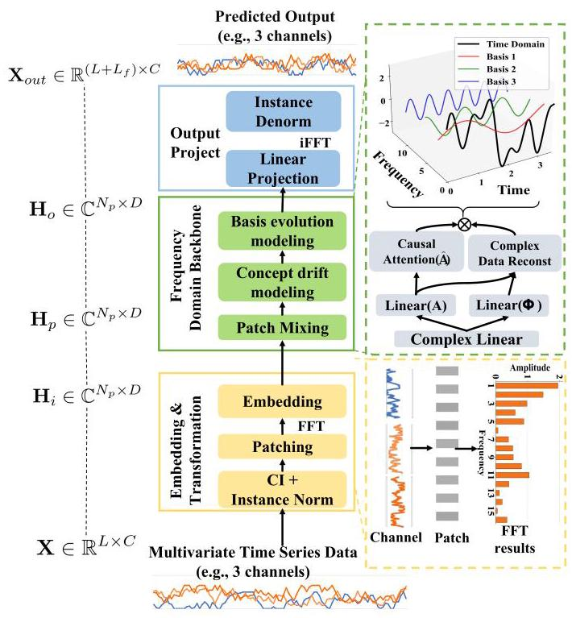
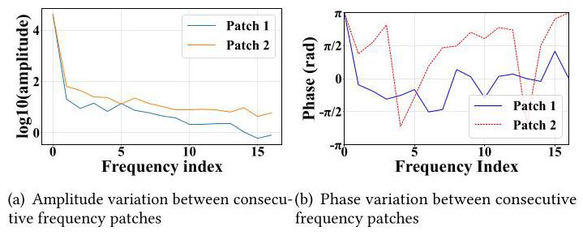
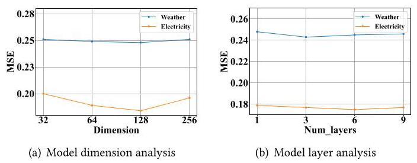
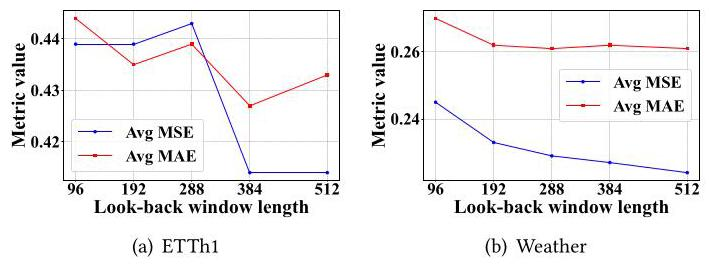

# A Unified Frequency Domain Decomposition Framework for Interpretable and Robust Time Series Forecasting

# 用于可解释且稳健的时间序列预测的统一频域分解框架

Cheng He

何成

cheng.he@mail.ustc.edu.cn

University of Science and Technology

中国科学技术大学

of China

中国科学技术大学

Hefei, China

中国合肥

Xijie Liang

梁希杰

lxjie@blackwingasset.com

Shanghai Black Wing Asset

上海黑翼资产管理有限公司

Management Co., Ltd.

上海黑翼资产管理有限公司

Shanghai, China

中国上海

Zengrong Zheng

郑增荣

lxjie@blackwingasset.com

Di-Matrix(Shanghai) Information

迪矩阵(上海)信息技术有限公司

Technology Co., Ltd.

迪矩阵(上海)信息技术有限公司

Shanghai, China

中国上海

Patrick P.C. Lee

李沛聪

pclee@cse.cuhk.edu.hk

The Chinese University of Hong Kong

香港中文大学

Hong Kong, China

中国香港

Xu Huang

徐晃

xuhuangcs@mail.ustc.edu.cn

University of Science and Technology

中国科学技术大学

of China

中国科学技术大学

Hefei, China

中国合肥

Zhaoyi Li

李兆义

lizhaoyi777@mail.ustc.edu.cn

University of Science and Technology

中国科学技术大学

of China

中国科学技术大学

Hefei, China

中国合肥

Hong Xie

谢宏

xiehong2018@foxmail.com

University of Science and Technology

中国科学技术大学

of China

中国科学技术大学

Hefei, China

中国合肥

Defu Lian

连德富

liandefu@ustc.edu.cn

University of Science and Technology

中国科学技术大学

of China

中国科学技术大学

Hefei, China

中国合肥

Enhong Chen

陈恩洪

cheneh@ustc.edu.cn

University of Science and Technology

中国科学技术大学

of China

中国科学技术大学

Hefei, China

中国合肥

## Abstract

## 摘要

Current approaches for time series forecasting, whether in the time or frequency domain, predominantly use deep learning models based on linear layers or transformers. They often encode time series data in a black-box manner and rely on trial-and-error optimization solely based on forecasting performance, leading to limited interpretability and theoretical understanding. Furthermore, the dynamics in data distribution over time and frequency domains pose a critical challenge to accurate forecasting. We propose FIRE, a unified frequency domain decomposition framework that provides a mathematical abstraction for diverse types of time series, so as to achieve interpretable and robust time series forecasting. FIRE introduces several key innovations: (i) independent modeling of amplitude and phase components, (ii) adaptive learning of weights of frequency basis components, (iii) a targeted loss function, and (iv) a novel training paradigm for sparse data. Extensive experiments demonstrate that FIRE consistently outperforms state-of-the-art models on long-term forecasting benchmarks, achieving superior predictive performance and significantly enhancing interpretability of time series representations.

当前的时间序列预测方法，无论是在时域还是频域，主要使用基于线性层或Transformer的深度学习模型。它们通常以黑盒方式对时间序列数据进行编码，并且仅基于预测性能依靠试错优化，导致可解释性和理论理解有限。此外，数据在时域和频域上的分布动态对准确预测构成了关键挑战。我们提出了FIRE，一个统一的频域分解框架，为各种类型的时间序列提供数学抽象，以实现可解释和稳健的时间序列预测。FIRE引入了几个关键创新:(i)幅度和相位分量的独立建模，(ii)频率基分量权重的自适应学习，(iii)目标损失函数，以及(iv)一种用于稀疏数据的新型训练范式。大量实验表明，FIRE在长期预测基准上始终优于现有模型，实现了卓越的预测性能，并显著提高了时间序列表示的可解释性。

## 1 Introduction

## 1 引言

Time series forecasting is a critical yet challenging task in various domains such as web mining, predictive maintenance of IoT devices, traffic prediction, weather forecasting, electricity load management, and financial analysis. Recently, the attention mechanism [31] has proven highly effective, establishing transformer-based architectures as the dominant approach for time series representation learning in the temporal domain $\left\lbrack  {7,{19},{28},{33},{36},{37},{40},{43}}\right\rbrack$ . These models outperform traditional recurrent neural networks (RNNs) and convolutional neural networks (CNNs) [1, 2, 5, 8, 9, 16, 39], particularly effective in capturing long-range dependencies. However, time series data, composed of temporally ordered scalar sequences, often fail to capture complex underlying patterns when analyzed solely in the temporal domain.

时间序列预测在网络挖掘、物联网设备的预测性维护、交通预测、天气预报、电力负荷管理和金融分析等各个领域都是一项关键但具有挑战性的任务。最近，注意力机制[31]已被证明非常有效，使基于Transformer的架构成为时域中时间序列表示学习的主导方法$\left\lbrack  {7,{19},{28},{33},{36},{37},{40},{43}}\right\rbrack$ 。这些模型优于传统的循环神经网络(RNN)和卷积神经网络(CNN)[1, 2, 5, 8, 9, 16, 39]，在捕捉长程依赖方面特别有效。然而，由时间有序标量序列组成的时间序列数据，仅在时域中分析时，往往无法捕捉复杂的潜在模式。

To effectively capture the complex patterns of time series data, recent research has explored frequency-domain representations for time series data using Fast Fourier Transform (FFT). Notable approaches such as FredFormer [27], FreTS [41], and FITS [38] leverage frequency-domain techniques, including channel-wise attention, frequency-temporal dependency modeling, and complex-valued interpolation, while WPMixer [24] employs wavelet decomposition combined with multiplayer perceptrons (MLPs) for long-term forecasting. Hybrid architectures, such as CDX-Net [18], FEDformer [45], and TimeMixer++ [32], integrate temporal and frequency-domain features to enhance the robustness and accuracy of time series representations. Despite these advances, most existing models encode time series representations empirically in a black-box manner, optimized through trial-and-error based on forecasting outcomes. This limits both interpretability and theoretical insights into the underlying data structure.

为了有效捕捉时间序列数据的复杂模式，最近的研究使用快速傅里叶变换(FFT)探索了时间序列数据的频域表示。诸如FredFormer [27]、FreTS [41]和FITS [38]等著名方法利用频域技术，包括通道注意力、频率 - 时间依赖建模和复值插值，而WPMixer [24]采用小波分解结合多层感知器(MLP)进行长期预测。混合架构，如CDX - Net [18]、FEDformer [45]和TimeMixer++ [32]集成了时域和频域特征，以增强时间序列表示的鲁棒性和准确性。尽管有这些进展，但大多数现有模型以经验性的黑盒方式对时间序列表示进行编码，通过基于预测结果的试错进行优化。这限制了对基础数据结构的可解释性和理论见解。

Time series forecasting is further complicated by concept drift $\left\lbrack  {4,{10},{12},{29}}\right\rbrack$ , where the statistical properties and patterns of time series data shift over time. Such dynamics also imply basis evolution in the frequency domain when time series data is decomposed into frequency components via FFT [13, 14, 23, 44], where new frequency bases appear and existing ones disappear. Basis evolution complicates frequency-domain analysis, as models built on static basis assumptions cannot readily maintain stable and accurate representations. Consequently, models trained on historical data become less effective for future predictions under concept drift and basis evolution. However, current state-of-the-art forecasting models either overlook these phenomena or address them only implicitly, leaving a void in interpretable and robust solutions.

时间序列预测因概念漂移$\left\lbrack  {4,{10},{12},{29}}\right\rbrack$ 而进一步复杂化，其中时间序列数据的统计属性和模式随时间变化。当时间序列数据通过FFT [1, 3, 14, 23, 44]分解为频率分量时，这种动态也意味着频域中的基演变，其中新的频率基出现而现有的频率基消失。基演变使频域分析复杂化，因为基于静态基假设构建的模型不能轻易保持稳定和准确的表示。因此，在概念漂移和基演变下，在历史数据上训练的模型对未来预测的有效性会降低。然而，当前的先进预测模型要么忽略这些现象，要么只是隐含地解决它们，在可解释和稳健的解决方案方面留下了空白。

We propose FIRE, a novel unified frequency domain decomposition framework for interpretable and robust time series forecasting. It provides a consistent mathematical abstraction for diverse time series data under concept drift and basis evolution, thereby enabling interpretable frequency-domain representations. It incorporates several key features: (i) modeling amplitude and phase components independently to capture underlying temporal dynamics in concept drift, (ii) learning adaptively the weights of frequency basis components across data patches to track the evolving importance of frequency bases, (iii) a targeted loss function that explicitly accounts for basis evolution, and (iv) a novel training paradigm that integrates Huber loss with a hybrid strong and weak convergence framework to accelerate training and improve generalization, particularly when large-scale, high-quality open datasets are limited. Our main contributions are summarized as follows:

我们提出了FIRE，一种用于可解释和稳健时间序列预测的新型统一频域分解框架。它为概念漂移和基演变下的各种时间序列数据提供了一致的数学抽象，从而实现可解释的频域表示。它包含几个关键特性:(i)独立建模幅度和相位分量以捕捉概念漂移中的潜在时间动态，(ii)跨数据块自适应学习频率基分量的权重以跟踪频率基的演变重要性，(iii)一个明确考虑基演变的目标损失函数，以及(iv)一种将Huber损失与混合强收敛和弱收敛框架集成的新型训练范式，以加速训练并提高泛化能力，特别是在大规模、高质量的开放数据集有限时。我们的主要贡献总结如下:

- We propose FIRE, a unified frequency domain decomposition framework that provides analytical modeling for diverse types of time series. FIRE incorporates several key techniques to achieve interpretability and robustness for time series forecasting.

- 我们提出了FIRE，一个统一的频域分解框架，为各种类型的时间序列提供分析建模。FIRE包含几个关键技术，以实现时间序列预测的可解释性和稳健性。

- Extensive experiments demonstrate that FIRE consistently outperforms state-of-the-art baselines across various long-term forecasting tasks, delivering cost-effective and interpretable solutions suitable for industrial applications.

- 大量实验表明，FIRE在各种长期预测任务中始终优于现有基线，提供了适合工业应用的经济高效且可解释的解决方案。

## 2 Preliminaries

## 2 预备知识

We introduce the analytical formulation of time series data, key concepts of concept drift and basis evolution, and the notations and metrics used in this paper.

我们介绍时间序列数据的分析公式、概念漂移和基演变的关键概念，以及本文中使用的符号和度量。

### 2.1 Analytical Formulation of Time Series Data

### 2.1 时间序列数据的解析公式化

In mathematics and engineering, complex data can be represented as an infinite series of basis vectors. The Fourier series, a widely used set of basis vectors, effectively represents time series data that satisfy specific conditions. Specifically, if a time series $x\left( t\right)$ is a periodic signal with period $T$ and satisfies the Dirichlet conditions (i.e., absolutely integrable over one period, with a finite number of discontinuities of the first kind and extrema), then the signal can be accurately represented by a Fourier series.

在数学和工程领域，复杂数据可以表示为基向量的无穷级数。傅里叶级数是一组广泛使用的基向量，能有效地表示满足特定条件的时间序列数据。具体而言，如果时间序列$x\left( t\right)$是一个周期为$T$的周期信号，并且满足狄利克雷条件(即在一个周期内绝对可积，具有有限数量的第一类间断点和极值)，那么该信号可以由傅里叶级数精确表示。

We define $X\left\lbrack  k\right\rbrack$ as a discrete Fourier transform (DFT) of $x\left( n\right)$ as:

我们将$X\left\lbrack  k\right\rbrack$定义为$x\left( n\right)$的离散傅里叶变换(DFT)，如下所示:

$$
X\left\lbrack  k\right\rbrack   = \mathop{\sum }\limits_{{n = 0}}^{{N - 1}}x\left\lbrack  n\right\rbrack   \cdot  {e}^{-j\frac{2\pi }{N}{kn}} \tag{1}
$$

where $n$ is the time index in the temporal domain, $k$ is the frequency index in the frequency domain, both ranging from 0 to $N - 1$ , and $j$ is the imaginary unit satisfying ${j}^{2} =  - 1$ . Using Euler’s formula, we can express the exponential term in trigonometric form as:

其中$n$是时域中的时间索引，$k$是频域中的频率索引，两者都从0到$N - 1$，并且$j$是满足${j}^{2} =  - 1$的虚数单位。使用欧拉公式，我们可以将指数项表示为三角形式:

$$
{e}^{-j\frac{2\pi }{N}{kn}} = \cos \left( {\frac{2\pi }{N}{kn}}\right)  - j\sin \left( {\frac{2\pi }{N}{kn}}\right) \tag{2}
$$

Substituting Equation (2) into Equation (1), we can obtain the real part $a\left\lbrack  k\right\rbrack$ and the imaginary part $b\left\lbrack  k\right\rbrack$ as:

将式(2)代入式(1)，我们可以得到实部$a\left\lbrack  k\right\rbrack$和虚部$b\left\lbrack  k\right\rbrack$如下:

$$
X\left\lbrack  k\right\rbrack   = \mathop{\sum }\limits_{{n = 0}}^{{N - 1}}x\left\lbrack  n\right\rbrack   \cdot  \left\lbrack  {\cos \left( {\frac{2\pi }{N}{kn}}\right)  - j\sin \left( {\frac{2\pi }{N}{kn}}\right) }\right\rbrack
$$

$$
a\left\lbrack  k\right\rbrack   = \mathop{\sum }\limits_{{n = 0}}^{{N - 1}}x\left\lbrack  n\right\rbrack   \cdot  \cos \left( {\frac{2\pi }{N}{kn}}\right) \tag{3}
$$

$$
b\left\lbrack  k\right\rbrack   =  - \mathop{\sum }\limits_{{n = 0}}^{{N - 1}}x\left\lbrack  n\right\rbrack   \cdot  \sin \left( {\frac{2\pi }{N}{kn}}\right)
$$

$$
X\left\lbrack  k\right\rbrack   = a\left\lbrack  k\right\rbrack   + j \cdot  b\left\lbrack  k\right\rbrack
$$

We can derive the amplitude $A\left\lbrack  k\right\rbrack$ and phase $\phi \left\lbrack  k\right\rbrack$ in the frequency domain as:

我们可以在频域中推导出幅度$A\left\lbrack  k\right\rbrack$和相位$\phi \left\lbrack  k\right\rbrack$如下:

$$
A\left\lbrack  k\right\rbrack   = \sqrt{a{\left\lbrack  k\right\rbrack  }^{2} + b{\left\lbrack  k\right\rbrack  }^{2}}
$$

$$
\phi \left\lbrack  k\right\rbrack   = \arctan \left( \frac{b\left\lbrack  k\right\rbrack  }{a\left\lbrack  k\right\rbrack  }\right) . \tag{4}
$$

The inverse DFT reconstructs the time series $x\left( t\right)$ as:

离散傅里叶逆变换将时间序列$x\left( t\right)$重构为:

$$
x\left\lbrack  n\right\rbrack   = {a}_{0} + \mathop{\sum }\limits_{{k = 1}}^{{N - 1}}{\beta }_{k}A\left\lbrack  k\right\rbrack   \cdot  \cos \left( {\frac{2\pi }{N}{kn} - \phi \left\lbrack  k\right\rbrack  }\right) , \tag{5}
$$

where ${a}_{0} = \frac{A\left\lbrack  0\right\rbrack  }{N}$ is the DC component (intercept) corresponding to $k = 0$ in the frequency domain, and ${\beta }_{k}$ is the weight of the $k$ -th basis component. Although the Fourier series is strictly defined for periodic signals, non-periodic signals can be approximated by assuming the sequence period matches the number of time points. Thus, we can have a uniform representation for $x\left( t\right)$ from Equation (5).

其中${a}_{0} = \frac{A\left\lbrack  0\right\rbrack  }{N}$是频域中与$k = 0$对应的直流分量(截距)，${\beta }_{k}$是第$k$个基分量的权重。尽管傅里叶级数严格定义于周期信号，但非周期信号可以通过假设序列周期与时间点数匹配来近似。因此，从式(5)中我们可以对$x\left( t\right)$有一个统一的表示。

### 2.2 Concept Drift in Time Domain

### 2.2 时域中的概念漂移

Most machine learning algorithms assume stationary statistical distributions between training and testing phases. However, in practical time series applications, the underlying data distribution often evolves, leading to distinct patterns in future data compared to historical data. This phenomenon, termed concept drift, refers to temporal changes in statistical properties [29]. In data stream mining, methods like ADWIN [3] can be used to detect change points and identify shifts in data concepts over time.

大多数机器学习算法假设训练和测试阶段之间的统计分布是平稳的。然而，在实际的时间序列应用中，基础数据分布通常会演变，导致未来数据与历史数据相比呈现出不同的模式。这种现象称为概念漂移，指的是统计特性随时间的变化[29]。在数据流挖掘中，可以使用像ADWIN[3]这样的方法来检测变化点并识别数据概念随时间的变化。

Definition 1 (Degree of concept drift). Let ${N}_{\text{ change }}$ be the number of detected change points and ${N}_{\text{ total }}$ be the total number of time points in a dataset. The degree of concept drift ${D}_{\text{ drift }}$ is defined as:

定义1(概念漂移程度)。设${N}_{\text{ change }}$是检测到的变化点数量，${N}_{\text{ total }}$是数据集中的时间点总数。概念漂移程度${D}_{\text{ drift }}$定义为:

$$
{D}_{\text{ drift }} = \frac{{N}_{\text{ change }}}{{N}_{\text{ total }}} \tag{6}
$$

A higher ${D}_{\text{ drift }}$ indicates more frequent changes in the data distribution, and hence greater concept drift.

${D}_{\text{ drift }}$越高表明数据分布变化越频繁，因此概念漂移越大。

### 2.3 Basis Evolution in Frequency Domain

### 2.3 频域中的基演变

Concept evolution traditionally refers to the emergence of new classes or concepts in data streams [23], and can be extended to changes in the underlying basis functions in frequency-domain time series analysis. After time series data is transformed into the frequency domain via FFT, it is segmented into patches, each represented by a vector of $N$ basis energies: ${\mathbf{E}}^{\left( q\right) } = \; \left( {{E}_{1}^{\left( q\right) },{E}_{2}^{\left( q\right) },\ldots ,{E}_{N}^{\left( q\right) }}\right) ,\;q = 1,2,\ldots , Q$ , where ${E}_{k}^{\left( q\right) } \geq  0$ is the energy of the $k$ -th frequency basis in patch $q$ .

传统上，概念演变指的是数据流中出现新的类别或概念[23]，并且可以扩展到频域时间序列分析中基础函数的变化。时间序列数据通过快速傅里叶变换(FFT)转换到频域后，被分割成块，每个块由$N$个基能量的向量表示:${\mathbf{E}}^{\left( q\right) } = \; \left( {{E}_{1}^{\left( q\right) },{E}_{2}^{\left( q\right) },\ldots ,{E}_{N}^{\left( q\right) }}\right) ,\;q = 1,2,\ldots , Q$，其中${E}_{k}^{\left( q\right) } \geq  0$是块$q$中第$k$个频率基的能量。

Definition 2 (Basis evolution criterion). For each basis $k$ , the relative energy change between two consecutive patches $q - 1$ and $q$ is:

定义2(基演变准则)。对于每个基$k$，两个连续块$q - 1$和$q$之间的相对能量变化为:

$$
{\delta }_{k}^{\left( q\right) } = \frac{\left| {E}_{k}^{\left( q\right) } - {E}_{k}^{\left( q - 1\right) }\right| }{{E}_{k}^{\left( q - 1\right) } + \eta }, \tag{7}
$$

where $\eta  > 0$ is a small constant to avoid division by zero. Basis $k$ is said to evolve at patch $q$ if

其中$\eta  > 0$是一个小常数，以避免除以零。如果，则称基$k$在块$q$处发生演变

$$
{\delta }_{k}^{\left( q\right) } > \epsilon \tag{8}
$$

where $\epsilon  > 0$ is a fixed threshold.

其中$\epsilon  > 0$是一个固定阈值。

Definition 3 (Patch-level basis evolution). A patch $q$ is considered to exhibit basis evolution if the fraction of evolving bases exceeds a threshold $\tau  \in  (0,1\rbrack$ :

定义3(补丁级基演化)。如果演化基的比例超过阈值$\tau  \in  (0,1\rbrack$，则认为补丁$q$表现出基演化:

$$
\frac{1}{N}\mathop{\sum }\limits_{{k = 0}}^{{N - 1}}\mathbf{1}\left( {{\delta }_{k}^{\left( q\right) } > \epsilon }\right)  > \tau \tag{9}
$$

where $\mathbf{1}\left( \cdot \right)$ is the indicator function.

其中$\mathbf{1}\left( \cdot \right)$是指示函数。

Definition 4 (Degree of basis evolution). Let ${\mathcal{Q}}_{e} = \{ q \mid$ patch $q$ exhibits basis evolution $\}$ be the set of evolving patches. The degree of basis evolution over $Q$ patches is:

定义4(基演化程度)。设${\mathcal{Q}}_{e} = \{ q \mid$补丁$q$表现出基演化$\}$为演化补丁的集合。$Q$个补丁上的基演化程度为:

$$
{D}_{\text{ evolution }} = \frac{\left| {\mathcal{Q}}_{e}\right| }{Q} \in  \left\lbrack  {0,1}\right\rbrack  . \tag{10}
$$

Basis evolution reflects the non-stationary nature of time series, as the frequency components that characterize the data evolve over time. The non-stationary nature complicates modeling and prediction in the frequency domain.

基演化反映了时间序列的非平稳性质，因为表征数据的频率成分会随时间演变。这种非平稳性质使频域中的建模和预测变得复杂。

### 2.4 Strong and Weak Convergence

### 2.4强收敛和弱收敛

In statistical learning theory [30], convergence in Hilbert spaces is categorized into strong and weak convergence [17]. Specifically, a sequence of functions ${\left\{  {f}_{h}\left( \mathbf{x}\right) \right\}  }_{h = 1}^{\infty }$ is said to converge strongly to a target function $f\left( \mathbf{x}\right)$ if:

在统计学习理论[30]中，希尔伯特空间中的收敛分为强收敛和弱收敛[17]。具体而言，如果:，则称函数序列${\left\{  {f}_{h}\left( \mathbf{x}\right) \right\}  }_{h = 1}^{\infty }$强收敛于目标函数$f\left( \mathbf{x}\right)$。

$$
\mathop{\lim }\limits_{{h \rightarrow  \infty }}\begin{Vmatrix}{{f}_{h}\left( \mathbf{x}\right)  - f\left( \mathbf{x}\right) }\end{Vmatrix} = 0, \tag{11}
$$

where the norm is defined in the corresponding Hilbert space. In contrast, ${\left\{  {f}_{h}\left( \mathbf{x}\right) \right\}  }_{h = 1}^{\infty }$ converges weakly to $f\left( \mathbf{x}\right)$ if:

其中范数在相应的希尔伯特空间中定义。相比之下，如果:，则${\left\{  {f}_{h}\left( \mathbf{x}\right) \right\}  }_{h = 1}^{\infty }$弱收敛于$f\left( \mathbf{x}\right)$。

$$
\mathop{\lim }\limits_{{h \rightarrow  \infty }}\left\langle  {\phi \left( \mathbf{x}\right) ,{f}_{h}\left( \mathbf{x}\right)  - f\left( \mathbf{x}\right) }\right\rangle   = 0,\;\forall \phi \left( \mathbf{x}\right)  \in  {L}_{2}, \tag{12}
$$

where $\langle  \cdot  , \cdot  \rangle$ denotes the inner product in ${L}_{2}$ space.

其中$\langle  \cdot  , \cdot  \rangle$表示${L}_{2}$空间中的内积。

Strong convergence imposes stricter pointwise stability. It offers robust theoretical guarantees, but requires large datasets and extensive training. In contrast, weak convergence focuses on statistical behavior across the data distribution and imposes less restrictive requirements. It enables faster training and better performance with sparse data, while maintaining rigorous mathematical foundations. In this work, we aim to combine strong and weak convergence.

强收敛施加了更严格的逐点稳定性。它提供了强大的理论保证，但需要大型数据集和广泛的训练。相比之下，弱收敛关注数据分布上的统计行为，施加的限制较少。它能够在稀疏数据上实现更快的训练和更好的性能，同时保持严格的数学基础。在这项工作中，我们旨在结合强收敛和弱收敛。

## 3 FIRE Design

## 3 FIRE设计

We present FIRE's design, aiming to address concept drift and basis evolution.

我们介绍FIRE的设计，旨在解决概念漂移和基演化问题。

### 3.1 Model Architecture

### 3.1模型架构

To effectively capture complex temporal dependencies and concept drift, FIRE primarily operates in the frequency domain. Specifically, the raw multivariate time series data is first preprocessed and transformed into the frequency domain via the Fast Fourier Transform (FFT), which decomposes the signals into orthogonal sinusoidal basis functions. This transformation, along with the resulting frequency domain representation, reveals rich spectral characteristics that facilitate the design of specialized modules capable of modeling intricate correlations and evolving patterns in the data, while adaptively handling basis evolution. FIRE is composed of three main components, illustrated in Figure 1:

为了有效捕捉复杂的时间依赖性和概念漂移，FIRE主要在频域中运行。具体来说，原始多变量时间序列数据首先经过预处理，并通过快速傅里叶变换(FFT)转换到频域，该变换将信号分解为正交正弦基函数。这种变换以及由此产生的频域表示揭示了丰富的频谱特征，便于设计能够对数据中的复杂相关性和演化模式进行建模的专门模块，同时自适应地处理基演化。FIRE由三个主要组件组成，如图1所示:

- Embedding and transformation: This module applies Channel Independent (CI) processing and Instance Normalization (IN) to the raw input data. The normalized data is segmented into patches and converted into the frequency domain via FFT. These frequency-domain patches are then embedded into a high-dimensional feature space through a dedicated embedding layer, enabling effective feature extraction.

- 嵌入和变换:该模块对原始输入数据应用通道独立(CI)处理和实例归一化(IN)。归一化后的数据被分割成补丁，并通过FFT转换到频域。然后，这些频域补丁通过一个专用的嵌入层嵌入到高维特征空间中，以实现有效的特征提取。

- Frequency domain backbone: Operating on complex-valued frequency patches, this backbone employs complex linear layers to capture intra-patch correlations. It explicitly models amplitude and phase components to handle concept drift, while an attention mechanism adaptively learns weights for the sinusoidal basis to address basis evolution. The processed features are recombined into complex representations for subsequent processing.

- 频域主干:该主干对复值频域补丁进行操作，采用复线性层来捕捉补丁内的相关性。它明确地对幅度和相位分量进行建模以处理概念漂移，同时注意力机制自适应地学习正弦基的权重以解决基演化问题。处理后的特征被重新组合成复表示以便后续处理。

- Output projection module: This module generates frequency-domain predictions by flattening and applying a linear projection. The predicted signals are then transformed back to the time domain through inverse FFT (iFFT), followed by instance denormalization to produce the final forecasts.

- 输出投影模块:该模块通过展平并应用线性投影来生成频域预测。然后，预测信号通过逆快速傅里叶变换(iFFT)转换回时域，接着进行实例反归一化以产生最终预测。

- Composite loss function: To effectively handle basis evolution and concept drift, FIRE employs a composite loss combining three terms: a Huber loss with hybrid convergence that balances strong and weak convergence for better generalization under sparse and noisy data; an FFT-domain loss that directly minimizes prediction errors in the frequency domain, thus explicitly addressing basis evolution; and a phase regularization term that enforces smooth phase transitions to enhance stability and robustness of the learned representations.

- 复合损失函数:为了有效处理基演化和概念漂移，FIRE采用了一种复合损失，它结合了三个项:具有混合收敛的Huber损失，可在稀疏和噪声数据下平衡强收敛和弱收敛以实现更好的泛化；频域损失，可直接最小化频域中的预测误差，从而明确解决基演化问题；以及相位正则化项，可强制实现平滑的相位转换，以增强学习表示的稳定性和鲁棒性。

Through the integration of these components within a unified frequency-domain framework, FIRE effectively captures both global and local temporal dynamics, enabling interpretable and robust time series forecasting.

通过在统一的频域框架中集成这些组件，FIRE有效地捕获了全局和局部时间动态，从而实现了可解释且稳健的时间序列预测。

### 3.2 Embedding and Transformation

### 3.2 嵌入与变换

Let $\mathbf{X} = \left\lbrack  {{X}_{c, l} : c \in  \left\lbrack  C\right\rbrack  , l \in  \left\lbrack  L\right\rbrack  }\right\rbrack$ denote a multivariate time series instance with $C$ variables and $L$ timestamps. Each instance is first processed using Channel Independent (CI) processing and segmented into overlapping patches following the patching scheme [25]. The resulting patches are represented as ${\mathbf{X}}_{P} \in  {\mathbb{R}}^{{N}_{p} \times  {L}_{p}}$ , where ${N}_{p}$ is the number of patches and ${L}_{p}$ is the length of each patch. These patches are then transformed into the frequency domain via FFT. Subsequently, a linear embedding layer projects the frequency-domain patches into a higher-dimensional feature space, yielding ${\mathrm{H}}_{i} \in  {\mathbb{C}}^{{N}_{p} \times  D}$ , where $D$ denotes the embedding dimension:

令$\mathbf{X} = \left\lbrack  {{X}_{c, l} : c \in  \left\lbrack  C\right\rbrack  , l \in  \left\lbrack  L\right\rbrack  }\right\rbrack$表示一个具有$C$个变量和$L$个时间戳的多变量时间序列实例。每个实例首先使用通道独立(CI)处理进行处理，并按照修补方案[25]分割成重叠的补丁。得到的补丁表示为${\mathbf{X}}_{P} \in  {\mathbb{R}}^{{N}_{p} \times  {L}_{p}}$，其中${N}_{p}$是补丁数量，${L}_{p}$是每个补丁的长度。然后，这些补丁通过快速傅里叶变换(FFT)转换到频域。随后，一个线性嵌入层将频域补丁投影到更高维的特征空间，得到${\mathrm{H}}_{i} \in  {\mathbb{C}}^{{N}_{p} \times  D}$，其中$D$表示嵌入维度:

(13)

$$
{\mathbf{X}}_{P} = \operatorname{FFT}\left( {\operatorname{Patching}\left( {\mathrm{{CI}}\left( \mathbf{X}\right) }\right) }\right) ,
$$

$$
{\mathbf{H}}_{i} = {\mathbf{W}}_{\text{ embed }} \cdot  {\mathbf{X}}_{P}
$$

Figure 1: Model architecture of FIRE. It tranforms multivariate time series into the frequency domain through a sequence of steps including CI, IN, patching, and FFT. It captures intra-patch correlations using complex linear layers. It models concept drift via linear transformations, and basis evolution via causal attention mechanisms. It finally generates predictions by a flattened linear projection layer.

图1:FIRE的模型架构。它通过包括CI、IN、修补和FFT的一系列步骤将多变量时间序列转换到频域。它使用复线性层捕获补丁内的相关性。它通过线性变换对概念漂移进行建模，并通过因果注意力机制对基演化进行建模。它最终通过展平的线性投影层生成预测。

Here, ${\mathbf{H}}_{i}$ is a complex-valued tensor capturing rich frequency features for downstream processing.

这里，${\mathbf{H}}_{i}$是一个复值张量，用于捕获丰富的频率特征以进行下游处理。

### 3.3 Frequency Domain Backbone

### 3.3 频域主干

Starting from the embedded frequency-domain input ${\mathbf{H}}_{i} \in  {\mathbb{C}}^{{N}_{p} \times  D}$ , FIRE applies a complex-valued linear transformation to model intra-patch correlations:

从嵌入的频域输入${\mathbf{H}}_{i} \in  {\mathbb{C}}^{{N}_{p} \times  D}$开始，FIRE应用复值线性变换来对补丁内的相关性进行建模:

$$
{\mathbf{H}}_{P} = {\operatorname{Linear}}_{\mathbb{C}}\left( {\mathbf{H}}_{i}\right)  = {\mathbf{W}}_{\mathbb{C}} \cdot  {\mathbf{H}}_{i} + {\mathbf{b}}_{\mathbb{C}}\text{ , } \tag{14}
$$

where ${\mathbf{W}}_{\mathbb{C}} \in  {\mathbb{C}}^{D \times  D}$ and ${\mathbf{b}}_{\mathbb{C}} \in  {\mathbb{C}}^{D}$ are learnable complex weights and biases, and the output ${\mathbf{H}}_{P} \in  {\mathbb{C}}^{{N}_{p} \times  D}$ retains the same dimensions as the input.

其中${\mathbf{W}}_{\mathbb{C}} \in  {\mathbb{C}}^{D \times  D}$和${\mathbf{b}}_{\mathbb{C}} \in  {\mathbb{C}}^{D}$是可学习的复权重和偏差，输出${\mathbf{H}}_{P} \in  {\mathbb{C}}^{{N}_{p} \times  D}$与输入保持相同维度。

This complex linear transformation effectively models the localized frequency interactions within each patch, enabling the network to extract rich amplitude and phase information that is crucial for representing temporal dynamics. Such frequency-domain representations naturally facilitate the characterization of concept drift, as temporal distributional shifts manifest as variations in these frequency components.

这种复线性变换有效地对每个补丁内的局部频率交互进行建模，使网络能够提取丰富的幅度和相位信息，这对于表示时间动态至关重要。这种频域表示自然便于对概念漂移进行表征，因为时间分布的变化表现为这些频率分量的变化。

Figure 2: Variations in amplitude and phase distributions between consecutive frequency patches in the frequency domain. The patches are sampled from the Weather and Etth 1 datasets, respectively.

图2:频域中连续频率补丁之间幅度和相位分布的变化。这些补丁分别从Weather和Etth 1数据集中采样。

Learning of concept drift. Concept drift refers to temporal distributional shifts, which can be equivalently characterized in the frequency domain as variations in amplitude and phase distributions across localized frequency patches (Figure 2).

概念漂移的学习。概念漂移指的是时间分布的变化，在频域中可以等效地表征为局部频率补丁上幅度和相位分布的变化(图2)。

Lemma 3.1 (Equivalence of Concept Drift Modeling in Temporal and Frequency Domains). A non-stationary time series with time-varying distribution exhibits concept drift. Under linear time-invariant signal decomposition, modeling distributional shifts in the temporal domain is equivalent to modeling independent changes in amplitude and phase in the frequency domain.

引理3.1(时域和频域中概念漂移建模的等价性)。具有时变分布的非平稳时间序列表现出概念漂移。在线性时不变信号分解下，在时域中对分布变化进行建模等同于在频域中对幅度和相位的独立变化进行建模。

Proof. Any time series can be decomposed into frequency components via the Fourier transform (see Section 2, Equation (5)). Since the discrete Fourier transform (DFT) is a linear, invertible mapping-and the fast Fourier transform (FFT) provides an efficient way to compute it-it preserves all information contained in the original time series. Consequently, any temporal changes in the series, such as shifts in mean, variance, or other distributional properties, manifest as corresponding changes in the amplitude and phase of the frequency components. This one-to-one correspondence guarantees that modeling concept drift in the time domain is fully equivalent to modeling it in the frequency domain, without any loss of information.

证明。任何时间序列都可以通过傅里叶变换分解为频率成分(见第2节，方程(5))。由于离散傅里叶变换(DFT)是一种线性、可逆映射，而快速傅里叶变换(FFT)提供了一种有效的计算方法，它保留了原始时间序列中包含的所有信息。因此，序列中的任何时间变化，如均值、方差或其他分布特性的变化，都表现为频率成分的幅度和相位的相应变化。这种一一对应关系保证了在时域中对概念漂移进行建模与在频域中进行建模完全等效，且不会有任何信息损失。

Based on the complex linear transformation output ${\mathbf{H}}_{P}$ , we extract amplitude $\mathbf{A} \in  {\mathbb{R}}^{{N}_{p} \times  D}$ and phase $\phi  \in  {\left\lbrack  -\pi ,\pi \right\rbrack  }^{{N}_{p} \times  D}$ components. To effectively capture concept drift, FIRE models amplitude and phase variations across patches independently. Specifically, it employs two separate linear layers to learn the inter-patch correlations for amplitude and phase:

基于复线性变换输出${\mathbf{H}}_{P}$，我们提取幅度$\mathbf{A} \in  {\mathbb{R}}^{{N}_{p} \times  D}$和相位$\phi  \in  {\left\lbrack  -\pi ,\pi \right\rbrack  }^{{N}_{p} \times  D}$成分。为了有效地捕获概念漂移，FIRE独立地对各个片段的幅度和相位变化进行建模。具体来说，它采用两个单独的线性层来学习幅度和相位的片段间相关性:

(15)

$$
\widehat{\mathbf{A}} = {\operatorname{Linear}}_{Amp}\left( \mathbf{A}\right)  = {\mathbf{W}}_{Amp}\mathbf{A} + {\mathbf{b}}_{Amp},
$$

$$
\widehat{\mathbf{\phi }} = {\operatorname{Linear}}_{\phi }\left( \mathbf{\phi }\right)  = {\mathbf{W}}_{\phi }\mathbf{\phi } + {\mathbf{b}}_{\phi },
$$

where ${\mathbf{W}}_{Amp},{\mathbf{W}}_{\phi } \in  {\mathbb{R}}^{D \times  D}$ and ${\mathbf{b}}_{Amp},{\mathbf{b}}_{\phi } \in  {\mathbb{R}}^{D}$ are learnable parameters. This disentangled design enables interpretable and effective adaptation to non-stationary time series by separately modeling amplitude and phase drift dynamics.

其中${\mathbf{W}}_{Amp},{\mathbf{W}}_{\phi } \in  {\mathbb{R}}^{D \times  D}$和${\mathbf{b}}_{Amp},{\mathbf{b}}_{\phi } \in  {\mathbb{R}}^{D}$是可学习参数。这种解耦设计通过分别对幅度和相位漂移动态进行建模，实现了对非平稳时间序列的可解释且有效的自适应。

Learning of basis evolution. While linear layers effectively capture concept drift through amplitude and phase variations, their capacity to model the more complex, non-linear temporal dynamics of frequency basis evolution is limited. In particular, traditional frequency-domain models relying solely on linear transformations struggle to adapt to abrupt changes or long-range dependencies in the spectral bases. In contrast, causal attention provides a flexible mechanism to dynamically weight and integrate historical amplitude features, making it better suited to handle sudden shifts and intricate basis evolution patterns.

学习基的演化。虽然线性层能够通过幅度和相位变化有效地捕捉概念漂移，但其对更复杂的频率基演化的非线性时间动态进行建模的能力有限。特别是，仅依赖线性变换的传统频域模型难以适应频谱基中的突然变化或长程依赖。相比之下，因果注意力提供了一种灵活的机制来动态加权和整合历史幅度特征，使其更适合处理突然变化和复杂的基演化模式。

FIRE leverages a causal masked attention mechanism applied directly on the previous outputed amplitude representations $\widehat{\mathbf{A}} \in \; {\mathbb{R}}^{{N}_{p} \times  D}$ obtained from the amplitude linear layer (Equation (15)). This sequence of amplitude embeddings compactly represents the frequency bases across patches $p = 1,\ldots ,{N}_{p}$ . The causal attention offers three key advantages over linear layers:

FIRE利用一种因果掩码注意力机制，该机制直接应用于从幅度线性层(公式(15))获得的先前输出的幅度表示$\widehat{\mathbf{A}} \in \; {\mathbb{R}}^{{N}_{p} \times  D}$。这一系列幅度嵌入紧凑地表示了跨补丁$p = 1,\ldots ,{N}_{p}$的频率基。与线性层相比，因果注意力具有三个关键优势:

- Adaptive temporal weighting: It dynamically learns to weigh historical amplitude features, focusing on the most relevant past patches for the current basis evolution.

- 自适应时间加权:它动态学习对历史幅度特征进行加权，关注当前基演化中最相关的过去补丁。

- Modeling long-range dependencies: Self-attention naturally captures complex dependencies across distant patches, essential for representing gradual or abrupt spectral changes.

- 建模长程依赖:自注意力自然地捕捉远距离补丁之间的复杂依赖关系，这对于表示渐进或突然的频谱变化至关重要。

- Preserving causality: The causal mask ensures that the basis at patch $p$ depends only on current and past patches $\leq  p$ , maintaining temporal consistency required for forecasting.

- 保持因果性:因果掩码确保补丁$p$处的基仅依赖于当前和过去的补丁$\leq  p$，保持预测所需的时间一致性。

Formally, the amplitude features are projected into queries and keys:

形式上，幅度特征被投影到查询和键中:

$$
\mathrm{Q} = \widehat{\mathrm{A}}{\mathbf{W}}_{Q},\;\mathrm{\;K} = \widehat{\mathrm{A}}{\mathbf{W}}_{K}, \tag{16}
$$

where ${\mathbf{W}}_{Q},{\mathbf{W}}_{K} \in  {\mathbb{R}}^{D \times  d}$ are learnable parameters, and $d$ is the attention dimension.

其中${\mathbf{W}}_{Q},{\mathbf{W}}_{K} \in  {\mathbb{R}}^{D \times  d}$是可学习参数，$d$是注意力维度

The scaled dot-product attention scores are masked causally by $\mathbf{M} \in  \{ 0, - \infty {\} }^{{N}_{p} \times  {N}_{p}} :$

缩放后的点积注意力分数由$\mathbf{M} \in  \{ 0, - \infty {\} }^{{N}_{p} \times  {N}_{p}} :$进行因果掩码

$$
{\mathbf{M}}_{p, q} = \left\{  {\begin{array}{ll} 0, & q \leq  p \\   - \infty , & q > p \end{array},}\right.
$$

where $q \leq  p$ indicates that attention at patch $p$ is computed only over patch $p$ and all preceding patches $q$ , ensuring causality by excluding future patches. The attention weights $\mathbf{W} \in  {\mathbb{R}}^{{N}_{p} \times  {N}_{p}}$ are computed as

其中$q \leq  p$表示补丁$p$处的注意力仅在补丁$p$以及所有先前的补丁$q$上计算 通过排除未来补丁来确保因果性。注意力权重$\mathbf{W} \in  {\mathbb{R}}^{{N}_{p} \times  {N}_{p}}$计算如下

$$
\mathbf{W} = \operatorname{softmax}\left( {\frac{{\mathbf{{QK}}}^{\top }}{\sqrt{d}} + \mathbf{M}}\right) . \tag{17}
$$

To further refine intra-patch importance, amplitude vector $\widehat{\mathbf{A}}$ is projected by a learnable linear layer:

为了进一步细化补丁内的重要性，幅度向量$\widehat{\mathbf{A}}$由一个可学习的线性层进行投影:

$$
\mathbf{V} = {\mathbf{W}}_{p}\widehat{\mathbf{A}} + {\mathbf{b}}_{p}, \tag{18}
$$

where $\mathbf{V} \in  {\mathbb{R}}^{{N}_{p} \times  D},{\mathbf{W}}_{p} \in  {\mathbb{R}}^{D \times  D}$ and ${\mathbf{b}}_{p} \in  {\mathbb{R}}^{D}$ . The final dynamic weights $\mathbf{U}$ modulating the frequency bases are obtained by combining inter-patch attention and intra-patch projections:

其中$\mathbf{V} \in  {\mathbb{R}}^{{N}_{p} \times  D},{\mathbf{W}}_{p} \in  {\mathbb{R}}^{D \times  D}$和${\mathbf{b}}_{p} \in  {\mathbb{R}}^{D}$。通过结合补丁间注意力和补丁内投影获得调制频率基的最终动态权重$\mathbf{U}$:

$$
\mathbf{U} = \mathbf{{WV}} \tag{19}
$$

with $\mathbf{U} \in  {\mathbb{R}}^{{N}_{p} \times  D}$ . These adaptive weights $\mathbf{U}$ are applied element-wise to the original frequency bases $\mathbf{B}$ , producing the dynamically evolved bases:

其中$\mathbf{U} \in  {\mathbb{R}}^{{N}_{p} \times  D}$。这些自适应权重$\mathbf{U}$逐元素应用于原始频率基$\mathbf{B}$，生成动态演化的基:

$$
{\mathbf{H}}_{o} = \mathbf{U} \odot  \mathbf{B} \tag{20}
$$

where ${\mathbf{H}}_{o} \in  {\mathbb{C}}^{{N}_{p} \times  D}, \odot$ denotes element-wise multiplication.

其中${\mathbf{H}}_{o} \in  {\mathbb{C}}^{{N}_{p} \times  D}, \odot$表示逐元素乘法。

This causal attention-based design enables FIRE to flexibly and effectively capture complex, non-linear, and temporally adaptive basis evolution patterns, surpassing the representational limitations of traditional linear layers.

这种基于因果注意力的设计使FIRE能够灵活有效地捕捉复杂、非线性和时间自适应的基演化模式，超越了传统线性层的表示限制。

### 3.4 Output Projection

### 3.4输出投影

After backbone processing, FIRE flattens the output ${\mathbf{H}}_{o}$ and passes it through a linear projection layer to produce predictions in the frequency domain. These are then transformed back to the time domain using iFFT, followed by instance denormalization, to yield the final forecasts:

在主干处理之后，FIRE将输出${\mathbf{H}}_{o}$展平并通过线性投影层以在频域中产生预测。然后使用iFFT将这些预测转换回时域，接着进行实例反归一化，以产生最终预测:

$$
{\mathbf{X}}_{\text{ out }} = \operatorname{Denorm}\left( {\operatorname{iFFT}\left( {{\mathbf{W}}_{\text{ LinProj }} \cdot  \operatorname{Flatten}\left( {\mathbf{H}}_{o}\right) }\right) }\right) \tag{21}
$$

where ${\mathbf{X}}_{\text{ out }} \in  {\mathbb{R}}^{{L}_{\text{ pred }} \times  C}$ , with ${L}_{\text{ pred }}$ denoting the prediction length.

其中${\mathbf{X}}_{\text{ out }} \in  {\mathbb{R}}^{{L}_{\text{ pred }} \times  C}$，其中${L}_{\text{ pred }}$表示预测长度。

### 3.5 Loss Function

### 3.5损失函数

After the output projection module, we need to quantify the loss between ${\mathbf{X}}_{\text{ out }}$ and the ground truth ${\mathbf{X}}_{\text{ true }}$ . FIRE employs a composite loss comprising the Huber loss with hybrid convergence $\left( {\mathcal{L}}_{wh}\right)$ , FFT loss $\left( {\mathcal{L}}_{\text{ fft }}\right)$ , and phase regularization $\left( {\mathcal{R}}_{\phi }\right)$ . This loss also explicitly guides the model to address concept drift and basis evolution in the frequency domain, thereby providing a clear objective for parameter optimization:

在输出投影模块之后，我们需要量化${\mathbf{X}}_{\text{ out }}$与地面真值${\mathbf{X}}_{\text{ true }}$之间的损失。FIRE采用了一种复合损失，包括具有混合收敛性的Huber损失$\left( {\mathcal{L}}_{wh}\right)$、FFT损失$\left( {\mathcal{L}}_{\text{ fft }}\right)$和相位正则化$\left( {\mathcal{R}}_{\phi }\right)$。这种损失还明确地引导模型在频域中处理概念漂移和基的演化，从而为参数优化提供了一个明确的目标:

$$
\mathcal{L} = {\mathcal{L}}_{wh} + {\mathcal{L}}_{\text{ fft }} + {\mathcal{R}}_{\phi }. \tag{22}
$$

The individual components are detailed as follows.

各个组件的详细信息如下。

Huber loss with hybrid convergence. To balance strong and weak convergence and improve generalization under sparse data (Section 2), FIRE adopts Huber loss [15], which smoothly interpolates between ${\ell }_{2}$ and ${\ell }_{1}$ losses:

具有混合收敛性的Huber损失。为了平衡强收敛和弱收敛，并在稀疏数据下提高泛化能力(第2节)，FIRE采用了Huber损失[15]，它在${\ell }_{2}$和${\ell }_{1}$损失之间进行平滑插值:

$$
{\mathcal{L}}_{\delta }\left( {{\mathbf{X}}_{\text{ true }},{\mathbf{X}}_{\text{ out }}}\right)  = \frac{1}{{L}_{\text{ pred }}}\mathop{\sum }\limits_{{l = 1}}^{{L}_{\text{ pred }}}{\delta }^{2}\left( {\sqrt{1 + {\left( \frac{{x}_{\text{ true }} - {x}_{\text{ out }}}{\delta }\right) }^{2}} - 1}\right)
$$

(23)

where $\delta$ is a hyperparameter controlling the transition threshold.

其中$\delta$是控制过渡阈值的超参数。

To incorporate weak convergence (Equation (12)), the Huber loss is weighted by a matrix $\mathbf{W} \in  {\mathbb{R}}^{1 \times  B}$ (with batch size $B$ ) that linearly combines identity and predicate-based components:

为了纳入弱收敛(式(12))，Huber损失由一个矩阵$\mathbf{W} \in  {\mathbb{R}}^{1 \times  B}$(批量大小为$B$)加权，该矩阵线性组合了单位矩阵和基于谓词的组件:

$$
{\mathcal{L}}_{wh} = \mathop{\sum }\limits_{{b = 1}}^{B}\mathbf{W} \cdot  {\mathcal{L}}_{\delta }\left( {{x}_{\text{ true }},{x}_{\text{ out }}}\right) ,\;\mathbf{W} = \widehat{\tau }\mathbf{I} + \tau \mathbf{P}, \tag{24}
$$

where $\tau  = 1 - \widehat{\tau }$ balances strong and weak convergence, $\mathbf{I}$ is the identity matrix, and $\mathbf{P}$ is the empirical covariance matrix of predicates:

其中$\tau  = 1 - \widehat{\tau }$平衡强收敛和弱收敛，$\mathbf{I}$是单位矩阵，$\mathbf{P}$是谓词的经验协方差矩阵:

$$
\mathbf{P} = \frac{1}{m}\mathop{\sum }\limits_{{s = 1}}^{m}{\psi }_{s}{\psi }_{s}^{\top }. \tag{25}
$$

where $m$ is the number of predicates. For simplicity, we use a single predicate $\psi \left( \mathbf{x}\right)  = 1$ in this work. This formulation leverages statistical invariants captured by weak convergence to enhance robustness and generalization, particularly in noisy or sparse scenarios.

其中$m$是谓词的数量。为了简单起见，在这项工作中我们使用单个谓词$\psi \left( \mathbf{x}\right)  = 1$。这种公式利用了弱收敛捕获的统计不变量来增强鲁棒性和泛化能力，特别是在有噪声或稀疏的场景中。

FFT loss. The FFT loss, ${\mathcal{L}}_{\text{ fft }}$ , is defined as the mean absolute error (MAE) between the predicted and ground truth sequences in the frequency domain:

FFT损失。FFT损失${\mathcal{L}}_{\text{ fft }}$被定义为频域中预测序列和地面真值序列之间的平均绝对误差(MAE):

$$
{\mathcal{L}}_{\text{ fft }} = \frac{1}{{N}_{f}}\mathop{\sum }\limits_{{k = 1}}^{{N}_{f}}\left| {\operatorname{FFT}\left( {\mathbf{X}}_{\text{ true }}\right)  - \operatorname{FFT}\left( {\mathbf{X}}_{\text{ out }}\right) }\right| \tag{26}
$$

where ${N}_{f}$ is the number of bases of the predicted sequence in the frequency domain. This loss explicitly addresses basis evolution by minimizing discrepancies in frequency basis vectors.

其中${N}_{f}$是频域中预测序列的基的数量。这种损失通过最小化频率基向量中的差异来明确处理基的演化。

Phase regularization. To ensure smooth and stable phase transitions, FIRE introduces phase regularization to constrain phase changes in the predicted sequence. It formulates a first-order difference penalty:

相位正则化。为了确保相位过渡的平滑和稳定，FIRE引入了相位正则化来约束预测序列中的相位变化。它制定了一个一阶差分惩罚:

$$
{\mathcal{R}}_{\phi } = \lambda \frac{1}{D - 1}\mathop{\sum }\limits_{{d = 1}}^{{D - 1}}{\left( {\phi }_{\text{ out }}^{d + 1} - {\phi }_{\text{ out }}^{d}\right) }^{2}, \tag{27}
$$

where $\lambda$ is a weighting factor, $D$ is the model dimensionality, and ${\phi }_{\text{ out }}^{d}$ denotes the phase feature of the $d$ -th dimension. This enhances model robustness and generalizability.

其中$\lambda$是一个加权因子，$D$是模型维度，${\phi }_{\text{ out }}^{d}$表示第$d$维的相位特征。这增强了模型的鲁棒性和泛化能力。

### 3.6 Discussion

### 3.6讨论

Time series forecasting in the time domain is challenging due to complex patterns and limited information. Instead, FIRE first transforms the data into the frequency domain via FFT, which decomposes the signal into multiple frequency basis components. We choose FFT over other basis decomposition methods because it is reversible and parameter-free, requiring no hyperparameter tuning or prior knowledge, thus making it broadly applicable to various time series (see Appendix A for details).

由于模式复杂且信息有限，时域中的时间序列预测具有挑战性。相反，FIRE首先通过FFT将数据转换到频域，它将信号分解为多个频率基组件。我们选择FFT而不是其他基分解方法，因为它是可逆的且无参数，不需要超参数调整或先验知识，因此广泛适用于各种时间序列(详细信息见附录A)。

Traditional methods typically model the real and imaginary parts of the transformed signal. However, these lack clear physical interpretation and make it hard to hard to connect the results back to the original data. In contrast, FIRE converts each complex component into amplitude (indicating the strength or energy of each basis) and phase (indicating the timing), modeling them separately (Equation (4)). This decomposition enables the model to capture distinct physical features and concept drift patterns while maintaining a direct link to the original signal. To better capture the temporal evolution of frequency bases, we introduce a causal attention mechanism that adaptively learns how basis components change and interact across patches (Equations (16)-(20)). After forecasting in the frequency domain, the model converts the results back to the time domain. Finally, a composite loss function (Equation (22)) is employed, measuring loss in both time (Equation (12)) and frequency domains (Equation (26)), while constraining phase shifts (Equation (27)) to ensure smooth and robust predictions.

传统方法通常对变换后的信号的实部和虚部进行建模。然而，这些方法缺乏清晰的物理解释，并且很难将结果与原始数据联系起来。相比之下，FIRE将每个复分量转换为幅度(表示每个基的强度或能量)和相位(表示时间)，分别对它们进行建模(式(4))。这种分解使模型能够捕捉不同的物理特征和概念漂移模式，同时保持与原始信号的直接联系。为了更好地捕捉频率基的时间演化，我们引入了一种因果注意力机制，它自适应地学习基组件如何在补丁之间变化和相互作用(式(16)-(20))。在频域中进行预测后，模型将结果转换回时域。最后，采用了一个复合损失函数(式(22))，测量时间(式(12))和频域(式(26))中的损失，同时约束相移(式(27))以确保平滑和鲁棒的预测。

In summary, FIRE succeeds by extracting more interpretable and physically meaningful features, explicitly modeling their dynamics and interactions, and optimizing with mathematically and physically grounded objectives. This design makes FIRE robust, adaptive, and accurate across diverse real-world forecasting tasks.

总之，FIRE 通过提取更具可解释性和物理意义的特征、明确建模它们的动态和相互作用以及使用基于数学和物理的目标进行优化而取得成功。这种设计使 FIRE 在各种实际预测任务中具有鲁棒性、适应性和准确性。

## 4 Experiments

## 4 实验

We extensively evaluate the performance of FIRE across a variety of long-term forecasting tasks. We compare FIRE against state-of-the-art baselines, particularly those that emphasize frequency-domain modeling of time series data. We also perform comprehensive ablation studies, hyperparameter sensitivity analyses, and targeted experiments on handling concept drift and basis evolution.

我们广泛评估了 FIRE 在各种长期预测任务中的性能。我们将 FIRE 与最先进的基线进行比较，特别是那些强调时间序列数据频域建模的基线。我们还进行了全面的消融研究、超参数敏感性分析以及关于处理概念漂移和基演化的针对性实验。

### 4.1 Datasets and Baselines

### 4.1 数据集和基线

We conduct experiments on seven widely used public time series forecasting datasets [36] (see Table 1), including the Electricity Transformer Temperature datasets at both hourly and minute-level granularities (ETTh1, ETTh2, ETTm1, ETTm2), as well as Weather, Traffic, and Electricity Power Consumption (ELC).

我们在七个广泛使用的公共时间序列预测数据集 [36](见表 1)上进行实验，包括每小时和分钟级粒度的电力变压器温度数据集(ETTh1、ETTh2、ETTm1、ETTm2)，以及天气、交通和电力消耗(ELC)。

Table 1: Statistics of datasets

表 1:数据集统计

<table><tr><td>Dataset</td><td>Length</td><td>Dimension</td><td>Frequency</td></tr><tr><td>ETTh</td><td>17420</td><td>7</td><td>1 hour</td></tr><tr><td>ETTm</td><td>69680</td><td>7</td><td>15 min</td></tr><tr><td>Weather</td><td>52696</td><td>21</td><td>10 min</td></tr><tr><td>Electricity</td><td>26304</td><td>321</td><td>1 hour</td></tr><tr><td>Traffic</td><td>17544</td><td>862</td><td>1 hour</td></tr></table>

We select representative baselines for comparison. We reproduce the results of two frequency-based models, FredFormer [27] and WPMixer [24]. For other baselines, including TimeMixer [33], iTransformer [21], PatchTST [25], and TimesNet [35], we report the results as published in their respective papers.

我们选择具有代表性的基线进行比较。我们重现了两个基于频率的模型 FredFormer [27] 和 WPMixer [24] 的结果。对于其他基线，包括 TimeMixer [33]、iTransformer [21]、PatchTST [25] 和 TimesNet [35]，我们报告其各自论文中发表的结果。

### 4.2 Experimental Settings

### 4.2 实验设置

We choose a look-back window of 96 and forecast future time points $T \in  \{ {96},{192},{336},{720}\}$ . We use the mean squared error (MSE) and mean absolute error (MAE) as the evaluation metrics and compare the results with the best-performing results of SOTA models presented in papers or reproduced from their published source codes. We implement FIRE in PyTorch [26] and train it on a single NVIDIA A100 40GB GPU.

我们选择 96 的回溯窗口并预测未来时间点$T \in  \{ {96},{192},{336},{720}\}$。我们使用均方误差(MSE)和平均绝对误差(MAE)作为评估指标，并将结果与论文中呈现的或从其发布的源代码中重现的 SOTA 模型的最佳性能结果进行比较。我们在 PyTorch [26] 中实现 FIRE，并在单个 NVIDIA A100 40GB GPU 上对其进行训练。

### 4.3 Forecasting Results

### 4.3 预测结果

Table 2 summarizes the full forecasting results, with the best performance highlighted in bold. The results show that FIRE consistently outperforms all competitors, achieving the best results in 21 out of 35 tasks based on MSE and 26 out of 35 based on MAE. On average, FIRE improves MSE by 3%-8% compared to the second-best model, WPMixer, and by 20%-30% compared to the worst-performing model, TimesNet, with the largest gains observed in certain datasets such as ETTh1 and Traffic. Similarly, for MAE, FIRE's relative improvements are 2%-7% over WPMixer and 15%- 25% over TimesNet across various tasks. Our results demonstrate FIRE 's robustness and superior ability to capture complex temporal dynamics for long-term forecasting.

表 2 总结了完整的预测结果，最佳性能以粗体突出显示。结果表明，FIRE 始终优于所有竞争对手，在基于 MSE 的 35 项任务中的 21 项以及基于 MAE 的 35 项任务中的 26 项中取得了最佳结果。平均而言，与第二好的模型 WPMixer 相比，FIRE 将 MSE 提高了 3% - 8%，与表现最差的模型 TimesNet 相比提高了 20% - 30%，在某些数据集如 ETTh1 和交通数据集中观察到最大的提升。同样，对于 MAE，FIRE 在各项任务中的相对提升比 WPMixer 高 2% - 7%，比 TimesNet 高 15% - 25%。我们的结果证明了 FIRE 在长期预测中捕捉复杂时间动态的鲁棒性和卓越能力。

### 4.4 Ablation Results

### 4.4 消融结果

To comprehensively assess the effectiveness of our module design, we report the average forecasting results across seven datasets in Table 3. Our full model, FIRE, achieves the best average MSE on 5 out of 7 datasets and the best average MAE on 6 out of 7 datasets, consistently outperforming the two variants: FIRE _advanced, which removes the basis evolution module, and FIRE _base, which simplifies concept drift modeling. These quantitative improvements highlight the importance of jointly modeling both data drift and basis evolution to capture complex temporal dynamics for accurate forecasting. We provide the full detailed forecasting results in Appendix (Section B.2), which further verify that FIRE attains superior performance in the majority of individual experiments, demonstrating its robustness and effectiveness.

为了全面评估我们模块设计的有效性，我们在表 3 中报告了七个数据集的平均预测结果。我们的完整模型 FIRE 在 7 个数据集中的 5 个上实现了最佳平均 MSE，在 7 个数据集中的 6 个上实现了最佳平均 MAE，始终优于两个变体:去除基演化模块的 FIRE_advanced 和简化概念漂移建模的 FIRE_base。这些定量改进突出了联合建模数据漂移和基演化以捕捉复杂时间动态进行准确预测的重要性。我们在附录(B.2 节)中提供了完整详细的预测结果，进一步验证了 FIRE 在大多数单个实验中都具有卓越性能，证明了其鲁棒性和有效性。

We conduct an ablation study by progressively removing components of the loss function to evaluate their individual contributions. Specifically, FIRE _enhanced removes the phase regulation term ${\mathcal{R}}_{\phi }$ ;

我们通过逐步去除损失函数的组件进行消融研究，以评估它们的个体贡献。具体来说，FIRE_enhanced 去除了相位调节项${\mathcal{R}}_{\phi }$；

Table 2: Long-term forecasting results for prediction lengths $T \in  \{ {96},{192},{336},{720}\}$ . Best results are highlighted in bold.

表 2:预测长度为$T \in  \{ {96},{192},{336},{720}\}$的长期预测结果。最佳结果以粗体突出显示。

<table><tr><td>Model</td><td></td><td colspan="2">FIRE</td><td colspan="2">Fredformer</td><td colspan="2">WPMixer</td><td colspan="2">TimeMixer</td><td colspan="2">iTransformer</td><td colspan="2">PatchTST</td><td colspan="2">TimesNet</td></tr><tr><td>Dataset</td><td>T</td><td>MSE</td><td>MAE</td><td>MSE</td><td>MAE</td><td>MSE</td><td>MAE</td><td>MSE</td><td>MAE</td><td>MSE</td><td>MAE</td><td>MSE</td><td>MAE</td><td>MSE</td><td>MAE</td></tr><tr><td rowspan="5">ETTh1</td><td>96</td><td>0.365</td><td>0.390</td><td>0.373</td><td>0.392</td><td>0.375</td><td>0.393</td><td>0.375</td><td>0.400</td><td>0.386</td><td>0.405</td><td>0.460</td><td>0.447</td><td>0.384</td><td>0.402</td></tr><tr><td>192</td><td>0.420</td><td>0.418</td><td>0.433</td><td>0.420</td><td>0.428</td><td>0.417</td><td>0.429</td><td>0.421</td><td>0.441</td><td>0.436</td><td>0.512</td><td>0.477</td><td>0.436</td><td>0.429</td></tr><tr><td>336</td><td>0.458</td><td>0.437</td><td>0.470</td><td>0.437</td><td>0.477</td><td>0.439</td><td>0.484</td><td>0.458</td><td>0.487</td><td>0.458</td><td>0.546</td><td>0.496</td><td>0.638</td><td>0.469</td></tr><tr><td>720</td><td>0.456</td><td>0.454</td><td>0.467</td><td>0.456</td><td>0.460</td><td>0.454</td><td>0.498</td><td>0.482</td><td>0.503</td><td>0.491</td><td>0.544</td><td>0.517</td><td>0.521</td><td>0.500</td></tr><tr><td>Avg.</td><td>0.425</td><td>0.425</td><td>0.436</td><td>0.426</td><td>0.435</td><td>0.426</td><td>0.447</td><td>0.440</td><td>0.454</td><td>0.447</td><td>0.516</td><td>0.484</td><td>0.495</td><td>0.450</td></tr><tr><td rowspan="5">ETTh2</td><td>96</td><td>0.282</td><td>0.333</td><td>0.293</td><td>0.342</td><td>0.283</td><td>0.335</td><td>0.289</td><td>0.341</td><td>0.297</td><td>0.349</td><td>0.308</td><td>0.355</td><td>0.340</td><td>0.374</td></tr><tr><td>192</td><td>0.362</td><td>0.383</td><td>0.371</td><td>0.389</td><td>0.364</td><td>0.391</td><td>0.372</td><td>0.392</td><td>0.380</td><td>0.400</td><td>0.393</td><td>0.405</td><td>0.402</td><td>0.414</td></tr><tr><td>336</td><td>0.403</td><td>0.419</td><td>0.382</td><td>0.409</td><td>0.409</td><td>0.424</td><td>0.386</td><td>0.414</td><td>0.428</td><td>0.432</td><td>0.427</td><td>0.436</td><td>0.452</td><td>0.452</td></tr><tr><td>720</td><td>0.408</td><td>0.433</td><td>0.415</td><td>0.434</td><td>0.429</td><td>0.443</td><td>0.412</td><td>0.434</td><td>0.427</td><td>0.445</td><td>0.436</td><td>0.450</td><td>0.462</td><td>0.468</td></tr><tr><td>Avg.</td><td>0.364</td><td>0.392</td><td>0.365</td><td>0.394</td><td>0.371</td><td>0.398</td><td>0.364</td><td>0.395</td><td>0.383</td><td>0.407</td><td>0.391</td><td>0.411</td><td>0.414</td><td>0.427</td></tr><tr><td rowspan="5">ETTm1</td><td>96</td><td>0.310</td><td>0.344</td><td>0.326</td><td>0.361</td><td>0.316</td><td>0.352</td><td>0.320</td><td>0.357</td><td>0.334</td><td>0.368</td><td>0.352</td><td>0.374</td><td>0.338</td><td>0.375</td></tr><tr><td>192</td><td>0.356</td><td>0.375</td><td>0.363</td><td>0.380</td><td>0.362</td><td>0.376</td><td>0.361</td><td>0.381</td><td>0.377</td><td>0.391</td><td>0.390</td><td>0.393</td><td>0.374</td><td>0.387</td></tr><tr><td>336</td><td>0.385</td><td>0.397</td><td>0.395</td><td>0.403</td><td>0.387</td><td>0.396</td><td>0.390</td><td>0.404</td><td>0.426</td><td>0.420</td><td>0.421</td><td>0.414</td><td>0.410</td><td>0.411</td></tr><tr><td>720</td><td>0.448</td><td>0.431</td><td>0.453</td><td>0.438</td><td>0.447</td><td>0.432</td><td>0.454</td><td>0.441</td><td>0.491</td><td>0.459</td><td>0.462</td><td>0.449</td><td>0.478</td><td>0.450</td></tr><tr><td>Avg.</td><td>0.375</td><td>0.387</td><td>0.384</td><td>0.396</td><td>0.378</td><td>0.389</td><td>0.381</td><td>0.395</td><td>0.407</td><td>0.410</td><td>0.406</td><td>0.407</td><td>0.400</td><td>0.406</td></tr><tr><td rowspan="5">ETTm2</td><td>96</td><td>0.170</td><td>0.252</td><td>0.177</td><td>0.259</td><td>0.171</td><td>0.252</td><td>0.175</td><td>0.258</td><td>0.180</td><td>0.264</td><td>0.183</td><td>0.270</td><td>0.187</td><td>0.267</td></tr><tr><td>192</td><td>0.237</td><td>0.297</td><td>0.243</td><td>0.301</td><td>0.233</td><td>0.294</td><td>0.237</td><td>0.299</td><td>0.250</td><td>0.309</td><td>0.255</td><td>0.314</td><td>0.249</td><td>0.309</td></tr><tr><td>336</td><td>0.299</td><td>0.338</td><td>0.302</td><td>0.340</td><td>0.290</td><td>0.333</td><td>0.298</td><td>0.340</td><td>0.311</td><td>0.348</td><td>0.309</td><td>0.347</td><td>0.321</td><td>0.351</td></tr><tr><td>720</td><td>0.399</td><td>0.395</td><td>0.397</td><td>0.396</td><td>0.387</td><td>0.390</td><td>0.391</td><td>0.396</td><td>0.412</td><td>0.407</td><td>0.412</td><td>0.404</td><td>0.408</td><td>0.403</td></tr><tr><td>Avg.</td><td>0.276</td><td>0.321</td><td>0.280</td><td>0.324</td><td>0.270</td><td>0.317</td><td>0.275</td><td>0.323</td><td>0.288</td><td>0.332</td><td>0.290</td><td>0.334</td><td>0.291</td><td>0.333</td></tr><tr><td rowspan="5">Weather</td><td>96</td><td>0.162</td><td>0.204</td><td>0.163</td><td>0.207</td><td>0.162</td><td>0.204</td><td>0.163</td><td>0.209</td><td>0.174</td><td>0.214</td><td>0.186</td><td>0.227</td><td>0.172</td><td>0.220</td></tr><tr><td>192</td><td>0.207</td><td>0.246</td><td>0.211</td><td>0.251</td><td>0.209</td><td>0.246</td><td>0.208</td><td>0.250</td><td>0.221</td><td>0.254</td><td>0.234</td><td>0.265</td><td>0.219</td><td>0.261</td></tr><tr><td>336</td><td>0.263</td><td>0.287</td><td>0.267</td><td>0.292</td><td>0.263</td><td>0.287</td><td>0.251</td><td>0.287</td><td>0.278</td><td>0.296</td><td>0.284</td><td>0.301</td><td>0.246</td><td>0.337</td></tr><tr><td>720</td><td>0.340</td><td>0.338</td><td>0.343</td><td>0.341</td><td>0.340</td><td>0.339</td><td>0.339</td><td>0.341</td><td>0.358</td><td>0.347</td><td>0.356</td><td>0.349</td><td>0.365</td><td>0.359</td></tr><tr><td>Avg.</td><td>0.243</td><td>0.269</td><td>0.246</td><td>0.273</td><td>0.244</td><td>0.269</td><td>0.240</td><td>0.271</td><td>0.258</td><td>0.278</td><td>0.265</td><td>0.285</td><td>0.251</td><td>0.294</td></tr><tr><td rowspan="5">Traffic</td><td>96</td><td>0.474</td><td>0.272</td><td>0.406</td><td>0.277</td><td>0.465</td><td>0.286</td><td>0.462</td><td>0.285</td><td>0.395</td><td>0.268</td><td>0.526</td><td>0.347</td><td>0.593</td><td>0.321</td></tr><tr><td>192</td><td>0.487</td><td>0.269</td><td>0.426</td><td>0.290</td><td>0.475</td><td>0.290</td><td>0.473</td><td>0.296</td><td>0.417</td><td>0.276</td><td>0.522</td><td>0.332</td><td>0.617</td><td>0.336</td></tr><tr><td>336</td><td>0.484</td><td>0.275</td><td>0.432</td><td>0.281</td><td>0.489</td><td>0.296</td><td>0.498</td><td>0.296</td><td>0.433</td><td>0.283</td><td>0.517</td><td>0.334</td><td>0.629</td><td>0.336</td></tr><tr><td>720</td><td>0.531</td><td>0.295</td><td>0.463</td><td>0.300</td><td>0.527</td><td>0.318</td><td>0.506</td><td>0.313</td><td>0.467</td><td>0.302</td><td>0.552</td><td>0.352</td><td>0.64</td><td>0.35</td></tr><tr><td>Avg.</td><td>0.494</td><td>0.278</td><td>0.432</td><td>0.287</td><td>0.489</td><td>0.298</td><td>0.484</td><td>0.297</td><td>0.428</td><td>0.282</td><td>0.529</td><td>0.341</td><td>0.62</td><td>0.336</td></tr><tr><td rowspan="5">Elc</td><td>96</td><td>0.148</td><td>0.236</td><td>0.147</td><td>0.241</td><td>0.150</td><td>0.241</td><td>0.153</td><td>0.247</td><td>0.148</td><td>0.240</td><td>0.190</td><td>0.296</td><td>0.168</td><td>0.272</td></tr><tr><td>192</td><td>0.161</td><td>0.249</td><td>0.165</td><td>0.258</td><td>0.162</td><td>0.252</td><td>0.166</td><td>0.256</td><td>0.162</td><td>0.253</td><td>0.199</td><td>0.304</td><td>0.184</td><td>0.322</td></tr><tr><td>336</td><td>0.176</td><td>0.265</td><td>0.177</td><td>0.273</td><td>0.179</td><td>0.270</td><td>0.185</td><td>0.277</td><td>0.178</td><td>0.269</td><td>0.217</td><td>0.319</td><td>0.198</td><td>0.300</td></tr><tr><td>720</td><td>0.215</td><td>0.299</td><td>0.213</td><td>0.304</td><td>0.217</td><td>0.304</td><td>0.225</td><td>0.310</td><td>0.225</td><td>0.317</td><td>0.258</td><td>0.352</td><td>0.220</td><td>0.320</td></tr><tr><td>Avg.</td><td>0.175</td><td>0.262</td><td>0.176</td><td>0.269</td><td>0.177</td><td>0.267</td><td>0.182</td><td>0.272</td><td>0.178</td><td>0.270</td><td>0.216</td><td>0.318</td><td>0.193</td><td>0.304</td></tr><tr><td>Best_count</td><td></td><td>21/35</td><td>26/35</td><td>8</td><td>1</td><td>6</td><td>9</td><td>0</td><td>0</td><td>0</td><td>0</td><td>0</td><td>0</td><td>0</td><td>0</td></tr></table>

Table 3: Average results of module ablation

表 3:模块消融的平均结果

<table><tr><td>Model</td><td colspan="2">FIRE</td><td>FIRE</td><td>adv.</td><td>FIRE</td><td>base</td></tr><tr><td>Dataset</td><td>MSE</td><td>MAE</td><td>MSE</td><td>MAE</td><td>MSE</td><td>MAE</td></tr><tr><td>ETTh1</td><td>0.425</td><td>0.425</td><td>0.431</td><td>0.430</td><td>0.434</td><td>0.427</td></tr><tr><td>ETTh2</td><td>0.364</td><td>0.392</td><td>0.362</td><td>0.392</td><td>0.363</td><td>0.393</td></tr><tr><td>ETTm1</td><td>0.375</td><td>0.387</td><td>0.375</td><td>0.391</td><td>0.376</td><td>0.390</td></tr><tr><td>ETTm2</td><td>0.276</td><td>0.321</td><td>0.277</td><td>0.322</td><td>0.275</td><td>0.320</td></tr><tr><td>Weather</td><td>0.243</td><td>0.269</td><td>0.245</td><td>0.272</td><td>0.246</td><td>0.272</td></tr><tr><td>Traffic</td><td>0.494</td><td>0.278</td><td>0.495</td><td>0.290</td><td>0.506</td><td>0.308</td></tr><tr><td>Elc</td><td>0.175</td><td>0.262</td><td>0.178</td><td>0.264</td><td>0.189</td><td>0.273</td></tr><tr><td>Best_Count</td><td>5/7</td><td>6/7</td><td>1/7</td><td>0/7</td><td>1/7</td><td>1/7</td></tr></table>

FIRE _advanced further removes the FFT loss ${\mathcal{L}}_{\text{ feq }}$ based on FIRE _base; and FIRE _base discards all specialized loss designs, relying solely on the Huber loss. Table 4 presents the average forecasting results. While the full model FIRE shows slightly better average MSE and MAE compared to FIRE _enhanced, the full detailed results (see Appendix B.2) reveal that FIRE consistently outperforms all variants on a larger number of individual experiments. This indicates that although the average improvements appear modest, the full model demonstrates more substantial and consistent advantages in specific cases, highlighting the importance of each loss component for robust forecasting performance.

FIRE_advanced在FIRE_base的基础上进一步消除了FFT损失${\mathcal{L}}_{\text{ feq }}$；而FIRE_base摒弃了所有专门的损失设计，仅依赖于Huber损失。表4展示了平均预测结果。虽然完整模型FIRE与FIRE_enhanced相比，平均MSE和MAE略好，但完整的详细结果(见附录B.2)显示，在大量的个体实验中，FIRE始终优于所有变体。这表明，尽管平均改进看起来不大，但完整模型在特定情况下表现出更显著和一致的优势，突出了每个损失组件对稳健预测性能的重要性。

Table 4: Average results of loss ablation

表4:损失消融的平均结果

<table><tr><td>Model</td><td colspan="2">FIRE</td><td>FIRE</td><td>enh.</td><td>FIRE</td><td>adv.</td><td>FIRE</td><td>base</td></tr><tr><td>D ataset</td><td>MSE</td><td>MAE</td><td>MSE</td><td>MAE</td><td>MSE</td><td>MAE</td><td>MSE</td><td>MAE</td></tr><tr><td>ETTh1</td><td>0.424</td><td>0.424</td><td>0.428</td><td>0.427</td><td>0.439</td><td>0.437</td><td>0.433</td><td>0.433</td></tr><tr><td>ETTh2</td><td>0.363</td><td>0.392</td><td>0.363</td><td>0.391</td><td>0.385</td><td>0.406</td><td>0.367</td><td>0.394</td></tr><tr><td>ETTm1</td><td>0.374</td><td>0.386</td><td>0.374</td><td>0.387</td><td>0.384</td><td>0.401</td><td>0.378</td><td>0.395</td></tr><tr><td>ETTm2</td><td>0.276</td><td>0.320</td><td>0.277</td><td>0.319</td><td>0.296</td><td>0.343</td><td>0.282</td><td>0.327</td></tr><tr><td>Weather</td><td>0.243</td><td>0.268</td><td>0.243</td><td>0.267</td><td>0.2448</td><td>0.2710</td><td>0.2450</td><td>0.2705</td></tr><tr><td>Traffic</td><td>0.494</td><td>0.277</td><td>0.487</td><td>0.286</td><td>0.509</td><td>0.287</td><td>0.510</td><td>0.290</td></tr><tr><td>Elc</td><td>0.175</td><td>0.262</td><td>0.174</td><td>0.262</td><td>0.180</td><td>0.270</td><td>0.181</td><td>0.270</td></tr><tr><td>Best</td><td>4/7</td><td>4/7</td><td>3/7</td><td>3/7</td><td>0</td><td>0</td><td>0</td><td>0</td></tr></table>

### 4.5 Concept Drift and Basis Evolution

### 4.5概念漂移与基的演化

We quantify the degree of concept drift using ADWIN (Section 2.2) and the degree of basis evolution (Section 2.3). To evaluate the impact of these phenomena on model performance, we select two representative univariate time series: Weather_d11 (dimension 11) and Traffic_d738 (dimension 738). Weather_d11 exhibits a concept drift degree of 3.07% and a basis evolution degree of 8.39%, whereas Traffic_d738 shows substantially lower degrees of 0.26% and 1.19%, respectively. We apply FIRE to these datasets and compare its forecasting accuracy against three SOTA frequency-domain models: FredFormer, WPMixer, and FITS. As shown in Table 5, FIRE consistently outperforms these baselines, especially on Weather_d11 where data drift and basis evolution are more pronounced. Specifically, on Weather_d11, FIRE achieves an average MSE reduction of 7.0% compared to FredFormer, 17.5% compared to WPMixer, and 12.9% compared to FITS. In terms of MAE, FIRE improves by about 3.5%, 7.7%, and 5.5% over FredFormer, WPMixer, and FITS, respectively. On the more stable Traffic_d738 dataset, FIRE obtains the best average MSE (1.814), improving by 2.3%, 1.2%, and 2.1% over FredFormer, WPMixer, and FITS, respectively. Regarding MAE, FIRE outperforms FredFormer and FITS by 7.1% and 6.5%, respectively, while WPMixer achieves a slightly better MAE (0.665) than FIRE (0.669) by about 0.6%. These results demonstrate FIRE's superior adaptability and robustness in handling dynamic time series forecasting scenarios.

我们使用ADWIN(第2.2节)量化概念漂移的程度，并使用(第2.3节)量化基的演化程度。为了评估这些现象对模型性能的影响，我们选择了两个具有代表性的单变量时间序列:Weather_d11(维度11)和Traffic_d738(维度738)。Weather_d11的概念漂移程度为3.07%，基的演化程度为8.39%，而Traffic_d738的程度则低得多，分别为0.26%和1.19%。我们将FIRE应用于这些数据集，并将其预测准确性与三个SOTA频域模型进行比较:FredFormer、WPMixer和FITS。如表5所示，FIRE始终优于这些基线，特别是在Weather_d11上，数据漂移和基的演化更为明显。具体而言，在Weather_d11上，与FredFormer相比，FIRE的平均MSE降低了7.0%，与WPMixer相比降低了17.5%，与FITS相比降低了12.9%。在MAE方面，FIRE分别比FredFormer、WPMixer和FITS提高了约3.5%、7.7%和5.5%。在更稳定的Traffic_d738数据集上，FIRE获得了最佳平均MSE(1.814)，分别比FredFormer、WPMixer和FITS提高了2.3%、1.2%和2.1%。在MAE方面，FIRE分别比FredFormer和FITS高出7.1%和6.5%，而WPMixer的MAE(0.665)比FIRE(0.669)略好约0.6%。这些结果证明了FIRE在处理动态时间序列预测场景中的卓越适应性和鲁棒性。

Table 5: Effectiveness of concept drift and basis evolution.

表5:概念漂移和基的演化的有效性

<table><tr><td>Model</td><td></td><td colspan="2">FIRE</td><td colspan="2">FredFormer</td><td colspan="2">Wpmixer</td><td colspan="2">FITS</td></tr><tr><td>Dataset</td><td>T</td><td>MSE</td><td>MAE</td><td>MSE</td><td>MAE</td><td>MSE</td><td>MAE</td><td>MSE</td><td>MAE</td></tr><tr><td rowspan="5">Weather-d11</td><td>96</td><td>0.110</td><td>0.237</td><td>0.131</td><td>0.260</td><td>0.111</td><td>0.239</td><td>0.127</td><td>0.257</td></tr><tr><td>192</td><td>0.185</td><td>0.312</td><td>0.203</td><td>0.326</td><td>0.193</td><td>0.317</td><td>0.200</td><td>0.322</td></tr><tr><td>336</td><td>0.302</td><td>0.395</td><td>0.321</td><td>0.405</td><td>0.305</td><td>0.395</td><td>0.317</td><td>0.401</td></tr><tr><td>720</td><td>0.462</td><td>0.497</td><td>0.481</td><td>0.503</td><td>0.469</td><td>0.496</td><td>0.478</td><td>0.501</td></tr><tr><td>Avg.</td><td>0.264</td><td>0.360</td><td>0.284</td><td>0.373</td><td>0.269</td><td>0.362</td><td>0.280</td><td>0.370</td></tr><tr><td rowspan="5">Traffic-d738</td><td>96</td><td>1.854</td><td>0.687</td><td>1.882</td><td>0.742</td><td>1.871</td><td>0.690</td><td>1.921</td><td>0.741</td></tr><tr><td>192</td><td>1.898</td><td>0.687</td><td>1.969</td><td>0.746</td><td>1.918</td><td>0.679</td><td>1.951</td><td>0.729</td></tr><tr><td>336</td><td>1.809</td><td>0.665</td><td>1.879</td><td>0.720</td><td>1.815</td><td>0.645</td><td>1.846</td><td>0.705</td></tr><tr><td>720</td><td>1.698</td><td>0.639</td><td>1.732</td><td>0.672</td><td>1.742</td><td>0.646</td><td>1.711</td><td>0.691</td></tr><tr><td>Avg.</td><td>1.814</td><td>0.669</td><td>1.865</td><td>0.720</td><td>1.836</td><td>0.665</td><td>1.857</td><td>0.716</td></tr></table>

### 4.6 Scalability Analysis

### 4.6可扩展性分析

To investigate the scalability of FIRE, we train the model with increasing size from both the depth (number of layers) and width (embedding dimension) perspectives. Forecasting experiments are conducted on two datasets: Weather and Electricity. Figure 3 presents the average forecasting results, measured by Mean Squared Error (MSE), on both datasets for various forecasting horizons, including $T \in  \{ {96},{192},{336},{720}\}$ time steps, using different numbers of layers and embedding dimensions.

为了研究FIRE的可扩展性，我们从深度(层数)和宽度(嵌入维度)两个角度对模型进行了不断增大规模的训练。在两个数据集上进行预测实验:Weather和Electricity。图3展示了在两个数据集上针对不同预测范围(包括$T \in  \{ {96},{192},{336},{720}\}$时间步)，使用不同层数和嵌入维度时，以均方误差(MSE)衡量的平均预测结果。

The results demonstrate that, unlike time series foundation models $\left\lbrack  {6,{11},{22},{34},{42}}\right\rbrack$ , time series forecasting models are typically trained on domain-specific datasets with limited data volume. As shown in Figure 3, increasing model capacity-either by enlarging the hidden dimension or stacking more layers-yields diminishing returns after a certain point. Specifically, both the model dimension and layer analysis plots indicate that MSE saturates as the model size increases, and may even slightly worsen due to overfitting. This phenomenon suggests that, for time series forecasting tasks with constrained data, the scalability of models is fundamentally limited. Once the model capacity matches the representational needs of the data, further scaling does not improve performance. This is in sharp contrast to Foundation Models, where scaling up with abundant data often leads to continuous performance gains.

结果表明，与时间序列基础模型$\left\lbrack  {6,{11},{22},{34},{42}}\right\rbrack$不同，时间序列预测模型通常在数据量有限的特定领域数据集上进行训练。如图3所示，增加模型容量——无论是通过扩大隐藏维度还是堆叠更多层——在某一点之后收益递减。具体而言，模型维度和层数分析图均表明，随着模型规模的增加，MSE会饱和，甚至可能由于过拟合而略有恶化。这种现象表明，对于数据受限的时间序列预测任务，模型的可扩展性从根本上受到限制。一旦模型容量与数据的表示需求相匹配，进一步扩展并不会提高性能。这与基础模型形成鲜明对比，在基础模型中，利用大量数据进行扩展通常会带来持续的性能提升。

### 4.7 Hyper-parameter Analysis

### 4.7超参数分析

Patch length is a crucial hyper-parameter for FIRE. We evaluate the model's sensitivity to different patch lengths on the Weather and Electricity datasets, forecasting future time points $T \in  \{ {96},{192},{336},{720}\}$ . Table 6 reports the forecasting results measured by MSE and MAE. For the Weather dataset, the best overall performance is achieved with a patch length of 16, yielding an average MSE of 0.245 and MAE of 0.270. For the Electricity dataset, the optimal patch length is 32, with an average MSE of 0.175 and MAE of 0.262 . Notably, the differences in performance across various patch lengths are marginal. For instance, on Weather, the worst average MSE (0.246 at patch length 4) is only 0.001 higher than the best (0.245 at patch length 16). Similarly, on Electricity, the average MSE varies within 0.006 across all tested patch lengths. This demonstrates that FIRE exhibits strong robustness and low sensitivity to patch length selection, consistent with the scalability analysis discussed earlier.

补丁长度是FIRE的一个关键超参数。我们在天气和电力数据集上评估了模型对不同补丁长度的敏感性，预测未来时间点$T \in  \{ {96},{192},{336},{720}\}$。表6报告了用均方误差(MSE)和平均绝对误差(MAE)衡量的预测结果。对于天气数据集，补丁长度为16时总体性能最佳，平均MSE为0.245，MAE为0.270。对于电力数据集，最优补丁长度为32，平均MSE为0.175，MAE为0.262。值得注意的是，不同补丁长度的性能差异很小。例如，在天气数据集上，最差的平均MSE(补丁长度为4时为0.246)仅比最佳值(补丁长度为16时为0.245)高0.001。同样，在电力数据集上，所有测试补丁长度的平均MSE变化在0.006以内。这表明FIRE对补丁长度的选择具有很强的鲁棒性和低敏感性，与前面讨论的可扩展性分析一致。

Figure 3: Model scalability analysis

图3:模型可扩展性分析

Table 6: Forecasting results of various patch lengths

表6:不同补丁长度的预测结果

<table><tr><td colspan="2">Patch Len</td><td colspan="2">4</td><td colspan="2">8 1</td><td colspan="2">16 1</td><td colspan="2">32</td><td colspan="2">48</td></tr><tr><td>Dataset</td><td>T</td><td>MSE</td><td>MAE</td><td>MSE</td><td>MAE</td><td>MSE</td><td>MAE</td><td>MSE</td><td>MAE</td><td>MSE</td><td>MAE</td></tr><tr><td rowspan="5">Weather</td><td>96</td><td>0.163</td><td>0.205</td><td>0.163</td><td>0.204</td><td>0.162</td><td>0.203</td><td>0.163</td><td>0.202</td><td>0.163</td><td>0.204</td></tr><tr><td>192</td><td>0.210</td><td>0.248</td><td>0.210</td><td>0.249</td><td>0.208</td><td>0.246</td><td>0.209</td><td>0.249</td><td>0.209</td><td>0.246</td></tr><tr><td>336</td><td>0.266</td><td>0.288</td><td>0.267</td><td>0.290</td><td>0.266</td><td>0.290</td><td>0.268</td><td>0.289</td><td>0.268</td><td>0.292</td></tr><tr><td>720</td><td>0.343</td><td>0.342</td><td>0.343</td><td>0.340</td><td>0.342</td><td>0.339</td><td>0.346</td><td>0.342</td><td>0.344</td><td>0.341</td></tr><tr><td>Avg.</td><td>0.246</td><td>0.271</td><td>0.246</td><td>0.271</td><td>0.245</td><td>0.270</td><td>0.247</td><td>0.271</td><td>0.246</td><td>0.271</td></tr><tr><td rowspan="5">Elc</td><td>96</td><td>0.154</td><td>0.243</td><td>0.152</td><td>0.240</td><td>0.149</td><td>0.237</td><td>0.149</td><td>0.236</td><td>0.148</td><td>0.235</td></tr><tr><td>192</td><td>0.165</td><td>0.253</td><td>0.163</td><td>0.250</td><td>0.162</td><td>0.249</td><td>0.161</td><td>0.249</td><td>0.161</td><td>0.248</td></tr><tr><td>336</td><td>0.180</td><td>0.270</td><td>0.177</td><td>0.267</td><td>0.177</td><td>0.267</td><td>0.176</td><td>0.265</td><td>0.178</td><td>0.268</td></tr><tr><td>720</td><td>0.223</td><td>0.306</td><td>0.217</td><td>0.301</td><td>0.214</td><td>0.298</td><td>0.213</td><td>0.298</td><td>0.216</td><td>0.299</td></tr><tr><td>Avg.</td><td>0.181</td><td>0.268</td><td>0.177</td><td>0.265</td><td>0.176</td><td>0.263</td><td>0.175</td><td>0.262</td><td>0.176</td><td>0.263</td></tr></table>

## 5 Related Work

## 5相关工作

Time series forecasting and temporal models. Time series forecasting presents unique challenges, especially in modeling long-term dependencies and complex temporal dynamics. Transformer-based architectures [31] have recently advanced the field by leveraging self-attention to capture global temporal relationships, outperforming traditional RNNs and CNNs [2, 5, 9, 16] that often struggle with scalability and long-range modeling. Notable advancements include Informer [43], which introduces ProbSparse attention for efficient handling of long sequences, and Autoformer [36], which decomposes time series into trend and seasonal components to improve interpretability and forecasting accuracy. PatchTST [25] restructures input sequences into patches for parallel processing in long-term prediction. Pyraformer [20] and TimesNet [35] explore hierarchical and multi-scale representations to further refine temporal modeling.

时间序列预测和时间模型。时间序列预测面临着独特的挑战，特别是在对长期依赖关系和复杂时间动态进行建模方面。基于Transformer的架构[31]最近通过利用自注意力来捕捉全局时间关系推动了该领域的发展，优于传统的循环神经网络(RNN)和卷积神经网络(CNN)[2, 5, 9, 16]，后者在可扩展性和长距离建模方面常常面临困难。显著的进展包括Informer[43]，它引入了概率稀疏注意力以有效处理长序列，以及Autoformer[36]，它将时间序列分解为趋势和季节成分以提高可解释性和预测准确性。PatchTST[25]将输入序列重新组织成补丁以便在长期预测中进行并行处理。Pyraformer[20]和TimesNet[35]探索分层和多尺度表示以进一步优化时间建模。

Frequency-domain approaches. Despite various advancements, time-domain models still fall short in capturing periodicity and spectral patterns inherent in many real-world time series. Frequency-domain approaches fill this void by leveraging Fourier and wavelet transforms to extract global and periodic features. Fredformer [27] employs frequency channel-wise attention to selectively focus on informative spectral components, while FreTS [41] models dependencies across frequency channels and temporal dimensions using MLPs. FITS [38] employs complex-valued layers for expressive frequency-domain transformations, and WPMixer [24] integrates wavelet decomposition with MLPs to capture both localized and long-term patterns. These models have demonstrated competitive or superior performance compared to purely temporal approaches.

频域方法。尽管有各种进展，但时域模型在捕捉许多现实世界时间序列中固有的周期性和频谱模式方面仍然不足。频域方法通过利用傅里叶变换和小波变换来提取全局和周期性特征来填补这一空白。Fredformer[27]采用频域通道注意力来选择性地关注信息丰富的频谱成分，而FreTS[41]使用多层感知器(MLP)对频域通道和时间维度之间的依赖关系进行建模。FITS[38]采用复值层进行富有表现力的频域变换，WPMixer[24]将小波分解与MLP集成以捕捉局部和长期模式。与纯时域方法相比这些模型已展示出有竞争力或更优的性能。

Hybrid temporal-frequency models. Recent studies have explored hybrid approaches that combine temporal and frequency-domain information. CDX-Net [18] integrates CNNs, RNNs, and attention mechanisms to extract and fuse multivariate features from both domains. FEDformer [45] unifies trend-seasonal decomposition with Fourier analysis within a Transformer framework, enabling robust representation of multivariate time series. TimeMixer++ [32] generates multi-scale series via temporal down-sampling, applies FFT-based periodic analysis, and employs attention mechanisms to learn robust representations of seasonal and trend components.

混合时域 - 频域模型。最近的研究探索了结合时域和频域信息的混合方法。CDX - Net[18]集成了CNN、RNN和注意力机制以从两个域中提取和融合多变量特征。FEDformer[45]在Transformer框架内将趋势 - 季节分解与傅里叶分析统一起来，能够对多变量时间序列进行稳健表示。TimeMixer++[32]通过时域下采样生成多尺度序列，应用基于快速傅里叶变换(FFT)的周期性分析，并采用注意力机制来学习季节和趋势成分的稳健表示。

Limitations of existing approaches. Most frequency-domain and hybrid models, however, operate as black-box predictors, optimized primarily for accuracy with limited interpretability. Also, they rarely address practical challenges, such as concept drift and basis evolution, which undermine their robustness in dynamic environments where distributional shifts are common.

现有方法的局限性。然而，大多数频域和混合模型作为黑箱预测器运行，主要针对准确性进行优化，可解释性有限。此外，它们很少解决实际挑战，如概念漂移和基演化，这削弱了它们在分布变化常见的动态环境中的稳健性。

## 6 Conclusion

## 6结论

We use the discrete Fourier transform to unify the formulation of various types of time series. We propose FIRE, a new forecasting framework that works in the frequency domain through basis decomposition. This allows FIRE to capture richer, multi-dimensional features of temporal data. A key strength of FIRE is its explicit and separate modeling of amplitude and phase for handling key challenges in time series forecasting, namely concept drift and basis evolution. FIRE combines rigorous mathematical ideas with practical components, including linear transformations, causal attention, and a composite loss function, so as to adapt dynamically and robustly to changing temporal patterns, even when data are noisy or sparse. Our experiments on diverse real-world datasets show that FIRE consistently achieves better accuracy, improved interpretability, and strong robustness. It performs especially well under severe concept drift and basis evolution, proving its effectiveness in dynamic scenarios.

我们使用离散傅里叶变换来统一各种类型时间序列的公式。我们提出了FIRE，一种通过基分解在频域中工作的新预测框架。这使FIRE能够捕捉更丰富的多维时间数据特征。FIRE的一个关键优势在于其对幅度和相位进行明确且分离的建模，以应对时间序列预测中的关键挑战，即概念漂移和基演化。FIRE将严谨的数学思想与实际组件相结合，包括线性变换、因果注意力和复合损失函数，以便即使在数据有噪声或稀疏时也能动态且稳健地适应不断变化的时间模式。我们在各种真实世界数据集上的实验表明，FIRE始终能实现更好的准确性、更高的可解释性和强大的稳健性。它在严重的概念漂移和基演化情况下表现尤其出色，证明了其在动态场景中的有效性。

For future work, we plan to strengthen the integration of mathematical theory with an interpretable model design for time series forecasting, move beyond trial-and-error methods, and develop more principled and transparent forecasting techniques, so as to tackle increasingly complex temporal data.

对于未来工作，我们计划加强数学理论与可解释的时间序列预测模型设计的整合，超越试错方法，开发更有原则和透明的预测技术，以便处理日益复杂的时间数据。

## References

## 参考文献

[1] Konstandinos Aiwansedo, Jérôme Bosche, Wafa Badreddine, Mohamed HamzaKermia, and Oussama Djadane. 2024. CNN-N-BEATS: Novel Hybrid Model for Time-Series Forecasting. In Deep Learning Theory and Applications - 5th

Kermia, and Oussama Djadane. 2024. CNN - N - BEATS: Novel Hybrid Model for Time - Series Forecasting. In Deep Learning Theory and Applications - 5thInternational Conference, DeLTA 2024, Dijon, France, July 10-11, 2024, Proceedings,Part I (Communications in Computer and Information Science, Vol. 2171), Ana Fred, Allel Hadjali, Oleg Gusikhin, and Carlo Sansone (Eds.). Springer, 38-57.

第一部分(《计算机与信息科学通信》，第2171卷)，安娜·弗雷德、阿莱勒·哈贾利、奥列格·古西欣和卡洛·桑索尼(编辑)。施普林格出版社，第38 - 57页。doi:10.1007/978-3-031-66694-0_3

[2] Shaojie Bai, J. Zico Kolter, and Vladlen Koltun. 2018. An Empirical Evaluation ofGeneric Convolutional and Recurrent Networks for Sequence Modeling. CoRR

用于序列建模的通用卷积和循环网络。CoRRabs/1803.01271 (2018). arXiv:1803.01271

[3] Albert Bifet and Ricard Gavaldà. 2007. Learning from Time-Changing Data withAdaptive Windowing. In Proceedings of the Seventh SIAM International Conference

自适应窗口化。在第七届SIAM国际会议论文集中on Data Mining, April 26-28, 2007, Minneapolis, Minnesota, USA. SIAM, 443-448. doi:10.1137/1.9781611972771.42

[4] Dihia Boulegane, Vitor Cerquiera, and Albert Bifet. 2022. Adaptive Model Com-pression of Ensembles for Evolving Data Streams Forecasting. In 2022 Interna-

用于演化数据流预测的集成表示。在2022年国际会议中tional Joint Conference on Neural Networks (IJCNN). 1-8. doi:10.1109/IJCNN55064.2022.9892811

[5] Jiezhu Cheng, Kaizhu Huang, and Zibin Zheng. 2020. Towards Better Forecastingby Fusing Near and Distant Future Visions. In The Thirty-Fourth AAAI Conference

通过融合近期和远期视野。在第三十四届AAAI会议中on Artificial Intelligence, AAAI 2020, The Thirty-Second Innovative Applications of Artificial Intelligence Conference, IAAI 2020, The Tenth AAAI Symposium on Educational Advances in Artificial Intelligence, EAAI 2020, New York, NY, USA, February 7-12, 2020. AAAI Press, 3593-3600.

[6] Abhimanyu Das, Weihao Kong, Rajat Sen, and Yichen Zhou. 2024. A decoder-only foundation model for time-series forecasting. In Forty-first International

时间序列预测的唯一基础模型。在第四十一届国际会议中Conference on Machine Learning, ICML 2024, Vienna, Austria, July 21-27, 2024.OpenReview.net. https://openreview.net/forum?id=jn2iTJas6h

OpenReview.net。https://openreview.net/forum?id=jn2iTJas6h

[7] Wenjie Du, David Côté, and Yan Liu. 2023. SAITS: Self-attention-based imputation for time series. Expert Syst. Appl. 219 (2023), 119619. doi:10.1016/J.ESWA.2023.119619

[8] M. Durairaj and B. H. Krishna Mohan. 2022. A convolutional neural networkbased approach to financial time series prediction. Neural Comput. Appl. 34, 16

基于金融时间序列预测的方法。《神经计算与应用》34卷，第1期(2022), 13319-13337. doi:10.1007/S00521-022-07143-2

[9] Valentin Flunkert, David Salinas, and Jan Gasthaus. 2017. DeepAR: ProbabilisticForecasting with Autoregressive Recurrent Networks. CoRR abs/1704.04110

使用自回归循环网络进行预测。CoRR abs/1704.04110(2017). arXiv:1704.04110

[10] João Gama, Indré Zliobaité, Albert Bifet, Mykola Pechenizkiy, and AbdelhamidBouchachia. 2014. A survey on concept drift adaptation. ACM computing surveys

布查奇亚。2014年。概念漂移适应的综述。ACM计算调查(CSUR) 46, 4 (2014), 1-37.

[11] Mononito Goswami, Konrad Szafer, Arjun Choudhry, Yifu Cai, Shuo Li, and ArturDubrawski. 2024. MOMENT: A Family of Open Time-series Foundation Models.

杜布罗夫斯基。2024年。MOMENT:一个开放时间序列基础模型家族。In Forty-first International Conference on Machine Learning, ICML 2024, Vienna, Austria, July 21-27, 2024. OpenReview.net. https://openreview.net/forum?id=FVvf69a5rx

FVvf69a5rx

[12] Nuwan Gunasekara, Bernhard Pfahringer, Heitor Murilo Gomes, Albert Bifet,and Yun Sing Koh. 2024. Recurrent concept drifts on data streams. International Joint Conferences on Artificial Intelligence Organization.

和云星·科。2024年。数据流上的循环概念漂移。国际人工智能联合会议组织。

[13] Gajendra Singh Gurjar and Sharda Chhabria. 2015. A review on concept evolution technique on data stream. In 2015 International Conference on Pervasive Computing (ICPC). 1-3. doi:10.1109/PERVASIVE.2015.7087172

[14] Ahsanul Haque, Latifur Khan, Michael Baron, Bhavani Thuraisingham, and CharuAggarwal. 2016. Efficient handling of concept drift and concept evolution over

阿加瓦尔。2016年。高效处理概念漂移和概念演化Stream Data. In 2016 IEEE 32nd International Conference on Data Engineering (ICDE). 481-492. doi:10.1109/ICDE.2016.7498264

[15] Peter J. Huber. 1981. Robust Statistics. Wiley. doi:10.1002/0471725250

[16] Guokun Lai, Wei-Cheng Chang, Yiming Yang, and Hanxiao Liu. 2018. Mod-eling Long- and Short-Term Temporal Patterns with Deep Neural Networks. In The 41st International ACM SIGIR Conference on Research & Development in

使用深度神经网络对长期和短期时间模式进行建模。在第41届国际ACM SIGIR会议的研究与发展中Information Retrieval, SIGIR 2018, Ann Arbor, MI, USA, July 08-12, 2018, KevynCollins-Thompson, Qiaozhu Mei, Brian D. Davison, Yiqun Liu, and Emine Yilmaz (Eds.). ACM, 95-104.

柯林斯 - 汤普森、梅巧珠、布莱恩·D·戴维森、刘奕群和埃米内·伊尔马兹(编辑)。ACM出版社，第95 - 104页。

[17] Chun-Na Li, Yiwei Song, and Yuan-Hai Shao. 2025. Domain Adaptation via Learning Using Statistical Invariant. IEEE Trans. Knowl. Data Eng. 37, 7 (2025), 4023-4034. doi:10.1109/TKDE.2025.3565780

[18] Jiajia Li, Ling Dai, Feng Tan, Hui Shen, Zikai Wang, Bin Sheng, and PengweiHu. 2022. CDX-NET: Cross-Domain Multi-Feature Fusion Modeling Via Deep Neural Networks for Multivariate Time Series Forecasting in AIOps. In IEEE

胡。2022年。CDX-NET:通过深度神经网络进行跨域多特征融合建模，用于AIOps中的多变量时间序列预测。发表于IEEEInternational Conference on Acoustics, Speech and Signal Processing, ICASSP 2022, Virtual and Singapore, 23-27 May 2022. IEEE, 4073-4077. doi:10.1109/ICASSP43922.2022.9746242

[19] Jiajia Li, Feng Tan, Cheng He, Zikai Wang, Haitao Song, Lingfei Wu, and PengweiHu. 2022. HigeNet: A Highly Efficient Modeling for Long Sequence Time Series

胡。2022年。HigeNet:一种高效的长序列时间序列建模方法Prediction in AIOps. CoRR abs/2211.07642 (2022). arXiv:2211.07642 doi:10.48550/ARXIV.2211.07642

ARXIV.2211.07642

[20] Shizhan Liu, Hang Yu, Cong Liao, Jianguo Li, Weiyao Lin, Alex X. Liu, andSchahram Dustdar. 2022. Pyraformer: Low-Complexity Pyramidal Attention for Long-Range Time Series Modeling and Forecasting. In The Tenth International

沙赫拉姆·达斯达尔。2022年。Pyraformer:用于长程时间序列建模和预测的低复杂度金字塔注意力模型。发表于第十届国际会议Conference on Learning Representations, ICLR 2022, Virtual Event, April 25-29, 2022.OpenReview.net. https://openreview.net/forum?id=0EXmFzUn5I

OpenReview.net。https://openreview.net/forum?id=0EXmFzUn5I

[21] Yong Liu, Tengge Hu, Haoran Zhang, Haixu Wu, Shiyu Wang, Lintao Ma, andMingsheng Long. 2024. iTransformer: Inverted Transformers Are Effective for Time Series Forecasting. In The Twelfth International Conference on Learning

龙明生。2024年。iTransformer:倒置变换器对时间序列预测有效。发表于第十二届国际学习会议Representations, ICLR 2024, Vienna, Austria, May 7-11, 2024. OpenReview.net.https://openreview.net/forum?id=JePfAI8fah

[22] Yong Liu, Haoran Zhang, Chenyu Li, Xiangdong Huang, Jianmin Wang, andMingsheng Long. 2024. Timer: Generative Pre-trained Transformers Are Large Time Series Models. In Forty-first International Conference on Machine Learning,

龙明生。2024年。Timer:生成式预训练变换器是大型时间序列模型。发表于第四十一届国际机器学习会议ICML 2024, Vienna, Austria, July 21-27, 2024. OpenReview.net. https://openreview.net/forum?id=bYRYb7DMNo

net/forum?id=bYRYb7DMNo

[23] Mohammad M. Masud, Qing Chen, Latifur Khan, Charu C. Aggarwal, Jing Gao,Jiawei Han, and Bhavani Thuraisingham. 2010. Addressing Concept-Evolution in Concept-Drifting Data Streams. In ICDM 2010, The 10th IEEE International

韩家炜和巴瓦尼·图拉辛汉姆。2010年。处理概念漂移数据流中的概念演变。发表于2010年ICDM，第十届IEEE国际会议Conference on Data Mining, Sydney, Australia, 14-17 December 2010, Geoffrey I.Webb, Bing Liu, Chengqi Zhang, Dimitrios Gunopulos, and Xindong Wu (Eds.).

韦伯、刘冰、张成启、迪米特里奥斯·古诺普洛斯和吴信东(编辑)。IEEE Computer Society, 929-934. doi:10.1109/ICDM.2010.160

[24] Md Mahmuddun Nabi Murad, Mehmet Aktukmak, and Yasin Yilmaz. 2025. WP-Mixer: Efficient Multi-Resolution Mixing for Long-Term Time Series Forecasting. In AAAI-25, Sponsored by the Association for the Advancement of Artificial Intelli-

混合器:用于长期时间序列预测的高效多分辨率混合。发表于AAAI-25，由美国人工智能协会赞助gence, February 25 - March 4, 2025, Philadelphia, PA, USA, Toby Walsh, Julie Shah, and Zico Kolter (Eds.). AAAI Press, 19581-19588. doi:10.1609/AAAI.V39I18.34156

[25] Yuqi Nie, Nam H. Nguyen, Phanwadee Sinthong, and Jayant Kalagnanam. 2023.A Time Series is Worth 64 Words: Long-term Forecasting with Transformers.

一个时间序列值64个词:使用Transformer进行长期预测。In The Eleventh International Conference on Learning Representations, ICLR 2023, Kigali, Rwanda, May 1-5, 2023. OpenReview.net. https://openreview.net/forum?id=Jbdc0vTOcol

id=Jbdc0vTOcol

[26] Adam Paszke, Sam Gross, Francisco Massa, Adam Lerer, James Bradbury, Gre-gory Chanan, Trevor Killeen, Zeming Lin, Natalia Gimelshein, Luca Antiga, Alban Desmaison, Andreas Köpf, Edward Z. Yang, Zachary DeVito, Martin Raison, Alykhan Tejani, Sasank Chilamkurthy, Benoit Steiner, Lu Fang, Junjie Bai, and Soumith Chintala. 2019. PyTorch: An Imperative Style, High-Performance Deep Learning Library. In Advances in Neural Information Processing Systems

戈里·查南、特雷弗·基林、林泽明、娜塔莉亚·吉姆尔申、卢卡·安蒂加、阿尔班·德迈松、安德烈亚斯·科普夫、爱德华·Z·杨、扎卡里·德维托、马丁·雷森、阿利汗·特贾尼、萨桑克·奇拉姆库蒂、贝努瓦·施泰纳、卢芳、白俊杰和苏米特·钦塔拉。2019年。《PyTorch:一种命令式风格的高性能深度学习库》。发表于《神经信息处理系统进展》32: Annual Conference on Neural Information Processing Systems 2019, NeurIPS 2019, December 8-14, 2019, Vancouver, BC, Canada, Hanna M. Wallach, HugoLarochelle, Alina Beygelzimer, Florence d'Alché-Buc, Emily B. Fox, and Roman Garnett (Eds.). 8024-8035. https://proceedings.neurips.cc/paper/2019/hash/ bdbca288fee7f92f2bfa9f7012727740-Abstract.html

拉罗谢尔、阿利娜·贝格尔齐默、弗洛伦斯·达尔谢 - 布克、艾米丽·B·福克斯和罗曼·加内特(编)。8024 - 8035。https://proceedings.neurips.cc/paper/2019/hash/ bdbca288fee7f92f2bfa9f7012727740-Abstract.html

[27] Xihao Piao, Zheng Chen, Taichi Murayama, Yasuko Matsubara, and YasushiSakurai. 2024. Fredformer: Frequency Debiased Transformer for Time Series Forecasting. In Proceedings of the 30th ACM SIGKDD Conference on Knowledge

樱井。2024年。Fredformer:用于时间序列预测的频率去偏变压器。发表于第30届ACM SIGKDD知识会议论文集Discovery and Data Mining, KDD 2024, Barcelona, Spain, August 25-29, 2024, Ricardo Baeza-Yates and Francesco Bonchi (Eds.). ACM, 2400-2410. doi:10.1145/3637528.3671928

[28] Junho Song, Keonwoo Kim, Jeonglyul Oh, and Sungzoon Cho. 2023. MEMTO:Memory-guided Transformer for Multivariate Time Series Anomaly Detection. In Advances in Neural Information Processing Systems 36: Annual Conference on

用于多变量时间序列异常检测的记忆引导变压器。发表于《神经信息处理系统进展36:年度会议》Neural Information Processing Systems 2023, NeurIPS 2023, New Orleans, LA, USA, December 10 - 16, 2023, Alice Oh, Tristan Naumann, Amir Globerson, Kate Saenko,Moritz Hardt, and Sergey Levine (Eds.). http://papers.nips.cc/paper_files/paper/ 2023/hash/b4c898eb1fb556b8d871fbe9ead92256-Abstract-Conference.html

莫里茨·哈特和谢尔盖·莱文(编辑)。http://papers.nips.cc/paper_files/paper/ 2023/hash/b4c898eb1fb556b8d871fbe9ead92256-Abstract-Conference.html

[29] Alexey Tsymbal. 2004. The problem of concept drift: definitions and related work. Computer Science Department, Trinity College Dublin 106, 2 (2004), 58.

[30] Vladimir Vapnik and Rauf Izmailov. 2020. Complete statistical theory of learning:learning using statistical invariants. In Conformal and Probabilistic Prediction

使用统计不变量进行学习。在《共形与概率预测》中and Applications, COPA 2020, 9-11 September 2020, Virtual Event (Proceedings ofMachine Learning Research, Vol. 128), Alexander Gammerman, Vladimir Vovk, Zhiyuan Luo, Evgueni N. Smirnov, Giovanni Cherubin, and Marco Christini (Eds.). PMLR, 4-40. http://proceedings.mlr.press/v128/vapnik20a.html

《机器学习研究》第128卷)，亚历山大·加默曼、弗拉基米尔·沃夫克、罗志远、叶夫根尼·N·斯米尔诺夫、乔瓦尼·切鲁宾和马尔科·克里斯蒂尼(编)。PMLR出版社，第4 - 40页。http://proceedings.mlr.press/v128/vapnik20a.html

[31] Ashish Vaswani, Noam Shazeer, Niki Parmar, Jakob Uszkoreit, Llion Jones, Aidan N. Gomez, Lukasz Kaiser, and Illia Polosukhin. 2017. Attention is All youNeed. In Advances in Neural Information Processing Systems 30: Annual Conference

需求。发表于《神经信息处理系统进展30:年度会议》on Neural Information Processing Systems 2017, December 4-9, 2017, Long Beach,CA, USA, Isabelle Guyon, Ulrike von Luxburg, Samy Bengio, Hanna M. Wallach, Rob Fergus, S. V. N. Vishwanathan, and Roman Garnett (Eds.). 5998-6008.

美国加利福尼亚州，伊莎贝尔·盖永、乌尔里克·冯·卢森堡、萨米·本吉奥、汉娜·M·瓦拉赫、罗布·弗格斯、S.V.N.维什瓦纳坦和罗曼·加内特(编辑)。5998 - 6008。

[32] Shiyu Wang, Jiawei Li, Xiaoming Shi, Zhou Ye, Baichuan Mo, Wenze Lin, Sheng-tong Ju, Zhixuan Chu, and Ming Jin. 2024. TimeMixer++: A General Time SeriesPattern Machine for Universal Predictive Analysis. CoRR abs/2410.16032 (2024).

用于通用预测分析的模式机。CoRR abs/2410.16032 (2024)。arXiv:2410.16032 doi:10.48550/ARXIV.2410.16032

[33] Shiyu Wang, Haixu Wu, Xiaoming Shi, Tengge Hu, Huakun Luo, Lintao Ma,James Y. Zhang, and Jun Zhou. 2024. TimeMixer: Decomposable Multiscale Mixing for Time Series Forecasting. In The Twelfth International Conference on

詹姆斯·Y·张和周军。2024年。时间混合器:用于时间序列预测的可分解多尺度混合。在第十二届国际会议上Learning Representations, ICLR 2024, Vienna, Austria, May 7-11, 2024. OpenRe-view.net. https://openreview.net/forum?id=7oLshfEIC2

查看网络。https://openreview.net/forum?id=7oLshfEIC2

[34] Gerald Woo, Chenghao Liu, Akshat Kumar, Caiming Xiong, Silvio Savarese,and Doyen Sahoo. 2024. Unified Training of Universal Time Series Forecasting Transformers. In Forty-first International Conference on Machine Learning, ICML

以及多扬·萨霍。2024年。通用时间序列预测变压器的统一训练。发表于第四十一届机器学习国际会议，ICML2024, Vienna, Austria, July 21-27, 2024. OpenReview.net. https://openreview.net/forum?id=Yd8eHMY1wz

论坛？id=Yd8eHMY1wz

[35] Haixu Wu, Tengge Hu, Yong Liu, Hang Zhou, Jianmin Wang, and MingshengLong. 2023. TimesNet: Temporal 2D-Variation Modeling for General Time Series Analysis. In The Eleventh International Conference on Learning Representations,

《长短期记忆网络在2023年的应用:通用时间序列分析的时间二维变化建模》。发表于第十一届学习表示国际会议ICLR 2023, Kigali, Rwanda, May 1-5, 2023. OpenReview.net. https://openreview.net/forum?id=ju_Uqw384Oq

网络论坛？id=ju_Uqw384Oq

[36] Haixu Wu, Jiehui Xu, Jianmin Wang, and Mingsheng Long. 2021. Autoformer: De-composition Transformers with Auto-Correlation for Long-Term Series Forecasting. In Advances in Neural Information Processing Systems 34: Annual Conference

用于长期序列预测的具有自相关的组合变换器。发表于神经信息处理系统进展34:年度会议on Neural Information Processing Systems 2021, NeurIPS 2021, December 6-14, 2021,virtual, Marc'Aurelio Ranzato, Alina Beygelzimer, Yann N. Dauphin, Percy Liang, and Jennifer Wortman Vaughan (Eds.). 22419-22430. https://proceedings.neurips.cc/paper/2021/hash/bcc0d400288793e8bdcd7c19a8ac0c2b-Abstract.html

虚拟会议，马克·奥雷利奥·兰扎托、阿琳娜·贝格尔齐默、扬·N·多芬、珀西·梁和詹妮弗·沃特曼·沃恩(编辑)。22419 - 22430。https://proceedings.neurips.cc/paper/2021/hash/bcc0d400288793e8bdcd7c19a8ac0c2b - Abstract.html

[37] Jiehui Xu, Haixu Wu, Jianmin Wang, and Mingsheng Long. 2022. AnomalyTransformer: Time Series Anomaly Detection with Association Discrepancy. In

变换器:基于关联差异的时间序列异常检测。发表于The Tenth International Conference on Learning Representations, ICLR 2022, Virtual Event, April 25-29, 2022. OpenReview.net. https://openreview.net/forum?id=LzQQ89U1qm_

LzQQ89U1qm_

[38] Zhijian Xu, Ailing Zeng, and Qiang Xu. 2024. FITS: Modeling Time Series with 10kParameters. In The Twelfth International Conference on Learning Representations,

参数。发表于第十二届学习表示国际会议ICLR 2024, Vienna, Austria, May 7-11, 2024. OpenReview.net. https://openreview.net/forum?id=bWcnvZ3qMb

网络论坛？id=bWcnvZ3qMb

[39] Ning Xue, Isaac Triguero, Grazziela P. Figueredo, and Dario Landa-Silva. 2019.Evolving Deep CNN-LSTMs for Inventory Time Series Prediction. In IEEE Con-

用于库存时间序列预测的进化深度卷积神经网络 - 长短期记忆网络。发表于IEEE会议gress on Evolutionary Computation, CEC 2019, Wellington, New Zealand, June 10-13, 2019. IEEE, 1517-1524. doi:10.1109/CEC.2019.8789957

[40] Yiyuan Yang, Chaoli Zhang, Tian Zhou, Qingsong Wen, and Liang Sun. 2023.DCdetector: Dual Attention Contrastive Representation Learning for Time Series Anomaly Detection. In Proceedings of the 29th ACM SIGKDD Conference on

DC探测器:用于时间序列异常检测的双注意力对比表示学习。发表于第29届ACM SIGKDD会议论文集Knowledge Discovery and Data Mining, KDD 2023, Long Beach, CA, USA, August 6-10, 2023, Ambuj K. Singh, Yizhou Sun, Leman Akoglu, Dimitrios Gunopulos,Xifeng Yan, Ravi Kumar, Fatma Ozcan, and Jieping Ye (Eds.). ACM, 3033-3045.

西峰·严、拉维·库马尔、法特玛·奥兹坎和杰平·叶(编辑)。ACM，3033 - 3945。doi:10.1145/3580305.3599295

[41] Kun Yi, Qi Zhang, Wei Fan, Shoujin Wang, Pengyang Wang, Hui He, Ning An, Defu Lian, Longbing Cao, and Zhendong Niu. 2023. Frequency-domain MLPsare More Effective Learners in Time Series Forecasting. In Advances in Neural Information Processing Systems 36: Annual Conference on Neural Information

在时间序列预测中是更有效的学习者。发表于神经信息处理系统进展36:年度神经信息会议Processing Systems 2023, NeurIPS 2023, New Orleans, LA, USA, December 10 - 16, 2023, Alice Oh, Tristan Naumann, Amir Globerson, Kate Saenko, Moritz Hardt,and Sergey Levine (Eds.). http://papers.nips.cc/paper_files/paper/2023/hash/ f1d16af76939f476b5f040fd1398c0a3-Abstract-Conference.html

和谢尔盖·莱文(编辑)。http://papers.nips.cc/paper_files/paper/2023/hash/ f1d16af76939f476b5f040fd1398c0a3 - Abstract - Conference.html

[42] Yunhao Zhang, Minghao Liu, Shengyang Zhou, and Junchi Yan. 2024. UP2ME:Univariate Pre-training to Multivariate Fine-tuning as a General-purpose Framework for Multivariate Time Series Analysis. In Forty-first International Conference

从单变量预训练到多变量微调作为多变量时间序列分析的通用框架。发表于第四十一届国际会议on Machine Learning, ICML 2024, Vienna, Austria, July 21-27, 2024. OpenRe-view.net. https://openreview.net/forum?id=aR3uxWlZhX

查看.net。https://openreview.net/forum?id=aR3uxWlZhX

[43] Haoyi Zhou, Shanghang Zhang, Jieqi Peng, Shuai Zhang, Jianxin Li, Hui Xiong,and Wancai Zhang. 2021. Informer: Beyond Efficient Transformer for Long Sequence Time-Series Forecasting. In Thirty-Fifth AAAI Conference on Artificial

以及张万才。2021年。《Informer:超越高效Transformer的长序列时间序列预测》。发表于第三十五届AAAI人工智能会议Intelligence, AAAI 2021, Thirty-Third Conference on Innovative Applications of Artificial Intelligence, IAAI 2021, The Eleventh Symposium on Educational Advances in Artificial Intelligence, EAAI 2021, Virtual Event, February 2-9, 2021. AAAI Press, 11106-11115. doi:10.1609/AAAI.V35I12.17325

[44] Peng Zhou, Yufeng Guo, Haoran Yu, Yuanting Yan, Yanping Zhang, and XindongWu. 2024. Concept Evolution Detecting over Feature Streams. ACM Transactions

吴。2024年。《特征流上的概念演变检测》。ACM Transactionson Knowledge Discovery from Data 18, 8 (2024), 1-32.

[45] Tian Zhou, Ziqing Ma, Qingsong Wen, Xue Wang, Liang Sun, and Rong Jin. 2022.FEDformer: Frequency Enhanced Decomposed Transformer for Long-term Series

FEDformer:用于长期序列的频率增强分解TransformerForecasting. In International Conference on Machine Learning, ICML 2022, 17-23 July 2022, Baltimore, Maryland, USA (Proceedings of Machine Learning Research,Vol. 162), Kamalika Chaudhuri, Stefanie Jegelka, Le Song, Csaba Szepesvári, Gang Niu, and Sivan Sabato (Eds.). PMLR, 27268-27286. https://proceedings.mlr.press/ v162/zhou22g.html

第162卷)，卡玛利卡·乔杜里、斯特凡妮·耶格尔卡、乐颂、恰巴·塞佩斯瓦里、牛刚和西万·萨巴托(编辑)。PMLR，27268 - 27286。https://proceedings.mlr.press/v162/zhou22g.html

## A Comparison Between FFT and Wavelet Transform

## 快速傅里叶变换(FFT)与小波变换的比较

Both the Fast Fourier Transform (FFT) and Wavelet Transform are fundamental tools for decomposing time series data from the time domain into the frequency domain, enabling lossless forward and inverse transformations. Despite this shared capability, they differ significantly in their underlying principles and suitability for general-purpose time series forecasting. In this section, we compare their characteristics and explain why FFT is generally more appropriate for modeling diverse time series data in forecasting tasks.

快速傅里叶变换(FFT)和小波变换都是将时间序列数据从时域分解到频域的基本工具，能够进行无损的正向和反向变换。尽管有这种共同的能力，但它们在基本原理和适用于通用时间序列预测方面有很大差异。在本节中，我们比较它们的特点，并解释为什么FFT通常更适合在预测任务中对各种时间序列数据进行建模。

- Parameter-free nature of FFT: FFT is a deterministic, parameter-free transformation that decomposes a signal into a fixed set of orthogonal frequency bases. The absence of hyperparameters eliminates the need for domain-specific knowledge or manual tuning during decomposition, making FFT highly suitable for modeling diverse time series in a general and automated manner.

- FFT的无参数性质:FFT是一种确定性的、无参数的变换，它将信号分解为一组固定的正交频率基。没有超参数意味着在分解过程中不需要特定领域的知识或手动调整，这使得FFT非常适合以通用和自动化的方式对各种时间序列进行建模。

- Hyperparameter dependence of Wavelet Transform: In contrast, the Wavelet Transform requires selecting specific wavelet functions and scale parameters, which act as hyperparameters critically influencing the decomposition results. Careful tuning of these parameters can enhance representation of time series exhibiting localized, transient, or non-stationary behaviors. However, this reliance on domain expertise and parameter selection limits its applicability in universal forecasting frameworks across heterogeneous datasets.

- 小波变换对超参数的依赖性:相比之下，小波变换需要选择特定的小波函数和尺度参数，这些作为超参数对分解结果有至关重要的影响。仔细调整这些参数可以增强对表现出局部、瞬态或非平稳行为的时间序列的表示。然而，这种对领域专业知识和参数选择的依赖限制了它在跨异构数据集的通用预测框架中的适用性。

In summary, although both FFT and Wavelet Transform provide lossless time-frequency analysis, FFT's parameter-free and universal nature makes it more suitable for general-purpose time series forecasting. Conversely, the Wavelet Transform is better suited to specialized scenarios where domain knowledge guides hyperpa-rameter tuning to effectively capture complex localized features.

总之，虽然FFT和小波变换都提供无损的时频分析，但FFT的无参数和通用性使其更适合通用的时间序列预测。相反，小波变换更适合于专业场景，在这些场景中，领域知识指导超参数调整以有效捕捉复杂的局部特征。

## B Experimental Details

## B实验细节

### B.1 Implementation details

### B.1实现细节

We use a fixed look-back window (context length) of 96 time points to model the historical data and forecast future horizons $T \in \; \{ {96},{192},{336},{720}\}$ . The patch length is varied between 8 and 48 to balance the trade-off between temporal resolution and computational efficiency. Training is performed using mini-batch gradient descent with batch sizes ranging from 32 to 256. Larger batch sizes improve parallelism and enable more efficient utilization of GPU resources. We adopt the ADAM optimizer for model optimization, tuning the learning rate over the set $\left\{  {1 \times  {10}^{-2},5 \times  {10}^{-3},2 \times  {10}^{-3},1 \times  }\right. \; \left. {{10}^{-3},5 \times  {10}^{-4},1 \times  {10}^{-4}}\right\}$ to achieve stable and efficient convergence. Early stopping is employed based on the validation loss: if the validation loss does not decrease for 8 consecutive epochs, which helps prevent overfitting and reduces unnecessary computation. The model is implemented in PyTorch and trained on a single NVIDIA A100 GPU with 40GB of memory. Evaluation metrics include Mean Squared Error (MSE) and Mean Absolute Error (MAE). We compare our results against the best-performing state-of-the-art models reported in the literature or reproduced from their published source codes.

我们使用96个时间点的固定回溯窗口(上下文长度)来建模历史数据并预测未来的$T \in \; \{ {96},{192},{336},{720}\}$。补丁长度在8到48之间变化，以平衡时间分辨率和计算效率之间的权衡。使用小批量梯度下降进行训练，批量大小范围从32到256。更大的批量大小提高了并行性，并能更有效地利用GPU资源。我们采用ADAM优化器进行模型优化，在$\left\{  {1 \times  {10}^{-2},5 \times  {10}^{-3},2 \times  {10}^{-3},1 \times  }\right. \; \left. {{10}^{-3},5 \times  {10}^{-4},1 \times  {10}^{-4}}\right\}$集合上调整学习率以实现稳定和高效的收敛。基于验证损失采用早期停止:如果验证损失连续8个epoch没有下降，这有助于防止过拟合并减少不必要的计算。该模型在PyTorch中实现，并在具有40GB内存的单个NVIDIA A100 GPU上进行训练。评估指标包括均方误差(MSE)和平均绝对误差(MAE)。我们将我们的结果与文献中报道的或从其发布的源代码中重现的最佳性能的最新模型进行比较。

Table 7: Full results of module ablation

表7:模块消融的完整结果

<table><tr><td>model</td><td></td><td colspan="2">FIRE</td><td colspan="2">FIRE _adv.</td><td>FIRE</td><td>base</td></tr><tr><td>dataset</td><td>T</td><td>MSE</td><td>MAE</td><td>MSE</td><td>MAE</td><td>MSE</td><td>MAE</td></tr><tr><td rowspan="5">ETTh1</td><td>96</td><td>0.365</td><td>0.390</td><td>0.369</td><td>0.391</td><td>0.373</td><td>0.391</td></tr><tr><td>192</td><td>0.420</td><td>0.418</td><td>0.425</td><td>0.425</td><td>0.422</td><td>0.421</td></tr><tr><td>336</td><td>0.458</td><td>0.437</td><td>0.459</td><td>0.438</td><td>0.466</td><td>0.438</td></tr><tr><td>720</td><td>0.456</td><td>0.454</td><td>0.470</td><td>0.467</td><td>0.474</td><td>0.459</td></tr><tr><td>Avg.</td><td>0.425</td><td>0.425</td><td>0.431</td><td>0.430</td><td>0.434</td><td>0.427</td></tr><tr><td rowspan="5">ETTh2</td><td>96</td><td>0.282</td><td>0.333</td><td>0.280</td><td>0.331</td><td>0.281</td><td>0.333</td></tr><tr><td>192</td><td>0.362</td><td>0.383</td><td>0.359</td><td>0.382</td><td>0.360</td><td>0.384</td></tr><tr><td>336</td><td>0.403</td><td>0.419</td><td>0.398</td><td>0.421</td><td>0.400</td><td>0.420</td></tr><tr><td>720</td><td>0.408</td><td>0.433</td><td>0.412</td><td>0.433</td><td>0.409</td><td>0.433</td></tr><tr><td>Avg.</td><td>0.364</td><td>0.392</td><td>0.362</td><td>0.392</td><td>0.363</td><td>0.393</td></tr><tr><td rowspan="5">ETTm1</td><td>96</td><td>0.310</td><td>0.344</td><td>0.313</td><td>0.353</td><td>0.317</td><td>0.352</td></tr><tr><td>192</td><td>0.356</td><td>0.375</td><td>0.358</td><td>0.379</td><td>0.360</td><td>0.378</td></tr><tr><td>336</td><td>0.385</td><td>0.397</td><td>0.386</td><td>0.399</td><td>0.383</td><td>0.397</td></tr><tr><td>720</td><td>0.448</td><td>0.431</td><td>0.444</td><td>0.434</td><td>0.443</td><td>0.433</td></tr><tr><td>Avg.</td><td>0.375</td><td>0.387</td><td>0.375</td><td>0.391</td><td>0.376</td><td>0.390</td></tr><tr><td rowspan="5">ETTm2</td><td>96</td><td>0.170</td><td>0.252</td><td>0.172</td><td>0.253</td><td>0.172</td><td>0.253</td></tr><tr><td>192</td><td>0.237</td><td>0.297</td><td>0.238</td><td>0.298</td><td>0.237</td><td>0.297</td></tr><tr><td>336</td><td>0.299</td><td>0.338</td><td>0.300</td><td>0.338</td><td>0.296</td><td>0.334</td></tr><tr><td>720</td><td>0.399</td><td>0.395</td><td>0.398</td><td>0.397</td><td>0.394</td><td>0.394</td></tr><tr><td>Avg.</td><td>0.276</td><td>0.321</td><td>0.277</td><td>0.322</td><td>0.275</td><td>0.320</td></tr><tr><td rowspan="5">Weather</td><td>96</td><td>0.162</td><td>0.204</td><td>0.164</td><td>0.206</td><td>0.165</td><td>0.208</td></tr><tr><td>192</td><td>0.207</td><td>0.246</td><td>0.209</td><td>0.247</td><td>0.209</td><td>0.248</td></tr><tr><td>336</td><td>0.263</td><td>0.287</td><td>0.266</td><td>0.293</td><td>0.267</td><td>0.291</td></tr><tr><td>720</td><td>0.340</td><td>0.338</td><td>0.342</td><td>0.341</td><td>0.343</td><td>0.340</td></tr><tr><td>Avg.</td><td>0.243</td><td>0.269</td><td>0.245</td><td>0.272</td><td>0.246</td><td>0.272</td></tr><tr><td rowspan="5">Traffic</td><td>96</td><td>0.474</td><td>0.272</td><td>0.479</td><td>0.285</td><td>0.493</td><td>0.304</td></tr><tr><td>192</td><td>0.487</td><td>0.269</td><td>0.480</td><td>0.286</td><td>0.486</td><td>0.299</td></tr><tr><td>336</td><td>0.484</td><td>0.275</td><td>0.490</td><td>0.281</td><td>0.507</td><td>0.306</td></tr><tr><td>720</td><td>0.531</td><td>0.295</td><td>0.532</td><td>0.309</td><td>0.536</td><td>0.324</td></tr><tr><td>Avg.</td><td>0.494</td><td>0.278</td><td>0.495</td><td>0.290</td><td>0.506</td><td>0.308</td></tr><tr><td rowspan="5">Elc</td><td>96</td><td>0.148</td><td>0.236</td><td>0.151</td><td>0.239</td><td>0.162</td><td>0.249</td></tr><tr><td>192</td><td>0.161</td><td>0.249</td><td>0.163</td><td>0.250</td><td>0.172</td><td>0.258</td></tr><tr><td>336</td><td>0.176</td><td>0.265</td><td>0.179</td><td>0.267</td><td>0.189</td><td>0.275</td></tr><tr><td>720</td><td>0.215</td><td>0.299</td><td>0.217</td><td>0.301</td><td>0.232</td><td>0.310</td></tr><tr><td>Avg.</td><td>0.175</td><td>0.262</td><td>0.178</td><td>0.264</td><td>0.189</td><td>0.273</td></tr><tr><td>Best_Count</td><td></td><td>27/35</td><td>30/35</td><td>6/35</td><td>3/35</td><td>3/35</td><td>2/35</td></tr></table>

Summary of key hyperparameters:

关键超参数总结:

- Input length (look-back window): 96

- 输入长度(回溯窗口):96

- Forecast horizons: $T \in  \{ {96},{192},{336},{720}\}$

- 预测范围:$T \in  \{ {96},{192},{336},{720}\}$

- Patch length: 8 to 48

- 补丁长度:8 到 48

- Batch size: 32 to 256

- 批量大小:32 到 256

- Learning rates tested: $1 \times  {10}^{-2},5 \times  {10}^{-3},2 \times  {10}^{-3},1 \times  {10}^{-3},5 \times \; {10}^{-4},1 \times  {10}^{-4}$

- 测试的学习率:$1 \times  {10}^{-2},5 \times  {10}^{-3},2 \times  {10}^{-3},1 \times  {10}^{-3},5 \times \; {10}^{-4},1 \times  {10}^{-4}$

- Optimizer: ADAM

- 优化器:ADAM

- Early stopping: validation loss no improvement for 8 consecutive epochs

- 早停法:验证损失连续 8 个 epoch 无改善

- Hardware: NVIDIA A100 GPU with 40GB memory

- 硬件:具有 40GB 内存的 NVIDIA A100 GPU

### B.2 Full results

### B.2 完整结果

Ablation results. To complement the average results reported earlier, Table 7 presents the full forecasting performance for module ablation. FIRE achieves the best MSE in 27 out of 35 experiments and the best MAE in 30 out of 35. In contrast, FIRE_advanced ranks second with only 6 and 3 best results on MSE and MAE, respectively. These results demonstrate the critical importance of modeling both data drift and basis evolution for improved forecasting accuracy.

消融结果。为补充先前报告的平均结果，表 7 展示了模块消融的完整预测性能。在 35 个实验中的 27 个实验里，FIRE 的均方误差(MSE)最佳，在 35 个实验中的 30 个实验里，平均绝对误差(MAE)最佳。相比之下，FIRE_advanced 分别在 MSE 和 MAE 上仅以 6 个和 3 个最佳结果位居第二。这些结果表明，对数据漂移和基础演变进行建模对于提高预测准确性至关重要。

Table 8: Full results of Loss ablation

表 8:损失消融的完整结果

<table><tr><td colspan="2">Model</td><td colspan="2">\\sysname</td><td colspan="2">\\sysname_enh.</td><td colspan="2">\\sysname_adv.</td><td colspan="2">\\sysname_base</td></tr><tr><td>Data</td><td>T</td><td>MSE</td><td>MAE</td><td>MSE</td><td>MAE</td><td>MSE</td><td>MAE</td><td>MSE</td><td>MAE</td></tr><tr><td rowspan="5">ETTh1</td><td>96</td><td>0.365</td><td>0.390</td><td>0.369</td><td>0.391</td><td>0.385</td><td>0.401</td><td>0.381</td><td>0.400</td></tr><tr><td>192</td><td>0.420</td><td>0.418</td><td>0.423</td><td>0.420</td><td>0.432</td><td>0.434</td><td>0.426</td><td>0.429</td></tr><tr><td>336</td><td>0.458</td><td>0.437</td><td>0.462</td><td>0.438</td><td>0.465</td><td>0.447</td><td>0.458</td><td>0.441</td></tr><tr><td>720</td><td>0.456</td><td>0.454</td><td>0.461</td><td>0.459</td><td>0.474</td><td>0.467</td><td>0.468</td><td>0.464</td></tr><tr><td>Avg.</td><td>0.424</td><td>0.424</td><td>0.428</td><td>0.427</td><td>0.439</td><td>0.437</td><td>0.433</td><td>0.433</td></tr><tr><td rowspan="5">ETTh2</td><td>96</td><td>0.282</td><td>0.333</td><td>0.281</td><td>0.333</td><td>0.300</td><td>0.348</td><td>0.283</td><td>0.332</td></tr><tr><td>192</td><td>0.362</td><td>0.383</td><td>0.360</td><td>0.382</td><td>0.382</td><td>0.397</td><td>0.360</td><td>0.384</td></tr><tr><td>336</td><td>0.403</td><td>0.419</td><td>0.403</td><td>0.418</td><td>0.425</td><td>0.432</td><td>0.406</td><td>0.425</td></tr><tr><td>720</td><td>0.408</td><td>0.433</td><td>0.411</td><td>0.433</td><td>0.434</td><td>0.448</td><td>0.420</td><td>0.438</td></tr><tr><td>Avg.</td><td>0.363</td><td>0.392</td><td>0.363</td><td>0.391</td><td>0.385</td><td>0.406</td><td>0.367</td><td>0.394</td></tr><tr><td rowspan="5">ETTm1</td><td>96</td><td>0.310</td><td>0.344</td><td>0.312</td><td>0.349</td><td>0.325</td><td>0.368</td><td>0.316</td><td>0.357</td></tr><tr><td>192</td><td>0.356</td><td>0.375</td><td>0.359</td><td>0.376</td><td>0.369</td><td>0.390</td><td>0.360</td><td>0.380</td></tr><tr><td>336</td><td>0.385</td><td>0.397</td><td>0.383</td><td>0.395</td><td>0.390</td><td>0.407</td><td>0.389</td><td>0.403</td></tr><tr><td>720</td><td>0.448</td><td>0.431</td><td>0.442</td><td>0.430</td><td>0.453</td><td>0.442</td><td>0.448</td><td>0.441</td></tr><tr><td>Avg.</td><td>0.374</td><td>0.386</td><td>0.374</td><td>0.387</td><td>0.384</td><td>0.401</td><td>0.378</td><td>0.395</td></tr><tr><td rowspan="5">ETTm2</td><td>96</td><td>0.170</td><td>0.252</td><td>0.170</td><td>0.250</td><td>0.192</td><td>0.283</td><td>0.177</td><td>0.262</td></tr><tr><td>192</td><td>0.237</td><td>0.297</td><td>0.238</td><td>0.297</td><td>0.254</td><td>0.317</td><td>0.242</td><td>0.303</td></tr><tr><td>336</td><td>0.299</td><td>0.338</td><td>0.300</td><td>0.337</td><td>0.319</td><td>0.358</td><td>0.305</td><td>0.344</td></tr><tr><td>720</td><td>0.399</td><td>0.395</td><td>0.399</td><td>0.394</td><td>0.419</td><td>0.416</td><td>0.404</td><td>0.401</td></tr><tr><td>Avg.</td><td>0.276</td><td>0.320</td><td>0.277</td><td>0.319</td><td>0.296</td><td>0.343</td><td>0.282</td><td>0.327</td></tr><tr><td rowspan="5">Weather</td><td>96</td><td>0.162</td><td>0.204</td><td>0.160</td><td>0.202</td><td>0.163</td><td>0.207</td><td>0.162</td><td>0.205</td></tr><tr><td>192</td><td>0.207</td><td>0.246</td><td>0.206</td><td>0.244</td><td>0.208</td><td>0.249</td><td>0.207</td><td>0.247</td></tr><tr><td>336</td><td>0.263</td><td>0.287</td><td>0.264</td><td>0.287</td><td>0.264</td><td>0.288</td><td>0.267</td><td>0.291</td></tr><tr><td>720</td><td>0.340</td><td>0.338</td><td>0.342</td><td>0.338</td><td>0.344</td><td>0.34</td><td>0.344</td><td>0.339</td></tr><tr><td>Avg.</td><td>0.243</td><td>0.268</td><td>0.243</td><td>0.267</td><td>0.2448</td><td>0.2710</td><td>0.2450</td><td>0.2705</td></tr><tr><td rowspan="5">Traffic</td><td>96</td><td>0.474</td><td>0.272</td><td>0.466</td><td>0.284</td><td>0.481</td><td>0.270</td><td>0.481</td><td>0.278</td></tr><tr><td>192</td><td>0.487</td><td>0.269</td><td>0.475</td><td>0.287</td><td>0.499</td><td>0.282</td><td>0.492</td><td>0.283</td></tr><tr><td>336</td><td>0.484</td><td>0.275</td><td>0.482</td><td>0.278</td><td>0.509</td><td>0.289</td><td>0.516</td><td>0.293</td></tr><tr><td>720</td><td>0.531</td><td>0.295</td><td>0.527</td><td>0.297</td><td>0.547</td><td>0.307</td><td>0.552</td><td>0.306</td></tr><tr><td>Avg.</td><td>0.494</td><td>0.277</td><td>0.487</td><td>0.286</td><td>0.509</td><td>0.287</td><td>0.510</td><td>0.290</td></tr><tr><td rowspan="5">Elc</td><td>96</td><td>0.148</td><td>0.236</td><td>0.149</td><td>0.238</td><td>0.153</td><td>0.244</td><td>0.154</td><td>0.243</td></tr><tr><td>192</td><td>0.161</td><td>0.249</td><td>0.160</td><td>0.248</td><td>0.167</td><td>0.256</td><td>0.166</td><td>0.256</td></tr><tr><td>336</td><td>0.176</td><td>0.265</td><td>0.176</td><td>0.266</td><td>0.181</td><td>0.273</td><td>0.182</td><td>0.274</td></tr><tr><td>720</td><td>0.215</td><td>0.299</td><td>0.214</td><td>0.299</td><td>0.222</td><td>0.308</td><td>0.225</td><td>0.309</td></tr><tr><td>Avg.</td><td>0.175</td><td>0.262</td><td>0.174</td><td>0.262</td><td>0.180</td><td>0.270</td><td>0.181</td><td>0.270</td></tr><tr><td>Best</td><td></td><td>20/35</td><td>22/35</td><td>15/35</td><td>13/35</td><td>0</td><td>0</td><td>0</td><td>0</td></tr></table>

Additionally, Table 8 presents the full results of loss function ablations across seven datasets. Our full model, FIRE, achieves the best MSE and MAE in 20 and 22 out of all experiments, respectively, outperforming all variants. The systematic performance degradation observed when removing each loss component confirms the essential contribution of every loss term to the overall forecasting accuracy. This ablation study validates the design of the composite loss in enhancing model effectiveness.

此外，表 8 展示了七个数据集上损失函数消融的完整结果。我们的完整模型 FIRE 在所有实验中的 20 个和 22 个实验里分别取得了最佳的 MSE 和 MAE，优于所有变体。在移除每个损失分量时观察到的系统性能下降证实了每个损失项对整体预测准确性的重要贡献。这项消融研究验证了复合损失在提高模型有效性方面的设计。

Model sensitivity to look-back window length. We evaluate the impact of varying look-back window sizes $\{ {96},{192},{288},{384},{512}\}$ on forecasting performance using ETTh1 and Weather datasets, with other hyper-parameters fixed. As shown in Table 9 and Figure 4, for ETTh1, increasing the window size from 96 to 384 consistently reduces the average MSE from 0.439 to 0.414 and MAE from 0.444 to 0.427 , indicating improved accuracy due to more historical information. However, further increasing the window to 512 leads to a slight increase in MSE (0.439) and MAE (0.433), suggesting diminishing returns or potential noise introduction. Similarly, on the Weather dataset, average MSE and MAE decrease steadily from 0.245 and 0.270 at window 96 to 0.224 and 0.261 at window 512, showing consistent gains with longer look-back windows. The improvements are less pronounced beyond window size 384, indicating performance saturation.

模型对回溯窗口长度的敏感性。我们在其他超参数固定的情况下，使用 ETTh1 和天气数据集评估不同回溯窗口大小$\{ {96},{192},{288},{384},{512}\}$对预测性能的影响。如表 9 和图 4 所示，对于 ETTh1，将窗口大小从 96 增加到 384 会持续将平均 MSE 从 0.439 降低到 0.414，MAE 从 0.444 降低到 0.427，这表明由于更多的历史信息，准确性得到了提高。然而，将窗口进一步增加到 512 会导致 MSE(0.439)和 MAE(0.433)略有增加，这表明收益递减或可能引入了噪声。同样，在天气数据集上，平均 MSE 和 MAE 从窗口 96 时的 0.245 和 0.270 稳步下降到窗口 512 时的 0.224 和 0.261，这表明较长的回溯窗口带来了持续的收益。窗口大小超过 384 后，改进不太明显，表明性能饱和。

Table 9: Forecasting results of various look back window sizes

表 9:各种回溯窗口大小的预测结果

<table><tr><td>Window size</td><td colspan="2">96</td><td colspan="2">192</td><td colspan="2">288</td><td colspan="2">384</td><td colspan="2">512</td></tr><tr><td rowspan="3">Dataset</td><td>MSE</td><td>MAE</td><td>MSE</td><td>MAE</td><td>MSE</td><td>MAE</td><td>MSE</td><td>MAE</td><td>MSE</td><td>MAE</td></tr><tr><td>0.376</td><td>0.396</td><td>0.373</td><td>0.396</td><td>0.375</td><td>0.395</td><td>0.376</td><td>0.398</td><td>0.382</td><td>0.405</td></tr><tr><td>0.433</td><td>0.466</td><td>0.425</td><td>0.422</td><td>0.417</td><td>0.418</td><td>0.418</td><td>0.423</td><td>0.406</td><td>0.421</td></tr><tr><td rowspan="2">ETTh1</td><td>0.466</td><td>0.442</td><td>0.449</td><td>0.433</td><td>0.440</td><td>0.434</td><td>0.429</td><td>0.431</td><td>0.427</td><td>0.442</td></tr><tr><td>0.480</td><td>0.470</td><td>0.509</td><td>0.489</td><td>0.540</td><td>0.510</td><td>0.433</td><td>0.458</td><td>0.440</td><td>0.463</td></tr><tr><td>Avg.</td><td>0.439</td><td>0.444</td><td>0.439</td><td>0.435</td><td>0.443</td><td>0.439</td><td>0.414</td><td>0.427</td><td>0.414</td><td>0.433</td></tr><tr><td rowspan="4">Weather</td><td>0.162</td><td>0.204</td><td>0.154</td><td>0.195</td><td>0.147</td><td>0.194</td><td>0.150</td><td>0.195</td><td>0.146</td><td>0.192</td></tr><tr><td>0.209</td><td>0.247</td><td>0.198</td><td>0.237</td><td>0.194</td><td>0.239</td><td>0.195</td><td>0.241</td><td>0.190</td><td>0.236</td></tr><tr><td>0.267</td><td>0.289</td><td>0.252</td><td>0.282</td><td>0.251</td><td>0.281</td><td>0.246</td><td>0.281</td><td>0.248</td><td>0.283</td></tr><tr><td>0.343</td><td>0.339</td><td>0.330</td><td>0.335</td><td>0.322</td><td>0.332</td><td>0.317</td><td>0.331</td><td>0.312</td><td>0.333</td></tr><tr><td>Avg.</td><td>0.245</td><td>0.270</td><td>0.233</td><td>0.262</td><td>0.229</td><td>0.261</td><td>0.227</td><td>0.262</td><td>0.224</td><td>0.261</td></tr></table>

Figure 4: Average forecasting results on ETTh1 and Weather datasets with various look back window lengths.

图 4:ETTh1 和天气数据集上不同回溯窗口长度的平均预测结果

Overall, these results demonstrate that enlarging the look-back window generally enhances forecasting accuracy by leveraging more temporal context, but beyond a certain length, the benefits plateau or slightly decline, likely due to noise accumulation and redundancy in the input data.

总体而言，这些结果表明，扩大回溯窗口通常通过利用更多的时间上下文来提高预测准确性，但超过一定长度后，收益会趋于平稳或略有下降，这可能是由于输入数据中的噪声积累和冗余所致。