# Exploiting nonlinearity for sensitivity enhancement of novel tunable and low-power thin-film Piezoelectric-on-Silicon (TPoS) micromachined gas sensor

# 利用非线性增强新型可调谐低功耗薄膜硅基压电(TPoS)微机械气体传感器的灵敏度

Zhengliang Fang ${}^{a}$ , Stephanos Theodossiades ${}^{a}$ D, Nizar Jaber ${}^{b}$ , Amal Z. Hajjaj ${}^{a, * }$ (   )

方正亮${}^{a}$ ，斯特凡诺斯·西奥多西亚德斯${}^{a}$ D，尼扎尔·贾比尔${}^{b}$ ，阿迈勒·Z·哈贾吉${}^{a, * }$ (   )

a Wolfson School of Mechanical, Electrical and Manufacturing Engineering, Loughborough University, Loughborough LE11 3TU, UK

a 拉夫堡大学沃尔夫森机械、电气与制造工程学院，拉夫堡LE11 3TU，英国

${}^{\mathrm{b}}$ KAUST Upstream Research Center (KURC), EXPEC Advanced Research Center, Saudi Aramco, Thuwal,23955-6900, Saudi Arabia

${}^{\mathrm{b}}$ 沙特阿美石油公司EXPEC先进研究中心沙特阿卜杜拉国王科技大学上游研究中心(KURC)，图瓦尔，23955 - 6900，沙特阿拉伯

## A R T I C L E I N F O

## 文章信息

Keywords:

关键词:

TPoS Resonator

TPoS谐振器

MEMS

Frequency Tunability

频率可调性

Low Power Consumption

低功耗

## A B S T R A C T

## 摘要

This paper presents an innovative tunable and low-power micromachined thin-film piezoelectric-on-silicon (TPoS) antisymmetric weakly-coupled gas sensor, showing high sensitivity by exploiting its nonlinearity. Adopting a special Aluminium Nitride (AlN) piezoelectric layer doped with Silicon (Si) in TPoS devices significantly improved the system's power consumption during resonance frequency tuning by 41.2 %. Two sensing theories based on linear and nonlinear behaviour are explored as operating the system near its buckling bifurcation (i.e., before and after) for increasing Helium concentrations. The results yield high linear frequency shifts of ${3.60}\mathrm{{ppm}}/\mathrm{{Hz}}$ and ${9.96}\mathrm{{ppm}}/\mathrm{{Hz}}$ at two operation points. Nonlinear fold bifurcation jump was exploited to enhance the sensor sensitivity, proving that such a triggered mechanism can be used as an alarming gas sensor with adjustable thresholds of 2000 ppm (i.e. 0.2%) of Helium. The novel TPoS gas sensor shows great potential in low-power consumption, high sensitivity, and multi-functionality for environmental monitoring and hazard gas-controlling measure applications.

本文提出了一种创新的可调谐低功耗微机械薄膜硅基压电(TPoS)反对称弱耦合气体传感器，通过利用其非线性实现了高灵敏度。在TPoS器件中采用特殊的掺硅氮化铝(AlN)压电层，在谐振频率调谐期间显著降低了系统功耗，降幅达41.2%。探索了基于线性和非线性行为的两种传感理论，即通过在屈曲分岔点附近(即前后)操作该系统来增加氦气浓度。结果在两个操作点产生了${3.60}\mathrm{{ppm}}/\mathrm{{Hz}}$ 和${9.96}\mathrm{{ppm}}/\mathrm{{Hz}}$ 的高线性频移。利用非线性折叠分岔跳跃提高了传感器灵敏度，证明这种触发机制可作为一种报警气体传感器，其氦气阈值可调至2000 ppm(即0.2%)。新型TPoS气体传感器在低功耗、高灵敏度和多功能性方面展现出巨大潜力，可用于环境监测和有害气体控制措施应用。

## 1. Introduction

## 1. 引言

Resonant Micro-Electromechanical Systems (MEMS) based sensors have witnessed tremendous developments in numerous aspects of cost, performance, and stability, allowing their adoption in various applications, such as biosensor[1], gyroscope[2], gas sensor[3], and vibration sensor[4]. Resonant MEMS sensors employ diverse types of actuation methods and structure designs aiming at different sensing applications. Han et al.[5] presented a resonant pressure sensor with a unique pie-zoresistive detection method that gives good vacuum performance. With regard to environmental and chemical analysis, Qian et al.[6] reported a resonant MEMS chip for identification of material type of microplastics in seawater by calibrating resonance frequency shift to the accumulated mass of the particles. Utilizing resonant MEMS sensors to reach the multiple parameters sensing is also an attractive topic, Hajjaj et al.[7] presented an electrothermally heated bridge resonator operated near the buckling point to build a thermal conductivity based gas sensor. Through monitoring the different behaviour of the frequency variation of the first and second global modes before and after buckling, the concentration and the nature of gas could be accurately quantified by tracking the first and second natural frequency variations. Combining different sensing mechanisms into coupled resonant structures is an innovative solution, Fang et al. [8] reported a coupled structure which can simultaneously detect mass and thermal conductivity variation leading by two kinds of gases by monitoring the dynamic response around the first two lowest modes.

基于谐振微机电系统(MEMS)的传感器在成本提升、性能优化和稳定性增强等诸多方面取得了巨大进展，使其能够应用于各种领域，如生物传感器[1]、陀螺仪[2]、气体传感器[3]和振动传感器[4]。谐振MEMS传感器采用多种驱动方法和结构设计，以满足不同的传感应用需求。Han等人[5]提出了一种具有独特压阻检测方法的谐振压力传感器，具有良好的真空性能。在环境和化学分析方面，Qian等人[6]报道了一种谐振MEMS芯片，通过将谐振频率偏移校准到颗粒的累积质量来识别海水中微塑料的材料类型。利用谐振MEMS传感器实现多参数传感也是一个有吸引力的课题，Hajjaj等人[7]提出了一种在屈曲点附近工作的电热加热桥式谐振器，以构建基于热导率的气体传感器。通过监测屈曲前后第一和第二全局模式频率变化的不同行为，可以通过跟踪第一和第二固有频率变化来准确量化气体的浓度和性质。将不同的传感机制结合到耦合谐振结构中是一种创新解决方案，Fang等人[8]报道了一种耦合结构，通过监测前两个最低模式附近的动态响应，可以同时检测两种气体引起的质量和热导率变化。

Several actuation techniques of MEMS sensors have been investigated in the literature, chiefly capacitive, electrothermal, piezoresistive, piezoelectric, and optical[9-12]. Among them, piezoelectric actuated MEMS sensors receive large attention due to high stability and excellent performance[13]. A typical example is a thin-film piezoelectric-on-silicon (TPoS) MEMS resonator which comprises a silicon resonator with a thin piezoelectric layer deposited on the top[6]. The commonly used piezoelectric material includes aluminium nitride (AlN), lead zirconate titanate (PZT), and zinc oxide (ZnO)[14]. TPoS MEMS resonators are actuated by a harmonic voltage signal on the piezoelectric layer leading to periodic deformation, therefore generating vibration due to the reverse piezoelectric effect[14]. These structures could offer smaller sizes and lower manufacturing costs in MEMS sensor design. Fatemi et al.[15] employed a TPoS resonator as a temperature sensor with an accuracy of less than ${0.1}^{ \circ  }\mathrm{C}$ in ${0.1}\mathrm{\;m}$ distance. Another notable advantage could be the enhancement of the quality factor. Ali et al.[16] reported a TPoS square wine-glass mode micromechanical resonator for liquid phase sensing, obtaining a competing Q-factor in water of 377. Wend et al.[17] demonstrated a TPoS mass sensor with high sensitivity and resolution of ${0.54}\mathrm{{pg}}$ and ${4.96}\mathrm{\;{Hz}}/\mathrm{{pg}}$ .

文献中已经研究了几种MEMS传感器的驱动技术，主要是电容式、电热式、压阻式、压电式和光学式[9-12]。其中，压电驱动的MEMS传感器由于具有高稳定性和优异性能而受到广泛关注[13]。一个典型的例子是硅基薄膜压电(TPoS)MEMS谐振器，它由一个顶部沉积有薄压电层的硅谐振器组成[6]。常用的压电材料包括氮化铝(AlN)、锆钛酸铅(PZT)和氧化锌(ZnO)[14]。TPoS MEMS谐振器由施加在压电层上的谐波电压信号驱动，导致周期性变形，因此由于逆压电效应而产生振动[14]。这些结构在MEMS传感器设计中可以提供更小的尺寸和更低的制造成本。Fatemi等人[15]采用TPoS谐振器作为温度传感器，在${0.1}\mathrm{\;m}$距离内精度小于${0.1}^{ \circ  }\mathrm{C}$。另一个显著优点可能是品质因数的提高。Ali等人[16]报道了一种用于液相传感的TPoS方形酒杯模式微机械谐振器，在水中获得了竞争的品质因数377。Wend等人[17]展示了一种具有${0.54}\mathrm{{pg}}$和${4.96}\mathrm{\;{Hz}}/\mathrm{{pg}}$高灵敏度和分辨率的TPoS质量传感器。

---

* Corresponding author.

* 通讯作者。

E-mail address: a.a.hajjaj@lboro.ac.uk (A.Z. Hajjaj).

电子邮件地址:a.a.hajjaj@lboro.ac.uk (A.Z. Hajjaj)。

---

When focusing on the sensing mechanism, MEMS sensors based on buckling phenomena have been investigated extensively in the past few years. Such sensors are operated near buckling points on clamped-clamped beams using different transduction mechanisms, such as electrothermal voltage, side electrostatic force, and electromagnetic force [18]. Among them, the external DC electrothermal voltage would be the most widely used due to its stability and convenience[19]. Hajjaj et al. [7] reported a gas sensing technique operated near the buckling point with high selectivity and sensitivity. Similar design of microbeam buckled by the compressive thermal stress is also utilized in simple and robust air pressure[20] and magnetic micro-sensors[18]. The theoretical research on buckling phenomenon is also attractive. Camescasse et al. [21] focused on modal switching scenarios and developed the corresponding experimental test. However, there are still challenges in terms of energy consumption in resonance frequency tuning. Introducing the external DC electrothermal voltage would result in large power consumption and could even become the main energy consumption element in some sensor designs[22,23].

当关注传感机制时，基于屈曲现象的MEMS传感器在过去几年中得到了广泛研究。这种传感器在夹支梁的屈曲点附近工作，使用不同的转换机制，如电热电压、侧向静电力和电磁力[18]。其中，外部直流电热电压因其稳定性和便利性而应用最为广泛[19]。Hajjaj等人[7]报道了一种在屈曲点附近工作的气体传感技术，具有高选择性和灵敏度。由压缩热应力引起微梁屈曲的类似设计也用于简单且坚固的气压[20]和磁性微传感器[18]。关于屈曲现象的理论研究也很有吸引力。Camescasse等人[21]专注于模态切换场景并开展了相应的实验测试。然而，在共振频率调谐的能量消耗方面仍然存在挑战。引入外部直流电热电压会导致高功耗，甚至在某些传感器设计中可能成为主要的能量消耗元件[22,23]。

Particularly, in the past few years, MEMS gas sensors have received attention due to the increasing need for medical treatment, air quality monitoring and industrial production[7]. Numerous gas sensing mechanisms are developed aiming at actual requirements and limitations. Micro-gravimetric sensing technique is frequently used in detecting chemical vapours and pollutant gases (e.g. CO, sulphur oxide, ${\mathrm{{SO}}}_{2}$ )[24]. By utilizing specialized coating on the resonator which could absorb the target gas, the mass perturbation will be introduced to the resonator hence leading to resonance frequency variation. By introducing different coating materials, gravimetric MEMS gas sensors demonstrated high affinity to different kinds of target gases[24]. For instance, chemir-esistive gas sensor introduces the sensing material which changes its resistance when exposed to the target gas[25] and has been employed in real-time environmental monitoring applications especially to toxic gas due to the simple structure and low power consumption[26]. However, one of the major limitations is the influence of humidity on sensing material hence leading to sensitivity reduction[27]. Another promising sensing technique is the acoustic wave gas sensor. Such sensors generate acoustic waves through the bulk of structure (bulk acoustic wave devices) or are confined to specialized surfaces (surface acoustic wave devices). Through absorption and adsorption of target gas molecules on the active surface, the acoustic waves would experience the resonance frequency shift and hence can be detected[28]. Acoustic gas sensors have high sensitivity even at low gas concentration levels, however low gas selectivity relates to the sensing materials[3]. Moreover, a versatile sensing approach is based on thermal energy dissipation (heating or cooling) in the presence of a target gas[29]. The temperature of the heated resonator is influenced by the surrounding gas properties, mainly its effective thermal conductivity, which leads to stiffness variation on the heated resonator[7]. To increase the sensitivity of the thermal conductivity gas sensor, a heated buckled clamped-clamped bridge resonator is usually utilized due to its low stiffness, hence leading to the realization of high-performance resonant gas sensors with good linearity [30].

特别是在过去几年中，由于医疗、空气质量监测和工业生产需求的不断增加，MEMS气体传感器受到了关注[7]。针对实际需求和限制，人们开发了许多气体传感机制。微重力传感技术常用于检测化学蒸汽和污染气体(如CO、硫氧化物、${\mathrm{{SO}}}_{2}$)[24]。通过在谐振器上使用能够吸收目标气体的特殊涂层，会给谐振器引入质量扰动，从而导致谐振频率变化。通过引入不同的涂层材料，重力式MEMS气体传感器对不同种类的目标气体表现出高亲和力[24]。例如，化学电阻式气体传感器引入了在暴露于目标气体时会改变其电阻的传感材料[25]，并且由于其结构简单和低功耗，已被应用于实时环境监测应用中，特别是用于检测有毒气体[26]。然而，主要限制之一是湿度对传感材料的影响，从而导致灵敏度降低[27]。另一种有前景的传感技术是声波气体传感器。这种传感器通过结构主体产生声波(体声波器件)或被限制在特定表面(表面声波器件)。通过目标气体分子在活性表面的吸收和吸附，声波会经历谐振频率偏移，因此可以被检测到[28]。声波气体传感器即使在低气体浓度水平下也具有高灵敏度，然而其气体选择性较低与传感材料有关[3]。此外，一种通用的传感方法是基于在目标气体存在下的热能耗散(加热或冷却)[29]。加热谐振器的温度受周围气体特性的影响，主要是其有效热导率，这会导致加热谐振器的刚度变化[7]。为了提高热导率气体传感器的灵敏度，通常使用加热的屈曲夹支梁谐振器，因为其刚度低，从而实现了具有良好线性度的高性能谐振气体传感器[30]。

In this paper, we propose a novel tunable and low power micro-machined TPoS trigger MEMS gas sensor based on an antisymmetric weakly coupled resonator. The AlN layer doped with Silicon is for the first time used in piezoelectric actuation, which would significantly decrease the power consumption. The corresponding model for thermal stress and the Euler-Bernoulli model is utilized to simulate the system's dynamics. Two sensing theories based on linear resonance frequency shift and nonlinear fold bifurcation jump are exploited. The main aim of considering an antisymmetric weakly coupled resonator is to evaluate the independent effect of the thermal conductivity sensing approach on the first two global modes of the coupled structure (i.e. only influence the 1st global mode locally dominated by the bridge resonator), proving the potential in multi-sensing applications. As nonlinearly driving the system, the amplitudes demonstrate dramatical jump at threshold concentration, proving high performance on alarming trigger function. Combining the amplitude variation and peak frequency variation of a chosen operation point, the concentration of target gas could be measured, denoting great potential in low-power consumption sensing, programmable switches and IoT applications.

在本文中，我们提出了一种基于反对称弱耦合谐振器的新型可调谐、低功耗微机械TPoS触发MEMS气体传感器。首次将掺杂硅的AlN层用于压电驱动，这将显著降低功耗。利用相应的热应力模型和欧拉 - 伯努利模型来模拟系统的动力学。利用了基于线性谐振频率偏移和非线性折叠分岔跳跃的两种传感理论。考虑反对称弱耦合谐振器的主要目的是评估热导率传感方法对耦合结构的前两个全局模式的独立影响(即仅局部影响由桥谐振器主导的第一全局模式)，证明其在多传感应用中的潜力。作为对系统的非线性驱动，振幅在阈值浓度处表现出急剧跳跃，证明了其在报警触发功能方面的高性能。结合选定工作点的振幅变化和峰值频率变化，可以测量目标气体的浓度，这表明其在低功耗传感、可编程开关和物联网应用中具有巨大潜力。

## 2. Materials and methods

## 2. 材料和方法

In this section, we introduce the dimensions and structures of all considered classes of TPoS MEMS devices with the corresponding experimental setup used in our research, highlighting their differences on piezoelectric layer. Furthermore, the scanning electron microscope (SEM) photos and cross-section sketches of two groups of TPoS devices are included to explain the novel actuation mechanisms. Remarkably, the experimental results prove the concept of frequency tunning.

在本节中，我们介绍了所有考虑的TPoS MEMS器件类别的尺寸和结构以及我们研究中使用的相应实验装置，突出了它们在压电层上的差异。此外，还包括两组TPoS器件的扫描电子显微镜(SEM)照片和横截面草图，以解释新颖的驱动机制。值得注意的是，实验结果证明了频率调谐的概念。

The schematics of the TPoS devices under consideration (i.e., cantilever, bridges and coupled bridge-cantilever resonators) are shown in Fig. 1a-c, respectively, whereas the detailed geometric parameters and physical properties are listed in Table 1. Specifically, the coupled structure consists of an antisymmetric weakly coupled resonator including a clamped-clamped beam and a cantilever beam; both are connected via a coupling beam. Such coupled structure is proven to gain advantage on multi-sensing applications[31] and performed as gas sensor in the following content. All the resonators are coated with an AlN layer on the top (i.e., noted as turquoise) where pure AC actuation voltage is provided. The coating layers cover nearly $1/2$ of the cantilever resonator and $1/3$ of the bridge resonator. For research purposes, we consider two groups of MEMS resonators: one group of devices are coated with pure AlN layer; while another group of devices are coated with doped AlN layer in silicon. The comparison of two groups of devices' dynamic response emphasizes the effect of specialized AlN layer during frequency tunning in Section 3.2. The fabrication of the TPoS devices is based on ${150}\mathrm{\;{mm}}$ n-type polished silicon on insulator wafers. These devices are fabricated using a commercial multi-user fabrication process (PiezoMUMPs) offered by MEMSCAP Inc[32] (shown in Appendix Fig. A1). As depicted in Fig. 2a, the proposed TPoS devices are actuated using two methods: AC harmonic voltage and DC polarization electrothermal voltage. The DC electrothermal voltage is applied across electrodes 1 and 2, this voltage induces thermal stress in the clamped-clamped silicon beam, tuning its resonance frequency. While the AC harmonic voltage is applied across electrode pairs 1-3 (bridge) or 1-4 (cantilever), this voltage generates periodic deformation and vibration in the structure via the piezoelectric effect. These actuation methods are independent and commonly employed in related research [33]. Further Focused Ion Beam (FIB) cross-sectioning is provided on two single bridge resonators with pure AlN layer and doped AlN layer shown in Fig. 2b, respectively, and X-ray spectroscopy is applied to analyse the chemical element composition. Fig. 2c clearly shows that the AlN layer is doped with silicon (i.e., as shown in the red square zone), however, another bridge resonator is deposited by pure AlN layer. It should be noted that the FIB process employs Platinum (Pt) as an ion source to etch the microbeam hence appears in the chemical element analysis.

正在考虑的TPoS设备(即悬臂梁、桥和耦合桥 - 悬臂梁谐振器)的示意图分别如图1a - c所示，而详细的几何参数和物理特性列于表1中。具体而言，耦合结构由一个反对称弱耦合谐振器组成，包括一个两端固定梁和一个悬臂梁；两者通过耦合梁连接。这种耦合结构已被证明在多传感应用中具有优势[31]，并在以下内容中用作气体传感器。所有谐振器顶部均涂有AlN层(即标为蓝绿色)，在该层提供纯交流驱动电压。涂层覆盖了悬臂谐振器的近$1/2$和桥谐振器的$1/3$。出于研究目的，我们考虑两组MEMS谐振器:一组器件涂有纯AlN层；而另一组器件在硅中涂有掺杂AlN层。两组器件动态响应的比较强调了第3.2节中专门AlN层在频率调谐过程中的作用。TPoS器件的制造基于${150}\mathrm{\;{mm}}$ n型绝缘体上硅抛光晶圆。这些器件使用MEMSCAP公司提供的商用多用户制造工艺(PiezoMUMPs)制造[32](如附录图A1所示)。如图2a所示，所提出的TPoS器件采用两种方法驱动:交流谐波电压和直流极化电热电压。直流电热电压施加在电极1和2之间，该电压在两端固定的硅梁中引起热应力，从而调节其谐振频率。而交流谐波电压施加在电极对1 - 3(桥)或1 - 4(悬臂)之间，该电压通过压电效应在结构中产生周期性变形和振动。这些驱动方法相互独立，并且在相关研究[33]中普遍采用。图2b分别给出了两个具有纯AlN层和掺杂AlN层的单桥谐振器的进一步聚焦离子束(FIB)横截面图，并应用X射线光谱分析化学元素组成。图2c清楚地表明AlN层掺杂了硅(即如红色方形区域所示)，然而，另一个桥谐振器是由纯AlN层沉积的。应当注意，FIB工艺采用铂(Pt)作为离子源来蚀刻微梁因此出现在化学元素分析中。

The experimental setup, shown in Fig. 3, is used to actuate the TPoS resonators with both AC harmonic voltages and DC polarization electrothermal voltages and monitor the resonance frequencies' variation and vibration velocity. The MEMS device is placed in the test chamber, which is equipped with ports connected to the signal generator (providing actuation on the piezoelectric layer), at atmospheric pressure and room temperature. Two gas bottles, which contain Nitrogen and Helium, respectively, provide the gas input in the experiment. Note that Nitrogen is the carrier gas while Helium is the target gas in this experiment. The mass flow controllers which are directly connected to the gas bottles are used to control the flow values of the two gases hence adjusting the gas concentration in the chamber. The measurement of the system dynamics is achieved using a Polytec laser vibrometer which reads the vibration velocity of the resonant microbeams. To increase the accuracy and visualize the raw data from the vibrometer, a data processing MATLAB code is adopted, which provides real-time monitoring of the system dynamics under different actuations.

图3所示的实验装置用于通过交流谐波电压和直流极化电热电压驱动TPoS谐振器，并监测共振频率的变化和振动速度。MEMS器件放置在测试腔中，该测试腔在大气压和室温下配备有连接到信号发生器(在压电层上提供驱动)的端口。两个分别装有氮气和氦气的气瓶为实验提供气体输入。请注意，在本实验中，氮气是载气而氦气是目标气体。直接连接到气瓶的质量流量控制器用于控制两种气体的流量值，从而调节腔室内的气体浓度。系统动力学的测量是使用Polytec激光测振仪实现的，该测振仪读取谐振微梁的振动速度。为了提高准确性并可视化来自测振仪的原始数据，采用了一个数据处理MATLAB代码，该代码提供了在不同驱动下系统动力学的实时监测。

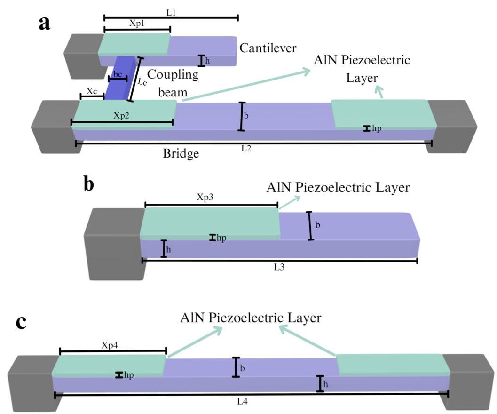

Fig. 1. Structure schematics of the gas TPoS MEMS sensor. Front view of the structure and physical dimensions of a Single cantilever, b Single clamped-clamped beam, c Weakly coupled structure.

图1. 气体TPoS MEMS传感器的结构示意图。结构的正视图以及a单悬臂、b单固支梁、c弱耦合结构的物理尺寸。

Table 1

表1

Geometric parameters of the MEMS devices.

MEMS 设备的几何参数。

<table><tr><td>Physical Parameter (Units)</td><td>Value</td></tr><tr><td>Thickness of all microbeams, $h\left( {\mu m}\right)$</td><td>10</td></tr><tr><td>Thickness of all piezoelectric layers, ${h}_{p}\left( {\mu m}\right)$</td><td>0.5</td></tr><tr><td>Length of cantilever resonator of coupled structure, ${L}_{1}\left( {\mu m}\right)$</td><td>300</td></tr><tr><td>Length of bridge resonator of coupled structure, ${L}_{2}\left( {\mu m}\right)$</td><td>650</td></tr><tr><td>Length of single cantilever, ${L}_{3}\left( {\mu m}\right)$</td><td>350</td></tr><tr><td>Length of single bridge, ${L}_{4}\left( {\mu m}\right)$</td><td>600</td></tr><tr><td>Length of coupling beam, ${L}_{c}\left( {\mu m}\right)$</td><td>10</td></tr><tr><td>Widths of bridge and cantilever, $b\left( {\mu m}\right)$</td><td>30</td></tr><tr><td>Width of coupling beam, ${b}_{c}\left( {\mu m}\right)$</td><td>10</td></tr><tr><td>Length of piezoelectric layer of single cantilever, ${X}_{p1}\left( {\mu m}\right)$</td><td>175</td></tr><tr><td>Length of piezoelectric layer of single bridge, ${X}_{p2}\left( {\mu m}\right)$</td><td>200</td></tr><tr><td>Length of piezoelectric layer of cantilever resonator of coupled structure, ${X}_{p1}\left( {\mu m}\right)$</td><td>150</td></tr><tr><td>Length of piezoelectric layer of bridge resonator of coupled structure, ${X}_{p2}\left( {\mu m}\right)$</td><td>215</td></tr><tr><td>Length of piezoelectric layer of single cantilever, ${X}_{p3}\left( {\mu m}\right)$</td><td>175</td></tr><tr><td>Length of piezoelectric layer of single bridge, ${X}_{p4}\left( {\mu m}\right)$</td><td>200</td></tr><tr><td>Position of the coupling beam, ${X}_{c}\left( {\mu m}\right)$</td><td>20</td></tr></table>

## 3. Theory and Calculation

## 3. 理论与计算

All three types of TPoS devices are actuated based on the piezoelectric effect of AlN, converting electrical potential to mechanical vibrations[13]. The piezoelectric constant of interest is ${d}_{31}$ which represents the ratio between the induced in-plane strain and the applied electric field perpendicularly to the film plane[34]. When applying an AC signal ${V}_{AC}$ , to the top AlN layer and bottom electrode connected to silicon microbeam, the transverse internal stress produced by the AlN layer will experience a periodic deformation and drive the MEMS resonators to vibrate. A DC electrothermal voltage ${V}_{TH}$ is also applied to both ends of the bridge resonator in single bridge and coupled structure inducing a current ${I}_{TH}$ passing through the microbeam and heats it up to control the internally induced axial stress, hence tuning the resonance frequencies.

所有三种类型的热压电(TPoS)设备都是基于氮化铝(AlN)的压电效应驱动的，将电势转换为机械振动[13]。感兴趣的压电常数是${d}_{31}$，它表示感应面内应变与垂直于薄膜平面施加的电场之间的比率[34]。当向连接到硅微梁的顶部AlN层和底部电极施加交流信号${V}_{AC}$时，AlN层产生的横向内应力将经历周期性变形，并驱动MEMS谐振器振动。直流电热电压${V}_{TH}$也施加到单桥和耦合结构中的桥式谐振器两端，感应出电流${I}_{TH}$通过微梁并使其升温，以控制内部感应的轴向应力，从而调谐谐振频率。

Referring to Hajjaj et al. [35] and Fourier's law, the compressive stress ${\widehat{s}}_{TH}$ generated by the external electrothermal voltage ${V}_{TH}$ in the microbeam is given:

参考哈贾吉等人[35]以及傅里叶定律，微梁中由外部电热电压${V}_{TH}$产生的压缩应力${\widehat{s}}_{TH}$如下所示:

$$
T\left\lbrack  \widehat{x}\right\rbrack   = \frac{{V}_{TH}^{2}{\sigma }_{e}}{2k}\left( {\frac{\widehat{x}}{L} - \frac{{\widehat{x}}^{2}}{{L}^{2}}}\right)  + {T}_{a} \tag{1}
$$

Hence, the thermal stress ${\widehat{S}}_{TH}$ induced by the variation of the temperature along the microbeam will be:

因此，沿微梁温度变化引起的热应力${\widehat{S}}_{TH}$将为:

$$
{\widehat{S}}_{TH} = {\alpha EA}{\int }_{0}^{L}\left( {T\left\lbrack  \widehat{x}\right\rbrack   - {T}_{a}}\right) /{Ld}\widehat{x} \tag{2}
$$

where $L$ is the length of bridge resonator ${L}_{2}$ and ${L}_{4}$ when considering the general electrothermal heating and switched to length of piezoelectric layer on top of bridge resonator ${X}_{p2}/{X}_{p4}$ while calculating the equivalent thermal stress induced by the proposed piezoelectric actuation theory; $\alpha$ is the coefficient of thermal expansion, assumed to be independent of temperature; ${\sigma }_{e}$ and $k$ denotes the electrical conductivity and thermal conductivity of the microbeam material, respectively. Two different kinds of induced thermal stress are considered here hence ${\widehat{S}}_{TH} = {\widehat{S}}_{DC} + \; {\widehat{S}}_{AC}$ . For the thermal stress ${\widehat{S}}_{DC}$ of general electrothermal heating process, the effect of DC voltage would be the electrothermal voltage ${V}_{TH} = \; {V}_{DC}$ . As for the effect of thermal stress ${\widehat{S}}_{AC}$ induced by piezoelectric actuation, we adopted the equation ${V}_{TH} = \sqrt{2}{V}_{AC} * \mu$ where $\sqrt{2}{V}_{AC}$ represents the root mean square value (RMS) of the AC harmonic voltage and $\mu$ is the thermal stress correction coefficient from piezoelectric actuation to thermal stress.

其中，$L$在考虑一般电热加热时是桥式谐振器${L}_{2}$和${L}_{4}$的长度，而在根据所提出的压电驱动理论计算等效热应力时切换为桥式谐振器顶部压电层的长度${X}_{p2}/{X}_{p4}$；$\alpha$是热膨胀系数，假定与温度无关；${\sigma }_{e}$和$k$分别表示微梁材料的电导率和热导率。这里考虑了两种不同的感应热应力，因此${\widehat{S}}_{TH} = {\widehat{S}}_{DC} + \; {\widehat{S}}_{AC}$。对于一般电热加热过程的热应力${\widehat{S}}_{DC}$，直流电压的影响将是电热电压${V}_{TH} = \; {V}_{DC}$。至于压电驱动引起的热应力${\widehat{S}}_{AC}$的影响，我们采用方程${V}_{TH} = \sqrt{2}{V}_{AC} * \mu$，其中$\sqrt{2}{V}_{AC}$表示交流谐波电压的均方根值(RMS)，$\mu$是从压电驱动到热应力的热应力校正系数。

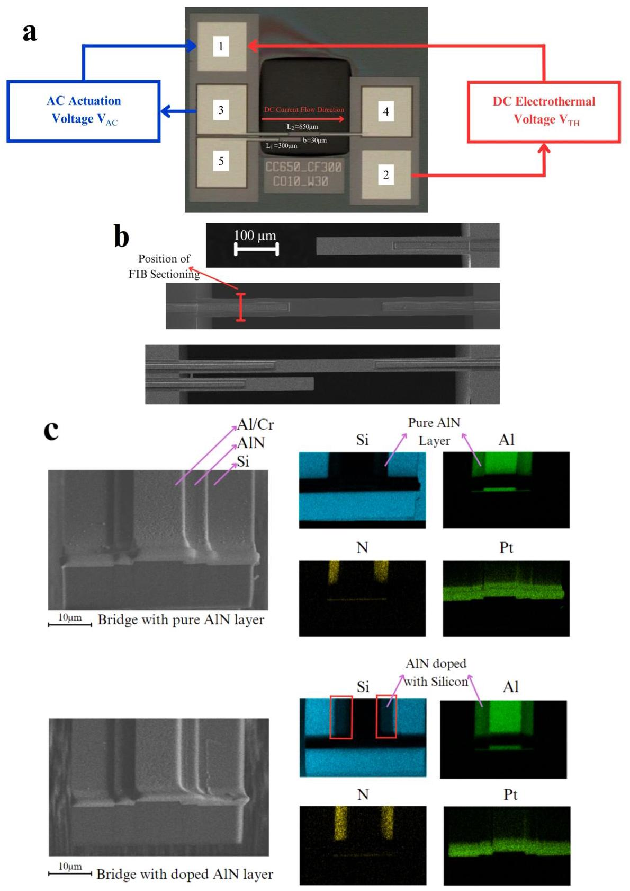

Fig. 2. SEM photos of MEMS devices. a Image of the MEMS gas sensor under microscope with electrical connections; b Position of FIB cross-sectioning; c FIB cross-sectioning results of bridge resonator with pure and doped AlN layer. Pt denotes Platinum, which is introduced by the FIB process as ion source. In c, the red square encircled the Silicon doping in the AlN layer.

图2. MEMS器件的扫描电子显微镜(SEM)照片。a带有电气连接的显微镜下MEMS气体传感器图像；b聚焦离子束(FIB)横截面位置；c带有纯AlN层和掺杂AlN层的桥式谐振器的FIB横截面结果。Pt表示铂，它是通过FIB工艺作为离子源引入的。在c中，红色方块圈出了AlN层中的硅掺杂。

To investigate the dynamic response of beam resonators, Euler-Bernoulli beam theory with a reduced-order model based on Galerkin discretization is employed[36]. The coupled resonators comprise a weakly coupled resonator, including a cantilever and bridge resonators, mechanically coupled by a thin beam. Therefore, the structure could be modeled as two Euler-Bernoulli beams coupled with a rotational spring ${k}_{r}\left\lbrack  {37}\right\rbrack$ where the torsional stiffness could be noted as:

为了研究梁谐振器的动态响应，采用基于伽辽金离散化的降阶模型的欧拉 - 伯努利梁理论[36]。耦合谐振器包括一个弱耦合谐振器，包括一个悬臂梁谐振器和一个桥式谐振器，通过一个细梁机械耦合。因此，该结构可以建模为两个由旋转弹簧${k}_{r}\left\lbrack  {37}\right\rbrack$耦合的欧拉 - 伯努利梁，其中扭转刚度可以表示为:

$$
{k}_{r} = \frac{{G\beta }{b}_{c}{h}^{3}}{{L}_{C}} \tag{3}
$$

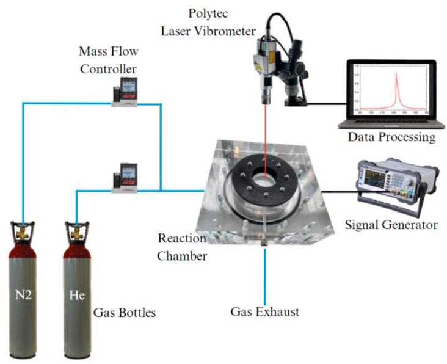

Fig. 3. Schematic of the experimental setup for the TPoS MEMS resonator.

图3. 热压电(TPoS)MEMS谐振器的实验装置示意图。

where $G$ denotes the microbeam material’s Young’s modulus, $\beta$ is a coefficient depending on the coupling beam’s width ${b}_{c}$ and thickness $h$ [37].

其中$G$表示微梁材料的杨氏模量，$\beta$是一个取决于耦合梁宽度${b}_{c}$和厚度$h$的系数[37]。

By using Hamiton's principle and the equation of Euler-Bernoulli beams with distributed elements[36], the equations of motion are derived governing the transverse deflections ${\widetilde{w}}_{1}$ and ${\widetilde{w}}_{2}$ (represent the cantilever and bridge resonator of the coupled structure); ${\widetilde{w}}_{3}$ (represents the cantilever resonator); ${\widetilde{w}}_{4}$ (represents the bridge resonator):

通过使用哈密顿原理和具有分布元件的欧拉 - 伯努利梁方程[36]，推导了控制横向挠度${\widetilde{w}}_{1}$和${\widetilde{w}}_{2}$(代表耦合结构的悬臂梁谐振器和桥式谐振器)、${\widetilde{w}}_{3}$(代表悬臂梁谐振器)、${\widetilde{w}}_{4}$(代表桥式谐振器)的运动方程:

$$
{EI}{\widetilde{w}}_{1}^{\prime \prime \prime \prime } + \rho {A}_{1}{\widetilde{w}}_{1}^{\prime } + \widetilde{c}{\widetilde{w}}_{1}^{\prime } + {k}_{r}\left( {{\widetilde{w}}_{1}^{\prime }\left( {\widetilde{X}}_{c}\right)  - {\widetilde{w}}_{2}^{\prime }\left( {\widetilde{X}}_{c}\right) }\right) {\delta }^{\prime }\left( {\widetilde{x} - {\widetilde{X}}_{c}}\right)  = 0 \tag{4}
$$

$$
{EI}{\widetilde{w}}_{2}^{\prime \prime \prime } + \rho {A}_{2}{\ddot{\widetilde{w}}}_{2} + \widetilde{c}{\dot{\widetilde{w}}}_{2} + \left\lbrack  {\widetilde{{N}_{2}} + {\widehat{S}}_{DC2} + {\widehat{S}}_{AC2} * \lambda  - \frac{E{A}_{2}}{2{L}_{2}}{\int }_{0}^{{L}_{2}}{\left( {\widetilde{w}}_{2}^{\prime }\right) }^{2}{dx}}\right\rbrack  {\widetilde{w}}_{2}^{\prime \prime } +
$$

$$
{k}_{r}\left( {{\widetilde{w}}_{2}^{\prime }\left( {\widetilde{X}}_{c}\right)  - {\widetilde{w}}_{1}^{\prime }\left( {\widetilde{X}}_{c}\right) }\right) {\delta }^{\prime }\left( {\widetilde{x} - {\widetilde{X}}_{c}}\right)  =  - {M}_{a2} \tag{5}
$$

$$
{EI}{\widetilde{w}}_{3}^{\prime \prime \prime \prime } + \rho {A}_{3}{\widetilde{w}}_{3}^{\prime } + \widetilde{c}{\widetilde{w}}_{3} =  - {M}_{a3} \tag{6}
$$

$$
{EI}{\widetilde{w}}_{4}^{\prime \prime \prime } + \rho {A}_{4}{\ddot{\widetilde{w}}}_{4} + \widetilde{c}{\ddot{\widetilde{w}}}_{4} + \left\lbrack  {\widetilde{{N}_{4}} + {\widehat{S}}_{DC4} + {\widehat{S}}_{AC4} * \lambda  - \frac{E{A}_{4}}{2{L}_{4}}{\int }_{0}^{{L}_{4}}{\left( {\widetilde{w}}_{4}^{\prime }\right) }^{2}{dx}}\right\rbrack  {\widetilde{w}}_{4}^{\prime \prime }
$$

$$
=  - {M}_{a4}
$$

(7)

## where $\lambda  = \left\{  \begin{array}{l} 0\text{ (group }A\text{ device with pure AlN layer) } \\  1\text{ (group }B\text{ device with doped AlN layer) } \end{array}\right.$

## 其中 $\lambda  = \left\{  \begin{array}{l} 0\text{ (group }A\text{ device with pure AlN layer) } \\  1\text{ (group }B\text{ device with doped AlN layer) } \end{array}\right.$

In Eqs. (4)-(7), the primes and dots denote the partial differentiation of transverse deflections ${\widetilde{w}}_{\mathrm{i}}\left( {i = 1 - 4}\right)$ with respect to the position on beams $\widetilde{x}$ and time $\widetilde{t}$ , respectively; $A$ and $I$ are the area and the moment of inertia of the rectangular cross-section; $\rho$ is the density of the microbeam material; $c$ is the damping coefficient; $\delta$ is the Dirac delta function; ${M}_{a}$ is the bending moment developed by the piezoelectric AlN layer; and $\lambda$ is the coefficient used to distinguish two groups of devices. Assuming that the AC actuation voltage is ${V}_{AC}\left( {x, t}\right)$ , the induced longitudinal stress is given by Eq. (8)[38]:

在式(4)-(7)中，撇号和点分别表示横向挠度${\widetilde{w}}_{\mathrm{i}}\left( {i = 1 - 4}\right)$ 相对于梁$\widetilde{x}$ 上位置和时间$\widetilde{t}$ 的偏导数；$A$ 和$I$ 是矩形横截面的面积和惯性矩；$\rho$ 是微梁材料的密度；$c$ 是阻尼系数；$\delta$ 是狄拉克δ函数；${M}_{a}$ 是由压电AlN层产生的弯矩；$\lambda$ 是用于区分两组器件的系数。假设交流驱动电压为${V}_{AC}\left( {x, t}\right)$ ，则感应纵向应力由式(8)[38]给出:

$$
\sigma \left( {x, t}\right)  = \frac{{E}_{p}{d}_{31}}{{h}_{p}} * {V}_{AC}\left( {x, t}\right) \tag{8}
$$

where ${d}_{31}$ is the electric charge constant, ${E}_{p}$ is the Young’s modulus of piezoelectric material and ${h}_{p}$ is the thickness of the piezoelectric layer. The bending moment ${M}_{a}$ induced at the resonator’s cross section along the neutral axis is given by Eq. (9)[38]:

其中${d}_{31}$ 是电荷常数，${E}_{p}$ 是压电材料的杨氏模量，${h}_{p}$ 是压电层的厚度。沿中性轴在谐振器横截面上感应的弯矩${M}_{a}$ 由式(9)[38]给出:

$$
{M}_{a} = {\int }_{{Z}_{G}}^{{Z}_{G} + {h}_{p}}\sigma \left( {x, t}\right) {bzdz} = {C}_{a}{V}_{AC}\left( {x, t}\right) \tag{9}
$$

where ${Z}_{G} = \frac{h + {h}_{p}}{2}$ is the location of the neutral axis of resonators along the thickness direction, and the constant ${C}_{a}$ is given by Eq. (10)[38]:

其中${Z}_{G} = \frac{h + {h}_{p}}{2}$ 是谐振器沿厚度方向中性轴的位置，常数${C}_{a}$ 由式(10)[38]给出:

$$
{C}_{a} = \frac{1}{2}{E}_{p}{d}_{31}b\left( {2{Z}_{G} + {h}_{p}}\right) \tag{10}
$$

It should be noted that the piezoelectric layer only covers the region from 0 to ${X}_{p}$ along the resonator, hence the applied voltage ${V}_{AC}\left( {x, t}\right)$ should be expressed in terms of the Heaviside function:

应注意，压电层仅沿谐振器覆盖从0到${X}_{p}$ 的区域，因此施加电压${V}_{AC}\left( {x, t}\right)$ 应以海维赛德函数表示:

$$
{V}_{AC}\left( {x, t}\right)  = {V}_{AC}\left( t\right) \left\lbrack  {H\left( x\right)  - H\left( {X}_{p}\right) }\right\rbrack \tag{11}
$$

The thermal parameters and corresponding values used are given in Table 2.

所使用的热参数及其相应值见表2。

The devices under consideration are subjected to the following boundary conditions:

所考虑的器件受到以下边界条件的约束:

$$
{w}_{1}\left( {0, t}\right)  = {w}_{1}^{\prime }\left( {0, t}\right)  = {w}_{1}^{\prime \prime }\left( {1, t}\right)  = {w}_{1}^{\prime \prime \prime }\left( {1, t}\right)  = 0
$$

$$
{w}_{2}\left( {0, t}\right)  = {w}_{2}^{\prime }\left( {0, t}\right)  = {w}_{2}\left( {{R}_{L1}, t}\right)  = {w}_{2}^{\prime }\left( {{R}_{L1}, t}\right)  = 0
$$

$$
{w}_{3}\left( {0, t}\right)  = {w}_{3}^{\prime }\left( {0, t}\right)  = {w}_{3}^{\prime \prime }\left( {{R}_{L2}, t}\right)  = {w}_{3}^{\prime \prime \prime }\left( {{R}_{L2}, t}\right)  = 0
$$

$$
{w}_{4}\left( {0, t}\right)  = {w}_{4}^{\prime }\left( {0, t}\right)  = {w}_{4}\left( {{R}_{L3}, t}\right)  = {w}_{4}^{\prime }\left( {{R}_{L3}, t}\right)  = 0 \tag{12}
$$

The following nondimensional variables and parameters are introduced for nondimensionalization derivations of the beam resonators (Eqs. (4)-(7)):

为了对梁谐振器进行无量纲化推导(式(4)-(7))，引入了以下无量纲变量和参数:

$$
{w}_{i} = \frac{{\widetilde{w}}_{i}}{{L}_{1}};x = \frac{\widetilde{x}}{{L}_{1}};{X}_{c} = \frac{{\widetilde{X}}_{c}}{{L}_{1}};{X}_{m} = \frac{{\widetilde{X}}_{m}}{{L}_{1}};{R}_{L1} = \frac{{L}_{2}}{{L}_{1}};{R}_{L2} = \frac{{L}_{3}}{{L}_{1}};{R}_{L3} = \frac{{L}_{4}}{{L}_{1}};\widetilde{m}
$$

$$
= \frac{m}{{\rho A}{L}_{1}};
$$

$$
t = \frac{\widetilde{t}}{\tau };\tau  = \sqrt{\frac{{\rho A}{L}_{1}^{4}}{EI}};I = \frac{b{h}^{3}}{12};{N}_{i} = \frac{{\widetilde{N}}_{i}{L}_{1}^{2}}{EI} + {S}_{THi};{S}_{THi} = \left( {{\widehat{S}}_{DCi} + {\widehat{S}}_{ACi}}\right) \frac{{L}_{1}^{2}}{EI};{k}_{r}
$$

$$
= \frac{{\widetilde{k}}_{r}{L}_{1}}{EI}
$$

$$
{\widetilde{c}}_{i} = \frac{{L}_{1}^{4}{c}_{i}}{EI\tau };{\alpha }_{1} = 6{\left( \frac{{L}_{1}}{h}\right) }^{2}\frac{\alpha {\sigma }_{e}}{k};{\alpha }_{2} = \frac{{E}_{p}{d}_{31}b\left( {h + 2{h}_{p}}\right) {L}_{1}^{3}}{2EI};{k}_{r} = \frac{{G\beta }{b}_{c}{h}^{3}}{{L}_{C}};{\Omega }_{i}
$$

$$
= {\widetilde{\Omega }}_{i}\tau \left( {\mathrm{i} = 1 \sim  4}\right) \text{ . }
$$

(13)

Table 2

表2

Thermal and electrical properties of the MEMS devices.

MEMS器件的热学和电学性质。

<table><tr><td>Physical Parameter (Units)</td><td>Value</td></tr><tr><td>Young's modulus of silicon, $E\left( {GPa}\right)$</td><td>169</td></tr><tr><td>Young’s modulus of $\mathrm{{AlN}},{E}_{p}\left( {GPa}\right)$</td><td>310</td></tr><tr><td>Non-dimensional damping parameters, $\widetilde{c}$</td><td>0.05</td></tr><tr><td>Torsional constant, $\beta \left( -\right)$</td><td>0.140625</td></tr><tr><td>Density of Silicon, $\rho \left( {{kg}/{m}^{3}}\right)$</td><td>2320</td></tr><tr><td>Electric charge constant of $\mathrm{{AlN}},{d}_{31}\left( {{pC}/N}\right)$</td><td>-2.0</td></tr><tr><td>Electrical Conductivity of Silicon, ${\sigma }_{e}\left( {S/m}\right)$</td><td>0.78*104</td></tr><tr><td>Thermal Conductivity of Silicon, $k\left( {W/{mK}}\right)$</td><td>165</td></tr><tr><td>Coefficient of Thermal Expansion, $\alpha \left( {K}^{-1}\right)$</td><td>2.6*106</td></tr></table>

The term ${N}_{i} = {N}_{0i} + {S}_{THi}$ denotes the tensile axial load of each bridge resonator, where ${N}_{0i}$ is the inherent axial load originating from the fabrication process and ${S}_{THi}$ represents the total thermal compressive stress of both DC thermal stress ${\widehat{S}}_{DCi}$ and AC effect thermal stress ${\widehat{S}}_{ACi}$ . By substituting Eq. (12) and Eq. (13) into Eqs. (4)-(7), we obtain the below nondimensional equations of motion of the beams:

项${N}_{i} = {N}_{0i} + {S}_{THi}$ 表示每个桥式谐振器的拉伸轴向载荷，其中${N}_{0i}$ 是源自制造过程的固有轴向载荷，${S}_{THi}$ 表示直流热应力${\widehat{S}}_{DCi}$ 和交流效应热应力${\widehat{S}}_{ACi}$ 的总热压应力。通过将式(12)和式(13)代入式(4)-(7)，我们得到了梁的以下无量纲运动方程:

$$
{w}_{1}^{\prime \prime \prime \prime } + {\ddot{w}}_{1} + c{\dot{w}}_{1} + {k}_{r}\left( {{w}_{1}^{\prime }\left( {X}_{c}\right)  - {w}_{2}^{\prime }\left( {X}_{c}\right) }\right) {\delta }^{\prime }\left( {x - {X}_{c}}\right)  = 0 \tag{14}
$$

$$
{w}_{2}^{\prime \prime \prime \prime } + {\ddot{w}}_{2} + c{\dot{w}}_{2}
$$

$$
+ \left\lbrack  \begin{matrix} {N}_{2} - \frac{EA}{2{L}_{2}}{\int }_{0}^{{R}_{L2}}{\left( {w}_{2}^{\prime }\right) }^{2}{dx} + {\alpha }_{1}{\int }_{0}^{{R}_{L2}}\left( {\frac{x}{{R}_{L1}} - \frac{{x}^{2}}{{R}_{L1}2}}\right) d{\widehat{x}}^{ * }{V}_{DC}^{2} \\   + {\alpha }_{1}{\int }_{0}^{{X}_{p2}}\left( {\frac{x}{{X}_{p2}} - \frac{{x}^{2}}{{X}_{p2}{}^{2}}}\right) d{\widehat{x}}^{ * }2{V}_{AC}^{2}{}^{ * }{R}_{L2}^{2}{}^{ * }\lambda  \end{matrix}\right\rbrack  {w}_{2}^{\prime \prime }
$$

$$
+ {k}_{r}\left( {{w}_{2}^{\prime }\left( {X}_{c}\right)  - {w}_{1}^{\prime }\left( {X}_{c}\right) }\right) {\delta }^{\prime }\left( {x - {X}_{c}}\right)  = {\alpha }_{2}{V}_{AC}\cos \left( {{\Omega }_{2}t}\right) \left\lbrack  {\delta \left( x\right)  - \delta \left( {x - {X}_{p2}}\right) }\right\rbrack
$$

(15)

$$
{w}_{3}^{\prime \prime \prime \prime } + {\ddot{w}}_{3} + c{\dot{w}}_{3} = {\alpha }_{2}{V}_{AC}\cos \left( {{\Omega }_{3}t}\right) \left\lbrack  {\delta \left( x\right)  - \delta \left( {x - {X}_{p3}}\right) }\right\rbrack \tag{16}
$$

$$
{w}_{4}^{\prime \prime \prime } + {\ddot{w}}_{4} + c{\dot{w}}_{4}
$$

$$
+ \left\lbrack  \begin{matrix} {N}_{2} - \frac{EA}{2{L}_{4}}{\int }_{0}^{{R}_{L4}}{\left( {w}_{4}^{\prime }\right) }^{2}{dx} + {\alpha }_{1}{\int }_{0}^{{R}_{L4}}\left( {\frac{x}{{R}_{L4}} - \frac{{x}^{2}}{{R}_{L4}{}^{2}}}\right) d{\widehat{x}}^{ * }{V}_{DC}^{2} \\   + {\alpha }_{1}{\int }_{0}^{{X}_{p4}}\left( {\frac{x}{{X}_{p4}} - \frac{{x}^{2}}{{X}_{p4}{}^{2}}}\right) d{\widehat{x}}^{ * }2{V}_{AC}^{2}{}^{ * }{R}_{L4}^{2}{}^{ * }\lambda  \end{matrix}\right\rbrack  {w}_{4}^{\prime \prime } =
$$

$$
{\alpha }_{2}{V}_{AC}\cos \left( {{\Omega }_{4}t}\right) \left\lbrack  {\delta \left( x\right)  - \delta \left( {x - {X}_{p4}}\right) }\right\rbrack \tag{17}
$$

Here only the first mode is considered for single cantilever resonator (Eq. (16)) and single bridge resonator (Eq. (17)); both the first and second modes are used in coupled resonators (Eqs. (14) and (15)). The mode shapes used for three resonators are explained in Appendix B.

这里对于单悬臂谐振器(式(16))和单桥式谐振器(式(17))仅考虑第一模态；对于耦合谐振器(式(14)和式(15))使用第一和第二模态。用于三个谐振器的模态形状在附录B中解释。

## 4. Results and Discussions

## 4. 结果与讨论

### 4.1. Tunability function analysis

### 4.1. 可调谐函数分析

To investigate and prove the resonance frequency tuning function of the doped AlN layer, we tested two groups of MEMS structures (i.e. two single cantilevers, two bridge resonators, and two coupled structures; resonators with same structures have same dimensions), one group coated with pure AlN layer, and another group coated with doped AlN layer. The resonance frequencies' variations via AC actuation voltages of six TPoS resonators samples are measured and shown in Fig. 4a-c. The red and blue curves represent the MEMS devices coated with pure AlN layer and coated doped AlN layer, respectively. The DC electrothermal voltage ${V}_{TH}$ is set at $0\mathrm{\;V}$ here to show the pure effect of AC actuation voltage. Notably, the resonance frequency of cantilever resonators (shown in Fig. 4a) is not influenced by the AC actuation because the thermal stress on the cantilever wouldn't influence its resonance frequency. Hence the following discussion will exclude the cantilever resonators. The attractive resonance frequency shift could be observed in the blue curves in Fig. 4b and c. Contrary to what is known in the literature for such types of devices, Fig. 4b and c demonstrates for the first time that the AC actuation voltages via the doped piezoelectric layers (i.e., where Silicon is dopped in AlN layers) induce stiffness variation on the bridge resonators leading to frequency tuning of the TPoS sensor, which is required in a wide range of potential applications.

为了研究和证明掺杂AlN层的共振频率调谐功能，我们测试了两组MEMS结构(即两个单悬臂梁、两个桥式谐振器和两个耦合结构；具有相同结构的谐振器具有相同的尺寸)，一组涂覆纯AlN层，另一组涂覆掺杂AlN层。测量了六个TPoS谐振器样品的共振频率随交流驱动电压的变化，并如图4a - c所示。红色和蓝色曲线分别代表涂覆纯AlN层和掺杂AlN层的MEMS器件。此处将直流电热电压${V}_{TH}$设置为$0\mathrm{\;V}$，以展示交流驱动电压的纯效应。值得注意的是，悬臂梁谐振器(如图4a所示)的共振频率不受交流驱动的影响，因为悬臂梁上的热应力不会影响其共振频率。因此，以下讨论将排除悬臂梁谐振器。在图4b和c的蓝色曲线中可以观察到有吸引力的共振频率偏移。与文献中关于此类器件的已知情况相反，图4b和c首次表明，通过掺杂压电层(即AlN层中掺杂硅)的交流驱动电压会在桥式谐振器上引起刚度变化，从而导致TPoS传感器的频率调谐，这在广泛的潜在应用中是必需的。

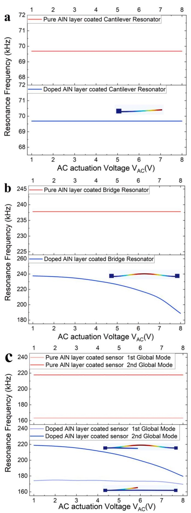

Fig. 4. Characterization and testing of the TPoS MEMS gas sensor. Resonance frequencies' variation of a single cantilever, b single bridge resonator, and c coupled structure with pure and doped AlN layer via AC actuation voltages under ${V}_{TH} = 0$ ; The inset of a-c shows the first two vibration global mode shapes computed from COMSOL[39].

图4. TPoS MEMS气体传感器的表征与测试。在${V}_{TH} = 0$下，单悬臂梁、单桥式谐振器和具有纯AlN层及掺杂AlN层的耦合结构的共振频率随交流驱动电压的变化；图a - c的插图显示了根据COMSOL[39]计算的前两个振动全局模态形状。

Typically, the AC harmonic voltage applied to the piezoelectric AlN layer does not affect the resonance frequency, as pure AlN is an insulator. However, by doping the AlN layer with silicon, its electrical properties change, enabling partial conductivity. When AC actuation is applied to the doped AlN layer, a small current flows through both the AlN layer and the MEMS resonator, inducing Joule heating. This effect, similar to DC electrothermal actuation, reduces power consumption during resonance tuning. DC electrothermal voltage, commonly used in tuning MEMS resonators[12,20], relies on thermal expansion and contraction induced by resistive heating[12,20]. In the case of a bridge resonator, the clamped structure prevents thermal expansion, resulting in compressive stress and a change in resonance frequency. However, cantilever resonators, with one free end, are less suitable for frequency tuning through this mechanism due to their ability to accommodate thermal expansion without significant stress. The aforementioned discussion provides strong support for the effect of AC actuation on the doped AlN layer in tuning the resonance frequency of the three types of resonators. This inspiring phenomenon demonstrates that adopting doped AlN layer could introduce extra thermal axial stress, hence tuning the resonance frequencies for the single bridge resonator and the antisymmetric weakly coupled resonators (i.e., including both bridge and cantilever resonators).

通常，施加到压电AlN层的交流谐波电压不会影响共振频率，因为纯AlN是绝缘体。然而，通过用硅掺杂AlN层，其电学性质发生变化，实现了部分导电性。当对掺杂AlN层施加交流驱动时，小电流会流过AlN层和MEMS谐振器，从而产生焦耳热。这种效应类似于直流电热驱动，在共振调谐期间降低了功耗。直流电热电压常用于调谐MEMS谐振器[12,20]，它依赖于电阻加热引起的热膨胀和收缩[12,20]。对于桥式谐振器，夹紧结构会阻止热膨胀，从而导致压缩应力和共振频率的变化。然而，具有一个自由端的悬臂梁谐振器由于能够在无显著应力的情况下适应热膨胀，不太适合通过这种机制进行频率调谐。上述讨论为交流驱动对掺杂AlN层在调谐三种类型谐振器的共振频率方面的作用提供了有力支持。这一令人鼓舞的现象表明，采用掺杂AlN层可以引入额外的热轴向应力，从而调谐单桥式谐振器和反对称弱耦合谐振器(即包括桥式和悬臂梁谐振器)的共振频率。

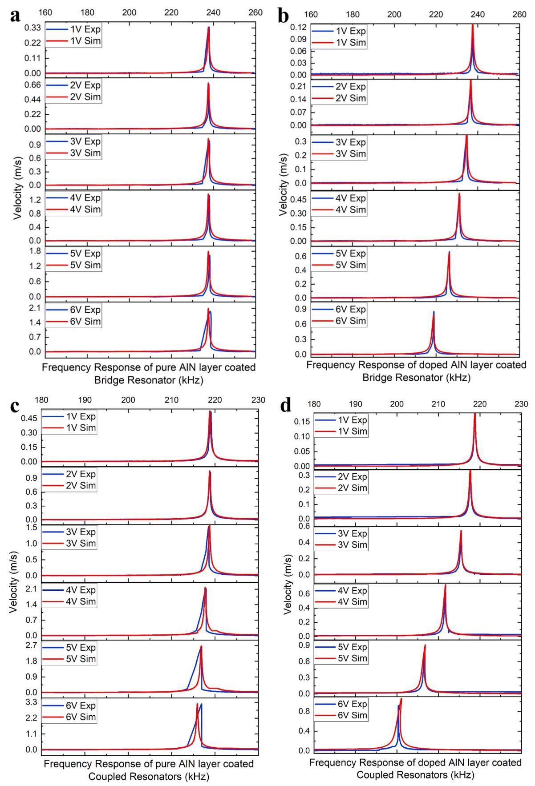

Fig. 5. Experimental results of resonance frequency tuning of single bridge resonator with pure (d) and doped (e) AlN layer and coupled resonator with pure (f) and doped (g) AlN layer under ${V}_{TH} = 0$ .

图5. 在${V}_{TH} = 0$下，具有纯AlN层(d)和掺杂AlN层(e)的单桥式谐振器以及具有纯AlN层(f)和掺杂AlN层(g)的耦合谐振器的共振频率调谐实验结果。

Next, the theoretical frequency responses based on Eqs. (14)-(17) are simulated using the shooting technique[40] and compared to the experimental frequency responses of single bridge resonators. To demonstrate the effect of AC actuation ${V}_{AC}$ on TPoS resonators, the electrothermal voltage ${V}_{TH}$ is set to 0 . The figures show very good agreement between the theoretical and experimental results, validating the system modelling. Comparing the resonance frequency variations of pure AlN layer coated device (Fig. 5a & c) and doped AlN layer coated device (Fig. 5b & d), the frequency shift is only observed in devices with doped AlN layer in silicon (Fig. 5b & d), demonstrating that the AC actuation applied on doped AlN layer induces additional thermal stress on the MEMS device, similar to the effect of electrothermal heating. As explained before, such resonance frequency tunning capability is reproducible in devices incorporating bridge resonators. It should be pointed out that the results of all devices show hardening behaviour as the resonator dynamics are dominated by cubic nonlinearities originating from the mid-plane stretching of the bridge resonators.

接下来，使用打靶技术[40]模拟基于式(14) - (17)的理论频率响应，并与单桥式谐振器的实验频率响应进行比较。为了展示交流驱动${V}_{AC}$对TPoS谐振器的影响，将电热电压${V}_{TH}$设置为0。图中显示理论结果与实验结果非常吻合，验证了系统建模。比较涂覆纯AlN层器件(图5a和c)和涂覆掺杂AlN层器件(图5b和d)的共振频率变化，仅在硅掺杂的AlN层器件(图5b和d)中观察到频率偏移，这表明施加在掺杂AlN层上的交流驱动会在MEMS器件上引起额外的热应力，类似于电热加热的效果。如前所述，这种共振频率调谐能力在包含桥式谐振器的器件中是可重复的。应该指出的是，所有器件的结果都显示出硬化行为，因为谐振器动力学由源自桥式谐振器中平面拉伸的立方非线性主导。

### 4.2. Thermal stress Characterization

### 4.2. 热应力表征

The theoretical analysis of the thermal stress conversion coefficient $\mu$ is demonstrated in this supplementary section. Instituting the parameters from Tables 1-2 into equation (2) gives the theoretical relationship between the thermal stress ${S}_{TH}$ and the DC electrothermal voltages:

本补充章节对热应力转换系数$\mu$进行了理论分析。将表1 - 2中的参数代入方程(2)，可得热应力${S}_{TH}$与直流电热电压之间的理论关系:

$$
{S}_{TH} = {4.07350}{V}_{DC}{}^{2}\text{ (for single bridge) }
$$

$$
{S}_{TH} = {4.97457}{V}_{DC}{}^{2}\text{ (for coupled resonator) } \tag{18}
$$

The experimental results of thermal stress via AC actuation voltages are shown in Fig. 6. Based on the regression equations of the fitted curves, ignoring the low-order term in the fitted curve equations, the relationship between the experimental thermal stress ${S}_{TH}$ and the AC actuation voltages will be:

图6展示了通过交流驱动电压得到的热应力实验结果。基于拟合曲线的回归方程，忽略拟合曲线方程中的低阶项，实验热应力${S}_{TH}$与交流驱动电压之间的关系将为:

$$
{S}_{TH} = {2.56667}{V}_{AC}{}^{2}\text{ (for single bridge) }
$$

$$
{S}_{TH} = {2.65655}{V}_{AC}{}^{2}\text{ (for coupled resonator) } \tag{19}
$$

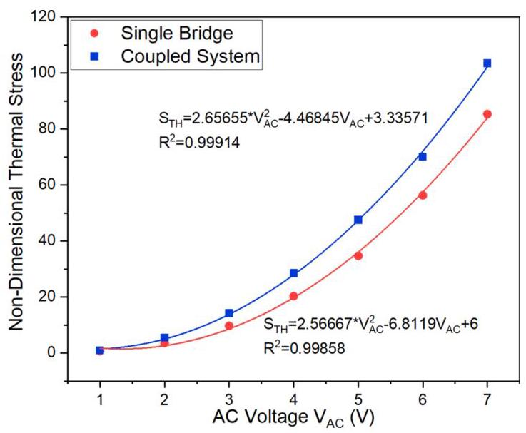

Fig. 6. Characterization and testing of the TPoS MEMS gas sensor. Resonance frequencies' variation of $\mathbf{a}$ single cantilever, $\mathbf{b}$ single bridge resonator,

图6. TPoS MEMS气体传感器的表征与测试。$\mathbf{a}$单悬臂、$\mathbf{b}$单桥谐振器的共振频率变化

The thermal stress conversion coefficient $\mu$ is characterized by equation (18)-(19). Introduce equation ${V}_{AC} = \sqrt{2}{V}_{DC} * \mu$ , the thermal stress conversion coefficient $\mu$ is obtained:

热应力转换系数$\mu$由方程(18) - (19)表征。引入方程${V}_{AC} = \sqrt{2}{V}_{DC} * \mu$，可得热应力转换系数$\mu$:

$$
\mu  = {0.936}\text{ (for coupled resonator) } \tag{20}
$$

$\mu  = {0.794}$ (for single bridge)

$\mu  = {0.794}$(用于单桥)

### 4.3. Power consumption improvement Quantification

### 4.3. 功耗改善量化

Next, we quantify the power consumption improvement of adopting doped AlN layer design on the proposed TPoS sensor. We test the resonance frequencies' variations via electrothermal voltage under constant AC actuation of ${V}_{AC} = 1\mathrm{\;V}$ of the coupled structure which is shown in Fig. 7a. It could be noted that the 1st global mode resonance frequency confined on the cantilever doesn't vary with the electrothermal voltage while the 2nd global mode resonance frequency firstly decreases until the buckling point at ${V}_{TH} = {6.15}\mathrm{\;V}$ and then rises again. To compare the influence of the electrothermal voltage ${V}_{TH}$ and AC actuation ${V}_{AC}$ on the dynamics, the experimental curve of resonance frequency variation via AC actuation under constant electrothermal voltage of ${V}_{TH} = {5.5}\mathrm{\;V}$ is shown in Fig. 7b. Note that the two curves (Fig. 7a and b) have the same variation tendency which proves that the AC actuation has similar influence with the electrothermal voltage, specifically, providing thermal stress to the microbeam. From Fig. 7b, it can be seen that the coupled structure is buckled when ${V}_{AC} = {3V}$ . Therefore, the whole power consumption could be calculated by $P = \frac{{V}_{TH}{}^{2}}{{R}_{\text{ Bridge }}} + \frac{{V}_{AC}{}^{2}}{{R}_{\text{ AlN.layer }}}$ . The resistance ${R}_{\text{ Bridge }}$ denotes the measured resistance of the bridge resonator, which is ${340\Omega }$ . Since the resistance between the AlN layer and the microbeam $\left( {R}_{\text{ AlNLayer }}\right)$ is significantly larger than the microbeam resistance $\left( {6M\Omega }\right)$ , the AC power consumption through this path $\left( {{V}_{AC}{}^{2}/{R}_{\text{ AlNLayer }}}\right)$ is negligible. Therefore, the power consumption to tune the coupled structure at buckling point is given:

接下来，我们对在所提出的TPoS传感器上采用掺杂AlN层设计的功耗改善进行量化。我们在图7a所示耦合结构的${V}_{AC} = 1\mathrm{\;V}$恒定交流驱动下，通过电热电压测试共振频率的变化。可以注意到，限制在悬臂上的第一全局模式共振频率不随电热电压变化，而第二全局模式共振频率首先下降，直到在${V}_{TH} = {6.15}\mathrm{\;V}$处的屈曲点，然后再次上升。为了比较电热电压${V}_{TH}$和交流驱动${V}_{AC}$对动力学的影响，图7b展示了在${V}_{TH} = {5.5}\mathrm{\;V}$恒定电热电压下通过交流驱动的共振频率变化实验曲线。注意，两条曲线(图7a和b)具有相同的变化趋势，这证明交流驱动与电热电压具有相似的影响，具体而言，为微梁提供热应力。从图7b可以看出，当${V}_{AC} = {3V}$时耦合结构发生屈曲。因此，总功耗可通过$P = \frac{{V}_{TH}{}^{2}}{{R}_{\text{ Bridge }}} + \frac{{V}_{AC}{}^{2}}{{R}_{\text{ AlN.layer }}}$计算。电阻${R}_{\text{ Bridge }}$表示桥谐振器的测量电阻，其值为${340\Omega }$。由于AlN层与微梁之间的电阻$\left( {R}_{\text{ AlNLayer }}\right)$远大于微梁电阻$\left( {6M\Omega }\right)$，通过此路径$\left( {{V}_{AC}{}^{2}/{R}_{\text{ AlNLayer }}}\right)$的交流功耗可忽略不计。因此，给出在屈曲点调谐耦合结构的功耗:

$$
P = \frac{{6.15}^{2}}{340} = {111.24}\mathrm{{mW}}\left( {{V}_{AC} = 1\mathrm{\;V}}\right)
$$

$$
P = \frac{{5.5}^{2}}{340} = {88.97}\mathrm{\;{mW}}\left( {{V}_{AC} = 3\mathrm{\;V}}\right) \tag{21}
$$

Hence the power consumption improvement could be calculated as $\left| \frac{{88.97} - {111.24}}{111.24}\right|  \times  {100}\%  = {27.21}\%$ , denoting a remarkable improvement. Such power consumption could be further optimized by adjusting the doping level of AlN layer and silicon or increasing the AC actuation voltage ${V}_{AC}$ to increase the thermal stress introduced to the TPoS resonators.

因此，功耗改善可计算为$\left| \frac{{88.97} - {111.24}}{111.24}\right|  \times  {100}\%  = {27.21}\%$，这表示显著的改善。通过调整AlN层和硅的掺杂水平或增加交流驱动电压${V}_{AC}$以增加引入到TPoS谐振器的热应力，这种功耗可进一步优化。

Based on the same experimental process, we tested the coupled structure under different ambient temperature and recorded the DC electrothermal voltages on the buckling point and corresponding power consumption improvement via AC actuation voltage. The results shown in Fig. 7c demonstrate that the DC electrothermal voltage needed to reach the buckling point is influenced by the ambient temperature. The DC electrothermal voltage ${V}_{TH}$ is decreasing with increasing AC actuation voltage ${V}_{AC}$ and the power consumption improvement reaches 41.2 $\%$ at ${V}_{AC} = {6V}$ compared to ${V}_{AC} = {1V}$ .

基于相同的实验过程，我们在不同环境温度下测试了耦合结构，并记录了屈曲点的直流电热电压以及通过交流驱动电压对应的功耗改善。图7c所示结果表明，达到屈曲点所需的直流电热电压受环境温度影响。直流电热电压${V}_{TH}$随交流驱动电压${V}_{AC}$的增加而降低，与${V}_{AC} = {1V}$相比，在${V}_{AC} = {6V}$时功耗改善达到41.2$\%$。

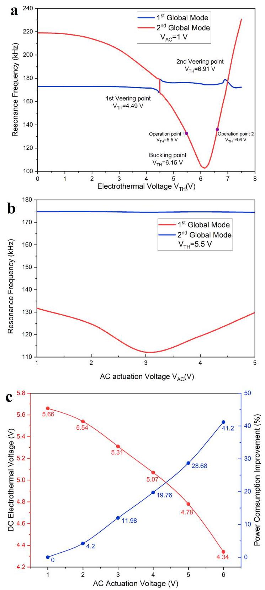

Fig. 7. Experimental results of resonance frequency variation. a Resonance frequency variation via electrothermal voltage under constant AC actuation of ${V}_{AC} = {6.15}\mathrm{\;V};\mathbf{b}$ Resonance frequency variation under constant electrothermal voltage of ${V}_{TH} = {5.5}\mathrm{\;V}$ ; c The DC electrothermal voltage on buckling point and corresponding power consumption improvement via AC actuation voltage.

图7. 共振频率变化的实验结果。a 在${V}_{AC} = {6.15}\mathrm{\;V};\mathbf{b}$的恒定交流驱动下，通过电热电压实现的共振频率变化；b 在${V}_{TH} = {5.5}\mathrm{\;V}$的恒定电热电压下的共振频率变化；c 屈曲点处的直流电热电压以及通过交流驱动电压实现的相应功耗改善。

### 4.4. Helium gas sensing under linear actuation

### 4.4. 线性驱动下的氦气传感

We first demonstrate the sensing performance of the antisymmetric weakly coupled resonator under linear actuation at ${V}_{AC} = {1V}$ and monitor the resonance frequency variation at atmospheric pressure and ambient temperature. Fig. 8a and b show the resonance frequency variations on two operation points before the buckling point $\left( {{V}_{TH} = }\right. \; {5.5}\mathrm{\;V})$ and after the buckling point $\left( {{V}_{TH} = {6.6}\mathrm{\;V}}\right)$ , respectively (noted in Fig. 7a). The increase of Helium concentration from 0% to 25% would convectively cool down the bridge resonator and counteract the electrothermal voltage's heating. Hence, the opposite frequency shift direction is found in two experimental sets. Fig. 8a and b shows that both operation points give high linear results with sensitivity of 3.139 ppm/ $\mathrm{{Hz}}$ and ${9.076}\mathrm{{ppm}}/\mathrm{{Hz}}$ , respectively. Note that the quality factors at operation points ${V}_{TH} = {5.5}\mathrm{\;V}$ and ${V}_{TH} = {6.6}\mathrm{\;V}$ are 541.9 and 176.3, respectively. It should be pointed out that the Helium concentration variation (i.e. stiffness variation on bridge resonator) only influences the 2nd global mode resonance frequency. Therefore the proposed sensor could be designed as a multi-functional sensor by introducing another perturbation on the cantilever resonator (i.e. by coating the cantilever with a material having a certain affinity to gases having similar thermal conductivity to the air like ammonia or water vapor) leading to simultaneous monitoring of two gases by tracking the independent effect on each mode[31].

我们首先展示了在${V}_{AC} = {1V}$的线性驱动下，反对称弱耦合谐振器的传感性能，并在大气压力和环境温度下监测共振频率变化。图8a和b分别显示了屈曲点$\left( {{V}_{TH} = }\right. \; {5.5}\mathrm{\;V})$之前和屈曲点$\left( {{V}_{TH} = {6.6}\mathrm{\;V}}\right)$之后两个工作点处的共振频率变化(在图7a中标记)。氦气浓度从0%增加到25%会对流冷却桥式谐振器，并抵消电热电压的加热作用。因此，在两组实验中发现了相反的频率偏移方向。图8a和b表明，两个工作点均给出了高线性结果，灵敏度分别为3.139 ppm/$\mathrm{{Hz}}$和${9.076}\mathrm{{ppm}}/\mathrm{{Hz}}$。请注意，工作点${V}_{TH} = {5.5}\mathrm{\;V}$和${V}_{TH} = {6.6}\mathrm{\;V}$处的品质因数分别为541.9和176.3。应该指出的是，氦气浓度变化(即桥式谐振器的刚度变化)仅影响第二阶全局模式共振频率。因此，通过在悬臂谐振器上引入另一种扰动(即通过在悬臂上涂覆对与空气具有相似热导率的气体(如氨或水蒸气)具有一定亲和力的材料)，可以将所提出的传感器设计为多功能传感器，从而通过跟踪对每个模式的独立影响来同时监测两种气体[31]。

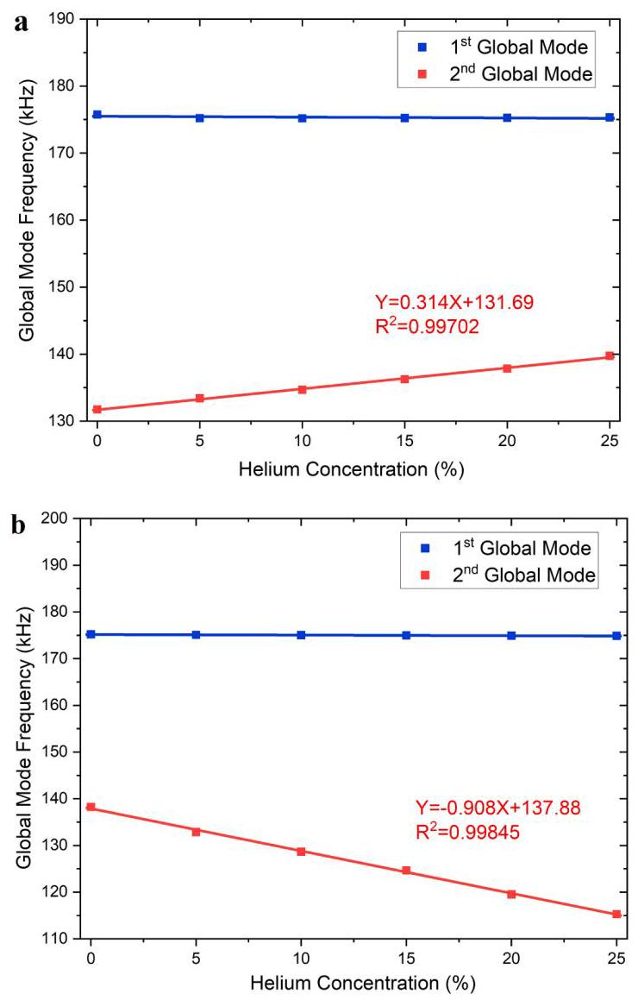

Fig. 8. Helium Sensing Frequency Response with actuation of ${V}_{AC} = 1\mathrm{\;V}$ of the TPoS Gas Sensor. a Operated before buckling point and ${V}_{TH} = {5.5}\mathrm{\;V};\mathbf{b}$ Operated after buckling point and ${V}_{TH} = {6.6}\mathrm{\;V}$ .

图8. TPoS气体传感器在${V}_{AC} = 1\mathrm{\;V}$驱动下的氦气传感频率响应。a 在屈曲点之前工作，${V}_{TH} = {5.5}\mathrm{\;V};\mathbf{b}$ 在屈曲点之后工作，${V}_{TH} = {6.6}\mathrm{\;V}$。

### 4.5. Triggered Helium sensing based on nonlinear response

### 4.5. 基于非线性响应的触发式氦气传感

To investigate the influence of nonlinear behaviour on the sensor's trigger function, we choose two operation points before and after the buckling points respectively. At the operation point before buckling with lower AC actuation $\left( {{V}_{TH} = {6.18}\mathrm{\;V}}\right)$ , the resonator’s nonlinear response is dominated by the cubic nonlinearity originating from midplane stretching showing a hardening behaviour. After buckling $\left( {{V}_{TH} = }\right.$ 7.1V), the dominated nonlinearity is the quadratic nonlinearity linked to curvature (i.e., buckling configuration) and the resonator's response is then switched to softening behaviour. Both hardening and softening nonlinear fold bifurcation jumps lead to a dramatic amplitude increase, which could perform as a trigger signal on applications of hazard gas alarming and environmental monitoring.

为了研究非线性行为对传感器触发功能的影响，我们分别选择了屈曲点之前和之后的两个工作点。在屈曲前较低交流驱动$\left( {{V}_{TH} = {6.18}\mathrm{\;V}}\right)$的工作点处，谐振器的非线性响应主要由源自中面拉伸的三次非线性主导，呈现硬化行为。屈曲后($\left( {{V}_{TH} = }\right.$ 7.1V)，主导的非线性是与曲率(即屈曲构型)相关的二次非线性，谐振器的响应随后切换为软化行为。硬化和软化非线性折叠分岔跳跃都会导致幅度急剧增加，这可以在有害气体报警和环境监测应用中用作触发信号。

Fig. 9a shows the frequency response of the triggered function realization where the operation point is chosen after the buckling point. To activate the nonlinear behaviour, the AC actuation is increased to ${V}_{AC} = {3V}$ and the electrothermal voltage is set as ${V}_{TH} = {7.1V}$ . The operation frequency is set at ${120.6}\mathrm{{kHz}}$ noted as green and the peak frequencies are noted as red (Fig. 9a). At initial condition, the sensor's peak frequency is ${120.736}\mathrm{{kHz}}$ which is higher than the operation frequency hence the amplitude at the operation point is quite small at ${0.147}\mathrm{\;m}/\mathrm{s}$ . Once the Helium concentration increases to the trigger point at ${0.2}\%$ (i.e., ${2000}\mathrm{{ppm}}$ ), the peak frequency shifts to ${120.443}\mathrm{{kHz}}$ hence the operation point crosses the peak point, therefore the amplitude at the operation point rises to ${0.701}\mathrm{\;m}/\mathrm{s}$ . With continuous increasing of Helium concentration until ${10}\%$ , the amplitude at the operation point decreases smoothly, which could be used for subsequent monitoring after triggering the sensor. Another triggered function experiment before the buckling point $\left( {{V}_{TH} = {6.18}\mathrm{\;V}}\right)$ based on hardening fold bifurcation jump is also presented shown in Fig. 9b. Compared to the response at the operation point after the buckling point shown in Fig. 9a, the response in Fig. 9b shows hardening nonlinear behaviour. The operation frequency is set at ${111.2}\mathrm{{kHz}}$ noted as green and the peak frequencies are noted as red. The vibration amplitude at operation point rises from 0.147 m/s (at 0%) to 1.354 m/s (at 0.2%).

图9a展示了触发函数实现的频率响应，其中操作点是在屈曲点之后选择的。为了激活非线性行为，将交流驱动增加到${V}_{AC} = {3V}$，并将电热电压设置为${V}_{TH} = {7.1V}$。操作频率设置为${120.6}\mathrm{{kHz}}$(绿色标注)，峰值频率标注为红色(图9a)。在初始条件下，传感器的峰值频率为${120.736}\mathrm{{kHz}}$，高于操作频率，因此在${0.147}\mathrm{\;m}/\mathrm{s}$处操作点的幅度相当小。一旦氦浓度增加到${0.2}\%$处的触发点(即${2000}\mathrm{{ppm}}$)，峰值频率移至${120.443}\mathrm{{kHz}}$，因此操作点越过峰值点，操作点处的幅度升至${0.701}\mathrm{\;m}/\mathrm{s}$。随着氦浓度持续增加直至${10}\%$，操作点处的幅度平滑下降，这可用于触发传感器后的后续监测。图9b还展示了基于硬化折叠分岔跳跃在屈曲点$\left( {{V}_{TH} = {6.18}\mathrm{\;V}}\right)$之前进行的另一个触发函数实验。与图9a中屈曲点之后操作点的响应相比，图9b中的响应显示出硬化非线性行为。操作频率设置为${111.2}\mathrm{{kHz}}$(绿色标注)，峰值频率标注为红色。操作点处的振动幅度从0.147 m/s(0%时)升至1.354 m/s(0.2%时)。

The detailed amplitude variation at the operation points with resonance frequency variation is demonstrated in Fig. 9c (i.e., blue curve). The green curve in Fig. 9c shows the amplitude variations at the operation point of backward sweep for Helium concentration decreasing from 10% to 0 %. Note that the vibration amplitude during the backward sweep is slightly higher than the forward sweep due to the nonlinear behaviour of the sensor (hysteresis effect). Adopting resonance frequency variation as supporting evidence on Helium concentration sensing should be a potential compensation solution in actual applications. The resonance frequency variation of the forward and backward sweeps is shown in Fig. 9c as red and yellow curves, respectively. Similar to the linear sensing results shown in Fig. 8, strongly linear results are observed with a sensitivity of ${9.96}\mathrm{{ppm}}/\mathrm{{Hz}}$ and 11.30 ppm/Hz for the forward and backward sweep, respectively. As comparison, the vibration amplitudes and resonance frequency variations before the buckling point $\left( {{V}_{TH} = {6.18}\mathrm{\;V}}\right)$ are shown in Fig. 9d. The sudden change in vibration amplitude from ${0.147}\mathrm{\;m}/\mathrm{s}$ to ${1.354}\mathrm{\;m}/\mathrm{s}$ at 0.2% at the operation frequency of 111.2 kHz proves that the sensor functions well for triggering. Similar to experimental results after the buckling point in Fig. 9c, the backward sweep gives higher amplitude for the same Helium concentration compared to the forward sweep. However, the resonance frequency represents almost the same variations during forward and backward sweeps with a lower sensitivity of 3.60 ppm/Hz. It reveals that the sensitivity and uniformity of the forward and backward sweeps could be adjusted by changing the operation point based on the actual application, which will be an interesting direction for future research. The transit peak velocity variations versus time are also shown in Fig. 9e and f for the two operation points, respectively. The Helium concentration variation is noted as red and blue colours which represent forward and backward sweeps, respectively.

操作点处幅度随共振频率变化的详细情况在图9c中展示(即蓝色曲线)。图9c中的绿色曲线显示了氦浓度从10%降至0%时反向扫描操作点处的幅度变化。请注意，由于传感器的非线性行为(滞后效应)，反向扫描期间的振动幅度略高于正向扫描。在实际应用中，采用共振频率变化作为氦浓度传感的支持证据应该是一种潜在的补偿解决方案。正向和反向扫描的共振频率变化分别在图9c中显示为红色和黄色曲线。与图8所示的线性传感结果类似，正向和反向扫描分别观察到强烈的线性结果，灵敏度分别为${9.96}\mathrm{{ppm}}/\mathrm{{Hz}}$和11.30 ppm/Hz。作为比较，屈曲点$\left( {{V}_{TH} = {6.18}\mathrm{\;V}}\right)$之前的振动幅度和共振频率变化在图9d中展示。在111.2 kHz操作频率下，0.2%时振动幅度从${0.147}\mathrm{\;m}/\mathrm{s}$突然变为${1.354}\mathrm{\;m}/\mathrm{s}$，证明传感器触发功能良好。与图9c中屈曲点之后的实验结果类似，对于相同的氦浓度,反向扫描比正向扫描给出更高的幅度。然而，正向和反向扫描期间共振频率的变化几乎相同，灵敏度较低，为3.60 ppm/Hz。这表明可以根据实际应用通过改变操作点来调整正向和反向扫描的灵敏度和均匀性，这将是未来研究的一个有趣方向。两个操作点的过渡峰值速度随时间的变化也分别在图9e和f中展示。氦浓度变化分别用红色和蓝色表示，代表正向和反向扫描。

Next, we investigate and characterize sensor stability by introducing Allan deviation. The Allan deviation is a widely used time-domain method for frequency noise analysis within sampled signals. By measuring the average of the fractional frequency fluctuation over time interval $\tau$ , the noise and drift components in the signal could be differentiated and quantified. The Allan deviation[41,42] $\sigma \left( \tau \right)$ can be expressed as:

接下来，我们通过引入阿伦偏差来研究和表征传感器的稳定性。阿伦偏差是一种广泛用于采样信号频率噪声分析的时域方法。通过测量时间间隔$\tau$内分数频率波动的平均值，可以区分和量化信号中的噪声和漂移分量。阿伦偏差[41,42] $\sigma \left( \tau \right)$ 可以表示为:

$$
\sigma \left( \tau \right)  = \sqrt{\frac{1}{2\left( {N - 1}\right) }\mathop{\sum }\limits_{{k = 1}}^{{N - 1}}{\left( {\bar{y}}_{k + 1} - {\bar{y}}_{k}\right) }^{2}} \tag{22}
$$

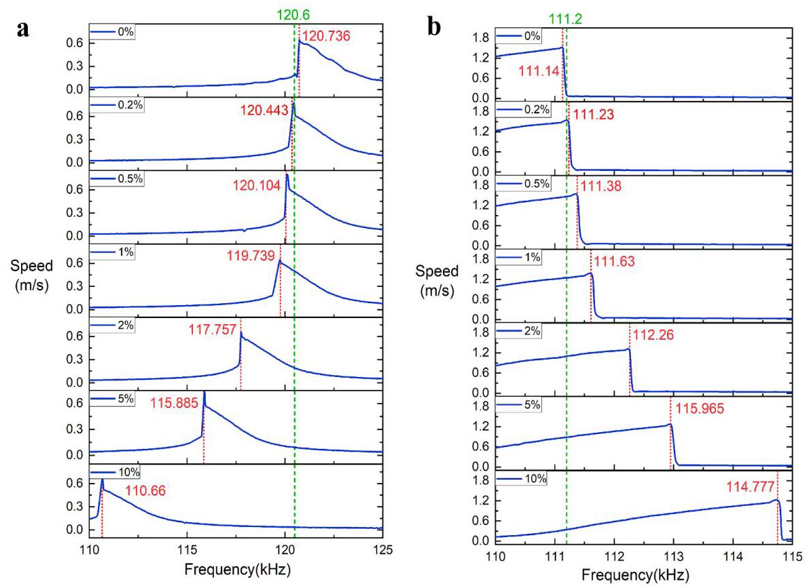

Fig. 9. Trigger Function Demonstration for TPoS Gas Sensor. a Frequency response curves under ${V}_{TH} = {7.1V}$ after buckling point of forward sweep of Helium concentration from $0\%$ to ${10}\%$ ; b Frequency response curves under ${V}_{TH} = {6.18V}$ before buckling point of forward sweep of Helium concentration from $0\%$ to ${10}\%$ ; c Trigger function performance for operation point at ${V}_{TH} = {7.1}\mathrm{\;V}$ after buckling point; d Trigger function performance for operation point at ${V}_{TH} = {6.18}\mathrm{\;V}$ before buckling point; e Transit velocity variation of trigger experiment for operation point at ${V}_{TH} = {7.1}\mathrm{\;V}$ after buckling point; $\mathrm{f}$ Transit velocity variation of trigger experiment for operation point at ${V}_{TH} = {6.18V}$ after buckling point; $\mathbf{g}$ Allan deviation of the TPoS gas sensor for two operation points.

图9. TPoS气体传感器的触发功能演示。a氦气浓度从$0\%$正向扫描到${10}\%$屈曲点之后在${V}_{TH} = {7.1V}$下的频率响应曲线；b氦气浓度从$0\%$正向扫描到${10}\%$屈曲点之前在${V}_{TH} = {6.18V}$下的频率响应曲线；c屈曲点之后${V}_{TH} = {7.1}\mathrm{\;V}$处工作点的触发功能性能；d屈曲点之前${V}_{TH} = {6.18}\mathrm{\;V}$处工作点的触发功能性能；e屈曲点之后${V}_{TH} = {7.1}\mathrm{\;V}$处工作点的触发实验的渡越速度变化；$\mathrm{f}$屈曲点之后${V}_{TH} = {6.18V}$处工作点的触发实验的渡越速度变化；$\mathbf{g}$TPoS气体传感器两个工作点的阿伦偏差。

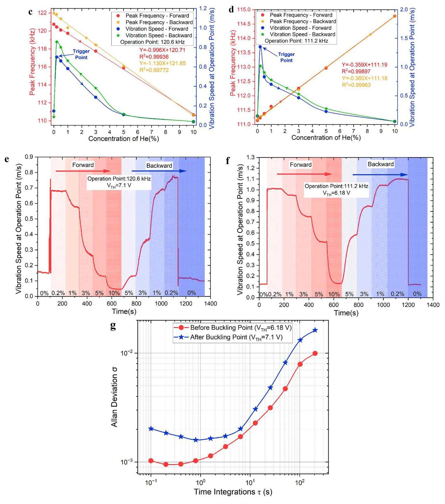

Fig. 9. (continued).

图9.(续)

where ${\bar{y}}_{k}$ denotes the average value of each cluster : ${\bar{y}}_{k} = \frac{1}{n}\mathop{\sum }\limits_{{i = k}}^{{k + n - 1}}{y}_{i}$

其中${\bar{y}}_{k}$表示每个簇的平均值:${\bar{y}}_{k} = \frac{1}{n}\mathop{\sum }\limits_{{i = k}}^{{k + n - 1}}{y}_{i}$(23)

Fig. $9\mathrm{\;g}$ demonstrates the stability of the TPoS sensor on the two operation points. The Allan deviation curves show standard behaviour as expected in a MEMS resonator. At low integration time smaller than 1 $\mathrm{s}$ (i.e. $\tau  < 1\mathrm{\;s}$ ), the noise is dominated by white noise, while thermal drift is governed at a higher integration time larger than ${10}\mathrm{\;s}$ . Noted that the performance at the operation point before the buckling point at ${V}_{TH} = \; {6.18}\mathrm{\;V}$ demonstrates less influence by thermal drift than performance after the buckling point at ${V}_{TH} = {7.1}\mathrm{\;V}$ due to less electrothermal heating.

图$9\mathrm{\;g}$展示了TPoS传感器在两个工作点的稳定性。阿伦偏差曲线显示出MEMS谐振器中预期的标准行为。在小于1$\mathrm{s}$(即$\tau  < 1\mathrm{\;s}$)的低积分时间下，噪声以白噪声为主，而在大于${10}\mathrm{\;s}$的高积分时间下，热漂移起主导作用。注意，在${V}_{TH} = \; {6.18}\mathrm{\;V}$处屈曲点之前的工作点的性能受热漂移的影响比在${V}_{TH} = {7.1}\mathrm{\;V}$处屈曲点之后的性能小，这是因为电热加热较少。

## 5. Conclusions

## 5. 结论

In this paper, a novel tunable and low-power micromachined TPoS MEMS sensor using doped AlN layer was developed, simulated, fabricated and tested. By adopting a special Aluminium Nitride (AlN) layer piezoelectric layer doped with Silicon (Si) in TPoS devices, providing general AC actuation on AlN layer could provide periodic formation and extra thermal stress simultaneously. Hence significantly decreases the external DC electrothermal power consumption during resonance frequency tunning by 41.2 %. The system dynamics of resonance frequencies' tuning function as well as the thermal stress conversion dynamics are modelled and simulated based on Euler-Bernoulli equations and Fourier's law. The experiments indicate that the AC actuation voltage ${V}_{AC}$ and DC electrothermal voltage ${V}_{DC}$ has similar effects (i.e. providing thermal stress) on tuning the resonance frequency, which proves the main concept. The thermal conductivity gas sensing technique is adopted based on the stiffness change on the heated MEMS bridge resonator due to thermal energy dissipation of high/low thermal conductivity gas. The Helium sensing results to two operation points indicate high linear and sensitivity sensing performance of the proposed sensor. The thermal conductivity variation lead by helium concentration only influences the 2nd global mode frequencies, proves the great potential on multi-sensing function by utilizing coupled structure. The triggered function reaches the ultra-small threshold concentration of 2000 ppm (i.e., 0.2%) detection, which denotes superb potential in low-power consumption sensing, programmable switches and IoT applications. Future work may explore several avenues. Firstly, the sensing performance based on the lowest two global modes is investigated in this paper. However, exciting the proposed MEMS sensors in higher-order modes including symmetric and anti-symmetric modes could lead to much higher resonance frequencies, resonance amplitudes, and potentially rich nonlinear behaviours, which is beneficial for sensitivity improvement. Furthermore, the multi-sensing capabilities of the proposed antisymmetric weakly coupled structure can be further explored by combining two sensing mechanisms on two global modes: microgravimetric (i.e., by coating the cantilever resonator) and thermal conductivity based approaches. Finally, developing a more controlled process for doping the AlN layer on silicon and investigating the impact of doping material properties and thickness on power consumption optimization are promising research directions.

在本文中，开发、模拟、制造并测试了一种使用掺杂AlN层的新型可调谐低功耗微机械TPoS MEMS传感器。通过在TPoS器件中采用掺杂硅(Si)的特殊氮化铝(AlN)层压电层，在AlN层上提供一般的交流驱动可以同时提供周期性形成和额外的热应力。因此，在共振频率调谐期间，外部直流电热功耗显著降低了41.2%。基于欧拉 - 伯努利方程和傅里叶定律对共振频率调谐函数的系统动力学以及热应力转换动力学进行了建模和模拟。实验表明，交流驱动电压${V}_{AC}$和直流电热电压${V}_{DC}$在调谐共振频率方面具有相似的效果(即提供热应力)，这证明了主要概念。基于高/低热导率气体的热能耗散导致加热的MEMS桥谐振器刚度变化，采用了热导率气体传感技术。在两个工作点的氦气传感结果表明所提出的传感器具有高线性和灵敏度的传感性能。氦气浓度导致的热导率变化仅影响第二全局模式频率，证明了利用耦合结构实现多传感功能的巨大潜力。触发功能达到了2000 ppm(即0.2%)检测的超小阈值浓度，这表明在低功耗传感、可编程开关和物联网应用中具有巨大潜力。未来的工作可能探索几个途径。首先，本文研究了基于最低两个全局模式的传感性能。然而，以包括对称和反对称模式在内的高阶模式激励所提出的MEMS传感器可能会导致更高的共振频率、共振幅度以及潜在的丰富非线性行为，这有利于提高灵敏度。此外，可以通过在两个全局模式上结合两种传感机制来进一步探索所提出的反对称弱耦合结构的多传感能力:微重力(即通过涂覆悬臂谐振器)和基于热导率的方法。最后，开发一种更可控的在硅上掺杂AlN层的工艺，并研究掺杂材料特性和厚度对功耗优化的影响是有前景的研究方向。

## CRediT authorship contribution statement

## CRediT作者贡献声明

Zhengliang Fang: Writing - review & editing, Writing - original draft, Validation, Methodology, Investigation, Formal analysis, Data curation, Conceptualization. Stephanos Theodossiades: Writing - review & editing, Validation, Methodology, Formal analysis, Conceptualization. Nizar Jaber: Writing - review & editing, Data curation. Amal Z. Hajjaj: Writing - review & editing, Validation, Supervision, Conceptualization, Methodology, Investigation, Formal analysis.

方正亮:写作 - 审阅与编辑、写作 - 初稿、验证、方法学、调查、形式分析、数据管理、概念化。斯特凡诺斯·西奥多西亚德斯:写作 - 审阅与编辑、验证、方法学、形式分析、概念化。尼扎尔·贾比尔:写作 - 审阅与编辑、数据管理。阿玛尔·Z·哈贾吉:写作 - 审阅与编辑、验证、监督、概念化、方法学、调查、形式分析。

## Declaration of competing interest

## 利益冲突声明

The authors declare that they have no known competing financial interests or personal relationships that could have appeared to influence the work reported in this paper.

作者声明，他们不存在已知的可能影响本文所报告工作的竞争性财务利益或个人关系。

## Acknowledgements

## 致谢

This work has been supported by the EPSRC Transforming Foundation Industries Network+, UK (R/167260). The authors also thank the Wolfson School of Mechanical, Electrical, and Manufacturing Engineering, Loughborough University, UK, for funding this work under a PhD studentship.

这项工作得到了英国工程和物理科学研究委员会(EPSRC)转型基础产业网络+(R/167260)的支持。作者还感谢英国拉夫堡大学沃尔夫森机械、电气和制造工程学院，在博士奖学金的资助下开展这项工作。

## Appendix

## 附录

## A. Introduction of TPoS devices for Characterization

## A. 用于表征的TPoS设备介绍

All TPoS MEMS devices are fabricated via MEMSCAP[32] based on 150 mm n-type polished Silicon On Insulator (SOI) wafers, as specified in Fig. A1. The top surface layer is doped by depositing a Phosphosilicate glass (PSG) layer and annealing at ${1050}^{ \circ  }\mathrm{C}$ for1hour in Argon before removing via wet chemical etching. Then, a 0.2 $\mu \mathrm{m}$ thermal oxide layer is grown and patterned as electrical isolations. The first deposited layer would be the piezoelectric layer consisting of a ${0.5\mu }\mathrm{m}$ of Aluminum Nitride on top of silicon wafers. A metal stack of ${20nm}$ of chrome and ${1\mu }\mathrm{m}$ of aluminum is deposited over the wafers by reactive sputtering as the electrodes of the devices. Thereafter, the silicon is lithographically patterned and etched from the top side using deep reactive ion etch (DRIE) performed using Inductively Coupled Plasma (ICP) technology. Next, a top side protection layer is applied to the top surface of the Silicon layer. Such polyimide coat will hold the wafer together through subsequent trench etching. Then, the wafers are reversed, and the substrate layer is lithographically patterned from the bottom side and etched into the Bottom Side Oxide layer using DRIE. In the end, the top side protection layer is stripped in a dry etch process which releases the mechanical structures in the silicon layer. The cross-section view and the whole fabrication flow are shown in Fig. A1[32].

所有TPoS MEMS器件均通过MEMSCAP[32]基于150毫米n型绝缘硅(SOI)抛光晶圆制造，如图A1所示。顶层通过沉积磷硅玻璃(PSG)层进行掺杂，并在氩气中于${1050}^{ \circ  }\mathrm{C}$退火1小时，然后通过湿化学蚀刻去除。接着，生长并图案化0.2$\mu \mathrm{m}$的热氧化层作为电隔离。首先沉积的层是压电层，由硅晶圆顶部的${0.5\mu }\mathrm{m}$氮化铝组成。通过反应溅射在晶圆上沉积一层由${20nm}$铬和${1\mu }\mathrm{m}$铝组成的金属叠层作为器件的电极。此后，使用电感耦合等离子体(ICP)技术通过深反应离子蚀刻(DRIE)从顶部对硅进行光刻图案化和蚀刻。接下来，在硅层的顶表面施加顶层保护层。这种聚酰亚胺涂层将在后续的沟槽蚀刻过程中使晶圆保持在一起。然后，将晶圆翻转，从底部对衬底层进行光刻图案化，并使用DRIE蚀刻到底部氧化层中。最后，在干法蚀刻过程中去除顶层保护层，从而释放硅层中的机械结构。横截面视图和整个制造流程如图A1[32]所示。

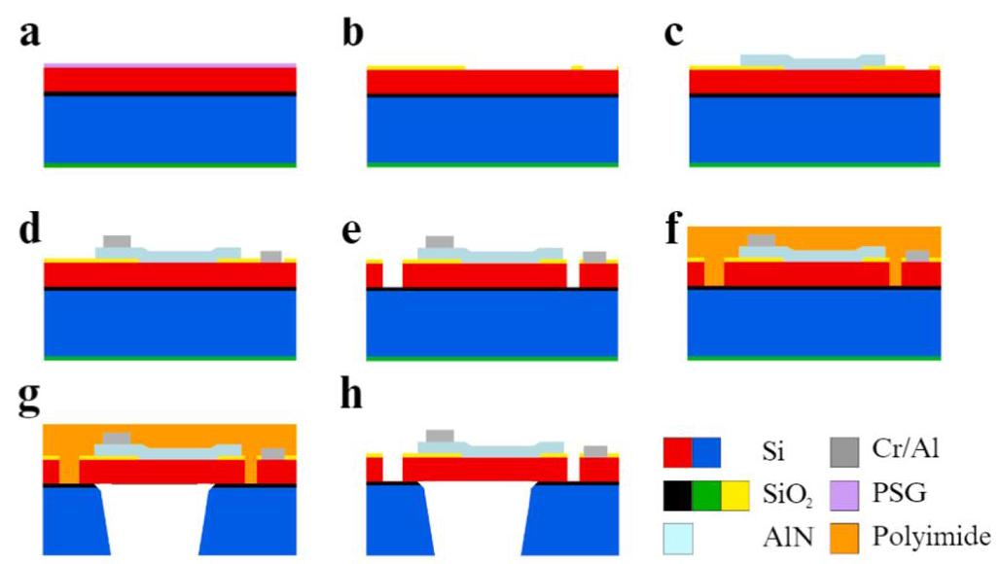

Fig. A1. Fabrication process of the TPoS MEMS devices[32]. a Silicon phosphorous doping by PSG layer; b thermal oxidization process; c AlN piezoelectric layer sputtering; d Cr/Au electrode deposition; e Silicon pattering by DRIE; f Protective polyimide coat formation; g Substrate pattering by DRIE; h Protection layer removal by dry etch process.

图A1. TPoS MEMS器件的制造工艺[32]。a 通过PSG层进行硅磷掺杂；b 热氧化工艺；c 溅射AlN压电层；d 沉积Cr/Au电极；e 通过深反应离子刻蚀进行硅图案化；f 形成保护性聚酰亚胺涂层；g 通过深反应离子刻蚀进行衬底图案化；h 通过干法蚀刻工艺去除保护层。

## B. Mode shapes Derivation

## B. 振型推导

The first two local mode shapes for the antisymmetric weakly coupled resonators are[31,43]:

反对称弱耦合谐振器的前两个局部振型为[31,43]:

${\varphi }_{1}\left( x\right)  =  - \cos \left( {1.8751x}\right)  + \cosh \left( {1.8751x}\right)  + \frac{\sinh \left( {1.8751}\right)  - \sin \left( {1.8751}\right) }{\cosh \left( {1.8751}\right)  - \cos \left( {1.8751}\right) }\left\lbrack  {\sin \left( {1.8751x}\right)  - \sinh \left( {1.8751x}\right) }\right\rbrack  ;$

$$
{\varphi }_{2}\left( x\right)  = {K}_{1}\left( {-\cos \left( \frac{4.73004x}{{R}_{L2}}\right)  + \cosh \left( \frac{4.73004x}{{R}_{L2}}\right)  + \frac{\sinh \left( \frac{4.73004}{{R}_{L2}}\right)  + \sin \left( \frac{4.73004}{{R}_{L2}}\right) }{\cosh \left( \frac{4.73004}{{R}_{L2}}\right)  - \cos \left( \frac{4.73004}{{R}_{L2}}\right) }\left\lbrack  {\sin \left( \frac{4.73004x}{{R}_{L2}}\right)  - \sinh \left( \frac{4.73004x}{{R}_{L2}}\right) }\right\rbrack  }\right)
$$

The first mode shape for the single cantilever is $\left\lbrack  {{31},{43}}\right\rbrack$ :

单悬臂梁的第一阶振型为$\left\lbrack  {{31},{43}}\right\rbrack$:

$$
{\varphi }_{3}\left( x\right)  = {K}_{2}\left( {-\cos \left( \frac{1.8751x}{{R}_{L3}}\right)  + \cosh \left( \frac{1.8751x}{{R}_{L3}}\right)  + \frac{\sinh \left( \frac{1.8751x}{{R}_{L3}}\right)  - \sin \left( \frac{1.8751x}{{R}_{L3}}\right) }{\cosh \left( \frac{1.8751x}{{R}_{L3}}\right)  - \cos \left( \frac{1.8751x}{{R}_{L3}}\right) }\left\lbrack  {\sin \left( \frac{1.8751x}{{R}_{L3}}\right)  - \sinh \left( \frac{1.8751x}{{R}_{L3}}\right) }\right\rbrack  }\right) ;
$$

The first mode shape for the single bridge is $\left\lbrack  {{31},{43}}\right\rbrack$ :

单桥的第一种振型为$\left\lbrack  {{31},{43}}\right\rbrack$:

$$
{\varphi }_{4}\left( x\right)  = {K}_{3}\left( {-\cos \left( \frac{4.73004x}{{R}_{L4}}\right)  + \cosh \left( \frac{4.73004x}{{R}_{L4}}\right)  + \frac{\sinh \left( \frac{4.73004}{{R}_{L4}}\right)  + \sin \left( \frac{4.73004}{{R}_{L4}}\right) }{\cosh \left( \frac{4.73004}{{R}_{L4}}\right)  - \cos \left( \frac{4.73004}{{R}_{L4}}\right) }\left\lbrack  {\sin \left( \frac{4.73004x}{{R}_{L4}}\right)  - \sinh \left( \frac{4.73004x}{{R}_{L4}}\right) }\right\rbrack  }\right) ;
$$

The coefficients ${K}_{1},{K}_{2}$ , and ${K}_{3}$ take values ensuring ${\int }_{0}^{{R}_{L2}}{\varphi }_{2}^{2}{dx} = 1,{\int }_{0}^{{R}_{L3}}{\varphi }_{3}^{2}{dx} = 1$ , and ${\int }_{0}^{{R}_{L4}}{\varphi }_{4}^{2}{dx} = 1$ .

系数${K}_{1},{K}_{2}$和${K}_{3}$取值以确保${\int }_{0}^{{R}_{L2}}{\varphi }_{2}^{2}{dx} = 1,{\int }_{0}^{{R}_{L3}}{\varphi }_{3}^{2}{dx} = 1$和${\int }_{0}^{{R}_{L4}}{\varphi }_{4}^{2}{dx} = 1$。

## Data availability

## 数据可用性

Data will be made available on request.

数据将根据请求提供。

## References

## 参考文献

[1] S.G. Dastider, A. Abdullah, I. Jasim, N.S. Yuksek, M. Dweik, M. Almasri, Lowconcentration E. coli O157:H7 bacteria sensing using microfluidic MEMS

使用微流体MEMS进行大肠杆菌O157:H7细菌浓度传感biosensor, Rev. Sci. Instrum. 89 (2018), https://doi.org/10.1063/1.5043424.

[2] X. Zou, A.A. Seshia, A high-resolution resonant MEMS accelerometer, in: 2015 Transducers - 2015 18th International Conference on Solid-State Sensors, Actuators and Microsystems, TRANSDUCERS 2015, Institute of Electrical and ElectronicsEngineers Inc., 2015: pp. 1247-1250. doi: 10.1109/ TRANSDUCERS.2015.7181156.

工程师公司，2015年:第1247 - 1250页。doi: 10.1109/ TRANSDUCERS.2015.7181156。

[3] M.I.A. Asri, M.N. Hasan, M.R.A. Fuaad, Y.M. Yunos, M.S.M. Ali, MEMS Gas Sensors: A Review, IEEE Sens. J. 21 (2021) 18381-18397, https://doi.org/10.1109/JSEN.2021.3091854.

JSEN.2021.3091854。

[4] M. Mousavi, M. Alzgool, B. Davaji, S. Towfighian, Event-driven MEMS vibrationsensor: Integration of triboelectric nanogenerator and low-frequency switch, Mech. Syst. Sig. Process. 187 (2023) 109921, https://doi.org/10.1016/j.ymssp.2022.109921.

传感器:摩擦纳米发电机与低频开关的集成，机械系统与信号处理187 (2023) 109921，https://doi.org/10.1016/j.ymssp.2022.109921。

[5] X. Han, Q. Mao, L. Zhao, X. Li, L. Wang, P. Yang, D. Lu, Y. Wang, X. Yan, S. Wang,N. Zhu, Z. Jiang, Novel resonant pressure sensor based on piezoresistive detection

朱N，姜Z，基于压阻检测的新型谐振压力传感器and symmetrical in-plane mode vibration, Microsyst. Nanoeng. 6 (2020) 95,https://doi.org/10.1038/s41378-020-00207-0.

[6] J. Qian, H. Begum, J.-E.-Y. Lee, Acoustofluidic localization of sparse particles on apiezoelectric resonant sensor for nanogram-scale mass measurements, Microsyst. Nanoeng. 7 (2021) 61, https://doi.org/10.1038/s41378-021-00288-5.

用于纳克级质量测量的压电谐振传感器，微系统与纳米工程7 (2021) 61，https://doi.org/10.1038/s41378-021-00288-5。

[7] A.Z. Hajjaj, N. Jaber, N. Alcheikh, M.I. Younis, A Resonant Gas Sensor Based onMultimode Excitation of a Buckled Microbeam, IEEE Sens. J. 20 (2020) 1778-1785, https://doi.org/10.1109/JSEN.2019.2950495.

屈曲微梁的多模激励，IEEE传感器杂志20 (2020) 1778 - 1785，https://doi.org/10.1109/JSEN.2019.2950495。

[8] Z. Fang, S. Theodossiades, N. Jaber, A.Z. Hajjaj, Gas Sensor Based on Nonlinear Coupled AlN-Piezoelectric Micromachined Resonators, in: 2023 IEEE SENSORS,IEEE, 2023: pp. 1-4. doi: 10.1109/SENSORS56945.2023.10324875.

IEEE，2023年:第1 - 4页。doi: 10.1109/SENSORS56945.2023.10324875。

[9] Y. Terzioglu, S.E. Alper, K. Azgin, T. Akin, A capacitive MEMS accelerometerreadout with concurrent detection and feedback using discrete components, in:

使用分立元件进行并发检测和反馈的读出，见:2014 IEEE/ION Position, Location and Navigation Symposium - PLANS 2014, IEEE,2014: pp. 12-15. doi: 10.1109/PLANS.2014.6851351.

2014年:第12 - 15页。doi: 10.1109/PLANS.2014.6851351。

[10] M. Ahmadian, K. Jafari, M. Javad Sharifi, C. Kian Jafari, Novel graphene-basedoptical MEMS accelerometer dependent on intensity modulation, (2018). doi: 10.4218/etrij.2017-0309.

基于强度调制的光学MEMS加速度计，(2018)。doi: 10.4218/etrij.2017-0309。

[11] A.Z. Hajjaj, N. Alcheikh, M.A.A. Hafiz, S. Ilyas, M.I. Younis, A scalable pressuresensor based on an electrothermally and electrostatically operated resonator, Appl. Phys. Lett. 111 (2017), https://doi.org/10.1063/1.5003563.

基于电热和静电操作谐振器的传感器，应用物理快报111 (2017)，https://doi.org/10.1063/1.5003563。

[12] N. Alcheikh, A.Z. Hajjaj, N. Jaber, M.I. Younis, Electrothermally actuated tunableclamped-guided resonant microbeams, Mech. Syst. Sig. Process. 98 (2018) 1069-1076, https://doi.org/10.1016/j.ymssp.2017.05.049.

夹持 - 导向谐振微梁，机械系统与信号处理98 (2018) 1069 - 1076，https://doi.org/10.1016/j.ymssp.2017.05.049。

[13] A. Gao, K. Liu, J. Liang, T. Wu, AlN MEMS filters with extremely high bandwidth widening capability, Microsyst. Nanoeng. 6 (2020) 74, https://doi.org/10.1038/s41378-020-00183-5.

[14] X. Gong, Y.-C. Kuo, G. Zhou, W.-J. Wu, W.-H. Liao, An aerosol deposition basedMEMS piezoelectric accelerometer for low noise measurement, Microsyst. Nanoeng. 9 (2023) 23, https://doi.org/10.1038/s41378-023-00484-5.

用于低噪声测量的MEMS压电加速度计，微系统与纳米工程9 (2023) 23，https://doi.org/10.1038/s41378-023-00484-5。

[15] H. Fatemi, M.J. Modarres-Zadeh, R. Abdolvand, Passive wireless temperaturesensing with piezoelectric MEMS resonators, in: IEEE International Conference on

使用压电MEMS谐振器进行传感，发表于:IEEE国际会议Micro Electro Mechanical Systems (MEMS), 2015, pp. 909-912, https://doi.org/10.1109/MEMSYS.2015.7051107.

10.1109/MEMSYS.2015.7051107.

[16] A. Ali, J.-E.-Y. Lee, Piezoelectric-on-Silicon Square Wine-Glass Mode Resonator forEnhanced Electrical Characterization in Water, IEEE Trans. Electron Devices 65

水中的增强电学特性，《IEEE电子器件汇刊》65(2018) 1925-1931, https://doi.org/10.1109/TED.2018.2810700.

[17] C.-H. Weng, G. Pillai, S.-S. Li, A Thin-Film Piezoelectric-on-Silicon MEMS Oscillator for Mass Sensing Applications, IEEE Sens. J. 20 (2020) 7001-7009,https://doi.org/10.1109/JSEN.2020.2979283.

[18] N. Alcheikh, S. Ben, H.M. Mbarek, M.I.Y. Ouakad, A highly sensitive and wide-range resonant magnetic micro-sensor based on a buckled micro-beam, Sens Actuators A Phys 328 (2021) 112768, https://doi.org/10.1016/j.sna.2021.112768.

基于弯曲微梁的宽范围谐振磁微传感器，《传感器与执行器A:物理》328 (2021) 112768，https://doi.org/10.1016/j.sna.2021.112768.

[19] A. Kanj, P. Ferrari, A.M. van der Zande, A.F. Vakakis, S. Tawfick, Ultra-Tuning ofnonlinear drumhead MEMS resonators by Electro-Thermoelastic buckling, Mech. Syst. Sig. Process. 196 (2023) 110331, https://doi.org/10.1016/j.ymssp.2023.110331.

通过电热弹性屈曲实现的非线性鼓膜MEMS谐振器，《机械系统与信号处理》196 (2023) 110331，https://doi.org/10.1016/j.ymssp.2023.110331.

[20] Y. Kessler, S. Krylov, A. Liberzon, Flow sensing by buckling monitoring ofelectrothermally actuated double-clamped micro beams, Appl. Phys. Lett. 109

电热驱动的双端固定微梁，《应用物理快报》109(2016), https://doi.org/10.1063/1.4961582.

[21] B. Camescasse, A. Fernandes, J. Pouget, Bistable buckled beam and force actuation: Experimental validations, Int. J. Solids Struct. 51 (2014) 1750-1757, https://doi.org/10.1016/j.ijsolstr.2014.01.017.

org/10.1016/j.ijsolstr.2014.01.017.

[22] J.-S. Choi, W.-T. Park, MEMS particle sensor based on resonant frequency shifting,Micro Nano Syst. Lett. 8 (2020) 17, https://doi.org/10.1186/s40486-020-00118-9.

《微纳系统快报》8 (2020) 17，https://doi.org/10.1186/s40486-020-00118-9.

[23] R. Blue, J.G. Brown, L. Li, R. Bauer, D. Uttamchandani, MEMS Gas Flow SensorBased on Thermally Induced Cantilever Resonance Frequency Shift, IEEE Sens. J. 20 (2020) 4139-4146, https://doi.org/10.1109/JSEN.2020.2964323.

基于热诱导悬臂梁共振频率偏移，《IEEE传感器杂志》20 (2020) 4139 - 4146，https://doi.org/10.1109/JSEN.2020.2964323.

[24] H. Jia, P. Xu, X. Li, Integrated Resonant Micro/Nano Gravimetric Sensors for Bio/ Chemical Detection in Air and Liquid, Micromachines (basel) 12 (2021) 645,https://doi.org/10.3390/mi12060645.

[25] Y. Zhang, Y. Liu, L. Zhou, D. Liu, F. Liu, F. Liu, X. Liang, X. Yan, Y. Gao, G. Lu, Therole of Ce doping in enhancing sensing performance of ZnO-based gas sensor by adjusting the proportion of oxygen species, Sens Actuators B Chem 273 (2018) 991-998, https://doi.org/10.1016/j.snb.2018.05.167.

Ce掺杂通过调节氧物种比例在增强ZnO基气体传感器传感性能中的作用，《传感器与执行器B:化学》273 (2018) 991 - 998，https://doi.org/10.1016/j.snb.2018.05.167.

[26] L. Zhu, W. Zeng, Room-temperature gas sensing of ZnO-based gas sensor: A review,Sens Actuators A Phys 267 (2017) 242-261, https://doi.org/10.1016/j.sna.2017.10.021.

《传感器与执行器A:物理》267 (2017) 242 - 261，https://doi.org/10.1016/j.sna.2017.10.021.

[27] G. Konvalina, H. Haick, Effect of Humidity on Nanoparticle-Based Chemiresistors:A Comparison between Synthetic and Real-World Samples, ACS Appl. Mater. Interfaces 4 (2012) 317-325, https://doi.org/10.1021/am2013695.

合成样品与实际样品的比较，《美国化学会应用材料与界面》4 (2012) 317 - 325，https://doi.org/10.1021/am2013695.

[28] A. Kumar, R. Prajesh, The potential of acoustic wave devices for gas sensing applications, Sens Actuators A Phys 339 (2022) 113498, https://doi.org/10.1016/j.sna.2022.113498.

j.sna.2022.113498.

[29] A. Mahdavifar, M. Navaei, P.J. Hesketh, M. Findlay, J.R. Stetter, G.W. Hunter,Transient thermal response of micro-thermal conductivity detector (μTCD) for the identification of gas mixtures: An ultra-fast and low power method, Microsyst. Nanoeng. 1 (2015), https://doi.org/10.1038/micronano.2015.25.

用于气体混合物识别的微热导率探测器(μTCD)的瞬态热响应:一种超快速低功耗方法，《微系统与纳米工程》1 (2015)，https://doi.org/10.1038/micronano.2015.25.

[30] U. Yaqoob, W.B. Lenz, N. Alcheikh, N. Jaber, M.I. Younis, Highly selective multiplegases detection using a thermal-conductivity-based MEMS resonator and machine learning, IEEE Sens J (2022) 1-1. doi: 10.1109/JSEN.2022.3203816.

使用基于热导率的MEMS谐振器和机器学习进行气体检测，《IEEE传感器杂志》(2022) 1 - 1。doi: 10.1109/JSEN.2022.3203816.

[31] Z. Fang, S. Theodossiades, L. Ruzziconi, A.Z. Hajjaj, A multi-sensing scheme basedon nonlinear coupled micromachined resonators, Nonlinear Dyn. 111 (2023) 8021-8038, https://doi.org/10.1007/s11071-023-08294-0.

关于非线性耦合微机械谐振器，《非线性动力学》111 (2023) 8021 - 8038，https://doi.org/10.1007/s11071-023-08294-0.

[32] MEMSCAP, (n.d.). http://www.memscap.com (accessed June 15, 2023).

[33] M.A.A. Hafiz, L. Kosuru, M.I. Younis, Microelectromechanical reprogrammable logic device, Nat. Commun. 7 (2016) 11137, https://doi.org/10.1038/ncomms11137.

ncomms11137.

[34] C. Ayela, L. Nicu, C. Soyer, E. Cattan, C. Bergaud, Determination of the d31piezoelectric coefficient of PbZrxTi1-xO3 thin films using multilayer buckled

使用多层弯曲结构的PbZrxTi1-xO3薄膜的压电系数micromembranes, J. Appl. Phys. 100 (2006), https://doi.org/10.1063/1.2338139.

[35] A.Z. Hajjaj, N. Alcheikh, M.I. Younis, The static and dynamic behavior of MEMSarch resonators near veering and the impact of initial shapes, Int. J. Non Linear Mech. 95 (2017) 277-286, https://doi.org/10.1016/j.ijnonlinmec.2017.07.002.

接近转向处的拱形谐振器以及初始形状的影响，《国际非线性力学杂志》95 (2017) 277 - 286，https://doi.org/10.1016/j.ijnonlinmec.2017.07.002。

[36] M.I. Younis, MEMS Linear and Nonlinear Statics and Dynamics, Springer US, Boston, MA (2011), https://doi.org/10.1007/978-1-4419-6020-7.

[37] S. Timoshenko, Strength Mater. (1940).

[38] S. Yenuganti, M. Peparthi, Improved energy harvesting from a clamped-clamped micro beam with cavity, Microsyst. Technol. 27 (2021) 2773-2783, https://doi.org/10.1007/s00542-020-05075-2.

org/10.1007/s00542-020-05075-2。

[39] COMSOL, (2022). https://www.comsol.com/ (accessed November 24, 2022).

[40] XPPAuto, XPP-Auto, (2003). https://sites.pitt.edu/~phase/bard/bardware/tut/start.html#toc (accessed July 22, 2024).

start.html#toc(于2024年7月22日访问)。

[41] M. Sansa, E. Sage, E.C. Bullard, M. Gély, T. Alava, E. Colinet, A.K. Naik, L.G. Villanueva, L. Duraffourg, M.L. Roukes, G. Jourdan, S. Hentz, Frequency

G. 比利亚努埃瓦、L. 杜拉富尔格、M.L. 鲁克斯、G. 茹尔丹、S. 亨茨，频率fluctuations in silicon nanoresonators, Nat. Nanotechnol. 11 (2016) 552-558,https://doi.org/10.1038/nnano.2016.19.

[42] A.Z. Hajjaj, N. Jaber, M.A.A. Hafiz, S. Ilyas, M.I. Younis, Multiple internal resonances in MEMS arch resonators, Phys. Lett. A 382 (2018) 3393-3398, https://doi.org/10.1016/j.physleta.2018.09.033.

doi.org/10.1016/j.physleta.2018.09.033。

[43] Z. Fang, S. Theodossiades, A.Z. Hajjaj, Triple sensing scheme based on nonlinear coupled micromachined resonators, Nonlinear Dyn. (2023), https://doi.org/10.1007/s11071-023-08674-6.