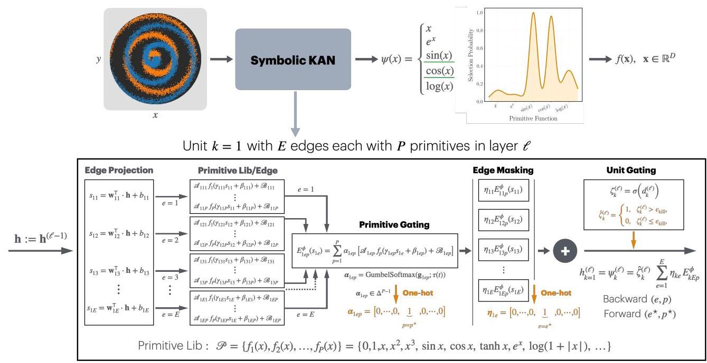
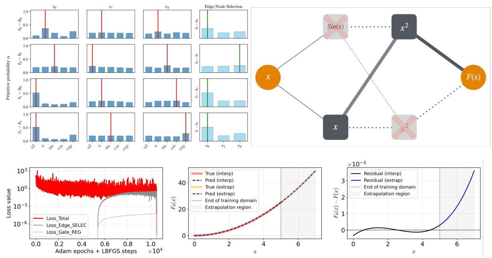
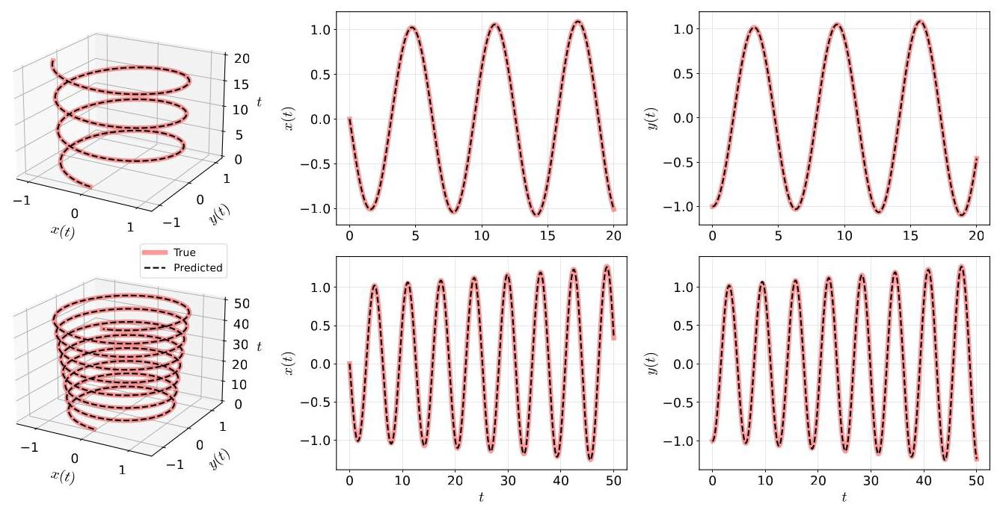
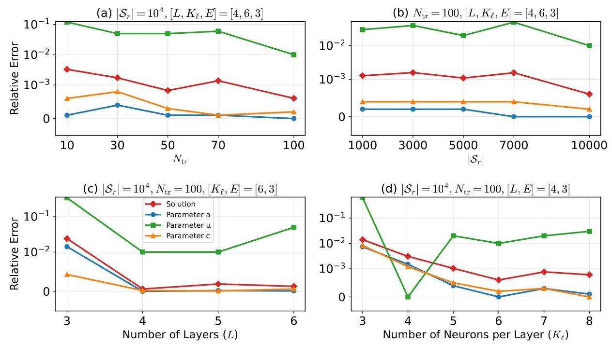
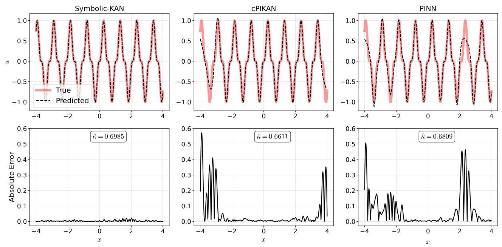
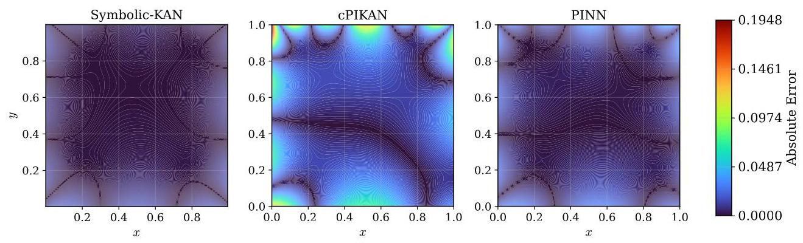

# Symbolic-KAN: Kolmogorov-Arnold Networks with Discrete Symbolic Structure for Interpretable Learning

# 符号化KAN:具有离散符号结构的用于可解释学习的柯尔莫哥洛夫-阿诺德网络

Salah A Faroughi ${}^{\mathrm{a}, * }$ , Farinaz Mostajeran ${}^{\mathrm{a}}$ , Amirhossein Arzani ${}^{\mathrm{b},\mathrm{c},\mathrm{d}}$ , Shirko Faroughie

萨拉赫·A·法鲁吉${}^{\mathrm{a}, * }$，法里纳兹·莫斯塔杰兰${}^{\mathrm{a}}$，阿米尔侯赛因·阿尔扎尼${}^{\mathrm{b},\mathrm{c},\mathrm{d}}$，希尔科·法鲁吉

${}^{a}$ Energy &Intelligence Lab, Department of Chemical Engineering, University of Utah, Salt Lake City, Utah,84112, USA ${}^{b}$ Department of Mechanical Engineering, University of Utah, Salt Lake City, Utah,84112, USA

${}^{a}$ 能源与智能实验室，美国犹他大学化学工程系，盐湖城，犹他州，84112 ${}^{b}$ 美国犹他大学机械工程系，盐湖城，犹他州，84112

${}^{c}$ Scientific Computing and Imaging Institute, University of Utah, Salt Lake City, Utah,84112, USA

${}^{c}$ 美国犹他大学科学计算与成像研究所，盐湖城，犹他州，84112

${}^{d}$ Department of Biomedical Engineering, University of Utah, Salt Lake City, Utah,84112, USA

${}^{d}$ 美国犹他大学生物医学工程系，盐湖城，犹他州，84112

${}^{e}$ Department of Mechanical Engineering, School of Engineering, Urmia University of Technology, Urmia, Iran

${}^{e}$ 伊朗乌尔米亚理工大学工程学院机械工程系

## Abstract

## 摘要

Symbolic discovery of governing equations is a long-standing goal in scientific machine learning, yet a fundamental trade-off persists between interpretability and scalable learning. Classical symbolic regression methods yield explicit analytic expressions but rely on combinatorial search, whereas neural networks scale efficiently with data and dimensionality but produce opaque representations. In this work, we introduce Symbolic Kolmogorov-Arnold Networks (Symbolic-KANs), a neural architecture that bridges this gap by embedding discrete symbolic structure directly within a trainable deep network. Symbolic-KANs represent multivariate functions as compositions of learned univariate primitives applied to learned scalar projections, guided by a library of analytic primitives, hierarchical gating, and symbolic regularization that progressively sharpens continuous mixtures into one-hot selections. After gated training and discretization, each active unit selects a single primitive and projection direction, yielding compact closed-form expressions without post-hoc symbolic fitting. Symbolic-KANs further act as scalable primitive discovery mechanisms, identifying the most relevant analytic components that can subsequently inform candidate libraries for sparse equation-learning methods. We demonstrate that Symbolic-KAN reliably recovers correct primitive terms and governing structures in data-driven regression and inverse dynamical systems. Moreover, the framework extends to forward and inverse physics-informed learning of partial differential equations, producing accurate solutions directly from governing constraints while constructing compact symbolic representations whose selected primitives reflect the true analytical structure of the underlying equations. These results position Symbolic-KAN as a step toward scalable, interpretable, and mechanistically grounded learning of governing laws.

控制方程的符号发现是科学机器学习中的一个长期目标，但在可解释性和可扩展学习之间仍然存在基本的权衡。经典的符号回归方法能产生明确的解析表达式，但依赖组合搜索，而神经网络能随数据和维度高效扩展，但产生不透明的表示。在这项工作中，我们引入了符号柯尔莫哥洛夫-阿诺德网络(Symbolic-KANs)，这是一种通过将离散符号结构直接嵌入可训练深度网络来弥合这一差距的神经架构。Symbolic-KANs将多元函数表示为应用于学习到的标量投影的学习到的单变量基元的组合，由解析基元库、分层门控和符号正则化引导，这些逐渐将连续混合锐化为独热选择。经过门控训练和离散化后，每个活动单元选择一个单一基元和投影方向，产生紧凑的闭式表达式，无需事后符号拟合。Symbolic-KANs还作为可扩展的基元发现机制，识别最相关的解析组件，这些组件随后可为稀疏方程学习方法的候选库提供信息。我们证明Symbolic-KAN在数据驱动的回归和逆动力学系统中可靠地恢复正确的基元项和控制结构。此外，该框架扩展到偏微分方程的正向和逆物理信息学习，直接从控制约束产生精确解，同时构建紧凑的符号表示，其选择的基元反映基础方程的真实解析结构。这些结果将Symbolic-KAN定位为朝着可扩展、可解释和基于机制的控制律学习迈出的一步。

Keywords: Physics-informed Neural Networks, Kolmogorov-Arnold Network, Symbolic Regression, Interpretable Learning, Gated Learning, Scientific Machine Learning

关键词:物理信息神经网络、柯尔莫哥洛夫-阿诺德网络、符号回归、可解释学习、门控学习、科学机器学习

## 1. Introduction

## 1. 引言

Scientific machine learning (SciML) has become a central paradigm for building predictive and surrogate models in science and engineering, where the goal is often to learn complex constitutive relations, closure laws, or operators directly from data while respecting physical structure and constraints [1-4]. Deep neural networks, and in particular multilayer perceptrons (MLPs), have enabled impressive advances in this direction, but their success has also amplified concerns about opacity, lack of trust, and difficulty in diagnosing or correcting failure modes [4]. In many applications, domain experts need not only accurate predictions but also compact, human-readable expressions that can be inspected, analyzed, and embedded into existing (mechanistic) modeling pipelines [5, 7]. This motivates symbolic regression approaches as well as neural architectures that can admit symbolic interpretation, rather than relying solely on post-hoc explanations [8, 10]. Kolmogorov-Arnold networks (KANs) offer a promising step in this direction [11, 12]. By construction, they parameterize a multivariate mapping as a superposition of trainable univariate functions and linear combinations, echoing the Kolmogorov-Arnold representation theorem 13-17. Because KANs learn explicit one-dimensional basis function, often implemented as splines or other simple function families and polynomials, their internal structure is much closer to an analytic formula than that of conventional MLPs [18, 22], suggesting that KANs could naturally bridge neural modeling and symbolic regression.

科学机器学习(SciML)已成为科学和工程中构建预测和代理模型的核心范式，其目标通常是在尊重物理结构和约束的同时直接从数据中学习复杂的本构关系、封闭定律或算子[1-4]。深度神经网络，特别是多层感知器(MLP)，在这个方向上取得了令人瞩目的进展，但它们的成功也加剧了对不透明性、缺乏信任以及诊断或纠正失败模式困难的担忧[4]。在许多应用中，领域专家不仅需要准确的预测，还需要紧凑、人类可读的表达式，这些表达式可以被检查、分析并嵌入到现有的(机械)建模管道中[5, 7]。这推动了符号回归方法以及能够接受符号解释的神经架构的发展，而不是仅仅依赖事后解释[8, 10]。柯尔莫哥洛夫-阿诺德网络(KANs)在这个方向上迈出了有希望的一步[11, 12]。通过构造，它们将多元映射参数化为可训练单变量函数和线性组合的叠加，呼应了柯尔莫哥洛夫-阿诺德表示定理[13-17]。因为KANs学习明确的一维基函数，通常实现为样条或其他简单函数族以及多项式，它们的内部结构比传统MLP更接近解析公式[18, 22]，这表明KANs可以自然地弥合神经建模和符号回归之间的差距。

To address the needs for symbolic output to uncover governing laws directly from observations, a rich body of interpretable, data-driven modeling approaches has emerged beyond traditional system identification pipelines [5]. Symbolic regression methods, particularly those based on genetic algorithms, search over compositions of mathematical operators to construct compact analytic expressions of dynamical systems, enabling flexible model discovery without requiring prior parametric assumptions [23, 24]. Although powerful, these strategies often suffer from high computational cost and phenomena such as expression bloat, which can reduce interpretability and generalization [6, 23, 25]. Complementing symbolic regression, sparsity-promoting library-based frameworks such as the Sparse Identification of Nonlinear Dynamics (SINDy) leverage libraries of candidate functions and sparse regularization to identify parsimonious governing equations [26]. SINDy has been applied successfully in diverse settings, e.g., fluid dynamics, chaotic dynamical systems, and chemical processes 27-30. It has also been extended for active learning and control 31, stochastic dynamics [32], nonlinear reduced-order modeling [33], equation-based operator learning [34], and Bayesian learning [35] (among other developments [36]). These advances offer interpretable and computationally efficient alternatives to symbolic regression when suitable candidate terms are known. Recent enhancements, such as ADAM-SINDy [7], integrate SINDy with modern gradient-based optimization to simultaneously infer coefficients and nonlinear parameters, e.g., frequencies, exponential rates, and non-integer exponents, addressing key limitations of SINDY's classical library-based search, which require prior knowledge of nonlinear parameters. A major limitation of these methods is that they cannot inherently generate new combinations of candidate terms from the library, which means important structures are overlooked unless they are explicitly included as individual terms in that library. Recent advances attempt to alleviate these issues from complementary directions. SINDy-KANs 37 embed sparse regression within Kolmogorov-Arnold networks, enabling hierarchical discovery of nonlinear compositions while enforcing sparsity at the level of individual activation functions, thereby reducing reliance on large global candidate libraries. In parallel, State-Space KANs [12] integrate KANs into structured dynamical models, modeling nonlinear state transitions within a physically meaningful state-space framework and improving interpretability through decomposed univariate representations, while operating directly in discrete time without requiring numerical differentiation. Such combinations point toward more parsimonious, interpretable, and mechanistically grounded representations, with improved alignment to the underlying physics, particularly when the governing structure is not known a priori.

为了满足通过符号输出直接从观测中揭示控制定律的需求，除了传统的系统识别流程[5]之外，还涌现出了大量可解释的、数据驱动的建模方法。符号回归方法，特别是基于遗传算法的方法，在数学运算符的组合中进行搜索，以构建动力系统的紧凑解析表达式，从而在无需先验参数假设的情况下实现灵活的模型发现[23, 24]。尽管这些策略很强大，但它们往往面临高计算成本以及诸如表达式膨胀等现象，这可能会降低可解释性和泛化能力[6, 23, 25]。作为符号回归的补充，基于稀疏性促进库的框架，如非线性动力学的稀疏识别(SINDy)，利用候选函数库和稀疏正则化来识别简洁的控制方程[26]。SINDy已在各种不同的场景中成功应用，例如流体动力学、混沌动力系统和化学过程[27 - 30]。它还被扩展用于主动学习和控制[31]、随机动力学[32]、非线性降阶建模[33]、基于方程的算子学习[34]以及贝叶斯学习[35](以及其他发展[36])。当已知合适的候选项时，这些进展为符号回归提供了可解释且计算高效的替代方法。最近的改进，如ADAM - SINDy[7]，将SINDy与现代基于梯度的优化相结合，以同时推断系数和非线性参数，例如频率、指数率和非整数指数，解决了SINDY经典基于库搜索的关键限制，后者需要非线性参数的先验知识。这些方法的一个主要限制是它们不能从库中固有地生成候选项的新组合，这意味着除非重要结构被明确作为单个项包含在该库中，否则它们会被忽略。最近的进展试图从互补的方向缓解这些问题。SINDy - KANs[37]将稀疏回归嵌入到柯尔莫哥洛夫 - 阿诺德网络中，在强制单个激活函数层面的稀疏性的同时，实现非线性组合的分层发现，从而减少对大型全局候选库的依赖。与此同时，状态空间KANs[12]将KANs集成到结构化动力模型中，在物理意义明确的状态空间框架内对非线性状态转换进行建模，并通过分解的单变量表示提高可解释性，同时直接在离散时间内运行，无需数值微分。这种结合指向了更简洁、可解释且基于机理的表示，与基础物理的一致性得到改善，特别是在控制结构事先未知的情况下。

---

*Corresponding author: salah.faroughi@utah.edu

*通讯作者:salah.faroughi@utah.edu

---

KANs have recently emerged as a flexible alternative to MLPs in several major SciML workflows, including purely data-driven learning, physics-informed training, and neural operator learning [18-22, 38-40]. Our recent review on KANs versus MLPs [11] clearly highlights both the strengths and the limitations of KANs. In the data-driven setting, KAN variants have been shown to achieve improved accuracy, data efficiency, and robustness across regression, classification, and sequence-modeling benchmarks by replacing fixed nonlinear activations with learned univariate bases along each edge [41, 45]. Physics-informed KANs (PIKANs) embed governing equations, residuals, or conservation laws directly into the training objective, leveraging the structured representation to improve stability and convergence relative to PINNs based on MLPs [46-50]. In parallel, operator-learning architectures that integrate KAN blocks into DeepONet-like or Fourier-operator frameworks have demonstrated competitive or superior performance to classical neural operators, particularly on problems with strong multiscale structure or irregular inputs [51, 52]. Across these regimes, comparisons against MLP-based PINNs, DeepONets, and related baselines indicate that KANs can reduce training stiffness, mitigate spectral bias, and provide smoother function approximations [11, 18, 22]. The expressive power of KANs is driven by their choice of univariate basis functions and associated parameterizations [11]. Existing KAN architectures predominantly rely on B-spline or piecewise-polynomial primitives, often implemented as trainable spline bases with learnable knot locations or adaptive weights [18, 19, 38, 39, 42]. Other variants incorporate Fourier-type primitives to better capture oscillatory structure [52], or draw on wavelet constructions and multi-resolution analysis to represent localized, multiscale features [53, 54]. While these design choices improve approximation quality and training dynamics, the resulting global expressions obtained by composing many learned basis functions can quickly become long and unwieldy. Even though each primitive is individually simple, the overall functional form represented by a deep KAN can be as opaque as that of a standard MLP when written out symbolically, which limits its usefulness as a genuinely interpretable or mechanistic model. In practice, directly reading off a compact governing equation or constitutive relation from a trained basic KAN (i.e., using a fixed form of learnable basis information) remains challenging, especially in higher-dimensional settings.

在包括纯数据驱动学习、物理信息训练和神经算子学习等几个主要的科学机器学习工作流程中，KAN最近已成为MLP的一种灵活替代方案[18 - 22, 38 - 40]。我们最近关于KAN与MLP的综述[11]清楚地突出了KAN的优势和局限性。在数据驱动的环境中，通过沿每条边用学习到的单变量基替换固定的非线性激活函数，KAN变体已被证明在回归、分类和序列建模基准测试中能够提高准确性、数据效率和鲁棒性[41, 45]。物理信息KAN(PIKAN)将控制方程、残差或守恒定律直接嵌入训练目标中，利用结构化表示相对于基于MLP的PINN提高稳定性和收敛性[46 - 50]。同时，将KAN块集成到类似DeepONet或傅里叶算子框架中的算子学习架构，已证明在性能上与经典神经算子具有竞争力或更优，特别是在具有强多尺度结构或不规则输入的问题上[51, 52]。在这些情况下，与基于MLP的PINN、DeepONet和相关基线的比较表明，KAN可以降低训练刚度，减轻频谱偏差，并提供更平滑的函数逼近[11, 18, 22]。KAN的表达能力由其对单变量基函数的选择和相关参数化驱动[11]。现有的KAN架构主要依赖于B样条或分段多项式基元，通常实现为具有可学习节点位置或自适应权重的可训练样条基[18, 19, 38, 39, 42]。其他变体纳入傅里叶型基元以更好地捕捉振荡结构[52]，或利用小波构造和多分辨率分析来表示局部多尺度特征[53, 54]。虽然这些设计选择提高了逼近质量和训练动态，但通过组合许多学习到的基函数得到的全局表达式可能很快变得冗长且难以处理。尽管每个基元本身都很简单，但当以符号形式写出时，深度KAN表示的整体函数形式可能与标准MLP一样不透明，这限制了它作为真正可解释或机械模型的有用性。在实践中，直接从训练好的基本KAN中读出紧凑的控制方程或本构关系(即使用固定形式的可学习基信息)仍然具有挑战性，特别是在高维设置中。

Motivated by the aforementioned challenges in sparsity-based methods and baseline KANs, we introduce a symbolic Kolmogorov-Arnold Network (Symbolic-KAN) framework that bridges these two paradigms. Symbolic-KAN is a neural architecture that embeds discrete symbolic structure directly within a trainable deep network. It models multivariate functions as compositions of learned univariate primitives acting on learned scalar projections, guided by a library of analytic primitives, a hierarchical gating mechanism, and symbolic regularization that progressively refines soft mixtures into one-hot selections (i.e., low-complexity representations). After gated training and subsequent discretization, each active unit commits to a single primitive and a single projection direction, yielding compact closed-form expressions without requiring post-hoc symbolic regression. Symbolic-KAN replaces conventional KAN formulations that rely on fixed basis functions [11], such as B-splines [20, 55] or Chebyshev polynomials [47], with a formulation in which candidate primitives are dynamically refined and sparsity is enforced over a reduced, data-informed functional space. This results in discrete, low-complexity symbolic surrogates aligned with the Kolmogorov-Arnold representation. In this way, Symbolic-KAN acts as a scalable mechanism for discovering informative primitives, isolating key analytic components that can subsequently be assembled into candidate libraries for sparse equation-learning frameworks when appropriate structures are hypothesized (i.e., serving as a pre-library selector for sparsity-based methods).

受基于稀疏性方法和基线KAN中上述挑战的启发，我们引入了一个符号柯尔莫哥洛夫 - 阿诺德网络(Symbolic - KAN)框架，该框架弥合了这两种范式。Symbolic - KAN是一种神经架构，它将离散符号结构直接嵌入到可训练的深度网络中。它将多元函数建模为作用于学习到的标量投影的学习到的单变量基元的组合，由解析基元库、分层门控机制和符号正则化引导，该正则化将软混合逐步细化为独热选择(即低复杂度表示)。经过门控训练和随后的离散化后，每个活动单元致力于单个基元和单个投影方向，产生紧凑的封闭形式表达式，而无需事后符号回归。Symbolic - KAN用一种公式取代了依赖于固定基函数(如B样条[20, 55]或切比雪夫多项式[47])的传统KAN公式，在这种公式中，候选基元被动态细化，并且在减少的、数据驱动的函数空间上强制稀疏性。这导致与柯尔莫哥洛夫 - 阿诺德表示对齐的离散、低复杂度符号替代物。通过这种方式，Symbolic - KAN作为一种可扩展机制，用于发现信息丰富的基元，隔离关键的解析组件，当假设适当的结构时，这些组件随后可被组装到用于稀疏方程学习框架的候选库中(即作为基于稀疏性方法的预库选择器)。

We demonstrate that Symbolic-KAN recovers correct primitive terms in data-driven regression and identifies governing structures in dynamical systems. Furthermore, the framework extends to physics-informed learning of partial differential equations in both forward and inverse settings, where it learns accurate solutions directly from data and governing constraints while producing compact symbolic surrogates that reflect the analytical structure of the solution and/or underlying PDEs. While Symbolic-KAN improves structural identifiability and yields clearer functional forms, it does not fully resolve the long-standing challenges of neural network extrapolation and out-of-distribution generalization [6, 34, 56, 57]. Rather, it provides a principled step toward models that are both scalable and amenable to symbolic inspection, laying the groundwork for future developments in robust, interpretable neural solvers and operator learning. The formulation of Symbolic-KAN is detailed in Section 2 results are presented in Section 3 and concluding remarks are provided in Section 4

我们证明Symbolic - KAN在数据驱动回归中恢复正确的基元项，并识别动力系统中的控制结构。此外，该框架扩展到正向和反向设置下偏微分方程的物理信息学习，在其中它直接从数据和控制约束中学习准确的解，同时产生反映解和/或底层偏微分方程解析结构的紧凑符号替代物。虽然Symbolic - KAN提高了结构可识别性并产生更清晰的函数形式，但它并没有完全解决神经网络外推和分布外泛化的长期挑战[6, 34, 56, 57]。相反，它为可扩展且适合符号检查的模型提供了一个有原则的步骤，为强大、可解释的神经求解器和算子学习的未来发展奠定了基础。Symbolic - KAN的公式在第2节中详细介绍，结果在第3节中展示，结论性评论在第4节中提供。

## 2. Symbolic Kolmogorov-Arnold Networks

## 2. 符号柯尔莫哥洛夫 - 阿诺德网络

In this section, we introduce the proposed Symbolic Kolmogorov-Arnold network (Symbolic-KAN) framework and describe its architectural and training components. The formulation begins by defining the overall network representation and its relation to the Kolmogorov-Arnold representation theory. We then detail the construction of individual units, which combine learnable scalar projections with a library of analytic univariate primitives. To enable interpretable structure discovery, we present a gated training strategy that gradually transforms soft combinations of primitives into discrete selections. Finally, we present the loss function and the complete training pipeline employed to learn compact symbolic representations of the underlying data or governing equations.

在本节中，我们介绍了所提出的符号柯尔莫哥洛夫 - 阿诺德网络(Symbolic-KAN)框架，并描述了其架构和训练组件。公式推导从定义整体网络表示及其与柯尔莫哥洛夫 - 阿诺德表示理论的关系开始。然后，我们详细说明了各个单元的构建，这些单元将可学习的标量投影与解析单变量基元库相结合。为了实现可解释的结构发现，我们提出了一种门控训练策略，该策略将基元的软组合逐渐转换为离散选择。最后，我们给出了损失函数和用于学习基础数据或控制方程的紧凑符号表示的完整训练流程。

### 2.1. Network Formulation

### 2.1. 网络公式化

Symbolic-KAN follows the Kolmogorov-Arnold representation theorem (KART) [58, 60] that states any continuous multivariate function $F\left( \mathbf{\xi }\right)  : {\left\lbrack  0,1\right\rbrack  }^{n} \rightarrow  \mathbb{R}$ can be represented as a finite superposition of univariate functions and additions. In one canonical form, one writes,

符号化KAN遵循柯尔莫哥洛夫-阿诺德表示定理(KART)[58, 60]，该定理指出任何连续多变量函数$F\left( \mathbf{\xi }\right)  : {\left\lbrack  0,1\right\rbrack  }^{n} \rightarrow  \mathbb{R}$都可以表示为单变量函数和加法的有限叠加。在一种标准形式中，可以写成，

$$
F\left( {\mathbf{\xi } = \left( {{x}_{1},\ldots ,{x}_{n}}\right) }\right)  = \mathop{\sum }\limits_{{i = 1}}^{{{2n} + 1}}{\Phi }_{i}\left( {\mathop{\sum }\limits_{{j = 1}}^{n}{\psi }_{ij}\left( {x}_{j}\right) }\right) , \tag{1}
$$

where ${\psi }_{ij} : \left\lbrack  {0,1}\right\rbrack   \rightarrow  \mathbb{R}$ and ${\Phi }_{i} : \mathbb{R} \rightarrow  \mathbb{R}$ are the inner and outer continuous univariate functions, respectively, and $\mathbf{\xi } \in  {\mathbb{R}}^{n}$ indicates the input vector. Equation (1) shows that the high-dimensional mapping $F$ can be decomposed into: (i) inner sums that compress the $\bar{n}$ -dimensional input into a set of scalar latent variables, and (ii) outer nonlinearities ${\Phi }_{i}$ that act on those scalar combinations, followed by a final summation across the outer index $i$ . Importantly, KART is an existence theorem and so it guarantees that such a representation is possible, but it does not prescribe unique or constructive forms for ${\Phi }_{i}$ and ${\psi }_{ij}$ . A multilayer Symbolic-KAN takes Eq. (1) as an architectural blueprint and rewrite it as,

其中${\psi }_{ij} : \left\lbrack  {0,1}\right\rbrack   \rightarrow  \mathbb{R}$和${\Phi }_{i} : \mathbb{R} \rightarrow  \mathbb{R}$分别是内部和外部连续单变量函数，$\mathbf{\xi } \in  {\mathbb{R}}^{n}$表示输入向量。方程(1)表明，高维映射$F$可以分解为:(i)将$\bar{n}$维输入压缩为一组标量潜在变量的内部求和，以及(ii)作用于这些标量组合的外部非线性${\Phi }_{i}$，随后对外部索引$i$进行最终求和。重要的是，KART是一个存在性定理，因此它保证了这种表示是可能的，但它没有为${\Phi }_{i}$和${\psi }_{ij}$规定唯一或建设性的形式。多层符号KAN以方程(1)为架构蓝图并将其重写为，

$$
{F}_{\mathrm{{KAN}}}\left( \mathbf{\xi }\right)  = \left( {{\mathbf{\Phi }}_{L} \circ  {\mathbf{\Phi }}_{L - 1} \circ  \cdots  \circ  {\mathbf{\Phi }}_{2} \circ  {\mathbf{\Phi }}_{1}}\right) \left( \mathbf{\xi }\right) , \tag{2}
$$

where each layer function, denoted as ${\mathbf{\Phi }}_{\ell }$ , is made up of learnable univariate functions that link to the subsequent layer $\ell  + 1$ , and $\circ$ represents the composition of functions. In a standard KAN [11], for a layer $\ell$ with ${n}_{\ell }$ output nodes feeding into the next layer, which contains ${n}_{\ell  + 1}$ nodes, the transformation between these two layers can be written as a matrix of learnable univariate functions,

其中每个层函数，表示为${\mathbf{\Phi }}_{\ell }$，由可学习的单变量函数组成，这些函数链接到后续层$\ell  + 1$，并且$\circ$表示函数的组合。在标准的KAN [11]中，对于具有${n}_{\ell }$个输出节点馈入下一层的层$\ell$，下一层包含${n}_{\ell  + 1}$个节点，这两层之间的变换可以写成可学习的单变量函数矩阵，

$$
{\mathbf{\Phi }}_{\ell }^{\left( \text{ Standard KAN }\right) } = \left( \begin{matrix} {\psi }_{1,1}^{\left( \ell \right) }\left( \cdot \right) & {\psi }_{1,2}^{\left( \ell \right) }\left( \cdot \right) & \cdots & {\psi }_{1,{n}_{\ell }}^{\left( \ell \right) }\left( \cdot \right) \\  {\psi }_{2,1}^{\left( \ell \right) }\left( \cdot \right) & {\psi }_{2,2}^{\left( \ell \right) }\left( \cdot \right) & \cdots & {\psi }_{2,{n}_{\ell }}^{\left( \ell \right) }\left( \cdot \right) \\  \vdots & \vdots &  \ddots  & \vdots \\  {\psi }_{{n}_{\ell  + 1},1}^{\left( \ell \right) }\left( \cdot \right) & {\psi }_{{n}_{\ell  + 1},2}^{\left( \ell \right) }\left( \cdot \right) & \cdots & {\psi }_{{n}_{\ell  + 1},{n}_{\ell }}^{\left( \ell \right) }\left( \cdot \right)  \end{matrix}\right) , \tag{3}
$$

in which each univariate function denoted as ${\psi }_{i, j}^{\left( \ell \right) }\left( \cdot \right)$ is parameterized by a chosen basis function [11]. Equation [3] shows that the standard KAN adheres closely to the canonical KART construction by assigning a distinct univariate map ${\psi }_{i, j}^{\left( \ell \right) }$ to every coordinate $j$ feeding into an output node $i$ at layer $\ell$ .

其中，每个表示为${\psi }_{i, j}^{\left( \ell \right) }\left( \cdot \right)$的单变量函数由选定的基函数进行参数化[11]。方程[3]表明，标准KAN通过为输入到第$\ell$层输出节点$i$的每个坐标$j$分配一个不同的单变量映射${\psi }_{i, j}^{\left( \ell \right) }$，紧密遵循规范的KART构造。

However, in Symbolic-KAN's architecture we propose a change as shown in Fig. 1. Symbolic-KAN preserves the KART principle that multivariate mappings arise from compositions of univariate functions, but adopts a more flexible and learnable inner decomposition. Instead of storing a full row of functions $\left\{  {{\psi }_{i,1}^{\left( \ell \right) },\ldots ,{\psi }_{i,{n}_{\ell }}^{\left( \ell \right) }}\right\}$ , each unit $k$ at layer $\ell$ learns a scalar coordinate through projection, ${s}_{k}^{\left( \ell \right) }$ , which replaces the fixed KART inner sum. A single univariate map, ${\psi }_{k}^{\left( \ell \right) }\left( {s}_{k}^{\left( \ell \right) }\right)$ , is then applied to this learned one-dimensional projection. This collapses the two-index structure $\left( {i, j}\right)$ into a single symbolic index $k$ , while still ensuring that each unit computes a univariate transformation of a scalar argument, which is the defining requirement of Kolmogorov-Arnold representations. Under this formulation, the Symbolic-KAN layer operator becomes,

然而，在Symbolic-KAN的架构中，我们提出了如图1所示的一种改变。Symbolic-KAN保留了KART原则，即多元映射源于单变量函数的组合，但采用了更灵活且可学习的内部分解方式。不是存储一整行函数$\left\{  {{\psi }_{i,1}^{\left( \ell \right) },\ldots ,{\psi }_{i,{n}_{\ell }}^{\left( \ell \right) }}\right\}$，而是层$\ell$中的每个单元$k$通过投影学习一个标量坐标${s}_{k}^{\left( \ell \right) }$，这取代了固定的KART内部求和。然后将单个单变量映射${\psi }_{k}^{\left( \ell \right) }\left( {s}_{k}^{\left( \ell \right) }\right)$应用于这个学习到的一维投影。这将双索引结构$\left( {i, j}\right)$坍缩为单个符号索引$k$，同时仍确保每个单元计算标量自变量的单变量变换，这是柯尔莫哥洛夫 - 阿诺德表示的定义性要求。在这种表述下，Symbolic-KAN层算子变为

$$
{\mathbf{\Phi }}_{\ell }^{\left( \text{ Symbolic-KAN }\right) } = {\left\lbrack  {\psi }_{1}^{\left( \ell \right) }\left( {s}_{1}^{\left( \ell \right) }\right) ,\cdots ,{\psi }_{k}^{\left( \ell \right) }\left( {s}_{k}^{\left( \ell \right) }\right) ,\cdots ,{\psi }_{{K}_{\ell }}^{\left( \ell \right) }\left( {s}_{{K}_{\ell }}^{\left( \ell \right) }\right) \right\rbrack  }^{\mathrm{T}},\;k \in  \left\{  {1,\ldots ,{K}_{\ell }}\right\}  , \tag{4}
$$

where ${K}_{l}$ is total number of units in a layer, and the superscript T denotes the transpose operator, and ${\mathbf{\Phi }}_{\ell }^{\left( \text{ Symbolic-KAN }\right) }$ is a row vector whose entries correspond to the outputs of single univariate functions applied to learned scalar projections, rather than collections of coordinatewise univariate maps. This reparametrization remains consistent within the Kolmogorov-Arnold principle [61, 63], but grants the network the flexibility to discover meaningful combinations of upstream features and to represent them through interpretable symbolic primitives.

其中${K}_{l}$是层中的单元总数，上标T表示转置算子，${\mathbf{\Phi }}_{\ell }^{\left( \text{ Symbolic-KAN }\right) }$是一个行向量，其元素对应于应用于学习到的标量投影的单个单变量函数的输出，而不是按坐标的单变量映射的集合。这种重新参数化在柯尔莫哥洛夫 - 阿诺德原理[61, 63]内保持一致，但赋予网络发现上游特征有意义组合并通过可解释的符号基元来表示它们的灵活性。

Figure 1: A schematic layout of the operations performed by a unit within a layer in the proposed Symbolic-KAN framework.

图1:所提出的Symbolic-KAN框架中层内一个单元执行的操作的示意图布局。

### 2.2. Unit Construction

### 2.2. 单元构造

Consider a fixed layer $\ell$ and a unit index $k \in  \left\{  {1,\ldots ,{K}_{\ell }}\right\}$ . This unit receives the previous layer activations ${\mathbf{h}}^{\left( \ell  - 1\right) } \in  {\mathbb{R}}^{{H}_{\ell  - 1}}$ and is equipped with $E$ scalar "edges" indexed by $e \in  \{ 1,\ldots , E\}$ . Each edge in that unit first computes a scalar projection,

考虑一个固定层$\ell$和一个单元索引$k \in  \left\{  {1,\ldots ,{K}_{\ell }}\right\}$。该单元接收前一层的激活值${\mathbf{h}}^{\left( \ell  - 1\right) } \in  {\mathbb{R}}^{{H}_{\ell  - 1}}$，并配备有由$e \in  \{ 1,\ldots , E\}$索引的$E$个标量“边”。该单元中的每条边首先计算一个标量投影

$$
{s}_{ke} = {\mathbf{w}}_{ke}^{\top } \cdot  {\mathbf{h}}^{\left( \ell  - 1\right) } + {b}_{ke},\;{\mathbf{w}}_{ke} \in  {\mathbb{R}}^{{H}_{\ell  - 1}},\;{b}_{ke} \in  \mathbb{R}, \tag{5}
$$

where the vectors ${\mathbf{w}}_{ke} \in  {\mathbb{R}}^{{H}_{\ell  - 1}}$ and scalars ${b}_{ke}$ play the role of the inner linear combinations. This projection can be interpreted as a learned one-dimensional "coordinate" in the space of upstream features, and makes each edge’s input a unique projection of inputs. Next, each edge transformation within unit $k$ , i.e., ${E}^{\phi }$ , is calculated as,

其中向量${\mathbf{w}}_{ke} \in  {\mathbb{R}}^{{H}_{\ell  - 1}}$和标量${b}_{ke}$起到内部线性组合的作用。这个投影可以解释为上游特征空间中学习到的一维“坐标”，并使每条边的输入成为输入的唯一投影。接下来，单元$k$内的每条边变换，即${E}^{\phi }$，计算如下

$$
{E}_{keP}^{\phi }\left( {s}_{ke}\right)  = \mathop{\sum }\limits_{{p = 1}}^{P}{\alpha }_{kep}\left\lbrack  {{\mathcal{A}}_{kep}{f}_{p}\left( {{\gamma }_{kep}{s}_{ke} + {\beta }_{kep}}\right)  + {\mathcal{B}}_{kep}}\right\rbrack  , \tag{6}
$$

where $P$ is the number of primitives in a diverse, interpretable library of analytic primitives, expressed as,

其中$P$是一个多样的、可解释的解析基元库中的基元数量，表示为

$$
\mathcal{P} = \left\{  {{f}_{1}\left( x\right) ,{f}_{2}\left( x\right) ,\ldots ,{f}_{P}\left( x\right) }\right\}   = \left\{  {0,1, x,{x}^{2},{x}^{3},\sin x,\cos x,\tanh x,{e}^{x},\log \left( {1 + \left| x\right| }\right) ,\ldots }\right\}  . \tag{7}
$$

In Eq. 6), ${\gamma }_{kep}$ and ${\beta }_{kep}$ are scalar affine-in and ${\mathcal{A}}_{kep}$ and ${\mathcal{B}}_{kep}$ are scalar affine-out parameters for primitive $p$ on edge $\left( {\bar{k}, e}\right)$ that can be labeled as trainable parameters. Note that the affine transformation applied inside each primitive, ${\gamma s} + \beta$ , is in principle capable of absorbing the external projection $s = {\mathbf{w}}^{\top } \cdot  {\mathbf{h}}^{\left( \ell  - 1\right) } +$ b. However, we deliberately retain both parameterizations in the architecture because they serve distinct functional and optimization roles. The projection weights $\left( {\mathbf{w}, b}\right)$ define how a unit aggregates information from all upstream features and therefore control the geometry of the input subspace on which each univariate primitive operates. In contrast, the internal parameters $\left( {\gamma ,\beta }\right)$ modulate the local scaling and translation of the primitive itself, providing fine-grained control over its operating region without altering how upstream features are combined. Keeping both affine mappings therefore decouples feature selection from primitive shaping, which can improve optimization conditioning, allows consistent primitive parameterization across edges, and yields more stable and interpretable symbolic forms. Empirically, this separation enhances trainability, prevents parameter entanglement, and preserves the modular structure required for symbolic export, even though the two affine layers are mathematically redundant when viewed solely from a function-approximation perspective. Also, in Eq. (6), we use ${\alpha }_{kep}$ to linearly combines primitives for each edge. In the fully symbolic regime, the trainable coefficients ${\alpha }_{kep}$ are encouraged (and eventually forced) to be one-hot over $p$ so that each edge selects a single primitive (i.e., ${p}^{ \star  }$ plus its affine parameters) from the library $\mathcal{P}$ .

在公式(6)中，${\gamma }_{kep}$和${\beta }_{kep}$是标量仿射输入，${\mathcal{A}}_{kep}$和${\mathcal{B}}_{kep}$是边$\left( {\bar{k}, e}\right)$上原语$p$的标量仿射输出参数，可将其标记为可训练参数。请注意，在每个原语${\gamma s} + \beta$内部应用的仿射变换原则上能够吸收外部投影$s = {\mathbf{w}}^{\top } \cdot  {\mathbf{h}}^{\left( \ell  - 1\right) } +$b。然而，我们在架构中特意保留了这两种参数化方式，因为它们具有不同的功能和优化作用。投影权重$\left( {\mathbf{w}, b}\right)$定义了一个单元如何聚合来自所有上游特征的信息，因此控制了每个单变量原语所操作的输入子空间的几何形状。相比之下，内部参数$\left( {\gamma ,\beta }\right)$调节原语本身的局部缩放和平移，在不改变上游特征组合方式的情况下，对其操作区域进行细粒度控制。因此，保留这两种仿射映射可将特征选择与原语塑造解耦，这可以改善优化条件，允许跨边进行一致的原语参数化，并产生更稳定和可解释的符号形式。从经验上看，这种分离增强了可训练性，防止了参数纠缠，并保留了符号导出所需的模块化结构，即使仅从函数逼近的角度来看，这两个仿射层在数学上是冗余的。此外，在公式(6)中，我们使用${\alpha }_{kep}$对每条边的原语进行线性组合。在完全符号化的情况下，可训练系数${\alpha }_{kep}$被鼓励(并最终被迫)在$p$上为独热编码，以便每条边从库$\mathcal{P}$中选择单个原语(即${p}^{ \star  }$及其仿射参数)。

For unit $k$ at layer $\ell$ , the $E$ edges produce scalar outputs,

对于第$\ell$层的单元$k$，$E$条边产生标量输出。

$$
{y}_{ke} = {E}_{kep}^{\phi }\left( {s}_{ke}\right) ,\;e = 1,\ldots , E, \tag{8}
$$

where ${s}_{ke}$ is given by Eq. (5) and ${E}_{kep}^{\phi }$ by Eq. (6). The unit then aggregates these edge-wise candidates via an edge-selection mask ${\mathbf{\eta }}_{k} = \left( {{\eta }_{k1},\ldots ,{\eta }_{kE}}\right)$ , where ${\eta }_{ke} \in  \left\lbrack  {0,1}\right\rbrack$ and,

其中${s}_{ke}$由公式(5)给出且${E}_{kep}^{\phi }$由公式(6)给出。然后该单元通过边选择掩码${\mathbf{\eta }}_{k} = \left( {{\eta }_{k1},\ldots ,{\eta }_{kE}}\right)$聚合这些逐边候选值；其中${\eta }_{ke} \in  \left\lbrack  {0,1}\right\rbrack$并且，

$$
\mathop{\sum }\limits_{{e = 1}}^{E}{\eta }_{ke} = 1 \tag{9}
$$

and hence the unit output is computed as,

因此单元输出计算为，

$$
{h}_{k}^{\left( \ell \right) } = \mathop{\sum }\limits_{{e = 1}}^{E}{\eta }_{ke}{y}_{ke} = \mathop{\sum }\limits_{{e = 1}}^{E}{\eta }_{ke}\left\{  {\mathop{\sum }\limits_{{p = 1}}^{P}{\alpha }_{kep}\left\lbrack  {{\mathcal{A}}_{kep}{f}_{p}\left( {{\gamma }_{kep}{s}_{ke} + {\beta }_{kep}}\right)  + {\mathcal{B}}_{kep}}\right\rbrack  }\right\}  . \tag{10}
$$

Equation (10) makes explicit that each unit computes, in principle, a sparse sum of analytic primitives applied to learned scalar projections of the previous layer. After training and hardening, both the primitive-selection coefficients ${\alpha }_{kep}$ and edge-selection mask ${\mathbf{\eta }}_{k}$ become (approximately) one-hot (i.e. there exists a unique ${e}^{ \star  }$ such that ${\eta }_{k{e}^{ \star  }} = 1$ and ${\eta }_{ke} = 0$ for all $e \neq  {e}^{ \star  }$ ), so that ${h}_{k}^{\left( \ell \right) }$ is implemented by a single primitive ${f}_{{p}^{ \star  }}$ applied to a single projection ${s}_{k{e}^{ \star  }}$ , modulated by its affine parameters. In the strict symbolic limit, the unit output then reads as,

公式(10)明确表明，每个单元原则上计算应用于前一层学习到的标量投影的解析原语的稀疏和。经过训练和强化后，原语选择系数${\alpha }_{kep}$和边选择掩码${\mathbf{\eta }}_{k}$都变为(近似)独热编码(即存在唯一的${e}^{ \star  }$使得对于所有$e \neq  {e}^{ \star  }$有${\eta }_{k{e}^{ \star  }} = 1$和${\eta }_{ke} = 0$)，这样${h}_{k}^{\left( \ell \right) }$由应用于单个投影${s}_{k{e}^{ \star  }}$的单个原语${f}_{{p}^{ \star  }}$实现，并由其仿射参数进行调制。在严格的符号极限下，单元输出则读作，

$$
{h}_{k}^{\left( \ell \right) } = {\psi }_{k}^{\left( \ell \right) } = {\mathcal{A}}_{k{e}^{ \star  }{p}^{ \star  }}{f}_{{p}^{ \star  }}\left( {{\gamma }_{k{e}^{ \star  }{p}^{ \star  }}{s}_{k{e}^{ \star  }} + {\beta }_{{ke}{p}^{ \star  }}}\right)  + {\mathcal{B}}_{k{e}^{ \star  }{p}^{ \star  }}. \tag{11}
$$

For scalar-valued outputs, the network output is obtained via a fixed linear readout of the final layer, which in this work is taken to be a simple summation of the last-layer activations to comply with the Kolmogorov-Arnold representation theory.

对于标量值输出，网络输出通过最后一层的固定线性读出获得，在本工作中，这被视为最后一层激活的简单求和，以符合柯尔莫哥洛夫 - 阿诺德表示理论。

### 2.3. Gated Training and Discrete Selections

### 2.3. 门控训练和离散选择

Symbolic-KAN employs a hierarchical gating mechanism to convert a continuously parameterized mixture model into a strictly symbolic architecture. The model contains three classes of gates that collectively determine the discrete functional structure learned during training: (i) primitive-selection gates that choose one analytic primitive per edge, (ii) edge-selection masks that choose one scalar projection (i.e., one edge) per unit, and (iii) unit gates that decide whether a hidden unit remains active or is pruned from the architecture. All three mechanisms are first implemented through continuous, differentiable relaxations, since their discrete counterparts are non-differentiable, and training gradually sharpens these relaxations toward discrete limits. At convergence, the primitive gates and edge-selection masks become one-hot, inactive units are suppressed, and the network reduces to a compact symbolic representation with exactly one primitive and one projection per surviving unit.

符号化KAN采用分层门控机制，将连续参数化的混合模型转换为严格的符号化架构。该模型包含三类门，它们共同决定训练期间学习到的离散功能结构:(i) 原语选择门，为每条边选择一个解析原语；(ii) 边选择掩码，为每个单元选择一个标量投影(即一条边)；(iii) 单元门，决定隐藏单元是保持激活状态还是从架构中剪除。这三种机制首先通过连续、可微的松弛来实现，因为它们的离散对应物是不可微的，并且训练会逐渐将这些松弛朝着离散极限锐化。在收敛时，原语门和边选择掩码变为独热编码，非激活单元被抑制，网络简化为一个紧凑的符号化表示，每个存活单元恰好有一个原语和一个投影。

Primitive-selection gates are defined for each unit $k$ and each incident edge $e \in  \{ 1,\ldots , E\}$ by a vector of primitive logits, ${\mathbf{g}}_{kep}$ , corresponding to the $P$ analytic primitives $\left\{  {{f}_{1},\ldots ,{f}_{P}}\right\}$ . A continuous relaxation is obtained via the Gumbel-Softmax operation [64],

原语选择门由原语对数几率向量${\mathbf{g}}_{kep}$为每个单元$k$和每条入射边$e \in  \{ 1,\ldots , E\}$定义，该向量对应于$P$个解析原语$\left\{  {{f}_{1},\ldots ,{f}_{P}}\right\}$。通过Gumbel-Softmax操作[64]获得连续松弛，

$$
{\mathbf{\alpha }}_{kep} = \operatorname{GumbelSoftmax}\left( {{\mathbf{g}}_{kep};\tau \left( t\right) }\right) ,\;{\mathbf{\alpha }}_{kep} \in  {\Delta }^{P - 1}, \tag{12}
$$

where $\tau  > 0$ is a temperature parameter controlling the smoothness of the resulting distribution. At high temperature, ${\mathbf{\alpha }}_{ke}$ represents a diffuse convex combination of primitives; as $\tau  \rightarrow  0$ , the distribution becomes sharply peaked. Entropy regularization is also used to further encourage each ${\mathbf{\alpha }}_{ke}$ to converge toward a one-hot vector as $\tau$ decreases, see Section 2.4. Note that in $\tau \left( t\right)$ , the variable $t$ is the training iteration. Initially, a large value $\tau \left( 0\right)  = {\tau }_{\text{ start }}$ encourages wide exploration of the primitive library. Over training, $\tau \left( t\right)$ is annealed to a small value ${\tau }_{\text{ end }}$ , causing the distributions ${\mathbf{\alpha }}_{ke}$ to become sharply concentrated. After sufficient sharpening has occurred (low $\tau$ and small entropy), a hardening step is performed. Each primitive gate is replaced with the one-hot vector that selects the maximal logit,

其中$\tau  > 0$是一个温度参数，控制所得分布的平滑度。在高温下，${\mathbf{\alpha }}_{ke}$表示原语的扩散凸组合；随着$\tau  \rightarrow  0$，分布变得尖峰化。熵正则化也用于随着$\tau$减小进一步鼓励每个${\mathbf{\alpha }}_{ke}$收敛到独热向量，见2.4节。注意在$\tau \left( t\right)$中，变量$t$是训练迭代。最初，一个大值$\tau \left( 0\right)  = {\tau }_{\text{ start }}$鼓励对原语库进行广泛探索。在训练过程中，$\tau \left( t\right)$退火到一个小值${\tau }_{\text{ end }}$，导致分布${\mathbf{\alpha }}_{ke}$变得高度集中。在发生足够的锐化(低$\tau$和小熵)之后，执行硬化步骤。每个原语门被替换为选择最大对数几率的独热向量，

$$
{\mathbf{\alpha }}_{kep} \leftarrow  \operatorname{onehot}\left( {\arg \mathop{\max }\limits_{p}{\mathbf{g}}_{kep}}\right) , \tag{13}
$$

to be leveraged during forward path. Note that during backpropagation, gradients propagate through the continuous relaxation, while in the forward computation one may employ either the soft or hard variant of the Gumbel-Softmax.

以便在正向传播期间利用。注意在反向传播期间，梯度通过连续松弛传播，而在正向计算中，可以采用Gumbel-Softmax的软变体或硬变体。

Edge-selection masks are also defined for each unit in Symbolic-KAN, as shown in Fig. 1, that receives $E$ candidate scalar projections. For unit $k$ , the model computes a confidence score ${c}_{ke}$ for each edge $e$ , taken as the maximum component of ${\mathbf{\alpha }}_{ke}$ , i.e. ${c}_{ke} = \mathop{\max }\limits_{p}{\alpha }_{kep}$ . These scores encourage edge selection based on the sharpness of the associated primitive gate. The vector ${\mathbf{c}}_{k} = \left( {{c}_{k1},\ldots ,{c}_{kE}}\right)$ is normalized by a softmax to obtain continuous edge-scores, ${\mathbf{S}}_{k}$ ,

边选择掩码也为符号化KAN中的每个单元定义，如图1所示，该单元接收$E$个候选标量投影。对于单元$k$，模型为每条边$e$计算一个置信度得分${c}_{ke}$，该得分取为${\mathbf{\alpha }}_{ke}$的最大分量，即${c}_{ke} = \mathop{\max }\limits_{p}{\alpha }_{kep}$。这些得分鼓励基于相关原语门的锐度进行边选择。向量${\mathbf{c}}_{k} = \left( {{c}_{k1},\ldots ,{c}_{kE}}\right)$通过softmax归一化以获得连续边得分${\mathbf{S}}_{k}$，

$$
{\mathbf{S}}_{k} = \operatorname{softmax}\left( {\mathbf{c}}_{k}\right) , \tag{14}
$$

after which a straight-through top-1 operator produces a deterministic one-hot mask,

之后直通top-1算子产生一个确定性的独热掩码，

$$
{\widehat{\mathbf{\eta }}}_{k} = \operatorname{Top}1\left( {\mathbf{S}}_{k}\right) ,\;{\widehat{\mathbf{\eta }}}_{k} \in  \{ 0,1{\} }^{E},\;\mathop{\sum }\limits_{{e = 1}}^{E}{\widehat{\eta }}_{ke} = 1, \tag{15}
$$

where the resulting vector ${\widehat{\mathbf{\eta }}}_{k}$ is the discrete edge-selection mask for unit $k$ , with components ${\widehat{\eta }}_{ke} \in  \{ 0,1\}$ satisfying $\mathop{\sum }\limits_{{e = 1}}^{E}{\widehat{\eta }}_{ke} = 1$ , ensuring that exactly one incoming edge is selected for that unit. In edge selection, we also use a non-maximum suppression (NMS) penalty, as described in Section 2.4 to discourage different edges of the same unit from selecting identical primitives. The forward pass thus selects exactly one edge for each unit, while the backward pass uses the gradients of ${\mathbf{S}}_{k}$ . Note that no temperature is applied to edge selection, because ${\mathbf{S}}_{k}$ depends on the sharpening of primitive gates, and so the edge mask becomes increasingly stable as the primitive gates approach one-hot vectors.

其中生成的向量${\widehat{\mathbf{\eta }}}_{k}$是单元$k$的离散边缘选择掩码，其分量${\widehat{\eta }}_{ke} \in  \{ 0,1\}$满足$\mathop{\sum }\limits_{{e = 1}}^{E}{\widehat{\eta }}_{ke} = 1$，确保为该单元恰好选择一条输入边缘。在边缘选择中，我们还使用了非极大值抑制(NMS)惩罚，如2.4节所述，以防止同一单元的不同边缘选择相同的基元。因此，前向传播为每个单元恰好选择一条边缘，而后向传播使用${\mathbf{S}}_{k}$的梯度。请注意，边缘选择不应用温度，因为${\mathbf{S}}_{k}$取决于基元门的锐化，因此随着基元门接近独热向量，边缘掩码变得越来越稳定。

Unit-level gating form the final (optional) step in Symbolic-Kan that provides the mechanism for further structural sparsification. Each unit in layer $\ell$ is assigned a continuous activation gate,

单元级门控构成了Symbolic-Kan中的最后一步(可选)，它提供了进一步结构稀疏化的机制。层$\ell$中的每个单元都被分配一个连续的激活门。

$$
{\zeta }_{k}^{\left( \ell \right) } = \sigma \left( {d}_{k}^{\left( \ell \right) }\right) ,\;{\zeta }_{k}^{\left( \ell \right) } \in  \left( {0,1}\right) , \tag{16}
$$

where ${d}_{k}^{\left( \ell \right) }$ is a trainable scalar logit. The unit’s pre-activation is modulated multiplicatively,

其中${d}_{k}^{\left( \ell \right) }$是一个可训练的标量对数。单元的预激活通过乘法进行调制。

$$
{\widetilde{h}}_{k}^{\left( \ell \right) } = {\zeta }_{k}^{\left( \ell \right) }{h}_{k}^{\left( \ell \right) }, \tag{17}
$$

so that units with ${\zeta }_{k}^{\left( \ell \right) }$ close to zero contribute negligibly to the computation. During symbolic inference, the continuous gates are converted into discrete indicators via a hard thresholding rule,

因此，${\zeta }_{k}^{\left( \ell \right) }$接近零的单元对计算的贡献可以忽略不计。在符号推理期间，连续门通过硬阈值规则转换为离散指示器。

$$
{\widehat{\zeta }}_{k}^{\left( \ell \right) } = \left\{  \begin{array}{ll} 1, & {\zeta }_{k}^{\left( \ell \right) } > {\epsilon }_{\text{ kill }}, \\  0, & {\zeta }_{k}^{\left( \ell \right) } \leq  {\epsilon }_{\text{ kill }}, \end{array}\right. \tag{18}
$$

with default threshold, ${\epsilon }_{\text{ kill }} = {0.5}$ . Units satisfying ${\widehat{\zeta }}_{k}^{\left( \ell \right) } = 0$ are removed entirely from the symbolic architecture, resulting in a compact and interpretable final representation.

默认阈值为${\epsilon }_{\text{ kill }} = {0.5}$。满足${\widehat{\zeta }}_{k}^{\left( \ell \right) } = 0$的单元将从符号架构中完全移除，从而得到一个紧凑且可解释的最终表示。

Once the gates and masks are all sharpened, the resulting network contains exactly one primitive per edge with fixed affine parameters, one projection edge per unit, and only those units that survived pruning, yielding a sparse symbolic operator. This architecture reflects a discrete representation of the learned functional structure and can be used for symbolic analysis.

一旦门和掩码都被锐化，得到的网络每条边缘恰好包含一个具有固定仿射参数的基元、每个单元一条投影边缘，并且只包含那些在剪枝后幸存的单元，从而产生一个稀疏符号算子。这种架构反映了所学功能结构的离散表示，可用于符号分析。

### 2.4. Loss Function and Training Procedure

### 2.4. 损失函数和训练过程

Training minimizes a composite objective combining data fidelity or physics constraints with symbolic regularization. For supervised regression, the data loss is,

训练最小化一个综合目标，该目标将数据保真度或物理约束与符号正则化相结合。对于监督回归，数据损失为:

$$
{\mathcal{L}}_{\text{ data }} = \frac{1}{{N}_{\mathrm{{tr}}}}\mathop{\sum }\limits_{{i = 1}}^{{N}_{\mathrm{{tr}}}}{\left( {f}_{\theta }\left( {\mathbf{\xi }}^{\left( i\right) }\right)  - {y}^{\left( i\right) }\right) }^{2}, \tag{19}
$$

for training pairs ${\left\{  \left( {\mathbf{\xi }}^{\left( i\right) },{y}^{\left( i\right) }\right) \right\}  }_{i = 1}^{{N}_{\mathrm{{tr}}}}$ , where ${\mathbf{\xi }}^{\left( i\right) }$ denotes the $i$ -th input vector, ${y}^{\left( i\right) }$ is its corresponding ground-truth value, and ${N}_{\mathrm{{tr}}}$ is the number of training samples. In PDE-constrained learning, the model ${u}_{\theta }$ approximates a solution of $\mathcal{N}\left\lbrack  u\right\rbrack   = 0$ on a domain $\Omega$ , with boundary condition $\mathcal{B}\left\lbrack  u\right\rbrack   = \mathcal{G}$ on $\partial \Omega$ and prescribed initial data. Let ${\mathcal{S}}_{r},{\mathcal{S}}_{b}$ , and ${\mathcal{S}}_{0}$ denote the sets of interior, boundary, and initial collocation points, respectively. The physics contributions are written as,

对于训练对${\left\{  \left( {\mathbf{\xi }}^{\left( i\right) },{y}^{\left( i\right) }\right) \right\}  }_{i = 1}^{{N}_{\mathrm{{tr}}}}$，其中${\mathbf{\xi }}^{\left( i\right) }$表示第$i$个输入向量，${y}^{\left( i\right) }$是其对应的真实值，${N}_{\mathrm{{tr}}}$是训练样本的数量。在偏微分方程约束学习中，模型${u}_{\theta }$在域$\Omega$上近似$\mathcal{N}\left\lbrack  u\right\rbrack   = 0$的解，在$\partial \Omega$上具有边界条件$\mathcal{B}\left\lbrack  u\right\rbrack   = \mathcal{G}$和规定的初始数据。设${\mathcal{S}}_{r},{\mathcal{S}}_{b}$和${\mathcal{S}}_{0}$分别表示内部、边界和初始配置点的集合。物理贡献写为:

$$
{\mathcal{L}}_{\mathrm{{PDE}}} = \frac{1}{\left| {\mathcal{S}}_{r}\right| }\mathop{\sum }\limits_{{\mathbf{\xi } \in  {\mathcal{S}}_{r}}}{\left| \mathcal{N}\left\lbrack  {u}_{\mathbf{\theta }}\right\rbrack  \left( \mathbf{\xi }\right) \right| }^{2},\;{\mathcal{L}}_{\mathrm{{BC}}} = \frac{1}{\left| {\mathcal{S}}_{b}\right| }\mathop{\sum }\limits_{{\mathbf{\xi } \in  {\mathcal{S}}_{b}}}{\left| \mathcal{B}\left\lbrack  {u}_{\mathbf{\theta }}\right\rbrack  \left( \mathbf{\xi }\right)  - \mathcal{G}\left( \mathbf{\xi }\right) \right| }^{2},\;{\mathcal{L}}_{\mathrm{{IC}}} = \frac{1}{\left| {\mathcal{S}}_{0}\right| }\mathop{\sum }\limits_{{\mathbf{\xi } \in  {\mathcal{S}}_{0}}}{\left| {u}_{\mathbf{\theta }}\left( \mathbf{\xi },0\right)  - {u}_{0}\left( \mathbf{\xi }\right) \right| }^{2},
$$

(20)

and combined to form the complete physics loss as,

并组合形成完整的物理损失为:

$$
{\mathcal{L}}_{\text{ phys }} = {\lambda }_{r}{\mathcal{L}}_{\mathrm{{PDE}}} + {\lambda }_{b}{\mathcal{L}}_{\mathrm{{BC}}} + {\lambda }_{0}{\mathcal{L}}_{\mathrm{{IC}}}, \tag{21}
$$

where ${\lambda }_{r},{\lambda }_{b}$ , and ${\lambda }_{0}$ are weighting coefficients.

其中${\lambda }_{r},{\lambda }_{b}$和${\lambda }_{0}$是加权系数。

Symbolic regularization on the other hand are used to act on the primitive gates ${\mathbf{\alpha }}_{ke}$ . We apply the entropy and non-maximum-suppression (NMS) terms defined as,

另一方面，符号正则化用于作用于基元门${\mathbf{\alpha }}_{ke}$。我们应用定义为的熵和非极大值抑制(NMS)项:

$$
{\mathcal{L}}_{\text{ entropy }} = \mathop{\sum }\limits_{{k = 1}}^{{K}_{\ell }}\mathop{\sum }\limits_{{e = 1}}^{E}\mathcal{H}\left( {\mathbf{\alpha }}_{ke}\right) ,\;\mathcal{H}\left( {\mathbf{\alpha }}_{ke}\right)  =  - \mathop{\sum }\limits_{{p = 1}}^{P}{\alpha }_{kep}\log {\alpha }_{kep}, \tag{22}
$$

$$
{\mathcal{L}}_{\mathrm{{NMS}}} = \mathop{\sum }\limits_{{k = 1}}^{{K}_{\ell }}\mathop{\sum }\limits_{{1 \leq  {e}_{1} < {e}_{2} \leq  E}}\mathop{\sum }\limits_{{p = 1}}^{P}{\alpha }_{k{e}_{1}p}{\alpha }_{k{e}_{2}p}, \tag{23}
$$

and combined as,

并组合为:

$$
{\mathcal{L}}_{\text{ sel }} = {\lambda }_{\text{ ent }}{\mathcal{L}}_{\text{ entropy }} + {\lambda }_{\text{ nms }}{\mathcal{L}}_{\text{ NMS }}, \tag{24}
$$

with ${\lambda }_{\text{ ent }}$ and ${\lambda }_{\text{ nms }}$ controlling sparsity and edge primitive diversity and $\mathcal{H}\left( {\mathbf{\alpha }}_{ke}\right)$ denoting the Shannon entropy [22, 65] of the primitive-selection distribution, penalizing diffuse mixtures and encouraging sharp selections.

其中${\lambda }_{\text{ ent }}$和${\lambda }_{\text{ nms }}$控制稀疏性和边缘基元多样性，$\mathcal{H}\left( {\mathbf{\alpha }}_{ke}\right)$表示基元选择分布的香农熵[22, 65]，惩罚扩散混合并鼓励尖锐选择。

Unit-level sparsity is also controlled through the continuous unit gates ${\zeta }_{k}^{\left( \ell \right) }$ for layer $\ell$ and unit $k$ , producing,

单元级稀疏性也通过层$\ell$和单元$k$的连续单元门${\zeta }_{k}^{\left( \ell \right) }$进行控制，产生

$$
{\mathcal{L}}_{\text{ unit }} = \mathop{\sum }\limits_{{\ell  = 1}}^{L}\mathop{\sum }\limits_{{k = 1}}^{{K}_{\ell }}{\zeta }_{k}^{\left( \ell \right) }. \tag{25}
$$

It must be noted that the additive penalty, Eq. (25), on unit gates may compete directly with the data or physics loss and can undesirably suppress a large number of units, especially when several units are jointly required to represent the underlying map. In such cases, it is preferable to replace the direct sum of gates with a soft budgeted sparsity that encourages each layer to maintain a target fraction of active units. Let $\rho  \in  \left( {0,1}\right)$ denote the desired proportion of active units in each layer. Defining the average gate value in layer $\ell$ as,

必须注意的是，单元门上的附加惩罚项(式(25))可能会直接与数据或物理损失竞争，并且可能会不期望地抑制大量单元，特别是当需要几个单元共同表示基础映射时。在这种情况下，用软预算稀疏性代替门的直接求和是更可取的，软预算稀疏性鼓励每一层保持活动单元的目标比例。令$\rho  \in  \left( {0,1}\right)$表示每一层中活动单元的期望比例。将层$\ell$中的平均门值定义为

$$
{\overline{\zeta }}^{\left( \ell \right) } = \frac{1}{{K}_{\ell }}\mathop{\sum }\limits_{{k = 1}}^{{K}_{\ell }}{\zeta }_{k}^{\left( \ell \right) }, \tag{26}
$$

the budgeted unit sparsity penalty can be then written as,

则预算单元稀疏性惩罚可以写成

$$
{\mathcal{L}}_{\text{ unit }} = \mathop{\sum }\limits_{{\ell  = 1}}^{L}{\left( {\overline{\zeta }}^{\left( \ell \right) } - \rho \right) }^{2}. \tag{27}
$$

that prevents excessive deactivation while still allowing the model to learn a compact layerwise structure, with the target density $\rho$ controlling the desired sparsity level. We finally apply a quadratic penalty on primitive output biases to prevent collapse to constant modes,

这可以防止过度失活，同时仍允许模型学习紧凑的分层结构，目标密度$\rho$控制期望的稀疏水平。最后，我们对原始输出偏差应用二次惩罚以防止坍缩到恒定模式

$$
{\mathcal{L}}_{\text{ bias }} = \mathop{\sum }\limits_{{k, e, p}}{\mathcal{B}}_{kep}^{2}. \tag{28}
$$

The complete objective minimized during training thus is,

因此，训练期间最小化完整目标是

$$
\mathcal{L}\left( \theta \right)  = {\lambda }_{\text{ data }}{\mathcal{L}}_{\text{ data }} + {\mathcal{L}}_{\text{ phys }} + {\lambda }_{\text{ sel }}\left( t\right) {\mathcal{L}}_{\text{ sel }} + {\lambda }_{\text{ unit }}{\mathcal{L}}_{\text{ unit }} + {\lambda }_{\text{ bias }}{\mathcal{L}}_{\text{ bias }}, \tag{29}
$$

where ${\lambda }_{\text{ data }},{\lambda }_{\text{ bias }}$ , and ${\lambda }_{\text{ unit }}$ are weighting coefficients and ${\lambda }_{\text{ sel }}\left( t\right)$ is the annealed (from zero) symbolic-regularization schedule. Training proceeds in two stages. Stage I optimizes the relaxed primitive gates ${\mathbf{\alpha }}_{kep}$ , the soft edge scores ${\mathbf{S}}_{k}$ , and the annealed primitive temperature $\tau \left( t\right)$ that progressively sharpens the symbolic structure. When unit-level gates ${\zeta }_{k}^{\left( \ell \right) }$ are enabled, their continuous values are updated jointly to promote structural sparsity. Stage II hardens all primitive gates and edge masks to their one-hot limits, optionally thresholds the unit gates to remove inactive units, and then refines the remaining continuous parameters with a second-order optimizer, such as L-BFGS [11, 47].

其中${\lambda }_{\text{ data }},{\lambda }_{\text{ bias }}$、${\lambda }_{\text{ unit }}$是加权系数，${\lambda }_{\text{ sel }}\left( t\right)$是退火(从零开始)的符号正则化调度。训练分两个阶段进行。第一阶段优化松弛的原始门${\mathbf{\alpha }}_{kep}$、软边缘分数${\mathbf{S}}_{k}$和退火原始温度$\tau \left( t\right)$，这会逐渐锐化符号结构。当启用单元级门${\zeta }_{k}^{\left( \ell \right) }$时，它们的连续值会联合更新以促进结构稀疏性。第二阶段将所有原始门和边缘掩码硬化到它们的独热极限，可选地对单元门进行阈值处理以去除非活动单元，然后使用二阶优化器(如L - BFGS [11, 47])优化其余连续参数。

For the dynamical system and physics-informed experiments, training stability becomes particularly important because the loss functions involve derivatives of the network outputs with respect to the inputs. These derivative-based objectives typically introduce additional stiffness into the optimization problem and make the training dynamics more sensitive to abrupt structural changes in the model. To mitigate this issue, the parameters controlling the symbolic gates, responsible for primitive selection and unit activation, are optimized more conservatively than the remaining network parameters. In practice, the gating variables are updated with a smaller effective learning rate and stronger regularization, allowing the continuous function parameters to adapt smoothly before discrete structural decisions are enforced. This separation of optimization time scales improves numerical stability and prevents premature gate saturation when learning dynamical laws or physics-constrained mappings. In addition, a gradually decaying learning-rate schedule is employed to further stabilize convergence as the symbolic structure sharpens during the later stages of training.

对于动力系统和物理启发实验，训练稳定性变得尤为重要，因为损失函数涉及网络输出相对于输入的导数。这些基于导数的目标通常会给优化问题引入额外的刚性，并使训练动态对模型中的突然结构变化更加敏感。为了缓解这个问题，控制符号门(负责原始选择和单元激活)的参数比其余网络参数更保守地进行优化。在实践中，门控变量用较小的有效学习率和更强的正则化进行更新，允许连续函数参数在执行离散结构决策之前平滑适应。这种优化时间尺度的分离提高了数值稳定性，并防止在学习动力学定律或物理约束映射时门过早饱和。此外，采用逐渐衰减的学习率调度来在训练后期符号结构锐化时进一步稳定收敛。

## 3. Results and Discussion

## 3. 结果与讨论

This section evaluates the performance of Symbolic-KAN across three learning paradigms: data-driven regression of multivariate functions, dynamical system identification, and physics-informed learning of partial differential equations. The first set of toy experiments examines whether the architecture can recover interpretable expressions directly from scattered data in spatiotemporal dimensions. The second set of experiments studies the capability of Symbolic-KAN to model nonlinear dynamical systems from data; in particular, we consider the Van der Pol equation and assess how accurately the learned model reproduces the underlying state dynamics. The third set of experiments investigates the ability of Symbolic-KAN to approximate solutions of partial differential equations (PDEs), testing both accuracy and symbolic interpretability. To quantify the predictive accuracy of the model, we use the relative error defined as,

本节在三种学习范式下评估Symbolic - KAN的性能:多元函数的数据驱动回归、动力系统识别以及偏微分方程的物理启发学习。第一组玩具实验检验该架构是否能直接从时空维度的散射数据中恢复可解释的表达式。第二组实验研究Symbolic - KAN从数据中对非线性动力系统建模的能力；特别是，我们考虑范德波尔方程并评估学习到的模型对基础状态动力学的再现精度。第三组实验研究Symbolic - KAN逼近偏微分方程(PDE)解的能力，同时测试精度和符号可解释性。为了量化模型的预测精度，我们使用定义为的相对误差

$$
\mathcal{E}\left( {F}_{\mathbf{\theta }}\right)  = \frac{\begin{Vmatrix}{F}_{\mathbf{\theta }} - F\end{Vmatrix}}{\parallel F\parallel }, \tag{30}
$$

where ${F}_{\mathbf{\theta }}$ denotes the neural-network approximation of the true physical quantity $F$ . The notation $\parallel  \cdot  \parallel$ refers to the ${\mathcal{L}}^{2}$ norm when $F$ represents a function (e.g., a PDE solution field), and to the absolute value when $F$ is a scalar parameter (e.g., a PDE coefficient in an inverse problem).

其中${F}_{\mathbf{\theta }}$表示真实物理量$F$的神经网络近似。当$F$表示一个函数(例如，一个PDE解场)时，符号$\parallel  \cdot  \parallel$指${\mathcal{L}}^{2}$范数，当$F$是一个标量参数(例如，反问题中的PDE系数)时，指绝对值。

### 3.1. Data-driven Toy Experiments

### 3.1. 数据驱动的玩具实验

We first examine whether Symbolic-KAN can recover representations of smooth nonlinear functions from scattered training samples. Each experiment uses a given number of training dataset and a multilayer symbolic architecture with hardening applied at the end of phase I training. Table 1 illustrates the performance of Symbolic-KAN on representative one-dimensional regression tasks. Note that in these toy examples, three edges are used per node. Table 1 reports the selected primitives for each node from the main library, along with the primary primitive selected after hardening. It also indicates whether each node is pruned. In the first experiment, where the target function is the simple polynomial $F\left( x\right)  = {x}^{2}$ , the model successfully identifies the correct primitives $x$ and ${x}^{2}$ , in accordance with KART, within the symbolic structure. After the hardening stage, the resulting network retains the quadratic primitive while other candidates are pruned, leading to a highly accurate approximation with very small relative error. This behavior is also consistent with the performance characteristics of standard KAN architectures, which are known to efficiently represent low-degree polynomial relationships through their compositional structure. In the second experiment, as reported in Table 1 the target function contains a richer nonlinear structure involving trigonometric components and a rational modulation term. Despite this increased complexity, the learned symbolic structure selects primitives such as sin, cos, and a Lorentz-type function $\left( {1/\left( {1 + {x}^{2}}\right) }\right)$ , which together form a meaningful approximation of the underlying expression. The selected primitives reflect key components of the target function, indicating that the proposed architecture is capable of capturing dominant functional patterns and constructing interpretable symbolic representations even when the true expression involves multiple interacting nonlinearities. This method could be used in future work as a pre-library selector for SINDy, addressing one of its key limitations [66].

我们首先研究符号化KAN能否从分散的训练样本中恢复光滑非线性函数的表示。每个实验使用给定数量的训练数据集和一个多层符号架构，在第一阶段训练结束时应用硬化处理。表1展示了符号化KAN在代表性一维回归任务上的性能。请注意，在这些简单示例中，每个节点使用三条边。表1报告了从主库中为每个节点选择的原语，以及硬化处理后选择的主要原语。它还指出每个节点是否被修剪。在第一个实验中，目标函数是简单多项式$F\left( x\right)  = {x}^{2}$，模型成功地按照KART在符号结构中识别出正确的原语$x$和${x}^{2}$。在硬化阶段之后，得到的网络保留了二次原语，而其他候选原语被修剪，从而以非常小的相对误差实现了高度精确的近似。这种行为也与标准KAN架构的性能特征一致，众所周知，标准KAN架构通过其组合结构有效地表示低阶多项式关系。在第二个实验中，如表1所示，目标函数包含更丰富的非线性结构，涉及三角函数分量和一个有理调制项。尽管复杂度增加，但学习到的符号结构选择了诸如sin、cos和一个洛伦兹型函数$\left( {1/\left( {1 + {x}^{2}}\right) }\right)$等原语，它们共同构成了基础表达式的有意义近似。所选原语反映了目标函数的关键组成部分，表明所提出的架构即使在真实表达式涉及多个相互作用的非线性时，也能够捕捉主导功能模式并构建可解释的符号表示。该方法可在未来工作中用作SINDy的预库选择器，解决其关键限制之一[66]。

Table 1: Results of the data-driven regression tests for 1D functions (Section 3.1). For each target function, we report the network configuration $\left( {L,{K}_{\ell }, E}\right)$ , the number of training samples ${N}_{\mathrm{{tr}}}$ , the relative prediction error $\mathcal{E}\left( {F}_{\theta }\right)$ , and the discrete symbolic primitives selected by Symbolic-KAN before (reported in $\left| \cdot \right|$ ) and after the hardening stage, indicated by $\rightarrow$ symbol. Entries marked as alive denote the unit retained in the final symbolic structure, whereas killed indicates units pruned during training.

表1:一维函数的数据驱动回归测试结果(第3.1节)。对于每个目标函数，我们报告网络配置$\left( {L,{K}_{\ell }, E}\right)$、训练样本数量${N}_{\mathrm{{tr}}}$、相对预测误差$\mathcal{E}\left( {F}_{\theta }\right)$，以及符号化KAN在硬化阶段之前(在$\left| \cdot \right|$中报告)和之后选择的离散符号原语，由$\rightarrow$符号表示。标记为“存活”的条目表示在最终符号结构中保留的单元，而“死亡”表示在训练期间被修剪的单元。

<table><tr><td>Target Function</td><td>$L,{K}_{\ell }, E$</td><td>$\mathcal{E}\left( {F}_{\theta }\right)$</td><td>Selected Primitives, Edge & Unit</td></tr><tr><td>$F\left( x\right)  = {x}^{2}$   $x \in  \left\lbrack  {0,5}\right\rbrack$   ${N}_{tr} = {250}$</td><td>2,2,3</td><td>${1.04} \times  {10}^{-5}$</td><td>$\ell  = 0, k = 0$ : $\left| {x,{x}^{2}, x}\right|  \rightarrow  \left\lbrack  \mathbf{x}\right\rbrack$ (alive)   $\ell  = 0, k = 1$ : $\left| {{x}^{2},\cos ,\sin }\right|  \rightarrow  \left\lbrack  \sin \right\rbrack$ (killed)   $\ell  = 1, k = 0$ : $\left| {{x}^{2},{x}^{2}, x}\right|  \rightarrow  \left\lbrack  {x}^{2}\right\rbrack$ (killed)   $\ell  = 1, k = 1 : \left| {{x}^{2},\exp ,\cos }\right|  \rightarrow  \left\lbrack  {\mathbf{x}}^{\mathbf{2}}\right\rbrack$ (alive)</td></tr><tr><td>$F\left( x\right)  = \frac{\sin \left( {3x}\right) }{1 + {x}^{2}} + {0.4}\cos \left( {5x}\right)$   $x \in  \left\lbrack  {0,5}\right\rbrack$   ${N}_{tr} = {650}$</td><td>2,3,3</td><td>${7.75} \times  {10}^{-3}$</td><td>$\ell  = 0, k = 0$ : $\left| {\cos , x,{x}^{2}}\right|  \rightarrow  \left\lbrack  {\mathbf{x}}^{\mathbf{2}}\right\rbrack$ (alive)   $\ell  = 0, k = 1 : \; \left| {x,\exp ,\sin }\right|  \rightarrow  \left\lbrack  \mathbf{{sin}}\right\rbrack$ (alive)   $\ell  = 1, k = 0$ : lorentz, sin, $x \mid   \rightarrow$ [sin] (alive)   $\ell  = 1, k = 1$ : $\left| {{x}^{2},{x}^{2},\sin }\right|  \rightarrow  \left\lbrack  \sin \right\rbrack$ (alive)   $\ell  = 2, k = 0$ : $\left| {1,\cos ,\exp }\right|  \rightarrow  \left\lbrack  \mathbf{{cos}}\right\rbrack$ (alive)   - $2, k = 1$ : |sin, cos, lorentz| → [lorentz] (alive)</td></tr></table>

Figure 2 illustrates the learning process and the resulting symbolic structure for the regression task with target function $F\left( x\right)  = {x}^{2}$ . The network employs a two-layer (each with two units and three edges per units) Symbolic-KAN architecture in which each edges in a unit initially receives multiple candidate primitives per edge, while a gating mechanism selects the most relevant primitive during training. As shown in the upper-left panels, the gating variables progressively concentrate on a single dominant primitive for each active edge/unit, while competing candidates are suppressed and eventually pruned during the hardening stage. The resulting discrete structure is depicted on the top-right panel, where the network retains the linear $x$ and quadratic primitive ${x}^{2}$ for layer one and layer two, respectively, while removing unnecessary alternatives such as $\sin \left( x\right)$ and ${x}^{2}$ in each layer, yielding a compact symbolic representation consistent with the true target function and KART. The lower panels provide further insight into the training dynamics and predictive behavior of the model. The loss curves demonstrate stable convergence of the optimization procedure as the gating and structural regularization terms guide the selection process. The prediction plots show that the learned model closely matches the ground-truth function within the training region, indicating accurate interpolation from the available samples. More importantly, the model also generalizes well beyond the observed domain: in the extrapolation region, where no training data are provided, the predicted curve continues to follow the correct quadratic trend. The residual plot confirms that the approximation error remains very small across both interpolation and extrapolation regimes.

图2展示了目标函数为$F\left( x\right)  = {x}^{2}$的回归任务的学习过程和得到的符号结构。该网络采用两层(每层有两个单元，每个单元有三条边)的符号化KAN架构，其中一个单元中的每条边最初每条边接收多个候选原语，而一个门控机制在训练期间选择最相关的原语。如左上角面板所示，门控变量逐渐集中在每个活动边/单元的单个主导原语上，而竞争候选原语在硬化阶段被抑制并最终被修剪。得到的离散结构在右上角面板中描绘，其中网络分别为第一层和第二层保留了线性$x$和二次原语${x}^{2}$，同时在每层中去除了不必要的替代项，如$\sin \left( x\right)$和${x}^{2}$，从而产生了与真实目标函数和KART一致的紧凑符号表示。下面的面板进一步深入了解了模型的训练动态和预测行为。损失曲线表明，随着门控和结构正则化项引导选择过程，优化过程实现了稳定收敛。预测图显示，学习到的模型在训练区域内与真实函数紧密匹配，表明从可用样本中进行了准确的插值。更重要的是，该模型在观测域之外也具有良好的泛化能力:在没有提供训练数据的外推区域，预测曲线继续遵循正确的二次趋势。残差图证实，在插值和外推区域，近似误差都非常小。

Figure 2: Symbolic-KAN reconstruction result for the target function $F\left( x\right)  = {x}^{2}$ in the data-driven regression experiment (Section 3.1). The upper-left panels illustrate how the model learns both the function's symbolic structure and its numerical behavior. Through gated optimization, only the relevant primitive corresponding to the linear and quadratic terms are retained, while redundant components are suppressed, yielding a compact interpretable form consistent with the ground truth. The final prediction closely matches the target function across the training region and extends smoothly beyond it, demonstrating accurate interpolation and, to some extent, extrapolation performance with consistently low residual error.

图2:数据驱动回归实验(3.1节)中目标函数$F\left( x\right)  = {x}^{2}$的符号-KAN重构结果。左上方的面板展示了模型如何学习函数的符号结构及其数值行为。通过门控优化，仅保留与线性和二次项对应的相关原语，同时抑制冗余组件，从而产生与真实情况一致的紧凑可解释形式。最终预测在整个训练区域与目标函数紧密匹配，并在其之外平滑扩展，展示了准确的插值以及在一定程度上的外推性能，且残差误差始终较低。

### 3.2. Dynamical System Experiments

### 3.2. 动力系统实验

Understanding and identifying nonlinear dynamical systems from observational data is a fundamental problem in scientific computing and applied mathematics [7, 37]. Many real-world physical, biological, and engineering processes are governed by nonlinear differential equations whose exact forms and parameters are often unknown [26]. In this context, dynamical system experiments provide a controlled yet challenging environment for evaluating the capability of data-driven frameworks to recover underlying governing laws. By focusing on systems with nonlinear interactions, state-dependent effects, and potentially non-integer power terms, we assess whether the proposed Symbolic-KAN method can simultaneously reconstruct the mathematical structure of the trajectories and accurately estimate unknown parameters. These experiments are designed not only to evaluate predictive accuracy but also to test structural identifiability, robustness to nonlinear complexity, and long-term stability in trajectory reconstruction. We should note that in our experiments, Symbolic-KAN is approximating the solution trajectory and not the governing equation and the form of the governing equations are assumed to be known with unknown parameters.

从观测数据理解和识别非线性动力系统是科学计算和应用数学中的一个基本问题[7, 37]。许多现实世界中的物理、生物和工程过程由非线性微分方程控制，其精确形式和参数通常未知[26]。在此背景下，动力系统实验为评估数据驱动框架恢复潜在控制定律的能力提供了一个可控但具有挑战性的环境。通过关注具有非线性相互作用、状态依赖效应以及可能的非整数幂次项的系统，我们评估所提出的符号-KAN方法是否能够同时重构轨迹的数学结构并准确估计未知参数。这些实验不仅旨在评估预测准确性，还旨在测试结构可识别性、对非线性复杂性的鲁棒性以及轨迹重构中的长期稳定性。我们应注意，在我们的实验中，符号-KAN是在逼近解轨迹而非控制方程，并且假定控制方程的形式已知但参数未知。

##### 3.2.1.Van der Pol Equation

##### 3.2.1. 范德波尔方程

In this example, we evaluate the capability of Symbolic-KAN to discover governing equations from data by considering the Van der Pol oscillator, a classic model for nonlinear dynamical systems. Similar to [7], we modify the power to be a non-integer exponent. The oscillator is described by the following set of first-order differential equations,

在这个例子中，我们通过考虑范德波尔振荡器(一种非线性动力系统的经典模型)来评估符号-KAN从数据中发现控制方程的能力。与[7]类似，我们将幂次修改为非整数指数。该振荡器由以下一组一阶微分方程描述，(31)

$$
\dot{x} = {ay},
$$

$$
\dot{y} = \mu \left( {1 - {x}^{2.15}}\right) y - {cx},
$$

where $a,\mu$ , and $c$ are unknown parameters to be identified. The parameter $\mu  > 0$ controls the strength of the nonlinear damping, which is responsible for the system's characteristic self-sustained oscillations. For small values of $\mu$ , the system behaves like a simple harmonic oscillator. As $\mu$ increases, the nonlinearity intensifies, leading to the emergence of a stable limit cycle, where the amplitude and frequency of oscillations are inherently determined by the system's dynamics rather than initial conditions. This example presents a challenging test case for our proposed method due to the presence of a rational exponent $\left( {x}^{2.15}\right)$ and the nonlinear damping term. The presence of the rational exponent introduces a non-integer power nonlinearity, while the $\mu \left( {1 - {x}^{2.15}}\right) y$ term captures state-dependent damping. These features create complex interactions that make it difficult to accurately extract the underlying structure from data. The ground-truth system is simulated with the parameter values $a = {1.0},\mu  = {0.01}$ , and $c = {1.0}$ . To evaluate the proposed Symbolic-KAN framework, a high-accuracy reference solution is computed using an explicit Runge-Kutta method (RK45) with strict tolerance settings. Ground truth data are generated over the time interval $t \in  \left( {0, T}\right)$ with initial conditions ${x}_{0} =  - 2$ and ${y}_{0} = 0$ , using a uniform time step of ${\Delta t} = {0.01}$ .

其中$a,\mu$和$c$是待识别的未知参数。参数$\mu  > 0$控制非线性阻尼的强度，它导致了系统的特征自持振荡。对于$\mu$的小值，系统表现得像一个简谐振荡器。随着$\mu$增加，非线性增强，导致出现一个稳定的极限环，其中振荡的幅度和频率由系统动力学而非初始条件内在地决定。由于存在有理指数$\left( {x}^{2.15}\right)$和非线性阻尼项，这个例子为我们提出的方法提供了一个具有挑战性的测试案例。有理指数的存在引入了非整数幂次非线性，而$\mu \left( {1 - {x}^{2.15}}\right) y$项捕捉了状态依赖阻尼。这些特征产生了复杂的相互作用，使得难以从数据中准确提取潜在结构。真实系统使用参数值$a = {1.0},\mu  = {0.01}$和$c = {1.0}$进行模拟。为了评估所提出的符号-KAN框架，使用具有严格容差设置的显式龙格-库塔方法(RK45)计算高精度参考解。在时间区间$t \in  \left( {0, T}\right)$上，使用均匀时间步长${\Delta t} = {0.01}$，并以${x}_{0} =  - 2$和${y}_{0} = 0$作为初始条件生成真实数据。

Table 2: Results of the Van der Pol problem (Section 3.2.1). All experiments use $\left| {\mathcal{S}}_{r}\right|  = {10},{000}$ and ${N}_{\mathrm{{tr}}} = {100}$ . The validation error $\mathcal{E}\left( {u}_{\theta }\right)$ , representing the mean relative ${L}^{2}$ error averaged over the state variables is reported along with the predicted parameters $a,\mu$ , and $c$ . In this experiment, we employ the function library $\left\{  {\sin ,\cos ,\exp , x,{x}^{2}}\right\}$ and the network configuration $\left\lbrack  {L,{K}_{\ell }, E}\right\rbrack   = \left\lbrack  {4,6,3}\right\rbrack$ . The resulting symbolic primitives chosen after hardening are reported for each unit in each layer. Note that, in this example, the unit gates were disabled (i.e., no unit pruning).

表2:范德波尔问题的结果(第3.2.1节)。所有实验均使用$\left| {\mathcal{S}}_{r}\right|  = {10},{000}$和${N}_{\mathrm{{tr}}} = {100}$。报告了验证误差$\mathcal{E}\left( {u}_{\theta }\right)$，它表示状态变量上平均的平均相对${L}^{2}$误差，以及预测参数$a,\mu$和$c$。在本实验中，我们采用函数库$\left\{  {\sin ,\cos ,\exp , x,{x}^{2}}\right\}$和网络配置$\left\lbrack  {L,{K}_{\ell }, E}\right\rbrack   = \left\lbrack  {4,6,3}\right\rbrack$。报告了每层中每个单元在硬化后选择的最终符号基元。请注意，在本示例中，单元门被禁用(即，没有单元剪枝)。

<table><tr><td>Domain</td><td>$\mathcal{E}\left( {u}_{\theta }\right)$</td><td>$a$</td><td>$\mu$</td><td>$C$</td><td>Selected Primitives</td></tr><tr><td>$t \in  \left\lbrack  {0,{20}}\right\rbrack$</td><td>${6.02} \times  {10}^{-4}$</td><td>1.0000</td><td>0.0099</td><td>0.9998</td><td>Layer 0: $\rightarrow  \left\lbrack  {\sin ,\sin ,\sin ,\sin ,\sin , x}\right\rbrack$   Layer 1: $\rightarrow  \left\lbrack  {x,\cos , x,\cos ,\cos ,\sin }\right\rbrack$   Layer 2: $\rightarrow  \left\lbrack  {x, x,\sin ,\sin ,\cos ,\cos }\right\rbrack$   Layer 3: $\rightarrow  \left\lbrack  {\sin ,\cos ,\sin ,\sin , x,\cos }\right\rbrack$</td></tr><tr><td>$t \in  \left\lbrack  {0,{50}}\right\rbrack$</td><td>${5.87} \times  {10}^{-3}$</td><td>0.9999</td><td>0.0093</td><td>0.9992</td><td>Layer 0: $\rightarrow  \left\lbrack  {\cos ,\cos ,\cos ,\sin ,\cos ,\sin }\right\rbrack$   Layer 1: $\rightarrow  \left\lbrack  {\sin ,\sin ,\cos , x,\sin ,\sin }\right\rbrack$   Layer 2: $\rightarrow  \left\lbrack  {\sin ,\sin ,\cos ,\sin ,\cos , x}\right\rbrack$   Layer 3: $\rightarrow  \left\lbrack  {\cos ,\sin , x,\cos ,\cos ,\sin }\right\rbrack$</td></tr></table>

Symbolic-KAN is trained on the generated time-series data to simultaneously reconstruct the governing structure and estimate the unknown coefficients in this inverse setting. To assess robustness with respect to the observation horizon and long-term nonlinear behavior, experiments are conducted for two different final times, $T = {20}$ and $T = {50}$ . The corresponding quantitative results are presented in Table 2 The reported error $\mathcal{E}\left( {u}_{\theta }\right)$ denotes the mean relative ${L}^{2}$ error computed separately for each state variable ${x}_{\theta }$ and ${y}_{\theta }$ ) and then averaged, providing a scale-independent measure of trajectory accuracy. As reported in Table 2 Symbolic-KAN accurately recovers both the dynamical structure of the periodic solution trajectories and the unknown parameters. For $T = {20}$ , the identified coefficients are nearly exact: $a$ and $c$ match the true values up to four decimal digits, while the relative error in $\mu$ is approximately 1%. Even for the longer horizon $T = {50}$ , the parameter estimates remain highly accurate, with deviations below ${0.1}\%$ for $a$ , about ${0.8}\%$ for $c$ , and roughly $7\%$ for $\mu$ , which is the most sensitive parameter governing nonlinear damping. Despite the increased temporal range and the presence of sustained oscillatory dynamics, the model maintains stable identification performance and low trajectory error. These results demonstrate that Symbolic-KAN reliably extracts the governing equation parameters directly from time-series data, achieving high predictive accuracy while preserving interpretability, even in the presence of nonlinear damping and non-integer power terms.

Symbolic-KAN在生成的时间序列数据上进行训练，以在这种逆设置中同时重建控制结构并估计未知系数。为了评估相对于观测范围和长期非线性行为的鲁棒性，针对两个不同的最终时间$T = {20}$和$T = {50}$进行了实验。相应的定量结果列于表2中。报告的误差$\mathcal{E}\left( {u}_{\theta }\right)$表示为每个状态变量${x}_{\theta }$和${y}_{\theta }$分别计算然后平均的平均相对${L}^{2}$误差，提供了与尺度无关的轨迹精度度量。如表2所示，Symbolic-KAN准确地恢复了周期解轨迹的动力学结构和未知参数。对于$T = {20}$，识别出的系数几乎是精确的:$a$和$c$与真实值精确到四位小数匹配，而$\mu$中的相对误差约为1%。即使对于更长的范围$T = {50}$，参数估计仍然高度准确，$a$的偏差低于${0.1}\%$，$c$约为${0.8}\%$，$\mu$约为$7\%$，$\mu$是控制非线性阻尼的最敏感参数。尽管时间范围增加且存在持续的振荡动力学，但该模型保持稳定的识别性能和低轨迹误差。这些结果表明，Symbolic-KAN即使在存在非线性阻尼和非整数幂项的情况下，也能可靠地直接从时间序列数据中提取控制方程参数，在保持可解释性的同时实现高预测精度。

Figure 3 provides a comparison between the reference trajectories and the Symbolic-KAN predictions for both observation horizons. For $T = {20}$ , the predicted time evolutions of $x\left( t\right)$ and $y\left( t\right)$ are visually indistinguishable from the ground truth, with deviations remaining well below one tenth of a percent relative to the solution amplitude. The reconstructed phase trajectory in the three-dimensional $\left( {x, y, t}\right)$ space further confirms that the learned model accurately captures both the oscillatory behavior and the geometry of the limit cycle. For the longer horizon $T = {50}$ , the agreement remains remarkably strong despite the extended nonlinear oscillations. The relative error stay at the level of roughly $< 1\%$ , indicating that the identified model preserves both amplitude and phase over long time intervals. The overlap between true and predicted trajectories in phase space demonstrates that Symbolic-KAN not only fits the observed data but also reproduces the underlying dynamical structure over sustained evolution. The discrete primitives selected by Symbolic-KAN, as reported in Table 2 are predominantly sin, cos, and $x$ across both time horizon, all of which can be directly linked to the intrinsic response of this particular dynamical system (i.e., the trigonometric primitives sin and cos naturally capture the oscillatory behavior of the system, while the linear term $x$ captures an approximately linear transient envelope over the observed time window, see Fig. 3).

图3给出了两个观测范围内参考轨迹与Symbolic-KAN预测之间的比较。对于$T = {20}$，$x\left( t\right)$和$y\left( t\right)$的预测时间演化在视觉上与真实情况无法区分，相对于解的幅度，偏差保持在远低于千分之一的水平。三维$\left( {x, y, t}\right)$空间中的重建相轨迹进一步证实，学习到的模型准确地捕捉了振荡行为和极限环的几何形状。对于更长的范围$T = {50}$，尽管存在扩展的非线性振荡，一致性仍然非常强。相对误差保持在大约$< 1\%$的水平，表明识别出的模型在长时间间隔内保持了幅度和相位。相空间中真实轨迹和预测轨迹的重叠表明，Symbolic-KAN不仅拟合了观测数据，还在持续演化过程中再现了潜在的动力学结构。如表2所示，Symbolic-KAN选择的离散基元在两个时间范围内主要是sin、cos和$x$，所有这些都可以直接与这个特定动力学系统的内在响应相关联(即，三角函数基元sin和cos自然地捕捉了系统的振荡行为，而线性项$x$在观测时间窗口内捕捉了一个近似线性的瞬态包络，见图3)。

In addition, Fig. 4 examines the behavior of the proposed Symbolic-KAN method under different hyper-parameter settings and data resolutions. With increasing numbers of training samples, the trajectory error and the parameter errors steadily decrease and reach the range of ${10}^{-3}$ and ${10}^{-4}$ , demonstrating fast convergence as more observational data become available. A comparable behavior is observed when refining the interior collocation set: the errors remain small and stable, indicating that the method maintains accuracy without requiring excessive residual sampling. The absence of large oscillations or abrupt variations confirms the numerical robustness of the training procedure. From the architectural perspective, even relatively compact networks provide accurate reconstructions. Although the nonlinear damping coefficient $\mu$ is inherently more difficult to estimate due to its role in the state-dependent term, the method still recovers it with high precision, typically within a few percent and often substantially better. The remaining parameters $a$ and $c$ are identified with errors well below one percent across nearly all configurations. Increasing the number of neurons per layer further improves stability and brings most errors below ${10}^{-3}$ . Therefore, Fig. 4 demonstrates that Symbolic-KAN delivers precise trajectory reconstruction and reliable parameter identification while remaining insensitive to reasonable variations in data density and network design.

此外，图4研究了所提出的符号KAN方法在不同超参数设置和数据分辨率下的行为。随着训练样本数量的增加，轨迹误差和参数误差稳步下降，并达到${10}^{-3}$和${10}^{-4}$的范围，这表明随着更多观测数据的可用，收敛速度很快。当细化内部配置集时，观察到类似的行为:误差保持小且稳定，这表明该方法在不需要过多残差采样的情况下保持了准确性。没有大的振荡或突然变化证实了训练过程的数值稳健性。从架构角度来看，即使是相对紧凑的网络也能提供准确的重建。尽管非线性阻尼系数$\mu$由于其在状态依赖项中的作用而固有地更难估计，但该方法仍然能够高精度地恢复它，通常在百分之几以内，而且往往要好得多。其余参数$a$和$c$在几乎所有配置中的识别误差都远低于1%。增加每层神经元的数量进一步提高了稳定性，并使大多数误差低于${10}^{-3}$。因此，图4表明符号KAN在保持对数据密度和网络设计的合理变化不敏感的同时，能够提供精确的轨迹重建和可靠的参数识别。

Figure 3: Comparison between the ground truth and Symbolic-KAN predicted solutions for the Van der Pol problem (Section 3.2.1) over two observation horizons, $T = {20}$ (top row) and $T = {50}$ (bottom row). All experiments are conducted with $\left| {\mathcal{S}}_{r}\right|  = {10},{000}$ , ${N}_{\mathrm{{tr}}} = {100}$ , and the network configuration $\left\lbrack  {L,{K}_{\ell }, E}\right\rbrack   = \left\lbrack  {4,6,3}\right\rbrack$ .

图3:在两个观测范围内，$T = {20}$(上排)和$T = {50}$(下排)上，范德波尔问题(3.2.1节)的地面真值与符号KAN预测解之间的比较。所有实验均在$\left| {\mathcal{S}}_{r}\right|  = {10},{000}$、${N}_{\mathrm{{tr}}} = {100}$和网络配置$\left\lbrack  {L,{K}_{\ell }, E}\right\rbrack   = \left\lbrack  {4,6,3}\right\rbrack$下进行。

Figure 4: Performance assessment of the proposed Symbolic-KAN method for the Van der Pol problem (Section 3.2.1). The relative errors of the reconstructed solution and the identified parameters $a,\mu$ , and $c$ are examined under systematic variations of the data and architectural hyperparameters. The figure illustrates the effect of changing the number of training samples ${N}_{\mathrm{{tr}}}$ while keeping the number of interior collocation points and the network configuration fixed; varying the number of interior collocation points $\left| {\mathcal{S}}_{r}\right|$ for a fixed training set and architecture; modifying the network depth $L$ while maintaining the remaining hyperparameters fixed; and adjusting the number of neurons per layer, ${K}_{\ell }$ , with all other settings unchanged. The results highlight the robustness and stability of the proposed framework with respect to both data availability and network design choices.

图4:所提出的符号KAN方法对范德波尔问题(第3.2.1节)的性能评估。在数据和架构超参数的系统变化下，检查重建解和识别参数$a,\mu$和$c$的相对误差。该图说明了在保持内部配置点数量和网络配置固定的情况下改变训练样本数量${N}_{\mathrm{{tr}}}$的效果；在固定训练集和架构的情况下改变内部配置点数量$\left| {\mathcal{S}}_{r}\right|$的效果；在保持其余超参数固定的情况下修改网络深度$L$的效果；以及在所有其他设置不变的情况下调整每层神经元数量${K}_{\ell }$的效果。结果突出了所提出框架在数据可用性和网络设计选择方面的稳健性和稳定性。

### 3.3. Physics-informed Experiments

### 3.3. 物理信息实验

To assess the capability of Symbolic-KAN in physics-informed learning settings, we consider resolving different partial differential equations for which the network is trained under the PDE residual, boundary conditions, and initial conditions. After hardening, the symbolic structure is examined to determine whether the model discovers meaningful discrete components in relation to the governing dynamics.

为了评估符号KAN在物理信息学习设置中的能力，我们考虑求解不同偏微分方程，网络在偏微分方程残差、边界条件和初始条件下进行训练。强化后，检查符号结构以确定模型是否发现了与控制动力学相关的有意义的离散组件。

#### 3.3.1. Reaction-Diffusion Equation

#### 3.3.1. 反应扩散方程

In this example, we assess the performance of the proposed Symbolic-KAN framework in an inverse problem setting by considering the following nonlinear reaction-diffusion equation [47],

在这个例子中，我们通过考虑以下非线性反应扩散方程[47]，评估所提出的符号KAN框架在反问题设置中的性能，

$$
D{u}_{xx} + \kappa \tanh \left( u\right)  = f,\;x \in  \Omega ,
$$

$$
u\left( x\right)  = {\sin }^{3}\left( {6x}\right) ,\;x \in  \partial \Omega ,
$$

(32)

with $\Omega  = \left\lbrack  {-M, M}\right\rbrack$ . The parameter $D$ denotes the diffusion coefficient, while $\kappa$ controls the strength of the nonlinear reaction term. The exact solution is prescribed as $u\left( x\right)  = {\sin }^{3}\left( {6x}\right)$ , and the corresponding source term $f\left( x\right)$ is obtained analytically by substituting this expression into Eq. 32. In the inverse setting, the goal is to reconstruct the underlying governing structure of the solution and the corresponding coefficients in governing equations (e.g., in this case $\kappa$ ) from the produced data, thus establishing a rigorous benchmark for assessing both learning accuracy and stability. In this benchmark, the second-order diffusion operator, $D{u}_{xx}$ , introduces pronounced spatial variations, while the nonlinear reaction term, $\kappa \tanh \left( u\right)$ , yields strong state-dependent effects. The interaction between these two mechanisms produces a nontrivial solution structure, making reliable identification particularly demanding. Through this example, we further examine the capability of Symbolic-KAN to handle nonlinear reaction-diffusion systems with nontrivial boundary conditions and to accurately reconstruct the underlying dynamics from data. The parameters of the problem are set to $D = {10}^{-2}$ and $\kappa  = {0.7}$ , and the spatial domain $\Omega  = \left\lbrack  {-M, M}\right\rbrack$ is examined for $M = 2$ and $M = 4$ . All models are trained with ${\lambda }_{\mathrm{{PDE}}} = {0.1}$ , a learning rate of $5 \times  {10}^{-3}$ , and 10,500 training epochs, using $\left| {\mathcal{S}}_{r}\right|  = 5,{000}$ interior points and ${N}_{\mathrm{{tr}}} = {100}$ measurements.

对于$\Omega  = \left\lbrack  {-M, M}\right\rbrack$。参数$D$表示扩散系数，而$\kappa$控制非线性反应项的强度。精确解规定为$u\left( x\right)  = {\sin }^{3}\left( {6x}\right)$，通过将此表达式代入式32解析地获得相应的源项$f\left( x\right)$。在逆问题设置中，目标是从生成的数据中重建解的潜在控制结构以及控制方程中的相应系数(例如，在这种情况下为$\kappa$)，从而为评估学习精度和稳定性建立严格的基准。在这个基准中，二阶扩散算子$D{u}_{xx}$引入了明显的空间变化，而非线性反应项$\kappa \tanh \left( u\right)$产生了强烈的状态依赖效应。这两种机制之间的相互作用产生了一个非平凡的解结构，使得可靠的识别特别具有挑战性。通过这个例子，我们进一步研究Symbolic-KAN处理具有非平凡边界条件的非线性反应扩散系统以及从数据中准确重建潜在动力学的能力。问题的参数设置为$D = {10}^{-2}$和$\kappa  = {0.7}$，并且在$M = 2$和$M = 4$的情况下检查空间域$\Omega  = \left\lbrack  {-M, M}\right\rbrack$。所有模型都使用${\lambda }_{\mathrm{{PDE}}} = {0.1}$、学习率$5 \times  {10}^{-3}$和10500个训练轮次进行训练，使用$\left| {\mathcal{S}}_{r}\right|  = 5,{000}$个内部点和${N}_{\mathrm{{tr}}} = {100}$次测量。

Table 3 presents a summary of the comparison results for this benchmark example. Across both domains, the proposed Symbolic-KAN achieves high accuracy and consistently identifies parameters correctly. On the smaller interval $\left\lbrack  {-2,2}\right\rbrack$ , the validation error remains below ${0.1}\%$ , and the recovered reaction coefficient differs from its true value by less than ${0.1}\%$ . When the domain is extended to $\left\lbrack  {-4,4}\right\rbrack$ , the problem becomes more demanding due to increased spatial variation; nevertheless, the method maintains a validation error at the level of roughly $1\%$ , while estimating $\kappa$ with a relative error of about ${0.2}\%$ . These findings demonstrate that the method remains stable when the domain is enlarged, without requiring any extra scaling or stabilization techniques, as discussed in depth in [47]. An important outcome concerns symbolic discovery. Using an enriched library, the hardened architecture consistently selects trigonometric primitives as dominant components across layers, with their prevalence increasing as the spatial domain is enlarged. This trend is physically meaningful: as the domain expands, the underlying functional structure becomes more fully expressed, and the model correspondingly favors the appropriate basis functions. This behavior aligns with the analytical form of the ground-truth solution $u\left( x\right)  = {\sin }^{3}\left( {6x}\right)$ , indicating that Symbolic-KAN progressively uncovers the correct functional representation rather than merely fitting data numerically, which is a key improvement toward the elusive goal of mechanistic learning in deep neural networks. The resulting symbolic structure further supports the claim that the learned representation generalizes across spatial scales.

表3给出了这个基准示例的比较结果总结。在两个域中，所提出的Symbolic-KAN都实现了高精度并且始终正确地识别参数。在较小的区间$\left\lbrack  {-2,2}\right\rbrack$上，验证误差保持低于${0.1}\%$并且恢复的反应系数与其真实值的差异小于${0.1}\%$。当域扩展到$\left\lbrack  {-4,4}\right\rbrack$时，由于空间变化增加，问题变得更加具有挑战性；然而，该方法将验证误差保持在大约$1\%$的水平，同时估计$\kappa$的相对误差约为${0.2}\%$。这些发现表明，当域扩大时该方法仍然稳定，无需任何额外的缩放或稳定技术，如[47]中深入讨论的那样。一个重要的结果涉及符号发现。使用丰富的库，强化架构在各层中始终将三角基元作为主导组件选择，随着空间域的扩大其占比增加了。这种趋势在物理上是有意义的:随着域的扩大，潜在的函数结构得到更充分的表达，并且模型相应地倾向于合适的基函数。这种行为与真实解$u\left( x\right)  = {\sin }^{3}\left( {6x}\right)$的解析形式一致，表明Symbolic-KAN逐渐揭示正确的函数表示而不仅仅是数值拟合数据，这是朝着深度神经网络中难以实现的机理学习目标的关键改进。所得的符号结构进一步支持了所学表示在空间尺度上具有泛化性的说法。

The comparison with baseline models further clarifies the benefit of embedded symbolic discovery. On a domain with [-2, 2], Symbolic-KAN and cPIKAN (Chebyshev Physics-Informed KAN [47]) achieve comparable accuracy, with validation errors differing by roughly ${28}\%$ in relative terms, while both estimate $\kappa$ with errors below ${0.05}\%$ . However, when the domain expands to $\left\lbrack  {-4,4}\right\rbrack$ , their behavior diverges significantly. Symbolic-KAN reduces the validation error by approximately 95% compared to cPIKAN and estimates $\kappa$ more than five times more accurately. The contrast with a standard PINN (Physics-Informed Neural Network using tanh activation function [47]) is even more pronounced: for both domains, the validation error of Symbolic-KAN is over ${99}\%$ lower, and the maximum relative error in $\kappa$ remains below ${0.3}\%$ , whereas the PINN exhibits parameter errors on the order of several percent. Therefore, the reaction-diffusion experiment confirms that Symbolic-KAN effectively integrates high numerical accuracy with interpretable symbolic structure. It preserves stability under domain extension, maintains precise parameter recovery, and provides clear advantages over purely numerical counterparts, establishing it as a robust and interpretable framework for inverse problems in scientific machine learning.

与基线模型的比较进一步阐明了嵌入式符号发现的优势。在区间[-2, 2]的域上，Symbolic-KAN和cPIKAN(切比雪夫物理信息KAN[47])实现了相当的精度，相对而言，验证误差相差约${28}\%$，而两者估计$\kappa$的误差均低于${0.05}\%$。然而，当域扩展到$\left\lbrack  {-4,4}\right\rbrack$时，它们的行为有显著差异。与cPIKAN相比，Symbolic-KAN将验证误差降低了约95%，并且对$\kappa$的估计精度提高了五倍多。与标准PINN(使用双曲正切激活函数的物理信息神经网络[47])的对比更加明显:在两个域上，Symbolic-KAN的验证误差都低了超过${99}\%$，$\kappa$中的最大相对误差仍低于${0.3}\%$，而PINN的参数误差在百分之几的量级。因此，反应扩散实验证实Symbolic-KAN有效地将高数值精度与可解释的符号结构结合起来。它在域扩展下保持稳定性，维持精确的参数恢复，并且相对于纯数值方法具有明显优势，使其成为科学机器学习中逆问题的一个强大且可解释的框架。

Figure 5 provides a detailed visual comparison on the extended domain $\left\lbrack  {-4,4}\right\rbrack$ , further emphasizing the robustness of the proposed approach. In terms of solution accuracy, Symbolic-KAN achieves a large reduction in maximum absolute error, decreasing the error by approximately 96.7% relative to cPIKAN and 96.0% relative to PINN. This substantial improvement highlights its superior capability in capturing the spatial structure of the solution over larger domains. A similar pattern is observed in parameter identification. The proposed framework reduces the relative error in estimating the reaction coefficient by about 96.2% compared to cPIKAN and 92.3% compared to PINN. These results clearly demonstrate that, under domain enlargement,

图5提供了在扩展域$\left\lbrack  {-4,4}\right\rbrack$上的详细可视化比较，进一步强调了所提出方法的稳健性。在解的精度方面，Symbolic-KAN实现了最大绝对误差的大幅降低，相对于cPIKAN误差降低了约96.7%，相对于PINN降低了96.0%。这种显著的改进突出了其在更大域上捕捉解的空间结构的卓越能力。在参数识别方面也观察到类似的模式。与cPIKAN相比，所提出的框架在估计反应系数时将相对误差降低了约96.2%，与PINN相比降低了92.3%。这些结果清楚地表明，在域扩大的情况下，

Table 3: Results for the 1D reaction-diffusion problem (Section 3.3.1). All experiments are conducted with $\left| {\mathcal{S}}_{r}\right|  = 5,{000}$ interior collocation points and ${N}_{\mathrm{{tr}}} = {100}$ training samples. The table reports, for each method, the network configuration $\left( {L,{K}_{\ell }, E}\right)$ , the validation error $\mathcal{E}\left( {u}_{\mathbf{\theta }}\right)$ , and the identified reaction coefficient $\kappa$ . For the Symbolic-KAN model, the selected symbolic primitives after the hardening stage are also listed. The candidate library used for symbolic discovery is $\left\{  {\sin ,\cos ,\exp , x,{x}^{2}}\right\}$ . For baseline models, ${k}_{\text{ Cheb }}$ denotes the degree of the Chebyshev polynomial expansion used in cPIKAN. Note that, in this example, the unit gates were disabled (i.e., no unit pruning).

表3:一维反应扩散问题(第3.3.1节)的结果。所有实验均使用$\left| {\mathcal{S}}_{r}\right|  = 5,{000}$个内部配置点和${N}_{\mathrm{{tr}}} = {100}$个训练样本进行。该表报告了每种方法的网络配置$\left( {L,{K}_{\ell }, E}\right)$、验证误差$\mathcal{E}\left( {u}_{\mathbf{\theta }}\right)$和识别出的反应系数$\kappa$。对于Symbolic-KAN模型，还列出了硬化阶段后选择的符号基元。用于符号发现的候选库是$\left\{  {\sin ,\cos ,\exp , x,{x}^{2}}\right\}$。对于基线模型，${k}_{\text{ Cheb }}$表示cPIKAN中使用的切比雪夫多项式展开的次数。请注意，在这个例子中，单位门被禁用(即没有单位修剪)。

<table><tr><td>Domain</td><td>Method</td><td>$L,{K}_{\ell }, E$</td><td>$\mathcal{E}\left( {u}_{\mathbf{\theta }}\right)$</td><td>$\kappa$</td><td>Selected Primitives</td></tr><tr><td rowspan="3">$x \in  \left\lbrack  {-2,2}\right\rbrack$</td><td rowspan="3">Symbolic-KAN</td><td></td><td rowspan="3">${5.93} \times  {10}^{-4}$</td><td rowspan="3">0.6994</td><td>Layer 0: $\rightarrow  \left\lbrack  {\cos ,\exp ,\exp ,{x}^{2},{x}^{2},{x}^{2}}\right\rbrack$</td></tr><tr><td>4,6,3</td><td>Layer 1: $\rightarrow  \left\lbrack  {\cos , x,\sin ,\sin ,\sin ,{x}^{2}}\right\rbrack$   Layer 2: $\rightarrow  \left\lbrack  {\sin , x,\sin ,\sin , x,\cos }\right\rbrack$</td></tr><tr><td></td><td>Layer 3: $\rightarrow  \left\lbrack  {\cos ,\cos ,{x}^{2},\cos , x,\cos }\right\rbrack$</td></tr><tr><td rowspan="4">$x \in  \left\lbrack  {-4,4}\right\rbrack$</td><td></td><td></td><td rowspan="4">${9.37} \times  {10}^{-3}$</td><td rowspan="4">0.6985</td><td>Layer 0: $\rightarrow  \left\lbrack  {\sin , x,\cos ,\sin ,\sin , x}\right\rbrack$</td></tr><tr><td>Symbolic-</td><td>4,6,3</td><td>Layer 1: $\rightarrow  \left\lbrack  {\sin ,\sin ,\sin ,{x}^{2},\sin ,\sin }\right\rbrack$</td></tr><tr><td>KAN</td><td></td><td>Layer 2: $\rightarrow  \left\lbrack  {\cos ,\sin ,\cos ,\cos ,\sin ,\sin }\right\rbrack$</td></tr><tr><td></td><td></td><td>Layer 3: $\rightarrow  \left\lbrack  {\sin ,\cos ,\sin ,\cos ,\sin ,\sin }\right\rbrack$</td></tr></table>

<table><tr><td colspan="6">Comparison with baseline models (no symbolic discovery)</td></tr><tr><td>Domain</td><td>Method</td><td>$L,{K}_{\ell },{k}_{\text{ Cheb }}$</td><td>$\mathcal{E}\left( {u}_{\theta }\right)$</td><td>$\kappa$</td><td></td></tr><tr><td>$x \in  \left\lbrack  {-2,2}\right\rbrack$</td><td>cPIKAN</td><td>4,6,3</td><td>${8.25} \times  {10}^{-4}$</td><td>0.6998</td><td>-</td></tr><tr><td></td><td>PINN</td><td>4,12,-</td><td>${1.50} \times  {10}^{-1}$</td><td>0.6899</td><td>-</td></tr><tr><td rowspan="2">$x \in  \left\lbrack  {-4,4}\right\rbrack$</td><td>cPIKAN</td><td>4,6,3</td><td>${2.07} \times  {10}^{-1}$</td><td>0.6611</td><td>-</td></tr><tr><td>PINN</td><td>4,12,-</td><td>${2.15} \times  {10}^{-1}$</td><td>0.6809</td><td>-</td></tr></table>

Figure 5: Comparative evaluation of Symbolic-KAN, cPIKAN, and PINN for the 1D reaction-diffusion problem (Section 3.3.1) on the extended domain $x \in  \left\lbrack  {-4,4}\right\rbrack$ . The predicted reaction coefficient $\widehat{\kappa }$ is also reported in each case. All network configurations and training settings are consistent with those listed in Table 3 The comparison highlights the accuracy of the proposed Symbolic-KAN framework in both solution reconstruction and parameter identification relative to vanilla cPIKAN and PINN.

图5:在扩展域$x \in  \left\lbrack  {-4,4}\right\rbrack$上对一维反应扩散问题(第3.3.1节)的Symbolic-KAN、cPIKAN和PINN的比较评估。每种情况下还报告了预测的反应系数$\widehat{\kappa }$。所有网络配置和训练设置与表3中列出的一致。该比较突出了所提出的Symbolic-KAN框架相对于普通cPIKAN和PINN在解重构和参数识别方面的准确性。

Symbolic-KAN consistently delivers higher reconstruction accuracy and significantly more precise parameter recovery than the competing approaches, confirming its stability and robustness in more demanding settings.

与竞争方法相比，Symbolic-KAN始终提供更高的重构精度和显著更精确的参数恢复，证实了其在要求更高的设置中的稳定性和稳健性。

#### 3.3.2. Laplace Equation

#### 3.3.2. 拉普拉斯方程

As the second PDE benchmark, we consider the two-dimensional Laplace equation on a rectangular domain,

作为第二个偏微分方程基准，我们考虑矩形域上的二维拉普拉斯方程，

$$
{\nabla }^{2}u\left( \mathbf{\xi }\right)  = {u}_{xx}\left( \mathbf{\xi }\right)  + {u}_{yy}\left( \mathbf{\xi }\right)  = 0,\;\mathbf{\xi } = \left( {x, y}\right)  \in  \Omega  = \left\lbrack  {0,1}\right\rbrack   \times  \left\lbrack  {0,1}\right\rbrack  . \tag{33}
$$

that admits a wide class of analytical solutions determined entirely by boundary data. For this study, we prescribe Dirichlet conditions on all boundaries such that the analytical solution is determined in closed form,

它允许一类广泛的解析解，这些解完全由边界数据确定。在本研究中，我们在所有边界上规定狄利克雷条件，使得解析解以封闭形式确定。

$$
u\left( {x, y}\right)  = \sin \left( {\pi x}\right) \sinh \left( {\pi y}\right) , \tag{34}
$$

for which ${\nabla }^{2}u = 0$ is satisfied identically. The boundary conditions are then taken directly from the exact solution. For this benchmark example, the Symbolic-KAN model is trained using the physics-informed loss ${\mathcal{L}}_{\text{ phys }}$ defined in Section 2.4 with residual points enforcing ${\nabla }^{2}{u}_{\theta }\left( \mathbf{\xi }\right)  = 0$ and other regularization terms. All experiments are conducted with $\left| {\mathcal{S}}_{r}\right|  = {10},{000}$ interior collocation points and $\left| {\mathcal{S}}_{b}\right|  = {400}$ boundary collocation points sampled uniformly inside the domain and on its boundaries. Moreover, ${N}_{\mathrm{{tr}}} = 0$ because this experiment does not perform any parameter estimation in inverse mode.

对于该式，${\nabla }^{2}u = 0$ 恒成立。然后直接从精确解中获取边界条件。对于这个基准示例，使用第2.4节中定义的物理信息损失 ${\mathcal{L}}_{\text{ phys }}$ 训练符号化KAN模型，其中残差点强制执行 ${\nabla }^{2}{u}_{\theta }\left( \mathbf{\xi }\right)  = 0$ 和其他正则化项。所有实验均使用 $\left| {\mathcal{S}}_{r}\right|  = {10},{000}$ 个内部配置点和 $\left| {\mathcal{S}}_{b}\right|  = {400}$ 个边界配置点进行，这些点在域内和边界上均匀采样。此外，${N}_{\mathrm{{tr}}} = 0$ 因为此实验未以逆模式执行任何参数估计。

Table 4: Results for the Laplace problem (Section 3.3.2). All experiments are conducted with $\left| {\mathcal{S}}_{r}\right|  = {10},{000}$ interior collocation points and $\left| {\mathcal{S}}_{b}\right|  = {400}$ boundary collocation points. For each method, the network configuration $\left( {L,{K}_{\ell }, E}\right)$ , and the validation error $\mathcal{E}\left( {u}_{\mathbf{\theta }}\right)$ are reported. For the Symbolic-KAN model, the selected symbolic primitives after the hardening stage are also listed. The candidate library used for symbolic discovery is $\{ 1, x,{x}^{2},\sin ,\cos ,\sinh ,\cosh ,\exp \}$ . For baseline models, ${k}_{\text{ Cheb }}$ denotes the degree of the Chebyshev polynomial expansion used in cPIKAN. Note that, in this example, the unit gates were disabled (i.e., no unit pruning).

表4:拉普拉斯问题的结果(第3.3.2节)。所有实验均使用$\left| {\mathcal{S}}_{r}\right|  = {10},{000}$个内部配置点和$\left| {\mathcal{S}}_{b}\right|  = {400}$个边界配置点进行。对于每种方法，报告了网络配置$\left( {L,{K}_{\ell }, E}\right)$和验证误差$\mathcal{E}\left( {u}_{\mathbf{\theta }}\right)$。对于符号KAN模型，还列出了硬化阶段后选择的符号原语。用于符号发现的候选库是$\{ 1, x,{x}^{2},\sin ,\cos ,\sinh ,\cosh ,\exp \}$。对于基线模型，${k}_{\text{ Cheb }}$表示cPIKAN中使用的切比雪夫多项式展开的次数。请注意，在本示例中，单位门被禁用(即，没有单位剪枝)。

<table><tr><td>Method</td><td>$L,{K}_{\ell }, E$</td><td>$\mathcal{E}\left( {u}_{\theta }\right)$</td><td>Selected Primitives</td></tr><tr><td rowspan="4">Symbolic-KAN</td><td rowspan="4">4,6,3</td><td rowspan="4">${1.11} \times  {10}^{-3}$</td><td>Layer 0: $\rightarrow  \left\lbrack  {\cos ,\sin ,\cosh ,\sinh ,\cosh ,{x}^{2}}\right\rbrack$</td></tr><tr><td>Layer 1: $\rightarrow  \left\lbrack  {\sin , x, x,\sin , x,\sin }\right\rbrack$</td></tr><tr><td>Layer 2: $\rightarrow  \left\lbrack  {\text{ const },\sin ,\sin ,\sinh ,\cos ,\cos }\right\rbrack$</td></tr><tr><td>Layer 3: $\rightarrow  \left\lbrack  {\sinh ,\cosh ,\sinh ,\sin ,\cosh ,\cosh }\right\rbrack$</td></tr></table>

<table><tr><td colspan="4">Comparison with baseline models (no symbolic discovery)</td></tr><tr><td>Method</td><td>$L,{K}_{\ell },{k}_{\text{ Cheb }}$</td><td>$\mathcal{E}\left( {u}_{\mathbf{\theta }}\right)$</td><td></td></tr><tr><td>cPIKAN</td><td>4,6,3</td><td>${8.76} \times  {10}^{-3}$</td><td>-</td></tr><tr><td>PINN</td><td>4,18,-</td><td>${2.71} \times  {10}^{-3}$</td><td>-</td></tr></table>

The results in Table 4 show that the Symbolic-KAN model selects primitives that are consistent with the functional structure of the exact solution. The analytical solution of the problem is $u\left( {x, y}\right)  = \sin \left( {\pi x}\right) \sinh \left( {\pi y}\right)$ , which is composed of trigonometric and hyperbolic functions. Interestingly, after the hardening stage the discovered primitives mainly include sin, cos, sinh, and cosh, together with simple identity mappings. This indicates that the symbolic discovery mechanism successfully identifies basis functions that belong to the same functional family as the true solution, even though the exact expression itself is not explicitly provided to the model. Such behavior suggests that the method is capable of uncovering meaningful structural components of the underlying solution. Table 4 also highlights the quantitative advantage of the proposed approach when compared with the two baseline methods. In terms of validation error, Symbolic-KAN achieves a substantial improvement of approximately ${59}\%$ over the standard PINN (using tanh activation function) and about ${87}\%$ over cPIKAN. This consistent reduction in error indicates that, beyond interpretability, incorporating symbolic discovery leads to a more efficient representation of the solution space and improved generalization performance for this elliptic problem.

表4中的结果表明，符号化KAN模型选择的原语与精确解的函数结构一致。该问题的解析解是 $u\left( {x, y}\right)  = \sin \left( {\pi x}\right) \sinh \left( {\pi y}\right)$，它由三角函数和双曲函数组成。有趣的是，在硬化阶段之后，发现的原语主要包括sin、cos、sinh和cosh，以及简单的恒等映射。这表明符号发现机制成功地识别出与真实解属于同一函数族的基函数，即使精确表达式本身未明确提供给模型。这种行为表明该方法能够揭示潜在解的有意义的结构成分。表4还突出了与两种基线方法相比，所提出方法的定量优势。在验证误差方面，符号化KAN比标准PINN(使用tanh激活函数)大幅提高了约 ${59}\%$，比cPIKAN提高了约 ${87}\%$。这种误差的持续降低表明，除了可解释性之外，纳入符号发现还能导致解空间的更有效表示，并提高该椭圆问题的泛化性能。

Figure 6: Comparative evaluation of Symbolic-KAN, cPIKAN, and PINN for Laplace equation (Section 3.3.2). All network configurations and training settings are listed in Table 4 The comparison highlights the accuracy of the proposed Symbolic-KAN framework relative to vanilla cPIKAN and PINN.

图6:拉普拉斯方程的符号化KAN、cPIKAN和PINN的比较评估(第3.3.2节)。所有网络配置和训练设置列于表4中。该比较突出了所提出的符号化KAN框架相对于普通cPIKAN和PINN的准确性。

Figure 6 provides a more detailed demonstration of the accuracy of the proposed Symbolic-KAN model by comparing the absolute errors of all three models listed in Table 4. Among them, the cPIKAN model shows the largest deviation from the reference solution, this error is substantially reduced by the PINN approach, and then further diminished by Symbolic-KAN, clearly indicating an improvement in solution quality achieved with the proposed Symbolic-KAN framework. In particular, the maximum absolute error obtained by Symbolic-KAN is substantially smaller, corresponding to roughly a 70% reduction compared with PINN and about a 92% reduction compared with cPIKAN. This comparison confirms that Symbolic-KAN not only captures the correct functional structure but also provides a noticeably more accurate approximation of the solution across the domain.

图6通过比较表4中列出的所有三个模型的绝对误差，更详细地展示了所提出的符号化KAN模型的准确性。其中，cPIKAN模型与参考解的偏差最大，PINN方法大幅降低了该误差，然后符号化KAN进一步减小了该误差，清楚地表明所提出的符号化KAN框架实现了解质量的提高。特别是，符号化KAN获得的最大绝对误差要小得多，与PINN相比大致降低了70%，与cPIKAN相比降低了约92%。这种比较证实，符号化KAN不仅捕捉到了正确的函数结构，而且在整个域上提供了明显更准确的解近似。

## 4. Conclusion

## 4. 结论

In this work, we presented Symbolic Kolmogorov-Arnold Networks (Symbolic-KANs) as a unified framework for scalable learning and interpretable symbolic discovery in scientific machine learning. By embedding discrete symbolic structure within a trainable architecture, the proposed approach connects the expressive power of neural networks with the transparency of symbolic models, enabling the recovery of compact analytic representations directly from data and governing constraints. Across a range of settings, including data-driven regression, inverse dynamical systems such as the Van der Pol oscillator, and physics-informed learning of equations such as the reaction-diffusion systems and the Laplace problem, Symbolic-KAN consistently identifies meaningful primitive structures while maintaining strong predictive accuracy compared to baseline methods. In these cases, the learned representations not only match the target solutions but also recover the underlying analytical structure, highlighting the ability of the framework to extract mechanistic insight rather than purely predictive mappings.

在这项工作中，我们提出了符号柯尔莫哥洛夫 - 阿诺德网络(Symbolic-KANs)，作为科学机器学习中可扩展学习和可解释符号发现的统一框架。通过将离散符号结构嵌入到可训练架构中，所提出的方法将神经网络的表达能力与符号模型的透明度联系起来，能够直接从数据中恢复紧凑的解析表示并控制约束。在一系列设置中，包括数据驱动的回归、诸如范德波尔振荡器的逆动力学系统以及诸如反应扩散系统和拉普拉斯问题等方程的物理信息学习，与基线方法相比，Symbolic-KAN始终能够识别有意义的原始结构，同时保持强大的预测准确性。在这些情况下，学习到的表示不仅与目标解匹配，还能恢复潜在的解析结构，突出了该框架提取机理洞察而非纯粹预测映射的能力。

More broadly, Symbolic-KAN provides a practical pathway toward mechanistic machine learning, where models are both trainable at scale and amenable to symbolic inspection. By enabling the discovery and refinement of interpretable functional primitives, the framework supports downstream tasks such as equation discovery, model reduction, and scientific interpretation. These results point toward a new class of learning frameworks that unify expressivity, sparsity, and interpretability, advancing the development of robust and interpretable neural solvers in settings where the governing structure must be inferred from data.

更广泛地说，Symbolic-KAN为机理机器学习提供了一条实用途径，其中模型既可以大规模训练又便于进行符号检查。通过能够发现和细化可解释的函数原语，该框架支持诸如方程发现、模型简化和科学解释等下游任务。这些结果指向了一类新的学习框架，它们统一了表达性、稀疏性和可解释性，推动了在必须从数据中推断控制结构的环境中稳健且可解释的神经求解器的发展。

## 5. Data and Code Availability

## 5. 数据和代码可用性

All code and data will be released upon publication.

所有代码和数据将在论文发表时发布。

## 6. Conflict of Interest

## 6. 利益冲突

The authors declare no conflict of interests.

作者声明无利益冲突。

## References

## 参考文献

[1] S. Cuomo, V. S. Di Cola, F. Giampaolo, G. Rozza, M. Raissi, F. Piccialli, Scientific machine learningthrough physics-informed neural networks: Where we are and what's next, Journal of Scientific Comput-

通过物理信息神经网络:我们所处的位置及下一步，《科学计算杂志》ing 92 (3) (2022) 88. doi:https://doi.org/10.1007/s10915-022-01939-zURL https://link.springer.com/article/10.1007/S10915-022-01939-Z

网址:https://link.springer.com/article/10.1007/S10915-022-01939-Z

[2] Z. Mao, A. D. Jagtap, G. E. Karniadakis, Physics-informed neural networks for high-speed flows, Computer Methods in Applied Mechanics and Engineering 360 (2020) 112789. doi:https://doi.org/10.1016/j.cma.2019.112789.

1016/j.cma.2019.112789。

URL https://www.sciencedirect.com/science/article/pii/S0045782519306814

网址:https://www.sciencedirect.com/science/article/pii/S0045782519306814

[3] Z. Li, N. Kovachki, K. Azizzadenesheli, B. Liu, K. Bhattacharya, A. Stuart, A. Anandkumar, Fourier neural operator for parametric partial differential equations, arXiv preprint arXiv:2010.08895 (2020). doi:https://doi.org/10.48550/arXiv.2010.08895URL https://arxiv.org/abs/2010.08895

网址:https://arxiv.org/abs/2010.08895

[4] S. A. Faroughi, N. M. Pawar, C. Fernandes, M. Raissi, S. Das, N. K. Kalantari, S. Kourosh Mahjour,Physics-guided, physics-informed, and physics-encoded neural networks and operators in scientific computing: Fluid and solid mechanics, Journal of Computing and Information Science in Engineering 24 (4)

科学计算中的物理引导、物理信息和物理编码神经网络及算子:流体和固体力学，《计算与信息科学工程杂志》24(4)(2024) 040802. doi:https://doi.org/10.1115/1.4064449

[5] L. Ljung, Perspectives on system identification, Annual Reviews in Control 34 (1) (2010) 1-12. doi:https://doi.org/10.1016/j.arcontrol.2009.12.001

[6] M. Cranmer, Interpretable machine learning for science with PySR and SymbolicRegression.jl, arXiv preprint arXiv:2305.01582 (2023). doi:https://doi.org/10.48550/arXiv.2305.01582.URL https://arxiv.org/abs/2305.01582

网址:https://arxiv.org/abs/2305.01582

[7] S. Viknesh, Y. Tatari, C. Christenson, A. Arzani, Adam-sindy: An efficient optimization framework forparameterized nonlinear dynamical system identification, Physical Review Research 8 (1) (2026) 013040.

参数化非线性动力系统识别，《物理评论研究》8(1)(2026)013040。

[8] O.-M. Camburu, Explaining deep neural networks, arXiv preprint arXiv:2010.01496 (2020).URL https://arxiv.org/abs/2010.01496

网址:https://arxiv.org/abs/2010.01496

[9] W. Samek, G. Montavon, S. Lapuschkin, C. J. Anders, K.-R. Müller, Explaining deep neural networks and beyond: A review of methods and applications, Proceedings of the IEEE 109 (3) (2021) 247-278. doi:https://doi.org/10.1109/JPROC.2021.3060483

[10] S. Bordt, M. Finck, E. Raidl, U. Von Luxburg, Post-hoc explanations fail to achieve their purpose in adversarial contexts, in: Proceedings of the 2022 ACM Conference on Fairness, Accountability, and Transparency, 2022, pp. 891-905.

URL https://dl.acm.org/doi/abs/10.1145/3531146.3533153

网址:https://dl.acm.org/doi/abs/10.1145/3531146.3533153

[11] S. A. Faroughi, F. Mostajeran, A. H. Mashhadzadeh, S. Faroughi, Kolmogorov-arnold networks for data-driven, physics-informed, and deep-operator learning: a review, synthesis, and new analysis, Neural net-

驱动的、物理信息的和深度算子学习:综述、综合与新分析，神经网络 -works 200 (2026) 108791. doi:https://doi.org/10.1016/j.neunet.2026.108791.

[12] G. Cruz, B. Renczes, M. C. Runacres, J. Decuyper, State-space kolmogorov arnold networks for interpretable nonlinear system identification, IEEE Control Systems Letters (2025). doi:https://doi.org/10.1109/LCSYS.2025.3578019

10.1109/LCSYS.2025.3578019

URL https://ieeexplore.ieee.org/abstract/document/11029059

网址:https://ieeexplore.ieee.org/abstract/document/11029059

[13] V. Arnold, On the representation of functions of several variables by superpositions of functions of fewervariables, Mat. Prosvesh. 3 (1958) 41-61.

变量，《数学教育》3 (1958) 41 - 61。

[14] V. E. Ismailov, On the approximation by neural networks with bounded number of neurons in hidden layers, Journal of Mathematical Analysis and Applications 417 (2) (2014) 963-969. doi:https://doi.org/10.1016/j.jmaa.2014.03.092

org/10.1016/j.jmaa.2014.03.092

URL https://www.sciencedirect.com/science/article/pii/S0022247X14003412

网址:https://www.sciencedirect.com/science/article/pii/S0022247X14003412

[15] V. E. Ismailov, A three layer neural network can represent any multivariate function, Journal of Mathematical Analysis and Applications 523 (1) (2023) 127096. doi:https://doi.org/10.1016/j.jmaa.2023.127096

URL https://www.sciencedirect.com/science/article/abs/pii/S0022247X23000999

网址:https://www.sciencedirect.com/science/article/abs/pii/S0022247X23000999

[16] J. Schmidt-Hieber, The Kolmogorov-Arnold representation theorem revisited, Neural networks 137 (2021) 119-126. doi:https://doi.org/10.1016/j.neunet.2021.01.020.URL https://www.sciencedirect.com/science/article/pii/S0893608021000289

网址:https://www.sciencedirect.com/science/article/pii/S0893608021000289

[17] M. Poluektov, A. Polar, Construction of the kolmogorov-arnold representation using the newton-kaczmarz method, arXiv preprint arXiv:2305.08194 (2023). doi:https://doi.org/10.48550/arXiv.2305.08194URL https://arxiv.org/abs/2305.08194

网址:https://arxiv.org/abs/2305.08194

[18] Z. Liu, Y. Wang, S. Vaidya, F. Ruehle, J. Halverson, M. Soljačić, T. Y. Hou, M. Tegmark, Kan: Kolmogorov-arnold networks, arXiv preprint arXiv:2404.19756 (2024). doi:https://doi.org/10.48550/arXiv.2404.19756

arXiv.2404.19756

URL https://arxiv.org/abs/2404.19756

网址:https://arxiv.org/abs/2404.19756

[19] Z. Liu, P. Ma, Y. Wang, W. Matusik, M. Tegmark, KAN 2.0: Kolmogorov-Arnold networks meet science, arXiv preprint arXiv:2408.10205 (2024). doi:https://doi.org/10.48550/arXiv.2408.10205.URL https://arxiv.org/abs/2408.10205

网址:https://arxiv.org/abs/2408.10205

[20] R. Yu, W. Yu, X. Wang, KAN or MLP: A fairer comparison, arXiv preprint arXiv:2407.16674 (2024). doi:https://doi.org/10.48550/arXiv.2407.16674URL https://arxiv.org/abs/2407.16674

网址:https://arxiv.org/abs/2407.16674

[21] C. Zeng, J. Wang, H. Shen, Q. Wang, Kan versus mlp on irregular or noisy functions, arXiv preprint arXiv:2408.07906 (2024). doi:https://doi.org/10.48550/arXiv.2408.07906URL https://arxiv.org/abs/2408.07906

网址:https://arxiv.org/abs/2408.07906

[22] S. A. Faroughi, F. Mostajeran, Neural tangent kernel analysis to probe convergence in physics-informed neural solvers: PIKANs vs. PINNs, arXiv preprint arXiv:2506.07958 (2025). doi:https://doi.org/10.48550/arXiv.2506.07958

48550/arXiv.2506.07958

URL https://arxiv.org/abs/2506.07958

网址:https://arxiv.org/abs/2506.07958

[23] M. Quade, M. Abel, K. Shafi, R. K. Niven, B. R. Noack, Prediction of dynamical systems by symbolic regression, Physical Review E 94 (1) (2016) 012214. doi:https://doi.org/10.1103/PhysRevE.94.012214

[24] A. Gondhalekar, E. Petrov, M. Imregun, Parameters identification for nonlinear dynamic systems via genetic algorithm optimization, Journal of Computational and Nonlinear Dynamics 4 (4) (2009). doi: https://doi.org/10.1115/1.3187213

[24] A. 贡德哈勒卡尔、E. 彼得罗夫、M. 伊姆雷贡，通过遗传算法优化对非线性动力系统进行参数识别，《计算与非线性动力学杂志》4 (4) (2009年)。doi: https://doi.org/10.1115/1.3187213

[25] J. Schmidt-Hieber, Nonparametric regression using deep neural networks with ReLU activation function The Annals of Statistics 48 (4) (2020) 1875 - 1897. doi:10.1214/19-AOS1875.URL https://doi.org/10.1214/19-AOS1875

网址:https://doi.org/10.1214/19-AOS1875

[26] S. L. Brunton, J. L. Proctor, J. N. Kutz, Discovering governing equations from data by sparse identification of nonlinear dynamical systems, Proceedings of the national academy of sciences 113 (15) (2016) 3932- 3937. doi:https://doi.org/10.1073/pnas.1517384113

[27] K. Fukami, T. Murata, K. Zhang, K. Fukagata, Sparse identification of nonlinear dynamics with low-dimensionalized flow representations, Journal of Fluid Mechanics 926 (2021) A10.

[28] A. A. Kaptanoglu, L. Zhang, Z. G. Nicolaou, U. Fasel, S. L. Brunton, Benchmarking sparse systemidentification with low-dimensional chaos, Nonlinear Dynamics 111 (14) (2023) 13143-13164.

低维混沌识别，《非线性动力学》111 (14) (2023年) 13143 - 13164。

[29] Q. Yang, C. A. Sing-Long, E. J. Reed, Rapid data-driven model reduction of nonlinear dynamical sys-tems including chemical reaction networks using 11-regularization, Chaos: An Interdisciplinary Journal of Nonlinear Science 30 (5) (2020).

使用11 - 正则化的化学反应网络等系统，《混沌:非线性科学跨学科杂志》30 (5) (2020年)。

[30] M. Hoffmann, C. Fröhner, F. Noé, Reactive SINDy: Discovering governing reactions from concentration data, The Journal of Chemical Physics 150 (2) (2019).

[31] U. Fasel, J. N. Kutz, B. W. Brunton, S. L. Brunton, Ensemble-SINDy: Robust sparse model discoveryin the low-data, high-noise limit, with active learning and control, Proceedings of the Royal Society A:

在低数据、高噪声极限下，结合主动学习与控制，《皇家学会学报A:》Mathematical, Physical and Engineering Sciences 478 (2260) (2022).

[32] L. Boninsegna, F. Nüske, C. Clementi, Sparse learning of stochastic dynamical equations, The Journal ofChemical Physics 148 (24) (2018).

《化学物理》148 (24) (2018年)。

[33] H. Csala, A. Arzani, Decomposed sparse modal optimization: Interpretable reduced-order modeling of unsteady flows, International Journal of Heat and Fluid Flow 117 (2026) 110124.

[34] A. Arzani, L. Yuan, P. Newell, B. Wang, Interpreting and generalizing deep learning in physics-basedproblems with functional linear models, Engineering with Computers 41 (1) (2025) 135-157.

功能线性模型相关问题，《计算机辅助工程》41 (1) (2025年) 135 - 157。

[35] M. D. Champneys, T. J. Rogers, BINDy: Bayesian identification of nonlinear dynamics with reversible-jump Markov-chain Monte Carlo, Proceedings of the Royal Society A: Mathematical, Physical and Engineering Sciences 481 (2319) (2025).

跳跃马尔可夫链蒙特卡罗，《皇家学会学报A:数学、物理与工程科学》481 (2319) (2025年)。

[36] S. L. Brunton, N. Zolman, J. N. Kutz, U. Fasel, Machine learning for sparse nonlinear modeling and control, Annual Review of Control, Robotics, and Autonomous Systems 8 (1) (2025) 127-152.

[37] A. A. Howard, N. Zolman, B. Jacob, S. L. Brunton, P. Stinis, Sindy-kans: Sparse identification of nonlinear dynamics through kolmogorov-arnold networks (2026). arXiv:2603.18548URL https://arxiv.org/abs/2603.18548

网址:https://arxiv.org/abs/2603.18548

[38] B. C. Koenig, S. Kim, S. Deng, KAN-ODEs: Kolmogorov-Arnold network ordinary differential equationsfor learning dynamical systems and hidden physics, Computer Methods in Applied Mechanics and Engi-

用于学习动力系统和隐藏物理，《应用力学与工程中的计算机方法》neering 432 (2024) 117397. doi:https://doi.org/10.1016/j.cma.2024.117397URL https://www.sciencedirect.com/science/article/abs/pii/S0045782524006522

网址:https://www.sciencedirect.com/science/article/abs/pii/S0045782524006522

[39] F. Wang, H. Qiu, Y. Huang, X. Gu, R. Wang, B. Yang, EFKAN: A KAN-integrated neural operator for efficient magnetotelluric forward modeling, arXiv preprint arXiv:2502.02195 (2025). doi:https://doi.org/10.48550/arXiv.2502.02195

https://arxiv.org/10.48550/arXiv.2502.02195

URL https://arxiv.org/abs/2502.02195

网址:https://arxiv.org/abs/2502.02195

[40] B. Jacob, A. Howard, P. Stinis, SPIKANs: Separable physics-informed kolmogorov-arnold networks Machine Learning: Science and Technology (2024). doi:https://doi.org/10.1088/2632-2153/ae05afURL https://iopscience.iop.org/article/10.1088/2632-2153/ae05af

网址:https://iopscience.iop.org/article/10.1088/2632-2153/ae05af

[41] Y. Chen, Z. Zhu, S. Zhu, L. Qiu, B. Zou, F. Jia, Y. Zhu, C. Zhang, Z. Fang, F. Qin, et al., SCK-ansformer: Fine-grained classification of bone marrow cells via kansformer backbone and hierarchi-

变压器:通过变压器主干和层次结构对骨髓细胞进行细粒度分类cal attention mechanisms, IEEE Journal of Biomedical and Health Informatics (2024). doi:https://doi.org/10.1109/JBHI.2024.3471928

//doi.org/10.1109/JBHI.2024.3471928

URL https://ieeexplore.ieee.org/abstract/document/10713291

网址https://ieeexplore.ieee.org/abstract/document/10713291

[42] M. Li, P. Ye, S. Cui, P. Zhu, J. Liu, HKAN: A hybrid Kolmogorov-Arnold network for robust fabric defect segmentation, Sensors 24 (24) (2024) 8181. doi:https://doi.org/10.3390/s24248181 URL https://www.mdpi.com/1424-8220/24/24/8181

[42] 李 M，叶 P，崔 S，朱 P，刘 J，HKAN:一种用于稳健织物缺陷分割的混合柯尔莫哥洛夫 - 阿诺德网络，《传感器》24 (24) (2024) 8181。doi:https://doi.org/10.3390/s24248181 URL https://www.mdpi.com/1424-8220/24/24/8181

[43] Z. Zhou, Z. Xu, Y. Liu, S. Wang, asKAN: Active subspace embedded kolmogorov-arnold network, arXiv preprint arXiv:2504.04669 (2025). doi:https://doi.org/10.48550/arXiv.2504.04669URL https://arxiv.org/abs/2504.04669

网址https://arxiv.org/abs/2504.04669

[44] H.-T. Ta, D.-Q. Thai, A. Tran, G. Sidorov, A. Gelbukh, PRKAN: Parameter-Reduced Kolmogorov-Arnold Networks, arXiv preprint arXiv:2501.07032 (2025). doi:https://doi.org/10.48550/arXiv.2501.07032.

URL https://arxiv.org/abs/2501.07032

网址https://arxiv.org/abs/2501.07032

[45] F. Mostajeran, S. A. Faroughi, Elastoplasticity informed kolmogorov-arnold networks using chebyshev polynomials, International Journal for Numerical and Analytical Methods in Geomechanics (2026). doi:https://doi.org/10.1002/nag.70283.

[46] N. Xia, Z. Jian, J. Wu, J. Li, K. Wang, M. Lian, et al., Pikans: Physics-informed kolmogorov-arnold networks for landslide time-to-failure prediction, SSRN (2025). doi:http://dx.doi.org/10.2139/ssrn.5312086.

URL https://ssrn.com/abstract=5312086

网址https://ssrn.com/abstract=5312086

[47] F. Mostajeran, S. A. Faroughi, Scaled-cPIKANs: Spatial variable and residual scaling in Chebyshev-based physics-informed Kolmogorov-Arnold networks, Journal of Computational Physics 537 (2025) 114116. doi:https://doi.org/10.1016/j.jcp.2025.114116URL https://www.sciencedirect.com/science/article/pii/S0021999125003997

网址https://www.sciencedirect.com/science/article/pii/S0021999125003997

[48] N. A. Daryakenari, K. Shukla, G. E. Karniadakis, Representation meets optimization: Training pinns and pikans for gray-box discovery in systems pharmacology, arXiv preprint arXiv:2504.07379 (2025). doi:https://doi.org/10.48550/arXiv.2504.07379URL https://arxiv.org/abs/2504.07379

网址https://arxiv.org/abs/2504.07379

[49] M. Cheon, Kolmogorov-arnold network for satellite image classification in remote sensing, arXiv preprint arXiv:2406.00600 (2024). doi:https://doi.org/10.48550/arXiv.2406.00600URL https://arxiv.org/abs/2406.00600

网址https://arxiv.org/abs/2406.00600

[50] J. D. Toscano, L.-L. Wang, G. E. Karniadakis, KKANs: Kürková-Kolmogorov-Arnold networks andtheir learning dynamics, Neural Networks (2025) 107831doi:https://doi.org/10.1016/j.neunet.2025.107831.

它们的学习动态，《神经网络》(2025年)107831doi:https://doi.org/10.1016/j.neunet.2025.107831。

URL https://www.sciencedirect.com/science/article/pii/S0893608025007117

网址https://www.sciencedirect.com/science/article/pii/S0893608025007117

[51] D. W. Abueidda, P. Pantidis, M. E. Mobasher, DeepOKAN: Deep operator network based on KolmogorovArnold networks for mechanics problems, Computer Methods in Applied Mechanics and Engineering 436

用于力学问题的阿诺德网络，《应用力学与工程中的计算机方法》436(2025) 117699. doi:https://doi.org/10.1016/j.cma.2024.117699

URL https://www.sciencedirect.com/science/article/pii/S0045782524009538

网址https://www.sciencedirect.com/science/article/pii/S0045782524009538

[52] J. Xu, Z. Chen, J. Li, S. Yang, W. Wang, X. Hu, E. C.-H. Ngai, FourierKAN-GCF: Fourier kolmogorov-arnold network-an effective and efficient feature transformation for graph collaborative filtering, arXiv

阿诺德网络——一种用于图协同过滤的有效且高效的特征变换，arXivpreprint arXiv:2406.01034 (2024). doi:https://doi.org/10.48550/arXiv.2406.01034.URL https://arxiv.org/abs/2406.01034

网址https://arxiv.org/abs/2406.01034

[53] S. T. Seydi, Z. Bozorgasl, H. Chen, Unveiling the power of wavelets: A wavelet-based kolmogorov-arnold network for hyperspectral image classification, arXiv preprint arXiv:2406.07869 (2024). Joi:https://doi.org/10.48550/arXiv.2406.07869.

数字对象标识符.org/10.48550/arXiv.2406.07869。

URL https://arxiv.org/abs/2406.07869

网址:https://arxiv.org/abs/2406.07869

[54] P. Liang, Q. Zeng, B. Liang, H. Huang, Y. Zhang, B. Pu, J. Chen, Wkpnet: A novel wavelet-kan-polanetwork for medical image segmentation, Biomedical Signal Processing and Control 113 (2026) 108988.

医学图像分割网络，《生物医学信号处理与控制》113 (2026) 108988。doi:https://doi.org/10.1016/j.bspc.2025.108988.

[55] H.-T. Ta, BSRBF-KAN: A combination of B-splines and Radial Basis Functions in Kolmogorov-Arnold Networks, arXiv preprint arXiv:2406.11173 (2024). doi:https://doi.org/10.1007/978-981-96-4288-5_1

URL https://link.springer.com/chapter/10.1007/978-981-96-4288-5_1

网址:https://link.springer.com/chapter/10.1007/978-981-96-4288-5_1

[56] S. Wang, X. Yu, P. Perdikaris, When and why pinns fail to train: A neural tangent kernel perspective. Journal of Computational Physics 449 (2022) 110768. doi:https://doi.org/10.1016/j.jcp.2021.110768.

URL https://www.sciencedirect.com/science/article/abs/pii/S002199912100663X

网址:https://www.sciencedirect.com/science/article/abs/pii/S002199912100663X

[57] A. D. Jagtap, Z. Mao, N. Adams, G. E. Karniadakis, Physics-informed neural networks for inverse problems in supersonic flows, Journal of Computational Physics 466 (2022) 111402. doi:https: //doi.org/10.1016/j.jcp.2022.111402

[57] A. D. 贾格塔普、Z. 毛、N. 亚当斯、G. E. 卡尔尼亚达基斯，用于超音速流动逆问题的物理信息神经网络，《计算物理杂志》466 (2022) 111402。doi:https://doi.org/10.1016/j.jcp.2022.111402

URL https://www.sciencedirect.com/science/article/pii/S0021999122004648

网址:https://www.sciencedirect.com/science/article/pii/S0021999122004648

[58] M.-J. Lai, Z. Shen, The kolmogorov superposition theorem can break the curse of dimensionality when approximating high dimensional functions, arXiv preprint arXiv:2112.09963 (2021). doi:https://doi.org/10.48550/arXiv.2112.09963.

[58] 赖明杰、沈泽，在逼近高维函数时，柯尔莫哥洛夫叠加定理可打破维度诅咒，arXiv预印本arXiv:2112.09963 (2021)。doi:https://doi.org/10.48550/arXiv.2112.09963。

URL https://arxiv.org/abs/2112.09963

网址:https://arxiv.org/abs/2112.09963

[59] D. Fakhoury, E. Fakhoury, H. Speleers, ExSpliNet: An interpretable and expressive spline-based neural network, Neural Networks 152 (2022) 332-346. doi:https://doi.org/10.1016/j.neunet.2022.04.029 URL https://www.sciencedirect.com/science/article/abs/pii/S0893608022001617

[59] D. 法胡里、E. 法胡里、H. 斯佩勒斯，ExSpliNet:一种基于样条的可解释且富有表现力的神经网络，《神经网络》152 (2022) 332 - 346。doi:https://doi.org/10.1016/j.neunet.2022.04.029 网址:https://www.sciencedirect.com/science/article/abs/pii/S0893608022001617

[60] J. He, On the optimal expressive power of relu dnns and its application in approximation with kolmogorov superposition theorem, arXiv preprint arXiv:2308.05509 (2023). doi:https://doi.org/10.1109/TNNLS.2024.3514126

[60] 何杰，关于relu深度神经网络的最优表达能力及其在柯尔莫哥洛夫叠加定理逼近中的应用，arXiv预印本arXiv:2308.05509 (2023)。doi:https://doi.org/10.1109/TNNLS.2024.3514126

URL https://ieeexplore.ieee.org/abstract/document/10804852

网址:https://ieeexplore.ieee.org/abstract/document/10804852

[61] A. N. Kolmogorov, On the representations of continuous functions of many variables by superposition of continuous functions of one variable and addition, in: Dokl. Akad. Nauk USSR, Vol. 114, 1957, pp. 953-956.

[61] A. N. 柯尔莫哥洛夫，关于用单变量连续函数的叠加和加法表示多变量连续函数，载于《苏联科学院报告》，第114卷，1957年，第953 - 956页。

[62] A. N. Kolmogorov, On the representation of continuous functions of several variables by superpositions of continuous functions of a smaller number of variables, American Mathematical Society, 1961.

[62] A. N. 柯尔莫哥洛夫，关于用较少变量的连续函数叠加表示多变量连续函数，美国数学学会，1961年。

[63] Z. Li, Kolmogorov-arnold networks are radial basis function networks, arXiv preprint arXiv:2405.06721 (2024). doi:https://doi.org/10.48550/arXiv.2405.06721 URL https://arxiv.org/abs/2405.06721

[63] 李泽，柯尔莫哥洛夫 - 阿诺德网络是径向基函数网络，arXiv预印本arXiv:2405.06721 (2024)。doi:https://doi.org/10.48550/arXiv.2405.06721 网址:https://arxiv.org/abs/2405.06721

[64] T. Strypsteen, A. Bertrand, End-to-end learnable ege channel selection for deep neural networks with gumbel-softmax, Journal of Neural Engineering 18 (4) (2021) 0460a9. doi:https://doi.org/10.1088/ 1741-2552/ac115d

[64] T. 斯特里普斯汀、A. 伯特兰，用于具有古姆贝尔 - 软极大值的深度神经网络的端到端可学习边缘通道选择，《神经工程杂志》18 (4) (2021) 0460a9。doi:https://doi.org/10.1088/ 1741 - 2552/ac115d

[65] C. E. Shannon, A mathematical theory of communication. The Bell system technical journal 27 (3) (1948) 379-423. doi:https://doi.org/10.1002/j.1538-7305.1948.tb01338.x URL https://ieeexplore.ieee.org/abstract/document/6773024

[65] C. E. 香农，一种通信的数学理论。《贝尔系统技术杂志》27 (3) (1948) 379 - 423。doi:https://doi.org/10.1002/j.1538 - 7305.1948.tb01338.x 网址:https://ieeexplore.ieee.org/abstract/document/6773024

[66] A. Yonezawa, H. Yonezawa, S. Yahagi, I. Kajiwara, S. Kijimoto, H. Taniuchi, K. Murakami, Sparse identification of nonlinear dynamics with library optimization mechanism: Recursive long-term prediction perspective, IEEE Transactions on Cybernetics (2026).

[66] A.米泽、H.米泽、S.矢作、I.梶原、S.木本、H.谷内、K.村上，《具有库优化机制的非线性动力学稀疏识别:递归长期预测视角》，《IEEE控制论汇刊》(2026年)。