OPEN ACCESS

开放获取

## You may also like

## 您可能还喜欢

## Review—Nonlinear Electrochemical Impedance Spectroscopy

## 综述——非线性电化学阻抗谱

- Nonlinear Electrochemical Impedance Spectroscopy of Lithium-Ion Batteries: Experimental Approach, Analysis, and Initial Findings

- 锂离子电池的非线性电化学阻抗谱:实验方法、分析及初步发现

Matthew D. Murbach, Victor W. Hu and Daniel T. Schwartz

马修·D·默巴赫、维克多·W·胡和丹尼尔·T·施瓦茨

To cite this article: Fathima Fasmin and Ramanathan Srinivasan 2017 J. Electrochem. Soc. 164 H443

引用本文:法蒂玛·法斯明和拉马纳坦·斯里尼瓦桑 2017 年 《电化学学会杂志》164卷 H443页

- Second-Harmonic Nonlinear Electrochemical Impedance Spectroscopy: Part I. Analytical Theory and Equivalent Circuit Representations for Planar and Porous Electrodes

- 二次谐波非线性电化学阻抗谱:第一部分。平面和多孔电极的分析理论及等效电路表示

View the article online for updates and enhancements. Yuefan Ji and Daniel T. Schwartz

在线查看本文以获取更新和增强内容。季岳凡和丹尼尔·T·施瓦茨

- Measurement Model Validation of Second-Harmonic Nonlinear Electrochemical Impedance Spectroscopy Yuefan Ji, An-Hung Shih, Rebecca C. Vincent et al.

- 二次谐波非线性电化学阻抗谱的测量模型验证 季岳凡、施安宏、丽贝卡·C·文森特等

This content was downloaded from IP address 31.22.111.173 on 30/03/2026 at 11:58

此内容于2026年3月30日11:58从IP地址31.22.111.173下载

ECS

# Review-Nonlinear Electrochemical Impedance Spectroscopy

# 综述——非线性电化学阻抗谱

Fathima Fasmin and Ramanathan Srinivasan**, z

法蒂玛·法斯明和拉马纳坦·斯里尼瓦桑**，z

Department of Chemical Engineering, Indian Institute of Technology Madras, Chennai 600 036, India

印度马德拉斯理工学院化学工程系，金奈600036

Nonlinear Electrochemical Impedance Spectroscopy (NLEIS) is a method of characterizing an electrochemical systems by applying a large amplitude sinusoidal perturbation signal. This article presents a comprehensive review of existing literature on NLEIS analysis development and applications. Two types of NLEIS reports available in the literature, viz. one in which only the fundamental impedance is studied and the other in which both the fundamental and higher harmonic responses are analyzed, are reviewed. Early reports on the development of NLEIS methodology are compiled. Recent advances in the application of NLEIS, in particular in the area of fuel cells, are summarized. In addition, applications of related techniques such as total harmonic distortion and Volterra kernel are included in the purview of this article. There is a large scope for applying NLEIS to understand electrochemical processes. The roadblocks that need to be overcome to enable wider application of NLEIS are identified, and directions for further research are suggested.

非线性电化学阻抗谱(NLEIS)是一种通过施加大幅度正弦扰动信号来表征电化学系统的方法。本文对现有关于NLEIS分析发展及应用的文献进行了全面综述。综述了文献中两种类型的NLEIS报告，即仅研究基波阻抗的报告和同时分析基波与高次谐波响应的报告。汇编了关于NLEIS方法发展的早期报告。总结了NLEIS应用的最新进展，特别是在燃料电池领域。此外，本文还涵盖了诸如总谐波失真和沃尔泰拉核等相关技术的应用。应用NLEIS来理解电化学过程有很大的空间。确定了为实现NLEIS更广泛应用需要克服的障碍，并提出了进一步研究的方向。

© The Author(s) 2017. Published by ECS. This is an open access article distributed under the terms of the Creative Commons Attribution 4.0 License (CC BY, http://creativecommons.org/licenses/by/4.0/), which permits unrestricted reuse of the work in any medium, provided the original work is properly cited. [DOI: 10.1149/2.0391707jes] All rights reserved.

© 作者 2017 年。由电化学学会出版。这是一篇开放获取文章，根据知识共享署名4.0许可协议(CC BY，http://creativecommons.org/licenses/by/4.0/)分发，允许在任何媒介中无限制地重用该作品，前提是正确引用原始作品。[DOI: 10.1149/2.0391707jes] 保留所有权利。

Manuscript submitted March 20, 2017; revised manuscript received April 24, 2017. Published May 6, 2017.

稿件于2017年3月20日提交；修订稿件于2017年4月24日收到。于2017年5月6日发表。

Electrochemical impedance spectroscopy (EIS) is a versatile technique used to characterize phenomena such as corrosion, and systems such as fuel cells and batteries. ${}^{1,2}$ In the strictest sense, the term "EIS" can be employed only under small signal conditions, i.e. when the system response is linear. ${}^{3}$ However, under small signal conditions, the kinetic information present in the nonlinear part of the response would be missing. In addition, small amplitude perturbation often leads to poor signal-to-noise ratio. Therefore, interest in the so called nonlinear EIS (NLEIS) is growing now, and measurements performed with large amplitude perturbations are reported as NLEIS data in literature. ${}^{4 - {10}}$

电化学阻抗谱(EIS)是一种通用技术，用于表征诸如腐蚀等现象以及诸如燃料电池和电池等系统。${}^{1,2}$ 从最严格的意义上讲，术语“EIS”仅可在小信号条件下使用，即当系统响应呈线性时。${}^{3}$ 然而，在小信号条件下，响应非线性部分中存在的动力学信息将会缺失。此外，小幅度扰动通常会导致信噪比不佳。因此，目前对所谓的非线性EIS(NLEIS)的兴趣正在增加，并且在文献中，将使用大幅度扰动进行的测量报告为NLEIS数据。${}^{4 - {10}}$

NLEIS method can be thought of as an extended version of EIS technique wherein a large amplitude perturbation is applied to the system and the response is recorded at the fundamental, and at higher harmonics. ${}^{4 - {10}}$ In many cases, only the fundamental harmonic impedance is measured and its variation with the amplitude of the perturbation signal is regarded as nonlinear effect. ${}^{{11} - {15}}$ Early studies on NLEIS were targeted toward faster estimation of charge transfer coefficient, ${}^{16}$ or more accurate estimation of polarization resistance by extrapolation. ${}^{{12},{17}}$ Under large signal conditions, the signal to noise ratio is good. On the other hand, the analysis of NLEIS is more challenging than that of corresponding small amplitude EIS results, mainly because the linearized equations are often amenable to analytical solutions while obtaining analytical solutions to the nonlinear equations is difficult. ${}^{4 - 9,{11} - {15}}$ Nevertheless, in recent years there has been a renewed interest in the measurement and analysis of response to large amplitude perturbations. Fig. 1 shows an overview of the timeline representing the theoretical and experimental development of nonlinear EIS, along with its recent applications in electrochemical research, which include redox reactions, energy storage devices like fuel cells, batteries, biological materials etc. A short review focused on the investigation of solid oxide fuel cell (SOFC) electrode reaction mechanism using nonlinear EIS was published by McDonald and Adler, ${}^{18}$ but its scope was limited to SOFC electrode reactions. To the best of our knowledge, a review article encompassing wider range of research studies on experimental and theoretical aspects of NLEIS is currently not available and this paper is an attempt to fill that gap.

非线性电化学阻抗谱(NLEIS)方法可以被认为是电化学阻抗谱(EIS)技术的扩展版本，其中向系统施加大幅度扰动，并在基波和更高谐波处记录响应。${}^{4 - {10}}$ 在许多情况下，仅测量基波谐波阻抗，并将其随扰动信号幅度的变化视为非线性效应。${}^{{11} - {15}}$ 早期对NLEIS的研究旨在更快地估计电荷转移系数，${}^{16}$ 或通过外推更准确地估计极化电阻。${}^{{12},{17}}$ 在大信号条件下，信噪比良好。另一方面，NLEIS的分析比相应的小幅度EIS结果更具挑战性，主要是因为线性化方程通常易于解析求解，而获得非线性方程的解析解则很困难。${}^{4 - 9,{11} - {15}}$ 然而，近年来，人们对大幅度扰动响应的测量和分析重新产生了兴趣。图1展示了一个时间线概述，代表了非线性EIS的理论和实验发展，以及其最近在电化学研究中的应用，包括氧化还原反应、储能装置如燃料电池、电池、生物材料等。McDonald和Adler发表了一篇简短的综述，重点研究了使用非线性EIS研究固体氧化物燃料电池(SOFC)电极反应机理，${}^{18}$ 但其范围仅限于SOFC电极反应。据我们所知，目前还没有一篇涵盖更广泛的NLEIS实验和理论方面研究的综述文章，本文旨在填补这一空白。

In this paper, we summarize the published reports on NLEIS, in particular for electrochemical reactions and identify a few areas where we believe that further work will be fruitful. Early literature reports present the results at fundamental frequency and its dependence on the input perturbation amplitude, ${}^{{11} - {17},{19} - {23}}$ while recent articles report the results at higher harmonics. ${}^{4 - {10}}$ Both types of nonlinear EIS reports are summarized here. In addition, a few reports employ related measures of nonlinearity such as Volterra kernals ${}^{6,7,{24}}$ and total harmonic distortion (THD) ${}^{{25},{26}}$ and they are also included in the scope of this article. This review is organized as follows. For the sake of completeness, traditional EIS technique is introduced and NLEIS is developed as a natural extension of linear EIS. Next, the reports on the development of NLEIS analysis methods, and the experimental validations are described. The studies on application of nonlinear EIS to characterize electrochemical systems are compiled. The challenges to be overcome before NLEIS application becomes more widespread, and the future scope are summarized.

在本文中，我们总结了已发表的关于非线性电化学阻抗谱(NLEIS)的报告，特别是关于电化学反应的报告，并确定了一些我们认为进一步研究将富有成果的领域。早期的文献报告给出了基频下的结果及其对输入扰动幅度${}^{{11} - {17},{19} - {23}}$的依赖性，而最近的文章则报告了更高谐波下的结果。${}^{4 - {10}}$ 这里总结了这两种类型的非线性电化学阻抗谱报告。此外，一些报告采用了相关的非线性度量，如沃尔泰拉核${}^{6,7,{24}}$和总谐波失真(THD)${}^{{25},{26}}$，它们也包含在本文的范围内。本综述的组织如下。为了完整性，首先介绍传统的电化学阻抗谱技术，并将非线性电化学阻抗谱作为线性电化学阻抗谱的自然扩展进行阐述。接下来，描述了关于非线性电化学阻抗谱分析方法发展的报告以及实验验证。汇编了关于应用非线性电化学阻抗谱表征电化学系统的研究。总结了在非线性电化学阻抗谱应用更广泛之前需要克服的挑战以及未来的研究范围。

## Brief Overview of EIS

## 环境影响声明简要概述

Impedance spectroscopy is a technique wherein sinusoidal perturbation at a particular frequency is applied onto a system and the response is recorded. This procedure is repeated over a range of frequencies in order to obtain a spectrum. ${}^{1,3}$ In most systems, pseudo potentiostatic measurement is common. ${}^{27}$ The perturbation can be a sinusoidal potential wave of amplitude ${E}_{\mathrm{{ac}}0}$ superimposed on a constant ${dc}$ potential ${E}_{\mathrm{{dc}}}$ , and the magnitude $\left( {i}_{1}\right)$ and phase $\left( {\psi }_{1}\right)$ of the current density are recorded. ${}^{27}$ In general, the current response to applied potential $E = {E}_{\mathrm{{dc}}} + {E}_{\mathrm{{ac}}0}\sin \left( {\omega \mathrm{t}}\right)$ can be written in Fourier series as

阻抗谱是一种技术，其中将特定频率的正弦扰动施加到一个系统上，并记录响应。此过程在一系列频率上重复进行，以获得一个频谱。${}^{1,3}$ 在大多数系统中，伪恒电位测量很常见。${}^{27}$ 扰动可以是幅度为${E}_{\mathrm{{ac}}0}$的正弦电位波，叠加在恒定的${dc}$电位${E}_{\mathrm{{dc}}}$上，并记录电流密度的大小$\left( {i}_{1}\right)$和相位$\left( {\psi }_{1}\right)$。${}^{27}$ 一般来说，施加电位$E = {E}_{\mathrm{{dc}}} + {E}_{\mathrm{{ac}}0}\sin \left( {\omega \mathrm{t}}\right)$的电流响应可以用傅里叶级数表示为

$$
i = {i}_{0} + {i}_{1}\sin \left( {{\omega t} + {\Psi }_{1}}\right)  + {i}_{2}\sin \left( {{2\omega t} + {\Psi }_{2}}\right)  + \ldots  + {i}_{\mathrm{n}}\sin \left( {\mathrm{{n\omega t}} + {\Psi }_{\mathrm{n}}}\right)  + \ldots .
$$

The vector ratio of potential to current is denoted as impedance. Differential impedance, often called just impedance in electrochemistry community for the sake of brevity, is defined as $Z = {\delta E}/{\delta i}$ , and it has a magnitude of ${E}_{\mathrm{{ac}}0}/{i}_{1}$ and a phase of $- {\psi }_{1}$ . Since it has both magnitude and phase, it is usually represented as a complex quantity, for convenience. In energy related systems such as fuel cells and batteries, measurement in pseudo galvanostatic mode is common ${}^{{28},{29}}$ Here, a sinusoidal current wave of amplitude ${i}_{\mathrm{{ac}}0}$ at an angular frequency $\omega$ , superimposed on a ${dc}$ current ${i}_{\mathrm{{dc}}}$ is applied and the potential magnitude $\left( {E}_{1}\right)$ and phase $\left( {\xi }_{1}\right)$ at the applied frequency are recorded. Under pseudo galvanostatic mode, with an applied current of $i = {i}_{\mathrm{{dc}}} + {i}_{\mathrm{{ac0}}} \; \sin \left( {\omega t}\right)$ , the measured potential can be written as

电位与电流的矢量比称为阻抗。为了简洁起见，在电化学领域中，差分阻抗通常简称为阻抗，其定义为$Z = {\delta E}/{\delta i}$，大小为${E}_{\mathrm{{ac}}0}/{i}_{1}$，相位为$- {\psi }_{1}$。由于它既有大小又有相位，为方便起见，通常表示为复数。在诸如燃料电池和电池等与能量相关的系统中，通常采用伪恒电流模式进行测量${}^{{28},{29}}$。在此，将幅度为${i}_{\mathrm{{ac}}0}$、角频率为$\omega$的正弦电流波叠加在${dc}$电流${i}_{\mathrm{{dc}}}$上施加，并记录施加频率下的电位幅度$\left( {E}_{1}\right)$和相位$\left( {\xi }_{1}\right)$。在伪恒电流模式下，施加电流为$i = {i}_{\mathrm{{dc}}} + {i}_{\mathrm{{ac0}}} \; \sin \left( {\omega t}\right)$时，测量到的电位可写为

$$
E = {E}_{0} + {E}_{1}\sin \left( {{\omega t} + {\xi }_{1}}\right)  + {E}_{2}\sin \left( {{2\omega t} + {\xi }_{2}}\right)
$$

$$
+ \ldots  + {E}_{\mathrm{n}}\sin \left( {\mathrm{n}\omega \mathrm{t} + {\xi }_{\mathrm{n}}}\right)  + \ldots \tag{2}
$$

The magnitude of the impedance is then ${E}_{1}/{i}_{\mathrm{{ac}}0}$ , while its phase is ${\xi }_{1}$ . If the perturbation is small enough, then the system response will be linear and the impedance will only be a function of the applied angular frequency $\left( \omega \right)$ . The measured impedance will not change if the perturbation amplitude is reduced, i.e. $\mathrm{Z}$ is not a function of ${E}_{\mathrm{{ac}}0}$ or ${i}_{\mathrm{{ac}}0}$ , and higher harmonics will be negligible compared to the result at fundamental frequency $\left( {{i}_{\mathrm{n}}/{i}_{1}}\right.$ or ${E}_{\mathrm{n}}/{E}_{1}$ will be $\approx  0$ for all $\left. {\mathrm{n} > 1}\right)$ and this greatly simplifies the analysis. ${}^{1,3,{30}}$ However, electrochemical systems are inherently nonlinear, ${}^{1,3}$ and under large signal conditions, the linearity assumptions are no longer valid and the nonlinear terms must be accounted for.

然后阻抗的大小为${E}_{1}/{i}_{\mathrm{{ac}}0}$，而其相位为${\xi }_{1}$。如果扰动足够小，那么系统响应将是线性的，并且阻抗将仅为施加角频率$\left( \omega \right)$的函数。如果扰动幅度减小，测量到的阻抗不会改变，即$\mathrm{Z}$不是${E}_{\mathrm{{ac}}0}$或${i}_{\mathrm{{ac}}0}$的函数，并且与基频$\left( {{i}_{\mathrm{n}}/{i}_{1}}\right.$或${E}_{\mathrm{n}}/{E}_{1}$处的结果相比，高次谐波将可以忽略不计，对于所有$\left. {\mathrm{n} > 1}\right)$，$\approx  0$将为${}^{1,3,{30}}$，这大大简化了分析。${}^{1,3}$然而，电化学系统本质上是非线性的，并且在大信号条件下，线性假设不再有效，必须考虑非线性项。

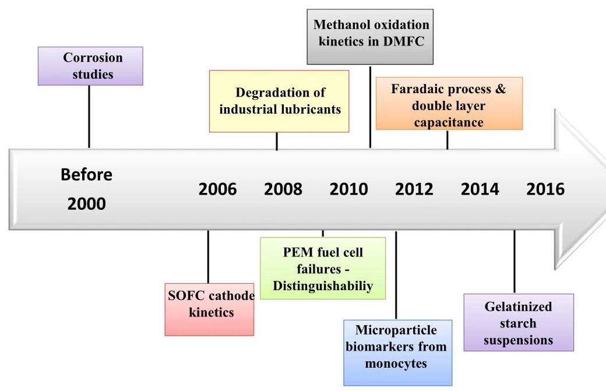

Figure 1. Time line showing a few key research activities based on NLEIS.

图1. 展示基于NLEIS的一些关键研究活动的时间线。

During EIS experiments the amplitude of the applied potential perturbation is maintained low as possible (typically $\leq  {20}\mathrm{{mV}}$ ), so that the system response can be approximated to be linear while maintaining an acceptable signal to noise ratio. Fig. 2a shows an electrode electrolyte interface, and in case of a reaction with an adsorbed intermediate, the impedance spectra can be represented by an equivalent electrical circuit given in Fig. 2b. ${}^{31}$ The spectrum can be plotted in various forms, ${}^{1}$ and often it is shown either as a complex plane plot (Fig. 2c) or as Bode plot (Fig. 2d). Since impedance is represented as a complex quantity, it can be written as $Z = {Z}_{\mathrm{{Re}}} + j{\mathrm{Z}}_{\mathrm{{Im}}}$ , where $j \; = \sqrt{-1}$ . In the complex plane plot presented in Fig. 2c, the frequencies are not shown but usually a few frequency points are marked. Two semi-circles are present in the complex plane plot and the semicircle at high frequencies arises from the double layer capacitance of the electrode-electrolyte interface and the charge transfer resistance $\left( {R}_{\mathrm{t}}\right)$ , while the semi-circle at low frequencies arises from the faradaic reaction. The high frequency limit of the total impedance corresponds to solution resistance $\left( {R}_{\text{ sol }}\right)$ , while the low frequency limit of the total impedance $\left( {Z}_{\mathrm{{LF}}}\right)$ corresponds to the sum of polarization resistance $\left( {R}_{\mathrm{p}}\right)$ and ${R}_{\text{ sol }}$ , as shown in Fig. 2c. In addition, if the high frequency semi-circle is extended to the real axis, the intercept would correspond to the sum of ${R}_{\mathrm{t}}$ and ${R}_{\mathrm{{sol}}}$ , as marked in Fig. 2c. These limiting values are also marked in the Bode plot (Fig. 2d). The charge transfer resistance is the impedance of the faradaic process $\left( {Z}_{\mathrm{F}}\right)$ at the high frequency limit.

在电化学阻抗谱(EIS)实验中，所施加的电位扰动幅度应尽可能保持较低(通常为$\leq  {20}\mathrm{{mV}}$)，以便在保持可接受的信噪比的同时，系统响应可近似为线性。图2a展示了电极 - 电解质界面，在存在与吸附中间体发生反应的情况下，阻抗谱可用图2b所示的等效电路表示。${}^{31}$该谱可以以多种形式绘制，${}^{1}$并且通常它要么以复平面图(图2c)的形式显示，要么以波特图(图2d)的形式显示。由于阻抗表示为复数，它可以写成$Z = {Z}_{\mathrm{{Re}}} + j{\mathrm{Z}}_{\mathrm{{Im}}}$，其中$j \; = \sqrt{-1}$。在图2c所示的复平面图中，未显示频率，但通常会标记几个频率点。复平面图中有两个半圆，高频处的半圆源于电极 - 电解质界面的双层电容和电荷转移电阻$\left( {R}_{\mathrm{t}}\right)$，而低频处的半圆源于法拉第反应。总阻抗的高频极限对应于溶液电阻$\left( {R}_{\text{ sol }}\right)$，而总阻抗的低频极限$\left( {Z}_{\mathrm{{LF}}}\right)$对应于极化电阻$\left( {R}_{\mathrm{p}}\right)$和${R}_{\text{ sol }}$的总和，如图2c所示。此外，如果高频半圆延伸到实轴，截距将对应于${R}_{\mathrm{t}}$和${R}_{\mathrm{{sol}}}$的总和，如图2c中所标记。这些极限值也在波特图(图2d)中标记。电荷转移电阻是高频极限下法拉第过程$\left( {Z}_{\mathrm{F}}\right)$的阻抗。

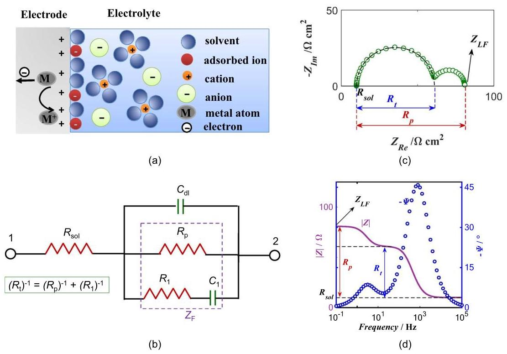

Figure 2. (a) Cartoon of double layer structure, (b) Equivalent electrical circuit (EEC) corresponding to a two-step reaction under small signal conditions. Impedance spectrum as (c) complex plane plot and as (d) Bode Plot.

图2.(a)双层结构示意图，(b)对应于小信号条件下两步反应的等效电路(EEC)。阻抗谱以(c)复平面图和(d)波特图表示。

While solution resistance is always assumed to be independent of perturbation amplitude, sensu stricto, ${R}_{\mathrm{t}}$ and ${R}_{\mathrm{p}}$ are defined at vanishingly small perturbation amplitudes as given in Eqs. 3b and $3{\mathrm{c}}^{{13} - {15},{22}}$

虽然通常假设溶液电阻与扰动幅度无关，但严格来说，${R}_{\mathrm{t}}$和${R}_{\mathrm{p}}$是在如式3b和$3{\mathrm{c}}^{{13} - {15},{22}}$中给出的极小扰动幅度下定义的。

$$
{R}_{\text{ sol }} = \mathop{\lim }\limits_{{\omega  \rightarrow  \infty }}{Z}_{T} \tag{3a}
$$

$$
{R}_{t} = \mathop{\lim }\limits_{{{E}_{ac0} \rightarrow  0}}\mathop{\lim }\limits_{{\omega  \rightarrow  \infty }}{Z}_{F} \tag{3b}
$$

$$
{Z}_{LF} = {R}_{p} + {R}_{sol} = \mathop{\lim }\limits_{{{E}_{ac0} \rightarrow  0}}\mathop{\lim }\limits_{{\omega  \rightarrow  0}}{Z}_{T} \tag{3c}
$$

However, the definitions can be generalized in nonlinear regime as ${}^{{13} - {15},{22}}$

然而，这些定义可以在非线性区域中推广为${}^{{13} - {15},{22}}$。

$$
{R}_{t,{NL}}\left( {E}_{ac0}\right)  = \mathop{\lim }\limits_{{\omega  \rightarrow  \infty }}{Z}_{F} \tag{4a}
$$

$$
{Z}_{{LF},{NL}}\left( {E}_{ac0}\right)  = {R}_{p,{NL}}\left( {E}_{ac0}\right)  + {R}_{sol} = \mathop{\lim }\limits_{{\omega  \rightarrow  0}}{Z}_{T} \tag{4b}
$$

If the actual reaction is a simple electron transfer reaction in the kinetic controlled regime, then the complex plane plot of the impedance spectrum will be a semi-circle and ${R}_{\mathrm{t}}$ and ${R}_{\mathrm{p}}$ will be equal. However, in case of an arbitrary electrochemical reaction, ${R}_{\mathrm{t}}$ and ${R}_{\mathrm{p}}$ will be different.

如果实际反应是动力学控制区域中的简单电子转移反应，那么阻抗谱的复平面图将是一个半圆，并且${R}_{\mathrm{t}}$和${R}_{\mathrm{p}}$将相等。然而，对于任意的电化学反应，${R}_{\mathrm{t}}$和${R}_{\mathrm{p}}$将不同。

Usually, impedance data is analyzed assuming that the investigated system fulfills the conditions of causality, stability and linearity. ${}^{1,3}$ The conformity of the impedance data to these conditions should be validated using the integral transforms known as Kramers Kro-nig Transforms (KKT) ${}^{{27},{32}}$ or their equivalents such as measurement model approach ${}^{{33} - {35}}$ or linear KKT. ${}^{36}$ Subsequently, the data is analyzed to obtain physical insights into the investigated system by either fitting suitable electrical equivalent circuits (EEC) or using reaction mechanism analysis (RMA). ${}^{3}$ RMA analysis of impedance data aims to identify the mechanism of the physico-electrochemical processes occurring at the electrode electrolyte interface. In this method, several alternate mechanisms are considered and the mechanism and the kinetic parameters which best fit the experimental data are chosen to represent the investigated phenomenon.

通常，在假设所研究的系统满足因果性、稳定性和线性条件的情况下分析阻抗数据。${}^{1,3}$应使用称为克莱默斯 - 克勒尼希变换(KKT)${}^{{27},{32}}$或其等效方法(如测量模型方法${}^{{33} - {35}}$或线性KKT)来验证阻抗数据与这些条件的符合性。${}^{36}$随后，通过拟合合适的等效电路(EEC)或使用反应机理分析(RMA)来分析数据，以获得对所研究系统的物理见解。${}^{3}$阻抗数据的RMA分析旨在识别在电极 - 电解质界面发生的物理 - 电化学过程的机理。在这种方法中，考虑几种替代机理，并选择最适合实验数据的机理和动力学参数来表示所研究的现象。

## Development of NLEIS Analysis Methodology

## 非线性电化学阻抗谱分析方法学的发展

In the early reports on NLEIS, nonlinear impedance refers to the measurements performed at fundamental frequency when a large amplitude perturbation is applied onto the system. ${}^{{11} - {15},{17},{19},{22}}$ If the impedance is a function of the amplitude of the applied signal, then the data should be analyzed by including the nonlinear terms. However, in some cases one may get significant second or third harmonic but the fundamental impedance may be invariant to the applied amplitude. ${}^{8}$ Measuring higher harmonics while simultaneously monitoring the dependence of impedance on the applied signal amplitude will enable identification of nonlinearity in the system. Based on the complexity of the system investigated, the studies on NLEIS are organized and summarized below.

在关于非线性电化学阻抗谱(NLEIS)的早期报告中，非线性阻抗是指在向系统施加大幅度扰动时，在基频下进行的测量。${}^{{11} - {15},{17},{19},{22}}$ 如果阻抗是所施加信号幅度的函数，那么应该通过纳入非线性项来分析数据。然而，在某些情况下，可能会得到显著的二次或三次谐波，但基波阻抗可能与所施加的幅度无关。${}^{8}$ 在测量高次谐波的同时，监测阻抗对所施加信号幅度的依赖性，将能够识别系统中的非线性。基于所研究系统的复杂性，下面对NLEIS的研究进行了组织和总结。

Simple electron transfer reaction.-One of the simplest electrochemical reaction is an elementary redox reaction given by

简单电子转移反应。 - 最简单的电化学反应之一是由以下给出的基本氧化还原反应

$$
O + n{e}^{ - } \leftrightarrow  R \tag{5}
$$

The reaction kinetics are given by the Butler-Volmer equation. If the solution resistance is negligible and if the mass transfer is rapid, the faradaic current can be written as

反应动力学由巴特勒 - 沃尔默方程给出。如果溶液电阻可忽略不计且传质迅速，则法拉第电流可写为

$$
{i}_{F} = F\left( {{k}_{10}{e}^{{b}_{1}E} - {k}_{-{10}}{e}^{{b}_{-1}E}}\right) \tag{6}
$$

where ${k}_{10}$ and ${k}_{-{10}}$ are pre-exponents and the parameters ${b}_{1}$ and ${b}_{-1}$ are related to the charge transfer coefficient $\alpha$ by ${b}_{1} = \alpha \mathrm{F}/\left( \mathrm{{RT}}\right)$ , ${b}_{-1} =  - \left( {1 - \alpha }\right) \mathrm{F}/\left( \mathrm{{RT}}\right)$ . Here $\mathrm{F}$ is the Faraday constant, $\mathrm{R}$ is the universal gas constant, $\mathrm{T}$ is the temperature and the potential $E$ is measured with respect to the equilibrium potential. If the applied potential deviates significantly from the equilibrium potential, then one of the reactions can be neglected, leading to further simplification of Eq. 6.

其中${k}_{10}$和${k}_{-{10}}$是指前因子，参数${b}_{1}$和${b}_{-1}$通过${b}_{1} = \alpha \mathrm{F}/\left( \mathrm{{RT}}\right)$、${b}_{-1} =  - \left( {1 - \alpha }\right) \mathrm{F}/\left( \mathrm{{RT}}\right)$与电荷转移系数$\alpha$相关。这里$\mathrm{F}$是法拉第常数，$\mathrm{R}$是通用气体常数，$\mathrm{T}$是温度，电位$E$是相对于平衡电位测量的。如果施加的电位显著偏离平衡电位，那么其中一个反应可以忽略，从而导致式6的进一步简化。

Upon application of a sinusoidal potential superimposed on a dc potential, the current can be written using modified Bessel function of first kind $\left( {I}_{\mathrm{n}}\right)$ and the nonlinear impedance at any perturbation amplitude and frequency can be written in analytical form. ${}^{37}$ It is worth noting that exponential of sinusoidal function is a generating function for ${I}_{\mathrm{n}}\left( \mathrm{x}\right)$ , as given by ${}^{38}$

在直流电位上叠加正弦电位时，电流可以用第一类修正贝塞尔函数$\left( {I}_{\mathrm{n}}\right)$来表示，并且在任何扰动幅度和频率下的非线性阻抗都可以写成解析形式。${}^{37}$ 值得注意的是，正弦函数的指数是${I}_{\mathrm{n}}\left( \mathrm{x}\right)$的生成函数，如${}^{38}$所给出的

$$
{e}^{x\sin \left( {\omega t}\right) } = {I}_{0}\left( x\right)  + 2\mathop{\sum }\limits_{{n = 0}}^{\infty }{\left( -1\right) }^{n}{I}_{{2n} + 1}\left( x\right) \sin \{ \left( {{2n} + 1}\right) {\omega t}\}
$$

$$
+ 2\mathop{\sum }\limits_{{n = 1}}^{\infty }{\left( -1\right) }^{n}{I}_{2n}\left( x\right) \cos \{ {2n\omega t}\} \tag{7}
$$

where

其中

$$
{I}_{n}\left( x\right)  = {\left( \frac{1}{2}x\right) }^{n}\mathop{\sum }\limits_{{m = 0}}^{\infty }\frac{{\left( \frac{x}{2}\right) }^{2m}}{m!\left( {n + m}\right) !} = {x}^{n}\mathop{\sum }\limits_{{m = 0}}^{\infty }\frac{1}{{2}^{{2m} + n}m!\left( {n + m}\right) !}{x}^{2m}
$$

[8]

Wong and MacFarlane derived analytical expressions for the first four harmonics of a simple redox reaction with finite layer diffusion and experimentally measured the first and second harmonic response of ferrocene/ferrocenium redox system as well as ${\mathrm{K}}_{3}\left\lbrack  {\mathrm{{Fe}}{\left( \mathrm{{CN}}\right) }_{6}}\right\rbrack$ / ${\mathrm{K}}_{4}\left\lbrack  {\mathrm{{Fe}}{\left( \mathrm{{CN}}\right) }_{6}}\right\rbrack$ redox systems. ${}^{39}$ It should be noted that there is no universally accepted definition of nonlinear impedance at higher harmonics. ${}^{39}$ On one hand, current at higher harmonics $\left( {i}_{\mathrm{n}\omega }\right)$ is related to the ${\mathrm{n}}^{\text{ th }}$ power of applied perturbation ${\left( {E}_{\mathrm{{ac}}0}\right) }^{\mathrm{n}}$ , at least to the first approximation. However the ratio of ${\left( {E}_{\mathrm{{ac}}0}\right) }^{\mathrm{n}}$ to ${i}_{\mathrm{n}\omega }$ does not have the units of $\Omega  - {\mathrm{{cm}}}^{2}$ . On the other hand, the ratio ${E}_{\mathrm{{ac}}0}/{i}_{\mathrm{n}\omega }$ has the correct units of impedance, but is dependent on ${E}_{\mathrm{{ac}}0}$ even for small values of ${E}_{\mathrm{{ac}}0}$ (for $\mathrm{n} \geq  2$ ), while the linear impedance is independent of ${E}_{\mathrm{{ac}}0}$ at small values of ${E}_{\mathrm{{ac}}0}$ . Hence, most of the NLEIS studies actually report the measured values (current or potential) at higher harmonics, and not impedance. A few articles do define and report impedance at higher harmonics. ${}^{{39},{40}}$ In this study, ${}^{39}$ NLEIS measurements were carried out using a Solartron 1250 FRA and 1186 potentiostat and the theoretical predictions matched well with the experimental results. The second harmonic results also showed that the contribution from double layer capacitance is not significant.

王和麦克法兰推导出了具有有限层扩散的简单氧化还原反应前四个谐波的解析表达式，并通过实验测量了二茂铁/二茂铁鎓氧化还原体系以及${\mathrm{K}}_{3}\left\lbrack  {\mathrm{{Fe}}{\left( \mathrm{{CN}}\right) }_{6}}\right\rbrack$ / ${\mathrm{K}}_{4}\left\lbrack  {\mathrm{{Fe}}{\left( \mathrm{{CN}}\right) }_{6}}\right\rbrack$氧化还原体系的基波和二次谐波响应。${}^{39}$应当指出，对于高次谐波下的非线性阻抗，目前尚无普遍接受的定义。${}^{39}$一方面，高次谐波下的电流$\left( {i}_{\mathrm{n}\omega }\right)$与施加扰动的${\mathrm{n}}^{\text{ th }}$幂相关，至少在一阶近似下如此。然而，${\left( {E}_{\mathrm{{ac}}0}\right) }^{\mathrm{n}}$与${i}_{\mathrm{n}\omega }$的比值并不具有$\Omega  - {\mathrm{{cm}}}^{2}$的单位。另一方面，比值${E}_{\mathrm{{ac}}0}/{i}_{\mathrm{n}\omega }$具有正确的阻抗单位，但即使对于${E}_{\mathrm{{ac}}0}$的小值(对于$\mathrm{n} \geq  2$)，它也依赖于${E}_{\mathrm{{ac}}0}$，而线性阻抗在${E}_{\mathrm{{ac}}0}$的小值时与${E}_{\mathrm{{ac}}0}$无关。因此，大多数非线性电化学阻抗谱研究实际上报告的是高次谐波下的测量值(电流或电位)，而非阻抗。少数文章确实定义并报告了高次谐波下的阻抗。${}^{{39},{40}}$在本研究中，${}^{39}$使用Solartron 1250 FRA和1186恒电位仪进行了非线性电化学阻抗谱测量，理论预测与实验结果吻合良好。二次谐波结果还表明，双层电容的贡献并不显著。

More recently, NLEIS was used to reinvestigate the faradaic process and double layer capacitance of the classical ${\mathrm{K}}_{3}\left\lbrack  {\mathrm{{Fe}}{\left( \mathrm{{CN}}\right) }_{6}}\right\rbrack  / \; {\mathrm{K}}_{4}\left\lbrack  {\mathrm{{Fe}}{\left( \mathrm{{CN}}\right) }_{6}}\right\rbrack$ redox system. ${}^{8,9}$ NLEIS measurements were carried out using a potentiostat, a PC based function generator and digitizer (analog to digital converter or ADC). A schematic of experimental set up is shown in the Fig. 3. A three electrode system with gold as working electrode, platinum foil as counter electrode and Ag/AgCl as reference electrode was used in the experiments. The electrolyte used contained varying concentrations of ${\mathrm{K}}_{3}\mathrm{{Fe}}{\left( \mathrm{{CN}}\right) }_{6}$ and ${\mathrm{K}}_{4}\mathrm{{Fe}}{\left( \mathrm{{CN}}\right) }_{6}$ , ranging from 5 $\mathrm{{mM}}$ to ${25}\mathrm{{mM}}$ and the data were acquired in potentiostatic mode. The input amplitude was ${100}\mathrm{{mV}}$ and the frequency range was set from ${0.05}\mathrm{\;{Hz}} - {10}\mathrm{{KHz}}$ . The odd harmonic currents recorded for a cell with $5\mathrm{{mM}}$ of ${\mathrm{K}}_{3}\mathrm{{Fe}}{\left( \mathrm{{CN}}\right) }_{6}/{\mathrm{K}}_{4}\mathrm{{Fe}}{\left( \mathrm{{CN}}\right) }_{6}$ at ${E}_{\mathrm{{ac}}0} = {100}\mathrm{{mV}}$ is shown as open symbols in Fig. 4a and the results show that the magnitude of the odd harmonics decrease with increase in harmonic order. The equation representing the faradaic current was expanded in Taylor series up to the ${6}^{\text{ th }}$ term and rearranged into Fourier series. At low frequencies, diffusion will play a significant role and Laplace transform was employed to compute the harmonic currents. ${}^{9}$ The theoretical predictions are shown as filled symbols in Fig. 4a. Although the match is not quantitative, the simulated harmonic currents show similar trend as the experimentally measured data. The noticeable differences between the simulated and the experimental curves at the high frequency end are likely due to the variation in the solution resistance values in the two cases. In the simulations the solution resistance was deliberately set to zero, whereas in the experiments the double layer capacitance and solution resistance contribute significantly to the total current in the high frequency region resulting in the decrease in the current magnitude. The odd harmonics together with the even harmonics (Fig. 4b) were analyzed to calculate the charge transfer coefficient. While this analysis methodology can be applied to simple electron transfer reaction, extending it to complex reactions will be challenging.

最近，NLEIS被用于重新研究经典的${\mathrm{K}}_{3}\left\lbrack  {\mathrm{{Fe}}{\left( \mathrm{{CN}}\right) }_{6}}\right\rbrack  / \; {\mathrm{K}}_{4}\left\lbrack  {\mathrm{{Fe}}{\left( \mathrm{{CN}}\right) }_{6}}\right\rbrack$氧化还原体系的法拉第过程和双层电容。${}^{8,9}$ 使用恒电位仪、基于PC的函数发生器和数字化仪(模数转换器或ADC)进行NLEIS测量。实验装置的示意图如图3所示。实验中使用了以金作为工作电极、铂箔作为对电极、Ag/AgCl作为参比电极的三电极系统。所使用的电解质含有不同浓度的${\mathrm{K}}_{3}\mathrm{{Fe}}{\left( \mathrm{{CN}}\right) }_{6}$和${\mathrm{K}}_{4}\mathrm{{Fe}}{\left( \mathrm{{CN}}\right) }_{6}$，范围从5$\mathrm{{mM}}$到${25}\mathrm{{mM}}$，并且数据是在恒电位模式下采集的。输入幅度为${100}\mathrm{{mV}}$，频率范围设置为从${0.05}\mathrm{\;{Hz}} - {10}\mathrm{{KHz}}$。在图4a中，以空心符号显示了在${E}_{\mathrm{{ac}}0} = {100}\mathrm{{mV}}$时具有${\mathrm{K}}_{3}\mathrm{{Fe}}{\left( \mathrm{{CN}}\right) }_{6}/{\mathrm{K}}_{4}\mathrm{{Fe}}{\left( \mathrm{{CN}}\right) }_{6}$的$5\mathrm{{mM}}$的电池记录的奇次谐波电流，结果表明奇次谐波的幅度随着谐波阶数的增加而减小。表示法拉第电流的方程在泰勒级数中展开到${6}^{\text{ th }}$项并重新排列成傅里叶级数。在低频时，扩散将起重要作用，并且采用拉普拉斯变换来计算谐波电流。${}^{9}$ 理论预测在图4a中以实心符号显示。虽然匹配不是定量的，但模拟的谐波电流显示出与实验测量数据相似的趋势。在高频端模拟曲线和实验曲线之间明显的差异可能是由于两种情况下溶液电阻值的变化。在模拟中，溶液电阻被故意设置为零，而在实验中，双层电容和溶液电阻在高频区域对总电流有显著贡献，导致电流幅度减小。分析奇次谐波和偶次谐波(图4b)以计算电荷转移系数。虽然这种分析方法可以应用于简单的电子转移反应，但将其扩展到复杂反应将具有挑战性。

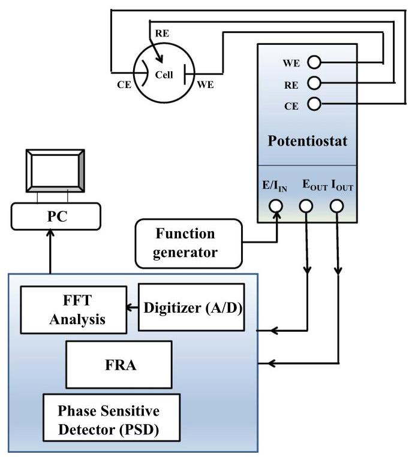

Figure 3. Schematic of experimental setup used to acquire NLEIS. WE - working electrode, RE - reference electrode and CE - counter electrode. Adapted from. ${}^{4,8,9}$

图3. 用于获取NLEIS的实验装置示意图。WE - 工作电极，RE - 参比电极，CE - 对电极。改编自。${}^{4,8,9}$

If the electrode-electrolyte interface is represented by a simple capacitor (Helmholtz model), then the corresponding current response will not have any higher harmonic component. If the system is actually better represented by Stern model, which is a combination of Helmhotlz and Gouy-Chapman model, and if NLEIS is acquired at point of zero charge (PZC), then odd harmonics would be nonzero, but even harmonics would be zero due to the symmetry around PZC. ${}^{8}$ Interestingly, at high frequencies, impedance at fundamental frequency did not show any dependence on ${E}_{\mathrm{{ac}}0}$ even up to ${100}\mathrm{{mV}}$ , but significant higher harmonics were present. This shows that invariance of linear EIS cannot be always used as a validation of system linearity. ${}^{8}$ When the ${dc}$ potential is moved away from PZC, both even and odd harmonics would have contributions from double layer capacitance element. ${}^{8}$ Experimental results show that when the measurement is done near OCP, at low frequencies, even harmonics are lower in magnitude compared to the next odd harmonics, i.e. $\left| {i}_{2\omega }\right|  < \left| {i}_{3\omega }\right|$ and $\left| {i}_{4\omega }\right| \; < \left| {i}_{5\omega }\right|$ (results not shown here). When the symmetry is broken by applying a ${dc}$ bias $\left( {\pm {100}\mathrm{{mV}}}\right)$ , the magnitude of even harmonics $\left| {i}_{2\mathrm{n}\omega }\right|$ was greater than the corresponding values of next odd harmonics $\left| {i}_{\left( {2\mathrm{n} + 1}\right) \omega }\right|$ , as seen in Fig. $4\mathrm{\;b}{.}^{9}$ Unlike traditional EIS where multiple measurements are used to calculate the charge transfer coefficient, it can be estimated by analyzing NLEIS in a single measurement for this reaction. ${}^{9}$

如果电极 - 电解质界面由一个简单的电容器表示(亥姆霍兹模型)，那么相应的电流响应将不会有任何更高次谐波分量。如果该系统实际上用斯特恩模型能更好地表示，斯特恩模型是亥姆霍兹模型和古依 - 查普曼模型的组合，并且如果在零电荷点(PZC)获取非线性电化学阻抗谱(NLEIS)，那么奇次谐波将不为零，但由于围绕PZC的对称性，偶次谐波将为零。${}^{8}$有趣的是，在高频时，基频处的阻抗甚至直到${100}\mathrm{{mV}}$都未显示出对${E}_{\mathrm{{ac}}0}$的任何依赖性，但存在显著的更高次谐波。这表明线性电化学阻抗谱(EIS)的不变性不能总是用作系统线性的验证。${}^{8}$当${dc}$电位远离PZC时，偶次和奇次谐波都将有双层电容元件的贡献。${}^{8}$实验结果表明，当在开路电位(OCP)附近进行测量时，在低频下，偶次谐波的幅度比下一个奇次谐波低，即$\left| {i}_{2\omega }\right|  < \left| {i}_{3\omega }\right|$和$\left| {i}_{4\omega }\right| \; < \left| {i}_{5\omega }\right|$(此处未显示结果)。当通过施加${dc}$偏置$\left( {\pm {100}\mathrm{{mV}}}\right)$打破对称性时，偶次谐波$\left| {i}_{2\mathrm{n}\omega }\right|$的幅度大于下一个奇次谐波$\left| {i}_{\left( {2\mathrm{n} + 1}\right) \omega }\right|$的相应值，如图$4\mathrm{\;b}{.}^{9}$所示。与传统的EIS不同，传统EIS使用多次测量来计算电荷转移系数，对于该反应，可以通过在单次测量中分析NLEIS来估计电荷转移系数。${}^{9}$

Hernandez-Jaimes et al. derived nonlinear transfer functions to model the nonlinear EIS responses of gelatinized starch suspensions (GSS), commonly used as biopolymeric electrolytic system. ${}^{41}$ The main focus of the study was to develop a mathematical analysis for NLEIS and hence a simple system was chosen. The impedance response at fundamental frequency to large amplitude perturbation was recorded using PARSTAT 2263. The EEC corresponding to the nonlinear form of Cole-Cole equation is shown in Fig. 5. The nonlinear constant phase element (NL-CPE) pre-exponent and the high and low frequency limit of the impedance values were used to estimate an equivalent capacitance (C). EEC element values were correlated to the perturbation amplitude and it was shown that ${R}_{\mathrm{p}}$ and $C$ could be related exponentially to ${E}_{\mathrm{{ac}}0}$ , with ${R}_{\mathrm{p}}$ decreasing with ${E}_{\mathrm{{ac}}0}$ and $C$ increasing with ${E}_{\mathrm{{ac}}0}$ . The CPE exponent also showed a dependence on ${E}_{\mathrm{{ac}}0}$ but it was not discussed in detail. It is worth noting that the CPE parameters are intrinsically coupled and are not expected to vary independently. ${}^{42}$ The impedance of the nonlinear EEC consisting of two nonlinear resistors (NL- ${\mathrm{R}}_{\text{ sol }}$ and NL- ${\mathrm{R}}_{\mathrm{p}}$ ) and a nonlinear CPE (NL-CPE) was obtained by expressing current as a nonlinear function of the applied potential. Using Kirchoff's law, nonlinear EEC shown in Fig. 5 was represented by a system of nonlinear differential equations. Then the expressions for impedance response functions were written by employing Fourier series expansion and equating the first harmonic terms. This procedure was applied to model the impedance of GSS and the nonlinear model describing exponential decrease of the low frequency resistance with increase in amplitude was found to give best match with the experimental results. Higher harmonics were not recorded or included in the model development. While the exponential dependence of the circuit element values could model the data well, it is difficult to extract physical insight into the reaction process and it is not clear if the model could predict the higher harmonics correctly.

埃尔南德斯 - 哈梅斯等人推导了非线性传递函数，以对糊化淀粉悬浮液(GSS)的非线性EIS响应进行建模，糊化淀粉悬浮液通常用作生物聚合物电解系统。${}^{41}$该研究的主要重点是为NLEIS开发一种数学分析方法，因此选择了一个简单的系统。使用PARSTAT 2263记录了基频处对大振幅扰动的阻抗响应。对应于科尔 - 科尔方程非线性形式的等效电路(EEC)如图5所示。非线性常相位元件(NL - CPE)的预指数以及阻抗值的高频和低频极限用于估计等效电容(C)。EEC元件值与扰动幅度相关，结果表明${R}_{\mathrm{p}}$和$C$可以与${E}_{\mathrm{{ac}}0}$呈指数关系，其中${R}_{\mathrm{p}}$随${E}_{\mathrm{{ac}}0}$减小而$C$随${E}_{\mathrm{{ac}}0}$增大。CPE指数也显示出对${E}_{\mathrm{{ac}}0}$的依赖性，但未详细讨论。值得注意的是，CPE参数本质上是耦合的，预计不会独立变化。${}^{42}$由两个非线性电阻(NL - ${\mathrm{R}}_{\text{ sol }}$和NL - ${\mathrm{R}}_{\mathrm{p}}$)和一个非线性CPE(NL - CPE)组成的非线性EEC的阻抗是通过将电流表示为施加电位的非线性函数而获得的。使用基尔霍夫定律，图5中所示的非线性EEC由一个非线性微分方程组表示。然后通过采用傅里叶级数展开并使一次谐波项相等来写出阻抗响应函数的表达式。该过程用于对GSS的阻抗进行建模，发现描述低频电阻随幅度增加呈指数下降的非线性模型与实验结果最匹配。在模型开发中未记录或包含更高次谐波。虽然电路元件值的指数依赖性可以很好地模拟数据，但很难提取对反应过程的物理洞察，并且不清楚该模型是否能正确预测更高次谐波。

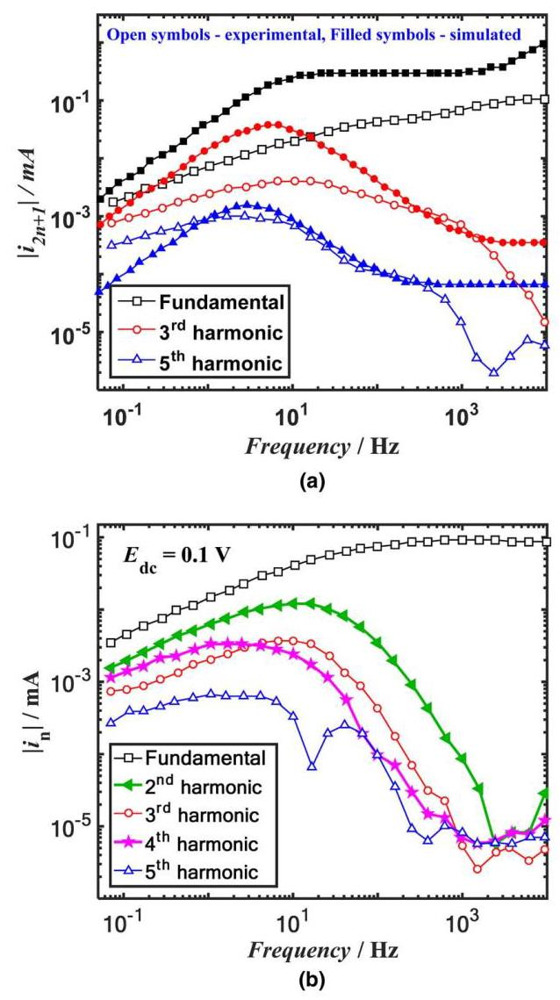

Figure 4. (a) Odd harmonic currents of Au electrode in $5\mathrm{{mM}}$ Ferricyanide and $5\mathrm{{mM}}$ Ferrocyanide. Open symbols represent the experimental data while filled symbols represent simulated data with zero solution resistance (b) Experimental NLEIS using Au pseudo reference electrode on a ${\mathrm{K}}_{4}\left\lbrack  {\mathrm{{Fe}}{\left( \mathrm{{CN}}\right) }_{6}}\right\rbrack  5 \; \mathrm{{mM}}/{\mathrm{K}}_{3}\left\lbrack  {\mathrm{{Fe}}{\left( \mathrm{{CN}}\right) }_{6}}\right\rbrack  5\mathrm{{mM}}$ solution cell under ${dc}$ bias. Adapted from Ref. 9.

图4. (a) 在$5\mathrm{{mM}}$铁氰化物和$5\mathrm{{mM}}$亚铁氰化物中，金电极的奇次谐波电流。空心符号表示实验数据，实心符号表示溶液电阻为零时的模拟数据。(b) 在${dc}$偏压下，使用金伪参比电极在${\mathrm{K}}_{4}\left\lbrack  {\mathrm{{Fe}}{\left( \mathrm{{CN}}\right) }_{6}}\right\rbrack  5 \; \mathrm{{mM}}/{\mathrm{K}}_{3}\left\lbrack  {\mathrm{{Fe}}{\left( \mathrm{{CN}}\right) }_{6}}\right\rbrack  5\mathrm{{mM}}$溶液池上进行的实验非线性电化学阻抗谱(NLEIS)。改编自参考文献9。

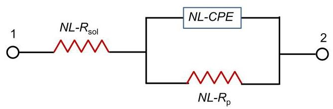

Figure 5. Nonlinear circuit scheme used to represent gelatinized starch suspension. ${NL} - {R}_{\text{ sol }}$ and ${NL} - {R}_{\mathrm{p}} - {E}_{\mathrm{{ac}}0}$ dependent nonlinear resistances. NL-CPE - nonlinear constant phase element. Adapted from Ref. 41.

图5. 用于表示糊化淀粉悬浮液的非线性电路方案。${NL} - {R}_{\text{ sol }}$和${NL} - {R}_{\mathrm{p}} - {E}_{\mathrm{{ac}}0}$相关的非线性电阻。NL-CPE - 非线性常相位元件。改编自参考文献41。

When mass transfer is rapid but ${R}_{\text{ sol }}$ is not negligible, the governing equations can be solved numerically to calculate the impedance spectra at any frequency. ${}^{{43} - {46}}$ Kramers Kronig Transforms (KKT) are mathematical equations that can be used to confirm that the response arise from a system which is linear, causal and stable. While KKT are successful in flagging violations of stability, ${}^{47}$ they are only partially successful in identifying nonlinearity effects. ${}^{{27},{44}}$ If ${R}_{\text{ sol }}$ was negligible, then for a simple electron transfer reaction, KKT will not flag nonlinearity effects. However, if ${R}_{\text{ sol }}$ was considerably high and if the data is acquired in a wide frequency range containing transition frequency given by

当传质迅速但${R}_{\text{ sol }}$不可忽略时，可以通过数值求解控制方程来计算任何频率下的阻抗谱。${}^{{43} - {46}}$ 克莱默斯-克朗尼格变换(KKT)是数学方程，可用于确认响应是否来自线性、因果和稳定的系统。虽然KKT在标记稳定性违反方面很成功，但${}^{47}$ 它们在识别非线性效应方面仅部分成功。${}^{{27},{44}}$ 如果${R}_{\text{ sol }}$可忽略不计，那么对于简单的电子转移反应，KKT将不会标记非线性效应。然而，如果${R}_{\text{ sol }}$相当高，并且如果在包含由下式给出的跃迁频率的宽频率范围内获取数据

$$
{f}_{\mathrm{t}} = \frac{1}{{2\pi }{C}_{\mathrm{{dl}}}}\left( {1/{R}_{\mathrm{{sol}}} + 1/{R}_{\mathrm{t},\mathrm{{NL}}}}\right) \tag{9}
$$

where ${C}_{\mathrm{{dl}}}$ is the double layer capacitance, the nonlinearity will be detected by KKT. ${}^{{43},{44}}$ Since the analysis was based on simple electron transfer reaction, these conclusions may not be applicable to more complex reactions.

其中${C}_{\mathrm{{dl}}}$是双层电容，非线性将被KKT检测到。${}^{{43},{44}}$ 由于分析基于简单的电子转移反应，这些结论可能不适用于更复杂的反应。

Estimation of polarization resistance.-The current potential relationship of a diode is very similar to that of a simple irreversible electron transfer reaction and hence, in early studies, a circuit with a diode as nonlinear element has been employed to understand NLEIS response of such systems. ${}^{{12} - {15},{17}}$ Based on NLEIS measurements on electrical circuits with a diode, and by expanding the current potential relationship in Taylor series up to third order terms, Darowicki proposed a parabolic relationship between ${\left( {R}_{p,{NL}}\right) }^{-1}$ and ${E}_{\mathrm{{ac}}0} \cdot  {}^{{12},{17}}$ This can be used to estimate ${R}_{\mathrm{p}}$ , i.e. the polarization resistance at vanishingly small perturbation amplitudes. The polarization resistance measured using NLEIS matched with the value calculated using steady state current potential technique. This is applicable when the solution resistance is negligible, diffusion limitations are not present and the perturbation amplitude is moderate. ${}^{21}$

极化电阻的估计。 - 二极管的电流-电位关系与简单的不可逆电子转移反应非常相似，因此，在早期研究中，采用以二极管为非线性元件的电路来理解此类系统的NLEIS响应。${}^{{12} - {15},{17}}$ 基于对带有二极管的电路的NLEIS测量，并通过将电流-电位关系展开到泰勒级数的三阶项，达罗维茨基提出了${\left( {R}_{p,{NL}}\right) }^{-1}$和${E}_{\mathrm{{ac}}0} \cdot  {}^{{12},{17}}$之间的抛物线关系。这可用于估计${R}_{\mathrm{p}}$，即微扰幅度趋近于零时的极化电阻。使用NLEIS测量的极化电阻与使用稳态电流-电位技术计算的值相匹配。当溶液电阻可忽略不计、不存在扩散限制且微扰幅度适中时适用。${}^{21}$

If the impedance is acquired under pseudo potentiostatic conditions, when ${R}_{\text{ sol }}$ is significant and perturbation amplitude is large, the potential drop across electrode-electroyte interface will not be sinusoidal even if the potential applied across the entire system is sinusoidal. ${}^{{13} - {15},{46}}$ Initially, it was though that ${R}_{\mathrm{p},\mathrm{{NL}}}$ in these cases will always decrease with ${E}_{\mathrm{{ac}}0}$ , but it was later shown that ${R}_{\mathrm{p},\mathrm{{NL}}}$ may increase or decrease with ${E}_{\mathrm{{ac}}0}$ depending on the value of bias potential $\left( {E}_{\mathrm{{dc}}}\right)$ and ${R}_{\mathrm{{sol}}} \cdot  {}^{{13} - {15}}$ Expressions were also derived for ${R}_{\mathrm{p},\mathrm{{NL}}}$ for electrochemical reactions obeying Tafel, or Butler Volmer or Nernst law or an electron transfer reaction coupled with electrochemical adsorption reaction (E-EAR), when NLEIS was measured under potentiostatic or galvanostatic conditions.. ${}^{{13} - {15}}$ In corrosion studies, it is desirable to measure the linear polarization resistance $\left( {R}_{\mathrm{p}}\right)$ quickly and independently of polarization experiments. ${}^{16}$ NLEIS method was employed to determine the charge transfer coefficient of the oxygen evolution reaction on a composite material (ethylene-propylene terpolymer combined with type P-1250 acetylene carbon black) in ${0.05}\mathrm{M}{\mathrm{{Na}}}_{2}{\mathrm{{SO}}}_{4}$ , which was used as anode in cathodic protection. ${}^{16}$ Impedance spectra were recorded at three different values of effective potentials of ${E}_{dc} \; = {1.186}\mathrm{\;V},{E}_{dc} = {1.277}\mathrm{\;V}$ and ${E}_{dc} = {1.357}\mathrm{\;V}$ , using ${E}_{\mathrm{{ac}}0} = {30},{150}$ , 180, 210, 240, 280, and 340 mV. Analysis of NLEIS data enabled determination of the kinetic coefficient values of the investigated system in a shorter time when compared to potentiodynamic polarization technique.

如果在伪恒电位条件下获取阻抗，当${R}_{\text{ sol }}$显著且扰动幅度较大时，即使整个系统施加的电位是正弦波，电极 - 电解质界面的电位降也不会是正弦波。${}^{{13} - {15},{46}}$最初，人们认为在这些情况下${R}_{\mathrm{p},\mathrm{{NL}}}$总是会随着${E}_{\mathrm{{ac}}0}$而降低，但后来表明${R}_{\mathrm{p},\mathrm{{NL}}}$可能会随着${E}_{\mathrm{{ac}}0}$增加或减少，这取决于偏置电位$\left( {E}_{\mathrm{{dc}}}\right)$的值以及${R}_{\mathrm{{sol}}} \cdot  {}^{{13} - {15}}$。当在恒电位或恒电流条件下测量非线性电化学阻抗谱(NLEIS)时，还推导了服从塔菲尔、巴特勒 - 伏尔默或能斯特定律的电化学反应或与电化学吸附反应(E - EAR)耦合的电子转移反应的${R}_{\mathrm{p},\mathrm{{NL}}}$的表达式。${}^{{13} - {15}}$在腐蚀研究中，希望快速且独立于极化实验来测量线性极化电阻$\left( {R}_{\mathrm{p}}\right)$。${}^{16}$采用NLEIS方法来确定在${0.05}\mathrm{M}{\mathrm{{Na}}}_{2}{\mathrm{{SO}}}_{4}$中用作阴极保护阳极的复合材料(乙烯 - 丙烯三元共聚物与P - 1250型乙炔炭黑结合)上析氧反应的电荷转移系数。${}^{16}$使用${E}_{\mathrm{{ac}}0} = {30},{150}$在有效电位${E}_{dc} \; = {1.186}\mathrm{\;V},{E}_{dc} = {1.277}\mathrm{\;V}$和${E}_{dc} = {1.357}\mathrm{\;V}$的三个不同值下记录阻抗谱，电位分别为180、210、240、280和340 mV。与动电位极化技术相比，对NLEIS数据的分析能够在更短的时间内确定所研究系统的动力学系数值。

Theoretical analysis was performed to predict the nonlinear response of a corrosion process described by Butler Volmer kinetics ${}^{17}$ and the amplitude dependency of the polarization resistance was derived as:

进行了理论分析以预测由巴特勒 - 伏尔默动力学${}^{17}$描述的腐蚀过程的非线性响应，并推导了极化电阻的幅度依赖性如下:

$$
{\left( {R}_{p,{NL}}\right) }^{-1} = {i}_{\text{ corr }}\left\lbrack  {\left( {{b}_{a} + {b}_{c}}\right)  + \frac{\left( {b}_{a}^{3} + {b}_{c}^{3}\right) }{8}{E}_{ac0}^{2}}\right.
$$

$$
\left. {+\frac{\left( {b}_{a}^{5} + {b}_{c}^{5}\right) }{192}{E}_{ac0}^{4} + \ldots }\right\rbrack \tag{10}
$$

where ${\mathrm{i}}_{\text{ corr }}$ is the corrosion current, ${b}_{a} = \frac{2.3}{{b}_{aT}}$ and ${b}_{c} = \frac{2.3}{{b}_{cT}}$ and ${b}_{a\mathrm{\;T}}$ and ${b}_{c\mathrm{\;T}}$ are the anodic and cathodic Tafel coefficients respectively. By measuring the NLEIS at various amplitudes and calculating the ${R}_{\mathrm{p},\mathrm{{NL}}}$ as a function of ${E}_{\mathrm{{ac}}0}$ , one may calculate ${i}_{\text{ corr }}$ , but since the expression is symmetrical with respect ${b}_{\mathrm{a}}$ and ${b}_{\mathrm{c}}$ , they cannot be obtained unambiguously without additional experiments. ${}^{48}$ For a general current potential relationship given by $i =$ function(E), an accurate relationship was derived by Diard et al. to relate ${R}_{\mathrm{p},\mathrm{{NL}}}$ to the applied perturbation, in presence of significant solution resistance ${}^{22}$

其中${\mathrm{i}}_{\text{ corr }}$是腐蚀电流，${b}_{a} = \frac{2.3}{{b}_{aT}}$、${b}_{c} = \frac{2.3}{{b}_{cT}}$、${b}_{a\mathrm{\;T}}$和${b}_{c\mathrm{\;T}}$分别是阳极和阴极塔菲尔系数。通过在各种幅度下测量NLEIS并计算${R}_{\mathrm{p},\mathrm{{NL}}}$作为${E}_{\mathrm{{ac}}0}$的函数，可以计算${i}_{\text{ corr }}$，但由于该表达式关于${b}_{\mathrm{a}}$和${b}_{\mathrm{c}}$是对称的，所以如果没有额外的实验，就无法明确获得它们。${}^{48}$对于由$i =$函数(E)给出的一般电流 - 电位关系，迪亚尔等人推导了一个精确的关系，以在存在显著溶液电阻${}^{22}$的情况下将${R}_{\mathrm{p},\mathrm{{NL}}}$与施加的扰动联系起来

$$
\left( {R}_{{LF},{NL}}\right)  = \left( {{R}_{p,{NL}} + {R}_{sol}}\right)
$$

$$
= {\left( \mathop{\sum }\limits_{{m = 0}}^{\infty }{\left\lbrack  {2}^{2m}m!\left( m + 1\right) !\right\rbrack  }^{-1} \times  \left( \frac{{d}^{{2m} + 1}i}{d{E}^{{2m} + 1}}\right) {E}_{ac0}^{2m}\right) }^{-1} \tag{11}
$$

This equation was employed to estimate the error in ${R}_{\mathrm{p}}$ , when a large amplitude perturbation is employed. ${}^{13}$ Experiments performed with the classical ${\mathrm{K}}_{3}\left\lbrack  {\mathrm{{Fe}}{\left( \mathrm{{CN}}\right) }_{6}}\right\rbrack  /{\mathrm{K}}_{4}\left\lbrack  {\mathrm{{Fe}}{\left( \mathrm{{CN}}\right) }_{6}}\right\rbrack$ redox couple on Pt electrode showed that ${R}_{\mathrm{p},\mathrm{{NL}}}$ may decrease or increase with ${E}_{\mathrm{{ac}}0}$ , depending on the applied ${dc}$ bias $\left( {E}_{\mathrm{{dc}}}\right)$ during NLEIS acquisition. This contrasts with the earlier report which predicted that ${R}_{\mathrm{p},\mathrm{{NL}}}$ will always decrease with ${E}_{\mathrm{{ac}}0} \cdot  {}^{17}$ For an electrochemical system obeying Butler Volmer equation, the current at fundamental and higher harmonics can be written in terms of modified Bessel functions, ${I}_{\mathrm{n}}.{}^{48}$ This analysis was extended to a reaction where the anodic reaction was kinetics limited and the cathodic reaction was under kinetic and diffusion control. ${}^{49}$ At low frequency perturbation, if the first three harmonics, along with the phase at fundamental frequency are measured, then the corrosion current and Tafel parameters can be estimated, provided the diffusivity and surface concentration of the oxidant are known. ${}^{49}$

当采用大振幅扰动时，该方程用于估计${R}_{\mathrm{p}}$中的误差。${}^{13}$在铂电极上用经典的${\mathrm{K}}_{3}\left\lbrack  {\mathrm{{Fe}}{\left( \mathrm{{CN}}\right) }_{6}}\right\rbrack  /{\mathrm{K}}_{4}\left\lbrack  {\mathrm{{Fe}}{\left( \mathrm{{CN}}\right) }_{6}}\right\rbrack$氧化还原对进行的实验表明，${R}_{\mathrm{p},\mathrm{{NL}}}$可能会随着${E}_{\mathrm{{ac}}0}$而降低或增加，这取决于在非线性电化学阻抗谱(NLEIS)采集期间施加的${dc}$偏置$\left( {E}_{\mathrm{{dc}}}\right)$。这与早期的报告形成对比，早期报告预测${R}_{\mathrm{p},\mathrm{{NL}}}$将始终随着${E}_{\mathrm{{ac}}0} \cdot  {}^{17}$而降低。对于服从巴特勒 - 伏尔默方程的电化学系统，基波和更高谐波处的电流可以用修正贝塞尔函数表示，${I}_{\mathrm{n}}.{}^{48}$该分析扩展到阳极反应受动力学限制且阴极反应受动力学和扩散控制的反应。${}^{49}$在低频扰动下，如果测量前三个谐波以及基频处的相位，那么只要知道氧化剂的扩散率和表面浓度，就可以估计腐蚀电流和塔菲尔参数。${}^{49}$

Employing operator notation for the derivative as ${D}_{\mathrm{E}} = \mathrm{d}/\mathrm{d}E$ , the following identity can be established from Eq. 8.

将导数的算子表示法记为${D}_{\mathrm{E}} = \mathrm{d}/\mathrm{d}E$，可以从式8建立以下恒等式。

$$
\left\lbrack  {{I}_{1}\left( {{E}_{ac0}{D}_{E}}\right) }\right\rbrack  \left( i\right)  = \left\lbrack  {\left( \frac{1}{2}\right) \mathop{\sum }\limits_{{m = 0}}^{\infty }\frac{{\left( {E}_{ac0}{D}_{E}\right) }^{{2m} + 1}}{{2}^{2m}m!\left( {m + 1}\right) !}}\right\rbrack  \left( i\right)
$$

$$
= \frac{{E}_{ac0}}{2}\mathop{\sum }\limits_{{m = 0}}^{\infty }\frac{{\left( {E}_{ac0}\right) }^{2m}}{{2}^{2m}m!\left( {m + 1}\right) !}\frac{{d}^{{2m} + 1}i}{d{E}^{{2m} + 1}} \tag{12a}
$$

Then, Eq. 11 can be re-written in a concise form as

然后，式11可以简洁地重写为

$$
{\left( {R}_{{LF},{NL}}\right) }^{-1} = {\left( {R}_{p,{NL}} + {R}_{sol}\right) }^{-1} = \frac{2}{{E}_{ac0}}\left\lbrack  {{I}_{1}\left( {{E}_{ac0}{D}_{E}}\right) }\right\rbrack  \left( i\right) \tag{12b}
$$

This follows from the fact that the Taylor series expansion

这是由于以下事实:泰勒级数展开

$$
{i}_{{dc} + {ac}} = f\left( {{E}_{dc} + {E}_{ac0}\sin \left( {\omega t}\right) }\right)  = \mathop{\sum }\limits_{{m = 0}}^{\infty }\frac{{\left. {f}^{m}\left( E\right) \right| }_{{E}_{dc}}{\left\lbrack  {E}_{ac0}\sin \left( \omega t\right) \right\rbrack  }^{m}}{m!}
$$

$$
= \mathop{\sum }\limits_{{m = 0}}^{\infty }\frac{{D}_{E}^{m}\left( i\right) {\left\lbrack  {E}_{ac0}\sin \left( \omega t\right) \right\rbrack  }^{m}}{m!} \tag{12c}
$$

can be written as

可以写成

$$
{i}_{{dc} + {ac}} = \left\lbrack  {e}^{{E}_{ac0}\sin \left( {\omega t}\right) {D}_{E}}\right\rbrack  \left( {f\left( E\right) }\right)  = \left\lbrack  {e}^{{E}_{ac0}\sin \left( {\omega t}\right) {D}_{E}}\right\rbrack  \left( i\right) \tag{12d}
$$

At low frequency limit, in general, for odd ’ $n$ ’ the ${n}^{\text{ th }}$ harmonic current term can be written as

在低频极限下，一般来说，对于奇数的‘$n$’，${n}^{\text{ th }}$谐波电流项可以写成

$$
{\left. i\right| }_{n\omega } = 2{\left( -1\right) }^{\left( \frac{n - 1}{2}\right) }\sin \left( {n\omega t}\right)  \times  \left\{  {\left\lbrack  {{I}_{n}\left( {{E}_{ac0}{D}_{E}}\right) }\right\rbrack  \left( i\right) }\right\} \tag{13}
$$

and for even ’ $n$ ’ (n>0), the ${n}^{\text{ th }}$ harmonic current term can be written as

对于偶数的‘$n$’(n > 0)，${n}^{\text{ th }}$谐波电流项可以写成

$$
{\left. i\right| }_{n\omega } = 2{\left( -1\right) }^{\frac{n}{2}}\cos \left( {n\omega t}\right)  \times  \left\{  {\left\lbrack  {{I}_{n}\left( {{E}_{ac0}{D}_{E}}\right) }\right\rbrack  \left( i\right) }\right\} \tag{14}
$$

The first term corresponding to $\mathrm{m} = 0$ in Eq. 11 would be equal to ${\left( {R}_{p} + {R}_{\text{ sol }}\right) }^{-1}$ . However, the actual mechanism and theoretical current-potential relationship may not be known and in fact, often the aim of the experiments and analyses is to unravel the kinetics. In theory, it is possible to compute numerical derivatives of steady state current potential curves, but the accuracy would be very poor, especially for higher order derivatives. Hence practically it can be very challenging to estimate ${R}_{\mathrm{p}}$ using the above equations. As an alternative, if the higher harmonics of current density are measured, then even without knowing the current potential relationship of the system, it is possible to estimate ${R}_{\mathrm{p}}$ using the odd harmonics from a single input perturbation, ${}^{15}$ as given in Eq. 15.

式11中与$\mathrm{m} = 0$对应的第一项将等于${\left( {R}_{p} + {R}_{\text{ sol }}\right) }^{-1}$。然而，实际的机理和理论电流 - 电位关系可能未知，实际上，实验和分析的目的通常是揭示动力学。理论上，可以计算稳态电流电位曲线的数值导数，但精度会非常差，特别是对于高阶导数。因此，实际上使用上述方程估计${R}_{\mathrm{p}}$可能非常具有挑战性。作为一种替代方法，如果测量电流密度的更高谐波，那么即使不知道系统的电流 - 电位关系，也可以使用来自单个输入扰动的奇谐波来估计${R}_{\mathrm{p}}$，${}^{15}$如式15所示。

$$
{R}_{p} + {R}_{\text{ sol }} = \frac{{E}_{ac0}}{\mathop{\sum }\limits_{{n = 0}}^{\infty }\left( {{2n} + 1}\right) {i}_{{2n} + 1\left( {\omega  \rightarrow  0}\right) }} \tag{15}
$$

It is worth noting that higher harmonic currents tend to have low magnitude and hence the accuracy in the estimate is good even when the terms are limited to ${5}^{\text{ th }}$ harmonic. This was illustrated by NLEIS measurement on a circuit with a diode, as well as on the classical ${\mathrm{K}}_{4}\left\lbrack  {\mathrm{{Fe}}{\left( \mathrm{{CN}}\right) }_{6}}\right\rbrack  /{\mathrm{K}}_{3}\left\lbrack  {\mathrm{{Fe}}{\left( \mathrm{{CN}}\right) }_{6}}\right\rbrack$ redox couple on Pt electrode. ${}^{15}\mathrm{{Kiel}}$ et al. employed a similar approach on reactions following Butler Volmer kinetics, to propose a criterion to verify linearity in EIS measurements and to extract the effective linear EIS data from nonlinear EIS measurements. ${}^{50}$ Another approach to estimate ${R}_{p,{NL}}$ for Tafel kinetics with significant ${R}_{\text{ sol }}$ employs Lambert-W functions to get closed form solutions. ${}^{51}$

值得注意的是，更高谐波电流的幅度往往较小，因此即使项限于${5}^{\text{ th }}$谐波，估计的精度也很好。这通过对带有二极管的电路以及铂电极上的经典${\mathrm{K}}_{4}\left\lbrack  {\mathrm{{Fe}}{\left( \mathrm{{CN}}\right) }_{6}}\right\rbrack  /{\mathrm{K}}_{3}\left\lbrack  {\mathrm{{Fe}}{\left( \mathrm{{CN}}\right) }_{6}}\right\rbrack$氧化还原对进行的非线性电化学阻抗谱(NLEIS)测量得到了说明。${}^{15}\mathrm{{Kiel}}$等人对遵循巴特勒 - 伏尔默动力学的反应采用了类似的方法，提出了一个准则来验证电化学阻抗谱(EIS)测量中的线性度，并从非线性EIS测量中提取有效的线性EIS数据。${}^{50}$另一种估计具有显著${R}_{\text{ sol }}$的塔菲尔动力学的${R}_{p,{NL}}$的方法是使用兰伯特W函数来获得封闭形式的解。${}^{51}$

Under pseudo galvanostatic conditions, upon application of a current perturbation of amplitude ${i}_{\mathrm{{ac}}0}$ , and decomposition of the resulting potential into Fourier series, the polarization resistance can be written as ${}^{15}$

在伪恒电流条件下，施加幅度为${i}_{\mathrm{{ac}}0}$的电流扰动，并将所得电位分解为傅里叶级数，极化电阻可写为${}^{15}$

$$
{R}_{p,{NL}} + {R}_{sol} = \left( {{R}_{p} + {R}_{sol}}\right) \left\lbrack  {1 + \mathop{\sum }\limits_{{n = 1}}^{\infty }\frac{{d}^{{2n} + 1}{E}_{/}d{i}^{{2n} + 1}}{{2}^{2n}n!\left( {n + 1}\right) !{\left( {}^{dE}/di\right) }^{2}}{\left( {i}_{ac0}\right) }^{2n}}\right\rbrack
$$

[16]

which can be written in a concise form as

其可简洁地写为

$$
{R}_{p,{NL}} + {R}_{sol} = \frac{2\left( {{R}_{p} + {R}_{sol}}\right) }{\left( {{dE}/{di}}\right)  \times  {i}_{ac0}}\left\lbrack  {{I}_{1}\left( {{i}_{ac0}{D}_{i}}\right) E}\right\rbrack
$$

$$
= \frac{2\left( {{R}_{p} + {R}_{sol}}\right) }{{R}_{p,{NL}} \times  {i}_{ac0}}\left\lbrack  {{I}_{1}\left( {{i}_{ac0}{D}_{i}}\right) E}\right\rbrack \tag{17}
$$

where ${D}_{i} = \mathrm{d}/\mathrm{{di}}$ . In case the current potential relationship is not known, but higher harmonics of the potential to large amplitude current perturbations are measured in pseudo galvanostatic mode, the polarization resistance can be estimated as

其中${D}_{i} = \mathrm{d}/\mathrm{{di}}$。若电流-电位关系未知，但在伪恒电流模式下测量了大振幅电流扰动下电位的高次谐波，则极化电阻可估计为

$$
{R}_{p} + {R}_{sol} = \frac{\mathop{\sum }\limits_{{n = 0}}^{\infty }\left( {{2n} + 1}\right) {E}_{{2n} + 1,\left( {\omega  \rightarrow  0}\right) }}{{i}_{ac0}} \tag{18}
$$

The Equations 11-18 are applicable to any general non-blocking electrode.

式(11 - 18)适用于任何一般的非阻塞电极。

Complex reactions.—Nonlinear current response of a two-step electrode reaction with an adsorbed intermediate, shown in Eq. 19, was derived using Taylor series expansion method. ${}^{52}$

复杂反应。——使用泰勒级数展开法推导了式(19)所示的具有吸附中间体的两步电极反应的非线性电流响应。${}^{52}$

[19]

$$
A \rightarrow  {\left( B\right) }_{ad} + {e}^{ - }
$$

$$
{\left( B\right) }_{ad} \rightarrow  C + {e}^{ - }
$$

Here $A$ is the reduced species, $C$ is the oxidized species and $\left( {B}_{ad}\right)$ is the adsorbed intermediate species. The expressions for high frequency charge transfer resistance, polarization resistance (described as low frequency charge transfer resistance) and relaxation time of the intermediate species, under nonlinear conditions were obtained. For systems with significant electrolytic resistance, the effective perturbation amplitude was found to vary with frequency, with the maximum amplitude at low frequency and the minimum amplitude at high frequency. In addition, an expression to compute the maximum perturbation amplitude which can ensure the linear behavior of the investigated system was presented. ${}^{19}$ Diard et al. developed expressions for the nonlinear impedance at the fundamental frequency for a similar two-step reaction with adsorbed intermediate. ${}^{23}$ It was shown that the nonlinear behavior of the investigated system depends on kinetic parameters, electrode potential, input perturbation amplitude and frequency and suggested corrections to the equations proposed in Ref. 52. The nonlinear charge transfer resistance ${R}_{\mathrm{t},\mathrm{{NL}}}$ was also calculated using a fairly complex expression and compared with the values obtained using numerical methods. ${}^{23}$ The governing equations can be expanded in Fourier series instead and the current can be expressed as Fourier series in terms of modified Bessel function, ${\mathrm{I}}_{\mathrm{n}} \cdot  {}^{37}$ In the case of reactions with adsorbed intermediate, the surface coverage of the adsorbed intermediate was assumed to vary periodically and contain higher harmonics. The differential equation for surface coverage of the adsorbed intermediate $\left( \theta \right)$ was reduced to a system of algebraic equations to solve for the ac components of $\theta$ , which are then used to solve for the components of the current analytically. Thus, the modified Bessel functions enabled easy and more accurate determination of harmonics than the Taylor series expansion method.

这里$A$是还原态物种，$C$是氧化态物种，$\left( {B}_{ad}\right)$是吸附中间体物种。得到了非线性条件下高频电荷转移电阻、极化电阻(描述为低频电荷转移电阻)和中间体物种弛豫时间的表达式。对于具有显著电解电阻的系统，发现有效扰动幅度随频率变化，低频时幅度最大，高频时幅度最小。此外，给出了一个计算能确保所研究系统线性行为的最大扰动幅度的表达式。${}^{19}$迪亚尔等人针对具有吸附中间体的类似两步反应，推导了基频下非线性阻抗的表达式。${}^{23}$结果表明，所研究系统的非线性行为取决于动力学参数、电极电位、输入扰动幅度和频率，并对参考文献52中提出的方程提出了修正。非线性电荷转移电阻${R}_{\mathrm{t},\mathrm{{NL}}}$也使用一个相当复杂的表达式进行了计算，并与使用数值方法得到的值进行了比较。${}^{23}$控制方程可改为用傅里叶级数展开，电流可用修正贝塞尔函数表示为傅里叶级数，${\mathrm{I}}_{\mathrm{n}} \cdot  {}^{37}$在具有吸附中间体的反应中，假设吸附中间体的表面覆盖度呈周期性变化并包含高次谐波。吸附中间体表面覆盖度的微分方程$\left( \theta \right)$简化为一个代数方程组，用于求解$\theta$的交流分量，然后用于解析求解电流分量。因此，与泰勒级数展开法相比，修正贝塞尔函数能更轻松、更准确地确定谐波。

In general, it is challenging to derive analytical expressions for the nonlinear impedance, and therefore numerical methods were sought. By employing direct numerical simulations, the nonlinear impedance spectra a similar reaction with an adsorbed intermediate species, described in Eq. 20, was calculated for Langmuir isotherm or Frumkin adsorption isotherm model. ${}^{45}$

一般来说，推导非线性阻抗的解析表达式具有挑战性，因此寻求数值方法。通过直接数值模拟，针对式(20)描述的具有吸附中间体物种的类似反应，计算了朗缪尔等温线或弗鲁姆金吸附等温线模型的非线性阻抗谱。${}^{45}$

$$
\mathrm{M}\xrightarrow[]{{\mathrm{k}}_{1}}{\mathrm{M}}_{\text{ ads }}^{ + } + {\mathrm{e}}^{ - } \tag{20}
$$

$$
{\mathrm{M}}_{\text{ ads }}^{ + }\xrightarrow[]{{\mathrm{k}}_{2}}{\mathrm{M}}_{\text{ sol }}^{ + }
$$

When ${R}_{\text{ sol }} \approx  0$ and mass transfer is rapid, for Langmuir isotherm model, the steady state surface coverage of adsorbed intermediates is

当${R}_{\text{ sol }} \approx  0$且传质很快时，对于朗缪尔等温线模型，吸附中间体的稳态表面覆盖度为

$$
{\theta }_{{M}_{ads}^{ + }}^{SS} = \frac{\left( 1/{k}_{2DC}\right) }{\mathop{\sum }\limits_{{i = 1}}^{2}\left( {1/{k}_{iDC}}\right) } \tag{21}
$$

Here, ${k}_{iDC}$ represents the rate constant at the ${dc}$ potential $\left( {E}_{\mathrm{{dc}}}\right)$ . Under large amplitude sinusoidal perturbation of high frequency $\left( {\omega  >  > 1}\right)$ and at long times, the surface coverage will oscillate around

这里，${k}_{iDC}$表示在${dc}$电位$\left( {E}_{\mathrm{{dc}}}\right)$下的速率常数。在高频$\left( {\omega  >  > 1}\right)$的大振幅正弦扰动下且长时间时，表面覆盖度将围绕

$$
{\theta }_{{M}_{ads}^{ + }}^{AV} = \frac{1/\left( {{k}_{2DC}{I}_{0}\left( {{b}_{2}{E}_{ac0}}\right) }\right) }{\mathop{\sum }\limits_{{i = 1}}^{2}1/\left( {{k}_{iDC}{I}_{0}\left( {{b}_{i}{E}_{ac0}}\right) }\right) } \tag{22}
$$

i.e. the usual expression to find the steady state average can be employed with a correction factor in terms of ${I}_{0}$ . The study was extended to unstable systems as well and the results showed that KKT detects violations of stability but not linearity. Numerical simulations also show that when a sinusoidal perturbation is applied, the system reaches steady state only after some time (Fig. 6a), and acquiring spectrum before it reaches steady state will result in incorrect impedance spectrum ${}^{47}$ as shown in Fig. 6b. The faradiac impedance in the mid frequency region was distorted due to the surface coverage drift of the adsorbed intermediate, especially when the perturbation amplitude was large. Hence EIS data must be recorded after allowing sufficient time for the surface coverage values to settle. The drift effect is more pronounced when the ${R}_{\text{ sol }}$ is high ${}^{46}$ and this was illustrated for reaction with two adsorbed intermediates, exhibiting a variety of patterns in complex plane plots. Using a heuristic approach, an estimate for ${R}_{\mathrm{t},\mathrm{{NL}}}$ for the reaction in Eq. 20 was given as ${}^{27}$

即用于找到稳态平均值的常用表达式可以结合一个与${I}_{0}$相关的校正因子来使用。该研究还扩展到了不稳定系统，结果表明KKT能检测到稳定性的违反，但不能检测到线性度的违反。数值模拟还表明，当施加正弦扰动时，系统仅在一段时间后才达到稳态(图6a)，并且在其达到稳态之前获取频谱将导致如图6b所示的不正确的阻抗频谱${}^{47}$。中频区域的法拉第阻抗由于吸附中间体的表面覆盖漂移而失真，特别是当扰动幅度较大时。因此，必须在允许表面覆盖值稳定足够时间后记录EIS数据。当${R}_{\text{ sol }}$较高${}^{46}$时，漂移效应更为明显，这在与两种吸附中间体的反应中得到了说明，在复平面图中呈现出各种模式。使用启发式方法，给出了式20中反应的${R}_{\mathrm{t},\mathrm{{NL}}}$的估计值为${}^{27}$

$$
{R}_{\mathrm{t},\mathrm{{NL}}} = {\left\lbrack  F\left\{  \frac{2{I}_{1}\left( {{b}_{1}{E}_{\mathrm{{ac}}0}}\right) }{{E}_{\mathrm{{ac}}0}}{k}_{1\mathrm{{DC}}}\left( 1 - {\theta }_{ads}^{AV}\right)  + \frac{2{I}_{1}\left( {{b}_{2}{E}_{\mathrm{{ac}}0}}\right) }{{E}_{\mathrm{{ac}}0}}{k}_{2DC}^{AV}\right\}  \right\rbrack  }^{-1}
$$

[23]

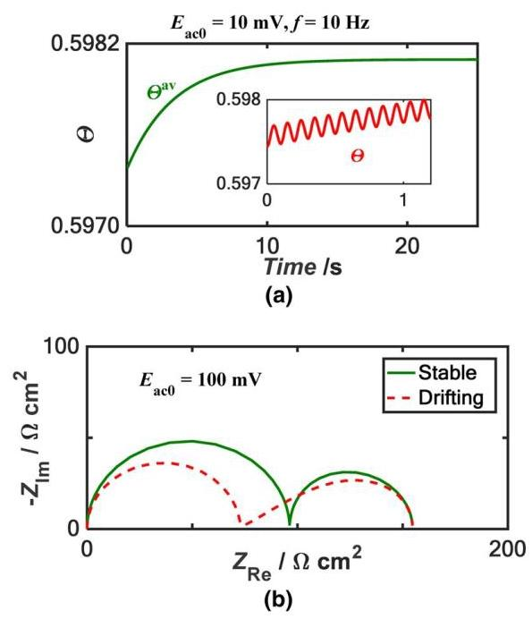

Figure 6. For the reaction mechanism described in Eq. 20, (a) transient and average surface coverage of the adsorbed intermediate $\left( {M}_{ads}^{ + }\right)$ as a function of time for potential perturbation at ${10}\mathrm{\;{Hz}}$ . The inset shows the transient surface coverage, at the initial stage. (b) Complex plane plots of impedance spectra at stable and drifting conditions. Adapted from Ref. 47.

图6. 对于式20中描述的反应机理，(a) 吸附中间体$\left( {M}_{ads}^{ + }\right)$的瞬态和平均表面覆盖随时间的变化，用于${10}\mathrm{\;{Hz}}$处的电位扰动。插图显示了初始阶段的瞬态表面覆盖。(b) 稳定和漂移条件下阻抗谱的复平面图。改编自参考文献47。

which is essentially the same expression used for ${R}_{\mathrm{t}}$ , but with a correction factor in terms of ${I}_{1}$ for the rate constants, and the average surface coverage values given by Eq. 22 should be used instead of the steady state surface coverage values.

它本质上与用于${R}_{\mathrm{t}}$的表达式相同，但速率常数有一个与${I}_{1}$相关的校正因子，并且应该使用式22给出的平均表面覆盖值而不是稳态表面覆盖值。

Using the proposed numerical simulation method, the nonlinear impedance of other complicated reactions can also be predicted. ${}^{{27},{46},{47}}$ In addition to calculating the values at fundamental frequency, the higher harmonics can easily be computed. NLEIS data were simulated numerically to understand the capability of KKT to detect nonlinearities in the data. ${}^{27}$ A reaction with an adsorbed intermediate species, an electrochemical - chemical reaction with two adsorbed intermediates and a reaction with two adsorbed species and showing negative resistance were examined. The results suggest that KKT could detect the nonlinearities successfully, if logarithm of faradaic current vs. dc potential exhibited nonlinear relationship.

使用所提出的数值模拟方法，也可以预测其他复杂反应的非线性阻抗。${}^{{27},{46},{47}}$除了计算基频处的值外，还可以轻松计算更高次谐波。对NLEIS数据进行了数值模拟，以了解KKT检测数据中非线性的能力。${}^{27}$研究了与吸附中间物种的反应、与两种吸附中间体的电化学 - 化学反应以及与两种吸附物种且显示负电阻的反应。结果表明，如果法拉第电流对直流电位的对数呈现非线性关系，KKT可以成功检测到非线性。

Harmonic analysis of ionic transport phenomena through ion exchange membrane systems was performed using numerical methods. ${}^{53}$ A theoretical model based on Nernst-Planck equation for dilute solutions was employed to compute the nonlinear response of ion transport through a cation exchange membrane system. The system was perturbed with a sinusoidal current signal and the resulting potential was expanded in Fourier series and resolved into harmonic components. The result at fundamental and higher harmonic, at different ${dc}$ values, were analyzed and the low frequency impedance was observed to increase with the input amplitude.

使用数值方法对通过离子交换膜系统的离子传输现象进行了谐波分析。${}^{53}$采用基于稀溶液能斯特 - 普朗克方程的理论模型来计算通过阳离子交换膜系统的离子传输的非线性响应。该系统用正弦电流信号进行扰动，得到的电位用傅里叶级数展开并分解为谐波分量。分析了在不同${dc}$值下基频和更高次谐波的结果，观察到低频阻抗随输入幅度增加。

## Applications of NLEIS

## NLEIS的应用

Most of the above studies are restricted to predicting the nonlinear response for a known electrochemical kinetics, and in most cases it was also assumed that the mass transfer is rapid. Usually the kinetics are not known and EIS is often employed to understand the physicochemical processes of the electrochemical system. In ideal cases, experimental data such as potentiodynamic polarization and traditional EIS as well as NLEIS would be acquired, and a detailed mechanism with a particular set of kinetic and transport parameters would be proposed and the predicted values would be compared with the experimental data. A good match between the simulated and experimental results is taken as validation of the proposed mechanism. Many a times, this is a very challenging task and it is difficult to achieve even a semi-quantitative match. If a quantitative match cannot be achieved, then even identifying a correlation between the physical phenomena and trends in the measured data can offer some insights into the system. Literature reports of NLEIS results which help in identifying the physical processes, and published in the last decade, are summarized below.

上述大多数研究仅限于预测已知电化学动力学的非线性响应，并且在大多数情况下还假设传质很快。通常动力学是未知的，并且经常使用EIS来理解电化学系统的物理化学过程。在理想情况下，将获取诸如动电位极化、传统EIS以及NLEIS等实验数据，并提出具有一组特定动力学和传输参数的详细机理，并将预测值与实验数据进行比较。模拟结果与实验结果之间的良好匹配被视为所提出机理的验证。很多时候，这是一项非常具有挑战性的任务，甚至很难实现半定量匹配。如果无法实现定量匹配，那么即使识别出物理现象与测量数据趋势之间的相关性也可以为系统提供一些见解。下面总结了近十年发表的有助于识别物理过程的NLEIS结果的文献报道。

Solid oxide fuel cells.—Electrochemical impedance of oxygen reduction reaction (ORR) at porous mixed conducting electrode was modeled using a physical model based on bulk transport pathway. ${}^{{54},{55}}$ This model was extended to incorporate the nonlinear effects due to the thermodynamic relation between the mole fraction of oxygen vacancies and oxygen activity in the solid and due to the oxygen exchange kinetics at the gas solid interface. The governing reaction mechanism in SOFC cathode material Lanthanum Strontium Cobalt Oxide $\left( {{\mathrm{{La}}}_{1 - \mathrm{x}}{\mathrm{{Sr}}}_{\mathrm{x}}{\mathrm{{CoO}}}_{3 - \delta }}\right)$ was investigated using NLEIS in galvanostatic mode. ${}^{4,5,{56},{57}}$ Wilson et al. studied the oxygen reduction mechanism at SOFC cathode using symmetric cathode cells. ${}^{4}$ They demonstrated the experimental measurement and analysis of first and third harmonic components of the voltage response of porous ${\mathrm{{La}}}_{0.8}{\mathrm{{Sr}}}_{0.2}{\mathrm{{CoO}}}_{3 - \delta }$ (LSC- 82) on samaria doped ceria (SDC) at ${750}^{ \circ  }\mathrm{C}$ in air ${}^{4}$ under galvanostatic mode. NLEIS data were recorded using potentiostat/galvanostat along with a function generator and digitizers, using an experimental setup similar to the one shown in Fig. 3. Gaussian apodization, also known as windowing, was employed before subjecting the time domain data to Fourier analysis. The ${\mathrm{n}}^{\text{ th }}$ harmonic potential was written as (in our notation)

固体氧化物燃料电池。——基于体输运路径的物理模型对多孔混合导电电极上氧还原反应(ORR)的电化学阻抗进行了建模。${}^{{54},{55}}$ 该模型得到扩展，以纳入由于固体中氧空位摩尔分数与氧活度之间的热力学关系以及气固界面处的氧交换动力学所导致的非线性效应。使用恒电流模式下的非线性电化学阻抗谱(NLEIS)研究了固体氧化物燃料电池阴极材料镧锶钴氧化物$\left( {{\mathrm{{La}}}_{1 - \mathrm{x}}{\mathrm{{Sr}}}_{\mathrm{x}}{\mathrm{{CoO}}}_{3 - \delta }}\right)$ 中的主导反应机制。${}^{4,5,{56},{57}}$ 威尔逊等人使用对称阴极电池研究了固体氧化物燃料电池阴极的氧还原机制。${}^{4}$ 他们展示了在恒电流模式下，在${750}^{ \circ  }\mathrm{C}$ 的空气中，多孔${\mathrm{{La}}}_{0.8}{\mathrm{{Sr}}}_{0.2}{\mathrm{{CoO}}}_{3 - \delta }$ (LSC - 82)在掺杂氧化铈(SDC)上的电压响应的一次和三次谐波分量的实验测量和分析。使用类似于图3所示的实验装置，通过恒电位仪/恒电流仪以及函数发生器和数字转换器记录非线性电化学阻抗谱数据。在对时域数据进行傅里叶分析之前，采用了高斯变迹法，也称为加窗法。${\mathrm{n}}^{\text{ th }}$ 谐波电位写为(按照我们的符号表示)

$$
{E}_{n} = \mathop{\sum }\limits_{{r = 1}}^{\infty }{\left( \frac{{i}_{ac0}}{{i}_{{ac0},{NL}}}\right) }^{n + {2r} - 2}{E}_{n, n + {2r} - 2}\left( \omega \right)
$$

$$
= {\left( {i}_{ac0}\right) }^{n}\mathop{\sum }\limits_{{r = 0}}^{\infty }\frac{{E}_{n, n + {2r}}\left( \omega \right) }{{\left( {i}_{{ac0},{NL}}\right) }^{{2r} + n}}{\left( {i}_{ac0}\right) }^{2r} \tag{24}
$$

Here, ${E}_{\mathrm{n},\mathrm{n} + 2\mathrm{r}}$ is amplitude independent primary response coefficient and ${i}_{{ac0},{NL}}$ is the current density that marks the onset of nonlinear effects in the system. Note that the equation is structurally similar to the series expansion of the modified Bessel function, given in Eq. 8. For practical applications, Eq. 24 can be truncated after a few terms. The authors experimentally measured the potential up to ${3}^{\text{ rd }}$ harmonics at varying amplitudes and calculated the primary response coefficients $\left( {E}_{\mathrm{n},\mathrm{n} + 2\mathrm{r}}\right)$ by fitting the harmonics to the power series in Eq. 24, for each frequency. The major driving force of oxygen exchange kinetics was assumed to be oxygen chemical potential difference between the gas and solid bulk. Model parameters corresponding to bulk thermodynamic properties of LSC-82 and ${\mathrm{{La}}}_{0.43}{\mathrm{{Sr}}}_{0.57}{\mathrm{{CoO}}}_{3 - \delta }$ , along with possible oxygen adsorption kinetics were evaluated to obtain the best match with the experimentally measured first and third harmonic data. Based on the analysis of nonlinear EIS data, in particular the third order spectra $\left( {{E}_{1,3}\text{ and }\left. {E}_{3,3}\right) }\right.$ , the authors concluded that the previously proposed model assuming complete bulk transport and thermodynamic properties of LSC-82 could not explain the higher harmonic results satisfactorily. Hence the authors suggested that the model has to be modified to include combined surface and bulk pathways, where the concentration of the vacancies is higher at the surface than in the bulk.

在此，${E}_{\mathrm{n},\mathrm{n} + 2\mathrm{r}}$ 是与幅度无关的一次响应系数，${i}_{{ac0},{NL}}$ 是标志系统中非线性效应开始的电流密度。请注意，该方程在结构上类似于式8中给出的修正贝塞尔函数的级数展开。对于实际应用，式24可以在几项之后截断。作者在不同幅度下实验测量了高达${3}^{\text{ rd }}$ 次谐波的电位，并通过将谐波拟合到式24中的幂级数，为每个频率计算了一次响应系数$\left( {E}_{\mathrm{n},\mathrm{n} + 2\mathrm{r}}\right)$。假设氧交换动力学的主要驱动力是气体和固体体相之间的氧化学势差。评估了与LSC - 8 的体相热力学性质相对应的模型参数${\mathrm{{La}}}_{0.43}{\mathrm{{Sr}}}_{0.57}{\mathrm{{CoO}}}_{3 - \delta }$ 以及可能的氧吸附动力学，以获得与实验测量的一次和三次谐波数据的最佳匹配。基于对非线性电化学阻抗谱数据的分析，特别是三阶谱$\left( {{E}_{1,3}\text{ and }\left. {E}_{3,3}\right) }\right.$，作者得出结论，先前提出的假设LSC - 82具有完全体相传输和热力学性质的模型不能令人满意地解释高次谐波结果。因此，作者建议必须修改该模型，以纳入表面和体相组合路径，其中表面处的空位浓度高于体相。

In a related work, the mechanism of oxygen reduction on thin film ${\mathrm{{La}}}_{0.6}{\mathrm{{Sr}}}_{0.4}{\mathrm{{CoO}}}_{3 - 8}$ and the rate limiting mechanism in porous ${\mathrm{{La}}}_{0.6}{\mathrm{{Sr}}}_{0.4}{\mathrm{{Co}}}_{3 - 8}$ (LSC 6410) electrodes on a gadolinium doped ceria ${\mathrm{{Ce}}}_{0.9}{\mathrm{{Gd}}}_{0.1}{\mathrm{O}}_{1.95}$ (GDC) electrolyte were investigated using NLEIS. ${}^{5,{57}}$ Various mechanisms of oxygen reduction on thin films were evaluated using the NLEIS data. ${}^{5}$ In one case, it was assumed that (i) energy barrier to dissociation was the rate limiting step. In the second case when the rate limiting step was assumed to involve (ii) dissociative adsorption of ${\mathrm{O}}_{2}$ on the vacant surface oxygen sites without an energy barrier, a match could be found. The impedance values in normalized form are presented in Fig. 7 as complex plane plots. Fig. 7a shows the experimental results while Figs. 7b and 7c show the predictions of mechanisms 1 and 2 respectively. Clearly, both mechanisms yielded similar impedance values and thus linear EIS cannot be used for model discrimination in this case. The experimentally measured and model predicted ${2}^{\text{ nd }}$ harmonics are presented as complex plane plots in Fig. 8. A comparison of Figs. 8a and 8b show that the first model predictions of second harmonic deviate significantly from the experimental data. On the other hand, the match between experimental results (Fig. 8a) and second model results (Fig. 8c) are good. A comparison of third harmonic results (not shown here) also led to the same conclusion. Thus NLEIS data help identify the correct mechanism in this study. In addition to the above two models, a few other mechanisms were also tested, viz. (iii) molecular non-dissociative adsorption or (iv) dissociation of other charged intermediates or (v) change in oxidation state of adsorbed monatomic intermediates or (vi) exchange of oxygen vacancies between surface and bulk were considered as rate limiting and evaluated. However, in all the above cases, the predicted trends were inconsistent with the experimental NLEIS results and hence these mechanisms were rejected.

在一项相关工作中，使用非线性电化学阻抗谱(NLEIS)研究了薄膜${\mathrm{{La}}}_{0.6}{\mathrm{{Sr}}}_{0.4}{\mathrm{{CoO}}}_{3 - 8}$上氧还原的机理以及钆掺杂二氧化铈${\mathrm{{Ce}}}_{0.9}{\mathrm{{Gd}}}_{0.1}{\mathrm{O}}_{1.95}$(GDC)电解质上多孔${\mathrm{{La}}}_{0.6}{\mathrm{{Sr}}}_{0.4}{\mathrm{{Co}}}_{3 - 8}$(LSC 6410)电极中的速率限制机理。${}^{5,{57}}$ 使用NLEIS数据评估了薄膜上各种氧还原机理。${}^{5}$ 在一种情况下，假设(i)解离的能垒是速率限制步骤。在第二种情况下，当假设速率限制步骤涉及(ii)${\mathrm{O}}_{2}$在没有能垒的空表面氧位点上的解离吸附时，可以找到匹配。归一化形式的阻抗值以复平面图的形式呈现于图7中。图7a显示了实验结果，而图7b和7c分别显示了机理1和机理2的预测。显然，两种机理产生了相似的阻抗值，因此在这种情况下线性电化学阻抗谱(EIS)不能用于模型判别。实验测量和模型预测的${2}^{\text{ nd }}$谐波以复平面图的形式呈现于图8中。图8a和8b 的比较表明，二次谐波的第一个模型预测与实验数据有显著偏差。另一方面，实验结果(图8a)与第二个模型结果(图8c)之间的匹配良好。三次谐波结果的比较(此处未显示)也得出了相同的结论。因此，NLEIS数据有助于在本研究中识别正确的机理。除了上述两种模型外，还测试了其他一些机理，即(iii)分子非解离吸附或(iv)其他带电中间体的解离或(v)吸附的单原子中间体氧化态的变化或(vi)表面与体相之间氧空位的交换被视为速率限制并进行了评估。然而，在上述所有情况下，预测趋势与实验NLEIS结果不一致，因此这些机理被排除。

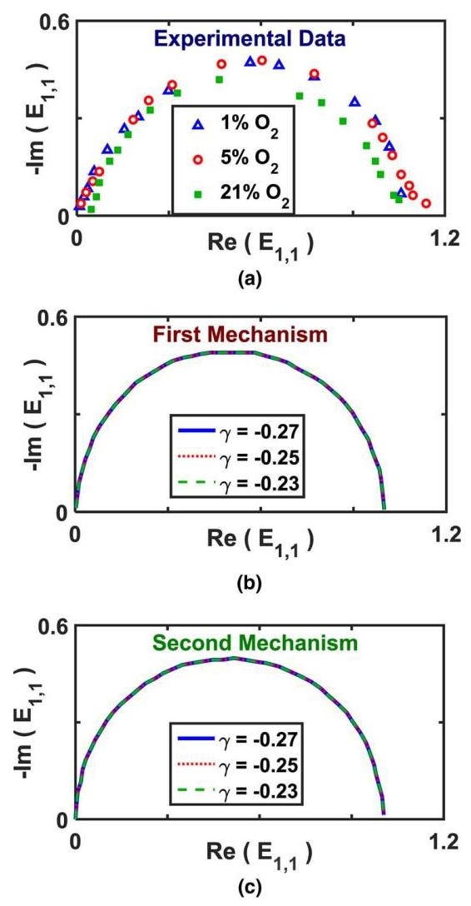

Figure 7. Complex plane plot of response of primary response coefficient at fundamental frequency $\left( {E}_{1,1}\right)$ (a) experimental data under different ${\mathrm{O}}_{2}$ gas environments in diluent ${\mathrm{N}}_{2}$ at ${725}^{ \circ  }\mathrm{C}$ . Calculated data as a function of thermodynamic factor $\gamma$ for (b) first mechanism (c) second mechanism. Both mechanisms predict ${E}_{1,1}$ equally well. The lines at various $\gamma$ overlap in (b) and (c) and are practically indistinguishable. Adapted from Ref. 5.

图7. 基频$\left( {E}_{1,1}\right)$下初级响应系数响应的复平面图 (a) 在${725}^{ \circ  }\mathrm{C}$ 时稀释剂${\mathrm{N}}_{2}$ 中不同${\mathrm{O}}_{2}$ 气体环境下的实验数据。作为热力学因子$\gamma$ 的函数的计算数据，用于(b) 第一种机理 (c) 第二种机理。两种机理预测${E}_{1,1}$ 的效果同样好。(b) 和(c) 中不同$\gamma$ 下的线重叠，实际上无法区分。改编自参考文献5。

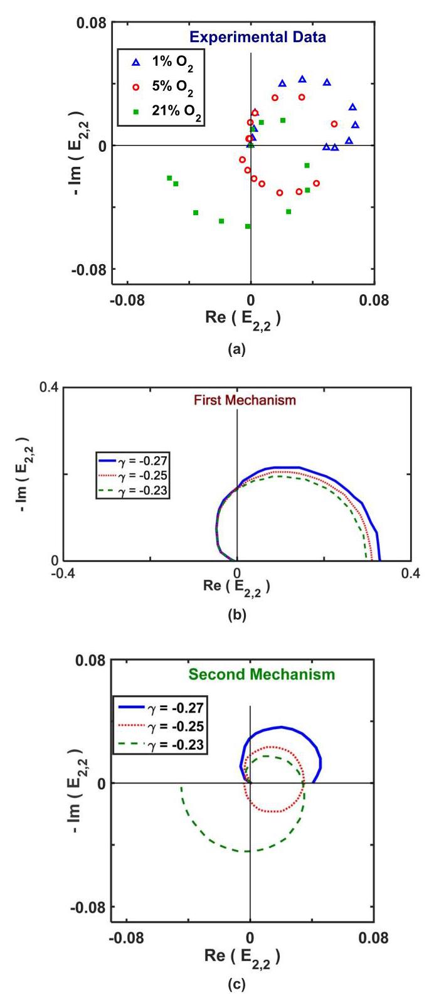

Figure 8. Complex plane plot of the primary response coefficient at ${2}^{\text{ nd }}$ harmonic $\left( {E}_{2,2}\right)$ (a) experimental data under different ${\mathrm{O}}_{2}$ gas environments in diluent ${\mathrm{N}}_{2}$ at ${725}^{ \circ  }\mathrm{C}$ . Calculated data as a function of thermodynamic factor $\gamma$ for (b) first mechanism and (c) second mechanism. Note that the predictions of first mechanism do not match the experimental data, while the predictions of second mechanism match them well. Adapted from Ref. 5.

图8. ${2}^{\text{ nd }}$ 谐波$\left( {E}_{2,2}\right)$ 下初级响应系数的复平面图 (a) 在${725}^{ \circ  }\mathrm{C}$ 时稀释剂${\mathrm{N}}_{2}$ 中不同${\mathrm{O}}_{2}$ 气体环境下的实验数据。作为热力学因子$\gamma$ 的函数的计算数据，用于(b) 第一种机理和(c) 第二种机理。注意，第一种机理的预测与实验数据不匹配，而第二种机理的预测与实验数据匹配良好。改编自参考文献5。

NLEIS data measurement and analysis for porous ${\mathrm{{La}}}_{0.6}{\mathrm{{Sr}}}_{0.4}{\mathrm{{Co}}}_{3 - \delta }$ (LSC 6410) electrodes on a gadolinium doped ceria ${\mathrm{{Ce}}}_{0.9}{\mathrm{{Gd}}}_{0.1}{\mathrm{O}}_{1.95}$ (GDC) electrolyte indicate that a combined bulk vacancy and surface interstitial diffusion pathway and a modification of the material surface due to Sr segregation have to be included in the existing model in order to obtain good fit for the ${2}^{\text{ nd }}$ and ${3}^{\text{ rd }}$ harmonics. ${}^{57}$ The drift effects in LSC electrode characteristics were also investigated using similar NLEIS approach. ${}^{56}$ The low frequency impedance values, as a function of time, were measured on ${45}\mathrm{\;{nm}}$ thick LSC-82 film at ${600}{}^{ \circ  }\mathrm{C}$ and 0.01 atm ${\mathrm{O}}_{2}$ . Over a period of 18 hours, the low frequency impedance values decreased with time, indicating nonstationary effects in the investigated system. But the second and the third harmonics were not affected much by the drift. Hence the authors concluded that the transient behavior was primarily due to the changes in the rate coefficients rather than any alteration in the mechanism or thermodynamic properties. Furthermore, the effects of Sr segregation in thin film LSC electrodes were studied using the second and third harmonics. ${}^{56}$ Thus, using NLEIS, a dissociative adsorption based reaction mechanism was deduced for oxygen reduction in varying composition of LSC electrodes in SOFC.

对钆掺杂二氧化铈${\mathrm{{Ce}}}_{0.9}{\mathrm{{Gd}}}_{0.1}{\mathrm{O}}_{1.95}$(GDC)电解质上的多孔${\mathrm{{La}}}_{0.6}{\mathrm{{Sr}}}_{0.4}{\mathrm{{Co}}}_{3 - \delta }$(LSC 6410)电极进行的NLEIS数据测量和分析表明，现有模型必须纳入体空位和表面间隙扩散的组合路径以及由于Sr偏析导致的材料表面改性，以便更好地拟合${2}^{\text{ nd }}$和${3}^{\text{ rd }}$谐波。${}^{57}$还使用类似的NLEIS方法研究了LSC电极特性中的漂移效应。${}^{56}$在${45}\mathrm{\;{nm}}$厚的LSC - 82薄膜上，于${600}{}^{ \circ  }\mathrm{C}$和0.01 atm${\mathrm{O}}_{2}$下测量了作为时间函数的低频阻抗值。在18小时的时间段内，低频阻抗值随时间下降，表明所研究系统中存在非平稳效应。但二次和三次谐波受漂移影响不大。因此，作者得出结论，瞬态行为主要是由于速率系数的变化，而非机制或热力学性质的任何改变。此外，使用二次和三次谐波研究了薄膜LSC电极中Sr偏析的影响。${}^{56}$因此，通过NLEIS，推导了基于解离吸附的反应机制，用于SOFC中不同组成的LSC电极的氧还原。

Polymer electrolyte membrane fuel cells.—Apart from the Fourier expansion presented in Eq. 1 and 2, other types of series expansions have also been employed to analyze nonlinear systems. Nonlinear Frequency Response Analysis (NFRA) analysis based on Volterra series and generalized Fourier transform is another approach that can be employed for the investigation of weakly nonlinear systems. ${}^{6,7,{58}}$ Volterra expansion is a functional Taylor series, ${}^{59}$ and the nonlinear response of an electrochemical system to input signal can be expressed in terms of Volterra series. Experimentally, when a time domain signal is processed with a frequency response analyzer (FRA), the frequency domain information (i.e. Fourier series coefficients and phase values) would be extracted. The Fourier series terms, referred to as quasi response functions in the original publication, ${}^{6}$ can be related to the higher order frequency response functions (HFRF) computed from Volterra series expansion. Under pseudo galvanostatic conditions with an applied perturbation amplitude of ${i}_{\mathrm{{ac}}0}$ , the relationship can be written (in our notation) as

聚合物电解质膜燃料电池。——除了式(1)和式(2)中给出的傅里叶展开式外，还采用了其他类型的级数展开来分析非线性系统。基于沃尔泰拉级数和广义傅里叶变换的非线性频率响应分析(NFRA)是另一种可用于研究弱非线性系统的方法。${}^{6,7,{58}}$沃尔泰拉展开是一种泛函泰勒级数，${}^{59}$电化学系统对输入信号的非线性响应可以用沃尔泰拉级数表示。在实验中，当用频率响应分析仪(FRA)处理时域信号时，将提取频域信息(即傅里叶级数系数和相位值)。在原始出版物中称为准响应函数的傅里叶级数项，${}^{6}$可以与从沃尔泰拉级数展开计算得到的高阶频率响应函数(HFRF)相关。在施加扰动幅度为${i}_{\mathrm{{ac}}0}$的伪恒电流条件下，该关系可以写成(按照我们的符号表示)为

$$
{E}_{1} = {i}_{ac0}\left\lbrack  {{H}_{1} + \frac{3}{4}{\left( {i}_{ac0}\right) }^{2}{H}_{3} + \frac{5}{8}{\left( {i}_{ac0}\right) }^{4}{H}_{5} + \ldots }\right\rbrack \tag{25a}
$$

$$
{E}_{2} = {\left( {i}_{ac0}\right) }^{2}\left\lbrack  {\frac{1}{2}{H}_{2} + \frac{1}{4}{\left( {i}_{ac0}\right) }^{2}{H}_{4} + \ldots }\right\rbrack \tag{25b}
$$

$$
{E}_{3} = {\left( {i}_{ac0}\right) }^{3}\left\lbrack  {\frac{1}{4}{H}_{3} + \frac{5}{16}{\left( {i}_{ac0}\right) }^{2}{H}_{5} + \ldots }\right\rbrack \tag{25c}
$$

where ${H}_{\mathrm{n}}$ is the ${\mathrm{n}}^{\text{ th }}$ order FRF. Here again, the structural similarity between Eq. 25 and Eq. 8 and 24 is striking. In Eq.,25 if ${i}_{\mathrm{{ac}}0}$ is selected such that the ${3}^{\text{ rd }}$ and higher harmonics are negligible, then it can be simplified as

其中${H}_{\mathrm{n}}$是${\mathrm{n}}^{\text{ th }}$阶FRF。这里，式(25)与式(8)和式(24)之间的结构相似性很显著。在式(25)中，如果选择${i}_{\mathrm{{ac}}0}$使得${3}^{\text{ rd }}$及更高次谐波可忽略不计，那么它可以简化为

$$
{H}_{1} = \frac{{E}_{1}}{{i}_{ac0}} \tag{26a}
$$

$$
{H}_{2} = \frac{2{E}_{2}}{{\left( {i}_{ac0}\right) }^{2}} \tag{26b}
$$

Using these relations, the nonlinear frequency response functions can be calculated from the experimental higher harmonic values. The main advantage of employing HFRF is that they are amplitude independent, while the Fourier coefficients are amplitude dependent. The higher order functions can be derived analytically from a nonlinear model using Volterra series and generalized Fourier transform. A limitation of this particular implementation is that the ${i}_{\mathrm{{ac}}0}$ cannot be arbitrarily increased to enhance the signal to noise ratio, since the ${3}^{\text{ rd }}$ and higher harmonics would also increase and cannot be neglected. It is possible to use the Eq. 25 instead of the simpler version given in Eq., 26 and the measurements have to be performed at multiple perturbation amplitudes to extract HFRF.

利用这些关系，可以根据实验得到的高次谐波值计算非线性频率响应函数。采用HFRF的主要优点是它们与幅度无关，而傅里叶系数与幅度有关。高阶函数可以使用沃尔泰拉级数和广义傅里叶变换从非线性模型中解析推导出来。这种特定实现方式的一个限制是，${i}_{\mathrm{{ac}}0}$不能任意增加以提高信噪比，因为${3}^{\text{ rd }}$及更高次谐波也会增加且不能忽略。可以使用式(25)代替式(26)中给出的更简单版本，并且必须在多个扰动幅度下进行测量以提取HFRF。

Nonlinear EIS data acquisition and analysis was employed to distinguish between membrane dehydration, flooding and anodic CO poisoning in polymer electrolyte membrane (PEM) fuel cells. ${}^{6}$ The measurements were performed using potentiostat/galvanostat with Newton ${4}^{\text{ th }}$ phase sensitive analyzer (PSA) PSM 1735. The data were recorded in the galvanostatic mode at three different ${dc}$ bias currents, viz. 3A, 6A and 9A corresponding to the activation controlled regime, membrane resistance controlled regime and mass transfer controlled regime respectively. The data were acquired only at single amplitude selected such that the third and the higher harmonics are negligible compared to the first and the second harmonics. The first and second harmonic responses of PEM fuel cell under normal, dehydration and flooding conditions were recorded at ${i}_{\mathrm{{ac}}0} = {58}\mathrm{\;{mA}}{\mathrm{\;{cm}}}^{-2}$ , while the experiments to compare the results with and without CO poisoning were conducted at ${i}_{\mathrm{{ac}}0} = {96}\mathrm{\;{mA}}{\mathrm{\;{cm}}}^{-2}$ . The NFRA spectra were computed from the experimentally measured harmonic values using Eq. 26. The data obtained at ${i}_{\mathrm{{dc}}} = {0.231}\mathrm{\;A}{\mathrm{\;{cm}}}^{-2}$ is shown in Fig. 9. Using normal EIS data, dehydration and CO poisoning cannot be distinguished but the signature of flooding in the EIS was clearly different. On the other hand, the effect of CO poisoning on the ${2}^{\text{ nd }}$ order FRF was distinguishable from other effects. ${}^{6,{24}}$ Taken together, ${1}^{\text{ st }}$ and ${2}^{\text{ nd }}$ order FRF can be used to identify flooding, dehydration and CO poisoning unambiguously. Thus, even without any model development, a correlation between physical phenomena and results at ${1}^{\text{ st }}$ and ${2}^{\text{ nd }}$ harmonics could be established using NLEIS data.

采用非线性电化学阻抗谱(EIS)数据采集与分析方法来区分聚合物电解质膜(PEM)燃料电池中的膜脱水、水淹和阳极一氧化碳中毒情况。${}^{6}$ 使用配备牛顿${4}^{\text{ th }}$ 相敏分析仪(PSA)PSM 1735的恒电位仪/恒电流仪进行测量。数据在三种不同的${dc}$ 偏置电流下以恒电流模式记录，即分别对应于活化控制区、膜电阻控制区和传质控制区的3A、6A和9A。仅在选定的单个幅度下采集数据，使得与基波和二次谐波相比，三次及更高次谐波可忽略不计。在${i}_{\mathrm{{ac}}0} = {58}\mathrm{\;{mA}}{\mathrm{\;{cm}}}^{-2}$ 记录了PEM燃料电池在正常、脱水和水淹条件下的基波和二次谐波响应，而在${i}_{\mathrm{{ac}}0} = {96}\mathrm{\;{mA}}{\mathrm{\;{cm}}}^{-2}$ 进行了有无一氧化碳中毒情况下结果对比的实验。根据实验测量的谐波值，使用式26计算归一化频率响应分析(NFRA)谱。在${i}_{\mathrm{{dc}}} = {0.231}\mathrm{\;A}{\mathrm{\;{cm}}}^{-2}$ 获得的数据如图9所示。使用常规EIS数据无法区分脱水和一氧化碳中毒，但EIS中水淹的特征明显不同。另一方面，一氧化碳中毒对${2}^{\text{ nd }}$ 阶频率响应函数(FRF)的影响与其他影响可区分开来。${}^{6,{24}}$ 综上所述，${1}^{\text{ st }}$ 和${2}^{\text{ nd }}$ 阶FRF可用于明确识别水淹、脱水和一氧化碳中毒。因此，即使不进行任何模型开发，利用非线性电化学阻抗谱(NLEIS)数据也可在${1}^{\text{ st }}$ 和${2}^{\text{ nd }}$ 谐波处建立物理现象与结果之间的相关性。

The anodic CO poisoning mechanism was investigated using steady state polarization curve, EIS and NLEIS methods. ${}^{7}$ The experiments were carried out in galvanostatic mode using potentio-stat/galvanostat and a FRA. The cell was operated as differential ${\mathrm{H}}_{2}/{\mathrm{H}}_{2}$ cell in order to avoid the masking effects due to the cathodic oxygen reduction reactions on the CO poisoning mechanism. The data was obtained at a ${dc}$ current value of ${0.1}\mathrm{\;A}{\mathrm{\;{cm}}}^{-2}$ using an amplitude of ${90}\mathrm{\;{mA}}{\mathrm{\;{cm}}}^{-2}$ in the experiments without $\mathrm{{CO}}$ poisoning and an amplitude of ${60}\mathrm{\;{mA}}{\mathrm{\;{cm}}}^{-2}$ in the experiments with ${20}\mathrm{{ppm}}$ and 100 ppm CO in the feed gas. These amplitude values were chosen such as the response contains contribution from the fundamental and second harmonics only. The range of frequency employed was from ${0.1}\mathrm{\;{Hz}}$ to ${10}\mathrm{{KHz}}$ . Bode plot representation of the first and second harmonic responses without CO, 20 ppm CO and 100 ppm CO content in the anodic feed gas are shown in Fig. 10. The mechanism proposed by Springer et al. ${}^{60}$ was employed and results of FRF ${\mathrm{H}}_{1}$ and ${\mathrm{H}}_{2}$ were compared with simulated values. The ${1}^{\text{ st }}$ order response $\left( {\mathrm{H}}_{1}\right)$ showed an increase in the magnitude of the low frequency impedance due to the blockage of the active catalyst sites by CO (Fig. 10). In the absence of CO, the magnitude of the ${2}^{\text{ nd }}$ order response $\left( {\mathrm{H}}_{2}\right)$ was found to be negligible and remain more or less constant. With an increase in the CO content, the magnitude of the ${\mathrm{H}}_{2}$ shows a significant increase in the low and mid frequency regions. The phase angle of the second order responses also exhibits a considerable shift as the CO concentration in the feed gas increase. Although the match was not quantitative, the trends were captured well.

采用稳态极化曲线、电化学阻抗谱(EIS)和非线性电化学阻抗谱(NLEIS)方法研究了阳极CO中毒机理。${}^{7}$ 实验在恒电流模式下使用恒电位仪/恒电流仪和一台频率响应分析仪(FRA)进行。该电池作为差分${\mathrm{H}}_{2}/{\mathrm{H}}_{2}$ 电池运行，以避免阴极氧还原反应对CO中毒机理的掩盖效应。在无$\mathrm{{CO}}$ 中毒的实验中，使用${90}\mathrm{\;{mA}}{\mathrm{\;{cm}}}^{-2}$ 的幅度，在进料气中含有${20}\mathrm{{ppm}}$ 和100 ppm CO的实验中，使用${60}\mathrm{\;{mA}}{\mathrm{\;{cm}}}^{-2}$ 的幅度，在${0.1}\mathrm{\;A}{\mathrm{\;{cm}}}^{-2}$ 的${dc}$ 电流值下获得数据。选择这些幅度值是为了使响应仅包含基波和二次谐波的贡献。所采用的频率范围是从${0.1}\mathrm{\;{Hz}}$ 到${10}\mathrm{{KHz}}$ 。阳极进料气中无CO、20 ppm CO和100 ppm CO含量时，一阶和二阶谐波响应的波特图如图10所示。采用了Springer等人${}^{60}$ 提出的机理，并将频率响应函数(FRF)${\mathrm{H}}_{1}$ 和${\mathrm{H}}_{2}$ 的结果与模拟值进行了比较。${1}^{\text{ st }}$ 阶响应$\left( {\mathrm{H}}_{1}\right)$ 显示，由于CO对活性催化剂位点的阻塞，低频阻抗的幅度增加(图10)。在没有CO的情况下，${2}^{\text{ nd }}$ 阶响应$\left( {\mathrm{H}}_{2}\right)$ 的幅度可以忽略不计，并且或多或少保持恒定。随着CO含量的增加，${\mathrm{H}}_{2}$ 的幅度在低频和中频区域显著增加。随着进料气中CO浓度的增加，二阶响应的相角也表现出相当大的偏移。虽然匹配不是定量的，但趋势捕捉得很好。

Direct methanol fuel cells.—Bensmann et al. performed theoretical analysis of methanol oxidation kinetics in direct methanol fuel cell (DMFC). ${}^{58}$ The reaction studied was

直接甲醇燃料电池。——Bensmann等人对直接甲醇燃料电池(DMFC)中的甲醇氧化动力学进行了理论分析。${}^{58}$ 所研究的反应是

$$
{\mathrm{{CH}}}_{3}\mathrm{{OH}} \rightarrow  {\mathrm{{CO}}}_{\text{ ads }} + 4{\mathrm{H}}^{ + } + 4{\mathrm{e}}^{ - } \tag{27a}
$$

$$
{\mathrm{H}}_{2}\mathrm{O} \leftrightarrow  {\mathrm{{OH}}}_{\text{ ads }} + {\mathrm{H}}^{ + } + {\mathrm{e}}^{ - } \tag{27b}
$$

$$
{\mathrm{{CO}}}_{\text{ ads }} + {\mathrm{{OH}}}_{\text{ ads }} \rightarrow  {\mathrm{{CO}}}_{2} + {\mathrm{H}}^{ + } + {\mathrm{e}}^{ - } \tag{27c}
$$

The adsorption model could be Langmuir or Frumkin and the rate constant in Eq. 27c could be potential dependent or independent. All four possible combinations were evaluated by analytically deriving the FRF up to the ${2}^{\text{ nd }}$ order, i.e. ${\mathrm{H}}_{1}$ and ${\mathrm{H}}_{2}{.}^{58}$ The main characteristic feature of the first order response function, which is the same as normal EIS, was the appearance of pseudo inductive loop at the low frequency end. All the four kinetic models predict roughly similar fundamental harmonic response and hence model discrimination based on EIS data alone is not possible. The ${2}^{\text{ nd }}$ order responses predicted by the four mechanisms exhibited qualitative differences, especially in the mid frequency region. Therefore it was concluded that measurement of ${2}^{\text{ nd }}$ FRF of methanol oxidation kinetics can provide additional information to distinguish between candidate mechanisms.

吸附模型可以是朗缪尔模型或弗鲁姆金模型，式27c中的速率常数可以是与电位有关或无关的。通过解析推导直至${2}^{\text{ nd }}$ 阶的频率响应函数(FRF)，即${\mathrm{H}}_{1}$ 和${\mathrm{H}}_{2}{.}^{58}$ ，对所有四种可能的组合进行了评估。一阶响应函数的主要特征与常规电化学阻抗谱相同，即在低频端出现伪感应环。所有四种动力学模型预测的基波谐波响应大致相似，因此仅基于电化学阻抗谱数据进行模型区分是不可能的。四种机理预测的${2}^{\text{ nd }}$ 阶响应表现出定性差异，特别是在中频区域。因此得出结论，测量甲醇氧化动力学的${2}^{\text{ nd }}$ 频率响应函数可以提供额外信息以区分候选机理。

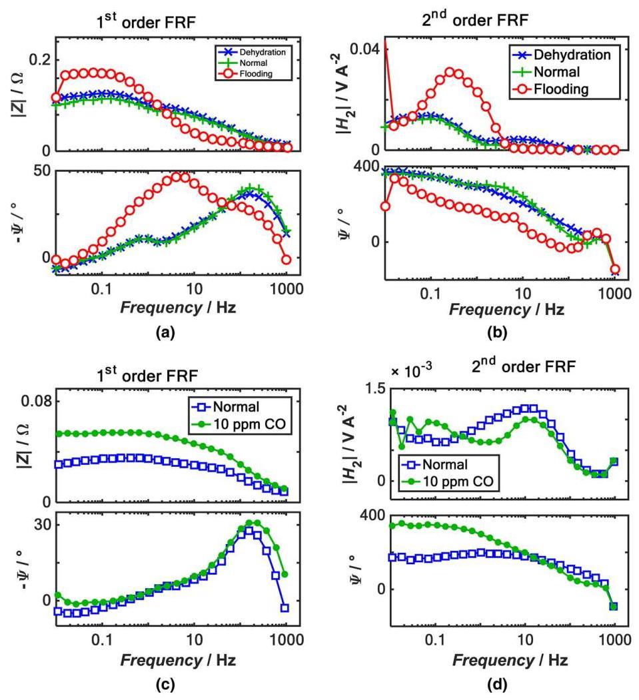

Figure 9. (a) ${1}^{\text{ st }}$ order FRF measured at ${i}_{\mathrm{{dc}}} = {0.231}\mathrm{\;A}{\mathrm{\;{cm}}}^{-2}$ and ${i}_{\mathrm{{ac}}0} = {58}\mathrm{{mA}}{\mathrm{{cm}}}^{-2}$ under dehydrated, normal and flooding conditions (b) ${2}^{\text{ nd }}$ order FRF measured at ${i}_{\mathrm{{dc}}} = {0.231} \; \mathrm{A}{\mathrm{{cm}}}^{-2}$ and ${i}_{\mathrm{{ac}}0} = {58}\mathrm{\;{mA}}{\mathrm{\;{cm}}}^{-2}$ under dehydrated, normal and flooding conditions (c) ${1}^{\text{ st }}$ order FRF measured at ${i}_{\mathrm{{dc}}} = \; {0.231}\mathrm{\;A}{\mathrm{\;{cm}}}^{-2}$ and ${i}_{\mathrm{{ac}}0} = {96}\mathrm{\;{mA}}{\mathrm{\;{cm}}}^{-2}$ under normal conditions and anodic poisoning with ${10}\mathrm{{ppm}}\mathrm{{CO}}$ (d) ${2}^{\text{ nd }}$ order FRF measured at ${i}_{\mathrm{{dc}}} = {0.231}\mathrm{\;A}{\mathrm{\;{cm}}}^{-2}$ and ${i}_{\mathrm{{ac}}0} = {96}\mathrm{\;{mA}} \; {\mathrm{{cm}}}^{-2}$ under normal conditions and anodic poisoning with 10 ppm CO. Adapted from Ref. 6.

图9. (a) 在脱水、正常和水淹条件下于${i}_{\mathrm{{dc}}} = {0.231}\mathrm{\;A}{\mathrm{\;{cm}}}^{-2}$和${i}_{\mathrm{{ac}}0} = {58}\mathrm{{mA}}{\mathrm{{cm}}}^{-2}$处测得的${1}^{\text{ st }}$阶频率响应函数 (b) 在脱水、正常和水淹条件下于${i}_{\mathrm{{dc}}} = {0.231} \; \mathrm{A}{\mathrm{{cm}}}^{-2}$和${i}_{\mathrm{{ac}}0} = {58}\mathrm{\;{mA}}{\mathrm{\;{cm}}}^{-2}$处测得的${2}^{\text{ nd }}$阶频率响应函数 (c) 在正常条件下以及用${10}\mathrm{{ppm}}\mathrm{{CO}}$进行阳极中毒时于${i}_{\mathrm{{dc}}} = \; {0.231}\mathrm{\;A}{\mathrm{\;{cm}}}^{-2}$和${i}_{\mathrm{{ac}}0} = {96}\mathrm{\;{mA}}{\mathrm{\;{cm}}}^{-2}$处测得的${1}^{\text{ st }}$阶频率响应函数 (d) 在正常条件下以及用10 ppm CO进行阳极中毒时于${i}_{\mathrm{{dc}}} = {0.231}\mathrm{\;A}{\mathrm{\;{cm}}}^{-2}$和${i}_{\mathrm{{ac}}0} = {96}\mathrm{\;{mA}} \; {\mathrm{{cm}}}^{-2}$处测得的${2}^{\text{ nd }}$阶频率响应函数。改编自参考文献6。

Total Harmonic Distortion (TDH) is another method used to characterize the nonlinear behavior of electrochemical systems. ${}^{{61},{62}}$ Under pseudo-potentiostatic conditions, THD can be defined as the ratio of the sum of amplitudes of responses at all higher harmonics to that of the fundamental frequency.

总谐波失真 (TDH) 是另一种用于表征电化学系统非线性行为的方法。${}^{{61},{62}}$ 在伪恒电位条件下，THD可定义为所有高次谐波响应幅度之和与基频响应幅度之比。

$$
{THD} = \frac{\sqrt{\mathop{\sum }\limits_{{k = 2}}^{\infty }{\left| {i}_{k}\right| }^{2}}}{{i}_{1}} \tag{28}
$$

where ${i}_{k}$ is the magnitude of the current at ${k}^{\text{ th }}$ harmonic. Under pseudo-galvanostatic conditions, the corresponding THD could be defined using the potential results. THD does not use phase data since phase values of different harmonics cannot be meaningfully combined. The nonlinear behavior of DMFC was investigated using THD analysis. ${}^{{25},{26}}$ THD and EIS data were recorded using Zahner impedance measurement units (IM6e and PP201) at 2.5 A ${dc}$ current and using 0.5 A input signal amplitude. Frequency of the input signal was scanned from $5\mathrm{{kHz}}$ to ${0.01}\mathrm{\;{Hz}}$ . The THD spectra and analysis were performed both in half cell and full cell modes. Potential responses from the first harmonic to tenth harmonic were obtained and the experimental THD spectra with different methanol concentrations are shown in the Fig. 11.

其中${i}_{k}$是${k}^{\text{ th }}$次谐波处的电流幅值。在伪恒电流条件下，相应的THD可用电位结果来定义。THD不使用相位数据，因为不同谐波的相位值无法有意义地组合。使用THD分析研究了直接甲醇燃料电池 (DMFC) 的非线性行为。${}^{{25},{26}}$ 使用Zahner阻抗测量单元 (IM6e和PP201) 在2.5 A${dc}$电流下并使用0.5 A输入信号幅度记录THD和电化学阻抗谱 (EIS) 数据。输入信号的频率从$5\mathrm{{kHz}}$扫描到${0.01}\mathrm{\;{Hz}}$。在半电池和全电池模式下都进行了THD谱图和分析。获得了从一次谐波到十次谐波的电位响应，不同甲醇浓度下的实验THD谱图如图11所示。

THD increases with concentration in the frequency range from 0.1 $\mathrm{{Hz}} - {0.63}\mathrm{\;{Hz}}$ and decreases with concentration from 0.01 $\mathrm{{Hz}} - {0.04}$ Hz frequency. Thus, at certain frequency intervals, the experimental THD spectra exhibited clear correlation with methanol concentration in the anodic feed. Hence it was proposed that THD analysis can be used to detect the methanol concentration during DMFC operation. The variation of THD spectra with methanol concentration and the methanol oxidation mechanism in DMFC were also investigated. ${}^{25}$ The observed features of the THD spectra were reproduced qualitatively by assuming a three step mechanism for methanol oxidation with Kauranen-Frumkin/Temkin kinetics rather than a one-step mechanism. THD values were computed by transforming the potential results to frequency domain using Fourier transform and resolving into fundamental and higher harmonic components. Experiments conducted in the full cell mode of DMFC operation also showed similar results, indicating that THD analysis can be employed for sensing methanol concentration during fuel cell operation. Thus THD can help in identifying the reaction mechanism as well as in identifying the changes in operating conditions.

在0.1$\mathrm{{Hz}} - {0.63}\mathrm{\;{Hz}}$的频率范围内，THD随浓度增加，而在0.01$\mathrm{{Hz}} - {0.04}$Hz频率下随浓度降低。因此，在某些频率区间，实验THD谱图与阳极进料中的甲醇浓度呈现出明显的相关性。因此有人提出，THD分析可用于在DMFC运行期间检测甲醇浓度。还研究了THD谱图随甲醇浓度的变化以及DMFC中的甲醇氧化机理。${}^{25}$ 通过假设甲醇氧化的三步机理以及考兰宁 - 弗鲁姆金/捷姆金动力学而非一步机理，定性地再现了观察到的THD谱图特征。通过使用傅里叶变换将电位结果转换到频域并分解为基波和高次谐波分量来计算THD值。在DMFC运行的全电池模式下进行的实验也显示了类似的结果，表明THD分析可用于在燃料电池运行期间传感甲醇浓度。因此，THD有助于识别反应机理以及识别运行条件的变化。

Other Applications.-The electrochemical properties of industrial lubricants at different stages of degradation were characterized using higher harmonic NLEIS technique. ${}^{63}$ Lubrication samples were subjected to oxidation engine test. Samples after ${20}\mathrm{\;h},{40}\mathrm{\;h}$ and ${80}\mathrm{\;h}$ of test runs, as well as fresh samples (0 h) were analyzed using a two electrode setup. Current data was acquired in the frequency range of ${20}\mathrm{{MHz}}$ to $5\mathrm{{mHz}}$ at an amplitude $\left( {E}_{\mathrm{{ac}}0}\right)$ of ${1.5}\mathrm{\;V}$ . Since there was no water in the samples, such large amplitudes could be employed. Fundamental, second and third harmonics were recorded and analyzed to investigate the processes affecting the low frequency impedance behavior of the lubricant samples. The reaction involved in the adsorption process was described by Butler Volmer kinetics and the diffusion impedance was described by finite transmission boundary diffusion model. The experimental linear impedance did not show a monotonic trend with engine test duration and hence cannot be used to ascertain the extent of oil degradation. On the other hand, ${2}^{\text{ nd }}$ harmonic data showed a clear monotonic trend with test duration. Physical model in combination with EEC, representing the charge and mass transfer processes and adsorption processes at the electrode electrolyte interface was developed to explain the low frequency behavior. The model and the kinetic parameters which result in best fit of the experimental fundamental and higher harmonic data was obtained using numerical minimizations routines. The best fit EEC model is shown in Fig. 12a.

其他应用。- 使用高次谐波非线性电化学阻抗谱(NLEIS)技术对工业润滑剂在不同降解阶段的电化学性质进行了表征。${}^{63}$ 对润滑样品进行了氧化发动机试验。使用两电极装置对试验运行 ${20}\mathrm{\;h},{40}\mathrm{\;h}$ 和 ${80}\mathrm{\;h}$ 后的样品以及新鲜样品(0小时)进行了分析。在幅度为 ${1.5}\mathrm{\;V}$ 的 $\left( {E}_{\mathrm{{ac}}0}\right)$ 下，在 ${20}\mathrm{{MHz}}$ 至 $5\mathrm{{mHz}}$ 的频率范围内采集电流数据。由于样品中没有水，因此可以采用如此大的幅度。记录并分析了基波、二次谐波和三次谐波，以研究影响润滑剂样品低频阻抗行为的过程。吸附过程中涉及的反应由巴特勒-沃尔默动力学描述，扩散阻抗由有限传输边界扩散模型描述。实验线性阻抗未随发动机试验持续时间呈现单调趋势，因此不能用于确定油的降解程度。另一方面，${2}^{\text{ nd }}$ 谐波数据随试验持续时间呈现明显的单调趋势。结合电化学等效电路(EEC)开发了物理模型，该模型代表电极-电解质界面处的电荷和质量转移过程以及吸附过程，以解释低频行为。使用数值最小化程序获得了与实验基波和高次谐波数据最佳拟合的模型和动力学参数。最佳拟合的EEC模型如图12a所示。

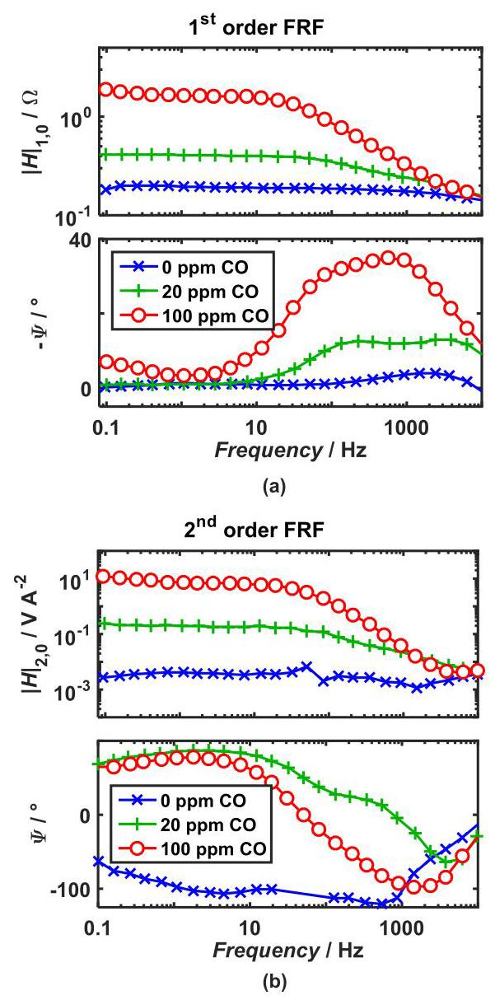

Figure 10. Measured NFRA spectra in ${\mathrm{H}}_{2}/{\mathrm{H}}_{2}$ operation with various anode CO content, at ${i}_{\mathrm{{dc}}} = {100}\mathrm{{mA}}{\mathrm{{cm}}}^{-2}$ . The perturbation amplitude ${i}_{\mathrm{{ac}}0} = {90}\mathrm{{mA}} \; {\mathrm{{cm}}}^{-2}$ for no CO poisoning and ${i}_{\mathrm{{ac}}0} = {60}\mathrm{{mA}}{\mathrm{{cm}}}^{-2}$ for 20 and ${100}\mathrm{{ppm}}\mathrm{{CO}}$ poisoning. (a) Magnitude and phase of ${1}^{\text{ st }}$ order FRF, ${\mathrm{H}}_{1,0}$ (b) Magnitude and phase of ${2}^{\text{ nd }}$ order FRF, ${\mathrm{H}}_{2,0}$ . Adapted from Ref. 7.

图10。在 ${i}_{\mathrm{{dc}}} = {100}\mathrm{{mA}}{\mathrm{{cm}}}^{-2}$ 时，在 ${\mathrm{H}}_{2}/{\mathrm{H}}_{2}$ 运行中，不同阳极CO含量下测得的NFRA光谱。无CO中毒时的扰动幅度为 ${i}_{\mathrm{{ac}}0} = {90}\mathrm{{mA}} \; {\mathrm{{cm}}}^{-2}$，20%和 ${100}\mathrm{{ppm}}\mathrm{{CO}}$ 中毒时的扰动幅度为 ${i}_{\mathrm{{ac}}0} = {60}\mathrm{{mA}}{\mathrm{{cm}}}^{-2}$。(a) ${1}^{\text{ st }}$ 阶FRF的幅度和相位，${\mathrm{H}}_{1,0}$ (b) ${2}^{\text{ nd }}$ 阶FRF的幅度和相位，${\mathrm{H}}_{2,0}$。改编自参考文献7。

Studies on microparticle biomarker samples derived from monocytes (white blood cells) suggested that potential-induced micropar-ticle lysis and subsequent redox reactions between the electro active components may be the reason for the low frequency impedance of these samples. ${}^{64}$ This was further analyzed using NLEIS technique. ${}^{40}$ Nonlinear EIS measurements were conducted using an Impedance analyzer (Novocontrol GmbH, Hundsangen Germany) with ZG4 cell adapter. A three electrode system configuration with gold plated copper working and counter electrodes and $\mathrm{{Ag}}/\mathrm{{AgCl}}$ reference electrode was employed. Fundamental and ${2}^{\text{ nd }}$ harmonic impedance of mi-croparticle biomarkers samples recorded at different ${dc}$ potentials were fitted to a process model shown as equivalent circuit in Fig. 12b. The model accounts for adsorption of microparticles, double layer as constant phase element, diffusion and simple electron transfer reaction of lysed components. It was assumed that the concentration of redox couple could be described in Nernst equation. Mass transport process was described by finite absorbing boundary diffusion and the microparticle adsorption process was assumed to occur via a single step mechanism. The nonlinear terms in the governing equations were expanded in power series and were separated into harmonic components. Second harmonic impedance was defined as $\overline{{E}_{2\omega }}/\overline{{i}_{2\omega }}$ where $\overline{{E}_{2\omega }} = {\left( {E}_{\mathrm{{ac}}0}\right) }^{2}\sin \left( {\omega \mathrm{t}}\right)$ . The physical parameters were obtained by fitting the experimental data. NLEIS results indicated that the applied potential caused lysis of the microparticle membranes. However, quantification of microparticles by NLEIS was not recommended and for that purpose, linear EIS at various ${dc}$ potential was suggested instead.

对源自单核细胞(白细胞)的微粒生物标志物样本的研究表明，潜在诱导的微粒裂解以及随后电活性成分之间的氧化还原反应可能是这些样本低频阻抗的原因。${}^{64}$ 使用非线性电化学阻抗谱(NLEIS)技术对此进行了进一步分析。${}^{40}$ 使用带有ZG4电池适配器的阻抗分析仪(德国洪桑根的Novocontrol GmbH公司)进行非线性电化学阻抗谱(EIS)测量。采用了一种三电极系统配置，其中包括镀金铜工作电极和对电极以及$\mathrm{{Ag}}/\mathrm{{AgCl}}$ 参比电极。在不同${dc}$ 电位下记录的微粒生物标志物样本的基波和${2}^{\text{ nd }}$ 谐波阻抗被拟合到一个过程模型，该模型如图12b中的等效电路所示。该模型考虑了微粒的吸附、作为常相位元件的双层、扩散以及裂解成分的简单电子转移反应。假设氧化还原对的浓度可以用能斯特方程来描述。质量传输过程用有限吸收边界扩散来描述，并且假设微粒吸附过程通过单步机制发生。控制方程中的非线性项以幂级数展开并分离为谐波成分。二次谐波阻抗定义为$\overline{{E}_{2\omega }}/\overline{{i}_{2\omega }}$ 其中$\overline{{E}_{2\omega }} = {\left( {E}_{\mathrm{{ac}}0}\right) }^{2}\sin \left( {\omega \mathrm{t}}\right)$ 。通过拟合实验数据获得物理参数。非线性电化学阻抗谱(NLEIS)结果表明，施加的电位导致微粒膜裂解。然而，不建议使用非线性电化学阻抗谱(NLEIS)对微粒进行定量，为此，建议改为在各种${dc}$ 电位下进行线性电化学阻抗谱(EIS)。

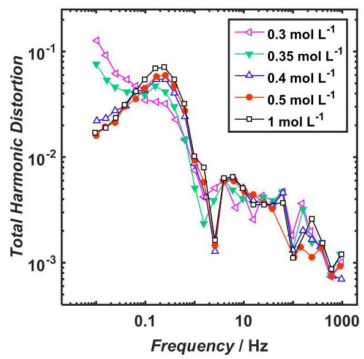

Figure 11. Experimental THD spectra of the DMFC in half cell mode for different methanol concentrations at ${i}_{\mathrm{{dc}}} = {96}\mathrm{\;{mA}}{\mathrm{\;{cm}}}^{-2},{i}_{\mathrm{{ac}}0} = {19.2}\mathrm{\;{mA}} \; {\mathrm{{cm}}}^{-2}$ . Adapted from Ref. 25.

图11. 在${i}_{\mathrm{{dc}}} = {96}\mathrm{\;{mA}}{\mathrm{\;{cm}}}^{-2},{i}_{\mathrm{{ac}}0} = {19.2}\mathrm{\;{mA}} \; {\mathrm{{cm}}}^{-2}$ 下，不同甲醇浓度的直接甲醇燃料电池(DMFC)半电池模式下的实验总谐波失真(THD)光谱。改编自参考文献25。

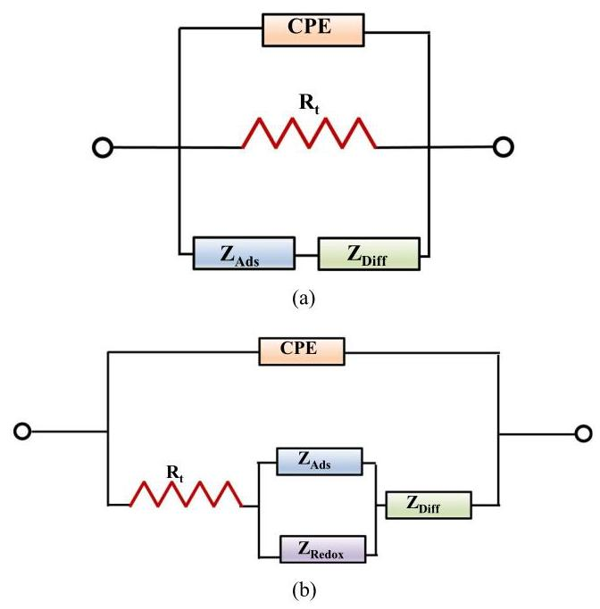

Figure 12. Equivalent circuit model for the low frequency impedance segment. ${\mathrm{Z}}_{\text{ Diff }}$ - Diffusion impedance, ${\mathrm{Z}}_{\text{ Ads }}$ - Adsorption impedance and ${\mathrm{Z}}_{\text{ Redox }}$ - microparticle lysed component redox process. (a) EEC for lubricants and (b) for biomarker samples obtained from monocytes. Adapted from Refs. 63 and 40 respectively.

图12. 低频阻抗段的等效电路模型。${\mathrm{Z}}_{\text{ Diff }}$ - 扩散阻抗，${\mathrm{Z}}_{\text{ Ads }}$ - 吸附阻抗，${\mathrm{Z}}_{\text{ Redox }}$ - 微粒裂解成分氧化还原过程。(a) 润滑剂的等效电路，(b) 从单核细胞获得的生物标志物样品的等效电路。分别改编自参考文献63和40。

## Prospectus

## 引言

Although experimental and theoretical results on NLEIS have been published since 1990s, the reports on application of NLEIS to investigate practical problems have been rather limited, while the linear EIS has found extensive usage in a variety of fields. EIS is a standard feature in most of the commercial electrochemical instruments and usually it comes with a convenient user interface, facilitating easy acquisition of linear EIS data. In contrast, to acquire NLEIS of any system, researchers often have to assemble multiple instruments possibly from different manufacturers and write control, data acquisition and digital signal processing (DSP) programs. For many users, this is a significant road block toward performing NLEIS experiments. The duration of experiment and signal to noise (S/N) ratio are two important metrics of any measurement technique. During NLEIS measurement using Solartron 1250 FRA, the higher harmonic data recorded showed poor S/N ratio at frequencies above $3\mathrm{{kHz}}{.}^{65}$ This is presumably because traditional EIS is more widely used and the data acquisition and DSP electronics may be optimized to achieve good S/N ratio mainly at fundamental frequency. Similarly, when PSM 1735 PSA was employed, noise control on the input signal was poor at frequencies above ${10}\mathrm{{kHz}}{.}^{65}$ More importantly, duration of a typical NLEIS measurement is significantly longer than that of traditional EIS measurement. When an ADC was used to record NLEIS data, 100 cycles were needed to achieve a good S/N ratio. ${}^{65}$ The lowest frequency at which data was recorded was ${50}\mathrm{{mHz}}$ and the corresponding NLEIS acquisition time would be ${2000}\mathrm{\;s}$ for this single datum. In another study,20 cycles were employed at each frequency and the lowest frequency employed was ${100}\mathrm{{mHz}}$ , with a corresponding data acquisition time of ${200}\mathrm{\;s}$ for this datum alone. In contrast, traditional EIS measurement in the entire frequency range of ${100}\mathrm{{kHz}}$ to ${100}\mathrm{{mHz}}$ can be completed in less than ${200}\mathrm{\;s}$ . It is highly desirable to evolve a faster NLEIS data acquisition methodology while maintaining a good S/N ratio.

尽管自20世纪90年代以来已经发表了关于非线性电化学阻抗谱(NLEIS)的实验和理论结果，但将NLEIS应用于研究实际问题的报告相当有限，而线性电化学阻抗谱(EIS)已在各种领域得到广泛应用。EIS是大多数商业电化学仪器的标准功能，通常具有方便的用户界面，便于轻松获取线性EIS数据。相比之下，要获取任何系统的NLEIS，研究人员通常必须组装可能来自不同制造商的多种仪器，并编写控制、数据采集和数字信号处理(DSP)程序。对于许多用户来说，这是进行NLEIS实验的一个重大障碍。实验持续时间和信噪比(S/N)是任何测量技术的两个重要指标。在使用Solartron 1250 FRA进行NLEIS测量期间，记录的高次谐波数据在高于$3\mathrm{{kHz}}{.}^{65}$的频率处显示出较差的S/N比。这可能是因为传统EIS使用更广泛，数据采集和DSP电子设备可能主要针对在基频处实现良好的S/N比进行了优化。同样，当使用PSM 1735 PSA时，在高于${10}\mathrm{{kHz}}{.}^{65}$的频率处输入信号的噪声控制较差。更重要的是，典型的NLEIS测量持续时间明显长于传统EIS测量。当使用ADC记录NLEIS数据时，需要100个周期才能获得良好的S/N比。${}^{65}$ 记录数据的最低频率是${50}\mathrm{{mHz}}$，对于这个单一数据，相应的NLEIS采集时间将是${2000}\mathrm{\;s}$。在另一项研究中，每个频率使用20个周期，使用的最低频率是${100}\mathrm{{mHz}}$，仅这个数据的相应数据采集时间是${200}\mathrm{\;s}$。相比之下，在${100}\mathrm{{kHz}}$到${100}\mathrm{{mHz}}$的整个频率范围内进行传统EIS测量可以在不到${200}\mathrm{\;s}$的时间内完成。非常希望开发一种更快的NLEIS数据采集方法，同时保持良好的S/N比。

In case of EIS, oscilloscopes and lock-in amplifiers were used in the early days, but now FRAs are universally employed. There is no standardization of experimental method to acquire NLEIS data yet: phase sensitive detectors, or FRA or ADC with further processing of data by the user, have all been employed in the recently published results. ${}^{8,9,{65},{66}}$ Yet another difficulty faced by the NLEIS user is the lack of fast analysis using EEC and the limited number of studies available in the literature. ${}^{65}$ There are several reports which present traditional EIS data and analysis using EEC and to a lesser extent using RMA, which enable users to compare and interpret their experimental data. There are fewer publications on NLEIS which can be used as reference points for comparison and interpretation, but this also points to many opportunities available for investigation. Admittedly, the analysis of NLEIS data is more challenging than that of linear EIS and lack of easy to use analysis software is an impediment. We believe that development of uncomplicated hardware and software and standardization of analysis methods will enable wider application of NLEIS. Only recently, reports demonstrating actual utility of NLEIS have been published. We anticipate that in the near future, a number of empirical and semi-empirical studies on NLEIS application would be reported, and that at later stages, with accumulation of large NLEIS data, rigorous NLEIS analysis providing better insight into electrochemical systems would become available.

在EIS的情况下，早期使用示波器和锁相放大器，但现在普遍使用频响分析仪(FRA)。目前还没有获取NLEIS数据的实验方法的标准化:相敏探测器、FRA或用户进一步处理数据的ADC，都已在最近发表的结果中使用。${}^{8,9,{65},{66}}$ NLEIS用户面临的另一个困难是缺乏使用等效电路模型(EEC)的快速分析以及文献中可用研究数量有限。${}^{65}$ 有几份报告展示了传统EIS数据以及使用EEC并在较小程度上使用拉普拉斯变换分析(RMA)的分析，这使用户能够比较和解释他们的实验数据。关于NLEIS的出版物较少，可作为比较和解释的参考点，但这也指出了许多可供研究的机会。诚然，NLEIS数据的分析比线性EIS更具挑战性，缺乏易于使用的分析软件是一个障碍。我们相信，开发简单的硬件和软件以及分析方法的标准化将使NLEIS得到更广泛的应用。直到最近，才发表了证明NLEIS实际效用的报告。我们预计在不久的将来，将报告许多关于NLEIS应用的实证和半实证研究，并且在后期，随着大量NLEIS数据的积累，将提供能更好洞察电化学系统的严格NLEIS分析。

## Conclusions

## 结论

EIS is a versatile technique used to probe electrochemical interfaces, and it is used in a variety of applications such as corrosion, fuel cell, biosensor etc. Traditional (linear) EIS is powerful and in many applications, it provides sufficient information to characterize the system. NLEIS can be thought of as an extension of EIS, and it can give additional information compared to EIS. In NLEIS, the response at fundamental frequency to large amplitude perturbations can yield some additional information, and recording the response at higher harmonics can yield significantly more information, since contributions from double layer capacitance to higher harmonics are usually small. For a simple redox reaction, extensive analysis has been performed and experimental results have been compared. For electrochemical reactions in non-blocking electrodes, expressions for the low frequency limit of the impedance at fundamental frequency $\left( {R}_{\mathrm{p},\mathrm{{NL}}}\right)$ have been developed under potentiostatic and galvanostatic conditions. In case of complex reactions, there is limited information available in literature, especially at higher harmonics.

电化学阻抗谱(EIS)是一种用于探测电化学界面的通用技术，它被应用于各种领域，如腐蚀、燃料电池、生物传感器等。传统的(线性)EIS功能强大，在许多应用中，它能提供足够的信息来表征系统。非线性电化学阻抗谱(NLEIS)可以被看作是EIS的扩展，与EIS相比，它能提供更多信息。在NLEIS中，基频下对大振幅扰动的响应可以产生一些额外信息，记录更高谐波的响应能产生更多信息，因为双层电容对更高谐波的贡献通常较小。对于一个简单的氧化还原反应，已经进行了广泛的分析并比较了实验结果。对于非阻塞电极中的电化学反应，在恒电位和恒电流条件下，已经推导出了基频$\left( {R}_{\mathrm{p},\mathrm{{NL}}}\right)$下阻抗低频极限的表达式。对于复杂反应，文献中的信息有限，尤其是在更高谐波方面。

To predict the NLEIS response of a system, Taylor series expansion or Fourier expansion or numerical methods can be used. Other variables such as primary response coefficient or Volterra kernel have been extracted from the higher harmonics, to remove the dependency on applied perturbation, and analyzed. THD can be used as a measure of nonlinearity and employed to draw conclusions based on empirical understanding, but rigorous analysis and interpretations would be challenging since phase information is discarded in THD. Recent reports illustrate that NLEIS can identify the physical process unambiguously in certain cases where linear EIS results are indistinguishable. It is likely that in the near future, NLEIS will be employed for semi-empirical understanding of electrochemical systems, and with further development of rigorous analysis, it would become a more common technique offering additional insights into the physico chemical processes occurring at the electrochemical interfaces.

为了预测系统的NLEIS响应，可以使用泰勒级数展开、傅里叶展开或数值方法。已经从更高谐波中提取了诸如初级响应系数或沃尔泰拉核等其他变量，以消除对施加扰动的依赖性并进行分析。总谐波失真(THD)可以用作非线性的度量，并用于基于经验理解得出结论，但由于THD中丢弃了相位信息，严格的分析和解释将具有挑战性。最近的报告表明，在某些线性EIS结果无法区分的情况下，NLEIS可以明确识别物理过程。在不久的将来，NLEIS很可能会被用于对电化学系统的半经验理解，并且随着严格分析的进一步发展，它将成为一种更常见的技术，为电化学界面发生的物理化学过程提供更多见解。

## References

## 参考文献

1. M. E. Orazem and B. Tribollet, Electrochemical impedance spectroscopy, John Wiley& Sons, New Jersey (2011).

新泽西州:& Sons(2011年)。

2. V. F. Lvovich, Impedance spectroscopy: applications to electrochemical and dielectric phenomena, John Wiley & Sons, New Jersey (2012).

3. D. D. Macdonald, Electrochim. Acta, 51, 1376 (2006).

4. J. R. Wilson, D. T. Schwartz, and S. B. Adler, Electrochim. Acta, 51, 1389 (2006).

5. J. R. Wilson, M. Sase, T. Kawada, and S. B. Adler, Electrochem. Solid-State Lett.,10, B81 (2007).

6. T. Kadyk, R. Hanke-Rauschenbach, and K. Sundmacher, J. Electroanal. Chem., 630,19 (2009).

7. T. Kadyk, R. Hanke-Rauschenbach, and K. Sundmacher, J. Appl. Electrochem., 41,1021 (2011).

8. N. Xu and J. Riley, Electrochem. Commun., 13, 1077 (2011).

9. N. Xu and D. J. Riley, Electrochim. Acta, 94, 206 (2013).

10. J. R. Wilson, S. B. Adler, and D. T. Schwartz, Phys. Fluids, 17, 063601 (2005).

11. K. Darowicki, Electrochim. Acta, 39, 2757 (1994).

12. K. Darowicki, Electrochim. Acta, 40, 439 (1995).

13. J.-P. Diard, B. Le Gorrec, and C. Montella, J. Electroanal. Chem., 432, 27 (1997).

14. J.-P. Diard, B. Le Gorrec, and C. Montella, J. Electroanal. Chem., 432, 41 (1997).

15. J.-P. Diard, B. Le Gorrec, and C. Montella, J. Electroanal. Chem., 432, 53 (1997).

16. K. Darowicki and J. Orlikowski, Electrochim. Acta, 44, 433 (1998).

17. K. Darowicki, Corros. Sci., 37, 913 (1995).

18. T. J. McDonald and S. Adler, ECS Trans, , 45, 429 (2012).

19. K. Darowicki, Electrochim. Acta, 42, 1781 (1997).

20. K. Darowicki, Electrochim. Acta, 42, 1073 (1997).

21. J.-P. Diard, B. Le Gorrec, and C. Montella, Corros. Sci., 40, 495 (1998).

22. J.-P. Diard, B. Le Gorrec, and C. Montella, Electrochim. Acta, 39, 539 (1994).

23. J.-P. Diard, B. Le Gorrec, and C. Montella, Electrochim. Acta, 42, 1053 (1997).

24. T. Kadyk, R. Hanke-Rauschenbach, and K. Sundmacher, Int. J. Hydrogen Energy,37, 7689 (2012).

25. Q. Mao and U. Krewer, Electrochim. Acta, 68, 60 (2012).

26. Q. Mao, U. Krewer, and R. Hanke-Rauschenbach, Electrochem. Commun., 12, 1517 (2010).

27. F. Fasmin and R. Srinivasan, J. Solid State Electrochem., 19, 1833 (2015).

28. N. Wagner and E. Gülzow, J. Power Sources, 127, 341 (2004).

29. N. Wagner and M. Schulze, Electrochim. Acta, 48, 3899 (2003).

30. A. Lasia, Electrochemical Impedance Spectroscopy and its Applications, Springer,New York (2014).

纽约(2014年)。

31. J.-P. Diard, B. Le Gorrec, C. Montella, and C. Montero-Ocampo, J. Electroanal. Chem., 352, 1 (1993).

32. D. D. Macdonald and M. Urquidi-Macdonald, J. Electrochem. Soc., 132, 2316 (1985).

33. P. Agarwal, O. D. Crisalle, M. E. Orazem, and L. H. Garcia-Rubio, Journal of the Electrochemical Society, 142, 4149 (1995).

34. P. Agarwal, M. E. Orazem, and L. H. Garcia-Rubio, Journal of the Electrochemical Society, 142, 4159 (1995).

35. P. Agarwal, M. E. Orazem, and L. H. Garcia-Rubio, Journal of the Electrochemical Society, 139, 1917 (1992).

36. B. A. Boukamp, J. Electrochem. Soc., 142, 1885 (1995).

37. D. A. Harrington, Can. J. Chem., 75, 1508 (1997).

38. M. Abramowitz and I. A. Stegun, Handbook of mathematical functions: with formulas, graphs, and mathematical tables, Dover Publications, New York (1972).

39. D. K. Wong and D. R. MacFarlane, J. Phys. Chem., 99, 2134 (1995).

40. M. F. Smiechowski, V. F. Lvovich, S. Srikanthan, and R. L. Silverstein, Electrochim. Acta, 56, 7763 (2011).

41. C. Hernandez-Jaimes, J. Vazquez-Arenas, J. Vernon-Carter, and J. Alvarez-Ramirez, Chem. Eng. Sci., 137, 1 (2015).

42. P. Cordoba-Torres, T. Mesquita, O. Devos, B. Tribollet, V. Roche, and R. Nogueira, Electrochim. Acta, 72, 172 (2012).

43. B. Hirschorn, B. Tribollet, and M. E. Orazem, Isr. J. Chem., 48, 133 (2008).

44. B. Hirschorn and M. E. Orazem, J. Electrochem. Soc., 156, C345 (2009).

45. S. N. Victoria and S. Ramanathan, Electrochim. Acta, 56, 2606 (2011).

46. S. Santhanam, V. Ramani, and R. Srinivasan, J. Solid State Electrochem., 16, 1019 (2012).

47. N. S. Kaisare, V. Ramani, K. Pushpavanam, and S. Ramanathan, Electrochim. Acta,56, 7467 (2011).

48. L. Mészáros, G. Mészáros, and B. Lengyel, J. Electrochem. Soc., 141, 2068 (1994).

49. R.-W. Bosch and W. Bogaerts, J. Electrochem. Soc., 143, 4033 (1996).

50. M. Kiel, O. Bohlen, and D. Sauer, Electrochim. Acta, 53, 7367 (2008).

51. C. Montella, J. Electroanal. Chem., 672, 17 (2012).

52. K. Darowicki, Electrochim. Acta, 40, 767 (1995).

53. A. Moya, Electrochim. Acta, 90, 1 (2013).

54. S. B. Adler, Solid State Ionics, 111, 125 (1998).

55. S. B. Adler, J. Lane, and B. Steele, J. Electrochem. Soc., 143, 3554 (1996).

56. S. B. Adler, ECS Trans,, 58, 101 (2013).

57. C. R. Kreller and S. Adler, ECS Trans, 25, 2743 (2009).

58. B. Bensmann, M. Petkovska, T. Vidaković-Koch, R. Hanke-Rauschenbach, and K. Sundmacher, J. Electrochem. Soc., 157, B1279 (2010).

59. S. Yasui, IEEE Trans. Autom. Control, 24, 230 (1979).

60. T. Springer, T. Rockward, T. Zawodzinski, and S. Gottesfeld, J. Electrochem. Soc.,148, A11 (2001).

61. J. Giner-Sanz, E. Ortega, and V. Pérez-Herranz, Electrochim. Acta, 186, 598 (2015).

62. J. Giner-Sanz, E. Ortega, and V. Pérez-Herranz, Electrochim. Acta, 211, 1076 (2016).

63. V. F. Lvovich and M. F. Smiechowski, Electrochim. Acta, 53, 7375 (2008).

64. V. Lvovich, S. Srikanthan, and R. L. Silverstein, Biosens. Bioelectron., 26,444 (2010).

65. N. Xu, Nonlinear impedance spectroscopy and its application to solid oxide fuel cells, Ph.D. Thesis, Department of Materials, Imperial College London (2013).

66. T. Kadyk, Nonlinear Frequency Response Analysis for the Diagnosis of PolymerElectrolyte Membrane Fuel Cells, Ph.D. Thesis, Max-Planck-Institut for Dynamics of Complex Technical Systems (2011).

电解质膜燃料电池，博士论文，马克斯 - 普朗克复杂技术系统动力学研究所(2011年)。