# FREDF: LEARNING TO FORECAST IN THE FREQUENCY DOMAIN

# FREDF:在频域中学习预测

Hao Wang ${}^{1}$ Zhichao Chen1 Degui Yang2

王浩 ${}^{1}$ 陈智超1 杨德贵2

Dacheng Tao ${}^{6 * }$

陶大程 ${}^{6 * }$

${}^{1}$ Department of Control Science and Engineering, Zhejiang University

${}^{1}$ 浙江大学控制科学与工程系

${}^{2}$ School of Automation, Central South University

${}^{2}$ 中南大学自动化学院

${}^{3}$ Department of Computer Science and Engineering, Shanghai Jiao Tong University

${}^{3}$ 上海交通大学计算机科学与工程系

${}^{4}$ Trust and Safety Team, TikTok Sydney, ByteDance Inc.

${}^{4}$ 字节跳动公司悉尼TikTok信任与安全团队

${}^{5}$ Center for Data Science, Peking University

${}^{5}$ 北京大学数据科学中心

${}^{6}$ Generative AI Lab, College of Computing and Data Science, Nanyang Technological University Ho-ward@outlook.com hxli@stu.pku.edu.cn dacheng.tao@ntu.edu.sg

${}^{6}$ 南洋理工大学计算与数据科学学院生成式人工智能实验室 Ho-ward@outlook.com hxli@stu.pku.edu.cn dacheng.tao@ntu.edu.sg

## ABSTRACT

## 摘要

Time series modeling presents unique challenges due to autocorrelation in both historical data and future sequences. While current research predominantly addresses autocorrelation within historical data, the correlations among future labels are often overlooked. Specifically, modern forecasting models primarily adhere to the Direct Forecast (DF) paradigm, generating multi-step forecasts independently and disregarding label autocorrelation over time. In this work, we demonstrate that the learning objective of DF is biased in the presence of label autocorrelation. To address this issue, we propose the Frequency-enhanced Direct Forecast (FreDF), which mitigates label autocorrelation by learning to forecast in the frequency domain, thereby reducing estimation bias. Our experiments show that FreDF significantly outperforms existing state-of-the-art methods and is compatible with a variety of forecast models. Code is available at https://github.com/Master-PLC/FreDF.

由于历史数据和未来序列中都存在自相关性，时间序列建模面临着独特的挑战。虽然当前的研究主要关注历史数据中的自相关性，但未来标签之间的相关性往往被忽视。具体而言，现代预测模型主要遵循直接预测(DF)范式，独立生成多步预测，而忽略了标签随时间推移的自相关性。在这项工作中，我们证明了在存在标签自相关性的情况下，DF的学习目标存在偏差。为了解决这个问题，我们提出了频率增强直接预测(FreDF)，它通过在频域中学习预测来减轻标签自相关性，从而减少估计偏差。我们的实验表明，FreDF显著优于现有的先进方法，并且与多种预测模型兼容。代码可在https://github.com/Master-PLC/FreDF获取。

## 1 INTRODUCTION

## 1 引言

Time series modeling aims to utilize historical sequence to predict future data, which has been successfully applied in various fields (Qiu et al., 2025), including long-term forecasting in weather prediction (Bi et al., 2023), short-term predictions in security (Yan et al., 2024), and data imputation in industrial maintenance (Wang et al., 2024b). A key challenge in time series modeling, distinguishing it from canonical regression tasks, is the presence of autocorrelation, which refers to the dependence between time steps inherent in both the input and label sequences.

时间序列建模旨在利用历史序列来预测未来数据，已成功应用于各个领域(Qiu等人，2025年)，包括天气预报中的长期预测(Bi等人，2023年)、安全领域的短期预测(Yan等人，2024年)以及工业维护中的数据插补(Wang等人，2024b)。时间序列建模与传统回归任务的一个关键区别在于存在自相关性，它指的是输入和标签序列中时间步之间的依赖关系。

To accommodate autocorrelation in input sequences, diverse forecast models have been developed, exemplified by recurrent (Salinas et al., 2020), convolution (Wu et al., 2023) and graph neural networks (Yi et al., 2023a). Recently, Transformer-based models, utilizing self-attention mechanisms to dynamically assess autocorrelation, have gained prominence (Liu et al., 2024; Nie et al., 2023). Concurrently, there is a growing trend of incorporating frequency analysis into forecast models. By representing the input sequence in the frequency domain, input autocorrelation can be efficiently accommodated, which proves to improve the forecast performance of Transformers (Zhou et al., 2022) and Multi-Layer Perceptrons (MLPs) (Yi et al., 2023b). These pioneering works highlight the importance of autocorrelation and frequency analysis in advanced time series modeling.

为了适应输入序列中的自相关性，已经开发了各种预测模型，例如循环模型(Salinas等人，2020年)、卷积模型(Wu等人，2023年)和图神经网络(Yi等人，2023a)。最近，基于Transformer的模型利用自注意力机制动态评估自相关性，受到了广泛关注(Liu等人，2024年；Nie等人，2023年)。同时，将频率分析纳入预测模型的趋势也在增加。通过在频域中表示输入序列，可以有效地适应输入自相关性，这已被证明可以提高Transformer(Zhou等人，2022年)和多层感知器(MLP)(Yi等人，2023b)的预测性能。这些开创性工作强调了自相关性和频率分析在先进时间序列建模中的重要性。

Another critical aspect is the autocorrelation within the label sequence, where each future step is autoregressively dependent on its predecessors. This phenomenon, termed as label autocorrelation, poses a critical issue warranting investigation. Specifically, recent forecasting methods predominantly employ the Direct Forecast (DF) paradigm (Liu et al., 2024; Nie et al., 2023), which generates multistep predictions simultaneously via a multi-output head (Liu et al., 2022b), optimizing forecast errors across all steps concurrently. However, this approach implicitly assumes step-wise independence in the label sequence, overlooking the label autocorrelation inherent in the time series forecast task. We theoretically demonstrate that this oversight results in biased forecasts, revealing a significant defect with the existing DF paradigm.

另一个关键方面是标签序列中的自相关性，其中每个未来步骤都自回归地依赖于其前序步骤。这种现象被称为标签自相关性，是一个值得研究的关键问题。具体而言，最近的预测方法主要采用直接预测(DF)范式(Liu等人，2024年；Nie等人，2023年)，通过多输出头同时生成多步预测(Liu等人，2022b)，同时优化所有步骤的预测误差。然而，这种方法隐含地假设标签序列中的步骤是独立的，忽略了时间序列预测任务中固有的标签自相关性。我们从理论上证明了这种疏忽会导致有偏差的预测，揭示了现有DF范式的一个重大缺陷。

---

*Corresponding author.

*通讯作者。

---

To address this issue, we introduce the Frequency-enhanced Direct Forecast (FreDF), a straightforward yet effective refinement of the DF paradigm. The central idea is to align the forecasts and label sequences in the frequency domain, where the label correlation is found to be effectively diminished. This method resolves the discrepancy between the scope of DF and the characteristics of actual time series, while retaining DF's advantages, such as sample efficiency and simplicity of implementation. Our main contributions are summarized as follows:

为解决此问题，我们引入了频率增强直接预测(FreDF)，这是对DF范式的一种简单而有效的改进。核心思想是在频域中对齐预测和标签序列，在该频域中发现标签相关性得到有效降低。此方法解决了DF范围与实际时间序列特征之间的差异，同时保留了DF的优点，如样本效率和实现的简单性。我们的主要贡献总结如下:

- We uncover label autocorrelation as a critical yet underexplored challenge in modern time series modeling and theoretically justify how it biases the learning objective of the prevalent DF paradigm.

- 我们发现标签自相关是现代时间序列建模中一个关键但未充分探索的挑战，并从理论上证明了它如何使流行的DF范式的学习目标产生偏差。

- We propose FreDF, a straightforward yet effective modification to the DF paradigm that learns to forecast in the frequency domain, thereby mitigating label autocorrelation and reducing bias. To our knowledge, this is the first effort to utilize frequency analysis for enhancing forecast paradigms.

- 我们提出了FreDF，这是对DF范式的一种简单而有效的修改，它在频域中学习进行预测，从而减轻标签自相关并减少偏差。据我们所知，这是首次利用频率分析来增强预测范式的努力。

- We validate the efficacy of FreDF through comprehensive experiments, demonstrating its ability to enhance the performance of state-of-the-art forecasting models across a diverse range of datasets.

- 我们通过全面的实验验证了FreDF的有效性，证明了它能够在各种数据集上提高现有最先进预测模型的性能。

## 2 PRELIMINARIES AND RELATED WORK

## 2 预备知识和相关工作

### 2.1 Problem Definition

### 2.1 问题定义

In this study, uppercase letters (e.g., $Y$ ) denote random matrix, with subscripts (e.g., ${Y}_{i, j}$ ) indicating matrix entries. An uppercase letter followed by parentheses (e.g., $Y\left( n\right)$ ) represents an observation of the random matrix. A multi-variate time series can be represented as a sequence $\left\lbrack  {X\left( 1\right) , X\left( 2\right) ,\cdots , X\left( \mathrm{\;N}\right) }\right\rbrack$ , where $X\left( n\right)  \in  {\mathbb{R}}^{1 \times  \mathrm{D}}$ is the sample at the $n$ -th timestamp with $\mathrm{D}$ covariates. Define input sequence $L \in  {\mathbb{R}}^{\mathrm{H}} \times  \mathrm{D}$ and label sequence $Y \in  {\mathbb{R}}^{\mathrm{T} \times  \mathrm{D}}$ where $\mathrm{H}$ and $\mathrm{T}$ are sequence lengths. At an arbitrary $n$ -th step, these sequences are observed as $L = \left\lbrack  {X\left( {n - \mathrm{H} + 1}\right) ,\ldots , X\left( n\right) }\right\rbrack$ and $Y = \left\lbrack  {X\left( {n + 1}\right) ,\ldots , X\left( {n + \mathrm{T}}\right) }\right\rbrack$ . The goal of time series forecast is identifying a model $g : {\mathbb{R}}^{\mathrm{H} \times  \mathrm{D}} \rightarrow  {\mathbb{R}}^{\mathrm{T} \times  \mathrm{D}}$ within a model family $\mathcal{G}$ (e.g., decision trees, neural networks) that generates the prediction sequence $\widehat{Y} = g\left( L\right)$ approximating the label sequence $Y$ .

在本研究中，大写字母(例如，$Y$ )表示随机矩阵，下标(例如，${Y}_{i, j}$ )表示矩阵元素。大写字母后跟括号(例如，$Y\left( n\right)$ )表示随机矩阵的一个观测值。多元时间序列可以表示为一个序列 $\left\lbrack  {X\left( 1\right) , X\left( 2\right) ,\cdots , X\left( \mathrm{\;N}\right) }\right\rbrack$ ，其中 $X\left( n\right)  \in  {\mathbb{R}}^{1 \times  \mathrm{D}}$ 是第 $n$ 个时间戳处的样本，具有 $\mathrm{D}$ 个协变量。定义输入序列 $L \in  {\mathbb{R}}^{\mathrm{H}} \times  \mathrm{D}$ 和标签序列 $Y \in  {\mathbb{R}}^{\mathrm{T} \times  \mathrm{D}}$ ，其中 $\mathrm{H}$ 和 $\mathrm{T}$ 是序列长度。在任意第 $n$ 步，这些序列被观测为 $L = \left\lbrack  {X\left( {n - \mathrm{H} + 1}\right) ,\ldots , X\left( n\right) }\right\rbrack$ 和 $Y = \left\lbrack  {X\left( {n + 1}\right) ,\ldots , X\left( {n + \mathrm{T}}\right) }\right\rbrack$ 。时间序列预测的目标是在模型族 $\mathcal{G}$ (例如，决策树、神经网络)中识别一个模型 $g : {\mathbb{R}}^{\mathrm{H} \times  \mathrm{D}} \rightarrow  {\mathbb{R}}^{\mathrm{T} \times  \mathrm{D}}$ ，该模型生成近似标签序列 $Y$ 的预测序列 $\widehat{Y} = g\left( L\right)$ 。

There are two critical aspects to accommodate autocorrelation in time series modeling: (1) selecting a model family $\mathcal{G}$ that encodes autocorrelation in input sequences, which underscores the design of model architectures; (2) generating forecasts that respect label autocorrelation, which highlights the efficacy of forecast paradigms. Our survey concentrates on examining both aspects.

在时间序列建模中适应自相关有两个关键方面:(1)选择一个在输入序列中编码自相关的模型族 $\mathcal{G}$ ，这突出了模型架构的设计；(2)生成尊重标签自相关的预测，这突出了预测范式的有效性。我们的调查集中在检查这两个方面。

### 2.2 MODEL ARCHITECTURES

### 2.2 模型架构

To exploit autocorrelation in the input sequences, a variety of architectures have been developed (Qiu et al., 2024; Li et al., 2024c). Initial statistical methods include VAR (Watson, 1993) and ARIMA (As-teriou & Hall, 2011). Subsequently, neural networks gained prominence for their ability to automate feature interaction and capture nonlinear correlations. Exemplars include RNNs (e.g., DeepAR (Salinas et al., 2020), S4 (Gu et al., 2021)), CNNs (e.g., TimesNet (Wu et al., 2023)), and GNNs (e.g., MTGNN (Mateos et al., 2019)), each designed to effectively encode autocorrelation. Current progress has reached a debate between Transformer-based and MLP-based architectures, each with its advantages and limitations. Transformers (e.g., PatchTST (Nie et al., 2023), iTransformer (Liu et al., 2024)) offer significant scalability as data size increases but incur high computational costs; MLPs (e.g., DLinear (Zeng et al., 2023), TimeMixer (Wang et al., 2024c)) are generally more efficient but less effective in scaling with larger datasets and struggle to accommodate varying input lengths.

为了利用输入序列中的自相关性，人们开发了多种架构(Qiu等人，2024年；Li等人，2024c)。最初的统计方法包括VAR(Watson，1993年)和ARIMA(As - teriou & Hall，2011年)。随后，神经网络因其能够自动进行特征交互并捕捉非线性相关性而受到关注。示例包括RNN(例如DeepAR(Salinas等人，2020年)、S4(Gu等人，2021年))、CNN(例如TimesNet(Wu等人，2023年))和GNN(例如MTGNN(Mateos等人，2019年))，每种架构都旨在有效编码自相关性。当前的进展引发了基于Transformer和基于MLP的架构之间的争论，每种架构都有其优缺点。Transformer(例如PatchTST(Nie等人，2023年)、iTransformer(Liu等人，2024年))随着数据量的增加提供了显著的可扩展性，但计算成本很高；MLP(例如DLinear(Zeng等人，2023年)、TimeMixer(Wang等人，2024c))通常效率更高，但在处理更大数据集时扩展性较差，并且难以适应不同的输入长度。

An emerging approach is representing sequence in the frequency domain (Wu et al., 2021; 2025). This method, in comparison to modeling autocorrelation in the temporal domain, manages autocorrelation effectively with limited cost. A prominent example is FedFormer (Zhou et al., 2022), which computes attention scores in the frequency domain, leading to improved efficiency, efficacy, and noise reduction capabilities. The success of this technique extends to various architectures like Transformers (Zhou et al., 2022; Wu et al., 2021), MLPs (Yi et al., 2023b) and GNNs (Yi et al., 2023a; Cao et al., 2020), which makes it a versatile plugin in the design of neural networks for time series forecast.

一种新兴的方法是在频域中表示序列(Wu等人，2021年；2025年)。与在时域中对自相关性进行建模相比，这种方法以有限的成本有效地管理自相关性。一个突出的例子是FedFormer(Zhou等人，2022年)，它在频域中计算注意力分数，从而提高了效率、效能和降噪能力。这种技术的成功扩展到了各种架构，如Transformer(Zhou等人，2022年；Wu等人，2021年)、MLP(Yi等人，2023b)和GNN(Yi等人，2023a；Cao等人，2020年)，这使其成为用于时间序列预测的神经网络设计中的一个通用插件。

### 2.3 ITERATIVE FORECAST V.S. DIRECT FORECAST

### 2.3迭代预测与直接预测

There are two paradigms to generate multi-step forecast: iterative forecast (IF) and direct forecast (DF) (Liu et al., 2022b). The IF paradigm follows the canonical sequence-to-sequence manner, which forecasts one step at a time and uses previous predictions as input for subsequent forecasts. This recursive approach respects label autocorrelation in forecast generation, widely used by early-stage methods (Lai et al., 2018; Salinas et al., 2020). However, IF suffers from high variance due to error propagation, which significantly impairs performance in long-term forecasts (Taieb & Atiya, 2015). Therefore, modern works (Li et al., 2021) advocate the DF paradigm, which generates multi-step forecasts simultaneously using a multi-output head, featured by fast inference, implementation ease and superior accuracy. Currently, DF has been a dominant paradigm, continuing to be employed in modern works (Wu et al., 2023; Liu et al., 2024).

生成多步预测有两种范式:迭代预测(IF)和直接预测(DF)(Liu等人，2022b)。IF范式遵循典型的序列到序列方式，每次预测一步，并使用先前的预测作为后续预测的输入。这种递归方法在预测生成中考虑了标签自相关性，早期方法(Lai等人，2018年；Salinas等人，2020年)广泛使用。然而，由于误差传播，IF存在高方差问题，这在长期预测中显著损害了性能(Taieb & Atiya，2015年)。因此，现代研究(Li等人，2021年)提倡DF范式，它使用多输出头同时生成多步预测，具有推理速度快、易于实现和精度高的特点。目前，DF已成为主导范式，并继续在现代研究中使用(Wu等人，2023年；Liu等人，2024年)。

Significance of this work. Our work refines the DF paradigm by performing forecasting in the frequency domain ${}^{1}$ . In contrast to recent advancements that incorporate frequency analysis within model architectures to manage input autocorrelation (Yi et al., 2023a;b; Wang et al., 2025), accelerate computation (Lange et al., 2021), and improve generation quality (Yuan & Qiao, 2024), our approach specifically focuses on refining the loss function to mitigate the bias caused by label autocorrelation, which is an unexplored yet significant aspect in modern time series analytics.

本工作的意义。我们的工作通过在频域${}^{1}$中进行预测来改进DF范式。与最近在模型架构中纳入频率分析以管理输入自相关性(Yi等人，2023a；b；Wang等人，2025年)、加速计算(Lange等人，2021年)和提高生成质量(Yuan & Qiao，2024年)的进展不同，我们的方法特别专注于改进损失函数以减轻标签自相关性引起的偏差，这在现代时间序列分析中是一个尚未探索但很重要的方面。

## 3 Proposed Method

## 3提出的方法

### 3.1 MOTIVATION

### 3.1动机

Autocorrelation is a fundamental characteristic of time series data, where each observation is highly dependent on previous ones (Zeng et al., 2023). This characteristic sets time series apart from other types of data and creates specific modeling challenges. To accommodate autocorrelation, various neural network architectures have been developed (Wu et al., 2021; Liu et al., 2024), which effectively model the autocorrelation in input sequence. However, label autocorrelation cannot be handled via the modification of neural architectures. To effectively manage label autocorrelation, it is necessary to create learning objectives that specifically consider these dependencies.

自相关性是时间序列数据的一个基本特征，其中每个观测值都高度依赖于先前的观测值(Zeng等人，2023年)。这一特征使时间序列与其他类型的数据区分开来，并带来了特定的建模挑战。为了适应自相关性，人们开发了各种神经网络架构(Wu等人，2021年；Liu等人，2024年)，这些架构有效地对输入序列中的自相关性进行建模。然而，标签自相关性不能通过修改神经架构来处理。为了有效地管理标签自相关性，有必要创建专门考虑这些依赖性的学习目标。

Modern time series forecasting models are primarily trained under the multitask learning manner, known as the direct forecasting (DF) paradigm. Specifically, the DF paradigm employs a multi-output model ${g}_{\theta } : {\mathbb{R}}^{\mathrm{H} \times  \mathrm{D}} \rightarrow  {\mathbb{R}}^{\mathrm{T} \times  \mathrm{D}}$ to generate $T$ -step forecasts $\widehat{Y} = {g}_{\theta }\left( L\right)$ . The model parameters $\theta$ are optimized by minimizing the temporal loss:

现代时间序列预测模型主要在多任务学习方式下进行训练，即所谓的直接预测(DF)范式。具体而言，DF范式采用多输出模型${g}_{\theta } : {\mathbb{R}}^{\mathrm{H} \times  \mathrm{D}} \rightarrow  {\mathbb{R}}^{\mathrm{T} \times  \mathrm{D}}$来生成$T$步预测$\widehat{Y} = {g}_{\theta }\left( L\right)$。通过最小化时间损失来优化模型参数$\theta$:

$$
{\mathcal{L}}^{\left( \mathrm{{tmp}}\right) } \mathrel{\text{ := }} \mathop{\sum }\limits_{{t = 1}}^{\mathrm{T}}{\begin{Vmatrix}{Y}_{t} - {\widehat{Y}}_{t}\end{Vmatrix}}_{2}^{2}. \tag{1}
$$

In this learning objective, the temporal loss at each forecast step is computed independently, treating each future time step as a separate task. While this method has shown empirical effectiveness, it overlooks the autocorrelation present within the label sequence $Y$ . Specifically, the label sequence is autoregressively generated, with ${Y}_{t + 1}$ being highly dependent on ${Y}_{t}$ , as illustrated by the blue arrows in Fig. 1(a). In contrast, the learning objective in (1) assumes that each step in the label sequence can be independently modeled, as indicated by the black arrows in Fig. 1(a). This misalignment between the model's assumptions and the data's characteristics introduces bias into the learning objective of the DF paradigm, as demonstrated in Theorem 3.1.

在这个学习目标中，每个预测步骤的时间损失是独立计算的，将每个未来时间步视为一个单独的任务。虽然这种方法已显示出经验有效性，但它忽略了标签序列$Y$中存在的自相关性。具体来说，标签序列是自回归生成的，${Y}_{t + 1}$高度依赖于${Y}_{t}$，如图1(a)中的蓝色箭头所示。相比之下，(1)中的学习目标假设标签序列中的每个步骤都可以独立建模，如图1(a)中的黑色箭头所示。如定理3.1所示，模型假设与数据特征之间的这种不一致会在DF范式的学习目标中引入偏差。

Theorem 3.1 (Bias of DF). Given input sequence $L$ and label sequence $Y$ , the learning objective (1) of the DF paradigm is biased against the practical negative-log-likelihood (NLL), expressed as:

定理3.1(DF的偏差)。给定输入序列$L$和标签序列$Y$，DF范式的学习目标(1)相对于实际负对数似然(NLL)存在偏差，表示为:

$$
\text{ Bias } = \mathop{\sum }\limits_{{i = 1}}^{\mathrm{T}}\frac{1}{2{\sigma }^{2}}{\left( {Y}_{i} - {\widehat{Y}}_{i}\right) }^{2} - \mathop{\sum }\limits_{{i = 1}}^{\mathrm{T}}\frac{1}{2{\sigma }^{2}\left( {1 - {\rho }_{i}^{2}}\right) }{\left( {Y}_{i} - \left( {\widehat{Y}}_{i} + \mathop{\sum }\limits_{{j = 1}}^{{i - 1}}{\rho }_{ij}\left( {Y}_{j} - {\widehat{Y}}_{j}\right) \right) \right) }^{2}, \tag{2}
$$

where ${\widehat{Y}}_{i}$ indicates the prediction at the $i$ -th step, ${\rho }_{ij}$ denotes the partial correlation between ${Y}_{i}$ and ${Y}_{j}$ given $L,{\rho }_{i}^{2} = \mathop{\sum }\limits_{{j = 1}}^{{i - 1}}{\rho }_{ij}^{2}$ .

其中${\widehat{Y}}_{i}$表示第$i$步的预测，${\rho }_{ij}$表示在给定$L,{\rho }_{i}^{2} = \mathop{\sum }\limits_{{j = 1}}^{{i - 1}}{\rho }_{ij}^{2}$的情况下${Y}_{i}$和${Y}_{j}$之间的偏相关。

---

${}^{1}$ Given the inferior performance of the IF paradigm (Li et al.,2021), this paper advocates adapting the DF paradigm to handle label autocorrelation, rather than revisiting IF to directly model label autocorrelation.

${}^{1}$鉴于IF范式(Li等人，2021)的性能较差，本文主张调整DF范式以处理标签自相关性，而不是重新审视IF以直接对标签自相关性进行建模。

---

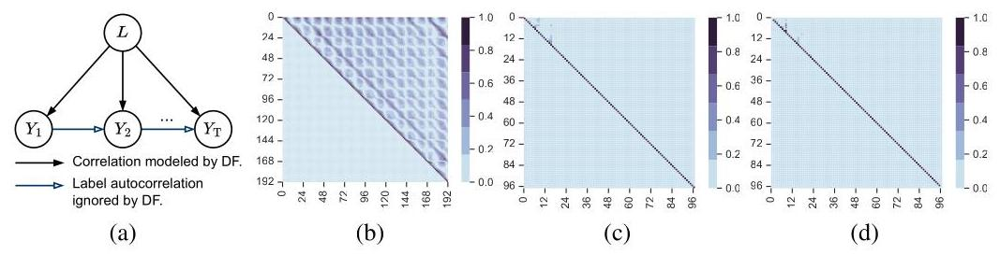

Figure 1: Visualizing label autocorrelation in time series forecasting. (a) shows the generation process of time series with dependencies depicted as arrows. (b) shows the label correlation in the time domain, where each element ${\rho }_{i, j}$ indicates the partial correlation between ${Y}_{i}$ and ${Y}_{j}$ given $L$ . (c-d) shows the label correlation in the frequency domain, where each element ${\rho }_{i, j}$ indicates the partial correlation between ${F}_{i}$ and ${F}_{j}$ given $L$ , shown with the real (c) and imaginary part (d). Due to the symmetry inherent in FFT, the forecast length in the frequency domain is halved.

图1:时间序列预测中标签自相关性的可视化。(a)显示了时间序列的生成过程，依赖关系用箭头表示。(b)显示了时域中的标签相关性，其中每个元素${\rho }_{i, j}$表示在给定$L$的情况下${Y}_{i}$和${Y}_{j}$之间的偏相关。(c - d)显示了频域中的标签相关性，其中每个元素${\rho }_{i, j}$表示在给定$L$的情况下${F}_{i}$和${F}_{j}$之间的偏相关，分别用实部(c)和虚部(d)表示。由于FFT固有的对称性，频域中的预测长度减半。

According to Theorem 3.1, the presence of label autocorrelation ${\rho }_{ij}$ causes the loss to be biased against the NLL of the real data. Notably, this bias diminishes to zero when the labels are uncorrelated $\left( {{\rho }_{ij} = 0}\right)$ . Therefore, label autocorrelation is a crucial aspect for training time series forecast models.

根据定理3.1，标签自相关性${\rho }_{ij}$的存在会导致损失相对于真实数据的NLL存在偏差。值得注意的是，当标签不相关$\left( {{\rho }_{ij} = 0}\right)$时，这种偏差会减小到零。因此，标签自相关性是训练时间序列预测模型的一个关键方面。

### 3.2 REDUCE LABEL AUTOCORRELATION WITH FOURIER TRANSFORM

### 3.2 使用傅里叶变换减少标签自相关性

As established in Theorem 3.1, the bias in the learning objective decreases as label autocorrelation diminishes. To achieve this reduction, a promising strategy is transforming the label sequence into a representation where autocorrelation is minimized. The Discrete Fourier Transform (DFT), defined in Definition 3.2, offers an intuitive approach, which projects the sequence onto a set of orthogonal exponential bases. In this transformed space, the label sequence is described as a linear combination of predefined temporal patterns that are orthogonal, which effectively bypasses the autocorrelation in the time domain. The efficacy of this transformation in reducing label autocorrelation is formalized in Theorem 3.3, where different frequency components become decorrelated. Consequently, the reduced ${\rho }_{i \neq  j}$ lowers the bias against the NLL, which benefits the training of time series forecast models.

如定理3.1所示，学习目标中的偏差随着标签自相关性的减小而减小。为了实现这种减小，一种有前景的策略是将标签序列转换为自相关性最小化的表示。定义3.2中定义的离散傅里叶变换(DFT)提供了一种直观的方法，它将序列投影到一组正交指数基上。在这个变换空间中，标签序列被描述为一组正交的预定义时间模式的线性组合，这有效地绕过了时域中的自相关性。这种变换在减少标签自相关性方面的有效性在定理3.3中得到了形式化，其中不同的频率分量变得不相关。因此，减少后的${\rho }_{i \neq  j}$降低了相对于NLL的偏差，这有利于时间序列预测模型的训练。

Definition 3.2 (Discrete Fourier Transform, DFT). The normalized DFT of a sequence $Y = \; \left\lbrack  {{Y}_{0},\ldots ,{Y}_{\mathrm{T} - 1}}\right\rbrack$ is defined as the projection onto a set of orthogonal Fourier bases at different frequencies. The projection for frequency $k$ is computed as

定义3.2(离散傅里叶变换，DFT)。序列$Y = \; \left\lbrack  {{Y}_{0},\ldots ,{Y}_{\mathrm{T} - 1}}\right\rbrack$的归一化DFT被定义为在不同频率的一组正交傅里叶基上的投影。频率$k$的投影计算如下

$$
{F}_{k} = \mathop{\sum }\limits_{{t = 0}}^{{\mathrm{T} - 1}}{Y}_{t}\exp \left( {-j\left( \frac{{2\pi }\mathrm{k}}{\mathrm{T}}\right) t}\right) /\sqrt{\mathrm{T}},
$$

where $j$ is the imaginary unit, $\exp \left( \cdot \right)$ is the Fourier basis for different $k$ values. The DFT comprises the set of projections $F = \left\lbrack  {{F}_{1},\ldots ,{F}_{\mathrm{T} - 1}}\right\rbrack$ , denoted as $F = \mathcal{F}\left( Y\right)$ , which can be computed via the Fast Fourier Transform (FFT) algorithm with complexity $\mathcal{O}\left( {\mathrm{T}\log \mathrm{T}}\right)$ .

其中$j$是虚数单位，$\exp \left( \cdot \right)$是不同$k$值的傅里叶基。DFT包括投影集$F = \left\lbrack  {{F}_{1},\ldots ,{F}_{\mathrm{T} - 1}}\right\rbrack$，表示为$F = \mathcal{F}\left( Y\right)$，它可以通过具有复杂度$\mathcal{O}\left( {\mathrm{T}\log \mathrm{T}}\right)$的快速傅里叶变换(FFT)算法来计算。

Theorem 3.3 (Decorrelation between frequency components). Let $Y$ be a zero-mean, discrete-time, wide-sense stationary random process of length $\mathrm{T}$ . As $\mathrm{T} \rightarrow  \infty$ , the DFT coefficients become asymptotically uncorrelated at different frequencies:

定理3.3(频率分量之间的去相关)。设$Y$是一个长度为$\mathrm{T}$的零均值、离散时间、广义平稳随机过程。当$\mathrm{T} \rightarrow  \infty$时，DFT系数在不同频率处渐近不相关:

$$
\mathop{\lim }\limits_{{\mathrm{T} \rightarrow  \infty }}\mathbb{E}\left\lbrack  {{F}_{k}{F}_{{k}^{\prime }}^{ * }}\right\rbrack   = \left\{  \begin{array}{ll} {S}_{Y}\left( {f}_{k}\right) , & \text{ if }k = {k}^{\prime }, \\  0, & \text{ if }k \neq  {k}^{\prime }, \end{array}\right.
$$

where ${f}_{k} = \frac{k}{\mathrm{\;T}}$ and ${S}_{Y}\left( f\right)$ is the power spectral density of $Y$ .

其中${f}_{k} = \frac{k}{\mathrm{\;T}}$和${S}_{Y}\left( f\right)$是$Y$的功率谱密度。

Case study. To validate our theoretical claims, we conducted a case study on the Weather dataset, illustrated in Fig. 1.Implementation details and additional evidence are provided in Appendix A. The main observations are summarized as follows:

案例研究。为了验证我们的理论主张，我们对天气数据集进行了案例研究，如图1所示。附录A中提供了实现细节和其他证据。主要观察结果总结如下:

- Evidence of Label Autocorrelation: Fig. 1 (b) quantifies the partial correlations between different steps ${Y}_{i}$ and ${Y}_{j}$ of the label sequence $Y$ , conditioned on the input $L$ . A number of non-diagonal elements exhibit substantial values, with approximately 37.5% exceeding 0.3. This indicates that different time steps in $Y$ are correlated conditioned on $L$ , confirming the presence of label autocorrelation. Moreover, the autocorrelation displays regular variations, evidenced by alternating light and dark regions in Fig. 1 (b), suggesting a periodic nature in the series. Such label autocorrelation makes the learning objective of the naive DF paradigm biased, as established in Theorem 3.1.

- 标签自相关的证据:图1(b)量化了标签序列$Y$在不同步骤${Y}_{i}$和${Y}_{j}$之间的偏相关，条件是输入$L$。许多非对角元素显示出显著的值，约37.5%超过0.3。这表明$Y$中的不同时间步在条件$L$下是相关的，证实了标签自相关的存在。此外，自相关显示出规则的变化，如图1(b)中明暗交替的区域所示，表明该序列具有周期性。如定理3.1所确立的，这种标签自相关使得朴素DF范式的学习目标产生偏差。

- Effect of Domain Transformation: Fig. 1 (c-d) visualize the partial correlations between different frequency components of the transformed label sequence $F$ . The majority of non-diagonal elements show negligible values, with only about ${3.6}\%$ exceeding 0.1 . This demonstrates that transforming the label sequence to the frequency domain significantly reduces the partial correlations between different components, corroborating Theorem 3.3. The reduction in label correlation ${\rho }_{i \neq  j}$ leads to a decrease in the bias identified in Theorem 3.1, underscoring the potential of forecasting in the frequency domain for more accurate and unbiased predictions.

- 域变换的影响:图1(c - d)可视化了变换后的标签序列$F$不同频率分量之间的偏相关。大多数非对角元素显示的值可以忽略不计，只有约${3.6}\%$超过0.1。这表明将标签序列变换到频域显著降低了不同分量之间的偏相关，证实了定理3.3。标签相关性${\rho }_{i \neq  j}$的降低导致定理3.1中确定的偏差减小，强调了在频域进行预测以获得更准确和无偏预测的潜力。

### 3.3 MODEL IMPLEMENTATION

### 3.3模型实现

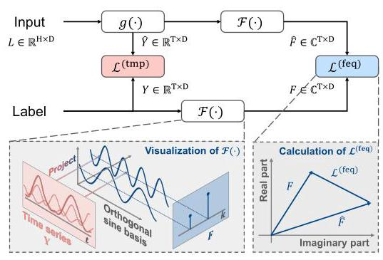

Figure 2: The workflow of FreDF. Key operations in the time and frequency domains are highlighted in red and blue, respectively.

图2:FreDF的工作流程。时域和频域中的关键操作分别用红色和蓝色突出显示。

This section introduces FreDF, an innovative approach that enhances the vanilla Direct Forecast (DF) training paradigm. FreDF aligns forecast and label sequences within the frequency domain, effectively mitigating the bias introduced by label autocorrelation.

本节介绍FreDF，一种创新方法，它增强了普通直接预测(DF)训练范式。FreDF在频域中对齐预测和标签序列，有效减轻了标签自相关引入的偏差。

As illustrated in Fig. 2, the input sequence $L$ is fed into the model to generate $T$ -step forecasts, expressed as $\widehat{Y} = g\left( L\right)$ . The temporal forecast error ${\mathcal{L}}^{\left( \mathrm{{tmp}}\right) }$ is computed according to (1). Subsequently, both the forecast and label sequences are transformed into the frequency domain using FFT. The frequency forecast error is then calculated as:

如图2所示，输入序列$L$被输入到模型中以生成$T$步预测，表示为$\widehat{Y} = g\left( L\right)$。根据(1)计算时间预测误差${\mathcal{L}}^{\left( \mathrm{{tmp}}\right) }$。随后，预测和标签序列都使用FFT变换到频域。然后频率预测误差计算如下:

$$
{\mathcal{L}}^{\left( \mathrm{{feq}}\right) } \mathrel{\text{ := }} {\left| \mathcal{F}\left( \widehat{Y}\right)  - \mathcal{F}\left( Y\right) \right| }_{1}, \tag{3}
$$

where $Y \in  {\mathbb{R}}^{\mathrm{T} \times  \mathrm{D}},{\left| \cdot \right| }_{1}$ denotes the element-wise ${\ell }_{1}$

其中$Y \in  {\mathbb{R}}^{\mathrm{T} \times  \mathrm{D}},{\left| \cdot \right| }_{1}$表示逐元素的${\ell }_{1}$

norm, summing the absolute values of all elements within the matrix. Since FFT is differentiable (Wu et al.,2021; Zhou et al.,2022), ${\mathcal{L}}^{\left( \text{ freq }\right) }$ can be optimized using standard stochastic gradient descent methods. We advocate the use of the ${\ell }_{1}$ loss in the frequency domain instead of the squared loss due to the numerical characteristics of the transformed label sequence. Specifically, different frequency components often exhibit vastly varying magnitudes; lower frequencies possess significantly higher amplitudes compared to higher frequencies, making the squared loss prone to instability. By using the ${\ell }_{1}$ loss, we seek for a more balanced and stable optimization process.

范数，即对矩阵内所有元素的绝对值求和。由于快速傅里叶变换(FFT)是可微的(Wu等人，2021年；Zhou等人，2022年)，${\mathcal{L}}^{\left( \text{ freq }\right) }$可以使用标准的随机梯度下降方法进行优化。由于变换后的标签序列的数值特性，我们提倡在频域中使用${\ell }_{1}$损失而不是平方损失。具体而言，不同的频率分量通常具有截然不同的幅度；与高频相比，低频具有明显更高的振幅，这使得平方损失容易不稳定。通过使用${\ell }_{1}$损失，我们寻求更平衡和稳定的优化过程。

Finally, the temporal and frequency forecast errors are fused, with the weighting parameter $0 \leq  \alpha  \leq  1$ controlling the relative contribution of each error:

最后，将时间和频率预测误差进行融合，权重参数$0 \leq  \alpha  \leq  1$控制每个误差的相对贡献:

$$
{\mathcal{L}}^{\alpha } \mathrel{\text{ := }} \alpha  \cdot  {\mathcal{L}}^{\left( \mathrm{{feq}}\right) } + \left( {1 - \alpha }\right)  \cdot  {\mathcal{L}}^{\left( \mathrm{{tmp}}\right) }. \tag{4}
$$

By aligning the forecast and label sequences in the frequency domain, FreDF mitigates the bias caused by label autocorrelation while maintaining the advantages of the DFT, including efficient inference and multi-task learning capabilities. Additionally, FreDF is model-agnostic, compatible with various forecasting models $g$ (e.g., Transformers and MLPs). This flexibility significantly expands the potential applications of FreDF across diverse time series forecasting scenarios, where different forecasting models may demonstrate superior performance.

通过在频域中对齐预测和标签序列，FreDF减轻了标签自相关引起的偏差，同时保留了离散傅里叶变换(DFT)的优势，包括高效推理和多任务学习能力。此外，FreDF与模型无关，与各种预测模型$g$兼容(例如，Transformer和多层感知器(MLP))。这种灵活性显著扩展了FreDF在各种时间序列预测场景中的潜在应用，在这些场景中不同的预测模型可能表现出卓越的性能。

## 4 EXPERIMENTS

## 4实验

To demonstrate the efficacy of FreDF, there are six aspects empirically investigated:

为了证明FreDF的有效性，我们从六个方面进行了实证研究:

1. Performance: Does FreDF work? Section 4.2 compares FreDF with state-of-the-art baselines using public datasets. The long-term forecasting task is investigated in Section 4.2 and the short-term forecasting and imputation tasks are explored in Appendix E.1.

1. 性能:FreDF是否有效？第4.2节使用公共数据集将FreDF与最先进的基线进行比较。第4.2节研究了长期预测任务，附录E.1中探讨了短期预测和插补任务。

Table 1: Long-term forecasting performance.

表1:长期预测性能。

<table><tr><td>Models</td><td colspan="2">FreDF (Ours)</td><td colspan="2">iTransformer (2024)</td><td colspan="2">FreTS (2023)</td><td colspan="2">TimesNet (2023)</td><td colspan="2">MICN (2023)</td><td colspan="2">TiDE (2023)</td><td colspan="2">DLinear (2023)</td><td colspan="2">FEDformer (2022)</td><td colspan="2">Autoformer (2021)</td><td colspan="2">Transformer (2017)</td><td colspan="2">TCN (2017)</td></tr><tr><td>Metrics</td><td>MSE</td><td>MAE</td><td>MSE</td><td>MAE</td><td>MSE</td><td>MAE</td><td>MSE</td><td>MAE</td><td>MSE</td><td>MAE</td><td>MSE</td><td>MAE</td><td>MSE</td><td>MAE</td><td>MSE</td><td>MAE</td><td>MSE</td><td>MAE</td><td>MSE</td><td>MAE</td><td>MSE</td><td>MAE</td></tr><tr><td>ETTm1</td><td>0.392</td><td>0.399</td><td>0.415</td><td>0.416</td><td>0.407</td><td>0.415</td><td>0.413</td><td>0.418</td><td>0.399</td><td>0.423</td><td>0.419</td><td>0.419</td><td>0.404</td><td>0.407</td><td>0.440</td><td>0.451</td><td>0.596</td><td>0.517</td><td>0.943</td><td>0.733</td><td>0.891</td><td>0.632</td></tr><tr><td>ETTm2</td><td>0.278</td><td>0.319</td><td>0.294</td><td>0.335</td><td>0.335</td><td>0.379</td><td>0.297</td><td>0.332</td><td>0.300</td><td>0.356</td><td>0.358</td><td>0.404</td><td>0.344</td><td>0.396</td><td>0.302</td><td>0.348</td><td>0.326</td><td>0.366</td><td>1.322</td><td>0.814</td><td>3.411</td><td>1.432</td></tr><tr><td>ETTh1</td><td>0.437</td><td>0.435</td><td>0.449</td><td>0.447</td><td>0.488</td><td>0.474</td><td>0.478</td><td>0.466</td><td>0.525</td><td>0.515</td><td>0.628</td><td>0.574</td><td>0.462</td><td>0.458</td><td>0.441</td><td>0.457</td><td>0.476</td><td>0.477</td><td>0.993</td><td>0.788</td><td>0.763</td><td>0.636</td></tr><tr><td>ETTh2</td><td>0.371</td><td>0.396</td><td>0.390</td><td>0.410</td><td>0.550</td><td>0.515</td><td>0.413</td><td>0.426</td><td>0.624</td><td>0.549</td><td>0.611</td><td>0.550</td><td>0.558</td><td>0.516</td><td>0.430</td><td>0.447</td><td>0.478</td><td>0.483</td><td>3.296</td><td>1.419</td><td>3.325</td><td>1.445</td></tr><tr><td>ECL</td><td>0.170</td><td>0.259</td><td>0.176</td><td>0.267</td><td>0.209</td><td>0.297</td><td>0.214</td><td>0.307</td><td>0.187</td><td>0.297</td><td>0.251</td><td>0.344</td><td>0.225</td><td>0.319</td><td>0.229</td><td>0.339</td><td>0.228</td><td>0.339</td><td>0.274</td><td>0.367</td><td>0.617</td><td>0.598</td></tr><tr><td>Traffic</td><td>0.421</td><td>0.279</td><td>0.428</td><td>0.286</td><td>0.552</td><td>0.348</td><td>0.535</td><td>0.309</td><td>0.636</td><td>0.335</td><td>0.760</td><td>0.473</td><td>0.673</td><td>0.419</td><td>0.611</td><td>0.379</td><td>0.637</td><td>0.399</td><td>0.680</td><td>0.376</td><td>1.001</td><td>0.652</td></tr><tr><td>Weather</td><td>0.254</td><td>0.274</td><td>0.281</td><td>0.302</td><td>0.255</td><td>0.299</td><td>0.262</td><td>0.288</td><td>0.261</td><td>0.319</td><td>0.271</td><td>0.320</td><td>0.265</td><td>0.317</td><td>0.311</td><td>0.361</td><td>0.349</td><td>0.391</td><td>0.632</td><td>0.552</td><td>0.584</td><td>0.572</td></tr><tr><td>PEMS03</td><td>0.113</td><td>0.219</td><td>0.116</td><td>0.226</td><td>0.146</td><td>0.257</td><td>0.118</td><td>0.223</td><td>0.099</td><td>0.214</td><td>0.316</td><td>0.370</td><td>0.233</td><td>0.344</td><td>0.174</td><td>0.302</td><td>0.501</td><td>0.513</td><td>0.126</td><td>0.233</td><td>0.666</td><td>0.634</td></tr><tr><td>PEMS08</td><td>0.141</td><td>0.238</td><td>0.159</td><td>0.258</td><td>0.174</td><td>0.277</td><td>0.154</td><td>0.245</td><td>0.717</td><td>0.459</td><td>0.319</td><td>0.378</td><td>0.294</td><td>0.377</td><td>0.232</td><td>0.322</td><td>0.630</td><td>0.572</td><td>0.249</td><td>0.266</td><td>0.713</td><td>0.629</td></tr></table>

Note: We fix the input length as 96 following the established benchmark (Liu et al., 2024). Bold typeface highlights the top performance for each metric, while underlined text denotes the second-best results. The results are averaged over forecast lengths (96, 192, 336 and 720), with full results in Table 5.

注意:我们按照既定基准(Liu等人，2024年)将输入长度固定为96。粗体突出显示每个指标的最佳性能，下划线文本表示第二好的结果。结果是在预测长度(96、192、336和720)上进行平均的，完整结果见表5。

2. Mechanism: How does it work? Section 4.3 offers an ablative study to dissect the contributions of FreDF's individual components, elucidating their roles in enhancing forecasting accuracy.

2. 机制:它是如何工作的？第4.3节进行了消融研究，以剖析FreDF各个组件的贡献，阐明它们在提高预测准确性方面的作用。

3. Generality: Does it support other forecasting models? Section 4.4 verifies the adaptability of FreDF across different forecasting models, with additional results documented in Appendix E.2.

3. 通用性:它是否支持其他预测模型？第4.4节验证了FreDF在不同预测模型上的适应性，附录E.2中记录了其他结果。

4. Flexibility: Does it support alternative transformations to FFT? Section 4.4 replaces FFT with other transformations to showcase its flexibility of implementation.

4. 灵活性:它是否支持FFT的替代变换？第4.4节用其他变换替换FFT以展示其实现的灵活性。

5. Sensitivity: Does it require careful fine-tuning? Section 4.5 presents a sensitivity analysis of the hyperparameter $\alpha$ , where FreDF maintains efficacy across a broad range of parameter values.

5. 敏感性:它是否需要仔细微调？第4.5节对超参数$\alpha$进行了敏感性分析，其中FreDF在广泛的参数值范围内保持有效性。

6. Efficiency: Is FreDF effective given limited samples? Section 4.6 offers a learning curve analysis, where FreDF achieves comparable performance with limited samples to that obtained using substantially more time-domain labels, indicating an advantageous sample efficiency.

6. 效率:在样本有限的情况下FreDF是否有效？第4.6节提供了学习曲线分析，其中FreDF在样本有限的情况下实现了与使用大量时域标签获得的性能相当的性能，表明其具有有利的样本效率。

### 4.1 SETUP

### 4.1设置

Datasets. The datasets for long-term forecast and imputation include ETT (4 subsets), ECL, Traffic, Weather and PEMS (Liu et al., 2024). The dataset for short-term forecast is M4 following Wu et al. (2023). Each dataset is divided chronologically for training, validation and test. Detailed dataset descriptions are provided in Appendix D.1.

数据集。用于长期预测和插补的数据集包括ETT(4个子集)、ECL、交通、天气和PEMS(Liu等人，2024年)。用于短期预测的数据集遵循Wu等人(2023年)的M4。每个数据集按时间顺序划分为训练集、验证集和测试集。附录D.1中提供了详细的数据集描述。

Baselines. Our baselines include various established models, which can be grouped into three categories: (1) Transformer-based methods: Transformer (Vaswani et al., 2017), Autoformer (Wu et al., 2021), FEDformer (Zhou et al., 2022), iTransformer (Liu et al., 2024); (2) MLP-based methods: DLinear (Zeng et al., 2023), TiDE (Das et al., 2023), FreTS (Yi et al., 2023b); (3) other notable models: TimesNet (Wu et al., 2023), MICN (Wang et al., 2023b), TCN (Bai et al., 2018).

基线。我们的基线包括各种已建立的模型，可分为三类:(1)基于Transformer的方法:Transformer(Vaswani等人，2017年)、Autoformer(Wu等人，2021年)、FEDformer(Zhou等人，2022年)、iTransformer(Liu等人，2024年)；(2)基于MLP的方法:DLinear(Zeng等人，2023年)、TiDE(Das等人，2023年)、FreTS(Yi等人，2023b)；(3)其他著名模型:TimesNet(Wu等人，2023年)、MICN(Wang等人，2023b)、TCN(Bai等人，2018年)。

Implementation. The baseline models are reproduced using the scripts provided by Liu et al. (2024). They are trained using the Adam (Kingma & Ba, 2015) optimizer to minimize the MSE loss. Datasets are split chronologically into training, validation, and test sets. Following the protocol outlined in the comprehensive benchmark (Qiu et al., 2024), the dropping-last trick is disabled during the test phase. When integrating FreDF to enhance an established model, we adhere to the associated hyperparameter settings in the public benchmark (Liu et al.,2024), only tuning $\alpha$ and learning rate conservatively. Experiments are conducted on Intel(R) Xeon(R) Platinum 8383C CPUs and NVIDIA RTX 3090 GPUs. More implementation details are provided in Appendix D.2.

实现。使用Liu等人(2024年)提供的脚本重现了基线模型。它们使用Adam(Kingma和Ba，2015年)优化器进行训练，以最小化均方误差损失。数据集按时间顺序分为训练集、验证集和测试集。按照综合基准(Qiu等人，2024年)中概述的协议，在测试阶段禁用最后一个样本丢弃技巧。当集成FreDF以增强现有模型时，我们遵循公共基准(Liu等人，2024年)中的相关超参数设置，仅保守地调整$\alpha$和学习率。实验在英特尔(R)至强(R)铂金8383C CPU和英伟达RTX 3090 GPU上进行。更多实现细节见附录D.2。

### 4.2 OVERALL PERFORMANCE

### 4.2 整体性能

The performance on the long-term forecast task is presented in Table 1, where we select iTransformer as the forecast model $g$ and enhance it with FreDF. Overall, FreDF improves the performance of iTransformer substantially. For instance, on the ETTm1 dataset, FreDF decreases the MSE of iTransformer by 0.019 . Similar gains are evident in other datasets, which can be attributed to reconciliation of label autocorrelation with the DF paradigm, validating efficacy of FreDF.

长期预测任务的性能如表1所示，我们选择iTransformer作为预测模型$g$并用FreDF对其进行增强。总体而言，FreDF显著提高了iTransformer的性能。例如，在ETTm1数据集上，FreDF将iTransformer的均方误差降低了0.019。在其他数据集中也有类似的提升，这可归因于标签自相关与DF范式的协调，验证了FreDF的有效性。

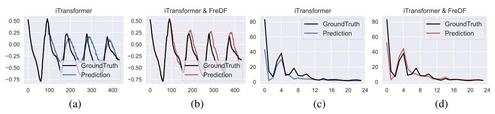

Figure 3: Visualization of forecast sequence generated with and without FreDF in the time (a-b) and frequency (c-d) domains, using the iTransformer as the backbone model.

图3:以iTransformer作为主干模型，在时域(a - b)和频域(c - d)中可视化有无FreDF生成的预测序列。

Table 2: Ablation study results.

表2:消融研究结果。

<table><tr><td rowspan="2">Model</td><td rowspan="2">${\mathcal{L}}^{\left( \mathrm{{tmp}}\right) }$</td><td rowspan="2">${\mathcal{L}}^{\text{ (feq) }}$</td><td rowspan="2">Data</td><td colspan="2">T=96</td><td colspan="2">T=192</td><td colspan="2">T=336</td><td colspan="2">T=720</td><td colspan="2">Avg</td></tr><tr><td>MSE</td><td>MAE</td><td>MSE</td><td>MAE</td><td>MSE</td><td>MAE</td><td>MSE</td><td>MAE</td><td>MSE</td><td>MAE</td></tr><tr><td rowspan="4">DF</td><td rowspan="4">✓</td><td rowspan="4">✘</td><td>ETTm1</td><td>0.346</td><td>0.379</td><td>0.391</td><td>0.400</td><td>0.426</td><td>0.422</td><td>0.493</td><td>0.460</td><td>0.414</td><td>0.415</td></tr><tr><td>ETTh1</td><td>0.390</td><td>0.409</td><td>0.442</td><td>0.440</td><td>0.479</td><td>0.457</td><td>0.483</td><td>0.479</td><td>0.449</td><td>0.446</td></tr><tr><td>ECL</td><td>0.147</td><td>0.239</td><td>0.166</td><td>0.258</td><td>0.178</td><td>0.271</td><td>0.209</td><td>0.298</td><td>0.175</td><td>0.266</td></tr><tr><td>Weather</td><td>0.201</td><td>0.246</td><td>0.250</td><td>0.282</td><td>0.302</td><td>0.317</td><td>0.370</td><td>0.361</td><td>0.280</td><td>0.302</td></tr><tr><td rowspan="4">FreDF†</td><td rowspan="4">✘</td><td rowspan="4">✓</td><td>ETTml</td><td>0.324</td><td>0.361</td><td>0.374</td><td>0.387</td><td>0.403</td><td>0.405</td><td>0.468</td><td>0.443</td><td>0.392</td><td>0.399</td></tr><tr><td>ETTh1</td><td>0.380</td><td>0.399</td><td>0.429</td><td>0.425</td><td>0.474</td><td>0.451</td><td>0.467</td><td>0.464</td><td>0.437</td><td>0.435</td></tr><tr><td>ECL</td><td>0.144</td><td>0.232</td><td>0.158</td><td>0.247</td><td>0.171</td><td>0.262</td><td>0.204</td><td>0.291</td><td>0.169</td><td>0.258</td></tr><tr><td>Weather</td><td>0.165</td><td>0.205</td><td>0.225</td><td>0.255</td><td>0.278</td><td>0.295</td><td>0.359</td><td>0.349</td><td>0.257</td><td>0.276</td></tr><tr><td rowspan="4">FreDF</td><td rowspan="4">✓</td><td rowspan="4">✓</td><td>ETTm1</td><td>0.324</td><td>0.362</td><td>0.372</td><td>0.385</td><td>0.402</td><td>0.404</td><td>0.468</td><td>0.443</td><td>0.391</td><td>0.398</td></tr><tr><td>ETTh1</td><td>0.381</td><td>0.400</td><td>0.430</td><td>0.426</td><td>0.474</td><td>0.451</td><td>0.463</td><td>0.461</td><td>0.437</td><td>0.435</td></tr><tr><td>ECL</td><td>0.144</td><td>0.233</td><td>0.158</td><td>0.247</td><td>0.172</td><td>0.263</td><td>0.204</td><td>0.293</td><td>0.169</td><td>0.259</td></tr><tr><td>Weather</td><td>0.163</td><td>0.202</td><td>0.220</td><td>0.252</td><td>0.274</td><td>0.293</td><td>0.356</td><td>0.346</td><td>0.253</td><td>0.273</td></tr></table>

Moreover, FreDF enhances the performance of iTransformer to surpass even those models that originally outperformed iTransformer on some datasets. It indicates that the improvements by FreDF exceed those achievable through dedicated architectural design alone, emphasizing the importance of handling label autocorrelation and FreDF.

此外，FreDF增强了iTransformer的性能，使其甚至超过了一些在某些数据集上原本优于iTransformer的模型。这表明FreDF带来的改进超过了仅通过专门的架构设计所能实现的，强调了处理标签自相关和FreDF的重要性。

Showcases. We visualize the forecast sequences to highlight the improvements of FreDF in forecast quality. An ETTm2 snapshot with T=336 is depicted in Fig. 3. Although the model without FreDF can follow the general trends of the label sequence, it struggles to capture the sequence's high-frequency components, resulting in a forecast with a visibly lower frequency. Additionally, the forecast sequence exhibits numerous burrs. These issues reflect the limitations of forecasting in the time domain, namely the difficulty in capturing high-frequency components and the neglect of autocorrelation between sequential steps. FreDF addresses these limitations effectively. The forecasts generated under FreDF not only keep pace with the label sequence, accurately capturing high-frequency components, but also exhibit a smoother appearance with fewer irregularities, due to its awareness of autocorrelation.

展示。我们可视化预测序列以突出FreDF在预测质量上的改进。图3展示了一个T = 336的ETTm2数据集快照。尽管没有FreDF的模型能够跟上标签序列的总体趋势，但它难以捕捉序列的高频成分，导致预测的频率明显较低。此外，预测序列有许多毛刺。这些问题反映了时域预测的局限性，即难以捕捉高频成分以及忽略了连续步骤之间的自相关。FreDF有效地解决了这些局限性。在FreDF下生成的预测不仅能跟上标签序列，准确捕捉高频成分，而且由于其对自相关的感知，呈现出更平滑的外观，不规则性更少。

Table 3: Varying FFT implementation results.

表3:不同FFT实现结果。

<table><tr><td rowspan="2">Model</td><td colspan="4">ETTh1</td><td colspan="4">ETTm1</td><td colspan="4">ECL</td></tr><tr><td>MSE</td><td>$\Delta$</td><td>MAE</td><td>$\Delta$</td><td>MSE</td><td>$\Delta$</td><td>MAE</td><td>$\Delta$</td><td>MSE</td><td>$\Delta$</td><td>MAE</td><td>$\Delta$</td></tr><tr><td>iTransformer</td><td>0.449</td><td>-</td><td>0.447</td><td>-</td><td>0.415</td><td>-</td><td>0.416</td><td>-</td><td>0.176</td><td>-</td><td>0.267</td><td>-</td></tr><tr><td>+ FreDF-T</td><td>0.437</td><td>↓2.63%</td><td>0.435</td><td>↓ 2.62%</td><td>0.392</td><td>↓5.49%</td><td>0.399</td><td>↓ 4.01%</td><td>0.170</td><td>↓3.41%</td><td>0.259</td><td>↓2.77%</td></tr><tr><td>+ FreDF-D</td><td>0.445</td><td>↓0.92%</td><td>0.440</td><td>↓1.42%</td><td>0.395</td><td>↓4.77%</td><td>0.398</td><td>↓ 4.33%</td><td>0.171</td><td>↓2.51%</td><td>0.260</td><td></td></tr><tr><td>+ FreDF-2</td><td>0.432</td><td>↓3.94%</td><td>0.431</td><td>↓3.57%</td><td>0.392</td><td>↓5.60%</td><td>0.399</td><td>↓4.05%</td><td>0.166</td><td>↓5.32%</td><td>0.256</td><td>↓ 4.20%</td></tr></table>

Note: $\Delta$ denotes the relative error reduction compared to iTransformer with DF paradigm.

注意:$\Delta$表示与采用DF范式的iTransformer相比的相对误差降低。

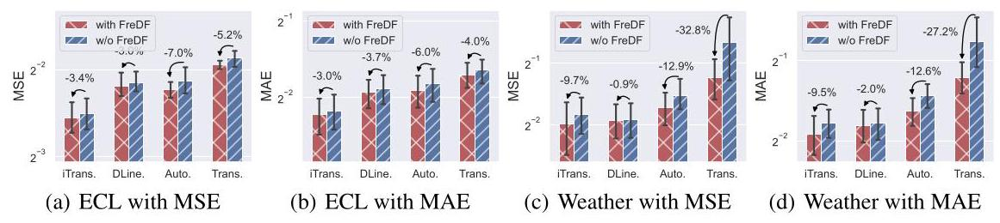

Figure 4: Benefit of incorporating FreDF in varying models, shown with colored bars for means over forecast lengths (96, 192, 336, 720) and error bars for 99.9% confidence intervals.

图4:在不同模型中纳入FreDF的益处，彩色条表示预测长度(96、192、336、720)的均值，误差条表示99.9%置信区间。

### 4.3 ABLATION STUDIES

### 4.3 消融研究

In this section, we dissect the contributions of the temporal and frequency loss for enhancing forecast performance. The results are detailed in Table 2, where iTransformer is used as the forecast model. Overall, the frequency loss consistently improves performance compared to the temporal loss. The rationale is that label autocorrelation can be effectively managed in the frequency domain, aligning better with the conditional independence assumption inherent in DF. Moreover, learning to forecast in both domains generally showcase improvement compared to relying solely on one domain. However, the improvement over ${\mathcal{L}}^{\left( \mathrm{{feq}}\right) }$ is marginal. Hence, exclusively focusing on frequency domain forecasting emerges as a viable strategy in most cases, offering promising performance without the complexity of balancing learning objectives.

在本节中，我们剖析了时间损失和频率损失对提高预测性能的贡献。结果详细列于表2中，其中iTransformer用作预测模型。总体而言，与时间损失相比，频率损失持续提高了性能。其原理是标签自相关可以在频域中得到有效管理，更符合DF中固有的条件独立性假设。此外，与仅依赖一个域相比，在两个域中学习预测通常都有改进。然而，相对于${\mathcal{L}}^{\left( \mathrm{{feq}}\right) }$的改进很微小。因此，在大多数情况下，仅专注于频域预测成为一种可行的策略，在不涉及平衡学习目标复杂性的情况下提供有前景的性能。

### 4.4 GENERALIZATION STUDIES

### 4.4 泛化研究

In this section, we investigate the utility of FreDF with different forecast models and domain transformation strategies, to showcase the generality of FreDF. In the bar-plots, the forecast errors are averaged over forecast lengths (96, 192, 336, 720), with error bars as 95% confidence intervals.

在本节中，我们研究了FreDF与不同预测模型和域变换策略的效用，以展示FreDF的通用性。在柱状图中，预测误差是在预测长度(96、192、336、720)上平均得到的，误差条为95%置信区间。

Varying forecast models. We explore the versatility of FreDF in augmenting representative neural forecasting models: iTransformer, DLinear, Autoformer, and Transformer. FreDF demonstrates significant enhancements across these models compared to the traditional DF paradigm, as illustrated in Fig. 4. Notably, Transformer-based models such as the Autoformer and Transformer substantially benefit from the integration of FreDF. On the ECL dataset, for instance, the Autoformer (developed in 2021) enhanced by FreDF outperforms DLinear (developed in 2023). More evidence of FreDF's versatility is provided in Appendix E. These results confirm FreDF's potential as a plugin-and-play strategy to enhance various time series forecasting models.

不同预测模型。我们探索了FreDF在增强代表性神经预测模型(iTransformer、DLinear、Autoformer和Transformer)方面的通用性。与传统DF范式相比，FreDF在这些模型中都有显著增强，如图4所示。值得注意的是，基于Transformer的模型如Autoformer和Transformer从FreDF的集成中大幅受益。例如，在ECL数据集上，由FreDF增强的Autoformer(2021年开发)优于DLinear(2023年开发)。附录E提供了更多FreDF通用性的证据。这些结果证实了FreDF作为一种即插即用策略来增强各种时间序列预测模型的潜力。

Varying FFT implementations. We note that label autocorrelation exists between not only different steps, but also variables in multivariate forecasting. Therefore, we implement FFT along the time (FreDF-T) and variable dimension (FreDF-D) to handle the corresponding correlations, with the outcomes illustrated in Table 3. In general, conducting FFT along the time and variable axis brings similar performance gain, which showcases the existence of correlation between different steps and variables, respectively. In particular, FreDF-T slightly outperforms FreDF-D, which underscores the relative importance of auto-correlation in the label sequence. Finally, a strategic approach is viewing the multivariate sequence as an image, performing 2-dimensional FFT on both time and variable axes (FreDF-2), which accommodates the correlations between both time steps and variables simultaneously and further improves performance.

不同的快速傅里叶变换(FFT)实现方式。我们注意到，不仅在不同步骤之间存在标签自相关，而且在多变量预测中的变量之间也存在标签自相关。因此，我们沿着时间维度(FreDF-T)和变量维度(FreDF-D)实现FFT，以处理相应的相关性，结果如表3所示。一般来说，沿着时间和变量轴进行FFT会带来相似的性能提升，这分别展示了不同步骤和变量之间相关性的存在。特别是，FreDF-T略优于FreDF-D，这突出了标签序列中自相关的相对重要性。最后，一种策略性方法是将多变量序列视为一幅图像，在时间和变量轴上都执行二维FFT(FreDF-2)，这同时考虑了时间步长和变量之间的相关性，并进一步提高了性能。

Varying transformations. Motivated by the fact that FFT can be viewed as projections onto exponential bases, we extend the implementation of FreDF by replacing FFT with projections onto other established polynomials. Each polynomial set is adept at capturing specific data patterns, such as trends and periodicity, which are challenging to learn in the time domain. The results are summarized in Fig. 5. Notably, projections onto Legendre and Fourier bases demonstrate superior performance. This superiority is attributed to the orthogonality of the polynomials, a feature not guaranteed by others as analyzed in Appendix C. It underscores orthogonality when selecting polynomials for implementing FreDF, which is pivotal for eliminating autocorrelation.

不同的变换。由于FFT可以被视为投影到指数基上，我们通过将FFT替换为投影到其他既定多项式上，扩展了FreDF的实现。每个多项式集都擅长捕捉特定的数据模式，如趋势和周期性，这些在时域中很难学习。结果总结在图5中。值得注意的是，投影到勒让德和傅里叶基上表现出卓越的性能。这种优越性归因于多项式的正交性，如附录C中分析的那样，其他多项式不具备这一特性。这突出了在选择用于实现FreDF的多项式时正交性的重要性，这对于消除自相关至关重要。

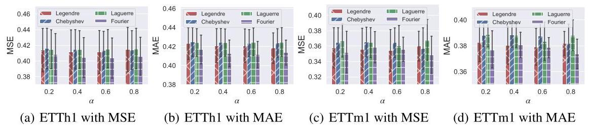

Figure 5: Varying projection bases results, shown with colored bars for means over forecast lengths (96, 192, 336, 720) and error bars for 99.9% confidence intervals.

图5:不同投影基的结果，彩色条表示预测长度(96、192、336、720)的均值，误差条表示99.9%置信区间。

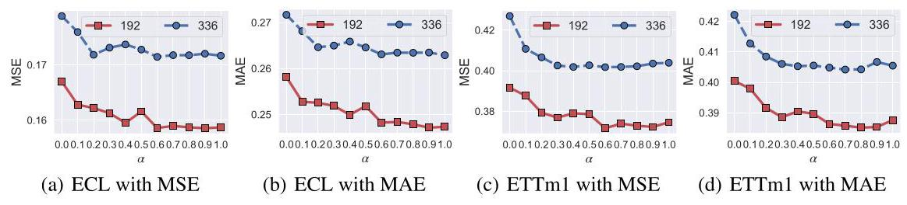

Figure 6: Varying strength of frequency loss $\left( \alpha \right)$ results, shown with colored lines for T=192,336.

图6:不同频率损失强度$\left( \alpha \right)$的结果，彩色线表示T = 192、336时的情况。

### 4.5 HYPERPARAMETER SENSITIVITY

### 4.5超参数敏感性

The key hyperparameter of FreDF is the frequency loss strength $\alpha$ . The performance given different $\alpha$ is summarized in Fig. 6. Overall, increasing $\alpha$ from 0 to 1 results in a reduction of forecast error, albeit with a slight increase towards the end of this range. For instance, on the ECL dataset with T=192, both MAE and MSE decrease from approximately 0.258 and 0.167 to 0.247 and 0.158, respectively. Such trend of diminishing error seems consistent across different forecast lengths and datasets, supporting the benefit of learning to forecast in the frequency domain. Notably, the optimal reduction in forecast error typically occurs at $\alpha$ values near 1, such as 0.8 for the ETTh1 dataset, rather than at the absolute value of 1 . Therefore, unifying supervision signals from both time and frequency domains brings performance improvement. Similar trends are presented across different datasets and foreacst models, as discussed in Appendix E.3.

FreDF的关键超参数是频率损失强度$\alpha$。图6总结了不同$\alpha$值下的性能。总体而言，将$\alpha$从0增加到1会导致预测误差减小，尽管在该范围接近尾声时略有增加。例如，在T = 192的ECL数据集上，平均绝对误差(MAE)和均方误差(MSE)分别从约0.258和0.167降至0.247和0.158。这种误差减小的趋势在不同预测长度和数据集上似乎是一致的，支持了在频域中学习预测的好处。值得注意的是，预测误差的最佳减小通常发生在$\alpha$值接近1时，例如ETTh1数据集为0.8，而不是绝对值1。因此，统一来自时域和频域的监督信号会带来性能提升。如附录E.3中所讨论的，不同数据集和预测模型呈现出类似的趋势。

### 4.6 LEARNING-CURVE ANALYSIS

### 4.6学习曲线分析

In this section, we investigate the sample efficiency of learning in the time versus frequency domains, with the corresponding learning curves in Fig. 7. Overall, given limited training data, learning in the frequency domain demonstrates remarkable efficacy. With only ${30}\%$ of the training data, it achieves performance comparable to learning in the time domain using the full training dataset.

在本节中，我们研究了时域与频域学习的样本效率，相应的学习曲线如图7所示。总体而言，在训练数据有限的情况下，频域学习表现出显著的效果。仅使用${30}\%$的训练数据，它就能达到与使用完整训练数据集在时域中学习相当的性能。

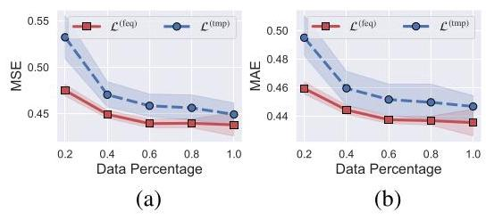

Figure 7: Learning curve on ETTm1 dataset.

图7:ETTm1数据集上的学习曲线。

The underlying reason for this enhanced sample efficiency can be attributed to the consistent and more straightforward nature of the data representation. For instance, a sliding window on a sine signal yields a set of distinct sequences in the time domain. However, in the frequency domain, these sequences present a similar pattern: a prominent spike at a specific frequency and negligible values elsewhere. This uniformity simplifies the learning process by making patterns more consistent and easier to decipher, thus reducing the need for extensive training datasets.

这种样本效率提高的根本原因可归因于数据表示的一致性和更直接的性质。例如，在正弦信号上的滑动窗口在时域中会产生一组不同的序列。然而，在频域中，这些序列呈现出相似的模式:在特定频率处有一个突出的峰值，其他地方的值可忽略不计。这种一致性通过使模式更一致且更易于解读，简化了学习过程，从而减少了对大量训练数据集的需求。

## 5 CONCLUSION

## 5结论

In this study, we underscore the challenge of label autocorrelation in time series modeling, which biases the learning objective of the widely adopted DF paradigm. To tackle this challenge, we introduce a model-agnostic learning objective: FreDF, which mitigates label autocorrelation by transforming the label sequence into the frequency domain, thereby effectively reducing the bias caused by label autocorrelation. The experiments demonstrate that FreDF effectively enhances the performance of prevalent forecast models.

在本研究中，我们强调了时间序列建模中标签自相关的挑战，这使广泛采用的DF范式的学习目标产生偏差。为应对这一挑战，我们引入了一种与模型无关的学习目标:FreDF，它通过将标签序列转换到频域来减轻标签自相关，从而有效减少由标签自相关引起的偏差。实验表明，FreDF有效地提高了流行预测模型的性能。

Limitation & future works. In this work, we primarily utilize the Fourier transform for domain transformation. Despite empirical efficacy, the predefined set of exponential bases lacks the ability to adapt to specific data properties. Alternative transforms such independent component analysis can produce orthogonal bases considering data properties, representing a valuable avenue for future research. Additionally, the issue of label autocorrelation extends beyond time series, affecting diverse contexts involving structural labels, such as 3D point clouds, speech, and images. The potential of FreDF to enhance performance in these contexts awaits further exploration.

局限性与未来工作。在这项工作中，我们主要利用傅里叶变换进行域变换。尽管具有经验有效性，但预定义的指数基集缺乏适应特定数据属性的能力。替代变换，如独立成分分析，可以根据数据属性生成正交基，这是未来研究的一个有价值的途径。此外，标签自相关问题不仅限于时间序列，还影响涉及结构标签的各种上下文，如3D点云、语音和图像。FreDF在这些上下文中提高性能的潜力有待进一步探索。

## ACKNOWLEDGEMENT

## 致谢

This work was supported by National Natural Science Foundation of China (623B2002, 12075212). The first author extends heartfelt gratitude to Prof. Degui Yang of Central South University, for his exceptional signal processing lectures and generous research guidance during S.T.E.M. studies.

本工作得到了中国国家自然科学基金(623B2002, 12075212)的支持。第一作者衷心感谢中南大学的杨德贵教授，感谢他在STEM学习期间精彩的信号处理讲座和慷慨的研究指导。

## REFERENCES

## 参考文献

Dimitros Asteriou and Stephen G Hall. Arima models and the box-jenkins methodology. Appl. Econ., 2(2):265-286, 2011.

迪米特罗斯·阿斯特里乌和斯蒂芬·G·霍尔。ARIMA模型与博克斯-詹金斯方法。《应用经济学》，2(2):265 - 286，2011年。

Shaojie Bai, J Zico Kolter, and Vladlen Koltun. An empirical evaluation of generic convolutional and

白少杰、J·齐科·科尔特和弗拉德连·科尔图恩。通用卷积的实证评估及recurrent networks for sequence modeling. arXiv preprint arXiv:1803.01271, 2018.

Kaifeng Bi, Lingxi Xie, Hengheng Zhang, Xin Chen, Xiaotao Gu, and Qi Tian. Accurate medium-

毕开封、谢凌曦、张恒恒、陈鑫、顾小涛和齐天。准确的中-range global weather forecasting with 3d neural networks. Nature, 619(7970):533-538, 2023.

Michela Bia, Martin Huber, and Lukáš Lafférs. Double machine learning for sample selection models.

米凯拉·比亚、马丁·胡贝尔和卢卡斯·拉弗斯。样本选择模型的双重机器学习。J. Bus. Econ. Stat., 42(3):958-969, 2024.

Defu Cao, Yujing Wang, Juanyong Duan, Ce Zhang, Xia Zhu, Congrui Huang, Yunhai Tong, Bixiong Xu, Jing Bai, Jie Tong, et al. Spectral temporal graph neural network for multivariate time-series

曹德富、王雨静、段娟勇、张策、朱霞、黄聪睿、童云海、徐必雄、白静、童杰等。用于多变量时间序列的谱-时间图神经网络forecasting. In Proc. Adv. Neural Inf. Process. Syst., volume 33, pp. 17766-17778, 2020.

Victor Chernozhukov, Denis Chetverikov, Mert Demirer, Esther Duflo, Christian Hansen, Whitney Newey, and James Robins. Double/debiased machine learning for treatment and structural

维克托·切尔诺朱科夫、德尼斯·切特韦里科夫、默特·德米雷尔、埃丝特·迪弗洛、克里斯蒂安·汉森、惠特尼·纽厄尔和詹姆斯·罗宾斯。用于处理和结构的双重/去偏机器学习parameters: Double/debiased machine learning. Econom. J., 21(1), 2018.

Abhimanyu Das, Weihao Kong, Andrew Leach, Rajat Sen, and Rose Yu. Long-term forecasting with

阿比马尼·达斯、孔维浩、安德鲁·利奇、拉杰特·森和罗斯·于。长期预测与tide: Time-series dense encoder. arXiv preprint arXiv:2304.08424, 2023.

Albert Gu, Karan Goel, and Christopher Re. Efficiently modeling long sequences with structured state spaces. In Proc. Int. Conf. Learn. Represent., 2021.

阿尔伯特·顾、卡兰·戈尔和克里斯托弗·雷。用结构化状态空间有效建模长序列。在《国际学习表征会议论文集》，2021年。

Diederik P. Kingma and Jimmy Ba. Adam: A method for stochastic optimization. In Proc. Int. Conf. Learn. Represent., 2015.

迪德里克·P·金马和吉米·巴。Adam:一种随机优化方法。在《国际学习表征会议论文集》，2015年。

Guokun Lai, Wei-Cheng Chang, Yiming Yang, and Hanxiao Liu. Modeling long-and short-term temporal patterns with deep neural networks. In SIGIR, 2018.

赖国坤、张维成、杨一鸣和刘寒霄。用深度神经网络建模长期和短期时间模式。在SIGIR，2018年。

Henning Lange, Steven L Brunton, and J Nathan Kutz. From fourier to koopman: Spectral methods

亨宁·兰格、史蒂文·L·布鲁顿和J·内森·库茨。从傅里叶到库普曼:谱方法for long-term time series prediction. J. Mach. Learn. Res., 22(41):1-38, 2021.

Vincent Le Guen and Nicolas Thome. Shape and time distortion loss for training deep time series

文森特·勒根和尼古拉斯·托姆。用于训练深度时间序列的形状和时间扭曲损失forecasting models. In Proc. Adv. Neural Inf. Process. Syst., volume 32, 2019.

Vincent Le Guen and Nicolas Thome. Probabilistic time series forecasting with shape and temporal

文森特·勒根和尼古拉斯·托姆。具有形状和时间的概率时间序列预测diversity. In Proc. Adv. Neural Inf. Process. Syst., volume 33, pp. 4427-4440, 2020.

Haoxuan Li, Kunhan Wu, Chunyuan Zheng, Yanghao Xiao, Hao Wang, Zhi Geng, Fuli Feng, Xiangnan He, and Peng Wu. Removing hidden confounding in recommendation: a unified multi-task learning approach. Proc. Adv. Neural Inf. Process. Syst., 36:54614-54626, 2024a.

李浩轩、吴坤翰、郑春元、肖阳浩、王浩、耿志、冯富利、何向南、吴鹏。消除推荐中的隐藏混杂因素:一种统一的多任务学习方法。《神经信息处理系统进展》，第36卷:54614 - 54626页，2024a。

Haoxuan Li, Chunyuan Zheng, Shuyi Wang, Kunhan Wu, Eric Wang, Peng Wu, Zhi Geng, Xu Chen, and Xiao-Hua Zhou. Relaxing the accurate imputation assumption in doubly robust learning for debiased collaborative filtering. In Proc. Int. Conf. Mach. Learn., volume 235, pp. 29448-29460, 2024b.

李浩轩、郑春元、王书艺、吴坤翰、王埃里克、吴鹏、耿志、陈旭、周小华。放宽去偏协同过滤的双稳健学习中的准确插补假设。《国际机器学习会议论文集》，第235卷，第29448 - 29460页，2024b。

Jianxin Li, Xiong Hui, and Wancai Zhang. Informer: Beyond efficient transformer for long sequence time-series forecasting. In Proc. AAAI Conf. Artif. Intell., 2021.

李建新、熊辉、张万才。Informer:超越高效变压器用于长序列时间序列预测。《美国人工智能协会会议论文集》，2021年。

Zhe Li, Xiangfei Qiu, Peng Chen, Yihang Wang, Hanyin Cheng, Yang Shu, Jilin Hu, Chenjuan Guo, Aoying Zhou, Qingsong Wen, et al. Foundts: Comprehensive and unified benchmarking of

李哲、邱向飞、陈鹏、王逸航、程汉音、舒扬、胡吉林、郭晨娟、周傲英、温青松等。Foundts:全面统一的基准测试foundation models for time series forecasting. arXiv preprint arXiv:2410.11802, 2024c.

Minhao Liu, Ailing Zeng, Muxi Chen, Zhijian Xu, Qiuxia Lai, Lingna Ma, and Qiang Xu. Scinet: time series modeling and forecasting with sample convolution and interaction. In Proc. Adv. Neural Inf. Process. Syst., 2022a.

刘民浩、曾爱玲(曾爱凌)、陈慕熙、徐志坚、赖秋霞、马玲娜、徐强。Scinet:基于样本卷积和交互的时间序列建模与预测。《神经信息处理系统进展》，2022a。

Shiyu Liu, Rohan Ghosh, and Mehul Motani. Towards better long-range time series forecasting using generative forecasting. CoRR, abs/2212.06142, 2022b.

刘世宇、罗汉·戈什、梅胡尔·莫塔尼。使用生成式预测实现更好的长期时间序列预测。CoRR，abs/2212.06142，2022b。

Yong Liu, Tengge Hu, Haoran Zhang, Haixu Wu, Shiyu Wang, Lintao Ma, and Mingsheng Long. itransformer: Inverted transformers are effective for time series forecasting. In Proc. Int. Conf. Learn. Represent., 2024.

刘永、胡腾格、张浩然、吴海旭、王诗雨、马林涛、龙明生。itransformer:倒置变压器对时间序列预测有效。《国际学习表征会议论文集》，2024年。

Gonzalo Mateos, Santiago Segarra, Antonio G. Marques, and Alejandro Ribeiro. Connecting the dots: Identifying network structure via graph signal processing. IEEE Signal Process. Mag., 36(3): 16-43, 2019.

贡萨洛·马特奥斯、圣地亚哥·塞加拉、安东尼奥·G·马克斯、亚历杭德罗·里贝罗。连接各个点:通过图信号处理识别网络结构。《IEEE信号处理杂志》，第36卷第3期:16 - 43页，2019年。

Yuqi Nie, Nam H Nguyen, Phanwadee Sinthong, and Jayant Kalagnanam. A time series is worth 64 words: Long-term forecasting with transformers. In Proc. Int. Conf. Learn. Represent., 2023.

聂宇琦、南H·阮、潘瓦迪·辛通、贾扬特·卡拉格纳南。一个时间序列值64个词:使用变压器进行长期预测。《国际学习表征会议论文集》，2023年。

Xiangfei Qiu, Jilin Hu, Lekui Zhou, Xingjian Wu, Junyang Du, Buang Zhang, Chenjuan Guo, Aoying Zhou, Christian S. Jensen, Zhenli Sheng, and Bin Yang. Tfb: Towards comprehensive and fair

邱向飞、胡吉林、周乐奎、吴兴健、杜俊阳、张邦、郭晨娟、周傲英、克里斯蒂安·S·詹森、盛振立、杨斌。Tfb:迈向全面和公平benchmarking of time series forecasting methods. Proc. VLDB Endow., 17(9):2363-2377, 2024.

Xiangfei Qiu, Xiuwen Li, Ruiyang Pang, Zhicheng Pan, Xingjian Wu, Liu Yang, Jilin Hu, Yang Shu, Xuesong Lu, Chengcheng Yang, Chenjuan Guo, Aoying Zhou, Christian S. Jensen, and Bin Yang. Easytime: Time series forecasting made easy. In Proc. IEEE Int. Conf. Data Eng., 2025.

邱向飞、李秀文、庞瑞阳、潘志成、吴兴健、刘洋、胡吉林、舒扬(舒杨)、卢雪松、杨程程、郭晨娟、周傲英、克里斯蒂安·S·詹森、杨斌。Easytime:让时间序列预测变得简单。《IEEE国际数据工程会议论文集》，2025年。

David Salinas, Valentin Flunkert, Jan Gasthaus, and Tim Januschowski. Deepar: Probabilistic

大卫·萨利纳斯、瓦伦丁·弗伦克特、扬·加斯豪斯、蒂姆·雅努施科夫斯基。Deepar:概率性的forecasting with autoregressive recurrent networks. Int. J. Forecast, 36(3):1181-1191, 2020.

Amin Shabani, Amir Abdi, Lili Meng, and Tristan Sylvain. Scaleformer: Iterative multi-scale refining transformers for time series forecasting. In Proc. Int. Conf. Learn. Represent., 2022.

阿明·沙巴尼、阿米尔·阿卜迪、孟丽丽、特里斯坦·西尔万。Scaleformer:用于时间序列预测的迭代多尺度精炼变压器。《国际学习表征会议论文集》，2022年。

Souhaib Ben Taieb and Amir F Atiya. A bias and variance analysis for multistep-ahead time series

苏海布·本·塔伊布、阿米尔·F·阿提亚。多步时间序列的偏差和方差分析forecasting. IEEE Trans. Neural. Netw. Learn. Syst., 27(1):62-76, 2015.

Ashish Vaswani, Noam Shazeer, Niki Parmar, Jakob Uszkoreit, Llion Jones, Aidan N Gomez, Lukasz Kaiser, and Illia Polosukhin. Attention is all you need. In Proc. Adv. Neural Inf. Process. Syst., 2017.

阿希什·瓦斯瓦尼、诺姆·沙泽尔、尼基·帕尔马、雅各布·乌兹科雷特、利昂·琼斯、艾丹·N·戈麦斯、卢卡斯·凯泽和伊利亚·波罗苏欣。《注意力是你所需要的一切》。发表于《神经信息处理系统进展》会议论文集，2017年。

Hao Wang, Zhichao Chen, Jiajun Fan, Haoxuan Li, Tianqiao Liu, Weiming Liu, Quanyu Dai, Yichao Wang, Zhenhua Dong, and Ruiming Tang. Optimal transport for treatment effect estimation. In Proc. Adv. Neural Inf. Process. Syst., 2023a.

王浩、陈智超、范家俊、李浩轩、刘天桥、刘伟明、戴全宇、王逸超、董振华和唐瑞明。《用于治疗效果估计的最优传输》。发表于《神经信息处理系统进展》会议论文集，2023a。

Hao Wang, Zhichao Chen, Zhaoran Liu, Haozhe Li, Degui Yang, Xinggao Liu, and Haoxuan Li. Entire space counterfactual learning for reliable content recommendations. IEEE Trans. Inf. Forensics Security, pp. 1-12, 2024a.

王浩、陈智超、刘兆然、李浩哲、杨德贵、刘兴高和李浩轩。《用于可靠内容推荐的全空间反事实学习》。《IEEE信息取证与安全汇刊》，第1 - 12页，2024a。

Hao Wang, Xinggao Liu, Zhaoran Liu, Haozhe Li, Yilin Liao, Yuxin Huang, and Zhichao Chen. Lspt-d: Local similarity preserved transport for direct industrial data imputation. IEEE Trans. Autom. Sci. Eng., 2024b.

王浩、刘兴高、刘兆然、李浩哲、廖依林、黄宇昕和陈智超。《Lspt - d:用于直接工业数据插补的局部相似性保持传输》。《IEEE自动化科学与工程汇刊》，2024b。

Hao Wang, Zhengnan Li, Haoxuan Li, Xu Chen, Mingming Gong, Bin Chen, and Zhichao Chen.

王浩、李政男、李浩轩、陈旭、龚明明、陈斌和陈智超。Optimal transport for time series imputation. In Proc. Int. Conf. Learn. Represent., pp. 1-9, 2025.

Huiqiang Wang, Jian Peng, Feihu Huang, Jince Wang, Junhui Chen, and Yifei Xiao. Micn: Multi-scale local and global context modeling for long-term series forecasting. In Proc. Int. Conf. Learn. Represent., 2023b.

王慧强、彭健、黄飞虎、王锦策、陈俊辉和肖逸飞。《Micn:用于长期序列预测的多尺度局部和全局上下文建模》。发表于《国际学习表征会议》论文集，2023b。

Shiyu Wang, Haixu Wu, Xiaoming Shi, Tengge Hu, Huakun Luo, Lintao Ma, James Y Zhang, and Jun Zhou. Timemixer: Decomposable multiscale mixing for time series forecasting. In Proc. Int. Conf. Learn. Represent., 2024c.

王诗雨、吴海旭、石晓明、胡腾格、罗华坤、马林涛、詹姆斯·Y·张和周军。《Timemixer:用于时间序列预测的可分解多尺度混合》。发表于《国际学习表征会议》论文集，2024c。

Mark W. Watson. Vector autoregressions and cointegration. Working Paper Series, Macroeconomic

马克·W·沃森。《向量自回归与协整》。工作论文系列，宏观经济Issues, 4, 1993.

Haixu Wu, Jiehui Xu, Jianmin Wang, and Mingsheng Long. Autoformer: Decomposition transformers with Auto-Correlation for long-term series forecasting. In Proc. Adv. Neural Inf. Process. Syst., 2021.

吴海旭、徐杰辉、王建民和龙明生。《Autoformer:具有自相关的分解变压器用于长期序列预测》。发表于《神经信息处理系统进展》会议论文集，2021年。

Haixu Wu, Tengge Hu, Yong Liu, Hang Zhou, Jianmin Wang, and Mingsheng Long. Timesnet: Temporal 2d-variation modeling for general time series analysis. In Proc. Int. Conf. Learn. Represent., 2023.

吴海旭、胡腾格、刘永、周航、王建民和龙明生。《Timesnet:用于一般时间序列分析的时间二维变化建模》。发表于《国际学习表征会议》论文集，2023年。

Xingjian Wu, Xiangfei Qiu, Zhengyu Li, Yihang Wang, Jilin Hu, Chenjuan Guo, Hui Xiong, and Bin Yang. Catch: Channel-aware multivariate time series anomaly detection via frequency patching. In Proc. Int. Conf. Learn. Represent., 2025.

吴兴健、邱向飞、李正宇、王逸航、胡吉林、郭晨娟、熊辉和杨斌。《Catch:通过频率修补的通道感知多变量时间序列异常检测》。发表于《国际学习表征会议》论文集，2025年。

Feng Yan, Chunjie Yang, Xinmin Zhang, Chong Yang, and Zhiyong Ruan. Btpnet: A probabilistic spatial-temporal aware network for burn-through point multistep prediction in sintering process. IEEE Trans. Neural Netw. Learn. Syst., 2024.

颜峰、杨春杰、张新民、杨冲和阮智勇。《Btpnet:用于烧结过程中烧穿点多步预测的概率时空感知网络》。《IEEE神经网络与学习系统汇刊》，2024年。

Kun Yi, Qi Zhang, Wei Fan, Hui He, Liang Hu, Pengyang Wang, Ning An, Longbing Cao, and Zhendong Niu. Fouriergnn: Rethinking multivariate time series forecasting from a pure graph perspective. In Proc. Adv. Neural Inf. Process. Syst., 2023a.

易坤、张琦、范伟、何辉、胡亮、王鹏阳、安宁、曹龙兵和牛振东。《Fouriergnn:从纯图视角重新思考多变量时间序列预测》。发表于《神经信息处理系统进展》会议论文集，2023a。

Kun Yi, Qi Zhang, Wei Fan, Shoujin Wang, Pengyang Wang, Hui He, Ning An, Defu Lian, Longbing Cao, and Zhendong Niu. Frequency-domain mlps are more effective learners in time series forecasting. In Proc. Adv. Neural Inf. Process. Syst., 2023b.

易坤、张琦、范伟、王寿金、王鹏阳、何辉、安宁、连德富、曹龙兵和牛振东。《频域多层感知器在时间序列预测中是更有效的学习者》。发表于《神经信息处理系统进展》会议论文集，2023b。

Xinyu Yuan and Yan Qiao. Diffusion-ts: Interpretable diffusion for general time series generation. In Proc. Int. Conf. Learn. Represent., 2024.

袁新宇和乔燕。《Diffusion - ts:用于一般时间序列生成的可解释扩散》。发表于《国际学习表征会议》论文集，2024年。

Ailing Zeng, Muxi Chen, Lei Zhang, and Qiang Xu. Are transformers effective for time series forecasting? In Proc. AAAI Conf. Artif. Intell., 2023.

曾爱玲、陈慕熙、张磊和徐强。《变压器对时间序列预测有效吗？》。发表于《AAAI人工智能会议》论文集，2023年。

Tian Zhou, Ziqing Ma, Qingsong Wen, Xue Wang, Liang Sun, and Rong Jin. FEDformer: Frequency enhanced decomposed transformer for long-term series forecasting. In Proc. Int. Conf. Mach. Learn., 2022.

田舟、马子清、文青松、王雪、孙亮和金荣。FEDformer:用于长期序列预测的频率增强分解变压器。发表于2022年国际机器学习会议论文集。

## A OVERVIEW OF DML FOR PARTIAL CORRELATION ESTIMATION

## 用于偏相关估计的双机器学习概述

### A.1 MOTIVATION

### A.1 动机

In this section, we introduce the rationale for employing double machine learning (DML) to quantify the partial correlations. Our focus is on the autocorrelation represented by ${Y}_{t} \rightarrow  {Y}_{{t}^{\prime }}$ where $0 \leq  t < \; {t}^{\prime } < \mathrm{T}$ . However, the fork structure ${Y}_{t} \leftarrow  L\left( n\right)  \rightarrow  {Y}_{{t}^{\prime }}$ creates a pseudo correlation between ${Y}_{{t}^{\prime }}$ and ${Y}_{t}$ (Wang et al.,2024a). In this case, the autocorrelation ${Y}_{t} \rightarrow  {Y}_{{t}^{\prime }}$ is influenced by the pseudo correlations from the fork structure, rendering traditional correlation measures, such as Pearson correlation, ineffective for quantifying the autocorrelation ${Y}_{t} \rightarrow  {Y}_{{t}^{\prime }}$ (Li et al.,2024a;b).

在本节中，我们介绍采用双机器学习(DML)来量化偏相关的基本原理。我们关注的是由${Y}_{t} \rightarrow  {Y}_{{t}^{\prime }}$表示的自相关，其中$0 \leq  t < \; {t}^{\prime } < \mathrm{T}$ 。然而，叉形结构${Y}_{t} \leftarrow  L\left( n\right)  \rightarrow  {Y}_{{t}^{\prime }}$在${Y}_{{t}^{\prime }}$和${Y}_{t}$之间产生了伪相关(Wang等人，2024a)。在这种情况下，自相关${Y}_{t} \rightarrow  {Y}_{{t}^{\prime }}$受到叉形结构伪相关的影响，使得传统的相关度量，如皮尔逊相关，在量化自相关${Y}_{t} \rightarrow  {Y}_{{t}^{\prime }}$时无效(Li等人，2024a；b)。

To effectively address this influence and quantify partial correlation, it is essential to employ methods that excel in distinguishing direct relationships from spurious ones (Wang et al., 2023a). DML is chosen for calculating partial correlation due to its ease of implementation and independence from exhaustive hyperparameter tuning. DML offers a robust and reliable quantification of the autocorrelation that we care about (Bia et al., 2024; Chernozhukov et al., 2018).

为了有效解决这种影响并量化偏相关，必须采用擅长区分直接关系和虚假关系的方法(Wang等人，2023a)。选择DML来计算偏相关是因为其易于实现且无需进行详尽的超参数调整。DML为我们所关心的自相关提供了稳健可靠的量化(Bia等人，2024；Chernozhukov等人，2018)。

### A.2 METHOD

### A.2 方法

In this section, we detail the implementation of DML, a two-step procedure designed for estimating partial correlation. We define $\mathcal{T} \in  \mathbb{R}$ as the treatment variable, $\mathcal{Y} \in  \mathbb{R}$ as the outcome variable, $\mathcal{X} \in  {\mathbb{R}}^{\mathrm{D}}$ as the control variable that needs to be accounted for. The implementation of DML is depicted in Fig. 8 (b) which consists of two steps below.

在本节中，我们详细介绍DML的实现，这是一个用于估计偏相关的两步过程。我们将$\mathcal{T} \in  \mathbb{R}$定义为处理变量，$\mathcal{Y} \in  \mathbb{R}$定义为结果变量，$\mathcal{X} \in  {\mathbb{R}}^{\mathrm{D}}$定义为需要考虑的控制变量。DML的实现如图8(b)所示，包括以下两个步骤。

- Orthogonalization. This step involves orthogonalizing both the outcome $\left( \mathcal{Y}\right)$ and the treatment $\left( \mathcal{T}\right)$ with respect to the control variables $\left( \mathcal{X}\right)$ . To this end, we first use two machine learning models, namely $\phi$ and $\psi$ , to predict the outcome and the treatment based on $\mathcal{X}$ . These predictions aim to capture the components in $\mathcal{Y}$ and $\mathcal{T}$ that are influenced by $\mathcal{X}$ . Subsequently, such impact of $\mathcal{X}$ can be eliminated by calculating the residuals:

- 正交化。此步骤涉及相对于控制变量$\left( \mathcal{X}\right)$对结果$\left( \mathcal{Y}\right)$和处理$\left( \mathcal{T}\right)$进行正交化。为此，我们首先使用两个机器学习模型，即$\phi$和$\psi$，基于$\mathcal{X}$预测结果和处理。这些预测旨在捕获$\mathcal{Y}$和$\mathcal{T}$中受$\mathcal{X}$影响的成分。随后，可以通过计算残差来消除$\mathcal{X}$的这种影响:

(5)

$$
\widetilde{\mathcal{Y}} = \mathcal{Y} - \phi \left( \mathcal{X}\right)
$$

$$
\widetilde{\mathcal{T}} = \mathcal{T} - \psi \left( \mathcal{X}\right)
$$

- Regression. This step involves regressing the orthogonalized outcome $\widetilde{\mathcal{Y}}$ on the orthogonalized treatment $\widetilde{\mathcal{T}}$ . A linear regression model is utilized for this purpose:

- 回归。此步骤涉及将正交化后的结果$\widetilde{\mathcal{Y}}$对正交化后的处理$\widetilde{\mathcal{T}}$进行回归。为此使用线性回归模型:

$$
\widetilde{\mathcal{Y}} = \beta \widetilde{\mathcal{T}} + \epsilon , \tag{6}
$$

where $\epsilon$ is the error term; $\beta$ is the model coefficient that can be identified via ordinary least squares. The $\beta$ can be identified in a supervised learning manner, with the objective of minimizing the MSE between the prediction and real values. The identified $\beta$ quantifies the partial correlation between the treatment and the outcome, having accounted for the influence of $\mathcal{X}$ .

其中$\epsilon$是误差项；$\beta$是可以通过普通最小二乘法确定的模型系数。$\beta$可以通过监督学习的方式确定，目标是最小化预测值与实际值之间的均方误差。确定的$\beta$量化了处理与结果之间的偏相关，同时考虑了$\mathcal{X}$的影响。

By regressing the orthogonalized outcome on the orthogonalized treatment, DML captures the direct effect of the treatment on the outcome without the interference from control variables, as depicted in Fig. 8 (c). That is, DML isolates the desired partial correlation $\mathcal{T} \rightarrow  \mathcal{Y}$ from the influencing correlation $\mathcal{T} \leftarrow  \mathcal{X} \rightarrow  \mathcal{Y}$ .

通过将正交化后的结果对正交化后的处理进行回归，DML捕获了处理对结果的直接影响，而不受控制变量的干扰，如图8(c)所示。也就是说，DML从影响相关性$\mathcal{T} \leftarrow  \mathcal{X} \rightarrow  \mathcal{Y}$中分离出所需的偏相关$\mathcal{T} \rightarrow  \mathcal{Y}$。

### A.3 EXPERIMENTAL SETTINGS

### A.3 实验设置

In this section, we outline the experimental settings implemented to employ DML for quantifying the correlations of interest.

在本节中，我们概述为使用DML量化感兴趣的相关性而实施的实验设置。

General settings. For the base learners $\phi$ and $\psi$ , we opt for a linear regression model optimized using ordinary least squares for its efficiency ${}^{2}$ . Following Appendix A.1, we treat the input sequence $L$ as the control variable to adjust, and simplify the process by considering the last step in $L$ as representative. Moreover, we focus exclusively on the correlations within the last feature of each dataset ${}^{3}$ . This focus makes $Y$ a scalar value within the real number space rather than a D-dimensional vector in this experiment.

常规设置。对于基础学习器$\phi$和$\psi$，我们选择使用普通最小二乘法优化的线性回归模型，因其效率${}^{2}$。按照附录A.1，我们将输入序列$L$视为要调整的控制变量，并通过将$L$中的最后一步视为代表性步骤来简化过程。此外，我们仅关注每个数据集最后一个特征内的相关性${}^{3}$。这种关注使得$Y$在本实验中成为实数空间内的标量值，而非D维向量。

---

${}^{2}$ The linear regression model, chosen for its computational efficiency, is crucial in managing the experiment’s scale, where the total number of DML estimators can be exceedingly high (e.g., 36,864 for T=192).

${}^{2}$ 由于其计算效率而选择的线性回归模型，对于管理实验规模至关重要，在该实验中，DML估计器的总数可能非常高(例如，对于T = 192为36,864)。

---

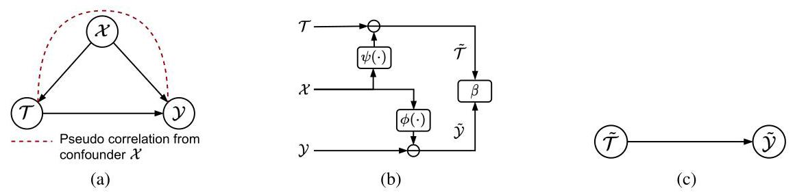

Figure 8: Visualization of partial correlation and DML approach for partial correlation quantification. (a) The correlation graph where the pseudo correlation is caused by the fork structure $\mathcal{T} \leftarrow  \mathcal{X} \rightarrow  \mathcal{Y}$ . (b) The implementation of DML, where $\beta$ is the identified strength of the partial correlation $\mathcal{T} \rightarrow  \mathcal{Y}$ . (c) The partial correlation identified by DML.

图8:偏相关和用于偏相关量化的DML方法的可视化。(a) 伪相关由叉结构$\mathcal{T} \leftarrow  \mathcal{X} \rightarrow  \mathcal{Y}$引起的相关图。(b) DML的实现，其中$\beta$是识别出的偏相关强度$\mathcal{T} \rightarrow  \mathcal{Y}$。(c) DML识别出的偏相关。

Specifications for identifying time-domain partial correlation. To assess the partial correlation ${Y}_{t} \rightarrow  {Y}_{{t}^{\prime }}$ , we treat ${Y}_{t}$ as the treatment and ${Y}_{{t}^{\prime }}$ as the outcome. The DML model is trained using a set of $\mathrm{N}$ observations: $\{ L\left( n\right) {\} }_{n = 1 : \mathrm{N}},{\left\{  {Y}_{t}\left( n\right) \right\}  }_{n = 1 : \mathrm{N}}$ , and ${\left\{  {Y}_{{t}^{\prime }}\left( n\right) \right\}  }_{n = 1 : \mathrm{N}}$ . The coefficient $\beta$ derived from the DML model is interpreted as the strength of the partial correlation ${Y}_{t} \rightarrow  {Y}_{{t}^{\prime }}$ .

识别时域偏相关的规范。为了评估偏相关${Y}_{t} \rightarrow  {Y}_{{t}^{\prime }}$，我们将${Y}_{t}$视为处理变量，将${Y}_{{t}^{\prime }}$视为结果变量。DML模型使用一组$\mathrm{N}$观测值进行训练:$\{ L\left( n\right) {\} }_{n = 1 : \mathrm{N}},{\left\{  {Y}_{t}\left( n\right) \right\}  }_{n = 1 : \mathrm{N}}$和${\left\{  {Y}_{{t}^{\prime }}\left( n\right) \right\}  }_{n = 1 : \mathrm{N}}$。从DML模型得出的系数$\beta$被解释为偏相关${Y}_{t} \rightarrow  {Y}_{{t}^{\prime }}$的强度。

Specifications for identifying frequency-domain partial correlation. To quantify the partial correlation ${F}_{k} \rightarrow  {F}_{{k}^{\prime }}$ , we treat ${F}_{k}$ as the treatment and ${F}_{{k}^{\prime }}$ as the outcome. The DML model is trained using a set of $\mathrm{N}$ observations: $\{ L\left( n\right) {\} }_{n = 1 : \mathrm{N}},{\left\{  {F}_{k}\left( n\right) \right\}  }_{n = 1 : \mathrm{N}}$ , and ${\left\{  {F}_{{k}^{\prime }}\left( n\right) \right\}  }_{n = 1 : \mathrm{N}}$ . The coefficient $\beta$ derived from the DML model is interpreted as the strength of the partial correlation ${F}_{k} \rightarrow  {F}_{{k}^{\prime }}$ . A notable complexity arises because ${F}_{k}$ is a complex number. Since DML is typically designed for real numbers instead of complex numbers, it requires a separate consideration of the real and imaginary parts of ${F}_{k}$ .

识别频域偏相关的规范。为了量化偏相关${F}_{k} \rightarrow  {F}_{{k}^{\prime }}$，我们将${F}_{k}$视为处理变量，将${F}_{{k}^{\prime }}$视为结果变量。DML模型使用一组$\mathrm{N}$观测值进行训练:$\{ L\left( n\right) {\} }_{n = 1 : \mathrm{N}},{\left\{  {F}_{k}\left( n\right) \right\}  }_{n = 1 : \mathrm{N}}$和${\left\{  {F}_{{k}^{\prime }}\left( n\right) \right\}  }_{n = 1 : \mathrm{N}}$。从DML模型得出的系数$\beta$被解释为偏相关${F}_{k} \rightarrow  {F}_{{k}^{\prime }}$的强度。由于${F}_{k}$是复数，会出现一个显著的复杂性。由于DML通常是为实数而非复数设计的，因此需要分别考虑${F}_{k}$的实部和虚部。

### A.4 MORE EXPERIMENTAL RESULTS

### A.4更多实验结果

In this section, we provide comprehensive results of the identified partial correlation strengths, which quantifies the autocorrelation effect in the time and frequency domain. Fig. 9 presents the results on three different datasets: Traffic, ETTh1, and ECL, with forecast length set to 192. Fig. 10 presents the results for varying forecast lengths: 48, 96, 192, 336, on the ECL dataset.

在本节中，我们提供了识别出的偏相关强度的综合结果，该结果量化了时域和频域中的自相关效应。图9展示了在三个不同数据集(交通、ETTh1和ECL)上的结果，预测长度设置为192。图10展示了在ECL数据集上不同预测长度(48、96、192、336)的结果。

The results show similar patterns to those in the main text. Specifically, the non-diagonal elements in Fig. 9 (a-c) and Fig. 10 (a-d) often exhibit huge values, which affirms the presence of label autocorrelation in the time domain. In contrast, the non-diagonal elements in Fig. 9 (d-i) and Fig. 10 (e-l) show negligible values, which suggests that frequency components of $F$ are almost independent given $L$ . These findings collectively verify (1) the existence of label autocorrelation in the time domain; (2) the mitigation of label correlation in the frequency domain.

结果显示出与正文相似的模式。具体而言，图9(a - c)和图10(a - d)中的非对角元素常常呈现出极大的值，这证实了时域中标签自相关的存在。相比之下，图9(d - i)和图10(e - l)中的非对角元素显示出可忽略不计的值，这表明在给定$L$的情况下，$F$的频率分量几乎是独立的。这些发现共同验证了:(1)时域中标签自相关的存在；(2)频域中标签相关性的减轻。

---

${}^{3}$ This focus is aligned with the study’s objective of analyzing autocorrelation instead of inter-feature correlations, which simplifies the interpretation of results.

${}^{3}$ 这种关注点与该研究分析自相关而非特征间相关性的目标一致，这简化了结果的解释。

---

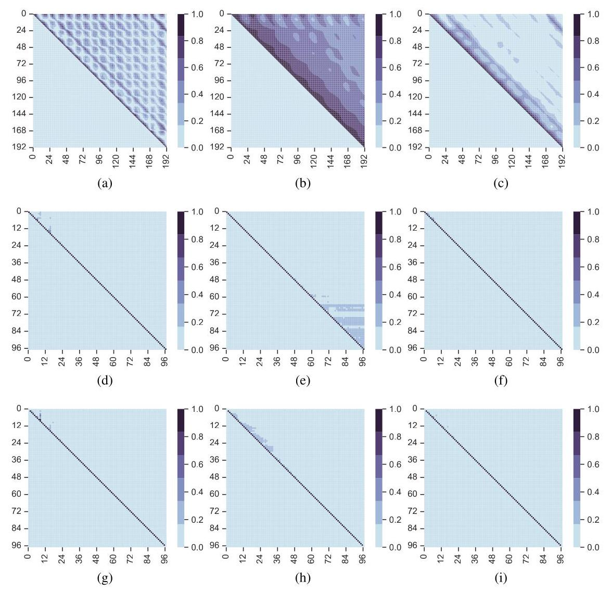

Figure 9: More comprehensive visualizations of label autocorrelation in different domains and datasets, with columns representing different datasets: Traffic, ETTh1, and ECL, from left to right. Panels (a-c) show the label correlation in the time domain, where each element ${\rho }_{i, j}$ indicates the partial correlation between ${Y}_{i}$ and ${Y}_{j}$ given $L$ . Panels (d-i) show the label correlation in the frequency domain, where each element ${\rho }_{i, j}$ indicates the partial correlation between ${F}_{i}$ and ${F}_{j}$ given $L$ , shown with the real (d-f) and imaginary part (g-i). Due to the symmetry inherent in FFT, the forecast length in the frequency domain is halved.

图9:不同域和数据集中标签自相关的更全面可视化，列从左到右代表不同数据集:交通、ETTh1和ECL。面板(a - c)展示了时域中的标签相关性，其中每个元素${\rho }_{i, j}$表示在给定$L$的情况下${Y}_{i}$和${Y}_{j}$之间的偏相关。面板(d - i)展示了频域中的标签相关性，其中每个元素${\rho }_{i, j}$表示在给定$L$的情况下${F}_{i}$和${F}_{j}$之间的偏相关，分别用实部(d - f)和虚部(g - i)表示。由于FFT固有的对称性，频域中的预测长度减半。

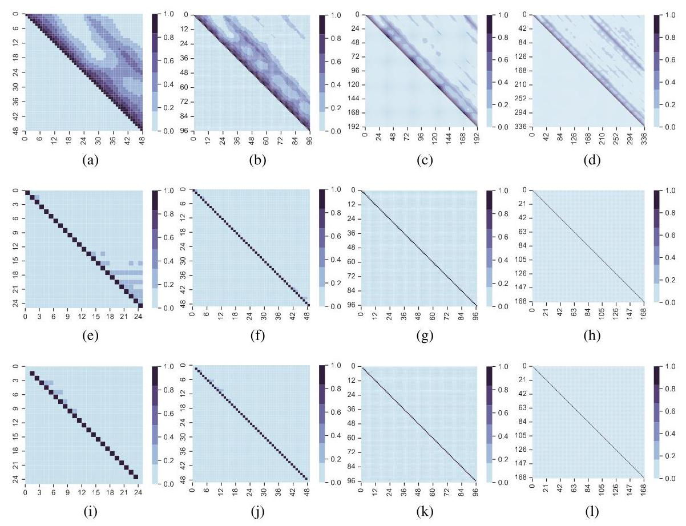

Figure 10: More comprehensive visualizations of label autocorrelation in different domains and label lengths, with columns representing label lengths $\mathrm{H} = {48},{96},{192},{336}$ from left to right. Panels (a-d) show the label correlation in the time domain, where each element ${\rho }_{i, j}$ indicates the partial correlation between ${Y}_{i}$ and ${Y}_{j}$ given $L$ . Panels (e-l) show the label correlation in the frequency domain, where each element ${\rho }_{i, j}$ indicates the partial correlation between ${F}_{i}$ and ${F}_{j}$ given $L$ , shown with the real (e-h) and imaginary part (i-l).

图10:不同域和标签长度下标签自相关的更全面可视化，列从左到右代表标签长度$\mathrm{H} = {48},{96},{192},{336}$。面板(a - d)展示了时域中的标签相关性，其中每个元素${\rho }_{i, j}$表示在给定$L$的情况下${Y}_{i}$和${Y}_{j}$之间的偏相关。面板(e - l)展示了频域中的标签相关性，其中每个元素${\rho }_{i, j}$表示在给定$L$的情况下${F}_{i}$和${F}_{j}$之间的偏相关，分别用实部(e - h)和虚部(i - l)表示。

## B THEORETICAL JUSTIFICATION

## B理论依据

Theorem B.1 (Bias of vanilla DF, simplified). Given an input sequence L and a univariate label sequence $Y = \left\lbrack  {{Y}_{1},{Y}_{2}}\right\rbrack$ (the forecast length is set to 2 for simplicity), the learning objective (1) of the DF paradigm is biased against the practical NLL, expressed as:

定理B.1(简化的普通DF偏差)。给定一个输入序列L和一个单变量标签序列$Y = \left\lbrack  {{Y}_{1},{Y}_{2}}\right\rbrack$(为简单起见，预测长度设为2)，DF范式的学习目标(1)相对于实际负对数似然(NLL)存在偏差，表述如下:

$$
\text{ Bias } = \frac{1}{2{\sigma }^{2}}{\left( {Y}_{2} - {\widehat{Y}}_{2}\right) }^{2} - \frac{1}{2{\sigma }^{2}\left( {1 - {\rho }^{2}}\right) }\left( {{Y}_{2} - {\left( {\widehat{Y}}_{2} + \rho \left( {Y}_{1} - {\widehat{Y}}_{1}\right) \right) }^{2},}\right. \tag{7}
$$

where ${\widehat{Y}}_{i}$ indicates the prediction at the $i$ -th step and $\rho$ denotes the partial correlation between ${Y}_{1}$ and ${Y}_{2}$ given $L$ .

其中${\widehat{Y}}_{i}$表示第$i$步的预测，$\rho$表示在给定$L$的情况下${Y}_{1}$和${Y}_{2}$之间的偏相关。

Proof. Aligning with the maximum likelihood analysis, we assume the label sequence obeys a normal distribution with mean $\mu  = \left\lbrack  {{\widehat{Y}}_{1},{\widehat{Y}}_{2}}\right\rbrack$ and covariance $\zeta  = \left\lbrack  {\left\lbrack  {{\sigma }^{2},\rho {\sigma }^{2}}\right\rbrack  ,\left\lbrack  {\rho {\sigma }^{2},{\sigma }_{2}^{2}}\right\rbrack  }\right\rbrack$ . The negative log-likelihood (NLL) of $Y$ given the input sequence $L$ can be expressed as

证明。与最大似然分析一致，我们假设标签序列服从均值为$\mu  = \left\lbrack  {{\widehat{Y}}_{1},{\widehat{Y}}_{2}}\right\rbrack$、协方差为$\zeta  = \left\lbrack  {\left\lbrack  {{\sigma }^{2},\rho {\sigma }^{2}}\right\rbrack  ,\left\lbrack  {\rho {\sigma }^{2},{\sigma }_{2}^{2}}\right\rbrack  }\right\rbrack$的正态分布。给定输入序列$L$时$Y$的负对数似然(NLL)可表示为

$$
- \log p\left( {Y \mid  L}\right)  =  - \log p\left( {{Y}_{1} \mid  L}\right)  - \log p\left( {{Y}_{2} \mid  L,{Y}_{1}}\right)
$$

$$
=  - \log \left( {\frac{1}{\sqrt{2\pi }\sigma }\exp \left( {-\frac{{\left( {Y}_{1} - {\widehat{Y}}_{1}\right) }^{2}}{2{\sigma }^{2}}}\right) }\right)
$$

$$
- \log \left( {\frac{1}{\sqrt{{2\pi }\left( {1 - {\rho }^{2}}\right) }\sigma }\exp \left( {-\frac{\left( {Y}_{2} - {\left( {\widehat{Y}}_{2} + \rho \left( {Y}_{1} - {\widehat{Y}}_{1}\right) \right) }^{2}\right) }{2{\sigma }^{2}\left( {1 - {\rho }^{2}}\right) }}\right) }\right) .
$$

Removing coefficients unrelated to $g$ , the practical NLL that contributes the gradients to update $g$ is

去除与$g$无关的系数，对更新$g$贡献梯度的实际NLL为

$$
\mathrm{{NLL}} \mathrel{\text{ := }} \frac{1}{2{\sigma }^{2}}{\left( {Y}_{1} - {\widehat{Y}}_{1}\right) }^{2} + \frac{1}{2{\sigma }^{2}\left( {1 - {\rho }^{2}}\right) }\left( {{Y}_{2} - {\left( {\widehat{Y}}_{2} + \rho \left( {Y}_{1} - {\widehat{Y}}_{1}\right) \right) }^{2}.}\right.
$$

If the independence assumption of different time step holds (i.e., ${Y}_{1}$ and ${Y}_{2}$ are conditionally independent given $L$ ), we have $\rho  = 0$ , followed by $p\left( {{Y}_{2} \mid  L,{Y}_{1}}\right)  = p\left( {{Y}_{2} \mid  L}\right)$ . In this case, the MSE loss in canonical DF mirrors the practical NLL:

如果不同时间步的独立性假设成立(即给定$L$时${Y}_{1}$和${Y}_{2}$条件独立)，我们有$\rho  = 0$，进而有$p\left( {{Y}_{2} \mid  L,{Y}_{1}}\right)  = p\left( {{Y}_{2} \mid  L}\right)$。在这种情况下，普通DF中的均方误差损失反映了实际NLL:

$$
\mathrm{{MSE}} = \frac{1}{2{\sigma }^{2}}{\left( {Y}_{1} - {\widehat{Y}}_{1}\right) }^{2} + \frac{1}{2{\sigma }^{2}}{\left( {Y}_{2} - {\widehat{Y}}_{2}\right) }^{2},
$$

where $\sigma$ is often set to 1 when implementing MSE. If the independence assumption does not hold, i.e., considering autocorrelation in the label sequence, we have $\rho  \neq  0$ . In this case, the MSE loss in the time domain is biased to the practical NLL, expressed as:

在实现均方误差(MSE)时，$\sigma$ 通常设为 1。如果独立性假设不成立，即考虑标签序列中的自相关性，我们有 $\rho  \neq  0$。在这种情况下，时域中的 MSE 损失偏向于实际的负对数似然(NLL)，表示为:

$$
\text{ Bias } = \frac{1}{2{\sigma }^{2}}{\left( {Y}_{2} - {\widehat{Y}}_{2}\right) }^{2} - \frac{1}{2{\sigma }^{2}\left( {1 - {\rho }^{2}}\right) }{\left( {Y}_{2} - \left( {\widehat{Y}}_{2}\right.  + \rho \left( {Y}_{1} - {\widehat{Y}}_{1}\right) \right) }^{2}\text{ . }
$$

This bias introduced by label autocorrelation makes the MSE loss in the time domain fail to reflect the practical NLL and therefore misleads the update of forecast model $g$ under DF paradigm.

标签自相关性引入的这种偏差使得时域中的 MSE 损失无法反映实际的 NLL，因此在深度特征(DF)范式下误导了预测模型 $g$ 的更新。

Theorem B.2 (Bias of vanillia DF). Given an input sequence $L$ and a univariate label sequence $Y$ , the learning objective (1) of the DF paradigm is biased against the practical NLL, expressed as:

定理 B.2(普通 DF 的偏差)。给定输入序列 $L$ 和单变量标签序列 $Y$，DF 范式的学习目标(1)偏向于实际的 NLL，表示为:

$$
\text{ Bias } = \mathop{\sum }\limits_{{i = 1}}^{\mathrm{T}}\frac{1}{2{\sigma }^{2}}{\left( {Y}_{i} - {\widehat{Y}}_{i}\right) }^{2} - \mathop{\sum }\limits_{{i = 1}}^{\mathrm{T}}\frac{1}{2{\sigma }^{2}\left( {1 - {\rho }_{i}^{2}}\right) }{\left( {Y}_{i} - \left( {\widehat{Y}}_{i} + \mathop{\sum }\limits_{{j = 1}}^{{i - 1}}{\rho }_{ij}\left( {Y}_{j} - {\widehat{Y}}_{j}\right) \right) \right) }^{2}, \tag{8}
$$

where ${\widehat{Y}}_{i}$ indicates the prediction at the $i$ -th step, ${\rho }_{ij}$ denotes the partial correlation between ${Y}_{i}$ and ${Y}_{j}$ given $L,{\rho }_{i}^{2} = \mathop{\sum }\limits_{{j = 1}}^{{i - 1}}{\rho }_{ij}^{2}$ .

其中 ${\widehat{Y}}_{i}$ 表示在第 $i$ 步的预测，${\rho }_{ij}$ 表示在给定 $L,{\rho }_{i}^{2} = \mathop{\sum }\limits_{{j = 1}}^{{i - 1}}{\rho }_{ij}^{2}$ 的情况下 ${Y}_{i}$ 和 ${Y}_{j}$ 之间的偏相关。

Proof. We assume that the label sequence $Y$ conditioned on the input sequence $L$ follows a multivariate normal distribution with mean vector $\mu  = \left\lbrack  {{\widehat{Y}}_{1},{\widehat{Y}}_{2},\ldots ,{\widehat{Y}}_{\mathrm{T}}}\right\rbrack$ and covariance matrix $\sum$ , where the diagonal entries ${\sum }_{ii} = {\sigma }^{2}$ and the off-diagonal entries are ${\sum }_{ij} = {\rho }_{ij}{\sigma }^{2}$ for $i \neq  j$ . Here, ${\rho }_{ij}$ denotes the partial correlation between ${Y}_{i}$ and ${Y}_{j}$ given the input sequence $L$ . On the basis, the NLL of the

证明。我们假设以输入序列 $L$ 为条件的标签序列 $Y$ 遵循均值向量为 $\mu  = \left\lbrack  {{\widehat{Y}}_{1},{\widehat{Y}}_{2},\ldots ,{\widehat{Y}}_{\mathrm{T}}}\right\rbrack$ 且协方差矩阵为 $\sum$ 的多元正态分布，其中对角元素 ${\sum }_{ii} = {\sigma }^{2}$ 和非对角元素对于 $i \neq  j$ 为 ${\sum }_{ij} = {\rho }_{ij}{\sigma }^{2}$。这里，${\rho }_{ij}$ 表示在给定输入序列 $L$ 的情况下 ${Y}_{i}$ 和 ${Y}_{j}$ 之间的偏相关。在此基础上，给定 $L$ 时标签序列 $Y$ 的 NLL 由于多元正态分布的性质可分解为条件 NLL 的和:

label sequence $Y$ given $L$ can be decomposed into a sum of conditional NLLs due to the properties of the multivariate normal distribution:

给定$L$时，标签序列$Y$由于多元正态分布的性质可分解为条件负对数似然之和:

$$
- \log p\left( {Y \mid  L}\right)  =  - \mathop{\sum }\limits_{{i = 1}}^{\mathrm{T}}\log p\left( {{Y}_{i} \mid  L,{Y}_{1},{Y}_{2},\ldots ,{Y}_{i - 1}}\right) ,
$$

where each conditional probability $p\left( {{Y}_{i} \mid  L,{Y}_{1},\ldots ,{Y}_{i - 1}}\right)$ is Gaussian with mean ${\widehat{Y}}_{i} + \; \mathop{\sum }\limits_{{j = 1}}^{{i - 1}}{\rho }_{ij}\left( {{Y}_{j} - {\widehat{Y}}_{j}}\right)$ and variance ${\sigma }^{2}\left( {1 - {\rho }_{i}^{2}}\right) ,{\rho }_{i}^{2} = \mathop{\sum }\limits_{{j = 1}}^{{i - 1}}{\rho }_{ij}^{2}$ . Thus, the NLL can be expressed as

其中每个条件概率$p\left( {{Y}_{i} \mid  L,{Y}_{1},\ldots ,{Y}_{i - 1}}\right)$是均值为${\widehat{Y}}_{i} + \; \mathop{\sum }\limits_{{j = 1}}^{{i - 1}}{\rho }_{ij}\left( {{Y}_{j} - {\widehat{Y}}_{j}}\right)$、方差为${\sigma }^{2}\left( {1 - {\rho }_{i}^{2}}\right) ,{\rho }_{i}^{2} = \mathop{\sum }\limits_{{j = 1}}^{{i - 1}}{\rho }_{ij}^{2}$的高斯分布。因此，负对数似然可表示为

$$
- \log p\left( {Y \mid  L}\right)  = \mathop{\sum }\limits_{{i = 1}}^{\mathrm{T}}\left( {\frac{1}{2}\log \left( {{2\pi }{\sigma }^{2}\left( {1 - {\rho }_{i}^{2}}\right) }\right)  + \frac{1}{2{\sigma }^{2}\left( {1 - {\rho }_{i}^{2}}\right) }{\left( {Y}_{i} - \left( {\widehat{Y}}_{i} + \mathop{\sum }\limits_{{j = 1}}^{{i - 1}}{\rho }_{ij}\left( {Y}_{j} - {\widehat{Y}}_{j}\right) \right) \right) }^{2}}\right) .
$$

For the purpose of gradient-based optimization, terms independent of the model predictions ${\widehat{Y}}_{i}$ can be omitted. Therefore, the practical NLL contributing to the gradients is given by

出于基于梯度优化的目的，与模型预测${\widehat{Y}}_{i}$无关的项可以省略。因此，对梯度有贡献的实际负对数似然由下式给出

$$
\mathrm{{NLL}} = \mathop{\sum }\limits_{{i = 1}}^{\mathrm{T}}\frac{1}{2{\sigma }^{2}\left( {1 - {\rho }_{i}^{2}}\right) }{\left( {Y}_{i} - \left( {\widehat{Y}}_{i} + \mathop{\sum }\limits_{{j = 1}}^{{i - 1}}{\rho }_{ij}\left( {Y}_{j} - {\widehat{Y}}_{j}\right) \right) \right) }^{2}.
$$

On the other hand, the DF paradigm typically employs the MSE loss, expressed as

其偏离了实际的 NLL。偏差表示为:

$$
\operatorname{MSE} = \mathop{\sum }\limits_{{i = 1}}^{\mathrm{T}}\frac{1}{2{\sigma }^{2}}{\left( {Y}_{i} - {\widehat{Y}}_{i}\right) }^{2}.
$$

which deviates from the practical NLL. The bias is expressed as:

其偏离了实际的负对数似然(NLL)。偏差表示为:

$$
\text{ Bias } = \text{ MSE } - \text{ NLL } = \mathop{\sum }\limits_{{i = 1}}^{\mathrm{T}}\frac{1}{2{\sigma }^{2}}{\left( {Y}_{i} - {\widehat{Y}}_{i}\right) }^{2} - \mathop{\sum }\limits_{{i = 1}}^{\mathrm{T}}\frac{1}{2{\sigma }^{2}\left( {1 - {\rho }_{i}^{2}}\right) }{\left( {Y}_{i} - {\widehat{Y}}_{i} + \mathop{\sum }\limits_{{j = 1}}^{{i - 1}}{\rho }_{ij}\left( {Y}_{j} - {\widehat{Y}}_{j}\right) \right) }^{2}\text{ . }
$$

When there exists label autocorrelation, i.e., ${\rho }_{ij} \neq  0$ , the bias above exists. In the special case where the label autocorrelation is diminished, i.e., ${\rho }_{ij} \rightarrow  0$ , the bias approaches zero almost surely.

当存在标签自相关时，即${\rho }_{ij} \neq  0$，上述偏差存在。在标签自相关减弱的特殊情况下，即${\rho }_{ij} \rightarrow  0$，偏差几乎肯定趋近于零。

Corollary B. 3 (Bias of vanilla DF, multivariate). Given an input sequence L and a multivariate label sequence $Y \in  {\mathbb{R}}^{\mathrm{T} \times  \mathrm{D}}$ , suppose $Z \in  {\mathbb{R}}^{\mathrm{T} \times  \mathrm{D}}$ is the flattened version of $Y$ obtained by concatenating the rows, the learning objective (1) of the DF paradigm is biased against the practical NLL:

推论B.3(普通判别函数(DF)的偏差，多变量情况)。给定一个输入序列L和一个多变量标签序列$Y \in  {\mathbb{R}}^{\mathrm{T} \times  \mathrm{D}}$，假设$Z \in  {\mathbb{R}}^{\mathrm{T} \times  \mathrm{D}}$是通过连接行得到的$Y$的展平版本，DF范式的学习目标(1)相对于实际的负对数似然(NLL)存在偏差:

$$
\text{ Bias } = \mathop{\sum }\limits_{{i = 1}}^{{\mathrm{T} \times  \mathrm{D}}}\frac{1}{2{\sigma }^{2}}{\left( {Z}_{i} - {\widehat{Z}}_{i}\right) }^{2} - \mathop{\sum }\limits_{{i = 1}}^{{\mathrm{T} \times  \mathrm{D}}}\frac{1}{2{\sigma }^{2}\left( {1 - {\rho }_{i}^{2}}\right) }{\left( {Z}_{i} - \left( {\widehat{Z}}_{i} + \mathop{\sum }\limits_{{j = 1}}^{{i - 1}}{\rho }_{ij}\left( {Z}_{j} - {\widehat{Z}}_{j}\right) \right) \right) }^{2}\text{ , } \tag{9}
$$

where ${\widehat{Z}}_{i}$ indicates the prediction of ${Z}_{i},{\rho }_{ij}$ denotes the partial correlation between ${Z}_{i}$ and ${Z}_{j}$ given $L,{\rho }_{i}^{2} = \mathop{\sum }\limits_{{j = 1}}^{{i - 1}}{\rho }_{ij}^{2}.$

其中${\widehat{Z}}_{i}$表示${Z}_{i},{\rho }_{ij}$的预测值，${Z}_{i}$表示在给定$L,{\rho }_{i}^{2} = \mathop{\sum }\limits_{{j = 1}}^{{i - 1}}{\rho }_{ij}^{2}.$的情况下${Z}_{i}$与${Z}_{j}$之间的偏相关系数。

Proof. This corollary immediately follows from Theorem B.2, by viewing the multivariate label sequence $Z$ as an augmented univariate sequence.

证明。通过将多元标签序列$Z$视为增强的单变量序列，此推论可直接从定理B.2得出。

Theorem B.4 (Decorrelation between frequency components). Suppose $Y$ is a zero-mean, discrete-time, wide-sense stationary random process of length $\mathrm{T}$ . As $\mathrm{T} \rightarrow  \infty$ , the normalized DFT coefficients become asymptotically uncorrelated at different frequencies:

定理B.4(频率分量之间的去相关)。假设$Y$是一个长度为$\mathrm{T}$的零均值、离散时间、广义平稳随机过程。当$\mathrm{T} \rightarrow  \infty$时，归一化DFT系数在不同频率处渐近不相关:

$$
\mathop{\lim }\limits_{{\mathrm{T} \rightarrow  \infty }}\mathbb{E}\left\lbrack  {{F}_{k}{F}_{{k}^{\prime }}^{ * }}\right\rbrack   = \left\{  \begin{array}{ll} {S}_{Y}\left( {f}_{k}\right) , & \text{ if }k = {k}^{\prime }, \\  0, & \text{ if }k \neq  {k}^{\prime }, \end{array}\right.
$$

where ${f}_{k} = \frac{k}{\mathrm{\;T}}$ and ${S}_{Y}\left( f\right)$ is the power spectral density of $Y$ .

其中${f}_{k} = \frac{k}{\mathrm{\;T}}$和${S}_{Y}\left( f\right)$是$Y$的功率谱密度。

Proof. Recalling that the normalized DFT coefficients ${F}_{k}$ are defined as ${F}_{k} = \; 1/\sqrt{\mathrm{T}}\mathop{\sum }\limits_{{t = 0}}^{{\mathrm{T} - 1}}{Y}_{t}{e}^{-{j2\pi kt}/\mathrm{T}},\;k = 0,1,\ldots ,\mathrm{T} - 1$ . On this basis, the expected value of the product ${F}_{k}{\bar{F}}_{{k}^{\prime }}^{ * }$ can be expressed as:

证明。回想归一化DFT系数${F}_{k}$定义为${F}_{k} = \; 1/\sqrt{\mathrm{T}}\mathop{\sum }\limits_{{t = 0}}^{{\mathrm{T} - 1}}{Y}_{t}{e}^{-{j2\pi kt}/\mathrm{T}},\;k = 0,1,\ldots ,\mathrm{T} - 1$。在此基础上，乘积${F}_{k}{\bar{F}}_{{k}^{\prime }}^{ * }$的期望值可表示为:

(10)

$$
\mathbb{E}\left\lbrack  {{F}_{k}{F}_{{k}^{\prime }}^{ * }}\right\rbrack   = \mathbb{E}\left\lbrack  {\mathop{\sum }\limits_{{t = 0}}^{{\mathrm{T} - 1}}{Y}_{t}{e}^{-{j2\pi kt}/\mathrm{T}} \cdot  \mathop{\sum }\limits_{{{t}^{\prime } = 0}}^{{\mathrm{T} - 1}}{Y}_{{t}^{\prime }}{e}^{{j2\pi }{k}^{\prime }{t}^{\prime }/\mathrm{T}}}\right\rbrack  /\mathrm{T}
$$

$$
= \mathop{\sum }\limits_{{t = 0}}^{{\mathrm{T} - 1}}\mathop{\sum }\limits_{{{t}^{\prime } = 0}}^{{\mathrm{T} - 1}}{R}_{Y}\left\lbrack  {t - {t}^{\prime }}\right\rbrack  {e}^{-{j2\pi kt}/\mathrm{T}}{e}^{{j2\pi }{k}^{\prime }{t}^{\prime }/\mathrm{T}}/\mathrm{T},
$$

where we interchanged the order of summation and expectation, and utilize the autocorrelation function ${R}_{Y}\left\lbrack  \tau \right\rbrack   = \mathbb{E}\left\lbrack  {{Y}_{t}{Y}_{{t}^{\prime }}}\right\rbrack$ . Denote $\tau  = t - {t}^{\prime }$ , which allows us to rewrite ${t}^{\prime } = t - \tau$ . This substitution leads us to:

其中我们交换了求和与期望的顺序，并利用了自相关函数${R}_{Y}\left\lbrack  \tau \right\rbrack   = \mathbb{E}\left\lbrack  {{Y}_{t}{Y}_{{t}^{\prime }}}\right\rbrack$。记$\tau  = t - {t}^{\prime }$，这使我们能够重写${t}^{\prime } = t - \tau$。此替换导致我们得到:

$$
\mathbb{E}\left\lbrack  {{F}_{k}{F}_{{k}^{\prime }}^{ * }}\right\rbrack   = \mathop{\sum }\limits_{{t = 0}}^{{\mathrm{T} - 1}}\mathop{\sum }\limits_{{\tau  = t}}^{{t - \mathrm{T} + 1}}{R}_{Y}\left\lbrack  \tau \right\rbrack  {e}^{-{j2\pi }\left( {{kt}/\mathrm{T} - {k}^{\prime }\left( {t - \tau }\right) /\mathrm{T}}\right) }/\mathrm{T}
$$

$$
= \mathop{\sum }\limits_{{\tau  =  - \left( {\mathrm{T} - 1}\right) }}^{{\mathrm{T} - 1}}{R}_{Y}\left\lbrack  \tau \right\rbrack  {e}^{-{j2\pi }{k}^{\prime }\tau /\mathrm{T}}\left( {\mathop{\sum }\limits_{{t = \max \left( {0,\tau }\right) }}^{{\min \left( {\mathrm{T} - 1,\mathrm{\;T} - 1 + \tau }\right) }}{e}^{{j2\pi }\left( {{k}^{\prime } - k}\right) t/\mathrm{T}}/\mathrm{T}}\right) .
$$

which immediately follows switching the order of summation. The expression within the parentheses is a summation of complex exponentials. When $k \neq  {k}^{\prime }$ , the inner term approaches zero due to the mutual cancellation of the oscillatory exponentials:

这紧接着改变求和顺序之后。括号内的表达式是复指数的求和。当$k \neq  {k}^{\prime }$时，由于振荡指数的相互抵消，内部项趋近于零:

$$
\mathop{\lim }\limits_{{\mathrm{T} \rightarrow  \infty }}\mathbb{E}\left\lbrack  {{F}_{k}{F}_{{k}^{\prime }}^{ * }}\right\rbrack   = 0.
$$

When $k = {k}^{\prime }$ , the exponential term becomes unity, and the inner sum simplifies to:

当$k = {k}^{\prime }$时，指数项变为1，内部求和简化为:

$$
\mathop{\lim }\limits_{{\mathrm{T} \rightarrow  \infty }}\mathop{\sum }\limits_{{t = \max \left( {0,\tau }\right) }}^{{\min \left( {\mathrm{T} - 1,\mathrm{\;T} - 1 + \tau }\right) }}1/\mathrm{T} = \mathop{\lim }\limits_{{\mathrm{T} \rightarrow  \infty }}1 - \left| \tau \right| /\mathrm{T} = 1.
$$

which immediately follows by $\mathbb{E}\left\lbrack  {{F}_{k}{F}_{{k}^{\prime }}^{ * }}\right\rbrack   = {S}_{Y}\left( {f}_{k}\right)$ , where ${S}_{Y}$ is the power spectral density of $Y$ that can be calculated as the DFT of ${R}_{Y}$ . The proof is therefore completed.

这紧接着由$\mathbb{E}\left\lbrack  {{F}_{k}{F}_{{k}^{\prime }}^{ * }}\right\rbrack   = {S}_{Y}\left( {f}_{k}\right)$得出，其中${S}_{Y}$是$Y$的功率谱密度，可计算为${R}_{Y}$的离散傅里叶变换。因此证明完成。

## C GENERALIZED TRANSFORMATION ONTO DIFFERENT BASES

## C 不同基上的广义变换

Transforming time series data onto predefined spaces is a fundamental aspect of signal processing and data analysis, with various strategies available based on the selected bases, such as Fourier and Chebyshev bases. The selection of bases is determined by the specific characteristics and requirements of the analysis. Below, we present formal definitions of common transform techniques and their associated bases, where we formulate signals as continuous functions for the ease of demonstration.

将时间序列数据变换到预定义空间是信号处理和数据分析的一个基本方面，基于所选基(如傅里叶基和切比雪夫基)有各种可用策略。基的选择由分析的特定特征和要求决定。下面，我们给出常见变换技术及其相关基的形式化定义，为便于演示，我们将信号表述为连续函数。

Fourier transform. It employs exponential polynominals as bases which prove to be mutually orthogonal. These polynomials are effective for analyzing periodic signals or signals with a strong frequency component. Let $k$ be the frequency, the associated basis function and projection onto it can be formulated as follows:

傅里叶变换。它采用指数多项式作为基，这些基被证明是相互正交的。这些多项式对于分析周期信号或具有强频率分量的信号很有效。设$k$为频率，相关的基函数及其投影可表述如下:

$$
{f}_{k}\left( t\right)  = \exp \left( {-j\left( {{2\pi }/\mathrm{H}}\right) {kt}}\right) ,
$$

$$
{F}_{k} = {\int }_{-\infty }^{\infty }x\left( t\right) {f}_{k}\left( t\right) {dt} \tag{11}
$$

Legendre transform. It uses the Legendre polynomials as bases which prove to be mutually orthogonal on the interval $\left\lbrack  {-1,1}\right\rbrack$ . These polynomials are particularly useful for representing functions defined on a finite interval, which makes them suitable for certain types of data smoothing and approximation tasks. The $k$ -th polynomial and the associated projection can be formulated as:

勒让德变换。它使用勒让德多项式作为基，这些基在区间$\left\lbrack  {-1,1}\right\rbrack$上被证明是相互正交的。这些多项式对于表示在有限区间上定义的函数特别有用，这使它们适用于某些类型的数据平滑和逼近任务。第$k$个多项式及其相关投影可表述为:

(12)

$$
{f}_{k}\left( t\right)  = \frac{1}{{2}^{k}k!}\frac{{d}^{k}}{d{t}^{k}}\left\lbrack  {\left( {t}^{2} - 1\right) }^{k}\right\rbrack
$$

$$
{F}_{k} = {\int }_{-1}^{1}x\left( t\right) {f}_{k}\left( t\right) {dt}
$$

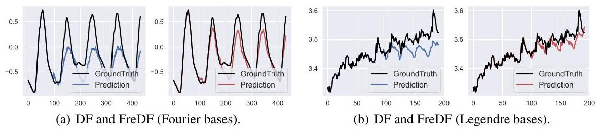

Figure 11: The label sequences (black lines) and forecast sequences generated by DF (blue lines) and FreDF (red lines). The forecast model used is iTransformer, with experiments conducted on selected snapshots characterized by periodicity (a) and trend (b).

图11:由DF(蓝线)和FreDF(红线)生成的标签序列(黑线)和预测序列。使用的预测模型是iTransformer，在以周期性(a)和趋势(b)为特征的选定快照上进行实验。

Chebyshev transform. It uses the Chebyshev polynomials as bases. These bases are not originally orthogonal but become mutually orthogonal on the interval $\left\lbrack  {-1,1}\right\rbrack$ with respect to the weight $1/\sqrt{1 - {t}^{2}}$ . These polynomials are particularly useful for approximating functions with rapid variations. The $k$ -th Chebyshev polynomial and the associated projection can be formulated as follows:

切比雪夫变换。它使用切比雪夫多项式作为基。这些基最初不是正交的，但在区间$\left\lbrack  {-1,1}\right\rbrack$上相对于权重$1/\sqrt{1 - {t}^{2}}$变为相互正交。这些多项式对于逼近具有快速变化的函数特别有用。第$k$个切比雪夫多项式及其相关投影可表述如下:

$$
{f}_{k}\left( t\right)  = \cos \left( {k\arccos \left( t\right) }\right)
$$

$$
{F}_{k} = {\int }_{-1}^{1}\frac{x\left( t\right) {f}_{k}\left( t\right) }{\sqrt{1 - {t}^{2}}}{dt} \tag{13}
$$

Laguerre transform. It uses the Laguerre polynomials as bases. These bases are NOT originally orthogonal but become mutually orthogonal on the interval $\left\lbrack  {0,\infty }\right\rbrack$ with respect to the exponential weight $\exp \left( t\right)$ . These polynomials are particularly useful in quantum mechanics and other fields involving exponential decay. The $k$ -th Laguerre polynomial and the associated projection can be formulated as follows:

拉盖尔变换。它使用拉盖尔多项式作为基。这些基最初不是正交的，但在区间$\left\lbrack  {0,\infty }\right\rbrack$上相对于指数权重$\exp \left( t\right)$变为相互正交。这些多项式在量子力学和其他涉及指数衰减的领域特别有用。第$k$个拉盖尔多项式及其相关投影可表述如下:

(14)

$$
{f}_{k}\left( t\right)  = \exp \left( t\right) \frac{{d}^{k}}{d{t}^{k}}\left( {\exp \left( {-t}\right) {t}^{k}}\right) ,
$$

$$
{F}_{k} = {\int }_{0}^{\infty }\frac{x\left( t\right) {f}_{k}\left( t\right) }{\exp \left( t\right) }{dt}
$$

These polynomial sets are effective for capturing specific data patterns, such as trends and periodicity, which can be difficult to learn in the time domain. By incorporating these polynomial sets, FreDF enhances its flexibility to handle time series data with varying characteristics. A case study is presented in Fig. 11. Specifically, the forecast sequences generated by the canonical DF struggle to capture increasing trends or high-frequency periods; whereas those produced by FreDF effectively capture the dominant characteristics, thereby significantly improving forecast quality.

这些多项式集对于捕捉特定数据模式(如趋势和周期性)很有效，而这些模式在时域中可能难以学习。通过纳入这些多项式集，FreDF增强了其处理具有不同特征的时间序列数据的灵活性。图11给出了一个案例研究。具体而言，传统DF生成的预测序列难以捕捉上升趋势或高频周期；而FreDF生成的预测序列有效地捕捉了主要特征，从而显著提高了预测质量。

In summary, FreDF does not rely solely on Fourier bases but can be adapted to various bases, each with unique properties suitable for different applications. The selection of bases for FreDF depends on the characteristics of the data and the specific objectives of the analysis.

总之，FreDF不单纯依赖傅里叶基，而是可以适应各种基，每个基都有适用于不同应用的独特属性。FreDF的基的选择取决于数据的特征和分析的特定目标。

## D REPRODUCTION DETAILS

## D 重现细节

### D.1 DATASET DESCRIPTIONS

### D.1 数据集描述

The datasets utilized in this study cover a wide range of time series data, detailed in Table 4, each exhibiting unique characteristics and temporal resolutions:

本研究中使用的数据集涵盖了广泛范围的时间序列数据，如表4详细所示，每个数据集都具有独特的特征和时间分辨率:

- ETT (Li et al., 2021) comprises data on 7 factors related to electricity transformers, collected from July 2016 to July 2018. This dataset is divided into four subsets: ETTh1 and ETTh2, with hourly recordings, and ETTm1 and ETTm2, documented every 15 minutes.

- ETT(Li等人，2021)包含与电力变压器相关的7个因素的数据，收集于2016年7月至2018年7月。该数据集分为四个子集:ETTh1和ETTh2，每小时记录一次，以及ETTm1和ETTm2，每15分钟记录一次。

- Weather (Wu et al., 2021) includes 21 meteorological variables gathered every 10 minutes throughout 2020 from the Weather Station of the Max Planck Biogeochemistry Institute.

- 天气数据(Wu等人，2021年)包含2020年期间每隔10分钟从马克斯·普朗克生物地球化学研究所气象站收集的21个气象变量。

- ECL (Electricity Consumption Load) (Wu et al., 2021) presents hourly electricity consumption data for 321 clients.

- 电力消耗负荷(ECL)(Wu等人，2021年)展示了321个客户的每小时电力消耗数据。

Table 4: Dataset description.

表4:数据集描述。

<table><tr><td>Dataset</td><td>D</td><td>Forecast length</td><td>Train / validation / test</td><td>Frequency</td><td>Domain</td></tr><tr><td>ETTh1</td><td>7</td><td>96, 192, 336, 720</td><td>8545/2881/2881</td><td>Hourly</td><td>Health</td></tr><tr><td>ETTh2</td><td>7</td><td>96, 192, 336, 720</td><td>8545/2881/2881</td><td>Hourly</td><td>Health</td></tr><tr><td>ETTm1</td><td>7</td><td>96, 192, 336, 720</td><td>34465/11521/11521</td><td>15min</td><td>Health</td></tr><tr><td>ETTm2</td><td>7</td><td>96, 192, 336, 720</td><td>34465/11521/11521</td><td>15min</td><td>Health</td></tr><tr><td>Weather</td><td>21</td><td>96, 192, 336, 720</td><td>36792/5271/10540</td><td>10min</td><td>Weather</td></tr><tr><td>ECL</td><td>321</td><td>96, 192, 336, 720</td><td>18317/2633/5261</td><td>Hourly</td><td>Electricity</td></tr><tr><td>Traffic</td><td>862</td><td>96, 192, 336, 720</td><td>12185/1757/3509</td><td>Hourly</td><td>Transportation</td></tr><tr><td>PEMS03</td><td>358</td><td>12, 24, 36, 48</td><td>15617/5135/5135</td><td>5min</td><td>Transportation</td></tr><tr><td>PEMS08</td><td>170</td><td>12, 24, 36, 48</td><td>10690/3548/265</td><td>5min</td><td>Transportation</td></tr></table>

Note: D denotes the number of variates. Frequency denotes the sampling interval of time points. Train, Validation, Test denotes the number of samples employed in each split. The taxonomy aligns with Wu et al. (2023).

注意:D表示变量数量。频率表示时间点的采样间隔。训练集、验证集、测试集表示每个划分中使用的样本数量。分类法与Wu等人(2023年)一致。

- Traffic (Wu et al., 2021) features hourly road occupancy rates from 862 sensors in the San Francisco Bay area freeways, spanning from January 2015 to December 2016.

- 交通数据(Wu等人，2021年)的特征是2015年1月至2016年12月期间旧金山湾区高速公路上862个传感器的每小时道路占有率。

- PEMS (Liu et al., 2022a) contains the public traffic network data in California collected by 5-minute windows. Two public subsets (PEMS03, PEMS08) are adopted in this work.

- PEMS(Liu等人，2022a)包含加利福尼亚州以5分钟窗口收集的公共交通网络数据。本研究采用了两个公共子集(PEMS03、PEMS08)。

The datasets are chronologically divided into training, validation, and test sets following the protocols outlined in (Qiu et al., 2024; Liu et al., 2024). The dropping-last trick is disabled during the test phase. The length of the input sequence is standardized at 96 across the ETT, Weather, ECL, and Traffic datasets, with varying label sequence lengths of 96, 192, 336, and 720.

数据集按照(Qiu等人，2024年；Liu等人，2024年)中概述的协议按时间顺序分为训练集、验证集和测试集。在测试阶段禁用了丢弃最后一个样本的技巧。在ETT、天气、ECL和交通数据集中，输入序列的长度标准化为96，标签序列长度分别为96、192、336和720。

### D.2 IMPLEMENTATION DETAILS

### D.2实现细节

The baseline models in this study are reproduced using training scripts obtained from the iTransformer repository (Liu et al., 2024) after reproducibility verification. Models are trained using the Adam optimizer (Kingma &Ba,2015), with learning rates selected from the set ${10}^{-3},5 \times  {10}^{-4},{10}^{-4}$ to minimize the MSE loss. The training is limited to a maximum of 10 epochs, incorporating an early stopping mechanism activated upon a lack of improvement in validation performance over 3 epochs.

本研究中的基线模型在经过可重复性验证后，使用从iTransformer存储库(Liu等人，2024年)获得的训练脚本进行重现。模型使用Adam优化器(Kingma & Ba，2015年)进行训练，学习率从集合${10}^{-3},5 \times  {10}^{-4},{10}^{-4}$中选择，以最小化均方误差损失。训练最多限制为10个epoch，并纳入了一种早期停止机制，当验证性能在3个epoch内没有改善时激活。

In experiments integrating FreDF to enhance an existing forecast model, we adhere to the associated hyperparameter settings from the public benchmark (Liu et al.,2024), tuning only $\alpha$ within $\left\lbrack  {0,1}\right\rbrack$ and learning rate conservatively. Finetuning the learning rate is essential to handle the different magnitude of temporal and frequency losses. Fine-tuning is conducted to minimize the MSE averaged across all forecast lengths on the validation dataset.

在整合FreDF以增强现有预测模型的实验中，我们遵循公共基准(Liu等人，2024年)中的相关超参数设置，仅在$\left\lbrack  {0,1}\right\rbrack$范围内调整$\alpha$，并保守地调整学习率。微调学习率对于处理不同大小的时间和频率损失至关重要。微调是为了在验证数据集上最小化所有预测长度上的平均均方误差。

## E MORE EXPERIMENTAL RESULTS

## E更多实验结果

### E.1 OVERALL PERFORMANCE

### E.1整体性能

Long-term forecast. We provide comprehensive performance comparison on the long-term forecast task in Table 5. The iTransformer model is used to operationalize the FreDF paradigm. Despite the iTransformer's existing performance gap compared to other baseline models, the incorporation of FreDF enhances its performance in the majority of cases, securing the lowest MSE in 31 out of 45 cases and MAE in 40 out of 45 cases. The few instances where FreDF does not achieve the lowest MSE are attributed to the inherent superiority of other models over iTransformer in specific datasets (for example, FreTS versus iTransformer on the Weather dataset).

长期预测。我们在表5中提供了长期预测任务的全面性能比较。iTransformer模型用于实施FreDF范式。尽管与其他基线模型相比，iTransformer存在现有性能差距，但在大多数情况下，整合FreDF可提高其性能，在45个案例中的31个案例中确保了最低的均方误差，在45个案例中的40个案例中确保了最低的平均绝对误差。FreDF未达到最低均方误差的少数情况归因于其他模型在特定数据集上相对于iTransformer的固有优势(例如，在天气数据集上FreTS与iTransformer相比)。

Short-term forecast. We investigate the short-term forecast task in Table 6, with FreTS Yi et al. (2023b) serving as the forecasting model in the FreDF implementation. Consistent with the long-term forecasting results, FreDF enhances FreTS's performance in most instances. Notably, there are three cases where FreTS outperforms FreDF. This occurs because the loss weight $\alpha$ is tuned to minimize the validation error averaged across all forecast lengths instead of focusing on specific lengths. While it is feasible to fine-tune $\alpha$ for each forecast length, we did not use this approach, as the current results suffice to demonstrate FreDF's effectiveness.

短期预测。我们在表6中研究了短期预测任务，在FreDF实现中使用FreTS Yi等人(2023b)作为预测模型。与长期预测结果一致，在大多数情况下，FreDF提高了FreTS的性能。值得注意的是，有三个案例中FreTS优于FreDF。这是因为损失权重$\alpha$被调整以最小化所有预测长度上的平均验证误差，而不是专注于特定长度。虽然为每个预测长度微调$\alpha$是可行的，但我们没有使用这种方法，因为当前结果足以证明FreDF的有效性。

Table 5: The comprehensive results on the long-term forecasting task.

表5:长期预测任务的综合结果。

<table><tr><td colspan="2">Models</td><td colspan="2">FredF (Ours)</td><td colspan="2">iTransformer (2024)</td><td colspan="2">FreTS (2023)</td><td colspan="2">TimesNet (2023)</td><td colspan="2">MICN (2023)</td><td colspan="2">TiDE (2023)</td><td colspan="2">DLinear (2023)</td><td colspan="2">FEDformer (2022)</td><td colspan="2">Autoformer (2021)</td><td colspan="2">Transformer   (2017)</td><td colspan="2">TCN (2017)</td></tr><tr><td colspan="2">Metrics</td><td>MSE</td><td>MAE</td><td>MSE</td><td>MAE</td><td>MSE</td><td>MAE</td><td>MSE</td><td>MAE</td><td>MSE</td><td>MAE</td><td>MSE</td><td>MAE</td><td>MSE</td><td>MAE</td><td>MSE</td><td>MAE</td><td>MSE</td><td>MAE</td><td>MSE</td><td>MAE</td><td>MSE</td><td>MAE</td></tr><tr><td rowspan="5">ETTm1</td><td>96</td><td>0.324</td><td>0.362</td><td>0.346</td><td>0.379</td><td>0.339</td><td>0.374</td><td>0.338</td><td>0.379</td><td>0.318</td><td>0.366</td><td>0.364</td><td>0.387</td><td>0.345</td><td>0.372</td><td>0.389</td><td>0.427</td><td>0.468</td><td>0.463</td><td>0.591</td><td>0.549</td><td>0.887</td><td>0.613</td></tr><tr><td>192</td><td>0.373</td><td>0.385</td><td>0.392</td><td>0.400</td><td>0.382</td><td>0.397</td><td>0.389</td><td>0.400</td><td>0.364</td><td>0.396</td><td>0.398</td><td>0.404</td><td>0.381</td><td>0.390</td><td>0.402</td><td>0.431</td><td>0.573</td><td>0.509</td><td>0.704</td><td>0.629</td><td>0.877</td><td>0.626</td></tr><tr><td>336</td><td>0.402</td><td>0.404</td><td>0.427</td><td>0.422</td><td>0.421</td><td>0.426</td><td>0.429</td><td>0.428</td><td>0.398</td><td>0.428</td><td>0.428</td><td>0.425</td><td>0.414</td><td>0.414</td><td>0.438</td><td>0.451</td><td>0.596</td><td>0.527</td><td>1.171</td><td>0.861</td><td>0.890</td><td>0.636</td></tr><tr><td>720</td><td>0.469</td><td>0.444</td><td>0.494</td><td>0.461</td><td>0.485</td><td>0.462</td><td>0.495</td><td>0.464</td><td>0.514</td><td>0.501</td><td>0.487</td><td>0.461</td><td>0.473</td><td>0.451</td><td>0.529</td><td>0.498</td><td>0.749</td><td>0.569</td><td>1.307</td><td>0.893</td><td>0.911</td><td>0.653</td></tr><tr><td>Avg</td><td>0.392</td><td>0.399</td><td>0.415</td><td>0.416</td><td>0.407</td><td>0.415</td><td>0.413</td><td>0.418</td><td>0.399</td><td>0.423</td><td>0.419</td><td>0.419</td><td>0.404</td><td>0.407</td><td>0.440</td><td>0.451</td><td>0.596</td><td>0.517</td><td>0.943</td><td>0.733</td><td>0.891</td><td>0.632</td></tr><tr><td rowspan="5">ETTm2</td><td>96</td><td>0.173</td><td>0.252</td><td>0.184</td><td>0.266</td><td>0.190</td><td>0.282</td><td>0.185</td><td>0.264</td><td>0.178</td><td>0.275</td><td>0.207</td><td>0.305</td><td>0.195</td><td>0.294</td><td>0.194</td><td>0.284</td><td>0.240</td><td>0.319</td><td>0.317</td><td>0.408</td><td>3.125</td><td>1.345</td></tr><tr><td>192</td><td>0.241</td><td>0.298</td><td>0.257</td><td>0.315</td><td>0.260</td><td>0.329</td><td>0.254</td><td>0.307</td><td>0.240</td><td>0.317</td><td>0.290</td><td>0.364</td><td>0.283</td><td>0.359</td><td>0.264</td><td>0.324</td><td>0.300</td><td>0.349</td><td>1.069</td><td>0.758</td><td>3.130</td><td>1.350</td></tr><tr><td>336</td><td>0.298</td><td>0.334</td><td>0.315</td><td>0.351</td><td>0.373</td><td>0.405</td><td>0.314</td><td>0.345</td><td>0.299</td><td>0.354</td><td>0.377</td><td>0.422</td><td>0.384</td><td>0.427</td><td>0.319</td><td>0.359</td><td>0.339</td><td>0.375</td><td>1.325</td><td>0.869</td><td>3.185</td><td>1.375</td></tr><tr><td>720</td><td>0.398</td><td>0.393</td><td>0.419</td><td>0.409</td><td>0.517</td><td>0.499</td><td>0.434</td><td>0.413</td><td>0.482</td><td>0.479</td><td>0.558</td><td>0.524</td><td>0.516</td><td>0.502</td><td>0.430</td><td>0.424</td><td>0.423</td><td>0.421</td><td>2.576</td><td>1.223</td><td>4.203</td><td>1.658</td></tr><tr><td>Avg</td><td>0.278</td><td>0.319</td><td>0.294</td><td>0.335</td><td>0.335</td><td>0.379</td><td>0.297</td><td>0.332</td><td>0.300</td><td>0.356</td><td>0.358</td><td>0.404</td><td>0.344</td><td>0.396</td><td>0.302</td><td>0.348</td><td>0.326</td><td>0.366</td><td>1.322</td><td>0.814</td><td>3.411</td><td>1.432</td></tr><tr><td rowspan="5">ETTh1</td><td>96</td><td>0.382</td><td>0.400</td><td>0.390</td><td>0.410</td><td>0.399</td><td>0.412</td><td>0.422</td><td>0.433</td><td>0.383</td><td>0.418</td><td>0.479</td><td>0.464</td><td>0.396</td><td>0.410</td><td>0.377</td><td>0.418</td><td>0.423</td><td>0.441</td><td>0.796</td><td>0.691</td><td>0.767</td><td>0.633</td></tr><tr><td>192</td><td>0.430</td><td>0.427</td><td>0.443</td><td>0.441</td><td>0.453</td><td>0.443</td><td>0.465</td><td>0.457</td><td>0.500</td><td>0.491</td><td>0.521</td><td>0.503</td><td>0.449</td><td>0.444</td><td>0.421</td><td>0.445</td><td>0.498</td><td>0.485</td><td>0.813</td><td>0.699</td><td>0.739</td><td>0.619</td></tr><tr><td>336</td><td>0.474</td><td>0.451</td><td>0.480</td><td>0.457</td><td>0.503</td><td>0.475</td><td>0.492</td><td>0.470</td><td>0.546</td><td>0.530</td><td>0.659</td><td>0.603</td><td>0.487</td><td>0.465</td><td>0.468</td><td>0.472</td><td>0.506</td><td>0.496</td><td>1.181</td><td>0.876</td><td>0.717</td><td>0.613</td></tr><tr><td>720</td><td>0.463</td><td>0.462</td><td>0.484</td><td>0.479</td><td>0.596</td><td>0.565</td><td>0.532</td><td>0.502</td><td>0.671</td><td>0.620</td><td>0.893</td><td>0.736</td><td>0.516</td><td>0.513</td><td>0.500</td><td>0.493</td><td>0.477</td><td>0.487</td><td>1.182</td><td>0.885</td><td>0.828</td><td>0.678</td></tr><tr><td>Avg</td><td>0.437</td><td>0.435</td><td>0.449</td><td>0.447</td><td>0.488</td><td>0.474</td><td>0.478</td><td>0.466</td><td>0.525</td><td>0.515</td><td>0.628</td><td>0.574</td><td>0.462</td><td>0.458</td><td>0.441</td><td>0.457</td><td>0.476</td><td>0.477</td><td>0.993</td><td>0.788</td><td>0.763</td><td>0.636</td></tr><tr><td rowspan="5">ETTh2</td><td>96</td><td>0.289</td><td>0.337</td><td>0.301</td><td>0.349</td><td>0.350</td><td>0.403</td><td>0.320</td><td>0.364</td><td>0.361</td><td>0.404</td><td>0.400</td><td>0.440</td><td>0.343</td><td>0.396</td><td>0.347</td><td>0.391</td><td>0.383</td><td>0.424</td><td>2.072</td><td>1.140</td><td>3.171</td><td>1.364</td></tr><tr><td>192</td><td>0.363</td><td>0.385</td><td>0.382</td><td>0.402</td><td>0.472</td><td>0.475</td><td>0.409</td><td>0.417</td><td>0.495</td><td>0.490</td><td>0.528</td><td>0.509</td><td>0.473</td><td>0.474</td><td>0.430</td><td>0.443</td><td>0.557</td><td>0.511</td><td>5.081</td><td>1.814</td><td>3.222</td><td>1.398</td></tr><tr><td>336</td><td>0.419</td><td>0.426</td><td>0.430</td><td>0.434</td><td>0.564</td><td>0.528</td><td>0.449</td><td>0.451</td><td>0.671</td><td>0.588</td><td>0.643</td><td>0.571</td><td>0.603</td><td>0.546</td><td>0.469</td><td>0.475</td><td>0.470</td><td>0.481</td><td>3.564</td><td>1.475</td><td>3.306</td><td>1.452</td></tr><tr><td>720</td><td>0.415</td><td>0.437</td><td>0.447</td><td>0.455</td><td>0.815</td><td>0.654</td><td>0.473</td><td>0.474</td><td>0.968</td><td>0.712</td><td>0.874</td><td>0.679</td><td>0.812</td><td>0.650</td><td>0.473</td><td>0.480</td><td>0.501</td><td>0.515</td><td>2.469</td><td>1.247</td><td>3.599</td><td>1.565</td></tr><tr><td>Avg</td><td>0.371</td><td>0.396</td><td>0.390</td><td>0.410</td><td>0.550</td><td>0.515</td><td>0.413</td><td>0.426</td><td>0.624</td><td>0.549</td><td>0.611</td><td>0.550</td><td>0.558</td><td>0.516</td><td>0.430</td><td>0.447</td><td>0.478</td><td>0.483</td><td>3.296</td><td>1.419</td><td>3.325</td><td>1.445</td></tr><tr><td rowspan="5">OF</td><td>96</td><td>0.144</td><td>0.233</td><td>0.148</td><td>0.239</td><td>0.189</td><td>0.277</td><td>0.171</td><td>0.273</td><td>0.168</td><td>0.280</td><td>0.237</td><td>0.329</td><td>0.210</td><td>0.302</td><td>0.200</td><td>0.315</td><td>0.199</td><td>0.315</td><td>0.252</td><td>0.352</td><td>0.688</td><td>0.621</td></tr><tr><td>192</td><td>0.159</td><td>0.247</td><td>0.167</td><td>0.258</td><td>0.193</td><td>0.282</td><td>0.188</td><td>0.289</td><td>0.177</td><td>0.289</td><td>0.236</td><td>0.330</td><td>0.210</td><td>0.305</td><td>0.207</td><td>0.322</td><td>0.215</td><td>0.327</td><td>0.266</td><td>0.364</td><td>0.587</td><td>0.582</td></tr><tr><td>336</td><td>0.172</td><td>0.263</td><td>0.179</td><td>0.272</td><td>0.207</td><td>0.296</td><td>0.208</td><td>0.304</td><td>0.185</td><td>0.296</td><td>0.249</td><td>0.344</td><td>0.223</td><td>0.319</td><td>0.226</td><td>0.340</td><td>0.232</td><td>0.343</td><td>0.292</td><td>0.383</td><td>0.590</td><td>0.588</td></tr><tr><td>720</td><td>0.204</td><td>0.294</td><td>0.209</td><td>0.298</td><td>0.245</td><td>0.332</td><td>0.289</td><td>0.363</td><td>0.218</td><td>0.323</td><td>0.284</td><td>0.373</td><td>0.258</td><td>0.350</td><td>0.282</td><td>0.379</td><td>0.268</td><td>0.371</td><td>0.287</td><td>0.371</td><td>0.602</td><td>0.601</td></tr><tr><td>Avg</td><td>0.170</td><td>0.259</td><td>0.176</td><td>0.267</td><td>0.209</td><td>0.297</td><td>0.214</td><td>0.307</td><td>0.187</td><td>0.297</td><td>0.251</td><td>0.344</td><td>0.225</td><td>0.319</td><td>0.229</td><td>0.339</td><td>0.228</td><td>0.339</td><td>0.274</td><td>0.367</td><td>0.617</td><td>0.598</td></tr><tr><td rowspan="5">Traffic</td><td>96</td><td>0.391</td><td>0.265</td><td>0.397</td><td>0.272</td><td>0.528</td><td>0.341</td><td>0.504</td><td>0.298</td><td>0.609</td><td>0.317</td><td>0.805</td><td>0.493</td><td>0.697</td><td>0.429</td><td>0.577</td><td>0.362</td><td>0.609</td><td>0.385</td><td>0.686</td><td>0.385</td><td>1.451</td><td>0.744</td></tr><tr><td>192</td><td>0.410</td><td>0.273</td><td>0.418</td><td>0.279</td><td>0.531</td><td>0.338</td><td>0.526</td><td>0.305</td><td>0.621</td><td>0.328</td><td>0.756</td><td>0.474</td><td>0.647</td><td>0.407</td><td>0.603</td><td>0.372</td><td>0.633</td><td>0.400</td><td>0.679</td><td>0.377</td><td>0.842</td><td>0.622</td></tr><tr><td>336</td><td>0.424</td><td>0.280</td><td>0.432</td><td>0.286</td><td>0.551</td><td>0.345</td><td>0.540</td><td>0.310</td><td>0.641</td><td>0.342</td><td>0.762</td><td>0.477</td><td>0.653</td><td>0.410</td><td>0.615</td><td>0.378</td><td>0.637</td><td>0.398</td><td>0.663</td><td>0.361</td><td>0.844</td><td>0.620</td></tr><tr><td>720</td><td>0.460</td><td>0.298</td><td>0.467</td><td>0.305</td><td>0.598</td><td>0.367</td><td>0.570</td><td>0.324</td><td>0.671</td><td>0.354</td><td>0.719</td><td>0.449</td><td>0.694</td><td>0.429</td><td>0.649</td><td>0.403</td><td>0.668</td><td>0.415</td><td>0.693</td><td>0.381</td><td>0.867</td><td>0.624</td></tr><tr><td>Avg</td><td>0.421</td><td>0.279</td><td>0.428</td><td>0.286</td><td>0.552</td><td>0.348</td><td>0.535</td><td>0.309</td><td>0.636</td><td>0.335</td><td>0.760</td><td>0.473</td><td>0.673</td><td>0.419</td><td>0.611</td><td>0.379</td><td>0.637</td><td>0.399</td><td>0.680</td><td>0.376</td><td>1.001</td><td>0.652</td></tr><tr><td rowspan="5">Weather</td><td>96</td><td>0.164</td><td>0.202</td><td>0.201</td><td>0.247</td><td>0.184</td><td>0.239</td><td>0.178</td><td>0.226</td><td>0.182</td><td>0.250</td><td>0.202</td><td>0.261</td><td>0.197</td><td>0.259</td><td>0.221</td><td>0.304</td><td>0.284</td><td>0.355</td><td>0.332</td><td>0.383</td><td>0.610</td><td>0.568</td></tr><tr><td>192</td><td>0.220</td><td>0.253</td><td>0.250</td><td>0.283</td><td>0.223</td><td>0.275</td><td>0.227</td><td>0.266</td><td>0.234</td><td>0.301</td><td>0.242</td><td>0.298</td><td>0.236</td><td>0.294</td><td>0.275</td><td>0.345</td><td>0.313</td><td>0.371</td><td>0.634</td><td>0.539</td><td>0.541</td><td>0.552</td></tr><tr><td>336</td><td>0.275</td><td>0.294</td><td>0.302</td><td>0.317</td><td>0.272</td><td>0.316</td><td>0.283</td><td>0.305</td><td>0.268</td><td>0.325</td><td>0.287</td><td>0.335</td><td>0.282</td><td>0.332</td><td>0.338</td><td>0.379</td><td>0.359</td><td>0.393</td><td>0.656</td><td>0.579</td><td>0.565</td><td>0.569</td></tr><tr><td>720</td><td>0.356</td><td>0.347</td><td>0.370</td><td>0.362</td><td>0.340</td><td>0.363</td><td>0.359</td><td>0.355</td><td>0.361</td><td>0.399</td><td>0.351</td><td>0.386</td><td>0.347</td><td>0.384</td><td>0.408</td><td>0.418</td><td>0.440</td><td>0.446</td><td>0.908</td><td>0.706</td><td>0.622</td><td>0.601</td></tr><tr><td>Avg</td><td>0.254</td><td>0.274</td><td>0.281</td><td>0.302</td><td>0.255</td><td>0.299</td><td>0.262</td><td>0.288</td><td>0.261</td><td>0.319</td><td>0.271</td><td>0.320</td><td>0.265</td><td>0.317</td><td>0.311</td><td>0.361</td><td>0.349</td><td>0.391</td><td>0.632</td><td>0.552</td><td>0.584</td><td>0.572</td></tr><tr><td rowspan="5">PEMS03</td><td>12</td><td>0.068</td><td>0.172</td><td>0.069</td><td>0.175</td><td>0.083</td><td>0.194</td><td>0.082</td><td>0.188</td><td>0.087</td><td>0.203</td><td>0.117</td><td>0.225</td><td>0.122</td><td>0.245</td><td>0.123</td><td>0.248</td><td>0.239</td><td>0.365</td><td>0.107</td><td>0.209</td><td>0.632</td><td>0.606</td></tr><tr><td>24</td><td>0.096</td><td>0.205</td><td>0.098</td><td>0.210</td><td>0.127</td><td>0.241</td><td>0.110</td><td>0.216</td><td>0.086</td><td>0.198</td><td>0.233</td><td>0.320</td><td>0.202</td><td>0.320</td><td>0.160</td><td>0.287</td><td>0.492</td><td>0.506</td><td>0.121</td><td>0.227</td><td>0.655</td><td>0.626</td></tr><tr><td>36</td><td>0.128</td><td>0.240</td><td>0.131</td><td>0.243</td><td>0.169</td><td>0.281</td><td>0.133</td><td>0.236</td><td>0.105</td><td>0.220</td><td>0.380</td><td>0.422</td><td>0.275</td><td>0.382</td><td>0.191</td><td>0.321</td><td>0.399</td><td>0.459</td><td>0.133</td><td>0.243</td><td>0.678</td><td>0.644</td></tr><tr><td>48</td><td>0.161</td><td>0.269</td><td>0.164</td><td>0.275</td><td>0.204</td><td>0.311</td><td>0.146</td><td>0.251</td><td>0.120</td><td>0.235</td><td>0.536</td><td>0.511</td><td>0.335</td><td>0.429</td><td>0.223</td><td>0.350</td><td>0.875</td><td>0.723</td><td>0.144</td><td>0.253</td><td>0.699</td><td>0.659</td></tr><tr><td>Avg</td><td>0.113</td><td>0.219</td><td>0.116</td><td>0.226</td><td>0.146</td><td>0.257</td><td>0.118</td><td>0.223</td><td>0.099</td><td>0.214</td><td>0.316</td><td>0.370</td><td>0.233</td><td>0.344</td><td>0.174</td><td>0.302</td><td>0.501</td><td>0.513</td><td>0.126</td><td>0.233</td><td>0.666</td><td>0.634</td></tr><tr><td rowspan="5">PEMS08</td><td>12</td><td>0.080</td><td>0.182</td><td>0.085</td><td>0.189</td><td>0.095</td><td>0.204</td><td>0.110</td><td>0.209</td><td>2.193</td><td>0.871</td><td>0.121</td><td>0.231</td><td>0.152</td><td>0.274</td><td>0.175</td><td>0.275</td><td>0.446</td><td>0.483</td><td>0.213</td><td>0.236</td><td>0.680</td><td>0.607</td></tr><tr><td>24</td><td>0.118</td><td>0.220</td><td>0.131</td><td>0.236</td><td>0.150</td><td>0.259</td><td>0.142</td><td>0.239</td><td>0.235</td><td>0.339</td><td>0.232</td><td>0.326</td><td>0.245</td><td>0.350</td><td>0.211</td><td>0.305</td><td>0.488</td><td>0.509</td><td>0.238</td><td>0.256</td><td>0.701</td><td>0.622</td></tr><tr><td>36</td><td>0.161</td><td>0.258</td><td>0.182</td><td>0.282</td><td>0.202</td><td>0.305</td><td>0.167</td><td>0.258</td><td>0.197</td><td>0.300</td><td>0.379</td><td>0.428</td><td>0.344</td><td>0.417</td><td>0.250</td><td>0.338</td><td>0.532</td><td>0.513</td><td>0.263</td><td>0.277</td><td>0.727</td><td>0.637</td></tr><tr><td>48</td><td>0.206</td><td>0.293</td><td>0.236</td><td>0.323</td><td>0.250</td><td>0.341</td><td>0.195</td><td>0.274</td><td>0.242</td><td>0.324</td><td>0.543</td><td>0.527</td><td>0.437</td><td>0.469</td><td>0.293</td><td>0.371</td><td>1.052</td><td>0.781</td><td>0.283</td><td>0.295</td><td>0.746</td><td>0.648</td></tr><tr><td>Avg</td><td>0.141</td><td>0.238</td><td>0.159</td><td>0.258</td><td>0.174</td><td>0.277</td><td>0.154</td><td>0.245</td><td>0.717</td><td>0.459</td><td>0.319</td><td>0.378</td><td>0.294</td><td>0.377</td><td>0.232</td><td>0.322</td><td>0.630</td><td>0.572</td><td>0.249</td><td>0.266</td><td>0.713</td><td>0.629</td></tr><tr><td></td><td>${1}^{\text{ st }}$ Count</td><td>31</td><td>40</td><td>0</td><td>0</td><td>1</td><td>0</td><td>1</td><td>1</td><td>10</td><td>4</td><td>0</td><td>0</td><td>0</td><td>0</td><td>3</td><td>0</td><td>0</td><td>0</td><td>0</td><td>0</td><td>0</td><td>0</td></tr></table>

Note: We fix the input length as 96 following (Liu et al., 2024). Bold typeface highlights the top performance for each metric, while underlined text denotes the second-best results. Avg indicates the results averaged over forecasting lengths: T=96, 192, 336 and 720.

注意:按照(Liu等人，2024年)，我们将输入长度固定为96。粗体突出显示每个指标的最佳性能，下划线文本表示第二好的结果。Avg表示在预测长度T = 96、192,、336和720上平均的结果。

Table 6: The comprehensive results on the short-term forecasting task.

表6:短期预测任务的综合结果。

<table><tr><td>Models</td><td colspan="3">FredF (Ours)</td><td colspan="3">FreTS (2023)</td><td colspan="3">iTransformer (2024)</td><td colspan="3">MICN (2023)</td><td colspan="3">DLinear (2023)</td><td colspan="3">Fedformer (2023)</td><td colspan="3">Autoformer (2023)</td></tr><tr><td>Metric</td><td>SMAPE</td><td>MASE</td><td>OWA</td><td>SMAPE</td><td>MASE</td><td>OWA</td><td>SMAPE</td><td>MASE</td><td>OWA</td><td>SMAPE</td><td>MASE</td><td>OWA</td><td>SMAPE</td><td>MASE</td><td>OWA</td><td>SMAPE</td><td>MASE</td><td>OWA</td><td>SMAPE</td><td>MASE</td><td>OWA</td></tr><tr><td>Yearly</td><td>13.556</td><td>3.046</td><td>0.798</td><td>13.576</td><td>3.068</td><td>0.801</td><td>13.797</td><td>3.143</td><td>0.818</td><td>14.594</td><td>3.392</td><td>0.873</td><td>14.307</td><td>3.094</td><td>0.827</td><td>13.648</td><td>3.089</td><td>0.806</td><td>18.477</td><td>4.26</td><td>1.101</td></tr><tr><td>Quarterly</td><td>10.374</td><td>1.229</td><td>0.919</td><td>10.361</td><td>1.223</td><td>0.916</td><td>10.503</td><td>1.248</td><td>0.932</td><td>11.417</td><td>1.385</td><td>1.023</td><td>10.500</td><td>1.237</td><td>0.928</td><td>10.612</td><td>1.246</td><td>0.936</td><td>14.254</td><td>1.829</td><td>1.314</td></tr><tr><td>Monthly</td><td>12.999</td><td>0.983</td><td>0.913</td><td>13.088</td><td>0.99</td><td>0.919</td><td>13.227</td><td>1.013</td><td>0.935</td><td>13.834</td><td>1.080</td><td>0.987</td><td>13.362</td><td>1.007</td><td>0.937</td><td>14.181</td><td>1.105</td><td>1.011</td><td>18.421</td><td>1.616</td><td>1.398</td></tr><tr><td>Others</td><td>5.294</td><td>3.614</td><td>1.127</td><td>5.563</td><td>3.71</td><td>1.17</td><td>5.101</td><td>3.419</td><td>1.076</td><td>6.137</td><td>4.201</td><td>1.308</td><td>5.12</td><td>3.649</td><td>1.114</td><td>4.823</td><td>3.243</td><td>1.019</td><td>6.772</td><td>4.963</td><td>1.495</td></tr><tr><td>Avg.</td><td>12.112</td><td>1.648</td><td>0.877</td><td>12.169</td><td>1.66</td><td>0.883</td><td>12.298</td><td>1.68</td><td>0.893</td><td>13.044</td><td>1.841</td><td>0.962</td><td>12.48</td><td>1.674</td><td>0.898</td><td>12.734</td><td>1.702</td><td>0.914</td><td>16.851</td><td>2.443</td><td>1.26</td></tr><tr><td>${1}^{\text{ st }}$ Count</td><td>3</td><td>3</td><td>3</td><td>1</td><td>1</td><td>1</td><td>0</td><td>0</td><td>0</td><td>0</td><td>0</td><td>0</td><td>0</td><td>0</td><td>0</td><td>1</td><td>1</td><td>1</td><td>0</td><td>0</td><td>0</td></tr></table>

Note: Bold typeface highlights the top performance for each metric, while underlined text denotes the second-best results. Avg indicates the results averaged over forecasting lengths: yearly, quarterly, and monthly.

注意:粗体字突出显示了每个指标的最佳性能，而带下划线的文本表示第二好的结果。Avg表示在预测长度(年度、季度和月度)上平均的结果。

Table 7: The comprehensive results on the missing data imputation task.

表7:缺失数据插补任务的综合结果。

<table><tr><td colspan="2">Models</td><td colspan="2">FreDF (Ours)</td><td colspan="2">iTransformer (2024)</td><td colspan="2">FreTS (2023)</td><td colspan="2">TimesNet (2023)</td><td colspan="2">MICN (2023)</td><td colspan="2">TiDE (2023)</td><td colspan="2">DLinear (2023)</td><td colspan="2">FEDformer (2022)</td><td colspan="2">Autoformer (2021)</td></tr><tr><td></td><td>${p}_{\mathrm{{miss}}}$</td><td>MSE</td><td>MAE</td><td>MSE</td><td>MAE</td><td>MSE</td><td>MAE</td><td>MSE</td><td>MAE</td><td>MSE</td><td>MAE</td><td>MSE</td><td>MAE</td><td>MSE</td><td>MAE</td><td>MSE</td><td>MAE</td><td>MSE</td><td>MAE</td></tr><tr><td rowspan="5">ETTm1</td><td>0.125</td><td>0.00153</td><td>0.02790</td><td>0.00213</td><td>0.03307</td><td>0.01102</td><td>0.07843</td><td>0.01152</td><td>0.07267</td><td>0.00236</td><td>0.03371</td><td>0.45052</td><td>0.45514</td><td>0.00148</td><td>0.02380</td><td>0.68262</td><td>0.38111</td><td>0.37654</td><td>0.35378</td></tr><tr><td>0.25</td><td>0.00287</td><td>0.03801</td><td>0.00402</td><td>0.04434</td><td>0.01089</td><td>0.07753</td><td>0.01245</td><td>0.07946</td><td>0.00284</td><td>0.03691</td><td>0.41777</td><td>0.45884</td><td>0.00154</td><td>0.02351</td><td>0.68235</td><td>0.38116</td><td>0.37059</td><td>0.35261</td></tr><tr><td>0.375</td><td>0.00256</td><td>0.03669</td><td>0.00458</td><td>0.04663</td><td>0.01100</td><td>0.07812</td><td>0.01407</td><td>0.08673</td><td>0.00323</td><td>0.03900</td><td>0.62935</td><td>0.55570</td><td>0.00175</td><td>0.02385</td><td>0.68191</td><td>0.38105</td><td>0.37877</td><td>0.36093</td></tr><tr><td>0.5</td><td>0.00152</td><td>0.02739</td><td>0.00363</td><td>0.04359</td><td>0.01102</td><td>0.07818</td><td>0.01676</td><td>0.09610</td><td>0.00352</td><td>0.04028</td><td>0.29342</td><td>0.39320</td><td>0.00192</td><td>0.02219</td><td>0.68119</td><td>0.38085</td><td>0.38052</td><td>0.36462</td></tr><tr><td>Avg</td><td>0.00212</td><td>0.03250</td><td>0.00359</td><td>0.04191</td><td>0.01098</td><td>0.07807</td><td>0.01370</td><td>0.08374</td><td>0.00299</td><td>0.03747</td><td>0.44776</td><td>0.46572</td><td>0.00167</td><td>0.02334</td><td>0.68202</td><td>0.38104</td><td>0.37660</td><td>0.35798</td></tr><tr><td rowspan="5">ETTm2</td><td>0.125</td><td>0.00363</td><td>0.03840</td><td>0.00398</td><td>0.04034</td><td>0.03194</td><td>0.13349</td><td>0.01189</td><td>0.06710</td><td>0.00219</td><td>0.03345</td><td>0.83023</td><td>0.62174</td><td>0.03822</td><td>0.12943</td><td>3.10388</td><td>1.31356</td><td>1.40160</td><td>0.80777</td></tr><tr><td>0.25</td><td>0.00437</td><td>0.04255</td><td>0.00431</td><td>0.04303</td><td>0.03591</td><td>0.13655</td><td>0.01795</td><td>0.08939</td><td>0.00331</td><td>0.04100</td><td>0.81402</td><td>0.61100</td><td>0.03063</td><td>0.11547</td><td>3.10364</td><td>1.31348</td><td>1.41033</td><td>0.81363</td></tr><tr><td>0.375</td><td>0.00352</td><td>0.03823</td><td>0.00342</td><td>0.03793</td><td>0.03250</td><td>0.13336</td><td>0.02742</td><td>0.11499</td><td>0.00431</td><td>0.04598</td><td>1.11225</td><td>0.73633</td><td>0.01709</td><td>0.08822</td><td>3.10328</td><td>1.31330</td><td>1.40812</td><td>0.81049</td></tr><tr><td>0.5</td><td>0.00137</td><td>0.02382</td><td>0.00160</td><td>0.02538</td><td>0.03126</td><td>0.13027</td><td>0.04053</td><td>0.14285</td><td>0.00505</td><td>0.04918</td><td>0.99459</td><td>0.70665</td><td>0.01025</td><td>0.06440</td><td>3.10527</td><td>1.31389</td><td>1.44617</td><td>0.81796</td></tr><tr><td>Avg</td><td>0.00322</td><td>0.03575</td><td>0.00333</td><td>0.03667</td><td>0.03290</td><td>0.13342</td><td>0.02445</td><td>0.10358</td><td>0.00371</td><td>0.04240</td><td>0.93777</td><td>0.66893</td><td>0.02405</td><td>0.09938</td><td>3.10402</td><td>1.31356</td><td>1.41655</td><td>0.81246</td></tr><tr><td rowspan="5">Millturn</td><td>0.125</td><td>0.00178</td><td>0.03059</td><td>0.00319</td><td>0.04102</td><td>0.01400</td><td>0.08181</td><td>0.00441</td><td>0.04403</td><td>0.00432</td><td>0.04655</td><td>0.36363</td><td>0.45350</td><td>0.00279</td><td>0.03617</td><td>0.68307</td><td>0.38026</td><td>0.43136</td><td>0.41184</td></tr><tr><td>0.25</td><td>0.00218</td><td>0.03405</td><td>0.00334</td><td>0.04205</td><td>0.01347</td><td>0.08097</td><td>0.00320</td><td>0.03850</td><td>0.00454</td><td>0.04769</td><td>0.28435</td><td>0.40516</td><td>0.00236</td><td>0.03324</td><td>0.68162</td><td>0.37973</td><td>0.43515</td><td>0.41584</td></tr><tr><td>0.375</td><td>0.00182</td><td>0.03108</td><td>0.00280</td><td>0.03852</td><td>0.01308</td><td>0.08017</td><td>0.00261</td><td>0.03540</td><td>0.00454</td><td>0.04730</td><td>0.21038</td><td>0.34029</td><td>0.00210</td><td>0.03121</td><td>0.68181</td><td>0.37975</td><td>0.44431</td><td>0.42505</td></tr><tr><td>0.5</td><td>0.00114</td><td>0.02414</td><td>0.00174</td><td>0.03008</td><td>0.01276</td><td>0.07918</td><td>0.00245</td><td>0.03472</td><td>0.00437</td><td>0.04594</td><td>0.13344</td><td>0.27102</td><td>0.00175</td><td>0.02844</td><td>0.68137</td><td>0.37992</td><td>0.44312</td><td>0.42387</td></tr><tr><td>Avg</td><td>0.00173</td><td>0.02996</td><td>0.00277</td><td>0.03792</td><td>0.01333</td><td>0.08053</td><td>0.00317</td><td>0.03817</td><td>0.00444</td><td>0.04687</td><td>0.24795</td><td>0.36749</td><td>0.00225</td><td>0.03226</td><td>0.68197</td><td>0.37992</td><td>0.43848</td><td>0.41915</td></tr><tr><td rowspan="5">ETTh2</td><td>0.125</td><td>0.00222</td><td>0.03124</td><td>0.00473</td><td>0.04606</td><td>0.04485</td><td>0.13849</td><td>0.00535</td><td>0.04495</td><td>0.00334</td><td>0.04202</td><td>1.15859</td><td>0.73871</td><td>0.02287</td><td>0.10885</td><td>3.12756</td><td>1.31746</td><td>1.45130</td><td>0.84467</td></tr><tr><td>0.25</td><td>0.00407</td><td>0.04258</td><td>0.00571</td><td>0.05096</td><td>0.04647</td><td>0.13551</td><td>0.00494</td><td>0.04476</td><td>0.00457</td><td>0.04950</td><td>0.75643</td><td>0.59747</td><td>0.02491</td><td>0.11511</td><td>3.12891</td><td>1.31754</td><td>1.45386</td><td>0.84388</td></tr><tr><td>0.375</td><td>0.00306</td><td>0.03693</td><td>0.00452</td><td>0.04519</td><td>0.04830</td><td>0.13583</td><td>0.00512</td><td>0.04697</td><td>0.00535</td><td>0.05363</td><td>0.59470</td><td>0.52371</td><td>0.01944</td><td>0.10277</td><td>3.12788</td><td>1.31728</td><td>1.45464</td><td>0.84194</td></tr><tr><td>0.5</td><td>0.00129</td><td>0.02365</td><td>0.00249</td><td>0.03304</td><td>0.04900</td><td>0.13469</td><td>0.00604</td><td>0.05224</td><td>0.00584</td><td>0.05547</td><td>0.35775</td><td>0.40497</td><td>0.01465</td><td>0.08746</td><td>3.12882</td><td>1.31733</td><td>1.45997</td><td>0.84644</td></tr><tr><td>Avg</td><td>0.00266</td><td>0.03360</td><td>0.00436</td><td>0.04381</td><td>0.04715</td><td>0.13613</td><td>0.00536</td><td>0.04723</td><td>0.00477</td><td>0.05016</td><td>0.71687</td><td>0.56622</td><td>0.02046</td><td>0.10355</td><td>3.12829</td><td>1.31740</td><td>1.45494</td><td>0.84423</td></tr><tr><td rowspan="5"></td><td>0.125</td><td>0.00029</td><td>0.01257</td><td>0.00187</td><td>0.03191</td><td>0.01018</td><td>0.08255</td><td>0.00466</td><td>0.04597</td><td>0.03678</td><td>0.14078</td><td>0.32942</td><td>0.42254</td><td>0.10658</td><td>0.23808</td><td>0.45884</td><td>0.41005</td><td>0.20147</td><td>0.29003</td></tr><tr><td>0.25</td><td>0.00061</td><td>0.01846</td><td>0.00216</td><td>0.03491</td><td>0.01022</td><td>0.08269</td><td>0.00341</td><td>0.03978</td><td>0.04106</td><td>0.14847</td><td>0.28831</td><td>0.40031</td><td>0.10682</td><td>0.23654</td><td>0.45887</td><td>0.41007</td><td>0.20618</td><td>0.29771</td></tr><tr><td>0.375</td><td>0.00090</td><td>0.02242</td><td>0.00211</td><td>0.03473</td><td>0.01022</td><td>0.08258</td><td>0.00230</td><td>0.03296</td><td>0.04373</td><td>0.15224</td><td>0.25310</td><td>0.37626</td><td>0.10500</td><td>0.23415</td><td>0.45886</td><td>0.41006</td><td>0.20998</td><td>0.30337</td></tr><tr><td>0.5</td><td>0.00103</td><td>0.02393</td><td>0.00175</td><td>0.03177</td><td>0.01025</td><td>0.08284</td><td>0.00171</td><td>0.02856</td><td>0.04520</td><td>0.15380</td><td>0.21280</td><td>0.34526</td><td>0.10362</td><td>0.23127</td><td>0.45891</td><td>0.41011</td><td>0.21322</td><td>0.30764</td></tr><tr><td>Avg</td><td>0.00071</td><td>0.01935</td><td>0.00197</td><td>0.03333</td><td>0.01022</td><td>0.08266</td><td>0.00302</td><td>0.03682</td><td>0.04169</td><td>0.14882</td><td>0.27091</td><td>0.38609</td><td>0.10550</td><td>0.23501</td><td>0.45887</td><td>0.41007</td><td>0.20771</td><td>0.29969</td></tr><tr><td rowspan="5">Weather</td><td>0.125</td><td>0.00050</td><td>0.01259</td><td>0.00061</td><td>0.01446</td><td>0.00661</td><td>0.06123</td><td>0.00300</td><td>0.02110</td><td>0.00317</td><td>0.03646</td><td>0.36982</td><td>0.40486</td><td>0.00514</td><td>0.05275</td><td>0.40556</td><td>0.42631</td><td>0.13538</td><td>0.17599</td></tr><tr><td>0.25</td><td>0.00067</td><td>0.01513</td><td>0.00073</td><td>0.01715</td><td>0.00657</td><td>0.06105</td><td>0.00214</td><td>0.01830</td><td>0.00325</td><td>0.03900</td><td>0.29296</td><td>0.36483</td><td>0.00476</td><td>0.05019</td><td>0.40558</td><td>0.42635</td><td>0.13688</td><td>0.18177</td></tr><tr><td>0.375</td><td>0.00054</td><td>0.01443</td><td>0.00067</td><td>0.01700</td><td>0.00658</td><td>0.06113</td><td>0.00088</td><td>0.00924</td><td>0.00326</td><td>0.03997</td><td>0.17569</td><td>0.28913</td><td>0.00454</td><td>0.04811</td><td>0.40550</td><td>0.42633</td><td>0.13831</td><td>0.18700</td></tr><tr><td>0.5</td><td>0.00031</td><td>0.01107</td><td>0.00047</td><td>0.01429</td><td>0.00650</td><td>0.06071</td><td>0.00042</td><td>0.00463</td><td>0.00309</td><td>0.03929</td><td>0.12578</td><td>0.24598</td><td>0.00492</td><td>0.04961</td><td>0.40551</td><td>0.42632</td><td>0.13850</td><td>0.19051</td></tr><tr><td>Avg</td><td>0.00051</td><td>0.01331</td><td>0.00062</td><td>0.01573</td><td>0.00656</td><td>0.06103</td><td>0.00161</td><td>0.01332</td><td>0.00320</td><td>0.03868</td><td>0.24106</td><td>0.32620</td><td>0.00484</td><td>0.05016</td><td>0.40554</td><td>0.42633</td><td>0.13727</td><td>0.18382</td></tr><tr><td></td><td>${1}^{\text{ st }}$ Count</td><td>23</td><td>19</td><td>1</td><td>1</td><td>0</td><td>0</td><td>0</td><td>2</td><td>2</td><td>2</td><td>0</td><td>0</td><td>4</td><td>6</td><td>0</td><td>0</td><td>0</td><td>0</td></tr></table>

Note: The input length is set to 96 for all baselines. Bold typeface highlights the top performance for each metric, while underlined text denotes the second-best results. Avg indicates the results averaged over missing ratios:0.125,0.25,0.375,0.5.

注意:所有基线的输入长度都设置为96。粗体字突出显示了每个指标的最佳性能，而带下划线的文本表示第二好的结果。Avg表示在缺失率(0.125、0.25、0.375、0.5)上平均的结果。

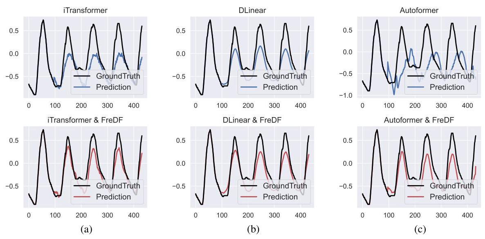

Figure 12: The forecast sequences generated with DF and FreDF. The forecast length is set to 336 and the experiment is conducted on a snapshot of ETTm2.

图12:使用DF和FreDF生成的预测序列。预测长度设置为336，实验在ETTm2的一个快照上进行。

Missing data imputation. We investigate the imputation task in Table 7, with iTransformer serving as the forecasting model in the FreDF implementation. All models are trained using an autoencoding approach: given input sequences with missing entries, they are tasked with recovering the non-missing entries during training, while they are employed to impute the missing entries during inference. The results demonstrate FreDF's efficacy in this task, significantly improving the performance of iTransformer and outperforming most competitive methods. A unique aspect of this task is the irregularity of the label sequences caused by the missing entries, which disrupts the physical semantics related to the Fourier transform. This indicates that the effectiveness of FreDF does not stem from the semantic characteristics of the Fourier transform itself, but rather from its ability to align the properties of time series data with the implicit assumptions of the DF paradigm, specifically the conditional independence of labels.

缺失数据插补。我们在表7中研究插补任务，在FreDF实现中使用iTransformer作为预测模型。所有模型都使用自动编码方法进行训练:给定带有缺失条目的输入序列，它们在训练期间的任务是恢复非缺失条目，而在推理期间用于插补缺失条目。结果证明了FreDF在这项任务中的有效性，显著提高了iTransformer的性能并优于大多数竞争方法。这项任务的一个独特之处在于缺失条目导致的标签序列不规则性，这扰乱了与傅里叶变换相关的物理语义。这表明FreDF的有效性并非源于傅里叶变换本身的语义特征，而是源于其将时间序列数据的属性与DF范式的隐含假设(特别是标签的条件独立性)对齐的能力。

Showcases. We provide additional showcases illustrating the change of forecast sequences in Fig. 12 and 14. Overall, FreDF effectively mitigates blurs and captures high frequency components. These successes can be attributed to FreDF's unique capability to operate in the frequency domain, where the challenges of autocorrelation are mitigated, and the expression of high-frequency components becomes straightforward.

展示。我们提供了额外的展示，说明了图12和14中预测序列的变化。总体而言，FreDF有效地减轻了模糊并捕获了高频成分。这些成功可归因于FreDF在频域中运行的独特能力，在频域中自相关的挑战得到缓解，高频成分的表达变得直接。

### E.2 GENERALIZATION STUDIES

### E.2泛化研究

In this section, we further explore the versatility of FreDF in improving various forecasting models: iTransformer, DLinear, Autoformer, and Transformer. The results, displayed in Fig. 16, encompass five distinct datasets and are averaged over forecast lengths (96, 192, 336, 720), with error bars reflecting 95% confidence intervals. FreDF significantly improves the performance of these forecasting models, particularly benefiting Transformer-based architectures like Autoformer and Transformer. These results affirm FreDF's utility in enhancing neural forecasting models, highlighting its potential as a versatile training methodology in time series forecasting.

在本节中，我们进一步探索FreDF在改进各种预测模型(iTransformer、DLinear、Autoformer和Transformer)方面的通用性。图16中显示的结果涵盖五个不同的数据集，并在预测长度(96、192、336、720)上进行平均，误差条反映95%的置信区间。FreDF显著提高了这些预测模型的性能，尤其有利于基于Transformer的架构，如Autoformer和Transformer。这些结果证实了FreDF在增强神经预测模型方面的效用，突出了其作为时间序列预测中通用训练方法的潜力。

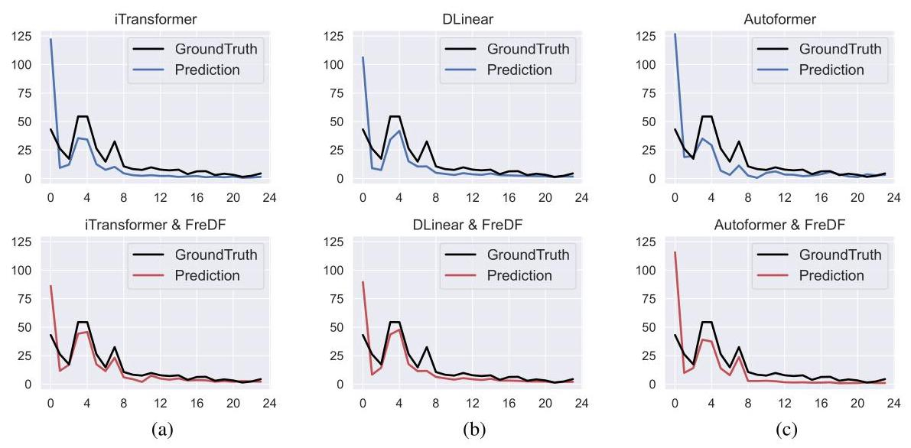

Figure 13: The spectrum of forecast sequences generated with DF and FreDF. The forecast length is set to 336 and the experiment is conducted on a snapshot of ETTm2. Only the first 24 frequencies of the spectrum are presented.

图13:使用DF和FreDF生成的预测序列的频谱。预测长度设置为336，实验在ETTm2的一个快照上进行。仅呈现频谱的前24个频率。

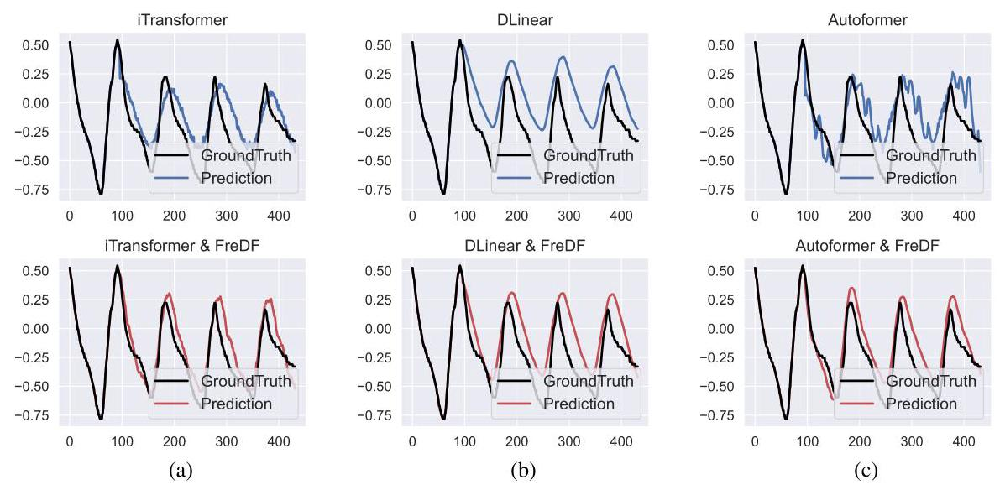

Figure 14: The forecast sequences generated with DF and FreDF. The forecast length is set to 336 and the experiment is conducted on another snapshot of ETTm2.

图14:使用DF和FreDF生成的预测序列。预测长度设置为336，实验在ETTm2的另一个快照上进行。

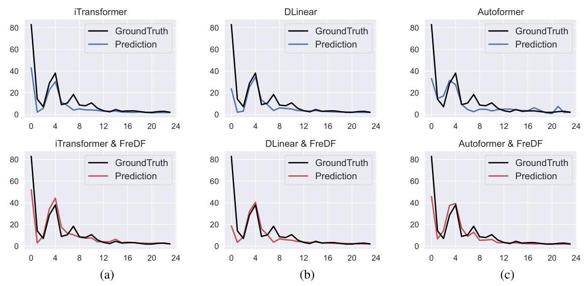

Figure 15: The spectrum of forecast sequences generated with DF and FreDF. The forecast length is set to 336 and the experiment is conducted on another snapshot of ETTm2. Only the first 24 frequencies of the spectrum are presented.

图15:使用DF和FreDF生成的预测序列的频谱。预测长度设置为336，实验在ETTm2的另一个快照上进行。仅呈现频谱的前24个频率.

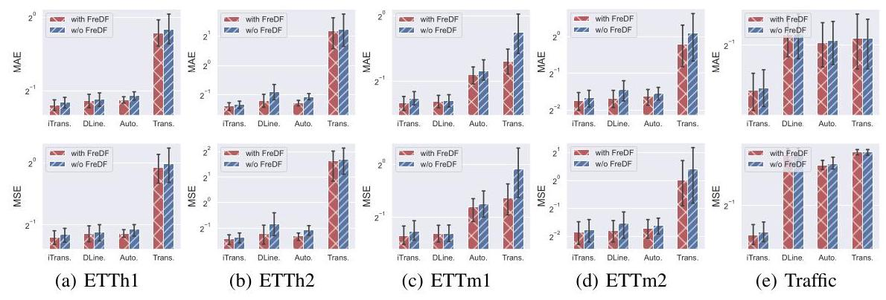

Figure 16: Performance of different forecast models with and without FreDF. The forecast errors are averaged over forecast lengths and the error bars represent 95% confidence intervals.

图16:有和没有FreDF的不同预测模型的性能。预测误差在预测长度上进行平均，误差条表示95%的置信区间。

Table 8: Comparable results with DTW-based loss.

表8:基于DTW损失的可比结果。

<table><tr><td rowspan="3">Dataset   Models   Metrics</td><td colspan="6">ETTm1</td><td colspan="6">ETTh1</td></tr><tr><td colspan="2">FreDF</td><td colspan="2">Dilate</td><td colspan="2">DPP</td><td colspan="2">FredF</td><td colspan="2">Dilate</td><td colspan="2">DPP</td></tr><tr><td>MSE</td><td>MAE</td><td>MSE</td><td>MAE</td><td>MSE</td><td>MAE</td><td>MSE</td><td>MAE</td><td>MSE</td><td>MAE</td><td>MSE</td><td>MAE</td></tr><tr><td>96</td><td>0.324</td><td>0.362</td><td>0.498</td><td>0.443</td><td>0.631</td><td>0.495</td><td>0.382</td><td>0.400</td><td>0.790</td><td>0.567</td><td>0.815</td><td>0.577</td></tr><tr><td>192</td><td>0.373</td><td>0.385</td><td>0.993</td><td>0.625</td><td>0.975</td><td>0.617</td><td>0.430</td><td>0.427</td><td>0.950</td><td>0.643</td><td>0.916</td><td>0.633</td></tr><tr><td>336</td><td>0.402</td><td>0.404</td><td>0.946</td><td>0.628</td><td>0.945</td><td>0.626</td><td>0.474</td><td>0.451</td><td>0.978</td><td>0.663</td><td>0.986</td><td>0.660</td></tr><tr><td>720</td><td>0.469</td><td>0.444</td><td>0.999</td><td>0.652</td><td>1.079</td><td>0.678</td><td>0.463</td><td>0.462</td><td>0.922</td><td>0.654</td><td>0.898</td><td>0.649</td></tr><tr><td>Avg</td><td>0.392</td><td>0.399</td><td>0.859</td><td>0.587</td><td>0.907</td><td>0.604</td><td>0.437</td><td>0.435</td><td>0.910</td><td>0.632</td><td>0.904</td><td>0.630</td></tr></table>

### E.3 HYPERPARAMETER SENSITIVITY

### E.3超参数敏感性

In this section, we examine how adjusting the frequency loss weight $\alpha$ impacts the performance of FreDF across three models: iTransformer, Autoformer, and DLinear, with the results in Fig. 17, 18, and 19. We find that increasing $\alpha$ from 0 to 1 generally reduces forecast error across various datasets and forecast lengths, highlighting the benefits of a frequency domain learning approach. Notably, the minimum forecast error often occurs at $\alpha$ values close to 1, rather than at 1 itself; for instance, 0.8 is optimal for the ETTh1 dataset. This suggests that integrating supervisory signals from both time and frequency domains enhances forecasting performance. However, the improvement may be incremental compared to simply setting $\alpha  = 1$ .

在本节中，我们研究调整频率损失权重$\alpha$如何影响FreDF在三个模型(iTransformer、Autoformer和DLinear)上的性能，结果见图17、18和19。我们发现，将$\alpha$从0增加到1通常会降低各种数据集和预测长度上的预测误差，突出了频域学习方法的好处。值得注意的是，最小预测误差通常出现在$\alpha$值接近1时，而不是正好为1；例如，对于ETTh1数据集，0.8是最优值。这表明整合来自时域和频域的监督信号可提高预测性能。然而，与简单设置$\alpha  = 1$相比，改进可能是渐进的。

### E.4 COMPARISON WITH DTW-BASED LEARNING OBJECTIVES

### E.4 与基于动态时间规整的学习目标的比较

In this section, we compare FreDF with works that employ DTW as learning objectives to align the shape of the forecast sequence with the label sequence: Dilate (Le Guen & Thome, 2019) and DPP (Le Guen & Thome, 2020). Notably, these works do not handle the bias introduced by label autocorrelation, which makes them independent to the contribution of FreDF. To make a fair comparison, we integrated the official implementations of the loss functions into the iTransformer model. As shown in Table 8, FreDF significantly outperforms DTW-based methods across both datasets. This improvement stems from FreDF's unique ability to debias the learning objective, a capability that Dilate and DPP do not possess.

在本节中，我们将FreDF与采用动态时间规整(DTW)作为学习目标，以使预测序列形状与标签序列对齐的研究进行比较:Dilate(Le Guen & Thome，2019)和DPP(Le Guen & Thome，2020)。值得注意的是，这些研究没有处理标签自相关引入的偏差，这使得它们与FreDF的贡献无关。为了进行公平比较，我们将损失函数的官方实现集成到iTransformer模型中。如表8所示，在两个数据集上，FreDF均显著优于基于DTW的方法。这种改进源于FreDF消除学习目标偏差的独特能力，而Dilate和DPP并不具备这一能力。

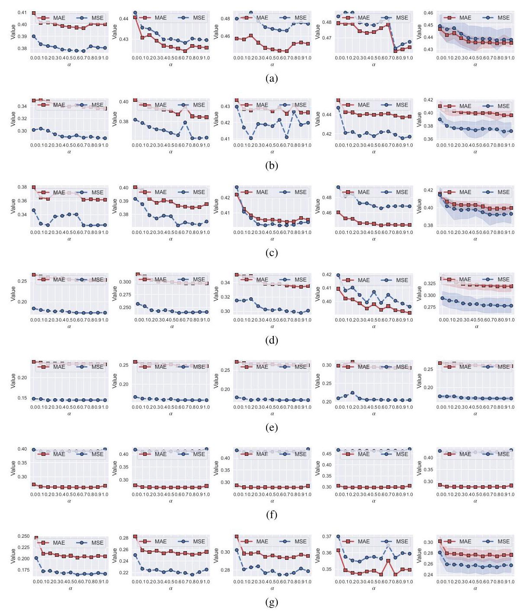

Figure 17: FreDF improves iTransformer performance given a wide range of frequency loss weight $\alpha$ . These experiments are conducted on ETTh1 (a), ETTh2 (b), ETTm1 (c), ETTm2 (d), ECL (e), Traffic (f) and Weather (g) datasets. Different columns correspond to different forecast lengths (from left to right: 96, 192, 336, 720, and their average with shaded areas being 50% confidence intervals).

图17:在一系列频率损失权重$\alpha$下，FreDF提升了iTransformer的性能。这些实验是在ETTh1(a)、ETTh2(b)、ETTm1(c)、ETTm2(d)、ECL(e)、交通(f)和天气(g)数据集上进行的。不同列对应不同的预测长度(从左到右:96、192、336、720，其平均值用阴影区域表示，为50%置信区间)。

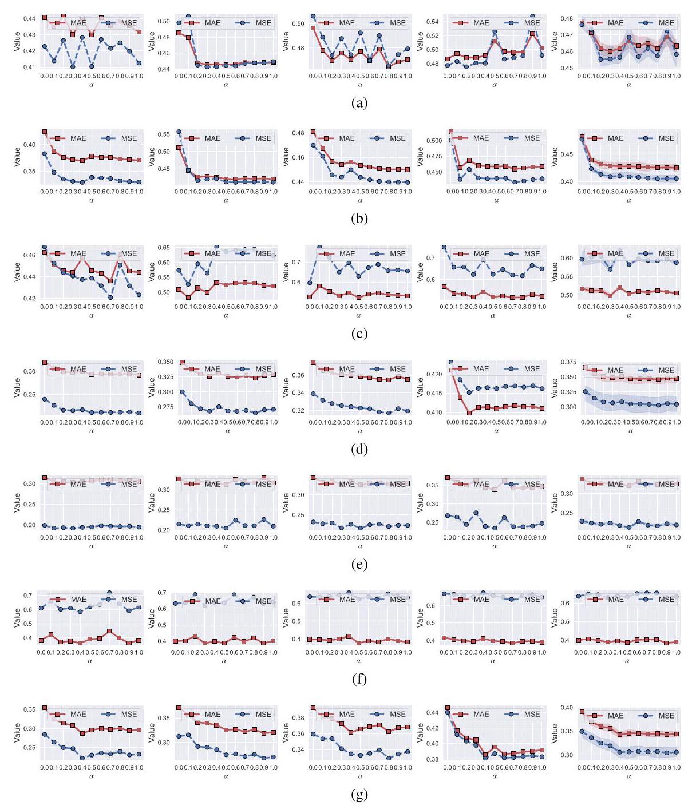

Figure 18: FreDF improves Autoformer performance given a wide range of frequency loss weight $\alpha$ . These experiments are conducted on ETTh1 (a), ETTh2 (b), ETTm1 (c), ETTm2 (d), ECL (e), Traffic (f) and Weather (g) datasets. Different columns correspond to different forecast lengths (from left to right: 96, 192, 336, 720, and their average with shaded areas being 50% confidence intervals).

图18:在一系列频率损失权重$\alpha$下，FreDF提升了Autoformer的性能。这些实验是在ETTh1(a)、ETTh2(b)、ETTm1(c)、ETTm2(d)、ECL(e)、交通(f)和天气(g)数据集上进行的。不同列对应不同的预测长度(从左到右:96、192、336、720，其平均值用阴影区域表示，为50%置信区间)。

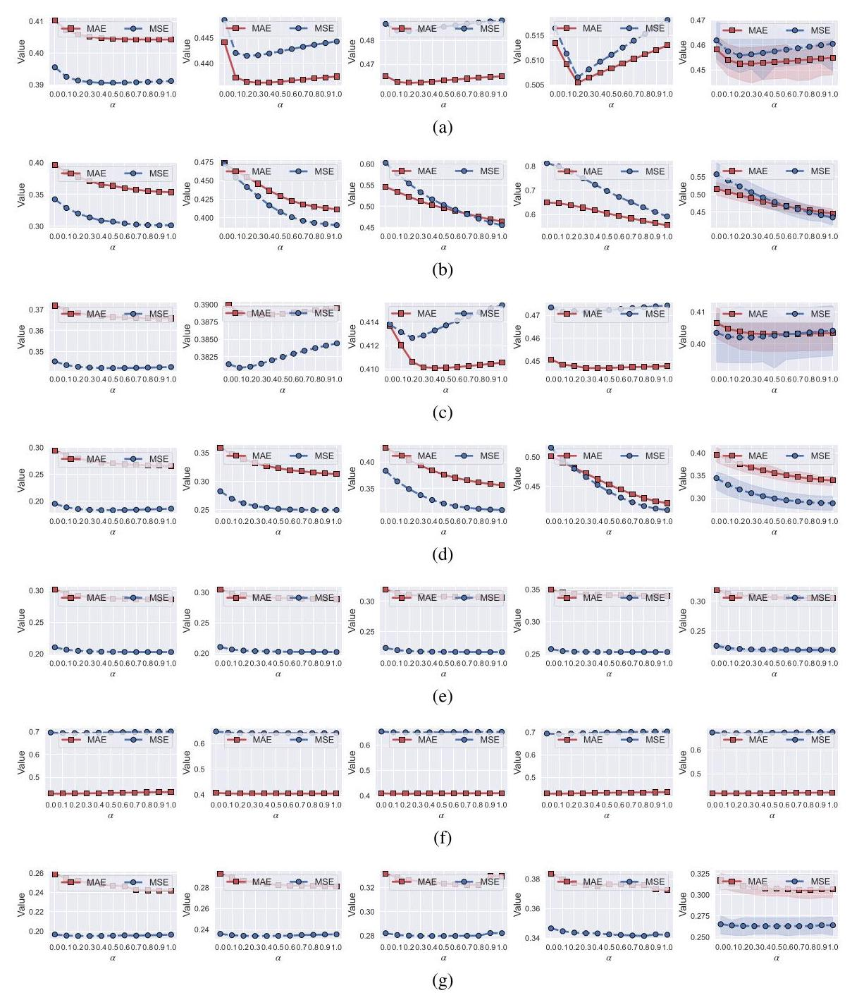

Figure 19: FreDF improves DLinear performance given a wide range of frequency loss weight $\alpha$ . These experiments are conducted on ETTh1 (a), ETTh2 (b), ETTm1 (c), ETTm2 (d), ECL (e), Traffic (f) and Weather (g) datasets. Different columns correspond to different forecast lengths (from left to right: 96, 192, 336, 720, and their average with shaded areas being 50% confidence intervals).

图19:在一系列频率损失权重$\alpha$下，FreDF提升了DLinear的性能。这些实验是在ETTh1(a)、ETTh2(b)、ETTm1(c)、ETTm2(d)、ECL(e)、交通(f)和天气(g)数据集上进行的。不同列对应不同的预测长度(从左到右:96、192、336、720，其平均值用阴影区域表示，为50%置信区间)。

## A CASE STUDY WITH PATCHTST AND VARYING INPUT LENGTH.

## 关于PatchTST和可变输入长度的案例研究

In this section, we focus on iTransformer (Liu et al., 2024) and PatchTST (Nie et al., 2023), highlighting the effectiveness of FreDF in enhancing their performance given varying input sequence lengths, to complement the fixed length of 96 used in the main text. According to Table 1, FreDF consistently improves the performance of both iTransformer and PatchTST across different input lengths. Notably, under our experimental conditions, PatchTST with $\mathrm{H} = {336}$ achieves results comparable to the original "PatchTST/42" results reported by Nie et al. (2023), while FreDF further reduced the MSE and MAE by 0.002, demonstrating its robustness across different input lengths.

在本节中，我们重点关注iTransformer(Liu等人，2024)和PatchTST(Nie等人，2023)，突出FreDF在不同输入序列长度下提升其性能的有效性，以补充正文中使用的固定长度96。根据表1，FreDF在不同输入长度下持续提升了iTransformer和PatchTST的性能。值得注意的是，在我们的实验条件下，带有$\mathrm{H} = {336}$的PatchTST取得了与Nie等人(2023)报告的原始“PatchTST/42”结果相当的结果，而FreDF进一步将均方误差(MSE)和平均绝对误差(MAE)降低了0.002，证明了其在不同输入长度下的稳健性。

Table 1: Varying input sequence length results on the Weather dataset.

表1:天气数据集上可变输入序列长度的结果

<table><tr><td colspan="3" rowspan="2">Models   Metrics</td><td colspan="2">FredF</td><td colspan="2">iTransformer</td><td colspan="2">FreDF</td><td colspan="2">PatchTST</td></tr><tr><td>MSE</td><td>MAE</td><td>MSE</td><td>MAE</td><td>MSE</td><td>MAE</td><td>MSE</td><td>MAE</td></tr><tr><td rowspan="20">Input sequence length</td><td rowspan="5">96</td><td>96</td><td>0.164</td><td>0.202</td><td>0.201</td><td>0.247</td><td>0.174</td><td>0.217</td><td>0.200</td><td>0.244</td></tr><tr><td>192</td><td>0.220</td><td>0.253</td><td>0.250</td><td>0.283</td><td>0.230</td><td>0.266</td><td>0.234</td><td>0.268</td></tr><tr><td>336</td><td>0.275</td><td>0.294</td><td>0.302</td><td>0.317</td><td>0.279</td><td>0.301</td><td>0.311</td><td>0.321</td></tr><tr><td>720</td><td>0.356</td><td>0.347</td><td>0.370</td><td>0.362</td><td>0.355</td><td>0.351</td><td>0.365</td><td>0.353</td></tr><tr><td>Avg</td><td>0.254</td><td>0.274</td><td>0.281</td><td>0.302</td><td>0.259</td><td>0.284</td><td>0.278</td><td>0.297</td></tr><tr><td rowspan="5">192</td><td>96</td><td>0.164</td><td>0.207</td><td>0.184</td><td>0.235</td><td>0.158</td><td>0.205</td><td>0.167</td><td>0.213</td></tr><tr><td>192</td><td>0.211</td><td>0.250</td><td>0.236</td><td>0.277</td><td>0.200</td><td>0.241</td><td>0.204</td><td>0.244</td></tr><tr><td>336</td><td>0.262</td><td>0.290</td><td>0.268</td><td>0.296</td><td>0.259</td><td>0.287</td><td>0.266</td><td>0.291</td></tr><tr><td>720</td><td>0.341</td><td>0.343</td><td>0.342</td><td>0.345</td><td>0.330</td><td>0.334</td><td>0.333</td><td>0.337</td></tr><tr><td>Avg</td><td>0.244</td><td>0.272</td><td>0.258</td><td>0.288</td><td>0.237</td><td>0.267</td><td>0.242</td><td>0.271</td></tr><tr><td rowspan="5">336</td><td>96</td><td>0.159</td><td>0.204</td><td>0.164</td><td>0.215</td><td>0.150</td><td>0.200</td><td>0.153</td><td>0.203</td></tr><tr><td>192</td><td>0.204</td><td>0.248</td><td>0.211</td><td>0.256</td><td>0.193</td><td>0.240</td><td>0.194</td><td>0.240</td></tr><tr><td>336</td><td>0.253</td><td>0.288</td><td>0.260</td><td>0.292</td><td>0.245</td><td>0.280</td><td>0.247</td><td>0.282</td></tr><tr><td>720</td><td>0.325</td><td>0.336</td><td>0.327</td><td>0.339</td><td>0.320</td><td>0.332</td><td>0.321</td><td>0.336</td></tr><tr><td>Avg</td><td>0.235</td><td>0.269</td><td>0.241</td><td>0.276</td><td>0.227</td><td>0.263</td><td>0.229</td><td>0.265</td></tr><tr><td rowspan="5">720</td><td>96</td><td>0.164</td><td>0.215</td><td>0.172</td><td>0.228</td><td>0.144</td><td>0.194</td><td>0.191</td><td>0.246</td></tr><tr><td>192</td><td>0.209</td><td>0.257</td><td>0.218</td><td>0.265</td><td>0.190</td><td>0.242</td><td>0.192</td><td>0.241</td></tr><tr><td>336</td><td>0.251</td><td>0.291</td><td>0.273</td><td>0.306</td><td>0.243</td><td>0.283</td><td>0.241</td><td>0.285</td></tr><tr><td>720</td><td>0.318</td><td>0.342</td><td>0.340</td><td>0.353</td><td>0.310</td><td>0.330</td><td>0.311</td><td>0.331</td></tr><tr><td>Avg</td><td>0.236</td><td>0.276</td><td>0.251</td><td>0.288</td><td>0.222</td><td>0.262</td><td>0.234</td><td>0.276</td></tr></table>

## B RUNNING COST ANALYSIS

## B 运行成本分析

In this section, we analyze the running cost of FreDF. The core computation of FreDF involves calculating the FFT of both predicted and label sequences, followed by calculating their point-wise MAE loss. The overall complexity is dominated by the FFT operation, which operates at $\mathcal{O}\left( {\mathrm{T}\log \mathrm{T}}\right)$ , where T is the label sequence length.

在本节中，我们分析FreDF的运行成本。FreDF的核心计算包括计算预测序列和标签序列的快速傅里叶变换(FFT)，然后计算它们的逐点平均绝对误差损失。总体复杂度由FFT操作主导，其运算次数为$\mathcal{O}\left( {\mathrm{T}\log \mathrm{T}}\right)$，其中T是标签序列长度。

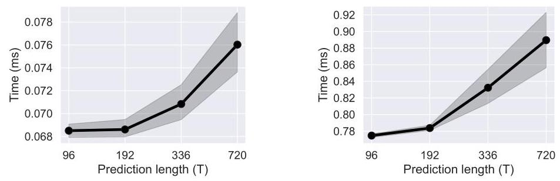

Figure 1: Running time in the forward pass (left panel) and backward pass (right panel), shown with dashed lines for the average and shaded areas for 99.9% confidence intervals.

图1:前向传播(左图)和反向传播(右图)中的运行时间，虚线表示平均值，阴影区域表示99.9%置信区间。

Fig. 1 shows the empirical running costs of FreDF for varying sequence lengths in the training duration, involving the forward pass stage (FFT calculation) and the backward pass stage (frequency loss and gradient computation). Overall, for a label sequence with $\mathrm{T} < {720}$ , FreDF adds approximately 1 ms to the overall training duration. Moreover, frequency loss computation is not required during inference. Therefore, FreDF does not hinder model efficiency in either training or inference stages.

图1展示了FreDF在训练期间不同序列长度下的实际运行成本，涉及前向传播阶段(FFT计算)和反向传播阶段(频率损失和梯度计算)。总体而言，对于长度为$\mathrm{T} < {720}$ 的标签序列，FreDF在总训练时长上增加了约1毫秒。此外，推理过程中不需要进行频率损失计算。因此，FreDF在训练和推理阶段均不会阻碍模型效率。

Table 2: Experimental results (mean ${}_{\pm \text{ std }}$ ) with varying seeds (2020-2024).

表2:不同种子(2020 - 2024)的实验结果(平均${}_{\pm \text{ std }}$)

<table><tr><td rowspan="3">Dataset   Models   Metrics</td><td colspan="4">ETTh1</td><td colspan="4">Weather</td></tr><tr><td colspan="2">FredF</td><td colspan="2">iTransformer</td><td colspan="2">FredF</td><td colspan="2">iTransformer</td></tr><tr><td>MSE</td><td>MAE</td><td>MSE</td><td>MAE</td><td>MSE</td><td>MAE</td><td>MSE</td><td>MAE</td></tr><tr><td>96</td><td>0.377 ± 0.001</td><td>${0.396}_{\pm {0.001}}$</td><td>${0.391} \pm  {0.001}$</td><td>${0.409}_{\pm {0.001}}$</td><td>0.168±0.003</td><td>0.205±0.003</td><td>0.203 ±0.002</td><td>${0.246}_{\pm {0.002}}$</td></tr><tr><td>192</td><td>${0.428}_{\pm {0.001}}$</td><td>${0.424}_{\pm {0.001}}$</td><td>${0.446} \pm  {0.002}$</td><td>${0.441}_{\pm {0.002}}$</td><td>0.220±0.001</td><td>0.254±0.001</td><td>0.249 ±0.001</td><td>${0.281}_{\pm {0.001}}$</td></tr><tr><td>336</td><td>${0.466}_{\pm {0.001}}$</td><td>${0.442}_{\pm {0.001}}$</td><td>${0.484} \pm  {0.005}$</td><td>${0.460}_{\pm {0.003}}$</td><td>0.281±0.002</td><td>0.298±0.002</td><td>0.299 ±0.002</td><td>${0.315}_{\pm {0.002}}$</td></tr><tr><td>720</td><td>${0.468}_{\pm {0.005}}$</td><td>${0.465}_{\pm {0.003}}$</td><td>${0.499}_{\pm {0.015}}$</td><td>${0.489}_{\pm {0.004}}$</td><td>0.364±0.008</td><td>0.354±0.006</td><td>${0.371}_{\pm {0.001}}$</td><td>${0.361}_{\pm {0.001}}$</td></tr><tr><td>Avg</td><td>${0.435}_{\pm {0.002}}$</td><td>${0.432}_{\pm {0.002}}$</td><td>${0.455} \pm  {0.006}$</td><td>${0.450}_{\pm {0.004}}$</td><td>0.258 ±0.004</td><td>0.278 ±0.003</td><td>${0.280}_{\pm {0.001}}$</td><td>${0.301}_{\pm {0.002}}$</td></tr></table>

Table 3: Impact of aligning the amplitude and phase characteristics.

表3:对齐幅度和相位特征的影响

<table><tr><td rowspan="2">Amp.</td><td rowspan="2">Pha.</td><td colspan="2">ECL</td><td colspan="2">ETTm1</td><td colspan="2">ETTh1</td></tr><tr><td>MSE</td><td>MAE</td><td>MSE</td><td>MAE</td><td>MSE</td><td>MAE</td></tr><tr><td>✓</td><td>✘</td><td>0.3356</td><td>0.4060</td><td>0.5936</td><td>0.5169</td><td>0.7303</td><td>0.5968</td></tr><tr><td>✘</td><td>✓</td><td>0.1836</td><td>0.2752</td><td>0.4204</td><td>0.4173</td><td>0.4751</td><td>0.4487</td></tr><tr><td>✓</td><td>✓</td><td>0.1698</td><td>0.2594</td><td>0.3920</td><td>0.3989</td><td>0.4374</td><td>0.4351</td></tr></table>

## C RANDOM SEED SENSITIVITY

## C 随机种子敏感性

In this section, we investigate the sensitivity of the results to the specification of random seeds. To this end, we report the mean and standard deviation of the results obtained from experiments using five random seeds (2020, 2021, 2022, 2023, 2024) in Table 2. We examine (1) iTransformer and (2) FreDF, which is applied to refine iTransformer. The results show minimal sensitivity to random seeds, with standard deviations below 0.005 in seven out of eight averaged cases.

在本节中，我们研究了结果对随机种子设定的敏感性。为此，我们在表2中报告了使用五个随机种子(2020、2021、2022、2023、2024)进行实验所获得结果的均值和标准差。我们考察了(1)iTransformer和(2)用于优化iTransformer的FreDF。结果表明，结果对随机种子的敏感性极小，在八个平均情况中有七个的标准差低于0.005。

## D AMPLITUDE V.S. PHASE ALIGNMENT

## D 幅度与相位对齐

In this section, we investigate the implementation of the frequency loss (3), with the results averaged over forecast lengths in Table 3. Specifically, minimizing the frequency loss (3) ensures that both amplitude and phase characteristics of the forecast match those of the actual label sequences in the frequency domain. In signal processing, both characteristics are fundamental for accurately representing signal dynamics, and we analyze their respective contributions. Overall, both characteristics are essential for FreDF's performance. Notably, phase alignment is particularly crucial; aligning amplitude characteristics without also aligning phase characteristics leads to subpar performance. This phenomenon is reasonable, as even minor deviations in phase characteristics can produce significant discrepancies in the time domain.

在本节中，我们研究了频率损失(3)的实现方式，表3中的结果是在预测长度上进行平均得到的。具体而言，最小化频率损失(3)可确保预测的幅度和相位特征在频域中与实际标签序列的特征相匹配。在信号处理中，这两个特征对于准确表示信号动态至关重要，我们分析了它们各自的贡献。总体而言，这两个特征对于FreDF的性能都至关重要。值得注意的是，相位对齐尤为关键；仅对齐幅度特征而不对齐相位特征会导致性能不佳。这种现象是合理的，因为即使相位特征的微小偏差也可能在时域中产生显著差异。

Table 4: Comparable results with baselines utilizing multiresolution trends.

表4:与利用多分辨率趋势的基线方法的可比结果。

<table><tr><td rowspan="3">Dataset   Models   Metrics</td><td colspan="8">ETTm1</td><td colspan="8">ETTh1</td></tr><tr><td colspan="2">FredF</td><td colspan="2">TimeMixer</td><td colspan="2">FreDF</td><td colspan="2">Scaleformer</td><td colspan="2">FreDF</td><td colspan="2">TimeMixer</td><td colspan="2">FredF</td><td colspan="2">Scaleformer</td></tr><tr><td>MSE</td><td>MAE</td><td>MSE</td><td>MAE</td><td>MSE</td><td>MAE</td><td>MSE</td><td>MAE</td><td>MSE</td><td>MAE</td><td>MSE</td><td>MAE</td><td>MSE</td><td>MAE</td><td>MSE</td><td>MAE</td></tr><tr><td>96</td><td>0.316</td><td>0.354</td><td>0.322</td><td>0.361</td><td>0.365</td><td>0.391</td><td>0.393</td><td>0.417</td><td>0.364</td><td>0.393</td><td>0.375</td><td>0.445</td><td>0.375</td><td>0.415</td><td>0.407</td><td>0.445</td></tr><tr><td>192</td><td>0.360</td><td>0.377</td><td>0.362</td><td>0.382</td><td>0.417</td><td>0.436</td><td>0.435</td><td>0.439</td><td>0.422</td><td>0.424</td><td>0.441</td><td>0.431</td><td>0.414</td><td>0.440</td><td>0.430</td><td>0.455</td></tr><tr><td>336</td><td>0.383</td><td>0.399</td><td>0.392</td><td>0.405</td><td>0.478</td><td>0.461</td><td>0.541</td><td>0.500</td><td>0.454</td><td>0.432</td><td>0.490</td><td>0.458</td><td>0.463</td><td>0.468</td><td>0.462</td><td>0.475</td></tr><tr><td>720</td><td>0.447</td><td>0.440</td><td>0.453</td><td>0.441</td><td>0.575</td><td>0.533</td><td>0.608</td><td>0.530</td><td>0.467</td><td>0.460</td><td>0.481</td><td>0.469</td><td>0.484</td><td>0.499</td><td>0.545</td><td>0.551</td></tr><tr><td>Avg</td><td>0.377</td><td>0.393</td><td>0.382</td><td>0.397</td><td>0.459</td><td>0.455</td><td>0.494</td><td>0.471</td><td>0.427</td><td>0.427</td><td>0.446</td><td>0.441</td><td>0.434</td><td>0.455</td><td>0.461</td><td>0.482</td></tr></table>

## E COMPARISON WITH ADDITIONAL FORECAST ARCHITECTURES

## E 与其他预测架构的比较

In this section, we apply FreDF to two additional forecast architectures, namely TimeMixer (Wang et al., 2024c) and ScaleFormer (Shabani et al., 2022) to showcase the generality of FreDF. To ensure a fair comparison, we utilized their official repositories, downloading and configuring them according to their specified requirements. We modified their temporal MSE loss with the proposed loss in the FreDF. The loss strength parameters were fine-tuned on the validation set. As shown in Table 4, FreDF significantly enhances the performance of these architectures, demonstrating FreDF's ability to support and improve existing models. These improvements underscore the independent and complementary nature of FreDF's contributions.

在本节中，我们将FreDF应用于另外两种预测架构，即TimeMixer(Wang等人，2024c)和ScaleFormer(Shabani等人，2022)，以展示FreDF的通用性。为确保公平比较，我们使用了它们的官方代码库，并根据其指定要求进行下载和配置。我们用FreDF中提出的损失函数修改了它们的时间均方误差损失。损失强度参数在验证集上进行了微调。如表4所示，FreDF显著提高了这些架构的性能，证明了FreDF支持和改进现有模型的能力。这些改进突出了FreDF贡献的独立性和互补性。