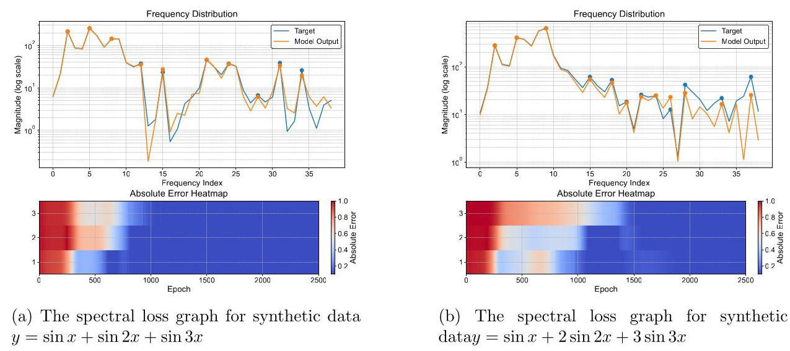
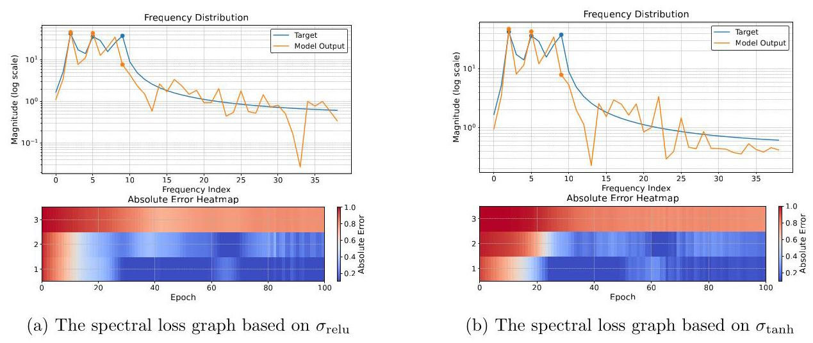
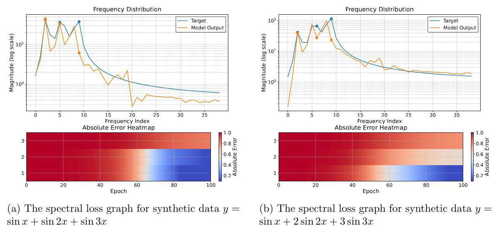
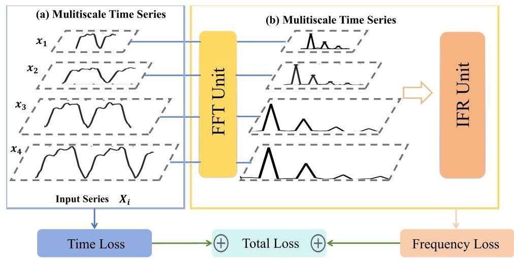
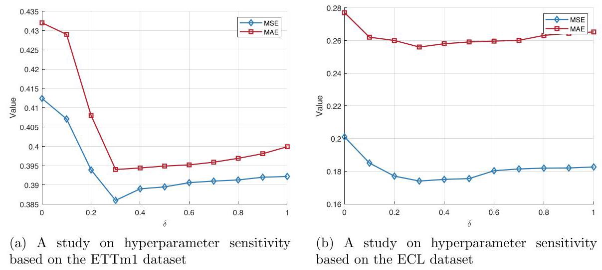
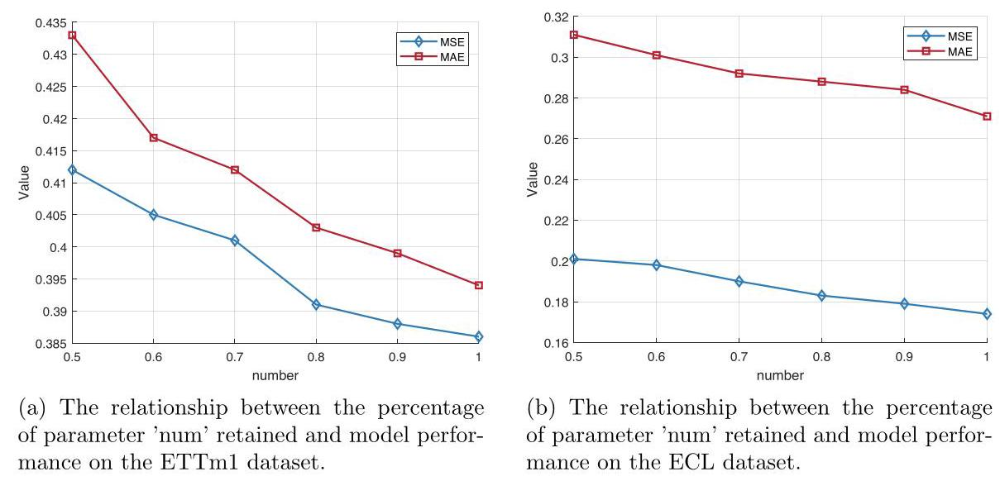

# FreIE: Low-Frequency Spectral Bias in Neural Networks for Time-Series Tasks

# FreIE:用于时间序列任务的神经网络中的低频频谱偏差

Jialong Sun ${}^{1}$ , Xinpeng Ling ${}^{2}$ , Jiaxuan Zou ${}^{3}$ , Jiawen Kang ${}^{4}$ , and Kejia Zhang ${}^{5, * }$

孙家龙${}^{1}$，凌新鹏${}^{2}$，邹家轩${}^{3}$，康家文${}^{4}$，张可佳${}^{5, * }$

${}^{1}$ School of Mathematical Science, Heilongjiang University, Harbin, China 20212644@s.hlju.edu.cn

${}^{1}$ 黑龙江大学数学科学学院，哈尔滨，中国 20212644@s.hlju.edu.cn

${}^{2}$ Software Engineering Institute, East China Normal University, Shanghai, China xpling@stu.ecnu.edu.cn

${}^{2}$ 华东师范大学软件工程学院，上海，中国 xpling@stu.ecnu.edu.cn

${}^{3}$ Mathematics and Statistics, Xi’an Jiaotong University, Xi’an, China jiaxuanzou@stu.xjtu.edu.cn

${}^{3}$ 西安交通大学数学与统计学院，西安，中国 jiaxuanzou@stu.xjtu.edu.cn

${}^{4}$ School of Automation, Guangdong University of Technology, Guangzhou, China kavinkang@gdut.edu.cn

${}^{4}$ 广东工业大学自动化学院，广州，中国 kavinkang@gdut.edu.cn

${}^{5}$ School of Computer Science and Big Data (School of Cybersecurity), Heilongjiang University, Harbin, China

${}^{5}$ 黑龙江大学计算机科学与大数据学院(网络安全学院)，哈尔滨，中国

## Abstract

## 摘要

The inherent autocorrelation of time series data presents an ongoing challenge to multivariate time series prediction. Recently, a widely adopted approach has been the incorporation of frequency domain information to assist in long-term prediction tasks. Many researchers have independently observed the spectral bias phenomenon in neural networks, where models tend to fit low-frequency signals before high-frequency ones. However, these observations have often been attributed to the specific architectures designed by the researchers, rather than recognizing the phenomenon as a universal characteristic across models. To unify the understanding of the spectral bias phenomenon in long-term time series prediction, we conducted extensive empirical experiments to measure spectral bias in existing mainstream models. Our findings reveal that virtually all models exhibit this phenomenon. To mitigate the impact of spectral bias, we propose the FreLE (Frequency Loss Enhancement) algorithm, which enhances model generalization through both explicit and implicit frequency regularization. This is a plug-and-play model loss function unit. A large number of experiments have proven the superior performance of FreLE. Code is available at https://github.com/Chenxing-Xuan/FreLE.

时间序列数据的固有自相关性对多变量时间序列预测构成了持续挑战。最近，一种广泛采用的方法是纳入频域信息以协助长期预测任务。许多研究人员独立观察到神经网络中的频谱偏差现象，即模型倾向于先拟合低频信号再拟合高频信号。然而，这些观察结果往往归因于研究人员设计的特定架构，而不是将该现象视为模型的普遍特征。为了统一对长期时间序列预测中频谱偏差现象的理解，我们进行了广泛的实证实验来测量现有主流模型中的频谱偏差。我们的研究结果表明，几乎所有模型都表现出这种现象。为了减轻频谱偏差的影响，我们提出了FreLE(频率损失增强)算法，该算法通过显式和隐式频率正则化来增强模型泛化能力。这是一个即插即用的模型损失函数单元。大量实验证明了FreLE的优越性能。代码可在https://github.com/Chenxing-Xuan/FreLE获取。

Keywords: Time series forecasting, Fourier transform, Implicit Regularization.

关键词:时间序列预测，傅里叶变换，隐式正则化。

## 1 Introduction

## 1 引言

Time series data consists of numerical values associated with time. Long-term time series prediction is crucial across various domains, including weather forecasting and intelligent manufacturing [1, 2]. However, due to the inherent complexity of time series data, existing deep learning approaches that directly predict time-domain data often yield suboptimal performance. In recent years, a promising approach has emerged that leverages frequency-domain information to improve prediction accuracy.

时间序列数据由与时间相关的数值组成。长期时间序列预测在包括天气预报和智能制造在内的各个领域都至关重要[1, 2]。然而，由于时间序列数据的固有复杂性，直接预测时域数据的现有深度学习方法往往性能欠佳。近年来，一种有前景的方法出现了，即利用频域信息来提高预测准确性。

Modeling long-term time series prediction using quasi-periodic dynamical systems reveals that both linear and nonlinear time-domain prediction optimization objectives are highly non-convex. However, by mapping the optimization objective to the frequency domain, the global optimal solution of the error surface can be efficiently computed using the Koopman-FFT method [3]. This theoretical foundation has significantly inspired researchers to incorporate frequency-domain information into long-term time series prediction. Building on Koopman's work, a method has been proposed that transforms frequency-domain information into 2D, converting frequency sequence data into frequency image data. This method employs 2D kernel modeling to capture implicit frequency relationships between different sequences, thereby enhancing time-domain learning performance 4. Additionally, given the complex information resulting from frequency-domain transformations, complex-valued neural networks can be employed to achieve efficient long-term time series prediction with a reduced number of parameters [5]. Recent studies have also provided both theoretical proof and empirical analysis demonstrating that using frequency-domain loss functions can decouple the complexity of time series 6 , further improving model performance in long-term time series prediction.

使用准周期动力系统对长期时间序列预测进行建模表明，线性和非线性时域预测优化目标都是高度非凸的。然而，通过将优化目标映射到频域，可以使用库普曼 - 快速傅里叶变换(Koopman - FFT)方法有效地计算误差表面的全局最优解[3]。这一理论基础极大地启发了研究人员将频域信息纳入长期时间序列预测。在库普曼工作的基础上，提出了一种方法，将频域信息转换为二维，将频率序列数据转换为频率图像数据。该方法采用二维核建模来捕获不同序列之间的隐式频率关系，从而提高时域学习性能[4]。此外，考虑到频域变换产生的复杂信息，可以使用复值神经网络以减少参数数量来实现高效的长期时间序列预测[5]。最近的研究还提供了理论证明和实证分析，表明使用频域损失函数可以解耦时间序列的复杂性[6]，进一步提高长期时间序列预测中的模型性能。

---

*Corresponding author: zhangkejia@hlju.edu.cn

*通讯作者:zhangkejia@hlju.edu.cn

---

However, as the saying goes, "there is no free lunch." While frequency-domain information offers researchers a potentially limitless framework for machine learning, it also presents inevitable challenges, particularly concerning the "selection of spectral information." After decomposing a signal into its spectral components, determining how to effectively utilize both low-frequency and high-frequency information within a machine learning framework has become a central area of investigation. Low-frequency signals represent stable events with higher intensity over time but fail to capture the variability of these events. In contrast, high-frequency signals reflect more volatile and trend-based events over time but are highly susceptible to noise interference. The question remains: how should these signals be leveraged in models? Based on the Johnson-Lindenstrauss Lemma, one approach employs a random dimensionality reduction method that selectively chooses specific frequency signal features for auxiliary prediction, effectively mitigating noise interference in high-frequency features [7]. Another method, grounded in the Parseval Theorem, proposes a multilayer perceptron (MLP) model architecture that applies equal signal strength in both the time and frequency domains to jointly learn time-domain signal features [8]. While these approaches have significantly improved long-term time series prediction performance, they have yet to fully address the original question. How should we truly understand the role of spectral information in time series prediction?

然而，俗话说:“天下没有免费的午餐。”虽然频域信息为研究人员提供了一个潜在的无限机器学习框架，但它也带来了不可避免的挑战，特别是在“光谱信息的选择”方面。在将信号分解为其频谱成分后，确定如何在机器学习框架内有效利用低频和高频信息已成为一个核心研究领域。低频信号代表随着时间推移强度较高的稳定事件，但无法捕捉这些事件的变化性。相比之下，高频信号反映了随着时间推移更易变和基于趋势的事件，但极易受到噪声干扰。问题仍然存在:这些信号应如何在模型中加以利用？基于约翰逊 -林登施特劳斯引理，一种方法采用随机降维方法，选择性地选择特定频率信号特征进行辅助预测，有效减轻高频特征中的噪声干扰[7]。另一种基于帕塞瓦尔定理的方法提出了一种多层感知器(MLP)模型架构，在时域和频域中应用相等的信号强度来联合学习时域信号特征[8]。虽然这些方法显著提高了长期时间序列预测性能，但它们尚未完全解决原始问题。我们应如何真正理解频谱信息在时间序列预测中的作用？

Interestingly, when researchers investigate the role of spectral information in time series prediction, they often reach the same conclusion: in implicit neural representations (INR) networks, a tendency toward simple solutions is observed during the reconstruction process, with most solutions being linear combinations of low-frequency signals [9]. In studies of Transformer attention mechanisms, researchers have found that, during prediction, the Transformer architecture first learns low-frequency signal features before progressing to high-frequency signal features [10]. This learning sequence is believed to be influenced by the attention mechanism's inherent bias toward low-frequency signals. While these findings provide in-depth insights into the mechanisms of frequency learning, the researchers unanimously agree that this frequency preference phenomenon is an intrinsic characteristic of specific models. In the following, we will refer to this as the "spectral bias phenomenon" and conduct a comprehensive investigation.

有趣的是，当研究人员研究频谱信息在时间序列预测中的作用时，他们往往得出相同的结论:在隐式神经表示(INR)网络中，在重建过程中观察到倾向于简单解决方案的趋势，大多数解决方案是低频信号的线性组合[9]。在对Transformer注意力机制的研究中，研究人员发现，在预测过程中，Transformer架构首先学习低频信号特征，然后再学习高频信号特征[10]。这种学习顺序被认为受到注意力机制对低频信号的固有偏向的影响。虽然这些发现为频率学习机制提供了深入见解，但研究人员一致认为，这种频率偏好现象是特定模型的固有特征。在下面的内容中，我们将其称为“频谱偏差现象”并进行全面研究。

Some researchers have examined the "spectral bias phenomenon" from the perspective of numerical solutions to partial differential equations in neural networks. When solving the Poisson-Boltzmann equation, decomposing the loss function into low-frequency and high-frequency components can significantly enhance numerical stability. Colleagues have conducted extensive experiments to verify the existence of the "spectral bias phenomenon" in two-layer deep neural networks (2-DNNs) and provided theoretical proof of its presence in two-layer infinitely wide DNNs [11]. Furthermore, a variational dynamics theory based on linear assumptions confirmed the "spectral bias phenomenon" in existing neural networks. The theory proposed that this phenomenon primarily depends on the nonlinear transformation of the activation function and recommended using the Ricker activation function to mitigate it [12,13]. However, the question remains: Can this approach be extended to time series prediction tasks? Is there a simpler method for understanding and addressing the "spectral bias phenomenon"? This remains an unresolved issue in the field of time series prediction.

一些研究人员从神经网络中偏微分方程数值解的角度研究了“频谱偏差现象”。在求解泊松 -玻尔兹曼方程时，将损失函数分解为低频和高频分量可以显著提高数值稳定性。同事们进行了广泛的实验，以验证两层深度神经网络(2-DNN)中“频谱偏差现象”的存在，并提供了其在两层无限宽DNN中存在的理论证明[11]。此外，基于线性假设的变分动力学理论证实了现有神经网络中的“频谱偏差现象”。该理论提出，这种现象主要取决于激活函数的非线性变换，并建议使用里克激活函数来减轻它[12,13]。然而，问题仍然存在:这种方法能否扩展到时间序列预测任务？是否有一种更简单的方法来理解和解决“频谱偏差现象”？这在时间序列预测领域仍然是一个未解决的问题。

This work aims to investigate the existence of the spectral bias phenomenon in neural networks with various architectures and to improve time series prediction performance by addressing this phenomenon. We introduce FreLE (Frequency Loss Enhancement), an adaptive frequency enhancement algorithm designed to mitigate the spectral bias phenomenon observed in neural networks during time series prediction tasks. To validate the effectiveness of our method, we conducted extensive preliminary experiments and compared it with existing machine learning methods, highlighting the similarities and differences between various approaches. The main contributions of this paper are summarized as follows:

这项工作旨在研究各种架构的神经网络中频谱偏差现象的存在，并通过解决这一现象来提高时间序列预测性能。我们引入了FreLE(频率损失增强)，这是一种自适应频率增强算法，旨在减轻在时间序列预测任务中神经网络中观察到的频谱偏差现象。为了验证我们方法的有效性，我们进行了广泛的初步实验，并将其与现有的机器学习方法进行比较，突出了各种方法之间的异同。本文的主要贡献总结如下:

- Theoretical Research: Building on the existing 2-DNN spectral bias dynamics theory, we conduct extensive empirical research on existing temporal neural networks. Our findings confirm that various neural network architectures exhibit the spectral bias phenomenon.

- 理论研究:在现有的2-DNN频谱偏差动力学理论基础上，我们对现有的时间神经网络进行了广泛的实证研究。我们的发现证实，各种神经网络架构都表现出频谱偏差现象。

- Algorithm Design: The FreLE algorithm we propose consists of two key components: frequency explicit regularization and frequency implicit regularization. These components are designed to perform two tasks-denoising and balancing signals of different frequencies. The roles and irreplaceability of these components are further analyzed through ablation experiments.

- 算法设计:我们提出的FreLE算法由两个关键组件组成:频率显式正则化和频率隐式正则化。这些组件旨在执行两项任务——去噪和平衡不同频率的信号。通过消融实验进一步分析了这些组件的作用和不可替代性。

- Experimental Effect: We conducted extensive experiments to validate the effectiveness of FreLE, which achieved first place 38 times and second place 18 times across seven real-world datasets, demonstrating its theoretical superiority.

- 实验效果:我们进行了广泛的实验来验证FreLE的有效性，它在七个真实世界数据集上38次获得第一名，18次获得第二名，证明了其理论优越性。

Figure 1: The spectral loss graph for a 2-DNN across different synthetic datasets. The line graph represents represents the frequency comparison between the original data and the output data in the final iteration, and the heatmap illustrates the decrease in the RMSE loss metric as the iterations progress, showing how the three primary frequencies change with the number of iterations

图1:2-DNN在不同合成数据集上的频谱损失图。折线图表示最终迭代中原始数据与输出数据之间的频率比较，热图说明了随着迭代进行RMSE损失度量的下降，展示了三个主要频率如何随迭代次数变化

## 2 Preliminary Analysis

## 2初步分析

We investigate the spectral bias phenomenon in neural networks through three different experiments: 1) examining the spectral bias phenomenon in simple time series models using synthetic datasets; 2) exploring the spectral bias phenomenon in various classical models on real-world datasets; 3) evaluating the effectiveness of existing dynamic theories in mitigating the spectral bias phenomenon. The symbols and formulas associated with the spectral dynamics theory for neural networks are introduced in Sec. 2.1. The experimental analysis of synthetic datasets is presented in Sec. 2.2. The analysis of real-world datasets is discussed in Sec. 2.3. The experimental improvements based on dynamic theory are outlined in Sec. 2.4.

我们通过三个不同的实验研究神经网络中的频谱偏差现象:1)使用合成数据集研究简单时间序列模型中的频谱偏差现象；2)在真实世界数据集上探索各种经典模型中的频谱偏差现象；3)评估现有动态理论在减轻频谱偏差现象方面的有效性。与神经网络频谱动力学理论相关的符号和公式在第2.1节中介绍。合成数据集的实验分析在第2.2节中给出。真实世界数据集的分析在第2.3节中讨论。基于动态理论的实验改进在第2.4节中概述。

Figure 2: The spectral loss graph for LSTM across different $\sigma$ .

图2:不同$\sigma$下LSTM的频谱损失图。

### 2.1 Spectral Dynamics in Neural Networks

### 2.1神经网络中的频谱动力学

This section will explore three key aspects of the study of spectral dynamics in neural networks: spectral visualization, spectral dynamics hypotheses, and the formulation of spectral dynamics equations under different activation functions.

本节将探讨神经网络频谱动力学研究的三个关键方面:频谱可视化、频谱动力学假设以及不同激活函数下频谱动力学方程的制定。

#### 2.1.1 Spectral Visualization

#### 2.1.1频谱可视化

In machine learning theory, a phenomenon related to spectral bias that has garnered the attention of mathematicians: when using synthetic data formed by the sum of multiple sine signals (e.g., $y = \sin x + 2\sin {2x} + 3\sin {3x}$ ) for deep learning training, it is often observed that as the number of iterations increases, the low-frequency signals converge rapidly, while the high-frequency signals converge more slowly [11]. Before extending this issue to the time series domain, we replicate the spectral bias phenomenon in 2-DNNs to facilitate further in-depth discussion. The visual representation is shown in Fig. 1.

在机器学习理论中，一个与频谱偏差相关的现象引起了数学家的关注:当使用由多个正弦信号之和(例如$y = \sin x + 2\sin {2x} + 3\sin {3x}$)形成的合成数据进行深度学习训练时，经常观察到随着迭代次数的增加，低频信号迅速收敛，而高频信号收敛得更慢[11]。在将这个问题扩展到时间序列领域之前，我们在2-DNNs中复制频谱偏差现象，以便于进一步深入讨论。可视化表示如图1所示。

#### 2.1.2 Spectral Dynamics Formula

#### 2.1.2频谱动力学公式

For the loss function of a two-layer wide neural network, its Fourier expansion can be expressed, and the relationship between the derivative of the expanded loss function $\mathcal{F}$ with respect to time $t$ can be described as follows [12-17]:

对于两层宽神经网络的损失函数，其傅里叶展开可以表示，展开后的损失函数$\mathcal{F}$关于时间$t$的导数之间的关系可以描述如下[12 - 17]:

$$
{\partial }_{t}\mathcal{F}\left\lbrack  u\right\rbrack  \left( {\xi , t}\right)  =  - \mathcal{L}\left\lbrack  {\mathcal{F}\left\lbrack  {u}_{\rho }\right\rbrack  }\right\rbrack
$$

$$
\mathcal{L}\left\lbrack  {\mathcal{F}\left\lbrack  {u}_{\rho }\right\rbrack  }\right\rbrack   \approx  \frac{{\Gamma }^{ * }\left( {d/2}\right) }{\parallel \xi {\parallel }^{d - 1}}E\left\lbrack  {{a}^{-1}\left( 0\right) \mathcal{F}\left\lbrack  \mathbf{K}\right\rbrack  H\left( \xi \right) }\right\rbrack  \mathcal{F}\left\lbrack  {u}_{\rho }\right\rbrack  \left( \xi \right) ,
$$

$$
{\Gamma }^{ * }\left( {d/2}\right)  = \frac{\Gamma \left( {d/2}\right) }{2\sqrt{2}\pi \left( {d + 1}\right) /{2\sigma }}, \tag{1}
$$

$$
H\left( \xi \right)  =  - \frac{\parallel \xi \parallel }{a\left( 0\right) },
$$

where, $F\left\lbrack  u\right\rbrack$ and $F\left\lbrack  {u}_{P}\right\rbrack$ represent the loss functions under different sampling densities. $F\left\lbrack  {u}_{P}\right\rbrack$ describes the samples obtained from the current iteration of training, where the loss function is influenced solely by the batch size of data in a single iteration. $\xi$ represents the frequency of the current signal, $a\left( 0\right)$ is the randomly initialized weight of the neural network’s linear layer, and $b\left( 0\right)$ is the randomly initialized weight of the neural network’s activation function. $\sigma$ denotes the activation function, and $\mathbf{K}\left( x\right)  \triangleq  {\left( \sigma \left( x\right) , b{\sigma }^{\prime }\left( x\right) \right) }^{\prime }$ . Therefore, the form of the Linear Frequency Principle (LFP) derived above is closely related to the choice of the activation function $\sigma$ , and the general form of the Fourier expansion of the loss function can be obtained as follows:

其中，$F\left\lbrack  u\right\rbrack$和$F\left\lbrack  {u}_{P}\right\rbrack$表示不同采样密度下的损失函数。$F\left\lbrack  {u}_{P}\right\rbrack$描述从当前训练迭代中获得的样本，其中损失函数仅受单次迭代中数据批量大小的影响。$\xi$表示当前信号的频率，$a\left( 0\right)$是神经网络线性层的随机初始化权重，$b\left( 0\right)$是神经网络激活函数的随机初始化权重。$\sigma$表示激活函数，$\mathbf{K}\left( x\right)  \triangleq  {\left( \sigma \left( x\right) , b{\sigma }^{\prime }\left( x\right) \right) }^{\prime }$。因此，上面推导的线性频率原理(LFP)的形式与激活函数$\sigma$的选择密切相关，损失函数傅里叶展开的一般形式可以如下获得:

$$
{\partial }_{t}\mathcal{F}\left\lbrack  u\right\rbrack  \left( {\xi , t}\right)  = {\left( {\gamma }_{\sigma }\left( \xi \right) \right) }^{2}\left\lbrack  {\mathcal{F}\left\lbrack  {u}_{\rho }\right\rbrack  }\right\rbrack \tag{2}
$$

where, ${\gamma }_{\sigma }\left( \xi \right)$ is the frequency decay function obtained for different activation functions. Theorem 2 emphasizes the expression that after performing a Fourier transform on the loss function, different frequencies follow different decay schemes in the gradient expression. This decay scheme is often related to the choice of activation function. More specifically, the expressions for ${\gamma }_{\sigma }$ in the ReLU and Tanh activation functions are shown in Theorem 1

其中，${\gamma }_{\sigma }\left( \xi \right)$是针对不同激活函数获得的频率衰减函数。定理2强调了在对损失函数进行傅里叶变换后，不同频率在梯度表达式中遵循不同衰减方案的表达式。这种衰减方案通常与激活函数的选择有关。更具体地说，ReLU和Tanh激活函数中${\gamma }_{\sigma }$的表达式在定理1中给出

Theorem 1 (Decay functions of different activation functions). The ${\gamma }_{\text{ relu }}$ of the ReLU activation function can be expressed as:

定理1(不同激活函数的衰减函数)。ReLU激活函数的${\gamma }_{\text{ relu }}$可以表示为:

$$
\left( {{\gamma }_{\text{ relu }}^{2}\left( \xi \right) }\right)  = \mathbb{E}\left\lbrack  {\frac{a{\left( 0\right) }^{3}}{{16}{\pi }^{4}\parallel \xi {\parallel }^{d + 3}} + \frac{b{\left( 0\right) }^{2}a\left( 0\right) }{4{\pi }^{2}\parallel \xi {\parallel }^{d + 1}}}\right\rbrack  . \tag{3}
$$

The ${\gamma }_{\text{ tanh }}$ of the tanh activation function can be expressed as:

tanh激活函数的${\gamma }_{\text{ tanh }}$可以表示为:

(4)

$$
\left( {{\gamma }_{\text{ tanh }}^{2}\left( \xi \right) }\right)  = \frac{1}{\parallel \xi {\parallel }^{d - 1}}{\mathbb{E}}_{a, r}\left\lbrack  {\frac{{\pi }^{2}}{r}{\operatorname{csch}}^{2}\left( \frac{\pi \parallel \xi \parallel }{r}\right) }\right.
$$

$$
\left. {+\frac{4{\pi }^{4}{a}^{2}\parallel \xi {\parallel }^{2}}{{r}^{3}}{\operatorname{csch}}^{2}\left( \frac{\pi \parallel \xi \parallel }{r}\right) }\right\rbrack  .
$$

Theorem 1 shows that the spectral bias decays according to the power of the frequency of the spectral signal. As the frequency increases, the gradient of the loss function rapidly decays to zero. This represents a classical dynamical theoretical analysis in machine learning 12, 13, 18. However, this theoretical result also raises a new issue:Q: Some classical time series models, such as RLinear, DLinear, and FITS [5, 19, 20], do not incorporate activation functions during the prediction process. Therefore, is the frequency preference principle widely observed in time series models? Can it be improved by introducing or modifying the activation function?

定理1表明频谱偏差根据频谱信号频率的幂次衰减。随着频率增加，损失函数的梯度迅速衰减到零。这代表了机器学习中的经典动力学理论分析[12, 13, 18]。然而，这个理论结果也提出了一个新问题:问:一些经典时间序列模型，如RLinear、DLinear和FITS[5, 19, 20]，在预测过程中不包含激活函数。因此，在时间序列模型中广泛观察到的频率偏好原则是否成立？能否通过引入或修改激活函数来改进？

A:In the subsequent experiments of Secs. 2.2-2,5, more extensive empirical tests will be conducted to demonstrate that the spectral bias phenomenon in time series tasks cannot be solely attributed to the effects of activation functions. The spectral bias phenomenon is widely observed in both linear and nonlinear models. Moreover, alleviating spectral bias in 2-DNNs by modifying the activation function did not yield favorable results in the time series domain. Instead, the activation function's hyperparameters significantly impacted the convergence speed and final performance.

A:在第2.2 - 2.5节的后续实验中，将进行更广泛的实证测试，以证明时间序列任务中的频谱偏差现象不能仅归因于激活函数的影响。频谱偏差现象在线性和非线性模型中都广泛存在。此外，通过修改激活函数来减轻二维神经网络中的频谱偏差，在时间序列领域并未取得良好效果。相反，激活函数的超参数对收敛速度和最终性能有显著影响。

### 2.2 LSTM Experiment on Synthetic Datasets

### 2.2 合成数据集上的LSTM实验

Based on the experiments in Sec. 2.1.3, the 2-DNN was replaced with an LSTM neural network for training, with the activation functions being ReLU and Tanh. In a large number of experiments, significant spectral phenomena were still observed. Some experimental results are shown in Fig. 2

基于第2.1.3节中的实验，将二维神经网络替换为LSTM神经网络进行训练，激活函数为ReLU和Tanh。在大量实验中，仍观察到显著的频谱现象。部分实验结果如图2所示。

### 2.3 Experiments on Real-World Datasets

### 2.3 真实世界数据集上的实验

We have compiled a list of classic time series models from recent years and categorized them based on their structure into two main categories: MLP models and Transformer models. These categories are divided into two subcategories: whether frequency domain data was incorporated during the training process. The models discussed are summarized as follows: 1) MLP models without frequency domain data: DLinear [20], Tide 21; 2) MLP models with frequency domain data: TimesNet [4, FreTS [8], FreDF [6], FITS [5]; 3) Transformer models without frequency domain data: Autoformer [22], CrossFormer [23]; 4) Transformer models with frequency domain data: FEDformer [7].

我们整理了近年来的经典时间序列模型列表，并根据其结构将它们分为两大类:MLP模型和Transformer模型。这些类别又分为两个子类别:训练过程中是否纳入频域数据。所讨论的模型总结如下:1)无频域数据的MLP模型:DLinear [20]，Tide 21；2)有频域数据的MLP模型:TimesNet [4]，FreTS [8]，FreDF [6]，FITS [5]；3)无频域数据的Transformer模型:Autoformer [22]，CrossFormer [23]；4)有频域数据的Transformer模型:FEDformer [7]。

In addition, we define the top 10% of the Fourier transform frequency results as low-frequency signals, the ${10}\%  - {50}\%$ range as mid-frequency signals, and the ${50}\%  - {100}\%$ range as high-frequency signals. We also introduce the concept of global signals, referring to the entire signal obtained after the Fourier transform. The results of the spectral bias phenomenon calculated on the ETTH2 dataset are presented in Table 1. It can be observed that most models with strong predictive performance are based on frequency-domain information. Meanwhile, the strict spectral bias phenomenon appears in all models except TimesNet, which exhibits convergence characteristics in the high-frequency range. This is due to the 2D-FFT performed by TimesNet, which disrupts frequency information and causes overfitting of high-frequency signals. The low-frequency and mid-frequency signals, both of equal importance, are not well fitted, resulting in the model having the best frequency fitting but weaker performance than other models.

此外，我们将傅里叶变换频率结果的前10%定义为低频信号，将${10}\%  - {50}\%$范围定义为中频信号，将${50}\%  - {100}\%$范围定义为高频信号。我们还引入了全局信号的概念，指的是傅里叶变换后得到的整个信号。在ETTH2数据集上计算的频谱偏差现象结果如表1所示。可以观察到，大多数具有强预测性能的模型基于频域信息。同时，除了TimesNet之外，所有模型都出现了严格的频谱偏差现象，TimesNet在高频范围内表现出收敛特征。这是因为TimesNet执行的二维快速傅里叶变换扰乱了频率信息，导致高频信号过拟合。同等重要的低频和中频信号拟合不佳，导致该模型具有最佳的频率拟合，但性能比其他模型弱。

Table 1: For the long-term forecasting task on the ETTH2 dataset, LIL is configured with a past sequence length of 36 , while other settings are set to 96. Models marked with an asterisk * use frequency information to assist in prediction. LF, MF, HF, and GF represent low-frequency, mid-frequency, high-frequency, and global frequency, respectively. The evaluation metric used is RMSE. The best results are highlighted.

表1:对于ETTH2数据集上的长期预测任务，LIL配置的过去序列长度为36，而其他设置为96。标有星号*的模型使用频率信息辅助预测。LF、MF、HF和GF分别代表低频、中频、高频和全局频率。使用的评估指标是RMSE。最佳结果用高亮显示。

<table><tr><td>Domain</td><td colspan="4">Frequency domain indicators</td><td colspan="2">Time domain indicators</td></tr><tr><td>Metrics</td><td>LF</td><td>MF</td><td>HF</td><td>GF</td><td>MAE</td><td>MSE</td></tr><tr><td>Delinear</td><td>0.5635</td><td>0.6261</td><td>1.7671</td><td>1.0598</td><td>0.3963</td><td>0.3425</td></tr><tr><td>Tide</td><td>0.3951</td><td>0.8379</td><td>0.8641</td><td>0.6643</td><td>0.3384</td><td>0.2894</td></tr><tr><td>TimesNet*</td><td>0.3994</td><td>0.6707</td><td>0.0481</td><td>0.2453</td><td>0.3640</td><td>0.3198</td></tr><tr><td>FreTS*</td><td>0.7969</td><td>0.2338</td><td>1.5131</td><td>0.9283</td><td>0.4043</td><td>0.3511</td></tr><tr><td>FreDF*</td><td>0.2963</td><td>0.9051</td><td>1.4407</td><td>1.0087</td><td>0.3438</td><td>0.2940</td></tr><tr><td>FITS*</td><td>0.1476</td><td>0.7151</td><td>1.0750</td><td>0.8291</td><td>0.3367</td><td>0.2718</td></tr><tr><td>Crossformer</td><td>0.5496</td><td>0.9393</td><td>2.1264</td><td>1.3737</td><td>0.5925</td><td>0.6985</td></tr><tr><td>Autoformer</td><td>0.2551</td><td>0.6650</td><td>1.6012</td><td>0.8788</td><td>0.4230</td><td>0.3972</td></tr><tr><td>Transformer</td><td>1.8012</td><td>2.3223</td><td>2.9539</td><td>1.9031</td><td>1.1441</td><td>2.0782</td></tr><tr><td>Fedformer*</td><td>0.4671</td><td>1.3907</td><td>1.4540</td><td>0.8367</td><td>0.3912</td><td>0.3470</td></tr></table>

### 2.4 Neural Network Optimization Based on Dynamic Theory

### 2.4 基于动态理论的神经网络优化

In the research by Xv et al. 12, it is stated that the impact of spectral bias can be mitigated by disrupting the monotonicity of activation functions. The classical wavelet transform function, Ricker 24, demonstrates excellent expressive performance within a 2-DNN, with its mathematical expression given by:

在Xv等人的研究[12]中指出，通过破坏激活函数的单调性可以减轻频谱偏差的影响。经典的小波变换函数Ricker [24]在二维神经网络中表现出优异的表达性能，其数学表达式为:

$$
{\sigma }_{\text{ ricker }} = \frac{{\pi }^{1/4}}{15a}\left( {1 - {\left( \frac{x}{a}\right) }^{2}}\right) \exp \left( {-{\left( \frac{x}{\sqrt{2}a}\right) }^{2}}\right) \tag{5}
$$

---

where $a$ is an adjustable hyperparameter.

其中$a$是一个可调整的超参数。

---

Figure 3: Under different synthetic datasets, frequency amplitude loss diagram of ${\sigma }_{\text{ ricker }}$ with $a = 1$ .

图3:在不同合成数据集下，${\sigma }_{\text{ ricker }}$与$a = 1$的频率幅度损失图。

Figure 4: The framework diagram of FreLE, where IFR Unit refers to the Implicit Frequency Regularization module.

图4:FreLE的框架图，其中IFR单元指隐式频率正则化模块。

In the empirical experiments of this section, we will investigate whether replacing the activation function in LSTM with Ricker leads to improved performance. Some experimental results are shown in Figure 3. It can be observed that while Ricker mitigates spectral bias in some experiments, its effect is negligible when dealing with more complex spectral phenomena, even with minor changes to the coefficients of different signal components. This suggests the need to explore an entirely new approach to address the issue of spectral bias in time series forecasting tasks.

在本节的实证实验中，我们将研究用Ricker替换LSTM中的激活函数是否会提高性能。部分实验结果如图3所示。可以观察到，虽然Ricker在某些实验中减轻了频谱偏差，但在处理更复杂的频谱现象时，即使对不同信号分量的系数进行微小更改，其效果也可以忽略不计。这表明需要探索一种全新的方法来解决时间序列预测任务中的频谱偏差问题。

## 3 Frequency Enhancement: Methods

## 3 频率增强:方法

In this section, we will elaborate on how the FreLE algorithm balances frequency information and removes noise by separately discussing its two key components: explicit frequency regularization and implicit frequency regularization. The framework diagram of FreLE is shown in Figure 4

在本节中，我们将通过分别讨论FreLE算法的两个关键组件:显式频率正则化和隐式频率正则化，来详细阐述它如何平衡频率信息并去除噪声。FreLE的框架图如图4所示。

### 3.1 Explicit Frequency Regularization

### 3.1 显式频率正则化

For a given time series $X$ and its predicted value $\widehat{X}$ , the time series forecasting task can be described as an optimization problem:

对于给定的时间序列$X$及其预测值$\widehat{X}$，时间序列预测任务可以描述为一个优化问题:

$$
\mathop{\min }\limits_{\theta }{\mathcal{L}}_{\theta }{}^{t}
$$

$$
{\mathcal{L}}_{\theta }^{t} = \frac{1}{n}\mathop{\sum }\limits_{{i = 1}}^{n}\begin{Vmatrix}{{X}_{i} - {\widehat{X}}_{i}}\end{Vmatrix} \tag{6}
$$

To redefine this problem explicitly with a frequency loss function (7), we can incorporate it as:

为了使用频率损失函数(7)明确重新定义此问题，我们可以将其纳入为:

$$
\mathop{\min }\limits_{\theta }\;\delta {\mathcal{L}}_{\theta }{}^{f} + \left( {1 - \delta }\right) {\mathcal{L}}_{\theta }^{t}
$$

$$
{\mathcal{L}}^{f} = \frac{1}{n}\mathop{\sum }\limits_{{i = 1}}^{N}\begin{Vmatrix}{\mathcal{F}\left( {X}_{i}\right)  - {\mathcal{F}}_{\theta }\left( {\widehat{X}}_{i}\right) }\end{Vmatrix} \tag{7}
$$

where, $\delta$ serves as a parameter for balancing between two types of losses. An interesting research question is whether, by using explicit regularization alone, significant optimization effects can already be achieved when $\delta  = 1$ .

其中，$\delta$用作两种损失之间平衡的参数。一个有趣的研究问题是，当$\delta  = 1$时，仅通过使用显式正则化，是否已经可以实现显著的优化效果。

### 3.2 Implicit Frequency Regularization

### 3.2 隐式频率正则化

The purpose of explicit frequency regularization is to incorporate frequency as a penalty term, preventing the neural network from converging too quickly after fitting the low-frequency signals. This is particularly relevant because complex neural networks (e.g., iTransformer [25], DLinear [20], TimeXer [26] typically converge on the ETTh1 dataset in an average of just eight epochs. By introducing frequency as a penalty term, the model can continue learning even after reaching its original extremum. However, simply adding explicit regularization does not effectively extend the number of training epochs. In their research, Wu et al. 27 thoroughly explored the enhancement of model generalization through prolonged training durations. Unlike modifying the loss function with explicit regularization, implicit regularization offers a more practical approach to improving the model's generalization capability. Therefore, this section will discuss how implicit regularization can slow down the model's learning process.

显式频率正则化的目的是将频率作为惩罚项纳入，防止神经网络在拟合低频信号后收敛过快。这一点特别重要，因为复杂神经网络(例如，iTransformer [25]、DLinear [20]、TimeXer [26])通常在ETTh1数据集上平均仅八个epoch就收敛。通过引入频率作为惩罚项，模型即使在达到其原始极值后仍可继续学习。然而，简单地添加显式正则化并不能有效延长训练epoch的数量。在他们的研究中，Wu等人[27]深入探讨了通过延长训练时长来增强模型泛化能力。与使用显式正则化修改损失函数不同，隐式正则化为提高模型的泛化能力提供了一种更实用的方法。因此，本节将讨论隐式正则化如何减缓模型的学习过程。

Before explaining how to achieve implicit frequency regularization, first present Theorem 2

在解释如何实现隐式频率正则化之前，先给出定理2

Theorem 2 (Multi-dimensional Fourier separation theorem). A two-dimensional Fourier transform can be decomposed into two one-dimensional Fourier transforms, serving as an example of the Fourier transform applied to two-dimensional vectors. It follows:

定理2(多维傅里叶分离定理)。二维傅里叶变换可以分解为两个一维傅里叶变换，作为应用于二维向量的傅里叶变换的一个示例。如下所示:

$$
\mathcal{F}\left( {{k}_{x},{k}_{y}}\right)
$$

$$
= {\int }_{-\infty }^{\infty }{\int }_{-\infty }^{\infty }f\left( {x, y}\right) {e}^{-{i2\pi }\left( {{k}_{x}x + {k}_{y}y}\right) }\mathrm{d}x\mathrm{\;d}y \tag{8}
$$

$$
= {\int }_{-\infty }^{\infty }\left\lbrack  {\left( {{\int }_{-\infty }^{\infty }f\left( {x, y}\right) {e}^{-{i2\pi }{k}_{x}x}\mathrm{\;d}x}\right) {e}^{-{i2\pi }{k}_{y}y}}\right\rbrack  \mathrm{d}y
$$

In subsequent processing, Fourier transforms of multidimensional signals will be treated as single-channel Fourier transforms to reduce computational complexity. However, directly incorporating Fourier-transformed results into neural networks introduces significant noise interference, making denoising a crucial step. Traditional windowing methods, while commonly used, fail to achieve effective denoising. Applying windows to frequency information leads to rapid attenuation of frequencies other than the primary frequency, significantly degrades neural network performance [28, 29]. Therefore, this section will explore a novel denoising method and integrate it into the process of implicit regularization.

在后续处理中，多维信号的傅里叶变换将被视为单通道傅里叶变换以降低计算复杂度。然而，直接将傅里叶变换结果纳入神经网络会引入显著的噪声干扰，因此去噪是关键步骤。传统的加窗方法虽然常用，但未能实现有效去噪。对频率信息应用窗口会导致除主频之外的频率快速衰减，显著降低神经网络性能[28, 29]。因此，本节将探索一种新颖的去噪方法并将其集成到隐式正则化过程中。

The latest research proposes an adaptive frequency processing approach that normalizes the amplitude adaptively across different frequency bands [30]. This is an effective solution for handling noise in frequency information. As is well known, in the frequency information obtained from the Fourier transform, local maximum values within a small range represent more significant extremal components. Therefore, before calculating the loss function, we progressively detect whether a frequency is a local maximum within a frequency width $d$ , starting from the low frequencies. If ${\xi }_{i}$ is a local maximum of the signal amplitude, we perform a signal assignment correction on it:

最新研究提出了一种自适应频率处理方法，该方法在不同频带自适应地归一化幅度[30]。这是处理频率信息中噪声的有效解决方案。众所周知，在从傅里叶变换获得的频率信息中，小范围内的局部最大值代表更显著的极值分量。因此，在计算损失函数之前，我们从低频开始逐步检测一个频率是否是频率宽度$d$内的局部最大值。如果${\xi }_{i}$是信号幅度的局部最大值，我们对其进行信号赋值校正:

$$
{\xi }_{i}^{ * } = \frac{i}{\eta }{\xi }_{i} \tag{9}
$$

where $i$ represents the number of frequency components and $\eta$ is a dimensional balance constant, the core concept lies in adjusting the parameters of the frequency components before computing the loss function. This ensures that the frequency components do not appear as independent computational graphs during gradient computation, leading to smoother gradients. The pseudo-code for FreLE, consisting of two modules, is shown in Algorithm 1

其中$i$表示频率分量的数量，$\eta$是维度平衡常数，核心概念在于在计算损失函数之前调整频率分量的参数。这确保了频率分量在梯度计算期间不会作为独立的计算图出现，从而导致更平滑的梯度。由两个模块组成的FreLE的伪代码如算法1所示

Algorithm 1 FreLE Algorithm

算法1 FreLE算法

---

Require: Time series data ${X}_{i}$ , loss balance constant $\delta$ , frequency width $d$ , dimensional balance

	constant $\eta$ .

Ensure: $\delta {\mathcal{L}}^{f} + \left( {1 - \delta }\right) {\mathcal{L}}^{t}$

	Frequency: $f\left\lbrack  i\right\rbrack   \leftarrow  \mathcal{F}\left( {X}_{i}\right)$

	Amplitude: $A\left\lbrack  i\right\rbrack   \leftarrow  \parallel f\left\lbrack  i\right\rbrack  \parallel$

	for each frequency $f\left\lbrack  i\right\rbrack$ in $f$ do

		if $A\left\lbrack  i\right\rbrack   = \max \left\{  {A\left\lbrack  {i-\lfloor \frac{d}{2}\rfloor }\right\rbrack  ,\ldots , A\left\lbrack  {i+\lceil \frac{d}{2}\rceil }\right\rbrack  }\right\}$ then

			$f\left\lbrack  i\right\rbrack   \leftarrow  \frac{i}{\eta }f\left\lbrack  i\right\rbrack$

		end if

	end for

	${\mathcal{L}}^{f} = \operatorname{MAE}\left( {f\left\lbrack  i\right\rbrack   - \widehat{f\left\lbrack  i\right\rbrack  }}\right)$

	${\mathcal{L}}^{t} = \operatorname{MAE}\left( {{X}_{i} - {\widehat{X}}_{i}}\right)$ return $\delta {\mathcal{L}}^{f} + \left( {1 - \delta }\right) {\mathcal{L}}^{t}$

---

## 4 Experiment

## 4实验

To verify the effectiveness of FreLE, we will examine it from the following four perspectives:

为了验证FreLE的有效性，我们将从以下四个角度对其进行考察:

1. Performance: Does FreLE work? In Sec. 4.2, we used classical public datasets to compare the performance metrics of FreLE with classical baselines from 2020 to 2024, demonstrating FreLE's superior performance.

1. 性能:FreLE是否有效？在第4.2节中，我们使用经典公共数据集将FreLE的性能指标与2020年至2024年的经典基线进行比较，证明了FreLE的优越性能。

2. Echanism: Why does it work? In Sec. 4.3, ablation experiments are conducted on the two existing modules separately, and the frequency signal processing method proposed in the 2024 paper is integrated into our module for performance comparison. This demonstrates that the proposed explicit regularization, combined with implicit regularization, is irreplaceable.

2. 机制:它为何有效？在第4.3节中，分别对两个现有模块进行消融实验，并将2024年论文中提出的频率信号处理方法集成到我们的模块中进行性能比较。这证明了所提出的显式正则化与隐式正则化相结合是不可替代的。

3. Sensitivity: Does it require repeated adjustment of hyperparameters? In Sec. 4.4, we discuss the sensitivity analysis of the hyperparameter $\delta$ and validate that FreLE is not sensitive to hyperparameters.

3. 敏感性:它是否需要反复调整超参数？在第4.4节中，我们讨论了超参数$\delta$的敏感性分析，并验证了FreLE对超参数不敏感。

4. Efficiency: Is it effective when reducing the number of parameters? In Sec. 4.5, performance variation curves with different parameter quantities are presented, demonstrating that FreLE's method can be effectively utilized in stringent computational environments by reducing the number of parameters while maintaining strong performance.

4. 效率:在减少参数数量方面是否有效？在第4.5节中，展示了不同参数量的性能变化曲线，表明FreLE方法通过减少参数数量同时保持强大性能，可在严格的计算环境中有效应用。

### 4.1 Set Up

### 4.1 设置

#### 4.1.1 Baselines.

#### 4.1.1 基线模型

In our experiments, the comparison baselines we adopted are primarily drawn from studies published between 2020 and 2024. These models can be categorized into three main groups based on their architectures: 1) Methods based on MLP: DLinear [20], RLinear [19], TiDE [21], FreTS [8]; 2) Methods based on the Transformer architecture: Autoformer [22], FEDformer [7], Fredformer [10], iTransformer [25], Stationary [31], TimesX [32]; 3) Other well-known models: TimesNet 4.

在我们的实验中，采用的比较基线模型主要来自2020年至2024年发表的研究。根据其架构，这些模型可分为三大类:1)基于MLP的方法:DLinear [20]、RLinear [19]、TiDE [21]、FreTS [8]；2)基于Transformer架构的方法:Autoformer [22]、FEDformer [7]、Fredformer [10]、iTransformer [25]、Stationary [31]、TimesX [32]；3)其他知名模型:TimesNet 4。

#### 4.1.2 Datasets.

#### 4.1.2 数据集

The datasets used for long-term forecasting include: ETT (h1, h2, m1, m2), Weather, Traffic, and Electricity 33,34. The information these datasets provide is summarized in Table 2.

用于长期预测的数据集包括:ETT(h1、h2、m1、m2)、天气、交通和电力33,34。这些数据集提供的信息总结在表2中。

#### 4.1.3 Implementation.

#### 4.1.3 实现

Regarding the reproduction of the baseline, it is based on the script of TimesNet [4] and FreDF 6. Our experiments are conducted on GPU RTX 4090 and CPU with 14 cores, AMD EPYC 7453. The FreLE loss module is inserted into the DLinear model.

关于基线模型的复现，它基于TimesNet [4]和FreDF 6的脚本。我们的实验在GPU RTX 4090和具有14个核心的CPU(AMD EPYC 7453)上进行。FreLE损失模块被插入到DLinear模型中。

### 4.2 Result

### 4.2 结果

Table 3 presents the prediction performance of different models across four selected datasets, with an input sequence length of 96 and prediction lengths of 96, 192, 336, and 720 . In the complete set of seven datasets, FreLE achieved 21 first-place rankings and 17 second-place rankings.

表3展示了不同模型在四个选定数据集上的预测性能，输入序列长度为96，预测长度为96、192、336和720。在完整的七个数据集组中，FreLE获得了21个第一名和17个第二名。

### 4.3 Ablation Studies

### 4.3 消融研究

In this section, we will verify the irreplaceability of implicit regularization. The modules for explicit regularization have been discussed in several classical papers [6, 35]. However, explicit regularization methods have certain drawbacks, such as introducing Fourier noise and significant variations in the amplitudes of frequency components. Many recent studies have highlighted that adaptive normalization methods can alleviate the disadvantages of explicit regularization [30,36]. Compared to traditional normalization methods, can the implicit regularization proposed by FreLE better address the shortcomings of explicit regularization? As shown in the ablation and module comparison experiments in Table 4, the performance of the FreLE module is optimal across the four datasets-ETTm1, ETTm2, ECL, and Weather. It outperforms traditional normalization methods in extracting frequency features from time series.

在本节中，我们将验证隐式正则化的不可替代性。显式正则化的模块已在几篇经典论文[6, 35]中讨论过。然而，显式正则化方法有一定缺点，如引入傅里叶噪声和频率分量幅度的显著变化。许多近期研究强调自适应归一化方法可减轻显式正则化的缺点[30, 36]。与传统归一化方法相比，FreLE提出的隐式正则化能否更好地解决显式正则化的缺点？如表4中的消融和模块比较实验所示，FreLE模块在ETTm1、ETTm2、ECL和天气这四个数据集上性能最佳。在从时间序列中提取频率特征方面，它优于传统归一化方法。

Table 2: Benchmark dataset summary

表2:基准数据集总结

<table><tr><td>Datasets</td><td>Weather</td><td>Electricity</td><td>ETTh1</td><td>ETTh2</td><td>ETTm1</td><td>ETTm2</td><td>Traffic</td></tr><tr><td>#Frequency</td><td>10min</td><td>Hourly</td><td>Hourly</td><td>Hourly</td><td>15min</td><td>15min</td><td>Hourly</td></tr><tr><td>#Channel</td><td>21</td><td>321</td><td>7</td><td>7</td><td>7</td><td>7</td><td>862</td></tr><tr><td>#D</td><td>21</td><td>321</td><td>7</td><td>7</td><td>7</td><td>7</td><td>862</td></tr><tr><td>#Timesteps</td><td>52969</td><td>26304</td><td>17420</td><td>17420</td><td>69680</td><td>69680</td><td>17544</td></tr></table>

Table 3: Multivariate forecasting results with prediction lengths $S \in  \{ {96},{192},{336},{720}\}$ for all datasets and fixed look-back length $T = {96}$ . Experimental results for some datasets, with the best and second best results are highlighted.

表3:所有数据集预测长度为$S \in  \{ {96},{192},{336},{720}\}$且固定回溯长度为$T = {96}$的多变量预测结果。部分数据集的实验结果，突出显示了最佳和次佳结果。

<table><tr><td colspan="2">Models</td><td colspan="2">FreiE (Ours)</td><td colspan="2">iTransformer 2023</td><td colspan="2">RLinear 2023</td><td colspan="2">Fredformer 2024</td><td colspan="2">Crossformer 2023</td><td colspan="2">TiDE 2023</td><td colspan="2">TimesNet 2022</td><td colspan="2">DLinear 2023</td><td colspan="2">FreTS 2022</td><td colspan="2">FEDformer 2022</td><td colspan="2">Stationary 2022</td><td colspan="2">Autoformer 2021</td></tr><tr><td colspan="2">Metric</td><td>MSE</td><td>MAE</td><td>MSE</td><td>MAE</td><td>MSE</td><td>MAE</td><td>MSE</td><td>MAE</td><td>MSE</td><td>MAE</td><td>MSE N</td><td>MAE</td><td></td><td>MSE MAE</td><td></td><td>MSE MAE</td><td>MSE MAE</td><td></td><td>MSE</td><td>MAE</td><td></td><td>MSE MAE</td><td>MSE</td><td>MAE</td></tr><tr><td rowspan="5">千港元</td><td>96</td><td>0.319</td><td>0.356</td><td>0.334</td><td>0.368</td><td>0.355</td><td>0.376</td><td>0.326</td><td>0.361</td><td>0.404</td><td>0.426</td><td>0.364</td><td>0.387</td><td></td><td>0.338 0.375</td><td>0.345 0.372</td><td></td><td>0.339 0.37</td><td></td><td>0.379</td><td>0.419</td><td>0.386 0.398</td><td></td><td>0.505</td><td>0.475</td></tr><tr><td>192</td><td>0.371</td><td>0.379</td><td>0.377</td><td>0.391</td><td>0.391</td><td>0.392</td><td>0.363</td><td>0.380</td><td>0.450</td><td>0.451</td><td>0.398</td><td>0.404</td><td>0.374 0.387</td><td></td><td></td><td>380 0.389</td><td>0.382</td><td></td><td>0.426</td><td>0.441</td><td>0.459 0.444</td><td></td><td>0.553</td><td>0.496</td></tr><tr><td>336</td><td>0.393</td><td>0.401</td><td>0.426</td><td>0.420</td><td>0.424</td><td>0.415</td><td>0.395</td><td>0.403</td><td>0.532</td><td>0.515</td><td>0.428</td><td>428 0.425</td><td>0.410 0.411</td><td></td><td></td><td>.413 0.413</td><td>0.421 0.426</td><td></td><td>0.445</td><td>5 0.459</td><td>0.495 0.464</td><td></td><td>0.621</td><td>0.537</td></tr><tr><td>720</td><td>0.463</td><td>0.443</td><td>0.491</td><td>0.459</td><td>0.487</td><td>0.450</td><td>0.453</td><td>0.438</td><td>0.666</td><td>0.589</td><td>0.487</td><td>0.461</td><td>0.478 0.450</td><td></td><td></td><td>474 0.453</td><td>0.485 0.40</td><td></td><td>0.543</td><td>0.490</td><td>0.585 0.5</td><td></td><td>0.671</td><td>0.561</td></tr><tr><td>Avg</td><td>0.386</td><td>0.394</td><td>0.407</td><td>0.410</td><td>0.414</td><td>0.407</td><td>0.387</td><td>0.400</td><td>0.513</td><td>0.496</td><td>0.419</td><td>0.419</td><td>0.400</td><td></td><td>0.403</td><td></td><td>0.407 0.415</td><td></td><td>0.448</td><td>0.452</td><td>0.481</td><td>0.456</td><td>0.588</td><td>0.517</td></tr><tr><td rowspan="5">HK\$’000</td><td>96</td><td>0.174</td><td>0.256</td><td>0.180</td><td>0.264</td><td>0.182</td><td>0.265</td><td>0.177</td><td>0.259</td><td>0.287</td><td>0.366</td><td>0.207</td><td>0.305</td><td>0.187</td><td>0.267</td><td>0.193</td><td>0.292</td><td>0.190</td><td>0.282</td><td>0.203</td><td>0.287</td><td>0.192</td><td>0.274</td><td>0.255</td><td>0.339</td></tr><tr><td>192</td><td>0.239</td><td>0.295</td><td>0.250</td><td>0.309</td><td>0.246</td><td>0.304</td><td>0.243</td><td>0.301</td><td>0.414</td><td>0.492</td><td>0.290</td><td>0.364</td><td>0.249</td><td>0.309</td><td>0.284</td><td>0.362</td><td>0.260</td><td>0.329</td><td>0.269</td><td>0.328</td><td>0.280 0.339</td><td></td><td>0.281</td><td>0.340</td></tr><tr><td>336</td><td>0.300</td><td>0.334</td><td>0.311</td><td>0.348</td><td>0.307</td><td>0.342</td><td>0.302</td><td>0.340</td><td>0.597</td><td>0.542</td><td>0.377</td><td>0.422</td><td>0.321</td><td>0.351</td><td>0.369</td><td>0.427</td><td>0.373</td><td>0.405</td><td>0.325</td><td>0.366</td><td>0.334 0.36</td><td></td><td>0.339</td><td>0.372</td></tr><tr><td>720</td><td>0.399</td><td>0.392</td><td>0.412</td><td>0.407</td><td>0.407</td><td>0.398</td><td>0.397</td><td>0.396</td><td>1.730</td><td>1.042</td><td>0.558</td><td>0.524</td><td>0.408</td><td>0.403</td><td>0.554</td><td>0.522</td><td>0.517</td><td>0.499</td><td>0.421</td><td>0.415</td><td>0.417 0.41</td><td></td><td>0.433</td><td>0.432</td></tr><tr><td>Avg</td><td>0.278</td><td>0.319</td><td>0.288</td><td>0.332</td><td>0.286</td><td>0.327</td><td>0.279</td><td>0.324</td><td>0.757</td><td>0.610</td><td>0.358</td><td>0.404</td><td>0.291</td><td>0.333</td><td>0.350</td><td>0.401</td><td>0.335</td><td>0.379</td><td>0.305</td><td>0.349</td><td>0.306 0.347</td><td></td><td>0.327</td><td>0.371</td></tr><tr><td rowspan="5">HK\$’000</td><td>96</td><td>0.371</td><td>0.392</td><td>0.386</td><td>0.405</td><td>0.386</td><td>0.395</td><td>0.373</td><td>0.392</td><td>0.423</td><td>0.448</td><td>0.479</td><td>0.464</td><td>0.384</td><td>0.412</td><td>0.386</td><td>0.400</td><td>0.399</td><td>0.433</td><td>0.376</td><td>0.419</td><td>0.513 0.491</td><td></td><td>0.449</td><td>0.459</td></tr><tr><td>192</td><td>0.425</td><td>0.423</td><td>0.441</td><td>0.436</td><td>0.437</td><td>0.424</td><td>0.433</td><td>0.420</td><td>0.471</td><td>0.474</td><td>0.525</td><td>0.492</td><td>0.436</td><td>0.429</td><td>0.437</td><td>0.432</td><td>0.453</td><td>0.443</td><td>0.437</td><td>0.448</td><td>0.534 0.504</td><td></td><td>0.500</td><td>0.482</td></tr><tr><td>336</td><td>0.467</td><td>0.445</td><td>0.487</td><td>0.458</td><td>0.479</td><td>0.446</td><td>0.470</td><td>0.437</td><td>0.570</td><td>0.546</td><td>0.565</td><td>0.515</td><td>0.491</td><td>0.469</td><td>0.481</td><td>0.459</td><td>0.503</td><td>0.475</td><td>0.479</td><td>0.465</td><td>0.588 0.535</td><td></td><td>0.521</td><td>0.496</td></tr><tr><td>720</td><td>0.476</td><td>0.473</td><td>0.503</td><td>0.491</td><td>0.456</td><td>0.470</td><td>0.467</td><td>0.488</td><td>0.653</td><td>0.621</td><td>0.594</td><td>0.558</td><td>0.521</td><td>0.500</td><td>0.519</td><td>0.516</td><td>0.596</td><td>0.565</td><td>0.506</td><td>0.507</td><td>0.643 0.616</td><td></td><td>0.514</td><td>0.512</td></tr><tr><td>Avg</td><td>0.434</td><td>0.433</td><td>0.454</td><td>0.447</td><td>0.435</td><td>0.433</td><td>0.435</td><td>0.426</td><td>0.529</td><td>0.522</td><td>0.541</td><td>0.507</td><td>0.458</td><td></td><td>0.456</td><td>0.452</td><td>0.488</td><td>0.474</td><td>0.450</td><td>0.460</td><td>0.570 0.537</td><td></td><td>0.496</td><td>0.487</td></tr><tr><td rowspan="5">CELEA</td><td>96</td><td>0.284</td><td>0.336</td><td>0.297</td><td>0.349</td><td>0.288</td><td>0.338</td><td>0.293</td><td>0.342</td><td>0.745</td><td>0.584</td><td>0.400</td><td>0.440</td><td>0.340</td><td>0.374</td><td>0.333</td><td>0.387</td><td>0.350</td><td>0.403</td><td>0.358</td><td>0.397</td><td>0.476 0</td><td>0.458</td><td>0.346</td><td>0.388</td></tr><tr><td>192</td><td>0.370</td><td>0.388</td><td>0.380</td><td>0.400</td><td>0.374</td><td>0.390</td><td>0.371</td><td>0.389</td><td>0.877</td><td>0.656</td><td>0.528</td><td>0.509</td><td>0.402</td><td>0.414</td><td>0.477</td><td>0.476</td><td>0.472</td><td>0.475</td><td>0.429</td><td>0.439</td><td>0.512 0.49</td><td></td><td>0.456</td><td>0.452</td></tr><tr><td>336</td><td>0.413</td><td>0.403</td><td>0.428</td><td>0.432</td><td>0.415</td><td>0.426</td><td>0.382</td><td>0.409</td><td>1.043</td><td>0.731</td><td>0.643</td><td>0.571</td><td>0.452</td><td>0.452</td><td>0.594</td><td>0.541</td><td>0.564</td><td>0.528</td><td>0.496</td><td>0.487</td><td>0.552 0.551</td><td></td><td>0.482</td><td>0.486</td></tr><tr><td>720</td><td>0.412</td><td>0.429</td><td>0.427</td><td>0.445</td><td>0.415</td><td>0.434</td><td>0.431</td><td>0.446</td><td>1.104</td><td>0.763</td><td>0.874</td><td>0.679</td><td>0.462</td><td>0.468</td><td>0.831</td><td>0.657</td><td>0.815</td><td>0.654</td><td>0.463</td><td>0.474</td><td>0.562 0.560</td><td></td><td>0.515</td><td>0.511</td></tr><tr><td>Avg</td><td>0.370</td><td>0.389</td><td>0.383</td><td>0.407</td><td>0.374</td><td>0.398</td><td>0.365</td><td>0.393</td><td>0.942</td><td>0.684</td><td>0.611</td><td>0.550</td><td>0.414 0.427</td><td></td><td>0.559</td><td>0.515</td><td>0.550</td><td>0.515</td><td>0.437</td><td>0.449</td><td>0.526 0.516</td><td></td><td>0.450</td><td>0.459</td></tr><tr><td rowspan="5">98.09</td><td>96</td><td>0.144</td><td>0.249</td><td>0.148</td><td>0.240</td><td>0.201</td><td>0.281</td><td>0.147</td><td>0.241</td><td>0.219</td><td>0.314</td><td>0.237</td><td>0.329</td><td>0.168</td><td>0.272</td><td>0.197</td><td>0.282</td><td>0.189</td><td>0.277</td><td>0.193</td><td>0.308</td><td>0.169</td><td>0.273</td><td>0.201</td><td>0.317</td></tr><tr><td>192</td><td>0.162</td><td>0.255</td><td>0.162</td><td>0.253</td><td>0.201</td><td>0.283</td><td>0.165</td><td>0.258</td><td>0.231</td><td>0.322</td><td>0.236</td><td>0.330</td><td>0.184</td><td>0.289</td><td>0.196</td><td>0.285</td><td>0.193</td><td>0.282</td><td>0.201</td><td>0.315</td><td>0.182 0.286</td><td></td><td>0.222</td><td>0.334</td></tr><tr><td>336</td><td>0.179</td><td>0.285</td><td>0.178</td><td>0.269</td><td>0.177</td><td>0.273</td><td>0.181</td><td>0.305</td><td>0.246</td><td>0.337</td><td>0.249</td><td>0.344</td><td>0.198</td><td>0.300</td><td>0.209</td><td>0.301</td><td>0.207</td><td>0.296</td><td>0.214</td><td>0.329</td><td>0.200 0.304</td><td></td><td>0.231</td><td>0.338</td></tr><tr><td>720</td><td>0.213</td><td>0.296</td><td>0.225</td><td>0.317</td><td>0.257</td><td>0.331</td><td>0.213</td><td>0.304</td><td>0.280</td><td>0.363</td><td>0.284</td><td>0.373</td><td>0.220</td><td>0.320</td><td>0.245</td><td>0.333</td><td>0.245</td><td>0.332</td><td>0.246</td><td>0.355</td><td>0.222 0.321</td><td></td><td>0.254</td><td>0.361</td></tr><tr><td>Avg</td><td>0.175</td><td>0.271</td><td>0.178</td><td>0.270</td><td>0.219</td><td>0.298</td><td>0.177</td><td>0.269</td><td>0.244</td><td>0.334</td><td>0.251</td><td>0.344</td><td>0.192</td><td>0.295</td><td>0.212</td><td>0.300</td><td>0.209</td><td>0.297</td><td>0.214</td><td>0.327</td><td>0.193 0.296</td><td></td><td>0.227</td><td>0.338</td></tr><tr><td rowspan="5">Traffic</td><td>96</td><td>0.412</td><td>0.294</td><td>0.395</td><td>0.268</td><td>0.649</td><td>0.389</td><td>0.406</td><td>0.277</td><td>0.522</td><td>0.290</td><td>0.805</td><td>0.493</td><td>0.593</td><td>0.321</td><td>0.650</td><td>0.396</td><td>0.528</td><td>0.341</td><td>0.587</td><td>0.366</td><td>0.612 0.338</td><td></td><td>0.613</td><td>0.388</td></tr><tr><td>192</td><td>0.437</td><td>0.286</td><td>0.417</td><td>0.276</td><td>0.601</td><td>0.366</td><td>0.426</td><td>0.290</td><td>0.530</td><td>0.293</td><td>0.756</td><td>0.474</td><td>0.617</td><td>0.336</td><td>0.598</td><td>0.370</td><td>0.193</td><td>0.282</td><td>0.604</td><td>0.373</td><td>0.613 0.340</td><td></td><td>0.616</td><td>0.382</td></tr><tr><td>336</td><td>0.438</td><td>0.282</td><td>0.433</td><td>0.283</td><td>0.609</td><td>0.369</td><td>0.432</td><td>0.281</td><td>0.558</td><td>0.305</td><td>0.762</td><td>0.477</td><td>0.629</td><td>0.336</td><td>0.605</td><td>0.373</td><td>0.551</td><td>0.345</td><td>0.621</td><td>0.383</td><td>0.618 0.328</td><td></td><td>0.622</td><td>0.337</td></tr><tr><td>720</td><td>0.459</td><td>0.299</td><td>0.467</td><td>0.302</td><td>0.647</td><td>0.387</td><td>0.463</td><td>0.300</td><td>0.589</td><td>0.328</td><td>0.719</td><td>0.449</td><td>0.640</td><td>0.350</td><td>0.645</td><td>0.394</td><td>0.598</td><td>0.367</td><td>0.626</td><td>0.382</td><td>0.653 0.355</td><td></td><td>0.660</td><td>0.408</td></tr><tr><td>Avg</td><td>0.436</td><td>0.290</td><td>0.428</td><td>0.282</td><td>0.626</td><td>0.378</td><td>0.431</td><td>0.287</td><td>0.550</td><td>0.304</td><td>0.760</td><td>0.473</td><td>0.620</td><td>0.336</td><td>0.625</td><td>0.383</td><td>0.552</td><td>0.348</td><td>0.610</td><td>0.376</td><td>0.624 0.340</td><td></td><td>0.628</td><td>0.379</td></tr><tr><td rowspan="5">Weather</td><td>96</td><td>0.171</td><td>0.212</td><td>0.174</td><td>0.214</td><td>0.192</td><td>0.232</td><td>0.163</td><td>0.207</td><td>0.158</td><td>0.230</td><td>0.202</td><td>0.261</td><td>0.172</td><td>0.220</td><td>0.196</td><td>0.255</td><td>0.184</td><td>0.239</td><td>0.217</td><td>0.296</td><td>0.173</td><td>0.223</td><td>0.266</td><td>0.336</td></tr><tr><td>192</td><td>0.219</td><td>0.245</td><td>0.221</td><td>0.254</td><td>0.240</td><td>0.271</td><td>0.211</td><td>0.251</td><td>0.206</td><td>0.277</td><td>0.242</td><td>0.298</td><td>0.219</td><td>0.223</td><td>0.275</td><td>0.296</td><td>0.261</td><td>0.340</td><td>0.276</td><td>0.336</td><td>0.245</td><td>0.285</td><td>0.307</td><td>0.367</td></tr><tr><td>336</td><td>0.258</td><td>0.304</td><td>0.278</td><td>0.296</td><td>0.292</td><td>0.307</td><td>0.267</td><td>0.292</td><td>0.272</td><td>0.335</td><td>0.287</td><td>0.335</td><td>0.280</td><td>0.306</td><td>0.283</td><td>0.335</td><td>0.272</td><td>0.316</td><td>0.339</td><td>0.380</td><td>0.321 0.338</td><td></td><td>0.359</td><td>0.395</td></tr><tr><td>720</td><td>0.341</td><td>0.348</td><td>0.358</td><td>0.349</td><td>0.364</td><td>0.353</td><td>0.343</td><td>0.341</td><td>0.398</td><td>0.418</td><td>0.351</td><td>0.386</td><td>0.365</td><td>0.359</td><td>0.345</td><td>0.381</td><td>0.340</td><td>0.363</td><td>0.403</td><td>0.428</td><td>0.414 0.41</td><td></td><td>0.419</td><td>0.428</td></tr><tr><td>Avg</td><td>0.247</td><td>0.277</td><td>0.258</td><td>0.279</td><td>0.272</td><td>0.291</td><td>0.246</td><td>0.272</td><td>0.259</td><td>0.315</td><td>0.271</td><td>0.320</td><td>0.259</td><td>0.287</td><td>0.265</td><td>0.317</td><td>0.255</td><td>0.299</td><td>0.309</td><td>0.360</td><td>0.288</td><td>0.314</td><td>0.338</td><td>0.382</td></tr><tr><td></td><td>${1}^{\text{ st }}$ Count</td><td>21</td><td>17</td><td>4</td><td>6</td><td>3</td><td>2</td><td>6</td><td>10</td><td>2</td><td>0</td><td>0</td><td>0</td><td>0</td><td>0</td><td>0</td><td>0</td><td>0</td><td>0</td><td>2</td><td>0</td><td>0</td><td>0</td><td>0</td><td>0</td></tr></table>

Table 4: Averaged results for each setting in the ablation study. EFR stands for Explicit Frequency Regularization, IFR stands for Implicit Frequency Regularization, and AN stands for Adaptive Normalization.

表4:消融研究中每个设置的平均结果。EFR代表显式频率正则化，IFR代表隐式频率正则化，AN代表自适应归一化。

<table><tr><td rowspan="2">Setting</td><td colspan="2">EFR-IFR</td><td colspan="2">EFR</td><td colspan="2">EFR-AN</td></tr><tr><td>MSE</td><td>MAE</td><td>MSE</td><td>MAE</td><td>MSE</td><td>MAE</td></tr><tr><td>ETTm1</td><td>0.386</td><td>0.394</td><td>0.411</td><td>0.432</td><td>0.407</td><td>0.435</td></tr><tr><td>ETTm2</td><td>0.278</td><td>0.319</td><td>0.293</td><td>0.325</td><td>0.280</td><td>0.351</td></tr><tr><td>ECL</td><td>0.175</td><td>0.271</td><td>0.197</td><td>0.311</td><td>0.251</td><td>0.294</td></tr><tr><td>Weather</td><td>0.247</td><td>0.277</td><td>0.254</td><td>0.291</td><td>0.255</td><td>0.283</td></tr></table>

### 4.4 Hyperparameter Sensitvity

### 4.4 超参数敏感性

In this section, we conduct a sensitivity analysis on the frequency loss balance hyperparam-eter. For the ETTm1 and ECL datasets, we select points at 0.1 intervals for $\delta  \in  \left\lbrack  {0,1}\right\rbrack$ and perform experiments. The relationship between the hyperparameter and model performance is illustrated in Figure A. It can be observed that when $\delta  = 0$ , the model performs worst, as the frequency regularization method is not applied. Additionally, directly setting $\delta  = 1$ without hy-perparameter tuning also yields good experimental performance. This observation is consistent with the frequency decoupling phenomenon discussed in FreDF 6. Notably, at $\delta  = {0.3}$ , the experimental performance is generally optimal, with the loss values for both frequency domain and time domain losses being nearly identical. This indicates that the best experimental results are achieved when the importance of both tasks is balanced equally.

在本节中，我们对频率损失平衡超参数进行敏感性分析。对于ETTm1和ECL数据集，我们以0.1的间隔为$\delta  \in  \left\lbrack  {0,1}\right\rbrack$选择点并进行实验。超参数与模型性能之间的关系如图A所示。可以观察到，当$\delta  = 0$时，模型性能最差，因为未应用频率正则化方法。此外，直接设置$\delta  = 1$而不进行超参数调整也能获得良好的实验性能。这一观察结果与FreDF 6中讨论的频率解耦现象一致。值得注意的是，在$\delta  = {0.3}$时，实验性能通常是最优的，频域损失和时域损失的值几乎相同。这表明当两个任务的重要性得到平等平衡时，能取得最佳实验结果。

Figure 5: Hyperparameter Sensitivity.

图5:超参数敏感性。

### 4.5 Parameter-Performance Curve Analysis

### 4.5参数-性能曲线分析

In this section, we will reduce the parameter usage of FreLE to analyze its primary impact on the model. The model parameters of FreLE mainly arise from those involved in calculating frequency signals for each layer in explicit regularization. In this section, we will introduce the method of amplitude filtering to reduce the parameter quantity adaptively [37,38]: set a threshold ${\epsilon }_{\xi }$ for the signal amplitude, and let ${\xi }_{i} = 0$ if and only if $\left| \xi \right|  < {\epsilon }_{\xi }$ . The relationship between parameters and performance is illustrated in Figure 6, where the number of neural network parameters is defined as ${num} \in  \left\lbrack  {{0.5},1}\right\rbrack$ .

在本节中，我们将减少FreLE的参数使用量，以分析其对模型的主要影响。FreLE的模型参数主要来自显式正则化中计算每层频率信号所涉及的参数。在本节中，我们将引入幅度滤波方法来自适应减少参数量[37,38]:为信号幅度设置一个阈值${\epsilon }_{\xi }$，当且仅当$\left| \xi \right|  < {\epsilon }_{\xi }$时，令${\xi }_{i} = 0$。参数与性能之间的关系如图6所示，其中神经网络参数数量定义为${num} \in  \left\lbrack  {{0.5},1}\right\rbrack$。

When the parameter retention rate is num =0.8 , the model has already stabilized, as observed from the experimental results on ETTm1 and ECL. By reducing 20% of the model parameters while maintaining performance, the model’s performance only decreases by $2\%$ .

从ETTm1和ECL的实验结果可以看出，当参数保留率num = 0.8时，模型已经稳定。在保持性能的同时减少20%的模型参数，模型性能仅下降$2\%$。

Figure 6: Parameter-Performance Curve.

图6:参数-性能曲线。

## 5 Conclusion

## 5结论

This paper adopts the dynamic approach of spectral bias as its starting point and thoroughly investigates the phenomenon of spectral bias in 2-DNNs and time series models. After validating through extensive empirical experiments that nearly all time series models exhibit the spectral bias phenomenon, we propose the FreLE algorithm, which consists of two modules: explicit regularization and implicit regularization. Our extensive experiments on seven datasets demonstrate the high efficiency of the FreLE algorithm. Furthermore, the ablation experiments, sensitivity analysis, and discussions on computational efficiency indirectly confirm the irreplaceable role of the implicit regularization module in FreLE. In the future, we plan to explore the development of new optimization algorithms by leveraging the implicit regularization method we have adopted, with the goal of better utilizing the information priors provided during the Fourier transformation process to address a broader range of problems.

本文以频谱偏差的动态方法为出发点，深入研究了二维神经网络和时间序列模型中的频谱偏差现象。通过大量实证实验验证几乎所有时间序列模型都存在频谱偏差现象后，我们提出了FreLE算法，它由显式正则化和隐式正则化两个模块组成。我们在七个数据集上进行的广泛实验证明了FreLE算法的高效性。此外，消融实验、敏感性分析以及对计算效率的讨论间接证实了隐式正则化模块在FreLE中不可替代的作用。未来，我们计划利用所采用的隐式正则化方法探索新的优化算法的发展，目标是更好地利用傅里叶变换过程中提供的信息先验来解决更广泛的问题。

## Acknowledgement

## 致谢

This work was supported by the National Natural Science Foundation of China under Grant 62271234, the Open Foundation of State Key Laboratory of Public Big Data (Guizhou University) under Grant No. PBD2022-16, the Fundamental Research Funds for Heilongjiang Universities under Grant 2022-KYYWF-1042, Double First-Class Project for Collaborative Innovation Achievements in Disciplines Construction in Heilongjiang Province under Grant No. LJGXCG2022-054 and LJGXCG2023-028.

本工作得到了中国国家自然科学基金项目62271234、公共大数据国家重点实验室(贵州大学)开放基金项目PBD2022 - 16、黑龙江省高校基本科研业务费项目2022 - KYYWF - 1042、黑龙江省学科建设协同创新成果“双一流”项目LJGXCG2022 - 054和LJGXCG2023 - 028的资助。

## References

## 参考文献

[1] K. Bi, L. Xie, H. Zhang, X. Chen, X. Gu, and Q. Tian, "Accurate medium-range globalweather forecasting with 3d neural networks," Nature, vol. 619, no. 7970, pp. 533-538, 2023.

“用3D神经网络进行天气预报”，《自然》，第619卷，第7970期，第533 - 538页，2023年。

[2] Y. Liu, S. Garg, J. Nie, Y. Zhang, Z. Xiong, J. Kang, and M. S. Hossain, "Deep anomalydetection for time-series data in industrial iot: A communication-efficient on-device federated learning approach," IEEE Internet of Things Journal, vol. 8, no. 8, pp. 6348-6358, 2021.

工业物联网中时间序列数据的检测:一种通信高效的设备端联邦学习方法，”《IEEE物联网杂志》，第8卷，第8期，第6348 - 6358页，2021年。

[3] H. Lange, S. L. Brunton, and J. N. Kutz, "From fourier to koopman: Spectral methods forlong-term time series prediction," Journal of Machine Learning Research, vol. 22, no. 41, pp. 1-38, 2021.

长期时间序列预测，”《机器学习研究杂志》，第22卷，第41期，第1 - 38页，2021年。

[4] H. Wu, T. Hu, Y. Liu, H. Zhou, J. Wang, and M. Long, "Timesnet: Temporal 2d-variation modeling for general time series analysis," arXiv preprint arXiv:2210.02186, 2022.

[5] Z. Xu, A. Zeng, and Q. Xu,"Fits: Modeling time series with ${10k}$ parameters," arXiv preprint arXiv:2307.03756, 2023.

[6] H. Wang, L. Pan, Z. Chen, D. Yang, S. Zhang, Y. Yang, X. Liu, H. Li, and D. Tao, "Fredf: Learning to forecast in frequency domain," 2024. [Online]. Available:https://arxiv.org/abs/2402.02399

[7] T. Zhou, Z. Ma, Q. Wen, X. Wang, L. Sun, and R. Jin, "Fedformer: Frequency enhanceddecomposed transformer for long-term series forecasting," in International conference on

用于长期序列预测的分解变压器，”在国际会议上machine learning. PMLR, 2022, pp. 27268-27 286.

[8] K. Yi, Q. Zhang, W. Fan, S. Wang, P. Wang, H. He, N. An, D. Lian, L. Cao, and Z. Niu,"Frequency-domain mlps are more effective learners in time series forecasting," Advances

“频域多层感知器在时间序列预测中是更有效的学习者，”进展in Neural Information Processing Systems, vol. 36, 2024.

[9] M. Li, K. Liu, H. Chen, J. Bu, H. Wang, and H. Wang, "Tsinr: Capturing temporalcontinuity via implicit neural representations for time series anomaly detection," arXiv

通过隐式神经表示实现时间序列异常检测的连续性，”arXivpreprint arXiv:2411.11641, 2024.

[10] X. Piao, Z. Chen, T. Murayama, Y. Matsubara, and Y. Sakurai, "Fredformer: Frequencydebiased transformer for time series forecasting," in Proceedings of the 30th ACM SIGKDD

用于时间序列预测的偏差校正变压器，”在第30届ACM SIGKDD会议论文集Conference on Knowledge Discovery and Data Mining, 2024, pp. 2400-2410.

[11] J. Geiping, M. Goldblum, P. E. Pope, M. Moeller, and T. Goldstein, "Stochastic training is not necessary for generalization," arXiv preprint arXiv:2109.14119, 2021.

[12] Y. Zhang, Z.-Q. J. Xu, T. Luo, and Z. Ma, "Explicitizing an implicit bias of the frequency principle in two-layer neural networks," arXiv preprint arXiv:1905.10264, 2019.

[13] T. Luo, Z. Ma, Z.-Q. J. Xu, and Y. Zhang, "Theory of the frequency principle for general deep neural networks," arXiv preprint arXiv:1906.09235, 2019.

[14] A. Jacot, F. Gabriel, and C. Hongler, "Neural tangent kernel: Convergence and general-ization in neural networks," Advances in neural information processing systems, vol. 31, 2018.

神经网络中的归一化，”《神经信息处理系统进展》，第31卷，2018年。

[15] J. Lee, Y. Bahri, R. Novak, S. S. Schoenholz, J. Pennington, and J. Sohl-Dickstein, "Deep neural networks as gaussian processes," arXiv preprint arXiv:1711.00165, 2017.

[16] B. Hanin and M. Nica, "Finite depth and width corrections to the neural tangent kernel," arXiv preprint arXiv:1909.05989, 2019.

[17] J. Sohl-Dickstein, R. Novak, S. S. Schoenholz, and J. Lee, "On the infinite width limit of neural networks with a standard parameterization," arXiv preprint arXiv:2001.07301,2020.

[18] T. Luo, Z.-Q. J. Xu, Z. Ma, and Y. Zhang, "Phase diagram for two-layer relu neuralnetworks at infinite-width limit," Journal of Machine Learning Research, vol. 22, no. 71, pp. 1-47, 2021.

无限宽度极限下的神经网络，”《机器学习研究杂志》，第22卷，第71期，第1 - 47页，2021年。

[19] Z. Li, S. Qi, Y. Li, and Z. Xu, "Revisiting long-term time series forecasting: An investigation on linear mapping," arXiv preprint arXiv:2305.10721, 2023.

[20] A. Zeng, M. Chen, L. Zhang, and Q. Xu, "Are transformers effective for time series fore-casting?" in Proceedings of the AAAI conference on artificial intelligence, vol. 37, no. 9, 2023, pp. 11121-11128.

“预测？”在AAAI人工智能会议论文集，第37卷，第9期，2023年，第11121 - 11128页。

[21] A. Das, W. Kong, A. Leach, S. Mathur, R. Sen, and R. Yu, "Long-term forecasting with tide: Time-series dense encoder," arXiv preprint arXiv:2304.08424, 2023.

[22] H. Wu, J. Xu, J. Wang, and M. Long, "Autoformer: Decomposition transformers with auto-correlation for long-term series forecasting," Advances in neural information processing

长期序列预测的相关性，”神经信息处理进展systems, vol. 34, pp. 22419-22430, 2021.

[23] Y. Zhang and J. Yan, "Crossformer: Transformer utilizing cross-dimension dependency formultivariate time series forecasting," in The eleventh international conference on learning representations, 2023.

多变量时间序列预测，”在第十一届国际学习表示会议，2023年。

[24] Y. Wang, "Frequencies of the ricker wavelet," Geophysics, vol. 80, no. 2, pp. A31-A37,2015.

[25] Y. Liu, T. Hu, H. Zhang, H. Wu, S. Wang, L. Ma, and M. Long, "itransformer: Inverted transformers are effective for time series forecasting," arXiv preprint arXiv:2310.06625,2023.

[26] Y. Wang, H. Wu, J. Dong, G. Qin, H. Zhang, Y. Liu, Y. Qiu, J. Wang, and M. Long,"Timexer: Empowering transformers for time series forecasting with exogenous variables,"

“Timexer:通过外生变量增强变压器用于时间序列预测，”arXiv preprint arXiv:2402.19072, 2024.

[27] L. Wu and W. J. Su, "The implicit regularization of dynamical stability in stochastic gradient descent," in International Conference on Machine Learning. PMLR, 2023, pp.37656-37684.

[28] F. J. Harris, "On the use of windows for harmonic analysis with the discrete fourier transform," Proceedings of the IEEE, vol. 66, no. 1, pp. 51-83, 2005.

[29] C. Mateo and J. A. Talavera, "Short-time fourier transform with the window size fixed in the frequency domain," Digital Signal Processing, vol. 77, pp. 13-21, 2018.

[30] W. Ye, S. Deng, Q. Zou, and N. Gui, "Frequency adaptive normalization for non-stationary time series forecasting," arXiv preprint arXiv:2409.20371, 2024.

[31] Y. Liu, H. Wu, J. Wang, and M. Long, "Non-stationary transformers: Exploring the sta-tionarity in time series forecasting," Advances in Neural Information Processing Systems,

时间序列预测中的平稳性，”《神经信息处理系统进展》，vol. 35, pp. 9881-9893, 2022.

[32] Y. Wang, H. Wu, J. Dong, Y. Liu, Y. Qiu, H. Zhang, J. Wang, and M. Long, "Timexer:Empowering transformers for time series forecasting with exogenous variables," Advances in Neural Information Processing Systems, 2024.

通过外生变量增强变压器用于时间序列预测，”《神经信息处理系统进展》，2024年。

[33] H. Zhou, S. Zhang, J. Peng, S. Zhang, J. Li, H. Xiong, and W. Zhang, "Informer: Beyondefficient transformer for long sequence time-series forecasting," in Proceedings of the AAAI

用于长序列时间序列预测的高效变压器，”在AAAI会议论文集conference on artificial intelligence, vol. 35, 2021, pp. 11106-11115.

[34] Y. Wang, H. Wu, J. Dong, Y. Liu, M. Long, and J. Wang, "Deep timeseries models: A comprehensive survey and benchmark," 2024. [Online]. Available: https://arxiv.org/abs/2407.13278

时间序列模型:全面综述与基准，”2024年。[在线]。可获取:https://arxiv.org/abs/2407.13278

[35] H. Lange, S. L. Brunton, and J. N. Kutz, "From fourier to koopman: Spectral methods forlong-term time series prediction," Journal of Machine Learning Research, vol. 22, no. 41, pp. 1-38, 2021.

“长期时间序列预测”，《机器学习研究杂志》，第22卷，第41期，第1 - 38页，2021年。

[36] K. Yi, J. Fei, Q. Zhang, H. He, S. Hao, D. Lian, and W. Fan, "Filternet:Harnessing frequency filters for time series forecasting," 2024. [Online]. Available: https://arxiv.org/abs/2411.01623

“利用频率滤波器进行时间序列预测”，2024年。[在线]。可获取:https://arxiv.org/abs/2411.01623

[37] J. Karki, "Active low-pass filter design," Texas Instruments application report, 2000.

[38] J. van Driel, C. N. Olivers, and J. J. Fahrenfort, "High-pass filtering artifacts in multivariateclassification of neural time series data," Journal of Neuroscience Methods, vol. 352, p. 109080, 2021.

“神经时间序列数据的分类”，《神经科学方法杂志》，第352卷，第109080页，2021年。

[39] K. Ahn, J. Zhang, and S. Sra, "Understanding the unstable convergence of gradient descent," in International Conference on Machine Learning. PMLR, 2022, pp. 247-257.

[40] Y. Jiang, B. Neyshabur, H. Mobahi, D. Krishnan, and S. Bengio, "Fantastic generalization measures and where to find them," arXiv preprint arXiv:1912.02178, 2019.

[41] Z. Liu, W. Cai, and Z.-Q. J. Xu, "Multi-scale deep neural network (mscaledn) for solving poisson-boltzmann equation in complex domains," arXiv preprint arXiv:2007.11207, 2020.

[42] N. Rahaman, A. Baratin, D. Arpit, F. Draxler, M. Lin, F. Hamprecht, Y. Bengio, andA. Courville, "On the spectral bias of neural networks," in International conference on

A. 库尔维尔，“关于神经网络的频谱偏差”，于国际会议上machine learning. PMLR, 2019, pp. 5301-5310.

[43] P. Verma, "Neural architectures learning fourier transforms, signal processing and muchmore...." 2023. [Online]. Available: https://arxiv.org/abs/2308.10388

“更多……”，2023年。[在线]。可获取:https://arxiv.org/abs/2308.10388

[44] L. B. Godfrey and M. S. Gashler, "Neural decomposition of time-series data for effectivegeneralization," IEEE transactions on neural networks and learning systems, vol. 29, no. 7, pp. 2973-2985, 2017.

“泛化”，《IEEE神经网络与学习系统汇刊》，第29卷，第7期，第2973 - 2985页，2017年。

[45] B. Lim, S. Ö. Arık, N. Loeff, and T. Pfister, "Temporal fusion transformers for interpretablemulti-horizon time series forecasting," International Journal of Forecasting, vol. 37, no. 4, pp. 1748-1764, 2021.

“多步时间序列预测”，《国际预测杂志》，第37卷，第4期，第1748 - 1764页，2021年。

[46] Y. Chen, S. Liu, J. Yang, H. Jing, W. Zhao, and G. Yang, "A joint time-frequencydomain transformer for multivariate time series forecasting," 2023. [Online]. Available: https://arxiv.org/abs/2305.14649

“用于多变量时间序列预测的域变换器”，2023年。[在线]。可获取:https://arxiv.org/abs/2305.14649

## Recent Work on Spectral Bias Phenomenon

## 关于频谱偏差现象的近期工作

Progress in the interpretability of deep learning has been challenging. Compared to traditional modeling theories, the vast number of parameters in deep learning should theoretically suggest a negative outcome: overfitting. However, despite the increasing number of parameters in deep learning network architectures, overfitting, as predicted by traditional modeling theory, does not seem to occur. Thus, developing a robust theoretical understanding of this non-overfitting phenomenon has become increasingly important.

深度学习可解释性方面的进展一直具有挑战性。与传统建模理论相比，深度学习中大量的参数在理论上应该预示着负面结果:过拟合。然而，尽管深度学习网络架构中的参数数量不断增加，但传统建模理论所预测的过拟合似乎并未发生。因此，对这种不过拟合现象建立稳健的理论理解变得越来越重要。

Some researchers aim to establish a theoretical framework for neural networks by beginning with idealized assumptions about DNNs models and applying classical optimization theories through rigorous mathematical proofs. For example, when the width of a neural network approaches infinity, the training dynamics under gradient descent optimization can be approximated by a linearized model governed by the Neural Tangent Kernel (NTK) [14, 15]. Neural networks excel at learning both simple and complex interaction effects within data but struggle with interactions of moderate complexity, a phenomenon known as the "representation bottleneck".

一些研究人员旨在通过从关于深度神经网络(DNN)模型的理想化假设出发，并通过严格的数学证明应用经典优化理论，为神经网络建立一个理论框架。例如，当神经网络的宽度趋近于无穷大时，梯度下降优化下的训练动态可以由神经切线核(NTK)[14, 15] 所支配的线性化模型近似。神经网络在学习数据内简单和复杂的交互效应方面表现出色，但在中等复杂度的交互方面存在困难，这种现象被称为“表示瓶颈”。

While these studies provide a solid theoretical foundation for neural networks, they all rely on complex mathematical assumptions. A significant challenge is that during the training process, the gradient's sharpness often exceeds theoretical thresholds [39], undermining the reliability of some classical assumptions and rendering them insufficient to explain the behavior of general neural networks. Furthermore, a case study suggests that norm-based complexity measures perform poorly in stochastic optimization, sometimes even adversely affecting the generalization of neural networks [40]. This reality encourages the exploration of phenomenological approaches to better understand neural network theory.

虽然这些研究为神经网络提供了坚实的理论基础，但它们都依赖于复杂的数学假设。一个重大挑战是，在训练过程中，梯度的陡峭程度常常超过理论阈值[39]，破坏了一些经典假设的可靠性，使其不足以解释一般神经网络的行为。此外，一个案例研究表明，基于范数的复杂度度量在随机优化中表现不佳，有时甚至会对神经网络的泛化产生不利影响[40]。这一现实促使人们探索现象学方法以更好地理解神经网络理论。

The frequency principle is a recently discovered phenomenological approach to explaining neural network phenomena. Xv et al. [41] observed that over-parameterized DNNs tend to use low-frequency functions to fit training data. These networks initially capture the low-frequency components of the training data and while maintaining the high-frequency components at a smaller magnitude. To extract high-frequency components from the training data, techniques such as the discrete Fourier transform or the design of relaxed objective functions can be employed, which convert high-frequency signals to low-frequency signals. The frequency principle has also been applied to guide the solution of partial differential equations (PDEs). Various researchers have repeatedly demonstrated the reliability of this principle. For instance, Rahaman et al. 42 proposed the concept of spectral bias in the learning process of neural networks. Additionally, Prateek Verma 43, in a technical report at Stanford University, introduced the implicit Fourier transform operations within neural network architectures. These studies have thoroughly investigated methods for studying time series in the frequency domain. Researchers in time series analysis recognized the potential of frequency domain features early on. Work related to frequency domain features has been continuously proposed: as early as Godfrey et al.'s study [44], Fourier decomposition was used to enhance model generalization. However, early neural network architectureswere unsuitable for multimodal learning in both the time and frequency domains, and significant progress was not made until the introduction of the Transformer deep learning model architecture.

频率原理是最近发现的一种解释神经网络现象的现象学方法。Xv等人[41]观察到，过参数化的深度神经网络倾向于使用低频函数来拟合训练数据。这些网络最初捕获训练数据的低频成分，同时将高频成分保持在较小幅度。为了从训练数据中提取高频成分，可以采用离散傅里叶变换或设计松弛目标函数等技术，这些技术将高频信号转换为低频信号。频率原理也已被应用于指导偏微分方程(PDEs)的求解。许多研究人员反复证明了这一原理的可靠性。例如，拉哈曼等人[42]在神经网络的学习过程中提出了频谱偏差的概念。此外，普拉蒂克·维尔马[43]在斯坦福大学的一份技术报告中，介绍了神经网络架构中的隐式傅里叶变换操作。这些研究深入探讨了在频域中研究时间序列的方法。时间序列分析领域的研究人员很早就认识到频域特征的潜力。与频域特征相关的工作不断被提出:早在戈弗雷等人的研究[44]中，就使用傅里叶分解来增强模型泛化。然而，早期的神经网络架构不适用于时域和频域中的多模态学习，直到引入Transformer深度学习模型架构才取得了显著进展。

The self-attention and multi-head attention mechanisms in Transformers significantly accelerated the development of multimodal learning. Since then, many time series forecasting models based on the Transformer architecture that integrate time and frequency domains have been proposed, such as TFT [45], FEDformer 7, and JTFT [46]. The excellent performance of the Transformer architecture in learning frequency domain features has given scholars confidence to apply this method in the MLP domain. Some notable MLP methods, such as Timenet [4, FreDF [6], and FITS [5], have been continuously explored by researchers.

Transformer中的自注意力和多头注意力机制显著加速了多模态学习的发展。从那时起，许多基于Transformer架构的集成时域和频域的时间序列预测模型被提出，如TFT [45]、FEDformer [7]和JTFT [46]。Transformer架构在学习频域特征方面的出色表现让学者们有信心将这种方法应用于多层感知器(MLP)领域。一些著名的MLP方法，如Timenet [4]、FreDF [6]和FITS [5]，受到了研究人员的持续探索。