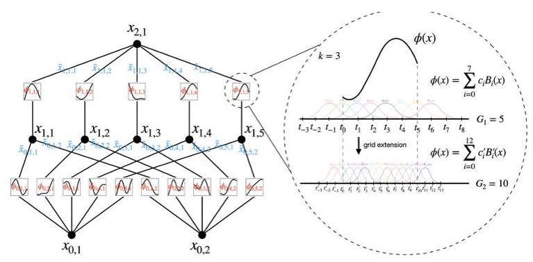
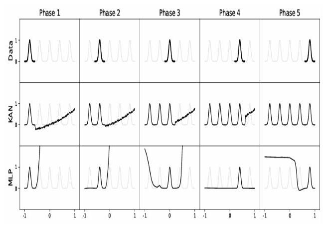
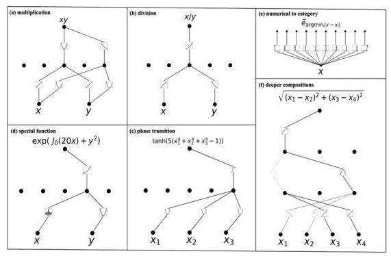
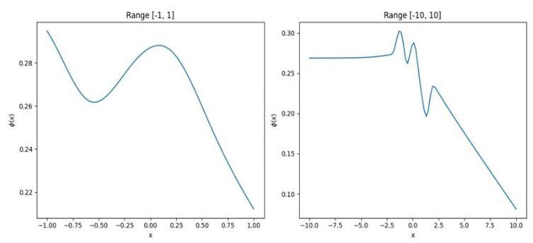
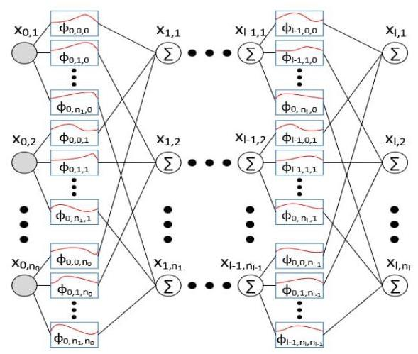
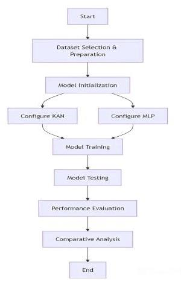
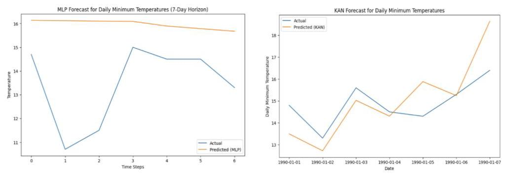

# Kolmogorov Arnold Networks and Multi-Layer Perceptrons: A Paradigm Shift in Neural Modelling

# 柯尔莫哥洛夫 - 阿诺德网络与多层感知器:神经建模中的范式转变

Aradhya Gaonkar ${}^{1}$ , Nihal Jain ${}^{2}$ Vignesh Chougule ${}^{3}$ , Nikhil Deshpande ${}^{4}$ , Sneha Varur ${}^{5}$ , and Channabasappa Muttal ${}^{6}$

阿拉迪亚·高恩卡尔${}^{1}$ ，尼哈尔·贾殷${}^{2}$ 维格内什·乔古勒${}^{3}$ ，尼基尔·德什潘德${}^{4}$ ，斯内哈·瓦鲁尔${}^{5}$ ，以及钱纳巴萨帕·穆塔尔${}^{6}$

School of Computer Science and Engineering, KLE Technological University, Hubballi, 580031, India,

印度胡布利市KLE科技大学计算机科学与工程学院，邮编:580031

01fe22bci019@kletech.ac.in, 01fe22bci022@kletech.ac.in, 01fe22bci007@kletech.ac.in, 01fe22bci017@kletech.ac.in, sneha.varur@kletech.ac.in,

01fe22bci019@kletech.ac.in, 01fe22bci022@kletech.ac.in, 01fe22bci007@kletech.ac.in, 01fe22bci017@kletech.ac.in, sneha.varur@kletech.ac.in

channabasappa.muttal@kletech.ac.in

Abstract. The research undertakes a comprehensive comparative analysis of Kolmogorov-Arnold Networks (KAN) and Multi-Layer Percep-trons (MLP), highlighting their effectiveness in solving essential computational challenges like nonlinear function approximation, time-series prediction, and multivariate classification. Rooted in Kolmogorov's representation theorem, KANs utilize adaptive spline-based activation functions and grid-based structures, providing a transformative approach compared to traditional neural network frameworks. Utilizing a variety of datasets spanning mathematical function estimation (quadratic and cubic) to practical uses like predicting daily temperatures and categorizing wines, the proposed research thoroughly assesses model performance via accuracy measures like Mean Squared Error (MSE) and computational expense assessed through Floating Point Operations (FLOPs). The results indicate that KANs reliably exceed MLPs in every benchmark, attaining higher predictive accuracy with significantly reduced computational costs. Such an outcome highlights their ability to maintain a balance between computational efficiency and accuracy, rendering them especially beneficial in resource-limited and real-time operational environments. By elucidating the architectural and functional distinctions between KANs and MLPs, the paper provides a systematic framework for selecting the most suitable neural architectures for specific tasks. Furthermore, the proposed study highlights the transformative capabilities of KANs in progressing intelligent systems, influencing their use in situations that require both interpretability and computational efficiency.

摘要。本研究对柯尔莫哥洛夫 - 阿诺德网络(KAN)和多层感知器(MLP)进行了全面的比较分析，突出了它们在解决诸如非线性函数逼近、时间序列预测和多变量分类等关键计算挑战方面的有效性。基于柯尔莫哥洛夫的表示定理，KAN利用基于自适应样条的激活函数和基于网格的结构，与传统神经网络框架相比提供了一种变革性方法。利用从数学函数估计(二次和三次)到预测每日温度和葡萄酒分类等实际应用的各种数据集，本研究所提出的研究通过均方误差(MSE)等准确性度量以及通过浮点运算(FLOPs)评估的计算成本来全面评估模型性能。结果表明，在每个基准测试中KAN均可靠地超过MLP，以显著降低的计算成本实现了更高的预测准确性。这样的结果突出了它们在计算效率和准确性之间保持平衡的能力，使其在资源受限和实时操作环境中特别有益。通过阐明KAN和MLP之间的架构和功能差异，本文为为特定任务选择最合适的神经架构提供了一个系统框架。此外，所提出的研究突出了KAN在推进智能系统方面的变革能力，影响了它们在需要可解释性和计算效率的情况下的应用。

Keywords: FLOPS, Interpretability, KAN, MLP, MSE, Point classification, Timeseries prediction

关键词:FLOPS，可解释性，KAN，MLP，MSE，点分类，时间序列预测

## 1 Introduction

## 1引言

Neural networks, inspired by biological systems [10], have transformed computing, excelling in image processing [4], natural language comprehension [13], and data analysis. While mimicking human cognition has expanded machine intelligence, designing efficient architectures remains a challenge, especially in resource-limited environments. Fundamental computations like squares and cubes are crucial in scientific computing, engineering, and finance [5]. Expanding to multidimensional classification underscores efficiency needs in healthcare, logistics [14], and finance, driving research into computationally efficient neural architectures.

受生物系统启发的神经网络[10]已经改变了计算方式，在图像处理[4]、自然语言理解[13]和数据分析方面表现出色。虽然模仿人类认知扩展了机器智能，但设计高效的架构仍然是一个挑战，特别是在资源受限的环境中。诸如平方和立方等基本计算在科学计算、工程和金融中至关重要[5]。扩展到多维分类凸显了医疗保健、物流[14]和金融中的效率需求，推动了对计算高效的神经架构的研究。

MLPs and KANs have emerged as promising solutions. MLPs, discussed by Zhang et al. [15], identify patterns using layered neurons across applications. KANs, introduced by Liu et al. [8], apply Kolmogorov's theorem for efficient nonlinear function estimation. Their architectural advancements position them as an MLP alternative, with Janiesch et al. [7] emphasizing their ability to streamline function approximation.

MLP和KAN已成为有前途的解决方案。张等人[15]讨论的MLP通过跨应用的分层神经元识别模式。刘等人[8]引入的KAN应用柯尔莫哥洛夫定理进行高效的非线性函数估计。它们的架构进步使其成为MLP的替代方案，雅涅施等人[7]强调了它们简化函数逼近的能力。

This study makes four key contributions: it compares KAN and MLP in function approximation, time-series forecasting, and classification; evaluates computational efficiency via FLOPs alongside accuracy metrics such as MSE and classification accuracy; establishes a framework for model selection based on experimental findings; and assesses KAN and MLP performance in estimating mathematical functions, handling complex datasets like the Wine dataset, and recognizing temporal trends.

本研究做出了四项关键贡献:它在函数逼近、时间序列预测和分类方面比较了KAN和MLP；通过FLOPs评估计算效率以及诸如MSE和分类准确性等准确性指标；根据实验结果建立了一个模型选择框架；并评估了KAN和MLP在估计数学函数、处理像葡萄酒数据集这样的复杂数据集以及识别时间趋势方面的性能。

Evaluation occurs across two dimensions: first, accuracy using MSE for regression [6, 11] and classification accuracy for categorical tasks; second, computational efficiency via FLOPs [3], providing insights into resource requirements. This dual analysis bridges theory with practical applications, aiding model selection in resource-constrained environments.

评估在两个维度上进行:第一，使用MSE进行回归的准确性[6, 11]以及用于分类任务的分类准确性；第二，通过FLOPs[3]评估计算效率，从而深入了解资源需求。这种双重分析将理论与实际应用联系起来，有助于在资源受限的环境中进行模型选择。

The paper is structured as follows: Section 2 explores the theoretical foundations of KAN and MLP, focusing on the Kolmogorov-Arnold theorem. Section 3 outlines the methodology, detailing dataset preparation, model architecture, and evaluation metrics. Section 4 presents a comparative analysis of accuracy and computational efficiency. Finally, Section 5 summarizes findings and suggests future research directions.

本文结构如下:第2节探讨KAN和MLP的理论基础，重点是柯尔莫哥洛夫 - 阿诺德定理。第3节概述方法，详细介绍数据集准备、模型架构和评估指标。第4节对准确性和计算效率进行比较分析。最后，第5节总结研究结果并提出未来研究方向。

## 2 Background Study

## 2背景研究

KANs have emerged as an efficient alternative to MLPs in deep learning due to their ability to approximate nonlinear functions. Figure 1 compares KAN and MLP performance, emphasizing KAN's computational efficiency. While MLPs rely on the universal approximation theorem, KANs utilize the Kolmogorov-Arnold representation theorem, which decomposes multivariate functions into simpler univariate ones. By replacing static activation functions with spline-parameterized functions along edges, KANs enhance both precision and interpretability, outperforming MLPs in compositional data tasks.

由于能够逼近非线性函数，KAN已成为深度学习中MLP的一种有效替代方案。图1比较了KAN和MLP的性能，强调了KAN的计算效率。虽然MLP依赖于通用逼近定理，但KAN利用柯尔莫哥洛夫 - 阿诺德表示定理，该定理将多元函数分解为更简单的单变量函数。通过沿边用样条参数化函数替换静态激活函数，KAN提高了精度和可解释性，在组合数据任务中优于MLP。

Traditional function approximation relied on MLPs, but their predefined activation functions limited flexibility, interpretability, and efficiency, particularly for high-dimensional data. KANs address these challenges by leveraging the Kolmogorov-Arnold theorem, enabling adaptable, spline-based activation functions. This architecture excels in compositional data processing, reduces parameter complexity, and mitigates the curse of dimensionality, making KANs a superior choice over MLPs.

传统的函数逼近依赖于多层感知器(MLP)，但其预定义的激活函数限制了灵活性、可解释性和效率，特别是对于高维数据。KAN通过利用柯尔莫哥洛夫 - 阿诺德定理解决了这些挑战，实现了基于样条的自适应激活函数。这种架构在组合数据处理方面表现出色，降低了参数复杂性，并减轻了维度灾难，使KAN成为比MLP更优的选择。

<table><tr><td>Model</td><td>Multi-Layer Perceptron (MLP)</td><td>Kolmogorov-Arnold Network (KAN)</td></tr><tr><td>Theorem</td><td>Universal Approximation Theorem</td><td>Kolmogorov-Arnold Representation Theorem</td></tr><tr><td>Formula (Shallow)</td><td>$f\left( \mathbf{x}\right)  \approx  \mathop{\sum }\limits_{{i = 1}}^{{N\left( c\right) }}{a}_{i}\sigma \left( {{\mathbf{w}}_{i} \cdot  \mathbf{x} + {b}_{i}}\right)$</td><td>$f\left( \mathbf{x}\right)  = \mathop{\sum }\limits_{{q = 1}}^{{{2n} + 1}}{\Phi }_{q}\left( {\mathop{\sum }\limits_{{p = 1}}^{n}{\phi }_{q, p}\left( {x}_{p}\right) }\right)$</td></tr><tr><td>Model (Shallow)</td><td>(a)  </td><td>(b)  </td></tr><tr><td>Formula (Deep)</td><td>$\operatorname{MLP}\left( \mathbf{x}\right)  = \left( {{\mathbf{W}}_{3} \circ  {\sigma }_{2} \circ  {\mathbf{W}}_{2} \circ  {\sigma }_{1} \circ  {\mathbf{W}}_{1}}\right) \left( \mathbf{x}\right)$</td><td>$\operatorname{KAN}\left( \mathbf{x}\right)  = \left( {{\mathbf{\Phi }}_{3} \circ  {\mathbf{\Phi }}_{2} \circ  {\mathbf{\Phi }}_{1}}\right) \left( \mathbf{x}\right)$</td></tr><tr><td>Model (Deep)</td><td></td><td>(d)    </td></tr></table>

Fig. 1: Comparison of MLP's and KAN's [8].

图1:MLP和KAN的比较[8]。

### 2.1 Kolmogorov Arnold Representation theorem

### 2.1柯尔莫哥洛夫 - 阿诺德表示定理

KANs relies on the Kolmogorov-Arnold theorem shown in the figure 2 which demonstrates the flow of activations in the network, providing insights into the theoretical model, which offers a way to express complex, high-dimensional functions through simpler univariate functions. The theoretical representation, although elegant, was historically considered impractical due to the non-smooth and fractal characteristics of the resulting functions. KANs bring back the formulated theorem by extending its use to deep architectures. KANs offer flexibility and efficiency for modern machine learning by allowing various depths and widths, instead of sticking to the original depth-2, width-2n+1 configuration. KANs combine linear transformations and non-linearities into learnable spline-based transformations, unlike MLPs that separate them into weights and fixed activations. The proposed method allows KANs to improve external structures, like feature learning, and internal accuracy by accurately fitting univariate functions. The equation gives the representation of KAN 1 gives insights of how the features are used in the KAN model. Grasping the theoretical basis of KANs prepares one to assess their actual effectiveness.

KAN依赖于图2所示的柯尔莫哥洛夫 - 阿诺德定理，该定理展示了网络中激活的流动，为理论模型提供了见解，该模型提供了一种通过更简单的单变量函数来表达复杂高维函数的方法。这种理论表示虽然优雅，但由于所得函数的非光滑和分形特性，在历史上被认为不切实际。KAN通过将其应用扩展到深度架构，使该公式化定理得以复兴。KAN通过允许各种深度和宽度，而不是坚持原始的深度为2、宽度为2n + 1的配置，为现代机器学习提供了灵活性和效率。与MLP将线性变换和非线性分别分为权重和固定激活不同，KAN将线性变换和非线性组合成可学习的基于样条的变换。所提出的方法使KAN能够通过准确拟合单变量函数来改善外部结构，如特征学习，并提高内部准确性。方程给出了KAN 1的表示，揭示了特征在KAN模型中的使用方式。掌握KAN的理论基础有助于评估其实际有效性。

$$
f\left( x\right)  = f\left( {{x}_{1},\ldots ,{x}_{n}}\right)  = \mathop{\sum }\limits_{{q = 1}}^{{{2n} + 1}}{\phi }_{q}\left( {\mathop{\sum }\limits_{{p = 1}}^{n}{\phi }_{p, q}\left( {x}_{p}\right) }\right) \tag{1}
$$

Fig. 2: Left: Symbols representing the flow of activations in the network. Right: activation function is defined as expressed in the form of a B-spline, enabling the transition from coarse to fine grids [8].

图2:左:表示网络中激活流动的符号。右:激活函数定义为以B样条的形式表示，实现从粗网格到细网格的过渡[8]。

### 2.2 Performance and Empirical Results

### 2.2性能和实证结果

KANs demonstrate exceptional performance across benchmark tasks, surpassing MLPs in convergence speed and accuracy, particularly for compositional functions. Scaling law tests show KANs achieve a test loss reduction proportional to ${N}^{-4}$ , outperforming MLPs by decomposing complex functions into simpler univariate components, mitigating the curse of dimensionality.

KAN在基准任务中表现出卓越的性能，在收敛速度和准确性方面超过MLP，特别是对于组合函数。尺度定律测试表明，KAN实现了与${N}^{-4}$成比例的测试损失减少，通过将复杂函数分解为更简单的单变量组件，减轻了维度灾难，优于MLP。

Figure 3 highlights KANs' ability to retain prior knowledge while learning new tasks, ensuring adaptability in evolving environments. Additionally, Figure 4 illustrates KANs' interpretability, enhancing decision-making processes. Sparsification techniques refine network structures, often yielding symbolic representations like $\sin \left( x\right)$ or ${e}^{{x}^{2}}$ , providing direct insights into trained models. This adaptability extends KANs' applicability across diverse learning settings.

图3突出了KAN在学习新任务时保留先验知识的能力，确保在不断变化的环境中的适应性。此外，图4说明了KAN的可解释性，增强了决策过程。稀疏化技术优化了网络结构，通常产生像$\sin \left( x\right)$或${e}^{{x}^{2}}$这样的符号表示，为训练模型提供了直接的见解。这种适应性扩展了KAN在各种学习设置中的适用性。

In the figure 5, Grid extension is again a great feature of KAN. The grid signifies the collection of points utilized for discretization. It is set up according to a specified interval and control points. During the training process, certain input variables for each $\phi$ could exceed the original range of the grid. To address the issue, the grid is expanded to accommodate inputs that surpass its initial boundaries. The initial KAN describe the extension procedure as an optimization problem where ${G}_{1}$ denotes the initial grid size, ${G}_{2}$ represents enlarged grid size and $k$ indicates the degree of the B-splines, it is shown in equation 2. During testing, we observed that the output variables of a KAN convolutional layer could exceed the standard grid range of [-1,1]. The proposed test creates a difficulty, particularly with numerous convolutional layers, since the input to a convolutional layer must remain within the operational range of the B-Spline to guarantee that learning is influenced by the splines, rather than solely by the weights adjusting the SiLU activation. To address the proposed approach, during training, the grid is adjusted whenever an input exceeds its range. The proposed modification preserves the original count of control points and spline form while widening the range to include the input. While the process introduces minimal computational overhead, it significantly enhances the model's precision, maintaining KAN's overall efficiency advantage.

在图5中，网格扩展也是KAN的一个重要特性。网格表示用于离散化的点的集合。它根据指定的间隔和控制点设置。在训练过程中，每个$\phi$的某些输入变量可能会超出网格的原始范围。为了解决这个问题，网格会扩展以适应超过其初始边界的输入。最初的KAN将扩展过程描述为一个优化问题，其中${G}_{1}$表示初始网格大小，${G}_{2}$表示扩大后的网格大小，$k$表示B样条的次数，如方程2所示。在测试过程中，我们观察到KAN卷积层的输出变量可能会超出标准网格范围[-1,1]。所提出的测试带来了困难，特别是对于大量卷积层，因为卷积层的输入必须保持在B样条的操作范围内，以确保学习受样条影响，而不是仅由调整SiLU激活的权重影响。为了解决所提出的方法，在训练过程中，每当输入超出其范围时，网格就会调整。所提出的修改在扩大范围以包含输入的同时，保留了控制点的原始数量和样条形式。虽然该过程引入的计算开销最小，但它显著提高了模型的精度，保持了KAN的整体效率优势。

$$
{c}_{j}^{\prime } = {\arg }_{{c}_{j}^{\prime }}\min {E}_{x \sim  p\left( x\right) }\left\lbrack  {\mathop{\sum }\limits_{{j = 0}}^{{{G}_{2} + k - 1}}{c}_{j}^{\prime }{B}_{j}\left( {x}^{\prime }\right)  - \mathop{\sum }\limits_{{j = 0}}^{{{G}_{1} + k - 1}}{c}_{j}{B}_{j}\left( x\right) }\right\rbrack \tag{2}
$$

Fig. 3: Demonstration of Continual Learning: A KAN model's ability to acquire new tasks while preserving previously learned information [8].

图3:持续学习的演示:KAN模型在保留先前学习的信息的同时获取新任务的能力[8]。

Fig. 4: Illustration of Interpretability: A KAN model providing comprehensible insights into decision-making processes [8].

图4:可解释性的说明:KAN模型为决策过程提供可理解的见解[8]。

- ${c}_{j}$ and ${c}_{j}^{\prime }$ : Control points of the B-splines representing the original and extended grids, respectively.

- ${c}_{j}$和${c}_{j}^{\prime }$:分别表示原始网格和扩展网格的B样条的控制点。

- ${B}_{j}\left( x\right)$ : B-spline basis functions used to interpolate the input values.

- ${B}_{j}\left( x\right)$:用于内插输入值的B样条基函数。

- $x$ and ${x}^{\prime }$ : Input data points within the original and extended ranges, respectively.

- $x$ 和 ${x}^{\prime }$ :分别为原始范围和扩展范围内的输入数据点。

$- {G}_{1}$ and ${G}_{2}$ : Sizes of the original and extended grids, respectively. ${G}_{2} > {G}_{1}$ reflects the expanded grid. - $k$ : Degree of the B-splines, controlling the smoothness of the spline curves.

$- {G}_{1}$ 和 ${G}_{2}$ :分别为原始网格和扩展网格的大小。${G}_{2} > {G}_{1}$ 反映扩展后的网格。 - $k$ :B 样条的阶数，控制样条曲线的平滑度。

- ${E}_{x \sim  p\left( x\right) }$ : Expectation over the input distribution $p\left( x\right)$ , representing the likelihood of observing a particular input $x$ .

- ${E}_{x \sim  p\left( x\right) }$ :输入分布 $p\left( x\right)$ 的期望，表示观察到特定输入 $x$ 的可能性。

A different approach is to implement batch normalization following every convolutional layer. The method incorporates a limited set of adjustable parameters $\left( {\mu \text{ and }\sigma }\right)$ to standardize the inputs to $\mu  = 0$ and $\sigma  = 1$ , making certain that the majority of outputs are within the specified range. Nevertheless, as illustrated in Figure 5 , when inputs surpass the spline range, the layer behaves similarly to a SiLU activation. If the grid isn't refreshed and many inputs stay outside the range, the KAN essentially operates like an MLP with SiLU activations. Examining the splines acquired throughout various convolutional layers showed no recognizable patterns. Their actions changed greatly based on the layer and position, suggesting that the learning process is influenced by context and does not follow a standardized pattern. Figure 6 offers a generalized framework of KAN, emphasizing its structural benefits compared to traditional neural networks.

另一种方法是在每个卷积层之后实施批归一化。该方法纳入了一组有限的可调参数 $\left( {\mu \text{ and }\sigma }\right)$ ，以标准化输入到 $\mu  = 0$ 和 $\sigma  = 1$ 的数据，确保大多数输出在指定范围内。然而，如图 5 所示，当输入超过样条范围时，该层的行为类似于 SiLU 激活函数。如果网格未更新且许多输入仍超出范围，KAN 本质上就像一个带有 SiLU 激活函数的多层感知器。检查在各个卷积层中获取的样条，未发现可识别的模式。它们的行为根据层和位置有很大变化，这表明学习过程受上下文影响，不遵循标准化模式。图 6 提供了 KAN 的通用框架，强调了其与传统神经网络相比的结构优势。

Fig. 5: Illustration of Grid extension: Increasing the efficiency of the model, (Bodner et al. [2]).

图 5:网格扩展示意图:提高模型效率，(Bodner 等人 [2])。

## 3 Proposed Methodology

## 3 提出的方法

Neural networks have demonstrated remarkable capabilities in fields such as image processing, natural language processing, and data classification. However, assessing their effectiveness across different tasks and datasets remains challenging, particularly in resource-constrained environments. Function approximation, time-series forecasting, and classification tasks are fundamental to applications in engineering, finance, and scientific research. While MLPs are widely used, KANs, inspired by Kolmogorov's theorem, offer an alternative approach for efficiently approximating complex functions.

神经网络在图像处理、自然语言处理和数据分类等领域展现出了卓越的能力。然而，评估它们在不同任务和数据集上的有效性仍然具有挑战性，特别是在资源受限的环境中。函数逼近、时间序列预测和分类任务是工程、金融和科学研究应用中的基础。虽然多层感知器被广泛使用，但受柯尔莫哥洛夫定理启发的 KAN 提供了一种有效逼近复杂函数的替代方法。

Fig. 6: A generalized KAN Architecture, (Tran et al.[12]).

图 6:通用的 KAN 架构，(Tran 等人 [12])。

The study examines the relative performance of KANs and MLPs in function approximation, time-series prediction, and classification tasks. Utilizing Kolmogorov's representation theorem, KANs employ spline-based activation functions along edges rather than nodes, enhancing efficiency and interpretability. Datasets, including square and cube number approximations, daily temperature forecasting, and the Wine dataset for multivariate classification, are analyzed. Architectural differences, optimization strategies, and computational metrics such as MSE and FLOPs are evaluated to assess trade-offs between accuracy and resource consumption. The findings highlight KAN's improved precision and computational efficiency, emphasizing its potential for resource-limited applications. Figure 7 is a flowchart of our methodology's steps.

该研究考察了 KAN 和多层感知器在函数逼近、时间序列预测和分类任务中的相对性能。利用柯尔莫哥洛夫表示定理，KAN 沿边而非节点使用基于样条的激活函数，提高了效率和可解释性。分析了包括平方和立方数逼近、每日温度预测以及用于多变量分类的葡萄酒数据集等数据集。评估了架构差异、优化策略以及诸如均方误差和浮点运算次数等计算指标，以评估准确性和资源消耗之间的权衡。研究结果突出了 KAN 提高的精度和计算效率，强调了其在资源受限应用中的潜力。图 7 是我们方法步骤的流程图。

Fig. 7: Flowchart of the Proposed Methodology

图 7:提出的方法的流程图

### 3.1 Architecture of KAN

### 3.1 KAN 的架构

KANs have a distinctive architectural structure with activation functions located on edges instead of nodes. The activation function of every edge is defined using a B-spline that can be modified while training. These curves, in their essence, can be adjusted to depict different levels of detail, enabling a hierarchical learning process. Residual connections are integrated into the spline-based activations to enhance training optimization and stability of the network. In contrast to MLPs, KANs achieve a smaller parameter space without depending on linear weights, while still keeping or improving their representational capacity. An important characteristic of KANs is their capability to enlarge spline grids, known as grid extension. Refinement spline activations resolution is done in the presented process without having to retrain the network completely. As the training advances, the grid points specifying the splines become progressively refined, improving the network's capacity to estimate intricate functions. Such a characteristic gives KANs a computational edge, as the network becomes more precise with time, without requiring significant computational resources for retraining. In the equation $3,4,5,{c}_{i}$ is trainable. Each activation function is initialized to have ${w}_{s} = 1$ and spline $\left( x\right)  \approx  0.{w}_{b}$ is initialized according to the Xavier initialization.

KAN 具有独特的架构结构，激活函数位于边上而非节点上。每条边的激活函数使用 B 样条定义，在训练期间可修改。这些曲线本质上可调整以描绘不同级别的细节，实现分层学习过程。残差连接被集成到基于样条的激活中，以增强训练优化和网络的稳定性。与多层感知器相比，KAN 在不依赖线性权重的情况下实现了更小的参数空间，同时仍保持或提高了其表示能力。KAN 的一个重要特性是其扩大样条网格的能力，即网格扩展。在所提出的过程中，细化样条激活分辨率无需完全重新训练网络。随着训练的推进，指定样条的网格点逐渐细化，提高了网络估计复杂函数的能力。这样的特性赋予 KAN 计算优势，因为网络随着时间变得更精确，而无需大量计算资源进行重新训练。在等式中 $3,4,5,{c}_{i}$ 是可训练的。每个激活函数初始化为具有 ${w}_{s} = 1$ ，样条 $\left( x\right)  \approx  0.{w}_{b}$ 根据 Xavier 初始化进行初始化。

$$
\phi \left( x\right)  = {w}_{b}b\left( x\right)  + {w}_{s}\text{ spline }\left( x\right) \tag{3}
$$

$$
b\left( x\right)  = \operatorname{silu}\left( x\right)  = x/\left( {1 + {e}^{-x}}\right) \tag{4}
$$

$$
\text{ spline }\left( x\right)  = \mathop{\sum }\limits_{i}{c}_{i}{B}_{i}\left( x\right) \tag{5}
$$

### 3.2 Dataset Preparation

### 3.2 数据集准备

The proposed methodology evaluates models using four datasets across time-series and classification tasks. The Square Numbers Dataset, designed to test function approximation, contains 15 rows of numbers and their squares. Similarly, the Numbers Dataset challenges models to predict cube values, also with 15 rows. For time-series analysis, the Daily Minimum Temperatures Dataset includes 3651 rows, each with a date and recorded temperature, requiring models to predict the next day's minimum temperature. The Wine Dataset, widely used in classification, consists of 178 rows with 13 chemical attributes distinguishing wines into three categories.

所提出的方法使用四个数据集对模型进行跨时间序列和分类任务的评估。用于测试函数逼近的平方数数据集包含15行数字及其平方。同样，数字数据集要求模型预测立方值，也有15行。对于时间序列分析，每日最低温度数据集包括3651行，每行有一个日期和记录的温度，要求模型预测第二天的最低温度。广泛用于分类的葡萄酒数据集由178行组成，有13个化学属性将葡萄酒分为三类。

Datasets were adapted for both MLP and KAN models. Time-series data was normalized, and categorical labels were one-hot encoded for classification, following Bender et al. [1].

数据集针对MLP和KAN模型进行了调整。按照Bender等人[1]的方法，对时间序列数据进行了归一化处理，对分类的类别标签进行了独热编码。

### 3.3 Provisioning of MLP Models

### 3.3 MLP模型的配置

The study first applied MLP models, with fully connected layers tailored to each dataset. Regression tasks used a linear activation in the output layer, while classification employed softmax for probability estimation. In time-series analysis, a sliding window of 3 days predicted the next day's temperature, capturing temporal trends. The Adam optimizer and a learning rate scheduler ensured convergence, with hyperparameters optimized via grid search.

该研究首先应用了MLP模型，为每个数据集量身定制了全连接层。回归任务在输出层使用线性激活函数，而分类任务则采用softmax进行概率估计。在时间序列分析中，一个3天的滑动窗口用于预测第二天的温度，以捕捉时间趋势。Adam优化器和学习率调度器确保了收敛，通过网格搜索对超参数进行了优化。

### 3.4 Provisioning of KAN Models

### 3.4 KAN模型的配置

KAN models were implemented using PyKAN, fastKAN, fasterKAN, and con-vKAN, leveraging Kolmogorov's theorem to approximate functions through grid-based decomposition. Key parameters, including grid size, layers (k), and spline order, were adjusted per dataset complexity. FastKAN and convKAN were used where computational efficiency was crucial. Grid setups in the daily minimum temperature dataset captured temporal patterns, enabling sequential modeling, as illustrated in Fig 8.

KAN模型使用PyKAN、fastKAN、fasterKAN和con-vKAN实现，利用柯尔莫哥洛夫定理通过基于网格的分解来逼近函数。根据每个数据集的复杂度调整关键参数，包括网格大小、层数(k)和样条阶数。在计算效率至关重要的情况下使用FastKAN和convKAN。每日最低温度数据集中的网格设置捕捉了时间模式，实现了顺序建模，如图8所示。

Fig. 8: KAN vs MLP (Daily Minimum temperature)

图8:KAN与MLP(每日最低温度)

### 3.5 Performance Evaluation and Optimization of Models

### 3.5模型的性能评估与优化

The evaluation of both KANs and MLPs was conducted using essential metrics to guarantee an equitable and thorough comparison. For regression tasks, such as approximating square and cube functions and forecasting daily minimum temperatures, accuracy was evaluated using the MSE. In classification tasks, like sorting wine varieties according to their chemical characteristics, accuracy acted as the main assessment metric. An iterative optimization method was utilized to guarantee fairness. Models demonstrating diminished performance were consistently improved. For MLPs, the modifications included in the layer count, the number of neurons in each layer, and the learning rates. For KANs, the grid dimensions, spline degrees, and layer setups were altered. The repetitive procedure persisted until both models reached similar performance metrics on all datasets. To evaluate computational efficiency, FLOPs were computed for each architecture. For KANs, the De Boor formula was used to determine FLOPs, which quantifies computations involved in spline operations. The formula for FLOPs is given by an interpretation of the de Boor algorithm, as explained by

对KAN和MLP的评估均使用基本指标进行，以确保公平且全面的比较。对于回归任务，如近似平方和立方函数以及预测每日最低气温，使用均方误差(MSE)来评估准确性。在分类任务中，如根据葡萄酒的化学特征对其品种进行分类，准确性作为主要评估指标。采用迭代优化方法以确保公平性。性能下降的模型会持续改进。对于MLP，修改包括层数、每层的神经元数量以及学习率。对于KAN，网格维度、样条度数和层设置会被改变。重复这个过程，直到两个模型在所有数据集上都达到相似的性能指标。为了评估计算效率，计算了每种架构的浮点运算次数(FLOPs)。对于KAN，使用德布尔公式来确定FLOPs，该公式量化了样条操作中涉及的计算。FLOPs的公式由德布尔算法的一种解释给出，如

Nava-Yazdani [9]. ${d}_{in}$ represents the input dimensions. ${d}_{\text{ out }}$ represents the output dimensions. $K$ is the dimensionality degree of the activation function.

Nava-Yazdani [9]。${d}_{in}$表示输入维度。${d}_{\text{ out }}$表示输出维度。$K$是激活函数的维度度数。

$$
{FLOPS} = \left( {{d}_{in} * {d}_{out}}\right)  * \left\lbrack  {9 * K * (G + {1.5} * K\rbrack  + 2 * G - {2.5} * K - 1}\right\rbrack \tag{6}
$$

K represents the degree of dimensionality of the activation function. The torch-profile library was used for MLPs to estimate FLOPs, facilitating thorough computations for both single layers and the entire architecture. These assessments guaranteed an equitable comparison of computational efficiency while preserving predictive accuracy. The last step included contrasting the recalibrated FLOPs to determine the optimal design for each dataset. Models with lower FLOPs were considered to be more efficient, since they achieved comparable accuracy while reducing computational costs. The evaluation offered perspectives on the trade-offs between computational cost and forecasting accuracy, emphasizing the advantages and drawbacks of both MLP and KAN models across various datasets.

K表示激活函数的维度度数。使用torch-profile库对MLP估计FLOPs，便于对单层和整个架构进行全面计算。这些评估确保了在保持预测准确性的同时对计算效率进行公平比较。最后一步包括对比重新校准的FLOPs，以确定每个数据集的最佳设计。FLOPs较低的模型被认为更高效，因为它们在降低计算成本的同时实现了可比的准确性。该评估提供了关于计算成本和预测准确性之间权衡的观点，强调了MLP和KAN模型在各种数据集上的优缺点。

## 4 Results and Discussion

## 4结果与讨论

Prior to conducting a thorough performance assessment, it is essential to establish the comparative framework between KANs and MLPs. The findings presented in the document reflect an assessment that includes tasks ranging from basic mathematical function estimation to intricate multivariate classification. The proposed comparative study emphasizes the trade-offs between computational efficiency and accuracy while also pointing out the specific application contexts where each architecture demonstrates its strengths. Such type of investigation offers practical insights into their use in environments with limited resources and high stakes, setting the stage for well-informed design decisions.

在进行全面的性能评估之前，必须建立KAN和MLP之间的比较框架。文档中呈现的结果反映了一项评估，该评估包括从基本数学函数估计到复杂多变量分类的任务。所提出的比较研究强调了计算效率和准确性之间的权衡，同时也指出了每种架构发挥其优势的特定应用场景。这种类型的研究为它们在资源有限和风险高的环境中的使用提供了实际见解，为明智的设计决策奠定了基础。

### 4.1 Perfomance Analysis

### 4.1性能分析

Regarding accuracy and computational efficiency, KAN consistently outperforms MLP for univariate datasets 1. For cube value estimation, KAN achieves a lower MSE of 15.2706 versus 2599.5886 for MLP, with a 99% reduction in computational cost (0.357 kFLOPs vs. 40.000 kFLOPs). Similarly, in square value approximation, KAN attains an MSE of 0.1743 (80.49% lower than MLP's 0.8938) while reducing FLOPs by 99.71%. In time-series tasks, such as predicting daily minimum temperatures, KAN achieves an MSE of 1.4201 (79.87% lower than MLP's 7.0565) with a nearly equivalent computational cost (25.284 kFLOPs vs. 24.200 kFLOPs), highlighting its efficiency in sequential data processing.

关于准确性和计算效率，在单变量数据集1上，KAN始终优于MLP。对于立方值估计，KAN实现了更低的均方误差15.2706，而MLP为2599.5886，计算成本降低了99%(0.357千次浮点运算对40.000千次浮点运算)。同样，在平方值近似中，KAN的均方误差为0.1743(比MLP的0.8938低80.49%)，同时浮点运算减少了99.71%。在时间序列任务中，如预测每日最低温度，KAN的均方误差为1.4201(比MLP的7.0565低7,987%)，计算成本几乎相当(25.284千次浮点运算对24.200千次浮点运算)，突出了其在顺序数据处理中的效率。

For multivariate classification on the Wine dataset, KAN attains 98.43% accuracy, surpassing MLP's 96.30% by 2.21%, demonstrating its ability to handle complex datasets efficiently. These results emphasize KAN's adaptability in balancing accuracy and computational efficiency. A detailed percentage comparison of FLOPs, MSE, and accuracy across datasets is presented in Table 2.

在葡萄酒数据集上进行多变量分类时，KAN的准确率达到98.43%，比MLP的96.30%高出2.21%，证明了其有效处理复杂数据集的能力。这些结果强调了KAN在平衡准确性和计算效率方面的适应性。表2展示了跨数据集的浮点运算、均方误差和准确率的详细百分比比较。

Table 1: Comparison of kFLOPS(thousands) and MSE(unit ${}^{2}$ ) for Univariate and Multivariate Datasets

表1:单变量和多变量数据集的千次浮点运算(kFLOPS)和均方误差(单位${}^{2}$)比较

<table><tr><td colspan="5">Univariate Datasets</td></tr><tr><td rowspan="2">Problem</td><td colspan="2">KAN</td><td colspan="2">MLP</td></tr><tr><td>FLOPS</td><td>MSE</td><td>FLOPS</td><td>MSE</td></tr><tr><td>Cube of Numbers</td><td>0.357</td><td>15.2706</td><td>40.000</td><td>2599.5886</td></tr><tr><td>Square of Numbers</td><td>0.171</td><td>0.1743</td><td>60.000</td><td>0.8938</td></tr><tr><td>Daily Minimum Temperature</td><td>25.284</td><td>1.4201</td><td>24.200</td><td>7.0565</td></tr><tr><td colspan="5">Multivariate Datasets</td></tr><tr><td rowspan="2">Problem</td><td colspan="2">KAN</td><td colspan="2">MLP</td></tr><tr><td>FLOPS</td><td>MSE</td><td>FLOPS</td><td>MSE</td></tr><tr><td>Point Classification</td><td>4.212</td><td>ACC $= {98.43}\%$</td><td>0.754</td><td>ACC = 96.30%</td></tr></table>

### 4.2 Accuracy and Computational Efficiency

### 4.2准确性和计算效率

The comparative assessment highlights KAN's superiority in computational efficiency and accuracy. As shown in Table 1, KAN consistently outperforms MLP across datasets. For cube estimation, KAN achieves a much lower MSE of 15.2706 compared to MLP's 2599.5886. Table 2 details the percentage differences in FLOPs, MSE, and accuracy, reinforcing KAN's practical advantages.

比较评估突出了KAN在计算效率和准确性方面的优势。如表1所示，KAN在各个数据集上始终优于MLP。对于立方估计，KAN实现了比MLP的2599.5886低得多的均方误差15.2706。表2详细列出了浮点运算、均方误差和准确率的百分比差异，强化了KAN的实际优势。

KAN reduces FLOPs by over 99% in tasks like cube and square approximations, making it ideal for embedded and real-time applications. In time-series tasks, a slight FLOP increase is offset by substantial accuracy gains. For classification, KAN shows marginal accuracy improvements, demonstrating its adaptability and reliability as an alternative to MLP.

在立方和平方近似等任务中，KAN将浮点运算减少了99%以上，使其非常适合嵌入式和实时应用。在时间序列任务中，浮点运算的轻微增加被显著的准确性提升所抵消。对于分类，KAN显示出边际准确性提高，证明了其作为MLP替代方案的适应性和可靠性。

### 4.3 Relevance and Impact Analysis

### 4.3相关性和影响分析

KAN's unique architecture, featuring spline-based activation and grid-based designs, enables it to outperform MLP in accuracy and efficiency. Achieving lower MSE with fewer resources makes it ideal for resource-limited environments. Its effectiveness in time-series forecasting and multivariate classification underscores its adaptability. These findings pave the way for further exploration of KAN's potential in high-dimensional and large-scale applications.

KAN独特的架构，具有基于样条的激活和基于网格的设计，使其在准确性和效率方面优于MLP。以更少的资源实现更低的均方误差使其非常适合资源受限的环境。其在时间序列预测和多变量分类中的有效性强调了其适应性。这些发现为进一步探索KAN在高维和大规模应用中的潜力铺平了道路。

Table 2: Percentage variations in FLOPs(thousands), MSE(unit ${t}^{2}$ ), and classification success between KAN and MLP across various tasks, illustrating performance of models.

表2:KAN和MLP在各种任务中的千次浮点运算(FLOPs)、均方误差(单位${t}^{2}$)和分类成功率的百分比变化，说明了模型的性能。

<table><tr><td>Problem</td><td>Metric</td><td>KAN</td><td>MLP</td><td>Performance Difference</td></tr><tr><td rowspan="2">Cube of Numbers</td><td>FLOPs</td><td>0.357</td><td>40.000</td><td>99.11%</td></tr><tr><td>MSE</td><td>15.2706</td><td>2599.5886</td><td>99.41%</td></tr><tr><td rowspan="2">Square of Numbers</td><td>FLOPs</td><td>0.171</td><td>60.000</td><td>99.71%</td></tr><tr><td>MSE</td><td>0.1743</td><td>0.8938</td><td>80.49%</td></tr><tr><td rowspan="2">Daily Minimum Temperature</td><td>FLOPs</td><td>25.284</td><td>24.200</td><td>-4.48%</td></tr><tr><td>MSE</td><td>1.4201</td><td>7.0565</td><td>79.87%</td></tr><tr><td>Point Classification</td><td>Accuracy</td><td>98.43</td><td>96.30</td><td>2.21%</td></tr></table>

### 4.4 Comparison with Previous Approaches

### 4.4与先前方法的比较

Compared to MLP, a widely used choice for function approximation and classification, KAN offers clear advantages. While MLP's fully connected layers capture data patterns, they increase computational complexity. KAN, leveraging Kolmogorov's theorem, simplifies function approximation, achieving similar or better accuracy with reduced computational demands. This study builds on prior research, positioning KAN as a viable MLP alternative in deep learning. Its efficiency in nonlinear function approximation highlights its potential for multivariate classification and large-scale data modeling.

与广泛用于函数近似和分类的MLP相比，KAN具有明显优势。虽然MLP的全连接层捕获数据模式，但它们增加了计算复杂性。KAN利用柯尔莫哥洛夫定理简化了函数近似，在降低计算需求的情况下实现了相似或更好的准确性。本研究基于先前的研究，将KAN定位为深度学习中可行的MLP替代方案。其在非线性函数近似中的效率突出了其在多变量分类和大规模数据建模中的潜力。

## 5 Conclusion and Future Work

## 5结论与未来工作

The study compares KAN and MLP in function approximation, classification, and time-series forecasting. KAN outperforms MLP in efficiency and accuracy, achieving lower MSE with fewer FLOPS, making it ideal for resource-limited environments. Based on Kolmogorov's theorem, KAN provides a superior solution for non-linear function approximation and sequential data tasks.

该研究在函数近似、分类和时间序列预测方面比较了KAN和MLP。KAN在效率和准确性方面优于MLP，以更少的浮点运算实现了更低的均方误差，使其非常适合资源受限的环境。基于柯尔莫哥洛夫定理，KAN为非线性函数近似和顺序数据任务提供了更好的解决方案。

KAN effectively handles complex, non-linear data, making it suitable for real-time applications like financial forecasting, robotics, and biomedical signal analysis. Its low computational cost benefits embedded systems and edge AI. Further efficiency gains can be achieved through pruning, quantization, and FPGA acceleration.

KAN有效地处理复杂的非线性数据，使其适用于金融预测、机器人技术和生物医学信号分析等实时应用。其低计算成本有利于嵌入式系统和边缘人工智能。通过剪枝、量化和FPGA加速可以实现进一步的效率提升。

## Bibliography

##参考文献

[1] Thoranna Bender, Simon Moe Sørensen, Alireza Kashani, K. Eldjarn Hjor-leifsson, Grethe Hyldig, Søren Hauberg, Serge Belongie, and Frederik War-burg. Learning to taste: A multimodal wine dataset, 2024.

Leifsson, Grethe Hyldig, Søren Hauberg, Serge Belongie, and Frederik Warburg. Learning to taste: A multimodal wine dataset, 2024.

[2] Alexander Dylan Bodner, Antonio Santiago Tepsich, Jack Natan Spolski,and Santiago Pourteau. Convolutional kolmogorov-arnold networks, 2024.

以及圣地亚哥·普尔托。卷积柯尔莫哥洛夫 - 阿诺德网络，2024年。

[3] Jierun Chen, Shiu hong Kao, Hao He, Weipeng Zhuo, Song Wen, Chul-HoLee, and S. H. Gary Chan. Run, don't walk: Chasing higher flops for faster neural networks, 2023.

李，以及S. H. 加里·陈。快跑，别走着:为更快的神经网络追求更高的浮点运算次数，2023年。

[4] Laia Domingo and Mahdi Chehimi. Quantum-enhanced unsupervised imagesegmentation for medical images analysis, 2024.

用于医学图像分析的分割，2024年。

[5] Carmina Fjellström. Lstm neural network for financial time series, 2022.

[6] Sherif Hashem and Bruce Schmeiser. Approximating a function and itsderivatives using MSE-optimal linear combinations of trained feedforward neural networks. Citeseer, 1993.

使用训练好的前馈神经网络的均方误差最优线性组合求导数。科学引文索引，1993年。

[7] Christian Janiesch, Patrick Zschech, and Kai Heinrich. Machine learning and deep learning. Electronic Markets, 31(3):685-695, April 2021.

[8] Ziming Liu, Yixuan Wang, Sachin Vaidya, Fabian Ruehle, James Halverson,Marin Soljačić, Thomas Y. Hou, and Max Tegmark. Kan: Kolmogorov-arnold networks, 2024.

马林·索尔亚契奇、托马斯·Y. 侯和马克斯·泰格马克。Kan:柯尔莫哥洛夫 - 阿诺德网络，2024年。

[9] Esfandiar Nava-Yazdani. Geometric mean, splines and de boor algorithmin geodesic spaces, 2016.

在测地线空间中，2016年。

[10] Samuel Schmidgall, Jascha Achterberg, Thomas Miconi, Louis Kirsch, Ro-jin Ziaei, S. Pardis Hajiseyedrazi, and Jason Eshraghian. Brain-inspired learning in artificial neural networks: a review, 2023.

金·齐亚伊、S. 帕尔迪斯·哈吉塞耶德拉齐和贾森·埃什拉吉安。人工神经网络中的脑启发式学习:综述，2023年。

[11] William L. Tong and Cengiz Pehlevan. Mlps learn in-context on regressionand classification tasks, 2024.

以及分类任务，2024年。

[12] Van Duy Tran, Tran Xuan Hieu Le, Thi Diem Tran, Hoai Luan Pham,Vu Trung Duong Le, Tuan Hai Vu, Van Tinh Nguyen, and Yasuhiko Nakashima. Exploring the limitations of kolmogorov-arnold networks in classification: Insights to software training and hardware implementation, 2024.

武忠·杜昂·勒、阮团海、范廷·阮和中岛康彦。探索柯尔莫哥洛夫 - 阿诺德网络在分类中的局限性:对软件训练和硬件实现的见解，2024年。

[13] Marcos Treviso, Ji-Ung Lee, Tianchu Ji, Betty van Aken, Qingqing Cao,Manuel R. Ciosici, Michael Hassid, Kenneth Heafield, Sara Hooker, Colin Raffel, Pedro H. Martins, André F. T. Martins, Jessica Zosa Forde, Peter Milder, Edwin Simpson, Noam Slonim, Jesse Dodge, Emma Strubell, Niran-jan Balasubramanian, Leon Derczynski, Iryna Gurevych, and Roy Schwartz. Efficient methods for natural language processing: A survey, 2023.

曼努埃尔·R. 乔西奇、迈克尔·哈西德、肯尼斯·希菲尔德、萨拉·胡克、科林·拉费尔、佩德罗·H. 马丁斯、安德烈·F. T. 马丁斯、杰西卡·佐萨·福德、彼得·米尔德、埃德温·辛普森、诺姆·斯洛尼姆、杰西·道奇、艾玛·斯特鲁贝尔、尼兰詹·巴拉苏布拉马尼亚、利昂·德钦斯基、伊丽娜·古列维奇和罗伊·施瓦茨。自然语言处理的高效方法:综述，2023年。

[14] Haibo Wang, Lutfu S. Sua, and Bahram Alidaee. Enhancing supply chainsecurity with automated machine learning, 2024.

自动化机器学习的安全性，2024年。

[15] Shaojie Zhang, Jianqin Yin, Yonghao Dang, and Jiajun Fu. Sit-mlp: A sim-ple mlp with point-wise topology feature learning for skeleton-based action recognition, 2024.

用于基于骨架的动作识别的具有逐点拓扑特征学习的ple多层感知器，2024年。