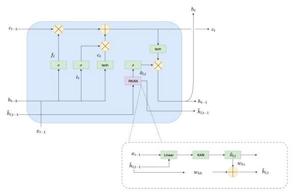
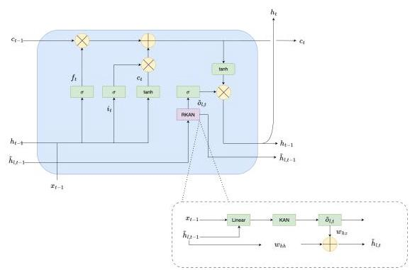
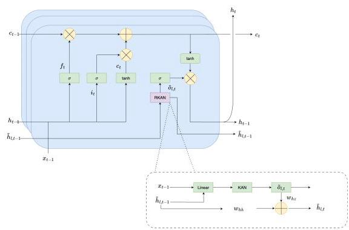
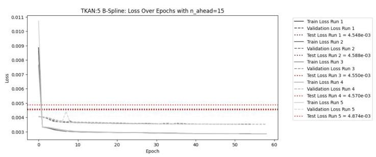
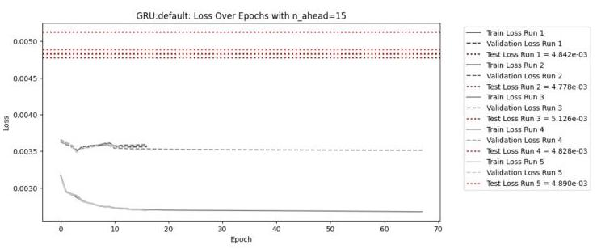
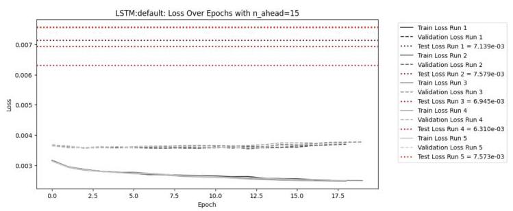

# TKAN: Temporal Kolmogorov-Arnold Networks

# TKAN:时态柯尔莫哥洛夫 - 阿诺德网络

Rémi Genet*§ and Hugo Inzirillo ${}^{\dagger \text{ § }}$

雷米·热内*§ 和雨果·因齐里洛 ${}^{\dagger \text{ § }}$

* DRM, Université Paris Dauphine - PSL

* 巴黎第九大学 - PSL 数据与风险管理实验室

† CREST-ENSAE, Institut Polytechnique de Paris

† 巴黎综合理工学院高等经济与商业研究学院

Abstract-Recurrent Neural Networks (RNNs) have revolutionized many areas of machine learning, particularly in natural language and data sequence processing. Long Short-Term Memory (LSTM) networks have demonstrated their ability to capture long-term dependencies in sequential data. Inspired by the Kolmogorov-Arnold Networks (KANs), a promising alternative to Multi-Layer Perceptrons (MLPs), we propose a new neural network architecture inspired by KAN and LSTM, called "Temporal Kolomogorov-Arnold Networks" (TKANs). TKANs combine the strength of both networks. They are composed of Recurring Kolmogorov-Arnold Networks (RKANs) Layers embedding memory management. This innovation enables us to perform multi-step time series forecasting with enhanced accuracy and efficiency. By addressing the limitations of traditional models in handling complex sequential patterns, the TKAN architecture offers significant potential for advancements in fields requiring more than one step ahead forecasting.

摘要 - 循环神经网络(RNN)彻底改变了机器学习的许多领域，特别是在自然语言和数据序列处理方面。长短期记忆(LSTM)网络已证明其能够捕捉序列数据中的长期依赖关系。受柯尔莫哥洛夫 - 阿诺德网络(KAN)(多层感知器(MLP)的一种有前景的替代方案)的启发，我们提出了一种受 KAN 和 LSTM 启发的新神经网络架构，称为“时态柯尔莫哥洛夫 - 阿诺德网络”(TKAN)。TKAN 结合了这两种网络的优势。它们由嵌入内存管理的循环柯尔莫哥洛夫 - 阿诺德网络(RKAN)层组成。这一创新使我们能够以更高的准确性和效率进行多步时间序列预测。通过解决传统模型在处理复杂序列模式方面的局限性，TKAN 架构在需要超前一步以上预测的领域具有显著的发展潜力。

Fig. 1: Temporal Kolmogorov-Arnold Networks (TKAN)

图1:时态柯尔莫哥洛夫 - 阿诺德网络(TKAN)

## I. INTRODUCTION

## 一、引言

Time series forecasting is an important branch of statistical analysis and machine learning. The development of machine learning models has accelerated rapidly in the past few years. Time series, which can be defined as sequences of data indexed in time, are essential in finance, meteorology, and even in the field of healthcare. The ability to accurately predict the future evolution of such data has become a strategic issue for many different industries that are constantly seeking innovation. In recent years, the growing interest in this area of research is mainly due to the massive increase in the availability of data. Moreover, the increased computer processing capacity now makes it possible to process large datasets. As a second driver for innovation, new statistical methods, deep learning techniques [1] and hybrid models have offered new opportunities to improve the accuracy and efficiency of forecasts. Besides econometric models such as ARMA/ARIMA ([2], [3]) and their numerous extensions, Recurrent Neural Networks (RNNs) [4] yield families of models that have been recognized for their proven effectiveness in terms of forecasting [5].

时间序列预测是统计分析和机器学习的一个重要分支。机器学习模型在过去几年中发展迅速。时间序列可定义为按时间索引的数据序列，在金融、气象甚至医疗保健领域都至关重要。准确预测此类数据未来演变的能力已成为许多不断寻求创新的不同行业的战略问题。近年来，对该研究领域兴趣的日益增长主要归因于数据可用性的大幅增加。此外，计算机处理能力的提高现在使得处理大型数据集成为可能。作为创新的第二个驱动力，新的统计方法、深度学习技术[1]和混合模型为提高预测的准确性和效率提供了新机会。除了诸如 ARMA/ARIMA([2]，[3])及其众多扩展等计量经济模型外，循环神经网络(RNN)[4]产生了一系列因其在预测方面已被证明的有效性而受到认可的模型[5]。

RNNs have been proposed to address the "persistence problem", i.e. the potential dependencies between the successive observations of some time series. Therefore, RNNs most often outperform "static" networks as MLPs [6]. Traditional methods of gradient descent may not be sufficiently effective for training Recurrent Neural Networks (RNNs), particularly in capturing long-term dependencies [7]. Meanwhile, [8] conducted an empirical study revealing the effectiveness of gated mechanisms in enhancing the learning capabilities of RNNs. Actually, RNNs have proved to be one of the most powerful tools for processing sequential data and solving a wide range of difficult problems in the fields of automatic natural language processing, translation, image processing and time series analysis where MLPs [9], [10], [11] cannot perform well. When it comes to sequential data management, MLPs face limitations. Unlike RNNs, MLPs, are not designed to manage sequential data, information only flows in one direction, from input to output (feedforward connection). This specifica tion makes them not suitable for modeling temporal sequences where taking into account sequential patterns is essential for prediction. Another weakness of MLPs is that these networks have no embedded mechanism for cell memory state management. Recurrent Neural Networks (RNNs) [12], [13] have provided an answer to these problems. However, standard RNNs have solved one problem but created another: "vanishing" or "exploding gradient problem" [14]. Traditional methods of gradient descent may not be sufficiently effective for training RNNs, particularly in capturing long-term dependencies [7]. Meanwhile, [8] conducted an empirical study revealing the effectiveness of gated mechanisms in enhancing the learning capabilities of RNNs. Actually, RNNs have proved to be one of the most powerful tools for processing sequential data and solving a wide range of difficult problems in the fields of automatic natural language processing, translation, and time series analysis. Recently, Liu et al. [15] proposed Kolmogorov-Arnold Networks (KANs) as an alternative to MLPs. The Kolmogorov-Arnold Network (KAN) is an efficient new neural network architecture known for its improved performance and interpretability. Unlike traditional models, KANs apply activation functions on the connections between nodes, and these functions can even learn and adapt during training. In addition to using KAN Layer, Temporal Kolmogorov-Arnold Networks (TKANs) manage temporality within a data sequence. The idea is to design a new family of neural networks capable of catching long-term dependency. Our primary idea is to introduce an external memory module which can be attached to KAN Layers. This "memory" can store information that is relevant to the temporal context and can be accessed by the network during processing. This allows the network to explicitly learn and utilize past information. Codes are available at TKAN repository and can be installed using the following command: pip install tkan. Data are accessible if the reader wishes to reproduce our experiments using the GitHub link provided above.

递归神经网络(RNN)已被提出用于解决“持久性问题”，即某些时间序列连续观测值之间的潜在依赖性。因此，RNN通常比“静态”网络(如多层感知器(MLP))表现更优[6]。传统的梯度下降方法可能不足以有效地训练递归神经网络(RNN)，特别是在捕捉长期依赖性方面[7]。同时，[8]进行了一项实证研究，揭示了门控机制在增强RNN学习能力方面的有效性。实际上，RNN已被证明是处理序列数据以及解决自动自然语言处理、翻译、图像处理和时间序列分析等领域中一系列难题的最强大工具之一，而在这些领域中多层感知器(MLP)[9,10,11]表现不佳。在处理序列数据时，MLP存在局限性。与RNN不同，MLP并非设计用于处理序列数据，信息仅沿一个方向流动，即从输入到输出(前馈连接)。这种特性使得它们不适用于对时间序列进行建模，而在时间序列建模中，考虑序列模式对于预测至关重要。MLP的另一个弱点是这些网络没有用于单元记忆状态管理的嵌入式机制。递归神经网络(RNN)[12,13]为这些问题提供了答案。然而，标准的RNN解决了一个问题却又产生了另一个问题:“梯度消失”或“梯度爆炸”问题[14]。传统的梯度下降方法可能不足以有效地训练RNN，特别是在捕捉长期依赖性方面[7]。同时，[8]进行了一项实证研究，揭示了门控机制在增强RNN学习能力方面的有效性。实际上，RNN已被证明是处理序列数据以及解决自动自然语言处理、翻译和时间序列分析等领域中一系列难题的最强大工具之一。最近，Liu等人[15]提出了柯尔莫哥洛夫 - 阿诺德网络(KAN)作为MLP的替代方案。柯尔莫哥洛夫 - 阿诺德网络(KAN)是一种高效的新型神经网络架构，以其改进的性能和可解释性而闻名。与传统模型不同，KAN在节点之间的连接上应用激活函数，并且这些函数甚至可以在训练期间学习和适应。除了使用KAN层之外，时间柯尔莫哥洛夫 - 阿诺德网络(TKAN)还管理数据序列中的时间性。其理念是设计一种能够捕捉长期依赖性的新型神经网络家族。我们的主要想法是引入一个可以附加到KAN层的外部记忆模块。这个“记忆”可以存储与时间上下文相关的信息，并且在处理过程中网络可以访问该信息。这使得网络能够明确地学习和利用过去的信息。代码可在TKAN存储库中获取，可使用以下命令安装:pip install tkan。如果读者希望使用上述GitHub链接重现我们的实验，则可以访问数据。

---

${}^{\text{ § }}$ These authors contributed equally.

${}^{\text{ § }}$ 这些作者贡献相同。

---

## II. KOLMOGOROV-ARNOLD NETWORKS (KANS)

## 二、柯尔莫哥洛夫 - 阿诺德网络(KAN)

Multi-Layer Perceptrons (MLPs) [9] are extension of original perceptron proposed by [16]. They were inspired by the universal approximation theorem [11] which states that a feed-forward network (FFN) with a single hidden layer containing a finite number of neurons can arbitrarily well approximate any continuous functions on a compact subset of ${\mathbb{R}}^{n}$ . On the other side, Kolmogorov-Arnold Networks (KAN) focuses on the Kolmogorov-Arnold representation theorem [17]. The Kolmogorov-Arnold representation theorem states that any multivariate continuous function $f$ can be represented as a composition of univariate functions and through additive operations:

多层感知器(MLP)[9]是由[16]提出的原始感知器的扩展。它们受到通用逼近定理[11]的启发，该定理指出具有单个隐藏层且包含有限数量神经元的前馈网络(FFN)可以在${\mathbb{R}}^{n}$的紧致子集上任意良好地逼近任何连续函数。另一方面，柯尔莫哥洛夫 - 阿诺德网络(KAN)关注柯尔莫哥洛夫 - 阿诺德表示定理[17]。柯尔莫哥洛夫 - 阿诺德表示定理指出，任何多元连续函数$f$都可以表示为单变量函数的组合并通过加法运算:

$$
f\left( {{x}_{1},\ldots ,{x}_{n}}\right)  = \mathop{\sum }\limits_{{q = 1}}^{{{2n} + 1}}{\Phi }_{q}\left( {\mathop{\sum }\limits_{{p = 1}}^{n}{\phi }_{q, p}\left( {x}_{p}\right) }\right) \tag{1}
$$

where ${\phi }_{q, p}$ are univariates functions that map each input variable ${x}_{p} \in  \left\lbrack  {0,1}\right\rbrack$ to $\mathbb{R}$ , and ${\Phi }_{q} : \mathbb{R} \rightarrow  \mathbb{R}$ . Since all functions to be learnt are univariate, we can parametrize every 1D function as a B-spline curve. The learnable coefficients are then associated with local B-spline basis functions. The key insight comes when we see the similarities between MLPs and KAN. In MLPs, a layer includes a linear transformation followed by nonlinear operations, and you can make the network deeper by adding more layers. A KAN layer is rather

其中${\phi }_{q, p}$是将每个输入变量${x}_{p} \in  \left\lbrack  {0,1}\right\rbrack$映射到$\mathbb{R}$的单变量函数，并且${\Phi }_{q} : \mathbb{R} \rightarrow  \mathbb{R}$。由于所有要学习的函数都是单变量的，我们可以将每个一维函数参数化为B样条曲线。然后将可学习系数与局部B样条基函数相关联。当我们看到MLP和KAN之间的相似性时，关键的见解就出现了。在MLP中，一层包括线性变换后跟非线性操作，并且可以通过添加更多层使网络更深。一个KAN层则相反

$$
\mathbf{\Phi } = \left\{  {\phi }_{q, p}\right\}  ,\;p = 1,2,\ldots ,{n}_{\text{ in }},\;q = 1,2\ldots ,{n}_{\text{ out }}, \tag{2}
$$

where ${\phi }_{q, p}$ are parametrized function of learnable parameters. In the Kolmogorov-Arnold theorem, the inner functions form a KAN layer with ${n}_{\text{ in }} = n$ and ${n}_{\text{ out }} = {2n} + 1$ , and the outer functions form a KAN layer with ${n}_{\text{ in }} = {2n} + 1$ and ${n}_{\text{ out }} =$ 1. So, the Kolmogorov-Arnold representations in eq. (1) are simply compositions of two KAN layers. Now it becomes clear what it means to have Deep Kolmogorov-Arnold representation. Taking the notation from [15] let us define a shape of KAN $\left\lbrack  {{n}_{0},{n}_{1},\cdots ,{n}_{L}}\right\rbrack$ , where ${n}_{i}$ is the number of nodes in the ${i}^{\text{ th }}$ layer of the computational graph. We denote the ${i}^{\text{ th }}$ neuron in the ${l}^{\text{ th }}$ layer by $\left( {l, i}\right)$ , and the activation value of the $\left( {l, i}\right)$ - neuron by ${x}_{l, i}$ . Between layer $l$ and layer $l + 1$ , there are ${n}_{l}{n}_{l + 1}$ activation functions: the activation function that connects $\left( {l, i}\right)$ and $\left( {l + 1, j}\right)$ is denoted by

其中${\phi }_{q, p}$是可学习参数的参数化函数。在柯尔莫哥洛夫 - 阿诺德定理中，内层函数与${n}_{\text{ in }} = n$和${n}_{\text{ out }} = {2n} + 1$构成一个KAN层，外层函数与${n}_{\text{ in }} = {2n} + 1$和${n}_{\text{ out }} =$构成一个KAN层[1]。所以，等式(1)中的柯尔莫哥洛夫 - 阿诺德表示形式仅仅是两个KAN层的组合。现在很清楚深度柯尔莫哥洛夫 - 阿诺德表示是什么意思了。采用[15]中的符号，我们定义KAN$\left\lbrack  {{n}_{0},{n}_{1},\cdots ,{n}_{L}}\right\rbrack$的形状，其中${n}_{i}$是计算图中${i}^{\text{ th }}$层的节点数。我们用$\left( {l, i}\right)$表示${l}^{\text{ th }}$层中的第${i}^{\text{ th }}$个神经元，用${x}_{l, i}$表示$\left( {l, i}\right)$神经元的激活值。在第$l$层和第$l + 1$层之间，有${n}_{l}{n}_{l + 1}$个激活函数:连接$\left( {l, i}\right)$和$\left( {l + 1, j}\right)$的激活函数记为

$$
{\phi }_{l, j, i},\;l = 0,\cdots , L - 1,\;i = 1,\cdots ,{n}_{l},\;j = 1,\cdots ,{n}_{l + 1}
$$

(3)The pre-activation of ${\phi }_{l, j, i}$ is simply ${x}_{l, i}$ ; the post-activation of ${\phi }_{l, j, i}$ is denoted by ${\widetilde{x}}_{l, j, i} \equiv  {\phi }_{l, j, i}\left( {x}_{l, i}\right)$ . The activation value of the $\left( {l + 1, j}\right)$ neuron is simply the sum of all incoming post-activations:

${\phi }_{l, j, i}$的预激活仅仅是${x}_{l, i}$；${\phi }_{l, j, i}$的后激活记为${\widetilde{x}}_{l, j, i} \equiv  {\phi }_{l, j, i}\left( {x}_{l, i}\right)$。$\left( {l + 1, j}\right)$神经元的激活值仅仅是所有传入后激活值的总和:

$$
{x}_{l + 1, j} = \mathop{\sum }\limits_{{i = 1}}^{{n}_{l}}{\widetilde{x}}_{l, j, i} = \mathop{\sum }\limits_{{i = 1}}^{{n}_{l}}{\phi }_{l, j, i}\left( {x}_{l, i}\right) ,\;j = 1,\cdots ,{n}_{l + 1}.
$$

(4)

Rewriting it under the matrix form will give:

将其改写为矩阵形式将得到:

$$
{\mathbf{x}}_{l + 1} = \left( \begin{matrix} {\phi }_{l,1,1}\left( \cdot \right) & {\phi }_{l,1,2}\left( \cdot \right) & \cdots & {\phi }_{l,1,{n}_{l}}\left( \cdot \right) \\  {\phi }_{l,2,1}\left( \cdot \right) & {\phi }_{l,2,2}\left( \cdot \right) & \cdots & {\phi }_{l,2,{n}_{l}}\left( \cdot \right) \\  \vdots & \vdots & & \vdots \\  {\phi }_{l,{n}_{l + 1},1}\left( \cdot \right) & {\phi }_{l,{n}_{l + 1},2}\left( \cdot \right) & \cdots & {\phi }_{l,{n}_{l + 1},{n}_{l}}\left( \cdot \right)  \end{matrix}\right) {\mathbf{x}}_{l},
$$

(5)

where ${\mathbf{\Phi }}_{l}$ is the function matrix corresponding to the ${l}^{\text{ th }}$ KAN layer. A general KAN network is a composition of $L$ layers: given an input vector ${\mathbf{x}}_{0} \in  {\mathbb{R}}^{{n}_{0}}$ , the output of KAN is:

其中${\mathbf{\Phi }}_{l}$是与${l}^{\text{ th }}$KAN层对应的函数矩阵。一个通用的KAN网络由$L$层组成:给定一个输入向量${\mathbf{x}}_{0} \in  {\mathbb{R}}^{{n}_{0}}$，KAN的输出是:

$$
\operatorname{KAN}\left( \mathbf{x}\right)  = \left( {{\mathbf{\Phi }}_{L - 1} \circ  {\mathbf{\Phi }}_{L - 2} \circ  \cdots  \circ  {\mathbf{\Phi }}_{1} \circ  {\mathbf{\Phi }}_{0}}\right) \mathbf{x}. \tag{6}
$$

III. TEMPORAL KOLMOGOROV-ARNOLD NETWORKS (TKANs)

三、时间柯尔莫哥洛夫 - 阿诺德网络(TKANs)

Fig. 2: Temporal Kolmogorov-Arnold Networks (TKAN)

图2:时间柯尔莫哥洛夫 - 阿诺德网络(TKAN)

After proposing the RKAN (Recurrent Kolmogorov-Arnold Network), which integrates temporality management by adapting the concept of Kolmogorov-Arnold networks to temporal sequences, we developed an additional innovation to build our neural network: the TKAN layer. This TKAN layer combines the RKAN architecture with a slightly modified LSTM (Long Short-Term Memory) cell. The idea is to propose an extension of the model proposed by [15] to manage sequential data and temporality during the learning task. The objective is to provide a framework for time series forecasting on multiple steps ahead. As discussed previously, RNNs' weakness generally lies in the difficulty of capturing the persistence of information when some input sequence is quite long, resulting in a significant loss of information in some tasks. LSTMs address this problem through the use of a gating mechanism. LSTMs can be computationally more expensive than standard RNNs; however, this extra complexity is often justified by better performance on complex learning tasks. The integration of an LSTM cell combined with the RKAN enables the capture of complex nonlinearities with learnable activation functions of RKAN, but also the maintenance of a memory of past events over long periods with the LSTM cell architecture. This combination offers superior modeling power for tasks involving complex sequential data. The major components of the TKAN are:

在提出RKAN(循环柯尔莫哥洛夫 - 阿诺德网络)之后，它通过将柯尔莫哥洛夫 - 阿诺德网络的概念应用于时间序列来集成时间管理，我们开发了另一种创新来构建我们的神经网络:TKAN层。这个TKAN层将RKAN架构与一个稍微修改过的LSTM(长短期记忆)单元相结合。其想法是提出[15]中提出的模型的扩展，以在学习任务期间管理序列数据和时间性。目标是为多步时间序列预测提供一个框架。如前所述，RNN的弱点通常在于当一些输入序列很长时难以捕捉信息的持久性，导致在某些任务中信息大量丢失。LSTM通过使用门控机制解决了这个问题。LSTM在计算上可能比标准RNN更昂贵；然而，这种额外的复杂性通常在复杂学习任务上的更好性能中得到证明。将LSTM单元与RKAN相结合能够通过RKAN的可学习激活函数捕捉复杂的非线性，同时通过LSTM单元架构长期保持对过去事件的记忆。这种组合为涉及复杂序列数据的任务提供了卓越的建模能力。TKAN的主要组件是:

- RKAN Layers: RKAN layers enable the retention of short term memory from previous states within the network. Each RKAN layer manages this short term memory throughout the processing in each layer.

- RKAN层:RKAN层能够在网络中保留来自先前状态的短期记忆。每个RKAN层在每层的处理过程中管理这种短期记忆。

- Gating Mechanisms: these mechanisms help to manage the information flow. The model decides which information should be retained or forgotten over time.

- 门控机制:这些机制有助于管理信息流。模型决定随着时间推移哪些信息应该被保留或遗忘。

## A. Recurring Kolmogorov-Arnold Networks (RKAN)

## A. 循环柯尔莫哥洛夫 - 阿诺德网络(RKAN)

In neural networks, particularly in the context of recurrent neural networks (RNN), a recurrent kernel refers to the set of weights that are applied to the hidden state from the previous timestep during the network's operation. This kernel plays a crucial role in how an RNN processes sequential data over time. Let us denote $\tau  = 1,2,\ldots$ some discrete time steps. Each step has a forward pass and backward pass. During the forward pass, the output or activation of units are computed. During the backward pass, the computation of the error for all weights is made. During each timestep, an RNN receives an input vector and the hidden state from the previous timestep ${h}_{t - 1}$ . The recurrent kernel is a matrix of weights that transforms this previous hidden state. This operation is usually followed by an addition; the result of this transformation is passed through a non-linear function, an activation function $f\left( \text{ . }\right) ,{thatcan}$ take many forms: tanh, ReLU etc. The update stage could be formulated as:

在神经网络中，特别是在循环神经网络(RNN)的背景下，循环核是指在网络运行期间应用于上一个时间步隐藏状态的权重集。这个核在RNN如何随时间处理序列数据方面起着至关重要的作用。让我们用$\tau  = 1,2,\ldots$表示一些离散时间步。每个步骤都有前向传播和反向传播。在前向传播期间，计算单元的输出或激活。在反向传播期间，计算所有权重的误差。在每个时间步，RNN接收一个输入向量和来自上一个时间步${h}_{t - 1}$的隐藏状态。循环核是一个权重矩阵，用于变换这个先前的隐藏状态。此操作之后通常会进行加法；此变换的结果通过一个非线性函数，一个激活函数$f\left( \text{ . }\right) ,{thatcan}$有多种形式:tanh、ReLU等。更新阶段可以表述为:

$$
{h}_{t} = f\left( {{W}_{hh}{h}_{t - 1} + {W}_{hx}{x}_{t} + {b}_{h}}\right) , \tag{7}
$$

where ${h}_{t}$ is the hidden state at time $t \in  \tau ;{W}_{h}$ and ${W}_{x}$ are the recurrent kernel, a weight matrix that transforms the previous hidden states ${h}_{t - 1}$ , and the input kernel, a weight matrix transforming the current input denoted ${x}_{t}$ , respectively. In the next sections, we propose a new way of updating KANs. We propose a process to maintain the memory of past inputs by incorporating previous hidden states into the current states, enabling the network to exhibit dynamic temporal behavior. Recurrent Kernel is the key so that RKAN layers learn from sequences for which context and order matter. We design the TKAN to leverage the power of Kolmogorov-Arnold Network while offering memory management to handle time dependency. To introduce time dependency, we modify each transformation function ${\phi }_{l}$ . Let’s denote the sublayers’ memory state ${\widetilde{h}}_{l, t}$ , initialized with zeros and of shape $\left( {\mathrm{{KAN}}}_{\text{ out }}\right)$ . The input that is fed to each sub KAN layers in the RKAN are created by doing:

其中${h}_{t}$是时间$t \in  \tau ;{W}_{h}$的隐藏状态，${W}_{x}$是循环核，一个变换先前隐藏状态${h}_{t - 1}$的权重矩阵，以及输入核，一个变换当前输入(表示为${x}_{t}$)的权重矩阵。在接下来的部分中，我们提出了一种更新KAN的新方法。我们提出了一个通过将先前的隐藏状态纳入当前状态来维护过去输入记忆的过程，使网络能够展现动态时间行为。循环核是关键，以便RKAN层从上下文和顺序很重要的序列中学习。我们设计TKAN以利用柯尔莫哥洛夫 - 阿诺德网络的能力，同时提供内存管理来处理时间依赖性。为了引入时间依赖性，我们修改每个变换函数${\phi }_{l}$。让我们用${\widetilde{h}}_{l, t}$表示子层的记忆状态，初始化为零，形状为$\left( {\mathrm{{KAN}}}_{\text{ out }}\right)$。输入到RKAN中每个子KAN层的输入是通过以下方式创建的:

$$
{s}_{l, t} = {W}_{l,\widetilde{x}}{x}_{t} + {W}_{l,\widetilde{h}}{\widetilde{h}}_{l, t - 1}, \tag{8}
$$

where ${W}_{l,\widetilde{x}}$ is the weight of the $l$ -th layer applied to ${x}_{t}$ which is the input at time $t$ . Moreover, ${W}_{l,\widetilde{h}}$ are the weights of the $l$ -th layer applied to its previous substate. Let us first denote ${\mathrm{{KAN}}}_{in}$ and ${\mathrm{{KAN}}}_{\text{ out }}$ , the input dimension of RKAN Layer input and outputs, respectively. The shape of ${W}_{l,\widetilde{x}} \in  {\mathbb{R}}^{\left( d,{\mathrm{{KAN}}}_{in}\right) }$ and ${W}_{l,\widetilde{h}} \in  {\mathbb{R}}^{\left( {\mathrm{{KAN}}}_{\text{ out }},{\mathrm{{KAN}}}_{in}\right) }$ , which leads to ${s}_{l, t}^{{\mathrm{{KAN}}}_{in}}$ . Set

其中${W}_{l,\widetilde{x}}$是应用于${x}_{t}$(即时间$t$的输入)的第$l$层的权重。此外，${W}_{l,\widetilde{h}}$是应用于其前一个子状态的第$l$层的权重。让我们首先用${\mathrm{{KAN}}}_{in}$和${\mathrm{{KAN}}}_{\text{ out }}$分别表示RKAN层输入和输出的输入维度。${W}_{l,\widetilde{x}} \in  {\mathbb{R}}^{\left( d,{\mathrm{{KAN}}}_{in}\right) }$和${W}_{l,\widetilde{h}} \in  {\mathbb{R}}^{\left( {\mathrm{{KAN}}}_{\text{ out }},{\mathrm{{KAN}}}_{in}\right) }$的形状，这导致${s}_{l, t}^{{\mathrm{{KAN}}}_{in}}$。设置

$$
{\widetilde{o}}_{t} = {\phi }_{l}\left( {s}_{l, t}\right) , \tag{9}
$$

where ${\phi }_{l}$ is a KAN layer. The "memory" step ${\widetilde{h}}_{l, t}$ is defined as a combination of past hidden states, such as:

其中${\phi }_{l}$是一个KAN层。“记忆”步骤${\widetilde{h}}_{l, t}$被定义为过去隐藏状态的组合，例如:

$$
{\widetilde{h}}_{l, t} = {W}_{hh}{\widetilde{h}}_{l, t - 1} + {W}_{hz}{\widetilde{o}}_{t}, \tag{10}
$$

introducing vectors of weights, that weight the importance of past values relative to the most recent inputs.

引入权重向量，这些权重向量权衡过去值相对于最新输入的重要性。

## B. TKAN Architecture

## B. TKAN架构

Fig. 3: A three layers Temporal Kolmogorov-Arnold Networks (TKAN) Block

图3:一个三层时间柯尔莫哥洛夫 - 阿诺德网络(TKAN)模块

For the next step, our aim is to manage memory and we took inspiration from LSTM [18],[19]. We denote ${x}_{t}$ the input vector of dimension $d$ . This unit uses several internal vectors and gates to manage information flow. The forget gate with activation vector ${f}_{t}$ given by

对于下一步，我们的目标是管理内存，并且我们从LSTM [18]，[19]中获得了灵感。我们用${x}_{t}$表示维度为$d$的输入向量。这个单元使用几个内部向量和门来管理信息流。遗忘门的激活向量${f}_{t}$由下式给出

$$
{f}_{t} = \sigma \left( {{W}_{f}{x}_{t} + {U}_{f}{h}_{t - 1} + {b}_{f}}\right) , \tag{11}
$$

decides what information to forget from the previous state. The input gate, with activation vector denoted ${i}_{t}$ , with

决定从上一个状态中遗忘哪些信息。输入门，其激活向量表示为${i}_{t}$，由下式给出

$$
{i}_{t} = \sigma \left( {{W}_{i}{x}_{t} + {U}_{i}{h}_{t - 1} + {b}_{i}}\right) , \tag{12}
$$

controls which new information to include. The output gate, with activation vector ${o}_{t}$ . Set

控制要包含哪些新信息。输出门，其激活向量为${o}_{t}$。设置

$$
{r}_{t} = \operatorname{Concat}\left\lbrack  {{\phi }_{1}\left( {s}_{1, t}\right) ,{\phi }_{2}\left( {s}_{2, t}\right) ,\ldots ,{\phi }_{L}\left( {s}_{L, t}\right) }\right\rbrack  , \tag{13}
$$

where ${r}_{t}$ is a concatenation of the output of multiple KAN Layers, and

其中${r}_{t}$是多个KAN层输出的连接，并且

$$
{o}_{t} = \sigma \left( {{W}_{o}{r}_{t} + {b}_{o}}\right) , \tag{14}
$$

where ${W}_{o} \in  {\mathbb{R}}^{\left( {\mathrm{{KAN}}}_{\text{ out }} * L,\text{ out }\right) }$ , out denoting the output dimension of TKAN. Equation (14) determines what information from the current state to output given ${r}_{t}$ given from 13 . ${\widetilde{h}}_{t}$ is the "sub" memory of the RKAN layers. The hidden state of the TKAN layer, ${h}_{t}$ , captures the unit’s output, while the cell state ${c}_{t}$ is updated as follows:

其中${W}_{o} \in  {\mathbb{R}}^{\left( {\mathrm{{KAN}}}_{\text{ out }} * L,\text{ out }\right) }$，out表示TKAN的输出维度。公式(14)根据13给出的${r}_{t}$确定从当前状态输出哪些信息。${\widetilde{h}}_{t}$是RKAN层的“子”内存。TKAN层的隐藏状态${h}_{t}$捕获单元的输出，而细胞状态${c}_{t}$的更新如下:

$$
{c}_{t} = {f}_{t} \odot  {c}_{t - 1} + {i}_{t} \odot  {\widetilde{c}}_{t}, \tag{15}
$$

where ${\widetilde{c}}_{t} = \sigma \left( {{W}_{c}{x}_{t} + {U}_{c}{h}_{t - 1} + {b}_{c}}\right)$ represents its internal memory. All these internal states have a dimensionality of $h$ . The output of the final hidden layer, denoted ${h}_{t}$ , is given by:

其中${\widetilde{c}}_{t} = \sigma \left( {{W}_{c}{x}_{t} + {U}_{c}{h}_{t - 1} + {b}_{c}}\right)$表示其内部内存。所有这些内部状态的维度均为$h$。最后一个隐藏层的输出，表示为${h}_{t}$，由以下公式给出:

$$
{h}_{t} = {o}_{t} \odot  \tanh \left( {c}_{t}\right) . \tag{16}
$$

In the following section, we will describe the learning task and proceed with several tests. We started to test the power of prediction of our model for one step ahead forecasting and in the second time for multi-step ahead [20], [21].

在以下部分，我们将描述学习任务并进行一些测试。我们开始测试我们的模型在一步预测方面的预测能力，第二次测试在多步预测方面的能力[20],[21]。

## IV. LEARNING TASK

## 四、学习任务

In order to assess the relevance of extending our model, we created a simple training task to judge its ability to improve the out-of-sample prediction accuracy over several steps ahead for standard layers such as GRU or LSTM. We have chosen to carry out our study not on synthetic data, but rather on real market data, as this seems more relevant to us. Indeed, synthetic market data can be easily biased to match an experiment.

为了评估扩展我们模型的相关性，我们创建了一个简单的训练任务，以判断其在未来几步提高标准层(如GRU或LSTM)的样本外预测准确性的能力。我们选择不在合成数据上进行研究，而是在真实市场数据上进行研究，因为这对我们来说似乎更相关。事实上，合成市场数据很容易产生偏差以匹配实验。

## A. Task Definition and Dataset

## A. 任务定义和数据集

The task is to predict the market notional trades over future periods. This is recognized as a difficult task as the market behavior is difficult to predict. Nonetheless, this should not be impossible as, unlike returns, volumes have internal patterns such as seasonality, autocorrelation, and so on. We used Binance as our only data source, as it is the largest player in the crypto-currency market. Moreover, due to the lack of an overall regulation that would take into account all exchange data, exchanges are subject to a lot of falsified data by small players who use wash trading to boost their figures.

任务是预测未来时间段内的市场名义交易量。这被认为是一项艰巨的任务，因为市场行为很难预测。尽管如此，这并非不可能，因为与收益不同，交易量具有季节性、自相关等内部模式。我们将币安作为唯一的数据来源，因为它是加密货币市场中最大的参与者。此外，由于缺乏考虑所有交易数据的全面监管，交易所受到许多小参与者伪造数据的影响，这些小参与者使用洗盘交易来提高他们的数据。

Our dataset consists of the notional amounts traded each hour on several assets: BTC, ETH, ADA, XMR, EOS, MATIC, TRX, FTM, BNB, XLM, ENJ, CHZ, BUSD, ATOM, LINK, ETC, XRP, BCH and LTC, which are to be used to predict just one of them, BTC. The data period runs from January 1, 2020 to December 31, 2022.

我们的数据集由几种资产每小时的名义交易量组成:比特币(BTC)、以太坊(ETH)、艾达币(ADA)、门罗币(XMR)、柚子币(EOS)、matic(MATIC)、波场币(TRX)、FTM、币安币(BNB)、恒星币(XLM)、ENJ、CHZ、BUSD、ATOM、LINK、以太坊经典(ETC)、瑞波币(XRP)、比特币现金(BCH)和莱特币(LTC)，这些数据将用于预测其中一种资产，即比特币。数据期间从2020年1月1日至2022年12月31日。

## B. Preprocessing

## B. 预处理

Data preparation is a necessary step for most machine learning methods, in order to help gradient descent calculations when data are of different sizes, to obtain stationarity series, etc. This is even more true when using the Kolmogorov-Arnold network, as the underlying B-Spline activation functions exhibit power exponent. Thus, having poorly scaled data would result in over or underflows that would hinder learning. This is also true for market volume data, or notional data. Indeed, they are series with very different scales across assets and between points in time, not to mention non-stationarity issues over a long period.

数据准备是大多数机器学习方法的必要步骤，以便在数据大小不同时帮助进行梯度下降计算、获得平稳序列等。在使用柯尔莫哥洛夫 - 阿诺德网络时更是如此，因为底层的B样条激活函数具有幂指数。因此，数据缩放不当会导致上溢或下溢，从而阻碍学习。市场交易量数据或名义数据也是如此。事实上，它们是跨资产和时间点具有非常不同尺度的序列，更不用说长期的非平稳性问题了。

To obtain data that can be used for training, but also return meaningful losses to optimize, we use a two-stage scaling. The first step is to divide the values in the series by the moving median of the last two weeks. This moving median window is also shifted by the number of steps forward we want to predict, so as not to include foresight. This first pre-treatment aims to make the series more stationary over time. The second pre-processing we apply is a simple MinMaxScaling per asset: even if the minimum of the series is 0 , this way of working is simply a matter of dividing by its maximum value. The objective is to scale the data in the $\left\lbrack  {0,1}\right\rbrack$ interval to avoid an explosive effect during learning due to the power exponent. This pre-processing is, however, adjusted on the training set, the adjustment meaning only the search for the maximum value of each series, which is then used directly on the test set. This means that, on the test set, it is possible to obtain observations that are greater than 1. As long as no optimization is launched, this is not a problem. Finally, we split our dataset into a training set and a test set, with a standard proportion of 80-20. This represents over 21,000 points in the training set and 5,000 in the test set.

为了获取可用于训练的数据，同时返回有意义的损失值以进行优化，我们采用两阶段缩放。第一步是将序列中的值除以前两周的移动中位数。这个移动中位数窗口也会按照我们想要预测的向前步数进行移动，以免包含前瞻性信息。这第一步预处理旨在使序列随时间更加平稳。我们应用的第二步预处理是对每个资产进行简单的MinMaxScaling:即使序列的最小值为0，这种处理方式也只是简单地除以其最大值。目的是将数据缩放到$\left\lbrack  {0,1}\right\rbrack$区间，以避免由于幂指数在学习过程中产生爆炸效应。然而，这种预处理是在训练集上进行调整的，调整仅意味着寻找每个序列的最大值，然后直接在测试集上使用。这意味着，在测试集上，可能会获得大于1的观测值。只要不进行优化，这就不是问题。最后，我们将数据集按照80 - 20的标准比例拆分为训练集和测试集。这意味着训练集中有超过21,000个点，测试集中有5,000个点。

## C. Loss Function for Model Training

## C. 模型训练的损失函数

Since we have a numerical prediction problem, we have opted to optimize our model using the root mean square error (RMSE) as the loss function, whose formula is simple: RMSE is the square root of

由于我们面临一个数值预测问题，我们选择使用均方根误差(RMSE)作为损失函数来优化我们的模型，其公式很简单:RMSE是

$$
\operatorname{MSE} = \frac{1}{N}\mathop{\sum }\limits_{{i = 1}}^{N}{\left( {\widehat{X}}_{t + 1}^{\left( i\right) } - {X}_{t + 1}^{\left( i\right) }\right) }^{2},
$$

where $N$ represents the number of samples in the dataset, ${\widehat{X}}_{t + 1}^{\left( i\right) }$ denotes the predicted notional values of Bitcoin at time $t + 1$ for the $i$ -th sample, and the quantities ${X}_{t + 1}^{\left( i\right) }$ are the corresponding true values. We invoke RMSE first because it is the most widely used and standard loss in machine learning for this type of problem. The second reason is related to the metric we want to use to display the results, namely the R-squared $\left( {R}^{2}\right)$ . Indeed, $\left( {R}^{2}\right)$ is interesting as a metric because it not only gives information on the error but also on the error given the variance of the estimated series, which means it's much easier to tell whether the model is performing well or not. This explains why it is a measure widely used by econometricians and practitioners. However, minimizing MSE is exactly the same problem as maximizing the $\left( {R}^{2}\right)$ , as its formula indicates:

的平方根，其中$N$表示数据集中的样本数量，${\widehat{X}}_{t + 1}^{\left( i\right) }$表示第$i$个样本在时间$t + 1$时比特币的预测名义值，而${X}_{t + 1}^{\left( i\right) }$表示相应的真实值。我们首先使用RMSE，因为它是机器学习中针对此类问题最广泛使用的标准损失函数。第二个原因与我们想要用于展示结果的指标有关，即决定系数$\left( {R}^{2}\right)$。实际上，$\left( {R}^{2}\right)$作为一个指标很有意思，因为它不仅给出了误差信息，还给出了考虑估计序列方差后的误差信息，这意味着更容易判断模型是否表现良好。这就解释了为什么它是计量经济学家和从业者广泛使用的一种度量。然而，最小化均方误差(MSE)与最大化$\left( {R}^{2}\right)$完全是同一个问题，正如其公式所示:

$$
{R}^{2} = 1 - \frac{\mathop{\sum }\limits_{{i = 1}}^{N}{\left( {\widehat{X}}_{t + 1}^{\left( i\right) } - {X}_{t + 1}^{\left( i\right) }\right) }^{2}}{\mathop{\sum }\limits_{{i = 1}}^{N}{\left( {X}_{t + 1}^{\left( i\right) } - {\bar{X}}_{t + 1}\right) }^{2}},
$$

## D. Benchmarks

## D. 基准

1) Model Architectures: In order to compare with comparable things, we tested our TKAN layers against two of the most widely used RNNs for multi-step predictions, namely gated recurrent units (GRU) and long short-term memory (LSTM). As can be seen, we are not comparing ourselves to complete model architectures such as a temporal fusion transformer, as what we are proposing is more a layer than a complete model architecture.

**1) 模型架构**:为了与类似的模型进行比较，我们将我们的TKAN层与用于多步预测的两种最广泛使用的循环神经网络(RNN)进行了测试，即门控循环单元(GRU)和长短期记忆网络(LSTM)。可以看出，我们并不是将自己与诸如时间融合变压器这样的完整模型架构进行比较，因为我们所提出的更多是一个层而不是一个完整的模型架构。

To fairly compare the three models, we have opted for a very simple configuration. We create three models to be compared in the same way:

为了公平地比较这三个模型，我们选择了一个非常简单的配置。我们以相同的方式创建三个要比较的模型:

1) An initial recurrent layer of 100 units that returns complete sequences,

**1)** 一个具有100个单元的初始循环层，它返回完整序列，

2) An intermediate recurrent layer of 100 units, which returns only the last hidden state,

**2)** 一个具有100个单元的中间循环层，它只返回最后一个隐藏状态，

3) A final dense layer with linear activation, with as many units as there are timesteps to predict ahead

**3)** 一个具有线性激活的最终全连接层，其单元数量与要提前预测的时间步数相同

For the TKAN model, we used 5 B-spline activations of order 0 to 4 as sublayer activations, while we used the standard activation function for GRU and LSTM. Finally, we also compared the three models to the most naive benchmark, which consists of using the last value as a predictor of the future, the value being repeated when using several predictions in advance.

对于TKAN模型，我们使用了5个从0到4阶的B样条激活函数作为子层激活函数，而对于GRU和LSTM我们使用了标准激活函数。最后，我们还将这三个模型与最朴素的基准进行了比较，该基准包括使用最后一个值作为未来的预测值，当提前进行多个预测时重复该值。

2) Note on training details: Metrics are calculated directly on scaled data and not on unscaled data. There are two reasons for this: firstly, MinMax scaling has no impact on the metric since the minimum is 0 and the data interval is $\left\lbrack  {0,1}\right\rbrack$ ; rescaling would not have changed the R-squared. Rescaling from the median split would have caused the series mean to be unstable over time. This would have resulted in the error magnitude drifting for certain parts of the series, making the metric unreliable or meaningless. In terms of optimizing model details, we used the Adam optimizer, one of the most popular choices, used ${20}\%$ of our training set as a validation set and included two training recalls. The first is an early learning stopper, which interrupts training after 6 consecutive periods without improvement on the validation set, and restores the weights associated with the best loss obtained on the validation set. The second is a plateau learning rate reduction, which halves the learning rate after three consecutive periods showing no improvement on the validation set.

2) 关于训练细节的说明:指标是直接在缩放后的数据上计算的，而不是在未缩放的数据上。这样做有两个原因:首先，由于最小值为0且数据区间为$\left\lbrack  {0,1}\right\rbrack$，MinMax缩放对指标没有影响；重新缩放不会改变R平方值。从中位数分割进行重新缩放会导致序列均值随时间不稳定。这将导致序列某些部分的误差幅度漂移，使指标不可靠或无意义。在优化模型细节方面，我们使用了Adam优化器，这是最受欢迎的选择之一，将我们训练集的${20}\%$用作验证集，并进行了两次训练召回。第一次是早期学习停止器，它在验证集上连续6个周期没有改进后中断训练，并恢复与验证集上获得的最佳损失相关的权重。第二次是平台学习率降低，它在验证集上连续三个周期没有改进后将学习率减半。

## E. Results

## E. 结果

To evaluate the model's performance, taking into account the risk of poor adaptation that may occur, we repeat the experiment 5 times for each, and display below the mean and standard deviation of the train results obtained from these 5 experiments.

为了评估模型的性能，考虑到可能出现的适应性差的风险，我们对每个模型重复实验5次，并在下面显示从这5次实验中获得的训练结果的均值和标准差。

TABLE I: Average $\left( {R}^{2}\right)$ obtained over 5 runs

表I:5次运行中获得的平均$\left( {R}^{2}\right)$

<table><tr><td>Time</td><td>TKAN:5 B-Spline</td><td>GRU:default</td><td>LSTM:default</td><td>Last Value</td></tr><tr><td>1</td><td>0.33736</td><td>0.365136</td><td>0.355532</td><td>0.292171</td></tr><tr><td>3</td><td>0.21227</td><td>0.200674</td><td>0.061220</td><td>-0.062813</td></tr><tr><td>6</td><td>0.13784</td><td>0.082504</td><td>-0.225838</td><td>-0.331346</td></tr><tr><td>9</td><td>0.09803</td><td>0.087164</td><td>-0.290584</td><td>-0.457718</td></tr><tr><td>12</td><td>0.10401</td><td>0.017864</td><td>-0.473220</td><td>-0.518252</td></tr><tr><td>15</td><td>0.09512</td><td>0.033423</td><td>-0.404432</td><td>-0.555633</td></tr></table>

TABLE II: Standard Deviation of the $\left( {R}^{2}\right)$ obtained over 5 runs

表II:5次运行中获得的$\left( {R}^{2}\right)$的标准差

<table><tr><td>Time</td><td>TKAN:5 B-Spline</td><td>GRU:default</td><td>LSTM:default</td></tr><tr><td>1</td><td>0.00704</td><td>0.008336</td><td>0.011163</td></tr><tr><td>3</td><td>0.00446</td><td>0.004848</td><td>0.080200</td></tr><tr><td>6</td><td>0.01249</td><td>0.023637</td><td>0.062710</td></tr><tr><td>9</td><td>0.02430</td><td>0.014833</td><td>0.052729</td></tr><tr><td>12</td><td>0.00132</td><td>0.086386</td><td>0.085746</td></tr><tr><td>15</td><td>0.00701</td><td>0.024078</td><td>0.092729</td></tr></table>

1) Performance Metrics Summary: The results show a very logical decrease in terms of R2 with the number of forward steps ahead, which is quite normal since we have less information for the forward steps. However, the results clearly show two things: the first is that while all models have a relatively small difference in performance over a short horizon such as 1 to 3 steps ahead, the relative performances change much more with a longer time horizon. The LSTM model even becomes useless and counter-productive with 6 periods, while TKAN and GRU always achieve a higher average R-squared value. However, TKAN stands out with longer time steps, with an R-squared value at least 25% higher than that of GRU. Another very interesting point is model stability, i.e. the ability to calibrate well-functioning weights from samples without too much variation from one experiment to the next, and here again, TKAN showed much better stability than all the other models.

1) 性能指标总结:结果显示，随着向前步数的增加，R2在逻辑上有非常明显的下降，这是很正常的，因为我们对向前步数的信息较少。然而，结果清楚地表明了两件事:第一，虽然所有模型在短时间范围内(如提前1到3步)的性能差异相对较小，但在较长时间范围内，相对性能变化要大得多。LSTM模型在提前6个周期时甚至变得无用且适得其反，而TKAN和GRU始终获得更高的平均R平方值。然而，TKAN在较长时间步长时表现突出，其R平方值比GRU至少高25%。另一个非常有趣的点是模型稳定性，即从样本中校准运行良好的权重的能力，且从一个实验到另一个实验的变化不会太大，在这里，TKAN再次显示出比所有其他模型更好的稳定性。

2) Training Dynamics and Model Stability: To better understand the differences in performance between the models, we visualized training and validation losses over several training sessions for each model. These graphs offer a dynamic view of each model's learning process and ability to generalize beyond the training data.

2) 训练动态和模型稳定性:为了更好地理解模型之间性能的差异，我们可视化了每个模型在多个训练会话中的训练和验证损失。这些图表提供了每个模型学习过程及其超越训练数据进行泛化能力的动态视图。

Fig. 4: TKAN training and validation loss over epochs

图4:TKAN在各轮训练中的训练和验证损失

Fig. 5: GRU training and validation loss over epochs

图5:GRU在各轮训练中的训练和验证损失

Fig. 6: LSTM training and validation loss over epochs

图6:LSTM在各轮训练中的训练和验证损失

The visual representations clearly corroborate the statistical results presented above. The GRU and LSTM models show a significant divergence between their learning loss and validation trajectories, particularly as the number of epochs increases. This divergence suggests a potential overfitting where the model learns idiosyncrasies from the training data rather than generalizing them. This stability in the TKAN model's learning process, evident in the closer alignment of its learning and validation loss curves, implies a consistent learning model that effectively captures the underlying patterns in the data without overfitting.

可视化表示清楚地证实了上述统计结果。GRU和LSTM模型在其学习损失和验证轨迹之间显示出明显的差异，特别是随着轮数的增加。这种差异表明存在潜在的过拟合，即模型从训练数据中学习到的是特殊情况而不是进行泛化。TKAN模型学习过程中的这种稳定性，从其学习和验证损失曲线的更紧密对齐中可以明显看出，意味着它是一个一致的学习模型，能够有效地捕捉数据中的潜在模式而不会过拟合。

## V. CONCLUSION

## V. 结论

In this paper, we proposed an adaptation of the Kolmogorov-Arnold Network architecture for time series that incorporates both recurring and gating mechanisms. The architecture, while not so complicated, enables improving multiple steps' performances and stability compared to traditional methods and seems to be promising. The temporal Kolmogorov-Arnold networks (TKANs) combine the best features of recurrent neural networks (RNNs) and Kolmogorov-Arnold Networks (KANs). This new architecture tackles the usual problems of RNNs (long-term dependency). TKANs embed Recurrent Kolmogorov-Arnold Networks (RKAN). These layers help the system to memorize and use new and old information efficiently. Compared to more traditional models such as LSTM and GRU, TKAN particularly stands out when it comes to making longer-term predictions, showing that it is capable of handling different situations and longer periods of time. Our experiments show that it is usable and more stable than GRU and LSTM on real historical market data. While not specifically interesting for short-term predictions, it especially demonstrates an ability to largely outperform other models when it comes to multi-step predictions.This also confirms that the idea developed in the original KAN paper works well on real use cases and is totally relevant for time series analysis. This paper opens interesting new ways to improve our capacities to calibrate accurate time-series models over multiple steps, which is one of the hardest tasks in temporal analysis.

在本文中，我们提出了一种适用于时间序列的Kolmogorov - Arnold网络架构，该架构结合了循环和门控机制。该架构虽然不算非常复杂，但与传统方法相比，能够提高多步预测的性能和稳定性，似乎很有前景。时间Kolmogorov - Arnold网络(TKAN)结合了递归神经网络(RNN)和Kolmogorov - Arnold网络(KAN)的最佳特性。这种新架构解决了RNN常见的问题(长期依赖性)。TKAN嵌入了循环Kolmogorov - Arnold网络(RKAN)。这些层有助于系统有效地记忆和使用新旧信息。与更传统的模型如LSTM和GRU相比，TKAN在进行长期预测时特别突出，表明它能够处理不同的情况和更长的时间段。我们的实验表明，在真实的历史市场数据上，它比GRU和LSTM更实用、更稳定。虽然对短期预测不是特别有吸引力，但在多步预测方面，它尤其展示了大幅超越其他模型的能力。这也证实了原始KAN论文中提出的想法在实际用例中效果良好，并且与时间序列分析完全相关。本文开辟了有趣的新途径，以提高我们在多步校准精确时间序列模型的能力，这是时间分析中最困难的任务之一。

## REFERENCES

## 参考文献

[1] O. B. Sezer, M. U. Gudelek, and A. M. Ozbayoglu, "Financial timeseries forecasting with deep learning: A systematic literature review:

基于深度学习的序列预测:一项系统的文献综述:2005-2019," Applied soft computing, vol. 90, p. 106181, 2020.

[2] S. Makridakis and M. Hibon, "Arma models and the box-jenkins methodology," Journal of forecasting, vol. 16, no. 3, pp. 147-163, 1997.

[3] P. Mondal, L. Shit, and S. Goswami, "Study of effectiveness of timeseries modeling (arima) in forecasting stock prices," International Journal of Computer Science, Engineering and Applications, vol. 4, no. 2, p. 13, 2014.

用于预测股票价格的序列建模(自回归整合移动平均模型)，《国际计算机科学、工程与应用杂志》，第4卷，第2期，第13页，2014年。

[4] L. R. Medsker, L. Jain et al., "Recurrent neural networks," Design and Applications, vol. 5, no. 64-67, p. 2, 2001.

[5] H. Hewamalage, C. Bergmeir, and K. Bandara, "Recurrent neuralnetworks for time series forecasting: Current status and future directions,"

用于时间序列预测的网络:现状与未来方向，International Journal of Forecasting, vol. 37, no. 1, pp. 388-427, 2021.

[6] Q. V. Le, N. Jaitly, and G. E. Hinton, "A simple way to initialize recurrent networks of rectified linear units," arXiv preprint arXiv:1504.00941, 2015.

[7] Y. Bengio, P. Simard, and P. Frasconi, "Learning long-term dependencieswith gradient descent is difficult," IEEE Transactions on Neural Networks,

使用梯度下降法很困难，”《IEEE神经网络汇刊》，vol. 5, no. 2, pp. 157-166, 1994.

[8] J. Chung, C. Gülçehre, K. Cho, and Y. Bengio, "Empirical evaluationof gated recurrent neural networks on sequence modeling," CoRR, vol. abs/1412.3555, 2014.

关于门控循环神经网络在序列建模方面的研究，"CoRR，第abs/1412.3555卷，2014年。

[9] K. Hornik, M. Stinchcombe, and H. White, "Multilayer feedforwardnetworks are universal approximators," Neural networks, vol. 2, no. 5, pp. 359-366, 1989.

神经网络是通用近似器，”《神经网络》，第2卷，第5期，第359 - 366页，1989年。

[10] S. Haykin, Neural networks: a comprehensive foundation. Prentice HallPTR, 1998.

指针，1998年。

[11] G. Cybenko, "Approximation by superpositions of a sigmoidal function,"Mathematics of control, signals and systems, vol. 2, no. 4, pp. 303-314, 1989.

《控制、信号与系统数学》，第2卷，第4期，第303 - 314页，1989年。

[12] P. J. Werbos, "Backpropagation through time: what it does and how to do it," Proceedings of the IEEE, vol. 78, no. 10, pp. 1550-1560, 1990.

[13] R. J. Williams, "A learning algorithm for continually running fullyrecurrent neural netwokrs," Neural Computation, vol. 1, pp. 256-263, 1989.

递归神经网络，《神经计算》，第1卷，第256 - 263页，1989年。

[14] S. Hochreiter, "The vanishing gradient problem during learning recurrentneural nets and problem solutions," International Journal of Uncertainty, Fuzziness and Knowledge-Based Systems, vol. 6, no. 02, pp. 107-116, 1998.

神经网络与问题解决方案，《国际不确定性、模糊性和基于知识的系统杂志》，第6卷，第02期，第107 - 116页，1998年。

[15] Z. Liu, Y. Wang, S. Vaidya, F. Ruehle, J. Halverson, M. Soljačić, T. Y.Hou, and M. Tegmark, "Kan: Kolmogorov-arnold networks," arXiv

侯，以及M. 泰格马克，“Kan:柯尔莫哥洛夫 - 阿诺德网络”，arXivpreprint arXiv:2404.19756, 2024.

[16] F. Rosenblatt, "The perceptron: A probabilistic model for informationstorage and organization in the brain." Psychological Review, vol. 65, pp. 386-408, 1958.

大脑中的存储与组织。《心理学评论》，第65卷，第386 - 408页，1958年。

[17] A. N. Kolmogorov, On the representation of continuous functions ofseveral variables by superpositions of continuous functions of a smaller number of variables. American Mathematical Society, 1961.

通过较少数量变量的连续函数叠加得到的几个变量。美国数学学会，1961年。

[18] S. Hochreiter and J. Schmidhuber, "Long short-term memory," Neural computation, vol. 9, no. 8, pp. 1735-1780, 1997.

[19] R. C. Staudemeyer and E. R. Morris, "Understanding lstm-a tutorialinto long short-term memory recurrent neural networks," arXiv preprint

进入长短期记忆循环神经网络，”arXiv预印本arXiv:1909.09586, 2019.

[20] C. Fan, Y. Zhang, Y. Pan, X. Li, C. Zhang, R. Yuan, D. Wu, W. Wang,J. Pei, and H. Huang, "Multi-horizon time series forecasting with temporal attention learning," in Proceedings of the 25th ACM SIGKDD

J. 裴和H. 黄，“基于时间注意力学习的多步时间序列预测”，发表于第25届ACM SIGKDD会议论文集International conference on knowledge discovery & data mining, 2019,pp. 2527-2535.

[21] B. Lim, S. Ö. Arık, N. Loeff, and T. Pfister, "Temporal fusion transformersfor interpretable multi-horizon time series forecasting," International

用于可解释的多步时间序列预测，国际Journal of Forecasting, vol. 37, no. 4, pp. 1748-1764, 2021.