# TRAINING A GENERALIZABLE DIFFUSION MODEL FOR SEISMIC DATA PROCESSING USING A LARGE-SCALE OPEN-SOURCE WAVEFORM DATASET

# 使用大规模开源波形数据集训练用于地震数据处理的通用扩散模型

XINYUE GONG, SERGEY FOMEL, AND YANGKANG CHEN

龚新月、谢尔盖·福梅尔、陈阳康

Abstract. We introduce the Seismic Waveforms dataset for Automatic Neural-network processing (SWAN), a comprehensive and standardized benchmark designed to advance data-driven seismic signal processing. SWAN aggregates diverse synthetic and real seismic waveforms spanning a wide range of geological structures, noise conditions, propagation environments, and acquisition geometries, providing a unified foundation for training highly generalizable models. Leveraging this dataset, we develop and evaluate a conditionally constrained residual diffusion model for core seismic processing tasks, focusing on missing-trace reconstruction. Extensive experiments demonstrate that diffusion models trained on SWAN achieve state-of-the-art performance across heterogeneous testing scenarios, outperforming leading deep-learning and physics-based baselines on both synthetic benchmarks and field data examples. The results highlight SWAN's value as both a scalable training corpus and a rigorous evaluation framework, and illustrate the strong potential of diffusion-based architectures for robust, generalizable seismic data processing.

摘要。我们引入了用于自动神经网络处理的地震波形数据集(SWAN)，这是一个全面且标准化的基准，旨在推动数据驱动的地震信号处理。SWAN汇总了各种合成和真实地震波形，涵盖广泛的地质结构、噪声条件、传播环境和采集几何形状，为训练高度通用的模型提供了统一的基础。利用这个数据集，我们开发并评估了一种用于核心地震处理任务的条件约束残差扩散模型，重点是缺失道重建。大量实验表明，在SWAN上训练的扩散模型在异构测试场景中实现了领先的性能，在合成基准和现场数据示例上均优于领先的深度学习和基于物理的基线。结果突出了SWAN作为可扩展训练语料库和严格评估框架的价值，并说明了基于扩散的架构在稳健、通用的地震数据处理方面的强大潜力。

## 1. INTRODUCTION

## 1. 引言

Deep learning (DL) has emerged as a transformative paradigm in seismic data processing and imaging, leading to substantial improvements across core tasks such as noise attenuation [21, 13, 9], missing-trace reconstruction [6, 14], deblending [11] and full-wave inversion (FWI) [15]. Modern neural architectures, ranging from convolutional neural networks (CNNs) to transformer-based models [10] and diffusion models [7], have demonstrated strong capability in learning the spatiotemporal complexity of seismic wavefields.

深度学习(DL)已成为地震数据处理和成像中的变革性范式，在诸如噪声衰减[21, 13, 9]、缺失道重建[6, 14]、去混叠[11]和全波形反演(FWI)[15]等核心任务中带来了显著改进。从卷积神经网络(CNN)到基于Transformer的模型[10]和扩散模型[7]等现代神经架构，在学习地震波场的时空复杂性方面展现出强大能力。

Although these developments are encouraging, progress in DL for seismic processing remains constrained by a persistent data bottleneck [12]. Publicly available seismic datasets are limited in scale, heterogeneous in format, and often not provided in an AI-ready form suitable for modern end-to-end learning pipelines [19, 17]. Consistently preprocessed patch-level wavefield datasets are particularly scarce, even though they are essential for training models that can operate reliably across surveys, acquisition geometries, and noise environments.

尽管这些进展令人鼓舞，但地震处理中深度学习的进展仍然受到持续的数据瓶颈[12]的限制。公开可用的地震数据集在规模上有限，格式上异构，并且通常没有以适合现代端到端学习管道的人工智能就绪形式提供[19, 17]。一致预处理的补丁级波场数据集尤其稀缺，尽管它们对于训练能够在不同测量、采集几何形状和噪声环境中可靠运行的模型至关重要。

This limitation has become increasingly evident with the emergence of geophysical foundation models. The Seismic Foundation Model (SFM) [17], for example, aggregates millions of seismic images to pretrain large self-supervised backbones for interpretation-oriented tasks. While such efforts demonstrate the potential of large-scale pretraining, they also expose a clear gap. The community lacks an accessible, standardized wavefield dataset specifically designed to support low-level processing tasks such as denoising, interpolation, and missing-trace reconstruction. Existing foundation-model datasets focus primarily on labels or structural interpretation targets rather than the raw wavefield representations needed for signal-processing workflows. As a result, reproducibility and fair comparison across DL-based seismic processing methods remain difficult.

随着地球物理基础模型的出现，这种限制变得越来越明显。例如，地震基础模型(SFM)[17]汇总了数百万张地震图像，以预训练用于面向解释任务的大型自监督主干。虽然这些努力展示了大规模预训练的潜力，但也暴露了一个明显的差距。社区缺乏一个可访问的、标准化的波场数据集，专门设计用于支持诸如去噪、插值和缺失道重建等低级处理任务。现有的基础模型数据集主要关注标签或结构解释目标，而不是信号处理工作流程所需的原始波场表示。因此，基于深度学习的地震处理方法之间的可重复性和公平比较仍然很困难。

---

Date: January 2026.

日期:2026年1月。

---

Beyond dataset scale, diversity, and accessibility, current public resources also suffer from inconsistent preprocessing practices. Different surveys may adopt incompatible normalization strategies, patch sizes, noise handling, or coordinate conventions [8, 17]. These inconsistencies hinder cross-survey generalization and contribute to a long-standing challenge in seismic ML, where models succeed on narrowly defined datasets but fail to transfer across geological settings or acquisition conditions [19].

除了数据集的规模、多样性和可访问性之外，当前的公共资源还存在预处理实践不一致的问题。不同的测量可能采用不兼容的归一化策略、补丁大小、噪声处理或坐标约定[8, 17]。这些不一致性阻碍了跨测量的泛化，并导致了地震机器学习中的一个长期挑战，即模型在狭义定义的数据集上成功，但在不同地质环境或采集条件下无法迁移[19]。

To address these limitations, we introduce the Seismic Waveforms Dataset for Automatic Neural-network processing (SWAN), a unified and AI-ready seismic patch corpus designed specifically for DL-based wavefield processing. SWAN contains 537,373 non-overlapping ${128} \times  {128}$ patches obtained from 20 synthetic and real surveys. Synthetic datasets contribute approximately 74.4% of all patches, while real field datasets contribute the remaining 25.6%. This combination provides both physics-consistent ground truth and the geological variability necessary for generalizable learning. Each patch is accompanied by comprehensive metadata describing acquisition geometry, normalization factors, spatial context, and quality indicators, enabling transparent data filtering and complete traceability.

为了解决这些限制，我们引入了用于自动神经网络处理的地震波形数据集(SWAN)，这是一个统一的、人工智能就绪的地震补丁语料库，专门为基于深度学习的波场处理而设计。SWAN包含从20个合成和真实测量中获得的537,373个不重叠的${128} \times  {128}$补丁。合成数据集贡献了所有补丁的约74.4%，而真实现场数据集贡献了其余的25.6%。这种组合提供了物理上一致的地面真值和可泛化学习所需的地质可变性。每个补丁都伴随着描述采集几何形状、归一化因子、空间上下文和质量指标的全面元数据，实现了透明的数据过滤和完全可追溯性。

SWAN offers several contributions that distinguish it from existing seismic datasets. First, it is explicitly designed for wavefield-level processing rather than structural interpretation, making it directly applicable to seismic reconstruction, denoising, and acquisition recovery [20]. Second, it functions as a foundation dataset that supports model training, benchmarking, and cross-survey evaluation across diverse DL architectures, including CNNs, transformers, and diffusion models. Third, it integrates synthetic and real data in a unified format, which narrows the domain gap between numerical simulations and field acquisition conditions and enables more robust and transferable learning [8].

SWAN有几个区别于现有地震数据集的贡献。首先，它明确设计用于波场级处理而不是结构解释，使其直接适用于地震重建、去噪和采集恢复[20]。其次，它作为一个基础数据集，支持跨各种深度学习架构(包括CNN、Transformer和扩散模型)的模型训练、基准测试和跨测量评估。第三，它以统一格式集成了合成和真实数据，缩小了数值模拟和现场采集条件之间的域差距，并实现了更稳健和可转移的学习[8]。

As seismic research continues to adopt data-centric AI practices [16], SWAN provides a standardized and extensible platform for developing and evaluating DL-based seismic processing methods. By unifying data formatting, normalization, patch extraction, and metadata conventions, SWAN improves reproducibility, facilitates fair comparisons, and enables the broader community to build upon a common seismic data backbone [18]. We expect SWAN to support both academic research and industrial applications, particularly in areas such as interpolation, noise suppression, and generative modeling for seismic reconstruction.

随着地震研究继续采用以数据为中心的人工智能实践[16]，SWAN为开发和评估基于深度学习的地震处理方法提供了一个标准化且可扩展的平台。通过统一数据格式、归一化、补丁提取和元数据约定，SWAN提高了可重复性，便于进行公平比较，并使更广泛的社区能够在通用的地震数据主干上进行构建[18]。我们期望SWAN能支持学术研究和工业应用，特别是在插值、噪声抑制和地震重建的生成建模等领域。

## 2. SWAN DATASET

## 2. SWAN数据集

To support large-scale and generalizable DL research for seismic wavefield processing, we construct the SWAN dataset. SWAN is a unified, AI-ready collection of seismic patches extracted from a wide range of synthetic and real surveys. The dataset addresses a longstanding bottleneck in seismic machine learning, namely the lack of standardized patch-level data that consistently represent both prestack and poststack wavefields. This section outlines the overall data processing workflow and describes the composition of the four major dataset categories.

为了支持用于地震波场处理的大规模且通用的深度学习研究，我们构建了SWAN数据集。SWAN是一个统一的、适用于人工智能的地震补丁集合，这些补丁从广泛的合成和真实地震勘探数据中提取。该数据集解决了地震机器学习中长期存在的一个瓶颈问题，即缺乏能够一致地表示叠前和叠后波场的标准化补丁级数据问题。本节概述了整体数据处理工作流程，并描述了四个主要数据集类别的组成。

2.1. Data Processing Pipeline. The SWAN dataset is produced through a unified work-flow that standardizes diverse seismic surveys into consistently formatted ${128} \times  {128}$ wavefield patches. The complete workflow is illustrated in Fig. 1. Synthetic surveys originate from benchmark velocity models, including BP 1994, BP 2004, BP 2007 TTI, BP 2.5D, Marmousi, Pluto, SEAM Phase I, and Amoco. Real surveys come from several major geological regions such as the Taranaki Basin in New Zealand, the North Sea F3 block, the Gulf of Mexico, Alaska, and Wyoming. These datasets cover both marine and land environments and include shot gathers as well as migrated sections.

2.1. 数据处理管道。SWAN数据集是通过一个统一的工作流程生成的，该流程将各种地震勘探数据标准化为格式一致的${128} \times  {128}$波场补丁。完整的工作流程如图1所示。合成地震勘探数据源自基准速度模型，包括BP 1994、BP 2004、BP 2007 TTI、BP 2.5D、Marmousi、Pluto、SEAM第一阶段和Amoco。真实地震勘探数据来自几个主要地质区域，如新西兰的塔拉纳基盆地、北海F3区块、墨西哥湾、阿拉斯加和怀俄明州。这些数据集涵盖海洋和陆地环境，包括炮集和偏移剖面。

All seismic volumes are represented as 2D wavefields and partitioned into fixed-size patches using a ${128} \times  {128}$ sliding window with a stride of 128 samples. Each patch is normalized by its maximum absolute amplitude, resulting in values within $\left\lbrack  {-1,1}\right\rbrack$ . This step eliminates the need for survey-specific scaling and allows patches from heterogeneous surveys to be used directly in DL workflows.

所有地震数据体都表示为二维波场，并使用步长为128个样本的${128} \times  {128}$滑动窗口划分为固定大小的补丁。每个补丁通过其最大绝对振幅进行归一化，结果值在$\left\lbrack  {-1,1}\right\rbrack$范围内。这一步骤消除了特定勘探数据的缩放需求，并允许来自不同勘探数据的补丁直接用于深度学习工作流程。

Quality control is performed automatically. For most datasets, patches containing more than 90% zero values are removed because such tiles typically originate from edge padding, inactive traces, or empty recording windows. For several datasets with known acquisition or preprocessing characteristics, this threshold is adjusted to better preserve valid wavefield information. This flexible approach maintains dataset consistency while retaining meaningful seismic signals.

自动执行质量控制。对于大多数数据集，去除包含超过90%零值的补丁，因为这些补丁通常源自边缘填充、无效道或空记录窗口。对于几个具有已知采集或预处理特征的数据集，调整此阈值以更好地保留有效波场信息。这种灵活的方法在保持数据集一致性的同时保留了有意义的地震信号。

Each retained patch is stored together with metadata describing the survey name, patch position, time, and trace indices, normalization factors, and quality indicators such as zero ratio. These metadata support reproducibility, survey-level filtering, reconstruction of spatial context, and flexible dataset selection for DL model training. In total, SWAN contains 537,373 patches extracted from 20 datasets.

每个保留的补丁与描述勘探名称、补丁位置、时间、道索引、归一化因子以及零比率等质量指标的元数据一起存储。这些元数据支持可重复性、勘探级过滤、空间上下文重建以及为深度学习模型训练灵活选择数据集。SWAN总共包含从20个数据集中提取的537,373个补丁。

2.2. Dataset Composition. The SWAN dataset integrates 20 constituent datasets grouped into four major categories. Synthetic datasets contribute approximately 74.4% of all patches, while real surveys contribute 25.6%. Although the distribution is imbalanced, additional field datasets will be incorporated in future releases to expand real-data diversity. Representative examples from each category appear in Fig. 2.

2.2. 数据集组成。SWAN数据集整合了20个组成数据集，分为四个主要类别。合成数据集贡献了所有补丁的约74.4%，而真实地震勘探数据贡献了25.6%。尽管分布不均衡，但未来版本将纳入更多野外数据集以扩大真实数据的多样性。每个类别的代表性示例见图2。

Synthetic Prestack. This category includes eight modeling benchmarks, such as BP 1994, BP 2.5D, BP 2004 velocity, BP migration, BP 2007 TTI, Marmousi, Pluto, and Amoco. These datasets exhibit clean reflection events, diffractions, anisotropic wavefronts, and long-offset kinematic patterns. Their controlled nature makes them particularly suitable for evaluating DL-based interpolation and generative reconstruction. Representative examples appear in the green-bordered rows of Fig. 2.

合成叠前。此类包括八个建模基准，如BP 1994、BP 2.5D、BP 2004速度、BP偏移、BP 2007 TTI、Marmousi、Pluto和Amoco。这些数据集展示了清晰的反射事件、绕射、各向异性波前和长偏移运动学模式。它们的可控性质使其特别适合评估基于深度学习的插值和生成重建。代表性示例见图2中绿色边框的行。

Synthetic Poststack. Two SEAM Phase I datasets extracted along the inline and crossline directions belong to this category. They capture structurally complex deepwater geology, including salt bodies, sharply contrasting reflectors, and faulted sedimentary units. These characteristics provide a rich test bed for structure-preserving denoising and post-migration enhancement. Representative examples appear in the blue-bordered rows of Fig. 2.

合成叠后。沿INLINE和CROSSLINE方向提取的两个SEAM第一阶段数据集属于此类。它们捕捉了结构复杂的深水地质情况，包括盐体、对比度强烈的反射层和断层沉积单元。这些特征为保结构去噪和偏移后增强提供了丰富的测试平台。代表性示例见图2中蓝色边框的行。

Real Prestack. Real prestack datasets include Stratton 3D, the USGS Alaska line, and the Oz marine survey. They contain acquisition challenges such as statics, ground roll, swell noise, irregular offsets, and nonstationary amplitude decay. These properties make them essential for assessing the robustness and generalization of DL-based reconstruction. Representative examples appear in the teal-bordered rows of Fig. 2.

真实叠前。真实叠前数据集包括Stratton 3D、美国地质调查局阿拉斯加测线和Oz海洋勘探数据。它们包含采集方面的挑战，如静校正、地滚波、涌浪噪声、不规则偏移和非平稳振幅衰减。这些特性使其对于评估基于深度学习的重建的鲁棒性和通用性至关重要。代表性示例见图2中蓝绿色边框的行。

Real Poststack. This category includes a large collection of migrated 2D and 3D surveys, including F3 (North Sea), Kerry, Waihapa, Waipuku, BOEM Gulf of Mexico, Kahu, and Teapot Dome. These datasets exhibit diverse structural features such as faults, channels, dipping reflectors, and unconformities. They provide geologically meaningful patterns for evaluating structural fidelity in DL-based processing. Representative examples appear in the red-bordered rows of Fig. 2.

实际叠后数据。此类别包括大量偏移后的二维和三维地震勘探数据，如F3(北海)、凯里、怀哈帕、怀普库、美国海洋能源管理局墨西哥湾数据、卡胡和茶壶穹顶数据。这些数据集呈现出多样的构造特征，如断层、河道、倾斜反射层和不整合面。它们为评估基于深度学习的处理中的构造保真度提供了具有地质意义的模式。代表性示例出现在图2的红色边框行中。

TABLE 1. Detailed summary of the SWAN dataset collections.

表1. SWAN数据集集合的详细总结。

<table><tr><td>Dataset</td><td>Files</td><td>Patches</td><td></td><td>dt (ms)</td><td>Region / Source</td></tr><tr><td colspan="6">Synthetic Prestack</td></tr><tr><td>1994bp</td><td>876</td><td>137,559</td><td>${1152} \times  {3008}$</td><td>5.4</td><td>BP Benchmark</td></tr><tr><td>1994bp_mig</td><td>278</td><td>7,557</td><td>2000 × 240-480</td><td>4.0</td><td>BP Migration Test</td></tr><tr><td>1997bp_2.5d</td><td>1</td><td>1,991</td><td>384 × 98,560</td><td>9.9</td><td>BP 2.5D Model</td></tr><tr><td>2004bp_velocity</td><td>1,354</td><td>117,638</td><td>2001 × 1201</td><td>6.0</td><td>BP Velocity Model</td></tr><tr><td>2007bp_tti</td><td>1,641</td><td>49,599</td><td>1151 × 800</td><td>8.0</td><td>BP TTI Model</td></tr><tr><td>Amoco</td><td>385</td><td>1,086</td><td>${384} \times  {256}$</td><td>9.9</td><td>AMOCO</td></tr><tr><td>Marmousi</td><td>1</td><td>982</td><td>${1500} \times  {256}$</td><td>4.0</td><td>SMAART JV</td></tr><tr><td>Pluto</td><td>694</td><td>9,081</td><td>${1126} \times  {350}$</td><td>8.0</td><td>SMAART JV</td></tr><tr><td colspan="6">Synthetic Poststack</td></tr><tr><td>SEAM_1</td><td>1002</td><td>38,596</td><td>${851} \times  {1169}$</td><td>4.0</td><td>SEAM Phase I</td></tr><tr><td>SEAM_2</td><td>1169</td><td>35,927</td><td>${851} \times  {1002}$</td><td>4.0</td><td>SEAM Phase I</td></tr><tr><td colspan="6">Real Prestack</td></tr><tr><td>Alaska</td><td>58</td><td>1,300</td><td>${3000} \times  {95}$</td><td>2.0</td><td>USGS NPRA Alaska</td></tr><tr><td>OZ Yilmaz</td><td>40</td><td>471</td><td>975-2535 × 24-216</td><td>4.0</td><td>SEG Textbook</td></tr><tr><td>Stratton</td><td>102</td><td>5,198</td><td>${3000} \times  {328} - {652}$</td><td>2.0</td><td>OSG Texas</td></tr><tr><td colspan="6">Real Poststack</td></tr><tr><td>KERRY</td><td>735</td><td>11,597</td><td>${1252} \times  {287}$</td><td>4.0</td><td>New Zealand</td></tr><tr><td>WAIHAPA</td><td>305</td><td>5,795</td><td>${2501} \times  {227}$</td><td>2.0</td><td>New Zealand</td></tr><tr><td>WAIPUKU</td><td>312</td><td>4,107</td><td>${2001} \times  {148}$</td><td>2.0</td><td>New Zealand</td></tr><tr><td>BOEM</td><td>1</td><td>7,302</td><td>${450} \times  {311},{640}$</td><td>10.0</td><td>Gulf of Mexico</td></tr><tr><td>F3</td><td>651</td><td>13,290</td><td>${462} \times  {951}$</td><td>4.0</td><td>Dutch North Sea</td></tr><tr><td>KAHU</td><td>1</td><td>85,437</td><td>1500 × 994,230</td><td>4.0</td><td>New Zealand</td></tr><tr><td>Teapot Dome</td><td>1</td><td>2,860</td><td>1501 × 33,286</td><td>2.0</td><td>RMOTC Wyoming</td></tr></table>

## 3. METHODOLOGY

## 3. 方法

3.1. Diffusion Models. Diffusion models approximate complex data distributions by gradually corrupting a clean signal and learning a neural network that inverts this transformation. Let ${\mathbf{x}}_{0}$ denote a clean seismic patch. The forward diffusion process applies a sequence of Gaussian perturbations:

3.1. 扩散模型。扩散模型通过逐步破坏干净信号并学习反转此变换的神经网络来近似复杂数据分布。令${\mathbf{x}}_{0}$表示干净的地震切片。前向扩散过程应用一系列高斯扰动:

(1)

$$
q\left( {{\mathbf{x}}_{t} \mid  {\mathbf{x}}_{t - 1}}\right)  = \mathcal{N}\left( {\sqrt{{\alpha }_{t}}{\mathbf{x}}_{t - 1},\left( {1 - {\alpha }_{t}}\right) \mathbf{I}}\right) ,
$$

with the closed-form marginal

具有闭式边缘分布

(2)

$$
{\mathbf{x}}_{t} = \sqrt{{\overline{\alpha }}_{t}}{\mathbf{x}}_{0} + \sqrt{1 - {\overline{\alpha }}_{t}}\mathbf{\epsilon }
$$

$$
\mathbf{\epsilon } \sim  \mathcal{N}\left( {0,\mathbf{I}}\right)
$$

where ${\overline{\alpha }}_{t} = \mathop{\prod }\limits_{{s = 1}}^{t}{\alpha }_{s}$ . A neural network estimates the injected noise by minimizing

其中${\overline{\alpha }}_{t} = \mathop{\prod }\limits_{{s = 1}}^{t}{\alpha }_{s}$。神经网络通过最小化来估计注入的噪声

(3)

$$
{\mathcal{L}}_{\mathrm{{DDPM}}} = \mathbb{E}\left\lbrack  {\begin{Vmatrix}\mathbf{\epsilon } - {\mathbf{\epsilon }}_{\theta }\left( {\mathbf{x}}_{t}, t\right) \end{Vmatrix}}^{2}\right\rbrack  .
$$

This classical formulation is effective for image generation, yet it relies on isotropic Gaussian corruption and produces stochastic reverse trajectories. These properties conflict with the structured nature of seismic degradation, which is dominated by spatially coherent missing traces rather than random noise. Moreover, reversing diffusion from pure noise disregards the information present in the observed waveform and introduces sampling variance. These issues motivate a diffusion formulation that is more tightly aligned with seismic physics and reconstruction objectives.

这种经典公式对于图像生成是有效的，但它依赖于各向同性高斯破坏并产生随机反向轨迹。这些特性与地震退化的结构化性质相冲突，地震退化主要由空间相干的缺失道而不是随机噪声主导。此外，从纯噪声反向扩散忽略了观测波形中存在的信息并引入了采样方差。这些问题促使我们提出一种与地震物理和重建目标更紧密对齐的扩散公式。

3.2. Residual-Guided Diffusion Model (RGDM). To address these limitations, we introduce the Residual-Guided Diffusion Model (RGDM). The key idea is to reformulate diffusion as a residual-correction process that remains anchored to the observed seismic waveform instead of drifting toward pure noise. RGDM models the latent evolution as a sequence of deterministic corrections that reflect the discrepancy between the observed and clean wavefields. The training and sampling workflows are shown in Fig. 3.

3.2. 残差引导扩散模型(RGDM)。为了解决这些限制，我们引入了残差引导扩散模型(RGDM)。关键思想是将扩散重新表述为残差校正过程，该过程保持与观测到的地震波形相关联，而不是趋向于纯噪声。RGDM将潜在演化建模为一系列确定性校正，反映观测波场和干净波场之间的差异。训练和采样工作流程如图3所示。

3.2.1. Forward Process. Let $\mathbf{d} = \mathbf{M} \odot  {\mathbf{x}}_{0}$ denote the observed gather. RGDM initializes the terminal diffusion state using a mild Gaussian perturbation:

3.2.1. 前向过程。令$\mathbf{d} = \mathbf{M} \odot  {\mathbf{x}}_{0}$表示观测到的道集。RGDM使用温和的高斯扰动初始化终端扩散状态:

(4)

$$
{\mathbf{x}}_{T} = \mathbf{d} + {\sigma }_{T}\mathbf{\epsilon }.
$$

The forward evolution then proceeds through residual increments:

然后前向演化通过残差增量进行:

(5)

$$
{\mathbf{x}}_{t} = {\mathbf{x}}_{t - 1} + {r}_{t} + {\beta }_{t}{\mathbf{\epsilon }}_{t},
$$

where ${r}_{t}$ represents the deviation between ${\mathbf{x}}_{t - 1}$ and the underlying clean manifold associated with ${\mathbf{x}}_{0}$ . This formulation ensures that the latent trajectory remains centered on the observed data rather than diffusing toward noise. As a result, the forward process captures a physically meaningful correction pathway that reflects seismic acquisition effects.

其中${r}_{t}$表示${\mathbf{x}}_{t - 1}$与与${\mathbf{x}}_{0}$相关联的潜在干净流形之间的偏差。这种公式确保潜在轨迹保持以观测数据为中心，而不是向噪声扩散。因此,前向过程捕获了一条反映地震采集效应的具有物理意义的校正路径。

3.2.2. Reverse Process. The reverse process predicts step-wise corrections that cancel the accumulated residuals. A U-Net-based rectifier ${\mathcal{R}}_{\theta }\left( {{\mathbf{x}}_{t}, t,\mathbf{d}}\right)$ estimates

3.2.2. 反向过程。反向过程预测逐步校正以消除累积的残差。基于U-Net的整流器${\mathcal{R}}_{\theta }\left( {{\mathbf{x}}_{t}, t,\mathbf{d}}\right)$估计

(6)

$$
{\widehat{r}}_{t} = {\mathcal{R}}_{\theta }\left( {{\mathbf{x}}_{t}, t,\mathbf{d}}\right) ,
$$

and the reverse update becomes

并且反向更新变为

(7)

$$
{\mathbf{x}}_{t - 1} = {\mathbf{x}}_{t} - {\widehat{r}}_{t} - \frac{{\beta }_{t}^{2}}{{\overline{\beta }}_{t}}{\widehat{\epsilon }}_{t} + {\eta }_{t}\mathbf{\epsilon },
$$

with the induced noise estimate:

具有诱导噪声估计:

(8)

$$
{\widehat{\mathbf{\epsilon }}}_{t} = \frac{{\mathbf{x}}_{t} - \mathbf{d} - {\bar{r}}_{t}\left( \theta \right) }{{\overline{\beta }}_{t}}.
$$

The reverse dynamics remain deterministic when ${\eta }_{t} = 0$ , producing a stable reconstruction trajectory that progressively removes artifacts while respecting the information contained in d.

当${\eta }_{t} = 0$时，反向动力学保持确定性，产生一条稳定的重建轨迹，该轨迹在尊重d中包含的信息的同时逐渐消除伪影。

3.2.3. Training Objective. RGDM employs a U-Net backbone with temporal embeddings and multi-head self-attention to jointly process ${\mathbf{x}}_{t}$ and the observed waveform $\mathbf{d}$ . Training directly matches the true and predicted residual increments:

3.2.3. 训练目标。RGDM采用具有时间嵌入和多头自注意力的U-Net主干来联合处理${\mathbf{x}}_{t}$和观测波形$\mathbf{d}$。训练直接匹配真实和预测的残差增量:

(9)

$$
{\mathcal{L}}_{\text{ RGDM }} = \mathbb{E}\left\lbrack  {\begin{Vmatrix}{r}_{t} - {\mathcal{R}}_{\theta }\left( {\mathbf{x}}_{t}, t,\mathbf{d}\right) \end{Vmatrix}}^{2}\right\rbrack  .
$$

This objective enforces a physically interpretable correction path and encourages the model to learn how seismic acquisition patterns distort wavefields.

这一目标强制实施一条具有物理可解释性的校正路径，并鼓励模型学习地震采集模式如何使波场发生畸变。

## 4. NUMERICAL EXPERIMENTS

## 4. 数值实验

To demonstrate the practical value and learning potential enabled by the SWAN dataset, we train our reconstruction model using 50,000 randomly selected patches from each data category. The experiments evaluate not only the reconstruction capability of the proposed method but also its generalization to datasets that never appear in the SWAN training subset. Several representative baselines are included for comparison, including projection onto convex sets (POCS) algorithm [1], damped rank-reduction (DRR) [4], and PySeistr [5]. Unless otherwise specified, all experiments use 50% irregular trace removal.

为了证明SWAN数据集所具有的实用价值和学习潜力，我们使用从每个数据类别中随机选择的50,000个补丁来训练我们的重建模型。这些实验不仅评估了所提出方法的重建能力，还评估了其对从未出现在SWAN训练子集中的数据集的泛化能力。为了进行比较，纳入了几个具有代表性的基线方法，包括凸集投影(POCS)算法[1]、阻尼秩降低(DRR)[4]和PySeistr [5]。除非另有说明，所有实验都使用50%的不规则道剔除。

Most experiments follow a blind-test protocol. The test datasets include four synthetic benchmarks as well as several field examples, comprising a 2D hyperbolic gather, a 2D edge-structure gather, a 3D hyperbolic volume, a synthetic DAS gather, a Viking Graben 2D section, a SeanS3 3D volume, and a local field DAS segment. One non-blind experiment involving the 1997 BP dataset is also included to assess the impact on migration imaging.

大多数实验遵循盲测协议。测试数据集包括四个合成基准以及几个野外实例，包括一个二维双曲线道集、一个二维边缘结构道集、一个三维双曲线体、一个合成分布式声学传感(DAS)道集、一个维京地堑二维剖面、一个SeanS3三维体以及一个局部野外DAS段。还包括一个涉及1997年BP数据集的非盲实验，以评估对偏移成像的影响。

4.1. Example 1: Synthetic Hyperbolic Data. The first blind-test dataset was originally introduced by Zhou et al. [23]. It contains a marine-style common-shot gather with several clean hyperbolic reflection events (Fig. 4a), making it a standard benchmark for interpolation under 50% irregular sampling (Fig. 4f).

4.1. 示例1:合成双曲线数据。第一个盲测数据集最初由Zhou等人[23]引入。它包含一个具有几个清晰双曲线反射事件的海洋式共炮点道集(图4a)，使其成为50%不规则采样下插值的标准基准(图4f)。

Figure 4 shows the reconstruction results. POCS (Fig. 4b) recovers only low-wavenumber trends and introduces strong vertical streaks. DRR (Fig. 4c) improves reflector continuity but still leaves scattered incoherent energy. PySeisTr (Fig. 4d) suppresses a portion of the noise and better preserves event geometry, although substantial residual energy remains (Fig. 4i).

图4展示了重建结果。POCS(图4b)仅恢复了低波数趋势并引入了强烈的垂直条纹。DRR(图4c)改善了反射器的连续性，但仍留下了散射的非相干能量。PySeisTr(图4d)抑制了一部分噪声并更好地保留了事件几何形状，尽管仍有大量残余能量(图4i)。

Our SWAN-trained model (Fig. 4e; SNR $= {20.85}\mathrm{\;{dB}}$ ) achieves the most coherent reconstruction. Reflection events exhibit continuous curvature, consistent phase alignment, and stable amplitudes across the entire gather. The residual panel (Fig. 4j) shows only weak and spatially isolated energy. These results indicate that the model has learned strong event-level priors from the SWAN dataset and generalizes effectively to unseen synthetic gathers.

我们经过SWAN训练的模型(图4e；信噪比$= {20.85}\mathrm{\;{dB}}$)实现了最连贯的重建。反射事件在整个道集中呈现出连续的曲率、一致的相位对齐和稳定的振幅。残余面板(图4j)仅显示出微弱且空间上孤立的能量。这些结果表明，该模型从SWAN数据集中学习到了强大的事件级先验知识，并有效地泛化到了未见过的合成道集。

4.2. Example 2: Synthetic Edge-Structure Data. The second blind-test dataset was introduced by Zhou et al. [22] for evaluating edge-preserving reconstruction methods. The gather contains strong lateral terminations and sharp discontinuities that challenge interpolation algorithms.

4.2. 示例2:合成边缘结构数据。第二个盲测数据集由Zhou等人[22]引入，用于评估边缘保留重建方法。该道集包含强烈的横向终止和尖锐的不连续性，对插值算法构成挑战。

The observed data with ${50}\%$ trace removal (Fig. 5f) exhibit fragmented edges and aliasing. POCS (Fig. 5b) recovers primarily smooth background components. DRR (Fig. 5c) improves reflector continuity but introduces noticeable artifacts in the missing regions. PySeisTr (Fig. 5d) better reconstructs dipping events but leaves substantial residuals (Fig. 5i).

去除${50}\%$道后的观测数据(图5f)呈现出破碎的边缘和混叠现象。POCS(图5b)主要恢复了平滑的背景成分。DRR(图5c)改善了反射器的连续性，但在缺失区域引入了明显的伪影。PySeisTr(图5d)更好地重建了倾斜事件，但仍留下大量残余(图5i)。

Our model (Fig. 5e; SNR $= {10.71}\mathrm{\;{dB}}$ ) accurately restores both continuous reflections and abrupt terminations. The residuals (Fig. 5j) are weak and spatially compact, demonstrating that the SWAN-trained model captures geometric complexity even though such edge structures were not explicitly seen during training.

我们的模型(图5e；信噪比$= {10.71}\mathrm{\;{dB}}$)准确地恢复了连续反射和突然终止。残余(图5j)微弱且在空间上紧凑，表明经过SWAN训练的模型即使在训练期间未明确见过此类边缘结构，也能捕捉到几何复杂性。

4.3. Example 3: 3D Synthetic Hyperbolic Volume. The third experiment uses a 3D synthetic hyperbolic volume introduced by Bai et al. [2]. The volume contains dipping and curved reflectors with strong spatial continuity, making it suitable for evaluating reconstruction in three dimensions.

4.3. 示例3:三维合成双曲线体。第三个实验使用了Bai等人[2]引入的三维合成双曲线体。该体包含具有强烈空间连续性的倾斜和弯曲反射器，适合用于评估三维重建。

The observed data with ${50}\%$ missing traces (Fig. 6f) exhibit severe disruption of 3D continuity. POCS (Fig. 6b) and DRR (Fig. 6c) partially restore structures but leave significant incoherent energy. PySeisTr (Fig. 6d; 12.83 dB) produces more consistent reflectors yet introduces leakage around complex curvature.

去除${50}\%$道后的观测数据(图6f)呈现出三维连续性的严重破坏。POCS(图6b)和DRR(图6c)部分恢复了结构，但留下了大量非相干能量。PySeisTr(图6d；12.83 dB)产生了更一致的反射器，但在复杂曲率周围引入了泄漏。

The proposed method (Fig. 6e; 14.37dB) reconstructs the 3D structures with the highest fidelity. The residuals (Fig. 6j) remain weak and spatially isolated, demonstrating that the model generalizes effectively to volumetric settings even though training uses only 2D patches.

所提出的方法(图6e；14.37dB)以最高的保真度重建了三维结构。残余(图6j)仍然微弱且在空间上孤立，表明该模型即使训练仅使用二维补丁，也能有效地泛化到体数据设置。

4.4. Example 4: Synthetic DAS Data. The fourth experiment evaluates a synthetic DAS dataset introduced by Chen et al. [3]. The gather contains dipping reflections typical of surface DAS acquisitions, and 50% of the channels are removed.

4.4. 示例4:合成DAS数据。第四个实验评估了Chen等人[3]引入的合成DAS数据集。该道集包含典型的地面DAS采集的倾斜反射，并且50%的道被去除。

POCS (Fig. 7b; 7.90 dB) introduces vertical striping and fails to reconstruct detailed events. DRR (Fig. 7c; 10.19 dB) improves continuity but leaves incoherent energy in regions with rapid dip changes. PySeisTr (Fig. 7d; 18.52 dB) preserves reflector geometry more effectively but still exhibits leakage.

POCS(图7b；7.90分贝)会引入垂直条纹，无法重建详细事件。DRR(图7c；10.19分贝)改善了连续性，但在倾角快速变化的区域留下了不连贯的能量。PySeisTr(图7d；18.52分贝)能更有效地保留反射器几何形状，但仍存在泄漏现象。

The proposed method (Fig. 7e; 19.99 dB) yields the most stable reconstruction with coherent amplitude variations and minimal artifacts. The residuals (Fig. 7j) confirm accurate DAS-event preservation.

所提出的方法(图7e；19.99分贝)产生了最稳定的重建结果，具有连贯的振幅变化和最小的伪影。残差(图7j)证实了对DAS事件的准确保留。

4.5. Example 5: Viking Graben 2D Field Data. This experiment uses the well-known Viking Graben 2D poststack section with dimensions ${1500} \times  {1012}$ and a sampling interval of 4 ms. Randomly removing ${30}\% ,{50}\%$ , and ${70}\%$ of the traces provides three reconstruction settings (Figs. 8b-d).

4.5. 示例5:维京地堑二维野外数据。本实验使用了著名的维京地堑二维叠后剖面，其尺寸为${1500} \times  {1012}$，采样间隔为4毫秒。随机去除${30}\% ,{50}\%$、${70}\%$的道提供了三种重建设置(图8b - d)。

For the ${30}\%$ removal case, the proposed method achieves the highest accuracy (12.17dB), outperforming POCS (11.82dB), DRR (9.20dB), and PySeisTr (7.13dB). Under 50% removal, the proposed method again leads with ${9.34}\mathrm{\;{dB}}$ . The most challenging ${70}\%$ case shows severe degradation for all methods, but the proposed model remains competitive at ${4.51}\mathrm{\;{dB}}$ with better reflector continuity than the baselines.

对于${30}\%$去除的情况，所提出的方法实现了最高精度(12.17分贝)，优于POCS(11.82分贝)、DRR(9.20分贝)和PySeisTr(7.13分贝)。在去除50%的情况下，所提出的方法在${9.34}\mathrm{\;{dB}}$方面再次领先。最具挑战性的${70}\%$情况显示所有方法都有严重退化，但所提出的模型在${4.51}\mathrm{\;{dB}}$时仍具有竞争力，其反射器连续性比基线更好。

4.6. Example 6: SeanS3 3D Field Data. The SeanS3 3D volume contains 500 time samples, 180 receivers, and 20 inlines. With 50% missing traces (Fig. 9b), POCS (5.54dB) preserves major events but leaves strong imprinting artifacts. DRR (4.92 dB) and PySeisTr (4.59 dB) oversmooth the data. The proposed method achieves ${7.75}\mathrm{\;{dB}}$ with clearer event continuity and reduced artifacts.

4.6. 示例6:SeanS3三维野外数据。SeanS3三维体包含500个时间样本、180个接收器和20条Inline。在有50%缺失道的情况下(图9b)，POCS(5.54分贝)保留了主要事件，但留下了强烈的印记伪影。DRR(4.92分贝)和PySeisTr(4.59分贝)对数据过度平滑。所提出的方法实现了${7.75}\mathrm{\;{dB}}$，具有更清晰的事件连续性和减少的伪影。

TABLE 2. Quantitative comparison for Example 7.

表2. 示例7的定量比较。

<table><tr><td>Method</td><td>SNR (dB)</td><td>PSNR (dB)</td><td>MSE</td><td>SSIM</td></tr><tr><td>Observed</td><td>3.74</td><td>36.65</td><td>${1.1760} \times  {10}^{-4}$</td><td>0.9569</td></tr><tr><td>POCS</td><td>7.25</td><td>40.16</td><td>${5.2355} \times  {10}^{-5}$</td><td>0.9858</td></tr><tr><td>DRR</td><td>2.13</td><td>35.04</td><td>${1.7036} \times  {10}^{-4}$</td><td>0.9403</td></tr><tr><td>PySeistr</td><td>4.67</td><td>37.58</td><td>${9.4969} \times  {10}^{-5}$</td><td>0.9844</td></tr><tr><td>Ours</td><td>8.23</td><td>41.14</td><td>${4.1839} \times  {10}^{-5}$</td><td>0.9943</td></tr></table>

4.7. Example 7: Field DAS Section. A zoomed region of a field DAS gather from Chen et al. [3] is extracted to evaluate reconstruction of fine-scale DAS features. The incomplete input (Fig. 10b; 3.74 dB) exhibits disrupted curvature and discontinuous events.

4.7. 示例7:野外DAS剖面。从Chen等人[3]的野外DAS道集中提取一个放大区域，以评估精细尺度DAS特征的重建。不完整输入(图10b；3.74分贝)表现出曲率中断和不连续事件。

POCS (7.25 dB) restores part of the dominant arrival but introduces striping artifacts. DRR (2.13dB) fails to preserve event curvature. PySeisTr (4.67dB) produces smoother events but retains leakage.

POCS(7.25分贝)恢复了部分主要波至，但引入了条纹伪影。DRR(2.13分贝)未能保留事件曲率。PySeisTr(4.67分贝)产生了更平滑的事件，但仍存在泄漏。

The proposed method (8.23dB) achieves the most coherent event recovery and yields the highest metrics in Table 2, indicating superior preservation of DAS waveform texture.

所提出的方法(8.23分贝)实现了最连贯的事件恢复，并在表2中产生了最高指标，表明对DAS波形纹理的卓越保留。

4.8. Example 8: Reconstruction and Migration Imaging on the 1997 BP Dataset. The final experiment assesses how interpolation quality affects migration imaging. We use 385 shot gathers from the 1997 BP model, each containing 256 traces and 384 samples with a sampling interval of ${10}\mathrm{\;{ms}}$ . Because some 1997 BP slices are included in SWAN, this is not a blind test; instead it evaluates downstream imaging.

4.8. 示例8:1997年BP数据集上的重建与偏移成像。最后一个实验评估插值质量如何影响偏移成像。我们使用1997年BP模型的385个炮集，每个炮集包含256道和384个样本，采样间隔为${10}\mathrm{\;{ms}}$。由于SWAN中包含一些1997年BP切片，这不是一个盲测；相反，它评估下游成像。

Reconstruction under ${50}\%$ removal is shown in Fig. 11. POCS (16.21 dB) partially restores events but introduces vertical streaking. DRR (23.78dB) oversmooths dipping energy. Py-SeisTr (11.33dB) reduces noise but smears reflectors. The proposed method achieves ${29.62}\mathrm{\;{dB}}$ with coherent dipping events and minimal artifacts.

${50}\%$去除情况下的重建如图11所示。POCS(16.21分贝)部分恢复了事件，但引入了垂直条纹。DRR(23.78分贝)对倾斜能量过度平滑。Py - SeisTr(11.33分贝)降低了噪声但模糊了反射器。所提出的方法实现了${29.62}\mathrm{\;{dB}}$，具有连贯的倾斜事件和最小的伪影。

To evaluate imaging quality, we apply CMP sorting, NMO correction, stacking, and Kirchhoff PSTM. The velocity model is converted from SEG-Y to RSF and resampled. Migration of incomplete data results in severe reflector breakage (Fig. 12c). POCS and PySeisTr improve reflector visibility but leave noise and smearing. DRR oversmooths the gathers.

为了评估成像质量，我们应用CMP分选、动校正、叠加和克希霍夫PSTM。速度模型从SEG - Y转换为RSF并重新采样。不完整数据的偏移导致严重的反射器断裂(图12c)。POCS和PySeisTr提高了反射器可见性，但留下了噪声和模糊。DRR对道集过度平滑。

Migration using the proposed reconstruction (Fig. 12g) produces the cleanest section with sharp dips, reduced migration noise, and well-focused reflectors. This experiment highlights how reconstruction quality directly influences seismic imaging.

使用所提出的重建进行偏移(图12g)产生了最干净的剖面，具有清晰的倾角、减少的偏移噪声和聚焦良好的反射器。这个实验突出了重建质量如何直接影响地震成像。

## 5. DISCUSSION

## 5. 讨论

5.1. Generalization Enabled by SWAN. The SWAN dataset is designed to reflect the physical consistency of seismic waveforms across a broad range of geological and acquisition scenarios. It includes hyperbolic reflections from horizontally layered media, dipping and curved events associated with structural deformation, laterally truncated terminations that resemble fault or stratigraphic edges, pseudo three-dimensional reflector continuity across inline and crossline directions, and a wide range of noise characteristics observed in both marine and land surveys. This diversity allows the learning model to acquire a statistically stable prior that captures essential kinematic and dynamic properties of seismic reflections.

5.1. 由SWAN实现的泛化。SWAN数据集旨在反映广泛地质和采集场景下地震波形的物理一致性。它包括水平层状介质的双曲线反射、与构造变形相关的倾斜和弯曲事件、类似断层或地层边缘的横向截断端点、沿INLINE和CROSSLINE方向的伪三维反射器连续性，以及在海洋和陆地勘测中观察到的各种噪声特征。这种多样性使学习模型能够获得一个统计上稳定的先验，捕捉地震反射的基本运动学和动力学特性。

The numerical experiments demonstrate that the model consistently reconstructs key seismic attributes in a wide spectrum of settings. The reconstructed gathers preserve expected event geometry, amplitude behavior, and continuity, regardless of whether the input is a simple synthetic hyperbolic pattern, an edge structure with abrupt terminations, a volumetric three-dimensional reflector, or a field dataset such as the Viking Graben section, the SeanS3 volume, or the DAS acquisitions. This stability across datasets indicates that SWAN provides a unified event-level representation that cannot be learned from a single survey and is essential for cross-survey generalization.

数值实验表明，该模型在广泛的设置中始终能够重建关键地震属性。无论输入是简单的合成双曲线模式、具有突然端点的边缘结构、三维体反射器，还是诸如维京地堑剖面、SeanS3体或分布式声学传感(DAS)采集等野外数据集，重建后的道集都能保留预期的事件几何形状、振幅行为和连续性。跨数据集的这种稳定性表明，SWAN提供了一种统一的事件级表示，这种表示无法从单一勘测中学习到，并且对于跨勘测泛化至关重要。

A major factor behind this generalization capability lies in the standardized design of the dataset. All wavefields are converted into non-overlapping patches of identical size, normalized consistently, and filtered using a unified quality control rule. Metadata describing sampling intervals, normalization factors, and acquisition characteristics are recorded for each patch. These procedures eliminate survey-specific preprocessing variations that often hinder cross-survey learning in seismic applications. As a result, SWAN offers a reproducible and coherent representation of seismic waveforms that supports large-scale training and robust transfer to new datasets. This design provides a solid foundation for future community benchmarks, where reproducibility and consistent preprocessing are necessary for fair comparison among different reconstruction methods.

这种泛化能力背后的一个主要因素在于数据集的标准化设计。所有波场都被转换为大小相同的非重叠补丁，进行一致的归一化，并使用统一的质量控制规则进行滤波。为每个补丁记录描述采样间隔、归一化因子和采集特征的元数据。这些过程消除了特定于勘测的预处理变化，这些变化在地震应用中经常阻碍跨勘测学习。因此，SWAN提供了地震波形的可重现且连贯的表示，支持大规模训练并能可靠地转移到新数据集。这种设计为未来的社区基准测试提供了坚实的基础，在不同重建方法之间进行公平比较时，可重复性和一致的预处理是必要的。

5.2. Deterministic Residual Pathways in RGDM. The advantages of the proposed RGDM become apparent when considering its residual-guided diffusion mechanism and the deterministic behavior of its latent space evolution. Classical diffusion models operate by gradually corrupting data toward Gaussian noise and learning to reverse this corruption through stochastic sampling steps. Such a formulation is not aligned with seismic degradation patterns, which arise from spatially coherent missing traces rather than random noise. In contrast, RGDM evolves through residual increments that describe the mismatch between the observed data and the underlying clean waveform. This leads to a correction pathway that preserves physically plausible event geometry throughout the diffusion process.

5.2. RGDM中的确定性残差路径。当考虑其残差引导的扩散机制和潜在空间演化的确定性行为时，所提出的RGDM的优势变得明显。经典扩散模型通过逐渐将数据损坏为高斯噪声并通过随机采样步骤学习逆转这种损坏来运行。这种公式与地震退化模式不一致，地震退化模式是由空间相干的缺失道而不是随机噪声引起的。相比之下，RGDM通过描述观测数据与潜在干净波形之间不匹配的残差增量来演化。这导致了一条校正路径，在整个扩散过程中保留物理上合理的事件几何形状。

The deterministic nature of the reverse trajectory further reduces sampling variance and avoids the generation of spurious reflections. This property is crucial for seismic applications, where small amplitude variations, subtle edge terminations, and reflector continuity can strongly influence interpretation and downstream imaging. Because SWAN exposes the model to a broad variety of reflection patterns and noise regimes, the latent space learned by RGDM contains a richer representation of seismic waveform characteristics than would be possible with a narrow or single survey training set. Consequently, RGDM follows stable and physically meaningful diffusion paths even when applied to data from geological environments or acquisition geometries not present in the training examples.

反向轨迹的确定性性质进一步降低了采样方差，并避免了虚假反射的产生。这一特性对于地震应用至关重要，在地震应用中，小幅度变化、细微的边缘端点和反射器连续性会强烈影响解释和下游成像。由于SWAN使模型接触到各种各样的反射模式和噪声状态，RGDM学习到的潜在空间比狭窄或单一勘测训练集所能包含的地震波形特征具有更丰富的表示。因此，即使应用于训练示例中未出现的地质环境或采集几何形状的数据，RGDM也能遵循稳定且物理上有意义的扩散路径。

5.3. Limitations and Future Directions. Although RGDM performs well on the three-dimensional volume considered in this study, the current framework remains limited by its two-dimensional formulation and network. When applied to volumetric data, the model processes each slice independently. True three-dimensional reflector continuity is therefore not explicitly represented, and crossline relationships must be inferred indirectly. As a result, strongly curved horizons, fault-bounded geometries, and other volumetric features may be imperfectly reconstructed when the degree of out-of-plane variation is high. These limitations highlight that both the dataset and the model architecture need to be extended toward explicit three-dimensional representations in order to fully address the complexity of modern seismic acquisitions.

5.3. 局限性和未来方向。尽管RGDM在本研究中考虑的三维体上表现良好，但当前框架仍然受到其二维公式和网络的限制。当应用于体数据时，模型独立处理每个切片。因此，真正的三维反射器连续性没有被明确表示，并且INLINE方向的关系必须间接推断。结果，当平面外变化程度较高时，强烈弯曲的地层、断层限定的几何形状和其他体特征可能无法完美重建。这些局限性突出表明，数据集和模型架构都需要扩展到明确的三维表示，以便充分应对现代地震采集的复杂性。

Beyond the reconstruction task, the combination of large-scale datasets and generative models offers promising directions for future research. Diffusion models can be used not only as reconstruction engines, but also as data synthesizers and augmenters that support pretraining, domain adaptation, and cross-survey generalization. With appropriate extensions, SWAN may evolve into a foundation-level training corpus for seismic processing tasks, enabling models that learn transferable representations of waveform physics.

除了重建任务之外，大规模数据集和生成模型的结合为未来研究提供了有前景的方向。扩散模型不仅可以用作重建引擎，还可以用作数据合成器和增强器，支持预训练、域适应和跨勘测泛化。通过适当扩展，SWAN可能会演变成地震处理任务的基础级训练语料库，使模型能够学习波形物理的可转移表示。

Scalability and reproducibility are central considerations for future development. Expanding SWAN to include additional geological provinces such as deepwater basins, arid land environments, and borehole-oriented surveys would increase the diversity of acquisition conditions. Incorporating wide-azimuth, ocean-bottom-node, and irregular dense sampling would further broaden the range of structural and kinematic patterns available for training. Standardizing metadata and survey descriptors across all components will be essential for establishing a long-term community benchmark that supports reproducible experimentation and fair comparison among different waveform processing methods. Ultimately, these efforts will pave the way toward next-generation foundation models for seismic data processing and imaging.

可扩展性和可重复性是未来发展的核心考虑因素。将SWAN扩展到包括深水盆地、干旱陆地环境和井中定向勘测等其他地质区域，将增加采集条件的多样性。纳入宽方位角、海底节点和不规则密集采样将进一步拓宽可用于训练的结构和运动学模式范围。在所有组件中标准化元数据和勘测描述符对于建立一个支持可重复实验和不同波形处理方法之间公平比较的长期社区基准至关重要。最终，这些努力将为地震数据处理和成像的下一代基础模型铺平道路。

## 6. CONCLUSION

## 6. 结论

We introduced SWAN, a large-scale open-source seismic waveforms dataset designed to support the development of generalizable deep-learning models for seismic processing. Building upon this dataset, we proposed the Residual-Guided Diffusion Model (RGDM), which reformulates diffusion as a deterministic residual-correction process anchored to the observed waveform. RGDM leverages the structured nature of seismic residuals and the rich event-level priors learned from SWAN to achieve accurate and physically consistent reconstruction with only a few diffusion steps. Extensive experiments on synthetic, pseudo-3D, and field data (the Viking Graben 2D section and SeanS3 3D volume) demonstrate that RGDM outperforms established baselines, including POCS, DRR, and PySeistr, particularly in scenarios with severe missing-trace or complex reflector features. These results highlight the importance of combining diverse training data with diffusion models tailored to seismic physics. The SWAN dataset and RGDM framework together provide a robust foundation for future research in machine-learning-based seismic processing, and we anticipate that they will facilitate further advances in interpolation, denoising, imaging, and multi-dimensional seismic reconstruction.

我们推出了SWAN，这是一个大规模开源地震波形数据集，旨在支持开发用于地震处理的通用深度学习模型。基于该数据集，我们提出了残差引导扩散模型(RGDM)，它将扩散重新表述为一个基于观测波形的确定性残差校正过程。RGDM利用地震残差的结构化性质以及从SWAN中学到的丰富事件级先验知识，仅通过几步扩散就能实现准确且物理上一致的重建。在合成数据、伪3D数据和现场数据(维京地堑2D剖面和SeanS3 3D体数据)上进行的大量实验表明，RGDM优于包括POCS、DRR和PySeistr在内的既定基线，特别是在存在严重道缺失或复杂反射器特征的场景中。这些结果凸显了将多样化训练数据与针对地震物理量身定制的扩散模型相结合的重要性。SWAN数据集和RGDM框架共同为基于机器学习的地震处理的未来研究提供了坚实基础，我们预计它们将促进在插值、去噪、成像和多维地震重建方面的进一步进展。

## 7. DATA AVAILABILITY STATEMENT

## 7. 数据可用性声明

The datasets will be available in the public domain.

这些数据集将在公共领域提供。

## REFERENCES

## 参考文献

[1] R. Abma and N. Kabir. 3d interpolation of irregular data with a pocs algorithm. Geophysics, 71:E91-E97, 2006. doi: 10.1190/1.2356088.

[2] M. Bai, G. Huang, H. Wang, and Y. Chen. Seismic signal enhancement based on the low-rank methods. Geophysical Prospecting, 68(9):2783-2807, 2020.

[3] Y. Chen, A. Savvaidis, S. Fomel, Y. Chen, O. M. Saad, H. Wang, Y. A. S. I. Oboue,L. Yang, and W. Chen. Denoising of distributed acoustic sensing seismic data using an

L. Yang和W. Chen。使用一种……对分布式声学传感地震数据进行去噪integrated framework. Seismological Research Letters, 94(1):457-472, 2023. doi: 10.1785/0220220117.

[4] Yangkang Chen, Weilin Huang, Liuqing Yang, Yapo Abolé Serge Innocent Oboué,Omar M. Saad, and Yunfeng Chen. DRR: an open-source multi-platform package for the damped rank-reduction method and its applications in seismology. Computers & Geo-

Omar M. Saad和Yunfeng Chen。DRR:一种用于阻尼秩降低方法的开源多平台软件包及其在地震学中的应用。计算机与地球……sciences, 180:105440, 2023.

[5] Yangkang Chen, Alexandros Savvaidis, Sergey Fomel, Yunfeng Chen, Omar M. Saad, YapoAbolé Serge Innocent Oboué, Quan Zhang, and Wei Chen. Pyseistr: a python package for structural denoising and interpolation of multi-channel seismic data. Seismological

Abolé Serge Innocent Oboué、Quan Zhang和Wei Chen。Pyseistr:一个用于多通道地震数据结构去噪和插值的Python软件包。地震学……Research Letters, 94(3):1703-1714, 2023. doi: 10.1785/0220220242.

[6] Xinyue Gong, Sheng Chen, and Chao Jin. Intelligent reconstruction for spatially irregularseismic data by combining compressed sensing with deep learning. Frontiers in Earth

通过将压缩感知与深度学习相结合对地震数据进行……地球科学前沿Science, 11:1299070, 2023. doi: 10.3389/feart.2023.1299070.

[7] Xinyue Gong, Wei Luo, Sheng Chen, Yunfeng Zhang, Rui Dou, and Hongyi Xiao. Dual-conditional diffusion model for seismic data reconstruction: Integrating observed data and sampling matrix constraints. IEEE Transactions on Geoscience and Remote Sensing, 63: 1-20, 2025. doi: 10.1109/TGRS.2025.3603101.

用于地震数据重建的条件扩散模型:整合观测数据和采样矩阵约束。《IEEE地球科学与遥感汇刊》，63: 1 - 20, 2025。doi: 10.1109/TGRS.2025.3603101。

[8] Zhixiang Guo, Xinming Wu, Luming Liang, Hanlin Sheng, Nuo Chen, and Zhengfa Bi.Cross-domain foundation model adaptation: Pioneering computer vision models for geophysical data analysis. Journal of Geophysical Research: Machine Learning and Compu-

跨域基础模型适配:用于地球物理数据分析的开创性计算机视觉模型。《地球物理研究杂志:机器学习与计算》tation, 2(1):e2025JH000601, 2025. doi: 10.1029/2025JH000601.

[9] Chao Li, Guo Liu, Xia Chen, Zeyu Li, Sergey Fomel, and Yangkang Chen. Joint recon-struction and multiple attenuation using one-step randomized-order damped rank reduc-

使用一步随机顺序阻尼秩降低进行……和多次衰减tion method. IEEE Transactions on Geoscience and Remote Sensing, 62:1-11, 2024. doi:10.1109/TGRS.2024.3435560.

10.1109/TGRS.2024.3435560。

[10] Chao Li, Sergey Fomel, Yangkang Chen, Robin Dommisse, and Alexandros Savvaidis.Faultvitnet: A vision transformer assisted network for 3d fault segmentation. Journal of

Faultvitnet:一种用于3D断层分割的视觉Transformer辅助网络。《……杂志》Geophysical Research: Machine Learning and Computation, 2(2):e2024JH000488, 2025.doi: 10.1029/2024JH000488.

doi: 10.1029/2024JH000488.

[11] Chao Li, Guochang Liu, Zhiyong Wang, Zhichao Li, Sergey Fomel, and YangkangChen. Simultaneous off-the-grid deblending and data reconstruction via unsupervised

Chen。通过无监督……同时进行离网格去混叠和数据重建deep learning. IEEE Transactions on Geoscience and Remote Sensing, 63:1-11, 2025. doi:10.1109/TGRS.2025.3548644.

10.1109/TGRS.2025.3548644。

[12] Markus Reichstein, Gustau Camps-Valls, Bjorn Stevens, Martin Jung, Joachim Denzler,Nuno Carvalhais, and Prabhat. Deep learning and process understanding for data-driven

努诺·卡瓦莱伊斯和普拉巴特。数据驱动的深度学习与过程理解earth system science. Nature, 566(7743):195-204, 2019. doi: 10.1038/s41586-019-0912-1.

[13] Omar M Saad, Yangkang Chen, Alexandros Savvaidis, Sergey Fomel, Xinyu Jiang, DingyaoHuang, et al. Deep denoising autoencoder for seismic random noise attenuation. Geo-

黄等人。用于地震随机噪声衰减的深度去噪自动编码器。地球物理physics, 85(6):V367-V376, 2020. doi: 10.1190/GEO2019-0605.1.

[14] Omar M. Saad, Sergey Fomel, Raymond Abma, and Yangkang Chen. Unsupervised deeplearning for 3d interpolation of highly incomplete data. Geophysics, 88(1):WA189-WA200, 2023.

用于高度不完整数据三维插值的地球物理学习。《地球物理学》，88(1):WA189 - WA200，2023年。

[15] Omar M Saad, Randy Harsuko, and Tariq Alkhalifah. Siamesefwi: A deep learning networkfor enhanced full waveform inversion. Journal of Geophysical Research: Machine Learning

用于增强全波形反演。《地球物理研究杂志:机器学习》and Computation, 1(3):e2024JH000227, 2024.

[16] Johannes Schneider, Christian Meske, and Patrick Kuss. Foundation models: A newparadigm for artificial intelligence. Business & Information Systems Engineering, 66(2): 1-11, 2024. doi: 10.1007/s12599-024-00851-0.

人工智能范式。《商业与信息系统工程》，66(2): 1 - 11，2024年。doi: 10.1007/s12599-024-00851-0。

[17] Hanlin Sheng, Xinming Wu, Xu Si, Jintao Li, Sibo Zhang, and Xudong Duan. Seismicfoundation model (sfm): A next-generation deep-learning model in geophysics. Geophysics, 90(2):IM59-IM79, 2025. doi: 10.1190/GEO2024-0087.1.

基础模型(sfm):地球物理学中的下一代深度学习模型。《地球物理学》，90(2):IM59-IM79，2025年。doi: 10.1190/GEO2024-0087.1。

[18] Carol Tenopir, Lisa Christian, Suzie Allard, and Jennifer Borycz. Research data sharing: Practices and attitudes of geophysicists. Earth and Space Science, 5(12):891-902, 2018.doi: 10.1029/2018EA000461.

doi: 10.1029/2018EA000461。

[19] Xinming Wu, Jianwei Ma, Xu Si, Zhengfa Bi, Jiarun Yang, Hui Gao, et al. Sensingprior constraints in deep neural networks for solving exploration geophysical problems.

用于解决勘探地球物理问题的深度神经网络中的先验约束。Proceedings of the National Academy of Sciences, 120(23):e2219573120, 2023. doi: 10.1073/pnas.2219573120.

1073/pnas.2219573120。

[20] Fangshu Yang and Jianwei Ma. Deep-learning inversion: A next-generation seismic velocity model building method. Geophysics, 84(4):R583-R599, 2019. doi: 10.1190/GEO2018-0249.1.

GEO2018-0249.1。

[21] Liuqing Yang, Wei Chen, Hang Wang, and Yangkang Chen. Deep learning seismic randomnoise attenuation via improved residual convolutional neural network. IEEE Transactions

通过改进的残差卷积神经网络进行噪声衰减。《IEEE汇刊》on Geoscience and Remote Sensing, 59(9):7968-7981, 2021.

[22] Y. Zhou, S. Li, D. Zhang, and Y. Chen. Seismic noise attenuation using an online subspace tracking algorithm. Geophysical Journal International, 222(3):1765-1788, 2020.

[23] Y. Zhou, J. Yang, H. Wang, G. Huang, and Y. Chen. Statistics-guided dictionary learningfor automatic coherent noise suppression. IEEE Transactions on Geoscience and Remote

用于自动相干噪声抑制。《IEEE地球科学与遥感汇刊》Sensing, 60:1-17, 2020.

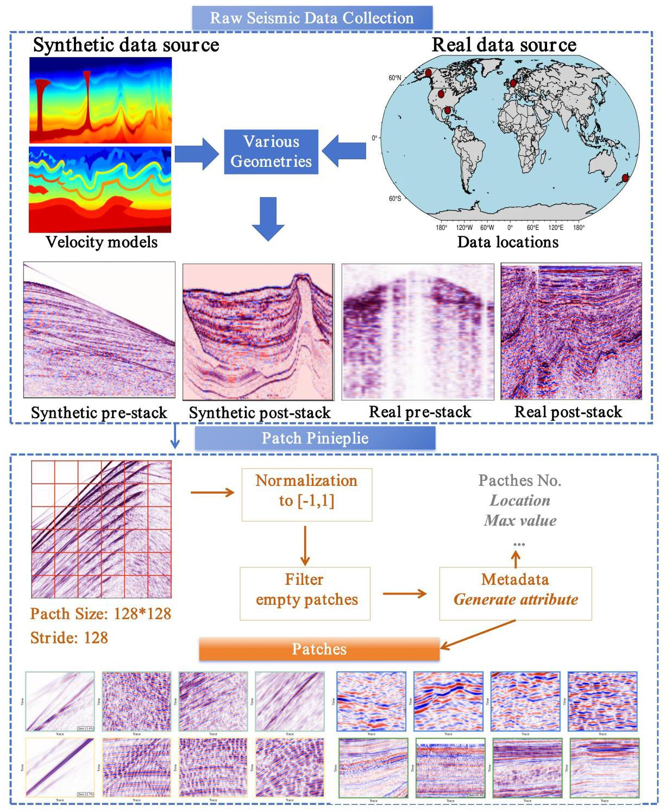

Figure 1. Overview of the SWAN data processing pipeline, including synthetic and real data sources, patch extraction, normalization, quality filtering, and metadata generation.

图1. SWAN数据处理流程概述，包括合成和真实数据源、补丁提取、归一化、质量过滤和元数据生成。

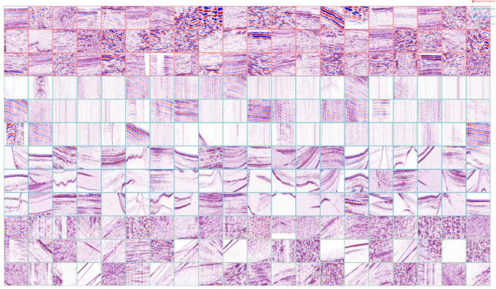

Figure 2. Representative ${128} \times  {128}$ patches sampled from the four SWAN categories. Each group of three rows corresponds to one data type and is outlined using a distinct border color: real poststack (red, rows 1-3), real prestack (teal, rows 4-6), synthetic poststack (blue, rows 7-9), and synthetic prestack (green, rows 10-12).

图2. 从四个SWAN类别中采样的代表性${128} \times  {128}$补丁。每组三行对应一种数据类型，并使用不同的边框颜色勾勒:真实叠后(红色，第1-3行)、真实叠前(青绿色，第4-6行)、合成叠后(蓝色，第7-9行)和合成叠前(绿色，第10-12行)。

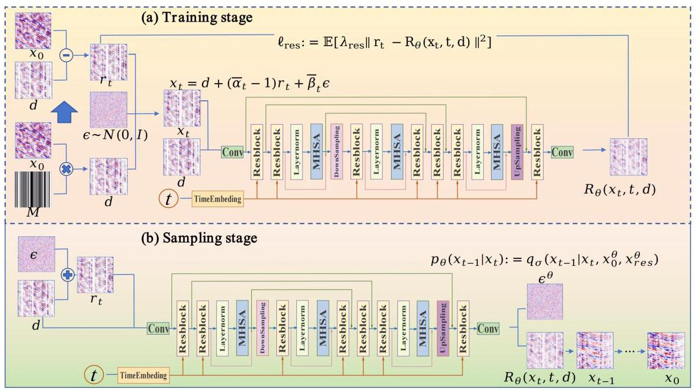

Figure 3. Residual-guided diffusion framework used for seismic reconstruction. The training stage (top) learns residual increments, while the sampling stage (bottom) applies deterministic reverse diffusion conditioned on the observed waveform.

图3. 用于地震重建的残差引导扩散框架。训练阶段(顶部)学习残差增量，而采样阶段(底部)根据观测波形应用确定性反向扩散。

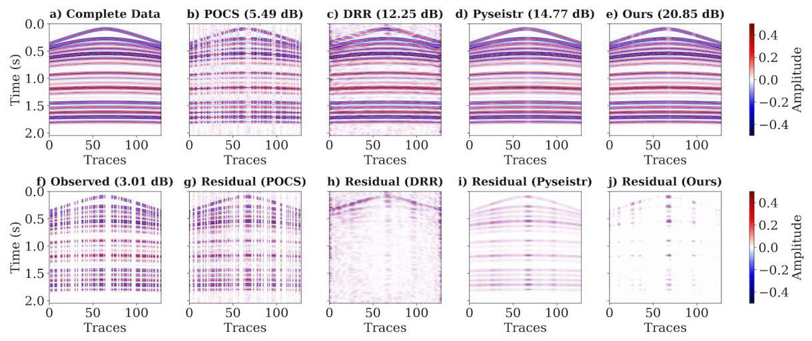

Figure 4. Example 1. Interpolation of a synthetic hyperbolic gather with 50% irregular sampling. (a) Complete data. (b)-(e) Reconstruction results of POCS, DRR, PySeisTr, and the proposed method. (f) Observed gather with 50% missing traces. (g)-(j) Corresponding residual panels.

图4. 示例1. 具有50%不规则采样的合成双曲线道集的插值。(a) 完整数据。(b)-(e) POCS、DRR、PySeisTr和所提出方法的重建结果。(f) 具有50%缺失道的观测道集。(g)-(j) 相应的残差面板。

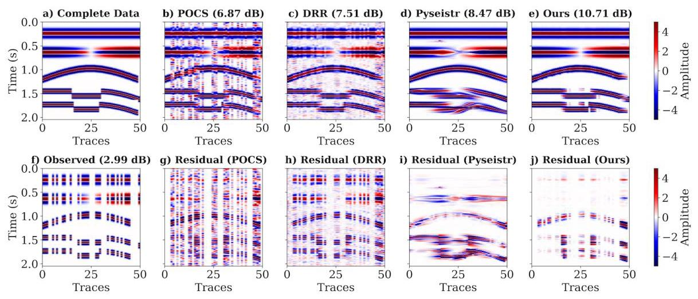

Figure 5. Example 2. Interpolation of a synthetic edge-structure gather with 50% irregular sampling. (a) Complete data. (b)-(e) Reconstruction results of POCS, DRR, PySeisTr, and the proposed method. (f) Observed gather with 50% missing traces. (g)-(j) Corresponding residual panels.

图5. 示例2. 具有50%不规则采样的合成边缘结构道集的插值。(a) 完整数据。(b)-(e) POCS、DRR、PySeisTr和所提出方法的重建结果。(f) 具有50%缺失道的观测道集。(g)-(j) 相应的残差面板。

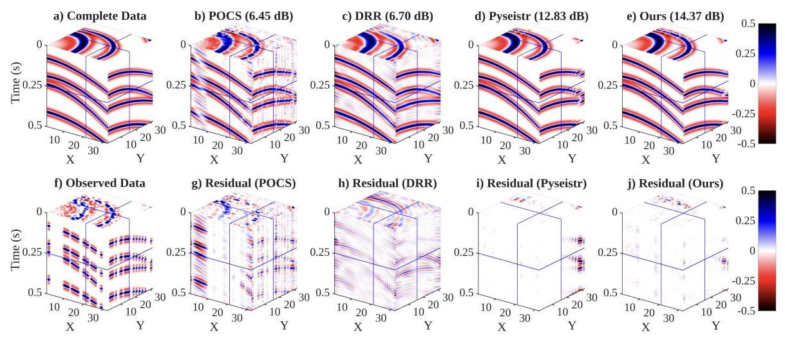

Figure 6. Example 3. Interpolation of a 3D synthetic hyperbolic volume with 50% irregular sampling. (a) Complete data. (b)-(e) Results of POCS, DRR, PySeisTr, and the proposed model. (f) Observed data with 50% missing traces. (g)-(j) Residual panels.

图6. 示例3. 具有50%不规则采样的3D合成双曲线体的插值。(a) 完整数据。(b)-(e) POCS、DRR、PySeisTr和所提出模型的结果。(f) 具有50%缺失道的观测数据。(g)-(j) 残差面板。

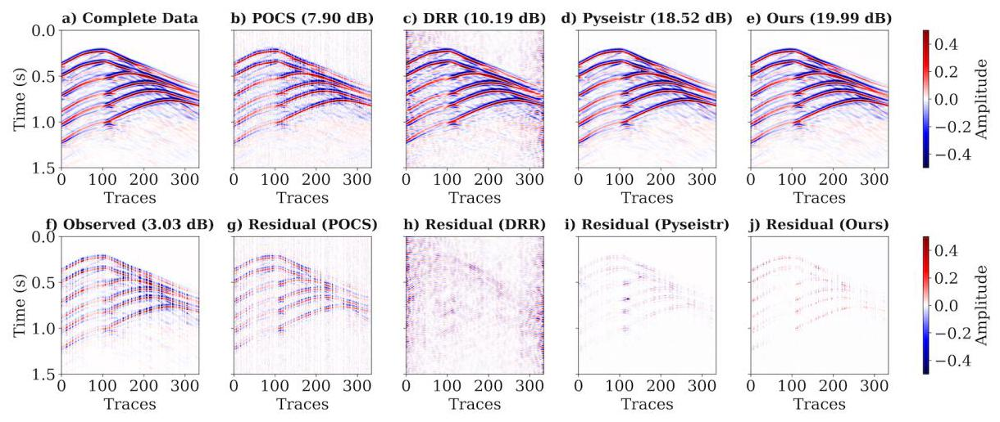

Figure 7. Example 4. Reconstruction of a synthetic DAS gather with 50% irregular sampling. (a) Complete data. (b)-(e) Reconstruction results of POCS, DRR, PySeisTr, and the proposed method. (f) Observed data with 50% missing traces. (g)-(j) Corresponding residuals.

图7. 示例4. 具有50%不规则采样的合成分布式声学传感(DAS)道集的重建。(a) 完整数据。(b)-(e) POCS、DRR、PySeisTr和所提出方法的重建结果。(f) 具有50%缺失道的观测数据。(g)-(j) 相应的残差。

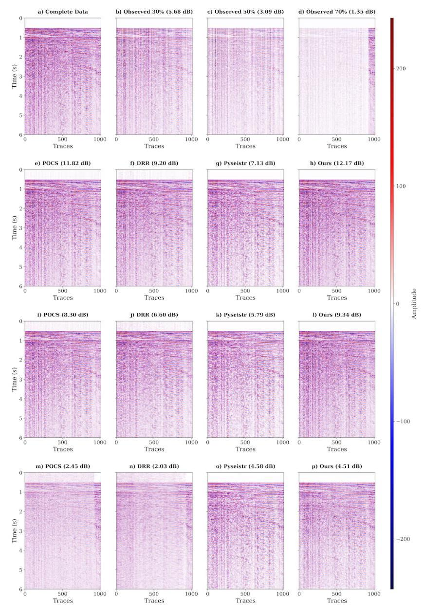

Figure 8. Example 5. Reconstruction of Viking Graben 2D field data with ${30}\% ,{50}\%$ , and 70% random trace removal. (a) Complete post-stack data. (b)- (d) Observed data. (e)-(p) Reconstructions for all methods at each removal level.

图8. 示例5. 使用${30}\% ,{50}\%$对维京地堑2D野外数据进行重建，并去除70%的随机道。(a) 完整的叠后数据。(b)-(d) 观测数据。(e)-(p) 每种去除水平下所有方法的重建结果。

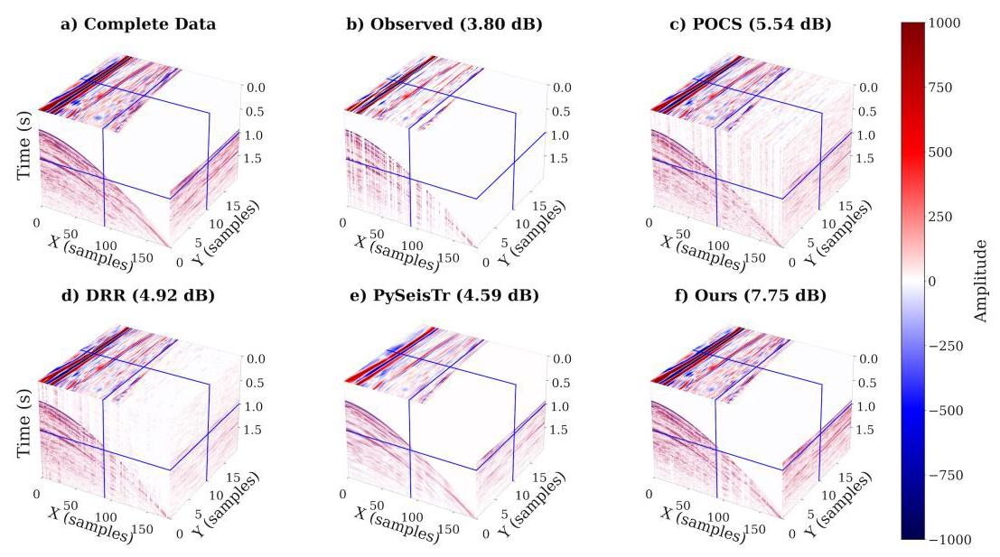

Figure 9. Example 6. Reconstruction of SeanS3 3D field data with 50% missing traces. (a) Complete volume. (b) Observed data. (c)-(f) Reconstructions from POCS, DRR, PySeisTr, and the proposed model.

图9. 示例6. 对具有50%缺失道的SeanS3 3D野外数据进行重建。(a) 完整体数据。(b) 观测数据。(c)-(f) POCS、DRR、PySeisTr和所提出模型的重建结果。

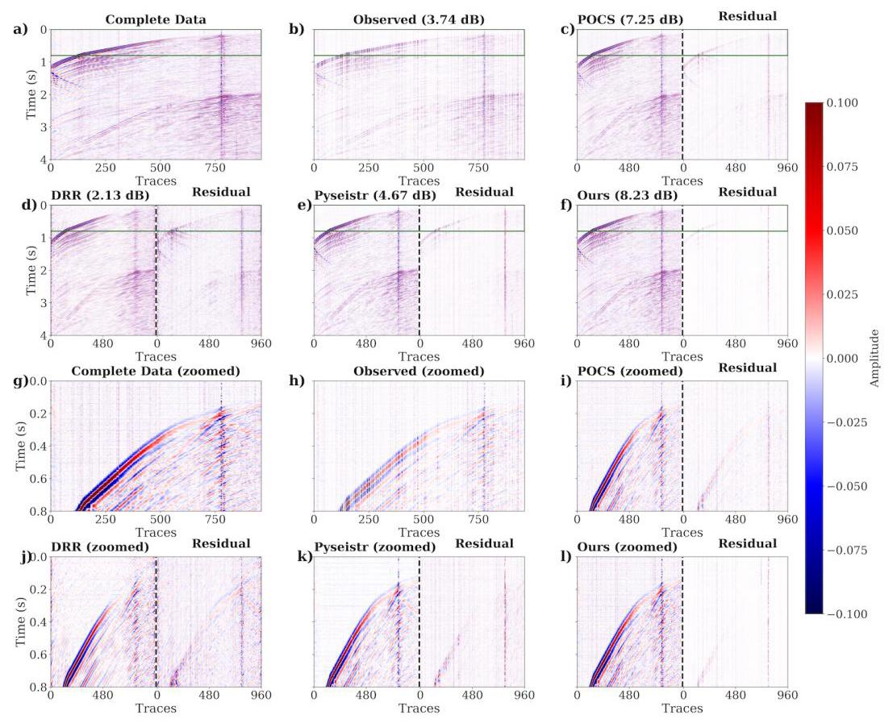

Figure 10. Example 7. Reconstruction of a zoomed field DAS segment with 50% irregular sampling. (a)-(f) Complete, observed, and reconstructed data for all methods. (g)-(l) Zoomed and residual views.

图10. 示例7. 具有50%不规则采样的缩放场DAS段的重建。(a)-(f) 所有方法的完整、观测和重建数据。(g)-(l) 缩放和残差视图。

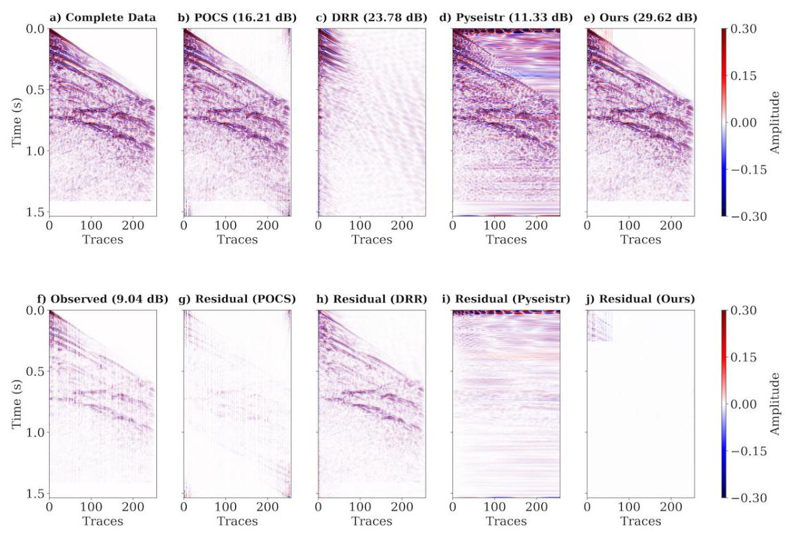

Figure 11. Example 8. Reconstruction of a 1997 BP shot gather with 50% missing traces.

图11. 示例8. 具有50%缺失道的1997年BP炮集重建。

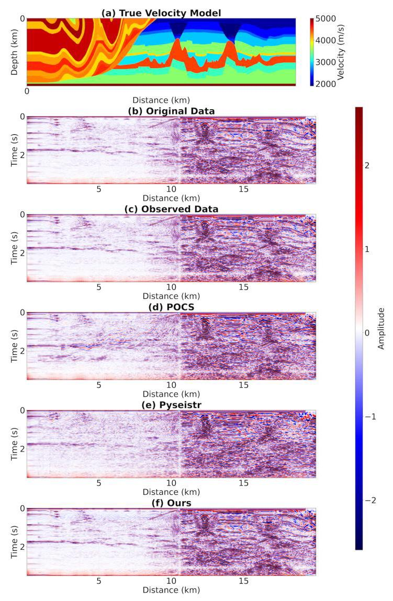

Figure 12. PSTM imaging results for the 1997 BP model.

图12. 1997年BP模型的PSTM成像结果。