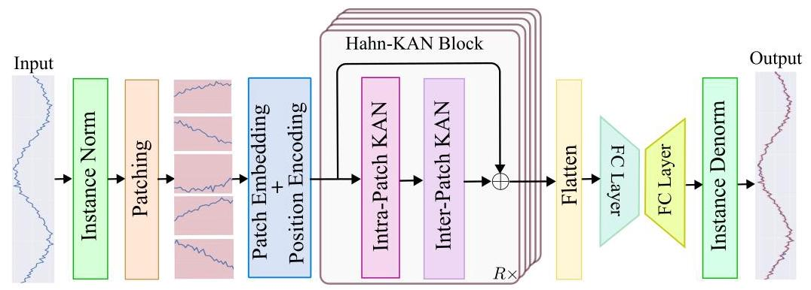
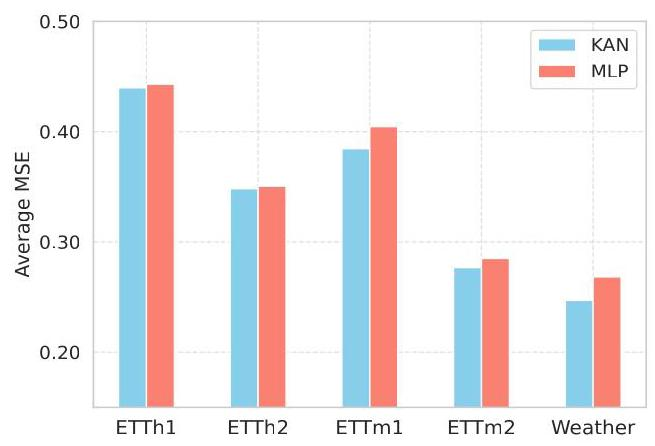
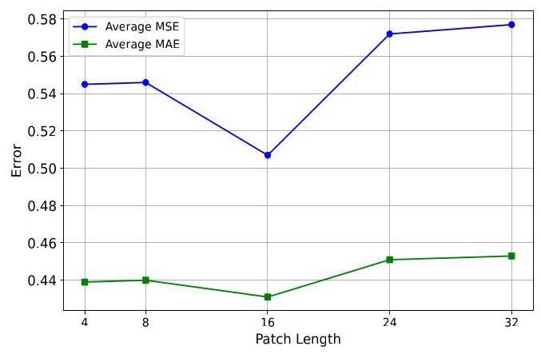
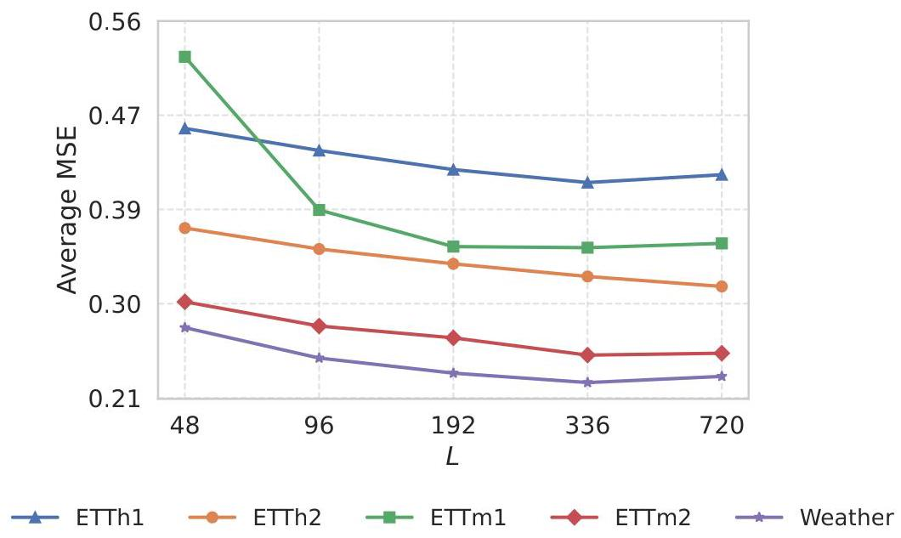

# Time Series Forecasting with Hahn Kolmogorov-Arnold Networks

# 使用哈恩-柯尔莫哥洛夫-阿诺德网络进行时间序列预测

Md Zahidul Hasan A. Ben Hamza Nizar Bouguila

Md Zahidul Hasan A. Ben Hamza Nizar Bouguila

Concordia Institute for Information Systems Engineering

康考迪亚信息系统工程学院

Concordia University, Montreal, QC, Canada

加拿大魁北克省蒙特利尔市康考迪亚大学

## Abstract

## 摘要

Recent Transformer- and MLP-based models have demonstrated strong performance in long-term time series forecasting, yet Transformers remain limited by their quadratic complexity and permutation-equivariant attention, while MLPs exhibit spectral bias. We propose HaKAN, a versatile model based on Kolmogorov-Arnold Networks (KANs), leveraging Hahn polynomial-based learnable activation functions and providing a lightweight and interpretable alternative for multivariate time series forecasting. Our model integrates channel independence, patching, a stack of Hahn-KAN blocks with residual connections, and a bottleneck structure comprised of two fully connected layers. The Hahn-KAN block consists of inter- and intra-patch KAN layers to effectively capture both global and local temporal patterns. Extensive experiments on various forecasting benchmarks demonstrate that our model consistently outperforms recent state-of-the-art methods, with ablation studies validating the effectiveness of its core components.

最近基于Transformer和MLP的模型在长期时间序列预测中展现出强大性能，然而Transformer仍受二次复杂度和排列等变注意力的限制，而MLP存在频谱偏差。我们提出HaKAN，一种基于柯尔莫哥洛夫-阿诺德网络(KANs)的通用模型，利用基于哈恩多项式的可学习激活函数，为多元时间序列预测提供了轻量级且可解释的替代方案。我们的模型集成了通道独立性、分块、带有残差连接的哈恩-KAN块堆栈以及由两个全连接层组成的瓶颈结构。哈恩-KAN块由块间和块内KAN层组成，以有效捕获全局和局部时间模式。在各种预测基准上的广泛实验表明，我们的模型始终优于最近的先进方法，消融研究验证了其核心组件的有效性。

## 1 INTRODUCTION

## 1 引言

Time series forecasting is widely used as a critical tool in diverse domains ranging from retail, energy and transportation to healthcare and finance (Wang et al., 2025a; Zhang et al., 2025). However, this task poses significant challenges due to the need to effectively capture complex temporal patterns and long-range dependencies, while maintaining computational efficiency.

时间序列预测作为一种关键工具，在从零售、能源和交通到医疗保健和金融等不同领域广泛应用(Wang等人，2025a；Zhang等人，2025)。然而，由于需要有效捕获复杂的时间模式和长程依赖关系，同时保持计算效率，这项任务带来了重大挑战。

Recent advances in multivariate time series forecasting have explored Transformer- and MLP-based models to address these challenges. Transformer-based methods (Zhou et al., 2021; Wu et al., 2021; Zhou et al., 2022; Liu et al., 2024) rely on attention mechanisms to capture long-range dependencies, with simple strategies such as channel independence and patching (Nie et al., 2023) contributing to improved efficiency and predictive performance. However, Transformers often suffer from high computational complexity, quadratic in sequence length, and their permutation-equivariant attention also contradicts the causal nature of time series data. On the other hand, MLP-based methods (Zeng et al., 2023; Das et al., 2023) offer a computationally lighter alternative by using linear layers to model temporal patterns, often incorporating the channel independence strategy to capture channel-specific patterns. Despite their efficiency, MLPs exhibit spectral bias (Rahaman et al., 2019), which limits their ability to model high-frequency components in time series, and struggle with capturing nonlinear temporal dynamics due to their reliance on linear transformations, leading to suboptimal performance on datasets, where non-linear patterns dominate. More recently, Kolmogorov-Arnold Networks (KANs) (Liu et al., 2025b; Wang et al., 2025b) have emerged as a viable alternative to MLPs, offering a promising solution to the aforementioned limitations by replacing fixed activation functions with learnable functions, parameterized using splines. Rooted in the Kolmogorov-Arnold representation theorem (Braun and Griebel, 2009; Schmidt-Hieber, 2021), KANs are interpretable and mitigate spectral bias by enabling flexible function approximation, allowing the model to capture both low- and high-frequency components in the data (Wang et al., 2025b). This adaptability makes KANs particularly well-suited for long-term forecasting, where diverse temporal patterns, ranging from short-term fluctuations to long-term trends, must be modeled accurately and efficiently.

多元时间序列预测的最新进展探索了基于Transformer和MLP的模型来应对这些挑战。基于Transformer的方法(Zhou等人，2021；Wu等人，2021；Zhou等人，2022；Liu等人，2024)依靠注意力机制捕获长程依赖关系，诸如通道独立性和分块(Nie等人，2023)等简单策略有助于提高效率和预测性能。然而，Transformer通常具有高计算复杂度，与序列长度成二次关系，并且其排列等变注意力也与时间序列数据的因果性质相矛盾。另一方面，基于MLP的方法(Zeng等人，2023；Das等人，2023)通过使用线性层对时间模式进行建模提供了计算量较小的替代方案，通常纳入通道独立性策略以捕获特定通道的模式。尽管它们效率高，但MLP存在频谱偏差(Rahaman等人，2019)，这限制了它们对时间序列中高频成分进行建模的能力，并且由于依赖线性变换而难以捕获非线性时间动态，导致在非线性模式占主导的数据集上性能欠佳。最近，柯尔莫哥洛夫-阿诺德网络(KANs)(Liu等人，2025b；Wang等人，2025b)已成为MLP的可行替代方案，通过用可学习函数替换固定激活函数(使用样条参数化)为上述限制提供了有前景的解决方案。基于柯尔莫哥洛夫-阿诺德表示定理(Braun和Griebel，2009；Schmidt-Hieber，202I)，KANs是可解释的，并且通过实现灵活的函数逼近减轻频谱偏差，使模型能够捕获数据中的低频和高频成分(Wang等人，2025b)。这种适应性使KANs特别适合长期预测，在长期预测中，必须准确有效地对从短期波动到长期趋势的各种时间模式进行建模。

Proposed Work and Contributions. We propose Hahn Kolmogorov-Arnold Network (HaKAN) ${}^{1}$ , a novel framework for multivariate long-term time series forecasting, where each KAN layer is parameterized using Hahn Polynomials (Koekoek et al., 2010), enabling flexible and efficient function approximation. Unlike Transformer-based models, HaKAN avoids the computational overhead of attention mechanisms by using inter- and intra-patch KAN layers to model temporal relationships. Compared to MLP-based models, HaKAN employs learnable activation functions based on Hahn polynomials to capture non-linear temporal dynamics, overcoming the limitations of linear transformations. HaKAN also incorporates channel independence, patching, and a bottleneck structure to enhance robustness and efficiency, making it well-suited for diverse forecasting datasets and across various prediction horizons. The proposed framework combines the flexibility of KANs with a hierarchical patch-based design, enabling our model to capture both global and local temporal patterns while maintaining interpretability through learnable activation functions. The key contributions of this paper can be summarized as follows: (i) We introduce HaKAN, an effective framework for multivariate long-term time series forecasting that leverages the expressive power of KANs; (ii) we design a novel architecture featuring an Hahn-KAN block that integrates inter- and intra-patch KAN layers to effectively capture both global and local temporal patterns, respectively; and (iii) we demonstrate through extensive experiments that our model consistently outperforms strong baselines.

拟议的工作与贡献。我们提出了哈恩 - 柯尔莫哥洛夫 - 阿诺德网络(HaKAN)${}^{1}$，这是一种用于多元长期时间序列预测的新颖框架，其中每个KAN层使用哈恩多项式进行参数化(Koekoek等人，2010年)，从而实现灵活且高效的函数逼近。与基于Transformer的模型不同，HaKAN通过使用补丁间和补丁内的KAN层来建模时间关系，避免了注意力机制的计算开销。与基于MLP的模型相比，HaKAN采用基于哈恩多项式的可学习激活函数来捕获非线性时间动态，克服了线性变换的局限性。HaKAN还融入了通道独立性、分块和瓶颈结构以增强鲁棒性和效率，使其非常适合各种预测数据集以及不同的预测范围。所提出的框架将KAN的灵活性与基于分层补丁的设计相结合，使我们的模型能够捕获全局和局部时间模式，同时通过可学习激活函数保持可解释性。本文的主要贡献可总结如下:(i)我们引入了HaKAN，这是一个用于多元长期时间序列预测的有效框架，它利用了KAN的表达能力；(ii)我们设计了一种新颖的架构，其特征在于一个哈恩 - KAN块，该块集成了补丁间和补丁内的KAN层，分别有效地捕获全局和局部时间模式；(iii)我们通过广泛的实验证明，我们的模型始终优于强大的基线。

---

Proceedings of the ${29}^{\text{ th }}$ International Conference on Artificial Intelligence and Statistics (AISTATS) 2026, Tangier, Morocco. PMLR: Volume 300. Copyright 2026 by the author(s).

${29}^{\text{ th }}$《2026年人工智能与统计国际会议论文集》，摩洛哥丹吉尔。PMLR:第300卷。版权所有2026年，作者所有。

${}^{1}$ Code: https://github.com/zadidhasan/HaKAN

${}^{1}$代码:https://github.com/zadidhasan/HaKAN

---

## 2 RELATED WORK

## 2相关工作

Transformer-based Models. A sizable body of research has focused on designing Transformer-based methods for long-term time series forecasting (Liu et al., 2021; Zhou et al., 2021; Wu et al., 2021; Zhou et al., 2022; Liu et al., 2024; Nie et al., 2023). For instance, Informer (Zhou et al., 2021) enhances Transformer efficiency with a ProbSparse self-attention mechanism, self-attention distilling, and a generative decoder. Autoformer (Wu et al., 2021) introduces a decomposition architecture with an auto-correlation mechanism that leverages series periodicity for dependency discovery and representation aggregation. FED-former (Zhou et al., 2022) integrates seasonal-trend decomposition with Fourier and Wavelet transforms to capture global time series characteristics, while iTrans-former (Liu et al., 2024) inverts the traditional Transformer architecture by embedding entire time series of individual variates as tokens, using attention to capture multivariate correlations and feed-forward networks to learn series representations. PatchTST (Nie et al., 2023) segments time series into subseries-level patches as input tokens and employs channel-independence. The channel-independence strategy improves robustness and adaptability by enabling distinct attention paths for each channel, in contrast to channel-mixing methods. Our HaKAN framework also adopts this channel-independent approach to preserve the unique temporal dynamics of each variable of the multivariate time series. Despite the success of Transformer-based methods in time series forecasting, their self-attention mechanism is, however, permutation-equivariant, meaning that it does not naturally preserve the temporal order, potentially compromising the modeling of time-dependent information.

基于Transformer 的模型。大量研究致力于设计基于Transformer的长期时间序列预测方法(Liu等人，2021年；Zhou等人，2021年；Wu等人，2021年；Zhou等人，2022年；Liu等人，2024年；Nie等人，2023年)。例如，Informer(Zhou等人，2021年)通过概率稀疏自注意力机制、自注意力蒸馏和生成解码器提高了Transformer的效率。Autoformer(Wu等人，2021年)引入了一种具有自相关机制的分解架构，该机制利用序列周期性进行依赖发现和表示聚合。FED - former(Zhou等人，2022年)将季节性趋势分解与傅里叶和小波变换相结合以捕获全局时间序列特征；而iTransformer(Liu等人，2024年)通过将单个变量的整个时间序列作为令牌进行嵌入，反转了传统的Transformer架构，利用注意力捕获多元相关性，并使用前馈网络学习序列表示。PatchTST(Nie等人，2023年)将时间序列分割为子序列级别的补丁作为输入令牌，并采用通道独立性。与通道混合方法相比，通道独立性策略通过为每个通道启用不同的注意力路径来提高鲁棒性和适应性。我们的HaKAN框架也采用这种通道独立方法来保留多元时间序列中每个变量的独特时间动态。尽管基于Transformer的方法在时间序列预测中取得了成功，但其自注意力机制是排列等价的，这意味着它不能自然地保留时间顺序，可能会影响对时间相关信息的建模。

MLP- and KAN-based Models. Various MLP-based models have been adopted for long-term time series forecasting (Chen et al., 2023; Challu et al., 2023; Wang et al., 2024; Zeng et al., 2023) due to their architectural and computational efficiency. For instance, TSMixer (Chen et al., 2023) captures temporal patterns and cross-variate information by interleaving time-mixing and feature-mixing MLPs., while DLin-ear (Zeng et al., 2023) enhances long-term time series forecasting by decomposing input data into trend and seasonal components. While MLP-based models offer greater structural simplicity and faster computation compared to Transformer-based models, they often struggle to capture global temporal dependencies and typically require longer input sequences to match the performance of more expressive architectures. More recently, TimeKAN (Huang et al., 2025) introduces a KAN-based architecture that decomposes multivariate time series into multiple frequency bands using cascaded frequency decomposition and moving averages. Similarly, TsKAN (Chen et al., 2025) presents a KAN-based approach that incorporates a multi-scale patching module to extract temporal and cross-dimensional features across scales. Our proposed HaKAN framework differs from these KAN-based models by using inter-patch KAN layers to capture global dependencies, overcoming MLPs' reliance on long input sequences, and from Transformer-based models by using an efficient Mixer-like structure that leverages KAN layers with Hahn polynomials for flexible function approximation. Its advantages include effective modeling of global and local temporal patterns, mitigation of spectral bias, and computational efficiency.

基于多层感知器(MLP)和KAN的模型。由于其架构和计算效率，各种基于MLP的模型已被用于长期时间序列预测(Chen等人，2023年；Challu等人，2023年；Wang等人，2024年；Zeng等人，2023年)。例如，TSMixer(Chen等人，2023年)通过交错时间混合和特征混合MLP来捕捉时间模式和交叉变量信息。而DLin-ear(Zeng等人，2023年)通过将输入数据分解为趋势和季节成分来增强长期时间序列预测。虽然基于MLP的模型与基于Transformer的模型相比具有更大的结构简单性和更快的计算速度，但它们往往难以捕捉全局时间依赖性，并且通常需要更长的输入序列才能匹配更具表现力的架构的性能。最近，TimeKAN(Huang等人，2025年)引入了一种基于KAN的架构，该架构使用级联频率分解和移动平均将多变量时间序列分解为多个频带。同样，TsKAN(Chen等人，2025年)提出了一种基于KAN的方法，该方法结合了多尺度补丁模块以跨尺度提取时间和跨维度特征。我们提出的HaKAN框架与这些基于KAN的模型不同，它使用补丁间KAN层来捕捉全局依赖性，克服了MLP对长输入序列的依赖，并且与基于Transformer的模型不同，它使用了一种类似Mixer的高效结构，该结构利用带有哈恩多项式的KAN层进行灵活的函数逼近。其优点包括对全局和局部时间模式的有效建模、减轻频谱偏差以及计算效率。

## 3 METHOD

## 3 方法

### 3.1 Problem Description and Preliminaries

### 3.1 问题描述与预备知识

Problem Statement. Time series forecasting refers to the process of predicting future values over a period of time using historical data. Let ${\mathbf{X}}_{1 : L} = \; {\left( {\mathbf{x}}_{1},\cdots ,{\mathbf{x}}_{L}\right) }^{\top } \in  {\mathbb{R}}^{L \times  M}$ be a history sequence of $L$ multivariate time series, where for any time step $t$ , each row ${\mathbf{x}}_{t} = \left( {{x}_{t1},\ldots ,{x}_{tM}}\right)  \in  {\mathbb{R}}^{1 \times  M}$ is a multivariate vector consisting of $M$ variables or channels. The goal of multivariate time series forecasting is to predict a sequence ${\widehat{\mathbf{X}}}_{L + 1 : L + T} = {\left( {\widehat{\mathbf{x}}}_{L + 1},\ldots ,{\widehat{\mathbf{x}}}_{L + T}\right) }^{\top } \in  {\mathbb{R}}^{T \times  M}$ for the future $T$ timesteps.

问题陈述。时间序列预测是指使用历史数据预测未来一段时间内的值的过程。设${\mathbf{X}}_{1 : L} = \; {\left( {\mathbf{x}}_{1},\cdots ,{\mathbf{x}}_{L}\right) }^{\top } \in  {\mathbb{R}}^{L \times  M}$为$L$个多变量时间序列的历史序列，其中对于任何时间步$t$，每行${\mathbf{x}}_{t} = \left( {{x}_{t1},\ldots ,{x}_{tM}}\right)  \in  {\mathbb{R}}^{1 \times  M}$是一个由$M$个变量或通道组成的多变量向量。多变量时间序列预测的目标是预测未来$T$个时间步的序列${\widehat{\mathbf{X}}}_{L + 1 : L + T} = {\left( {\widehat{\mathbf{x}}}_{L + 1},\ldots ,{\widehat{\mathbf{x}}}_{L + T}\right) }^{\top } \in  {\mathbb{R}}^{T \times  M}$。

Figure 1: HaKAN Architecture. The model integrates channel independence, reversible instance normalization, and patching, followed by patch and position embeddings. A stack of $R$ Hahn-KAN blocks, each with intra-patch and inter-patch KAN layers using Hahn polynomials, processes the embedded sequence to capture temporal patterns. The output is mapped through a bottleneck structure with two fully connected layers to produce the final forecast.

图1:HaKAN架构。该模型集成了通道独立性、可逆实例归一化和补丁，随后是补丁和位置嵌入。一堆$R$个哈恩 - KAN块，每个块都有使用哈恩多项式的补丁内和补丁间KAN层，处理嵌入序列以捕捉时间模式。输出通过具有两个全连接层的瓶颈结构进行映射以产生最终预测。

Kolmogorov-Arnold Networks. KANs are inspired by the Kolmogorov-Arnold representation theorem (Braun and Griebel, 2009; Schmidt-Hieber, 2021), which states that any continuous multivariate function on a bounded domain can be represented as a finite composition of continuous univariate functions of the input variables and the binary operation of addition. A KAN layer, a fundamental building block of KANs (Liu et al., 2025b), is defined as a matrix of 1D functions $\mathbf{\Phi } = \left( {\phi }_{q, p}\right)$ , where each trainable activation function ${\phi }_{q, p}$ is defined as a weighted combination, with learnable weights, of a sigmoid linear unit function and a spline function. Given an input vector $\mathbf{x}$ , the output of an L-layer KAN is given by

柯尔莫哥洛夫 - 阿诺德网络。KAN受到柯尔莫哥洛夫 - 阿诺德表示定理(Braun和Griebel，2009年；Schmidt - Hieber，2021年)的启发，该定理指出在有界域上的任何连续多变量函数都可以表示为输入变量的连续单变量函数和加法二元运算的有限组合。KAN层是KAN的基本构建块(Liu等人，2025b)，定义为一维函数$\mathbf{\Phi } = \left( {\phi }_{q, p}\right)$的矩阵，其中每个可训练激活函数${\phi }_{q, p}$定义为具有可学习权重的Sigmoid线性单元函数和样条函数的加权组合。给定输入向量$\mathbf{x}$，L层KAN的输出由下式给出

$$
\operatorname{KAN}\left( \mathbf{x}\right)  = \left( {{\mathbf{\Phi }}^{\left( \mathrm{L} - 1\right) } \circ  \cdots  \circ  {\mathbf{\Phi }}^{\left( 1\right) } \circ  {\mathbf{\Phi }}^{\left( 0\right) }}\right) \mathbf{x}, \tag{1}
$$

where ${\mathbf{\Phi }}^{\left( \ell \right) }$ is a matrix of learnable functions associated with the $\ell$ -th KAN layer.

其中${\mathbf{\Phi }}^{\left( \ell \right) }$是与第$\ell$个KAN层相关联的可学习函数矩阵。

### 3.2 Proposed HaKAN Framework

### 3.2 提出的HaKAN框架

The proposed HaKAN model processes a multivariate time series ${\mathbf{X}}_{1 : L} \in  {\mathbb{R}}^{L \times  M}$ to predict the future sequence ${\widehat{\mathbf{X}}}_{L + 1 : L + T} \in  {\mathbb{R}}^{T \times  M}$ . As illustrated in Figure 1, the model architecture consists of the following key components:

所提出的HaKAN模型处理多变量时间序列${\mathbf{X}}_{1 : L} \in  {\mathbb{R}}^{L \times  M}$以预测未来序列${\widehat{\mathbf{X}}}_{L + 1 : L + T} \in  {\mathbb{R}}^{T \times  M}$。如图1所示，模型架构由以下关键组件组成:

Channel Independence. Channel independence (CI) is a strategy that treats each feature or variable in a multivariate time series separately (Nie et al., 2023). Instead of combining information across channels, this strategy preserves the unique characteristics of each variable by maintaining their independence. Specifically, the input time series ${\mathbf{X}}_{1 : L} = {\left( {\mathbf{x}}_{1},\ldots ,{\mathbf{x}}_{L}\right) }^{\top }$ is split into $M$ univariate series ${\mathbf{x}}^{\left( i\right) } = {\left( {x}_{1}^{\left( i\right) },\ldots ,{x}_{L}^{\left( i\right) }\right) }^{\top } \in \; {\mathbb{R}}^{L}$ , where ${\mathbf{x}}^{\left( i\right) }$ is the $i$ th column of ${\widetilde{\mathbf{X}}}_{1 : L}$ . Each of these univariate series is fed into the model backbone. Our HaKAN model takes ${\mathbf{x}}^{\left( i\right) }$ as input and returns a $T$ -dimensional vector of predictions ${\widehat{\mathbf{x}}}^{\left( i\right) } = \; {\left( {\widehat{x}}_{L + 1}^{\left( i\right) },\ldots ,{\widehat{x}}_{L + T}^{\left( i\right) }\right) }^{\top }$ .

通道独立性。通道独立性(CI)是一种将多变量时间序列中的每个特征或变量分开处理的策略(Nie等人，2023年)。该策略不是跨通道组合信息，而是通过保持每个变量的独立性来保留其独特特征。具体来说，输入时间序列${\mathbf{X}}_{1 : L} = {\left( {\mathbf{x}}_{1},\ldots ,{\mathbf{x}}_{L}\right) }^{\top }$被拆分为$M$个单变量序列${\mathbf{x}}^{\left( i\right) } = {\left( {x}_{1}^{\left( i\right) },\ldots ,{x}_{L}^{\left( i\right) }\right) }^{\top } \in \; {\mathbb{R}}^{L}$，其中${\mathbf{x}}^{\left( i\right) }$是${\widetilde{\mathbf{X}}}_{1 : L}$的第$i$列。这些单变量序列中的每一个都被输入到模型主干中。我们的HaKAN模型将${\mathbf{x}}^{\left( i\right) }$作为输入并返回一个$T$维预测向量${\widehat{\mathbf{x}}}^{\left( i\right) } = \; {\left( {\widehat{x}}_{L + 1}^{\left( i\right) },\ldots ,{\widehat{x}}_{L + T}^{\left( i\right) }\right) }^{\top }$。

Normalization. Each input series is normalized using the reversible instance normalization (RevIN) technique (Kim et al., 2022), which addresses challenges related to shifts in data distributions over time. RevIN consists of two main steps: normalization and denor-malization. In the first step, the input undergoes normalization to standardize its distribution in terms of mean and variance. After the model generates output sequences, RevIN reverses the normalization process by denormalizing these outputs.

归一化。每个输入序列使用可逆实例归一化(RevIN)技术进行归一化(Kim等人，2022年)，该技术解决了与数据分布随时间变化相关的挑战。RevIN包括两个主要步骤:归一化和去归一化。在第一步中，输入进行归一化以使其在均值和方差方面的分布标准化。在模型生成输出序列后，RevIN通过对这些输出进行去归一化来逆转归一化过程。

Patching. Each normalized univariate series is partitioned into a sequence of patches to improve computational efficiency and capture local temporal patterns (Nie et al., 2023). The series is divided into patches ${\mathbf{X}}_{p}^{\left( i\right) } \in  {\mathbb{R}}^{N \times  P}$ , where $P$ is the patch length, $N = \left\lfloor  \frac{L - P}{S}\right\rfloor   + 2$ is the number of patches, and $S$ is the stride of the sliding window. Patches are generated by sliding a window of size $P$ over the series with stride $S$ . If the last patch has fewer than $P$ time steps, the final time step of the normalized univariate series is repeated to pad the patch. Patching offers several advantages, including improved retention of local semantic information, enhanced computational and memory efficiency, and access to a broader historical context.

分块。每个归一化的单变量序列被划分为一系列块，以提高计算效率并捕获局部时间模式(Nie等人，2023年)。该序列被分为块${\mathbf{X}}_{p}^{\left( i\right) } \in  {\mathbb{R}}^{N \times  P}$，其中$P$是块长度，$N = \left\lfloor  \frac{L - P}{S}\right\rfloor   + 2$是块数，$S$是滑动窗口的步长。通过以步长$S$在序列上滑动大小为$P$的窗口来生成块。如果最后一个块的时间步数少于$P$，则重复归一化单变量序列的最后一个时间步以填充该块。分块具有几个优点，包括更好地保留局部语义信息、提高计算和内存效率以及访问更广泛的历史上下文。

Patch and Position Embeddings. Each patch in ${\mathbf{X}}_{p}^{\left( i\right) } \in  {\mathbb{R}}^{N \times  P}$ is projected into a $D$ -dimensional embedding using a temporal linear projection with a trainable weight matrix ${\mathbf{W}}_{p} \in  {\mathbb{R}}^{P \times  D}$ . To retain the temporal order of the patches, which is critical for time series forecasting, a learnable positional embedding matrix ${\mathbf{W}}_{\text{ pos }} \in  {\mathbb{R}}^{N \times  D}$ is added:

块和位置嵌入。${\mathbf{X}}_{p}^{\left( i\right) } \in  {\mathbb{R}}^{N \times  P}$中的每个块使用具有可训练权重矩阵${\mathbf{W}}_{p} \in  {\mathbb{R}}^{P \times  D}$的时间线性投影投影到$D$维嵌入中。为了保留块的时间顺序，这对于时间序列预测至关重要，添加了一个可学习的位置嵌入矩阵${\mathbf{W}}_{\text{ pos }} \in  {\mathbb{R}}^{N \times  D}$:

$$
{\mathbf{X}}_{d}^{\left( i\right) } = {\mathbf{X}}_{p}^{\left( i\right) }{\mathbf{W}}_{p} + {\mathbf{W}}_{\text{ pos }}, \tag{2}
$$

where ${\mathbf{X}}_{d}^{\left( i\right) } \in  {\mathbb{R}}^{N \times  D}$ is the embedded sequence for the $i$ -th channel. Each row of ${\mathbf{X}}_{d}^{\left( i\right) }$ , referred to as a temporal patch-level token, represents the embedded features of a single patch from the $i$ -th channel, maintaining the channel independence of the CI strategy. The positional embeddings ensure the model captures the sequential nature of the patches, addressing the causal structure of time series data. The embedded sequence serves as input to the Hahn-KAN block.

其中${\mathbf{X}}_{d}^{\left( i\right) } \in  {\mathbb{R}}^{N \times  D}$是第$i$个通道的嵌入序列。${\mathbf{X}}_{d}^{\left( i\right) }$的每一行，称为时间补丁级令牌，代表来自第$i$个通道的单个补丁的嵌入特征，保持了CI策略的通道独立性。位置嵌入确保模型捕捉补丁的顺序性质，解决时间序列数据的因果结构。嵌入序列作为Hahn-KAN块的输入。

Hahn-KAN Block. The core component of our model architecture is the Hahn-KAN block, which processes the embedded sequence ${\mathbf{X}}_{d}^{\left( i\right) } \in  {\mathbb{R}}^{N \times  D}$ to capture both global and local temporal patterns. Each block consists of two KAN layers with Hahn Polynomials, structured with a residual connection:

Hahn-KAN块。我们模型架构的核心组件是Hahn-KAN块，它处理嵌入序列${\mathbf{X}}_{d}^{\left( i\right) } \in  {\mathbb{R}}^{N \times  D}$以捕捉全局和局部时间模式。每个块由两个带有Hahn多项式的KAN层组成，通过残差连接构建:

$$
{\mathbf{X}}_{k}^{\left( i\right) } = \operatorname{KAN}{\left( \operatorname{KAN}{\left( {\mathbf{X}}_{d}^{\left( i\right) }\right) }^{\top }\right) }^{\top } + {\mathbf{X}}_{d}^{\left( i\right) }, \tag{3}
$$

where ${\mathbf{X}}_{k}^{\left( i\right) } \in  {\mathbb{R}}^{N \times  D}$ is the output of the block, and each KAN(·) operation corresponds to a single KAN layer with univariate functions parameterized by Hahn polynomials. Specifically, each trainable univariate function ${\phi }_{q, p}$ of the KAN layer is parameterized using Hahn polynomials (Koekoek et al., 2010) to provide flexibility in function approximation:

其中${\mathbf{X}}_{k}^{\left( i\right) } \in  {\mathbb{R}}^{N \times  D}$是块的输出，并且每个KAN(·)操作对应于一个由Hahn多项式参数化的单变量函数的单个KAN层。具体来说，KAN层的每个可训练单变量函数${\phi }_{q, p}$使用Hahn多项式(Koekoek等人，2010)进行参数化，以在函数逼近中提供灵活性:

$$
{\phi }_{q, p}\left( {x}_{p}\right)  = \mathop{\sum }\limits_{{r = 0}}^{d}{\gamma }_{q, p, r}{P}_{r}\left( {x}_{p}\right) , \tag{4}
$$

where ${x}_{p}$ represents the $p$ -th element of the KAN input vector, and ${\gamma }_{q, p, r}$ is the learnable coefficient of the $r$ -th Hahn polynomial ${P}_{r}\left( {x}_{p}\right)$ for the $q$ -th output element. The $r$ -th Hahn polynomial ${P}_{r}\left( x\right)  = \operatorname{Hahn}\left( {a, b, n}\right)$ , with parameters $a, b$ and $n$ , is defined by the recurrence relation

其中${x}_{p}$表示KAN输入向量的第$p$个元素，并且${\gamma }_{q, p, r}$是第$r$个Hahn多项式${P}_{r}\left( {x}_{p}\right)$对于第$q$个输出元素的可学习系数。第$r$个Hahn多项式${P}_{r}\left( x\right)  = \operatorname{Hahn}\left( {a, b, n}\right)$，具有参数$a, b$和$n$，由递归关系定义

$$
A{P}_{r}\left( x\right)  = \left( {A + B - x}\right) {P}_{r - 1}\left( x\right)  - B{P}_{r - 2}\left( x\right) , \tag{5}
$$

with coefficients:

系数为:

$$
A = \frac{\left( {r + a + b}\right) \left( {r + a}\right) \left( {n - r + 1}\right) }{\left( {{2r} + a + b - 1}\right) \left( {{2r} + a + b}\right) }, \tag{6}
$$

$$
B = \frac{\left( {r - 1}\right) \left( {r + b - 1}\right) \left( {r + a + b + n}\right) }{\left( {{2r} + a + b - 2}\right) \left( {{2r} + a + b - 1}\right) }, \tag{7}
$$

and initial conditions ${P}_{0}\left( x\right)  = 1,{P}_{1}\left( x\right)  = 1 - \frac{a + b + 2}{\left( {a + 1}\right) n}x$ .

以及初始条件${P}_{0}\left( x\right)  = 1,{P}_{1}\left( x\right)  = 1 - \frac{a + b + 2}{\left( {a + 1}\right) n}x$。

The Hahn-KAN block consists of two nested layers: an intra-patch KAN layer (feature-mixing) and an inter-patch KAN layer (patch-mixing), both parameterized by Hahn polynomials. The inter-patch layer focuses on cross-patch relationships to capture global temporal patterns across the entire look-back window, such as patterns spanning the look-back window timesteps, while the intra-patch layer refines the features by focusing on local patterns within each patch. The latter captures fine-grained patterns within each patch, such as sudden changes in a short time window. The residual connection ensures training stability by allowing the Hahn-KAN block to learn incremental updates to the input.

Hahn-KAN块由两个嵌套层组成:补丁内KAN层(特征混合)和补丁间KAN层(补丁混合)，两者均由Hahn多项式参数化。补丁间层专注于跨补丁关系，以捕捉整个回溯窗口中的全局时间模式，例如跨越回溯窗口时间步长的模式，而补丁内层通过专注于每个补丁内的局部模式来细化特征。后者捕捉每个补丁内的细粒度模式，例如短时间窗口内的突然变化。残差连接通过允许Hahn-KAN块学习对输入的增量更新来确保训练稳定性。

The use of Hahn Polynomials in both intra-KAN and inter-KAN layers enhances the model's ability to approximate complex temporal functions, mitigating the spectral bias of traditional MLPs and providing interpretability through learnable activation functions. To capture hierarchical temporal patterns, the Hahn-KAN block is repeated $R$ times in a stack, with each block taking the output of the previous block as its input, starting with the embedded sequence ${\mathbf{X}}_{d}^{\left( i\right) }$ . The output of the $r$ -th block, ${\mathbf{X}}_{k, r}^{\left( i\right) } \in  {\mathbb{R}}^{N \times  D}$ , becomes the input to the $\left( {r + 1}\right)$ -th block. After $R$ blocks, the final output ${\mathbf{X}}_{k}^{\left( i\right) } \in  {\mathbb{R}}^{N \times  D}$ is flattened into a feature vector ${\mathbf{x}}_{f}^{\left( i\right) } \in  {\mathbb{R}}^{ND}$ , where ${ND}$ is the total feature dimension. This stacking mechanism enables the model to iteratively refine the features, capturing patterns at multiple temporal scales, from short-term fluctuations to long-term trends.

在KAN层内和层间使用哈恩多项式增强了模型逼近复杂时间函数的能力，减轻了传统多层感知器(MLP)的频谱偏差，并通过可学习的激活函数提供可解释性。为了捕捉分层时间模式，哈恩 - KAN块在一个堆栈中重复$R$次，每个块以前一个块的输出作为输入，从嵌入序列${\mathbf{X}}_{d}^{\left( i\right) }$开始。第$r$个块的输出${\mathbf{X}}_{k, r}^{\left( i\right) } \in  {\mathbb{R}}^{N \times  D}$成为第$\left( {r + 1}\right)$个块的输入。经过$R$个块后，最终输出${\mathbf{X}}_{k}^{\left( i\right) } \in  {\mathbb{R}}^{N \times  D}$被展平为一个特征向量${\mathbf{x}}_{f}^{\left( i\right) } \in  {\mathbb{R}}^{ND}$，其中${ND}$是总特征维度。这种堆叠机制使模型能够迭代地细化特征，捕捉从短期波动到长期趋势的多个时间尺度上的模式。

Why KAN with Hahn Polynomials? In a standard KAN layer with ${d}_{\text{ in }}$ -dimensional inputs and ${d}_{\text{ out }}$ - dimensional outputs, a B-spline of order $d$ and grid size $G$ is used as a learnable activation function. Unlike standard KANs, our proposed Hahn polynomial-based KANs offer superior computation and parameter efficiency. First, Hahn polynomials eliminate the need for grid discretization, removing the dependency on grid size $G$ , a key factor in the complexity of standard KANs. Second, while standard KANs incur a time complexity of $\mathcal{O}\left( {{d}_{\text{ in }}{d}_{\text{ out }}\lbrack {9d}\left( {G + {1.5d}}\right)  + }\right. \; {2G} - {2.5d} + 3\rbrack )$ (Yang and Wang,2025), our Hahn KANs achieve a simplified complexity of $\mathcal{O}\left( {{d}_{\text{ in }}{d}_{\text{ out }}d}\right)$ , where $d$ is the Hahn polynomial degree (typically $d = 3)$ . This is comparable to the $\mathcal{O}\left( {{d}_{\text{ in }}{d}_{\text{ out }}}\right)$ complexity of MLPs. Third, Hahn KANs require only $\left( {{d}_{\text{ in }}{d}_{\text{ out }}\left( {d + 1}\right) }\right)$ parameters, significantly fewer than the $\left( {{d}_{\text{ in }}{d}_{\text{ out }}\left( {G + d + 3}\right)  + {d}_{\text{ out }}}\right)$ parameters of standard KANs (Yang and Wang, 2025). This efficient design, coupled with polynomial-time evaluation and full parallelizability, makes our proposed HaKAN model a lightweight framework for time series forecasting.

为什么是带有哈恩多项式的KAN？在一个具有${d}_{\text{ in }}$维输入和${d}_{\text{ out }}$维输出的标准KAN层中，一个阶数为$d$且网格大小为$G$的B样条被用作可学习的激活函数。与标准KAN不同，我们提出的基于哈恩多项式的KAN具有更高的计算和参数效率。首先，哈恩多项式消除了对网格离散化的需求，消除了对网格大小$G$的依赖，而网格大小$G$是标准KAN复杂性的一个关键因素。其次，虽然标准KAN的时间复杂度为$\mathcal{O}\left( {{d}_{\text{ in }}{d}_{\text{ out }}\lbrack {9d}\left( {G + {1.5d}}\right)  + }\right. \; {2G} - {2.5d} + 3\rbrack )$(杨和王，2025)，我们的哈恩KAN实现了简化的复杂度$\mathcal{O}\left( {{d}_{\text{ in }}{d}_{\text{ out }}d}\right)$，其中$d$是哈恩多项式的次数(通常为$d = 3)$)。这与MLP的$\mathcal{O}\left( {{d}_{\text{ in }}{d}_{\text{ out }}}\right)$复杂度相当。第三，哈恩KAN只需要$\left( {{d}_{\text{ in }}{d}_{\text{ out }}\left( {d + 1}\right) }\right)$个参数，明显少于标准KAN的$\left( {{d}_{\text{ in }}{d}_{\text{ out }}\left( {G + d + 3}\right)  + {d}_{\text{ out }}}\right)$个参数(杨和王，2025)。这种高效的设计，再加上多项式时间评估和完全可并行性，使我们提出的HaKAN模型成为用于时间序列预测的轻量级框架。

Output Layer with Bottleneck Structure. The flattened vector ${\mathbf{x}}_{f}^{\left( i\right) } \in  {\mathbb{R}}^{ND}$ is passed through an output layer consisting of two fully connected layers that form a bottleneck structure, mapping the features to the prediction horizon $T$ . The first layer is a down-projection, which reduces the dimensionality of the feature vector to a bottleneck middle dimension $H$ , using a weight matrix ${\mathbf{W}}_{\text{ down }} \in  {\mathbb{R}}^{H \times  {ND}}$ :

具有瓶颈结构的输出层。展平后的向量${\mathbf{x}}_{f}^{\left( i\right) } \in  {\mathbb{R}}^{ND}$通过一个由两个全连接层组成的输出层，这两个全连接层形成一个瓶颈结构，将特征映射到预测范围$T$。第一层是下投影，它使用权重矩阵${\mathbf{W}}_{\text{ down }} \in  {\mathbb{R}}^{H \times  {ND}}$将特征向量的维度降低到瓶颈中间维度$H$:

$$
{\mathbf{h}}^{\left( i\right) } = {\mathbf{W}}_{\text{ down }}{\mathbf{x}}_{f}^{\left( i\right) }, \tag{8}
$$

where ${\mathbf{h}}^{\left( i\right) } \in  {\mathbb{R}}^{H}$ . This compression reduces both the risk of overfitting and the computational cost of the output layer.

其中${\mathbf{h}}^{\left( i\right) } \in  {\mathbb{R}}^{H}$。这种压缩降低了过拟合的风险和输出层的计算成本。

The second layer is an up-projection, which expands the compressed features to the prediction horizon $T$ , using a weight matrix ${\mathbf{W}}_{\text{ up }} \in  {\mathbb{R}}^{T \times  H}$ :

第二层是向上投影，它使用权重矩阵${\mathbf{W}}_{\text{ up }} \in  {\mathbb{R}}^{T \times  H}$将压缩后的特征扩展到预测范围$T$:

$$
{\widehat{\mathbf{x}}}^{\left( i\right) } = {\mathbf{W}}_{\mathrm{{up}}}{\mathbf{h}}^{\left( i\right) }, \tag{9}
$$

where ${\widehat{\mathbf{x}}}^{\left( i\right) } \in  {\mathbb{R}}^{T}$ is the forecasted sequence for the $i$ -th channel.

其中${\widehat{\mathbf{x}}}^{\left( i\right) } \in  {\mathbb{R}}^{T}$是第$i$个通道的预测序列。

The bottleneck structure ensures efficient mapping to the prediction horizon, especially for large $T$ , by first compressing the features before expanding them. The forecasted sequences for all $M$ channels are combined to form the final output ${\widehat{\mathbf{X}}}_{L + 1 : L + T} \in  {\mathbb{R}}^{T \times  M}$ . Finally, RevIN denormalization is applied to ${\widehat{\mathbf{x}}}^{\left( i\right) }$ for each channel, using the stored mean and standard deviation, to restore the original data scale.

瓶颈结构通过在扩展特征之前先对其进行压缩，确保有效地映射到预测范围，特别是对于较大的$T$。所有$M$个通道的预测序列被组合起来形成最终输出${\widehat{\mathbf{X}}}_{L + 1 : L + T} \in  {\mathbb{R}}^{T \times  M}$。最后，对每个通道的${\widehat{\mathbf{x}}}^{\left( i\right) }$应用RevIN反归一化，使用存储的均值和标准差来恢复原始数据尺度。

### 3.3 Model Training

### 3.3模型训练

The parameters of our HaKAN model are learned by minimizing the following training objective function

我们的HaKAN模型的参数通过最小化以下训练目标函数来学习

$$
\mathcal{L} = \frac{1}{MT}\mathop{\sum }\limits_{{i = 1}}^{M}\mathop{\sum }\limits_{{\tau  = L + 1}}^{{L + T}}{\begin{Vmatrix}{\mathbf{x}}_{\tau }^{\left( i\right) } - {\widehat{\mathbf{x}}}_{\tau }^{\left( i\right) }\end{Vmatrix}}^{2}, \tag{10}
$$

where ${\mathbf{x}}_{\tau }^{\left( i\right) }$ and ${\widehat{\mathbf{x}}}_{\tau }^{\left( i\right) }$ are the ground-truth and prediction, respectively, $\tau  \in  \{ L + 1,\ldots , L + T\} , L$ is the look-back window, $T$ is the prediction horizon, and $M$ is the number of time series variables.

其中${\mathbf{x}}_{\tau }^{\left( i\right) }$和${\widehat{\mathbf{x}}}_{\tau }^{\left( i\right) }$分别是真实值和预测值，$\tau  \in  \{ L + 1,\ldots , L + T\} , L$是回溯窗口，$T$是预测范围，$M$是时间序列变量的数量。

The main algorithmic steps of the proposed HaKAN framework are summarized in Algorithm 1.

所提出的HaKAN框架的主要算法步骤总结在算法1中。

## 4 EXPERIMENTS

## 4实验

### 4.1 Experimental Setup

### 4.1实验设置

Datasets. We evaluate HaKAN on several benchmark datasets: Weather, Electricity, Illness, and four ETT datasets (ETTh1, ETTh2, ETTm1, ETTm2) (Wu et al., 2021). Weather records 21 meteorological indicators every 10 minutes throughout 2020. Traffic comprises hourly road occupancy data from sensors across San Francisco Bay area freeways. Electricity tracks hourly electricity usage for 321 customers from 2012 to 2014. ETT includes transformer load and oil temperature data, sampled hourly for ETTh datasets and every 15 minutes for ETTm datasets, spanning July 2016 to July 2018. Illness contains weekly records of patient counts and influenza-like illness ratios.

数据集。我们在几个基准数据集上评估HaKAN:天气、电力、疾病以及四个ETT数据集(ETTh1、ETTh2、ETTm1、ETTm2)(Wu等人，2021)。天气数据集记录了2020年全年每10分钟的21个气象指标。交通数据集包含旧金山湾区高速公路上传感器每小时的道路占用数据。电力数据集跟踪了2012年至2014年321个客户每小时的用电情况。ETT数据集包括变压器负载和油温数据，ETTh数据集每小时采样一次，ETTm数据集每15分钟采样一次，时间跨度为2016年7月至2018年7月。疾病数据集包含每周的患者数量和流感样疾病比率记录。

Algorithm 1 HaKAN: Time series forecasting

算法1 HaKAN:时间序列预测

---

Require: Input multivariate time series ${\mathbf{X}}_{1 : L} \in  {\mathbb{R}}^{L \times  M}$

		with look-back $L$ and $M$ channels; forecast horizon $T$

Ensure: Forecasted sequence ${\widehat{\mathbf{X}}}_{L + 1 : L + T} \in  {\mathbb{R}}^{T \times  M}$

		for $i = 1$ to $M$ do $\vartriangleright$ Channel independence

			Using RevIN, normalize the channel univariate se-

		ries ${\mathbf{x}}^{\left( i\right) } = {\left( {\mathbf{x}}_{1}^{\left( i\right) },\ldots ,{\mathbf{x}}_{L}^{\left( i\right) }\right) }^{\top } \in  {\mathbb{R}}^{L}$

			Partition the normalized channel univariate series

		into $N$ patches of size $P$ to generate ${\mathbf{X}}_{p}^{\left( i\right) } \in  {\mathbb{R}}^{N \times  P}$

			Embed patches: ${\mathbf{X}}_{d}^{\left( i\right) } = {\mathbf{X}}_{p}^{\left( i\right) }{\mathbf{W}}_{p} + {\mathbf{W}}_{\text{ pos }} \in  {\mathbb{R}}^{N \times  D}$

			Initialize ${\mathbf{X}}_{k}^{\left( i\right) } = {\mathbf{X}}_{d}^{\left( i\right) }$

			for $r = 1$ to $R$ do $\; \vartriangleright$ Hahn-KAN blocks

				${\mathbf{X}}_{k}^{\left( i\right) } = \operatorname{KAN}{\left( \operatorname{KAN}{\left( {\mathbf{X}}_{k}^{\left( i\right) }\right) }^{\top }\right) }^{\top } + {\mathbf{X}}_{k}^{\left( i\right) }$

			end for

			Flatten ${\mathbf{X}}_{k}^{\left( i\right) } \in  {\mathbb{R}}^{N \times  D} \rightarrow  {\mathbf{x}}_{f}^{\left( i\right) } \in  {\mathbb{R}}^{ND}$

			Bottleneck mapping:

				${\mathbf{h}}^{\left( i\right) } = {\mathbf{W}}_{\text{ down }}{\mathbf{x}}_{f}^{\left( i\right) } \in  {\mathbb{R}}^{H}$

				${\widehat{\mathbf{x}}}^{\left( i\right) } = {\mathbf{W}}_{\mathrm{{up}}}{\mathbf{h}}^{\left( i\right) } \in  {\mathbb{R}}^{T}$

			Denormalize ${\widehat{\mathbf{x}}}^{\left( i\right) }$ via RevIN

		end for

		Combine the channels: ${\widehat{\mathbf{X}}}_{L + 1 : L + T} = \left( {{\widehat{\mathbf{x}}}^{\left( 1\right) },\ldots ,{\widehat{\mathbf{x}}}^{\left( M\right) }}\right)$

---

Baselines and Evaluation Metrics. We evaluate the performance of our model against various recent state-of-the-art methods, including S-Mamba (Wang et al., 2025c), TimeKAN (Huang et al., 2025), Timer-XL (Liu et al., 2025a), TsKAN (Chen et al., 2025), iTransformer (Liu et al., 2024), PatchTST (Nie et al., 2023), TimesNet (Wu et al., 2023), Cross-former (Zhang and Yan, 2023), DLinear and RLin-ear (Zeng et al., 2023), N-HiTS (Challu et al., 2023), TiDE (Das et al., 2023), MICN (Wang et al., 2023), and FEDformer (Zhou et al., 2022). PatchTST includes 2 variants, PatchTST/42 and PatchTST/64, with the latter being the best performing model. Performance is evaluated using mean squared error (MSE) and mean absolute error (MAE).

基线和评估指标。我们将我们模型的性能与各种近期的先进方法进行评估，包括S-Mamba(Wang等人，2025c)、TimeKAN(Huang等人，2025)、Timer-XL(Liu等人，2025a)、TsKAN(Chen等人，2025)、iTransformer(Liu等人，2024)、PatchTST(Nie等人，2023)、TimesNet(Wu等人，2023)、Cross-former(Zhang和Yan，2023)、DLinear和RLin-ear(Zeng等人，2023)、N-HiTS(Challu等人，2023)、TiDE(Das等人，2023)、MICN(Wang等人，2023)和FEDformer(Zhou等人，2022)。PatchTST包括2个变体，PatchTST/42和PatchTST/64，后者是性能最佳的模型。使用均方误差(MSE)和平均绝对误差(MAE)来评估性能。

Implementation Details. All experiments are conducted on a linux machine with a single NVIDIA RTX 4090 GPU 24GB. The HaKAN model is implemented in PyTorch, and Adam (Kingma and Ba, 2015) is used as optimizer. For the KAN layers, we use Hahn polynomials of the form Hahn $\left( {a, b, n}\right)$ , where $a = 1, b = 1$ , and $n = 7$ , with the polynomial degree fixed at $d = 3$ . The number of Hahn-KAN blocks is set to $R = 5$ , and the bottleneck dimension is set to $H = {336}$ . We set a patch length of $P = {16}$ , a stride of $S = 8$ , and a patch embedding dimension to $D = {128}$ . We follow the standard data partitioning protocols (Nie et al., 2023). Specifically, for the ETT datasets, we use the first 12 months of data for training, the subsequent 4 months for validation, and the final 4 months for testing. This split ensures that if the model fails to generalize to months 13-16, it is unlikely to improve for months 17-20. For the remaining datasets, we adopt a split consisting of 70% training, 10% validation, and 20% testing. HaKAN is trained for up to 100 epochs, with early stopping and patience 10. The learning rate is set to 0.0025 for the Illness dataset, and to 0.0001 for all other datasets.

实现细节。所有实验均在一台配备单个NVIDIA RTX 4090 GPU(24GB)的Linux机器上进行。HaKAN模型是用PyTorch实现的，并且使用Adam(Kingma和Ba，2015)作为优化器。对于KAN层，我们使用形式为Hahn $\left( {a, b, n}\right)$ 的哈恩多项式，其中 $a = 1, b = 1$ ，以及 $n = 7$ ，多项式次数固定为 $d = 3$ 。哈恩 - KAN块的数量设置为 $R = 5$ ，瓶颈维度设置为 $H = {336}$ 。我们将补丁长度设置为 $P = {16}$ ，步幅设置为 $S = 8$ ，补丁嵌入维度设置为 $D = {128}$ 。我们遵循标准的数据划分协议(Nie等人，2023)。具体来说，对于ETT数据集，我们使用前12个月的数据进行训练，接下来的4个月进行验证，最后4个月进行测试。这种划分确保如果模型不能推广到第13 - 16个月，那么它在第17 - 20个月也不太可能有所改进。对于其余数据集，我们采用70%训练、10%验证和20%测试的划分。HaKAN最多训练100个epoch，采用早停法，耐心值为10。对于疾病数据集，学习率设置为0.0025，对于所有其他数据集，学习率设置为0.0001。

Table 1: Time series forecasting results across prediction lengths $T \in  \{ {24},{36},{48},{60}\}$ for the Illness dataset and $T \in  \{ {96},{192},{336},{720}\}$ for the other datasets. The best results are highlighted in bold, and the second-best are underlined. For each method, multiple look-backs $L \in  \{ {96},{192},{336},{720}\}$ are evaluated, with the best-performing look-back reported. The dash (-) indicates no reported results in the baselines' papers.

表1:疾病数据集预测长度为$T \in  \{ {24},{36},{48},{60}\}$以及其他数据集预测长度为$T \in  \{ {96},{192},{336},{720}\}$时的时间序列预测结果。最佳结果用粗体突出显示，第二好的结果用下划线标注。对于每种方法，评估多个回溯步长$L \in  \{ {96},{192},{336},{720}\}$，并报告表现最佳的回溯步长。破折号(-)表示基线论文中未报告结果。

<table><tr><td>Method</td><td colspan="2">HaKAN (ours)</td><td colspan="2">TsKAN (2025)</td><td colspan="2">Timer-XL (2025a)</td><td colspan="2">TimeKAN (2025)</td><td colspan="2">PatchTST/64 (2023)</td><td colspan="2">N-HiTS (2023)</td><td colspan="2">DLinear (2023)</td><td colspan="2">MICN (2023)</td><td colspan="2">TimesNet (2023)</td></tr><tr><td>Metric</td><td>MSE</td><td>MAE</td><td>MSE</td><td>MAE</td><td>MSE</td><td>MAE</td><td>MSE</td><td>MAE</td><td>MSE</td><td>MAE</td><td>MSE</td><td>MAE</td><td>MSE</td><td>MAE</td><td>MSE</td><td>MAE</td><td>MSE</td><td>MAE</td></tr><tr><td>96</td><td>0.369</td><td>0.394</td><td>0.376</td><td>0.395</td><td>0.364</td><td>0.397</td><td>0.367</td><td>0.395</td><td>0.379</td><td>0.401</td><td>0.378</td><td>0.436</td><td>0.375</td><td>0.399</td><td>0.413</td><td>0.442</td><td>0.421</td><td>0.440</td></tr><tr><td></td><td>0.406</td><td>0.414</td><td>0.419</td><td>0.426</td><td>0.405</td><td>0.424</td><td>0.414</td><td>0.420</td><td>0.413</td><td>0.429</td><td>0.427</td><td>0.436</td><td>0.405</td><td>0.420</td><td>0.451</td><td>0.462</td><td>0.511</td><td>0.498</td></tr><tr><td></td><td>0.402</td><td>0.421</td><td>0.449</td><td>0.450</td><td>0.427</td><td>0.439</td><td>0.445</td><td>0.434</td><td>0.435</td><td>0.436</td><td>0.458</td><td>0.484</td><td>0.439</td><td>0.443</td><td>0.556</td><td>0.528</td><td>0.484</td><td>0.478</td></tr><tr><td>720</td><td>0.443</td><td>0.459</td><td>0.464</td><td>0.475</td><td>0.439</td><td>0.459</td><td>0.444</td><td>0.459</td><td>0.446</td><td>0.464</td><td>0.472</td><td>0.551</td><td>0.472</td><td>0.490</td><td>0.658</td><td>0.607</td><td>0.554</td><td>0.527</td></tr><tr><td>Avg.</td><td>0.405</td><td>0.422</td><td>0.427</td><td>0.436</td><td>0.409</td><td>0.430</td><td>0.417</td><td>0.427</td><td>0.418</td><td>0.432</td><td>0.434</td><td>0.477</td><td>0.423</td><td>0.438</td><td>0.519</td><td>0.510</td><td>0.492</td><td>0.486</td></tr><tr><td>96</td><td>0.260</td><td>0.328</td><td>0.282</td><td>0.342</td><td>0.277</td><td>0.343</td><td>0.290</td><td>0.340</td><td>0.274</td><td>0.337</td><td>0.274</td><td>0.345</td><td>0.289</td><td>0.353</td><td>0.303</td><td>0.364</td><td>0.366</td><td>0.417</td></tr><tr><td></td><td>0.319</td><td>0.373</td><td>0.361</td><td>0.391</td><td>0.348</td><td>0.391</td><td>0.375</td><td>0.392</td><td>0.332</td><td>0.380</td><td>0.353</td><td>0.401</td><td>0.383</td><td>0.418</td><td>0.403</td><td>0.446</td><td>0.426</td><td>0.447</td></tr><tr><td></td><td>0.318</td><td>0.380</td><td>0.407</td><td>0.427</td><td>0.375</td><td>0.418</td><td>0.423</td><td>0.435</td><td>0.363</td><td>0.397</td><td>0.382</td><td>0.425</td><td>0.448</td><td>0.465</td><td>0.603</td><td>0.550</td><td>0.406</td><td>0.435</td></tr><tr><td>720</td><td>0.394</td><td>0.432</td><td>0.415</td><td>0.448</td><td>0.409</td><td>0.458</td><td>0.443</td><td>0.449</td><td>0.393</td><td>0.430</td><td>0.625</td><td>0.557</td><td>0.605</td><td>0.551</td><td>1.106</td><td>0.852</td><td>0.427</td><td>0.457</td></tr><tr><td>Avg.</td><td>0.323</td><td>0.378</td><td>0.366</td><td>0.402</td><td>0.352</td><td>0.402</td><td>0.383</td><td>0.404</td><td>0.341</td><td>0.386</td><td>0.408</td><td>0.432</td><td>0.431</td><td>0.447</td><td>0.604</td><td>0.553</td><td>0.406</td><td>0.439</td></tr><tr><td>96</td><td>0.289</td><td>0.345</td><td>0.310</td><td>0.356</td><td>0.290</td><td>0.341</td><td>0.322</td><td>0.361</td><td>0.293</td><td>0.346</td><td>0.302</td><td>0.350</td><td>0.299</td><td>0.343</td><td>0.308</td><td>0.360</td><td>0.356</td><td>0.385</td></tr><tr><td></td><td>0.329</td><td>0.370</td><td>0.350</td><td>0.378</td><td>0.337</td><td>0.369</td><td>0.357</td><td>0.383</td><td>0.333</td><td>0.370</td><td>0.347</td><td>0.383</td><td>0.335</td><td>0.365</td><td>0.343</td><td>0.384</td><td>0.452</td><td>0.428</td></tr><tr><td>336</td><td>0.360</td><td>0.391</td><td>0.368</td><td>0.394</td><td>0.374</td><td>0.392</td><td>0.382</td><td>0.401</td><td>0.369</td><td>0.392</td><td>0.369</td><td>0.402</td><td>0.369</td><td>0.386</td><td>0.395</td><td>0.411</td><td>0.419</td><td>0.425</td></tr><tr><td>ELPINE 720</td><td>0.418</td><td>0.416</td><td>0.433</td><td>0.440</td><td>0.437</td><td>0.428</td><td>0.445</td><td>0.435</td><td>0.416</td><td>0.420</td><td>0.431</td><td>0.441</td><td>0.425</td><td>0.421</td><td>0.427</td><td>0.434</td><td>0.452</td><td>0.451</td></tr><tr><td>Avg.</td><td>0.349</td><td>0.380</td><td>0.365</td><td>0.392</td><td>0.359</td><td>0.382</td><td>0.377</td><td>0.395</td><td>0.353</td><td>0.382</td><td>0.362</td><td>0.394</td><td>0.357</td><td>0.379</td><td>0.368</td><td>0.397</td><td>0.420</td><td>0.422</td></tr><tr><td>96</td><td>0.166</td><td>0.255</td><td>0.173</td><td>0.262</td><td>0.175</td><td>0.257</td><td>0.174</td><td>0.255</td><td>0.166</td><td>0.256</td><td>0.176</td><td>0.255</td><td>0.167</td><td>0.260</td><td>0.169</td><td>0.268</td><td>0.188</td><td>0.276</td></tr><tr><td></td><td>0.222</td><td>0.293</td><td>0.231</td><td>0.305</td><td>0.242</td><td>0.301</td><td>0.239</td><td>0.299</td><td>0.223</td><td>0.296</td><td>0.245</td><td>0.305</td><td>0.224</td><td>0.303</td><td>0.247</td><td>0.333</td><td>0.242</td><td>0.310</td></tr><tr><td>336</td><td>0.265</td><td>0.323</td><td>0.294</td><td>0.339</td><td>0.293</td><td>0.337</td><td>0.301</td><td>0.340</td><td>0.274</td><td>0.326</td><td>0.295</td><td>0.346</td><td>0.281</td><td>0.342</td><td>0.290</td><td>0.351</td><td>0.300</td><td>0.346</td></tr><tr><td>720</td><td>0.346</td><td>0.375</td><td>0.392</td><td>0.398</td><td>0.376</td><td>0.390</td><td>0.395</td><td>0.396</td><td>0.362</td><td>0.385</td><td>0.401</td><td>0.413</td><td>0.397</td><td>0.421</td><td>0.417</td><td>0.434</td><td>0.391</td><td>0.403</td></tr><tr><td>Avg.</td><td>0.250</td><td>0.311</td><td>0.272</td><td>0.326</td><td>0.271</td><td>0.321</td><td>0.277</td><td>0.323</td><td>0.256</td><td>0.316</td><td>0.279</td><td>0.330</td><td>0.267</td><td>0.332</td><td>0.281</td><td>0.346</td><td>0.280</td><td>0.334</td></tr><tr><td>96</td><td>0.148</td><td>0.198</td><td>0.143</td><td>0.205</td><td>0.157</td><td>0.205</td><td>0.162</td><td>0.208</td><td>0.149</td><td>0.198</td><td>0.158</td><td>0.195</td><td>0.176</td><td>0.237</td><td>0.178</td><td>0.249</td><td>0.163</td><td>0.219</td></tr><tr><td>192</td><td>0.190</td><td>0.240</td><td>0.201</td><td>0.264</td><td>0.207</td><td>0.249</td><td>0.194</td><td>0.241</td><td>0.211</td><td>0.247</td><td>0.220</td><td>0.282</td><td>0.243</td><td>0.269</td><td>0.211</td><td>0.259</td><td>0.275</td><td>0.329</td></tr><tr><td>336</td><td>0.242</td><td>0.282</td><td>0.256</td><td>0.301</td><td>0.259</td><td>0.291</td><td>0.206</td><td>0.250</td><td>0.263</td><td>0.290</td><td>0.245</td><td>0.282</td><td>0.274</td><td>0.300</td><td>0.265</td><td>0.319</td><td>0.278</td><td>0.338</td></tr><tr><td>720</td><td>0.317</td><td>0.333</td><td>0.326</td><td>0.347</td><td>0.337</td><td>0.344</td><td>0.338</td><td>0.340</td><td>0.314</td><td>0.334</td><td>0.401</td><td>0.413</td><td>0.323</td><td>0.362</td><td>0.320</td><td>0.360</td><td>0.359</td><td>0.363</td></tr><tr><td>Avg.</td><td>0.224</td><td>0.263</td><td>0.231</td><td>0.279</td><td>0.240</td><td>0.272</td><td>0.225</td><td>0.260</td><td>0.234</td><td>0.267</td><td>0.256</td><td>0.293</td><td>0.254</td><td>0.292</td><td>0.243</td><td>0.297</td><td>0.269</td><td>0.312</td></tr><tr><td>96</td><td>0.365</td><td>0.252</td><td>-</td><td>-</td><td>0.340</td><td>0.238</td><td>-</td><td>-</td><td>0.360</td><td>0.249</td><td>0.402</td><td>0.282</td><td>0.410</td><td>0.282</td><td>0.473</td><td>0.293</td><td>0.595</td><td>0.318</td></tr><tr><td>192</td><td>0.391</td><td>0.262</td><td>-</td><td>-</td><td>0.360</td><td>0.247</td><td>-</td><td>-</td><td>0.379</td><td>0.256</td><td>0.420</td><td>0.297</td><td>0.423</td><td>0.287</td><td>0.483</td><td>0.298</td><td>0.615</td><td>0.326</td></tr><tr><td>336</td><td>0.407</td><td>0.272</td><td>-</td><td>-</td><td>0.377</td><td>0.256</td><td>-</td><td>-</td><td>0.392</td><td>0.264</td><td>0.448</td><td>0.313</td><td>0.436</td><td>0.296</td><td>0.491</td><td>0.303</td><td>0.616</td><td>0.326</td></tr><tr><td>- 720</td><td>0.447</td><td>0.291</td><td>-</td><td>-</td><td>0.418</td><td>0.279</td><td>-</td><td>-</td><td>0.432</td><td>0.286</td><td>0.539</td><td>0.353</td><td>0.466</td><td>0.315</td><td>0.559</td><td>0.327</td><td>0.655</td><td>0.353</td></tr><tr><td>Avg.</td><td>0.403</td><td>0.269</td><td>-</td><td>-</td><td>0.374</td><td>0.255</td><td>-</td><td>-</td><td>0.391</td><td>0.264</td><td>0.452</td><td>0.311</td><td>0.434</td><td>0.295</td><td>0.502</td><td>0.305</td><td>0.620</td><td>0.331</td></tr><tr><td>96</td><td>0.128</td><td>0.222</td><td>-</td><td>-</td><td>-</td><td>-</td><td>0.174</td><td>0.266</td><td>0.129</td><td>0.222</td><td>0.147</td><td>0.249</td><td>0.140</td><td>0.237</td><td>0.157</td><td>0.266</td><td>0.178</td><td>0.284</td></tr><tr><td>192</td><td>0.146</td><td>0.240</td><td>-</td><td>-</td><td>-</td><td>-</td><td>0.182</td><td>0.273</td><td>0.147</td><td>0.240</td><td>0.167</td><td>0.269</td><td>0.153</td><td>0.249</td><td>0.175</td><td>0.287</td><td>0.187</td><td>0.289</td></tr><tr><td>336</td><td>0.162</td><td>0.256</td><td>-</td><td>-</td><td>-</td><td>-</td><td>0.197</td><td>0.286</td><td>0.163</td><td>0.259</td><td>0.186</td><td>0.290</td><td>0.169</td><td>0.267</td><td>0.200</td><td>0.308</td><td>0.208</td><td>0.307</td></tr><tr><td>720</td><td>0.202</td><td>0.292</td><td>-</td><td>-</td><td>-</td><td>-</td><td>0.236</td><td>0.320</td><td>0.197</td><td>0.290</td><td>0.243</td><td>0.340</td><td>0.203</td><td>0.301</td><td>0.228</td><td>0.338</td><td>0.245</td><td>0.321</td></tr><tr><td>Avg.</td><td>0.160</td><td>0.253</td><td>-</td><td>-</td><td>-</td><td>-</td><td>0.197</td><td>0.286</td><td>0.159</td><td>0.253</td><td>0.186</td><td>0.287</td><td>0.166</td><td>0.264</td><td>0.190</td><td>0.300</td><td>0.204</td><td>0.300</td></tr><tr><td>24</td><td>1.183</td><td>0.685</td><td>-</td><td>-</td><td>-</td><td>-</td><td>-</td><td>-</td><td>1.319</td><td>0.754</td><td>1.862</td><td>0.869</td><td>2.215</td><td>1.081</td><td>2.345</td><td>1.043</td><td>2.157</td><td>0.978</td></tr><tr><td>36</td><td>1.261</td><td>0.746</td><td>-</td><td>-</td><td>-</td><td>-</td><td>-</td><td>-</td><td>1.579</td><td>0.870</td><td>2.071</td><td>0.934</td><td>1.963</td><td>0.963</td><td>2.330</td><td>1.001</td><td>2.318</td><td>1.031</td></tr><tr><td>Illness 48</td><td>1.406</td><td>0.818</td><td>-</td><td>-</td><td>-</td><td>-</td><td>-</td><td>-</td><td>1.553</td><td>0.815</td><td>2.134</td><td>0.932</td><td>2.130</td><td>1.024</td><td>2.386</td><td>1.051</td><td>2.121</td><td>1.005</td></tr><tr><td>60</td><td>1.540</td><td>0.851</td><td>-</td><td>-</td><td>-</td><td>-</td><td>-</td><td>-</td><td>1.470</td><td>0.788</td><td>2.137</td><td>0.968</td><td>2.368</td><td>1.096</td><td>2.616</td><td>1.131</td><td>1.975</td><td>0.975</td></tr><tr><td>Avg.</td><td>1.347</td><td>0.775</td><td>-</td><td>-</td><td>-</td><td>-</td><td>-</td><td>-</td><td>1.480</td><td>0.807</td><td>2.051</td><td>0.926</td><td>2.169</td><td>1.041</td><td>2.419</td><td>1.056</td><td>2.143</td><td>0.997</td></tr></table>

### 4.2 Results and Analysis

### 4.2结果与分析

Optimized Look-back Window. To ensure a fair comparison, each baseline is run with look-back windows $L \in  \{ {96},{192},{336},{720}\}$ , and the best-performing look-back is chosen to avoid underestimating their performance. For the proposed HaKAN model, we similarly evaluate across the same look-back windows and find that the best results are achieved with $L = {336}$ , which aligns with the optimal look-backs selected for PatchTST (Nie et al., 2023) and DLinear (Zeng et al., 2023), ensuring consistency in the comparison. All models are evaluated on the Weather, Traffic, Electricity, ETTh1, ETTh2, ETTm1, ETTm2, and Illness datasets for prediction lengths $T \in  \{ {96},{192},{336},{720}\}$ , using MSE and MAE as evaluation metrics. As reported in Table 1, HaKAN consistently outperforms most of the baselines, achieving the best MSE in 18 out of 32 cases and the best MAE in 19 out of 32 cases, with notable relative average MSE and MAE reductions of ${8.98}\%$ and ${3.96}\%$ on Illness. It excels particularly on datasets with smooth trends like ETT, for instance, achieving a relative average MSE and MAE error reductions of 5.28% and 2.07% on ETTh2.

优化后的回溯窗口。为确保公平比较，每个基线模型都使用回溯窗口$L \in  \{ {96},{192},{336},{720}\}$运行，并选择表现最佳的回溯窗口以避免低估其性能。对于所提出的HaKAN模型，我们同样在相同的回溯窗口上进行评估，发现使用$L = {336}$可获得最佳结果，这与为PatchTST(Nie等人，2023)和DLinear(Zeng等人，2023)选择的最优回溯窗口一致，确保了比较的一致性。所有模型在天气、交通、电力、ETTh1、ETTh2、ETTm1、ETTm2和疾病数据集上针对预测长度$T \in  \{ {96},{192},{336},{720}\}$进行评估，使用均方误差(MSE)和平均绝对误差(MAE)作为评估指标。如表1所示，HaKAN始终优于大多数基线模型，在32个案例中的18个案例中实现了最佳MSE，在32个案例中的19个案例中实现了最佳MAE，在疾病数据集上相对平均MSE和MAE显著降低了${8.98}\%$和${3.96}\%$。它在具有平滑趋势的数据集(如ETT)上表现尤其出色，例如，在ETTh2上相对平均MSE和MAE误差降低了5.28%和2.07%。

Table 2: Long-term time series forecasting results for various prediction lengths $T \in  \{ {96},{192},{336},{720}\}$ . The look-back is set to 96.

表2:各种预测长度$T \in  \{ {96},{192},{336},{720}\}$的长期时间序列预测结果。回溯步长设置为96。

<table><tr><td>Method</td><td colspan="2">HaKAN (ours)</td><td colspan="2">S-Mamba (2025c)</td><td colspan="2">iTransformer (2024)</td><td colspan="2">RLinear (2023)</td><td colspan="2">PatchTST/64 (2023)</td><td colspan="2">Crossformer (2023)</td><td colspan="2">TiDE (2023)</td><td colspan="2">TimesNet (2023)</td><td colspan="2">FEDformer (2022)</td></tr><tr><td>Metric</td><td>MSE</td><td>MAE</td><td>MSE</td><td>MAE</td><td>MSE</td><td>MAE</td><td>MSE</td><td>MAE</td><td>MSE</td><td>MAE</td><td>MSE</td><td>MAE</td><td>MSE</td><td>MAE</td><td>MSE</td><td>MAE</td><td>MSE</td><td>MAE</td></tr><tr><td>96</td><td>0.383</td><td>0.395</td><td>0.386</td><td>0.405</td><td>0.386</td><td>0.405</td><td>0.386</td><td>0.395</td><td>0.414</td><td>0.419</td><td>0.423</td><td>0.448</td><td>0.479</td><td>0.464</td><td>0.384</td><td>0.402</td><td>0.376</td><td>0.419</td></tr><tr><td>14</td><td>0.434</td><td>0.421</td><td>0.443</td><td>0.437</td><td>0.441</td><td>0.436</td><td>0.437</td><td>0.424</td><td>0.460</td><td>0.445</td><td>0.471</td><td>0.474</td><td>0.525</td><td>0.492</td><td>0.436</td><td>0.429</td><td>0.420</td><td>0.448</td></tr><tr><td>- 336</td><td>0.473</td><td>0.439</td><td>0.489</td><td>0.468</td><td>0.487</td><td>0.458</td><td>0.479</td><td>0.446</td><td>0.501</td><td>0.466</td><td>0.570</td><td>0.546</td><td>0.565</td><td>0.515</td><td>0.491</td><td>0.469</td><td>0.459</td><td>0.465</td></tr><tr><td>5720</td><td>0.469</td><td>0.461</td><td>0.502</td><td>0.489</td><td>0.503</td><td>0.491</td><td>0.481</td><td>0.470</td><td>0.500</td><td>0.488</td><td>0.653</td><td>0.621</td><td>0.594</td><td>0.558</td><td>0.521</td><td>0.500</td><td>0.506</td><td>0.507</td></tr><tr><td>Avg.</td><td>0.439</td><td>0.429</td><td>0.455</td><td>0.450</td><td>0.454</td><td>0.447</td><td>0.446</td><td>0.434</td><td>0.469</td><td>0.454</td><td>0.529</td><td>0.522</td><td>0.541</td><td>0.507</td><td>0.458</td><td>0.450</td><td>0.440</td><td>0.460</td></tr><tr><td>96</td><td>0.277</td><td>0.332</td><td>0.296</td><td>0.348</td><td>0.297</td><td>0.349</td><td>0.288</td><td>0.338</td><td>0.302</td><td>0.348</td><td>0.745</td><td>0.584</td><td>0.400</td><td>0.440</td><td>0.340</td><td>0.374</td><td>0.358</td><td>0.397</td></tr><tr><td>94 192</td><td>0.358</td><td>0.384</td><td>0.376</td><td>0.396</td><td>0.380</td><td>0.400</td><td>0.374</td><td>0.390</td><td>0.388</td><td>0.400</td><td>0.877</td><td>0.656</td><td>0.528</td><td>0.509</td><td>0.402</td><td>0.414</td><td>0.429</td><td>0.439</td></tr><tr><td>- 336</td><td>0.342</td><td>0.382</td><td>0.424</td><td>0.431</td><td>0.428</td><td>0.432</td><td>0.415</td><td>0.426</td><td>0.426</td><td>0.433</td><td>1.043</td><td>0.731</td><td>0.643</td><td>0.571</td><td>0.452</td><td>0.452</td><td>0.496</td><td>0.487</td></tr><tr><td>- 720</td><td>0.416</td><td>0.436</td><td>0.426</td><td>0.444</td><td>0.427</td><td>0.445</td><td>0.420</td><td>0.440</td><td>0.431</td><td>0.446</td><td>1.104</td><td>0.763</td><td>0.874</td><td>0.679</td><td>0.462</td><td>0.468</td><td>0.463</td><td>0.474</td></tr><tr><td>Avg.</td><td>0.348</td><td>0.383</td><td>0.381</td><td>0.405</td><td>0.383</td><td>0.407</td><td>0.374</td><td>0.398</td><td>0.387</td><td>0.407</td><td>0.942</td><td>0.684</td><td>0.611</td><td>0.550</td><td>0.414</td><td>0.427</td><td>0.437</td><td>0.449</td></tr><tr><td>96</td><td>0.328</td><td>0.368</td><td>0.333</td><td>0.368</td><td>0.334</td><td>0.368</td><td>0.355</td><td>0.376</td><td>0.329</td><td>0.367</td><td>0.404</td><td>0.426</td><td>0.364</td><td>0.387</td><td>0.338</td><td>0.375</td><td>0.379</td><td>0.419</td></tr><tr><td>- 192</td><td>0.365</td><td>0.385</td><td>0.376</td><td>0.390</td><td>0.377</td><td>0.391</td><td>0.391</td><td>0.392</td><td>0.367</td><td>0.385</td><td>0.450</td><td>0.451</td><td>0.398</td><td>0.404</td><td>0.374</td><td>0.387</td><td>0.426</td><td>0.441</td></tr><tr><td>- 336</td><td>0.388</td><td>0.404</td><td>0.408</td><td>0.413</td><td>0.426</td><td>0.420</td><td>0.424</td><td>0.415</td><td>0.399</td><td>0.410</td><td>0.532</td><td>0.515</td><td>0.428</td><td>0.425</td><td>0.410</td><td>0.411</td><td>0.445</td><td>0.459</td></tr><tr><td>5720</td><td>0.457</td><td>0.442</td><td>0.475</td><td>0.448</td><td>0.491</td><td>0.459</td><td>0.487</td><td>0.450</td><td>0.454</td><td>0.439</td><td>0.666</td><td>0.589</td><td>0.487</td><td>0.461</td><td>0.478</td><td>0.450</td><td>0.543</td><td>0.490</td></tr><tr><td>Avg.</td><td>0.384</td><td>0.399</td><td>0.398</td><td>0.405</td><td>0.407</td><td>0.410</td><td>0.414</td><td>0.407</td><td>0.387</td><td>0.400</td><td>0.513</td><td>0.496</td><td>0.419</td><td>0.419</td><td>0.400</td><td>0.406</td><td>0.448</td><td>0.452</td></tr><tr><td>96</td><td>0.176</td><td>0.260</td><td>0.179</td><td>0.263</td><td>0.180</td><td>0.264</td><td>0.182</td><td>0.265</td><td>0.175</td><td>0.259</td><td>0.287</td><td>0.366</td><td>0.207</td><td>0.305</td><td>0.187</td><td>0.267</td><td>0.203</td><td>0.287</td></tr><tr><td>9 192</td><td>0.240</td><td>0.301</td><td>0.250</td><td>0.309</td><td>0.250</td><td>0.309</td><td>0.246</td><td>0.304</td><td>0.241</td><td>0.302</td><td>0.414</td><td>0.492</td><td>0.290</td><td>0.364</td><td>0.249</td><td>0.309</td><td>0.269</td><td>0.328</td></tr><tr><td>1 336</td><td>0.299</td><td>0.339</td><td>0.312</td><td>0.349</td><td>0.311</td><td>0.348</td><td>0.307</td><td>0.342</td><td>0.305</td><td>0.343</td><td>0.597</td><td>0.542</td><td>0.377</td><td>0.422</td><td>0.321</td><td>0.351</td><td>0.325</td><td>0.366</td></tr><tr><td>5720</td><td>0.392</td><td>0.394</td><td>0.411</td><td>0.406</td><td>0.412</td><td>0.407</td><td>0.407</td><td>0.398</td><td>0.402</td><td>0.400</td><td>1.730</td><td>1.042</td><td>0.558</td><td>0.524</td><td>0.408</td><td>0.403</td><td>0.421</td><td>0.415</td></tr><tr><td>Avg.</td><td>0.276</td><td>0.324</td><td>0.288</td><td>0.332</td><td>0.288</td><td>0.332</td><td>0.286</td><td>0.327</td><td>0.281</td><td>0.326</td><td>0.757</td><td>0.610</td><td>0.358</td><td>0.404</td><td>0.291</td><td>0.333</td><td>0.305</td><td>0.349</td></tr></table>

Fixed Look-back Window. A number of baselines, such as S-Mamba (Wang et al., 2025c) and iTransformer (Liu et al., 2024), report the MSE and MAE values for a fixed look-back window of $L = {96}$ . We also compare our HaKAN model with recent baselines using a fixed look-back $L = {96}$ . As reported in Table 2, HaKAN achieves the best average MSE and MAE across prediction lengths $T \in  \{ {96},{192},{336},{720}\}$ on five benchmarks (ETTm1, ETTm2, ETTh1, ETTh2), outperforming strong baselines with notable relative error reductions, though PatchTST and Crossformer remain competitive at shorter horizons. On ETTm1, HaKAN's average MSE/MAE (0.384/0.399) yield relative error reductions of ${7.2}\% /{2.0}\%$ over RLinear, leading at $T =$ 96, 192, 336, while PatchTST slightly outperforms at $T = {720}$ . On ETTm2, HaKAN achieves average MSE/MAE of 0.276/0.324 with relative error reductions of ${3.5}\% /{1.2}\%$ , excelling at $T = {192},{336},{720}$ , though PatchTST leads at $T = {96}$ . On ETTh1, HaKAN's average MSE/MAE (0.439/0.429) achieve relative error reductions of ${1.6}\% /{1.2}\%$ over RLinear, leading at $T = {720}$ despite FEDformer’s advantage at early horizons. On ETTh2, HaKAN dominates with average MSE/MAE (0.348/0.383), offering relative error reductions of ${6.9}\% /{3.8}\%$ , leading across all prediction lengths.

固定回溯窗口。一些基线模型，如S-Mamba(Wang等人，2025c)和iTransformer(Liu等人，2024)，报告了固定回溯窗口为$L = {96}$时的均方误差(MSE)和平均绝对误差(MAE)值。我们还使用固定回溯窗口$L = {96}$将我们的HaKAN模型与最近的基线模型进行比较。如表2所示，在五个基准数据集(ETTm1、ETTm2、ETTh1、ETTh2)上，HaKAN在预测长度$T \in  \{ {96},{192},{336},{720}\}$范围内实现了最佳的平均MSE和MAE，通过显著降低相对误差超过了强大的基线模型，尽管PatchTST和Crossformer在较短预测范围内仍具有竞争力。在ETTm1上，HaKAN的平均MSE/MAE(0.384/0.399)相对于RLinear的相对误差降低了${7.2}\% /{2.0}\%$，在$T =$ 96、192、336时领先，而PatchTST在$T = {720}$时略占优势。在ETTm2上，HaKAN的平均MSE/MAE为0.276/0.324，相对误差降低了${3.5}\% /{1.2}\%$，在$T = {192},{336},{720}$时表现出色，尽管PatchTST在$T = {96}$时领先。在ETTh1上，HaKAN的平均MSE/MAE(0.439/0.429)相对于RLinear的相对误差降低了${1.6}\% /{1.2}\%$，尽管FEDformer在早期预测范围内具有优势，但在$T = {720}$时仍领先。在ETTh2上，HaKAN以平均MSE/MAE(0.348/0.383)占据主导地位，相对误差降低了${6.9}\% /{3.8}\%$，在所有预测长度上均领先。

### 4.3 Ablation Study

### 4.3 消融研究

In the ablation experiments, we consider six datasets $\mathcal{D} = \{$ ETTh1, ETTh2, ETTm1, ETTm2, Weather, Illness\} and four prediction horizons $\mathcal{T} = \; \{ {96},{192},{336},{720}\}$ for the first five datasets and $\mathcal{T} = \; \{ {24},{36},{48},{60}\}$ for Illness. Given a look-back window $L$ , we define the average MSE and MAE over all datasets and across all prediction horizons as follows:

在消融实验中，我们考虑六个数据集$\mathcal{D} = \{$ {ETTh1、ETTh2、ETTm1、ETTm2、Weather、Illness}，前五个数据集的四个预测范围为$\mathcal{T} = \; \{ {96},{192},{336},{720}\}$，Illness的预测范围为$\mathcal{T} = \; \{ {24},{36},{48},{60}\}$。给定一个回溯窗口$L$，我们将所有数据集和所有预测范围的平均MSE和MAE定义如下:

$$
\overline{\mathrm{{MSE}}} = \frac{1}{\left| \mathcal{T}\right| \left| \mathcal{D}\right| }\mathop{\sum }\limits_{{\delta  \in  \mathcal{D}}}\mathop{\sum }\limits_{{T \in  \mathcal{T}}}\operatorname{MSE}\left( {{\mathbf{X}}_{L + 1 : L + T}^{\delta },{\widehat{\mathbf{X}}}_{L + 1 : L + T}^{\delta }}\right) ,
$$

(11)

$$
\overline{\mathrm{{MAE}}} = \frac{1}{\left| \mathcal{T}\right| \left| \mathcal{D}\right| }\mathop{\sum }\limits_{{\delta  \in  \mathcal{D}}}\mathop{\sum }\limits_{{T \in  \mathcal{T}}}\operatorname{MSE}\left( {{\mathbf{X}}_{L + 1 : L + T}^{\delta },{\widehat{\mathbf{X}}}_{L + 1 : L + T}^{\delta }}\right) ,
$$

(12)

where ${\mathbf{X}}_{L + 1 : L + T}^{\delta }$ and ${\widehat{\mathbf{X}}}_{L + 1 : L + T}^{\delta }$ are the ground-truth and predicted sequences, respectively, for the dataset $\delta  \in  \mathcal{D}$ .

其中${\mathbf{X}}_{L + 1 : L + T}^{\delta }$和${\widehat{\mathbf{X}}}_{L + 1 : L + T}^{\delta }$分别是数据集$\delta  \in  \mathcal{D}$的真实序列和预测序列。

Polynomial Basis. We conduct an ablation study to assess how different polynomial bases (Koekoek et al., 2010) affect the performance of HaKAN, with results summarized in Table 3. The findings show that the choice of basis functions significantly impacts forecasting performance, with Hahn outperforming alter-

多项式基。我们进行了一项消融研究，以评估不同的多项式基(Koekoek等人，2010)如何影响HaKAN的性能，结果总结在表3中。研究结果表明，基函数的选择对预测性能有显著影响，在所有指标上，哈恩多项式优于其他替代方案。

Table 3: Impact of basis.

表3:基的影响。

<table><tr><td>Basis</td><td>MSE</td><td>MAE</td><td>Avg.</td></tr><tr><td>Hahn</td><td>0.507</td><td>0.431</td><td>0.469</td></tr><tr><td>Lucas</td><td>0.531</td><td>0.435</td><td>0.482</td></tr><tr><td>Chebyshev</td><td>0.539</td><td>0.439</td><td>0.488</td></tr><tr><td>B-Splines</td><td>0.548</td><td>0.443</td><td>0.495</td></tr></table>

Table 4: Impact of number of blocks. Table 5: Impact of hidden dimension. natives across all metrics.

表4:块数的影响。表5:隐藏维度的影响。

<table><tr><td>#Blocks</td><td>MSE</td><td>MAE</td><td>Params (K)</td></tr><tr><td>1</td><td>0.526</td><td>0.436</td><td>635</td></tr><tr><td>3</td><td>0.534</td><td>0.438</td><td>767</td></tr><tr><td>5</td><td>0.507</td><td>0.431</td><td>899</td></tr><tr><td>20</td><td>0.549</td><td>0.442</td><td>1891</td></tr></table>

<table><tr><td>$H$</td><td>MSE</td><td>MAE</td><td>Params (K)</td></tr><tr><td>200</td><td>0.536</td><td>0.438</td><td>695</td></tr><tr><td>336</td><td>0.507</td><td>0.431</td><td>899</td></tr><tr><td>800</td><td>0.523</td><td>0.435</td><td>1598</td></tr><tr><td>1000</td><td>0.543</td><td>0.440</td><td>1899</td></tr></table>

Number of Hahn-KAN Blocks. Table 4 demonstrates a clear trade-off between model performance and parameter efficiency (measured in thousands of learnable parameters) across $R \in  \{ 1,3,5,{20}\}$ . The configuration with $R = 5$ provides the best balance, achieving the lowest errors.

哈恩 - KAN块数。表4展示了在$R \in  \{ 1,3,5,{20}\}$范围内模型性能和参数效率(以数千个可学习参数衡量)之间的明显权衡。$R = 5$的配置提供了最佳平衡，实现了最低误差。

Bottleneck Dimension. The bottleneck dimension controls the number of parameters introduced by the down- and up-projection layers in the bottleneck structure of HaKAN. Table 5 summarizes the results, which indicate that a bottleneck dimension of 336 provides the best balance between model size and predictive performance.

瓶颈维度。瓶颈维度控制着HaKAN瓶颈结构中上下投影层引入的参数数量。表5总结了结果，表明瓶颈维度为336在模型大小和预测性能之间提供了最佳平衡。

HaKAN vs. MLP-Based Variant. Figure 2 provides a comparative analysis of the forecasting performance of HaKAN against its MLP-based counterpart, where each KAN layer in the HaKAN block is replaced with a fully connected layer. The comparison is conducted across five datasets, with the look-back window fixed at $L = {96}$ , and the average MSE over prediction horizons $T \in  \{ {96},{192},{336},{720}\}$ is used as the evaluation metric. The figure shows that HaKAN consistently outperforms the MLP-based variant across all datasets, achieving the lowest average MSE. KAN layers parameterized with Hahn polynomials offer expressive, learnable activation functions for modeling complex temporal dynamics, making our model an efficient alternative to MLP-based models for long-term time series forecasting.

哈坎(HaKAN)与基于多层感知器(MLP)的变体。图2对哈坎及其基于MLP的对应模型的预测性能进行了比较分析，其中哈坎模块中的每个KAN层都被一个全连接层所取代。比较是在五个数据集上进行的，回溯窗口固定为$L = {96}$，并将预测期$T \in  \{ {96},{192},{336},{720}\}$上的平均均方误差(MSE)用作评估指标。该图表明，在所有数据集中，哈坎始终优于基于MLP的变体，实现了最低的平均MSE。用哈恩多项式参数化的KAN层为建模复杂的时间动态提供了富有表现力、可学习的激活函数，使我们的模型成为基于MLP的模型在长期时间序列预测方面的有效替代方案。

Intra-Patch and Inter-Patch. Table 6 evaluates the individual and combined contributions of the intra-patch and inter-patch KAN layers, which form the cornerstone of our network architecture, using six ablation datasets with a fixed look-back window of $L = {96}$ timesteps. This analysis highlights how each component influences the model's ability to capture local and global temporal patterns, respectively. The complete model, integrating both intra-patch and inter-patch layers, achieves the best overall performance, with lowest average MSE and MAE errors, demonstrating the synergistic effect of these components. Notably, removing the intra-patch KAN layer results in the most substantial performance degradation, with errors rising to 0.559 (MSE) and 0.447 (MAE), highlighting its critical role in refining local feature representations within patches. Conversely, omitting the inter-patch KAN layer increases errors to 0.520 (MSE) and 0.435 (MAE), indicating its importance in modeling cross-patch relationships for global context, though the impact is less severe than the intra-patch removal. These findings emphasize the hierarchical design's effectiveness, where the intra-patch layer's focus on fine-grained patterns complements the inter-patch layer's broader temporal perspective, enhancing the model's forecasting accuracy across diverse datasets.

补丁内和补丁间。表6使用六个消融数据集，在固定回溯窗口为$L = {96}$时间步长的情况下，评估了构成我们网络架构基石的补丁内和补丁间KAN层的单独贡献和综合贡献。该分析突出了每个组件如何分别影响模型捕捉局部和全局时间模式的能力。集成了补丁内和补丁间层的完整模型实现了最佳的整体性能，平均MSE和MAE误差最低，证明了这些组件的协同效应。值得注意的是，移除补丁内KAN层会导致最显著的性能下降，误差升至0.559(MSE)和0.447(MAE)，突出了其在细化补丁内局部特征表示方面的关键作用。相反，省略补丁间KAN层会将误差增加到0.520(MSE)和0.435(MAE)，表明其在为全局上下文建模跨补丁关系方面的重要性，尽管影响不如移除补丁内层那么严重。这些发现强调了分层设计的有效性，其中补丁内层对细粒度模式的关注补充了补丁间层更广泛的时间视角，提高了模型在不同数据集上的预测准确性。

Figure 2: Performance comparison between HaKAN and its MLP-based variant across multiple datasets. The look-back window is fixed at $L = {96}$ , and the average MSE over prediction horizons $T \in \; \{ {96},{192},{336},{720}\}$ is used as the evaluation metric.

图2:HaKAN与其基于MLP的变体在多个数据集上的性能比较。回溯窗口固定为$L = {96}$，预测期$T \in \; \{ {96},{192},{336},{720}\}$上的平均均方误差用作评估指标。

Table 6: Effect of intra- and inter-patch KAN layers on model performance.

表6:补丁内和补丁间KAN层对模型性能的影响。

<table><tr><td colspan="2">Component</td><td colspan="2">Metric</td></tr><tr><td>Intra-Patch</td><td>Inter-Patch</td><td>MSE</td><td>MAE</td></tr><tr><td>✘</td><td>✓</td><td>0.559</td><td>0.447</td></tr><tr><td>✓</td><td>✘</td><td>0.520</td><td>0.435</td></tr><tr><td>✓</td><td>✓</td><td>0.507</td><td>0.431</td></tr></table>

Patch Length. Figure 3 displays the average MSE and MAE errors for varying patch length $P \in \; \{ 4,8,{16},{24},{32}\}$ across all the six ablation datasets. In this experiment, the look-back window is fixed at $L = {96}$ timesteps, and the stride $S$ is dynamically set to $S = P/2$ to ensure overlapping patches that balance computational efficiency and temporal coverage. The results, depicted in the figure, show that our model achieves the best performance with a patch length of $P = {16}$ , where both average MSE and MAE reach their lowest values, indicating the best trade-off between local pattern capture and global context preservation. This optimal setting suggests that $P = {16}$ effectively segments the time series into patches that are sufficiently detailed to capture fine-grained temporal dynamics while maintaining enough overlap (stride $S = 8$ ) to support robust forecasting across the datasets.

补丁长度。图3展示了在所有六个消融数据集上，不同补丁长度$P \in \; \{ 4,8,{16},{24},{32}\}$的平均均方误差(MSE)和平均绝对误差(MAE)。在这个实验中，回溯窗口固定为$L = {96}$个时间步长，步长$S$动态设置为$S = P/2$，以确保补丁重叠，从而平衡计算效率和时间覆盖范围。图中所示结果表明，我们的模型在补丁长度为$P = {16}$时实现了最佳性能，此时平均MSE和MAE均达到最低值，这表明在局部模式捕捉和全局上下文保留之间实现了最佳权衡。这种最佳设置表明，$P = {16}$有效地将时间序列分割成足够详细的补丁，以捕捉细粒度的时间动态，同时保持足够的重叠(步长$S = 8$)，以支持跨数据集的稳健预测。

Figure 3: Average MSE and MAE results across the six ablation datasets for a varying patch length.

图3:不同补丁长度下六个消融数据集的平均均方误差(MSE)和平均绝对误差(MAE)结果。

### 4.4 Computational Complexity Analysis

### 4.4计算复杂度分析

Time Complexity. For each channel, the temporal embedding requires $\mathcal{O}\left( {NPD}\right)$ operations. Each Hahn-KAN block comprises an intra-patch KAN layer with time complexity $\mathcal{O}\left( {N{D}^{2}}\right)$ and an inter-patch KAN layer with time complexity $\mathcal{O}\left( {{N}^{2}D}\right)$ , yielding a total of $\mathcal{O}\left( {R\left( {{N}^{2}D + N{D}^{2}}\right) }\right)$ for $R$ blocks per channel. The bottleneck head adds $\mathcal{O}\left( {{NDH} + {HT}}\right)$ operations per channel. As channels are processed independently, the overall time complexity is $\mathcal{O}\left( {M\left\lbrack  {R\left( {{N}^{2}D + N{D}^{2}}\right)  + }\right. }\right. \; {NDH} + {HT}\rbrack )$ . In contrast, a Transformer-based encoder incurs a time complexity of $\mathcal{O}\left( {M\left\lbrack  {R{L}^{2}D + }\right. }\right. \; {NDH} + {HT}\rbrack )$ , dominated by $\mathcal{O}\left( {{L}^{2}D}\right)$ for the self-attention term, making HaKAN more efficient, especially for long sequences where $N \ll  L$ , due to patching and the compact Hahn polynomial representation.

时间复杂度。对于每个通道，时间嵌入需要$\mathcal{O}\left( {NPD}\right)$次操作。每个哈恩 - KAN块包括一个时间复杂度为$\mathcal{O}\left( {N{D}^{2}}\right)$的补丁内KAN层和一个时间复杂度为$\mathcal{O}\left( {{N}^{2}D}\right)$的补丁间KAN层，每个通道$R$个块的总时间复杂度为$\mathcal{O}\left( {R\left( {{N}^{2}D + N{D}^{2}}\right) }\right)$。瓶颈头每个通道增加$\mathcal{O}\left( {{NDH} + {HT}}\right)$次操作。由于通道是独立处理的，整体时间复杂度为$\mathcal{O}\left( {M\left\lbrack  {R\left( {{N}^{2}D + N{D}^{2}}\right)  + }\right. }\right. \; {NDH} + {HT}\rbrack )$。相比之下，基于Transformer的编码器的时间复杂度为$\mathcal{O}\left( {M\left\lbrack  {R{L}^{2}D + }\right. }\right. \; {NDH} + {HT}\rbrack )$，其中自注意力项的$\mathcal{O}\left( {{L}^{2}D}\right)$占主导，这使得HaKAN更高效，特别是对于$N \ll  L$的长序列，这得益于补丁和紧凑的哈恩多项式表示。

Space Complexity. HaKAN stores parameters for each intra-patch KAN layer $\left( {\mathcal{O}\left( {{D}^{2}\left( {d + 1}\right) }\right) \text{ per block }}\right)$ and inter-patch KAN layer $\left( {\mathcal{O}\left( {{N}^{2}\left( {d + 1}\right) }\right) \text{ per block }}\right)$ , totaling $\mathcal{O}\left( {R\left( {{N}^{2}\left( {d + 1}\right)  + {D}^{2}\left( {d + 1}\right) }\right) }\right)$ per channel, plus $\mathcal{O}\left( {{NDH} + {HT}}\right)$ for the bottleneck head, $\mathcal{O}\left( {PD}\right)$ for patch embedding, $\mathcal{O}\left( {ND}\right)$ for positional encoding, $\mathcal{O}\left( M\right)$ for RevIN, and $\mathcal{O}\left( {MND}\right)$ for activation memory. Thus, the simplified total space complexity is $\mathcal{O}\left( {M\left\lbrack  {R\left( {{N}^{2} + {D}^{2}}\right)  + {NDH} + {HT}}\right\rbrack  }\right)$ .

空间复杂度。HaKAN存储每个补丁内KAN层$\left( {\mathcal{O}\left( {{D}^{2}\left( {d + 1}\right) }\right) \text{ per block }}\right)$和补丁间KAN层$\left( {\mathcal{O}\left( {{N}^{2}\left( {d + 1}\right) }\right) \text{ per block }}\right)$的参数，每个通道总计$\mathcal{O}\left( {R\left( {{N}^{2}\left( {d + 1}\right)  + {D}^{2}\left( {d + 1}\right) }\right) }\right)$，加上瓶颈头的$\mathcal{O}\left( {{NDH} + {HT}}\right)$、补丁嵌入的$\mathcal{O}\left( {PD}\right)$、位置编码的$\mathcal{O}\left( {ND}\right)$、RevIN的$\mathcal{O}\left( M\right)$和激活内存的$\mathcal{O}\left( {MND}\right)$。因此，简化后的总空间复杂度为$\mathcal{O}\left( {M\left\lbrack  {R\left( {{N}^{2} + {D}^{2}}\right)  + {NDH} + {HT}}\right\rbrack  }\right)$。

## 5 DISCUSSION

## 5 讨论

While our proposed HaKAN framework builds upon established concepts, its novelty lies in the integration of Hahn polynomial-based KAN layers within a hierarchical patch-based architecture. The primary motivation for Hahn polynomials is computational efficiency without sacrificing expressiveness. Unlike B-splines, which require grid discretization and incur complexity dependent on grid size, Hahn polynomials eliminate grid dependency, offer closed-form recurrence relations for fast evaluation. HaKAN introduces a unique integration and optimization strategy that differentiates it from prior works in three key aspects: (1) Hahn Polynomial Parameterization: Unlike TimeKAN (Huang et al., 2025) and TsKAN (Chen et al., 2025), which rely on frequency decomposition or spline-based activations, HaKAN leverages Hahn polynomials, an orthogonal basis on discrete domains, providing global approximation capability and parameter efficiency without grid discretization; (2) Dual-Layer Hahn-KAN Block: HaKAN introduces a novel hierarchical design with intra-patch and inter-patch KAN layers, enabling simultaneous modeling of fine-grained local patterns and global temporal dependencies; and (3) Lightweight Complexity Profile: HaKAN achieves near-MLP efficiency while retaining KAN's flexibility and and interpretability.

虽然我们提出的HaKAN框架基于已有的概念构建，但其新颖之处在于将基于哈恩多项式的KAN层集成到基于分层补丁的架构中。哈恩多项式的主要动机是在不牺牲表达能力的情况下提高计算效率。与需要网格离散化且复杂度依赖于网格大小的B样条不同，哈恩多项式消除了网格依赖性，提供了用于快速评估的封闭形式递归关系。HaKAN引入了一种独特的集成和优化策略，使其在三个关键方面与先前的工作有所不同:(1) 哈恩多项式参数化:与依赖频率分解或基于样条激活的TimeKAN(Huang等人，2025)和TsKAN(Chen等人，2025)不同，HaKAN利用哈恩多项式，这是离散域上的正交基，在无需网格离散化的情况下提供全局逼近能力和参数效率；(2) 双层哈恩 - KAN块:HaKAN引入了一种新颖的分层设计，包括补丁内和补丁间KAN层，能够同时对细粒度的局部模式和全局时间依赖性进行建模；(3) 轻量级复杂度配置文件:HaKAN在保持KAN的灵活性和可解释性的同时实现了接近MLP的效率。

Despite its effectiveness, HaKAN assumes channel independence, which limits its performance on datasets with strong inter-variable correlations such as Traffic.

尽管HaKAN有效，但它假设通道独立性，这限制了其在具有强变量间相关性的数据集(如Traffic)上的性能。

## 6 CONCLUSION

## 6 结论

In this paper, we introduced HaKAN, a novel framework for multivariate time series forecasting that leverages Kolmogorov-Arnold Networks with Hahn polynomials, effectively capturing both local and global temporal patterns while maintaining computational efficiency. Comparative experiments on several benchmark datasets demonstrated that HaKAN consistently outperforms state-of-the-art baselines across various prediction horizons. This superior performance can be attributed to the KAN layers, which enable the model to approximate complex temporal functions more effectively than MLP- or Transformer-based architectures. Our ablation studies also confirmed the efficacy of key design choices, which collectively minimize forecasting error while balancing model complexity. For future work, we plan to explore the integration of HaKAN with frequency-domain techniques to further enhance its ability to model periodic patterns.

在本文中，我们介绍了HaKAN，这是一种用于多变量时间序列预测的新颖框架，它利用带有哈恩多项式的柯尔莫哥洛夫 - 阿诺德网络，在保持计算效率的同时有效地捕捉局部和全局时间模式。在几个基准数据集上的对比实验表明，在各种预测范围内，HaKAN始终优于当前最先进的基线方法。这种卓越的性能可归因于KAN层，它使模型能够比基于MLP或Transformer的架构更有效地逼近复杂的时间函数。我们的消融研究也证实了关键设计选择的有效性，这些选择共同将预测误差降至最低，同时平衡模型复杂性。对于未来的工作，我们计划探索将HaKAN与频域技术集成，以进一步增强其对周期性模式的建模能力。

Acknowledgments. This work was supported in part by NSERC Discovery and FRQNT Team Grants.

致谢。本工作部分得到了NSERC发现基金和FRQNT团队基金的支持。

## Bibliography

## 参考文献

Jürgen Braun and Michael Griebel. On a constructive proof of Kolmogorov's superposition theorem.

于尔根·布劳恩和迈克尔·格里贝尔。关于柯尔莫哥洛夫叠加定理的一个构造性证明。Constructive Approximation, 30:653-675, 2009.

Cristian Challu, Kin G Olivares, Boris N Ore-shkin, Federico Garza Ramirez, Max Mergenthaler Canseco, and Artur Dubrawski. N-HiTS: Neural hierarchical interpolation for time series forecasting. In Proc. AAAI Conference on Artificial Intelligence, pages 6989-6997, 2023.

克里斯蒂安·查卢、金·G·奥利瓦雷斯、鲍里斯·N·奥列什金、费德里科·加尔扎·拉米雷斯、马克斯·梅根塔勒·坎塞科和阿图尔·杜布罗夫斯基。N - HiTS:用于时间序列预测的神经分层插值。在《AAAI人工智能会议论文集》，第6989 - 6997页，2023年。

Si-An Chen, Chun-Liang Li, Nate Yoder, Sercan O Arik, and Tomas Pfister. TSMixer: An all-MLP architecture for time series forecasting. Transactions on Machine Learning Research, 2023.

陈思安、李春亮、内特·约德、塞尔坎·O·阿里克和托马斯·菲斯特。TSMixer:一种用于时间序列预测的全MLP架构。《机器学习研究汇刊》，2023年。

Zechuan Chen, TianMing Sha, Ziyi Tang, and Keze Wang. TsKAN: A transparent architecture for improving the interpretability of multivariate time series forecasting. In International Conference on Learning Representations Workshop on Navigating and Addressing Data Problems for Foundation Models, 2025.

陈泽川、沙天铭、唐子怡和王可泽。TsKAN:一种用于提高多变量时间序列预测可解释性的透明架构。在《学习表示国际会议基础模型数据问题导航与解决研讨会》，2025年。

Abhimanyu Das, Weihao Kong, Andrew Leach, Ra-jat Sen, and Rose Yu. Long-term forecasting with TiDE: Time-series dense encoder. Transactions on Machine Learning Research, 2023.

阿比马尼·达斯、孔维浩、安德鲁·利奇、拉杰特·森和罗斯·于。使用TiDE进行长期预测:时间序列密集编码器。《机器学习研究汇刊》，2023年。

Songtao Huang, Zhen Zhao, Can Li, and LEI BAI. TimeKAN: KAN-based frequency decomposition learning architecture for long-term time series forecasting. In International Conference on Learning Representations, 2025.

黄松涛、赵振、李灿和白雷。TimeKAN:用于长期时间序列预测的基于KAN的频率分解学习架构。在《学习表示国际会议》，2025年。

Taesung Kim, Jinhee Kim, Yunwon Tae, Cheonbok Park, Jang-Ho Choi, and Jaegul Choo. Reversible instance normalization for accurate time-series forecasting against distribution shift. In International

金泰成、金珍熙、太允元、朴천복、崔章浩和赵在圭。用于针对分布偏移进行准确时间序列预测的可逆实例归一化。在《国际……》Conference on Learning Representations, 2022.

Diederik P. Kingma and Jimmy Ba. Adam: A method for stochastic optimization. In International Conference on Learning Representations, 2015.

迪德里克·P·金马和吉米·巴。Adam:一种随机优化方法。在《学习表示国际会议》，2015年。

Roelof Koekoek, Peter A. Lesky, and René F. Swart-touw. Hypergeometric Orthogonal Polynomials and Their q-Analogues. Springer, 2010.

罗洛夫·科克克、彼得·A·莱斯基和勒内·F·斯瓦特 - 陶。超几何正交多项式及其q - 类似物。施普林格出版社，2010年。

Shizhan Liu, Hang Yu, Cong Liao, Jianguo Li, Weiyao Lin, Alex X Liu, and Schahram Dustdar. Pyraformer: Low-complexity pyramidal attention for long-range time series modeling and forecasting. In International Conference on Learning Representations, 2021.

刘世展、于航、廖聪、李建国、林伟尧、亚历克斯·X·刘和沙赫拉姆·达斯达尔。Pyraformer:用于长距离时间序列建模和预测的低复杂度金字塔注意力。在《学习表示国际会议》，2021年。

Yong Liu, Tengge Hu, Haoran Zhang, Haixu Wu, Shiyu Wang, Lintao Ma, and Mingsheng Long. iTransformer: Inverted Transformers are effective for time series forecasting. In International Conference on Learning Representations, 2024.

刘永、胡腾格、张浩冉、吴海旭、王诗雨、马林涛和龙明生。iTransformer:倒置Transformer对时间序列预测有效。在《学习表示国际会议》，2024年。

Yong Liu, Guo Qin, Xiangdong Huang, Jianmin Wang, and Mingsheng Long. Timer-XL: Long-context transformers for unified time series forecasting. In International Conference on Learning Representations, 2025a.

刘永、秦国、黄向东、王建民和龙明生。Timer - XL:用于统一时间序列预测的长上下文Transformer。在《学习表示国际会议》，2025a年。

Ziming Liu, Yixuan Wang, Sachin Vaidya, Fabian Ruehle, James Halverson, Marin Soljacic, Thomas Y. Hou, and Max Tegmark. KAN: Kolmogorov-arnold networks. In International Conference on Learning Representations, 2025b.

刘梓明、王逸轩、萨钦·瓦伊迪亚、法比安·吕勒、詹姆斯·哈尔弗森、马林·索尔贾契奇、托马斯·Y·侯和马克斯·泰格马克。KAN:柯尔莫哥洛夫 - 阿诺德网络。发表于《国际学习表征会议》，2025年b。

Yuqi Nie, Nam H Nguyen, Phanwadee Sinthong, and Jayant Kalagnanam. A time series is worth 64 words: long-term forecasting with Transformers. In International Conference on Learning Representations, 2023.

聂宇琦、南H·阮、潘瓦迪·辛通和贾扬特·卡拉格纳南。一个时间序列值64个词:用Transformer进行长期预测。发表于《国际学习表征会议》，2023年。

Nasim Rahaman, Aristide Baratin, Devansh Arpit, Felix Draxler, Min Lin, Fred A. Hamprecht, Yoshua Bengio, and Aaron Courville. On the spectral bias of neural networks. In Proc. International Conference on Maching Learning, 2019.

纳西姆·拉哈曼、阿里斯蒂德·巴拉廷、德文什·阿尔皮特、费利克斯·德拉克勒、林敏、弗雷德·A·汉普雷希特、约书亚·本吉奥和亚伦·库维尔。关于神经网络的谱偏差。发表于《国际机器学习会议论文集》，2019年。

Johannes Schmidt-Hieber. The Kolmogorov-Arnold representation theorem revisited. Neural Networks, 137:119-126, 2021.

约翰内斯·施密特 - 希伯。重新审视柯尔莫哥洛夫 - 阿诺德表示定理。《神经网络》，第137卷:119 - 126页，2021年。

Dongjing Wang, Gangming Guo, Tianpei Ouyang, Dongjin Yu, Haiping Zhang, Bao Li, Rong Jiang, Guandong Xu, and Shuiguang Deng. A lightweight spatio-temporal neural network with sampling-based time series decomposition for traffic forecasting. IEEE Transactions on Intelligent Transportation Systems, 2025a.

王东京、郭刚明、欧阳天培、余东进、张海平、李宝、蒋荣、徐关东、邓水光。一种基于采样的时间序列分解的轻量级时空神经网络用于交通预测。《IEEE智能交通系统汇刊》，2025年a期。

Huiqiang Wang, Jian Peng, Feihu Huang, Jince Wang, Junhui Chen, and Yifei Xiao. MICN: Multi-scale local and global context modeling for long-term series forecasting. In International Conference on Learning Representations, 2023.

王辉强、彭健、黄飞虎、王锦策、陈俊辉、肖逸飞。MICN:用于长期序列预测的多尺度局部和全局上下文建模。在国际学习表征会议，2023年。

Yixuan Wang, Jonathan W. Siegel, Ziming Liu, and Thomas Y. Hou. On the expressiveness and spectral bias of KANs. In International Conference on Learning Representations, 2025b.

王逸轩、乔纳森·W·西格尔、刘梓铭、侯一钊。关于KANs的表达能力和频谱偏差。在国际学习表征会议，2025年b期。

Zihan Wang, Fanheng Kong, Shi Feng, Ming Wang, Xiaocui Yang, Han Zhao, Daling Wang, and Yifei Zhang. Is Mamba effective for time series forecasting? Neurocomputing, 619, 2025c.

王子涵、孔凡恒、冯石、王明、杨小翠、赵涵、王大玲、张逸飞。Mamba对时间序列预测有效吗？《神经计算》，619卷，2025年c期。

Ziqing Wang, Shaopeng Ruan, Tianyu Huang, Hao Zhou, Shiji Zhang, Yifan Wang, Lin Wang, Zhen Huang, and Yang Liu. A lightweight multi-layer perceptron for efficient multivariate time series fore-

王子清、阮少鹏、黄天宇、周浩、张世吉、王一帆、王林、黄震、刘阳。一种用于高效多变量时间序列预测的轻量级多层感知器casting. Knowledge-Based Systems, 288, 2024.

Haixu Wu, Jiehui Xu, Jianmin Wang, and Mingsheng Long. Autoformer: Decomposition Transformers with auto-correlation for long-term series forecasting. In Advances in Neural Information Processing

吴海旭、徐杰辉、王建民、龙明生。Autoformer:具有自相关的分解变压器用于长期序列预测。在神经信息处理进展Systems, pages 22419-22430, 2021.

Haixu Wu, Tengge Hu, Yong Liu, Hang Zhou, Jian-min Wang, and Mingsheng Long. TimesNet: Temporal 2D-variation modeling for general time series analysis. In International Conference on Learning Representations, 2023.

吴海旭、胡腾格、刘永、周航、王建民、龙明生。TimesNet:用于一般时间序列分析的时间二维变化建模。在国际学习表征会议，2023年。

Xingyi Yang and Xinchao Wang. Kolmogorov-Arnold Transformer. In International Conference on Learning Representations, 2025.

杨兴义、王新潮。柯尔莫哥洛夫 - 阿诺德变压器。在国际学习表征会议，2025年。

Ailing Zeng, Muxi Chen, Lei Zhang, and Qiang Xu. Are Transformers effective for time series forecasting? In Proc. AAAI conference on Artificial Intel-

曾爱玲、陈慕熙、张磊、徐强。变压器对时间序列预测有效吗？在AAAI人工智能会议论文集ligence, pages 11121-11128, 2023.

Xu Zhang, Zhengang Huang, Yunzhi Wu, Xun Lu, Er-peng Qi, Yunkai Chen, Zhongya Xue, Qitong Wang, Peng Wang, and Wei Wang. Multi-period learning for financial time series forecasting. In Proc. ACM SIGKDD Conference on Knowledge Discovery and Data Mining, 2025.

张旭、黄正刚、吴云志、卢勋、齐二鹏、陈韵凯、薛中亚、王启同、王鹏、王伟。金融时间序列预测的多周期学习。在ACM SIGKDD知识发现与数据挖掘会议论文集，2025年。

Yunhao Zhang and Junchi Yan. Crossformer: Transformer utilizing cross-dimension dependency for multivariate time series forecasting. In International

张云浩、闫军驰。Crossformer:利用跨维度依赖的变压器用于多变量时间序列预测。在国际Conference on Learning Representations, 2023.

Haoyi Zhou, Shanghang Zhang, Jieqi Peng, Shuai Zhang, Jianxin Li, Hui Xiong, and Wancai Zhang. Informer: Beyond efficient Transformer for long sequence time-series forecasting. In Proc. AAAI Conference on Artificial Intelligence, pages 11106- 11115, 2021.

周浩毅、张尚航、彭杰奇、张帅、李建新、熊辉、张万才。Informer:超越高效变压器用于长序列时间序列预测。在AAAI人工智能会议论文集，第11106 - 11115页，2021年。

Tian Zhou, Ziqing Ma, Qingsong Wen, Xue Wang, Liang Sun, and Rong Jin. FEDformer: Frequency enhanced decomposed Transformer for long-term series forecasting. In Proc. International Conference

周田、马子清、温青松、王雪、孙亮、金荣。FEDformer:用于长期序列预测的频率增强分解变压器。在国际会议论文集on Machine Learning, pages 27268-27286, 2022.

## Checklist

## 清单

1. For all models and algorithms presented, check if you include:

1. 对于所提出的所有模型和算法，检查是否包含:

(a) A clear description of the mathematical setting, assumptions, algorithm, and/or model. [Yes]

(a) 对数学设置、假设、算法和/或模型的清晰描述。[是]

(b) An analysis of the properties and complexity (time, space, sample size) of any algorithm. [Yes]

(b) 对任何算法的属性和复杂度(时间、空间、样本大小)进行分析。[是]

(c) (Optional) Anonymized source code, with specification of all dependencies, including external libraries. [Yes]

(c) (可选)匿名化的源代码，并列出所有依赖项的规范，包括外部库。[是]

2. For any theoretical claim, check if you include:

2. 对于任何理论主张，检查是否包含:

(a) Statements of the full set of assumptions of all theoretical results. [Not Applicable]

(a) 所有理论结果的完整假设集的陈述。[不适用]

(b) Complete proofs of all theoretical results. [Not Applicable]

(b) 所有理论结果的完整证明。[不适用]

(c) Clear explanations of any assumptions. [Not Applicable]

(c) 对任何假设的清晰解释。[不适用]

3. For all figures and tables that present empirical results, check if you include:

3. 对于所有呈现实证结果的图表，检查是否包含:

(a) The code, data, and instructions needed to reproduce the main experimental results (either in the supplemental material or as a URL). [Yes]

(a) 重现主要实验结果所需的代码、数据和说明(可在补充材料中或作为URL提供)。[是]

(b) All the training details (e.g., data splits, hy-perparameters, how they were chosen). [Yes]

(b) 所有训练细节(例如，数据划分、超参数、如何选择)。[是]

(c) A clear definition of the specific measure or statistics and error bars (e.g., with respect to the random seed after running experiments multiple times). [Yes]

(c) 对特定度量或统计量以及误差线的明确定义(例如，关于多次运行实验后的随机种子)。[是]

(d) A description of the computing infrastructure used. (e.g., type of GPUs, internal cluster, or cloud provider). [Yes]

(d) 对所使用的计算基础设施的描述。(例如，GPU类型、内部集群或云提供商)。[是]

4. If you are using existing assets (e.g., code, data, models) or curating/releasing new assets, check if you include:

4. 如果您正在使用现有资产(例如，代码、数据、模型)或策划/发布新资产，检查是否包含:

(a) Citations of the creator If your work uses existing assets. [Not Applicable]

(a) 如果您的工作使用现有资产，对创建者的引用。[不适用]

(b) The license information of the assets, if applicable. [Not Applicable]

(b) 资产的许可信息(如适用)。[不适用]

(c) New assets either in the supplemental material or as a URL, if applicable. [Not Applicable]

(c) 新资产(如适用，可在补充材料中或作为URL提供)。[不适用]

(d) Information about consent from data providers/curators. [Not Applicable]

(d) 关于数据提供者/策展人同意的信息。[不适用]

(e) Discussion of sensible content if applicable, e.g., personally identifiable information or offensive content. [Not Applicable]

(e) 如有适用，讨论合理内容，例如个人身份信息或冒犯性内容。[不适用]

5. If you used crowdsourcing or conducted research with human subjects, check if you include:

5. 如果您使用了众包或对人类受试者进行了研究，请检查是否包含:

(a) The full text of instructions given to participants and screenshots. [Not Applicable]

(a) 提供给参与者的完整说明文本和屏幕截图。[不适用]

(b) Descriptions of potential participant risks, with links to Institutional Review Board (IRB) approvals if applicable. [Not Applicable]

(b) 潜在参与者风险的描述，如适用，提供机构审查委员会(IRB)批准的链接。[不适用]

(c) The estimated hourly wage paid to participants and the total amount spent on participant compensation. [Not Applicable]

(c) 支付给参与者的估计小时工资以及用于参与者补偿的总金额。[不适用]

Supplementary Material

补充材料

## A DATASET DETAILS

## 数据集详情

Dataset statistics are summarized in Table 7.

数据集统计信息总结在表7中。

Table 7: Summary statistics of benchmark datasets.

表7:基准数据集的汇总统计信息。

<table><tr><td>Dataset</td><td>Features</td><td>Timesteps</td><td>Frequency</td></tr><tr><td>Weather</td><td>21</td><td>52,696</td><td>10 min</td></tr><tr><td>Traffic</td><td>862</td><td>17,544</td><td>1 hour</td></tr><tr><td>Electricity</td><td>321</td><td>26,304</td><td>1 hour</td></tr><tr><td>Illness</td><td>7</td><td>966</td><td>1 week</td></tr><tr><td>ETTh1, ETTh2</td><td>7</td><td>17,420</td><td>1 hour</td></tr><tr><td>ETTm1, ETTm2</td><td>7</td><td>69,680</td><td>15 min</td></tr></table>

## B MODEL ROBUSTNESS AGAINST RANDOM SEEDS

## B 模型对随机种子的鲁棒性

To evaluate the robustness of our model across different random seeds, we conducted experiments using the seeds $\{ {2021},{2022},{2023}\}$ and calculated the average and standard deviation of MSE and MAE across three runs.

为了评估我们的模型在不同随机种子下的鲁棒性，我们使用种子$\{ {2021},{2022},{2023}\}$进行了实验，并计算了三次运行中MSE和MAE的平均值和标准差。

Table 8: Average $\pm$ std of forecasting results (3 seeds) per dataset and horizon.

表8:每个数据集和预测期的预测结果(3个种子)的平均$\pm$标准差。

<table><tr><td>ETTh1</td><td>MSE</td><td>MAE</td><td>ETTh2</td><td>MSE</td><td>MAE</td></tr><tr><td>96</td><td>0.3663 ± 0.0015</td><td>0.3917 ± 0.0012</td><td>96</td><td>0.2610 ± 0.0000</td><td>0.3277 ± 0.0006</td></tr><tr><td>192</td><td>0.4047 ± 0.0012</td><td>0.4097 ± 0.0049</td><td>192</td><td>0.3163 ± 0.0006</td><td>0.3673 ± 0.0006</td></tr><tr><td>336</td><td>0.4210 ± 0.0010</td><td>0.4243 ± 0.0012</td><td>336</td><td>0.3077 ± 0.0006</td><td>0.3697 ± 0.0006</td></tr><tr><td>720</td><td>0.4490 ± 0.0026</td><td>0.4620 ± 0.0026</td><td>720</td><td>0.3887 ± 0.0025</td><td>0.4277 ± 0.0015</td></tr><tr><td>ETTm1</td><td></td><td></td><td>ETTm2</td><td></td><td></td></tr><tr><td>96</td><td>0.2903 ± 0.0032</td><td>0.3460 ± 0.0017</td><td>96</td><td>0.1670 ± 0.0000</td><td>0.2557 ± 0.0012</td></tr><tr><td>192</td><td>0.3287 ± 0.0015</td><td>0.3700 ± 0.0010</td><td>192</td><td>0.2230 ± 0.0017</td><td>0.2943 ± 0.0023</td></tr><tr><td>336</td><td>0.3587 ± 0.0012</td><td>0.3897 ± 0.0015</td><td>336</td><td>0.2773 ± 0.0015</td><td>0.3293 ± 0.0015</td></tr><tr><td>720</td><td>0.4207 ± 0.0031</td><td>0.4210 ± 0.0056</td><td>720</td><td>0.3757 ± 0.0090</td><td>0.3870 ± 0.0000</td></tr><tr><td>Weather</td><td></td><td></td><td>Electricity</td><td></td><td></td></tr><tr><td>96</td><td>0.1477 ± 0.0006</td><td>0.1977 ± 0.0006</td><td>96</td><td>0.1280 ± 0.0000</td><td>0.2227 ± 0.0006</td></tr><tr><td>192</td><td>0.1897 ± 0.0006</td><td>0.2400 ± 0.0000</td><td>192</td><td>0.1460 ± 0.0000</td><td>0.2393 ± 0.0006</td></tr><tr><td>336</td><td>0.2420 ± 0.0000</td><td>0.2807 ± 0.0012</td><td>336</td><td>0.1620 ± 0.0000</td><td>0.2560 ± 0.0000</td></tr><tr><td>720</td><td>0.3173 ± 0.0015</td><td>0.3330 ± 0.0000</td><td>720</td><td>0.2027 ± 0.0006</td><td>0.2920 ± 0.0000</td></tr></table>

## C HYPERPARAMETERS

## C 超参数

For both look-backs $L = {336}$ and $L = {96}$ , the number of Hahn-KAN blocks and maximum degree of Hahn polynomials are set to 3 . For Hahn polynomial basis Hahn $\left( {a, b, n}\right)$ , we set $a = 1, b = 1, n = 7$ .

对于回溯$L = {336}$和$L = {96}$，Hahn-KAN块的数量和Hahn多项式的最大次数都设置为3。对于Hahn多项式基Hahn$\left( {a, b, n}\right)$，我们设置$a = 1, b = 1, n = 7$。

Table 9: Hyperparameter configurations for each dataset. All experiments used a fixed look-back $L = {336}$ (except for Illness: $L = {104}$ ).

表9:每个数据集的超参数配置。所有实验都使用了固定的回溯$L = {336}$(疾病数据集除外:$L = {104}$)。

<table><tr><td>Dataset</td><td>$D$</td><td>Patch Length</td><td>Stride</td><td>Batch Size</td><td>Learning Rate</td><td>Training Epochs</td></tr><tr><td>Electricity</td><td>128</td><td>16</td><td>8</td><td>32</td><td>1e-4</td><td>100</td></tr><tr><td>ETTh1</td><td>128</td><td>16</td><td>8</td><td>256</td><td>1e-4</td><td>100</td></tr><tr><td>ETTh2</td><td>128</td><td>16</td><td>8</td><td>256</td><td>1e-4</td><td>50</td></tr><tr><td>ETTm1</td><td>128</td><td>16</td><td>8</td><td>1024</td><td>1e-4</td><td>100</td></tr><tr><td>ETTm2</td><td>128</td><td>16</td><td>8</td><td>1024</td><td>1e-4</td><td>100</td></tr><tr><td>Illness</td><td>16</td><td>24</td><td>2</td><td>64</td><td>2.5e-3</td><td>100</td></tr><tr><td>Traffic</td><td>128</td><td>16</td><td>8</td><td>6</td><td>1e-4</td><td>100</td></tr><tr><td>Weather</td><td>128</td><td>16</td><td>8</td><td>256</td><td>1e-4</td><td>100</td></tr></table>

Table 10: HaKAN hyperparameter configurations per dataset. Default look-back is $L = {96}$ .

表10:每个数据集的HaKAN超参数配置。默认回溯是$L = {96}$。

<table><tr><td>Dataset</td><td>$D$</td><td>Patch Length</td><td>Stride</td><td>Batch Size</td><td>Learning Rate</td><td>Training Epochs</td></tr><tr><td>ETTh1</td><td>128</td><td>16</td><td>8</td><td>128</td><td>1e-4</td><td>100</td></tr><tr><td>ETTh2</td><td>128</td><td>16</td><td>8</td><td>512</td><td>1e-4</td><td>50</td></tr><tr><td>ETTm1</td><td>128</td><td>16</td><td>8</td><td>700</td><td>1e-4</td><td>100</td></tr><tr><td>ETTm2</td><td>128</td><td>16</td><td>8</td><td>128</td><td>1e-4</td><td>100</td></tr></table>

## D ADDITIONAL ABLATION STUDIES

## D 额外消融研究

Effect of Look-back Window. The look-back window $L$ plays an important role in the HP-KAN model’s ability to capture temporal dependencies for long-term time series forecasting, having a direct impact on the number of model parameters due to the use of fixed patch size $P$ and stride $S$ . As $L$ increases, the number of patches $N = \left\lfloor  \frac{L - P}{S}\right\rfloor   + 2$ also grows, resulting in a larger input sequence. Figure 4 illustrates the effect of varying look-back window lengths on the long-term forecasting performance of HP-KAN, with the average MSE across prediction horizons $T \in  \{ {96},{192},{336},{720}\}$ for each dataset. The figure reveals that performance consistently improves as $L$ increases from 48 to 336, with the lowest average MSE achieved at $L = {336}$ , reflecting the benefit of increased temporal context.

回溯窗口的影响。回溯窗口$L$在HP-KAN模型捕捉长期时间序列预测的时间依赖性的能力中起着重要作用，由于使用固定补丁大小$P$和步幅$S$，它对模型参数的数量有直接影响。随着$L$增加，补丁$N = \left\lfloor  \frac{L - P}{S}\right\rfloor   + 2$的数量也会增长，从而导致输入序列更大。图4展示了不同回溯窗口长度对HP-KAN长期预测性能的影响，以及每个数据集在预测范围$T \in  \{ {96},{192},{336},{720}\}$上的平均MSE。该图显示，随着$L$从48增加到336，性能持续提高，在$L = {336}$时达到最低平均MSE，反映了增加时间上下文的好处。

Figure 4: Evaluation of long-term forecasting performance across different look-back window lengths on multiple datasets, using the average MSE over prediction horizons $T \in  \{ {96},{192},{336},{720}\}$ as the evaluation metric.

图4:使用预测范围$T \in  \{ {96},{192},{336},{720}\}$上的平均MSE作为评估指标，评估多个数据集上不同回溯窗口长度的长期预测性能。