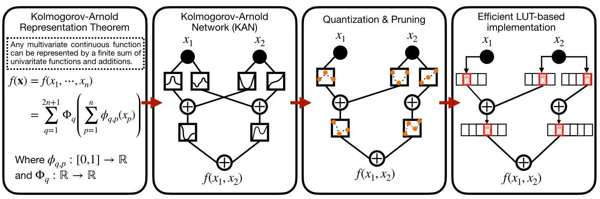
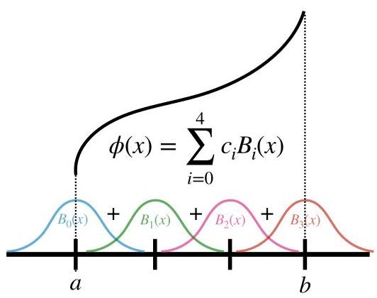
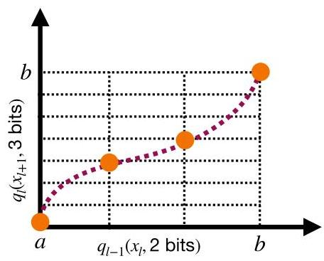
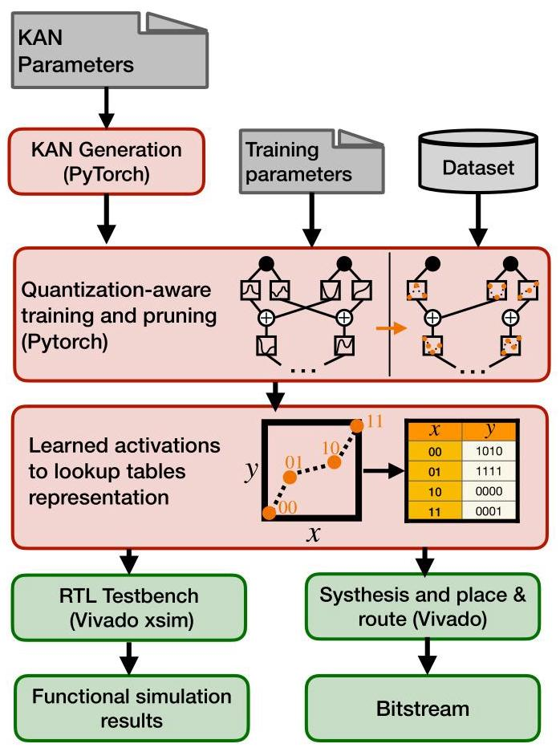
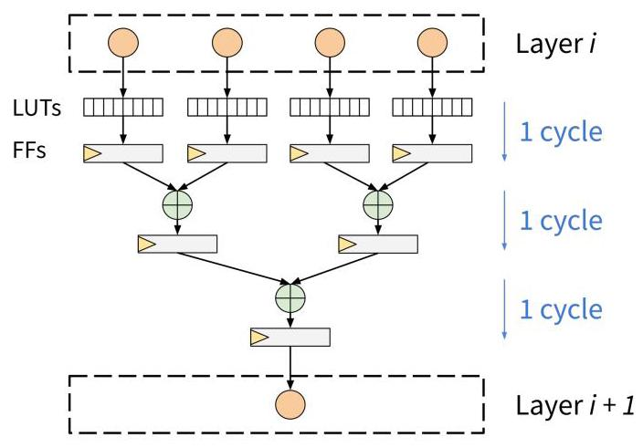
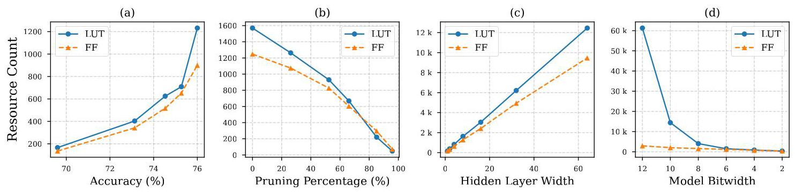
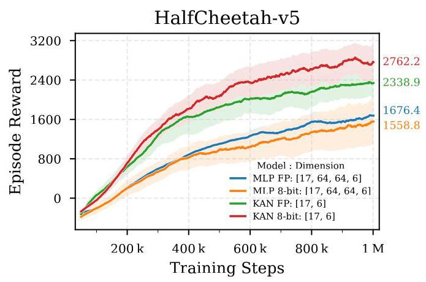

# KANELÉ: Kolmogorov-Arnold Networks for Efficient LUT-based Evaluation

# 卡内勒:用于基于查找表的高效评估的柯尔莫哥洛夫 - 阿诺德网络

Duc Hoang*

杜赫黄*

dhoang@mit.edu

Massachusetts Institute of Technology

麻省理工学院

Cambridge, MA, USA

美国马萨诸塞州剑桥市

Aarush Gupta*

阿鲁什·古普塔*

aarushg@mit.edu

Massachusetts Institute of Technology

麻省理工学院

Cambridge, MA, USA

美国马萨诸塞州剑桥市

Philip Harris

菲利普·哈里斯

pcharris@mit.edu

Massachusetts Institute of Technology

麻省理工学院

Cambridge, MA, USA

美国马萨诸塞州剑桥市

Figure 1: From the Kolmogorov-Arnold Representation Theorem to efficient KAN FPGA inference.

图1:从柯尔莫哥洛夫 - 阿诺德表示定理到高效的卡内勒现场可编程门阵列推理

## Abstract

## 摘要

Low-latency, resource-efficient neural network inference on FPGAs is essential for applications demanding real-time capability and low power. Lookup table (LUT)-based neural networks are a common solution, combining strong representational power with efficient FPGA implementation. In this work, we introduce KANELÉ, a framework that exploits the unique properties of Kolmogorov-Arnold Networks (KANs) for FPGA deployment. Unlike traditional multilayer perceptrons (MLPs), KANs employ learnable one-dimensional splines with fixed domains as edge activations, a structure naturally suited to discretization and efficient LUT mapping. We present the first systematic design flow for implementing KANs on FPGAs, co-optimizing training with quantization and pruning to enable compact, high-throughput, and low-latency KAN architectures. Our results demonstrate up to a 2700x speedup and orders of magnitude resource savings compared to prior KAN-on-FPGA approaches. Moreover, KANELÉ matches or surpasses other LUT-based architectures on widely used benchmarks, particularly for tasks involving symbolic or physical formulas, while balancing resource usage across FPGA hardware. Finally, we showcase the versatility of the framework by extending it to real-time, power-efficient control systems.

在现场可编程门阵列(FPGA)上进行低延迟、资源高效的神经网络推理对于要求实时能力和低功耗的应用至关重要。基于查找表(LUT)的神经网络是一种常见的解决方案，它将强大的表示能力与高效的FPGA实现相结合。在这项工作中我们引入了卡内勒(KANELÉ)，这是一个利用柯尔莫哥洛夫 - 阿诺德网络(KANs)的独特属性进行FPGA部署的框架。与传统的多层感知器(MLP)不同，KANs采用具有固定域的可学习一维样条作为边缘激活，这种结构自然适合离散化和高效的LUT映射。我们提出了第一个在FPGA上实现KANs的系统设计流程，通过量化和剪枝共同优化训练，以实现紧凑、高吞吐量和低延迟的KAN架构。我们的结果表明，与之前基于FPGA的KAN方法相比，速度提升高达2700倍，资源节省了几个数量级。此外，在广泛使用的基准测试中，卡内勒与其他基于LUT的架构相当或更优，特别是对于涉及符号或物理公式的任务，同时在FPGA硬件上平衡了资源使用。最后，我们通过将该框架扩展到实时、节能控制系统来展示其通用性。

## CCS Concepts

## 计算机科学技术分类

- Computing methodologies $\rightarrow$ Machine learning algorithms;

- 计算方法 $\rightarrow$ 机器学习算法;

- Hardware;

- 硬件;

## Keywords

## 关键词

Kolmogorov-Arnold Networks (KANs), FPGAs, Lookup tables (LUTs), Neural networks, Quantization, Pruning, Hardware-software codesign

柯尔莫哥洛夫 - 阿诺德网络(KANs)、现场可编程门阵列(FPGAs)、查找表(LUTs)、神经网络、量化、剪枝、硬件 - 软件协同设计

## ACM Reference Format:

## ACM引用格式:

Duc Hoang, Aarush Gupta, and Philip Harris. 2026. KANELÉ: Kolmogorov-Arnold Networks for Efficient LUT-based Evaluation. In Proceedings of the 2026 ACM/SIGDA International Symposium on Field Programmable Gate Arrays (FPGA '26), February 22-24, 2026, Seaside, CA, USA. ACM, New York, NY, USA, 12 pages. https://doi.org/10.1145/3748173.3779202

杜赫·黄、阿鲁什·古普塔和菲利普·哈里斯。2026年。KANELÉ:用于基于查找表的高效评估的柯尔莫哥洛夫 - 阿诺德网络。在2026年美国计算机协会/美国计算机协会设计自动化会议(FPGA '26)的会议论文集，2026年2月22 - 24日，美国加利福尼亚州海滨。美国计算机协会，纽约，纽约，美国，12页。https://doi.org/10.1145/3748173.3779202

## 1 Introduction

## 1 引言

Lookup table (LUT) based neural networks have become a central paradigm for efficient FPGA inference, with designs such as NeuralLUT-Assemble [6], TreeLUT [23], DWN [7], and others [4, 12, 37, 47] demonstrating dramatic gains in area, latency, and power efficiency. These approaches highlight the advantages of rethinking neural networks around LUT primitives, though they remain largely confined to supervised learning and task-specific architectures.

基于查找表(LUT)的神经网络已成为高效FPGA推理的核心范式，诸如NeuralLUT - Assemble [6]、TreeLUT [23]、DWN [7]以及其他一些设计[4, 12, 37, 47]在面积、延迟和功率效率方面都有显著提升。这些方法凸显了围绕LUT原语重新思考神经网络的优势，不过它们在很大程度上仍局限于监督学习和特定任务架构。

In this work, we demonstrate that Kolmogorov-Arnold Networks (KANs) offer a principled foundation for LUT-based design. Inspired by the Kolmogorov-Arnold representation theorem, KANs replace the fixed activations of Multilayer Perceptrons (MLPs) with learnable edge functions and the matrix multiplication in MLPs with summation at nodes (Fig. 1). This activation-centric formulation aligns naturally with LUTs: each learnable spline defined on a fixed domain can be quantized, pruned, and directly mapped to LUTs. In the literature, although KANs have been shown to outperform MLPs in settings such as PDE solving and scientific computing [27, 28], their practical deployment has been hindered by slow inference and costly hardware realizations [20, 41]. The only prior FPGA implementation concluded KANs were impractical, due to expensive spline evaluations and high resource usage [41].

在这项工作中，我们证明柯尔莫哥洛夫 - 阿诺德网络(KANs)为基于LUT的设计提供了一个有原则的基础。受柯尔莫哥洛夫 - 阿诺德表示定理的启发，KANs用可学习的边缘函数取代了多层感知器(MLPs)的固定激活函数，并将MLPs中的矩阵乘法替换为节点求和(图1)。这种以激活为中心的公式自然地与LUTs相契合:在固定域上定义的每个可学习样条都可以被量化、剪枝，并直接映射到LUTs。在文献中，尽管KANs在诸如偏微分方程求解和科学计算等场景中已被证明优于MLPs [27, 28]，但其实际部署受到推理速度慢和硬件实现成本高的阻碍[20, 41]。唯一的先前FPGA实现得出结论，由于样条评估成本高和资源使用量大，KANs不切实际[41]。

---

*Both authors contributed equally to this research.

*两位作者对本研究贡献相同。

---

This paper shows that by re-formulating KAN inference entirely in terms of LUTs, KANs are not only feasible but highly efficient in FPGA settings. Thus, our contributions are fourfold:

本文表明，通过完全根据LUTs重新制定KAN推理，KANs在FPGA设置中不仅可行而且高效。因此，我们的贡献有四个方面:

(1) FPGA-tailored KAN Architecture: We present KANELÉ, named after the French pastry known for its compact form and rich structure [31]. At its core, the framework co-optimizes quantization, pruning, and mapping of KAN functions onto learned LUTs and additions, thereby minimizing memory and logic overhead. From a KAN research perspective, KANELÉ is the first FPGA-tailored formulation, eliminating BRAM/DSP usage, reducing latency by up to 2700x, and cutting resource usage by over ${4000} \times$ compared to prior designs [41].

(1) 针对FPGA的KAN架构:我们提出了KANELÉ，它以其紧凑形式和丰富结构而闻名的法国糕点命名[31]。其核心是，该框架共同优化KAN函数到学习型LUTs和加法的量化、剪枝和映射，从而最小化内存和逻辑开销。从KAN研究的角度来看，KANELÉ是第一个针对FPGA的公式，消除了BRAM/DSP的使用，与先前设计[41]相比，延迟降低了高达2700倍，资源使用减少了超过${4000} \times$。

(2) High-Performance Realizations: Unlike conventional LUT-based neural networks, where sequential LUT indexing makes pruning fundamentally incompatible with the model structure, KANELÉ leverages the additive independence of KANs to make pruning both natural and hardware efficient. Building on this architecture, KANELÉ delivers FPGA implementations that match or surpass other LUT-based neural designs, particularly for tasks well-suited to symbolic mapping. It sustains clock frequencies above ${800}\mathrm{{MHz}}$ across most benchmarks while achieving a state-of-the-art Area $\times$ Delay product and maintaining a balanced resource footprint.

(2) 高性能实现:与传统的基于LUT的神经网络不同，在传统网络中，顺序LUT索引使得剪枝与模型结构从根本上不兼容，KANELÉ利用KANs的加法独立性使剪枝既自然又硬件高效。基于此架构，KANELÉ提供的FPGA实现与其他基于LUT的神经设计相匹配或超越，特别是对于非常适合符号映射的任务。在大多数基准测试中，它保持高于${800}\mathrm{{MHz}}$的时钟频率，同时实现了领先的面积$\times$延迟乘积，并保持了资源占用的平衡。

(3) Open-source Framework: We provide an automated software-hardware co-design flow that compiles KANs into optimized FPGA implementations within seconds, supporting reproducible studies across domains such as biology, physics, vision, signal processing, and tabular ML. Code is available at: https://github.com/Duchstf/KANELE

(3) 开源框架:我们提供了一个自动化软硬件协同设计流程，可在数秒内将KANs编译为优化的FPGA实现，支持跨生物学、物理学、视觉、信号处理和表格机器学习等领域的可重复研究。代码可在:https://github.com/Duchstf/KANELE获取

(4) Control Systems: we extend KANELÉ beyond supervised learning to continuous control, showing on the HalfCheetah benchmark from OpenAI Gym [40] that a quantized KAN policy with $\sim  5 \times$ fewer parameters than an MLP baseline policy achieves higher rewards, underscoring its suitability for resource-constrained, real-time control systems.

(4) 控制系统:我们将KANELÉ从监督学习扩展到连续控制，在OpenAI Gym [40]的HalfCheetah基准测试中表明，一个比MLP基线策略少$\sim  5 \times$个参数的量化KAN策略获得了更高的奖励，强调了其适用于资源受限的实时控制系统。

## 2 Background & Related Works

## 2 背景与相关工作

This section reviews Kolmogorov-Arnold Networks (KANs) and prior work on LUT-based neural network inference.

本节回顾柯尔莫哥洛夫 - 阿诺德网络(KANs)以及先前关于基于LUT的神经网络推理的工作。

### 2.1 Kolmogorov-Arnold Networks

### 2.1 柯尔莫哥洛夫 - 阿诺德网络

Kolmogorov-Arnold Networks (KANs) replace the fixed activation functions and matrix multiplications of MLPs with learnable spline-based functions on network edges [28]. This activation-centric formulation improves expressiveness and interpretability, often achieving comparable accuracy with fewer parameters and operations. Since their introduction, KANs have inspired extensive follow-up work, including theoretical analyses [45, 48], architectural extensions (e.g., convolutional [9, 15], temporal [18], and Fourier-based variants [21, 49]), and applications across scientific modeling and data-driven tasks [13, 19, 25, 46].

柯尔莫哥洛夫 - 阿诺德网络(KANs)用网络边缘上基于可学习样条的函数取代了多层感知器(MLPs)的固定激活函数和矩阵乘法[28]。这种以激活为中心的公式提高了表现力和可解释性，通常能用更少的参数和操作实现相当的精度。自引入以来，KANs激发了大量后续工作，包括理论分析[45, 48]、架构扩展(例如卷积[9, 15]、时间序列[18]和基于傅里叶的变体[21, 49])以及在科学建模和数据驱动任务中的应用[13, 19, 25, 46]。

Despite this rapid progress, recent surveys identify computational efficiency and hardware implementation as key open challenges [20, 22, 36]. To date, efficient hardware realization remains largely unexplored, with one early attempt concluding that a direct FPGA implementation incurs prohibitive resource and latency costs compared to MLPs [41]. Our work directly challenges this conclusion by demonstrating that the activation-centric design of KANs is, in fact, exceptionally well-suited for hardware acceleration through a LUT-based paradigm.

尽管取得了这一快速进展，但最近的调查将计算效率和硬件实现确定为关键的开放性挑战[20, 22, 36]。迄今为止，高效的硬件实现仍在很大程度上未被探索，一项早期尝试得出结论，与MLPs相比，直接的FPGA实现会带来过高的资源和延迟成本[41]。我们的工作通过证明KANs以激活为中心的设计实际上非常适合通过基于查找表(LUT)的范式进行硬件加速，直接对这一结论提出了挑战。

### 2.2 LUT-based Neural Networks

### 2.2基于查找表的神经网络

LUT-based neural networks aim to replace arithmetic-heavy MAC operations with precomputed function evaluations stored in LUTs, exploiting the abundant and low-latency logic resources of FPGAs. Pioneering frameworks like LUTNet [44] and LogicNets [42] first demonstrated the replacement of arithmetic with direct LUT mappings. Subsequent works generalized this concept to approximate more complex functions $\left\lbrack  {4,5}\right\rbrack$ and improved scalability using additive or modular ensembles $\left\lbrack  {6,{30},{47}}\right\rbrack$ . This design philosophy has also been used to efficiently implement other machine learning models, such as gradient-boosted decision trees [23]. Another related approach is the family of Weightless Neural Networks (WNNs), which stores learned patterns directly in LUTs [3, 7, 32, 38, 39], though often at the cost of representational power.

基于查找表的神经网络旨在用存储在查找表中的预先计算的函数评估来取代计算量大的乘积累加(MAC)操作，利用FPGA丰富且低延迟的逻辑资源。像LUTNet [44]和LogicNets [42]这样的开创性框架首先展示了用直接的查找表映射取代算术运算。后续工作将这一概念推广到近似更复杂的函数$\left\lbrack  {4,5}\right\rbrack$，并使用加法或模块化集成$\left\lbrack  {6,{30},{47}}\right\rbrack$提高了可扩展性。这种设计理念也被用于高效实现其他机器学习模型，如梯度提升决策树[23]。另一种相关方法是无权重神经网络(WNNs)家族，它将学习到的模式直接存储在查找表中[3, 7, 32, 38, 39]，不过通常是以牺牲表示能力为代价。

Conceptually, KANs are close to PolyLUT [4], PolyLUT-Add [30], and DWNs [7] but possess distinct structural properties. While Poly-LUT tabulates multivariate polynomials, which theoretically allows the native representation of arbitrary products $p\left( \mathbf{x}\right)  = \mathop{\prod }\limits_{i}{x}_{i}$ , this approach suffers from exponential LUT growth relative to input dimension. In contrast, KANs decompose functions into sums of tabulated univariate splines. Although this formulation relies on layer composition to approximate the multiplicative terms inherent to PolyLUT, it yields linear scaling with input dimension and an additive structure that is naturally amenable to pruning. While this formulation doesn't explicitly represent pure multiplicative terms, in practice, compositions of low-order (≤3) splines approximate such interactions effectively. Moreover, DWN's full binarization of inputs and LUTs hinders generalization beyond classification, while KANELÉ supports higher-precision arithmetic for tasks such as au-toencoding and continuous control. Finally, DWN's finite-difference differentiability may further constrain optimization flexibility compared to KANELÉ gradient descent.

从概念上讲，KANs与PolyLUT [4]、PolyLUT - Add [30]和DWNs [7]相近，但具有不同的结构特性。虽然Poly - LUT将多元多项式制成表格，理论上允许原生表示任意乘积$p\left( \mathbf{x}\right)  = \mathop{\prod }\limits_{i}{x}_{i}$，但这种方法相对于输入维度会导致查找表呈指数增长。相比之下，KANs将函数分解为表格化的单变量样条之和。尽管这种公式依赖于层组合来近似PolyLUT固有的乘法项，但它随输入维度呈线性扩展，并且具有一种自然适合剪枝的加法结构。虽然这种公式没有明确表示纯乘法项，但在实践中，低阶(≤3)样条的组合有效地近似了这种交互。此外，DWN对输入和查找表的完全二值化阻碍了除分类之外的泛化，而KANELÉ支持用于自动编码和连续控制等任务的更高精度算术。最后，与KANELÉ梯度下降相比，DWN的有限差分可微性可能会进一步限制优化灵活性。

## 3 KAN Architecture and Quantization-Aware Training and Pruning

## 3 KAN架构与量化感知训练和剪枝

We design the KANELÉ framework for KAN FPGA deployment using quantization-aware training and pruning, enabling efficient hardware translation while preserving consistency between training and inference.

我们使用量化感知训练和剪枝为KAN FPGA部署设计了KANELÉ框架，在保持训练和推理一致性的同时实现高效的硬件转换。

Figure 2: A KAN activation $\phi \left( x\right)$ represented as a linear combination of B-spline basis functions ${B}_{i}\left( x\right)$ on a grid over $\left\lbrack  {a, b}\right\rbrack$ : $\phi \left( x\right)  = \mathop{\sum }\limits_{i}{c}_{i}{B}_{i}\left( x\right)$ . Trainable coefficients ${c}_{i}$ control the overall function shape.

图2:一个KAN激活$\phi \left( x\right)$表示为在$\left\lbrack  {a, b}\right\rbrack$上的网格上的B - 样条基函数${B}_{i}\left( x\right)$的线性组合:$\phi \left( x\right)  = \mathop{\sum }\limits_{i}{c}_{i}{B}_{i}\left( x\right)$。可训练系数${c}_{i}$控制整体函数形状。

### 3.1 KAN Architecture with Learnable Activation Functions

### 3.1具有可学习激活函数的KAN架构

Before introducing quantization and pruning, we first outline the core architecture. Unlike MLPs, KANs replace fixed nonlinearities with learnable activation functions, each modeled as a linear combination of B-spline basis functions with trainable coefficients. B-splines are piecewise polynomials defined on a grid, providing smoothness, locality, and efficient nonlinear parameterization. More generally, activations can be expressed in other orthogonal bases, such as Fourier series [21, 26, 49].

在介绍量化和剪枝之前，我们首先概述核心架构。与MLPs不同，KANs用可学习的激活函数取代固定的非线性，每个激活函数都建模为具有可训练系数的B - 样条基函数的线性组合。B - 样条是在网格上定义的分段多项式，提供平滑性、局部性和有效的非线性参数化。更一般地，激活可以用其他正交基表示，如傅里叶级数[21, 26, 49]。

A KAN layer with ${d}_{\text{ in }}$ inputs and ${d}_{\text{ out }}$ outputs is represented as a matrix of 1D learnable functions

一个具有${d}_{\text{ in }}$个输入和${d}_{\text{ out }}$个输出的KAN层被表示为一个一维可学习函数的矩阵

$$
\Phi  = \left\{  {\phi }_{q, p}\right\}  ,\;p = 1,\ldots ,{d}_{\mathrm{{in}}},\;q = 1,\ldots ,{d}_{\mathrm{{out}}}, \tag{1}
$$

where each ${\phi }_{q, p}$ is trainable (Fig. 2).

其中每个${\phi }_{q, p}$都是可训练的(图2)。

For improved convergence, each ${\phi }_{q, p}$ combines a base activation $\phi \left( \cdot \right)$ with B-splines $\left\{  {{B}_{p, k}\left( \cdot \right) }\right\}$ :

为了提高收敛性，每个${\phi }_{q, p}$将一个基本激活函数$\phi \left( \cdot \right)$与B样条$\left\{  {{B}_{p, k}\left( \cdot \right) }\right\}$相结合:

$$
{\phi }_{q, p}\left( {x}_{p}\right)  = {w}_{q, p}^{\text{ base }}\phi \left( {x}_{p}\right)  + \mathop{\sum }\limits_{{k = 1}}^{{G + S}}{w}_{q, p, k}^{\text{ spline }}{B}_{p, k}\left( {x}_{p}\right) , \tag{2}
$$

where ${w}_{q, p}^{\text{ base }}$ and ${w}_{q, p, k}^{\text{ spline }}$ are trainable. Splines are defined on a grid of size $G$ and order $S$ within a fixed domain $\left\lbrack  {a, b}\right\rbrack$ .

其中${w}_{q, p}^{\text{ base }}$和${w}_{q, p, k}^{\text{ spline }}$是可训练的。样条在固定域$\left\lbrack  {a, b}\right\rbrack$内大小为$G$且阶数为$S$的网格上定义。

Given ${x}_{l} \in  {\mathbb{R}}^{{d}_{\text{ in }}}$ , the output is

给定${x}_{l} \in  {\mathbb{R}}^{{d}_{\text{ in }}}$，输出为

$$
{\left( {x}_{l + 1}\right) }_{j} = \mathop{\sum }\limits_{{i = 1}}^{{d}_{l}}{\phi }_{j, i}\left( {x}_{l, i}\right) ,\;j = 1,\ldots ,{d}_{l + 1}, \tag{3}
$$

or in compact form

或以紧凑形式表示为

$$
{x}_{l + 1} = {\Phi }_{l}\left( {x}_{l}\right) \tag{4}
$$

with ${\Phi }_{l}$ the function matrix of layer $l$ . A $L$ -layer KAN is thus

其中${\Phi }_{l}$是层$l$的函数矩阵。因此一个$L$层的KAN是

$$
\operatorname{KAN}\left( x\right)  = {\Phi }_{L - 1} \circ  {\Phi }_{L - 2} \circ  \cdots  \circ  {\Phi }_{0}\left( x\right) . \tag{5}
$$

As illustrated in Fig. 1, KANs extend MLPs by learning activations directly, offering greater representational flexibility while preserving a structured, layer-wise graph.

如图1所示，KAN通过直接学习激活函数扩展了多层感知器，在保留结构化的、逐层图结构的同时提供了更大的表示灵活性。

### 3.2 Quantization-Aware Training

### 3.2量化感知训练

For efficient FPGA deployment, we adopt quantization-aware training (QAT) via AMD's Brevitas library [17]. Quantizers are placed at the network input and after each KAN layer, ensuring that training adapts to the required hardware precision.

为了实现高效的FPGA部署，我们通过AMD的Brevitas库[17]采用量化感知训练(QAT)。量化器放置在网络输入处以及每个KAN层之后，以确保训练适应所需的硬件精度。

For a layer $l$ with output ${\mathbf{x}}_{l + 1} \in  {\mathbb{R}}^{{d}_{l + 1}}$ , the quantized output is

对于具有输出${\mathbf{x}}_{l + 1} \in  {\mathbb{R}}^{{d}_{l + 1}}$的层$l$，量化后的输出为

$$
{\mathbf{x}}_{l + 1, q} = {q}_{l}\left( {\mathbf{x}}_{l + 1}\right) , \tag{6}
$$

where ${q}_{l}\left( \cdot \right)$ is the layer quantizer. Similarly, an input quantizer ${q}_{I}\left( \cdot \right)$ is applied to ${\mathbf{x}}_{0}$ .

其中${q}_{l}\left( \cdot \right)$是层量化器。类似地，输入量化器${q}_{I}\left( \cdot \right)$应用于${\mathbf{x}}_{0}$。

The layer output quantizer performs ${n}_{l}$ -bit uniform quantization:

层输出量化器执行${n}_{l}$位均匀量化:

$$
{\mathbf{x}}_{l + 1, q} = {s}_{l} \cdot  \operatorname{Quantize}\left\lbrack  {n}_{l}\right\rbrack  \left( \frac{\operatorname{clip}\left( {{\mathbf{x}}_{l + 1}, a, b}\right) }{{s}_{l}}\right) , \tag{7}
$$

where ${s}_{l}$ is a learnable scale (fixed at inference), and $\left\lbrack  {a, b}\right\rbrack$ is the shared quantization domain (Fig. 3).

其中${s}_{l}$是一个可学习的比例因子(在推理时固定)，$\left\lbrack  {a, b}\right\rbrack$是共享的量化域(图3)。

The input quantizer incorporates both scale ${s}_{I}$ and bias ${b}_{I}$ to handle asymmetric distributions:

输入量化器结合了比例因子${s}_{I}$和偏差${b}_{I}$以处理非对称分布:

$$
{\mathbf{x}}_{0, q} = {s}_{I} \cdot  \operatorname{Quantize}\left\lbrack  {n}_{I}\right\rbrack  \left( {\frac{\operatorname{clip}\left( {{\mathbf{x}}_{0}, a, b}\right) }{{s}_{I}} + {b}_{I}}\right) . \tag{8}
$$

During RTL generation, ${s}_{I}$ and ${b}_{I}$ are fixed for deterministic behavior.

在RTL生成期间，${s}_{I}$和${b}_{I}$被固定以实现确定性行为。

In practice, input preprocessing is realized by a batch normalization (zero mean, unit variance) followed by a ScalarBiasScale block introducing ${b}_{I}$ and ${s}_{I}$ . At inference, BN statistics are folded into these constants, yielding an affine shift-scale, clipping, and quantization. This design preserves LUT-based compatibility while avoiding the overhead of full batch normalization.

在实践中，输入预处理通过批量归一化(零均值，单位方差)实现，随后是一个引入${b}_{I}$和${s}_{I}$的标量偏差比例因子块。在推理时，批量归一化统计信息被折叠到这些常量中，产生仿射变换、裁剪和量化。这种设计保留了基于查找表的兼容性，同时避免了全批量归一化的开销。

During training, quantizer gradients are approximated using the straight-through estimator (STE):

在训练期间，使用直通估计器(STE)来近似量化器梯度:

$$
\frac{\partial q\left( x\right) }{\partial x} \approx  1 \tag{9}
$$

which allows gradient flow through quantized operations without modification.

这允许梯度流通过量化操作而无需修改。

### 3.3 Pruning via Norm-Based Selection

### 3.3 通过基于范数的选择进行剪枝

To reduce resource usage, we prune spline connections by evaluating their contribution over the input domain. In contrast to conventional LUT-based neural networks-which rely on sequential LUT indexing, making every LUT entangled with the next and thus nearly impossible to prune without breaking the model-KANELÉ exploits the inherently additive structure of KANs, where each LUT contributes independently to a summation. This independence makes pruning both mathematically natural and directly compatible with FPGA hardware. The original KAN paper emphasizes efficient pruning as a key advantage of KAN's edge-centric architecture, and we extend this insight to demonstrate a distinct advantage over node-based LUT networks for efficient hardware translation [28].

为了减少资源使用，我们通过评估样条连接在输入域上的贡献来对其进行剪枝。与传统的基于查找表(LUT)的神经网络不同——传统神经网络依赖于顺序LUT索引，使得每个LUT与下一个LUT相互纠缠，因此如果不破坏模型几乎不可能进行剪枝——KANELÉ利用了KAN固有的加法结构，其中每个LUT独立地对求和做出贡献。这种独立性使得剪枝在数学上自然且与FPGA硬件直接兼容。KAN的原始论文强调高效剪枝是KAN以边缘为中心架构的一个关键优势，我们扩展了这一见解，以证明在高效硬件转换方面相对于基于节点的LUT网络具有明显优势[28]。

Figure 3: Layer-wise uniform quantization. Here, 2-bit inputs ${q}_{l - 1}\left( {x}_{l}\right)$ are mapped to 3-bit outputs $q\left( {x}_{l + 1}\right)$ over the fixed range $\left\lbrack  {a, b}\right\rbrack$ . Orange markers indicate quantization levels; the dotted curve is the underlying continuous mapping.

图3:逐层均匀量化。在这里，2位输入${q}_{l - 1}\left( {x}_{l}\right)$在固定范围$\left\lbrack  {a, b}\right\rbrack$上被映射到3位输出$q\left( {x}_{l + 1}\right)$。橙色标记表示量化级别；虚线曲线是基础的连续映射。

For each pair $\left( {i, j}\right)$ of input and output neurons, we compute the activation of the spline component:

对于每对输入和输出神经元$\left( {i, j}\right)$，我们计算样条组件的激活:

$$
{f}_{p \rightarrow  q}\left( x\right)  = \mathop{\sum }\limits_{{k = 1}}^{{G + S}}{w}_{q, p, k}^{\text{ spline }}{B}_{p, k}\left( x\right) . \tag{10}
$$

Its importance is measured via the ${\ell }_{2}$ norm across a sampled input grid $\mathcal{X}$ consistent with its quantization level:

其重要性通过在与其量化级别一致的采样输入网格$\mathcal{X}$上的${\ell }_{2}$范数来衡量:

$$
{\begin{Vmatrix}{f}_{p \rightarrow  q}\end{Vmatrix}}_{2} = {\left( \mathop{\sum }\limits_{{x \in  \mathcal{X}}}{\left| {f}_{p \rightarrow  q}\left( x\right) \right| }^{2}\right) }^{1/2}. \tag{11}
$$

A structured pruning mask is then applied:

然后应用一个结构化剪枝掩码:

$$
{m}_{q, p} = \left\{  \begin{array}{ll} 1, & {\begin{Vmatrix}{f}_{p \rightarrow  q}\end{Vmatrix}}_{2} > \tau \left( t\right) , \\  0, & \text{ otherwise, } \end{array}\right. \tag{12}
$$

where $\tau \left( t\right)$ is a pruning threshold that changes as a function of epochs $\left( t\right)$ with

其中$\tau \left( t\right)$是一个剪枝阈值，它作为epoch$\left( t\right)$的函数而变化，其关系为

$$
\tau \left( t\right)  = T\exp \left( {-\ln {20} \cdot  \frac{\max \left( {t,{t}_{0}}\right) }{{t}_{f} - {t}_{0}}}\right) .
$$

This pruning threshold corresponds to an exponential warmup, where pruning starts on epoch ${t}_{0}$ and increases exponentially, hitting ${95}\%$ of the full pruning threshold $T$ on target epoch ${t}_{f}$ . This allows us to control pruning dynamics to avoid interference with proper training. Backward pruning is additionally applied if the corresponding output neuron has no active connections in the subsequent layer, ensuring consistent sparsity propagation.

这个剪枝阈值对应于指数热身，其中剪枝从epoch${t}_{0}$开始并呈指数增加，在目标epoch${t}_{f}$达到全剪枝阈值$T$的${95}\%$。这使我们能够控制剪枝动态，以避免干扰正常训练。如果相应的输出神经元在后续层中没有活跃连接，则额外应用反向剪枝，以确保一致的稀疏性传播。

### 3.4 KAN Hyperparameters

### 3.4 KAN超参数

To summarize, the training and deployment of KANs involves hy-perparameters which can be broken up into three main classes: spline representation hyperparameters, hardware architecture hy-perparameters, and pruning hyperparameters. The descriptions and impact of each hyperparameter are detailed in Table 1. The joint optimization of these parameters provides a flexible design space that balances learning capacity with hardware efficiency in FPGA deployments.

总之，KAN的训练和部署涉及超参数，这些超参数可分为三个主要类别:样条表示超参数、硬件架构超参数和剪枝超参数。每个超参数的描述和影响在表1中详细列出。这些参数的联合优化提供了一个灵活的设计空间，在FPGA部署中平衡了学习能力和硬件效率。

## 4 LUT-Based KAN Architecture

## 4 基于LUT的KAN架构

This section outlines our end-to-end mapping of trained KANs to synthesizable VHDL RTL and associated pipelining strategies. Our end-to-end toolflow currently supports the basic KAN architecture using B-splines, as in the original paper [28]. Extensions to other bases or architectures such as convolutions or transformers are feasible. The framework is designed for usability-anyone familiar with training MLPs can readily train and deploy KANELÉ.

本节概述了我们将训练好的KAN端到端映射到可合成的VHDL RTL以及相关流水线策略。我们的端到端工具流目前支持使用B样条的基本KAN架构，如原始论文[28]中所述。扩展到其他基或架构，如卷积或变压器架构是可行的。该框架设计用于易用性——任何熟悉训练多层感知器(MLP)的人都可以轻松地训练和部署KANELÉ。

Figure 4: Visualization of the KAN to FPGA implementation toolflow.

图4:KAN到FPGA实现工具流的可视化。

### 4.1 Toolflow

### 4.1 工具流

A high-level overview of the toolflow stages is shown in Figure 4. This push-button workflow removes manual RTL work: starting from a trained PyTorch checkpoint, it deterministically emits RTL, memory images, and build/simulation scripts, enabling rapid deployment of arbitrary KAN topologies to FPGA and bitstream generation via Vivado.

<text>图4展示了工具流阶段的高级概述。这种一键式工作流程消除了手动RTL工作:从经过训练的PyTorch检查点开始，它确定性地生成RTL、内存图像以及构建/仿真脚本，从而能够通过Vivado将任意KAN拓扑快速部署到FPGA并生成比特流。</text>

4.1.1 Training. The training process begins by specifying the KAN hyperparameters (see Section 3.4) together with the dataset to be used. The user may freely select the optimizer and learning-rate schedule best suited to their task. In our implementation, we adopt the PyTorch AdamW optimizer [29] as the default choice due to its robustness in handling weight decay. The model is then trained with the QAT and pruning mechanism described in Section 3.2 and Section 3.3, respectively, to reduce resource usage and latency, while preserving accuracy. This step produces compact learned activations for KAN that can be efficiently mapped to LUT representations for FPGA deployment.

<text>4.1.1训练。训练过程首先要指定KAN超参数(见3.4节)以及要使用的数据集。用户可以自由选择最适合其任务的优化器和学习率调度。在我们的实现中，由于其在处理权重衰减方面的稳健性，我们采用PyTorch AdamW优化器[29]作为默认选择。然后，使用分别在3.2节和3.3节中描述的QAT和剪枝机制对模型进行训练，以减少资源使用和延迟，同时保持准确性。这一步为KAN生成了紧凑的学习激活，可有效地映射到FPGA部署的LUT表示。</text>

4.1.2 KAN to Logical-LUTs Conversion. Following [6], we denote lookup tables extracted from the network as Logical-LUTs (L-LUTs), and FPGA fabric resources as Physical-LUTs (P-LUTs). From a trained, pruned, and quantized PyTorch KAN, each surviving connection is translated into an L-LUT. For every active edge, the input state space is enumerated and the KAN layer's pre-activation response is evaluated and quantized. This produces per-connection truth tables stored as compact JSON files, yielding a deterministic, bit-accurate mapping of the model into integer-valued L-LUTs. The representation preserves quantization and sparsity, enabling efficient FPGA deployment.

<text>4.1.2 KAN到逻辑LUT的转换。遵循[6]，我们将从网络中提取的查找表表示为逻辑LUT(L-LUT)，将FPGA结构资源表示为物理LUT(P-LUT)。从经过训练、剪枝和量化的PyTorch KAN中，每个存活的连接都被转换为一个L-LUT。对于每个活动边缘，枚举输入状态空间并评估和量化KAN层的预激活响应。这会生成作为紧凑JSON文件存储的每个连接的真值表，从而将模型确定性地、比特精确地映射到整数值的L-LUT。该表示保留了量化和稀疏性，实现了高效的FPGA部署。</text>

Table 1: Summary of KAN training parameters. The first group influences the accuracy through spline representation, the second group encodes the hardware architecture, and the third group determines pruning policy which affects hardware architecture.

<text>表1:KAN训练参数总结。第一组参数通过样条表示影响准确性，第二组参数编码硬件架构，第三组参数确定影响硬件架构的剪枝策略。</text>

<table><tr><td>Symbol</td><td>Description</td><td>Impact</td></tr><tr><td>$G$</td><td>Grid size (number of intervals)</td><td>Controls spline resolution; accuracy only</td></tr><tr><td>$\left\lbrack  {a, b}\right\rbrack$</td><td>Grid range (spline domain)</td><td>Defines support of basis functions; accuracy only</td></tr><tr><td>$S$</td><td>Spline order</td><td>Smoothness and flexibility; accuracy only</td></tr><tr><td>${d}_{l}$</td><td>Layer dimensions</td><td>Affects model capacity and resource usage</td></tr><tr><td>${n}_{l}$</td><td>Layer bitwidth (QAT precision)</td><td>Direct trade-off between accuracy and resource cost</td></tr><tr><td>$T$</td><td>Pruning threshold</td><td>Governs sparsity and LUT reduction and accuracy tradeoff</td></tr><tr><td>${t}_{0}$</td><td>Warmup start epoch</td><td>Determines when pruning warmup starts</td></tr><tr><td>${t}_{f}$</td><td>Warmup target epoch</td><td>Affects pruning warmup rate</td></tr></table>

4.1.3 RTL File Generation. From the L-LUT graph, we generate a complete RTL design for FPGA deployment. The tool emits VHDL sources for the KAN core, per-layer packages, LUT entities, and memory initialization files encoding the truth tables. A configuration package specifies bit widths, signal types, and accumulator sizes. Each L-LUT is instantiated as a memory-mapped component, organized into layers, with balanced adder trees for output accumulation. Pipeline registers are inserted between layers to improve clocking and shorten critical paths. The result is a self-contained firmware bundle that includes simulation testbenches, initialization vectors, and Vivado build scripts-supporting functional simulation, latency evaluation, and FPGA synthesis.

<text>4.1.3 RTL文件生成。从L-LUT图中，我们生成用于FPGA部署的完整RTL设计。该工具会发出KAN核心的VHDL源文件、每层的包、LUT实体以及编码真值表的内存初始化文件。一个配置包指定比特宽度、信号类型和累加器大小。每个L-LUT都被实例化为一个内存映射组件，按层组织，带有用于输出累加的平衡加法树。在层之间插入流水线寄存器以改善时钟并缩短关键路径。结果是一个自包含的固件包，包括仿真测试平台、初始化向量以及支持功能仿真、延迟评估和FPGA综合的Vivado构建脚本。</text>

4.1.4 Synthesis and Place & Route. We synthesize the generated RTL with Vivado 2024.1, targeting the xcvu9p-flgb2104-2-i FPGA for benchmarking against LUT-based networks, and the xczu7ev-ffvc1156-2-e FPGA for comparison with prior KAN works. To ensure fairness and consistency with prior works, we use settings that isolate core delay and area, specifically Vivado's Flow_PerfOptimized_high mode with Out-of-Context synthesis, allowing each module to be compiled independently. While the maximum clock is ultimately limited by the FPGA's global clock, LUT-centric designs such as KANELÉ typically sustain high frequencies, making the computational core unlikely to be the critical path in larger systems. The target clock period is therefore chosen relative to network size, following prior work.

<text>4.1.4综合与布局布线。我们使用Vivado 2024.1对生成的RTL进行综合，针对xcvu9p-flgb2104-2-i FPGA进行基于LUT的网络基准测试，针对xczu7ev-ffvc1156-2-e FPGA与之前的KAN工作进行比较。为确保与之前工作的公平性和一致性，我们使用隔离核心延迟和面积的设置，具体是Vivado的Flow_PerfOptimized_high模式和上下文外综合，允许每个模块独立编译。虽然最大时钟最终受FPGA全局时钟限制，但像KANELÉ这样以LUT为中心的设计通常能维持高频，使得计算核心在更大系统中不太可能成为关键路径。因此，按照之前的工作，目标时钟周期是根据网络大小选择的。</text>

### 4.2 Pipelining Strategies

<text>### 4.2流水线策略</text>

Efficient pipelining is crucial for achieving high FPGA clock frequencies while maintaining low latency across KAN layers. We introduce pipelining at two levels: (i) within adder trees that accumulate outputs of multiple Logical-LUTs (L-LUTs) per channel, and (ii) between consecutive network layers.

<text>高效的流水线对于在保持KAN层低延迟的同时实现高FPGA时钟频率至关重要。我们在两个级别引入流水线:(i)在每个通道累积多个逻辑LUT(L-LUT)输出的加法树内，以及(ii)在连续的网络层之间。</text>

Figure 5: Balanced, pipelined adder tree for computing one neuron activation with ${n}_{add} = 2$ .

<text>图5:用于通过${n}_{add} = 2$计算一个神经元激活的平衡流水线加法树。</text>

Adder Tree Pipelining. Each neuron computes a weighted sum of active inputs via a reduction tree over L-LUT outputs. A naïve single-stage sum creates a long combinational path, thereby limiting frequency. Instead, we implement a balanced, pipelined adder tree with registers after each stage. At each stage up to ${n}_{\text{ add }}$ inputs are combined, reducing fan-in and distributing additions over multiple cycles. The depth is

<text>加法树流水线。每个神经元通过对L-LUT输出的归约树计算活动输入的加权和。一个简单的单级求和会创建一条长的组合路径，从而限制频率。相反，我们实现了一个平衡的流水线加法树，在每个阶段之后都有寄存器。在每个阶段，最多${n}_{\text{ add }}$个输入被组合，减少扇入并在多个周期内分配加法。深度如图5中${n}_{\text{ add }}$所示。在加法树的末尾，对和进行量化和饱和处理，以使输出与后续层的输入一致。这在训练期间会被考虑到，防止准确性下降。</text>

$$
{\operatorname{depth}}_{\ell } = \left\lceil  {{\log }_{{n}_{\text{ add }}}\left( {N}_{\ell }\right) }\right\rceil  ,
$$

as shown in Figure 5 for ${n}_{\text{ add }} = 2$ . At the end of the adder tree, quantization and saturation of the sum are performed to make the output consistent with the subsequent layer's input. This is taken into account during training, preventing any degradation in accuracy.

<text>图5:用于通过${n}_{\text{ add }} = 2$计算一个神经元激活的平衡流水线加法树。</text>

Inter-Layer Pipelining. Pipeline registers are also inserted between layers, capturing saturated outputs before feed-forward. This isolates LUT evaluation, summation, and activation in time, minimizing critical paths and balancing latency. Register insertion is automated in RTL generation, ensuring deep pipelining for arbitrary KAN topologies.

层间流水线。流水线寄存器也插入在各层之间，在前馈之前捕获饱和输出。这在时间上隔离了查找表评估、求和和激活，最小化关键路径并平衡延迟。寄存器插入在RTL生成中是自动化的，确保为任意KAN拓扑进行深度流水线操作。

Limitations. As a LUT-based model, KAN inherits known limitations. LUT size scales exponentially with input bitwidth, though only linearly with fan-in [4, 5]. For high-dimensional inputs, preserving KAN's structure requires long adder chains, reducing throughput and increasing resource usage. Adder trees sustain high clock frequencies by adding pipeline stages, at the cost of extra clock cycles. Thus, image tasks like MNIST require aggressive pruning to remain resource-feasible, with some accuracy loss.

局限性。作为基于查找表的模型，KAN继承了已知的局限性。查找表大小随输入位宽呈指数级增长，不过仅随扇入呈线性增长[4,5]。对于高维输入，保留KAN的结构需要长加法器链，从而降低吞吐量并增加资源使用。加法树通过添加流水线阶段来维持高时钟频率，但代价是额外的时钟周期。因此，像MNIST这样的图像任务需要进行激进的剪枝以保持资源可行性，会有一定的精度损失。

## 5 Experimental Results

## 5实验结果

### 5.1 Benchmarks

### 5.1基准测试

We evaluate KAN across three domains of datasets: (i) widely adopted benchmark datasets from the LUT-based neural network literature, (ii) synthetic and tabular datasets previously used in KAN FPGA benchmarking [41], and (iii) MLPerf Tiny datasets, which provide real-world tasks with more complex modalities and objectives. Together, these domains form a diverse testbed to study KAN across different tasks and levels of complexity. Below we briefly describe each dataset.

我们在三个数据集领域评估KAN:(i)基于查找表的神经网络文献中广泛采用的基准数据集，(ii)先前在KAN FPGA基准测试[41]中使用的合成和表格数据集，以及(iii)MLPerf Tiny数据集，它提供具有更复杂模态和目标的现实世界任务。这些领域共同构成了一个多样化的测试平台，用于研究KAN在不同任务和复杂度水平下的情况。下面我们简要描述每个数据集。

5.1.1 LUT-based Neural Network Benchmarks.

5.1.1基于查找表的神经网络基准测试。

- MNIST: A large-scale handwritten digit recognition dataset containing 60,000 training and 10,000 test images of size ${28} \times  {28}$ , labeled across 10 classes (digits 0-9) [14].

- MNIST:一个大规模手写数字识别数据集，包含60,000个训练图像和10,000个测试图像，尺寸为${28} \times  {28}$，跨10个类别(数字0 - 9)进行标注[14]。

- JSC OpenML: A tabular dataset [11] from the JSC suite, consisting of 16 jet substructure input features and a 5-class jet classification task. It has been widely used in comparisons of LUT-based networks. This version contains 830,000 instances and is known to exhibit easier convergence, possibly due to improved data curation [6].

- JSC OpenML:来自JSC套件的表格数据集[11]，由16个喷注子结构输入特征和一个5类喷注分类任务组成。它已广泛用于基于查找表的网络的比较。此版本包含830,000个实例，已知表现出更容易收敛，可能是由于改进了数据管理[6]。

- JSC CERNBox: Another dataset [34] from the JSC benchmark, involving the same jet tagging task. It comprises 986,806 instances and is generally considered more challenging, as models trained on it tend to achieve lower accuracies due to the increased dataset complexity.

- JSC CERNBox:JSC基准测试中的另一个数据集[34]，涉及相同的喷注标记任务。它包含986,806个实例，通常被认为更具挑战性，因为在其上训练的模型由于数据集复杂性增加往往会达到较低的准确率。

5.1.2 KAN FPGA Benchmarks.

5.1.2 KAN FPGA基准测试。

- Moons: A synthetic two-class dataset [35] commonly used for testing nonlinear decision boundaries. Each point lies in one of two interleaving half-moon shapes with added Gaussian noise.

- 月亮数据集:一个合成的二类数据集[35]，常用于测试非线性决策边界。每个点位于两个交错的半月形之一，并添加了高斯噪声。

- Wine: A dataset from the University of California, Irvine (UCI) Machine Learning Repository [2], containing 13 physicochemical attributes of wine samples classified into 3 quality categories.

- 葡萄酒数据集:来自加利福尼亚大学欧文分校(UCI)机器学习库[2]的一个数据集，包含葡萄酒样本的13种物理化学属性，分为3个质量类别。

- Dry Bean: Another UCI dataset [1] with 16 numerical features representing bean shape and texture, used for classifying 7 different bean varieties .

- 干豆数据集:另一个UCI数据集[1]，有16个数值特征，代表豆类的形状和质地，用于对7种不同的豆类品种进行分类。

5.1.3 MLPerf Tiny Benchmarks.

5.1.3 MLPerf Tiny基准测试。

- ToyADMOS: An audio anomaly detection dataset featuring sound files from both normally functioning and defective toy cars. An autoencoder is trained on sliding windows of the downsampled mel spectrogram (input size 64). For classification, the mean reconstruction loss across all sliding window spectrograms of an audio file is computed, and a fixed threshold is applied to label the sample as an anomaly. Notably, this benchmark presents significantly more complex inputs compared to the LUT-NN and KAN-FPGA benchmarks while also utilizing a non-classification objective (reconstruction loss). [8].

- ToyADMOS:一个音频异常检测数据集，包含正常运行和有缺陷玩具汽车的声音文件。在降采样的梅尔频谱图(输入大小64)的滑动窗口上训练一个自动编码器。对于分类，计算音频文件所有滑动窗口频谱图的平均重建损失，并应用一个固定阈值将样本标记为异常。值得注意的是，与LUT-NN和KAN-FPGA基准测试相比，这个基准测试呈现出明显更复杂的输入，同时还使用了非分类目标(重建损失)。[8]

These datasets span a spectrum of complexity, from low-dimensional toy datasets (Moons) to high-dimensional real-world data (JSC, MNIST, ToyADMOS), ensuring that both the representational capacity and hardware efficiency of KANELÉ are thoroughly evaluated.

这些数据集涵盖了从低维玩具数据集(月亮数据集)到高维真实世界数据(JSC、MNIST、ToyADMOS)的一系列复杂性，确保对KANELÉ的表征能力和硬件效率进行全面评估。

### 5.2 Training Parameters

### 5.2训练参数

KAN hyperparameters are straightforward to manage. The spline-related parameters $\left( {G,\left\lbrack  {a, b}\right\rbrack  , S}\right)$ only affect accuracy and can often be set to robust defaults since they do not impact hardware resources.

KAN的超参数易于管理。与样条相关的参数$\left( {G,\left\lbrack  {a, b}\right\rbrack  , S}\right)$仅影响精度，并且由于它们不影响硬件资源，通常可以设置为稳健的默认值。

In practice, balancing model performance with hardware efficiency centers on tuning three key parameters: the layer dimensions $\left( {d}_{l}\right)$ , bitwidth $\left( {n}_{l}\right)$ , and pruning threshold $\left( T\right)$ . These directly control the model's capacity, numerical precision, and sparsity. As demonstrated in Table 2, this allows the quantized and pruned KANs to achieve competitive accuracy-even outperforming floating-point versions on datasets like Wine (98.2%)-while being optimized for an efficient FPGA implementation.

在实践中，在模型性能和硬件效率之间取得平衡的关键在于调整三个关键参数:层维度$\left( {d}_{l}\right)$、位宽$\left( {n}_{l}\right)$和剪枝阈值$\left( T\right)$。这些直接控制模型的容量、数值精度和稀疏性。如表2所示，这使得量化和剪枝后的KAN能够实现有竞争力的精度——甚至在葡萄酒等数据集上超过浮点版本(98.2%)——同时针对高效的FPGA实现进行了优化。

### 5.3 Comparison with LUT-NN Architectures

### 5.3与基于查找表的神经网络架构的比较

We benchmarked KANELÉ against state-of-the-art LUT-based architectures on three datasets: JSC CERNBox, JSC OpenML, and MNIST (Table 3). It should be noted that, as detailed in Table 2, we assume the same input bitwidth compared to prior works, which is not the case for DWN [7] that uses a thermometer encoding to assign distinct floating-point thresholds to each feature, leading to potentially large overhead.

我们在三个数据集上对KANELÉ与基于查找表的先进架构进行了基准测试:JSC CERNBox、JSC OpenML和MNIST(表3)。应该注意的是，如表2详细说明的，与之前的工作相比，我们假设输入位宽相同，而DWN[7]的情况并非如此，它使用温度计编码为每个特征分配不同的浮点阈值，这可能导致潜在的巨大开销。

JSC CERNBox. On the more difficult JSC CERNBox dataset, KANELÉ achieves the highest accuracy (75.1%), tying with Neural-LUT while also using ${18} \times$ less LUTs and two orders of magnitude fewer resources. Compared to the best prior model when considering resources, NeuralLUT-Assemble, we obtain slightly higher accuracy with ${1.7} \times$ fewer LUTs, over ${2.4} \times$ higher ${F}_{\max }$ , and the lowest Area $\times$ Delay product $\left( {{4.1} \times  {10}^{4}}\right)$ . In contrast, alternatives such as AmigoLUT, PolyLUT, and LogicNets consume an order of magnitude more LUTs, suffer lower accuracy, or are limited to ${F}_{\max }$ in the ${200} - {500}\mathrm{{MHz}}$ range. Overall, KANELÉ sits on the Pareto frontier of accuracy versus efficiency, establishing it as the most efficient solution for this task.

JSC CERNBox。在更具挑战性的JSC CERNBox数据集上，KANELÉ实现了最高精度(75.1%)，与Neural-LUT并列，同时使用的查找表少${18} \times$，资源少两个数量级。与在考虑资源时的最佳先前模型NeuralLUT-Assemble相比，我们以少${1.7} \times$个查找表获得了略高的精度，超过${2.4} \times$更高的${F}_{\max }$，并且具有最低的面积$\times$延迟乘积$\left( {{4.1} \times  {10}^{4}}\right)$。相比之下，诸如AmigoLUT、PolyLUT和LogicNets等替代方案消耗的查找表多一个数量级，精度较低，或者在${200} - {500}\mathrm{{MHz}}$范围内限于${F}_{\max }$。总体而言，KANELÉ位于精度与效率的帕累托前沿，使其成为该任务最有效的解决方案。

JSC OpenML. On the easier JSC OpenML dataset, most neural networks plateau around 76% accuracy. KAN-LUT reaches this level (76.0%) while using only 1232 LUTs-the fewest among all models and up to ${51} \times$ fewer than the hls4ml implementation. Compared to NeuralLUT-Assemble, KAN-LUT requires ${1.44} \times$ fewer LUTs and achieves a slightly higher ${F}_{\max }\left( {{987}\mathrm{{vs}}.{941}\mathrm{{MHz}}}\right)$ , though its longer latency (7.1 ns vs. 2.1 ns) results in a larger AreaXDelay. Other networks achieve marginally higher accuracy, but only at the cost of substantially greater resource usage and latency. Overall, KAN-LUT offers one of the best trade-offs between accuracy and efficiency on this task.

JSC OpenML。在更简单的JSC OpenML数据集上，大多数神经网络在准确率达到76%左右时趋于平稳。KAN-LUT仅使用1232个查找表(LUT)就达到了这一水平(76.0%)，是所有模型中最少的，比hls4ml实现少了多达${51} \times$个。与NeuralLUT-Assemble相比，KAN-LUT所需的查找表少${1.44} \times$个，并且实现了略高的${F}_{\max }\left( {{987}\mathrm{{vs}}.{941}\mathrm{{MHz}}}\right)$，尽管其延迟更长(7.1纳秒对2.1纳秒)导致面积×延迟更大。其他网络的准确率略高，但代价是资源使用和延迟大幅增加。总体而言，KAN-LUT在这项任务的准确率和效率之间提供了最佳的权衡之一。

Table 2: Accuracy comparison of MLP Floating Point and KAN Floating Point and Quantized models on benchmark datasets. All models have the same dimensions listed. The floating point versions only use the layer size $\left( {d}_{l}\right)$ parameter.

表2:基准数据集上MLP浮点模型、KAN浮点模型和量化模型的准确率比较。所有模型具有相同列出的维度。浮点版本仅使用层大小$\left( {d}_{l}\right)$参数。

<table><tr><td rowspan="2">Datasets</td><td>$G$</td><td rowspan="2">$\left\lbrack  {a, b}\right\rbrack$</td><td rowspan="2">$S$</td><td rowspan="2">${d}_{l}$</td><td rowspan="2">${n}_{l}$</td><td rowspan="2">$T$</td><td colspan="3">Accuracy (%)/AUC</td></tr><tr><td></td><td>MLP FP</td><td>KAN FP</td><td>KAN Quantized & Pruned</td></tr><tr><td colspan="10">KAN FPGA Benchmarks [41]</td></tr><tr><td>Moons</td><td>6</td><td>[-8,8]</td><td>3</td><td>$\left\lbrack  {2,2,1}\right\rbrack$</td><td>$\left\lbrack  {6,5,8}\right\rbrack$</td><td>0.</td><td>87.2</td><td>97.7</td><td>97.4</td></tr><tr><td>Wine</td><td>6</td><td>[-8, 8]</td><td>3</td><td>$\left\lbrack  {{13},4,3}\right\rbrack$</td><td>$\left\lbrack  {6,7,8}\right\rbrack$</td><td>0.</td><td>96.3</td><td>98.1</td><td>98.2</td></tr><tr><td>Dry Bean</td><td>6</td><td>[-8, 8]</td><td>3</td><td>$\left\lbrack  {{16},2,7}\right\rbrack$</td><td>$\left\lbrack  {6,6,8}\right\rbrack$</td><td>0.</td><td>90.9</td><td>92.2</td><td>92.1</td></tr><tr><td colspan="10">LUT-based neural network benchmarks</td></tr><tr><td>MNIST</td><td>30</td><td>[-8,8]</td><td>3</td><td>$\left\lbrack  {{784},{62},{10}}\right\rbrack$</td><td>$\left\lbrack  {1,6,6}\right\rbrack$</td><td>1.</td><td>96.7</td><td>97.9</td><td>96.3</td></tr><tr><td>JSC CERNBox</td><td>30</td><td>$\left\lbrack  {-2,2}\right\rbrack$</td><td>10</td><td>$\left\lbrack  {{16},{12},5}\right\rbrack$</td><td>$\left\lbrack  {8,8,6}\right\rbrack$</td><td>0.14</td><td>73.0</td><td>75.1</td><td>75.1</td></tr><tr><td>JSC OpenML</td><td>40</td><td>[-2,2]</td><td>10</td><td>$\left\lbrack  {{16},8,5}\right\rbrack$</td><td>$\left\lbrack  {6,7,6}\right\rbrack$</td><td>0.9</td><td>76.5</td><td>76.5</td><td>76.0</td></tr><tr><td colspan="10">MLPerf Tiny Benchmark</td></tr><tr><td>ToyADMOS</td><td>30</td><td>[-2,2]</td><td>10</td><td>$\left\lbrack  {{64},{16},8,{16},{64}}\right\rbrack$</td><td>$\left\lbrack  {7,8,8,7,8}\right\rbrack$</td><td>0.9</td><td>0.80</td><td>0.83</td><td>0.83</td></tr></table>

MNIST. On the MNIST dataset, KANELÉ achieves a high accuracy of 96.3%, though some specialized models like NeuraLUT-Assemble and DWN reach close to 98%. In terms of hardware resources, DWN is the most compact with 2092 LUTs. KANELÉ, with 3809 LUTs, is still significantly more efficient than the majority of other high-accuracy models. For instance, it uses over 20 times fewer LUTs than PolyLUT (75131 LUTs) while achieving only 2% lower accuracy. Architectures like NeuraLUT-Assemble and TreeLUT excel in latency (2.1 ns and 2.5 ns) and achieve the best Area×Delay products. This suggests that the architectural priors of these specialized models may be better aligned with the spatial structure inherent in image data than the function-approximation paradigm of KANs. Consequently, extending KANELÉ toward convolutional architectures appears to be a promising direction for future work on image-based tasks.

MNIST。在MNIST数据集上，KANELÉ达到了96.3%的高准确率，不过一些专门模型，如NeuraLUT-Assemble和DWN接近98%。在硬件资源方面，DWN最紧凑，有2092个查找表。KANELÉ有3809个查找表，仍然比大多数其他高精度模型高效得多。例如，它使用的查找表比PolyLUT(75131个查找表)少20倍以上，而准确率仅低2%。像NeuraLUT-Assemble和TreeLUT这样的架构在延迟方面表现出色(2.1纳秒和2.5纳秒)，并实现了最佳的面积×延迟乘积。这表明这些专门模型的架构先验可能比KANs的函数逼近范式更符合图像数据中固有的空间结构。因此，将KANELÉ扩展到卷积架构似乎是未来基于图像任务工作的一个有前途的方向。

In summary, KANELÉ consistently demonstrates an exceptional trade-off between predictive accuracy and hardware resource utilization across different benchmarks. KAN achieves an efficient balance of FPGA resources by leveraging both LUTs and FFs in a complementary manner. It particularly excels in complex, resource-intensive tasks like the JSC CERNBox benchmark, where it sets a new state-of-the-art in terms of the AreaXDelay product. Based on the nature of these datasets, it can also be inferred that KANELÉ is better suited for tasks involving symbolic or physical formulas between the input and outputs (e.g., JSC variants), which naturally aligns with the Kolmogorov-Arnold representation theorem.

总之，KANELÉ在不同基准测试中始终在预测准确率和硬件资源利用率之间展现出卓越的权衡。KAN通过以互补方式利用查找表(LUT)和触发器(FF)实现了FPGA资源的高效平衡。它在像JSC CERNBox基准测试这样复杂、资源密集型任务中表现尤为出色，在面积×延迟乘积方面创造了新的先进水平。基于这些数据集的性质，还可以推断出KANELÉ更适合涉及输入和输出之间符号或物理公式的任务(例如JSC变体)，这自然符合柯尔莫哥洛夫 - 阿诺德表示定理。

### 5.4 Comparison with Prior KAN-FPGA Literature

### 5.4与先前KAN - FPGA文献的比较

We benchmarked KANELÉ against the KAN FPGA implementation by Tran et al. [41] on the Moons, Wine, and Dry Bean datasets. The results, detailed in Table 4, demonstrate that KANELÉ offers a dramatic improvement in hardware efficiency and performance while maintaining or exceeding the accuracy of the previous work.

我们在月亮、葡萄酒和干豆数据集上，将KANELÉ与Tran等人[41]的KAN FPGA实现进行了基准测试。表4中详细列出的结果表明，KANELÉ在保持或超过先前工作准确率的同时，在硬件效率和性能方面有了显著提升。

Through its LUT-based approach, our implementation completely eliminates the need for BRAM and DSP blocks, which are heavily utilized in the implementation by Tran et al. This leads to a massive reduction in the overall hardware footprint. For instance, on the Dry Bean dataset, KANELÉ uses only 402 LUTs and 471 FFs, whereas the previous work consumes over 1.6 million LUTs and 734,000 FFs-a reduction of more than 4000x in LUTs.

通过基于查找表的方法，我们的实现完全消除了对BRAM和DSP块的需求，而Tran等人的实现大量使用了这些模块。这导致整体硬件占用大幅减少。例如，在干豆数据集上，KANELÉ仅使用402个查找表和471个触发器，而先前的工作消耗超过160万个查找表和734,000个触发器——查找表减少了4000倍以上。

KANELÉ also achieves high maximum frequencies (up to 1736 MHz) and very low latencies. On the Dry Bean benchmark, for example, our model's latency is 7.1 ns, a speedup of over 2600x compared to the 18,960 ns reported by Tran et al. Consequently, KANELÉ achieves an excellent AreaXDelay product across all benchmarks.

KANELÉ还实现了高最大频率(高达1736 MHz)和非常低的延迟。例如，在干豆基准测试中，我们模型的延迟为7.1纳秒，与Tran等人报告的18,960纳秒相比，加速了2600倍以上。因此，KANELÉ在所有基准测试中都实现了出色的面积×延迟乘积。

### 5.5 Comparison with hls4ml MLPerf Tiny

### 5.5与hls4ml MLPerf Tiny的比较

To understand the performance of KANELÉ on more complex datasets, we compare the framework to h1s4ml [10] on the ToyAD-MOS dataset, part of the MLPerf Tiny benchmark suite. Other LUT-based neural networks have not attempted this benchmark, possibly due to its high complexity and/or non-classification-based training scheme. The results in Table 5 indicate that KANELE achieves substantially better performance than prior approaches in terms of both resource efficiency, latency, and power. These improvements highlight the potential of KANELÉ for future studies involving more complex datasets as well as tasks beyond classification. Specifically, KANELÉ eliminates the need for BRAM, LUTRAM, and DSPs, while reducing LUT usage by 41.7% and FF usage by 71.4% relative to hls4ml. In terms of performance, KANELÉ delivers ${330} \times$ higher throughput, ${643} \times$ lower latency and a 9,840 $\times$ reduction in energy per inference. These results establish KANELÉ as a highly efficient alternative to existing FPGA neural implementations, with strong potential for scaling to more complex datasets and tasks beyond classification.

为了了解KANELÉ在更复杂数据集上的性能，我们将该框架与h1s4ml [10]在ToyAD-MOS数据集上进行比较，ToyAD-MOS数据集是MLPerf Tiny基准测试套件的一部分。其他基于查找表(LUT)的神经网络尚未尝试此基准测试，可能是由于其高复杂性和/或基于非分类的训练方案。表5中的结果表明，在资源效率、延迟和功耗方面，KANELE比先前的方法具有显著更好的性能。这些改进突出了KANELÉ在未来涉及更复杂数据集以及分类以外任务的研究中的潜力。具体而言，KANELÉ无需使用BRAM、LUTRAM和DSP，同时相对于hls4ml，LUT使用量减少了41.7%，触发器(FF)使用量减少了71.4%。在性能方面，KANELÉ提供了${330} \times$更高的吞吐量、${643} \times$更低的延迟，每次推理的能量消耗减少了9840 $\times$。这些结果确立了KANELÉ作为现有FPGA神经实现的高效替代方案，具有扩展到更复杂数据集和分类以外任务的强大潜力。

Table 3: Evaluation of KANELÉ against state-of-the-art ultra-low-latency, resource-efficient LUT-based network architectures. Results are reported after performing out-of-context synthesis and place-and-route. Input bit-widths are consistent with those used in prior works for fair comparison.

表3:将KANELÉ与基于查找表(LUT)的最先进超低延迟、资源高效网络架构进行评估。结果是在进行脱离上下文综合和布局布线后报告的。输入位宽与先前工作中使用的位宽一致，以便进行公平比较。

<table><tr><td>Dataset</td><td>Model</td><td>Accuracy (%)</td><td>LUT</td><td>FF</td><td>DSP</td><td>BRAM</td><td>${F}_{\max }\left( \mathrm{{MHz}}\right)$</td><td>Latency (ns)</td><td>Area×Delay (LUT×ns)</td></tr><tr><td rowspan="7">JSC CERNBox</td><td>KANELÉ</td><td>75.1</td><td>5034</td><td>1917</td><td>0</td><td>0</td><td>870</td><td>8.1</td><td>${4.1} \times  {10}^{4}$</td></tr><tr><td>NeuraLUT-Assemble [6]</td><td>75.0</td><td>8539</td><td>1332</td><td>0</td><td>0</td><td>352</td><td>5.7</td><td>${4.87} \times  {10}^{4}$</td></tr><tr><td>AmigoLUT-NeuraLUT [47]</td><td>74.4</td><td>42742</td><td>4717</td><td>0</td><td>0</td><td>520</td><td>9.6</td><td>${4.10} \times  {10}^{5}$</td></tr><tr><td>PolyLUT-Add [30]</td><td>75.0</td><td>36484</td><td>1209</td><td>0</td><td>0</td><td>315</td><td>16</td><td>${5.84} \times  {10}^{5}$</td></tr><tr><td>NeuraLUT [5]</td><td>75.1</td><td>92357</td><td>4885</td><td>0</td><td>0</td><td>368</td><td>14</td><td>${1.29} \times  {10}^{6}$</td></tr><tr><td>PolyLUT [4]</td><td>75.0</td><td>246071</td><td>12384</td><td>0</td><td>0</td><td>203</td><td>25</td><td>${6.15} \times  {10}^{6}$</td></tr><tr><td>LogicNets [42]</td><td>72.0</td><td>37931</td><td>810</td><td>0</td><td>0</td><td>427</td><td>13</td><td>${4.93} \times  {10}^{5}$</td></tr><tr><td rowspan="6">JSC OpenML</td><td>KANELÉ</td><td>76.0</td><td>1232</td><td>900</td><td>0</td><td>0</td><td>987</td><td>7.1</td><td>${8.7} \times  {10}^{3}$</td></tr><tr><td>NeuraLUT-Assemble [6]</td><td>76.0</td><td>1780</td><td>540</td><td>0</td><td>0</td><td>941</td><td>2.1</td><td>${3.92} \times  {10}^{3}$</td></tr><tr><td>TreeLUT [23]</td><td>75.6</td><td>2234</td><td>347</td><td>0</td><td>0</td><td>735</td><td>2.7</td><td>${6.03} \times  {10}^{3}$</td></tr><tr><td>DWN [7]</td><td>76.3</td><td>4972</td><td>3305</td><td>0</td><td>0</td><td>827</td><td>7.3</td><td>${3.6} \times  {10}^{4}$</td></tr><tr><td>da4ml [37]</td><td>76.9</td><td>12250</td><td>1502</td><td>0</td><td>0</td><td>212</td><td>18.9</td><td>${2.3} \times  {10}^{5}$</td></tr><tr><td>hls4ml (Fahim et al.) [16]</td><td>76.2</td><td>63251</td><td>4394</td><td>38</td><td>0</td><td>200</td><td>45</td><td>${2.85} \times  {10}^{6}$</td></tr><tr><td rowspan="10">MNIST</td><td>KANELÉ</td><td>96.3</td><td>3809</td><td>4133</td><td>0</td><td>0</td><td>864</td><td>9.3</td><td>${3.5} \times  {10}^{4}$</td></tr><tr><td>NeuraLUT-Assemble [6]</td><td>97.9</td><td>5070</td><td>725</td><td>0</td><td>0</td><td>863</td><td>2.1</td><td>${1.06} \times  {10}^{4}$</td></tr><tr><td>TreeLUT [23]</td><td>96.6</td><td>4478</td><td>597</td><td>0</td><td>0</td><td>791</td><td>2.5</td><td>${1.12} \times  {10}^{4}$</td></tr><tr><td>DWN [7]</td><td>97.8</td><td>2092</td><td>1757</td><td>0</td><td>0</td><td>873</td><td>9.2</td><td>${1.92} \times  {10}^{4}$</td></tr><tr><td>PolyLUT-Add [30]</td><td>96.0</td><td>14810</td><td>2609</td><td>0</td><td>0</td><td>625</td><td>10</td><td>${1.48} \times  {10}^{5}$</td></tr><tr><td>AmigoLUT-NeuraLUT [47]</td><td>95.5</td><td>16081</td><td>13292</td><td>0</td><td>0</td><td>925</td><td>7.6</td><td>${1.22} \times  {10}^{5}$</td></tr><tr><td>NeuraLUT [5]</td><td>96.0</td><td>54798</td><td>3757</td><td>0</td><td>0</td><td>431</td><td>12</td><td>${6.58} \times  {10}^{5}$</td></tr><tr><td>PolyLUT [4]</td><td>97.5</td><td>75131</td><td>4668</td><td>0</td><td>0</td><td>353</td><td>17</td><td>${1.38} \times  {10}^{6}$</td></tr><tr><td>FINN [43]</td><td>96.0</td><td>91131</td><td>-</td><td>0</td><td>5</td><td>200</td><td>310</td><td>${2.82} \times  {10}^{7}$</td></tr><tr><td>hls4ml (Ngadiuba et al.) [33]</td><td>95.0</td><td>260092</td><td>165513</td><td>0</td><td>345</td><td>200</td><td>190</td><td>${4.94} \times  {10}^{7}$</td></tr></table>

Table 4: FPGA resource utilization and latency of KAN models on Moons, Wine, and Dry Bean benchmarks as used in [41]

表4:如[41]中所用，KAN模型在月球、葡萄酒和干豆基准测试中的FPGA资源利用率和延迟

<table><tr><td>Dataset</td><td>Model</td><td>Accuracy (%)</td><td>${F}_{\max }\left( \mathrm{{MHz}}\right)$</td><td>BRAM</td><td>DSP</td><td>FF</td><td>LUT</td><td>Latency (cycles)</td><td>Latency (ns)</td><td>Area×Delay (LUT × ns)</td></tr><tr><td rowspan="3">Moons</td><td>KANELÉ</td><td>97</td><td>1736</td><td>0</td><td>0</td><td>57</td><td>67</td><td>5</td><td>2.9</td><td>${1.9} \times  {10}^{2}$</td></tr><tr><td>KAN (Tran et al) [41]</td><td>97</td><td>-</td><td>10</td><td>120</td><td>8622</td><td>17877</td><td>128</td><td>1280</td><td>${2.3} \times  {10}^{7}$</td></tr><tr><td>ChebyUnit [50]</td><td>100</td><td>-</td><td>10</td><td>40</td><td>12150</td><td>9888</td><td>13</td><td>130</td><td>${1.3} \times  {10}^{6}$</td></tr><tr><td rowspan="3">Wine</td><td>KANELÉ</td><td>98</td><td>983</td><td>0</td><td>0</td><td>686</td><td>534</td><td>6</td><td>6.1</td><td>${8.8} \times  {10}^{3}$</td></tr><tr><td>KAN (Tran et al) [41]</td><td>97</td><td>-</td><td>132</td><td>950</td><td>74741</td><td>146843</td><td>688</td><td>6880</td><td>${1.0} \times  {10}^{9}$</td></tr><tr><td>ChebyUnit [50]</td><td>95</td><td>-</td><td>132</td><td>324</td><td>22104</td><td>30154</td><td>13</td><td>130</td><td>${3.9} \times  {10}^{6}$</td></tr><tr><td rowspan="3">Dry Bean</td><td>KANELÉ</td><td>92</td><td>842</td><td>0</td><td>0</td><td>471</td><td>402</td><td>6</td><td>7.1</td><td>${3.3} \times  {10}^{3}$</td></tr><tr><td>KAN (Tran et al) [41]</td><td>92</td><td>-</td><td>781</td><td>9111</td><td>734544</td><td>1677558</td><td>1896</td><td>18960</td><td>${3.2} \times  {10}^{10}$</td></tr><tr><td>ChebyUnit [50]</td><td>92</td><td>-</td><td>781</td><td>256</td><td>25198</td><td>27359</td><td>13</td><td>130</td><td>${3.6} \times  {10}^{6}$</td></tr></table>

Table 5: Comparison of FPGA resource utilization, latency, and power consumption for the anomaly detection task on the ToyADMOS time series dataset in the MLPerf Tiny Benchmark, evaluated on the xc7a100t-1csg324 FPGA [8].

表5:在MLPerf Tiny基准测试中的ToyADMOS时间序列数据集上，对异常检测任务的FPGA资源利用率、延迟和功耗进行比较，在xc7a100t-1csg324 FPGA [8]上进行评估。

<table><tr><td>Dataset</td><td>Model</td><td>AUC</td><td>BRAM (36kb)</td><td>DSP</td><td>FF</td><td>LUT</td><td>LUTRAM</td><td>II (clocks)</td><td>Throughput (inf/s)</td><td>Latency $\left( {\mu s}\right)$</td><td>Energy/inf. $\left( {\mu J}\right)$</td></tr><tr><td>ToyADMOS</td><td>KANELÉ</td><td>0.83</td><td>0</td><td>0</td><td>17,643</td><td>29,981</td><td>0</td><td>1</td><td>228 M</td><td>0.07</td><td>0.01</td></tr><tr><td></td><td>hls4ml (MLPerf Tiny v0.7) [10]</td><td>0.83</td><td>22.5</td><td>207</td><td>61,639</td><td>51,429</td><td>5,780</td><td>144</td><td>694 k</td><td>45</td><td>98.4</td></tr></table>

### 5.6 Ablation Study

### 5.6 消融研究

We perform an ablation study for KANELÉ using the JSC OpenML dataset, shown in Figure 6. This analysis isolates the effect of four key design factors-accuracy, pruning, hidden layer width, and model bitwidth-on FPGA resource utilization (LUTs and FFs). It is seen that pruning and quantization provide the most effective levers for controlling hardware footprint, while hidden layer width and accuracy tuning allow fine-grained trade-offs between performance and efficiency. Another important conclusion is that the size of a KAN network can holistically be thought of in terms of its number of edges: this is proportional to the number of LUTs and FFs used, as seen in Figures 6(b) and 6(c). Together, these insights guide principled design choices for deploying KANELÉ under tight FPGA resource budgets.

我们使用JSC OpenML数据集对KANELÉ进行消融研究，如图6所示。该分析分离了四个关键设计因素——准确性、剪枝、隐藏层宽度和模型位宽——对FPGA资源利用率(查找表和触发器)的影响。可以看出，剪枝和量化提供了控制硬件占用空间最有效的手段，而隐藏层宽度和准确性调整允许在性能和效率之间进行细粒度的权衡。另一个重要结论是，KAN网络的大小可以从其边的数量整体上进行考虑:这与使用的查找表和触发器的数量成正比，如图6(b)和6(c)所示。这些见解共同指导了在严格的FPGA资源预算下部署KANELÉ的原则性设计选择。

### 5.7 Extension to Real-time Control Systems

### 5.7 对实时控制系统的扩展

To demonstrate that the KANELÉ paradigm extends well beyond the traditional supervised learning tasks typically studied in the

为了证明KANELÉ范式远远超出了基于查找表(LUT)的神经网络社区中通常研究的传统监督学习任务

Figure 6: Ablation study of KANELE on the JSC OpenML benchmark demonstrating trade-offs between accuracy, pruning, and resource usage. (a) Accuracy improves steadily as hardware resources scale up with LUT and FF usage growing at roughly the same rate. (b) LUT/FF usage scales roughly linearly with the number of unpruned edges. (c) LUT/FF usage scales linearly with hidden layer width, confirming a direct mapping from learned activation functions (edges) to resources. (d) Decreasing activation bitwidths reduces LUT resource usage exponentially, with diminishing returns observed below 6 bits.

图6:在JSC OpenML基准测试上对KANELE进行消融研究，展示了准确性、剪枝和资源使用之间的权衡。(a)随着硬件资源随着查找表和触发器使用量以大致相同的速率增加而扩大，准确性稳步提高。(b)查找表/触发器使用量与未剪枝边的数量大致呈线性扩展。(c)查找表/触发器使用量与隐藏层宽度呈线性扩展，证实了从学习到的激活函数(边)到资源的直接映射。(d)降低激活位宽会使查找表资源使用量呈指数下降，在6位以下观察到收益递减。

LUT-based neural network community, we apply our framework to a reinforcement learning benchmark. Specifically, we evaluate on the HalfCheetah environment, a classic continuous control task in reinforcement learning (RL), most commonly accessed through the MuJoCo physics simulator via OpenAI Gym (now Gymnasium) [40]. The objective is to learn a policy that enables a simulated two-legged agent to run as fast and as stably as possible. This environment is widely used as a standard benchmark to compare RL algorithms and function approximators. While HalfCheetah is a simulated benchmark, it captures key aspects of many practical robot control tasks, as they all rely on the same underlying design and physics principles.

基于查找表(LUT)的神经网络社区，我们将我们的框架应用于强化学习基准测试。具体来说，我们在HalfCheetah环境上进行评估，HalfCheetah环境是强化学习(RL)中的一个经典连续控制任务，最常通过OpenAI Gym(现在的Gymnasium)[40]通过MuJoCo物理模拟器访问。目标是学习一种策略，使模拟的双腿智能体尽可能快速且稳定地奔跑。这个环境被广泛用作比较RL算法和函数逼近器的标准基准。虽然HalfCheetah是一个模拟基准测试，但它捕捉了许多实际机器人控制任务的关键方面，因为它们都依赖于相同的底层设计和物理原理。

This extension is motivated by prior work such as [24], where the authors showed that KAN actor networks with significantly fewer trainable parameters achieved higher rewards compared to much larger MLPs when trained with the Proximal Policy Optimization (PPO) algorithm. PPO is one of the most widely used RL algorithms in practice, particularly in robotics, games, and continuous control tasks.

这种扩展是受[24]等先前工作的启发，在[24]中作者表明，与使用近端策略优化(PPO)算法训练的大得多的多层感知器(MLP)相比，具有显著更少可训练参数的KAN智能体网络获得了更高的奖励。PPO是实践中最广泛使用的RL算法之一，特别是在机器人技术、游戏和连续控制任务中。

5.7.1 Setup. Since the primary focus of this paper is inference efficiency, we incorporated KANs only as the function approximator for the policy (actor), as this is the component that must be deployed in practice. The value (critic) function remained an MLP for all experiments. We evaluated four training scenarios:

5.7.1 设置。由于本文的主要重点是推理效率，我们仅将KAN作为策略(智能体)的函数逼近器纳入，因为这是在实践中必须部署的组件。对于所有实验，价值(评论家)函数仍然是一个MLP。我们评估了四种训练场景:

(1) MLP actor + MLP critic (both FP),

(1) MLP智能体 + MLP评论家(均为浮点型)，

(2) Quantized MLP actor (8-bit) + MLP FP critic,

(2)量化MLP智能体(8位)+MLP浮点评论家，

(3) KAN FP actor + MLP FP critic,

(3)KAN浮点智能体+MLP浮点评论家，

(4) Quantized KAN actor (8-bit) + MLP FP critic.

(4)量化KAN智能体(8位)+MLP浮点评论家。

To ensure robustness against variance in random initialization, each scenario was trained with 5 different random seeds, for 1 million environment steps per seed. The actor networks were chosen such that the MLP actor had roughly five times more trainable parameters than the KAN actor (Table 6), highlighting that KAN can be more effective even with significantly fewer parameters.

为确保对随机初始化中的方差具有鲁棒性，每个场景使用5个不同的随机种子进行训练，每个种子进行100万个环境步骤。选择智能体网络，使得MLP智能体的可训练参数大约是KAN智能体的五倍(表6)，这突出表明即使参数显著减少，KAN也可以更有效。

5.7.2 Training results. Figure 7 shows the learning curves across the four scenarios. The quantized KAN actor achieves an average return of 2762.2, outperforming both the larger MLP FP and quantized actor baselines (1676.4 and 1558.8) and the full-precision KAN actor (2338.9). These results demonstrate that KANs not only remain robust under aggressive 8-bit quantization, but can also benefit from it, potentially due to regularization effects by fixed bit operations.

5.7.2训练结果。图7显示了四种场景下的学习曲线。量化KAN智能体实现了2762.2的平均回报，优于更大的MLP浮点和量化智能体基线(1676.4和1558.8)以及全精度KAN智能体(2338.9)。这些结果表明，KAN不仅在激进的8位量化下保持鲁棒性，而且还可以从中受益，这可能是由于固定位操作的正则化效应。

Table 6: Network architectures of the actor and critic.

表6:智能体和评论家的网络架构。

<table><tr><td>Model</td><td>Dimensions</td><td>Trainable Parameters</td></tr><tr><td>MLP Actor</td><td>$\left\lbrack  {{17},{64},{64},6}\right\rbrack$</td><td>5383</td></tr><tr><td>MLP Critic</td><td>$\left\lbrack  {{17},{64},{64},6}\right\rbrack$</td><td>5383</td></tr><tr><td>KAN Actor</td><td>$\left\lbrack  {{17},6}\right\rbrack$</td><td>1020</td></tr></table>

5.7.3 Hardware Performance. To evaluate the efficiency of KANs in practical deployment, we compare the hardware cost of the 8-bit quantized KAN actor against the 8-bit quantized MLP actor. The KAN actor was deployed using the KANELÉ framework, while the MLP actor was implemented with hls4ml [16] using the Resource strategy for a fair baseline. We planned to have both models synthesized on a Xilinx xczu7ev-ffvc1156-2-e FPGA in out-of-context mode. However, the 8-bit MLP design exceeds the available FPGA resources, so its performance results are based on HLS estimates rather than the actual implementation. Table 7 summarizes the results. As can be seen, the 8-bit KAN actor achieves significantly lower resource utilization, latency, and power compared to the 8- bit MLP actor, underscoring the advantages of KANs for real-time reinforcement learning control tasks.

5.7.3硬件性能。为了评估KAN在实际部署中的效率，我们将8位量化KAN智能体的硬件成本与8位量化MLP智能体进行比较。KAN智能体使用KANELÉ框架进行部署，而MLP智能体使用hls4ml [16]并采用资源策略来实现公平的基线。我们计划在Xilinx xczu7ev-ffvc1156-2-e FPGA上以脱离上下文模式对两个模型进行综合。然而，8位MLP设计超出了可用的FPGA资源，因此其性能结果基于HLS估计而非实际实现。表7总结了结果。可以看出，与8位MLP智能体相比，8位KAN智能体实现了显著更低的资源利用率、延迟和功耗，突出了KAN在实时强化学习控制任务中的优势。

In conclusion, the HalfCheetah task is a simulated environment that captures core principles of real-world control tasks and serves as a strong proxy for domains where real-time, resource-efficient policies are essential. These results therefore highlight the suitability of KANs for deployment in settings where such constraints matter (e.g., robotics, embedded control, trading, or quantum computing). Thus, the benchmark serves as a proof-of-concept: KANs can provide competitive or superior RL performance while being dramatically more efficient in terms of size and quantization tolerance.

总之，HalfCheetah任务是一个模拟环境，它捕捉了现实世界控制任务的核心原则，并作为实时、资源高效策略至关重要的领域的有力代理。因此，这些结果突出了KAN在这种约束很重要的环境(如机器人技术、嵌入式控制、交易或量子计算)中部署的适用性。因此，该基准作为一个概念验证:KAN可以提供有竞争力或更优的强化学习性能，同时在大小和量化容忍度方面显著更高效。

Figure 7: PPO training on HalfCheetah-v5 with 5 seeds. The quantized KAN actor (8-bit) outperforms both the KAN (FP) and the larger MLP (FP), despite using $\sim  5 \times$ fewer parameters, showing robustness to quantization and strong parameter efficiency.

图7:在HalfCheetah-v5上使用5个种子进行PPO训练。量化KAN智能体(8位)尽管使用的参数比KAN(浮点)和更大的MLP(浮点)少$\sim  5 \times$，但仍优于它们，显示出对量化的鲁棒性和强大的参数效率。

Table 7: FPGA performance of the KAN 8-bit model on the HalfCheetah RL task targeting the xczu7ev-ffvc1156-2-e FPGA. The MLP 8-bit actor does not fit on the FPGA, so its power estimate is unavailable and resource usage is reported from HLS estimates, while KAN 8-bit results are obtained after place-and-route in out-of-context mode.

表7:针对xczu7ev-ffvc1156-2-e FPGA的HalfCheetah强化学习任务中KAN 8位模型的FPGA性能。8位MLP智能体不适合该FPGA，因此其功率估计不可用，资源使用情况从HLS估计中报告，而KAN 8位结果是在脱离上下文模式下进行布局布线后获得的。

<table><tr><td>Metric</td><td>KAN 8-bit</td><td>MLP 8-bit hls4ml</td></tr><tr><td>1M Episode Reward</td><td>2762.2</td><td>1558.8</td></tr><tr><td>Max. Frequency $\left( {F}_{\max }\right)$</td><td>884 MHz</td><td>500 MHz</td></tr><tr><td>Latency</td><td>4.5 ns</td><td>893 ns</td></tr><tr><td>BRAM</td><td>0</td><td>0</td></tr><tr><td>DSP</td><td>0</td><td>14,346</td></tr><tr><td>Flip-Flops (FF)</td><td>2,828</td><td>460,800</td></tr><tr><td>Look-Up Tables (LUT)</td><td>1,136</td><td>230,400</td></tr><tr><td>Area×Delay</td><td>${1.3} \times  {10}^{4}$ LUT $\cdot$ ns</td><td>${2.1} \times  {10}^{8}$ LUT-ns</td></tr><tr><td>Dynamic Power</td><td>0.224 nJ/sample</td><td>$\gg  {0.224}\mathrm{{nJ}}/$ sample</td></tr></table>

## 6 Conclusion and Future Works

## 6结论与未来工作

We present KANELÉ, a hardware-software co-design framework that maps Kolmogorov-Arnold Networks (KANs) onto a LUT-native computational architecture for FPGAs. Unlike most existing ML hardware-software co-design approaches, KANs are built entirely from learnable 1D activation functions defined on a fixed domain. Each learned activation function $\phi \left( x\right)$ is thus not merely approximated by a L-LUT: it is a lookup table. Moreover, the additive structure of KANs enables an especially natural form of pruning: each node can be directly removed from the summation without disrupting the remaining computation. This is in stark contrast to conventional LUT-based neural networks, where LUTs are typically chained together as indices into one another, making the removal of even a single LUT practically impossible without breaking the model. Consequently, mapping a KAN to an FPGA is less a process of compilation and more one of direct instantiation. This paradigm shift-from emulating arithmetic to directly configuring logic-is what unlocks the extreme efficiency of KANELÉ, sidestepping the need for DSPs and BRAMs entirely and aligning the algorithm directly with the hardware's native capabilities.

我们提出了KANELÉ，这是一个硬件-软件协同设计框架，它将柯尔莫哥洛夫-阿诺德网络(KAN)映射到用于FPGA的基于LUT的原生计算架构上。与大多数现有的机器学习硬件-软件协同设计方法不同，KAN完全由在固定域上定义的可学习1D激活函数构建而成。因此，每个学习到的激活函数$\phi \left( x\right)$不仅仅由一个L-LUT近似:它就是一个查找表。此外，KAN的加法结构实现了一种特别自然的剪枝形式:每个节点可以直接从求和中移除而不会破坏其余的计算。这与传统的基于LUT的神经网络形成鲜明对比，在传统神经网络中，LUT通常作为彼此的索引链接在一起，使得即使移除单个LUT在不破坏模型的情况下几乎是不可能的。因此，将KAN映射到FPGA与其说是一个编译过程，不如说是一个直接实例化过程。这种从模拟算术到直接配置逻辑的范式转变正是释放KANELÉ极端效率的原因，完全避开了对DSP和BRAM的需求，并使算法直接与硬件的原生能力对齐。

Across standard LUT-NN benchmarks and prior KAN-FPGA tasks, KANELÉ demonstrates strong performance with a favorable Area $\times$ Delay trade-off, offering substantially lower latency and reduced logic utilization compared to earlier KAN-on-FPGA designs, while matching or exceeding other LUT-centric architectures when the target function exhibits symbolic or physics-inspired structure. We further demonstrated the applicability of KANELÉ to real-time control by deploying an 8-bit KAN policy that surpasses a larger MLP while achieving ultra-low latency and higher resource efficiency on FPGA.

在标准的LUT-NN基准测试和先前的KAN-FPGA任务中，KANELÉ展现出强大的性能，在面积$\times$延迟权衡方面表现出色，与早期的KAN-on-FPGA设计相比，延迟大幅降低，逻辑利用率也有所降低，而当目标函数呈现符号或物理启发结构时，KANELÉ与其他以LUT为中心的架构相当或更优。我们还通过部署一个8位的KAN策略，证明了KANELÉ在实时控制中的适用性，该策略在FPGA上超越了更大的多层感知器(MLP)，同时实现了超低延迟和更高的资源效率。

Future Works. Building on our results, we identify several avenues to broaden the scope and impact of KANELÉ:

未来工作。基于我们的研究结果，我们确定了几个扩大KANELÉ范围和影响的途径:

- Broader model families. Extending beyond single KANs to ensembles, temporal and convolutional KANs, graph-based KANs, or transformer-style KANs ("KAN-GPT") on FPGAs.

- 更广泛的模型家族。从单个KAN扩展到集成、时间和卷积KAN、基于图的KAN或FPGA上的变压器风格KAN(“KAN-GPT”)。

- Alternative orthogonal bases. Moving beyond B-splines by exploring Fourier, wavelet, or rational bases for learnable activations. These alternatives may improve approximation power and training dynamics while remaining LUT-compatible.

- 替代正交基。通过探索用于可学习激活的傅里叶、小波或有理基，超越B样条。这些替代方案可能会提高逼近能力和训练动态，同时保持与LUT兼容。

- Practical deployment in control tasks. Our reinforcement learning demo shows that 8-bit KAN policies can outperform larger MLPs while sustaining ultra-low FPGA latency, meeting demands of applications such as quantum error correction, plasma stabilization, adaptive optics, and robotics. Future work targets rapid in-field adaptation through hot-swapping edge tables via partial reconfiguration or LUT updates, enabling lightweight online learning with minimal latency.

- 在控制任务中的实际部署。我们的强化学习演示表明，8位KAN策略可以超越更大的MLP，同时保持超低的FPGA延迟，满足量子纠错、等离子体稳定、自适应光学和机器人等应用的需求。未来的工作目标是通过部分重配置或LUT更新热插拔边缘表，实现快速的现场适应，以最小的延迟实现轻量级在线学习。

Realizing the full potential of this paradigm, however, first requires overcoming the perception that KANs are inherently inefficient in hardware. Our work, KANELÉ, directly refutes this view by aligning the activation-centric KAN formulation with the native strengths of FPGA LUT fabrics. This approach transforms KANs into a practical, high-throughput, and power-efficient inference architecture. We believe this hardware-centric perspective not only solves a critical implementation challenge but also solidifies the promising path toward interpretable, low-resource neural networks that scale from embedded controllers to large scientific instruments, naturally benefiting from software-hardware co-design.

然而，要充分发挥这一范式的潜力，首先需要克服认为KAN在硬件中本质上效率低下的观念。我们的工作KANELÉ通过将以激活为中心的KAN公式与FPGA LUT结构的固有优势相结合，直接反驳了这一观点。这种方法将KAN转变为一种实用、高吞吐量且节能的推理架构。我们相信，这种以硬件为中心的观点不仅解决了关键的实现挑战，还巩固了通向可解释、低资源神经网络的有前途的道路，这些神经网络可以从嵌入式控制器扩展到大型科学仪器，并自然地受益于软硬件协同设计。

## Acknowledgments

## 致谢

The authors thank the anonymous referees, Vladimir Loncar, Marta Andronic and Ryan Kastner for their valuable comments and helpful suggestions. PH, DH, and AG are supported by the NSF-funded A3D3 Institute (NSF-PHY-2117997).

作者感谢匿名审稿人、Vladimir Loncar、Marta Andronic和Ryan Kastner的宝贵意见和有益建议。PH、DH和AG得到了美国国家科学基金会资助的A3D3研究所(NSF-PHY-2117997)的支持。

## References

## 参考文献

[1] 2020. Dry Bean. UCI Machine Learning Repository.https://doi.org/10.24432/C50S4B.

[2] Stefan Aeberhard and M. Forina. 1992. Wine. UCI Machine Learning Repository.DOI: https://doi.org/10.24432/C5PC7J.

DOI: https://doi.org/10.24432/C5PC7J.

[3] Igor Aleksander, W. V. Thomas, and Pr Bowden. 1984. WISARD-a radical stepforward in image recognition. Sensor Review 4 (1984), 120-124. https://api.semanticscholar.org/CorpusID:108462259

图像识别中的前沿进展。《传感器评论》4(1984)，120 - 124。https://api.semanticscholar.org/CorpusID:108462259

[4] Marta Andronic and George A. Constantinides. 2023. PolyLUT: LearningPiecewise Polynomials for Ultra-Low Latency FPGA LUT-based Inference. In

用于超低延迟FPGA LUT推理的分段多项式。于2023 International Conference on Field Programmable Technology (ICFPT). IEEE. doi:10.1109/icfpt59805.2023.00012

[5] Marta Andronic and George A. Constantinides. 2024. NeuraLUT: Hiding NeuralNetwork Density in Boolean Synthesizable Functions. In 2024 34th International Conference on Field-Programmable Logic and Applications (FPL). IEEE, 140-148.

布尔可综合函数中的网络密度。在2024年第34届现场可编程逻辑与应用国际会议(FPL)。IEEE，140 - 148。doi:10.1109/fpl64840.2024.00028

[6] Marta Andronic and George A. Constantinides. 2025. NeuraLUT-Assemble:Hardware-aware Assembling of Sub-Neural Networks for Efficient LUT Inference.

用于高效LUT推理的子神经网络的硬件感知组装。arXiv:2504.00592 [cs.LG] https://arxiv.org/abs/2504.00592

[7] Alan T. L. Bacellar, Zachary Susskind, Mauricio Breternitz Jr., Eugene John, Lizy K. John, Priscila M. V. Lima, and Felipe M. G. França. 2025. Differentiable Weightless Neural Networks. arXiv:2410.11112 [cs.LG] https://arxiv.org/abs/2410.11112

[8] Colby Banbury, Vijay Janapa Reddi, Peter Torelli, Jeremy Holleman, Nat Jeffries,Csaba Kiraly, Pietro Montino, David Kanter, Sebastian Ahmed, Danilo Pau, et al.

Csaba Kiraly、Pietro Montino、David Kanter、Sebastian Ahmed、Danilo Pau等人。2021. MLPerf Tiny Benchmark. Proceedings of the Neural Information ProcessingSystems Track on Datasets and Benchmarks (2021).

数据集和基准测试系统轨道(2021)。

[9] Alexander Dylan Bodner, Antonio Santiago Tepsich, Jack Natan Spolski,and Santiago Pourteau. 2025. Convolutional Kolmogorov-Arnold Networks.

以及圣地亚哥·普尔托。2025年。卷积柯尔莫哥洛夫 - 阿诺德网络。arXiv:2406.13155 [cs.CV] https://arxiv.org/abs/2406.13155

[10] Hendrik Borras, Giuseppe Di Guglielmo, Javier Duarte, Nicolò Ghielmetti, BenHawks, Scott Hauck, Shih-Chieh Hsu, Ryan Kastner, Jason Liang, Andres Meza, Jules Muhizi, Tai Nguyen, Rushil Roy, Nhan Tran, Yaman Umuroglu, Olivia Weng, Aidan Yokuda, and Michaela Blott. 2022. Open-source FPGA-ML codesign for

霍克斯、斯科特·豪克、许世杰、瑞安·卡斯特纳、杰森·梁、安德烈斯·梅萨、朱尔斯·穆希齐、泰·阮、拉希尔·罗伊、阮南、山曼·乌穆罗格鲁、奥利维亚·翁、艾丹·横田和米凯拉·布洛特。2022年。用于the MLPerf Tiny Benchmark. arXiv:2206.11791 [cs.LG] https://arxiv.org/abs/2206.11791

[11] CERN Collaboration. 2025. CERNBox LHC Jets Dataset. https://cernbox.cern.ch/index.php/s/jvFd5MoWhGs115v/download [Accessed: Sept 1, 2025].

ch/index.php/s/jvFd5MoWhGs115v/download [访问时间:2025年9月1日]。

[12] Sun Chang, Thea Arrestad, Vladimir Lončar, Jennifer Ngadiuba, and Maria Spirop-ulu. 2024. Gradient-based Automatic Per-Weight Mixed Precision Quantization

乌鲁。2024年。基于梯度的自动逐权重混合精度量化for Neural Networks On-Chip. doi:10.7907/HQ8JD-RHG30

[13] Gonçalo G. Cruz, Balázs Renczes, Mark C. Runacres, and Jan Decuyper. 2025.State-Space Kolmogorov Arnold Networks for Interpretable Nonlinear System

用于可解释非线性系统的状态空间柯尔莫哥洛夫 - 阿诺德网络Identification. IEEE Control Systems Letters 9 (2025), 847-852. doi:10.1109/LCSYS.2025.3578019

[14] Li Deng. 2012. The MNIST Database of Handwritten Digit Images for MachineLearning Research [Best of the Web]. IEEE Signal Processing Magazine 29, 6

学习研究[网络精华]。《IEEE信号处理杂志》29卷，第6期(2012), 141-142. doi:10.1109/MSP.2012.2211477

[15] Ivan Drokin. 2024. Kolmogorov-Arnold Convolutions: Design Principles and Empirical Studies. arXiv:2407.01092 [cs.CV] https://arxiv.org/abs/2407.01092

[16] Farah Fahim, Benjamin Hawks, Christian Herwig, James Hirschauer, Sergo Jin-dariani, Nhan Tran, Luca P. Carloni, Giuseppe Di Guglielmo, Philip Harris, Jeffrey Krupa, Dylan Rankin, Manuel Blanco Valentin, Josiah Hester, Yingyi Luo, John Mamish, Seda Orgrenci-Memik, Thea Aarrestad, Hamza Javed, Vladimir Loncar, Maurizio Pierini, Adrian Alan Pol, Sioni Summers, Javier Duarte, Scott Hauck, Shih-Chieh Hsu, Jennifer Ngadiuba, Mia Liu, Duc Hoang, Edward Kreinar, and Zhenbin Wu. 2021. hls4ml: An Open-Source Codesign Workflow to Em-

达里亚尼、阮南、卢卡·P·卡尔洛尼、朱塞佩·迪·古列尔莫、菲利普·哈里斯、杰弗里·克鲁帕、迪伦·兰金、曼努埃尔·布兰科·瓦伦丁、约西亚·赫斯特、罗颖仪、约翰·马米什、塞达·奥尔根西 - 梅米克、西娅·阿雷斯塔德、哈姆扎·贾韦德、弗拉基米尔·隆卡尔、毛里齐奥·皮耶里尼、阿德里安·艾伦·波尔、西奥尼·萨默斯、哈维尔·杜阿尔特、斯科特·豪克、许世杰、詹妮弗·恩加迪乌巴、米亚·刘、杜浩、爱德华·克雷纳尔和吴振斌。2021年。hls4ml:一种用于power Scientific Low-Power Machine Learning Devices. arXiv:2103.05579 [cs.LG]https://arxiv.org/abs/2103.05579

[17] Giuseppe Franco, Alessandro Pappalardo, and Nicholas J Fraser. 2025. Xilinx/bre-vitas. doi:10.5281/zenodo.3333552

[18] Remi Genet and Hugo Inzirillo. 2025. TKAN: Temporal Kolmogorov-Arnold Networks. arXiv:2405.07344 [cs.LG] https://arxiv.org/abs/2405.07344

[19] Xiao Han, Xinfeng Zhang, Yiling Wu, Zhenduo Zhang, and Zhe Wu. 2025. Are KANs Effective for Multivariate Time Series Forecasting? arXiv:2408.11306 [cs.LG] https://arxiv.org/abs/2408.11306

[20] Yuntian Hou, Tianrui Ji, Di Zhang, and Angelos Stefanidis. 2025. Kolmogorov-Arnold Networks: A Critical Assessment of Claims, Performance, and Practical

阿诺德网络:对声明、性能和实用性的批判性评估Viability. arXiv:2407.11075 [cs.LG] https://arxiv.org/abs/2407.11075

[21] Abdullah Al Imran and Md Farhan Ishmam. 2024. FourierKAN outperforms MLP on Text Classification Head Fine-tuning. arXiv:2408.08803 [cs.CL] https://arxiv.org/abs/2408.08803

//arxiv.org/abs/2408.08803

[22] Tianrui Ji, Yuntian Hou, and Di Zhang. 2025. A Comprehensive Survey on Kolmogorov Arnold Networks (KAN). arXiv:2407.11075 [cs.LG] https://arxiv.org/abs/2407.11075

org/abs/2407.11075

[23] Alireza Khataei and Kia Bazargan. 2025. TreeLUT: An Efficient Alternativeto Deep Neural Networks for Inference Acceleration Using Gradient Boosted

用于使用梯度提升加速深度神经网络推理Decision Trees. In Proceedings of the 2025 ACM/SIGDA International Symposium on Field Programmable Gate Arrays (FPGA '25). ACM, 14-24. doi:10.1145/3706628.3708877

[24] Victor Augusto Kich, Jair Augusto Bottega, Raul Steinmetz, Ricardo Bedin Grando,Ayano Yorozu, and Akihisa Ohya. 2024. Kolmogorov-Arnold Network for Online

与谢野绫乃和大矢昭久。2024年。用于在线的柯尔莫哥洛夫 - 阿诺德网络Reinforcement Learning. arXiv:2408.04841 [cs.LG] https://arxiv.org/abs/2408.04841

[25] Chenxin Li, Xinyu Liu, Wuyang Li, Cheng Wang, Hengyu Liu, and Yixuan Yuan. 2024. U-KAN Makes Strong Backbone for Medical Image Segmentation and Generation. arXiv preprint arXiv:2406.02918 (2024).

[26] Longlong Li, Yipeng Zhang, Guanghui Wang, and Kelin Xia. 2025. Kolmogorov-Arnold graph neural networks for molecular property prediction. Nature Machine

用于分子性质预测的阿诺德图神经网络。《自然机器》Intelligence 7, 8 (2025), 1346-1354. doi:10.1038/s42256-025-01087-7

[27] Ziming Liu, Pingchuan Ma, Yixuan Wang, Wojciech Matusik, and MaxTegmark. 2024. KAN 2.0: Kolmogorov-Arnold Networks Meet Science.

泰格马克。2024年。KAN 2.0:柯尔莫哥洛夫 - 阿诺德网络与科学相遇。arXiv:2408.10205 [cs.LG] https://arxiv.org/abs/2408.10205

[28] Ziming Liu, Yixuan Wang, Sachin Vaidya, Fabian Ruehle, James Halverson, Marin Soljačić, Thomas Y. Hou, and Max Tegmark. 2025. KAN: Kolmogorov-Arnold Networks. arXiv:2404.19756 [cs.LG] https://arxiv.org/abs/2404.19756

[29] Ilya Loshchilov and Frank Hutter. 2019. Decoupled Weight Decay Regularization. arXiv:1711.05101 [cs.LG] https://arxiv.org/abs/1711.05101

[30] Binglei Lou, Richard Rademacher, David Boland, and Philip H. W. Leong. 2024. PolyLUT-Add: FPGA-based LUT Inference with Wide Inputs. arXiv:2406.04910 [cs.LG] https://arxiv.org/abs/2406.04910

[31] Marmiton. n.d.. Cannelés bordelais. https://www.marmiton.org/recettes/recette_canneles-bordelais_11439.aspx. Accessed: Sept 23, 2025.

canneles - bordelais_11439.aspx。访问时间:2025年9月23日。

[32] Igor D.S. Miranda, Aman Arora, Zachary Susskind, Luis A.Q. Villon, Rafael F.Katopodis, Diego L.C. Dutra, Leandro S. De Araújo, Priscila M.V. Lima, Felipe M.G.

卡托波迪斯、迭戈·L·C·杜特拉、莱安德罗·S·德·阿劳若、普里西拉·M·V·利马、费利佩·M·G。França, Lizy K. John, and Mauricio Breternitz. 2022. LogicWiSARD: MemorylessSynthesis of Weightless Neural Networks. In 2022 IEEE 33rd International Conference on Application-specific Systems, Architectures and Processors (ASAP). 19-26.

无权重神经网络的合成。发表于2022年第33届IEEE特定应用系统、架构与处理器国际会议(ASAP)。第19 - 26页。doi:10.1109/ASAP54787.2022.00014

[33] Jennifer Ngadiuba, Vladimir Loncar, Maurizio Pierini, Sioni Summers, GiuseppeDi Guglielmo, Javier Duarte, Philip Harris, Dylan Rankin, Sergo Jindariani, Mia Liu, Kevin Pedro, Nhan Tran, Edward Kreinar, Sheila Sagear, Zhenbin Wu, and Duc Hoang. 2020. Compressing deep neural networks on FPGAs to binary and ternary precision with hls4ml. Machine Learning: Science and Technology 2, 1

迪·古列尔莫、哈维尔·杜阿尔特、菲利普·哈里斯、迪伦·兰金、塞尔戈·金达里阿尼、米娅·刘、凯文·佩德罗、阮南、爱德华·克雷纳尔、希拉·萨吉尔、吴振斌和杜赫昂。2020年。使用hls4ml将FPGA上的深度神经网络压缩为二进制和三进制精度。《机器学习:科学与技术》第2卷，第1期(dec 2020), 015001. doi:10.1088/2632-2153/aba042

[34] OpenML Contributors and LHC Jets HLF Curators. 2020. hls4ml lhc jets hlf(OpenML Dataset 42468). https://www.openml.org/d/42468 [Accessed: Sept 1, 2025].

(OpenML数据集4246)。https://www.openml.org/d/42468 [访问时间:2025年9月1日]。

[35] Fabian Pedregosa, Gaël Varoquaux, Alexandre Gramfort, Vincent Michel,Bertrand Thirion, Olivier Grisel, Mathieu Blondel, Peter Prettenhofer, Ron Weiss, Vincent Dubourg, Jake Vanderplas, Alexandre Passos, David Cournapeau,

伯特兰·蒂里翁、奥利维耶·格里塞尔、马蒂厄·布隆代尔、彼得·普雷滕霍费尔、罗恩·韦斯、文森特·杜布尔、杰克·范德普拉斯、亚历山大·帕索斯、大卫·库尔纳波Matthieu Brucher, Matthieu Perrot, and Édouard Duchesnay. 2011. Scikit-learn: Machine Learning in Python. Journal of Machine Learning Research 12, 85 (2011),2825-2830. http://jmlr.org/papers/v12/pedregosa11a.html

第2825 - 2830页。http://jmlr.org/papers/v12/pedregosa11a.html

[36] Shriyank Somvanshi, Syed Aaqib Javed, Md Monzurul Islam, Diwas Pandit, andSubasish Das. 2025. A Survey on Kolmogorov-Arnold Network. Comput. Surveys

苏巴希什·达斯。2025年。关于柯尔莫哥洛夫 - 阿诺德网络的综述。《计算机调查》(June 2025). doi:10.1145/3743128

[37] Chang Sun, Zhiqiang Que, Vladimir Loncar, Wayne Luk, and Maria Spiropulu. 2025. da4ml: Distributed Arithmetic for Real-time Neural Networks on FPGAs. arXiv:2507.04535 [cs.AR] https://arxiv.org/abs/2507.04535

[38] Zachary Susskind, Aman Arora, Igor D. S. Miranda, Luis A. Q. Villon, Rafael F.Katopodis, Leandro S. de Araújo, Diego L. C. Dutra, Priscila M. V. Lima, Felipe

卡托波迪斯、莱安德罗·S·德·阿劳若·迪亚戈·L·C·杜特拉、普里西拉·M·V·利马、费利佩M. G. França, Mauricio Breternitz, and Lizy K. John. 2023. Weightless NeuralNetworks for Efficient Edge Inference. In Proceedings of the International Conference on Parallel Architectures and Compilation Techniques (Chicago, Illinois) (PACT '22). Association for Computing Machinery, New York, NY, USA, 279-290.

用于高效边缘推理的网络。发表于国际并行架构与编译技术会议(伊利诺伊州芝加哥)(PACT '22)论文集。美国计算机协会，纽约，纽约州，第279 - 290页。doi:10.1145/3559009.3569680

[39] Zachary Susskind, Alan Bacellar, Aman Arora, Luis Villon, Renan Mendanha, Le-andro Santiago, Diego Dutra, Priscila Lima, Felipe França, Igor Miranda, Mauricio Breternitz, and LIZY JOHN. 2022. Pruning Weightless Neural Networks. 37-42.

安多·圣地亚哥、迪亚戈·杜特拉、普里西拉·利马、费利佩·弗兰卡、伊戈尔·米兰达、毛里西奥·布雷特尼茨和利齐·约翰。2022年。修剪无权重神经网络。第37 - 42页。doi:10.14428/esann/2022.ES2022-55

[40] Emanuel Toerdorov, Tom Erez, and Yuval Tassa. 2012. MuJoCo: A physics engine for model-based control. In 2012 IEEE/RSJ International Conference on Intelligent Robots and Systems. 5026-5033. doi:10.1109/IROS.2012.6386109

[41] Van Duy Tran, Tran Xuan Hieu Le, Thi Diem Tran, Hoai Luan Pham, Vu Trung Duong Le, Tuan Hai Vu, Van Tinh Nguyen, and Yasuhiko Nakashima. 2024.Exploring the Limitations of Kolmogorov-Arnold Networks in Classification: Insights to Software Training and Hardware Implementation. In 2024 Twelfth International Symposium on Computing and Networking Workshops (CANDARW).

探索柯尔莫哥洛夫 - 阿诺德网络在分类中的局限性:对软件训练和硬件实现的见解。发表于2024年第十二届计算与网络研讨会(CANDARW)。110-116. doi:10.1109/CANDARW64572.2024.00026

[42] Yaman Umuroglu, Yash Akhauri, Nicholas J. Fraser, and Michaela Blott. 2020.LogicNets: Co-Designed Neural Networks and Circuits for Extreme-Throughput

逻辑网络:用于超高吞吐量的协同设计神经网络和电路Applications. arXiv:2004.03021 [eess.SP] https://arxiv.org/abs/2004.03021

[43] Yaman Umuroglu, Nicholas J. Fraser, Giulio Gambardella, Michaela Blott, Philip Leong, Magnus Jahre, and Kees Vissers. 2017. FINN: A Framework for Fast, Scalable Binarized Neural Network Inference. In Proceedings of the 2017 ACM/SIGDAInternational Symposium on Field-Programmable Gate Arrays (FPGA '17). ACM,

现场可编程门阵列国际研讨会(FPGA '17)。美国计算机协会65-74. doi:10.1145/3020078.3021744

[44] Erwei Wang, James J. Davis, Peter Y. K. Cheung, and George A. Constantinides. 2019. LUTNet: Rethinking Inference in FPGA Soft Logic. arXiv:1904.00938 [cs.LG]https://arxiv.org/abs/1904.00938

[45] Yixuan Wang, Jonathan W. Siegel, Ziming Liu, and Thomas Y. Hou. 2025. On the expressiveness and spectral bias of KANs. arXiv:2410.01803 [cs.LG] https://arxiv.org/abs/2410.01803

//arxiv.org/abs/2410.01803

[46] Yizheng Wang, Jia Sun, Jinshuai Bai, Cosmin Anitescu, Mohammad Sadegh Eshaghi, Xiaoying Zhuang, Timon Rabczuk, and Yinghua Liu. 2025.Kolmogorov-Arnold-Informed neural network: A physics-informed deep learning framework for solving forward and inverse problems based on Kolmogorov-Arnold Networks. Computer Methods in Applied Mechanics and

柯尔莫哥洛夫 - 阿诺德启发的神经网络:一种基于柯尔莫哥洛夫 - 阿诺德网络的用于解决正向和反向问题的物理启发深度学习框架。《应用力学中的计算机方法》Engineering 433 (Jan. 2025), 117518. doi:10.1016/j.cma.2024.117518

[47] Olivia Weng, Marta Andronic, Danial Zuberi, Jiaqing Chen, Caleb Geniesse,George A. Constantinides, Nhan Tran, Nicholas J. Fraser, Javier Mauricio Duarte, and Ryan Kastner. 2025. Greater than the Sum of its LUTs: Scaling Up LUT-

乔治·A·康斯坦丁ides、阮南、尼古拉斯·J·弗雷泽、哈维尔·毛里西奥·杜阿尔特和瑞安·卡斯特纳。2025年。大于其查找表之和:扩大查找表 -based Neural Networks with AmigoLUT. In Proceedings of the 2025 ACM/SIGDAInternational Symposium on Field Programmable Gate Arrays (Monterey, CA, USA) (FPGA '25). Association for Computing Machinery, New York, NY, USA, 25-35.

现场可编程门阵列国际研讨会(美国加利福尼亚州蒙特雷)(FPGA '25)。美国计算机协会，纽约，纽约州，第25 - 35页。doi:10.1145/3706628.3708874

[48] Runpeng Yu, Weihao Yu, and Xinchao Wang. 2024. KAN or MLP: A Fairer Comparison. arXiv:2407.16674 [cs.LG] https://arxiv.org/abs/2407.16674

[49] Jusheng Zhang, Yijia Fan, Kaitong Cai, and Keze Wang. 2025. Kolmogorov-Arnold Fourier Networks. arXiv:2502.06018 [cs.LG] https://arxiv.org/abs/2502.06018

[50] Zhonglongyou, WEN-LING DING, Chieh-Hsin Yu, HUNG YU CHEN, TSUNG-KAI WENG, You-Jin Liu, and ErayHsieh. 2026. CHEBYUNIT: HARDWARE-ACCELERATED ENERGY-EFFICIENT FPGA WITH LOW COMPUTATION COMPLEXITY FOR ARTIFICIAL INTELLIGENCE ACCELERATION. https: //openreview.net/forum?id=ifKE2RjnXm

用于人工智能加速的低计算复杂度的加速节能现场可编程门阵列。https: //openreview.net/forum?id=ifKE2RjnXm