# Learning-based augmentation of first-principle models: A linear fractional representation-based approach ${}^{ \star  }$

# 基于学习的第一性原理模型增强:一种基于线性分式表示的方法 ${}^{ \star  }$

Jan H. Hoekstra ${}^{a}$ , Bendegúz M. Györök ${}^{b}$ , Roland Tóth ${}^{a, b}$ , Maarten Schoukens ${}^{a}$

扬·H·霍克斯特拉 ${}^{a}$ ，本德古兹·M·焦罗克 ${}^{b}$ ，罗兰·托特 ${}^{a, b}$ ，马尔滕·舒肯斯 ${}^{a}$

a Control Systems Group, Eindhoven University of Technology, The Netherlands

a 控制系统组，埃因霍温理工大学，荷兰

${}^{\mathrm{b}}$ Systems and Control Lab, HUN-REN Institute for Computer Science and Control, Budapest, Hungary

${}^{\mathrm{b}}$ 系统与控制实验室，匈牙利布达佩斯 HUN - REN 计算机科学与控制研究所

## Abstract

## 摘要

Nonlinear system identification has proven to be effective in obtaining accurate models from data for complex real-world systems. In particular, recent encoder-based methods with artificial neural network state-space (ANN-SS) models have achieved state-of-the-art performance on various benchmarks, using computationally efficient methods and offering consistent model estimation in the presence of noisy data. However, inclusion of prior knowledge of the system can be further exploited to increase (i) estimation speed, (ii) accuracy, and (iii) interpretability of the resulting models. This paper proposes a model augmentation method that incorporates prior knowledge from first-principles (FP) models in a flexible manner. We introduce a novel linear-fractional-representation (LFR) model structure that allows for the general representation of various augmentation structures including the ones that are commonly used in the literature, and an encoder-based identification algorithm for estimating the proposed structures together with appropriate initialisation methods. The performance and generalisation capabilities of the proposed method are demonstrated on the identification of a hardening mass-spring-damper system in a simulation study and on the data-driven modelling of the dynamics of an F1Tenth electric car using measured data.

非线性系统辨识已被证明在从复杂现实世界系统的数据中获取准确模型方面是有效的。特别是，最近基于编码器的人工神经网络状态空间(ANN - SS)模型方法在各种基准测试中取得了领先性能，使用了计算高效的方法，并在存在噪声数据的情况下提供了一致的模型估计。然而，可以进一步利用系统的先验知识来提高(i)估计速度，(ii)准确性，以及(iii)所得模型的可解释性。本文提出了一种模型增强方法，该方法以灵活方式纳入来自第一性原理(FP)模型的先验知识。我们引入了一种新颖的线性分式表示(LFR)模型结构，它允许对各种增强结构进行通用表示，包括文献中常用的那些结构，以及一种基于编码器的辨识算法，用于估计所提出的结构以及适当的初始化方法。在模拟研究中对硬化质量 - 弹簧 - 阻尼系统的辨识以及使用测量数据对 F1Tenth 电动汽车动力学进行数据驱动建模时，展示了所提出方法的性能和泛化能力。

Key words: Nonlinear System Identification; Model Augmentation; Physics-Based Learning.

关键词:非线性系统辨识；模型增强；基于物理的学习。

## 1 Introduction

## 1 引言

As control systems are becoming more complex and performance requirements surge, the need for accurate nonlinear models capable of efficiently capturing complicated behaviours of physical systems is rapidly increasing. It is common practice to derive baseline models using first-principle (FP) methods, e.g., rigid body dynamics [30]; however, these models provide only an approximate system description. AI-though more accurate FP models can be developed, this is a labour-intensive process, especially when additional physical effects-such as friction or aerodynamic forces-are included. Modelling these phenomena from first principles often requires dedicated experimental campaigns to identify and estimate the associated unknown parameters. Furthermore, the resulting models may become too complex to be handled analytically. In some cases, reliable FP descriptions of the to-be-modelled effects may not even exist, resulting in approximations with varying levels of fidelity.

随着控制系统变得越来越复杂且性能要求不断提高，对能够有效捕捉物理系统复杂行为的准确非线性模型的需求正在迅速增加。使用第一性原理(FP)方法推导基线模型是常见做法，例如刚体动力学[30]；然而，这些模型仅提供近似的系统描述。虽然可以开发更准确的 FP 模型，但这是一个劳动密集型过程，特别是当包含诸如摩擦或空气动力等附加物理效应时。从第一原理对这些现象进行建模通常需要专门的实验活动来识别和估计相关未知参数。此外，所得模型可能变得过于复杂而难以进行解析处理。在某些情况下，甚至可能不存在对要建模效应的可靠 FP 描述，从而导致具有不同保真度水平的近似。

To overcome these issues, nonlinear system identification (NL-SI) methods offer an alternative option to estimate models directly from measurement data [30]. Black-box models, particularly those that incorporate artificial neural networks (ANNs), have achieved unprecedented accuracy in capturing complex behaviours. In control applications, ANN-based state-space (SS) models have proven to be effective in handling high-order systems and capturing complex nonlinear dynamics [5].

为了克服这些问题，非线性系统辨识(NL - SI)方法提供了一种直接从测量数据估计模型的替代选项[30]。黑箱模型，特别是那些包含人工神经网络(ANN)的模型，在捕捉复杂行为方面取得了前所未有的准确性。在控制应用中，基于 ANN 的状态空间(SS)模型已被证明在处理高阶系统和捕捉复杂非线性动力学方面是有效的[5]。

Although black-box methods may result in accurate models, they also have serious downsides. First, flexible function approximators are difficult to interpret, leading to model behaviour that is not well understood. This in turn limits the reliability of the model during, e.g., extrapolation beyond the training data. This is a significant drawback for control applications, where interpretable models are preferred in the design process [10,25]. The second drawback is the significant time spent learning expected behaviour that has already been modelled thoroughly, e.g., FP-based understanding of the rigid-body-dynamics of the system.

尽管黑箱方法可能会产生准确的模型，但它们也有严重的缺点。首先，灵活的函数逼近器难以解释，导致模型行为难以理解。这反过来又限制了模型在例如超出训练数据进行外推时的可靠性。这对于控制应用来说是一个重大缺点，在设计过程中更倾向于可解释的模型[10,25]。第二个缺点是花费大量时间学习已经通过基于 FP 的系统刚体动力学等方式充分建模的预期行为。

---

* This paper was not presented at any IFAC meeting. Implementation of the proposed method is available at https://github.com/JanHHoekstra/Model-Augmentation-Public

* 本文未在任何国际自动控制联合会(IFAC)会议上发表。所提出方法的实现可在 https://github.com/JanHHoekstra/Model - Augmentation - Public 获得

This work is funded by the European Union (Horizon Europe, ERC, COMPLETE, 101075836) and has also been supported by the Air Force Office of Scientific Research under award number FA8655-23-1-7061. Views and opinions expressed are however those of the authors only and do not necessarily reflect those of the European Union or the European Research Council Executive Agency. Neither the European Union nor the granting authority can be held responsible for them.

这项工作由欧盟(地平线欧洲，欧洲研究理事会，COMPLETE，101075836)资助，并且也得到了美国空军科学研究办公室授予的编号为 FA8655 - 23 - 1 - 7061 的资助。然而，所表达的观点和意见仅为作者的观点，不一定反映欧盟或欧洲研究理事会执行机构的观点。欧盟和授予机构均不对其负责。

Email addresses: j.h.hoekstra@tue.nl (Jan H.

电子邮件地址:j.h.hoekstra@tue.nl(扬·H.

Hoekstra), gyorokbende@sztaki.hun-ren.hu (Bendegúz M. Györök), r.toth@tue.nl (Roland Tóth),

霍克斯特拉)，gyorokbende@sztaki.hun - ren.hu(本德古兹·M·焦罗克)，r.toth@tue.nl(罗兰·托特)，

m.schoukens@tue.nl (Maarten Schoukens).

m.schoukens@tue.nl(马尔滕·舒肯斯)。

---

Physics-informed neural networks [28] and physics-guided neural networks [11] embed the prior knowledge of the physics in the form of equations (algebraic of partial differential) in the cost function, enforcing the learnt functions to fit to known physics behaviour. This leads to more interpretable models as the known physics are enforced, and shows faster learning convergence. These methods, however, require the knowledge of such physics equations and still rely on a black-box model to capture the entire system.

物理信息神经网络[28]和物理引导神经网络[11]以方程(代数方程或偏微分方程)的形式将物理先验知识嵌入到代价函数中，强制学习到的函数符合已知的物理行为。由于强制符合已知物理规律，这导致了更具可解释性的模型，并且显示出更快的学习收敛速度。然而，这些方法需要此类物理方程的知识，并且仍然依赖黑箱模型来捕获整个系统。

A promising approach is model augmentation, e.g., [16, 17, 33,35]. This method combines baseline models with flexible function approximators, such as ANNs, in a combined model structure. As a result of this structural combination, the prior knowledge is directly captured in the baseline model and the learning components only need to model unknown dynamics. For control engineering, such a structure is beneficial, as it is clear how a well-understood baseline model is combined with black-box elements.

一种很有前景的方法是模型增强，例如，[16, 17, 33,35]。这种方法在组合模型结构中将基线模型与灵活的函数逼近器(如人工神经网络)相结合。由于这种结构组合，先验知识直接在基线模型中被捕获，而学习组件只需要对未知动态进行建模。对于控制工程来说，这样的结构是有益的，因为很清楚一个易于理解的基线模型是如何与黑箱元素相结合的。

In the literature, there are a variety of different model augmentation structures, such as parallel [35] and series [16, 17, 33] interconnections. These interconnections reflect in what form the known baseline model is combined with the learning component that models the unknown behaviour of the system. Although different interconnections may result in an equally accurate model, model complexity and convergence speed also need to be considered, especially when the final model is utilised for control purposes. One interconnection may be equally accurate while having a less complex parameterisation compared to others. It is not trivial to determine which interconnection is the most advantageous for a specific baseline model and data-generating system, as the choice of the optimal interconnection depends on the unknown dynamics of the system. To address this, further research into model augmentation methods is required to develop, e.g., automatic model selection methods. To facilitate this research, a general model augmentation structure is required, such that model augmentation methods can be developed efficiently and compared across different works in literature. Such a general model augmentation structure is currently lacking in the literature.

在文献中，存在各种不同的模型增强结构，例如并行[35]和串联[16, 17, 33]互连。这些互连反映了已知基线模型与对系统未知行为进行建模的学习组件是以何种形式组合的。尽管不同的互连可能会产生同样准确的模型，但模型复杂性和收敛速度也需要考虑，特别是当最终模型用于控制目的时。一种互连可能同样准确，但与其他互连相比参数化更简单。确定哪种互连对特定的基线模型和数据生成系统最有利并非易事，因为最优互连的选择取决于系统的未知动态特性。为了解决这个问题，需要对模型增强方法进行进一步研究，以开发例如自动模型选择方法。为了便于这项研究，需要一种通用的模型增强结构，以便能够高效地开发模型增强方法并在文献中的不同研究之间进行比较。目前文献中缺乏这样一种通用的模型增强结构。

To solve this problem, a general model augmentation structure based on a Linear Fractional Representation (LFR) is proposed, which has been chosen for its modular and flexible nature, enabling a generalised form for augmenting the FP or the already known dynamics. The formulation of LFRs allows for systematic model augmentation while maintaining a clear separation between the baseline and learning components. The proposed model augmentation structure is able to express a wide range of model augmentation structures used in literature, and thus is a unified representation. Furthermore, LFRs are commonly used in the robust control field for uncertainty modelling in a generalised plant format. Thus, in addition to the general representation, the proposed structure also ensures compatibility with well-established control methodologies for classical LFRs [40], making them a versatile choice for a wide range of applications. The price of the uniform model structure is that well-posedness problems may arise. To address this, we examine the computational graph of the proposed structure and provide well-posedness conditions based on this graph. We also propose an identification algorithm capable of handling the general LFR model augmentation structure with consistency guarantees, while also addressing the joint identification of both the baseline model and learning component parameters and managing overparameterisation through a physics-guided regularisa-tion method.

为了解决这个问题，提出了一种基于线性分式表示(LFR)的通用模型增强结构，选择它是因为其模块化和灵活性，能够为增强FP或已知动力学提供一种通用形式。LFR的公式允许进行系统的模型增强，同时保持基线和学习组件之间的清晰分离。所提出的模型增强结构能够表达文献中使用的广泛的模型增强结构，因此是一种统一的表示。此外，LFR在鲁棒控制领域中常用于以通用装置格式进行不确定性建模。因此，除了通用表示外，所提出的结构还确保与经典LFR的成熟控制方法兼容[40]，使其成为广泛应用的通用选择。统一模型结构的代价是可能会出现适定性问题。为了解决这个问题，我们研究了所提出结构的计算图，并基于此图提供了适定性条件。我们还提出了一种识别算法，该算法能够一致地处理通用LFR模型增强结构，同时还能解决基线模型和学习组件参数的联合识别问题，并通过物理引导的正则化方法管理过参数化问题。

The main contributions are summarised as ${}^{1}$ :

主要贡献总结如下${}^{1}$:

- We present a novel, general LFR-based model augmentation structure with two possible parameterisations: one fully parameterised, offering high flexibility in estimation at the cost of model interpretability, and the other structured and sparsely parameterised, promoting transparency, but requiring more prior knowledge to define the structure;

- 我们提出了一种新颖的、基于局部频率重采样(LFR)的通用模型增强结构，它有两种可能的参数化方式:一种是完全参数化的，以模型可解释性为代价在估计中提供高度灵活性；另一种是结构化且稀疏参数化的，促进透明度，但需要更多先验知识来定义结构。

- We provide proof of the representation capability of the proposed LFR-based model augmentation structure, demonstrating that it is capable of representing all commonly used model augmentation structures in the existing literature;

- 我们提供了所提出的基于LFR的模型增强结构的表示能力的证明，表明它能够表示现有文献中所有常用的模型增强结构；

- We provide conditions under which well-posedness of the proposed model structure is guaranteed;

- 我们提供了确保所提出模型结构适定性的条件；

- We provide an efficient identification algorithm for data-driven estimation of the augmented models under the proposed structure with consistency guarantees.

- 我们针对所提出结构下增强模型的数据驱动估计提供了一种具有一致性保证的高效识别算法。

- We perform rigorous simulation and real-world measurement based studies to validate the proposed methodology.

- 我们进行了严格的基于模拟和实际测量的研究，以验证所提出的方法。

The paper is organised as follows: first, the system identification problem and available model augmentation approaches are presented in Section 2. Then, Section 3 introduces the LFR-based model augmentation structure and its computational graph. Section 4 provides conditions under which well-posedness of the model is proven. Next, Section 5 provides an identification algorithm with consistency guarantees. A hardening mass-spring-damper (MSD) simulation example and real-world experiments with an F1Tenth electric car are used to demonstrate the performance of the proposed identification method in Sections 6 and 7, respectively. The conclusions are given in Section 8.

本文结构如下:首先，第2节介绍了系统辨识问题以及可用的模型扩充方法。然后，第3节介绍了基于LFR的模型扩充结构及其计算图。第4节给出了模型适定性得到证明的条件。接下来，第5节给出了一种具有一致性保证的辨识算法。在第6节和第7节中，分别使用了一个硬化质量弹簧阻尼器(MSD)仿真示例和F1Tenth电动汽车的实际实验来证明所提出的辨识方法的性能。第8节给出了结论。

## 2 Model Augmentation Problem Setting

## 2 模型增强问题设置

We consider the system to be identified given by the discrete-time (DT) nonlinear representation

我们认为该系统由离散时间(DT)非线性表示确定

$$
{x}_{k + 1} = f\left( {{x}_{k},{u}_{k}}\right) , \tag{1a}
$$

$$
{y}_{k} = h\left( {{x}_{k},{u}_{k}}\right)  + {e}_{k}, \tag{1b}
$$

where ${x}_{k} \in  {\mathbb{R}}^{{n}_{\mathrm{x}}}$ is the state, ${u}_{k} \in  {\mathbb{R}}^{{n}_{\mathrm{u}}}$ is the input, ${y}_{k} \in  {\mathbb{R}}^{{n}_{\mathrm{y}}}$ is

其中${x}_{k} \in  {\mathbb{R}}^{{n}_{\mathrm{x}}}$为状态，${u}_{k} \in  {\mathbb{R}}^{{n}_{\mathrm{u}}}$为输入，${y}_{k} \in  {\mathbb{R}}^{{n}_{\mathrm{y}}}$为

---

1 A preliminary version of the methods discussed in this work was presented in [20]. Compared to [20], the key differences are the full parameterisation of the LFR, the computational graph, a detailed well-posedness condition, an extended description of the identification algorithm, a more in-depth simulation study, and a real-world identification example using measured data.

1 本工作中讨论的方法的初步版本已在[20]中提出。与[20]相比，关键差异在于LFR的全参数化、计算图、详细的适定性条件、识别算法的扩展描述、更深入的仿真研究以及使用实测数据的实际识别示例。

---

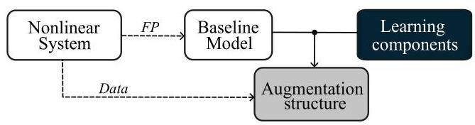

Fig. 1. Learning-based model augmentation concept.

图1.基于学习的模型增强概念。

the output signal of the system at time moment $k \in  \mathbb{Z}$ with ${e}_{k}$ an i.i.d. white noise process with finite variance, representing measurement noise, $f : {\mathbb{R}}^{{n}_{\mathrm{x}}} \times  {\mathbb{R}}^{{n}_{\mathrm{u}}} \rightarrow  {\mathbb{R}}^{{n}_{\mathrm{x}}}$ is the state-transition function and $h : {\mathbb{R}}^{{n}_{\mathrm{x}}} \rightarrow  {\mathbb{R}}^{{n}_{\mathrm{y}}}$ is the output function. This state-space representation is a general form that can describe a wide range of dynamics encountered in practice.

在时刻$k \in  \mathbb{Z}$，系统的输出信号$f : {\mathbb{R}}^{{n}_{\mathrm{x}}} \times  {\mathbb{R}}^{{n}_{\mathrm{u}}} \rightarrow  {\mathbb{R}}^{{n}_{\mathrm{x}}}$，其中${e}_{k}$是具有有限方差的独立同分布白噪声过程，表示测量噪声，$f : {\mathbb{R}}^{{n}_{\mathrm{x}}} \times  {\mathbb{R}}^{{n}_{\mathrm{u}}} \rightarrow  {\mathbb{R}}^{{n}_{\mathrm{x}}}$是状态转移函数，$h : {\mathbb{R}}^{{n}_{\mathrm{x}}} \rightarrow  {\mathbb{R}}^{{n}_{\mathrm{y}}}$是输出函数。这种状态空间表示是一种通用形式，可以描述实际中遇到的广泛动态。

We assume a baseline model of (1) is available in the form

我们假设(1)的基线模型以以下形式可用

$$
{x}_{\mathrm{b}, k + 1} = {f}_{\text{ base }}\left( {{\theta }_{\text{ base }},{x}_{\mathrm{b}, k},{u}_{k}}\right) , \tag{2a}
$$

$$
{\widehat{y}}_{k} = {h}_{\text{ base }}\left( {{\theta }_{\text{ base }},{x}_{\mathrm{b}, k},{u}_{k}}\right) , \tag{2b}
$$

where ${x}_{\mathrm{b}, k} \in  {\mathbb{R}}^{{n}_{{x}_{\mathrm{b}}}}$ is the baseline model state, ${\widehat{y}}_{k} \in  {\mathbb{R}}^{{n}_{\mathrm{y}}}$ is the model output, and ${f}_{\text{ base }} : {\mathbb{R}}^{{n}_{{x}_{\mathrm{b}}}} \times  {\mathbb{R}}^{{n}_{\mathrm{u}}} \rightarrow  {\mathbb{R}}^{{n}_{{x}_{\mathrm{b}}}}$ with ${h}_{\text{ base }}$ : ${\mathbb{R}}^{{n}_{{x}_{\mathrm{b}}}} \times  {\mathbb{R}}^{{n}_{\mathrm{u}}} \rightarrow  {\mathbb{R}}^{{n}_{\mathrm{y}}}$ are the baseline state-transition and output readout functions respectively, parameterised by ${\theta }_{\text{ base }} \in \; {\mathbb{R}}^{{n}_{{\theta }_{\text{ base }}}}$ . The parameters ${\theta }_{\text{ base }}$ correspond to the physical parameters associated with system (1).

其中${x}_{\mathrm{b}, k} \in  {\mathbb{R}}^{{n}_{{x}_{\mathrm{b}}}}$是基线模型状态，${\widehat{y}}_{k} \in  {\mathbb{R}}^{{n}_{\mathrm{y}}}$是模型输出，${f}_{\text{ base }} : {\mathbb{R}}^{{n}_{{x}_{\mathrm{b}}}} \times  {\mathbb{R}}^{{n}_{\mathrm{u}}} \rightarrow  {\mathbb{R}}^{{n}_{{x}_{\mathrm{b}}}}$与${h}_{\text{ base }}$:${\mathbb{R}}^{{n}_{{x}_{\mathrm{b}}}} \times  {\mathbb{R}}^{{n}_{\mathrm{u}}} \rightarrow  {\mathbb{R}}^{{n}_{\mathrm{y}}}$分别是基线状态转移和输出读出函数，由${\theta }_{\text{ base }} \in \; {\mathbb{R}}^{{n}_{{\theta }_{\text{ base }}}}$参数化。参数${\theta }_{\text{ base }}$对应于与系统(1)相关的物理参数。

In model augmentation, the baseline model is combined with learning components in a combined model structure. The parameters of this model augmentation structure are then estimated using data measurements of the system as shown in Fig. 1. The general model augmentation structure is described as

在模型增强中，基线模型与学习组件在组合模型结构中相结合。然后使用系统的数据测量来估计此模型增强结构的参数，如图1所示。通用模型增强结构描述为

$$
{x}_{\mathrm{b}, k + 1} = \left( {{f}_{\text{ base }} \star  {f}_{\text{ aug }}}\right) \left( {{x}_{\mathrm{b}, k},{x}_{\mathrm{a}, k},{u}_{k}}\right) , \tag{3a}
$$

$$
{x}_{\mathrm{a}, k + 1} = {g}_{\text{ aug }}\left( {{x}_{\mathrm{b}, k},{x}_{\mathrm{a}, k},{u}_{k}}\right) , \tag{3b}
$$

$$
{\widehat{y}}_{k} = \left( {{h}_{\text{ base }} \star  {h}_{\text{ aug }}}\right) \left( {{x}_{\mathrm{b}, k},{x}_{\mathrm{a}, k},{u}_{k}}\right) , \tag{3c}
$$

where ${x}_{\mathrm{a}, k}$ are additional states added for dynamic augmentation structures, and ${f}_{\text{ aug }},{g}_{\text{ aug }}$ and ${h}_{\text{ aug }}$ are the learning components parameterised by ${\theta }_{\text{ aug }} \in  {\mathbb{R}}^{{n}_{{\theta }_{\text{ aug }}}}$ . For notational simplicity, both ${\theta }_{\text{ base }}$ and ${\theta }_{\text{ aug }}$ are not written out in (3). The operator $\star$ represents an interconnection between two functions. This interconnection can represent a variety of different forms of model augmentation structure used in the literature, such as static parallel [35] and static series [16,17,33] structures. Due to the state-space form of the model structure, augmentations can occur at the state and/or output level. We show a selection of possible state level augmentations in Table 1 and output level augmentations in Table 2. Here, static refers to augmentations that do not add new state dimensions beyond the baseline model states ${x}_{\mathrm{b}}$ . Dynamic augmentation structures $\left\lbrack  {7,{20}}\right\rbrack$ , on the other hand, add new augmentation states ${x}_{\mathrm{a}}$ to model missing dynamics. A broad range of further augmentations are possible. In this work, we restrict attention to the elementary augmentations listed in Tables 1 and 2, which will be discussed through this paper.

其中${x}_{\mathrm{a}, k}$是为动态增强结构添加的额外状态，${f}_{\text{ aug }},{g}_{\text{ aug }}$和${h}_{\text{ aug }}$是由${\theta }_{\text{ aug }} \in  {\mathbb{R}}^{{n}_{{\theta }_{\text{ aug }}}}$参数化的学习组件。为了符号表示的简洁性，(3)中未写出${\theta }_{\text{ base }}$和${\theta }_{\text{ aug }}$。运算符$\star$表示两个函数之间的互连。这种互连可以表示文献中使用的各种不同形式的模型增强结构，如静态并行[35]和静态串联[16,17,33]结构。由于模型结构的状态空间形式，增强可以发生在状态和/或输出级别。我们在表1中展示了一些可能的状态级增强，在表2中展示了输出级增强。这里，静态是指除了基线模型状态${x}_{\mathrm{b}}$之外不添加新状态维度的增强。另一方面，动态增强结构$\left\lbrack  {7,{20}}\right\rbrack$会添加新的增强状态${x}_{\mathrm{a}}$来建模缺失的动态。还可以进行广泛的进一步增强。在这项工作中，我们将注意力限制在表1和表2中列出的基本增强上，本文将对其进行讨论。

As discussed in the introduction, a general augmentation structure is desired. For this, a parameterisation of the operator $\star$ is required, capable of characterising the interconnection between the baseline model and the learning components. This would realise a fully parameterised general augmentation structure of (3). Additionally, an identification algorithm able to estimate the parameters of this general model augmentation structure is proposed, under the restriction that the model is well-posed.

如引言中所讨论的，需要一种通用的增强结构。为此，需要对运算符$\star$进行参数化，使其能够表征基线模型与学习组件之间的互连。这将实现(3)的完全参数化通用增强结构。此外，提出了一种能够估计这种通用模型增强结构参数的识别算法，前提是模型是适定的。

Table 1

表1

Classes of state model augmentation structures.

状态模型增强结构的类别。

<table><tr><td>static parallel (S-SP)</td><td>${x}_{\mathrm{b}, k + 1} = {f}_{\text{ base }}\left( {{x}_{\mathrm{b}, k},{u}_{k}}\right)  + {f}_{\text{ aug }}\left( {{x}_{\mathrm{b}, k},{u}_{k}}\right)$</td></tr><tr><td>static series output (S-SSO)</td><td>${x}_{\mathrm{b}, k + 1} = {f}_{\text{ aug }}\left( {{x}_{\mathrm{b}, k},{u}_{k},{f}_{\text{ base }}\left( {{x}_{\mathrm{b}, k},{u}_{k}}\right) }\right)$</td></tr><tr><td>static series input (S-SSI)</td><td>${x}_{\mathrm{b}, k + 1} = {f}_{\text{ base }}\left( {{f}_{\text{ aug }}\left( {{x}_{\mathrm{b}, k},{u}_{k}}\right) }\right)$</td></tr><tr><td>dynamic parallel (S-DP)</td><td>${x}_{\mathrm{b}, k + 1} = {f}_{\text{ base }}\left( {{x}_{\mathrm{b}, k},{u}_{k}}\right)  + {f}_{\text{ aug }}\left( {{x}_{\mathrm{b}, k},{x}_{\mathrm{a}, k},{u}_{k}}\right)$   ${x}_{\mathrm{a}, k + 1} = {g}_{\text{ aug }}\left( {{x}_{\mathrm{b}, k},{x}_{\mathrm{a}, k},{u}_{k}}\right)$</td></tr><tr><td>dynamic series output (S-DSO)</td><td>${x}_{\mathrm{b}, k + 1} = {f}_{\text{ aug }}\left( {{x}_{\mathrm{b}, k},{x}_{\mathrm{a}, k},{u}_{k},{f}_{\text{ base }}\left( {{x}_{\mathrm{b}, k},{u}_{k}}\right) }\right) \; {x}_{\mathrm{a}, k + 1} = {g}_{\text{ aug }}\left( {{x}_{\mathrm{b}, k},{x}_{\mathrm{a}, k},{u}_{k}}\right)$</td></tr><tr><td>dynamic series input (S-DSI)</td><td>${x}_{\mathrm{b}, k + 1} = {f}_{\text{ base }}\left( {{f}_{\text{ aug }}\left( {{x}_{\mathrm{b}, k},{x}_{\mathrm{a}, k},{u}_{k}}\right) }\right) \; {x}_{\mathrm{a}, k + 1} = {g}_{\text{ aug }}\left( {{x}_{\mathrm{b}, k},{x}_{\mathrm{a}, k},{u}_{k}}\right)$</td></tr></table>

Table 2

表2

Classes of output model augmentation structures.

输出模型增强结构的类别。

<table><tr><td>static parallel (O-SP)</td><td>${\widehat{y}}_{k} = {h}_{\text{ base }}\left( {{x}_{\mathrm{b}, k},{u}_{k}}\right)  + {h}_{\text{ aug }}\left( {{x}_{\mathrm{b}, k},{u}_{k}}\right)$</td></tr><tr><td>static series output (O-SSP)</td><td>${\widehat{y}}_{k} = {h}_{\text{ aug }}\left( {{x}_{\mathrm{b}, k},{u}_{k},{h}_{\text{ base }}\left( {{x}_{\mathrm{b}, k},{u}_{k}}\right) }\right)$</td></tr><tr><td>static series input (O-SSI)</td><td>${\widehat{y}}_{k} = {h}_{\text{ base }}\left( {{h}_{\text{ aug }}\left( {{x}_{\mathrm{b}, k},{u}_{k}}\right) }\right)$</td></tr><tr><td>dynamic parallel (O-DP)</td><td>${\widehat{y}}_{k} = {h}_{\text{ base }}\left( {{x}_{\mathrm{b}, k},{u}_{k}}\right)  + {h}_{\text{ aug }}\left( {{x}_{\mathrm{b}, k},{x}_{\mathrm{a}, k},{u}_{k}}\right) \; {x}_{\mathrm{a}, k + 1} = {g}_{\text{ aug }}\left( {{x}_{\mathrm{b}, k},{x}_{\mathrm{a}, k},{u}_{k}}\right)$</td></tr><tr><td>dynamic series output (O-DSO)</td><td>${\widehat{y}}_{k} = {h}_{\text{ aug }}\left( {{x}_{\mathrm{b}, k},{x}_{\mathrm{a}, k},{u}_{k},{h}_{\text{ base }}\left( {{x}_{\mathrm{b}, k},{u}_{k}}\right) }\right) \; {x}_{\mathrm{a}, k + 1} = {g}_{\text{ aug }}\left( {{x}_{\mathrm{b}, k},{x}_{\mathrm{a}, k},{u}_{k}}\right)$</td></tr><tr><td>dynamic series input (O-DSI)</td><td>${\widehat{y}}_{k} = {h}_{\text{ base }}\left( {{h}_{\text{ aug }}\left( {{x}_{\mathrm{b}, k},{x}_{\mathrm{a}, k},{u}_{k}}\right) }\right) \; {x}_{\mathrm{a}, k + 1} = {g}_{\text{ aug }}\left( {{x}_{\mathrm{b}, k},{x}_{\mathrm{a}, k},{u}_{k}}\right)$</td></tr></table>

## 3 LFR-based augmentation structure

## 3基于线性分式变换(LFR)的增强结构

In this section, we formulate a general representation of (3) in an LFR-based augmentation structure. Next, we derive the graph based representation of the proposed model structure, which is to be used to introduce sparsity to the LFR-based augmentation structure as well as for deriving conditions for well-posedness in Section 4. Finally, we introduce the parameterisation of the learning component that we will use to formulate our augmentation approach.

在本节中，我们在基于线性分式变换(LFR)的增强结构中对(3)进行通用表示。接下来，我们推导所提出模型结构的基于图的表示，该表示将用于为基于LFR的增强结构引入稀疏性，以及在第4节中推导适定性条件。最后，我们介绍将用于制定增强方法的学习组件的参数化。

### 3.1 General LFR-based augmentation structure

### 3.1通用的基于线性分式变换(LFR)的增强结构

As discussed in Section 2, many model augmentation structures are available in the literature, and now we propose a unified structure based on the Linear Fractional Representation (LFR) that can represent all augmentation arrangements. The flexibility of this representation has made it popular in the field of robust control [40] and linear parameter-varying-control [37]. Furthermore, an LFR can also include nonlinear components in the interconnections [38], which has made LFRs useful for black-box nonlinear system representations [32,34] and implicit learning [12]. Recent results have also shown that stability properties can be enforced on these black-box LFRs in a constraint-free manner at the cost of some representation capability [15, 29].

如第2节所讨论的，文献中有许多模型增强结构，现在我们提出一种基于线性分式表示(LFR)的统一结构，它可以表示所有的增强安排。这种表示的灵活性使其在鲁棒控制[40]和线性参数变化控制[37]领域中很受欢迎。此外，线性分式变换(LFR)在互连中还可以包括非线性组件[38]，这使得线性分式变换(LFR)对于黑箱非线性系统表示[32,34]和隐式学习[12]很有用。最近结果还表明，可以以无约束的方式在这些黑箱线性分式变换(LFR)上强制实施稳定性属性，但代价是一些表示能力[15,29]。

Introduce the following notation for the baseline terms:

引入以下用于基线项的符号:

$$
{\phi }_{\text{ base }}\left( {{\theta }_{\text{ base }},{z}_{\mathrm{b}, k}}\right)  = \left\lbrack  \begin{array}{l} {f}_{\text{ base }}\left( {{\theta }_{\text{ base }},{z}_{\mathrm{b}, k}}\right) \\  {h}_{\text{ base }}\left( {{\theta }_{\text{ base }},{z}_{\mathrm{b}, k}}\right)  \end{array}\right\rbrack  . \tag{4}
$$

Moreover, we denote the learning component as ${\phi }_{\text{ aug }}$ , which can be represented by any universal function approximator. We assume that it is implemented as a function with ${\theta }_{\text{ aug }} \in  {\mathbb{R}}^{{n}_{{\theta }_{\text{ aug }}}}$ collecting its parameters. Latent variables ${w}_{\mathrm{b}, k} \in  {\mathbb{R}}^{{n}_{{x}_{\mathrm{b}}} + {n}_{y}},{w}_{\mathrm{a}, k} \in  {\mathbb{R}}^{{n}_{{w}_{\mathrm{a}}}},{z}_{\mathrm{a}, k} \in  {\mathbb{R}}^{{n}_{{z}_{\mathrm{a}}}}$ , and ${z}_{\mathrm{b}, k} \in  {\mathbb{R}}^{{n}_{{x}_{\mathrm{b}}} + {n}_{u}}$ are introduced, and expressed as

此外，我们将学习组件表示为${\phi }_{\text{ aug }}$，它可以由任何通用函数逼近器表示。我们假设它被实现为一个函数，${\theta }_{\text{ aug }} \in  {\mathbb{R}}^{{n}_{{\theta }_{\text{ aug }}}}$收集其参数。引入了潜在变量${w}_{\mathrm{b}, k} \in  {\mathbb{R}}^{{n}_{{x}_{\mathrm{b}}} + {n}_{y}},{w}_{\mathrm{a}, k} \in  {\mathbb{R}}^{{n}_{{w}_{\mathrm{a}}}},{z}_{\mathrm{a}, k} \in  {\mathbb{R}}^{{n}_{{z}_{\mathrm{a}}}}$和${z}_{\mathrm{b}, k} \in  {\mathbb{R}}^{{n}_{{x}_{\mathrm{b}}} + {n}_{u}}$，并表示为

$$
\left\lbrack  \begin{array}{l} {z}_{\mathrm{b}, k} \\  {z}_{\mathrm{a}, k} \end{array}\right\rbrack   = \left\lbrack  \begin{array}{l} {C}_{z}^{\mathrm{b}} \\  {C}_{z}^{\mathrm{a}} \end{array}\right\rbrack  {\widehat{x}}_{k} + \left\lbrack  \begin{array}{l} {D}_{zu}^{\mathrm{b}} \\  {D}_{zu}^{\mathrm{a}} \end{array}\right\rbrack  {u}_{k} + \underset{{D}_{zw}}{\underbrace{\left\lbrack  \begin{array}{ll} {D}_{zw}^{\mathrm{{bb}}} & {D}_{zw}^{\mathrm{{ba}}} \\  {D}_{zw}^{\mathrm{{ab}}} & {D}_{zw}^{\mathrm{{aa}}} \end{array}\right\rbrack  }}\left\lbrack  \begin{array}{l} {w}_{\mathrm{b}, k} \\  {w}_{\mathrm{a}, k} \end{array}\right\rbrack  , \tag{5}
$$

where ${C}_{z}^{\mathrm{b}},{C}_{z}^{\mathrm{a}},\ldots ,{D}_{zw}^{\mathrm{a}}$ are real matrices with dimensions compatible with the signal dimensions, and their elements are parameters that are optimised during model learning. The state transition and output equations are expressed as

其中${C}_{z}^{\mathrm{b}},{C}_{z}^{\mathrm{a}},\ldots ,{D}_{zw}^{\mathrm{a}}$为实矩阵，其维度与信号维度兼容，且其元素为在模型学习过程中进行优化的参数。状态转移方程和输出方程表示为

$$
\underset{{\widehat{x}}_{k + 1}}{\underbrace{\left\lbrack  \begin{matrix} {x}_{\mathrm{b}, k + 1} \\  {x}_{\mathrm{a}, k + 1} \end{matrix}\right\rbrack  }} = \underset{A}{\underbrace{\left\lbrack  \begin{matrix} {A}^{\mathrm{{bb}}} & {A}^{\mathrm{{ba}}} \\  {A}^{\mathrm{{ab}}} & {A}^{\mathrm{{aa}}} \end{matrix}\right\rbrack  }}\underset{{\widehat{x}}_{k}}{\underbrace{\left\lbrack  \begin{matrix} {x}_{\mathrm{b}, k} \\  {x}_{\mathrm{a}, k} \end{matrix}\right\rbrack  }} + \underset{{B}_{u}}{\underbrace{\left\lbrack  \begin{matrix} {B}_{u}^{\mathrm{b}} \\  {B}_{u}^{\mathrm{a}} \end{matrix}\right\rbrack  }}{u}_{k} + \underset{{B}_{w}}{\underbrace{\left\lbrack  \begin{matrix} {B}_{w}^{\mathrm{{bb}}} & {B}_{w}^{\mathrm{{ba}}} \\  {B}_{w}^{\mathrm{{ab}}} & {B}_{w}^{\mathrm{{aa}}} \end{matrix}\right\rbrack  }}\underset{{w}_{k}}{\underbrace{\left\lbrack  \begin{matrix} {w}_{\mathrm{b}, k} \\  {w}_{\mathrm{a}, k} \end{matrix}\right\rbrack  }},
$$

$$
{\widehat{y}}_{k} = \underset{{C}_{y}}{\underbrace{\left\lbrack  {C}_{y}^{\mathrm{b}}{C}_{y}^{\mathrm{a}}\right\rbrack  }}{\widehat{x}}_{k} + {D}_{yu}{u}_{k} + \left\lbrack  {{D}_{yw}^{\mathrm{b}}{D}_{yw}^{\mathrm{a}}}\right\rbrack  {w}_{k},
$$

where $A,{B}_{u},{C}_{y}$ , and ${D}_{yu}$ are real matrices with appropi-rate signal dimensions representing the linear parts of the unmodeled dynamics, the baseline part participates in the relation through matrices ${B}_{w}^{\mathrm{b}}$ and ${D}_{yw}^{\mathrm{b}}$ , while the nonlinear black-box terms effect the dynamics through ${B}_{w}^{\mathrm{a}}$ and ${D}_{yw}^{\mathrm{a}}$ .

其中$A,{B}_{u},{C}_{y}$以及${D}_{yu}$为具有适当信号维度的实矩阵，分别代表未建模动态的线性部分，基线部分通过矩阵${B}_{w}^{\mathrm{b}}$和${D}_{yw}^{\mathrm{b}}$参与关系，而非线性黑箱项则通过${B}_{w}^{\mathrm{a}}$和${D}_{yw}^{\mathrm{a}}$影响动态。

Finally, the LFR-based model augmentation structure (shown in Fig. 2) can be expressed in a compact form, as

最后，基于LFR的模型增强结构(如图2所示)可以紧凑形式表示为

$$
\left\lbrack  \begin{matrix} {\widehat{x}}_{k + 1} \\  {\widehat{y}}_{k - 1} \\  {z}_{\mathrm{b}, k} \\  {z}_{\mathrm{a}, k} \end{matrix}\right\rbrack   = \underset{W\left( {Q, w}\right) }{\underbrace{\left\lbrack  \begin{matrix} A & {B}_{u} & {B}_{w}^{\mathrm{b}} & {B}_{w}^{\mathrm{a}} \\  {C}_{y} & {D}_{yu} & {D}_{yw}^{\mathrm{b}} & {D}_{yw}^{\mathrm{a}} \\  {C}_{z}^{\mathrm{b}} & {D}_{zu}^{\mathrm{b}} & {D}_{zw}^{\mathrm{b}} & {D}_{zw}^{\mathrm{a}} \\  {C}_{z}^{\mathrm{b}} & {D}_{zu}^{\mathrm{a}} & {D}_{zw}^{\mathrm{b}} & {D}_{zw}^{\mathrm{a}} \end{matrix}\right\rbrack  }}\left\lbrack  \begin{matrix} {\widehat{x}}_{k} \\  {u}_{k} \\  {u}_{\mathrm{b}, k} \\  {w}_{\mathrm{b}, k} \\  {w}_{\mathrm{a}, k} \end{matrix}\right\rbrack  , \tag{6a}
$$

$$
{w}_{\mathrm{b}, k} = {\phi }_{\text{ base }}\left( {{\theta }_{\text{ base }},{z}_{\mathrm{b}, k}}\right) , \tag{6b}
$$

$$
{w}_{\mathrm{a}, k} = {\phi }_{\text{ aug }}\left( {{\theta }_{\text{ aug }},{z}_{\mathrm{a}, k}}\right) , \tag{6c}
$$

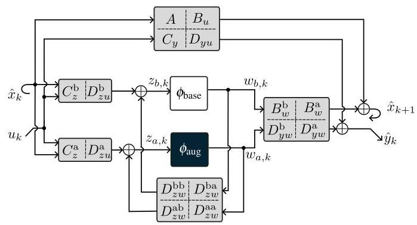

Fig. 2. LFR-based augmentation structure of the baseline model characterised by ${\phi }_{\text{ base }}$ with learning components ${\phi }_{\text{ aug }}$ .

图2. 以${\phi }_{\text{ base }}$为特征且具有学习组件${\phi }_{\text{ aug }}$的基线模型的基于LFR的增强结构。

where $W$ is the LFR matrix, and all parameters determining the matrices $A,{B}_{u},\ldots ,{D}_{zw}^{\text{ aa }}$ are collected into ${\theta }_{\mathrm{{LFR}}}$ . Since ${\theta }_{\mathrm{{LFR}}}$ is included in the (tunable) model parameters, the final interconnection structure of the LFR-based augmentation is formed throughout model learning, hence the flexibility of the approach. However, an inherent challenge of LFR model structures is ensuring well-posedness of the model structure. As the model structure allows algebraic loops, it is possible the retrieve ill-posed realisations. We define the well-posedness (WP) property as

其中$W$为LFR矩阵，且所有确定矩阵$A,{B}_{u},\ldots ,{D}_{zw}^{\text{ aa }}$的参数都收集到${\theta }_{\mathrm{{LFR}}}$中。由于${\theta }_{\mathrm{{LFR}}}$包含在(可调)模型参数中，基于LFR的增强的最终互连结构在整个模型学习过程中形成，因此该方法具有灵活性。然而，LFR模型结构的一个固有挑战是确保模型结构的适定性。由于模型结构允许代数环，有可能检索到不适定的实现。我们将适定性(WP)属性定义为

Property 1 (Well-posedness) For any value of ${\widehat{x}}_{k} \in  {\mathbb{R}}^{{n}_{\mathrm{x}}}$ and ${u}_{k} \in  {\mathbb{R}}^{{n}_{\mathrm{u}}}$ , the signal relations in (6) admit a unique solution ${z}_{k} = {\left\lbrack  \begin{array}{ll} {z}_{\mathrm{b}, k}^{\top } & {z}_{\mathrm{a}, k}^{\top } \end{array}\right\rbrack  }^{\top }$ .

属性1(适定性)对于${\widehat{x}}_{k} \in  {\mathbb{R}}^{{n}_{\mathrm{x}}}$和${u}_{k} \in  {\mathbb{R}}^{{n}_{\mathrm{u}}}$的任何值，(6)中的信号关系都有唯一解${z}_{k} = {\left\lbrack  \begin{array}{ll} {z}_{\mathrm{b}, k}^{\top } & {z}_{\mathrm{a}, k}^{\top } \end{array}\right\rbrack  }^{\top }$。

Conditions to ensure the well-posedness are introduced in Section 4. The unified representation capability of the proposed LFR structure is shown by the following theorem.

第4节介绍了确保适定性的条件。所提出的LFR结构的统一表示能力由以下定理给出。

Theorem 2 (Unified representation) Given a baseline model (2) with parameters ${\theta }_{\text{ base }}$ connected to learning components ${f}_{\text{ aug }},{g}_{\text{ aug }}$ and ${h}_{\text{ aug }}$ , each parametrised with ${\theta }_{\text{ aug }}$ , in terms of (3), where the operator $\star$ corresponds to any of the interconnections listed in Table 1 and 2. Then, for the considered model structure (6), there exists a ${\theta }_{\mathrm{{LFR}}} \in  {\mathbb{R}}^{{n}_{{\theta }_{\text{ LFR }}}}$ and choices of latent dimensions ${n}_{{w}_{\mathrm{a}}},{n}_{{z}_{\mathrm{a}}} \geq  0$ and a ${\phi }_{\text{ aug }}$ function, such that (3) and (6) are equivalent representations of the same dynamic behaviour.

定理2(统一表示)给定一个具有参数${\theta }_{\text{ base }}$的基线模型(2)，其连接到学习组件${f}_{\text{ aug }},{g}_{\text{ aug }}$和${h}_{\text{ aug }}$，每个组件都由${\theta }_{\text{ aug }}$参数化，根据(3)，其中算子$\star$对应于表1和表2中列出的任何互连。那么，对于所考虑的模型结构(6)，存在一个${\theta }_{\mathrm{{LFR}}} \in  {\mathbb{R}}^{{n}_{{\theta }_{\text{ LFR }}}}$以及潜在维度${n}_{{w}_{\mathrm{a}}},{n}_{{z}_{\mathrm{a}}} \geq  0$的选择和一个${\phi }_{\text{ aug }}$函数，使得(3)和(6)是同一动态行为的等效表示。

PROOF. See Appendix A.

证明。见附录A。

### 3.2 Computational graph of the interconnection

### 3.2互连的计算图

The full parameterisation of $W$ in the proposed LFR-based model augmentation structure gives a general representation of (3). However, due to full parameterisation, the actual interconnection of the learning and baseline model components is represented in a black-box fashion compared to the cases listed in Tables 1 and 2.

在所提出的基于LFR的模型增强结构中，$W$的全参数化给出了(3)的一般表示。然而，由于全参数化，与表1和表2中列出的情况相比，学习模型组件和基线模型组件的实际互连以黑箱方式表示。

To be able to detect or even enforce a particular configuration of these components, we investigate the computational graph of the augmentation interconnection (3). This graph makes clear what each edge, i.e., element of ${\theta }_{\mathrm{{LFR}}}$ , does in the augmentation structure, and thus also what removing it for sparsification will do. Additionally, the graph representation will provide general conditions on the well-posedness of the proposed model structure in Section 4.

为了能够检测甚至强制这些组件的特定配置，我们研究增强互连(3)的计算图。该图清楚地表明了增强结构中每条边(即${\theta }_{\mathrm{{LFR}}}$的元素)的作用，从而也表明了为了稀疏化而移除它会产生什么影响。此外，图表示将在第4节中为所提出的模型结构的适定性提供一般条件。

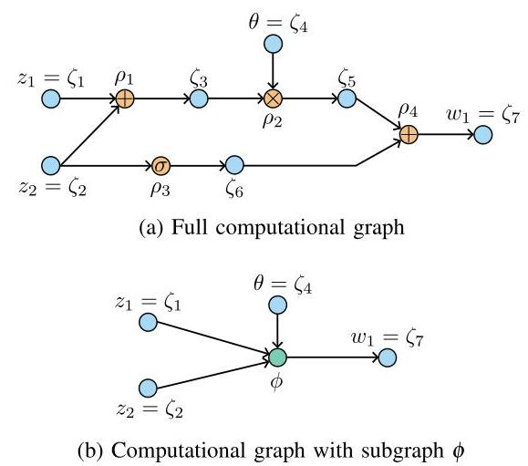

Fig. 3. Computational graph representation of the function ${w}_{1} = \phi \left( {\theta ,{z}_{1},{z}_{2}}\right)  = \left( {{z}_{1} + {z}_{2}}\right) \theta  + \sigma \left( {z}_{2}\right) .$

图3. 函数${w}_{1} = \phi \left( {\theta ,{z}_{1},{z}_{2}}\right)  = \left( {{z}_{1} + {z}_{2}}\right) \theta  + \sigma \left( {z}_{2}\right) .$的计算图表示

First, we introduce computational graphs, then present the graph representations of the baseline model and the learning component, which are finally combined into the LFR model graph. Here we make use of the following graph notions: $G = \left( {V, E}\right)$ is a graph with nodes $V$ and edges $E,{\deg }^{ - }$ is the indegree of a node, ${\deg }^{ + }$ is the outdegree of a node, disjoint $\left( {V, W}\right)$ is the disjoint union of set between two sets $V$ and $W$ defined as $V \cup  W$ with $V \cap  W = \varnothing$ , source $\left( W\right)$ defines a set of nodes $V = \left\{  {v \in  W \mid  {\deg }^{ - }\left( v\right)  = 0}\right\}$ , and $\operatorname{sink}\left( W\right)$ defines a set of nodes $V = \left\{  {v \in  W \mid  {\deg }^{ + }\left( v\right)  = 0}\right\}$ . We also introduce the shorthand notation outvar $\left( {V, W}\right)$ to define the set of edges ${E}_{vw} = \left\{  {\left( {v, w}\right)  \mid  v \in  V, w \in  W,{\deg }^{ + }\left( v\right)  = {\deg }^{ - }\left( w\right)  = 1}\right\}$ , and ${G}_{c} = \left( {{V}_{c},{E}_{c}}\right)  = G \smallsetminus  {V}_{s}$ for vertex contraction with $G = \left( {V, E}\right)$ , ${V}_{s} \subset  V,{V}_{c} = V \smallsetminus  {V}_{s} \cup  {v}_{c}$ and ${v}_{c}$ being the contracted vertex.

首先，我们引入计算图，然后给出基线模型和学习组件的图表示，最后将它们组合成LFR模型图。这里我们使用以下图的概念:$G = \left( {V, E}\right)$是一个具有节点$V$和边的图，$E,{\deg }^{ - }$是节点的入度，${\deg }^{ + }$是节点的出度，不相交的$\left( {V, W}\right)$是两个集合$V$之间的集合的不相交并集，$W$定义为$V \cup  W$，其中$V \cap  W = \varnothing$，源$\left( W\right)$定义一组节点$V = \left\{  {v \in  W \mid  {\deg }^{ - }\left( v\right)  = 0}\right\}$，并且$\operatorname{sink}\left( W\right)$定义一组节点$V = \left\{  {v \in  W \mid  {\deg }^{ + }\left( v\right)  = 0}\right\}$。我们还引入了速记符号outvar$\left( {V, W}\right)$来定义边的集合${E}_{vw} = \left\{  {\left( {v, w}\right)  \mid  v \in  V, w \in  W,{\deg }^{ + }\left( v\right)  = {\deg }^{ - }\left( w\right)  = 1}\right\}$，以及用于与$G = \left( {V, E}\right)$进行顶点收缩的${G}_{c} = \left( {{V}_{c},{E}_{c}}\right)  = G \smallsetminus  {V}_{s}$，${V}_{s} \subset  V,{V}_{c} = V \smallsetminus  {V}_{s} \cup  {v}_{c}$和${v}_{c}$是收缩后的顶点。

#### 3.2.1 Computational graphs

#### 3.2.1计算图

We take the formulation of the computational graph as defined in [3]. First, take the computational problem defined as the set of $M$ functions

我们采用[3]中定义的计算图的公式。首先，考虑定义为$M$函数集的计算问题

$$
{w}_{i} = {\phi }_{i} = \left( {{z}_{1},\ldots ,{z}_{K}}\right) ,\;i = 1,\ldots , M, \tag{7}
$$

of $K$ real variables ${z}_{1},\ldots ,{z}_{K} \in  \mathbb{R}$ from which $M$ real quantities ${w}_{i} \in  \mathbb{R}$ are obtained. Each function ${\phi }_{i} : {\mathbb{R}}^{K} \rightarrow  \mathbb{R}$ can be described by a computational process consisting of a number of primitive operators

从$K$个实变量${z}_{1},\ldots ,{z}_{K} \in  \mathbb{R}$中获得$M$个实数量${w}_{i} \in  \mathbb{R}$。每个函数${\phi }_{i} : {\mathbb{R}}^{K} \rightarrow  \mathbb{R}$可以由一个由许多原始运算符组成的计算过程来描述

$$
{\zeta }_{{i}_{c,0}} \mathrel{\text{ := }} {\rho }_{c}\left( {{\zeta }_{{i}_{c,1}},\ldots ,{\zeta }_{{i}_{c, s}}}\right) ,\;c = 1,\ldots , L \tag{8}
$$

where the values ${\zeta }_{{i}_{c, j}} \in  \mathbb{R}$ and ${\rho }_{c} : {\mathbb{R}}^{s} \rightarrow  \mathbb{R}$ . For all $j \in \; \left\lbrack  {1,\ldots , s}\right\rbrack  ,{\zeta }_{{i}_{c, j}} \in  \left\lbrack  {{z}_{1},\ldots ,{z}_{K},{\zeta }_{{i}_{b,0}}}\right\rbrack$ with $b < c$ , i.e., the inputs to ${\rho }_{c}$ can be the input of ${\phi }_{i}$ or output from a previous operator ${\rho }_{b}$ . For $j = 0,{\zeta }_{{i}_{c, j}} \in  \left\lbrack  {{w}_{1},\ldots ,{w}_{M},{\zeta }_{{i}_{b,1},\ldots ,{\zeta }_{{i}_{b, s}}}}\right\rbrack$ with $b > c$ , i.e., the output of ${\rho }_{c}$ can be the output of ${\phi }_{i}$ or input to a next operator ${\rho }_{b}$ . We consider primitive operators ${\rho }_{c} : {\mathbb{R}}^{s} \rightarrow  \mathbb{R}$ , with $s \in  \{ 1,2\}$ , to be either: addition, multiplication or a nonlinear injective function (where $s = 1$ ).

其中值${\zeta }_{{i}_{c, j}} \in  \mathbb{R}$和${\rho }_{c} : {\mathbb{R}}^{s} \rightarrow  \mathbb{R}$。对于所有满足$b < c$的$j \in \; \left\lbrack  {1,\ldots , s}\right\rbrack  ,{\zeta }_{{i}_{c, j}} \in  \left\lbrack  {{z}_{1},\ldots ,{z}_{K},{\zeta }_{{i}_{b,0}}}\right\rbrack$，即${\rho }_{c}$的输入可以是${\phi }_{i}$的输入或前一个运算符${\rho }_{b}$的输出。对于满足$b > c$的$j = 0,{\zeta }_{{i}_{c, j}} \in  \left\lbrack  {{w}_{1},\ldots ,{w}_{M},{\zeta }_{{i}_{b,1},\ldots ,{\zeta }_{{i}_{b, s}}}}\right\rbrack$，即${\rho }_{c}$的输出可以是${\phi }_{i}$的输出或下一个运算符${\rho }_{b}$的输入。我们认为具有$s \in  \{ 1,2\}$的基本运算符${\rho }_{c} : {\mathbb{R}}^{s} \rightarrow  \mathbb{R}$为以下两种之一:加法、乘法或非线性单射函数(其中$s = 1$)。

The computational process defines and it is characterised by a computational graph, where both ${\rho }_{c}$ and ${\zeta }_{i, c, j}$ are nodes in the graph. This computational graph is defined as follows:

计算过程进行定义并由计算图来表征，其中${\rho }_{c}$和${\zeta }_{i, c, j}$都是图中的节点。此计算图定义如下:

Definition 3 (Computational graph) A directed graph denoted by $G = \left( {V, E}\right)$ with $V = \operatorname{disjoint}\left( {{V}_{\zeta },{V}_{\rho }}\right)$ the set of vertices and $E = \operatorname{disjoint}\left( {{E}_{\zeta \rho },{E}_{\rho \zeta }}\right)$ the set of edges is called a computational graph if

定义3(计算图)由$G = \left( {V, E}\right)$表示的有向图，其中$V = \operatorname{disjoint}\left( {{V}_{\zeta },{V}_{\rho }}\right)$是顶点集，$E = \operatorname{disjoint}\left( {{E}_{\zeta \rho },{E}_{\rho \zeta }}\right)$是边集，如果

(a) ${V}_{\rho } = \left\{  {{\rho }_{1},\ldots ,{\rho }_{L}}\right\}  ,{V}_{\zeta } = \left\{  {{\zeta }_{1},\ldots ,{\zeta }_{K}}\right\}$

(b) ${V}_{z} = \operatorname{source}\left( {V}_{\zeta }\right) ,{V}_{w} = \operatorname{sink}\left( {V}_{\zeta }\right)$

(c) ${E}_{\zeta \rho } = \left\{  {\left( {\rho ,\zeta }\right)  \mid  \rho  \in  {V}_{\rho },\zeta  \in  {V}_{\zeta }\text{ and }\frac{\partial \rho }{\partial \zeta } \neq  0}\right\}$

(d) ${E}_{\rho \zeta } = \operatorname{outvar}\left( {{V}_{\rho },{V}_{\zeta } \smallsetminus  {V}_{z}}\right)$

(a) defines the sets of operator and variable nodes respectively. (b) defines subsets of the variables representing the inputs and outputs respectively (i.e., sources and sinks in graph nomenclature). Lastly, (c) defines what variable nodes are inputs to which operators, and (d) defines the connection of the output variables for each operator. In Fig. 3a we show the computational graph for the example function ${w}_{1} = \phi \left( {\theta ,{z}_{1},{z}_{2}}\right)  = \left( {{z}_{1} + {z}_{2}}\right) \theta  + \sigma \left( {z}_{2}\right) .$

(a) 分别定义运算符节点集和变量节点集。(b) 分别定义表示输入和输出的变量子集(即图术语中的源和汇)。最后，(c) 定义哪些变量节点是哪些运算符的输入，并且 (d) 定义每个运算符的输出变量的连接。在图3a中，我们展示了示例函数${w}_{1} = \phi \left( {\theta ,{z}_{1},{z}_{2}}\right)  = \left( {{z}_{1} + {z}_{2}}\right) \theta  + \sigma \left( {z}_{2}\right) .$的计算图

By defining a subgraph ${G}_{{\phi }_{i}}$ , we can formulate a more compact notation. The computational subgraph ${G}_{{\phi }_{i}}$ , contains the nodes ${V}_{{\phi }_{i}} = \left( {{V}_{{\zeta }_{i}} \cup  {V}_{{\rho }_{i}}}\right)  \smallsetminus  {V}_{{w}_{i}} \smallsetminus  {V}_{{z}_{i}}$ and the edges internal to these nodes. Then by vertex contraction $G \smallsetminus  {V}_{{\phi }_{i}}$ we get the contracted noted ${v}_{{\phi }_{i}}$ that represents the multivariate function ${\phi }_{i}$ in (7). Such a contracted node ${v}_{{\phi }_{i}}$ is shown for the example function in Fig. 3b. For each function ${\phi }_{i}$ in the computational problem, a computational graph ${G}_{{\phi }_{i}}$ can be defined. By taking the union of these graphs as

通过定义子图${G}_{{\phi }_{i}}$，我们可以制定更紧凑的表示法。计算子图${G}_{{\phi }_{i}}$包含节点${V}_{{\phi }_{i}} = \left( {{V}_{{\zeta }_{i}} \cup  {V}_{{\rho }_{i}}}\right)  \smallsetminus  {V}_{{w}_{i}} \smallsetminus  {V}_{{z}_{i}}$以及这些节点内部的边。然后通过顶点收缩$G \smallsetminus  {V}_{{\phi }_{i}}$，我们得到表示(7)中多元函数${\phi }_{i}$的收缩表示${v}_{{\phi }_{i}}$。图3b中展示了示例函数的这样一个收缩节点${v}_{{\phi }_{i}}$。对于计算问题中的每个函数${\phi }_{i}$，可以定义一个计算图${G}_{{\phi }_{i}}$。通过将这些图的并集作为

$$
{G}_{\phi } = \left( {{V}_{\phi },{E}_{\phi }}\right)  = \left( {{V}_{{\phi }_{1}} \cup  \ldots  \cup  {V}_{{\phi }_{M}},{E}_{{\phi }_{1}} \cup  \ldots  \cup  {E}_{{\phi }_{M}}}\right) \tag{9}
$$

we obtain the computational graph ${G}_{\phi }$ of the entire computational problem (7) with $K$ inputs and $M$ outputs, as visu-alised in Fig. 5. Note that due to the union, nodes and edges may be shared between the computational graphs ${G}_{{\phi }_{i}}$ .

我们得到了整个计算问题(7)的计算图${G}_{\phi }$，其具有$K$个输入和$M$个输出，如图5所示。请注意，由于合并，计算图${G}_{{\phi }_{i}}$之间的节点和边可能会共享。

#### 3.2.2 Graph of baseline model

#### 3.2.2 基线模型的图

The baseline model (2) can be represented with a computational graph as

基线模型(2)可以用计算图表示为

$$
\left\lbrack  \begin{matrix} {w}_{b,1} \\  \vdots \\  {w}_{b,{n}_{{x}_{b}}} \\  {w}_{b,{n}_{{x}_{b}} + 1} \\  {w}_{b,{n}_{{x}_{b}} + 1} \\  \vdots \\  {w}_{b,{n}_{{x}_{b}} + {n}_{y}} \end{matrix}\right\rbrack   = \left\lbrack  \begin{matrix} {\phi }_{{\text{ base }}_{1}}\left( {{\theta }_{\text{ base },1},{z}_{\mathrm{b}, k,1}}\right) \\  \vdots \\  {\phi }_{{\text{ base }}_{{n}_{{x}_{b}}}}\left( {{\theta }_{\text{ base },{n}_{{x}_{b}},{z}_{\mathrm{b}, k,{n}_{{x}_{b}}}},{z}_{\mathrm{b}, k,{n}_{{x}_{b}} + 1}}\right) \\  {\phi }_{\text{ base }{n}_{{x}_{b}} + 1}\left( {{\theta }_{\text{ base },{n}_{{x}_{b}} + 1},{z}_{\mathrm{b}, k,{n}_{{x}_{b}}} + 1}\right) \\  \vdots \\  {\phi }_{\text{ base }{n}_{{x}_{b}} + {n}_{y}}\left( {{\theta }_{\text{ base },{n}_{{x}_{b}} + {n}_{y}},{z}_{\mathrm{b}, k,{n}_{{x}_{b}}} + {n}_{y}}\right)  \end{matrix}\right\rbrack
$$

$$
= \left\lbrack  \begin{array}{l} {f}_{\text{ base }}\left( {{\mathbf{\theta }}_{\text{ base }},{z}_{\mathrm{b}, k}}\right) \\  {h}_{\text{ base }}\left( {{\mathbf{\theta }}_{\text{ base }},{z}_{\mathrm{b}, k}}\right)  \end{array}\right\rbrack  , \tag{10}
$$

where we describe ${z}_{\mathrm{b}, k} = \operatorname{vec}\left( {{x}_{\mathrm{b}, k},{u}_{k}}\right)$ and ${\theta }_{\text{ base }}$ as input variables, ${w}_{\mathrm{b}, k} = \operatorname{vec}\left( {{x}_{\mathrm{b}, k + 1},{\widehat{y}}_{k}}\right)$ as output variables, and ${\theta }_{\text{ base },1},\ldots ,{\theta }_{\text{ base },{n}_{{x}_{b}} + {n}_{y}} \in  {\theta }_{\text{ base }}$ as the parameters (i.e., the parameters may be shared between functions ${\phi }_{{\text{ base }}_{i}}$ ), and similarly ${z}_{\mathrm{b}, k,1},\ldots ,{z}_{\mathrm{b}, k,{n}_{{x}_{b}} + {n}_{y}} \in  {z}_{\mathrm{b}, k}$ .

其中我们将${z}_{\mathrm{b}, k} = \operatorname{vec}\left( {{x}_{\mathrm{b}, k},{u}_{k}}\right)$和${\theta }_{\text{ base }}$描述为输入变量，${w}_{\mathrm{b}, k} = \operatorname{vec}\left( {{x}_{\mathrm{b}, k + 1},{\widehat{y}}_{k}}\right)$为输出变量，${\theta }_{\text{ base },1},\ldots ,{\theta }_{\text{ base },{n}_{{x}_{b}} + {n}_{y}} \in  {\theta }_{\text{ base }}$为参数(即参数可能在函数${\phi }_{{\text{ base }}_{i}}$之间共享)，类似地还有${z}_{\mathrm{b}, k,1},\ldots ,{z}_{\mathrm{b}, k,{n}_{{x}_{b}} + {n}_{y}} \in  {z}_{\mathrm{b}, k}$。

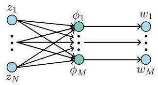

Fig. 4. Computational graph for a computation problem consisting of $M$ functions ${\phi }_{1}\ldots {\phi }_{M}$ .

图4. 由$M$个函数${\phi }_{1}\ldots {\phi }_{M}$组成的计算问题的计算图。

Which subset of ${\theta }_{\text{ base }}$ and ${z}_{\mathrm{b}, k}$ are input to each function ${\phi }_{{\text{ base }}_{i}}$ , which follows from the baseline model (2) considered. After deriving a computational graph ${G}_{{\phi }_{{\text{ base }}_{i}}}$ for each function ${\phi }_{{\text{ base }}_{1}},\ldots ,{\phi }_{{\text{ base }}_{{n}_{{x}_{b}} + {n}_{y}}}$ , the computational graph ${G}_{{\phi }_{\text{ base }}}$ is derived by the graph union as in (9), with the resulting nodes ${V}_{{z}_{\mathrm{b}}},{V}_{{w}_{\mathrm{b}}}$ and ${V}_{{\phi }_{\text{ base }}}$ . Notably, ${E}_{{z}_{\mathrm{b}}{\phi }_{\text{ base }}}$ is sparse, e.g., the number of edges between ${V}_{{z}_{\mathrm{b}}}$ and ${V}_{{\phi }_{\text{ base }}}$ is smaller than would be permissible by any arbitrary chosen baseline model (2).

${\theta }_{\text{ base }}$和${z}_{\mathrm{b}, k}$的哪些子集是每个函数${\phi }_{{\text{ base }}_{i}}$的输入，这可从所考虑的基线模型(2)得出。在为每个函数${\phi }_{{\text{ base }}_{1}},\ldots ,{\phi }_{{\text{ base }}_{{n}_{{x}_{b}} + {n}_{y}}}$推导计算图${G}_{{\phi }_{{\text{ base }}_{i}}}$之后，计算图${G}_{{\phi }_{\text{ base }}}$通过如(9)中的图合并得出，得到的节点为${V}_{{z}_{\mathrm{b}}},{V}_{{w}_{\mathrm{b}}}$和${V}_{{\phi }_{\text{ base }}}$。值得注意的是，${E}_{{z}_{\mathrm{b}}{\phi }_{\text{ base }}}$是稀疏的，例如，${V}_{{z}_{\mathrm{b}}}$和${V}_{{\phi }_{\text{ base }}}$之间的边数比任何任意选择的基线模型(2)所允许的要少。

#### 3.2.3 Graph of the learning component

#### 3.2.3 学习组件的图

Similarly as for the baseline model, we describe the learning function graph for the computational problem as

与基线模型类似，我们将计算问题的学习函数图描述为

$$
\left\lbrack  \begin{matrix} {w}_{1} \\  \vdots \\  {w}_{{m}_{{w}_{a}}} \end{matrix}\right\rbrack   = \left\lbrack  \begin{matrix} {\phi }_{{\operatorname{aug}}_{1}}\left( {{\theta }_{\operatorname{aug},1},{z}_{\mathrm{a}, k,1}}\right) \\  \vdots \\  {\phi }_{{\operatorname{aug}}_{{m}_{{w}_{a}}}}\left( {{\theta }_{\operatorname{aug},{n}_{{w}_{a}}},{z}_{\mathrm{a}, k,{n}_{{w}_{a}}}}\right)  \end{matrix}\right\rbrack   = {\phi }_{\operatorname{aug}}\left( {{\theta }_{\operatorname{aug}},{z}_{\mathrm{a}, k}}\right) ,
$$

Then the computational graph ${G}_{{\phi }_{\text{ aug }}}$ is derived as before, with the resulting nodes ${V}_{{z}_{\mathrm{a}}},{V}_{{w}_{\mathrm{a}}}$ and ${V}_{{\phi }_{\text{ aug }}}$ .

然后如前所述推导计算图${G}_{{\phi }_{\text{ aug }}}$，得到的节点为${V}_{{z}_{\mathrm{a}}},{V}_{{w}_{\mathrm{a}}}$和${V}_{{\phi }_{\text{ aug }}}$。

#### 3.2.4 LFR model graph

#### 3.2.4 LFR模型图

With the baseline model graph ${G}_{{\phi }_{\text{ base }}}$ and the learning component graph ${G}_{{\phi }_{\text{ aug }}}$ , we can define the interconnection structure between these graphs and the signals ${\widehat{x}}_{k},{u}_{k},{\widehat{x}}_{k + 1}$ and ${\widehat{y}}_{k}$ of the model. For ease of notation, we will leave out the $\theta$ nodes, as these are not altered any further. We start by defining how the model signals are matched to ${G}_{{\phi }_{\text{ base }}}$ and ${G}_{{\phi }_{\text{ aug }}}$ , by taking the following parameterised summation

利用基线模型图${G}_{{\phi }_{\text{ base }}}$和学习组件图${G}_{{\phi }_{\text{ aug }}}$，我们可以定义这些图与模型的信号${\widehat{x}}_{k},{u}_{k},{\widehat{x}}_{k + 1}$和${\widehat{y}}_{k}$之间的互连结构。为了便于表示，我们将省略$\theta$节点，因为它们不再进一步改变。我们首先通过进行以下参数化求和来定义模型信号如何与${G}_{{\phi }_{\text{ base }}}$和${G}_{{\phi }_{\text{ aug }}}$匹配

$$
\varsigma  = \mathop{\sum }\limits_{{i = 1}}^{{{\deg }^{ - }\left( \varsigma \right) }}{\theta }_{i}{v}_{i} \tag{11}
$$

where $\varsigma  \in  \operatorname{disjoint}\left( {{V}_{{x}^{ + }},{V}_{y},{V}_{{z}_{\mathrm{b}}},{V}_{{z}_{\mathrm{a}}}}\right)$ and ${v}_{i} \in  \operatorname{disjoint}\left( {{V}_{x},{V}_{u}}\right.$ , $\left. {{V}_{{w}_{\mathrm{b}}},{V}_{{w}_{\mathrm{a}}}}\right)$ and ${\theta }_{i}$ is the weight of the summation. These summation operations are then represented by the summation nodes ${V}_{\zeta }$ . Then the interconnect graph can be defined as

其中$\varsigma  \in  \operatorname{disjoint}\left( {{V}_{{x}^{ + }},{V}_{y},{V}_{{z}_{\mathrm{b}}},{V}_{{z}_{\mathrm{a}}}}\right)$和${v}_{i} \in  \operatorname{disjoint}\left( {{V}_{x},{V}_{u}}\right.$，$\left. {{V}_{{w}_{\mathrm{b}}},{V}_{{w}_{\mathrm{a}}}}\right)$和${\theta }_{i}$是求和的权重。这些求和运算随后由求和节点${V}_{\zeta }$表示。然后，互连图可以定义为

Definition 4 (Interconnection graph) The computational graph of the interconnection between ${G}_{{\phi }_{\text{ base }}}$ and ${G}_{{\phi }_{\text{ aug }}}$ is a directed graph denoted by ${G}_{LFR} = \left( {{V}_{LFR},{E}_{LFR}}\right)$ , where ${V}_{LFR} = \operatorname{disjoint}\left( {{V}_{{x}^{ + }},{V}_{y},{V}_{{z}_{\mathrm{b}}},{V}_{{z}_{\mathrm{a}}},{V}_{x},{V}_{u},{V}_{{w}_{\mathrm{b}}},{V}_{{w}_{\mathrm{a}}}}\right)$ and ${E}_{LFR} = \operatorname{disjoint}\left( {{E}_{{\zeta }_{b}{z}_{\mathrm{b}}},{E}_{{\zeta }_{a}{z}_{\mathrm{a}}},{E}_{{\zeta }_{x}{x}^{ + }},{E}_{{\zeta }_{y}y},{E}_{{\phi }_{\text{ base }}},{E}_{{\phi }_{\text{ aug }}}}\right)$

定义4(互连图)${G}_{{\phi }_{\text{ base }}}$和${G}_{{\phi }_{\text{ aug }}}$之间互连的计算图是一个由${G}_{LFR} = \left( {{V}_{LFR},{E}_{LFR}}\right)$表示的有向图，其中${V}_{LFR} = \operatorname{disjoint}\left( {{V}_{{x}^{ + }},{V}_{y},{V}_{{z}_{\mathrm{b}}},{V}_{{z}_{\mathrm{a}}},{V}_{x},{V}_{u},{V}_{{w}_{\mathrm{b}}},{V}_{{w}_{\mathrm{a}}}}\right)$和${E}_{LFR} = \operatorname{disjoint}\left( {{E}_{{\zeta }_{b}{z}_{\mathrm{b}}},{E}_{{\zeta }_{a}{z}_{\mathrm{a}}},{E}_{{\zeta }_{x}{x}^{ + }},{E}_{{\zeta }_{y}y},{E}_{{\phi }_{\text{ base }}},{E}_{{\phi }_{\text{ aug }}}}\right)$

(a) ${V}_{{\varsigma }_{b}} = \left\{  {{\varsigma }_{1},\ldots ,{\varsigma }_{{n}_{{z}_{\mathrm{h}}}}}\right\}  ,{V}_{{\varsigma }_{a}} = \left\{  {{\varsigma }_{1},\ldots ,{\varsigma }_{{n}_{{z}_{\mathrm{a}}}}}\right\}$ , ${V}_{{\varsigma }_{x}} = \left\{  {{\varsigma }_{1},\ldots ,{\varsigma }_{{n}_{x}}}\right\}  ,{V}_{{\varsigma }_{y}} = \left\{  {{\varsigma }_{1},\ldots ,{\varsigma }_{{n}_{y}}}\right\}$

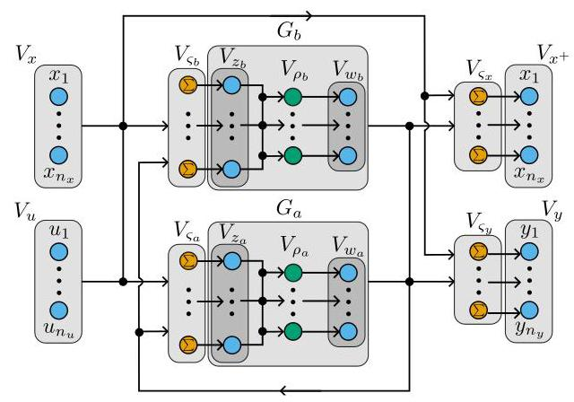

Fig. 5. Computational graph of the interconnection of ${G}_{b}$ and ${G}_{a}$ .

图5.${G}_{b}$和${G}_{a}$互连的计算图。

(b) ${E}_{{\varsigma }_{b}{z}_{\mathrm{b}}} = \operatorname{outvar}\left( {{V}_{{\varsigma }_{b}},{V}_{{z}_{\mathrm{b}}}}\right) ,{E}_{{\varsigma }_{a}{z}_{\mathrm{a}}} = \operatorname{outvar}\left( {{V}_{{\varsigma }_{a}},{V}_{{z}_{\mathrm{a}}}}\right) \; {E}_{{\varsigma }_{x}{x}^{ + }} = \operatorname{outvar}\left( {{V}_{{\varsigma }_{x}},{V}_{{x}^{ + }}}\right) ,{E}_{{\varsigma }_{y}y} = \operatorname{outvar}\left( {{V}_{{\varsigma }_{y}},{V}_{y}}\right)$

(c) $\forall v \in  {V}_{x} \cup  {V}_{u},{\deg }^{ - }\left( v\right)  = 0,\forall v \in  {V}_{{x}^{ + }} \cup  {V}_{y},{\deg }^{ + }\left( v\right)  = 0$

(d) ${E}_{v\varsigma } = \left\{  {\left( {v,\varsigma }\right)  \mid  v \in  \operatorname{disjoint}\left( {{V}_{{z}_{b}},{V}_{{z}_{a}},{V}_{{x}_{k}},{V}_{{u}_{k}}}\right) ,\varsigma  \in  {V}_{\varsigma }}\right\}$

(a) defines the summation nodes for the baseline, augmentation, state, and output nodes and (b) defines the one-to-one outgoing edges from these summation nodes to the respective output nodes $\rho$ . (c) defines existing nodes as inputs and outputs respectively (i.e., sources and sinks). Finally, (d) defines the edges between the state, input, baseline, and augmentation and the summation nodes.

(a)定义了基线、增强、状态和输出节点的求和节点，(b)定义了从这些求和节点到相应输出节点$\rho$的一对一输出边。(c)分别将现有节点定义为输入和输出(即源和汇)。最后，(d)定义了状态、输入、基线和增强与求和节点之间的边。

By applying vertex contraction with the nodes ${\varsigma }_{i} \in  {V}_{{\varsigma }_{i}}$ and the nodes to which the corresponding outgoing edge of $\varsigma$ leads, either ${V}_{z},{V}_{{x}^{ + }}$ or ${V}_{y}$ , on on ${G}_{\mathrm{{LFR}}}$ , and also applying vertex contraction with node sets ${V}_{{\rho }_{b}}$ and ${V}_{{\rho }_{a}}$ on ${G}_{\mathrm{{LFR}}}$ , we retrieve a graph with only the variable nodes. Considering ${P}_{i}$ to be the adjacency matrix for the edge set ${E}_{i}$ , then the adjacency matrix for the interconnected graph is

通过对节点${\varsigma }_{i} \in  {V}_{{\varsigma }_{i}}$以及$\varsigma$相应输出边所指向的节点(${V}_{z},{V}_{{x}^{ + }}$或${V}_{y}$)在${G}_{\mathrm{{LFR}}}$上应用顶点收缩，并且对节点集${V}_{{\rho }_{b}}$和${V}_{{\rho }_{a}}$在${G}_{\mathrm{{LFR}}}$上应用顶点收缩，我们得到一个仅包含变量节点的图。考虑${P}_{i}$为边集${E}_{i}$的邻接矩阵，那么互连图的邻接矩阵为

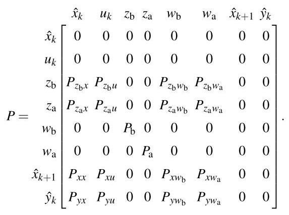

By considering all edge sets maximal, i.e., fully connected where allowed, the summations in (11) recover the proposed LFR structure (6). The augmentation structures in Tables 1 and 2 correspond to sparse adjacency matrices. Thus, we can enforce or detect these augmentation structures by these sparse patterns in the adjacency matrix.

通过将所有边集视为最大边集，即允许时完全连接，(11)中的求和恢复了所提出的LFR结构(6)。表1和表2中的增强结构对应于稀疏邻接矩阵。因此，我们可以通过邻接矩阵中的这些稀疏模式来强制或检测这些增强结构。

### 3.3 Parametrisation of the learning component

### 3.3学习组件的参数化

The proposed LFR-based augmentation structure allows for the use of any parameterised learning function ${\phi }_{\text{ aug }}$ without loss of generality. For the remainder of this report, however, we will consider ${\phi }_{\text{ aug }}$ to be parameterised by an ANN. An ANN with $q$ hidden layers, each composed of ${m}_{i}$ neurons and activation function $\rho  : \mathbb{R} \rightarrow  \mathbb{R}$ , is defined as

所提出的基于LFR的增强结构允许使用任何参数化的学习函数${\phi }_{\text{ aug }}$而不失一般性。然而，在本报告的其余部分，我们将考虑${\phi }_{\text{ aug }}$由人工神经网络进行参数化。一个具有$q$个隐藏层、每个隐藏层由${m}_{i}$个神经元和激活函数$\rho  : \mathbb{R} \rightarrow  \mathbb{R}$组成的人工神经网络定义为

$$
{\xi }_{i, j} = \rho \left( {\mathop{\sum }\limits_{{l = 1}}^{{m}_{i - 1}}{\theta }_{\mathrm{w}, i, j, l}{\xi }_{i - 1, l} + {\theta }_{\mathrm{b}, i, j}}\right) \tag{13}
$$

where ${\xi }_{i} = \operatorname{col}\left( {{\xi }_{i,1},\ldots ,{\xi }_{i,{m}_{i}}}\right)$ is the latent variable representing the output of layer $1 \leq  i \leq  q,{\theta }_{\mathrm{w}, i, j, l}$ and ${\theta }_{\mathrm{b}, i, j}$ are the weight and bias parameters of the network. Here, col(.) denotes the composition of a column vector. For a ${\phi }_{\text{ aug }}$ with $q$ hidden layers and linear input and output layers, this gives

其中${\xi }_{i} = \operatorname{col}\left( {{\xi }_{i,1},\ldots ,{\xi }_{i,{m}_{i}}}\right)$是表示层$1 \leq  i \leq  q,{\theta }_{\mathrm{w}, i, j, l}$输出的潜在变量，${\theta }_{\mathrm{b}, i, j}$是网络的权重和偏差参数。这里，col(.)表示列向量的组合。对于具有$q$个隐藏层以及线性输入和输出层的${\phi }_{\text{ aug }}$，这给出

$$
{\phi }_{\text{ aug }}\left( {{\theta }_{\text{ aug }},{z}_{\mathrm{a}, k}}\right)  = {\theta }_{\mathrm{w}, q + 1}{\xi }_{q}\left( k\right)  + {\theta }_{\mathrm{b}, q + 1} \tag{14a}
$$

$$
{\xi }_{0}\left( k\right)  = {z}_{\mathrm{a}, k} \tag{14b}
$$

This can be extended to residual neural network (ResNet) [19], which adds a linear bypass given as

这可以扩展到残差神经网络(ResNet)[19]，它添加了一个线性旁路，形式如下

$$
{\phi }_{\text{ aug }}\left( {{\theta }_{\text{ aug }},{z}_{\mathrm{a}, k}}\right)  = {\theta }_{\mathrm{w}, q + 1}{\xi }_{q}\left( k\right)  + {\theta }_{\mathrm{b}, q + 1} + {W}_{a}{z}_{\mathrm{a}, k} \tag{15a}
$$

$$
{\xi }_{0}\left( k\right)  = {z}_{\mathrm{a}, k} \tag{15b}
$$

where $W$ is a parameterised residual weight matrix of appropriate dimensions. The additional linear bypass can capture unknown linear dynamics in the learning functions. This is preferable over capturing these dynamics through nonlinear activation functions, since this is more likely to extrapolate better and has shown better learning performance in similar settings [31]. It additionally allows for stable initialisations of the proposed LFR structure as discussed in Section 5.4.

其中$W$是具有适当维度的参数化残差权重矩阵。额外的线性旁路可以捕捉学习函数中未知的线性动态。这比通过非线性激活函数捕捉这些动态更可取，因为这样更有可能更好地进行外推，并且在类似设置中已显示出更好的学习性能[31]。此外，如第5.4节所述，它还允许对所提出的LFR结构进行稳定初始化。

This finalises the structure of the fully parameterised general augmentation structure of (3). We continue with providing well-posedness conditions and an identification algorithm.

这确定了(3)的完全参数化一般增强结构的结构。我们继续提供适定性条件和一种识别算法。

## 4 LFR structure well-posedness

## 4 LFR结构的适定性

We now propose conditions under which Property 1 is guaranteed. To derive conditions, we rewrite (5) into

我们现在提出确保性质1成立的条件。为了推导这些条件，我们将(5)改写为

$$
\underset{v\left( {{z}_{\mathrm{b}, k},{z}_{\mathrm{a}, k}}\right) }{\underbrace{\left\lbrack  \begin{array}{l} {z}_{\mathrm{b}, k} \\  {z}_{\mathrm{a}, k} \end{array}\right\rbrack   - {D}_{zw}\phi \left( {{z}_{\mathrm{b}, k},{z}_{\mathrm{a}, k}}\right) }} = \left\lbrack  \begin{array}{ll} {C}_{z}^{\mathrm{b}} & {D}_{zu}^{\mathrm{b}} \\  {C}_{z}^{\mathrm{a}} & {D}_{zu}^{\mathrm{a}} \end{array}\right\rbrack  \left\lbrack  \begin{array}{l} {\widehat{x}}_{k} \\  {u}_{k} \end{array}\right\rbrack  , \tag{16}
$$

where $\operatorname{col}\left( {{\phi }_{\text{ base }}\left( {{\theta }_{\text{ base }},{z}_{\mathrm{b}, k}}\right) ,{\phi }_{\text{ aug }}\left( {{\theta }_{\text{ aug }},{z}_{\mathrm{a}, k}}\right) }\right)  = \phi \left( {{z}_{\mathrm{b}, k},{z}_{\mathrm{a}, k}}\right)$ . Then, if the inverse ${v}^{-1}\left( {{z}_{\mathrm{b}, k},{z}_{\mathrm{a}, k}}\right)$ exists,

其中$\operatorname{col}\left( {{\phi }_{\text{ base }}\left( {{\theta }_{\text{ base }},{z}_{\mathrm{b}, k}}\right) ,{\phi }_{\text{ aug }}\left( {{\theta }_{\text{ aug }},{z}_{\mathrm{a}, k}}\right) }\right)  = \phi \left( {{z}_{\mathrm{b}, k},{z}_{\mathrm{a}, k}}\right)$ 。那么，如果逆${v}^{-1}\left( {{z}_{\mathrm{b}, k},{z}_{\mathrm{a}, k}}\right)$ 存在，

$$
\left\lbrack  \begin{matrix} {z}_{\mathrm{b}, k} \\  {z}_{\mathrm{a}, k} \end{matrix}\right\rbrack   = {v}^{-1}\left( {\left\lbrack  \begin{matrix} {C}_{z}^{\mathrm{b}} & {D}_{zu}^{\mathrm{b}} \\  {C}_{z}^{\mathrm{a}} & {D}_{zu}^{\mathrm{a}} \end{matrix}\right\rbrack  \left\lbrack  \begin{matrix} {\widehat{x}}_{k} \\  {u}_{k} \end{matrix}\right\rbrack  }\right) . \tag{17}
$$

Substitution into (6a) then eliminates (6b) and (6c). The existence of the inverse ${v}^{-1}\left( {{z}_{\mathrm{b}, k},{z}_{\mathrm{a}, k}}\right)$ can be guaranteed by the following theorem. For this, we introduce the notation ${C}^{n}$ to denote the class of functions whose derivatives up to order $n$ exist and are continuous.

代入(6a)然后消去(6b)和(6c)。逆${v}^{-1}\left( {{z}_{\mathrm{b}, k},{z}_{\mathrm{a}, k}}\right)$的存在性可由以下定理保证。为此，我们引入记号${C}^{n}$来表示其直至$n$阶导数存在且连续的函数类。

## Theorem 5 (Hadamard's global inverse function [23])

## 定理5(哈达玛全局逆函数[23])

Let the function $v\left( z\right)  : {\mathbb{R}}^{N} \rightarrow  {\mathbb{R}}^{N}$ be a ${C}^{2}$ mapping. Suppose that the determinant of the Jacobian $\det \left( {{Dv}\left( z\right) }\right)  \neq \; 0,\forall z \in  {\mathbb{R}}^{N}$ . In addition, suppose that $v\left( z\right)$ is proper, i.e., $\parallel v\left( z\right) {\parallel }_{2}^{2} \rightarrow  \infty$ as $\parallel z{\parallel }_{2}^{2} \rightarrow  \infty$ . Then, there exists an inverse function ${v}^{-1}\left( z\right)$ such that $v\left( {{v}^{-1}\left( z\right) }\right)  = z$ and ${v}^{-1}\left( {v\left( z\right) }\right)  = z$ .

设函数$v\left( z\right)  : {\mathbb{R}}^{N} \rightarrow  {\mathbb{R}}^{N}$是一个${C}^{2}$映射。假设雅可比矩阵$\det \left( {{Dv}\left( z\right) }\right)  \neq \; 0,\forall z \in  {\mathbb{R}}^{N}$的行列式……此外，假设$v\left( z\right)$是恰当的，即当$\parallel z{\parallel }_{2}^{2} \rightarrow  \infty$时$\parallel v\left( z\right) {\parallel }_{2}^{2} \rightarrow  \infty$。那么，存在一个逆函数${v}^{-1}\left( z\right)$使得$v\left( {{v}^{-1}\left( z\right) }\right)  = z$且${v}^{-1}\left( {v\left( z\right) }\right)  = z$。

The conditions of this theorem can be met through a variety of parameterisations of the interconnect matrix and the functions ${\phi }_{i}\left( {z}_{i}\right) \left\lbrack  {{29},{39}}\right\rbrack$ . We prove that the conditions of the theorem can be met by the following conditions on the computational graph ${G}_{\mathrm{{LFR}}}$ and the functions ${\phi }_{\text{ base }}$ and ${\phi }_{\text{ aug }}$ .

该定理的条件可以通过互连矩阵和函数${\phi }_{i}\left( {z}_{i}\right) \left\lbrack  {{29},{39}}\right\rbrack$的各种参数化来满足。我们证明该定理的条件可以通过对计算图${G}_{\mathrm{{LFR}}}$以及函数${\phi }_{\text{ base }}$和${\phi }_{\text{ aug }}$的以下条件来满足。

Condition 6 (Directed acyclic graph) The computational graph ${G}_{LFR}$ is acyclic, i.e., it contains no cycles.

条件6(有向无环图)计算图${G}_{LFR}$是无环的，即它不包含环。

Remark 7 For a given adjacency matrix $P$ , the presence of a topological ordering, and thus the acyclic property, can be computed in linear time $\mathcal{O}\left( n\right)$ [2].

注7对于给定的邻接矩阵$P$，拓扑排序的存在性以及因此的无环性质，可以在线性时间$\mathcal{O}\left( n\right)$[2]内计算出来。

Condition 8 (Differentiability) The functions ${\phi }_{\text{ base }}$ and ${\phi }_{\text{ aug }}$ are ${C}^{2}$ .

条件8(可微性)函数${\phi }_{\text{ base }}$和${\phi }_{\text{ aug }}$是${C}^{2}$。

Under these conditions, the following theorem holds:

在这些条件下，以下定理成立:

Theorem 9 (Well-posedness of the augmentation) Given a parameterisation $\theta  = \left( {{\theta }_{LFR},{\theta }_{\text{ base }},{\theta }_{\text{ aug }}}\right)$ of the model augmentation structure (6), the parameterised structured is well-posed if Conditions 6 and 8 hold.

定理9(扩充的适定性)给定模型扩充结构(6)的参数化$\theta  = \left( {{\theta }_{LFR},{\theta }_{\text{ base }},{\theta }_{\text{ aug }}}\right)$，如果条件6和8成立，则参数化结构是适定的。

PROOF. By Condition 8, ${\phi }_{\text{ base }}$ and ${\phi }_{\text{ aug }}$ are ${C}^{2}$ , and also

证明。根据条件8，${\phi }_{\text{ base }}$和${\phi }_{\text{ aug }}$是${C}^{2}$，并且

$$
v\left( {{z}_{\mathrm{b}, k},{z}_{\mathrm{a}, k}}\right)  = \left\lbrack  \begin{matrix} {z}_{\mathrm{b}, k} \\  {z}_{\mathrm{a}, k} \end{matrix}\right\rbrack   + {D}_{zw}\left\lbrack  \begin{matrix} {\phi }_{\text{ base }}\left( {{\theta }_{\text{ base }},{z}_{\mathrm{b}, k}}\right) \\  {\phi }_{\text{ aug }}\left( {{\theta }_{\text{ aug }},{z}_{\mathrm{a}, k}}\right)  \end{matrix}\right\rbrack \tag{18}
$$

is ${C}^{2}$ . This satisfies the first condition of Hadamard’s global inverse function theorem.

是${C}^{2}$。这满足哈达玛全局逆函数定理的第一个条件。

Second, the properness of $v\left( {{z}_{\mathrm{b}, k},{z}_{\mathrm{a}, k}}\right)$ . By Condition 6, we can, by elementary row and column operations, retrieve a strict lower triangular of ${D}_{zw}{D\phi }\left( z\right)$ . This implies that the function $\overline{\phi }\left( z\right)  = {D}_{zw}\phi \left( z\right)$ has without loss of generality, the structure

其次，$v\left( {{z}_{\mathrm{b}, k},{z}_{\mathrm{a}, k}}\right)$的恰当性。根据条件6，我们可以通过初等行和列运算得到${D}_{zw}{D\phi }\left( z\right)$的一个严格下三角矩阵。这意味着函数$\overline{\phi }\left( z\right)  = {D}_{zw}\phi \left( z\right)$不失一般性地具有结构

$$
{\overline{\phi }}_{i}\left( z\right)  = {\overline{\phi }}_{i}\left( {{z}_{1},\ldots ,{z}_{i - 1}}\right) ,\;i = 1,\ldots ,{n}_{z},
$$

with $\overline{\phi }\left( z\right)  = \operatorname{col}\left( {{\overline{\phi }}_{1},\ldots ,{\overline{\phi }}_{{n}_{z}}}\right)$ . Each component of $v$ is given by

其中$\overline{\phi }\left( z\right)  = \operatorname{col}\left( {{\overline{\phi }}_{1},\ldots ,{\overline{\phi }}_{{n}_{z}}}\right)$。$v$的每个分量由

${v}_{i}\left( z\right)  = {z}_{i} + {\overline{\phi }}_{i}\left( {{z}_{1},\ldots ,{z}_{i - 1}}\right) ,\;i = 1,\ldots ,{n}_{z}.$(19)

We then prove that $\parallel v\left( z\right) {\parallel }_{2}^{2} \rightarrow  \infty$ as $\parallel z{\parallel }_{2}^{2} \rightarrow  \infty$ . From $\parallel z{\parallel }_{2}^{2} \rightarrow  \infty$ , we have that at least one $\left| {z}_{i}\right|  \rightarrow  \infty$ while the remainder may remain bounded. We thus prove that this ${z}_{i}$ induces $\parallel v\left( z\right) {\parallel }_{2}^{2} \rightarrow  \infty$ . For $i = 1,{\overline{\phi }}_{1}\left( z\right)$ is constant, therefore, ${v}_{1}\left( z\right)  = {z}_{1} + {c}_{1}$ for some constant ${c}_{1} \in  \mathbb{R}$ . Then $\left| {{v}_{1}\left( z\right) }\right|  \rightarrow  \infty$ as $\left| {z}_{1}\right|  \rightarrow  \infty$ . For $i = 2,\ldots ,{n}_{z}$ , if ${\overline{\phi }}_{i}$ is bounded, then by (19) $\left| {{v}_{i}\left( z\right) }\right|  \rightarrow  \infty$ as $\left| {z}_{i}\right|  \rightarrow  \infty$ . Thus if any $\left| {z}_{i}\right|  \rightarrow  \infty$ , and thus $\parallel z{\parallel }_{2}^{2} \rightarrow  \infty$ , then $\parallel v\left( z\right) {\parallel }_{2}^{2}$ .

然后我们证明，当$\parallel z{\parallel }_{2}^{2} \rightarrow  \infty$时，$\parallel v\left( z\right) {\parallel }_{2}^{2} \rightarrow  \infty$成立。由$\parallel z{\parallel }_{2}^{2} \rightarrow  \infty$可知，至少有一个$\left| {z}_{i}\right|  \rightarrow  \infty$是无界的，而其余部分可能保持有界。因此，我们证明了这个${z}_{i}$会导致$\parallel v\left( z\right) {\parallel }_{2}^{2} \rightarrow  \infty$。由于$i = 1,{\overline{\phi }}_{1}\left( z\right)$是常数，所以，对于某个常数${c}_{1} \in  \mathbb{R}$，有${v}_{1}\left( z\right)  = {z}_{1} + {c}_{1}$。那么，当$\left| {z}_{1}\right|  \rightarrow  \infty$时，$\left| {{v}_{1}\left( z\right) }\right|  \rightarrow  \infty$。对于$i = 2,\ldots ,{n}_{z}$，如果${\overline{\phi }}_{i}$是有界的，那么根据(19)，当$\left| {z}_{i}\right|  \rightarrow  \infty$时，$\left| {{v}_{i}\left( z\right) }\right|  \rightarrow  \infty$。因此，如果任何$\left| {z}_{i}\right|  \rightarrow  \infty$成立，进而$\parallel z{\parallel }_{2}^{2} \rightarrow  \infty$成立，那么$\parallel v\left( z\right) {\parallel }_{2}^{2}$。

Third, we prove the Jacobian determinant condition. The Jacobian determinant of $v\left( {{z}_{\mathrm{b}, k},{z}_{\mathrm{a}, k}}\right)$ is written as

第三，我们证明雅可比行列式条件。$v\left( {{z}_{\mathrm{b}, k},{z}_{\mathrm{a}, k}}\right)$的雅可比行列式写作

$$
\det \left( {{Dv}\left( {{z}_{\mathrm{b}, k},{z}_{\mathrm{a}, k}}\right) }\right)  = \det \left( {\mathrm{I} - {D}_{zw}{D\phi }\left( {{z}_{\mathrm{b}, k},{z}_{\mathrm{a}, k}}\right) }\right) . \tag{20}
$$

By Condition 6, we know that all subgraphs of ${G}_{\mathrm{{LFR}}}$ are acyclic. Thus the feedback connection, given as

根据条件6，我们知道${G}_{\mathrm{{LFR}}}$的所有子图都是无环的。因此，给定为

${D}_{zw}\operatorname{diag}\left( {{P}_{b},{P}_{a}}\right)$ , must be acyclic and thus nilpotent. Then, by the construction of ${P}_{b}$ and ${P}_{a}$ , also the matrix ${D}_{zw}\operatorname{diag}\left( {D{\phi }_{\text{ base }}, D{\phi }_{\text{ aug }}}\right)$ is nilpotent, implying

${D}_{zw}\operatorname{diag}\left( {{P}_{b},{P}_{a}}\right)$的反馈连接必须是无环的，因此是幂零的。然后，根据${P}_{b}$和${P}_{a}$的构造，矩阵${D}_{zw}\operatorname{diag}\left( {D{\phi }_{\text{ base }}, D{\phi }_{\text{ aug }}}\right)$也是幂零的，这意味着

$$
\det \left( {\mathrm{I} - {D}_{zw}\left\lbrack  \begin{matrix} D{\phi }_{\text{ base }} & 0 \\  0 & D{\phi }_{\text{ aug }} \end{matrix}\right\rbrack  }\right)  \neq  0. \tag{21}
$$

Then $v\left( {{z}_{\mathrm{b}, k},{z}_{\mathrm{a}, k}}\right)$ has an inverse ${v}^{-1}$ and the algebraic loop can be eliminated, proving the well-posedness of (6).

那么$v\left( {{z}_{\mathrm{b}, k},{z}_{\mathrm{a}, k}}\right)$有一个逆${v}^{-1}$，代数环可以被消除，从而证明了(6)的适定性。

Remark 10 Condition 6, which ensures the well-posedness of the LFR-based structure in (6), can be satisfied through several strategies. The simplest approach is to restrict ${D}_{zw} \equiv  0$ during model training. However, this constraint limits the generality of the method by reducing the variety of model augmentation structures that the LFR-based representation can capture. A more flexible alternative is to include only one of the components, either ${D}_{zw}^{\mathrm{{ba}}}$ or ${D}_{zw}^{\mathrm{{ab}}}$ , in the parameter vector ${\theta }_{\mathrm{{LFR}}}$ , while setting all other elements of ${D}_{zw}$ to zero. This approach preserves the acyclic condition while allowing for a richer class of model augmentation structures to be represented by the LFR-based formulation. The selection between tuning ${D}_{zw}^{\mathrm{{ba}}}$ or ${D}_{zw}^{\mathrm{{ab}}}$ is a modelling choice and should be guided by prior physical insights. It is left to future work to develop parameterisations that directly guarantee well-posedness of the model structure.

注10 条件6确保了(6)中基于LFR的结构的适定性，可以通过几种策略来满足。最简单的方法是在模型训练期间限制${D}_{zw} \equiv  0$。然而，这种约束通过减少基于LFR的表示所能捕捉的模型增强结构的多样性，限制了该方法的通用性。一种更灵活的替代方法是在参数向量${\theta }_{\mathrm{{LFR}}}$中只包含${D}_{zw}^{\mathrm{{ba}}}$或${D}_{zw}^{\mathrm{{ab}}}$中的一个组件，同时将${D}_{zw}$的所有其他元素设置为零。这种方法在保持无环条件的同时，允许基于LFR的公式表示更丰富的一类模型增强结构。在调整${D}_{zw}^{\mathrm{{ba}}}$或${D}_{zw}^{\mathrm{{ab}}}$之间进行选择是一个建模选择，应该由先前的物理见解来指导。开发直接保证模型结构适定性的参数化方法留待未来的工作。

## 5 Identification Algorithm

## 5识别算法

Given the proposed model augmentation structure (6), our goal is to estimate the parameters of the model structure based on measured data in order to capture the behaviour of the data-generating system (1). To this end, we specify an identification algorithm consisting of identification criterion, baseline parameter regularisation, data and baseline model normalisation, and parameter initialisation.

给定所提出的模型增强结构(6)，我们的目标是基于测量数据估计模型结构的参数，以便捕捉数据生成系统(1)的行为。为此，我们指定一种识别算法，该算法由识别准则、基线参数正则化、数据和基线模型归一化以及参数初始化组成。

### 5.1 Truncated loss function

### 5.1 截断损失函数

We adapt the multiple-shooting-based truncated objective function [5]. This is a truncated prediction loss based objective function. The data ${\mathcal{D}}_{N}$ is split into $N$ subsections of length $T$ . This allows for the use of computationally efficient batch optimisation methods popular in machine learning, while also increasing data efficiency [5]. This truncated objective function is given as

我们采用基于多步射击的截断目标函数[5]。这是一个基于截断预测损失的目标函数。数据${\mathcal{D}}_{N}$被分割成长度为$T$的$N$个子部分。这允许使用机器学习中流行的计算效率高的批量优化方法，同时也提高了数据效率[5]。这个截断目标函数如下所示

$$
{V}_{\text{ trunc }}\left( \theta \right)  = \frac{1}{N - T + 1}\mathop{\sum }\limits_{{i = 1}}^{{N - T + 1}}\frac{1}{T}\mathop{\sum }\limits_{{\ell  = 0}}^{{T - 1}}{\begin{Vmatrix}{\widehat{y}}_{{k}_{i} + \ell  \mid  {k}_{i}} - {y}_{{k}_{i} + \ell }\end{Vmatrix}}_{2}^{2} \tag{22a}
$$

$$
\left\lbrack  \begin{matrix} {\widehat{x}}_{{k}_{i} + \ell  + 1 \mid  {k}_{i}} \\  {\widehat{y}}_{{k}_{i} + \ell  \mid  {k}_{i}} \\  {w}_{\mathrm{b},{k}_{i} + \ell  \mid  {k}_{i}} \\  {w}_{\mathrm{a},{k}_{i} + \ell  \mid  {k}_{i}} \end{matrix}\right\rbrack   \mathrel{\text{ := }} W\left( {\mathbf{\theta }}_{\mathrm{{LFR}}}\right) \left\lbrack  \begin{matrix} {\widehat{x}}_{{k}_{i} + \ell  \mid  {k}_{i}} \\  {u}_{{k}_{i} + \ell } \\  {z}_{\mathrm{b},{k}_{i} + \ell  \mid  {k}_{i}} \\  {z}_{\mathrm{a},{k}_{i} + \ell  \mid  {k}_{i}} \end{matrix}\right\rbrack \tag{22b}
$$

$$
{w}_{\mathrm{b},{k}_{i} + \ell  \mid  {k}_{i}} \mathrel{\text{ := }} {\phi }_{\text{ base }}\left( {{\theta }_{\text{ base }},{z}_{\mathrm{b}, k}}\right) \tag{22c}
$$

$$
{w}_{\mathrm{a},{k}_{i} + \ell  \mid  {k}_{i}} \mathrel{\text{ := }} {\phi }_{\text{ aug }}\left( {{\theta }_{\text{ aug }},{z}_{\mathrm{a}, k}}\right) \tag{22d}
$$

$$
{\widehat{x}}_{k \mid  k} \mathrel{\text{ := }} \psi \left( {{\theta }_{\text{ encoder }},{y}_{k - {n}_{a}}^{k - 1},{u}_{k - {n}_{b}}^{k - 1}}\right) , \tag{22e}
$$

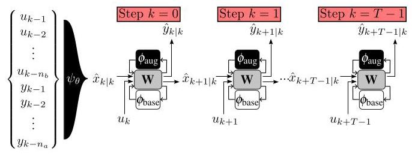

Fig. 6. SUBNET structure: the subspace encoder ${\psi }_{\theta }$ estimates the initial state at time $k$ based on past inputs and outputs, then it is propagated through ${\phi }_{\theta }$ multiple times until a simulation length $T$ .

图6.子网结构:子空间编码器${\psi }_{\theta }$根据过去的输入和输出估计时间$k$的初始状态，然后它被多次传播通过${\phi }_{\theta }$，直到模拟长度$T$。

where $\theta  = \operatorname{col}\left( {{\theta }_{\text{ base }},{\theta }_{\text{ aug }},{\theta }_{\text{ LFR }},{\theta }_{\text{ encoder }}}\right)$ is the joint parameter vector, $k + \ell  \mid  k$ indicates the state ${\widehat{x}}_{k}$ or the output ${\widehat{y}}_{k}$ at time $k + \ell$ simulated from the initial state ${\widehat{x}}_{k \mid  k}$ at time $k$ . The subsections start at a randomly selected time ${k}_{i} \in  \{ n + 1,\ldots , N - \; T\}$ . The initial state of these subsections is estimated by an encoder function $\psi$ using past input-output data, i.e., ${\widehat{x}}_{k \mid  k} = \; \psi \left( {{\theta }_{\text{ encoder }},{y}_{k - {n}_{a}}^{k - 1},{u}_{k - {n}_{b}}^{k - 1}}\right)$ where ${u}_{k - {n}_{b}}^{k - 1} = {\left\lbrack  \begin{array}{lll} {u}_{k - {n}_{b}}^{\top } & \cdots & {u}_{k - 1}^{\top } \end{array}\right\rbrack  }^{\top }$ for $\tau  \geq  0$ and ${y}_{k - {n}_{a}}^{k - 1}$ is defined similarly. The model structure with the encoder $\psi$ included, is shown in Fig. 6.

其中$\theta  = \operatorname{col}\left( {{\theta }_{\text{ base }},{\theta }_{\text{ aug }},{\theta }_{\text{ LFR }},{\theta }_{\text{ encoder }}}\right)$是联合参数向量，$k + \ell  \mid  k$表示从时间$k$的初始状态${\widehat{x}}_{k \mid  k}$模拟得到的时间$k + \ell$的状态${\widehat{x}}_{k}$或输出${\widehat{y}}_{k}$。这些子部分从随机选择的时间${k}_{i} \in  \{ n + 1,\ldots , N - \; T\}$开始。这些子部分的初始状态由编码器函数$\psi$使用过去的输入-输出数据进行估计，即${\widehat{x}}_{k \mid  k} = \; \psi \left( {{\theta }_{\text{ encoder }},{y}_{k - {n}_{a}}^{k - 1},{u}_{k - {n}_{b}}^{k - 1}}\right)$，其中${u}_{k - {n}_{b}}^{k - 1} = {\left\lbrack  \begin{array}{lll} {u}_{k - {n}_{b}}^{\top } & \cdots & {u}_{k - 1}^{\top } \end{array}\right\rbrack  }^{\top }$对于$\tau  \geq  0$，并且${y}_{k - {n}_{a}}^{k - 1}$的定义类似。包含编码器$\psi$的模型结构如图6所示。

The existence of the encoder $\psi$ has been shown in [4] for state-space models. We give a brief overview of the underlying mechanism. We derive the $n$ -step ahead predictor of the data generating system (1), resulting in

对于状态空间模型，编码器$\psi$已在[4]中被证明存在。我们简要概述其基本机制。我们推导数据生成系统(1)的$n$步超前预测器，得到

$$
{y}_{k}^{n + k} = \underset{n}{\underbrace{\left\lbrack  \begin{matrix} h\left( {{x}_{k},{u}_{k}}\right)  + {e}_{k} \\  \left( {h \circ  f}\right) \left( {{x}_{k},{u}_{k}^{k + 1}}\right)  + {e}_{k + 1} \\  \vdots \\  \left( {h \circ  {}_{n}f}\right) \left( {{x}_{k},{u}_{k}^{n + k}}\right)  + {e}_{k + n} \\  {\Gamma }_{r}\left( {{x}_{k},{u}_{k}^{n + k}}\right)  + {e}_{k}^{n + k} \end{matrix}\right\rbrack  }}. \tag{23}
$$

where ${ \circ  }_{n}$ stands for $n$ times recursive function composition. If ${\Gamma }_{n}$ is partially invertible as ${x}_{k} = {\Phi }_{n}\left( {{u}_{k}^{n + k},{y}_{k}^{n + k} - {e}_{k}^{n + k}}\right)$ , then the reconstructability map [21] is given as

其中${ \circ  }_{n}$代表$n$次递归函数复合。如果${\Gamma }_{n}$作为${x}_{k} = {\Phi }_{n}\left( {{u}_{k}^{n + k},{y}_{k}^{n + k} - {e}_{k}^{n + k}}\right)$部分可逆，那么可重构映射[21]如下所示

$$
{x}_{k} = \left( {{ \circ  }_{n}f}\right) \left( {{x}_{k - n},{u}_{k - n}^{k}}\right) \tag{24a}
$$

$$
= \left( {{ \circ  }_{n}f}\right) \left( {{\Phi }_{n}\left( {{u}_{k - n}^{k},{y}_{k - n}^{k} - {e}_{k - n}^{k}}\right) ,{u}_{k - n}^{k}}\right) \tag{24b}
$$

$$
= {\Psi }_{n}\left( {{u}_{k - n}^{k},{y}_{k - n}^{k} - {e}_{k - n}^{k}}\right) \text{ . } \tag{24c}
$$

However, the noise sequence ${e}_{k - n}^{k}$ is not available in practice. Under the assumption that ${e}_{k}$ is i.i.d. white noise, we can use the conditional expectation of (24c) as an estimate of ${x}_{k}$ :

然而，噪声序列${e}_{k - n}^{k}$在实践中不可用。在${e}_{k}$是独立同分布白噪声的假设下，我们可以使用(24c)的条件期望作为${x}_{k}$的估计:

$$
{\bar{x}}_{k} = {\mathbb{E}}_{{e}_{k}}\left\lbrack  {{x}_{k} \mid  {u}_{k - n}^{k},{y}_{k - n}^{k}}\right\rbrack   = \overline{\Psi }\left( {{u}_{k - n}^{k},{y}_{k - n}^{k}}\right) , \tag{25}
$$

which is an unbiased estimator of ${x}_{k}$ [22]. This estimator is difficult to compute in practice due to the required analytical inversion to obtain ${\Phi }_{n}$ , which varies with the choices of ${\theta }_{\text{ base }}$ , ${\theta }_{\text{ aug }}$ and ${\theta }_{\text{ LFR }}$ . Instead the parameterised function estimator $\psi$ is used to co-estimate $\overline{\Psi }$ with $W\left( {\theta }_{\mathrm{{LFR}}}\right) ,{\phi }_{\text{ base }}$ and ${\phi }_{\text{ aug }}$ .

这是${x}_{k}$的无偏估计器[22]。由于需要进行解析求逆以获得${\Phi }_{n}$，而${\Phi }_{n}$随${\theta }_{\text{ base }}$、${\theta }_{\text{ aug }}$和${\theta }_{\text{ LFR }}$的选择而变化，所以这个估计器在实践中很难计算。取而代之的是，使用参数化函数估计器$\psi$与$\overline{\Psi }$、$W\left( {\theta }_{\mathrm{{LFR}}}\right) ,{\phi }_{\text{ base }}$和${\phi }_{\text{ aug }}$一起共同估计${x}_{k}$。

### 5.2 Baseline parameter regularisation

### 5.2 基线参数正则化

The proposed LFR-based model structure (6) is overpa-rameterised and, as a result, the optimal parameter values $\left( {{\theta }_{\text{ base }}^{ * },{\theta }_{\text{ aug }}^{ * },{\theta }_{\text{ LFR }}^{ * }}\right)$ that minimise (22) are not unique. Therefore, the joint identification of all parameters can result in the learning components representing or cancelling out part of the baseline model dynamics. These non-unique parame-terisations have similar model performance; however, some parameterisations may generate physical parameters that deviate wildly from the expected parameters, even leading to physically unrealistic parameter values. To address this issue and retain the interpretability of the baseline model, we adapt the regularisation cost term from $\left\lbrack  {8,9}\right\rbrack$ :

所提出的基于LFR的模型结构(6)参数过多，因此，使(22)最小化的最优参数值$\left( {{\theta }_{\text{ base }}^{ * },{\theta }_{\text{ aug }}^{ * },{\theta }_{\text{ LFR }}^{ * }}\right)$不是唯一的。因此，所有参数的联合识别可能导致学习组件表示或抵消部分基线模型动态。这些非唯一的参数化具有相似的模型性能；然而，一些参数化可能会生成与预期参数相差很大的物理参数，甚至导致物理上不现实的参数值。为了解决这个问题并保留基线模型的可解释性，我们采用了来自$\left\lbrack  {8,9}\right\rbrack$的正则化成本项:

$$
{V}^{\text{ reg }}\left( \theta \right)  = {\begin{Vmatrix}\Lambda \left( {\theta }_{\text{ base }} - {\theta }_{\text{ base }}^{0}\right) \end{Vmatrix}}_{2}^{2} \tag{26}
$$

where $\Lambda  = \lambda \operatorname{diag}{\left( {\theta }_{\text{ base }}^{0}\right) }^{-1}$ with $\lambda  \in  {\mathbb{R}}_{ \geq  0}$ as a tunable parameter. This regularisation term (26) penalises deviations of the baseline parameters from the a priori selected values ${\theta }_{\text{ base }}^{0}$ , with the diagonal element normalising the importance of the parameters compared to each other. The cost function with the regularisation term becomes

其中$\Lambda  = \lambda \operatorname{diag}{\left( {\theta }_{\text{ base }}^{0}\right) }^{-1}$，$\lambda  \in  {\mathbb{R}}_{ \geq  0}$为可调参数。这个正则化项(26)惩罚基线参数与先验选择值${\theta }_{\text{ base }}^{0}$的偏差，对角元素将参数的重要性相互归一化。带有正则化项的成本函数变为

$$
{V}_{{\mathcal{D}}_{N}}\left( \mathbf{\theta }\right)  = {V}_{{\mathcal{D}}_{N}}^{\text{ trunc }}\left( \mathbf{\theta }\right)  + {V}^{\text{ reg }}\left( \mathbf{\theta }\right) . \tag{27}
$$

The tunable variable $\lambda$ determines how much the baseline parameters can deviate from the nominal parameter set ${\theta }_{\text{ base }}^{0}$ , relative to the change in $T$ -step-ahead prediction cost (22).

可调变量$\lambda$决定了相对于$T$步预测成本(22)的变化，基线参数可以偏离标称参数集${\theta }_{\text{ base }}^{0}$的程度。

### 5.3 Data and baseline model normalisation

### 5.3 数据和基线模型归一化

For the estimation of model structures containing ANNs, normalisation of the input and output data to zero mean and to a standard deviation of 1 has been shown to improve model estimation [6]. Therefore, we normalise $u$ and $y$ in ${\mathcal{D}}_{N}$ and aim to initialise the model structure and (6) so that $\widehat{x}$ is also normalised as in [5]. For this, the to-be-augmented baseline model ${\phi }_{\text{ base }}$ needs to be considered in the normalisation process. We take ${\phi }_{\text{ base }}$ into consideration based on the work in [32]. This results in a model that takes normalised input and state, and returns a normalised output while not altering its dynamics. For a baseline model operating around zero mean $\widehat{x}, u,\widehat{y}$ , this can be achieved by the transformation

对于包含人工神经网络的模型结构估计，已证明将输入和输出数据归一化为零均值和标准差为1可以提高模型估计[6]。因此，我们在${\mathcal{D}}_{N}$中对$u$和$y$进行归一化，并旨在初始化模型结构和(6)，以便$\widehat{x}$也如[5]中那样进行归一化。为此，在归一化过程中需要考虑待增强的基线模型${\phi }_{\text{ base }}$。我们基于[32]中的工作考虑${\phi }_{\text{ base }}$。这导致一个模型，它接受归一化的输入和状态，并返回归一化的输出，同时不改变其动态。对于围绕零均值$\widehat{x}, u,\widehat{y}$运行的基线模型，可以通过以下变换实现

$$
{\bar{f}}_{\text{ base }} = {T}_{x}{f}_{\text{ base }}\left( {{\theta }_{\text{ base }},{T}_{x}^{-1}{x}_{\mathrm{b}},{T}_{u}^{-1}u}\right) \tag{28a}
$$

$$
{\bar{h}}_{\text{ base }} = {T}_{y}{h}_{\text{ base }}\left( {{\theta }_{\text{ base }},{T}_{x}^{-1}{x}_{\mathrm{b}},{T}_{u}^{-1}u}\right) , \tag{28b}
$$

where ${T}_{u} \in  {\mathbb{R}}^{{n}_{u}}$ is a diagonal matrix composed as ${T}_{\mathrm{u}}^{-1} = \; \operatorname{diag}\left( {{\sigma }_{{u}_{1}}^{-1},\ldots ,{\sigma }_{{u}_{{n}_{u}}}^{-1}}\right)$ , where ${\sigma }_{u}$ is the sample-based standard deviation of each input signal, computed based on the data set ${\mathcal{D}}_{N}$ . The transformation matrix ${T}_{y}$ is defined in a similar way. For ${T}_{x}$ , the standard deviation ${\sigma }_{x}$ is determined on a sequence of baseline states ${x}_{\mathrm{b}}$ . For this, we simulate the baseline model with ${\theta }_{\text{ base }}^{0}$ for the given input sequence resulting in ${\widehat{x}}_{b, k}$ . We define an extended data set ${\widehat{\mathcal{D}}}_{N} = \; {\left\{  \left( {y}_{k},{\widehat{x}}_{\mathrm{b}, k},{u}_{k}\right) \right\}  }_{k = 1}^{N}$ for initialisation of the encoder later.

其中${T}_{u} \in  {\mathbb{R}}^{{n}_{u}}$是一个对角矩阵，其组成为${T}_{\mathrm{u}}^{-1} = \; \operatorname{diag}\left( {{\sigma }_{{u}_{1}}^{-1},\ldots ,{\sigma }_{{u}_{{n}_{u}}}^{-1}}\right)$，其中${\sigma }_{u}$是每个输入信号基于数据集${\mathcal{D}}_{N}$计算的基于样本的标准差。变换矩阵${T}_{y}$以类似的方式定义。对于${T}_{x}$，标准差${\sigma }_{x}$是在一系列基线状态${x}_{\mathrm{b}}$上确定的。为此，我们用${\theta }_{\text{ base }}^{0}$对给定输入序列模拟基线模型，得到${\widehat{x}}_{b, k}$。我们定义一个扩展数据集${\widehat{\mathcal{D}}}_{N} = \; {\left\{  \left( {y}_{k},{\widehat{x}}_{\mathrm{b}, k},{u}_{k}\right) \right\}  }_{k = 1}^{N}$用于稍后编码器的初始化。

### 5.4 Model structure initialisation

### 5.4 模型结构初始化

Next, we consider the initialisation of the learning components, LFR matrix, and the encoder. A common approach in the literature for initialising ANNs is to randomly assign weights and biases. However, for baseline models, random initialisation can be unstable and result in poor optimisation results. Furthermore, initialisation based on prior information, e.g., baseline model behaviour, can improve convergence rate and enhance model accuracy.

接下来，我们考虑学习组件、LFR矩阵和编码器的初始化。文献中初始化人工神经网络的一种常见方法是随机分配权重和偏差。然而，对于基线模型，随机初始化可能不稳定，并导致优化结果不佳。此外，基于先验信息(例如基线模型行为)进行初始化可以提高收敛速度并提高模型准确性。

#### 5.4.1 Model behaviour at initialisation

#### 5.4.1 初始化时的模型行为

We propose to initialise the parameters $\theta$ so that the LFR-based model structure with the encoder behaves equivalent to the baseline model on initialisation. We note the model structure (6) with ${z}_{\mathrm{b}, k}$ and ${z}_{\mathrm{a}, k}$ eliminated as $\Omega$ . Then the initialisation of $\theta$ should realise the following behaviour

我们建议初始化参数$\theta$，以使具有编码器的基于LFR的模型结构在初始化时的行为与基线模型等效。我们注意到消除了${z}_{\mathrm{b}, k}$和${z}_{\mathrm{a}, k}$的模型结构(6)作为$\Omega$。然后，$\theta$的初始化应实现以下行为

$$
\left\lbrack  \begin{matrix} {x}_{\mathrm{b}, k + 1} \\  {x}_{\mathrm{a}, k + 1} \\  {\widehat{y}}_{k} \end{matrix}\right\rbrack   = \Omega \left( {\theta ,{z}_{\mathrm{b}, k},{z}_{\mathrm{a}, k}}\right)  = \left\lbrack  \begin{matrix} {f}_{\text{ base }}\left( {{\theta }_{\text{ base }}^{0},{z}_{\mathrm{b}, k}}\right) \\  {\phi }_{\text{ aug }}\left( {{\theta }_{\text{ aug }}^{0},{z}_{\mathrm{a}, k}}\right) \\  {h}_{\text{ base }}\left( {{\theta }_{\text{ base }}^{0},{z}_{\mathrm{b}, k}}\right)  \end{matrix}\right\rbrack  , \tag{29}
$$

where ${\theta }_{\text{ aug }}^{0}$ are the initialised parameters for the augmentation. It is not trivial to determine such an initialisation for any arbitrary baseline model, learning function, and LFR matrix combination. We propose here a method that can achieve this initialisation under the following conditions:

其中${\theta }_{\text{ aug }}^{0}$是增强的初始化参数。为任意基线模型、学习函数和LFR矩阵组合确定这样的初始化并非易事。我们在此提出一种方法，该方法可以在以下条件下实现这种初始化:

(a) The computational graph ${G}_{\mathrm{{LFR}}}$ is acyclic

(a) 计算图${G}_{\mathrm{{LFR}}}$是无环的

(b) The learning functions are ResNets (15).

(b) 学习函数是ResNets(15)。

Condition (a) is the same condition as for the well-posedness proof and thus is not restrictive. Condition (b) is required to feasibly create series augmentations that can have baseline model behaviour.

条件(a)与适定性证明的条件相同，因此没有限制。条件(b)是为了可行地创建可以具有基线模型行为的系列增强。

#### 5.4.2 Encoder initialisation

#### 5.4.2编码器初始化

The encoder is parameterised by an ANN, e.g., a ResNET. To guarantee baseline behaviour at initialisation, this encoder should at initialisation output the baseline state sequence as in the extended dataset ${\widehat{\mathcal{D}}}_{N}$ . This could be derived analytically as in Section 5.1, but this is complicated on not feasible for all ANNs. Instead, we consider a data-driven approach. We fit a baseline encoder ${\psi }_{\text{ base }}$ on this dataset using the following loss function during the initialisation step

编码器由人工神经网络(例如ResNET)参数化。为了保证初始化时的基线行为，该编码器在初始化时应输出扩展数据集中${\widehat{\mathcal{D}}}_{N}$那样的基线状态序列。这可以像5.1节那样通过解析得出，但这对于所有人工神经网络来说都很复杂或不可行。相反，我们考虑一种数据驱动的方法。在初始化步骤中，我们使用以下损失函数在该数据集上拟合一个基线编码器${\psi }_{\text{ base }}$

$$
{V}_{\text{ enc }}\left( \theta \right)  = \frac{1}{N}\mathop{\sum }\limits_{{k = 1}}^{N}{\begin{Vmatrix}{\psi }_{\text{ base }}\left( {\theta }_{\text{ base }},{\widehat{y}}_{k - {n}_{a}}^{k - 1},{u}_{k - {n}_{b}}^{k - 1}\right)  - {\widehat{x}}_{\mathrm{b}, k}\end{Vmatrix}}_{2}^{2}, \tag{30}
$$

where ${\widehat{x}}_{\mathrm{b}, k}$ is the forward simulated state of the baseline model in the extended dataset ${\widehat{\mathcal{D}}}_{N}$ . If augmented states are considered, the baseline encoder ${\psi }_{\text{ base }}$ is extended with an augmented state encoder ${\psi }_{\text{ aug }}$

其中${\widehat{x}}_{\mathrm{b}, k}$是扩展数据集中${\widehat{\mathcal{D}}}_{N}$中基线模型的正向模拟状态。如果考虑增强状态，则基线编码器${\psi }_{\text{ base }}$用增强状态编码器${\psi }_{\text{ aug }}$进行扩展

$$
\left\lbrack  \begin{array}{l} {x}_{\mathrm{b}, k \mid  k} \\  {x}_{\mathrm{a}, k \mid  k} \end{array}\right\rbrack   = \left\lbrack  \begin{array}{l} {\psi }_{\mathrm{b}}\left( {{\theta }_{\text{ base }},{\widehat{y}}_{k - {n}_{a}}^{k - 1},{u}_{k - {n}_{b}}^{k - 1}}\right) \\  {\psi }_{\mathrm{a}}\left( {{\theta }_{\text{ aug }},{\widehat{y}}_{k - {n}_{a}}^{k - 1},{u}_{k - {n}_{b}}^{k - 1}}\right)  \end{array}\right\rbrack  , \tag{31}
$$

where the weights and biases of ${\psi }_{\text{ aug }}$ are initialised by the Xavier approach. The loss function (30) is no longer considered after initialisation.

其中${\psi }_{\text{ aug }}$的权重和偏差通过Xavier方法初始化。初始化后不再考虑损失函数(30)。

#### 5.4.3 LFR matrix and learning component initialisation

#### 5.4.3 LFR矩阵和学习组件初始化

We now initialise the LFR matrix and the learning components so that (29) holds for initialisation. We can simplify this equation with Condition (b) by only considering the linear component of the learning function and initialising the NL component to be zero, i.e., ${\phi }_{\text{ aug }}\left( {z}_{\mathrm{a}, k}\right)  = 0 + {W}_{a}{z}_{\mathrm{a}, k}$ . We

我们现在初始化LFR矩阵和学习组件，以使(29)在初始化时成立。通过条件(b)，我们可以通过仅考虑学习函数的线性组件并将非线性组件初始化为零来简化此方程，即${\phi }_{\text{ aug }}\left( {z}_{\mathrm{a}, k}\right)  = 0 + {W}_{a}{z}_{\mathrm{a}, k}$。我们

further assume under the acyclic property, without loss of generality, that ${D}_{zw}$ is lower block diagonal with respect to the learning functions and the baseline model. This means that ${D}_{zw}^{\mathrm{{aa}}} = 0,{D}_{zw}^{\mathrm{{bb}}} = 0$ , and either ${D}_{zw}^{\mathrm{{ba}}} = 0$ or ${D}_{zw}^{\mathrm{{ab}}} = 0$ . Substituting the linear component of the learning function into (16) and eliminating ${z}_{\mathrm{a}, k}$ , gives

在无环属性下进一步假设，不失一般性，${D}_{zw}$相对于学习函数和基线模型是下块对角的。这意味着${D}_{zw}^{\mathrm{{aa}}} = 0,{D}_{zw}^{\mathrm{{bb}}} = 0$，以及${D}_{zw}^{\mathrm{{ba}}} = 0$或${D}_{zw}^{\mathrm{{ab}}} = 0$中的一个。将学习函数的线性组件代入(16)并消除${z}_{\mathrm{a}, k}$，得到

$$
{z}_{\mathrm{b}, k} = \underset{\widetilde{C}}{\underbrace{\left\lbrack  {C}_{z}^{\mathrm{b}} + {D}_{zw}^{\mathrm{{ba}}}{W}_{a}{C}_{z}^{\mathrm{a}}{D}_{zu}^{\mathrm{b}} + {D}_{zw}^{\mathrm{{ba}}}{W}_{a}{D}_{zu}^{\mathrm{a}}\right\rbrack  }}\left\lbrack  \begin{matrix} {\widehat{x}}_{k} \\  {u}_{k} \end{matrix}\right\rbrack  , \tag{32}
$$

and the prediction equation

以及预测方程

$$
\left\lbrack  \begin{matrix} {\widehat{x}}_{k + 1} \\  {\widehat{y}}_{k} \end{matrix}\right\rbrack   = \underset{\widetilde{A}}{\underbrace{\left\lbrack  \begin{matrix} A + {B}_{w}^{\mathrm{a}}{W}_{a}{C}_{z}^{\mathrm{a}} & {B}_{u} + {B}_{w}^{\mathrm{a}}{W}_{a}{D}_{zu}^{\mathrm{a}} \\  {C}_{y} + {D}_{yw}^{\mathrm{a}}{W}_{a}{C}_{z}^{\mathrm{a}} & {D}_{yu} + {D}_{yw}^{\mathrm{a}}{W}_{a}{D}_{zu}^{\mathrm{a}} \end{matrix}\right\rbrack  }}\left\lbrack  \begin{matrix} {\widehat{x}}_{k} \\  {u}_{k} \end{matrix}\right\rbrack   +
$$

$$
\underset{\widetilde{B}}{\underbrace{\left\lbrack  \begin{matrix} {B}_{w}^{\mathrm{b}} + {B}_{w}^{\mathrm{a}}{W}_{a}{D}_{zw}^{\mathrm{{ab}}} \\  {D}_{yw}^{\mathrm{b}} + {D}_{yw}^{\mathrm{a}}{W}_{a}{D}_{zw}^{\mathrm{{ab}}} \end{matrix}\right\rbrack  }}{\phi }_{\text{ base }}\left( {z}_{\mathrm{b}, k}\right) . \tag{33}
$$

Thus, to have an initialisation satisfying (29), we require $\widetilde{B} = {I}_{{n}_{x} + {n}_{y}}$ and $\widetilde{C} = {I}_{{n}_{x} + {n}_{u}}$ . We repeat here that we assume either ${D}_{zw}^{\mathrm{{ba}}} = 0$ or ${D}_{zw}^{\mathrm{{ab}}} = 0$ to satisfy Condition 6 . The choice between these assumptions results in initialisation similar to the model structures derived in Appendix A, with ${D}_{zw}^{\mathrm{{ba}}} = 0$ resulting in series output augmentations, ${D}_{zw}^{\mathrm{{ab}}} = 0$ in series-input and ${D}_{zw}^{\mathrm{{ba}}} = {D}_{zw}^{\mathrm{{ab}}} = 0$ in parallel augmentation.

因此，为了有一个满足(29)的初始化，我们需要$\widetilde{B} = {I}_{{n}_{x} + {n}_{y}}$和$\widetilde{C} = {I}_{{n}_{x} + {n}_{u}}$。我们在此重复，我们假设${D}_{zw}^{\mathrm{{ba}}} = 0$或${D}_{zw}^{\mathrm{{ab}}} = 0$中的一个满足条件6。这些假设之间的选择导致类似于附录A中推导的模型结构的初始化，${D}_{zw}^{\mathrm{{ba}}} = 0$导致系列输出增强，${D}_{zw}^{\mathrm{{ab}}} = 0$导致系列输入，${D}_{zw}^{\mathrm{{ba}}} = {D}_{zw}^{\mathrm{{ab}}} = 0$导致并行增强。

All matrices not required to set the baseline model behaviour at initialisation (29) have all elements $m$ of the matrix initialised randomly, according to [32], i.e., $m \sim  \mathcal{U}\left( {-1,1}\right)$ where $\mathcal{U}\left( {a, b}\right)$ denotes a uniform distribution with support from $a$ to $b$ .

初始化时用于设置基线模型行为的所有矩阵(29)，其所有元素$m$均根据[32]随机初始化，即$m \sim  \mathcal{U}\left( {-1,1}\right)$，其中$\mathcal{U}\left( {a, b}\right)$表示在$a$到$b$范围内的均匀分布。

### 5.5 Convergence and Consistency

### 5.5收敛性和一致性

Next, we can analyse the statistical properties of the introduced augmentation approach in terms of convergence and consistency [24]. Convergence implies that, as the number of samples in ${\mathcal{D}}_{N}$ tends to infinity, the empirical identification criterion approaches its expected value. An estimator is consistent if, as $N \rightarrow  \infty$ , the estimated model converges to an equivalent representation of the true system (1).

接下来，我们可以从收敛性和一致性方面分析引入的增强方法的统计特性[24]。收敛性意味着，随着${\mathcal{D}}_{N}$中样本数量趋于无穷大，经验识别准则趋近其期望值。如果随着$N \rightarrow  \infty$，估计模型收敛到真实系统(1)的等效表示，则估计器是一致的。

Under Conditions 2.1-2.4 in [5] on the data-generating process (1), model structure (6), and identification criterion (22), the convergence and consistency are proven. Condition 2.1 requires the data-generating system to be incrementally exponential output stable, which becomes an assumption on the considered system (1). Similarly, Conditions 2.3 on predictor convergence and 2.4 on persistence of excitation are commonly assumed to hold. However, Condition 2.2 warrants additional consideration, as it demands differentiability of the model structure, including the encoder in (22), with respect to $\theta$ . This is not trivial due to the feedback connection in the model structure. If we take the acyclic condition (Condition (a)), then differentiability of $v\left( {{z}_{\mathrm{b}, k},{z}_{\mathrm{a}, k}}\right)$ is ensured, and it remains only to assume differentiability of the prediction mappings (6a), ${\phi }_{\text{ base }}$ , and ${\phi }_{\text{ aug }}$ -a standard and

在[5]中关于数据生成过程(1)、模型结构(6)和识别准则(22)的条件2.1 - 2.4下，收敛性和一致性得到了证明。条件2.1要求数据生成系统是增量指数输出稳定的，这成为对所考虑系统(1)的一个假设。类似地，通常假设预测器收敛的条件2.3和持续激励的条件2.4成立。然而，条件2.2需要额外考虑，因为它要求模型结构(包括(22)中的编码器)关于$\theta$是可微的。由于模型结构中的反馈连接，这并非易事。如果我们采用无环条件(条件(a))，那么$v\left( {{z}_{\mathrm{b}, k},{z}_{\mathrm{a}, k}}\right)$的可微性得到保证，并且只需要假设预测映射(6a)、${\phi }_{\text{ base }}$和${\phi }_{\text{ aug }}$的可微性——这在系统识别中是一个标准且非限制性的假设。因此，[5]中的所有条件都满足，这意味着所提出的模型增强方法具有收敛性和一致性。

Table 3

表3

Physical parameters of the 3-DOF MSD systems.

三自由度MSD系统的物理参数。

<table><tr><td>Body</td><td>Mass ${m}_{i}$</td><td>Spring ${k}_{i}$</td><td>Damper ${c}_{i}$</td><td>Hardening ${a}_{i}$</td></tr><tr><td>1</td><td>0.5 kg</td><td>${100}\;\mathrm{\frac{N}{m}}$</td><td>${0.5}\frac{\mathrm{{Ns}}}{\mathrm{m}}$</td><td>${100}\frac{\mathrm{N}}{{\mathrm{m}}^{3}}$</td></tr><tr><td>2</td><td>0.4 kg</td><td>${100}\;\mathrm{\frac{N}{m}}$</td><td>${0.5}\frac{\mathrm{{Ns}}}{\mathrm{m}}$</td><td>-</td></tr><tr><td>3</td><td>0.1 kg</td><td>${100}\;\frac{\mathrm{N}}{\mathrm{m}}$</td><td>${0.5}\frac{\mathrm{{Ns}}}{\mathrm{m}}$</td><td>-</td></tr></table>

Table 4

表4

Approximate physical parameters 2-DOF MSD baseline model.

二自由度MSD基线模型的近似物理参数。

<table><tr><td>Body</td><td>Mass ${m}_{i}$</td><td>Spring ${k}_{i}$</td><td>Damper ${c}_{i}$</td></tr><tr><td>1</td><td>0.5 kg</td><td>${95}\frac{\mathrm{N}}{\mathrm{m}}$</td><td>${0.45}\frac{\mathrm{{Ns}}}{\mathrm{m}}$</td></tr><tr><td>2</td><td>0.4 kg</td><td>${95}\frac{\mathrm{N}}{\mathrm{m}}$</td><td>${0.45}\frac{\mathrm{{Ns}}}{\mathrm{m}}$</td></tr></table>

non-restrictive assumption in system identification. Thus, all conditions in [5] are fulfilled to imply convergence and consistency of the proposed model augmentation approach.

因此，[5]中的所有条件都满足，意味着所提出的模型增强方法具有收敛性和一致性。

## 6 Simulation Study

## 6仿真研究

In this section, we analyse the performance of different model augmentation realisations of the LFR model when applied to various systems using a common baseline model. The objective is to demonstrate that the proposed LFR augmentation structure together with the proposed identification methods can effectively estimate system behaviour starting from the baseline model, while achieving faster estimation and offering greater transparency compared to the fully ANN-SS model. We focus here on structured parameterisa-tions of the LFR in the form of those presented in Table 1 and Table 2. In Section 7, this analysis is extended to flexible parameterisations, applied to a real-world setup with a more complex baseline model, where the most suitable form of augmentation is not known a priori.

在本节中，我们分析当使用通用基线模型应用于各种系统时，LFR模型的不同模型增强实现的性能。目的是证明所提出的LFR增强结构与所提出的识别方法一起，能够从基线模型开始有效地估计系统行为，同时与完全ANN - SS模型相比，实现更快的估计并提供更高的透明度。我们在此关注表1和表2中呈现形式的LFR的结构化参数化。在第7节中，此分析扩展到灵活参数化，应用于具有更复杂基线模型的实际设置，其中最适合的增强形式事先未知。

### 6.1 Mass-Spring-Damper system and data generation

### 6.1质量 - 弹簧 - 阻尼系统和数据生成

As a simulation example, a mass-spring-damper (MSD) system consisting of three masses is considered under three different configurations, as illustrated in Fig. 7. The corresponding physical parameters are listed in Table 3. Configuration (a) consists of three masses and a hardening spring nonlinearity. Configurations (b) and (c) add to this an input saturation and a first-order low-pass filter (LPF) to the output, respectively.

作为一个仿真示例，考虑一个由三个质量块组成的质量 - 弹簧 - 阻尼(MSD)系统，有三种不同配置，如图7所示。相应的物理参数列于表3中。配置(a)由三个质量块和一个硬化弹簧非线性组成。配置(b)和(c)分别在此基础上增加了输入饱和和输出的一阶低通滤波器(LPF)。

Configuration (a) is described in terms of a state-space representation with a total of 6 states as the positions ${p}_{i}$ and velocities ${\dot{p}}_{i}$ of the masses ${m}_{1},{m}_{2}$ , and ${m}_{3}$ . The hardening spring nonlinearity is simulated as a cubic stiffness term multiplied by the parameter ${a}_{1}$ . The measured output corresponds to the position ${p}_{2}$ , and the external input force is applied to the first mass ${m}_{1}$ . For Configuration (b) the saturation is ${30}\tanh \left( \frac{u}{30}\right)$ which results in a reduction of the applied multisine input signal RMS from ${10.0}\mathrm{\;N}$ to ${9.11}\mathrm{\;N}$ . For Configuration (c), the LPF is simulated such that the Bode plot of the LPF component is as shown in Fig. 10.

配置(a)用状态空间表示描述，共有6个状态，即质量块${m}_{1},{m}_{2}$和${m}_{3}$的位置${p}_{i}$和速度${\dot{p}}_{i}$。硬化弹簧非线性模拟为乘以参数${a}_{1}$的三次刚度项。测量输出对应于位置${p}_{2}$，外部输入力施加到第一个质量块${m}_{1}$上。对于配置(b)，饱和值为${30}\tanh \left( \frac{u}{30}\right)$，这导致施加的多正弦输入信号的均方根从${10.0}\mathrm{\;N}$降低到${9.11}\mathrm{\;N}$。对于配置(c)，模拟LPF使得LPF组件的波特图如图10所示。

The system is simulated using a 4th order Runge-Kutta (RK4) numerical integration with step size ${T}_{s} = {0.02}\mathrm{\;s}$ and

使用步长为${T}_{s} = {0.02}\mathrm{\;s}$的四阶龙格 - 库塔(RK4)数值积分对系统进行模拟，并且

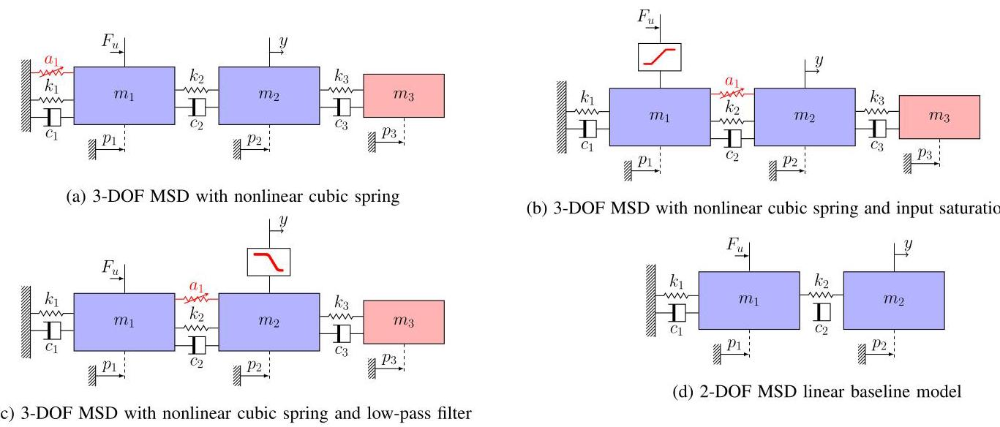

Fig. 7. Considered baseline model in blue and black and the MSD data generating systems with additional dynamics in red.

图7。蓝色和黑色表示考虑的基线模型，红色表示具有附加动态特性的MSD数据生成系统。

Table 5

表5

Hyperparameters for identifying the LFR-based augmentation and ANN-SS models.

用于识别基于LFR的增强模型和ANN - SS模型的超参数。

<table><tr><td>hidden layers</td><td>nodes</td><td>${n}_{a}{n}_{b}$</td><td>$T$</td><td>epochs</td><td>batch size</td></tr><tr><td>2</td><td>8</td><td>7</td><td>200</td><td>3000</td><td>2000</td></tr></table>

synchronised zero-order-hold actuation and sampling. The values of the DT input signal ${u}_{k}$ are generated by a random-phase multisine with 1666 frequency components in the range $\left\lbrack  {0,{25}}\right\rbrack  \mathrm{{Hz}}$ with a uniformly distributed phase in $\lbrack 0,{2\pi })$ . The sampled output measurements ${y}_{k}$ are perturbed by an additive white noise process ${e}_{k} \sim  \mathcal{N}\left( {0,{\sigma }_{\mathrm{e}}^{2}}\right)$ . Here, ${\sigma }_{\mathrm{e}}$ is chosen so that the signal-to-noise ratio is equal to ${30}\mathrm{\;{dB}}$ . The generated sampled output ${y}_{k}$ for the input ${u}_{k}$ is collected in the data set ${\mathcal{D}}_{N}$ . Separate data sets are created for estimation, validation and testing of different realisations of sizes ${N}_{\text{ est }} = 2 \cdot  {10}^{4},{N}_{\text{ val }} = {10}^{4},{N}_{\text{ test }} = {10}^{4}$ , respectively. The estimation data comprise two periods, while the validation and testing data each contain a single period.

同步零阶保持驱动和采样。DT输入信号${u}_{k}$的值由具有1666个频率分量的随机相位多正弦信号生成，频率范围在$\left\lbrack  {0,{25}}\right\rbrack  \mathrm{{Hz}}$内，相位在$\lbrack 0,{2\pi })$上均匀分布。采样输出测量值${y}_{k}$受到加性白噪声过程${e}_{k} \sim  \mathcal{N}\left( {0,{\sigma }_{\mathrm{e}}^{2}}\right)$的干扰。这里，选择${\sigma }_{\mathrm{e}}$使得信噪比等于${30}\mathrm{\;{dB}}$。为输入${u}_{k}$生成的采样输出${y}_{k}$被收集到数据集${\mathcal{D}}_{N}$中。分别为大小为${N}_{\text{ est }} = 2 \cdot  {10}^{4},{N}_{\text{ val }} = {10}^{4},{N}_{\text{ test }} = {10}^{4}$的不同实现创建单独的数据集用于估计、验证和测试。估计数据包括两个周期，而验证和测试数据各包含一个周期。

### 6.2 Baseline model

### 6.2基线模型

The baseline model is chosen to represent the linear 2-DOF MSD dynamics shown in Fig. 7d. We consider two initial-isations for the baseline model parameters: the ideal values from Table 3 and the approximate values from Table 4. The root mean squared error (RMSE) of the simulation responses of the baseline model for these initial parameter values is shown in Table 6 for configurations (a-c). Both initial-isations perform relatively poorly, despite (approximately) representing a large part of the dynamics.

选择基线模型来表示图7d中所示的线性二自由度MSD动态特性。我们考虑基线模型参数的两种初始化:表3中的理想值和表4中的近似值。对于这些初始参数值，基线模型模拟响应的均方根误差(RMSE)在表6中针对配置(a - c)给出。尽管(近似地)代表了大部分动态特性，但两种初始化的表现都相对较差。

### 6.3 Config. (a): MSD with added cubic spring and mass

### 6.3配置(a):添加立方弹簧和质量的MSD

First, we consider the augmentation of the baseline model in a structured form using the introduced LFR model structure. For this we consider various parameterisations of the LFR matrix $W$ corresponding to the configurations in Table 1 (not including S-SSI or S-DSI as we know a-priori that these will not model the system given the baseline model).

首先，我们考虑使用引入的LFR模型结构以结构化形式增强基线模型。为此，我们考虑与表1中的配置相对应的LFR矩阵$W$的各种参数化(不包括S - SSI或S - DSI，因为根据基线模型我们先验地知道这些不会对系统建模)。

For parallel augmentation structures, the learning components are chosen as feedforward neural networks, and for series augmentation structures, we choose ResNets to have a feasible initialisation (see Section 5.4). For all learning components, the number of hidden layers and neurons are listed in Table 5. The activation function is chosen as tanh. For the dynamic augmentation, we add two additional states to the baseline model states for a total of 6 states. This is the minimum number of states required to completely model the 3-DOF MSD system. The baseline model, learning component, and encoder parameters are jointly estimated as described in Section 3. The hyperparameters for these estimations are shown in Table 5, with 16 nodes and 2 hidden layers used for the encoder. The regularisation tuning parameter $\lambda$ in the joint identification cost function was set at $\lambda  = 1$ for ideal initialisation. The identification criterion is optimised using Adam. As a comparison to a black-box approach, an ANN-SS model parameterised by ResNets is estimated with the SUBNET method [4] and hyperparameters from Table 5.

对于并行增强结构，学习组件选择为前馈神经网络，对于串联增强结构，我们选择ResNets以进行可行的初始化(见第5.4节)。对于所有学习组件，隐藏层和神经元的数量列于表5中。激活函数选择为tanh。对于动态增强，我们在基线模型状态上添加两个额外的状态，总共6个状态。这是完全建模三自由度MSD系统所需的最少状态数。基线模型、学习组件和编码器参数如第3节所述联合估计。这些估计的超参数列于表5中，编码器使用16个节点和2个隐藏层。联合识别代价函数中的正则化调整参数$\lambda$在理想初始化时设置为$\lambda  = 1$。使用Adam优化识别准则。作为与黑箱方法的比较，使用SUBNET方法[4]和表5中的超参数估计由ResNets参数化的ANN - SS模型。

The simulation RMSE on the test data for these estimated models is shown in Table 6. The dynamic augmentations are able to capture the dynamics accurately, while the static augmentations result in slightly less accurate models.

这些估计模型在测试数据上的模拟RMSE列于表6中。动态增强能够准确地捕捉动态特性，而静态增强导致的模型精度略低。

In Fig. 8 we show the validation loss curves of select estimated models. The convergence speed of the ANN-SS and S-DSO models is slower than the S-DP model, while all models achieve similar RMSE scores.

在图8中，我们展示了选定估计模型的验证损失曲线。ANN - SS和S - DSO模型的收敛速度比S - DP模型慢，而所有模型都获得了相似的RMSE分数。

The estimated physical parameters remain very close to the initialisation values for both the ideal and the approximate case. This is not desired behaviour for the approximate initialisations, indicating that the learning components are learning parts of the system dynamics that could be represented by the baseline model.

对于理想情况和近似情况，估计的物理参数都非常接近初始化值。对于近似初始化，这不是期望的行为，表明学习组件正在学习基线模型可以表示的系统动态特性的部分。

In Fig. 9, we show the comparison between the states $\widehat{x}$ of the S-DP model (-) and the outputs of the learning components

<text>在图9中，我们展示了S-DP模型(-)的状态$\widehat{x}$与学习组件的输出之间的比较</text>

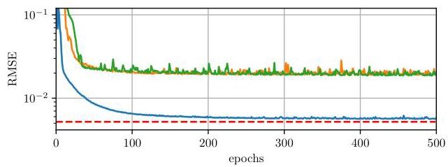

Fig. 8. Validation loss over first 500 training epochs for S-DP (一), S-DSO (-) and black-box ANN-SS (-) models estimated for the MSD system with configuration (a). The noise floor is shown with a red dashed line $\left( {\bullet  - }\right)$ .

<text>图8. 针对配置(a)的MSD系统估计的S-DP(一)、S-DSO(-)和黑箱ANN-SS(-)模型在前500个训练轮次上的验证损失。噪声基底用红色虚线$\left( {\bullet  - }\right)$表示。</text>

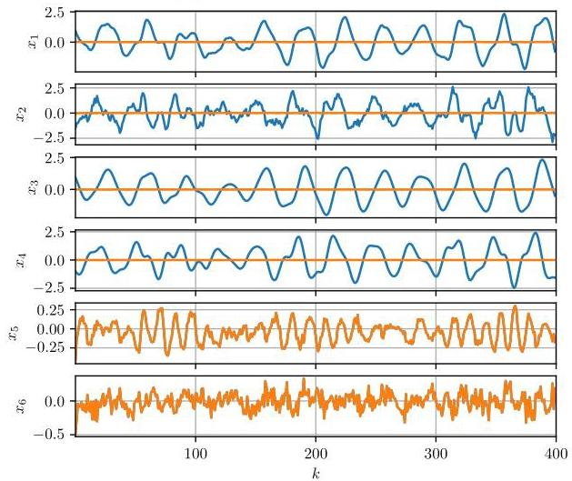

Fig. 9. Comparison of the augmented model with dynamic parallel configuration states $\widehat{x}\left( -\right)$ and the outputs of the learning components ${\phi }_{\text{ aug }}\left(  \rightarrow  \right)$ for a simulation with test data of the MSD system with configuration (a). States ${x}_{1} - {x}_{4}$ are states of the augmented model based on the sum of ${f}_{\text{ base }}$ and ${f}_{\text{ aug }}$ , while states ${x}_{5} - {x}_{6}$ are the output of the dynamic augmentation component ${g}_{\text{ aug }}$ .

<text>图9. 针对配置(a)的MSD系统的测试数据模拟，具有动态并行配置状态$\widehat{x}\left( -\right)$的增强模型与学习组件${\phi }_{\text{ aug }}\left(  \rightarrow  \right)$的输出的比较。状态${x}_{1} - {x}_{4}$是基于${f}_{\text{ base }}$和${f}_{\text{ aug }}$之和的增强模型的状态，而状态${x}_{5} - {x}_{6}$是动态增强组件${g}_{\text{ aug }}$的输出。</text>

${\phi }_{\text{ aug }}\left( -\right)$ . Here, ${x}_{\mathrm{b}} = {\left\lbrack  \begin{array}{lll} {x}_{1}^{\top } & \ldots & {x}_{4}^{\top } \end{array}\right\rbrack  }^{\top }$ and ${x}_{\mathrm{a}} = {\left\lbrack  \begin{array}{ll} {x}_{5}^{\top } & {x}_{6}^{\top } \end{array}\right\rbrack  }^{\top }$ . The effect of the learning components is relatively small for ${x}_{\mathrm{b}}$ , while ${x}_{\mathrm{a}}$ is modelled solely by the learning components. From this, we can conclude that the learning components are augmenting the baseline and not replacing the baseline model with their own dynamics.

<text>${\phi }_{\text{ aug }}\left( -\right)$。在此，${x}_{\mathrm{b}} = {\left\lbrack  \begin{array}{lll} {x}_{1}^{\top } & \ldots & {x}_{4}^{\top } \end{array}\right\rbrack  }^{\top }$和${x}_{\mathrm{a}} = {\left\lbrack  \begin{array}{ll} {x}_{5}^{\top } & {x}_{6}^{\top } \end{array}\right\rbrack  }^{\top }$。对于${x}_{\mathrm{b}}$，学习组件的影响相对较小，而${x}_{\mathrm{a}}$仅由学习组件建模。由此，我们可以得出结论，学习组件是在增强基线，而不是用它们自己的动态特性取代基线模型。</text>

### 6.4 Config. (b): MSD with added input saturation

<text>### 6.4配置(b):具有附加输入饱和的MSD</text>

For the MSD system in configuration (b), we applied similar identification steps as in Section 6.3. We again estimate SSP and S-DP as described in Table 1. We, however, further combine these parameterisations with a series input augmentation to characterise the input saturation, which we note as S-SP-I with the following structure

<text>对于配置(b)中的MSD系统，我们应用了与6.3节中类似的识别步骤。我们再次按照表1中所述估计SSP和S-DP。然而，我们进一步将这些参数化与串联输入增强相结合，以表征输入饱和，我们将其记为S-SP-I，具有以下结构</text>

$$
{x}_{\mathrm{b}, k + 1} = {f}_{\text{ base }}\left( {{x}_{\mathrm{b}, k},{g}_{\text{ aug }}\left( {u}_{k}\right) }\right)  + {f}_{\text{ aug }}\left( {{x}_{\mathrm{b}, k},{u}_{k}}\right) . \tag{34}
$$

A similar structure is used for a S-DP with series input augmentation noted as S-DP-I. The remaining parameteri-sations and hyperparameters are as in Section 6.3. We again estimate an ANN-SS model parameterised by ResNets as a black-box comparison.

<text>具有串联输入增强的S-DP记为S-DP-I，使用类似的结构。其余的参数化和超参数与6.3节中相同。我们再次估计由ResNets参数化的ANN-SS模型作为黑箱比较。</text>

The simulation RMSE on the test data for these estimated models are shown in Table 6. All selected augmentations result in accurate models. However, the series input augmentation specifically models the input saturation as a function of ${u}_{k}$ and thus results in a more interpretable model. The convergence of the estimated models are similar as in Fig. 8, with the S-SP-I and S-DP-I models converging faster than the backbox ANN-SS, S-SP and S-DP models.

<text>这些估计模型在测试数据上的模拟RMSE如表6所示。所有选定的增强都产生了准确的模型。然而，串联输入增强专门将输入饱和建模为${u}_{k}$的函数，因此产生了一个更具可解释性的模型。估计模型的收敛情况与图8中类似，S-SP-I和S-DP-I模型的收敛速度比黑箱ANN-SS、S-SP和S-DP模型快。</text>

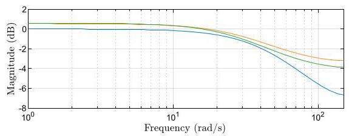

Fig. 10. Bode plot of both O-DSO estimated with the S-DP $\left(  \rightarrow  \right)$ and S-SP $\left(  \multimap  \right)$ , compared against the LPF included in system configuration (c) $\left(  \multimap  \right)$ .

<text>图10. 用S-DP $\left(  \rightarrow  \right)$和S-SP $\left(  \multimap  \right)$估计的两个O-DSO的波特图，与系统配置(c)中包含的LPF $\left(  \multimap  \right)$进行比较。</text>

### 6.5 Config. (c): MSD with added output low-pass-filter

<text>### 6.5配置(c):具有附加输出低通滤波器的MSD</text>

For the MSD system in configuration (c), we applied similar identification steps as in Section 6.3. We again estimate the S-SP and S-DP described in Table 1. We now further estimate these state augmentations with and O-DSO described in Table 2. The O-DSO is parameterised by an LTI model with a single state, which is capable of modelling the dynamics of the first-order LPF. The remaining parameterisa-tions and hyperparameters as in Section 6.3. We again estimate an ANN-SS model parameterised by ResNets as a black-box comparison.

<text>对于配置(c)中的MSD系统，我们应用了与6.3节中类似的识别步骤。我们再次估计表1中所述的S-SP和S-DP。我们现在进一步用表2中所述的O-DSO估计这些状态增强。O-DSO由具有单个状态的LTI模型参数化，该模型能够对一阶LPF的动态特性进行建模。其余的参数化和超参数与6.3节中相同。我们再次估计由ResNets参数化的ANN-SS模型作为黑箱比较。</text>

The simulation RMSE on the test data for these estimated models is shown in Table 6. All selected augmentations result in accurate models. The convergence of the estimated models are similar as in Fig. 8, with the O-DSO models, SDP and S-SP converging faster than the backbox ANN-SS model.

这些估计模型在测试数据上的模拟均方根误差(RMSE)如表6所示。所有选定的增强方法都能得到精确的模型。估计模型的收敛情况与图8类似，其中O-DSO模型、SDP和S-SP的收敛速度比backbox ANN-SS模型更快。

In Fig. 10, the Bode plot of ${h}_{\text{ aug }}$ from both the estimated ODSO model, with S-SP and S-DP state models, are shown compared against the true system LPF. We can see that the output augmentations model behaviour similar to the system LPF thus enhancing the interpretability of the estimated model compared to the model augmentations without the output augmentation where this behaviour will have to be modelled in the state augmentation. Ensuring that output augmentations model the LPF exactly is an identifiability problem left to future research.

在图10中，展示了来自估计的ODSO模型(带有S-SP和S-DP状态模型)的${h}_{\text{ aug }}$的波特图，并与真实系统的低通滤波器(LPF)进行比较。我们可以看到，输出增强模型的行为与系统LPF相似，因此与没有输出增强的模型增强相比，增强了估计模型的可解释性，在没有输出增强的情况下，这种行为必须在状态增强中进行建模。确保输出增强精确地模拟LPF是一个有待未来研究的可识别性问题。

## 7 Experimental study

## 7实验研究

In this section, we demonstrate the capabilities of the general LFR-based model augmentation structure and the proposed estimation approach by identifying the dynamics of an F1Tenth electric vehicle, using experimental data.

在本节中，我们通过使用实验数据识别F1Tenth电动汽车的动力学，展示了基于广义LFR的模型增强结构和所提出的估计方法的能力。

### 7.1 F1Tenth vehicle

### 7.1 F1Tenth车辆

F1tenth is a 1/10 scale model of an electric car, which has been mainly developed as a test platform for various automotive applications [1]. To demonstrate the capabilities of the proposed LFR-based model augmentation structure, the dynamics of such a vehicle are identified in this section. In contrast to Section 6, measurements from a real F1tenth are used instead of simulation data. An in-depth description of the used vehicle and test environment is available in [14].

F1tenth是一款1/10比例的电动汽车模型，主要作为各种汽车应用的测试平台而开发[1]。为了演示所提出的基于LFR的模型增强结构的能力，本节对这种车辆的动力学进行了识别。与第6节不同，这里使用的是真实F1tenth的测量数据，而不是仿真数据。关于所用车辆和测试环境的详细描述见[14]。

Table 6

表6

RMSE of the simulated responses from the estimated models evaluated on the test sets generated by the MSD system with configurations

在具有不同配置的MSD系统生成的测试集上评估的估计模型的模拟响应的均方根误差

(a), (b), and (c).

(a)、(b) 和 (c)。

<table><tr><td rowspan="2">(c).   Model</td><td colspan="2">Config. (a)</td><td colspan="2">Config. (b)</td><td colspan="2">Config. (c)</td></tr><tr><td>Ideal</td><td>Approx.</td><td>Ideal</td><td>Approx.</td><td>Ideal</td><td>Approx.</td></tr><tr><td>baseline</td><td>${1.97} \cdot  {10}^{-1}$</td><td>1.77 $\cdot  {10}^{-1}$</td><td>${1.96} \cdot  {10}^{-1}$</td><td>1.86 $\cdot  {10}^{-1}$</td><td>${2.22} \cdot  {10}^{-1}$</td><td>${2.13} \cdot  {10}^{-1}$</td></tr><tr><td>S-SP</td><td>${6.73} \cdot  {10}^{-3}$</td><td>${6.61} \cdot  {10}^{-3}$</td><td>${5.53} \cdot  {10}^{-3}$</td><td>6.03 $\cdot  {10}^{-3}$</td><td>${5.86} \cdot  {10}^{-3}$</td><td>${5.53} \cdot  {10}^{-3}$</td></tr><tr><td>S-DP</td><td>${5.54} \cdot  {10}^{-3}$</td><td>${5.77} \cdot  {10}^{-3}$</td><td>${5.79} \cdot  {10}^{-3}$</td><td>${5.80} \cdot  {10}^{-3}$</td><td>${5.46} \cdot  {10}^{-3}$</td><td>${5.39} \cdot  {10}^{-3}$</td></tr><tr><td>S-SSO</td><td>${7.07} \cdot  {10}^{-3}$</td><td>${6.80} \cdot  {10}^{-3}$</td><td>-</td><td>-</td><td>-</td><td>-</td></tr><tr><td>S-DSO</td><td>${5.33} \cdot  {10}^{-3}$</td><td>${5.57} \cdot  {10}^{-3}$</td><td>-</td><td>-</td><td>-</td><td>-</td></tr><tr><td>S-SP-I</td><td>-</td><td>-</td><td>${5.40} \cdot  {10}^{-3}$</td><td>${5.78} \cdot  {10}^{-3}$</td><td>-</td><td>-</td></tr><tr><td>S-DP-I</td><td>-</td><td>-</td><td>${5.44} \cdot  {10}^{-3}$</td><td>${5.41} \cdot  {10}^{-3}$</td><td>-</td><td>-</td></tr><tr><td>S-SP & O-DSO</td><td>-</td><td>-</td><td>-</td><td>-</td><td>${5.45} \cdot  {10}^{-3}$</td><td>${5.42} \cdot  {10}^{-3}$</td></tr><tr><td>S-DP & O-DSO</td><td>-</td><td>-</td><td>-</td><td>-</td><td>${5.39} \cdot  {10}^{-3}$</td><td>${5.38} \cdot  {10}^{-3}$</td></tr><tr><td>blackbox ANN-SS</td><td></td><td>${5.72} \cdot  {10}^{-3}$</td><td></td><td>${6.37} \cdot  {10}^{-3}$</td><td colspan="2">${5.55} \cdot  {10}^{-3}$</td></tr></table>

### 7.2 Baseline model of the F1Tenth vehicle

### 7.2 F1Tenth车辆的基线模型

To develop a baseline model of the F1Tenth platform, the so-called single-track model has been used [27]. The model is illustrated in Fig. 11, and can be expressed by using six state variables. The baseline states are the position of the center-of-gravity (CoG) in the $\left( {X, Y}\right)$ plane $\left( {{p}_{x},{p}_{y}}\right)$ , the orientation of the vehicle $\varphi$ , which is measured from the $X$ axis, the longitudinal and lateral velocities of the vehicle, and the yaw rate. The control inputs are the steering angle $\delta$ , and the PWM percentage of the electric motor that provides the main propulsion of the vehicle. The equations of the single-track model can be derived in continuous time, and the resulting model is discretised using the RK4 scheme. Since the used OptiTrack motion capture system measures the position and orientation of the vehicle, while the built-in IMU and speed sensors provide information regarding the velocity components, full state measurements are available. Hence, the baseline output function becomes ${\widehat{y}}_{k} = {x}_{\mathrm{b}, k}$ . To model the longitudinal tire force component ${F}_{\xi }$ , an empirical drivetrain model [14] is applied, while the linearised Magic Formula [26] has been utilised to model the lateral tire force components $\left( {F}_{\mathrm{f},\eta }\right.$ and $\left. {F}_{\mathrm{r},\eta }\right)$ . For a detailed derivation and discussion of the baseline model, refer to [13, 18].

为了开发F1Tenth平台的基线模型，使用了所谓的单轨模型[27]。该模型如图11所示，可以用六个状态变量来表示。基线状态是重心(CoG)在$\left( {X, Y}\right)$平面$\left( {{p}_{x},{p}_{y}}\right)$中的位置、车辆$\varphi$的方向(从$X$轴测量)、车辆的纵向和横向速度以及偏航率。控制输入是转向角$\delta$和提供车辆主要推进力的电动机的PWM百分比。单轨模型的方程可以在连续时间内推导出来，然后使用RK4方案对所得模型进行离散化。由于使用的OptiTrack运动捕捉系统测量车辆的位置和方向，而内置的IMU和速度传感器提供有关速度分量的信息，因此可以获得完整的状态测量值。因此，基线输出函数变为${\widehat{y}}_{k} = {x}_{\mathrm{b}, k}$。为了对纵向轮胎力分量${F}_{\xi }$进行建模，应用了一个经验传动系模型[14]，而线性化的魔术公式[26]已被用于对横向轮胎力分量$\left( {F}_{\mathrm{f},\eta }\right.$和$\left. {F}_{\mathrm{r},\eta }\right)$进行建模。有关基线模型的详细推导和讨论，请参考[13, 18]。

The applied tire models (especially the empirical drivetrain model) are highly approximative and are the primary sources of inaccuracy in the baseline model; hence, identifying the dynamics of the F1Tenth vehicle is challenging even when incorporating existing physical knowledge into the model structure. Moreover, there are 9 baseline parameters (such as mass, inertia, distance of the rear and front end from the CoG, and parameters corresponding to the tire models) that need to be estimated. Initial values of these parameters were determined in [13]. However, some elements of this initial parameter vector ${\theta }_{\text{ base }}^{0}$ are highly approximative. Hence, to achieve an accurate representation of the true dynamics, ${\theta }_{\text{ base }}$ is tuned jointly with the model parameters.

所应用的轮胎模型(尤其是经验传动系统模型)具有高度近似性，是基线模型中不准确的主要来源；因此，即使将现有的物理知识纳入模型结构，识别F1Tenth车辆的动力学特性也具有挑战性。此外，有9个基线参数(如质量、惯性、前后端到质心的距离以及与轮胎模型对应的参数)需要估计。这些参数的初始值在[13]中确定。然而，这个初始参数向量${\theta }_{\text{ base }}^{0}$的一些元素具有高度近似性。因此，为了准确表示真实动力学，${\theta }_{\text{ base }}$与模型参数一起进行调整。

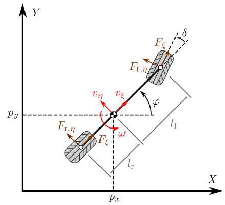

Fig. 11. Illustration of the single track model.

图11. 单轨模型的图示。

### 7.3 Data acquisition

### 7.3 数据采集

A lemniscate-shaped trajectory has been selected for generating measurement data because, by following it, the heading angle traverses the whole operational domain, and the resulting motion has quick changes in velocity. A second trajectory has been chosen to be a circle-shaped path because it is also a typical maneuver for this type of vehicle. Measurement data has been collected with a sampling frequency of ${f}_{\mathrm{s}} = {40}\mathrm{\;{Hz}}$ . To acquire data with various motor PWM inputs, the velocity references have been varied for both trajectories, ranging from ${0.45}\mathrm{\;m}/\mathrm{s}$ to $1\mathrm{\;m}/\mathrm{s}$ with step increments of 0.05 $\mathrm{m}/\mathrm{s}$ , resulting in a total of 24 measurement records. Half of these measurements have been separated into training and test sets. Both trajectories with alternating reference velocities have been included in all data sets. Before concatenating the measurement signals for the training data set, contiguous segments (corresponding to ${20}\%$ of the length of each of the 12 training signals) were randomly selected to form the validation data set. A total of 6467 samples are used for estimation, 1669 for validation, and 8041 for testing.

之所以选择双纽线形状的轨迹来生成测量数据，是因为沿着该轨迹，航向角能遍历整个操作域，并且所产生的运动在速度上有快速变化。选择的第二条轨迹是圆形路径，因为这也是此类车辆的一种典型机动动作。测量数据是在${f}_{\mathrm{s}} = {40}\mathrm{\;{Hz}}$的采样频率下收集的。为了获取具有各种电机脉宽调制(PWM)输入的数据，对两条轨迹的速度参考值都进行了变化，范围从${0.45}\mathrm{\;m}/\mathrm{s}$到$1\mathrm{\;m}/\mathrm{s}$，步长增量为0.05$\mathrm{m}/\mathrm{s}$，总共产生了24条测量记录。这些测量数据的一半被分为训练集和测试集。所有数据集中都包含了具有交替参考速度的两条轨迹。在为训练数据集连接测量信号之前，随机选择连续段(对应于12个训练信号中每个信号长度的${20}\%$)来形成验证数据集。总共6467个样本用于估计，1669个用于验证，8041个用于测试。

### 7.4 Estimated models

### 7.4 估计模型

As proposed by [18, 36], to simplify the neural network structure, we only identify the input-to-velocity relationship

正如[18, 36]所提出的，为了简化神经网络结构，我们只确定输入与速度的关系

Table 7

表7

Hyperparameters of the LFR-based model augmentation structure for identifying the dynamics of the F1Tenth vehicle.

用于识别F1Tenth车辆动力学的基于LFR的模型增强结构的超参数。

<table><tr><td>hidden layers</td><td>nodes</td><td>${n}_{a}{n}_{b}$</td><td>$T$</td><td>epochs</td><td>batch size</td></tr><tr><td>2</td><td>128</td><td>12</td><td>40</td><td>3000</td><td>256</td></tr></table>

by detaching the integrators. Hence, the outputs (and consequently, the baseline states) become the longitudinal and lateral velocity components, as well as the yaw rate of the vehicle. Then, after identification, by putting back the integrator dynamics, the position and orientation values can also be obtained during model simulation.

通过分离积分器。因此，输出(以及相应的基线状态)变为车辆的纵向和横向速度分量以及偏航率。然后，在识别之后，通过恢复积分器动力学，在模型仿真期间也可以获得位置和方向值。

As all baseline model states are measured, the initial values of ${x}_{\mathrm{b}}$ are known for all subsections when calculating the truncated prediction loss, i.e., the encoder network only estimates the augmented states in case a dynamic model augmentation structure is applied. For the latter scenario, a fully-connected feedforward ANN with 2 hidden layers and 64 nodes per layer has been selected for the encoder network with the tanh activation function. Based on previous black-box identification results on the same dataset (see [36]), an encoder lag of ${n}_{a} = {n}_{b} = {12}$ has been applied. The augmented state dimension has been selected based on physical insight and a short trial-and-error period as ${n}_{{x}_{\mathrm{a}}} = 2$ . For the LFR-based structure, ${n}_{{z}_{\mathrm{a}}} = 4$ has been applied, while ${n}_{{w}_{\mathrm{a}}} = 3$ and ${n}_{{w}_{\mathrm{a}}} = 5$ were selected for the static and dynamic model augmentations, respectively. A regularisation coefficient of $\lambda  = {0.01}$ has been applied, as a result of a line-search. All other hyperparameters are summarised in Table 7.

由于所有基线模型状态都是可测量的，在计算截断预测损失时，所有子部分的${x}_{\mathrm{b}}$初始值都是已知的，即，在应用动态模型增强结构的情况下，编码器网络仅估计增强状态。对于后一种情况，为编码器网络选择了一个具有2个隐藏层且每层有64个节点的全连接前馈人工神经网络，并使用双曲正切激活函数。基于之前在同一数据集上的黑箱识别结果(见[36])，应用了${n}_{a} = {n}_{b} = {12}$的编码器延迟。基于物理洞察力和短时间的试错期，将增强状态维度选择为${n}_{{x}_{\mathrm{a}}} = 2$。对于基于LFR的结构，应用了${n}_{{z}_{\mathrm{a}}} = 4$，而对于静态和动态模型增强分别选择了${n}_{{w}_{\mathrm{a}}} = 3$和${n}_{{w}_{\mathrm{a}}} = 5$。通过线搜索应用了$\lambda  = {0.01}$的正则化系数。所有其他超参数总结在表7中。

As discussed in Remark 10, there are a few possible strategies to ensure the well-posedness of the LFR-based structure (6). The most straightforward one is to restrict ${D}_{zw} \equiv  0$ , while a more general approach is to select either ${D}_{zw}^{\mathrm{{ba}}}$ or ${D}_{zw}^{\mathrm{{ab}}}$ to be tuned freely, while the rest of ${D}_{zw}$ is set to zero. To demonstrate these approaches, we have trained models with different options regarding the structure of the ${D}_{zw}$ matrix. Furthermore, we demonstrate the enforcing of model structures in the LFR matrix $W$ by constraining the ${C}_{z}^{\mathrm{b}}$ and ${D}_{zu}^{\mathrm{b}}$ matrices such that ${z}_{\mathrm{b}, k} \equiv  \operatorname{vec}\left( {{x}_{\mathrm{b}, k},{u}_{k}}\right)$ , we have also trained models with that setting. The results are summarised in Table 8, where the augmented models are compared with state-of-the-art black-box identification results and the baseline model with nominal parameters. As the integrator dynamics make it difficult to obtain accurate long-term predictions in practice, the presented error values only consider the velocity components of the output. This is in line with previous black-box results using the same data set, see [36]. Still, to demonstrate the accuracy of the simulated position and orientation values, Fig. 12 presents these signals obtained using the best-performing static and dynamic LFR-based models for an arbitrarily selected test trajectory. Notably, both models demonstrate remarkable accuracy compared to the real measured data, even over extended open-loop simulations lasting 16-18 seconds. It is important to note that the reported errors are also influenced by the employed numerical integration scheme. This effect is particularly visible in the case of the dynamic LFR model, where the simulated trajectory initially closely follows the measured data, but the accuracy continuously deteriorates due to the accumulation of integration errors and unknown input disturbances.

如备注10中所讨论的，有几种可能的策略来确保基于LFR的结构(6)的适定性。最直接的一种是限制${D}_{zw} \equiv  0$，而更通用的方法是选择${D}_{zw}^{\mathrm{{ba}}}$或${D}_{zw}^{\mathrm{{ab}}}$中的一个进行自由调整，而${D}_{zw}$的其余部分设置为零。为了演示这些方法，我们针对${D}_{zw}$矩阵的结构使用不同选项训练了模型。此外，我们通过约束${C}_{z}^{\mathrm{b}}$和${D}_{zu}^{\mathrm{b}}$矩阵来演示在LFR矩阵$W$中强制模型结构，使得${z}_{\mathrm{b}, k} \equiv  \operatorname{vec}\left( {{x}_{\mathrm{b}, k},{u}_{k}}\right)$，我们也使用该设置训练了模型。结果总结在表8中，其中将增强模型与最新的黑箱识别结果以及具有标称参数的基线模型进行了比较。由于积分器动力学在实际中难以获得准确的长期预测，所呈现的误差值仅考虑输出的速度分量。这与之前使用相同数据集的黑箱结果一致，见[36]。尽管如此，为了演示模拟位置和方向值的准确性，图12展示了使用性能最佳的基于静态和动态LFR的模型针对任意选择的测试轨迹获得的这些信号。值得注意的是，与实际测量数据相比，两个模型都表现出了显著的准确性，即使在持续16 - 18秒的扩展开环仿真中也是如此。需要注意的是，报告的误差也受所采用的数值积分方案的影响。这种影响在动态LFR模型的情况下尤为明显，其中模拟轨迹最初紧密跟随测量数据，但由于积分误差和未知输入干扰的积累，准确性会持续下降。

Table 8

表8

Normalised root mean squared simulation error of the estimated models on the F1Tenth identification study.

F1Tenth识别研究中估计模型的归一化均方根仿真误差。

<table><tr><td>Model</td><td>Test NRMS error</td></tr><tr><td>static LFR-based $\left( {{D}_{zw} \equiv  0}\right)$</td><td>10.71%</td></tr><tr><td>static LFR-based $\left( {D}_{zw}^{\mathrm{{ab}}}\right.$ tuned $)$</td><td>9.27%</td></tr><tr><td>static LFR-based $\left( {D}_{zw}^{\mathrm{{ba}}}\right.$ tuned $)$</td><td>10.44%</td></tr><tr><td>static LFR-based $\left( {{D}_{zw}^{\mathrm{{ab}}} \equiv  0,{z}_{\mathrm{b}}}\right.$ fixed $)$</td><td>9.42%</td></tr><tr><td>static LFR-based $\left( {D}_{zw}^{\mathrm{{ab}}}\right.$ tuned, ${z}_{\mathrm{b}}$ fixed $)$</td><td>9.90%</td></tr><tr><td>dynamic LFR-based $\left( {{D}_{zw} \equiv  0}\right)$</td><td>8.79%</td></tr><tr><td>dynamic LFR-based $\left( {D}_{zw}^{\mathrm{{ab}}}\right.$ tuned $)$</td><td>8.52%</td></tr><tr><td>dynamic LFR-based $\left( {D}_{zw}^{\mathrm{{ba}}}\right.$ tuned $)$</td><td>8.99%</td></tr><tr><td>dyn. LFR-based $\left( {{D}_{zw}^{\mathrm{{ab}}} \equiv  0,{z}_{\mathrm{b}}}\right.$ fixed $)$</td><td>8.25%</td></tr><tr><td>dyn. LFR-based $\left( {D}_{zw}^{\mathrm{{ab}}}\right.$ tuned, ${z}_{\mathrm{b}}$ fixed $)$</td><td>8.41%</td></tr><tr><td>Initial baseline model</td><td>49.12%</td></tr><tr><td>DT SUBNET (black-box, [36])</td><td>8.53%</td></tr><tr><td>CT SUBNET (black-box, [36])</td><td>8.99%</td></tr></table>

Further analysing the results shown in Table 8, it is visible that the most general options (not fixing ${z}_{\mathrm{b}}$ , and tuning ${D}_{zw}^{\mathrm{{ab}}}$ ) have resulted in the best model accuracy for the static structure. As the applied approximative baseline model only expresses the dominant high-order dynamics of the real system, all dynamic augmentation structures have outperformed the static models. Introducing the augmented states in the LFR-based structure increases the model DoF compared to static structures. This helps explain why the highest accuracy for the dynamic LFR augmentation is obtained when certain constraints are imposed on the LFR matrix. This example highlights the importance of selecting the optimal model complexity: richer parametrisations can improve expressiveness, but overly flexible models may suffer from reduced robustness. Introducing suitable restrictions can lead to improved performance by mitigating variance effects. It is also worth noting that multiple dynamic LFR-based augmented models have resulted in better model accuracies than the black-box methods.

进一步分析表8中所示的结果，可以看出最通用的选项(不固定${z}_{\mathrm{b}}$，并调整${D}_{zw}^{\mathrm{{ab}}}$)在静态结构方面产生了最佳的模型精度。由于所应用的近似基线模型仅表达了实际系统的主导高阶动力学，所有动态增强结构都优于静态模型。与静态结构相比，在基于LFR的结构中引入增强状态会增加模型的自由度。这有助于解释为什么当对LFR矩阵施加某些约束时，动态LFR增强能够获得最高的精度。此示例突出了选择最优模型复杂度的重要性:更丰富的参数化可以提高表达能力，但过于灵活的模型可能会因稳健性降低而受到影响。引入适当的限制可以通过减轻方差效应来提高性能。还值得注意的是，多个基于动态LFR的增强模型比黑箱方法产生了更好的模型精度。

All model augmentation structures have shown similar convergence properties as the DT SUBNET approach (a state-of-the-art black-box identification method); however, the dynamic LFR-based method performed the best in terms of convergence speed. Hence, the proposed model augmentation structure was able to generate more accurate results with better convergence properties than black-box methods.

所有模型增强结构都表现出与DT子网方法(一种先进的黑箱识别方法)相似的收敛特性；然而，基于动态LFR的方法在收敛速度方面表现最佳。因此，所提出的模型增强结构能够比黑箱方法产生更准确的结果，且具有更好的收敛特性。

## 8 Conclusion

## 8 结论

In this paper a novel general LFR-based model augmentation has been proposed that provides unified representation structure. The model was also expressed in graph form, offering insight into the structural patterns that characterise and enable the detection of specific augmentation structures. In addition, we established conditions ensuring the well-posedness of the proposed model structure. To provide reliable estimation of the proposed model structure, an adaptation of the SUBNET approach was implemented, inheriting the consistency guarantees of the SUBNET approach. By analysing various augmentation configurations with simulation and experimental data, we have shown that suitable positioning of the learning component provides faster convergence and can lead to more accurate models compared to state-of-the-art black-box approaches.

本文提出了一种基于局部频率响应(LFR)的新型通用模型增强方法，该方法提供了统一的表示结构。该模型还以图形形式表示，有助于深入了解表征特定增强结构并实现其检测的结构模式。此外，我们建立了确保所提出模型结构适定性的条件。为了对所提出的模型结构进行可靠估计，我们采用了子网方法的一种变体，继承了子网方法的一致性保证。通过使用模拟和实验数据分析各种增强配置，我们表明，与现有最先进的黑箱方法相比，学习组件的适当定位可提供更快的收敛速度，并能产生更准确的模型。

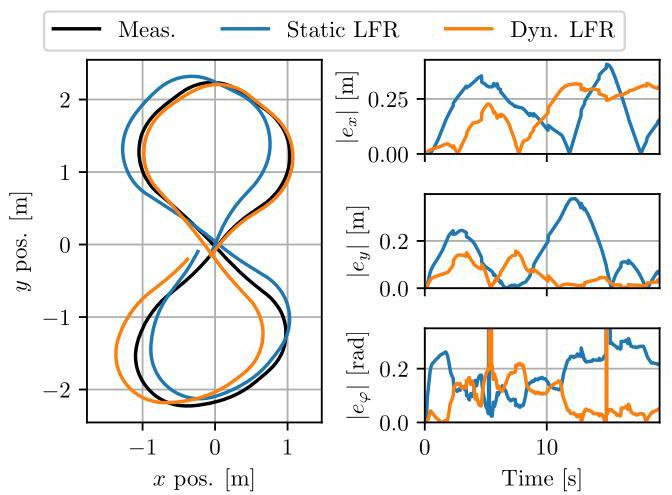

Fig. 12. Comparing the simulated model response with measurements on the test data.

图12. 将模拟模型响应与测试数据的测量结果进行比较。

## Acknowledgements

## 致谢

We thank Mircea Lazar, Max Bolderman and Chris Verhoek for the helpful discussions for this work.

我们感谢米尔恰·拉扎尔、马克斯·博尔德曼和克里斯·韦尔霍克就这项工作进行的有益讨论。

## References

## 参考文献

[1] A. Agnihotri et al. Teaching Autonomous Systems at 1/10th-scale:Design of the F1/10 Racecar, Simulators and Curriculum. In Proc.

F1/10赛车、模拟器及课程设计。发表于《论文集》。of the ACM Tech. Symp. on Comp. Sci. Edu. , pages 657-663, 2020.

[2] J. Bang-Jensen and G. Z. Gutin. Digraphs: theory, algorithms andapplications. Springer, 2008.

应用。施普林格出版社，2008年。

[3] F. L. Bauer. Computational graphs and rounding error. SIAM Journal on Numerical Analysis, 11(1):87-96, 1974.

[4] G. I. Beintema. Data-driven Learning of Nonlinear DynamicSystems: A Deep Neural State-Space Approach. Phd thesis, Eindhoven University of Technology, 2024.

系统:一种深度神经状态空间方法。博士论文，埃因霍温理工大学，2024年。

[5] G. I. Beintema, M. Schoukens, and R. Tóth. Deep subspace encoders for nonlinear system identification. Automatica, 156:111210, 2023.

[6] C. M. Bishop. Neural networks for pattern recognition. Oxford university press, 1995.

[7] T. P. Bohlin. Practical grey-box process identification: theory andapplications. Springer, 2006.

应用。施普林格出版社，2006年。

[8] M. Bolderman et al. Physics-guided neural networks for feedforwardcontrol with input-to-state-stability guarantees. Control Engineering

具有输入到状态稳定性保证的控制。控制工程Practice, 145:105851, 2024.

[9] M. Bolderman, M. Lazar, and H. Butler. On feedforward controlusing physics-guided neural networks: Training cost regularization and optimized initialization. In Proc. of the European Control Conf. , pages 1403-1408, 2022.

使用物理引导神经网络:训练成本正则化和优化初始化。发表于《欧洲控制会议论文集》，第1403 - 1408页，2022年。

[10] M. Chioua (moderator). Machine learning and control. https://www.youtube.com/watch?v=Jb7oU81QJPU (42:15), 2021.

www.youtube.com/watch?v=Jb7oU81QJPU (42:15)，2021年。

[11] A. Daw et al. Physics-guided neural networks (pgnn): An applicationin lake temperature modeling. In Knowledge Guided Machine

在湖泊温度建模中。在知识引导机器Learning, pages 353-372. Chapman and Hall/CRC, 2022.

[12] L. El Ghaoui et al. Implicit deep learning. SIAM Journal on Mathematics of Data Science, 3(3):930-958, 2021.

[13] K. Floch. Model-based motion control of the F1TENTH autonomouselectrical vehicle. Bachelor's thesis, Budapest University of Technology and Economics, 2022.

电动汽车。布达佩斯技术与经济大学学士学位论文，2022年。

[14] K. Floch et al. Gaussian-process-based adaptive tracking controlwith dynamic active learning for autonomous ground vehicles. IEEE

用于自主地面车辆的动态主动学习。IEEETransactions on Control Systems Technology, pages 1-13, 2025.

[15] D. Frank et al. Robust recurrent neural network to identify shipmotion in open water with performance guarantees-technical report.

在开阔水域中具有性能保证的运动——技术报告。arXiv preprint arXiv:2212.05781, 2022.

[16] R.-S. Götte and J. Timmermann. Composed physics-and data-driven system identification for non-autonomous systems in control engineering. In Proc. of the 3rd Int. Conf. on Artificial Intelligence,

控制工程中非自治系统的驱动系统识别。在第三届国际人工智能会议论文集里，Robotics and Control, pages 67-76, 2022.

[17] W. D. Groote et al. Neural network augmented physics models forsystems with partially unknown dynamics: Application to slider-crank mechanism. IEEE/ASME Transactions on Mechatronics, 27:103-114, 2 2022.

具有部分未知动力学的系统:应用于曲柄滑块机构。IEEE/ASME机电一体化汇刊，27:103 - 114，2022年。

[18] B. M. Györök et al. Orthogonal projection-based regularization forefficient model augmentation. In Proc. of the 7th Annual Learning

高效模型增强。在第七届年度学习会议论文集里for Dynamics & Control Conf. , pages 166-178, 2025.

[19] K. He et al. Deep residual learning for image recognition. In Proc. ofthe IEEE Conf. on computer vision and pattern recognition, pages 770-778, 2016.

IEEE计算机视觉与模式识别会议，第770 - 778页，2016年。

[20] J. H. Hoekstra et al. Learning-based model augmentation with LFRs. European Journal of Control, 86(A):101304, 2025.

[21] A. Isidori. Nonlinear control systems: an introduction. Springer,1985.

[22] S. Janny et al. Learning reduced nonlinear state-space models: anoutput-error based canonical approach. In Proc. of the 61st IEEE

基于输出误差的规范方法。在第61届IEEE会议论文集里Conf. on Decision and Control, pages 150-155, 2022.

[23] S. G. Krantz and H. R. Parks. The implicit function theorem: history, theory, and applications. Springer, 2002.

[24] L. Ljung. Convergence analysis of parametric identification methods. IEEE Transactions on Automatic Control, 23, 1978.

[25] L. Ljung. Perspectives on system identification. Annual Reviews in Control, 34(1):1-12, 2010.

[26] H. B. Pacejka. Chapter 4 - Semi-Empirical Tire Models. In Tireand Vehicle Dynamics (Third Edition), pages 149-209. Butterworth-

以及《车辆动力学(第三版)》，第149 - 209页。巴特沃斯 -Heinemann, Oxford, 2012.

[27] B. Paden et al. A survey of motion planning and control techniquesfor self-driving urban vehicles. IEEE Transactions on Intelligent

用于自动驾驶城市车辆。IEEE智能交通系统汇刊Vehicles, 1(1):33-55, 2016.

[28] M. Raissi, P. Perdikaris, and G. E. Karniadakis. Physics-informedneural networks: A deep learning framework for solving forward and inverse problems involving nonlinear partial differential equations.

神经网络:一种用于解决涉及非线性偏微分方程的正向和反向问题的深度学习框架。Journal of Computational Physics, 378:686-707, 2019.

[29] M. Revay and I. Manchester. Contracting implicit recurrent neuralnetworks: Stable models with improved trainability. In Proc. of the 2nd Conf. on Learning for Dynamics and Control, pages 393-403, 2020.

神经网络:具有改进可训练性的稳定模型。在第二届动力学与控制学习会议论文集里，第393 - 403页，2020年。

[30] J. Schoukens and L. Ljung. Nonlinear system identification: A user-oriented road map. IEEE Control Systems, 39:28-99, 12 2019.

[31] M. Schoukens. Improved initialization of state-space artificial neuralnetworks. In Proc. of the 2021 European Control Conf. , pages 1913-1918, 2021.

神经网络。在2021年欧洲控制会议论文集里，第1913 - 1918页，2021年。

[32] M. Schoukens and R. Tóth. On the initialization of nonlinearLFR model identification with the best linear approximation. IFAC-

基于最佳线性逼近的LFR模型识别。IFAC -PapersOnLine, 53(2):310-315, 2020.

[33] P. Shah et al. Deep neural network-based hybrid modeling andexperimental validation for an industry-scale fermentation process: Identification of time-varying dependencies among parameters.

工业规模发酵过程的实验验证:参数间时变依赖性的识别。Chemical Engineering Journal, 441:135643, 8 2022.

[34] M. F. Shakib et al. Computationally efficient identificationof continuous-time lur'e-type systems with stability guarantees.

具有稳定性保证的连续时间鲁里型系统。Automatica, 136:110012, 2022.

[35] B. Sun et al. A comprehensive hybrid first principles/machinelearning modeling framework for complex industrial processes.

用于复杂工业过程的学习建模框架。Journal of Process Control, 86:30-43, 2020.

[36] M. Szécsi et al. Deep learning of vehicle dynamics. IFAC-PapersOnLine, 58(15):283-288, 2024.

[37] R. Tóth. Modeling and identification of linear parameter-varying systems, volume 403. Springer, 2010.

[38] J. Veenman, C. W. Scherer, and H. Köroğlu. Robust stabilityand performance analysis based on integral quadratic constraints.

以及基于积分二次约束的性能分析。European Journal of Control, 31:1-32, 2016.

[39] E. Winston and J. Z. Kolter. Monotone operator equilibrium networks.Advances in neural information processing systems, 33:10718-10728, 2020.

《神经信息处理系统进展》，33:10718 - 10728，2020年。

[40] K. Zhou, J. Doyle, and K. Glover. Robust and Optimal Control.Feher/Prentice Hall Digital. Prentice Hall, 1996.

费赫尔/普伦蒂斯·霍尔数字出版社。普伦蒂斯·霍尔出版社，1996年。

## A Proof of Theorem 2

## 定理2的证明

We provide the proof by parts:

我们分部分给出证明:

Parallel augmentation at the state level: Choose ${n}_{{z}_{\mathrm{a}}} = {n}_{{x}_{\mathrm{b}}} + \; {n}_{u} + {n}_{{x}_{\mathrm{a}}}$ and ${n}_{{w}_{\mathrm{a}}} = {n}_{{x}_{\mathrm{b}}} + {n}_{{x}_{\mathrm{a}}}$ . Take ${z}_{\mathrm{b}, k} \equiv  \operatorname{vec}\left( {{x}_{\mathrm{b}, k},{u}_{k}}\right)$ and ${z}_{\mathrm{a}, k} \equiv  \operatorname{vec}\left( {{x}_{\mathrm{b}, k},{x}_{\mathrm{a}, k},{u}_{k}}\right)$ . For ${z}_{\mathrm{b}, k}$ , this is achieved by setting

状态层面的并行扩充:选择${n}_{{z}_{\mathrm{a}}} = {n}_{{x}_{\mathrm{b}}} + \; {n}_{u} + {n}_{{x}_{\mathrm{a}}}$和${n}_{{w}_{\mathrm{a}}} = {n}_{{x}_{\mathrm{b}}} + {n}_{{x}_{\mathrm{a}}}$。取${z}_{\mathrm{b}, k} \equiv  \operatorname{vec}\left( {{x}_{\mathrm{b}, k},{u}_{k}}\right)$和${z}_{\mathrm{a}, k} \equiv  \operatorname{vec}\left( {{x}_{\mathrm{b}, k},{x}_{\mathrm{a}, k},{u}_{k}}\right)$。对于${z}_{\mathrm{b}, k}$，通过设置来实现

$$
{C}_{z}^{\mathrm{b}} = \left\lbrack  \begin{matrix} {I}_{{n}_{{x}_{\mathrm{b}}}} & {0}_{{n}_{{x}_{\mathrm{b}}} \times  {n}_{{x}_{\mathrm{a}}}} \\  {0}_{{n}_{u} \times  {n}_{{x}_{\mathrm{b}}}} & {0}_{{n}_{{x}_{\mathrm{b}}} \times  {n}_{{x}_{\mathrm{a}}}} \end{matrix}\right\rbrack  ,\;{D}_{zu}^{\mathrm{b}} = \left\lbrack  \begin{matrix} {0}_{{n}_{{x}_{\mathrm{b}}} \times  {n}_{u}} \\  {I}_{{n}_{u}} \end{matrix}\right\rbrack  , \tag{A.1}
$$

while ${D}_{zw}^{\mathrm{{bb}}}$ , and ${D}_{zw}^{\mathrm{{ba}}}$ are set to zero, while for ${z}_{\mathrm{a}, k}$ , this is achieved by setting

而${D}_{zw}^{\mathrm{{bb}}}$和${D}_{zw}^{\mathrm{{ba}}}$设为零，而对于${z}_{\mathrm{a}, k}$，通过设置来实现

$$
{C}_{z}^{\mathrm{a}} = {\left\lbrack  \begin{array}{ll} {I}_{{n}_{{x}_{\mathrm{b}}} + {n}_{{x}_{\mathrm{a}}}}^{\top } & {0}_{{n}_{u} \times  \left( {{n}_{{x}_{\mathrm{b}}} + {n}_{{x}_{\mathrm{a}}}}\right) }^{\top } \end{array},\;{D}_{zu}^{\mathrm{a}} = \left\lbrack  \begin{array}{l} {0}_{\left( {{n}_{{x}_{\mathrm{b}}} + {n}_{{x}_{\mathrm{a}}}}\right)  \times  {n}_{u}}^{\top } \\  {n}_{u}^{\top } \end{array}\right. ,\right\rbrack  }^{\top },
$$

and setting ${D}_{zw}^{\mathrm{{ab}}}$ , and ${D}_{zw}^{\mathrm{{aa}}}$ as zeros. Next, we take ${\widehat{x}}_{k + 1} \equiv \; {w}_{\mathrm{b}, k} + {w}_{\mathrm{a}, k}$ . This is achieved by setting ${B}_{w}^{\mathrm{b}} = {I}_{{n}_{{x}_{\mathrm{b}}}}$ , and setting ${A}^{\mathrm{{bb}}},{A}^{\mathrm{{ba}}},{B}_{u}^{\mathrm{b}}$ , and ${B}_{w}^{\mathrm{{ba}}}$ as zeros. Then, we have

并将${D}_{zw}^{\mathrm{{ab}}}$和${D}_{zw}^{\mathrm{{aa}}}$设为零。接下来，取${\widehat{x}}_{k + 1} \equiv \; {w}_{\mathrm{b}, k} + {w}_{\mathrm{a}, k}$。这通过设置${B}_{w}^{\mathrm{b}} = {I}_{{n}_{{x}_{\mathrm{b}}}}$，并将${A}^{\mathrm{{bb}}},{A}^{\mathrm{{ba}}},{B}_{u}^{\mathrm{b}}$和${B}_{w}^{\mathrm{{ba}}}$设为零来实现。然后，我们有

$$
\left\lbrack  \begin{array}{l} {x}_{\mathrm{b}, k + 1} \\  {x}_{\mathrm{a}, k + 1} \end{array}\right\rbrack   = \left\lbrack  \begin{matrix} {f}_{\text{ base }}\left( {{x}_{\mathrm{b}, k},{u}_{k}}\right) \\  {0}_{{n}_{{x}_{\mathrm{a}}} \times  {n}_{{x}_{\mathrm{a}}}} \end{matrix}\right\rbrack   + {\phi }_{\text{ aug }}\left( {{x}_{\mathrm{b}, k},{x}_{\mathrm{a}, k},{u}_{k}}\right) , \tag{A.2}
$$

which is equivalent to the dynamic parallel state augmentation structure. Moreover, since the dynamic parallel structure is a generalisation of the static parallel, selecting ${n}_{{x}_{\mathrm{a}}} = 0$ results in the static parallel state augmentation structure

这等同于动态并行状态扩充结构。此外，由于动态并行结构是静态并行的推广，选择${n}_{{x}_{\mathrm{a}}} = 0$会得到静态并行状态扩充结构

$$
{x}_{\mathrm{b}, k + 1} = {f}_{\text{ base }}\left( {{x}_{\mathrm{b}, k},{u}_{k}}\right)  + {\phi }_{\text{ aug }}\left( {{x}_{\mathrm{b}, k},{u}_{k}}\right) . \tag{A.3}
$$

Series output augmentation at the state level: Choose ${n}_{{z}_{\mathrm{a}}} = \; 2{n}_{{x}_{\mathrm{b}}} + {n}_{{x}_{\mathrm{a}}} + {n}_{u}$ , and ${n}_{{w}_{\mathrm{a}}} = {n}_{{x}_{\mathrm{b}}} + {n}_{{x}_{\mathrm{a}}}$ . Take ${z}_{\mathrm{b}, k} \equiv  \operatorname{vec}\left( {{x}_{\mathrm{b}, k},{u}_{k}}\right)$ , and ${z}_{\mathrm{a}, k} \equiv  \operatorname{vec}\left( {{x}_{\mathrm{b}, k},{x}_{\mathrm{a}, k},{u}_{k},{f}_{\text{ base }}\left( {{x}_{\mathrm{b}, k},{u}_{k}}\right) }\right)$ . The former can be achieved by setting ${C}_{z}^{\mathrm{b}},{D}_{zu}^{\mathrm{b}}$ as in (A.1), and ${D}_{zw}^{\mathrm{{bb}}},{D}_{zw}^{\mathrm{{ba}}}$ as zeros. The latter can be realised by restricting

状态层面的串联输出扩充:选择${n}_{{z}_{\mathrm{a}}} = \; 2{n}_{{x}_{\mathrm{b}}} + {n}_{{x}_{\mathrm{a}}} + {n}_{u}$和${n}_{{w}_{\mathrm{a}}} = {n}_{{x}_{\mathrm{b}}} + {n}_{{x}_{\mathrm{a}}}$。取${z}_{\mathrm{b}, k} \equiv  \operatorname{vec}\left( {{x}_{\mathrm{b}, k},{u}_{k}}\right)$和${z}_{\mathrm{a}, k} \equiv  \operatorname{vec}\left( {{x}_{\mathrm{b}, k},{x}_{\mathrm{a}, k},{u}_{k},{f}_{\text{ base }}\left( {{x}_{\mathrm{b}, k},{u}_{k}}\right) }\right)$。前者可通过如(A.1)中设置${C}_{z}^{\mathrm{b}},{D}_{zu}^{\mathrm{b}}$并将${D}_{zw}^{\mathrm{{bb}}},{D}_{zw}^{\mathrm{{ba}}}$设为零来实现。后者可通过限制

$$
{C}_{z}^{\mathrm{a}} = {\left\lbrack  \begin{array}{ll} {I}_{{n}_{{x}_{\mathrm{b}}} + {n}_{{x}_{\mathrm{a}}}}^{\top } & {0}_{\left( {{n}_{u} + {n}_{{x}_{\mathrm{b}}}}\right)  \times  \left( {{n}_{{x}_{\mathrm{b}}} + {n}_{{x}_{\mathrm{a}}}}\right) }^{\top } \end{array}\right\rbrack  }^{\top }, \tag{A.4}
$$

$$
{D}_{zu}^{\mathrm{a}} = {\left\lbrack  \begin{array}{lll} {0}_{\left( {{n}_{{x}_{\mathrm{b}}} + {n}_{{x}_{\mathrm{a}}}}\right)  \times  {n}_{u}}^{\top } & {I}_{{n}_{u}}^{\top } & {0}_{{n}_{{x}_{\mathrm{b}}} \times  {n}_{u}}^{\top } \end{array}\right\rbrack  }^{\top }, \tag{A.5}
$$

$$
{D}_{zw}^{\mathrm{{ab}}} = {\left\lbrack  \begin{array}{ll} {0}_{\left( {{n}_{{x}_{\mathrm{b}}} + {n}_{{x}_{\mathrm{a}}} + {n}_{u}}\right)  \times  {n}_{{x}_{\mathrm{b}}}}^{\top } & {I}_{{n}_{{x}_{\mathrm{b}}}^{\top }} \end{array}\right\rbrack  }^{\top }, \tag{A.6}
$$

and selecting ${D}_{zw}^{\mathrm{{aa}}}$ as a zero matrix. Then, by selecting $A,{B}_{u}$ , and ${B}_{w}^{\mathrm{b}}$ as zero matrices and setting ${B}_{w}^{\mathrm{a}}$ an identity matrix, the resulting state transition function is

并选择${D}_{zw}^{\mathrm{{aa}}}$为零矩阵来实现。然后，通过选择$A,{B}_{u}$和${B}_{w}^{\mathrm{b}}$为零矩阵并将${B}_{w}^{\mathrm{a}}$设为单位矩阵，得到的状态转移函数为

$$
{\widehat{x}}_{k + 1} = {\phi }_{\text{ aug }}\left( {{x}_{\mathrm{b}, k},{x}_{\mathrm{a}, k},{u}_{k},{f}_{\text{ base }}\left( {{x}_{\mathrm{b}, k},{u}_{k}}\right) }\right) . \tag{A.7}
$$

By universal approximation properties, there exist such weights and biases for ${\phi }_{\text{ aug }} = {\left\lbrack  \begin{array}{ll} {\left( {\phi }_{\text{ aug }}^{\mathrm{b}}\right) }^{\top } & {\left( {\phi }_{\text{ aug }}^{\mathrm{a}}\right) }^{\top } \end{array}\right\rbrack  }^{\top }$ such that

<text>根据通用逼近性质，对于${\phi }_{\text{ aug }} = {\left\lbrack  \begin{array}{ll} {\left( {\phi }_{\text{ aug }}^{\mathrm{b}}\right) }^{\top } & {\left( {\phi }_{\text{ aug }}^{\mathrm{a}}\right) }^{\top } \end{array}\right\rbrack  }^{\top }$存在这样的权重和偏差，使得</text>

$$
\left\lbrack  \begin{array}{l} {x}_{\mathrm{b}, k + 1} \\  {x}_{\mathrm{a}, k + 1} \end{array}\right\rbrack   = \left\lbrack  \begin{matrix} {\phi }_{\text{ aug }}^{\mathrm{b}}\left( {{x}_{\mathrm{b}, k},{x}_{\mathrm{a}, k},{u}_{k},{f}_{\text{ base }}\left( {{x}_{\mathrm{b}, k},{u}_{k}}\right) }\right) \\  {\phi }_{\text{ aug }}^{\mathrm{a}}\left( {{x}_{\mathrm{b}, k},{x}_{\mathrm{a}, k},{u}_{k}}\right)  \end{matrix}\right\rbrack  , \tag{A.8}
$$

which is equivalent to the dynamic series output state augmentation. Moreover, as we have shown previously, dynamic augmentation is a generalisation of static augmentation; hence, the structure also represents the static series output augmentation form at the state level.

<text>这等同于动态序列输出状态增强。此外，正如我们之前所展示的，动态增强是静态增强的一种推广；因此，该结构在状态层面也代表了静态序列输出增强形式。</text>

Static series input augmentation at the state level: Choose ${n}_{{z}_{\mathrm{a}}} = {n}_{{x}_{\mathrm{b}}} + {n}_{u}$ and ${n}_{{x}_{\mathrm{a}}} = 0$ . Take ${z}_{\mathrm{a}, k} \equiv  \operatorname{vec}\left( {{x}_{\mathrm{b}, k},{u}_{k},}\right)$ by setting ${C}_{z}^{\mathrm{a}},{D}_{zu}^{\mathrm{a}},{D}_{zw}^{\mathrm{{ab}}},{D}_{zw}^{\mathrm{{bb}}}, A,{B}_{u},{B}_{w}^{\mathrm{b}}$ and ${D}_{zw}^{\mathrm{{aa}}}$ as for the parallel augmentation at the state level structure. Set ${B}_{w}^{\mathrm{a}} \equiv  0,{C}_{z}^{\mathrm{b}} \equiv  0$ , ${D}_{zu}^{\mathrm{b}} \equiv  0$ and ${D}_{zw}^{\mathrm{{ba}}}$ as an identity matrix. This achieves

<text>状态层面的静态序列输入增强:选择${n}_{{z}_{\mathrm{a}}} = {n}_{{x}_{\mathrm{b}}} + {n}_{u}$和${n}_{{x}_{\mathrm{a}}} = 0$。对于状态层面结构的并行增强，通过设置${C}_{z}^{\mathrm{a}},{D}_{zu}^{\mathrm{a}},{D}_{zw}^{\mathrm{{ab}}},{D}_{zw}^{\mathrm{{bb}}}, A,{B}_{u},{B}_{w}^{\mathrm{b}}$和${D}_{zw}^{\mathrm{{aa}}}$来获取${z}_{\mathrm{a}, k} \equiv  \operatorname{vec}\left( {{x}_{\mathrm{b}, k},{u}_{k},}\right)$。将${B}_{w}^{\mathrm{a}} \equiv  0,{C}_{z}^{\mathrm{b}} \equiv  0$、${D}_{zu}^{\mathrm{b}} \equiv  0$和${D}_{zw}^{\mathrm{{ba}}}$设置为单位矩阵。这样就实现了</text>

$$
{z}_{\mathrm{b}, k} = {\phi }_{\text{ aug }}\left( {{x}_{\mathrm{b}, k},{u}_{k}}\right) , \tag{A.9}
$$

$$
{x}_{\mathrm{b}, k + 1} = {f}_{\text{ base }}\left( {z}_{\mathrm{b}, k}\right) , \tag{A.10}
$$

which is equivalent to the static series input augmentation form at the state transition level.

<text>这等同于状态转移层面的静态序列输入增强形式。</text>

Dynamic series input augmentation on the state level: Choose ${n}_{{z}_{\mathrm{b}}} = {n}_{{x}_{\mathrm{b}}} + {n}_{{x}_{\mathrm{a}}} + {n}_{u}$ . Take ${z}_{\mathrm{a}, k} \equiv  \operatorname{vec}\left( {{x}_{\mathrm{b}, k},{x}_{\mathrm{a}, k},{u}_{k},}\right)$ by setting ${C}_{z}^{\mathrm{a}},{D}_{zu}^{\mathrm{a}},{D}_{zw}^{\mathrm{{ab}}},{D}_{zw}^{\mathrm{{bb}}}, A,{B}_{u}$ and ${D}_{zw}^{\mathrm{{aa}}}$ as for the parallel augmentation at the state level structure. Set ${C}_{z}^{\mathrm{b}} \equiv  0$ , ${D}_{zu}^{\mathrm{b}} \equiv  0$ and set ${D}_{zw}^{\mathrm{{ba}}}$ as an identity matrix. Consider the output of the learning component to be split into two parts ${\phi }_{\text{ aug }} = {\left\lbrack  \begin{array}{ll} {\left( {\phi }_{\text{ aug }}^{\mathrm{b}}\right) }^{\top } & {\left( {\phi }_{\text{ aug }}^{\mathrm{a}}\right) }^{\top } \end{array}\right\rbrack  }^{\top }$ . This achieves

<text>状态层面的动态序列输入增强:选择${n}_{{z}_{\mathrm{b}}} = {n}_{{x}_{\mathrm{b}}} + {n}_{{x}_{\mathrm{a}}} + {n}_{u}$。对于状态层面结构的并行增强，通过设置${C}_{z}^{\mathrm{a}},{D}_{zu}^{\mathrm{a}},{D}_{zw}^{\mathrm{{ab}}},{D}_{zw}^{\mathrm{{bb}}}, A,{B}_{u}$和${D}_{zw}^{\mathrm{{aa}}}$来获取${z}_{\mathrm{a}, k} \equiv  \operatorname{vec}\left( {{x}_{\mathrm{b}, k},{x}_{\mathrm{a}, k},{u}_{k},}\right)$。设置${C}_{z}^{\mathrm{b}} \equiv  0$、${D}_{zu}^{\mathrm{b}} \equiv  0$并将${D}_{zw}^{\mathrm{{ba}}}$设置为单位矩阵。将学习组件的输出考虑分为两部分${\phi }_{\text{ aug }} = {\left\lbrack  \begin{array}{ll} {\left( {\phi }_{\text{ aug }}^{\mathrm{b}}\right) }^{\top } & {\left( {\phi }_{\text{ aug }}^{\mathrm{a}}\right) }^{\top } \end{array}\right\rbrack  }^{\top }$。这样就实现了</text>

$$
\left\lbrack  \begin{array}{l} {x}_{\mathrm{b}, k + 1} \\  {x}_{\mathrm{a}, k + 1} \end{array}\right\rbrack   = \left\lbrack  \begin{matrix} {x}_{\mathrm{b}, k + 1} = {f}_{\text{ base }}\left( {{\phi }_{\text{ aug }}^{\mathrm{b}}\left( {{x}_{\mathrm{b}, k},{x}_{\mathrm{a}, k},{u}_{k}}\right) }\right) \\  {\phi }_{\text{ aug }}^{\mathrm{a}}\left( {{x}_{\mathrm{b}, k},{x}_{\mathrm{a}, k},{u}_{k}}\right)  \end{matrix}\right\rbrack  , \tag{A.11}
$$

which is equivalent to the dynamic series input augmentation form at the state transition level.

<text>这等同于状态转移层面的动态序列输入增强形式。</text>

Output augmentation structures: The output augmentation formulations are similar in structure to the state augmentation cases, but the connection of the baseline and learning components happens at the output level. Following the previous arguments, it is straightforward to derive that all structures in Table 2 can be represented by (6), similarly to the structures in Table 1, which concludes the proof.

<text>输出增强结构:输出增强公式在结构上与状态增强情况相似，但基线组件和学习组件的连接发生在输出层面。根据之前的论证，很容易得出表2中的所有结构都可以由(6)表示，类似于表1中的结构，至此证明完毕。</text>