# SINDY-KANS: SPARSE IDENTIFICATION OF NON-LINEAR DYNAMICS THROUGH KOLMOGOROV-ARNOLD NETWORKS

# 辛迪 - 堪斯:通过柯尔莫哥洛夫 - 阿诺德网络进行非线性动力学的稀疏识别

A PREPRINT

预印本

Amanda A. Howard

阿曼达·A·霍华德

Pacific Northwest National Laboratory

太平洋西北国家实验室

Richland, WA 99354

华盛顿州里奇兰，邮编99354

amanda.howard@pnnl.gov

Nicholas Zolman

尼古拉斯·佐尔曼

University of Washington

华盛顿大学

Seattle, WA 98195

华盛顿州西雅图，邮编98195

nzolman@uw.edu

Bruno Jacob

布鲁诺·雅各布

Pacific Northwest National Laboratory

太平洋西北国家实验室

Richland, WA 99354

华盛顿州里奇兰，邮编99354

bruno.jacob@pnnl.gov

© Steven L. Brunton

© 史蒂文·L·布伦顿

University of Washington

华盛顿大学

Seattle, WA 98195

华盛顿州西雅图，邮编98195

sbrunton@uw.edu

© Panos Stinis

© 帕诺斯·斯蒂尼斯

Pacific Northwest National Laboratory

太平洋西北国家实验室

Richland, WA 99354

华盛顿州里奇兰 99354

panagiotis.stinis@pnnl.gov

## ABSTRACT

## 摘要

Kolmogorov-Arnold networks (KANs) have arisen as a potential way to enhance the interpretability of machine learning. However, solutions learned by KANs are not necessarily interpretable, in the sense of being sparse or parsimonious. Sparse identification of nonlinear dynamics (SINDy) is a complementary approach that allows for learning sparse equations for dynamical systems from data; however, learned equations are limited by the library. In this work, we present SINDy-KANs, which simultaneously train a KAN and a SINDy-like representation to increase interpretability of KAN representations with SINDy applied at the level of each activation function, while maintaining the function compositions possible through deep KANs. We apply our method to a number of symbolic regression tasks, including dynamical systems, to show accurate equation discovery across a range of systems.

柯尔莫哥洛夫 - 阿诺德网络(KANs)已成为增强机器学习可解释性的一种潜在方法。然而，从稀疏或简洁的意义上讲，KANs学习到的解决方案不一定是可解释的。非线性动力学的稀疏识别(SINDy)是一种补充方法，它允许从数据中学习动力系统的稀疏方程；然而，学习到的方程受限于库。在这项工作中，我们提出了SINDy - KANs，它同时训练一个KAN和一个类似SINDy的表示，以通过在每个激活函数层面应用SINDy来提高KAN表示的可解释性，同时保持深度KANs可能的函数组合。我们将我们的方法应用于许多符号回归任务，包括动力系统，以展示在一系列系统中准确的方程发现。

Keywords Kolmogorov-Arnold networks $\cdot$ SINDy $\cdot$ Symbolic regression

关键词 柯尔莫哥洛夫 - 阿诺德网络 $\cdot$ SINDy $\cdot$ 符号回归

## 1 Introduction

## 1 引言

Kolmogorov-Arnold networks (KANs), which use the Kolmogorov-Arnold Theorem as inspiration, have recently been developed as an alternative to multilayer perceptrons (MLPs) [1, 2]. Unlike MLPs, which use fixed activation functions with trainable weights, KANs use trainable activation functions. This capability has been promoted as a way to develop interpretable machine learning models, by identifying the trained activation functions. Many variations of KANs have quickly become popular; e.g. physics-informed KANs (PIKANs) [3, 4, 5, 6], graph KANs [7, 8, 9], and deep operator KANs [10]. For physics-informed training in [3], modifications of KANs can have similar accuracy to physics-informed neural networks [11]. KANs have been applied to a wide variety of problems, including satellite image classification [12], time-series analysis [13], and fluid dynamics [14, 15, 16]. For a summary of advances in training KANs, we refer the reader to recent surveys, including [17, 18, 19].

柯尔莫哥洛夫 - 阿诺德网络(KANs)以柯尔莫哥洛夫 - 阿诺德定理为灵感，最近已被开发出来作为多层感知器(MLPs)的替代方案[1, 2]。与使用具有可训练权重的固定激活函数的MLPs不同，KANs使用可训练的激活函数。通过识别训练后的激活函数，这种能力已被推广为一种开发可解释机器学习模型的方法。KANs的许多变体迅速流行起来；例如，物理信息KANs(PIKANs)[3, 4, 5, 6]、图KANs[7, 8, 9]和深度算子KANs[10]。对于[3]中的物理信息训练，KANs的修改可以具有与物理信息神经网络[11]相似的准确性。KANs已被应用于各种各样的问题，包括卫星图像分类[12]、时间序列分析[13]和流体动力学[14, 15, 16]。关于KANs训练进展的总结，我们请读者参考最近的综述，包括[17, 18, 19]。

Much of the previous literature has applied KANs in a way similar to an MLP, without identifying or analyzing the functions through symbolic regression. Many papers discussing interpretability of KANs, such as [20], qualitatively analyze the learned activation functions, but do not connect them to a learned equation. When symbolic regression is performed with KANs, the learned equations are often quite complex, making interpretability difficult (although still certainly easier than weights and biases learned with MLPs, as noted by [21]). Significant pruning of the KAN during training before the symbolic regression has also been applied to reduce spurious terms in the learned equations, such as in [22]. Nevertheless, symbolic regression has been successful with KANs—such as for radio map predictions [23], for predicting the pressure and flow rate of flexible electrohydrodynamic pumps [24], and even providing interpretable predictions of cancer development [25]. However, these approaches can be limited; e.g., [25] only used a network with a single layer, so no interaction between the variables is possible beyond a linear combination. In [26], the authors performed symbolic regression for reservoir water temperatures, progressively increasing the number of input variables. When the number of variables was large the accuracy improved through nested nonlinearities, but this reduced the interpretability of the model. Recent work has extended the symbolic regression functionality of KANs by using a large language model to identify the target functions [27]. In a different approach, [28] improved symbolic regression with KANs by breaking the problem into smaller decompositions, which allows for iteratively training shallower (single layer) KANs.

以前的许多文献以类似于MLP的方式应用KANs，而没有通过符号回归来识别或分析函数。许多讨论KANs可解释性的论文，如[20]，定性地分析了学习到的激活函数，但没有将它们与学习到的方程联系起来。当用KANs进行符号回归时，学习到的方程通常相当复杂，使得可解释性困难(尽管如[21]所指出的，仍然肯定比用MLPs学习的权重和偏差更容易)。在符号回归之前对KAN进行显著的剪枝也已被应用于减少学习到的方程中的虚假项，如在[22]中。然而，符号回归在KANs上已经取得了成功——例如用于无线电地图预测[23]、预测柔性电流体动力泵的压力和流速[24]，甚至提供癌症发展的可解释预测[25]。然而，这些方法可能是有限的；例如，[25]只使用了一个单层网络，所以除了线性组合之外，变量之间不可能有相互作用。在[26]中，作者对水库水温进行了符号回归，逐步增加输入变量的数量。当变量数量很大时，通过嵌套非线性提高了准确性，但这降低了模型的可解释性。最近的工作通过使用大语言模型来识别目标函数扩展了KANs的符号回归功能[27]。在一种不同的方法中，[28]通过将问题分解为更小的分解来改进KANs的符号回归，这允许迭代训练更浅(单层)的KANs。

One issue with symbolic regression with KANs is that in [1], the activation functions are identified by comparing with a library of candidate functions. As noted in [29], the learned activation functions will not necessarily align with the candidate functions, even if it is known that the candidate functions can be composed to output the target function. This limits the applicability of symbolic regression as implemented in [1], and necessitates work that causes the activation functions to necessarily align with the candidate functions. For example, [29] uses a dictionary of symbolic and dense terms as the candidate function, with learnable gates that sparsify the representation. Here, we aim to make symbolic regression performed with KANs more interpretable by directly learning compositions of sparse equation representations thorough a SINDy-like approach.

用KANs进行符号回归的一个问题是，在[1]中，激活函数是通过与候选函数库进行比较来识别的。如[29]中所指出的，即使已知候选函数可以组合以输出目标函数，学习到的激活函数也不一定与候选函数对齐。这限制了[1]中实现的符号回归的适用性，并且需要使激活函数必然与候选函数对齐的工作。例如，[29]使用符号和密集项的字典作为候选函数，带有可学习的门来稀疏表示。在这里，我们旨在通过直接通过类似SINDy的方法学习稀疏方程表示的组合，使用KANs进行的符号回归更具可解释性。

The sparse identification of nonlinear dynamics (SINDy) framework [30] is a widely adopted method for identifying sparse, interpretable models of dynamical systems from data. SINDy has been widely applied, including turbulence modeling [31, 32], network modeling [33], and model predictive control [34], and has been extended for reinforcement learning [35], extremely noisy data [36, 37, 38, 39, 40], and nonlinear dynamical systems [41], among many other extensions. One extension most similar to this work is ADAM-SINDy [42], where the SINDy coefficients are determined by the ADAM optimizer [43]. Compared with standard SINDy, ADAM-SINDy allows for parameterized libraries, enabling more customization for the candidate functions.

非线性动力学的稀疏识别(SINDy)框架[30]是一种广泛采用的方法，用于从数据中识别动力系统的稀疏、可解释模型。SINDy已被广泛应用，包括湍流建模[31, 32]、网络建模[33]和模型预测控制[34]，并且已扩展到强化学习[35]、噪声极大的数据[36, 37, 38, 39, 40]以及非线性动力系统[41]等许多其他扩展领域。与本工作最相似的一种扩展是ADAM - SINDy[42]，其中SINDy系数由ADAM优化器[43]确定。与标准SINDy相比，ADAM - SINDy允许使用参数化库，从而为候选函数提供更多定制。

In this work we present SINDy-KANs, which combine the sparse function identification of SINDy with the deep learning of KANs. Through KAN layers, SINDy-KANs allow for symbolic regression of function compositions not possible with SINDy. Additionally, SINDy-KANs enforce learning parsimonious, interpretable equations more directly than standard KANs. In a sense, SINDy-KANs can be thought of as a deep version of ADAM-SINDy [42], where the SINDy coefficients are directly learned. Both SINDy and KANs at the basic level learn basis function expansions, so combining the methods is especially harmonious. We present the methodology behind SINDy-KANs in Secs. 2 and 3 and a series of experiments for both discovery of equations and dynamical systems from data in Sec. 4

在本工作中，我们提出了SINDy - KANs，它将SINDy的稀疏函数识别与KANs的深度学习相结合。通过KAN层，SINDy - KANs允许对SINDy无法实现的函数组合进行符号回归。此外，SINDy - KANs比标准KANs更直接地强制学习简洁、可解释的方程。从某种意义上说，SINDy - KANs可以被视为ADAM - SINDy[42]的深度版本，其中SINDy系数是直接学习的。基础层面的SINDy和KANs都学习基函数展开，因此将这两种方法结合起来特别和谐。我们在第2节和第3节介绍SINDy - KANs背后的方法，并在第4节介绍一系列从数据中发现方程和动力系统的实验。

## 2 Background methodology

## 2背景方法

### 2.1 Kolmogorov-Arnold networks

### 2.1柯尔莫哥洛夫 - 阿诺德网络

Kolmogorov-Arnold networks (KANs) [1] approximate a multivariate function $f\left( \mathbf{x}\right)$ by composition and addition of univariate functions. We consider a KAN with $L$ layers and ${\left\{  {n}_{j}\right\}  }_{j = 0}^{L}$ nodes per layer (denoted $\left\lbrack  {{n}_{0},{n}_{1},\ldots ,{n}_{L}}\right\rbrack$ ). We denote the activation function that connects the $\left( {\ell , i}\right)$ and $\left( {\ell  + 1, j}\right)$ nodes by ${\varphi }_{\ell , j, i}$ . Each KAN layer takes as univariate input ${\mathbf{x}}^{\left( \ell \right) } = \left\{  {{x}_{1}^{\left( \ell \right) },\ldots ,{x}_{{n}_{L}}^{\left( \ell \right) }}\right\}$ . The input to the KAN is $\mathbf{x} = {\mathbf{x}}^{\left( 0\right) }$ Then, each KAN layer can be expressed as

柯尔莫哥洛夫 - 阿诺德网络(KANs)[1]通过单变量函数的组合和加法来逼近多元函数$f\left( \mathbf{x}\right)$。我们考虑一个具有$L$层且每层有${\left\{  {n}_{j}\right\}  }_{j = 0}^{L}$个节点(表示为$\left\lbrack  {{n}_{0},{n}_{1},\ldots ,{n}_{L}}\right\rbrack$)的KAN。我们用${\varphi }_{\ell , j, i}$表示连接$\left( {\ell , i}\right)$和$\left( {\ell  + 1, j}\right)$节点的激活函数。每个KAN层将单变量输入${\mathbf{x}}^{\left( \ell \right) } = \left\{  {{x}_{1}^{\left( \ell \right) },\ldots ,{x}_{{n}_{L}}^{\left( \ell \right) }}\right\}$作为输入。KAN的输入是$\mathbf{x} = {\mathbf{x}}^{\left( 0\right) }$ 然后，每个KAN层可以表示为

$$
{\mathbf{x}}^{\left( \ell  + 1\right) } = \mathop{\sum }\limits_{{i = 0}}^{{n}_{L}}{\varphi }_{\ell , j, i}\left( {x}_{i}^{\left( \ell \right) }\right) . \tag{1}
$$

We denote the output of the KAN by $\mathcal{K}\left( \mathbf{x}\right)$ .The activation functions are represented (on a grid with $g$ points) by a weighted combination of a basis function $b\left( x\right)$ and a B-spline,

我们用$\mathcal{K}\left( \mathbf{x}\right)$表示KAN的输出。激活函数(在具有$g$个点的网格上)由基函数$b\left( x\right)$和B样条的加权组合表示，

$$
\varphi \left( x\right)  = {w}_{b}b\left( x\right)  + {w}_{s}\operatorname{spline}\left( x\right) , \tag{2}
$$

where

其中

$$
b\left( x\right)  = \frac{x}{1 + {e}^{-x}},
$$

and

并且

$$
\operatorname{spline}\left( x\right)  = \mathop{\sum }\limits_{i}{c}_{i}{B}_{i}\left( x\right) .
$$

Here, ${B}_{i}\left( x\right)$ is a polynomial of degree $k$ , typically chosen with $k = 3$ or 5 and fixed as $k = 5$ in this work. ${c}_{i},{w}_{b}$ , and ${w}_{s}$ are trainable parameters if not predetermined by the user. We refer the reader to [1] for details on training KANs.

这里，${B}_{i}\left( x\right)$是次数为$k$的多项式，通常选择$k = 3$或5，并在本工作中固定为$k = 5$。如果不是由用户预先确定，${c}_{i},{w}_{b}$和${w}_{s}$是可训练参数。关于训练KANs的详细信息，我们请读者参考[1]。

Data-driven KANs are trained by minimizing the loss function given by the difference between the KAN representation and provided data:

数据驱动的KANs通过最小化由KAN表示与提供的数据之间的差异给出的损失函数来进行训练:

$$
{\mathcal{L}}_{\mathrm{{KAN}}} = \parallel f\left( \mathbf{x}\right)  - \mathcal{K}\left( \mathbf{x}\right) {\parallel }_{2}^{2}. \tag{3}
$$

While KANs can represent products of the input functions through the sums of quadratics (e.g., ${xy} = \frac{1}{4}{\left( x + y\right) }^{2} - \; \left. {\frac{1}{4}{\left( x - y\right) }^{2}}\right)$ , it is simpler and easier to interpret when KANs have multiplication nodes added. Multiple methods have been developed to do so, including MultKANs [2] and LeanKAN [44]. Both of these methods have advantages and disadvantages in terms of accuracy, trainable parameters, and computational complexity. For this work, we introduce multiplication-enabled KANs where some of the sums of activation functions in each layer are replaced by a product of the activation functions. Specifically, for a KAN layer with ${n}_{j}$ nodes, we designate ${n}_{j}^{M}$ of the nodes as multiplication nodes, where the input activation functions for that node are multiplied together. This architecture allows for easier discovery of dynamical systems that contain products of the input variables.

虽然KAN可以通过二次函数的和来表示输入函数的乘积(例如，${xy} = \frac{1}{4}{\left( x + y\right) }^{2} - \; \left. {\frac{1}{4}{\left( x - y\right) }^{2}}\right)$ )，但当KAN添加乘法节点时，它会更简单且更容易解释。已经开发了多种方法来实现这一点，包括MultKANs [2]和LeanKAN [44]。这两种方法在准确性、可训练参数和计算复杂性方面都有优缺点。在这项工作中，我们引入了支持乘法的KAN，其中每一层中一些激活函数的和被激活函数的乘积所取代。具体来说，对于一个具有${n}_{j}$ 个节点的KAN层，我们将${n}_{j}^{M}$ 个节点指定为乘法节点，该节点的输入激活函数会相乘在一起。这种架构允许更容易地发现包含输入变量乘积的动态系统。

### 2.2 Sparse identification of nonlinear dynamics

### 2.2 非线性动力学的稀疏识别

Sparse identification of nonlinear dynamics (SINDy) [30] allows for sparse identification of systems of equations governing dynamical systems. We consider a dynamical system of the form

非线性动力学的稀疏识别(SINDy)[30]允许对控制动态系统的方程组进行稀疏识别。我们考虑形式为

$$
\frac{d}{dt}\mathbf{x}\left( t\right)  = \mathbf{f}\left( {\mathbf{x}\left( t\right) }\right) \tag{4}
$$

for $\mathbf{x} \in  {\mathbb{R}}^{n}$ . Available data are sampled at times ${t}_{1},{t}_{2},\ldots ,{t}_{m}$ to create two matrices

对于$\mathbf{x} \in  {\mathbb{R}}^{n}$ 。在时间${t}_{1},{t}_{2},\ldots ,{t}_{m}$ 对可用数据进行采样以创建两个矩阵

$$
\mathbf{X} = \left\lbrack  \begin{matrix} {\mathbf{x}}^{T}\left( {t}_{1}\right) \\  {\mathbf{x}}^{T}\left( {t}_{2}\right) \\  \vdots \\  {\mathbf{x}}^{T}\left( {t}_{m}\right)  \end{matrix}\right\rbrack   = \left\lbrack  \begin{matrix} {x}_{1}\left( {t}_{1}\right) & {x}_{2}\left( {t}_{1}\right) & \cdots & {x}_{n}\left( {t}_{1}\right) \\  {x}_{1}\left( {t}_{2}\right) & {x}_{2}\left( {t}_{2}\right) & \cdots & {x}_{n}\left( {t}_{2}\right) \\  \vdots & \vdots &  \ddots  & \vdots \\  {x}_{1}\left( {t}_{m}\right) & {x}_{2}\left( {t}_{m}\right) & \cdots & {x}_{n}\left( {t}_{m}\right)  \end{matrix}\right\rbrack \tag{5}
$$

and

和

$$
\dot{\mathbf{X}} = \left\lbrack  \begin{matrix} {\dot{\mathbf{x}}}^{T}\left( {t}_{1}\right) \\  {\dot{\mathbf{x}}}^{T}\left( {t}_{2}\right) \\  \vdots \\  {\dot{\mathbf{x}}}^{T}\left( {t}_{m}\right)  \end{matrix}\right\rbrack   = \left\lbrack  \begin{matrix} {\dot{x}}_{1}\left( {t}_{1}\right) & {\dot{x}}_{2}\left( {t}_{1}\right) & \cdots & {\dot{x}}_{n}\left( {t}_{1}\right) \\  {\dot{x}}_{1}\left( {t}_{2}\right) & {\dot{x}}_{2}\left( {t}_{2}\right) & \cdots & {\dot{x}}_{n}\left( {t}_{2}\right) \\  \vdots & \vdots &  \ddots  & \vdots \\  {\dot{x}}_{1}\left( {t}_{m}\right) & {\dot{x}}_{2}\left( {t}_{m}\right) & \cdots & {\dot{x}}_{n}\left( {t}_{m}\right)  \end{matrix}\right\rbrack  . \tag{6}
$$

A library of candidate nonlinear functions is denoted by $\mathbf{\Theta }\left( \mathbf{X}\right)$ , where each column of $\mathbf{\Theta }\left( \mathbf{X}\right)$ is given by a candidate function:

候选非线性函数库用$\mathbf{\Theta }\left( \mathbf{X}\right)$ 表示，其中$\mathbf{\Theta }\left( \mathbf{X}\right)$ 的每一列由一个候选函数给出:

$$
\mathbf{\Theta }\left( \mathbf{X}\right)  = \left\lbrack  \begin{matrix}  \mid  &  \mid  &  \mid  & &  \mid  &  \mid  \\  \mathbf{1} & \mathbf{X} & {\mathbf{X}}^{{P}_{2}} & \cdots & \sin \left( \mathbf{X}\right) & \cos \left( \mathbf{X}\right) \\   \mid  &  \mid  &  \mid  & &  \mid  &  \mid   \end{matrix}\right\rbrack  , \tag{7}
$$

where ${\mathbf{X}}^{{P}_{2}}$ denotes the quadratic nonlinearities in the state variable $\mathbf{x}$ .

其中${\mathbf{X}}^{{P}_{2}}$ 表示状态变量$\mathbf{x}$ 中的二次非线性项。

The goal of SINDy is to solve a sparse regression problem for vectors of coefficients $\mathbf{\Xi } = \left\lbrack  {{\xi }_{1}{\xi }_{2}\cdots {\xi }_{n}}\right\rbrack$ given by

SINDy的目标是解决由下式给出的系数向量$\mathbf{\Xi } = \left\lbrack  {{\xi }_{1}{\xi }_{2}\cdots {\xi }_{n}}\right\rbrack$ 的稀疏回归问题

$$
\dot{\mathbf{X}} = \Theta \left( \mathbf{X}\right) \mathbf{\Xi }. \tag{8}
$$

In practice, obtaining sparse coefficients $\Xi$ is achieved by minimizing the SINDy loss function

在实践中，通过最小化SINDy损失函数来获得稀疏系数$\Xi$

$$
{\mathcal{L}}_{\text{ SINDy }} = \parallel \dot{\mathbf{X}} - \mathbf{\Theta }\left( \mathbf{X}\right) \mathbf{\Xi }\parallel  + \parallel \mathbf{\Xi }{\parallel }_{0}, \tag{9}
$$

where $\parallel  \cdot  {\parallel }_{0}$ counts the number of nonzero entries. This non-convex optimization problem is typically solved using sequentially-thresholded least squares regression, which also makes it possible to enforce known symmetries and other physical constraints on the model coefficients [45].

其中$\parallel  \cdot  {\parallel }_{0}$ 计算非零条目的数量。这个非凸优化问题通常使用顺序阈值最小二乘回归来解决，这也使得对模型系数施加已知的对称性和其他物理约束成为可能[45]。

While SINDy and its variants have been very effectively applied to a wide range of applications [46, 47, 48, 49, 50, 51 52, 53, 54, 31, 32], a disadvantage is that the candidate functions must be determined by the user. If the dynamical system consists of complex functions, such as compositions of functions, determining the proper library of candidate functions can be difficult and/or result in a very large library.

虽然SINDy及其变体已经非常有效地应用于广泛的应用[46, 47, 48, 49, 50, 51 52, 53, 54, 31, 32]，但一个缺点是候选函数必须由用户确定。如果动态系统由复杂函数组成，例如函数的组合，确定合适的候选函数库可能很困难，并且/或者会导致一个非常大的库。

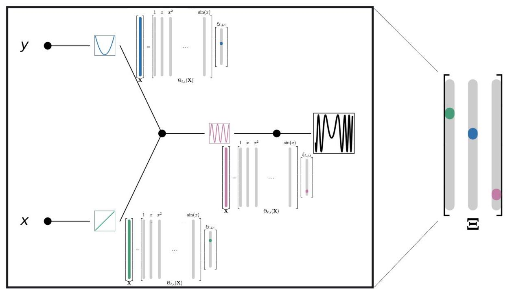

Figure 1: Pictorial representation of a SINDy-KAN for a function $f\left( {x, y}\right)  = \sin \left( {x + {y}^{2}}\right)$ . Each KAN activation function has an associated least squares regression as given in Eq. 13 The learned coefficients are then combined in $\Xi$ .

图1:函数$f\left( {x, y}\right)  = \sin \left( {x + {y}^{2}}\right)$ 的SINDy-KAN的图示。每个KAN激活函数都有一个如式13所示的相关最小二乘回归。然后在$\Xi$ 中组合学习到的系数。

## 3 SINDy-KANs

## 3 SINDy-KANs

In SINDy-KANs, we preform a SINDy-like sparse regression at each KAN activation function as the system is training. In particular, consider an activation function ${\varphi }_{\ell , j, i}$ with input ${\mathbf{x}}_{i}^{\left( \ell \right) }$ . We assume available data are sampled at times ${t}_{1},{t}_{2},\ldots ,{t}_{m}$ to create the matrices:

在SINDy-KANs中，我们在系统训练时对每个KAN激活函数执行类似SINDy的稀疏回归。具体来说，考虑一个输入为${\mathbf{x}}_{i}^{\left( \ell \right) }$ 的激活函数${\varphi }_{\ell , j, i}$ 。我们假设在时间${t}_{1},{t}_{2},\ldots ,{t}_{m}$ 对可用数据进行采样以创建矩阵:

$$
{\mathbf{X}}_{i}^{\left( \ell \right) } = \left\lbrack  \begin{array}{llll} {x}_{i}^{\left( \ell \right) }\left( {t}_{1}\right) , & {x}_{i}^{\left( \ell \right) }\left( {t}_{2}\right) , & \cdots & {x}_{i}^{\left( \ell \right) }\left( {t}_{m}\right)  \end{array}\right\rbrack  . \tag{10}
$$

We construct a library of candidate functions

我们构建一个候选函数库

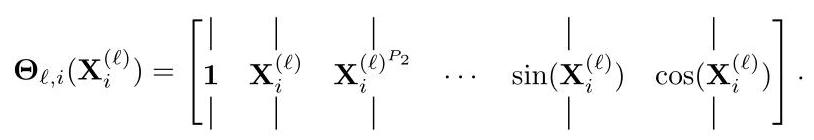

We note that since KANs consist of univariate activation functions, ${\mathbf{\Theta }}_{\ell , i}\left( {\mathbf{X}}_{i}^{\left( \ell \right) }\right)$ is univariate with respect to the input. We also note that ${\mathbf{\Theta }}_{\ell , i}\left( {\mathbf{X}}_{i}^{\left( \ell \right) }\right)$ does not have to be the same for all $\ell$ . Depending on knowledge of the problem, different hidden layers in the SINDy-KAN can be represented by a different set of candidate functions.

我们注意到，由于KAN由单变量激活函数组成，${\mathbf{\Theta }}_{\ell , i}\left( {\mathbf{X}}_{i}^{\left( \ell \right) }\right)$相对于输入是单变量的。我们还注意到，对于所有$\ell$，${\mathbf{\Theta }}_{\ell , i}\left( {\mathbf{X}}_{i}^{\left( \ell \right) }\right)$不必相同。根据问题的知识，SINDy-KAN中的不同隐藏层可以由不同的候选函数集表示。

Then, we define a sparse vector of coefficients ${\xi }_{\ell , j, i}$ and

然后，我们定义系数${\xi }_{\ell , j, i}$的稀疏向量，并且

$$
{\varphi }_{\ell , j, i} = \left\lbrack  \begin{matrix} {\varphi }_{\ell , j, i}\left( {{x}_{i}^{\left( \ell \right) }\left( {t}_{1}\right) }\right) \\  {\varphi }_{\ell , j, i}\left( {{x}_{i}^{\left( \ell \right) }\left( {t}_{2}\right) }\right) \\  \vdots \\  {\varphi }_{\ell , j, i}\left( {{x}_{i}^{\left( \ell \right) }\left( {t}_{m}\right) }\right)  \end{matrix}\right\rbrack \tag{12}
$$

such that

使得

$$
{\varphi }_{\ell , j, i} = {\mathbf{\Theta }}_{\ell , i}\left( {\mathbf{X}}_{i}^{\left( \ell \right) }\right) {\xi }_{\ell , j, i}. \tag{13}
$$

We denote by ${\mathbf{\Xi }}_{S} = \left\{  {{\xi }_{1,1,1}{\xi }_{1,1,2}\ldots {\xi }_{L, j, i}}\right\}$ to be the learned coefficients. Once the coefficients ${\mathbf{\Xi }}_{S}$ are found, the output of the SINDy-KAN can be determined through evaluating the SINDy-KAN representation. A diagram of a SINDy-KAN is given in Fig. 1 A labeled example of a trained SINDy-KAN is given in Fig. 2

我们用${\mathbf{\Xi }}_{S} = \left\{  {{\xi }_{1,1,1}{\xi }_{1,1,2}\ldots {\xi }_{L, j, i}}\right\}$表示学习到的系数。一旦找到系数${\mathbf{\Xi }}_{S}$，就可以通过评估SINDy-KAN表示来确定SINDy-KAN的输出。图1给出了SINDy-KAN的示意图，图2给出了一个训练好的SINDy-KAN的带标签示例。

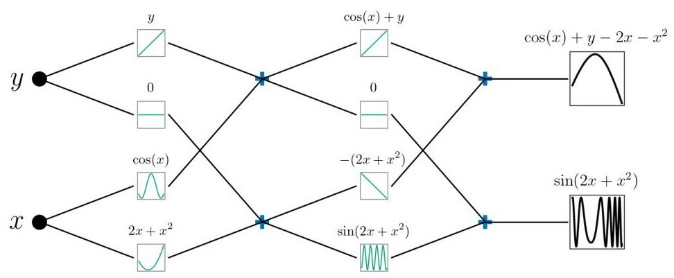

Figure 2: Example of a trained SINDy-KAN for the system of equations ${f}_{1}\left( {x, y}\right)  = \sin \left( {{2x} + {x}^{2}}\right) ,{f}_{2}\left( {x, y}\right)  = \; \cos \left( x\right)  + y - {2x} - {x}^{2}.$

图2:针对方程组${f}_{1}\left( {x, y}\right)  = \sin \left( {{2x} + {x}^{2}}\right) ,{f}_{2}\left( {x, y}\right)  = \; \cos \left( x\right)  + y - {2x} - {x}^{2}.$的训练好的SINDy-KAN示例

A well-trained SINDy-KAN has a few desirable features. The KAN should agree well with the data (the KAN loss defined in Eq. 3 should be small). Also, the SINDy-KAN representation denoted by ${\mathcal{K}}_{S}\left( \mathbf{x}\right)$ should agree well with the data, giving the error term

一个训练良好的SINDy-KAN具有一些理想的特性。KAN应该与数据很好地吻合(式3中定义的KAN损失应该很小)。此外，由${\mathcal{K}}_{S}\left( \mathbf{x}\right)$表示的SINDy-KAN表示应该与数据很好地吻合，给出误差项

$$
{\mathcal{L}}_{S} = {\begin{Vmatrix}f\left( \mathbf{x}\right)  - {\mathcal{K}}_{S}\left( \mathbf{x}\right) \end{Vmatrix}}_{2}^{2}. \tag{14}
$$

The coefficients ${\mathbf{\Xi }}_{S}$ should be sparse, so ${\begin{Vmatrix}{\mathbf{\Xi }}_{S}\end{Vmatrix}}_{1}$ is minimized. However, SINDy-KANs are trained using standard neural network optimizers such as ADAM, which struggle with minimizing the ${L}_{1}$ norm of ${\mathbf{\Xi }}_{S}$ . Instead, we introduce a shadow matrix $\mathbf{\Lambda }$ that consists of trainable entries that represent a sparse version of ${\mathbf{\Xi }}_{S}.\mathbf{\Lambda }$ is trained to minimize $\lambda \parallel \mathbf{\Lambda }{\parallel }_{1} + {\begin{Vmatrix}\mathbf{\Lambda } - {\mathbf{\Xi }}_{S}\end{Vmatrix}}_{2}^{2}$

系数${\mathbf{\Xi }}_{S}$应该是稀疏的，因此${\begin{Vmatrix}{\mathbf{\Xi }}_{S}\end{Vmatrix}}_{1}$被最小化。然而，SINDy-KAN是使用标准神经网络优化器(如ADAM)进行训练的，这些优化器在最小化${\mathbf{\Xi }}_{S}$的${L}_{1}$范数方面存在困难。相反，我们引入一个影子矩阵$\mathbf{\Lambda }$，它由可训练的项组成，这些项表示${\mathbf{\Xi }}_{S}.\mathbf{\Lambda }$的稀疏版本，$\mathbf{\Lambda }$被训练来最小化$\lambda \parallel \mathbf{\Lambda }{\parallel }_{1} + {\begin{Vmatrix}\mathbf{\Lambda } - {\mathbf{\Xi }}_{S}\end{Vmatrix}}_{2}^{2}$

We can introduce two additional loss terms. We denote by ${\mathcal{K}}_{\Lambda }\left( \mathbf{x}\right)$ the KAN evaluated with $\Lambda$ . Then, we can also consider

我们可以引入两个额外的损失项。我们用${\mathcal{K}}_{\Lambda }\left( \mathbf{x}\right)$表示用$\Lambda$评估的KAN。然后，我们还可以考虑

$$
{\mathcal{L}}_{\Lambda } = {\begin{Vmatrix}f\left( \mathbf{x}\right)  - {\mathcal{K}}_{\Lambda }\left( \mathbf{x}\right) \end{Vmatrix}}_{2}^{2}. \tag{15}
$$

The general SINDy-KAN loss function takes the form:

一般的SINDy-KAN损失函数采用以下形式:

$$
\mathcal{L} = {\lambda }_{KAN}{\mathcal{L}}_{KAN} + {\lambda }_{S}{\mathcal{L}}_{S} + {\lambda }_{\Lambda }{\mathcal{L}}_{\Lambda } + {\lambda }_{1}\parallel \mathbf{\Lambda }{\parallel }_{1} + {\lambda }_{2}{\begin{Vmatrix}\mathbf{\Lambda } - {\mathbf{\Xi }}_{S}\end{Vmatrix}}_{2}^{2}. \tag{16}
$$

Because $\parallel \mathbf{\Lambda }{\parallel }_{1}$ should be $\mathcal{O}\left( 1\right)$ , we note that ${\lambda }_{1}$ should be on the order of the expected loss ${\mathcal{L}}_{S}$ . For the examples in this work we fix ${\lambda }_{KAN} = {1.0}$ .

因为$\parallel \mathbf{\Lambda }{\parallel }_{1}$应该是$\mathcal{O}\left( 1\right)$，我们注意到${\lambda }_{1}$应该与预期损失${\mathcal{L}}_{S}$处于同一量级。对于本工作中的示例，我们固定${\lambda }_{KAN} = {1.0}$。

We compare our results with the pykan package, which also does equation discovery as implemented in [1]. In [1], each activation function is restricted to have the form $a + {bh}\left( {{cx} + d}\right)$ for scalars $a, b, c$ , and $d$ and a function $h$ found from a given library of functions. In particular, this formulation prevents linear combinations of the library functions, which limits the functions the method can identify. The functions are selected at the end of training, instead of during training, so there is no requirement that the learned activation functions should align with the functions in the library, as noted by [29]. pykan training involves a series of training and sparsification steps that must be managed by the user. In this work, we keep the pykan implementation as close to the implementation in [1] as possible.

我们将我们的结果与pykan包进行比较，该包也如[1]中所实现的那样进行方程发现。在[1]中，每个激活函数被限制为对于标量$a, b, c$具有$a + {bh}\left( {{cx} + d}\right)$的形式，以及$d$和从给定函数库中找到的函数$h$。特别地，这种公式化阻止了库函数的线性组合，这限制了该方法能够识别的函数。函数是在训练结束时而不是在训练期间选择的，所以如[29]所指出的，没有要求学习到的激活函数应该与库中的函数对齐。pykan训练涉及一系列训练和稀疏化步骤，这些步骤必须由用户管理。在这项工作中，我们尽可能使pykan的实现与[1]中的实现接近。

SINDy-KANs train a standard KAN and simultaneously find the coefficients ${\xi }_{\ell , j, i}$ by solving Eq. 13 for each activation function using sparse regression. In other words, SINDy-KANs learn the sparse representation and the KAN representation simultaneously. Alternatively, one could train a SINDy-KAN to learn the coefficients ${\xi }_{\ell , j, i}$ by minimizing Eq. 14 We call this method direct SINDy-KANs because the coefficients are learned directly. We discuss direct SINDy-KANs more in Appendix A. While direct SINDy-KANs can accurately train, we find that they are less robust than finding the coefficients ${\xi }_{\ell , j, i}$ as presented above. They are, however, less expensive to train for large networks, because the computational work at each iteration is significantly lower without solving the sparse regression problems at each KAN node. We leave a further exploration of direct SINDy-KANs for future work.

SINDy-KANs训练一个标准的KAN，并同时通过使用稀疏回归为每个激活函数求解方程13来找到系数${\xi }_{\ell , j, i}$。换句话说，SINDy-KANs同时学习稀疏表示和KAN表示。或者，可以训练一个SINDy-KAN通过最小化方程14来学习系数${\xi }_{\ell , j, i}$。我们称这种方法为直接SINDy-KANs，因为系数是直接学习的。我们在附录A中更详细地讨论直接SINDy-KANs。虽然直接SINDy-KANs可以准确训练，但我们发现它们不如上述找到系数${\xi }_{\ell , j, i}$的方法稳健。然而，对于大型网络，它们的训练成本更低，因为在每次迭代时的计算工作量显著降低，而无需在每个KAN节点求解稀疏回归问题。我们将直接SINDy-KANs的进一步探索留待未来工作。

## 4 Experiments

## 4实验

We implemented the SINDy-KAN algorithm in jaxKAN [55]. jaxKAN offers several advances in KAN training aimed at increasing accuracy for scientific machine learning including advanced initialization, adaptive grid refinement [56, 57, 58], and additional KAN basis functions [59]. However, in this work we use the B-spline implementation closest to the original KAN formulation in [1] to try and provide direct comparisons with existing literature.

我们在jaxKAN[55]中实现了SINDy-KAN算法。jaxKAN在KAN训练方面有几个进展旨在提高科学机器学习的准确性，包括高级初始化、自适应网格细化[56,57,58]和额外的KAN基函数[59]。然而，在这项工作中，我们使用最接近[1]中原始KAN公式的B样条实现，以便尝试与现有文献进行直接比较。

Training parameters for all examples are given in Appendix C in table 4 and table 5

所有示例的训练参数在附录C的表4和表5中给出

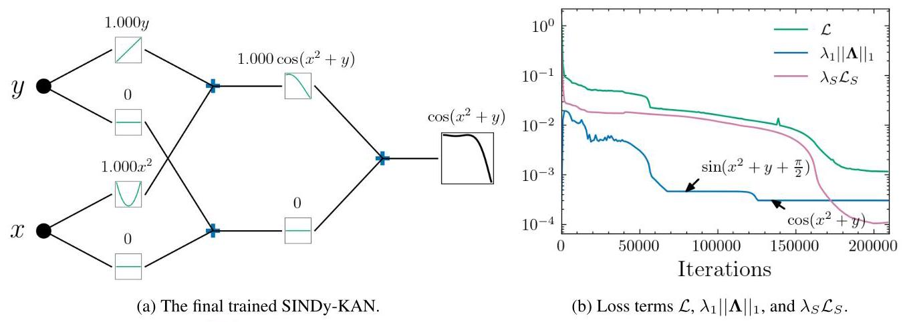

Figure 3: Results for Sec. 4.1 (a) The final trained SINDy-KAN correctly learns the target equation. (b) The loss terms show two plateaus for the ${L}_{1}$ regularization term ${\lambda }_{1}\parallel \mathbf{\Lambda }{\parallel }_{1}$ .

图3:第4.1节的结果 (a) 最终训练的SINDy-KAN正确学习到目标方程。(b) 损失项显示了${L}_{1}$正则化项${\lambda }_{1}\parallel \mathbf{\Lambda }{\parallel }_{1}$的两个平稳期。

### 4.1 Symbolic regression

### 4.1符号回归

In this section we focus on learning symbolic equations directly from data for the equation

在本节中，我们专注于直接从数据中学习方程的符号方程

$$
f\left( {x, y}\right)  = \cos \left( {{x}^{2} + y}\right) , \tag{17}
$$

chosen because it contains a composition of functions (cos and ${x}^{2} + y$ ), something that would be difficult to know to include in a typical library of functions for standard SINDy. KANs are able to handle composition by increasing the depth of the network. We take $\left( {x, y}\right)  \in  \left\lbrack  {-{2.5},{2.5}}\right\rbrack   \times  \left\lbrack  {-{2.5},{2.5}}\right\rbrack$ and use 1,000 randomly selected points as training data. We take the library of candidate functions ${\mathbf{\Theta }}_{\ell , j, i}\left( \mathbf{x}\right)$ as polynomials up to degree two plus sine and cosine,

之所以选择它，是因为它包含函数的组合(余弦和${x}^{2} + y$)，这在标准SINDy的典型函数库中很难知道要包含。KANs能够通过增加网络深度来处理组合。我们取$\left( {x, y}\right)  \in  \left\lbrack  {-{2.5},{2.5}}\right\rbrack   \times  \left\lbrack  {-{2.5},{2.5}}\right\rbrack$并使用1000个随机选择的点作为训练数据。我们将候选函数库${\mathbf{\Theta }}_{\ell , j, i}\left( \mathbf{x}\right)$取为最高二次的多项式加上正弦和余弦，

$$
{\mathbf{\Theta }}_{\ell , i} = \left\lbrack  \begin{matrix} | & | & & | & | \\  \mathbf{1} & {\mathbf{X}}_{i}^{\left( \ell \right) } & {\mathbf{X}}_{i}^{{\left( \ell \right) }^{2}} & \sin \left( {\mathbf{X}}_{i}^{\left( \ell \right) }\right) & \cos \left( {\mathbf{X}}_{i}^{\left( \ell \right) }\right)  \end{matrix}\right\rbrack  . \tag{18}
$$

Hyperparameters used for training are given in Table 4

训练中使用的超参数在表4中给出

The SINDy-KAN learns the correct equation,

SINDy-KAN学习到了正确的方程，

$$
{\mathcal{K}}_{\Lambda } = {0.9999}\cos \left( {{1.0000}{x}^{2} + {0.9999y}}\right) ,
$$

also shown in fig. 3a pykan struggles to learn the composition of functions, resulting in

也如图3a所示，pykan难以学习函数的组合，导致

$$
{\mathcal{K}}^{\text{ pykan }} = {0.02002x} - {0.0275y} - {0.5642}\sin \left( {{1.7946x} - {0.1641y} + {3.4794}}\right) .
$$

In particular, pykan misses the ${x}^{2}$ term, resulting in larger errors overall.

特别地，pykan遗漏了${x}^{2}$项，导致总体误差更大。

Examining the loss profiles gives some interesting insight into the SINDy-KAN training. In fig. 3b, we show the total loss $\mathcal{L}$ given by Eq. 16 and the ${L}_{1}$ regularization term ${\lambda }_{1}\parallel \mathbf{\Lambda }{\parallel }_{1}$ . After the initial transient training period, $\parallel \mathbf{\Lambda }{\parallel }_{1}$ has two plateaus. Examination of the learned equations at the plateaus shows that the first is at $\parallel \mathbf{\Lambda }{\parallel }_{1} \approx  3 + \pi /2$ , where the SINDy-KAN learns $\sin \left( {{x}^{2} + y + \pi /2}\right)$ , which simplifies to the correct equation but is not the sparsest form of the equation. After additional training, the second plateau occurs at $\parallel \mathbf{\Lambda }{\parallel }_{1} \approx  3$ , representing the equation $\cos \left( {{x}^{2} + y}\right)$ .

研究损失曲线能让我们对SINDy-KAN训练有一些有趣的见解。在图3b中，我们展示了由式16给出的总损失$\mathcal{L}$以及${L}_{1}$正则化项${\lambda }_{1}\parallel \mathbf{\Lambda }{\parallel }_{1}$。在初始的瞬态训练期之后，$\parallel \mathbf{\Lambda }{\parallel }_{1}$有两个平稳阶段。对平稳阶段所学方程的研究表明，第一个平稳阶段处于$\parallel \mathbf{\Lambda }{\parallel }_{1} \approx  3 + \pi /2$，此时SINDy-KAN学习到$\sin \left( {{x}^{2} + y + \pi /2}\right)$，它简化后是正确的方程，但不是该方程最稀疏的形式。经过额外训练后，第二个平稳阶段出现在$\parallel \mathbf{\Lambda }{\parallel }_{1} \approx  3$，代表方程$\cos \left( {{x}^{2} + y}\right)$。

### 4.2 Differential equation discovery

### 4.2 微分方程发现

A common use case for SINDy is identifying dynamical systems of the form given in Eq. 4 where data is given in the form $\left( {t,\mathbf{x}}\right)$ . To use SINDy on this data, it is necessary to take numerical derivatives to find $\frac{d\mathbf{x}}{dt}$ . Finding this derivative can be difficult, particularly in the presence of noisy data [30]. Methods used in other work can certainly be used for SINDy-KANs, such finite differences which has successfully applied to SINDy before [30].

SINDy的一个常见用例是识别式4给出形式的动力系统，其中数据以$\left( {t,\mathbf{x}}\right)$的形式给出。要对这些数据使用SINDy，需要进行数值求导以找到$\frac{d\mathbf{x}}{dt}$。求这个导数可能很困难，特别是在存在噪声数据的情况下[30]。其他工作中使用的方法当然可以用于SINDy-KAN，比如有限差分法，它之前已成功应用于SINDy[30]。

#### 4.2.1 Linear ODE system

#### 4.2.1 线性常微分方程系统

We begin with the simplest class of dynamical systems to test SINDy-KANs. Even though these equations can be discovered by simpler methods, such as dynamic model discovery, it is useful to confirm that simple systems are also properly identified with the more general SINDy-KAN infrastructure.

我们从测试SINDy-KAN的最简单动力系统类别开始。尽管这些方程可以通过更简单的方法发现，比如动态模型发现，但确认简单系统也能被更通用的SINDy-KAN框架正确识别是很有用的。

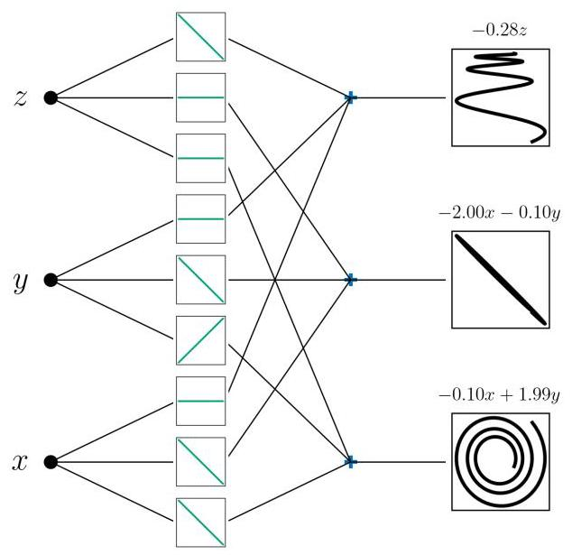

Figure 4: Trained SINDy-KAN for Sec. 4.2.1

图4:第4.2.1节训练好的SINDy-KAN

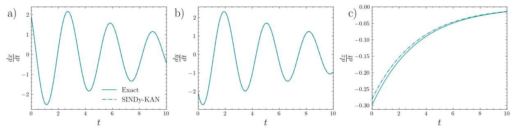

Figure 5: Trained SINDy-KAN for Sec. 4.2.1 The SINDy-KAN results agree well with the data.

图5:第4.2.1节训练好的SINDy-KAN。SINDy-KAN的结果与数据吻合得很好。

We consider the 3D system of equations

我们考虑三维方程组

$$
\frac{d}{dt}\left\lbrack  \begin{array}{l} x \\  y \\  z \end{array}\right\rbrack   = \left\lbrack  \begin{matrix}  - {0.1} & 2 & 0 \\   - 2 &  - {0.1} & 0 \\  0 & 0 &  - {0.3} \end{matrix}\right\rbrack  \left\lbrack  \begin{array}{l} x \\  y \\  z \end{array}\right\rbrack  . \tag{19}
$$

We take the library of candidate functions ${\mathbf{\Theta }}_{\ell , j, i}\left( \mathbf{x}\right)$ as polynomials up to degree three,

我们将候选函数库${\mathbf{\Theta }}_{\ell , j, i}\left( \mathbf{x}\right)$取为最高三次的多项式，

$$
{\mathbf{\Theta }}_{\ell , i} = \left\lbrack  \begin{matrix}  \mid  &  \mid  &  \mid  &  \mid  \\  \mathbf{1} & {\mathbf{X}}_{i}^{\left( \ell \right) } & {\mathbf{X}}_{i}^{{\left( \ell \right) }^{2}} & {\mathbf{X}}_{i}^{{\left( \ell \right) }^{3}} \\   \mid  &  \mid  &  \mid  &  \mid   \end{matrix}\right\rbrack  . \tag{20}
$$

The training data is generated with pysindy [60, 61, 62]. Data is generated at 200 evenly spaced points in the interval $t \in  \left\lbrack  {0,{10}}\right\rbrack$ .

训练数据是用pysindy[60, 61, 62]生成的。数据在区间$t \in  \left\lbrack  {0,{10}}\right\rbrack$内的200个等距点处生成。

The SINDy-KAN learns the equation

SINDy-KAN学习到方程

$$
\frac{d}{dt}\left\lbrack  \begin{array}{l} x \\  y \\  z \end{array}\right\rbrack   = \left\lbrack  \begin{matrix}  - {0.0993} & {1.9946} & 0 \\   - {1.9972} &  - {0.0995} & 0 \\  0 & 0 &  - {0.2811} \end{matrix}\right\rbrack  \left\lbrack  \begin{array}{l} x \\  y \\  z \end{array}\right\rbrack  . \tag{21}
$$

The trained SINDy-KAN is given in Fig. 4 and the results are shown in Fig. 5. We extend this case to consider training with noise in Appendix B

训练好的SINDy-KAN如图4所示，结果如图5所示。我们在附录B中扩展了这个案例，考虑了有噪声情况下的训练

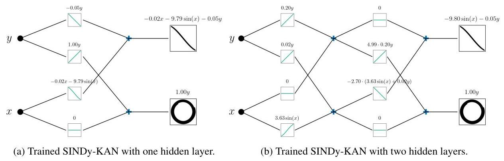

Figure 6: Trained SINDy-KANs for the pendulum in Sec. 4.2.2 with one (a) and two (b) hidden layers.

图6:第4.2.2节中带有一个(a)和两个(b)隐藏层的摆锤的训练好的SINDy-KAN。

#### 4.2.2 Damped pendulum

#### 4.2.2 阻尼摆

We consider a damped pendulum with equation given by:

我们考虑一个阻尼摆，其方程如下:

$$
\frac{dx}{dt} = y \tag{22}
$$

$$
\frac{dy}{dt} =  - {0.05y} - {9.81}\sin \left( x\right) \tag{23}
$$

and the library of candidate functions

以及候选函数库

$$
{\mathbf{\Theta }}_{\ell , i} = \left\lbrack  \begin{matrix}  \mid  &  \mid  &  \mid  &  \mid  &  \mid  \\  \mathbf{1} & {\mathbf{X}}_{i}^{\left( \ell \right) } & {\mathbf{X}}_{i}^{{\left( \ell \right) }^{2}} & \sin \left( {\mathbf{X}}_{i}^{\left( \ell \right) }\right) & \cos \left( {\mathbf{X}}_{i}^{\left( \ell \right) }\right)  \end{matrix}\right\rbrack  . \tag{24}
$$

We can use this test to examine the performance of SINDy-KANs when the architecture is varied by considering SINDy-KANs with one and two hidden activation function layers. The training data is found by numerically solving Eqs. 22 and 23 at 1000 points in the time interval $t \in  \left\lbrack  {0,{10}}\right\rbrack$ .

我们可以使用此测试来检验当通过考虑具有一个和两个隐藏激活函数层的SINDy-KAN来改变架构时，SINDy-KAN的性能。通过在时间间隔$t \in  \left\lbrack  {0,{10}}\right\rbrack$内的1000个点上数值求解方程22和23来找到训练数据。

The SINDy-KAN with one hidden layer learns

具有一个隐藏层的SINDy-KAN学习

$$
\frac{dx}{dt} = {0.9998y}
$$

$$
\frac{dy}{dt} =  - {9.7877}\sin \left( x\right)  - {0.0499y} - {0.0185x}.
$$

The SINDy-KAN with two hidden layers learns

具有两个隐藏层的SINDy-KAN学习

$$
\frac{dx}{dt} = {0.9997y}
$$

$$
\frac{dy}{dt} =  - {9.7975}\sin \left( x\right)  - {0.0499y}
$$

Plots of the trained SINDy-KAN are shown in fig. 6a, fig. 6b) and fig. 7] The deeper SINDy-KAN is slightly more accurate due to the additional flexibility of the extra hidden layer. However, deeper KANs can also be harder to train in general [63], so there is a trade off between the additional flexibility, training time, and complexity of training.

训练后的SINDy-KAN的图如图6a、图6b和图7所示。由于额外隐藏层的额外灵活性，更深的SINDy-KAN稍微更准确。然而，一般来说，更深的KAN也可能更难训练[63]，因此在额外的灵活性、训练时间和训练复杂性之间存在权衡。

#### 4.2.3 ABC flow

#### 4.2.3 ABC流

When dynamics of the problem are known they can be incorporated into the SINDy-KAN candidate functions to improve training. For an example, we consider the ABC flow example inspired by [42], given by

当问题的动力学已知时，可以将它们纳入SINDy-KAN候选函数中以改进训练。例如，我们考虑受[42]启发的ABC流示例，由下式给出

$$
\frac{dx}{dt} = A\sin \left( {{w}_{1}z}\right)  + C\cos \left( {{w}_{2}y}\right) \tag{25}
$$

$$
\frac{dy}{dt} = B\sin \left( {{w}_{3}x}\right)  + A\cos \left( {{w}_{4}z}\right) \tag{26}
$$

$$
\frac{dz}{dt} = C\sin \left( {{w}_{5}y}\right)  + B\cos \left( {{w}_{6}x}\right) \tag{27}
$$

for $A = 2, B = 3, C = 1$ , and ${w}_{1} = \pi /{4.0},{w}_{2} = \pi /{3.0},{w}_{3} = \pi /{2.0},{w}_{4} = \pi /{5.0},{w}_{5} = \pi /{4.5},{w}_{6} = \pi /{2.8}$ . We use this equation to highlight the selection of different candidate functions for each hidden layer in the KAN. If we know the equations are of the form $\mathop{\sum }\limits_{{i = 1}}^{3}{a}_{i}\sin \left( {{w}_{i}{x}_{i}}\right)  + {b}_{i}\cos \left( {{v}_{i}{x}_{i}}\right)$ for $i \in  \{ 1,2,3\}$ and unknown coefficients ${a}_{i},{b}_{i},{w}_{i}$ and ${v}_{i}$ , we can consider a two layer KAN, with the candidate functions for the first layer $\{ x\}$ and the candidate functions for the second layer $\{ \cos \left( x\right) ,\sin \left( x\right) \}$ . By keeping the first layer as a linear basis to learn the right coordinates/scaling, then feeding them into the nonlinear terms, we restrict the training space to allow for better training while capturing the dynamics of the problem. We emphasize that the frequencies ${w}_{i}$ are learned by the SINDy-KAN instead of prescribed by the user. The training data are found by numerically solving the system of equations at 20000 points in the time interval $t \in  \left\lbrack  {0,{20}}\right\rbrack$ .

对于$A = 2, B = 3, C = 1$和${w}_{1} = \pi /{4.0},{w}_{2} = \pi /{3.0},{w}_{3} = \pi /{2.0},{w}_{4} = \pi /{5.0},{w}_{5} = \pi /{4.5},{w}_{6} = \pi /{2.8}$。我们使用此方程来突出KAN中每个隐藏层不同候选函数的选择。如果我们知道方程对于$i \in  \{ 1,2,3\}$的形式为$\mathop{\sum }\limits_{{i = 1}}^{3}{a}_{i}\sin \left( {{w}_{i}{x}_{i}}\right)  + {b}_{i}\cos \left( {{v}_{i}{x}_{i}}\right)$，并且系数${a}_{i},{b}_{i},{w}_{i}$和${v}_{i}$未知，我们可以考虑一个两层KAN，第一层的候选函数为$\{ x\}$，第二层的候选函数为$\{ \cos \left( x\right) ,\sin \left( x\right) \}$。通过将第一层保持为线性基来学习正确的坐标/缩放，然后将它们输入到非线性项中，我们限制了训练空间以允许更好的训练，同时捕获问题 的动力学。我们强调频率${w}_{i}$是由SINDy-KAN学习的，而不是由用户规定的。通过在时间间隔$t \in  \left\lbrack  {0,{20}}\right\rbrack$内的20000个点上数值求解方程组来找到训练数据。

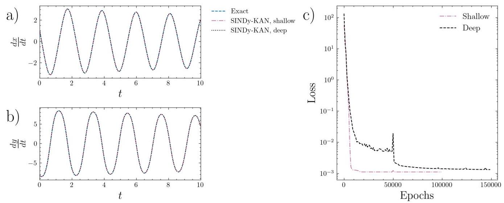

Figure 7: SINDy-KAN results for Sec. 4.2.2 (a-b) Results for the SINDy-KANs, compared with the numerical derivatives. (c) Loss for the SINDy-KAN.

图7:第4.2.2节的SINDy-KAN结果 (a-b) SINDy-KAN的结果，与数值导数比较。(c) SINDy-KAN的损失。

Eqns. 25 27 give approximately:

方程25和27大致给出:

$$
\frac{dx}{dt} = 2\sin \left( {0.7854z}\right)  + 1\cos \left( {1.0472y}\right)
$$

$$
\frac{dy}{dt} = 3\sin \left( {1.5708x}\right)  + 2\cos \left( {0.6283z}\right)
$$

$$
\frac{dz}{dt} = 1\sin \left( {0.6981y}\right)  + 3\cos \left( {1.1210x}\right) .
$$

With the SINDy-KAN, we learn:

使用SINDy-KAN，我们得到:

$$
\frac{dx}{dt} = {2.0072}\sin \left( {0.7849z}\right)  + {1.0000}\cos \left( {1.0470y}\right)
$$

$$
\frac{dy}{dt} = {2.9990}\sin \left( {1.5708x}\right)  + {1.9926}\cos \left( {0.6278z}\right)
$$

$$
\frac{dz}{dt} = {0.9996}\sin \left( {0.6976y}\right)  + {2.9983}\cos \left( {1.2221x}\right) .
$$

The trained SINDy-KAN is shown in Fig. 8 and the results from the SINDy-KAN are shown in Fig. 9] As in [42], SINDy-KANs are able to directly learn the frequencies accurately. This presents a strong advantage over standard SINDy, where the frequencies would need to be predetermined to be included in the library of candidate functions.

训练好的SINDy-KAN如图8所示，SINDy-KAN的结果如图9所示。与[42]中一样，SINDy-KAN能够直接准确地学习频率。这相对于标准SINDy具有很大优势，在标准SINDy中，频率需要预先确定并包含在候选函数库中。

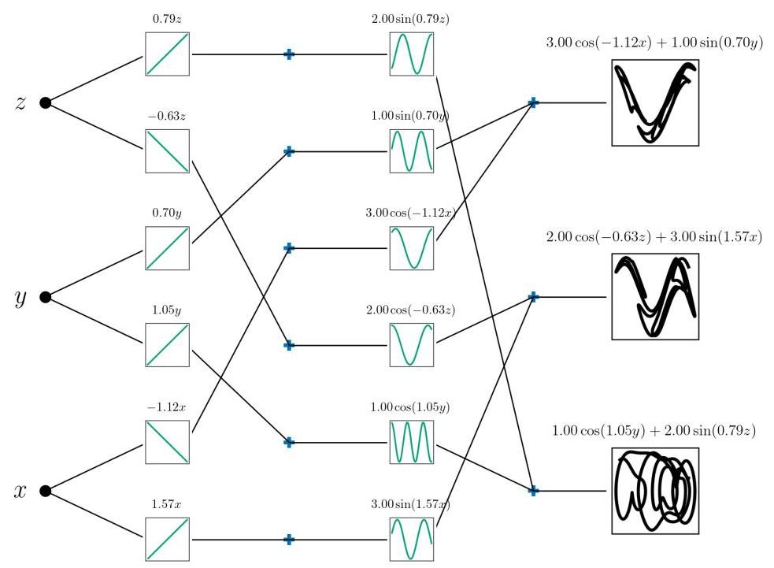

Figure 8: The SINDy-KAN for ABC flow problem in Sec. 4.2.3. For clarity, only the non-zero activation functions are shown.

图8:第4.2.3节中ABC流问题的SINDy-KAN。为清晰起见，仅显示非零激活函数。

#### 4.2.4 Lorenz

#### 4.2.4 洛伦兹系统

We next consider the nonlinear Lorenz system

接下来我们考虑非线性洛伦兹系统

$$
\frac{dx}{dt} = \sigma \left( {y - x}\right) \tag{28}
$$

$$
\frac{dy}{dt} = x\left( {\rho  - z}\right)  - y \tag{29}
$$

$$
\frac{dz}{dt} = {xy} - {\beta z} \tag{30}
$$

for $\rho  = {28.0},\sigma  = {10.0}$ , and $\beta  = {8.0}/{3.0}. \approx  {2.6667}$ . This example highlights the use of multiplication SINDy-KANs. In particular, we use a KAN with one hidden layer with five nodes, and take two of the nodes as multiplication nodes $\left( {{n}_{1}^{m} = 2}\right)$ . We take the library of candidate functions for the activation functions as polynomials up to degree one,

对于$\rho  = {28.0},\sigma  = {10.0}$和$\beta  = {8.0}/{3.0}. \approx  {2.6667}$。此示例突出了乘法SINDy-KAN的使用。具体而言，我们使用一个具有一个隐藏层且有五个节点的KAN，并将其中两个节点作为乘法节点$\left( {{n}_{1}^{m} = 2}\right)$。我们将激活函数的候选函数库设为最高一次的多项式，

$$
{\mathbf{\Theta }}_{\ell , i} = \left\lbrack  \begin{matrix}  \mid  &  \mid  \\  \mathbf{1} & {\mathbf{X}}_{i}^{\left( \ell \right) } \\   \mid  &  \mid   \end{matrix}\right\rbrack  . \tag{31}
$$

With the multiplication nodes, the multiplication KAN can represent second degree polynomials after the first layer, even though each activation function is univariate. In contrast, a standard KAN would take two hidden layers to represent second degree polynomials.

通过乘法节点，乘法KAN在第一层之后能够表示二次多项式，尽管每个激活函数都是单变量的。相比之下，标准KAN需要两个隐藏层才能表示二次多项式。

We train the SINDy-KAN using data generated with the initial condition $\left( {-8,8,{27}}\right)$ . The training data is found by numerically solving the system of equations at 5000 points in the time interval $t \in  \left\lbrack  {0,{10}}\right\rbrack$ .

我们使用初始条件为$\left( {-8,8,{27}}\right)$生成的数据训练SINDy-KAN。训练数据是通过在时间区间$t \in  \left\lbrack  {0,{10}}\right\rbrack$内的5000个点上数值求解方程组得到的。

The SINDy-KAN learns:

SINDy-KAN得到:

$$
\frac{dx}{dt} =  - {10.00001x} + {9.99999y} \tag{32}
$$

$$
\frac{dy}{dt} = x\left( {{28.00002} - {1.00000z}}\right)  - {1.00000y} \tag{33}
$$

$$
\frac{dz}{dt} = {1.00000xy} - {2.66666z}. \tag{34}
$$

The results are plotted in Fig. 10 and the trained KAN is shown in Fig. 11.

结果绘制在图10中，训练好的KAN如图11所示。

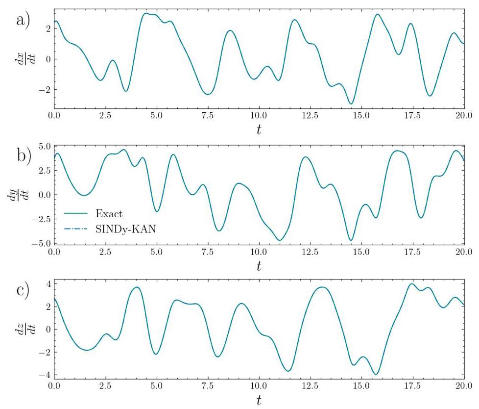

Figure 9: The SINDy-KAN learns the dynamics of the ABC flow problem in Sec. 4.2.3 well.

图9:SINDy-KAN很好地学习了第4.2.3节中ABC流问题的动力学。

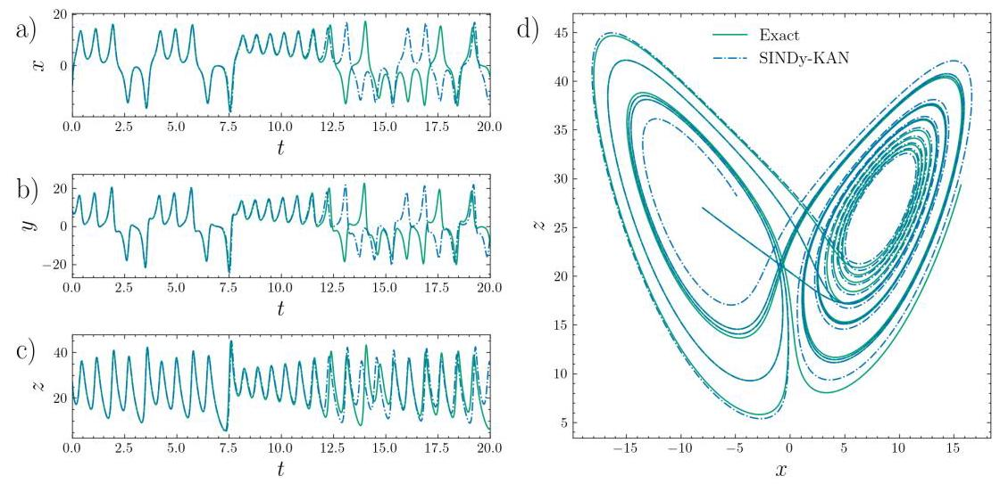

Figure 10: The Lorenz system in Eqs. 28-30 and the system learned by the SINDy-KAN in Eqs. 32-34 for Sec. 4.2.4 Both the true system and the learned system are evaluated numerically. We note that only data from $t \in  \left\lbrack  {0,{10}}\right\rbrack$ is used for training.

图10:第4.2.4节中方程28 - 30的洛伦兹系统以及SINDy-KAN学习到的方程32 - 34的系统。真实系统和学习到的系统都进行了数值评估。我们注意到仅使用来自$t \in  \left\lbrack  {0,{10}}\right\rbrack$的数据进行训练。

#### 4.2.5 Kuramoto oscillator

#### 4.2.5 库拉托莫振子

The Kuramoto oscillator is defined by

库拉托莫振子由下式定义

$$
\frac{d{\theta }_{i}}{dt} = {\omega }_{i} + \frac{1}{N}\mathop{\sum }\limits_{{j = 1}}^{N}{K}_{ij}\sin \left( {{\theta }_{j} - {\theta }_{i}}\right) , i = 1,\ldots N. \tag{35}
$$

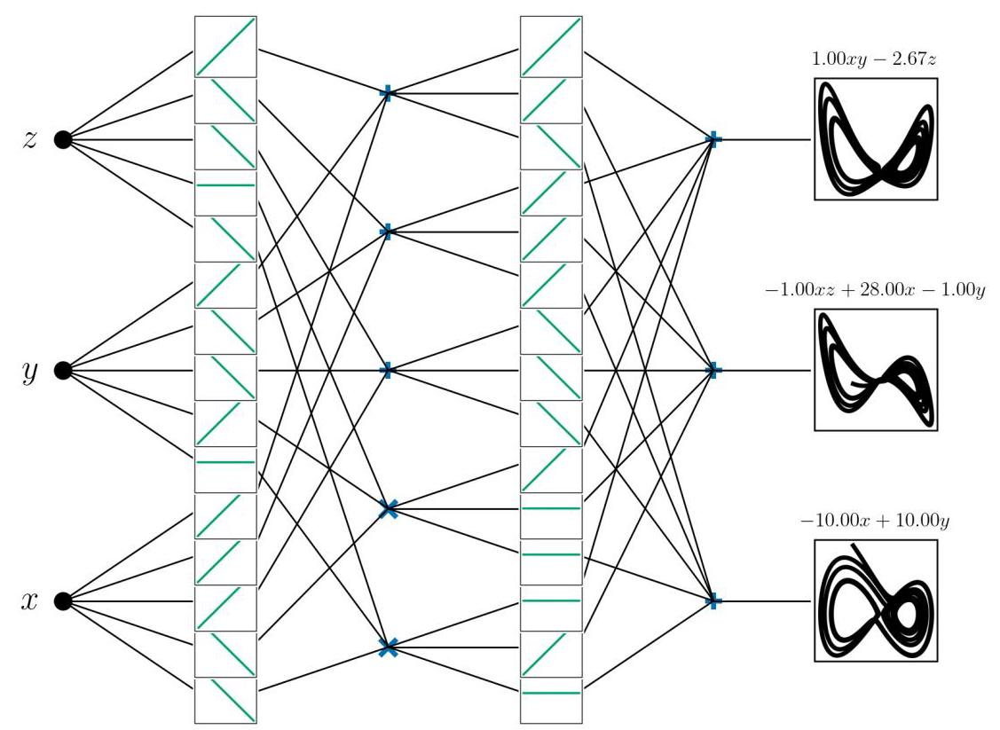

Figure 11: The trained SINDy-KAN for the Lorenz system in Sec. 4.2.4. Multiplication nodes are denoted by " $\times$ " and addition nodes are denoted by "+".

图11:第4.2.4节中洛伦兹系统的训练好的SINDy-KAN。乘法节点用“$\times$”表示，加法节点用“+”表示。

We consider $N = 3$ and ${\omega }_{1} = {16},{\omega }_{2} = 5$ , and ${\omega }_{3} = {11}$ with ${K}_{ij} = 1$ for all $i, j$ . We consider a two layer KAN, with the candidate functions for the first layer $\{ x\}$ and the candidate functions for the second layer $\{ 1,\sin \left( x\right) \}$ . The training data is generated with [64] at 5000 points for $t \in  \left\lbrack  {0,5}\right\rbrack$ .

我们考虑$N = 3$和${\omega }_{1} = {16},{\omega }_{2} = 5$，以及对于所有$i, j$都带有${K}_{ij} = 1$的${\omega }_{3} = {11}$。我们考虑一个两层的KAN，第一层的候选函数为$\{ x\}$，第二层的候选函数为$\{ 1,\sin \left( x\right) \}$。训练数据是按照[64]在5000个点上针对$t \in  \left\lbrack  {0,5}\right\rbrack$生成的。

The SINDy-KAN learns

SINDy-KAN学习

$$
\frac{d{\theta }_{1}}{dt} =  - {1.0002}\sin \left( {{0.9988}{\theta }_{1} - {0.9985}{\theta }_{3}}\right)  - {1.0001}\sin \left( {{0.9994}{\theta }_{1} - {0.9981}{\theta }_{2}}\right)  + {15.9995} \tag{36}
$$

$$
\frac{d{\theta }_{2}}{dt} = {1.0000}\sin \left( {{0.9994}{\theta }_{1} - {0.9981}{\theta }_{2}}\right)  - {1.0002}\sin \left( {{0.9988}{\theta }_{2} - {0.9990}{\theta }_{3}}\right)  + {5.0002} \tag{37}
$$

$$
\frac{d{\theta }_{3}}{dt} = {1.0001}\sin \left( {{0.9988}{\theta }_{1} - {0.9985}{\theta }_{3}}\right)  + {1.0002}\sin \left( {{0.9988}{\theta }_{2} - {0.9990}{\theta }_{3}}\right)  + {11.0003}. \tag{38}
$$

Examining the KAN structure in Fig. 12, the KAN uses only three of the six nodes in the hidden layer (the other nodes are zero.) This minimizes the ${\ell }_{1}$ penalty ${\lambda }_{1}\parallel \mathbf{\Lambda }{\parallel }_{1}$ in the loss function by reusing the ${\theta }_{i} - {\theta }_{j}$ terms in the final equations by recognizing the symmetry that $\sin \left( x\right)  =  - \sin \left( x\right)$ .

检查图12中的KAN结构，KAN在隐藏层中仅使用了六个节点中的三个(其他节点为零)。通过识别$\sin \left( x\right)  =  - \sin \left( x\right)$的对称性，在最终方程中重用${\theta }_{i} - {\theta }_{j}$项，这使得损失函数中的${\ell }_{1}$惩罚${\lambda }_{1}\parallel \mathbf{\Lambda }{\parallel }_{1}$最小化。

## 5 Conclusions

## 5结论

We have shown SINDy-KANs train well and accurately discover equations for a variety of datasets, including chaotic dynamical systems. SINDy-KANs can learn compositions of functions that are difficult to learn with SINDy, where the exact needed composition may not be included in the function library. At the same time, SINDy-KANs more robustly learn parsimonious representations than standard KANs. This combination of function compositions and sparse function representations builds on the strengths of both KANs and SINDy in a harmonious way to offer increased symbolic regression. More broadly, SINDy-KANs contribute to the growing effort to develop interpretable and trustworthy machine learning methods for scientific discovery. By enforcing parsimony at the level of each activation function while retaining the expressiveness of deep networks, SINDy-KANs offer a principled framework for learning human-readable equations from data.

我们已经表明，SINDy-KAN训练良好，能够准确地为各种数据集发现方程，包括混沌动力系统。SINDy-KAN可以学习用SINDy难以学习的函数组合，其中确切所需的组合可能未包含在函数库中。同时，SINDy-KAN比标准KAN更稳健地学习简约表示。这种函数组合和稀疏函数表示的结合以和谐的方式建立在KAN和SINDy的优势之上，以提供增强的符号回归。更广泛地说，SINDy-KAN有助于为科学发现开发可解释和可信的机器学习方法的不断增长的努力。通过在每个激活函数级别强制简约性，同时保留深度网络的表现力，SINDy-KAN为从数据中学习人类可读方程提供了一个有原则的框架。

Despite these strengths, several limitations remain. As the number of input variables grows, the interpretability of the discovered equations may diminish, a challenge shared with standard KAN-based symbolic regression. Additionally, discovering dynamical systems from data requires numerical differentiation, which can be sensitive to noise. While methods such as finite differences have been successfully applied in SINDy, further work is needed to evaluate the robustness of SINDy-KANs under noisy conditions.

尽管有这些优点，但仍存在一些局限性。随着输入变量数量的增加，发现的方程的可解释性可能会降低，这是与基于标准KAN的符号回归共有的挑战。此外，从数据中发现动力系统需要数值微分，这可能对噪声敏感。虽然有限差分等方法已成功应用于SINDy，但需要进一步开展工作来评估SINDy-KAN在噪声条件下的稳健性。

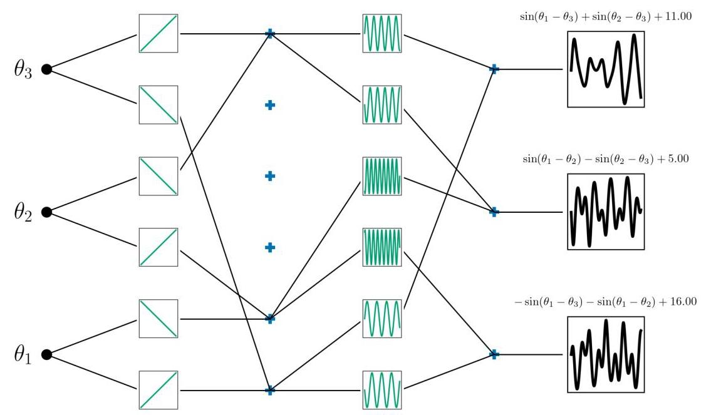

Figure 12: The trained SINDy-KAN for the Kuramoto system in Sec. 4.2.5 Multiplication nodes are denoted by " $\times$ " and addition nodes are denoted by "+". For clarity, only non-zero nodes are shown.

图12:第4.2.5节中针对Kuramoto系统训练的SINDy-KAN。乘法节点用“$\times$”表示，加法节点用“+”表示。为清晰起见，仅显示非零节点。

The examples in this work are all trained on a single Apple M3 Max Macbook Pro, generally in less than a few minutes per problem. Due to not needing to complete the sparse regression at each activation function for each iteration, the direct SINDy-KANs presented in Appendix A train significantly faster. However, SINDy-KANs do not represent a large computational burden. Due to the comparable accuracy between the two approaches, we suggest the faster training times are an argument to use direct SINDy-KANs when possible. However, direct SINDy-KANs assume that each activation function can be represented well by linear combinations of the library functions. In future work, we will consider cases where some activation functions can be kept as their B-spline representations, while others are fixed by their symbolic forms based on the error while training. This will allow for accuracy when the set of library functions is not sufficient to capture the system dynamics. For this approach, SINDy-KANs are necessary.

本工作中的示例均在一台Apple M3 Max Macbook Pro上训练，通常每个问题不到几分钟。由于不需要在每次迭代时对每个激活函数完成稀疏回归，附录A中提出的直接SINDy-KAN训练速度明显更快。然而，SINDy-KAN并不代表很大的计算负担。由于两种方法的准确性相当，我们建议在可能的情况下，更快的训练时间是使用直接SINDy-KAN的一个理由。然而，直接SINDy-KAN假设每个激活函数都可以由库函数的线性组合很好地表示。在未来的工作中，我们将考虑一些情况，其中一些激活函数可以保留为它们的B样条表示，而其他函数在训练时根据误差由它们的符号形式固定。当库函数集不足以捕获系统动态时，这将保证准确性。对于这种方法，SINDy-KAN是必要的。

One consideration when training SINDy-KANs is the network architecture. The depth of the network is the number of function compositions that can occur, and it is difficult to know the necessary number of layers in advance. While SINDy-KANs can learn the identity function for additional unneeded layers, multi-exit KANs could be combined with SINDy-KANs to simultaneously learn the best network architecture and symbolic representation [63]. Beyond those considered in this work, SINDy-KANs could be combined with many other KAN training schemes to increase accuracy [18], including domain decomposition if different equations are expected in different parts of the domain [65], adaptive weighting schemes [66], automatic grid updates [67], or improved optimizers [6]. Improved training of the underlying KAN improves the accuracy of the learned equations.

训练SINDy-KAN时的一个考虑因素是网络架构。网络的深度是可能发生的函数组合的数量，并且很难预先知道所需的层数。虽然SINDy-KAN可以为额外的不需要的层学习恒等函数，但多出口KAN可以与SINDy-KAN相结合，以同时学习最佳的网络架构和符号表示[63]。除了本工作中考虑的那些，SINDy-KAN可以与许多其他KAN训练方案相结合以提高准确性[18]，包括如果在域的不同部分预期不同方程则进行域分解[65]、自适应加权方案[66]、自动网格更新[67]或改进的优化器[6]。底层KAN的改进训练提高了所学方程的准确性。

## 6 Acknowledgments

## 6致谢

This project was completed with support from the U.S. Department of Energy, Advanced Scientific Computing Research program, under the Scalable, Efficient and Accelerated Causal Reasoning Operators, Graphs and Spikes for Earth and Embedded Systems (SEA-CROGS) project (Project No. 80278). The computational work was performed using PNNL Institutional Computing at Pacific Northwest National Laboratory. Pacific Northwest National Laboratory (PNNL) is a multi-program national laboratory operated for the U.S. Department of Energy (DOE) by Battelle Memorial Institute under Contract No. DE-AC05-76RL01830. SLB and NZ acknowledge funding support from the National Science Foundation AI Institute in Dynamic Systems (grant number 2112085).

本项目是在美国能源部高级科学计算研究计划的支持下完成的，属于地球与嵌入式系统的可扩展、高效和加速因果推理算子、图形与尖峰(SEA-CROGS)项目(项目编号80278)。计算工作是在太平洋西北国家实验室使用PNNL机构计算资源完成的。太平洋西北国家实验室(PNNL)是由巴特尔纪念研究所根据合同编号DE-AC05-76RL01830为美国能源部(DOE)运营的多项目国家实验室。SLB和NZ感谢美国国家科学基金会动态系统人工智能研究所的资金支持(资助编号2112085)。

## 7 Data and code availability

## 7数据和代码可用性

The examples in this work were developed using the jaxKAN package [68, 69]. Results were compared with symbolic regression using pykan [1]. Postprocessing of the learned equations was performed with sympy [70].

本工作中的示例是使用jaxKAN包[68, 69]开发的。结果与使用pykan[1]进行的符号回归进行了比较。学习到的方程的后处理是使用sympy[70]进行的。

All code and data will be released upon publication.

所有代码和数据将在论文发表时发布。

## References

## 参考文献

[1] Ziming Liu, Yixuan Wang, Sachin Vaidya, Fabian Ruehle, James Halverson, Marin Soljačić, Thomas Y Hou, and Max Tegmark. KAN: Kolmogorov-Arnold networks. arXiv preprint arXiv:2404.19756, 2024.

[2] Ziming Liu, Pingchuan Ma, Yixuan Wang, Wojciech Matusik, and Max Tegmark. KAN 2.0: Kolmogorov-Arnold networks meet science. arXiv preprint arXiv:2408.10205, 2024.

[3] Khemraj Shukla, Juan Diego Toscano, Zhicheng Wang, Zongren Zou, and George Em Karniadakis. A compre-hensive and FAIR comparison between MLP and KAN representations for differential equations and operator

关于微分方程和算子的MLP与KAN表示之间的全面且符合FAIR原则的比较networks. Computer Methods in Applied Mechanics and Engineering, 431:117290, 2024.

[4] Yizheng Wang, Jia Sun, Jinshuai Bai, Cosmin Anitescu, Mohammad Sadegh Eshaghi, Xiaoying Zhuang, TimonRabczuk, and Yinghua Liu. Kolmogorov-Arnold-Informed neural network: A physics-informed deep learning framework for solving forward and inverse problems based on Kolmogorov-Arnold networks. Computer Methods

Rabczuk和刘英华。柯尔莫哥洛夫 - 阿诺德启发的神经网络:一种基于柯尔莫哥洛夫 - 阿诺德网络的用于解决正向和反向问题的物理启发式深度学习框架。计算机方法in Applied Mechanics and Engineering, 433:117518, 2025.

[5] Salah A Faroughi, Farinaz Mostajeran, Amin Hamed Mashhadzadeh, and Shirko Faroughi. Scientific machine learning with kolmogorov-arnold networks. arXiv preprint arXiv:2507.22959, 2025.

[6] Elham Kiyani, Khemraj Shukla, Jorge F Urbán, Jérôme Darbon, and George Em Karniadakis. Which opti-mizer works best for physics-informed neural networks and kolmogorov-arnold networks? arXiv preprint

哪种优化器最适合物理启发式神经网络和柯尔莫哥洛夫 - 阿诺德网络？arXiv预印本arXiv:2501.16371, 2025.

[7] Mehrdad Kiamari, Mohammad Kiamari, and Bhaskar Krishnamachari. GKAN: Graph Kolmogorov-Arnold Networks. arXiv preprint arXiv:2406.06470, 2024.

[8] Gianluca De Carlo, Andrea Mastropietro, and Aris Anagnostopoulos. Kolmogorov-Arnold Graph Neural Networks. arXiv preprint arXiv:2406.18354, 2024.

[9] Roman Bresson, Giannis Nikolentzos, George Panagopoulos, Michail Chatzianastasis, Jun Pang, and MichalisVazirgiannis. KAGNNs: Kolmogorov-Arnold networks meet graph learning. Transactions on Machine Learning Research, 2025.

Vazirgiannis。KAGNNs:柯尔莫哥洛夫 - 阿诺德网络与图形学习的结合。机器学习研究汇刊，2025年。

[10] Diab W Abueidda, Panos Pantidis, and Mostafa E Mobasher. DeepOKAN: Deep operator network based onKolmogorov-Arnold networks for mechanics problems. Computer Methods in Applied Mechanics and Engineering, 436:117699, 2025.

用于力学问题的柯尔莫哥洛夫 - 阿诺德网络。应用力学与工程中的计算机方法，436:117699, 2025年。

[11] Maziar Raissi, Paris Perdikaris, and George E Karniadakis. Physics-informed neural networks: A deep learningframework for solving forward and inverse problems involving nonlinear partial differential equations. Journal of

用于解决涉及非线性偏微分方程的正向和反向问题的框架。期刊Computational Physics, 378:686-707, 2019.

[12] Minjong Cheon. Kolmogorov-Arnold Network for satellite image classification in remote sensing. arXiv preprint arXiv:2406.00600, 2024.

[13] Cristian J Vaca-Rubio, Luis Blanco, Roberto Pereira, and Màrius Caus. Kolmogorov-Arnold networks (KANs) for time series analysis. arXiv preprint arXiv:2405.08790, 2024.

[14] Juan Diego Toscano, Theo Käufer, Martin Maxey, Christian Cierpka, and George Em Karniadakis. Inferringturbulent velocity and temperature fields and their statistics from Lagrangian velocity measurements using

使用基于拉格朗日速度测量的物理启发式kan网络获取湍流速度和温度场及其统计信息physics-informed Kolmogorov-Arnold networks. arXiv preprint arXiv:2407.15727, 2024.

[15] Ali Kashefi. Kolmogorov-Arnold PointNet: Deep learning for prediction of fluid fields on irregular geometries. Computer Methods in Applied Mechanics and Engineering, 439:117888, 2025.

[16] Xiong Xiong, Kang Lu, Zhuo Zhang, Zheng Zeng, Sheng Zhou, Zichen Deng, and Rongchun Hu. J-pikan: Aphysics-informed kan network based on jacobi orthogonal polynomials for solving fluid dynamics. Communica-

基于雅可比正交多项式的用于求解流体动力学的物理启发式kan网络。通信tions in Nonlinear Science and Numerical Simulation, page 109414, 2025.

[17] Shriyank Somvanshi, Syed Aaqib Javed, Md Monzurul Islam, Diwas Pandit, and Subasish Das. A survey on kolmogorov-arnold network. ACM Computing Surveys, 58(2):1-35, 2025.

[18] Amir Noorizadegan, Sifan Wang, and Leevan Ling. A practitioner's guide to kolmogorov-arnold networks. arXiv preprint arXiv:2510.25781, 2025.

[19] Juan Diego Toscano, Vivek Oommen, Alan John Varghese, Zongren Zou, Nazanin Ahmadi Daryakenari, ChenxiWu, and George Em Karniadakis. From pinns to pikans: Recent advances in physics-informed machine learning.

吴，以及George Em Karniadakis。从pinns到pikans:物理启发式机器学习的最新进展。Machine Learning for Computational Science and Engineering, 1(1):15, 2025.

[20] Irina Barašin, Blaž Bertalanič, Mihael Mohorčič, and Carolina Fortuna. Exploring kolmogorov-arnold networks for interpretable time series classification. International Journal of Intelligent Systems, 2025(1):9553189, 2025.

[21] Nataly R Panczyk, Omer F Erdem, and Majdi I Radaideh. Opening the black-box: Symbolic regression with kolmogorov-arnold networks for energy applications. arXiv preprint arXiv:2504.03913, 2025.

[22] Hanyu Gao, Aoxue Wang, Zhenlin Ouyang, Zhaohui Li, and Xiaoliang Chen. Toward intrinsically interpretable aiin optical networks using kan-based symbolic regression. In 2024 IEEE Future Networks World Forum (FNWF), pages 26-31. IEEE, 2024.

使用基于kan的符号回归在光网络中的应用。在2024年IEEE未来网络世界论坛(FNWF)，第26 - 31页。IEEE，2024年。

[23] Cunyi Liao, Xinyue Ge, Mingjian He, Yi Zheng, and Shouyin Liu. Kan based interpretable radio map predictionframework with symbolic data fusion. IEEE Transactions on Cognitive Communications and Networking, 2025.

具有符号数据融合的框架。IEEE认知通信与网络汇刊，2025年。

[24] Yanhong Peng, Yuxin Wang, Fangchao Hu, Miao He, Zebing Mao, Xia Huang, and Jun Ding. Predictive modelingof flexible ehd pumps using kolmogorov-arnold networks. Biomimetic Intelligence and Robotics, 4(4):100184, 2024.

关于使用柯尔莫哥洛夫 - 阿诺德网络的柔性电液动力泵。《仿生智能与机器人学》，4(4):100184，2024年。

[25] Kunhua Zhong, Yuwen Chen, Wenqiang Yang, Jingyu Chen, Peng Tang, Peng Wang, and Jiang Liu. Interpretable disease prediction based on kolmogorov-arnold networks. In 2024 IEEE International Conference on Medical Artificial Intelligence (MedAI), pages 645-650. IEEE, 2024.

[26] Isabela Suaza-Sierra, Hernan A Moreno, Luis A De la Fuente, and Thomas M Neeson. Interpretable machine learning for reservoir water temperatures in the us red river basin of the south. arXiv preprint arXiv:2511.01837,2025.

[27] Thomas R Harvey, Fabian Ruehle, Kit Fraser-Taliente, and James Halverson. Symbolic regression with multimodal large language models and kolmogorov arnold networks. arXiv preprint arXiv:2505.07956, 2025.

[28] Marco Andrea Bühler and Gonzalo Guillén-Gosálbez. Kan-sr: A kolmogorov-arnold network guided symbolic regression framework. arXiv preprint arXiv:2509.10089, 2025.

[29] James Bagrow and Josh Bongard. Softly symbolifying kolmogorov-arnold networks. arXiv preprint arXiv:2512.07875, 2025.

[30] Steven L Brunton, Joshua L Proctor, and J Nathan Kutz. Discovering governing equations from data by sparseidentification of nonlinear dynamical systems. Proceedings of the national academy of sciences, 113(15):3932- 3937, 2016.

非线性动力系统的识别。《美国国家科学院院刊》，113(15):3932 - 3937，2016年。

[31] Sarah Beetham and Jesse Capecelatro. Formulating turbulence closures using sparse regression with embedded form invariance. Physical Review Fluids, 5(8):084611, 2020.

[32] Sarah Beetham, Rodney O Fox, and Jesse Capecelatro. Sparse identification of multiphase turbulence closures for coupled fluid-particle flows. Journal of Fluid Mechanics, 914:A11, 2021.

[33] Niall M Mangan, Steven L Brunton, Joshua L Proctor, and J Nathan Kutz. Inferring biological networks bysparse identification of nonlinear dynamics. IEEE Transactions on Molecular, Biological, and Multi-Scale

非线性动力学的稀疏识别。《IEEE分子、生物与多尺度学报》Communications, 2(1):52-63, 2017.

[34] Eurika Kaiser, J Nathan Kutz, and Steven L Brunton. Sparse identification of nonlinear dynamics for model predictive control in the low-data limit. Proceedings of the Royal Society A, 474(2219):20180335, 2018.

[35] Nicholas Zolman, Christian Lagemann, Urban Fasel, J Nathan Kutz, and Steven L Brunton. Sindy-rl for interpretable and efficient model-based reinforcement learning. Nature Communications, 16(1):10714, 2025.

[36] Urban Fasel, J Nathan Kutz, Bingni W Brunton, and Steven L Brunton. Ensemble-sindy: Robust sparse modeldiscovery in the low-data, high-noise limit, with active learning and control. Proceedings of the Royal Society A, 478(2260):20210904, 2022.

在低数据、高噪声极限下的发现，结合主动学习与控制。《皇家学会学报A》，478(2260):20210904，2022年。

[37] Hayden Schaeffer and Scott G McCalla. Sparse model selection via integral terms. Physical Review E,96(2):023302, 2017.

[38] Patrick AK Reinbold, Daniel R Gurevich, and Roman O Grigoriev. Using noisy or incomplete data to discover models of spatiotemporal dynamics. Physical Review E, 101(1):010203, 2020.

[39] Daniel A Messenger and David M Bortz. Weak SINDy for partial differential equations. Journal of Computational Physics, 443:110525, 2021.

[40] Daniel A Messenger and David M Bortz. Weak SINDy: Galerkin-based data-driven model selection. Multiscale Modeling & Simulation, 19(3):1474-1497, 2021.

[41] Pawan Goyal and Peter Benner. Discovery of nonlinear dynamical systems using a runge-kutta inspired dictionary-based sparse regression approach. Proceedings of the Royal Society A, 478(2262):20210883, 2022.

[42] Siva Viknesh, Younes Tatari, Chase Christenson, and Amirhossein Arzani. Adam-sindy: An efficient optimizationframework for parameterized nonlinear dynamical system identification. Physical Review Research, 8(1):013040, 2026.

参数化非线性动力系统识别框架。《物理评论研究》，8(1):013040，2026年。

[43] Diederik P Kingma. Adam: A method for stochastic optimization. arXiv preprint arXiv:1412.6980, 2014.

[44] Benjamin C Koenig, Suyong Kim, and Sili Deng. Leankan: A parameter-lean kolmogorov-arnold network layer with improved memory efficiency and convergence behavior. arXiv preprint arXiv:2502.17844, 2025.

[45] J.-C. Loiseau and S. L. Brunton. Constrained sparse Galerkin regression. Journal of Fluid Mechanics, 838:42-67,2018.

[46] Alan A Kaptanoglu, Kyle D Morgan, Chris J Hansen, and Steven L Brunton. Physics-constrained, low-dimensional models for mhd: First-principles and data-driven approaches. Physical Review E, 104(015206), 2021.

[47] Jared L Callaham, J-C Loiseau, Georgios Rigas, and Steven L Brunton. Nonlinear stochastic modelling with Langevin regression. Proceedings of the Royal Society A, 477(2250):20210092, 2021.

[48] Yifei Guan, Steven L Brunton, and Igor Novosselov. Sparse nonlinear models of chaotic electroconvection. Royal Society Open Science, 8(8):202367, 2021.

[49] Jean-Christophe Loiseau. Data-driven modeling of the chaotic thermal convection in an annular thermosyphon. Theoretical and Computational Fluid Dynamics, 34, 2020.

[50] Nan Deng, Bernd R Noack, Marek Morzyński, and Luc R Pastur. Galerkin force model for transient and post-transient dynamics of the fluidic pinball. Journal of Fluid Mechanics, 918, 2021.

[51] Jared L Callaham, Steven L Brunton, and Jean-Christophe Loiseau. On the role of nonlinear correlations in reduced-order modeling. Journal of Fluid Mechanics, 938(A1), 2022.

[52] Jared L Callaham, Georgios Rigas, Jean-Christophe Loiseau, and Steven L Brunton. An empirical mean-field model of symmetry-breaking in a turbulent wake. Science Advances, 8(eabm4786), 2022.

[53] Laure Zanna and Thomas Bolton. Data-driven equation discovery of ocean mesoscale closures. Geophysical Research Letters, 47(17):e2020GL088376, 2020.

[54] Martin Schmelzer, Richard P Dwight, and Paola Cinnella. Discovery of algebraic Reynolds-stress models using sparse symbolic regression. Flow, Turbulence and Combustion, 104(2):579-603, 2020.

[55] Spyros Rigas and Michalis Papachristou. jaxkan: A unified jax framework for kolmogorov-arnold networks. Journal of Open Source Software, 10(108):7830, 2025.

[56] Spyros Rigas, Dhruv Verma, Georgios Alexandridis, and Yixuan Wang. Initialization schemes for kolmogorov-arnold networks: An empirical study. arXiv preprint arXiv:2509.03417, 2025.

[57] Spyros Rigas, Michalis Papachristou, Theofilos Papadopoulos, Fotios Anagnostopoulos, and Georgios Alexan-dridis. Adaptive training of grid-dependent physics-informed Kolmogorov-Arnold networks. IEEE Access, 2024.

DRIDIS。基于网格的物理信息柯尔莫哥洛夫 - 阿诺德网络的自适应训练。《IEEE接入》，2024年。

[58] Spyros Rigas, Fotios Anagnostopoulos, Michalis Papachristou, and Georgios Alexandridis. Towards deep physics-informed kolmogorov-arnold networks. arXiv preprint arXiv:2510.23501, 2025.

[59] Sidharth SS, Keerthana AR, Gokul R, and Anas KP. Chebyshev polynomial-based Kolmogorov-Arnold networks An efficient architecture for nonlinear function approximation. arXiv preprint arXiv:2405.07200, 2024.

[60] Brian de Silva, Kathleen Champion, Markus Quade, Jean-Christophe Loiseau, J. Kutz, and Steven Brunton.Pysindy: A python package for the sparse identification of nonlinear dynamical systems from data. Journal of

Pysindy:一个用于从数据中稀疏识别非线性动力系统的Python包。《……杂志》Open Source Software, 5(49):2104, 2020.

[61] Alan A. Kaptanoglu, Brian M. de Silva, Urban Fasel, Kadierdan Kaheman, Andy J. Goldschmidt, Jared Callaham,Charles B. Delahunt, Zachary G. Nicolaou, Kathleen Champion, Jean-Christophe Loiseau, J. Nathan Kutz, and Steven L. Brunton. Pysindy: A comprehensive python package for robust sparse system identification. Journal of

查尔斯·B·德拉亨特、扎卡里·G·尼科拉乌、凯瑟琳·钱皮恩、让 - 克里斯托夫·洛索、J·内森·库茨和史蒂文·L·布伦顿。Pysindy:一个用于稳健稀疏系统识别的综合Python包。《……杂志》Open Source Software, 7(69):3994, 2022.

[62] Alan Kaptanoglu, Jacob Stevens-Haas, Kathleen Champion, Brian de Silva, and Markus Quade. pysindy.

[63] James Bagrow and Josh Bongard. Multi-exit kolmogorov-arnold networks: enhancing accuracy and parsimony. Machine Learning: Science and Technology, 6(3):035037, August 2025.

[64] D. Laszuk. Python implementation of kuramoto systems. http://www.laszukdawid.com/codes.2017.

[65] Amanda A. Howard, Bruno Jacob, Sarah Helfert, Alexander Heinlein, and Panos Stinis. Finite basis kolmogorov-arnold networks: domain decomposition for data-driven and physics-informed problems. arXiv preprint

阿诺德网络:数据驱动和物理信息问题的区域分解。arXiv预印本arXiv:2406.19662, 2025.

[66] Sokratis J Anagnostopoulos, Juan Diego Toscano, Nikolaos Stergiopulos, and George Em Karniadakis. Residual-based attention in physics-informed neural networks. Computer Methods in Applied Mechanics and Engineering, 421:116805, 2024.

基于注意力的物理信息神经网络。《应用力学与工程中的计算机方法》，421:116805，2024年。

[67] Jamison Moody and James Usevitch. Automatic grid updates for kolmogorov-arnold networks using layer histograms. arXiv preprint arXiv:2511.08570, 2025.

[68] Spyros Rigas and Michalis Papachristou. jaxKAN: A JAX-based implementation of Kolmogorov-Arnold Networks,May 2024.

2024年5月。

[69] Spyros Rigas and Michalis Papachristou. jaxKAN: A unified JAX framework for Kolmogorov-Arnold networks. Journal of Open Source Software, 10(108):7830, 2025.

[70] Aaron Meurer, Christopher P. Smith, Mateusz Paprocki, Ondřej Čertík, Sergey B. Kirpichev, Matthew Rocklin,Amit Kumar, Sergiu Ivanov, Jason K. Moore, Sartaj Singh, Thilina Rathnayake, Sean Vig, Brian E. Granger, Richard P. Muller, Francesco Bonazzi, Harsh Gupta, Shivam Vats, Fredrik Johansson, Fabian Pedregosa, Matthew J. Curry, Andy R. Terrel, Štěpán Roučka, Ashutosh Saboo, Isurur Fernando, Sumith Kulal, Robert Cimrman, and

阿米特·库马尔、塞尔吉乌·伊万诺夫、杰森·K·摩尔、萨尔塔吉·辛格、蒂利娜·拉特纳亚克、肖恩·维格、布莱恩·E·格兰杰、理查德·P·穆勒、弗朗西斯科·博纳齐、哈什·古普塔、希瓦姆·瓦茨、弗雷德里克·约翰松、法比安·佩德雷戈萨、马修·J·库里、安迪·R·特雷尔、斯特潘·鲁奇卡、阿舒托什·萨布、伊苏鲁尔·费尔南多、苏米特·库拉尔、罗伯特·奇尔曼，以及Anthony Scopatz. Sympy: symbolic computing in python. PeerJ Computer Science, 3:e103, January 2017.

<table><tr><td></td><td>${\mathcal{K}}_{\Lambda }^{\text{ direct }}$</td><td>${\mathcal{K}}_{\Lambda }$ (From Sec. 4.1)</td></tr><tr><td>Exact eq. $f\left( {x, y}\right)  = \cos \left( {{x}^{2} + y}\right)$   Training time (s)</td><td>${0.99986}\cos \left( {{0.99996}{x}^{2} + {0.99995y}}\right)$   145</td><td>${0.99990}\cos \left( {{1.00001}{x}^{2} + {0.99994y}}\right)$ 215</td></tr></table>

Table 1: Comparison of SINDy-KANs and direct SINDy-KANs.

表1:SINDy - KANs与直接SINDy - KANs的比较。

<table><tr><td colspan="2"></td><td colspan="2">${\mathcal{K}}_{\Lambda }^{\text{ direct }}$</td><td colspan="4">${\mathcal{K}}_{\Lambda }$ (From Sec. 4.2.1)</td></tr><tr><td></td><td>2</td><td>[一0.0989</td><td>1.9941</td><td>0</td><td>-0.0993</td><td>1.9946</td><td>0</td></tr><tr><td></td><td>-0.1 0</td><td>-1.9967</td><td>-0.0989</td><td>0</td><td>-1.9972</td><td>-0.0995</td><td>0</td></tr><tr><td></td><td>0 -0.3</td><td>0</td><td>0</td><td>-0.2964</td><td>0</td><td>0</td><td>-0.2811</td></tr></table>

Table 2: Comparison of SINDy-KANs and direct SINDy-KANs for the ODE problem in Sec. 4.2.1

表2:SINDy - KANs与直接SINDy - KANs在第4.2.1节常微分方程问题中的比较

## A Direct SINDy-KANs

## A直接SINDy - KANs

In direct SINDy-KANs, the coefficients ${\mathbf{\Xi }}_{S}$ are taken as trainable parameters and learned directly (the underlying KAN is not trained.) Direct SINDy-KANs can be thought of as a deep version of ADAM-SINDy [42], where instead of learning one set of coefficients, the coefficients for each activation function in a KAN are learned through the ADAM optimizer. Alternatively, direct SINDy-KANs are directly equivalent to Softly Symbolified Kolmogorov-Arnold Networks (S2KANs), with a different method of enforcing sparsity.

在直接SINDy - KANs中，系数${\mathbf{\Xi }}_{S}$被视为可训练参数并直接学习(底层的KAN不进行训练)。直接SINDy - KANs可以被认为是ADAM - SINDy [42]的深度版本，其中不是学习一组系数，而是通过ADAM优化器学习KAN中每个激活函数的系数。或者，直接SINDy - KANs与软符号化柯尔莫哥洛夫 - 阿诺德网络(S2KANs)直接等效，只是采用了不同的稀疏性强制方法。

In direct SINDy-KANs, eq. (16) is modified to

在直接SINDy-KANs中，等式(16)修改为

$$
{\mathcal{L}}_{\text{ direct }} = {\lambda }_{S}{\mathcal{L}}_{S} + {\lambda }_{\Lambda }{\mathcal{L}}_{\Lambda } + {\lambda }_{1}\parallel \mathbf{\Lambda }{\parallel }_{1} + {\lambda }_{2}{\begin{Vmatrix}\mathbf{\Lambda } - {\mathbf{\Xi }}_{S}\end{Vmatrix}}_{2}^{2} \tag{39}
$$

where the term ${\mathcal{L}}_{KAN}$ is removed, since there is no longer an underlying KAN to optimize.

其中，项${\mathcal{L}}_{KAN}$被移除，因为不再有潜在的KAN需要优化。

Direct SINDy-KANs can be significantly faster than indirect SINDy-KANs because the method does not require solving a least squares problem at each activation function during each iteration. From Table 1, this corresponds to about a 33% reduction in the computational cost for training for the example problem from Sec. 4.1. However, in our tests, direct SINDy-KANs can be more challenging to train than SINDy-KANs as presented above. For this reason, we present some results with direct SINDy-KANs here, and leave further exploration of the stability and convergence of training direct SINDy-KANs for future work.

直接SINDy-KANs可能比间接SINDy-KANs快得多，因为该方法在每次迭代的每个激活函数处都不需要求解最小二乘问题。从表1中可以看出，对于第4.1节中的示例问题，这相当于训练计算成本降低了约33%。然而，在我们的测试中，直接SINDy-KANs可能比上述SINDy-KANs更具训练挑战性。因此，我们在此展示一些直接SINDy-KANs的结果，并将对训练直接SINDy-KANs的稳定性和收敛性的进一步探索留待未来工作。

We can also consider the ODE case from Sec. 4.2.1 given by

我们也可以考虑第4.2.1节中给出的常微分方程(ODE)情况，由

$$
\frac{d}{dt}\left\lbrack  \begin{array}{l} x \\  y \\  z \end{array}\right\rbrack   = \mathbf{B}\left\lbrack  \begin{array}{l} x \\  y \\  z \end{array}\right\rbrack \tag{40}
$$

where

其中

$$
\mathbf{B} = \left\lbrack  \begin{matrix}  - {0.1} & 2 & 0 \\   - 2 &  - {0.1} & 0 \\  0 & 0 &  - {0.3} \end{matrix}\right\rbrack \tag{41}
$$

From Table 2 the SINDy-KANs and direct SINDy-KANs have comparable performance.

从表2中可以看出，SINDy-KANs和直接SINDy-KANs具有可比的性能。

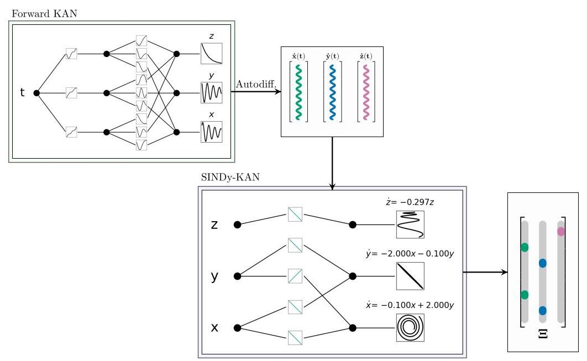

Figure 13: An illustration of SINDy-KANs for dynamical systems. When training with data, the derivatives can either come from a pre-trained "forward KAN" or be found through finite differences or other methods.

图13:动态系统的SINDy-KANs示意图。在使用数据进行训练时，导数可以来自预训练的“前向KAN”，也可以通过有限差分或其他方法找到。

<table><tr><td>Data X relative noise</td><td>$\mathcal{K}\left( \mathbf{X}\right)$ error</td><td>$\dot{\mathcal{K}}\left( \mathbf{X}\right)$ error</td><td>Learned equation</td></tr><tr><td>0%</td><td>5.688e-08</td><td>-</td><td>£ $=  - {0.0997x} + {2.00044y}$   $=  - {2.00017x} - {0.09963y}$   $=  - {0.29567z}$</td></tr><tr><td>6.27%</td><td>1.255e-05</td><td>0.00014</td><td>$\frac{dx}{dt} =  - {0.10575x} + {1.99087y}$   $\frac{dy}{dt} =  - {2.00280x} - {0.10184y}$   $\frac{dz}{dt} =  - {0.26376z}$</td></tr><tr><td>31.37%</td><td>0.00043</td><td>0.0101</td><td>$\frac{dx}{dt} =  - {0.12326x} + {0.10216}{y}^{3} + {1.93752y} + {0.0897}{z}^{3}$   $l =  - {2.00878x} - {0.12078y}$   $\frac{dz}{dt} =  - {0.09579}{z}^{3} - {0.16220z}$</td></tr></table>

Table 3: Relative errors and learned equations for the ODE case from section 4.2.1 with noise added to the training data. Errors are computed by the relative mean squared error (MSE).

表3:第4.2.1节中常微分方程(ODE)情况在训练数据中添加噪声后的相对误差和学习到的方程。误差通过相对均方误差(MSE)计算。

## B SINDy-KANs with noise

## B 带噪声的SINDy-KANs

We consider the extension of SINDy-KANs to noisy data in this section using the test case from section 4.2.1 We progressively add more noise to the training data for $\mathbf{X}$ , which increases the error in prediction of $\mathcal{K}\left( \mathbf{X}\right)$ . The accuracy of the learned equation depends directly on the derivative. To take the derivative, we first train a KAN to learn the map $\mathbf{x} \rightarrow  \mathbf{X}$ , denoted by $\mathcal{K}\left( \mathbf{X}\right)$ (we call this the "forward KAN"). We then numerically take the derivative of the KAN prediction $\dot{\mathcal{K}}\left( \mathbf{X}\right)$ using the autodifferentiation feature in JAX. An illustration of this process is given in Fig. 13

在本节中，我们使用第4.2.1节中的测试案例来考虑将SINDy-KANs扩展到有噪声的数据。我们逐渐向$\mathbf{X}$的训练数据中添加更多噪声，这会增加$\mathcal{K}\left( \mathbf{X}\right)$预测的误差。学习到的方程的准确性直接取决于导数。为了求导，我们首先训练一个KAN来学习映射$\mathbf{x} \rightarrow  \mathbf{X}$，记为$\mathcal{K}\left( \mathbf{X}\right)$(我们称之为“前向KAN”)。然后，我们使用JAX中的自动微分功能对KAN预测$\dot{\mathcal{K}}\left( \mathbf{X}\right)$进行数值求导。此过程的示意图如图13所示。

We find that the SINDy-KANs are relatively robust up to ${30}\%$ relative noise for this problem. At high noise level, higher order terms $\left( {\left( \cdot \right) }^{3}\right)$ are erroneously learned, which could be alleviated by restricting the space of candidate functions for the SINDy-KANs. Alternatively, other methods for approximating the derivative $\dot{\mathbf{X}}$ could be used as have been successfully pursued in previous work with SINDy. Results for the case with the most noise are given in fig. 14

我们发现，对于这个问题，SINDy-KANs在${30}\%$相对噪声水平内相对稳健。在高噪声水平下，会错误地学习到高阶项$\left( {\left( \cdot \right) }^{3}\right)$，这可以通过限制SINDy-KANs的候选函数空间来缓解。或者，可以使用其他近似导数$\dot{\mathbf{X}}$的方法，就像之前在SINDy的工作中成功采用的那样。噪声最大情况下的结果如图14所示。

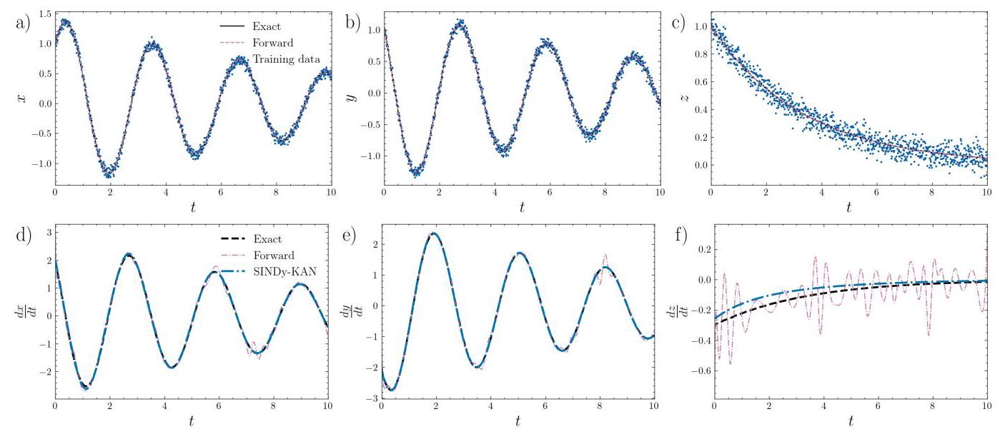

Figure 14: Results for the test case from section 4.2.1 with 31.37% relative noise added to the training data (a-c). Although the derivatives used to train the SINDy-KAN are noisy (d-f), the SINDy-KAN is able to recover most of the equation.

图14:第4.2.1节测试案例在训练数据中添加31.37%相对噪声后的结果(a - c)。尽管用于训练SINDy-KAN的导数有噪声(d - f)，但SINDy-KAN仍能够恢复大部分方程。

## C Training parameters

## C 训练参数

<table><tr><td>Parameter</td><td>Sec. 4.1</td></tr><tr><td>KAN architecture</td><td>[2, 2, 1]</td></tr><tr><td>$g$</td><td>[3, 6]</td></tr><tr><td>Learning rate scales</td><td>[1, 0.6]</td></tr><tr><td>Boundaries</td><td>[0, 40k]</td></tr><tr><td>$k$</td><td>5</td></tr><tr><td>ADAM learning rate</td><td>1e-3</td></tr><tr><td>ADAM iterations</td><td>210k</td></tr><tr><td>${\lambda }_{S}$</td><td>1</td></tr><tr><td>${\lambda }_{\Lambda }$</td><td>1</td></tr><tr><td>${\lambda }_{1}$</td><td>0.0001</td></tr><tr><td>${\lambda }_{2}$</td><td>0.0001</td></tr></table>

Table 4: Hyperparameters used for training the results in section 4.1. $g$ is the number of grid points used in the KANs. The grid is refined at the schedule denoted by the boundaries, and the learning rate is scaled at the same boundaries. $k$ is the polynomial degree for the B-splines.

表4:用于训练第4.1节结果的超参数。$g$是KANs中使用的网格点数。网格在由边界表示的时间表上进行细化，学习率在相同边界处进行缩放。$k$是B样条的多项式次数。

<table><tr><td>Parameter</td><td>Sec. 4.2.1</td><td>Sec. 4.2.2</td><td>Sec. 4.2.3</td><td>Sec. 4.2.4</td><td>Sec. 4.2.5</td></tr><tr><td>KAN architecture</td><td>[3, 3]</td><td>[2, 2]</td><td>[3, 6, 3]</td><td>[3, 5, 3]</td><td>[3, 6, 3]</td></tr><tr><td>$g$</td><td>[3]</td><td>[5, 10]</td><td>[5, 7]</td><td>[5, 7, 10]</td><td>[5, 7, 10, 15]</td></tr><tr><td>Learning rate scales</td><td>[1]</td><td>[1, .6]</td><td>[1, .6]</td><td>[1, .6, .6]</td><td>[1, .6, .6, .1]</td></tr><tr><td>Boundaries</td><td>[0]</td><td>[0, 50k]</td><td>[0, 30k]</td><td>[0, 30k, 60k]</td><td>[0, 30k, 60k, 300k]</td></tr><tr><td>$k$</td><td>5</td><td>5</td><td>5</td><td>5</td><td>5</td></tr><tr><td>ADAM learning rate</td><td>1e-3</td><td>1e-3</td><td>5e-3</td><td>5e-3</td><td>1e-2</td></tr><tr><td>ADAM iterations</td><td>20k</td><td>150k</td><td>50k</td><td>100k</td><td>500k</td></tr><tr><td>${\lambda }_{S}$</td><td>1</td><td>1</td><td>10</td><td>10</td><td>0.1</td></tr><tr><td>${\lambda }_{\Lambda }$</td><td>1</td><td>1</td><td>10</td><td>100</td><td>10</td></tr><tr><td>${\lambda }_{1}$</td><td>0.0001</td><td>0.0001</td><td>0.001</td><td>0.001</td><td>0.0001</td></tr><tr><td>${\lambda }_{2}$</td><td>0.001</td><td>0.001</td><td>0.001</td><td>0.001</td><td>0.0001</td></tr></table>

Table 5: Hyperparameters used for training the results in section 4.2. $g$ is the number of grid points used. The grid is refined at the schedule denoted by the boundaries, and the learning rate is scaled at the same boundaries. $k$ is the polynomial degree for the B-splines used.

表5:用于训练第4.2节结果的超参数。$g$是使用的网格点数。网格在由边界表示的时间表上进行细化，学习率在相同边界处进行缩放。$k$是所使用的B样条的多项式次数。