# Hardware Acceleration of Kolmogorov-Arnold Network (KAN) in Large-Scale Systems

# 大规模系统中柯尔莫哥洛夫 - 阿诺德网络(KAN)的硬件加速

Wei-Hsing Huang, Jianwei Jia, Yuyao Kong, Faaiq Waqar, Tai-Hao Wen, Meng-Fan Chang, Fellow, IEEE, Shimeng Yu, Fellow, IEEE

黄伟兴、贾建伟、孔育瑶、法艾克·瓦卡尔、温泰浩、张孟凡、IEEE会士、余诗萌、IEEE会士

Abstract-Recent developments have introduced Kolmogorov-Arnold Networks (KAN), an innovative architectural paradigm capable of replicating conventional deep neural network (DNN) capabilities while utilizing significantly reduced parameter counts through the employment of parameterized B-spline functions incorporating trainable coefficients. Nevertheless, the B-spline functional components inherent to KAN architectures introduce distinct hardware acceleration complexities. While B-spline function evaluation can be accomplished through look-up table (LUT) implementations that directly encode functional mappings, thus minimizing computational overhead, such approaches continue to demand considerable circuit infrastructure, including LUTs, multiplexers, decoders, and associated components. This work presents an algorithm-hardware co-design approach for KAN acceleration. At the algorithmic level, techniques include Alignment-Symmetry and PowerGap KAN hardware aware quantization, KAN sparsity aware mapping strategy, and circuit-level techniques include N:1 Time Modulation Dynamic Voltage input generator with analog-compute-in-memory (ACIM) circuits. Furthermore, this work conducts comprehensive evaluations on large-scale KAN networks to validate the proposed methodologies. Non-ideality factors, including partial sum deviations arising from process variations, have been evaluated with the statistics measured from the TSMC 22nm RRAM-ACIM prototype chips. Utilizing optimally determined KAN hyperparameters in conjunction with circuit optimizations fabricated at the ${22}\mathrm{\;{nm}}$ technology node, despite the parameter count for large-scale tasks in this work increasing by ${500}\mathrm{\;K} \times$ to ${807}\mathrm{\;K} \times$ compared to tiny-scale tasks in previous work, the area overhead increases by only ${28}\mathrm{\;K} \times$ to ${41}\mathrm{\;K} \times$ , with power consumption rising by merely ${51} \times$ to ${94} \times$ , while accuracy degradation remains minimal at 0.11% to 0.23%, thereby demonstrating the scaling potential of our proposed architecture.

摘要 - 最近的发展引入了柯尔莫哥洛夫 - 阿诺德网络(KAN)，这是一种创新的架构范式，能够复制传统深度神经网络(DNN)的能力，同时通过使用包含可训练系数的参数化B样条函数，显著减少参数数量。然而，KAN架构中固有的B样条功能组件带来了独特的硬件加速复杂性。虽然B样条函数评估可以通过直接编码功能映射的查找表(LUT)实现来完成，从而最小化计算开销，但这种方法仍然需要相当多的电路基础设施，包括LUT、多路复用器、解码器和相关组件。这项工作提出了一种用于KAN加速的算法 - 硬件协同设计方法。在算法层面，技术包括对齐对称和功率间隙KAN硬件感知量化、KAN稀疏感知映射策略，而电路层面的技术包括具有模拟计算内存(ACIM)电路的N:1时间调制动态电压输入生成器。此外，这项工作对大规模KAN网络进行了全面评估，以验证所提出的方法。非理想因素，包括由工艺变化引起的部分和偏差，已通过台积电22nm RRAM - ACIM原型芯片测量的统计数据进行评估。利用在${22}\mathrm{\;{nm}}$技术节点制造的电路优化结合最优确定的KAN超参数，尽管与先前工作中的小规模任务相比，这项工作中大规模任务的参数数量增加了${500}\mathrm{\;K} \times$到${807}\mathrm{\;K} \times$，但面积开销仅增加了${28}\mathrm{\;K} \times$到${41}\mathrm{\;K} \times$，功耗仅上升了${51} \times$到${94} \times$，而精度下降保持在最低的0.11%至0.23%，从而证明了我们提出的架构的扩展潜力。

Keywords—Kolmogorov-Arnold Networks (KAN), Quantization, Compute-in-Memory (CIM), Resistive Random Access Memory (RRAM), Algorithm-Hardware Co-Design

关键词 - 柯尔莫哥洛夫 - 阿诺德网络(KAN)、量化、内存计算(CIM)、电阻式随机存取存储器(RRAM)、算法 - 硬件协同设计

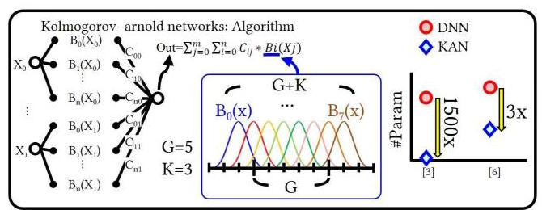

Fig. 1. Introduction of KAN and its potential for parameter reduction.

图1. KAN的介绍及其参数减少的潜力。

## 1 INTRODUCTION

## 1引言

Contemporary deep neural network (DNN) models characterized by their ever-escalating parameter counts present significant impediments to edge device deployment, substantially constraining the implementation of privacy-preserving, real-time detection capabilities and severely limiting the feasibility of resource-constrained edge computing applications. Traditional deep neural networks, including convolutional neural network (CNN) designs, large language model (LLM) frameworks, and various other architectural paradigms, conventionally implement fixed, predetermined activation functions coupled with trainable weight parameters [1][2]. The recently emerged Kolmogorov-Arnold Networks (KAN) [3], which drew inspiration from the mathematical foundations of the Kolmogorov-Arnold representation theorem [4][5], fundamentally reimagines the traditional multi-layer perceptron (MLP) architecture by replacing conventional linear weight matrices with parameterized B-spline functions B(X) while simultaneously implementing trainable, learnable activation functions positioned on the network edges rather than nodes. According to recent studies, KANs have demonstrated the ability to achieve comparable or superior accuracy with networks that are smaller in parameter count compared to traditional MLPs [3][23]. This innovative architectural paradigm has been empirically validated, demonstrating improvements not only in performance but also in interpretability, as comprehensively illustrated in Fig. 1 [3][6]. KAN architectures demonstrate considerable potential and promise to successfully replace conventional traditional DNN backbones that utilize fixed activation functions combined with learnable weights in increasingly complex DNN models, potentially enabling substantial reduction in the overall size of large-scale models, including computationally intensive LLMs and recommendation models as MLPs are widely used as building blocks, and thereby facilitating their practical deployment on edge devices.

当代以不断增加的参数数量为特征的深度神经网络(DNN)模型对边缘设备部署构成了重大障碍，极大地限制了隐私保护、实时检测能力的实现，并严重限制了资源受限的边缘计算应用的可行性。传统的深度神经网络，包括卷积神经网络(CNN)设计、大语言模型(LLM)框架和各种其他架构范式，通常实现固定的、预定的激活函数以及可训练的权重参数[1][2]。最近出现的柯尔莫哥洛夫 - 阿诺德网络(KAN)[3]，它从柯尔莫哥洛夫 - 阿诺德表示定理[4][5]的数学基础中汲取灵感，通过用参数化B样条函数B(X)取代传统的线性权重矩阵，从根本上重新构想了传统的多层感知器(MLP)架构，同时在网络边缘而非节点上实现可训练、可学习的激活函数。根据最近的研究，与传统MLP相比，KAN在参数数量较少的网络中已展示出实现可比或更高精度的能力[3][23]。这种创新的架构范式已通过实验验证，不仅在性能上有所提升，在可解释性方面也有改进，如图1全面所示[3][6]。KAN架构显示出巨大的潜力，有望在日益复杂的DNN模型中成功取代利用固定激活函数和可学习权重的传统DNN主干，这可能使包括计算密集型LLM和推荐模型在内的大规模模型的整体规模大幅减小，因为MLP被广泛用作构建块，从而促进它们在边缘设备上的实际部署。

---

This work was supported in part by the PRISM, one of the SRC/DARPA JUMP 2.0 centers.

这项工作得到了SRC/DARPA JUMP 2.0中心之一PRISM的部分支持。

Wei-Hsing Huang, Jianwei Jia, Yuyao Kong, Faaiq Waqar, and Shimeng Yu are with the School of Electrical and Computer Engineering, Georgia Institute of Technology, Atlanta, GA 30332 USA (Corresponding author. E-mail: shimeng.yu@ece.gatech.edu).

黄伟兴、贾建伟、孔育瑶、法艾克·瓦卡尔和余诗萌任职于美国佐治亚理工学院电气与计算机工程学院，地址为亚特兰大，GA 30332(通讯作者。电子邮件:shimeng.yu@ece.gatech.edu)。

Wei-Hsing Huang and Jianwei Jia are co-first authors.

黄伟兴和贾建伟为共同第一作者。

Tai-Hao Wen is the Department of Electrical Engineering, National Tsing Hua University (NTHU), Hsinchu 30013, Taiwan.

温泰豪任职于台湾新竹市国立清华大学电机工程系，邮编30013。

Meng-Fan Chang is with the Department of Electrical Engineering, National Tsing Hua University (NTHU), Hsinchu 30013, Taiwan, and also with Taiwan Semiconductor Manufacturing Company (TSMC), Hsinchu 30075, Taiwan.

张孟凡任职于台湾新竹市国立清华大学电机工程系，邮编30013，同时也任职于台湾新竹市台积电公司，邮编30075。

---

However, despite these advantages, KAN operation fundamentally requires computationally intensive B-spline function computation and evaluation. While classical mathematical definitions involving recursive computational methods [7] can theoretically evaluate B-spline functions with mathematical precision, the computational requirements and processing demands increase dramatically and significantly with progressively higher-order $\mathrm{k}$ values. An alternative approach more suitable for edge-friendly implementation employs pre-computed lookup tables (LUTs) for direct and immediate B-spline function mapping, substantially simplifying the hardware implementation complexity and dramatically reducing the overall computational demands. Despite these considerable advantages and benefits, this implementation approach still necessitates and requires significant circuit resources, including extensive LUTs, multiplexers (MUXs), decoders, and associated control logic, as comprehensively depicted and shown in Fig. 2.

然而，尽管有这些优点，KAN操作从根本上需要计算密集型的B样条函数计算和评估。虽然涉及递归计算方法的经典数学定义[7]理论上可以精确地评估B样条函数，但随着$\mathrm{k}$值的阶数逐渐增加，计算要求和处理需求会急剧增加。一种更适合于边缘友好实现的替代方法是使用预先计算的查找表(LUT)进行直接和即时的B样条函数映射，这大大简化了硬件实现的复杂性，并显著降低了整体计算需求。尽管有这些相当大的优点和好处，但这种实现方法仍然需要大量的电路资源，包括大量的LUT、多路复用器(MUX)、解码器和相关的控制逻辑，如图2所示。

Furthermore, KAN architectures, similar to traditional MLPs, inherently involve extensive and computationally intensive parallel multiply-accumulate (MAC) operations throughout their computational pipeline. The well-documented von Neumann bottleneck present in conventional computing architectures leads to substantial inefficiencies and performance degradation. This bottleneck results from the physical separation between memory and processing units, causing significant data movement overhead that can dominate the overall energy consumption in data-intensive applications. Compute-in-Memory (CIM) [8], representing an emerging non-von Neumann architectural paradigm, directly addresses and mitigates this fundamental issue. CIM variants include digital-CIM (DCIM) [9], SRAM analog-CIM (ACIM) [10][11], and RRAM-ACIM [12][13], etc. While DCIM and SRAM-ACIM architectures offer comparatively higher computational accuracy than RRAM-ACIM implementations, the inherently large SRAM cell sizes substantially limit achievable on-chip storage capacity, and their characteristically high standby power consumption proves particularly undesirable and problematic for battery-constrained edge devices. Therefore, this paper comprehensively examines and investigates RRAM-ACIM acceleration techniques for KAN architectures. However, it should be explicitly noted that the proposed algorithm-level optimizations and enhancements are fundamentally hardware-agnostic and can be applied across different implementation platforms.

此外，与传统多层感知器类似，KAN架构在其整个计算管道中本质上涉及广泛且计算密集的并行乘加(MAC)操作。传统计算架构中众所周知的冯·诺依曼瓶颈导致了大量的低效率和性能下降。这个瓶颈是由内存和处理单元之间的物理分离造成的，导致了大量的数据移动开销，这在数据密集型应用中可能会主导整体能耗。内存计算(CIM)[8]是一种新兴的非冯·诺依曼架构范式，直接解决并缓解了这个基本问题。CIM变体包括数字CIM(DCIM)[9]、SRAM模拟CIM(ACIM)[10][11]和RRAM-ACIM[12][13]等。虽然DCIM和SRAM-ACIM架构比RRAM-ACIM实现提供了相对更高的计算精度，但SRAM单元固有的大尺寸大大限制了可实现的片上存储容量，并且它们典型的高待机功耗对于电池受限的边缘设备来说尤其不理想且存在问题。因此，本文全面研究并探讨了用于KAN架构的RRAM-ACIM加速技术。然而，应该明确指出的是，所提出的算法级优化和增强从根本上与硬件无关，可以应用于不同的实现平台。

Despite RRAM-ACIM's numerous advantages for practical edge deployment scenarios, including remarkably low standby power consumption and high integration density, it encounters several critical challenges as comprehensively illustrated in Fig. 2. The process-temperature-voltage (PVT) variations are key concerns for ACIM. The progressively increasing array sizes combined with aggressive technology scaling substantially exacerbate IR-drop phenomena [14], primarily due to increased parasitic bit line resistance, thereby hampering and degrading inference accuracy performance. Moreover, current mainstream CIM input methodologies include binary input schemes with multi-cycle operation, multi-voltage level input approaches within single cycle operation, or time delay mechanisms with multi-bit input encoding. Binary input methodology offers superior accuracy but consequently increases operational latency and fundamentally limits achievable TOPS/W metrics. While multi-voltage level input approaches successfully achieve favorable and attractive TOPS/W ratios combined with low operational latency, the inherently constrained VDD range renders these inputs particularly susceptible to noise interference, thereby substantially compromising computational accuracy. Time-delay multi-bit input schemes offer enhanced noise resilience capabilities but at the considerable cost of increased operational latency and reduced throughput.

尽管RRAM-ACIM在实际边缘部署场景中有许多优点，包括极低的待机功耗和高集成密度，但如图2所示，它也面临几个关键挑战。工艺-温度-电压(PVT)变化是ACIM的关键问题。随着阵列尺寸的逐渐增加以及激进的技术缩放，IR降现象[14]会显著加剧，这主要是由于寄生位线电阻增加，从而阻碍并降低了推理精度性能。此外，当前主流的CIM输入方法包括具有多周期操作的二进制输入方案、单周期操作内的多电压电平输入方法或具有多位输入编码的时间延迟机制。二进制输入方法提供了更高的精度，但因此增加了操作延迟，并从根本上限制了可实现的TOPS/W指标。虽然多电压电平输入方法成功地实现了良好且有吸引力的TOPS/W比率以及低操作延迟，但固有的受限VDD范围使这些输入特别容易受到噪声干扰，从而大大损害了计算精度。时间延迟多位输入方案提供了增强的抗噪声能力，但代价是显著增加了操作延迟和降低了吞吐量。

In this work, we systematically aim to co-optimize both algorithmic and circuit-level implementations, strategically reducing area, power consumption, and operational latency while simultaneously increasing the computational accuracy of ACIM-based computation specifically tailored for KAN architectures. This paper presents a journal extension of our previous conference presentation [24]. We have augmented all four schemes with comprehensive implementation details and introduced two additional algorithms to elaborate on the framework's technical specifications. Most importantly, our prior work [24] limited its evaluation to small-scale models (with ${279} \sim  {2232}\mathrm{\;B}$ ) within the context of knot theory, this work employs large-scale KAN models (39 MB $\sim  {63}$ MB) for a recommendation system [23] to provide a scaling aspect of our proposed methodology. The evaluation in Section 4 is completely redone for the large-scale KAN models.

在这项工作中，我们系统地旨在共同优化算法和电路级实现，策略性地减少面积、功耗和操作延迟，同时提高专门为KAN架构量身定制的基于ACIM计算的计算精度。本文展示了我们之前会议报告[24]的期刊扩展。我们用全面的实现细节扩充了所有四种方案，并引入了另外两种算法来详细阐述框架的技术规范。最重要的是，我们之前的工作[24]在结理论的背景下将其评估限制在小规模模型(具有${279} \sim  {2232}\mathrm{\;B}$)，而这项工作采用大规模KAN模型(39MB$\sim  {63}$MB)用于推荐系统[23]，以提供我们所提出方法的缩放方面。第4节中的评估针对大规模KAN模型完全重新进行。

## 2 BACKGROUND

## 2背景

### 2.1 KAN: Kolmogorov-Arnold Networks and acceleration

### 2.1 KAN:柯尔莫哥洛夫 - 阿诺德网络与加速

In contrast to MLPs, whose theoretical foundation rests on the universal approximation theorem, KAN architectures are grounded in the Kolmogorov-Arnold representation theorem. The mathematical formulation of individual KAN layers follows equations (1)-(2), wherein the b(x) component, initially implemented through SiLU activation functions, incorporates residual connectivity into the architecture.

与基于通用逼近定理的多层感知器不同，KAN架构基于柯尔莫哥洛夫 - 阿诺德表示定理。单个KAN层的数学公式遵循方程(1) - (2)，其中b(x)组件最初通过SiLU激活函数实现，将残差连接纳入架构。

$$
\phi \left( x\right)  = {w}_{b}b\left( x\right)  + {w}_{s}\text{ spline }\left( x\right) \tag{1}
$$

$$
\operatorname{spline}\left( \mathrm{x}\right)  = \mathop{\sum }\limits_{i}{ci}\operatorname{Bi}\left( \mathrm{x}\right) \tag{2}
$$

$$
\phi \left( \mathrm{x}\right)  = {\mathrm{w}}_{\mathrm{b}}\mathrm{b}\left( \mathrm{x}\right)  + \mathop{\sum }\limits_{i}c{i}^{\prime }\mathrm{{Bi}}\left( \mathrm{x}\right) \tag{3}
$$

Fig. 1 depicts the relationship between the grid size parameter G and the B-spline order K, where the aggregate count of Bi(x) functions equals K+G. For the presented configuration with $\mathrm{K} = 3$ and $\mathrm{G} = 5$ , this work substitutes ReLU activation functions for the original SiLU implementation, achieving enhanced hardware efficiency while maintaining computational accuracy. Given that the ${\mathrm{w}}_{\mathrm{b}}\mathrm{b}\left( \mathrm{x}\right)$ term can be efficiently accelerated through conventional RRAM-ACIM architectures, the primary optimization target becomes the ${\mathrm{w}}_{\mathrm{s}}$ spline(x) computation. The implementation strategy involves the multiplication of ${\mathrm{w}}_{\mathrm{s}}$ with ci to generate ci', followed by 8-bit quantization, yielding the modified formulation expressed in equation (3). This configuration enables ci' storage within the RRAM-ACIM array, where $\mathrm{{Bi}}\left( \mathrm{x}\right)$ values are delivered through word lines (WL) to facilitate parallelized multiply-accumulate computations. LUT implementations for $\mathrm{{Bi}}\left( \mathrm{x}\right)$ computation demonstrate superior suitability for edge deployment scenarios relative to recursive B-spline evaluation methodologies. Furthermore, the uniform nodal distribution inherent in KAN architectures ensures that B(X) functional representations remain consistent across varying knot grid intervals, thus enabling the feasibility of shared LUT architectures for multiple B(X) instantiations. Nevertheless, as illustrated in Fig. 2, existing quantization approaches [15][16] introduce misalignment between knot grid and quantization grid structures, generating unique input-output mapping relationships for individual Bi(x) functions. Consequently, hardware implementations require dedicated LUT, multiplexer, and decoder resources for each Bi(x) component at the edge, leading to substantial energy consumption and silicon area penalties. While the adoption of fixed, non-programmable LUT architectures offers a potential mitigation strategy through reduced circuit footprint, such implementations sacrifice architectural flexibility, particularly the capability to dynamically modulate B(X) computational precision according to application-specific constraints. Additionally, the proliferation of Bi(x) functional units corresponding to increased K and G parameters fundamentally limits the deployment viability of traditional quantization strategies for sophisticated KAN architectures characterized by elevated K and G values within resource-constrained edge environments. The Alignment-Symmetry and PowerGap hardware-aware quantization methodology, detailed in Section 3.1, is developed to overcome these limitations. Prior work [25] explored the implementation of Piece-Wise Linear (PWL) approximations as alternatives to B-spline functions through one-hot and thermometer encoding schemes. However, as B-spline complexity increases, PWL requires correspondingly higher precision, and the use of one-hot or thermometer encoding paradigms incurs substantial memory overhead, thereby limiting their practical applicability, particularly in large-scale and more complex tasks. Prior work [26] employed analog resistor networks utilizing series and parallel configurations for B-spline function computation. However, this approach demands exceptionally high precision in resistance values, presenting significant limitations in high-precision application scenarios, particularly for 8-bit implementations. Prior work [27] implemented KAN nonlinearities via stochastic computing using a Segmented Multi-Dimensional Multi-

图1描绘了网格大小参数G与B样条曲线阶数K之间的关系，其中Bi(x)函数的总数等于K + G。对于具有$\mathrm{K} = 3$和$\mathrm{G} = 5$的所示配置，本工作用ReLU激活函数替代了原来的SiLU实现，在保持计算精度的同时提高了硬件效率。鉴于${\mathrm{w}}_{\mathrm{b}}\mathrm{b}\left( \mathrm{x}\right)$项可以通过传统的RRAM - ACIM架构有效加速，主要的优化目标就变成了${\mathrm{w}}_{\mathrm{s}}$ spline(x)计算。实现策略包括将${\mathrm{w}}_{\mathrm{s}}$与ci相乘生成ci'，然后进行8位量化，得到方程(3)中表示的修改后的公式。这种配置使得ci'能够存储在RRAM - ACIM阵列中，其中$\mathrm{{Bi}}\left( \mathrm{x}\right)$值通过字线(WL)传递，以促进并行的乘法累加计算。与递归B样条曲线评估方法相比，$\mathrm{{Bi}}\left( \mathrm{x}\right)$计算的查找表(LUT)实现对于边缘部署场景具有更高的适用性。此外，KAN架构中固有的均匀节点分布确保了B(X)函数表示在不同的节点网格间隔内保持一致，从而使得共享LUT架构对于多个B(X)实例化具有可行性。然而，如图2所示，现有的量化方法[15][16]在节点网格和量化网格结构之间引入了不对齐，为每个Bi(x)函数生成了独特的输入 - 输出映射关系。因此，硬件实现在边缘需要为每个Bi(x)组件配备专用的LUT、多路复用器和解码器资源，从而导致大量的能量消耗和硅面积开销。虽然采用固定的、不可编程的LUT架构通过减少电路占用面积提供了一种潜在的缓解策略，但这种实现牺牲了架构的灵活性，特别是根据应用特定约束动态调制B(X)计算精度的能力。此外，与增加的K和G参数对应的Bi(x)功能单元的激增从根本上限制了传统量化策略在资源受限的边缘环境中以高K和G值为特征的复杂KAN架构的部署可行性。第3.1节详细介绍的对齐对称和功率间隙硬件感知量化方法就是为了克服这些限制而开发的。先前的工作[25]通过独热编码和温度计编码方案探索了分段线性(PWL)近似作为B样条曲线函数的替代方案的实现。然而，随着B样条曲线复杂度的增加，PWL需要相应更高的精度，并且使用独热或温度计编码范式会产生大量的内存开销，从而限制了它们的实际适用性，特别是在大规模和更复杂的任务中。先前的工作[26]采用了利用串联和并联配置的模拟电阻网络进行B样条曲线函数计算。然而，这种方法对电阻值要求极高的精度，在高精度应用场景中存在重大限制，特别是对于8位实现。先前的工作[27]通过使用分段多维多 -

Driving Finite State Machine (SMM-FSM) driven by pseudo-

由伪

random bitstreams and crossbar-routed interconnects-but,

随机比特流和交叉开关路由互连驱动的驱动有限状态机(SMM - FSM)，但是，

compared with our deterministic one-cycle shared-LUT B-spline ACIM co-design, it suffers from long bit-stream latency and substantial overhead dominated by parameter memory and random number generation. Moreover, these prior works [25,26,27] have only been applied to small-scale tasks, whereas this work conducts a comprehensive evaluation on large-scale tasks.

与我们确定性的单周期共享LUT B样条曲线ACIM协同设计相比，它存在长比特流延迟以及由参数内存和随机数生成主导的大量开销。此外，这些先前的工作[25,26,27]仅应用于小规模任务，而本工作对大规模任务进行了全面评估。

### 2.2 Compute-in-memory

### 2.2 内存计算

CIM architectures utilize various embedded memory technologies, including SRAM, eDRAM, and emerging nonvolatile memories such as RRAM. These memory architectures exhibit distinctive operational characteristics and confront unique implementation constraints. SRAM-based CIM implementations, while benefiting from advanced process node availability and superior access latency characteristics, are constrained by substantial leakage current, rendering them suboptimal for deployment in energy-constrained edge computing environments where standby power minimization remains critical. Non-volatile memory technologies present attractive characteristics for edge deployment scenarios, particularly through reduced quiescent power dissipation and enhanced storage density at mature process nodes, translating to favorable cost effectiveness. Nevertheless, voltage degradation along bit lines in RRAM-ACIM configurations introduces inference precision limitations. Additionally, traditional CIM implementations predominantly utilize either voltage-domain or temporal-domain modulation schemes for encoding multi-bit word line inputs within single operational cycles. These modulation approaches demonstrate vulnerability to on-chip interference, resulting in compromised computational accuracy as illustrated in Fig. 2. The N:1 Time Modulation Dynamic Voltage Input Generator and KAN sparsity-aware weight mapping strategies, elaborated in Sections 3.2 and 3.3 respectively, provide systematic solutions to these implementation challenges within RRAM-ACIM frameworks.

CIM架构采用了各种嵌入式内存技术，包括静态随机存取存储器(SRAM)、嵌入式动态随机存取存储器(eDRAM)以及诸如电阻式随机存取存储器(RRAM)等新兴非易失性存储器。这些内存架构展现出独特的操作特性，并面临着独特的实现约束。基于SRAM的CIM实现，虽然受益于先进制程节点的可用性和卓越的访问延迟特性，但受到大量漏电流的限制，这使得它们在能源受限的边缘计算环境中部署时并非最优选择，在这种环境中，待机功耗最小化仍然至关重要。非易失性存储技术为边缘部署场景呈现出有吸引力的特性，特别是通过在成熟制程节点上降低静态功耗和提高存储密度，从而转化为良好的成本效益。然而，RRAM-ACIM配置中沿位线的电压退化引入了推理精度限制。此外，传统的CIM实现主要利用电压域或时域调制方案在单个操作周期内对多位字线输入进行编码。这些调制方法容易受到片上干扰的影响，导致计算精度受损，如图2所示。分别在3.2节和3.3节中详细阐述的N:1时间调制动态电压输入发生器和KAN稀疏感知权重映射策略，为RRAM-ACIM框架内的这些实现挑战提供了系统的解决方案。

## 3 PROPOSED TOP-DOWN HW-SW CO- OPTIMIZATION

## 3 提出的自上而下的硬件-软件协同优化

### 3.1 Alignment-Symmetry and PowerGap KAN hardware aware quantization for $B\left( X\right)$

### 3.1 针对$B\left( X\right)$的对齐对称和功率间隙KAN硬件感知量化

The proposed Alignment-Symmetry and PowerGap KAN hardware aware quantization (ASP-KAN-HAQ) is developed to minimize computational overhead and energy consumption associated with $\mathrm{B}\left( \mathrm{X}\right)$ function evaluation as defined in Equation (3). This approach encompasses a two-stage optimization strategy:

所提出的对齐对称和功率间隙KAN硬件感知量化(ASP-KAN-HAQ)旨在最小化与式(3)中定义的$\mathrm{B}\left( \mathrm{X}\right)$函数评估相关的计算开销和能耗。这种方法包含一个两阶段优化策略:

- Phase one: Alignment-Symmetry for suppressing the needs of programmable LUT by enabling zero offset between knot grid and quantization grid.

- 第一阶段:对齐对称，通过使节点网格和量化网格之间的偏移为零来抑制可编程查找表(LUT)的需求。

- Phase two: PowerGap for reducing decoder and multiplexer complexity by constraining knot grid intervals to power-of-two magnitudes. The subsequent analytical framework examines a representative configuration with parameters $\mathrm{K} = 3$ and $\mathrm{G} = 5$ , yielding eight basis functions ${\mathrm{B}}_{0}\left( \mathrm{x}\right)$ through ${\mathrm{B}}_{7}\left( \mathrm{x}\right)$ per input channel. The implementation assumes 8-bit input quantization with values spanning the integer range [0, 255]. Notably, the ASP-KAN-HAQ framework maintains extensibility to arbitrary parameter configurations of $\mathrm{K}$ and $\mathrm{G}$ , variable precision specifications, and architectural layers incorporating negative-valued inputs.

- 第二阶段:功率间隙，通过将节点网格间隔限制为2的幂次方量级来降低解码器和多路复用器的复杂度。后续的分析框架研究了具有参数$\mathrm{K} = 3$和$\mathrm{G} = 5$的代表性配置，每个输入通道产生八个基函数${\mathrm{B}}_{0}\left( \mathrm{x}\right)$至${\mathrm{B}}_{7}\left( \mathrm{x}\right)$。该实现假设8位输入量化，值跨越整数范围[0, 255]。值得注意的是，ASP-KAN-HAQ框架保持了对$\mathrm{K}$和$\mathrm{G}$的任意参数配置、可变精度规范以及包含负值输入的架构层的可扩展性。

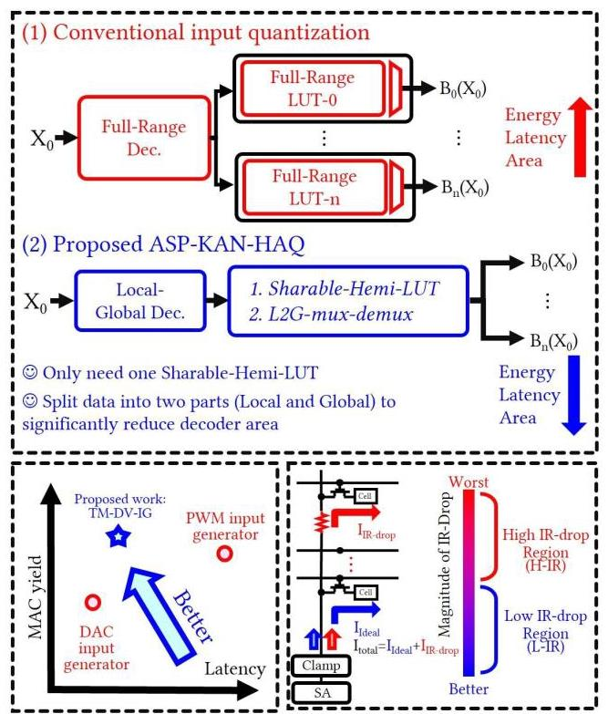

Fig. 2. Challenges hindering low-power and high accuracy edge AI applications.

图2. 阻碍低功耗和高精度边缘人工智能应用的挑战。

## A. Phase One: Alignment-Symmetric

## A. 第一阶段:对齐对称

The first phase, designated as Alignment-Symmetric, derives from empirical observations presented in Fig. 3. The misalignment between knot grid and quantization grid prevents the utilization of a unified LUT across multiple B(X) functional instances, despite potential data translation from disparate knot grid intervals into a common interval space. This limitation is resolved through the ASP-KAN-HAQ framework, which establishes precise alignment between knot and quantization grid structures for individual $\mathrm{B}\left( \mathrm{X}\right)$ functions. This alignment is achieved by imposing a constraint whereby the quantization grid dimensions constitute integer multiples of the corresponding knot grid parameters, formulated as:

第一阶段，称为对齐对称，源自图3中呈现的经验观察。节点网格和量化网格之间的未对齐阻止了在多个B(X)功能实例中使用统一的查找表，尽管可能将来自不同节点网格间隔的数据转换到公共间隔空间。通过ASP-KAN-HAQ框架解决了这个限制，该框架为各个$\mathrm{B}\left( \mathrm{X}\right)$函数在节点和量化网格结构之间建立了精确对齐。这种对齐通过施加一个约束来实现，即量化网格维度构成相应节点网格参数的整数倍，公式如下:

$$
\mathrm{G} * \mathrm{L} \leq  {2}^{n}\text{ , where }\mathrm{L} \in  \mathrm{Z} + \tag{4}
$$

In Equation (4), the parameters G and n represent the knot count and the system's maximum bit-width specification, respectively. The value of L that satisfies Equation (4) constrains the data range to the interval $\left\lbrack  {0,\mathrm{G} * \mathrm{\;L} - 1}\right\rbrack$ . Values of $\mathrm{L}$ adhering to this integer multiple relationship eliminate positional discrepancies between knot and quantization grids, thereby facilitating the deployment of a unified LUT architecture across all B(X) functional components. Additionally, this constraint induces symmetrical properties within the quantized B(X) representations, which permits a 50% reduction in shared LUT memory requirements. This optimized architectural configuration is designated as a Sharable-Hemi LUT (SH-LUT). Following the Alignment-Symmetric phase, a direct implementation strategy for value routing from the SH-LUT to respective ${B0}\left( x\right)$ through ${B7}\left( x\right)$ functions with reduced hardware complexity utilizes eight 2L-to-1 transmission gate multiplexers (TG-MUXs) alongside an 8-bit optimized decoder architecture. Nevertheless, this configuration continues to exhibit substantial silicon area requirements and elevated power dissipation characteristics.

在式(4)中，参数G和n分别表示节点数量和系统的最大位宽规范。满足式(4)的L值将数据范围限制在区间$\left\lbrack  {0,\mathrm{G} * \mathrm{\;L} - 1}\right\rbrack$。遵循这种整数倍关系的$\mathrm{L}$值消除了节点和量化网格之间的位置差异，从而便于在所有B(X)功能组件中部署统一的查找表架构。此外，这种约束在量化的B(X)表示中诱导出对称特性，这允许共享查找表内存需求减少50%。这种优化的架构配置被指定为可共享半查找表(SH-LUT)。在对齐对称阶段之后，一种从SH-LUT到各个${B0}\left( x\right)$至${B7}\left( x\right)$函数进行值路由的直接实现策略，采用了八个2L到1的传输门多路复用器(TG-MUX)以及一个8位优化解码器架构，降低了硬件复杂度。然而，这种配置仍然表现出大量的硅面积需求和较高的功耗特性。

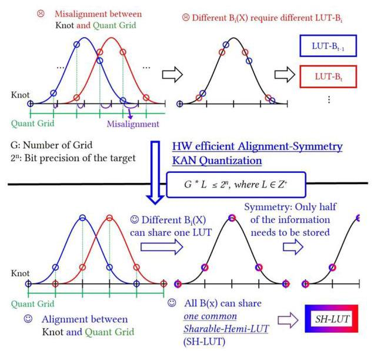

Fig. 3. HW efficient Alignment-Symmetry KAN Quantization for LUTs optimization.

图3. 用于查找表优化的硬件高效对齐对称KAN量化。

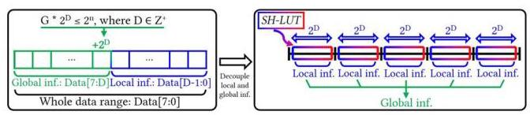

Fig. 4. HW efficient PowerGap KAN Quantization for MUXs and Decoders optimization.

图4. 用于复用器和译码器优化的硬件高效功率间隙KAN量化。

## B. Phase Two: PowerGap

## B. 第二阶段:功率间隙

The second phase, designated as PowerGap, is developed to minimize transmission gate MUXs (TG-MUX) and decoder overhead following the Alignment-Symmetric optimization. Through constraining knot grid intervals to power-of-two values, this approach decouples local from global information domains, substantially reducing decoder and TG-MUX area requirements as illustrated in Fig. 4, with the mathematical representation expressed as:

第二阶段，即功率间隙阶段，旨在通过对齐对称优化来最小化传输门复用器(TG-MUX)和译码器开销。通过将节点网格间隔约束为2的幂值，此方法将局部信息与全局信息域解耦，大幅降低了译码器和TG-MUX的面积需求，如图4所示，其数学表达式为:

$$
\mathrm{G} * {2}^{D} \leq  {2}^{n}\text{ , where }\mathrm{D} \in  \mathrm{Z} + \tag{5}
$$

Within the KAN architecture, information contained in individual knot grids is characterized as local information, whereas the mapping between distinct grid intervals and their corresponding $B\left( X\right)$ functions constitutes global information. This distinction enables substantial reductions in hardware resource utilization.

在KAN架构中，各个节点网格中包含的信息被视为局部信息，而不同网格间隔与其相应的$B\left( X\right)$函数之间的映射则构成全局信息。这种区分使得硬件资源利用率大幅降低。

The hardware requirements are significantly reduced:

硬件需求显著降低:

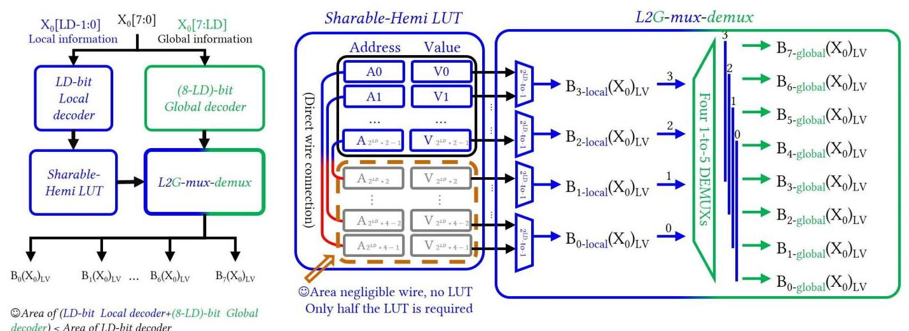

Fig. 5. Hardware architecture with Alignment-Symmetry and PowerGap KAN hardware aware quantization.

图5. 具有对齐对称和功率间隙KAN硬件感知量化的硬件架构。

1. TG-MUXs: from original eight 2L-to-1 TG-MUXs to optimized four L-to-1 TG-MUXs and four 1-to-5 TG-DEMUXs.

1. TG-MUX:从原来的八个2L到1的TG-MUX优化为四个L到1的TG-MUX和四个1到5的TG-解复用器。

2. Decoders: from original one 8-bit decoder to optimized one (8-D)-bit decoder and one D-bit decoder.

2. 译码器:从原来的一个8位译码器优化为一个(8-D)位译码器和一个D位译码器。

Since decoder area scales exponentially with bit-width specifications, the silicon footprint of a single 8-bit decoder substantially surpasses the combined area of an (8-D)-bit decoder and a D-bit decoder. Consequently, parameter values that simultaneously satisfy the constraints imposed by Equations (4) and (5) achieve optimal area reduction across LUT, decoder, and TG-MUX components, as mathematically formulated by:

由于译码器面积随位宽规格呈指数增长，单个8位译码器的硅面积大大超过了一个(8-D)位译码器和一个D位译码器的总面积。因此，同时满足方程(4)和(5)所施加约束的参数值在查找表、译码器和TG-MUX组件上实现了最佳面积缩减，其数学公式为:

$$
\mathrm{G} * {2}^{LD} \leq  {2}^{n}\text{ , where }\mathrm{{LD}} \in  \mathrm{Z} + \tag{6}
$$

We designate this optimal value as LD and this value constrains the data range to the interval $\left\lbrack  {0,{\mathrm{G}}^{ * }{2}^{\mathrm{{LD}}} - 1}\right\rbrack$ . Fig. 5 depicts the hardware architecture and dataflow for B(X) lookup operations following ASP-KAN-HAQ optimization. Please note that Fig. 5 presents a high-level architectural diagram. As shown in Fig. 6, during actual implementation, when the Quant Grid is even numbered, the entire LUT can be partitioned into two halves for mutual sharing. When the Quant Grid is odd numbered, all LUTs remain shareable except for the central LUT. Since only a single LUT cannot be shared, the additional overhead incurred by odd numbered Quant Grids is negligible. Fig. 7 shows the efficient lookup process wherein multiple Xi values share a single SH-LUT, facilitating the transfer of corresponding LUT values $\left( {{\mathrm{B}}_{0 \sim  7\text{ -global }}{\left( \mathrm{{Xi}}\right) }_{\mathrm{{LV}}}}\right)$ from local to global scope, which are subsequently propagated to the input generator.

我们将此最佳值指定为LD，该值将数据范围约束到区间$\left\lbrack  {0,{\mathrm{G}}^{ * }{2}^{\mathrm{{LD}}} - 1}\right\rbrack$。图5描绘了经过ASP-KAN-HAQ优化后的B(X)查找操作的硬件架构和数据流。请注意，图5展示的是一个高层次的架构图。如图6所示，在实际实现中，当量化网格为偶数时，整个查找表可分为两半进行相互共享。当量化网格为奇数时，除了中央查找表外，所有查找表仍可共享。由于只有一个查找表不能共享，奇数量化网格带来的额外开销可忽略不计。图7展示了高效查找过程，其中多个Xi值共享一个SH-LUT，便于将相应的查找表值$\left( {{\mathrm{B}}_{0 \sim  7\text{ -global }}{\left( \mathrm{{Xi}}\right) }_{\mathrm{{LV}}}}\right)$从局部范围传输到全局范围，随后传播到输入生成器。

### 3.2 N:1 Time Modulation Dynamic Voltage Input Generator for ACIM for $\sum c{i}^{\prime }{Bi}\left( X\right)$

### 3.2用于$\sum c{i}^{\prime }{Bi}\left( X\right)$的交流感应电机的N:1时间调制动态电压输入生成器

In conventional CIM architectures, multi-bit WL input methods are typically realized through either pure voltage modulation [18][19] or pure pulse-width modulation (PWM) [20][21]. Voltage modulation encodes WL weights directly into different amplitude levels, but the voltage interval between adjacent levels becomes narrow as the bit resolution increases, which inevitably amplifies the impact of device variation, supply noise, and nonlinearity of the MOSFET transfer curve, leading to poor robustness. In contrast, PWM maps information into temporal width differences, which provides better resilience against small analog variations; however, distinguishing multiple bit levels requires long pulse widths, thereby extending the MAC cycle and severely degrading throughput. To overcome these limitations, we develop an N:1 Time-Modulated Dynamic Voltage Input Generator (TM-DV-IG), which maps LUT values B(X) into multi-level WL signals by simultaneously exploiting both the voltage and time domains. The WL input is encoded as a dynamic voltage pulse whose amplitude and width jointly determine the BL charging process, thus distributing information across two orthogonal domains. For a single RRAM cell, the BL current is proportional to the WL voltage, i.e., $I\left\lbrack  x\right\rbrack   \propto  f\left( {V\left\lbrack  x\right\rbrack  }\right) , x \in  \left\lbrack  {0,{2}^{N} - 1}\right\rbrack$ , where $f$ denotes the MOSFET transfer function; when this current flows for a duration $t = W\left\lbrack  x\right\rbrack$ , the accumulated charge becomes $Q = I\left\lbrack  x\right\rbrack$ . $W\left\lbrack  x\right\rbrack$ . By carefully designing the DAC output voltages V[ ${2}^{N} -$ 1: 0] such that the current ratios satisfy $I\left\lbrack  0\right\rbrack   : I\left\lbrack  1\right\rbrack   : I\left\lbrack  2\right\rbrack  \ldots  : I\left\lbrack  {{2}^{N} - 1}\right\rbrack   = 0 : 1 : 2 : \ldots  : {2}^{N} - 1$ , the unit interval of charge is defined as ${W}_{P1} \cdot  I\left\lbrack  1\right\rbrack$ , which enables a linear distribution of charge values Q across all bit combinations. Compared with pure voltage input methods, this hybrid approach enhances tolerance to noise and device variation, while compared with pure PWM schemes, it avoids long pulses and maintains high operation speed (>100 MHz), thereby enabling multi-bit MAC execution within a single clock cycle.

在传统的CIM架构中，多位WL输入方法通常通过纯电压调制[18][19]或纯脉宽调制(PWM)[20][21]来实现。电压调制将WL权重直接编码为不同的幅度电平，但随着比特分辨率的增加，相邻电平之间的电压间隔会变窄，这不可避免地会放大器件变化、电源噪声和MOSFET传输曲线非线性的影响，导致鲁棒性较差。相比之下，PWM将信息映射到时间宽度差异中，这提供了更好的抗小模拟变化能力；然而，区分多个比特电平需要长脉冲宽度，从而延长了MAC周期并严重降低了吞吐量。为了克服这些限制，我们开发了一种N:1时间调制动态电压输入发生器(TM-DV-IG)，它通过同时利用电压和时域将LUT值B(X)映射为多电平WL信号。WL输入被编码为一个动态电压脉冲，其幅度和宽度共同决定BL充电过程，从而将信息分布在两个正交域中。对于单个RRAM单元，BL电流与WL电压成正比，即$I\left\lbrack  x\right\rbrack   \propto  f\left( {V\left\lbrack  x\right\rbrack  }\right) , x \in  \left\lbrack  {0,{2}^{N} - 1}\right\rbrack$，其中$f$表示MOSFET传输函数；当该电流持续流动持续时间$t = W\left\lbrack  x\right\rbrack$时，累积电荷变为$Q = I\left\lbrack  x\right\rbrack$。$W\left\lbrack  x\right\rbrack$。通过精心设计DAC输出电压V[${2}^{N} -$1:0]，使得电流比满足$I\left\lbrack  0\right\rbrack   : I\left\lbrack  1\right\rbrack   : I\left\lbrack  2\right\rbrack  \ldots  : I\left\lbrack  {{2}^{N} - 1}\right\rbrack   = 0 : 1 : 2 : \ldots  : {2}^{N} - 1$，电荷的单位间隔被定义为${W}_{P1} \cdot  I\left\lbrack  1\right\rbrack$，这使得电荷值Q能够在所有比特组合上线性分布。与纯电压输入方法相比，这种混合方法增强了对噪声和器件变化的容忍度，而与纯PWM方案相比，它避免了长脉冲并保持了高运行速度(>100 MHz)，从而能够在单个时钟周期内执行多位MAC。

The TM-DV-IG is composed of five major components: a Delay Chain, a Pulse Modulation and Timing Control Module (PM-TCM), an N-bit DAC, a Transmission-Gate Multiplexer (TG-MUX), and a Buffer Array, as illustrated in Fig. 8. The PM-TCL not only generates the control signals for buffer array voltage switching but also works with the delay chain to generate ratioed pulses ${\mathrm{W}}_{\mathrm{P}1},{\mathrm{\;W}}_{\mathrm{{PN}}}$ , and ${\mathrm{W}}_{\mathrm{P}\left( {\mathrm{N} + 1}\right) }$ with timing proportions of $1 : {2}^{\mathrm{N}} : {2}^{\mathrm{N}} + 1$ . This design eliminates the need for counter-based digital logic, thereby saving area. The N-bit DAC produces ${2}^{\mathrm{N}}$ distinct fixed voltage levels, which are selectively connected to the buffer array through the TG-MUX under control of PM-TCM pulses. The PM-TCM arranges these pulses to drive the TG-MUX switches so that different supply voltages $\mathrm{V}\left\lbrack  {{2}^{N} - 1 : 0}\right\rbrack$ are dynamically assigned to the buffer array according to the required LUT mapping. Meanwhile, the ${2}^{\mathrm{N}} + 1$ ratio pulse is applied directly to the buffer array, whose outputs are connected to the WLs. During read operation, the PM-TCM first receives the 2N-bit input vector, consults the LUT to determine the required pulse-voltage combination, and then generates the corresponding WL input waveform. On the BL side as shown in Fig.9 (a), a clamping circuit holds the BL voltage at a reference level ${\mathrm{V}}_{\text{ clamp }}$ . In idle mode, precharge transistors initialize the capacitor to VDD; in read mode, different combinations of WL voltage and pulse duration discharge the capacitor with distinct currents, producing unique charge levels Q. These charge differences are then sensed by the sense amplifier (SA), realizing a linear and robust mapping of digital inputs to analog charge values. Importantly, the TM-DV-IG supports circuit reusability across multiple WLs, allowing most peripheral blocks to be shared and thereby minimizing area overhead. Furthermore, by adjusting the design parameter N, the architecture can be flexibly optimized for different operating modes. In the high-performance mode (TD-P), as illustrated in Fig. 9(b) with N=4, throughput is prioritized: during the positive half clock cycle, an 8-bit input vector is applied to the TM-DV-

TM-DV-IG由五个主要组件组成:一个延迟链、一个脉冲调制和定时控制模块(PM-TCM)、一个N位DAC、一个传输门多路复用器(TG-MUX)和一个缓冲阵列，如图8所示。PM-TCL不仅为缓冲阵列电压切换生成控制信号，还与延迟链协同工作，生成具有$1 : {2}^{\mathrm{N}} : {2}^{\mathrm{N}} + 1$定时比例的比例脉冲${\mathrm{W}}_{\mathrm{P}1},{\mathrm{\;W}}_{\mathrm{{PN}}}$和${\mathrm{W}}_{\mathrm{P}\left( {\mathrm{N} + 1}\right) }$。这种设计无需基于计数器的数字逻辑，从而节省了面积。N位DAC产生${2}^{\mathrm{N}}$个不同的固定电压电平，这些电平在PM-TCM脉冲的控制下通过TG-MUX选择性地连接到缓冲阵列。PM-TCM安排这些脉冲来驱动TG-MUX开关，以便根据所需的查找表映射将不同的电源电压$\mathrm{V}\left\lbrack  {{2}^{N} - 1 : 0}\right\rbrack$动态分配给缓冲阵列。同时，${2}^{\mathrm{N}} + 1$比例脉冲直接应用于缓冲阵列，其输出连接到字线。在读取操作期间，PM-TCM首先接收2N位输入向量，查询查找表以确定所需的脉冲电压组合，然后生成相应的字线输入波形。在图9(a)所示的位线一侧，一个钳位电路将位线电压保持在参考电平${\mathrm{V}}_{\text{ clamp }}$。在空闲模式下，预充电晶体管将电容器初始化为VDD；在读取模式下，字线电压和脉冲持续时间的不同组合以不同的电流使电容器放电，产生独特的电荷电平Q。然后，这些电荷差异由读出放大器(SA)感测，实现数字输入到模拟电荷值的线性和稳健映射。重要地，TM-DV-IG支持跨多个字线的电路可重用性，允许大多数外围模块共享，从而最小化面积开销。此外，通过调整设计参数N，可以针对不同的操作模式灵活优化架构。在高性能模式(TD-P)下，如图9(b)所示，N = 4时，吞吐量是优先考虑的:在正半时钟周期内，一个8位输入向量应用于TM-DV-

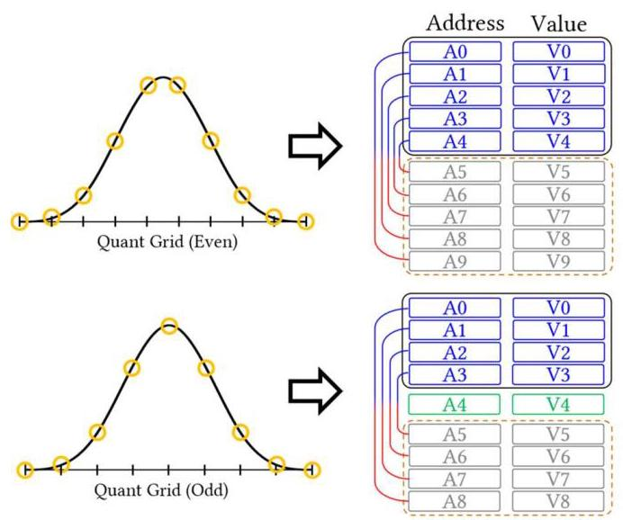

Fig. 6. The hardware architecture with efficient LUT retrieval process.

图6. 具有高效查找表检索过程的硬件架构。

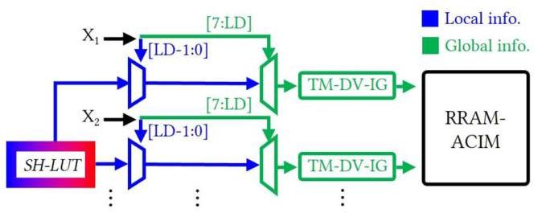

Fig. 7. The hardware architecture with efficient LUT retrieval process.

图7. 具有高效查找表检索过程的硬件架构。

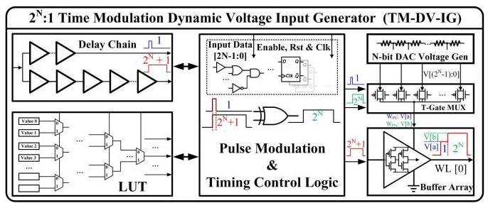

Fig. 8. N:1 Time Modulation Dynamic Voltage input generator for ACIM.

图8. 用于交流感应电机的N:1时间调制动态电压输入发生器。

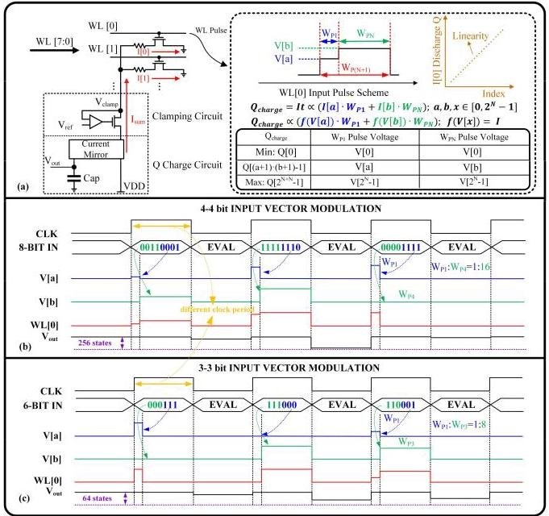

Fig. 9. (a) BL linear Q value generation theory (b) 3-3 bit input vector scheme for high accuracy application; (c) 4- 4 bit input vector schemes for high speed application

图9. (a)位线线性Q值生成理论(b)用于高精度应用的3 - 3位输入向量方案；(c)用于高速应用的4 - 4位输入向量方案

IG, where the lower 4 bits control the ${\mathrm{W}}_{\mathrm{{Pl}}}$ pulse voltage modulation (V[a]) and the upper 4 bits control the ${\mathrm{W}}_{\mathrm{P}3}$ pulse voltage modulation (V[b]). The resulting WL[0] input is the combined dynamic voltage pulse of V[a] and V[b], producing an effective output voltage ${\mathrm{V}}_{\text{ out }}$ on the sampling capacitor. This configuration yields $8 \times  8 = {64}$ distinct voltage states, enabling dense encoding. In contrast, in the high-accuracy mode (TD-A), as shown in Fig. 9(c) with N=3, the design provides finer charge resolution for precision-critical tasks. This adaptability, together with the dual-domain encoding principle, makes TM-DV-IG a scalable and efficient solution for next-generation multi-bit CIM arrays. For further optimization by codesign ability, we can also optimize the N value for different high-performance (TD-P) and high-accuracy (TD-A) requirements.

IG，其中低4位控制${\mathrm{W}}_{\mathrm{{Pl}}}$脉冲电压调制(V[a])，高4位控制${\mathrm{W}}_{\mathrm{P}3}$脉冲电压调制(V[b])。由此产生的字线[0]输入是V[a]和V[b]的组合动态电压脉冲，在采样电容器上产生有效输出电压${\mathrm{V}}_{\text{ out }}$。这种配置产生$8 \times  8 = {64}$个不同的电压状态，实现密集编码。相比之下，在高精度模式(TD-A)下，如图9(c)所示，N = 3时，该设计为精度要求严格的任务提供了更精细的电荷分辨率。这种适应性以及双域编码原理，使TM-DV-IG成为下一代多位CIM阵列的可扩展且高效的解决方案。为了通过协同设计能力进一步优化，我们还可以针对不同的高性能(TD-P)和高精度(TD-A)要求优化N值。

### 3.3 KAN sparsity-aware weight mapping for ci'

### 3.3用于ci'的KAN稀疏感知权重映射

The parasitic resistance in BLs causes IR-drop, introducing computational errors during current-based summation in RRAM-ACIM's MAC operations, with consequent degradation of inference precision. While prior research [14] has attempted to address this challenge, existing solutions necessitate either supplementary circuit components or constraints on maximum array dimensions. The proposed KAN sparsity-aware weight mapping technique (KAN-SAM) circumvents these limitations by operating within existing hardware and algorithmic frameworks without requiring architectural modifications.

BL中的寄生电阻会导致IR降，在RRAM-ACIM的MAC操作中基于电流的求和过程中引入计算误差，从而导致推理精度下降。虽然先前的研究[14]试图应对这一挑战，但现有解决方案要么需要额外的电路组件，要么对最大阵列尺寸有限制。所提出的KAN稀疏感知权重映射技术(KAN-SAM)通过在现有硬件和算法框架内运行，无需架构修改，从而规避了这些限制。

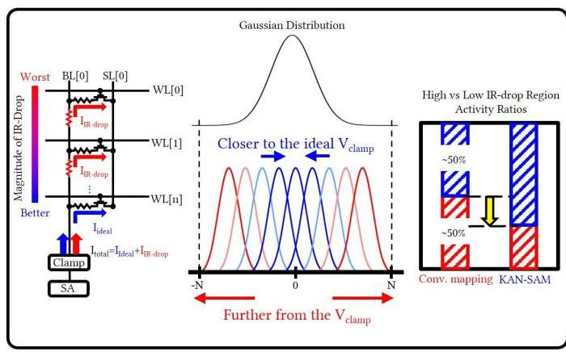

Fig. 10. KAN sparsity-aware weight mapping.

图10. KAN稀疏感知权重映射。

The inherent characteristics of $B\left( X\right)$ functions within KAN architectures dictate that only a subset of $B\left( X\right)$ functions activate for any specific input value. In configurations where $K = 3$ , concurrent activation is limited to four $B\left( X\right)$ functions. Through analysis of input probability distributions across data ranges, the B(X) functions exhibiting maximum activation likelihood can be identified, designated as B_H(X). Similarly, functions with minimal activation probability are denoted as B_L(X). The ci' coefficients associated with B_H(X) are strategically allocated to RRAM cells positioned proximate to BL clamping circuitry, preserving computational precision for frequently occurring inputs. In contrast, ci' coefficients linked to B_L(X) are assigned to cells at greater distances from clamping circuits, thus enhancing aggregate inference accuracy through probability-aware spatial optimization.

KAN架构中$B\left( X\right)$函数的固有特性决定了对于任何特定输入值，只有$B\left( X\right)$函数的一个子集会激活。在$K = 3$的配置中，并发激活限于四个$B\left( X\right)$函数。通过分析跨数据范围的输入概率分布，可以识别出激活可能性最大的B(X)函数，记为B_H(X)。同样，激活概率最小的函数记为B_L(X)。与B_H(X)相关的ci'系数被策略性地分配给靠近BL钳位电路的RRAM单元，为频繁出现的输入保留计算精度。相比之下，与B_L(X)相关的ci'系数被分配给离钳位电路更远的单元，从而通过概率感知空间优化提高总体推理精度。

Diverse applications and model architectures demonstrate varying distributional characteristics. Fig. 10 exemplifies the KAN-SAM methodology utilizing a Gaussian distribution paradigm. As depicted in Fig. 10, within an input domain spanning [-N, N], the centrally located Bi(X) functions exhibit maximal activation probabilities, whereas boundary-positioned Bi(X) functions demonstrate minimal triggering likelihood. Therefore, the allocation of central ci' parameters (associated with B_H(X)) to RRAM cells adjacent to clamping circuits, coupled with the assignment of peripheral ci' parameters (linked to B_L(X)) to cells at increased distances, optimizes system-level inference precision. This mapping strategy remains applicable for input domains bounded by $\left\lbrack  {0,\mathrm{\;N}}\right\rbrack$ .

不同的应用和模型架构表现出不同的分布特征。图10展示了利用高斯分布范式的KAN-SAM方法。如图10所示，在跨越[-N, N]的输入域内，位于中心的Bi(X)函数表现出最大的激活概率，而位于边界的Bi(X)函数表现出最小的触发可能性。因此，将中心ci'参数(与B_H(X)相关)分配给靠近钳位电路的RRAM单元，同时将外围ci'参数(与B_L(X)相关)分配给距离更远的单元，可优化系统级推理精度。这种映射策略适用于由$\left\lbrack  {0,\mathrm{\;N}}\right\rbrack$界定的输入域。

To ensure that KAN-SAM performs robustly across varying input distributions, we introduce Algorithm 1: KAN-SAM Strategy. Phase-A: In this phase we scan the training set once. For each basis Bi, record how often it fires (activation probability), its average magnitude when active, and how much it varies. Phase-B: Each trained coefficient becomes 8 binary slices stored on a fixed 8-column template in every row (most significant bit, MSB $\rightarrow$ least significant bit, LSB). During inference, slices are combined by shift-and-add, so we only optimize rows (distance), not columns. Phase C: For each coefficient, we build a score that favors three things: (i) bases that fire more often, (ii) bases that are stronger on average, and (iii) bases that are stable (low relative variability). Stability is derived from the coefficient of variation (standard deviation over mean) with a small numerical guard; then softly squashed to a $0 \sim  1$ weight so unstable bases are de-emphasized without hard thresholds. A tunable mix combines "expected contribution" and "stability" into a single criticality score. Row mapping policy: Sort coefficients by the criticality score (high $\rightarrow$ low) and assign rows from nearest to farthest using a precomputed order. IR-drop grows with distance along the bit-line; giving the closest rows to the most impactful and stable coefficients reduces analog error where it matters most.

为确保KAN-SAM在不同输入分布上稳健运行，我们引入算法1:KAN-SAM策略。阶段A:在此阶段，我们扫描训练集一次。对于每个基Bi，记录其触发频率(激活概率)、激活时的平均幅度以及变化程度。阶段B:每个训练系数变为存储在每行固定8列模板上的8个二进制切片(最高有效位，MSB $\rightarrow$ 最低有效位，LSB)。在推理期间，切片通过移位和加法组合，所以我们只优化行(距离)，而不是列。阶段C:对于每个系数，我们构建一个分数，该分数有利于三件事:(i)触发更频繁的基，(ii)平均更强的基，以及(iii)稳定的基(相对变化小)。稳定性由变异系数(标准差除以均值)得出，并带有一个小的数值保护；然后软压缩为一个$0 \sim  1$权重，以便不稳定的基在没有硬阈值的情况下被弱化。一个可调混合将“预期贡献”和“稳定性”组合成一个单一的关键度分数。行映射策略:按关键度分数(高$\rightarrow$ 低)对系数进行排序，并使用预先计算的顺序从最近到最远分配行。IR降沿位线随距离增加；将最接近的行分配给最有影响力和最稳定的系数可减少在最重要的地方的模拟误差。

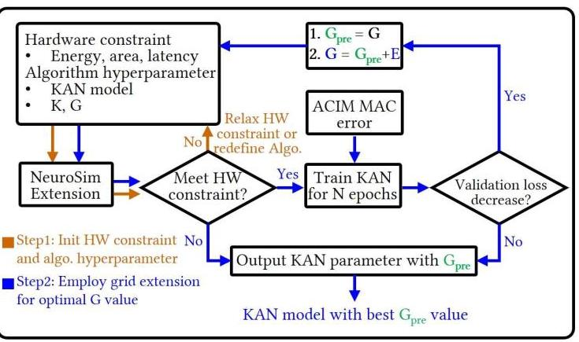

Fig. 11. KAN-NeuroSim hyperparameter optimization

图11. KAN-NeuroSim超参数优化

### 3.4 KAN-NeuroSim hyperparameter optimization framework

### 3.4 KAN-NeuroSim超参数优化框架

Section 3.1 presented the B(X) lookup optimization achieved through ASP-KAN-HAQ, which yields distinct LD values corresponding to different G parameter configurations. However, a systematic methodology for identifying optimal G parameters under hardware-imposed constraints remained unaddressed. Section 3.2 introduced the dual operational modes of TM-DVS-IG, namely the high-performance (TD-P) and high-accuracy (TD-A) configurations. Nonetheless, a comprehensive analytical framework for evaluating the respective impacts of TD-P and TD-A modes on system-level performance metrics has not been established, limiting the ability to guide mode selection based on application-specific requirements.

3.1节介绍了通过ASP-KAN-HAQ实现的B(X)查找优化，它产生了对应于不同G参数配置的不同LD值。然而，在硬件施加的约束下识别最优G参数的系统方法尚未得到解决。3.2节介绍了TM-DVS-IG的两种操作模式，即高性能(TD-P)和高精度(TD-A)配置。尽管如此，尚未建立一个全面的分析框架来评估TD-P和TD-A模式对系统级性能指标的各自影响，这限制了根据特定应用要求指导模式选择的能力。

To overcome these constraints, the KAN-NeuroSim hyperparameter optimization framework is proposed, as illustrated in Fig. 11. The framework operates through a two-stage process. The initial stage, indicated by the brown pathway in Fig. 11, establishes hardware specifications (energy budget, silicon area, computational latency) alongside KAN architectural parameters (network topology, K, and G values). These specifications are subsequently processed through an extended NeuroSim implementation [17][28][29], which integrates ASP-KAN-HAQ and TM-DV-IG methodologies to derive energy consumption, area utilization, and latency metrics. When computed metrics violate hardware specifications, the

为克服这些限制，提出了KAN-NeuroSim超参数优化框架，如图11所示。该框架通过两阶段过程运行。初始阶段，由图11中的棕色路径表示，确定硬件规格(能量预算、硅面积、计算延迟)以及KAN架构参数(网络拓扑、K和G值)。这些规格随后通过扩展的NeuroSim实现[17][28][29]进行处理，该实现集成了ASP-KAN-HAQ和TM-DV-IG方法，以得出能耗、面积利用率和延迟指标。当计算出的指标违反硬件规格时，

Algorithm 1 KAN-SAM-Strategy

算法1 KAN-SAM策略

Require: Trained KAN coefficients ${\left\{  {c}_{i}^{\prime }\right\}  }_{i = 0}^{K + G - 1}$ ; training set ${D}_{\text{ train }}$ ;

要求:训练好的KAN系数${\left\{  {c}_{i}^{\prime }\right\}  }_{i = 0}^{K + G - 1}$；训练集${D}_{\text{ train }}$；

---

								B-spline params $\left( {K, G}\right)$ ; crossbar with $R$ rows; precomputed

								row order RowOrder (nearest $\rightarrow$ farthest); hyperparameters

								$\alpha ,\beta  \in  \left\lbrack  {0,1}\right\rbrack$ with $\alpha  + \beta  = 1$ , and $\varepsilon  > 0$ .

		Assumption: bit-sliced columns use a fixed 8-bit template

across rows (MSB $\rightarrow$ LSB).

Phase A: Input-side statistics

																							Initialize $\operatorname{cnt}\left\lbrack  i\right\rbrack   \leftarrow  0,{s}_{1}\left\lbrack  i\right\rbrack   \leftarrow  0,{s}_{2}\left\lbrack  i\right\rbrack   \leftarrow  0$ for all $i$ .

																					for all $x \in  {D}_{\text{ train }}$ do

																																		$A \leftarrow$ active_B_indices $\left( {x;K, G}\right)$

																																		for all $\{ i \in  A\}$ do

																																					$b \leftarrow  {B}_{i}\left( x\right) \{$ Spline/LUT $;b \geq  0\}$

																																						$\operatorname{cnt}\left\lbrack  i\right\rbrack   \leftarrow  \operatorname{cnt}\left\lbrack  i\right\rbrack   + 1;{s}_{1}\left\lbrack  i\right\rbrack   \leftarrow  {s}_{1}\left\lbrack  i\right\rbrack   + b;{s}_{2}\left\lbrack  i\right\rbrack   \leftarrow  {s}_{2}\left\lbrack  i\right\rbrack   + {b}^{2}$

																																			end for

																						end for

																						for $i = 0$ to $K + G - 1$ do

																														$p\left\lbrack  i\right\rbrack   \leftarrow  \operatorname{cnt}\left\lbrack  i\right\rbrack  /\left| {D}_{\text{ train }}\right|$ \{Activation probability\}

																															$\mu \left\lbrack  i\right\rbrack   \leftarrow  \frac{{s}_{1}\left\lbrack  i\right\rbrack  }{\max \left( {\operatorname{cnt}\left\lbrack  i\right\rbrack  ,1}\right) }$ \{Arithmetic mean (for CV)\}

																																$\operatorname{var}\left\lbrack  i\right\rbrack   \leftarrow  \frac{{s}_{2}\left\lbrack  i\right\rbrack  }{\max \left( {\operatorname{cnt}\left\lbrack  i\right\rbrack  ,1}\right) } - {\left( \frac{{s}_{1}\left\lbrack  i\right\rbrack  }{\max \left( {\operatorname{cnt}\left\lbrack  i\right\rbrack  ,1}\right) }\right) }^{2}$

																						end for

																					Phase B: Quantization and bit vectors

																							for $i = 0$ to $K + G - 1$ do

																															${b}_{i} \leftarrow  \left\lbrack  {{b}_{i,7},\ldots ,{b}_{i,0}}\right\rbrack   \in  \{ 0,1{\} }^{8}\{ 8$ -bit slices $\}$

																																${\left| {c}_{i}\right| }_{Q} \leftarrow  \mathop{\sum }\limits_{{\mathrm{k} = 0}}^{7}{\mathrm{\;b}}_{\mathrm{i},\mathrm{k}}{2}^{\mathrm{k}}$ \{Digital magnitude\}

																					end for

																					Phase C: Coefficient criticality (CV-based stability)

																						for $i = 0$ to $K + G - 1$ do

																														$\sigma \left\lbrack  i\right\rbrack   \leftarrow  \sqrt{\operatorname{var}\left\lbrack  i\right\rbrack  };\mathrm{{CV}}\left\lbrack  i\right\rbrack   \leftarrow  \frac{\sigma \left\lbrack  i\right\rbrack  }{\mu \left\lbrack  i\right\rbrack   + \varepsilon }$

																														$S\left\lbrack  i\right\rbrack   \leftarrow  \frac{1}{1 + \operatorname{CV}\left\lbrack  i\right\rbrack  } \in  (0,1\rbrack \{$ Monotone squashing of $\mathrm{{CV}}\}$

																															$J\left\lbrack  i\right\rbrack   \leftarrow  p\left\lbrack  i\right\rbrack   \cdot  \mu \left\lbrack  i\right\rbrack   \cdot  {\left| {c}_{i}^{\prime }\right| }_{Q}$ \{Expected contribution\}

																																${C}_{w}\left\lbrack  i\right\rbrack   \leftarrow  {\alpha J}\left\lbrack  i\right\rbrack   + {\beta S}\left\lbrack  i\right\rbrack   \cdot  J\left\lbrack  i\right\rbrack$

																						end for

																					Row mapping policy

																	Sort $i$ by $C\_ w\left\lbrack  i\right\rbrack$ (high $\rightarrow$ low) to obtain $Q$ ; assign

																							$Q\left\lbrack  1\right\rbrack  , Q\left\lbrack  2\right\rbrack  ,\ldots$ to rows from nearest to farthest using

---

RowOrder.

行顺序。

framework iteratively adjusts either the constraint parameters or KAN hyperparameters until compliance is achieved. Following successful constraint satisfaction, the secondary stage employs the grid extension methodology established in the original KAN literature to enhance computational accuracy. Throughout the training procedure, grid expansion occurs at N-epoch intervals. The parameter G undergoes incremental augmentation by a user-specified value E, contingent upon sustained validation loss reduction and compliance with hardware resource boundaries as determined through NeuroSim evaluation. When these criteria are not satisfied, the grid extension process is terminated, with the system reverting to the preceding ${G}_{\text{ pre }}$ configuration. The framework incorporates RRAM non-ideality factors, particularly partial sum error characteristics, derived from statistical measurements conducted on TSMC ${22}\mathrm{\;{nm}}$ RRAM-ACIM prototype chip. This integration guarantees that the resulting KAN hyperparameters deliver optimized hardware performance and inference accuracy when deployed on RRAM-ACIM systems.

框架会迭代调整约束参数或KAN超参数，直到达到合规。在成功满足约束后，第二阶段采用原始KAN文献中建立的网格扩展方法来提高计算精度。在整个训练过程中，网格扩展以N个epoch为间隔进行。参数G会根据用户指定的值E进行增量增加，这取决于通过NeuroSim评估确定的持续验证损失减少以及对硬件资源边界的遵守情况。当这些标准不满足时，网格扩展过程终止，系统恢复到之前的${G}_{\text{ pre }}$配置。该框架纳入了RRAM非理想因素，特别是从台积电${22}\mathrm{\;{nm}}$RRAM-ACIM原型芯片上进行的统计测量得出的部分和误差特性。这种整合确保了所得的KAN超参数在部署到RRAM-ACIM系统上时能提供优化的硬件性能和推理精度。

Algorithm 2 Sensitivity-based Grid Assignment for KAN-NeuroSim

算法2 KAN-NeuroSim基于灵敏度的网格分配

---

Require: Network architecture: $L$ (number of layers); Grid

	templates ${G}_{\text{ high }},{G}_{\text{ med }},{G}_{\text{ low }};$ Training parameters:

	warmup_epochs

Phase 1: Layer Sensitivity Profiling

	Initialize KAN model with uniform grid ${G}_{\text{ init }}$

	Train model for warmup_epochs

	for $i = 1$ to $L$ do

		Compute sensitivity: ${S}_{i} \leftarrow  {\mathbb{E}}_{\text{ val }}\left\lbrack  \left( {\frac{1}{{M}_{i}}\mathop{\sum }\limits_{{j = 1}}^{{M}_{i}}{\left( \frac{\partial \mathcal{L}}{\partial {c}_{i, j}}\right) }^{2}}\right) \right\rbrack$

	end for

	Phase 2: Sensitivity Classification and Grid Assignment

	Sort $S = \left\lbrack  {{S}_{1},{S}_{2},\ldots ,{S}_{L}}\right\rbrack$ in descending order

	${\tau }_{\text{ high }} \leftarrow$ percentile $\left( {S,{67}}\right) \{$ Top 33% are high sensitivity $\}$

	${\tau }_{\text{ low }} \leftarrow$ percentile $\left( {S,{33}}\right) \{$ Bottom 33% are low sensitivity $\}$

	for $i = 1$ to $L$ do

		if ${S}_{i} \geq  {\tau }_{\text{ high }}$ then

		${G}_{i} \leftarrow  {G}_{\text{ high }}$ \{High sensitivity\}

		${\text{ class }}_{i} \leftarrow$ "HIGH"

		else if ${S}_{i} \geq  {\tau }_{\text{ low }}$ then

		${G}_{i} \leftarrow  {G}_{\text{ med }}$ \{Medium sensitivity\}

		class ${s}_{i} \leftarrow$ "MEDIUM"

		else

		${G}_{i} \leftarrow  {G}_{\text{ low }}$ \{Low sensitivity\}

		clas ${s}_{i} \leftarrow$ "LOW"

		end if

	end for

	return ${G}^{ * } = \left\lbrack  {{G}_{1},{G}_{2},\ldots ,{G}_{L}}\right\rbrack$

---

To enable users to achieve better performance under limited hardware constraints, we introduce Algorithm 2: Sensitivity-based Grid Assignment for KAN-NeuroSim. This strategy allows users to allocate larger G values to regions of the network that exhibit higher sensitivity in order to preserve accuracy, while assigning smaller G values to less sensitive regions to reduce hardware requirements. The algorithm operates in two phases. First, during a warmup training period, we profile each layer's sensitivity by computing the gradient. This sensitivity metric quantifies the degree of sensitivity for each region. In the second phase, layers are classified into three sensitivity tiers based on percentile thresholds. High sensitivity layers (top 33%) are assigned ${\mathrm{G}}_{\mathrm{{high}}}$ , as they require finer grid resolution for accurate feature extraction. Medium sensitivity layers (middle 34%) receive ${\mathrm{G}}_{\mathrm{{med}}}$ , while low sensitivity layers (bottom 33%) operate efficiently with ${\mathrm{G}}_{\text{ low }}$ . This heterogeneous assignment ensures that computational resources are allocated where they provide the most benefit. Following the sensitivity-based grid assignment, KAN-NeuroSim implements a two-step optimization process as shown in Fig. 11. It should be noted that users may autonomously determine the granularity of grid templates. Three grid resolution levels—namely ${\mathrm{G}}_{\text{ high }},{\mathrm{G}}_{\text{ med }}$ , and Glow-are utilized here as examples, and variable grid resolutions can be assigned within the same layer based on sensitivity requirements.

为了让用户在有限的硬件约束下实现更好的性能，我们引入算法2:KAN-NeuroSim基于灵敏度的网格分配。此策略允许用户将较大的G值分配给网络中表现出较高灵敏度的区域，以保持精度，同时将较小的G值分配给不太敏感的区域，以降低硬件要求。该算法分两个阶段运行。首先，在热身训练期间，我们通过计算梯度来分析每一层的灵敏度。这个灵敏度指标量化了每个区域的敏感程度。在第二阶段，根据百分位数阈值将层分为三个灵敏度等级。高灵敏度层(前33%)被分配${\mathrm{G}}_{\mathrm{{high}}}$，因为它们需要更精细的网格分辨率来进行准确的特征提取。中等灵敏度层(中间34%)接收${\mathrm{G}}_{\mathrm{{med}}}$，而低灵敏度层(底部33%)使用${\mathrm{G}}_{\text{ low }}$能高效运行。这种异构分配确保了计算资源被分配到能带来最大效益的地方。基于灵敏度的网格分配之后，KAN-NeuroSim如图11所示实施两步优化过程。需要注意的是，用户可以自主确定网格模板的粒度。这里以${\mathrm{G}}_{\text{ high }},{\mathrm{G}}_{\text{ med }}$和Glow这三个网格分辨率级别为例，并且可以根据灵敏度要求在同一层内分配可变的网格分辨率。

## 4 EVALUATION RESULTS

## 4评估结果

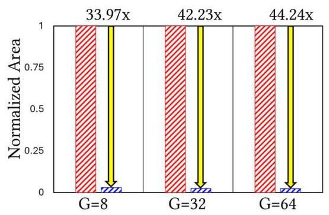

Conventional method without ASP-KAN-HAQ

没有ASP-KAN-HAQ的传统方法

This work with ASP-KAN-HAQ

这项使用ASP-KAN-HAQ的工作

Fig. 12. Comparison of Normalized Area between proposed ASP-KAN-HAQ and conventional method based on Post-Training Quantization [29] using NVIDIA's TensorRT framework .

图12. 使用NVIDIA的TensorRT框架，基于训练后量化[29]，对所提出的ASP-KAN-HAQ与传统方法之间的归一化面积进行比较。

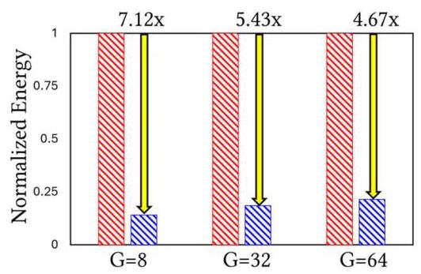

Conventional method without ASP-KAN-HAQ

没有ASP-KAN-HAQ的传统方法

This work with ASP-KAN-HAQ

这项使用ASP-KAN-HAQ的工作

Fig. 13. Comparison of Normalized Energy Consumption between proposed ASP-KAN-HAQ and conventional method based on Post-Training Quantization [29] using NVIDIA's TensorRT framework.

图13. 使用NVIDIA的TensorRT框架，基于训练后量化[29]，对所提出的ASP-KAN-HAQ与传统方法之间的归一化能耗进行比较。

## A. ASP-KAN-HAQ

## A. ASP-KAN-HAQ

We utilize a large-scale task [23] for evaluating ASP-KAN-HAQ, employing the CF-KAN architecture-an encoder-decoder framework based on KAN designed for recommendation systems. As outlined in Section 3.1, the parameter G serves as a key factor in ASP-KAN-HAQ. To systematically evaluate our method's scalability across more complex KAN architectures with arbitrary G values, we progressively increased G using the grid extension approach, a methodology established by the original KAN paper authors. Our experimental setup utilized TSMC 22nm technology node parameters. The evaluation environment incorporated detailed circuit-level simulations using SPICE for accurate power and timing analysis, while area estimations were derived from synthesized netlists. We evaluated ASP-KAN-HAQ against conventional quantization approaches [15][16] with respect to energy and area metrics at the ${22}\mathrm{\;{nm}}$ technology node. For this study, Post-Training Quantization [29] implemented via NVIDIA's TensorRT framework served as our comparison baseline. To isolate variables, we concentrated our analysis on the hardware pathway from the input X, through LUT-based

我们利用一个大规模任务[23]来评估ASP-KAN-HAQ，采用CF-KAN架构——一种基于KAN设计的用于推荐系统的编码器-解码器框架。如3.1节所述，参数G是ASP-KAN-HAQ中的一个关键因素。为了系统地评估我们的方法在具有任意G值的更复杂KAN架构上的可扩展性，我们使用网格扩展方法逐步增加G，这是原始KAN论文作者建立的一种方法。我们的实验设置使用了台积电22纳米技术节点参数。评估环境采用了使用SPICE进行详细电路级模拟，以进行准确的功耗和时序分析，而面积估计则来自综合网表。我们在${22}\mathrm{\;{nm}}$技术节点上，针对能量和面积指标，将ASP-KAN-HAQ与传统量化方法[15][16]进行了评估。在本研究中，通过NVIDIA的TensorRT框架实现的训练后量化[29]作为我们的比较基线。为了隔离变量，我们将分析集中在从输入X开始，通过基于查找表的硬件路径上

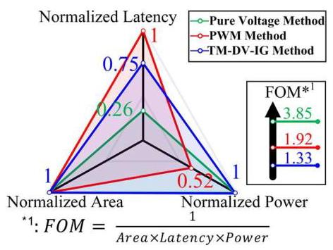

Fig.14. WL input methods performance comparison with SPICE simulation at ${22}\mathrm{\;{nm}}$ for $\mathrm{N} = 1$ 2-bit vector input scheme.

图14. ${22}\mathrm{\;{nm}}$下$\mathrm{N} = 1$ 2位向量输入方案的WL输入方法与SPICE模拟的性能比较。

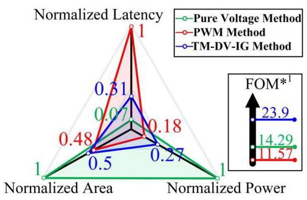

Fig.15. WL input methods performance comparison with SPICE simulation at ${22}\mathrm{\;{nm}}$ for $\mathrm{N} = 2$ 4-bit vector input scheme.

图15. ${22}\mathrm{\;{nm}}$下$\mathrm{N} = 2$ 4位向量输入方案的WL输入方法与SPICE模拟的性能比较。

B(X) value retrieval, to its delivery to the input generator. The evaluation encompasses various precision levels ranging from 4-bit to 8-bit quantization, with 8-bit selected as the optimal trade-off between accuracy and hardware efficiency. Fig. 12 and Fig. 13 illustrate the efficacy of our approach. With G scaling from 8 to 64, our method exhibits substantial advantages over conventional techniques, delivering an average area reduction of ${40.14} \times$ and an average energy reduction of ${5.74} \times$ . Specifically, at $\mathrm{G} = 8$ , our method achieves ${33.97} \times$ area reduction and ${7.12} \times$ energy savings, while at $\mathrm{G} = {64}$ , these improvements scale to ${44.24} \times$ and ${4.67} \times$ respectively. The energy efficiency gains are primarily attributed to simplify decoder structure and the LUT reduction achieved by the proposed SH-LUT architecture. This can be attributed to inherent constraints in conventional quantization approaches, wherein non-zero offsets between quantization and knot grids hinder the ability to share LUTs across different $\mathrm{B}\left( \mathrm{X}\right)$ values. In contrast, our approach enables all B(X) values to utilize a unified LUT while separating local and global information, thereby reducing TG-MUX and decoder areas and maintaining KAN scalability at the edge through ASP-KAN-HAQ.

B(X)值检索，到其传送到输入生成器。评估涵盖了从4位到8位量化的各种精度级别，其中8位被选为精度和硬件效率之间最佳折衷。图12和图13展示了我们方法 的有效性。随着G从8扩展到64，我们的方法相对于传统技术具有显著优势，平均面积减少了${40.14} \times$，平均能量减少了${5.74} \times$。具体来说，在$\mathrm{G} = 8$时，我们的方法实现了${33.97} \times$的面积减少和${7.12} \times$的节能，而在$\mathrm{G} = {64}$时，这些改进分别扩展到${44.24} \times$和${4.67} \times$。能量效率的提高主要归因于简化了解码器结构以及通过所提出的SH-LUT架构实现的查找表减少。这可以归因于传统量化方法中的固有约束，其中量化和节点网格之间的非零偏移阻碍了在不同$\mathrm{B}\left( \mathrm{X}\right)$值之间共享查找表的能力。相比之下，我们的方法使所有B(X)值能够使用统一的查找表，同时分离局部和全局信息，从而减少了TG-MUX和解码器面积，并通过ASP-KAN-HAQ在边缘保持了KAN的可扩展性。

## B. N:1 Time Modulation Dynamic Voltage input generator

## B. N:1时间调制动态电压输入生成器

To quantitatively evaluate the benefits of the proposed N:1 TM-DV-IG for KAN accelerator implementation, we compared its performance against conventional pure voltage and pure PWM input schemes across multiple WL resolutions, as shown in Fig. 14-17. Benchmark simulations were performed for $\mathrm{N} = 1$ - 4, which means 2-, 4-, 6-, and 8-bit input vectors, corresponding to ${2}^{2},{2}^{4},{2}^{6}$ , and ${2}^{8}$ distinct WL pulses for BL sampling, respectively. For fair comparison, the unit pulse width was assigned identically to all three methods, as illustrated in Fig. 8(b) and (c). The evaluation was conducted in a ${22}\mathrm{\;{nm}}$ technology node, and all circuit modules were validated at the transistor level using SPICE. The results reveal distinct tradeoffs across the three methods. In the 2-bit input case (Fig. 14), the pure voltage scheme achieves the best figure-of-merit (FOM) due to its minimal latency, while PWM provides superior power efficiency. The TM-DV-IG in this low-resolution case exhibits the lowest FOM, primarily due to its relatively redundant circuit structure. However, when the input resolution increases (N>1, i.e., 4-, 6-, and 8-bit vectors), the advantages of TM-DV-IG become increasingly evident. For the 6-bit scheme (N=3), although the pure voltage method still achieves the lowest latency, it requires a high-resolution DAC, which reduces noise margin and incurs significant static power consumption. Specifically, it suffers from a 1.96 $\times$ area overhead and an ${11.9} \times$ power overhead compared with TM-DV-IG. The pure PWM method shows the poorest performance, exhibiting an $8 \times$ latency overhead and a ${1.07} \times$ area overhead due to the long delay chain requirement. In contrast, TM-DV-IG, by combining voltage and timing modulation, avoids the noise margin limitations of the high-bit DAC and the excessive timing overhead of PWM, thereby achieving superior overall efficiency. When all three metrics-area, power, and latency-are jointly considered, TM-DV-IG delivers the highest FOM once $N > 1$ . In the 6-bit configuration as shown in Fig.16, it achieves $3 \times$ improvement over pure voltage and 4.1 $\times$ improvement over pure PWM. In the 8-bit scheme (N=4), an 8-bit input vector is directly applied to the WL as shown in Fig.17, and TM-DV-IG continues to demonstrate significant FOM improvements over both conventional approaches. These results confirm that the proposed TM-DV-IG effectively balances latency, area, and power, making it a scalable and efficient enabler for KAN algorithm implementation on RRAM-based CIM architectures.

为了定量评估所提出的用于KAN加速器实现的N:1 TM-DV-IG的优势，我们在多个WL分辨率下将其性能与传统的纯电压和纯PWM输入方案进行了比较，如图14 - 17所示。针对$\mathrm{N} = 1$ - 4进行了基准模拟，这意味着2位、4位、6位和8位输入向量，分别对应于${2}^{2},{2}^{4},{2}^{6}$以及用于BL采样的${2}^{8}$个不同的WL脉冲。为了进行公平比较，如图8(b)和(c)所示，将单位脉冲宽度统一分配给所有三种方法。评估是在一个${22}\mathrm{\;{nm}}$技术节点中进行的，并且所有电路模块都在晶体管级使用SPICE进行了验证。结果揭示了这三种方法之间不同的权衡。在2位输入的情况下(图14)，纯电压方案由于其最小的延迟而实现了最佳的品质因数(FOM)，而PWM提供了更高的功率效率。在这种低分辨率情况下，TM-DV-IG表现出最低的FOM，主要是由于其相对冗余的电路结构。然而，当输入分辨率增加(N>1，即4位、6位和8位向量)时，TM-DV-IG的优势变得越来越明显。对于6位方案(N = 3)，尽管纯电压方法仍然实现了最低的延迟，但它需要一个高分辨率的DAC，这会降低噪声容限并产生大量的静态功耗。具体而言，与TM-DV-IG相比，它遭受1.96 $\times$的面积开销和${11.9} \times$的功率开销。纯PWM方法表现出最差的性能，由于需要长延迟链，其延迟开销为$8 \times$，面积开销为${1.07} \times$。相比之下，TM-DV-IG通过结合电压和时序调制，避免了高位DAC的噪声容限限制和PWM的过度时序开销，从而实现了更高的整体效率。当综合考虑面积、功率和延迟这三个指标时，一旦$N > 1$，TM-DV-IG就会提供最高的FOM。在如图16所示的6位配置中，它相对于纯电压实现了$3 \times$的提升，相对于纯PWM实现了4.1 $\times$的提升。在8位方案(N = 4)中，如图17所示，一个8位输入向量直接应用于WL，并且TM-DV-IG相对于两种传统方法继续展现出显著的FOM提升。这些结果证实了所提出的TM-DV-IG有效地平衡了延迟、面积和功率，使其成为基于RRAM的CIM架构上实现KAN算法的可扩展且高效的实现方式。

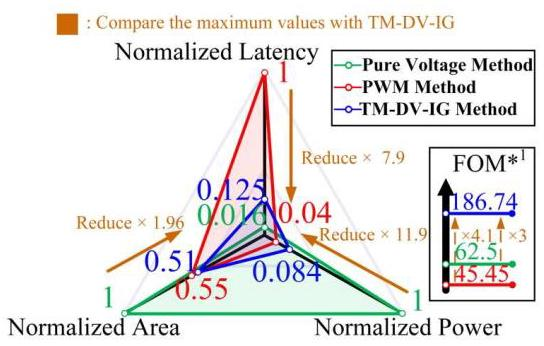

Fig.16. WL input methods performance comparison with SPICE simulation at ${22}\mathrm{\;{nm}}$ for $\mathrm{N} = 3$ 3-bit vector input scheme.

图16. 在${22}\mathrm{\;{nm}}$下针对$\mathrm{N} = 3$ 3位向量输入方案的WL输入方法与SPICE模拟的性能比较。

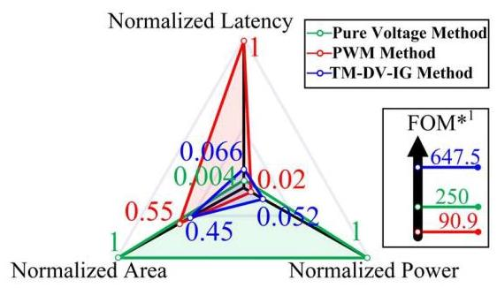

Fig.17. WL input methods performance comparison with SPICE simulation at ${22}\mathrm{\;{nm}}$ for $\mathrm{N} = 4$ 8-bit vector input scheme.

图17. 在${22}\mathrm{\;{nm}}$下针对$\mathrm{N} = 4$ 8位向量输入方案的WL输入方法与SPICE模拟的性能比较。

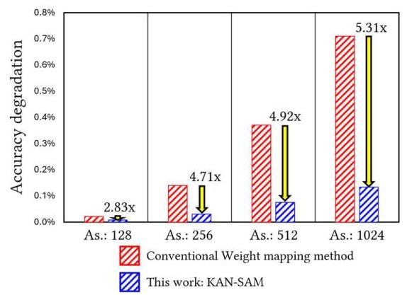

Fig. 18. Comparison of accuracy degradation from KAN software baseline across different RRAM array sizes (As.). The statistics of measured RRAM-ACIM chips [13] are used.

图18. 不同RRAM阵列大小(As.)下KAN软件基线的精度下降比较。使用了测量的RRAM-ACIM芯片[13]的统计数据。

<table><tr><td>Metrics</td><td>[27]</td><td>CF-KAN-1</td><td>CF-KAN-2</td></tr><tr><td>#Param</td><td>78 B</td><td>39 MB</td><td>63MB</td></tr><tr><td>Task Scale</td><td>Tiny</td><td>Large</td><td>Large</td></tr><tr><td>Area ( ${\mathrm{{mm}}}^{2}$ )</td><td>0.0034225</td><td>97.76</td><td>142.24</td></tr><tr><td>Energy (nJ)</td><td>-</td><td>289.6</td><td>645.9</td></tr><tr><td>Power (W)</td><td>0.001547</td><td>0.079</td><td>0.146</td></tr><tr><td>Latency (ns)</td><td>-</td><td>3648</td><td>4416</td></tr><tr><td>Accuracy degradation</td><td>2.02%</td><td>0.23%</td><td>0.11%</td></tr><tr><td>Technology</td><td>28nm</td><td>22nm</td><td>22nm</td></tr></table>

Fig. 19. Comparison of proposed KAN accelerator with previous work across small-scale and large-scale computational tasks.

图19. 所提出的KAN加速器与先前工作在小规模和大规模计算任务上的比较。

### C.KAN sparsity-aware weight mapping

### C.KAN稀疏感知权重映射

We estimated the IR-drop issue and evaluated the proposed KAN-SAM architecture. The IR-drop phenomenon in RRAM-ACIM systems occurs when multiple cells along a bit-line are activated simultaneously, causing voltage degradation that directly impacts computation accuracy. Firstly, we refer to TSMC's 22 nm RRAM-ACIM chip measurement results [13] of the single BL IR drop effect in array sizes ranging from 128 to 1024. These measurements provide empirical validation of the voltage drop characteristics under different array configurations, establishing a reliable foundation for our error modeling. Secondly, MAC error rates induced by IR-drop were extracted from TSMC's 22 nm RRAM-ACIM chips, which were subsequently used to train four CF-KAN models in PyTorch, employing G values of 7, 15, 30, and 60 that correspond to array dimensions of 128, 256, 512, and 1024, respectively. The choice of these specific G values ensures comprehensive coverage of practical RRAM array dimensions.

我们估计了IR降问题并评估了所提出的KAN-SAM架构。当沿位线的多个单元同时被激活时，RRAM-ACIM系统中会出现IR降现象，这会导致电压下降，直接影响计算精度。首先，我们参考了台积电22纳米RRAM-ACIM芯片在阵列大小从128到1024范围内的单BL IR降效应测量结果[13]。这些测量为不同阵列配置下的电压降特性提供了实证验证，为我们的误差建模奠定了可靠的基础。其次，从台积电22纳米RRAM-ACIM芯片中提取了由IR降引起的MAC错误率，随后用于在PyTorch中训练四个CF-KAN模型，分别采用对应于阵列尺寸128、256、512和1024的G值7、15、30和60。这些特定G值的选择确保了对实际RRAM阵列尺寸的全面覆盖。

The baseline approach applied uniform mapping of different ci' values to RRAM-ACIM without accounting for $\mathrm{{Bi}\left( X\right) }$ activation probabilities. Through the integration of extracted MAC error rates and variable Bi(X) activation probabilities, we evaluated the influence of KAN-SAM on accuracy performance. Our sparsity-aware mapping strategy strategically places weights with higher activation probabilities in array positions less susceptible to IR-drop effects, effectively minimizing the overall computational error. Fig. 18 illustrates that with array dimensions increasing from 128 to 1024, KAN-SAM achieves accuracy enhancements ranging from ${2.83} \times$ to ${5.31} \times$ . This progressive improvement underscores KAN-SAM's capability in improving the scalability of RRAM-ACIM systems.

基线方法对不同的ci'值进行统一映射到RRAM-ACIM，而不考虑$\mathrm{{Bi}\left( X\right) }$激活概率。通过整合提取的MAC错误率和可变的Bi(X)激活概率，我们评估了KAN-SAM对精度性能的影响。我们的稀疏感知映射策略将具有较高激活概率的权重策略性地放置在对阵列IR降效应不太敏感的位置，有效减少了整体计算误差。图18表明，随着阵列维度从128增加到1024，KAN-SAM实现了从${2.83} \times$到${5.31} \times$的精度提升。这种逐步改进凸显了KAN-SAM在提高RRAM-ACIM系统可扩展性方面的能力。

## D. KAN-NeuroSim hyperparameter optimization framework

## D. KAN-NeuroSim超参数优化框架

We employed KAN-NeuroSim within a PyTorch environment to optimize the G value for KAN architecture under various hardware constraints for large-scale recommendation system tasks, utilizing the Anime dataset for our analysis. In this study, we explored two architectures respectively targeting high performance mode (CF-KAN-1) and high accuracy mode (CF-KAN-2). When searching for optimal parameters for high performance, we implemented Algorithm 2, a Sensitivity-based Grid Assignment strategy for KAN-NeuroSim, ensuring minimal Grid utilization in non-sensitive regions to enhance hardware performance, while allocating additional Grid resources in sensitive regions to prevent significant accuracy degradation. Furthermore, we deployed TM-DV-IG's TD-P mode in non-sensitive regions to reduce latency and energy consumption, while employing TD-A mode in sensitive regions to maintain high accuracy when executing complex large-scale tasks. Regarding the high accuracy mode (CF-KAN-2), Algorithm 2 was disabled to ensure optimal accuracy, with the entire network utilizing Ghigh and operating in TD-A mode to guarantee maximum accuracy. Fig. 19 demonstrates the performance of this work, showing energy consumption of ${289.6}\mathrm{{nJ}}$ and ${645.9}\mathrm{{nJ}}$ for large-scale tasks with parameter counts of ${39}\mathrm{{MB}}$ and ${63}\mathrm{{MB}}$ , respectively, with corresponding latencies of 3648 ns and 4416 ns, while accuracy degradation remained minimal at only 0.23% and 0.11%.

我们在PyTorch环境中使用KAN-NeuroSim，针对大规模推荐系统任务在各种硬件约束下优化KAN架构的G值，分析时使用动漫数据集。在本研究中，我们分别探索了针对高性能模式(CF-KAN-1)和高精度模式(CF-KAN-2)的两种架构。在为高性能搜索最优参数时，我们实现了算法2，即一种基于灵敏度的KAN-NeuroSim网格分配策略，确保在非敏感区域最小化网格利用以提高硬件性能，同时在敏感区域分配额外的网格资源以防止显著的精度下降。此外，我们在非敏感区域部署TM-DV-IG的TD-P模式以减少延迟和能耗，而在敏感区域采用TD-A模式在执行复杂大规模任务时保持高精度。对于高精度模式(CF-KAN-2)，禁用算法2以确保最优精度，整个网络使用Ghigh并以TD-A模式运行以保证最大精度。图19展示了这项工作的性能，分别显示了参数数量为${39}\mathrm{{MB}}$和${63}\mathrm{{MB}}$的大规模任务的能耗为${289.6}\mathrm{{nJ}}$和${645.9}\mathrm{{nJ}}$，相应延迟为3648 ns和4416 ns，而精度下降仅为0.23%和0.11%，保持在最低水平。

Compared to previous work operating exclusively on tiny-scale tasks, CF-KAN-1 and CF-KAN-2 have parameter counts 500K and 807K times larger than [27], yet the area increased by only ${28}\mathrm{\;K}$ and ${41}\mathrm{\;K}$ times, respectively. This is attributed to our efficient ASP-KAN-HAQ, which significantly reduces the hardware resources required for LUTs. On the other hand, power consumption increased by ${51} \times$ and ${94} \times$ , respectively, due to: 1) ASP-KAN-HAQ's reduction in energy consumption, 2) our highly integrated system leveraging the high-performance parallel computing capabilities of RRAM-ACIM, and 3) TM-DV-IG achieving optimal trade-offs among accuracy, energy consumption, latency, and area. Therefore, this work maintains high efficiency even in large-scale applications with extremely high parameter counts.

与之前仅在小规模任务上运行的工作相比，CF-KAN-1和CF-KAN-2的参数数量分别比[27]大50万倍和80.7万倍，但面积仅分别增加了${28}\mathrm{\;K}$和${41}\mathrm{\;K}$倍。这归因于我们高效的ASP-KAN-HAQ，它显著减少了LUT所需的硬件资源。另一方面，功耗分别增加了${51} \times$和${94} \times$，原因如下:1)ASP-KAN-HAQ降低了能耗；2)我们的高度集成系统利用了RRAM-ACIM的高性能并行计算能力；3)TM-DV-IG在精度、能耗、延迟和面积之间实现了最优权衡。因此，即使在参数数量极高的大规模应用中，这项工作也保持了高效率。

## 5 Conclusion

## 5结论

This work introduces an innovative hardware acceleration methodology for KAN through algorithm-hardware co-design. The proposed algorithmic and circuit-level innovations effectively minimize hardware overhead, power consumption, and maintain inference accuracy for resource-constrained edge computing applications. To the best of our knowledge, this work represents the first validation of large-scale tasks on KAN accelerators. Evaluation results demonstrate that, compared to previous work operating on tiny tasks, despite the parameter count for large-scale tasks in this work increasing by ${500}\mathrm{\;K} \times$ to ${807}\mathrm{\;K} \times$ , the area overhead increases by only ${28}\mathrm{\;K} \times$ to ${41}\mathrm{\;K} \times$ , while power consumption increases by merely ${51} \times$ to ${97} \times$ , with accuracy degradation remaining minimal at 0.11% to 0.23%, thereby showcasing the exceptional scaling capability of our proposed architecture.

这项工作通过算法-硬件协同设计为KAN引入了一种创新的硬件加速方法。所提出的算法和电路级创新有效地最小化了硬件开销、功耗，并为资源受限的边缘计算应用保持了推理精度。据我们所知，这项工作代表了对KAN加速器上大规模任务的首次验证。评估结果表明，与之前在微小任务上运行的工作相比，尽管这项工作中大规模任务的参数数量增加了${500}\mathrm{\;K} \times$到${807}\mathrm{\;K} \times$，但面积开销仅增加了${28}\mathrm{\;K} \times$到${41}\mathrm{\;K} \times$，而功耗仅增加了${51} \times$到${97} \times$，精度下降保持在最低水平，仅为0.11%到0.23%，从而展示了我们所提出架构的卓越扩展能力。

## 6 References

## 6参考文献

[1] S. Pouyanfar et al., "A survey on deep learning: Algorithms, techniques, and applications," ACM Computing Surveys, 2019.

[2] W. X. Zhao et al, "A survey of large language models," arXiv:2303.18223,2023.

[3] Z. Liu et al., "KAN: Kolmogorov-Arnold Networks," arXiv:2404.19756,2024.

[4] A.N. Kolmogorov, "On the representation of continuous functions ofseveral variables as superpositions of continuous functions of a smaller

几个变量作为较少变量的连续函数的叠加number of variables," Dokl. Akad. Nauk, 108(2), 1956.

[5] A.N. Kolmogorov, "On the representation of continuous functions ofmany variables by superposition of continuous functions of one variable

通过单变量连续函数的叠加得到多个变量and addition," Dokl. Akad. Nauk, Vol. 114. 953-956, 1957.

[6] C. J Vaca-Rubio et al., "Kolmogorov-arnold networks (kans) for time series analysis," arXiv:2405.08790, 2024.

[7] W. J Gordon et al., "B-spline curves and surfaces," Computer Aided Geometric Design, pages 95-126. Elsevier, 1974.

[8] S. Yu et al., "Compute-in-Memory chips for deep learning: Recent trendsand prospects," IEEE Circuits and Systems Magazine, vol. 21, pp. 31-56, 2021.

以及前景，《IEEE电路与系统杂志》，第21卷，第31 - 56页，2021年。

[9] Y.-D. Chih et al., "An 89 TOPS/W and 16.3 TOPS/mm2 alldigital SRAM-based full-precision compute-in memory macro in ${22}\mathrm{\;{nm}}$ for machine-learning edge applications," IEEE International Solid-State Circuits

用于机器学习边缘应用的基于${22}\mathrm{\;{nm}}$的全精度内存计算宏，《IEEE国际固态电路》Conference (ISSCC), 2021.

[10] X. Si et al., "A Local Computing Cell and 6T SRAM-Based Computing-in-Memory Macro With 8-b MAC Operation for Edge AI Chips," IEEE

用于边缘人工智能芯片的具有8位乘法累加运算的内存宏，《IEEE》Journal of Solid-State Circuits (JSSC), vol. 56, no. 9, pp. 2817- 2831, 2021.

[11] J.-W. Su et al., "A 8-b-Precision 6T SRAM Computing-in-Memory MacroUsing Segmented-Bitline Charge-Sharing Scheme for AI Edge Chips," IEEE Journal of Solid-State Circuits (JSSC), vol. 57, no. 2, pp. 609-624, 2022.

用于人工智能边缘芯片的分段位线电荷共享方案，《IEEE固态电路杂志》(JSSC)，第57卷，第2期，第609 - 624页，2022年。

[12] C.-X. Xue et al., "A 1 Mb multibit ReRAM computing-in-memory macrowith 14.6 ns parallel MAC computing time for CNN based AI edge processors," IEEE International Solid-State Circuits Conference (ISSCC), 2019.

基于卷积神经网络的人工智能边缘处理器具有14.6纳秒并行乘法累加计算时间，《IEEE国际固态电路会议》(ISSCC)，2019年。

[13] W.-H. Huang et al., "A nonvolatile Al-edge processor with 4MB SLC-MLC hybrid-mode ReRAM compute-in-memory macro and 51.4- 251TOPS/W," IEEE International Solid-State Circuits Conference (ISSCC), 2023.

多层单元混合模式阻变随机存取存储器内存计算宏以及51.4 - 251万亿次运算每秒每瓦，《IEEE国际固态电路会议》(ISSCC)，2023年。

[14] B. Liu et al., "Reduction and IR-drop compensations techniques forreliable neuromorphic computing systems," IEEE/ACM International

可靠的神经形态计算系统，《IEEE/ACM国际》Conference on Computer-Aided Design (ICCAD), 2014.

[15] A. Gholami et al., "A survey of quantization methods for efficient neural network inference," arXiv:2103.13630, 2021.

[16] B. Rokh et al., "A comprehensive survey on model quantization for deepneural networks in image classification," ACM Trans. Intell. Syst.

图像分类中的神经网络，《ACM智能系统汇刊》Technol., vol. 14, no. 6, pp. 1-50, Dec. 2023.

[17] X. Peng et al., "DNN+NeuroSim: An end-to-end benchmarkingframework for compute-in-memory accelerators with versatile device technologies," IEEE International Electron Devices Meeting (IEDM), 2019.

具有通用器件技术的内存计算加速器框架，《IEEE国际电子器件会议》(IEDM)，2019年。

[18] Z. Jiang et al., "C3SRAM: An In-Memory-Computing SRAM MacroBased on Robust Capacitive Coupling Computing Mechanism," IEEE

基于稳健电容耦合计算机制，《IEEE》Journal of Solid-State Circuits (JSSC), vol. 55, no. 7, pp. 1888-1897, 2020.

[19] A. Biswas et al., "Conv-RAM: An energy-efficient SRAM with embeddedconvolution computation for low-power CNN-based machine learning applications," IEEE International Solid-State Circuits Conference (ISSCC), 2018.

用于低功耗基于卷积神经网络的机器学习应用的卷积计算，《IEEE国际固态电路会议》(ISSCC)，2018年。

[20] Q. Dong et al., "15.3 A 351TOPS/W and 372.4GOPS Compute-in-Memory SRAM Macro in 7nm FinFET CMOS for Machine-Learning Applications," IEEE International Solid-State Circuits Conference (ISSCC), 2020.

用于机器学习应用的7纳米鳍式场效应晶体管互补金属氧化物半导体中的内存静态随机存取存储器宏，《IEEE国际固态电路会议》(ISSCC)，2020年。

[21] S. K. Gonugondla et al., "A 42pJ/decision 3.12TOPS/W robust in-memorymachine learning classifier with on-chip training," IEEE International

具有片上训练的机器学习分类器，《IEEE国际》Solid-State Circuits Conference (ISSCC), 2018.

[22] A. Davies et al. "Advancing mathematics by guiding human intuition with ai," Nature, 600(7887):70-74, 2021.

[23] Jin-Duk Park et al., "CF-KAN: Kolmogorov Arnold network-basedcollaborative filtering to mitigate catastrophic forgetting in recommender

协同过滤以减轻推荐系统中的灾难性遗忘systems," arXiv:2409.05878, 2024.

[24] W.-H. Huang et al., "Hardware acceleration of Kolmogorov-Arnoldnetwork (KAN) for lightweight edge inference," Asia and South Pacific

用于轻量级边缘推理的网络(KAN)，亚洲和南太平洋Design Automation Conference (ASPDAC), 2025.

[25] C. Sudarshan et al., "A Kolmogorov-Arnold Compute-in-Memory (KA-CIM) Hardware Accelerator with High Energy Efficiency and Flexibility,"

CIM)具有高能效和灵活性的硬件加速器，Research Square, preprint, 2025. Available:https://www.researchsquare.com/article/rs-5804189/v1.

[26] P. Duarte et al., "Function Approximation Using Analog Building Blocksin Flexible Electronics," International Symposium on Quality Electronic Design (ISQED), 2025.

发表于《柔性电子学》，2025年国际质量电子设计研讨会(ISQED)。

[27] K. Hu et al., "SCKAN: A Stochastic Computing-Based Accelerator forEfficient Implementation of Kolmogorov-Arnold Networks," TechRxiv , preprint, 2024. https://www.techrxiv.org/users/830901/articles/1224596-sckan-a-stochastic-computing-based-accelerator-for-efficient-implementation-of-kolmogorov-arnold-networks.

《Kolmogorov-Arnold网络的高效实现》，TechRxiv预印本，2024年。https://www.techrxiv.org/users/830901/articles/1224596-sckan-a-stochastic-computing-based-accelerator-for-efficient-implementation-of-kolmogorov-arnold-networks。

[28] J. Lee et al., "NeuroSim V1.4: Extending Technology Support for DigitalCompute-in-Memory Toward 1nm Node," IEEE Transactions on Circuits

面向1nm节点的内存计算，《IEEE电路汇刊》and Systems I: Regular Papers, 2024,

[29] J. Read et al., "NeuroSim V1.5: Improved Software Backbone forBenchmarking Compute-in-Memory Accelerators with Device and

使用设备对内存计算加速器进行基准测试以及Circuit-level Non-idealities," arXiv:2505.02314, 2025.

Wei-Hsing Huang received the B.S. degree in electrical engineering from the National Chung Cheng University, Chiayi, Taiwan, in 2017, and the M.S. degree in electrical engineering and computer science from the National Tsing Hua University, Hsinchu, Taiwan, in 2019. He is currently a Research Assistant in electrical and computer engineering with Georgia Institute of Technology, Atlanta, GA, USA. His current research interests include deep learning algorithms and algorithm-hardware co-design for deep learning.

黄伟兴于2017年获得台湾嘉义国立中正大学电气工程学士学位，并于2019年获得台湾新竹国立清华大学电气工程与计算机科学硕士学位。他目前是美国佐治亚理工学院电气与计算机工程系的研究助理。他目前的研究兴趣包括深度学习算法以及深度学习的算法-硬件协同设计。

Jianwei Jia received the B.S. degree in Microelectronics Science and Engineering from Nankai University, Tianjin, China, in 2021, and the M.S. degree in Electrical and Computer Engineering from the University of Michigan, Ann Arbor, MI, USA, in 2023. He is currently pursuing the Ph.D. degree at the Georgia Institute of Technology, Atlanta, GA, USA.

贾建伟于2021年在中国天津南开大学获得微电子科学与工程学士学位，并于2023年在美国密歇根大学安娜堡分校获得电气与计算机工程硕士学位。他目前正在美国佐治亚理工学院攻读博士学位。

Yuyao Kong received the B.S. degree from Nanjing Tech University, Nanjing, China, in 2015, the M.S. degree from the University of Southampton, Southampton, U.K., in 2016, and the Ph.D. degree from the School of Electronic Science and Engineering, Southeast University, Nanjing, China, in 2023. He is currently a Postdoctoral Fellow with the Laboratory for Emerging Devices and Circuits, Georgia Institute of Technology, advised by Prof. Shimeng Yu. His research interests include compute-in-memory (CIM)-based algorithm-hardware co-design targeting AI processors and probabilistic computing, as well as low-voltage SRAM and other energy-efficient circuit designs.

孔宇瑶于2015年在中国南京的南京工业大学获得学士学位，2016年在英国南安普顿的南安普顿大学获得硕士学位，并于2023年在中国南京的东南大学电子科学与工程学院获得博士学位。他目前是佐治亚理工学院新兴器件与电路实验室的博士后研究员，由余时梦教授指导。他的研究兴趣包括针对人工智能处理器的基于内存计算(CIM)的算法-硬件协同设计和概率计算，以及低压SRAM和其他节能电路设计。

Faaiq Waqar received a B.S. degree in computer science and electrical & computer engineering from Oregon State University, Corvallis, OR, in 2022. He is currently pursuing a Ph.D. in electrical & computer engineering from the Georgia Institute of Technology, Atlanta, GA. Prior to joining Georgia Tech, he worked as a hardware engineer for Microsoft's Silicon Engineering Solutions team. He was the recipient of the NSF Graduate Research Fellowship and the Georgia Tech President's Fellowship in 2023. His current research interests pertain to the modeling and metrology of emerging amorphous oxide semiconductor and ferroelectric devices for applications in neuromorphic, reconfigurable, and high-performance computational systems.

法伊克·瓦卡尔于2022年在俄勒冈州科瓦利斯的俄勒冈州立大学获得计算机科学与电气及计算机工程学士学位。他目前正在佐治亚州亚特兰大的佐治亚理工学院攻读电气及计算机工程博士学位。在加入佐治亚理工学院之前，他曾在微软的硅工程解决方案团队担任硬件工程师。他在2023年获得了美国国家科学基金会研究生研究奖学金和佐治亚理工学院校长奖学金。他目前的研究兴趣涉及新兴非晶氧化物半导体和铁电器件的建模与计量，用于神经形态、可重构和高性能计算系统。

Tai-Hao Wen (Member, IEEE) received the B.S. degree in electrical engineering from National Tsing Hua University, Hsinchu, Taiwan, in 2020, and the Ph.D. degree in electrical engineering from National Tsing Hua University, Hsinchu, Taiwan, in 2024. He is currently a Postdoctoral Research Fellow with the Department of Electrical and Computer Engineering, University of Michigan, Ann Arbor, USA. His research interests include memory circuit design and compute-in-memory for emerging nonvolatile memories, as well as hardware-efficient system design.

温泰豪(IEEE会员)于2020年在台湾新竹国立清华大学获得电气工程学士学位，并将于2024年在台湾新竹国立清华大学获得电气工程博士学位。他目前是美国密歇根大学安娜堡分校电气与计算机工程系的博士后研究员。他的研究兴趣包括新兴非易失性存储器的存储电路设计和内存计算，以及硬件高效系统设计。

Meng-Fan Chang received the M.S. degree from The Pennsylvania State University, State College, PA, USA, and the Ph.D. from the National Chiao Tung University, Hsinchu, Taiwan. Prior to 2006, he worked in the industry for over ten years. This included the design of memory compilers (Mentor Graphics, Wilsonville, OR, USA, from 1996 to 1997) and the design of embedded SRAM and Flash macros (Design Service Division, TSMC, Hsinchu, From 1997 to 2001). In 2001, he co-founded IPLib, Hsinchu, where he developed embedded SRAM and ROM compilers, flash macros, and flat-cell ROM products, until 2006. He is currently a Distinguished Professor at the National Tsing Hua University (NTHU) and the Director of Corporate Research, TSMC. His research interests include circuit design for volatile and nonvolatile memory, ultralow-voltage systems, 3-D memory, circuitdevice interactions, spintronic circuits, memristor logics for neuromorphic computing, and computing-in-memory for artificial intelligence.

孟凡昌获得美国宾夕法尼亚州立大学州立学院的硕士学位以及台湾新竹国立交通大学的博士学位。2006年之前，他在行业内工作了十多年。这包括内存编译器的设计(1996年至1997年在美国俄勒冈州威尔逊维尔的Mentor Graphics公司)以及嵌入式SRAM和闪存宏的设计(1997年至2001年在新竹台积电设计服务部)。2001年，他与人共同创立了新竹的IPLib公司，在那里他开发了嵌入式SRAM和ROM编译器、闪存宏以及平面单元ROM产品，直到2006年。他目前是国立清华大学(NTHU)的杰出教授以及台积电企业研究部主任。他的研究兴趣包括易失性和非易失性存储器的电路设计、超低压系统、3D存储器、电路 - 器件相互作用、自旋电子电路、用于神经形态计算的忆阻器逻辑以及用于人工智能的内存计算。

Shimeng Yu (Fellow, IEEE) is a full professor of electrical and computer engineering at Georgia Institute of Technology, where he holds the Dean's Professorship. He received the B.S. degree in microelectronics from Peking University in 2009, and the M.S. degree and Ph.D. degree in electrical engineering from Stanford University in 2011 and 2013, respectively. From 2013 to 2018, he was an assistant professor at Arizona State University. He is elevated for the IEEE Fellow for contributions to non-volatile memories and in-memory computing. His general research interests are semiconductor devices and integrated circuits for energy-efficient computing systems. His expertise is on the emerging non-volatile memories for AI hardware and 3D integration. Prof. Yu's 400+ journal/conference publications received more than 30,000 citations with H-index 82. He is the theme lead of two SRC/DARPA JUMP 2.0 centers on intelligent memory/storage and heterogeneous/monolithic 3D integration.

余时萌(IEEE会士)是佐治亚理工学院电气与计算机工程系的全职教授，并担任院长教授职位。他于2009年获得北京大学微电子学学士学位，分别于2011年和2013年获得斯坦福大学电气工程硕士学位和博士学位。2013年至2018年，他在亚利桑那州立大学担任助理教授。他因在非易失性存储器和内存计算方面的贡献而当选为IEEE会士。他的一般研究兴趣是用于节能计算系统的半导体器件和集成电路。他的专业领域是用于人工智能硬件和3D集成的新兴非易失性存储器。余教授400多篇期刊/会议论文获得了超过30,000次引用，H指数为82。他是两个SRC/DARPA JUMP 2.0中心的主题负责人，分别涉及智能内存/存储以及异构/单片3D集成。