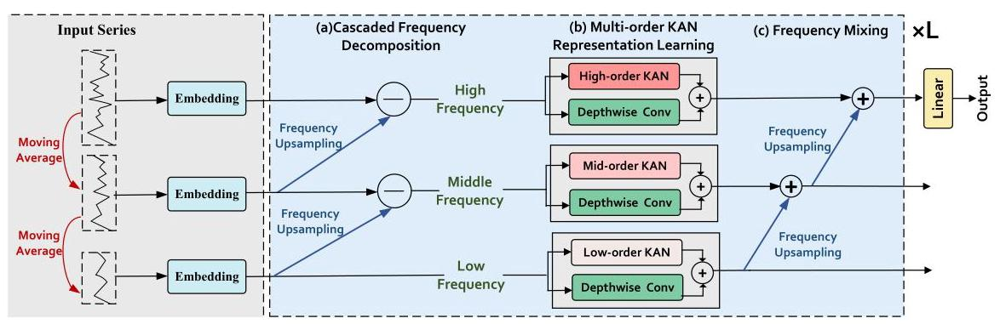
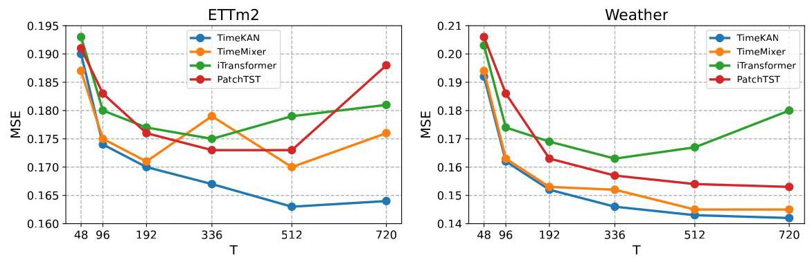

# TIMEKAN: KAN-BASED FREQUENCY DECOMPOSI- TION LEARNING ARCHITECTURE FOR LONG-TERM TIME SERIES FORECASTING

# TIMEKAN:用于长期时间序列预测的基于KAN的频率分解学习架构

Songtao Huang ${}^{1,2}$ , Zhen Zhao ${}^{1}$ , Can Li ${}^{3}$ , Lei Bai ${}^{1\infty }$

黄松涛${}^{1,2}$，赵震${}^{1}$，李灿${}^{3}$，白雷${}^{1\infty }$

${}^{1}$ Shanghai Artificial Intelligence Laboratory, Shanghai, China

${}^{1}$上海人工智能实验室，中国上海

${}^{2}$ School of Information Science and Engineering, Lanzhou University, Lanzhou, China

${}^{2}$兰州大学信息科学与工程学院，中国兰州

${}^{3}$ The Key Laboratory of Road and Traffic Engineering of the Ministry of Education, Tongji University, Shanghai, China

${}^{3}$同济大学道路与交通工程教育部重点实验室，中国上海

huangsongtao@pjlab.org.cn, zhen.zhao@outlook.com,

huangsongtao@pjlab.org.cn，zhen.zhao@outlook.com，

lchelen1005@gmail.com, baisanshi@gmail.com

lchelen1005@gmail.com，baisanshi@gmail.com

## ABSTRACT

## 摘要

Real-world time series often have multiple frequency components that are intertwined with each other, making accurate time series forecasting challenging. Decomposing the mixed frequency components into multiple single frequency components is a natural choice. However, the information density of patterns varies across different frequencies, and employing a uniform modeling approach for different frequency components can lead to inaccurate characterization. To address this challenges, inspired by the flexibility of the recent Kolmogorov-Arnold Network (KAN), we propose a KAN-based Frequency Decomposition Learning architecture (TimeKAN) to address the complex forecasting challenges caused by multiple frequency mixtures. Specifically, TimeKAN mainly consists of three components: Cascaded Frequency Decomposition (CFD) blocks, Multi-order KAN Representation Learning (M-KAN) blocks and Frequency Mixing blocks. CFD blocks adopt a bottom-up cascading approach to obtain series representations for each frequency band. Benefiting from the high flexibility of KAN, we design a novel M-KAN block to learn and represent specific temporal patterns within each frequency band. Finally, Frequency Mixing blocks is used to recombine the frequency bands into the original format. Extensive experimental results across multiple real-world time series datasets demonstrate that TimeKAN achieves state-of-the-art performance as an extremely lightweight architecture. Code is available at https://github.com/huangst21/TimeKAN

现实世界中的时间序列通常具有相互交织的多个频率成分，这使得准确的时间序列预测具有挑战性。将混合频率成分分解为多个单频率成分是一种自然的选择。然而，不同频率下模式的信息密度各不相同，对不同频率成分采用统一的建模方法可能导致表征不准确。为应对这一挑战，受近期Kolmogorov-Arnold网络(KAN)灵活性的启发，我们提出了一种基于KAN的频率分解学习架构(TimeKAN)来应对由多个频率混合引起的复杂预测挑战。具体而言，TimeKAN主要由三个组件组成:级联频率分解(CFD)模块、多阶KAN表示学习(M-KAN)模块和频率混合模块。CFD模块采用自下而上的级联方法来获取每个频带的序列表示。受益于KAN的高度灵活性，我们设计了一种新颖的M-KAN模块来学习和表示每个频带内的特定时间模式。最后，频率混合模块用于将各个频带重新组合成原始格式。在多个真实世界时间序列数据集上的大量实验结果表明，TimeKAN作为一种极其轻量级的架构取得了领先的性能。代码可在https://github.com/huangst21/TimeKAN获取

## 1 INTRODUCTION

## 1 引言

Time series forecasting (TSF) has garnered significant interest due to its wide range of applications, including finance (Huang et al., 2024), energy management (Yin et al., 2023), traffic flow planning (Jiang & Luo, 2022), and weather forecasting (Lam et al. 2023). Recently, deep learning has led to substantial advancements in TSF, with the most state-of-the-art performances achieved by CNN-based methods (Wang et al. 2023, donghao & wang xue, 2024), Transformer-based methods(Nie et al. 2023, Liu et al. 2024b) and MLP-based methods (Zeng et al. 2023, Wang et al. 2024a).

时间序列预测(TSF)因其广泛的应用而备受关注，包括金融(Huang等人，2024)、能源管理(Yin等人，2023)、交通流规划(Jiang和Luo，2022)以及天气预报(Lam等人，2023)。最近，深度学习在TSF领域取得了重大进展，基于卷积神经网络(CNN)的方法(Wang等人，2023，董浩和王雪，2024)、基于Transformer的方法(Nie等人，2023，Liu等人，2024b)以及基于多层感知器(MLP)的方法(Zeng等人，2023，Wang等人，2024a)取得了最先进的性能。

Due to the complex nature of the real world, observed multivariate time series are often nonstationary and exhibit diverse patterns. These intertwined patterns complicate the internal relationships within the time series, making it challenging to capture and establish connections between historical observations and future targets. To address the complex temporal patterns in time series, an increasing number of studies focus on leveraging prior knowledge to decompose time series into simpler components that provide a basis for forecasting. For instance, Autoformer (Wu et al., 2021) decomposes time series into seasonal and trend components. This idea is also adopted by DLinear (Zeng et al. 2023) and FEDFormer (Zhou et al. 2022b). Building on this foundation, TimeMixer (Wang et al. 2024a) further introduces multi-scale seasonal-trend decomposition and highlights the importance of interactions between different scales. Recent models like TimesNet (Wu et al. 2023), PDF (Dai et al., 2024), and SparseTSF (Lin et al., 2024) emphasize the inherent periodicity in time series and decompose long sequences into multiple shorter ones based on the period length, thereby enabling the separate modeling of inter-period and intra-period dependencies within temporal patterns. In summary, these different decomposition methods share a common goal: utilizing the simplified subsequences to provide critical information for future predictions, thereby achieving accurate forecasting.

由于现实世界的复杂性，观测到的多变量时间序列通常是非平稳的，并且呈现出多样的模式。这些相互交织的模式使时间序列内部的关系变得复杂，使得捕捉历史观测与未来目标之间的联系并建立关联具有挑战性。为应对时间序列中的复杂时间模式，越来越多的研究专注于利用先验知识将时间序列分解为更简单的成分，为预测提供基础。例如，Autoformer(Wu等人，2021)将时间序列分解为季节性和趋势成分。DLinear(Zeng等人，2023)和FEDFormer(Zhou等人，2022b)也采用了这一思路。在此基础上，TimeMixer(Wang等人，2024a)进一步引入了多尺度季节性趋势分解，并强调了不同尺度之间相互作用的重要性。最近的模型如TimesNet(Wu等人，2023)、PDF(Dai等人，2024)和SparseTSF(Lin等人，2024)强调时间序列中固有的周期性，并根据周期长度将长序列分解为多个较短的序列，从而能够分别对时间模式内的周期间和周期内依赖关系进行建模。总之，这些不同的分解方法有一个共同目标:利用简化后的子序列为未来预测提供关键信息，从而实现准确预测。

It is worth noting that time series are often composed of multiple frequency components, where the low-frequency components represent long-term periodic variations and the high-frequency components capture certain abrupt events. The mixture of different frequency components makes accurate forecasting particularly challenging. The aforementioned decomposition approaches motivate us to design a frequency decomposition framework that decouples different frequency components in a time series and independently learns the temporal patterns associated with each frequency. However, this introduces another challenge: the information density of patterns varies across different frequencies, and employing a uniform modeling approach for different frequency components can lead to inaccurate characterizations, resulting in sub-optimal results. Fortunately, a new neural network architecture, known as Kolmogorov-Arnold Networks (KAN) (Liu et al. 2024c), has recently gained significant attention in the deep learning community due to its outstanding data-fitting capabilities and flexibility, showing potential as a substitute for traditional MLP. Compared to MLP, KAN offers optional kernels and allows for the adjustment of kernel order to control its fitting capacity. This consideration leads us to explore the use of Multi-order KANs to represent temporal patterns across different frequencies, thereby providing more accurate information for forecasting.

值得注意的是，时间序列通常由多个频率成分组成，其中低频成分代表长期周期性变化，高频成分捕捉某些突发事件。不同频率成分的混合使得准确预测特别具有挑战性。上述分解方法促使我们设计一个频率分解框架，该框架将时间序列中的不同频率成分解耦，并独立学习与每个频率相关的时间模式。然而，这又带来了另一个挑战:模式的信息密度在不同频率之间有所不同，对不同频率成分采用统一的建模方法可能会导致不准确的表征，从而产生次优结果。幸运的是，一种新的神经网络架构，即柯尔莫哥洛夫 - 阿诺德网络(KAN)(Liu等人，2024c)，最近因其出色的数据拟合能力和灵活性在深度学习社区中受到了广泛关注，显示出作为传统多层感知器(MLP)替代品的潜力。与MLP相比，KAN提供了可选内核，并允许调整内核阶数以控制其拟合能力。这一考虑促使我们探索使用多阶KAN来表示不同频率的时间模式，从而为预测提供更准确的信息。

Motivated by these observations, we propose a KAN-based Frequency Decomposition Learning architecture (TimeKAN) to address the complex prediction challenges caused by multiple frequency mixtures. Specifically, TimeKAN first employs moving average to progressively remove relatively high-frequency components from the sequence. Subsequently, Cascaded Frequency Decomposition (CFD) blocks adopt a bottom-up cascading approach to obtain sequence representations for each frequency band. Multi-order KAN Representation Learning (M-KAN) blocks leverage the high flexibility of KAN to learn and represent specific temporal patterns within each frequency band. Finally, Frequency Mixing blocks recombine the frequency bands into the original format, ensuring that this Decomposition-Learning-Mixing process is repeatable, thereby modeling different temporal patterns at various frequencies more accurately. The final high-level sequence is then mapped to the desired forecasting output via a simple linear mapping. With our meticulously designed architecture, TimeKAN achieves state-of-the-art performance across multiple long-term time series forecasting tasks, while also being a lightweight architecture that outperforms complex TSF models with fewer computational resources.

基于这些观察结果，我们提出了一种基于KAN的频率分解学习架构(TimeKAN)，以应对由多个频率混合引起的复杂预测挑战。具体而言，TimeKAN首先采用移动平均法逐步从序列中去除相对高频的成分。随后，级联频率分解(CFD)模块采用自下而上的级联方法来获取每个频带的序列表示。多阶KAN表示学习(M-KAN)模块利用KAN的高灵活性来学习和表示每个频带内的特定时间模式。最后，频率混合模块将各个频带重新组合成原始格式，确保这种分解 - 学习 - 混合过程是可重复的，从而更准确地对不同频率的不同时间模式进行建模。然后，通过简单的线性映射将最终的高级序列映射到所需的预测输出。通过我们精心设计的架构，TimeKAN在多个长期时间序列预测任务中实现了领先的性能，同时也是一种轻量级架构，在更少的计算资源下优于复杂的时间序列预测(TSF)模型。

Our contributions are summarized as follows:

我们的贡献总结如下:

- We revisit time series forecasting from the perspective of frequency decoupling, effectively disentangling time series characteristics through a frequency Decomposition-Learning-Mixing architecture to address challenges caused by complex information coupling in time series.

- 我们从频率解耦的角度重新审视时间序列预测，通过频率分解 - 学习 - 混合架构有效地解开时间序列特征，以应对时间序列中复杂信息耦合带来的挑战。

- We introduce TimeKAN as a lightweight yet effective forecasting model and design a novel M-KAN blocks to effectively modeling and representing patterns at different frequencies by maximizing the flexibility of KAN.

- 我们引入TimeKAN作为一种轻量级但有效的预测模型，并设计了一种新颖的M-KAN模块，通过最大化KAN的灵活性来有效地对不同频率的模式进行建模和表示。

- TimeKAN demonstrates superior performance across multiple TSF prediction tasks, while having a parameter count significantly lower than that of state-of-the-art TSF models.

- TimeKAN在多个TSF预测任务中表现出卓越的性能，同时其参数数量显著低于领先的TSF模型。

## 2 RELATED WORK

## 2 相关工作

### 2.1 KOLMOGOROV-ARNOLD NETWORK

### 2.1 柯尔莫哥洛夫 - 阿诺德网络

Kolmogorov-Arnold representation theorem states that any multivariate continuous function can be expressed as a combination of univariate functions and addition operations. Kolmogorov-Arnold Network (KAN) (Liu et al., 2024c) leverages this theorem to propose an innovative alternative to traditional MLP. Unlike MLP, which use fixed activation functions at the nodes, KAN introduces learnable activation functions along the edges. Due to the flexibility and adaptability, KAN is considered as a promising alternative to MLP.

柯尔莫哥洛夫 - 阿诺德表示定理指出，任何多元连续函数都可以表示为单变量函数和加法运算组合。柯尔莫哥洛夫 - 阿诺德网络(KAN)(Liu等人，2024c)利用该定理提出了一种创新的传统MLP替代方案。与在节点处使用固定激活函数的MLP不同，KAN在边引入了可学习的激活函数。由于其灵活性和适应性，KAN被认为是MLP的一个有前途的替代方案。

The original KAN was parameterized using spline functions. However, due to the inherent complexity of spline functions, the speed and scalability of the original KAN were not satisfactory. Consequently, subsequent research explored the use of simpler basis functions to replace splines, thereby achieving higher efficiency. ChebyshevKAN (SS, 2024) incorporates Chebyshev polynomials to parametrize the learnable functions. FastKAN (Li, 2024) uses faster Gaussian radial basis functions to approximate third-order B-spline functions.

原始的KAN使用样条函数进行参数化。然而，由于样条函数固有的复杂性，原始KAN的速度和可扩展性并不令人满意。因此，后续研究探索使用更简单的基函数来替代样条，从而实现更高的效率。切比雪夫KAN(SS，2024)采用切比雪夫多项式对可学习函数进行参数化。快速KAN(Li，2024)使用更快的高斯径向基函数来近似三阶B样条函数。

Moreover, KAN has been applied as alternatives to MLP in various domains. Convolutional KAN (Bodner et al. 2024) replaces the linear weight matrices in traditional convolutional networks with learnable spline function matrices. U-KAN (Li et al. 2024) integrates KAN layers into the U-Net architecture, demonstrating impressive accuracy and efficiency in several medical image segmentation tasks. KAN has also been used to bridge the gap between AI and science. Works such as PIKAN (Shukla et al. 2024) and PINN (Wang et al. 2024b) utilize KAN to build physics-informed machine learning models. This paper aims to introduce KAN into TSF and demonstrate the strong potential of KAN in representing time series data.

此外，KAN已在各个领域作为MLP的替代方案得到应用。卷积KAN(Bodner等人，2024)用可学习的样条函数矩阵替换传统卷积网络中的线性权重矩阵。U-KAN(Li等人，2024)将KAN层集成到U-Net架构中，在多个医学图像分割任务中展示了令人印象深刻的准确性和效率。KAN还被用于弥合人工智能与科学之间的差距。诸如PIKAN(Shukla等人，2024)和PINN(Wang等人，2024b)等工作利用KAN构建物理信息机器学习模型。本文旨在将KAN引入TSF，并展示KAN在表示时间序列数据方面的强大潜力。

### 2.2 TIME SERIES FORECASTING

### 2.2 时间序列预测

Traditional time series forecasting (TSF) methods, such as ARIMA (Zhang 2003), can provide sufficient interpretability for the forecasting results but often fail to achieve satisfactory accuracy. In recent years, deep learning methods have dominated the field of TSF, mainly including CNN-based, Transformer-based, and MLP-based approaches. CNN-based models primarily apply convolution operations along the temporal dimension to extract temporal patterns. For example, MICN (Wang et al. 2023) and TimesNet (Wu et al. 2023) enhance the precision of sequence modeling by adjusting the receptive field to capture both short-term and long-term views within the sequences. Mod-ernTCN (donghao & wang xue 2024) advocates using large convolution kernels along the temporal dimension and capture both cross-time and cross-variable dependencies. Compared to CNN-based methods, which have limited receptive field, Transformer-based methods offer global modeling capabilities, making them more suitable for handling long and complex sequence data. They have become the cornerstone of modern time series forecasting. Informer (Zhou et al., 2021) is one of the early implementations of Transformer models in TSF, making efficient forecasting possible by carefully modifying the internal Transformer architecture. PatchTST (Nie et al. 2023) divides the sequence into multiple patches along the temporal dimension, which are then fed into the Transformer, establishing it as an important benchmark in the time series domain. In contrast, iTransformer (Liu et al. 2024b) treats each variable as an independent token to capture cross-variable dependencies in multivariate time series. However, Transformer-based methods face challenges due to the large number of parameters and high memory consumption. Recent research on MLP-based methods has shown that with appropriately designed architectures leveraging prior knowledge, simple MLPs can outperform complex Transformer-based methods. DLinear (Zeng et al. 2023), for instance, preprocesses sequences using a trend-season decomposition strategy. FITS (Xu et al. 2024b) performs linear transformations in the frequency domain, while TimeMixer (Wang et al. 2024a) uses MLP to facilitate information interaction at different scales. These MLP-based methods have demonstrated strong performance regarding both forecasting accuracy and efficiency. Unlike the aforementioned methods, this paper introduces the novel KAN to TSF to represent time series data more accurately. It also proposes a well-designed Decomposition-Learning-Mixing architecture to fully unlock the potential of KAN for time series forecasting.

传统的时间序列预测(TSF)方法，如ARIMA(Zhang 2003)，可以为预测结果提供足够的可解释性，但往往无法达到令人满意的准确性。近年来，深度学习方法在TSF领域占据主导地位，主要包括基于卷积神经网络(CNN)、基于Transformer和基于多层感知器(MLP)的方法。基于CNN的模型主要沿时间维度应用卷积操作来提取时间模式。例如，MICN(Wang等人，2023)和TimesNet(Wu等人，2023)通过调整感受野来增强序列建模的精度，以捕捉序列中的短期和长期信息。ModernTCN(donghao & wang xue，2024)主张沿时间维度使用大卷积核，并捕捉跨时间和跨变量的依赖关系。与基于CNN的方法相比，其感受野有限，基于Transformer的方法具有全局建模能力，使其更适合处理长而复杂的序列数据。它们已成为现代时间序列预测的基石。Informer(Zhou等人，2021)是Transformer模型在TSF中的早期实现之一，通过精心修改内部Transformer架构实现了高效预测。PatchTST(Nie等人，2023)沿时间维度将序列划分为多个补丁，然后将其输入到Transformer中，使其成为时间序列领域的一个重要基准。相比之下，iTransformer(Liu等人，2024b)将每个变量视为一个独立的令牌，以捕捉多变量时间序列中的跨变量依赖关系。然而，基于Transformer的方法由于参数数量众多和内存消耗高而面临挑战。最近对基于MLP的方法的研究表明，通过适当设计利用先验知识的架构，简单的MLP可以优于复杂的基于Transformer的方法。例如，DLinear(Zeng等人，2023)使用趋势 - 季节分解策略对序列进行预处理。FITS(Xu等人，2024b)在频域中执行线性变换，而TimeMixer(Wang等人，2024a)使用MLP促进不同尺度的信息交互。这些基于MLP的方法在预测准确性和效率方面都表现出强大的性能。与上述方法不同，本文将新颖的KAN引入TSF，以更准确地表示时间序列数据。它还提出了一种精心设计的分解 - 学习 - 混合架构，以充分释放KAN在时间序列预测方面的潜力。

### 2.3 TIME SERIES DECOMPOSITION

### 2.3时间序列分解

Real-world time series often consist of various underlying patterns. To leverage the characteristics of different patterns, recent approaches tend to decompose the series into multiple subcomponents, including trend-seasonal decomposition, multi-scale decomposition, and multi-period decomposition. DLinear (Zeng et al. 2023) employs moving averages to decouple the seasonal and trend components. SCINet (Liu et al. 2022) uses a hierarchical downsampling tree to iteratively extract and exchange information at multiple temporal resolutions. TimeMixer (Wang et al. 2024a) follows a fine-to-coarse principle to decompose the sequence into multiple scales across different time spans and further splits each scale into seasonal and periodic components. TimesNet (Wu et al. 2023) and PDF (Dai et al. 2024) utilize Fourier periodic analysis to decouple sequence into multiple sub-period sequences based on the calculated period. Inspired by these works, this paper proposes a novel Decomposition-Learning-Mixing architecture, which examines time series from a multi-frequency perspective to accurately model the complex patterns within time series.

现实世界中的时间序列通常由各种潜在模式组成。为了利用不同模式的特征，最近的方法倾向于将序列分解为多个子组件，包括趋势 - 季节分解、多尺度分解和多周期分解。DLinear(Zeng等人，2023)采用移动平均来解耦季节和趋势成分。SCINet(Liu等人，2022)使用分层下采样树在多个时间分辨率上迭代提取和交换信息。TimeMixer(Wang等人，2024a)遵循从细到粗的原则，将序列分解为不同时间跨度的多个尺度，并进一步将每个尺度分解为季节和周期成分。TimesNet(Wu等人，2023)和PDF(Dai等人，2024)利用傅里叶周期分析，根据计算出的周期将序列解耦为多个子周期序列。受这些工作的启发，本文提出了一种新颖的分解 - 学习 - 混合架构，该架构从多频率角度审视时间序列，以准确建模时间序列中的复杂模式。

Figure 1: The architecture of TimeKAN, which mainly consists of Cascaded Frequency Decomposition block, Multi-order KAN Representation Learning block, and Frequency Mixing block. Here, we divide the frequency range of the time series into three frequency bands as an example.

图1:TimeKAN的架构，主要由级联频率分解块、多阶KAN表示学习块和频率混合块组成。在此，我们以将时间序列的频率范围划分为三个频带为例。

## 3 TIMEKAN

## 3 TimeKAN

### 3.1 OVERALL ARCHITECTURE

### 3.1整体架构

Given a historical multivariate time series input $\mathbf{X} \in  {\mathbb{R}}^{N \times  T}$ , the aim of time series forecasting is to predict the future output series ${\mathbf{X}}_{O} \in  {\mathbb{R}}^{N \times  F}$ , where $T, F$ is the look-back window length and the future window length, and $N$ represents the number of variates. In this paper, we propose TimeKAN to tackle the challenges arising from the complex mixture of multi-frequency components in time series. The overall architecture of TimeKAN is shown in Figure 1 . We adopt variate-independent manner (Nie et al. 2023) to predict each univariate series independently. Each univariate input time series is denoted as $X \in  {\mathbb{R}}^{T}$ and we consider univariate time series as the instance in the following calculation. In our TimeKAN, the first step is to progressively remove the relatively high-frequency components using moving averages and generate multi-level sequences followed by projecting each sequence into a high-dimensional space. Next, adhering to the Decomposition-Learning-Mixing architecture design principle, we first design Cascaded Frequency Decomposition (CFD) blocks to obtain sequence representations for each frequency band, adopting a bottom-up cascading approach. Then, we propose Multi-order KAN Representation Learning (M-KAN) blocks to learn and represent specific temporal patterns within each frequency band. Finally, Frequency Mixing blocks recombine the frequency bands into the original format, ensuring that the Decomposition-Learning-Mixing process is repeatable. More details about our TimeKAN are described as follow.

给定一个历史多变量时间序列输入$\mathbf{X} \in  {\mathbb{R}}^{N \times  T}$，时间序列预测的目标是预测未来输出序列${\mathbf{X}}_{O} \in  {\mathbb{R}}^{N \times  F}$，其中$T, F$是回溯窗口长度和未来窗口长度，$N$表示变量数量。在本文中，我们提出了TimeKAN来应对时间序列中多频率成分复杂混合所带来的挑战。TimeKAN的整体架构如图1所示。我们采用变量独立的方式(Nie等人，2023)来独立预测每个单变量序列。每个单变量输入时间序列表示为$X \in  {\mathbb{R}}^{T}$，并且在接下来的计算中我们将单变量时间序列视为实例。在我们的TimeKAN中，第一步是使用移动平均逐步去除相对高频成分并生成多级序列，然后将每个序列投影到高维空间。接下来，遵循分解 - 学习 - 混合架构设计原则，我们首先设计级联频率分解(CFD)块以获得每个频带的序列表示，采用自下而上的级联方法。然后，我们提出多阶KAN表示学习(M - KAN)块来学习和表示每个频带内的特定时间模式。最后，频率混合块将频带重新组合成原始格式，确保分解 - 学习 - 混合过程是可重复的。关于我们的TimeKAN的更多细节如下所述。

### 3.2 HIERARCHICAL SEQUENCE PREPROCESSING

### 3.2 分层序列预处理

Assume that we divide the frequency range of raw time series $X$ into predefined $k$ frequency bands. We first use moving average to progressively remove the relatively high-frequency components and generate multi-level sequences $\left\{  {{x}_{1},\cdots ,{x}_{k}}\right\}$ , where ${x}_{i} \in  {\mathbb{R}}^{\frac{T}{{d}^{i - 1}}}\left( {i \in  \{ 1,\cdots , k\} }\right) .{x}_{1}$ is equal to the input series $X$ and $d$ denotes the length of moving average window. The process of producing multi-level sequences is as follows:

假设我们将原始时间序列$X$的频率范围划分为预定义的$k$个频带。我们首先使用移动平均逐步去除相对高频成分并生成多级序列$\left\{  {{x}_{1},\cdots ,{x}_{k}}\right\}$，其中${x}_{i} \in  {\mathbb{R}}^{\frac{T}{{d}^{i - 1}}}\left( {i \in  \{ 1,\cdots , k\} }\right) .{x}_{1}$等于输入序列$X$，$d$表示移动平均窗口的长度。生成多级序列的过程如下:

$$
{x}_{i} = \operatorname{AvgPool}\left( {\operatorname{Padding}\left( {x}_{i - 1}\right) }\right) \tag{1}
$$

After obtaining the multi-level sequences, each sequence is independently embedded into a higher dimension through a Linear layer:

在获得多级序列后，每个序列通过线性层独立嵌入到更高维度:

$$
{x}_{i} = \operatorname{Linear}\left( {x}_{i}\right) \tag{2}
$$

where ${x}_{i} \in  {\mathbb{R}}^{\frac{T}{{d}^{i - 1}} \times  D}$ and $D$ is embedding dimension. We define ${x}_{1}$ as the highest level sequence and ${x}_{k}$ as the lowest level sequence. Notably, each lower-level sequence is derived from the sequence one level higher by removing a portion of the high-frequency information. The above process is a preprocessing process and only occurs once in TimeKAN.

其中${x}_{i} \in  {\mathbb{R}}^{\frac{T}{{d}^{i - 1}} \times  D}$和$D$是嵌入维度。我们将${x}_{1}$定义为最高级序列，${x}_{k}$定义为最低级序列。值得注意的是，每个较低级序列是通过去除一部分高频信息从高一级序列派生而来的。上述过程是一个预处理过程，并且在TimeKAN中只发生一次。

### 3.3 CASCADED FREQUENCY DECOMPOSITION

### 3.3 级联频率分解

Real-world time series are often composed of multiple frequency components, with the low-frequency component representing long-term changes in the time series and the high-frequency component representing short-term fluctuations or unexpected events. These different frequency components complement each other and provide a comprehensive perspective for accurately modeling time series. Therefore, we design the Cascaded Frequency Decomposition (CFD) block to accurately decompose each frequency component in a cascade way, thus laying the foundation for accurately modeling different frequency components.

现实世界中的时间序列通常由多个频率成分组成，低频成分表示时间序列的长期变化，高频成分表示短期波动或意外事件。这些不同的频率成分相互补充，为准确建模时间序列提供了全面的视角。因此，我们设计了级联频率分解(CFD)块，以级联方式准确分解每个频率成分，从而为准确建模不同频率成分奠定基础。

The aim of CFD block is to obtain the representation of each frequency component. Here, we take obtaining the representation of the $i$ -th frequency band as an example. To achieve it, we first employ the Fast Fourier Transform (FFT) to obtain the representation of ${x}_{i + 1}$ in the frequency domain. Then, Zero-Padding is used to extend the length of the frequency domain sequence, so that it can have the same length as the upper sequence ${x}_{i}$ after transforming back to the time domain. Next, we use Inverse Fast Fourier Transform (IFFT) to transform it back into the time domain. We refer to this upsampling process as Frequency Upsampling, which ensures that the frequency information remains unchanged before and after the upsampling. The process of Frequency Upsampling can be described as:

CFD块的目标是获得每个频率成分的表示。这里，我们以获得第$i$个频带的表示为例。为了实现这一点，我们首先使用快速傅里叶变换(FFT)在频域中获得${x}_{i + 1}$的表示。然后，使用零填充来扩展频域序列的长度，以便在变换回时域后它可以与上一级序列${x}_{i}$具有相同的长度。接下来，我们使用逆快速傅里叶变换(IFFT)将其变换回时域。我们将这个上采样过程称为频率上采样，它确保了上采样前后频率信息保持不变。频率上采样的过程可以描述为:

$$
{\widehat{x}}_{i} = \operatorname{IFFT}\left( {\operatorname{Padding}\left( {\operatorname{FFT}\left( {x}_{i + 1}\right) }\right) }\right) \tag{3}
$$

Here, ${\widehat{x}}_{i}$ and ${x}_{i}$ have the same sequence length. Notably, compared to ${x}_{i},{\widehat{x}}_{i}$ lacks the $i$ -th frequency component. The reason is that ${x}_{i + 1}$ is originally formed by removing $i$ -th frequency component from ${x}_{i}$ in the hierarchical sequence preprocessing and ${x}_{i + 1}$ is now transformed into ${\widehat{x}}_{i}$ through a lossless frequency conversion process, thereby aligning length with ${x}_{i}$ in the time domain. Therefore, to get the series representation of the $i$ -th frequency component ${f}_{i}$ in time domain, we only need to get the residuals between ${x}_{i}$ and ${\widehat{x}}_{i}$ :

在此，${\widehat{x}}_{i}$ 和 ${x}_{i}$ 具有相同的序列长度。值得注意的是，与 ${x}_{i},{\widehat{x}}_{i}$ 相比，其缺少第 $i$ 个频率分量。原因在于，${x}_{i + 1}$ 最初是在分层序列预处理中通过从 ${x}_{i}$ 中去除第 $i$ 个频率分量而形成的，并且 ${x}_{i + 1}$ 现在通过无损频率转换过程被转换为 ${\widehat{x}}_{i}$，从而在时域中与 ${x}_{i}$ 对齐长度。因此，为了在时域中获得第 $i$ 个频率分量 ${f}_{i}$ 的序列表示，我们只需要获取 ${x}_{i}$ 和 ${\widehat{x}}_{i}$ 之间的残差:

$$
{f}_{i} = {x}_{i} - {\widehat{x}}_{i} \tag{4}
$$

### 3.4 MULTI-ORDER KAN REPRESENTATION LEARNING

### 3.4 多阶KAN表示学习

Given the multi-level frequency component representation $\left\{  {{f}_{1},\cdots ,{f}_{k}}\right\}$ generated by the CFD block, we propose Multi-order KAN Representation Learning (M-KAN) blocks to learn specific representations and temporal dependencies at each frequency. M-KAN adopts a dual-branch parallel architecture to separately model temporal representation learning and temporal dependency learning in a frequency-specific way, using Multi-order KANs to learn the representation of each frequency component and employing Depthwise Convolution to capture the temporal dependency. The details of Depthwise Convolution and Multi-order KAN will be given as follows.

给定由CFD模块生成的多级频率分量表示 $\left\{  {{f}_{1},\cdots ,{f}_{k}}\right\}$，我们提出多阶KAN表示学习(M-KAN)模块，以学习每个频率处的特定表示和时间依赖性。M-KAN采用双分支并行架构，以频率特定的方式分别对时间表示学习和时间依赖性学习进行建模。使用多阶KAN来学习每个频率分量的表示，并采用深度卷积来捕获时间依赖性。深度卷积和多阶KAN的详细信息将如下给出。

Depthwise Convolution To separate the modeling of temporal dependency from learning sequence representation, we adopt a specific type of group convolution known as Depthwise Convolution, in which the number of groups matches the embedding dimension. Depthwise Convolution employs $D$ groups of convolution kernels to perform independent convolution operations on the series of each channel. This allows the model to focus on capturing temporal patterns without interference from inter channel relationships. The process of Depthwise Convolution is:

深度卷积 为了将时间依赖性建模与学习序列表示分开，我们采用一种特定类型的分组卷积，称为深度卷积，其中组数与嵌入维度匹配。深度卷积使用 $D$ 组卷积核，对每个通道的序列执行独立的卷积操作。这使得模型能够专注于捕获时间模式，而不受通道间关系的干扰。深度卷积的过程如下:

$$
{f}_{i,1} = {\operatorname{Conv}}_{D \rightarrow  D}\left( {{f}_{i},\text{ group } = D}\right) \tag{5}
$$

Multi-order KANs Compared with traditional MLP, KAN replaces linear weights with learnable univariate functions, allowing complex nonlinear relationships to be modeled with fewer parameters and greater interpretability. (Xu et al. 2024a). Assume that KAN is composed of $L + 1$ layer neurons and the number of neurons in layer $l$ is ${n}_{l}$ . The transmission relationship between the $j$ -th neuron in layer $l + 1$ and all neurons in layer $l$ can be expressed as ${z}_{l + 1, j} = \mathop{\sum }\limits_{{i = 1}}^{{n}_{l}}{\phi }_{l, j, i}\left( {z}_{l, i}\right)$ , where ${z}_{l + 1, j}$ is the $j$ -th neuron at layer $l + 1$ and ${z}_{l, i}$ is the $i$ -th neuron at layer $l$ . We can simply understand that each neuron is connected to other neurons in the previous layer through a learnable univariate function $\phi$ . The vanilla KAN (Liu et al. 2024c) employs spline function as the learnable univariate basic functions $\phi$ , but suffering from the complex recursive computation process, which hinders the efficiency of KAN. Here, we adopt ChebyshevKAN (SS) 2024) to learn the representation of each frequency component, i.e., channel learning. ChebyshevKAN is constructed from linear combinations of Chebyshev polynomial. That is, using the linear combination of Chebyshev polynomial with different order to generate learnable univariate function $\phi$ . The Chebyshev polynomial is defined by:

多阶KAN 与传统MLP相比，KAN用可学习的单变量函数代替线性权重，从而能够用更少的参数和更高的可解释性对复杂的非线性关系进行建模。(Xu等人，2024a)。假设KAN由 $L + 1$ 层神经元组成，并且第 $l$ 层中的神经元数量为 ${n}_{l}$。第 $l + 1$ 层中的第 $j$ 个神经元与第 $l$ 层中的所有神经元之间的传输关系可以表示为 ${z}_{l + 1, j} = \mathop{\sum }\limits_{{i = 1}}^{{n}_{l}}{\phi }_{l, j, i}\left( {z}_{l, i}\right)$，其中 ${z}_{l + 1, j}$ 是第 $l + 1$ 层中的第 $j$ 个神经元，${z}_{l, i}$ 是第 $l$ 层中的第 $i$ 个神经元。我们可以简单地理解为，每个神经元通过一个可学习的单变量函数 $\phi$ 与前一层中的其他神经元相连。普通的KAN(Liu等人，2024c)采用样条函数作为可学习的单变量基本函数 $\phi$，但存在复杂的递归计算过程，这阻碍了KAN的效率。在此，我们采用ChebyshevKAN(SS，2024)来学习每个频率分量的表示，即通道学习。ChebyshevKAN由切比雪夫多项式的线性组合构成。也就是说，使用不同阶的切比雪夫多项式的线性组合来生成可学习的单变量函数 $\phi$。切比雪夫多项式的定义如下:

$$
{T}_{n}\left( x\right)  = \cos \left( {n\arccos \left( x\right) }\right) \tag{6}
$$

where $n$ is the highest order of Chebyshev polynomials and the complexity of Chebyshev polynomials is increasing with increasing order. A 1-layer ChebyshevKAN applied to channel dimension can be expressed as:

其中 $n$ 是切比雪夫多项式的最高阶数，并且切比雪夫多项式的复杂度随着阶数的增加而增加。应用于通道维度的1层ChebyshevKAN可以表示为:

$$
{\phi }_{o}\left( x\right)  = \mathop{\sum }\limits_{{j = 1}}^{D}\mathop{\sum }\limits_{{i = 0}}^{n}{\Theta }_{o, j, i}{T}_{i}\left( {\tanh \left( {x}_{j}\right) }\right) \tag{7}
$$

$$
\operatorname{KAN}\left( x\right)  = \left\{  \begin{matrix} {\phi }_{1}\left( x\right) \\  \cdots \\  {\phi }_{D}\left( x\right)  \end{matrix}\right\} \tag{8}
$$

where $o$ is the index of output neuron and $\Theta  \in  {\mathbb{R}}^{D \times  D \times  \left( {n + 1}\right) }$ are the learnable coefficients used to linearly combine the Chebyshev polynomials. It is worth noting that the frequency components within the time series exhibit increasingly complex temporal dynamics as the frequency increases, necessitating a network with stronger representation capabilities to learn these characteristics. ChebyshevKAN allows for the adjustment of the highest order of Chebyshev polynomials $n$ to enhance its representation ability. Therefore, from the low-frequency to high-frequency components, we adopt an increasing order of Chebyshev polynomials to align the frequency components with the complexity of the KAN, thereby accurately learning the representations of different frequency components. We refer to this group of KANs with varying highest Chebyshev polynomials orders as Multi-order KANs. We set an lower bound order $b$ , and the representation learning process for ${x}_{i}$ can be expressed as:

其中$o$是输出神经元的索引，$\Theta  \in  {\mathbb{R}}^{D \times  D \times  \left( {n + 1}\right) }$是用于线性组合切比雪夫多项式的可学习系数。值得注意的是，随着频率增加，时间序列中的频率成分呈现出越来越复杂的时间动态，这就需要一个具有更强表示能力的网络来学习这些特征。ChebyshevKAN允许调整切比雪夫多项式$n$的最高阶数，以增强其表示能力。因此，从低频到高频成分，我们采用递增阶数的切比雪夫多项式，使频率成分与KAN的复杂度相匹配，从而准确学习不同频率成分的表示。我们将这组具有不同切比雪夫多项式最高阶数的KAN称为多阶KAN。我们设置了一个下限阶数$b$，并且${x}_{i}$ 的表示学习过程可以表示为:

$$
{f}_{i,2} = \operatorname{KAN}\left( {{f}_{i},\operatorname{order} = b + k - i}\right) \tag{9}
$$

The final output of the M-KAN block is the sum of the outputs from the Multi-order KANs and the Depthwise Convolution.

M-KAN块的最终输出是多阶KAN的输出与深度卷积输出之和。

$$
{\widehat{f}}_{i} = {f}_{i,1} + {f}_{i,2} \tag{10}
$$

### 3.5 FREQUENCY MIXING

### 3.5频率混合

After specifically learning the representation of each frequency component, we need to re-transform the frequency representations into the form of multi-level sequences before entering next CFD block, ensuring that the Decomposition-Learning-Mixing process is repeatable. Therefore, we designed Frequency Mixing blocks to convert the frequency component at $i$ -th level ${\widehat{f}}_{i}$ into multi-level sequences ${x}_{i}$ , enabling it to serve as input for the next CFD block. To transform the frequency component at $i$ -th level ${\widehat{f}}_{i}$ into multi-level sequences ${x}_{i}$ , we simply need to to supplement the frequency information from levels $i + 1$ to $k$ back into the $i$ -th level. Thus, we employ Frequency Upsampling again to incrementally reintegrate the information into the higher frequency components:

在专门学习了每个频率成分的表示之后，我们需要在进入下一个CFD块之前，将频率表示重新转换为多级序列的形式，以确保分解-学习-混合过程是可重复的。因此，我们设计了频率混合块，将第$i$级${\widehat{f}}_{i}$的频率成分转换为多级序列${x}_{i}$，使其能够作为下一个CFD块的输入。为了将第$i$级${\widehat{f}}_{i}$的频率成分转换为多级序列${x}_{i}$，我们只需要将第$i + 1$级到第$k$级的频率信息补充回第$i$级。因此，我们再次使用频率上采样，将信息逐步重新整合到更高频率的成分中:

$$
{x}_{i} = \operatorname{IFFT}\left( {\operatorname{Padding}\left( {\operatorname{FFT}\left( {x}_{i + 1}\right) }\right) }\right)  + {f}_{i} \tag{11}
$$

For the last Frequency Mixing block, we extract the highest-level sequence ${x}_{1}$ and use a simple linear layer to produce the forecasting results ${X}_{O}$ .

对于最后一个频率混合块，我们提取最高级序列${x}_{1}$，并使用一个简单的线性层来生成预测结果${X}_{O}$。

$$
{X}_{O} = \operatorname{Linear}\left( {x}_{1}\right) \tag{12}
$$

Due to the use of a variate-independent strategy, we also need to stack the predicted results of all variables together to obtain the final multivariate prediction ${\mathbf{X}}_{\mathbf{O}}$ .

由于使用了变量独立策略，我们还需要将所有变量的预测结果堆叠在一起，以获得最终的多变量预测${\mathbf{X}}_{\mathbf{O}}$。

Table 1: Full results of the multivariate long-term forecasting result comparison. The input sequence length is set to 96 for all baselines and the prediction lengths $F \in  \{ {96},{192},{336},{720}\}$ . Avg means the average results from all four prediction lengths.

表1:多变量长期预测结果比较的完整结果。所有基线的输入序列长度设置为96，预测长度为$F \in  \{ {96},{192},{336},{720}\}$。Avg表示所有四个预测长度的平均结果。

<table><tr><td colspan="2">Models</td><td colspan="2">TimeKAN Ours</td><td colspan="2">TimeMixer   2024a</td><td colspan="2">iTransformer   2024b</td><td colspan="2">Time-FFM   2024a]</td><td colspan="2">PatchTST   2023</td><td colspan="2">TimesNet   2023</td><td colspan="2">MICN   2023</td><td colspan="2">DLinear   2023</td><td colspan="2">FreTS   2024</td><td colspan="2">FiLM   2022a</td><td colspan="2">FEDformer   2022b</td><td colspan="2">Autoformer   2021</td></tr><tr><td colspan="2">Metric</td><td>MSE</td><td>MAE</td><td>MSE</td><td>MAE</td><td>MSE</td><td>MAE</td><td>MSE</td><td>MAE</td><td>MSE</td><td>MAE</td><td>MSE</td><td>MAE</td><td>MSE</td><td>MAE</td><td>MSE</td><td>MAE</td><td>MSE</td><td>MAE</td><td>MSE</td><td>MAE</td><td>MSE</td><td>MAE</td><td>MSE</td><td>MAE</td></tr><tr><td rowspan="5">ETTh1</td><td>96</td><td>0.367</td><td>0.395</td><td>0.385</td><td>0.402</td><td>0.386</td><td>0.405</td><td>0.385</td><td>0.400</td><td>0.460</td><td>0.447</td><td>0.384</td><td>0.402</td><td>0.426</td><td>0.446</td><td>0.397</td><td>0.412</td><td>0.395</td><td>0.407</td><td>0.438</td><td>0.433</td><td>0.395</td><td>0.424</td><td>0.449</td><td>0.459</td></tr><tr><td>192</td><td>0.414</td><td>0.420</td><td>0.443</td><td>0.430</td><td>0.441</td><td>0.436</td><td>0.439</td><td>0.430</td><td>0.512</td><td>0.477</td><td>0.436</td><td>0.429</td><td>0.454</td><td>0.464</td><td>0.446</td><td>0.441</td><td>0.490</td><td>0.477</td><td>0.494</td><td>0.466</td><td>0.469</td><td>0.470</td><td>0.500</td><td>0.482</td></tr><tr><td>336</td><td>0.445</td><td>0.434</td><td>0.512</td><td>0.470</td><td>0.487</td><td>0.458</td><td>0.480</td><td>0.449</td><td>0.546</td><td>0.496</td><td>0.638</td><td>0.469</td><td>0.493</td><td>0.487</td><td>0.489</td><td>0.467</td><td>0.510</td><td>0.480</td><td>0.547</td><td>0.495</td><td>0.490</td><td>0.477</td><td>0.521</td><td>0.496</td></tr><tr><td>720</td><td>0.444</td><td>0.459</td><td>0.497</td><td>0.476</td><td>0.503</td><td>0.491</td><td>0.462</td><td>0.456</td><td>0.544</td><td>0.517</td><td>0.521</td><td>0.500</td><td>0.526</td><td>0.526</td><td>0.513</td><td>0.510</td><td>0.568</td><td>0.538</td><td>0.586</td><td>0.538</td><td>0.598</td><td>0.544</td><td>0.514</td><td>0.512</td></tr><tr><td>Avg</td><td>0.417</td><td>0.427</td><td>0.459</td><td>0.444</td><td>0.454</td><td>0.447</td><td>0.442</td><td>0.434</td><td>0.516</td><td>0.484</td><td>0.495</td><td>0.450</td><td>0.475</td><td>0.480</td><td>0.461</td><td>0.457</td><td>0.491</td><td>0.475</td><td>0.516</td><td>0.483</td><td>0.498</td><td>0.484</td><td>0.496</td><td>0.487</td></tr><tr><td rowspan="5">ETTh2</td><td>96</td><td>0.290</td><td>0.340</td><td>0.289</td><td>0.342</td><td>0.297</td><td>0.349</td><td>0.301</td><td>0.351</td><td>0.308</td><td>0.355</td><td>0.340</td><td>0.374</td><td>0.372</td><td>0.424</td><td>0.340</td><td>0.394</td><td>0.332</td><td>0.387</td><td>0.322</td><td>0.364</td><td>0.358</td><td>0.397</td><td>0.346</td><td>0.388</td></tr><tr><td>192</td><td>0.375</td><td>0.392</td><td>0.378</td><td>0.397</td><td>0.380</td><td>0.400</td><td>0.378</td><td>0.397</td><td>0.393</td><td>0.405</td><td>0.402</td><td>0.414</td><td>0.492</td><td>0.492</td><td>0.482</td><td>0.479</td><td>0.451</td><td>0.457</td><td>0.405</td><td>0.414</td><td>0.429</td><td>0.439</td><td>0.456</td><td>0.452</td></tr><tr><td>336</td><td>0.423</td><td>0.435</td><td>0.432</td><td>0.434</td><td>0.428</td><td>0.432</td><td>0.422</td><td>0.431</td><td>0.427</td><td>0.436</td><td>0.452</td><td>0.452</td><td>0.607</td><td>0.555</td><td>0.591</td><td>0.541</td><td>0.466</td><td>0.473</td><td>0.435</td><td>0.445</td><td>0.496</td><td>0.487</td><td>0.482</td><td>0.486</td></tr><tr><td>720</td><td>0.443</td><td>0.449</td><td>0.464</td><td>0.464</td><td>0.427</td><td>0.445</td><td>0.427</td><td>0.444</td><td>0.436</td><td>0.450</td><td>0.462</td><td>0.468</td><td>0.824</td><td>0.655</td><td>0.839</td><td>0.661</td><td>0.485</td><td>0.471</td><td>0.445</td><td>0.457</td><td>0.463</td><td>0.474</td><td>0.515</td><td>0.511</td></tr><tr><td>Avg</td><td>0.383</td><td>0.404</td><td>0.390</td><td>0.409</td><td>0.383</td><td>0.407</td><td>0.382</td><td>0.406</td><td>0.391</td><td>0.411</td><td>0.414</td><td>0.427</td><td>0.574</td><td>0.531</td><td>0.563</td><td>0.519</td><td>0.433</td><td>0.446</td><td>0.402</td><td>0.420</td><td>0.437</td><td>0.449</td><td>0.450</td><td>0.459</td></tr><tr><td rowspan="5">ETTm1</td><td>96</td><td>0.322</td><td>0.361</td><td>0.317</td><td>0.356</td><td>0.334</td><td>0.368</td><td>0.336</td><td>0.369</td><td>0.352</td><td>0.374</td><td>0.338</td><td>0.375</td><td>0.365</td><td>0.387</td><td>0.346</td><td>0.374</td><td>0.337</td><td>0.374</td><td>0.353</td><td>0.370</td><td>0.379</td><td>0.419</td><td>0.505</td><td>0.475</td></tr><tr><td>192</td><td>0.357</td><td>0.383</td><td>0.367</td><td>0.384</td><td>0.377</td><td>0.391</td><td>0.378</td><td>0.389</td><td>0.390</td><td>0.393</td><td>0.374</td><td>0.387</td><td>0.403</td><td>0.408</td><td>0.382</td><td>0.391</td><td>0.382</td><td>0.398</td><td>0.389</td><td>0.387</td><td>0.426</td><td>0.441</td><td>0.553</td><td>0.496</td></tr><tr><td>336</td><td>0.382</td><td>0.401</td><td>0.391</td><td>0.406</td><td>0.426</td><td>0.420</td><td>0.411</td><td>0.410</td><td>0.421</td><td>0.414</td><td>0.410</td><td>0.411</td><td>0.436</td><td>0.431</td><td>0.415</td><td>0.415</td><td>0.420</td><td>0.423</td><td>0.421</td><td>0.408</td><td>0.445</td><td>0.459</td><td>0.621</td><td>0.537</td></tr><tr><td>720</td><td>0.445</td><td>0.435</td><td>0.454</td><td>0.441</td><td>0.491</td><td>0.459</td><td>0.469</td><td>0.441</td><td>0.462</td><td>0.449</td><td>0.478</td><td>0.450</td><td>0.489</td><td>0.462</td><td>0.473</td><td>0.451</td><td>0.490</td><td>0.471</td><td>0.481</td><td>0.441</td><td>0.543</td><td>0.490</td><td>0.671</td><td>0.561</td></tr><tr><td>Avg</td><td>0.376</td><td>0.395</td><td>0.382</td><td>0.397</td><td>0.407</td><td>0.410</td><td>0.399</td><td>0.402</td><td>0.406</td><td>0.407</td><td>0.400</td><td>0.406</td><td>0.423</td><td>0.422</td><td>0.404</td><td>0.408</td><td>0.407</td><td>0.417</td><td>0.412</td><td>0.402</td><td>0.448</td><td>0.452</td><td>0.588</td><td>0.517</td></tr><tr><td rowspan="5">ETTm2</td><td>96</td><td>0.174</td><td>0.255</td><td>0.175</td><td>0.257</td><td>0.180</td><td>0.264</td><td>0.181</td><td>0.267</td><td>0.183</td><td>0.270</td><td>0.187</td><td>0.267</td><td>0.197</td><td>0.296</td><td>0.193</td><td>0.293</td><td>0.186</td><td>0.275</td><td>0.183</td><td>0.266</td><td>0.203</td><td>0.287</td><td>0.255</td><td>0.339</td></tr><tr><td>192</td><td>0.239</td><td>0.299</td><td>0.240</td><td>0.302</td><td>0.250</td><td>0.309</td><td>0.247</td><td>0.308</td><td>0.255</td><td>0.314</td><td>0.249</td><td>0.309</td><td>0.284</td><td>0.361</td><td>0.284</td><td>0.361</td><td>0.259</td><td>0.323</td><td>0.248</td><td>0.305</td><td>0.269</td><td>0.328</td><td>0.281</td><td>0.340</td></tr><tr><td>336</td><td>0.301</td><td>0.340</td><td>0.303</td><td>0.343</td><td>0.311</td><td>0.348</td><td>0.309</td><td>0.347</td><td>0.309</td><td>0.347</td><td>0.321</td><td>0.351</td><td>0.381</td><td>0.429</td><td>0.382</td><td>0.429</td><td>0.349</td><td>0.386</td><td>0.309</td><td>0.343</td><td>0.325</td><td>0.366</td><td>0.339</td><td>0.372</td></tr><tr><td>720</td><td>0.395</td><td>0.396</td><td>0.392</td><td>0.396</td><td>0.412</td><td>0.407</td><td>0.406</td><td>0.404</td><td>0.412</td><td>0.404</td><td>0.408</td><td>0.403</td><td>0.549</td><td>0.522</td><td>0.558</td><td>0.525</td><td>0.559</td><td>0.511</td><td>0.410</td><td>0.400</td><td>0.421</td><td>0.415</td><td>0.433</td><td>0.432</td></tr><tr><td>Avg</td><td>0.277</td><td>0.322</td><td>0.277</td><td>0.324</td><td>0.288</td><td>0.332</td><td>0.286</td><td>0.332</td><td>0.290</td><td>0.334</td><td>0.291</td><td>0.333</td><td>0.353</td><td>0.402</td><td>0.354</td><td>0.402</td><td>0.339</td><td>0.374</td><td>0.288</td><td>0.328</td><td>0.305</td><td>0.349</td><td>0.327</td><td>0.371</td></tr><tr><td rowspan="5">Weather</td><td>96</td><td>0.162</td><td>0.208</td><td>0.163</td><td>0.209</td><td>0.174</td><td>0.214</td><td>0.191</td><td>0.230</td><td>0.186</td><td>0.227</td><td>0.172</td><td>0.220</td><td>0.198</td><td>0.261</td><td>0.195</td><td>0.252</td><td>0.171</td><td>0.227</td><td>0.195</td><td>0.236</td><td>0.217</td><td>0.296</td><td>0.266</td><td>0.336</td></tr><tr><td>192</td><td>0.207</td><td>0.249</td><td>0.211</td><td>0.254</td><td>0.221</td><td>0.254</td><td>0.236</td><td>0.267</td><td>0.234</td><td>0.265</td><td>0.219</td><td>0.261</td><td>0.239</td><td>0.299</td><td>0.237</td><td>0.295</td><td>0.218</td><td>0.280</td><td>0.239</td><td>0.271</td><td>0.276</td><td>0.336</td><td>0.307</td><td>0.367</td></tr><tr><td>336</td><td>0.263</td><td>0.290</td><td>0.263</td><td>0.293</td><td>0.278</td><td>0.296</td><td>0.289</td><td>0.303</td><td>0.284</td><td>0.301</td><td>0.246</td><td>0.337</td><td>0.285</td><td>0.336</td><td>0.282</td><td>0.331</td><td>0.265</td><td>0.317</td><td>0.289</td><td>0.306</td><td>0.339</td><td>0.380</td><td>0.359</td><td>0.395</td></tr><tr><td>720</td><td>0.338</td><td>0.340</td><td>0.344</td><td>0.348</td><td>0.358</td><td>0.347</td><td>0.362</td><td>0.350</td><td>0.356</td><td>0.349</td><td>0.365</td><td>0.359</td><td>0.351</td><td>0.388</td><td>0.345</td><td>0.382</td><td>0.326</td><td>0.351</td><td>0.360</td><td>0.351</td><td>0.403</td><td>0.428</td><td>0.419</td><td>0.428</td></tr><tr><td>Avg</td><td>0.242</td><td>0.272</td><td>0.245</td><td>0.276</td><td>0.258</td><td>0.278</td><td>0.270</td><td>0.288</td><td>0.265</td><td>0.285</td><td>0.251</td><td>0.294</td><td>0.268</td><td>0.321</td><td>0.265</td><td>0.315</td><td>0.245</td><td>0.294</td><td>0.271</td><td>0.290</td><td>0.309</td><td>0.360</td><td>0.338</td><td>0.382</td></tr><tr><td rowspan="5">Electricity</td><td>96</td><td>0.174</td><td>0.266</td><td>0.153</td><td>0.245</td><td>0.148</td><td>0.240</td><td>0.198</td><td>0.282</td><td>0.190</td><td>0.296</td><td>0.168</td><td>0.272</td><td>0.180</td><td>0.293</td><td>0.210</td><td>0.302</td><td>0.171</td><td>0.260</td><td>0.198</td><td>0.274</td><td>0.193</td><td>0.308</td><td>0.201</td><td>0.317</td></tr><tr><td>192</td><td>0.182</td><td>0.273</td><td>0.166</td><td>0.257</td><td>0.162</td><td>0.253</td><td>0.199</td><td>0.285</td><td>0.199</td><td>0.304</td><td>0.184</td><td>0.322</td><td>0.189</td><td>0.302</td><td>0.210</td><td>0.305</td><td>0.177</td><td>0.268</td><td>0.198</td><td>0.278</td><td>0.201</td><td>0.315</td><td>0.222</td><td>0.334</td></tr><tr><td>336</td><td>0.197</td><td>0.286</td><td>0.185</td><td>0.275</td><td>0.178</td><td>0.269</td><td>0.212</td><td>0.298</td><td>0.217</td><td>0.319</td><td>0.198</td><td>0.300</td><td>0.198</td><td>0.312</td><td>0.223</td><td>0.319</td><td>0.190</td><td>0.284</td><td>0.217</td><td>0.300</td><td>0.214</td><td>0.329</td><td>0.231</td><td>0.443</td></tr><tr><td>720</td><td>0.236</td><td>0.320</td><td>0.224</td><td>0.312</td><td>0.225</td><td>0.317</td><td>0.253</td><td>0.330</td><td>0.258</td><td>0.352</td><td>0.220</td><td>0.320</td><td>0.217</td><td>0.330</td><td>0.258</td><td>0.350</td><td>0.228</td><td>0.316</td><td>0.278</td><td>0.356</td><td>0.246</td><td>0.355</td><td>0.254</td><td>0.361</td></tr><tr><td>Avg</td><td>0.197</td><td>0.286</td><td>0.182</td><td>0.272</td><td>0.178</td><td>0.270</td><td>0.270</td><td>0.288</td><td>0.216</td><td>0.318</td><td>0.193</td><td>0.304</td><td>0.196</td><td>0.309</td><td>0.225</td><td>0.319</td><td>0.192</td><td>0.282</td><td>0.223</td><td>0.302</td><td>0.214</td><td>0.327</td><td>0.227</td><td>0.338</td></tr><tr><td colspan="2">${1}^{\text{ st }}$ Count</td><td>17</td><td>22</td><td>4</td><td>3</td><td>5</td><td>4</td><td>3</td><td>2</td><td>0</td><td>0</td><td>1</td><td>0</td><td>1</td><td>0</td><td>0</td><td>0</td><td>1</td><td>0</td><td>0</td><td>0</td><td>0</td><td>0</td><td>0</td><td>0</td></tr></table>

## 4 EXPERIMENTS

## 4实验

Datasets We conduct extensive experiments on six real-world time series datasets, including Weather, ETTh1, ETTh2, ETTm1, ETTm2 and Electricity for long-term forecasting. Following previous work (Wu et al. 2021), we split the ETT series dataset into training, validation, and test sets in a ratio of 6:2:2. For the remaining datasets, we adopt a split ratio of 7:1:2.

数据集 我们在六个真实世界的时间序列数据集上进行了广泛的实验，包括天气、ETTh1、ETTh2、ETTm1、ETTm2和电力，用于长期预测。按照之前的工作(Wu等人，2021)，我们将ETT系列数据集按6:2:2的比例划分为训练集、验证集和测试集。对于其余数据集，我们采用7:1:2的划分比例。

Baseline We carefully select eleven well-acknowledged methods in the field of long-term time series forecasting as our baselines, including (1) Transformer-based methods: Autoformer (2021), FEDformer (2022b), PatchTST (2023), iTransformer (2024b); (2) MLP-based methods: DLin-ear (2023) and TimeMixer (2024a) (3) CNN-based method: MICN (2023), TimesNet (2023); (4) Frequency-based methods: FreTS (2024) and FiLM (2022a). And a time series foundation model Time-FFM (2024a).

基线 我们精心挑选了十一种在长期时间序列预测领域中被广泛认可的方法作为我们的基线，包括(1)基于Transformer的方法:Autoformer(2021)、FEDformer(2022b)、PatchTST(2023)、iTransformer(2024b)；(2)基于MLP的方法:DLin-ear(2023)和TimeMixer(2024a)(3)基于CNN的方法:MICN(2023)、TimesNet(2023)；(4)基于频率的方法:FreTS(2024)和FiLM(2022a)。以及一个时间序列基础模型Time-FFM(2024a)。

Experimental Settings To ensure fair comparisons, we adopt the same look-back window length $T = {96}$ and the same prediction length $F = \{ {96},{192},{336},{720}\}$ . We utilize the L2 loss for model training and use Mean Square Error (MSE) and Mean Absolute Error (MAE) metrics to evaluate the performance of each method.

实验设置 为了确保公平比较，我们采用相同的回溯窗口长度$T = {96}$和相同的预测长度$F = \{ {96},{192},{336},{720}\}$。我们使用L2损失进行模型训练，并使用均方误差(MSE)和平均绝对误差(MAE)指标来评估每种方法的性能。

### 4.1 MAIN RESULTS

### 4.1主要结果

The comprehensive forecasting results are presented in Table 1 where the best results are highlighted in bold red and the second-best are underlined in blue. A lower MSE/MAE indicates a more accurate prediction result. We observe that TimeKAN demonstrates superior predictive performance across all datasets, except for the Electricity dataset, where iTransformer achieves the best result. This is due to iTransformer's use of channel-wise self-attention mechanisms to model inter-variable dependencies, which is particularly effective for high-dimensional datasets like Electricity. Additionally, both TimeKAN and TimeMixer perform consistently well in long-term forecasting tasks, showcasing the generalizability of well-designed time-series decomposition architectures for accurate predictions. Compared with other state-of-the-art methods, TimeKAN introduces a novel

综合预测结果列于表1中，其中最佳结果以粗体红色突出显示，第二佳结果以蓝色下划线标注。较低的均方误差(MSE)/平均绝对误差(MAE)表明预测结果更准确。我们观察到，除了电力数据集外，TimeKAN在所有数据集中都表现出卓越的预测性能，在电力数据集中iTransformer取得了最佳结果。这是因为iTransformer使用通道级自注意力机制来建模变量间的依赖关系，这对于像电力这样的高维数据集特别有效。此外，TimeKAN和TimeMixer在长期预测任务中都表现得很稳定，展示了精心设计的时间序列分解架构在准确预测方面的通用性。与其他最先进的方法相比，TimeKAN引入了一种新颖的

Table 2: Ablation study of the Frequency Upsampling. The best results are in bold.

表2:频率上采样的消融研究。最佳结果以粗体显示。

<table><tr><td rowspan="2">Datasets Metric</td><td colspan="2">ETTh1</td><td colspan="2">ETTh2</td><td colspan="2">ETTm1</td><td colspan="2">ETTm2</td><td colspan="2">Weather</td><td colspan="2">Electricity</td></tr><tr><td>MSE</td><td>MAE</td><td>MSE</td><td>MAE</td><td>MSE</td><td>MAE</td><td>MSE</td><td>MAE</td><td>MSE</td><td>MAE</td><td>MSE</td><td>MAE</td></tr><tr><td>Linear Mapping</td><td>0.401</td><td>0.413</td><td>0.312</td><td>0.362</td><td>0.328</td><td>0.365</td><td>0.180</td><td>0.263</td><td>0.164</td><td>0.211</td><td>0.184</td><td>0.275</td></tr><tr><td>Linear Interpolation</td><td>0.383</td><td>0.398</td><td>0.296</td><td>0.347</td><td>0.336</td><td>0.370</td><td>0.181</td><td>0.263</td><td>0.165</td><td>0.210</td><td>0.196</td><td>0.277</td></tr><tr><td>Transposed Convolution</td><td>0.377</td><td>0.407</td><td>0.290</td><td>0.344</td><td>0.326</td><td>0.366</td><td>0.178</td><td>0.261</td><td>0.163</td><td>0.211</td><td>0.188</td><td>0.274</td></tr><tr><td>Frequency Upsamping</td><td>0.367</td><td>0.395</td><td>0.290</td><td>0.340</td><td>0.322</td><td>0.361</td><td>0.174</td><td>0.255</td><td>0.162</td><td>0.208</td><td>0.174</td><td>0.266</td></tr></table>

Table 3: Ablation study of the Multi-order KANs. The best results are in bold.

表3:多阶KANs的消融研究。最佳结果以粗体显示。

<table><tr><td rowspan="2">Datasets Metric</td><td colspan="2">ETTh1</td><td colspan="2">ETTh2</td><td colspan="2">ETTm1</td><td colspan="2">ETTm2</td><td colspan="2">Weather</td></tr><tr><td>MSE</td><td>MAE</td><td>MSE</td><td>MAE</td><td>MSE</td><td>MAE</td><td>MSE</td><td>MAE</td><td>MSE</td><td>MAE</td></tr><tr><td>MLPs</td><td>0.376</td><td>0.397</td><td>0.298</td><td>0.348</td><td>0.319</td><td>0.361</td><td>0.178</td><td>0.264</td><td>0.162</td><td>0.211</td></tr><tr><td>Fixed Low-order KANs</td><td>0.376</td><td>0.398</td><td>0.292</td><td>0.341</td><td>0.327</td><td>0.366</td><td>0.175</td><td>0.257</td><td>0.164</td><td>0.211</td></tr><tr><td>Fixed High-order KANs</td><td>0.380</td><td>0.407</td><td>0.310</td><td>0.363</td><td>0.327</td><td>0.269</td><td>0.176</td><td>0.257</td><td>0.164</td><td>0.212</td></tr><tr><td>Multi-order KANs</td><td>0.367</td><td>0.395</td><td>0.290</td><td>0.340</td><td>0.322</td><td>0.361</td><td>0.174</td><td>0.255</td><td>0.162</td><td>0.208</td></tr></table>

Decomposition-Learning-Mixing framework, closely integrating the characteristics of Multi-order KANs with this hierarchical architecture, enabling superior performance in a wide range of long-term forecasting tasks.

分解-学习-混合框架，将多阶KANs的特性与这种分层架构紧密结合，在广泛的长期预测任务中实现了卓越的性能。

### 4.2 ABLATION STUDY

### 4.2消融研究

In this section, we investigate several key components of TimeKAN, including Frequency Upsam-pling, Depthwise Convolution and Multi-order KANs.

在本节中，我们研究了TimeKAN的几个关键组件，包括频率上采样、深度卷积和多阶KANs。

Frequency Upsampling To investigate the effectiveness of Frequency Upsampling, we compared it with three alternative upsampling methods that may not preserve frequency information before and after transformation: (1) Linear Mapping; (2) Linear Interpolation; and (3) Transposed Convolution. As shown in Table 2, replacing Frequency Upsampling with any of these three methods resulted in a decline in performance. This indicates that these upsampling techniques fail to maintain the integrity of frequency information after transforming, leading to the Decomposition-Learning-Mixing framework ineffective. This strongly demonstrates that the chosen Frequency Upsampling, as a non-parametric method, is an irreplaceable component of the TimeKAN framework.

频率上采样 为了研究频率上采样的有效性，我们将其与三种可能在变换前后不保留频率信息的替代上采样方法进行了比较:(1)线性映射；(2)线性插值；(3)转置卷积。如表2所示，用这三种方法中的任何一种替换频率上采样都会导致性能下降。这表明这些上采样技术在变换后无法保持频率信息的完整性，导致分解-学习-混合框架失效。这有力地证明了所选择的频率上采样作为一种非参数方法，是TimeKAN框架中不可替代的组件。

Multi-order KANs We designed the following modules to investigate the effectiveness of Multi-order KANs: (1) MLPs, which means using MLP to replace each KAN; (2) Fixed Low-order KANs, which means using a KAN of order 2 at each frequency level; and (3) Fixed High-order KANs, which means using a KAN of order 5 at each frequency level. The comparison results are shown in Table 3 Overall, Multi-order KANs achieved the best performance. Compared to MLPs, Multi-order KANs perform significantly better, demonstrating that well-designed KANs possess stronger representation capabilities than MLPs and are a compelling alternative. Both Low-order KANs and High-order KANs performed worse than Multi-order KANs, indicating the validity of our design choice to incrementally increase the order of KANs to adapt to the representation of different frequency components. Thus, the learnable functions of KANs are indeed a double-edged sword; achieving satisfactory results requires selecting the appropriate level of function complexity for specific tasks.

多阶KANs 我们设计了以下模块来研究多阶KANs的有效性:(1)多层感知器(MLPs)，即使用MLP替换每个KAN；(2)固定低阶KANs，即在每个频率级别使用二阶KAN；(3)固定高阶KANs，即在每个频率级别使用五阶KAN。比较结果如表3所示。总体而言，多阶KANs取得了最佳性能。与MLPs相比，多阶KANs的性能明显更好，表明精心设计的KANs比MLPs具有更强的表示能力，是一个有吸引力的替代方案。低阶KANs和高阶KANs的性能都比多阶KANs差，这表明我们逐步增加KANs阶数以适应不同频率分量表示的设计选择是有效的。因此，KANs的可学习函数确实是一把双刃剑；要取得满意的结果需要为特定任务选择合适的函数复杂度级别。

Depthwise Convolution To assess the effectiveness of Depthwise Convolution, we replace it with the following choice: (1) w/o Depthwise Convolution; (2) Standard Convolution; (3) Multi-head Self-Attention. The results are shown in Table 4 Overall, Depthwise Convolution is the best choice. We clearly observe that removing Depthwise Convolution or replacing it with Multi-head Self-Attention leads to a significant drop in performance, highlighting the effectiveness of using convolution to learn temporal dependencies. When Depthwise Convolution is replaced with Standard

深度卷积 为了评估深度卷积的有效性，我们将其替换为以下选项:(1)无深度卷积；(2)标准卷积；(3)多头自注意力。结果如表4所示。总体而言，深度卷积是最佳选择。我们清楚地观察到，去除深度卷积或用多头自注意力替换它会导致性能显著下降，突出了使用卷积来学习时间依赖性的有效性。当深度卷积被标准

Table 4: Ablation study of the Depthwise Convolution. The best results are in bold.

表4:深度卷积的消融研究。最佳结果以粗体显示。

<table><tr><td rowspan="2">Datasets Metric</td><td colspan="2">ETTh1</td><td colspan="2">ETTh2</td><td colspan="2">ETTm1</td><td colspan="2">ETTm2</td><td colspan="2">Weather</td></tr><tr><td>MSE</td><td>MAE</td><td>MSE</td><td>MAE</td><td>MSE</td><td>MAE</td><td>MSE</td><td>MAE</td><td>MSE</td><td>MAE</td></tr><tr><td>w/o Depthwise Conv</td><td>0.379</td><td>0.397</td><td>0.296</td><td>0.343</td><td>0.337</td><td>0.373</td><td>0.180</td><td>0.263</td><td>0.168</td><td>0.211</td></tr><tr><td>Standard Conv</td><td>0.364</td><td>0.393</td><td>0.295</td><td>0.345</td><td>0.323</td><td>0.364</td><td>0.180</td><td>0.264</td><td>0.162</td><td>0.210</td></tr><tr><td>Self-Attention</td><td>0.377</td><td>0.406</td><td>0.293</td><td>0.342</td><td>0.329</td><td>0.365</td><td>0.184</td><td>0.272</td><td>0.174</td><td>0.225</td></tr><tr><td>Depthwise Conv</td><td>0.367</td><td>0.395</td><td>0.290</td><td>0.340</td><td>0.322</td><td>0.361</td><td>0.174</td><td>0.255</td><td>0.162</td><td>0.208</td></tr></table>

Figure 2: Comparison of forecasting performance between TimeKAN and other three models with varying look-back windows on ETTm2 and Weather datasets. The look-back windows are selected to be $T \in  \{ {48},{96},{192},{336},{512},{720}\}$ , and the prediction length is fixed to $F = {96}$ .

图2:TimeKAN与其他三个模型在ETTm2和天气数据集上不同回溯窗口的预测性能比较。回溯窗口选择为$T \in  \{ {48},{96},{192},{336},{512},{720}\}$，预测长度固定为$F = {96}$。

Convolution, there are declines in most metrics, which implies that focusing on extracting temporal dependencies individually with Depthwise Convolution, without interference from inter-channel relationships, is a reasonable design.

卷积时，大多数指标都有所下降，这意味着专注于通过深度卷积单独提取时间依赖性，而不受通道间关系的干扰，是一种合理的设计。

Varing Look-back Window In principle, extending the look-back window can provide more information for predicting future, leading to a potential improvement in forecasting performance. A effective long-term TSF method equipped with a strong temporal relation extraction capability should be able to improve forecasting performance when look-back window length increasing (Zeng et al. 2023). As a model based on frequency decomposition learning, TimeKAN should achieve better predictive performance as the look-back window lengthens, since more incremental frequency information is available for prediction. To demonstrate that TimeKAN benefits from a larger look-back window, we select look-back window lengths from $T = \{ {48},{96},{192},{336},{512},{720}\}$ while keeping the prediction length fixed at 96 . As demonstrated in Figure 2, our TimeKAN consistently reduces the MSE scores as the look-back window increases, indicating that TimeKAN can effectively learn from long time series.

可变回溯窗口 原则上，扩展回溯窗口可以为预测未来提供更多信息，从而有可能提高预测性能。一种具备强大时间关系提取能力的有效的长期时间序列预测(TSF)方法，应该能够在回溯窗口长度增加时提高预测性能(曾等人，2023年)。作为一种基于频率分解学习的模型，随着回溯窗口变长，TimeKAN应该能实现更好的预测性能，因为有更多的增量频率信息可用于预测。为了证明TimeKAN受益于更大的回溯窗口，我们在将预测长度固定为96的同时，从$T = \{ {48},{96},{192},{336},{512},{720}\}$中选择回溯窗口长度。如图2所示，随着回溯窗口的增加，我们的TimeKAN持续降低均方误差(MSE)分数，这表明TimeKAN可以有效地从长时间序列中学习。

### 4.3 Model Efficiency

### 4.3 模型效率

We compare TimeKAN with MLP-based method TimeMier and Transformer-based methods iTrans-former and PatchTST, in terms of model parameters and Multiply-Accumulate Operations (MACs), to validate that TimeKAN is a lightweight and efficient architecture. To ensure a fair comparison, we fix the prediction length $F = {96}$ and input length $T = {96}$ , and set the input batch size to 32 . The comparison results are summarized in Table 5 It is clear that our TimeKAN demonstrates significant advantages in both model parameter size and MACs, particularly when compared to Transformer-based models. For instance, on the Electricity dataset, the parameter count of PatchTST is nearly 295 times that of TimeKAN, and its MACs are almost 118 times greater. Even when compared to the relatively lightweight MLP-based method TimeMixer, TimeKAN shows superior efficiency. On the Weather dataset, TimeKAN requires only 20.05% of the parameters needed by TimeMixer and only 36.14% of the MACs. This remarkable efficiency advantage is primarily attributed to the lightweight architectural design. The main computations of the TimeKAN model are concentrated in the M-KAN block, and the Depthwise Convolution we employed significantly reduces the number of parameters through grouped operations. Additionally, the powerful representation capabilities afforded by Multi-order KANs allow us to represent time series with very few neurons. Therefore, we cannot overlook that TimeKAN achieves outstanding forecasting performance while requiring minimal computational resources.

我们将TimeKAN与基于MLP的方法TimeMier以及基于Transformer的方法iTransformer和PatchTST在模型参数和乘法累加运算(MAC)方面进行比较，以验证TimeKAN是一种轻量级且高效的架构。为确保公平比较，我们固定预测长度$F = {96}$和输入长度$T = {96}$，并将输入批量大小设置为32。比较结果总结在表5中。很明显，我们的TimeKAN在模型参数大小和MAC方面都显示出显著优势，特别是与基于Transformer的模型相比。例如，在Electricity数据集上，PatchTST的参数数量几乎是TimeKAN的295倍，其MAC几乎大118倍。即使与相对轻量级的基于MLP的方法TimeMixer相比，TimeKAN也显示出更高的效率。在Weather数据集上，TimeKAN只需要TimeMixer所需参数的20.05%，MAC只需要36.14%。这种显著的效率优势主要归功于轻量级的架构设计。TimeKAN模型的主要计算集中在M-KAN块中，我们采用的深度卷积通过分组操作显著减少了参数数量。此外，多阶KAN提供的强大表示能力使我们能够用很少的神经元来表示时间序列。因此，我们不能忽视TimeKAN在需要最少计算资源的情况下实现了出色的预测性能。

Table 5: A comparison of model parameters (Params) and multiply-accumulate operations (MACs) for TimeKAN and three other models. To ensure a fair comparison, we fix the prediction length $F = {96}$ and the input length $T = {96}$ , and set the input batch size to 32 . The lowest computational cost is highlighted in bold.

表5:TimeKAN与其他三个模型的模型参数(Params)和乘法累加运算(MACs)的比较。为确保公平比较，我们固定预测长度$F = {96}$和输入长度$T = {96}$，并将输入批量大小设置为32。最低计算成本以粗体突出显示。

<table><tr><td rowspan="2">Datasets Metric</td><td colspan="2">ETTH1</td><td colspan="2">ETTH2</td><td colspan="2">ETTm1</td><td colspan="2">ETTm2</td><td colspan="2">Weather</td><td colspan="2">Electricity</td></tr><tr><td>Params</td><td>MACs</td><td>Params</td><td>MACs</td><td>Params</td><td>MACs</td><td>Params</td><td>MACs</td><td>Params</td><td>MACs</td><td>Params</td><td>MACs</td></tr><tr><td>TimeMixer</td><td>75.50K</td><td>20.37M</td><td>75.50K</td><td>20.37M</td><td>75.50K</td><td>20.37M</td><td>77.77K</td><td>24.18M</td><td>104.43K</td><td>82.62M</td><td>106.83K</td><td>1.26G</td></tr><tr><td>iTransformer</td><td>841.57K</td><td>77.46M</td><td>224.22K</td><td>19.86M</td><td>224.22K</td><td>19.86M</td><td>224.22K</td><td>19.86M</td><td>4.83M</td><td>1.16G</td><td>4.83M</td><td>16.29G</td></tr><tr><td>PatchTST</td><td>3.75M</td><td>5.90G</td><td>10.06M</td><td>17.66G</td><td>3.75M</td><td>5.90G</td><td>10.06M</td><td>17.66G</td><td>6.90M</td><td>35.30G</td><td>6.90M</td><td>539.38G</td></tr><tr><td>TimeKAN</td><td>12.84K</td><td>7.63M</td><td>15.00K</td><td>8.02M</td><td>14.38K</td><td>7.63M</td><td>38.12K</td><td>16.66M</td><td>20.94K</td><td>29.86M</td><td>23.34K</td><td>456.50M</td></tr></table>

## 5 CONCLUSION

## 5结论

We proposed an efficient KAN-based Frequency Decomposition Learning architecture (TimeKAN) for long-term time series forecasting. Based on Decomposition-Learning-Mixing architecture, TimeKAN obtains series representations for each frequency band using a Cascaded Frequency Decomposition blocks. Additionally. a Multi-order KAN Representation Learning blocks further leverage the high flexibility of KAN to learn and represent specific temporal patterns within each frequency band. Finally, Frequency Mixing blocks recombine the frequency bands into the original format. Extensive experiments on real-world datasets demonstrate that TimeKAN achieves the state of the art forecasting performance and extremely lightweight computational consumption.

我们提出了一种高效的基于KAN的频率分解学习架构(TimeKAN)用于长期时间序列预测。基于分解-学习-混合架构，TimeKAN使用级联频率分解块获得每个频带的序列表示。此外，多阶KAN表示学习块进一步利用KAN的高灵活性来学习和表示每个频带内的特定时间模式。最后，频率混合块将频带重新组合成原始格式。在真实世界数据集上的大量实验表明，TimeKAN实现了最先进的预测性能和极其轻量级的计算消耗。

## ACKNOWLEDGEMENTS

## 致谢

This work is supported by Shanghai Artificial Intelligence Laboratory. This work was done during Songtao Huang's internship at Shanghai Artificial Intelligence Laboratory.

本工作得到上海人工智能实验室的支持。这项工作是在黄松涛于上海人工智能实验室实习期间完成的。

## REFERENCES

## 参考文献

Alexander Dylan Bodner, Antonio Santiago Tepsich, Jack Natan Spolski, and Santiago Pourteau. Convolutional kolmogorov-arnold networks. arXiv preprint arXiv:2406.13155, 2024.

亚历山大·迪伦·博德纳、安东尼奥·圣地亚哥·特普西奇、杰克·纳坦·斯波尔斯基和圣地亚哥·普尔托。卷积柯尔莫哥洛夫 - 阿诺德网络。arXiv预印本 arXiv:2406.13155，2024年。

Tao Dai, Beiliang Wu, Peiyuan Liu, Naiqi Li, Jigang Bao, Yong Jiang, and Shu-Tao Xia. Periodicity decoupling framework for long-term series forecasting. In The Twelfth International Conference on Learning Representations, 2024. URL https://openreview.net/forum?id= dp27P5HBBt

戴涛、吴北良、刘培源、李乃奇、鲍继刚、姜勇、夏树涛。用于长期序列预测的周期性解耦框架。发表于第十二届国际学习表征会议，2024年。网址:https://openreview.net/forum?id= dp27P5HBBt

Luo donghao and wang xue. ModernTCN: A modern pure convolution structure for general time series analysis. In The Twelfth International Conference on Learning Representations, 2024. URL https://openreview.net/forum?id=vpJMJerXHU

罗东浩和王雪。《ModernTCN:一种用于一般时间序列分析的现代纯卷积结构》。发表于《第十二届国际学习表征会议》，2024年。网址:https://openreview.net/forum?id=vpJMJerXHU

Mononito Goswami, Konrad Szafer, Arjun Choudhry, Yifu Cai, Shuo Li, and Artur Dubrawski. Moment: A family of open time-series foundation models. In ICML, 2024. URL https: //openreview.net/forum?id=FVvf69a5rx

莫诺尼托·戈斯瓦米、康拉德·萨法尔、阿尔琼·乔杜里、蔡逸夫、李硕和阿图尔·杜布罗夫斯基。《Moment:一个开放时间序列基础模型家族》。发表于2024年国际机器学习会议(ICML)。网址:https://openreview.net/forum?id=FVvf69a5rx

Hongbin Huang, Minghua Chen, and Xiao Qiao. Generative learning for financial time series with irregular and scale-invariant patterns. In The Twelfth International Conference on Learning Representations, 2024. URLhttps://openreview.net/forum?id=CdjnzWsQax

黄宏斌、陈明华和乔晓。具有不规则和尺度不变模式的金融时间序列生成学习。发表于第十二届国际学习表征会议，2024年。网址:https://openreview.net/forum?id=CdjnzWsQax

Weiwei Jiang and Jiayun Luo. Graph neural network for traffic forecasting: A survey. Expert

蒋薇薇和罗佳韵。用于交通流量预测的图神经网络:一项综述。《专家系统应用》Systems with Applications, 207:117921, 2022. ISSN 0957-4174. doi: https://doi.org/10.1016/j.eswa.2022.117921. URL https://www.sciencedirect.com/science/article/ pii/S0957417422011654

j.eswa.2022.117921。网址:https://www.sciencedirect.com/science/article/ pii/S0957417422011654

Remi Lam, Alvaro Sanchez-Gonzalez, Matthew Willson, Peter Wirnsberger, Meire Fortunato, Fer-ran Alet, Suman Ravuri, Timo Ewalds, Zach Eaton-Rosen, Weihua Hu, Alexander Merose, Stephan Hoyer, George Holland, Oriol Vinyals, Jacklynn Stott, Alexander Pritzel, Shakir Mohamed, and Peter Battaglia. Learning skillful medium-range global weather forecasting. Science, 382(6677):1416-1421, 2023. doi: 10.1126/science.adi2336. URL https://www.science.org/doi/abs/10.1126/science.adi2336

雷米·拉姆、阿尔瓦罗·桑切斯 - 冈萨雷斯、马修·威尔森、彼得·维恩斯伯格、梅雷·福尔图纳托、费兰·阿莱特、苏曼·拉武里、蒂莫·埃瓦尔德斯、扎克·伊顿 - 罗森、胡伟华、亚历山大·梅罗斯、斯蒂芬·霍耶、乔治·霍兰德、奥里奥尔·维尼亚尔斯、杰克琳·斯托特、亚历山大·普里茨尔、沙基尔·穆罕默德和彼得·巴塔利亚。学习熟练的中程全球天气预报。《科学》，382(6677):1416 - 1421，2023年。doi: 10.1126/science.adi2336。网址:https://www.science.org/doi/abs/10.1126/science.adi2336

Chenxin Li, Xinyu Liu, Wuyang Li, Cheng Wang, Hengyu Liu, and Yixuan Yuan. U-kan makes strong backbone for medical image segmentation and generation. arXiv preprint

李辰昕、刘新宇、李舞阳、王程、刘衡宇和袁逸轩。U - kan为医学图像分割和生成提供强大骨干。arXiv预印本arXiv:2406.02918, 2024.

Ziyao Li. Kolmogorov-arnold networks are radial basis function networks. arXiv preprint

李梓尧。柯尔莫哥洛夫 - 阿诺德网络是径向基函数网络。arXiv预印本arXiv:2405.06721, 2024.

Shengsheng Lin, Weiwei Lin, Wentai Wu, Haojun Chen, and Junjie Yang. SparseTSF: Modeling long-term time series forecasting with *1k* parameters. In Forty-first International Conference on Machine Learning, 2024. URL https://openreview.net/forum?id=54NSHO01Fe

林升升、林薇薇、吴文泰、陈浩军和杨俊杰。SparseTSF:用*1k*参数建模长期时间序列预测。发表于第四十一届国际机器学习会议，2024年。网址:https://openreview.net/forum?id=54NSHO01Fe

Minhao Liu, Ailing Zeng, Muxi Chen, Zhijian Xu, Qiuxia Lai, Lingna Ma, and Qiang Xu. Scinet: Time series modeling and forecasting with sample convolution and interaction. Advances in

刘敏浩、曾爱玲、陈慕熙、徐志坚、赖秋霞、马玲娜和徐强。Scinet:基于样本卷积和交互的时间序列建模与预测。《进展》Neural Information Processing Systems, 35:5816-5828, 2022.

Qingxiang Liu, Xu Liu, Chenghao Liu, Qingsong Wen, and Yuxuan Liang. Time-FFM: Towards LM-empowered federated foundation model for time series forecasting. In The Thirty-eighth Annual Conference on Neural Information Processing Systems, 2024a. URL https: //openreview.net/forum?id=HSOfaHRhWD

刘清祥、刘旭、刘成浩、文青松和梁宇轩。Time - FFM:迈向用于时间序列预测的由语言模型赋能的联邦基础模型。发表于第三十八届神经信息处理系统年度会议，2024a。网址:https://openreview.net/forum?id=HSOfaHRhWD

Yong Liu, Tengge Hu, Haoran Zhang, Haixu Wu, Shiyu Wang, Lintao Ma, and Mingsheng Long. itransformer: Inverted transformers are effective for time series forecasting. In The Twelfth International Conference on Learning Representations, 2024b. URL https://openreview.net/forum?id=JePfAI8fah

刘永、胡腾格、张浩冉、吴海旭、王诗雨、马林涛和龙明生。itransformer:倒置变压器对时间序列预测有效。发表于第十二届国际学习表征会议，2024b。网址:https://openreview.net/forum?id=JePfAI8fah

Ziming Liu, Yixuan Wang, Sachin Vaidya, Fabian Ruehle, James Halverson, Marin Soljačić, Thomas Y Hou, and Max Tegmark. Kan: Kolmogorov-arnold networks. arXiv preprint

刘子铭、王逸轩、萨钦·瓦伊迪亚、法比安·吕勒、詹姆斯·哈尔弗森、马林·索尔亚契奇、托马斯·Y·侯和马克斯·泰格马克。Kan:柯尔莫哥洛夫 - 阿诺德网络。arXiv预印本arXiv:2404.19756, 2024c.

Yuqi Nie, Nam H Nguyen, Phanwadee Sinthong, and Jayant Kalagnanam. A time series is worth 64 words: Long-term forecasting with transformers. In The Eleventh International Conference on Learning Representations, 2023. URL https://openreview.net/forum?id= Jbdc0vTOcol

聂宇琦、南H·阮、潘瓦迪·辛通和贾扬特·卡拉格纳南。一个时间序列值64个词:用变压器进行长期预测。发表于第十一届国际学习表征会议，2023年。网址:https://openreview.net/forum?id= Jbdc0vTOcol

Khemraj Shukla, Juan Diego Toscano, Zhicheng Wang, Zongren Zou, and George Em Karniadakis. A comprehensive and fair comparison between mlp and kan representations for differential equa-

凯姆拉杰·舒克拉、胡安·迭戈·托斯卡诺、王志诚、邹宗仁、乔治·埃姆·卡尔尼亚达基斯。关于多层感知器和Kan表示在微分方程方面的全面且公平的比较tions and operator networks. arXiv preprint arXiv:2406.02917, 2024.

Sidharth SS. Chebyshev polynomial-based kolmogorov-arnold networks: An efficient architecture

西达尔特·SS。基于切比雪夫多项式的柯尔莫哥洛夫 - 阿诺德网络:一种高效架构for nonlinear function approximation. arXiv preprint arXiv:2405.07200, 2024.

Huiqiang Wang, Jian Peng, Feihu Huang, Jince Wang, Junhui Chen, and Yifei Xiao. MICN: Multi-scale local and global context modeling for long-term series forecasting. In The Eleventh Interna-

王辉强、彭健、黄飞虎、王锦策、陈俊辉和肖逸飞。MICN:用于长期序列预测的多尺度局部和全局上下文建模。发表于第十一届国际tional Conference on Learning Representations, 2023. URL https://openreview.net/forum?id=zt53IDUR1U

论坛?id=zt53IDUR1U

Shiyu Wang, Haixu Wu, Xiaoming Shi, Tengge Hu, Huakun Luo, Lintao Ma, James Y. Zhang, and JUN ZHOU. Timemixer: Decomposable multiscale mixing for time series forecasting. In The Twelfth International Conference on Learning Representations, 2024a. URL https:// openreview.net/forum?id=7oLshfEIC2

王诗雨、吴海旭、石晓明、胡腾格、罗华坤、马林涛、张宇阳和周军。时间混合器:用于时间序列预测的可分解多尺度混合。发表于第十二届国际学习表征会议，2024a。网址:https:// openreview.net/forum?id=7oLshfEIC2

Yizheng Wang, Jia Sun, Jinshuai Bai, Cosmin Anitescu, Mohammad Sadegh Eshaghi, Xiaoying Zhuang, Timon Rabczuk, and Yinghua Liu. Kolmogorov arnold informed neural network: A physics-informed deep learning framework for solving pdes based on kolmogorov arnold net-

王义正、孙佳、白锦帅、科斯明·阿尼泰斯库、穆罕默德·萨德格·埃沙吉、庄小英、蒂蒙·拉布祖克和刘迎华。柯尔莫哥洛夫 - 阿诺德启发神经网络:基于柯尔莫哥洛夫 - 阿诺德网络的用于求解偏微分方程的物理启发深度学习框架works. arXiv preprint arXiv:2406.11045, 2024b.

Haixu Wu, Jiehui Xu, Jianmin Wang, and Mingsheng Long. Autoformer: Decomposition transformers with auto-correlation for long-term series forecasting. In M. Ranzato, A. Beygelzimer, Y. Dauphin, P.S. Liang, and J. Wortman Vaughan (eds.), Advances in Neural Information Processing Systems, volume 34, pp. 22419-22430. Curran Associates, Inc.,

吴海旭、徐杰辉、王建民和龙明生。自编码器:具有自相关性的分解变压器用于长期序列预测。发表于M. 兰扎托、A. 贝格尔齐默、Y. 多芬、P.S. 梁和J. 沃特曼·沃恩(编)，《神经信息处理系统进展》，第34卷，第22419 - 22430页。柯伦公司2021. URL https://proceedings.neurips.cc/paper_files/paper/2021/file/bcc0d400288793e8bdcd7c19a8ac0c2b-Paper.pdf

文件/bcc0d400288793e8bdcd7c19a8ac0c2b - 论文.pdf

Haixu Wu, Tengge Hu, Yong Liu, Hang Zhou, Jianmin Wang, and Mingsheng Long. Timesnet: Temporal 2d-variation modeling for general time series analysis. In The Eleventh International

吴海旭、胡腾格、刘永、周航、王建民和龙明生。时间网络:用于一般时间序列分析的时间二维变化建模。发表于第十一届国际Conference on Learning Representations, 2023. URL https://openreview.net/forum?id=ju_Uqw3840q

id=ju_Uqw3840q

Kunpeng Xu, Lifei Chen, and Shengrui Wang. Are kan effective for identifying and tracking concept

徐鲲鹏、陈立飞和王盛瑞。kan在识别和跟踪概念方面是否有效drift in time series? arXiv preprint arXiv:2410.10041, 2024a.

Zhijian Xu, Ailing Zeng, and Qiang Xu. FITS: Modeling time series with \$10k\$ parameters. In The Twelfth International Conference on Learning Representations, 2024b. URL https:// openreview.net/forum?id=bWcnvZ3qMb

徐志坚、曾爱玲和徐强。FITS:用10k参数建模时间序列。发表于第十二届国际学习表征会议，2024b。网址:https:// openreview.net/forum?id=bWcnvZ3qMb

Kun Yi, Qi Zhang, Wei Fan, Shoujin Wang, Pengyang Wang, Hui He, Ning An, Defu Lian, Long-bing Cao, and Zhendong Niu. Frequency-domain mlps are more effective learners in time series

易坤、张琦、范伟、王寿金、王鹏阳、何辉、安宁、连德富、曹龙兵和牛振东。频域多层感知器在时间序列中是更有效的学习者forecasting. Advances in Neural Information Processing Systems, 36, 2024.

Linfei Yin, Xinghui Cao, and Dongduan Liu. Weighted fully-connected regression networks

殷林飞、曹星慧和刘东端。加权全连接回归网络for one-day-ahead hourly photovoltaic power forecasting. Applied Energy, 332:120527, 2023.ISSN 0306-2619. doi: https://doi.org/10.1016/j.apenergy.2022.120527.URL https://www.sciencedirect.com/science/article/pii/S0306261922017846

国际标准连续出版物编号0306 - 2619。doi: https://doi.org/10.1016/j.apenergy.2022.120527。网址:https://www.sciencedirect.com/science/article/pii/S0306261922017846

Ailing Zeng, Muxi Chen, Lei Zhang, and Qiang Xu. Are transformers effective for time series forecasting? In Proceedings of the AAAI conference on artificial intelligence, volume 37, pp. 11121-11128, 2023.

曾爱玲、陈慕熙、张磊和徐强。变压器对时间序列预测有效吗？发表于人工智能促进协会会议论文集，第37卷，第11121 - 11128页，2023年。

G.Peter Zhang. Time series forecasting using a hybrid arima and neural network

G.彼得·张。使用混合自回归积分移动平均模型和神经网络进行时间序列预测model. Neurocomputing, 50:159-175, 2003. ISSN 0925-2312. doi: https://doi.org/10.1016/S0925-2312(01)00702-0. URL https://www.sciencedirect.com/science/ article/pii/S0925231201007020

1016/S0925 - 2312(01)00702 - 0。网址:https://www.sciencedirect.com/science/ article/pii/S0925231201007020

Haoyi Zhou, Shanghang Zhang, Jieqi Peng, Shuai Zhang, Jianxin Li, Hui Xiong, and Wancai Zhang. Informer: Beyond efficient transformer for long sequence time-series forecasting. In Proceedings

周浩毅、张尚航、彭杰奇、张帅、李建新、熊辉和张万才。Informer:超越高效变压器用于长序列时间序列预测。发表于会议论文集of the AAAI conference on artificial intelligence, volume 35, pp. 11106-11115, 2021.

Tian Zhou, Ziqing Ma, Qingsong Wen, Liang Sun, Tao Yao, Wotao Yin, Rong Jin, et al. Film: Frequency improved legendre memory model for long-term time series forecasting. Advances in neural information processing systems, 35:12677-12690, 2022a.

田舟、马子清、温青松、孙亮、姚涛、殷沃涛、金荣等。论文:用于长期时间序列预测的频率改进勒让德记忆模型。《神经信息处理系统进展》，35:12677 - 12690，2022a。

Tian Zhou, Ziqing Ma, Qingsong Wen, Xue Wang, Liang Sun, and Rong Jin. Fedformer: Frequency enhanced decomposed transformer for long-term series forecasting. In International conference on machine learning, pp. 27268-27286. PMLR, 2022b.

田舟、马子清、温青松、王雪、孙亮和金荣。Fedformer:用于长期序列预测的频率增强分解变压器。在国际机器学习会议上，第27268 - 27286页。PMLR，2022b。

## A ADDITIONAL MODEL ANALYSIS

## A 附加模型分析

Table 6: Full comparison results of model parameters (Params) and multiply-accumulate operations (MACs) for TimeKAN and other models. To ensure a fair comparison, we fix the prediction length $F = {96}$ and the input length $T = {96}$ , and set the input batch size to 32 . The lowest computational cost is highlighted in bold.

表6:TimeKAN与其他模型的模型参数(Params)和乘加运算(MACs)的完整比较结果。为确保公平比较，我们固定预测长度$F = {96}$和输入长度$T = {96}$，并将输入批量设置为32。最低计算成本以粗体突出显示。

<table><tr><td rowspan="2">Datasets Metric</td><td colspan="2">ETTH1</td><td colspan="2">ETTH2</td><td colspan="2">ETTm1</td><td colspan="2">ETTm2</td><td colspan="2">Weather</td><td colspan="2">Electricity</td></tr><tr><td>Params</td><td>MACs</td><td>Params</td><td>MACs</td><td>Params</td><td>MACs</td><td>Params</td><td>MACs</td><td>Params</td><td>MACs</td><td>Params</td><td>MACs</td></tr><tr><td>TimeMixer</td><td>75.50K</td><td>20.37M</td><td>75.50K</td><td>20.37M</td><td>75.50K</td><td>20.37M</td><td>77.77K</td><td>24.18M</td><td>104.43K</td><td>82.62M</td><td>106.83K</td><td>1.26G</td></tr><tr><td>iTransformer</td><td>841.57K</td><td>77.46M</td><td>224.22K</td><td>19.86M</td><td>224.22K</td><td>19.86M</td><td>224.22K</td><td>19.86M</td><td>4.83M</td><td>1.16G</td><td>4.83M</td><td>16.29G</td></tr><tr><td>PatchTST</td><td>3.75M</td><td>5.90G</td><td>10.06M</td><td>17.66G</td><td>3.75M</td><td>5.90G</td><td>10.06M</td><td>17.66G</td><td>6.90M</td><td>35.30G</td><td>6.90M</td><td>539.38G</td></tr><tr><td>TimesNet</td><td>605.48K</td><td>18.13G</td><td>1.19M</td><td>36.28G</td><td>4.71M</td><td>144G</td><td>1.19M</td><td>36.28G</td><td>1.19M</td><td>36.28G</td><td>150.30M</td><td>4.61T</td></tr><tr><td>MICN</td><td>25.20M</td><td>71.95G</td><td>25.20M</td><td>71.95G</td><td>25.20M</td><td>71.95G</td><td>25.20M</td><td>71.95G</td><td>111.03K</td><td>295.07M</td><td>6.64M</td><td>19.5G</td></tr><tr><td>Dlinear</td><td>18.62K</td><td>0.6M</td><td>18.62K</td><td>0.6M</td><td>18.62K</td><td>0.6M</td><td>18.62K</td><td>0.6M</td><td>18.62K</td><td>0.6M</td><td>18.62K</td><td>0.6M</td></tr><tr><td>FreTS</td><td>3.24M</td><td>101.46M</td><td>3.24M</td><td>101.46M</td><td>3.24M</td><td>101.46M</td><td>3.24M</td><td>101.46M</td><td>3.24M</td><td>101.46M</td><td>3.24M</td><td>101.46M</td></tr><tr><td>FILM</td><td>12.58M</td><td>2.82G</td><td>12.58M</td><td>2.82G</td><td>12.58M</td><td>2.82G</td><td>12.58M</td><td>2.82G</td><td>12.58M</td><td>8.46G</td><td>12.58M</td><td>8.46G</td></tr><tr><td>FEDFormer</td><td>23.38M</td><td>24.96G</td><td>23.38M</td><td>24.96G</td><td>23.38M</td><td>24.96G</td><td>23.38M</td><td>24.96G</td><td>23.45M</td><td>25.23G</td><td>24.99M</td><td>30.89G</td></tr><tr><td>AutoFormer</td><td>10.54M</td><td>22.82G</td><td>10.54M</td><td>22.82G</td><td>10.54M</td><td>22.82G</td><td>10.54M</td><td>22.82G</td><td>10.61M</td><td>23.08G</td><td>12.14M</td><td>28.75G</td></tr><tr><td>TimeKAN</td><td>12.84K</td><td>7.63M</td><td>15.00K</td><td>8.02M</td><td>14.38K</td><td>7.63M</td><td>38.12K</td><td>16.66M</td><td>20.94K</td><td>29.86M</td><td>23.34K</td><td>456.50M</td></tr></table>

### A.1 COMPUTATIONAL COMPLEXITY ANALYSIS

### A.1 计算复杂度分析

In our TimeKAN, the main computational complexity lies in Fast Fourier Transform (FFT), Depthwise Convolution block and Multi-order KAN block. Consider a time series with length $L$ and the hidden state of each time point is $D$ . For FFT, the computation complexity is $\mathcal{O}\left( {L\log L}\right)$ . For Depthwise Convolution block, if we set the convolutional kernel to $M$ and stride to 1, the complexity is $\mathcal{O}\left( {LDM}\right)$ . Finally, assuming that the highest order of Chebyshev polynomials is $K$ , the complexity of Multi-order KAN block is $O\left( {L{D}^{2}K}\right)$ . Since $M, D, K$ are constants that are independent of the input length $L$ , the computational complexity of both the Depthwise Convolution block and the Multi-order KAN block can be reduced to $\mathcal{O}\left( L\right)$ , which is linear about the sequence length. In summary, the overall computational complexity is $\max (\mathcal{O}\left( {L\log L}\right) ,\mathcal{O}\left( L\right)  = \mathcal{O}\left( {L\log L}\right)$ . When the input is a multivariate sequence with $M$ variables, the computational complexity will expand to $O\left( {{ML}\log L}\right)$ due to our variable-independent strategy.

在我们的TimeKAN中，主要计算复杂度在于快速傅里叶变换(FFT)、深度卷积块和多阶KAN块。考虑一个长度为$L$的时间序列，每个时间点的隐藏状态为$D$。对于FFT，计算复杂度为$\mathcal{O}\left( {L\log L}\right)$。对于深度卷积块，如果我们将卷积核设置为$M$且步长为1，复杂度为$\mathcal{O}\left( {LDM}\right)$。最后，假设切比雪夫多项式的最高阶数为$K$，多阶KAN块的复杂度为$O\left( {L{D}^{2}K}\right)$。由于$M, D, K$是与输入长度$L$无关的常数，深度卷积块和多阶KAN块的计算复杂度都可以降低到$\mathcal{O}\left( L\right)$，这与序列长度呈线性关系。综上所述，总体计算复杂度为$\max (\mathcal{O}\left( {L\log L}\right) ,\mathcal{O}\left( L\right)  = \mathcal{O}\left( {L\log L}\right)$。当输入是一个具有$M$个变量的多元序列时，由于我们的变量无关策略，计算复杂度将扩展到$O\left( {{ML}\log L}\right)$。

### A.2 Model EFFICIENCY

### A.2 模型效率

Here, we provide the complete results of model efficiency in terms of parameters and MACs in Table 6. As can be seen, except for DLinear, our TimeKAN consistently demonstrates a significant advantage in both parameter count and MACs compared to any other model. DLinear is a model consisting of only a single linear layer, which makes it the most lightweight in terms of parameters and MACs. However, the performance of DLinear already shows a significant gap when compared to state-of-the-art methods. Therefore, our TimeKAN actually achieves superior performance in both forecasting accuracy and efficiency.

在此，我们在表6中提供了模型在参数和MACs方面的完整效率结果。可以看出，除了DLinear，我们的TimeKAN在参数数量和MACs方面始终比任何其他模型具有显著优势。DLinear是一个仅由单个线性层组成的模型，这使其在参数和MACs方面是最轻量级的。然而，与最先进的方法相比，DLinear的性能已经显示出显著差距。因此，我们的TimeKAN实际上在预测准确性和效率方面都实现了卓越的性能。

### A.3 ERROR BARS

### A.3 误差条

To evaluate the robustness of TimeKAN, we repeated the experiments on three randomly selected seeds and compared it with the second-best model (TimeMixer). We report the mean and standard deviation of the results across the three experiments, as well as the confidence level of TimeKAN's superiority over TimeMixer. The results are averaged over four prediction horizons (96, 192, 336, and 720). As shown in the Table 7, in most cases, we have over 90% confidence that TimeKAN outperforms the second-best model and demonstrates good robustne of TimeKAN.

为了评估TimeKAN的鲁棒性，我们在三个随机选择的种子上重复实验，并将其与第二好的模型(TimeMixer)进行比较。我们报告了三个实验结果的均值和标准差，以及TimeKAN优于TimeMixer的置信水平。结果是在四个预测范围(96、192、336和720)上平均得到的。如表7所示，在大多数情况下，我们有超过90%的置信度认为TimeKAN优于第二好的模型，并证明了TimeKAN具有良好的鲁棒性。

Table 7: Standard deviation and statistical tests for our TimeKAN method and second-best method (TimeMixer) on five datasets.

表7:我们的TimeKAN方法和第二好的方法(TimeMixer)在五个数据集上的标准差和统计测试。

<table><tr><td>Metric</td><td colspan="3">MSE</td><td colspan="3">MAE</td></tr><tr><td>Dataset</td><td>TimeKAN</td><td>TimeMixer</td><td>Confidence</td><td>TimeKAN</td><td>TimeMixer</td><td>Confidence</td></tr><tr><td>ETTh1</td><td>0.422±0.004</td><td>0.462±0.006</td><td>99%</td><td>0.430±0.002</td><td>0.448±0.004</td><td>99%</td></tr><tr><td>ETTh2</td><td>0.387±0.003</td><td>0.392±0.003</td><td>99%</td><td>0.408±0.003</td><td>0.412±0.004</td><td>90%</td></tr><tr><td>ETTm1</td><td>0.378±0.002</td><td>0.386±0.003</td><td>99%</td><td>0.396±0.001</td><td>0.399±0.001</td><td>99%</td></tr><tr><td>ETTm2</td><td>0.278±0.001</td><td>${0.278} \pm  {0.001}$</td><td>-</td><td>0.324±0.001</td><td>0.325±0.001</td><td>90%</td></tr><tr><td>Weather</td><td>0.243±0.001</td><td>${0.245} \pm  {0.001}$</td><td>99%</td><td>0.273±0.001</td><td>0.276±0.001</td><td>99%</td></tr></table>

Table 8: Comparison on the Electricity dataset when the look back window is expanded to 512.

表8:当回溯窗口扩展到512时在电力数据集上的比较。

<table><tr><td rowspan="2">Models</td><td colspan="2">96</td><td colspan="2">192</td><td colspan="2">336</td><td colspan="2">720</td></tr><tr><td>MSE</td><td>MAE</td><td>MSE</td><td>MAE</td><td>MSE</td><td>MAE</td><td>MSE</td><td>MAE</td></tr><tr><td>MOMENT</td><td>0.136</td><td>0.233</td><td>0.152</td><td>0.247</td><td>0.167</td><td>0.264</td><td>0.205</td><td>0.295</td></tr><tr><td>TimeMixer</td><td>0.135</td><td>0.231</td><td>0.149</td><td>0.245</td><td>0.172</td><td>0.268</td><td>0.203</td><td>0.295</td></tr><tr><td>TimeKAN</td><td>0.133</td><td>0.230</td><td>0.149</td><td>0.247</td><td>0.165</td><td>0.261</td><td>0.203</td><td>0.294</td></tr></table>

### A.4 FREQUENCY LEARNING WITH LONGER WINDOW

### A.4 更长窗口的频率学习

In Table 1, TimeKAN performs relatively poorly on the Electricity dataset. We infer that its poor performance on the electricity dataset is due to the overly short look-back window $\left( {T = {96}}\right)$ , which cannot provide sufficient frequency information. To verify this, we compare the average number of effective frequency components under a specific look-back window. Specifically, we randomly select a sequence of length $T$ from the electricity dataset and transform it into the frequency domain using FFT. We define effective frequencies as those with amplitudes greater than 0.1 times the maximum amplitude. Then, we take the average number of effective frequencies obtained across all variables to reflect the amount of effective frequency information provided by the sequence. When $T = {96}$ (the setting in this paper), the average number of effective frequencies is 10.69. When we extend the sequence length to 512, the average number of effective frequencies becomes 19.74. Therefore, the effective frequency information provided by 512 time steps is nearly twice that of 96 time steps. This indicates that $T = {96}$ loses a substantial amount of effective information.

在表1中，TimeKAN在电力数据集上的表现相对较差。我们推断，它在电力数据集上表现不佳是由于回溯窗口$\left( {T = {96}}\right)$过短，无法提供足够的频率信息。为了验证这一点，我们比较了特定回溯窗口下有效频率成分的平均数。具体来说，我们从电力数据集中随机选择一个长度为$T$的序列，并使用快速傅里叶变换(FFT)将其转换到频域。我们将有效频率定义为那些幅度大于最大幅度0.1倍的频率。然后，我们计算所有变量上获得的有效频率的平均数，以反映该序列提供的有效频率信息量。当$T = {96}$(本文中的设置)时，有效频率的平均数为10.69。当我们将序列长度扩展到512时，有效频率的平均数变为19.74。因此，512个时间步长提供的有效频率信息几乎是96个时间步长的两倍。这表明$T = {96}$丢失了大量有效信息。

To validate whether using $T = {512}$ allows us to leverage more frequency information, we extend the look-back window of TimeKAN to 512 on the electricity dataset and compare it with the state-of-the-art methods TimeMixer and time series foundatiom model MOMENT (Goswami et al., 2024). The results are shown in Table 8. Although TimeKAN performs significantly worse than TimeMixer when $T = {96}$ , it achieves the best performance on the electricity dataset when the look-back window is extended to 512. This also demonstrates that TimeKAN can benefit significantly from richer frequency information.

为了验证使用$T = {512}$是否能让我们利用更多频率信息，我们将TimeKAN在电力数据集上的回溯窗口扩展到512，并将其与最先进的方法TimeMixer和时间序列基础模型MOMENT(Goswami等人，2024)进行比较。结果如表8所示。尽管当$T = {96}$时，TimeKAN的表现明显比TimeMixer差，但当回溯窗口扩展到512时，它在电力数据集上取得了最佳性能。这也表明TimeKAN可以从更丰富的频率信息中显著受益。

### A.5 IMPACT OF NUMBER OF FREQUENCY BANDS

### A.5频带数量的影响

To explore the impact of the number of frequency bands on performance, we set the number of frequency bands to 2, 3, 4, and 5 . The effects of different frequency band divisions on performance are shown in the Table 9 As we can see, in most cases, dividing the frequency bands into 3 or 4 layers yields the best performance. This aligns with our prior intuition: dividing into two bands results in excessive frequency overlap, while dividing into five bands leads to too little information within each band, making it difficult to accurately model the information within that frequency range.

为了探索频带数量对性能的影响，我们将频带数量设置为2、3、4和5。表9显示了不同频带划分对性能的影响。如我们所见，在大多数情况下，将频带划分为3层或4层会产生最佳性能。这与我们之前的直觉一致:划分为两个频带会导致过多的频率重叠，而划分为五个频带会导致每个频带内的信息过少，难以准确建模该频率范围内的信息。

Table 9: Impact of number of frequency bands on performance under the 96-to-96 prediction setting.

表9:96到96预测设置下频带数量对性能的影响。

<table><tr><td rowspan="2">Number of Frequency</td><td colspan="2">ETTh2</td><td colspan="2">Weather</td><td colspan="2">Electricity</td></tr><tr><td>MSE</td><td>MAE</td><td>MSE</td><td>MAE</td><td>MSE</td><td>MAE</td></tr><tr><td>2</td><td>0.292</td><td>0.340</td><td>0.164</td><td>0.209</td><td>0.183</td><td>0.270</td></tr><tr><td>3</td><td>0.290</td><td>0.339</td><td>0.163</td><td>0.209</td><td>0.177</td><td>0.268</td></tr><tr><td>4</td><td>0.290</td><td>0.340</td><td>0.162</td><td>0.208</td><td>0.174</td><td>0.266</td></tr><tr><td>5</td><td>0.295</td><td>0.346</td><td>0.164</td><td>0.211</td><td>0.177</td><td>0.273</td></tr></table>

## B MATHEMATICAL DETAILS

## B数学细节

### B.1 KOLMOGOROV-ARNOLD NETWORK

### B.1柯尔莫哥洛夫 - 阿诺德网络

Kolmogorov-Arnold representation theorem states that any multivariate continuous function can be expressed as a combination of univariate functions and addition operations. More specifically, a multivariate continuous function $g : {\left\lbrack  0,1\right\rbrack  }^{n} \Rightarrow  \mathbb{R}$ can be defined as:

柯尔莫哥洛夫 - 阿诺德表示定理指出，任何多元连续函数都可以表示为单变量函数和加法运算的组合。更具体地说，一个多元连续函数$g : {\left\lbrack  0,1\right\rbrack  }^{n} \Rightarrow  \mathbb{R}$可以定义为:

$$
g\left( x\right)  = g\left( {{x}_{1},\cdots ,{x}_{n}}\right)  = \mathop{\sum }\limits_{{i = 1}}^{{{2n} + 1}}{\Phi }_{i}\left( {\mathop{\sum }\limits_{{j = 1}}^{n}{\phi }_{ij}\left( {x}_{j}\right) }\right) \tag{13}
$$

where ${\phi }_{ij}$ and ${\Phi }_{i}$ are univariate functions. Following the pattern of MLP, Kolmogorov-Arnold Network (KAN) (Liu et al. 2024c) extends the Kolmogorov-Arnoldtheorem to deep representations, i.e., stacked multilayer Kolmogorov-Arnold representations. Assume that KAN is composed of $L + 1$ layer neurons and the number of neurons in layer $l$ is ${n}_{l}$ . The transmission relationship between the $j$ -th neuron in layer $l + 1$ and all neurons in layer $l$ can be expressed as:

其中${\phi }_{ij}$和${\Phi }_{i}$是单变量函数。遵循多层感知机(MLP)的模式，柯尔莫哥洛夫 - 阿诺德网络(KAN)(Liu等人，2024c)将柯尔莫哥洛夫 - 阿诺德定理扩展到深度表示，即堆叠的多层柯尔莫哥洛夫 - 阿诺德表示。假设KAN由$L + 1$层神经元组成，第$l$层的神经元数量为${n}_{l}$。第$l + 1$层中第$j$个神经元与第$l$层中所有神经元之间的传递关系可以表示为:

$$
{x}_{l + 1, j} = \mathop{\sum }\limits_{{i = 1}}^{{n}_{l}}{\phi }_{l, j, i}\left( {x}_{l, i}\right) \tag{14}
$$

We can simply understand that each neuron is connected to other neurons in the previous layer through a univariate function $\phi$ . Similar to MLP, the computation of all neurons at layer $l$ can be reorganized as a function matrix multiplication ${\Phi }_{l - 1}$ . Therefore, given a input vector $x \in  {\mathbb{R}}^{{n}_{0}}$ , the final output of KAN network is:

我们可以简单理解为，每个神经元通过一个单变量函数$\phi$与前一层的其他神经元相连。与MLP类似，第$l$层所有神经元的计算可以重新组织为一个函数矩阵乘法${\Phi }_{l - 1}$。因此，给定一个输入向量$x \in  {\mathbb{R}}^{{n}_{0}}$，KAN网络的最终输出为:

$$
\operatorname{KAN}\left( x\right)  = \left( {{\mathbf{\Phi }}_{L - 1} \circ  \cdots  \circ  {\mathbf{\Phi }}_{1} \circ  {\mathbf{\Phi }}_{0}}\right) x \tag{15}
$$

In vanilla KAN (Liu et al.,2024c), the univariate function ${\phi }_{l, j, i}$ is parametrized using B-splines, which is a class of smooth curves constructed via segmented polynomial basis functions. To ensure the stability and enhance the representational capacity, KAN overlays the spline function on a fixed basis function $b$ , which is typically the SiLU function:

在原始的KAN(Liu等人，2024c)中，单变量函数${\phi }_{l, j, i}$使用B样条进行参数化，B样条是一类通过分段多项式基函数构造的平滑曲线。为了确保稳定性并增强表示能力，KAN将样条函数叠加在一个固定的基函数$b$上，该基函数通常是SiLU函数:

$$
\phi \left( x\right)  = {w}_{b}b\left( x\right)  + {w}_{s}\text{ spline }\left( \mathrm{x}\right) \tag{16}
$$

$$
\operatorname{spline}\left( x\right)  = \mathop{\sum }\limits_{i}{c}_{i}{B}_{i}\left( x\right) \tag{17}
$$

where ${w}_{b}$ and ${w}_{s}$ are learnable weights and spline(x) is the spline function constructed from the linear combination of B-spline basis functions ${B}_{i}$ . However, the complex recursive computation process of high-order B-spline functions hinders the efficiency of KAN. Therefore, in this work, we adopt the simpler Chebyshev polynomial as the univariate function to replace the B-spline function (SS) 2024). The univariate function defined by the Chebyshev polynomial is given as follows:

其中${w}_{b}$和${w}_{s}$是可学习权重，而spline(x)是由B样条基函数${B}_{i}$的线性组合构成的样条函数。然而，高阶B样条函数复杂的递归计算过程阻碍了KAN的效率。因此，在本工作中，我们采用更简单的切比雪夫多项式作为单变量函数来替代B样条函数(SS, 2024)。由切比雪夫多项式定义的单变量函数如下所示:

$$
{T}_{k}\left( x\right)  = \cos \left( {k\arccos \left( x\right) }\right) \tag{18}
$$

Here, $k$ represents the order of the polynomial. Then, we consider the univariate function $\Phi$ as a linear combination of Chebyshev polynomials with different orders:

这里，$k$表示多项式的阶数。然后,我们将单变量函数$\Phi$视为不同阶数切比雪夫多项式的线性组合:

$$
{x}_{l + 1, j} = \mathop{\sum }\limits_{{i = 1}}^{{n}_{l}}{\phi }_{l, j, i}\left( {x}_{l, i}\right)  = \mathop{\sum }\limits_{{i = 1}}^{{n}_{l}}\mathop{\sum }\limits_{{k = 0}}^{K}{\Theta }_{i, k}{T}_{k}\left( {\tanh \left( {x}_{l, i}\right) }\right) \tag{19}
$$

Where ${\Theta }_{i, k}$ is the coefficients of $k$ -th order Chebyshev polynomials acting on the ${x}_{l, i}$ and tanh is the tanh activation function used to normalize the inputs to between -1 and 1 . By adjusting the highest order of the Chebyshev polynomial $K$ , we can control the fitting capability of KAN. This also inspires tour design of the Multi-order KAN to dynamically represent different frequencies.

其中${\Theta }_{i, k}$是作用于${x}_{l, i}$的$k$阶切比雪夫多项式的系数，而tanh是用于将输入归一化到-1到1之间的tanh激活函数。通过调整切比雪夫多项式$K$的最高阶数，我们可以控制KAN的拟合能力。这也启发了我们对多阶KAN的设计，以动态表示不同频率。

### B.2 FOURIER TRANSFORM

### B.2傅里叶变换

Time series are often composed of multiple frequency components superimposed on each other, and it is difficult to observe these individual frequency components directly in the time domain. Therefore, transforming a time series from the time domain to the frequency domain for analysis is often necessary. The Discrete Fourier Transform (DFT) is a commonly used domain transformation algorithm that converts a discrete-time signal from the time domain to the complex frequency domain. Mathematically, given a sequence of real numbers $x\left\lbrack  n\right\rbrack$ in time domain, where $n = 0,1,\ldots , N - 1$ the DFT process can be described as:

时间序列通常由多个相互叠加的频率成分组成，在时域中直接观察这些单个频率成分很困难。因此，将时间序列从时域变换到频域进行分析通常是必要的。离散傅里叶变换(DFT)是一种常用的域变换算法，它将离散时间信号从时域转换到复频域。在数学上，给定一个时域中的实数序列$x\left\lbrack  n\right\rbrack$，其中$n = 0,1,\ldots , N - 1$，DFT过程可以描述为:

$$
X\left\lbrack  k\right\rbrack   = \mathop{\sum }\limits_{{n = 0}}^{{N - 1}}x\left\lbrack  n\right\rbrack   \cdot  {e}^{-i\frac{2\pi }{N}{kn}} = \mathop{\sum }\limits_{{n = 0}}^{{N - 1}}x\left\lbrack  n\right\rbrack  \left( {\cos \left( {\frac{2\pi }{N}{kn}}\right)  - i\sin \left( {\frac{2\pi }{N}{kn}}\right) }\right) ,\;k = 0,1,\ldots , N - 1
$$

(20)

where $X\left\lbrack  k\right\rbrack$ is the $k$ -th frequency component of frequency domain signal and $i$ is the imaginary unit. Similarly, we can use Inverse DFT (iDFT) to convert a frequency domain signal back to the time domain.

其中$X\left\lbrack  k\right\rbrack$是频域信号的第$k$个频率成分，$i$是虚数单位。类似地，我们可以使用逆DFT (iDFT)将频域信号转换回时域。

$$
x\left\lbrack  n\right\rbrack   = \frac{1}{N}\mathop{\sum }\limits_{{k = 0}}^{{N - 1}}X\left\lbrack  k\right\rbrack   \cdot  {e}^{i\frac{2\pi }{N}{kn}} = \frac{1}{N}\mathop{\sum }\limits_{{k = 0}}^{{N - 1}}X\left\lbrack  k\right\rbrack  \left( {\cos \left( {\frac{2\pi }{N}{kn}}\right)  + i\sin \left( {\frac{2\pi }{N}{kn}}\right) }\right) \tag{21}
$$

The computational complexity of the DFT is typically $\mathcal{O}\left( {N}^{2}\right)$ (Zhou et al. 2022b). In practice, we use the Fast Fourier Transform (FFT) to efficiently compute the Discrete Fourier Transform (DFT) of complex sequences, which reduces the computational complexity to $\mathcal{O}\left( {N\log N}\right)$ . Additionally, by employing the Real FFT (rFFT), we can compress an input sequence of $N$ real numbers into a signal sequence in the complex frequency domain containing $N/2 + 1$ frequency components.

DFT的计算复杂度通常为$\mathcal{O}\left( {N}^{2}\right)$ (Zhou等人，2022b)。在实践中，我们使用快速傅里叶变换(FFT)来高效地计算复序列的离散傅里叶变换(DFT)，这将计算复杂度降低到$\mathcal{O}\left( {N\log N}\right)$。此外，通过使用实FFT (rFFT)，我们可以将长度为$N$的实数列输入压缩成一个包含$N/2 + 1$个频率成分的复频域信号序列。