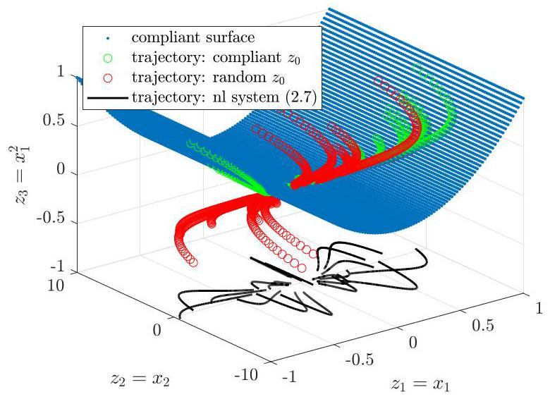
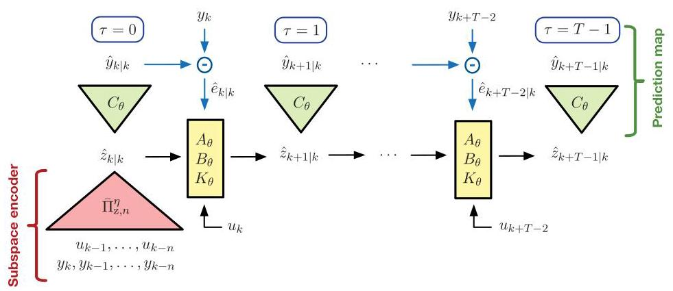
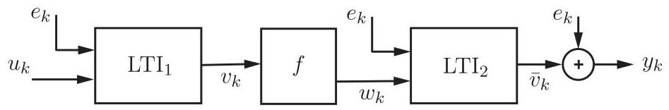
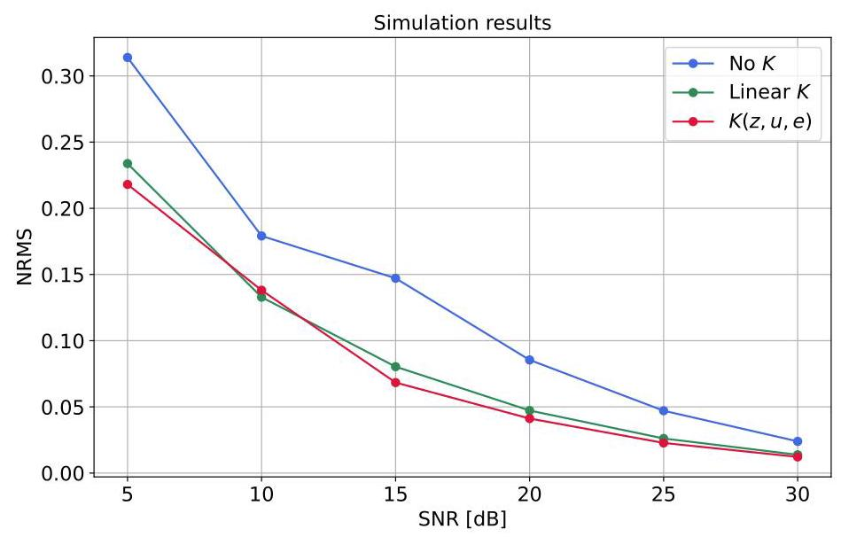
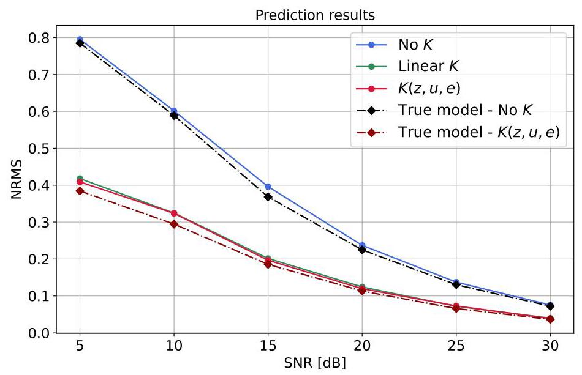
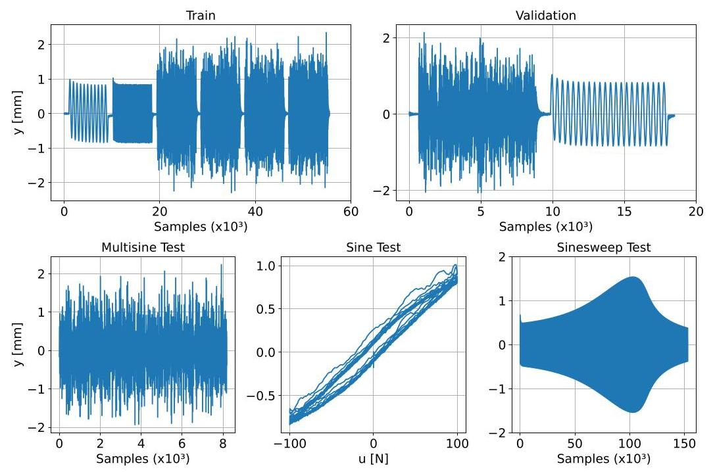
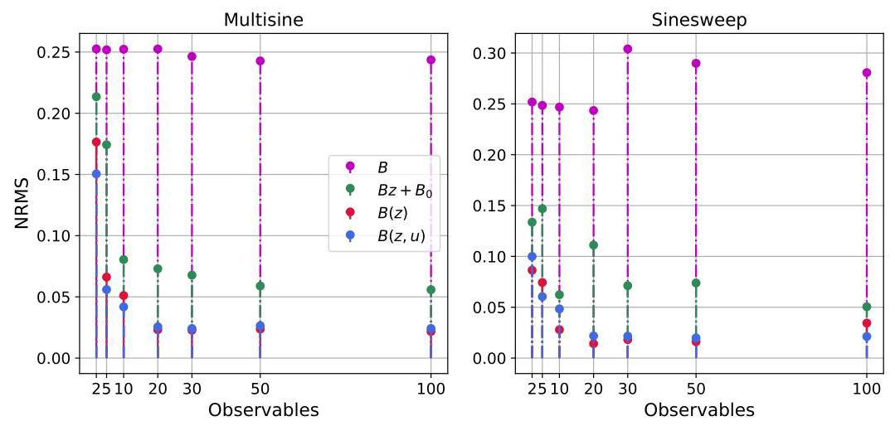
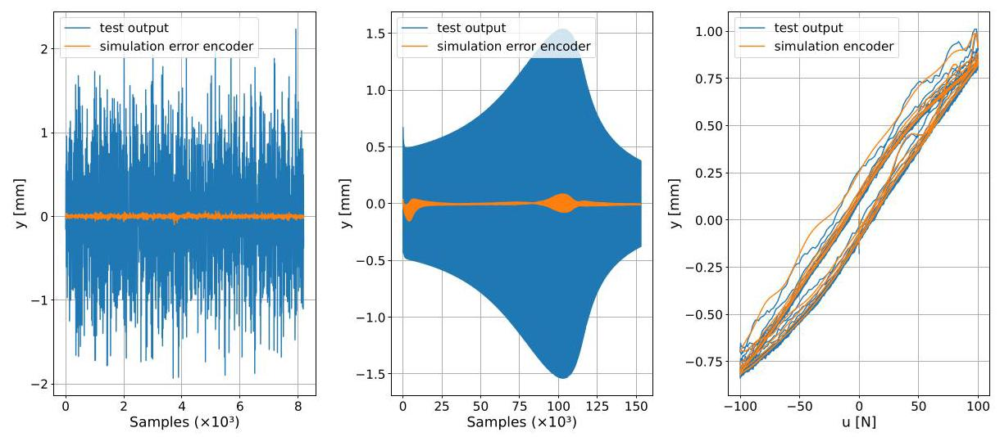
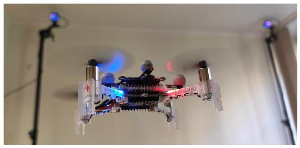
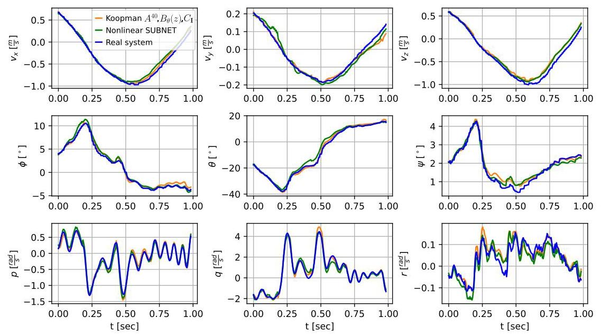

# Learning Koopman Models From Data Under General Noise Conditions*

# 从一般噪声条件下的数据学习库普曼模型*

Lucian Cristian lacob†, Máté Szécsi ${}^{ \ddagger  }$ , Gerben Izaak Beintema† Maarten Schoukens ${}^{ \dagger  }$ , and Roland Tóth ${}^{\dagger , \ddagger  }$

卢西安·克里斯蒂安·雅各布†，马特·塞克西${}^{ \ddagger  }$，格本·伊萨克·贝因特马†，马腾·舒肯斯${}^{ \dagger  }$，罗兰·托特${}^{\dagger , \ddagger  }$

Abstract. This paper presents a novel identification approach of Koopman models of nonlinear systems with inputs under rather general noise conditions. The method uses deep state-space encoders based on the concept of state reconstructability and an efficient multiple-shooting formulation of the squared loss of the prediction error to estimate the dynamics and the lifted state from input-output data. Furthermore, the Koopman model structure includes an innovation noise term that is used to handle process and measurement noise. It is shown that the proposed approach is statistically consistent and computationally efficient due to the multiple-shooting formulation where, on subsections of the data, multi-step prediction errors can be calculated in parallel. The latter allows for efficient batch optimization of the network parameters and, at the same time, excellent long-term prediction capabilities of the obtained models. The performance of the approach is illustrated by nonlinear benchmark examples and an experimental quadcopter setup.

摘要。本文提出了一种在相当一般的噪声条件下对具有输入的非线性系统的库普曼模型进行识别的新方法。该方法使用基于状态可重构性概念的深度状态空间编码器以及预测误差平方损失的有效多步射击公式，从输入 - 输出数据估计动力学和提升状态。此外，库普曼模型结构包括一个创新噪声项，用于处理过程和测量噪声。结果表明，由于多步射击公式，所提出的方法在统计上是一致的且计算效率高，在数据的子部分上，可以并行计算多步预测误差。后者允许对网络参数进行有效的批量优化，同时，所获得的模型具有出色的长期预测能力。通过非线性基准示例和实验四旋翼设置说明了该方法的性能。

Key words. Koopman methods, nonlinear dynamical systems, data-driven modeling, system identification

关键词。库普曼方法，非线性动力系统，数据驱动建模，系统识别

MSC codes. 37M99, 47B33, 65P99 93B07, 93B15, 93B30

数学学科分类代码。37M99，47B33，65P99 93B07，93B15，93B30

1. Introduction. Due to the continuously increasing performance expectations for dynamical systems in engineering, nonlinear behavior in many application areas started to become dominant, requiring novel methods that can stabilize and shape the performance of these systems with the ease of conventional approaches that have been developed for linear time-invariant systems. Hence, recent years have seen a strong push to find global linear embeddings of nonlinear systems to simplify, among others, analysis, prediction and control. One such embedding technique is based on the Koopman framework, where the concept is to lift the nonlinear state space to a (possibly) infinite-dimensional space through the so-called observable functions. The dynamics of the original system are preserved and governed by a linear Koopman operator, enabling the representation of the system dynamics via a linear dynamical description [6], [31] (for a more in depth-overview of the history of Koopman operator theory and the state-of-the-art see [33]). In practice, by choosing a dictionary of a finite number of observables a priori to construct time-shifted data matrices, linear Koopman-based models have been commonly obtained using simple least squares estimation [30]. One such approach, called dynamic mode decomposition (DMD) [42], is based on constructing time-shifted data matrices using directly measured state variables associated with the system. If the dictionary consists of nonlinear functions of the state, this technique is known as extended DMD (EDMD) [58]. However, among many challenges related to statistical consistency, availability of state-measurements, etc., the main difficulty with these powerful methods lies in choosing a finite number of lifting functions such that, in the lifted state-space, a linear time-invariant (LTI) model exists that can capture well the dynamic behavior of the original nonlinear system. While there exist methods for the automatic selection of the observables (see [7], [61]), they still rely on an a priori choice of a dictionary of functions, which many times are difficult to select and even characterize the resulting approximation error by them.

1. 引言。由于工程中对动力系统性能期望的不断提高，许多应用领域中的非线性行为开始占据主导地位，这需要新的方法来稳定和塑造这些系统的性能，就像为线性时不变系统开发的传统方法那样容易。因此，近年来大力推动寻找非线性系统的全局线性嵌入，以简化分析、预测和控制等。一种这样的嵌入技术基于库普曼框架，其概念是通过所谓可观测函数将非线性状态空间提升到(可能)无限维空间。原始系统的动力学得以保留并由线性库普曼算子支配，从而能够通过线性动力学描述来表示系统动力学[6]，[31](关于库普曼算子理论的历史和最新技术的更深入概述见[33])。在实践中，通过先验选择有限数量的可观测函数字典来构造时移数据矩阵，基于线性库普曼的模型通常使用简单最小二乘估计获得[30]。一种这样的方法，称为动态模态分解(DMD)[42]，基于使用与系统相关的直接测量状态变量构造时移数据矩阵。如果字典由状态的非线性函数组成，这种技术称为扩展DMD(EDMD)[58]。然而，在与统计一致性、状态测量可用性等相关的许多挑战中，这些强大方法的主要困难在于选择有限数量的提升函数，使得在提升的状态空间中存在一个线性时不变(LTI)模型，能够很好地捕捉原始非线性系统的动态行为。虽然存在自动选择可观测函数的方法(见[7]，[61])，但它们仍然依赖于函数字典 的先验选择，而这些字典很多时候难以选择，甚至难以用它们来表征由此产生的近似误差。

---

*Submitted to the editors on the ${24}^{\text{ th }}$ of May,2025. This paper extends Deep Identification of Nonlinear Systems in Koopman Form, which has appeared in the Proceedings of the 60th IEEE Conference on Decision and Control, CDC, 2021

*于2025年5月的${24}^{\text{ th }}$提交给编辑。本文扩展了《库普曼形式的非线性系统深度识别》，该文已发表于第60届IEEE决策与控制会议(CDC)论文集，2021年

Funding: This work was funded by the European Union (ERC, COMPLETE, 101075836). The research was also supported by the European Union within the framework of the National Laboratory for Autonomous Systems (RRF-2.3.1- 21-2022-00002) and by the Air Force Office of Scientific Research under award number FA8655-23-1- 7061. Views and opinions expressed are however those of the author(s) only and do not necessarily reflect those of the European Union or the European Research Council Executive Agency. Neither the European Union nor the granting authority can be held responsible for them.

资金支持:这项工作由欧盟(ERC，COMPLETE，101075836)资助。该研究还得到了欧盟在自主系统国家实验室框架内的支持(RRF - 2.3.1 - 21 - 2022 - 00002)以及美国空军科学研究办公室授予的编号为FA8655 - 23 - 1 - 7061的资助。然而，所表达的观点仅为作者的观点不一定反映欧盟或欧洲研究理事会执行机构的观点。欧盟和授予机构均不对其负责。

† Control System Group, Dept. of Electrical Engineering, Eindhoven Technical University, The Netherlands (l.c.iacob@tue.nl, g.i.beintema@tue.nl, m.schoukens@tue.nl, r.toth@tue.nl).

† 荷兰埃因霍温理工大学电气工程系控制系统组(l.c.iacob@tue.nl，g.i.beintema@tue.nl，m.schoukens@tue.nl，r.toth@tue.nl)。

${}^{ \ddagger  }$ Systems and Control Laboratory, HUN-REN Institute for Computer Science and Control, Hungary (szecsi.mate@sztaki.hun-ren.hu, toth.roland@sztaki.hun-ren.hu).

${}^{ \ddagger  }$ 匈牙利计算机科学与控制研究所系统与控制实验室(szecsi.mate@sztaki.hun-ren.hu, toth.roland@sztaki.hun-ren.hu)。

---

To circumvent this, a viable approach has been found in learning the lifting functions from data by the use of machine learning methods such as Gaussian processes [22], kernel-based methods [40], [59], or various forms of Artificial Neural Networks (ANNs) [27, 38, 39, 54]. Due to their flexibility in describing multiple model structures, applicability to large datasets, many successful applications of these methods have been reported in the literature to obtain accurate and compact Koopman models in practice.

为了规避这个问题，通过使用机器学习方法，如高斯过程[22]、基于核的方法[40, 59]或各种形式的人工神经网络(ANN)[27, 38, 39, 54]从数据中学习提升函数，已经找到了一种可行的方法。由于它们在描述多种模型结构方面的灵活性、对大型数据集的适用性，文献中已经报道了这些方法的许多成功应用，以便在实践中获得准确而紧凑的柯普曼模型。

However, a common drawback of learning-based methods together with the (E)DMD approaches is (i) the assumption of full-state measurement (e.g. [27], [39]), which is rarely the case in engineering applications. Some works such as [18] and [61] do address partial state observations, either by only lifting the output [61] or by implementing a DMD version that uses time-delayed measurements [18]. In a different approach, [38] employs a Kalman filter to estimate the lifted state. Nevertheless, a systematic framework for addressing partial state measurements in the context of data-driven Koopman modelling is still lacking at large. Furthermore, despite the powerful capabilities of these approaches that have been demonstrated in multiple examples, generally (ii) little consideration of measurement or process noise is taken, which can lead to serious bias of the models when applied in real-world applications. Only a few papers present examples where measurement noise is even present in the data (e.g. [16], [52]) and often only the robustness of the methods is analyzed (e.g. [47]). While there are works that add process noise directly to the lifted representation (e.g. [38]), the way noise enters the Koopman model is merely an assumption. As such, ensuring statistical guarantees of consistency of the estimators remains an open question in the literature. A third important issue is that (iii) the estimation of Koopman models for systems with inputs has only recently been investigated, either through a nonlinear lifting [3] or by using state- and input-dependent observables, together with input increments [54]. However, this often leads to models that have limited applicability, as it is more difficult to analyze dynamical aspects of the system or to design controllers to regulate the behavior compared to other model classes. Alternatively, due to their simple structure, multiple works assume a fully LTI Koopman model (e.g. [20], [29]) or, lately, bilinear (e.g. [4, 38, 45]). However, it is still largely unexplored how the approximation capability of these model structures in a finite dimensional setting compares to using more complex input structures such as control affine or nonlinear in both state and input, as given in [10, 12, 46].

然而，基于学习的方法与(E)DMD方法的一个共同缺点是:(i)全状态测量的假设(例如[27, 39])，这在工程应用中很少成立。一些工作，如[18]和[61]，确实解决了部分状态观测问题，要么仅提升输出[61]，要么通过实现使用时延测量的DMD版本[18]。在另一种方法中，[38]采用卡尔曼滤波器来估计提升状态。然而，在数据驱动的柯普曼建模背景下，仍然缺乏一个用于处理部分状态测量的系统框架。此外，尽管这些方法在多个例子中已经展示了强大的能力，但通常(ii)很少考虑测量或过程噪声，这在实际应用中应用时可能导致模型的严重偏差。只有少数论文给出了数据中存在测量噪声的例子(例如[16, 52])，并且通常只分析了方法的鲁棒性(例如[47])。虽然有工作直接将过程噪声添加到提升表示中(例如[38])，但噪声进入柯普曼模型的方式仅仅是一种假设。因此，确保估计器一致性的统计保证在文献中仍然是一个未解决的问题。第三个重要问题是，(iii)对于具有输入的系统的柯普曼模型估计直到最近才被研究，要么通过非线性提升[3]，要么通过使用依赖于状态和输入的可观测量以及输入增量[54]。然而，这通常会导致适用性有限的模型，因为与其他模型类别相比，分析系统的动态方面或设计控制器来调节行为更加困难。或者，由于其简单的结构，多个工作假设一个完全线性时不变的柯普曼模型(例如[20, 29])，或者最近假设为双线性的(例如[4, 38, 45])。然而，在有限维设置中，这些模型结构与使用更复杂的输入结构(如控制仿射或状态和输入均为非线性的结构，如[10, 12, 46]中给出的)相比，其逼近能力在很大程度上仍未被探索。

To overcome challenges (i)-(iii), we introduce a flexible Koopman model learning method under control inputs, partial measurements, and with statistical guarantees of consistency under process and measurement noise. For this purpose, a deep-learning-based state-space encoder approach is proposed, which is implemented in the deepSI toolbox ${}^{1}$ in Python. The main advantages of the approach together with our contributions ${}^{2}$ are as follows:

为了克服挑战(i) - (iii)，我们引入了一种在控制输入下、部分测量情况下且在过程和测量噪声下具有一致性统计保证的灵活柯普曼模型学习方法。为此，提出了一种基于深度学习的状态空间编码器方法，该方法在Python中的deepSI工具箱${}^{1}$中实现。该方法的主要优点以及我们的贡献${}^{2}$如下:

- Analytic derivation of an exact Koopman model with control inputs and innovation noise structure that can handle measurement and process noise;

- 具有控制输入和创新噪声结构的精确柯普曼模型的解析推导，该模型可以处理测量和过程噪声；

- Deep-ANN based encoder function using the reconstructability concept to estimate the lifted state using input-output data (allows for both full and partial state measurements);

- 使用可重构性概念的基于深度人工神经网络的编码器函数，利用输入 - 输出数据估计提升状态(允许全状态和部分状态测量)；

- Computationally efficient batch-wise (multiple-shooting) optimization based deep-learning identification method with consistency guarantees to estimate the proposed Koopman models;

- 基于计算效率高的批处理(多步射击)优化的深度学习识别方法，具有一致性保证以估计所提出的柯普曼模型；

- Comparative study of Koopman model estimation with input structures of different complexities (linear, bilinear, input affine, general);

- 对具有不同复杂程度输入结构(线性、双线性、输入仿射、一般)的柯普曼模型估计的比较研究；

The paper is structured as follows. Section 2 details the general Koopman framework and we discuss the notions of observability and state reconstructability in the Koopman form. The proposed Koopman encoder, the addition of input and the innovation-type model structure are discussed in Section 3 together with the proposed deep-learning-based approach for the estimation of the models. Section 4 discusses the convergence and consistency properties of the estimator. In Section 5, the approach is tested on Wiener-Hammerstien and Bouc-Wen benchmarks used in data-driven modeling and on experimental data obtained from a Crazyflie 2.1 nano-quadcopter, followed by a discussion of the results. The conclusions are presented in Section 6.

本文结构如下。第2节详细介绍了一般的柯普曼框架，并讨论了柯普曼形式下的可观性和状态可重构性概念。第3节讨论了所提出的柯普曼编码器、输入的添加以及创新型模型结构，并介绍了所提出的基于深度学习的模型估计方法。第4节讨论了估计器的收敛性和一致性性质。在第5节中，该方法在数据驱动建模中使用的维纳 - 哈默斯坦和布赫 - 温基准以及从Crazyflie 2.1纳米四轴飞行器获得的实验数据上进行了测试，随后对结果进行了讨论。第6节给出了结论。

2. Preliminaries. This section introduces the core concept of the Koopman framework and describes the embedding of nonlinear systems in the solution set of linear representations. We show that, while the behavior of the system can be represented using a linear form, a nonlinear constraint still needs to be satisfied on the initial conditions to ensure a one-to-one mapping between the solution sets. Based on this result, we explore observability and constructability concepts in the original and lifted forms, for both autonomous and input-driven systems.

2. 预备知识。本节介绍了柯普曼框架的核心概念，并描述了非线性系统在线性表示解集内的嵌入。我们表明，虽然系统的行为可以用线性形式表示，但仍需要对初始条件满足非线性约束，以确保解集之间的一一映射。基于此结果，我们探讨了自治系统和输入驱动系统在原始形式和提升形式下的可观性和可构造性概念。

2.1. Koopman embedding of nonlinear systems. First, for the sake of simplicity, consider a discrete-time nonlinear autonomous system:

2.1. 非线性系统的柯普曼嵌入。首先，为了简单起见，考虑一个离散时间非线性自治系统:

(2.1)

$$
{x}_{k + 1} = f\left( {x}_{k}\right) ,
$$

with ${x}_{k} \in  {\mathbb{R}}^{{n}_{\mathrm{x}}}$ being the state variable, $f : {\mathbb{R}}^{{n}_{\mathrm{x}}} \rightarrow  {\mathbb{R}}^{{n}_{\mathrm{x}}}$ is a bounded nonlinear state transition map and $k \in  \mathbb{Z}$ is the discrete time. The initial condition is denoted by ${x}_{0} \in  \mathbb{X} \subseteq  {\mathbb{R}}^{{n}_{\mathrm{x}}}$ and we assume that $\mathbb{X}$ is forward invariant under $f\left( \cdot \right)$ , i.e., $f\left( \mathbb{X}\right)  \subseteq  \mathbb{X}$ , see [12]. The Koopman framework uses observable functions $\phi  \in  \mathcal{F}$ to lift the system (2.1) to a higher dimensional space with linear dynamics. These observables $\phi  : \mathbb{X} \rightarrow  \mathbb{R}$ are scalar functions (generally nonlinear) and are from a Banach function space $\mathcal{F}$ . As described in [31], the Koopman operator $\mathcal{K} : \mathcal{F} \rightarrow  \mathcal{F}$ associated with (2.1) is defined through:

其中${x}_{k} \in  {\mathbb{R}}^{{n}_{\mathrm{x}}}$为状态变量，$f : {\mathbb{R}}^{{n}_{\mathrm{x}}} \rightarrow  {\mathbb{R}}^{{n}_{\mathrm{x}}}$是有界非线性状态转移映射，$k \in  \mathbb{Z}$是离散时间。初始条件用${x}_{0} \in  \mathbb{X} \subseteq  {\mathbb{R}}^{{n}_{\mathrm{x}}}$表示，并且我们假设$\mathbb{X}$在$f\left( \cdot \right)$下是正向不变的，即$f\left( \mathbb{X}\right)  \subseteq  \mathbb{X}$，见[12]。柯普曼框架使用可观测量函数$\phi  \in  \mathcal{F}$将系统(2.1)提升到具有线性动力学的高维空间。这些可观测量$\phi  : \mathbb{X} \rightarrow  \mathbb{R}$是标量函数(一般是非线性的)，并且来自巴拿赫函数空间$\mathcal{F}$。如[31]中所述，与(2.1)相关联的柯普曼算子$\mathcal{K} : \mathcal{F} \rightarrow  \mathcal{F}$通过以下方式定义:

(2.2)

$$
\mathcal{K}\phi  = \phi  \circ  f,\;\forall \phi  \in  \mathcal{F},
$$

---

${}^{1}$ deepSI toolbox available at https://github.com/MaartenSchoukens/deepSI

${}^{1}$ 可在https://github.com/MaartenSchoukens/deepSI获取deepSI工具箱

${}^{2}$ The present paper extends the conference paper [10] in terms of introducing an innovation noise structure in the Koopman model to handle process and measurement noise, proving the consistency of the estimator, studying various lifted structures for control inputs and providing extensive analysis and testing of the capabilities of the method on benchmarks and real-world data.

${}^{2}$ 本文扩展了会议论文[10]，在柯普曼模型中引入了创新噪声结构以处理过程和测量噪声，证明了估计器的一致性，研究了控制输入的各种提升结构，并对该方法在基准测试和实际数据上的能力进行了广泛的分析和测试。

---

where $\circ$ denotes function composition and (2.2) is equal to:

其中$\circ$表示函数复合，并且(2.2)等于:

(2.3)

$$
\mathcal{K}\phi \left( {x}_{k}\right)  = \phi \left( {x}_{k + 1}\right) .
$$

Although the Koopman framework typically requires $\mathcal{F}$ to be spanned by an infinite number of basis functions to fully describe the dynamics of (2.1), for practical use, an ${n}_{\mathrm{f}}$ -dimensional linear subspace ${\mathcal{F}}_{{n}_{\mathrm{f}}} \subset  \mathcal{F}$ is considered, with ${\mathcal{F}}_{{n}_{\mathrm{f}}} = \operatorname{span}{\left\{  {\phi }_{j}\right\}  }_{j = 1}^{{n}_{\mathrm{f}}}$ . The finite-dimensional approximation of the Koopman operator $\mathcal{K}$ can be described using the projection operator $\Pi  : \mathcal{F} \rightarrow  {\mathcal{F}}_{{n}_{\mathrm{f}}}$ , and is given by:

尽管柯普曼框架通常要求$\mathcal{F}$由无限数量的基函数张成以完全描述(2.1)的动力学，但为了实际应用，考虑一个${n}_{\mathrm{f}}$维线性子空间${\mathcal{F}}_{{n}_{\mathrm{f}}} \subset  \mathcal{F}$，其中${\mathcal{F}}_{{n}_{\mathrm{f}}} = \operatorname{span}{\left\{  {\phi }_{j}\right\}  }_{j = 1}^{{n}_{\mathrm{f}}}$。柯普曼算子$\mathcal{K}$的有限维近似可以用投影算子$\Pi  : \mathcal{F} \rightarrow  {\mathcal{F}}_{{n}_{\mathrm{f}}}$来描述，并且由下式给出:

(2.4)

$$
{\mathcal{K}}_{{n}_{\mathrm{f}}} = {\left. \Pi \mathcal{K}\right| }_{{\mathcal{F}}_{{n}_{\mathrm{f}}}} : {\mathcal{F}}_{{n}_{\mathrm{f}}} \rightarrow  {\mathcal{F}}_{{n}_{\mathrm{f}}}
$$

In practice, the Koopman matrix representation $A \in  {\mathbb{R}}^{{n}_{\mathrm{f}} \times  {n}_{\mathrm{f}}}$ is commonly used [31]:

在实际中，通常使用柯普曼矩阵表示$A \in  {\mathbb{R}}^{{n}_{\mathrm{f}} \times  {n}_{\mathrm{f}}}$ [31]:

(2.5)

$$
{\mathcal{K}}_{{n}_{\mathrm{f}}}{\phi }_{j} = \mathop{\sum }\limits_{{i = 1}}^{{n}_{\mathrm{f}}}{A}_{j, i}{\phi }_{i}.
$$

Note that there exist classes of systems that admit an exact finite dimensional embedding and ${\mathcal{K}}_{{n}_{\mathrm{f}}}$ captures exactly the effect of $\mathcal{K}$ . For example,[11] builds on the well known example discussed in [5], [13], or [38], and develops an exact embedding algorithm for network interconnections of block-oriented polynomial systems. Also, [21, 57, 60] discuss classes of nonlinear systems that admit an exact embedding via immersion. Next, we introduce the lifted state ${z}_{k} = \Phi \left( {x}_{k}\right)$ , where $\Phi \left( {x}_{k}\right)  = {\left\lbrack  \begin{array}{lll} {\phi }_{1}\left( {x}_{k}\right) & \cdots & {\phi }_{{n}_{\mathrm{f}}}\left( {x}_{k}\right)  \end{array}\right\rbrack  }^{\top }$ . The lifted finite dimensional linear representation of (2.1) is then given by:

请注意，存在这样一类系统，它们允许精确的有限维嵌入，并且${\mathcal{K}}_{{n}_{\mathrm{f}}}$恰好捕捉到了$\mathcal{K}$的影响。例如，[11]基于[5]、[13]或[38]中讨论的著名示例构建，并为面向块的多项式系统的网络互连开发了一种精确的嵌入算法。此外，[21, 57, 60]讨论了通过浸入允许精确嵌入的非线性系统类别。接下来，我们引入提升状态${z}_{k} = \Phi \left( {x}_{k}\right)$，其中$\Phi \left( {x}_{k}\right)  = {\left\lbrack  \begin{array}{lll} {\phi }_{1}\left( {x}_{k}\right) & \cdots & {\phi }_{{n}_{\mathrm{f}}}\left( {x}_{k}\right)  \end{array}\right\rbrack  }^{\top }$。那么(2.1)的提升有限维线性表示如下:

(2.6)

$$
{z}_{k + 1} = A{z}_{k}.
$$

The main challenge of the Koopman framework is the selection of the observables, including their number, to obtain a suitable approximation in terms of an appropriate norm (or an exact embedding) of the nonlinear system [31]. Additionally, it is often not clearly stated in the literature that a linear system whose dynamics are governed by the Koopman matrix $A$ is only equivalent in terms of behavior (collections of all solution trajectories) to the original nonlinear system (2.1) if explicit nonlinear constraints are imposed on the initial condition of the lifted state, i.e., equivalent trajectories are only part of a manifold in the extended solution space. We explore this further through a simple example.

柯普曼框架的主要挑战在于可观测量的选择，包括其数量，以便在非线性系统的适当范数(或精确嵌入)方面获得合适的近似[31]。此外，文献中常常没有明确指出，一个其动力学由柯普曼矩阵$A$支配的线性系统，只有在对提升状态的初始条件施加明确的非线性约束时，才在行为(所有解轨迹的集合)方面与原始非线性系统(2.1)等价，即等价轨迹只是扩展解空间中一个流形的一部分。我们通过一个简单示例进一步探讨这一点。

2.2. Linear representations subject to nonlinear constraints. To illustrate the concept, we consider the following polynomial system represented by (2.1), similar to the well-studied example described in [5]:

2.2. 受非线性约束的线性表示。为了说明这个概念，我们考虑由(2.1)表示的以下多项式系统，类似于[5]中研究的示例:

(2.7)

$$
\left\lbrack  \begin{array}{l} {x}_{k + 1,1} \\  {x}_{k + 1,2} \end{array}\right\rbrack   = \left\lbrack  \begin{matrix} a{x}_{k,1} \\  b{x}_{k,2} - c{x}_{k,1}^{2} \end{matrix}\right\rbrack
$$

where $a, b, c \in  \mathbb{R}$ are constant parameters and ${x}_{k, i}$ denotes the ${i}^{\text{ th }}$ element of ${x}_{k}$ . By considering solutions of (2.7) only on $\lbrack 0,\infty )$ with initial condition ${x}_{0} \in  {\mathbb{R}}^{2}$ , the feasible trajectories are given by:

其中$a, b, c \in  \mathbb{R}$是常数参数，${x}_{k, i}$表示${x}_{k}$的${i}^{\text{ th }}$元素。通过仅考虑(在)具有初始条件${x}_{0} \in  {\mathbb{R}}^{2}$的$\lbrack 0,\infty )$上(的)(2.7)的解，可行轨迹由下式给出:

(2.8)

$$
\mathcal{B} = \left\{  {x : {\mathbb{Z}}_{0}^{ + } \rightarrow  {\mathbb{R}}^{2} \mid  \text{ s.t. }\left( {2.7}\right) \text{ is satisfied }}\right\}  .
$$

To obtain the Koopman form, the following observables are chosen: ${\phi }_{1}\left( {x}_{k}\right)  = {x}_{k,1},{\phi }_{2}\left( {x}_{k}\right)  = \; {x}_{k,2}$ and ${\phi }_{3}\left( {x}_{k}\right)  = {x}_{k,1}^{2}$ , which give the equivalent lifted form:

为了得到柯普曼形式，选择以下可观测量:${\phi }_{1}\left( {x}_{k}\right)  = {x}_{k,1},{\phi }_{2}\left( {x}_{k}\right)  = \; {x}_{k,2}$和${\phi }_{3}\left( {x}_{k}\right)  = {x}_{k,1}^{2}$，它们给出了等价的提升形式:

(2.9)

$$
\Phi \left( {x}_{k + 1}\right)  = \underset{A}{\underbrace{\left\lbrack  \begin{matrix} a & 0 & 0 \\  0 & b &  - c \\  0 & 0 & {a}^{2} \end{matrix}\right\rbrack  }}\Phi \left( {x}_{k}\right) .
$$

Based on (2.9), consider the system ${z}_{k + 1} = A{z}_{k}$ of dimension ${n}_{\mathrm{z}} = 3$ and with ${z}_{0} \in  {\mathbb{R}}^{3}$ . The solution set is described as:

基于(2.9)，考虑维度为${n}_{\mathrm{z}} = 3$且具有${z}_{0} \in  {\mathbb{R}}^{3}$的系统${z}_{k + 1} = A{z}_{k}$。解集描述如下:

(2.10)

$$
{\mathcal{B}}_{\mathcal{K}} = \left\{  {z : {\mathbb{Z}}_{0}^{ + } \rightarrow  {\mathbb{R}}^{3} \mid  \text{ s.t. }{z}_{k + 1} = A{z}_{k}}\right\}  .
$$

Note that (2.10) represents an unrestricted LTI behavior. It is easy to show that $\Phi \left( \mathcal{B}\right)  \subseteq  {\mathcal{B}}_{\mathcal{K}}$ , as any ${z}_{k} \in  {\mathcal{B}}_{\mathcal{K}}$ with ${z}_{0} \in  {\mathbb{R}}^{3}$ for which ${z}_{0,3} \neq  {z}_{0,1}^{2}$ will not correspond to a solution of (2.7), i.e., ${\Phi }^{-1}\left( {z}_{k}\right)  = {x}_{k} \notin  \mathcal{B}$ . By introducing the constraint $\Psi  : {\mathbb{R}}^{3} \rightarrow  \mathbb{R},\Psi \left( {z}_{k}\right)  = {z}_{k,1}^{2} - {z}_{k,3}$ , the solution set (2.10) with constraint $\Psi$ is:

请注意，(2.10)表示一种无约束的线性时不变行为。很容易证明，$\Phi \left( \mathcal{B}\right)  \subseteq  {\mathcal{B}}_{\mathcal{K}}$，因为任何满足${z}_{0} \in  {\mathbb{R}}^{3}$且${z}_{0,3} \neq  {z}_{0,1}^{2}$的${z}_{k} \in  {\mathcal{B}}_{\mathcal{K}}$都不会对应于(2.7)的解，即${\Phi }^{-1}\left( {z}_{k}\right)  = {x}_{k} \notin  \mathcal{B}$。通过引入约束$\Psi  : {\mathbb{R}}^{3} \rightarrow  \mathbb{R},\Psi \left( {z}_{k}\right)  = {z}_{k,1}^{2} - {z}_{k,3}$，具有约束$\Psi$的解集(2.10)为:

(2.11)

$$
{\widehat{\mathcal{B}}}_{\mathcal{K}} = \left\{  {z : {\mathbb{Z}}_{0}^{ + } \rightarrow  {\mathbb{R}}^{3} \mid  \text{ s.t. }{z}_{k + 1} = A{z}_{k},\Psi \left( {z}_{0}\right)  = 0}\right\}  .
$$

Then, it is possible to show that $\Phi \left( \mathcal{B}\right)  = {\widehat{\mathcal{B}}}_{\mathcal{K}}$ holds. To illustrate this, Fig. 1 shows the simulated trajectories of system (2.10) with $a = {0.99}, b = {0.9}$ and $c = {0.9}$ and the constraint $\Psi$ , which we call the compliant surface. As can be seen in Fig. 1, only solutions (in green) starting on the compliant surface remain on the compliant surface and correspond to solutions (in black) of the original nonlinear system (2.7). This example highlights the need for additional constraints on the Koopman form, or, as we now call it, the embedding of (2.1), to guarantee a bijective relationship between the solution sets.

然后，可以证明$\Phi \left( \mathcal{B}\right)  = {\widehat{\mathcal{B}}}_{\mathcal{K}}$成立。为了说明这一点，图1展示了系统(2.10)在$a = {0.99}, b = {0.9}$、$c = {0.9}$和约束$\Psi$(我们称之为柔顺曲面)下的模拟轨迹。如图1所示，只有起始于柔顺曲面上的解(绿色)会保留在柔顺曲面上，并且对应于原始非线性系统(2.7)的解(黑色)。这个例子突出了对柯普曼形式(或者如我们现在所称的(2.1)的嵌入)施加额外约束的必要性，以确保解集之间存在双射关系。

Note that, when ${x}_{0}$ is known and the observable set $\Phi$ is given, this nonlinear condition on the lifted states is alternatively defined by ${z}_{0} = \Phi \left( {x}_{0}\right)$ . This approach has been extensively used in the Koopman literature, in both theoretical and application oriented works, see e.g. $\left\lbrack  {3,8,{30},{50}}\right\rbrack$ , and for a discussion on the connection between the nonlinear and lifted manifolds for systems of the type (2.7), one can consult [5]. However, in an identification setting where information on ${x}_{0}$ is not available or only partially available (in contrast to explicitly lifting the state via $\Phi \left( {x}_{0}\right)$ as done in [5]), to construct a lifted model with the constrained solution set, one needs to include the $\Psi \left( {z}_{0}\right)  = 0$ condition. Next, we explore observability and reconstructability of $z$ in view of this discussion.

请注意，当${x}_{0}$已知且可观测量集$\Phi$给定后，提升状态上的这个非线性条件可由${z}_{0} = \Phi \left( {x}_{0}\right)$另行定义。这种方法在柯普曼文献中已被广泛使用，在理论和面向应用的著作中均有，例如参见$\left\lbrack  {3,8,{30},{50}}\right\rbrack$，并且关于(2.7)类型系统的非线性流形与提升流形之间的联系的讨论，可以查阅[5]。然而，在一个识别设置中，若没有${x}_{0}$的信息或者仅有部分可用信息(与[5]中通过$\Phi \left( {x}_{0}\right)$显式提升状态的做法相反)，为了构建具有约束解集的提升模型，需要纳入$\Psi \left( {z}_{0}\right)  = 0$条件。接下来，鉴于此讨论，我们探讨$z$的可观性和可重构性。

(2.12)

$$
{y}_{k} = h\left( {x}_{k}\right) ,
$$

Figure 1: Compliant surface corresponding to $\Psi$ (in blue), compliant trajectories of the lifted system (in green), non-compliant trajectories (in red) of the lifted system and trajectories of the original nonlinear system (in black).

图1:对应于$\Psi$的柔顺曲面(蓝色)、提升系统的柔顺轨迹(绿色)、提升系统的非柔顺轨迹(红色)以及原始非线性系统的轨迹(黑色)。

2.3. Observability and reconstructability. Consider the system defined by (2.1) with output

2.3. 可观性和可重构性。考虑由(2.1)定义的系统及其输出

where $h : {\mathbb{R}}^{{n}_{\mathrm{x}}} \rightarrow  {\mathbb{R}}^{{n}_{\mathrm{y}}}$ is a nonlinear output map. Given ${x}_{0} \in  {\mathbb{R}}^{{n}_{\mathrm{x}}}$ , the output map for the state $x$ associated with the nonlinear dynamics represented by (2.1) and (2.12) is:

其中$h : {\mathbb{R}}^{{n}_{\mathrm{x}}} \rightarrow  {\mathbb{R}}^{{n}_{\mathrm{y}}}$是一个非线性输出映射。给定${x}_{0} \in  {\mathbb{R}}^{{n}_{\mathrm{x}}}$，与由(2.1)和(2.12)表示的非线性动力学相关联的状态$x$的输出映射为:

(2.13)

$$
{\mathcal{O}}_{\mathrm{x}, n}\left( {x}_{0}\right)  = \left\lbrack  \begin{matrix} h\left( {x}_{0}\right) \\  h \circ  f\left( {x}_{0}\right) \\  \vdots \\  h{ \circ  }_{n - 1}f\left( {x}_{0}\right)  \end{matrix}\right\rbrack   = \left\lbrack  \begin{matrix} {y}_{0} \\  {y}_{1} \\  \vdots \\  {y}_{n - 1} \end{matrix}\right\rbrack
$$

where $h{ \circ  }_{2}f\left( {x}_{0}\right)  = h \circ  f \circ  f\left( {x}_{0}\right)$ and $h{ \circ  }_{n}f\left( {x}_{0}\right)  = h \circ  f{ \circ  }_{n - 1}f\left( {x}_{0}\right)$ for $n > 2$ . Let ${y}_{0}^{n - 1} = \; {\left\lbrack  \begin{array}{lll} {y}_{0}^{\top } & \cdots & {y}_{n - 1}^{\top } \end{array}\right\rbrack  }^{\top }$ . As described in [35], the representation satisfies the so-called observability rank condition at ${x}_{0}$ if, for $n = {n}_{\mathrm{x}}$ , the rank of the Jacobian of ${\mathcal{O}}_{\mathrm{x}, n}$ at ${x}_{0}$ is ${n}_{\mathrm{x}}$ . If this condition is met, the representation is strongly locally observable at ${\mathbb{X}}_{0}$ , where ${\mathbb{X}}_{0}$ is a neighborhood of ${x}_{0}$ , and ${\mathcal{O}}_{\mathrm{x}, n}$ is a diffeomorphism, i.e., it is invertible, on ${\mathbb{X}}_{0}$ [15]. We denote its inverse as ${\Lambda }_{\mathrm{x}, n} : {\mathbb{R}}^{n{n}_{\mathrm{y}}} \rightarrow  {\mathbb{X}}_{0} \subseteq  {\mathbb{R}}^{{n}_{\mathrm{x}}}$ , such that

其中$h{ \circ  }_{2}f\left( {x}_{0}\right)  = h \circ  f \circ  f\left( {x}_{0}\right)$和$h{ \circ  }_{n}f\left( {x}_{0}\right)  = h \circ  f{ \circ  }_{n - 1}f\left( {x}_{0}\right)$用于$n > 2$。令${y}_{0}^{n - 1} = \; {\left\lbrack  \begin{array}{lll} {y}_{0}^{\top } & \cdots & {y}_{n - 1}^{\top } \end{array}\right\rbrack  }^{\top }$。如[35]中所述，如果对于$n = {n}_{\mathrm{x}}$，${\mathcal{O}}_{\mathrm{x}, n}$在${x}_{0}$处的雅可比矩阵的秩为${n}_{\mathrm{x}}$，则该表示在${x}_{0}$处满足所谓的可观测性秩条件。如果满足此条件，则该表示在${\mathbb{X}}_{0}$处是强局部可观测的，其中${\mathbb{X}}_{0}$是${x}_{0}$的一个邻域，并且${\mathcal{O}}_{\mathrm{x}, n}$是一个微分同胚，即在${\mathbb{X}}_{0}$上是可逆的[15]。我们将其逆记为${\Lambda }_{\mathrm{x}, n} : {\mathbb{R}}^{n{n}_{\mathrm{y}}} \rightarrow  {\mathbb{X}}_{0} \subseteq  {\mathbb{R}}^{{n}_{\mathrm{x}}}$，使得

(2.14)

$$
{x}_{0} = {\Lambda }_{\mathrm{x}, n}\left( {{\mathcal{O}}_{\mathrm{x}, n}\left( {x}_{0}\right) }\right)  = {\Lambda }_{\mathrm{x}, n}\left( {y}_{0}^{n - 1}\right) ,
$$

for all ${x}_{0} \in  {\mathbb{X}}_{0}$ . Note that just like in the LTI case, if this property is satisfied for $n = {n}_{\mathrm{x}}$ , then (i) the rank condition can be satisfied for ${n}_{\mathrm{x}} \geq  n \geq  1$ and the minimal $n$ for which it holds is called the lag ${n}_{ * }$ of the system at ${x}_{0}$ ; (ii) the rank of the Jacobian does not change for $n \geq  {n}_{\mathrm{x}}$ ; (iii) hence, the existence of (2.14) is ensured for any $n \geq  {n}_{ * }$ .

对于所有${x}_{0} \in  {\mathbb{X}}_{0}$。请注意，就像在LTI情况中一样，如果对于$n = {n}_{\mathrm{x}}$满足此属性，那么(i)对于${n}_{\mathrm{x}} \geq  n \geq  1$可以满足秩条件，并且使其成立的最小$n$称为系统在${x}_{0}$处的滞后${n}_{ * }$；(ii)对于$n \geq  {n}_{\mathrm{x}}$，雅可比矩阵的秩不变；(iii)因此，对于任何$n \geq  {n}_{ * }$，都确保了(2.14)的存在。

Throughout the paper, we call ${\Lambda }_{\mathrm{x}, n}$ the observability map, which can be used to compute the initial condition ${x}_{0}$ from future values of the output $y$ . Conversely, the reconstructability concept is used to calculate the initial condition from past values of the output. For $n \geq  1$ , it holds that

在整篇论文中，我们将${\Lambda }_{\mathrm{x}, n}$称为可观测性映射，它可用于从输出$y$的未来值计算初始条件${x}_{0}$。相反，可重构性概念用于从输出的过去值计算初始条件。对于$n \geq  1$，有

(2.15)

$$
{x}_{0} = { \circ  }_{n - 1}f\left( {x}_{-n + 1}\right) ,
$$

where ${ \circ  }_{0}f\left( {x}_{0}\right)  = {x}_{0}$ . If, for the given $n,{\Lambda }_{\mathrm{x}, n}$ exists, then, using (2.15), we have:

其中${ \circ  }_{0}f\left( {x}_{0}\right)  = {x}_{0}$。如果对于给定的$n,{\Lambda }_{\mathrm{x}, n}$存在，那么使用(2.15)，我们有:

(2.16)

$$
{x}_{0} = { \circ  }_{n - 1}f\left( {{\Lambda }_{\mathrm{x}, n}\left( {y}_{-n + 1}^{0}\right) }\right)  =  : {\Pi }_{\mathrm{x}, n}\left( {y}_{-n + 1}^{0}\right)
$$

for all ${x}_{0} \in  {\mathbb{X}}_{0}$ . The function ${\Pi }_{\mathrm{x}, n} : {\mathbb{R}}^{n{n}_{\mathrm{y}}} \rightarrow  {\mathbb{X}}_{0} \subseteq  {\mathbb{R}}^{{n}_{\mathrm{x}}}$ is called the reconstructability map.

对于所有${x}_{0} \in  {\mathbb{X}}_{0}$。函数${\Pi }_{\mathrm{x}, n} : {\mathbb{R}}^{n{n}_{\mathrm{y}}} \rightarrow  {\mathbb{X}}_{0} \subseteq  {\mathbb{R}}^{{n}_{\mathrm{x}}}$称为可重构性映射。

In the Koopman form, assuming that the output function is in the span of the lifted states (or simply included in the lifting set), i.e., ${y}_{k} = C{z}_{k}$ , with $C \in  {\mathbb{R}}^{{n}_{\mathrm{y}} \times  {n}_{\mathrm{z}}}$ , we construct the following map:

在柯普曼形式中，假设输出函数在提升状态的跨度内(或简单地包含在提升集中)，即${y}_{k} = C{z}_{k}$，其中$C \in  {\mathbb{R}}^{{n}_{\mathrm{y}} \times  {n}_{\mathrm{z}}}$，我们构造以下映射:

(2.17)

$$
\left\lbrack  \begin{matrix} {y}_{0} \\  {y}_{1} \\  \vdots \\  {y}_{n - 1} \\  0 \end{matrix}\right\rbrack   = \left\lbrack  {\left( \begin{matrix} C \\  {CA} \\  \vdots \\  C{A}^{n - 1} \\  \Psi \left( {z}_{0}\right)  \end{matrix}\right) {z}_{0}}\right\rbrack   \mathrel{\text{ := }} \left\lbrack  \begin{matrix} {\mathcal{O}}_{\mathrm{z}, n}^{\ln }{z}_{0} \\  \Psi \left( {z}_{0}\right)  \end{matrix}\right\rbrack   \mathrel{\text{ := }} {\mathcal{O}}_{\mathrm{z}, n}\left( {z}_{0}\right) .
$$

In an LTI sense, the lifted system representation would be observable if there is an $n \geq  1$ such that $\operatorname{rank}\left( {\mathcal{O}}_{\mathrm{z}, n}^{\operatorname{lin}}\right)  = {n}_{\mathrm{z}}$ . However, as observed in Section 2.2, it is also necessary to consider the nonlinear constraints $\Psi  : {\mathbb{R}}^{{n}_{\mathrm{z}}} \rightarrow  {\mathbb{R}}^{{n}_{\mathrm{c}}}$ to ensure compliance of the initial condition ${z}_{0}$ . Hence, if there is an $n \geq  1$ such that the Jacobian of ${\mathcal{O}}_{\mathrm{z}, n}\left( {z}_{0}\right)$ has full rank ${n}_{\mathrm{z}}$ , which implies that the mapping ${\mathcal{O}}_{\mathrm{z}, n}$ is locally invertible on a neighborhood ${\mathbb{Z}}_{0}$ of ${z}_{0}$ , then ${z}_{0}$ is uniquely determined from ${y}_{0}^{n - 1}$ and the constraint $\Psi \left( {z}_{0}\right)$ . Then, there exists a ${\Lambda }_{\mathrm{z}, n} : {\mathbb{R}}^{n{n}_{\mathrm{y}}} \rightarrow  {\mathbb{Z}}_{0} \subseteq  {\mathbb{R}}^{{n}_{\mathrm{z}}}$ , such that

在LTI意义下，如果存在一个$n \geq  1$使得$\operatorname{rank}\left( {\mathcal{O}}_{\mathrm{z}, n}^{\operatorname{lin}}\right)  = {n}_{\mathrm{z}}$，那么提升后的系统表示将是可观测的。然而，正如在2.2节中所观察到的，还必须考虑非线性约束$\Psi  : {\mathbb{R}}^{{n}_{\mathrm{z}}} \rightarrow  {\mathbb{R}}^{{n}_{\mathrm{c}}}$以确保初始条件${z}_{0}$的合规性。因此，如果存在一个$n \geq  1$使得${\mathcal{O}}_{\mathrm{z}, n}\left( {z}_{0}\right)$的雅可比矩阵具有满秩${n}_{\mathrm{z}}$，这意味着映射${\mathcal{O}}_{\mathrm{z}, n}$在${z}_{0}$的邻域${\mathbb{Z}}_{0}$上是局部可逆的，那么${z}_{0}$可以从${y}_{0}^{n - 1}$和约束$\Psi \left( {z}_{0}\right)$中唯一确定。然后，存在一个${\Lambda }_{\mathrm{z}, n} : {\mathbb{R}}^{n{n}_{\mathrm{y}}} \rightarrow  {\mathbb{Z}}_{0} \subseteq  {\mathbb{R}}^{{n}_{\mathrm{z}}}$，使得

(2.18)

$$
{z}_{0} = {\Lambda }_{\mathrm{z}, n}\left( {y}_{0}^{n - 1}\right) ,
$$

for all ${z}_{0} \in  {\mathbb{Z}}_{0}$ . We call ${\Lambda }_{\mathrm{z}, n}$ the observability map for autonomous Koopman models. To utilize only past data for determining ${z}_{0}$ , we can also formulate (2.18) in a reconstructability form. Let:

对于所有的${z}_{0} \in  {\mathbb{Z}}_{0}$。我们称${\Lambda }_{\mathrm{z}, n}$为自治库普曼模型的可观测性映射。为了仅利用过去的数据来确定${z}_{0}$，我们也可以将(2.18)以可重构性形式表述。设:

(2.19)

$$
{z}_{0} = {A}^{n - 1}{z}_{-n + 1}.
$$

Using (2.18) in (2.19):

在(2.19)中使用(2.18):

(2.20)

$$
{z}_{0} = {A}^{n - 1}{\Lambda }_{\mathrm{z}, n}\left( {y}_{-n + 1}^{0}\right)  \mathrel{\text{ := }} {\Pi }_{\mathrm{z}, n}\left( {y}_{-n + 1}^{0}\right)
$$

where ${\Pi }_{\mathrm{z}, n} : {\mathbb{R}}^{n{n}_{\mathrm{y}}} \rightarrow  {\mathbb{R}}^{{n}_{\mathrm{z}}}$ is the Koopman reconstructability map for autonomous systems. Note that the compliance constraint $\Psi$ is part of ${\Lambda }_{\mathrm{z}, n}$ . This gives a different point of view on reconstructability than in the work [50], where the observability notions are discussed based on an explicit definition of the lifting map, i.e., a given selection of the observables $\Phi$ . Note that, for a nonlinear system representation with ${n}_{\mathrm{x}}$ states and an explicit dictionary $\Phi$ , the construction ${z}_{0} = \Phi \left( {x}_{0}\right)  = \Phi \left( {{\Pi }_{\mathrm{x}, n}\left( {y}_{-n + 1}^{0}\right) }\right)$ allows to compute the initial lifted ${z}_{0}$ based on ${x}_{0}$ , using a much smaller amount of lags (at max $n = {n}_{\mathrm{x}}$ ) as, typically, ${n}_{\mathrm{x}} \ll  {n}_{\mathrm{z}}$ . As such, the number of necessary lags $n$ does not depend on the dimensionality of the lifted space, but of the original nonlinear system, which drastically reduces the computational complexity.

其中${\Pi }_{\mathrm{z}, n} : {\mathbb{R}}^{n{n}_{\mathrm{y}}} \rightarrow  {\mathbb{R}}^{{n}_{\mathrm{z}}}$是自治系统的库普曼可重构性映射。注意，合规性约束$\Psi$是${\Lambda }_{\mathrm{z}, n}$的一部分。这给出了一个与[50]中不同视角的可重构性，在[50]中，可观测性概念是基于提升映射的明确定义来讨论的，即给定可观测量$\Phi$的选择。注意，对于具有${n}_{\mathrm{x}}$个状态和显式字典$\Phi$的非线性系统表示，构造${z}_{0} = \Phi \left( {x}_{0}\right)  = \Phi \left( {{\Pi }_{\mathrm{x}, n}\left( {y}_{-n + 1}^{0}\right) }\right)$允许基于${x}_{0}$计算初始提升后的${z}_{0}$，使用的滞后量要少得多(最多$n = {n}_{\mathrm{x}}$)，因为通常${n}_{\mathrm{x}} \ll  {n}_{\mathrm{z}}$。因此，所需滞后量$n$的数量不取决于提升空间的维度，而是取决于原始非线性系统，这极大地降低了计算复杂度。

It is important to emphasize that the conditions discussed in this subsection guarantee local observability and necessary conditions for the local invertibility of (2.13) and (2.17). However, for stronger, global guarantees, [1] describes, albeit for a continuous time systems, that if $f$ is Lipschitz continuous and $h$ has a finite amount of nondegenerate critical points, then $n = 2{n}_{\mathrm{x}} + 1$ is sufficient to ensure global existence of the reconstructability map, which is in line with the results in [53].

需要强调的是，本小节讨论的条件保证了局部可观测性以及(2.13)和(2.17)局部可逆性的必要条件。然而，对于更强的全局保证，[1]描述了，尽管是针对连续时间系统，如果$f$是利普希茨连续的且$h$有有限数量的非退化临界点，那么$n = 2{n}_{\mathrm{x}} + 1$足以确保可重构性映射的全局存在性，这与[53]中的结果一致。

3. Identification approach. Building on the previously discussed results, this section details the proposed Koopman model identification approach for nonlinear systems driven by an external input and affected by process and measurement noise.

3. 识别方法。基于前面讨论的结果，本节详细介绍了针对由外部输入驱动且受过程和测量噪声影响的非线性系统所提出的库普曼模型识别方法。

3.1. Data generating system. We consider the following nonlinear system:

3.1. 数据生成系统。我们考虑以下非线性系统:

(3.1a)

$$
{x}_{k + 1} = {f}_{\mathrm{d}}\left( {{x}_{k},{u}_{k},{e}_{k}}\right) ,
$$

(3.1b)

$$
{y}_{k} = h\left( {x}_{k}\right)  + {e}_{k},
$$

with ${u}_{k} \in  \mathbb{U} \subseteq  {\mathbb{R}}^{{n}_{\mathrm{u}}}$ the control input and ${x}_{k} \in  \mathbb{X} \subseteq  {\mathbb{R}}^{{n}_{\mathrm{x}}}$ the state. The signal ${e}_{k}$ is the sample-path realization of an i.i.d. white noise process of finite variance, taking values in $\mathbb{E} \subseteq  {\mathbb{R}}^{{n}_{\mathrm{x}}}$ and being independent from $u$ in the statistical sense. The functions ${f}_{\mathrm{d}} : \mathbb{X} \times  \mathbb{U} \times  \mathbb{E} \rightarrow  {\mathbb{R}}^{{n}_{\mathrm{x}}}$ and $h : \mathbb{X} \rightarrow  {\mathbb{R}}^{{n}_{y}}$ are the state-transition and output functions, respectively. It is assumed that the sets $\mathbb{U}$ and $\mathbb{E}$ are such that $\mathbb{X}$ is forward invariant under ${f}_{\mathrm{d}}$ and $0 \in  \mathbb{X}$ . The objective is to estimate a Koopman model of the deterministic (process) part of (3.1). This is done using an input-output data sequence ${\mathcal{D}}_{N} = {\left\{  \left( {u}_{k},{y}_{k}\right) \right\}  }_{k = 0}^{N}$ collected from the system (3.1). We define next the model structure that we propose to identify a lifted Koopman form of the system under the control input $u$ and noise process $e$ .

其中${u}_{k} \in  \mathbb{U} \subseteq  {\mathbb{R}}^{{n}_{\mathrm{u}}}$为控制输入，${x}_{k} \in  \mathbb{X} \subseteq  {\mathbb{R}}^{{n}_{\mathrm{x}}}$为状态。信号${e}_{k}$是具有有限方差的独立同分布白噪声过程的样本路径实现，取值于$\mathbb{E} \subseteq  {\mathbb{R}}^{{n}_{\mathrm{x}}}$且在统计意义上与$u$独立。函数${f}_{\mathrm{d}} : \mathbb{X} \times  \mathbb{U} \times  \mathbb{E} \rightarrow  {\mathbb{R}}^{{n}_{\mathrm{x}}}$和$h : \mathbb{X} \rightarrow  {\mathbb{R}}^{{n}_{y}}$分别是状态转移函数和输出函数。假设集合$\mathbb{U}$和$\mathbb{E}$使得$\mathbb{X}$在${f}_{\mathrm{d}}$和$0 \in  \mathbb{X}$下是前向不变的。目标是估计(3.1)确定性(过程)部分的Koopman模型。这是通过使用从系统(3.1)收集的输入 - 输出数据序列${\mathcal{D}}_{N} = {\left\{  \left( {u}_{k},{y}_{k}\right) \right\}  }_{k = 0}^{N}$来完成的。接下来，我们定义模型结构，该结构旨在识别在控制输入$u$和噪声过程$e$下系统的提升Koopman形式。

3.2. Koopman model structure. To analytically derive an equivalent Koopman model of (3.1), we begin by decomposing ${f}_{\mathrm{d}}\left( {{x}_{k},{u}_{k},{e}_{k}}\right)$ into autonomous, input and noise-related components as follows:

3.2. Koopman模型结构。为了通过解析方法推导(3.1)的等效Koopman模型，我们首先将${f}_{\mathrm{d}}\left( {{x}_{k},{u}_{k},{e}_{k}}\right)$分解为自治、输入和与噪声相关的分量，如下所示:

(3.2)

$$
{f}_{\mathrm{d}}\left( {{x}_{k},{u}_{k},{e}_{k}}\right)  = {f}_{\mathrm{d}}\left( {{x}_{k},0,0}\right)  + \underset{{\widetilde{f}}_{\mathrm{d}}\left( {{x}_{k},{u}_{k},{e}_{k}}\right) }{\underbrace{{f}_{\mathrm{d}}\left( {{x}_{k},{u}_{k},{e}_{k}}\right)  - {f}_{\mathrm{d}}\left( {{x}_{k},0,0}\right) }}
$$

$$
= {f}_{\mathrm{d}}\left( {{x}_{k},0,0}\right)  + {\widetilde{f}}_{\mathrm{d}}\left( {{x}_{k},{u}_{k},0}\right)  + \underset{d\left( {{x}_{k},{u}_{k},{e}_{k}}\right) }{\underbrace{{\widetilde{f}}_{\mathrm{d}}\left( {{x}_{k},{u}_{k},{e}_{k}}\right)  - {\widetilde{f}}_{\mathrm{d}}\left( {{x}_{k},{u}_{k},0}\right) }}
$$

$$
= f\left( {x}_{k}\right)  + g\left( {{x}_{k},{u}_{k}}\right)  + d\left( {{x}_{k},{u}_{k},{e}_{k}}\right)
$$

where $g\left( {{x}_{k},0}\right)  = 0$ and $d\left( {{x}_{k},{u}_{k},0}\right)  = 0$ . This decomposition, which always exists, extends the one discussed in [12] and [50] for the noiseless case. To derive an exact finite dimensional Koopman representation, we make the following assumptions.

其中$g\left( {{x}_{k},0}\right)  = 0$和$d\left( {{x}_{k},{u}_{k},0}\right)  = 0$ 。这种分解总是存在的，它扩展了[12]和[50]中讨论的无噪声情况的分解。为了推导精确的有限维Koopman表示，我们做出以下假设。

Assumption 1. There exists a finite dimensional dictionary of observables $\Phi  : \mathbb{X} \rightarrow  {\mathbb{R}}^{{n}_{\mathrm{f}}}$ with $\Phi  = {\left\lbrack  \begin{array}{lll} {\phi }_{1} & \cdots & {\phi }_{{n}_{\mathrm{f}}} \end{array}\right\rbrack  }^{\top }$ in an appropriate Banach space $\mathcal{F}$ such that $\Phi  \circ  f\left( \cdot \right)  \in  \operatorname{span}\{ \Phi \}$ , which implies that

假设1。在适当的巴拿赫空间$\mathcal{F}$中存在一个有限维可观测量字典$\Phi  : \mathbb{X} \rightarrow  {\mathbb{R}}^{{n}_{\mathrm{f}}}$，其中$\Phi  = {\left\lbrack  \begin{array}{lll} {\phi }_{1} & \cdots & {\phi }_{{n}_{\mathrm{f}}} \end{array}\right\rbrack  }^{\top }$，使得$\Phi  \circ  f\left( \cdot \right)  \in  \operatorname{span}\{ \Phi \}$，这意味着

(3.3)

$$
\Phi  \circ  f\left( \cdot \right)  = {A\Phi }\left( \cdot \right) \text{ with }A \in  {\mathbb{R}}^{{n}_{\mathrm{f}} \times  {n}_{\mathrm{f}}}\text{ . }
$$

Assumption 2. The output map $h$ can be exactly represented by the observables $\Phi$ in Assumption 1, in other words $h \in  \operatorname{span}\{ \Phi \}$ , which implies that

假设2。输出映射$h$可以由假设1中的可观测量$\Phi$精确表示，换句话说$h \in  \operatorname{span}\{ \Phi \}$，这意味着

(3.4)

$$
h\left( \cdot \right)  = {C\Phi }\left( \cdot \right) \text{ with }C \in  {\mathbb{R}}^{{n}_{\mathrm{y}} \times  {n}_{\mathrm{f}}}.
$$

While Assumption 2 can be easily satisfied (for example by including $h$ in the dictionary of observables), Assumption 1 is more challenging due to the finite dimensionality. While there exist methods for exact finite embedding of polynomial systems [11], [13], methods for polyflows [17], or results in immersion theory [56], the conditions for the existence of an exact embedding of more general classes of nonlinear systems are lacking. Hence, it is currently an open question what are the limitations of Assumption 1, especially in terms of the findings in [23]. Otherwise,(3.3) only holds in an approximative sense ${}^{3}$ . In this work, we use Assumptions 1 and 2 to derive the exact finite dimensional Koopman form of nonlinear systems with control input and influenced by process and measurement noise and we use the resulting form as our model structure to be identified.

虽然假设2很容易满足(例如通过将$h$包含在可观测量字典中)，但由于有限维性，假设1更具挑战性。虽然存在多项式系统精确有限嵌入的方法[11]、[13]，多流的方法[17]，或者浸入理论的结果[56]，但缺乏更一般类非线性系统精确嵌入存在的条件。因此，目前假设1的局限性是什么，特别是根据[23]中的发现，这是一个开放问题。否则，(3.3)仅在近似意义上成立${}^{3}$ 。在这项工作中，我们使用假设1和假设2来推导具有控制输入且受过程和测量噪声影响的非线性系统的精确有限维Koopman形式，并将所得形式用作我们要识别的模型结构。

For this purpose, we formulate the following theorem.

为此，我们阐述以下定理。

Theorem 3.1. Under Assumptions 1 and 2, the nonlinear system (3.1) can be written into the form:

定理3.1。在假设1和假设2下，非线性系统(3.1)可写成以下形式:

(3.5a)

$$
{z}_{k + 1} = A{z}_{k} + B\left( {{z}_{k},{u}_{k}}\right) {u}_{k} + K\left( {{z}_{k},{u}_{k},{e}_{k}}\right) {e}_{k}
$$

(3.5b)

$$
{y}_{k} = C{z}_{k} + {e}_{k}
$$

which is an exact finite dimensional Koopman form with innovation noise structure and ${z}_{k} = \; \Phi \left( {x}_{k}\right)$ , with ${z}_{k} \in  {\mathbb{R}}^{{n}_{\mathrm{z}}}$ being the lifted state and ${n}_{\mathrm{z}} = {n}_{\mathrm{f}}$ .

这是一个具有创新噪声结构和${z}_{k} = \; \Phi \left( {x}_{k}\right)$的精确有限维库普曼形式，其中${z}_{k} \in  {\mathbb{R}}^{{n}_{\mathrm{z}}}$为提升状态，${n}_{\mathrm{z}} = {n}_{\mathrm{f}}$。

Proof. The proof is given in Appendix A.

证明。证明见附录A。

While (3.5) is an exact embedding if Assumptions 1 and 2 hold, in an identification setting it may be desirable to trade accuracy with simplicity of the model. We can conceptually write the Koopman model to be identified as:

虽然如果假设1和假设2成立，(3.5)是一个精确嵌入，但在识别设置中，可能希望在模型的准确性和简单性之间进行权衡。我们可以从概念上将待识别的库普曼模型写成:

(3.6a)

$$
{z}_{k + 1} = A{z}_{k} + \mathcal{B}{u}_{k} + \mathcal{K}{e}_{k}
$$

(3.6b)

$$
{y}_{k} = C{z}_{k} + {e}_{k}
$$

where the input function $\mathcal{B}$ may have different complexities, i.e., $\mathcal{B} \in  \left\{  {B,\mathop{\sum }\limits_{{i = 1}}^{{n}_{\mathrm{z}}}{B}_{i}{z}_{k, i}}\right. \; \left. {+{B}_{0}, B\left( {z}_{k}\right) , B\left( {{z}_{k},{u}_{k}}\right) }\right\}$ , corresponding to a linear, bilinear, input affine or what we call a general model structure. Similar to the $\mathcal{B}$ matrix, the innovation noise term can be considered with various dependencies: $\mathcal{K} \in  \left\{  {K,\mathop{\sum }\limits_{{i = 1}}^{{n}_{\mathrm{z}}}{K}_{i}{z}_{k, i} + {K}_{0}, K\left( {z}_{k}\right) , K\left( {{z}_{k},{u}_{k}}\right) , K\left( {{z}_{k},{u}_{k},{e}_{k}}\right) }\right\}$ . Choosing a suitable structural form of $\mathcal{B}$ and $\mathcal{K}$ corresponds to a model structure selection problem, as in classical system identification.

其中输入函数$\mathcal{B}$可能具有不同的复杂度，即$\mathcal{B} \in  \left\{  {B,\mathop{\sum }\limits_{{i = 1}}^{{n}_{\mathrm{z}}}{B}_{i}{z}_{k, i}}\right. \; \left. {+{B}_{0}, B\left( {z}_{k}\right) , B\left( {{z}_{k},{u}_{k}}\right) }\right\}$，对应于线性、双线性、输入仿射或我们所称的一般模型结构。与$\mathcal{B}$矩阵类似，创新噪声项可以考虑具有各种依赖性:$\mathcal{K} \in  \left\{  {K,\mathop{\sum }\limits_{{i = 1}}^{{n}_{\mathrm{z}}}{K}_{i}{z}_{k, i} + {K}_{0}, K\left( {z}_{k}\right) , K\left( {{z}_{k},{u}_{k}}\right) , K\left( {{z}_{k},{u}_{k},{e}_{k}}\right) }\right\}$。选择合适的$\mathcal{B}$和$\mathcal{K}$结构形式对应于一个模型结构选择问题，如同在经典系统识别中一样。

---

${}^{3}$ For systems where exact finite dimensional embeddings are not possible, future research may provide a way to combine the consistency result described in Section 4 with a method that quantifies the approximation error when Assumption 1 does not hold. For example, it may be possible to characterize or mitigate the $n$ -step reconstructability error through a reprojection approach as discussed in [55].

${}^{3}$对于无法实现精确有限维嵌入的系统，未来的研究可能会提供一种方法，将第4节中描述的一致性结果与一种在假设1不成立时量化近似误差的方法相结合。例如，可能可以通过如[55]中所讨论的重投影方法来表征或减轻$n$步可重构性误差。

---

To use the more complex Koopman models for control (not fully LTI), it is possible to cast the model into a linear parameter-varying (LPV) form (see [12] for the noiseless case) by introducing a so called scheduling variable ${p}_{k}$ that is required to be measurable/observable from the system. For nonlinear systems described by LPV models, there exists a multitude of convex and computationally efficient control synthesis methods, where the user can also shape performance and achieve global guarantees of stability [34]. To cast (3.6) into an LPV form, we must first note that, generally, the noise ${e}_{k}$ is not directly measurable, but thanks to the innovation noise setting of (3.1), ${e}_{k} = {y}_{k} - C{z}_{k}$ holds. Then, we can conceptually write the LPV form of the Koopman model (3.6) as:

为了将更复杂的库普曼模型用于控制(并非完全线性时不变)，可以通过引入一个所谓的调度变量${p}_{k}$将模型转换为线性参数变化(LPV)形式(无噪声情况见[12])，该调度变量需要可从系统中测量/观测到。对于由LPV模型描述的非线性系统，存在多种凸且计算高效的控制综合方法，用户还可以塑造性能并实现全局稳定性保证[34]。为了将(3.6)转换为LPV形式，我们首先必须注意，一般来说，噪声${e}_{k}$不是直接可测量的，但由于(3.1)的创新噪声设置，${e}_{k} = {y}_{k} - C{z}_{k}$成立。然后，我们可以从概念上将库普曼模型(3.6)的LPV形式写成:

(3.7a)

$$
{z}_{k + 1} = A{z}_{k} + {\mathcal{B}}_{\mathrm{z}}\left( {p}_{k}\right) {u}_{k} + {\mathcal{K}}_{\mathrm{z}}\left( {p}_{k}\right) {e}_{k}
$$

(3.7b)

$$
{y}_{k} = C{z}_{k} + {e}_{k}
$$

where ${p}_{k} = \mu \left( {{z}_{k},{u}_{k},{y}_{k}}\right)$ is a scheduling map and ${\mathcal{B}}_{\mathrm{z}}$ with ${\mathcal{K}}_{\mathrm{z}}$ belong to a predefined function class such as affine, polynomial or rational, such that ${\mathcal{B}}_{\mathrm{z}} \circ  \mu  = \mathcal{B},{\mathcal{K}}_{\mathrm{z}} \circ  \mu  = \mathcal{K}$ [12],[34]. Note that the dependencies of $\mu$ are based on the choice of $\mathcal{B}$ and $\mathcal{K}$ .

其中${p}_{k} = \mu \left( {{z}_{k},{u}_{k},{y}_{k}}\right)$是一个调度映射，${\mathcal{B}}_{\mathrm{z}}$与${\mathcal{K}}_{\mathrm{z}}$属于预定义的函数类，如仿射、多项式或有理函数类，使得${\mathcal{B}}_{\mathrm{z}} \circ  \mu  = \mathcal{B},{\mathcal{K}}_{\mathrm{z}} \circ  \mu  = \mathcal{K}$[12],[34]。注意，$\mu$的依赖性基于$\mathcal{B}$和$\mathcal{K}$的选择。

3.3. Identification problem. The objective is to introduce a parametrized version of (3.5) to learn the underlying dependencies together with a lifting map using ANNs. This means identifying the lifted state ${z}_{k}$ , the linear maps $A, C$ , and the nonlinear maps $B$ and $K$ . To this end, we introduce an identification cost function that we chose to be the squared prediction error due to its extended use and success in system identification and its close connection to maximum-likelihood estimators under specific settings [25], [26]. For this, a predictor is needed and we derive it next. As a first step, we exploit ${e}_{k} = {y}_{k} - C{z}_{k}$ in the assumed innovation form (3.1) and substitute it in (3.5a) to obtain:

3.3. 识别问题。目标是引入(3.5)的参数化版本，以便使用人工神经网络(ANN)学习潜在的依赖关系以及提升映射。这意味着要识别提升状态${z}_{k}$、线性映射$A, C$以及非线性映射$B$和$K$。为此，我们引入一个识别成本函数，由于其在系统识别中的广泛应用和成功，以及在特定设置下与最大似然估计器的紧密联系[25, 26]，我们选择将其设为平方预测误差。为此，需要一个预测器，我们接下来推导它。作为第一步，我们利用假设的创新形式(3.1)中的${e}_{k} = {y}_{k} - C{z}_{k}$，并将其代入(3.5a)以得到:

$$
\text{ ) }{z}_{k + 1} = A{z}_{k} + B\left( {{z}_{k},{u}_{k}}\right) {u}_{k} + K\left( {{z}_{k},{u}_{k},{y}_{k} - C{z}_{k}}\right) \left( {{y}_{k} - C{z}_{k}}\right)
$$

$$
= \underset{\mathcal{F}\left( {{z}_{k},{u}_{k},{y}_{k}}\right) }{\underbrace{\left( {A - \widetilde{K}\left( {{z}_{k},{u}_{k},{y}_{k}}\right) C}\right) {z}_{k} + B\left( {{z}_{k},{u}_{k}}\right) {u}_{k} + \widetilde{K}\left( {{z}_{k},{u}_{k},{y}_{k}}\right) {y}_{k}}}
$$

with $\widetilde{K}\left( {{z}_{k},{u}_{k},{y}_{k}}\right)  \mathrel{\text{ := }} K\left( {{z}_{k},{u}_{k},{y}_{k} - C{z}_{k}}\right)$ . Then, iterating (3.5b) forward in time, for $n \geq  1$ , we arrive at

其中$\widetilde{K}\left( {{z}_{k},{u}_{k},{y}_{k}}\right)  \mathrel{\text{ := }} K\left( {{z}_{k},{u}_{k},{y}_{k} - C{z}_{k}}\right)$。然后，对(3.5b)进行时间上的向前迭代，对于$n \geq  1$，我们得到

$$
{y}_{k} = C{z}_{k} + {e}_{k}
$$

$$
{y}_{k + 1} = C{z}_{k + 1} + {e}_{k + 1} = C\mathcal{F}\left( {{z}_{k},{u}_{k},{y}_{k}}\right)  + {e}_{k + 1}
$$

(3.9)

$$
{y}_{k + n} = C\left( {{ \circ  }_{n}\mathcal{F}}\right) \left( {{z}_{k},{u}_{k}^{k + n - 1},{y}_{k}^{k + n - 1}}\right)  + {e}_{k + n}
$$

where ${u}_{k}^{k + n - 1} = {\left\lbrack  \begin{array}{lll} {u}_{k}^{\top } & \cdots & {u}_{k + n - 1}^{\top } \end{array}\right\rbrack  }^{\top }$ and ${y}_{k}^{k + n - 1}$ is similarly defined in the previous subsection. In a compact form:

其中${u}_{k}^{k + n - 1} = {\left\lbrack  \begin{array}{lll} {u}_{k}^{\top } & \cdots & {u}_{k + n - 1}^{\top } \end{array}\right\rbrack  }^{\top }$且${y}_{k}^{k + n - 1}$与前一小节中的定义类似。以紧凑形式表示为:

(3.10)

$$
{y}_{k}^{k + n} = {\Gamma }_{n}\left( {{z}_{k},{u}_{k}^{k + n - 1},{y}_{k}^{k + n - 1}}\right)  + {e}_{k}^{k + n},
$$

with ${e}_{k}^{k + n} = {\left\lbrack  \begin{array}{lll} {e}_{k}^{\top } & \cdots & {e}_{k + n}^{\top } \end{array}\right\rbrack  }^{\top }$ . Based on the i.i.d noise assumption of ${e}_{k}$ , the conditional expectation of (3.10) w.r.t. $e$ based on the available input-output data and ${z}_{k}$ is:

其中${e}_{k}^{k + n} = {\left\lbrack  \begin{array}{lll} {e}_{k}^{\top } & \cdots & {e}_{k + n}^{\top } \end{array}\right\rbrack  }^{\top }$。基于${e}_{k}$的独立同分布噪声假设，根据可用的输入 - 输出数据和${z}_{k}$，(3.10)关于$e$的条件期望为:

(3.11)

$$
{\widehat{y}}_{k}^{k + n} = {\mathbb{E}}_{e}\left\{  {{y}_{k}^{k + n} \mid  {z}_{k},{u}_{k}^{k + n - 1},{y}_{k}^{k + n - 1}}\right\}   = {\Gamma }_{n}\left( {{z}_{k},{u}_{k}^{k + n - 1},{y}_{k}^{k + n - 1}}\right)
$$

which is the one-step-ahead predictor associated with (3.5) along the time interval $\left\lbrack  {k, k + n}\right\rbrack$ and with initial condition ${z}_{k}$ . This can be computed for the entire data sequence ${\mathcal{D}}_{N}$ as ${\widehat{y}}_{0}^{N} = {\Gamma }_{N}\left( {{z}_{0},{u}_{0}^{N - 1},{y}_{0}^{N - 1}}\right)$ or, for a particular time-moment, as ${\widehat{y}}_{k} = {\gamma }_{k}\left( {{z}_{0},{u}_{0}^{k - 1},{y}_{0}^{k - 1}}\right)$ with ${\gamma }_{k} = C\left( {{ \circ  }_{k}\mathcal{F}}\right)$ .

这是与(3.5)相关的一步预测器，沿着时间区间$\left\lbrack  {k, k + n}\right\rbrack$且初始条件为${z}_{k}$。对于整个数据序列${\mathcal{D}}_{N}$，可以将其计算为${\widehat{y}}_{0}^{N} = {\Gamma }_{N}\left( {{z}_{0},{u}_{0}^{N - 1},{y}_{0}^{N - 1}}\right)$，或者对于特定时刻，计算为${\widehat{y}}_{k} = {\gamma }_{k}\left( {{z}_{0},{u}_{0}^{k - 1},{y}_{0}^{k - 1}}\right)$且${\gamma }_{k} = C\left( {{ \circ  }_{k}\mathcal{F}}\right)$。

As a next step to identify a Koopman embedding of the data-generating system (3.1) in the form of (3.5), we introduce a parameterization of (3.5) in terms of

作为识别数据生成系统(3.1)以(3.5)形式的柯普曼嵌入的下一步，我们引入(3.5)关于

(3.12a)

$$
{\widehat{z}}_{k + 1} = {A}_{\theta }{\widehat{z}}_{k} + {B}_{\theta }\left( {{\widehat{z}}_{k},{u}_{k}}\right) {u}_{k} + {K}_{\theta }\left( {{\widehat{z}}_{k},{u}_{k},{\widehat{e}}_{k}}\right) {\widehat{e}}_{k},
$$

(3.12b)

$$
{\widehat{y}}_{k} = {C}_{\theta }{\widehat{z}}_{k}.
$$

In (3.12), $\widehat{z}$ is the predicted lifted state, $\widehat{y}$ is the predicted output, and $\widehat{e}$ is the prediction error. While ${A}_{\theta }$ and ${C}_{\theta }$ are matrices with their elements as parameters, the maps ${B}_{\theta }$ and ${K}_{\theta }$ are considered with a given choice of complexity: linear, bilinear, input affine, or general nonlinear dependency. In the linear case, ${B}_{\theta }$ and ${K}_{\theta }$ are also matrices with their elements as parameters, in the bilinear case, the matrices of the bilinear relations are taken as parameters, while, in the input affine and general cases, ${B}_{\theta }$ and ${K}_{\theta }$ are represented by ANNs with weights and bias terms collected in $\theta$ together with the weights of a linear bypass. The collection of all parameters associated with ${A}_{\theta },\ldots ,{K}_{\theta }$ are collected in $\theta  \in  \Theta  \subseteq  {\mathbb{R}}^{{n}_{\theta }}$ . The parameterized model structure gives rise to a parametrized predictor ${\Gamma }_{N,\theta }$ , providing the calculation of ${\widehat{y}}_{k}$ and the prediction error ${\widehat{e}}_{k}$ over a data set ${\mathcal{D}}_{N} = {\left\{  \left( {u}_{k},{y}_{k}\right) \right\}  }_{k = 0}^{N}$ of the data-generating system.

在(3.12)中，$\widehat{z}$是预测的提升状态，$\widehat{y}$是预测输出，$\widehat{e}$是预测误差。虽然${A}_{\theta }$和${C}_{\theta }$是以其元素作为参数的矩阵，但映射${B}_{\theta }$和${K}_{\theta }$是在给定的复杂度选择下考虑的:线性、双线性、输入仿射或一般非线性依赖。在线性情况下，${B}_{\theta }$和${K}_{\theta }$也是以其元素作为参数的矩阵，在双线性情况下，双线性关系的矩阵被用作参数，而在输入仿射和一般情况下，${B}_{\theta }$和${K}_{\theta }$由人工神经网络表示，其权重和偏置项与线性旁路的权重一起收集在$\theta$中。与${A}_{\theta },\ldots ,{K}_{\theta }$相关的所有参数集合收集在$\theta  \in  \Theta  \subseteq  {\mathbb{R}}^{{n}_{\theta }}$中。参数化模型结构产生一个参数化预测器${\Gamma }_{N,\theta }$，它提供对数据生成系统的数据集${\mathcal{D}}_{N} = {\left\{  \left( {u}_{k},{y}_{k}\right) \right\}  }_{k = 0}^{N}$上的${\widehat{y}}_{k}$和预测误差${\widehat{e}}_{k}$的计算。

To accurately estimate (3.5), we minimize the ${\ell }_{2}$ loss of the error between the measured output ${y}_{k}$ and predicted output ${\widehat{y}}_{k}$ :

为了准确估计(3.5)，我们最小化测量输出${y}_{k}$和预测输出${\widehat{y}}_{k}$之间误差的${\ell }_{2}$损失:

(3.13)

$$
{V}_{{\mathcal{D}}_{N}}^{\text{ pred }}\left( \theta \right)  = \frac{1}{N + 1}\mathop{\sum }\limits_{{k = 0}}^{N}{\begin{Vmatrix}{y}_{k} - {\widehat{y}}_{k}\end{Vmatrix}}_{2}^{2}
$$

Note that in (3.13), the initial lifted state ${z}_{0}$ is unknown and needs to be optimized during the minimization of (3.13). The minimum of (3.13) will provide a Koopman model with the best one-step-ahead prediction performance. Later we will investigate how this estimate is related to the true Koopman embedding of the original nonlinear system, if it exists.

注意，在(3.13)中，初始提升状态${z}_{0}$是未知的，需要在最小化(3.13)的过程中进行优化。(3.13)的最小值将提供一个具有最佳一步预测性能的柯普曼模型。稍后我们将研究这个估计与原始非线性系统的真实柯普曼嵌入(如果存在)有何关系。

There are two challenges associated with (3.13): (i) estimation of (3.5) in this form does not provide a direct characterisation of the observable or a way how the lifted state can be calculated from measurable variables in the original system; (ii) the computational cost of solving the minimisation problem based on (3.13) is high in case of large data sets and numerically challenging under ANN prametrisation of ${B}_{\theta }$ or ${K}_{\theta }$ , due to vanishing of the gradients during backward / forward propagation.

(3.13)存在两个挑战:(i) 以这种形式估计(3.5)并不能直接表征可观测量，也没有提供一种从原始系统中的可测量变量计算提升状态的方法；(ii) 在大数据集的情况下，基于(3.13)解决最小化问题的计算成本很高，并且在${B}_{\theta }$或${K}_{\theta }$的人工神经网络参数化下，由于反向/正向传播过程中梯度消失，在数值上具有挑战性。

3.4. Subspace encoder. To overcome problem (i), in this section, the estimation of the lifted state ${z}_{k}$ is considered in terms of an encoder. By exploiting input-output data, we use

3.4. 子空间编码器。为了克服问题(i)，在本节中，从编码器的角度考虑提升状态${z}_{k}$的估计。通过利用输入 - 输出数据，我们使用

the reconsutructability concept, discussed in the autonomous case, which we now generalize for (3.5). Starting with observability, the following equality holds based on (3.10):

在自治情况下讨论的可重构性概念，我们现在将其推广到(3.5)。从可观性开始，基于(3.10)，以下等式成立:

(3.14)

$$
\underset{{\mathcal{O}}_{\mathrm{z}, n}\left( {{z}_{k},{u}_{k}^{k + n - 1},{e}_{k}^{k + n}}\right) }{\underbrace{\left\lbrack  \begin{matrix} {\Gamma }_{n}\left( {{z}_{k},{u}_{k}^{k + n - 1},{y}_{k}^{k + n - 1}}\right)  + {e}_{k}^{k + n} \\  \Psi \left( {z}_{k}\right)  \end{matrix}\right\rbrack  }} = \left\lbrack  \begin{matrix} {y}_{k}^{k + n} \\  0 \end{matrix}\right\rbrack
$$

where, as in the autonomous case, we have the set of nonlinear constraints $\Psi$ . For $n \geq  1$ , if $\exists \left( {{z}_{ * },{w}_{ * }}\right)  \in  {\mathbb{R}}^{{n}_{\mathrm{z}}} \times  {\mathbb{R}}^{n{n}_{\mathrm{u}} \times  \left( {n + 1}\right) {n}_{\mathrm{y}} \times  \left( {n + 1}\right) {n}_{\mathrm{y}}}$ for which the Jacobian ${\nabla }_{\left( {z}_{ * },{w}_{ * }\right) }{\mathcal{O}}_{\mathrm{z}, n}$ has full row rank ${n}_{\mathrm{z}}$ , then there exist open sets ${\mathbb{Z}}_{0} \subseteq  {\mathbb{R}}^{{n}_{\mathrm{z}}},{\mathbb{U}}_{0} \subseteq  {\mathbb{R}}^{{n}_{\mathrm{u}}},{\mathbb{Y}}_{0} \subseteq  {\mathbb{R}}^{{n}_{\mathrm{y}}},{\mathbb{E}}_{0} \subseteq  {\mathbb{R}}^{{n}_{\mathrm{y}}}$ , corresponding to the neighborhood of $\left( {{z}_{ * },{w}_{ * }}\right)$ for which ${\mathcal{O}}_{\mathrm{z}, n}$ is partially invertible and (3.5) is locally observable on $\left( {{\mathbb{Z}}_{0},{\mathbb{U}}_{0},{\mathbb{Y}}_{0},{\mathbb{E}}_{0}}\right)$ , see [35]. Note that if the representation is locally observable, then the above condition is satisfied for any $n \geq  {n}_{\mathrm{z}} - 1$ By inverting ${\mathcal{O}}_{\mathrm{z}, n}$ , we get

在自治情况下，我们有一组非线性约束$\Psi$。对于$n \geq  1$，如果对于某个$\exists \left( {{z}_{ * },{w}_{ * }}\right)  \in  {\mathbb{R}}^{{n}_{\mathrm{z}}} \times  {\mathbb{R}}^{n{n}_{\mathrm{u}} \times  \left( {n + 1}\right) {n}_{\mathrm{y}} \times  \left( {n + 1}\right) {n}_{\mathrm{y}}}$，其雅可比矩阵${\nabla }_{\left( {z}_{ * },{w}_{ * }\right) }{\mathcal{O}}_{\mathrm{z}, n}$具有满行秩${n}_{\mathrm{z}}$，那么存在开集${\mathbb{Z}}_{0} \subseteq  {\mathbb{R}}^{{n}_{\mathrm{z}}},{\mathbb{U}}_{0} \subseteq  {\mathbb{R}}^{{n}_{\mathrm{u}}},{\mathbb{Y}}_{0} \subseteq  {\mathbb{R}}^{{n}_{\mathrm{y}}},{\mathbb{E}}_{0} \subseteq  {\mathbb{R}}^{{n}_{\mathrm{y}}}$，对应于$\left( {{z}_{ * },{w}_{ * }}\right)$的邻域，对于该邻域${\mathcal{O}}_{\mathrm{z}, n}$是部分可逆的，并且(3.5)在$\left( {{\mathbb{Z}}_{0},{\mathbb{U}}_{0},{\mathbb{Y}}_{0},{\mathbb{E}}_{0}}\right)$上是局部可观测的，见[35]。注意，如果该表示是局部可观测的，那么对于任何$n \geq  {n}_{\mathrm{z}} - 1$上述条件都满足。通过对${\mathcal{O}}_{\mathrm{z}, n}$求逆，我们得到

(3.15)

$$
{z}_{k} = {\Lambda }_{\mathrm{z}, n}\left( {{u}_{k}^{k + n - 1},{y}_{k}^{k + n},{e}_{k}^{k + n}}\right)
$$

where ${\Lambda }_{\mathrm{z}, n} : {\mathbb{U}}_{0}^{n} \times  {\mathbb{Y}}_{0}^{n + 1} \times  {\mathbb{E}}_{0}^{n + 1} \rightarrow  {\mathbb{R}}^{{n}_{\mathrm{z}}}$ is the observability map. To determine ${z}_{k}$ based on past input-output data, we derive

其中${\Lambda }_{\mathrm{z}, n} : {\mathbb{U}}_{0}^{n} \times  {\mathbb{Y}}_{0}^{n + 1} \times  {\mathbb{E}}_{0}^{n + 1} \rightarrow  {\mathbb{R}}^{{n}_{\mathrm{z}}}$是可观测性映射。为了根据过去的输入 - 输出数据确定${z}_{k}$，我们推导得出

(3.16)

$$
{z}_{k} = \left( {{ \circ  }_{n}\mathcal{F}}\right) \left( {{z}_{k - n},{u}_{k - n}^{k - 1},{y}_{k - n}^{k - 1}}\right)
$$

$$
= \left( {{ \circ  }_{n}\mathcal{F}}\right) \left( {{\Lambda }_{\mathrm{z}, n}\left( {{u}_{k - n}^{k - 1},{y}_{k - n}^{k},{e}_{k - n}^{k}}\right) ,{u}_{k - n}^{k - 1},{y}_{k - n}^{k - 1}}\right)
$$

$$
\mathrel{\text{ := }} {\Pi }_{\mathrm{z}, n}\left( {{u}_{k - n}^{k - 1},{y}_{k - n}^{k},{e}_{k - n}^{k}}\right)
$$

where ${\Pi }_{\mathrm{z}, n} : {\mathbb{U}}_{0}^{n} \times  {\mathbb{Y}}_{0}^{n + 1} \times  {\mathbb{E}}_{0}^{n + 1} \rightarrow  {\mathbb{R}}^{{n}_{\mathrm{z}}}$ is the recosntructability map. Note that the noise sequence ${e}_{k - n}^{k}$ is not directly available in practice, hence to compute ${z}_{k}$ based on (3.16), again we can exploit the i.i.d. white noise property of ${e}_{k}$ to arrive at:

其中${\Pi }_{\mathrm{z}, n} : {\mathbb{U}}_{0}^{n} \times  {\mathbb{Y}}_{0}^{n + 1} \times  {\mathbb{E}}_{0}^{n + 1} \rightarrow  {\mathbb{R}}^{{n}_{\mathrm{z}}}$是可重构性映射。注意，噪声序列${e}_{k - n}^{k}$在实际中并非直接可得，因此为了根据(3.16)计算${z}_{k}$，我们再次可以利用${e}_{k}$的独立同分布白噪声特性得到:

(3.17)

$$
{\bar{z}}_{k} = {\mathbb{E}}_{e}\left\{  {{z}_{k} \mid  {u}_{k - n}^{k - 1},{y}_{k - n}^{k}}\right\}   = {\overline{\Pi }}_{\mathrm{z}, n}\left( {{u}_{k - n}^{k - 1},{y}_{k - n}^{k}}\right) ,
$$

which mapping gives an efficient estimator of ${z}_{k}$ in the conditional mean sense based on past data with a given lag $n$ . In fact,(3.17) functions as an encoder, mapping from the past data to the lifted state ${z}_{k}$ , i.e., a subspace of the lifted state space. However, an exact calculation of the encoder ${\overline{\Pi }}_{\mathrm{z}, n}$ for a given ANN parametrization of ${f}_{\theta }$ and ${h}_{\theta }$ is infeasible in practice, due to the required analytic inversion of ${\mathcal{O}}_{\mathrm{z}, n}$ to get ${\Lambda }_{\mathrm{z}, n}$ and the computation of the conditional expectation of ${\overline{\Pi }}_{\mathrm{z}, n}$ under the unknown probability density function of ${e}_{k}$ . Hence, our objective is to learn ${\overline{\Pi }}_{\mathrm{z}, n}$ directly from the data by introducing a parametrized function ${\overline{\Pi }}_{\mathrm{z}, n}^{\eta }$ with parameters $\eta  \in  \Upsilon  \subseteq  {\mathbb{R}}^{{n}_{\eta }}$ , e.g., using an ANN in the general case, which is co-estimated with ${A}_{\theta },{B}_{\theta },{C}_{\theta }$ and ${K}_{\theta }{}^{4}$ .

哪种映射能基于具有给定滞后$n$的过去数据，在条件均值意义下给出${z}_{k}$的有效估计量。实际上，(3.17)起到编码器的作用，将过去数据映射到提升状态${z}_{k}$，即提升状态空间的一个子空间。然而，对于给定的${f}_{\theta }$和${h}_{\theta }$的人工神经网络参数化，编码器${\overline{\Pi }}_{\mathrm{z}, n}$的精确计算在实践中是不可行的，这是因为需要对${\mathcal{O}}_{\mathrm{z}, n}$进行解析求逆以得到${\Lambda }_{\mathrm{z}, n}$，并且要在${e}_{k}$的未知概率密度函数下计算${\overline{\Pi }}_{\mathrm{z}, n}$的条件期望。因此，我们的目标是通过引入具有参数$\eta  \in  \Upsilon  \subseteq  {\mathbb{R}}^{{n}_{\eta }}$的参数化函数${\overline{\Pi }}_{\mathrm{z}, n}^{\eta }$，例如在一般情况下使用人工神经网络，直接从数据中学习${\overline{\Pi }}_{\mathrm{z}, n}$，该参数化函数与${A}_{\theta },{B}_{\theta },{C}_{\theta }$和${K}_{\theta }{}^{4}$一起进行共同估计。

Note that, similar to the autonomous case discussed in Section 2.3, we can conceptually show that exploiting the observability and reconstructability properties of the nonlinear system (3.1), the potentially needed number of lags $n \geq  {n}_{\mathrm{z}} - 1$ is greatly reduced. Given a lifting map $\Phi  : {\mathbb{R}}^{{n}_{\mathrm{x}}} \rightarrow  {\mathbb{R}}^{{n}_{\mathrm{z}}}$ , the state ${z}_{k} = \Phi \left( {x}_{k}\right)$ can be calculated based on the reconstructed ${x}_{k}$ using a number of lags $n \geq  {n}_{\mathrm{x}} - 1$ , as detailed in [2], for the reconstructability map associated to (3.1). As such, when computing ${\overline{\Pi }}_{\mathrm{z}, n}^{\eta }$ , the number of lags needed to estimate ${z}_{k}$ is related to the dimension of the underlying nonlinear system, rather than that of the lifted system. It is important to note that, while ${n}_{\mathrm{x}} - 1$ guarantees local invertibility, for global observability guarantees one would need to increase the number of lags $n$ . For example, works such as [48] and [49] describe a sufficient condition for reconstruction of ${x}_{k}$ to be $n \geq  2{n}_{\mathrm{x}}$ , for nonlinear systems with deterministic and stochastic forcing, respectively. Note that, as the last step in (3.9) is $k + n$ instead of $k + n - 1$ , we subtract 1 from the given value in [48] and [49], which is $2{n}_{\mathrm{x}} + 1$ . While (3.14) is more complex than the maps discussed in [48] and [49], these results can still serve as a guideline when performing experiments and choosing $n$ . Furthermore, if ${n}_{\mathrm{x}}$ is known, although ${\mathcal{O}}_{\mathrm{z}, n}$ may be locally invertible for smaller values of $n$ , it is still a safe choice to start with $n \geq  {n}_{\mathrm{x}} - 1$ , which provides local guarantees for reconstructability.

注意，与2.3节中讨论的自治情况类似，我们可以从概念上证明，利用非线性系统(3.1)的可观测性和可重构性属性，潜在所需的滞后数$n \geq  {n}_{\mathrm{z}} - 1$会大大减少。给定一个提升映射$\Phi  : {\mathbb{R}}^{{n}_{\mathrm{x}}} \rightarrow  {\mathbb{R}}^{{n}_{\mathrm{z}}}$，状态${z}_{k} = \Phi \left( {x}_{k}\right)$可以基于使用一定数量滞后$n \geq  {n}_{\mathrm{x}} - 1$的重构${x}_{k}$来计算，如[2]中针对与(3.1)相关的可重构性映射所详细描述的那样。因此，在计算${\overline{\Pi }}_{\mathrm{z}, n}^{\eta }$时，估计${z}_{k}$所需的滞后数与底层非线性系统的维度相关，而不是与提升系统的维度相关。需要注意的是，虽然${n}_{\mathrm{x}} - 1$保证局部可逆性，但对于全局可观测性保证，需要增加滞后数$n$。例如，[48]和[49]等文献分别描述了对于具有确定性和随机强迫的非线性系统，重构${x}_{k}$为$n \geq  2{n}_{\mathrm{x}}$的充分条件。注意，由于(3.9)中的最后一步是$k + n$而不是$k + n - 1$，我们从[48]和[49]中给出的值中减去1，该值为$2{n}_{\mathrm{x}} + 1$。虽然(3.14)比[48]和[49]中讨论的映射更复杂，但这些结果在进行实验和选择$n$时仍可作为指导。此外，如果${n}_{\mathrm{x}}$已知，尽管${\mathcal{O}}_{\mathrm{z}, n}$对于较小的$n$值可能是局部可逆的，但从$n \geq  {n}_{\mathrm{x}} - 1$开始仍然是一个安全的选择，它为可重构性提供了局部保证。

---

${}^{4}$ We note an alternate method described in [38], where the authors describe the Koopman representation as a hidden Markov model and use Kalman filtering to estimate the latent (lifted) state based on partial observations. However, the bilinear form and the way noise affects the lifted model are chosen empirically, whereas (3.12) represents an analytical form.

${}^{4}$我们注意到[38]中描述的另一种方法，作者将柯普曼表示描述为一个隐马尔可夫模型，并使用卡尔曼滤波基于部分观测来估计潜在(提升)状态。然而，双线性形式以及噪声影响提升模型的方式是凭经验选择的，而(3.12)表示一种解析形式。

---

3.5. Model estimation via multiple shooting and subspace encoding. To overcome problem (ii), we truncate the ${\ell }_{2}$ prediction loss (3.13) to a horizon of length $T$ and we divide the data into subsections on which the truncated prediction loss is calculated, giving a so called multiple shooting form of the optimization problem. This approach reduces the computational cost and improves numerical stability [41]. Accordingly, the prediction loss is reformulated as:

3.5. 通过多步射击和子空间编码进行模型估计。为了克服问题 (ii)，我们将${\ell }_{2}$预测损失 (3.13) 截断到长度为$T$的时间范围，并将数据划分为多个子部分，在这些子部分上计算截断后的预测损失，从而得到优化问题的所谓多步射击形式。这种方法降低了计算成本并提高了数值稳定性 [41]。因此，预测损失被重新表述为:

(3.18a)

$$
{V}_{{\mathcal{D}}_{N}}^{\text{ enc }}\left( {\theta ,\eta }\right)  = \frac{1}{{N}_{\text{ sec }}}\mathop{\sum }\limits_{{k = n + 1}}^{{N - T + 1}}\mathop{\sum }\limits_{{\tau  = 0}}^{{T - 1}}{\begin{Vmatrix}{y}_{k + \tau } - {\widehat{y}}_{k + \tau  \mid  k}\end{Vmatrix}}_{2}^{2}
$$

(3.18b)

$$
{\widehat{z}}_{k \mid  k} = {\overline{\Pi }}_{\mathrm{z}, n}^{\eta }\left( {{u}_{k - n}^{k - 1},{y}_{k - n}^{k}}\right)
$$

(3.18c)

$$
{\widehat{z}}_{k + \tau  + 1 \mid  k} = {A}_{\theta }{\widehat{z}}_{k + \tau  \mid  k} + {B}_{\theta }\left( {{\widehat{z}}_{k + \tau  \mid  k},{u}_{k + \tau }}\right) {u}_{k + \tau }
$$

$$
+ {K}_{\theta }\left( {{\widehat{z}}_{k + \tau  \mid  k},{u}_{k + \tau },{\widehat{e}}_{k + \tau  \mid  k}}\right) {\widehat{e}}_{k + \tau  \mid  k}
$$

(3.18d)

$$
{\widehat{y}}_{k + \tau  \mid  k} = {C}_{\theta }{\widehat{z}}_{k + \tau  \mid  k}
$$

(3.18e)

$$
{\widehat{e}}_{k + \tau  \mid  k} = {y}_{k + \tau } - {\widehat{y}}_{k + \tau  \mid  k}
$$

with ${N}_{\text{ sec }} = \left( {N - T - n + 1}\right) T$ . Here, the notation (|) is introduced to make the distinction (current time index | start index) of variables associated with a given section of the data. Note that chopping up the cost function to $T$ -length sections would require the introduction of the initial condition of ${\widehat{z}}_{k \mid  k}$ as an optimization variable, which would tremendously increase the number of optimization variables, potentially losing any computational benefit of the multiple-shooting-based reformulation. To avoid this, the previously introduced subspace encoder is used

其中${N}_{\text{ sec }} = \left( {N - T - n + 1}\right) T$ 。这里，引入符号 (|) 是为了区分与给定数据部分相关的变量的(当前时间索引 | 起始索引)。请注意，将成本函数切成长度为$T$的部分需要引入${\widehat{z}}_{k \mid  k}$的初始条件作为优化变量，这将极大地增加优化变量的数量，可能会失去基于多步射击重新表述的任何计算优势。为避免这种情况，使用先前引入的子空间编码器

(3.19)

$$
{\widehat{z}}_{k \mid  k} \mathrel{\text{ := }} {\overline{\Pi }}_{\mathrm{z}, n}^{\eta }\left( {{u}_{k - n}^{k - 1},{y}_{k - n}^{k}}\right) ,
$$

with $\eta  \in  \Upsilon  \subseteq  {\mathbb{R}}^{{n}_{\eta }}$ , corresponding to a general ANN parameterization of ${\overline{\Pi }}_{\mathrm{z}, n}^{\eta }$ under $n$ number of lags.

其中$\eta  \in  \Upsilon  \subseteq  {\mathbb{R}}^{{n}_{\eta }}$ ，对应于在$n$个滞后下${\overline{\Pi }}_{\mathrm{z}, n}^{\eta }$的一般人工神经网络参数化。

Now we can co-estimate the encoder ${\overline{\Pi }}_{\mathrm{z}, n}^{\eta }$ together with the parameterized matrices $\left( {{A}_{\theta },{C}_{\theta }}\right)$ and matrix functions $\left( {{B}_{\theta },{K}_{\theta }}\right)$ of the Koopman model. Fig. 2 shows the resulting network structure. Note that the computational cost of (3.18) can be further reduced by using a batched formulation, which allows to compute the cost of each section in parallel, independent from each other. This is achieved by only summing over a subset of the sections, which can also partially overlap. The reformulated batch cost function is:

现在我们可以将编码器${\overline{\Pi }}_{\mathrm{z}, n}^{\eta }$与 Koopman 模型的参数化矩阵$\left( {{A}_{\theta },{C}_{\theta }}\right)$和矩阵函数$\left( {{B}_{\theta },{K}_{\theta }}\right)$一起进行联合估计。图 2 展示了所得的网络结构。请注意，通过使用批处理公式可以进一步降低 (3.18) 的计算成本，这允许并行计算每个部分的成本，彼此独立。这是通过仅对部分可以部分重叠的部分进行求和来实现的。重新表述的批成本函数为:

(3.20a)

$$
{V}_{{\mathcal{D}}_{N}}^{\text{ batch }}\left( {\theta ,\eta }\right)  = \frac{1}{{N}_{\text{ batch }}}\mathop{\sum }\limits_{{k \in  \mathcal{I}}}\frac{1}{T}\mathop{\sum }\limits_{{\tau  = 0}}^{{T - 1}}{\begin{Vmatrix}{y}_{k + \tau } - {\widehat{y}}_{k + \tau  \mid  k}\end{Vmatrix}}_{2}^{2}
$$

(3.20b)

$$
\mathcal{I} \subset  {\mathbb{I}}_{n + 1}^{N - T + 1} = \{ n + 1, n + 2,\ldots , N - T + 1\}
$$

(3.20c)

$$
\text{ s.t. }\left| \mathcal{I}\right|  = {N}_{\text{ batch }}
$$

Figure 2: Network architecture. The lifted state at moment $k$ , i.e., ${\widehat{z}}_{k \mid  k}$ , is estimated using the encoder function ${\overline{\Pi }}_{\mathrm{z}, n}^{\eta }$ based on previously measured input and output data.

图 2:网络架构。时刻$k$的提升状态，即${\widehat{z}}_{k \mid  k}$ ，基于先前测量输入和输出数据，使用编码器函数${\overline{\Pi }}_{\mathrm{z}, n}^{\eta }$进行估计。

which enables the application of advanced batch optimization algorithms like Adam [19]. Moreover, the complete dataset does not need to be fully loaded into the memory, making the implementation more efficient [2].

这使得能够应用像 Adam [19] 这样的先进批优化算法。此外，完整的数据集不需要完全加载到内存中，从而使实现更高效 [2]。

4. Consistency analysis. Next, we show the consistency of the proposed identification scheme that corresponds to the minimization of (3.18). In fact, under the assumption that an exact finite-dimensional Koopman embedding of (3.1) in the form of (3.5) exists, we show that the resulting model estimate will converge to an equivalent representation of the system in the form (3.5) if the number of data points in the available data set ${\mathcal{D}}_{N}$ tends to infinity, that is, $N \rightarrow  \infty$ . The consistency analysis discussed in this section is an adaptation of the arguments in [2] to the considered Koopman identification problem.

4. 一致性分析。接下来，我们展示所提出的识别方案与 (3.18) 的最小化相对应的一致性。实际上，在假设存在形式为 (3.5) 的 (3.1) 的精确有限维 Koopman 嵌入的情况下，我们表明，如果可用数据集中的数据点数量${\mathcal{D}}_{N}$趋于无穷大，即$N \rightarrow  \infty$ ，则所得的模型估计将收敛到形式为 (3.5) 的系统的等效表示。本节讨论的一致性分析是将 [2] 中的论证适配到所考虑的 Koopman 识别问题。

4.1. Convergence. As a first step, the convergence of the Koopman model estimate will be shown. By satisfying Assumptions 1 and 2, the data-generating system (3.1) has an exact representation by the Koopman form (3.5) according to Theorem 3.1. To show convergence, this equivalent Koopman form of the system needs to satisfy the following stability condition:

4.1. 收敛性。作为第一步，将展示 Koopman 模型估计的收敛性。通过满足假设 1 和假设 2，根据定理 3.1，数据生成系统 (3.1) 具有 Koopman 形式 (3.5) 的精确表示。为了展示收敛性，系统的这种等效 Koopman 形式需要满足以下稳定性条件:

Condition 1. For any $\delta  > 0$ , there exist a $c \in  \lbrack 0,\infty )$ and a $\lambda  \in  \lbrack 0,1)$ such that

条件 1. 对于任何$\delta  > 0$ ，存在一个$c \in  \lbrack 0,\infty )$和一个$\lambda  \in  \lbrack 0,1)$使得

(4.1)

$$
{\mathbb{E}}_{e}\left\{  {\begin{Vmatrix}{y}_{k} - {\widetilde{y}}_{k}\end{Vmatrix}}_{2}^{4}\right\}   < c{\lambda }^{k},\;\forall k \geq  0,
$$

under any initial conditions ${z}_{0},{\widetilde{z}}_{0} \in  {\mathbb{R}}^{{n}_{\mathrm{z}}}$ with ${\begin{Vmatrix}{z}_{0} - {\widetilde{z}}_{0}\end{Vmatrix}}_{2} < \delta$ and ${\left\{  \left( {u}_{\tau },{e}_{\tau }\right) \right\}  }_{\tau  = 0}^{k} \in  {\mathcal{S}}_{\left\lbrack  0,\infty \right\rbrack  }$ , where ${\mathcal{S}}_{\left\lbrack  0,\infty \right\rbrack  }$ is the $\sigma$ -algebra generated by the random variables ${\left\{  \left( {u}_{\tau },{e}_{\tau }\right) \right\}  }_{\tau  = 0}^{\infty }$ , and ${y}_{k}$ and ${\widetilde{y}}_{k}$ satisfy (3.5) with the same $\left( {{u}_{k},{e}_{k}}\right)$ , but with ${z}_{0}$ and ${\widetilde{z}}_{0}$ .

在任何初始条件${z}_{0},{\widetilde{z}}_{0} \in  {\mathbb{R}}^{{n}_{\mathrm{z}}}$下，满足${\begin{Vmatrix}{z}_{0} - {\widetilde{z}}_{0}\end{Vmatrix}}_{2} < \delta$和${\left\{  \left( {u}_{\tau },{e}_{\tau }\right) \right\}  }_{\tau  = 0}^{k} \in  {\mathcal{S}}_{\left\lbrack  0,\infty \right\rbrack  }$，其中${\mathcal{S}}_{\left\lbrack  0,\infty \right\rbrack  }$是由随机变量${\left\{  \left( {u}_{\tau },{e}_{\tau }\right) \right\}  }_{\tau  = 0}^{\infty }$生成的$\sigma$ -代数，并且${y}_{k}$和${\widetilde{y}}_{k}$对于相同的$\left( {{u}_{k},{e}_{k}}\right)$满足(3.5)，但使用${z}_{0}$和${\widetilde{z}}_{0}$。

To identify (3.5), the model structure ${M}_{\xi }$ is composed of the Koopman model (3.12) with the forms of parametrization discussed in Section 3.3 and the subspace encoder (3.19) with the parametrization discussed in Section 3.4, giving the total parameter vector $\xi  = {\left\lbrack  \begin{array}{ll} {\theta }^{\top } & {\eta }^{\top } \end{array}\right\rbrack  }^{\top }$ that is restricted to vary in a compact set $\Xi  \subset  {\mathbb{R}}^{{n}_{\xi }}$ . This gives the model set $\mathcal{M} = \left\{  {{M}_{\xi } \mid  }\right. \; \xi  \in  \Xi \}$ . For each $\xi  \in  \Xi$ , the model ${M}_{\xi }$ with a given encoder $\operatorname{lag}n \geq  1$ , can be written in a one-step-ahead predictor form

为了确定(3.5)，模型结构${M}_{\xi }$由具有3.3节中讨论的参数化形式的库普曼模型(3.12)和具有3.4节中讨论的参数化的子空间编码器(3.19)组成，给出总参数向量$\xi  = {\left\lbrack  \begin{array}{ll} {\theta }^{\top } & {\eta }^{\top } \end{array}\right\rbrack  }^{\top }$，其被限制在一个紧集$\Xi  \subset  {\mathbb{R}}^{{n}_{\xi }}$中变化。这给出了模型集$\mathcal{M} = \left\{  {{M}_{\xi } \mid  }\right. \; \xi  \in  \Xi \}$。对于每个$\xi  \in  \Xi$，具有给定编码器$\operatorname{lag}n \geq  1$的模型${M}_{\xi }$可以写成一步预测器形式

(4.2)

$$
{\widehat{y}}_{k + \tau  \mid  k} = {\gamma }_{\tau }^{\text{ pred }}\left( {{y}_{k - n}^{k + \tau  - 1},{u}_{k - n}^{k + \tau  - 1},\xi }\right) ,
$$

which is a combination of ${\gamma }_{k}$ based on (3.11) and encoder (3.17). Note that based on the parametrizations discussed in Sections 3.3 and 3.4, ${\gamma }_{\left( \cdot \right) }^{\text{ pred }}$ is differentiable w.r.t. $\xi$ everywhere on an open neighborhood $\Xi$ of $\Xi$ . Furthermore,(4.2) is required to be stable under any perturbation of the measured data, which is expressed as follows.

它是基于(3.11)的${\gamma }_{k}$和编码器(3.17)的组合。注意，基于3.3节和3.4节中讨论的参数化，${\gamma }_{\left( \cdot \right) }^{\text{ pred }}$在$\Xi$的一个开邻域$\Xi$上处处关于$\xi$可微。此外，(4.2)要求在测量数据的任何扰动下都是稳定的，如下所示。

Condition 2. There exist scalars $c \in  \lbrack 0,\infty )$ and $\lambda  \in  \lbrack 0,1)$ such that, for any $\xi  \in  \Xi$ and for any ${\left\{  \left( {y}_{\tau },{u}_{\tau }\right) \right\}  }_{\tau  =  - n}^{k},{\left\{  \left( {\widetilde{y}}_{\tau },{\widetilde{u}}_{\tau }\right) \right\}  }_{\tau  =  - n}^{k} \in  {\mathbb{R}}^{\left( {{n}_{\mathrm{y}} + {n}_{\mathrm{u}}}\right)  \times  \left( {n + k + 1}\right) }$ , the predictors

条件2。存在标量$c \in  \lbrack 0,\infty )$和$\lambda  \in  \lbrack 0,1)$，使得对于任意的$\xi  \in  \Xi$和任意的${\left\{  \left( {y}_{\tau },{u}_{\tau }\right) \right\}  }_{\tau  =  - n}^{k},{\left\{  \left( {\widetilde{y}}_{\tau },{\widetilde{u}}_{\tau }\right) \right\}  }_{\tau  =  - n}^{k} \in  {\mathbb{R}}^{\left( {{n}_{\mathrm{y}} + {n}_{\mathrm{u}}}\right)  \times  \left( {n + k + 1}\right) }$，预测器

$$
{\widehat{y}}_{k}^{\text{ pred }} = {\gamma }_{k}^{\text{ pred }}\left( {{y}_{-n}^{k - 1},{u}_{-n}^{k - 1},\xi }\right) ,\;{\widetilde{y}}_{k}^{\text{ pred }} = {\gamma }_{k}^{\text{ pred }}\left( {{\widetilde{y}}_{-n}^{k - 1},{\widetilde{u}}_{-n}^{k - 1},\xi }\right) ,
$$

satisfy

满足

(4.3)

$$
{\begin{Vmatrix}{\widehat{y}}_{k}^{\text{ pred }} - {\widetilde{y}}_{k}^{\text{ pred }}\end{Vmatrix}}_{2} \leq  {c\sigma }\left( k\right) ,\;\forall k \geq  0,
$$

with $\sigma \left( k\right)  = \mathop{\sum }\limits_{{\tau  =  - n}}^{k}{\lambda }^{k - \tau }\left( {{\begin{Vmatrix}{u}_{\tau } - {\widetilde{u}}_{\tau }\end{Vmatrix}}_{2} + {\begin{Vmatrix}{y}_{\tau } - {\widetilde{y}}_{\tau }\end{Vmatrix}}_{2}}\right)$ and ${\begin{Vmatrix}{\gamma }_{k}^{\text{ pred }}\left( {0}_{-n}^{k - 1},{0}_{-n}^{k - 1},\xi \right) \end{Vmatrix}}_{2} \leq  c$ , with ${0}_{-n}^{k - 1} = {\left\lbrack  0\ldots 0\right\rbrack  }^{\top }$ . Additionally, there exist $c \in  \lbrack 0,\infty )$ and $\lambda  \in  \lbrack 0,1)$ such that $\frac{\partial }{\partial \xi }{\gamma }_{k}^{\text{ pred }}$ satisfies (4.3) as well.

对于$\sigma \left( k\right)  = \mathop{\sum }\limits_{{\tau  =  - n}}^{k}{\lambda }^{k - \tau }\left( {{\begin{Vmatrix}{u}_{\tau } - {\widetilde{u}}_{\tau }\end{Vmatrix}}_{2} + {\begin{Vmatrix}{y}_{\tau } - {\widetilde{y}}_{\tau }\end{Vmatrix}}_{2}}\right)$和${\begin{Vmatrix}{\gamma }_{k}^{\text{ pred }}\left( {0}_{-n}^{k - 1},{0}_{-n}^{k - 1},\xi \right) \end{Vmatrix}}_{2} \leq  c$，对于${0}_{-n}^{k - 1} = {\left\lbrack  0\ldots 0\right\rbrack  }^{\top }$。此外，存在$c \in  \lbrack 0,\infty )$和$\lambda  \in  \lbrack 0,1)$，使得$\frac{\partial }{\partial \xi }{\gamma }_{k}^{\text{ pred }}$也满足(4.3)。

Now we can state the following theorem on convergence of the estimator.

现在我们可以陈述关于估计器收敛性的如下定理。

Theorem 4.1. If the Koopman form (3.5) of the data-generating system satisfies Condition 1 with a quasi-stationary u independent of the white noise process e and the model set $\mathcal{M}$ defined by (3.12) and (3.19) satisfies Condition 2, then

定理4.1。如果数据生成系统的柯普曼形式(3.5)满足条件1，其中准平稳u独立于白噪声过程e，并且由(3.12)和(3.19)定义的模型集$\mathcal{M}$满足条件2，那么

(4.4)

$$
\mathop{\sup }\limits_{{\operatorname{vec}\left( {\theta ,\eta }\right)  \in  \Xi }}{\begin{Vmatrix}{V}_{{\mathcal{D}}_{N}}^{\mathrm{{enc}}}\left( \theta ,\eta \right)  - {\mathbb{E}}_{e}\left\{  {V}_{{\mathcal{D}}_{N}}^{\mathrm{{enc}}}\left( \theta ,\eta \right) \right\}  \end{Vmatrix}}_{2} \rightarrow  0,
$$

with probability 1 as $N \rightarrow  \infty$ .

当$N \rightarrow  \infty$时，概率为1。

Proof. As the identification criterion (3.18a) satisfies Condition C1 in [24], the proof of [24, Lemma 3.1] applies to the case considered.

证明。由于识别准则(3.18a)满足[24]中的条件C1，[24,引理3.1]的证明适用于所考虑的情况。

4.2. Consistency. To formally show consistency, the Koopman form (3.5) of the data-generating system must belong to the chosen set of models $\mathcal{M}$ . This means that there exists a ${\xi }_{\mathrm{o}} \in  \Xi$ such that the one-step-ahead predictor ${\gamma }_{k}^{\text{ pred }}$ associated with ${M}_{{\xi }_{\mathrm{o}}}$ and the Koopman form (3.5) of the data-generating system are the same. Unfortunately, a system can have many equivalent state-space representations; hence, even if in terms of (4.4), the estimator converges, it can do so to just a $\xi$ that corresponds to a different state-space representation expressing the same dynamics. Therefore, we need to understand consistency w.r.t. an equivalence class of (3.5). For this purpose, introduce ${\Xi }_{\mathrm{o}} \subset  \Xi$ , which contains all ${\xi }_{\mathrm{o}} \in  {\Xi }_{\mathrm{o}}$ that correspond to equivalent models of the data-generating system in the one-step-ahead prediction sense. Note that if ${\Xi }_{\mathrm{o}} = \varnothing$ , then chosen parameterization based $\mathcal{M}$ can not describe the true (3.5) and consistency cannot hold.

4.2. 一致性。为了正式证明一致性，数据生成系统的柯普曼形式(3.5)必须属于所选的模型集$\mathcal{M}$。这意味着存在一个${\xi }_{\mathrm{o}} \in  \Xi$，使得与${M}_{{\xi }_{\mathrm{o}}}$相关联的一步预测器${\gamma }_{k}^{\text{ pred }}$和数据生成系统的柯普曼形式(3.5)是相同的。不幸的是，一个系统可以有许多等效的状态空间表示；因此，即使根据(4.4)，估计器收敛，它也可能收敛到一个$\xi$，该$\xi$对应于一个不同的状态空间表示，表达相同的动态。因此，我们需要理解关于(3.5)的等价类的一致性。为此，引入${\Xi }_{\mathrm{o}} \subset  \Xi$，它包含所有在一步预测意义上对应于数据生成系统等效模型的${\xi }_{\mathrm{o}} \in  {\Xi }_{\mathrm{o}}$。注意，如果${\Xi }_{\mathrm{o}} = \varnothing$，那么基于$\mathcal{M}$选择的参数化不能描述真实的(3.5)，一致性就不成立。

Before arriving at our result, we need to make sure that the data contains enough information to recover the true underlying dynamics:

在得出我们的结果之前，我们需要确保数据包含足够的信息来恢复真实的潜在动态:

Condition 3. For the given model set $\mathcal{M} = \left\{  {{M}_{\xi } \mid  \xi  \in  \Xi }\right\}$ with $\xi  = {\left\lbrack  \begin{array}{ll} {\theta }^{\top } & {\eta }^{\top } \end{array}\right\rbrack  }^{\top }$ , we call the input sequence ${\left\{  {u}_{k}\right\}  }_{k = 0}^{N - 1}$ in ${\mathcal{D}}_{N}$ generated by the Koopman form (3.5) of the data-generating system weakly persistently exciting ${}^{5}$ , if for all pairs of parameters given by ${\xi }_{1} \in  \Xi$ and ${\xi }_{2} \in  \Xi$ for which the function mapping is unequal, i.e., ${V}_{\left( \cdot \right) }^{\text{ enc }}\left( {{\theta }_{1},{\eta }_{1}}\right)  \neq  {V}_{\left( \cdot \right) }^{\text{ enc }}\left( {{\theta }_{2},{\eta }_{2}}\right)$ , we have

条件3。对于给定的模型集$\mathcal{M} = \left\{  {{M}_{\xi } \mid  \xi  \in  \Xi }\right\}$以及$\xi  = {\left\lbrack  \begin{array}{ll} {\theta }^{\top } & {\eta }^{\top } \end{array}\right\rbrack  }^{\top }$，如果对于由数据生成系统的柯普曼形式(3.5)在${\mathcal{D}}_{N}$中生成的输入序列${\left\{  {u}_{k}\right\}  }_{k = 0}^{N - 1}$，对于由${\xi }_{1} \in  \Xi$和${\xi }_{2} \in  \Xi$给出的所有参数对，当函数映射不相等时，即${V}_{\left( \cdot \right) }^{\text{ enc }}\left( {{\theta }_{1},{\eta }_{1}}\right)  \neq  {V}_{\left( \cdot \right) }^{\text{ enc }}\left( {{\theta }_{2},{\eta }_{2}}\right)$，我们称其为弱持续激励${}^{5}$，则有

(4.5)

$$
{V}_{{\mathcal{D}}_{N}}^{\text{ enc }}\left( {{\theta }_{1},{\eta }_{1}}\right)  \neq  {V}_{{\mathcal{D}}_{N}}^{\text{ enc }}\left( {{\theta }_{2},{\eta }_{2}}\right)
$$

with probability 1.

概率为1。

Next, to prove consistency, all elements of ${\Xi }_{\mathrm{o}}$ must have minimal asymptotic cost in terms of $\mathop{\lim }\limits_{{N \rightarrow  \infty }}{V}_{{\mathcal{D}}_{N}}^{\text{ enc }}\left( {\theta ,\eta }\right)$ . However, due to the prediction error nature of the used ${\ell }_{2}$ -type loss function together with the existence of ${\mathbb{E}}_{e}\left\{  {{V}_{{\mathcal{D}}_{N}}^{\text{ end }}\left( {\theta ,\eta }\right) }\right\}$ (shown in Theorem 4.1), the minimal asymptotic cost property of ${\Xi }_{ \circ  }$ is satisfied by ${V}_{{\mathcal{D}}_{N}}^{\text{ enc }}$ . For a detailed proof, see [24].

接下来，为了证明一致性，${\Xi }_{\mathrm{o}}$的所有元素在$\mathop{\lim }\limits_{{N \rightarrow  \infty }}{V}_{{\mathcal{D}}_{N}}^{\text{ enc }}\left( {\theta ,\eta }\right)$方面必须具有最小渐近成本。然而，由于所使用的${\ell }_{2}$型损失函数的预测误差性质以及${\mathbb{E}}_{e}\left\{  {{V}_{{\mathcal{D}}_{N}}^{\text{ end }}\left( {\theta ,\eta }\right) }\right\}$的存在(定理4.1中所示)，${V}_{{\mathcal{D}}_{N}}^{\text{ enc }}$满足${\Xi }_{ \circ  }$的最小渐近成本性质。详细证明见[24]。

Theorem 4.2. Under the conditions of Theorem 4.1 and Condition 3,

定理4.2。在定理4.1和条件3的条件下，

(4.6)

$$
\mathop{\lim }\limits_{{N \rightarrow  \infty }}{\widehat{\xi }}_{N} \in  {\Xi }_{\mathrm{o}}
$$

with probability 1 , where

概率为1，其中

(4.7)

$$
{\widehat{\xi }}_{N} = \underset{\operatorname{vec}\left( {\theta ,\eta }\right)  \in  \Xi }{\arg \min }{V}_{{\mathcal{D}}_{N}}^{\mathrm{{enc}}}\left( {\theta ,\eta }\right) .
$$

Proof. The proof is a direct application of Lemma 4.1 in [24] because the loss function (3.18a) fulfills Condition (4.4) in [24].

证明。证明是[24]中引理4.1的直接应用，因为损失函数(3.18a)满足[24]中的条件(4.4)。

5. Experiments and results. Next we test the proposed Koopman model identification approach on a simulation study of a nonlinear Wiener-Hammerstein system that admits an exact Koopman embedding and the publicly available Bouc-Wen oscillator-based identification benchmark that has hysteretic behavior and it is notoriously hard to identify. Finally, we apply our approach to capture a Koopman form of the the flight dynamics of a Crazyflie 2.1 nano quadcopter using measured flight data.

5. 实验与结果。接下来，我们在一个允许精确柯普曼嵌入的非线性维纳 - 哈默斯坦系统的仿真研究以及具有滞后行为且 notoriously hard to identify(极其难以识别)的公开可用的基于布赫 - 温振子的识别基准上测试所提出的柯普曼模型识别方法。最后，我们应用我们的方法使用测量的飞行数据来捕获 Crazyflie 2.1 纳米四轴飞行器飞行动力学的柯普曼形式。

---

${}^{5}$ Note that the notion of persistency of excitation used here is in line with the classical notion of informativity in system identification, see [25], and it implies distinguishability (under the data ${\mathcal{D}}_{N}$ ) of the achieved cost and the predictors corresponding to the used model structure for $\theta$ values that do not correspond to equivalent models.

${}^{5}$ 请注意，这里使用的激励持续性概念与系统识别中经典的信息性概念一致，见[25]，并且它意味着在数据${\mathcal{D}}_{N}$下，对于不对应等效模型的$\theta$值，所实现的成本与对应于所使用模型结构的预测器之间的可区分性。

---

Figure 3: Wiener-Hammerstein system

图3:维纳 - 哈默斯坦系统

5.1. Wiener-Hammerstein system. To illustrate the performance of the proposed Koop-man model structure and learning method as well as the ability to handle process noise, we consider a Wiener-Hammerstein system described by the interconnection of 2 single-input single-output (SISO) LTI blocks and a polynomial nonlinearity, as shown in Fig. 3. The dynamics of the first block are

5.1. 维纳 - 哈默斯坦系统。为了说明所提出的柯普曼模型结构和学习方法的性能以及处理过程噪声的能力，我们考虑一个由2个单输入单输出(SISO)线性时不变(LTI)块和一个多项式非线性相互连接描述的维纳 - 哈默斯坦系统，如图3所示。第一个块的动态特性为

(5.1a)

$$
{x}_{k + 1} = {A}_{1}{x}_{k} + {B}_{1}{u}_{k} + {K}_{1}{e}_{k}
$$

(5.1b)

$$
{v}_{k} = {C}_{1}{x}_{k}
$$

with ${x}_{k} \in  {\mathbb{R}}^{{n}_{\mathrm{x}}}$ the state vector, ${u}_{k} \in  \mathbb{R}$ the input, and ${e}_{k} \sim  \mathcal{N}\left( {0,{\sigma }_{\mathrm{e}}^{2}}\right)$ being an i.i.d. white noise process with standard deviation ${\sigma }_{\mathrm{e}} > 0$ , while ${A}_{1} \in  {\mathbb{R}}^{{n}_{\mathrm{x}} \times  {n}_{\mathrm{x}}},{B}_{1} \in  {\mathbb{R}}^{{n}_{\mathrm{x}}},{K}_{1} \in  {\mathbb{R}}^{{n}_{\mathrm{x}}}$ and ${C}_{1} \in  {\mathbb{R}}^{1 \times  {n}_{\mathrm{x}}}$ . The output ${v}_{k} \in  \mathbb{R}$ of (5.1) is affected by

其中${x}_{k} \in  {\mathbb{R}}^{{n}_{\mathrm{x}}}$为状态向量，${u}_{k} \in  \mathbb{R}$为输入，${e}_{k} \sim  \mathcal{N}\left( {0,{\sigma }_{\mathrm{e}}^{2}}\right)$是标准差为${\sigma }_{\mathrm{e}} > 0$的独立同分布白噪声过程，而${A}_{1} \in  {\mathbb{R}}^{{n}_{\mathrm{x}} \times  {n}_{\mathrm{x}}},{B}_{1} \in  {\mathbb{R}}^{{n}_{\mathrm{x}}},{K}_{1} \in  {\mathbb{R}}^{{n}_{\mathrm{x}}}$和${C}_{1} \in  {\mathbb{R}}^{1 \times  {n}_{\mathrm{x}}}$。(5.1)的输出${v}_{k} \in  \mathbb{R}$受……影响

(5.2)

$$
{w}_{k} = f\left( {v}_{k}\right)  = {\alpha }_{0} + {\alpha }_{1}{v}_{k} + {\alpha }_{2}{v}_{k}^{2} + {\alpha }_{3}{v}_{k}^{3},
$$

with ${\left\{  {\alpha }_{i}\right\}  }_{i = 1}^{3} \subset  \mathbb{R}$ . As ${v}_{k} = {C}_{1}{x}_{k},\left( {5.2}\right)$ can be written as:

其中${\left\{  {\alpha }_{i}\right\}  }_{i = 1}^{3} \subset  \mathbb{R}$。由于${v}_{k} = {C}_{1}{x}_{k},\left( {5.2}\right)$可写为:

(5.3)

$$
f\left( {v}_{k}\right)  = f\left( {{C}_{1}{x}_{k}}\right)  = {\alpha }_{0} + {\alpha }_{1}{C}_{1}{x}_{k} + {\alpha }_{2}{C}_{1}^{\left( 2\right) }{x}_{k}^{\left( 2\right) } + {\alpha }_{3}{C}_{1}^{\left( 3\right) }{x}_{k}^{\left( 3\right) }.
$$

We denote by ${}^{\left( i\right) }$ the Kronecker power, i.e., ${C}^{\left( 3\right) } = {C}_{1} \otimes  {C}_{1} \otimes  {C}_{1}$ , where $\otimes$ is the Kronecker product. Finally, the second linear block is described as

我们用${}^{\left( i\right) }$表示克罗内克幂，即${C}^{\left( 3\right) } = {C}_{1} \otimes  {C}_{1} \otimes  {C}_{1}$，其中$\otimes$是克罗内克积。最后，第二个线性块描述为

(5.4a)

$$
{\bar{x}}_{k + 1} = {A}_{2}{\bar{x}}_{k} + {B}_{2}{w}_{k} + {K}_{2}{e}_{k}
$$

(5.4b)

$$
{y}_{k} = \underset{{\bar{v}}_{k}}{\underbrace{{C}_{2}{\bar{x}}_{k}}} + {e}_{k}
$$

with ${\bar{x}}_{k} \in  {\mathbb{R}}^{{n}_{\overline{\mathrm{x}}}}$ the state vector and with matrices similarly defined as for the first LTI block. With ${n}_{\mathrm{x}} = {n}_{\overline{\mathrm{x}}} = 2$ , the exact numerical values of the matrices and the polynomial coefficients are given in [14]. The system described by (5.1)-(5.4) can be exactly represented by a finite dimensional Koopman model (3.5). For brevity, we refer the reader to [14] for the derivations, which uses a similar finite dimensional conversion approach to [13]. The resulting lifted state is

其中${\bar{x}}_{k} \in  {\mathbb{R}}^{{n}_{\overline{\mathrm{x}}}}$为状态向量，矩阵的定义与第一个线性时不变块类似。对于${n}_{\mathrm{x}} = {n}_{\overline{\mathrm{x}}} = 2$，矩阵和多项式系数的精确数值在[14]中给出。由(5.1)-(5.4)描述的系统可以由有限维库普曼模型(3.5)精确表示。为简洁起见，我们请读者参考[14]中的推导，其使用了与[13]类似的有限维转换方法。得到的提升状态为

(5.5)

$$
{z}_{k} = {\left\lbrack  \begin{array}{llll} {x}_{k}^{\top } & {\left( {x}_{k}^{\left( 2\right) }\right) }^{\top } & {\left( {x}_{k}^{\left( 3\right) }\right) }^{\top } & {\bar{x}}_{k}^{\top } \end{array}\right\rbrack  }^{\top }.
$$

To generate data, the input is considered as a white noise process with uniform distribution ${u}_{k} \sim  \mathcal{U}\left( {-1,1}\right)$ , independent of $e$ , while the standard deviation ${\sigma }_{e}$ of $e$ is chosen to obtain 5-30 dB levels of signal-to-noise ratio (SNR) at the output. Based on this, train, validation and test data sets are generated of length $N = {12000},{4000}$ and 4000, respectively, with independent realizations of $u$ and $e$ .

为了生成数据，将输入视为具有均匀分布${u}_{k} \sim  \mathcal{U}\left( {-1,1}\right)$的白噪声过程，与$e$独立，同时选择$e$的标准差${\sigma }_{e}$以在输出端获得5 - 30 dB的信噪比(SNR)水平。基于此，分别生成长度为$N = {12000},{4000}$和4000的训练、验证和测试数据集，其中$u$和$e$相互独立。

Figure 4: NRMS of the simulation responses of the process part of the Koopman models w.r.t. a noiseless test data set, when the Koopman models are estimated with noisy data under various SNR levels (Wiener-Hammerstein system).

图4:当在各种SNR水平下用有噪声数据估计库普曼模型时，库普曼模型过程部分的模拟响应相对于无噪声测试数据集的NRMS(维纳 - 哈默斯坦系统)。

Figure 5: NRMS of the one-step-ahead prediction by the Koopman models w.r.t. noisy test data sets with different SNRs, when the Koopman models are also estimated with noisy data under these SNR levels (Wiener-Hammerstein system).

图5:当在这些SNR水平下也用有噪声数据估计库普曼模型时，库普曼模型对不同SNR的有噪声测试数据集的一步预测NRMS(维纳 - 哈默斯坦系统)。

In the considered Koopman model structure ${M}_{\xi }$ , defined by (3.12) and (3.19), the encoder ${\overline{\Pi }}_{\mathrm{z}, n}^{\eta }$ , the input function ${B}_{\theta }$ and the innovation noise structure ${K}_{\theta }$ are parametrized as feed-forward neural networks with 1 hidden layer, tanh activation and 40 neurons per layer for the encoder and ${B}_{\theta }$ function, and 80 neurons for ${K}_{\theta }$ , while ${A}_{\theta }$ and ${C}_{\theta }$ are taken as parametrized matrices (also ${K}_{\theta }$ in the linear case). The parameters are initialized using Xavier initialization and we employ early stopping. The lifting dimension is selected to coincide with the exact model, i.e., ${n}_{z} = {12}$ and we use an encoder lag of $n = {12}$ . The prediction horizon is chosen to be $T = {51}$ with a batch size of 256 . For training, Adam optimization [19] is used with the obtained training and validation data sets and with a learning rate of $\alpha  = {10}^{-3}$ and the exponential decay rates set to ${\beta }_{1} = {0.9}$ and ${\beta }_{2} = {0.999}$ . The quality of the obtained models are assessed in terms of the normalized root mean square (NRMS) and RMS errors:

在由(3.12)和(3.19)定义的考虑的库普曼模型结构${M}_{\xi }$中，编码器${\overline{\Pi }}_{\mathrm{z}, n}^{\eta }$、输入函数${B}_{\theta }$和创新噪声结构${K}_{\theta }$被参数化为具有1个隐藏层、双曲正切激活函数且编码器和${B}_{\theta }$函数每层有40个神经元，${K}_{\theta }$有80个神经元的前馈神经网络，而${A}_{\theta }$和${C}_{\theta }$被视为参数化矩阵(在线性情况下也是${K}_{\theta }$)。参数使用Xavier初始化进行初始化，并且我们采用提前停止。提升维度被选择为与精确模型一致，即${n}_{z} = {12}$，并且我们使用$n = {12}$的编码器滞后。预测时域被选择为$T = {51}$，批量大小为256。对于训练，使用Adam优化[19]以及获得的训练和验证数据集，学习率为$\alpha  = {10}^{-3}$，指数衰减率设置为${\beta }_{1} = {0.9}$和${\beta }_{2} = {0.999}$。根据归一化均方根(NRMS)和均方根误差来评估所获得模型的质量:

(5.6)

$$
\operatorname{NRMS} = \frac{\mathrm{{RMS}}}{{\sigma }_{y}} = \frac{\sqrt{\frac{1}{N - n}\mathop{\sum }\limits_{{k = n}}^{N}{\begin{Vmatrix}{\widehat{y}}_{k} - {y}_{k}\end{Vmatrix}}_{2}^{2}}}{{\sigma }_{y}}
$$

where ${\sigma }_{y}$ is the sample standard deviation of $y$ , giving NRMS $\in  \left\lbrack  {0,1}\right\rbrack$ . Note that the first $n$ steps are skipped in (5.6) as they are used for the encoder function.

其中${\sigma }_{y}$是$y$的样本标准差，给出NRMS$\in  \left\lbrack  {0,1}\right\rbrack$。注意在(5.6)中前$n$步被跳过，因为它们用于编码器函数。

Fig. 4 shows the simulation performance of the identified models on noiseless test data when trained on noisy data of particular SNRs. Models with various choices of ${K}_{\theta }$ are also compared: no ${K}_{\theta }$ , linear ${K}_{\theta }$ , and general ${K}_{\theta }\left( {{\widehat{z}}_{k},{u}_{k},{\widehat{e}}_{k}}\right)$ . It can be seen that the linear innovation noise structure is able to reduce the approximation error with a factor of up to two and slight improvements are obtained with the more complex noise model. Next, we analyse the one-step-ahead prediction performance. Similar to the simulation test case, Fig. 5 compares the NRMS errors of these model structures, in a filtering scenario, using noisy test data. As in the simulation scenario, the models are trained on noisy data with the respective SNRs. To provide context for these results, two additional dashed reference lines are included in the figure which represent the one-step-ahead prediction error of the true model, showing the proven convergence and consistency properties as the noise diminishes. It is also clear that incorporating a linear ${K}_{\theta }$ significantly reduces the NRMS error compared to the baseline model (which is correctly identified) without an innovation noise structure. In overall, both the simulation and prediction results highlight the importance of the innovation noise structure in increasing accuracy of the identified Koopman models.

图4展示了在特定信噪比的噪声数据上训练时，所识别模型在无噪声测试数据上的仿真性能。还比较了具有各种${K}_{\theta }$选择的模型:无${K}_{\theta }$、线性${K}_{\theta }$和一般${K}_{\theta }\left( {{\widehat{z}}_{k},{u}_{k},{\widehat{e}}_{k}}\right)$。可以看出，线性创新噪声结构能够将近似误差降低多达两倍，并且使用更复杂的噪声模型有轻微改进。接下来，我们分析一步预测性能。与仿真测试案例类似，图5在滤波场景中使用噪声测试数据比较了这些模型结构的NRMS误差。与仿真场景一样，模型在具有各自信噪比的噪声数据上进行训练。为了给这些结果提供背景，图中包含了另外两条虚线参考线，它们代表真实模型的一步预测误差，显示了随着噪声减小已证明的收敛和一致性特性。同样明显的是，与没有创新噪声结构的基线模型(已正确识别)相比，纳入线性${K}_{\theta }$显著降低了NRMS误差。总体而言，仿真和预测结果都突出了创新噪声结构在提高所识别的库普曼模型准确性方面的重要性。

5.2. Bouc-Wen benchmark. The Bouc-Wen oscillator benchmark $\left\lbrack  {{36},{37},{44}}\right\rbrack$ is extensively used for testing capabilities of nonlinear system identification approaches as it describes a system with hysteresis which is a challenging behavior to capture from data accurately. The Bouc-Wen oscillator can be modeled as:

5.2. 布赫-温基准。布赫-温振荡器基准$\left\lbrack  {{36},{37},{44}}\right\rbrack$被广泛用于测试非线性系统识别方法的能力，因为它描述了一个具有滞后现象的系统，而滞后现象是从数据中准确捕捉具有挑战性的行为。布赫-温振荡器可以建模为:

(5.7)

$$
{m}_{L}\ddot{y} + r\left( {y,\dot{y}}\right)  + q\left( {y,\dot{y}}\right)  = u,
$$

with ${m}_{L}$ the mass, $y$ its displacement, $\dot{y}$ the velocity, and $u$ the external force applied to the system. The restoring force $r\left( {y,\dot{y}}\right)$ is linear while $q\left( {y,\dot{y}}\right)$ is a dynamic nonlinear function describing the hysteresis curve. Both these effects are extensively described in [44] where the parameters are chosen for the Bouc-Wen benchmark such that the hysteretic behavior is significantly present.

其中${m}_{L}$是质量，$y$是其位移，$\dot{y}$是速度，$u$是施加到系统上的外力。恢复力$r\left( {y,\dot{y}}\right)$是线性的，而$q\left( {y,\dot{y}}\right)$是描述滞后曲线的动态非线性函数。在[44]中对这两种效应都有广泛描述，其中为布赫-温基准选择参数，使得滞后行为显著存在。

Figure 6: Train, validation and test (multisine, sine and sinesweep) datasets used for the experiments (Bouc-Wen benchmark).

图6:用于实验(布赫-温基准)的训练、验证和测试(多正弦、正弦和正弦扫频)数据集。

To estimate a Koopman model of the Bouc-Wen benchmark system, the training dataset contains input-output data generated by using two sinusoidal signals with frequencies of 1 and $4\mathrm{\;{Hz}}$ , as well as four random phase multisine signals with frequency bands ranging from 1 to ${150}\mathrm{\;{Hz}}$ . For validation, a dataset is generated with an input containing a multisine signal also with an excited frequency range between 1 and ${150}\mathrm{\;{Hz}}$ followed by a sinusoidal signal at $2\mathrm{\;{Hz}}$ . For test data, the simulated response is generated by multisine and sinesweeep signals as given in [44], as well as a $3\mathrm{\;{Hz}}$ sinusoidal signal to showcase the hysteretic behavior. Note that, as detailed in [44], the data is sampled at a frequency of ${f}_{\mathrm{s}} = {750}\mathrm{\;{Hz}}$ . These used detasets are shown in Fig. 6. As the data is noiseless, the estimation of a noise model is not required which means that ${K}_{\theta }$ is set to 0 .

为了估计布赫-温基准系统的库普曼模型，训练数据集包含通过使用频率为1和$4\mathrm{\;{Hz}}$的两个正弦信号以及频率范围从1到${150}\mathrm{\;{Hz}}$的四个随机相位多正弦信号生成的输入-输出数据。为了进行验证，生成了一个数据集，其输入包含一个频率范围也在1到${150}\mathrm{\;{Hz}}$之间的多正弦信号，随后是一个频率为$2\mathrm{\;{Hz}}$的正弦信号。对于测试数据，模拟响应由[44]中给出的多正弦和正弦扫描信号生成，以及一个$3\mathrm{\;{Hz}}$正弦信号以展示滞后行为。请注意，如[44]中详细说明的，数据以${f}_{\mathrm{s}} = {750}\mathrm{\;{Hz}}$的频率采样。这些使用的数据集如图6所示。由于数据是无噪声的，因此不需要估计噪声模型，这意味着${K}_{\theta }$被设置为0。

To estimate a Koopman model of the system, the encoder ${\overline{\Pi }}_{\mathrm{z}, n}^{\eta }$ and the input matrix function ${B}_{\theta }$ are parametrized as feedforward neural networks with one hidden layer, having tanh activation and 40 neurons and we use $n = 5$ number of lags. The network parameters are initialized as in the previous example. The prediction horizon value is set to $T = {101}$ with a batch size 256. For training, a learning rate of $\alpha  = {10}^{-3}$ and exponential decays ${\beta }_{1} = {0.9}$ and ${\beta }_{2} = {0.999}$ are used.

为了估计系统的库普曼模型，编码器${\overline{\Pi }}_{\mathrm{z}, n}^{\eta }$和输入矩阵函数${B}_{\theta }$被参数化为具有一个隐藏层的前馈神经网络，具有双曲正切激活函数和40个神经元，并且我们使用$n = 5$个滞后。网络参数如前一个示例中那样初始化。预测时域值被设置为$T = {101}$，批量大小为256。对于训练，使用学习率$\alpha  = {10}^{-3}$以及指数衰减${\beta }_{1} = {0.9}$和${\beta }_{2} = {0.999}$。

Next, we show how different complexities in the $B$ function as well as the lifting dimension affect the approximation capabilities of Koopman models. This is shown in Fig. 7, for both the multisine and sinesweep tests, using a number of observables ${n}_{\mathrm{z}} \in  \{ 3,5,{10},{20},{30},{50},{100}\}$ . The linear Koopman model with constant $B$ performs the worst, showing no significant improvement for larger ${n}_{\mathrm{z}}$ . The bilinear (BLTI) model shows a strong increase in accuracy with larger lifting dimensions however, the overall improvement from ${n}_{\mathrm{z}} = {10}$ to ${n}_{\mathrm{z}} = {100}$ drastically slows down. The best performing models are the input affine (with $B\left( z\right)$ ) and full

接下来，我们展示$B$函数中的不同复杂度以及提升维度如何影响库普曼模型的逼近能力。这在图7中针对多正弦和正弦扫描测试进行了展示，使用了多个可观测量${n}_{\mathrm{z}} \in  \{ 3,5,{10},{20},{30},{50},{100}\}$。具有常数$B$的线性库普曼模型表现最差，对于更大的${n}_{\mathrm{z}}$没有显著改进。双线性(BLTI)模型随着提升维度的增加在精度上有显著提高，然而，从${n}_{\mathrm{z}} = {10}$到${n}_{\mathrm{z}} = {100}$的整体改进急剧放缓。性能最佳的模型是输入仿射(具有$B\left( z\right)$)和全

Figure 7: Overview of NRMS errors of identified Koopman models with different complexities of $B$ (linear, bilinear, input affine, and general) and increasing lifting dimension using the multisine and sinesweep test datasets (Bouch-Wen benchmark).

图7:使用多正弦和正弦扫描测试数据集(布赫-温基准)，具有不同复杂度$B$(线性、双线性、输入仿射和一般)以及不断增加的提升维度的已识别库普曼模型的NRMS误差概述。

Figure 8: Simulated output responses of the estimated model $\left( {B\left( z\right) \text{ structure with }{n}_{\mathrm{z}} = {100}}\right)$ on the test data under multisine (left) and sinesweep (centre) inputs and hysteretic behavior (right) (Bouch-Wen benchmark).

图8:估计模型$\left( {B\left( z\right) \text{ structure with }{n}_{\mathrm{z}} = {100}}\right)$在多正弦(左)和正弦扫描(中)输入以及滞后行为(右)下对测试数据的模拟输出响应(布赫-温基准)。

<table><tr><td>Method</td><td>gr-SS-NN</td><td>SS-NN Suykens Impr</td><td>SS-NN Suykens</td><td>Poly-NL-SS</td></tr><tr><td>RMS</td><td>${7.53} \times  {10}^{-6}$</td><td>${8.91} \times  {10}^{-6}$</td><td>${2.65} \times  {10}^{-5}$</td><td>${1.34} \times  {10}^{-5}$</td></tr><tr><td>Koopman structure</td><td>Linear</td><td>Bilinear</td><td>Input affine</td><td>General</td></tr><tr><td>RMS</td><td>${1.60} \times  {10}^{-4}$</td><td>${3.69} \times  {10}^{-5}$</td><td>${1.43} \times  {10}^{-5}$</td><td>${1.59} \times  {10}^{-5}$</td></tr><tr><td>Nr. observables</td><td>${n}_{\mathrm{z}} = {50}$</td><td>${n}_{\mathrm{z}} = {100}$</td><td>${n}_{\mathrm{z}} = {100}$</td><td>${n}_{\mathrm{z}} = {50}$</td></tr></table>

Table 1: Comparison of the estimated Koppman models with state of the art estimation methods applied on the Bouch-Wen benchmark in terms of achieved simulation RMS on multisine test data.

表1:在多正弦测试数据上实现的模拟RMS方面，将估计的库普曼模型与应用于布赫-温基准的现有估计方法进行比较。

dependency (with $B\left( {z, u}\right)$ ) models, which demonstrate good approximation capability at only a relatively small lifting dimension,(e.g., ${n}_{\mathrm{z}} = {20}$ ). It can be seen that one can trade complexity with lifting dimension and vice-versa. For example, a bilinear model is generally a good trade-off between lifting dimension and approximation capability, while better approximation results can be obtained with input affine or general models at lower dimensions (e.g. ${n}_{\mathrm{z}} = {20}$ in this example) at the cost of model complexity. We do note that, somewhat nonintuitively, we obtain the lowest error with the input affine model (see Table 1), instead of the general model structure, which is due to the increased size of the parameerization and complexity of the optimization problem. Moreover, as we utilize early stopping, it is possible that running the learning for longer or optimizing the learning rates may produce better results. However, a general conclusion is that a fully LTI model is unable to capture the system dynamics.

依赖(与$B\left( {z, u}\right)$)模型，其仅在相对较小的提升维度下表现出良好的逼近能力(例如，${n}_{\mathrm{z}} = {20}$)。可以看出，可以在复杂度和提升维度之间进行权衡，反之亦然。例如，双线性模型通常是提升维度和逼近能力之间的良好折衷，而在较低维度(例如本示例中的${n}_{\mathrm{z}} = {20}$)下，输入仿射或通用模型可以以模型复杂度为代价获得更好的逼近结果。我们确实注意到，有点违反直觉的是，我们使用输入仿射模型获得了最低误差(见表1)，而不是通用模型结构，这是由于参数化规模的增加和优化问题的复杂性。此外，由于我们使用了早期停止，运行学习更长时间或优化学习率可能会产生更好的结果。然而，一个普遍的结论是，完全线性时不变(LTI)模型无法捕捉系统动态。

The best performing model in the multisine case is the model structure with input affine complexity and a lifting dimension of ${n}_{\mathrm{z}} = {100}$ (although a close result is also obtained with ${n}_{\mathrm{z}} = {20}$ ). We use this model for comparing the results against other available methods. In Fig. 8, the simulation results using the test data show a low error for the multisine and sinesweep input excitation, and clearly show that the hysteretic behavior is well captured. In Table 1, we can see that the simulation performance of the obtained Koopman model is close to the state of the art (for the interested reader, the other methods are described in more detail in [9, 43]). The approaches that obtain slightly better results do not impose a particular structure on the learned model. The Koopman model (3.5) is able to accurately capture the system behavior and offers a good overall trade-off between state dimension and model complexity. Furthermore, even the more complex structures, i.e., input affine or general, can be cast into LPV representations [12] for which there exist convex and computationally efficient control methods [34].

在多正弦情况下性能最佳的模型是具有输入仿射复杂度和${n}_{\mathrm{z}} = {100}$提升维度的模型结构(尽管使用${n}_{\mathrm{z}} = {20}$也获得了相近的结果)。我们使用此模型将结果与其他可用方法进行比较。在图8中，使用测试数据的仿真结果显示多正弦和正弦扫频输入激励的误差较低，并且清楚地表明滞后行为得到了很好的捕捉。在表1中，我们可以看到所获得的柯普曼模型的仿真性能接近当前的先进水平(对于感兴趣的读者，其他方法在[9, 43]中有更详细的描述)。获得稍好结果的方法没有对学习到的模型施加特定结构。柯普曼模型(3.5)能够准确捕捉系统行为，并在状态维度和模型复杂度之间提供了良好的总体权衡。此外，即使是更复杂的结构，即输入仿射或通用结构，也可以转换为线性参数变化(LPV)表示[12]，对于这种表示存在凸且计算效率高的控制方法[34]。

5.3. Quadrotor example. In this section we demonstrate the applicability of the proposed Koopman model identification approach on capturing the flight dynamics of a Crazyflie 2.1 quadrotor. We first show simulation results, followed by an experimental study on the real-world system.

5.3. 四旋翼示例。在本节中，我们展示了所提出的柯普曼模型识别方法在捕捉Crazyflie 2.1四旋翼飞行动力学方面的适用性。我们首先展示仿真结果，然后对实际系统进行实验研究。

5.3.1. Simulation study. The considered simulation model of the drone implements the rigid body dynamics as described in [28] and uses three coordinate frames: north-east-down (NED) oriented inertial frame ${F}_{\mathrm{i}}$ ; the vehicle frame ${F}_{\mathrm{v}}$ (origin at the centre of gravity of the quadrotor) sharing the same orientation as ${F}_{\mathrm{i}}$ ; the body frame ${F}_{\mathrm{b}}$ (orientation fixed to the quadrotor) whose origin coincides with ${F}_{\mathrm{v}}$ . The model has 12 motion states composed of the position $s = {\left\lbrack  \begin{array}{lll} x & y & z \end{array}\right\rbrack  }^{\top }$ , translational velocity $v = {\left\lbrack  \begin{array}{lll} {v}_{\mathrm{x}} & {v}_{\mathrm{y}} & {v}_{\mathrm{z}} \end{array}\right\rbrack  }^{\top }$ expressed in ${F}_{\mathrm{i}},\zeta  = {\left\lbrack  \begin{array}{lll} \phi & \theta & \psi  \end{array}\right\rbrack  }^{\top }$ describing the orientation as Z-Y-X Euler angles in ${F}_{\mathrm{v}}$ , and $\omega  = {\left\lbrack  \begin{array}{lll} p & q & r \end{array}\right\rbrack  }^{\top }$ , describing the rotational velocity of ${F}_{\mathrm{b}}$ w.r.t. ${F}_{\mathrm{v}}$ , given in ${F}_{\mathrm{b}}$ . The inputs to the system are the total thrust $T$ and the torque vector $\tau  = {\left\lbrack  \begin{array}{lll} {\tau }_{\phi } & {\tau }_{\theta } & {\tau }_{\psi } \end{array}\right\rbrack  }^{\top }$ both given in ${F}_{\mathrm{b}}$ and produced by the four rotors. The diagonal values of the inertia matrix of the drone are set to ${J}_{\mathrm{x}} = {J}_{\mathrm{y}} = {1.4} \times  {10}^{-5}\mathrm{\;{kg}} \cdot  {\mathrm{m}}^{2}$ , ${J}_{\mathrm{z}} = {2.17} \times  {10}^{-5}\mathrm{\;{kg}} \cdot  {\mathrm{m}}^{2}$ , and the off-diagonal values are 0, the mass is $m = {0.027}\mathrm{\;{kg}}$ , and $g = {9.8}\mathrm{\;m}/{\mathrm{s}}^{2}$ , which are experimentally obtained using a real-world Crazyflie 2.1 quadrotor. The simulation is performed with Runge-Kutta 4 integration at a sampling rate of ${48}\mathrm{\;{Hz}}$ , accurately replicating the expected flight-dynamics.

5.3.1. 仿真研究。所考虑的无人机仿真模型实现了如[28]中所述的刚体动力学，并使用三个坐标系:东北下(NED)定向惯性系${F}_{\mathrm{i}}$；车体坐标系${F}_{\mathrm{v}}$(原点位于四旋翼飞行器的重心)，其方向与${F}_{\mathrm{i}}$相同；机体坐标系${F}_{\mathrm{b}}$(方向固定在四旋翼飞行器上)，其原点与${F}_{\mathrm{v}}$重合。该模型具有12个运动状态，由位置$s = {\left\lbrack  \begin{array}{lll} x & y & z \end{array}\right\rbrack  }^{\top }$、在${F}_{\mathrm{i}},\zeta  = {\left\lbrack  \begin{array}{lll} \phi & \theta & \psi  \end{array}\right\rbrack  }^{\top }$中表示的平移速度$v = {\left\lbrack  \begin{array}{lll} {v}_{\mathrm{x}} & {v}_{\mathrm{y}} & {v}_{\mathrm{z}} \end{array}\right\rbrack  }^{\top }$、在${F}_{\mathrm{v}}$中用Z - Y - X欧拉角描述的方向以及$\omega  = {\left\lbrack  \begin{array}{lll} p & q & r \end{array}\right\rbrack  }^{\top }$(描述${F}_{\mathrm{b}}$相对于${F}_{\mathrm{v}}$的旋转速度，在${F}_{\mathrm{b}}$中给出)组成。系统的输入是总推力$T$和扭矩矢量$\tau  = {\left\lbrack  \begin{array}{lll} {\tau }_{\phi } & {\tau }_{\theta } & {\tau }_{\psi } \end{array}\right\rbrack  }^{\top }$，二者均在${F}_{\mathrm{b}}$中给出，由四个旋翼产生。无人机惯性矩阵的对角值设置为${J}_{\mathrm{x}} = {J}_{\mathrm{y}} = {1.4} \times  {10}^{-5}\mathrm{\;{kg}} \cdot  {\mathrm{m}}^{2}$、${J}_{\mathrm{z}} = {2.17} \times  {10}^{-5}\mathrm{\;{kg}} \cdot  {\mathrm{m}}^{2}$，非对角值为0，质量为$m = {0.027}\mathrm{\;{kg}}$，以及$g = {9.8}\mathrm{\;m}/{\mathrm{s}}^{2}$，这些是使用真实的Crazyflie 2.1四旋翼飞行器通过实验获得的。仿真使用四阶龙格 - 库塔积分，采样率为${48}\mathrm{\;{Hz}}$，准确地复制了预期的飞行动力学。

As the system is unstable, flight-trajectories are generated by using a gain-scheduled linear quadratic regulator (LQR) controller, designed w.r.t. the local linearisations at each time step of the simulation model. The LQR is scheduled based on a desired state trajectory that is calculated for a $x - y - z - \psi$ defined flight-path reference by taking advantage of the differential flatness property of the system, see [32]. We presume full state measurements, hence the collected dataset consists of the system inputs and the states of the dynamical system. Since the dynamics governing the evolution of the position states consist solely of integration, the identification process can be simplified by focusing only on ${\left\lbrack  \begin{array}{lll} {v}^{\top } & {\zeta }^{\top } & {\omega }^{\top } \end{array}\right\rbrack  }^{\top }$ . The size of the recorded datasets can be viewed in Table 3. For more details about the simulation and data collection procedure, the reader can refer to [51].

由于系统不稳定，通过使用增益调度线性二次调节器(LQR)控制器生成飞行轨迹，该控制器是根据仿真模型每个时间步的局部线性化设计的。LQR基于期望状态轨迹进行调度，该轨迹是通过利用系统的微分平坦性为$x - y - z - \psi$定义的飞行路径参考计算得出的，见[32]。我们假设进行全状态测量，因此收集的数据集由系统输入和动态系统的状态组成。由于控制位置状态演变的动力学仅由积分组成，通过仅关注${\left\lbrack  \begin{array}{lll} {v}^{\top } & {\zeta }^{\top } & {\omega }^{\top } \end{array}\right\rbrack  }^{\top }$可以简化识别过程。记录数据集的大小可在表3中查看。有关仿真和数据收集过程的更多详细信息，读者可参考[51]。

In our study, we have investigated various dependencies of the input matrix $B$ and emulated different levels of sensor noise. Additionally, we examined the effect of including the original motion states among the observables by setting $C = \left\lbrack  \begin{array}{ll} I & 0 \end{array}\right\rbrack$ where $I$ and 0 denote identity and zero matrices of appropriate dimensions. This modification aids the design of reference tracking controllers, as it allows the reference signal to be defined directly in terms of the original motion states.

在我们的研究中，我们研究了输入矩阵$B$的各种依赖性，并模拟了不同水平的传感器噪声。此外，我们通过设置$C = \left\lbrack  \begin{array}{ll} I & 0 \end{array}\right\rbrack$来研究将原始运动状态包含在可观测值中的效果，其中$I$和0分别表示适当维度的单位矩阵和零矩阵。这种修改有助于参考跟踪控制器的设计，因为它允许直接根据原始运动状态定义参考信号。

To train the Koopman models, a prediction horizon of $T = {80}$ is selected for ${V}_{{\mathcal{D}}_{N}}^{\text{ batch }}$ , corresponding to 1.7 seconds of flight. This duration is sufficient as it significantly exceeds the largest time constants of a miniature quadrotor. During experiments, we found that a lifted state dimension of ${n}_{\mathrm{z}} = {40}$ works best. Dimensions lower than this failed to adequately capture the system behavior, whereas dimensions higher than this led to overfitting, as evidenced by elevated NRMS values during model testing. The encoder ${\overline{\Pi }}_{\mathrm{z},0}^{\eta }$ and the input matrix function ${B}_{\theta }$ are parametrized as deep neural networks with 2 hidden layers,64 nodes, and tanh activation. With the availability of full-state measurements, the encoder only uses one measurement corresponding to the present timestep, and so it is simplified to be the lifting function. Parameter initialization is done identically to the previous experiments. For optimization, a batch size of 256 is selected, with a learning rate of $\alpha  = {10}^{-4}$ and exponential decay rates of ${\beta }_{1} = {0.9}$ and ${\beta }_{2} = {0.999}$ . Additionally, an ${\ell }_{2}$ parameter regularization is added to (3.18a) to prevent overfitting and we set the penalty coefficient to $\lambda  = {0.5} \times  {10}^{-4}$ .

为了训练库普曼模型，为${V}_{{\mathcal{D}}_{N}}^{\text{ batch }}$选择了$T = {80}$的预测时域，对应于1.7秒的飞行时间。这个持续时间足够了，因为它大大超过了微型四旋翼飞行器的最大时间常数。在实验中，我们发现提升状态维度为${n}_{\mathrm{z}} = {40}$时效果最佳。低于此维度无法充分捕捉系统行为，而高于此维度则会导致过拟合，模型测试期间的NRMS值升高就证明了这一点。编码器${\overline{\Pi }}_{\mathrm{z},0}^{\eta }$和输入矩阵函数${B}_{\theta }$被参数化为具有2个隐藏层、64个节点和tanh激活函数的深度神经网络。由于可以获得全状态测量值，编码器仅使用与当前时间步对应的一个测量值，因此它被简化为提升函数。参数初始化与之前的实验相同。为了进行优化，选择了256的批量大小，学习率为$\alpha  = {10}^{-4}$，指数衰减率为${\beta }_{1} = {0.9}$和${\beta }_{2} = {0.999}$。此外，在(3.18a)中添加了${\ell }_{2}$参数正则化以防止过拟合，并将惩罚系数设置为$\lambda  = {0.5} \times  {10}^{-4}$。

Model performance across various ${n}_{\mathrm{z}}$ values can be seen in Table 2 in terms of the 160-step NRMS errors for the trained models on the test data set. For comparison purposes, results on a full nonlinear model estimated by the SUBNET approach [51] are also included to indicate performance of a nonlinear model estimate without any restrictions on the network structure. In the network structure column, the subscripts ${\left( \cdot \right) }_{\theta },{\left( \cdot \right) }_{\text{ lin }}$ , and ${\left( \cdot \right) }_{\mathbf{I}}$ denote the implementation of a function as a deep neural network, linear or identity layers. The superscript of ${A}^{\left( \cdot \right) }$ denotes

表2展示了在测试数据集上训练的模型在160步NRMS误差方面，不同${n}_{\mathrm{z}}$值下的模型性能。为了进行比较，还包括了通过SUBNET方法[51]估计的全非线性模型的结果，以表明在网络结构没有任何限制的情况下非线性模型估计的性能。在网络结构列中，下标${\left( \cdot \right) }_{\theta },{\left( \cdot \right) }_{\text{ lin }}$和${\left( \cdot \right) }_{\mathbf{I}}$表示函数作为深度神经网络、线性或单位层的实现。${A}^{\left( \cdot \right) }$的上标表示

<table><tr><td rowspan="2">Data</td><td rowspan="2">Network structure</td><td rowspan="2">Noise</td><td>RMS</td><td colspan="2">NRMS</td></tr><tr><td>Train</td><td>Validation</td><td>Test</td></tr><tr><td rowspan="8">Simulation</td><td>${A}^{20},{B}_{\theta }\left( z\right) ,{C}_{\text{ lin }}$</td><td>None</td><td>0.108</td><td>0.120</td><td>0.130</td></tr><tr><td>${A}^{40},{B}_{\theta }\left( z\right) ,{C}_{\text{ lin }}$</td><td>None</td><td>0.061</td><td>0.069</td><td>0.079</td></tr><tr><td>${A}^{60},{B}_{\theta }\left( z\right) ,{C}_{\text{ lin }}$</td><td>None</td><td>0.071</td><td>0.096</td><td>0.089</td></tr><tr><td>${A}^{40},{B}_{\theta }\left( z\right) ,{C}_{\text{ lin }}$</td><td>25 dB</td><td>0.106</td><td>0.120</td><td>0.089</td></tr><tr><td>${A}^{40},{B}_{\theta }\left( z\right) ,{C}_{\text{ lin }}$</td><td>20 dB</td><td>0.116</td><td>0.161</td><td>0.099</td></tr><tr><td>${A}^{40},{B}_{\theta }\left( {z, u}\right) ,{C}_{\text{ lin }}$</td><td>None</td><td>0.074</td><td>0.090</td><td>0.087</td></tr><tr><td>${A}^{40},{B}_{\theta }\left( z\right) ,{C}_{\mathbf{I}}$</td><td>None</td><td>0.069</td><td>0.095</td><td>0.087</td></tr><tr><td>General nonlinear</td><td>None</td><td>0.061</td><td>0.042</td><td>0.055</td></tr><tr><td rowspan="4">Real</td><td>${A}^{40},{B}_{\theta }\left( z\right) ,{C}_{\text{ lin }}$</td><td>Sensor3</td><td>0.163</td><td>0.213</td><td>0.228</td></tr><tr><td>${A}^{40},{B}_{\theta }\left( {z, u}\right) ,{C}_{\text{ lin }}$</td><td>Sensor</td><td>0.151</td><td>0.199</td><td>0.217</td></tr><tr><td>${A}^{40},{B}_{\theta }\left( z\right) ,{C}_{\mathbf{I}}$</td><td>Sensor</td><td>0.140</td><td>0.207</td><td>0.216</td></tr><tr><td>General nonlinear</td><td>Sensor</td><td>0.142</td><td>0.200</td><td>0.216</td></tr></table>

Table 2: Precision of various identified Koopman models in the quadrotor example. The used model structures and the level of added noise to the datasets are specified along with the required training time and NRMS errors w.r.t. both simulation and experimental datasets.

表2:四旋翼示例中各种识别出的库普曼模型的精度。指定了使用的模型结构、添加到数据集的噪声水平，以及相对于模拟和实验数据集所需的训练时间和NRMS误差。

the lifted state-space dimension. The Koopman model achieves good performance in terms of the NRMS error only slightly exceeding that of the nonlinear SUBNET. Similar to the Bouc-Wen example, we found that the dependence of $B$ on $u$ slightly deteriorates the performance, compared to the input affine model structure. In the table, the effects of measurement noise can also be seen. Even at a level of ${20}\mathrm{\;{dB}}$ , the Koopman model remains capable of capturing the dynamics. Enforcing the original states among the observables only slightly decreases the simulation precision of the model, which we consider as a good tradeoff for the simpler model structure.

提升状态空间维度。库普曼模型在NRMS误差方面表现良好，仅略高于非线性SUBNET模型。与Bouc-Wen示例类似，我们发现与输入仿射模型结构相比，$B$对$u$的依赖性会使性能略有下降。在表中，还可以看到测量噪声的影响。即使在${20}\mathrm{\;{dB}}$的水平下，库普曼模型仍然能够捕捉动力学。在可观测值中强制使用原始状态只会略微降低模型的模拟精度，我们认为这对于更简单的模型结构来说是一个很好的权衡。

5.3.2. Experimental results. The experimental setup consists of the Crazyflie 2.1 nano quadrotor, equipped with onboard sensors and a microcontroller, the OptiTrack motion capture system for accurate global position measurements, and a ground control PC. State estimation is done by an extended Kalman filter also performing sensor fusion of the various measurements.

5.3.2. 实验结果。实验装置包括配备机载传感器和微控制器的Crazyflie 2.1纳米四旋翼飞行器、用于精确全局位置测量的OptiTrack运动捕捉系统以及地面控制PC。状态估计由扩展卡尔曼滤波器完成，该滤波器还对各种测量值进行传感器融合。

Data collection is done at a control and sampling frequency of ${200}\mathrm{\;{Hz}}$ , which is higher than in the simulation environment, but necessary for the agile maneuvering of the real quadrotor. The size of the datasets are reported in Table 3. For data collection and to conduct the experiments, we use the same reference paths as in the simulation environment, executed by the Mellinger controller [32] for reference tracking.

数据采集以${200}\mathrm{\;{Hz}}$的控制和采样频率进行，该频率高于模拟环境中的频率，但对于真实四旋翼飞行器的敏捷机动是必要的。数据集的大小见表3。为了进行数据采集和实验，我们使用与模拟环境中相同的参考路径，由Mellinger控制器[32]执行以进行参考跟踪。

The network structures that were found to perform the best in the simulation environment were used for training on the real dataset. The 200-step open loop test results can be viewed in Table 2. The increase in NRMS values compared to simulation experiments may not fully represent the actual performance of the trained models. In open-loop simulations, deviations inevitably grow as errors accumulate over time and more critical is the resemblance between the shapes of the Koopman model outputs and the real system. Also, there are unmeasured deterministic disturbances such as airflow effects on the real quadcopter, which can not be fully captured by the considered noise model. As can be seen in Fig. 10 and Table 2, the Koopman models closely match the performance of the general nonlinear SUBNET - in the identity output case they are identical - demonstrating that the Koopman models accurately capture the dynamics of the system.

在模拟环境中表现最佳的网络结构被用于在真实数据集上进行训练。200步开环测试结果见表2。与模拟实验相比，NRMS值的增加可能无法完全代表训练模型的实际性能。在开环模拟中，随着误差随时间累积，偏差不可避免地会增大，更关键的是柯普曼模型输出的形状与实际系统之间的相似性。此外，还有一些未测量的确定性干扰，如气流对真实四旋翼飞行器的影响，所考虑的噪声模型无法完全捕捉到这些干扰。如图10和表2所示，柯普曼模型与一般非线性子网的性能紧密匹配——在恒等输出情况下它们是相同的——这表明柯普曼模型准确地捕捉了系统的动态特性。

---

${}^{6}$ No artificial noise was added, the real dataset was only affected by the noise inherent to the inaccuracies of the various sensors equipped on the Crazyflie.

${}^{6}$ 未添加人工噪声，真实数据集仅受Crazyflie上配备的各种传感器不准确所固有的噪声影响。

---

<table><tr><td>Dataset sizes</td><td>Synthetic</td><td>Real-world</td></tr><tr><td>Train</td><td>123 197</td><td>228323</td></tr><tr><td>Validation</td><td>21740</td><td>40292</td></tr><tr><td>Test</td><td>480</td><td>3000</td></tr></table>

Table 3: The sample size of train, validation, and test datasets (quadrotor example).

表3:训练、验证和测试数据集的样本大小(四旋翼飞行器示例)。

Figure 9: Crazyflie 2.1 during flight.

图9:飞行中的Crazyflie 2.1。

Figure 10: Simulation results of the estimated Koopman model and the estimated nonlinear SUBNET model w.r.t. the measured flight data in the test data set.

图10:估计的柯普曼模型和估计的非线性子网模型相对于测试数据集中测量飞行数据的模拟结果。

6. Conclusion. In this paper a deep-learning-based Koopman identification method for nonlinear systems driven by an external input and affected by process and measurement noise is proposed, which provides statistically consistent estimation of the underlying nonlinear dynamics. For this purpose, we have shown that under control inputs and innovation noise, the data-generating system can be written in a Koopman model form, which in turn can be used for formulating a one-step-ahead predictor. With the help of this predictor and under various levels of complexity in the parameterization of the input and innovation matrices, it has been shown that we can formulate a computationally efficient multiple-shooting-based learning method that minimizes the mean squared prediction error of the model. To circumvent a priori heuristic choice of a dictionary of observables, a neural-network-based encoder is used for the lifting and state-estimation, which is consistent with the reconstructability map of the Koopman model. Compared to other learning-based Koopman identification methods, the proposed approach not only provides theoretical guarantees of consistency and a computationally efficient learning pipeline even in case when no direct state measurments are available, but it is also shown to successfully capture the underlying nonlinear behavior in various examples, from identification benchmarks to real-world flight dynamics of a quadcopter.

6.结论。本文提出了一种基于深度学习的柯普曼识别方法，用于由外部输入驱动且受过程和测量噪声影响的非线性系统，该方法提供了对潜在非线性动力学的统计一致估计。为此，我们表明在控制输入和创新噪声下，数据生成系统可以写成柯普曼模型形式，进而可用于制定一步预测器。借助该预测器，并在输入和创新矩阵参数化的各种复杂程度下，我们表明可以制定一种基于多次射击的计算高效的学习方法，该方法可最小化模型的均方预测误差。为了避免对可观测量字典进行先验启发式选择，基于神经网络的编码器用于提升和状态估计，这与柯普曼模型的可重构性映射一致。与其他基于学习的柯普曼识别方法相比，所提出的方法不仅提供了一致性的理论保证和即使在没有直接状态测量的情况下也计算高效的学习管道，而且还表明在从识别基准到四旋翼飞行器的实际飞行动力学的各种示例中成功捕捉了潜在的非线性行为。

Appendix A. Proof of Theorem 3.1. To show that (3.5) is an exact embedding of (3.1), we employ function factorization through the second fundamental theorem of calculus (FTC), extending the approach in [12] to systems with process noise. Based on (3.2), we have the following decomposition:

附录A.定理3.1的证明。为了表明(3.5)是(3.1)的精确嵌入，我们通过微积分第二基本定理(FTC)进行函数分解，将[12]中的方法扩展到具有过程噪声的系统。基于(3.2)，我们有以下分解:

(A.1)

$$
{x}_{k + 1} = {f}_{\mathrm{d}}\left( {{x}_{k},{u}_{k},{e}_{k}}\right)  = f\left( {x}_{k}\right)  + g\left( {{x}_{k},{u}_{k}}\right)  + d\left( {{x}_{k},{u}_{k},{e}_{k}}\right)
$$

with $g\left( {{x}_{k},0}\right)  = 0$ and $d\left( {{x}_{k},{u}_{k},0}\right)  = 0$ . The proof is composed of three steps:

其中$g\left( {{x}_{k},0}\right)  = 0$和$d\left( {{x}_{k},{u}_{k},0}\right)  = 0$。证明由三个步骤组成:

Step 1: Embedding the autonomous part: Take ${u}_{k} = 0,{e}_{k} = 0$ , implying $g\left( {{x}_{k},0}\right)  = 0$ and $d\left( {{x}_{k},{u}_{k},0}\right)  = 0$ such that ${x}_{k + 1} = f\left( {x}_{k}\right)$ . Then, based on Assumption 1, it holds that:

步骤1:嵌入自治部分:取${u}_{k} = 0,{e}_{k} = 0$，这意味着$g\left( {{x}_{k},0}\right)  = 0$和$d\left( {{x}_{k},{u}_{k},0}\right)  = 0$使得${x}_{k + 1} = f\left( {x}_{k}\right)$。然后，基于假设1，有:

(A.2)

$$
\Phi \left( {x}_{k + 1}\right)  = \Phi \left( {f\left( {x}_{k}\right) }\right)  = {A\Phi }\left( {x}_{k}\right) .
$$

Step 2: Embedding the control input part: Take ${e}_{k} = 0$ , implying $d\left( {{x}_{k},{u}_{k},0}\right)  = 0$ such that ${x}_{k + 1} = f\left( {x}_{k}\right)  + g\left( {{x}_{k},{u}_{k}}\right)$ . Using the results in [12] and (A.2), the exact lifted form of ${x}_{k + 1} = f\left( {x}_{k}\right)  + g\left( {{x}_{k},{u}_{k}}\right)$ is:

步骤2:嵌入控制输入部分:取${e}_{k} = 0$，这意味着$d\left( {{x}_{k},{u}_{k},0}\right)  = 0$使得${x}_{k + 1} = f\left( {x}_{k}\right)  + g\left( {{x}_{k},{u}_{k}}\right)$。利用[12]和(A.2)中的结果，${x}_{k + 1} = f\left( {x}_{k}\right)  + g\left( {{x}_{k},{u}_{k}}\right)$的精确提升形式为:

(A.3)

$$
\Phi \left( {x}_{k + 1}\right)  - \underset{{A\Phi }\left( {x}_{k}\right) }{\underbrace{\Phi \left( {f\left( {x}_{k}\right) }\right) }} = \underset{{\widetilde{B}}_{\mathrm{x}}\left( {{x}_{k},{u}_{k}}\right) }{\underbrace{\left( {{\int }_{0}^{1}\frac{\partial \Phi }{\partial x}\left( {f\left( {x}_{k}\right)  + {\lambda g}\left( {{x}_{k},{u}_{k}}\right) }\right) \mathrm{d}\lambda }\right) g\left( {{x}_{k},{u}_{k}}\right) }}.
$$

Step 3: Embedding the noise part: For the full nonlinear dynamics described by:

步骤3:嵌入噪声部分:对于由以下描述的完整非线性动力学:

(A.4)

$$
{x}_{k + 1} = f\left( {x}_{k}\right)  + g\left( {{x}_{k},{u}_{k}}\right)  + d\left( {{x}_{k},{u}_{k},{e}_{k}}\right) ,
$$

we can apply the proof of Theorem 2 in [12]: in Eq. (43) in [12], chose ${q}_{k + 1} = {x}_{k + 1}$ (which is expanded as (A.4)) and ${p}_{k + 1} = f\left( {x}_{k}\right)  + g\left( {{x}_{k},{u}_{k}}\right)$ , giving an exact lifted form that includes the effect of noise as:

我们可以应用[12]中定理2的证明:在[12]的式(43)中，选择${q}_{k + 1} = {x}_{k + 1}$(其展开为(A.4))和${p}_{k + 1} = f\left( {x}_{k}\right)  + g\left( {{x}_{k},{u}_{k}}\right)$，得到一个包含噪声影响的精确提升形式为:

(A.5)

$$
\Phi \left( {x}_{k + 1}\right)  - \underset{{A\Phi }\left( {x}_{k}\right)  + {\widetilde{B}}_{\mathrm{x}}\left( {{x}_{k},{u}_{k}}\right) }{\underbrace{\Phi \left( {f\left( {x}_{k}\right)  + g\left( {{x}_{k},{u}_{k}}\right) }\right) }} =
$$

$$
= \underset{{\widetilde{K}}_{\mathrm{x}}\left( {{x}_{k},{u}_{k},{e}_{k}}\right) }{\underbrace{\left( {{\int }_{0}^{1}\frac{\partial \Phi }{\partial x}\left( {f\left( {x}_{k}\right)  + g\left( {{x}_{k},{u}_{k}}\right)  + {\lambda d}\left( {{x}_{k},{u}_{k},{e}_{k}}\right) }\right) \mathrm{d}\lambda }\right) d\left( {{x}_{k},{u}_{k},{e}_{k}}\right) }}
$$

By applying the exact factorization Lemma 1 in [12], we get:

通过应用[12]中的精确分解引理1，我们得到:

(A.6)

$$
\Phi \left( {x}_{k + 1}\right)  = {A\Phi }\left( {x}_{k}\right)  + {B}_{\mathrm{x}}\left( {{x}_{k},{u}_{k}}\right) {u}_{k} + {K}_{\mathrm{x}}\left( {{x}_{k},{u}_{k},{e}_{k}}\right) {e}_{k}
$$

with

其中

$$
{B}_{\mathrm{x}}\left( {{x}_{k},{u}_{k}}\right)  = {\int }_{0}^{1}\frac{\partial {\widetilde{B}}_{\mathrm{x}}}{\partial u}\left( {{x}_{k},\lambda {u}_{k}}\right) \mathrm{d}\lambda ,\;{K}_{\mathrm{x}}\left( {{x}_{k},{u}_{k},{e}_{k}}\right)  = {\int }_{0}^{1}\frac{\partial {\widetilde{K}}_{\mathrm{x}}}{\partial e}\left( {{x}_{k},{u}_{k},\lambda {e}_{k}}\right) \mathrm{d}\lambda .
$$

Furthermore, let ${z}_{k} = \Phi \left( {x}_{k}\right)$ and ${x}_{k} = {\Phi }^{ \dagger  }\left( {z}_{k}\right)$ , where $\dagger$ denotes the inverse. Then, considering that Assumption 2 holds, i.e., $h \in  \operatorname{span}\{ \Phi \}$ , an exact finite dimensional Koopman embedding of (3.1) is given by:

此外，令${z}_{k} = \Phi \left( {x}_{k}\right)$和${x}_{k} = {\Phi }^{ \dagger  }\left( {z}_{k}\right)$，其中$\dagger$表示逆。然后，考虑到假设2成立，即$h \in  \operatorname{span}\{ \Phi \}$，(3.１)的精确有限维柯普曼嵌入由下式给出:

(A.7)

$$
{z}_{k + 1} = A{z}_{k} + B\left( {{z}_{k},{u}_{k}}\right) {u}_{k} + K\left( {{z}_{k},{u}_{k},{e}_{k}}\right) {e}_{k}
$$

$$
{y}_{k} = C{z}_{k} + {e}_{k}
$$

with $B\left( {{z}_{k},{u}_{k}}\right)  \mathrel{\text{ := }} {B}_{\mathrm{x}}\left( {{\Phi }^{ \dagger  }\left( {z}_{k}\right) ,{u}_{k}}\right) , K\left( {{z}_{k},{u}_{k},{e}_{k}}\right)  \mathrel{\text{ := }} {K}_{\mathrm{x}}\left( {{\Phi }^{ \dagger  }\left( {z}_{k}\right) ,{u}_{k},{e}_{k}}\right)$ .

其中$B\left( {{z}_{k},{u}_{k}}\right)  \mathrel{\text{ := }} {B}_{\mathrm{x}}\left( {{\Phi }^{ \dagger  }\left( {z}_{k}\right) ,{u}_{k}}\right) , K\left( {{z}_{k},{u}_{k},{e}_{k}}\right)  \mathrel{\text{ := }} {K}_{\mathrm{x}}\left( {{\Phi }^{ \dagger  }\left( {z}_{k}\right) ,{u}_{k},{e}_{k}}\right)$。

## REFERENCES

##参考文献

[1] J. ALEXANDRE PINTO SALES DE NORONHA, Suficient conditions for reconstructability on the autonomous continuous time SUBNET method, Eindhoven University of Technology, 2023, https://research.tue.nl/nl/publications/suficient-conditions-for-reconstructability-on-the-autonomous-con/. Stageverslag.

nl/publications/suficient-conditions-for-reconstructability-on-the-autonomous-con/. 阶段报告。

[2] G. I. BEINTEMA, M. SCHOUKENS, AND R. TóTH, Deep subspace encoders for nonlinear system identification, Automatica, 156 (2023), p. 111210.

[3] M. BONNERT AND U. KONIGORSKI, Estimating Koopman invariant subspaces of excited systems using artificial neural networks, 21st IFAC World Congress, Berlin, Germany, 53 (2020), pp. 1156-1162.

4] D. BRUDER, X. FU, AND R. VASUDEVAN, Advantages of bilinear Koopman realizations for the modeling

[4] D. BRUDER、X. FU和R. VASUDEVAN，双线性柯普曼实现用于建模的优势and control of systems with unknown dynamics, IEEE Robotics and Automation Letters, 6 (2020),pp. 4369-4376.

[5] S. L. Brunton, B. W. Brunton, J. L. Proctor, AND J. N. Kutz, Koopman invariant subspaces and finite linear representations of nonlinear dynamical systems for control, PLoS ONE, 11 (2016).

[6] S. L. Brunton, M. Bujišíć, E. Kaiser, and J. N. Kutz, Modern Koopman theory for dynamical systems, SIAM Review, 64 (2022), pp. 229-340.

[7] S. L. BRunton, J. L. PROCTOR, AND J. N. Kutz, Discovering governing equations from data by sparseidentification of nonlinear dynamical systems, Proceedings of the National Academy of Sciences, 113

非线性动力系统的识别，《美国国家科学院院刊》，113(2016), pp. 3932-3937.

[8] P. S. Cisneros, A. DATAR, P. Göttrsch, AND H. Werner, Data-driven quasi-LPV model predictive control using Koopman operator techniques, 21st IFAC World Congress, 53 (2020), pp. 6062-6068.

[9] A. FAKHRIZADEH ESFAHANI, P. DREESEN, K. TIELS, J.-P. NoËl, AND J. SCHOUKENS, Parameter reduc-tion in nonlinear state-space identification of hysteresis, Mechanical Systems and Signal Processing, 104 (2018), pp. 884-895.

滞后非线性状态空间识别中的应用，《机械系统与信号处理》，104 (2018)，第884 - 895页。

[10] L. C. IACOB, G. I. Beinteman, M. Schoukens, and R. Tórth, Deep identification of nonlinear systems in Koopman form, in 60th IEEE Conference on Decision and Control (CDC), 2021, pp. 2288-2293.

[11] L. C. IACOB, M. Schoukuesn, AND R. TóTH, Finite dimensional Koopman form of polynomial nonlinear systems, 22nd IFAC World Congress, Yokohama, Japan, 56 (2023), pp. 6423-6428.

[12] L. C. IACOB, R. TóTH, AND M. SCHOUKENS, Koopman form of nonlinear systems with inputs, Auto-matica, 162 (2024), p. 111525.

[13] L. C. Iacов, R. Tórth, AND M. Schoutkens, Exact finite Koopman embedding of block-oriented polynomial systems, 2025, https://arxiv.org/abs/2507.15093.

[14] L. C. IACOB, R. Tórth, AND M. Schoutkens, Exact Koopman Embedding of Discrete Time Wiener-Hammerstein Structure with Noise, Technical Report, Eindhoven University of Technology, 2025.

[15] A. ISIDORI, Nonlinear Control Systems, Springer London, 3 ed., 1995.

[16] L. JIANG AND N. LIU, Correcting noisy dynamic mode decomposition with Kalman filters, Journal of Computational Physics, 461 (2022), p. 111175.

[17] R. M. Jungers AND P. TABUADA, Non-local linearization of nonlinear differential equations via polyflows, in 2019 American Control Conference (ACC), 2019, pp. 1-6.

[18] P. Kettfhong, J. Samkuunta, N. T. Mai, M. A. S. Kamal, I. Murakami, and K. Yamada, Data-driven Koopman based system identification for partially observed dynamical systems with input and

基于驱动柯普曼的部分观测动力系统的系统识别，含输入和disturbance, Sci, 6 (2024).

[19] D. P. KinGMA AND J. BA, Adam: A method for stochastic optimization, in International Conference onLearning Representations (ICLR), 2015.

学习表示(ICLR)，2015年。

[20] M. KORDA AND I. MEZIĆ, Linear predictors for nonlinear dynamical systems: Koopman operator meets model predictive control, Automatica, 93 (2018), pp. 149-160.

[21] J. LEVINE AND R. MARINO, Nonlinear system immersion, observers and finite-dimensional filters, Systems & Control Letters, 7 (1986), pp. 133-142.

[22] Y. LIAN AND C. N. Jones, On Gaussian process based Koopman operators, 21st World Congress, Berlin, Germany, 53 (2020), pp. 449-455.

[23] Z. Liu, N. OzaY, AND E. D. SONTAG, Properties of immersions for systems with multiple limit sets with implications to learning Koopman embeddings, Automatica, 176 (2025), p. 112226.

[24] L. LJUNG, Convergence analysis of parametric identification methods, IEEE Transactions on Automatic Control, 23 (1978), pp. 770-783.

[25] L. LJUNG, System Identification: Theory for the User, Prentice Hall PTR, 2 ed., 1999.

[26] L. LJUNG, System Identification: An Overview, Springer, London, 2013, pp. 1-20.

[27] B. Lusch, J. N. Kutz, AND S. L. Brunnton, Deep learning for universal linear embeddings of nonlinear dynamics, Nature Communications, 9 (2018).

[28] R. Mahony, V. Kumar, AND P. CORKE, Multirotor Aerial Vehicles: Modeling, Estimation, and Control of Quadrotor, IEEE Robotics & Automation Magazine, 19 (2012), pp. 20-32.

[29] G. MAMAKOUKAS, M. L. CASTAÑO, X. TAN, AND T. D. MURPHEY, Derivative-based Koopman operators for real-time control of robotic systems, IEEE Transactions on Robotics, 37 (2020), pp. 2173-2192.

[30] A. MAUROY AND J. GONCALVES, Koopman-based lifting techniques for nonlinear systems identification, IEEE Transactions on Automatic Control, 65 (2020), pp. 2550-2565.

[31] A. Mauroy, I. Mezić, AND Y. Susuuk, The Koopman Operator in Systems and Control: Concepts, Methodologies, and Applications, Springer International Publishing, 2020.

[32] D. MELLINGER AND V. KUMAR, Minimum snap trajectory generation and control for quadrotors, in Proc. of the IEEE Int. Conf. on Rob. and Aut., 2011, pp. 2520-2525.

[33] I. MezIć, Koopman operator, geometry, and learning of dynamical systems,, Notices of the American Mathematical Society, 68 (2021), p. 1087-1105.

[34] J. Mohammadpour AND C. W. Scherer, Control of Linear Parameter Varying Systems with Applications, Springer, 2012.

[35] H. NijMELJER, Observability of autonomous discrete time non-linear systems: a geometric approach, International Journal of Control, 36 (1982), pp. 867-874.

[36] J.-P. Noël AND M. SCHOUKENS, Hysteretic benchmark with a dynamic nonlinearity, 2020, https://doi.org/10.4121/12967592.v1.

org/10.4121/12967592.v1。

[37] J.-P. NoËL AND M. SCHOUKENS, Nonlinear benchmark: Bouc-Wen hysteretic system, 2025, https://www.nonlinearbenchmark.org/benchmarks/bouc-wen (accessed 18-03-2025).

www.nonlinearbenchmark.org/benchmarks/bouc-wen(访问时间:2025年3月18日)。

[38] S. OтTO, S. PEITZ, AND C. ROWLEY, Learning bilinear models of actuated Koopman generators from partially observed trajectories, SIAM Journal on Applied Dynamical Systems, 23 (2024), pp. 885-923.

[39] S. Otto AND C. RowLEY, Linearly recurrent autoencoder networks for learning dynamics, SIAM Journal on Applied Dynamical Systems, 18 (2019), pp. 558-593.

[40] F. M. Philipp, M. Schaller, K. Worthmann, S. Peitz, and F. Nüske, Error bounds for kernel-based approximations of the Koopman operator, Applied and Computational Harmonic Analysis, 71 (2024),p. 101657.

[41] A. H. Ribeiro, K. Tiels, J. Umensberger, T. B. Schön, and L. A. Aguirre, On the smoothness of nonlinear system identification, Automatica, 121 (2020), p. 109158.

[42] C. Rowley, I. Mezić, S. BAGHERI, P. Schlattrer, and D. Henningson, Spectral analysis of nonlinear flows, Journal of Fluid Mechanics, 641 (2009), pp. 115-127.

[43] M. Schoukens, Improved initialization of state-space artificial neural networks, in 2021 European Control Conference (ECC), 2021, pp. 1913-1918.

[44] M. Schoukens and J. Noël, Three benchmarks addressing open challenges in nonlinear system identification, 20th IFAC World Congress, Toulouse, France, 50 (2017), pp. 446-451.

[45] J. C. Schulze, D. T. Doncevic, AND A. Mitsos, Identification of mimo Wiener-type Koopman models for data-driven model reduction using deep learning, Computers & Chemical Engineering, 161 (2022),p. 107781.

[46] H. SHI AND M. Q.-H. MENG, Deep Koopman operator with control for nonlinear systems, IEEE Robotics and Automation Letters, 7 (2022), pp. 7700-7707.

[47] S. Sinha, S. P. NanDANOORI, AND D. A. BARAJAS-SOLANO, Online real-time learning of dynamical systems from noisy streaming data, Scientific Reports, 13 (2023), p. 22564.

[48] J. STARK, Delay embeddings for forced systems. I. Deterministic forcing, Journal of Nonlinear Science, 9 (1999), pp. 255-332.

[49] J. Strank, D. S. Broomhead, M. E. Davies, AND J. Hute, Delay embeddings for forced systems. II. Stochastic forcing, Journal of Nonlinear Science, 13 (2003), pp. 519-577.

[50] A. SuranAN, Koopman operator based observer synthesis for control-affine nonlinear systems, in IEEE 55th Conference on Decision and Control (CDC), 2016, pp. 6492-6499.

[51] M. Szécsi, B. Györök, A. Weinhardt-Kovács, G. I. Beintema, M. Schoukens, T. Péni, andR. TóTH, Deep learning of vehicle dynamics, in 20th IFAC Symposium on System Identification

R. 托特，车辆动力学的深度学习，发表于第20届国际自动控制联合会系统辨识研讨会SYSID 2024, vol. 58, Jan. 2024, pp. 283-288.

[52] N. TAKEISHI, Y. KAWAHARA, AND T. YAIRI, Learning Koopman invariant subspaces for dynamic mode decomposition, in International Conference on Neural Information Processing Systems (NIPS), 2017.

[53] F. TAKENS, Detecting strange attractors in turbulence, in Dynamical Systems and Turbulence, Warwick 1980, D. Rand and L.-S. Young, eds., Springer Berlin Heidelberg, 1981, pp. 366-381.

[54] B. VAN DER HEIJDEN, L. FERRANTI, J. KOBER, AND R. BABUŠKA, Deepkoco: Efficient latent planning with a task-relevant Koopman representation, in 2021 IEEE/RSJ International Conference on Intelligent Robots and Systems (IROS), 2021, pp. 183-189.

[55] P. VAN GOOR, R. MAHONY, M. SCHALLER, AND K. WORTHMANN, Maximum-likelihood reprojections for reliable Koopman-based predictions and bifurcation analysis of parametric dynamical systems, 2025,https://arxiv.org/abs/2506.17817.

[56] Z. WANG AND R. M. JungERS, A data-driven immersion technique for linearization of discrete-time nonlinear systems, 21st World Congress, Berlin, Germany, 53 (2020), pp. 869-874.

[57] Z. Wang, R. M. JungERs, AND C. J. ONG, Computation of invariant sets via immersion for discrete-time nonlinear systems, Automatica, 147 (2023), p. 110686.

[58] M. Williams, I. KevrektiDis, AND C. Rowley, A data-driven approximation of the Koopman operator: Extending dynamic mode decomposition, Journal of Nonlinear Science, 25 (2015), pp. 1307-1346.

[59] M. O. Williams, C. W. Rowley, AND I. G. KEVREKIDIS, A kernel-based method for data-driven Koopman spectral analysis, Journal of Computational Dynamics, 2 (2015), pp. 247-265.

[60] W. S. WONG, New classes of finite-dimensional nonlinear filters, Systems & Control Letters, 3 (1983),pp. 155-164.

[61] E. YEUNG, S. Kundu, AND N. O. HODAS, Learning deep neural network representations for Koopman operators of nonlinear dynamical systems, in American Control Conference (ACC), 2019, pp. 2832-4839.