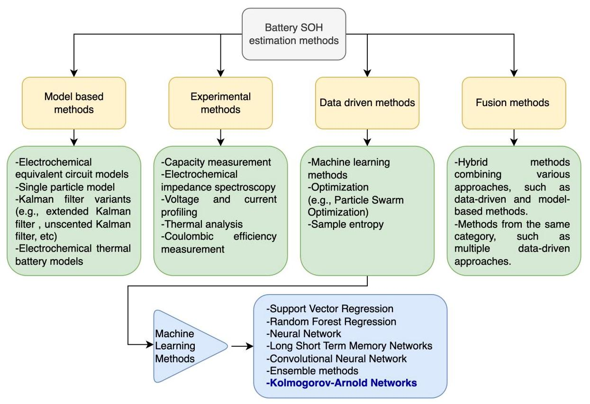
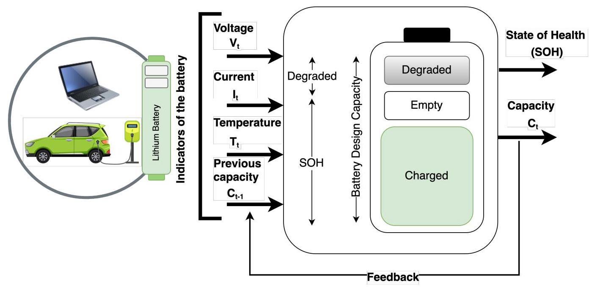
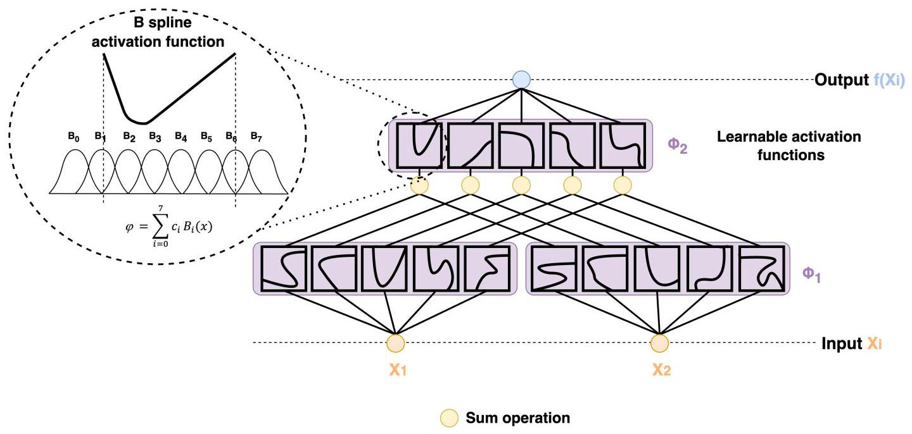
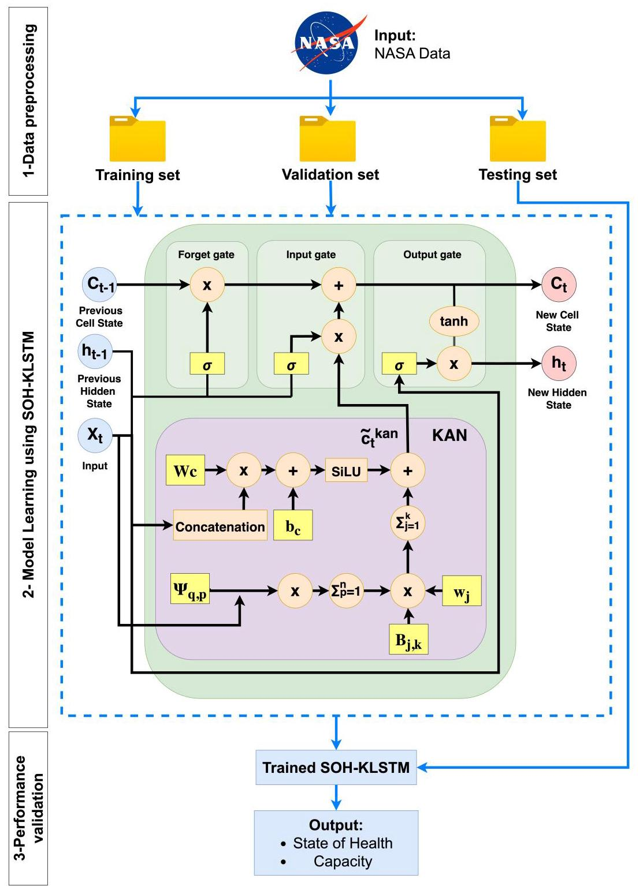
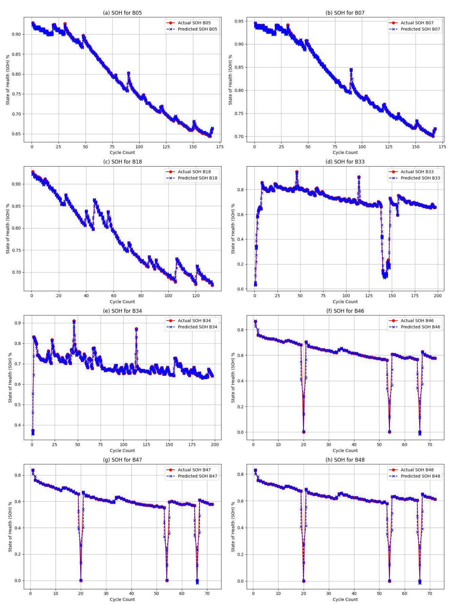

# SOH-KLSTM: A Hybrid Kolmogorov-Arnold Network and LSTM Model for Enhanced Lithium-Ion Battery Health Monitoring

# SOH-KLSTM:一种用于增强锂离子电池健康状态监测的混合柯尔莫哥洛夫 - 阿诺德网络和长短期记忆模型

Imen Jarraya ${}^{a}$ , Safa Ben Atitallah ${}^{a, b, * }$ , Fatimah Alahmed ${}^{a}$ , Mohamed Abdelkader ${}^{a}$ , Maha Driss ${}^{a, b}$ , Fatma Abdelhadic and Anis Koubaa ${}^{a}$

伊门·贾拉亚${}^{a}$ ，萨法·本·阿蒂塔拉${}^{a, b, * }$ ，法蒂玛·阿拉赫德${}^{a}$ ，穆罕默德·阿卜杜勒卡德尔${}^{a}$ ，玛哈·德里斯${}^{a, b}$ ，法特玛·阿卜杜勒哈迪和阿尼斯·库巴阿${}^{a}$

${}^{a}$ Robotics and Internet of Things Laboratory, College of Computer and Information Sciences, Riyadh,12435, Saudi Arabia

${}^{a}$ 机器人与物联网实验室，计算机与信息科学学院，利雅得，12435，沙特阿拉伯

${}^{b}$ RIADI Laboratory, National School of Computer Science, University of Manouba, Manouba 2010, Tunisia

${}^{b}$ RIADI实验室，国立计算机科学学院，马努巴大学，马努巴2010，突尼斯

${}^{c}$ College of Electrical and Computer Engineering, King Abdulaziz University, Jeddah,22254, Saudi Arabia

${}^{c}$ 电气与计算机工程学院，阿卜杜勒阿齐兹国王大学，吉达，22254，沙特阿拉伯

## ARTICLE INFO

## 文章信息

Keywords:

关键词:

State of Health

健康状态

Long Short-Term Memory

长短期记忆

Kolmogorov-Arnold Networks

柯尔莫哥洛夫 - 阿诺德网络

Candidate Cell State

候选电池状态

Lithium Batteries

锂电池

## ABSTRACT

## 摘要

Accurate and reliable State Of Health (SOH) estimation for Lithium (Li) batteries is critical to ensure the longevity, safety, and optimal performance of applications like electric vehicles, unmanned aerial vehicles, consumer electronics, and renewable energy storage systems. Conventional SOH estimation techniques fail to represent the non-linear and temporal aspects of battery degradation effectively. In this study, we propose a novel SOH prediction framework (SOH-KLSTM) using Kolmogorov-Arnold Network (KAN)-Integrated Candidate Cell State in LSTM for Li batteries Health Monitoring. This hybrid approach combines the ability of LSTM to learn long-term dependencies for accurate time series predictions with KAN's non-linear approximation capabilities to effectively capture complex degradation behaviors in Lithium batteries. KAN addresses LSTM's limitations in handling non-smooth approximations and memory decay over extended sequences. The combination of LSTM and KAN ensures that the model accurately depicts both the time-dependent changes and the complicated non-linearities of battery degradation. Experimental validation was performed on several subsets from the NASA Prognostics Center of Excellence (PCoE) dataset, which includes Li-ion battery data collected during hundreds of charge-discharge cycles under various operating conditions. The proposed model achieved a Root Mean Square Error (RMSE) of 0.001682 in the NASA B0005 subset, significantly outperforming the LSTM-only model, which achieved an RMSE of 0.058334. This corresponds to a 97.12% reduction in prediction error, reflecting the superior predictive performance of our proposed model, with an accuracy approximately 35 times greater than that of the LSTM model alone. The results of additional NASA PCoE subsets further highlight the superior performance and computational efficiency of the model, positioning it as a promising solution for real-time battery health monitoring and management systems.

准确可靠地估计锂(Li)电池的健康状态(SOH)对于确保电动汽车、无人机、消费电子产品和可再生能源存储系统等应用的寿命、安全性和最佳性能至关重要。传统的SOH估计技术无法有效地表示电池退化的非线性和时间方面。在本研究中，我们提出了一种新颖的SOH预测框架(SOH - KLSTM)，该框架在长短期记忆网络(LSTM)中使用柯尔莫哥洛夫 - 阿诺德网络(KAN)集成候选电池状态来进行锂电池健康状态监测。这种混合方法将LSTM学习长期依赖关系以进行准确时间序列预测的能力与KAN的非线性逼近能力相结合，以有效捕获锂电池中的复杂退化行为。KAN解决了LSTM在处理非平滑逼近和长序列上的记忆衰减方面的局限性。LSTM和KAN的结合确保模型能够准确描绘电池退化的时间相关变化和复杂的非线性。在NASA卓越预测中心(PCoE)数据集的几个子集上进行了实验验证，该数据集包括在各种运行条件下数百次充放电循环中收集的锂离子电池数据。在NASA B0005子集中，所提出的模型实现了均方根误差(RMSE)为0.001682，显著优于仅使用LSTM的模型，后者的RMSE为0.058334。这相当于预测误差降低了97.12%，反映了我们提出的模型具有卓越的预测性能，其准确性比单独的LSTM模型高出约倍。NASA PCoE其他子集的结果进一步突出了该模型的卓越性能和计算效率，使其成为实时电池健康监测和管理系统的有前途的解决方案。

## 1. Introduction

## 1. 引言

Lithium (Li) batteries have emerged as a dominant energy storage solution due to their exceptional energy density, prolonged cycle life, fast charging capability, and adaptability across diverse applications, including electric vehicles, renewable energy systems, and portable electronics [1, 2, 3]. However, their performance inevitably degrades with time driven by repeated charge and discharge cycles, temperature fluctuations, and ageing effects [4, 5]. This degradation not only reduces battery efficiency and reliability but also poses significant safety risks, particularly in high-demand applications where performance consistency is critical [6], [7]. As a result, accurate estimation of the State of Health (SOH) is essential to ensure the longevity and safe operation of Li batteries.

锂(Li)电池由于其出色的能量密度、延长的循环寿命、快速充电能力以及在电动汽车、可再生能源系统和便携式电子产品等各种应用中的适应性，已成为主导的能量存储解决方案[1, 2, 3]。然而，由于反复的充放电循环、温度波动和老化效应，其性能不可避免地会随着时间而退化[4, 5]。这种退化不仅会降低电池效率和可靠性，还会带来重大安全风险，特别是在对性能一致性要求较高的高需求应用中[6, 7]。因此，准确估计健康状态(SOH)对于确保锂电池长寿和安全运行至关重要。

SOH is a key indicator of the remaining capacity and functional integrity of a battery relative to its initial state. It encompasses key variables such as voltage, current, temperature, and other factors that influence battery performance. By monitoring these parameters, SOH estimation enables early detection of performance deterioration, allowing proactive maintenance and optimized battery utilization [8].

<text>健康状态(SOH)是衡量电池相对于其初始状态的剩余容量和功能完整性的关键指标。它包含诸如电压、电流、温度等关键变量以及其他影响电池性能的因素。通过监测这些参数，SOH估计能够早期检测性能退化，从而实现预防性维护并优化电池使用 [8]。</text>

Reliable SOH prediction is fundamental to Battery Management Systems (BMS), which enable them to monitor performance, prevent failures, and optimize battery usage. In critical applications such as electric vehicles and large-scale energy storage, inaccurate SOH predictions can cause system malfunctions, unplanned downtime, and safety hazards [9]. Therefore, precise SOH estimation not only improves safety and reliability but also enhances sustainability and cost-effectiveness by extending the lifespan of battery-powered systems [10].

<text>可靠的SOH预测对于电池管理系统(BMS)至关重要，这使它们能够监测性能、预防故障并优化电池使用。在电动汽车和大规模储能等关键应用中，不准确的SOH预测可能导致系统故障、意外停机和安全隐患 [9]。因此，精确的SOH估计不仅能提高安全性和可靠性，还能通过延长电池供电系统的使用寿命来增强可持续性和成本效益 [10]。</text>

---

ORCID(s):

<text>ORCID(s):</text>

---

Over the years, several approaches for estimating the SOH of Li batteries have been proposed. These approaches can be classified into four main categories: experimental, model-based, data-driven, and fusion methods, as shown in Figure 1. Below is a brief overview of these methods.

<text>多年来，已经提出了几种用于估计锂电池SOH的方法。这些方法可分为四大类:实验方法、基于模型的方法、数据驱动的方法和融合方法，如图1所示。以下是这些方法的简要概述。</text>

- Model-based approaches, such as electrochemical models and Kalman filters, are more computationally efficient and suitable for real-time use, but are highly dependent on detailed knowledge of the internal states of the battery, which may not always be readily accessible [11]. Methods based on the Kalman filter have been used, such as the adaptive unscented Kalman filter [12].

<text>- 基于模型的方法，如电化学模型和卡尔曼滤波器，计算效率更高且适合实时使用，但高度依赖于电池内部状态的详细知识，而这些知识可能并不总是容易获得 [11]。基于卡尔曼滤波器的方法已经被使用，如自适应无迹卡尔曼滤波器 [12]。</text>

- Experimental techniques, including capacity measurements and electrochemical impedance spectroscopy, offer high accuracy in assessing battery health, but are often impractical for real-time monitoring due to their invasive nature and dependence on specialized equipment [13].

<text>- 实验技术，包括容量测量和电化学阻抗谱，在评估电池健康状况方面具有很高的准确性，但由于其侵入性和对专用设备的依赖，通常不适合实时监测 [13]。</text>

- Data-driven methods, driven by advances in Machine Learning (ML), have demonstrated substantial promise in handling large-scale battery data without the need for in-depth knowledge of internal battery mechanisms. Techniques such as SVR, Random Forests and advanced neural networks such as LSTM and Convolutional Neural Networks (CNNs) have shown remarkable success in identifying complex patterns in battery degradation data [14, 15, 16]. These methods are particularly effective for the prediction of SOH in real time, where adaptability and predictive accuracy are critical for varying operating conditions.

<text>- 数据驱动的方法，受机器学习(ML)进展的推动，在处理大规模电池数据方面显示出巨大潜力，而无需深入了解电池内部机制。诸如支持向量回归(SVR)、随机森林以及长短期记忆网络(LSTM)和卷积神经网络(CNN)等先进神经网络等技术在识别电池退化数据中的复杂模式方面取得了显著成功 [14, 15, 16]。这些方法对于实时预测SOH特别有效，其中适应性和预测准确性对于变化的运行条件至关重要。</text>

- Fusion methods, which combine two or more methods and can include experimental, model-based, or data-driven approaches, have emerged as a comprehensive solution for SOH estimation by capturing multiple aspects of battery degradation. However, despite their promise, these hybrid models often face challenges due to their computational complexity, which can hinder real-time applications and large-scale deployment [17]. In this category, a hybrid method based on particle swarm optimization and extreme ML has been proposed for enhanced SOH estimation [18, 19].

<text>- 融合方法，它结合了两种或更多种方法，可以包括实验方法、基于模型的方法或数据驱动的方法，通过捕捉电池退化的多个方面，已成为SOH估计的综合解决方案。然而，尽管它们有前景，但这些混合模型由于其计算复杂性往往面临挑战，这可能会阻碍实时应用和大规模部署 [17]。在这一类中，已经提出了一种基于粒子群优化和极限机器学习的混合方法来增强SOH估计 [18, 19]。</text>

Figure 1: Classification of battery SOH estimation methods.

<text>图1:电池SOH估计方法的分类。</text>

Current SOH estimation models continue to face challenges in accurately representing the complexities associated with battery deterioration. These challenges are particularly pronounced in real-world scenarios where batteries operate under diverse environmental conditions, varying load profiles, and across different battery chemistries. The highly complex and nonlinear interactions between internal battery parameters make it difficult for conventional ML models to generalize effectively.

<text>当前的SOH估计模型在准确表示与电池退化相关的复杂性方面仍然面临挑战。这些挑战在现实世界场景中尤为明显，在这些场景中，电池在不同的环境条件、变化的负载曲线以及不同的电池化学组成下运行。电池内部参数之间高度复杂的非线性相互作用使得传统的机器学习模型难以有效泛化。</text>

Recurrent neural networks (RNNs), such as LSTM networks, have shown promise in time-series prediction due to their ability to model sequential dependencies. However, LSTMs still face limitations when handling the non-linear and heterogeneous degradation patterns of lithium-ion batteries. Their reliance on standard activation functions and memory cells restricts their ability to fully capture the intricate relationships that govern battery aging.

<text>递归神经网络(RNN)，如长短期记忆网络(LSTM)，由于其能够对序列依赖性进行建模，在时间序列预测中显示出前景。然而，LSTM在处理锂离子电池的非线性和异质退化模式时仍然面临局限性。它们对标准激活函数和记忆单元的依赖限制了它们充分捕捉控制电池老化的复杂关系的能力。</text>

To address these limitations, we introduce a novel hybrid approach, the SOH-KLSTM Model, which integrates LSTM networks with the Kolmogorov-Arnold Networks (KAN) to improve the accuracy of SOH prediction. By embedding KAN within the LSTM architecture, we enhance the ability of the model to learn and represent complex, non-linear dependencies in battery degradation data. This integration significantly improves the accuracy of the Li battery health SOH estimation, representing an advance over existing methods that fail to generalize between different battery types and operating conditions. The SOH-KLSTM model is not a simple combination of these two algorithms, but a fundamentally enhanced LSTM design that integrates KAN within the core architecture to improve predictive accuracy. The integration is achieved in an innovative and structurally unique manner:

<text>为了解决这些局限性，我们引入了一种新颖的混合方法，即SOH-KLSTM模型，它将LSTM网络与柯尔莫哥洛夫-阿诺德网络(KAN)集成，以提高SOH预测的准确性。通过将KAN嵌入到LSTM架构中，我们增强了模型学习和表示电池退化数据中复杂非线性依赖性的能力。这种集成显著提高了锂电池健康状态SOH估计的准确性，代表了相对于现有方法的进步，现有方法在不同电池类型和运行条件之间无法有效泛化。SOH-KLSTM模型不是这两种算法的简单组合，而是一种从根本上增强的LSTM设计，它将KAN集成到核心架构中以提高预测准确性。这种集成以一种创新且结构独特的方式实现:</text>

- KAN-Enhanced Candidate Cell State: Conventional LSTM models calculate the potential cell state employing a transformation with fixed weights. Our model replaced this transformation with a KAN-oriented adaptive function that learns non-linear relationships in sequential data dynamically. This enhances the expressiveness of the model, allowing it to capture intricate degradation behaviors more effectively.

<text>- KAN增强的候选单元状态:传统的LSTM模型使用具有固定权重的变换来计算潜在单元状态。我们的模型用一个面向KAN的自适应函数取代了这种变换，该函数动态地学习序列数据中的非线性关系。这增强了模型的表现力，使其能够更有效地捕捉复杂的退化行为。</text>

- B-Spline Augmented Feature Space: Unlike conventional LSTM models that rely just on weight matrices, our approach uses B-spline transformations along with the candidate cell state calculation. This approach allows for the detection of both abrupt and gradual changes in battery degradation trends, thanks to its localized adaptability.

<text>- B样条增强特征空间:与传统的仅依赖权重矩阵的LSTM模型不同，我们的方法在候选单元状态计算中使用B样条变换。由于其局部适应性，这种方法能够检测电池退化趋势中的突然变化和逐渐变化。</text>

- Self-Learned Activation Functions: Conventional LSTMs limit adaptability by using predefined activation functions such as sigmoid, tanh, or ReLU. In contrast, our model adapts to the changing dynamics of battery health by dynamically learning activation functions through KAN, which allows us to strengthen the stability of gradient flow.

- 自学习激活函数:传统的长短期记忆网络(LSTM)使用诸如 sigmoid、tanh 或 ReLU 等预定义激活函数，限制了其适应性。相比之下，我们的模型通过 KAN 动态学习激活函数，以适应电池健康状况的变化动态，这使我们能够增强梯度流的稳定性。

With these changes, the information flow in LSTM networks is much improved, enabling SOH-KLSTM to predict battery SOH while accurately capturing both short- and long-term degradation patterns.

通过这些改变，LSTM 网络中的信息流得到了显著改善，使 SOH-KLSTM 能够在准确捕捉短期和长期退化模式的同时预测电池的健康状态(SOH)。

The main contributions of this paper are as follows.

本文的主要贡献如下。

1. A novel SOH-KLSTM model is introduced that integrates KAN into the LSTM architecture to enhance the prediction of battery SOH by capturing both temporal dependencies and complex non-linear degradation patterns.

1. 引入了一种新颖的 SOH-KLSTM 模型，该模型将 KAN 集成到 LSTM 架构中，通过捕捉时间依赖性和复杂的非线性退化模式来增强对电池 SOH 的预测。

2. The proposed model leverages KAN-enhanced candidate cell state computation, improving the ability of the LSTM to handle intricate degradation behaviors in Li batteries.

2. 所提出的模型利用 KAN 增强的候选细胞状态计算，提高了 LSTM 处理锂电池复杂退化行为的能力。

3. The SOH-KLSTM model is implemented and validated using several real-world battery datasets from NASA's PCoE, demonstrating the superior effectiveness of this hybrid model compared to the standalone LSTM in predicting SOH in diverse operational conditions.

3. 使用来自美国国家航空航天局(NASA)动力与能量转换工程处(PCoE)的多个实际电池数据集实现并验证了 SOH-KLSTM 模型，证明了这种混合模型在预测不同运行条件下的 SOH 方面优于独立的 LSTM。

4. A comparative study highlights the significant improvements of the model over existing SOH estimation methods in terms of predictive accuracy and computational efficiency, demonstrating its superiority for real-time battery management applications.

4. 一项比较研究突出了该模型在预测准确性和计算效率方面相对于现有 SOH 估计方法的显著改进，证明了其在实时电池管理应用中的优越性。

The structure of this paper is organized to first provide an extensive review of the existing SOH estimation methods in Section 2, covering traditional ML models, hybrid approaches, and data-driven techniques while highlighting the research gaps addressed in this study. The LSTM model used for the estimation of SOH is detailed in Section 3, followed by the introduction of the proposed SOH-KLSTM model in Section 4, which describes its architecture and key advantages over conventional approaches. The experimental results, which demonstrate the performance of the model in various datasets, are presented in Section 5. Finally, the key findings are summarized in Section 6, along with suggestions for future research to further enhance SOH prediction models.

本文的结构安排如下:首先在第 2 节中对现有的 SOH 估计方法进行广泛综述，涵盖传统机器学习模型、混合方法和数据驱动技术，同时突出本研究中解决的研究空白。第 3 节详细介绍用于估计 SOH 的 LSTM 模型，随后在第 4 节中引入所提出的 SOH-KLSTM 模型，描述其架构以及相对于传统方法的关键优势。第 5 节展示了在各种数据集中证明该模型性能的实验结果。最后，第 6 节总结了关键发现，以及对未来研究的建议，以进一步增强 SOH 预测模型。

## 2. Related Work

## 2. 相关工作

The development of reliable SOH prediction methods for Li batteries progressed significantly, transitioning from standard ML models to more sophisticated deep learning (DL) frameworks. The primary challenge remains to achieve a balance between prediction accuracy, generalization capability, and computational efficiency, particularly in real-time applications.

用于锂电池的可靠 SOH 预测方法有了显著进展，从标准机器学习模型过渡到了更复杂的深度学习(DL)框架。主要挑战仍然是在预测准确性、泛化能力和计算效率之间取得平衡，特别是在实时应用中。

The application of Artificial Intelligence (AI) in SOH prediction has evolved significantly, transitioning from traditional regression-based methods to more advanced deep learning frameworks. A notable example is the work of Ma et al. (2022) [20], which introduced an enhanced LSTM-based SOH estimation framework that incorporates the extraction of health indicators, the selection of features, and the optimization of hyperparameters. The study identified 15 health indicators from the charging-discharging process, capturing external battery characteristics such as voltage, current, and temperature to model battery aging and enhancing the accuracy and robustness of the prediction of the model. However, the proposed model relies on predefined health indicators, which limit its adaptability in scenarios where novel degradation patterns emerge.

人工智能(AI)在 SOH 预测中的应用有了显著发展，从传统的基于回归的方法过渡到了更先进的深度学习框架。一个显著的例子是 Ma 等人(2022 年)[20]的工作，该工作引入了一种基于增强 LSTM 的 SOH 估计框架，该框架结合了健康指标的提取、特征选择和超参数优化。该研究从充放电过程中识别出 15 个健康指标，捕捉电池的外部特性，如电压、电流和温度，以对电池老化进行建模，并提高模型预测的准确性和鲁棒性。然而，所提出的模型依赖于预定义的健康指标，这限制了其在出现新的退化模式的场景中的适应性。

Hybrid ML models have emerged as a key advance in the prediction of SOH by combining multiple techniques to take advantage of the strengths of each method [21, 22, 23, 24, 25, 26, 27, 28]. Bao et al. (2023) [28] introduced a hybrid deep neural network with dimensional attention (CNN-VLSTM-DA) for SOH estimation, integrating a CNN, a multilayer variant LSTM network and a dimensional attention mechanism. CNN extracts hierarchical features from battery data, while VLSTM, enhanced with peephole connections, refines the ability to capture long-term dependencies. The dimensional attention mechanism further improves feature selection by assigning different weights to each dimension. The model was validated on NASA, CALCE, and Oxford datasets, demonstrating strong performance under diverse charge / discharge conditions. However, the CNN-VLSTM-DA model comes with a high computational complexity that limits its real-time applicability. Zhu et al. (2023) [29] introduced a hybrid framework combining CNNs with LSTM, enabling the model to automatically learn from time series data. CNNs effectively capture spatial features, while LSTMs handle temporal dependencies, making this combination highly effective for SOH prediction. However, despite the improvements, the approach faced challenges such as overfitting, particularly when applied to smaller datasets. In addition, Obisakin et al. (2022) [30] proposed a hybrid model that integrates Support Vector Regression (SVR) with LSTM, achieving an RMSE of 0.005 in the B0005 dataset. Although this hybrid model demonstrated improved accuracy, SVR struggled to capture the long-term dependencies crucial for accurate battery health forecasting. These studies demonstrated that LSTM models, while well-suited for time-series data, could further benefit from domain-specific enhancements to address long-term SOH prediction challenges.

混合机器学习模型通过结合多种技术以利用每种方法的优势，已成为 SOH 预测的一项关键进展[21, 22, 23, 24, 25, 26, 27, 28]。Bao 等人(2023 年)[28]引入了一种用于 SOH 估计的具有维度注意力的混合深度神经网络(CNN-VLSTM-DA)，集成了卷积神经网络(CNN)、多层变体 LSTM 网络和维度注意力机制。CNN 从电池数据中提取分层特征，而通过窥视孔连接增强的 VLSTM 则提高了捕捉长期依赖性的能力。维度注意力机制通过为每个维度分配不同的权重进一步改进特征选择。该模型在 NASA、CALCE 和牛津数据集上进行了验证，在不同的充/放电条件下表现出强大的性能。然而，CNN-VLSTM-DA 模型具有高计算复杂度，限制了其实时适用性。Zhu 等人(2023 年)[29]引入了一种将 CNN 与 LSTM 相结合的混合框架，使模型能够从时间序列数据中自动学习。CNN 有效地捕捉空间特征，而 LSTM 处理时间依赖性，这种组合对于 SOH 预测非常有效。然而，尽管有改进，该方法仍面临诸如过拟合等挑战，特别是在应用于较小数据集时。此外，Obisakin 等人(2022 年)[30]提出了一种将支持向量回归(SVR)与 LSTM 集成的混合模型，在 B0005 数据集中实现了 0.005 的均方根误差(RMSE)。尽管这种混合模型展示了更高的准确性，但 SVR 在捕捉对准确的电池健康预测至关重要的长期依赖性方面存在困难。这些研究表明，LSTM 模型虽然非常适合时间序列数据，但可以从特定领域的增强中进一步受益，以应对长期 SOH 预测挑战。

Recent advances have introduced more specialized methods to improve SOH prediction by integrating diverse techniques. For example, Tao et al. (2024) [31] introduced a multiscale data fusion and anti-noise extended LSTM (MSDF-ANELSTM) model to further enhance SOH prediction. In this approach, the feature extraction process is automated by utilizing the Fast Fourier Transform (FFT) to analyze micro-scale data such as current and voltage in the frequency domain, and then Principal Component Analysis (PCA) is applied to reduce feature redundancy and prevent overfitting. Moreover, the hidden layer structure of the LSTM is improved by separating positive and negative correlation gating weights, reducing the model's complexity and improving generalization. Additionally, a novel combination of Extended Kalman Filter (EKF) and Gradient Descent (GD) for weight updating further enhances noise suppression, addressing a common issue in battery data. As a result, this method significantly outperformed traditional LSTM models, achieving a 66.66% improvement in accuracy, 83.84% better stability, and 72.54% improved generalization.

最近的进展引入了更专业的方法，通过整合多种技术来改进健康状态(SOH)预测。例如，Tao等人(2024年)[31]引入了一种多尺度数据融合和抗噪声扩展长短期记忆网络(MSDF-ANELSTM)模型，以进一步增强SOH预测。在这种方法中，通过利用快速傅里叶变换(FFT)在频域中分析电流和电压等微观尺度数据来自动进行特征提取过程，然后应用主成分分析(PCA)来减少特征冗余并防止过拟合。此外，通过分离正相关和负相关门控权重来改进长短期记忆网络(LSTM)的隐藏层结构，降低了模型的复杂性并提高了泛化能力。此外，一种用于权重更新的扩展卡尔曼滤波器(EKF)和梯度下降(GD)的新颖组合进一步增强了噪声抑制，解决了电池数据中的一个常见问题。结果，该方法显著优于传统的长短期记忆网络模型，在准确性上提高了66.66%，稳定性提高了83.84%，泛化能力提高了72.54%。

In addition, recent developments in SOH estimation have explored model-data fusion approaches, combining physics-based modeling and DL to improve predictive performance. Chen et al. (2024) [19] introduced a hybrid SOH estimation framework that integrates a fractional-order RC Equivalent Circuit Model (ECM) with a DL network. Their approach begins with correlation analysis to extract health features from raw battery data, followed by fractional particle swarm optimization. These optimized parameters, which capture the internal dynamics of the battery, are further analyzed to select the most relevant SOH indicators. An improved Vision Transformer (VIT) network is then trained using the selected health features. The experimental results demonstrate that their method achieves higher predictive accuracy than conventional data-driven models. However, this approach introduces additional computational complexity due to ECM parameter identification and feature correlation analysis. Moreover, Wang et al. (2024) [32] introduced Physics-Informed Neural Networks (PINN), which combine empirical degradation models and state-space equations for the estimation of SOH. By embedding physics-based principles into neural networks, their model achieved a MAPE of 0.87% on a dataset of 387 batteries, improving interpretability and model robustness. However, PINNs, despite their precision, can be computationally intensive, limiting their scalability in large-scale real-time applications.

此外，SOH估计的最新进展探索了模型-数据融合方法，将基于物理的建模与深度学习(DL)相结合以提高预测性能。Chen等人(2024年)[19]引入了一种混合SOH估计框架，该框架将分数阶RC等效电路模型(ECM)与深度学习网络集成。他们的方法首先进行相关性分析，从原始电池数据中提取健康特征，然后进行分数粒子群优化。这些捕获电池内部动态的优化参数被进一步分析以选择最相关的SOH指标。然后使用选定的健康特征训练改进的视觉Transformer(VIT)网络。实验结果表明，他们的方法比传统的数据驱动模型具有更高的预测准确性。然而，由于ECM参数识别和特征相关性分析，这种方法引入了额外的计算复杂性。此外，Wang等人(2024年)[32]引入了物理信息神经网络(PINN)，它结合经验退化模型和状态空间方程来估计SOH。通过将基于物理的原理嵌入神经网络，他们的模型在387个电池的数据集上实现了0.87%的平均绝对百分比误差(MAPE)，提高了可解释性和模型鲁棒性。然而，尽管PINN精度高，但计算量可能很大，限制了它们在大规模实时应用中的可扩展性。

Further innovation came with the introduction of Self-Supervised Learning (SSL) methods . Che et al. (2023) [33] proposed an SSL framework to address the issue of limited labeled data for the prediction of SOH. By combining auto-encoder-decoder architectures with random forest regression, the model effectively learned hidden aging characteristics from unlabeled data, significantly reducing reliance on large labeled datasets. The model achieved robust performance, with an error distribution below 4% and overall errors less than 1.14%. However, the ensemble-based approach introduced computational complexity, limiting its suitability for real-time SOH estimation in large-scale systems where efficiency is critical.

进一步的创新来自于自监督学习(SSL)方法的引入。Che等人(2023年)[33]提出了一个SSL框架，以解决SOH预测中标记数据有限的问题。通过将自动编码器-解码器架构与随机森林回归相结合，该模型有效地从未标记数据中学习隐藏的老化特征，显著减少了对大量标记数据集的依赖。该模型实现了稳健的性能，误差分布低于4%，总体误差小于1.14%。然而，基于集成的方法引入了计算复杂性，限制了其在效率至关重要的大规模系统中进行实时SOH估计的适用性。

Furthermore, Graph-based models provide an innovative approach by capturing the underlying relationships between battery parameters. Yao et al. (2023) [14] introduced a novel graph-based framework, CL-GraphSAGE, for the prediction of SOH, which captures both temporal and spatial dependencies in battery health indicators (HIs). The model utilizes Pearson's correlation coefficients to identify HIs highly correlated with SOH, forming a graph structure to enhance prediction accuracy. Temporal features are captured using CNNs and LSTMs, while spatial relationships are modeled through the GraphSAGE architecture, which propagates information through the graph. The results showed that CL-GraphSAGE outperformed traditional methods such as CNN, LSTM, and GCN, achieving an RMSE as low as ${0.2}\%$ on datasets from MIT, NASA, and experimental sources. This validation in diverse data sets confirmed the robustness of the model. However, while CL-GraphSAGE improved accuracy by leveraging spatial and temporal data, it struggled to capture sequential dependencies, which limited its effectiveness for long-term SOH prediction.

此外，基于图的模型通过捕捉电池参数之间的潜在关系提供了一种创新方法。Yao等人(2023年)[14]引入了一种新颖的基于图的框架CL-GraphSAGE，用于SOH预测，该框架捕捉了电池健康指标(HI)中的时间和空间依赖性。该模型利用皮尔逊相关系数来识别与SOH高度相关的HI，形成一个图结构以提高预测准确性。使用卷积神经网络(CNN)和长短期记忆网络(LSTM)捕捉时间特征，而通过GraphSAGE架构对空间关系进行建模，该架构通过图传播信息。结果表明，CL-GraphSAGE优于传统方法，如CNN、LSTM和GCN，在来自麻省理工学院、美国国家航空航天局和实验源的数据集上实现了低至${0.2}\%$的均方根误差(RMSE)。在不同数据集中的这种验证证实了该模型的稳健性。然而，虽然CL-GraphSAGE通过利用空间和时间数据提高了准确性，但它难以捕捉顺序依赖性，这限制了其在长期SOH预测中的有效性。

Similarly, Wei et al. (2024) [34] proposed the Conditional Graph Convolutional Network (CGCN), designed to enhance SOH and Remaining Useful Life (RUL) predictions by capturing both feature-to-feature and feature-to-SOH correlations. The CGCN framework utilizes two types of undirected graphs: one to model relationships between battery features and another to model the correlations between those features and SOH or RUL. To further refine temporal predictions, the model incorporates dilated convolutional operations that expand the receptive field and improve the capture of long-term dependencies in time-series data without significantly increasing computational complexity. The results demonstrated a notable improvement in predictive accuracy. CGCN achieved RMSE values of 0.73% for SOH and 0.92% for RUL on NASA and Oxford datasets, outperforming traditional GCN and other ML models in these tests. This improvement was attributed to the model's ability to transmit information more effectively through the graph, capturing both temporal and spatial dependencies. However, despite these gains in accuracy, the CGCN faced challenges in generalizing across highly variable operational conditions, a key challenge for scalable SOH and RUL prediction. The performance of the model was particularly dependent on the quality and consistency of the data, which could limit its effectiveness in environments with significant operational variability.

同样，Wei等人(2024年)[34]提出了条件图卷积网络(CGCN)，旨在通过捕捉特征到特征以及特征到健康状态(SOH)的相关性来增强SOH和剩余使用寿命(RUL)预测。CGCN框架利用两种无向图:一种用于对电池特征之间的关系进行建模，另一种用于对这些特征与SOH或RUL之间的相关性进行建模。为了进一步优化时间预测，该模型采用了扩张卷积操作，这种操作扩展了感受野并改善了对时间序列数据中长时依赖关系的捕捉，同时不会显著增加计算复杂度。结果表明预测精度有显著提高。在NASA和牛津数据集上，CGCN的SOH预测RMSE值为0.73%，RUL预测RMSE值为0.92%，在这些测试中优于传统GCN和其他机器学习模型。这种改进归因于该模型能够通过图更有效地传输信息，捕捉时间和空间依赖关系。然而，尽管在精度上有这些提升，CGCN在跨高度可变的运行条件进行泛化时面临挑战，这是可扩展的SOH和RUL预测的一个关键挑战。该模型的性能尤其依赖于数据的质量和一致性，这可能会限制其在运行变化显著的环境中的有效性。

Recent works have also explored attention mechanisms to improve the accuracy of the prediction of SOH [35, 36]. Zhao et al. (2023) [36] introduced a Multi-Head Attention-Time Convolution Network (MHAT-TCN), which integrates multi-head attention learning with gray relational analysis (GRA) to identify key health indicators (HIs) correlated with battery capacity. This approach improves the accuracy of SOH prediction by focusing on relevant HIs during the training process. The MHAT-TCN was validated using leave-one-out cross-validation (LOOCV) across datasets from similar battery models. The model demonstrated significant improvements in the prediction of SOH, with RMSE values of 0.0262 and MAPE of 3.6990, outperforming conventional models such as TCN and LSTM. This method improves predictive performance by capturing local regeneration phenomena, a key factor in battery degradation analysis. Although the model showed superior accuracy across various datasets, its increased computational complexity remains a limitation, particularly when applied in real-time applications where faster predictions are necessary.

近期的研究工作还探索了注意力机制以提高SOH预测的准确性[35, 36]。Zhao等人(2023年)[36]引入了多头注意力 - 时间卷积网络(MHAT - TCN)，该网络将多头注意力学习与灰色关联分析(GRA)相结合，以识别与电池容量相关的关键健康指标(HI)。这种方法通过在训练过程中关注相关的HI来提高SOH预测的准确性。MHAT - TCN使用留一法交叉验证(LOOCV)在来自相似电池模型的数据集上进行了验证。该模型在SOH预测方面表现出显著改进，RMSE值为0.0262，平均绝对百分比误差(MAPE)为3.6990，优于传统模型如时间卷积网络(TCN)和长短期记忆网络(LSTM)。这种方法通过捕捉局部再生现象来提高预测性能，局部再生现象是电池退化分析中的一个关键因素。尽管该模型在各种数据集上都表现出卓越的准确性，但其增加的计算复杂度仍然是一个限制，特别是在需要更快预测的实时应用中。

In conclusion, while various SOH prediction methods offer unique strengths, they continue to present tradeoffs between accuracy, interpretability, and scalability [8, 37, 38, 39, 40]. Hybrid models, which combine multiple techniques, and graph-based approaches show significant promise due to their ability to capture complex relationships in the data. However, the increasing demand for large-scale real-time applications, particularly in practical battery management systems (BMS), necessitates further advancements to enhance efficiency, reliability, and adaptability. A major challenge remains the computational complexity associated with advanced SOH prediction models. Although deep learning, hybrid methods, and attention-based models improve predictive performance, their feasibility for real-time deployment is challenged by high computational demands. Reducing complexity while maintaining predictive accuracy is critical for enabling widespread adoption in industrial and automotive applications. Furthermore, improving generalization capabilities across diverse operational conditions remains a key objective to ensure robust and adaptable performance in real world scenarios.

总之，虽然各种SOH预测方法都有其独特的优势，但它们在准确性、可解释性和可扩展性之间仍然存在权衡[8, 37, 38, 39, 40]。结合多种技术的混合模型和基于图的方法因其能够捕捉数据中的复杂关系而显示出巨大的潜力。然而，对大规模实时应用的需求不断增加，特别是在实际的电池管理系统(BMS)中，需要进一步改进以提高效率、可靠性和适应性。一个主要挑战仍然是与先进的SOH预测模型相关的计算复杂度。尽管深度学习、混合方法和基于注意力的模型提高了预测性能，但它们在实时部署方面的可行性受到高计算需求的挑战。在保持预测准确性的同时降低复杂度对于在工业和汽车应用中广泛采用至关重要。此外，提高在不同运行条件下的泛化能力仍然是确保在实际场景中具有稳健和适应性性能的关键目标。

One of the main contributions in this paper is the fusion of LSTM networks with KANs [41]. In 2024, KANs recently gained significant traction as a promising approach, offering advantages over traditional techniques. While some studies have explored their application in SOH estimation [42, 43, 44, 45], their full potential remains under-utilized, particularly in hybrid architectures that integrate sequential learning and nonlinear function approximation. To address existing limitations, we propose the SOH-KLSTM model, which integrates the strengths of the LSTM and KAN networks. In fact, KAN excels in capturing the non-linear degradation behaviors of Li batteries, while LSTM is proficient in modeling temporal sequences of battery usage. By combining these two approaches, the SOH-KLSTM model provides a comprehensive solution that improves prediction accuracy and generalization under different battery conditions. This hybrid architecture provides a scalable and adaptable approach for the prediction of SOH with high precision, generalization, and computational efficiency. Unlike previous hybrid approaches, such as KAN-LSTM [42] and CNN-KAN [43], where KAN is applied before or after the used model, our approach directly integrates KAN into the computation of the candidate cell state of the LSTM. This integration employs B-spline transformations and SiLU activation functions. In contrast, existing studies have applied KAN differently. Zhang et al. [42] use KAN for feature compression before passing data to an LSTM. Peng et al. [43] apply KAN after LSTM to refine the extracted temporal features. Chen et al. [44] incorporate KAN within a Transformer-based fusion framework, using B-spline interpolation for high-dimensional feature transformations. Zhang et al. [45] integrate KAN with CNN, where it converts high-level CNN-extracted features into refined SOH predictions.

本文的主要贡献之一是将长短期记忆网络(LSTM)与KANs[41]融合。2024年，KANs作为一种有前景的方法最近获得了显著关注，相较于传统技术具有优势。虽然一些研究已经探索了它们在健康状态(SOH)估计中的应用[42,43,44,45]，但其全部潜力仍未得到充分利用，特别是在集成了顺序学习和非线性函数逼近的混合架构中。为了解决现有局限性，我们提出了SOH-KLSTM模型，该模型整合了LSTM和KAN网络的优势。事实上，KAN擅长捕捉锂电池的非线性退化行为，而LSTM则擅长对电池使用的时间序列进行建模。通过结合这两种方法，SOH-KLSTM模型提供了一个全面的解决方案，可在不同电池条件下提高预测准确性和泛化能力。这种混合架构为高精度、泛化性和计算效率的SOH预测提供了一种可扩展且适应性强的方法。与之前的混合方法不同，如KAN-LSTM[42]和CNN-KAN[43]，在这些方法中KAN应用于所用模型之前或之后，我们的方法直接将KAN集成到LSTM候选单元状态的计算中。这种集成采用了B样条变换和SiLU激活函数。相比之下，现有研究对KAN的应用方式不同。Zhang等人[42]在将数据传递给LSTM之前使用KAN进行特征压缩。Peng等人[43]在LSTM之后应用KAN来细化提取的时间特征。Chen等人[44]将KAN纳入基于Transformer的融合框架中，使用B样条插值进行高维特征变换。Zhang等人[45]将KAN与CNN集成，在其中将高级CNN提取的特征转换为精确化的SOH预测。

In our approach, by embedding KAN within the LSTM structure at an earlier stage, the SOH-KLSTM model offers; improved feature representation, more fine-grained control over hidden state updates, and better generalization across diverse battery types and operational conditions.

在我们的方法中，通过在早期阶段将KAN嵌入到LSTM结构中，SOH-KLSTM模型提供了；改进的特征表示、对隐藏状态更新更细粒度的控制，以及在不同电池类型和运行条件下更好的泛化能力。

## 3. Battery State of Health Estimation: Methodology

## 3. 电池健康状态估计:方法

The health of Li batteries is an important factor in optimizing energy storage investments, reducing maintenance costs, and ensuring reliable operation. Accurate SOH estimation is essential to effectively manage battery performance. However, this process is complex and influenced by several interrelated factors, such as charge-discharge cycles, environmental conditions, and internal resistance. These factors significantly affect the degradation rate of the battery, which in turn affects its safety, energy efficiency, and overall useful life. Specifically, key parameters such as temperature variations, current loads, and voltage changes further contribute to battery deterioration, underscoring the need for real-time monitoring to ensure accurate predictions, as shown in Figure 2.

锂电池的健康状况是优化储能投资、降低维护成本和确保可靠运行的重要因素。准确的SOH估计对于有效管理电池性能至关重要。然而，这个过程很复杂，受到几个相互关联的因素影响，如充放电循环、环境条件和内阻。这些因素显著影响电池的退化速率，进而影响其安全性、能量效率和整体使用寿命。具体而言，温度变化、电流负载和电压变化等关键参数进一步加剧电池劣化，凸显了实时监测以确保准确预测的必要性，如图2所示。

### 3.1. Problem Statement

### 3.1. 问题陈述

The SOH is a critical metric for evaluating a battery's current performance and estimating its remaining lifespan. It represents the residual capacity of the battery relative to its nominal (initial) capacity when new. Typically, SOH is calculated using Equation 1 [46]:

SOH是评估电池当前性能和估计其剩余寿命的关键指标。它表示电池相对于新时的标称(初始)容量的剩余容量。通常，SOH使用公式1[46]计算:

$$
{SOH} = \frac{{C}_{t}}{{C}_{\text{ nominal }}} \times  {100}\% \tag{1}
$$

where ${C}_{t}$ represents the current battery capacity at time $t$ , and ${C}_{\text{ nominal }}$ is the nominal capacity specified by the manufacturer when the battery is new.

其中${C}_{t}$表示时间$t$时的当前电池容量，${C}_{\text{ nominal }}$是电池新时制造商指定的标称容量。

In the context of battery health monitoring, particularly for assessing energy efficiency, an alternative expression of SOH is based on the ratio of charge throughput. Equation 2 defines this approach, which computes the ratio of the battery's starting capacity to its total charge provided [46]:

在电池健康监测的背景下，特别是用于评估能量效率时，SOH的另一种表达方式基于充电吞吐量的比率。公式2定义了这种方法，该方法计算电池起始容量与其提供的总充电量的比率[46]:

$$
{SOH} = \frac{{Q}_{\text{ out }}}{{Q}_{\text{ in }}} \times  {100}\% \tag{2}
$$

where ${Q}_{\text{ out }}$ is the total discharged energy, and ${Q}_{\text{ in }}$ is the total energy charged into the battery. This formulation highlights the battery's ability to retain energy during operation, which is essential for applications like electric vehicles and energy storage systems.

其中${Q}_{\text{ out }}$是总放电能量，${Q}_{\text{ in }}$是充入电池的总能量。这种公式突出了电池在运行期间保持能量的能力，这对于电动汽车和储能系统等应用至关重要。

---

: Preprint submitted to Elsevier

:预印本已提交给爱思唯尔

---

As the battery undergoes continuous charge and discharge cycles, its capacity ${C}_{t}$ gradually decreases with time, directly influencing the SOH. Modeling this degradation requires capturing intricate temporal dependencies and nonlinear relationships among various operational parameters. The proposed SOH-KLSTM model employs a set of time series input features to estimate both the SOH and the remaining battery capacity. These features are integrated into the input matrix ${X}_{t}$ , representing the operational state of the system at time $t$ . The model predicts SOH and capacity using a differential equation-based approach as defined in Equation 3:

随着电池经历连续的充放电循环，其容量${C}_{t}$随时间逐渐减小，直接影响SOH。对这种退化进行建模需要捕捉各种运行参数之间复杂的时间依赖性和非线性关系。所提出的SOH-KLSTM模型采用一组时间序列输入特征来估计SOH和剩余电池容量。这些特征被整合到输入矩阵${X}_{t}$中，代表时间$t$时系统的运行状态。该模型使用公式3中定义的基于微分方程的方法预测SOH和容量:

$$
\frac{d{\widehat{y}}_{\mathrm{{SOH}}}}{dt},\frac{d{\widehat{y}}_{\mathrm{{cap}}}}{dt} = f\left( {{X}_{t},\frac{d{h}_{t - 1}}{dt},\frac{d{C}_{t - 1}}{dt};\theta }\right) \tag{3}
$$

where ${\widehat{y}}_{\text{ SOH }}$ is the predicted SOH, ${\widehat{y}}_{\text{ cap }}$ is the predicted battery capacity, ${X}_{t}$ is the vector of input characteristics at time $t,{h}_{t - 1}$ and ${C}_{t - 1}$ denote the hidden and cell states from the previous time step, and $\theta$ represents the trainable model parameters, such as weights and biases. The input matrix ${X}_{t}$ plays an essential role in accurately predicting both SOH and capacity by capturing the necessary operational parameters, including current, voltage, temperature, and capacity of the previous cycle. These features are expressed in Equation 4:

其中，${\widehat{y}}_{\text{ SOH }}$ 为预测的健康状态(SOH)，${\widehat{y}}_{\text{ cap }}$ 为预测的电池容量，${X}_{t}$ 是时刻 $t,{h}_{t - 1}$ 的输入特征向量，${C}_{t - 1}$ 表示上一时间步的隐藏状态和细胞状态，$\theta$ 代表可训练的模型参数，如权重和偏差。输入矩阵 ${X}_{t}$ 通过捕获包括电流、电压、温度和上一周期容量等必要的运行参数，在准确预测 SOH 和容量方面发挥着重要作用。这些特征在公式 4 中表示:

$$
{X}_{t} = \left\lbrack  {{\mathrm{C}}_{t - 1},{V}_{t},{I}_{t},{T}_{t}}\right\rbrack \tag{4}
$$

where ${\mathrm{C}}_{t - 1}$ is the capacity of the previous cycle, ${V}_{t}$ is the terminal voltage at time $t,{I}_{t}$ is the terminal current at time $t,{T}_{t}$ is the battery temperature at time $t$ .

其中${\mathrm{C}}_{t - 1}$是上一循环的容量，${V}_{t}$是时刻$t,{I}_{t}$的端电压，$t,{T}_{t}$是时刻$t$的端电流，$t$是电池温度。

Each of these parameters plays a distinct role in battery performance. The capacity ${C}_{t}$ reflects the capacity of the battery to store energy, which decreases with age. Voltage ${V}_{t}$ drops as the internal resistance increases, signaling degradation. Current ${I}_{t}$ influences heat generation and efficiency, while temperature ${T}_{t}$ impacts chemical reactions, accelerating or slowing aging. These operational features enable the SOH-KLSTM model to capture non-linear degradation patterns and predict SOH and capacity with high accuracy over time.

这些参数中的每一个在电池性能中都起着独特的作用。容量 ${C}_{t}$ 反映了电池存储能量的能力，它会随着电池老化而降低。电压 ${V}_{t}$ 随着内阻增加而下降，这表明电池性能在退化。电流 ${I}_{t}$ 影响发热和效率，而温度 ${T}_{t}$ 影响化学反应，加速或减缓电池老化。这些运行特征使 SOH - KLSTM 模型能够捕捉非线性退化模式，并随时间高精度地预测 SOH 和容量。

Figure 2: SOH estimation process for a lithium-ion battery. This diagram illustrates the key indicators used in SOH estimation, including voltage $\left( {V}_{t}\right)$ , current $\left( {I}_{t}\right)$ , temperature $\left( {T}_{t}\right)$ , and previous capacity $\left( {C}_{t + 1}\right)$ . These indicators influence battery degradation and overall capacity $\left( {C}_{t}\right)$ , which is monitored to assess SOH.

图 2:锂离子电池的 SOH 估计过程。此图说明了 SOH 估计中使用的关键指标，包括电压 $\left( {V}_{t}\right)$、电流 $\left( {I}_{t}\right)$、温度 $\left( {T}_{t}\right)$ 和上一容量 $\left( {C}_{t + 1}\right)$。这些指标影响电池退化和整体容量 $\left( {C}_{t}\right)$，通过监测整体容量 $\left( {C}_{t}\right)$ 来评估 SOH。

### 3.2. LSTM for SOH Estimation

### 3.2. 用于 SOH 估计的长短期记忆网络(LSTM)

Recent advancements in ML, particularly long-short-term memory networks [47, 48, 49, 50, 51, 52], have demonstrated their effectiveness in the prediction of SOH. LSTM models excel at capturing temporal dependencies within sequential data, making them highly suitable for real-time monitoring and identifying nonlinear degradation patterns over time. These characteristics make LSTM networks ideal for battery management systems, as they enable accurate diagnostics, proactive decision-making, and failure prevention.

机器学习(ML)领域的最新进展，特别是长短期记忆网络 [47, 48, 49, 50, 51, 52]，已证明其在预测 SOH 方面的有效性。LSTM 模型擅长捕捉序列数据中的时间依赖性，使其非常适合实时监测和识别随时间变化的非线性退化模式。这些特性使 LSTM 网络成为电池管理系统的理想选择，因为它们能够实现准确的诊断、主动决策和故障预防。

#### 3.2.1. LSTM Gate Mechanisms

#### 3.2.1. LSTM 门控机制

LSTM networks process sequential battery data and capture long-term dependencies within time series features [39, 53]. Their architecture incorporates specialized gating mechanisms, including input, forget, and output gates, to manage the flow of information across time steps. This structure keeps relevant information while discarding irrelevant data, improving the accuracy of the SOH estimation. Managing memory over time is essential for neural networks, and LSTMs achieve this with the following gate mechanisms:

LSTM 网络处理序列电池数据，并捕捉时间序列特征中的长期依赖性 [39, 53]。其架构包含专门的门控机制，包括输入门、遗忘门和输出门，以管理跨时间步的信息流。这种结构保留相关信息，同时丢弃无关数据，提高了 SOH 估计的准确性。随着时间管理记忆对于神经网络至关重要，LSTM 通过以下门控机制实现这一点:

1. Input Gate $\left( {i}_{t}\right)$ : controls the extent to which new information is passed into the cell state at time $t$ :

1. 输入门 $\left( {i}_{t}\right)$:控制在时刻 $t$ 新信息传入细胞状态的程度:

$$
{i}_{t} = \sigma \left( {{W}_{i} \cdot  \left\lbrack  {{h}_{t - 1},{X}_{t}}\right\rbrack   + {b}_{i}}\right) \tag{5}
$$

where $\sigma$ is the sigmoid activation function, ${W}_{i}$ is the weight matrix for the input gate, ${h}_{t - 1}$ is the previous hidden state, ${X}_{t}$ is the current input, and ${b}_{i}$ is the bias term for the input gate.

其中，$\sigma$ 是 sigmoid 激活函数，${W}_{i}$ 是输入门的权重矩阵，${h}_{t - 1}$ 是上一隐藏状态，${X}_{t}$ 是当前输入，${b}_{i}$ 是输入门的偏差项。

2. Forget Gate $\left( {f}_{t}\right)$ : determines how much of the previous cell state should be retained:

2. 遗忘门 $\left( {f}_{t}\right)$:确定应保留上一细胞状态的多少:

$$
{f}_{t} = \sigma \left( {{W}_{f} \cdot  \left\lbrack  {{h}_{t - 1},{X}_{t}}\right\rbrack   + {b}_{f}}\right) \tag{6}
$$

where ${W}_{f}$ is the weight matrix for the forget gate, and ${b}_{f}$ is its bias term.

其中，${W}_{f}$ 是遗忘门的权重矩阵，${b}_{f}$ 是其偏差项。

3. Output Gate $\left( {o}_{t}\right)$ : regulates how much of the updated cell state is passed to the hidden state:

3. 输出门 $\left( {o}_{t}\right)$:调节更新后的细胞状态传递到隐藏状态的程度:

$$
{o}_{t} = \sigma \left( {{W}_{o} \cdot  \left\lbrack  {{h}_{t - 1},{X}_{t}}\right\rbrack   + {b}_{o}}\right) \tag{7}
$$

where ${W}_{o}$ is the weight matrix for the output gate, and ${b}_{o}$ is the corresponding bias term.

其中，${W}_{o}$ 是输出门的权重矩阵，${b}_{o}$ 是相应的偏差项。

These gate mechanisms manage the network's memory and ensure that the LSTM effectively captures both short-term and long-term dependencies within the data.

这些门控机制管理网络的记忆，并确保 LSTM 有效地捕捉数据中的短期和长期依赖性。

#### 3.2.2. Cell State and Hidden State Updates

#### 3.2.2. 细胞状态和隐藏状态更新

The LSTM model maintains two core components, the cell state and the hidden state, to update and retain information over time. These components ensure that the network dynamically adjusts its memory, retaining relevant information while eliminating unnecessary details.

长短期记忆网络(LSTM)模型有两个核心组件，即细胞状态和隐藏状态，用于随时间更新和保留信息。这些组件确保网络动态调整其记忆，保留相关信息，同时消除不必要的细节。

1. Cell State Update: The new cell state ${C}_{t}$ is calculated by combining the previous cell state ${C}_{t - 1}$ , modulated by the forget gate, with new candidate information regulated by the input gate:

1. 细胞状态更新:新的细胞状态${C}_{t}$通过将前一个细胞状态${C}_{t - 1}$(由遗忘门调制)与由输入门调节的新候选信息相结合来计算:

$$
{C}_{t} = {f}_{t} \cdot  {C}_{t - 1} + {i}_{t} \cdot  {\widetilde{C}}_{t} \tag{8}
$$

This mechanism ensures the selective retention of past memory while incorporating new information as needed.

这种机制确保了对过去记忆的选择性保留，同时根据需要纳入新信息。

2. Hidden State Update: The hidden state ${h}_{t}$ is updated based on the new cell state, filtered through the output gate:

2. 隐藏状态更新:隐藏状态${h}_{t}$基于新的细胞状态进行更新，通过输出门进行过滤:

$$
{h}_{t} = {o}_{t} \cdot  \tanh \left( {C}_{t}\right) \tag{9}
$$

This update ensures that relevant aspects of the cell state are passed to the hidden state for the next time step, maintaining continuity across the sequence.

这种更新确保细胞状态的相关方面被传递到下一个时间步的隐藏状态，保持序列的连续性。

These updates allow the LSTM to dynamically adapt its internal memory, retaining essential information over long periods and discarding irrelevant data. This capability makes LSTM networks highly effective in managing time-dependent relationships within battery data, leading to improved battery management performance.

这些更新使LSTM能够动态调整其内部记忆，长期保留重要信息并丢弃无关数据。这种能力使LSTM网络在管理电池数据中的时间相关关系方面非常有效，从而提高电池管理性能。

##### 3.2.3.SOH and Capacity Estimation

##### 3.2.3. 健康状态(SOH)和容量估计

Once the LSTM processes the input sequence, the final hidden state ${h}_{t}$ , which captures the temporal dependencies and relevant information from the input features, is passed through a fully connected layer. This layer transforms the hidden state into the final predictions for both the SOH and the battery capacity. The prediction is expressed in Equation 10

一旦LSTM处理输入序列，捕获输入特征的时间依赖性和相关信息的最终隐藏状态${h}_{t}$将通过一个全连接层。该层将隐藏状态转换为SOH和电池容量的最终预测。预测由公式10表示

$$
{\widehat{y}}_{\mathrm{{SOH}}},{\widehat{y}}_{\text{ cap }} = {W}_{\text{ out }} \cdot  {h}_{t} + {b}_{\text{ out }} \tag{10}
$$

where ${W}_{\text{ out }}$ represents the weight matrix of the fully connected layer, and ${b}_{\text{ out }}$ is the bias vector that adjusts the predictions. The outputs ${\widehat{y}}_{\text{ SOH }}$ and ${\widehat{y}}_{\text{ cap }}$ correspond to the predicted SOH and battery capacity, respectively.

其中${W}_{\text{ out }}$表示全连接层的权重矩阵，${b}_{\text{ out }}$是调整预测的偏置向量。输出${\widehat{y}}_{\text{ SOH }}$和${\widehat{y}}_{\text{ cap }}$分别对应预测的SOH和电池容量。

The overall process of SOH and capacity estimation using the LSTM network is summarized in Algorithm 1. The algorithm details how the LSTM processes sequential battery data, updates its internal states, and generates predictions for SOH and battery capacity.

使用LSTM网络进行SOH和容量估计的总体过程总结在算法1中。该算法详细说明了LSTM如何处理连续的电池数据，更新其内部状态，并生成SOH和电池容量的预测。

Algorithm 1 LSTM for SOH and Capacity Estimation

算法1 用于SOH和容量估计的LSTM

---

Input: Input sequence ${X}_{t}$ , hidden state ${h}_{t - 1}$ , cell state ${C}_{t - 1}$

Output: Predicted SOH ${\widehat{y}}_{\text{ SOH }}$ and capacity ${\widehat{y}}_{\text{ cap }}$

Initialization:

Initialize weights ${W}_{i},{W}_{f},{W}_{o},{W}_{C}$ and biases ${b}_{i},{b}_{f},{b}_{o},{b}_{C}$

Initialize hidden state ${h}_{0}$ and cell state ${C}_{0}$

for each time step $t$ do

		Compute pre-activation: ${z}_{t} = W \cdot  {X}_{t} + U \cdot  {h}_{t - 1} + b$

		Update gates:

																																																																									${i}_{t} = \sigma \left( {z}_{t,0}\right)$ 																																																																							 (Input gate)

																																																																								${f}_{t} = \sigma \left( {z}_{t,1}\right)$ 																																																																						 (Forget gate)

																																																																								${o}_{t} = \sigma \left( {z}_{t,3}\right)$ 																																																																						 (Output gate)

		Compute candidate cell state: ${\widetilde{C}}_{t} = \tanh \left( {z}_{t,2}\right)$

		Update cell state: ${C}_{t} = {f}_{t} \cdot  {C}_{t - 1} + {i}_{t} \cdot  {\widetilde{C}}_{t}$

		Update hidden state: ${h}_{t} = {o}_{t} \cdot  \tanh \left( {C}_{t}\right)$

end for

Final SOH and Capacity Estimation:

${\widehat{y}}_{\mathrm{{SOH}}},{\widehat{y}}_{\text{ cap }} = {W}_{\text{ out }} \cdot  {h}_{t} + {b}_{\text{ out }}$

---

### 3.3. Kolmogorov-Arnold Networks

### 3.3. 柯尔莫哥洛夫 - 阿诺德网络

Kolmogorov-Arnold Networks is a universal function approximator that learns an adaptive, non-linear transformation of input features without relying on predefined activation functions. KAN addresses several limitations inherent in traditional deep learning models, such as Multi-Layer Perceptrons (MLPs) [54]. Although MLPs are effective at modeling complex patterns, they often struggle with issues of interpretability and accuracy due to their reliance on fixed activation functions. In contrast, KANs overcome these challenges by employing learnable activation functions along the edges, enabling a more nuanced capture of non-linear dependencies. The theoretical foundation of KANs is the Kolmogorov-Arnold theorem, which guarantees that any continuous multivariate function $f\left( {{x}_{1},{x}_{2},\ldots ,{x}_{n}}\right)$ can be decomposed into a finite sum of continuous univariate functions. In particular, the theorem asserts that there exist continuous functions ${\Phi }_{q}$ and ${\varphi }_{q, p}$ such that:

柯尔莫哥洛夫 - 阿诺德网络是一种通用函数逼近器，它学习输入特征的自适应非线性变换，而不依赖于预定义的激活函数。KAN解决了传统深度学习模型(如多层感知器(MLP)[54])中固有的几个局限性。尽管MLP在对复杂模式进行建模方面很有效，但由于它们依赖于固定的激活函数，它们在可解释性和准确性方面常常面临问题。相比之下，KAN通过在边缘采用可学习的激活函数克服了这些挑战，能够更细致地捕捉非线性依赖关系。KAN的理论基础是柯尔莫哥洛夫 - 阿诺德定理，该定理保证任何连续多元函数$f\left( {{x}_{1},{x}_{2},\ldots ,{x}_{n}}\right)$都可以分解为有限个连续单变量函数的和。具体而言，该定理断言存在连续函数${\Phi }_{q}$和${\varphi }_{q, p}$，使得:

$$
f\left( x\right)  = \mathop{\sum }\limits_{{q = 1}}^{{{2n} + 1}}{\Phi }_{q}\left( {\mathop{\sum }\limits_{{p = 1}}^{n}{\varphi }_{q, p}\left( {x}_{p}\right) }\right) \tag{11}
$$

where ${\Phi }_{q}$ is responsible for aggregating the transformed inputs, while each ${\varphi }_{q, p}\left( {x}_{p}\right)$ individually transforms the $p$ -th input feature. The indices $p$ and $q$ denote the transformation stages and $n$ is the total number of input characteristics. This decomposition provides a flexible framework for representing complex functions in high-dimensional spaces, as shown in Figure 3.

其中${\Phi }_{q}$负责聚合转换后的输入，而每个${\varphi }_{q, p}\left( {x}_{p}\right)$分别转换第$p$个输入特征。索引$p$和$q$表示转换阶段，$n$是输入特征的总数。这种分解提供了一个灵活的框架，用于表示高维空间中的复杂函数，如图3所示。

In the KAN framework, each activation function is designed to be learnable and is modeled as a combination of a basis function and a B-spline transformation:

在KAN框架中，每个激活函数被设计为可学习，并被建模为基函数和B样条变换的组合:

$$
\varphi \left( x\right)  = {w}_{b}b\left( x\right)  + {w}_{s}\operatorname{spline}\left( x\right) \tag{12}
$$

${w}_{b}$ and ${w}_{s}$ are trainable scalar weights that control the contributions of the basis function $b\left( x\right)$ and the B-spline transformation spline $\left( x\right)$ , respectively. Although these weights could be merged into the functions $b\left( x\right)$ and spline $\left( x\right)$ , keeping them separate offers finer control over the magnitude of activation and improves training stability. Typically, the basis function $b\left( x\right)$ is implemented using the SiLU activation function, which provides smooth, nonmonotonic transformations and promotes gradient stability. The spline(x) transformation is expressed as a linear combination of B-spline basis functions:

${w}_{b}$和${w}_{s}$是可训练的标量权重，分别控制基函数$b\left( x\right)$和B样条变换spline$\left( x\right)$的贡献。尽管这些权重可以合并到函数$b\left( x\right)$和样条$\left( x\right)$中，但将它们分开可以更精细地控制激活的幅度并提高训练稳定性。通常，基函数$b\left( x\right)$使用SiLU激活函数实现，该函数提供平滑的非单调变换并促进梯度稳定性。样条(x)变换表示为B样条基函数的线性组合:

$$
\operatorname{spline}\left( x\right)  = \mathop{\sum }\limits_{i}{c}_{i}{B}_{i}\left( x\right) \tag{13}
$$

where ${\mathbf{B}}_{i}\left( x\right)$ are the B-spline basis functions and ${c}_{i}$ are trainable coefficients. This representation allows the model to learn localized transformations, which are particularly effective in capturing fine-grained patterns in the data.

其中${\mathbf{B}}_{i}\left( x\right)$是B样条基函数，${c}_{i}$是可训练系数。这种表示方式使模型能够学习局部变换，这在捕获数据中的细粒度模式方面特别有效。

Figure 3: The hierarchical structure of the two-layer KAN approach, where input features $\left( {{X}_{1},{X}_{2}}\right)$ are transformed using B-spline functions $\left( \varphi \right)$ , summed, and processed through learnable activation functions $\left( {{\Phi }_{1},{\Phi }_{2}}\right)$ . The B-spline activation function inset illustrates the basis expansion process, demonstrating how localized feature representations are combined to enhance predictive performance.

图3:两层KAN方法的层次结构，其中输入特征$\left( {{X}_{1},{X}_{2}}\right)$使用B样条函数$\left( \varphi \right)$进行变换、求和，并通过可学习的激活函数$\left( {{\Phi }_{1},{\Phi }_{2}}\right)$进行处理。插入的B样条激活函数说明了基扩展过程，展示了局部特征表示如何组合以提高预测性能。

## 4. SOH-KLSTM: Proposed KAN-Integrated Candidate Cell State in LSTM Model

## 4. SOH-KLSTM:在LSTM模型中提出的集成KAN的候选单元状态

The proposed SOH-KLSTM model is based on the standard LSTM architecture, incorporating its essential components, including memory cells, input gates, forget gates, and output gates. The key advancement of this model lies in the refinement of the candidate cell state ${\widetilde{C}}_{t}$ , which is dynamically optimized using Kolmogorov-Arnold networks. This enhancement allows the model to effectively capture both linear and highly non-linear dependencies in battery degradation trends, leading to a more accurate and reliable estimation of the SOH. As illustrated in Figure 4, the KAN module replaces the conventional linear transformation used in standard LSTMs with a more flexible nonlinear function mapping, generating the enhanced candidate cell state ${\widetilde{C}}_{t}^{\mathrm{{KAN}}}$ . Unlike traditional LSTM architectures, where candidate cell states are computed using fixed-weight transformations, KAN introduces an adaptive learning mechanism that dynamically adjusts function representations based on input variations. Specifically, KAN employs

所提出的SOH-KLSTM模型基于标准LSTM架构，包含其基本组件，包括记忆单元、输入门、遗忘门和输出门。该模型的关键进展在于对候选单元状态${\widetilde{C}}_{t}$的改进，它使用Kolmogorov-Arnold网络进行动态优化。这种增强使模型能够有效地捕获电池退化趋势中的线性和高度非线性依赖关系，从而对SOH进行更准确可靠的估计。如图4所示，KAN模块用更灵活的非线性函数映射取代了标准LSTM中使用的传统线性变换，生成增强的候选单元状态${\widetilde{C}}_{t}^{\mathrm{{KAN}}}$。与传统LSTM架构不同，传统LSTM架构中候选单元状态使用固定权重变换计算，KAN引入了一种自适应学习机制，该机制根据输入变化动态调整函数表示。具体而言，KAN采用

B-spline transformations (see SubSection 4.2) and the SiLU activation function (refer to Subsection 4.3) to construct a robust function approximation framework. The use of B-spline transformations enables localized adaptability, allowing the model to capture fine-grained variations in SOH data, while SiLU activation ensures smooth and stable gradient propagation, improving learning efficiency.

B样条变换(见4.2小节)和SiLU激活函数(参考4.3小节)用于构建一个强大的函数逼近框架。B样条变换的使用实现了局部适应性，使模型能够捕捉健康状态(SOH)数据中的细粒度变化，而SiLU激活确保了平滑稳定的梯度传播，提高了学习效率。

Figure 4: The proposed SOH-KLSTM model for SOH and capacity estimation. The architecture of the SOH-KLSTM model consists of three main stages: (1) Data Preprocessing, where NASA battery datasets are split into training, validation, and testing sets; (2) Model Learning, where the input features (voltage, current, temperature, and capacity) are processed through an LSTM-based structure enhanced with a KAN for candidate cell state computation; and (3) Performance Validation, where the trained model outputs predictions for SOH and capacity.

图4:用于SOH和容量估计的所提出的SOH-KLSTM模型。SOH-KLSTM模型的架构由三个主要阶段组成:(1)数据预处理，将NASA电池数据集划分为训练集、验证集和测试集；(2)模型学习，其中输入特征(电压、电流、温度和容量)通过基于长短期记忆网络(LSTM)的结构进行处理，该结构通过一个KAN(用于候选单元状态计算)进行增强；(3)性能验证，其中训练好的模型输出SOH和容量的预测结果。

Once the enhanced candidate cell state ${\widetilde{C}}_{t}^{\text{ KAN }}$ is calculated, it is seamlessly integrated with the input and forget gate outputs to update the final cell state ${C}_{t}$ . This adaptive integration refines the memory update process by dynamically modulating the influence of non-linear transformations, thereby capturing both short-term fluctuations and long-term degradation patterns more effectively. Using the expressive power of KAN, the model selectively preserves critical battery health information while attenuating transient noise and irrelevant perturbations. This refined update mechanism significantly bolsters the SOH-KLSTM model's capacity to extract and maintain intricate temporal dependencies from sequential SOH data. By achieving a judicious balance between memory retention and forgetting, the model improves its predictive accuracy, ensuring that essential long-term trends are learned while extraneous details are systematically discarded. Consequently, this results in improved robustness and reliability in estimating SOH and battery capacity, making the proposed approach particularly well-suited for real-world battery health monitoring applications.

一旦计算出增强的候选单元状态${\widetilde{C}}_{t}^{\text{ KAN }}$，它就会与输入门和遗忘门的输出无缝集成，以更新最终单元状态${C}_{t}$。这种自适应集成通过动态调制非线性变换的影响来优化记忆更新过程，从而更有效地捕捉短期波动和长期退化模式。利用KAN的表达能力，模型选择性地保留关键的电池健康信息，同时减弱瞬态噪声和无关扰动。这种优化的更新机制显著增强了SOH-KLSTM模型从连续的SOH数据中提取和保持复杂时间依赖性的能力。通过在记忆保留和遗忘之间实现明智的平衡，模型提高了其预测准确性，确保在系统地丢弃无关细节的同时学习到重要的长期趋势。因此，这导致在估计SOH和电池容量时提高了鲁棒性和可靠性，使得所提出的方法特别适合于实际的电池健康监测应用。

### 4.1. KAN-Enhanced Candidate Cell State in LSTM

### 4.1. 长短期记忆网络(LSTM)中KAN增强的候选单元状态

Traditional LSTM models compute the candidate cell state using a fixed weight transformation based on a simple linear transformation followed by tanh activation, for example. However, this conventional approach fails to capture complex non-linear dependencies in battery degradation patterns. The KAN-Integrated Candidate Cell State in the LSTM model improves the conventional LSTM by replacing this standard linear transformation used to calculate the candidate cell state ${\widetilde{C}}_{t}$ with a more flexible non-linear transformation provided by the KAN. This enhancement aims to capture both linear trends and complex non-linear dependencies in sequential data and improve the model's predictive accuracy. The SOH-KLSTM model is not a simple combination of two algorithms, but a fundamentally improved LSTM design that integrates KAN within the core architecture to improve predictive accuracy. This integration is achieved in an innovative and structurally unique manner. The KAN module applies B-spline transformations and the SiLU activation function to generate the enriched candidate cell state, denoted ${\widetilde{C}}_{t}^{\mathrm{{KAN}}}$ . This improved candidate state incorporates more information from the input, ensuring that the model can effectively learn both simple and intricate patterns. The calculation of the KAN-enhanced candidate cell state is given by Equation 14:

传统的LSTM模型例如使用基于简单线性变换并随后进行双曲正切(tanh)激活的固定权重变换来计算候选单元状态。然而，这种传统方法无法捕捉电池退化模式中的复杂非线性依赖性。LSTM模型中的KAN集成候选单元状态通过用KAN提供的更灵活的非线性变换替换用于计算候选单元状态${\widetilde{C}}_{t}$的这种标准线性变换，改进了传统的LSTM。这种增强旨在捕捉序列数据中的线性趋势和复杂非线性依赖性，并提高模型的预测准确性。SOH-KLSTM模型不是两种算法的简单组合，而是一种从根本上改进的LSTM设计，它将KAN集成到核心架构中以提高预测准确性。这种集成以创新且结构独特的方式实现。KAN模块应用B样条变换和SiLU激活函数来生成丰富的候选单元状态，记为${\widetilde{C}}_{t}^{\mathrm{{KAN}}}$。这种改进的候选状态包含来自输入的更多信息，确保模型能够有效地学习简单和复杂的模式。KAN增强的候选单元状态的计算由公式14给出:

$$
{\widetilde{C}}_{t}^{\mathrm{{KAN}}} = \operatorname{SiLU}\left( {{W}_{C} \cdot  \left\lbrack  {{h}_{t - 1},{X}_{t}}\right\rbrack   + {b}_{C}}\right)  + \mathop{\sum }\limits_{{j = 1}}^{k}{w}_{j}{B}_{j, k}\left( {\mathop{\sum }\limits_{{p = 1}}^{n}{\Psi }_{q, p}\left( {X}_{t}\right) }\right) \tag{14}
$$

where ${W}_{C}$ is the weight matrix applied to the concatenation of the previous hidden state ${h}_{t - 1}$ and the current input ${X}_{t}$ . The bias term is ${b}_{C}$ , and the SiLU activation function introduces smooth nonlinearity for stable learning. The second term uses weighted B-spline transformations ${\mathbf{B}}_{j, k}$ , parameterized by ${w}_{j}$ , to capture complex non-linear dependencies present in the input data. This novel candidate cell state refinement mechanism ensures that both short-term fluctuations and long-term degradation patterns are captured effectively, making the model more robust to non-stationary battery health dynamics.

其中${W}_{C}$是应用于前一个隐藏状态${h}_{t - 1}$和当前输入${X}_{t}$拼接的权重矩阵。偏置项是${b}_{C}$，并且SiLU激活函数引入平滑非线性以实现稳定学习。第二项使用由${w}_{j}$参数化的加权B样条变换${\mathbf{B}}_{j, k}$，以捕捉输入数据中存在的复杂非线性依赖性。这种新颖的候选单元状态细化机制确保有效地捕捉短期波动和长期退化模式，使模型对非平稳电池健康动态更具鲁棒性。

After computing the enriched candidate cell state ${\widetilde{C}}_{t}^{\mathrm{{KAN}}}$ , it is combined with the output of the input gate ${i}_{t}$ and the forget gate ${f}_{t}$ to generate the updated cell state using Equation 15.

在计算出丰富的候选单元状态${\widetilde{C}}_{t}^{\mathrm{{KAN}}}$之后，它与输入门${i}_{t}$和遗忘门${f}_{t}$的输出相结合，使用公式15生成更新的单元状态。

$$
{C}_{t} = {f}_{t} \cdot  {C}_{t - 1} + {i}_{t} \cdot  {\widetilde{C}}_{t}^{\mathrm{{KAN}}} \tag{15}
$$

In this context, the forget gate ${f}_{t}$ controls how much of the previous cell state ${C}_{t - 1}$ is retained, ensuring that relevant past information is preserved. The input gate ${i}_{t}$ determines how much of the new candidate state ${\widetilde{C}}_{t}^{\mathrm{{KAN}}}$ is added, allowing the model to effectively incorporate new information.

在这种情况下，遗忘门${f}_{t}$控制保留前一个单元状态${C}_{t - 1}$的多少，确保保留相关的过去信息。输入门${i}_{t}$确定添加新候选状态${\widetilde{C}}_{t}^{\mathrm{{KAN}}}$的多少，允许模型有效地纳入新信息。

### 4.2. B-Spline Transformations

### 4.2. B样条变换

B-splines are piecewise polynomial functions that provide smooth and localized transformations of input features. Unlike traditional transformations, which may impose rigid functional forms, B-splines dynamically adjust to complex non-linear patterns found in battery degradation data, making them particularly suitable for SOH estimation [19]. They are defined by knot points, which segment the input space and a degree $k$ that controls the smoothness of the curve. The base case and the recursive formulation of the B-splines are expressed in the following:

B样条是分段多项式函数，可对输入特征进行平滑且局部化的变换。与传统变换不同，传统变换可能会采用严格的函数形式，而B样条能动态调整以适应电池退化数据中发现的复杂非线性模式，使其特别适用于健康状态(SOH)估计[19]。它们由节点定义，节点划分输入空间，还有一个控制曲线平滑度的次数$k$。B样条的基本情况和递归公式如下所示:

Base Case (Degree 0 B-spline):

基本情况(0次B样条):

$$
{N}_{i,0}\left( x\right)  = \left\{  \begin{array}{ll} 1 & \text{ if }{t}_{i} \leq  x < {t}_{i + 1}, \\  0 & \text{ otherwise } \end{array}\right. \tag{16}
$$

Recursive Case (Higher Degree B-splines): For higher-degree B-splines, the recursive formula is applied using Equation 17:

递归情况(高次B样条):对于高次B样条，使用式(17)应用递归公式:

$$
{N}_{i, k}\left( x\right)  = \frac{x - {t}_{i}}{{t}_{i + k} - {t}_{i}} \cdot  {N}_{i, k - 1}\left( x\right)  + \frac{{t}_{i + k + 1} - x}{{t}_{i + k + 1} - {t}_{i + 1}} \cdot  {N}_{i + 1, k - 1}\left( x\right) \tag{17}
$$

Where ${N}_{i, k}\left( x\right)$ is the B-spline basis function of degree $k$ at position $i$ , and ${t}_{i}$ are the knot points that split the input space.

其中${N}_{i, k}\left( x\right)$是位置$i$处次数为$k$的B样条基函数，${t}_{i}$是划分输入空间的节点。

The transformation applied to each feature ${x}_{p}$ in the SOH-KLSTM is represented by the $\Psi$ -function in Equation 18:

应用于SOH - KLSTM中每个特征${x}_{p}$的变换由式(18)中的$\Psi$函数表示:

$$
{\Psi }_{q, p}\left( {x}_{p}\right)  = \mathop{\sum }\limits_{{i = 1}}^{k}{c}_{i, q, p}{B}_{i, k}\left( {x}_{p}\right) \tag{18}
$$

where ${B}_{i, k}\left( {x}_{p}\right)$ are the B-spline basis functions of degree $k,{c}_{i, q, p}$ are the learned coefficients, and $m$ is the number of B-spline basis functions.

其中${B}_{i, k}\left( {x}_{p}\right)$是次数为$k,{c}_{i, q, p}$的B样条基函数$k,{c}_{i, q, p}$是学习到的系数，$m$是B样条基函数的数量。

Conventional DL models often rely on fixed activation functions that may not capture localized variations in battery degradation. In contrast, B-spline transformations provide a highly flexible, piecewise polynomial representation, and allow our SOH-KLSTM model to effectively model both gradual and abrupt changes in SOH indicators, such as voltage, current, and temperature fluctuations. By integrating learnable activations with localized B-spline transformations, KANs offer a robust and flexible approach to modeling complex high-dimensional functions, thereby overcoming the limitations of traditional MLP architectures.

传统的深度学习模型通常依赖固定的激活函数，可能无法捕捉电池退化中的局部变化。相比之下，B样条变换提供了高度灵活的分段多项式表示，并允许我们的SOH - KLSTM模型有效地对SOH指标(如电压、电流和温度波动)的渐变和突变进行建模。通过将可学习的激活与局部B样条变换相结合，KAN提供了一种强大且灵活的方法来对复杂的高维函数进行建模，从而克服了传统多层感知器(MLP)架构的局限性。

### 4.3. SiLU Activation Function

### 4.3. SiLU激活函数

The Sigmoid-weighted Linear Units activation function has emerged as a compelling alternative to conventional activation functions, offering both smoothness and computational efficiency [55]. Ensuring smooth non-linear transitions facilitates stable gradient propagation. One of the unique strengths of SiLU lies in its ability to retain negative information while preserving positive scaling, allowing neural networks to effectively capture complex patterns in high-dimensional data. This property improves the convergence and generalization of training. As a result, it has been widely adopted in various ML tasks, including image classification, object detection, and natural language processing [56], [57]. The SiLU function is formally defined as follows [58]:

Sigmoid加权线性单元激活函数已成为传统激活函数的一种有吸引力的替代方案，兼具平滑性和计算效率[55]。确保平滑的非线性过渡有助于稳定的梯度传播。SiLU的独特优势之一在于其能够在保留正缩放的同时保留负信息，使神经网络能够有效地捕捉高维数据中的复杂模式。此属性提高了训练的收敛性和泛化能力。因此，它已在各种机器学习任务中广泛应用，包括图像分类、目标检测和自然语言处理[56]，[57]。SiLU函数的正式定义如下[58]:

$$
\operatorname{SiLU}\left( x\right)  = \frac{x}{1 + {e}^{-x}} = x \cdot  \sigma \left( x\right) , \tag{19}
$$

where $\sigma \left( x\right)  = \frac{1}{1 + {e}^{-x}}$ represents the sigmoid function.

其中$\sigma \left( x\right)  = \frac{1}{1 + {e}^{-x}}$表示Sigmoid函数。

The SiLU function exhibits distinct asymptotic properties for large input magnitudes:

SiLU函数对于大输入量呈现出不同的渐近性质:

- For large positive inputs $\left( {x \rightarrow   + \infty }\right)$ , the sigmoid function approaches unity:

- 对于大的正输入$\left( {x \rightarrow   + \infty }\right)$，Sigmoid函数趋近于1:

$$
\sigma \left( x\right)  \rightarrow  1\text{ , thus, SiLU behaves as an identity function: }\operatorname{SiLU}\left( x\right)  \approx  x\text{ . } \tag{20}
$$

- For large negative inputs $\left( {x \rightarrow   - \infty }\right)$ , the sigmoid function converges to zero:

- 对于大的负输入$\left( {x \rightarrow   - \infty }\right)$，Sigmoid函数收敛于0:

$$
\sigma \left( x\right)  \rightarrow  0\text{ , thus, SiLU asymptotically approaches zero: }\operatorname{SiLU}\left( x\right)  \approx  0\text{ . } \tag{21}
$$

The SiLU activation function is smooth and non-monotonic, enabling stable gradient updates and richer representations than ReLU and $\sigma$ . It is bounded below for negative inputs, yet unbounded above, effectively scaling activations and mitigating the dying ReLU problem. By allowing gradients for both positive and slightly negative inputs, SiLU enhances convergence and performance, making it ideal for our proposed SOH-KLSTM.

SiLU激活函数是平滑且非单调的，与ReLU和$\sigma$相比，能实现稳定的梯度更新和更丰富的表示。对于负输入，它有下界但无上界，有效地缩放激活并减轻了ReLU死亡问题。通过允许对正输入和略负输入都有梯度，SiLU增强了收敛性和性能，使其非常适合我们提出的SOH - KLSTM。

### 4.4. Algorithm Steps

### 4.4. 算法步骤

The SOH-KLSTM model integrates a KAN module into the LSTM architecture to predict SOH and battery capacity. The LSTM updates hidden and cell states over time, whereas the KAN module refines the candidate cell state. The input, forget and output gates regulate the information flow by retaining essential data and discarding irrelevant details. Algorithm 2 details the operations for SOH and capacity estimation. The overall architecture of the proposed model is depicted in Figure 4, highlighting its three key stages: data preprocessing, model learning, and performance validation.

SOH - KLSTM模型将KAN模块集成到LSTM架构中以预测SOH和电池容量。LSTM随时间更新隐藏状态和细胞状态，而KAN模块细化候选细胞状态。输入门、遗忘门和输出门通过保留重要数据和丢弃无关细节来调节信息流。算法2详细说明了SOH和容量估计的操作。所提出模型的整体架构如图4所示，突出了其三个关键阶段:数据预处理、模型学习和性能验证。

Algorithm 2 Proposed SOH-KLSTM model for SOH and Capacity Estimation

算法2 用于健康状态和容量估计的提议的SOH-KLSTM模型

---

Input: Input sequence ${X}_{t}$ , hidden state ${h}_{t - 1}$ , cell state ${C}_{t - 1}$

Output: Predicted SOH ${\widehat{y}}_{\text{ SOH }}$ and battery capacity ${\widehat{y}}_{\text{ cap }}$

Initialization: Initialize weights ${W}_{i},{W}_{f},{W}_{o},{W}_{C}$ , KAN weights ${W}_{\text{ KAN }}$ , recurrent weights ${U}_{i},{U}_{f},{U}_{o},{U}_{C}$ , B-spline

coefficients, and biases ${b}_{i},{b}_{f},{b}_{o},{b}_{C}$

for each time step $t$ do

	Compute pre-activation:

$$
{z}_{t} = W \cdot  {X}_{t} + U \cdot  {h}_{t - 1} + b
$$

	Split ${z}_{t}$ into components: ${z}_{t,0},{z}_{t,1},{z}_{t,2},{z}_{t,3}$

	Compute gate activations:

$$
{i}_{t} = \sigma \left( {z}_{t,0}\right) \;\text{ (Input gate) }
$$

$$
{f}_{t} = \sigma \left( {z}_{t,1}\right) \;\text{ (Forget gate) }
$$

$$
{o}_{t} = \sigma \left( {z}_{t,3}\right) \;\text{ (Output gate) }
$$

	Compute KAN-enhanced candidate cell state:

$$
{\widetilde{C}}_{t}^{\mathrm{{KAN}}} = \operatorname{SiLU}\left( {{W}_{\mathrm{{KAN}}} \cdot  {z}_{t,2} + {b}_{\mathrm{{KAN}}}}\right)  + \mathop{\sum }\limits_{{i = 1}}^{k}{w}_{i}{B}_{i, k}\left( {X}_{t}\right) \left( {\mathop{\sum }\limits_{{p = 1}}^{n}{\Psi }_{q, p}\left( {X}_{t}\right) }\right)
$$

	Update the cell state:

$$
{C}_{t} = {f}_{t} \cdot  {C}_{t - 1} + {i}_{t} \cdot  {\widetilde{C}}_{t}^{\mathrm{{KAN}}}
$$

	Update the hidden state:

$$
{h}_{t} = {o}_{t} \cdot  \tanh \left( {C}_{t}\right)
$$

end for

Final SOH and Capacity Estimation:

$$
{\widehat{y}}_{\mathrm{{SOH}}},{\widehat{y}}_{\text{ cap }} = {W}_{\text{ out }} \cdot  {h}_{t} + {b}_{\text{ out }}
$$

Return: Predicted SOH ${\widehat{y}}_{\text{ SOH }}$ and battery capacity ${\widehat{y}}_{\text{ cap }}$

---

## 5. Experiments and Results

## 5. 实验与结果

This section provides a detailed overview of the dataset, experimental setup, and results analysis of the SOH-KLSTM model to predict the SOH of Li-ion batteries.

本节详细概述了用于预测锂离子电池健康状态的SOH-KLSTM模型的数据集、实验设置和结果分析。

### 5.1. Dataset

### 5.1. 数据集

For the evaluation of the SOH-KLSTN model, we have used several subsets from NASA's Prognostics Center of Excellence (PCoE) Battery Dataset, which contains data from 34 lithium-ion (Li-ion) 18650 cells, each with a capacity of 2 Ah. These cells were cycled to 70% or 80% of their original capacity under various temperature conditions using a custom-built battery tester. The cycling process included three key phases: charging, discharging, and electrochemical impedance spectroscopy (EIS).

为了评估SOH-KLSTN模型，我们使用了美国国家航空航天局卓越预测中心(PCoE)电池数据集中的几个子集，该数据集包含来自34个锂离子18650电池的数据，每个电池容量为2 Ah。这些电池使用定制的电池测试仪在各种温度条件下循环至其原始容量的70%或80%。循环过程包括三个关键阶段:充电、放电和电化学阻抗谱(EIS)。

The charging was carried out using a constant current-constant voltage (CC-CV) method at 1.5 A until the cells reached ${4.2}\mathrm{\;V}$ , with a cutoff current of ${20}\mathrm{\;{mA}}$ . Various discharge profiles were used to simulate realistic use and accelerate degradation. EIS was conducted with a frequency sweep from 0.1 to $5\mathrm{{KHz}}$ , providing detailed information on the internal electrochemical properties of the cells. This dataset captures valuable battery performance and degradation patterns under various operational conditions.

充电采用恒流-恒压(CC-CV)方法，以1.5 A进行，直到电池达到${4.2}\mathrm{\;V}$，截止电流为${20}\mathrm{\;{mA}}$。使用各种放电曲线来模拟实际使用并加速退化。EIS在0.1至$5\mathrm{{KHz}}$的频率范围内进行扫描，提供有关电池内部电化学特性的详细信息。该数据集捕获了各种运行条件下宝贵的电池性能和退化模式。

The selected subsets include data from rechargeable Li-ion 18650 batteries, specifically: B0005 (B05), B0007 (B07), B18, B33, B34, B46, B47, and B48. Each subset includes different operational and environmental conditions, offering a comprehensive basis for evaluating battery health through various stress factors. This diversity is essential for building a robust model capable of accurately predicting SOH in different usage scenarios. For enhanced analysis, the datasets have been organized based on uniform condition datasets, current discharge conditions, and temperature profiles, as follows [59], [60], [61]:

所选子集包括来自可充电锂离子18650电池的数据，具体为:B0005(B05)、B0007(B07)、B18、B33、B34、B46、B47和B48。每个子集包括不同的运行和环境条件，为通过各种应力因素评估电池健康状况提供了全面的基础。这种多样性对于构建能够在不同使用场景中准确预测健康状态的强大模型至关重要。为了加强分析，数据集已根据统一条件数据集、当前放电条件和温度曲线进行了整理，如下所示[59]、[60]、[61]:

## 1. Group A: Uniform Condition Datasets at Ambient Temperature

## 1. A组:环境温度下的统一条件数据集

This group includes batteries B05, B07, and B18, which were tested under identical conditions with a discharge current of $2\mathrm{\;A}$ and an ambient temperature of ${24}^{ \circ  }\mathrm{C}$ . These datasets simulate moderate operating conditions, providing a baseline for comparison with more demanding scenarios. They serve as a control group to analyze battery degradation under normal environmental conditions.

该组包括电池B05、B07和B18，它们在相同条件下进行测试，放电电流为$2\mathrm{\;A}$，环境温度为${24}^{ \circ  }\mathrm{C}$。这些数据集模拟了中等运行条件，为与更苛刻的场景进行比较提供了基线。它们作为对照组，用于分析正常环境条件下的电池退化。

## 2. Group B: High-Power Cycle Datasets

## 2. B组:高功率循环数据集

This group includes batteries B33 and B34, tested with a high discharge current of 4A. These datasets represent high-power applications where frequent rapid charging and discharging cycles accelerate aging due to thermal stress. They are essential for evaluating the durability of Li-ion batteries in demanding applications, such as electric vehicles.

该组包括电池B33和B34，使用4A的高放电电流进行测试。这些数据集代表高功率应用，其中频繁的快速充电和放电循环由于热应力而加速老化。它们对于评估锂离子电池在诸如电动汽车等苛刻应用中的耐久性至关重要。

## 3. Group C: Low-Temperature Datasets

## 3. C组:低温数据集

Group C consists of batteries B46, B47, and B48, tested at a low temperature of ${4}^{ \circ  }\mathrm{C}$ with various discharge currents. These datasets help assess the effects of cold environments on battery performance, including increased internal resistance, reduced charge retention, and overall efficiency loss. This information is crucial for applications requiring battery reliability in extreme cold, such as outdoor power systems and cold-climate operations.

C组由电池B46、B47和B48组成，在${4}^{ \circ  }\mathrm{C}$的低温下使用各种放电电流进行测试。这些数据集有助于评估寒冷环境对电池性能的影响，包括内阻增加、电荷保持能力降低和整体效率损失。此信息对于在极端寒冷环境中需要电池可靠性的应用(如户外电力系统和寒冷气候作业)至关重要。

### 5.2. Experimental Setup

### 5.2. 实验设置

The experiments were carried out on a machine equipped with an Intel Core i9-11900K processor (3.50 GHz, 8 cores, 16 threads), 64GB of DDR4 RAM, and an NVIDIA RTX 3080 GPU with 10GB of VRAM, running Ubuntu 20.04 LTS. The implementation was performed using Python 3.8, with key libraries including TensorFlow 2.x and Keras for constructing and training the neural network. Data preprocessing and manipulation were managed using NumPy and Pandas, while SciPy facilitated mathematical operations such as B-spline transformations to enhance feature extraction.

实验在一台配备英特尔酷睿i9-11900K处理器(3.50 GHz，8核，16线程)、64GB DDR4内存和具有10GB VRAM的NVIDIA RTX 3080 GPU的机器上进行，运行Ubuntu 20.04 LTS。使用Python 3.8进行实现，关键库包括用于构建和训练神经网络的TensorFlow 2.x和Keras。使用NumPy和Pandas进行数据预处理和操作，而SciPy则促进了诸如B样条变换等数学运算以增强特征提取。

For performance evaluation, scikit-learn was employed to compute metrics such as RMSE and execution time. Data visualization and further analysis were performed using Matplotlib, ensuring that both qualitative and quantitative aspects of the model performance were thoroughly assessed.

为了进行性能评估，使用scikit-learn来计算诸如RMSE和执行时间等指标。使用Matplotlib进行数据可视化和进一步分析，确保对模型性能的定性和定量方面都进行了全面评估。

Detailed steps for the implementation of the SOH-KLSTM model are outlined below.

<text>以下概述了SOH-KLSTM模型的详细实现步骤。</text>

- Data Preprocessing: The dataset is divided into subsets of training (70%), validation (20%) and tests (10%) to guarantee a reliable generalization. A MinMaxScaler is used to normalize the data and scale all features to the same range. This step improves model convergence and prevents features with larger numerical values from dominating the learning process.

<text>- 数据预处理:数据集被划分为训练集(70%)、验证集(20%)和测试集(10%)，以确保可靠的泛化。使用MinMaxScaler对数据进行归一化处理，并将所有特征缩放到相同范围。此步骤可提高模型的收敛性，并防止数值较大的特征在学习过程中占据主导地位。</text>

- Model Learning: The training process is performed using the Adam optimizer with a learning rate of 0.001, a batch size of 32, and a maximum of 100 epochs per fold. Early stopping is implemented to halt training if the validation loss does not improve for 10 consecutive epochs. Adaptive learning rate reduction further refines the learning process by adjusting the learning rate when validation loss plateaus, ensuring optimal convergence.

<text>- 模型学习:使用Adam优化器进行训练，学习率为0.001，批量大小为32，每次折叠最多训练100个epoch。如果验证损失连续10个epoch没有改善，则实施提前停止训练。自适应学习率降低通过在验证损失平稳时调整学习率，进一步优化学习过程，确保最佳收敛。</text>

- Performance Validation: The model's performance is evaluated using RMSE for SOH predictions, providing a measure of prediction accuracy. The execution time for each fold is also recorded to assess computational efficiency, confirming the practicality of the model for real-world applications.

<text>- 性能验证:使用RMSE评估模型在SOH预测方面的性能，以衡量预测准确性。还记录每次折叠的执行时间，以评估计算效率，确认该模型在实际应用中的实用性。</text>

### 5.3. Eperimental Results

<text>### 5.3. 实验结果</text>

The SOH-KLSTM model achieved high predictive accuracy in all subsets of battery data tested. Figure 5 compares the actual and predicted SOH for various battery cells. The SOH-KLSTM model effectively tracks the actual SOH values, even when batteries exhibit irregular degradation patterns. This performance demonstrates the model's ability to capture both continuous and nonlinear degradation behaviors, offering reliable SOH predictions over multiple cycles. Table 1 presents the evaluation metrics, with RMSE quantifying predictive accuracy and execution time reflecting computational efficiency.

<text>SOH-KLSTM模型在所有测试的电池数据子集中都取得了较高的预测准确率。图5比较了各种电池单元的实际SOH和预测SOH。即使电池呈现不规则的退化模式，SOH-KLSTM模型也能有效地跟踪实际SOH值。这种性能表明该模型能够捕捉连续和非线性的退化行为，在多个循环中提供可靠的SOH预测。表1列出了评估指标，RMSE量化预测准确性，执行时间反映计算效率。</text>

#### 5.3.1. RMSE Analysis

<text>#### 5.3.1. RMSE分析</text>

The RMSE values presented in Table 1 highlight the high accuracy of the SOH-KLSTM model across all datasets and demonstrate its robustness under different operating conditions, including varying temperatures and discharge rates. To further analyze the adaptability of the model, we evaluate its performance under moderate, high-power, and low-temperature conditions, providing insights into its applicability in the real world in various scenarios.

<text>表1中的RMSE值突出了SOH-KLSTM模型在所有数据集上的高精度，并证明了其在不同运行条件下(包括不同温度和放电率)的稳健性。为了进一步分析该模型的适应性，我们评估了其在中等、高功率和低温条件下的性能，以深入了解其在各种实际场景中的适用性。</text>

For moderate conditions (Group A: B05, B07, B18), tested at an ambient temperature of ${24}^{ \circ  }\mathrm{C}$ with a discharge current of 2A, the model achieves impressively low RMSE values: 0.001682 for B05, 0.002112 for B07 and 0.001816 for B18. These results confirm SOH-KLSTM's high predictive accuracy in stable environments, making it well-suited for applications such as consumer electronics and renewable energy storage systems, where temperature fluctuations are minimal and battery degradation follows predictable trends.

<text>对于中等条件(A组:B05、B07、B18)，在环境温度为${24}^{ \circ  }\mathrm{C}$、放电电流为2A的条件下进行测试，模型取得了令人印象深刻的低RMSE值:B05为0.001682，B07为0.002112，B18为0.001816。这些结果证实了SOH-KLSTM在稳定环境中的高预测准确率，使其非常适合消费电子和可再生能源存储系统等应用，在这些应用中温度波动最小，电池退化遵循可预测的趋势。</text>

For high-power cycle conditions (Group B: B33, B34), batteries were subjected to higher discharge currents (4A), making them representative of electric vehicle and industrial applications where batteries experience frequent rapid charging and discharging. The model maintains strong performance with RMSE values of 0.003976 for B33 and 0.002342 for B34. The slight increase in RMSE compared to moderate conditions is attributed to the stress imposed by higher discharge rates and temperature variations. B33 and B34 were tested at a low temperature of ${4}^{ \circ  }\mathrm{C}$ , in contrast to the ${24}^{ \circ  }\mathrm{C}$ condition of Group A. At ${4}^{ \circ  }\mathrm{C}$ , battery efficiency typically decreases due to increased internal resistance and reduced ion mobility. The SOH-KLSTM model successfully captures battery degradation trends in these challenging conditions, confirming its stability and effectiveness for high-performance applications such as electric vehicles, where rapid charge-discharge cycles and temperature shifts significantly affect battery health.

<text>对于高功率循环条件(B组:B33、B34)，电池承受更高的放电电流(4A)，使其代表电动汽车和工业应用，在这些应用中电池频繁经历快速充电和放电。模型保持了强大的性能，B33的RMSE值为0.003976，B34为0.002342。与中等条件相比，RMSE略有增加归因于更高放电率和温度变化带来的压力。B33和B34在低温${4}^{ \circ  }\mathrm{C}$下进行测试，与A组的${24}^{ \circ  }\mathrm{C}$条件相反。在${4}^{ \circ  }\mathrm{C}$时，由于内阻增加和离子迁移率降低，电池效率通常会下降。SOH-KLSTM模型在这些具有挑战性的条件下成功捕捉了电池退化趋势，证实了其在电动汽车等高性能应用中的稳定性和有效性，在这些应用中快速充放电循环和温度变化会显著影响电池健康。</text>

Batteries B46, B47, and B48 were tested under similar low-temperature conditions (approximately 4°C) but at a much lower discharge rate of 1A. Here, the RMSE values were slightly higher, with 0.006440 for B46, 0.006888 for B47, and 0.007114 for B48. Although these errors are marginally higher than those in Group B, they remain within an acceptable range. This suggests that while lower discharge currents in extremely cold conditions may introduce a bit more variability (likely due to the combined effects of reduced ion mobility and the less aggressive cycling), the model still robustly tracks the battery's state of health.

<text>电池B46、B47和B48在类似的低温条件下(约4°C)进行测试，但放电率低得多，为1A。在此处，RMSE值略高，B46为0.006440，B47为0.006888，B48为0.007114。尽管这些误差略高于B组，但仍在可接受范围内。这表明，在极冷条件下较低的放电电流可能会引入更多变异性(可能是由于离子迁移率降低和循环不那么剧烈的综合影响)，但该模型仍然能够稳健地跟踪电池的健康状态。</text>

The results confirm that SOH-KLSTM is highly adaptable to a wide range of operating conditions. Although the model achieves the lowest RMSE in moderate conditions, it also shows strong resilience in high-power cycles and low-temperature environments, making it suitable for real-world SOH monitoring in diverse applications.

<text>结果证实SOH-KLSTM对广泛的运行条件具有高度适应性。尽管该模型在中等条件下RMSE最低，但它在高功率循环和低温环境中也表现出很强的弹性，使其适用于各种应用中的实际SOH监测。</text>

#### 5.3.2. Execution Time Analysis

<text>#### 5.3.2. 执行时间分析</text>

The computational efficiency of the SOH-KLSTM model was assessed based on execution time, as presented in Table 1. The model consistently achieved fast processing times, demonstrating its suitability for real-time battery management, where timely and accurate SOH predictions are essential. Execution times ranged from 1.260 s (B46) to 3.422 s (B33), highlighting the model's efficiency even in high-power datasets. This rapid processing capability ensures continuous monitoring and real-time decision-making, making SOH-KLSTM highly applicable in battery health diagnostics and predictive maintenance.

基于执行时间评估了SOH-KLSTM模型的计算效率，如表1所示。该模型始终能实现快速处理时间，证明其适用于实时电池管理，在实时电池管理中，及时准确的SOH预测至关重要。执行时间范围从1.260秒(B46)到3.422秒(B33)，突出了该模型即使在高功率数据集中的效率。这种快速处理能力确保了连续监测和实时决策，使得SOH-KLSTM在电池健康诊断和预测性维护中具有高度适用性。

Figure 5: Comparison of actual and predicted SOH for different lithium-ion battery datasets: (a) B05, (b) B07, (c) B18, (d) B33, (e) B34, (f) B46, (g) B47, and (h) B48. The plots show the actual SOH (red points) and the predicted SOH (blue points) over battery cycle counts.

图5:不同锂离子电池数据集的实际和预测SOH比较:(a)B05，(b)B07，(c)B18，(d)B33，(e)B34，(f)B46，(g)B47，以及(h)B48。这些图展示了电池循环次数上的实际SOH(红点)和预测SOH(蓝点)。

Table 1

表1

Execution Time and RMSE for SOH-KLSTM on Various Data Subsets

SOH-KLSTM在各种数据子集上的执行时间和RMSE

<table><tr><td>Dataset</td><td>RMSE</td><td>Execution Time (s)</td></tr><tr><td>B05</td><td>0.001682</td><td>2.627</td></tr><tr><td>B07</td><td>0.002112</td><td>2.506</td></tr><tr><td>B18</td><td>0.001816</td><td>1.736</td></tr><tr><td>B33</td><td>0.003976</td><td>3.422</td></tr><tr><td>B34</td><td>0.002342</td><td>2.380</td></tr><tr><td>B46</td><td>0.006440</td><td>1.260</td></tr><tr><td>B47</td><td>0.006888</td><td>1.316</td></tr><tr><td>B48</td><td>0.007114</td><td>2.614</td></tr></table>

### 5.4. Comparison with State-of-The-Art Methods

### 5.4. 与现有方法的比较

To evaluate the effectiveness of the proposed SOH-KLSTM model, we compare its performance against several state-of-the-art SOH estimation models, including LSTM [14], CNN-LSTM [29], SVR-LSTM [30], DEGWO-LSTM [20], GPR [62], SBL [63], CMMOG [64], and DGL-STFA [65], as summarized in Table 2. The comparison is based on RMSE and Mean Absolute Percentage Error (MAPE), along with percentage error reduction, providing a comprehensive assessment of predictive accuracy and model efficiency. RMSE quantifies large error magnitudes, while MAPE offers a relative measure of prediction accuracy, which is particularly relevant for real-world SOH estimation applications.

为了评估所提出的SOH-KLSTM模型的有效性，我们将其性能与几种现有最先进的SOH估计模型进行比较，包括LSTM [14]、CNN-LSTM [29]、SVR-LSTM [30]、DEGWO-LSTM [20]、GPR [62]、SBL [63]、CMMOG [64]和DGL-STFA [65]，如表2总结所示。该比较基于RMSE和平均绝对百分比误差(MAPE)，以及误差减少百分比，提供了对预测准确性和模型效率的全面评估。RMSE量化大误差幅度，而MAPE提供预测准确性的相对度量，这对于实际SOH估计应用特别相关。

On the B0005 dataset, SOH-KLSTM achieves the lowest RMSE of 0.001682, representing a 97.12% error reduction compared to LSTM (0.058334), while on the B0007 dataset, it achieves 0.002112 RMSE, marking a 94.85% reduction over LSTM (0.041061). Furthermore, SOH-KLSTM demonstrates superior accuracy, with a MAPE of 0.17% on B0005, significantly lower than CNN-LSTM (2.00%) and LSTM (5.83%). Compared to CNN-LSTM, SOH-KLSTM achieves a 65.74% improvement in RMSE due to its enhanced ability to capture long-term dependencies. Compared to SVR-LSTM, which records an RMSE of 0.003, SOH-KLSTM performs better, benefitting from the KAN framework's superior nonlinear approximation capability. These results confirm the superior accuracy and efficiency of SOH-KLSTM to predict battery SOH, which makes it highly suitable for real-world applications.

在B0005数据集上，SOH-KLSTM实现了最低的RMSE为0.001682，与LSTM(0.058334)相比误差减少了97.12%，而在B0007数据集上，它实现了0.002112的RMSE，比LSTM(0.041061)降低了9�.85%。此外，SOH-KLSTM展示了卓越的准确性，在B0005上的MAPE为0.17%，显著低于CNN-LSTM(2.00%)和LSTM(5.83%)。与CNN-LSTM相比，由于其增强的捕捉长期依赖关系的能力，SOH-KLSTM在RMSE上实现了65.74%的改进。与记录RMSE为0.003的SVR-LSTM相比，SOH-KLSTM表现更好，受益于KAN框架卓越的非线性逼近能力。这些结果证实了SOH-KLSTM在预测电池SOH方面的卓越准确性和效率，这使其非常适合实际应用。

To further assess the effectiveness of SOH-KLSTM, we compared it with the Gaussian Process Regression (GPR) model proposed by Yao et al. [62]. This model demonstrates strong theoretical performance, but is highly sensitive to the variability of training data, which reduces its reliability in dynamic environments.

为了进一步评估SOH-KLSTM的有效性，我们将其与Yao等人[62]提出的高斯过程回归(GPR)模型进行了比较。该模型展示了强大的理论性能，但对训练数据的变异性高度敏感，这降低了其在动态环境中的可靠性。

Additionally, we compared SOH-KLSTM with the LSTM-based SOH estimation model that incorporates health indicator selection and hyperparameter optimization using the Differential Evolution Grey Wolf Optimizer (DEGWO) [20]. This method selects voltage, current, and temperature-based HIs, applies Pearson correlation and Neighborhood Component Analysis (NCA) to eliminate redundancy, and optimizes LSTM hyperparameters using DEGWO. Although DEGWO-LSTM achieves improved feature selection, it falls short in terms of nonlinear feature representation and temporal modeling, resulting in higher RMSE values (0.325 on B0005 and 0.377 on B0007) compared to SOH-KLSTM.

此外，我们将SOH-KLSTM与基于LSTM的SOH估计模型进行了比较，该模型使用差分进化灰狼优化器(DEGWO)[20]进行健康指标选择和超参数优化。该方法选择基于电压、电流和温度的健康指标，应用皮尔逊相关性和邻域成分分析(NCA)来消除冗余，并使用DEGWO优化LSTM超参数。尽管DEGWO-LSTM实现了改进的特征选择，但在非线性特征表示和时间建模方面存在不足，与SOH-KLSTM相比导致更高的RMSE值(B0005上为0.325，B0007上为0.377)。

Furthermore, we evaluated SOH-KLSTM against the Sparse Bayesian Learning (SBL) model proposed by Li et al. [63], which extracts multi-source HIs from voltage, temperature, and incremental capacity curves. The SBL framework employs Bayesian inference and feature selection using Pearson correlation to improve estimation accuracy. However, it imposes high computational costs, which reduces its real-time applicability. The SBL model records high RMSE values (3.5656 on B0005 and 2.6153 on B0007), indicating a weaker predictive precision compared to SOH-KLSTM.

此外，我们针对Li等人[63]提出的稀疏贝叶斯学习(SBL)模型评估了SOH-KLSTM，该模型从电压、温度和增量容量曲线中提取多源健康指标。SBL框架采用贝叶斯推理和使用皮尔逊相关性的特征选择来提高估计准确性。然而，它带来了高计算成本，这降低了其实时适用性。SBL模型记录了高RMSE值(B0005上为3.5656，B0007上为2.6153)，表明与SOH-KLSTM相比预测精度较弱。

We also compared our model with the Convolutional Neural Network-Multi-gate Mixture of Gated Recurrent Units (CMMOG) model proposed by Zhang et al. [64]. This approach integrates multi-task learning for simultaneous SOH regression across multiple battery conditions, combining CNN for feature extraction, GRU for state mapping, and a multi-gated network for weight optimization. However, it fails to maintain high precision across different charge/discharge conditions, with RMSE values as high as 0.6490 on B0005.

我们还将我们的模型与Zhang等人[64]提出的卷积神经网络-门控循环单元多门混合模型(CMMOG)进行了比较。这种方法集成了多任务学习，用于在多个电池条件下同时进行SOH回归，结合了用于特征提取的CNN、用于状态映射的GRU和用于权重优化的多门网络。然而，它在不同的充电/放电条件下无法保持高精度，在B0005上的RMSE值高达0.6490。

Finally, we compare SOH-KLSTM with the DGL-STFA model [65], which leverages dynamic graph learning and spatial-temporal fusion attention mechanisms to model evolving relationships between battery health indicators. DGL-STFA records an RMSE of 0.876, highlighting its computational inefficiency compared to the proposed SOH-KLSTM.

最后，我们将SOH-KLSTM与DGL-STFA模型[65]进行比较，该模型利用动态图学习和时空融合注意力机制来建模电池健康指标之间不断演变的关系。DGL-STFA的RMSE为0.876，这突出了其与所提出的SOH-KLSTM相比计算效率低下的问题。

Table 2

表2

Comparison of proposed SOH-KLSTM performance for SOH prediction with other models proposed in the literature.

将所提出的用于SOH预测的SOH-KLSTM性能与文献中提出的其他模型进行比较。

<table><tr><td rowspan="2">Ref</td><td colspan="4">B0005 Dataset1</td><td colspan="3">B0007 Dataset ${}^{2}$</td></tr><tr><td>Model</td><td>RMSE ↓(%)</td><td>MAPE ↓(%)</td><td>Error Reduction ↑(%)</td><td>RMSE ↓(%)</td><td>MAPE ↓(%)</td><td>Error Reduction ↑(%)</td></tr><tr><td>Obisakin et al. [30]</td><td>SVR-LSTM</td><td>0.003</td><td>0.30</td><td>94.86%</td><td>-</td><td>-</td><td>-</td></tr><tr><td>Ma et al. [20]</td><td>DEGWO-LSTM</td><td>0.325</td><td>0.467</td><td>-</td><td>0.377</td><td>0.423</td><td>-</td></tr><tr><td>Yao et al. [14]</td><td>LSTM</td><td>0.058334</td><td>5.83</td><td>-</td><td>0.041061</td><td>4.11</td><td>-</td></tr><tr><td>Zhu et al.[29]</td><td>CNN-LSTM</td><td>0.02</td><td>2.00</td><td>65.74</td><td>0.03</td><td>3.00</td><td>26.83</td></tr><tr><td>Lie et al. [63]</td><td>SBL</td><td>3.5656</td><td>-</td><td>-</td><td>2.6153</td><td>-</td><td>-</td></tr><tr><td>Yao et al. [62]</td><td>GPR</td><td>0.0114</td><td>-</td><td>-</td><td>-</td><td>-</td><td>-</td></tr><tr><td>Zhang et al. [64]</td><td>CMMOG</td><td>0.6490</td><td>0.4731</td><td>-</td><td></td><td>-</td><td>-</td></tr><tr><td>Chen et al. [65]</td><td>DGL-STFA</td><td>0.876</td><td>-</td><td>-</td><td>0.876</td><td>-</td><td>-</td></tr><tr><td>Proposed model</td><td>SOH-KLSTM</td><td>0.001682</td><td>0.17</td><td>97.12</td><td>0.002112</td><td>0.21</td><td>94.85</td></tr></table>

These results confirm that SOH-KLSTM achieves state-of-the-art accuracy while maintaining computational efficiency, making it an optimal solution for real-world applications, including electric vehicles and industrial battery management systems.

这些结果证实，SOH-KLSTM在保持计算效率的同时实现了最先进的准确性，使其成为包括电动汽车和工业电池管理系统在内的实际应用的最佳解决方案。

### 5.5. Discussion

### 5.5. 讨论

The results confirm that the SOH-KLSTM model provides an optimal balance between accuracy and efficiency. The low RMSE values across diverse datasets highlight the model's ability to accurately predict SOH under various conditions, including challenging high-power and low-temperature environments. In addition, its fast execution times support real-time applications, such as electric vehicles, consumer electronics, and grid energy storage. The SOH-KLSTM model sets a new standard for the estimation of SOH in Li batteries, providing a reliable, scalable, and real-time solution for accurate battery health prediction.

结果证实，SOH-KLSTM模型在准确性和效率之间提供了最佳平衡。不同数据集中较低的RMSE值突出了该模型在各种条件下准确预测SOH的能力，包括具有挑战性的高功率和低温环境。此外，其快速的执行时间支持诸如电动汽车、消费电子和电网储能等实时应用。SOH-KLSTM模型为锂电池SOH估计设定了新的标准，为准确的电池健康预测提供了可靠、可扩展和实时的解决方案。

Below, we highlight the major findings, related to the proposed SOH-KLSTM, from the experiments:

下面，我们突出显示实验中与所提出的SOH-KLSTM相关的主要发现:

- Predictive Accuracy: The SOH-KLSTM model consistently achieves lower RMSE values across datasets, outperforming conventional and hybrid methods. The inclusion of KAN improves the model's ability to capture intricate degradation patterns, leading to superior prediction accuracy.

- 预测准确性:SOH-KLSTM模型在各个数据集中始终实现较低的RMSE值，优于传统和混合方法。KAN的加入提高了模型捕捉复杂退化模式的能力，从而带来卓越的预测准确性。

- Generalization Across Operating Conditions: The SOH-KLSTM model demonstrates robustness across a range of operational conditions, including high-power cycles and low-temperature environments. For example, on the B33 high-power cycle dataset, the model achieved an RMSE of 0.003976, while on the low-temperature B46 dataset, the RMSE was 0.006440, confirming its versatility for real-world applications such as electric vehicles.

- 跨运行条件的泛化能力:SOH-KLSTM模型在一系列运行条件下表现出鲁棒性，包括高功率循环和低温环境。例如，在B33高功率循环数据集上，该模型的RMSE为0.003976，而在低温B46数据集上，RMSE为0.006440，证实了其在电动汽车等实际应用中的通用性。

- Computational Efficiency: With execution times ranging between 1.26 s and 3.42 s, the SOH-KLSTM model is computationally efficient, making it well-suited for real-time applications. Fast execution is particularly important for BMS, where timely SOH predictions are essential.

- 计算效率:SOH-KLSTM模型的执行时间在1.26秒至3.42秒之间，计算效率高，非常适合实时应用。快速执行对于电池管理系统尤为重要，因为及时的SOH预测至关重要。

The integration of KAN into the LSTM architecture significantly enhances the ability of the model to capture the complex, non-linear dynamics present in battery degradation processes. These key improvements distinguish the SOH-KLSTM model from conventional LSTM approaches:

将KAN集成到LSTM架构中显著增强了模型捕捉电池退化过程中存在的复杂非线性动态的能力。这些关键改进使SOH-KLSTM模型与传统LSTM方法区分开来:

- Non-Linear Representation: SOH-KLSTM utilizes B-spline transformations for each input feature, enabling the model to capture localized non-linear dependencies that traditional LSTM models often fail to grasp.

- 非线性表示:SOH-KLSTM对每个输入特征使用B样条变换，使模型能够捕捉传统LSTM模型常常无法掌握的局部非线性依赖关系。

- Localized Feature Interactions: By incorporating B-spline basis functions, SOH-KLSTM achieves fine-grained control over input-output mappings. This is crucial for the estimation of SOH, as battery degradation patterns vary between different regions of the input space.

- 局部特征交互:通过纳入B样条基函数，SOH-KLSTM实现了对输入-输出映射的细粒度控制。这对于SOH估计至关重要，因为电池退化模式在输入空间的不同区域之间有所不同。

- SiLU Activation for Stability: The inclusion of the SiLU activation function ensures smooth, stable learning by maintaining zero-mean and unit-variance activations, accelerating convergence and mitigating issues like vanishing or exploding gradients.

- 用于稳定性的SiLU激活函数:SiLU激活函数的加入通过保持零均值和单位方差激活来确保平滑、稳定的学习，加速收敛并减轻梯度消失或爆炸等问题。

- Improved Prediction Accuracy: By combining B-spline transformations for local modeling with SiLU's stabilizing effects, SOH-KLSTM enhances prediction accuracy for SOH and battery capacity, capturing both global trends and localized patterns for more reliable predictions.

- 提高预测准确性:通过将用于局部建模的B样条变换与SiLU的稳定效果相结合，SOH-KLSTM提高了对SOH和电池容量的预测准确性，捕捉全局趋势和局部模式以进行更可靠的预测。

## 6. Conclusion

## 6. 结论

The SOH-KLSTM model offers significant advances in the prediction of SOH for lithium-ion batteries by integrating KAN to enhance the candidate cell state within LSTM networks. This integration, combined with experimental validation on multiple subsets of NASA's Prognostics Center of Excellence (PCoE) dataset, demonstrates that SOH-KLSTM achieves superior predictive accuracy, with up to a 97.12% reduction in prediction error compared to baseline models. The powerful ability of the KAN module to capture complex and non-linear degradation patterns further boosts the model's performance, enabling it to outperform advanced methods such as CNN-LSTM and SVR-LSTM. Consequently, the SOH-KLSTM model provides reliable SOH predictions in diverse operational conditions, including high-power cycles and low-temperature environments, making it ideal for applications in electric vehicles, renewable energy storage systems, and other industries requiring efficient battery management. Future work will focus on predicting Remaining Useful Life (RUL), improving computational efficiency, and extending SOH-KLSTM to battery packs. By applying the model at the cell level and aggregating predictions using fusion strategies (e.g., weighted averaging, and adaptive techniques), our aim is to develop a robust framework for pack-level SOH estimation, enhancing its real-world applicability.

SOH-KLSTM模型通过集成KAN来增强长短期记忆网络(LSTM)中的候选电池状态，在锂离子电池的健康状态(SOH)预测方面取得了重大进展。这种集成，再加上对美国国家航空航天局卓越预测中心(PCoE)数据集的多个子集进行的实验验证，表明SOH-KLSTM实现了卓越的预测精度，与基线模型相比，预测误差降低了97.12%。KAN模块捕捉复杂和非线性退化模式的强大能力进一步提升了模型的性能，使其能够超越卷积神经网络-长短期记忆网络(CNN-LSTM)和支持向量回归-长短期记忆网络(SVR-LSTM)等先进方法。因此，SOH-KLSTM模型能够在包括高功率循环和低温环境在内的各种运行条件下提供可靠的SOH预测，使其成为电动汽车、可再生能源存储系统以及其他需要高效电池管理的行业的理想选择。未来的工作将集中在预测剩余使用寿命(RUL)、提高计算效率以及将SOH-KLSTM扩展到电池组。通过在电池单元层面应用该模型，并使用融合策略(如加权平均和自适应技术)汇总预测结果，我们的目标是开发一个强大的电池组级SOH估计框架，提高其在实际应用中的适用性。

## Declaration of interests

## 利益声明

The authors declare that they have no known financial interests or personal relationships that could have influenced the work presented in this paper.

作者声明他们没有已知的可能影响本文所呈现工作的财务利益或个人关系。

## Acknowledgements

## 致谢

The authors would like to thank Prince Sultan University for their support.

作者们要感谢苏丹王子大学的支持。

## References

## 参考文献

[1] Ayat Gharehghani, Moeed Rabiei, Sadegh Mehranfar, Soheil Saeedipour, Amin Mahmoudzadeh Andwari, Antonio García, and Carlos MicoReche. Progress in battery thermal management systems technologies for electric vehicles. Renewable and Sustainable Energy Reviews, 202:114654, 2024.

雷切。电动汽车电池热管理系统技术进展。《可再生与可持续能源评论》，202:114654，2024年。

[2] Imen Jarraya, Ferdaous Masmoudi, Mohamed Hedi Chabchoub, and Hafedh Trabelsi. An online state of charge estimation for lithium-ion and supercapacitor in hybrid electric drive vehicle. Journal of Energy Storage, 26:100946, 2019.

[3] Fatma Abdelhedi, Imen Jarraya, Haneen Bawayan, Mohamed Abdelkeder, Nassim Rizoug, and Anis Koubaa. Optimizing electric vehiclesefficiency with hybrid energy storage: Comparative analysis of rule-based and neural network power management systems. Energy, 313:133979, 2024.

混合储能效率:基于规则和神经网络的功率管理系统的比较分析。《能源》，313:133979，2024年。

[4] Meng Li, Yulun Zhang, Hui Zhou, Fengxia Xin, M Stanley Whittingham, and Boryann Liaw. Lithium inventory tracking as a non-destructive battery evaluation and monitoring method. Nature Energy, 9(5):612-621, 2024.

[5] Imen Jarrraya, Laid Degaa, Nassim Rizoug, Mohamed Hedi Chabchoub, and Hafedh Trabelsi. Comparison study between hybrid nelder-meadparticle swarm optimization and open circuit voltage—recursive least square for the battery parameters estimation. Journal of Energy Storage, 50:104424, 2022.

用于电池参数估计的粒子群优化和开路电压-递归最小二乘法。《储能杂志》，50:104424，2022年。

[6] Foad H. Gandoman, Joris Jaguemont, Shovon Goutam, Rahul Gopalakrishnan, Yousef Firouz, Theodoros Kalogiannis, Noshin Omar, andJoeri Van Mierlo. Concept of reliability and safety assessment of lithium-ion batteries in electric vehicles: Basics, progress, and challenges.

乔里·范·米尔洛。电动汽车锂离子电池可靠性和安全性评估概念:基础、进展与挑战。Applied Energy, 251:113343, 2019.

[7] Huixin Tian, Pengliang Qin, Kun Li, and Zhen Zhao. A review of the state of health for lithium-ion batteries: Research status and suggestions. Journal of Cleaner Production, 261:120813, 2020.

[8] Sahar Khaleghi, Md Sazzad Hosen, Joeri Van Mierlo, and Maitane Berecibar. Towards machine-learning driven prognostics and health management of li-ion batteries. a comprehensive review. Renewable and Sustainable Energy Reviews, 192:114224, 2024.

[9] S. Seol et al. Improving soh estimation for lithium-ion batteries using timegan. Journal of Power Sources, 490:229693, 2023.

[10] Chaolong Zhang, Laijin Luo, Zhong Yang, Shaishai Zhao, Yigang He, Xiao Wang, and Hongxia Wang. Battery soh estimation method based on gradual decreasing current, double correlation analysis and gru. Green Energy and Intelligent Transportation, 2(5):100108, 2023.

[11] L. Zheng and X. Guo. Comparative study on incremental capacity analysis with machine learning algorithms for state of health estimation oflithium-ion batteries. IEEE Transactions on Power Delivery, 2023.

锂离子电池。《IEEE电力输送杂志》，2023年。

[12] Shulin Liu, Xia Dong, Xiaodong Yu, Xiaoqing Ren, Jinfeng Zhang, and Rui Zhu. A method for state of charge and state of health estimation of lithium-ion battery based on adaptive unscented kalman filter. Energy Reports, 8:426-436, 2022. The 2022 International Conference onEnergy Storage Technology and Power Systems.

储能技术与电力系统。

[13] G. Nuroldayeva et al. State of health estimation methods for lithium-ion batteries. International Journal of Energy Research, 2023.

[14] Xing-Yan Yao, Guolin Chen, Michael Pecht, and Bin Chen. A novel graph-based framework for state of health prediction of lithium-ion battery. Journal of Energy Storage, 58:106437, 2023.

[15] Y. Liang et al. State of health prediction of lithium-ion batteries using combined machine learning model based on nonlinear constraint optimization. Journal of The Electrochemical Society, 2024.

[16] Kailong Liu, Yunlong Shang, Quan Ouyang, and Widanalage Dhammika Widanage. A data-driven approach with uncertainty quantificationfor predicting future capacities and remaining useful life of lithium-ion battery. IEEE Transactions on Industrial Electronics, 68(4):3170-3180, 2020.

用于预测锂离子电池未来容量和剩余使用寿命。《IEEE工业电子学汇刊》，68(4):3170 - 3180，2020年。

[17] Nassim Noura, Loic Boulon, and Samir Jemei. A review of battery state of health estimation methods: Hybrid electric vehicle challenges. World Electric Vehicle Journal, 11(4):66, 2020.

[18] Kui Chen, Jiali Li, Kai Liu, Changshan Bai, Jiamin Zhu, Guoqiang Gao, Guangning Wu, and Salah Laghrouche. State of health estimationfor lithium-ion battery based on particle swarm optimization algorithm and extreme learning machine. Green Energy and Intelligent

基于粒子群优化算法和极限学习机的锂离子电池。绿色能源与智能Transportation, 3(1):100151, 2024.

[19] Guanxu Chen, Fangfang Yang, Weiwen Peng, Yuqian Fan, and Ximin Lyu. State-of-health estimation for lithium-ion batteries based on kullback-leibler divergence and a retentive network. Applied Energy, 376:124266, 2024.

[20] Yan Ma, Ce Shan, Jinwu Gao, and Hong Chen. A novel method for state of health estimation of lithium-ion batteries based on improved lstm and health indicators extraction. Energy, 251:123973, 2022.

[21] Kristen A Severson, Peter M Attia, Norman Jin, Nicholas Perkins, Benben Jiang, Zi Yang, Michael H Chen, Muratahan Aykol, Patrick KHerring, Dimitrios Fraggedakis, et al. Data-driven prediction of battery cycle life before capacity degradation. Nature Energy, 4(5):383-391, 2019.

赫林、迪米特里奥斯·弗拉格达基斯等人。容量退化前电池循环寿命的数据驱动预测。《自然能源》，4(5):383 - 391，2019年。

[22] Kaushik Das, Roushan Kumar, and Anurup Krishna. Analyzing electric vehicle battery health performance using supervised machine learning. Renewable and Sustainable Energy Reviews, 189:113967, 2024.

[23] Mahshid N Amiri, Anne Håkansson, Odne S Burheim, and Jacob J Lamb. Lithium-ion battery digitalization: Combining physics-based models and machine learning. Renewable and Sustainable Energy Reviews, 200:114577, 2024.

[24] Yaxiang Fan, Fei Xiao, Chaoran Li, Guorun Yang, and Xin Tang. A novel deep learning framework for state of health estimation of lithium-ion battery. Journal of Energy Storage, 32:101741, 2020.

[25] Ying Zhang and Yan-Fu Li. Prognostics and health management of lithium-ion battery using deep learning methods: A review. Renewable and sustainable energy reviews, 161:112282, 2022.

[26] Yuxiang Cai, Weimin Li, Taimoor Zahid, Chunhua Zheng, Qingguang Zhang, and Kun Xu. Early prediction of remaining useful life for lithium-ion batteries based on ceemdan-transformer-dnn hybrid model. Heliyon, 9(7), 2023.

[27] Jiahuan Lu, Rui Xiong, Jinpeng Tian, Chenxu Wang, and Fengchun Sun. Deep learning to estimate lithium-ion battery state of health without additional degradation experiments. Nature Communications, 14(1):2760, 2023.

28] Xinyuan Bao, Liping Chen, António M Lopes, Xin Li, Siqiang Xie, Penghua Li, and YangQuan Chen. Hybrid deep neural network with

28] 鲍新源、陈立平、安东尼奥·M·洛佩斯、李鑫、谢思强、李鹏华、陈阳泉。具有dimension attention for state-of-health estimation of lithium-ion batteries. Energy, 278:127734, 2023.

[29] Chunxiang Zhu, Mingyu Gao, Zhiwei He, Heng Wu, Changcheng Sun, Zhaowei Zhang, and Zhengyi Bao. State of health prediction for li-ion batteries with end-to-end deep learning. Journal of Energy Storage, 65:107218, 2023.

[30] Inioluwa Obisakin and Chikodinaka Vanessa Ekeanyanwu. State of health estimation of lithium-ion batteries using support vector regression and long short-term memory. Open Journal of Applied Sciences, 12(8):1366-1382, 2022.

[31] Junjie Tao, Shunli Wang, Wen Cao, Yixiu Cui, Carlos Fernandez, and Josep M. Guerrero. Innovative multiscale fusion - antinoise extendedlong short-term memory neural network modeling for high precision state of health estimation of lithium-ion batteries. Energy, page 133541, 2024.

长短期记忆神经网络的混合深度神经网络用于锂离子电池健康状态的高精度估计。《能源》，第133541页，2024年。

[32] Fujin Wang, Zhi Zhai, Zhibin Zhao, Yi Di, and Xuefeng Chen. Physics-informed neural network for lithium-ion battery degradation stable modeling and prognosis. Nature Communications, 15(1):4332, 2024.

[33] Yunhong Che, Yusheng Zheng, Xin Sui, and Remus Teodorescu. Boosting battery state of health estimation based on self-supervised learning. Journal of Energy Chemistry, 84:335-346, 2023.

[34] Yupeng Wei and Dazhong Wu. State of health and remaining useful life prediction of lithium-ion batteries with conditional graph convolutional network. Expert Systems with Applications, 238:122041, 2024.

[35] Huan Wang, Yan-Fu Li, and Ying Zhang. Bioinspired spiking spatiotemporal attention framework for lithium-ion batteries state-of-health estimation. Renewable and Sustainable Energy Reviews, 188:113728, 2023.

[36] Hongqian Zhao, Zheng Chen, Xing Shu, Jiangwei Shen, Zhenzhen Lei, and Yuanjjan Zhang. State of health estimation for lithium-ion batteries based on hybrid attention and deep learning. Reliability Engineering & System Safety, 232:109066, 2023.

[37] Lingzhi Su, Yan Xu, and Zhaoyang Dong. State-of-health estimation of lithium-ion batteries: A comprehensive literature review from cell topack levels. Energy Conversion and Economics, 2024.

电池组级别。《能源转换与经济》，2024年。

[38] Mohammed Hindawi and Saeed Mian Qaisar a Yasir Basheer. An overview of artificial intelligence driven li-ion battery state estimation. IoT Enabled-DC Microgrids: Architecture, Algorithms, Applications, and Technologies, page 121, 2024.

[39] Pierpaolo Dini, Antonio Colicelli, and Sergio Saponara. Review on modeling and soc/soh estimation of batteries for automotive applications. Batteries, 10(1):34, 2024.

SOH-KLSTM Model for Enhanced Lithium-Ion Battery Health Monitoring

用于增强锂离子电池健康监测的SOH-KLSTM模型

[40] Xiangyang Xia, Jiahui Yue, Yuan Guo, Chonggeng Lv, Xiaoyong Zeng, Yongkai Xia, and Guiquan Chen. Technologies for energy storage power stations safety operation: Battery state evaluation survey and a critical analysis. IEEE Access, 12:31334-31356, 2024.

[41] Yuntian Hou, Jinheng Wu, Xiaohang Feng, et al. A comprehensive survey on kolmogorov arnold networks (kan). arXiv preprint arXiv:2407.11075, 2024.

[42] Zhao Zhang, Runrun Zhang, Xin Liu, Chaolong Zhang, Gengzhi Sun, Yujie Zhou, Zhong Yang, Xuming Liu, Shi Chen, Xinyu Dong, et al.Advanced state-of-health estimation for lithium-ion batteries using multi-feature fusion and kan-lstm hybrid model. Batteries, 10(12):433, 2024.

使用多特征融合和kan-lstm混合模型对锂离子电池进行先进的健康状态估计。《电池》，10(12):433，2024年。

[43] Jun Peng, Xuan Zhao, Jian Ma, Dean Meng, Shuhai Jia, Kai Zhang, Chenyan Gu, and Wenhao Ding. State of health estimation of li-ion battery via incremental capacity analysis and internal resistance identification based on kolmogorov-arnold networks. Batteries, 10(9), 2024.

[44] Chuang Chen, Yuheng Wu, Jiantao Shi, Dongdong Yue, Ge Shi, and Dongzhen Lyu. A parallel weighted adtc-transformer framework with funet fusion and kan for improved lithium-ion battery soh prediction. Control Engineering Practice, 159:106302, 2025.

[45] Yujie Zhou, Chaolong Zhang, Xulong Zhang, and Ziheng Zhou. Lithium-ion battery soh estimation method based on multi-feature and cnn-bilstm-mha. World Electric Vehicle Journal, 15(7):280, 2024.

[46] Han Liu, Xinyu Cao, Fengdao Zhou, and Gang Li. Online fusion estimation method for state of charge and state of health in lithium battery storage systems. AIP Advances, 13(4), 2023.

[47] Hao Zhang, Hanlei Sun, Le Kang, Yi Zhang, Licheng Wang, and Kai Wang. Prediction of health level of multiform lithium sulfur batteries based on incremental capacity analysis and an improved lstm. Protection and Control of Modern Power Systems, 9(2):21-31, 2024.

[48] Baoliang Chen, Yonggui Liu, and Bin Xiao. A novel hybrid neural network-based soh and rul estimation method for lithium-ion batteries. Journal of Energy Storage, 98:113074, 2024.

[49] Yiwen Sun, Hengwei Xie, Qi Diao, Hongzhang Xu, Xiaojun Tan, Yuqian Fan, and Liangliang Wei. A novel soh estimation method withattentional feature fusion considering differential temperature features for lithium-ion batteries. IEEE Transactions on Instrumentation and Measurement, 2024.

考虑锂离子电池温差特征的注意力特征融合。《IEEE仪器与测量学报》，2024年。

[50] Huanwei Xu, Lingfeng Wu, Shizhe Xiong, Wei Li, Akhil Garg, and Liang Gao. An improved cnn-lstm model-based state-of-health estimation approach for lithium-ion batteries. Energy, 276:127585, 2023.

[51] Shumin Chen, Jiali Yu, Lingxin Cui, Mengting Chen, and Min Xiao. A data-driven battery soh estimation metho ssa optimizing. In 2024 36th Chinese Control and Decision Conference (CCDC), pages 3381-3385. IEEE, 2024.

[52] Huzaifa Rauf, Muhammad Khalid, and Naveed Arshad. Machine learning in state of health and remaining useful life estimation: Theoretical and technological development in battery degradation modelling. Renewable and Sustainable Energy Reviews, 156:111903, 2022.

[53] Zhong Ren and Changqing Du. A review of machine learning state-of-charge and state-of-health estimation algorithms for lithium-ion batteries Energy Reports, 9:2993-3021, 2023.

[54] Ziming Liu, Yixuan Wang, Sachin Vaidya, Fabian Ruehle, James Halverson, Marin Soljačić, Thomas Y Hou, and Max Tegmark. Kan: Kolmogorov-arnold networks. arXiv preprint arXiv:2404.19756, 2024.

[55] Stefan Elfwing, Eiji Uchibe, and Kenji Doya. Sigmoid-weighted linear units for neural network function approximation in reinforcement learning. Neural networks, 107:3-11, 2018.

[56] Matthias Wolff, Florian Eilers, and Xiaoyi Jiang. Cvkan: Complex-valued kolmogorov-arnold networks. arXiv preprint arXiv:2502.02417,2025.

[57] Muhammad Umair Danish and Katarina Grolinger. Kolmogorov-arnold recurrent network for short term load forecasting across diverse consumers. Energy Reports, 13:713-727, 2025.

[58] Hang Shuai and Fangxing Li. Physics-informed kolmogorov-arnold networks for power system dynamics. IEEE Open Access Journal ofPower and Energy, 2025.

《电力与能源》，2025年。

[59] Xueying Zheng and Xiaogang Deng. State-of-health prediction for lithium-ion batteries with multiple gaussian process regression model. IEEE Access, 7:150383-150394, 2019.

[60] Jeyeong Lim, Eui-Seong Han, Dong Hwan Kim, and Byoung Kuk Lee. An optimal clustering algorithm for second use of retired ev batteries using dbscan and pca schemes considering performance deviation. In 2023 IEEE Applied Power Electronics Conference and Exposition (APEC), pages 582-586. IEEE, 2023.

[61] Bingyang Chen, Lulu Fan, Xingjie Zeng, Mu Gu, and Jiehan Zhou. A contribution-aware federated framework for electric vehicle batteries health estimation. IEEE Internet of Things Journal, 2024.

[62] Lei Yao, Jishu Wen, Yanqiu Xiao, Caiping Zhang, Yongpeng Shen, Guangzhen Cui, and Dandan Xiao. State of health estimation approach for li-ion batteries based on mechanism feature empowerment. Journal of Energy Storage, 84:110965, 2024.

[63] Xiaoyu Li, Mohan Lyu, Kuo Li, Xiao Gao, Caixia Liu, and Zhaosheng Zhang. Lithium-ion battery state of health estimation based on multi-source health indicators extraction and sparse bayesian learning. Energy, 282:128445, 2023.

[64] Chaolong Zhang, Liang Tu, Zhong Yang, Bolun Du, Ziheng Zhou, Ji Wu, and Liping Chen. A cmmog-based lithium-battery soh estimation method using multi-task learning framework. Journal of Energy Storage, 107:114884, 2025.

[65] Zheng Chen and Quan Qian. Dgl-stfa: Predicting lithium-ion battery health with dynamic graph learning and spatial-temporal fusion attention. Energy and AI, 19:100462, 2025.