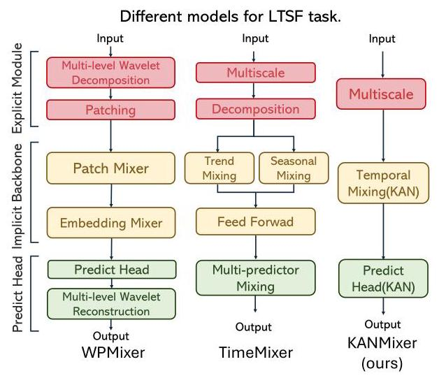
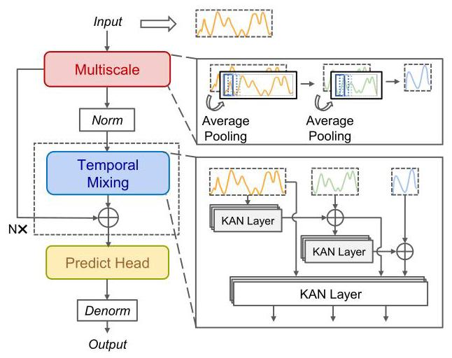
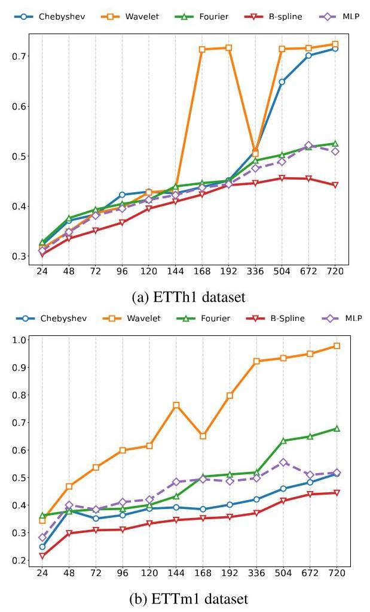

# KANMixer: Can KAN Serve as a New Modeling Core for Long-term Time Series Forecasting?

# KANMixer:KAN能否作为长期时间序列预测的新建模核心？

Lingyu Jiang ${}^{1}$ , Yuping Wang ${}^{2}$ , Yao Su ${}^{5}$ , Shuo Xing ${}^{3}$ , Wenjing Chen ${}^{3}$ , Xin Zhang ${}^{4}$ , Zhengzhong Tu ${}^{3}$ , Ziming Zhang ${}^{5}$ , Fangzhou Lin ${}^{1,3,5 *  \dagger  }$ , Michael Zielewski ${}^{\dagger  \dagger  }$ , Kazunori D Yamada ${}^{\dagger  \dagger  }$

蒋凌宇${}^{1}$ ，王宇平${}^{2}$ ，苏瑶${}^{5}$ ，邢硕${}^{3}$ ，陈文静${}^{3}$ ，张鑫${}^{4}$ ，涂正中${}^{3}$ ，张子铭${}^{5}$ ，林方舟${}^{1,3,5 *  \dagger  }$ ，迈克尔·齐莱夫斯基${}^{\dagger  \dagger  }$ ，山田和典${}^{\dagger  \dagger  }$

${}^{1}$ Tohoku University ${}^{2}$ University of Michigan ${}^{3}$ Texas A&M University

${}^{1}$ 东北大学${}^{2}$ 密歇根大学${}^{3}$ 德克萨斯农工大学

${}^{4}$ San Diego State University ${}^{5}$ Worcester Polytechnic Institute

${}^{4}$ 圣地亚哥州立大学${}^{5}$ 伍斯特理工学院

jiang.lingyu.p7@dc.tohoku.ac.jp, fiin2@wpi.edu, mike.zielewski@tohoku.ac.jp, yamada@tohoku.ac.jp

jiang.lingyu.p7@dc.tohoku.ac.jp, fiin2@wpi.edu, mike.zielewski@tohoku.ac.jp, yamada@tohoku.ac.jp

## Abstract

## 摘要

In recent years, multilayer perceptrons (MLP)-based deep learning models have demonstrated remarkable success in long-term time series forecasting (LTSF). Existing approaches typically augment MLP backbones with handcrafted external modules to address the inherent limitations of their flat architectures. Despite their success, these augmented methods neglect hierarchical locality and sequential inductive biases essential for time-series modeling, and recent studies indicate diminishing performance improvements. To overcome these limitations, we explore Kolmogorov-Arnold Networks (KAN), a recently proposed model featuring adaptive basis functions capable of granular, local modulation of nonlinearities. This raises a fundamental question: Can KAN serve as a new modeling core for LTSF? To answer this, we introduce KANMixer, a concise architecture integrating a multi-scale mixing backbone that fully leverages KAN's adaptive capabilities. Extensive evaluation demonstrates that KANMixer achieves state-of-the-art performance in 16 out of 28 experiments across seven benchmark datasets. To uncover the reasons behind this strong performance, we systematically analyze the strengths and limitations of KANMixer in comparison with traditional MLP architectures. Our findings reveal that the adaptive flexibility of KAN's learnable basis functions significantly transforms the influence of network structural prior on forecasting performance. Furthermore, we identify critical design factors affecting forecasting accuracy and offer practical insights for effectively utilizing KAN in LTSF. Together, these insights provide the first empirically grounded guidelines for effectively leveraging KAN in LTSF. Code is available in the supplementary file.

近年来，基于多层感知器(MLP)的深度学习模型在长期时间序列预测(LTSF)中取得了显著成功。现有方法通常通过手工制作的外部模块增强MLP主干，以解决其扁平架构的固有局限性。尽管取得了成功，但这些增强方法忽略了时间序列建模所需的分层局部性和顺序归纳偏差，最近的研究表明性能提升逐渐减少。为了克服这些局限性，我们探索了Kolmogorov-Arnold网络(KAN)，这是一种最近提出的模型，具有能够对非线性进行粒度局部调制的自适应基函数。这就提出了一个基本问题:KAN能否作为LTSF的新建模核心？为了回答这个问题，我们引入了KANMixer，这是一种简洁的架构，集成了一个多尺度混合主干，充分利用了KAN的自适应能力。广泛的评估表明，KANMixer在七个基准数据集的28个实验中的16个中达到了当前的最佳性能。为了揭示这种强大性能背后的原因，我们系统地分析了KANMixer与传统MLP架构相比的优势和局限性。我们的发现表明，KAN可学习基函数的自适应灵活性显著改变了网络结构先验对预测性能的影响。此外，我们确定了影响预测准确性的关键设计因素，并为在LTSF中有效利用KAN提供了实用见解。这些见解共同为在LTSF中有效利用KAN提供了第一个基于实证的指导方针。补充文件中提供了代码。

## Introduction

## 引言

Long-term time series forecasting (Chen et al. 2023b) (LTSF) is a fundamental task with profound real-world impact, underpinning strategic planning and operational decisions across a multitude of critical sectors. The primary task of LTSF is to predict future values of a multivariate time series over an extended horizon, whose core challenge is capturing long-range temporal dependencies. Its applications include, but are not limited to, energy systems (Ra-jagukguk, Ramadhan, and Lee 2020), electricity management (Trindade 2015), weather prediction (Wu et al. 2023b), and traffic planning (Cao et al. 2025; Zhuang et al. 2022). Deep learning methods (Lai et al. 2018; Salinas, Flunkert, and Gasthaus 2019) now dominate the LTSF landscape, having largely surpassed traditional statistical methods (e.g., ARIMA (Ho and Xie 1998)) and classical machine learning algorithms (e.g., GBDT (Chen and Guestrin 2016; Ke et al. 2017)). The model architectures rapidly evolved from early recurrent neural networks (RNNs) (D YAMADA, Lin, and Nakamura 2021; Lyu et al. 2021), such as Long Short-Term Memory networks (LSTMs (Hochreiter and Schmidhuber 1997)), to graph neural networks (GNNs) that leverage relational and structural information ((Gao et al. 2024; Wu et al. 2021b; Jiang et al. 2025)), and subsequently to Transformer-based (Vaswani et al. 2023) architectures exemplified by Informer (Zhou et al. 2021), Autoformer (Wu et al. 2021a), FEDformer (Zhou et al. 2022) and PatchTST (Nie et al. 2023). Powered by sophisticated self-attention mechanisms (Yamada, Baladram, and Lin 2022), Transformer models excel at capturing cross-variate relationships, setting new performance standards in LTSF.

长期时间序列预测(Chen等人，2023b)(LTSF)是一项具有深远现实世界影响的基础任务，支撑着众多关键领域的战略规划和运营决策。LTSF的主要任务是预测多元时间序列在较长时间范围内的未来值，其核心挑战是捕捉长期时间依赖性。其应用包括但不限于能源系统(Ra-jagukguk、Ramadhan和Lee，2020)、电力管理(Trindade，2015)、天气预报(Wu等人，2023b)和交通规划(Cao等人，2025；Zhuang等人，2022)。深度学习方法(Lai等人，2018；Salinas、Flunkert和Gasthaus，2019)现在主导着LTSF领域，在很大程度上超越了传统统计方法(例如ARIMA(Ho和Xie，1998))和经典机器学习算法(例如GBDT(Chen和Guestrin，2016；Ke等人，2017))。模型架构从早期的循环神经网络(RNNs)(D YAMADA、Lin和Nakamura，2021；Lyu等人，2021)迅速发展，如长短期记忆网络(LSTMs(Hochreiter和Schmidhuber，1997))，到利用关系和结构信息的图神经网络(GNNs)((Gao等人，2024；Wu等人，2021b；Jiang等人，2025))，随后发展到以Informer(Zhou等人，2021)、Autoformer(Wu等人，2021a)、FEDformer(Zhou等人，2022)和PatchTST(Nie等人，2023)为代表的基于Transformer的(Vaswani等人，2023)架构。受复杂自注意力机制(Yamada、Baladram和Lin，2022)的推动，Transformer模型擅长捕捉跨变量关系，在LTSF中设定了新的性能标准。

Figure 1: Architectural diagrams of various LTSF models. Explicit modules embed domain priors (e.g., decomposition, multi-scale), implicit backbones capture temporal dependencies, and prediction heads generate multi-step forecasts.

图1:各种LTSF模型的架构图。显式模块嵌入领域先验(例如分解、多尺度)，隐式主干捕捉时间依赖性，预测头生成多步预测。

---

*Project lead.

*项目负责人。

${}^{ \dagger  }$ Fangzhou Lin, Michael Zielewski and Kazunori D Yamada are the corresponding authors.

${}^{ \dagger  }$ 林方舟、Michael Zielewski和Kazunori D Yamada是通讯作者。

---

However, this dominance was upended by DLinear (Zeng et al. 2023), which demonstrated that a surprisingly simple linear model could decisively outperform complex Transformers. Inspired by this finding, researchers started improving MLP backbones by adding extra hand-designed parts. These parts bring in structural knowledge to make up for the fact that MLPs have a flat design and don't naturally understand the order or patterns in data. Examples of such modules include frequency decomposition blocks (Wang et al. 2025a) and patch mixing layers (Gong, Tang, and Liang 2024). This led to models like WPMixer (Murad, Aktukmak, and Yilmaz 2024), TimeMixer (Wang et al. 2024), FreTS (Yi et al. 2023), and TiDE (Das et al. 2023). Although this strategy initially yielded significant improvements, recent fair-benchmark studies reveal that their additional complexity offers only diminishing gains in performance (Brigato et al. 2025).

然而，DLinear(Zeng等人，2023)颠覆了这种主导地位，它证明了一个令人惊讶的简单线性模型可以决定性地超越复杂的Transformer。受这一发现的启发，研究人员开始通过添加额外的手工设计部件来改进MLP主干。这些部件引入结构知识，以弥补MLP具有扁平设计且自然不理解数据中的顺序或模式这一事实。此类模块的示例包括频率分解块(Wang等人，2025a)和补丁混合层(Gong、Tang和Liang，2024)。这导致了像WPMixer(Murad、Aktukmak和Yilmaz，2024)、TimeMixer(Wang等人，2024)、FreTS(Yi等人，2023)和TiDE(Das等人，2023)这样的模型。尽管这种策略最初带来了显著的改进，但最近的公平基准研究表明，它们额外的复杂性仅带来了性能上逐渐减少的收益(Brigato等人，2025)。

These observations point to the inherent limitations in the MLP backbone itself, suggesting the necessity to explore more efficient core modeling architectures. In this context, Kolmogorov-Arnold Networks (KAN) (Liu et al. 2025) provide a compelling alternative by adaptively learning representations through spline-based basis functions directly from data, achieving compact yet powerful universal approximation and enabling fine-grained local modulation of nonlinearities (Schmidt-Hieber 2021). These unique properties motivate our central research question: Can KAN serve as a new modeling core for LTSF?

这些观察结果指出了MLP主干本身固有的局限性，表明有必要探索更高效的核心建模架构。在这种背景下，柯尔莫哥洛夫 - 阿诺德网络(KAN)(Liu等人，2025)通过直接从数据中通过基于样条的基函数自适应学习表示，提供了一个有吸引力的替代方案，实现了紧凑而强大的通用逼近，并能够对非线性进行细粒度的局部调制(Schmidt-Hieber，2021)。这些独特的特性引发了我们的核心研究问题:KAN能否作为LTSF的新建模核心？

Recent pioneering studies have begun to integrate KAN into LTSF, demonstrating its potential (Vaca-Rubio et al. 2024). For example, TimeKAN (Huang et al. 2025) incorporates a multi-order KAN and achieves state-of-the-art (SOTA) performance, while Reversible Mixture of KAN Experts (RMoK) (Han et al. 2025) successfully validates its utility as a building block. However, existing studies primarily utilize KAN as an auxiliary module, without exploring its potential as a model core.

最近的开创性研究已经开始将KAN集成到LTSF中，展示了其潜力(Vaca-Rubio等人，2024)。例如，TimeKAN(Huang等人，2025)结合了多阶KAN并实现了当前最优(SOTA)性能，而KAN专家的可逆混合(RMoK)(Han等人，2025)成功验证了其作为构建块的效用。然而，现有研究主要将KAN用作辅助模块，而没有探索其作为模型核心的潜力。

To this end, we introduce KANMixer, a concise architecture designed around KAN as the modeling core. By employing a minimalistic multi-scale mixing backbone, our design maximally leverages KAN's adaptive basis functions while avoiding unnecessary complexity, ensuring that observed performance gains can be attributed directly to the KAN core. As shown in Figure 1, KANMixer's concise architecture is noticeably more streamlined than more complex models like WPMixer and TimeMixer. Moreover, based on numerical experimental results, KANMixer achieves state-of-the-art (SOTA) performance in 16 out of 28 experiments across 7 benchmark datasets. Our investigation compellingly validates KAN's potential as a powerful modeling core for LTSF.

为此，我们引入了KANMixer，这是一种以KAN为建模核心设计的简洁架构。通过采用简约的多尺度混合主干，我们的设计最大限度地利用了KAN的自适应基函数，同时避免了不必要的复杂性，确保观察到的性能提升可以直接归因于KAN核心。如图1所示，KANMixer的简洁架构明显比WPMixer和TimeMixer等更复杂的模型更加精简。此外，基于数值实验结果，KANMixer在7个基准数据集的28个实验中的16个实验中达到了当前最优(SOTA)性能。我们的研究有力地验证了KAN作为LTSF强大建模核心的潜力。

Beyond achieving superior performance, our systematic analysis elucidates how and why KAN improves forecasting accuracy. Specifically, we highlight the critical roles played by spline-based basis functions, the effectiveness of moderate network depths in balancing representation and optimization, and the nuanced interactions between KAN's adaptability and imposed structural priors. These analyses yield practical guidelines for effectively leveraging KAN in future model design. The main contributions of this paper are as follows:

除了实现卓越的性能外，我们的系统分析还阐明了KAN如何以及为何提高预测准确性。具体而言，我们强调了基于样条的基函数所发挥的关键作用、适度网络深度在平衡表示和优化方面的有效性，以及KAN的适应性与施加的结构先验之间的细微交互。这些分析为在未来模型设计中有效利用KAN提供了实用指南。本文的主要贡献如下:

- We propose KANMixer, a structurally simple model featuring KAN as its modeling core. KANMixer surpasses more complex SOTA models in performance, demonstrating its effectiveness.

- 我们提出了KANMixer，这是一个结构简单的模型，以KAN作为其建模核心。KANMixer在性能上超过了更复杂的SOTA模型，证明了其有效性。

- We provide a systematic analysis of KAN's modeling characteristics in LTSF, revealing that KAN's superior performance originates from the adaptive plasticity of its basis functions. Our analysis also shows that structural priors interact differently with KAN compared to MLP.

- 我们对LTSF中KAN的建模特性进行了系统分析，发现KAN的卓越性能源于其基函数的自适应可塑性。我们的分析还表明，与MLP相比，结构先验与KAN的相互作用有所不同。

- To our knowledge, we deliver the first set of empirically grounded, practical guidelines for effectively applying KAN to LTSF, emphasizing the critical importance of the prediction head and optimal network depth in maximizing forecasting performance.

- 据我们所知，我们提供了第一套基于实证的、实用的指南，用于有效地将KAN应用于LTSF，强调了预测头和最优网络深度在最大化预测性能方面的至关重要性。

## Related Work

## 相关工作

## Kolmogorov-Arnold Network

## 柯尔莫哥洛夫 - 阿诺德网络

Inspired by the Kolmogorov-Arnold representation theorem (Schmidt-Hieber 2021), Liu et al. (Liu et al. 2025) introduced the Kolmogorov-Arnold Network (KAN), significantly innovating over traditional MLPs. KAN models each connection with trainable B-spline curves, enhancing functional plasticity and accuracy in scientific computing tasks with fewer parameters (Wang et al. 2025b). However, despite these advantages, KAN's training typically incurs higher computational costs due to the complexity of B-spline basis functions (Ji, Hou, and Zhang 2025). Recent improvements thus focus on alternative basis functions to mitigate these limitations and enhance specific aspects of KAN: ChebyshevKAN (SS et al. 2024) employs Chebyshev polynomials for efficiency; Kolmogorov-Arnold-Fourier Network (KAF) (Zhang et al. 2025) leverages random Fourier features for efficient high-frequency pattern representation; Wav-KAN (Bozorgasl and Chen 2024) uses wavelets for faster training and robustness.

受柯尔莫哥洛夫-阿诺德表示定理(施密特-希伯尔，2021年)的启发，刘等人(刘等人，2025年)引入了柯尔莫哥洛夫-阿诺德网络(KAN)，对传统多层感知器进行了重大创新。KAN用可训练的B样条曲线对每个连接进行建模，在参数较少的情况下提高了科学计算任务中的功能可塑性和准确性(王等人，2025b)。然而，尽管有这些优点，但由于B样条基函数的复杂性，KAN的训练通常会产生更高的计算成本(季、侯和张，2025年)。因此，最近的改进集中在替代基函数上，以减轻这些限制并增强KAN的特定方面:切比雪夫KAN(SS等人，2024年)采用切比雪夫多项式以提高效率；柯尔莫哥洛夫-阿诺德-傅里叶网络(KAF)(张等人，2025年)利用随机傅里叶特征进行高效的高频模式表示；小波KAN(博佐尔加斯尔和陈，2024年)使用小波进行更快的训练和更强的鲁棒性。

## Explicit Paradigms in LTSF

## 长期时空融合中的显式范式

MLP-based models often struggle to capture intricate temporal patterns spanning multiple trends, periodicities, and high-frequency fluctuations. This limitation arises from their fixed, non-adaptive receptive fields and lack of inductive biases tailored for sequential data. Explicit paradigms mitigate these limitations by embedding domain-specific priors into data representations (Liu et al. 2024a; Deng et al. 2024), notably through decomposition and multi-scale modeling.

基于多层感知器(MLP)的模型通常难以捕捉跨越多种趋势、周期性和高频波动的复杂时间模式。这种局限性源于其固定的、非自适应的感受野，以及缺乏针对序列数据量身定制的归纳偏差。显式范式通过将特定领域的先验知识嵌入到数据表示中(Liu等人，2024a；Deng等人，2024)来缓解这些局限性，特别是通过分解和多尺度建模。

Decomposition (Liu et al. 2024a; Deng et al. 2024) separates sequences into simpler subcomponents by either decomposing them into trends, seasonality, and residuals in the time domain or into high, mid, and low-frequency components in the frequency domain. For instance, DLinear (Zeng et al. 2023) employs moving averages to extract trends, modeling residuals linearly; FreTS (Yi et al. 2023) operates directly in the frequency domain; TimesNet (Wu et al. 2023a) identifies dominant frequencies via FFT to explicitly model intra- and inter-period variations.

分解(Liu等人，2024a；Deng等人，2024)通过在时域中将序列分解为趋势、季节性和残差，或者在频域中将其分解为高频、中频和低频分量，将序列分离为更简单的子组件。例如，DLinear(Zeng等人，2023)采用移动平均来提取趋势，并对残差进行线性建模；FreTS(Yi等人，2023)直接在频域中运行；TimesNet(Wu等人，2023a)通过快速傅里叶变换(FFT)识别主导频率，以明确建模周期内和周期间的变化。

Multi-scale modeling captures temporal dynamics at multiple resolutions (Shabani et al. 2022; Zhong et al. 2023), significantly enhancing forecasting capabilities. SCINet (LIU et al. 2022) partitions sequences recursively into hierarchical structures, capturing dependencies across scales.

多尺度建模能够在多个分辨率下捕捉时间动态(Shabani等人，2022年；Zhong等人，2023年)，显著提高预测能力。SCINet(LIU等人，2022年)将序列递归地划分为层次结构，捕捉跨尺度的依赖性。

## Implicit Paradigms in LTSF

## LTSF中的隐式范式

Transformer architectures (Vaswani et al. 2023), particularly through multi-head self-attention, dominate implicit modeling by capturing long-range sequence dependencies. Informer (Zhou et al. 2021) introduced ProbSparse self-attention for efficiency; Autoformer (Wu et al. 2021a) employed auto-correlation mechanisms, explicitly decomposing sequences into trends and seasonalities. Nonetheless, the quadratic complexity of vanilla Transformers remains computationally intensive.

Transformer架构(Vaswani等人，2023年)，特别是通过多头自注意力机制，通过捕捉长距离序列依赖关系在隐式建模中占据主导地位。Informer(Zhou等人，2021年)引入了概率稀疏自注意力机制以提高效率；Autoformer(Wu等人，2021a)采用了自相关机制，将序列明确分解为趋势和季节性成分。尽管如此，普通Transformer的二次复杂度在计算上仍然很密集。

To reduce computational complexity, recent methods adopt lightweight mixing-based architectures, replacing attention with linear-complexity MLP blocks. TSMixer (Chen et al. 2023a) alternately applies MLPs across temporal and cross-variate dimensions, while TimeMixer (Wang et al. 2024) integrates dual-scale mixing.

为了降低计算复杂度，近期方法采用了基于轻量级混合的架构，用线性复杂度的MLP模块取代注意力机制。TSMixer(Chen等人，2023a)在时间维和跨变量维上交替应用MLP，而TimeMixer(Wang等人，2024)集成了双尺度混合。

Moreover, graph neural networks (GNNs) and diffusion models (Meijer and Chen 2024; Zhuang et al. 2024; Gao et al. 2023) have gained prominence. MTGNN (Wu et al. 2020) explicitly leverages graph structures for spatiotemporal dependencies, and STGAIL (Liu et al. 2024d) integrates diffusion processes with spatial-temporal graph layers, effectively modeling complex dynamics.

此外，图神经网络(GNN)和扩散模型(Meijer和Chen，2024；Zhuang等人，2024；Gao等人，2023)也备受关注。MTGNN(Wu等人，2020)明确利用图结构来处理时空依赖性，STGAIL(Liu等人，2024d)将扩散过程与时空图层相结合，有效地对复杂动态进行建模。

## KANMixer

## KANMixer

## Problem Definition for LTSF

## 长时时间序列预测(LTSF)的问题定义

In this section, we provide the setup and definition of the LTSF problem (Chen et al. 2023b). Given a historical multivariate time series of length $L$ observed at time step $t$ :

在本节中，我们给出长时时间序列预测(LTSF)问题的设置和定义(Chen等人，2023b)。给定在时间步$t$观察到的长度为$L$的历史多元时间序列:

$$
X = {\left\{  {X}_{t}^{1},{X}_{t}^{2},\ldots ,{X}_{t}^{d}\right\}  }_{t = 1}^{L},\;{X}_{t}^{i} \in  \mathbb{R}, \tag{1}
$$

where $d$ denotes the number of observed variables, and $L$ is the length of the look-back window, the goal of time series forecasting is to predict the future values for the next $P$ steps:

其中$d$表示观察到的变量数量，$L$是回溯窗口的长度，时间序列预测的目标是预测未来$P$步的数值:

$$
\widehat{X} = f\left( X\right)  = {\left\{  {\widehat{X}}_{t}^{1},{\widehat{X}}_{t}^{2},\ldots ,{\widehat{X}}_{t}^{d}\right\}  }_{t = L + 1}^{L + P},\;{\widehat{X}}_{t}^{i} \in  \mathbb{R}. \tag{2}
$$

In LTSF tasks, common practice in the literature is to use the Mean Squared Error (MSE) as the primary evaluation metric and loss function (Huang et al. 2025), defined as:

在长时时间序列预测任务中，文献中的常见做法是使用均方误差(MSE)作为主要评估指标和损失函数(Huang等人，2025)，定义为:

$$
\operatorname{MSE} = \frac{1}{P \times  d}\mathop{\sum }\limits_{{t = L + 1}}^{{L + P}}\mathop{\sum }\limits_{{i = 1}}^{d}{\left( {X}_{t}^{i} - {\widehat{X}}_{t}^{i}\right) }^{2}. \tag{3}
$$

Figure 2: The architecture of KANMixer consists of a multi-scale processing module, a temporal mixing module, and a KAN-based prediction head.

图2:KANMixer的架构由多尺度处理模块、时间混合模块和基于KAN的预测头组成。

## Overall Architecture

## 整体架构

We design our KANMixer to be concise, standalone, and free from external modules, in the hope that it can be plug-and-played into any LTSF models. Following the recent successes in LTSF (Nie et al. 2023), we adopt a channel-independent approach to forecast each variable separately. The overall structure of KANMixer is illustrated in Figure 2. It is comprised of three modules: (1) an explicit multi-scale module that down-samples input sequences into scale-enriched representations; (2) an implicit temporal mixing module employing a minimalistic fine-to-coarse fusion strategy to hierarchically integrate features; and (3) a KAN-based prediction head producing the final forecasts. All modules in our KANMixer employ adaptive KAN layers. We perform ablation studies of each of these components to understand their contribution in different modeling paradigms. Below, we describe the details of each model.

我们将KANMixer设计得简洁、独立且无需外部模块，希望它能即插即用到任何长时时间序列预测模型中。继长时时间序列预测(Nie等人，2023)近期取得成功之后，我们采用与通道无关的方法分别预测每个变量。KANMixer的整体结构如图2所示。它由三个模块组成:(1)一个显式多尺度模块，将输入序列下采样为富含尺度的表示；(2)一个隐式时间混合模块，采用简约的从细到粗融合策略分层整合特征；(3)一个基于KAN的预测头，生成最终预测。KANMixer中的所有模块都采用自适应KAN层。我们对这些组件分别进行了消融研究，以了解它们在不同建模范式中的贡献。下面，我们描述每个模型的细节。

## Explicit Multi-Scale Processing

## 显式多尺度处理

Time series data typically exhibit distinct characteristics across multiple temporal scales, ranging from macroscopic trends to fine-grained fluctuations. To efficiently capture these diverse temporal dynamics without altering the intrinsic data structure, we adopt average pooling with a fixed kernel size $k$ to generate multi-scale representations. These pooled representations are concatenated with the original sequence along the feature dimension and projected into a unified latent representation ${\mathbf{X}}^{\mathrm{{ms}}} \in  {\mathbb{R}}^{{d}_{\text{ model }} \times  L}$ . This enriched representation naturally facilitates subsequent implicit mixing modules to aggregate temporal information from local to global contexts.

时间序列数据通常在多个时间尺度上呈现出不同的特征，从宏观趋势到细粒度波动。为了在不改变固有数据结构的情况下有效捕捉这些多样的时间动态，我们采用固定核大小为$k$的平均池化来生成多尺度表示。这些池化表示沿着特征维度与原始序列连接，并投影到统一的潜在表示${\mathbf{X}}^{\mathrm{{ms}}} \in  {\mathbb{R}}^{{d}_{\text{ model }} \times  L}$中。这种丰富的表示自然便于后续的隐式混合模块从局部到全局上下文聚合时间信息。

## Implicit Temporal Mixing Module

## 隐式时间混合模块

Given the enriched multi-scale representation, we employ a minimalistic Temporal Mixing module to hierarchically integrate temporal dependencies, effectively balancing local and global contexts.

给定丰富的多尺度表示，我们采用一个简约的时间混合模块来分层整合时间依赖性，有效平衡局部和全局上下文。

Specifically, the Temporal Mixing backbone comprises $N$ stacked mixing blocks operating on multi-scale representations $\left\{  {{\mathbf{Z}}_{l - 1}^{0},\ldots ,{\mathbf{Z}}_{l - 1}^{k}}\right\}$ , where $i = 0$ denotes the highest (finest) resolution, and $i = k$ the lowest (coarsest).

具体来说，时间混合主干由$N$个堆叠的混合块组成，这些混合块在多尺度表示$\left\{  {{\mathbf{Z}}_{l - 1}^{0},\ldots ,{\mathbf{Z}}_{l - 1}^{k}}\right\}$上运行，其中$i = 0$表示最高(最细)分辨率，$i = k$表示最低(最粗)分辨率。

Within each block, information propagates from finer to coarser scales through a streamlined fusion mechanism with residual connections. Concretely, representations at scale $i$ are updated by integrating downsampled and transformed features from the adjacent finer scale $i - 1$ via adaptive KAN layers:

在每个块内，信息通过带有残差连接的简化融合机制从较细尺度传播到较粗尺度。具体而言，尺度$i$处的表示通过自适应KAN层整合来自相邻较细尺度$i - 1$的下采样和变换后的特征进行更新:

$$
{\mathbf{H}}_{l}^{i} = {\mathbf{Z}}_{l - 1}^{i} + {\operatorname{KAN}}_{\text{ down }}\left( {\mathbf{Z}}_{l - 1}^{i - 1}\right) . \tag{4}
$$

Subsequently, each representation ${\mathbf{H}}_{l}^{i}$ undergoes channel-wise refinement via a KAN-based feed-forward network $\left( {\mathrm{{KAN}}}_{\mathrm{{ffn}}}\right)$ , with residual connections ensuring stable training:

随后，每个表示${\mathbf{H}}_{l}^{i}$通过基于KAN的前馈网络$\left( {\mathrm{{KAN}}}_{\mathrm{{ffn}}}\right)$进行逐通道细化，通过残差连接确保训练的稳定性:

$$
{\mathbf{Z}}_{l}^{i} = {\mathbf{H}}_{l}^{i} + {\mathrm{{KAN}}}_{\mathrm{{ffn}}}\left( {\mathbf{H}}_{l}^{i}\right) . \tag{5}
$$

Stacking multiple such blocks results in a deep, adaptive multi-scale representation, effectively exploiting KAN's nonlinear modeling capabilities.

堆叠多个这样的块会产生一个深度的、自适应的多尺度表示，有效地利用了KAN的非线性建模能力。

Finally, scale-specific KAN prediction heads map the latent features ${\mathbf{Z}}_{N}^{i}$ to scale-specific forecasts ${\widehat{\mathbf{Y}}}^{i}$ . The final forecast is obtained by summing predictions across scales, leveraging insights from all temporal resolutions:

最后，特定尺度的KAN预测头将潜在特征${\mathbf{Z}}_{N}^{i}$映射到特定尺度的预测${\widehat{\mathbf{Y}}}^{i}$。最终预测是通过跨尺度对预测进行求和得到的，利用了来自所有时间分辨率的见解:

$$
\widehat{\mathbf{Y}} = \mathop{\sum }\limits_{{i = 0}}^{k}{\widehat{\mathbf{Y}}}^{i}. \tag{6}
$$

## Experiments

## 实验

## Experimental Settings

## 实验设置

Datasets Our experiments utilize seven commonly used real-world datasets: the ETT series (Zhou et al. 2021) (including ETTh1, ETTh2, ETTm1, and ETTm2), Exchange Rate, Weather, and Electricity. Consistent with previous research (Zhou et al. 2021), the ETT datasets are divided into training, validation, and testing sets with a ratio of [6:2:2], while the Weather, Exchange Rate, and Electricity datasets follow a partition ratio of [7:1:2].

数据集 我们的实验使用了七个常用的真实世界数据集:ETT系列(Zhou等人，2021年)(包括ETTh1、ETTh2、ETTm1和ETTm2)、汇率、天气和电力。与之前的研究(Zhou等人，2021年)一致，ETT数据集按照[6:2:2]的比例分为训练集、验证集和测试集，而天气、汇率和电力数据集遵循[7:1:2]的划分比例。

Baseline We select widely adopted, well-acknowledged methods from the LTSF literature, covering various model categories, including the KAN-based TimeKAN (Wu et al. 2023a), Transformer-based models (e.g., iTransformer (Liu et al. 2024c), PatchTST (Nie et al. 2023)), MLP-based models (e.g., TimeMixer (Wang et al. 2024), DLinear (Zeng et al. 2023), FreTS (Yi et al. 2023), TiDE (Das et al. 2023)), CNN-based TimesNet (Wu et al. 2023a), and Time-FFM (Liu et al. 2024b), a foundation model for time series forecasting. For the recent TimeKAN and TimeMixer models, we have reproduced their experiments to ensure fair comparisons.

基线 我们从LTSF文献中选择了广泛采用且得到认可的方法，涵盖了各种模型类别，包括基于KAN的TimeKAN(Wu等人，2023a)、基于Transformer的模型(例如iTransformer(Liu等人，2024c)、PatchTST(Nie等人，2023))、基于MLP的模型(例如TimeMixer(Wang等人，2024)、DLinear(Zeng等人，2023)、FreTS(Yi等人，2023)、TiDE(Das等人，2023))、基于CNN的TimesNet(Wu等人，2023a)以及Time-FFM(Liu等人，2024b)，这是一个时间序列预测的基础模型。对于最近的TimeKAN和TimeMixer模型，我们重现了它们的实验以确保公平比较。

Evaluation Building upon past research (Wu et al. 2021a), we utilize the Mean Squared Error (MSE) and Mean Absolute Error (MAE) (Hyndman and Athanasopoulos 2018) to quantitatively evaluate and compare model performance.

评估 基于过去的研究(Wu等人，2021a)，我们使用均方误差(MSE)和平均绝对误差(MAE)(Hyndman和Athanasopoulos，2018)来定量评估和比较模型性能。

Experimental Setup For fair comparison, we strictly follow the experimental settings in (Wu et al. 2021a), including the same hyperparameters such as learning rate and its scheduler, regularization parameter, number of epochs, random seed, and batch size and order. More specifically, we trained all models utilizing the ${L}_{2}$ loss function (MSE), the Adam optimizer with a fixed learning rate of $\operatorname{lr} = {0.01}$ , batch size $b = {32}$ , and the same random seed as in prior work. To ensure fair comparisons, results for KANMixer and reproduced baselines (TimeKAN, TimeMixer) are averaged over five runs, while remaining results are reported directly from their respective papers. The model width was treated as a hy-perparameter, as MLP-based models typically require wider widths than their KAN-based counterparts to achieve optimal performance. We conduct all experiments on a server with 4 NVIDIA Ampere A100 80G GPUs.

实验设置 为了进行公平比较，我们严格遵循(Wu等人，2021a)中的实验设置，包括相同的超参数，如学习率及其调度器、正则化参数、 epoch数、随机种子以及批量大小和顺序。更具体地说，我们使用${L}_{2}$损失函数(MSE)训练所有模型，使用固定学习率为$\operatorname{lr} = {0.01}$的Adam优化器、批量大小$b = {32}$，并使用与先前工作相同的随机种子。为了确保公平比较，KANMixer和重现的基线(TimeKAN、TimeMixer)的结果在五次运行中进行平均，而其余结果直接从它们各自的论文中报告。模型宽度被视为一个超参数，因为基于MLP的模型通常需要比基于KAN的模型更宽的宽度才能实现最佳性能。我们在一台配备4个NVIDIA Ampere A100 80G GPU的服务器上进行所有实验。

## Main results

## 主要结果

As shown in Table 1, KANMixer delivers SOTA accuracy across seven long-term time-series benchmarks. Leveraging its concise yet effective architecture, it secures first-place performance in 16 MSE and 11 MAE configurations, consistently outperforming more complex models. This advantage is particularly notable on the ETTh1 dataset, where KANMixer achieves an average MSE improvement of 4.9% across all forecast lengths.

如表1所示，KANMixer在七个长期时间序列基准测试中提供了最优的准确性。利用其简洁而有效的架构，它在16个MSE和11个MAE配置中获得了第一名的性能，始终优于更复杂的模型。这一优势在ETTh1数据集上尤为显著，在该数据集上，KANMixer在所有预测长度上的平均MSE提高了4.9%。

While KANMixer performs strongly across most benchmarks, specialized architectures excel in certain scenarios. For example, Transformer-based models like iTransformer outperform on the Electricity dataset (321 variables) due to their explicit modeling of cross-variate correlations. Similarly, Time-FFM excels on the highly volatile Exchange dataset, benefiting from its foundation-model design tailored to capture general macroeconomic patterns.

虽然KANMixer在大多数基准测试中表现强劲，但专门的架构在某些情况下表现出色。例如，像iTransformer这样的基于Transformer的模型在电力数据集(321个变量)上表现出色，因为它们对交叉变量相关性进行了显式建模。同样，Time-FFM在高度波动的汇率数据集上表现出色，这得益于其为捕捉一般宏观经济模式而设计的基础模型。

While performance on these specialized datasets highlights the strengths of targeted architectures, KANMixer demonstrates strong results across a broader range of benchmarks. Its effectiveness stems from a minimalistic multi-scale feature augmentation strategy, explicitly leveraging adaptive KAN layers without unnecessary complexity or common decomposition-based priors. Particularly insightful is the comparison with TimeKAN, another pioneering KAN-based model. While TimeKAN validates the potential of KAN in LTSF by integrating it into a complex cascaded frequency decomposition architecture, our simpler, more direct KANMixer consistently outperforms it. Our design choice is supported by our critical analysis, revealing how to unleash KAN's full potential. Overall, these results clearly affirm our initial hypothesis: KAN can serve as a powerful general-purpose modeling core.

虽然在这些专门的数据集上的性能突出了目标架构的优势，但KANMixer在更广泛的基准测试中也展现出了强劲的结果。其有效性源于一种简约的多尺度特征增强策略，该策略明确利用自适应KAN层，避免了不必要的复杂性或基于常见分解的先验知识。与另一个基于KAN的开创性模型TimeKAN的比较尤其具有启发性。虽然TimeKAN通过将KAN集成到复杂的级联频率分解架构中验证了KAN在长序列时间预测(LTSF)中的潜力，但我们更简单、更直接的KANMixer始终优于它。我们的设计选择得到了批判性分析的支持，揭示了如何释放KAN的全部潜力。总体而言，这些结果清楚地证实了我们最初的假设:KAN可以作为一个强大的通用建模核心。

## Further Analysis on KAN-based Model

## 基于KAN的模型的进一步分析

In this section, we conduct a series of controlled ablation studies on KANMixer to exploit the full potential of KAN as a modeling core in LTSF. To ensure our findings are generalizable across diverse forecasting scenarios, we select three representative benchmark datasets: ETTh1, ETTm1, and Weather. Across all our analyses, we observe that the model exhibits remarkably consistent performance trends across these diverse datasets.

在本节中，我们对KANMixer进行了一系列可控的消融研究，以充分发挥KAN作为长序列时间预测(LTSF)建模核心的潜力。为确保我们的发现能够在各种预测场景中普遍适用，我们选择了三个具有代表性的基准数据集:ETTh1、ETTm1和Weather。在所有分析中，我们观察到该模型在这些不同的数据集上表现出显著一致的性能趋势。

<table><tr><td rowspan="2">Models</td><td rowspan="2"></td><td colspan="2">KANMixer (Ours)</td><td colspan="2">TimeKAN 2025</td><td colspan="2">TimeMixer 2024</td><td colspan="2">iTransformer 2024</td><td colspan="2">Time-FFM 2024</td><td colspan="2">TimesNet 2023</td><td></td><td>PatchTST   2023</td><td colspan="2">FreTS 2024</td><td colspan="2">DLinear 2023</td><td colspan="2">TiDE 2023</td></tr><tr><td>MSE</td><td>MAE</td><td>MSE</td><td>MAE</td><td>MSE</td><td>MAE</td><td>MSE</td><td>MAE</td><td>MSE</td><td>MAE</td><td>MSE</td><td>MAE</td><td>MSE</td><td>MAE</td><td>MSE</td><td>MAE</td><td>MSE</td><td>MAE</td><td>MSE</td><td>MAE</td></tr><tr><td rowspan="4">ETTh1</td><td>96</td><td>0.367</td><td>0.392</td><td>0.384</td><td>0.396</td><td>0.385</td><td>0.402</td><td>0.386</td><td>0.405</td><td>0.385</td><td>0.400</td><td>0.384</td><td>0.402</td><td>0.460</td><td>0.447</td><td>0.395</td><td>0.407</td><td>0.397</td><td>0.412</td><td>0.479</td><td>0.464</td></tr><tr><td>192</td><td>0.422</td><td>0.427</td><td>0.437</td><td>0.425</td><td>0.436</td><td>0.429</td><td>0.441</td><td>0.436</td><td>0.439</td><td>0.430</td><td>0.439</td><td>0.429</td><td>0.512</td><td>0.477</td><td>0.490</td><td>0.477</td><td>0.446</td><td>0.441</td><td>0.525</td><td>0.492</td></tr><tr><td>336</td><td>0.446</td><td>0.444</td><td>0.476</td><td>0.439</td><td>0.529</td><td>0.456</td><td>0.487</td><td>0.458</td><td>0.480</td><td>0.449</td><td>0.638</td><td>0.469</td><td>0.546</td><td>0.496</td><td>0.510</td><td>0.480</td><td>0.489</td><td>0.467</td><td>0.565</td><td>0.515</td></tr><tr><td>720</td><td>0.442</td><td>0.455</td><td>0.468</td><td>0.470</td><td>0.483</td><td>0.474</td><td>0.503</td><td>0.491</td><td>0.462</td><td>0.456</td><td>0.512</td><td>0.500</td><td>0.544</td><td>0.517</td><td>0.568</td><td>0.538</td><td>0.513</td><td>0.510</td><td>0.594</td><td>0.558</td></tr><tr><td rowspan="4">ETTh2</td><td>96</td><td>0.288</td><td>0.342</td><td>0.306</td><td>0.353</td><td>0.289</td><td>0.341</td><td>0.297</td><td>0.349</td><td>0.301</td><td>0.351</td><td>0.340</td><td>0.374</td><td>0.308</td><td>0.355</td><td>0.332</td><td>0.364</td><td>0.340</td><td>0.394</td><td>0.400</td><td>0.440</td></tr><tr><td>192</td><td>0.371</td><td>0.394</td><td>0.375</td><td>0.392</td><td>0.391</td><td>0.403</td><td>0.380</td><td>0.400</td><td>0.378</td><td>0.397</td><td>0.402</td><td>0.414</td><td>0.393</td><td>0.405</td><td>0.451</td><td>0.457</td><td>0.482</td><td>0.479</td><td>0.528</td><td>0.509</td></tr><tr><td>336</td><td>0.419</td><td>0.433</td><td>0.425</td><td>0.435</td><td>0.426</td><td>0.433</td><td>0.428</td><td>0.432</td><td>0.422</td><td>0.431</td><td>0.452</td><td>0.452</td><td>0.427</td><td>0.436</td><td>0.466</td><td>0.473</td><td>0.591</td><td>0.541</td><td>0.643</td><td>0.571</td></tr><tr><td>720</td><td>0.448</td><td>0.454</td><td>0.471</td><td>0.464</td><td>0.468</td><td>0.468</td><td>0.427</td><td>0.445</td><td>0.427</td><td>0.444</td><td>0.462</td><td>0.468</td><td>0.436</td><td>0.450</td><td>0.485</td><td>0.471</td><td>0.839</td><td>0.661</td><td>0.874</td><td>0.679</td></tr><tr><td rowspan="4">ETTm1</td><td>96</td><td>0.311</td><td>0.355</td><td>0.326</td><td>0.363</td><td>0.320</td><td>0.360</td><td>0.334</td><td>0.368</td><td>0.336</td><td>0.369</td><td>0.338</td><td>0.375</td><td>0.352</td><td>0.374</td><td>0.337</td><td>0.374</td><td>0.346</td><td>0.374</td><td>0.364</td><td>0.387</td></tr><tr><td>192</td><td>0.357</td><td>0.378</td><td>0.359</td><td>0.384</td><td>0.370</td><td>0.387</td><td>0.377</td><td>0.391</td><td>0.378</td><td>0.389</td><td>0.374</td><td>0.387</td><td>0.390</td><td>0.393</td><td>0.382</td><td>0.398</td><td>0.382</td><td>0.391</td><td>0.398</td><td>0.404</td></tr><tr><td>336</td><td>0.381</td><td>0.400</td><td>0.390</td><td>0.407</td><td>0.389</td><td>0.402</td><td>0.426</td><td>0.420</td><td>0.411</td><td>0.410</td><td>0.410</td><td>0.411</td><td>0.421</td><td>0.410</td><td>0.420</td><td>0.423</td><td>0.415</td><td>0.451</td><td>0.428</td><td>0.425</td></tr><tr><td>720</td><td>0.444</td><td>0.439</td><td>0.442</td><td>0.435</td><td>0.451</td><td>0.439</td><td>0.491</td><td>0.459</td><td>0.469</td><td>0.441</td><td>0.478</td><td>0.450</td><td>0.462</td><td>0.449</td><td>0.490</td><td>0.471</td><td>0.473</td><td>0.451</td><td>0.487</td><td>0.461</td></tr><tr><td rowspan="4">ETTm2</td><td>96</td><td>0.173</td><td>0.257</td><td>0.177</td><td>0.259</td><td>0.176</td><td>0.257</td><td>0.180</td><td>0.264</td><td>0.181</td><td>0.267</td><td>0.187</td><td>0.267</td><td>0.183</td><td>0.270</td><td>0.186</td><td>0.275</td><td>0.193</td><td>0.293</td><td>0.207</td><td>0.305</td></tr><tr><td>192</td><td>0.239</td><td>0.303</td><td>0.242</td><td>0.304</td><td>0.240</td><td>0.302</td><td>0.250</td><td>0.309</td><td>0.247</td><td>0.308</td><td>0.249</td><td>0.309</td><td>0.255</td><td>0.315</td><td>0.259</td><td>0.323</td><td>0.284</td><td>0.361</td><td>0.290</td><td>0.364</td></tr><tr><td>336</td><td>0.300</td><td>0.343</td><td>0.304</td><td>0.344</td><td>0.303</td><td>0.343</td><td>0.311</td><td>0.348</td><td>0.309</td><td>0.347</td><td>0.321</td><td>0.351</td><td>0.309</td><td>0.347</td><td>0.420</td><td>0.423</td><td>0.382</td><td>0.429</td><td>0.377</td><td>0.422</td></tr><tr><td>720</td><td>0.398</td><td>0.401</td><td>0.400</td><td>0.401</td><td>0.404</td><td>0.404</td><td>0.412</td><td>0.407</td><td>0.406</td><td>0.404</td><td>0.408</td><td>0.403</td><td>0.412</td><td>0.404</td><td>0.559</td><td>0.511</td><td>0.558</td><td>0.525</td><td>0.558</td><td>0.524</td></tr><tr><td rowspan="4">Exchange</td><td>96</td><td>0.083</td><td>0.202</td><td>0.086</td><td>0.206</td><td>0.090</td><td>0.235</td><td>0.086</td><td>0.206</td><td>0.081</td><td>0.201</td><td>0.107</td><td>0.234</td><td>0.088</td><td>0.205</td><td>0.093</td><td>0.220</td><td>0.088</td><td>0.218</td><td>0.094</td><td>0.218</td></tr><tr><td>192</td><td>0.174</td><td>0.297</td><td>0.182</td><td>0.303</td><td>0.187</td><td>0.343</td><td>0.177</td><td>0.299</td><td>0.168</td><td>0.293</td><td>0.226</td><td>0.344</td><td>0.176</td><td>0.299</td><td>0.222</td><td>0.350</td><td>0.176</td><td>0.315</td><td>0.184</td><td>0.307</td></tr><tr><td>336</td><td>0.323</td><td>0.411</td><td>0.349</td><td>0.427</td><td>0.353</td><td>0.473</td><td>0.331</td><td>0.417</td><td>0.299</td><td>0.396</td><td>0.367</td><td>0.448</td><td>0.301</td><td>0.397</td><td>0.386</td><td>0.467</td><td>0.313</td><td>0.427</td><td>0.349</td><td>0.431</td></tr><tr><td>720</td><td>0.841</td><td>0.687</td><td>0.923</td><td>0.719</td><td>0.934</td><td>0.761</td><td>0.847</td><td>0.691</td><td>0.805</td><td>0.674</td><td>0.964</td><td>0.746</td><td>0.901</td><td>0.714</td><td>0.875</td><td>0.708</td><td>0.839</td><td>0.695</td><td>0.852</td><td>0.698</td></tr><tr><td rowspan="4">Weather</td><td>96</td><td>0.162</td><td>0.209</td><td>0.163</td><td>0.209</td><td>0.162</td><td>0.209</td><td>0.174</td><td>0.214</td><td>0.191</td><td>0.230</td><td>0.172</td><td>0.220</td><td>0.186</td><td>0.227</td><td>0.171</td><td>0.227</td><td>0.195</td><td>0.252</td><td>0.202</td><td>0.261</td></tr><tr><td>192</td><td>0.206</td><td>0.249</td><td>0.209</td><td>0.252</td><td>0.211</td><td>0.254</td><td>0.221</td><td>0.254</td><td>0.236</td><td>0.267</td><td>0.219</td><td>0.261</td><td>0.234</td><td>0.265</td><td>0.218</td><td>0.280</td><td>0.237</td><td>0.295</td><td>0.242</td><td>0.298</td></tr><tr><td>336</td><td>0.264</td><td>0.291</td><td>0.264</td><td>0.292</td><td>0.263</td><td>0.293</td><td>0.278</td><td>0.296</td><td>0.289</td><td>0.303</td><td>0.246</td><td>0.337</td><td>0.284</td><td>0.301</td><td>0.265</td><td>0.317</td><td>0.282</td><td>0.331</td><td>0.287</td><td>0.335</td></tr><tr><td>720</td><td>0.345</td><td>0.344</td><td>0.340</td><td>0.343</td><td>0.344</td><td>0.348</td><td>0.358</td><td>0.347</td><td>0.362</td><td>0.350</td><td>0.365</td><td>0.359</td><td>0.356</td><td>0.349</td><td>0.326</td><td>0.351</td><td>0.345</td><td>0.382</td><td>0.351</td><td>0.386</td></tr><tr><td rowspan="4">Electricity</td><td>96</td><td>0.162</td><td>0.260</td><td>0.177</td><td>0.267</td><td>0.156</td><td>0.247</td><td>0.148</td><td>0.240</td><td>0.198</td><td>0.282</td><td>0.168</td><td>0.272</td><td>0.190</td><td>0.296</td><td>0.171</td><td>0.260</td><td>0.210</td><td>0.302</td><td>0.237</td><td>0.329</td></tr><tr><td>192</td><td>0.171</td><td>0.261</td><td>0.182</td><td>0.272</td><td>0.166</td><td>0.257</td><td>0.162</td><td>0.253</td><td>0.199</td><td>0.285</td><td>0.184</td><td>0.322</td><td>0.199</td><td>0.304</td><td>0.177</td><td>0.268</td><td>0.210</td><td>0.305</td><td>0.236</td><td>0.330</td></tr><tr><td>336</td><td>0.191</td><td>0.283</td><td>0.198</td><td>0.287</td><td>0.185</td><td>0.275</td><td>0.178</td><td>0.269</td><td>0.212</td><td>0.298</td><td>0.198</td><td>0.300</td><td>0.217</td><td>0.319</td><td>0.190</td><td>0.284</td><td>0.223</td><td>0.319</td><td>0.249</td><td>0.344</td></tr><tr><td>720</td><td>0.229</td><td>0.313</td><td>0.239</td><td>0.321</td><td>0.224</td><td>0.312</td><td>0.225</td><td>0.317</td><td>0.253</td><td>0.330</td><td>0.220</td><td>0.320</td><td>0.258</td><td>0.352</td><td>0.228</td><td>0.316</td><td>0.258</td><td>0.350</td><td>0.284</td><td>0.373</td></tr><tr><td>1st Count</td><td></td><td>16</td><td>11</td><td>1</td><td>7</td><td>1</td><td>6</td><td>4</td><td>3</td><td>5</td><td>6</td><td>2</td><td>0</td><td>0</td><td>0</td><td>1</td><td>0</td><td>0</td><td>0</td><td>0</td><td>0</td></tr></table>

Table 1: Forecasting results with a review window $T = {96}$ and prediction lengths $P \in  \{ {96},{192},{336},{720}\}$ . The best result is highlighted in bold, followed by underline.

表１:使用回顾窗口$T = {96}$和预测长度$P \in  \{ {96},{192},{336},{720}\}$的预测结果。最佳结果以粗体突出显示，其次是下划线。

## KAN versus MLP in LTSF

## 长序列时间预测(LTSF)中KAN与多层感知器(MLP)的比较

A central debate around KAN is whether its advantages, initially established in scientific computing contexts (e.g., approximating PDE solutions), generalize broadly across machine learning tasks. Tran et al. (Tran et al. 2024) reported that KAN did not consistently outperform conventional MLP on standard image classification datasets. Similar ambiguities exist in LTSF; notably, TimeKAN's (Huang et al. 2025) ablation studies showed that substituting KAN modules with simpler MLPs only incurs minimal performance degradation.

围绕KAN的一个核心争论是，其最初在科学计算背景下(例如，近似偏微分方程解)确立的优势是否能广泛推广到机器学习任务中。Tran等人(Tran等人，2024年)报告称，在标准图像分类数据集上，KAN并不总是优于传统的多层感知器(MLP)。在长序列时间预测(LTSF)中也存在类似的模糊性；值得注意的是，TimeKAN(Huang等人，2025年)的消融研究表明，用更简单的多层感知器(MLP)替换KAN模块只会导致最小的性能下降。

To clarify the relative effectiveness of KAN and MLP in LTSF, we systematically substituted KAN layers with MLP layers in KANMixer and compared their performance across varying depths (2-4 layers). Results in Table 2 clearly demonstrate that KAN consistently outperforms MLP within our KANMixer architecture on the evaluated LTSF tasks. To ensure a fair comparison, we treat the model width as a hyperparameter and tune it independently for the KAN and MLP variants. We observe that KAN achieves its optimal performance at three layers (KAN-3L) with a narrower model width compared to MLP. Stacking of KAN layers provides no additional gains and causes training instability, occasionally leading to exploding gradients. Similar to KAN, deeper MLP models also fail to yield additional performance gains, indicating potential optimization difficulties or representational limitations, further highlighting KAN's comparative advantage over MLP.

为了阐明KAN和多层感知器(MLP)在长序列时间预测(LTSF)中的相对有效性，我们在KANMixer中系统地用多层感知器(MLP)层替换KAN层，并比较它们在不同深度(2 - 4层)的性能。表2中的结果清楚地表明，在我们的KANMixer架构中，在评估的长序列时间预测(LTSF)任务上，KAN始终优于多层感知器(MLP)。为确保公平比较，我们将模型宽度视为超参数，并分别为KAN和多层感知器(MLP)变体进行调整。我们观察到，与多层感知器(MLP)相比，KAN在三层(KAN - ３L)时以更窄的模型宽度实现了最佳性能。堆叠KAN层不会带来额外的收益，反而会导致训练不稳定，偶尔会导致梯度爆炸。与KAN类似，更深的多层感知器(MLP)模型也未能产生额外的性能提升，这表明存在潜在的优化困难或表示限制，进一步突出了KAN相对于多层感知器(MLP)的比较优势。

## Component-wise Ablation of KAN Modules

## KAN模块的逐组件消融

Having established the general superiority of KAN, we next seek to pinpoint precisely which component within the KANMixer architecture contributes the most to its performance. To achieve this, we conduct a systematic componentwise ablation study, in which we sequentially replace each KAN-based module with its MLP architecture counterpart. The results, presented in Table 3, clearly demonstrate that although every KAN module contributes positively, the KAN-based prediction head emerges as the single most critical driver of performance. Removing the KAN-based prediction head leads to the most significant performance degradation, underscoring that future LTSF model designs can benefit substantially from prioritizing flexibility at the final prediction stage.

在确立了KAN的总体优势之后，我们接下来试图精确确定KANMixer架构中哪个组件对其性能贡献最大。为了实现这一点，我们进行了一项系统的逐组件消融研究，其中我们依次用其多层感知器(MLP)架构对应物替换每个基于KAN的模块。表3中的结果清楚地表明，虽然每个KAN模块都有积极贡献，但基于KAN的预测头是性能的最关键驱动因素。移除基于KAN的预测头会导致最显著的性能下降，强调未来长序列时间预测(LTSF)模型设计可以通过在最终预测阶段优先考虑灵活性而大幅受益。

<table><tr><td rowspan="2">Model</td><td colspan="2">ETTh1</td><td colspan="2">ETTm1</td><td colspan="2">Weather</td></tr><tr><td>MSE</td><td>MAE</td><td>MSE</td><td>MAE</td><td>MSE</td><td>MAE</td></tr><tr><td>KAN-2L</td><td>0.434</td><td>0.437</td><td>0.379</td><td>0.396</td><td>0.245</td><td>0.278</td></tr><tr><td>KAN-3L</td><td>0.419</td><td>0.430</td><td>0.377</td><td>0.394</td><td>0.244</td><td>0.273</td></tr><tr><td>KAN-4L</td><td>0.436</td><td>0.438</td><td>0.381</td><td>0.396</td><td>0.246</td><td>0.289</td></tr><tr><td>MLP-2L</td><td>0.450</td><td>0.458</td><td>0.481</td><td>0.516</td><td>0.254</td><td>0.284</td></tr><tr><td>MLP-3L</td><td>0.449</td><td>0.445</td><td>0.478</td><td>0.514</td><td>0.255</td><td>0.285</td></tr><tr><td>MLP-4L</td><td>0.445</td><td>0.445</td><td>0.466</td><td>0.504</td><td>0.253</td><td>0.284</td></tr></table>

Table 2: Ablation study on stacking depth comparing KAN-Mixer variants with KAN versus MLP.

表2:比较KAN - Mixer变体中KAN与多层感知器(MLP)堆叠深度的消融研究。

<table><tr><td rowspan="2">Model</td><td colspan="2">ETTh1</td><td colspan="2">Weather</td></tr><tr><td>MSE</td><td>MAE</td><td>MSE</td><td>MAE</td></tr><tr><td>KANMixer (ours)</td><td>0.419</td><td>0.430</td><td>0.244</td><td>0.273</td></tr><tr><td>w/o KAN-FFN</td><td>0.440</td><td>0.441</td><td>0.245</td><td>0.274</td></tr><tr><td>w/o KAN-Mixing</td><td>0.440</td><td>0.435</td><td>0.245</td><td>0.274</td></tr><tr><td>w/o KAN-Prediction</td><td>0.451</td><td>0.439</td><td>0.255</td><td>0.278</td></tr></table>

Table 3: Ablation study where KANMixer modules are individually replaced by MLP architecture counterparts.

表3:KANMixer模块被多层感知器(MLP)架构对应物逐个替换的消融研究。

We attribute this profound impact to the adaptive plasticity of KAN's learnable basis functions, a property that is maximally exploited at the final, most complex stage of forecasting. This is due to the fact that the final mapping from deep latent features to the forecast sequence typically constitutes a particularly intricate function approximation task, where the flexibility of a KAN layer likely provides superior fidelity compared to a conventional MLP architecture. These findings suggest that designing novel, highly adaptive prediction heads is a promising direction. Enhancing the flexibility of the final prediction module itself, rather than relying on more complex architectures, could yield substantial gains for LTSF.

我们将这种深远的影响归因于KAN可学习基函数的自适应可塑性，这一特性在预测的最后、最复杂阶段得到了最大程度的利用。这是因为从深度潜在特征到预测序列的最终映射通常构成一个特别复杂的函数逼近任务，在这个任务中，KAN层的灵活性可能比传统的多层感知器(MLP)架构提供更高的保真度。这些发现表明，设计新颖、高度自适应的预测头是一个有前途的方向。增强最终预测模块本身的灵活性，而不是依赖更复杂的架构，可能会为长序列时间预测(LTSF)带来显著收益。

## Impact of Basis Function Choice on KAN Performance

## 基函数选择对KAN性能的影响

To investigate the mechanism driving KAN's effectiveness, we analyze the impact of the choice of the basis function. We compare four KANMixer variants, each using a B-spline (original), Chebyshev, Fourier, and Wavelet basis functions. We also include a standard MLP baseline for reference.

为了研究驱动KAN有效性的机制，我们分析了基函数选择的影响。我们比较了四个KANMixer变体，每个变体分别使用B - 样条(原始)、切比雪夫、傅里叶和小波基函数。我们还包括一个标准的多层感知器(MLP)基线作为参考。

As shown in Figure 3, under the KANMixer architecture, only the B-spline function consistently maintains superior performance across different forecast lengths. The Cheby-shev basis exhibits inconsistent behavior, with performance significantly degrading as the prediction length increases on the ETTh1 dataset, indicating limited long-term forecasting capability, though it still manages to outperform the MLP on the ETTm1 dataset. In contrast, both Fourier and Wavelet bases consistently fail to yield improvements over the MLP. Notably, the Wavelet basis experiences severe instability and convergence issues at longer prediction lengths, undermining the model's ability to reliably capture temporal relationships. These results clarify that the superior performance of KAN architectures fundamentally relies on the choice of basis functions, with the adaptive B-spline consistently outperforming others due to its inherent flexibility.

如图3所示，在KANMixer架构下，只有B样条函数在不同预测长度上始终保持卓越性能。切比雪夫基表现出不一致的行为，在ETTh1数据集上，随着预测长度增加，性能显著下降，表明其长期预测能力有限，尽管在ETTm1数据集上仍优于MLP。相比之下，傅里叶基和小波基始终未能比MLP有改进。值得注意的是，小波基在较长预测长度时会出现严重的不稳定性和收敛问题，削弱了模型可靠捕捉时间关系的能力。这些结果表明，KAN架构的卓越性能从根本上依赖于基函数的选择，自适应B样条由于其固有的灵活性始终优于其他基函数。

Figure 3: The MSE (Y-axis) results of different variants across various prediction lengths (X-axis) on ETTh1 and ETTm1 datasets.

图3:在ETTh1和ETTm1数据集上，不同变体在各种预测长度(X轴)上的MSE(Y轴)结果。

This insight also helps to reinterpret seemingly contradictory findings in related work. For example, TimeKAN's ablation study showed a negligible performance drop when its KAN module was replaced by MLP. Our study indicates that this is likely because they used the Chebyshev basis function and did not apply a proper architectural configuration to their KAN module. This indicates that the vast majority of TimeKAN's performance advantage comes from its cascaded frequency decomposition. In contrast, our work explicitly isolates and clarifies the role of basis function choice in KAN effectiveness, leading directly to our central contribution: we are the first to provide clear guidelines on configuring KAN to fully harness its capabilities.

这一见解也有助于重新解释相关工作中看似矛盾的发现。例如，TimeKAN的消融研究表明，当用MLP替换其KAN模块时，性能下降可忽略不计。我们的研究表明，这可能是因为他们使用了切比雪夫基函数，并且没有对其KAN模块应用适当的架构配置。这表明TimeKAN的绝大多数性能优势来自其级联频率分解。相比之下，我们的工作明确分离并阐明了基函数选择在KAN有效性中的作用，直接促成了我们的核心贡献:我们是第一个提供关于配置KAN以充分发挥其能力的明确指导方针的。

## Impact of Structural Priors on KAN Performance

## 结构先验对KAN性能的影响

To understand the interaction between KAN and the structural priors, which commonly include decomposition and multi-scale representations. Specifically, we applied two de-

为了理解KAN与结构先验之间的相互作用，结构先验通常包括分解和多尺度表示。具体来说，我们应用了两种去-

<table><tr><td rowspan="2">Method</td><td rowspan="2">MACs</td><td rowspan="2">Params</td><td colspan="2">96</td><td colspan="2">192</td><td colspan="2">336</td><td colspan="2">720</td></tr><tr><td>Mem</td><td>Time</td><td>Mem</td><td>Time</td><td>Mem</td><td>Time</td><td>Mem</td><td>Time</td></tr><tr><td>KANMixer (MLP)</td><td>21.44 M</td><td>92.9 K</td><td>1.1</td><td>17.6</td><td>1.3</td><td>16.1</td><td>1.6</td><td>16.9</td><td>2.3</td><td>15.8</td></tr><tr><td>KANMixer (B-spline)</td><td>90.57 M</td><td>321.73 K</td><td>3.7</td><td>49.9</td><td>5.2</td><td>48.8</td><td>7.4</td><td>49.2</td><td>13.7</td><td>51.5</td></tr><tr><td>KANMixer (Chebyshev)</td><td>22.93 M</td><td>160.93 K</td><td>1.9</td><td>28.9</td><td>2.6</td><td>28.8</td><td>3.7</td><td>29.6</td><td>7.4</td><td>30.2</td></tr><tr><td>KANMixer (Fourier)</td><td>126.04 M</td><td>371.10 K</td><td>4.4</td><td>29.4</td><td>6.1</td><td>28.6</td><td>8.6</td><td>28.9</td><td>15.8</td><td>27.0</td></tr><tr><td>KANMixer (Wavelet)</td><td>39.12 M</td><td>120.73 K</td><td>1.4</td><td>26.0</td><td>2.0</td><td>26.2</td><td>2.8</td><td>30.9</td><td>5.0</td><td>42.1</td></tr><tr><td>TimeKAN</td><td>7.63 M</td><td>17.45 K</td><td>1.0</td><td>27.0</td><td>1.4</td><td>28.4</td><td>2.0</td><td>31.1</td><td>3.8</td><td>30.3</td></tr><tr><td>TimeMixer</td><td>30.40 M</td><td>133.74 K</td><td>1.5</td><td>16.3</td><td>1.7</td><td>16.1</td><td>2.0</td><td>16.7</td><td>2.7</td><td>15.8</td></tr><tr><td>PatchTST</td><td>5.89 G</td><td>3.75 M</td><td>4.7</td><td>6.7</td><td>6.6</td><td>6.6</td><td>9.0</td><td>7.4</td><td>15.7</td><td>7.6</td></tr><tr><td>iTransformer</td><td>28.05 M</td><td>224.22 K</td><td>37.3</td><td>6.3</td><td>37.8</td><td>6.3</td><td>38.7</td><td>6.7</td><td>40.9</td><td>7.0</td></tr></table>

Table 4: Computation cost (MACs), parameter footprint, and training-resource consumption (peak GPU memory in MiB and epoch wall-time in seconds) on ETTh1 for different look-back windows. $\left( {M = {10}^{6};G = {10}^{9}}\right)$ .

表4:不同回溯窗口下ETTh1的计算成本(MACs)、参数占用量以及训练资源消耗(以MiB为单位的峰值GPU内存和以秒为单位的轮次运行时间)。$\left( {M = {10}^{6};G = {10}^{9}}\right)$ 。

<table><tr><td rowspan="2">Model</td><td colspan="2">ETTh1</td><td colspan="2">ETTm1</td><td rowspan="2">$\Delta$ MSE</td></tr><tr><td>MSE</td><td>MAE</td><td>MSE</td><td>MAE</td></tr><tr><td>MLP</td><td>0.459</td><td>0.445</td><td>0.392</td><td>0.411</td><td>N/A</td></tr><tr><td>MLP_DFT</td><td>0.456</td><td>0.452</td><td>0.388</td><td>0.402</td><td>-0.003 (↓)</td></tr><tr><td>MLP_MA</td><td>0.448</td><td>0.447</td><td>0.381</td><td>0.405</td><td>-0.011 (↓)</td></tr><tr><td>MLP_NoMS</td><td>0.464</td><td>0.441</td><td>0.398</td><td>0.416</td><td>+0.005 (↑)</td></tr><tr><td>KAN</td><td>0.419</td><td>0.430</td><td>0.377</td><td>0.394</td><td>N/A</td></tr><tr><td>KAN_DFT</td><td>0.444</td><td>0.447</td><td>0.387</td><td>0.401</td><td>+0.025 (↑)</td></tr><tr><td>KAN_MA</td><td>0.452</td><td>0.450</td><td>0.384</td><td>0.400</td><td>+0.033 (↑)</td></tr><tr><td>KAN_NoMS</td><td>0.439</td><td>0.438</td><td>0.383</td><td>0.397</td><td>+0.020 (↑)</td></tr></table>

Table 5: Ablation study on the effect of structural priors. Positive $\Delta$ values indicate performance degradation, and negative values indicate performance improvement relative to the baseline model.

表5:关于结构先验效果的消融研究。正的$\Delta$值表示性能下降，而负值表示相对于基线模型性能提升。

composition methods, Discrete Fourier Transform (DFT) and Moving Average (MA), to our KANMixer architecture to explicitly disentangle intricate temporal variations. In a separate experiment, we ablate KANMixer's multi-scale processing module (KAN_NoMS) to assess its contribution.

将合成方法，离散傅里叶变换(DFT)和移动平均(MA)，应用于我们的KANMixer架构，以明确解开复杂的时间变化。在另一个实验中，我们去除了KANMixer的多尺度处理模块(KAN_NoMS)以评估其贡献。

The results in Table 5 reveal an unexpected result: while decomposition slightly improves MLP performance, it surprisingly degrades KAN's performance, regardless of whether decomposition is applied in the frequency domain (DFT) or the time domain (MA). We hypothesize that artificially imposed structural priors potentially limit KAN's capability to adaptively learn representations directly from raw data, thus limiting its effectiveness.

表5中的结果揭示了一个意外的结果:虽然分解略微提高了MLP的性能，但令人惊讶的是，无论分解是应用于频域(DFT)还是时域(MA)，它都会降低KAN的性能。我们推测，人为施加的结构先验可能会限制KAN直接从原始数据中自适应学习表示的能力，从而限制其有效性。

In contrast, removing the multi-scale module also leads to a performance drop, highlighting a complementary principle: although KAN resists artificial structural constraints, it benefits substantially from the complementary forecasting capabilities provided by enriched multi-scale input features. This enables KAN to dynamically integrate coarse-grained representations for long-term patterns and fine-grained inputs for local fluctuations, aligning well with its adaptive modeling strengths.

相比之下，移除多尺度模块也会导致性能下降，这凸显了一个互补原则:尽管KAN能够抵御人为的结构约束，但它从丰富的多尺度输入特征所提供的互补预测能力中受益匪浅。这使得KAN能够动态地整合用于长期模式的粗粒度表示和用于局部波动的细粒度输入，与其自适应建模优势相契合。

## Computational Efficiency and Resource Analysis of KAN

## KAN的计算效率与资源分析

Although KAN demonstrates excellent performance, transi-tioning it from a research prototype to a practical tool requires addressing several overhead considerations. In Table 4, we systematically evaluate the efficiency of KAN-Mixer with different basis functions compared to mainstream methods in three key aspects: computational cost, training efficiency, and GPU memory consumption.

尽管KAN表现出卓越的性能，但将其从研究原型转变为实用工具需要考虑几个额外因素。在表4中，我们系统地评估了KAN-Mixer与主流方法相比，在计算成本、训练效率和GPU内存消耗这三个关键方面使用不同基函数时的效率。

First, KANMixer has higher computation costs (MAC) and more parameters than its MLP counterpart, reflecting a trade-off between computational cost and enhanced approximation capability. However, even our most complex KANMixer variant remains significantly lighter than mainstream Transformer models like PatchTST (90.57M vs. 5.89G MACs), firmly placing it within the category of lightweight models. Second, despite comparable theoretical MACs (22.93M vs. 21.44M), KAN variants exhibit noticeably longer training times. For example, Cheby-KANMixer takes nearly twice as long to train compared to the MLP version (28.9s vs. 17.6s). This indicates the root cause is not inherent computational complexity, but rather the current lack of optimized low-level CUDA kernels, similar to those available for linear layers. Third, GPU memory consumption rises with prediction length, potentially limiting applicability in extremely long-horizon scenarios.

首先，KANMixer 比其对应的 MLP 具有更高的计算成本(MAC)和更多参数，这反映了计算成本与增强的逼近能力之间的权衡。然而，即使是我们最复杂的 KANMixer 变体也比像 PatchTST 这样的主流 Transformer 模型轻得多(90.57M 对 5.89G MACs)，稳稳地属于轻量级模型类别。其次，尽管理论 MAC 相当(22.93M 对 21.44M)，但 KAN 变体的训练时间明显更长。例如，Cheby-KANMixer 的训练时间几乎是 MLP 版本的两倍(28.9 秒对 17.6 秒)。这表明根本原因不是固有的计算复杂性，而是目前缺乏像线性层那样可用的优化低级 CUDA 内核。第三，GPU 内存消耗随预测长度增加，这可能限制了在极长预测期场景中的适用性。

In summary, we recognize these challenges as real but primarily engineering hurdles rather than fundamental limitations. Optimizations such as specialized compute kernels or model pruning techniques hold significant promise for substantially mitigating these overheads.

总之，我们认识到这些挑战是真实存在的，但主要是工程上的障碍，而非根本性限制。诸如专用计算内核或模型剪枝技术等优化措施，对于大幅减轻这些开销具有重大前景。

## Conclusion and Future Work

## 结论与未来工作

Conclusion In this paper, we explore KAN as a novel modeling core for LTSF. We propose KANMixer, a concise architecture solely built upon KAN-based components, employing a minimalistic multi-scale mixing backbone and diverging from the trend of introducing external complexity. Experimental evaluations demonstrate KANMixer's SOTA performance. Moreover, our systematic analyses reveal critical insights into KAN's advantages, including adaptive basis function selection and interactions with structural priors. These findings provide practical guidelines for effectively leveraging KAN, suggesting a promising path toward simpler yet more powerful forecasting models.

结论 在本文中，我们探索了KAN作为长短期预测(LTSF)的一种新型建模核心。我们提出了KANMixer，这是一种简洁的架构，仅基于基于KAN的组件构建，采用简约的多尺度混合主干，与引入外部复杂性的趋势背道而驰。实验评估证明了KANMixer的最优性能。此外，我们的系统分析揭示了对KAN优势的关键见解，包括自适应基函数选择以及与结构先验的相互作用。这些发现为有效利用KAN提供了实用指南，为迈向更简单但更强大的预测模型指明了一条充满希望的道路。

Future Work could address the computational overhead and memory demands of KAN by optimizing computational kernels and exploring model compression techniques.

未来工作可以通过优化计算内核和探索模型压缩技术来解决KAN的计算开销和内存需求问题。

## References

## 参考文献

Bozorgasl, Z.; and Chen, H. 2024. Wav-KAN: Wavelet Kolmogorov-Arnold Networks. arXiv:2405.12832.

Brigato, L.; Morand, R.; Strømmen, K.; Panagiotou, M.;

布里加托，L.；莫兰德，R.；斯特罗门，K.；帕纳吉奥图，M.Schmidt, M.; and Mougiakakou, S. 2025. Position: Thereare no Champions in Long-Term Time Series Forecasting.

在长期时间序列预测中并非冠军。arXiv:2502.14045.

Cao, X.; Zhuang, D.; Zhao, J.; and Wang, S. 2025.Virtual Nodes Improve Long-term Traffic Prediction.

虚拟节点改善长期交通预测。arXiv:2501.10048.

Chen, S.-A.; Li, C.-L.; Yoder, N.; Arik, S. O.; and Pfister, T. 2023a. TSMixer: An All-MLP Architecture for Time Series

陈，S.-A.；李，C.-L.；约德，N.；阿里克，S. O.；以及菲斯特，T. 2023a。TSMixer:一种用于时间序列的全MLP架构Forecasting. arXiv:2303.06053.

Chen, T.; and Guestrin, C. 2016. XGBoost: A ScalableTree Boosting System. In Proceedings of the 22nd ACM SIGKDD International Conference on Knowledge Discovery and Data Mining, KDD '16, 785-794. New York,

树提升系统。在第22届ACM SIGKDD国际知识发现与数据挖掘会议论文集《KDD '16》，第785 - 794页。纽约NY, USA: Association for Computing Machinery. ISBN9781450342322.

Chen, Z.; Ma, M.; Li, T.; Wang, H.; and Li, C. 2023b. Long sequence time-series forecasting with deep learning: A survey. Information Fusion, 97: 101819.

陈，Z.；马，M.；李，T.；王，H.；以及李，C. 2023b。深度学习在长序列时间序列预测中的应用:一项综述。信息融合，97:101819。

D YAMADA, K.; Lin, F.; and Nakamura, T. 2021. De-veloping a novel recurrent neural network architecture with fewer parameters and good learning performance. Interdisciplinary information sciences, 27(1): 25-40.

开发一种参数更少且学习性能良好的新型递归神经网络架构。跨学科信息科学，27(1):25 - 40。

Das, A.; Kong, W.; Leach, A.; Mathur, S. K.; Sen, R.; and

达斯，A.；孔，W.；利奇，A.；马图尔，S. K.；森，R.；以及Yu, R. 2023. Long-term Forecasting with TiDE: Time-seriesDense Encoder. Transactions on Machine Learning Research.

密集编码器。《机器学习研究汇刊》。

Deng, J.; Ye, F.; Yin, D.; Song, X.; Tsang, I.; and Xiong, H.

邓，J.；叶，F.；尹，D.；宋，X.；曾，I.；以及熊，H.2024. Parsimony or capability? decomposition delivers bothin long-term time series forecasting. Advances in Neural Information Processing Systems, 37: 66687-66712.

用于长期时间序列预测。《神经信息处理系统进展》，37: 66687 - 66712。

Gao, X.; Jiang, X.; Haworth, J.; Zhuang, D.; Wang, S.; Chen, H.; and Law, S. 2024. Uncertainty-aware probabilistic graph neural networks for road-level traffic crash prediction. Accident Analysis Prevention, 208: 107801.

高，X.；江，X.；霍沃思，J.；庄，D.；王，S.；陈，H.；以及劳，S. 2024。用于道路级交通事故预测的不确定性感知概率图神经网络。《事故分析与预防》，208: 107801。

Gao, X.; Jiang, X.; Zhuang, D.; Chen, H.; Wang, S.; and Haworth, J. 2023. Spatiotemporal graph neural networks with uncertainty quantification for traffic incident risk prediction. CoRR.

高，X.；江，X.；庄，D.；陈，H.；王，S.；以及霍沃思，J. 2023。用于交通事件风险预测的具有不确定性量化的时空图神经网络。CoRR。

Gong, Z.; Tang, Y.; and Liang, J. 2024. PatchMixer:A Patch-Mixing Architecture for Long-Term Time Series Forecasting.

一种用于长期时间序列预测的补丁混合架构。

Han, X.; Zhang, X.; Wu, Y.; Zhang, Z.; and Wu, Z. 2025.Are KANs Effective for Multivariate Time Series Forecast-

KANs对多元时间序列预测有效吗 -ing? arXiv:2408.11306.

Ho, S.; and Xie, M. 1998. The use of ARIMA models forreliability forecasting and analysis. Computers Industrial Engineering, 35(1): 213-216.

可靠性预测与分析。《计算机与工业工程》，35(1): 213 - 216。

Hochreiter, S.; and Schmidhuber, J. 1997. Long Short-TermMemory. Neural Computation, 9(8): 1735-1780.

记忆。《神经计算》，9(8): 1735 - 1780。

Huang, S.; Zhao, Z.; Li, C.; and BAI, L. 2025. TimeKAN:KAN-based Frequency Decomposition Learning Architecture for Long-term Time Series Forecasting. In The Thirteenth International Conference on Learning Representations.

用于长期时间序列预测的基于KAN的频率分解学习架构。在第十三届国际学习表征会议上。

Hyndman, R.; and Athanasopoulos, G. 2018. Forecasting:Principles and Practice. Australia: OTexts, 2nd edition.

原理与实践。澳大利亚:OTexts，第二版。

Ji, T.; Hou, Y.; and Zhang, D. 2025. A Comprehen-sive Survey on Kolmogorov Arnold Networks (KAN).

关于柯尔莫哥洛夫 - 阿诺德网络(KAN)的综合调查。arXiv:2407.11075.

Jiang, X.; Zhang, W.; Fang, Y.; Gao, X.; Chen, H.; Zhang,

江，X.；张，W.；方，Y.；高，X.；陈，H.；张，H.; Zhuang, D.; and Luo, J. 2025. Time series supplier al-location via deep black-litterman model. In Proceedings of the AAAI Conference on Artificial Intelligence, volume 39, 11870-11878.

通过深度布莱克 - 利特曼模型进行位置定位。在《AAAI人工智能会议论文集》第39卷，11870 - 11878。

Ke, G.; Meng, Q.; Finley, T.; Wang, T.; Chen, W.; Ma, W.;

柯，G.；孟，Q.；芬利，T.；王，T.；陈，W.；马，W.；Ye, Q.; and Liu, T.-Y. 2017. LightGBM: A Highly EfficientGradient Boosting Decision Tree. In Guyon, I.; Luxburg, U. V.; Bengio, S.; Wallach, H.; Fergus, R.; Vishwanathan, S.; and Garnett, R., eds., Advances in Neural Information Processing Systems, volume 30. Curran Associates, Inc.

梯度提升决策树。载于盖永，I.；卢克斯堡，U. V.；本吉奥，S.；瓦拉赫，H.；弗格斯，R.；维什瓦纳坦，S.；以及加内特，R. 编，《神经信息处理系统进展》，第30卷。柯伦联合公司。

Lai, G.; Chang, W.-C.; Yang, Y.; and Liu, H. 2018. ModelingLong- and Short-Term Temporal Patterns with Deep Neural

具有深度神经网络的长期和短期时间模式Networks. arXiv:1703.07015.

Liu, J.; Ma, T.; Su, Y.; Rong, H.; Khalil, A. A. E.-R. M.; Wa-hab, M. M. A.; and Osibo, B. K. 2024a. Temporal patterns decomposition and Legendre projection for long-term time series forecasting. The Journal of Supercomputing, 80(16): 23407-23441.

刘，J.；马，T.；苏，Y.；荣，H.；哈利勒，A. A. E.-R. M.；瓦哈布，M. M. A.；以及奥西博，B. K. 2024a。用于长期时间序列预测的时间模式分解和勒让德投影。《超级计算杂志》，80(16): 23407 - 23441。

LIU, M.; Zeng, A.; Chen, M.; Xu, Z.; LAI, Q.; Ma, L.; and

刘，M.；曾，A.；陈，M.；徐，Z.；赖，Q.；马，L.；以及Xu, Q. 2022. SCINet: Time Series Modeling and Forecast-ing with Sample Convolution and Interaction. In Oh, A. H.; Agarwal, A.; Belgrave, D.; and Cho, K., eds., Advances in Neural Information Processing Systems.

结合样本卷积和交互。载于吴，A. H.；阿加瓦尔，A.；贝尔格雷夫，D.；以及赵，K. 编，《神经信息处理系统进展》。

Liu, Q.; Liu, X.; Liu, C.; Wen, Q.; and Liang, Y. 2024b. Time-FFM: Towards LM-Empowered Federated Foundation Model for Time Series Forecasting. In The Thirty-eighth Annual Conference on Neural Information Processing Systems.

刘，Q.；刘，X.；刘，C.；温，Q.；以及梁，Y. 2024b。时间 - FFM:迈向用于时间序列预测的由语言模型赋能的联邦基础模型。载于第三十八届神经信息处理系统年度会议。

Liu, Y.; Hu, T.; Zhang, H.; Wu, H.; Wang, S.; Ma, L.; and Long, M. 2024c. iTransformer: Inverted Transformers Are Effective for Time Series Forecasting. In The Twelfth International Conference on Learning Representations.

刘，Y.；胡，T.；张，H.；吴，H.；王，S.；马，L.；以及龙，M. 2024c。iTransformer:倒置变换器对时间序列预测有效。载于第十二届国际学习表征会议。

Liu, Y.; Zhang, Y.; Zhang, X.; Yang, Y.; Xie, Y.; Machiani, S. G.; Li, Y.; and Luo, J. 2024d. Align Along Time and Space: A Graph Latent Diffusion Model for Traffic Dynam-

刘，Y.；张，Y.；张，X.；杨，Y.；谢，Y.；马基阿尼，S. G.；李，Y.；以及罗，J. 2024d。时空对齐:一种用于交通动态的图潜在扩散模型ics Prediction. In 2024 IEEE International Conference onData Mining (ICDM), 271-280.

数据挖掘(ICDM)，271 - 280。

Liu, Z.; Wang, Y.; Vaidya, S.; Ruehle, F.; Halverson, J.; Sol-

刘，Z.；王，Y.；瓦伊迪亚，S.；鲁勒，F.；哈尔弗森，J.；索尔jacic, M.; Hou, T. Y.; and Tegmark, M. 2025. KAN: Kol-mogorov-Arnold Networks. In The Thirteenth International Conference on Learning Representations.

莫尔斯 - 阿诺德网络。载于第十三届国际学习表征会议。

Lyu, Y.; Li, M.; Huang, X.; Guler, U.; Schaumont, P.; and

吕，Y.；李，M.；黄，X.；古勒，U.；绍蒙特，P.；以及Zhang, Z. 2021. TreeRNN: Topology-preserving deep graphembedding and learning. In 2020 25th International Conference on Pattern Recognition (ICPR), 7493-7499. IEEE.

嵌入与学习。载于2020年第25届国际模式识别会议(ICPR)，7493 - 7499。IEEE。

Meijer, C.; and Chen, L. Y. 2024. The Rise of Diffusion Models in Time-Series Forecasting. arXiv:2401.03006.

Murad, M. M. N.; Aktukmak, M.; and Yilmaz, Y. 2024. WP-Mixer: Efficient Multi-Resolution Mixing for Long-Term

混合器:用于长期的高效多分辨率混合Time Series Forecasting. arXiv:2412.17176.

Nie, Y.; Nguyen, N. H.; Sinthong, P.; and Kalagnanam, J.

聂，Y.；阮，N. H.；辛通，P.；以及卡拉格纳南姆，J.2023. A Time Series is Worth 64 Words: Long-term Fore-casting with Transformers. In The Eleventh International Conference on Learning Representations.

使用变换器进行预测。载于第十一届国际学习表征会议。

Rajagukguk, R. A.; Ramadhan, R. A. A.; and Lee, H.-J.

拉贾古克古克，R. A.；拉马丹，R. A. A.；以及李，H.-J.2020. A Review on Deep Learning Models for Forecast-ing Time Series Data of Solar Irradiance and Photovoltaic Power. Energies, 13(24).

太阳能辐照度和光伏发电功率的时间序列数据。《能源》，13(24)。

Salinas, D.; Flunkert, V.; and Gasthaus, J. 2019. DeepAR:Probabilistic Forecasting with Autoregressive Recurrent

具有自回归循环的概率预测Networks. arXiv:1704.04110.

Schmidt-Hieber, J. 2021. The Kolmogorov-Arnold repre-sentation theorem revisited. Neural Networks, 137: 119- 126.

重新审视表示定理。《神经网络》，137: 119 - 126。

Shabani, A.; Abdi, A.; Meng, L.; and Sylvain, T. 2022.Scaleformer: Iterative multi-scale refining transformers for

Scaleformer:用于……的迭代多尺度精炼变压器time series forecasting. arXiv preprint arXiv:2206.04038.

SS, S.; AR, K.; R, G.; and KP, A. 2024. ChebyshevPolynomial-Based Kolmogorov-Arnold Networks: An Efficient Architecture for Nonlinear Function Approximation.

基于多项式的柯尔莫哥洛夫 - 阿诺德网络:一种用于非线性函数逼近的高效架构。arXiv:2405.07200.

Tran, V. D.; Le, T. X. H.; Tran, T. D.; Pham, H. L.; Le, V.

陈维德；黎德雄；陈德添；范鸿林；黎文T. D.; Vu, T. H.; Nguyen, V. T.; and Nakashima, Y. 2024. Ex-ploring the Limitations of Kolmogorov-Arnold Networks in Classification: Insights to Software Training and Hardware

探索柯尔莫哥洛夫 - 阿诺德网络在分类中的局限性:对软件训练和硬件的见解Implementation. arXiv:2407.17790.

Trindade, A. 2015. ElectricityLoadDiagrams20112014.UCI Machine Learning Repository. DOI: https://doi.org/10.24432/C58C86.

UCI机器学习库。DOI:https://doi.org/10.24432/C58C86。

Vaca-Rubio, C. J.; Blanco, L.; Pereira, R.; and Caus, M.

瓦卡 - 鲁维奥，C. J.；布兰科，L.；佩雷拉，R.；以及考斯，M.2024. Kolmogorov-Arnold Networks (KANs) for Time Series Analysis. arXiv:2405.08790.

Vaswani, A.; Shazeer, N.; Parmar, N.; Uszkoreit, J.; Jones,

瓦斯瓦尼，A.；沙泽尔，N.；帕尔马尔，N.；乌兹科雷特，J.；琼斯，L.; Gomez, A. N.; Kaiser, L.; and Polosukhin, I. 2023. Attention Is All You Need. arXiv:1706.03762.

Wang, H.; Pan, L.; Shen, Y.; Chen, Z.; Yang, D.; Yang, Y.; Zhang, S.; Liu, X.; Li, H.; and Tao, D. 2025a. FreDF: Learning to Forecast in the Frequency Domain. In The Thirteenth International Conference on Learning Representations.

王浩；潘磊；沈洋；陈泽；杨迪；杨阳；张爽；刘鑫；李华；以及陶大程。2025a。FreDF:在频域中学习预测。于第十三届国际学习表征会议。

Wang, S.; Wu, H.; Shi, X.; Hu, T.; Luo, H.; Ma, L.; Zhang, J. Y.; and ZHOU, J. 2024. TimeMixer: Decomposable Mul-tiscale Mixing for Time Series Forecasting. In The Twelfth International Conference on Learning Representations.

王帅；吴浩；石翔；胡涛；罗浩；马亮；张佳宇；以及周军。2024。TimeMixer:用于时间序列预测的可分解多尺度混合。于第十二届国际学习表征会议。

Wang, Y.; Sun, J.; Bai, J.; Anitescu, C.; Eshaghi, M. S.; Zhuang, X.; Rabczuk, T.; and Liu, Y. 2025b. Kolmogorov-Arnold-Informed neural network: A physics-informed deep learning framework for solving forward and inverse problems based on Kolmogorov-Arnold Networks. Computer Methods in Applied Mechanics and Engineering, 433: 117518.

王洋；孙剑；白杰；阿尼泰斯库，C.；埃沙吉，M. S.；庄鑫；拉布祖克，T.；以及刘阳。2025b。柯尔莫哥洛夫 - 阿诺德启发的神经网络:一种基于柯尔莫哥洛夫 - 阿诺德网络求解正向和逆问题的物理启发深度学习框架。《应用力学与工程中的计算机方法》，433: 117518。

Wu, H.; Hu, T.; Liu, Y.; Zhou, H.; Wang, J.; and Long, M. 2023a. TimesNet: Temporal 2D-Variation Modeling for General Time Series Analysis. In International Conference on Learning Representations.

吴浩；胡涛；刘阳；周浩；王军；以及龙明。2023a。TimesNet:用于一般时间序列分析的时间二维变化建模。于国际学习表征会议。

Wu, H.; Xu, J.; Wang, J.; and Long, M. 2021a. Auto-former: Decomposition Transformers with Auto-Correlation for Long-Term Series Forecasting. In Beygelzimer, A.; Dauphin, Y.; Liang, P.; and Vaughan, J. W., eds., Advances in Neural Information Processing Systems.

吴浩；徐佳；王军；以及龙明。2021a。Auto - former:具有自相关的分解变压器用于长期序列预测。于贝格尔齐默尔，A.；多芬，Y.；梁，P.；以及沃恩，J. W. 编，《神经信息处理系统进展》。

Wu, H.; Zhou, H.; Long, M.; and Wang, J. 2023b. Interpretable weather forecasting for worldwide stations with a unified deep model. Nat. Mac. Intell., 5(6): 602-611.

吴，H.；周，H.；龙，M.；王，J. 2023b。使用统一深度模型对全球气象站进行可解释的天气预报。《自然机器智能》，5(6): 602 - 611。

Wu, Y.; Zhuang, D.; Labbe, A.; and Sun, L. 2021b. Inductive graph neural networks for spatiotemporal kriging. In Proceedings of the AAAI conference on artificial intelligence, volume 35, 4478-4485.

吴，Y.；庄，D.；拉贝，A.；孙，L. 2021b。用于时空克里金法的归纳图神经网络。在人工智能AAAI会议论文集，第35卷，4478 - 4485页。

Wu, Z.; Pan, S.; Long, G.; Jiang, J.; Chang, X.; and

吴，Z.；潘，S.；龙，G.；江，J.；常，X.；以及Zhang, C. 2020. Connecting the Dots: MultivariateTime Series Forecasting with Graph Neural Networks.

《用图神经网络进行时间序列预测》。arXiv:2005.11650.

Yamada, K. D.; Baladram, M. S.; and Lin, F. 2022. Relationis an option for processing context information. Frontiers in Artificial Intelligence, 5: 924688.

是处理上下文信息的一种选择。《人工智能前沿》，5: 924688。

Yi, K.; Zhang, Q.; Fan, W.; Wang, S.; Wang, P.; He, H.; An,

易，K.；张，Q.；范，W.；王，S.；王，P.；何，H.；安，N.; Lian, D.; Cao, L.; and Niu, Z. 2023. Frequency-domainMLPs are More Effective Learners in Time Series Forecasting. In Thirty-seventh Conference on Neural Information Processing Systems.

多层感知器在时间序列预测中是更有效的学习器。在第三十七届神经信息处理系统会议上。

Zeng, A.; Chen, M.; Zhang, L.; and Xu, Q. 2023. Are Trans-formers Effective for Time Series Forecasting? Proceedings of the AAAI Conference on Artificial Intelligence, 37(9): 11121-11128.

变换器对时间序列预测有效吗？人工智能AAAI会议论文集，37(9): 11121 - 11128。

Zhang, J.; Fan, Y.; Cai, K.; and Wang, K. 2025. Kolmogorov-Arnold Fourier Networks. arXiv:2502.06018.

Zhong, S.; Song, S.; Zhuo, W.; Li, G.; Liu, Y.; and Chan, S.-H. G. 2023. A multi-scale decomposition mlp-mixer for

钟，S.；宋，S.；卓，W.；李，G.；刘，Y.；陈，S.-H. G. 2023。一种用于time series analysis. arXiv preprint arXiv:2310.11959.

Zhou, H.; Zhang, S.; Peng, J.; Zhang, S.; Li, J.; Xiong, H.; and Zhang, W. 2021. Informer: Beyond Efficient Transformer for Long Sequence Time-Series Forecasting. Proceedings of the AAAI Conference on Artificial Intelligence, 35(12): 11106-11115.

周，H.；张，S.；彭，J.；张，S.；李，J.；熊，H.；张，W. 2021。Informer:超越高效变换器用于长序列时间序列预测。人工智能AAAI会议论文集，35(12): 11106 - 11115。

Zhou, T.; Ma, Z.; Wen, Q.; Wang, X.; Sun, L.; and Jin, R. 2022. FEDformer: Frequency Enhanced Decomposed Transformer for Long-term Series Forecasting. In Chaud-huri, K.; Jegelka, S.; Song, L.; Szepesvari, C.; Niu, G.; and

周，T.；马，Z.；文，Q.；王，X.；孙，L.；金，R. 2022。FEDformer:用于长期序列预测的频率增强分解变换器。在乔杜里，K.；杰格尔卡，S.；宋，L.；塞佩斯瓦里，C.；牛，G.；以及Sabato, S., eds., Proceedings of the 39th International Con-ference on Machine Learning, volume 162 of Proceedings of Machine Learning Research, 27268-27286. PMLR.

机器学习推理，《机器学习研究会议录》第162卷，27268 - 27286页。PMLR。

Zhuang, D.; Huang, Y.; Jayawardana, V.; Zhao, J.; Suo, D.; and Wu, C. 2022. The Braess's Paradox in Dynamic Traffic.

庄，D.；黄，Y.；贾亚瓦德纳，V.；赵，J.；索，D.；吴，C. 2022。动态交通中的布雷斯悖论。In 2022 IEEE 25th International Conference on IntelligentTransportation Systems (ITSC), 1018-1023. IEEE.

智能交通系统(ITSC)，1018 - 1023页。IEEE。

Zhuang, D.; Jiang, C.; Zheng, Y.; Wang, S.; and Zhao, J. 2024. GETS: Ensemble Temperature Scaling for Calibration in Graph Neural Networks. arXiv preprint

庄，D.；江，C.；郑，Y.；王，S.；赵，J. 2024。GETS:图神经网络中用于校准的集成温度缩放。arXiv预印本arXiv:2410.09570.

## Reproducibility Checklist

## 可重复性检查清单

## 1. General Paper Structure

## 1. 论文总体结构

1.1. Includes a conceptual outline and/or pseudocode description of AI methods introduced (yes/partial/no/NA) yes

1.1. 包括对所介绍的人工智能方法的概念性大纲和/或伪代码描述(是/部分/否/不适用) 是

1.2. Clearly delineates statements that are opinions, hypothesis, and speculation from objective facts and results (yes/no) yes

1.2. 清晰地区分观点、假设和推测与客观事实和结果(是/否) 是

1.3. Provides well-marked pedagogical references for less-familiar readers to gain background necessary to replicate the paper (yes/no) yes

1.3. 为不太熟悉的读者提供明确标记的教学参考资料，以获取复制该论文所需的背景知识(是/否) 是

## 2. Theoretical Contributions

## 2. 理论贡献

2.1. Does this paper make theoretical contributions? (yes/no) no

2.1. 本文是否有理论贡献？(是/否) 否

If yes, please address the following points:

如果是，请回答以下问题:

2.2. All assumptions and restrictions are stated clearly and formally (yes/partial/no) Type your response here

2.2. 所有假设和限制都已明确且正式地陈述(是/部分/否) 在此处输入你的回答

2.3. All novel claims are stated formally (e.g., in theorem statements) (yes/partial/no) Type your response here

2.3. 所有新颖的主张都已正式陈述(例如，在定理陈述中)(是/部分/否) 在此处输入你的回答

2.4. Proofs of all novel claims are included (yes/partial/no) Type your response here

2.4. 包括所有新颖主张的证明(是/部分/否) 在此处输入你的回答

2.5. Proof sketches or intuitions are given for complex and/or novel results (yes/partial/no) Type your response here

2.5. 针对复杂和/或新颖的结果给出了证明概要或直观解释(是/部分/否) 在此处输入你的回答

2.6. Appropriate citations to theoretical tools used are given (yes/partial/no) Type your response here

2.6. 对所使用的理论工具给出了适当的引用(是/部分/否) 在此处输入你的回答

2.7. All theoretical claims are demonstrated empirically to hold (yes/partial/no/NA) Type your response here

2.7. 所有理论主张都通过实证证明成立(是/部分/否/不适用) 在此处输入你的回答

2.8. All experimental code used to eliminate or disprove claims is included (yes/no/NA) Type your response here

2.8. 包括用于消除或反驳主张的所有实验代码(是/否/不适用) 在此处输入你的回答

## 3. Dataset Usage

## 3. 数据集使用

3.1. Does this paper rely on one or more datasets? (yes/no) yes

3.1. 本文是否依赖一个或多个数据集？(是/否) 是

If yes, please address the following points:

如果是，请回答以下问题:

3.2. A motivation is given for why the experiments are conducted on the selected datasets (yes/partial/no/NA) yes

3.2. 说明了为何在所选数据集上进行实验(是/部分/否/不适用) 是

3.3. All novel datasets introduced in this paper are included in a data appendix (yes/partial/no/NA) NA

3.3. 本文中引入的所有新数据集都包含在数据附录中(是/部分/否/不适用) 不适用

3.4. All novel datasets introduced in this paper will be made publicly available upon publication of the paper with a license that allows free usage for research purposes (yes/partial/no/NA) yes

3.4. 本文中引入的所有新数据集将在论文发表时以允许免费用于研究目的的许可公开提供(是/部分/否/不适用) 是

3.5. All datasets drawn from the existing literature (potentially including authors' own previously published work) are accompanied by appropriate citations (yes/no/NA) yes

3.5. 所有从现有文献中获取的数据集(可能包括作者自己之前发表的作品)都有适当的引用(是/否/不适用) 是

3.6. All datasets drawn from the existing literature (potentially including authors' own previously published work) are publicly available (yes/partial/no/NA) yes

3.6. 所有从现有文献中获取的数据集(可能包括作者自己之前发表的作品)都可公开获取(是/部分/否/不适用) 是

3.7. All datasets that are not publicly available are described in detail, with explanation why publicly available alternatives are not scientifically satisficing (yes/partial/no/NA) NA

3.7. 所有不可公开获取的数据集都有详细描述，并解释了为何公开可用的替代方案在科学上不令人满意(是/部分/否/不适用) 不适用

## 4. Computational Experiments

## 4. 计算实验

4.1. Does this paper include computational experiments? (yes/no) yes

4.1. 本文是否包括计算实验？(是/否) 是

If yes, please address the following points:

如果是，请回答以下问题:

4.2. This paper states the number and range of values tried per (hyper-) parameter during development of the paper, along with the criterion used for selecting the final parameter setting (yes/partial/no/NA) partial

4.2. 本文说明了在论文撰写过程中每个(超)参数尝试的值的数量和范围，以及用于选择最终参数设置的标准(是/部分/否/不适用) 部分

4.3. Any code required for pre-processing data is included in the appendix (yes/partial/no) no

4.3. 数据预处理所需的任何代码都包含在附录中(是/部分/否) 否

4.4. All source code required for conducting and analyzing the experiments is included in a code appendix (yes/partial/no) yes

4.4. 进行和分析实验所需的所有源代码都包含在代码附录中(是/部分/否) 是

4.5. All source code required for conducting and analyzing the experiments will be made publicly available upon publication of the paper with a license that allows free usage for research purposes (yes/- partial/no) yes

4.5. 进行和分析实验所需的所有源代码将在论文发表时以允许免费用于研究目的的许可公开提供(是/部分/否) 是

4.6. All source code implementing new methods have comments detailing the implementation, with references to the paper where each step comes from (yes/- partial/no) yes

4.6. 所有实现新方法的源代码都有详细说明实现的注释，并引用了每个步骤所来自的论文(是/部分/否) 是

4.7. If an algorithm depends on randomness, then the method used for setting seeds is described in a way sufficient to allow replication of results (yes/partial/no/NA) yes

4.7. 如果算法依赖于随机性，那么用于设置种子的方法有足够详细的描述以允许结果的复制(是/部分/否/不适用) 是

4.8. This paper specifies the computing infrastructure used for running experiments (hardware and software), including GPU/CPU models; amount of memory; operating system; names and versions of relevant software libraries and frameworks (yes/partial/no) yes

4.8. 本文规定了用于运行实验的计算基础设施(硬件和软件)，包括GPU/CPU型号；内存量；操作系统；相关软件库和框架的名称及版本(是/部分/否)是

4.9. This paper formally describes evaluation metrics used and explains the motivation for choosing these metrics (yes/partial/no) yes

4.9. 本文正式描述了所使用的评估指标，并解释了选择这些指标的动机(是/部分/否)是

4.10. This paper states the number of algorithm runs used to compute each reported result (yes/no) yes

4.10. 本文说明了用于计算每个报告结果的算法运行次数(是/否)是

4.11. Analysis of experiments goes beyond single-dimensional summaries of performance (e.g., average; median) to include measures of variation, confidence, or other distributional information (yes/no) no

4.11. 实验分析超出了性能的单维总结(例如，平均值；中位数)，以包括变化、置信度或其他分布信息的度量(是/否)否

4.12. The significance of any improvement or decrease in performance is judged using appropriate statistical tests (e.g., Wilcoxon signed-rank) (yes/partial/no) no

4.12. 使用适当的统计测试(例如，威尔科克森符号秩检验)来判断性能的任何提高或降低的显著性(是/部分/否)否

4.13. This paper lists all final (hyper-)parameters used for each model/algorithm in the paper's experiments (yes/partial/no/NA) yes

4.13. 本文列出了本文实验中每个模型/算法使用的所有最终(超)参数(是/部分/否/不适用)是