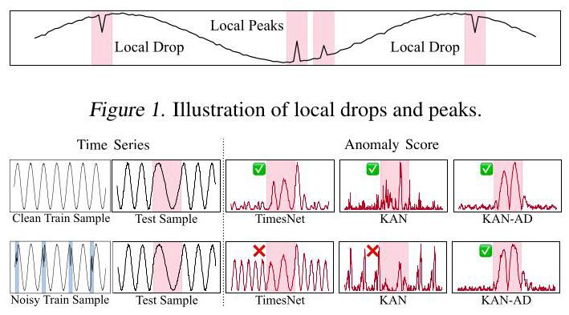
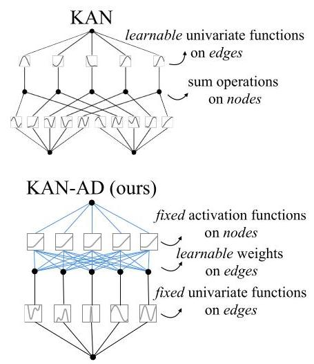
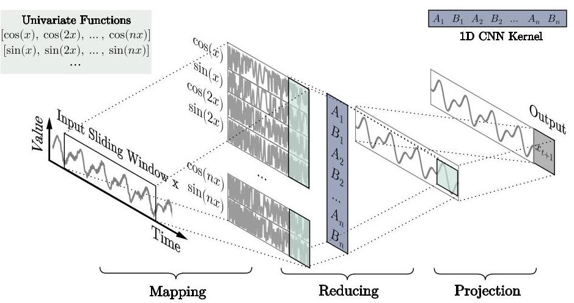
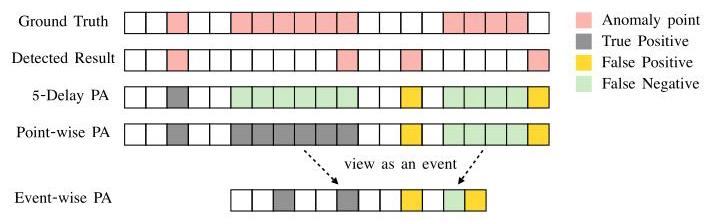
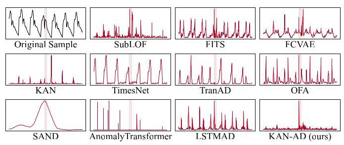
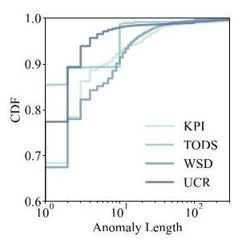
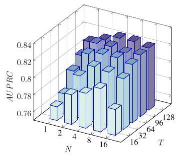
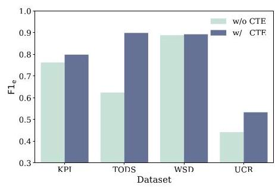
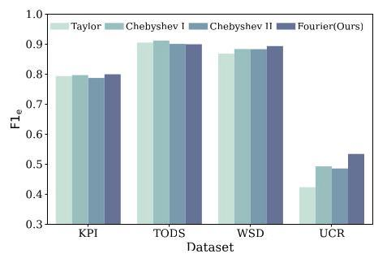
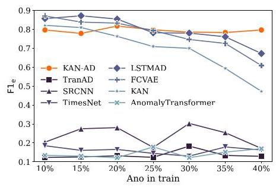

# KAN-AD: Time Series Anomaly Detection with Kolmogorov-Arnold Networks

# KAN-AD:基于柯尔莫哥洛夫 - 阿诺德网络的时间序列异常检测

Quan Zhou ${}^{12}$ Changhua Pei ${}^{13}$ Fei Sun ${}^{4}$ Jing Han ${}^{5}$ Zhengwei Gao ${}^{5}$ Haiming Zhang ${}^{1}$ Gaogang Xie ${}^{1}$ Dan Pei ${}^{6}$ Jianhui Li ${}^{7}{}^{1}$

周全 ${}^{12}$ 裴昌华 ${}^{13}$ 孙飞 ${}^{4}$ 韩静 ${}^{5}$ 高正伟 ${}^{5}$ 张海明 ${}^{1}$ 谢高岗 ${}^{1}$ 裴丹 ${}^{6}$ 李建辉 ${}^{7}{}^{1}$

## Abstract

## 摘要

Time series anomaly detection (TSAD) underpins real-time monitoring in cloud services and web systems, allowing rapid identification of anomalies to prevent costly failures. Most TSAD methods driven by forecasting models tend to overfit by emphasizing minor fluctuations. Our analysis reveals that effective TSAD should focus on modeling "normal" behavior through smooth local patterns. To achieve this, we reformulate time series modeling as approximating the series with smooth univariate functions. The local smoothness of each univariate function ensures that the fitted time series remains resilient against local disturbances. However, a direct KAN implementation proves susceptible to these disturbances due to the inherently localized characteristics of B-spline functions. We thus propose KAN-AD, replacing B-splines with truncated Fourier expansions and introducing a novel lightweight learning mechanism that emphasizes global patterns while staying robust to local disturbances. On four popular TSAD benchmarks, KAN-AD achieves an average 15% improvement in detection accuracy (with peaks exceeding 27%) over state-of-the-art baselines. Remarkably, it requires fewer than 1,000 trainable parameters, resulting in a 50% faster inference speed compared to the original KAN, demonstrating the approach's efficiency and practical viability.

时间序列异常检测(TSAD)是云服务和网络系统中实时监控的基础，它能够快速识别异常，防止造成代价高昂的故障。大多数由预测模型驱动的TSAD方法往往会因过于强调微小波动而出现过拟合现象。我们的分析表明，有效的TSAD应该通过平滑的局部模式来对“正常”行为进行建模。为了实现这一点，我们将时间序列建模重新表述为用平滑的单变量函数来逼近该序列。每个单变量函数的局部平滑性确保了拟合的时间序列对局部干扰具有弹性。然而，由于B样条函数固有的局部特性，直接实现KAN容易受到这些干扰的影响。因此，我们提出了KAN - AD，用截断傅里叶展开取代B样条，并引入了一种新颖的轻量级学习机制，该机制在强调全局模式的同时对局部干扰保持鲁棒性。在四个流行的TSAD基准测试中，KAN - AD在检测准确率上比最先进的基线平均提高了15%(峰值超过27%)。值得注意的是，它需要的可训练参数少于1000个，与原始KAN相比，推理速度快了50%，证明了该方法的效率和实际可行性。

Figure 2. Comparison of anomaly detection performance. Top: All methods successfully detect anomalies when trained on clean data (black curve, anomalous segments in pink). Bottom: TimesNet and KAN fail to detect anomalies when trained on noisy data. Blue markers indicate local drops and peaks; red curve shows anomaly scores.

图2. 异常检测性能比较。顶部:当在干净数据上训练时，所有方法都能成功检测到异常(黑色曲线，粉色为异常段)。底部:当在有噪声数据上训练时，TimesNet和KAN无法检测到异常。蓝色标记表示局部下降和峰值；红色曲线显示异常分数。

## 1. Introduction

## 1. 引言

Time Series Anomaly Detection (TSAD) serves as a critical component in modern IT infrastructure (Li et al., 2019; Qu et al., 2024) and manufacturing systems (Zhan et al., 2021; Wang et al., 2022), enabling rapid identification of potential anomalies and providing sufficient clues for fault localization (Sun et al., 2024; Kieu et al., 2022). The emergence of deep learning-based forecasting approaches (Xu et al., 2022; Wu et al., 2023; Zhou et al., 2023) have superseded traditional rule-based methods (Breunig et al., 2000; Siffer et al., 2017), establishing new state-of-the-art performance through their capacity to fit historical data and detect anomalies via prediction-observation comparisons.

时间序列异常检测(TSAD)是现代IT基础设施(Li等人，2019；Qu等人，2024)和制造系统(Zhan等人，2021；Wang等人，2022)中的关键组成部分，可以快速识别潜在异常，并为故障定位提供充分线索(Sun等人，2024；Kieu等人，2022)。基于深度学习的预测方法(Xu等人，2022；Wu等人，2023；Zhou等人，2023)的出现取代了传统的基于规则的方法(Breunig等人，2000；Siffer等人，2017)，通过其拟合历史数据并通过预测 - 观测比较来检测异常的能力，建立了新的最先进性能。

However, the effectiveness of the forecasting-based approach declines when encountering time series with localized disturbances. As illustrated in Figure 1, time series data frequently exhibit local peaks and drops that can significantly impact model learning. Existing deep learning methods (Tuli et al., 2022; Wu et al., 2023) often overfit to these local disturbances, compromising their ability to detect anomalies effectively. From the third column of Figure 2, we can observe that compared to training with clean data, TimesNet (Wu et al., 2023) trained on noisy data fails to detect anomalies in the samples.

然而，当遇到具有局部干扰的时间序列时，基于预测的方法的有效性会下降。如图1所示，时间序列数据经常出现局部峰值和下降，这会显著影响模型学习。现有的深度学习方法(Tuli等人，2022；Wu等人，2023)经常过度拟合这些局部干扰，从而损害了它们有效检测异常的能力。从图2的第三列中，我们可以观察到，与在干净数据上训练相比，在有噪声数据上训练的TimesNet(Wu等人，2023)无法检测到样本中的异常。

Our experimental analysis reveals that forecasting-based

我们的实验分析表明基于预测的

---

${}^{1}$ Computer Network Information Center, Chinese Academy of Sciences ${}^{2}$ University of the Chinese Academy of Sciences ${}^{3}$ Hangzhou Institute for Advanced Study, University of the Chinese Academy of Sciences ${}^{4}$ Institute of Computing Technology, Chinese Academy of Sciences ${}^{5}$ ZTE ${}^{6}$ Department of Computer Science and Technology, Tsinghua University ${}^{7}$ School of Frontier Sciences, Nanjing University. Correspondence to: Jianhui Li <lijh@nju.edu.cn>, Changhua Pei <chpei@cnic.cn>.

${}^{1}$ 中国科学院计算机网络信息中心 ${}^{2}$ 中国科学院大学 ${}^{3}$ 中国科学院大学杭州高等研究院 ${}^{4}$ 中国科学院计算技术研究所 ${}^{5}$ 中兴通讯 ${}^{6}$ 清华大学计算机科学与技术系 ${}^{7}$ 南京大学前沿科学学院。通信作者:李建辉 <lijh@nju.edu.cn>，裴昌华 <chpei@cnic.cn>。

Proceedings of the ${42}^{nd}$ International Conference on Machine Learning, Vancouver, Canada. PMLR 267, 2025. Copyright 2025 by the author(s).

${42}^{nd}$ 国际机器学习会议论文集，加拿大温哥华。PMLR 267，2025。版权所有2025年，作者。

---

TSAD methods suffer performance degradation by attempting to model every detailed patterns in raw time series data. While these methods aim to identify anomalies through comparison with predicted behavior, such detailed modeling proves unnecessary and potentially detrimental, especially given that real-world time series typically contain various forms of anomalies and irrelevant disturbances, presenting two significant challenges: firstly, the difficulty in establishing a universal criterion for filtering these disturbances, and secondly, developing another model to ensure the forecasting model's input is free of local disturbances is resource-intensive. Given these inherent limitations in both filtering-based and dual-modeling approaches, researchers have explored VAE-based approaches to address the challenge of local disturbance mitigation. VAE-based approaches (Xu et al., 2018; Wang et al., 2024) assume that normal patterns in time series cluster in a low-dimensional latent space and can be effectively reconstructed, thereby overcoming interference from data perturbations. Nevertheless, as demonstrated in FCVAE (Wang et al., 2024), VAE-based approaches struggle with underfitting, which impairs their ability to reconstruct the original time series and limits their effectiveness.

基于过滤的方法和双建模方法都存在固有限制，研究人员探索了基于变分自编码器(VAE)的方法来应对减轻局部干扰的挑战。基于VAE的方法(Xu等人，2018年；Wang等人，2024年)假设时间序列中的正常模式聚集在低维潜在空间中并且可以被有效重建，从而克服数据扰动的干扰。然而，正如FCVAE(Wang等人，2024年)所表明的那样，基于VAE的方法存在欠拟合问题，这损害了它们重建原始时间序列的能力并限制了它们 的有效性。

To mitigate local disturbances, we reformulate TSAD by approximating time series using smooth univariate functions, building on the theoretical foundation that normal sequences exhibit greater local smoothness than abnormal ones (Xu et al., 2022). To achieve this formulation, Kolmogorov-Arnold Networks (KANs) (Liu et al., 2025) offer a promising direction by decomposing complex objectives into combinations of learnable univariate functions based on the Kolmogorov-Arnold representation theorem (Kolmogorov, 1957). This decomposition approach has shown remarkable effectiveness in various domains (Yu et al., 2024; Bodner et al., 2024). However, direct application of KAN to TSAD presents significant challenges. From the fourth column in the upper part of Figure 2, it can be observed that models trained on clean training samples can detect anomalies in the test samples. But we find that KAN fails to detect anomalies when the training samples contain noisy samples . The main reason is that, although KAN can specify univariate functions, i.e., B-spine function, these functions are not specifically designed for time series and can still overfit local features, failing to completely eliminate the impact of local peaks or drops.

为了减轻局部干扰，我们在正常序列比异常序列表现出更大局部平滑性这一理论基础上(Xu等人，2022年)，通过使用平滑单变量函数逼近时间序列来重新构建基于过滤的时间序列异常检测(TSAD)方法。为了实现这种构建，基于Kolmogorov-Arnold表示定理(Kolmogorov，1957年)，Kolmogorov-Arnold网络(KANs)(Liu等人，2025年)通过将复杂目标分解为可学习单变量函数的组合提供了一个有前景的方向。这种分解方法在各个领域都显示出显著的有效性(Yu等人，2024年；Bodner等人，2024年)。然而，将KAN直接应用于TSAD存在重大挑战。从图2上部的第四列可以观察到，在干净训练样本上训练的模型可以检测测试样本中的异常。但我们发现，当训练样本包含噪声样本时，KAN无法检测到异常。主要原因是，尽管KAN可以指定单变量函数，即B样条函数，但这些函数并非专门为时间序列设计，仍然可能过度拟合局部特征，无法完全消除局部峰值或下降的影响。

To address these challenges, we propose KAN-AD, adopting KAN as our backbone. By considering the characteristics of time series, we redesign KAN in three aspects. First, we replace the B-spine function with Fourier series. Fourier series have local smoothness compared to spline functions, while their natural periodicity allows for better modeling of global patterns (Dym & HP, 1972; Stein & Shakarchi, 2011). Second, as the Fourier series contains unlimited terms which is computation intensive, we only use the first $N$ terms of Fourier series. To overcome the limitation that the first N terms of Fourier series can only model periodic no smaller than $\frac{1}{N}$ , we designed an alternative index-based univariate function to capture the fine-scale periodic missing from the first $\mathrm{N}$ terms. Third, we incorporated differencing to isolate time series trend effects on coefficient estimation, leading to improved modeling accuracy through more precise coefficients.

为了应对这些挑战，我们提出了KAN-AD，采用KAN作为我们的基础模型。通过考虑时间序列的特征，我们在三个方面重新设计了KAN。首先，我们用傅里叶级数取代B样条函数。与样条函数相比，傅里叶级数具有局部平滑性, 同时其天然的周期性允许更好地对全局模式进行建模(Dym & HP，1972年；Stein & Shakarchi，2011年)。其次，由于傅里叶级数包含无限项，计算密集，我们仅使用傅里叶级数的前$N$项。为了克服傅里叶级数的前N项只能对不小于$\frac{1}{N}$的周期进行建模的限制，我们设计了一种基于索引的替代单变量函数来捕捉前$\mathrm{N}$项中缺失的精细尺度周期。第三，我们引入差分来隔离时间序列趋势对系数估计的影响，通过更精确的系数提高建模精度。

Our comprehensive evaluation demonstrates that KAN-AD achieves 15% higher F1 accuracy while being 50% faster than the original KAN architecture. Our code is publicly available at https://github.com/CSTCloudOps/ KAN-AD. Our contributions are as follows:

我们的综合评估表明，KAN-AD的F1准确率比原始KAN架构高15%，同时速度快50%。我们的代码可在https://github.com/CSTCloudOps/ KAN-AD上公开获取。我们的贡献如下:

- We reformulate the problem to assist deep learning-based forecasting models for time series anomaly detection (TSAD) tasks by minimizing overfitting to local perturbations.

- 我们重新构建问题，通过最小化对局部扰动的过拟合，协助基于深度学习的预测模型进行时间序列异常检测(TSAD)任务。

- We introduce KAN-AD, an innovative TSAD approach. KAN-AD, built meticulously on the KAN backbone, exhibits substantial improvements in both detection precision and inference efficiency.

- 我们引入了KAN-AD，一种创新的TSAD方法。KAN-AD精心构建在KAN基础模型之上，在检测精度和推理效率方面都有显著提高。

- We performed comprehensive experiments on four publicly available datasets, verifying the effectiveness and efficiency against state-of-the-art TSAD benchmarks.

- 我们在四个公开可用数据集上进行了全面实验，验证了相对于最新TSAD基准的有效性和效率。

## 2. Preliminaries and Problem Formulation

## 2. 预备知识和问题表述

### 2.1. Problem Statement

### 2.1. 问题陈述

This paper primarily addresses the issue of anomaly detection in single time series curves, also known as univariate time series (UTS). To elaborate on the problem more comprehensively, consider the following UTS observational data: ${x}_{0 : t} = \left\{  {{x}_{0},{x}_{1},{x}_{2},\ldots ,{x}_{t}}\right\}$ and anomaly labels $C = \left\{  {{c}_{0},{c}_{1},{c}_{2},\ldots ,{c}_{t}}\right\}$ , where ${x}_{t} \in  \mathbb{R}, c \in  \{ 0,1\}$ , and $t \in  \mathbb{N}$ . Here, ${x}_{0 : t}$ represents the entire observed time series, and $C$ denotes the temporal anomaly labels.

本文主要探讨单时间序列曲线中的异常检测问题，也称为单变量时间序列(UTS)。为了更全面地阐述该问题，考虑以下UTS观测数据:${x}_{0 : t} = \left\{  {{x}_{0},{x}_{1},{x}_{2},\ldots ,{x}_{t}}\right\}$和异常标签$C = \left\{  {{c}_{0},{c}_{1},{c}_{2},\ldots ,{c}_{t}}\right\}$，其中${x}_{t} \in  \mathbb{R}, c \in  \{ 0,1\}$，且$t \in  \mathbb{N}$。这里，${x}_{0 : t}$表示整个观测时间序列，$C$表示时间异常标签。

Given a UTS $x = \left\lbrack  {{x}_{0},{x}_{1},{x}_{2},\ldots ,{x}_{t}}\right\rbrack$ , the objective of UTS anoomaly detection is to utilize the data $\left\lbrack  {{x}_{0},{x}_{1},\ldots ,{x}_{i}}\right\rbrack$ preceding each point ${x}_{i}$ to predict ${c}_{i}$ .

给定一个UTS$x = \left\lbrack  {{x}_{0},{x}_{1},{x}_{2},\ldots ,{x}_{t}}\right\rbrack$，UTS异常检测的目标是利用每个点${x}_{i}$之前的数据$\left\lbrack  {{x}_{0},{x}_{1},\ldots ,{x}_{i}}\right\rbrack$来预测${c}_{i}$。

### 2.2. Kolmogorov-Arnold Networks

### 2.2. 柯尔莫哥洛夫 - 阿诺德网络

#### 2.2.1. THEORETICAL FOUNDATION

#### 2.2.1. 理论基础

The Kolmogorov-Arnold representation theorem demonstrates that any multivariate continuous function can be decomposed into a finite sum of univariate functions, as shown in Equation (1), where ${\varphi }_{q, p}$ are univariate functions that map each input variable ${x}_{p}$ , and ${\Phi }_{q}$ are continuous functions.

柯尔莫哥洛夫 - 阿诺德表示定理表明，任何多元连续函数都可以分解为单变量函数的有限和，如公式(1)所示，其中${\varphi }_{q, p}$是将每个输入变量${x}_{p}$进行映射的单变量函数，${\Phi }_{q}$是连续函数。

$$
f\left( {{x}_{1},{x}_{2},\ldots ,{x}_{n}}\right)  = \mathop{\sum }\limits_{{q = 1}}^{{{2n} + 1}}{\Phi }_{q}\left( {\mathop{\sum }\limits_{{p = 1}}^{n}{\varphi }_{q, p}\left( {x}_{p}\right) }\right) \tag{1}
$$

$$
\operatorname{KAN}\left( x\right)  = \left( {{\Phi }_{L - 1} \circ  {\Phi }_{L - 2} \circ  \cdots  \circ  {\Phi }_{0}}\right) \left( x\right) \tag{2}
$$

#### 2.2.2. NETWORK ARCHITECTURE AND FUNCTION REPRESENTATION

#### 2.2.2. 网络架构与函数表示

KAN consists of a series of interconnected univariate subnetworks, each responsible for learning distinct features of the data. Unlike traditional multi-layer perceptrons (MLPs), which employ fixed activation functions at each node, KAN replaces each weight parameter with a univariate function. The resulting functional form for deeper KAN can be expressed as Equation (2), where each ${\Phi }_{l}$ represents a layer of univariate functions applied to the input or intermediate outputs. The vanilla KAN (Liu et al., 2025) implements these univariate functions using B-splines (De Boor, 1978), which provide localized function approximation capabilities. However, this localization property presents a notable consideration in anomaly detection contexts. Since anomalous patterns typically manifest as localized features (Xu et al., 2022), B-splines may inadvertently fit these outliers, potentially compromising model accuracy.

KAN由一系列相互连接的单变量子网络组成，每个子网络负责学习数据的不同特征。与传统的多层感知器(MLP)不同，MLP在每个节点使用固定的激活函数，而KAN用单变量函数替换每个权重参数。更深层KAN的最终函数形式可以表示为公式(2)，其中每个${\Phi }_{l}$表示应用于输入或中间输出的一层单变量函数。原始的KAN(Liu等人，2025)使用B样条(De Boor，1978)来实现这些单变量函数，B样条提供局部函数逼近能力。然而，在异常检测环境中，这种局部性属性是一个值得注意的考虑因素。由于异常模式通常表现为局部特征(Xu等人，2022)，B样条可能会无意中拟合这些异常值，从而可能影响模型的准确性。

## 3. Methodology

## 3. 方法

The core challenge in time series anomaly detection (TSAD) lies in establishing accurate normal patterns while maintaining robustness to local disturbances (Li et al., 2021). Traditional approaches that directly predict based on historical data inevitably incorporate local noise into their learned patterns. Building on the observation that normal sequences exhibit greater smoothness than abnormal ones, we propose KAN-AD, a novel anomaly detection framework that leverages this smoothing feature to identify anomalies in complex time series data.

时间序列异常检测(TSAD)的核心挑战在于建立准确的正常模式，同时保持对局部干扰的鲁棒性(Li等人，2021)。直接基于历史数据进行预测的传统方法不可避免地会将局部噪声纳入其学习到的模式中。基于正常序列比异常序列表现出更大平滑性的观察结果，我们提出了KAN - AD，这是一种新颖的异常检测框架，它利用这种平滑特征来识别复杂时间序列数据中的异常。

### 3.1. Design of KAN-AD

### 3.1. KAN - AD的设计

The pipeline of KAN-AD consists of three main stages: mapping, reducing, and projection. In the mapping phase, we decompose the input time window into multiple univariate functions. The reducing phase then combines these functions through learned coefficients to reconstruct the "normal" pattern. Finally, the projection phase leverages this pattern to predict future behavior, enabling anomaly detection through comparison with real-time observations.

KAN - AD的流程包括三个主要阶段:映射、约简和投影。在映射阶段，我们将输入时间窗口分解为多个单变量函数。然后在约简阶段通过学习到的数据系数组合这些函数，以重建“正常”模式。最后，投影阶段利用此模式预测未来行为，通过与实时观测值进行比较来实现异常检测。

$$
f\left( {x}_{0 : i}\right)  = {A}_{0} + \underset{g\left( {x}_{0 : i}\right) }{\underbrace{\mathop{\sum }\limits_{{n = 1}}^{N}\left( {{A}_{n}\cos \left( {n{x}_{0 : i}}\right)  + {B}_{n}\sin \left( {n{x}_{0 : i}}\right) }\right) }} + \epsilon
$$

(3)

$$
\mathbf{H} = \operatorname{Stack}\left( {\cos \left( {x}_{0 : i}\right) ,\sin \left( {x}_{0 : i}\right) ,\ldots ,\cos \left( {n{x}_{0 : i}}\right) ,\sin \left( {n{x}_{0 : i}}\right) }\right)
$$

$$
\mathbf{\Theta }\left( {x}_{0 : i}\right)  = \left\lbrack  {{A}_{1},{B}_{1},{A}_{2},{B}_{2},\ldots ,{A}_{n},{B}_{n}}\right\rbrack
$$

$$
{x}_{0 : i}^{\prime } = {A}_{0} + \mathbf{\Theta }\left( {x}_{0 : i}\right)  \times  \mathbf{H} \tag{4}
$$

Formally, we employ Fourier series for normal pattern representation, motivated by two key advantages over alternative approaches such as B-spline functions. First, the constituent sine and cosine functions exhibit superior local smoothness, avoiding the potential overfitting to local noise. Second, Fourier series naturally capture global patterns, particularly excelling at modeling periodic behaviors in time series. Following this motivation, we introduce the function deconstruction (FD) mechanism, where $f$ , the mapping between the historical window ${x}_{0 : i}$ and its next behavior ${x}_{i + 1}$ , can be expanded as shown in Equation (3). The normal pattern can be represented by the finite $N$ terms of the series (Kolmogorov,1957), denoted as $g\left( x\right)$ , while the terms beyond $N$ capture the stochastic observational noise $\epsilon$ . The normal pattern ${x}_{0 : i}^{\prime }$ can then be expressed as in Equation (4), where $\mathbf{H}$ denotes the univariate function matrix. This decomposition combined with learnable coefficients filters out potential noise and significantly simplifies the construction of normal patterns.

形式上，我们采用傅里叶级数进行正常模式表示，这是由其相对于诸如B样条函数等替代方法的两个关键优势所驱动的。首先，组成的正弦和余弦函数具有卓越的局部平滑性，避免了对局部噪声的潜在过拟合。其次，傅里叶级数自然地捕捉全局模式，尤其擅长对时间序列中的周期性行为进行建模。基于此动机，我们引入了函数解构(FD)机制，其中$f$，即历史窗口${x}_{0 : i}$与其下一个行为${x}_{i + 1}$之间的映射，可以如式(3)所示进行展开。正常模式可以由该级数的有限$N$项表示(Kolmogorov，1957)，记为$g\left( x\right)$，而超过$N$的项捕捉随机观测噪声$\epsilon$。然后，正常模式${x}_{0 : i}^{\prime }$可以如式(4)所示表示，其中$\mathbf{H}$表示单变量函数矩阵。这种与可学习系数相结合的分解滤除了潜在噪声，并显著简化了正常模式的构建。

### 3.2. Mapping Phase

### 3.2. 映射阶段

As shown in Figure 3b, the primary purpose of the mapping phase is to transform the original time series signal ${x}_{0 : i} \in \; {\mathbb{R}}^{T}$ into multiple new sets of values ${x}_{0 : i} \in  {\mathbb{R}}^{T \times  \left( {N + N}\right) }$ through a series of univariate functions. Here, $T$ is the size of the sliding window. The first $N$ represents the number of sine series univariate functions, and the other $N$ represents the number of cosine series univariate functions. The detailed calculation method is shown in Equation (3). Notably, besides the univariate function terms, an ${A}_{0}$ term representing the average value within the sliding window is also present, which varies across different windows. To mitigate the impact of fluctuating ${A}_{0}$ on coefficient fitting, a constant term elimination module is employed.

如图3b所示，映射阶段的主要目的是通过一系列单变量函数将原始时间序列信号${x}_{0 : i} \in \; {\mathbb{R}}^{T}$转换为多个新的数值集${x}_{0 : i} \in  {\mathbb{R}}^{T \times  \left( {N + N}\right) }$。这里，$T$是滑动窗口的大小。第一个$N$表示正弦序列单变量函数的数量，另一个$N$表示余弦序列单变量函数的数量。详细的计算方法见公式(3)。值得注意的是，除了单变量函数项外，还存在一个表示滑动窗口内平均值的${A}_{0}$项，它在不同窗口中有所不同。为了减轻波动的${A}_{0}$对系数拟合的影响，采用了一个常数项消除模块。

Constant Term Elimination: In Fourier series, ${A}_{0}$ represents the mean value of the function. Although normalization ensures that the entire time series has a mean of zero, individual time windows may still exhibit significant fluctuations in their means due to the presence of a trend. These variations in the constant term ultimately affect the model's accurate estimation of Fourier coefficients, leading to biases in the construction of the normal pattern.

常数项消除:在傅里叶级数中，${A}_{0}$表示函数的平均值。尽管归一化确保整个时间序列的平均值为零，但由于趋势的存在，各个时间窗口的平均值仍可能表现出显著波动。常数项的这些变化最终会影响模型对傅里叶系数的准确估计，从而导致正常模式构建中的偏差。

To mitigate the impact of mean fluctuations on the model's approximation of normal time series patterns, we employ first-order differencing during data preprocessing to minimize the residual trend component in the data and subsequently renormalize the differenced data. This strategy allows the model to focus on estimating Fourier coefficients ${A}_{1 : n}$ and ${B}_{1 : n}$ , thereby avoiding the need to learn frequently changing constant terms. After this differential strategy, the normal pattern ${x}_{0 : i}^{\prime }$ can be expressed as ${x}_{0 : i}^{\prime } \sim  \mathbf{\Theta }\left( {x}_{0 : i}\right)  \times  \mathbf{H}$

为减轻均值波动对模型近似正常时间序列模式的影响，我们在数据预处理期间采用一阶差分，以最小化数据中的残差趋势分量，随后对差分后的数据进行重新归一化。此策略使模型能够专注于估计傅里叶系数${A}_{1 : n}$和${B}_{1 : n}$，从而避免学习频繁变化的常数项的需要。经过这种差分策略后，正常模式${x}_{0 : i}^{\prime }$可以表示为${x}_{0 : i}^{\prime } \sim  \mathbf{\Theta }\left( {x}_{0 : i}\right)  \times  \mathbf{H}$

(a) Illustration of learning components in KAN and KAN-AD. KAN-AD learns the coefficients on edges with fixed univariate functions, and performs weighted sum operations on nodes. Blue lines indicate edges with weights.

(a) KAN和KAN-AD中学习组件的说明。KAN-AD使用固定的单变量函数学习边上的系数，并在节点上执行加权和运算。蓝色线条表示带权重的边。

(b) Illustration of the KAN-AD process using a sliding window approach. During the mapping phase, raw time windows are transformed into multiple univariate functions. In the reducing phase, a one-dimensional convolutional kernel learns coefficients for these univariate functions, aggregating them into a normal pattern for the current time window. In the projection phase, a single-layer MLP predicts future normal patterns.

(b) 使用滑动窗口方法对KAN-AD过程的说明。在映射阶段，原始时间窗口被转换为多个单变量函数。在归约阶段，一维卷积核学习这些单变量函数的系数，将它们聚合为当前时间窗口的正常模式。在投影阶段，单层MLP预测未来的正常模式。

Figure 3. Illustration of KAN-AD.

图3. KAN-AD的图示。

Periodic-Enhanced KAN-AD: Fourier series of finite $N$ terms cannot model a period smaller than $\frac{1}{N}$ , which limits KAN-AD's ability to express time series containing more subtle periods.

周期增强型KAN-AD:有限$N$项的傅里叶级数无法对小于$\frac{1}{N}$的周期进行建模，这限制了KAN-AD表达包含更细微周期的时间序列的能力。

To address this limitation and enhance the model's ability to capture periodic patterns in time series, we introduce additional univariate functions with different periods. Specifically, we incorporate trigonometric components $\cos \left( \frac{2\pi ni}{T}\right)$ and $\sin \left( \frac{2\pi ni}{T}\right)$ where $i$ denotes the window index, with coefficients learned through one-dimensional convolution networks. Our implementation utilizes three complementary univariate functions shown in Equation (5): the raw time variable $X$ , the Fourier series ${S}_{n}$ , and the sine-cosine wave ${P}_{n}$ . This integration of multi-periodic univariate functions enhances KAN-AD 's capacity to model temporal patterns.

为解决这一局限性并增强模型捕捉时间序列中周期性模式的能力，我们引入了具有不同周期的额外单变量函数。具体而言，我们纳入了三角分量$\cos \left( \frac{2\pi ni}{T}\right)$和$\sin \left( \frac{2\pi ni}{T}\right)$，其中$i$表示窗口索引，其系数通过一维卷积网络学习得到。我们的实现利用了式(5)所示的三个互补单变量函数:原始时间变量$X$、傅里叶级数${S}_{n}$和正弦余弦波${P}_{n}$。这种多周期单变量函数的整合增强了KAN - AD对时间模式建模的能力。

$$
\mathrm{X} = {x}_{0 : i}
$$

$$
{\mathrm{S}}_{\mathrm{n}} = \left\{  {\sin \left( {n{x}_{0 : i}}\right) ,\cos \left( {n{x}_{0 : i}}\right) }\right\} \tag{5}
$$

$$
{\mathrm{P}}_{\mathrm{n}} = \left\{  {\sin \left( \frac{2\pi ni}{T}\right) ,\cos \left( \frac{2\pi ni}{T}\right) }\right\}
$$

### 3.3. Reducing Phase

### 3.3. 减少相位

Another challenge in real-world time series anomaly detection is the high computational cost. Existing methods often sacrifice efficiency for accuracy, making them impractical in resource-constrained or large-scale settings.

现实世界时间序列异常检测中的另一个挑战是高计算成本。现有方法通常为了准确性而牺牲效率，这使得它们在资源受限或大规模场景中不切实际。

The function deconstruction (FD) mechanism addresses this challenge by transforming the modeling of normal patterns into a weighted combination of univariate functions. This transformation substantially reduces the model's parameter quantity - instead of requiring numerous parameters for fine-grained feature modeling, FD mechanism achieves efficient representation through estimating coefficients of a small number of univariate functions.

函数解构(FD)机制通过将正常模式的建模转换为单变量函数的加权组合来应对这一挑战。这种转换大幅减少了模型的参数量——FD机制无需为细粒度特征建模使用大量参数，而是通过估计少量单变量函数的系数来实现高效表示。

$$
{\mathbf{H}}^{\left( 0\right) } = \operatorname{Stack}\left( {X,{S}_{1},{P}_{1},\ldots ,{S}_{n},{P}_{n}}\right) ,\forall n \in  \left\lbrack  {1,\ldots , N}\right\rbrack \tag{6}
$$

$$
{\mathbf{H}}^{\left( l\right) } = \operatorname{CNN}\left( {\operatorname{CNN}\left( {\mathbf{H}}^{\left( l - 1\right) }\right) }\right) \;\forall l \in  \left\lbrack  {1,2,\ldots , L}\right\rbrack \tag{7}
$$

$$
\operatorname{Conv}\left( \mathbf{H}\right)  = \mathop{\sum }\limits_{{c = 1}}^{{2N}}\mathop{\sum }\limits_{{m = 0}}^{2}{W}_{c}\left\lbrack  m\right\rbrack   \cdot  {\mathbf{H}}_{c}\left\lbrack  {i + m - 1}\right\rbrack \tag{8}
$$

$$
\operatorname{CNN}\left( \mathbf{H}\right)  = \operatorname{GELU}\left( {\mathrm{{BN}}\left( {\operatorname{Conv}\left( \mathbf{H}\right) }\right) }\right) \tag{9}
$$

To effectively estimate these univariate function coefficients, we employ a stacked one-dimensional convolutional neural network (1D CNN). This architecture choice is motivated by two key factors: 1D CNNs excel at sequence modeling through temporal dimension traversal, while their convolutional kernels naturally capture the diverse features introduced by the FD mechanism. As shown in Equation (6), KAN-AD first constructs a univariate function matrix ${\mathbf{H}}^{\left( 0\right) }$ by combining the required functions for a given time window. This matrix is then processed through multiple stacked 1D convolutional layers with a kernel size of 3, progressively approximating the normal pattern through coefficient learning, as expressed in Equation (7). Here, $L$ denotes the number of CNN blocks, with the network $\operatorname{CNN}\left( \mathbf{H}\right)$ and convolution operation $\operatorname{Conv}\left( \mathbf{H}\right)$ defined in Equations (8) and (9). The convolution operation in Equation (8) applies a kernel ${W}_{c}$ to each channel ${\mathbf{H}}_{c}$ , where indices $m$ and $t$ represent positions within the convolutional kernel and time window, respectively.

为有效估计这些单变量函数系数，我们采用了堆叠一维卷积神经网络(1D CNN)。这种架构选择有两个关键因素:1D CNN通过遍历时间维度在序列建模方面表现出色，同时其卷积核自然地捕捉了FD机制引入的各种特征。如式(6)所示，KAN - AD首先通过组合给定时间窗口所需的函数构建一个单变量函数矩阵${\mathbf{H}}^{\left( 0\right) }$。然后，该矩阵通过多个内核大小为3的堆叠一维卷积层进行处理，通过系数学习逐步逼近正常模式，如式(7)所示。这里，$L$表示CNN块的数量，网络$\operatorname{CNN}\left( \mathbf{H}\right)$和卷积操作$\operatorname{Conv}\left( \mathbf{H}\right)$在式(8)和(9)中定义。式(8)中的卷积操作将内核${W}_{c}$应用于每个通道${\mathbf{H}}_{c}$，其中索引$m$和$t$分别表示卷积内核和时间窗口内的位置。

To ensure training stability and reduce internal covariate shift, we apply batch normalization (Ioffe & Szegedy, 2015) after each convolutional layer (Equation (9)), followed by Gaussian Error Linear Units (GELUs) (Hendrycks & Gimpel, 2016) for activation. The final stage of the reducing phase employs a residual connection (He et al., 2016) between the hidden state ${\mathbf{H}}^{\left( L\right) }$ and the original input ${\mathbf{H}}^{\left( 0\right) }$ to maintain numerical stability, as shown in Equation (10). Finally, a 1-width convolutional kernel reduces the dimensionality of ${\mathbf{H}}^{{\left( L\right) }^{\prime }}$ to generate the normal pattern approximation ${x}_{0 : i}^{\prime }$ within the current time window:

为确保训练稳定性并减少内部协变量偏移，我们在每个卷积层之后应用批量归一化(Ioffe & Szegedy, 2015)(式(9))，随后使用高斯误差线性单元(GELUs)(Hendrycks & Gimpel, 2016)进行激活。减少阶段的最后一步在隐藏状态${\mathbf{H}}^{\left( L\right) }$和原始输入${\mathbf{H}}^{\left( 0\right) }$之间采用残差连接(He等人, 2016)以保持数值稳定性，如式(10)所示。最后，一个宽度为1的卷积内核降低${\mathbf{H}}^{{\left( L\right) }^{\prime }}$的维度，以在当前时间窗口内生成正常模式近似值${x}_{0 : i}^{\prime }$:

$$
{\mathbf{H}}^{{\left( L\right) }^{\prime }} = {\mathbf{H}}^{\left( L\right) } + {\mathbf{H}}^{\left( 0\right) } \tag{10}
$$

$$
{x}_{0 : i}^{\prime } = \operatorname{GELU}\left( {\mathrm{{BN}}\left( {\operatorname{Down}\operatorname{Conv}\left( {\mathbf{H}}^{{\left( L\right) }^{\prime }}\right) }\right) }\right) \tag{11}
$$

Here, DownConv $\left( \mathbf{H}\right)  = \mathop{\sum }\limits_{{c = 1}}^{{2N}}{W}_{c} \cdot  {\mathbf{H}}_{c}\left\lbrack  i\right\rbrack$ denotes the convolution operation for reducing dimensions.

这里，DownConv$\left( \mathbf{H}\right)  = \mathop{\sum }\limits_{{c = 1}}^{{2N}}{W}_{c} \cdot  {\mathbf{H}}_{c}\left\lbrack  i\right\rbrack$表示降维的卷积操作。

### 3.4. Projection Phase

### 3.4. 投影阶段

After obtaining the current window's normal mode approximation ${x}_{0 : i}^{\prime }$ , we predict the future behavior ${x}_{i + 1}$ through a single-layer MLP, leveraging KAN-AD's accurate approximation capability:

在获得当前窗口的正常模式近似值${x}_{0 : i}^{\prime }$之后，我们通过单层MLP预测未来行为${x}_{i + 1}$，利用KAN - AD的精确近似能力:

$$
{x}_{i + 1} = W \cdot  {x}_{0 : i}^{\prime } + b \tag{12}
$$

where $W$ and $b$ denote the weight matrix and bias term of the linear layer.

其中$W$和$b$表示线性层的权重矩阵和偏差项。

## 4. Evaluation

## 4. 评估

In this section, we conduct comprehensive experiments primarily aimed at answering the following research questions.

在本节中，我们进行了全面的实验，主要旨在回答以下研究问题。

RQ1: How does KAN-AD compare to state-of-the-art anomaly detection methods in performance and efficiency? RQ2: How sensitive is KAN-AD to hyperparameters? RQ3: How effective is each design choice in KAN-AD? RQ4: How sensitive is KAN-AD to anomalies in the training data?

问题1:KAN - AD在性能和效率方面与现有最先进的异常检测方法相比如何？问题2:KAN - AD对超参数有多敏感？问题3:KAN - AD中的每个设计选择有多有效？问题4:KAN - AD对训练数据中的异常有多敏感？

In addition, we also evaluate our method on a multivariate time series anomaly detection dataset to demonstrate the application potential of KAN-AD in more scenarios.

此外，我们还在一个多变量时间序列异常检测数据集上评估了我们的方法，以展示KAN-AD在更多场景中的应用潜力。

### 4.1. Experimental settings

### 4.1. 实验设置

#### 4.1.1. DATASET

#### 4.1.1. 数据集

We evaluate KAN-AD on four publicly available UTS datasets: KPI (Competition, 2018), TODS (Lai et al., 2021),

我们在四个公开可用的UTS数据集上评估KAN-AD:KPI(竞赛，2018年)、TODS(Lai等人，2021年)、

Table 1. Dataset Statistics.

表1. 数据集统计信息。

<table><tr><td>Dataset</td><td>Curves</td><td>Train</td><td>Train Ano%</td><td>Test</td><td>Test Ano%</td></tr><tr><td>KPI</td><td>29</td><td>3,073,567</td><td>2.70%</td><td>3,073,556</td><td>1.85%</td></tr><tr><td>TODS</td><td>15</td><td>75,000</td><td>5.32%</td><td>75,000</td><td>6.38%</td></tr><tr><td>WSD</td><td>210</td><td>3,829,373</td><td>2.43%</td><td>3,829,537</td><td>0.76%</td></tr><tr><td>UCR</td><td>203</td><td>3,572,316</td><td>0.00%</td><td>7,782,539</td><td>0.47%</td></tr></table>

WSD (Zhang et al., 2022), and UCR (Wu & Keogh, 2021). Dataset characteristics are summarized in Table 1, including curve counts, sizes, and anomaly rates. The anomaly interval length distributions, shown in Figure 6, reveal that while most anomalies span less than 10 points, WSD and UCR contain extended anomaly segments exceeding 300 points, enabling comprehensive evaluation. Detailed dataset descriptions are provided in Appendix A.1.

WSD(Zhang等人，2022年)和UCR(Wu & Keogh，2021年)。数据集特征总结在表1中，包括曲线数量、大小和异常率。图6所示的异常间隔长度分布表明，虽然大多数异常跨度小于10个点，但WSD和UCR包含超过300个点的扩展异常段，从而能够进行全面评估。附录A.1中提供了详细的数据集描述。

#### 4.1.2. Model TRAINING AND INFERENCE

#### 4.1.2. 模型训练与推理

We implement a systematic experimental protocol for both our method and baseline approaches. For each time series, we train dedicated KAN-AD models using consistent hyper-parameters: batch size 1024, learning rate 0.01, and maximum 100 epochs. The validation strategy varies by dataset, with UCR reserving ${20}\%$ of training data and other datasets employing a 4:1:5 ratio for training, validation, and testing splits. To ensure fair comparison, we faithfully replicate all baseline methods following their original implementations and hyperparameter settings as specified in their respective papers. During inference, we standardize the batch size to 1 across all methods for comparable efficiency assessment. Results presented in Table 2 report means and standard deviations from five independent trials with different random seeds.

我们为我们的方法和基线方法实施了一个系统的实验方案。对于每个时间序列，我们使用一致的超参数训练专用的KAN-AD模型:批量大小1024、学习率0.01和最大100个epoch。验证策略因数据集而异，UCR保留${20}\%$的训练数据，其他数据集采用4:1:5的比例进行训练、验证和测试分割。为确保公平比较，我们按照各自论文中指定的原始实现和超参数设置忠实地复制所有基线方法。在推理过程中，我们将所有方法的批量大小标准化为1，以进行可比的效率评估。表2中的结果报告了来自五个具有不同随机种子的独立试验的均值和标准差。

#### 4.1.3. BASELINES

#### 4.1.3. 基线

We conducted comparative experiments with ten state-of-the-art time series anomaly detection methods: LST-MAD (Malhotra et al., 2015), FCVAE (Wang et al., 2024), SRCNN (Ren et al., 2019), FITS (Xu et al., 2024), TimesNet (Wu et al., 2023), OFA (Zhou et al., 2023), TranAD (Tuli et al., 2022), SubLOF (Breunig et al., 2000), Anomaly Transformer (Xu et al., 2022) (abbreviated as An-oTrans in the tables), KAN (Liu et al., 2025) and SAND (Bo-niol et al., 2021). Detailed descriptions of these methods can be found in Appendix A.2. For datasets not featured in the baseline literature, we meticulously tuned hyperparameters via grid search to optimize the performance of the baseline method on the respective evaluation metrics.

我们与十种先进的时间序列异常检测方法进行了对比实验:LST-MAD(Malhotra等人，2015年)、FCVAE(Wang等人，2024年)、SRCNN(Ren等人，2019年)、FITS(Xu等人，2024年)、TimesNet(Wu等人，2023年)、OFA(Zhou等人，2023年)、TranAD(Tuli等人，2022年)、SubLOF(Breunig等人，2000年)、异常变压器(Xu等人，2022年)(表中简称为An-oTrans)、KAN(Liu等人，2025年)和SAND(Bo-niol等人，2021年)。这些方法的详细描述可在附录A.2中找到。对于基线文献中未涉及的数据集，我们通过网格搜索精心调整超参数，以在各自的评估指标上优化基线方法的性能。

#### 4.1.4. EVALUATION METRICS

#### 4.1.4. 评估指标

In practical applications, operations teams are less concerned with point-wise anomalies (i.e., whether individual data points are classified as anomalous) and more focused on detecting sustained anomalous segments within time se-

在实际应用中，运营团队不太关注逐点异常(即单个数据点是否被分类为异常)，而更关注检测时间序列数据中的持续异常段。

Table 2. Performance comparison. Best scores are highlighted in bold, and second best scores are highlighted in bold and underlined. Metrics include F1 (Best F1), F1e (Event F1), F1d (Delay F1), AUPRC (area under the precision-recall curve) and Avg F1e (average F1e score across four datasets).

表2. 性能比较。最佳分数用粗体突出显示，第二佳分数用粗体和下划线突出显示。指标包括F1(最佳F1)、F1e(事件F1)、F1d(延迟F1)、AUPRC(精确率-召回率曲线下的面积)和Avg F1e(四个数据集的平均F1e分数)。

<table><tr><td rowspan="2">Method</td><td colspan="4">KPI</td><td colspan="4">TODS</td><td colspan="4">WSD</td><td colspan="4">UCR</td><td rowspan="2">Avg F1e</td></tr><tr><td>F1</td><td>F1e</td><td>F1d</td><td>AUPRC</td><td>F1</td><td>${\mathrm{{F1}}}_{\mathrm{e}}$</td><td>F1d</td><td>AUPRC</td><td>F1</td><td>${\mathrm{{F1}}}_{\mathrm{e}}$</td><td>${\mathrm{{F1}}}_{\mathrm{d}}$</td><td>AUPRC</td><td>F1</td><td>F1e</td><td>F1d</td><td>AUPRC</td></tr><tr><td>SRCNN</td><td>0.4137</td><td>0.0994</td><td>0.2266</td><td>0.3355</td><td>0.6239</td><td>0.1918</td><td>0.4399</td><td>0.6076</td><td>0.4092</td><td>0.1185</td><td>0.1951</td><td>0.3080</td><td>0.5964</td><td>0.1369</td><td>0.1656</td><td>0.5109</td><td>0.1367</td></tr><tr><td>SAND</td><td>0.2710</td><td>0.0397</td><td>0.1097</td><td>0.2022</td><td>0.5372</td><td>0.1879</td><td>0.5103</td><td>0.5145</td><td>0.1761</td><td>0.0839</td><td>0.1267</td><td>0.1238</td><td>0.7044</td><td>0.5108</td><td>0.5116</td><td>0.6550 0.20</td><td>0.2056</td></tr><tr><td>AnoTrans</td><td>0.6103</td><td>0.3020</td><td>0.3623</td><td>0.5676</td><td>0.4875</td><td>0.1915</td><td>0.2918</td><td>0.4148</td><td>0.4348</td><td>0.2311</td><td>0.1517</td><td>0.3527</td><td>0.6135</td><td>0.1696</td><td>0.1084</td><td>0.54580.2</td><td>0.2236</td></tr><tr><td>TranAD</td><td>0.7553</td><td>0.5611</td><td>0.6399</td><td>0.7399</td><td>0.5035</td><td>0.2460</td><td>0.3619</td><td>0.4501</td><td>0.7570</td><td>0.6338</td><td>0.4158</td><td>0.7106</td><td>0.5278</td><td>0.1840</td><td>0.1554</td><td>0.45990</td><td>0.4062</td></tr><tr><td>SubLOF</td><td>0.7273</td><td>0.2805</td><td>0.4994</td><td>0.7015</td><td>0.7997</td><td>0.4795</td><td>0.7169</td><td>0.7809</td><td>0.8683</td><td>0.6585</td><td>0.4917</td><td>0.8353</td><td>0.8468</td><td>0.4772</td><td>0.4151</td><td>0.8001</td><td>0.4739</td></tr><tr><td>TimesNet</td><td>0.8022</td><td>0.6363</td><td>0.6995</td><td>0.8166</td><td>0.6232</td><td>0.3327</td><td>0.4495</td><td>0.6031</td><td>0.9406</td><td>0.8444</td><td>0.6170</td><td>0.9376</td><td>0.5273</td><td>0.1805</td><td>0.1439</td><td>0.4536</td><td>0.4985</td></tr><tr><td>FITS</td><td>0.9083</td><td>0.6353</td><td>0.8175</td><td>0.9359</td><td>0.7773</td><td>0.5416</td><td>0.6312</td><td>0.7725</td><td>0.9732</td><td>0.8391</td><td>0.6535</td><td>0.9771</td><td>0.6664</td><td>0.2926</td><td>0.2912</td><td>0.5969</td><td>0.5772</td></tr><tr><td>OFA</td><td>0.8810</td><td>0.6150</td><td>0.7952</td><td>0.9009</td><td>0.6928</td><td>0.5811</td><td>0.5588</td><td>0.7206</td><td>0.9564</td><td>0.8344</td><td>0.6250</td><td>0.9615</td><td>0.6294</td><td>0.3176</td><td>0.1503</td><td>0.5699</td><td>0.5870</td></tr><tr><td>FCVAE</td><td>0.9398</td><td>0.7556</td><td>0.8624</td><td>0.9572</td><td>0.8652</td><td>0.6995</td><td>0.7482</td><td>0.8798</td><td>0.9650</td><td>0.8610</td><td>0.6583</td><td>0.9653</td><td>0.7651</td><td>0.3812</td><td>0.2857</td><td>0.7145</td><td>0.6743</td></tr><tr><td>LSTMAD</td><td>0.9376</td><td>0.7742</td><td>0.8782</td><td>0.9624</td><td>0.8633</td><td>0.6981</td><td>0.7655</td><td>0.8740</td><td>0.9866</td><td>0.9028</td><td>0.6743</td><td>0.9849</td><td>0.7040</td><td>0.3482</td><td>0.3121</td><td>0.6432</td><td>0.6808</td></tr><tr><td>KAN</td><td>0.9411</td><td>0.7816</td><td>0.8666</td><td>0.9664</td><td>0.8109</td><td>0.6466</td><td>0.7518</td><td>0.8286</td><td>0.9879</td><td>0.8939</td><td>0.6650</td><td>0.9881</td><td>0.8016</td><td>0.4120</td><td>0.3971</td><td>0.7489</td><td>0.6835</td></tr><tr><td rowspan="2">KAN-AD</td><td>0.9442</td><td>0.7989</td><td>0.8755</td><td>0.9693</td><td>0.9425</td><td>0.8940</td><td>0.8391</td><td>0.9716</td><td>0.9888</td><td>0.8927</td><td>0.6623</td><td>0.9868</td><td>0.8554</td><td>0.5335</td><td>0.5177</td><td>0.8188</td><td>0.7798</td></tr><tr><td>$\pm  {0.0007}$</td><td>$\pm  {0.0054}$</td><td>$\pm  {0.0024}$</td><td>$\pm  {0.0008}$</td><td>$\pm  {0.0040}$</td><td>$\pm  {0.0022}$</td><td>$\pm  {0.0055}$</td><td>$\pm  {0.0035}$</td><td>$\pm  {0.0005}$</td><td>$\pm  {0.0025}$</td><td>$\pm  {0.0022}$</td><td>$\pm  {0.0009}$</td><td>$\pm  {0.0040}$</td><td>$\pm  {0.0046}$</td><td>$\pm  {0.0042}$</td><td>$\pm  {0.0041}$</td><td></td></tr></table>

Figure 4. Illustration of the adjustment strategy. Point-wise PA gives an inflated score when some anomaly segments persist for a long duration. Event-wise PA treats each anomaly segment as an event, completely disregarding the length of the anomaly segment. $k$ -delay PA considers only anomalies detected within the first $k$ points after the anomaly onset, treating any detected later as undetected.

图4. 调整策略说明。当一些异常段持续很长时间时，逐点PA会给出过高的分数。基于事件的PA将每个异常段视为一个事件，完全忽略异常段的长度。$k$ -延迟PA仅考虑在异常开始后的前$k$个点内检测到的异常，将之后检测到的任何异常视为未检测到。

ries data. Furthermore, due to the potential impact of such segments, early identification is crucial. Previous work (Xu et al., 2018) proposed the Best F1 metric, which iterates over all thresholds and applies a point adjustment strategy to calculate the F1 score. However, it has been criticized for performance inflation (Lai et al., 2021; Wu & Keogh, 2021).

此外，由于此类段的潜在影响，早期识别至关重要。先前的工作(Xu等人，2018年)提出了最佳F1指标，该指标遍历所有阈值并应用逐点调整策略来计算F1分数。然而，它因性能膨胀而受到批评(Lai等人，2021年；Wu & Keogh，2021年)。

To address this, we also adopt Delay F1 (Ren et al., 2019) and Event F1. Delay F1 is similar to Best F1 but uses a delay point adjustment strategy. As shown in Figure 4, the second anomaly was missed because the detection delay exceeded the threshold of five time intervals. In all experiments, a delay threshold of five was used across all datasets. Event F1, on the other hand, treats anomalies of varying lengths as anomalies with a length of 1 , minimizing performance inflation caused by excessively long anomalous segments. For the sake of convenience, unless otherwise stated, we use Event F1 as the primary metric, as it is more alignment with the need for real-time anomaly detection in real-world situations.

为了解决这个问题，我们还采用了延迟F1(Ren等人，2019年)和事件F1。延迟F1与最佳F1类似，但使用延迟点调整策略。如图4所示，第二个异常未被检测到，因为检测延迟超过了五个时间间隔的阈值。在所有实验中，所有数据集都使用了五个的延迟阈值。另一方面，事件F1将不同长度的异常视为长度为1的异常，最大限度地减少了过长异常段导致的性能膨胀。为了方便起见，除非另有说明，我们使用事件F1作为主要指标，因为它更符合实际情况中实时异常检测的需求。

#### 4.2.RQ1. Performance and Efficiency Comparison

#### 4.2.RQ1. 性能和效率比较

We present a comprehensive evaluation of KAN-AD across multiple time series anomaly detection (TSAD) experiments, with results summarized in Table 2. Our analysis focuses on three key dimensions: detection accuracy, model efficiency, and computational requirements. Across diverse experimental settings, KAN-AD demonstrates consistent and robust performance advantages. In the TODS dataset, where training data contains a substantial proportion of anomalies, KAN-AD significantly outperforms SOTA by 27% on Event F1, highlighting its robust learning capabilities in handling noisy training data. For datasets exhibiting strong periodic characteristics (WSD and KPI), KAN-AD achieves comparable or superior performance relative to state-of-the-art approaches. Even in the challenging UCR dataset scenario, where the training set lacks anomaly samples and contains significant periodic variations, KAN-AD effectively captures normal patterns, whereas baseline methods show reduced effectiveness in pattern recognition. Quantitatively, KAN-AD achieves more than a ${15}\%$ improvement in average Event F1 score compared to existing state-of-the-art methods.

我们在多个时间序列异常检测(TSAD)实验中对KAN - AD进行了全面评估，结果总结在表2中。我们的分析集中在三个关键维度:检测准确性、模型效率和计算要求。在各种不同的实验设置中，KAN - AD都展现出一致且强大的性能优势。在TODS数据集中，训练数据包含大量异常，KAN - AD在事件F1上比当前最优方法显著高出27%，突出了其在处理有噪声训练数据时强大的学习能力。对于表现出强烈周期性特征的数据集(WSD和KPI)，KAN - AD相对于现有方法实现了相当或更优的性能。即使在具有挑战性的UCR数据集场景中，训练集缺乏异常样本且包含显著的周期性变化，KAN - AD也能有效地捕捉正常模式，而基线方法在模式识别方面效果则有所降低。从数量上看，与现有的当前最优方法相比，KAN - AD在平均事件F1分数上实现了超过${15}\%$ 的提升。

Table 3. Efficiency comparison on UCR dataset.

表3. UCR数据集上的效率比较。

<table><tr><td>Method</td><td>GPU Time</td><td>CPU Time</td><td>Parameters</td><td>F1e</td></tr><tr><td>SAND</td><td>-</td><td>5637s</td><td>-</td><td>0.5108</td></tr><tr><td>SubLOF</td><td>-</td><td>299s</td><td>-</td><td>0.4772</td></tr><tr><td>OFA</td><td>220s</td><td>3087s</td><td>81.920 M</td><td>0.3176</td></tr><tr><td>AnoTrans</td><td>201s</td><td>1152s</td><td>4.752 M</td><td>0.1696</td></tr><tr><td>FCVAE</td><td>2327s</td><td>1743s</td><td>1.414 M</td><td>0.3812</td></tr><tr><td>TimesNet</td><td>182s</td><td>259s</td><td>73,449</td><td>0.1805</td></tr><tr><td>LSTMAD</td><td>73s</td><td>267s</td><td>10,421</td><td>0.3482</td></tr><tr><td>KAN</td><td>66s</td><td>34s</td><td>1,360</td><td>0.4120</td></tr><tr><td>FITS</td><td>32s</td><td>17s</td><td>624</td><td>0.2926</td></tr><tr><td>TranAD</td><td>113s</td><td>62s</td><td>369</td><td>0.1840</td></tr><tr><td>KAN-AD</td><td>42s</td><td>36s</td><td>274</td><td>0.5335</td></tr></table>

The computational efficiency analysis, presented in Table 3, reveals another distinctive advantage of KAN-AD. We note that several baseline methods are excluded from this comparison due to implementation constraints: SAND's CPU-only execution requirement and SubLOF's limited multi-core utilization capabilities preclude fair comparison in modern hardware acceleration contexts. Among the other mod-

表3中呈现的计算效率分析揭示了KAN - AD的另一个显著优势。我们注意到，由于实现限制，几个基线方法被排除在此次比较之外:SAND仅支持CPU执行要求，SubLOF的多核利用能力有限，这使得在现代硬件加速环境下无法进行公平比较。在其他模型中，我们观察到模型复杂度范围很广，参数数量从数百万到数百不等。像OFA这样的大规模模型使用8192万个参数，而诸如异常变压器、FCAVE和TimesNet等现有方法使用73k到475万个参数之间。相比之下，KAN - AD以仅274个参数实现了具有竞争力的性能和显著的效率，与我们比较中第二紧凑的模型TranAD相比，参数减少了25%。

Figure 5. Case study on UCR InternalBleeding10. The black curve represents the original sample, the red curve represents the anomaly scores provided by the method, and the true anomaly segments are highlighted in pink.

图5. UCR InternalBleeding10的案例研究。黑色曲线代表原始样本，红色曲线代表该方法提供的异常分数，真正的异常段用粉色突出显示。

Figure 6. Anomalous lengths distribution.

图6. 异常长度分布。

Figure 7. Model performance under different hyperparameters. els, we observe a wide spectrum of model complexities, with parameter counts ranging from millions to hundreds. Large-scale models like OFA utilize 81.92M parameters, while established approaches such as Anomaly Transformer, FCAVE, and TimesNet employ between 73k and 4.75M parameters. In contrast, KAN-AD achieves competitive performance with remarkable efficiency, requiring only 274 parameters, a 25% reduction compared to TranAD, the next most compact model in our comparison.

图7. 不同超参数下的模型性能。

These empirical findings underscore KAN-AD's exceptional efficiency-performance in TSAD tasks. By achieving state-of-the-art or near state-of-the-art performance while significantly reducing the parameter footprint, KAN-AD demonstrates the effectiveness of our design principles in creating efficient, practical solutions. This combination of high detection accuracy and minimal computational requirements positions KAN-AD as an ideal choice for resource-constrained or cost-sensitive deployment scenarios, offering a compelling balance between model complexity and detection capabilities.

这些实证结果强调了KAN - AD在TSAD任务中的卓越效率 - 性能。通过在显著减少参数占用的同时实现当前最优或接近当前最优的性能，KAN - AD证明了我们的设计原则在创建高效、实用解决方案方面的有效性。这种高检测准确性和最低计算要求的结合使KAN - AD成为资源受限或成本敏感部署场景的理想选择，在模型复杂度和检测能力之间提供了令人信服的平衡。

#### 4.2.1. CASE STUDY

#### 4.2.1. 案例研究

We analyzed anomaly detection performance on UCR dataset samples to illustrate how various methods respond to identical anomalies, as shown in Figure 5. The selected sample displayed pattern anomalies, marked by significant deviations from typical behavior. Both TranAD and TimesNet exhibit difficulty establishing normal patterns. Minor variations among normal samples across cycles lead to periodic false alarms during normal segments, consistent with our observations in Figure 2. Among the methods listed, while OFA, LSTMAD, SubLOF, and FITS can detect anomalies, their high anomaly scores during normal segments indicate excessive sensitivity to minor fluctuations in normal data. In contrast, KAN-AD excels in identifying anomalies while maintaining minimal anomaly scores during normal segments.

我们分析了UCR数据集样本上的异常检测性能，以说明各种方法如何应对相同的异常，如图5所示。所选样本显示出模式异常，其特征是与典型行为有显著偏差。TranAD和TimesNet都难以建立正常模式。正常样本在不同周期之间的微小变化导致正常段出现周期性误报，这与我们在图2中的观察结果一致。在列出的方法中，虽然OFA、LSTMAD、SubLOF和FITS可以检测到异常，但它们在正常段的高异常分数表明对正常数据中的微小波动过度敏感。相比之下，KAN - AD在识别异常方面表现出色，同时在正常段保持最低的异常分数。

#### 4.3.RQ2. Hyperparameter sensitivity

#### 4.3.RQ2. 超参数敏感性

The KAN-AD model incorporates two key hyperparameters: the number of terms in univariate functions $N$ and the window size $T$ . To investigate the ultimate impact of these parameters on model performance, we conducted experiments on the UCR dataset while holding all other parameters constant. As findings summarized in Figure 7, a larger window size facilitates more accurate learning of normal patterns when $N$ is fixed, leading to improved performance. When $T$ is fixed, insufficient univariate functions limit KAN-AD's expressive power, while excessive $N$ can lead to overfit-ting. Overall, KAN-AD achieved its best performance with $T = {96}$ and $N = 2$ . Notably, even with suboptimal hyper-parameter settings like $T = {16}$ and $N = 1$ , we surpassed SOTA methods on the UCR dataset.

KAN-AD模型包含两个关键超参数:单变量函数$N$中的项数和窗口大小$T$。为了研究这些参数对模型性能的最终影响，我们在UCR数据集上进行了实验，同时保持所有其他参数不变。如图7总结的结果所示，当$N$固定时，较大的窗口大小有助于更准确地学习正常模式，从而提高性能。当$T$固定时，单变量函数不足会限制KAN-AD的表达能力，而过多的$N$可能导致过拟合。总体而言，KAN-AD在$T = {96}$和$N = 2$时取得了最佳性能。值得注意的是，即使使用$T = {16}$和$N = 1$等次优超参数设置，我们在UCR数据集上也超过了SOTA方法。

#### 4.4.RQ3. Ablation Studies

#### 4.4.RQ3. 消融研究

In this section, we investigated the impact of constant term elimination modules, different univariate function selections on algorithm performance and the influence of the function deconstruction mechanism.

在本节中，我们研究了常数项消除模块、不同单变量函数选择对算法性能的影响以及函数解构机制的影响。

#### 4.4.1. CONSTANT TERM ELIMINATION MODULE

#### 4.4.1. 常数项消除模块

We employed a constant term elimination (CTE) module during data preprocessing to mitigate the influence of the offset term ${A}_{0}$ in Equation (3). Further experiments were conducted across all datasets to evaluate the impact of incorporating CTE within the preprocessing pipeline. As presented in Figure 8, the impact of CTE varies across datasets, reflecting inherent data characteristics. For datasets with pronounced periodicity or strong temporal stability (e.g., WSD), the benefits of CTE are less apparent. Conversely, for datasets exhibiting larger value fluctuations or trends (e.g., KPI, TODS and UCR), CTE yields significant improvements.

我们在数据预处理期间采用了常数项消除(CTE)模块，以减轻方程(3)中偏移项${A}_{0}$的影响。在所有数据集上进行了进一步实验，以评估在预处理管道中纳入CTE的影响。如图8所示，CTE的影响因数据集而异，反映了数据的固有特征。对于具有明显周期性或强时间稳定性的数据集(如WSD)，CTE的好处不太明显。相反，对于表现出较大值波动或趋势的数据集(如KPI、TODS和UCR)，CTE产生了显著的改进。

#### 4.4.2. SELECTION OF UNIVARIATE FUNCTIONS

#### 4.4.2. 单变量函数的选择

To assess the impact of different univariate functions on model performance, we conducted experiments using common univariate functions listed in Table 4. In our implementations, due to varying input range requirements across univariate functions, appropriate normalization techniques are employed. Specifically, min-max scaling to the range $x \in  \left\lbrack  {-1,1}\right\rbrack$ was utilized for both types of Chebyshev polynomials, while z-score was employed for Taylor series and Fourier series. The performance of all four univariate functions was compared using the same configuration. As results presented in Figure 9, Fourier series consistently achieved the top two performance across all datasets. In contrast, Taylor series exhibited persistent bias due to non-zero function values in most cases, hindering optimal model performance. The objective of both types of Chebyshev polynomials is to minimize the maximum error, which potentially conflicts with anomaly detection methods that minimize mean squared prediction error, thus leading to suboptimal performance.

为了评估不同单变量函数对模型性能的影响，我们使用表4中列出的常见单变量函数进行了实验。在我们的实现中，由于不同单变量函数对输入范围的要求不同，采用了适当的归一化技术。具体来说，两种类型的切比雪夫多项式都采用了最小-最大缩放至范围$x \in  \left\lbrack  {-1,1}\right\rbrack$，而泰勒级数和傅里叶级数采用了z分数。使用相同的配置比较了所有四个单变量函数的性能。如图9所示，傅里叶级数在所有数据集上始终实现了前两名性能。相比之下，泰勒级数在大多数情况下由于非零函数值而表现出持续偏差，阻碍了最佳模型性能。两种类型的切比雪夫多项式的目标都是最小化最大误差，这可能与最小化均方预测误差的异常检测方法相冲突，从而导致次优性能。

Figure 8. Model performance under different preprocessing.

图8. 不同预处理下的模型性能。

Figure 9. Model performance under different univariate function.

图9. 不同单变量函数下的模型性能。

Figure 10. Model performance under different anomaly ratios in training.

图10. 训练中不同异常比例下的模型性能。

Table 4. Commonly used univariate functions for time series approximation.

表4. 用于时间序列近似的常用单变量函数。

<table><tr><td>Name</td><td>${\Phi }_{n}\left( x\right)$</td></tr><tr><td>Taylor Series</td><td>${x}^{n}$</td></tr><tr><td>Fourier Series</td><td>$\cos \left( {nx}\right)  + \sin \left( {nx}\right)$</td></tr><tr><td>Chebyshev Polynomial I</td><td>$\cos \left( {n\arccos \left( x\right) }\right)$</td></tr><tr><td>Chebyshev Polynomial II</td><td>$\sin \left( {\left( {n + 1}\right) \arccos \left( x\right) }\right)$   $\sin \left( {\arccos \left( x\right) }\right)$</td></tr></table>

#### 4.5.RQ4. Robustness to Anomalous Data

#### 4.5.RQ4. 对异常数据的鲁棒性

To evaluate KAN-AD's robustness to anomalies in the training set, we conducted additional experiments using synthetic datasets constructed in accordance with the TODS dataset generation methodology. We synthesized test datasets containing local peaks and drops anomalies, and progressively increased the proportion of these anomalies in the initially anomaly-free training set. As illustrated in Figure 10, KAN-AD demonstrates stable performance across all anomaly ratios. Popular methods such as LSTMAD, perform well at lower anomaly ratios but experience a significant decline as the ratio increases. Other approaches, like TranAD, fail to achieve optimal performance due to overfitting to fine-grained structures within the time series.

为了评估KAN-AD对训练集中异常的鲁棒性，我们使用根据TODS数据集生成方法构建的合成数据集进行了额外实验。我们合成了包含局部峰值和下降异常的测试数据集，并在最初无异常的训练集中逐渐增加这些异常的比例。如图10所示，KAN-AD在所有异常比例下都表现出稳定的性能。像LSTMAD这样的流行方法在较低异常比例下表现良好，但随着比例增加会显著下降。其他方法，如TranAD，由于对时间序列内的细粒度结构过度拟合而未能达到最佳性能。

Table 5. Model performance on UCR dataset under different function deconstruction strategies.

表5. 不同函数解构策略下UCR数据集上的模型性能。

<table><tr><td>Variation</td><td>F1e</td><td>${\mathrm{{F1}}}_{\mathrm{d}}$</td><td>AUPRC</td></tr><tr><td>KAN-AD</td><td>0.5335</td><td>0.5177</td><td>0.8188</td></tr><tr><td>w/o X</td><td>0.5153</td><td>0.4974</td><td>0.8066</td></tr><tr><td>w/o P</td><td>0.5081</td><td>0.4810</td><td>0.8007</td></tr><tr><td>w/o S</td><td>0.5056</td><td>0.5113</td><td>0.7998</td></tr><tr><td>w/o X&P</td><td>0.4737</td><td>0.4583</td><td>0.7872</td></tr><tr><td>w/o X&S</td><td>0.4698</td><td>0.4610</td><td>0.7767</td></tr><tr><td>w/o S&P</td><td>0.4561</td><td>0.4637</td><td>0.7595</td></tr></table>

### 4.6. Ablation on function deconstruction mechanism

### 4.6. 函数解构机制的消融

To investigate the impact of the function deconstruction mechanism, we compared the model's detection capabilities under different univariate function combination strategies. For clarity, the specific definitions are provided in Equation (5). As the results presented in Table 5, the model's detection performance exhibited a notable improvement with an increasing number of univariate functions. Both Fourier series and cosine waves outperformed the raw input data, likely due to their smoother representations compared to the original signal, enabling higher detection accuracy. The combination of different features, particularly those involving Fourier series and cosine waves, resulted in significant performance gains as the feature count increased. Ultimately, KAN-AD achieved optimal detection performance by integrating all features. It is worth noting that even the variant of KAN-AD utilizing only the raw time series X outperforms KAN, clearly demonstrating the advantage of Fourier series over the use of spline functions for optimizing univariate functions.

为了研究函数解构机制的影响，我们比较了不同单变量函数组合策略下模型的检测能力。为了清晰起见，具体定义在方程(5)中给出。如表5所示，随着单变量函数数量的增加，模型的检测性能显著提高。傅里叶级数和余弦波都优于原始输入数据，可能是因为它们与原始信号相比具有更平滑的表示，从而能够实现更高的检测精度。不同特征的组合，特别是涉及傅里叶级数和余弦波的组合，随着特征数量的增加导致了显著的性能提升。最终，KAN-AD通过整合所有特征实现了最佳检测性能。值得注意的是，即使是仅使用原始时间序列X的KAN-AD变体也优于KAN，清楚地证明了傅里叶级数在优化单变量函数方面优于样条函数的优势。

### 4.7. Performance on Multivariate Time Series

### 4.7. 多元时间序列上的性能

To extend KAN-AD's application to the multivariate time series (MTS) scenario, we adopt a channel-independent approach. Specifically, an MTS input with the shape (batch_size, window_length, n_features) is reshaped into (batch_size * n_features, window_length). Each of the n_features channels is thus treated as an independent univariate time series instance. KAN-AD is then applied to these individual series. This channel-independent strategy has proven effective (Nie et al., 2023). By adopting a similar principle, KAN-AD can leverage its robust univariate modeling capabilities across all channels of an MTS dataset. The model is trained on the collection of these reshaped univariate instances, allowing it to learn generalized normal patterns.

为了将KAN - AD的应用扩展到多元时间序列(MTS)场景，我们采用了一种与通道无关的方法。具体来说，将形状为(batch_size, window_length, n_features)的MTS输入重塑为(batch_size * n_features, window_length)。因此，n_features个通道中的每一个都被视为一个独立的单变量时间序列实例。然后将KAN - AD应用于这些单个序列。这种与通道无关的策略已被证明是有效的(Nie等人，2023年)。通过采用类似的原则，KAN - AD可以在MTS数据集的所有通道上利用其强大的单变量建模能力。该模型在这些重塑后的单变量实例集合上进行训练，使其能够学习广义的正常模式。

Table 6. Best F1 and parameter counts for multivariate time series anomaly detection. Best and second best results are in bold and underline.

表6. 多元时间序列异常检测的最佳F1值和参数数量。最佳和次佳结果用粗体和下划线表示。

<table><tr><td>Methods</td><td>SMD</td><td>MSL</td><td>SMAP</td><td>SWaT</td><td>PSM</td><td>Avg F1</td><td>Parameters@MSL</td></tr><tr><td>Informer (Zhou et al., 2021)</td><td>0.8165</td><td>0.8406</td><td>0.6992</td><td>0.8143</td><td>0.7710</td><td>0.7883</td><td>504,174</td></tr><tr><td>Anomaly Transformer (Xu et al., 2022)</td><td>0.8549</td><td>0.8331</td><td>0.7118</td><td>0.8310</td><td>0.7940</td><td>0.8050</td><td>4,863,055</td></tr><tr><td>DLinear (Zeng et al., 2023)</td><td>0.7710</td><td>0.8488</td><td>0.6926</td><td>0.8752</td><td>0.9355</td><td>0.8246</td><td>20,200</td></tr><tr><td>Autoformer (Wu et al., 2021)</td><td>0.8511</td><td>0.7905</td><td>0.7112</td><td>0.9274</td><td>0.9329</td><td>0.8426</td><td>325,431</td></tr><tr><td>FEDformer (Zhou et al., 2022)</td><td>0.8508</td><td>0.7857</td><td>0.7076</td><td>0.9319</td><td>0.9723</td><td>0.8497</td><td>1,119,982</td></tr><tr><td>TimesNet (Wu et al., 2023)</td><td>0.8462</td><td>0.8180</td><td>0.6950</td><td>0.9300</td><td>0.9738</td><td>0.8526</td><td>75,223</td></tr><tr><td>UniTS (Gao et al., 2024)</td><td>0.8809</td><td>0.8346</td><td>0.8380</td><td>0.9326</td><td>0.9743</td><td>0.8921</td><td>8,066,376</td></tr><tr><td>KAN-AD (ours)</td><td>0.8429</td><td>0.8501</td><td>0.9450</td><td>0.9350</td><td>0.9650</td><td>0.9076</td><td>4,491</td></tr></table>

We implemented MTS versions of KAN-AD in popular time series library (THUML) and evaluated them on the common SMD (Su et al., 2019), MSL (Hundman et al., 2018a), SMAP (Hundman et al., 2018b), SWaT (Mathur & Tippen-hauer, 2016), and PSM (Abdulaal et al., 2021) datasets. Our evaluation metric uses the Best F1 score which is consistent with the baseline methods. We introduce these datasets and baseline methods in detail in the Appendix B. As detailed in Table 6, KAN-AD achieves the highest average Best F1 score of 0.9076 , across all five benchmark datasets, outperforming all listed SOTA methods. A significant advantage of KAN-AD is its exceptional parameter efficiency. With only 4,491 trainable parameters (measured on MSL), KAN-AD utilizes substantially fewer parameters than all other compared methods.

我们在流行的时间序列库(THUML)中实现了KAN - AD的MTS版本，并在常见的SMD(Su等人，2019年)、MSL(Hundman等人，2018a)、SMAP(Hundman等人，2018b)、SWaT(Mathur & Tippen - hauer，2016年)和PSM(Abdulaal等人，2021年)数据集上对其进行了评估。我们的评估指标使用与基线方法一致的最佳F1分数。我们在附录B中详细介绍了这些数据集和基线方法。如表6所示，KAN - AD在所有五个基准数据集上实现了最高的平均最佳F1分数0.9076，优于所有列出的SOTA方法。KAN - AD的一个显著优势是其出色的参数效率。在MSL上测量，KAN - AD仅具有4491个可训练参数，比所有其他比较方法使用的参数要少得多。

## 5. Related Work

## 5. 相关工作

Time Series Forecasting Methods: These methods can be categorized into prediction-based and reconstruction-based methods, both aiming to identify deviations from normal patterns through temporal analysis. Prediction-based methods, like FITS (Xu et al., 2024) achieves efficient detection through frequency domain analysis with minimal parameters, while LSTMAD (Malhotra et al., 2015) leverages LSTM networks (Hochreiter & Schmidhuber, 1997) to capture complex temporal dependencies. Reconstruction-based approaches, like Donut (Xu et al., 2018) focus on time series denoising, while FCVAE (Wang et al., 2024) enhances the VAE (Kingma & Welling, 2022) framework by incorporating frequency domain information. Recent advances in Transformer architectures have further strengthened reconstruction capabilities: TranAD (Tuli et al., 2022) employs adversarial learning for robust pattern capture, while OFA (Zhou et al., 2023) leverages GPT-2 (Radford et al., 2019) for modeling complex temporal dependencies.

时间序列预测方法:这些方法可分为基于预测和基于重建的方法，两者都旨在通过时间分析识别与正常模式的偏差。基于预测的方法，如FITS(Xu等人，2024年)通过最小参数的频域分析实现高效检测，而LSTMAD(Malhotra等人；2015年)利用LSTM网络(Hochreiter & Schmidhuber，1997年)捕获复杂的时间依赖性。基于重建的方法，如Donut(Xu等人，2018年)专注于时间序列去噪，而FCVAE(Wang等人，2024年)通过纳入频域信息增强了VAE(Kingma & Welling，2022年)框架。Transformer架构的最新进展进一步加强了重建能力:TranAD(Tuli等人，2022年)采用对抗学习进行鲁棒模式捕获，而OFA(Zhou等人，2023年)利用GPT - 2(Radford等人，2019年)对复杂的时间依赖性进行建模。

Pattern Change Detection Methods: These approaches identify anomalies through comparative analysis of current and historical patterns. Early methods, like SubLOF (Bre-unig et al., 2000) quantify pattern variations using window-based distance metrics. SAND employs temporal shape-based clustering to distinguish anomalous patterns. Recent advances, exemplified by TriAD (Sun et al., 2024), leverage multi-domain contrastive learning frameworks, demonstrating superior performance on UCR datasets.

模式变化检测方法:这些方法通过对当前和历史模式的比较分析来识别异常。早期方法，如SubLOF(Bre - unig等人，2000年)使用基于窗口的距离度量来量化模式变化。SAND采用基于时间形状的聚类来区分异常模式。以TriAD(Sun等人，2024年)为例的最新进展利用多域对比学习框架，在UCR数据集上表现出卓越性能。

## 6. Conclusion

## 6. 结论

Training time series anomaly detection models with datasets containing anomalies is essential for deployment in production environments. Existing algorithms often rely on carefully selected features and complex architectures to achieve minor accuracy gains, neglecting robustness during training. This paper introduces KAN-AD, a robust anomaly detection model rooted in the Kolmogorov-Arnold representation theorem. KAN-AD transforms the prediction of time points into the estimation of coefficients of Fourier series, achieving strong performance with few parameters, significantly reducing costs while enhancing robustness to outliers. KAN-AD includes a constant term elimination module to address temporal trends and leverages frequency domain information for better performance. KAN-AD surpasses the SOTA model across four public datasets with a 15% improvement in average Event F1 score, simultaneously achieving an 80% reduction in parameter count and 50% faster inference speed compared to vanilla KAN. With KAN-AD, a promising research direction is to explore whether normal patterns in time series can be represented more efficiently by leveraging additional data.

使用包含异常的数据集训练时间序列异常检测模型对于在生产环境中部署至关重要。现有算法通常依赖精心选择的特征和复杂的架构来实现微小的精度提升，而忽略了训练期间的鲁棒性。本文介绍了KAN - AD，一种基于柯尔莫哥洛夫 - 阿诺德表示定理的强大异常检测模型。KAN - AD将时间点的预测转换为傅里叶级数系数的估计，以很少的参数实现了强大的性能，显著降低了成本，同时增强了对异常值的鲁棒性。KAN - AD包括一个常数项消除模块来处理时间趋势，并利用频域信息以获得更好的性能。KAN - AD在四个公共数据集上超过了SOTA模型，平均事件F1分数提高了15%，与普通KAN相比，同时实现了参数数量减少80%和推理速度快50%。对于KAN - AD，一个有前景的研究方向是探索是否可以通过利用额外数据更有效地表示时间序列中的正常模式。

## Acknowledgments

## 致谢

This work was partially funded by the National Key Research and Development Program of China (No.2022YFB2901800), the National Natural Science Foundation of China (62202445), the National Natural Science Foundation of China-Research Grants Council (RGC) Joint Research Scheme (62321166652), and the National Natural Science Foundation of China (Grant No. W2412136).

本工作得到了中国国家重点研发计划(项目编号:2022YFB2901800)、国家自然科学基金(62202445)、国家自然科学基金-香港研究资助局联合研究计划(62321166652)以及国家自然科学基金(项目编号:W2412136)的部分资助。

## Impact Statement

## 影响声明

This paper presents work whose goal is to advance the field of Machine Learning. There are many potential societal consequences of our work, none which we feel must be specifically highlighted here.

本文展示的工作旨在推动机器学习领域的发展。我们的工作存在许多潜在的社会影响，但我们认为在此无需特别强调。

## References

## 参考文献

Abdulaal, A., Liu, Z., and Lancewicki, T. Practical approach to asynchronous multivariate time series anomaly detection and localization. In Proceedings of the 27th ACM SIGKDD conference on knowledge discovery &

阿卜杜勒·阿勒、刘泽、兰斯维基。异步多元时间序列异常检测与定位的实用方法。发表于第27届ACM SIGKDD知识发现与数据挖掘会议论文集。data mining, pp. 2485-2494, 2021.

Bodner, A. D., Tepsich, A. S., Spolski, J. N., and Pourteau, S. Convolutional kolmogorov-arnold networks, 2024. URL https://arxiv.org/abs/2406.13155.

博德纳、A.D.、特普西奇、A.S.、斯波尔斯基、J.N.、普尔托。卷积柯尔莫哥洛夫 - 阿诺德网络，2024年。网址:https://arxiv.org/abs/2406.13155。

Boniol, P., Paparrizos, J., Palpanas, T., and Franklin, M. J. Sand: streaming subsequence anomaly detection. Proceedings of the VLDB Endowment, 14(10): 1717-1729, 2021.

博尼奥尔、P.、帕帕里佐斯、J.、帕尔帕纳斯、T.、富兰克林、M.J.。Sand:流子序列异常检测。《VLDB杂志》，14(10): 1717 - 1729，2021年。

Breunig, M. M., Kriegel, H.-P., Ng, R. T., and Sander, J. Lof: identifying density-based local outliers. In Proceedings

布罗伊尼格、M.M.、克里格尔、H.-P.、吴、R.T.、桑德、J.。Lof:基于密度的局部离群值识别。发表于……会议论文集。of the 2000 ACM SIGMOD international conference on Management of data, pp. 93-104, 2000.

Competition, A. Kpi dataset. https://github.com/ iopsai/iops, 2018.

竞赛，A. KPI数据集。https://github.com/ iopsai/iops，2018年。

De Boor, C. A practical guide to splines. Springer-Verlag

德布尔、C.。样条实用指南。施普林格出版社google schola, 2:4135-4195, 1978.

Dym, H. and HP, M. Fourier series and integrals. 1972.

Gao, S., Koker, T., Queen, O., Hartvigsen, T., Tsiligkaridis, T., and Zitnik, M. Units: A unified multi-task time series model. Advances in Neural Information Processing

高、S.、科克、T.、奎因、O.、哈特维格森、T.、齐利格拉迪斯、T.、齐特尼克、M.。Units:统一的多任务时间序列模型。《神经信息处理进展》Systems, 37:140589-140631, 2024.

He, K., Zhang, X., Ren, S., and Sun, J. Deep residual learning for image recognition. In Proceedings of the IEEE conference on computer vision and pattern recognition, pp. 770-778, 2016.

何、K.、张、X.、任、S.、孙、J.。用于图像识别的深度残差学习。发表于IEEE计算机视觉与模式识别会议论文集(第770 - 778页)，2016年。

Hendrycks, D. and Gimpel, K. Gaussian error linear units

亨德里克斯、D.、金佩尔、K.。高斯误差线性单元(gelus). arXiv preprint arXiv:1606.08415, 2016.

Hochreiter, S. and Schmidhuber, J. Long short-term memory.

霍赫里特、S.、施密德胡伯、J.。长短期记忆。Neural computation, 9(8):1735-1780, 1997.

Hundman, K., Constantinou, V., Laporte, C., Colwell, I., and Soderstrom, T. Detecting spacecraft anomalies using lstms and nonparametric dynamic thresholding. In Proceedings of the 24th ACM SIGKDD international conference on knowledge discovery & data mining, pp. 387-395, 2018a.

洪德曼、K.、康斯坦丁努、V.、拉波特、C.、科尔韦尔、I.、索德斯特伦、T.。使用长短期记忆网络和非参数动态阈值检测航天器异常。发表于第24届ACM SIGKDD国际知识发现与数据挖掘会议论文集(第387 - 395页)，2018a年。

Hundman, K., Constantinou, V., Laporte, C., Colwell, I., and Soderstrom, T. Detecting spacecraft anomalies using lstms and nonparametric dynamic thresholding. In Proceedings of the 24th ACM SIGKDD international conference on knowledge discovery & data mining, pp. 387-395, 2018b.

洪德曼、K.、康斯坦丁努、V.、拉波特、C.、科尔韦尔、I.、索德斯特伦、T.。使用长短期记忆网络和非参数动态阈值检测航天器异常。发表于第24届ACM SIGKDD国际知识发现与数据挖掘会议论文集(第387 - 395页)，2018b年。

Ioffe, S. and Szegedy, C. Batch normalization: Accelerating deep network training by reducing internal covariate shift. In International conference on machine learning, pp. 448-

伊夫(Ioffe)，S. 和泽格迪(Szegedy)，C. 批量归一化:通过减少内部协变量偏移加速深度网络训练。在国际机器学习会议上，第448 - 页456. pmlr, 2015.

Kieu, T., Yang, B., Guo, C., Cirstea, R.-G., Zhao, Y., Song, Y., and Jensen, C. S. Anomaly detection in time series with robust variational quasi-recurrent autoencoders.

基奥(Kieu)，T.，杨(Yang)，B.，郭(Guo)，C.，西尔斯特亚(Cirstea)，R.-G.，赵(Zhao)，Y.，宋(Song)，Y. 和詹森(Jensen)，C. S. 使用鲁棒变分准循环自动编码器进行时间序列异常检测。In 2022 IEEE 38th International Conference on Data Engineering (ICDE), pp. 1342-1354. IEEE, 2022.

Kingma, D. P. and Welling, M. Auto-encoding variational bayes, 2022.

金马(Kingma)，D. P. 和韦林(Welling)，M. 自动编码变分贝叶斯，2022年。

Kolmogorov, A. N. On the representations of continuous functions of many variables by superposition of continuous functions of one variable and addition. In Dokl. Akad.

柯尔莫哥洛夫(Kolmogorov)，A. N. 关于多变量连续函数由单变量连续函数叠加和加法表示的问题。在《苏联科学院报告》中。Nauk USSR, volume 114, pp. 953-956, 1957.

Lai, K.-H., Zha, D., Xu, J., Zhao, Y., Wang, G., and Hu, X. Revisiting time series outlier detection: Definitions and benchmarks. In Thirty-fifth conference on neural information processing systems datasets and benchmarks track (round 1), 2021.

赖(Lai)，K.-H.，查(Zha)，D.，徐(Xu)，J.，赵(Zhao)，Y.，王(Wang)，G. 和胡(Hu)，X. 重新审视时间序列异常检测:定义和基准。在第三十五届神经信息处理系统会议数据集和基准测试轨道(第一轮)，2021年。

Li, D., Chen, D., Jin, B., Shi, L., Goh, J., and Ng, S.-K. Mad-gan: Multivariate anomaly detection for time series data with generative adversarial networks. In International conference on artificial neural networks, pp. 703-716. Springer, 2019.

李(Li)，D.，陈(Chen)，D.，金(Jin)，B.，施(Shi)，L.，吴(Goh)，J. 和吴(Ng)，S.-K. Mad-gan:使用生成对抗网络进行时间序列数据的多变量异常检测。在国际人工神经网络会议上，第703 - 716页。施普林格出版社，2019年。

Li, Z., Zhao, Y., Han, J., Su, Y., Jiao, R., Wen, X., and Pei, D. Multivariate time series anomaly detection and interpretation using hierarchical inter-metric and temporal embedding. In Proceedings of the 27th ACM SIGKDD conference on knowledge discovery & data mining, pp. 3220-3230, 2021.

李(Li)，Z.，赵(Zhao)，Y.，韩(Han)，J.，苏(Su)，Y.，焦(Jiao)，R.，温(Wen)，X. 和裴(Pei)，D. 使用分层度量和时间嵌入的多变量时间序列异常检测与解释。在第27届ACM SIGKDD知识发现与数据挖掘会议论文集，第3220 - 3230页，2021年。

Liu, Z., Wang, Y., Vaidya, S., Ruehle, F., Halverson, J., Soljačić, M., Hou, T. Y., and Tegmark, M. Kan: Kolmogorov-arnold networks. In The Thirteenth International Conference on Learning Representations, 2025.

刘(Liu)，Z.，王(Wang)，Y.，瓦伊迪亚(Vaidya)，S.，鲁勒(Ruehle)，F.，哈弗森(Halverson)，J.，索尔贾契奇(Soljačić)，M.，侯(Hou)，T. Y. 和泰格马克(Tegmark)，M. Kan:柯尔莫哥洛夫 - 阿诺德网络。在第十三届国际学习表征会议，2025年。

Malhotra, P., Vig, L., Shroff, G., Agarwal, P., et al. Long short term memory networks for anomaly detection in

马尔霍特拉(Malhotra)，P.，维格(Vig)，L.，施罗夫(Shroff)，G.，阿加瓦尔(Agarwal)，P. 等人。用于异常检测的长短期记忆网络在time series. In Esann, volume 2015, pp. 89, 2015.

Mathur, A. P. and Tippenhauer, N. O. Swat: A water treatment testbed for research and training on ics security. In 2016 international workshop on cyber-physical systems for smart water networks (CySWater), pp. 31-36. IEEE, 2016.

马图尔(Mathur)，A. P. 和蒂彭豪尔(Tippenhauer)，N. O. Swat:一个用于工业控制系统安全研究与培训的水处理测试平台。在2016年智能水网络的网络物理系统国际研讨会(CySWater)上，第31 - 36页。IEEE，2016年。

Nie, Y., H. Nguyen, N., Sinthong, P., and Kalagnanam, J. A time series is worth 64 words: Long-term forecasting with transformers. In International Conference on Learning Representations, 2023.

聂(Nie)，Y.，阮(Nguyen)，H.，辛通(Sinthong)，P. 和卡拉格纳南姆(Kalagnanam)，J. 一个时间序列值64个词:使用Transformer进行长期预测。在国际学习表征会议，2023年。

Qu, X., Liu, Z., Wu, C. Q., Hou, A., Yin, X., and Chen, Z. Mfgan: Multimodal fusion for industrial anomaly detection using attention-based autoencoder and generative

曲(Qu)，X.，刘(Liu)，Z.，吴(Wu)，C. Q.，侯(Hou)，A.，尹(Yin)，X. 和陈(Chen)，Z. Mfgan:使用基于注意力的自动编码器和生成器进行工业异常检测的多模态融合adversarial network. Sensors, 24(2):637, 2024.

Radford, A., Wu, J., Child, R., Luan, D., Amodei, D., Sutskever, I., et al. Language models are unsupervised

拉德福德(Radford)，A.，吴(Wu)，J.，蔡尔德(Child)，R.，栾(Luan)，D.，阿莫迪(Amodei)，D.，苏茨克维(Sutskever)，I. 等人。语言模型是无监督的multitask learners. OpenAI blog, 1(8):9, 2019.

Ren, H., Xu, B., Wang, Y., Yi, C., Huang, C., Kou, X., Xing, T., Yang, M., Tong, J., and Zhang, Q. Time-series anomaly detection service at microsoft. In Proceedings of the 25th ACM SIGKDD international conference on knowledge discovery & data mining, pp. 3009-3017, 2019.

任(Ren)，H.，徐(Xu)，B.，王(Wang)，Y.，易(Yi)，C.，黄(Huang)，C.，寇(Kou)，X.，邢(Xing)，T.，杨(Yang)，M.，童(Tong)，J. 和张(Zhang)，Q. 微软的时间序列异常检测服务。在第25届ACM SIGKDD国际知识发现与数据挖掘会议论文集，第3009 - 3017页，2019年。

Siffer, A., Fouque, P.-A., Termier, A., and Largouet, C. Anomaly detection in streams with extreme value theory. In Proceedings of the 23rd ACM SIGKDD international conference on knowledge discovery and data mining, pp. 1067-1075, 2017.

西弗(Siffer)，A.，富凯(Fouque)，P.-A.，特尔米耶(Termier)，A. 和拉古埃(Largouet)，C. 使用极值理论进行流数据中的异常检测。在第23届ACM SIGKDD国际知识发现与数据挖掘会议论文集，第1067 - 1075页，2017年。

Stein, E. M. and Shakarchi, R. Fourier analysis: an

斯坦因(Stein)，E. M. 和沙卡奇(Shakarchi)，R. 傅里叶分析:一本introduction, volume 1. Princeton University Press, 2011.

Su, Y., Zhao, Y., Niu, C., Liu, R., Sun, W., and Pei, D. Robust anomaly detection for multivariate time series through stochastic recurrent neural network. In Proceedings of the 25th ACM SIGKDD international conference on knowledge discovery & data mining, pp. 2828-2837, 2019.

苏，Y.，赵，Y.，牛，C.，刘，R.，孙，W.，裴，D. 通过随机递归神经网络进行多元时间序列的稳健异常检测。在第25届ACM SIGKDD国际知识发现与数据挖掘会议论文集，第2828 - 2837页，2019年。

Sun, Y., Pang, G., Ye, G., Chen, T., Hu, X., and Yin, H. Unraveling theanomaly'in time series anomaly detection: A self-supervised tri-domain solution. In 2024 IEEE 40th International Conference on Data Engineering (ICDE). IEEE, 2024.

孙，Y.，庞，G.，叶，G.，陈，T.，胡，X.，尹，H. 揭示时间序列异常检测中的“异常”:一种自监督三域解决方案。在2024年IEEE第40届国际数据工程会议(ICDE)。IEEE，2024年。

Szegedy, C., Liu, W., Jia, Y., Sermanet, P., Reed, S., Anguelov, D., Erhan, D., Vanhoucke, V., and Rabinovich, A. Going deeper with convolutions. In Proceedings of the IEEE conference on computer vision and pattern

施泽德，C.，刘，W.，贾，Y.，塞尔马尼，P.，里德，S.，安古洛夫，D.，厄尔汗，D.，范霍克，V.，拉比诺维奇，A. 卷积更深入。在IEEE计算机视觉与模式识别会议论文集recognition, pp. 1-9, 2015.

THUML. thuml/time-series-library: A library for advanced deep time series models. URL https://github.com/thuml/Time-Series-Library.

清华机器学习实验室。thuml/time - series - library:一个用于高级深度时间序列模型的库。网址:https://github.com/thuml/Time - Series - Library。

Tuli, S., Casale, G., and Jennings, N. R. Tranad: deep transformer networks for anomaly detection in multivariate time series data. Proceedings of the VLDB Endowment, 15(6):1201-1214, 2022.

图利，S.，卡萨莱，G.，詹宁斯，N. R. Tranad:用于多元时间序列数据异常检测的深度变压器网络。VLDB捐赠会议论文集，15(6):1201 - 1214，2022年。

Wang, Y., Perry, M., Whitlock, D., and Sutherland, J. W. Detecting anomalies in time series data from a manufacturing system using recurrent neural networks. Journal

王，Y.，佩里，M.，惠特洛克，D.，萨瑟兰，J. W. 使用递归神经网络检测制造系统时间序列数据中的异常。期刊of Manufacturing Systems, 62:823-834, 2022.

Wang, Z., Pei, C., Ma, M., Wang, X., Li, Z., Pei, D., Raj-mohan, S., Zhang, D., Lin, Q., Zhang, H., Li, J., and Xie, G. Revisiting vae for unsupervised time series anomaly detection: A frequency perspective. In Proceedings

王，Z.，裴，C.，马，M.，王，X.，李，Z.，裴，D.，拉杰 - 莫汉，S.，张，D.，林，Q.，张，H.，李，J.，谢，G. 从频率角度重新审视变分自编码器用于无监督时间序列异常检测:在会议论文集of the ACM on Web Conference 2024, WWW '24, pp. 3096-3105, New York, NY, USA, 2024. Association for Computing Machinery. ISBN 9798400701719.doi: 10.1145/3589334.3645710. URL https://doi.org/10.1145/3589334.3645710.

doi: 10.1145/3589334.3645710。网址:https://doi.org/10.1145/3589334.3645710。

Wu, H., Xu, J., Wang, J., and Long, M. Autoformer: Decomposition transformers with auto-correlation for long-term series forecasting. Advances in Neural Information

吴，H.，徐，J.，王，J.，龙，M. Autoformer:具有自相关性的分解变压器用于长期序列预测。神经信息处理进展Processing Systems, 34:22419-22430, 2021.

Wu, H., Hu, T., Liu, Y., Zhou, H., Wang, J., and Long, M. Timesnet: Temporal 2d-variation modeling for general time series analysis. In International Conference on Learning Representations, 2023.

吴，H.，胡，T.，刘，Y.，周，H.，王，J.，龙，M. Timesnet:用于一般时间序列分析的时间二维变化建模。在国际学习表征会议，2023年。

Wu, R. and Keogh, E. J. Current time series anomaly detection benchmarks are flawed and are creating the illusion of progress. IEEE transactions on knowledge and data

吴；R. 和基奥，E. J. 当前时间序列异常检测基准存在缺陷并制造了进展的假象。IEEE知识与数据处理汇刊engineering, 35(3):2421-2429, 2021.

Xu, H., Chen, W., Zhao, N., Li, Z., Bu, J., Li, Z., Liu, Y., Zhao, Y., Pei, D., Feng, Y., et al. Unsupervised anomaly detection via variational auto-encoder for seasonal kpis

徐，H.，陈，W.，赵，N.，李，Z.，卜，J.，李，Z.，刘，Y.，赵，Y.，裴，D.，冯，Y. 等人。通过变分自编码器进行季节性关键绩效指标的无监督异常检测in web applications. In Proceedings of the 2018 world wide web conference, pp. 187-196, 2018.

Xu, J., Wu, H., Wang, J., and Long, M. Anomaly transformer: Time series anomaly detection with association discrepancy. In International Conference on Learning Representations, 2022. URL https://openreview.net/forum?id=LzQQ89U1qm_.

徐，J.，吴，H.，王，J.，龙，M. 异常变压器:具有关联差异的时间序列异常检测。在国际学习表征会议，2022年。网址:https://openreview.net/forum?id=LzQQ89U1qm_。

Xu, Z., Zeng, A., and Xu, Q. Fits: Modeling time series with ${10k}$ parameters. In International Conference on Learning Representations (ICLR), 2024.

徐，Z.，曾，A.，徐，Q. Fits:用${10k}$参数建模时间序列。在国际学习表征会议(ICLR)，2024年。

Yu, R., Yu, W., and Wang, X. Kan or mlp: A fairer compar-

于，R.，于，W.，王，X. 是Kan还是mlp:一个更公平的比较ison. arXiv preprint arXiv:2407.16674, 2024.

Zeng, A., Chen, M., Zhang, L., and Xu, Q. Are transformers effective for time series forecasting? In Proceedings of the AAAI conference on artificial intelligence, vol-

曾，A.，陈，M.，张，L.，徐，Q. 变压器对时间序列预测有效吗？在AAAI人工智能会议论文集，卷ume 37, pp. 11121-11128, 2023.

Zhan, P., Wang, S., Wang, J., Qu, L., Wang, K., Hu, Y., and Li, X. Temporal anomaly detection on iiot-enabled manufacturing. Journal of Intelligent Manufacturing, 32: 1669-1678, 2021.

詹，P.，王，S.，王，J.，曲，L.，王，K.，胡，Y.，和李，X. 基于工业物联网的制造业中的时间异常检测。《智能制造杂志》，32: 1669 - 1678，2021年。

Zhang, S., Zhong, Z., Li, D., Fan, Q., Sun, Y., Zhu, M., Zhang, Y., Pei, D., Sun, J., Liu, Y., et al. Efficient kpi anomaly detection through transfer learning for large-scale web services. IEEE Journal on Selected Areas in

张，S.，钟，Z.，李，D.，范，Q.，孙，Y.，朱，M.，张，Y.，裴，D.，孙，J.，刘，Y. 等人。通过迁移学习实现大规模网络服务的高效关键绩效指标异常检测。《IEEE 选定领域期刊》Communications, 40(8):2440-2455, 2022.

Zhou, H., Zhang, S., Peng, J., Zhang, S., Li, J., Xiong, H., and Zhang, W. Informer: Beyond efficient transformer for long sequence time-series forecasting. In Proceedings of the AAAI conference on artificial intelligence, vol-

周，H.，张，S.，彭，J.，张，S.，李，J.，熊，H.，和张，W. Informer:超越高效变压器用于长序列时间序列预测。在人工智能AAAI会议论文集，卷 -ume 35, pp. 11106-11115, 2021.

Zhou, T., Ma, Z., Wen, Q., Wang, X., Sun, L., and Jin, R. Fedformer: Frequency enhanced decomposed transformer for long-term series forecasting. In International conference on machine learning, pp. 27268-

周，T.，马，Z.，温，Q.，王，X.，孙，L.，和金，R. Fedformer:用于长期序列预测的频率增强分解变压器。在机器学习国际会议，第27268 -27286. PMLR, 2022.

Zhou, T., Niu, P., Sun, L., Jin, R., et al. One fits all: Power general time series analysis by pretrained lm. Advances in neural information processing systems, 36: 43322-43355, 2023.

周，T.，牛，P.，孙，L.，金，R. 等人。一适用于所有:通过预训练语言模型进行功率通用时间序列分析。《神经信息处理系统进展》，36: 43322 - 43355，2023年。

## A. Datasets and Baseliens on Univariate Time Series

## A. 单变量时间序列的数据集和基线

### A.1. Datasets

### A.1. 数据集

We selected four datasets from diverse domains, with samples originating from:

我们从不同领域选择了四个数据集，样本来自:

- KPI (Competition, 2018): This dataset comprises service metrics collected from five major Internet companies: Sogou, eBay, Baidu, Tencent, and Alibaba. The data points are primarily recorded every 1-2 minutes, with some sections exhibiting a 5-minute interval.

- KPI(竞赛，2018年):此数据集包含从五家主要互联网公司收集的服务指标:搜狗、易趣、百度、腾讯和阿里巴巴。数据点主要每1 - 2分钟记录一次，部分时间段间隔为五分钟。

- TODS (Lai et al., 2021): TODS comprises artificially created time series, each designed to present specific types of anomalies. Its excellent interpretability and carefully constructed data distributions make it suitable for in-depth case studies.

- TODS(赖等人，2021年):TODS包含人工创建的时间序列，每个序列设计用于呈现特定类型的异常。其出色的可解释性和精心构建的数据分布使其适用于深入的案例研究。

- WSD (Zhang et al., 2022): This dataset consists of web server metrics collected from three companies providing large-scale web services: Baidu, Sogou, and eBay.

- WSD(张等人，2022年):此数据集由从三家提供大规模网络服务的公司收集的网络服务器指标组成:百度、搜狗和易趣。

- UCR (Wu & Keogh, 2021): This archive contains data from multiple domains with a single anomalous segment on each time series. In addition to real anomalies, UCR also includes synthetic but highly plausible anomalies.

- UCR(吴和基奥，2021年):此存档包含来自多个领域的数据，每个时间序列上有一个异常段。除了真实异常外，UCR还包括合成但高度可信的异常。

### A.2. Baselines

### A.2. 基线

We selected the following baseline approaches to further elaborate on the performance differences between KAN-AD and SOTA methods:

我们选择以下基线方法来进一步阐述KAN - AD和SOTA方法之间的性能差异:

- SubLOF (Breunig et al., 2000) represents traditional outlier detection techniques based on distance metrics.

- SubLOF(布罗尼格等人，2000年)代表基于距离度量的传统异常检测技术。

- SRCNN (Ren et al., 2019) is a supervised approach reliant on high-quality labeled data.

- SRCNN(任等人，2019年)是一种依赖高质量标记数据的监督方法。

- LSTMAD (Malhotra et al., 2015) leverages Long Short-Term Memory (LSTM) networks (Hochreiter & Schmidhuber, 1997) for deep learning-based anomaly detection.

- LSTMAD(Malhotra等人，2015年)利用长短期记忆(LSTM)网络(Hochreiter和Schmidhuber，1997年)进行基于深度学习的异常检测。

- FITS (Xu et al., 2024) achieves parameter-efficient anomaly detection by upsampling frequency domain information using a low-pass filter and simple linear layers.

- FITS(Xu等人，2024年)通过使用低通滤波器和简单线性层对频域信息进行上采样，实现了参数高效的异常检测。

- FCVAE (Wang et al., 2024) is unsupervised reconstruction method based on Variational Autoencoder (VAE) (Kingma & Welling, 2022), designed to reconstruct normal patterns.

- FCVAE(Wang等人，2024年)是一种基于变分自编码器(VAE)(Kingma和Welling，2022年)的无监督重建方法，旨在重建正常模式。

- Anomaly Transformer (Xu et al., 2022) employs attention mechanism to computer the association discrepancy.

- 异常变压器(Xu等人，2022年)采用注意力机制来计算关联差异。

- TranAD (Tuli et al., 2022) incorporates the principles of adversarial learning to develop a training framework with two stages while integrating the strengths of self-attention encoders to capture the temporal dependency embedded in the time series.

- TranAD(Tuli等人，2022年)结合了对抗学习的原理，开发了一个两阶段的训练框架，同时整合了自注意力编码器的优势，以捕捉时间序列中嵌入的时间依赖性。

- SAND (Boniol et al., 2021) utilizes a novel statistical approach based on curve shape clustering for anomaly detection in a streaming fashion.

- SAND(Boniol等人，2021年)利用一种基于曲线形状聚类的新颖统计方法，以流的方式进行异常检测。

- TimesNet (Wu et al., 2023) leverages an Inception (Szegedy et al., 2015)-based computer vision backbone to enhance learning capabilities.

- TimesNet(Wu等人，2023年)利用基于Inception(Szegedy等人，2015年)的计算机视觉主干来增强学习能力。

- OFA (Zhou et al., 2023), with GPT-2 (Radford et al., 2019) as its backbone, improves its ability to capture point-to-point dependencies.

- OFA(Zhou等人，2023年)以GPT-2(Radford等人，2019年)为骨干，提高了其捕捉点对点依赖性的能力。

- KAN (Liu et al., 2025) leverages Kolmogorov-Arnold representation theory to decompose complex learning objectives into linear combinations of univariate functions.

- KAN(Liu等人，2025年)利用柯尔莫哥洛夫-阿诺德表示理论，将复杂的学习目标分解为单变量函数的线性组合。

These baseline methods encompass a variety of anomaly detection paradigms: shape-based SAND, subsequence distance-based SubLOF, Transformer-based approaches like OFA, TranAD, and Anomaly Transformer for modeling sequence relationships, and frequency domain information enhanced methods FCVAE and FITS.

这些基线方法涵盖了各种异常检测范式:基于形状的SAND、基于子序列距离的SubLOF、基于变压器的方法，如OFA、TranAD和用于建模序列关系的异常变压器，以及频域信息增强方法FCVAE和FITS。

## B. Datasets and Baselines on Multivariate Time Series

## B. 多元时间序列的数据集和基线

### B.1. Datasets

### B.1. 数据集

We evaluated KAN-AD on five widely-used public benchmark datasets for multivariate time series anomaly detection:

我们在五个广泛使用的用于多元时间序列异常检测的公共基准数据集上评估了KAN-AD:

- SMD (Su et al., 2019): A dataset collected from a large internet company, containing data from many server machines over several weeks.

- SMD(Su等人，2019年):一个从一家大型互联网公司收集的数据集，包含来自多台服务器机器数周的数据。

- MSL (Hundman et al., 2018a): A dataset from NASA containing telemetry data from the Mars Science Laboratory rover.

- MSL(Hundman等人，2018a):一个来自美国国家航空航天局(NASA)的数据集，包含来自火星科学实验室漫游车的遥测数据。

- SMAP (Hundman et al., 2018b): Another NASA dataset, containing telemetry data from the SMAP satellite.

- SMAP(Hundman等人，2018b):另一个NASA数据集，包含来自SMAP卫星的遥测数据。

- SWaT (Mathur & Tippenhauer, 2016): A dataset generated from a scaled-down real-world water treatment testbed, including normal and attack scenarios.

- SWaT(Mathur & Tippenhauer，2016):一个从按比例缩小的真实世界水处理测试平台生成的数据集，包括正常和攻击场景。

- PSM (Abdulaal et al., 2021): A dataset from eBay, consisting of aggregated metrics from multiple application servers.

- PSM(Abdulaal等人，2021):一个来自eBay的数据集，由多个应用服务器的聚合指标组成。

### B.2. Baselines

### B.2. 基线

We selected the following baseline approaches to further evaluate KAN-AD and SOTA methods on multivariate time series datasets:

我们选择了以下基线方法，以在多元时间序列数据集上进一步评估KAN-AD和SOTA方法:

- Informer (Zhou et al., 2021): A Transformer-based model designed for long sequence time-series forecasting, featuring a ProbSparse self-attention mechanism to improve efficiency. For anomaly detection, it typically relies on reconstruction error or forecast error.

- Informer(Zhou等人，2021):一种基于Transformer的模型，专为长序列时间序列预测而设计，具有概率稀疏自注意力机制以提高效率。对于异常检测，它通常依赖于重建误差或预测误差。

- Anomaly Transformer (Xu et al., 2022): A Transformer architecture specifically tailored for time series anomaly detection, which aims to learn prior-associations and series-associations to better distinguish anomalies.

- 异常Transformer(Xu等人，2022):一种专门为时间序列异常检测量身定制的Transformer架构，旨在学习先验关联和序列关联以更好地区分异常。

- DLinear (Zeng et al., 2023): A simple yet effective linear model that decomposes the time series into trend and remainder components, challenging the necessity of complex Transformer architectures for some forecasting tasks and adaptable for anomaly detection via reconstruction.

- DLinear(Zeng等人，2023年):一种简单而有效的线性模型，可将时间序列分解为趋势和剩余成分，对某些预测任务中复杂Transformer架构的必要性提出挑战，并可通过重建适用于异常检测。

- Autoformer (Wu et al., 2021): A Transformer model with a novel decomposition architecture and an Auto-Correlation mechanism, designed to discover series-wise connections and improve long-term forecasting accuracy.

- Autoformer(Wu等人，2021年):一种具有新颖分解架构和自相关机制的Transformer模型，旨在发现序列间的联系并提高长期预测准确性。

- FEDformer (Zhou et al., 2022): A Transformer variant that enhances performance for long sequence forecasting by employing frequency-enhanced decomposition and a mixture of expert design in the frequency domain.

- FEDformer(Zhou等人，2022年):一种Transformer变体，通过采用频率增强分解和频域中的专家混合设计来提高长序列预测的性能。

- TimesNet (Wu et al., 2023): A model that transforms 1D time series into a set of 2D tensors based on identified periods and applies a 2D kernel (e.g., Inception block) to capture both intra-period and inter-period variations for general time series analysis.

- TimesNet(Wu等人，2023年):一种基于识别出的周期将一维时间序列转换为一组二维张量的模型，并应用二维内核(例如Inception块)来捕获一般时间序列分析中的周期内和周期间变化。

- UniTS (Gao et al., 2024): Aims to provide a unified framework for time series analysis, often leveraging large-scale pre-training on diverse datasets to build a universal representation for both univariate and multivariate time series tasks.

- UniTS(Gao等人，2024年):旨在为时间序列分析提供一个统一框架，通常利用对不同数据集的大规模预训练来为单变量和多变量时间序列任务构建通用表示。