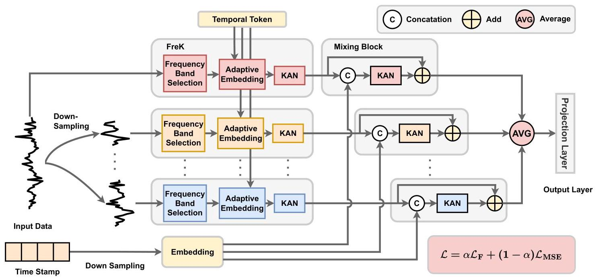
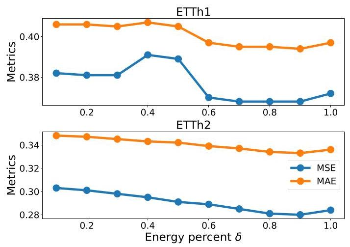
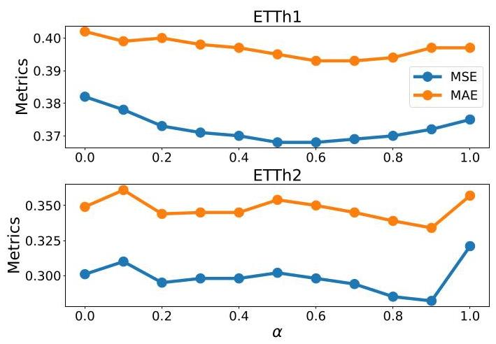
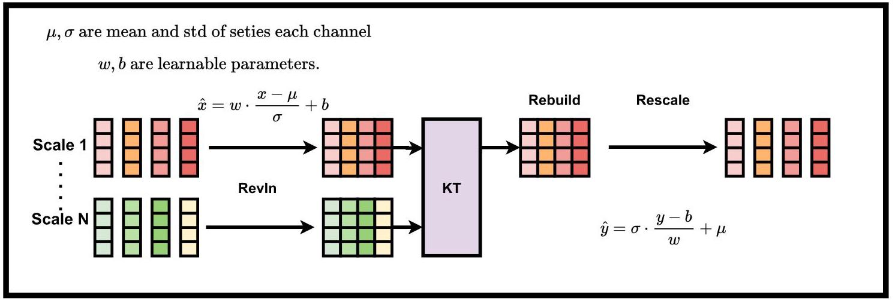
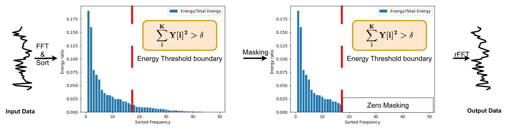

# KFS: KAN based adaptive Frequency Selection learning architecture for long term time series forecasting

# KFS:用于长期时间序列预测的基于KAN的自适应频率选择学习架构

Changning Wu', Gao Wu', Rongyao Cai', Yong Liu ${}^{*,1}$ , Kexin Zhang ${}^{*,1}$ ,

吴长宁', 吴高', 蔡荣耀', 刘永${}^{*,1}$, 张可欣${}^{*,1}$

${}^{1}$ Insititute of Cyber-Systems and Control, Zhejiang University, Hangzhou, China *Corresponding Author

${}^{1}$ 浙江大学网络系统与控制研究所，中国杭州 *通讯作者

## Abstract

## 摘要

Multi-scale decomposition architectures have emerged as predominant methodologies in time series forecasting. However, real-world time series exhibit noise interference across different scales, while heterogeneous information distribution among frequency components at varying scales leads to suboptimal multi-scale representation. Inspired by Kolmogorov-Arnold Networks (KAN) and Parseval's theorem, we propose a KAN based adaptive frequency Selection learning architecture (KFS) to address these challenges. This framework tackles prediction challenges stemming from cross-scale noise interference and complex pattern modeling through its FreK module, which performs energy-distribution-based dominant frequency selection in the spectral domain. Simultaneously, KAN enables sophisticated pattern representation while timestamp embedding alignment synchronizes temporal representations across scales. The feature mixing module then fuses scale-specific patterns with aligned temporal features. Extensive experiments across multiple real-world time series datasets demonstrate that KFS achieves state-of-the-art performance as a simple yet effective architecture.

多尺度分解架构已成为时间序列预测中的主要方法。然而，现实世界中的时间序列在不同尺度上存在噪声干扰，并且不同尺度上频率分量之间的异构信息分布导致次优的多尺度表示。受柯尔莫哥洛夫 - 阿诺德网络(KAN)和帕塞瓦尔定理的启发，我们提出了一种基于KAN的自适应频率选择学习架构(KFS)来应对这些挑战。该框架通过其FreK模块解决了源于跨尺度噪声干扰和复杂模式建模的预测挑战，该模块在频域中执行基于能量分布的主导频率选择。同时，KAN能够实现复杂的模式表示，而时间戳嵌入对齐则使跨尺度的时间表示同步。然后，特征混合模块将特定尺度的模式与对齐的时间特征融合。在多个真实世界时间序列数据集上进行的大量实验表明，KFS作为一种简单而有效的架构实现了当前最优的性能。

Code - https://github.com/wcnExplosion/KFS-main

代码 - https://github.com/wcnExplosion/KFS-main

## Introduction

## 引言

Time series forecasting (TSF) is applied in various significant domains, including finance (Huang, Chen, and Qiao 2024), traffic flow control (Jiang and Luo 2022), and weather forecasting (Lam et al. 2023). Recently, deep learning methods have driven continuous progress in the TSF field, with CNN-based (donghao and wang xue 2024), MLP-based (Nie et al. 2023), and Transformer-based (Zeng et al. 2023) approaches.

时间序列预测(TSF)应用于各种重要领域，包括金融(Huang, Chen, and Qiao 2024)、交通流控制(Jiang and Luo 2022)和天气预报(Lam et al. 2023)。最近，深度学习方法推动了TSF领域的不断进步，出现了基于CNN的(donghao和wang xue 2024)、基于MLP的(Nie et al. 2023)和基于Transformer的(Zeng et al. 2023)方法。

Due to real-world complexities, observed time series often exhibit intricate and diverse patterns. These interwoven patterns result in complex dependencies with substantial noise contamination, making it challenging to establish connections between historical data and future variations. To capture complex temporal patterns, increasing research focuses on leveraging prior knowledge to decompose time series into simpler components as the foundation for forecasting. For example, Autoformer (Wu et al. 2021), DLin-ear (Zeng et al. 2023), and FEDformer (Zhou et al. 2022a) decompose time series into trend and seasonal components. Building on this, TimeMixer (Wang et al. 2024a) further introduces multi-scale seasonal-trend decomposition, highlighting the importance of multi-scale data. Recent models like TimesNet (Wu et al. 2023) and SparseTFT (Lin et al. 2024) concentrate on decomposing long sequences into multiple shorter sub-sequences based on periodicity length. While these methods extract subsequences from diverse perspectives to capture critical information, the subsequences split directly from the original series inevitably retain substantial noise, leading to suboptimal problems.

由于现实世界的复杂性，观测到的时间序列通常呈现出复杂多样的模式。这些交织的模式导致了具有大量噪声污染的复杂依赖性，使得在历史数据和未来变化之间建立联系具有挑战性。为了捕捉复杂的时间模式，越来越多的研究集中在利用先验知识将时间序列分解为更简单的组件作为预测的基础。例如，Autoformer(Wu et al. 2021)、DLin-ear(Zeng et al. 2023)和FEDformer(Zhou et al. 2022a)将时间序列分解为趋势和季节成分。在此基础上，TimeMixer(Wang et al. 2024a)进一步引入了多尺度季节 - 趋势分解，突出了多尺度数据的重要性。最近的模型如TimesNet(Wu et al. 2023)和SparseTFT(Lin et al. 2024)专注于根据周期长度将长序列分解为多个较短的子序列。虽然这些方法从不同角度提取子序列以捕获关键信息，但直接从原始序列中拆分的子序列不可避免地保留了大量噪声，导致次优问题。

It is worth noting that time series contain multiple frequency components, including noise that interferes with model learning. This inherent noise affects different frequencies unevenly, causing lower signal-to-noise ratios at lower-amplitude frequencies and consequently impairing model predictive performance. Mitigating noise interference while blending diverse frequency components makes forecasting particularly challenging. The aforementioned decomposition methods inspire us to design a multi-scale frequency denoising hybrid framework capable of isolating different frequency components while filtering high signal-to-noise ratio data. However, heterogeneous frequency patterns introduce complex representational challenges, often yielding suboptimal results. Fortunately, Kolmogorov-Arnold Network (KAN) (Liu et al. 2025) has recently gained significant attention in deep learning for its powerful data-fitting capability and flexibility, demonstrating potential to replace traditional MLPs. Compared to MLPs, KAN employs learnable activation functions that control its fitting capacity by adjusting basis functions. Moreover, TimeKAN (Huang et al. 2025), a KAN based method, has achieved SOTA performance in multiple datasets, demonstrating the remarkable potential of KAN for temporal feature representation. These considerations motivate us to explore KAN for representing patterns across different frequencies, thereby providing more information for forecasting.

值得注意的是，时间序列包含多个频率分量，包括干扰模型学习的噪声。这种固有噪声对不同频率的影响不均匀，导致低幅度频率处的信噪比降低，从而损害模型的预测性能。在混合各种频率分量的同时减轻噪声干扰使得预测特别具有挑战性。上述分解方法启发我们设计一种多尺度频率去噪混合框架，该框架能够隔离不同频率分量，同时过滤高信噪比数据。然而，异构频率模式带来了复杂的表示挑战，常常产生次优结果。幸运的是，柯尔莫哥洛夫 - 阿诺德网络(KAN)(Liu et al. 2025)最近因其强大的数据拟合能力和灵活性在深度学习中受到了广泛关注，显示出取代传统MLP的潜力。与MLP相比，KAN采用可学习的激活函数，通过调整基函数来控制其拟合能力。此外，基于KAN的方法TimeKAN(Huang et al. 2025)在多个数据集中取得了最优性能，证明了KAN在时间特征表示方面的显著潜力。这些考虑促使我们探索KAN用于表示不同频率的模式，从而为预测提供更多信息。

Inspired by these observations, we propose KAN based adaptive frequency Selection learning architecture (KFS) to address forecasting challenges arising from noise and mixed data pattern. Specifically, KFS first decomposes components within the data via moving averages. Subsequently, the FreK module performs frequency selection at multiple scales to denoise the data, utilizing KAN to learn scale-specific temporal features from the denoised data. Finally, the hybrid module aligns and fuses timestamp embeddings from the look back window with corresponding scale representations, achieving temporal representation alignment and integration across scales to precisely model temporal features. Features from different scales are aggregated via averaging and projected to the desired forecast horizon through simple linear mapping. With our meticulously designed architecture, KFS achieves state-of-the-art performance in long-term time series forecasting tasks across multiple real-world datasets.

受这些观察结果的启发，我们提出了基于KAN的自适应频率选择学习架构(KFS)，以应对噪声和混合数据模式带来的预测挑战。具体而言，KFS首先通过移动平均分解数据中的成分。随后，FreK模块在多个尺度上执行频率选择以对数据进行去噪，利用KAN从去噪后的数据中学习特定尺度的时间特征。最后，混合模块将回顾窗口中的时间戳嵌入与相应的尺度表示进行对齐和融合，实现跨尺度的时间表示对齐和整合，以精确地建模时间特征。来自不同尺度的特征通过平均进行聚合，并通过简单的线性映射投影到所需的预测范围。通过我们精心设计的架构，KFS在多个真实世界数据集的长期时间序列预测任务中取得了领先的性能。

Our contributions can be summarized as follows:

我们的贡献可以总结如下:

- We designed an energy-distribution-based frequency selection method that effectively extracts components with higher signal-to-noise ratios. The resulting FreK module reduces noise impact and enables efficient modeling.

- 我们设计了一种基于能量分布的频率选择方法，该方法有效地提取了具有较高信噪比的成分。由此产生的FreK模块减少了噪声影响，并实现了高效建模。

- We introduced a simple yet effective forecasting model KFS, and developed a Mixing Block that aligns and fuses multi-scale time series with corresponding timestamps.

- 我们引入了一个简单而有效的预测模型KFS，并开发了一个混合块，用于将多尺度时间序列与相应的时间戳进行对齐和融合。

- Comprehensive experiments demonstrate that our KFS achieves state-of-the-art performance in long-term forecasting tasks across multiple datasets while exhibiting exceptional efficiency.

- 全面的实验表明，我们的KFS在多个数据集的长期预测任务中取得了领先的性能，同时表现出卓越的效率。

## Related Works

## 相关工作

## Time Series Forecasting

## 时间序列预测

In recent years, deep learning approaches for TSF have gained significant attention, mainly including CNN-based, MLP-based, and Transformer-based methodologies.

近年来，用于时间序列预测(TSF)的深度学习方法受到了广泛关注，主要包括基于卷积神经网络(CNN)、基于多层感知器(MLP)和基于Transformer的方法。

CNN-based methods focus on extracting temporal feature representations through convolutional operations. For example, MICN (Wang et al. 2023) and TimesNet (Wu et al. 2023) enhance the accuracy of sequence modeling by strategically adjusting the receptive fields of their architectures. Transformer-based approaches, while contrasting with CNN methods, exhibit substantially larger receptive fields. PatchTST (Nie et al. 2023) improves the capture of local patterns by segmenting input data into patches, while Cross-former (Zhang and Yan 2023) specializes in mining cross-variable dependencies. However, Transformer-based models face challenges stemming from computational complexity due to their massive parameterization. In this situation, MLP-based methods secure their position in TSF through lightweight architectures. FITS (Xu, Zeng, and Xu 2024) introduces novel linear projections to reduce input complexity, requiring merely 10K parameters. However, constrained by their parameterization, MLP-based approaches struggle to effectively extract and fuse diverse data modalities.

基于CNN的方法专注于通过卷积操作提取时间特征表示。例如，MICN(Wang等人，2023年)和TimesNet(Wu等人，2023年)通过策略性地调整其架构的感受野来提高序列建模的准确性。基于Transformer的方法与CNN方法形成对比，具有显著更大的感受野。PatchTST(Nie等人，2023年)通过将输入数据分割成块来改进对局部模式的捕捉，而Cross-former(Zhang和Yan，2023年)专门用于挖掘跨变量依赖性。然而，基于Transformer的模型由于其大量的参数化而面临计算复杂性带来的挑战。在这种情况下，基于MLP的方法通过轻量级架构在TSF中占据了一席之地。FITS(Xu、Zeng和Xu，2024年)引入了新颖的线性投影以降低输入复杂性，仅需要10K个参数。然而，受其参数化的限制，基于MLP的方法难以有效地提取和融合各种数据模态。

Unlike the aforementioned methods, this paper enhance data quality through spectral filtering strategies and integrate a multi-scale framework to extract temporal representations, achieving significantly improved accuracy in long term Time Series Forecasting.

与上述方法不同，本文通过频谱滤波策略提高数据质量，并集成多尺度框架以提取时间表示，在长期时间序列预测中实现了显著提高的准确性。

## Multi-Scale Architecture for TSF

## 用于TSF的多尺度架构

In the field of TSF, extensive research has explored multi-scale architectures. TimeMixer (Wang et al. 2024a) pioneered their application in TSF through decomposing multi-scale time series. MICN (Wang et al. 2023) extended multi-scale processing to convolutional layers, enabling efficient representation of seasonal patterns. Building on these advances, this work leverages a multi-scale framework to capture hierarchical information, proposing KFS's novel multi-pathway integration framework. By distinctly capturing temporal representations and physical timestamp embeddings, then fusing these components, KFS achieves enhanced precision in time series forecasting.

在TSF领域，广泛的研究探索了多尺度架构。TimeMixer(Wang等人，2024a)通过分解多尺度时间序列开创了它们在TSF中的应用。MICN(Wang等人，2023年)将多尺度处理扩展到卷积层，实现了对季节性模式的有效表示。基于这些进展，本工作利用多尺度框架来捕捉层次信息，提出了KFS新颖的多路径集成框架。通过分别捕捉时间表示和物理时间戳嵌入，然后融合这些组件，KFS在时间序列预测中实现了更高精度。

## Kolmogorov-Arnold Network

## 柯尔莫哥洛夫 - 阿诺德网络

The Kolmogorov-Arnold representation theorem establishes that any multivariate continuous function can be expressed as a composition of univariate functions and additive operations. Using this theorem, KAN (Liu et al. 2025) introduces a novel network architecture that supplants traditional MLPs. Unlike MLPs with fixed activation functions, KAN incorporates learnable activation functions. This flexibility positions KAN as a promising alternative to MLPs.

柯尔莫哥洛夫 - 阿诺德表示定理表明，任何多元连续函数都可以表示为单变量函数和加法运算的组合。利用该定理，KAN(Liu等人，2025年)引入了一种新颖的网络架构，取代了传统的多层感知器。与具有固定激活函数的多层感知器不同，KAN包含可学习的激活函数。这种灵活性使KAN成为多层感知器的一个有前途的替代方案。

Initial implementations of KAN faced computational bottlenecks due to the excessive complexity of B-spline sampling, hindering broader adoption. To address this limitation, subsequent research explored alternative basis functions, rKAN (Aghaei 2024) investigates rational functions as basis functions, FastKAN (Li 2024) accelerates computation using Gaussian radial basis functions to approximate third-order B-spline functions.

KAN的初始实现由于B样条采样的过度复杂性而面临计算瓶颈，阻碍了其更广泛的采用。为了解决这一限制，后续研究探索了替代基函数，rKAN(Aghaei，2024年)研究了有理函数作为基函数，FastKAN(Li，2024年)使用高斯径向基函数加速计算以近似三阶B样条函数。

Furthermore, KAN has been adopted across diverse domains as a substitute for MLP. Convolutional KAN (Bod-ner et al. 2025) replaces conventional kernels with learnable spline functions. KAT (Xingyi Yang 2025) integrates KAN layers into Transformer architectures, demonstrating impressive accuracy in multiple computer vision tasks. This paper proposes to introduce KAN to TSF and explore its potential in representing temporal data patterns.

此外，KAN已在不同领域被用作多层感知器的替代品。卷积KAN(Bod-ner等人，2025年)用可学习的样条函数取代了传统内核。KAT(Xingyi Yang等人，2025年)将KAN层集成到Transformer架构中，在多个计算机视觉任务中展示了令人印象深刻的准确性。本文提出将KAN引入TSF并探索其在表示时间数据模式方面的潜力。

## Preliminary

## 初步

## Motivation

## 动机

In the physical world, time series data originate from sensors on physical devices or recordings of real-world relationships. These measurements inherently contain varying levels of noise interference due to factors including acquisition methods, mechanical transmission processes, and recording mechanisms. This noise significantly compromises the results of time series analysis tasks, particularly forecasting and anomaly detection. Consequently, developing methodologies to mitigate noise-induced distortions becomes imperative to enhance the representation of temporal patterns. This paper addresses this challenge through the view of multivariate time series forecasting.

在物理世界中，时间序列数据源自物理设备上的传感器或现实世界关系的记录。由于采集方法、机械传输过程和记录机制等因素，这些测量数据本身包含不同程度的噪声干扰。这种噪声严重影响了时间序列分析任务的结果，特别是预测和异常检测。因此，开发减轻噪声引起的失真的方法对于增强时间模式的表示至关重要。本文通过多变量时间序列预测的视角来应对这一挑战。

We formally decompose the forecasting problem into two fundamental questions.

我们将预测问题正式分解为两个基本问题。

1. How can we effectively reduce noise impact on both data and predictive models?

1. 我们如何有效降低噪声对数据和预测模型的影响？

### 2.How can we explicitly extract intrinsic information from given time series?

### 2. 我们如何从给定的时间序列中明确提取内在信息？

For the first question, we begin by assuming that the data primarily contains channel-wise independent additive white Gaussian noise. The primary mitigation approach for such noise traditionally requires prior knowledge of the noise distribution, which introduces additional domain-specific assumptions and hinders real-world applicability. However, the spectral uniformity of Gaussian white noise in the frequency domain motivates our solution: By selecting frequency bands with concentrated energy as the dominant temporal features, we reconstruct the time series within a bounded error margin, effectively attenuating noise. This principle is formalized in the following theorems.

对于第一个问题，我们首先假设数据主要包含通道独立的加性高斯白噪声。传统上，这种噪声的主要缓解方法需要噪声分布的先验知识，这引入了额外的特定领域假设并阻碍了实际应用。然而，高斯白噪声在频域中的频谱均匀性启发了我们的解决方案:通过选择能量集中的频带作为主要时间特征，我们在有界误差范围内重建时间序列，有效衰减噪声。这一原理在以下定理中得到形式化。

Figure 1: Overall structure of the proposed KFS. Multi-scale architecture decomposes time series. The KANs are seamlessly integrated within the model framework. FreK select the dominant frequency based on energy distribution and represent the temporal pattern. Mixing Block align temporal representation with its time stamp.

图1:所提出的KFS的整体结构。多尺度架构分解时间序列。KAN无缝集成在模型框架内。FreK根据能量分布选择主导频率并表示时间模式。混合块将时间表示与其时间戳对齐。

Theorem 1 (Parseval's Theorem) For a discrete signal $y \in  {\mathbb{R}}^{L}$ and its DFT $Y \in  {\mathbb{C}}^{L/2 + 1}$ , the energy satisfies:

定理1(帕塞瓦尔定理)对于离散信号$y \in  {\mathbb{R}}^{L}$及其DFT$Y \in  {\mathbb{C}}^{L/2 + 1}$，能量满足:

$$
\mathop{\sum }\limits_{{t = 0}}^{{L - 1}}{\left| y\left( t\right) \right| }^{2} = \frac{1}{L}\mathop{\sum }\limits_{{k = 0}}^{{L/2}}{\left| Y\left\lbrack  k\right\rbrack  \right| }^{2}. \tag{1}
$$

Theorem 1 states that the total energy of a time series is equivalent in the frequency domain and the time domain. Therefore, by processing the time series in the frequency domain and converting it back to the time domain, the information of the original time series can be preserved. This foundation allows us to formalize Theorem 2, with its complete proof detailed in Appendix.

定理1表明时间序列的总能量在频域和时域中是等效的。因此，通过在频域中处理时间序列并将其转换回时域，可以保留原始时间序列的信息。在此基础上，我们将定理2形式化，其完整证明详见附录。

Theorem 2 Let observed time series $y = {y}_{0} + n$ , where $n \sim  \mathcal{N}\left( {0,{\sigma }^{2}I}\right)$ , and ${y}_{0}$ donates original times series. After DFT, there exist $K \in  {\mathbb{N}}^{ + }$ and $\epsilon  > 0$ such that the sparse reconstruction $\widetilde{y}$ from the top- $K$ frequencies of $Y$ satisfies:

定理2 设观测时间序列$y = {y}_{0} + n$，其中$n \sim  \mathcal{N}\left( {0,{\sigma }^{2}I}\right)$，且${y}_{0}$表示原始时间序列。经过DFT后，存在$K \in  {\mathbb{N}}^{ + }$和$\epsilon  > 0$，使得从$Y$的前$K$个频率进行稀疏重建$\widetilde{y}$满足:

$$
{\begin{Vmatrix}\widetilde{y} - {y}_{0}\end{Vmatrix}}_{2} < \epsilon \tag{2}
$$

Theorem 2 proposes that by filtering the dominant frequency bands of a time series, the proportion of noise can be reduced, thereby enhancing the quality of time series.

定理2提出通过过滤时间序列的主导频带，可以降低噪声比例，从而提高时间序列的质量。

For the second question, we draw upon existing research to carefully design a KAN-based network architecture under the channel independence assumption, integrated with a multi-scale time series mixing framework.

对于第二个问题，我们借鉴现有研究，在通道独立性假设下精心设计基于KAN的网络架构，并与多尺度时间序列混合框架集成。

## Multiscale Time Series Processing

## 多尺度时间序列处理

In long time series forecasting, temporal sequences can capture information from multiple scales by down sampling, thereby enhancing prediction accuracy. For an input time series $X \in  {\mathbb{R}}^{L \times  C}$ , we generate multi-scale sequences through down sampling. Specifically, for each coarser-grained subsequence ${X}_{i + 1}$ , it is derived from the finer-grained subsequence ${X}_{i}$ at the preceding level by applying average pooling. We then sequentially obtain a collection of time series $\mathbb{X} = \left\{  {{x}_{0},{x}_{1},\ldots ,{x}_{m}}\right\}$ across $\mathrm{m}$ scales, where each ${x}_{i} \in  {\mathbb{R}}^{\frac{L}{{D}^{i}}/ \times  C}$ and $D$ donates the window size of average pooling. The down sampling process used in our work is shown as below:

在长时间序列预测中，时间序列可以通过下采样从多个尺度捕获信息，从而提高预测准确性。对于输入时间序列$X \in  {\mathbb{R}}^{L \times  C}$，我们通过下采样生成多尺度序列。具体而言，对于每个粒度较粗的子序列${X}_{i + 1}$，它是通过在前一级别应用平均池化从粒度较细的子序列${X}_{i}$派生而来。然后，我们依次获得跨$\mathrm{m}$个尺度的时间序列集合$\mathbb{X} = \left\{  {{x}_{0},{x}_{1},\ldots ,{x}_{m}}\right\}$，其中每个${x}_{i} \in  {\mathbb{R}}^{\frac{L}{{D}^{i}}/ \times  C}$和$D$表示平均池化的窗口大小。我们工作中使用的下采样过程如下所示:

$$
{x}_{i + 1} = \operatorname{AvgPool}\left( {x}_{i}\right) \tag{3}
$$

This technique has been extensively adopted in time series forecasting models and has demonstrated improved predictive accuracy along with enhanced modeling capabilities.

该技术已在时间序列预测模型中广泛采用，并已证明具有提高的预测准确性以及增强的建模能力。

## Method

## 方法

## Overview of the architecture

## 架构概述

The core challenge lies in resolving sequence modeling for channel-independent information while effectively reducing the influence of noise. To address this, we propose a simple yet effective architecture, the KAN based adaptive Frequency Selection learning architecture (KFS), which improves prediction accuracy by organically integrating KAN to capture multiscale channel-independent features and temporal representation. The overall architecture of KFS is depicted in Figure 1. Specifically, it consists of two key components: a Frequency K-top Selection (FreK) Module and a Mixing Block. Detailed descriptions of each module are deferred to the following sections.

核心挑战在于解决与通道无关信息的序列建模问题，同时有效降低噪声的影响。为了解决这个问题，我们提出了一种简单而有效的架构，即基于KAN的自适应频率选择学习架构(KFS)，它通过有机整合KAN来捕获多尺度通道无关特征和时间表示，从而提高预测精度。KFS的整体架构如图1所示。具体来说，它由两个关键组件组成:频率K-top选择(FreK)模块和混合块。每个模块的详细描述将在以下部分给出。

## Frequency K-top Selection

## 频率K-top选择

In real-world scenarios, a vast number of multivariate time series exhibit complex and diverse frequency components. Moreover, among the numerous frequency constituents within these time series, not all contribute meaningfully to the representation. These sequences commonly contain noise that reduces the signal-to-noise ratio of the time series, thereby leading to suboptimal performance.

在实际场景中，大量的多变量时间序列呈现出复杂多样的频率成分。此外，在这些时间序列中的众多频率成分中，并非所有成分都对表示有意义的贡献。这些序列通常包含噪声，降低了时间序列的信噪比，并导致性能次优。

To address this, we designed Frequency K-top Selection (FreK) module, which reduces noise through multi-scale principal frequency selection while comprehensively capturing temporal representation from the time series.

为了解决这个问题，我们设计了频率K-top选择(FreK)模块，它通过多尺度主频率选择来降低噪声，同时从时间序列中全面捕获时间表示。

Frequency Band Selection The FreK module first employs its Frequency Band Selection (FBS) block to screen primary components of time series through energy-distribution-based filtering. Since multivariate time series exhibit complex energy distributions that are difficult to extract directly, inspired by Theorem 1, we transform the time series into the spectral domain, initiating processing from the distribution of frequency components. Furthermore, to mitigate noise interference in time series and enhance the signal-to-noise ratio, we rank frequency bands in descending order of spectral energy and select the top-K bands as primary constituents of the time series. These selected bands are then inversely transformed back to the temporal domain to reconstruct the time series. As demonstrated in Theorem 3, controlling the energy distribution threshold enables reconstruction of time series that optimally approximates the noise-free sequence. Here, the reconstructed series $\widetilde{x}\left( t\right)$ comes as followed:

频带选择 FreK模块首先使用其频带选择(FBS)块，通过基于能量分布的滤波来筛选时间序列的主要成分。由于多变量时间序列呈现出复杂的能量分布，难以直接提取，受定理1的启发，我们将时间序列转换到频域，从频率成分的分布开始进行处理。此外，为了减轻时间序列中的噪声干扰并提高信噪比，我们按频谱能量降序对频带进行排序，并选择前K个频带作为时间序列 的主要成分。然后将这些选定的频带逆变换回时域以重建时间序列。如定理3所示，控制能量分布阈值可以重建最佳逼近无噪声序列的时间序列。这里，重建后的序列$\widetilde{x}\left( t\right)$如下所示:

$$
\widetilde{x}\left( t\right)  = {rFFT}(\operatorname{Top}K\left( {{FFT}\left( {x\left( t\right) }\right) }\right) \tag{4}
$$

where $K$ is the minimum value conducted as followed:

其中$K$是按如下方式得出的最小值:

$$
\frac{\mathop{\sum }\limits_{{i = 1}}^{K}X{\left\lbrack  i\right\rbrack  }^{2}}{\mathop{\sum }\limits_{{i = 1}}^{{L/2 + 1}}X{\left\lbrack  i\right\rbrack  }^{2}} > \delta \tag{5}
$$

$$
\{ X\left( k\right) {\} }_{k = 1}^{L/2 + 1} = \operatorname{sorted}\left\lbrack  {{FFT}\left( {x\left( t\right) }\right) }\right\rbrack \tag{6}
$$

where sorted $\left\lbrack  \cdot \right\rbrack$ donates sorting by magnitude in descending order, $\delta$ donates the threshold of energy percentage.

其中排序后的$\left\lbrack  \cdot \right\rbrack$表示按幅度降序排序，$\delta$表示能量百分比阈值。

At this stage, $\widetilde{x}\left( t\right)$ consists predominantly of channel-independent temporal information with lower noise. Subsequently, Frek performs Adaptive Embedding(AE) of x along the temporal dimension and employs KAN for representation learning of intrinsic information. This process can be represented by the following formula:

在此阶段，$\widetilde{x}\left( t\right)$主要由噪声较低的与通道无关的时间信息组成。随后，Frek沿时间维度对x进行自适应嵌入(AE)，并使用KAN进行内在信息的表示学习。这个过程可以用以下公式表示:

$$
{E}_{1} = {KAN}\left( {{AE}\left( {\widetilde{x}\left( t\right) }\right) }\right) \tag{7}
$$

where ${AE}\left( \cdot \right)$ donates the adaptive embedding, ${E}_{1}$ donates the temporal representation by FreK.

其中${AE}\left( \cdot \right)$表示自适应嵌入，${E}_{1}$表示FreK的时间表示。

Adaptive Embedding In contemporary state-of-the-art time series forecasting models, the integration of adaptive modules into embeddings is frequently addressed. We also introduce an adaptive parameter $P \in  {\mathbb{R}}^{D}$ to improve prediction efficacy, here $D$ donates the dimension of embedding space. However, unlike these approaches (Wang et al. 2024c), the adaptive parameter in adaptive embedding serves to learn distinct characteristics unique to each dataset. The usage of $P$ with one input series ${x}_{i} \in  {\mathbb{R}}^{L \times  C}$ is as follows:

自适应嵌入 在当代最先进的时间序列预测模型中，经常会涉及将自适应模块集成到嵌入中。我们还引入了一个自适应参数$P \in  {\mathbb{R}}^{D}$来提高预测效果，这里$D$表示嵌入空间的维度。然而，与这些方法(Wang等人，2024c)不同，自适应嵌入中的自适应参数用于学习每个数据集独特的特征。$P$与一个输入序列${x}_{i} \in  {\mathbb{R}}^{L \times  C}$的用法如下:

$$
{E}_{i}^{j} = \operatorname{concat}\left( \left\lbrack  {P,\operatorname{Linear}\left( {x}_{i}^{j}\right) }\right\rbrack  \right) \tag{8}
$$

where j donates the index of variate. Thus, the whole embedding is expressed as follows:

其中j表示变量的索引。因此，整个嵌入表示如下:

$$
{E}_{i} = {AE}\left( {x}_{i}\right)  = \left\lbrack  {{E}_{i}^{1},{E}_{i}^{2},\cdots ,{E}_{i}^{{d}_{\text{ model }}}}\right\rbrack \tag{9}
$$

Group-Rational KAN Compared to traditional MLPs, KAN replaces fixed activate functions with learnable univariate functions, allowing complex nonlinear relationships to be modeled with fewer parameters and greater interpretability. In our methodology, we employ Group-Rational KANs (Xingyi Yang 2025) to learn representations of temporal components. The rational base functions are constructed by $Q\left( x\right)$ and $P\left( x\right)$ of order m, n.

分组有理KAN 与传统的多层感知器相比，KAN用可学习的单变量函数取代了固定的激活函数，从而可以用更少的参数和更高的可解释性对复杂的非线性关系进行建模。在我们的方法中，我们使用分组有理KAN(Xingyi Yang，2025)来学习时间成分的表示。有理基函数由阶数为m、n的$Q\left( x\right)$和$P\left( x\right)$构建。

$$
\phi \left( x\right)  = {wF}\left( x\right)  = w\frac{P\left( x\right) }{Q\left( x\right) } = w\frac{\mathop{\sum }\limits_{{i = 0}}^{m}{a}_{i}{x}^{i}}{\mathop{\sum }\limits_{{i = 0}}^{m}{b}_{i}{x}^{i}} \tag{10}
$$

where ${a}_{i}$ and ${b}_{i}$ are coefficient of the rational function and $w$ is the scaling factor.

其中${a}_{i}$和${b}_{i}$是有理函数的系数，$w$是缩放因子。

To integrate rational functions as base functions within KANs while mitigating the instability caused by poles, which occurs when $\mathrm{Q}\left( \mathrm{x}\right)  = 0$ , Group-KAN employs a modified formulation of the standard rational function.

为了将有理函数作为KAN中的基函数进行集成，同时减轻当$\mathrm{Q}\left( \mathrm{x}\right)  = 0$时由极点引起的不稳定性，分组KAN采用了标准有理函数的修改形式。

$$
F\left( x\right)  = \frac{{a}_{0} + {a}_{1}x + \ldots  + {a}_{m}{x}^{m}}{1 + \left| {{b}_{1}x + \ldots  + {b}_{m}{x}^{m}}\right| } \tag{11}
$$

Thus, Group-Rational KAN incorporates rational functions and constructs its processing architecture through group seperation and sharing base function within group. For an input variable $X \in  {\mathbb{R}}^{{d}_{in}}$ , let i denotes its channel index. With $g$ groups, each group in GR-KAN contains ${d}_{g} = {d}_{in}/g$ channels, where $\lfloor i/{dg}\rfloor$ represents the group index. The operation of GR-KAN on $\mathrm{x}$ can be expressed as:

因此，群体理性KAN纳入了有理函数，并通过群体分离和群体内共享基函数构建其处理架构。对于输入变量$X \in  {\mathbb{R}}^{{d}_{in}}$，令i表示其通道索引。在$g$个群体中，GR-KAN中的每个群体包含${d}_{g} = {d}_{in}/g$个通道，其中$\lfloor i/{dg}\rfloor$表示群体索引。GR-KAN对$\mathrm{x}$的操作可以表示为:

$$
{GR} - {KAN}\left( \mathbf{x}\right)  = \phi  \circ  x = {WF}\left( x\right) \tag{12}
$$

To simplify it, we express it in matrix form as the product of a weight matrix $W \in  {\mathbb{R}}^{{d}_{in} \times  {d}_{\text{ out }}}$ and a rational function $\mathrm{F}$ :

为了简化，我们将其表示为矩阵形式，即权重矩阵$W \in  {\mathbb{R}}^{{d}_{in} \times  {d}_{\text{ out }}}$与有理函数$\mathrm{F}$的乘积:

$$
W = \left\lbrack  \begin{matrix} {w}_{1,1} & \cdots & {w}_{1,{d}_{\text{ in }}} \\  \vdots &  \ddots  & \vdots \\  {w}_{{d}_{\text{ out }},1} & \cdots & {w}_{{d}_{\text{ out }},{d}_{\text{ in }}} \end{matrix}\right\rbrack \tag{13}
$$

$$
F\left( x\right)  = {\left\lbrack  \begin{array}{lll} {F}_{\left\lfloor  1/{d}_{g}\right\rfloor  }\left( {x}_{1}\right) & \cdots & {F}_{\left\lfloor  {d}_{\mathrm{{in}}}/{d}_{g}\right\rfloor  }\left( {x}_{{d}_{\mathrm{{in}}}}\right)  \end{array}\right\rbrack  }^{T} \tag{14}
$$

In our implementation of Rational KAN, we simply prefix the rational function to a linear layer as a unit of KAN. And the KAN used in our work is consist of two units.

在我们对有理KAN的实现中，我们简单地将有理函数作为KAN的一个单元前缀到线性层。并且我们工作中使用的KAN由两个单元组成。

$$
{KA}{N}_{i}\left( x\right)  = \text{ linear }\left( {F\left( x\right) }\right) \tag{15}
$$

where i donates the layer index in our KAN.

其中i表示我们KAN中的层索引。

<table><tr><td colspan="2" rowspan="2">Models   Metric</td><td colspan="2">KFS(Ours)</td><td colspan="2">TimeXer</td><td colspan="2">TimeMixer</td><td colspan="2">iTransformer</td><td colspan="2">PatchTST</td><td colspan="2">TimesNet</td><td colspan="2">MICN</td><td colspan="2">DLinear</td><td colspan="2">FiLM</td><td colspan="2">Time-FFM</td></tr><tr><td>MSE</td><td>MAE</td><td>MSE</td><td>MAE</td><td>MSE</td><td>MAE</td><td>MSE</td><td>MAE</td><td></td><td>MAE</td><td>MSE</td><td>MAE</td><td>MSE</td><td>MAE</td><td>MSE</td><td>MAE</td><td>MSE</td><td>MAE</td><td>MSE</td><td>MAE</td></tr><tr><td rowspan="5">Weather</td><td>96</td><td>0.159</td><td>0.205</td><td>0.157</td><td>0.205</td><td>0.163</td><td>0.209</td><td>0.174</td><td>0.214</td><td>0.186 0.227</td><td></td><td>0.172</td><td>0.220</td><td>0.198</td><td>0.261</td><td>0.195</td><td>0.252</td><td>0.195</td><td>0.236</td><td>0.191</td><td>0.230</td></tr><tr><td>192</td><td>0.207</td><td>0.249</td><td>0.204</td><td>0.247</td><td>0.211</td><td>0.254</td><td>0.221</td><td>0.254</td><td>0.234</td><td>0.265</td><td>0.219</td><td>0.261</td><td>0.239</td><td>0.299</td><td>0.237</td><td>0.295</td><td>0.239</td><td>0.271</td><td>0.236</td><td>0.267</td></tr><tr><td>336</td><td>0.262</td><td>0.288</td><td>0.261</td><td>0.290</td><td>0.263</td><td>0.293</td><td>0.278</td><td>0.296</td><td>0.284</td><td>0.301</td><td>0.280</td><td>0.306</td><td>0.285</td><td>0.336</td><td>0.282</td><td>0.331</td><td>0.289</td><td>0.306</td><td>0.289</td><td>0.303</td></tr><tr><td>720</td><td>0.345</td><td>0.342</td><td>0.340</td><td>0.341</td><td>0.344</td><td>0.348</td><td>0.358</td><td>0.347</td><td>0.356</td><td>0.349</td><td>0.365</td><td>0.359</td><td>0.351</td><td>0.388</td><td>0.345</td><td>0.382</td><td>0.360</td><td>0.351</td><td>0.362</td><td>0.350</td></tr><tr><td>Avg</td><td>0.243</td><td>0.271</td><td>0.241</td><td>0.271</td><td>0.245</td><td>0.276</td><td>0.256</td><td>0.278</td><td>0.265</td><td>0.285</td><td>0.259</td><td>0.287</td><td>0.268</td><td>0.321</td><td>0.265</td><td>0.315</td><td>0.271</td><td>0.290</td><td>0.270</td><td>0.288</td></tr><tr><td rowspan="5">ETTh1</td><td>96</td><td>0.368</td><td>0.397</td><td>0.382</td><td>0.403</td><td>0.385</td><td>0.402</td><td>0.386</td><td>0.405</td><td>0.460</td><td>0.447</td><td>0.384</td><td>0.402</td><td>0.426</td><td>0.446</td><td>0.395</td><td>0.407</td><td>0.438</td><td>0.433</td><td>0.385</td><td>0.400</td></tr><tr><td>192</td><td>0.425</td><td>0.426</td><td>0.429</td><td>0.435</td><td>0.443</td><td>0.430</td><td>0.441</td><td>0.436</td><td>0.512</td><td>0.477</td><td>0.436</td><td>0.429</td><td>0.454</td><td>0.464</td><td>0.446</td><td>0.441</td><td>0.494</td><td>0.466</td><td>0.439</td><td>0.430</td></tr><tr><td>336</td><td>0.467</td><td>0.446</td><td>0.468</td><td>0.448</td><td>0.512</td><td>0.470</td><td>0.487</td><td>0.458</td><td>0.546</td><td>0.496</td><td>0.491</td><td>0.469</td><td>0.493</td><td>0.487</td><td>0.489</td><td>0.467</td><td>0.547</td><td>0.495</td><td>0.480</td><td>0.449</td></tr><tr><td>720</td><td>0.454</td><td>0.458</td><td>0.469</td><td>0.461</td><td>0.497</td><td>0.476</td><td>0.503</td><td>0.491</td><td>0.544</td><td>0.517</td><td>0.521</td><td>0.500</td><td>0.526</td><td>0.526</td><td>0.513</td><td>0.510</td><td>0.586</td><td>0.538</td><td>0.462</td><td>0.456</td></tr><tr><td>Avg</td><td>0.428</td><td>0.431</td><td>0.437</td><td>0.437</td><td>0.459</td><td>0.444</td><td>0.454</td><td>0.447</td><td>0.516</td><td>0.484</td><td>0.458</td><td>0.450</td><td>0.475</td><td>0.480</td><td>0.461</td><td>0.457</td><td>0.516</td><td>0.483</td><td>0.442</td><td>0.434</td></tr><tr><td rowspan="5">ETTh2</td><td>96</td><td>0.280</td><td>0.334</td><td>0.286</td><td>0.338</td><td>0.289</td><td>0.342</td><td>0.297</td><td>0.349</td><td>0.308</td><td>0.355</td><td>0.340</td><td>0.374</td><td>0.372</td><td>0.424</td><td>0.340</td><td>0.394</td><td>0.322</td><td>0.364</td><td>0.301</td><td>0.351</td></tr><tr><td>192</td><td>0.362</td><td>0.387</td><td>0.363</td><td>0.389</td><td>0.378</td><td>0.397</td><td>0.380</td><td>0.400</td><td>0.393</td><td>0.405</td><td>0.402</td><td>0.414</td><td>0.492</td><td>0.492</td><td>0.482</td><td>0.479</td><td>0.405</td><td>0.414</td><td>0.378</td><td>0.397</td></tr><tr><td>336</td><td>0.406</td><td>0.421</td><td>0.414</td><td>0.423</td><td>0.432</td><td>0.434</td><td>0.428</td><td>0.432</td><td>0.427</td><td>0.436</td><td>0.452</td><td>0.452</td><td>0.607</td><td>0.555</td><td>0.591</td><td>0.541</td><td>0.435</td><td>0.445</td><td>0.422</td><td>0.431</td></tr><tr><td>720</td><td>0.423</td><td>0.435</td><td>0.408</td><td>0.432</td><td>0.464</td><td>0.464</td><td>0.427</td><td>0.445</td><td>0.436</td><td>0.450</td><td>0.462</td><td>0.468</td><td>0.824</td><td>0.655</td><td>0.839</td><td>0.661</td><td>0.445</td><td>0.457</td><td>0.427</td><td>0.444</td></tr><tr><td>Avg</td><td>0.367</td><td>0.394</td><td>0.367</td><td>0.396</td><td>0.390</td><td>0.409</td><td>0.383</td><td>0.407</td><td>0.391</td><td>0.441</td><td>0.414</td><td>0.427</td><td>0.574</td><td>0.531</td><td>0.563</td><td>0.519</td><td>0.402</td><td>0.420</td><td>0.382</td><td>0.406</td></tr><tr><td rowspan="5">ETTm1</td><td>96</td><td>0.314</td><td>0.354</td><td>0.318</td><td>0.356</td><td>0.317</td><td>0.356</td><td>0.334</td><td>0.368</td><td>0.352</td><td>0.374</td><td>0.338</td><td>0.375</td><td>0.365</td><td>0.387</td><td>0.346</td><td>0.374</td><td>0.353</td><td>0.370</td><td>0.336</td><td>0.369</td></tr><tr><td>192</td><td>0.358</td><td>0.378</td><td>0.362</td><td>0.383</td><td>0.367</td><td>0.384</td><td>0.377</td><td>0.391</td><td>0.390</td><td>0.393</td><td>0.374</td><td>0.387</td><td>0.403</td><td>0.408</td><td>0.382</td><td>0.391</td><td>0.389</td><td>0.387</td><td>0.378</td><td>0.389</td></tr><tr><td>336</td><td>0.388</td><td>0.398</td><td>0.395</td><td>0.407</td><td>0.391</td><td>0.406</td><td>0.426</td><td>0.420</td><td>0.421</td><td>0.414</td><td>0.410</td><td>0.411</td><td>0.436</td><td>0.431</td><td>0.415</td><td>0.415</td><td>0.421</td><td>0.408</td><td>0.411</td><td>0.410</td></tr><tr><td>720</td><td>0.460</td><td>0.446</td><td>0.452</td><td>0.441</td><td>0.454</td><td>0.441</td><td>0.491</td><td>0.459</td><td>0.462</td><td>0.449</td><td>0.478</td><td>0.450</td><td>0.489</td><td>0.462</td><td>0.473</td><td>0.451</td><td>0.481</td><td>0.441</td><td>0.469</td><td>0.441</td></tr><tr><td>Avg</td><td>0.380</td><td>0.394</td><td>0.382</td><td>0.397</td><td>0.382</td><td>0.397</td><td>0.407</td><td>0.410</td><td>0.406</td><td>0.407</td><td>0.400</td><td>0.406</td><td>0.423</td><td>0.422</td><td>0.404</td><td>0.408</td><td>0.412</td><td>0.402</td><td>0.399</td><td>0.402</td></tr><tr><td rowspan="5">ETTm2</td><td>96</td><td>0.173</td><td>0.253</td><td>0.171</td><td>0.256</td><td>0.175</td><td>0.257</td><td>0.180</td><td>0.264</td><td>0.183</td><td>0.270</td><td>0.187</td><td>0.267</td><td>0.197</td><td>0.296</td><td>0.193</td><td>0.293</td><td>0.183</td><td>0.266</td><td>0.181</td><td>0.267</td></tr><tr><td>192</td><td>0.236</td><td>0.295</td><td>0.237</td><td>0.299</td><td>0.240</td><td>0.302</td><td>0.250</td><td>0.309</td><td>0.255</td><td>0.314</td><td>0.249</td><td>0.309</td><td>0.284</td><td>0.361</td><td>0.284</td><td>0.361</td><td>0.248</td><td>0.305</td><td>0.247</td><td>0.308</td></tr><tr><td>336</td><td>0.291</td><td>0.332</td><td>0.296</td><td>0.338</td><td>0.303</td><td>0.343</td><td>0.311</td><td>0.348</td><td>0.309</td><td>0.347</td><td>0.321</td><td>0.351</td><td>0.381</td><td>0.429</td><td>0.382</td><td>0.429</td><td>0.309</td><td>0.343</td><td>0.309</td><td>0.347</td></tr><tr><td>720</td><td>0.395</td><td>0.395</td><td>0.392</td><td>0.394</td><td>0.392</td><td>0.396</td><td>0.412</td><td>0.407</td><td>0.412</td><td>0.404</td><td>0.408</td><td>0.403</td><td>0.549</td><td>0.522</td><td>0.558</td><td>0.525</td><td>0.410</td><td>0.400</td><td>0.406</td><td>0.404</td></tr><tr><td>Avg</td><td>0.274</td><td>0.319</td><td>0.274</td><td>0.322</td><td>0.277</td><td>0.324</td><td>0.288</td><td>0.332</td><td>0.290</td><td>0.334</td><td>0.291</td><td>0.333</td><td>0.353</td><td>0.402</td><td>0.354</td><td>0.402</td><td>0.288</td><td>0.328</td><td>0.286</td><td>0.332</td></tr><tr><td rowspan="5">Electricity</td><td>96</td><td>0.148</td><td>0.238</td><td>0.140</td><td>0.242</td><td>0.153</td><td>0.245</td><td>0.148</td><td>0.240</td><td>0.190</td><td>0.296</td><td>0.168</td><td>0.272</td><td>0.180</td><td>0.293</td><td>0.210</td><td>0.302</td><td>0.198</td><td>0.274</td><td>0.198</td><td>0.282</td></tr><tr><td>192</td><td>0.164</td><td>0.253</td><td>0.157</td><td>0.256</td><td>0.166</td><td>0.257</td><td>0.162</td><td>0.253</td><td>0.199</td><td>0.304</td><td>0.184</td><td>0.289</td><td>0.189</td><td>0.302</td><td>0.210</td><td>0.305</td><td>0.198</td><td>0.278</td><td>0.199</td><td>0.285</td></tr><tr><td>336</td><td>0.181</td><td>0.274</td><td>0.176</td><td>0.275</td><td>0.185</td><td>0.275</td><td>0.178</td><td>0.269</td><td>0.217</td><td>0.319</td><td>0.198</td><td>0.300</td><td>0.198</td><td>0.312</td><td>0.223</td><td>0.319</td><td>0.217</td><td>0.300</td><td>0.212</td><td>0.298</td></tr><tr><td>720</td><td>0.219</td><td>0.306</td><td>0.211</td><td>0.306</td><td>0.224</td><td>0.312</td><td>0.225</td><td>0.317</td><td>0.258</td><td>0.352</td><td>0.220</td><td>0.320</td><td>0.217</td><td>0.330</td><td>0.258</td><td>0.350</td><td>0.278</td><td>0.356</td><td>0.253</td><td>0.330</td></tr><tr><td>Avg</td><td>0.178</td><td>0.267</td><td>0.171</td><td>0.270</td><td>0.182</td><td>0.272</td><td>0.178</td><td>0.270</td><td>0.216</td><td>0.318</td><td>0.193</td><td>0.304</td><td>0.196</td><td>0.309</td><td>0.225</td><td>0.319</td><td>0.223</td><td>0.302</td><td>0.270</td><td>0.288</td></tr><tr><td colspan="2">${1}^{st}$</td><td>40</td><td></td><td></td><td>24</td><td></td><td>2</td><td></td><td>0</td><td></td><td>0</td><td></td><td>0</td><td>0</td><td></td><td></td><td>0</td><td>1</td><td></td><td>2</td><td></td></tr></table>

Table 1: Full results of the multivariate long-term forecasting result comparison. The input sequence length is set to 96 for all baselines and the prediction lengths $F \in  \{ {96},{192},{336},{720}\}$ . Avg means the average results from all four prediction lengths.

表1:多元长期预测结果比较的完整结果。所有基线的输入序列长度设置为96，预测长度为$F \in  \{ {96},{192},{336},{720}\}$。Avg表示所有四个预测长度的平均结果。

## Time Stamp Embedding

## 时间戳嵌入

Additionally, we introduce linear embeddings for timestamps. In the real world, physical quantities closely associated with time series, such as mechanical load and electricity consumption, exhibit daily, monthly, yearly, and other levels of periodicity along the temporal dimension. By aligning timestamp information with the latent representations learned by the model, we can further enhance the model's ability to understand time series data. While existing approaches (Wang et al. 2024c) incorporate timestamp information to boost model performance, they neglect the critical synchronization of temporal markers with multi-scale sequence patterns. Our methodology resolves this through time stamp down sampling, where temporal embeddings are progressively coarsened to maintain alignment with corresponding resolution levels in the input sequence hierarchy.

此外，我们引入了时间戳的线性嵌入。在现实世界中，与时间序列密切相关的物理量，如机械负载和电力消耗，在时间维度上呈现出日、月、年等周期性水平。通过将时间戳信息与模型学习到的潜在表示对齐，我们可以进一步增强模型理解时间序列数据的能力。虽然现有方法(Wang等人，2024c)纳入时间戳信息以提高模型性能，但它们忽略了时间标记与多尺度序列模式的关键同步。我们的方法通过时间戳下采样解决了这个问题，其中时间嵌入逐渐变粗，以保持与输入序列层次结构中相应分辨率水平的对齐。

## Feature Mixing

## 特征混合

After specifically learning temporal information from time series at different scales, we need to organically integrate the feature representations learned by the model. Here, we refer to the widely adopted feedforward network. In contrast, we incorporate timestamp information from the time series and replace the MLP with a KAN.

在从不同尺度的时间序列中专门学习时间信息之后，我们需要将模型学习到的特征表示有机地整合起来。在这里，我们参考了广泛采用的前馈网络。相比之下，我们纳入了时间序列中的时间戳信息，并用KAN替换了MLP。

As such, the feature mixing module can be represented by the following formula:

因此，特征混合模块可以由以下公式表示:

$$
{FM}\left( {{E}_{1},{E}_{s}}\right)  = {E}_{1} + {KAN}\left( \left\lbrack  {{E}_{1},{E}_{s}}\right\rbrack  \right) \tag{16}
$$

where ${E}_{s}$ donates the linear embedding of time stamps.

其中${E}_{s}$表示时间戳的线性嵌入。

For the fused multiscale data, we employ average aggregation followed by a simple linear projection layer to generate the predicted output $\widetilde{y}\left( t\right)$ :

对于融合的多尺度数据，我们采用平均聚合，然后是一个简单的线性投影层来生成预测输出$\widetilde{y}\left( t\right)$:

$$
\widetilde{y}\left( t\right)  = \operatorname{linear}\left( {F{M}_{avg}}\right) \tag{17}
$$

where $F{M}_{avg}$ donates the mean FM output on different input scales.

其中$F{M}_{avg}$表示不同输入尺度上的平均FM输出。

## Loss Function

## 损失函数

Incorporating frequency domain alignment terms into loss functions is not novel. However, unlike previous work (Wang et al. 2025), our approach enforces alignment exclusively on the dominant frequencies of the data. While this method reduces fine-grained fitting precision, we maintain that frequency-domain signals primarily serve as coarse-grained representations for capturing macro-level trend shifts. Intuitively, fine-grained information modeling can be sufficiently handled by the MSE loss function alone. The specific formulation is shown as follows.

将频域对齐项纳入损失函数并不是什么新鲜事。然而，与之前的工作(Wang等人，2025)不同，我们的方法仅在数据的主导频率上强制对齐。虽然这种方法降低了细粒度拟合精度，但我们认为频域信号主要用作捕获宏观趋势变化的粗粒度表示。直观地说，细粒度信息建模仅由MSE损失函数就可以充分处理。具体公式如下所示。

$$
{\mathcal{L}}_{F} = \frac{1}{K}\mathop{\sum }\limits_{i}^{K}\begin{Vmatrix}{\mathcal{F}\{ \widetilde{y}\left( t\right) {\} }_{i} - \mathcal{F}\{ y\left( t\right) {\} }_{i}}\end{Vmatrix} \tag{18}
$$

By combining the hybrid loss ${L}_{F}$ with the MSE loss, we arrive at our final loss function as follows:

通过将混合损失${L}_{F}$与MSE损失相结合，我们得到了最终的损失函数如下:

$$
\mathcal{L} = \alpha {\mathcal{L}}_{F} + \left( {1 - \alpha }\right) {\mathcal{L}}_{\text{ MSE }} \tag{19}
$$

where $\alpha$ is a hyperparameter, $\widetilde{y}\left( t\right)$ donates the prediction of KFS, K donates the index of top-K frequency prediction data with the highest amplitudes. Unlike FreK, the K here is set to a fixed value of 32. This loss function accounts for both temporal discrepancies and introduces alignment of the principal frequencies in the time series.

其中$\alpha$是一个超参数，$\widetilde{y}\left( t\right)$表示KFS的预测结果，K表示具有最高幅度的前K个频率预测数据的索引。与FreK不同，这里的K被设置为固定值32。该损失函数既考虑了时间差异，又引入了时间序列中主频率的对齐。

## Experiments

## 实验

Datasets We conducted long-term forecasting experiments on six real-world datasets: ETT-Series (Zhou et al. 2021), Electricity (Trindade 2015) and Weather (Zhou et al. 2021). Following established protocols from previous studies (Wu et al. 2023; Wang et al. 2024b), we split the datasets of the ETT series into training, validation, and test sets according to a 6: 2: 2 ratio. For the remaining datasets, the ratio is 7:1:2.

数据集 我们在六个真实世界的数据集上进行了长期预测实验:ETT-Series(Zhou等人，2021年)、Electricity(Trindade，2015年)和Weather(Zhou等人，2021年)。遵循先前研究(Wu等人，2023年；Wang等人，2024b)中既定的协议，我们将ETT系列的数据集按照6:2:2的比例划分为训练集、验证集和测试集。对于其余数据集，比例为7:1:2。

Baselines We carefully selected representative models as baselines in field of time series forecasting, including: 1)Transformer-based models: TimeXer (Wang et al. 2024c), PatchTST (Nie et al. 2023), iTransformer (Liu et al. 2024b). 2)CNN-based models: TimesNet (Wu et al. 2023), MICN (Wang et al. 2023). 3)MLP-based models: TimeMixer (Wang et al. 2024a), DLinear (Zeng et al. 2023). 4)Frequency-based models: FiLM (Zhou et al. 2022b). And a time series foundation model Time-FFM (Liu et al. 2024a).

基线 我们精心挑选了具有代表性的模型作为时间序列预测领域的基线，包括:1)基于Transformer的模型:TimeXer(Wang等人，2024c)、PatchTST(Nie等人，2023年)、iTransformer(Liu等人，2024b)。2)基于CNN的模型:TimesNet(Wu等人，2023年)、MICN(Wang等人，2023年)。3)基于MLP的模型:TimeMixer(Wang等人，2024a)、DLinear(Zeng等人，2023年)。4)基于频率的模型:FiLM(Zhou等人，2022b)。以及一个时间序列基础模型Time-FFM(Liu等人，2024a)。

Experimental Settings To ensure fair comparisons, we adopt the same look-back window length $T = {96}$ and the same prediction length $F = \{ {96},{192},{336},{720}\}$ . We use Mean Square Error (MSE) and Mean Absolute Error (MAE) metrics to evaluate the performance of each method.

实验设置 为确保公平比较，我们采用相同的回溯窗口长度$T = {96}$和相同的预测长度$F = \{ {96},{192},{336},{720}\}$。我们使用均方误差(MSE)和平均绝对误差(MAE)指标来评估每种方法的性能。

## Main Results

## 主要结果

Comprehensive forecasting results are shown in Table 1, the best results are highlighted in Bold and the second-best are underlined. Lower MSE/MAE values indicate higher prediction accuracy. We observe that KFS demonstrates exceptional performance in all datasets except for the ECL dataset. TimeXer achieves optimal results on this particular dataset, primarily because its cross-attention mechanism provides a strong ability of learning inter-channel relationships. This architecture enables TimeXer to better model channel dependencies, an advantage particularly pronounced in high-dimensional datasets like Electricity.

综合预测结果如表1所示，最佳结果用粗体突出显示，第二好的结果加下划线。较低的MSE/MAE值表示更高的预测准确性。我们观察到，除了ECL数据集外，KFS在所有数据集中都表现出卓越的性能。TimeXer在这个特定数据集上取得了最优结果，主要是因为其交叉注意力机制提供了强大的学习通道间关系的能力。这种架构使TimeXer能够更好地对通道依赖性进行建模，这一优势在像Electricity这样的高维数据集中尤为明显。

Furthermore, both TimeXer and KFS consistently perform well in long-term forecasting tasks, demonstrating the models' strong generalization capabilities and KFS's well-designed framework. Compared with other SOTA models, KFS introduces an innovative frequency-domain processing method for time series, extending multivariate forecasting frameworks in a new form. By leveraging the characteristics of multi-scale time series frameworks and skillfully integrating specialized frequency-domain processing with diverse feature representations, KFS achieves outstanding performance in multiple time series forecasting tasks.

此外，TimeXer和KFS在长期预测任务中都始终表现出色，展示了模型强大的泛化能力和KFS精心设计的框架。与其他SOTA模型相比，KFS为时间序列引入了一种创新的频域处理方法，以新的形式扩展了多变量预测框架。通过利用多尺度时间序列框架的特性，并巧妙地将专门的频域处理与多样的特征表示相结合，KFS在多个时间序列预测任务中取得了出色的性能。

## Model Analysis

## 模型分析

Ablation Study To investigate the effectiveness of each component of KFS, we perform detailed ablation of each possible design on weather and ETTh2 datasets. As show in Tab 2, we have following observations.

消融研究 为了研究KFS每个组件的有效性，我们在weather和ETTh2数据集上对每个可能的设计进行了详细的消融。如表2所示，我们有以下观察结果。

<table><tr><td></td><td>Models</td><td colspan="2">KFS</td><td colspan="2">KAN MLP</td><td colspan="2">w/o Stamp</td><td colspan="2">w/o AE</td></tr><tr><td></td><td>Metric</td><td>MSE</td><td>MAE</td><td>MSE</td><td>MAE</td><td>MSE</td><td>MAE</td><td>MSE</td><td>MAE</td></tr><tr><td rowspan="5">weather</td><td>96</td><td>0.159</td><td>0.205</td><td>0.161</td><td>0.205</td><td>0.163</td><td>0.208</td><td>0.163</td><td>0.209</td></tr><tr><td>192</td><td>0.207</td><td>0.249</td><td>0.208</td><td>0.249</td><td>0.211</td><td>0.251</td><td>0.211</td><td>0.252</td></tr><tr><td>336</td><td>0.262</td><td>0.288</td><td>0.264</td><td>0.289</td><td>0.262</td><td>0.289</td><td>0.262</td><td>0.288</td></tr><tr><td>720</td><td>0.345</td><td>0.342</td><td>0.342</td><td>0.340</td><td>0.344</td><td>0.343</td><td>0.347</td><td>0.344</td></tr><tr><td>Avg</td><td>0.243</td><td>0.271</td><td>0.244</td><td>0.271</td><td>0.245</td><td>0.272</td><td>0.245</td><td>0.273</td></tr><tr><td rowspan="5">ETTh2</td><td>96</td><td>0.280</td><td>0.334</td><td>0.284</td><td>0.337</td><td>0.282</td><td>0.335</td><td>0.279</td><td>0.334</td></tr><tr><td>192</td><td>0.362</td><td>0.387</td><td>0.366</td><td>0.388</td><td>0.365</td><td>0.386</td><td>0.364</td><td>0.386</td></tr><tr><td>336</td><td>0.406</td><td>0.421</td><td>0.419</td><td>0.426</td><td>0.410</td><td>0.422</td><td>0.414</td><td>0.425</td></tr><tr><td>720</td><td>0.423</td><td>0.435</td><td>0.435</td><td>0.443</td><td>0.431</td><td>0.444</td><td>0.431</td><td>0.440</td></tr><tr><td>Avg</td><td>0.367</td><td>0.394</td><td>0.373</td><td>0.399</td><td>0.372</td><td>0.396</td><td>0.372</td><td>0.396</td></tr></table>

Table 2: Rsults of Ablation Study on weather and ETTh2.

表2:weather和ETTh2数据集的消融研究结果。

For KAN, we substituted it into a standard MLP with matched parameterization. The consequent deterioration in error metrics substantiates that KFS's implementation of the KAN delivers substantially stronger representation learning than conventional MLPs. This evidence validates the functional superiority of rational basis functions for TSF.

对于KAN，我们将其替换为具有匹配参数化的标准MLP。误差指标的相应恶化证实了KFS对KAN的实现比传统MLP提供了更强的表示学习能力。这一证据验证了有理基函数在时间序列预测中的功能优越性。

For Time Stamp part (w/o Stamp), We replaced the time stamp embedding with a zero matrix of identical dimensions. We observed performance degradation on both datasets when removing the TimeStamp component. Notably, the performance decline was more pronounced on ETTh2 that is an electricity equipment load dataset exhibiting stronger temporal periodicity compared to the Weather dataset. This outcome empirically validates the simple yet effective design of our TimeStamp embedding methodology.

对于时间戳部分(无时间戳)，我们用相同维度零矩阵替换时间戳嵌入。在去除时间戳组件时，我们在两个数据集上都观察到了性能下降。值得注意的是，在ETTh2上性能下降更为明显，ETTh2是一个电力设备负载数据集，与Weather数据集相比，其时间周期性更强。这一结果从经验上验证了我们时间戳嵌入方法简单而有效的设计。

Figure 2: The impact of $\delta$ on metrics. This experiment is conducted on ETTh1 and ETTh2 datasets with look-back window 96 and prediction length 96.

图2:$\delta$对指标的影响。本实验在ETTh1和ETTh2数据集上进行，回溯窗口为96，预测长度为96。

<table><tr><td colspan="2" rowspan="2">Methods   Metric</td><td colspan="2">Top-K(Ours)</td><td colspan="2">Avg Filter</td><td colspan="2">Gaussian Filter</td></tr><tr><td>MSE</td><td>MAE</td><td>MSE</td><td>MAE</td><td>MSE</td><td>MAE</td></tr><tr><td rowspan="5">weather</td><td>96</td><td>0.159</td><td>0.205</td><td>0.161</td><td>0.208</td><td>0.160</td><td>0.206</td></tr><tr><td>192</td><td>0.207</td><td>0.249</td><td>0.214</td><td>0.255</td><td>0.211</td><td>0.252</td></tr><tr><td>336</td><td>0.262</td><td>0.288</td><td>0.272</td><td>0.294</td><td>0.265</td><td>0.289</td></tr><tr><td>720</td><td>0.345</td><td>0.342</td><td>0.346</td><td>0.342</td><td>0.345</td><td>0.343</td></tr><tr><td>Avg</td><td>0.243</td><td>0.271</td><td>0.248</td><td>0.274</td><td>0.245</td><td>0.272</td></tr><tr><td rowspan="5">ETTh2</td><td>96</td><td>0.280</td><td>0.334</td><td>0.292</td><td>0.345</td><td>0.283</td><td>0.336</td></tr><tr><td>192</td><td>0.362</td><td>0.387</td><td>0.380</td><td>0.399</td><td>0.364</td><td>0.388</td></tr><tr><td>336</td><td>0.406</td><td>0.421</td><td>0.423</td><td>0.431</td><td>0.407</td><td>0.423</td></tr><tr><td>720</td><td>0.423</td><td>0.435</td><td>0.437</td><td>0.448</td><td>0.433</td><td>0.443</td></tr><tr><td>Avg</td><td>0.367</td><td>0.394</td><td>0.383</td><td>0.405</td><td>0.372</td><td>0.397</td></tr></table>

Table 3: Rsults of Filter Study On weather and ETTh2 dataset.

表3:weather和ETTh2数据集的滤波器研究结果。

For Embedding method (w/o AE), We substituted the learnable parameter $P$ in the Adaptive Embedding with a fixed zero matrix of identical shape and dimensions.

对于嵌入方法(无自编码器)，我们用形状和维度相同的固定零矩阵替换自适应嵌入中的可学习参数$P$。

For FreK, we conducted two experiments to investigate the effect of Top-K Selection. In one experiment, we evaluated the impact of $\delta$ on model performance using the ETTh1 and ETTh2 datasets. In another experiment, we examined how alternative filtering methods (e.g. mean filtering and Gaussian filtering) affect model effectiveness on both the ETTh2 and Weather datasets. The results of these two experiments are presented in Figure 2 and Table 3, respectively. From the results, we observe that as $\delta$ increases, model metrics generally reach their minimum at $\delta  = {0.9}$ , indicating that our energy-threshold-based frequency selection strategy improves the performance of the model. Furthermore, compared to alternative filtering methods, our approach achieves superior results, validating the effectiveness of the Top-K selection strategy in mitigating noise interference.

对于FreK，我们进行了两个实验来研究Top-K选择的效果。在一个实验中，我们使用ETTh1和ETTh2数据集评估了$\delta$对模型性能的影响。在另一个实验中，我们研究了替代滤波方法(如均值滤波和高斯滤波)如何影响ETTh2和Weather数据集上的模型有效性。这两个实验的结果分别在图2和表3中给出。从结果中，我们观察到随着$\delta$的增加，模型指标通常在$\delta  = {0.9}$处达到最小值，这表明我们基于能量阈值的频率选择策略提高了模型的性能。此外，与替代滤波方法相比，我们的方法取得了更好的结果，验证了Top-K选择策略在减轻噪声干扰方面的有效性。

For the loss term, we conducted a dedicated experiment on the ETTh1 dataset to investigate the impact of $\alpha$ on model performance, with experimental results presented in Figure 3. The experimental results demonstrate appropriate calibration of $\alpha$ substantially enhances model capabilities, experimentally validating the efficacy of our proposed loss function combination.

对于损失项，我们在ETTh1数据集上进行了一项专门实验，以研究$\alpha$对模型性能的影响，实验结果如图3所示。实验结果表明，$\alpha$的适当校准显著增强了模型能力，通过实验验证了我们提出的损失函数组合的有效性。

Figure 3: The impact of $\alpha$ on metrics. This experiment is conducted on ETTh1 dataset with prediction length 96.

图3:$\alpha$对指标的影响。本实验在预测长度为96的ETTh1数据集上进行。

<table><tr><td>Model</td><td>Memory</td><td>Step Time</td><td>FLOPs</td></tr><tr><td>PatchTST</td><td>807 MB</td><td>70 ms</td><td>51.28 GB</td></tr><tr><td>FEDformer</td><td>379 MB</td><td>70 ms</td><td>5.28 GB</td></tr><tr><td>TimesNet</td><td>1227 MB</td><td>50 ms</td><td>115.85 GB</td></tr><tr><td>TimeMixer</td><td>132 MB</td><td>13 ms</td><td>0.62 GB</td></tr><tr><td>KFS</td><td>116 MB</td><td>21 ms</td><td>1.66 GB</td></tr></table>

Table 4: A comparison of used Memory, Training Time per step and FLOPs between KFS and other 4 models. To ensure a fair comparison, we fix the prediction length $F = {96}$ and the input length $T = {96}$ , and set the input batch size to 32 .

表4:KFS与其他4种模型之间使用的内存、每步训练时间和FLOP的比较。为确保公平比较，我们固定预测长度$F = {96}$和输入长度$T = {96}$，并将输入批量设置为32。

Efficiency Analysis We conducted a comprehensive comparison of training time, used memory and FLOPs in various baseline models in the Weather dataset, using official model configurations and identical batch size. The results are shown in Table 4. It is clear that our KFS demonstrates significant advantages in memory cost in all models. Moreover, the efficiency of KFS outperforms other Transformer-based and CNN-based models. Furthermore, the training time and FLOPs reveals that despite KFS's incorporation of FFT operations, which increase computational complexity, the overall training efficiency remains competitive.

效率分析 我们使用官方模型配置和相同的批量，对Weather数据集中各种基线模型的训练时间、使用的内存和FLOP进行了全面比较。结果如表4所示。很明显，我们的KFS在所有模型的内存成本方面都显示出显著优势。此外，KFS的效率优于其他基于Transformer和基于CNN的模型。此外，训练时间和FLOP表明，尽管KFS纳入了FFT操作，这增加了计算复杂度，但整体训练效率仍然具有竞争力。

## Conclusion

## 结论

In this paper, we propose the KAN-based long term Time series forecasting(KFS) framework to address spectral noise entanglement in complex time series. Comprehensive experiments demonstrate that KFS achieves state-of-the-art performance in long-term forecasting tasks across diverse datasets, showcasing superior efficiency and effectiveness.

在本文中，我们提出了基于KAN的长期时间序列预测(KFS)框架，以解决复杂时间序列中的频谱噪声纠缠问题。综合实验表明，KFS在跨不同数据集的长期预测任务中实现了领先的性能，展示了卓越的效率和有效性。

## References

## 参考文献

Aghaei, A. A. 2024. rKAN: Rational Kolmogorov-Arnold Networks. arXiv:2406.14495.

Bodner, A. D.; Tepsich, A. S.; Spolski, J. N.; and Pourteau, S. 2025. Convolutional Kolmogorov-Arnold Networks.

博德纳，A. D.；特普西奇，A. S.；斯波尔斯基，J. N.；以及普尔托，S. 2025年。卷积柯尔莫哥洛夫 - 阿诺德网络。arXiv:2406.13155.

donghao, L.; and wang xue. 2024. ModernTCN: A Modern Pure Convolution Structure for General Time Series Analysis. In The Twelfth International Conference on Learning Representations.

董浩，L.；以及王学。2024年。ModernTCN:一种用于一般时间序列分析的现代纯卷积结构。发表于第十二届国际学习表征会议。

Huang, H.; Chen, M.; and Qiao, X. 2024. Generative Learn-ing for Financial Time Series with Irregular and Scale-Invariant Patterns. In The Twelfth International Conference on Learning Representations.

用于具有不规则和尺度不变模式的金融时间序列。发表于第十二届国际学习表征会议。

Huang, S.; Zhao, Z.; Li, C.; and BAI, L. 2025. TimeKAN:KAN-based Frequency Decomposition Learning Architecture for Long-term Time Series Forecasting. In The Thirteenth International Conference on Learning Representations.

基于KAN的长期时间序列预测频率分解学习架构。发表于第十三届国际学习表征会议。

Jiang, W.; and Luo, J. 2022. Graph neural network for trafficforecasting: A survey. Expert Systems with Applications, 207: 117921.

时间序列预测:一项综述。《专家系统应用》，207:117921。

Lam, R.; Sanchez-Gonzalez, A.; Willson, M.; Wirnsberger, P.; Fortunato, M.; Alet, F.; Ravuri, S.; Ewalds, T.; Eaton-Rosen, Z.; Hu, W.; Merose, A.; Hoyer, S.; Holland, G.; Vinyals, O.; Stott, J.; Pritzel, A.; Mohamed, S.; and

拉姆，R.；桑切斯 - 冈萨雷斯，A.；威尔森，M.；维尔恩斯伯格，P.；福尔图纳托，M.；阿莱特，F.；拉武里，S.；埃瓦尔德斯，T.；伊顿 - 罗森，Z.；胡，W.；梅罗斯，A.；霍耶尔，S.；霍兰德，G.；维尼亚尔斯，O.；斯托特，J.；普里茨尔，A.；穆罕默德，S.；以及Battaglia, P. 2023. Learning skillful medium-range globalweather forecasting. Science, 382(6677): 1416-1421.

天气预报。《科学》，382(6677):1416 - 1421。

Li, Z. 2024. Kolmogorov-Arnold Networks are Radial Basis Function Networks. arXiv:2405.06721.

Lin, S.; Lin, W.; Wu, W.; Chen, H.; and Yang, J. 2024.SparseTSF: Modeling Long-term Time Series Forecasting with *1k* Parameters. In Forty-first International Conference on Machine Learning.

SparseTSF:用*1k*参数建模长期时间序列预测。发表于第四十一届国际机器学习会议。

Liu, Q.; Liu, X.; Liu, C.; Wen, Q.; and Liang, Y. 2024a. Time-FFM: Towards LM-Empowered Federated Foundation Model for Time Series Forecasting. In The Thirty-eighth Annual Conference on Neural Information Processing Systems.

刘，Q.；刘，X.；刘，C.；文，Q.；以及梁，Y. 2024a。Time - FFM:迈向用于时间序列预测的基于语言模型的联邦基础模型。发表于第三十八届神经信息处理系统年度会议。

Liu, Y.; Hu, T.; Zhang, H.; Wu, H.; Wang, S.; Ma, L.; and Long, M. 2024b. iTransformer: Inverted Transformers Are Effective for Time Series Forecasting. In The Twelfth International Conference on Learning Representations.

刘，Y.；胡，T.；张，H.；吴，H.；王，S.；马，L.；以及龙，M. 2024b。iTransformer:倒置变换器对时间序列预测有效。发表于第十二届国际学习表征会议。

Liu, Z.; Wang, Y.; Vaidya, S.; Ruehle, F.; Halverson, J.; Sol-

刘，Z.；王，Y.；瓦伊迪亚，S.；鲁勒，F.；哈尔弗森，J.；索尔 -jacic, M.; Hou, T. Y.; and Tegmark, M. 2025. KAN: Kol-mogorov-Arnold Networks. In The Thirteenth International Conference on Learning Representations.

柯尔莫哥洛夫 - 阿诺德网络。发表于第十三届国际学习表征会议。

Nie, Y.; Nguyen, N. H.; Sinthong, P.; and Kalagnanam, J.

聂，Y.；阮，N. H.；辛通，P.；以及卡拉格纳南姆，J.2023. A Time Series is Worth 64 Words: Long-term Fore-casting with Transformers. In The Eleventh International Conference on Learning Representations.

用变换器进行时间序列预测。发表于第十一届国际学习表征会议。

Trindade, A. 2015. ElectricityLoadDiagrams20112014.UCI Machine Learning Repository. DOI: https://doi.org/10.24432/C58C86.

加州大学欧文分校机器学习知识库。数字对象标识符:https://doi.org/10.24432/C58C86。

Wang, H.; Pan, L.; Shen, Y.; Chen, Z.; Yang, D.; Yang, Y.;

王，H；潘，L；沈，Y；陈，Z；杨，D；杨，Y；Zhang, S.; Liu, X.; Li, H.; and Tao, D. 2025. FreDF: Learn-ing to Forecast in the Frequency Domain. In The Thirteenth International Conference on Learning Representations.

关于频域中的预测。在第十三届国际学习表征会议上。

Wang, H.; Peng, J.; Huang, F.; Wang, J.; Chen, J.; and Xiao, Y. 2023. MICN: Multi-scale Local and Global Context Modeling for Long-term Series Forecasting. In The Eleventh International Conference on Learning Representations.

王，H；彭，J；黄，F；王，J；陈，J；和肖，Y。2023年。MICN:用于长期序列预测的多尺度局部和全局上下文建模。在第十一届国际学习表征会议上。

Wang, S.; Wu, H.; Shi, X.; Hu, T.; Luo, H.; Ma, L.; Zhang, J. Y.; and ZHOU, J. 2024a. TimeMixer: Decomposable Mul-tiscale Mixing for Time Series Forecasting. In The Twelfth International Conference on Learning Representations.

王，S.；吴，H.；石，X.；胡，T.；罗，H.；马，L.；张，J.Y.；以及周，J. 2024a。时间混合器:用于时间序列预测的可分解多尺度混合。在第十二届国际学习表征会议上。

Wang, Y.; Wu, H.; Dong, J.; Liu, Y.; Long, M.; and Wang, J. 2024b. Deep Time Series Models: A Comprehensive Survey and Benchmark.

王, 宇; 吴, 浩; 董, 佳; 刘, 洋; 龙, 明; 王, 军. 2024b. 深度时间序列模型: 全面综述与基准测试.

Wang, Y.; Wu, H.; Dong, J.; Liu, Y.; Qiu, Y.; Zhang, H.; Wang, J.; and Long, M. 2024c. Timexer: Empowering transformers for time series forecasting with exogenous variables. Advances in Neural Information Processing Systems.

王，Y；吴，H；董，J；刘，Y；邱，Y；张，H；王，J；和龙，M。2024c。Timexer:利用外部变量增强变压器进行时间序列预测。神经信息处理系统进展。

Wu, H.; Hu, T.; Liu, Y.; Zhou, H.; Wang, J.; and Long, M.

吴，H；胡，T；刘，Y；周，H；王，J；以及龙，M。2023. TimesNet: Temporal 2D-Variation Modeling for Gen-eral Time Series Analysis. In International Conference on Learning Representations.

时间序列分析。发表于国际学习表征会议。

Wu, H.; Xu, J.; Wang, J.; and Long, M. 2021. Auto-former: Decomposition Transformers with Auto-Correlation for Long-Term Series Forecasting. In Ranzato, M.; Beygelz-imer, A.; Dauphin, Y.; Liang, P.; and Vaughan, J. W., eds., Advances in Neural Information Processing Systems, volume 34, 22419-22430. Curran Associates, Inc.

前者:用于长期序列预测的具有自相关的分解变压器。载于兰扎托，M.；贝格尔齐默，A.；多芬，Y.；梁，P.；以及沃恩，J. W. 编，《神经信息处理系统进展》，第34卷，22419 - 22430页。柯伦联合公司。

Xingyi Yang, X. W. 2025. Kolmogorov-Arnold Transformer. In The Thirteenth International Conference on Learning Representations.

杨兴义，X. W. 2025年。《柯尔莫哥洛夫 - 阿诺德变换器》。发表于第十三届国际学习表征会议。

Xu, Z.; Zeng, A.; and Xu, Q. 2024. FITS: Modeling TimeSeries with \$10k\$ Parameters. In The Twelfth International Conference on Learning Representations.

具有10k参数的系列。在第十二届国际学习表征会议上。

Zeng, A.; Chen, M.; Zhang, L.; and Xu, Q. 2023. Are Trans-formers Effective for Time Series Forecasting?

former对时间序列预测有效吗？

Zhang, Y.; and Yan, J. 2023. Crossformer: Transformer Uti-lizing Cross-Dimension Dependency for Multivariate Time Series Forecasting. In International Conference on Learning Representations.

利用跨维度依赖进行多变量时间序列预测。发表于国际学习表征会议。

Zhou, H.; Zhang, S.; Peng, J.; Zhang, S.; Li, J.; Xiong, H.; and Zhang, W. 2021. Informer: Beyond Efficient Transformer for Long Sequence Time-Series Forecasting. In The Thirty-Fifth AAAI Conference on Artificial Intelligence,

周，H；张，S；彭，J；张，S；李，J；熊，H；以及张，W。2021年。Informer:超越高效Transformer用于长序列时间序列预测。在第三十五届人工智能AAAI会议上，AAAI 2021, Virtual Conference, volume 35, 11106-11115.AAAI Press.

美国人工智能协会出版社。

Zhou, T.; Ma, Z.; Wen, Q.; Wang, X.; Sun, L.; and Jin, R. 2022a. FEDformer: Frequency enhanced decomposed transformer for long-term series forecasting. In Proc. 39th Inter-

周，T.；马，Z.；温，Q.；王，X.；孙，L.；以及金，R. 2022a。FEDformer:用于长期序列预测的频率增强分解变压器。在第39届国际会议论文集……national Conference on Machine Learning (ICML 2022).

Zhou, T.; Ma, Z.; xue wang; Wen, Q.; Sun, L.; Yao, T.; Yin, W.; and Jin, R. 2022b. FiLM: Frequency improved Legendre Memory Model for Long-term Time Series Forecasting. In Oh, A. H.; Agarwal, A.; Belgrave, D.; and Cho, K., eds., Advances in Neural Information Processing Systems.

周，T.；马，Z.；薛王；温，Q.；孙，L.；姚，T.；尹，W.；以及金，R. 2022b。FiLM:用于长期时间序列预测的频率改进勒让德记忆模型。在吴，A. H.；阿加瓦尔，A.；贝尔格雷夫，D.；以及赵，K.(编)，《神经信息处理系统进展》中。

## Appendix

## 附录

## Proof of Theory 2

## 理论2的证明

Theorem 3 Theory 2 Let observed time series $y = {y}_{0} + \; n$ , where $n \sim  \mathcal{N}\left( {0,{\sigma }^{2}I}\right)$ , and ${y}_{0}$ donates original times series. After DFT, there exist $K \in  {\mathbb{N}}^{ + }$ and $\epsilon  > 0$ such that the sparse reconstruction $\widetilde{y}$ from the top- $K$ frequencies of $Y$ satisfies:

定理3 理论2 设观测时间序列为$y = {y}_{0} + \; n$，其中$n \sim  \mathcal{N}\left( {0,{\sigma }^{2}I}\right)$，且${y}_{0}$表示原始时间序列。经过离散傅里叶变换(DFT)后，存在$K \in  {\mathbb{N}}^{ + }$和$\epsilon  > 0$，使得从$Y$的前$K$个频率进行的稀疏重建$\widetilde{y}$满足:

$$
{\begin{Vmatrix}\widetilde{y} - {y}_{0}\end{Vmatrix}}_{2} < \epsilon \tag{20}
$$

Proof. To prove Theorem 2, it suffices to demonstrate that $P\left( {{\begin{Vmatrix}\widetilde{y} - {y}_{0}\end{Vmatrix}}_{2} > \epsilon }\right)$ has an upper bound $\mu  < 1$ , which reduces to verifying the following inequality:

证明。为证明定理2，只需证明$P\left( {{\begin{Vmatrix}\widetilde{y} - {y}_{0}\end{Vmatrix}}_{2} > \epsilon }\right)$有一个上界$\mu  < 1$，这归结为验证以下不等式:

$$
\mathbb{P}\left( {{\begin{Vmatrix}\widetilde{y} - {y}_{0}\end{Vmatrix}}_{2}^{2} > \epsilon }\right)  \leq  \frac{C{\sigma }^{2}K + \mathop{\sum }\limits_{{j > K}}{\left| {Y}_{0}^{\left( j\right) }\right| }^{2}}{\epsilon } < 1,
$$

where ${Y}_{0}^{\left( j\right) }$ is the $j$ -th largest DFT coefficient of ${y}_{0}, C > 0$ is a constant value.

其中${Y}_{0}^{\left( j\right) }$是${y}_{0}, C > 0$的第$j$大DFT系数，${y}_{0}, C > 0$是一个常数值。

The reconstruction error decomposes into two parts:

重建误差分解为两部分:

$$
{\begin{Vmatrix}\widetilde{y} - {y}_{0}\end{Vmatrix}}_{2}^{2} = \underset{\text{ Signal Energy Loss }}{\underbrace{\mathop{\sum }\limits_{{j > K}}{\left| {Y}_{0}^{\left( j\right) }\right| }^{2}}} + \underset{\text{ Retained Noise Energy }}{\underbrace{\mathop{\sum }\limits_{{j = 1}}^{K}{\left| {N}^{\left( j\right) }\right| }^{2}}}.
$$

1. Signal energy loss: By Parseval's theorem, $\mathop{\sum }\limits_{{j > K}}{\left| {Y}_{0}^{\left( j\right) }\right| }^{2}$ is the energy discarded from the true signal. Since ${y}_{0}$ has finite energy $\left( {{\begin{Vmatrix}{y}_{0}\end{Vmatrix}}_{2}^{2} < \infty }\right)$ , $\mathop{\sum }\limits_{{j > K}}{\left| {Y}_{0}^{\left( j\right) }\right| }^{2} \rightarrow  0$ as $K \rightarrow  \infty$ .

1. 信号能量损失:根据帕塞瓦尔定理，$\mathop{\sum }\limits_{{j > K}}{\left| {Y}_{0}^{\left( j\right) }\right| }^{2}$是从真实信号中丢弃的能量。由于${y}_{0}$具有有限能量$\left( {{\begin{Vmatrix}{y}_{0}\end{Vmatrix}}_{2}^{2} < \infty }\right)$，当$K \rightarrow  \infty$时，$\mathop{\sum }\limits_{{j > K}}{\left| {Y}_{0}^{\left( j\right) }\right| }^{2} \rightarrow  0$。

2. Retained noise energy: The coefficients ${\left| {N}^{\left( j\right) }\right| }^{2}$ follow a chi-square distribution ${\chi }_{2K}^{2}$ (real and imaginary parts of complex Gaussian are independent). By Markov's inequality:

2. 保留的噪声能量:系数${\left| {N}^{\left( j\right) }\right| }^{2}$服从卡方分布${\chi }_{2K}^{2}$(复高斯的实部和虚部是独立的)。根据马尔可夫不等式:

$$
\mathbb{P}\left( {\mathop{\sum }\limits_{{j = 1}}^{K}{\left| {N}^{\left( j\right) }\right| }^{2} > t}\right)  \leq  \frac{\mathbb{E}\left\lbrack  {\mathop{\sum }\limits_{{j = 1}}^{K}{\left| {N}^{\left( j\right) }\right| }^{2}}\right\rbrack  }{t} = \frac{K{\sigma }^{2}}{t}.
$$

3. Joint bound: For any $\epsilon  > \mathop{\sum }\limits_{{j > K}}{\left| {Y}_{0}^{\left( j\right) }\right| }^{2}$ , set ${\epsilon }_{1} = \epsilon  - \; \mathop{\sum }\limits_{{j > K}}{\left| {Y}_{0}^{\left( j\right) }\right| }^{2}$ . Then:

3. 联合界:对于任意$\epsilon  > \mathop{\sum }\limits_{{j > K}}{\left| {Y}_{0}^{\left( j\right) }\right| }^{2}$，设${\epsilon }_{1} = \epsilon  - \; \mathop{\sum }\limits_{{j > K}}{\left| {Y}_{0}^{\left( j\right) }\right| }^{2}$。那么:

$$
\mathbb{P}\left( {{\begin{Vmatrix}\widetilde{y} - {y}_{0}\end{Vmatrix}}_{2}^{2} > \epsilon }\right)  \leq  \mathbb{P}\left( {\mathop{\sum }\limits_{{j = 1}}^{K}{\left| {N}^{\left( j\right) }\right| }^{2} > {\epsilon }_{1}}\right)  \leq  \frac{K{\sigma }^{2}}{{\epsilon }_{1}}.
$$

Substituting ${\epsilon }_{1}$ gives the result with $C = 1$ .

代入${\epsilon }_{1}$得到结果为$C = 1$。

Obviously, there exist at least one $K$ and one $\epsilon$ satisfying $K{\sigma }^{2} < \epsilon  - \mathop{\sum }\limits_{{j > K}}{\left| {Y}_{0}^{\left( j\right) }\right| }^{2}$ , then we can get the upper bound is:

显然，至少存在一个$K$和一个$\epsilon$满足$K{\sigma }^{2} < \epsilon  - \mathop{\sum }\limits_{{j > K}}{\left| {Y}_{0}^{\left( j\right) }\right| }^{2}$，那么我们可以得到上界为:

$$
\frac{K{\sigma }^{2}}{{\epsilon }_{1}} = \frac{K{\sigma }^{2}}{\epsilon  - \mathop{\sum }\limits_{{j > K}}{\left| {Y}_{0}^{\left( j\right) }\right| }^{2}} < 1
$$

Therefore, theory 2 is proven.

因此，理论2得证。

Algorithm 1: The Overall Architecture of KFS

算法1:KFS的整体架构

---

Input: look-back sequence $X \in  {\mathbb{R}}^{L \times  C}$ , time stamps $T \in$ .

Parameter: Energy threshold $\delta$ , Loss function hyperparam-

eter $\alpha$ , Downsampling layer number n.

Output: Predictions $\widehat{y}$

		$X = {X}^{T}$

		$\left\{  {{X}_{0},{X}_{1},\ldots ,{X}_{n}}\right\}   =$ Downsampling(X)

		$\left\{  {{T}_{0},{T}_{1},\ldots ,{T}_{n}}\right\}   =$ Downsampling(T)

		for $\mathrm{i}$ in $\{ 0,\ldots , n\}$ do

			${X}_{i} = \operatorname{RevIn}\left( {{X}_{i}\text{ ,’norm’ }}\right)$

			${E}_{1}^{i} = \operatorname{FreK}\left( {X}_{i}\right)$

			${E}_{s}^{\widetilde{i}} = \operatorname{Linear}\left( {T}_{i}\right)$

			$F{M}^{i} = {E}_{1}^{i} + \operatorname{KAN}\left( \left\lbrack  {{E}_{1}^{i},{E}_{s}^{i}}\right\rbrack  \right)$

		end for

		$F{M}_{avg} = \frac{1}{n + 1}\mathop{\sum }\limits_{{i = 0}}^{n}F{M}_{i}$

	$\widehat{y} = \operatorname{linear}\left( {F{M}_{avg}}\right)$

		return $\widehat{y}$

---

## Detailed Algorithm Description

## 详细算法描述

The pseudocode of the KFS algorithm is shown in Algorithm 1. The algorithm initializes the input data and parameters and performs normalization. After downsampling method, the data is then iterated through FreK block to extract multi-scale information. The time stamp is also processed by downsampling method and embedded by linear embedding method. Mixing Blocks fuse each scaled feature with its time stamp, respectively. Following this, all fused features are combined via average method at feature dimension. The prediction output is conducted by linear projection.

KFS算法的伪代码如算法1所示。该算法初始化输入数据和参数并进行归一化。在采用下采样方法后，数据接着通过FreK块进行迭代以提取多尺度信息。时间戳也采用下采样方法进行处理，并通过线性嵌入方法进行嵌入。混合块分别将每个缩放后的特征与其时间戳进行融合。在此之后，所有融合后的特征在特征维度上通过平均方法进行组合。预测输出通过线性投影进行。

## Details of Experiments

## 实验细节

Detailed Dataset Descriptions Detailed descriptions of the data sets are shown in Table 6. Dim denotes the number of channels in each dataset. Dataset Size denotes the total number of time points in (Train, Validation, Test) split, respectively. Prediction Length denotes the future time points to be predicted, and four prediction settings are included in each dataset. Frequency denotes the sampling interval of time points. Information refers to the meaning of the data.

数据集详细描述 数据集的详细描述如表6所示。Dim表示每个数据集中的通道数。数据集大小分别表示(训练集、验证集、测试集)划分中的时间点总数。预测长度表示要预测的未来时间点，每个数据集中包含四种预测设置。频率表示时间点的采样间隔。信息指数据的含义。

Baseline Models We briefly describe the selected baselines:

基线模型 我们简要描述所选的基线:

TimeXer (Wang et al. 2024c) TimeXer is a Transformer-based model that incorporates exogenous variables as supplementary inputs, achieving their integration with input variables through a cross-attention mechanism.

TimeXer(Wang等人，2024c)TimeXer是一个基于Transformer的模型，它将外部变量作为补充输入，通过交叉注意力机制实现它们与输入变量的整合。

PatchTST (Nie et al. 2023) is a Transformer-based model utilizing patching and CI technique. It also enable effective pretraining and transfer learning across datasets.

PatchTST(Nie等人，2023)是一个基于Transformer的模型，利用了分块和CI技术。它还能够在数据集之间进行有效的预训练和迁移学习。

iTransformer (Liu et al. 2024b) embeds each time series as variate tokens and is a fundamental backbone for time series forecasting.

iTransformer(Liu等人，2024b)将每个时间序列嵌入为变量令牌，是时间序列预测的基本骨干模型。

TimesNet (Wu et al. 2023) is a CNN-based model with TimesBlock as a task-general backbone. It transforms 1D time series into 2D tensors to capture intraperiod and inter-period variations.

TimesNet(Wu等人，2023)是一个基于CNN的模型，以TimesBlock作为通用任务骨干。它将1D时间序列转换为2D张量以捕获周期内和周期间的变化。

<table><tr><td>Dataset</td><td>Dim</td><td>Prediction Length</td><td>Dataset Size</td><td>Frequency</td><td>Information</td></tr><tr><td>ETTh1, ETTh2</td><td>7</td><td>$\{ {96},{192},{336},{720}\}$</td><td>(8545, 2881, 2881)</td><td>Hourly</td><td>Electricity</td></tr><tr><td>ETTm1, ETTm2</td><td>7</td><td>$\{ {96},{192},{336},{720}\}$</td><td>(34465, 11521, 11521)</td><td>15min</td><td>Electricity</td></tr><tr><td>Weather</td><td>21</td><td>$\{ {96},{192},{336},{720}\}$</td><td>(36792, 5271, 10540)</td><td>10min</td><td>Weather</td></tr><tr><td>ECL</td><td>321</td><td>$\{ {96},{192},{336},{720}\}$</td><td>(18317, 2633, 5261)</td><td>Hourly</td><td>Electricity</td></tr></table>

Table 5: Detailed dataset descriptions.

表5:数据集详细描述。

<table><tr><td rowspan="2">Dataset Metric</td><td colspan="2">ETTh1</td><td colspan="2">ETTh2</td></tr><tr><td>MSE</td><td>MAE</td><td>MSE</td><td>MAE</td></tr><tr><td>96</td><td>0.371±0.002</td><td>0.397±0.001</td><td>0.290 ± 0.004</td><td>0.343 ± 0.003</td></tr><tr><td>192</td><td>0.434±0.006</td><td>0.429±0.002</td><td>0.370 ± 0.004</td><td>0.391 ± 0.002</td></tr><tr><td>336</td><td>0.467±0.002</td><td>0.446±0.001</td><td>0.420 ± 0.008</td><td>0.426 ± 0.004</td></tr><tr><td>720</td><td>0.468±0.012</td><td>0.466±0.005</td><td>0.423 ± 0.006</td><td>0.435 ± 0.004</td></tr><tr><td>Dataset</td><td colspan="2">ETTm1</td><td colspan="2">ETTm2</td></tr><tr><td>Metric</td><td>MSE</td><td>MAE</td><td>MSE</td><td>MAE</td></tr><tr><td>96</td><td>0.313±0.002</td><td>0.353 ± 0.003</td><td>0.172 ± 0.001</td><td>0.253 ± 0.001</td></tr><tr><td>192</td><td>0.359 ±0.001</td><td>0.378 ± 0.001</td><td>0.236 ± 0.001</td><td>0.295 ± 0.001</td></tr><tr><td>336</td><td>0.389 ±0.001</td><td>0.400 ± 0.001</td><td>0.292 ± 0.001</td><td>0.331 ± 0.001</td></tr><tr><td>720</td><td>0.459 ± 0.004</td><td>0.445 ± 0.002</td><td>0.394 ± 0.001</td><td>0.391 ± 0.001</td></tr></table>

Table 6: Mean values and standard deviations of KFS.

表6:KFS的均值和标准差。

MICN (Wang et al. 2023) is a CNN-based model combining local features and global correlations to capture the overall view of time series.

MICN(Wang等人，2023)是一个基于CNN的模型，结合局部特征和全局相关性以捕获时间序列的整体视图。

TimeMixer (Wang et al. 2024a) is an MLP-based model introducing multiscale mixing technology. It achieves a complex temporal pattern representation with seasonal trend decomposition.

TimeMixer(Wang等人，2024a)是一个基于MLP的模型，引入了多尺度混合技术。它通过季节性趋势分解实现复杂的时间模式表示。

DLinear (Zeng et al. 2023) is an MLP-based model with just one linear layer, which unexpectedly outperforms transformer-based models in long-term TSF.

DLinear(Zeng等人，2023)是一个仅具有一个线性层的基于MLP的模型，在长期时间序列预测中意外地优于基于Transformer的模型。

FiLM (Zhou et al. 2022b) is an MLP-based model. It conducts temporal pattern representation by legendre polynomials projections and fourier projection.

FiLM(Zhou等人，2022b)是一个基于MLP的模型。它通过勒让德多项式投影和傅里叶投影进行时间模式表示。

Time-FFM (Liu et al. 2024a) is foundation model using LLM. It aligns modality representation and is empowered by language model.

Time-FFM(Liu等人，2024a)是使用语言模型的基础模型。它对齐模态表示并由语言模型赋能。

Metric Details Regarding metrics, we utilize the mean square error (MSE) and mean absolute error (MAE) for long-term forecasting. The calculations of these metrics are:

指标细节 关于指标，我们在长期预测中使用均方误差(MSE)和平均绝对误差(MAE)。这些指标的计算如下:

$$
{MSE} = \frac{1}{T}\mathop{\sum }\limits_{{i = 0}}^{T}{\left( {\widehat{y}}_{i} - {y}_{i}\right) }^{2}
$$

$$
{MSE} = \frac{1}{T}\mathop{\sum }\limits_{{i = 0}}^{T}\left| {{\widehat{y}}_{i} - {y}_{i}}\right|
$$

## Hyper-Parameter Selection and Implementation Details

## 超参数选择与实现细节

For the main experiments, we have the following hyper-parameters. The dimension of embedding ${d}_{\text{ model }}$ . The hidden state of KAN ${d}_{ff}.{d}_{\text{ model }}$ and ${d}_{ff}$ are set via hyperpa-rameter searching among the range of $\{ {128},{256},{512},{1024}\}$ for ${d}_{\text{ model }}$ and $\{ {256},{512},{1024},{2048}\}$ for ${d}_{ff}$ . And we set $\alpha  = {0.3}$ and $\delta  = {80}\%$ in the ETTm1, ETTm2, Weather and ECL datasets. For ETTh1 and ETTh2, we search $\alpha$ in the range of 0 to 1 with step 0.1 . And for $\delta$ , the step is 0.05 . Detailed hyperparameters can be found at the Code & Data Appendix.

对于主要实验，我们有以下超参数。嵌入${d}_{\text{ model }}$的维度。KAN${d}_{ff}.{d}_{\text{ model }}$和${d}_{ff}$的隐藏状态通过在${d}_{\text{ model }}$的$\{ {128},{256},{512},{1024}\}$范围和${d}_{ff}$的$\{ {256},{512},{1024},{2048}\}$范围内进行超参数搜索来设置。并且我们在ETTm1、ETTm2、Weather和ECL数据集中设置了$\alpha  = {0.3}$和$\delta  = {80}\%$。对于ETTh1和ETTh2，我们在0到1的范围内以0.1的步长搜索$\alpha$。对于$\delta$，步长为0.05。详细的超参数可在代码与数据附录中找到。

## sectionExtra Experimental Results

## 额外实验结果

subsectionRobustness Evaluation To get more robust experimental results, we repeat each experiment three times with five seeds (2020-2024) in the ETTh1, ETTh2, ETTm1, ETTm2 datasets, demonstrating that KFS performance is stable. For easier comparison, the results are shown in the main text when the seed is set to 2021. All experiments are conducted using PyTorch on an NVIDIA 4090 24GB GPU and are repeated three times for consistency.

### 稳健性评估 为了获得更稳健的实验结果，我们在ETTh1、ETTh2、ETTm1、ETTm2数据集中使用五个种子(2020 - 2024)对每个实验重复三次，证明了KFS性能的稳定性。为了便于比较，当种子设置为2021时，结果显示在正文部分。所有实验均使用PyTorch在NVIDIA 4090 24GB GPU上进行，并重复三次以确保一致性。

## Discussions on Limitations and Future Improvement

## 关于局限性和未来改进的讨论

Recently, several specific designs have been utilized to better capture complex sequential dynamics, such as RevIN, Frequency Representation, KAN method and Channel Independence.

最近，已经采用了几种特定设计来更好地捕捉复杂的序列动态，例如RevIN、频率表示、KAN方法和通道独立性。

(1)RevIN: Real-world time series always exhibit nonstationary behavior, where the data distribution changes over time. RevIn is a normalization-and-denormalization method for TSF to effectively constrain non-stationary information (mean and variance) in the input layer and restore it in the output layer. The work has managed to improve the delineation of temporal dependencies while minimizing the influence of noise. In KFS, we also adopt the method of RevIN. It is used for normalizing each scaled data, respectively (Figure 4. And the output is denormalized by the RevIN layer for original scale. However, it is difficult to adequately address the intricate distribution shifts between layers within deep networks, necessitating further refinement to resolve such shifts.

(1)RevIN:现实世界的时间序列总是表现出非平稳行为，其中数据分布随时间变化。RevIn是一种用于时间序列预测(TSF)的归一化和反归一化方法，可有效约束输入层中的非平稳信息(均值和方差)并在输出层中恢复它。该工作成功地改善了时间依赖性的描绘，同时最小化了噪声的影响。在KFS中，我们也采用了RevIN方法。它用于分别对每个缩放后的数据进行归一化(图4)。并且输出由RevIN层进行反归一化以恢复原始比例。然而，很难充分解决深度网络中层间复杂的分布变化，需要进一步改进以解决此类变化。

(2)Frequency representation: TS data, characterized by their inherent complexity and dynamic nature, often contain information that is sparse and dispersed across the time domain. The frequency domain representation is proposed to promise a more compact and efficient representation of the inherent patterns. KFS minimizes the impact of noise via Frequency Band Selection showed in Figure 5. However, some overlooked periods or trend changes may represent significant events, resulting in loss of information.

(2)频率表示:TS数据具有固有的复杂性和动态性质，通常包含在时域中稀疏且分散的信息。提出频域表示以保证对固有模式更紧凑和有效的表示。KFS通过图5所示的频带选择最小化噪声的影响。然而，一些被忽视的时期或趋势变化可能代表重大事件，导致信息丢失。

(3)KAN method: KAN have emerged as a promising candidate to potentially replace MLPs, demonstrating exceptional representational capabilities. However, their substantial computational overhead and relatively homogeneous base functions have constrained their applicability to diverse domains, prompting the development of numerous variants. While these variants have achieved notable successes in their respective fields, there is no existing work that has yet designed efficient base functions specifically optimized for time series representation. Our KFS framework employs rational KAN as its feature representation backbone. Consequently, our future research will focus on developing domain-specific KAN variants grounded in the intrinsic mechanisms of time series data.

(3)KAN方法:KAN已成为有潜力取代多层感知器(MLP)的有希望的候选者，展示了卓越的表示能力。然而，它们巨大的计算开销和相对同质的基函数限制了它们在不同领域的适用性，促使了众多变体的发展。虽然这些变体在各自领域取得了显著成功，但目前还没有工作专门设计针对时间序列表示进行优化的高效基函数。我们的KFS框架采用合理的KAN作为其特征表示主干。因此，我们未来的研究将专注于基于时间序列数据的内在机制开发特定领域的KAN变体。

(4) Channel Independence (CI): the CI method sacrifices capacity in favor of more reliable predictions. PatchTST (Nie et al. 2023) achieves SOTA results using the CI approach. However, neglecting correlations between channels may lead to incomplete modeling. In KFS, we leverage the CI approach without integrating dependencies across different variables over time. However, in multivariate forecasting modeling, solely considering channel-wise information is incomplete as it neglects inter-channel dependencies. On the other hand, the complex trade-off between channel-specific patterns and cross-channel relationships complicates the integration mechanisms within models. Therefore, our future work will further explore channel correlation pattern discovery and effective fusion methods for diverse information sources.

(4)通道独立性(CI):CI方法为了更可靠的预测而牺牲了容量。PatchTST(Nie等人，2023)使用CI方法取得了最优结果。然而，忽略通道之间的相关性可能导致建模不完整。在KFS中，我们利用CI方法但没有随时间整合不同变量之间的依赖性。然而，在多变量预测建模中，仅考虑通道特定信息是不完整的，因为它忽略了通道间的依赖性。另一方面，通道特定模式和跨通道关系之间复杂的权衡使模型内的整合机制变得复杂。因此，我们未来的工作将进一步探索通道相关模式发现和针对不同信息源的有效融合方法。

We believe that more effective sequence modeling models will be proposed to adequately address issues such as distribution shift, multivariate sequence modeling, etc. As a result, KAN-based models have great potential waiting for further exploration in more areas of time series.

我们相信将提出更有效的序列建模模型来充分解决诸如分布变化、多变量序列建模等问题。因此，基于KAN的模型在更多时间序列领域有巨大潜力等待进一步探索。

Figure 4: The Design for Sequential Modelling (RevIn)

图4:序列建模设计(RevIn)

Figure 5: The Top-K Selection in our work.The sort operation is only used for search the index of frequency.

图5:我们工作中的Top - K选择。排序操作仅用于搜索频率索引。