# Spectral bias in physics-informed and operator learning: Analysis and mitigation guidelines

# 物理信息与算子学习中的频谱偏差:分析与缓解指南

Siavash Khodakaramia, Vivek Oommen ${}^{\mathrm{b}}$ , Nazanin Ahmadi Daryakenarib, Maxim Beekenkamp, George Em Karniadakis ${}^{\mathrm{a}, * }$

西亚瓦什·霍达卡拉米亚、维韦克·奥ommen ${}^{\mathrm{b}}$ 、纳扎宁·艾哈迈迪·达里亚凯纳里布、马克西姆·贝肯坎普、乔治·埃姆·卡尔尼亚达基斯 ${}^{\mathrm{a}, * }$

${}^{a}$ Division of Applied Mathematics, Brown University, Providence, RI 02912, USA ${}^{b}$ School of Engineering, Brown University, Providence, RI 02912, USA

${}^{a}$ 美国罗德岛州普罗维登斯布朗大学应用数学系 ${}^{b}$ 美国罗德岛州普罗维登斯布朗大学工程学院

## Abstract

## 摘要

Solving partial differential equations (PDEs) by neural networks as well as Kolmogorov-Arnold Networks (KANs), including physics-informed neural networks (PINNs), physics-informed KANs (PIKANs), and neural operators, are known to exhibit spectral bias, whereby low-frequency components of the solution are learned significantly faster than high-frequency modes. While spectral bias is often treated as an intrinsic representational limitation of neural architectures, its interaction with optimization dynamics and physics-based loss formulations remains poorly understood. In this work, we provide a systematic investigation of spectral bias in physics-informed and operator learning frameworks, with emphasis on the coupled roles of network architecture, activation functions, loss design, and optimization strategy. We quantify spectral bias through frequency-resolved error metrics, Barron-norm diagnostics, and higher-order statistical moments, enabling a unified analysis across elliptic, hyperbolic, and dispersive PDEs. Through diverse benchmark problems, including the Korteweg-de Vries, wave and steady-state diffusion-reaction equations, turbulent flow reconstruction, and earthquake dynamics, we demonstrate that spectral bias is not simply representational but fundamentally dynamical. In particular, second-order optimization methods substantially alter the spectral learning order, enabling earlier and more accurate recovery of high-frequency modes for all PDE types. For neural operators, we further show that spectral bias is dependent on the neural operator architecture and can also be effectively mitigated through spectral-aware loss formulations without increasing the inference cost.

通过神经网络以及柯尔莫哥洛夫 - 阿诺德网络(KANs)求解偏微分方程(PDEs)，包括物理信息神经网络(PINNs)、物理信息KANs(PIKANs)和神经算子，已知会表现出频谱偏差，即解的低频分量比高频模式学习得快得多。虽然频谱偏差通常被视为神经架构的内在表示限制，但其与优化动力学和基于物理的损失公式的相互作用仍知之甚少。在这项工作中，我们对物理信息和算子学习框架中的频谱偏差进行了系统研究，重点关注网络架构、激活函数、损失设计和优化策略的耦合作用。我们通过频率分辨误差度量、巴伦范数诊断和高阶统计矩来量化频谱偏差，从而能够对椭圆型、双曲型和色散型PDEs进行统一分析。通过各种基准问题，包括科特韦格 - 德弗里斯方程、波动方程和稳态扩散 - 反应方程、湍流重建以及地震动力学，我们证明频谱偏差不仅仅是表示性的，而是从根本上是动态的。特别是，二阶优化方法极大地改变了频谱学习顺序，能够更早、更准确地恢复所有PDE类型的高频模式。对于神经算子，我们进一步表明频谱偏差取决于神经算子架构，并且还可以通过频谱感知损失公式有效缓解，而不会增加推理成本。

Keywords: Spectral bias, PINN, PIKAN, Neural operator, second-order optimization

关键词:频谱偏差、PINN、PIKAN、神经算子、二阶优化

## 1. Introduction

## 1. 引言

The simulation of partial differential equations (PDEs) remains the cornerstone of modern engineering and scientific discovery, driving progress in fields such as fluid dynamics, thermal transport, and structural mechanics. While traditional discretization schemes including Finite Element (FEM) and Finite Difference (FDM) methods offer high reliability, they are often constrained by high computational costs and the necessity for time-intensive mesh generation. These bottlenecks become particularly restrictive in iterative contexts, such as parametric optimization, uncertainty quantification, and inverse problems, where repeated high-fidelity simulations are required.

偏微分方程(PDEs)的模拟仍然是现代工程和科学发现的基石，推动着流体动力学、热传输和结构力学等领域的进展。虽然包括有限元(FEM)和有限差分(FDM)方法在内的传统离散化方案具有很高的可靠性，但它们往往受到高计算成本和耗时的网格生成必要性的限制。这些瓶颈在迭代环境中，如参数优化、不确定性量化和反问题中，变得特别具有限制性，因为在这些环境中需要重复进行高保真模拟。

Recent progress in scientific machine learning has given rise to neural PDE solvers, which employ neural networks to approximate solutions to PDEs while directly incorporating physical constraints into the training process. Among these methods, physics-informed neural networks (PINNs) [1] have attracted considerable interest for their capacity to enforce governing equations, boundary conditions, and initial conditions via automatic differentiation. By minimizing the residuals of the PDEs across a continuous domain, PINNs offer a mesh-free approach that seamlessly handles complex or irregular geometries, limited data, and inverse problems. Consequently, PINNs have been effectively applied to both forward and inverse problems in a variety of physical areas such as fluid mechanics, heat transfer, wave propagation, and coupled multiphysics systems [2-7]. In parallel, a distinct class of learners known as neural operators (e.g., Fourier neural operator (FNO) [8] and DeepONet [9]) has emerged. Unlike PINNs, which optimize for a single solution instance, neural operators aim to learn the underlying mapping between infinite-dimensional function spaces and learning the solution operator of the PDE. These methods have demonstrated strong performance in surrogate modeling, uncertainty quantification, and real-time prediction scenarios.

科学机器学习的最新进展催生了神经PDE求解器，它使用神经网络来近似PDE的解，同时将物理约束直接纳入训练过程。在这些方法中，物理信息神经网络(PINNs)[1]因其能够通过自动微分强制执行控制方程、边界条件和初始条件的能力而引起了相当大的兴趣。通过在连续域上最小化PDE的残差，PINNs提供了一种无网格方法，能够无缝处理复杂或不规则的几何形状、有限的数据和反问题。因此，PINNs已有效地应用于流体力学、传热、波传播和耦合多物理系统等各种物理领域的正向和反问题[2 - 7]。同时，一类不同的学习者，即神经算子(例如，傅里叶神经算子(FNO)[8]和深度算子网络(DeepONet)[9])已经出现。与针对单个解实例进行优化的PINNs不同，神经算子旨在学习无限维函数空间之间的潜在映射并学习PDE的解算子。这些方法在代理建模、不确定性量化和实时预测场景中表现出强大的性能。

Despite their expressive power, neural PDE solvers are fundamentally influenced by the spectral bias inherent to neural network architectures and training dynamics. Spectral bias refers to the tendency of neural networks to learn low-frequency (smooth) components of a target function more rapidly than high-frequency or multiscale features [10]. In the context of PINNs, this bias manifests itself as an imbalance in the learning of solution modes, where smooth global structures are captured early during training while sharp gradients, boundary layers, and localized phenomena remain under-resolved. As a result, PINNs may satisfy PDE residuals in an averaged sense while failing to accurately represent fine-scale physics.

尽管神经PDE求解器具有强大的表达能力，但它们从根本上受到神经网络架构和训练动力学固有的频谱偏差的影响。频谱偏差是指神经网络比高频或多尺度特征更快地学习目标函数的低频(平滑)分量的趋势[10]。在PINNs的背景下，这种偏差表现为解模式学习的不平衡，即在训练早期捕获平滑的全局结构，而尖锐的梯度、边界层和局部现象仍然解析不足。因此，PINNs可能在平均意义上满足PDE残差，但无法准确表示精细尺度的物理现象。

---

*Corresponding author. Email: george_karniadakis@brown.edu

*通讯作者。电子邮件:george_karniadakis@brown.edu

---

Spectral bias also plays a central role in the performance of neural operators [11, 12]. Architectures such as the Fourier neural operator explicitly operate in spectral space and typically truncate or attenuate high-frequency modes to improve numerical stability and computational efficiency. Although this design enables strong generalization and rapid inference, it can limit the operator's ability to resolve small-scale structures, sharp interfaces, and localized discontinuities. Even in operator learning frameworks that do not explicitly employ Fourier transforms, spectral bias arises from the smoothness-inducing nature of common neural network parameterizations and optimization schemes. The impact of spectral bias is further amplified in multiscale and multiphysics problems, where accurate solution representations require simultaneous resolution of widely separated spatial and temporal frequencies. In such settings, both PINNs and neural operators may converge to solutions that satisfy coarse-scale physics while systematically under-representing fine-scale dynamics.

频谱偏差在神经算子的性能中也起着核心作用[11, 12]。诸如傅里叶神经算子之类的架构在频谱空间中明确运行，并且通常会截断或衰减高频模式，以提高数值稳定性和计算效率。尽管这种设计能够实现强大的泛化能力和快速推理，但它可能会限制算子解析小尺度结构、尖锐界面和局部不连续性的能力。即使在没有明确使用傅里叶变换的算子学习框架中，频谱偏差也源于常见神经网络参数化和优化方案的平滑诱导特性。在多尺度和多物理问题中，频谱偏差的影响会进一步放大，在这些问题中，准确的解表示需要同时解析广泛分离的空间和时间频率。在这种情况下，PINN和神经算子都可能收敛到满足粗尺度物理的解，而系统地低估细尺度动力学。

Recognizing the adverse impact of spectral bias on learning multiscale functions, a growing body of work has proposed spectral bias mitigation strategies across neural function approximation, physics-informed learning, and operator learning frameworks. For function approximation, early studies demonstrated that standard multilayer perceptron (MLP) trained with first-order gradient-based optimization exhibits a strong preference for low-frequency components. To counteract this effect, techniques such as Fourier feature embeddings [13], multi-scale neural networks [14], and enhanced activation functions [15] have been introduced to explicitly enrich the representational capacity of neural networks at higher frequencies. In parallel, operator learning networks have adopted complementary approaches to mitigate spectral bias at the operator level. FNOs explicitly control spectral resolution through mode truncation and filtering, striking a balance between numerical stability and expressive power. Multi-scale DeepONet [16], high frequency scaling [11], and integration of neural operators with generative AI [17] are among the recent methods for neural operator spectral bias mitigation.

认识到频谱偏差对学习多尺度函数的不利影响，越来越多的工作提出了跨神经函数逼近、物理信息学习和算子学习框架的频谱偏差缓解策略。对于函数逼近，早期研究表明，使用基于一阶梯度的优化训练的标准多层感知器(MLP)对低频分量表现出强烈偏好。为了抵消这种影响，诸如傅里叶特征嵌入[13]、多尺度神经网络[14]和增强激活函数[15]等技术已被引入，以明确丰富神经网络在高频处的表示能力。同时，算子学习网络采用了互补方法来减轻算子级别的频谱偏差。FNO通过模式截断和滤波明确控制频谱分辨率，在数值稳定性和表达能力之间取得平衡。多尺度深度算子网络[16]、高频缩放[11]以及将神经算子与生成式人工智能集成[17]是最近用于减轻神经算子频谱偏差的方法。

Within physics-informed neural networks, spectral bias presents additional challenges due to the coupling between PDE residual minimization and other loss terms (e.g., boundary conditions). Several studies have shown that standard PINN formulations tend to prioritize low-frequency residual reduction, leading to physically consistent yet spectrally incomplete solutions for problems such as high-Reynolds-number fluid flows or wave-like problems [18, 19]. To address this issue, various strategies have been proposed, including adaptive collocation point sampling based on residual magnitude [20], spatially-adaptive Fourier feature encoding [21], and separated-variable spectral neural networks [22]. Architectural enhancements such as Fourier-featured PINNs [19], exponential and sinusoidal input feature layers [23, 24], and adaptive activation functions [25] have also been explored to improve high-frequency representation while preserving physical constraints.

在物理信息神经网络中，由于偏微分方程(PDE)残差最小化与其他损失项(如边界条件)之间的耦合，频谱偏差带来了额外的挑战。多项研究表明，标准的物理信息神经网络(PINN)公式往往优先考虑低频残差的减少，从而导致对于高雷诺数流体流动或波动问题等，得到物理上一致但频谱上不完整的解[18, 19]。为了解决这个问题，人们提出了各种策略，包括基于残差大小的自适应配置点采样[20]、空间自适应傅里叶特征编码[21]以及分离变量频谱神经网络[22]。还探索了诸如傅里叶特征物理信息神经网络(PINN)[19]、指数和正弦输入特征层[23, 24]以及自适应激活函数[25]等架构增强方法，以在保持物理约束的同时改善高频表示。

In this work, we systematically investigate the role of neural architecture and optimization scheme in learning high-frequencies. Our aim is to move spectral bias characterization from an empirical phenomenon to a more analyzable one through proper quantification across different physics-informed and data-driven learning tasks. We show that spectral bias is not only representational but also dynamical, meaning that is strongly impacted by the training strategies and optimization procedure. While enhanced neural architectures can increase the representational power of the neural network, proper optimization is necessary to change the dynamics of spectral learning during the training. This is particularly important for high-dimensional neural operator learning and physics-informed learning with multiple coupled loss components. Specifically, we compare the performance of a first-order optimizer (e.g., Adam), with a quasi second-order optimizer (SOAP) and a second-order optimizer (self-scaled Broyden (SS-Broyden)). The following are the specific questions we pose and answer in this paper:

在这项工作中，我们系统地研究了神经架构和优化方案在学习高频中的作用。我们的目标是通过在不同的物理信息和数据驱动学习任务中进行适当的量化，将频谱偏差特征从一种经验现象转变为一种更易于分析的现象。我们表明，频谱偏差不仅具有代表性，而且具有动态性，这意味着它受到训练策略和优化过程的强烈影响。虽然增强的神经架构可以提高神经网络的表示能力，但适当的优化对于在训练期间改变频谱学习的动态性是必要的。这对于高维神经算子学习和具有多个耦合损失分量的物理信息学习尤为重要。具体来说，我们将一阶优化器(例如Adam)与准二阶优化器(SOAP)和二阶优化器(自缩放布罗伊登(SS-Broyden))的性能进行了比较。以下是我们在本文中提出并回答的具体问题:

- What is the role of optimizer in spectral bias mitigation?

- 优化器在减轻频谱偏差中起什么作用？

- What is the role of network architecture (e.g., MLP vs KAN) in spectral bias mitigation in physics-informed networks?

- 网络架构(例如，多层感知器与知识感知网络)在物理信息网络的频谱偏差缓解中起什么作用？

- What is the role of activation functions in PINNs and univariate functions in PIKANs in spectral bias mitigation?

- 激活函数在PINNs中的作用以及PIKANs中的单变量函数在减轻频谱偏差方面的作用是什么？

- Can spectral bias be mitigated in the same manner for dispersive, hyperbolic, and elliptic equations?

- 对于色散方程、双曲型方程和椭圆型方程，能否以相同的方式减轻谱偏差？

- How is spectral bias manifested by first, second, third, and fourth moments?

- 谱偏差如何通过一阶、二阶、三阶和四阶矩体现出来？

- For neural operators, how different neural architectures (e.g., Deep-ONet, DeepOKAN, FNO, and CNO) and different loss functions (e.g., MSE and binned spectral loss [26]), as well as optimizers are compared in solving problems with high-frequencies.

- 对于神经算子，在解决高频问题时，如何比较不同的神经架构(例如，深度算子网络(Deep-ONet)、深度OKAN(DeepOKAN)、傅里叶神经算子(FNO)和卷积神经算子(CNO))、不同的损失函数(例如，均方误差(MSE)和分箱谱损失[26])以及优化器。

The paper is organized as follows: In section 2, spectral bias of neural networks, theoretical analysis on the role of activation function and optimization scheme, and the proposed metrics to investigate spectral bias quantitatively are described. In section 3, the representational methods including PINN, PIKAN, and neural operators are described. In section 4, we show the results of effect of optimization, neural architecture, and activation functions in spectral bias of PINNs and PIKANs solving multiple PDEs, followed by the results of data-driven neural operator learning settings for turbulent jet reconstruction and earthquake dynamic prediction problems. In section 5, we summarize our results and findings.

本文的组织结构如下:在第2节中，描述了神经网络的频谱偏差、激活函数和优化方案作用的理论分析，以及用于定量研究频谱偏差的所提出的度量。在第3节中，描述了包括PINN、PIKAN和神经算子在内的表示方法。在第4节中，我们展示了优化、神经架构和激活函数对求解多个偏微分方程的PINN和PIKAN的频谱偏差的影响结果，随后是针对湍流射流重建和地震动态预测问题的数据驱动神经算子学习设置的结果。在第5节中，我们总结了我们的结果和发现。

## 2. Spectral bias: Theoretical analysis and metrics

## 2. 频谱偏差:理论分析和度量

Let $\Omega$ be a bounded domain and $u : \Omega  \rightarrow  \mathbb{R}, u\left( x\right)$ can be represented as follows:

设$\Omega$为有界域，$u : \Omega  \rightarrow  \mathbb{R}, u\left( x\right)$可表示如下:

$$
u\left( x\right)  = \mathop{\sum }\limits_{{k = 1}}^{\infty }{u}_{k}{\phi }_{k}\left( x\right) \tag{1}
$$

where ${\phi }_{k}\left( x\right)$ are the orthonormal basis of ${L}^{2}\left( \Omega \right)$ ordered by increasing spatial frequency. The error between the ground truth solution and the neural network solution $\left( {u}_{\theta }\right)$ can be written as follows:

其中${\phi }_{k}\left( x\right)$是按空间频率递增排序的${L}^{2}\left( \Omega \right)$的正交基。真实解与神经网络解$\left( {u}_{\theta }\right)$之间的误差可写为如下形式:

$$
e\left( x\right)  = {u}_{\theta }\left( x\right)  - u\left( x\right)  = \mathop{\sum }\limits_{{k = 1}}^{\infty }\left( {e}_{k}\right) {\phi }_{k}\left( x\right) , \tag{2}
$$

where ${e}_{k} = {u}_{\theta , k} - {u}_{k}$ . Assuming that basis are obtained through Fourier series expansion, ${e}_{k}$ will be the Fourier coefficient of the error at frequency $k$ . A neural PDE solver exhibits spectral bias if the training error associated with low-frequency modes converges significantly faster than the error of high-frequency modes. Note that by using Parseval’s theorem, the common ${L}^{2}$ neural training loss can be written in form of Fourier coefficients:

其中${e}_{k} = {u}_{\theta , k} - {u}_{k}$。假设基是通过傅里叶级数展开得到的，${e}_{k}$将是频率$k$处误差的傅里叶系数。如果与低频模式相关的训练误差比高频模式的误差收敛得明显更快，则神经偏微分方程求解器表现出频谱偏差。注意，通过使用帕塞瓦尔定理，常见的${L}^{2}$神经训练损失可以写成傅里叶系数的形式:

$$
{\begin{Vmatrix}u - {u}_{\theta }\end{Vmatrix}}_{{L}^{2}\left( \Omega \right) }^{2} = \mathop{\sum }\limits_{{k \in  {\mathbb{Z}}^{d}}}{\left| \widehat{u}\left( k\right)  - {\widehat{u}}_{\theta }\left( k\right) \right| }^{2} = \mathop{\sum }\limits_{{k \in  {\mathbb{Z}}^{d}}}{\left| {\widehat{e}}_{k}\right| }^{2}, \tag{3}
$$

where $\widehat{u}\left( k\right)$ and ${\widehat{u}}_{\theta }\left( k\right)$ are the Fourier representation of the ground truth and neural network solutions. Since for most physical systems $\left| {\widehat{e}}_{k}\right|  > \left| {\widehat{e}}_{{k}^{ * }}\right|$ if $k < {k}^{ * }$ at the start of the training, then the low-frequency modes have larger energies and contribute more to the total ${L}^{2}$ loss. Therefore, the optimizer of the neural network tends to learn low-frequency modes first, and higher modes at later stages of training if learned at all. In fact, using neural tangent kernel (NTK) theory [27], it can be shown that the learning dynamics for each mode $\left( k\right)$ is proportional to $\left| {\widehat{e}}_{k}\right|$ [26].

其中$\widehat{u}\left( k\right)$和${\widehat{u}}_{\theta }\left( k\right)$分别是真实解和神经网络解的傅里叶表示。由于对于大多数物理系统，如果在训练开始时$\left| {\widehat{e}}_{k}\right|  > \left| {\widehat{e}}_{{k}^{ * }}\right|$且$k < {k}^{ * }$，那么低频模式具有更大的能量，并且对总${L}^{2}$损失的贡献更大。因此，神经网络的优化器倾向于首先学习低频模式，并且在训练后期如果能学习到的话再学习更高频率的模式。事实上，使用神经切线核(NTK)理论[27]，可以证明每个模式$\left( k\right)$的学习动态与$\left| {\widehat{e}}_{k}\right|$成正比[26]。

### 2.1. Effect of activation function on spectral bias

### 2.1. 激活函数对频谱偏差的影响

In this work, we study the impact of activation function, neural representation, and optimization scheme separately as well as their cross-correlated combined effect on the neural network spectral bias. Activation functions in neural networks have significant impact on the training dynamics and thereby on the spectral bias of the neural network. Consider a one hidden layer neural network in one dimension where each neuron contributes a ridge function. The Fourier transform of a single ridge function is shown below:

在这项工作中，我们分别研究激活函数、神经表示和优化方案的影响，以及它们对神经网络频谱偏差的交叉相关组合效应。神经网络中的激活函数对训练动态有显著影响，从而对神经网络的频谱偏差有显著影响。考虑一维的单隐藏层神经网络，其中每个神经元贡献一个脊函数。单个脊函数的傅里叶变换如下所示:

$$
\sigma \left( \overset{\text{ ⏜ }}{w \cdot  x + b}\right) \left( k\right)  = \frac{1}{\left| w\right| }{e}^{\frac{ibk}{\left| w\right| }}\widehat{\sigma }\left( \frac{k}{\left| w\right| }\right) , \tag{4}
$$

where $w$ , and $b$ are the learnable weights and biases, $\widehat{\sigma }$ is the Fourier transformation of the activation function $\left( \sigma \right)$ . The hyperbolic tangent (Tanh) activation function has an exponentially decaying Fourier transform.

其中$w$，$b$是可学习的权重和偏差，$\widehat{\sigma }$是激活函数$\left( \sigma \right)$的傅里叶变换。双曲正切(Tanh)激活函数具有指数衰减的傅里叶变换。

$$
\left| \widehat{\operatorname{Tanh}\left( k\right) }\right|  \sim  \frac{\pi }{\sinh \left( \frac{\pi  \cdot  k}{2}\right) } = \frac{2}{{e}^{\frac{\pi  \cdot  k}{2}} - {e}^{\frac{-\pi  \cdot  k}{2}}}, \tag{5}
$$

Thus, for higher frequencies as $k \rightarrow  \infty ,\widetilde{\operatorname{Tanh}\left( \frac{k}{\left| w\right| }\right) } \sim  {2\pi }{e}^{\frac{-\pi  \cdot  k}{2\left| w\right| }}$ . This demonstrates that high frequency components are exponentially suppressed and large weights $\left| w\right|$ are required to represent oscillatory features. This explains why Tanh-based PINNs struggle with sharp gradients, high-frequency solutions, and multiscale PDEs. On the other hand, sine activations are used in the SIREN networks which have shown superior performance in recovering the high-frequencies and mitigate blurriness in computer vision tasks [28]. SIREN networks use the activation $\sigma \left( x\right)  = \sin \left( {{w}_{0}x}\right)$ , where ${w}_{0} > 0$ is a fixed frequency scaling that is pre-determined separately for each layer of the network. The Fourier transform of a sine activation can be written as follows:

因此，对于像$k \rightarrow  \infty ,\widetilde{\operatorname{Tanh}\left( \frac{k}{\left| w\right| }\right) } \sim  {2\pi }{e}^{\frac{-\pi  \cdot  k}{2\left| w\right| }}$这样的更高频率。这表明高频分量被指数抑制，并且需要大权重$\left| w\right|$来表示振荡特征。这就解释了为什么基于双曲正切的物理信息神经网络在处理尖锐梯度、高频解和多尺度偏微分方程时存在困难。另一方面，正弦激活函数被用于SIREN网络，该网络在恢复高频和减轻计算机视觉任务中的模糊性方面表现出卓越的性能[28]。SIREN网络使用激活函数$\sigma \left( x\right)  = \sin \left( {{w}_{0}x}\right)$，其中${w}_{0} > 0$是一个固定的频率缩放因子，它是为网络的每一层单独预先确定的。正弦激活函数的傅里叶变换可以写成如下形式:

$$
\overset{\text{ ⏜ }}{\sin \left( k\right) } = \frac{\pi }{i}\left\lbrack  {\delta \left( {k - {w}_{0}}\right)  - \delta \left( {k + {w}_{0}}\right) }\right\rbrack  , \tag{6}
$$

where $\delta$ is the Dirac delta function. Note that the $\left| \widehat{\sin \left( k\right) }\right|$ has no decay. Therefore, each neuron can contribute a sharply localized frequency, and varying the $w$ and $b$ (learnable parameters) shifts and modulates these frequencies without attenuation.

其中$\delta$是狄拉克δ函数。注意，$\left| \widehat{\sin \left( k\right) }\right|$没有衰减。因此，每个神经元可以贡献一个尖锐局部化的频率，并且改变$w$和$b$(可学习参数)会在不衰减的情况下移动和调制这些频率。

### 2.2. Effect of optimization on spectral bias

### 2.2. 优化对频谱偏差的影响

Additionally, we investigate the role of optimization scheme in spectral bias mitigation in physics-informed networks and neural operators for solving multiple PDEs and also data-driven learning in multi-scale problems. Here, we conduct a linearized analysis for the impact of first-order and second-order optimizations in the training dynamics for different frequencies. Let $f\left( {x;\theta }\right)$ be a neural network parameterized by $\theta  \in  {\mathbb{R}}^{p}$ , trained to approximate a target function ${f}^{ \star  }\left( x\right)$ on a domain $\Omega$ . Consider the commonly used ${L}^{2}$ loss as the objective function:

此外，我们研究了优化方案在物理信息网络和神经算子中减轻频谱偏差以求解多个偏微分方程以及在多尺度问题中的数据驱动学习方面的作用。在这里，我们对不同频率下一阶和二阶优化在训练动态中的影响进行线性化分析。设$f\left( {x;\theta }\right)$是一个由$\theta  \in  {\mathbb{R}}^{p}$参数化的神经网络，在域$\Omega$上训练以逼近目标函数${f}^{ \star  }\left( x\right)$。考虑常用的${L}^{2}$损失作为目标函数:

$$
\mathcal{L}\left( \theta \right)  = \frac{1}{2}{\int }_{\Omega }{\left( f\left( x;\theta \right)  - {f}^{ * }\left( x\right) \right) }^{2}{dx}. \tag{7}
$$

Let ${\theta }_{0}$ be a reference parameter vector (e.g., initialization of the network or a set of parameter along training). Linearizing the network around ${\theta }_{0}$ gives the following:

设${\theta }_{0}$是一个参考参数向量(例如，网络的初始化或训练过程中的一组参数)。在${\theta }_{0}$附近对网络进行线性化得到如下结果:

$$
f\left( {x;\theta }\right)  \approx  f\left( {x;{\theta }_{0}}\right)  + J\left( {x;{\theta }_{0}}\right) \left( {\theta  - {\theta }_{0}}\right) , \tag{8}
$$

where $J\left( {x;{\theta }_{0}}\right)  = {\nabla }_{\theta }f\left( {x;{\theta }_{0}}\right)$ is the Jacobian showing the sensitivity of the network outputs to the parameters. Substituting this linearized approximation into the Eq. 7, and calculating the gradient of the loss function at $\theta  = {\theta }_{0}$ ,

其中$J\left( {x;{\theta }_{0}}\right)  = {\nabla }_{\theta }f\left( {x;{\theta }_{0}}\right)$是雅可比矩阵，显示了网络输出对参数的敏感性。将这个线性化近似代入式7，并计算在$\theta  = {\theta }_{0}$处损失函数的梯度，

we get:

我们得到:

$$
{\nabla }_{\theta }\mathcal{L} = {\int }_{\Omega }{J}^{T}\left( {x;{\theta }_{0}}\right) e\left( x\right) {dx} \tag{9}
$$

where $e\left( x\right)  = f\left( {x;{\theta }_{0}}\right)  - {f}^{ \star  }\left( x\right)$ is the neural network estimation error with parameters ${\theta }_{0}$ . Under the first-order optimization scheme (e.g., gradient descent), the training dynamics becomes:

其中$e\left( x\right)  = f\left( {x;{\theta }_{0}}\right)  - {f}^{ \star  }\left( x\right)$是具有参数${\theta }_{0}$的神经网络估计误差。在一阶优化方案(例如，梯度下降)下，训练动态变为:

$$
\dot{\theta } =  - \eta {\nabla }_{\theta }\mathcal{L} =  - \eta {\int }_{\Omega }{J}^{T}\left( {z;{\theta }_{0}}\right) e\left( z\right) {dz}, \tag{10}
$$

where $\eta$ is the learning rate and $z$ is the dummy variable for integration. The training dynamics in parameter space can be transferred to function space using the chain rule $\dot{f}\left( x\right)  = J\left( x\right) \dot{\theta }$ . Therefore, using Eq. 10 the induced dynamics in function space can be written as:

其中$\eta$是学习率，$z$是积分的虚拟变量。参数空间中的训练动态可以使用链式法则$\dot{f}\left( x\right)  = J\left( x\right) \dot{\theta }$转移到函数空间。因此，使用式10，函数空间中的诱导动态可以写成:

$$
\dot{f}\left( x\right)  =  - \eta {\int }_{\Omega }J\left( x\right)  \cdot  {J}^{T}\left( z\right) e\left( z\right) {dz} =  - \eta {\int }_{\Omega }K\left( {x, z}\right) e\left( z\right) {dz}, \tag{11}
$$

where $K\left( {x, z}\right)$ is the neural tangent kernel (NTK) [27]. The neural network estimation error at training time $t$ can be expanded in the basis ${\phi }_{k}$ with coefficients ${e}_{k}\left( t\right)$ :

其中$K\left( {x, z}\right)$是神经切线核(NTK)[27]。训练时的神经网络估计误差$t$可以在基${\phi }_{k}$下展开，系数为${e}_{k}\left( t\right)$:

$$
e\left( {z, t}\right)  = \mathop{\sum }\limits_{k}{e}_{k}\left( t\right) {\phi }_{k}\left( z\right) . \tag{12}
$$

Substituting Eq. 12 into Eq. 11, we get:

将式12代入式11，我们得到:

$$
\dot{f}\left( x\right)  =  - \eta \mathop{\sum }\limits_{k}{e}_{k}\left( t\right) {\int }_{\Omega }K\left( {x, z}\right) {\phi }_{k}\left( z\right) {dz}. \tag{13}
$$

By using the definition of eigenfunction, Eq. 13 can be written as a function of eigenvalues $\left( {\lambda }_{k}\right)$ .

通过使用特征函数的定义，式13可以写成特征值$\left( {\lambda }_{k}\right)$的函数。

$$
{\int }_{\Omega }K\left( {x, z}\right) {\phi }_{k}\left( z\right) {dz} = {\lambda }_{k}{\phi }_{k}\left( x\right) \tag{14}
$$

$$
\dot{f}\left( x\right)  =  - \eta \mathop{\sum }\limits_{k}{\lambda }_{k}{\phi }_{k}\left( x\right) {e}_{k}\left( t\right) . \tag{15}
$$

Based on the definition of $e\left( x\right)  = f\left( x\right)  - {f}^{ \star  }\left( x\right)$ , the learning dynamics at training time $t$ in function space can be also written as:

基于$e\left( x\right)  = f\left( x\right)  - {f}^{ \star  }\left( x\right)$的定义，训练时函数空间中的学习动态$t$也可以写成:

$$
\dot{f}\left( x\right)  = \mathop{\sum }\limits_{k}{\dot{e}}_{k}\left( t\right) {\phi }_{k}\left( x\right) . \tag{16}
$$

Using Eqs. 15 and 16, we obtain the decoupled dynamics for the estimation error:

使用式15和16，我们得到估计误差的解耦动态:

$$
{\dot{e}}_{k}\left( t\right)  =  - \eta {\lambda }_{k}{e}_{k}\left( t\right) . \tag{17}
$$

Thus, convergence rates (error decays) are proportional to ${\lambda }_{k}$ . For typical activations (e.g., Tanh, ReLU), ${\lambda }_{k}$ decays rapidly with frequency, causing spectral bias.

因此，收敛速率(误差衰减)与${\lambda }_{k}$成正比。对于典型的激活函数(如Tanh、ReLU)，${\lambda }_{k}$会随着频率迅速衰减，从而导致频谱偏差。

Next, we show that such a decay with frequency does not exist for second-order optimization (e.g. SS-Broyden). In a second-order optimization scheme, the training dynamics for network parameters becomes:

接下来，我们表明二阶优化(如SS - Broyden)不存在这种随频率的衰减。在二阶优化方案中，网络参数的训练动态变为:

$$
\dot{\theta } =  - {H}^{-1}{\nabla }_{\theta }\left( \mathcal{L}\right) , \tag{18}
$$

where $H = {\int }_{\Omega }{J}^{T}\left( z\right) J\left( z\right) {dz}$ is the Hessian matrix. Therefore, the induced dynamics in function space is modified from Eq. 11 by incorporating the Hessian:

其中$H = {\int }_{\Omega }{J}^{T}\left( z\right) J\left( z\right) {dz}$是海森矩阵。因此，通过纳入海森矩阵，函数空间中的诱导动态从式11修改为:

$$
\dot{f}\left( x\right)  =  - J\left( x\right) {\left\lbrack  {\int }_{\Omega }{J}^{T}\left( z\right) J\left( z\right) dz\right\rbrack  }^{-1}{\int }_{\Omega }{J}^{T}\left( z\right) e\left( z\right) {dz} \tag{19}
$$

For simplicity, we consider the vector form of Eq. 19.

为了简单起见，我们考虑式19的向量形式。

$$
\dot{f} =  - P \cdot  e, \tag{20}
$$

where $P =  - J{\left( {J}^{T}J\right) }^{-1}{J}^{T}$ is the projection matrix onto the range of the Jacobian $\left( J\right)$ . This structure is analogous to the normal equations in linear regression, where ${\left( {J}^{T}J\right) }^{-1}{J}^{T}$ represents the Moore-Penrose pseudoinverse [29]. Given an over-parameterized neural network which is almost always the case in deep learning, we can assume that the target function $\left( \dot{f}\right)$ is realizable by the network. This implies that the residual vector $\left( e\right)$ exists within the column space of $J$ , meaning that the orthogonal component of the projection is zero. Consequently,

其中$P =  - J{\left( {J}^{T}J\right) }^{-1}{J}^{T}$是到雅可比矩阵$\left( J\right)$值域上的投影矩阵。这种结构类似于线性回归中的正规方程，其中${\left( {J}^{T}J\right) }^{-1}{J}^{T}$表示摩尔 - 彭罗斯伪逆[29]。对于一个过参数化的神经网络(在深度学习中几乎总是这种情况)，我们可以假设目标函数$\left( \dot{f}\right)$可以由网络实现。这意味着残差向量$\left( e\right)$存在于$J$的列空间中，这意味着投影的正交分量为零。因此，

$$
P \cdot  e \approx  e \rightarrow  \dot{f} \approx   - e. \tag{21}
$$

Projecting Eq. 21 into eigenbasis ${\phi }_{k}$ yields:

将式21投影到特征基${\phi }_{k}$上得到:

$$
{\dot{e}}_{k}\left( t\right)  =  - {e}_{k}\left( t\right) . \tag{22}
$$

This demonstrates that the convergence rate for each frequency is independent of ${\lambda }_{k}$ and all modes converge at comparable rates.

这表明每个频率的收敛速率与${\lambda }_{k}$无关，并且所有模式以可比的速率收敛。

It is important to investigate the coupled effect of activation function and optimization scheme on spectral bias. The activation function influences the smoothness and decay of NTK spectrum $\left( {\lambda }_{k}\right)$ and gradient magnitudes associated with high-frequency modes. It can also affect the conditioning of the Hessian in second-order optimization methods. Under first-order optimization methods, these effects directly translate into frequency-dependent convergence rates and play a direct role in spectral bias. Under second-order optimization methods, the approximated curvature information can mitigate this dependence, explaining why second-order methods are less sensitive to the choice of activation function. This analysis explains why:

研究激活函数和优化方案对频谱偏差的耦合效应很重要。激活函数会影响NTK频谱$\left( {\lambda }_{k}\right)$的平滑度和衰减以及与高频模式相关的梯度幅度。它还会影响二阶优化方法中海森矩阵的条件数。在一阶优化方法下，这些效应直接转化为与频率相关的收敛速率，并在频谱偏差中起直接作用。在二阶优化方法下，近似的曲率信息可以减轻这种依赖性，这解释了为什么二阶方法对激活函数的选择不太敏感。这种分析解释了为什么:

- Spectral bias is prominent with first-order optimizers.

- 一阶优化器的频谱偏差很突出。

- SIREN neural networks outperform networks with Tanh activation under first-order optimization for high-frequency problems.

- 在一阶优化下，对于高频问题，SIREN神经网络优于具有Tanh激活的网络。

- The effect of activation function is less significant with quasi-second order optimizer (e.g., SOAP), and is very small with second-order optimizer (e.g., SS-Broyden).

- 准二阶优化器(如SOAP)的激活函数效果不太显著，而二阶优化器(如SS - Broyden)的激活函数效果非常小。

Our analysis and experiments suggest that spectral bias is primarily an optimization-induced phenomenon rather than a representational problem, although the inductive biases such as proper choice of activation function for learning high-frequencies in the representational model can help with the mitigation of spectral bias. Spectral bias is mainly caused from ill-conditioned training dynamics. Second-order optimization effectively preconditions these dynamics, equalizing convergence rates across all frequency models and substantially helps with spectral bias mitigation. This theoretical analysis is supported by empirical results in section 4.

我们的分析和实验表明，频谱偏差主要是一种由优化引起的现象，而不是一个表示问题，尽管诸如在表示模型中正确选择用于学习高频的激活函数等归纳偏差有助于减轻频谱偏差。频谱偏差主要由病态的训练动态引起。二阶优化有效地预处理了这些动态，使所有频率模型的收敛速率相等，并极大地有助于减轻频谱偏差。第4节中的实证结果支持了这一理论分析。

### 2.3. Spectral bias metrics

### 2.3. 频谱偏差度量

When studying neural networks spectral bias, it is important to consider appropriate metrics for visualizing and quantifying it. Intuitively, comparing the results in frequency domain reveal more information compared to physical space. Thus, the following unified metric can be used to quantify the error at each wavenumber of the predicted solution, its gradient, and Laplacian:

在研究神经网络的频谱偏差时，考虑适当的度量来可视化和量化它很重要。直观地说，与物理空间相比，在频域中比较结果会揭示更多信息。因此，可以使用以下统一度量来量化预测解、其梯度和拉普拉斯算子在每个波数处的误差:

$$
{e}_{\mathcal{F}, p} = \frac{1}{{N}_{x}^{2}}\mathop{\sum }\limits_{k}{\left| k\right| }^{p}{\left| {\widehat{e}}_{k}\right| }^{2} \tag{23}
$$

where ${N}_{x}$ is the grid size, $k$ is the frequency in physical space, and the error ${L}^{2}$ , gradient, and Laplacian errors in frequency domain correspond to $p = 0, p = 2$ , and $p = 4$ , respectively. Note that the errors due to spectral bias generally happen around regions with high-frequency features and sharp gradients. Hence, the prediction errors will be magnified in the gradient and Laplacian of the solutions rather than the solution itself.

其中${N}_{x}$是网格大小，$k$是物理空间中的频率，频域中的误差${L}^{2}$、梯度和拉普拉斯误差分别对应于$p = 0, p = 2$和$p = 4$。请注意，由于频谱偏差引起的误差通常发生在具有高频特征和陡峭梯度的区域周围。因此，预测误差将在解的梯度和拉普拉斯算子中放大，而不是在解本身中放大。

Another potential metric for analysis of spectral bias is to measure the amount of oscillations within the solution and the predictions. The Barron norm measures how much a function oscillates and is calculated as the average of the norm of the frequency vector weighted by the Fourier magnitude [30]. Assume $\widehat{f}\left( \omega \right)$ is the Fourier representation of function $f : {\mathbb{R}}^{d} \rightarrow  \mathbb{R}$ . The Barron norm of $f$ is defined as follows, provided that the integral is finite:

用于分析频谱偏差的另一个潜在指标是测量解和预测中的振荡量。巴伦范数衡量函数的振荡程度，计算方法是频率向量范数的平均值，该平均值由傅里叶幅度加权[30]。假设$\widehat{f}\left( \omega \right)$是函数$f : {\mathbb{R}}^{d} \rightarrow  \mathbb{R}$的傅里叶表示。$f$的巴伦范数定义如下，前提是积分是有限的:

$$
\parallel f{\parallel }_{\mathcal{B}} \mathrel{\text{ := }} {\int }_{{\mathbb{R}}^{d}}\parallel \omega {\parallel }_{2}\left| {\widehat{f}\left( \omega \right) }\right| {d\omega }, \tag{24}
$$

where $\omega$ is the wavenumber. We employ the Barron norm to quantify the oscillatory content of the ground-truth solution and the corresponding physics-informed network and neural operator predictions, thereby providing a measure of spectral bias in the learned solutions. Since the Barron norm weights the Fourier spectrum by frequency, functions with smaller Barron norms are generally easier for neural networks to approximate. Consequently, an underestimated Barron norm in the model predictions indicates a loss of high-frequency content and increased spectral bias.

其中$\omega$是波数。我们使用巴伦范数来量化真实解以及相应的物理信息网络和神经算子预测的振荡内容，从而提供对学习解中频谱偏差的一种度量。由于巴伦范数按频率对傅里叶频谱加权，巴伦范数较小的函数通常更容易被神经网络近似。因此，模型预测中巴伦范数被低估表明高频内容的损失和频谱偏差的增加。

Additionally, looking into the first four statistical moments can provide insight into the failure modes of the predictions and connections to the spectral bias. The first two moments are the mean and variance, respectively, and are dominated by low-frequency modes in most physical systems. The third moment shows the skewness in the distribution, making it sensitive to higher modes. The fourth moment (Kurtosis) measures the peakedness in the distribution and is associated with localized and sharp features. These measures for a time-dependent problem are defined in appendix A.

此外，研究前四个统计矩可以深入了解预测的失败模式以及与频谱偏差的联系。前两个矩分别是均值和方差，在大多数物理系统中由低频模式主导。第三个矩显示分布的偏度，使其对高频模式敏感。第四个矩(峰度)测量分布的峰值，并与局部和尖锐特征相关。这些针对时间相关问题的度量在附录A中定义。

## 3. Methods

## 3. 方法

### 3.1. PINN and PIKAN

### 3.1. PINN和PIKAN

In the general form, consider a physical system governed by a set of PDEs defined over a spatiotemporal domain $\Omega  \times  \mathcal{T}$ , where $\mathbf{x} \in  \Omega  \subset  {\mathbb{R}}^{d}$ denotes the spatial coordinates and $t \in  \mathcal{T}$ denotes time. The governing equations are written in the general form as follows:

在一般形式下，考虑一个由一组在时空域$\Omega  \times  \mathcal{T}$上定义的偏微分方程所支配的物理系统，其中$\mathbf{x} \in  \Omega  \subset  {\mathbb{R}}^{d}$表示空间坐标，$t \in  \mathcal{T}$表示时间。控制方程的一般形式如下:

$$
\mathcal{N}\left( {u\left( {\mathbf{x}, t}\right) }\right)  = f\left( {\mathbf{x}, t}\right) ,\;\left( {\mathbf{x}, t}\right)  \in  \Omega  \times  \mathcal{T}, \tag{25}
$$

$$
\mathcal{B}\left( {u\left( {\mathbf{x}, t}\right) }\right)  = g\left( {\mathbf{x}, t}\right) ,\;\left( {\mathbf{x}, t}\right)  \in  \partial \Omega  \times  \mathcal{T}, \tag{26}
$$

$$
u\left( {\mathbf{x},0}\right)  = {u}_{0}\left( \mathbf{x}\right) ,\;\mathbf{x} \in  \Omega , \tag{27}
$$

where $\mathcal{N}\left( \cdot \right)$ denotes a differential operator defined in $\mathbf{x} \in  \Omega$ , and $\mathcal{B}\left( \cdot \right)$ represents the boundary operators defined in $\mathbf{x} \in  \partial \Omega$ .

其中$\mathcal{N}\left( \cdot \right)$表示在$\mathbf{x} \in  \Omega$中定义的微分算子，$\mathcal{B}\left( \cdot \right)$表示在$\mathbf{x} \in  \partial \Omega$中定义的边界算子。

Physics-informed learning incorporates the governing equations, boundary conditions, and initial conditions (if any) directly into the training process. Let ${\mathbf{u}}_{\theta }\left( {x, t}\right)$ denote a neural network parameterized by $\theta$ . The total physics-informed loss function is constructed as a weighted sum of multiple components as shown in Eq. 28:

物理信息学习将控制方程、边界条件和初始条件(如果有)直接纳入训练过程。设${\mathbf{u}}_{\theta }\left( {x, t}\right)$表示由$\theta$参数化的神经网络。总的物理信息损失函数构造为多个分量的加权和，如式28所示:

$$
\mathcal{L}\left( \theta \right)  = {\lambda }_{pde}{\mathcal{L}}_{\mathrm{{PDE}}} + {\lambda }_{b}{\mathcal{L}}_{\mathrm{{BC}}} + {\lambda }_{ic}{\mathcal{L}}_{\mathrm{{IC}}} + {\lambda }_{\mathrm{{data}}}{\mathcal{L}}_{\mathrm{{data}}}, \tag{28}
$$

where ${\lambda }_{i}$ is the weights for ${i}^{\text{ th }}$ loss component. Note that in this study no sensor data is used for training the networks and therefore ${L}_{\text{ data }}$ is discarded. ${L}_{pde}$ is the governing PDE residual, ${L}_{BC}$ is the error at boundary locations, and ${L}_{IC}$ is the error for the initial condition, each calculated on the corresponding collocation points as shown in the following equations.

其中${\lambda }_{i}$是${i}^{\text{ th }}$损失分量的权重。请注意，在本研究中，没有使用传感器数据来训练网络，因此${L}_{\text{ data }}$被舍弃。${L}_{pde}$是控制偏微分方程的残差，${L}_{BC}$是边界位置的误差，${L}_{IC}$是初始条件的误差，每个误差都在相应的配置点上计算，如下列方程所示。

$$
{\mathcal{L}}_{\mathrm{{PDE}}} = \frac{1}{{N}_{\text{ pde }}}\mathop{\sum }\limits_{{i = 1}}^{{N}_{\text{ pde }}}{\begin{Vmatrix}\mathcal{N}\left\lbrack  {\mathbf{u}}_{\theta }\right\rbrack  \left( {x}_{f}^{i},{t}_{f}^{i}\right)  - f\left( {x}_{f}^{i},{t}_{f}^{i}\right) \end{Vmatrix}}^{2} \tag{29}
$$

$$
{\mathcal{L}}_{\mathrm{{BC}}} = \frac{1}{{N}_{b}}\mathop{\sum }\limits_{{i = 1}}^{{N}_{b}}{\begin{Vmatrix}\mathcal{B}\left\lbrack  {\mathbf{u}}_{\theta }\right\rbrack  \left( {x}_{b}^{i},{t}_{b}^{i}\right)  - g\left( {x}_{b}^{i},{t}_{b}^{i}\right) \end{Vmatrix}}^{2} \tag{30}
$$

$$
{\mathcal{L}}_{\mathrm{{IC}}} = \frac{1}{{N}_{i}}\mathop{\sum }\limits_{{i = 1}}^{{N}_{i}}{\begin{Vmatrix}{\mathbf{u}}_{\theta }\left( {x}_{i}^{i},0\right)  - {u}_{0}\left( {x}_{i}^{i}\right) \end{Vmatrix}}^{2} \tag{31}
$$

In the PINN framework, the solution is represented by a feedforward neural network composed of fully connected layers with non-linear activation functions. The parameters include weights $\left( {W}_{i}\right)$ and biases $\left( {b}_{i}\right)$ as shown in Eq. 32 for a neural network with $L$ layers. While usually fixed, it is possible to make the activation functions $\left( {\sigma }_{i}\right)$ adaptive with learnable parameters varying across each layer or even across neurons to accelerate the convergence in PINNs [25].

在PINN框架中，解由一个由具有非线性激活函数的全连接层组成的前馈神经网络表示。参数包括权重$\left( {W}_{i}\right)$和偏差$\left( {b}_{i}\right)$，如式32所示，这是一个具有$L$层的神经网络。虽然通常是固定的，但可以使激活函数$\left( {\sigma }_{i}\right)$具有适应性，其可学习参数在各层甚至各神经元之间变化，以加速PINN中的收敛[25]。

$$
{u}_{\theta }{\left( x\right) }_{NN} = {\sigma }_{L}\left( {{W}_{L}\left( {{\sigma }_{L - 1}\left( {\ldots {\sigma }_{1}\left( {{W}_{1}x + {b}_{1}}\right) \ldots }\right) }\right)  + {b}_{L}}\right) \tag{32}
$$

In the physics-informed Kolmogorov-Arnold network (PIKAN) framework, a KAN structure is used as the function approximator instead of a MLP. However, the mathematical integration of physical losses remains similar to the PINN. In KAN, univariate functions with learnable coefficients are used in the edges while only summation operation is done on nodes. Therefore, similar to MLP, a KAN can be formulated as shown in Eq. 33 [31]:

在物理信息柯尔莫哥洛夫 - 阿诺德网络(PIKAN)框架中，使用KAN结构作为函数逼近器而不是MLP。然而，物理损失的数学积分与PINN仍然相似。在KAN中，在边中使用具有可学习系数的单变量函数，而在节点上仅进行求和运算。因此，与MLP类似，KAN可以如式33所示进行公式化[31]:

$$
{u}_{\theta }{\left( \mathbf{x}\right) }_{\mathrm{{KAN}}} = \mathop{\sum }\limits_{{{i}_{L - 1} = 1}}^{{n}_{L - 1}}{\phi }_{L - 1,{i}_{L},{i}_{L - 1}}\left( {\mathop{\sum }\limits_{{{i}_{L - 2} = 1}}^{{n}_{L - 2}}\cdots \left( {\mathop{\sum }\limits_{{{i}_{2} = 1}}^{{n}_{2}}{\phi }_{2,{i}_{3},{i}_{2}}\left( {\mathop{\sum }\limits_{{{i}_{1} = 1}}^{{n}_{1}}{\phi }_{1,{i}_{2},{i}_{1}}\left( {\mathop{\sum }\limits_{{{i}_{0} = 1}}^{{n}_{0}}{\phi }_{0,{i}_{1},{i}_{0}}\left( {x}_{{i}_{0}}\right) }\right) }\right) }\right) }\right)
$$

(33)

where $L$ is the number of layers, ${n}_{j}$ is the number of neurons in the $j$ th layer, and ${\phi }_{k, j, i}$ are the univariate activation functions. In this work, we explore B-Splines, radial basis functions (RBFs), and Chebyshev polynomials as the univariate functions.

其中$L$为层数，${n}_{j}$为第$j$层中的神经元数量，${\phi }_{k, j, i}$为单变量激活函数。在本工作中，我们探索了B样条函数、径向基函数(RBF)和切比雪夫多项式作为单变量函数。

Building on the PIKAN formulation above, we also consider a stabilized Chebyshev-based variant, referred to as Tanh-cPIKAN, originally introduced in [32]. In this architecture, Chebyshev polynomial expansions are augmented with additional nonlinear contractions using Tanh activation, which maps intermediate representations to a bounded interval. The Tanh nonlinearity is applied both prior to and after each Chebyshev expansion, resulting in a nested nonlinear-polynomial composition. For an $L$ -layer network, the resulting approximation can be written as

基于上述PIKAN公式，我们还考虑了一种基于切比雪夫的稳定变体，称为Tanh-cPIKAN，最初在[32]中提出。在这种架构中，切比雪夫多项式展开通过使用Tanh激活进行额外的非线性收缩来增强，Tanh激活将中间表示映射到一个有界区间。Tanh非线性在每次切比雪夫展开之前和之后都应用，从而产生一个嵌套的非线性-多项式组合。对于一个$L$层网络，得到的近似可以写成

$$
{u}_{\theta }{\left( \mathbf{x}\right) }_{\text{ Tanh-cKAN }} = W \cdot  \sigma \left( {\mathop{\sum }\limits_{{{i}_{L - 1} = 1}}^{{n}_{L - 1}}\mathop{\sum }\limits_{{{d}_{L} = 0}}^{D}{c}_{{i}_{L},{i}_{L - 1},{d}_{L}}^{\left( L\right) }{T}_{{d}_{L}}\left( {\sigma \left( {\cdots \mathop{\sum }\limits_{{{i}_{0} = 1}}^{{n}_{0}}\mathop{\sum }\limits_{{{d}_{1} = 0}}^{D}{c}_{{i}_{1},{i}_{0},{d}_{1}}^{\left( 1\right) }{T}_{{d}_{1}}\left( {\sigma \left( {x}_{{i}_{0}}\right) \cdots }\right) }\right) }\right) }\right)
$$

(34)

where ${T}_{d}\left( \cdot \right)$ denotes the Chebyshev polynomial of degree $d, D$ is the maximum polynomial degree, ${\left\{  {n}_{\ell }\right\}  }_{\ell  = 0}^{L}$ are the layer widths (with ${n}_{0}$ being the input dimension), $\sigma \left( \cdot \right)$ refers to the Tanh activation function, ${x}_{{i}_{0}}$ represents the ${i}_{0}$ -th feature of the input vector $\mathbf{x}$ , and the trainable parameters $\theta$ consist of the final linear weight matrix $W$ and the Chebyshev coefficients $\left\{  {c}_{{i}_{\ell },{i}_{\ell  - 1},{d}_{\ell }}^{\left( \ell \right) }\right\}$ , where each coefficient corresponds to the $d$ -th degree polynomial on the edge connecting node ${i}_{\ell  - 1}$ of the previous layer to node ${i}_{\ell }$ of the current layer. The repeated application of Tanh enforces a contraction of intermediate activations, thereby limiting the growth of high-order polynomial contributions and reducing the tendency of polynomial expansions to amplify high-frequency components. In the final layer, a linear readout is applied to the Tanh-activated hidden representation, allowing the output scale to be adjusted via $W$ while preserving bounded intermediate features throughout the network. Beyond bounding intermediate activations, the Tanh nonlinearity directly modifies the optimization geometry. Let $\mathbf{z}\left( \theta \right)$ denote the output of a Cheby-shev expansion, and define the contracted representation

其中${T}_{d}\left( \cdot \right)$表示次数为$d, D$的切比雪夫多项式，$d, D$是最大多项式次数，${\left\{  {n}_{\ell }\right\}  }_{\ell  = 0}^{L}$是层宽度(${n}_{0}$为输入维度)，$\sigma \left( \cdot \right)$指Tanh激活函数，${x}_{{i}_{0}}$表示输入向量$\mathbf{x}$的第${i}_{0}$个特征，可训练参数$\theta$由最终线性权重矩阵$W$和切比雪夫系数$\left\{  {c}_{{i}_{\ell },{i}_{\ell  - 1},{d}_{\ell }}^{\left( \ell \right) }\right\}$组成，其中每个系数对应于连接前一层的节点${i}_{\ell  - 1}$和当前层的节点${i}_{\ell }$的边上的第$d$次多项式。Tanh的重复应用强制中间激活的收缩，从而限制高阶多项式贡献的增长，并减少多项式展开放大高频分量的趋势。在最后一层，对Tanh激活的隐藏表示应用线性读出，允许通过$W$调整输出尺度，同时在整个网络中保持有界的中间特征。除了限制中间激活外，Tanh非线性还直接修改优化几何。设$\mathbf{z}\left( \theta \right)$表示切比雪夫展开的输出，并定义收缩后的表示

$$
\widetilde{\mathbf{z}} = \operatorname{Tanh}\left( \mathbf{z}\right) .
$$

By the chain rule, the Jacobian with respect to the parameters $\theta$ becomes

根据链式法则，关于参数$\theta$的雅可比矩阵变为

$$
\frac{\partial \widetilde{\mathbf{z}}}{\partial \theta } = \operatorname{diag}\left( {1 - {\operatorname{Tanh}}^{2}\left( \mathbf{z}\right) }\right) \frac{\partial \mathbf{z}}{\partial \theta }.
$$

Thus, Tanh inserts a diagonal contraction matrix with entries in $(0,1\rbrack$ into the Jacobian. For the squared residual loss $\mathcal{L}\left( \theta \right)  = \parallel r\left( \theta \right) {\parallel }^{2}$ , the dominant curvature term is the Gauss-Newton matrix ${H}_{GN} = {J}^{\top }J$ , where $J = \partial r/\partial \theta$ . With Tanh activations, this becomes

因此，Tanh将一个对角收缩矩阵插入雅可比矩阵，其元素在$(0,1\rbrack$中。对于平方残差损失$\mathcal{L}\left( \theta \right)  = \parallel r\left( \theta \right) {\parallel }^{2}$，主导曲率项是高斯-牛顿矩阵${H}_{GN} = {J}^{\top }J$，其中$J = \partial r/\partial \theta$。有了Tanh激活，这变为

$$
{H}_{GN} = {J}_{0}^{\top }\operatorname{diag}{\left( 1 - {\operatorname{Tanh}}^{2}\left( \mathbf{z}\right) \right) }^{2}{J}_{0},
$$

where ${J}_{0}$ denotes the Jacobian of the polynomial expansion without contraction. Therefore, Tanh rescales curvature directions and attenuates those associated with large-magnitude activations. In Chebyshev-based networks, high-degree polynomial interactions may amplify derivatives and induce sharp curvature in the loss landscape. The repeated contraction induced by Tanh mitigates this effect by limiting activation growth and reducing curvature anisotropy, thereby improving numerical stability during physics-informed training. For first-order optimizers such as Adam, this contraction leads to more balanced gradient magnitudes across parameters, reducing oscillations caused by high-frequency components and promoting more stable convergence.

其中${J}_{0}$表示没有收缩的多项式展开的雅可比矩阵。因此，Tanh重新缩放曲率方向，并衰减与大幅度激活相关的方向。在基于切比雪夫的网络中，高阶多项式相互作用可能会放大导数并在损失景观中引起尖锐的曲率。Tanh引起的重复收缩通过限制激活增长和减少曲率各向异性来减轻这种影响，从而在物理信息训练期间提高数值稳定性。对于像Adam这样的一阶优化器，这种收缩导致跨参数的梯度幅度更加平衡，减少由高频分量引起的振荡，并促进更稳定的收敛。

### 3.2. Neural operators

### 3.2. 神经算子

Neural operators aim to directly learn mappings between spaces of functions, and is based on the universal operator approximation theorem by Chen and Chen [33]. Let $\mathcal{U}$ and $\mathcal{V}$ be Banach spaces of functions defined on $\Omega$ , and let the ground-truth operator be

神经算子旨在直接学习函数空间之间的映射，并且基于Chen和Chen [33]的通用算子逼近定理。设$\mathcal{U}$和$\mathcal{V}$是定义在$\Omega$上的函数的巴拿赫空间，并且设真实算子为

$$
\mathcal{N} : \mathcal{U} \mapsto  \mathcal{V},\;v = \mathcal{N}\left( u\right) \tag{35}
$$

where $u \in  \mathcal{U}$ denotes the input function and $v \in  \mathcal{V}$ denotes the output function. Given a training set of paired samples ${\left\{  \left( {u}_{i},{v}_{i}\right) \right\}  }_{i = 1}^{N}$ , a neural operator ${\mathcal{G}}_{\theta }$ is trained to approximate $\mathcal{N}$ by minimizing a data misfit in function space, most commonly an ${L}^{2}$ objective:

其中$u \in  \mathcal{U}$表示输入函数，$v \in  \mathcal{V}$表示输出函数。给定一组配对样本的训练集${\left\{  \left( {u}_{i},{v}_{i}\right) \right\}  }_{i = 1}^{N}$，通过最小化函数空间中的数据失配来训练神经算子${\mathcal{G}}_{\theta }$以逼近$\mathcal{N}$，最常见的是一个${L}^{2}$目标:

$$
{\theta }^{ \star  } = \arg \mathop{\min }\limits_{\theta }\frac{1}{N}\mathop{\sum }\limits_{{i = 1}}^{N}{\begin{Vmatrix}{\mathcal{G}}_{\theta }\left( {u}_{i}\right)  - {v}_{i}\end{Vmatrix}}_{{L}^{2}\left( \Omega \right) }. \tag{36}
$$

We consider four representative neural operator families that differ in the way they represent the operator and propagate information across function space. Deep Operator Network (DeepONet) [9] represents ${\mathcal{G}}_{\theta }$ through a separable branch and trunk construction, in which the input function is encoded into coefficients by the branch network and combined with a coordinate-dependent basis learned by the trunk network. A standard form is

我们考虑四个具有代表性的神经算子族，它们在表示算子和跨函数空间传播信息的方式上有所不同。深度算子网络(DeepONet)[9]通过可分离的分支和主干结构来表示${\mathcal{G}}_{\theta }$，其中输入函数由分支网络编码为系数，并与主干网络学习的坐标相关基相结合。标准形式为

$$
\left( {{\mathcal{G}}_{\theta }u}\right) \left( \mathbf{x}\right)  = \mathop{\sum }\limits_{{j = 1}}^{p}{b}_{{\theta }_{b}, j}\left( u\right) {t}_{{\theta }_{t}, j}\left( \mathbf{x}\right) , \tag{37}
$$

where ${b}_{{\theta }_{b}, j}$ are the branch outputs and ${t}_{{\theta }_{t}, j}$ are the trunk outputs evaluated at $\mathbf{x}$ . DeepOKAN follows the same operator-learning principle but replaces the MLP components with KAN style parameterizations to increase expressivity in function approximation [31]. The Fourier Neural Operator (FNO) learns an operator by alternating pointwise mixing with global convolutions implemented in Fourier space [8]. In a typical layer,

其中${b}_{{\theta }_{b}, j}$是分支输出，${t}_{{\theta }_{t}, j}$是在$\mathbf{x}$处评估的主干输出。DeepOKAN遵循相同的算子学习原理，但用KAN风格的参数化替换了MLP组件，以提高函数逼近的表现力[31]。傅里叶神经算子(FNO)通过在傅里叶空间中实现的逐点混合与全局卷积交替来学习算子[8]。在典型层中，

$$
{v}^{\ell  + 1}\left( \mathbf{x}\right)  = \sigma \left( {W{v}^{\ell }\left( \mathbf{x}\right)  + {\mathcal{F}}^{-1}\left( {{R}^{\ell }\left( k\right) \mathcal{F}\left( {v}^{\ell }\right) \left( k\right) }\right) \left( \mathbf{x}\right) }\right) , \tag{38}
$$

where $\mathcal{F}$ denotes the Fourier transform, ${R}^{\ell }$ is a learned spectral multiplier restricted to a finite set of modes, and $\sigma$ is a nonlinearity. The Convolutional Neural Operator (CNO) learns the operator using multi-resolution convolutional blocks that combine local receptive fields with coarse-scale context, but unlike a standard UNet it is formulated as an operator on function spaces with resolution-invariant layers, so the same learned mapping can be applied across discretizations without relying on explicit Fourier truncation [34]. These distinct inductive biases suggest potentially different failure modes under spectral bias, especially for flows with slowly decaying spectra and sharp density-gradient features.

其中$\mathcal{F}$表示傅里叶变换，${R}^{\ell }$是限制在有限模式集上的学习到的谱乘数，$\sigma$是非线性函数。卷积神经算子(CNO)使用多分辨率卷积块来学习算子，这些块将局部感受野与粗尺度上下文相结合，但与标准UNet不同，它被表述为函数空间上具有分辨率不变层的算子，因此相同的学习映射可以应用于不同的离散化，而无需依赖显式的傅里叶截断[34]。这些不同的归纳偏差表明在谱偏差下可能存在不同的失效模式，特别是对于具有缓慢衰减谱和尖锐密度梯度特征的流。

A central question in this work is how much spectral bias persists in neural operator surrogates across architectures, and whether it can be mitigated by modifying the standard ${L}^{2}$ training objective in Eq. 36. While operator architectures such as FNO explicitly use Fourier representations, the optimization is still typically driven by an ${L}^{2}$ error that is dominated by low-frequency content, which can lead to underestimation of high-wavenumber power in the predictions. To investigate this, we evaluate each model using complementary diagnostics in physical and spectral domains, including field error, energy-spectrum error, and Barron-norm error. We also investigate an alternative to the plain ${L}^{2}$ objective by augmenting training with a binned spectral power (BSP) loss [26]. We train operator surrogates both with the baseline objective in Eq. 36 and with BSP augmentation. Then, we compare how different architectures trade field accuracy for spectral fidelity in a setting where high-wavenumber content is essential.

这项工作中的一个核心问题是，在不同架构的神经算子替代模型中，谱偏差会持续存在多少，以及是否可以通过修改式(36)中的标准${L}^{2}$训练目标来减轻它。虽然像FNO这样的算子架构明确使用傅里叶表示，但优化通常仍然由以低频内容为主的${L}^{2}$误差驱动，这可能导致预测中高波数功率的低估。为了研究这一点，我们使用物理和谱域中的互补诊断方法评估每个模型，包括场误差、能谱误差和巴伦范数误差。我们还通过用分箱谱功率(BSP)损失[26]增强训练来研究普通${L}^{2}$目标的替代方法。我们使用式(36)中的基线目标和BSP增强来训练算子替代模型。然后，我们比较不同架构在高波数内容至关重要的情况下如何在场精度和谱保真度之间进行权衡。

## 4. Results

## 4. 结果

We begin by analyzing the spectral learning behavior in purely data-driven function approximation to isolate architectural effects (Section 4.1). We then examine the role of optimization in mitigating spectral bias in physics-informed networks (Section 4.2), followed by a detailed study of activation functions and representation models (Section 4.3). Finally, we assess the coupled effects of optimization and representation across hyperbolic and elliptic PDEs and extend the analysis to neural operator learning (Section 4.4).

我们首先分析纯数据驱动函数逼近中的谱学习行为，以分离架构效应(4.1节)。然后我们研究优化在减轻物理信息网络中的谱偏差方面的作用(4.2节)，接着对激活函数和表示模型进行详细研究(4.3节)。最后，我们评估优化和表示在双曲型和椭圆型偏微分方程中的耦合效应，并将分析扩展到神经算子学习(4.4节)。

### 4.1. Effect of network architecture on data-driven high- and multi-frequency learning

### 4.1. 网络架构对数据驱动的高频和多频学习的影响

In this section, we investigate how different neural network architectures influence spectral learning behavior in purely data-driven settings. The primary objective is to assess the ability of each architecture to capture high-frequency components, multi-scale spectral content, and sharp transitions when trained solely on observational data, without physics-informed constraints.

在本节中，我们研究不同的神经网络架构如何在纯数据驱动的设置中影响谱学习行为。主要目标是评估每个架构在仅基于观测数据训练而无物理信息约束的情况下捕获高频分量、多尺度谱内容和尖锐过渡的能力。

We consider several neural network architectures that span a range of representational and spectral biases. Specifically, we evaluate standard MLPs with Tanh activation functions (MLP-Tanh), MLPs equipped with sinusoidal activation functions (MLP-SIREN), Chebyshev Kolmogorov-Arnold Networks (cKAN), and Tanh- Chebyshev Kolmogorov-Arnold Networks (Tanh-cKAN), introduced in [32]. All architectures are configured to have comparable depth and width to isolate the effect of representation rather than parameter count. The MLP-based models rely on fixed nonlinear activation functions, while the cKAN and Tanh-cKAN architectures employ adaptive Chebyshev polynomial expansions that enable localized spectral representations. The Tanh-cKAN variant further combines polynomial bases with nonlinear activation to enhance expressivity across frequency scales.

我们考虑了几种神经网络架构，这些架构涵盖了一系列的表示和频谱偏差。具体来说，我们评估了具有Tanh激活函数的标准多层感知器(MLP-Tanh)、配备正弦激活函数的多层感知器(MLP-SIREN)、切比雪夫-柯尔莫哥洛夫-阿诺德网络(cKAN)以及在[32]中引入的Tanh-切比雪夫-柯尔莫哥洛夫-阿诺德网络(Tanh-cKAN)。所有架构都配置为具有可比的深度和宽度，以隔离表示的影响而非参数数量的影响。基于MLP的模型依赖于固定的非线性激活函数，而cKAN和Tanh-cKAN架构采用自适应切比雪夫多项式展开，能够实现局部频谱表示。Tanh-cKAN变体进一步将多项式基与非线性激活相结合，以增强跨频率尺度的表现力。

Two data-driven benchmark problems are considered, each designed to probe a different manifestation of spectral bias in neural network training.

我们考虑了两个数据驱动的基准问题，每个问题都旨在探究神经网络训练中频谱偏差的不同表现形式。

Case 1: Discontinuous function with high-frequency content. The first benchmark consists of a piecewise-defined target function with a jump discontinuity, defined as

案例1:具有高频内容的不连续函数。第一个基准由一个具有跳跃不连续性的分段定义目标函数组成，定义为

$$
f\left( x\right)  = \left\{  \begin{array}{ll} 5 + \mathop{\sum }\limits_{{k = 1}}^{4}\sin \left( {kx}\right) , & x < 0, \\  \cos \left( {10x}\right) , & x \geq  0. \end{array}\right.
$$

The presence of a discontinuity introduces broad-band high-frequency components in the Fourier domain, making this problem particularly challenging for neural networks that exhibit a low-frequency learning bias. For this case, 80 uniformly spaced training samples are drawn from the interval $\left\lbrack  {-\pi ,\pi }\right\rbrack$ .

不连续性的存在在傅里叶域中引入了宽带高频分量，使得这个问题对于表现出低频学习偏差的神经网络来说特别具有挑战性。对于这种情况，从区间$\left\lbrack  {-\pi ,\pi }\right\rbrack$中抽取80个均匀间隔的训练样本。

Case 2: Smooth multi-frequency, multi-scale function. The second benchmark considers a smooth target function composed of multiple sinusoidal components with well-separated frequencies and amplitudes:

案例2:平滑的多频率、多尺度函数。第二个基准考虑一个由多个频率和幅度分离良好的正弦分量组成的平滑目标函数:

$$
f\left( t\right)  = \sin \left( {{2\pi } \cdot  {0.01t}}\right)  + {0.5}\sin \left( {{2\pi } \cdot  {0.05t}}\right)  + {0.2}\sin \left( {{2\pi } \cdot  {0.1t}}\right) .
$$

Although the function is smooth, the coexistence of multiple frequency scales makes it a canonical benchmark for evaluating a model's ability to simultaneously capture low- and high-frequency modes without non-smoothness-induced artifacts. This function is sampled using 300 uniformly spaced points over the temporal interval $\left\lbrack  {0,{300}}\right\rbrack$ .

尽管该函数是平滑的，但多个频率尺度的共存使其成为评估模型在不产生非平滑诱导伪影的情况下同时捕获低频和高频模式能力的典型基准。该函数在时间区间$\left\lbrack  {0,{300}}\right\rbrack$上使用300个均匀间隔的点进行采样。

Table 1: Data-driven spectral benchmark errors. Comparison of neural network architectures for Case 1 (discontinuous function) and Case 2 (smooth multi-frequency function). Performance is evaluated using physical- and frequency-domain error metrics.

表1:数据驱动的频谱基准误差。案例1(不连续函数)和案例2(平滑多频率函数)的神经网络架构比较。使用物理域和频域误差指标评估性能。

<table><tr><td>Architecture</td><td>Rel. ${L}^{2}$ Error</td><td>Barron Norm Rel. Error</td><td>$\log \left( {e}_{\mathcal{F}, p = 0}\right)$</td><td>$\log \left( {e}_{\mathcal{F}, p = 2}\right)$</td><td>$\log \left( {e}_{\mathcal{F}, p = 4}\right)$</td></tr><tr><td colspan="6">Case 1: Discontinuous Function</td></tr><tr><td>MLP-Tanh</td><td>${4.96} \times  {10}^{-4}$</td><td>${2.35} \times  {10}^{-4}$</td><td>-3.72</td><td>1.31</td><td>6.38</td></tr><tr><td>MLP-SIREN</td><td>${4.68} \times  {10}^{-4}$</td><td>${6.48} \times  {10}^{-4}$</td><td>-3.78</td><td>0.01</td><td>4.78</td></tr><tr><td>cKAN</td><td>${3.67} \times  {10}^{-2}$</td><td>${1.62} \times  {10}^{-2}$</td><td>0.01</td><td>5.07</td><td>10.17</td></tr><tr><td>Tanh-cKAN</td><td>${5.19} \times  {10}^{-4}$</td><td>${3.28} \times  {10}^{-4}$</td><td>-3.68</td><td>-0.04</td><td>4.86</td></tr><tr><td colspan="6">Case 2: Smooth Multi-Frequency Function</td></tr><tr><td>MLP-Tanh</td><td>${5.26} \times  {10}^{-2}$</td><td>${6.94} \times  {10}^{-2}$</td><td>-0.27</td><td>3.70</td><td>8.06</td></tr><tr><td>MLP-SIREN</td><td>7.93×10^-4</td><td>${1.13} \times  {10}^{-3}$</td><td>-3.91</td><td>-0.56</td><td>3.82</td></tr><tr><td>cKAN</td><td>${2.61} \times  {10}^{-1}$</td><td>${1.52} \times  {10}^{-1}$</td><td>1.123</td><td>4.42</td><td>8.45</td></tr><tr><td>Tanh-cKAN</td><td>${2.94} \times  {10}^{-2}$</td><td>${1.97} \times  {10}^{-1}$</td><td>-0.78</td><td>3.44</td><td>7.98</td></tr></table>

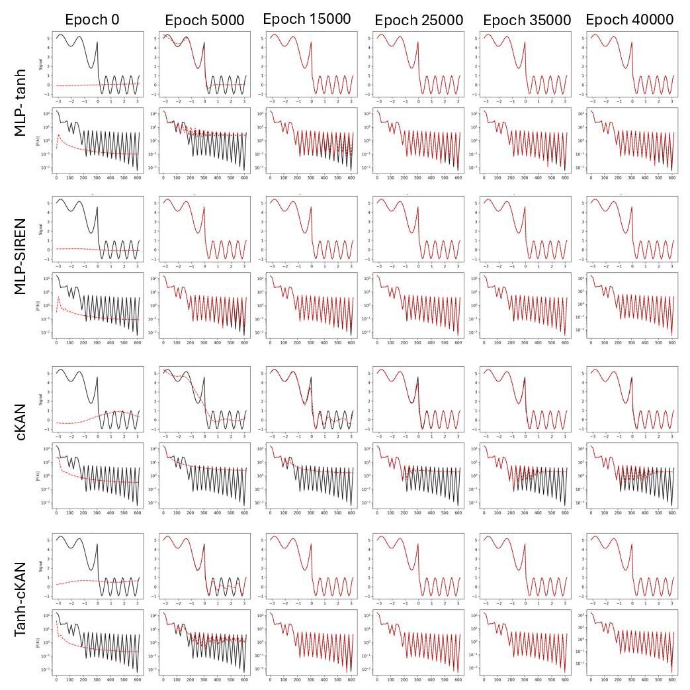

Figure 1: Case 1: Training-time spectral evolution for the discontinuous benchmark. Comparison of MLP-Tanh, MLP-SIREN, cKAN, and Tanh-cKAN on the piecewise-discontinuous target function. Columns correspond to different training epochs, illustrating the evolution of the predicted signal in physical space (top row of each block) and the corresponding Fourier amplitude spectrum (bottom row of each block). The ground-truth solution is shown in black, while network predictions are shown in red. The discontinuity induces broad-band high-frequency content in the frequency domain, highlighting differences in how each architecture and optimization strategy capture sharp transitions and recover high-frequency modes over training.

图1:案例1:不连续基准的训练时频谱演变。MLP-Tanh、MLP-SIREN、cKAN和Tanh-cKAN在分段不连续目标函数上的比较。列对应不同的训练 epoch，展示了物理空间中预测信号的演变(每个块的上排)和相应的傅里叶幅度谱(每个块的下排)。真实解用黑色显示，而网络预测用红色显示。不连续性在频域中诱导出宽带高频内容，突出了每种架构和优化策略在训练过程中捕获尖锐过渡和恢复高频模式方式的差异。

The quantitative results for both benchmarks are summarized in Table 1, while the training-time evolution in physical and frequency domains is illustrated in Figures 1 and 2. For Case 1, which involves a discontinuous target function, MLP-based architectures with Tanh and SIREN activations achieve low relative ${L}^{2}$ errors; however, notable differences emerge in the frequency-domain metrics. In particular, the MLP-Tanh model exhibits large gradient-and Laplacian-weighted spectral errors. This indicates difficulty in accurately recovering high-frequency components induced by the discontinuity. By contrast, MLP-SIREN and Tanh-cKAN substantially reduce higher-order spectral errors, consistent with the improved recovery of high-frequency modes observed in the Fourier spectra in Fig. 1. The cKAN model shows significantly larger errors across all spectral metrics. This suggests that polynomial bases alone, as configured here, are insufficient to capture sharp spectral transitions in the absence of additional nonlinear expressivity. For Case 2, which corresponds to a smooth but multi-frequency signal, the differences between architectures become more pronounced. The MLP-SIREN model achieves the lowest errors across both physical and spectral metrics. While the MLP-Tanh model captures the dominant low-frequency component, it suffers from substantial errors in higher-order spectral norms. This reflects incomplete learning of higher-frequency modes. The Tanh-cKAN architecture improves upon standard cKAN by reducing the physical-space error; however, its frequency-domain errors remain larger than those of MLP-SIREN, indicating residual spectral imbalance. These trends are clearly reflected in the frequency-domain plots in Fig. 2, where SIREN-based models exhibit faster and more uniform recovery of all frequency components during training. The combined evidence from Table 1 and Figs. 1-2 highlights that architectural choices play an important role in mitigating spectral bias in data-driven settings.

两个基准的定量结果总结在表1中，而物理域和频域的训练时演变在图1和图2中展示。对于案例1，涉及不连续目标函数，具有Tanh和SIREN激活的基于MLP的架构实现了低相对${L}^{2}$误差；然而，在频域指标中出现了显著差异。特别是，MLP-Tanh模型表现出较大的梯度和拉普拉斯加权频谱误差。这表明在准确恢复由不连续性诱导的高频分量方面存在困难。相比之下，MLP-SIREN和Tanh-cKAN大幅降低了高阶频谱误差，这与图1中傅里叶谱中观察到的高频模式恢复改善一致。cKAN模型在所有频谱指标上都显示出明显更大的误差。这表明仅像这里配置的多项式基不足以在没有额外非线性表现力的情况下捕获尖锐的频谱过渡。对于案例2，对应于平滑但多频率的信号，架构之间的差异变得更加明显。MLP-SIREN模型在物理和频谱指标上都实现了最低误差。虽然MLP-Tanh模型捕获了主导的低频分量，但它在高阶频谱范数中存在大量误差。这反映了对高频模式的学习不完整。Tanh-cKAN架构通过降低物理空间误差改进了标准cKAN；然而，其频域误差仍然大于MLP-SIREN的误差，表明存在残余频谱不平衡。这些趋势在图2的频域图中清晰地反映出来，基于SIREN的模型在训练过程中表现出所有频率分量更快、更均匀的恢复。表1和图1 - 2的综合证据突出表明，架构选择在减轻数据驱动设置中的频谱偏差方面起着重要作用。

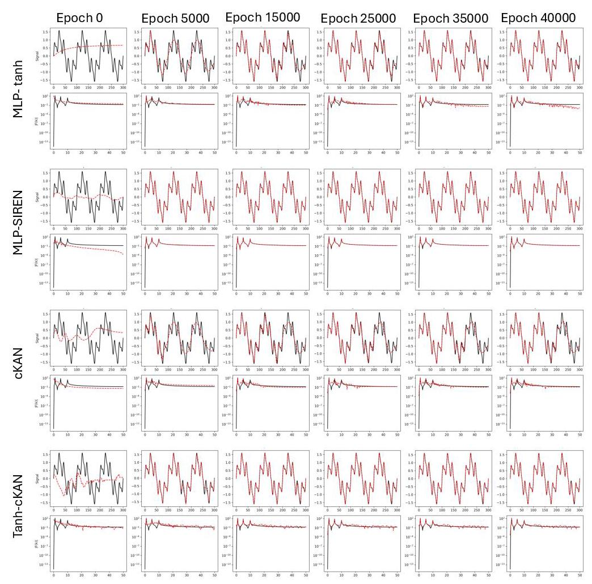

Figure 2: Case 2: Training-time spectral evolution for the smooth multi-frequency benchmark. Comparison of MLP-Tanh, MLP-SIREN, cKAN, and Tanh-cKAN on the multi-scale multi-frequency target function. Columns correspond to different training epochs to illustrate the evolution of the predicted signal in physical space (top row of each block) and the corresponding Fourier amplitude spectrum (bottom row of each block). The ground-truth solution is shown in black, while network predictions are shown in red. Although the target function is smooth, the presence of multiple well-separated frequency components makes this benchmark sensitive to spectral bias to reveal differences in how each architecture captures and balances low- and high-frequency modes during training.

图2:案例2:平滑多频基准的训练时频谱演变。在多尺度多频目标函数上对MLP-Tanh、MLP-SIREN、cKAN和Tanh-cKAN进行比较。各列对应不同的训练轮次，以说明物理空间中预测信号的演变(每个块的上排)以及相应的傅里叶振幅谱(每个块的下排)。真实解用黑色表示，而网络预测用红色表示。尽管目标函数是平滑的，但多个分离良好的频率分量的存在使得这个基准对频谱偏差敏感，以揭示每种架构在训练期间如何捕捉和平衡低频和高频模式的差异。

### 4.2. Effect of optimization on spectral bias in PINNs and PIKANs

### 4.2. 优化对PINNs和PIKANs中频谱偏差的影响

Recent studies have shown promising results in solving forward problems with PINNs optimized with second-order optimizers [32, 35, 36]. During the optimization of the neural network, it is important to determine the optimal direction and step size for each parameter update. Commonly used gradient descent method only uses the first-order derivative information for the update direction (negative gradient direction). However, this may not be sufficient for multi-objective optimizations such as those occurring in physics-informed network training. In these cases, the network gets stuck in a local minima and an early flattened training loss history is observed. A common practice in training PINNs is to start with Adam optimizer and switch to low-memory BFGS (L-BFGS) optimizer in later iterations for faster convergence. Both of these optimizers are from a family of line search optimization methods [37], where the parameters are iteratively updated as follows:

最近的研究表明，使用二阶优化器优化的PINNs在解决正向问题方面取得了有前景的结果[32, 35, 36]。在神经网络的优化过程中，确定每个参数更新的最佳方向和步长很重要。常用的梯度下降方法仅使用一阶导数信息来确定更新方向(负梯度方向)。然而，这对于诸如物理信息网络训练中出现的多目标优化可能是不够的。在这些情况下，网络会陷入局部最小值，并观察到早期平坦的训练损失历史。训练PINNs的一种常见做法是从Adam优化器开始，在后期迭代中切换到低内存BFGS(L-BFGS)优化器以实现更快的收敛。这两种优化器都来自线搜索优化方法家族[37]，其中参数按以下方式迭代更新:

$$
{\theta }_{k + 1} = {\theta }_{k} + {\alpha }_{k}{p}_{k}, \tag{39}
$$

where $\theta$ is the network parameters, $\alpha$ is the step size and ${p}_{k}$ is the direction at step $k$ . In gradient descent method, ${p}_{k} =  - \nabla L\left( \theta \right)$ . Another example is Newton's method with quadratic rate of convergence near the solution. In Newton's method, both first order and second order derivatives are used in determining the optimal update direction, ${p}_{k} =  - {\mathcal{H}}_{k}^{-1}\nabla L\left( {\theta }_{k}\right)$ , where $\mathcal{H}$ is the Hessian matrix. Calculation of inverse Hessian can become computationally intractable for high-dimensional problems in deep learning and PINNs. As a result, quasi-Newton methods have emerged as alternatives to approximate the inverse Hessian. Example of such optimizers are BFGS and self-scaled Broyden (SS-Broyden) [32, 35, 38, 39].

其中$\theta$是网络参数，$\alpha$是步长，${p}_{k}$是步骤$k$处的方向。在梯度下降方法中，${p}_{k} =  - \nabla L\left( \theta \right)$。另一个例子是在解附近具有二次收敛速率的牛顿法。在牛顿法中，一阶和二阶导数都用于确定最优更新方向，${p}_{k} =  - {\mathcal{H}}_{k}^{-1}\nabla L\left( {\theta }_{k}\right)$，其中$\mathcal{H}$是海森矩阵。对于深度学习和PINNs中的高维问题，计算逆海森矩阵在计算上可能变得难以处理。因此，拟牛顿法已成为近似逆海森矩阵的替代方法。此类优化器的例子有BFGS和自缩放布罗伊登(SS-Broyden)[32, 35, 38, 39]。

Consider the one-dimensional Korteweg-de Vries (KdV) equation that models the propagation of waves in nonlinear dispersive media:

考虑一维科特韦格 - 德弗里斯(KdV)方程，它模拟非线性色散介质中波的传播:

$$
{u}_{t} + {\eta u}{u}_{x} + \frac{\mu }{2}{u}_{xxx} = 0,\;t \in  \left( {0,1}\right) , x \in  \left( {-1,1}\right) , \tag{40}
$$

subject to the initial condition

满足初始条件

$$
u\left( {x,0}\right)  = \cos \left( {\pi x}\right) , \tag{41}
$$

and periodic boundary conditions

和周期边界条件

$$
u\left( {t, - 1}\right)  = u\left( {t,1}\right) . \tag{42}
$$

Here, $u$ denotes the wave amplitude (or free-surface elevation), $\eta$ characterizes the strength of the nonlinear interaction, and $\mu$ determines the level of dispersion. In this study, we used the classical values of $\eta  = 1$ , and $\mu  = {0.022}$ [40]. Our results demonstrate that the choice of optimizer plays a dominant role in the performance of PINNs, particularly in mitigating spectral bias and enabling the learning of high-frequency solution components. We compare four optimization strategies of Adam, L-BFGS, SOAP, and SS-Broyden for training the PINN in solving the forward KdV equation.

这里，$u$表示波幅(或自由表面高程)，$\eta$表征非线性相互作用的强度，$\mu$决定色散水平。在本研究中，我们使用了$\eta  = 1$和$\mu  = {0.022}$的经典值[40]。我们的结果表明，优化器的选择在PINNs的性能中起主导作用，特别是在减轻频谱偏差和使高频解分量的学习成为可能方面。我们比较了Adam、L-BFGS、SOAP和SS-Broyden这四种优化策略在训练PINN以求解正向KdV方程时的情况。

The first-order Adam optimizer consistently exhibits early stagnation during training, characterized by flattened loss histories and entrapment in local minima. While Adam is effective at rapidly reducing the loss during the initial training stages, it struggles to further minimize the residual once higher-frequency components become dominant. This behavior results in limited accuracy and poor convergence, especially for problems with stiff or highly oscillatory dynamics. Adam weak performance can be enhanced by switching to L-BFGS after adequate warm-up iterations with Adam. In contrast, the quasi-second-order SOAP optimizer substantially improves convergence behavior and final accuracy without requiring any warm-up steps. SOAP effectively handles the coupled loss components from the very beginning of training, leading to stable convergence and approximately three and two orders of magnitude improvement in error compared to Adam- and L-BFGS-based training, respectively. A second-order optimizer such as SS-Broyden can significantly improves the convergence and accuracy. This demonstrates that curvature-aware optimization can significantly alleviate spectral bias without relying on carefully staged optimization schedules. Note that all the SS-Broyden results in this work are based on Wolfe line search [35].

一阶Adam优化器在训练期间始终表现出早期停滞，其特征是损失历史平坦并陷入局部最小值。虽然Adam在初始训练阶段能有效快速降低损失，但一旦高频分量占主导，它就难以进一步最小化残差。这种行为导致精度有限和收敛性差，特别是对于具有刚性或高度振荡动力学的问题。通过在使用Adam进行足够的热身迭代后切换到L-BFGS，可以增强Adam的弱性能。相比之下，准二阶SOAP优化器在不需要任何热身步骤的情况下显著改善了收敛行为和最终精度。SOAP从训练一开始就能有效处理耦合的损失分量，导致稳定收敛，与基于Adam和L-BFGS的训练相比，误差分别提高了大约三个和两个数量级。像SS-Broyden这样的二阶优化器可以显著提高收敛性和精度。这表明曲率感知优化可以在不依赖精心安排的优化计划的情况下显著减轻频谱偏差。请注意，本工作中所有的SS-Broyden结果都是基于沃尔夫线搜索[35]。

Among all tested optimizers, SS-Broyden consistently achieves the best performance. By more accurately approximating curvature dynamics, SS-Broyden attains approximately three and five of magnitude lower error compared to SOAP and Adam, respectively, while requiring similar or lower computational time. Although each SS-Broyden iteration incurs a higher computational cost due to the estimation of second-order information, the dramatic reduction loss at each iteration leads to superior overall efficiency and accuracy. These results highlight the critical importance of second-order optimization strategies for training PINNs in problems with high-frequencies. Figure 3 shows the training history of the PINN with different optimizers, demonstrating how the second-order and quasi-second order optimizer losses start decaying right after the beginning of the training while Adam is stuck.

在所有测试的优化器中，SS - Broyden始终表现出最佳性能。通过更精确地逼近曲率动态，与SOAP和Adam相比，SS - Broyden的误差分别降低了约三个数量级和五个数量级，同时所需的计算时间相似或更低。尽管由于二阶信息的估计，每次SS - Broyden迭代都会产生更高的计算成本，但每次迭代中损失的显著减少导致了更高的整体效率和准确性。这些结果突出了二阶优化策略在高频问题中训练PINN的关键重要性。图3展示了使用不同优化器的PINN的训练过程，说明了二阶和拟二阶优化器的损失如何在训练开始后立即开始下降，而Adam则陷入停滞。

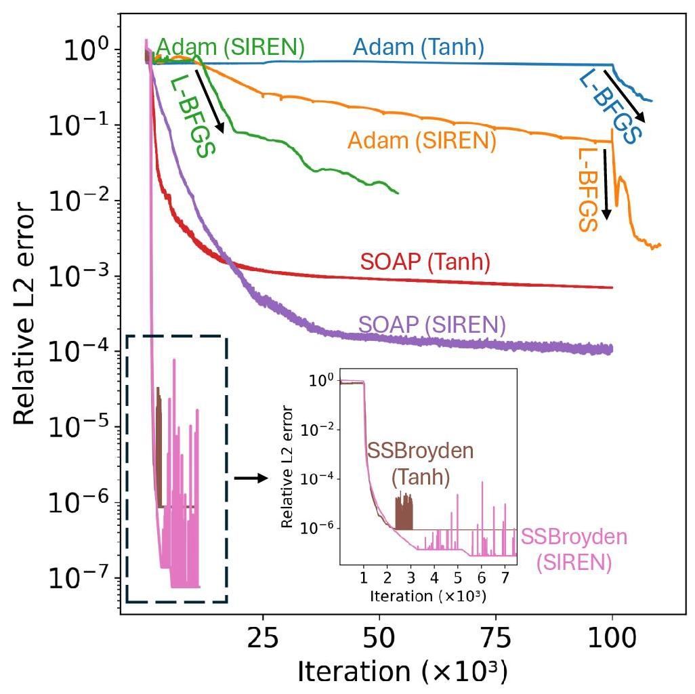

Figure 3: KdV equation: PINN training history with different optimizers (Adam, L-BFGS, SOAP, and SS-Broyden) and activation functions (Tanh, and SIREN) for KdV equation. The sub-figure shows the zoomed-in training history for the SS-Broyden optimizer.

图3:KdV方程:使用不同优化器(Adam、L-BFGS、SOAP和SS-Broyden)以及激活函数(Tanh和SIREN)对KdV方程进行PINN训练的历史记录。子图展示了SS-Broyden优化器的放大训练历史记录。

When looking into the first four statistical moments of the PINN predictions, it is obvious that while Adam can approximately recover the first two moments, it completely fails to recover the third and fourth moments. On the other hand, SOAP and SS-Broyden recover all the four moments accurately with SS-Broyden being more accurate (Fig. 4). The Barron norm which measures the amount of oscillations in the solutions also confirm the same findings (Fig. 4d). The SOAP and SS-Broyden results follow the same norm as the ground truth solutions while Adam results demonstrate smaller

在研究PINN预测的前四个统计矩时，很明显，虽然Adam可以大致恢复前两个矩，但它完全无法恢复第三个和第四个矩。另一方面，SOAP和SS - Broyden准确地恢复了所有四个矩，其中SS - Broyden更准确(图4)。测量解中振荡量的Barron范数也证实了相同的结果(图4d)。SOAP和SS - Broyden的结果与真实解遵循相同的范数，而Adam的结果显示出较小的

Barron norm as the wave propagates in time. Note that L-BFGS improves the results of Adam but still shows smaller Barron norm, suggesting that the conventional optimizers systematically fail to capture high-frequencies in PINNs.

随着波随时间传播的巴伦范数。请注意，L-BFGS改进了Adam的结果，但仍显示出较小的巴伦范数，这表明传统优化器在PINNs中系统性地无法捕捉高频。

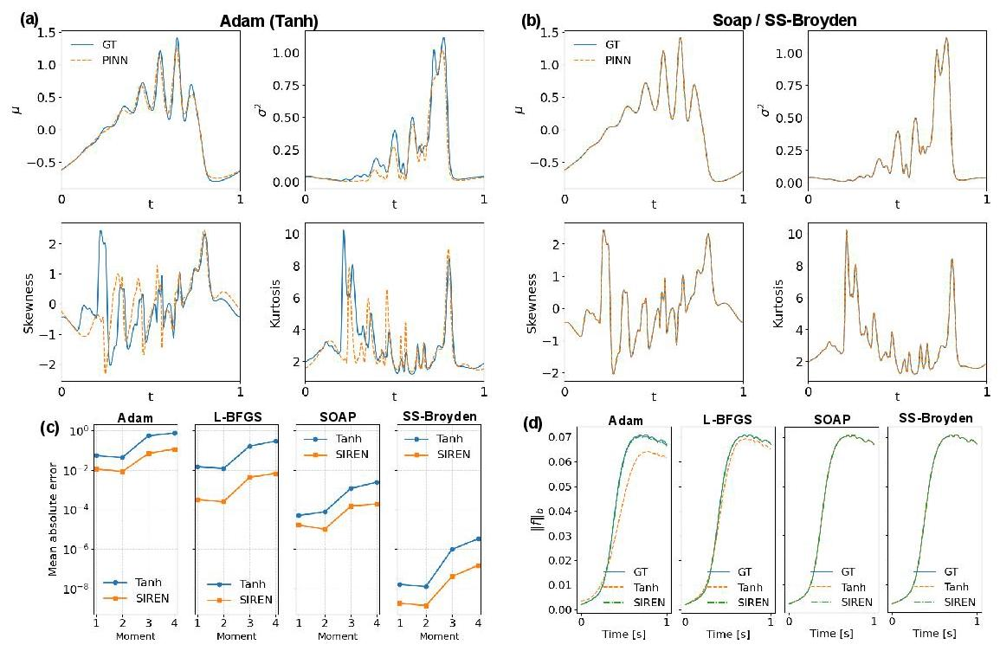

Figure 4: KdV equation: Analysis of the predictions. (a, b) First four moments (mean, variance, skewness, and kurtosis) of the PINN predictions with (a) Adam optimizer and Tanh activation, and (b) Soap or SS-Broyden optimizer with Tanh activations. (c) Time-averaged absolute error at each moment for PINN predictions with different optimizers and activations. (d) Barron norm at each time-step of PINN predictions with different optimizers.

图4:KdV方程:预测分析。(a, b) 使用(a) Adam优化器和Tanh激活函数以及(b) Soap或SS-Broyden优化器与Tanh激活函数时PINN预测的前四个矩(均值、方差、偏度和峰度)。(c) 不同优化器和激活函数的PINN预测在每个时刻的时间平均绝对误差。(d) 不同优化器的PINN预测在每个时间步的巴伦范数。

### 4.3. Effect of activation functions and representation models on spectral bias

### 4.3. 激活函数和表示模型对频谱偏差的影响

We investigate how the activation functions in PINNs and univariate functions in PIKANs performs differently in solving PDEs with high-frequencies. It is important to investigate the effect of the neural architecture in conjunction with the optimizer. In PINN, we investigate how changing the activation function from Tanh to oscillatory and periodic Sine function can help with the capture of high-frequencies in the solution. Particularly, we used $\sin \left( {{\omega }_{i} \cdot  W\mathbf{X} + b}\right)$ as the activation function, where $W$ and $b$ are weight and bias in the network, and ${\omega }_{i}$ is the scaling factor for the ${i}^{th}$ layer of the network. Similar to the original SIREN neural network [28], we found out that using ${\omega }_{0} = {30}$ and ${\omega }_{i} = 1$ for the rest of the layers, provide the best performance while keeping the training stable. Fig. 5 demonstrates the KdV equation predictions of PINNs with different activation functions trained with different optimizers. It can be seen that both activation function and the optimizer are effective in spectral bias mitigation, with optimizer playing a more dominant role. Each optimizer and each activation function demonstrates a different dynamics during the training. For example, when using Adam optimizer, SIREN layers can help getting out of the local minima, breaking the flattened loss history curve (Fig. 3). However, for quasi-second-order and second-order optimizers, SIREN provides more representational power with negligible additional computational cost that can be useful for capturing the high-frequencies. Also, note that the impact of activation function reduces with the use of second-order optimizers. Therefore, the impact is rather small for SS-Broyden compared to SOAP and Adam (Fig. 3).

我们研究了物理信息神经网络(PINNs)中的激活函数和物理信息核自适应网络(PIKANs)中的单变量函数在求解高频偏微分方程(PDEs)时的不同表现。结合优化器研究神经网络架构的影响很重要。在PINN中，我们研究了将激活函数从双曲正切(Tanh)改为振荡和周期性的正弦函数如何有助于捕捉解中的高频成分。具体来说，我们使用$\sin \left( {{\omega }_{i} \cdot  W\mathbf{X} + b}\right)$作为激活函数，其中$W$和$b$是网络中的权重和偏差，${\omega }_{i}$是网络${i}^{th}$层的缩放因子。与原始的SIREN神经网络[28]类似，我们发现对其余层使用${\omega }_{0} = {30}$和${\omega }_{i} = 1$，在保持训练稳定的同时能提供最佳性能。图5展示了使用不同优化器训练的具有不同激活函数的PINN对KdV方程的预测。可以看出，激活函数和优化器在减轻频谱偏差方面都很有效，其中优化器起更主导的作用。每个优化器和每个激活函数在训练过程中都表现出不同的动态。例如，当使用Adam优化器时，SIREN层有助于摆脱局部最小值，打破平坦的损失历史曲线(图3)。然而，对于拟二阶和二阶优化器，SIREN在增加可忽略不计的额外计算成本的情况下提供了更强的表示能力，这对于捕捉高频成分很有用。此外，请注意，随着二阶优化器的使用，激活函数的影响会减小。因此，与SOAP和Adam相比，SS - Broyden的影响相当小(图3)。

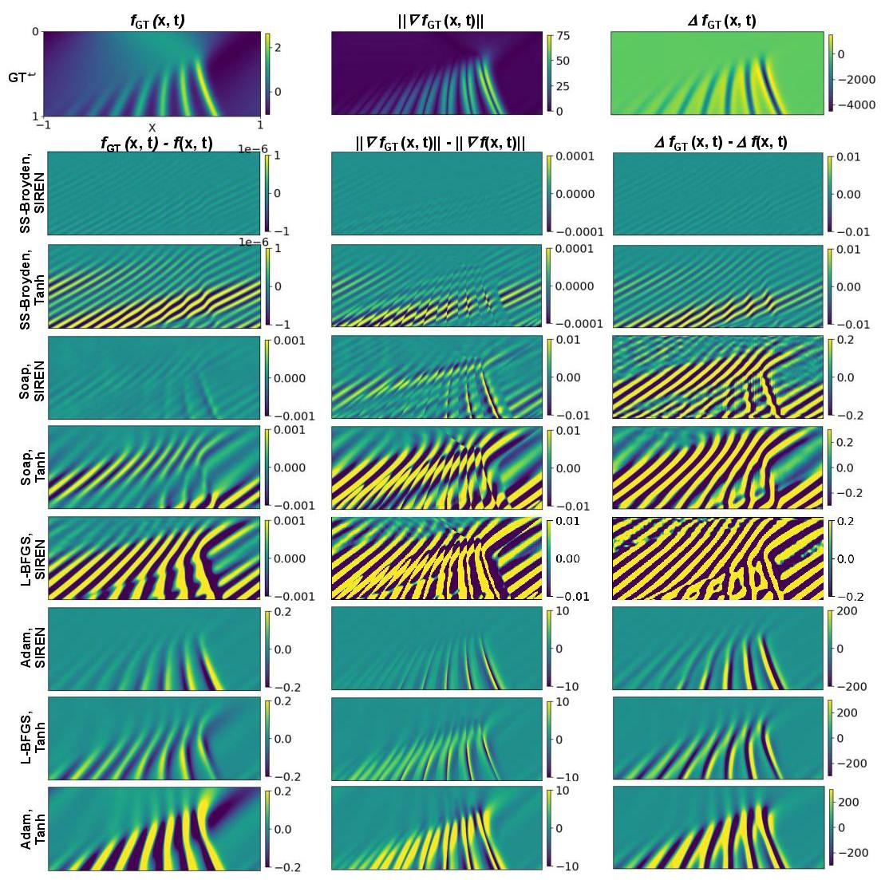

Figure 5: KdV equation: Effect of optimizer and activation function. First row: Ground truth (GT) solution, gradient of the GT solution, and Laplacian of the GT solution. The other rows in first, second and third columns show the errors in PINN solution, errors in gradient magnitude of the solution, and errors in Laplacian of the solution, respectively. The rows are organized from the most to the least accurate results (top to bottom). The axis ranges $\left( {x \in  \left\lbrack  {-1,1}\right\rbrack  , t \in  \left\lbrack  {0,1}\right\rbrack  }\right)$ shown in top left subplot is applicable to all.

图5:KdV方程:优化器和激活函数的影响。第一行:真实解(GT)、GT解的梯度以及GT解的拉普拉斯算子。第一、二、三列中的其他行分别展示了PINN解中的误差、解的梯度大小误差以及解的拉普拉斯算子误差。各行按照从最准确到最不准确的结果(从上到下)排列。左上角子图中显示的轴范围$\left( {x \in  \left\lbrack  {-1,1}\right\rbrack  , t \in  \left\lbrack  {0,1}\right\rbrack  }\right)$适用于所有情况。

For a more comprehensive analysis, we examined the learning dynamics and related them to spectral bias by tracking the prediction of the statistical moments during training. The results in Figure 6 demonstrate that the slope of learning of the first two moments using Tanh with Adam is very small and only begins after approximately 10,000 iterations, and there is almost no learning for the third and fourth moments. When using SIREN with Adam, the slope of learning increases from a negligible value to a small but noticeable one. Using the SOAP optimizer, learning begins from the first iteration. Interestingly, SOAP with Tanh initially has faster error drop, however, SOAP with SIREN surpasses it in the middle of training showing larger learning slope in later iterations. This is potentially due to the higher high-frequency representational power of SIREN compared to Tanh accompanied with harder optimization with SIREN in the early stages which explains the faster drop with Tanh. Notably, the intersection point between the Tanh and SIREN with SOAP curves shifts to earlier iterations from the first to fourth moments. For example, the curves intersect around iteration 30,000 for the first moment and around 11,000 for the fourth moment. This results indicate that SIREN is more effective in capturing high-frequency features and is directly effective for spectral bias mitigation. When using SS-Broyden, the effect of the activation function on learning dynamics is reduced, although SIREN still provides greater representational capacity for high frequencies. As a result, the first four moments are learned at similar rates with Tanh or SIREN networks trained with SS-Broyden. However, at the final steps of the training, the Tanh network plateaus, while the SIREN one keeps decreasing for roughly another order of magnitude. Therefore, while activation function can significantly impact the high-frequency learning dynamics when optimized with Adam and SOAP, its impact is reduced when optimized with SS-Broyden. In this case, both networks follow similar learning trajectory, with SIREN providing additional improvement in the final training stage. Interestingly, a similar pattern of a slightly faster initial error decrease (early in the training) with Tanh is also observed with SS-Broyden, as seen with SOAP. However, this difference is much smaller with SS-Broyden, indicating weaker sensitivity to the choice of activation function.

为了进行更全面的分析，我们通过跟踪训练期间统计矩的预测来研究学习动态，并将它们与频谱偏差相关联。图6中的结果表明，使用Tanh和Adam时，前两个矩的学习斜率非常小，并且仅在大约10,000次迭代后才开始，而对于第三和第四矩几乎没有学习。当使用SIREN和Adam时，学习斜率从可忽略不计的值增加到一个小但明显的值。使用SOAP优化器时，学习从第一次迭代开始。有趣的是，带有Tanh的SOAP最初具有更快的误差下降，然而，带有SIREN的SOAP在训练中期超过了它，在后期迭代中显示出更大的学习斜率。这可能是由于与Tanh相比，SIREN具有更高的高频表示能力，并且在早期阶段与SIREN一起进行了更难的优化，这解释了Tanh更快的下降。值得注意的是，带有SOAP曲线的Tanh和SIREN之间的交点从第一矩到第四矩转移到了更早的迭代。例如，对于第一矩，曲线在大约30,000次迭代处相交，对于第四矩，在大约11,000次迭代处相交。这些结果表明，SIREN在捕获高频特征方面更有效，并且对减轻频谱偏差直接有效。当使用SS - Broyden时，激活函数对学习动态的影响减小，尽管SIREN仍然为高频提供了更大的表示能力。结果，使用SS - Broyden训练的Tanh或SIREN网络以相似的速率学习前四个矩。然而，在训练的最后步骤中，Tanh网络趋于平稳，而SIREN网络继续下降大约另一个数量级。因此，当使用Adam和SOAP进行优化时，激活函数可以显著影响高频学习动态，而当使用SS - Broyden进行优化时，其影响会减小。在这种情况下，两个网络遵循相似的学习轨迹，SIREN在最终训练阶段提供了额外的改进。有趣的是，与SOAP一样，使用SS - Broyden时也观察到了类似的模式，即Tanh在训练早期(初期)误差下降略快。然而，使用SS - Broyden时这种差异要小得多，表明对激活函数选择的敏感性较弱。

 Representation gain 0 ${10}^{-4}$ -2 ${10}^{-6}$ -4 First moment error ${10}^{-4}$ ${10}^{-6}$ Adam (Tanh) Adam (SIREN) SOAP Tanh) ${10}^{-8}$ SOAP (SIREN) ${10}^{-8}$ SS-Brøyden (SIREN) $\log \left( {e}_{F, p = 0}\right)$ -6 -8 (c) ${10}^{3}$ ${10}^{4}$ ${10}^{5}$ (d) ${10}^{3}$ ${10}^{4}$ ${10}^{5}$ 100 ${10}^{0}$ ${10}^{-1}$ ${10}^{-1}$ Third moment error ${10}^{-2}$ Fourth moment error ${10}^{-2}$ -10 ${10}^{-3}$ -12 ${10}^{-4}$ ${10}^{-5}$ -14 ${10}^{-3}$ ${10}^{-4}$ ${10}^{-5}$ ${10}^{-6}$ ${10}^{-6}$ ${10}^{-7}$ ${10}^{3}$ ${10}^{4}$ ${10}^{5}$ ${10}^{-7}$ Iteration Iteration Iteration -->

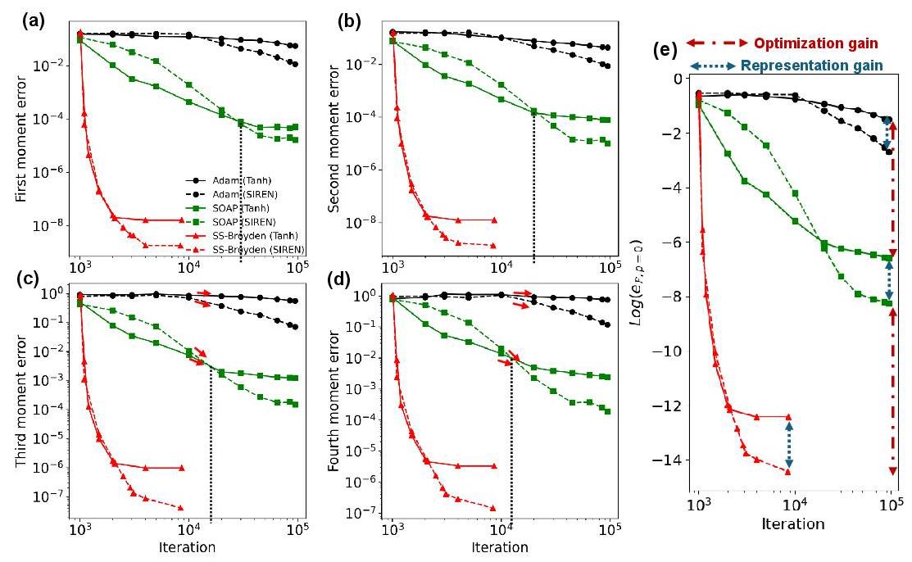

Figure 6: KdV equation: Spectral bias dynamics during the training. (a-d) Errors of first four statistical moments during the training with different optimizers and activation functions. (e) Error in the frequency domain during the training. The small red arrows show the approximate slope of learning the high-frequencies (shown in third and fourth moments). The dotted black lines in the four moments shows the iteration at which the Tanh and SIREN networks trained with SOAP intersect. Note how the intersection happens earlier at higher moments. The legends in (a) are applicable to all.

图6:KdV方程:训练期间的频谱偏差动态。(a - d)使用不同优化器和激活函数训练期间前四个统计矩的误差。(e)训练期间频域中的误差。小红箭头显示了学习高频(在第三和第四矩中显示)的近似斜率。四个矩中的黑色虚线显示了使用SOAP训练的Tanh和SIREN网络相交的迭代。注意在更高矩处交点如何更早出现。(a)中的图例适用于所有情况。

The problem with Tanh PINN trained with Adam can be mitigated by adopting adaptive Tanh activations. While adaptive Tanh helps prevent premature convergence to poor local minima early in the training, the proper initialization of the adaptive parameters remains crucial. Additionally, we observed that employing slope recovery with layer-wise adaptive activations can substantially accelerate convergence. Introduced in a previous work by Jagtap et al. [41], slope recovery is an additional loss term and can be defined by Eq. 43 for layerwise adaptive activations:

使用Adam训练的Tanh PINN的问题可以通过采用自适应Tanh激活来缓解。虽然自适应Tanh有助于防止在训练早期过早收敛到较差的局部最小值，但自适应参数的正确初始化仍然至关重要。此外，我们观察到采用逐层自适应激活的斜率恢复可以显著加速收敛。斜率恢复是Jagtap等人[41]在先前工作中引入的一个额外损失项，可以由式43为逐层自适应激活定义:

$$
\mathcal{L}\left( \alpha \right)  = \frac{L - 1}{\mathop{\sum }\limits_{{i = 1}}^{L}\exp \left( {\alpha }^{i}\right) }, \tag{43}
$$

where $L$ is the number of layers and $\alpha$ is the adaptive parameter of the activation function. Initializing the adaptive parameters to unity, effectively mirroring a standard Tanh activation, while employing a negligible weight for the slope recovery loss term $\left( {w}_{\mathrm{{sr}}}\right)$ often leads to early entrapment in the same local minima as fixed Tanh architectures. However, strategically increasing ${w}_{\mathrm{{sr}}}$ significantly accelerates convergence by encouraging the activation functions to adapt their slopes earlier in the training (Fig. B.1). It is critical to note that an excessively high weight (typically ${w}_{\mathrm{{sr}}} \gtrsim  1$ ) causes this term to dominate the objective function, resulting in numerical instability during training. While adaptive Tanh activations facilitate gradient flow and assist the Adam optimizer in bypassing local minima, the quasi-second order or second order optimizers demonstrate inherent robustness to these challenges. Consequently, we observed no significant performance gains when integrating adaptive Tanh or Sine activations into PINNs trained via the SOAP optimizer or SS-Broyden.

其中$L$为层数，$\alpha$为激活函数的自适应参数。将自适应参数初始化为1，实际上是镜像标准的双曲正切激活，同时对斜率恢复损失项$\left( {w}_{\mathrm{{sr}}}\right)$采用可忽略不计的权重，这通常会导致与固定双曲正切架构一样过早陷入相同的局部最小值。然而，策略性地增加${w}_{\mathrm{{sr}}}$通过鼓励激活函数在训练中更早地调整其斜率，显著加速了收敛(图B.1)。需要注意的是，过高的权重(通常为${w}_{\mathrm{{sr}}} \gtrsim  1$)会导致该项在目标函数中占主导地位，从而在训练期间导致数值不稳定。虽然自适应双曲正切激活有助于梯度流动，并协助Adam优化器绕过局部最小值，但准二阶或二阶优化器对这些挑战表现出固有的鲁棒性。因此，当将自适应双曲正切或正弦激活集成到通过SOAP优化器或SS-Broyden训练的PINN中时，我们没有观察到显著的性能提升。

Previous studies have shown that KANs may suffer less from spectral bias and handle high-frequencies better compared to MLPs [42]. Here we explore how KANs constrained by physical laws (PIKANs) compare to PINNs in terms of spectral bias. Also, how changing the univariate function in the KAN architecture can improve the results. We studied three different variants of KANs by changing the univariate functions, including B-Splines, radial basis functions (RBFs), and Chebyshev polynomials with degrees of three, five, or seven. Except for the B-spline PIKAN where the model stuck in a local minima and did not show proper convergence behavior. The rest of the PIKANs showed comparable results to the PINN with SIREN. Among the PIKANs, Chebyshev PIKAN (C-PIKAN) achieved the best result, while having the highest computational time. Note that in general, PIKANs took two to four times longer to converge compared to PINNs for solving the KdV equation. By increasing the polynomial degree in C-PIKAN, the results are only slightly improved while the computational time increases significantly for the same number of parameters. Therefore, C-PIKAN with degree three or five seems to be the most viable option within the PIKANs. Nevertheless, for the same optimizer, PINN with SIREN provides more accurate results with lower computational cost compared to the best PIKAN for KdV equation. Summary of the quantitative results including relative errors, Barron norm errors, errors in frequency domain, and convergence time are shown in Table 2.

先前的研究表明，与多层感知器(MLP)相比，KAN可能受频谱偏差的影响较小，并且能更好地处理高频[42]。在此，我们探讨受物理定律约束的KAN(PIKAN)在频谱偏差方面与PINN相比如何。此外，改变KAN架构中的单变量函数如何能改善结果。我们通过改变单变量函数研究了KAN的三种不同变体，包括B样条、径向基函数(RBF)以及次数为三、五或七的切比雪夫多项式。除了B样条PIKAN模型陷入局部最小值且未表现出适当的收敛行为外。其余的PIKAN与具有SIREN的PINN表现出可比的结果。在PIKAN中，切比雪夫PIKAN(C-PIKAN)取得了最佳结果，但其计算时间最长。需要注意的是，一般来说，对于求解KdV方程，PIKAN的收敛时间是PINN的两到四倍。通过增加C-PIKAN中的多项式次数，在相同参数数量下结果仅略有改善，而计算时间显著增加。因此，三次或五次的C-PIKAN似乎是PIKAN中最可行的选择。然而，对于相同的优化器，与用于KdV方程的最佳PIKAN相比，具有SIREN的PINN以更低的计算成本提供更准确的结果。表2显示了包括相对误差、巴伦范数误差、频域误差和收敛时间在内的定量结果总结。

Table 2: KdV equation prediction errors. Comparison of the performance of PINNs with different activation functions and PIKANs with different univariate functions trained with different optimizers. All models except those trained with SS-Broyden have $\sim  {40},{000}$ parameters. The models trained with SS-Broyden have $\sim  {12},{900}$ parameters.

表2:KdV方程预测误差。比较使用不同优化器训练的具有不同激活函数的PINN和具有不同单变量函数的PIKAN的性能。除了使用SS-Broyden训练的模型外，所有模型都有$\sim  {40},{000}$个参数。使用SS-Broyden训练的模型有$\sim  {12},{900}$个参数。

<table><tr><td></td><td>Rel. ${L}^{2}$ Error</td><td>Barron Norm Rel. ${L}^{2}$ Error</td><td>$\log \left( {e}_{\mathcal{F}, p = 0}\right)$</td><td>$\log \left( {e}_{\mathcal{F}, p = 2}\right)$</td><td>$\log \left( {e}_{\mathcal{F}, p = 4}\right)$</td><td>Convergence Time [hr.]</td><td>Time to 1% Error</td></tr><tr><td colspan="8">PINNs</td></tr><tr><td>Adam (Tanh)</td><td>${2.47} \times  {10}^{-1}$</td><td>${1.58} \times  {10}^{-1}$</td><td>-1.52</td><td>0.77</td><td>5.34</td><td>0.056</td><td>NA</td></tr><tr><td>Adam+LBFGS (Tanh)</td><td>${8.12} \times  {10}^{-2}$</td><td>${4.14} \times  {10}^{-2}$</td><td>-2.48</td><td>-0.15</td><td>4.35</td><td>0.056+0.21</td><td>NA</td></tr><tr><td>Adam (SIREN)</td><td>${6.35} \times  {10}^{-2}$</td><td>${1.06} \times  {10}^{-2}$</td><td>-2.69</td><td>-0.19</td><td>4.37</td><td>0.60</td><td>NA</td></tr><tr><td>Adam+LBFGS (SIREN)</td><td>${1.76} \times  {10}^{-3}$</td><td>${1.28} \times  {10}^{-3}$</td><td>-5.48</td><td>-2.94</td><td>1.37</td><td>0.60+0.045</td><td>0.29</td></tr><tr><td>SOAP (Tanh)</td><td>${7.05} \times  {10}^{-4}$</td><td>${5.62} \times  {10}^{-4}$</td><td>-6.59</td><td>-3.91</td><td>0.39</td><td>0.40</td><td>0.033</td></tr><tr><td>SOAP (SIREN)</td><td>${1.06} \times  {10}^{-4}$</td><td>${5.92} \times  {10}^{-5}$</td><td>-8.25</td><td>-5.58</td><td>-1.32</td><td>0.43</td><td>0.11</td></tr><tr><td>SS-Broyden (Tanh)</td><td>${8.69} \times  {10}^{-7}$</td><td>${6.47} \times  {10}^{-7}$</td><td>-12.42</td><td>-9.37</td><td>-5.53</td><td>0.70</td><td>0.022</td></tr><tr><td>SS-Broyden (SIREN)</td><td>7.54 $\times  {10}^{-8}$</td><td>${5.51} \times  {10}^{-8}$</td><td>-14.41</td><td>-11.37</td><td>-7.66</td><td>1.57</td><td>0.021</td></tr><tr><td colspan="8">PIKANs</td></tr><tr><td>SOAP (B-Spline)</td><td>${9.20} \times  {10}^{-1}$</td><td>${2.46} \times  {10}^{-1}$</td><td>-0.37</td><td>1.85</td><td>6.38</td><td>NA</td><td>NA</td></tr><tr><td>SOAP (RBF)</td><td>${5.99} \times  {10}^{-4}$</td><td>${4.19} \times  {10}^{-4}$</td><td>-6.74</td><td>-4.17</td><td>0.066</td><td>0.94</td><td>0.14</td></tr><tr><td>SOAP (C7)</td><td>${2.62} \times  {10}^{-4}$</td><td>${2.45} \times  {10}^{-4}$</td><td>-7.46</td><td>-4.78</td><td>-0.44</td><td>1.67</td><td>0.58</td></tr><tr><td>SOAP (C5)</td><td>${2.44} \times  {10}^{-4}$</td><td>${2.46} \times  {10}^{-4}$</td><td>-7.52</td><td>-4.84</td><td>-0.63</td><td>1.71</td><td>0.4</td></tr><tr><td>SOAP (C3)</td><td>${2.80} \times  {10}^{-4}$</td><td>${2.55} \times  {10}^{-4}$</td><td>-7.40</td><td>-4.73</td><td>-0.47</td><td>1.35</td><td>0.21</td></tr><tr><td>SS-Broyden (C7)</td><td>${2.20} \times  {10}^{-7}$</td><td>${2.05} \times  {10}^{-7}$</td><td>-13.59</td><td>-10.48</td><td>-6.67</td><td>1.53</td><td>0.026</td></tr><tr><td>SS-Broyden (C5)</td><td>${1.48} \times  {10}^{-7}$</td><td>${1.38} \times  {10}^{-7}$</td><td>-13.92</td><td>-10.81</td><td>-7.00</td><td>1.07</td><td>0.025</td></tr><tr><td>SS-Broyden (C3)</td><td>${2.280} \times  {10}^{-7}$</td><td>${2.44} \times  {10}^{-7}$</td><td>-13.43</td><td>-10.33</td><td>-6.53</td><td>0.71</td><td>0.024</td></tr></table>

### 4.4. Other experiments: Coupled effect of optimizer and activation function in hyperbolic and elliptic PDEs

### 4.4. 其他实验:双曲型和椭圆型偏微分方程中优化器与激活函数的耦合效应

To further investigate the role of optimizers and activation functions, we examine how spectral bias manifests itself in hyperbolic equations such as wave equation and elliptic equations, such as steady-state diffusion-reaction equation.

为了进一步研究优化器和激活函数的作用，我们研究频谱偏差如何在波动方程等双曲型方程以及稳态扩散 - 反应方程等椭圆型方程中体现。

We designed a systematic study with the hyperbolic wave equation to analyze the effect of different activation functions and optimizers in spectral bias of PINNs by gradually adding more frequencies to the solution and making the problem harder. Unlike the KdV equation, which exhibits either dispersive behavior, the wave equation introduces explicit propagation dynamics. The problem of interest involves a resting system with a time-dependent boundary condition where we systematically inject sinusoidal functions with multiple frequencies. The 1D wave equation is expressed as:

我们针对双曲型波动方程设计了一项系统研究，通过逐渐在解中添加更多频率并使问题更具挑战性，来分析不同激活函数和优化器对PINN频谱偏差的影响。与表现出色散行为的KdV方程不同，波动方程引入了明确的传播动力学。感兴趣的问题涉及一个具有随时间变化边界条件的静止系统，我们在其中系统地注入具有多个频率的正弦函数。一维波动方程表示为:

$$
\left\{  \begin{array}{ll} \frac{{\partial }^{2}u}{\partial {t}^{2}} - {c}^{2}\frac{{\partial }^{2}u}{\partial {x}^{2}} = 0 & x \in  \left( {0,1}\right) , t \in  (0, T\rbrack \\  u\left( {x,0}\right)  = 0,\;\frac{\partial u}{\partial t}\left( {x,0}\right)  = 0 & \\  u\left( {0, t}\right)  = f\left( t\right) ,\;u\left( {1, t}\right)  = 0, &  \end{array}\right. \tag{44}
$$

where $c = 1, T = 1$ , and $f\left( t\right)$ is the time-dependent boundary condition. To systematically control the spectral complexity of the solution, we define $f\left( t\right)$ as a superposition of sinusoidal modes:

其中$c = 1, T = 1$，且$f\left( t\right)$是随时间变化的边界条件。为了系统地控制解的频谱复杂性，我们将$f\left( t\right)$定义为正弦模式的叠加:

$$
f\left( t\right)  = r\left( {t;\tau }\right) \exp \left( {-\chi \frac{{\left( t - \mu \right) }^{2}}{2{\sigma }^{2}}}\right) \mathop{\sum }\limits_{{i = 1}}^{N}{A}_{i}\sin \left( {{2\pi }{f}_{i}t}\right) , \tag{45}
$$

where $r\left( {t;\tau }\right)$ is the smooth ramp function ensuring compatibility with the initial conditions, $\chi$ activates the Gaussian envelope and removes it when $\chi  = 0,{A}_{i}$ are the amplitudes, and ${f}_{i}$ are the frequencies. We consider the following four equations:

其中$r\left( {t;\tau }\right)$是确保与初始条件兼容的平滑斜坡函数，$\chi$激活高斯包络并在$\chi  = 0,{A}_{i}$为振幅且${f}_{i}$为频率时将其移除。我们考虑以下四个方程:

(i) ${A}_{1} = 1,{f}_{1} = 1,\chi  = 0$ .

(ii) ${A}_{1} = 1,{f}_{1} = {10},\chi  = 0$ .

(ii) ${A}_{1} = 1,{f}_{1} = {10},\chi  = 0$。

(iii) ${\left\{  {A}_{i}\right\}  }_{i = 1}^{4} = \{ {0.25},{0.25},{0.25},{0.25}\} ,{\left\{  {f}_{i}\right\}  }_{i = 1}^{4} = \{ 1,5,{10},{20}\} ,\chi  = 0$ .

(iii) ${\left\{  {A}_{i}\right\}  }_{i = 1}^{4} = \{ {0.25},{0.25},{0.25},{0.25}\} ,{\left\{  {f}_{i}\right\}  }_{i = 1}^{4} = \{ 1,5,{10},{20}\} ,\chi  = 0$ 。

(iv) ${\left\{  {A}_{i}\right\}  }_{i = 1}^{5} = \{ {0.25},{0.1},{0.25},{0.5},{0.4}\} ,{\left\{  {f}_{i}\right\}  }_{i = 1}^{5} = \{ 1,5,{10},{20},{40}\} ,\chi  =$ 1.

(iv) ${\left\{  {A}_{i}\right\}  }_{i = 1}^{5} = \{ {0.25},{0.1},{0.25},{0.5},{0.4}\} ,{\left\{  {f}_{i}\right\}  }_{i = 1}^{5} = \{ 1,5,{10},{20},{40}\} ,\chi  =$ 1。

In all cases, $r\left( {t;\tau  = {0.05}}\right)$ is defined as follows:

在所有情况下，$r\left( {t;\tau  = {0.05}}\right)$ 定义如下:

$$
r\left( {t;\tau }\right)  = \left\{  \begin{array}{ll} 0, & t \leq  0, \\  {s}^{3}\left( {{10} - {15s} + 6{s}^{2}}\right) , & 0 < t < \tau ,\;s = \frac{t}{\tau }, \\  1, & t \geq  \tau . \end{array}\right. \tag{46}
$$

Note that from case (i) to (iv) the frequencies injected at the boundary are increased, leading to monotonic increase in problem difficulty. Figure 7 shows how prediction errors increase with spectral complexity. The results demonstrate that the networks struggle more in the high-frequency regime (e.g., case (iv)). For low-frequency excitations (case (i)), first-order optimization with Adam is sufficient to achieve accurate solutions regardless of the activation function. As higher frequencies are introduced, SIREN provides some improvements when used with Adam. However, this benefit diminishes for more complex cases, where Adam ultimately fails to converge. In contrast, both SOAP and SS-Broyden exhibit significantly improved robustness as spectral complexity increases. Notably, SS-Broyden achieves two to four orders of magnitude lower relative ${L}^{2}$ errors compared to SOAP. Additionally, higher-order statistical diagnostics reveal clear differences. SS-Broyden achieves much lower errors in the third and fourth moments as well as in frequency errors, indicating superior recovery of high-frequency components (Fig. 7). The quantitative results for the case with largest frequencies (the most complex problem) is shown in Table 3. The results of other cases are shown in the appendix C.1.

请注意，从情况 (i) 到 (iv)，在边界处注入的频率增加，导致问题难度单调增加。图 7 展示了预测误差如何随频谱复杂度增加。结果表明，网络在高频区域(例如情况 (iv))中挣扎得更厉害。对于低频激励(情况 (i))，无论激活函数如何，使用 Adam 的一阶优化足以获得精确解。随着引入更高频率，当与 Adam 一起使用时，SIREN 提供了一些改进。然而，对于更复杂的情况，这种优势会减弱，此时 Adam 最终无法收敛。相比之下，随着频谱复杂度增加，SOAP 和 SS - Broyden 都表现出显著提高的鲁棒性。值得注意的是，与 SOAP 相比，SS - Broyden 的相对 ${L}^{2}$ 误差低两到四个数量级。此外，高阶统计诊断揭示了明显差异。SS - Broyden 在三阶和四阶矩以及频率误差方面实现了低得多的误差，表明其在高频分量恢复方面表现更优(图 7)。频率最高的情况(最复杂的问题)的定量结果如表 3 所示。其他情况的结果见附录 C.1。

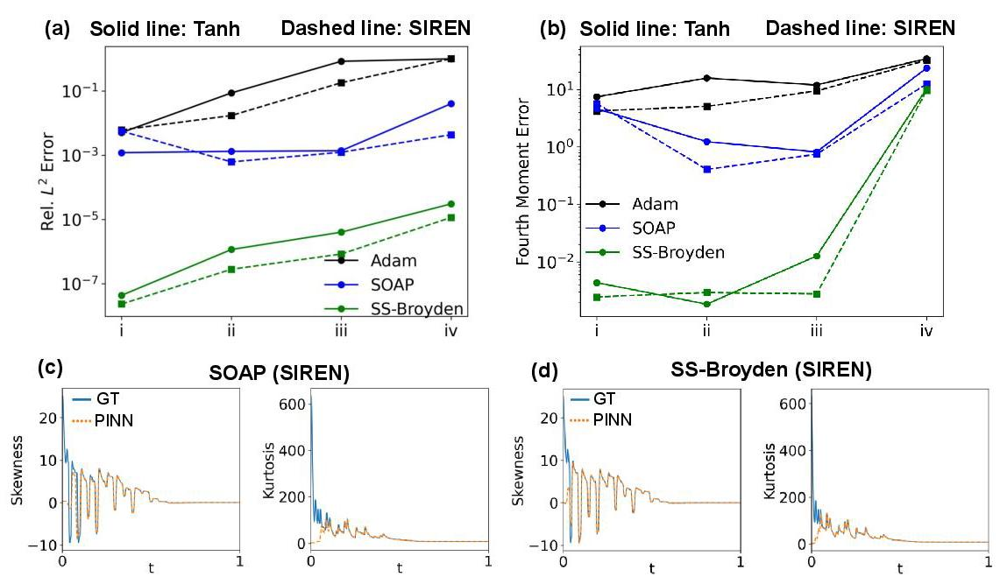

Figure 7: Wave equation results with different optimizers and activation functions (a-b). Relative ${L}^{2}$ error and fourth moment error of each of the wave problems trained with different optimizers and activation functions. (c) Skewness and Kurtosis of PINN prediction with SOAP optimizer and SIREN activation. (d) Skewness and Kurtosis of PINN prediction with SS-Broyden optimizer and SIREN activation.

图 7:使用不同优化器和激活函数的波动方程结果 (a - b)。使用不同优化器和激活函数训练的每个波动问题的相对 ${L}^{2}$ 误差和四阶矩误差。(c) 使用 SOAP 优化器和 SIREN 激活的 PINN 预测的偏度和峰度。(d) 使用 SS - Broyden 优化器和 SIREN 激活的 PINN 预测的偏度和峰度。

Note that the choice of activation function has a strong impact when using the Adam optimizer; however, this dependence diminishes when using SOAP and becomes nearly negligible for SS-Broyden, which exhibits minimal sensitivity to the activation function. Additionally, the appropriate choice of activation function depends on the frequency content of the problem. For example, SIREN is better suited for case (iv) of the wave equation, where high-frequency components are prominent. In contrast, Tanh may be more suitable for problems dominated by lower-frequency content, unless SIREN is adjusted with a smaller frequency scaling parameter (see appendix C.1). This can be interpreted as an inductive bias of the network: for problems with strong high-frequency content, an activation function with inherently oscillatory, high-frequency behavior is advantageous, whereas for smoother, low-frequency problems, a monotonic activation such as Tanh may be more appropriate. Similarly, this choice becomes less significant with SS-Broyden.

请注意，在使用 Adam 优化器时，激活函数的选择有很大影响；然而，在使用 SOAP 时这种依赖性会减弱，而对于 SS - Broyden 几乎可以忽略不计，SS - Broyden 对激活函数的敏感性最小。此外，激活函数的适当选择取决于问题的频率内容。例如，SIREN 更适合波动方程的情况 (iv)，其中高频分量突出。相比之下，Tanh 可能更适合由低频内容主导的问题(除非使用较小的频率缩放参数调整 SIREN，见附录 C.1)。这可以解释为网络的一种归纳偏差:对于具有强高频内容的问题，具有固有振荡、高频行为的激活函数是有利的，而对于更平滑的低频问题，像 Tanh 这样的单调激活函数可能更合适。同样，对于 SS - Broyden，这种选择变得不那么重要。

Table 3: Wave equation case (iv) prediction errors. Comparison of PINN and PIKAN performance for the high-frequency wave problem. Results for simpler cases (i)-(iii) are reported in the appendix. All models except those trained with SS-Broyden have $\sim  {40},{000}$ parameters. The models trained with SS-Broyden have $\sim  {12},{900}$ parameters.

表 3:波动方程情况 (iv) 的预测误差。高频波动问题的 PINN 和 PIKAN 性能比较。更简单情况 (i) - (iii) 的结果报告在附录中。除了使用 SS - Broyden 训练的模型外，所有模型都有 $\sim  {40},{000}$ 参数。使用 SS - Broyden 训练的模型有 $\sim  {12},{900}$ 参数。

<table><tr><td>Method</td><td>Rel. ${L}^{2}$ Error</td><td>Barron Norm Rel. ${L}^{2}$ Error</td><td>$\log \left( {e}_{\mathcal{F}, p = 0}\right)$</td><td>$\log \left( {e}_{\mathcal{F}, p = 2}\right)$</td><td>$\log \left( {e}_{\mathcal{F}, p = 4}\right)$</td></tr><tr><td colspan="6">PINN</td></tr><tr><td>Adam (Tanh)</td><td>1.00</td><td>0.99</td><td>-1.65</td><td>2.23</td><td>6.80</td></tr><tr><td>Adam (SIREN)</td><td>1.00</td><td>0.95</td><td>-1.65</td><td>2.23</td><td>6.80</td></tr><tr><td>SOAP (Tanh)</td><td>${4.03} \times  {10}^{-2}$</td><td>${2.12} \times  {10}^{-2}$</td><td>-4.44</td><td>-0.69</td><td>3.92</td></tr><tr><td>SOAP (SIREN)</td><td>${4.34} \times  {10}^{-3}$</td><td>${2.54} \times  {10}^{-3}$</td><td>-6.37</td><td>-2.27</td><td>2.28</td></tr><tr><td>SS-Broyden (Tanh)</td><td>${3.05} \times  {10}^{-5}$</td><td>${2.37} \times  {10}^{-4}$</td><td>-10.67</td><td>-5.22</td><td>0.56</td></tr><tr><td>SS-Broyden (SIREN)</td><td>${1.16} \times  {10}^{-5}$</td><td>4.37 × 1 ${\text{ 0 }}^{-5}$</td><td>-11.52</td><td>-6.12</td><td>-0.37</td></tr><tr><td colspan="6">PIKAN</td></tr><tr><td>SOAP (C3)</td><td>${3.36} \times  {10}^{-2}$</td><td>${2.07} \times  {10}^{-2}$</td><td>-4.59</td><td>-1.16</td><td>3.93</td></tr><tr><td>SOAP (C5)</td><td>${3.22} \times  {10}^{-2}$</td><td>${2.23} \times  {10}^{-2}$</td><td>-4.63</td><td>-0.75</td><td>4.03</td></tr><tr><td>SOAP (C7)</td><td>${3.12} \times  {10}^{-2}$</td><td>${1.83} \times  {10}^{-2}$</td><td>-4.66</td><td>-0.98</td><td>3.87</td></tr><tr><td>SS-Broyden (C3)</td><td>${3.80} \times  {10}^{-5}$</td><td>${1.84} \times  {10}^{-4}$</td><td>-10.46</td><td>-5.05</td><td>0.73</td></tr><tr><td>SS-Broyden (C5)</td><td>1.18 × 10 ${}^{-5}$</td><td>${3.88} \times  {10}^{-5}$</td><td>-11.50</td><td>-6.18</td><td>-0.41</td></tr><tr><td>SS-Broyden (C7)</td><td>${1.75} \times  {10}^{-5}$</td><td>${7.42} \times  {10}^{-5}$</td><td>-11.16</td><td>-5.71</td><td>0.065</td></tr></table>

For an elliptic PDE, we consider a nonlinear steady reaction-diffusion equation posed on a two-dimensional periodic domain,

对于一个椭圆型偏微分方程(PDE)，我们考虑一个在二维周期域上提出的非线性稳态反应扩散方程，

$$
{\Delta u}\left( {x, y}\right)  - {k}_{r}u{\left( x, y\right) }^{2} = f\left( {x, y}\right) ,\;\left( {x, y}\right)  \in  \Omega  \mathrel{\text{ := }} {\left\lbrack  -1,1\right\rbrack  }^{2}, \tag{47}
$$

where $\Delta$ denotes the Laplacian operator and ${k}_{r} > 0$ is a reaction coefficient controlling the strength of the nonlinear sink term. In all experiments, we fix ${k}_{r} = {0.1}$ . This problem serves as a representative nonlinear elliptic PDE with smooth but oscillatory solutions, commonly encountered in chemical kinetics and reaction-diffusion systems.

其中 $\Delta$表示拉普拉斯算子，${k}_{r} > 0$是控制非线性汇项强度的反应系数。在所有实验中，我们固定${k}_{r} = {0.1}$。这个问题是一个具有光滑但振荡解的典型非线性椭圆型 PDE，常见于化学动力学和反应扩散系统中。

To enable quantitative error assessment, the forcing term $f\left( {x, y}\right)$ is constructed via the method of manufactured solutions. Specifically, we prescribe the exact solution

为了进行定量误差评估，通过制造解的方法构造强迫项$f\left( {x, y}\right)$。具体来说，我们规定精确解

$$
{u}^{ * }\left( {x, y}\right)  = \sin \left( {3\pi x}\right) \cos \left( {3\pi y}\right) , \tag{48}
$$

which exhibits moderate spatial oscillations in both coordinate directions. Substituting ${u}^{ * }$ into the governing equation yields the forcing

其在两个坐标方向上均表现出适度的空间振荡。将${u}^{ * }$代入控制方程可得到外力项

$$
f\left( {x, y}\right)  = \Delta {u}^{ * }\left( {x, y}\right)  - {k}_{r}{\left( {u}^{ * }\left( x, y\right) \right) }^{2} =  - {18}{\pi }^{2}{u}^{ * }\left( {x, y}\right)  - {k}_{r}{\left( {u}^{ * }\left( x, y\right) \right) }^{2}. \tag{49}
$$

We impose periodic boundary conditions in both spatial dimensions,

我们在两个空间维度上都施加了周期性边界条件，

$$
u\left( {-1, y}\right)  = u\left( {1, y}\right) ,\;u\left( {x, - 1}\right)  = u\left( {x,1}\right) , \tag{50}
$$

along with periodicity of all derivatives. Rather than enforcing these constraints explicitly through boundary residuals, periodicity is embedded directly into the neural representation using a trigonometric feature map, ensuring the learned solution is periodic by construction.

以及所有导数的周期性。不是通过边界残差显式地强制执行这些约束，而是使用三角特征映射将周期性直接嵌入到神经表示中，从而确保所学习的解在构造上是周期性的。

Table 4 reports the prediction errors for the reaction-diffusion problem across PINN and PIKAN architectures under different optimizers and activation functions. We matched the number of trainable parameters between the MLP and Chebyshev-based PIKAN with degree 5, resulting in approximately ${14.6} \times  {10}^{3}$ parameters for this problem. For degrees 3 and 7, the parameter counts differ due to the polynomial basis expansion. Among PINN architectures, SS-Broyden with Tanh activation achieves the best overall performance, yielding the lowest relative ${L}^{2}$ error and consistently strong spectral metrics while maintaining short convergence time. In contrast, Adam exhibits significantly larger errors, particularly in higher-order spectral norms, reflecting the limitations of purely first-order gradient updates in resolving oscillatory residual structure. SOAP improves over Adam in the Tanh setting, consistent with its geometry-aware preconditioning that enhances gradient scaling and partially accounts for curvature effects. However, this advantage does not uniformly extend to SIREN activations. This behavior likely arises because SIREN's sinusoidal activation already embeds strong oscillatory structure and provides smoother gradient propagation across frequency modes. In such cases, additional preconditioning may offer limited benefit and can even damp useful high-frequency gradient components. Within the PIKAN family, SS-Broyden achieves the strongest performance overall, with the best results observed for the Tanh-cPIKAN representation at higher polynomial degree. When parameter counts are matched, the Chebyshev-based PIKAN achieves comparable accuracy to the PINN with Tanh activation while requiring shorter time. Increasing the polynomial degree to 5 or 7 does not uniformly improve performance; although higher-degree polynomials increase expressivity, they also introduce greater curvature complexity and amplify higher-order spectral components within the loss landscape. Because the network depth is kept fixed across polynomial degrees, this additional curvature is not automatically balanced, leading to sensitivity in optimization dynamics. These observations suggest that performance is not determined solely by representational capacity, but rather by the interaction between polynomial degree, optimizer behavior, and the spectral structure induced by the Fourier feature embedding at the network input. In this context, the influence of the proposed Tanh-cKAN (and its physics-informed counterpart, Tanh-cPIKAN) is governed by the interplay between these elements.

表4报告了在不同优化器和激活函数下，PINN和PIKAN架构针对反应扩散问题的预测误差。我们使MLP和基于切比雪夫的5阶PIKAN之间的可训练参数数量相匹配，此问题的参数数量约为${14.6} \times  {10}^{3}$。对于3阶和7阶，由于多项式基展开，参数数量有所不同。在PINN架构中，具有Tanh激活函数的SS - Broyden实现了最佳的整体性能，产生了最低的相对${L}^{2}$误差，并且在保持较短收敛时间的同时，光谱指标一直很强。相比之下，Adam表现出明显更大的误差，特别是在高阶光谱范数中，这反映了纯一阶梯度更新在解决振荡残差结构方面的局限性。在Tanh设置中，SOAP比Adam有所改进，这与其几何感知预处理一致，该预处理增强了梯度缩放并部分考虑了曲率效应。然而，这种优势并没有统一扩展到SIREN激活函数。这种行为可能是因为SIREN的正弦激活函数已经嵌入了强大的振荡结构，并在频率模式之间提供了更平滑的梯度传播。在这种情况下，额外的预处理可能益处有限，甚至会抑制有用的高频梯度分量。在PIKAN家族中，SS - Broyden总体上实现了最强的性能，在较高多项式次数下，Tanh - cPIKAN表示的结果最佳。当参数数量相匹配时，基于切比雪夫的PIKAN与具有Tanh激活函数的PINN具有相当的精度，但所需时间更短。将多项式次数增加到5或7并不能统一提高性能；尽管高阶多项式增加了表现力，但它们也引入了更大的曲率复杂性，并放大了损失景观中的高阶光谱分量。由于在不同多项式次数下网络深度保持不变，这种额外的曲率没有自动得到平衡，导致优化动态中的敏感性。这些观察结果表明，性能不仅仅由表示能力决定，还由多项式次数、优化器行为以及网络输入处傅里叶特征嵌入所诱导的光谱结构之间的相互作用决定。在这种情况下，所提出的Tanh - cKAN(及其物理信息对应物Tanh - cPIKAN)的影响由这些元素之间的相互作用所支配。

Table 4: Steady state diffusion-reaction equation prediction errors. Comparison of PINN and PIKAN performance for the diffusion-reaction problem.

表4:稳态扩散 - 反应方程预测误差。PINN和PIKAN在扩散 - 反应问题上的性能比较。

<table><tr><td>Method</td><td>Rel. ${L}^{2}$ Error</td><td>Barron Norm   Rel. ${L}^{2}$ Error</td><td>$\log \left( {e}_{\mathcal{F}, p = 0}\right)$</td><td>$\log \left( {e}_{\mathcal{F}, p = 2}\right)$</td><td>$\log \left( {e}_{\mathcal{F}, p = 4}\right)$</td><td>#params   K</td><td>Convergence   Time (hr)</td></tr><tr><td colspan="8">PINN</td></tr><tr><td>Adam (Tanh)</td><td>${1.41} \times  {10}^{-1}$</td><td>${1.21} \times  {10}^{-4}$</td><td>1.69</td><td>-2.39</td><td>1.99</td><td>14.6</td><td>0.18</td></tr><tr><td>Adam (SIREN)</td><td>${3.14} \times  {10}^{-3}$</td><td>${2.66} \times  {10}^{-3}$</td><td>-1.60</td><td>0.23</td><td>3.44</td><td>14.6</td><td>0.11</td></tr><tr><td>SOAP (Tanh)</td><td>${6.31} \times  {10}^{-2}$</td><td>${3.17} \times  {10}^{-5}$</td><td>0.99</td><td>-3.26</td><td>-0.56</td><td>14.6</td><td>0.38</td></tr><tr><td>SOAP (SIREN)</td><td>${1.34} \times  {10}^{-2}$</td><td>${3.93} \times  {10}^{-6}$</td><td>-0.35</td><td>-3.99</td><td>-1.39</td><td>14.6</td><td>0.29</td></tr><tr><td>SS-Broyden (Tanh)</td><td>${1.27} \times  {10}^{-6}$</td><td>7.08 × 10^-10</td><td>-8.39</td><td>-12.63</td><td>-10.11</td><td>14.6</td><td>0.06</td></tr><tr><td>SS-Broyden (SIREN)</td><td>${6.05} \times  {10}^{-6}$</td><td>${3.48} \times  {10}^{-9}$</td><td>-7.04</td><td>-11.28</td><td>-8.74</td><td>14.6</td><td>0.05</td></tr><tr><td colspan="8">PIKAN</td></tr><tr><td>Adam (C3)</td><td>${1.33} \times  {10}^{-1}$</td><td>${9.73} \times  {10}^{-5}$</td><td>1.65</td><td>-1.73</td><td>1.82</td><td>9.7</td><td>0.07</td></tr><tr><td>Adam (C5)</td><td>${1.81} \times  {10}^{-1}$</td><td>${3.40} \times  {10}^{-5}$</td><td>1.91</td><td>-1.82</td><td>1.43</td><td>14.6</td><td>0.11</td></tr><tr><td>Adam (C7)</td><td>${1.51} \times  {10}^{-1}$</td><td>${4.21} \times  {10}^{-5}$</td><td>1.75</td><td>-2.07</td><td>1.39</td><td>19.5</td><td>0.15</td></tr><tr><td>SOAP (C3)</td><td>${1.00} \times  {10}^{-1}$</td><td>${2.93} \times  {10}^{-5}$</td><td>1.40</td><td>-2.68</td><td>0.54</td><td>9.7</td><td>0.09</td></tr><tr><td>SOAP (C5)</td><td>${9.29} \times  {10}^{-2}$</td><td>${8.11} \times  {10}^{-6}$</td><td>1.33</td><td>-2.69</td><td>0.91</td><td>14.6</td><td>0.14</td></tr><tr><td>SOAP (C7)</td><td>${9.10} \times  {10}^{-2}$</td><td>${2.24} \times  {10}^{-6}$</td><td>1.32</td><td>-2.48</td><td>0.71</td><td>19.5</td><td>0.18</td></tr><tr><td>SS-Broyden (C3)</td><td>${1.09} \times  {10}^{-3}$</td><td>${6.15} \times  {10}^{-7}$</td><td>-2.52</td><td>-6.77</td><td>-4.26</td><td>9.7</td><td>0.04</td></tr><tr><td>SS-Broyden (C5)</td><td>${1.15} \times  {10}^{-4}$</td><td>${6.49} \times  {10}^{-8}$</td><td>-4.48</td><td>-8.72</td><td>-6.20</td><td>14.6</td><td>0.06</td></tr><tr><td>SS-Broyden (C7)</td><td>${9.41} \times  {10}^{-4}$</td><td>${5.59} \times  {10}^{-7}$</td><td>-2.61</td><td>-6.85</td><td>-4.34</td><td>19.5</td><td>0.10</td></tr><tr><td>SS-Broyden (Tanh- C7)</td><td>1.94×10 ${\text{ 0 }}^{-5}$</td><td>${1.05} \times  {10}^{-8}$</td><td>-6.03</td><td>-10.28</td><td>-7.71</td><td>19.5</td><td>0.11</td></tr></table>

Since the exact solution is periodic and dominated by a small number of Fourier modes, the Fourier feature layer spans the true spectral support of the solution, substantially mitigating spectral bias at the representation level [13]. Consequently, Tanh-cKAN does not increase expressivity; Chebyshev polynomials act on already oscillatory coordinates, and the additional Tanh merely rescales and saturates intermediate representations. Its role is therefore limited to (i) regularizing optimization geometry through improved Hessian conditioning and reduced curvature anisotropy, and (ii) controlling high-order mode amplification, including suppression of spurious Chebyshev components and residual-induced harmonics from the nonlinear reaction term. These mechanisms matter only when the optimizer-basis interaction becomes ill-conditioned. For first-order methods such as Adam, which do not exploit curvature information, improved conditioning provides no direct advantage. In contrast to data-driven settings without Fourier features, where spectral bias dominates and Tanh-cPIKAN can significantly aid Adam, the present PDE setup is geometry-limited rather than spectrum-limited, and no measurable improvement is observed under Adam. For SS-Broyden combined with high-degree Chebyshev expansions (C7), the polynomial basis induces strong curvature anisotropy that destabilizes quasi-Newton updates. Here, Tanh-cKAN compresses the Hessian spectrum and stabilizes inverse-Hessian approximations, yielding substantial accuracy gains. When curvature is already well-conditioned (C3-C5) or explicitly moderated by SOAP, the Tanh modification neither improves nor degrades performance. Accordingly, Tanh-cKAN results for those configurations are excluded from Table 4. Overall, Tanh-cKAN and Tanh-cPIKAN act as targeted mechanisms for mitigating curvature-induced optimization pathologies rather than as universal expressivity enhancements.

由于精确解是周期性的且由少数傅里叶模式主导，傅里叶特征层跨越了解的真实光谱支持，在表示层面上大大减轻了光谱偏差[13]。因此，Tanh - cKAN并没有增加表现力；切比雪夫多项式作用于已经振荡的坐标，额外的Tanh仅仅对中间表示进行重新缩放和饱和。因此，它的作用仅限于(i)通过改进海森矩阵条件和降低曲率各向异性来正则化优化几何，以及(ii)控制高阶模式放大，包括抑制虚假的切比雪夫分量和来自非线性反应项的残差诱导谐波。这些机制仅在优化器 - 基相互作用变得病态时才重要。对于像Adam这样不利用曲率信息的一阶方法，改进的条件并没有直接优势。与没有傅里叶特征的数据驱动设置相反，在那些设置中光谱偏差占主导且Tanh - cPIKAN可以显著帮助Adam，当前的偏微分方程设置是几何受限而非光谱受限的，在Adam下未观察到可测量的改进。对于与高阶切比雪夫展开(C7)相结合的SS - Broyden，多项式基会引起强烈的曲率各向异性，使拟牛顿更新不稳定。在这里，Tanh - cKAN压缩了海森矩阵谱并稳定了逆海森矩阵近似，从而获得了显著的精度提升。当曲率已经条件良好(C3 - C5)或由SOAP明确调节时，Tanh修改既不会提高也不会降低性能。因此，表4中排除了那些配置下的Tanh - cKAN结果。总体而言，Tanh - cKAN和Tanh - cPIKAN是减轻曲率引起的优化病态的有针对性机制，而不是通用的表现力增强机制。

Figure 8 complements Table 4 by visualizing the field error, gradient error, and Laplacian error for each optimizer-activation configuration. While Table 4 quantifies global error norms, the figure reveals how these errors distribute spatially and across derivative orders. For Adam with Tanh activation, the field error exhibits smooth low-frequency distortions, and the Laplacian shows noticeable high-frequency artifacts, indicating incomplete recovery of higher modes. Adam with SIREN reduces the field error magnitude but introduces structured oscillations in the gradient and Laplacian, reflecting enhanced high-frequency excitation without stable derivative consistency. SOAP produces more spatially coherent patterns than Adam due to its geometry-aware preconditioning. With Tanh, this mainly reduces diffuseness without altering spectral character, whereas SOAP-SIREN yields organized periodic residuals aligned with dominant Fourier modes, though derivative-level oscillations persist. In contrast, SS-Broyden yields nearly uniform and significantly smaller errors across field, gradient, and Laplacian levels. The residual patterns appear homogeneous and close to numerical noise. It confirms that curvature-aware updates resolve both low- and high-frequency components simultaneously.

图8通过可视化每种优化器-激活配置的场误差、梯度误差和拉普拉斯误差，对表4进行了补充。虽然表4量化了全局误差范数，但该图揭示了这些误差如何在空间上和跨导数阶数分布。对于具有Tanh激活的Adam，场误差表现出平滑的低频失真，拉普拉斯显示出明显的高频伪影，表明高阶模式没有完全恢复。具有SIREN的Adam降低了场误差幅度，但在梯度和拉普拉斯中引入了结构化振荡，反映了增强的高频激励但没有稳定的导数一致性。由于其几何感知预处理，SOAP比Adam产生更多空间相干的模式。对于Tanh，这主要减少了扩散性而不改变频谱特征，而SOAP-SIREN产生与主导傅里叶模式对齐的有组织的周期性残差，尽管导数级振荡仍然存在。相比之下，SS-Broyden在场、梯度和拉普拉斯水平上产生几乎均匀且明显更小的误差。残差模式看起来均匀且接近数值噪声。这证实了曲率感知更新同时解决了低频和高频分量。

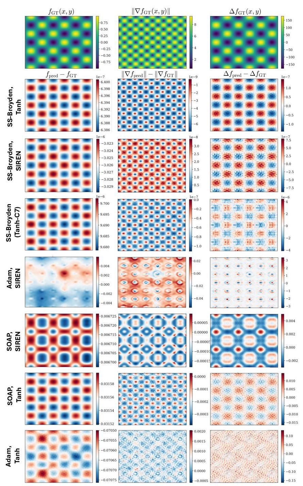

Figure 8: Steady-state diffusion-reaction equation: Effect of optimizer and activation function. Comparison of ground-truth field, gradient magnitude, and Laplacian (top row) with corresponding prediction errors (bottom row) for representative PINN and PIKAN configurations. The rows are organized from the most to the least accurate results (top to bottom). The error maps illustrate qualitative differences in spatial and derivative accuracy that are not fully captured by scalar norms alone. These visualizations complement the quantitative metrics reported in Table 4.

图8:稳态扩散-反应方程:优化器和激活函数的影响。代表性PINN和PIKAN配置的真实场、梯度幅度和拉普拉斯(第一行)与相应预测误差(第二行)的比较。各行按最准确到最不准确的结果(从上到下)排列。误差图说明了空间和导数精度的定性差异，这些差异不能仅由标量范数完全捕获。这些可视化补充了表4中报告的定量指标。

### 4.5. Spectral bias in neural operators

### 4.5. 神经算子中的频谱偏差

Here, we consider two different applications. First, we consider a sonic jet at low resolution and we aim to reconstruct it at high resolution. Next, we consider earthquake dynamics and its effect on a six-story reinforced concrete frame building subjected to ground acceleration.

在这里，我们考虑两种不同的应用。首先，我们考虑低分辨率的声速射流，并旨在将其重建为高分辨率。接下来，我们考虑地震动力学及其对承受地面加速度的六层钢筋混凝土框架建筑的影响。

#### 4.5.1. High-speed Schlieren imaging

#### 4.5.1. 高速纹影成像

High-speed Schlieren imaging is a standard tool for visualizing compressible flows by converting line-of-sight refractive-index gradients (and hence density-gradient features) into intensity variations [43, 44]. Here, we consider an impinging-jet experiment in which an under-expanded air jet (nozzle-exit Mach number ${M}_{e} \approx  1$ ) is directed onto a flat plate at ambient conditions using a conventional Z-type Schlieren setup. The resulting flow exhibits coherent shock structures in the near field together with shear-layer instabilities and a turbulent wall-jet after impingement, producing abundant fine-scale features in the Schlieren field. These multiscale structures carry significant energy into high spatial wavenumbers, leading to a relatively slow-decaying spatial energy spectrum and making the dataset a stringent testbed for studying spectral bias in learned surrogates.

高速纹影成像是一种通过将视线折射率梯度(以及因此的密度梯度特征)转换为强度变化来可视化可压缩流的标准工具[43, 44]。在这里，我们考虑一个冲击射流实验，其中使用传统的Z型纹影装置将欠膨胀空气射流(喷嘴出口马赫数${M}_{e} \approx  1$)在环境条件下导向平板。由此产生的流动在近场中呈现出相干的激波结构以及剪切层不稳定性和冲击后的湍流壁射流，在纹影场中产生丰富的精细尺度特征。这些多尺度结构将大量能量带入高空间波数，导致空间能量谱相对缓慢衰减，并使该数据集成为研究学习代理中的频谱偏差的严格测试平台。

The dataset consists of 1000 Schlieren snapshots at a spatial resolution of $\left\lbrack  {{128},{256}}\right\rbrack$ over the domain $\left\lbrack  {-{0.8},{5.6}}\right\rbrack   \times  \left\lbrack  {-{1.45},{1.75}}\right\rbrack$ , with successive frames separated by $\tau  = {4.76\mu }\mathrm{s}$ . We use the first 800 snapshots for training, the next 100 for validation, and the final 100 for testing. Let ${u}_{\mathrm{{HR}}}\left( {\mathbf{x}, t}\right)$ denote the high-resolution Schlieren field. In this work we focus on spatial super-resolution only: the low-resolution observation ${u}_{\mathrm{{LR}}}$ is obtained by spatially subsampling ${u}_{\mathrm{{HR}}}$ by a factor of 8, and the surrogate is trained to learn the mapping ${u}_{\mathrm{{LR}}} \mapsto  {u}_{\mathrm{{HR}}}$ . This isolates the reconstruction challenge to recovering fine spatial detail - including high-wavenumber content associated with shock-turbulence interactions - from heavily downsampled Schlieren measurements [45, 46].

该数据集由在域$\left\lbrack  {-{0.8},{5.6}}\right\rbrack   \times  \left\lbrack  {-{1.45},{1.75}}\right\rbrack$上空间分辨率为$\left\lbrack  {{128},{256}}\right\rbrack$的1000个纹影快照组成，连续帧之间间隔为$\tau  = {4.76\mu }\mathrm{s}$。我们使用前800个快照进行训练，接下来的100个进行验证，最后100个进行测试。设${u}_{\mathrm{{HR}}}\left( {\mathbf{x}, t}\right)$表示高分辨率纹影场。在这项工作中，我们仅关注空间超分辨率:低分辨率观测${u}_{\mathrm{{LR}}}$是通过将${u}_{\mathrm{{HR}}}$在空间上以8倍因子下采样获得的，并且代理被训练来学习映射${u}_{\mathrm{{LR}}} \mapsto  {u}_{\mathrm{{HR}}}$。这将重建挑战隔离为从严重下采样的纹影测量中恢复精细空间细节 - 包括与激波-湍流相互作用相关的高波数内容 - [45, 46]。

Results are summarized in Figure 9 and Table 5. Across architectures, standard ${L}^{2}$ error minimization training recovers the dominant shock topology and large-scale flow organization, but exhibits clear spectral bias: high-wavenumber content is systematically attenuated, yielding spectra $E\left( k\right)$ that deviate rapidly relative to the ground truth. This loss of small-scale power is consistent with the qualitative diagnostics in Figure 9, where baseline predictions appear overly smooth and the corresponding gradient and Laplacian fields under-represent sharp density-gradient features that are prominent in the Schlieren images. In contrast, incorporating the minimization of binned spectral power (BSP) loss[26] during training substantially improves fidelity at fine scales. We implemented a log-transformed variant of the BSP loss as described below.

结果总结在图9和表5中。在所有架构中，标准的${L}^{2}$误差最小化训练恢复了主导激波拓扑和大规模流场结构，但表现出明显的频谱偏差:高波数内容被系统地衰减，产生的频谱$E\left( k\right)$相对于真实情况迅速偏离。小尺度功率的这种损失与图9中的定性诊断一致，其中基线预测显得过于平滑，相应的梯度和拉普拉斯场未充分表示在纹影图像中突出的尖锐密度梯度特征。相比之下，在训练期间纳入分箱频谱功率(BSP)损失[26]的最小化可显著提高精细尺度的保真度。我们实现了如下所述的BSP损失的对数变换变体。

$$
\mathcal{L} = \mathop{\sum }\limits_{{i = 1}}^{N}\underset{\text{ Field error }}{\underbrace{{\begin{Vmatrix}{v}_{i} - {\widehat{v}}_{i}\end{Vmatrix}}_{2}}} + \underset{\text{ BSP error }}{\underbrace{{\begin{Vmatrix}\mathcal{B}\left( {v}_{i}\right)  - \mathcal{B}\left( {\widehat{v}}_{i}\right) \end{Vmatrix}}_{2}}}, \tag{51}
$$

where $v = {u}_{HR},\widehat{v} = {\mathcal{G}}_{\theta }\left( {u}_{LR}\right)$ and $\mathcal{B}\left( \cdot \right)$ denotes log of the binned energy spectrum representation[26]. To ensure that both the loss terms have a similar order of magnitude, both the field and BSP errors are min-max normalized with respect to min and max computed from the training dataset. The predicted spectra follows the ground truth much more closely into the high- $k$ regime, and the reconstructed fields retain the fine-scale turbulence structures, reflected by more accurate gradients and Laplacians. Quantitatively, BSP yields large reductions in spectral and Barron-norm errors while leaving the field normalized RMSE (nRMSE) largely unchanged (Table 5). The energy-spectrum nRMSE drops by ${3.1} \times$ for DeepOKAN (0.1289 $\rightarrow  {0.0416}),{3.4} \times$ for FNO (0.0865→0.0256), and ${5.6} \times$ for CNO (0.1172→0.0211), with commensurate reductions in Barron-norm error of roughly 2.2-4.1× (DeepOKAN: ${0.3659} \rightarrow  {0.1662}$ ; FNO: ${0.2641} \rightarrow  {0.0828}$ ; CNO: 0.3229 $\rightarrow  {0.0792}$ ). These improvements are consistent with mitigating spectral bias rather than simply rescaling the output. BSP primarily targets the high-frequency tail and associated sharp features, which are poorly captured by the baseline loss. DeepONet is comparatively insensitive to BSP in this setting, showing no improvement in spectral error and only a modest reduction in Barron-norm error. Finally, since BSP modifies only the training objective, parameter counts and inference times are unchanged across each model pair, so the gains in spectral fidelity come at no additional inference cost.

其中 $v = {u}_{HR},\widehat{v} = {\mathcal{G}}_{\theta }\left( {u}_{LR}\right)$ 和 $\mathcal{B}\left( \cdot \right)$ 表示分箱能谱表示的对数[26]。为确保两个损失项具有相似的数量级，场误差和 BSP 误差都相对于从训练数据集中计算出的最小值和最大值进行了最小 - 最大归一化。预测的能谱在高 $k$ 区域更接近真实值，重建的场保留了精细尺度的湍流结构，这体现在更准确的梯度和拉普拉斯算子上。从数量上看，BSP 使能谱误差和巴伦范数误差大幅降低，而场归一化均方根误差(nRMSE)基本保持不变(表 5)。能谱 nRMSE 方面，DeepOKAN 下降了 ${3.1} \times$(从 0.1289 降至 $\rightarrow  {0.0416}),{3.4} \times$)，FNO 从 0.0865 降至 0.0256，CNO 从 0.1172 降至 0.0211，巴伦范数误差也相应降低了约 2.2 - 4.1 倍(DeepOKAN:${0.3659} \rightarrow  {0.1662}$；FNO:${0.2641} \rightarrow  {0.0828}$；CNO:从 0.3229 降至 $\rightarrow  {0.0792}$)。这些改进表明是缓解了能谱偏差，而非简单地对输出进行重新缩放。BSP 主要针对高频尾部和相关的尖锐特征，而这些是基线损失难以捕捉的。在这种情况下，DeepONet 对 BSP 相对不敏感，能谱误差没有改善，巴伦范数误差仅略有降低。最后，由于 BSP 仅修改了训练目标，每对模型的参数数量和推理时间保持不变，因此能谱保真度的提升无需额外的推理成本。

Beyond the training objective, we find that the choice of optimizer can also influence high-frequency fidelity. In particular, SOAP tends to preserve more high-frequency energy than Adam, leading to sharper gradient and Laplacian diagnostics. A focused comparison is provided in Appendix D and Figure D.2.

除了训练目标外，我们发现优化器的选择也会影响高频保真度。特别是，SOAP往往比Adam保留更多的高频能量，从而导致更尖锐的梯度和拉普拉斯诊断。附录D和图D.2提供了详细比较。

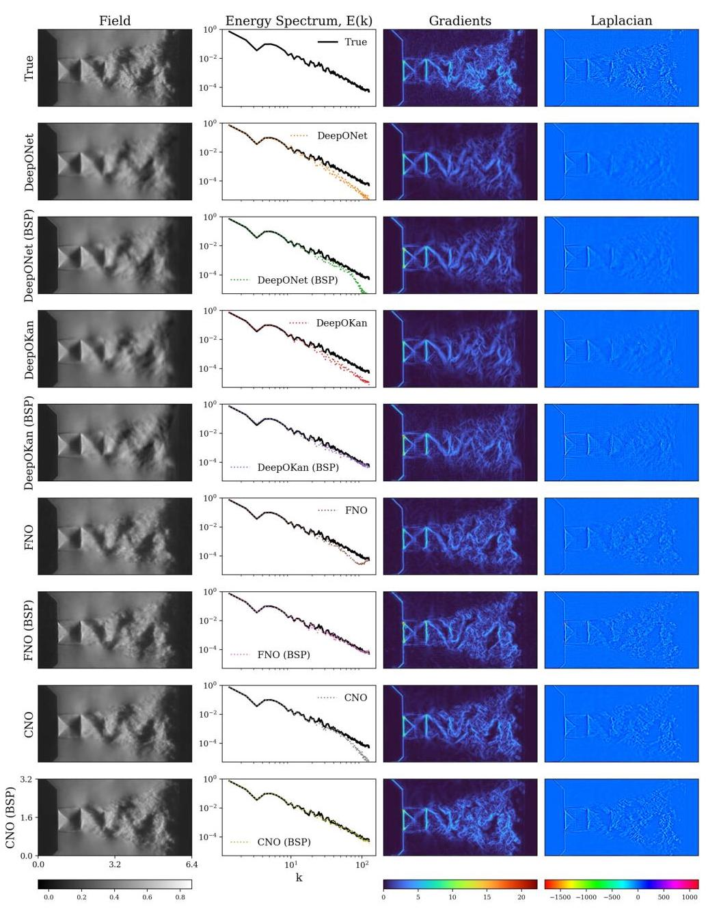

Figure 9: Turbulent jet: Spectral bias in neural operators. Columns show (from left to right) schlieren images of an impinging jet, the corresponding energy spectrum E(k), spatial gradients, and the Laplacian. Rows compare the ground truth against predictions from different neural operator architectures (with and without BSP training). We observe that using Binned Spectral Power (BSP) loss helps mitigate spectral bias, improving agreement with the true energy spectrum across wavenumbers. All the results are based on SOAP optimizer.

图9:湍流射流:神经算子中的频谱偏差。列(从左到右)显示撞击射流的纹影图像、相应的能谱E(k)、空间梯度和拉普拉斯。行比较真实情况与不同神经算子架构(有和没有BSP训练)的预测。我们观察到使用分箱频谱功率(BSP)损失有助于减轻频谱偏差，改善与整个波数范围内真实能谱的一致性。所有结果均基于SOAP优化器。

<table><tr><td>Model</td><td>Field Error</td><td>Energy-Spectrum Error</td><td>Barron-Norm Error</td><td>#params (M)</td><td>Inference time (s)</td></tr><tr><td>DeepONet</td><td>0.0529</td><td>0.1566</td><td>0.4171</td><td>3.8</td><td>0.00086</td></tr><tr><td>DeepONet (BSP)</td><td>0.0535</td><td>0.1675</td><td>0.4083</td><td>3.8</td><td>0.00086</td></tr><tr><td>DeepOKAN</td><td>0.0538</td><td>0.1289</td><td>0.3659</td><td>3.0</td><td>0.00991</td></tr><tr><td>DeepOKAN (BSP)</td><td>0.0547</td><td>0.0416</td><td>0.1662</td><td>3.0</td><td>0.00991</td></tr><tr><td>FNO</td><td>0.0517</td><td>0.0865</td><td>0.2641</td><td>3.4</td><td>0.00433</td></tr><tr><td>FNO (BSP)</td><td>0.0556</td><td>0.0256</td><td>0.0828</td><td>3.4</td><td>0.00433</td></tr><tr><td>CNO</td><td>0.0512</td><td>0.1172</td><td>0.3229</td><td>3.2</td><td>0.01238</td></tr><tr><td>CNO (BSP)</td><td>0.0543</td><td>0.0211</td><td>0.0792</td><td>3.2</td><td>0.01238</td></tr></table>

Table 5: Comparison of neural operator errors and costs for the impinging jet problem.

表5:撞击射流问题的神经算子误差和成本比较。

#### 4.5.2. Earthquake problem

#### 4.5.2. 地震问题

Here we consider the dynamic response of a six-story reinforced concrete frame building subjected to ground acceleration records from the PEER NGA-West2 database (https://ngawest2.berkeley.edu/) ${}^{1}$ . The governing equation of motion for the linear multi-degree-of-freedom system is

在此，我们考虑一座六层钢筋混凝土框架建筑在来自PEER NGA - West2数据库(https://ngawest2.berkeley.edu/)${}^{1}$的地面加速度记录作用下的动力响应。线性多自由度系统的运动控制方程为

$$
\mathbf{M}\ddot{\mathbf{x}} + \mathbf{C}\dot{\mathbf{x}} + \mathbf{K}\mathbf{x} = \mathbf{M}\mathbf{\iota }{\ddot{u}}_{g}\left( t\right) , \tag{52}
$$

where $\mathbf{M},\mathbf{C}$ , and $\mathbf{K} \in  {\mathbb{R}}^{{504} \times  {504}}$ are the mass, damping, and stiffness matrices from finite element discretizations, $\mathbf{x}\left( t\right)$ is the displacement vector, $\mathbf{\iota }$ is the influence vector distributing ground motion to degrees of freedom, and ${\ddot{u}}_{g}\left( t\right)$ is the ground acceleration. The system starts at rest with $\mathbf{x}\left( 0\right)  = \dot{\mathbf{x}}\left( 0\right)  = \mathbf{0}$ . For a linear system, the response can be expressed via convolution with the Green's function,

其中$\mathbf{M},\mathbf{C}$ 、$\mathbf{K} \in  {\mathbb{R}}^{{504} \times  {504}}$ 分别为有限元离散化得到的质量矩阵、阻尼矩阵和刚度矩阵，$\mathbf{x}\left( t\right)$ 为位移向量，$\mathbf{\iota }$ 为将地面运动分配到各自由度的影响向量，${\ddot{u}}_{g}\left( t\right)$ 为地面加速度。系统以$\mathbf{x}\left( 0\right)  = \dot{\mathbf{x}}\left( 0\right)  = \mathbf{0}$ 为初始静止状态。对于线性系统，响应可通过与格林函数的卷积来表示。

$$
\mathbf{x}\left( t\right)  = {\int }_{0}^{t}{\ddot{u}}_{g}\left( \tau \right) \mathbf{h}\left( {t - \tau }\right) {d\tau }, \tag{53}
$$

where the neural operator ${\mathcal{G}}_{\theta }$ approximates the mapping ${\ddot{u}}_{g}\left( t\right)  \mapsto  {x}_{1}\left( t\right)$ from ground acceleration to roof displacement.

其中神经算子${\mathcal{G}}_{\theta }$ 近似从地面加速度到屋顶位移的映射${\ddot{u}}_{g}\left( t\right)  \mapsto  {x}_{1}\left( t\right)$ 。

The dataset comprises 144 earthquake ground motion records, with 100 samples for training and 44 for testing. Each record spans 80 seconds at 50 Hz sampling (4000 timesteps), with records pre-processed using a Butterworth filter (0.1-24.9 Hz) and resampled to uniform ${\Delta t} = {0.02}\mathrm{\;s}$ . The structural response exhibits both low-frequency global modes and high-frequency content from impulsive ground motions, presenting a challenging multi-scale prediction problem. The temporal resolution of this problem creates a significantly more demanding spectral learning task than the impinging-jet experiment. For a discrete signal of $N$ points sampled at rate ${f}_{s}$ , the Nyquist frequency is ${f}_{s}/2$ and there are $N/2$ discrete frequency bins between zero and the Nyquist limit. The earthquake time series $\left( {N = {4000},{f}_{s} = {50}\mathrm{\;{Hz}}}\right)$ therefore contains 2000 resolvable frequency bins up to ${25}\mathrm{\;{Hz}}$ , consistent with the Butterworth filter's 24.9 Hz cutoff, compared to 64 modes for the impinging jet's 128- point spatial dimension. This roughly ${30} \times$ increase in the number of spectral modes the network must resolve makes the spectral bias problem increasingly challenging.

该数据集包含144条地震地面运动记录，其中100个样本用于训练，44个用于测试。每条记录在50Hz采样率下持续80秒(4000个时间步长)，记录经过巴特沃斯滤波器(0.1 - 24.9Hz)预处理并重新采样为均匀的${\Delta t} = {0.02}\mathrm{\;s}$ 。结构响应既呈现低频全局模态，又包含脉冲地面运动产生的高频成分，这是一个具有挑战性的多尺度预测问题。该问题的时间分辨率带来了比冲击射流实验要求高得多的频谱学习任务。对于以${f}_{s}$ 速率采样的$N$ 点离散信号，奈奎斯特频率为${f}_{s}/2$ ，在零到奈奎斯特极限之间有$N/2$ 个离散频率 bins。因此，地震时间序列$\left( {N = {4000},{f}_{s} = {50}\mathrm{\;{Hz}}}\right)$ 包含高达${25}\mathrm{\;{Hz}}$ 的2000个可分辨频率 bins，与巴特沃斯滤波器的24.9Hz截止频率一致，相比之下，冲击射流的128点空间维度有64个模态。网络必须解析的频谱模态数量大约增加了${30} \times$ ，这使得频谱偏差问题越来越具有挑战性。

---

${}^{1}$ Ground acceleration records are taken from the Pacific Earthquake Engineering Research Center (PEER: https://ngawest2.berkeley.edu/, https://peer.berkeley.edu/)

${}^{1}$ 地面加速度记录取自太平洋地震工程研究中心(PEER:https://ngawest2.berkeley.edu/，https://peer.berkeley.edu/)

---

The neural operator architectures used for this problem differ in how they process temporal information. DeepONet and DeepOKAN employ a causal windowing approach where the response at each timestep depends only on past input history, implemented via zero-padding with a shifting window that encodes physical causality; the output state at the current timestep is not affected by input states at future timesteps. For additional details on the causal formulation and dataset, we refer readers to Liu et al. [47]. In contrast, FNO & CNO process the entire input sequence to predict the full output time-series in a single forward pass, and subsequently, the causality was not strictly enforced. All metrics reported are computed in real (physical) space on the de-normalized predictions.

用于此问题的神经算子架构在处理时间信息的方式上有所不同。深度算子网络(DeepONet)和深度算子知识自适应网络(DeepOKAN)采用因果窗口方法，其中每个时间步的响应仅取决于过去的输入历史，通过用编码物理因果关系的移动窗口进行零填充来实现；当前时间步的输出状态不受未来时间步输入状态的影响。有关因果公式和数据集的更多详细信息，我们请读者参考Liu等人[47]。相比之下，傅里叶神经算子(FNO)和因果神经算子(CNO)在一次前向传播中处理整个输入序列以预测完整的输出时间序列，因此，因果关系没有得到严格执行。报告的所有指标都是在反归一化预测的真实(物理)空间中计算的。

We also investigate minimizing the BSP error (see Equation 51) as a strategy to mitigate spectral bias. Computing this term requires computing FFT over the entire predicted sequence, so the BSP loss can only be evaluated once all timesteps of the predicted outputs are assembled. Training with BSP error minimization was straightforward for FNO & CNO. However, for DeepONet/DeepOKAN with causal training [47], predictions from all timesteps must first be collected before computing BSP. Results are summarized in Table 6 and Figure 10. All architectures use SOAP optimizer and causal training for DeepONet/DeepOKAN, with error metrics computed in physical space.

我们还研究了将BSP误差最小化(见式51)作为减轻频谱偏差的一种策略。计算该项需要在整个预测序列上计算快速傅里叶变换(FFT)，因此只有在组装好预测输出的所有时间步后才能评估BSP损失。对于FNO和CNO，使用BSP误差最小化进行训练很直接。然而，对于采用因果训练的深度算子网络(DeepONet)/深度算子知识自适应网络(DeepOKAN)[47]，必须先收集所有时间步的预测结果，然后再计算BSP。结果总结在表6和图10中。所有架构都使用SOAP优化器，深度算子网络(DeepONet)/深度算子知识自适应网络(DeepOKAN)采用因果训练，误差指标在物理空间中计算。

Table 6: Architecture and loss comparison for earthquake structural response prediction. SOAP optimizer, causal training for DeepONet/DeepOKAN.

表6:地震结构响应预测的架构和损失比较。SOAP优化器，深度算子网络(DeepONet)/深度算子知识自适应网络(DeepOKAN)采用因果训练。

<table><tr><td rowspan="2">Model</td><td colspan="2">Field Error</td><td colspan="2">Log Spectral Error</td><td colspan="2">Barron Norm Error</td></tr><tr><td>Baseline</td><td>BSP</td><td>Baseline</td><td>BSP</td><td>Baseline</td><td>BSP</td></tr><tr><td>DeepONet (SIREN)</td><td>0.0008</td><td>0.0009</td><td>0.1257</td><td>0.1366</td><td>0.0019</td><td>0.0027</td></tr><tr><td>DeepONet (Tanh)</td><td>-</td><td>0.0006</td><td>-</td><td>0.1103</td><td>-</td><td>0.0012</td></tr><tr><td>DeepOKAN</td><td>0.0022</td><td>0.0044</td><td>0.1230</td><td>0.1750</td><td>0.0029</td><td>0.0077</td></tr><tr><td>FNO</td><td>0.0038</td><td>0.0041</td><td>0.1485</td><td>0.0819</td><td>0.0045</td><td>0.0030</td></tr><tr><td>CNO</td><td>0.0133</td><td>0.0145</td><td>0.1323</td><td>0.0758</td><td>0.0040</td><td>0.0043</td></tr></table>

- Failed to converge.

- 未能收敛。

Consistent with the impinging-jet findings, BSP improves spectral fidelity when the field loss also operates on the full output sequence (FNO, CNO), as illustrated for FNO in Figure 10(b) (see Figure E.4 for all architectures). FNO achieves a ${1.8} \times$ reduction in log spectral error (0.149 → 0.082) and CNO a ${1.7} \times$ reduction (0.132 → 0.076), with corresponding improvements in Barron norm error. The strongest evidence for BSP's effect comes from derivative metrics, where the ground truth is dominated by high-frequency content. FNO acceleration error $\left( {{d}^{2}u/d{t}^{2}}\right)$ drops ${2.2} \times  \left( {{0.064} \rightarrow  {0.030};\text{ Table E.2 }}\right)$ . Similarly, CNO acceleration improves more modestly (0.032 → 0.026, 1.2×; Table E.2).

与冲击射流的研究结果一致，当场损失也作用于整个输出序列(FNO、CNO)时，BSP 提高了频谱保真度，如图 10(b) 中 FNO 的情况所示(所有架构见图 E.4)。FNO 的对数频谱误差降低了${1.8} \times$(从 0.149 降至 0.082)，CNO 降低了${1.7} \times$(从 0.132 降至 0.076)，同时巴伦范数误差也有相应改善。BSP 效果的最有力证据来自导数指标，其中真实值主要由高频内容主导。FNO 加速度误差$\left( {{d}^{2}u/d{t}^{2}}\right)$下降了${2.2} \times  \left( {{0.064} \rightarrow  {0.030};\text{ Table E.2 }}\right)$。同样，CNO 加速度的改善较为适度(从 0.032 降至 0.026，提高了 1.2 倍；表 E.2)。

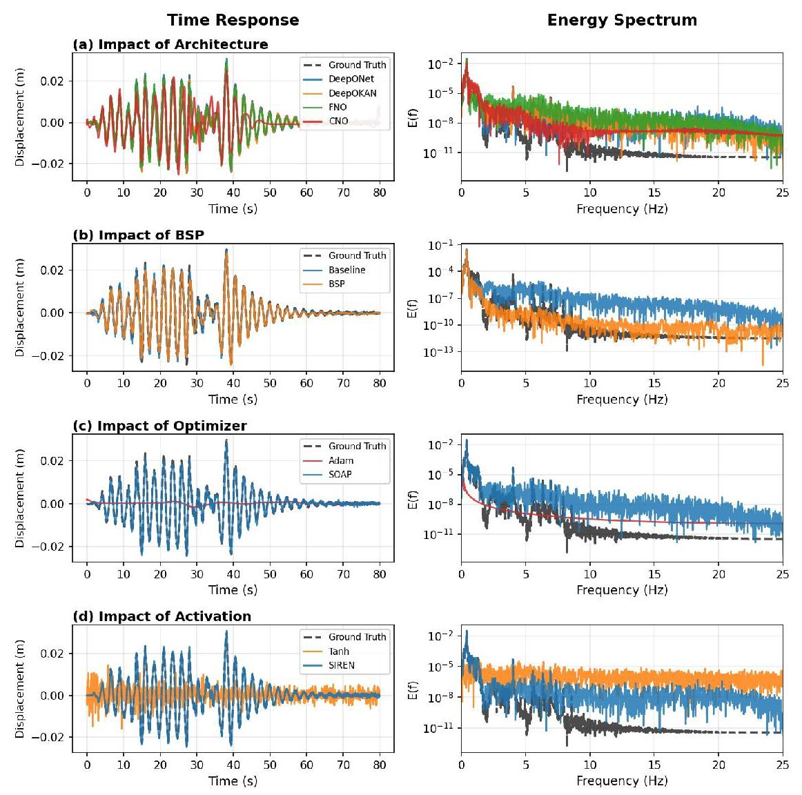

Figure 10: Representative earthquake response predictions illustrating key design choices. Each row shows the time-domain response (left) and energy spectrum (right) for the same test sample. (a) DeepONet (SIREN) achieves the lowest field error (NRMSE = 0.0008; Table 6), followed by DeepOKAN (0.0022), FNO (0.0038), and CNO (0.0133). (b) BSP improves FNO spectral fidelity, reducing log spectral error from 0.149 to 0.082 (1.8×), visible in the high-frequency alignment. (c) SOAP enables DeepOKAN convergence (NRMSE = 0.0022), whereas Adam fails across all seeds. (d) SIREN activation enables DeepONet convergence without BSP (NRMSE = 0.0008), while Tanh fails to converge under the same conditions. Black dashed lines denote ground truth; extended comparisons are in Figures E.4-E.6.

图 10:代表性地震响应预测，展示了关键设计选择。每行显示了同一测试样本的时域响应(左)和能谱(右)。(a) DeepONet(SIREN)实现了最低的场误差(NRMSE = 0.0008；表 6)，其次是 DeepOKAN(0.0022)、FNO(0.0038)和 CNO(0.0133)。(b) BSP 提高了 FNO 的频谱保真度，将对数频谱误差从 0.149 降低到 0.082(提高了 1.8 倍)，在高频对齐中可见。(c) SOAP 使 DeepOKAN 收敛(NRMSE = 0.0022)，而 Adam 在所有种子上均失败。(d) SIREN 激活使 DeepONet 在没有 BSP 的情况下收敛(NRMSE = 0.0008)，而 Tanh 在相同条件下未能收敛。黑色虚线表示真实值；扩展比较见图 E.4 - E.6。

Unlike the impinging-jet problem, we did not find the same improvement from BSP for DeepONet and DeepOKAN. DeepONet shows slight degradation across all metrics with BSP: spectral error worsens (0.126 → 0.137), field error increases $\left( {{0.0008} \rightarrow  {0.0009}}\right)$ , and Barron norm error rises $({0.0019} \rightarrow$ 0.0027). DeepOKAN also exhibits degradation with BSP. As noted earlier, BSP requires the full sequence while the causal field loss operates per-timestep, so the two objectives see different views of the prediction. Looking at the cosine similarity between the per loss gradients we see that these competing views produce opposing gradient signals: DeepONet (SIREN) exhibits strongly negative cosine similarity between L2 and BSP gradients (-0.48 by the end of training), while FNO maintains positive alignment (+0.28). Crucially, when the same architectures are trained in non-causal mode (removing the causal/non-causal mismatch), gradient alignment shifts toward positive: DeepONet (SIREN) moves from -0.48 to +0.13, see Table E.4 and Figure E. 7 in subsection E.4. Nevertheless, we found causality to be necessary to make meaningful predictions for DeepONet/DeepOKAN. When causality is removed and these architectures are trained like FNO and CNO, they mostly fail to converge; this is discussed further in subsection E.3 (Table E.3). The notable exception of BSP's performance with a causal approach is Deep-ONet with Tanh activation: without BSP the model fails to converge (0.024 NRMSE, 0.468 acceleration error), but BSP enables convergence to the best field accuracy (0.0006) with acceleration error dropping to 0.030.

与冲击射流问题不同，我们没有发现 BSP 对 DeepONet 和 DeepOKAN 有同样的改进。使用 BSP 时，DeepONet 在所有指标上都略有下降:频谱误差恶化(从 0.126 升至 0.137)，场误差增加了$\left( {{0.0008} \rightarrow  {0.0009}}\right)$，巴伦范数误差上升了$({0.0019} \rightarrow$(0.0027)。DeepOKAN 使用 BSP 时也表现出下降。如前所述，BSP 需要完整序列，而因果场损失是按时间步操作的，所以这两个目标对预测的看法不同。查看每个损失梯度之间的余弦相似度，我们发现这些相互竞争的观点产生了相反的梯度信号:DeepONet(SIREN)在 L₂ 和 BSP梯度之间表现出强烈的负余弦相似度(训练结束时为 -0.48)，而 FNO 保持正对齐(+0.28)。至关重要的是，当相同架构在非因果模式下训练(消除因果/非因果不匹配)时，梯度对齐转向正:DeepONet(SIREN)从 -0.48 变为 +0.13，见表 E.4 和 E.4 小节中的图 E.7。然而，我们发现因果关系对于 DeepONet/DeepOKAN 进行有意义的预测是必要的。当去除因果关系并像 FNO 和 CNO 那样训练这些架构时，它们大多无法收敛；这将在 E.3 小节(表 E.3)中进一步讨论。BSP 在因果方法下性能的显著例外是具有 Tanh 激活的 Deep - ONet:没有 BSP 时模型无法收敛(NRMSE = 0.024，加速度误差 = 0.468)，但 BSP 使模型收敛到最佳场精度(0.0006)，加速度误差降至 0.030。

Beyond the training objective, optimizer selection and activation function also interact with BSP effectiveness on this dataset. SOAP provides 2.0 x lower NRMSE for DeepONet SIREN and enables convergence for DeepOKAN (Adam fails across all seeds, Figure 10(c)), with strong performance on FNO and CNO as well (see Figure D). Activation function and spectral regularization interact non-trivially: SIREN's periodic activations provide implicit spectral bias mitigation sufficient for convergence without BSP, while Tanh requires BSP to converge. This suggests that SIREN and BSP address overlapping spectral deficiencies, whereas Tanh and BSP provide more complementary mechanisms (see subsection E. 2 and Figure 10(d)). Detailed comparisons are provided in Appendix D.

除了训练目标外，优化器选择和激活函数也会影响 BSP 在该数据集上的有效性。SOAP 为 DeepONet SIREN 提供了低 2.0 倍的 NRMSE，并使 DeepOKAN 收敛(Adam 在所有种子上均失败，图 10(c))，在 FNO 和 CNO 上也有很强的性能(见图 D)。激活函数和频谱正则化之间的相互作用并不简单:SIREN 的周期性激活提供了足够的隐式频谱偏差缓解，使得在没有 BSP 的情况下也能收敛，而 Tanh 需要 BSP 才能收敛。这表明 SIREN 和 BSP 解决了重叠的频谱缺陷，而 Tanh 和 BSP 提供了更互补的机制(见 E.2 小节和图 10(d))。详细比较见附录 D。

## 5. Conclusions and Outlook

## 5. 结论与展望

We presented a systematic investigation of spectral bias in physics-informed neural networks, physics-informed Kolmogorov-Arnold networks, and neural operators. Through a combination of theoretical analysis and extensive numerical experiments across elliptic, hyperbolic, and dispersive PDEs, we demonstrated that spectral bias in scientific machine learning is not solely a representational limitation of neural architectures, but it depends on optimization dynamics, loss formulation, and their interaction with network expressivity.

我们对物理信息神经网络、物理信息柯尔莫哥洛夫 - 阿诺德网络和神经算子中的频谱偏差进行了系统研究。通过理论分析与针对椭圆型、双曲型和色散型偏微分方程的大量数值实验相结合，我们证明了科学机器学习中的频谱偏差不仅仅是神经架构的表示限制，还取决于优化动态、损失公式以及它们与网络表现力的相互作用。

From a theoretical side, linearized analyses based on neural tangent kernel and Gauss-Newton dynamics clarify why first-order optimization methods preferentially learn low-frequency modes, while higher-frequency components converge slowly. In contrast, quasi-second-order and second-order optimization strategies substantially reduce the frequency dependence of convergence rates by implicitly preconditioning the training dynamics. Although these arguments rely on idealized assumptions, our empirical results show that their qualitative implications persist well beyond the asymptotic regime.

从理论角度来看，基于神经切线核和高斯 - 牛顿动态的线性化分析阐明了为什么一阶优化方法优先学习低频模式，而高频分量收敛缓慢。相比之下，准二阶和二阶优化策略通过隐式预处理训练动态，大幅降低了收敛速率对频率的依赖性。尽管这些论点依赖于理想化假设，但我们的实证结果表明，它们的定性影响在渐近区域之外仍然存在。

Across a wide range of benchmark problems, we observed that optimization choice plays a dominant role in mitigating spectral bias in PINNs and PIKANs. First-order optimizers such as Adam often converge to spectrally incomplete solutions that satisfy low-order statistics and PDE residuals in an averaged sense, while failing to capture gradients, curvatures, and localized high-frequency features. Quasi-second-order methods such as SOAP, and in particular fully second-order methods such as SS-Broyden, significantly improve both convergence behavior and spectral resolution, enabling accurate recovery of higher-order moments and Barron norms. These improvements are especially pronounced in stiff elliptic and dispersive problems, where spectral imbalance has the most severe physical consequences.

在广泛的基准问题中，我们观察到优化选择在减轻物理信息神经网络(PINNs)和物理信息柯尔莫哥洛夫 - 阿诺德网络(PIKANs)中的频谱偏差方面起着主导作用。像亚当(Adam)这样的一阶优化器通常会收敛到频谱不完全的解，这些解在平均意义上满足低阶统计量和偏微分方程残差，但无法捕捉梯度、曲率和局部高频特征。像SOAP这样的准二阶方法，特别是像SS - Broyden这样的完全二阶方法，显著改善了收敛行为和频谱分辨率，能够准确恢复高阶矩和巴伦范数。这些改进在刚性椭圆型和色散型问题中尤为明显，在这些问题中频谱不平衡具有最严重的物理后果。

Architectural choices and activation functions were shown to play a complementary but secondary role. Oscillatory activations such as sine functions and SIREN-type parameterizations improve high-frequency representation under first-order optimization and can help escape early stagnation. However, their influence diminishes as optimization strength increases, indicating that representational enhancements alone are insufficient to fully overcome spectral bias without high-order optimization. Similar trends were observed in physics-informed KANs, where polynomial-based univariate functions exhibit classical spectral limitations for non-smooth solutions unless combined with strong optimization strategies.

架构选择和激活函数被证明起到互补但次要的作用。诸如正弦函数和SIREN型参数化等振荡激活函数在一阶优化下改善了高频表示，并有助于避免早期停滞。然而，随着优化强度的增加，它们的影响会减弱，这表明仅靠表示增强不足以在没有高阶优化的情况下完全克服频谱偏差。在物理信息柯尔莫哥洛夫 - 阿诺德网络中也观察到了类似趋势，其中基于多项式的单变量函数对于非光滑解表现出经典的频谱限制，除非与强大的优化策略相结合。

For neural operators, our results demonstrate that spectral bias persists even in architectures that explicitly operate in Fourier space. Standard ${L}^{2}$ training objectives remain dominated by low-frequency content, leading to systematic underestimation of high-wavenumber energy. Spectral-aware loss formulations, such as binned spectral power losses, provide an effective and computationally inexpensive approach to restore spectral balance across operator architectures, including DeepONet, DeepOKAN, FNO, and CNO. These findings highlight that loss design is also critical for achieving spectrally resolved operator learning.

对于神经算子，我们的结果表明，即使在明确在傅里叶空间中运行的架构中，频谱偏差仍然存在。标准的${L}^{2}$训练目标仍然由低频内容主导，导致对高波数能量的系统性低估。频谱感知损失公式，如分箱频谱功率损失，提供了一种有效且计算成本低的方法来恢复包括深度算子网络(DeepONet)、深度算子柯尔莫哥洛夫 - 阿诺德网络(DeepOKAN)、傅里叶神经算子(FNO)和卷积神经算子(CNO)等算子架构的频谱平衡。这些发现突出了损失设计对于实现频谱解析的算子学习也至关重要。

In summary, our study suggests that spectral bias in scientific machine learning should be viewed primarily as a dynamical phenomenon arising from ill-conditioned training objectives, rather than as an intrinsic failure of neural representations. While expressive architectures and carefully chosen activations can improve performance, robust mitigation of spectral bias requires curvature-aware optimization and, in operator settings, spectrally informed loss functions. From a practical standpoint, our results lead to concrete guidelines: strong second-order or quasi-second-order optimizers are essential for physics-informed learning in multiscale PDEs, while spectral losses play a key role in operator learning when high-frequency fidelity is required.

总之，我们的研究表明，科学机器学习中的频谱偏差应主要被视为由病态训练目标引起的动态现象，而不是神经表示的内在失败。虽然富有表现力的架构和精心选择的激活函数可以提高性能，但稳健减轻频谱偏差需要曲率感知优化，并且在算子设置中，需要频谱感知损失函数。从实际角度来看，我们的结果得出了具体指导方针:强大的二阶或准二阶优化器对于多尺度偏微分方程的物理信息学习至关重要，而当需要高频保真度时，频谱损失在算子学习中起着关键作用。

Several open questions remain. Extending these findings to large-scale three-dimensional problems, understanding the interaction between spectral bias and adaptive sampling strategies, and developing scalable second-order optimization methods tailored to physics-informed objectives are promising directions for future work. For example, currently, SOAP can use mini-batching but SS-Broyden cannot, so this is a concrete direction to be pursued given the accuracy superiority of this method.

仍有几个开放性问题。将这些发现扩展到大规模三维问题、理解频谱偏差与自适应采样策略之间的相互作用以及开发针对物理信息目标量身定制的可扩展二阶优化方法是未来工作的有前景方向。例如，目前，SOAP可以使用小批量但SS - Broyden不能，鉴于该方法的准确性优势，这是一个有待探索的具体方向。

## CRediT authorship contribution statement

## CRediT作者贡献声明

Siavash Khodakarami: Writing - review & editing, Writing - original draft, Visualization, Validation, Software, Methodology, Investigation, Formal analysis, Data Curation, Conceptualization. Vivek Oommen: Writing - review & editing, Writing - original draft, Visualization, Validation, Software, Methodology, Investigation, Formal analysis, Data Curation, Conceptualization. Nazanin Ahmadi Daryakenari: Writing - review & editing, Writing - original draft, Visualization, Validation, Software, Methodology, Investigation, Formal analysis, Data Curation, Conceptualization. Maxim Beekenkamp: Writing - review & editing, Writing - original draft, Visualization, Validation, Software, Methodology, Investigation, Formal analysis, Data Curation. George Em Karniadakis Writing - review & editing, Writing - original draft, Supervision, Funding acquisition, Validation, Methodology, Formal analysis, Conceptualization.

西亚瓦什·霍达卡拉米(Siavash Khodakarami):写作 - 审阅与编辑、写作 - 初稿、可视化、验证、软件、方法学、调查、形式分析、数据管理、概念化。维韦克·奥ommen(Vivek Oommen):写作 - 审阅与编辑、写作 - 初稿、可视化、验证、软件、方法学、调查、形式分析、数据管理、概念化。纳扎宁·艾哈迈迪·达里亚凯纳里(Nazanin Ahmadi Daryakenari):写作 - 审阅与编辑、写作 - 初稿、可视化、验证、软件、方法学、调查、形式分析、数据管理、概念化。马克西姆·贝肯坎普(Maxim Beekenkamp):写作 - 审阅与编辑、写作 - 初稿、可视化、验证、软件、方法学、调查、形式分析、数据管理。乔治·埃姆·卡尔尼亚达基斯(George Em Karniadakis):写作 - 审阅与编辑、写作 - 初稿、监督、资金获取、验证、方法学、形式分析、概念化。

## Declaration of competing interest

## 利益冲突声明

The authors declare that they have no known competing financial interests or personal relationships that could have appeared to influence the work reported in this paper.

作者声明他们没有已知的竞争财务利益或可能影响本文所报告工作的个人关系。

## Acknowledgements

## 致谢

We would like to acknowledge funding from the Office of Naval Research as part of MURI-METHODS project with grant number N00014242545 and the ONR Vannevar Bush Faculty Fellowship (N00014-22-1-2795). The authors would like to acknowledge the computational resources and services at the Center for Computation and Visualization (CCV), Brown University. We acknowledge that the Schlieren impinging-jet experiments used in this work were conducted at the SMC Lab, Tsinghua University. The corresponding Schlieren dataset originates from Tsinghua University, and the associated intellectual property of this dataset remains with Tsinghua University.

我们要感谢美国海军研究办公室为MURI-METHODS项目提供的资金，该项目的资助编号为N00014242545，以及ONR万尼瓦尔·布什教师奖学金(N00014-22-1-2795)。作者还要感谢布朗大学计算与可视化中心(CCV)提供的计算资源和服务。我们确认，本研究中使用的纹影冲击射流实验是在清华大学SMC实验室进行的。相应的纹影数据集来自清华大学，该数据集的相关知识产权归清华大学所有。

## Data Availability

## 数据可用性

All codes and datasets except the Schlieren dataset will be made publicly available at https://github.com/SiaK4/PIN_NO_Spectral_Bias.git upon publication.

除纹影数据集外，所有代码和数据集将在论文发表后在https://github.com/SiaK4/PIN_NO_Spectral_Bias.git上公开提供。

Please contact Prof. He Feng (hefeng@tsinghua.edu.cn) to access the impinging jet Schlieren dataset.

如需获取冲击射流纹影数据集，请联系何峰教授(hefeng@tsinghua.edu.cn)。

## References

## 参考文献

[1] M. Raissi, P. Perdikaris, and G.E. Karniadakis. Physics-informed neuralnetworks: A deep learning framework for solving forward and inverse problems involving nonlinear partial differential equations. Journal of

网络:一种用于解决涉及非线性偏微分方程的正向和反向问题的深度学习框架。《[期刊名称]》Computational Physics, 378:686-707, 2019.

[2] Nazanin Ahmadi, Qianying Cao, Jay D Humphrey, and George EmKarniadakis. Physics-informed machine learning in biomedical science

卡尔尼亚达基斯。生物医学科学中的物理信息机器学习and engineering. arXiv preprint arXiv:2510.05433, 2025.

[3] Juan Diego Toscano, Vivek Oommen, Alan John Varghese, ZongrenZou, Nazanin Ahmadi Daryakenari, Chenxi Wu, and George Em Karni-adakis. From PINNs to PIKANs: Recent advances in physics-informed machine learning, 2024. Machine Learning for Computational Science

邹、纳扎宁·艾哈迈迪·达里亚凯纳里、吴晨曦和乔治·埃姆·卡尔尼亚达基斯。从PINNs到PIKANs:物理信息机器学习的最新进展，2024年。计算科学的机器学习and Engineering, 1(1):15, 2025.

[4] Shengze Cai, Zhicheng Wang, Sifan Wang, Paris Perdikaris, andGeorge Em Karniadakis. Physics-informed neural networks for heat

乔治·埃姆·卡尔尼亚达基斯。用于热传导的物理信息神经网络transfer problems. Journal of Heat Transfer, 143(6):060801, 2021.

[5] Chi Zhao, Feifei Zhang, Wenqiang Lou, Xi Wang, and Jianyong Yang. Acomprehensive review of advances in physics-informed neural networks and their applications in complex fluid dynamics. Physics of Fluids, 36(10), 2024.

物理信息神经网络进展及其在复杂流体动力学中的应用综述。《流体物理学》，36(10)，2024年。

[6] QiZhi He, David Barajas-Solano, Guzel Tartakovsky, and Alexandre M.Tartakovsky. Physics-informed neural networks for multiphysics data assimilation with application to subsurface transport. Advances in Water

塔尔塔科夫斯基。用于多物理场数据同化的物理信息神经网络及其在地下传输中的应用。《水科学进展》Resources, 141:103610, 2020.

[7] Khemraj Shukla, Patricio Clark Di Leoni, James Blackshire, DanielSparkman, and George Em Karniadakis. Physics-informed neural network for ultrasound nondestructive quantification of surface breaking

斯帕克曼和乔治·埃姆·卡尔尼亚达基斯。用于表面缺陷超声无损定量的物理信息神经网络cracks. Journal of Nondestructive Evaluation, 39(3):61, 2020.

[8] Zongyi Li, Nikola Borislavov Kovachki, Kamyar Azizzadenesheli,Burigede liu, Kaushik Bhattacharya, Andrew Stuart, and Anima Anand-kumar. Fourier neural operator for parametric partial differential equa-

布里格德·刘、考希克·巴塔查里亚、安德鲁·斯图尔特和阿尼马·阿南德 - 库马尔。用于参数偏微分方程的傅里叶神经算子tions. In International Conference on Learning Representations, 2021.

[9] Lu Lu, Pengzhan Jin, Guofei Pang, Zhongqiang Zhang, and George EmKarniadakis. Learning nonlinear operators via deeponet based on the universal approximation theorem of operators. Nature Machine Intelli-

卡尔尼亚达基斯。基于算子的通用逼近定理通过深度网络学习非线性算子。《自然机器智能》gence, 3(3):218-229, 2021.

[10] Nasim Rahaman, Aristide Baratin, Devansh Arpit, Felix Draxler, MinLin, Fred Hamprecht, Yoshua Bengio, and Aaron Courville. On the spectral bias of neural networks. In International Conference on Machine

林、弗雷德·汉普雷希特、约书亚·本吉奥和亚伦·库维尔。关于神经网络的谱偏差。在国际机器学习会议上Learning, pages 5301-5310. PMLR, 2019.

[11] Siavash Khodakarami, Vivek Oommen, Aniruddha Bora, andGeorge Em Karniadakis. Mitigating spectral bias in neural operators via high-frequency scaling for physical systems. Neural Networks, 193:108027, 2026.

乔治·埃姆·卡尔尼亚达基斯。通过对物理系统进行高频缩放减轻神经算子中的谱偏差。《神经网络》，193:108027，2026年

[12] Vivek Oommen, Aniruddha Bora, Zhen Zhang, and George Em Kar-niadakis. Integrating neural operators with diffusion models improves spectral representation in turbulence modelling. Proceedings of the Royal

卡尔尼亚达基斯。将神经算子与扩散模型相结合可改善湍流建模中的谱表示。《皇家学会学报》Society A, 481(2309):20240819, 2025.

[13] Matthew Tancik, Pratul Srinivasan, Ben Mildenhall, Sara Fridovich-Keil, Nithin Raghavan, Utkarsh Singhal, Ravi Ramamoorthi, Jonathan Barron, and Ren Ng. Fourier features let networks learn high frequency functions in low dimensional domains. Advances in Neural Information

凯尔、尼廷·拉加万、乌特卡尔什·辛哈尔、拉维·拉马穆尔蒂、乔纳森·巴伦和任·吴。傅里叶特征使网络能够在低维域中学习高频函数。《神经信息处理进展》Processing Systems, 33:7537-7547, 2020.

[14] Bo Wang, Heng Yuan, Lizuo Liu, Wenzhong Zhang, and Wei Cai. Onspectral bias reduction of multi-scale neural networks for regression

用于回归的多尺度神经网络的谱偏差减少problems. Neural Networks, 185:107179, 2025.

[15] Qingguo Hong, Jonathan W Siegel, Qinyang Tan, and Jinchao Xu. Onthe activation function dependence of the spectral bias of neural net-

神经网络谱偏差的激活函数依赖性works. arXiv preprint arXiv:2208.04924, 2022.

[16] Bo Wang, Lizuo Liu, and Wei Cai. Multi-scale deeponet (mscale-deeponet) for mitigating spectral bias in learning high frequency op-

(深度网络)用于减轻学习高频算子中的谱偏差erators of oscillatory functions. arXiv preprint arXiv:2504.10932, 2025.

[17] Vivek Oommen, Siavash Khodakarami, Aniruddha Bora, ZhichengWang, and George Em Karniadakis. Learning turbulent flows with generative models: Super-resolution, forecasting, and sparse flow re-

王和乔治·埃姆·卡尔尼亚达基斯。用生成模型学习湍流流动:超分辨率、预测和稀疏流动重建construction. arXiv preprint arXiv:2509.08752, 2025.

[18] Xintao Chai, Wenjun Cao, Jianhui Li, Hang Long, and Xiaodong Sun.Overcoming the spectral bias problem of physics-informed neural networks in solving the frequency-domain acoustic wave equation. IEEE

在求解频域声波方程中克服物理信息神经网络的谱偏差问题。IEEETransactions on Geoscience and Remote Sensing, 62:1-20, 2024.

[19] Omar Sallam and Mirjam Fürth. On the use of fourier features-physicsinformed neural networks (FF-PINN) for forward and inverse fluid mechanics problems. Proceedings of the Institution of Mechanical Engineers, Part M: Journal of Engineering for the Maritime Environment, 237(4):846-866, 2023.

用于正向和反向流体力学问题的物理信息神经网络(FF - PINN)。《机械工程师学会会刊》，M辑:海洋环境工程杂志，237(4):846 - 866，2023年

[20] Chenxi Wu, Min Zhu, Qinyang Tan, Yadhu Kartha, and Lu Lu. A com-prehensive study of non-adaptive and residual-based adaptive sampling for physics-informed neural networks. Computer Methods in Applied

对物理信息神经网络的非自适应和基于残差的自适应采样的综合研究。应用计算机方法Mechanics and Engineering, 403:115671, 2023.

[21] Yarong Liu, Hong Gu, Xiangjun Yu, and Pan Qin. Diminishing spectralbias in physics-informed neural networks using spatially-adaptive fourier

使用空间自适应傅里叶减少物理信息神经网络中的偏差feature encoding. Neural Networks, 182:106886, 2025.

[22] Xiong Xiong, Zhuo Zhang, Rongchun Hu, Chen Gao, and Zichen Deng.Separated-variable spectral neural networks: a physics-informed learn-

分离变量谱神经网络:一种物理信息学习方法ing approach for high-frequency pdes. arXiv preprint arXiv:2508.00628,2025.

[23] Nazanin Ahmadi Daryakenari, Shupeng Wang, and George Karniadakis.CMINNs: Compartment model informed neural networks - unlocking

CMINNs:隔室模型信息神经网络 - 解锁drug dynamics. Computers in Biology and Medicine, 184:109392, 2025.

[24] Nazanin Ahmadi Daryakenari, Mario De Florio, Khemraj Shukla, andGeorge Em Karniadakis. AI-Aristotle: A physics-informed framework for systems biology gray-box identification. PLOS Computational Biol-

乔治·埃姆·卡尔尼亚达基斯。人工智能 - 亚里士多德:用于系统生物学灰箱识别的物理信息框架。PLOS计算生物学 -ogy, 20(3):e1011916, 2024.

[25] Ameya D. Jagtap, Kenji Kawaguchi, and George Em Karniadakis.Adaptive activation functions accelerate convergence in deep and physics-informed neural networks. Journal of Computational Physics, 404:109136, 2020.

自适应激活函数加速深度和物理信息神经网络的收敛。《计算物理杂志》，404:109136，2020年。

[26] Dibyajyoti Chakraborty, Arvind T Mohan, and Romit Maulik. Binnedspectral power loss for improved prediction of chaotic systems. arXiv

用于改进混沌系统预测的谱功率损失。arXivpreprint arXiv:2502.00472, 2025.

[27] Arthur Jacot, Franck Gabriel, and Clément Hongler. Neural tangentkernel: Convergence and generalization in neural networks. Advances in

核:神经网络中的收敛与泛化。进展Neural Information Processing Systems, 31, 2018.

[28] Vincent Sitzmann, Julien Martel, Alexander Bergman, David Lindell,and Gordon Wetzstein. Implicit neural representations with periodic activation functions. Advances in Neural Information Processing Sys-

和戈登·韦茨斯坦。具有周期性激活函数的隐式神经表示。神经信息处理系统进展 -tems, 33:7462-7473, 2020.

[29] George AF Seber and Alan J Lee. Linear Regression Analysis. JohnWiley & Sons, 2003.

威利父子出版社，2003年。

[30] Andrew R Barron. Universal approximation bounds for superpositionsof a sigmoidal function. IEEE Transactions on Information Theory, 39(3):930-945, 2002.

关于 sigmoidal 函数。《IEEE 信息论汇刊》，39(3):930 - 945，2002年。

[31] Khemraj Shukla, Juan Diego Toscano, Zhicheng Wang, Zongren Zou,and George Em Karniadakis. A comprehensive and FAIR comparison between MLP and KAN representations for differential equations and operator networks. Computer Methods in Applied Mechanics and Engi-

和乔治·埃姆·卡尔尼亚达基斯。多层感知器(MLP)和 KAN 表示在微分方程和算子网络方面的全面且公平的比较。应用力学与工程中的计算机方法 -neering, 431:117290, 2024.

[32] Nazanin Ahmadi Daryakenari, Khemraj Shukla, and George Em Kar-niadakis. Representation meets optimization: Training PINNs and PIKANs for gray-box discovery in systems pharmacology. Computers

卡尔尼亚达基斯。表示与优化:在系统药理学中训练用于灰箱发现的物理信息神经网络(PINN)和物理信息 KAN 网络(PIKAN)。计算机in Biology and Medicine, 201:111393, 2026.

[33] Tianping Chen and Hong Chen. Universal approximation to nonlinearoperators by neural networks with arbitrary activation functions and its application to dynamical systems. IEEE Transactions on Neural

通过具有任意激活函数的神经网络逼近算子及其在动力系统中的应用。《IEEE 神经网络汇刊》Networks, 6(4):911-917, 1995.

[34] Bogdan Raonic, Roberto Molinaro, Tobias Rohner, Siddhartha Mishra,and Emmanuel de Bezenac. Convolutional neural operators. In ICLR 2023 workshop on Physics for Machine Learning, 2023.

和伊曼纽尔·德·贝泽纳克。卷积神经算子。在2023年ICLR机器学习中的物理研讨会，2023年。

[35] Elham Kiyani, Khemraj Shukla, Jorge F Urbán, Jérôme Darbon, andGeorge Em Karniadakis. Optimizing the optimizer for physics-informed neural networks and kolmogorov-arnold networks. Computer Methods

乔治·埃姆·卡尔尼亚达基斯。优化物理信息神经网络和柯尔莫哥洛夫 - 阿诺德网络的优化器。计算机方法in Applied Mechanics and Engineering, 446:118308, 2025.

[36] Sifan Wang, Ananyae Kumar Bhartari, Bowen Li, and Paris Perdikaris.Gradient alignment in physics-informed neural networks: A second-

物理信息神经网络中的梯度对齐:一种二阶order optimization perspective. arXiv preprint arXiv:2502.00604, 2025.

[37] Jorge Nocedal. Numerical optimization. Springer, 2006.

[38] Jorge F. Urbán, Petros Stefanou, and José A. Pons. Unveiling the op-timization process of physics informed neural networks: How accurate and competitive can PINNs be? Journal of Computational Physics, 523:113656, 2025.

物理信息神经网络的优化过程:物理信息神经网络(PINN)能有多准确和有竞争力？《计算物理杂志》，523:113656，2025年。

[39] Juan Diego Toscano, Daniel T Chen, Vivek Oommen, Jérôme Darbon,and George Em Karniadakis. A variational framework for residual-based adaptivity in neural pde solvers and operator learning. arXiv preprint

和乔治·埃姆·卡尔尼亚达基斯。用于神经偏微分方程求解器和算子学习中基于残差适应性的变分框架。arXiv预印本arXiv:2509.14198, 2025.

[40] Norman J Zabusky and Martin D Kruskal. Interaction of" solitons" in acollisionless plasma and the recurrence of initial states. Physical Review

无碰撞等离子体与初始状态的重现。《物理评论》Letters, 15(6):240, 1965.

[41] Ameya D Jagtap, Kenji Kawaguchi, and George Em Karniadakis. Lo-cally adaptive activation functions with slope recovery for deep and physics-informed neural networks. Proceedings of the Royal Society $A$ , 476(2239):20200334, 2020.

用于深度和物理感知神经网络的具有斜率恢复的自适应激活函数。《皇家学会学报》$A$，476(2239):20200334，2020年。

[42] Yixuan Wang, Jonathan W Siegel, Ziming Liu, and Thomas Y Hou.On the expressiveness and spectral bias of kans. arXiv preprint

关于kans的表达能力和谱偏差。arXiv预印本arXiv:2410.01803, 2024.

[43] Gary S Settles and Michael J Hargather. A review of recent develop-ments in schlieren and shadowgraph techniques. Measurement Science

纹影和阴影图技术中的测量。测量科学and Technology, 28(4):042001, 2017.

[44] Gary S Settles and Alex Liberzon. Schlieren and bos velocimetry of around turbulent helium jet in air. Optics and Lasers in Engineering, 156:107104, 2022.

空气中圆形湍流氦射流。《光学与激光工程》，156:107104，2022年。

[45] Zhibo Wang, Xiangru Li, Luhan Liu, Xuecheng Wu, Pengfei Hao, XiwenZhang, and Feng He. Deep-learning-based super-resolution reconstruc-

张，和何峰。基于深度学习的超分辨率重建tion of high-speed imaging in fluids. Physics of Fluids, 34(3), 2022.

[46] Qian Zhang, Dmitry Krotov, and George Em Karniadakis. Operatorlearning for reconstructing flow fields from sparse measurements: an

从稀疏测量中重建流场的学习:一种energy transformer approach. arXiv preprint arXiv:2501.08339, 2025.

[47] Lizuo Liu, Kamaljyoti Nath, and Wei Cai. A causality-deeponet forcausal responses of linear dynamical systems. Communications in Com-

线性动力系统的因果响应。通信中的putational Physics, 35:1194-1228, 05 2024.

[48] Diederik P. Kingma and Jimmy Ba. Adam: A method for stochas-tic optimization. International Conference on Learning Representations

tic优化。学习表示国际会议(ICLR), 2015. arXiv:1412.6980.

[49] Nikhil Vyas, Depen Morwani, Rosie Zhao, Mujin Kwun, Itai Shapira,David Brandfonbrener, Lucas Janson, and Sham Kakade. Soap: Improving and stabilizing Shampoo using Adam. arXiv preprint

大卫·布兰德丰布伦纳、卢卡斯·扬森和沙姆·卡卡德。Soap:使用Adam改进和稳定Shampoo。arXiv预印本arXiv:2409.11321, 2024.

[50] Vineet Gupta, Tomer Koren, and Yoram Singer. Shampoo: Precondi-tioned stochastic tensor optimization. In International Conference on

有条件随机张量优化。在国际会议上Machine Learning (ICML). PMLR, 2018. arXiv:1802.09568.

[51] Chenhui Xu, Dancheng Liu, Amir Nassereldine, and Jinjun Xiong. Fp64is all you need: Rethinking failure modes in physics-informed neural

你所需要的一切:重新思考物理感知神经网络中的失效模式networks. 2025. arXiv:2505.10949.

[52] Shun-ichi Amari. Natural gradient works efficiently in learning. Neural Computation, 10(2):251-276, 1998.

## Appendix A Statistical moments

##附录A统计矩

First moment represents the average or direct component of the distribution.

一阶矩表示分布的平均值或直接分量。

$$
\mu \left( t\right)  = \frac{1}{N}\mathop{\sum }\limits_{{i = 1}}^{N}{u}_{i}\left( t\right) \tag{A.1}
$$

Second moment represents the variance and is directly related to the total spectral energy and therefore still dominated by low-frequency modes in most physical systems.

二阶矩表示方差，与总谱能量直接相关，因此在大多数物理系统中仍由低频模式主导。

$$
{\sigma }^{2}\left( t\right)  = \frac{1}{N}\mathop{\sum }\limits_{{i = 1}}^{N}{\left( {u}_{i}\left( t\right)  - \mu \left( t\right) \right) }^{2} \tag{A.2}
$$

Third moment represents the skewness and asymmetry of the distribution and is related to higher modes.

三阶矩表示分布的偏度和不对称性，与高阶模式相关。

$$
{\gamma }_{1}\left( t\right)  = \frac{1}{N}\mathop{\sum }\limits_{{i = 1}}^{N}{\left( \frac{{u}_{i}\left( t\right)  - \mu \left( t\right) }{\sigma \left( t\right) }\right) }^{3} \tag{A.3}
$$

Fourth moment (Kurtosis) measures the intermittency of the distribution, which correspond to high-frequency spectral content.

四阶矩(峰度)测量分布的间歇性，它对应于高频谱内容。

$$
{\gamma }_{2}\left( t\right)  = \frac{1}{N}\mathop{\sum }\limits_{{i = 1}}^{N}{\left( \frac{{u}_{i}\left( t\right)  - \mu \left( t\right) }{\sigma \left( t\right) }\right) }^{4} \tag{A.4}
$$

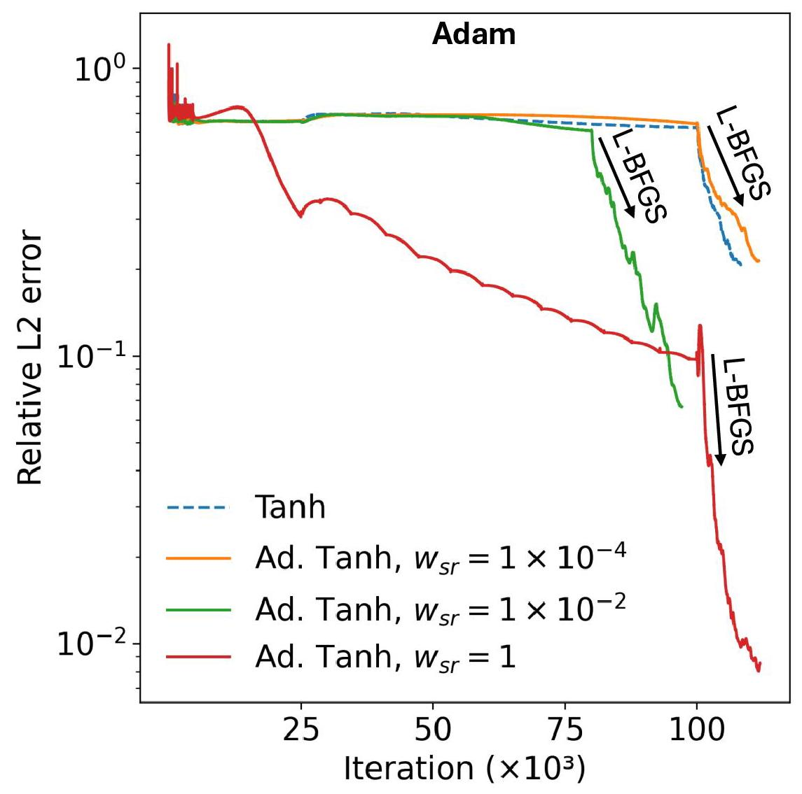

Figure B.1: PINN with adaptive Tanh activation function training history for KdV equation. Relative ${L}^{2}$ error during training with adaptive activation functions including slope recovery loss term with different weights $\left( {w}_{sr}\right)$ , trained with Adam. Note that by increasing the weight for the slope recovery term, the errors starts dropping down earlier.

图B.1:用于KdV方程的具有自适应双曲正切激活函数的PINN训练历史。使用包括具有不同权重$\left( {w}_{sr}\right)$的斜率恢复损失项的自适应激活函数进行训练期间的相对${L}^{2}$误差，采用Adam优化器进行训练。请注意，通过增加斜率恢复项的权重，误差会更早开始下降。

## Appendix C Wave equations results

## 附录C波动方程结果

Table C.1: Wave equation prediction errors. Comparison of PINN performance with different activation functions and optimizers for cases (i)-(iii). The results for case (iv) are shown in Table 3 of the main text. Note that for case (i) with no multi-scale features or high frequencies, using SIREN with ${w}_{0} = 5$ is better than using SIREN with ${w}_{0} = {30}$ .

表C.1:波动方程预测误差。针对情况(i) - (iii)，比较PINN在不同激活函数和优化器下的性能。情况(iv)的结果显示在正文的表3中。请注意，对于没有多尺度特征或高频的情况(i)，使用带有${w}_{0} = 5$的SIREN比使用带有${w}_{0} = {30}$的SIREN更好。

<table><tr><td>PINN</td><td>Rel. ${L}^{2}$ Error</td><td>Barron Norm Rel. ${L}^{2}$ Error</td><td>$\log \left( {e}_{\mathcal{F}, p = 0}\right)$</td><td>$\log \left( {e}_{\mathcal{F}, p = 2}\right)$</td><td>$\log \left( {e}_{\mathcal{F}, p = 4}\right)$</td></tr><tr><td colspan="6">Case (i)</td></tr><tr><td>Adam (Tanh)</td><td>${5.08} \times  {10}^{-3}$</td><td>${2.94} \times  {10}^{-3}$</td><td>-5.19</td><td>-1.83</td><td>2.27</td></tr><tr><td>Adam (SIREN)</td><td>${6.11} \times  {10}^{-3}$</td><td>${4.45} \times  {10}^{-3}$</td><td>-5.03</td><td>-1.58</td><td>2.54</td></tr><tr><td>SOAP (Tanh)</td><td>${1.19} \times  {10}^{-3}$</td><td>${2.86} \times  {10}^{-4}$</td><td>-6.44</td><td>-4.28</td><td>0.80</td></tr><tr><td>SOAP (SIREN, ${w}_{0} = {30}$ )</td><td>${1.59} \times  {10}^{-3}$</td><td>${2.19} \times  {10}^{-4}$</td><td>-5.11</td><td>-4.24</td><td>0.49</td></tr><tr><td>SOAP (SIREN, ${w}_{0} = 5$ )</td><td>${8.45} \times  {10}^{-4}$</td><td>${1.81} \times  {10}^{-4}$</td><td>-6.59</td><td>-4.20</td><td>0.50</td></tr><tr><td>SS-Broyden (Tanh)</td><td>${4.33} \times  {10}^{-8}$</td><td>${4.99} \times  {10}^{-8}$</td><td>-14.83</td><td>-9.69</td><td>-3.92</td></tr><tr><td>SS-Broyden (SIREN)</td><td>${2.32} \times  {10}^{-8}$</td><td>${2.89} \times  {10}^{-8}$</td><td>-14.95</td><td>-10.06</td><td>-4.17</td></tr><tr><td colspan="6">Case (ii)</td></tr><tr><td>Adam (Tanh)</td><td>${8.71} \times  {10}^{-2}$</td><td>${6.20} \times  {10}^{-2}$</td><td>-2.75</td><td>0.85</td><td>5.48</td></tr><tr><td>Adam (SIREN)</td><td>${1.72} \times  {10}^{-2}$</td><td>${1.07} \times  {10}^{-2}$</td><td>-4.16</td><td>-1.14</td><td>3.92</td></tr><tr><td>SOAP (Tanh)</td><td>${1.32} \times  {10}^{-3}$</td><td>${1.08} \times  {10}^{-3}$</td><td>-6.39</td><td>-2.95</td><td>1.99</td></tr><tr><td>SOAP (SIREN)</td><td>${6.19} \times  {10}^{-4}$</td><td>${3.95} \times  {10}^{-4}$</td><td>-7.05</td><td>-3.46</td><td>1.51</td></tr><tr><td>SS-Broyden (Tanh)</td><td>${1.16} \times  {10}^{-6}$</td><td>${8.01} \times  {10}^{-7}$</td><td>-12.50</td><td>-6.99</td><td>-1.39</td></tr><tr><td>SS-Broyden (SIREN)</td><td>${2.81} \times  {10}^{-7}$</td><td>${2.68} \times  {10}^{-7}$</td><td>-13.71</td><td>-8.26</td><td>-2.50</td></tr><tr><td colspan="6">Case (iii)</td></tr><tr><td>Adam (Tanh)</td><td>0.84</td><td>0.68</td><td>-1.39</td><td>1.96</td><td>6.91</td></tr><tr><td>Adam (SIREN)</td><td>0.18</td><td>0.11</td><td>-2.73</td><td>0.19</td><td>5.38</td></tr><tr><td>SOAP (Tanh)</td><td>${1.38} \times  {10}^{-3}$</td><td>${1.19} \times  {10}^{-3}$</td><td>-6.96</td><td>-3.3</td><td>1.76</td></tr><tr><td>SOAP (SIREN)</td><td>${1.23} \times  {10}^{-3}$</td><td>${7.42} \times  {10}^{-4}$</td><td>-7.08</td><td>-3.50</td><td>1.45</td></tr><tr><td>SS-Broyden (Tanh)</td><td>${4.01} \times  {10}^{-6}$</td><td>${2.82} \times  {10}^{-6}$</td><td>-12.04</td><td>-3.30</td><td>1.76</td></tr><tr><td>SS-Broyden (SIREN)</td><td>${8.37} \times  {10}^{-7}$</td><td>${7.01} \times  {10}^{-7}$</td><td>-13.39</td><td>-7.56</td><td>-1.66</td></tr></table>

Appendix D Effect of the optimizer on spectral bias in neural operators

附录D优化器对神经算子中频谱偏差的影响

In addition to the training objective, the optimizer can materially affect how fast and how well high spatial frequencies are learned. To isolate optimizer effects from architectural and loss-design choices, we repeat the impinging-jet super-resolution experiment using the same data split and model configurations as in the main text, and we vary only the optimizer. Figure D. 2 visualizes representative reconstructions together with frequency-domain and derivative-based diagnostics.

除了训练目标之外，优化器会实质性地影响高空间频率的学习速度和效果。为了将优化器的影响与架构和损失设计选择区分开来，我们使用与正文相同的数据划分和模型配置重复冲击射流超分辨率实验，并且仅改变优化器。图D.2展示了代表性的重建结果以及基于频域和导数的诊断。

Figure D. 2 compares Adam [48] and SOAP [49] for DeepONet and CNO. Across both architectures, Adam recovers the dominant large-scale shock topology but exhibits stronger attenuation of the high-wavenumber tail of the energy spectrum, consistent with visibly over-smoothed reconstructions. SOAP yields closer agreement with the reference spectrum into the high- $k$ regime and produces sharper gradients and Laplacians, indicating improved recovery of fine-scale density-gradient features that are under-represented by Adam. These observations suggest that optimizer-induced preconditioning can either amplify or suppress the effective learning rate of high-frequency modes, thereby interacting with spectral bias.

图D.2比较了用于深度算子网络(DeepONet)和CNO的Adam [48]和SOAP [49]。在这两种架构中，Adam恢复了主导的大尺度激波拓扑，但在能量谱的高波数尾部表现出更强的衰减，这与明显过度平滑的重建结果一致。SOAP在高$k$区域与参考谱的一致性更高，并且产生更尖锐的梯度和拉普拉斯算子，表明在恢复Adam表示不足的精细尺度密度梯度特征方面有所改进。这些观察结果表明，优化器诱导的预处理可以放大或抑制高频模式的有效学习率，从而与频谱偏差相互作用。

Conceptually, Adam is a first-order method that applies a diagonal, per-parameter adaptive scaling based on exponential moving averages of the gradient and squared gradient [48]. SOAP is a preconditioned method that builds on Shampoo-style curvature information [50] and runs Adam-like updates in a rotated (preconditioned) coordinate system, which empirically improves stability and convergence in large-scale training [49]. We also explored second-order optimizers like SS-Broyden for neural operators, motivated by their strong performance in PINNs. However, making such optimizers work for data-driven neural operators was a challenge we could not resolve in this work. Two practical differences exist. First, many PINN studies successfully use full-batch quasi-Newton training because the number of collocation points is typically modest, for example, [1] explicitly uses L-BFGS as a quasi-Newton, full-batch optimizer when the training set is small. Second, precision can be critical in PDE-residual optimization. Recent evidence shows that FP64 can prevent precision-induced stalls of L-BFGS in PINNs [51]. In contrast, neural operators are typically much bigger, commonly trained in mini-batches on large datasets, and are often run in FP32 for throughput. Under these constraints, stable estimation and inversion of Fisher or Gauss-Newton structure typically requires aggressive approximations (subsampling, low-rank structure, truncated solves), and the resulting updates can be sensitive to noise, damping, and numerical conditioning. Developing reliable second-order variants tailored to neural operators remains a promising direction for future work, especially if combined with improved precision control, better curvature estimators, and scalable linear-solve strategies [52].

从概念上讲，Adam是一种一阶方法，它基于梯度和平方梯度的指数移动平均值应用对角的、针对每个参数的自适应缩放[48]。SOAP是一种预处理方法，它基于Shampoo风格的曲率信息[50]，并在旋转(预处理)坐标系中运行类似Adam的更新，根据经验，这在大规模训练中提高了稳定性和收敛性[49]。我们还探索了用于神经算子的二阶优化器，如SS - Broyden，这是受它们在PINN中的强大性能所推动。然而，使这些优化器适用于数据驱动的神经算子是我们在这项工作中无法解决的一个挑战。存在两个实际差异。第一，许多PINN研究成功地使用全批量拟牛顿训练，因为配置点的数量通常较少，例如，[1]在训练集较小时明确使用L - BFGS作为拟牛顿全批量优化器。第二，精度在PDE残差优化中可能至关重要。最近的证据表明，FP64可以防止PINN中由精度引起的L - BFGS停滞[51]。相比之下，神经算子通常要大得多，通常在大型数据集上进行小批量训练，并且为了吞吐量经常在FP32中运行。在这些约束条件下，Fisher或高斯 - 牛顿结构的稳定估计和求逆通常需要激进的近似(子采样、低秩结构、截断求解)，并且由此产生的更新可能对噪声、阻尼和数值条件敏感。开发适用于神经算子的可靠二阶变体仍然是未来工作的一个有前途的方向，特别是如果与改进的精度控制、更好的曲率估计器和可扩展的线性求解策略相结合[52]。

On the earthquake structural response problem SOAP has a stronger effect, and is critical for DeepONet and DeepOKAN architectures. For Deep-ONet with SIREN, SOAP achieves ${2.0} \times$ lower NRMSE (0.0008 vs 0.0015) in the baseline configuration, with the advantage persisting under BSP (1.4 $\times$ lower NRMSE, 0.0009 vs 0.0013). DeepOKAN with Adam [48] fails to converge entirely, while SOAP achieves 0.0022 NRMSE, highlighting SOAP's importance for architectures with challenging optimization landscapes. These optimizer effects hold for both baseline (L2 only) and BSP configurations, as shown by the paired rows in Table E.2. FNO and CNO show minimal optimizer sensitivity in field accuracy, but SOAP provides spectral improvement for FNO BSP (0.082 vs 0.098, 1.2×). Moreover, SOAP's advantage extends beyond error magnitude to reliability: across repeated runs with different random seeds, Adam occasionally fails to converge even for DeepONet SIREN (which converges reliably with SOAP), while DeepOKAN with Adam fails consistently across all seeds. Figure D. 3 illustrates these effects for a

在地震结构响应问题上，SOAP具有更强的效果，对DeepONet和DeepOKAN架构至关重要。对于带有SIREN的Deep-ONet，在基线配置中，SOAP实现了${2.0} \times$更低的NRMSE(0.0008对0.0015)，在BSP下该优势依然存在(NRMSE低1.4$\times$，0.0009对0.0013)。使用Adam [48]的DeepOKAN未能完全收敛，而SOAP实现了0.0022的NRMSE，凸显了SOAP对具有挑战性优化格局的架构的重要性。如E.2表中的配对行所示，这些优化器效果在基线(仅L2)和BSP配置中均成立。FNO和CNO在场精度方面显示出最小的优化器敏感性，但SOAP为FNO BSP提供了频谱改进(0.082对0.098，1.2倍)。此外，SOAP的优势不仅体现在误差幅度上，还体现在可靠性上:在使用不同随机种子的重复运行中，Adam偶尔甚至无法使DeepONet SIREN收敛(使用SOAP时能可靠收敛)，而使用Adam的DeepOKAN在所有种子下均持续无法收敛。图D.3展示了一个代表性测试样本的这些效果。

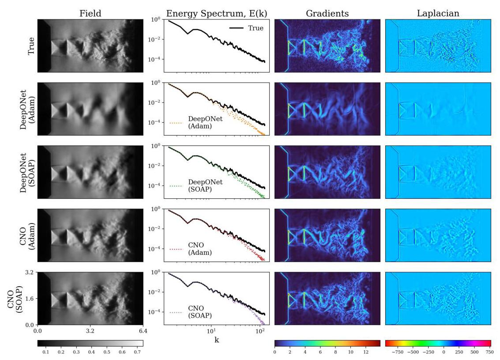

Figure D.2: Optimizer effects on spectral bias in neural operators. Columns show (from left to right) Schlieren fields, the isotropic energy spectrum $E\left( k\right)$ , spatial gradients, and the Laplacian. Rows compare the ground truth against DeepONet and CNO trained with Adam and SOAP. SOAP yields improved agreement with the reference spectrum at high wavenumbers and recovers sharper derivative-based features, indicating reduced attenuation of fine scales relative to Adam.

图D.2:优化器对神经算子频谱偏差的影响。列(从左到右)显示纹影场、各向同性能谱$E\left( k\right)$、空间梯度和拉普拉斯算子。行比较了使用Adam和SOAP训练的DeepONet和CNO与真实值。SOAP在高波数下与参考频谱的一致性得到改善，并恢复了更清晰的基于导数的特征，表明相对于Adam，细尺度的衰减减少。

representative test sample.

代表性测试样本。

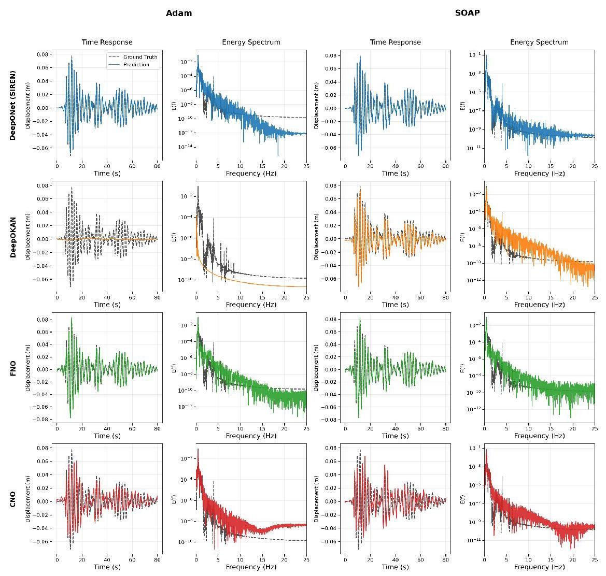

Figure D.3: SOAP vs Adam for earthquake response prediction. Time response and energy spectrum for a representative test sample comparing Adam (left pair) and SOAP (right pair). Adam DeepOKAN fails to converge (near-flat prediction and flat spectral tail), while SOAP enables convergence for all architectures with improved spectral accuracy at high frequencies.

图D.3:地震响应预测中SOAP与Adam的对比。比较Adam(左对)和SOAP(右对)的一个代表性测试样本的时间响应和能谱。使用Adam的DeepOKAN未能收敛(预测近乎平坦且频谱尾部平坦)，而SOAP能使所有架构收敛，且在高频处频谱精度提高。

## Appendix E Additional considerations for the earthquake prob- lem

## 附录E 地震问题的其他考虑因素

Table E. 2 compares SOAP and Adam across all architectures for both baseline and BSP loss configurations with causal training for DeepONet/DeepOKAN, including both SIREN and Tanh activations for DeepONet.

表E.2比较了在DeepONet/DeepOKAN的因果训练中，针对基线和BSP损失配置，在所有架构上SOAP和Adam的情况，包括DeepONet的SIREN和Tanh激活函数。

Table E.2: Optimizer, activation, and loss comparison for earthquake response prediction (causal training). - Failed to converge.

表E.2:地震响应预测(因果训练)的优化器、激活函数和损失比较。 - 未能收敛。

<table><tr><td rowspan="2">Model</td><td colspan="2">Field Error</td><td colspan="2">Log Spectral Error</td><td colspan="2">Barron Norm Error</td><td colspan="2">Accel. Error</td></tr><tr><td>Adam</td><td>SOAP</td><td>Adam</td><td>SOAP</td><td>Adam</td><td>SOAP</td><td>Adam</td><td>SOAP</td></tr><tr><td colspan="9">DeepONet</td></tr><tr><td>(SIREN)</td><td>0.0015</td><td>0.0008</td><td>0.0974</td><td>0.1257</td><td>0.0025</td><td>0.0019</td><td>0.0381</td><td>0.0506</td></tr><tr><td>DeepONet   (SIREN, BSP)</td><td>0.0013</td><td>0.0009</td><td>0.1026</td><td>0.1366</td><td>0.0020</td><td>0.0027</td><td>0.0314</td><td>0.0619</td></tr><tr><td>DeepONet   (Tanh)</td><td>-</td><td>-</td><td>-</td><td>-</td><td>-</td><td>-</td><td>-</td><td>-</td></tr><tr><td>DeepONet   (Tanh, BSP)</td><td>0.0013</td><td>0.0006</td><td>0.1090</td><td>0.1103</td><td>0.0021</td><td>0.0012</td><td>0.0373</td><td>0.0303</td></tr><tr><td>DeepOKAN   DeepOKAN</td><td>-</td><td>0.0022</td><td>-</td><td>0.1230</td><td>-</td><td>0.0029</td><td>-</td><td>0.0584</td></tr><tr><td>(BSP)</td><td>-</td><td>0.0044</td><td>-</td><td>0.1750</td><td>-</td><td>0.0077</td><td>-</td><td>0.1595</td></tr><tr><td>FNO</td><td>0.0037</td><td>0.0038</td><td>0.1463</td><td>0.1485</td><td>0.0047</td><td>0.0045</td><td>0.0672</td><td>0.0645</td></tr><tr><td>FNO   (BSP)</td><td>0.0042</td><td>0.0041</td><td>0.0983</td><td>0.0819</td><td>0.0034</td><td>0.0030</td><td>0.0309</td><td>0.0296</td></tr><tr><td>CNO</td><td>0.0126</td><td>0.0135</td><td>0.1183</td><td>0.1323</td><td>0.0039</td><td>0.0040</td><td>0.0281</td><td>0.0325</td></tr><tr><td>CNO   (BSP)</td><td>0.0197</td><td>0.0145</td><td>0.0774</td><td>0.0758</td><td>0.0059</td><td>0.0043</td><td>0.0272</td><td>0.0263</td></tr></table>

### E.1 Extended BSP comparison

### E.1扩展的BSP比较

Figure E. 4 extends the representative BSP example in Figure 10(b) to all four architectures, showing the full baseline vs BSP comparison.

图E.4将图10(b)中的代表性BSP示例扩展到所有四种架构，展示了完整的基线与BSP比较。

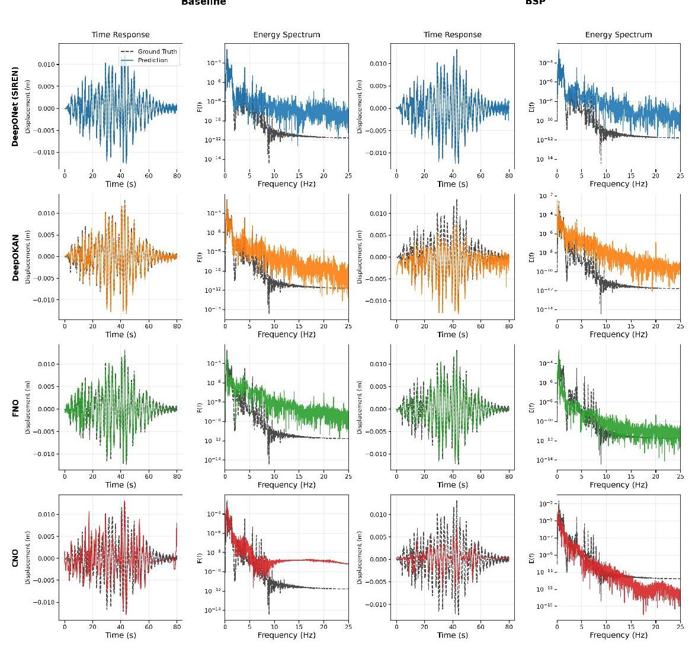

Figure E.4: Effect of BSP on spectral fidelity for earthquake response prediction. Time response (columns 1, 3) and energy spectrum (columns 2, 4) for a representative test sample comparing baseline (left pair) and BSP (right pair) training across all four architectures. Note the difference in scale of energy values (y-axis) when comparing these results to the impinging-jet problem.

图E.4:BSP对地震响应预测频谱保真度的影响。比较所有四种架构的基线(左对)和BSP(右对)训练的一个代表性测试样本的时间响应(第1、3列)和能谱(第2、4列)。注意，将这些结果与冲击射流问题比较时能量值(y轴)的尺度差异。

### E.2 Activation effects (SIREN vs Tanh)

### E.2激活函数的影响(SIREN与Tanh)

The interaction between activation function and loss formulation reveals complementary mechanisms for spectral bias mitigation. With baseline training, SIREN converges reliably (0.0008 NRMSE) while Tanh fails to converge (0.024), demonstrating SIREN's robustness. However, with BSP, Tanh achieves the best absolute accuracy (0.0006 field, 0.110 spectral) across all configurations, outperforming SIREN+BSP (0.0009 field, 0.137 spectral). Acceleration error confirms this pattern: Tanh+BSP achieves 0.030 vs SIREN+BSP 0.062 ( ${2.0} \times$ better). This suggests that SIREN's periodic activations provide implicit spectral bias mitigation that overlaps with BSP's explicit regularization; when both are active, the redundant spectral gradients may interfere rather than compound. In contrast, Tanh relies entirely on BSP for high-frequency content, allowing complementary rather than redundant optimization gradients. The cosine similarity between the per loss gradients (Table E.4) corroborates this interpretation: SIREN exhibits the strongest negative gradient alignment (-0.48 final cosine similarity), while Tanh shows weaker conflict (-0.18), permitting BSP's spectral signal to provide net benefit. Figure E.5 illustrates these contrasting mechanisms for a representative test sample.

激活函数与损失公式之间的相互作用揭示了减轻频谱偏差的互补机制。在基线训练中，SIREN可靠收敛(NRMSE为0.0008)，而Tanh未能收敛(0.024)，证明了SIREN的鲁棒性。然而，在BSP下，Tanh在所有配置中实现了最佳绝对精度(场为0.0006，频谱为0.110)，优于SIREN + BSP(场为0.0009，频谱为0.137)。加速度误差证实了这一模式:Tanh + BSP为0.030，而SIREN + BSP为0.062(${2.0} \times$更好)。这表明SIREN的周期性激活提供了与BSP的显式正则化重叠的隐式频谱偏差减轻；当两者都起作用时，冗余的频谱梯度可能相互干扰而非叠加。相比之下，Tanh完全依赖BSP获取高频内容，允许互补而非冗余的优化梯度。每个损失梯度之间的余弦相似度(表E.4)证实了这一解释:SIREN表现出最强的负梯度对齐(最终余弦相似度为 -0.48)，而Tanh显示出较弱的冲突(-0.18)，使BSP的频谱信号能提供净收益。图E.5展示了一个代表性测试样本的这些对比机制。

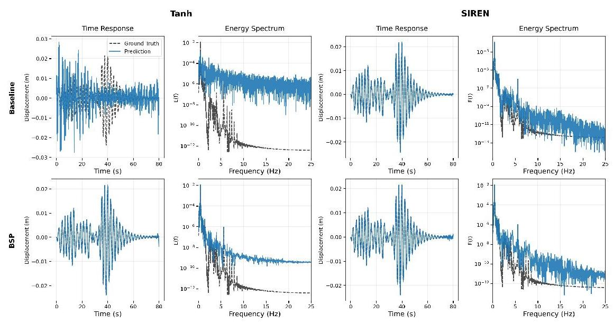

Figure E.5: Activation function effects on DeepONet. Time response and energy spectrum comparing Tanh (left pair) and SIREN (right pair) activations for both baseline (top row) and Log-BSP (bottom row) training. Tanh baseline fails to capture the structural response, but BSP enables convergence to the best overall accuracy. SIREN converges reliably without BSP but shows diminishing returns when BSP is added.

图E.5:激活函数对DeepONet的影响。比较基线(上排)和对数BSP(下排)训练中Tanh(左对)和SIREN(右对)激活的时间响应和能谱。Tanh基线无法捕捉结构响应，但BSP能使其收敛到最佳总体精度。SIREN在没有BSP时可靠收敛，但添加BSP后收益递减。

### E.3 Causal training

### E.3 因果训练

Causal (per-timestep) training [47] proved essential for DeepONet and DeepOKAN on this small dataset. Non-causal (sequence) variants mostly failed to converge, and those that did achieve marginal convergence produced field errors

因果(逐时间步)训练[47]在这个小数据集上对DeepONet和DeepOKAN被证明是至关重要的。非因果(序列)变体大多未能收敛，而那些实现了边际收敛的变体产生的场误差

an order of magnitude worse than their causal counterparts, as shown in Table E.3. Figure E.6 illustrates the failure mode of non-causal training for a representative test sample.

比它们的因果对应物差一个数量级，如表E.3所示。图E.6说明了一个代表性测试样本的非因果训练的失败模式。

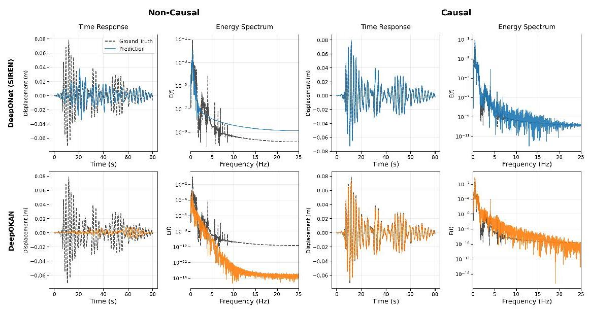

Figure E.6: Causal vs non-causal training for branch-trunk architectures. Time response and energy spectrum comparing non-causal training (left pair) and causal training (right pair) for DeepONet and DeepOKAN. Non-causal DeepOKAN fails to converge entirely, while non-causal DeepONet achieves only marginal convergence with substantially degraded spectral fidelity compared to its causal counterpart.

图E.6:分支 - 主干架构的因果与非因果训练。比较DeepONet和DeepOKAN的非因果训练(左对)和因果训练(右对)的时间响应和能谱。非因果的DeepOKAN完全未能收敛，而非因果的DeepONet仅实现了边际收敛，与其因果对应物相比，频谱保真度大幅下降。

Table E.3: Causal (C) vs non-causal (NC) training for branch-trunk architectures (SOAP optimizer). - Failed to converge (field error $\geq  {0.023}$ ).

表E.3:分支 - 主干架构(SOAP优化器)的因果(C)与非因果(NC)训练。 - 未能收敛(场误差$\geq  {0.023}$)。

<table><tr><td rowspan="2">Model</td><td colspan="2">Field Error</td><td colspan="2">Log Spectral Error</td><td colspan="2">Barron Norm Error</td><td colspan="2">Accel. Error</td></tr><tr><td>C</td><td>NC</td><td>C</td><td>NC</td><td>C</td><td>NC</td><td>C</td><td>NC</td></tr><tr><td>DeepONet (SIREN)</td><td>0.0008</td><td>0.0211</td><td>0.1257</td><td>0.0961</td><td>0.0019</td><td>0.0054</td><td>0.0506</td><td>0.0277</td></tr><tr><td>DeepONet (SIREN, BSP)</td><td>0.0009</td><td>-</td><td>0.1366</td><td>-</td><td>0.0027</td><td>-</td><td>0.0619</td><td>-</td></tr><tr><td>DeepONet   (Tanh)</td><td>-</td><td>-</td><td>-</td><td>-</td><td>-</td><td>-</td><td>-</td><td>-</td></tr><tr><td>DeepONet   (Tanh, BSP)</td><td>0.0006</td><td>-</td><td>0.1103</td><td>-</td><td>0.0012</td><td>-</td><td>0.0303</td><td>-</td></tr><tr><td>DeepOKAN</td><td>0.0022</td><td>-</td><td>0.1230</td><td>-</td><td>0.0029</td><td>-</td><td>0.0584</td><td>-</td></tr><tr><td>DeepOKAN   (BSP)</td><td>0.0044</td><td>-</td><td>0.1750</td><td>-</td><td>0.0077</td><td>-</td><td>0.1595</td><td>-</td></tr></table>

### E.4 Gradient alignment

### E.4 梯度对齐

To investigate whether the structural mismatch between per-timestep L2 and sequence-level BSP produces competing gradient signals, we train each configuration while computing per-loss gradients and measuring their cosine similarity for each batch. Positive values indicate aligned objectives; negative values indicate the two losses pull parameters in opposing directions. Table E. 4 summarises the results across all eight model configurations. To isolate the effect of the causal training structure, we also train DeepONet and DeepOKAN in non-causal mode (both L2 and BSP on the same full-sequence output, identical to FNO/CNO).

为了研究逐时间步L2和序列级BSP之间的结构不匹配是否会产生相互竞争的梯度信号，我们在计算每个损失的梯度并测量每个批次的余弦相似度的同时训练每个配置。正值表示目标对齐；负值表示两个损失将参数拉向相反方向。表E.4总结了所有八种模型配置的结果。为了隔离因果训练结构的影响，我们还以非因果模式训练DeepONet和DeepOKAN(L2和BSP都作用于相同的全序列输出，与FNO/CNO相同)。

Table E.4: Cosine similarity between L2 field-loss and BSP spectral-loss gradients. Positive values indicate aligned optimization directions; negative values indicate competing gradients.

表E.4:L2场损失和BSP频谱损失梯度之间的余弦相似度。正值表示对齐的优化方向；负值表示相互竞争的梯度。

<table><tr><td>Model</td><td>Training Mode</td><td>Final Cos Sim</td></tr><tr><td>DeepONet (SIREN)</td><td>Causal</td><td>-0.482</td></tr><tr><td>DeepONet (Tanh)</td><td>Causal</td><td>-0.181</td></tr><tr><td>DeepOKAN</td><td>Causal</td><td>+0.021</td></tr><tr><td>DeepONet (SIREN)</td><td>Non-causal</td><td>+0.126</td></tr><tr><td>DeepONet (Tanh)</td><td>Non-causal</td><td>+0.107</td></tr><tr><td>DeepOKAN</td><td>Non-causal</td><td>+0.042</td></tr><tr><td>FNO</td><td>Non-causal</td><td>+0.282</td></tr><tr><td>CNO</td><td>Non-causal</td><td>-0.185</td></tr></table>

Figure E.7 shows the evolution of gradient cosine similarity over the course of training, confirming that these endpoint values reflect sustained trends rather than transient fluctuations. Among the non-causal models, FNO shows the strongest positive alignment (+0.28 by the end of training). Both the field loss and the BSP loss see the same full-sequence forward pass output, so their gradient directions are compatible. This explains BSP's clear spectral improvement for FNO reported in Table 6.

图E.7显示了训练过程中梯度余弦相似度的演变，证实了这些端点值反映了持续的趋势而不是瞬态波动。在非因果模型中，FNO显示出最强的正对齐(训练结束时为+0.28)。场损失和BSP损失都看到相同的全序列前向传递输出，因此它们的梯度方向是兼容的。这解释了表6中报告的FNO的BSP的明显频谱改善。

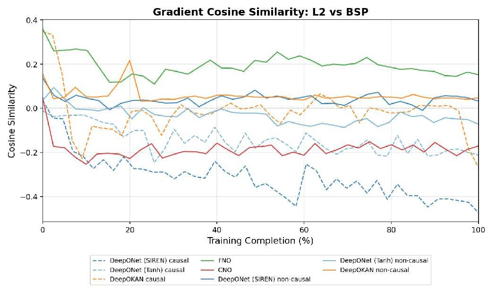

Figure E.7: Gradient cosine similarity over training. Cosine similarity between L2 field-loss and BSP spectral-loss gradients as a function of training completion. Dashed lines indicate causal training; solid lines indicate non-causal training. DeepONet (SIREN) under causal training diverges toward strongly negative values, confirming increasing gradient conflict over the course of training.

图E.7:训练过程中的梯度余弦相似度。L2场损失和BSP频谱损失梯度之间的余弦相似度作为训练完成的函数。虚线表示因果训练；实线表示非因果训练。因果训练下的DeepONet(SIREN)趋向于强烈的负值，证实了训练过程中梯度冲突的增加。

DeepONet with SIREN shows the strongest gradient conflict under causal training, with cosine similarity reaching -0.48 by the end of training (Figure E.7). The per-timestep L2 loss and the sequence-level BSP produce opposing gradient signals, directly explaining BSP's ineffectiveness for this configuration. DeepONet with Tanh shows weaker conflict (-0.18 final), consistent with BSP still providing net benefit despite the structural mismatch. The difference may reflect how SIREN's periodic activations create additional spectral gradient competition beyond the structural mismatch alone. DeepOKAN gradients are near-orthogonal under causal training (+0.02 final), consistent with BSP having minimal net directional effect on this architecture.

具有SIREN的DeepONet在因果训练下显示出最强的梯度冲突，训练结束时余弦相似度达到 - 0.48(图E.7)。逐时间步L²损失和序列级BSP产生相反的梯度信号，直接解释了BSP对这种配置的无效性。具有Tanh的DeepONet显示出较弱的冲突(最终为 - 0.18)，这与尽管存在结构不匹配但BSP仍提供净收益一致。差异可能反映了SIREN的周期性激活如何在仅结构不匹配之外产生额外的频谱梯度竞争。因果训练下DeepOKAN的梯度几乎正交(最终为+0.02)，这与BSP对该架构的净方向影响最小一致。

The non-causal results isolate the effect of the causal training structure. When the causal/non-causal mismatch is removed and both losses operate on the same full-sequence output, all three branch-trunk architectures shift toward positive alignment: DeepONet (SIREN) moves from -0.48 to +0.13, DeepONet (Tanh) from -0.18 to +0.11, and DeepOKAN from +0.02 to +0.04. This confirms that the negative gradient alignment is caused by the causal training structure rather than being an intrinsic property of the architectures. Notably, SIREN's non-causal L2 gradients are slightly more aligned with BSP (+0.13) than Tanh's (+0.11), which is directionally consistent with the overlapping-mechanism interpretation from subsection E.2: SIREN's periodic activations naturally produce field-loss gradients that partially overlap with BSP's spectral objective, whereas Tanh's field-loss gradients are more orthogonal to it.

非因果结果隔离了因果训练结构的影响。当消除因果/非因果不匹配并且两个损失都作用于相同的全序列输出时，所有三种分支 - 主干架构都趋向于正对齐:DeepONet(SIREN)从 - 0.48变为+0.13，DeepONet(Tanh)从 - 0.18变为+0.11，DeepOKAN从+0.02变为+0.04。这证实了负梯度对齐是由因果训练结构引起的，而不是架构的固有属性。值得注意的是，SIREN的非因果L2梯度与BSP的对齐程度(+0.13)略高于Tanh的(+0.11)，这在方向上与E.2小节中的重叠机制解释一致:SIREN的周期性激活自然地产生与BSP的频谱目标部分重叠的场损失梯度，而Tanh的场损失梯度与之更正交。

CNO shows negative alignment (-0.19) yet BSP still helps empirically, though its benefit is weaker than FNO’s $({1.2} \times$ spectral improvement vs FNO's 1.8×). This is potentially due to the model's inherent regularization (due to its bottleneck structure) making the loss landscape more navigable despite the gradient conflict. More investigation is needed to fully explain why BSP's improvement is contextual to the model it's used with.

CNO显示出负对齐( - 0.19)，但从经验上看BSP仍然有帮助，尽管它的收益比FNO弱($({1.2} \times$，FNO的频谱改善为1.8倍)。这可能是由于模型的固有正则化(由于其瓶颈结构)使得尽管存在梯度冲突，但损失景观更易于导航。需要更多的研究来充分解释为什么BSP的改进与它所使用的模型相关。