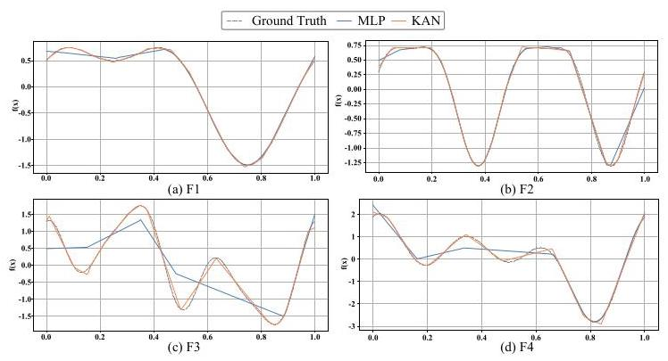
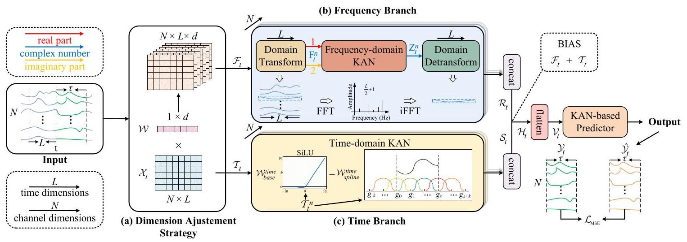
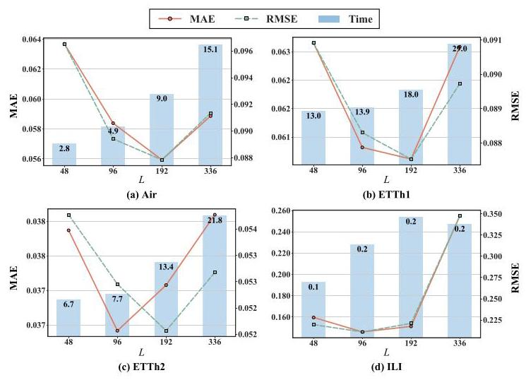
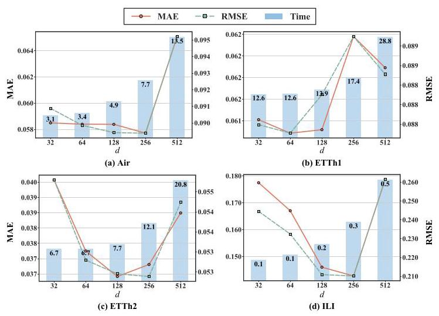
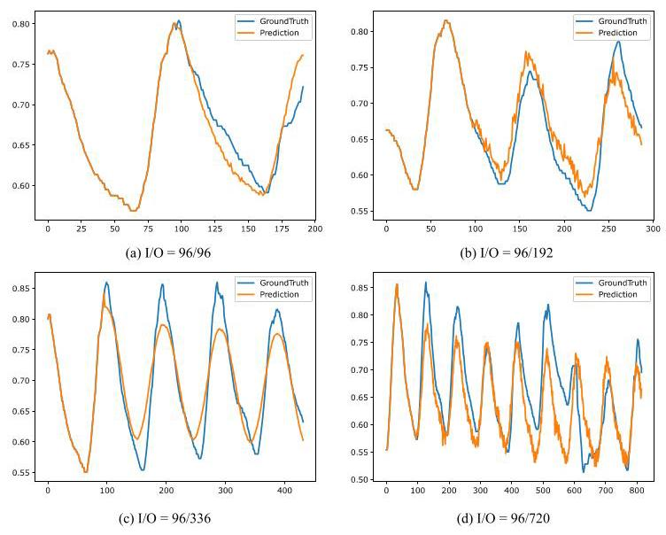

# TFKAN: Time-Frequency KAN for Long-Term Time Series Forecasting

# TFKAN:用于长期时间序列预测的时频KAN

Xiaoyan Kui, Canwei Liu, Qinsong Li*, Zhipeng Hu, Yangyang Shi, Weixin Si, and Beiji Zou

 Kui Xiaoyan, Liu Canwei, Li Qinsong*, Hu Zhipeng, Shi Yangyang, Si Weixin, and Zou Beiji

Abstract-Kolmogorov-Arnold Networks (KANs) are highly effective in long-term time series forecasting due to their ability to efficiently represent nonlinear relationships and exhibit local plasticity. However, prior research on KANs has predominantly focused on the time domain, neglecting the potential of the frequency domain. The frequency domain of time series data reveals recurring patterns and periodic behaviors, which complement the temporal information captured in the time domain. To address this gap, we explore the application of KANs in the frequency domain for long-term time series forecasting. By leveraging KANs' adaptive activation functions and their comprehensive representation of signals in the frequency domain, we can more effectively learn global dependencies and periodic patterns. To integrate information from both time and frequency domains, we propose the Time-Frequency KAN (TFKAN). TFKAN employs a dual-branch architecture that independently processes features from each domain, ensuring that the distinct characteristics of each domain are fully utilized without interference. Additionally, to account for the heterogeneity between domains, we introduce a dimension-adjustment strategy that selectively upscales only in the frequency domain, enhancing efficiency while capturing richer frequency information. Experimental results demonstrate that TFKAN consistently outperforms state-of-the-art (SOTA) methods across multiple datasets. The code is available at https://github.com/LcWave/TFKAN.

摘要 - 柯尔莫哥洛夫 - 阿诺德网络(KANs)在长期时间序列预测中非常有效，因为它们能够有效地表示非线性关系并展现出局部可塑性。然而，先前对KANs的研究主要集中在时域，忽略了频域的潜力。时间序列数据的频域揭示了重复模式和周期性行为，这些补充了在时域中捕获的时间信息。为了弥补这一差距，我们探索了KANs在频域中用于长期时间序列预测的应用。通过利用KANs的自适应激活函数及其在频域中对信号的全面表示，我们可以更有效地学习全局依赖性和周期性模式。为了整合来自时域和频域的信息，我们提出了时频KAN(TFKAN)。TFKAN采用双分支架构，独立处理来自每个域的特征，确保每个域的独特特征得到充分利用而不会相互干扰。此外，为了考虑域之间的异质性，我们引入了一种维度调整策略，仅在频域中选择性地上采样，提高效率同时捕获更丰富的频率信息。实验结果表明，TFKAN在多个数据集上始终优于现有最先进(SOTA)方法。代码可在https://github.com/LcWave/TFKAN获取。

Index Terms-Time series forecasting, long-term forecasting, Kolmogorov-Arnold networks, frequency domain, Fourier transform.

关键词 - 时间序列预测，长期预测，柯尔莫哥洛夫 - 阿诺德网络，频域，傅里叶变换。

## I. INTRODUCTION

## I. 引言

TIME series forecasting (TSF) is crucial in various domains, such as financial modeling, healthcare diagnostics, and weather forecasting [1]-[4]. Accurate long-term time series forecasting (LTSF) provides greater convenience, enabling more informed planning and decision-making [5], [6]. Unlike short-term forecasting, long-term forecasting cannot rely solely on recent temporal information, such as trends, in the time domain. In other words, stock prices do not follow patterns from just the last few days, they must capture stable periodicity within the time series. Therefore, most models leverage the Transformer's ability [7]-[10] to model long-term dependencies for LTSF tasks.

时间序列预测(TSF)在各个领域都至关重要，如金融建模、医疗诊断和天气预报[1]-[4]。准确的长期时间序列预测(LTSF)提供了更大的便利，使规划和决策更明智[5]，[6]。与短期预测不同，长期预测不能仅仅依赖于时域中的近期时间信息，如趋势。换句话说，股票价格并非仅遵循过去几天的模式，它们必须捕捉时间序列内的稳定周期性。因此，大多数模型利用Transformer的能力[7]-[10]来对LTSF任务中的长期依赖性进行建模。

Kolmogorov-Arnold Networks (KANs) [11] have recently emerged as a promising approach for LTSF due to their efficient nonlinear representation capabilities and local plasticity [12], [13]. The local plasticity of B-Spline enables KAN to model complex patterns while preserving previously learned knowledge, making them particularly suitable for the LTSF. Unlike traditional neural network models, such as Multilayer Perceptrons (MLPs) [14] and Transformer [9], KAN mitigates the problem of catastrophic forgetting by leveraging local spline-based parametrizations. This unique feature allows KAN to adapt to new information without disrupting existing representations, enhancing its robustness for long-term sequential learning scenarios.

柯尔莫哥洛夫 - 阿诺德网络(KANs)[11]最近因其高效的非线性表示能力和局部可塑性[12]，[13]而成为LTSF的一种有前途的方法。B - 样条的局部可塑性使KAN能够在保留先前学习的知识的同时对复杂模式进行建模，使其特别适合LTSF。与传统神经网络模型，如多层感知器(MLPs)[14]和Transformer [9]不同，KAN通过利用基于局部样条的参数化减轻了灾难性遗忘问题。这一独特特性使KAN能够适应新信息而不破坏现有表示，增强了其在长期序列学习场景中的鲁棒性。

The frequency domain complements the time domain by providing insights into recurring cycles, periodicities, and spectral distributions that are critical for understanding long-term patterns [15]. Recent studies have shown that periodic patterns are often more salient and interpretable in the frequency domain [14], [16]. Despite these advantages, most existing works on KAN have been restricted to time-domain modeling [17]-[21]. Although the recent TimeKAN [22] employs FFT/IFFT to extract frequency components, the KAN modules themselves are applied only in the time domain. This limits their capacity to directly capture frequency-localized patterns. To the best of our knowledge, no prior work has explicitly applied KAN in the frequency domain. This leaves an open gap in leveraging KAN's potential to jointly capture temporal dependencies and frequency-specific patterns, especially for LTSF tasks.

频域通过提供对重复周期、周期性和频谱分布的洞察来补充时域，这些对于理解长期模式至关重要[15]。最近的研究表明，周期性模式在频域中通常更显著且更易于解释[14]，[16]。尽管有这些优点，但大多数现有的关于KAN的工作都局限于时域建模[17]-[21]。尽管最近的TimeKAN [22]使用FFT/IFFT来提取频率分量，但KAN模块本身仅应用于时域。这限制了它们直接捕获频率局部化模式的能力。据我们所知，以前没有工作明确地在频域中应用KAN。这在利用KAN联合捕获时间依赖性和特定频率模式的潜力方面留下了一个空白，特别是对于LTSF任务。

TABLE I

表I

SYNTHETIC FUNCTIONS USED IN TOY EXPERIMENTS. EACH FUNCTION CONSISTS OF A DIFFERENT COMBINATION OF SINE AND COSINE TERMS, REPRESENTING VARYING FREQUENCY PATTERNS.

玩具实验中使用的合成函数。每个函数由正弦和余弦项的不同组合组成，代表不同的频率模式。

<table><tr><td>ID</td><td>Target Function</td></tr><tr><td>F1</td><td>$\sin \left( {2\pi x}\right)  + {0.5}\cos \left( {4\pi x}\right)$</td></tr><tr><td>F2</td><td>$\sin \left( {4\pi x}\right)  + {0.3}\cos \left( {8\pi x}\right)$</td></tr><tr><td>F3</td><td>$\sin \left( {2\pi x}\right)  + \cos \left( {6\pi x}\right)  + {0.3}\cos \left( {10\pi x}\right)$</td></tr><tr><td>F4</td><td>$\sin \left( {2\pi x}\right)  + \sin \left( {{4\pi x} + \frac{\pi }{3}}\right)  + \cos \left( {6\pi x}\right)$</td></tr></table>

To gauge whether the spline-based activations of KANs are advantageous for modelling periodic structure, we first perform a controlled function approximation study in the time domain. In detail, we synthesise four target functions (Table I) by summing sinusoids of different frequencies and phases. These signals contain multiple harmonic components and therefore mimic the mixed periodicities often encountered in real LTSF tasks. Then, we compare a two-layer ReLU MLP against a KAN with grid size $s = 2$ and spline order $k = 1$ , training both to regress each ${f}_{i}\left( x\right)$ on $x \in  \left\lbrack  {0,1}\right\rbrack$ . Results in Fig. 1 show that KAN consistently yields smoother and more accurate reconstructions. Because a Fourier transform maps multi-harmonic signals to sparse, localised spectral peaks, the observed advantage suggests that KAN's B-spline bases naturally adapt around those peaks. This motivates us to place KAN modules directly in the frequency domain, where periodic information is explicit and global dependencies can be captured with greater interpretability.

为了评估基于样条的KAN激活函数在建模周期性结构方面是否具有优势，我们首先在时域进行了一项受控函数逼近研究。具体而言，我们通过对不同频率和相位的正弦波求和，合成了四个目标函数(表一)。这些信号包含多个谐波分量，因此模拟了实际长时频谱因子(LTSF)任务中经常遇到的混合周期性。然后，我们将一个两层的ReLU多层感知器(MLP)与一个网格大小为$s = 2$且样条阶数为$k = 1$的KAN进行比较，训练两者以根据$x \in  \left\lbrack  {0,1}\right\rbrack$回归每个${f}_{i}\left( x\right)$。图1的结果表明，KAN始终能产生更平滑、更准确的重建。由于傅里叶变换将多谐波信号映射到稀疏的局部频谱峰值，观察到的优势表明KAN的B样条基自然地围绕这些峰值进行自适应调整。这促使我们将KAN模块直接放置在频域中，在频域中周期性信息是明确的，并且可以以更高的可解释性捕获全局依赖性。

---

This work was supported in part by the National Natural Science Foundation of China (Nos. U22A2034, 62177047, 62302530), High Caliber Foreign Experts Introduction Plan funded by MOST, Key Research and Development Programs of Department of Science and Technology of Hunan Province (No. 2024JK2135), Major Program from Xiangjiang Laboratory (No. 23XJ02005), the Scientific Research Fund of Hunan Provincial Education Department (No. 24A0018), Hunan Provincial Natural Science Foundation (No. 2023JJ40769) and Central South University Research Programme of Advanced Interdisciplinary Studies (No. 2023QYJC020). (Corresponding author: Qinsong Li)

本工作得到了中国国家自然科学基金(项目编号:U22A2034、62177047、62302530)、国家科技部资助的高端外国专家引进计划、湖南省科学技术厅重点研发计划(项目编号:2024JK2135)、湘江实验室重大项目(项目编号:23XJ02005)、湖南省教育厅科研基金(项目编号:24A0018)、湖南省自然科学基金(项目编号:2023JJ40769)以及中南大学前沿交叉学科研究计划(项目编号:2023QYJC020)的部分支持。(通讯作者:李青松)

Xiaoyan Kui, Canwei Liu, Zhipeng Hu, Yangyang Shi, and Beiji Zou are with the School of Computer Science and Engineering, Central South University, Changsha, 410083, China (e-mail: xykui@csu.edu.cn, canwei_liu@163.com, 244701046@csu.edu.cn, yyshi806@csu.edu.cn, bj-zou@csu.edu.cn).

瞿小燕、刘灿伟、胡志鹏、石洋洋和邹北骥来自中国中南大学计算机科学与工程学院，长沙410083(电子邮箱:xykui@csu.edu.cn，canwei_liu@163.com，244701046@csu.edu.cn，yyshi806@csu.edu.cn，bj - zou@csu.edu.cn)。

Qinsong Li is with the Big Data Institute, Central South University, Changsha, 410083, China (e-mail: qinsli.cg@csu.edu.cn).

李青松来自中国中南大学大数据研究院，长沙410083(电子邮箱:qinsli.cg@csu.edu.cn)。

Weixin Si is with the Shenzhen Institute of Advanced Technology, Chinese Academy of Sciences, Shenzhen, 518055, China (e-mail: wx.si@siat.ac.cn).

司维信来自中国科学院深圳先进技术研究院，深圳518055(电子邮箱:wx.si@siat.ac.cn)。

---

Fig. 1. Comparison of MLP and KAN in approximating periodic functions (F1-F4). KAN consistently achieves smoother and more accurate reconstructions, especially under high-frequency and phase-shifted conditions.

图1. MLP和KAN在逼近周期函数(F1 - F4)方面的比较。KAN始终能实现更平滑、更准确的重建，尤其是在高频和相移条件下。

Based on these, we propose the frequency-domain KAN. To the best of our knowledge, this is the first attempt to directly apply KAN in the frequency domain for time series forecasting. By leveraging KANs' adaptive activation functions and their comprehensive representation of signals in the frequency domain, we can more effectively learn global dependencies and periodic patterns. Furthermore, to integrate information from both time and frequency domains, we introduce the Time-Frequency Kolmogorov-Arnold Networks, named TFKAN. This architecture features a dual-branch structure that independently processes features from each domain, ensuring that the distinct characteristics of each domain are fully utilized without interference. By designing specialized KANs in each branch, TFKAN optimizes feature extraction for both domains, enabling effective capture of domain-specific features. Additionally, a dimension-adjustment strategy is implemented to address the heterogeneity between the time and frequency domains. Specifically, downscaling in the time domain adapts temporal features for efficient processing, while upscaling in the frequency domain highlights periodic patterns for better representation, which ensures efficient utilization of information from both domains.

基于此，我们提出了频域KAN。据我们所知，这是首次尝试在频域中直接将KAN应用于时间序列预测。通过利用KAN的自适应激活函数及其在频域中对信号的全面表示，我们可以更有效地学习全局依赖性和周期性模式。此外，为了整合来自时域和频域的信息，我们引入了时频柯尔莫哥洛夫 - 阿诺德网络，简称TFKAN。该架构具有双分支结构，可独立处理来自每个域的特征，确保充分利用每个域的独特特征而不会相互干扰。通过在每个分支中设计专门的KAN，TFKAN优化了对两个域的特征提取，从而能够有效捕获特定域的特征。此外，还实施了一种维度调整策略来解决时域和频域之间的异质性。具体而言，在时域中进行下采样以适应时间特征以便高效处理，而在频域中进行上采样以突出周期性模式以便更好地表示，这确保了对两个域的信息进行高效利用。

The contributions of this paper are summarized as follows:

本文的贡献总结如下:

- We propose the frequency-domain KAN, a novel approach that enables the model to capture prominent periodic patterns in the frequency domain. To the best of our knowledge, this is the first work to directly apply KAN in the frequency domain for time series forecasting.

- 我们提出了频域KAN，这是一种新颖的方法，使模型能够在频域中捕获显著的周期性模式。据我们所知，这是首次将KAN直接应用于频域进行时间序列预测的工作。

- We introduce a dual-branch architecture TFKAN that independently processes features from the time and frequency domains. This design ensures the full utilization of the unique characteristics of each domain while preventing interference between them.

- 我们引入了双分支架构TFKAN，它可独立处理时域和频域的特征。这种设计确保了充分利用每个域的独特特征，同时防止它们之间的干扰。

- We propose a dimension-adjustment strategy to address the heterogeneity between the time and frequency domains. This strategy selectively upscales only in the frequency domain, enhancing computational efficiency while capturing richer frequency information.

- 我们提出了一种维度调整策略来解决时域和频域之间的异质性。该策略仅在频域中选择性地上采样，提高了计算效率，同时捕获了更丰富的频率信息。

- Through extensive experiments on seven time-series datasets, we demonstrate that TFKAN outperforms eight SOTA methods, underscoring its superior forecasting capabilities.

- 通过对七个时间序列数据集进行广泛实验，我们证明TFKAN优于八种现有最优方法，突出了其卓越 的预测能力。

## II. RELATED WORK

## 二、相关工作

Recent advancements in long-term time series forecasting (LTSF) can be broadly categorized into three modeling paradigms based on their primary representation domain: time-based, frequency-based, and hybrid approaches. This section briefly reviews each category.

长期时间序列预测(LTSF)的最新进展大致可根据其主要表示域分为三种建模范式:基于时间的、基于频率的和混合方法。本节简要回顾每一类。

Time-Based Models. Time-domain models directly model temporal dynamics using linear projections, MLPs, or attention mechanisms. Transformer-based methods such as Log-Trans [23], TFT [24], and Informer [8] adapt attention-based architectures to model long-range dependencies. More recent developments, like PatchTST [10], PETformer [25], and Crossformer [26], improve performance and efficiency by partitioning inputs into patches. Meanwhile, lightweight linear and MLP-based models offer faster inference with fewer parameters. LTSF-Linear [16] demonstrates the surprising effectiveness of a single-layer linear model, inspiring subsequent works like LightTS [27], TiDE [28], MTS-Mixers [29], TimeMixer [30], and HDMixer [31]. WormKAN [32] and RMoK [17] are KAN-based methods designed for concept drift and variable-specific modeling, respectively. TKAN [18] as a recurrent KAN architecture marrying KAN with LSTM-like memory. And TKAT [19] is an encoder-decoder architecture that injects TKAN layers into a Transformer framework. C-KAN [33] employs convolutional layers to extract local temporal patterns before feeding them into a KAN layer. However, neither leverages frequency features.

基于时间的模型。时域模型使用线性投影、多层感知器(MLP)或注意力机制直接对时间动态进行建模。基于Transformer的方法，如Log-Trans [23]、TFT [24]和Informer [8]，采用基于注意力的架构来建模长程依赖关系。最近的进展，如PatchTST [10]、PETformer [25]和Crossformer [26]，通过将输入划分为补丁来提高性能和效率。同时，轻量级的基于线性和MLP的模型以更少的参数提供更快的推理。LTSF-Linear [16]展示了单层线性模型的惊人有效性，启发了后续的工作，如LightTS [27]、TiDE [28]、MTS-Mixers [29]、TimeMixer [30]和HDMixer [31]。WormKAN [32]和RMoK [17]分别是基于KAN的方法，设计用于概念漂移和特定变量建模。TKAN [18]是一种将KAN与类似LSTM的记忆相结合的循环KAN架构。而TKAT [19]是一种编码器-解码器架构，将TKAN层注入到Transformer框架中。C-KAN [33]在将局部时间模式馈入KAN层之前，使用卷积层来提取它们。然而，它们都没有利用频率特征。

Frequency-Based Models. Frequency-domain models exploit frequency information to capture periodic patterns and global trends. FreTS [14] enhances MLPs by applying frequency decomposition with energy compaction. FEDformer [34] integrates Fourier-based convolution with decomposition mechanisms for better trend-seasonal modeling. FITS [35] operates entirely in the complex frequency domain, leveraging interpolation over complex value's components rather than processing raw time-domain sequences. Although these models benefit from frequency-domain representations, none of them perform function learning directly on the complex value's components using KAN.

基于频率的模型。频域模型利用频率信息来捕获周期性模式和全局趋势。FreTS [14]通过应用具有能量压缩的频率分解来增强MLP。FEDformer [34]将基于傅里叶的卷积与分解机制集成，以实现更好的趋势-季节建模。FITS [35]完全在复频域中运行，利用对复值分量的插值而不是处理原始时域序列。尽管这些模型受益于频域表示，但它们都没有使用KAN直接对复值分量进行函数学习。

Hybrid Time-Frequency Models. Hybrid approaches aim to combine the strengths of both domains. Autoformer [9] integrates auto-correlation and progressive decomposition for temporal and periodic pattern extraction. TimeKAN [22] incorporates KANs alongside FFT/IFFT operations but still applies KANs only in the time domain. ATFNet [36] uses a dual-branch architecture to process both domains simultaneously, featuring an extended DFT and complex-valued attention. JTFT [37], T-FIA [38], and TFMRN [39] further demonstrate the effectiveness of concurrent time-frequency modeling. These methods, however, rely on predefined transformations (e.g., DFT) or attention mechanisms, and do not incorporate learnable function approximation in the frequency domain.

混合时频模型。混合方法旨在结合两个域的优势。Autoformer [9]集成自相关和渐进分解以进行时间和周期性模式提取。TimeKAN [22]将KAN与快速傅里叶变换/逆快速傅里叶变换(FFT/IFFT)操作结合使用，但仍然仅在时域中应用KAN。ATFNet [36]使用双分支架构同时处理两个域，具有扩展的离散傅里叶变换(DFT)和复值注意力。JTFT [37]、T-FIA [38]和TFMRN [39]进一步证明了并发时频建模的有效性。然而，这些方法依赖于预定义的变换(例如DFT)或注意力机制，并且没有在频域中纳入可学习函数逼近。

Fig. 2. The overall architecture of TFKAN: (a) Dimension Adjustment Strategy is used to prepare the data ${\mathcal{F}}_{t}$ and ${\mathcal{T}}_{t}$ for the Frequency and Time Branches, separately. (b) The Frequency Branch extracts periodic patterns from the frequency domain using the Frequency-domain KAN. (c) The Time Branch captures temporal dependencies from the time domain with the Time-Domain KAN.

图2. TFKAN的整体架构:(a) 维度调整策略用于分别为频率分支和时间分支准备数据${\mathcal{F}}_{t}$和${\mathcal{T}}_{t}$。(b) 频率分支使用频域KAN从频域中提取周期性模式。(c) 时间分支使用时域KAN从时域中捕获时间依赖关系。

## III. METHODS

## III. 方法

In this section, the details of the proposed TFKAN framework are presented. Firstly, the LTSF problem is formally defined in Section III-A. Secondly, the prerequisites of Kolmogorov-Arnold Networks (KAN) are provided in Section III-B. Finally, Section III-C introduces the dual-branch architecture of TFKAN, integrating Frequency-Domain KAN (FreqKAN), Time-Domain KAN (TimeKAN), and a KAN-based Predictor.

在本节中，将介绍所提出的TFKAN框架的详细信息。首先，在第三节-A中正式定义LTSF问题。其次，在第三节-B中提供柯尔莫哥洛夫-阿诺德网络(KAN)的前提条件。最后，第三节-C介绍TFKAN的双分支架构，集成频域KAN(FreqKAN)、时域KAN(TimeKAN)和基于KAN的预测器。

## A. Problem Definition

## A. 问题定义

For LTSF, the historical data is represented as $\mathcal{X} = \; \left\lbrack  {{X}_{1},\ldots ,{X}_{T}}\right\rbrack   \in  {\mathbb{R}}^{N \times  T}$ , where $N$ denotes the number of variables (or features) and $T$ represents the number of time steps. Each ${X}_{t} \in  {\mathbb{R}}^{N}$ contains the multivariate values of $N$ variables at time step $t$ . A segment of the time series with a lookback window of length $L$ at timestamp $t$ is used as the model input denoted as ${\mathcal{X}}_{t} = \left\lbrack  {{X}_{t - L + 1},{X}_{t - L + 2},\ldots ,{X}_{t}}\right\rbrack   \in  {\mathbb{R}}^{N \times  L}$ . The objective is to predict future values ${\mathcal{Y}}_{t} = \left\lbrack  {{X}_{t + 1},\ldots ,{X}_{t + \tau }}\right\rbrack   \in \; {\mathbb{R}}^{N \times  \tau }$ over the next $\tau$ time steps, where $\tau$ represents the long-term forecast horizon. This is done using a forecasting model ${f}_{\theta }$ , such that ${\widehat{\mathcal{Y}}}_{t} = {f}_{\theta }\left( {\mathcal{X}}_{t}\right)$ .

对于长时序列预测(LTSF)，历史数据表示为$\mathcal{X} = \; \left\lbrack  {{X}_{1},\ldots ,{X}_{T}}\right\rbrack   \in  {\mathbb{R}}^{N \times  T}$，其中$N$表示变量(或特征)的数量，$T$表示时间步长的数量。每个${X}_{t} \in  {\mathbb{R}}^{N}$包含时间步长$t$处$N$个变量的多变量值。在时间戳$t$处，长度为$L$的回溯窗口的时间序列段用作模型输入，记为${\mathcal{X}}_{t} = \left\lbrack  {{X}_{t - L + 1},{X}_{t - L + 2},\ldots ,{X}_{t}}\right\rbrack   \in  {\mathbb{R}}^{N \times  L}$。目标是预测接下来$\tau$个时间步长内的未来值${\mathcal{Y}}_{t} = \left\lbrack  {{X}_{t + 1},\ldots ,{X}_{t + \tau }}\right\rbrack   \in \; {\mathbb{R}}^{N \times  \tau }$，其中$\tau$表示长期预测范围。这是通过预测模型${f}_{\theta }$来完成的，使得${\widehat{\mathcal{Y}}}_{t} = {f}_{\theta }\left( {\mathcal{X}}_{t}\right)$。

## B. Prerequisites

## B. 前提条件

KAN [11] is grounded in the Kolmogorov-Arnold Representation Theorem, which states that any multivariate continuous function can be represented as a finite combination of univariate continuous functions. KAN builds on this foundation by incorporating two key mechanisms: Base Transformation and B-Spline Transformation. These mechanisms work synergistically to capture complex relationships while maintaining local plasticity, enabling the model to adapt to new inputs without overwriting previously learned information.

KAN [11] 基于柯尔莫哥洛夫 - 阿诺德表示定理，该定理指出任何多变量连续函数都可以表示为单变量连续函数的有限组合。KAN 通过纳入两个关键机制在此基础上构建:基变换和 B 样条变换。这些机制协同工作以捕获复杂关系，同时保持局部可塑性，使模型能够适应新输入而不覆盖先前学习的信息。

Base Transformation. The base transformation captures primary patterns in the input data through a linear mapping followed by a nonlinear activation. It employs a learned weight matrix ${\mathcal{W}}_{\text{ base }}$ and the SiLU activation function [40]. This transformation is defined as:

基变换。基变换通过线性映射然后是非线性激活来捕获输入数据中的主要模式。它采用学习到的权重矩阵${\mathcal{W}}_{\text{ base }}$和 SiLU 激活函数 [40]。此变换定义为:

$$
{\mathbf{z}}_{\text{ base }} = {\mathcal{W}}_{\text{ base }} \cdot  \operatorname{SiLU}\left( x\right) , \tag{1}
$$

where $x$ represents the input data, and ${\mathbf{z}}_{\text{ base }}$ denotes the transformed output.

其中$x$表示输入数据，${\mathbf{z}}_{\text{ base }}$表示变换后的输出。

B-Spline Transformation. The B-spline transformation performs smooth interpolation between data points, allowing for flexible modeling of complex patterns. It leverages a uniformly spaced grid $\mathbf{G} \in  {\mathbb{R}}^{s + 2 \times  k + 1}$ , where $s$ is the grid size, indicating the number of interpolation points, and $k$ is the spline order. This transformation is expressed as:

B 样条变换。B 样条变换在数据点之间执行平滑插值，允许对复杂模式进行灵活建模。它利用均匀间隔的网格$\mathbf{G} \in  {\mathbb{R}}^{s + 2 \times  k + 1}$，其中$s$是网格大小，表示插值点的数量，$k$是样条阶数。此变换表示为:

$$
{\mathbf{z}}_{\text{ spline }} = \mathop{\sum }\limits_{i}{c}_{i} \cdot  {\mathbf{B}}_{i}^{k}\left( x\right) , \tag{2}
$$

where ${c}_{i}$ s are learnable weights. In this paper, these are denoted together with ${\mathcal{W}}_{\text{ spline }}$ . The ${\mathbf{B}}_{i}^{k}$ represents the $i$ -th B-spline of degree $k$ , and ${\mathbf{z}}_{\text{ spline }}$ is the interpolated output. The grid $\mathbf{G} = \left\lbrack  {{g}_{-k},\ldots ,{g}_{0},{g}_{1}\ldots ,{g}_{s + k}}\right\rbrack$ is uniformly distributed over $\left\lbrack  {-1,1}\right\rbrack$ , controlling the resolution of spline interpolation. The B-spline bases ${\mathbf{B}}_{i}^{k}\left( x\right)$ are recursively computed as:

其中${c}_{i}$是可学习的权重。在本文中，这些与${\mathcal{W}}_{\text{ spline }}$一起表示。${\mathbf{B}}_{i}^{k}$表示度为$k$的第$i$个 B 样条，${\mathbf{z}}_{\text{ spline }}$是插值输出。网格$\mathbf{G} = \left\lbrack  {{g}_{-k},\ldots ,{g}_{0},{g}_{1}\ldots ,{g}_{s + k}}\right\rbrack$在$\left\lbrack  {-1,1}\right\rbrack$上均匀分布，控制样条插值的分辨率。B 样条基${\mathbf{B}}_{i}^{k}\left( x\right)$递归计算为:

$$
{\mathbf{B}}_{i}^{0}\left( x\right)  = \left\{  \begin{array}{ll} 1 & \text{ if }x \in  \left\lbrack  {{g}_{i},{g}_{i + 1}}\right) \\  0 & \text{ otherwise } \end{array}\right. \tag{3}
$$

$$
{\mathbf{B}}_{i}^{k}\left( x\right)  = \frac{x - {g}_{i}}{{g}_{i + k} - {g}_{i}}{\mathbf{B}}_{i}^{k - 1}\left( x\right)  + \frac{{g}_{i + k + 1} - x}{{g}_{i + k + 1} - {g}_{i + 1}}{\mathbf{B}}_{i + 1}^{k - 1}\left( x\right) ,
$$

where ${\mathbf{B}}_{i}^{0}\left( x\right)$ represents a 0-degree B-spline, and ${\mathbf{B}}_{i}^{k}\left( x\right)$ represents a $k$ -degree B-spline. The index $i$ denotes the $i$ -th spline base.

其中${\mathbf{B}}_{i}^{0}\left( x\right)$表示 0 度 B 样条，${\mathbf{B}}_{i}^{k}\left( x\right)$表示度为$k$的 B 样条。索引$i$表示第$i$个样条基。

Finally, the combined KAN output is defined as:

最后，组合的 KAN 输出定义为:

$$
\mathbf{z} = {\mathbf{z}}_{\text{ base }} + {\mathbf{z}}_{\text{ spline }}. \tag{4}
$$

## C. TFKAN: Time-Frequency KAN

## C. TFKAN:时频 KAN

Building upon the strengths of KAN described above, the dual-branch architecture of TFKAN is designed to handle the heterogeneity of time and frequency domains. The architecture leverages two distinct branches, a Frequency Branch and a Time Branch, to process frequency-domain and time-domain representations independently, ensuring optimized feature extraction in each domain. The architecture, illustrated in Fig. 2, also incorporates a Dimension Adjustment Strategy and a KAN-based Predictor.

基于上述KAN的优势，TFKAN的双分支架构旨在处理时间和频率域的异质性。该架构利用两个不同的分支，即频率分支和时间分支，来独立处理频域和时域表示，确保在每个域中进行优化的特征提取。图2所示的架构还包含一个维度调整策略和一个基于KAN的预测器。

Overview of Dual-Branch Workflow. At each time step $t$ , the historical input ${\mathcal{X}}_{t}$ is first preprocessed by the Dimension Adjustment Strategy (Fig. 2 (a)) to prepare the data for the Frequency and Time Branches (Fig. 2 (b) and (c)). The Frequency Branch extracts spectral features using a DomainTransform operation and processes them using the Frequency-Domain KAN. After that, the output of the frequency-domain KAN is processed by a DomainDetransform operation. Meanwhile, the Time Branch directly captures temporal dependencies through the Time-Domain KAN. Finally, the outputs of both branches are integrated with a bias term and fed into the KAN-based Predictor to generate the final forecast.

双分支工作流程概述。在每个时间步$t$，历史输入${\mathcal{X}}_{t}$首先由维度调整策略(图2 (a))进行预处理，为频率和时间分支(图2 (b)和(c))准备数据。频率分支使用DomainTransform操作提取频谱特征，并使用频域KAN对其进行处理。之后，频域KAN的输出通过DomainDetransform操作进行处理。同时，时间分支通过时域KAN直接捕获时间依赖性。最后，两个分支的输出与一个偏差项进行整合，并输入到基于KAN的预测器中以生成最终预测。

Dimension Adjustment Strategy. To optimize feature extraction, the dimension adjustment strategy (Fig. 2 (a)) modifies the input data differently for the frequency and time branches. For the frequency branch, the historical data ${\mathcal{X}}_{t} \in  {\mathbb{R}}^{N \times  L}$ is multiplied by a learnable weight vector $\mathcal{W} \in  {\mathbb{R}}^{1 \times  d}$ , producing hidden representations ${\mathcal{F}}_{t} \in  {\mathbb{R}}^{N \times  L \times  d}$ , which are enriched with frequency-specific information. In this paper, the embedding size $d$ is set as 128 . For the time branch, the original input remains unchanged as ${\mathcal{T}}_{t} \in  {\mathbb{R}}^{N \times  L}$ to preserve the temporal structure and efficient processing. The operations are formally defined as:

维度调整策略。为了优化特征提取，维度调整策略(图2 (a))对频率和时间分支的输入数据进行不同的修改。对于频率分支，历史数据${\mathcal{X}}_{t} \in  {\mathbb{R}}^{N \times  L}$乘以一个可学习的权重向量$\mathcal{W} \in  {\mathbb{R}}^{1 \times  d}$，产生隐藏表示${\mathcal{F}}_{t} \in  {\mathbb{R}}^{N \times  L \times  d}$，这些表示富含特定频率的信息。在本文中，嵌入大小$d$设置为128。对于时间分支，原始输入保持不变为${\mathcal{T}}_{t} \in  {\mathbb{R}}^{N \times  L}$，以保留时间结构并进行高效处理。这些操作正式定义如下:

(5)

$$
{\mathcal{F}}_{t} = {\mathcal{X}}_{t} \times  \mathcal{W}
$$

$$
{\mathcal{T}}_{t} = {\mathcal{X}}_{t}
$$

DomainTransform/Detransform. The DomainTransform operation converts data from the time domain to the frequency domain using the Fast Fourier Transform (FFT). This operation decomposes the time signal into its frequency components. Conversely, the DomainDetransform operation employs the Inverse Fast Fourier Transform (IFFT) to map frequency-domain data back to the time domain. Specifically, the input of the Frequency Branch ${\mathcal{F}}_{t}$ , which is treated as continuous data, is transformed into the frequency domain, ${\mathbf{F}}_{t} \in  {\mathbb{C}}^{N \times  \left( {\frac{L}{2} + 1}\right)  \times  d}$ , by:

DomainTransform/Detransform。DomainTransform操作使用快速傅里叶变换(FFT)将数据从时域转换到频域。此操作将时间信号分解为其频率分量。相反，DomainDetransform操作使用逆快速傅里叶变换(IFFT)将频域数据映射回时域。具体而言，频率分支的输入${\mathcal{F}}_{t}$，被视为连续数据，通过以下方式转换为频域${\mathbf{F}}_{t} \in  {\mathbb{C}}^{N \times  \left( {\frac{L}{2} + 1}\right)  \times  d}$:

(6)

$$
{\mathbf{F}}_{t}\left( f\right)  = {\int }_{-\infty }^{\infty }{\mathcal{F}}_{t}\left( v\right) {e}^{-{j2\pi fv}}{dv}
$$

$$
= {\int }_{-\infty }^{\infty }{\mathcal{F}}_{t}\left( v\right) \cos \left( {2\pi fv}\right) {dv} - j{\int }_{-\infty }^{\infty }{\mathcal{F}}_{t}\left( v\right) \sin \left( {2\pi fv}\right) {dv},
$$

where $f$ denotes the frequency variable, $v$ denotes the integral variable, and $j = \sqrt{-1}$ is the imaginary unit. Additionally, the integral ${\int }_{-\infty }^{\infty }{\mathcal{F}}_{t}\left( v\right) \cos \left( {2\pi fv}\right) {dv}$ represents the real part of ${\mathbf{F}}_{t}$ , denoted as $\operatorname{Re}\left( {\mathbf{F}}_{t}\right)$ . Similarly, the integral ${\int }_{-\infty }^{\infty }{\mathcal{F}}_{t}\left( v\right) \sin \left( {2\pi fv}\right) {dv}$ represents the imaginary part of ${\mathbf{F}}_{t}$ , denoted as $\operatorname{Im}\left( {\mathbf{F}}_{t}\right)$ . In other words, the frequency-domain data consists of cos and sin waves with varying frequencies and phases, and their magnitudes represent the corresponding amplitudes.

其中$f$表示频率变量，$v$表示积分变量，$j = \sqrt{-1}$是虚数单位。此外，积分${\int }_{-\infty }^{\infty }{\mathcal{F}}_{t}\left( v\right) \cos \left( {2\pi fv}\right) {dv}$表示${\mathbf{F}}_{t}$的实部，记为$\operatorname{Re}\left( {\mathbf{F}}_{t}\right)$。类似地，积分${\int }_{-\infty }^{\infty }{\mathcal{F}}_{t}\left( v\right) \sin \left( {2\pi fv}\right) {dv}$表示${\mathbf{F}}_{t}$的虚部，记为$\operatorname{Im}\left( {\mathbf{F}}_{t}\right)$。换句话说，频域数据由具有不同频率和相位的余弦和正弦波组成，它们的幅度表示相应的振幅。

After completing all operations in the frequency domain, the frequency data ${\mathbf{F}}_{t}$ is transformed back into the time domain as follows:

在完成频域中的所有操作后，频率数据${\mathbf{F}}_{t}$按如下方式转换回时域:

(7)

$$
{\mathcal{R}}_{t}\left( v\right)  = {\int }_{-\infty }^{\infty }{\mathbf{F}}_{t}\left( f\right) {e}^{j2\pi fv}{df}
$$

$$
= {\int }_{-\infty }^{\infty }\left\lbrack  {\operatorname{Re}\left( {{\mathbf{F}}_{t}\left( f\right) }\right)  + j\operatorname{Im}\left( {{\mathbf{F}}_{t}\left( f\right) }\right) }\right\rbrack  {e}^{j2\pi fv}{df},
$$

where $f$ denotes the integral variable. Notably, the Domain-Transform and DomainDetransform operations are applied only to the frequency branch.

其中$f$表示积分变量。值得注意的是，Domain-Transform和DomainDetransform操作仅应用于频率分支。

Frequency Branch. The Frequency Branch (Fig. 2 (b)) is designed to learn frequency features and periodic patterns in the frequency domain. It operates channel-wise, with each input channel processed independently. Taking the $n$ -th channel of ${\mathcal{F}}_{t}$ , denoted as ${\mathcal{F}}_{t}^{n} \in  {\mathbb{R}}^{L \times  d}$ , as an example. The processing steps of the Frequency Branch are as follows:

频率分支。频率分支(图2 (b))旨在学习频域中的频率特征和周期性模式。它按通道操作，每个输入通道独立处理。以${\mathcal{F}}_{t}$的第$n$个通道(表示为${\mathcal{F}}_{t}^{n} \in  {\mathbb{R}}^{L \times  d}$)为例。频率分支的处理步骤如下:

$$
{\mathbf{F}}_{t}^{n} = {\operatorname{DomainTransform}}_{\left( \text{ temp }\right) }\left( {\mathcal{F}}_{t}^{n}\right)
$$

$$
{\mathbf{Z}}_{t}^{n} = \operatorname{FreqKAN}\left( {{\mathbf{F}}_{t}^{n},{\mathcal{W}}_{\text{ base }}^{\text{ freq }},{\mathcal{W}}_{\text{ spline }}^{\text{ freq }}}\right) \tag{8}
$$

$$
{\mathcal{R}}_{t}^{n} = {\operatorname{DomainDetransform}}_{\left( \text{ temp }\right) }\left( {\mathbf{Z}}_{t}^{n}\right) ,
$$

where ${\mathbf{F}}_{t}^{n} \in  {\mathbb{C}}^{1 \times  \left( {\frac{L}{2} + 1}\right)  \times  d}$ represents the frequency-domain data obtained through the DomainTransform. ${\mathbf{Z}}_{t}^{n} \in \; {\mathbb{C}}^{1 \times  \left( {\frac{L}{2} + 1}\right)  \times  d}$ refers to the processed data from the Frequency-Domain KAN. Additionally, the matrices ${\mathcal{W}}_{\text{ base }}^{\text{ freq }} \in  {\mathbb{R}}^{d \times  d}$ and ${\mathcal{W}}_{\text{ spline }}^{\text{ freq }} \in  {\mathbb{R}}^{d \times  d \times  \left( {s + k}\right) }$ represent the weight matrices for the base function SiLU and the B-spline function, respectively, where the $s$ denotes grid size and the $k$ denotes the spline order. Finally, ${\mathcal{R}}_{t}^{n}$ is the reconstructed time-domain data obtained after applying the Domain-Detransform. The operations DomainTransform ${}_{\left( temp\right) }$ and DomainDetransform ${}_{\left( temp\right) }$ are performed along the temporal dimension, i.e., the $L$ -dimension.

其中${\mathbf{F}}_{t}^{n} \in  {\mathbb{C}}^{1 \times  \left( {\frac{L}{2} + 1}\right)  \times  d}$表示通过域变换获得的频域数据。${\mathbf{Z}}_{t}^{n} \in \; {\mathbb{C}}^{1 \times  \left( {\frac{L}{2} + 1}\right)  \times  d}$指来自频域KAN的处理后数据。此外，矩阵${\mathcal{W}}_{\text{ base }}^{\text{ freq }} \in  {\mathbb{R}}^{d \times  d}$和${\mathcal{W}}_{\text{ spline }}^{\text{ freq }} \in  {\mathbb{R}}^{d \times  d \times  \left( {s + k}\right) }$分别表示基函数SiLU和B样条函数的权重矩阵，其中$s$表示网格大小，$k$表示样条阶数。最后，${\mathcal{R}}_{t}^{n}$是应用域反变换后获得的重构时域数据。域变换${}_{\left( temp\right) }$和域反变换${}_{\left( temp\right) }$操作沿时间维度执行，即$L$维度。

The Frequency-Domain KAN (FreqKAN(·)) is a two-layer KAN, the network processes the real and imaginary components of ${\mathbf{F}}_{t}^{n} \in  {\mathbb{C}}^{1 \times  \left( {\frac{L}{2} + 1}\right)  \times  d}$ separately. More specifically, the real part $\operatorname{Re}\left( {\mathbf{F}}_{t}^{n}\right)  \in  {\mathbb{R}}^{1 \times  \left( {\frac{L}{2} + 1}\right)  \times  d}$ is firstly input into the two-layer KAN to get the real output $\operatorname{Re}\left( {\mathbf{Z}}_{t}^{n}\right)$ . Then, the imaginary part $\operatorname{Im}\left( {\mathbf{F}}_{t}^{n}\right)  \in  {\mathbb{C}}^{1 \times  \left( {\frac{L}{2} + 1}\right)  \times  d}$ is input into the network to get the imaginary output $\operatorname{Im}\left( {\mathbf{Z}}_{t}^{n}\right)$ . Due to the local plasticity of KAN, the features captured from the real and imaginary parts are effectively integrated. Using the same KAN network for both the real and imaginary parts ensures consistent feature learning and parameter sharing for meaningful signal reconstruction. Finally, the real and imaginary outputs are combined to form the final complex-valued representation:

频域KAN(FreqKAN(·))是一个两层KAN，该网络分别处理${\mathbf{F}}_{t}^{n} \in  {\mathbb{C}}^{1 \times  \left( {\frac{L}{2} + 1}\right)  \times  d}$的实部和虚部。更具体地说，实部$\operatorname{Re}\left( {\mathbf{F}}_{t}^{n}\right)  \in  {\mathbb{R}}^{1 \times  \left( {\frac{L}{2} + 1}\right)  \times  d}$首先输入到两层KAN中以获得实部输出$\operatorname{Re}\left( {\mathbf{Z}}_{t}^{n}\right)$。然后，虚部$\operatorname{Im}\left( {\mathbf{F}}_{t}^{n}\right)  \in  {\mathbb{C}}^{1 \times  \left( {\frac{L}{2} + 1}\right)  \times  d}$输入到网络中以获得虚部输出$\operatorname{Im}\left( {\mathbf{Z}}_{t}^{n}\right)$。由于KAN的局部可塑性，从实部和虚部捕获的特征得到有效整合。对实部和虚部使用相同的KAN网络可确保一致的特征学习和参数共享，以实现有意义的信号重构。最后，实部和虚部输出组合形成最终的复数值表示:

$$
{\mathbf{Z}}_{t}^{n} = \operatorname{Re}\left( {\mathbf{Z}}_{t}^{n}\right)  + j\operatorname{Im}\left( {\mathbf{Z}}_{t}^{n}\right) , \tag{9}
$$

where ${\mathbf{Z}}_{t}^{n} \in  {\mathbb{C}}^{1 \times  \left( {\frac{L}{2} + 1}\right)  \times  d}$ .

其中${\mathbf{Z}}_{t}^{n} \in  {\mathbb{C}}^{1 \times  \left( {\frac{L}{2} + 1}\right)  \times  d}$。

Time Branch. The Time Branch (Fig. 2 (c)) is designed to capture temporal dependencies and trends directly from the time-domain data. Unlike the Frequency Branch, no transformation is applied to the input data before it is processed by the Time-Domain KAN, ensuring efficiency. The input data ${\mathcal{T}}_{t} \in  {\mathbb{R}}^{N \times  L}$ is passed directly to the Time-Domain KAN, which produces temporal representations ${\mathcal{S}}_{t} \in  {\mathbb{R}}^{N \times  L}$ . The operations within the Time Branch also operate on the channel dimension. Taking the $n$ -th channel of ${\mathcal{T}}_{t}$ , denoted as ${\mathcal{T}}_{t}^{n} \in  {\mathbb{R}}^{1 \times  L}$ , as an example, the process can be formally defined as:

时间分支。时间分支(图2 (c))旨在直接从时域数据中捕捉时间依赖性和趋势。与频率分支不同，在时域KAN对输入数据进行处理之前，不对其进行任何变换，以确保效率。输入数据${\mathcal{T}}_{t} \in  {\mathbb{R}}^{N \times  L}$直接传递给时域KAN，后者生成时间表示${\mathcal{S}}_{t} \in  {\mathbb{R}}^{N \times  L}$。时间分支内的操作也在通道维度上进行。以${\mathcal{T}}_{t}$的第$n$个通道(表示为${\mathcal{T}}_{t}^{n} \in  {\mathbb{R}}^{1 \times  L}$)为例，该过程可以正式定义为:

$$
{\mathcal{S}}_{t}^{n} = \operatorname{TimeKAN}\left( {{\mathcal{T}}_{t}^{n},{\mathcal{W}}_{\text{ base }}^{\text{ time }},{\mathcal{W}}_{\text{ spline }}^{\text{ time }}}\right) , \tag{10}
$$

where ${\mathcal{S}}_{t}^{n} \in  {\mathbb{R}}^{1 \times  L}$ refers to the processed data from the Time-Domain KAN. The weight matrices ${\mathcal{W}}_{\text{ base }}^{\text{ time }} \in  {\mathbb{R}}^{L \times  L}$ and ${\mathcal{W}}_{\text{ spline }}^{\text{ time }} \in  {\mathbb{R}}^{L \times  L \times  \left( {s + k}\right) }$ are the learnable parameters in the Time-Domain KAN, respectively.

其中${\mathcal{S}}_{t}^{n} \in  {\mathbb{R}}^{1 \times  L}$指的是来自时域KAN的已处理数据。权重矩阵${\mathcal{W}}_{\text{ base }}^{\text{ time }} \in  {\mathbb{R}}^{L \times  L}$和${\mathcal{W}}_{\text{ spline }}^{\text{ time }} \in  {\mathbb{R}}^{L \times  L \times  \left( {s + k}\right) }$分别是时域KAN中的可学习参数。

The Time-Domain KAN (TimeKAN(·)) processes inputs to capture temporal features and dependencies inherent in time series data. Its structure is similar to that of the Frequency-Domain KAN but processes inputs at one time.

时域KAN(TimeKAN(·))处理输入以捕捉时间序列数据中固有的时间特征和依赖性。其结构类似于频域KAN，但一次处理输入。

Long-term Time Series Forecasting. To combine the information from both the Frequency and Time branches, the outputs of these branches are integrated with a bias term. The process is mathematically formulated as follows:

长期时间序列预测。为了结合频率分支和时间分支的信息，将这些分支的输出与一个偏差项进行整合。该过程在数学上的公式如下:

(11)

$$
\text{ BIAS } = {\mathbf{F}}_{t}^{n} + {\mathcal{T}}_{t}^{n}
$$

$$
{\mathcal{H}}_{t}^{n} = {\mathcal{R}}_{t}^{n} + {\mathcal{S}}_{t}^{n} + \text{ BIAS, }
$$

where ${\mathcal{H}}_{t}^{n} \in  {\mathbb{R}}^{1 \times  L \times  d}$ denotes the final integrated hidden representation used for forecasting. Additionally, a broadcast mechanism is employed to compute BIAS $\in  {\mathbb{R}}^{1 \times  L \times  d}$ . Subsequently, ${\mathcal{H}}_{t}^{n}$ is fed into a KAN-based Predictor, to generate the prediction ${\widehat{\mathcal{Y}}}_{t}^{n} \in  {\mathbb{R}}^{1 \times  \tau }$ .

其中${\mathcal{H}}_{t}^{n} \in  {\mathbb{R}}^{1 \times  L \times  d}$表示用于预测的最终整合隐藏表示。此外，采用广播机制来计算偏差$\in  {\mathbb{R}}^{1 \times  L \times  d}$。随后，将${\mathcal{H}}_{t}^{n}$输入到基于KAN的预测器中，以生成预测${\widehat{\mathcal{Y}}}_{t}^{n} \in  {\mathbb{R}}^{1 \times  \tau }$。

The structure of the KAN-based Predictor is also similar to the Frequency-Domain KAN. Firstly, the input hidden representation ${\mathcal{H}}_{t}^{n} \in  {\mathbb{R}}^{1 \times  L \times  d}$ is reshaped into a flattened vector ${\mathcal{V}}_{t}^{n} \in  {\mathbb{R}}^{1 \times  \left( {L \cdot  d}\right) }$ . Subsequently, the reshaped input is fed into a KAN with an input size of $L \cdot  d$ and an output size of $\tau$ . These operations are formulated as:

基于KAN的预测器的结构也类似于频域KAN。首先，将输入隐藏表示${\mathcal{H}}_{t}^{n} \in  {\mathbb{R}}^{1 \times  L \times  d}$重塑为一个扁平向量${\mathcal{V}}_{t}^{n} \in  {\mathbb{R}}^{1 \times  \left( {L \cdot  d}\right) }$。随后，将重塑后的输入输入到一个输入大小为$L \cdot  d$、输出大小为$\tau$的KAN中。这些操作的公式如下:

$$
{\widehat{\mathcal{Y}}}_{t}^{n} = \operatorname{KAN}\left( {{\mathcal{V}}_{t}^{n},{\mathcal{W}}_{\text{ base }}^{\text{ pre }},{\mathcal{W}}_{\text{ spline }}^{\text{ pre }}}\right) . \tag{12}
$$

Finally, the prediction ${\widehat{\mathcal{Y}}}_{t}^{n}$ is reconstructed against the ground truth ${\mathcal{Y}}_{t}^{n} \in  {\mathbb{R}}^{1 \times  \tau }$ using the Mean Squared Error (MSE) loss, which is computed as follows:

最后，使用均方误差(MSE)损失根据地面真值${\mathcal{Y}}_{t}^{n} \in  {\mathbb{R}}^{1 \times  \tau }$重建预测${\widehat{\mathcal{Y}}}_{t}^{n}$，其计算如下:

$$
{\mathcal{L}}_{\mathrm{{MSE}}} = \frac{1}{\tau }\mathop{\sum }\limits_{{i = 1}}^{\tau }{\left( {\widehat{\mathcal{Y}}}_{t}^{n} - {\mathcal{Y}}_{t}^{n}\left\lbrack  i\right\rbrack  \right) }^{2}, \tag{13}
$$

where $i$ represents the $i$ -th variable along the $\tau$ -dimension.

其中$i$表示沿$\tau$维度的第$i$个变量。

## IV. EXPERIMENTS

## 四、实验

In this section, extensive experiments are presented on seven time series datasets to answer the following research questions (RQ):

在本节中，针对七个时间序列数据集进行了广泛的实验，以回答以下研究问题(RQ):

- RQ1 (Accuracy): Does the proposed TFKAN outperform SOTA methods across various scenarios?

- RQ1(准确性):所提出的TFKAN在各种场景下是否优于现有最佳方法？

- RQ2 (Ablation): Do key components of TFKAN contribute to the overall performance?

- RQ2(消融):TFKAN的关键组件是否对整体性能有贡献？

- RQ3 (Sensitivity & Effciency): How does TFKAN perform under different hyperparameter configurations? How about its computational efficiency?

- RQ3(敏感性和效率):TFKAN在不同超参数配置下的表现如何？其计算效率如何？

The RQ1, RQ2, and RQ3 will be answered in Sections IV-B and IV-C, and IV-D-IV-E, respectively.

RQ1、RQ2和RQ3将分别在第四节B和第四节C以及第四节D - 第四节E中得到回答。

## A. Experimental Settings

## A. 实验设置

Datasets. Seven time-series datasets from diverse domains, including electricity, medical, and meteorology, are selected for evaluation. The datasets are as follows: 1) ETT ${}^{1}$ : The selected ETT dataset from ETT consists of four subsets: ETTm1, ETTm2, ETTh1, and ETTh2. It contains data from two station electricity transformers, including load and oil temperature measurements. Each transformer dataset is recorded at two resolutions: 15 minutes (denoted as 'm') and 1 hour (denoted as 'h'). 2) Air2: This dataset records the hourly responses of a gas multisensor device deployed in an Italian city, along with gas concentration references measured by a certified analyzer. 3) Weather ${}^{3}$ : Collected in 2020 from the Weather Station of the Max Planck Biogeochemistry Institute in Germany, this dataset includes 21 meteorological indicators such as humidity and air temperature. The data is sampled every 10 minutes. 4) ILI': This dataset contains weekly records of influenza-like illness (ILI) patient data from the Centers for Disease Control and Prevention in the United States, spanning 2002 to 2021. It describes the ratio of patients with ILI to the total number of patients. To ensure consistency, all datasets are normalized to the range $\left\lbrack  {0,1}\right\rbrack$ using min-max normalization. The datasets are split into training, validation, and test sets with a ratio of 7:2:1, except for the ILI dataset, which is divided into a 6:2:2 ratio due to its shorter sequence lengths.

数据集。我们选择了来自电力、医疗和气象等不同领域的七个时间序列数据集进行评估。数据集如下:1) ETT ${}^{1}$ :从ETT中选择的ETT数据集由四个子集组成:ETTm1、ETTm2、ETTh1和ETTh2。它包含来自两个变电站变压器的数据，包括负载和油温测量值。每个变压器数据集以两种分辨率记录:15分钟(表示为'm')和1小时(表示为'h')。2) Air2:该数据集记录了部署在意大利一个城市的气体多传感器设备的每小时响应，以及由经过认证的分析仪测量的气体浓度参考值。3) 天气 ${}^{3}$ :该数据集于2020年从德国马克斯·普朗克生物地球化学研究所的气象站收集，包括湿度和气温等21个气象指标。数据每10分钟采样一次。4) ILI':该数据集包含美国疾病控制与预防中心2002年至2021年流感样疾病(ILI)患者数据的每周记录。它描述了ILI患者与患者总数的比例。为确保一致性，所有数据集均使用最小 - 最大归一化方法归一化到范围 $\left\lbrack  {0,1}\right\rbrack$ 。除ILI数据集外，数据集按7:2:1的比例划分为训练集、验证集和测试集，ILI数据集由于序列长度较短，按6:2:2的比例划分。

Baselines. We select eight SOTA models as baselines, covering a diverse range of design paradigms for long-term time series forecasting (LTSF). These include time-domain models, frequency-domain models, and hybrid architectures. The full names and official implementations of these baselines are provided in Table II. We briefly categorize and describe them as follows:

基线。我们选择八个SOTA模型作为基线，涵盖了用于长期时间序列预测(LTSF)的各种设计范式。这些包括时域模型、频域模型和混合架构。这些基线的全名和官方实现方式在表II中提供。我们简要分类并描述如下:

- Time-domain methods. LTSF-Linear [16] is a lightweight, single-layer linear model designed to capture local temporal dependencies. TSMixer [41] employs a fully MLP-based architecture that stacks multiple perceptrons to model complex temporal patterns. Informer [8] is a Transformer-based model that utilizes ProbSparse attention and generative decoding to facilitate long-sequence forecasting.

- 时域方法。LTSF - Linear [16]是一个轻量级的单层线性模型，旨在捕捉局部时间依赖性。TSMixer [41]采用基于全MLP的架构，堆叠多个感知器以对复杂的时间模式进行建模。Informer [8]是一个基于Transformer的模型，它利用概率稀疏注意力和生成解码来促进长序列预测。

- Frequency-domain methods. FreTS [14] enhances global signal modeling by applying MLPs to frequency-domain representations. FEDformer [34] introduces a frequency-enhanced, decomposition-based Transformer architecture.

- 频域方法。FreTS [14]通过将MLP应用于频域表示来增强全局信号建模。FEDformer [34]引入了一种基于频率增强、分解的Transformer架构。

---

${}^{1}$ https://github.com/zhouhaoyi/ETDataset

${}^{1}$ https://github.com/zhouhaoyi/ETDataset

${}^{2}$ https://archive.ics.uci.edu/dataset/360/air+quality

${}^{2}$ https://archive.ics.uci.edu/dataset/360/air+quality

${}^{3}$ https://www.bgc-jena.mpg.de/wetter/

${}^{3}$ https://www.bgc-jena.mpg.de/wetter/

${}^{4}$ https://gis.cdc.gov/grasp/fluview/fluportaldashboard.html

${}^{4}$ https://gis.cdc.gov/grasp/fluview/fluportaldashboard.html

---

TABLE II

表II

SUMMARY OF BASELINE MODELS USED FOR COMPARISON. METHODS ARE CATEGORIZED INTO TIME-DOMAIN, FREQUENCY-DOMAIN, AND HYBRI! ARCHITECTURES. HYBRID MODELS COMBINE BOTH TIME AND FREQUENCY DOMAIN REPRESENTATIONS. ALL SOURCE CODES ARE PUBLICLY AVAILABLE.

用于比较的基线模型总结。方法分为时域、频域和混合/双分支架构。混合模型结合了时域和频域表示。所有源代码均公开可用。

<table><tr><td>Method</td><td>Type</td><td>Full Name</td><td>Source Code</td></tr><tr><td>TimeKAN [22]</td><td>Hybrid</td><td>KAN-Based Frequency Decomposition Architecture for Long-Term Time Series Forecasting</td><td>Code</td></tr><tr><td>ATFNet [36]</td><td>Hybrid</td><td>Adaptive Time-Frequency Ensembled Network for Time Series Forecasting</td><td>Code</td></tr><tr><td>FreTS [14]</td><td>Frequency</td><td>Frequency-Domain MLPs for Enhanced Time Series Forecasting</td><td>Code</td></tr><tr><td>LTSF-Linear [16]</td><td>Time</td><td>Simple Linear Baselines for Long-Term Time Series Forecasting</td><td>Code</td></tr><tr><td>TSMixer [41]</td><td>Time</td><td>All-MLP Architecture for Time Series Forecasting</td><td>Code</td></tr><tr><td>FEDformer [34]</td><td>Frequency</td><td>Frequency Enhanced Decomposed Transformer for Long-Term Forecasting</td><td>Code</td></tr><tr><td>Informer [8]</td><td>Time</td><td>Efficient Transformer with ProbSparse Attention for Long Series</td><td>Code</td></tr><tr><td>Autoformer [9]</td><td>Hybrid</td><td>Decomposition Transformer with Auto-Correlation Mechanism</td><td>Code</td></tr></table>

TABLE III

表III

COMPARISON OF TFKAN AGAINST EIGHT SOTA BASELINES. THE LOOKBACK WINDOW IS FIXED AT $L = {96}$ FOR ALL DATASETS. FOR THE ILI DATASET, PREDICTION LENGTHS ARE $\tau  \in  \{ {24},{36},{48},{60}\}$ , WHILE FOR THE REMAINING DATASETS, $\tau  \in  \{ {96},{192},{336},{720}\}$ . THE BEST RESULTS ARE BOLDED, AND THE SECOND-BEST ARE UNDERLINED. THE BOTTOM TWO ROWS REPORT THE NUMBER OF TIMES EACH METHOD ACHIEVES THE BEST OR

TFKAN与八个SOTA基线的比较。对于所有数据集，回溯窗口固定为 $L = {96}$ 。对于ILI数据集，预测长度为 $\tau  \in  \{ {24},{36},{48},{60}\}$ ，而对于其余数据集，为 $\tau  \in  \{ {96},{192},{336},{720}\}$ 。最佳结果加粗显示，第二好的结果加下划线显示。最后两行报告了每种方法在所有实验中达到最佳或

SECOND-BEST PERFORMANCE ACROSS ALL EXPERIMENTS.

第二好性能的次数。

<table><tr><td colspan="2" rowspan="2">Model Metrics</td><td colspan="2">TFKAN</td><td colspan="2">TimeKAN</td><td colspan="2">ATFNet</td><td colspan="2">FreTS</td><td colspan="2">LTSF-Linear</td><td colspan="2">TSMixer</td><td colspan="2">FEDformer</td><td colspan="2">Informer</td><td colspan="2">Autoformer</td></tr><tr><td>MAE</td><td>RMSE</td><td>MAE</td><td>RMSE</td><td>MAE</td><td>RMSE</td><td>MAE</td><td>RMSE</td><td>MAE</td><td>RMSE</td><td>MAE</td><td>RMSE</td><td>MAE</td><td>RMSE</td><td>MAE</td><td>RMSE</td><td>MAE</td><td>RMSE</td></tr><tr><td rowspan="4">日</td><td>24</td><td>0.146</td><td>0.211</td><td>0.151</td><td>0.223</td><td>0.149</td><td>0.216</td><td>0.157</td><td>0.228</td><td>0.167</td><td>0.236</td><td>0.231</td><td>0.306</td><td>0.184</td><td>0.251</td><td>0.241</td><td>0.344</td><td>0.205</td><td>0.273</td></tr><tr><td>36</td><td>0.137</td><td>0.206</td><td>0.146</td><td>0.216</td><td>0.138</td><td>0.209</td><td>0.165</td><td>0.229</td><td>0.160</td><td>0.226</td><td>0.238</td><td>0.318</td><td>0.180</td><td>0.250</td><td>0.274</td><td>0.383</td><td>0.204</td><td>0.274</td></tr><tr><td>48</td><td>0.139</td><td>0.206</td><td>0.147</td><td>0.216</td><td>0.147</td><td>0.217</td><td>0.166</td><td>0.230</td><td>0.161</td><td>0.226</td><td>0.251</td><td>0.340</td><td>0.186</td><td>0.257</td><td>0.274</td><td>0.384</td><td>0.200</td><td>0.270</td></tr><tr><td>60</td><td>0.149</td><td>0.215</td><td>0.159</td><td>0.227</td><td>0.150</td><td>0.220</td><td>0.166</td><td>0.228</td><td>0.158</td><td>0.222</td><td>0.273</td><td>0.367</td><td>0.193</td><td>0.265</td><td>0.289</td><td>0.404</td><td>0.208</td><td>0.280</td></tr><tr><td rowspan="4">ETTh1</td><td>96</td><td>0.061</td><td>0.088</td><td>0.063</td><td>0.092</td><td>0.064</td><td>0.092</td><td>0.063</td><td>0.091</td><td>0.063</td><td>0.091</td><td>0.077</td><td>0.107</td><td>0.063</td><td>0.089</td><td>0.082</td><td>0.108</td><td>0.074</td><td>0.103</td></tr><tr><td>192</td><td>0.067</td><td>0.093</td><td>0.067</td><td>0.097</td><td>0.073</td><td>0.101</td><td>0.069</td><td>0.096</td><td>0.067</td><td>0.096</td><td>0.089</td><td>0.121</td><td>0.067</td><td>0.096</td><td>0.115</td><td>0.146</td><td>0.078</td><td>0.109</td></tr><tr><td>336</td><td>0.071</td><td>0.098</td><td>0.069</td><td>0.099</td><td>0.086</td><td>0.112</td><td>0.073</td><td>0.100</td><td>0.071</td><td>0.099</td><td>0.101</td><td>0.134</td><td>0.078</td><td>0.110</td><td>0.124</td><td>0.156</td><td>0.081</td><td>0.112</td></tr><tr><td>720</td><td>0.082</td><td>0.109</td><td>0.080</td><td>0.110</td><td>0.116</td><td>0.150</td><td>0.084</td><td>0.111</td><td>0.083</td><td>0.111</td><td>0.119</td><td>0.150</td><td>0.086</td><td>0.117</td><td>0.125</td><td>0.159</td><td>0.086</td><td>0.119</td></tr><tr><td rowspan="4">ETTh2</td><td>96</td><td>0.036</td><td>0.052</td><td>0.045</td><td>0.068</td><td>0.035</td><td>0.051</td><td>0.038</td><td>0.052</td><td>0.036</td><td>0.051</td><td>0.090</td><td>0.114</td><td>0.052</td><td>0.076</td><td>0.051</td><td>0.067</td><td>0.052</td><td>0.075</td></tr><tr><td>192</td><td>0.040</td><td>0.057</td><td>0.052</td><td>0.077</td><td>0.046</td><td>0.060</td><td>0.043</td><td>0.059</td><td>0.041</td><td>0.057</td><td>0.105</td><td>0.132</td><td>0.059</td><td>0.084</td><td>0.048</td><td>0.064</td><td>0.061</td><td>0.085</td></tr><tr><td>336</td><td>0.041</td><td>0.058</td><td>0.058</td><td>0.083</td><td>0.067</td><td>0.087</td><td>0.044</td><td>0.060</td><td>0.042</td><td>0.058</td><td>0.117</td><td>0.148</td><td>0.068</td><td>0.093</td><td>0.060</td><td>0.079</td><td>0.065</td><td>0.089</td></tr><tr><td>720</td><td>0.047</td><td>0.065</td><td>0.062</td><td>0.088</td><td>0.072</td><td>0.099</td><td>0.067</td><td>0.089</td><td>0.053</td><td>0.070</td><td>0.105</td><td>0.129</td><td>0.069</td><td>0.094</td><td>0.085</td><td>0.106</td><td>0.066</td><td>0.090</td></tr><tr><td rowspan="4">ETTm1</td><td>96</td><td>0.054</td><td>0.079</td><td>0.055</td><td>0.082</td><td>0.056</td><td>0.082</td><td>0.054</td><td>0.079</td><td>0.055</td><td>0.080</td><td>0.061</td><td>0.088</td><td>0.058</td><td>0.083</td><td>0.071</td><td>0.096</td><td>0.070</td><td>0.102</td></tr><tr><td>192</td><td>0.058</td><td>0.085</td><td>0.057</td><td>0.085</td><td>0.061</td><td>0.088</td><td>0.058</td><td>0.085</td><td>0.060</td><td>0.087</td><td>0.067</td><td>0.094</td><td>0.064</td><td>0.090</td><td>0.073</td><td>0.101</td><td>0.071</td><td>0.100</td></tr><tr><td>336</td><td>0.063</td><td>0.091</td><td>0.062</td><td>0.092</td><td>0.065</td><td>0.093</td><td>0.063</td><td>0.092</td><td>0.065</td><td>0.094</td><td>0.074</td><td>0.101</td><td>0.069</td><td>0.095</td><td>0.085</td><td>0.110</td><td>0.072</td><td>0.104</td></tr><tr><td>720</td><td>0.069</td><td>0.096</td><td>0.070</td><td>0.098</td><td>0.072</td><td>0.100</td><td>0.069</td><td>0.098</td><td>0.071</td><td>0.100</td><td>0.082</td><td>0.111</td><td>0.073</td><td>0.104</td><td>0.096</td><td>0.122</td><td>0.075</td><td>0.110</td></tr><tr><td rowspan="4">ETTm2</td><td>96</td><td>0.029</td><td>0.041</td><td>0.033</td><td>0.051</td><td>0.030</td><td>0.042</td><td>0.032</td><td>0.044</td><td>0.029</td><td>0.041</td><td>0.065</td><td>0.083</td><td>0.038</td><td>0.056</td><td>0.031</td><td>0.043</td><td>0.039</td><td>0.058</td></tr><tr><td>192</td><td>0.033</td><td>0.047</td><td>0.038</td><td>0.060</td><td>0.032</td><td>0.047</td><td>0.036</td><td>0.049</td><td>0.032</td><td>0.046</td><td>0.079</td><td>0.101</td><td>0.043</td><td>0.064</td><td>0.037</td><td>0.048</td><td>0.043</td><td>0.065</td></tr><tr><td>336</td><td>0.037</td><td>0.052</td><td>0.045</td><td>0.068</td><td>0.038</td><td>0.053</td><td>0.040</td><td>0.055</td><td>0.039</td><td>0.054</td><td>0.094</td><td>0.121</td><td>0.048</td><td>0.072</td><td>0.044</td><td>0.059</td><td>0.046</td><td>0.070</td></tr><tr><td>720</td><td>0.041</td><td>0.059</td><td>0.051</td><td>0.078</td><td>0.043</td><td>0.061</td><td>0.044</td><td>0.061</td><td>0.041</td><td>0.058</td><td>0.128</td><td>0.160</td><td>0.055</td><td>0.082</td><td>0.060</td><td>0.084</td><td>0.054</td><td>0.081</td></tr><tr><td rowspan="4">Weather</td><td>96</td><td>0.038</td><td>0.076</td><td>0.038</td><td>0.077</td><td>0.039</td><td>0.080</td><td>0.040</td><td>0.083</td><td>0.041</td><td>0.081</td><td>0.045</td><td>0.077</td><td>0.052</td><td>0.085</td><td>0.070</td><td>0.102</td><td>0.059</td><td>0.094</td></tr><tr><td>192</td><td>0.045</td><td>0.085</td><td>0.045</td><td>0.087</td><td>0.048</td><td>0.091</td><td>0.049</td><td>0.100</td><td>0.048</td><td>0.090</td><td>0.052</td><td>0.085</td><td>0.059</td><td>0.095</td><td>0.086</td><td>0.124</td><td>0.066</td><td>0.105</td></tr><tr><td>336</td><td>0.052</td><td>0.096</td><td>0.053</td><td>0.097</td><td>0.055</td><td>0.099</td><td>0.059</td><td>0.141</td><td>0.057</td><td>0.099</td><td>0.058</td><td>0.093</td><td>0.068</td><td>0.105</td><td>0.091</td><td>0.133</td><td>0.068</td><td>0.107</td></tr><tr><td>720</td><td>0.060</td><td>0.106</td><td>0.060</td><td>0.107</td><td>0.062</td><td>0.107</td><td>0.063</td><td>0.106</td><td>0.065</td><td>0.108</td><td>0.066</td><td>0.103</td><td>0.074</td><td>0.115</td><td>0.116</td><td>0.160</td><td>0.078</td><td>0.121</td></tr><tr><td rowspan="4">之</td><td>96</td><td>0.058</td><td>0.089</td><td>0.060</td><td>0.095</td><td>0.059</td><td>0.092</td><td>0.070</td><td>0.096</td><td>0.062</td><td>0.088</td><td>0.111</td><td>0.174</td><td>0.101</td><td>0.180</td><td>0.089</td><td>0.130</td><td>0.093</td><td>0.127</td></tr><tr><td>192</td><td>0.061</td><td>0.093</td><td>0.061</td><td>0.098</td><td>0.061</td><td>0.094</td><td>0.075</td><td>0.103</td><td>0.070</td><td>0.096</td><td>0.120</td><td>0.187</td><td>0.108</td><td>0.190</td><td>0.108</td><td>0.150</td><td>0.116</td><td>0.191</td></tr><tr><td>336</td><td>0.068</td><td>0.099</td><td>0.069</td><td>0.104</td><td>0.070</td><td>0.105</td><td>0.075</td><td>0.103</td><td>0.071</td><td>0.097</td><td>0.126</td><td>0.194</td><td>0.112</td><td>0.193</td><td>0.143</td><td>0.189</td><td>0.120</td><td>0.201</td></tr><tr><td>720</td><td>0.077</td><td>0.110</td><td>0.083</td><td>0.127</td><td>0.082</td><td>0.119</td><td>0.084</td><td>0.113</td><td>0.076</td><td>0.102</td><td>0.138</td><td>0.209</td><td>0.129</td><td>0.211</td><td>0.186</td><td>0.272</td><td>0.125</td><td>0.205</td></tr><tr><td rowspan="2">Num</td><td>First</td><td>21</td><td>20</td><td>9</td><td>1</td><td>3</td><td>1</td><td>2</td><td>2</td><td>6</td><td>9</td><td>0</td><td>3</td><td>1</td><td>0</td><td>0</td><td>0</td><td>0</td><td>0</td></tr><tr><td>Second</td><td>7</td><td>8</td><td>6</td><td>7</td><td>9</td><td>8</td><td>5</td><td>7</td><td>7</td><td>4</td><td>0</td><td>1</td><td>1</td><td>2</td><td>0</td><td>0</td><td>0</td><td>0</td></tr></table>

- Hybrid/Dual-branch methods. Autoformer [9] is a Transformer variant that leverages auto-correlation and series decomposition to model temporal patterns. TimeKAN [22] integrates KAN with frequency representations derived via FFT/IFFT but applies KAN exclusively in the time domain. ATFNet [36] features a dual-branch design that combines time- and frequency-domain modules to capture both local and global dependencies.

- 混合/双分支方法。Autoformer [9]是一种Transformer变体，它利用自相关和序列分解来对时间模式进行建模。TimeKAN [22]将KAN与通过FFT/IFFT导出的频率表示相结合，但仅在时域中应用KAN。ATFNet [36]具有双分支设计，结合了时域和频域模块以捕获局部和全局依赖性。

Metrics. To evaluate the performance of TFKAN, two commonly used metrics, Mean Absolute Error (MAE) and Root Mean Squared Error (RMSE), are selected. MAE measures the average magnitude of errors, providing an intuitive interpretation of prediction accuracy. RMSE emphasizes larger errors, offering a more comprehensive evaluation of model robustness.

指标。为了评估TFKAN的性能，选择了两个常用指标，平均绝对误差(MAE)和均方根误差(RMSE)。MAE测量误差的平均大小，提供对预测准确性的直观解释。RMSE强调较大的误差，对模型鲁棒性提供更全面的评估。

Experimental Environment. All code is implemented in Python using the PyTorch deep learning framework, developed within the PyCharm IDE on a Windows 10 environment. All experiments are conducted on a server running Ubuntu 20.04, equipped with an NVIDIA GeForce RTX 3090 GPU (24 GB VRAM), an Intel Xeon Gold 6230 CPU, and 128 GB of RAM. To ensure reproducibility, random seeds are fixed across NumPy, PyTorch, and Python's built-in random module. The KAN module is configured with a grid size of $s = 2$ and a spline order of $k = 1$ , with each KAN layer using a hidden size of 258. Input data is normalized using the MinMaxScaler. We adopt the Adam optimizer with a learning rate adjusted from the range $\left\lbrack  {{10}^{-6},{10}^{-2}}\right\rbrack$ , and batch sizes are adjusted from the range $\left\lbrack  {4,{64}}\right\rbrack$ . All models are trained for up to 10 epochs with early stopping based on validation loss.

实验环境。所有代码均使用PyTorch深度学习框架在Python中实现，在Windows 10环境下的PyCharm IDE中开发。所有实验均在运行Ubuntu 20.04的服务器上进行，该服务器配备了NVIDIA GeForce RTX 3090 GPU(24 GB VRAM)、英特尔至强金牌6230 CPU和128 GB内存。为确保可重复性，在NumPy、PyTorch和Python的内置随机模块中固定随机种子。KAN模块配置为网格大小为$s = 2$，样条阶数为$k = 1$，每个KAN层使用258的隐藏大小。输入数据使用MinMaxScaler进行归一化。我们采用Adam优化器，学习率从$\left\lbrack  {{10}^{-6},{10}^{-2}}\right\rbrack$范围内调整，批量大小从$\left\lbrack  {4,{64}}\right\rbrack$范围内调整。所有模型最多训练10个epoch，并根据验证损失进行早停。

## B. Main Results

## B. 主要结果

To address RQ1, we conduct a comprehensive evaluation of TFKAN against eight SOTA forecasting models on seven widely used time series datasets. The overall results are presented in Table III. Following standard practice [9], we set the lookback window size to $L = {96}$ for all datasets. For the relatively short ILI dataset, prediction lengths are chosen as $\tau  \in  \{ {24},{36},{48},{60}\}$ , while for the remaining datasets, we use $\tau  \in  \{ {96},{192},{336},{720}\}$ .

为解决RQ1，我们在七个广泛使用的时间序列数据集上对TFKAN与八个SOTA预测模型进行了全面评估。总体结果见表III。按照标准做法[9]，我们将所有数据集的回溯窗口大小设置为$L = {96}$。对于相对较短的ILI数据集，预测长度选择为$\tau  \in  \{ {24},{36},{48},{60}\}$，而对于其余数据集，我们使用$\tau  \in  \{ {96},{192},{336},{720}\}$。

Overall Performance. TFKAN achieves consistently superior results across all datasets and forecasting lengths, outperforming all baseline methods in terms of both MAE and RMSE. On the ILI dataset, TFKAN achieves the best performance across all prediction lengths. For example, at $\tau  = {24}$ , it achieves an MAE of 0.146 and an RMSE of 0.211. On ETTh2 with $\tau  = {720}$ , TFKAN achieves a MAE of 0.047 and RMSE of 0.065 , significantly outperforming all other methods.

整体性能。TFKAN在所有数据集和预测长度上均取得了始终优异的结果，在MAE和RMSE方面均优于所有基线方法。在ILI数据集上，TFKAN在所有预测长度上均取得了最佳性能。例如，在$\tau  = {24}$时，它实现了0.146的MAE和0.211的RMSE。在$\tau  = {720}$的ETTh2上，TFKAN实现了0.047的MAE和0.065的RMSE，显著优于所有其他方法。

Comparison with Frequency-domain and Hybrid Baselines. To assess the benefits of frequency-domain modeling, we include several strong baselines that leverage spectral information, including Autoformer, FreTS, FEDformer, TimeKAN, and ATFNet. These models incorporate frequency components through various mechanisms such as spectral decomposition, energy-based MLP design, or FFT/IFFT processing. Among them, TimeKAN achieves competitive results on ETTh1, while ATFNet performs strongly on ETTh2 due to its dual-branch attention and extended DFT module. Nevertheless, TFKAN consistently surpasses all these frequency-domain and hybrid models, highlighting the advantage of directly applying KAN in the frequency domain. For instance, on ETTh2 with $\tau  = {336}$ , TFKAN achieves a MAE of 0.042 and RMSE of 0.059, outperforming ATFNet (0.067/0.087) and TimeKAN (0.058/0.083) by a significant margin.

与频域和混合基线的比较。为评估频域建模的优势，我们纳入了几个利用频谱信息的强大基线，包括Autoformer、FreTS、FEDformer、TimeKAN和ATFNet。这些模型通过各种机制(如频谱分解、基于能量的MLP设计或FFT/IFFT处理)纳入频率分量。其中，TimeKAN在ETTh1上取得了有竞争力的结果，而ATFNet由于其双分支注意力和扩展DFT模块在ETTh2上表现强劲。然而，TFKAN始终超过所有这些频域和混合模型，突出了在频域中直接应用KAN的优势。例如，在$\tau  = {336}$的ETTh2上，TFKAN实现了0.042的MAE和0.059的RMSE，大幅优于ATFNet(0.067/0.087)和TimeKAN(0.058/0.083))。

Considering Dataset Characteristics. TFKAN demonstrates strong adaptability across datasets of different scales and characteristics. On smaller datasets like ILI, it shows excellent generalization and robustness. On large-scale datasets with longer sequences, such as Weather and ETTm1, TFKAN maintains SOTA performance by effectively capturing long-range dependencies and periodic structures.

考虑数据集特征。TFKAN在不同规模和特征的数据集上表现出强大的适应性。在ILI等较小的数据集上，它表现出出色的泛化能力和鲁棒性。在具有较长序列的大规模数据集(如Weather和ETTm1)上，TFKAN通过有效捕捉长程依赖和周期性结构保持了SOTA性能。

## C. Ablation Studies

## C. 消融研究

To answer RQ2, a series of ablation studies is conducted to evaluate the effectiveness of the key components in TFKAN. Specifically, the contributions of the KAN-based modules, the dual-branch architecture, and the dimension adjustment strategy are analyzed.

为回答RQ2，进行了一系列消融研究以评估TFKAN中关键组件的有效性。具体而言，分析了基于KAN的模块、双分支架构和维度调整策略的贡献。

TFKAN vs. MLP. To investigate the contribution of KAN modules in different parts of the architecture, we conduct comprehensive ablation experiments by replacing KAN with standard two-layer MLPs. Specifically, we test the following configurations: MLP, where all KANs are replaced; MLP_time, MLP_freq, and MLP_pred, where KANs are removed only from the time branch, frequency branch, or the predictor, respectively; and their combinations, such as MLP_time_freq, MLP_pred_freq, and MLP_pred_time. The results are reported in Table IV, evaluated on four datasets (ILI, ETTh1, ETTh2, and Air) across various forecasting lengths. All experiments use a fixed lookback window size of $L = {96}$ and are measured in terms of MAE and RMSE. 1) Consistent effectiveness of KAN. TFKAN achieves the best performance across all datasets and prediction lengths in every case. For instance, on ILI with prediction length 24, TFKAN reaches a MAE of 0.146 and RMSE of 0.211, outperforming the fully MLP-based model (MAE: 0.152, RMSE: 0.217). The performance gap persists across larger prediction lengths and other datasets. 2) Each KAN branch independently contributes to performance. Replacing KAN in any single module-whether in the MLP_time, MLP_freq, or the MLP_pred, leads to consistent performance drops compared to the full TFKAN model. For instance, on the ETTh2 dataset with prediction length 720, MLP_time, MLP_freq, and MLP_pred all show higher MAE and RMSE than TFKAN, increasing MAE from 0.047 to 0.066, 0.060, and 0.067, respectively. Similar trends are observed across other datasets. These results indicate that each KAN component plays a distinct role in capturing temporal or frequency dynamics, and none can be removed without compromising the model's accuracy. 3) Compound replacements often lead to larger performance degradation. When KAN is removed from multiple components, such as in MLP_pred_time or MLP_pred_freq, performance tends to degrade more significantly compared to removing only a single component. For example, on the Air dataset with prediction length 336, MLP_pred_freq yields a MAE of 0.095, which is notably worse than MLP_pred at 0.073 . These prove the cumulative benefit of retaining KAN in multiple modules.

TFKAN与MLP对比。为了研究KAN模块在架构不同部分的贡献，我们通过用标准的两层MLP替换KAN来进行全面的消融实验。具体来说，我们测试以下配置:MLP，其中所有KAN都被替换；MLP_time、MLP_freq和MLP_pred，其中KAN分别仅从时间分支、频率分支或预测器中移除；以及它们的组合，如MLP_time_freq、MLP_pred_freq和MLP_pred_time。结果报告在表IV中，在四个数据集(ILI、ETTh1、ETTh2和Air)上针对各种预测长度进行评估。所有实验都使用固定的回溯窗口大小$L = {96}$，并以MAE和RMSE进行衡量。1)KAN的一致有效性。在每种情况下，TFKAN在所有数据集和预测长度上都取得了最佳性能。例如，在预测长度为24的ILI数据集上，TFKAN的MAE为0.146，RMSE为0.211，优于完全基于MLP的模型(MAE:0.152，RMSE:0.217)。在更大的预测长度和其他数据集上，性能差距依然存在。2)每个KAN分支对性能都有独立贡献。与完整的TFKAN模型相比，在任何单个模块(无论是MLP_time、MLP_freq还是MLP_pred)中替换KAN都会导致性能持续下降。例如在预测长度为720的ETTh2数据集上，MLP_time、MLP_freq和MLP_pred的MAE和RMSE都高于TFKAN，MAE分别从0.047增加到0.066。在其他数据集上也观察到类似趋势。这些结果表明，每个KAN组件在捕获时间或频率动态方面都发挥着独特作用，任何一个组件被移除都会损害模型的准确性。3)复合替换通常会导致更大的性能下降。当从多个组件中移除KAN时，如在MLP_pred_time或MLP_pred_freq中，与仅移除单个组件相比，性能往往会下降得更显著。例如，在预测长度为336的Air数据集上，MLP_pred_freq的MAE为0.095，明显比MLP_pred的0.073更差。这些证明了在多个模块中保留KAN的累积益处。

Dual-Branch vs. Single-Branch Architectures. To evaluate the effectiveness of the dual-branch architecture in TFKAN, we compare it with two single-branch variants: Only_Time and Only_Freq. The Only_Time variant retains only the time-domain branch, while Only_Freq keeps only the frequency-domain branch. Table V summarizes the results across four datasets using the same experimental settings as in the KAN ablation. 1) Dual-branch TFKAN consistently outperforms single-branch variants. TFKAN achieves the best performance in all datasets and prediction lengths. For example, on the ILI dataset with $\tau  = {24}$ , TFKAN obtains a MAE of 0.146 and RMSE of 0.211, significantly outperforming Only_Time (MAE: 0.226, RMSE: 0.296) and Only_Freq (MAE: 0.169, RMSE: 0.236). This consistent trend holds across longer prediction lengths and other datasets. 2) Time-frequency integration improves generalization. Both single-branch models exhibit inferior performance compared to the full TFKAN, indicating that time-domain and frequency-domain information are complementary. Notably, on ETTh2 with $\tau  = {720}$ , TFKAN achieves a MAE of 0.047 and RMSE of 0.065, while Only_Time and Only_Freq degrade to 0.057 / 0.076 and 0.074 / 0.105, respectively. These results support that integrating both domains enables more robust and generalizable forecasting, and thus validates the architectural design of TFKAN.

双分支与单分支架构。为了评估TFKAN中双分支架构的有效性，我们将其与两个单分支变体进行比较:仅时域(Only_Time)和仅频域(Only_Freq)。仅时域变体仅保留时域分支，而仅频域变体仅保留频域分支。表V总结了在四个数据集上使用与KAN消融实验相同的设置所得到的结果。1)双分支TFKAN始终优于单分支变体。TFKAN在所有数据集和预测长度上都取得了最佳性能。例如，在具有$\tau  = {24}$的ILI数据集上，TFKAN的平均绝对误差(MAE)为0.146，均方根误差(RMSE)为0.211，显著优于仅时域(MAE:0.226，RMSE:0.296)和仅频域(MAE:0.169，RMSE:0.236)。这种一致的趋势在更长的预测长度和其他数据集上也成立。2)时频集成提高了泛化能力。与完整的TFKAN相比，两个单分支模型的性能都较差，这表明时域和频域信息是互补的。值得注意的是，在具有$\tau  = {720}$的ETTh2数据集上，TFKAN的MAE为0.047，RMSE为0.065，而仅时域和仅频域分别降至0.057 / 0.076和0.074 / 0.105。这些结果支持了集成两个域能够实现更稳健和可泛化的预测，从而验证了TFKAN的架构设计。

Dimension Adjustment Strategy. To evaluate the effectiveness of the proposed dimension adjustment mechanism in TFKAN, we compare the full model against three ablated variants: All_Adjust, No_Adjust, and Only_Time_Adjust. Specifically, All_Adjust applies upscaling to all hidden dimensions in both time and frequency branches, No_Adjust omits dimension adjustment entirely, and Only_Time_Adjust applies the adjustment only in the time-domain branch. Table VI summarizes the results across four datasets under the same settings as previous ablations. 1) TFKAN consistently outperforms all variants. Across all datasets and prediction lengths, TFKAN achieves the lowest MAE and RMSE values, as highlighted in bold. For example, on the ILI dataset with $\tau  = {24}$ , TFKAN obtains a MAE of 0.146 and RMSE of 0.211, outperforming All_Adjust (0.159 / 0.223), No_Adjust (0.219 / 0.292), and Only_Time_Adjust (0.226 / 0.296). These results confirm the effectiveness of our selective dimension adjustment strategy. 2) Selective adjustment is more effective than full or no adjustment. Among the ablated models, All_Adjust generally performs better than both No_Adjust and Only_Time_Adjust, but still underperforms TFKAN. This suggests that indiscriminately increasing dimensionality across all branches may introduce redundancy or noise, limiting performance.

维度调整策略。为了评估TFKAN中提出的维度调整机制的有效性，我们将完整模型与三个消融变体进行比较:全调整(All_Adjust)、无调整(No_Adjust)和仅时间调整(Only_Time_Adjust)。具体而言，全调整对时间和频率分支中的所有隐藏维度进行上采样，无调整完全省略维度调整，仅时间调整仅在时域分支中应用调整。表六总结了在与之前消融相同设置下四个数据集的结果。1)TFKAN始终优于所有变体。在所有数据集和预测长度上，TFKAN实现了最低的平均绝对误差(MAE)和均方根误差(RMSE)值，以粗体突出显示。例如，在具有$\tau  = {24}$的流感样病例(ILI)数据集上，TFKAN的MAE为0.146，RMSE为0.211，优于全调整(0.159 / 0.223)、无调整(0.219 / 0.292)和仅时间调整(0.226 / 0.296)。这些结果证实了我们的选择性维度调整策略的有效性。2)选择性调整比完全调整或不调整更有效。在消融模型中，全调整通常比无调整和仅时间调整表现更好，但仍逊于TFKAN。这表明在所有分支中不加区分地增加维度可能会引入冗余或噪声，限制性能。

TABLE IV

表四

ABLATION STUDY COMPARING TFKAN WITH VARIANTS WHERE TWO-LAYER MLPS PARTIALLY OR FULLY REPLACE KAN MODULES. THE LOOKBACK WINDOW SIZE IS FIXED TO $L = {96}$ . METRICS ARE MAE AND RMSE. BEST RESULTS ARE HIGHLIGHTED IN BOLD.

将TFKAN与两层多层感知器(MLP)部分或完全替换KAN模块的变体进行比较的消融研究。回溯窗口大小固定为$L = {96}$。指标为MAE和RMSE。最佳结果以粗体突出显示。

<table><tr><td colspan="2" rowspan="2">Model Metrics</td><td colspan="2">TFKAN</td><td colspan="2">MLP</td><td colspan="2">MLP_time</td><td colspan="2">MLP_freq</td><td colspan="2">MLP_pred</td><td colspan="2">MLP_time_freq</td><td colspan="2">MLP_pred_time</td><td colspan="2">MLP_pred_freq</td></tr><tr><td>MAE</td><td>RMSE</td><td>MAE</td><td>RMSE</td><td>MAE</td><td>RMSE</td><td>MAE</td><td>RMSE</td><td>MAE</td><td>RMSE</td><td>MAE</td><td>RMSE</td><td>MAE</td><td>RMSE</td><td>MAE</td><td>RMSE</td></tr><tr><td rowspan="4"></td><td>24</td><td>0.146</td><td>0.211</td><td>0.152</td><td>0.217</td><td>0.152</td><td>0.216</td><td>0.152</td><td>0.217</td><td>0.159</td><td>0.220</td><td>0.157</td><td>0.222</td><td>0.162</td><td>0.225</td><td>0.163</td><td>0.227</td></tr><tr><td>36</td><td>0.137</td><td>0.206</td><td>0.140</td><td>0.207</td><td>0.141</td><td>0.207</td><td>0.140</td><td>0.208</td><td>0.151</td><td>0.212</td><td>0.139</td><td>0.207</td><td>0.147</td><td>0.210</td><td>0.150</td><td>0.212</td></tr><tr><td>48</td><td>0.139</td><td>0.206</td><td>0.141</td><td>0.207</td><td>0.143</td><td>0.208</td><td>0.141</td><td>0.208</td><td>0.157</td><td>0.220</td><td>0.148</td><td>0.213</td><td>0.153</td><td>0.217</td><td>0.165</td><td>0.228</td></tr><tr><td>60</td><td>0.149</td><td>0.215</td><td>0.150</td><td>0.216</td><td>0.153</td><td>0.219</td><td>0.150</td><td>0.216</td><td>0.169</td><td>0.233</td><td>0.157</td><td>0.223</td><td>0.166</td><td>0.229</td><td>0.171</td><td>0.234</td></tr><tr><td rowspan="4">ETTh1</td><td>96</td><td>0.061</td><td>0.088</td><td>0.063</td><td>0.090</td><td>0.062</td><td>0.089</td><td>0.063</td><td>0.090</td><td>0.064</td><td>0.091</td><td>0.062</td><td>0.089</td><td>0.063</td><td>0.091</td><td>0.064</td><td>0.092</td></tr><tr><td>192</td><td>0.067</td><td>0.093</td><td>0.068</td><td>0.094</td><td>0.069</td><td>0.094</td><td>0.068</td><td>0.094</td><td>0.070</td><td>0.097</td><td>0.068</td><td>0.094</td><td>0.070</td><td>0.097</td><td>0.070</td><td>0.097</td></tr><tr><td>336</td><td>0.071</td><td>0.098</td><td>0.072</td><td>0.099</td><td>0.072</td><td>0.100</td><td>0.072</td><td>0.099</td><td>0.075</td><td>0.103</td><td>0.072</td><td>0.099</td><td>0.074</td><td>0.102</td><td>0.074</td><td>0.101</td></tr><tr><td>720</td><td>0.082</td><td>0.109</td><td>0.084</td><td>0.111</td><td>0.083</td><td>0.110</td><td>0.084</td><td>0.111</td><td>0.087</td><td>0.115</td><td>0.083</td><td>0.110</td><td>0.087</td><td>0.115</td><td>0.085</td><td>0.113</td></tr><tr><td rowspan="4">ETTh2</td><td>96</td><td>0.036</td><td>0.052</td><td>0.038</td><td>0.053</td><td>0.038</td><td>0.054</td><td>0.038</td><td>0.053</td><td>0.038</td><td>0.053</td><td>0.038</td><td>0.053</td><td>0.039</td><td>0.055</td><td>0.037</td><td>0.053</td></tr><tr><td>192</td><td>0.040</td><td>0.057</td><td>0.043</td><td>0.059</td><td>0.042</td><td>0.058</td><td>0.043</td><td>0.059</td><td>0.041</td><td>0.058</td><td>0.043</td><td>0.059</td><td>0.045</td><td>0.061</td><td>0.043</td><td>0.059</td></tr><tr><td>336</td><td>0.041</td><td>0.058</td><td>0.047</td><td>0.064</td><td>0.047</td><td>0.064</td><td>0.047</td><td>0.064</td><td>0.046</td><td>0.062</td><td>0.050</td><td>0.066</td><td>0.047</td><td>0.064</td><td>0.047</td><td>0.065</td></tr><tr><td>720</td><td>0.047</td><td>0.065</td><td>0.060</td><td>0.081</td><td>0.066</td><td>0.091</td><td>0.060</td><td>0.081</td><td>0.067</td><td>0.087</td><td>0.078</td><td>0.105</td><td>0.074</td><td>0.105</td><td>0.068</td><td>0.099</td></tr><tr><td rowspan="4">之</td><td>96</td><td>0.058</td><td>0.089</td><td>0.063</td><td>0.091</td><td>0.060</td><td>0.090</td><td>0.063</td><td>0.091</td><td>0.062</td><td>0.092</td><td>0.061</td><td>0.091</td><td>0.063</td><td>0.092</td><td>0.064</td><td>0.094</td></tr><tr><td>192</td><td>0.061</td><td>0.093</td><td>0.070</td><td>0.098</td><td>0.070</td><td>0.098</td><td>0.070</td><td>0.098</td><td>0.069</td><td>0.098</td><td>0.070</td><td>0.100</td><td>0.079</td><td>0.106</td><td>0.077</td><td>0.106</td></tr><tr><td>336</td><td>0.068</td><td>0.099</td><td>0.079</td><td>0.108</td><td>0.072</td><td>0.101</td><td>0.079</td><td>0.108</td><td>0.073</td><td>0.102</td><td>0.077</td><td>0.107</td><td>0.094</td><td>0.120</td><td>0.095</td><td>0.121</td></tr><tr><td>720</td><td>0.077</td><td>0.110</td><td>0.094</td><td>0.123</td><td>0.086</td><td>0.113</td><td>0.094</td><td>0.123</td><td>0.085</td><td>0.116</td><td>0.088</td><td>0.120</td><td>0.087</td><td>0.118</td><td>0.090</td><td>0.123</td></tr></table>

TABLE V

表五

COMPARISON OF TFKAN WITH SINGLE-BRANCH ARCHITECTURES (ONLY_TIME AND ONLY_FREQ) ACROSS FOUR DATASETS. THE EVALUATION IS ALSO BASED ON MAE AND RMSE, WITH A LOOKBACK WINDOW SIZE OF $L = {96}$ . BEST RESULTS ARE HIGHLIGHTED IN BOLD.

在四个数据集上，将TFKAN与单分支架构(仅时间和仅频率)进行比较。评估也基于平均绝对误差(MAE)和均方根误差(RMSE)，回溯窗口大小为$L = {96}$。最佳结果以粗体突出显示。

<table><tr><td colspan="2" rowspan="2">Model Metrics</td><td colspan="2">TFKAN</td><td colspan="2">Only_Time</td><td colspan="2">Only_Freq</td></tr><tr><td>MAE</td><td>RMSE</td><td>MAE</td><td>RMSE</td><td>MAE</td><td>RMSE</td></tr><tr><td rowspan="4">ILI</td><td>24</td><td>0.146</td><td>0.211</td><td>0.226</td><td>0.296</td><td>0.169</td><td>0.236</td></tr><tr><td>36</td><td>0.137</td><td>0.206</td><td>0.350</td><td>0.477</td><td>0.157</td><td>0.223</td></tr><tr><td>48</td><td>0.139</td><td>0.206</td><td>0.375</td><td>0.514</td><td>0.153</td><td>0.219</td></tr><tr><td>60</td><td>0.149</td><td>0.215</td><td>0.384</td><td>0.527</td><td>0.167</td><td>0.235</td></tr><tr><td rowspan="4">ETTh1</td><td>96</td><td>0.061</td><td>0.088</td><td>0.066</td><td>0.094</td><td>0.066</td><td>0.093</td></tr><tr><td>192</td><td>0.067</td><td>0.093</td><td>0.071</td><td>0.098</td><td>0.069</td><td>0.096</td></tr><tr><td>336</td><td>0.071</td><td>0.098</td><td>0.078</td><td>0.106</td><td>0.073</td><td>0.100</td></tr><tr><td>720</td><td>0.082</td><td>0.109</td><td>0.093</td><td>0.121</td><td>0.087</td><td>0.115</td></tr><tr><td rowspan="4">ETTh2</td><td>96</td><td>0.036</td><td>0.052</td><td>0.040</td><td>0.055</td><td>0.041</td><td>0.057</td></tr><tr><td>192</td><td>0.040</td><td>0.057</td><td>0.044</td><td>0.062</td><td>0.047</td><td>0.066</td></tr><tr><td>336</td><td>0.041</td><td>0.058</td><td>0.049</td><td>0.066</td><td>0.054</td><td>0.080</td></tr><tr><td>720</td><td>0.047</td><td>0.065</td><td>0.057</td><td>0.076</td><td>0.074</td><td>0.105</td></tr><tr><td rowspan="4">Air</td><td>96</td><td>0.058</td><td>0.089</td><td>0.068</td><td>0.101</td><td>0.061</td><td>0.090</td></tr><tr><td>192</td><td>0.061</td><td>0.093</td><td>0.071</td><td>0.104</td><td>0.071</td><td>0.098</td></tr><tr><td>336</td><td>0.068</td><td>0.099</td><td>0.075</td><td>0.108</td><td>0.074</td><td>0.104</td></tr><tr><td>720</td><td>0.077</td><td>0.110</td><td>0.086</td><td>0.118</td><td>0.085</td><td>0.117</td></tr></table>

TABLE VI

表六

COMPARISON OF TFKAN WITH THREE DIMENSION ADJUSTMENT VARIANTS (ALL_ADJUST, NO_ADJUST, AND ONLY_TIME_ADJUST) ACROSS FOUR DATASETS. THE EVALUATION IS BASED ON MAE AND RMSE WITH A LOOKBACK WINDOW SIZE OF $L = {96}$ . BEST RESULTS ARE HIGHLIGHTED IN BOLD, WHILE THE SECOND-BEST RESULTS ARE UNDERLINED.

在四个数据集上，将TFKAN与三种维度调整变体(全调整、无调整和仅时间调整)进行比较。评估基于MAE和RMSE，回溯窗口大小为$L = {96}$。最佳结果以粗体突出显示，第二好的结果加下划线。

<table><tr><td colspan="2" rowspan="2">Model Metrics</td><td colspan="2">TFKAN</td><td colspan="2">All_Adjust</td><td colspan="2">No_Adjust</td><td colspan="2">Only_Time_Adjust</td></tr><tr><td>MAE</td><td>RMSE</td><td>MAE</td><td>RMSE</td><td>MAE</td><td>RMSE</td><td>MAE</td><td>RMSE</td></tr><tr><td rowspan="4">ILI</td><td>24</td><td>0.146</td><td>0.211</td><td>0.159</td><td>0.223</td><td>0.219</td><td>0.292</td><td>0.226</td><td>0.296</td></tr><tr><td>36</td><td>0.137</td><td>0.206</td><td>0.148</td><td>0.214</td><td>0.267</td><td>0.366</td><td>0.350</td><td>0.477</td></tr><tr><td>48</td><td>0.139</td><td>0.206</td><td>0.153</td><td>0.219</td><td>0.287</td><td>0.395</td><td>0.375</td><td>0.514</td></tr><tr><td>60</td><td>0.149</td><td>0.215</td><td>0.164</td><td>0.230</td><td>0.296</td><td>0.406</td><td>0.384</td><td>0.527</td></tr><tr><td rowspan="4">ETTh1</td><td>96</td><td>0.061</td><td>0.088</td><td>0.063</td><td>0.091</td><td>0.066</td><td>0.093</td><td>0.066</td><td>0.094</td></tr><tr><td>192</td><td>0.067</td><td>0.093</td><td>0.069</td><td>0.096</td><td>0.074</td><td>0.101</td><td>0.071</td><td>0.098</td></tr><tr><td>336</td><td>0.071</td><td>0.098</td><td>0.072</td><td>0.099</td><td>0.074</td><td>0.102</td><td>0.078</td><td>0.106</td></tr><tr><td>720</td><td>0.082</td><td>0.109</td><td>0.085</td><td>0.112</td><td>0.093</td><td>0.120</td><td>0.093</td><td>0.121</td></tr><tr><td rowspan="4">ETTh2</td><td>96</td><td>0.036</td><td>0.052</td><td>0.040</td><td>0.056</td><td>0.041</td><td>0.057</td><td>0.038</td><td>0.054</td></tr><tr><td>192</td><td>0.040</td><td>0.057</td><td>0.042</td><td>0.059</td><td>0.049</td><td>0.068</td><td>0.044</td><td>0.062</td></tr><tr><td>336</td><td>0.041</td><td>0.058</td><td>0.047</td><td>0.066</td><td>0.057</td><td>0.080</td><td>0.049</td><td>0.066</td></tr><tr><td>720</td><td>0.047</td><td>0.065</td><td>0.056</td><td>0.075</td><td>0.058</td><td>0.077</td><td>0.057</td><td>0.076</td></tr><tr><td rowspan="4">Air</td><td>96</td><td>0.058</td><td>0.089</td><td>0.064</td><td>0.091</td><td>0.063</td><td>0.093</td><td>0.068</td><td>0.101</td></tr><tr><td>192</td><td>0.061</td><td>0.093</td><td>0.068</td><td>0.097</td><td>0.066</td><td>0.097</td><td>0.071</td><td>0.104</td></tr><tr><td>336</td><td>0.068</td><td>0.099</td><td>0.074</td><td>0.103</td><td>0.078</td><td>0.109</td><td>0.075</td><td>0.108</td></tr><tr><td>720</td><td>0.077</td><td>0.110</td><td>0.091</td><td>0.126</td><td>0.086</td><td>0.118</td><td>0.083</td><td>0.116</td></tr></table>

TABLE VII

表七

COMPARISON OF TFKAN WITH TWO SEPARATE KAN (TWO_FREQKAN) FOR PROCESSING THE REAL AND IMAGINARY COMPONENTS IN THE

将TFKAN与两个单独的KAN(双频KAN)进行比较，用于处理频率分支中的实部和虚部。

FREQUENCY BRANCH. RESULTS ARE REPORTED ON FOUR DATASETS WITH MULTIPLE PREDICTION LENGTHS (LOOKBACK WINDOW $L = {96}$ ). THE BEST PERFORMANCE FOR EACH SETTING IS HIGHLIGHTED IN BOLD.

在四个具有多个预测长度(回溯窗口$L = {96}$)的数据集上报告结果。每种设置下的最佳性能以粗体突出显示。

<table><tr><td colspan="2" rowspan="2">Model Metrics</td><td colspan="2">TFKAN</td><td colspan="2">Two_FreqKAN</td></tr><tr><td>MAE</td><td>RMSE</td><td>MAE</td><td>RMSE</td></tr><tr><td rowspan="4">ILI</td><td>24</td><td>0.146</td><td>0.211</td><td>0.140</td><td>0.207</td></tr><tr><td>36</td><td>0.137</td><td>0.206</td><td>0.137</td><td>0.205</td></tr><tr><td>48</td><td>0.139</td><td>0.206</td><td>0.139</td><td>0.204</td></tr><tr><td>60</td><td>0.149</td><td>0.215</td><td>0.154</td><td>0.220</td></tr><tr><td rowspan="4">ETTh1</td><td>96</td><td>0.061</td><td>0.088</td><td>0.061</td><td>0.088</td></tr><tr><td>192</td><td>0.067</td><td>0.093</td><td>0.066</td><td>0.093</td></tr><tr><td>336</td><td>0.071</td><td>0.098</td><td>0.071</td><td>0.098</td></tr><tr><td>720</td><td>0.082</td><td>0.109</td><td>0.082</td><td>0.109</td></tr><tr><td rowspan="4">ETTh2</td><td>96</td><td>0.036</td><td>0.052</td><td>0.038</td><td>0.053</td></tr><tr><td>192</td><td>0.040</td><td>0.057</td><td>0.040</td><td>0.057</td></tr><tr><td>336</td><td>0.041</td><td>0.058</td><td>0.042</td><td>0.060</td></tr><tr><td>720</td><td>0.047</td><td>0.065</td><td>0.058</td><td>0.077</td></tr><tr><td rowspan="4">Air</td><td>96</td><td>0.058</td><td>0.089</td><td>0.059</td><td>0.090</td></tr><tr><td>192</td><td>0.061</td><td>0.093</td><td>0.066</td><td>0.101</td></tr><tr><td>336</td><td>0.068</td><td>0.099</td><td>0.081</td><td>0.111</td></tr><tr><td>720</td><td>0.077</td><td>0.110</td><td>0.078</td><td>0.111</td></tr></table>

Shared vs. Independent Frequency-Domain KANs. To explore whether using separate KAN modules for the real and imaginary parts of the frequency branch improves performance, we compare the standard TFKAN design, which uses a single shared KAN to process both parts, with a variant named Two_FreqKAN, where two independent KANs are used. Table VII reports the results across four datasets. 1) Comparable performance on most datasets. The overall results show that Two_FreqKAN yields similar or slightly improved performance on some datasets such as ILI and ETTh1, e.g., on ILI $\left( {\tau  = {24}}\right)$ , the MAE decreases from 0.146 to 0.140 . However, in most cases, the differences are marginal. 2) Minor gains do not justify complexity. While using two KANs for the frequency branch can improve expressiveness, it doubles the parameter count and computational cost for that component. On ETTh1, both variants perform almost identically. For example, on ETTh1 $\left( {\tau  = {96}}\right)$ , both achieve MAE/RMSE of 0.061/0.088. Additionally, in the Fourier spectrum, the real and imaginary parts' local peaks are in the same position on the frequency axis, but differ only in amplitude/phase. The shared spline basis forces them to adjust synchronically at the same node, which is equivalent to imposing a "conjugate consistency" regularity on the network, which can suppress overfitting. Given the negligible accuracy gains and higher complexity, we retain the shared KAN design in TFKAN for its simplicity and efficiency.

共享与独立频域KAN。为了探究对频率分支的实部和虚部分别使用单独的KAN模块是否能提高性能，我们将标准的TFKAN设计(使用单个共享KAN处理两部分)与一个名为双频KAN的变体进行比较，双频KAN使用两个独立的KAN。表七报告了四个数据集的结果。1)大多数数据集上性能相当。总体结果表明，双频KAN在一些数据集(如ILI和ETTh1)上产生了相似或略有提高的性能，例如，在ILI$\left( {\tau  = {24}}\right)$上，MAE从0.146降至0.140。然而，在大多数情况下，差异很小。2)微小提升不足以证明复杂度增加的合理性。虽然对频率分支使用两个KAN可以提高表现力，但这使该组件的参数数量和计算成本翻倍。在ETTh1上，两种变体的表现几乎相同。例如，在ETTh1$\left( {\tau  = {96}}\right)$上，两者的MAE/RMSE均为0.061/0.088。此外，在傅里叶频谱中，实部和虚部的局部峰值在频率轴上处于相同位置，但仅在幅度/相位上有所不同。共享样条基迫使它们在同一节点同步调整，这相当于在网络上施加了一种“共轭一致性”规则，可抑制过拟合。鉴于精度提升可忽略且复杂度更高，我们在TFKAN中保留共享KAN设计，因其简单高效。

## D. Parameter Sensitivity Analysis

## D. 参数敏感性分析

To address RQ3, parameter sensitivity studies are conducted to analyze the impact of two key hyperparameters: the input length $L$ and the embedding size $d$ . These experiments evaluate how changes in $L$ and $d$ influence forecasting accuracy on prediction length $\tau  = {96}$ (for ILI dataset, the $\tau  = {24}$ ), measured by MAE and RMSE, and training efficiency, measured by average time per epoch.

为解决研究问题3，进行参数敏感性研究以分析两个关键超参数的影响:输入长度$L$和嵌入大小$d$。这些实验评估$L$和$d$的变化如何影响预测长度$\tau  = {96}$(对于ILI数据集为$\tau  = {24}$)上的预测准确性(以MAE和RMSE衡量)以及训练效率(以每个epoch的平均时间衡量)。

Fig. 3. Parameter sensitivity studies of the input length $L$ .

图3. 输入长度$L$的参数敏感性研究。

Input Length $L$ . The parameter sensitivity study on input length $L$ evaluates its effect on performance across four datasets: ETTh1, ETTh2, ILI, and Air. The results are visualized in Fig. 3. The x-axis represents the input length $L$ , while the orange line, green line, and blue bars represent MSE, RMSE, and average time per epoch, respectively. 1) Performance trends: Increasing $L$ generally enhances forecasting accuracy for most datasets, as it provides the model with more historical context. However, excessive input length can disrupt performance, possibly due to information overload. For instance, on the Air dataset, MAE improves from 0.064 to 0.056 when $L$ increases from 48 to 192, but a slight decline is observed at $L = {336}$ . 2) Dataset characteristics: On smaller datasets like ILI, increasing $L$ beyond 96 offers minimal accuracy improvements, while the additional computational overhead is negligible. However, MAE increases from 0.146 at $L = {96}$ to 0.255 at $L = {336}$ , indicating diminishing returns for larger input lengths. 3) Efficiency: Larger input lengths increase computation time significantly. For example, on ETTh1, the time per epoch rises from 12.96 seconds at $L = {48}$ to 28.96 seconds at $L = {336}$ . A balance between performance and efficiency is achieved at moderate $L$ values, such as $L = {96}$ or $L = {192}$ .

输入长度$L$。对输入长度$L$进行的参数敏感性研究评估了其在四个数据集(ETTh1、ETTh2、ILI和Air)上对性能的影响。结果如图3所示。x轴表示输入长度$L$，橙色线、绿色线和蓝色条分别表示均方误差(MSE)、均方根误差(RMSE)和每个epoch的平均时间。1)性能趋势:增加$L$通常会提高大多数数据集的预测准确性，因为它为模型提供了更多的历史背景信息。然而，过长的输入长度可能会扰乱性能，这可能是由于信息过载所致。例如，在Air数据集上，当$L$从48增加到192时，平均绝对误差(MAE)从0.064提高到0.056，但在$L = {336}$时观察到略有下降。2)数据集特征:在ILI等较小的数据集上，将$L$增加到96以上对准确性的提高微乎其微，而额外的计算开销可以忽略不计。然而，MAE从$L = {96}$时的0.146增加到$L = {336}$时的0.255，这表明对于更大的输入长度，收益递减。3)效率:更大的输入长度会显著增加计算时间。例如，在ETTh1数据集上，每个epoch的时间从$L = {48}$时的12.96秒增加到$L = {336}$时的28.96秒。在适度的$L$值(如$L = {96}$或$L = {192}$)下，可以实现性能和效率之间的平衡。

Fig. 4. Parameter sensitivity studies of the embedding size $d$ .

图4.嵌入大小$d$的参数敏感性研究。

Embedding Size $d$ . The sensitivity study on embedding size $d$ evaluates its effect on model performance and training efficiency across the same datasets. The results are visualized in Fig. 4. The x-axis represents embedding size $d$ , while the orange, green, and blue lines indicate MSE, RMSE, and time per epoch, respectively. 1) Performance trends: Increasing $d$ generally improves accuracy until a certain point, after which performance plateaus or slightly degrades. For example, on the ILI dataset, MAE decreases from 0.177 at $d = {32}$ to 0.146 at $d = {128}$ , but then increases to 0.179 at $d = {512}$ . Similarly, for the Air dataset, MAE increases to 0.065 at $d = {512}$ . 2) Dataset characteristics: Smaller datasets, such as ILI, are more sensitive to variations in $d$ , with performance gains degrading as $d$ surpasses the optimal value. In contrast, larger datasets, such as ETTh1 and ETTh2, exhibit more stable performance across a range of $d$ values, with the changes within 0.002, demonstrating greater robustness to changes in this hyperparameter $d$ . 3) Efficiency: Larger embedding sizes significantly increase training times without corresponding improvements in accuracy. For instance, on ETTh2, the time per epoch increases from 7.67 seconds at $d = {128}$ to 20.77 seconds at $d = {512}$ . As a result, an embedding size of $d = {128}$ strikes a balance between accuracy and efficiency for most datasets.

嵌入大小$d$。对嵌入大小$d$的敏感性研究评估了其在相同数据集上对模型性能和训练效率的影响。结果如图4所示。x轴表示嵌入大小$d$，橙色、绿色和蓝色线分别表示MSE、RMSE和每个epoch的时间。1)性能趋势:增加$d$通常会提高准确性，直到某个点，之后性能会趋于平稳或略有下降。例如，在ILI数据集上，MAE从$d = {32}$时的0.177降至$d = {128}$时的0.146，但在$d = {512}$时又增加到0.179。同样，对于Air数据集，MAE在$d = {512}$时增加到0.065。2)数据集特征:较小的数据集，如ILI，对$d$的变化更敏感，当$d$超过最佳值时，性能提升会下降。相比之下，较大的数据集，如ETTh1和ETTh2，在一系列$d$值上表现出更稳定的性能，变化在0.002以内，表明对该超参数$d$的变化具有更强的鲁棒性。3)效率:更大的嵌入大小会显著增加训练时间，而准确性没有相应提高。例如，在ETTh2数据集上，每个epoch的时间从$d = {128}$时的7.67秒增加到$d = {512}$时的20.77秒。因此，对于大多数数据集，$d = {128}$的嵌入大小在准确性和效率之间取得了平衡。

TABLE VIII

表八

COMPARISON OF PARAMETER COUNT AND GPU MEMORY USAGE (BATCH SIZE = 64) FOR ALL MODELS ON THE ILL DATASET UNDER DIFFERENT PREDICTION LENGTHS.

不同预测长度下ILL数据集上所有模型的参数数量和GPU内存使用情况比较(批量大小 = 64)。

<table><tr><td>Pred Len</td><td>TFKAN (Our)</td><td>TimeKAN</td><td>ATFNet</td><td>FreTS</td><td>LTSF-Linear</td></tr><tr><td colspan="6">Param Count / GPU Memory (MB, batch size = 64)</td></tr><tr><td>24</td><td>16.33M / 250.65</td><td>31.1K / 550.99</td><td>19.20M / 1718.67</td><td>3.22M / 283.39</td><td>4.66K / 1.53</td></tr><tr><td>36</td><td>16.35M / 250.96</td><td>32.3K / 551.05</td><td>19.28M / 1720.12</td><td>3.22M / 283.53</td><td>6.98K / 1.96</td></tr><tr><td>48</td><td>16.36M / 251.27</td><td>33.5K / 551.11</td><td>19.37M / 1719.97</td><td>3.22M / 283.67</td><td>9.31K / 2.39</td></tr><tr><td>60</td><td>16.38M / 251.58</td><td>34.6K / 551.17</td><td>19.45M / 1721.78</td><td>3.22M / 283.81</td><td>11.6K / 2.82</td></tr><tr><td>Pred Len</td><td>TFKAN (Our)</td><td>TSMixer</td><td>FEDformer</td><td>Informer</td><td>Autoformer</td></tr><tr><td colspan="6">Param Count / GPU Memory (MB, batch size = 64)</td></tr><tr><td>24</td><td>16.33M / 250.65</td><td>215.5K / 54.66</td><td>14.47M / 1508.79</td><td>11.33M / 1475.51</td><td>10.54M / 2019.37</td></tr><tr><td>36</td><td>16.35M / 250.96</td><td>216.7K / 54.77</td><td>14.86M / 1575.80</td><td>11.33M / 1535.33</td><td>10.54M / 2139.58</td></tr><tr><td>48</td><td>16.36M / 251.27</td><td>217.9K / 54.88</td><td>15.25M / 1641.18</td><td>11.33M / 1596.93</td><td>10.54M / 2290.05</td></tr><tr><td>60</td><td>16.38M / 251.58</td><td>219.0K / 55.00</td><td>15.65M / 1713.07</td><td>11.33M / 1664.20</td><td>10.54M / 2460.84</td></tr></table>

## E. Efficiency Analysis

## E. 效率分析

Table VIII presents the parameter counts and GPU memory usage (under batch size $= {64}$ ) for TFKAN and eight baseline models on the ILI dataset under different prediction lengths. Despite its strong performance, TFKAN maintains a relatively low memory footprint (approximately 251 MB across all settings), which is significantly lower than Transformer-based models like FEDformer, Informer, and Autoformer, whose GPU usage exceeds 1.5 GB in most cases. In terms of parameter count, TFKAN (16.3M) is comparable to FEDformer (14.5M-15.6M) and notably smaller than ATFNet (up to 19.4M). Compared to lightweight models such as LTSF-Linear and TSMixer, which have only a few thousand to a few hundred thousand parameters, TFKAN trades off slightly higher complexity for substantially better accuracy, as shown in previous sections. Overall, these results highlight that TFKAN strikes a favorable balance between forecasting performance and computational efficiency. Its GPU memory usage remains moderate while delivering SOTA accuracy across datasets and prediction lengths.

表八展示了在不同预测长度下，TFKAN和八个基线模型在ILI数据集上的参数数量和GPU内存使用情况(批量大小为$= {64}$)。尽管TFKAN性能强劲，但其内存占用相对较低(在所有设置下约为251MB)，这明显低于基于Transformer的模型，如FEDformer、Informer和Autoformer，它们在大多数情况下的GPU使用量超过1.5GB。在参数数量方面，TFKAN(1630万)与FEDformer(1450万 - 1560万)相当，且明显小于ATFNet(高达1940万)。与轻量级模型如LTSF - Linear和TSMixer相比，它们只有几千到几十万参数，如前所述，TFKAN以略高的复杂度为代价换取了显著更高的准确性。总体而言，这些结果表明TFKAN在预测性能和计算效率之间取得了良好的平衡。它的GPU内存使用保持适度，同时在数据集和预测长度上都提供了最优的准确性。

## F. Predictions Visualizations

## F. 预测可视化

Fig. 5 visualizes the predictions and their comparison with the ground truth on the ETTm2 dataset. The 'I/O' notation refers to the input and output, representing the lookback window size $L$ and prediction length $\tau$ , respectively.

图5展示了ETTm2数据集上的预测结果及其与真实值的比较。“输入/输出”表示输入和输出，分别代表回溯窗口大小$L$和预测长度$\tau$。

## V. CONCLUSION

## V. 结论

In this paper, we introduce a novel frequency-domain Kolmogorov-Arnold Network (KAN) for time series forecasting. Building upon this foundation, we propose the Time-Frequency Kolmogorov-Arnold Network (TFKAN). TFKAN employs a dual-branch architecture, where the frequency-domain KAN extracts frequency features and the time-domain KAN captures temporal dependencies, enabling the effective integration of complementary information from both domains. To address the heterogeneity between the time and frequency branches, we introduce a dimension-adjustment mechanism, which enhances the model's performance and robustness. Extensive experiments on seven time-series datasets demonstrate that TFKAN consistently outperforms eight SOTA methods, underscoring its superior forecasting capabilities. This work represents the first successful application of the frequency-domain KAN to time series forecasting. Future research will focus on optimizing TFKAN's efficiency, particularly by reducing its parameter count, to further enhance its performance.

在本文中，我们介绍了一种用于时间序列预测的新型频域柯尔莫哥洛夫 - 阿诺德网络(KAN)。在此基础上，我们提出了时频柯尔莫哥洛夫 - 阿诺德网络(TFKAN)。TFKAN采用双分支架构，其中频域KAN提取频率特征，时域KAN捕捉时间依赖性，从而能够有效整合来自两个域的互补信息。为了解决时间和频率分支之间的异质性，我们引入了一种维度调整机制，该机制提高了模型的性能和鲁棒性。在七个时间序列数据集上进行的大量实验表明，TFKAN始终优于八种SOTA方法，突出了其卓越的预测能力。这项工作代表了频域KAN在时间序列预测中的首次成功应用。未来的研究将集中在优化TFKAN的效率上，特别是通过减少其参数数量，以进一步提高其性能。

Fig. 5. Visualizations of predictions (ground truth vs. predictions) on the ETTm2 dataset. ’I/O’ denotes lookback window size $L/$ prediction length $\tau$ .

图5. ETTm2数据集上的预测可视化(真实值与预测值)。“输入/输出”表示回溯窗口大小$L/$和预测长度$\tau$。

## REFERENCES

## 参考文献

[1] Z. Shao, F. Wang, Y. Xu, W. Wei, C. Yu, Z. Zhang, D. Yao, T. Sun,G. Jin, X. Cao, G. Cong, C. S. Jensen, and X. Cheng, "Exploring progress in multivariate time series forecasting: Comprehensive benchmarking and heterogeneity analysis," IEEE Transactions on Knowledge

G. Jin, X. Cao, G. Cong, C. S. Jensen, and X. Cheng, "探索多元时间序列预测的进展:全面基准测试和异质性分析," 《IEEE知识与数据工程汇刊》and Data Engineering, vol. 37, no. 1, pp. 291-305, 2025.

[2] Y. Jia, Y. Lin, X. Hao, Y. Lin, S. Guo, and H. Wan, "Witran: Water-wave information transmission and recurrent acceleration network for long-range time series forecasting," Advances in Neural Information

用于长程时间序列预测的波动信息传输和循环加速网络," 《神经信息处理进展》Processing Systems, vol. 36, 2024.

[3] B. Lim and S. Zohren, "Time-series forecasting with deep learning: asurvey," Philosophical Transactions of the Royal Society A, vol. 379,

综述," 《皇家学会哲学学报A》，第379卷no. 2194, p. 20200209, 2021.

[4] J. Kim, H. Kim, H. Kim, D. Lee, and S. Yoon, "A comprehensive surveyof deep learning for time series forecasting: architectural diversity and open challenges," Artificial Intelligence Review, vol. 58, no. 7, pp. 1-95, 2025.

用于时间序列预测的深度学习综述:架构多样性和开放挑战," 《人工智能评论》，第58卷，第7期，第1 - 95页，2025年。

[5] L. Su, X. Zuo, R. Li, X. Wang, H. Zhao, and B. Huang, "A systematicreview for transformer-based long-term series forecasting," Artificial

基于Transformer的长期序列预测综述," 《人工智能》Intelligence Review, vol. 58, no. 3, p. 80, 2025.

[6] Z. Chen, M. Ma, T. Li, H. Wang, and C. Li, "Long sequence time-seriesforecasting with deep learning: A survey," Information Fusion, vol. 97, p. 101819, 2023.

深度学习在时间序列预测中的应用综述," 《信息融合》，第97卷，第101819页，2023年。

[7] Q. Wen, T. Zhou, C. Zhang, W. Chen, Z. Ma, J. Yan, and L. Sun,"Transformers in time series: a survey," in Proceedings of the Thirty-

"时间序列中的Transformer综述," 发表于第三十届...Second International Joint Conference on Artificial Intelligence, 2023,pp. 6778-6786.

[8] H. Zhou, S. Zhang, J. Peng, S. Zhang, J. Li, H. Xiong, and W. Zhang,"Informer: Beyond efficient transformer for long sequence time-series forecasting," in Proceedings of the AAAI conference on artificial intel-

"Informer:超越高效Transformer用于长序列时间序列预测," 发表于AAAI人工智能会议论文集ligence, vol. 35, no. 12, 2021, pp. 11106-11115.

[9] H. Wu, J. Xu, J. Wang, and M. Long, "Autoformer: Decompositiontransformers with Auto-Correlation for long-term series forecasting," in Advances in Neural Information Processing Systems, 2021.

"具有自相关的Transformer用于长期序列预测," 发表于《神经信息处理系统进展》，2021年。

[10] Y. Nie, N. H. Nguyen, P. Sinthong, and J. Kalagnanam, "A timeseries is worth 64 words: Long-term forecasting with transformers," in

时间序列价值64个单词:用Transformer进行长期预测," 发表于...International Conference on Learning Representations, 2023.

[11] Z. Liu, Y. Wang, S. Vaidya, F. Ruehle, J. Halverson, M. Soljačić,T. Y. Hou, and M. Tegmark, "Kan: Kolmogorov-arnold networks," arXiv

T. Y. 侯和M. 泰格马克，“Kan:柯尔莫哥洛夫 - 阿诺德网络”，arXivpreprint arXiv:2404.19756, 2024.

[12] K. Xu, L. Chen, and S. Wang, "Kolmogorov-arnold networks for timeseries: Bridging predictive power and interpretability," arXiv preprint

系列:弥合预测能力与可解释性”，arXiv预印本arXiv:2406.02496, 2024.

[13] C. J. Vaca-Rubio, L. Blanco, R. Pereira, and M. Caus, "Kolmogorov-arnold networks (kans) for time series analysis," arXiv preprint

用于时间序列分析的阿诺德网络(Kans)”，arXiv预印本arXiv:2405.08790, 2024.

[14] K. Yi, Q. Zhang, W. Fan, S. Wang, P. Wang, H. He, N. An, D. Lian,L. Cao, and Z. Niu, "Frequency-domain mlps are more effective learners in time series forecasting," Advances in Neural Information Processing

L. 曹和Z. 牛，“频域多层感知器在时间序列预测中是更有效的学习器”，《神经信息处理进展》Systems, vol. 36, 2024.

[15] D. Cao, Y. Wang, J. Duan, C. Zhang, X. Zhu, C. Huang, Y. Tong,B. Xu, J. Bai, J. Tong et al., "Spectral temporal graph neural network for multivariate time-series forecasting," Advances in neural information

B. 徐、J. 白、J. 童等，“用于多变量时间序列预测的谱 - 时间图神经网络”，《神经信息进展》processing systems, vol. 33, pp. 17766-17778, 2020.

[16] A. Zeng, M. Chen, L. Zhang, and Q. Xu, "Are transformers effectivefor time series forecasting?" in Proceedings of the AAAI conference on

关于时间序列预测？”发表于AAAI会议论文集artificial intelligence, vol. 37, no. 9, 2023, pp. 11121-11128.

[17] X. Han, X. Zhang, Y. Wu, Z. Zhang, and Z. Wu, "Kan4tsf: Are kan andkan-based models effective for time series forecasting?" arXiv preprint

基于Kan的模型对时间序列预测有效吗？”arXiv预印本arXiv:2408.11306, 2024.

[18] R. Genet and H. Inzirillo, "Tkan: Temporal kolmogorov-arnold networks," arXiv preprint arXiv:2405.07344, 2024.

[19] — , "A temporal kolmogorov-arnold transformer for time series forecasting," ArXiv, 2024.

[20] A. Bhattacharya and N. Haq, "Zero shot time series forecasting using kolmogorov arnold networks," arXiv preprint arXiv:2412.17853, 2024.

[21] S. Lee, J.-K. Kim, J. Kim, T. Kim, and J. Lee, "Hippo-kan: Efficient kan model for time series analysis," arXiv preprint arXiv:2410.14939,2024.

[22] S. Huang, Z. Zhao, C. Li, and L. BAI, "TimeKAN: KAN-basedfrequency decomposition learning architecture for long-term time series forecasting," in The Thirteenth International Conference on Learning Representations, 2025. [Online]. Available: https: //openreview.net/forum?id=wTLc79YNbh

用于长期时间序列预测的频率分解学习架构”，发表于2025年第十三届国际学习表征会议。[在线]。可获取:https://openreview.net/forum?id=wTLc79YNbh

[23] S. Li, X. Jin, Y. Xuan, X. Zhou, W. Chen, Y.-X. Wang, and X. Yan, "En-hancing the locality and breaking the memory bottleneck of transformer on time series forecasting," Advances in neural information processing

增强Transformer在时间序列预测中的局部性并打破内存瓶颈”，《神经信息处理进展》systems, vol. 32, 2019.

[24] B. Lim, S. Ö. Arik, N. Loeff, and T. Pfister, "Temporal fusion transform-ers for interpretable multi-horizon time series forecasting," International

用于可解释多步时间序列预测的模型”，国际Journal of Forecasting, vol. 37, no. 4, pp. 1748-1764, 2021.

[25] S. Lin, W. Lin, W. Wu, S. Wang, and Y. Wang, "Petformer: Long-termtime series forecasting via placeholder-enhanced transformer," IEEE Transactions on Emerging Topics in Computational Intelligence, 2024.

通过占位符增强的Transformer进行时间序列预测”，《IEEE新兴计算智能主题汇刊》，2024年。

[26] Y. Zhang and J. Yan, "Crossformer: Transformer utilizing cross-dimension dependency for multivariate time series forecasting," in The

多变量时间序列预测中的维度依赖性”，于eleventh international conference on learning representations, 2023.

[27] T. Zhang, Y. Zhang, W. Cao, J. Bian, X. Yi, S. Zheng, and J. Li, "Lessis more: Fast multivariate time series forecasting with light sampling-

更多:基于轻采样的快速多变量时间序列预测 -oriented mlp structures," arXiv preprint arXiv:2207.01186, 2022.

[28] A. Das, W. Kong, A. Leach, S. Mathur, R. Sen, and R. Yu, "Long-term forecasting with tide: Time-series dense encoder," arXiv preprint

用潮汐进行长期预测:时间序列密集编码器”，arXiv预印本arXiv:2304.08424, 2023.

[29] Z. Li, Z. Rao, L. Pan, and Z. Xu, "Mts-mixers: Multivariate time seriesforecasting via factorized temporal and channel mixing," arXiv preprint

通过因式分解的时间和通道混合进行预测”，arXiv预印本arXiv:2302.04501, 2023.

[30] S. Wang, H. Wu, X. Shi, T. Hu, H. Luo, L. Ma, J. Y. Zhang,and J. ZHOU, "Timemixer: Decomposable multiscale mixing for time series forecasting," in The Twelfth International Conference on Learning Representations, 2024. [Online]. Available: https: //openreview.net/forum?id=7oLshfEIC2

和J. 周，“时间混合器:用于时间序列预测的可分解多尺度混合”，发表于2024年第十二届国际学习表征会议。[在线]。可获取:https://openreview.net/forum?id=7oLshfEIC2

[31] Q. Huang, L. Shen, R. Zhang, J. Cheng, S. Ding, Z. Zhou, andY. Wang, "Hdmixer: Hierarchical dependency with extendable patch for multivariate time series forecasting," in Proceedings of the AAAI

Y. Wang，“Hdmixer:用于多变量时间序列预测的具有可扩展补丁的分层依赖”，发表于AAAI会议论文集Conference on Artificial Intelligence, vol. 38, no. 11, 2024, pp. 12608-12616.

[32] K. Xu, L. Chen, and S. Wang, "Are kan effective for identifying and tracking concept drift in time series?" arXiv preprint arXiv:2410.10041,2024.

[33] I. E. Livieris, "C-kan: A new approach for integrating convolutionallayers with kolmogorov-arnold networks for time-series forecasting,"

用于时间序列预测的具有柯尔莫哥洛夫 - 阿诺德网络的层Mathematics, vol. 12, no. 19, p. 3022, 2024.

[34] T. Zhou, Z. Ma, Q. Wen, X. Wang, L. Sun, and R. Jin, "Fedformer:Frequency enhanced decomposed transformer for long-term series forecasting," in International conference on machine learning. PMLR, 2022, pp. 27268-27286.

用于长期序列预测的频率增强分解变压器”，发表于国际机器学习会议。PMLR，2022年，第27268 - 27286页。

[35] Z. Xu, A. Zeng, and Q. Xu, "FITS: Modeling time serieswith \$10k\$ parameters," in The Twelfth International Conference on Learning Representations, 2024. [Online]. Available: https: //openreview.net/forum?id=bWcnvZ3qMb

“具有10k参数”，发表于第十二届国际学习表征会议，2024年。[在线]。可获取:https://openreview.net/forum?id=bWcnvZ3qMb

[36] H. Ye, J. Chen, S. Gong, F. Jiang, T. Zhang, J. Chen, and X. Gao,"Atfnet: Adaptive time-frequency ensembled network for long-term time

“Atfnet:用于长期时间的自适应时频集成网络series forecasting," arXiv preprint arXiv:2404.05192, 2024.

[37] Y. Chen, S. Liu, J. Yang, H. Jing, W. Zhao, and G. Yang, "A joint time-frequency domain transformer for multivariate time series forecasting,"

用于多变量时间序列预测的时频域变压器”Neural Networks, vol. 176, p. 106334, 2024.

[38] H. Yang, Y. Wang, Y. Wang, and J. Chen, "T-fia: Temporal-frequency in-teractive attention network for long-term time series forecasting," in Pacific Rim International Conference on Artificial Intelligence. Springer, 2024, pp. 257-268.

用于长期时间序列预测的交互式注意力网络”，发表于环太平洋人工智能国际会议。施普林格出版社，2024年，第257 - 268页。

[39] K. Yan, C. Long, H. Wu, and Z. Wen, "Multi-resolution expansion ofanalysis in time-frequency domain for time series forecasting," IEEE Transactions on Knowledge and Data Engineering, 2024.

“时间序列预测的时频域分析”，《IEEE知识与数据工程汇刊》，2024年。

[40] S. Elfwing, E. Uchibe, and K. Doya, "Sigmoid-weighted linear unitsfor neural network function approximation in reinforcement learning,"

“用于强化学习中神经网络函数逼近”Neural networks, vol. 107, pp. 3-11, 2018.

[41] S.-A. Chen, C.-L. Li, N. Yoder, S. O. Arik, and T. Pfister, "Tsmixer:An all-mlp architecture for time series forecasting," arXiv preprint

“一种用于时间序列预测的全MLP架构”，arXiv预印本arXiv:2303.06053, 2023.