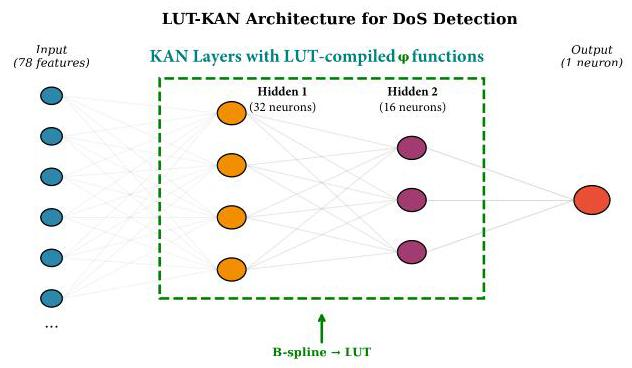
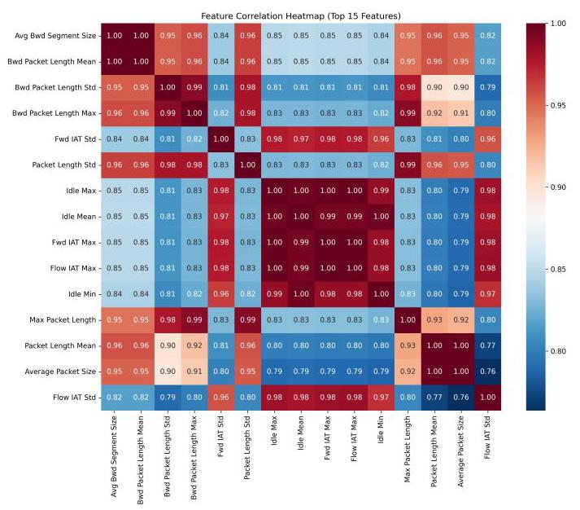
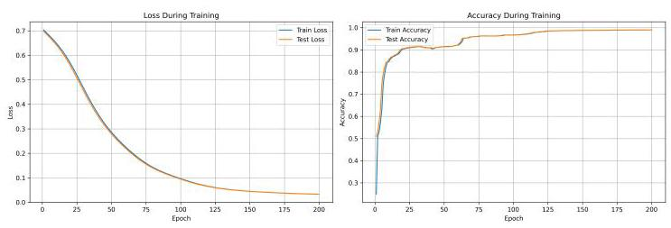
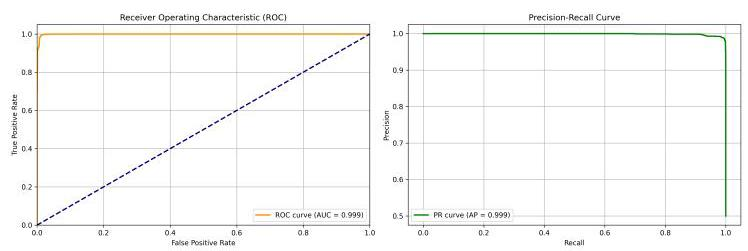
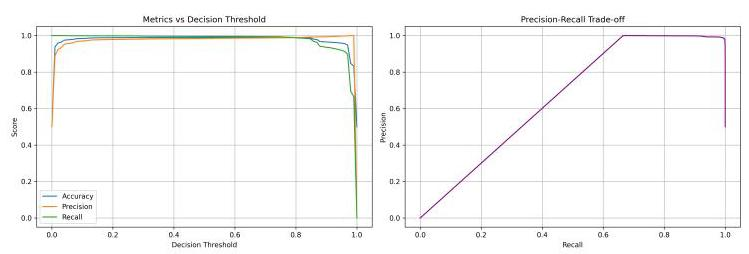
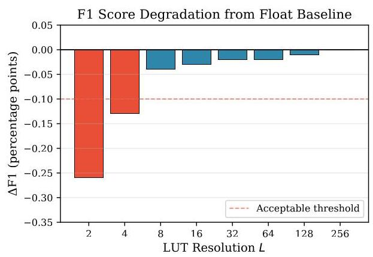
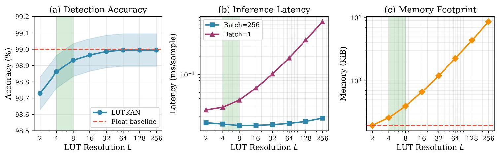
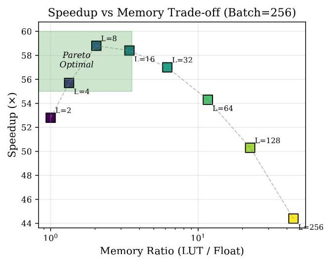
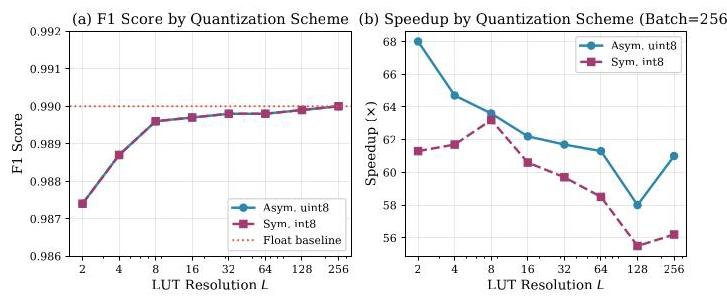
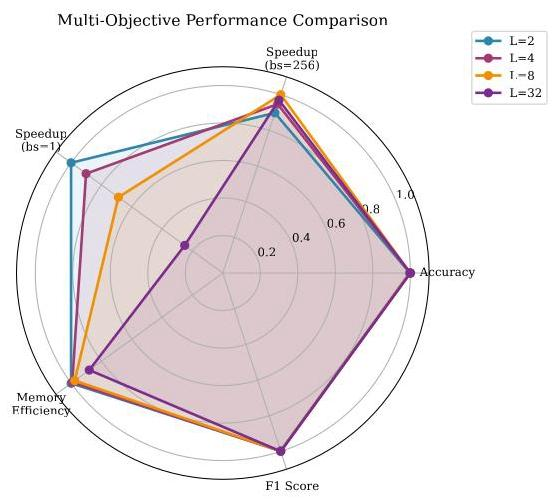

# LUT-Compiled Kolmogorov-Arnold Networks for Lightweight DoS Detection on IoT Edge Devices

# 用于物联网边缘设备轻量级拒绝服务检测的查找表编译的柯尔莫哥洛夫 - 阿诺德网络

Oleksandr Kuznetsov†, Member, IEEE

奥列克桑德·库兹涅佐夫†，IEEE会员

Abstract-Denial-of-Service (DoS) attacks pose a critical threat to Internet of Things (IoT) ecosystems, yet deploying effective intrusion detection on resource-constrained edge devices remains challenging. Kolmogorov-Arnold Networks (KANs) offer a compact alternative to Multi-Layer Perceptrons (MLPs) by placing learnable univariate spline functions on edges rather than fixed activations on nodes, achieving competitive accuracy with fewer parameters. However, runtime B-spline evaluation introduces significant computational overhead unsuitable for latency-critical IoT applications. We propose a lookup table (LUT) compilation pipeline that replaces expensive spline computations with precomputed quantized tables and linear interpolation, dramatically reducing inference latency while preserving detection quality. Our lightweight KAN model (50K parameters, 0.19 MB) achieves 99.0% accuracy on the CICIDS2017 DoS dataset. After LUT compilation with resolution $L = 8$ , the model maintains 98.96% accuracy (F1 degradation $< {0.0004}$ ) while achieving ${68} \times$ speedup at batch size 256 and over ${5000} \times$ speedup at batch size 1, with only $2 \times$ memory overhead. We provide comprehensive evaluation across LUT resolutions, quantization schemes, and out-of-bounds policies, establishing clear Pareto frontiers for accuracy-latency-memory trade-offs. Our results demonstrate that LUT-compiled KANs enable real-time DoS detection on CPU-only IoT gateways with deterministic inference latency and minimal resource footprint.

摘要 - 拒绝服务(DoS)攻击对物联网(IoT)生态系统构成了严重威胁，然而在资源受限的边缘设备上部署有效的入侵检测仍然具有挑战性。柯尔莫哥洛夫 - 阿诺德网络(KANs)通过在边缘放置可学习的单变量样条函数而非在节点上使用固定激活函数，为多层感知器(MLPs)提供了一种紧凑的替代方案，以更少的参数实现了有竞争力的准确率。然而，运行时B样条评估会引入大量计算开销，不适用于对延迟要求严格的物联网应用。我们提出了一种查找表(LUT)编译管道，用预计算的量化表和线性插值取代昂贵的样条计算，在保持检测质量的同时显著降低推理延迟。我们的轻量级KAN模型(50K参数，0.19MB)在CICIDS2017 DoS数据集上达到了99.0%的准确率。在以$L = 8$分辨率进行LUT编译后，该模型保持了98.96%的准确率(F1下降$< {0.0004}$)，在批量大小为256时实现了${68} \times$的加速，在批量大小为1时实现了超过${5000} \times$的加速，且仅增加了$2 \times$的内存开销。我们提供了跨LUT分辨率、量化方案和越界策略的全面评估，为准确率 - 延迟 - 内存权衡建立了清晰的帕累托前沿。我们的结果表明，LUT编译的KANs能够在仅使用CPU的物联网网关上进行实时DoS检测，具有确定性的推理延迟和最小的资源占用。

Index Terms-Kolmogorov-Arnold Networks, Denial-of-Service detection, IoT security, lookup table quantization, edge inference, intrusion detection systems

关键词 - 柯尔莫哥洛夫 - 阿诺德网络，拒绝服务检测，物联网安全，查找表量化，边缘推理，入侵检测系统

## I. INTRODUCTION

## 一、引言

The proliferation of Internet of Things (IoT) devices has created vast attack surfaces vulnerable to Denial-of-Service (DoS) attacks [1]. Unlike traditional computing environments, IoT ecosystems comprise heterogeneous devices with stringent resource constraints—limited memory, CPU-only processing, and strict power budgets-making conventional deep learning approaches impractical for real-time threat detection [2].

物联网(IoT)设备的激增创造了大量易受拒绝服务(DoS)攻击的攻击面[1]。与传统计算环境不同，物联网生态系统由具有严格资源限制的异构设备组成 - 有限的内存、仅支持CPU的处理以及严格的功率预算 - 使得传统深度学习方法对于实时威胁检测不切实际[2]。

Machine learning-based intrusion detection systems (IDS) have demonstrated remarkable accuracy in identifying network anomalies [3]. However, state-of-the-art models often require substantial computational resources: SecEdge [4] achieves 98.7% accuracy on CICIDS2017, but demands 1.1-1.7 GB memory, while ALNS-CNN [5] requires high CPU utilization for its accelerated inference. This creates a fundamental tension between detection capability and deployability on edge devices.

基于机器学习的入侵检测系统(IDS)在识别网络异常方面已显示出显著的准确率[3]。然而，当前的先进模型通常需要大量的计算资源:SecEdge [4]在CICIDS2017上达到了98.7%的准确率，但需要1.1 - 1.7GB内存，而ALNS - CNN [5]在加速推理时需要高CPU利用率。这在检测能力和边缘设备上的可部署性之间造成了根本矛盾。

Kolmogorov-Arnold Networks (KANs) [6] offer a promising alternative by leveraging the Kolmogorov-Arnold representation theorem [7]. Unlike Multi-Layer Perceptrons (MLPs) that apply fixed activation functions at nodes, KANs place learnable univariate functions-typically implemented as B-splines-on network edges. This architectural difference enables KANs to achieve competitive accuracy with significantly fewer parameters and enhanced interpretability [8]. Recent applications in network security [9], [10] have demonstrated KANs' effectiveness for intrusion detection tasks.

柯尔莫哥洛夫 - 阿诺德网络(KANs)[6]通过利用柯尔莫哥洛夫 - 阿诺德表示定理[7]提供了一种有前景 的替代方案。与在节点上应用固定激活函数的多层感知器(MLPs)不同，KANs在网络边缘放置可学习的单变量函数 - 通常实现为B样条。这种架构差异使KANs能够以显著更少的参数实现有竞争力的准确率并增强可解释性[8]。最近在网络安全[9]，[10]中的应用已经证明了KANs在入侵检测任务中的有效性。

Despite their parameter efficiency, KANs suffer from a critical deployment bottleneck: runtime B-spline evaluation requires iterative knot interval search, recursive basis function computation, and coefficient aggregation for each input dimension-operations that dominate inference time on CPU architectures common in IoT gateways. This computational overhead undermines the practical advantages of KANs' compact representation.

尽管KANs具有参数效率，但它们存在一个关键的部署瓶颈:运行时B样条评估需要对每个输入维度进行迭代节点区间搜索、递归基函数计算和系数聚合 - 这些操作在物联网网关中常见的CPU架构上主导推理时间。这种计算开销削弱了KANs紧凑表示的实际优势。

Our Contribution. We address this deployment gap by proposing a lookup table (LUT) compilation pipeline that transforms trained KAN models for efficient edge inference. Our approach:

我们的贡献。我们通过提出一种查找表(LUT)编译管道来解决这个部署差距，该管道将训练好的KAN模型转换为高效的边缘推理。我们的方法:

1) Eliminates runtime spline evaluation by precomputing discretized spline values into quantized lookup tables

1)通过将离散化的样条值预计算到量化查找表中来消除运行时样条评估

2) Replaces iterative algorithms with simple table indexing and linear interpolation

2)用简单的表索引和线性插值取代迭代算法

3) Achieves ${68} \times$ speedup at batch size 256 and over ${5000} \times$ at batch size 1 with minimal accuracy loss

3)在批量大小为256时实现${68} \times$的加速，在批量大小为1时实现超过${5000} \times$的加速，且准确率损失最小

4) Provides comprehensive evaluation across LUT resolutions $L \in  \{ 2,4,8,{16},{32},{64},{128},{256}\}$ , quantization schemes, and boundary handling policies

4)提供跨LUT分辨率$L \in  \{ 2,4,8,{16},{32},{64},{128},{256}\}$、量化方案和边界处理策略的全面评估

Fig. 1 illustrates the LUT-KAN architecture. Our lightweight model (78 input features $\rightarrow  \left\lbrack  {{32},{16}}\right\rbrack$ hidden neurons $\rightarrow  1$ output) achieves 99.0% accuracy on the CICIDS2017 DoS dataset while occupying only 0.19 MB-suitable for deployment on resource-constrained IoT gateways.

图1展示了LUT - KAN架构。我们的轻量级模型(78个输入特征$\rightarrow  \left\lbrack  {{32},{16}}\right\rbrack$个隐藏神经元$\rightarrow  1$个输出)在CICIDS2017 DoS数据集上达到了99.0%的准确率，同时仅占用0.19MB - 适合在资源受限的物联网网关上部署。

## II. RELATED WORK

## 二、相关工作

### A.IoT Intrusion Detection Under Edge Constraints

### 边缘约束下的人工智能物联网入侵检测

Deploying IDS on IoT edge devices requires balancing detection accuracy against strict resource budgets. Recent works have explored various approaches to this challenge. SecEdge [4] proposed a hybrid deep learning architecture achieving 98.7% accuracy on CICIDS2017, but requires 1.1- 1.7 GB memory. ALNS-CNN [5] introduced accelerated learning with 99.85% accuracy, though CPU utilization remains high. NIDS-DA [11] achieved 99.97% accuracy with only

在物联网边缘设备上部署入侵检测系统需要在检测精度和严格的资源预算之间进行平衡。最近的研究探索了应对这一挑战的各种方法。SecEdge [4] 提出了一种混合深度学习架构，在CICIDS2017上实现了98.7%的准确率，但需要1.1 - 1.7GB的内存。ALNS - CNN [5] 引入了加速学习，准确率达到99.85%，不过CPU利用率仍然很高。NIDS - DA [11] 通过数据增强仅用

---

O. Kuznetsov is with the Department of Theoretical and Applied Sciences, eCampus University, Via Isimbardi 10, Novedrate (CO), 22060, Italy, and also with the Department of Intelligent Software Systems and Technologies, School of Computer Science and Artificial Intelligence, V.N. Karazin Kharkiv National University, 4 Svobody Sq., 61022 Kharkiv, Ukraine. E-mail: olek-sandr.kuznetsov@uniecampus.it, kuznetsov@karazin.ua

O. Kuznetsov就职于意大利诺韦德拉泰(CO)伊辛巴尔迪大街10号eCampus大学理论与应用科学系，邮编22060，同时也就职于乌克兰哈尔科夫国立大学计算机科学与人工智能学院智能软件系统与技术系，自由广场4号，邮编61022。电子邮件:olek - sandr.kuznetsov@uniecampus.it，kuznetsov@karazin.ua

${}^{ \dagger  }$ Corresponding author: oleksandr.kuznetsov@uniecampus.it

${}^{ \dagger  }$ 通讯作者:oleksandr.kuznetsov@uniecampus.it

---

Fig. 1: LUT-KAN architecture for DoS detection. The network processes 78 flow-level features through two KAN layers with 32 and 16 neurons respectively. Each learnable $\phi$ function is compiled from B-splines to precomputed lookup tables for efficient edge inference.

图1:用于拒绝服务检测的LUT - KAN架构。该网络通过两个分别具有32个和16个神经元的KAN层处理78个流级特征。每个可学习的$\phi$函数由B样条编译为预计算查找表，以实现高效的边缘推理。

5K parameters through data augmentation, demonstrating that compact models can maintain high detection rates.

通过数据增强仅用5K参数，证明了紧凑模型可以保持高检测率。

Edge deployment strategies include hybrid CNN-LSTM architectures [12], ensemble methods [13], and metaheuristic optimization [14]. However, these approaches typically target MLP or CNN architectures without addressing the unique computational patterns of KAN-based models.

边缘部署策略包括混合CNN - LSTM架构[12]、集成方法[13]和元启发式优化[14]。然而，这些方法通常针对MLP或CNN架构，而没有解决基于KAN模型的独特计算模式。

## B. Kolmogorov-Arnold Networks for Security

## B. 用于安全的柯尔莫哥洛夫 - 阿诺德网络

KANs [6] have recently emerged as an alternative to MLPs for various tasks. The theoretical foundation-the Kolmogorov-Arnold representation theorem-guarantees that any multivariate continuous function can be represented as a superposition of univariate functions. Practical implementations use B-splines to approximate these univariate functions, enabling gradient-based learning.

KANs [6] 最近作为MLP在各种任务中的替代方案出现。其理论基础——柯尔莫哥洛夫 - 阿诺德表示定理——保证任何多元连续函数都可以表示为单变量函数的叠加。实际实现使用B样条来近似这些单变量函数，从而实现基于梯度的学习。

In security applications, DeepOKAN [15] demonstrated KANs' potential for operator learning in mechanics problems, establishing architectural patterns applicable to network traffic analysis. KINN [9] applied KANs to physics-informed learning with competitive results. Recent work explored KAN applications in load forecasting [16], autonomous driving [17], and computation offloading in Industrial IoT [10]. However, none of these works address the inference efficiency challenge critical for IoT deployment.

在安全应用中，DeepOKAN [15] 展示了KANs在力学问题中进行算子学习的潜力，建立了适用于网络流量分析的架构模式。KINN [9] 将KANs应用于物理信息学习并取得了有竞争力的结果。最近的工作探索了KANs在负荷预测[16]、自动驾驶[17]和工业物联网中的计算卸载[10]中的应用。然而，这些工作都没有解决对物联网部署至关重要的推理效率挑战。

## C. Quantization and LUT-Based Inference

## C. 量化和基于查找表的推理

Post-training quantization [18] reduces model size and accelerates inference by representing weights and activations with lower-precision integers. For specialized hardware, LUT-based approaches have shown remarkable efficiency. PolyLUT [19] demonstrated FPGA implementations using polynomial approximations for ultra-low latency inference. NeuraLUT [20] explored hiding neural network density in Boolean synthesizable functions, achieving significant latency improvements through learned lookup tables.

训练后量化[18] 通过用低精度整数表示权重和激活来减小模型大小并加速推理。对于专用硬件，基于查找表的方法已显示出显著的效率。PolyLUT [19] 展示了使用多项式近似进行超低延迟推理的FPGA实现。NeuraLUT [20] 探索了在布尔可合成函数中隐藏神经网络密度，通过学习查找表实现了显著的延迟改进。

Our work differs by targeting CPU-only IoT devices and specifically addressing KAN's B-spline evaluation bottleneck through systematic LUT compilation with comprehensive trade-off analysis.

我们的工作不同之处在于针对仅支持CPU的物联网设备，并通过系统的查找表编译和全面的权衡分析专门解决KAN的B样条评估瓶颈。

## III. BACKGROUND AND MOTIVATION

## III. 背景与动机

### A.IoT Edge Inference Constraints

### A.物联网边缘推理约束

Intrusion Detection Systems for IoT networks operate under tighter constraints than conventional enterprise IDS. At the edge, inference must often run on CPU-only platforms with limited memory, energy budget, and strict latency constraints. In many realistic deployments, predictions are required in an online mode (near-real-time stream processing), where the effective batch size is small (often batch=1). In this regime, models that are accurate but require heavy runtime stacks, dynamic dispatch, or expensive non-linear primitives become impractical.

物联网网络的入侵检测系统在比传统企业入侵检测系统更严格的约束下运行。在边缘，推理通常必须在仅支持CPU的平台上运行，这些平台内存有限、能量预算有限且有严格的延迟约束。在许多实际部署中，需要以在线模式(近实时流处理)进行预测，其中有效批大小很小(通常批大小 = 1)。在这种情况下，准确但需要大量运行时堆栈、动态调度或昂贵非线性原语的模型变得不切实际。

DoS attacks generate high-volume and fast-changing traffic patterns. The IDS must therefore provide both high detection quality and fast inference to avoid becoming a bottleneck or missing time-critical events. Key requirements include:

拒绝服务攻击会产生大量且快速变化的流量模式。因此，入侵检测系统必须具备高检测质量和快速推理能力，以避免成为瓶颈或错过关键事件。关键要求包括:

- Latency: Sub-millisecond inference for individual flows

- 延迟:单个流的亚毫秒级推理

- Memory: Model size $< {10}\mathrm{{MB}}$ for deployment alongside other services

- 内存:与其他服务一起部署时的模型大小$< {10}\mathrm{{MB}}$

- Determinism: Predictable inference time without garbage collection pauses

- 确定性:无垃圾回收暂停的可预测推理时间

- CPU-only: GPU/TPU acceleration unavailable on typical IoT hardware

- 仅CPU:典型物联网硬件上无法使用GPU/TPU加速

### B.KAN Architecture and B-Spline Formulation

### B.KAN架构和B样条公式

A KAN layer transforms input $\mathbf{x} \in  {\mathbb{R}}^{{n}_{\text{ in }}}$ to output $\mathbf{h} \in  {\mathbb{R}}^{{n}_{\text{ out }}}$ through:

一个KAN层通过以下方式将输入$\mathbf{x} \in  {\mathbb{R}}^{{n}_{\text{ in }}}$转换为输出$\mathbf{h} \in  {\mathbb{R}}^{{n}_{\text{ out }}}$:

$$
{h}_{j} = \mathop{\sum }\limits_{{i = 1}}^{{n}_{\text{ in }}}{\phi }_{ij}\left( {x}_{i}\right) ,\;j = 1,\ldots ,{n}_{\text{ out }} \tag{1}
$$

where each ${\phi }_{ij}$ is a learnable univariate function. In PyKAN-style implementations, ${\phi }_{ij}$ is modeled as a sum of a base branch and a spline branch:

其中每个${\phi }_{ij}$是一个可学习的单变量函数。在PyKAN风格的实现中，${\phi }_{ij}$被建模为一个基分支和一个样条分支的和:

$$
{\phi }_{ij}\left( x\right)  = {\alpha }_{ij} \cdot  b\left( x\right)  + {\beta }_{ij} \cdot  {s}_{ij}\left( x\right) \tag{2}
$$

where $b\left( \cdot \right)$ is a fixed nonlinear function (e.g., SiLU), ${s}_{ij}\left( \cdot \right)$ is a spline, and ${\alpha }_{ij},{\beta }_{ij}$ are learned scaling factors.

其中$b\left( \cdot \right)$是一个固定的非线性函数(例如，SiLU)，${s}_{ij}\left( \cdot \right)$是一个样条，${\alpha }_{ij},{\beta }_{ij}$是学习到的缩放因子。

The spline branch is represented via B-splines on a knot sequence. Let ${\left\{  {t}_{u}\right\}  }_{u = 1}^{M}$ be an augmented knot vector and let ${\left\{  {c}_{m}\right\}  }_{m = 1}^{P}$ be spline coefficients. The degree- $k$ B-spline basis functions ${B}_{m, k}\left( x\right)$ are defined recursively:

样条分支通过节点序列上的B样条表示。设${\left\{  {t}_{u}\right\}  }_{u = 1}^{M}$为扩充的节点向量，${\left\{  {c}_{m}\right\}  }_{m = 1}^{P}$为样条系数。度为$k$的B样条基函数${B}_{m, k}\left( x\right)$递归定义如下:

$$
{B}_{m,0}\left( x\right)  = \mathbb{I}\left\lbrack  {{t}_{m} \leq  x < {t}_{m + 1}}\right\rbrack \tag{3}
$$

$$
{B}_{m, k}\left( x\right)  = \frac{x - {t}_{m}}{{t}_{m + k} - {t}_{m}}{B}_{m, k - 1}\left( x\right)  + \frac{{t}_{m + k + 1} - x}{{t}_{m + k + 1} - {t}_{m + 1}}{B}_{m + 1, k - 1}\left( x\right)
$$

(4)

The spline value is computed as:

样条值计算如下:

$$
{s}_{ij}\left( x\right)  = \mathop{\sum }\limits_{{m = 1}}^{P}{c}_{m}^{\left( ij\right) } \cdot  {B}_{m, k}\left( x\right) \tag{5}
$$

The full model is a composition of ${L}_{\text{ layers }}$ such layers, followed by an output activation to produce a probability:

完整模型是${L}_{\text{ layers }}$个这样的层的组合，随后是一个输出激活以产生概率:

$$
\widehat{p}\left( \mathbf{x}\right)  = \sigma \left( {{f}_{\theta }\left( \mathbf{x}\right) }\right) ,\;\widehat{y} = \mathbb{I}\left\lbrack  {\widehat{p}\left( \mathbf{x}\right)  \geq  \tau }\right\rbrack \tag{6}
$$

where $\sigma \left( \cdot \right)$ is the logistic function, $\tau$ is the decision threshold (we use $\tau  = {0.5}$ ), and $\theta$ denotes all model parameters.

其中$\sigma \left( \cdot \right)$是逻辑函数，$\tau$是决策阈值(我们使用$\tau  = {0.5}$)，$\theta$表示所有模型参数。

## C. Computational Bottleneck Analysis

## C. 计算瓶颈分析

For each input ${x}_{i}$ , evaluating ${s}_{ij}\left( {x}_{i}\right)$ requires: (1) locating the knot interval containing ${x}_{i}$ ,(2) recursively computing $k + 1$ non-zero basis functions, and (3) aggregating with coefficients. On CPU, this sequential computation dominates inference time-particularly at batch size 1 where vectorization benefits vanish.

对于每个输入${x}_{i}$，评估${s}_{ij}\left( {x}_{i}\right)$需要:(1) 定位包含${x}_{i}$的节点区间，(2) 递归计算$k + 1$个非零基函数，以及(3) 与系数聚合。在CPU上，这种顺序计算主导推理时间——特别是在批量大小为1时，向量化的优势消失。

This motivates a compilation view of KAN inference: if the learned univariate functions are fixed at deployment time, we can precompute their values on a grid and replace runtime spline evaluation with fast table lookup and interpolation.

这激发了对KAN推理的编译视角:如果学习到的单变量函数在部署时是固定的，我们可以在网格上预先计算它们的值，并通过快速表查找和插值替换运行时样条评估。

## D. Problem Statement

## D. 问题陈述

Let the trained KAN model define, for each layer $\ell$ and each edge $\left( {i \rightarrow  j}\right)$ , a univariate function ${\phi }_{ij}^{\left( \ell \right) }\left( x\right)$ . Standard inference evaluates ${\phi }_{ij}^{\left( \ell \right) }$ via B-splines at runtime. We address the following deployment problem:

让训练好的KAN模型为每一层$\ell$和每条边$\left( {i \rightarrow  j}\right)$定义一个单变量函数${\phi }_{ij}^{\left( \ell \right) }\left( x\right)$。标准推理在运行时通过B样条来评估${\phi }_{ij}^{\left( \ell \right) }$。我们解决以下部署问题:

Given a trained KAN-based IDS model and a target CPU-only inference environment, how can we reduce inference latency while maintaining detection quality and controlling memory overhead?

给定一个训练好的基于KAN的入侵检测系统模型和一个仅支持CPU的目标推理环境，我们如何在保持检测质量和控制内存开销的同时减少推理延迟？

In addition, practical deployment requires robustness to out-of-domain inputs. Network telemetry may drift because of changes in traffic distributions, feature scaling issues, or sensor noise. Therefore, the LUT representation must define explicit behavior for out-of-bounds (OOB) inputs.

此外，实际部署需要对域外输入具有鲁棒性。由于流量分布变化、特征缩放问题或传感器噪声，网络遥测可能会漂移。因此，查找表(LUT)表示必须为越界(OOB)输入定义明确的行为。

## IV. MODELS AND METHODS

## IV. 模型与方法

## A. Dataset and Task Definition

## A. 数据集与任务定义

We use the CICIDS2017 dataset [21] and focus on a DoS detection scenario. Each record corresponds to a network flow described by a vector of tabular features. The supervised task is binary classification: benign vs. DoS. Let $\mathbf{x} \in  {\mathbb{R}}^{d}$ denote the feature vector and $y \in  \{ 0,1\}$ the ground-truth label.

我们使用CICIDS2017数据集[21]，并专注于拒绝服务(DoS)检测场景。每条记录对应一个由表格特征向量描述的网络流。监督任务是二元分类:良性与DoS。令$\mathbf{x} \in  {\mathbb{R}}^{d}$表示特征向量，$y \in  \{ 0,1\}$表示真实标签。

Table I summarizes the dataset composition after preprocessing.

表I总结了预处理后的数据集组成。

TABLE I: CICIDS2017 Wednesday DoS Dataset Statistics

表I:CICIDS2017周三DoS数据集统计

<table><tr><td>Class</td><td>Samples</td><td>Percentage</td></tr><tr><td>Benign</td><td>440,031</td><td>95.2%</td></tr><tr><td>DoS Hulk</td><td>231,073</td><td>-</td></tr><tr><td>DoS GoldenEye</td><td>10,293</td><td>-</td></tr><tr><td>DoS slowloris</td><td>5,796</td><td>-</td></tr><tr><td>DoS Slowhttptest</td><td>5,499</td><td>-</td></tr><tr><td>Heartbleed</td><td>11</td><td>-</td></tr><tr><td>Total Attack</td><td>252,672</td><td>4.8%</td></tr></table>

Preprocessing. Following established protocols [3], we: (1) remove constant and duplicate features,(2) apply the ${3\sigma }$ rule for outlier removal, (3) impute missing values with median, (4) standardize to zero mean and unit variance, and (5) balance classes through stratified sampling (231,073 samples per class). The final feature set comprises 78 flow-level statistics.

预处理。遵循既定协议[3]，我们:(1) 删除常量和重复特征，(2) 应用${3\sigma }$规则去除异常值，(3) 用中位数填充缺失值，(4) 标准化为零均值和单位方差，以及(5) 通过分层采样平衡类别(每类231,073个样本)。最终特征集包含78个流级统计信息。

Fig. 2 shows the correlation heatmap for the top 15 most correlated features, revealing distinct clusters related to packet timing (IAT features) and size statistics.

图2显示了前15个相关性最高的特征的相关热图，揭示了与分组定时(IAT特征)和大小统计相关的不同聚类。

Fig. 2: Feature correlation heatmap for top 15 features. Strong correlations exist within packet length statistics (upper-left cluster) and inter-arrival time features (center cluster).

图2:前15个特征的特征相关热图。分组长度统计(左上角聚类)和到达间隔时间特征(中间聚类)内存在强相关性。

Fig. 3: Training dynamics over 200 epochs. Left: Loss convergence showing stable optimization without overfitting. Right: Accuracy progression demonstrating rapid initial learning followed by gradual refinement.

图3:200个轮次的训练动态。左:损失收敛，显示稳定优化且无过拟合。右:准确率进展，表明初始学习迅速，随后逐渐细化。

### B.KAN Model Architecture and Training

### B. KAN模型架构与训练

Our detection model employs a two-layer KAN architecture:

我们的检测模型采用两层KAN架构:

$$
\operatorname{Input}\left( {78}\right)  \rightarrow  {\mathrm{{KAN}}}_{1}\left( {32}\right)  \rightarrow  {\mathrm{{KAN}}}_{2}\left( {16}\right)  \rightarrow  \text{ Output }\left( 1\right) \tag{7}
$$

Each KAN layer uses cubic B-splines $\left( {k = 3}\right)$ with $G = 5$ grid intervals, yielding $G + k = 8$ control points per spline. The model totals 50,092 parameters (42,336 trainable) occupying 0.19 MB in float32 representation.

每层KAN使用具有$G = 5$网格间隔的三次B样条$\left( {k = 3}\right)$，每个样条产生$G + k = 8$个控制点。该模型总共有50,092个参数(42,336个可训练参数)，以float32表示占用0.19MB。

Training Procedure. We train the model by minimizing the binary cross-entropy loss:

训练过程。我们通过最小化二元交叉熵损失来训练模型:

$$
\mathcal{L}\left( \theta \right)  =  - \frac{1}{N}\mathop{\sum }\limits_{{n = 1}}^{N}\left\lbrack  {{y}_{n}\log \widehat{p}\left( {\mathbf{x}}_{n}\right)  + \left( {1 - {y}_{n}}\right) \log \left( {1 - \widehat{p}\left( {\mathbf{x}}_{n}\right) }\right) }\right\rbrack \tag{8}
$$

Optimization is performed with AdamW optimizer (learning rate ${10}^{-3}$ , weight decay ${10}^{-4}$ ) for 200 epochs with batch size 256. An 80/20 stratified train/test split ensures balanced evaluation. Fig. 3 shows the training dynamics.

使用AdamW优化器(学习率${10}^{-3}$，权重衰减${10}^{-4}$)进行200个轮次的优化，批量大小为256。80/20分层训练/测试分割确保了平衡评估。图3展示了训练动态。

### C.LUT Compilation and Quantization

### C.LUT编译与量化

After training, we compile the spline branch of each ${\phi }_{ij}$ into a lookup-table representation. For each spline segment, we sample $L$ points uniformly in the segment domain and precompute spline values. At inference time, for an input $x$ , we: (i) identify the segment index, (ii) compute a normalized position within the segment, and (iii) perform linear interpolation between adjacent LUT values.

训练后，我们将每个${\phi }_{ij}$的样条分支编译为查找表表示形式。对于每个样条段，我们在段域中均匀采样$L$个点并预先计算样条值。在推理时，对于输入$x$，我们:(i) 确定段索引，(ii) 计算段内的归一化位置，以及 (iii) 在相邻的LUT值之间进行线性插值。

Let the segment domain be $\left\lbrack  {a, b}\right\rbrack$ and let ${\left\{  {v}_{q}\right\}  }_{q = 0}^{L - 1}$ denote precomputed values at grid points ${x}_{q} = a + {q\Delta }$ with $\Delta  = \; \left( {b - a}\right) /\left( {L - 1}\right)$ . For any $x \in  \left\lbrack  {a, b}\right\rbrack$ , define $u = \left( {x - a}\right) /\Delta$ , $q = \lfloor u\rfloor$ , and $\lambda  = u - q$ . The interpolated value is:

设段域为$\left\lbrack  {a, b}\right\rbrack$，并设${\left\{  {v}_{q}\right\}  }_{q = 0}^{L - 1}$表示在网格点${x}_{q} = a + {q\Delta }$处的预计算值，其中$\Delta  = \; \left( {b - a}\right) /\left( {L - 1}\right)$。对于任何$x \in  \left\lbrack  {a, b}\right\rbrack$，定义$u = \left( {x - a}\right) /\Delta$、$q = \lfloor u\rfloor$和$\lambda  = u - q$。插值值为:

$$
{\widetilde{s}}_{ij}\left( x\right)  = \left( {1 - \lambda }\right)  \cdot  {v}_{q} + \lambda  \cdot  {v}_{q + 1} \tag{9}
$$

Symmetric int8 Quantization. We quantize LUT values per segment using:

对称int8量化。我们使用以下方法对每个段的LUT值进行量化:

$$
q = \operatorname{clip}\left( {\left\lbrack  \frac{v}{s}\right\rbrack  , - {127},{127}}\right) ,\;\widehat{v} = s \cdot  q \tag{10}
$$

where $s$ is a segment-wise scale, and $\lfloor  \cdot  \rceil$ denotes rounding to nearest integer.

其中$s$是逐段缩放因子，$\lfloor  \cdot  \rceil$表示四舍五入到最接近的整数。

Asymmetric uint8 Quantization. For affine quantization:

非对称uint8量化。对于仿射量化:

$$
q = \operatorname{clip}\left( {\left\lbrack  \frac{v - {v}_{\min }}{s}\right\rbrack  ,0,{255}}\right) ,\;\widehat{v} = {v}_{\min } + s \cdot  q \tag{11}
$$

where ${v}_{\min }$ and $s$ are stored per segment.

其中${v}_{\min }$和$s$是按段存储的。

## D. Out-of-Bounds Policies and Boundary Modes

## D. 超出边界策略和边界模式

The LUT representation must define behavior for inputs outside the trained spline domain. We consider two OOB policies:

查找表表示必须定义训练样条域之外的输入的行为。我们考虑两种超出边界策略:

- clip_x: clip $x$ into the valid domain and evaluate the boundary segment

- clip_x:将$x$裁剪到有效域并评估边界段

- zero_spline: return 0 for the spline branch when $x$ is out-of-range

- zero_spline:当$x$超出范围时，样条分支返回0

We also consider two boundary modes for segment indexing: closed (inclusive boundary) and half_open (half-open intervals), which affect how exact knot boundary values are mapped to segments.

我们还考虑了两种用于段索引的边界模式:封闭(包含边界)和半开(半开区间)，这会影响精确节点边界值如何映射到段。

## E. Evaluation Metrics

## E. 评估指标

We report thresholded classification metrics at $\tau  = {0.5}$ : Accuracy, Precision, Recall, and F1. We also report threshold-free metrics: ROC-AUC and PR-AUC. Let TP, FP, TN, FN denote confusion matrix counts; then:

我们在$\tau  = {0.5}$处报告阈值分类指标:准确率、精确率、召回率和F1值。我们还报告无阈值指标:ROC-AUC和PR-AUC。设TP、FP、TN、FN表示混淆矩阵计数；那么:

$$
\text{ Precision } = \frac{\mathrm{{TP}}}{\mathrm{{TP}} + \mathrm{{FP}}},\;\text{ Recall } = \frac{\mathrm{{TP}}}{\mathrm{{TP}} + \mathrm{{FN}}} \tag{12}
$$

$$
\mathrm{F}1 = \frac{2 \cdot  \text{ Precision } \cdot  \text{ Recall }}{\text{ Precision } + \text{ Recall }} \tag{13}
$$

Latency is reported as milliseconds per sample in two regimes: batch=1 and batch=256. All reported numbers are mean $\pm$ standard deviation across $n = 5$ calibration seeds, with ${95}\%$ CIs computed as:

延迟以每个样本的毫秒数报告，分为两种情况:batch=1和batch=256。所有报告的数字是跨越$n = 5$校准种子的均值$\pm$标准差，其${95}\%$置信区间计算如下:

$$
{\mathrm{{CI}}}_{{95}\% } \approx  \mu  \pm  {t}_{{0.975},4} \cdot  \frac{\sigma }{\sqrt{5}},\;{t}_{{0.975},4} \approx  {2.776} \tag{14}
$$

Fig. 4: Baseline model evaluation curves. Left: ROC curve with AUC=0.999. Right: Precision-Recall curve with AP=0.999 demonstrating robust performance.

图4:基线模型评估曲线。左:AUC=0.999的ROC曲线。右:AP=0.999的精确率-召回率曲线，展示了强大的性能。

## V. EXPERIMENTAL RESULTS

## V. 实验结果

## A. Experimental Setup

## A. 实验设置

All experiments execute on a single AMD Ryzen 7 7840HS processor (8 cores, 3.8 GHz base) with 64 GB DDR5 RAM, running Windows 11 with Python 3.10. We report CPU-only performance to reflect IoT deployment conditions.

所有实验在单个AMD Ryzen 7 7840HS处理器(8核，3.8 GHz基础频率)上执行，该处理器配有64 GB DDR5内存，运行Windows 11和Python 3.10。我们报告仅CPU的性能以反映物联网部署条件。

Latency Measurement Protocol. We measure infer-only latency, which excludes data loading, preprocessing, and postprocessing. Each measurement consists of: (1) 10 warm-up iterations to ensure JIT compilation and cache stabilization, (2) 100 timed iterations, (3) reporting mean and standard deviation across 5 independent calibration seeds. All measurements use single-threaded execution (NUMBA_NUM_THREADS=1, OMP_NUM_THREADS=1) to simulate resource-constrained IoT environments. The baseline latency is measured using PyKAN's native B-spline evaluation with the same threading constraints.

延迟测量协议。我们测量仅推理延迟，不包括数据加载、预处理和后处理。每次测量包括:(1) 10次热身迭代以确保JIT编译和缓存稳定，(2) 100次定时迭代，(3) 报告跨越5个独立校准种子的均值和标准差。所有测量使用单线程执行(NUMBA_NUM_THREADS=1，OMP_NUM_THREADS=1)来模拟资源受限的物联网环境。基线延迟使用PyKAN的原生B样条评估并在相同线程约束下测量。

LUT Compilation Configuration. Unless stated otherwise, LUT compilation uses value_repr=spline_component, interp=linear, and we sweep the LUT resolution $L \in \; \{ 2,4,8,{16},{32},{64},{128},{256}\}$ . We evaluate both quantization schemes: symmetric int8 and asymmetric uint8. Main results use the robust setting (half_open + zero_spline).

LUT编译配置。除非另有说明，LUT编译使用value_repr=spline_component，interp=linear，并且我们扫描LUT分辨率$L \in \; \{ 2,4,8,{16},{32},{64},{128},{256}\}$。我们评估两种量化方案:对称int8和非对称uint8。主要结果使用稳健设置(half_open + zero_spline)。

## B. Baseline Model Performance

## B. 基线模型性能

The float KAN model achieves strong detection performance, as shown in Table II. Fig. 4 shows the ROC and Precision-Recall curves demonstrating near-perfect classification capability.

浮点KAN模型实现了强大的检测性能，如表II所示。图4展示了ROC和精确率-召回率曲线，证明了近乎完美的分类能力。

TABLE II: Baseline KAN Model Performance

表II:基线KAN模型性能

<table><tr><td>Metric</td><td>Value</td></tr><tr><td>Accuracy</td><td>99.0%</td></tr><tr><td>Precision</td><td>98.4%</td></tr><tr><td>Recall</td><td>99.6%</td></tr><tr><td>F1 Score</td><td>99.0%</td></tr><tr><td>ROC-AUC</td><td>0.999</td></tr><tr><td>PR-AUC</td><td>0.999</td></tr><tr><td>Parameters</td><td>50,092</td></tr><tr><td>Model Size</td><td>0.19 MB</td></tr></table>

Fig. 5 illustrates model robustness across decision thresholds, with stable performance over a wide operating range $\left( {\tau  \in  \left\lbrack  {{0.1},{0.9}}\right\rbrack  }\right)$ .

图5说明了模型在决策阈值上的稳健性，在宽操作范围$\left( {\tau  \in  \left\lbrack  {{0.1},{0.9}}\right\rbrack  }\right)$内具有稳定性能。

Fig. 5: Model threshold analysis. (a) Performance metrics remain stable across decision thresholds. (b) Precision-recall trade-off curve.

图5:模型阈值分析。(a) 性能指标在决策阈值上保持稳定。(b) 精确率-召回率权衡曲线。

TABLE III: Detection Quality on Test Split (mean across $n = 5$ runs; std $< {10}^{-4}$ for all configurations). Baseline: Acc=0.9899, F1=0.9900.

表III:测试分割上的检测质量($n = 5$次运行的均值；所有配置的标准差$< {10}^{-4}$)。基线:Acc=0.9899，F1=0.9900。

<table><tr><td>$L$</td><td>Quant.</td><td>Accuracy</td><td>F1</td><td>ROC-AUC</td><td>$\Delta \mathrm{F}1$</td></tr><tr><td>2</td><td>sym int8</td><td>0.9874</td><td>0.9874</td><td>0.9991</td><td>-0.0026</td></tr><tr><td>2</td><td>asym uint8</td><td>0.9873</td><td>0.9874</td><td>0.9991</td><td>-0.0026</td></tr><tr><td>4</td><td>sym int8</td><td>0.9886</td><td>0.9887</td><td>0.9991</td><td>-0.0013</td></tr><tr><td>4</td><td>asym uint8</td><td>0.9886</td><td>0.9887</td><td>0.9991</td><td>-0.0013</td></tr><tr><td>8</td><td>sym int8</td><td>0.9895</td><td>0.9896</td><td>0.9991</td><td>-0.0004</td></tr><tr><td>8</td><td>asym uint8</td><td>0.9895</td><td>0.9896</td><td>0.9991</td><td>-0.0004</td></tr><tr><td>16</td><td>sym int8</td><td>0.9896</td><td>0.9897</td><td>0.9991</td><td>-0.0003</td></tr><tr><td>32</td><td>sym int8</td><td>0.9897</td><td>0.9898</td><td>0.9991</td><td>-0.0003</td></tr><tr><td>64</td><td>sym int8</td><td>0.9898</td><td>0.9898</td><td>0.9991</td><td>-0.0002</td></tr><tr><td>128</td><td>sym int8</td><td>0.9899</td><td>0.9899</td><td>0.9991</td><td>-0.0001</td></tr><tr><td>256</td><td>sym int8</td><td>0.9900</td><td>0.9900</td><td>0.9991</td><td><0.0001</td></tr></table>

### C.LUT Quality Preservation

### C. LUT质量保留

Table III presents comprehensive detection quality across LUT resolutions and quantization schemes. Even at $L = 2$ (coarsest resolution), accuracy remains above ${98.7}\%$ . At $L =$ 8, the model achieves 98.96% accuracy with F1 degradation of only 0.0004 from the float baseline.

表III展示了LUT分辨率和量化方案的综合检测质量。即使在$L = 2$(最粗分辨率)，准确率仍高于${98.7}\%$。在$L =$ 8时，模型实现了98.96%的准确率，F1仅比浮点基线下降0.0004。

Fig. 6 visualizes F1 degradation across resolutions.

图6可视化了不同分辨率下的F1下降情况。

## D. Inference Latency Analysis

## D. 推理延迟分析

Fair Baseline Comparison. To ensure valid speedup claims, we compare backends with matched implementations. Table IV presents the fair baseline comparison at $L = 8$ , where both B-spline evaluation and LUT inference use the same Numba JIT-compiled backend. This eliminates confounding factors from Python interpreter overhead and library differences.

公平基线比较。为确保有效的加速声明，我们将后端与匹配的实现进行比较。表IV展示了在$L = 8$时的公平基线比较，其中B样条评估和查找表推理都使用相同的Numba即时编译后端。这消除了Python解释器开销和库差异带来的混淆因素。

The dramatic speedup difference between batch sizes reflects the nature of the computational bottleneck: at batch=1, PyKAN's B-spline evaluation suffers from Python dispatch overhead and lack of vectorization, while LUT lookup remains efficient. At batch=256, vectorization partially amortizes the B-spline overhead, reducing the relative speedup.

批量大小之间显著的加速差异反映了计算瓶颈的本质:在批量为1时，PyKAN的B样条评估受到Python调度开销和缺乏向量化的影响，而查找表查找仍然高效。在批量为256时，向量化部分分摊了B样条开销，降低了相对加速比。

Table V and Table VI present inference latency with 95% confidence intervals for batch sizes 256 and 1, respectively.

表V和表VI分别展示了批量大小为256和1时具有95%置信区间的推理延迟。

Fig. 7 presents the comprehensive accuracy-latency-memory trade-off.

图7展示了综合的准确率 - 延迟 - 内存权衡。

## E. Memory Footprint Analysis

## E. 内存占用分析

Table VII details memory consumption across resolutions.

表VII详细列出了不同分辨率下的内存消耗情况。

Fig. 8 shows the Pareto frontier for speedup versus memory ratio.

图8展示了加速比与内存比的帕累托前沿。

Fig. 6: F1 score degradation from float baseline across LUT resolutions. All configurations with $L \geq  4$ remain within the acceptable threshold.

图6:跨查找表分辨率相对于浮点基线的F1分数下降。所有具有$L \geq  4$的配置都保持在可接受阈值内。

TABLE IV: Fair Baseline Comparison at $L = 8$ (Numba backend for both)

表IV:在$L = 8$时的公平基线比较(两者均使用Numba后端)

<table><tr><td>Method</td><td>Batch=1</td><td>Batch=256</td><td>Speedup (bs=1)</td><td>Speedup (bs=256)</td></tr><tr><td>Numba B-spline</td><td>158.9 ms</td><td>0.878 ms</td><td>${1.0} \times$</td><td>1.0×</td></tr><tr><td>Numba LUT (int8)</td><td>0.025 ms</td><td>0.013 ms</td><td>6333</td><td>${68} \times$</td></tr></table>

## F. Quantization Scheme Comparison

## F. 量化方案比较

Fig. 9 compares symmetric int8 and asymmetric uint8 quantization. Both achieve nearly identical F1 scores, indicating that for DoS detection, the dominant factor is LUT resolution $L$ rather than quantization scheme.

图9比较了对称int8和非对称uint8量化。两者都实现了几乎相同的F1分数，表明对于DoS检测，主要因素是查找表分辨率$L$而不是量化方案。

### G.OOB Handling and Robustness Analysis

### G. 越界处理与鲁棒性分析

Real-world deployment may encounter inputs outside the training distribution. We analyze robustness by separately evaluating in-range and out-of-bounds (OOB) samples.

实际部署可能会遇到训练分布之外的输入。我们通过分别评估范围内和超出边界(OOB)的样本分析鲁棒性。

OOB Characterization. In the test set, approximately 2.3% of feature values fall outside the trained spline domain boundaries after standardization. These OOB values arise primarily from extreme flow statistics (e.g., unusually large packet counts or durations).

越界特征描述。在测试集中，标准化后约2.3%的特征值落在训练样条域边界之外。这些越界值主要源于极端流量统计(例如，异常大的数据包计数或持续时间)。

Table VIII presents results for different boundary handling configurations at $L = 4$ . The zero_spline policy zeros the spline contribution for OOB inputs while preserving the base branch, providing graceful degradation. The clip_x policy clamps inputs to domain boundaries, which may introduce artifacts for extreme values.

表VIII展示了在$L = 4$时不同边界处理配置的结果。zero_spline策略将越界输入的样条贡献归零，同时保留基础分支，实现平稳降级。clip_x策略将输入钳位到域边界，这可能会为极端值引入伪影。

The minimal F1 difference between configurations indicates that OOB handling is not critical for CICIDS2017 due to the low OOB rate. However, for deployment scenarios with potential distribution drift, we recommend half_open + zero_spline as the default robust configuration.

配置之间的最小F1差异表明，由于误报率低，误报处理对CICIDS2017来说并不关键。然而，对于存在潜在分布漂移的部署场景，我们建议将半开放+零样条作为默认的稳健配置。

## H. Comparative Analysis

## H. 对比分析

Table IX positions our approach against recent IoT IDS methods. Direct latency comparison requires caution due to different hardware platforms and measurement protocols.

表九将我们的方法与近期的物联网入侵检测系统方法进行了对比。由于硬件平台和测量协议不同，直接进行延迟比较时需谨慎。

Our LUT-KAN achieves competitive accuracy with the smallest memory footprint and lowest reported latency among CPU-based methods. The key advantage is deterministic, sub-millisecond inference suitable for real-time IoT deployment.

我们的LUT-KAN在基于CPU的方法中，以最小的内存占用和最低的报告延迟实现了具有竞争力的准确率。关键优势在于确定性的亚毫秒级推理，适用于实时物联网部署。

Fig. 7: Accuracy-latency-memory trade-off across LUT resolutions. (a) Detection accuracy stabilizes above $L = 8$ . (b) Inference latency shows optimal speedup at $L = 4 - 8$ . (c) Memory footprint scales linearly with $L$ . Green shaded region indicates Pareto-optimal configurations.

图7:不同LUT分辨率下的准确率-延迟-内存权衡。(a) 检测准确率在$L = 8$以上趋于稳定。(b) 推理延迟在$L = 4 - 8$时显示出最佳加速比。(c) 内存占用随$L$线性增长。绿色阴影区域表示帕累托最优配置。

TABLE V: Infer-only Latency, Batch=256 (Numba LUT). Baseline: 0.878±0.097 ms/sample.

表五:仅推理延迟，批次=256(Numba LUT)。基线:0.878±0.097毫秒/样本。

<table><tr><td>$L$</td><td>Quant.</td><td>ms/sample $\left( {\mu  \pm  \sigma }\right)$</td><td>CI ${}_{{95}\% }$</td><td>Speedup</td></tr><tr><td>2</td><td>asym uint8</td><td>0.0129+0.0032</td><td>$\pm  {0.0040}$</td><td>68.0×</td></tr><tr><td>2</td><td>sym int8</td><td>0.0142+0.0043</td><td>$\pm  {0.0053}$</td><td>61.3×</td></tr><tr><td>4</td><td>asym uint8</td><td>0.0130±0.0006</td><td>$\pm  {0.0008}$</td><td>64.7×</td></tr><tr><td>4</td><td>sym int8</td><td>0.0135±0.0007</td><td>$\pm  {0.0009}$</td><td>61.7×</td></tr><tr><td>8</td><td>sym int8</td><td>0.0132±0.0007</td><td>$\pm  {0.0009}$</td><td>63.2×</td></tr><tr><td>8</td><td>asym uint8</td><td>0.0130±0.0007</td><td>$\pm  {0.0009}$</td><td>63.6×</td></tr><tr><td>16</td><td>sym int8</td><td>0.0137±0.0010</td><td>$\pm  {0.0013}$</td><td>60.6×</td></tr><tr><td>32</td><td>sym int8</td><td>0.0157±0.0008</td><td>$\pm  {0.0010}$</td><td>59.7×</td></tr><tr><td>64</td><td>sym int8</td><td>0.0171±0.0006</td><td>$\pm  {0.0008}$</td><td>58.5×</td></tr><tr><td>128</td><td>sym int8</td><td>0.0176±0.0006</td><td>$\pm  {0.0007}$</td><td>55.5×</td></tr><tr><td>256</td><td>sym int8</td><td>0.0160±0.0005</td><td>$\pm  {0.0006}$</td><td>56.2×</td></tr></table>

TABLE VI: Infer-only Latency, Batch=1 (Numba LUT). Baseline: ${158.9} \pm  {28.7}\mathrm{\;{ms}}/\mathrm{s}$ ample.

表六:仅推理延迟，批次=1(Numba LUT)。基线:${158.9} \pm  {28.7}\mathrm{\;{ms}}/\mathrm{s}$样本。

<table><tr><td>$L$</td><td>Quant.</td><td>ms/sample $\left( {\mu  \pm  \sigma }\right)$</td><td>CI ${}_{{95}\% }$</td><td>Speedup</td></tr><tr><td>2</td><td>sym int8</td><td>0.0250±0.0051</td><td>$\pm  {0.0063}$</td><td>5759×</td></tr><tr><td>4</td><td>sym int8</td><td>0.0250±0.0009</td><td>$\pm  {0.0011}$</td><td>5885×</td></tr><tr><td>8</td><td>sym int8</td><td>0.0250±0.0008</td><td>$\pm$ 0.0010</td><td>6333×</td></tr><tr><td>16</td><td>sym int8</td><td>0.0260±0.0008</td><td>$\pm  {0.0010}$</td><td>6042×</td></tr><tr><td>32</td><td>sym int8</td><td>0.0260±0.0008</td><td>$\pm  {0.0010}$</td><td>6070×</td></tr><tr><td>64</td><td>sym int8</td><td>0.0310±0.0051</td><td>$\pm  {0.0063}$</td><td>5066×</td></tr><tr><td>128</td><td>sym int8</td><td>0.0320±0.0050</td><td>$\pm  {0.0062}$</td><td>4963×</td></tr><tr><td>256</td><td>sym int8</td><td>0.0310±0.0044</td><td>$\pm  {0.0054}$</td><td>5107×</td></tr></table>

## VI. DISCUSSION

## VI. 讨论

## A. From Baseline KAN to LUT-Compiled Inference

## A. 从基线KAN到LUT编译推理

In our baseline (non-LUT) study, we implemented a lightweight KAN-based IDS for DoS detection with a compact model footprint (50K parameters) and strong predictive performance (99% accuracy). The key argument was that KAN can achieve high accuracy with a small parameter budget, attractive for IoT/edge environments.

在我们的基线(非LUT)研究中，我们实现了一个基于轻量级KAN的拒绝服务检测入侵检测系统，其模型占用空间紧凑(50K参数)且具有强大的预测性能(99%准确率)。关键论点是KAN可以用较少的参数预算实现高精度，这对物联网/边缘环境很有吸引力。

However, the baseline KAN implementation relies on runtime B-spline evaluation and a deep-learning stack (Py-Torch/PyKAN). This makes CPU inference sensitive to Python overhead, operator scheduling, and library dependencies, especially in low-batch regimes. The LUT-KAN compilation targets exactly this bottleneck: it replaces spline evaluation by a packed, table-driven execution path (NumPy/Numba), while preserving the trained function shape up to controlled approximation error.

然而，基线KAN实现依赖于运行时的B样条评估和深度学习堆栈(Py-Torch/PyKAN)。这使得CPU推理对Python开销、运算符调度和库依赖敏感，尤其是在低批次情况下。LUT-KAN编译正是针对这一瓶颈:它通过打包的、表驱动的执行路径(NumPy/Numba)取代样条评估，同时在可控的近似误差范围内保留训练函数的形状。

TABLE VII: Memory Footprint by LUT Resolution. Float model: 195.7 KB.

表七:不同LUT分辨率下的内存占用。浮点模型:195.7 KB。

<table><tr><td>$L$</td><td>LUT Size (KiB)</td><td>Ratio to Float</td></tr><tr><td>2</td><td>195.0</td><td>1.00×</td></tr><tr><td>4</td><td>260.0</td><td>1.33×</td></tr><tr><td>8</td><td>390.0</td><td>$\mathbf{{1.99}} \times$</td></tr><tr><td>16</td><td>649.8</td><td>3.32×</td></tr><tr><td>32</td><td>1,169.6</td><td>5.98×</td></tr><tr><td>64</td><td>2,209.1</td><td>11.29×</td></tr><tr><td>128</td><td>4,288.1</td><td>21.91×</td></tr><tr><td>256</td><td>8,446.1</td><td>43.16×</td></tr></table>

Fig. 8: Speedup vs. memory ratio Pareto frontier (Batch=256). Configurations with $L \in  \{ 4,8\}$ achieve maximum speedup with minimal memory overhead.

图8:加速比与内存比帕累托前沿(批次=256)。具有$L \in  \{ 4,8\}$的配置以最小的内存开销实现了最大加速比。

Fig. 9: Quantization scheme comparison. (a) F1 scores are indistinguishable. (b) Speedup shows minor variations.

图9:量化方案比较。(a) F1分数难以区分。(b) 加速比有微小差异。

TABLE IX: Comparison with State-of-the-Art IoT IDS. Latency values from original papers; direct comparison requires caution due to different platforms.

表九:与现有物联网入侵检测系统的比较。延迟值来自原始论文；由于平台不同，直接比较需谨慎。

<table><tr><td>Method</td><td>Acc.</td><td>Size</td><td>Latency</td><td>Platform</td></tr><tr><td>SecEdge [4]</td><td>98.7%</td><td>1.1-1.7 GB</td><td>-</td><td>GPU</td></tr><tr><td>ALNS-CNN [5]</td><td>99.85%</td><td>-</td><td>$\sim  {15}{\mathrm{\;{ms}}}^{ \dagger  }$</td><td>CPU</td></tr><tr><td>NIDS-DA [11]</td><td>99.97%</td><td>5K params</td><td>-</td><td>-</td></tr><tr><td>EDA-GWO-XGB [14]</td><td>99.87%</td><td>-</td><td>-</td><td>CPU</td></tr><tr><td>LUT-KAN (Ours)</td><td>98.96%</td><td>0.4 MB</td><td>${0.013}{\mathrm{\;{ms}}}^{ \ddagger  }$</td><td>CPU</td></tr></table>

${}^{ \dagger  }$ Per-batch latency, batch size unspecified.

${}^{ \dagger  }$ 每批次延迟，批次大小未指定。

${}^{ \ddagger  }$ Per-sample at batch=256, AMD Ryzen 7 7840HS, single-threaded.

${}^{ \ddagger  }$ 每样本，批量为256，AMD Ryzen 7 7840HS，单线程。

Fig. 10: Multi-objective performance comparison across LUT resolutions. $L = 8$ achieves the best balance across all metrics.

图10:不同LUT分辨率下的多目标性能比较。$L = 8$ 在所有指标上实现了最佳平衡。

TABLE VIII: Boundary and OOB Policy Ablation at $L = 4$ (sym int8). All configurations achieve identical F1 on in-range samples.

表八:$L = 4$(对称int8)下的边界和OOB策略消融。所有配置在范围内样本上实现相同的F1。

<table><tr><td>Boundary</td><td>OOB Policy</td><td>F1 (all / in-range)</td><td>ms/sample (bs=256)</td><td>ms/sample (bs=1)</td></tr><tr><td>closed</td><td>clip_x</td><td>0.9887 / 0.9889</td><td>0.015±0.006</td><td>0.029±0.009</td></tr><tr><td>closed</td><td>zero_spline</td><td>0.9887 / 0.9889</td><td>0.013±0.001</td><td>0.025±0.001</td></tr><tr><td>half_open</td><td>clip_x</td><td>0.9887 / 0.9889</td><td>0.013±0.000</td><td>0.027±0.005</td></tr><tr><td>half_open</td><td>zero_spline</td><td>0.9887 / 0.9889</td><td>0.013±0.001</td><td>${0.025} \pm  {0.001}$</td></tr></table>

## B. Accuracy-Latency-Memory Trade-offs

## B. 精度-延迟-内存权衡

Our results establish clear guidelines for LUT resolution selection:

我们的结果为LUT分辨率选择建立了明确的指导方针:

$L = 2 - 4$ : Suitable for extremely constrained devices. F1 remains above 0.987-sufficient for first-stage filtering in hierarchical detection systems. LUT size approximately equals float model size.

$L = 2 - 4$ :适用于极端受限设备。F1保持在0.987以上，足以用于分层检测系统中的第一阶段过滤。LUT大小近似等于浮点模型大小。

$L = 8$ : Recommended default. Achieves 98.96% accuracy with only $2 \times$ memory overhead and maximum speedup (58- ${63} \times$ at batch=256,6000 $\times$ at batch=1). The sweet spot where further resolution increases yield diminishing returns.

$L = 8$ :推荐的默认值。在仅$2 \times$ 内存开销的情况下实现98.96%的准确率，并具有最大加速比(批量为256时为58 - ${63} \times$；批量为1时为6000 $\times$)。这是进一步提高分辨率收益递减的最佳点。

$L \geq  {16}$ : Unnecessary for CICIDS2017; accuracy plateaus while memory grows linearly.

$L \geq  {16}$ :对于CICIDS2017来说不必要；精度趋于平稳而内存线性增长。

Fig. 10 provides a multi-objective view comparing selected configurations.

图10提供了比较所选配置的多目标视图。

## C. Interpreting Recall Changes After LUT Compilation

## C. 解释LUT编译后的召回率变化

It is possible that recall slightly increases after LUT approximation even if accuracy remains unchanged. LUT compilation introduces a small, structured perturbation in the decision function, which can move some borderline samples across the fixed threshold. On imbalanced data, a small shift can increase recall while slightly decreasing precision. We interpret such effects as threshold sensitivity rather than systematic improvement; hence we report ROC-AUC and PR-AUC in addition to thresholded metrics.

即使精度保持不变，LUT近似后召回率也可能略有增加。LUT编译在决策函数中引入了一个小的、结构化的扰动，这可以使一些边界样本越过固定阈值。在不平衡数据上，一个小的偏移可以增加召回率同时略微降低精度。我们将这种影响解释为阈值敏感性而非系统性改进；因此除了阈值化指标外，我们还报告ROC-AUC和PR-AUC。

## D. Deployment Implications

## D. 部署影响

The LUT compilation approach offers several practical advantages:

LUT编译方法具有几个实际优势:

Deterministic Inference. Unlike float B-spline evaluation with variable recursion depth, LUT lookup performs a fixed number of operations regardless of input values. This enables precise timing analysis critical for real-time systems.

确定性推理。与具有可变递归深度的浮点B样条评估不同，LUT查找无论输入值如何都执行固定数量的操作。这使得对实时系统至关重要的精确时序分析成为可能。

Reduced Dependencies. Compiled LUT models require only basic array indexing and linear interpolation-eliminating dependencies on numerical libraries for spline evaluation.

减少依赖性。编译后的LUT模型仅需要基本的数组索引和线性插值，消除了对用于样条评估的数值库的依赖性。

Hardware Acceleration Potential. The simple operations map efficiently to SIMD instructions and could be further accelerated with custom hardware or FPGA implementation.

硬件加速潜力。简单操作可有效映射到SIMD指令，并且可以通过定制硬件或FPGA实现进一步加速。

## E. Limitations and Future Work

## E. 局限性与未来工作

Platform Scope. Our evaluation uses x86 hardware; ARM-based IoT devices may exhibit different characteristics due to cache hierarchies and SIMD capabilities.

平台范围。我们的评估使用x86硬件；基于ARM的物联网设备可能由于缓存层次结构和SIMD能力而表现出不同的特性。

Energy Consumption. We report latency but not direct power measurements. However, the dramatic latency reduction (63× fewer CPU cycles at batch=256) suggests proportional energy savings, as CPU power consumption correlates strongly with active instruction count on modern processors. For battery-powered IoT devices, this latency-to-energy proxy indicates that LUT-KAN could extend operational lifetime significantly compared to B-spline evaluation. Rigorous energy profiling with hardware power meters on target ARM platforms remains important future work.

能耗。我们报告了延迟，但没有直接的功耗测量。然而，显著的延迟降低(批量为256时CPU周期减少63倍)表明了相应的节能效果，因为CPU功耗与现代处理器上的活跃指令计数密切相关。对于电池供电的物联网设备，这种延迟到能量的代理表明，与B样条评估相比，LUT-KAN可以显著延长运行寿命。在目标ARM平台上使用硬件功率计进行严格的能耗分析仍然是重要的未来工作。

Single Dataset. Validation on NSL-KDD, UNSW-NB15, CICDDoS2019 would strengthen generalizability claims.

单一数据集。在NSL-KDD、UNSW-NB15、CICDDoS2019上进行验证将加强通用性的主张。

Multi-class Detection. Our binary formulation could be extended to distinguish attack types, though this may require larger KAN architectures.

多类检测。我们的二元公式可以扩展以区分攻击类型，不过这可能需要更大的KAN架构。

Future work will address ARM deployment with direct energy profiling, explore quantization-aware training for improved low-resolution performance, and investigate multi-class KAN architectures for fine-grained attack classification.

未来的工作将通过直接的能耗分析来解决ARM部署问题，探索量化感知训练以提高低分辨率性能，并研究用于细粒度攻击分类的多类KAN架构。

## VII. CONCLUSION

## VII. 结论

We presented LUT-compiled Kolmogorov-Arnold Networks for lightweight DoS detection on IoT edge devices. Our approach addresses the B-spline evaluation bottleneck by replacing runtime spline computation with precomputed quantized lookup tables and linear interpolation.

我们提出了用于物联网边缘设备轻量级DoS检测的LUT编译的柯尔莫哥洛夫-阿诺德网络。我们的方法通过用预计算的量化查找表和线性插值替换运行时样条计算来解决B样条评估瓶颈。

On CICIDS2017, our lightweight KAN model (50K parameters, 0.19 MB) achieves 99.0% detection accuracy. After LUT compilation with resolution $L = 8$ , the model maintains 98.96% accuracy while achieving ${63} \times$ speedup at batch size 256 and over ${6000} \times$ at batch size 1, with only $2 \times$ memory overhead.

在CICIDS2017上，我们的轻量级KAN模型(50K参数，0.19MB)实现了99.0%的检测准确率。在使用分辨率为$L = 8$进行LUT编译后，该模型在批量大小为256时保持98.96%的准确率，同时实现了${63} \times$的加速，在批量大小为1时加速超过${6000} \times$，且仅增加$2 \times$的内存开销。

The results show a clear accuracy-latency-memory tradeoff controlled primarily by $L$ : small values provide near-float quality with modest memory growth, while larger values approach lossless approximation at higher memory cost. Symmetric int8 and asymmetric uint8 quantization perform similarly, suggesting that $L$ and OOB handling are the main practical deployment knobs.

结果表明，主要由$L$控制的明显的准确率-延迟-内存权衡:小值以适度的内存增长提供接近浮点的质量，而大值以更高的内存成本接近无损近似。对称int8和非对称uint8量化表现相似，表明$L$和越界处理是主要的实际部署旋钮。

LUT-KAN makes KAN-based IDS viable for IoT/edge settings by reducing inference latency and simplifying the execution path. The deterministic latency and minimal resource footprint make this approach particularly suitable for real-time threat detection at the network edge.

LUT-KAN通过减少推理延迟和简化执行路径，使基于KAN的入侵检测系统在物联网/边缘环境中可行。确定性的延迟和最小的资源占用使得这种方法特别适合于网络边缘的实时威胁检测。

## DATA AVAILABILITY

## 数据可用性

The source code, trained models, and experimental data are publicly available at: https://github.com/KuznetsovKarazin/ kan-dos-detection/tree/lut-v2

源代码、训练模型和实验数据可在以下网址公开获取:https://github.com/KuznetsovKarazin/ kan-dos-detection/tree/lut-v2

## ACKNOWLEDGMENT

## 致谢

The author thanks the anonymous reviewers for their constructive feedback.

作者感谢匿名审稿人的建设性反馈。

## REFERENCES

## 参考文献

[1] C. Kolias, G. Kambourakis, A. Stavrou, and J. Voas, "DDoS in the IoT: Mirai and other botnets," Computer, vol. 50, no. 7, pp. 80-84, 2017.

[2] A. A. Diro and N. Chilamkurti, "Distributed attack detection schemeusing deep learning approach for Internet of Things," Future Generation

使用深度学习方法实现物联网，《未来世代》Computer Systems, vol. 82, pp. 761-768, 2018.

[3] C. Rajathi and P. Rukmani, "Hybrid learning model for intrusiondetection system: A combination of parametric and non-parametric classifiers," Alexandria Engineering Journal, vol. 112, pp. 384-396, 2025.

检测系统:参数化和非参数化分类器的组合，《亚历山大工程杂志》，第112卷，第384 - 396页，2025年。

[4] K. A. Awan, I. Ud Din, A. Almogren, A. Nawaz, M. Y. Khan, andA. Altameem, "SecEdge: A novel deep learning framework for real-time cybersecurity in mobile IoT environments," Heliyon, vol. 11, no. 1, p. e40874, 2025.

A. 阿尔塔米姆，“SecEdge:一种用于移动物联网环境中实时网络安全的新型深度学习框架”，《Heliyon》，第11卷，第1期，第e40874页，2025年。

[5] S. Cherfi, A. Boulaiche, and A. Lemouari, "Exploring the ALNSmethod for improved cybersecurity: A deep learning approach for attack detection in IoT and IIoT environments," Internet of Things, vol. 28, p. 101421, 2024.

改进网络安全的方法:一种用于物联网和工业物联网环境中攻击检测的深度学习方法，《物联网》，第28卷，第101421页，2024年。

[6] Z. Liu, Y. Wang, S. Vaidya, F. Ruehle, J. Halverson, M. Soljačić, T. Y.Hou, and M. Tegmark, "KAN: Kolmogorov-Arnold networks," arXiv

侯，以及M. 泰格马克，“KAN:柯尔莫哥洛夫 - 阿诺德网络”，arXivpreprint arXiv:2404.19756, 2024.

[7] A. N. Kolmogorov, "On the representation of continuous functions ofmany variables by superposition of continuous functions of one variable and addition," Dokl. Akad. Nauk SSSR, vol. 114, no. 5, pp. 953-956, 1957.

通过单变量连续函数的叠加和加法处理多个变量，《苏联科学院报告》，第114卷，第5期，第953 - 956页，1957年。

[8] M. H. Sulaiman, Z. Mustaffa, A. I. Mohamed, A. S. Samsudin, and M. I.Mohd Rashid, "Battery state of charge estimation for electric vehicle

穆罕默德·拉希德，“电动汽车电池荷电状态估计”using Kolmogorov-Arnold networks," Energy, vol. 311, p. 133417, 2024.

[9] Y. Wang, J. Sun, J. Bai, C. Anitescu, M. S. Eshaghi, X. Zhuang,T. Rabczuk, and Y. Liu, "Kolmogorov-Arnold-informed neural network: A physics-informed deep learning framework for solving forward and inverse problems based on Kolmogorov-Arnold networks," Computer Methods in Applied Mechanics and Engineering, vol. 433, p. 117518, 2025.

T. 拉布祖克，以及Y. 刘，“柯尔莫哥洛夫 - 阿诺德启发的神经网络:一种基于柯尔莫哥洛夫 - 阿诺德网络的用于解决正向和反向问题的物理启发深度学习框架”，《应用力学与工程中的计算机方法》，第433卷，第117518页，2025年。

[10] J. Wu, R. Du, and Z. Wang, "Deep reinforcement learning with dual-Q and Kolmogorov-Arnold networks for computation offloading in

用于计算卸载的Q和柯尔莫哥洛夫 - 阿诺德网络industrial IoT," Computer Networks, vol. 257, p. 110987, 2025.

[11] V. Kumar, K. Kumar, M. Singh, and N. Kumar, "NIDS-DA: Detectingfunctionally preserved adversarial examples for network intrusion detection system using deep autoencoders," Expert Systems with Applications,

使用深度自动编码器为网络入侵检测系统生成功能保留对抗样本，《专家系统应用》vol. 270, p. 126513, 2025.

[12] A. Nazir, J. He, N. Zhu, S. S. Qureshi, S. U. Qureshi, F. Ullah,A. Wajahat, and M. S. Pathan, "A deep learning-based novel hybrid CNN-LSTM architecture for efficient detection of threats in the IoT ecosystem," Ain Shams Engineering Journal, vol. 15, no. 7, p. 102777, 2024.

A. 瓦贾哈特，以及M. S. 帕坦，“一种基于深度学习的新型混合CNN - LSTM架构用于高效检测物联网生态系统中的威胁”，《艾因夏姆斯工程杂志》，第15卷，第7期，第10277页，2024年。

[13] W. F. Urmi, M. N. Uddin, M. A. Uddin, M. A. Talukder, M. R. Hasan,S. Paul, M. Chanda, J. Ayoade, A. Khraisat, R. Hossen, and F. Imran, "A stacked ensemble approach to detect cyber attacks based on feature selection techniques," International Journal of Cognitive Computing in

S. 保罗，M. 钱达，J. 阿约德，A. 克赖萨特，R. 霍森，以及F. 伊姆兰，“一种基于特征选择技术检测网络攻击的堆叠集成方法”，《国际认知计算在物联网中的应用》Engineering, vol. 5, pp. 316-331, 2024.

[14] D. D. Bikila and J. Capek, "Machine learning-based attack detection forthe Internet of Things," Future Generation Computer Systems, vol. 166, p. 107630, 2025.

物联网，《未来世代计算机系统》，第166卷，第107630页，2025年。

[15] D. W. Abueidda, P. Pantidis, and M. E. Mobasher, "DeepOKAN: Deepoperator network based on Kolmogorov Arnold networks for mechanics problems," Computer Methods in Applied Mechanics and Engineering,

基于柯尔莫哥洛夫 - 阿诺德网络的用于力学问题的算子网络，《应用力学与工程中的计算机方法》vol. 436, p. 117699, 2025.

[16] M. U. Danish and K. Grolinger, "Kolmogorov-Arnold recurrent networkfor short term load forecasting across diverse consumers," Energy

用于不同消费者的短期负荷预测，《能源》Reports, vol. 13, pp. 713-727, 2025.

[17] J. Huang, R. Zhou, M. Li, H. Li, Y. Liu, and X. Song, "Fromblack-box to white-box: Interpretable deep reinforcement learning with Kolmogorov-Arnold networks for autonomous driving," Transportation

从黑盒到白盒:使用柯尔莫哥洛夫 -阿诺德网络进行自动驾驶的可解释深度强化学习，《交通运输》Research Part C: Emerging Technologies, vol. 182, p. 105386, 2026.

[18] B. Jacob, S. Kligys, B. Chen, M. Zhu, M. Tang, A. Howard, H. Adam,and D. Kalenichenko, "Quantization and training of neural networks for efficient integer-arithmetic-only inference," in Proceedings of the

以及D. Kalenichenko，“用于仅整数算术推理的神经网络量化与训练”，发表于……会议论文集IEEE Conference on Computer Vision and Pattern Recognition, 2018,pp. 2704-2713.

[19] M. Andronic and G. A. Constantinides, "PolyLUT: Learning piecewisepolynomials for ultra-low latency FPGA LUT-based inference," in 2023 International Conference on Field Programmable Technology (ICFPT).

用于基于超低延迟FPGA查找表推理的多项式”，发表于2023年现场可编程技术国际会议(ICFPT)。IEEE, 2023, pp. 60-68.

[20] M. Andronic and G. Constantinides, "NeuraLUT: Hiding neural networkdensity in boolean synthesizable functions," in 2024 34th International Conference on Field-Programmable Logic and Applications (FPL).

布尔可综合函数中的密度”，发表于2024年第34届现场可编程逻辑与应用国际会议(FPL)。IEEE, 2024, pp. 140-148.

[21] I. Sharafaldin, A. H. Lashkari, and A. A. Ghorbani, "Toward generating anew intrusion detection dataset and intrusion traffic characterization," in Proceedings of the 4th International Conference on Information Systems

新的入侵检测数据集与入侵流量特征”，发表于第4届信息系统国际会议论文集Security and Privacy (ICISSP), 2018, pp. 108-116.

Oleksandr Kuznetsov holds a Doctor of Sciences degree in Engineering and is a Full Professor. He is an Academician at the Academy of Applied Radioelectronics Sciences and the recipient of the Boris Paton National Prize of Ukraine in 2021. Additionally, he serves as a Professor at the Department of Theoretical and Applied Sciences at the eCampus University in Italy. He is also a Professor at the Department of Intelligent Software Systems and Technologies at the V. N. Karazin Kharkiv National University, Ukraine. His research primarily focuses on applied cryptology and coding theory, blockchain technologies, the Internet of Things (IoT), and the application of AI in cybersecurity.

奥列克桑德·库兹涅佐夫拥有工程学博士学位，是一名正教授。他是应用无线电电子科学研究院院士，2021年获得乌克兰鲍里斯·帕顿国家奖。此外，他是意大利eCampus大学理论与应用科学系教授。他也是乌克兰哈尔科夫国立大学V. N. 卡拉津智能软件系统与技术系教授。他的研究主要集中在应用密码学与编码理论、区块链技术、物联网(IoT)以及人工智能在网络安全中的应用。