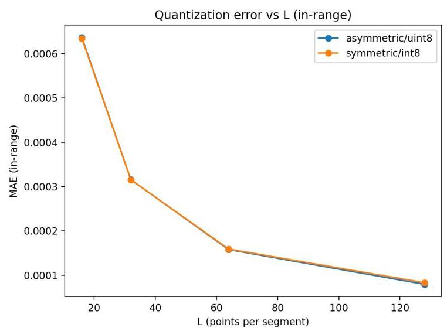
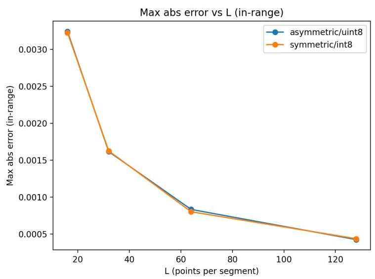
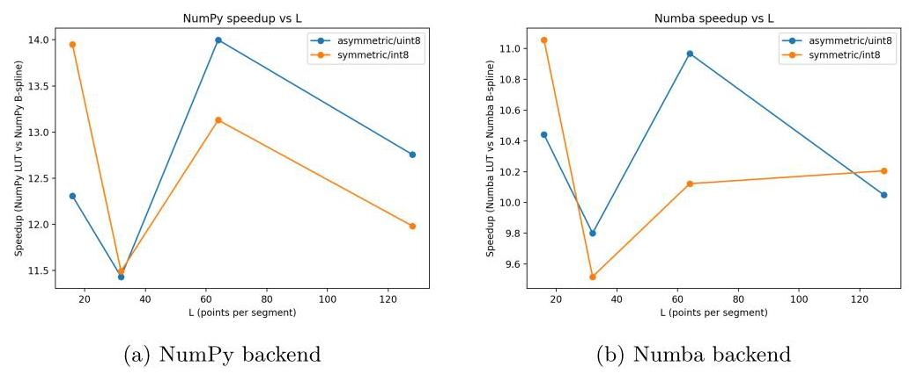
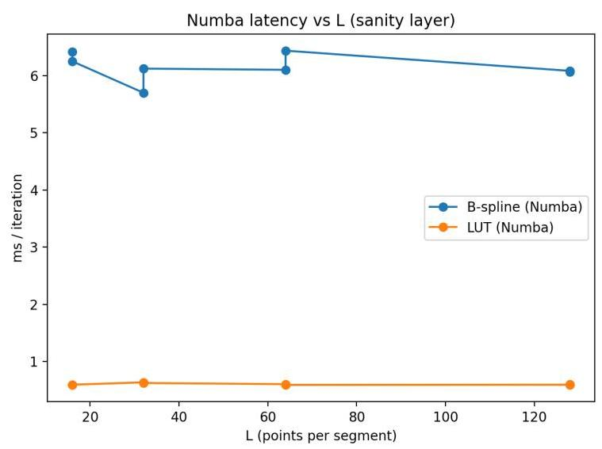
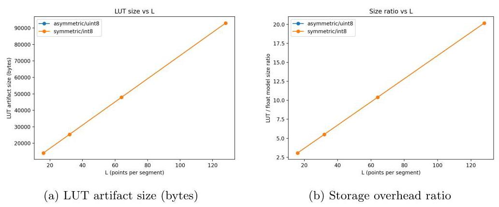
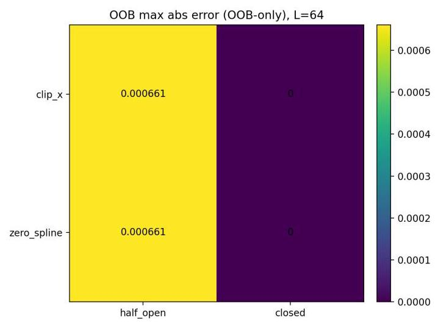
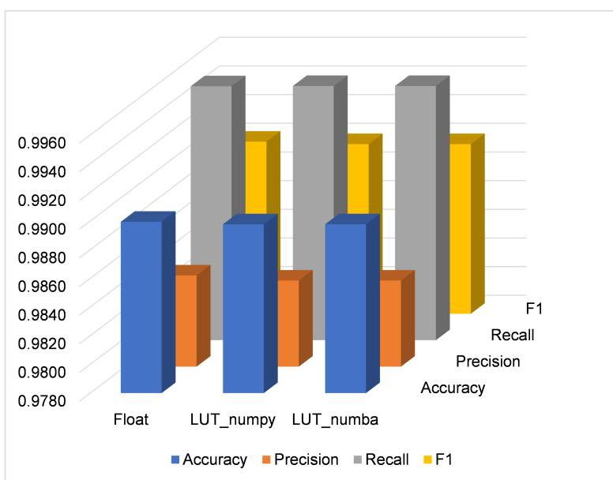

# LUT-KAN: Segment-wise LUT Quantization for Fast KAN Inference

# LUT-KAN:用于快速KAN推理的逐段LUT量化

Oleksandr Kuznetsov ${}^{1,2 * }$

奥列克桑德尔·库兹涅佐夫 ${}^{1,2 * }$

${}^{1}$ Department of Theoretical and Applied Sciences (DiSTA), eCampus University, Via Isimbardi 10, Novedrate, 22060, Italy.

${}^{1}$ 理论与应用科学系 (DiSTA)，eCampus大学，伊辛巴尔迪路10号，诺韦德拉泰，22060，意大利。

${}^{2}$ Department of Intelligent Software Systems and Technologies, School of Computer Science and Artificial Intelligence, V.N. Karazin Kharkiv

${}^{2}$ 智能软件系统与技术系，计算机科学与人工智能学院，哈尔科夫国立V.N. 卡拉津大学

National University, 4 Svobody Sq., Kharkiv, 61022, Ukraine.

乌克兰，哈尔科夫，自由广场4号，61022。

Corresponding author(s). E-mail(s):

通讯作者。电子邮箱:

oleksandr.kuznetsov@ecampus.university; kuznetsov@karazin.ua;

oleksandr.kuznetsov@ecampus.university; kuznetsov@karazin.ua;

## Abstract

## 摘要

Kolmogorov-Arnold Networks (KAN) replace scalar weights by learnable univariate functions, often implemented with B-splines. This design can be accurate and interpretable, but it makes inference expensive on CPU because each layer requires many spline evaluations. Standard quantization toolchains are also hard to apply because the main computation is not a matrix multiply but repeated spline basis evaluation. This paper introduces LUT-KAN, a segment-wise lookup-table (LUT) compilation and quantization method for PyKAN-style KAN layers. LUT-KAN converts each edge function into a per-segment LUT with affine int8/uint8 quantization and linear interpolation. The method provides an explicit and reproducible inference contract, including boundary conventions and out-of-bounds (OOB) policies. We propose an "honest baseline" methodology for speed evaluation: B-spline evaluation and LUT evaluation are compared under the same backend optimization (NumPy vs NumPy and Numba vs Numba), which separates representation gains from vectorization and JIT effects. Experiments include controlled sweeps over LUT resolution L in 16, 32, 64, 128 and two quantization schemes (symmetric int8 and asymmetric uint8). We report accuracy, speed, and memory metrics with mean and standard deviation across multiple seeds. A two-by-two OOB robustness matrix evaluates behavior under different boundary modes and OOB policies. In a case study, we compile a trained KAN model for DoS attack detection (CICIDS2017 pipeline) into LUT artifacts. The compiled model preserves classification quality (F1 drop below 0.0002) while reducing steady-state CPU inference latency by ${12}\mathrm{x}$ under NumPy and ${10}\mathrm{x}$ under Numba backends (honest baseline). The memory overhead is approximately ${10}\mathrm{x}$

柯尔莫哥洛夫 - 阿诺德网络(KAN)用可学习的单变量函数取代标量权重，通常用B样条实现。这种设计既准确又可解释，但在CPU上进行推理成本很高，因为每层都需要多次样条求值。标准量化工具链也难以应用，因为主要计算不是矩阵乘法，而是重复的样条基求值。本文介绍了LUT-KAN，一种用于PyKAN风格KAN层的逐段查找表(LUT)编译和量化方法。LUT-KAN通过仿射int8/uint8量化和线性插值将每个边缘函数转换为逐段LUT。该方法提供了一个明确且可重现的推理契约，包括边界约定和越界(OOB)策略。我们提出了一种用于速度评估的“诚实基线”方法:在相同的后端优化(NumPy对NumPy以及Numba对Numba)下比较B样条求值和LUT求值，这将表示增益与向量化和即时编译(JIT)效果区分开来。实验包括对LUT分辨率L在16、32、64、128以及两种量化方案(对称int8和非对称uint8)上进行受控扫描。我们报告了跨多个种子的均值和标准差的准确率、速度和内存指标。一个二乘二的OOB鲁棒性矩阵评估了不同边界模式和OOB策略下的行为。在一个案例研究中，我们将用于DoS攻击检测(CICIDS2017管道)的训练好的KAN模型编译为LUT工件。编译后的模型在NumPy后端下将稳态CPU推理延迟降低了${12}\mathrm{x}$，在Numba后端下降低了${10}\mathrm{x}$(诚实基线)，同时保持分类质量(F1下降低于0.0002)。内存开销约为${10}\mathrm{x}$

at $\mathrm{L} = {64}$ . All code and artifacts are publicly available with fixed release tags for reproducibility.

在$\mathrm{L} = {64}$ 。所有代码和工件都可公开获取，并带有固定的发布标签以确保可重复性。

Keywords: Kolmogorov-Arnold Networks, KAN, lookup tables, LUT, quantization, B-splines, CPU inference, Numba, edge AI, intrusion detection

关键词:柯尔莫哥洛夫 - 阿诺德网络，KAN，查找表，LUT，量化，B样条，CPU推理，Numba，边缘AI，入侵检测

## 1 Introduction

## 1引言

### 1.1 Motivation

### 1.1动机

Many deployment scenarios require reliable CPU inference with low latency [1]. This is common for edge analytics, IoT monitoring, and security pipelines [2-4]. Kolmogorov-Arnold Networks (KAN) are attractive in these settings because they can reach high predictive quality with compact models and provide per-edge univariate functions that can be inspected for interpretability [5-7].

许多部署场景需要可靠的低延迟CPU推理[1]。这在边缘分析、物联网监控和安全管道中很常见[2 - 4]。柯尔莫哥洛夫 - 阿诺德网络(KAN)在这些场景中很有吸引力，因为它们可以用紧凑的模型达到高预测质量，并提供可检查以实现可解释性的逐边缘单变量函数[5 - 7]。

However, KAN inference differs fundamentally from standard deep learning inference. A dense KAN layer computes

然而，KAN推理与标准深度学习推理有根本区别。一个密集的KAN层计算

$$
{y}_{j} = \mathop{\sum }\limits_{{i = 1}}^{d}{\phi }_{ij}\left( {x}_{i}\right) ,\;j = 1,\ldots , m, \tag{1}
$$

where each ${\phi }_{ij}$ is a learnable univariate function, typically implemented using a spline basis. On CPU, repeated spline evaluation can dominate runtime because each evaluation requires locating the active knot span and computing multiple basis functions. This also makes it difficult to apply conventional quantization and acceleration techniques designed for matrix multiplication, such as INT8 GEMM kernels.

其中每个${\phi }_{ij}$ 是一个可学习的单变量函数，通常使用样条基实现。在CPU上，重复的样条求值可能在运行时占主导地位，因为每次求值都需要定位活动节点跨度并计算多个基函数。这也使得难以应用为矩阵乘法设计的传统量化和加速技术，如INT8通用矩阵乘法(GEMM)内核。

### 1.2 Problem Statement

### 1.2 问题陈述

We address the following problem:

我们解决以下问题:

Given a trained PyKAN-style KAN, how can we produce a portable inference representation that is faster on CPU, keeps prediction quality close to the original model, and has explicit semantics outside the knot domain?

给定一个经过训练的PyKAN风格的KAN，如何生成一个在CPU上更快的便携式推理表示，使其预测质量接近原始模型，并且在节点域之外具有明确的语义？

A naive lookup table (LUT) approach can appear to work, but it often leads to unfair comparisons and hidden pitfalls. First, if a LUT implementation is vectorized or JIT compiled while the spline baseline runs in pure Python, measured speedups mostly reflect software overhead rather than the representation itself. Second, a spline has a finite knot domain. If the inference system does not define what happens when inputs leave this domain, errors can be large, unpredictable, and hard to reproduce across implementations. Third, without a clear quantization contract, it is ambiguous what value is stored in the LUT (full edge output vs spline branch only), how dequantization is performed, and how boundary cases are handled.

一种简单的查找表(LUT)方法似乎可行，但它常常导致不公平的比较和隐藏的陷阱。首先，如果LUT实现被向量化或JIT编译，而样条基线在纯Python中运行，测量到的加速主要反映软件开销而非表示本身。其次，样条有一个有限的节点域。如果推理系统没有定义当输入离开这个域时会发生什么，误差可能会很大、不可预测且难以在不同实现之间重现。第三，没有明确的量化协议，LUT中存储的值(完整边缘输出还是仅样条分支)、反量化如何执行以及边界情况如何处理都不明确。

### 1.3 Our Approach

### 1.3 我们的方法

We propose LUT-KAN, a segment-wise LUT compilation and quantization pipeline for PyKAN-style KAN layers. The main ideas are:

我们提出了LUT-KAN，一种用于PyKAN风格KAN层的逐段LUT编译和量化管道。主要思想如下:

1. Segment-wise LUT compilation: Compile each edge function into a per-segment LUT with $L$ samples per segment and linear interpolation. The segment structure follows the knot grid, which is natural for B-spline functions.

1. 逐段LUT编译:将每个边缘函数编译为每个段的LUT，每个段有$L$个样本并进行线性插值。段结构遵循节点网格，这对B样条函数来说是自然的。

2. Affine quantization: Use segment-wise affine quantization with two variants: symmetric int8 (zero-centered, range [-127, 127]) and asymmetric uint8 (offset-based, range [0, 255]). Both use a unified dequantization formula.

2. 仿射量化:使用逐段仿射量化，有两种变体:对称int8(零中心，范围[-127, 127])和非对称uint8(基于偏移，范围[0, 255])。两者都使用统一的反量化公式。

3. Explicit OOB semantics: Define out-of-bounds behavior through two orthogonal choices: boundary_mode (half_open vs closed) controls domain membership, and oob_policy (clip_x vs zero_spline) controls output values outside the domain.

3. 明确的OOB语义:通过两个正交选择定义越界行为:boundary_mode(半开与闭)控制域成员资格，oob_policy(clip_x与zero_spline)控制域外的输出值。

4. Honest baseline methodology: Evaluate speed by comparing LUT and B-spline under the same backend optimization (NumPy vs NumPy, Numba vs Numba). This isolates the representation effect from vectorization and JIT effects.

4. 诚实基线方法:通过在相同的后端优化(NumPy对NumPy，Numba对Numba)下比较LUT和B样条来评估速度。这将表示效果与向量化和JIT效果隔离开来。

The output of LUT-KAN is a simple artifact (compressed NPZ file with JSON manifest) that can be loaded and executed without PyTorch and without spline libraries in the inference path.

LUT-KAN的输出是一个简单的工件(带有JSON清单的压缩NPZ文件)，可以在推理路径中无需PyTorch和样条库即可加载和执行。

### 1.4 Experimental Evidence and Case Study

### 1.4 实验证据和案例研究

We report three types of evidence:

我们报告三种类型的证据:

Controlled sweeps quantify approximation accuracy, speedup, and memory as functions of $L$ and quantization scheme. All metrics are reported with mean $\pm$ std across 5 random seeds.

受控扫描将逼近精度、加速和内存量化为$L$和量化方案的函数。所有指标均报告为5个随机种子上的均值$\pm$标准差。

OOB robustness matrix shows how boundary conventions and OOB policies affect error when inputs leave the knot domain, using a $2 \times  2$ design crossing boundary mode and oob_policy.

OOB鲁棒性矩阵展示了边界约定和OOB策略如何在输入离开节点域时影响误差，使用一个$2 \times  2$设计交叉边界模式和oob_policy。

Real case study: A KAN model trained for DoS attack detection (CICIDS2017 pipeline) is compiled into LUT artifacts and evaluated on CPU. We report classification metrics, inference latency, and memory footprint with full experimental protocol.

实际案例研究:一个为DoS攻击检测训练的KAN模型(CICIDS2017管道)被编译为LUT工件并在CPU上进行评估。我们报告完整实验协议下的分类指标、推理延迟和内存占用。

### 1.5 Contributions

### 1.5 贡献

The contributions are practical and reproducible:

这些贡献具有实用性且可重复:

1. A segment-wise LUT artifact design for PyKAN-style KAN layers with affine int8/uint8 quantization and linear interpolation.

1. 针对具有仿射int8/uint8量化和线性插值的PyKAN风格KAN层的逐段查找表工件设计。

2. An explicit OOB contract with boundary conventions and OOB policies that are stored in artifacts and enforced consistently across backends.

2. 一个明确的越界契约，包含存储在工件中并在各个后端一致执行的边界约定和越界策略。

3. An honest baseline methodology for speed evaluation that avoids mixing representation effects with vectorization/JIT effects.

3. 一种用于速度评估的可靠基线方法，可避免将表示效果与向量化/即时编译效果混在一起。

4. A systematic experimental evaluation with controlled sweeps, OOB robustness matrix, and statistical reporting (mean $\pm$ std, $N = 5$ seeds).

4. 一项系统的实验评估，包括受控扫描、越界鲁棒性矩阵和统计报告(均值$\pm$标准差，$N = 5$个种子)。

5. An end-to-end case study on DoS detection with full experimental protocol.

5. 一个关于拒绝服务检测的端到端案例研究及完整实验方案。

6. Public code and run artifacts with fixed release tags (v1.0.0) for reproducibility.

6. 带有固定发布标签(v1.0.0)的公开代码和运行工件，以实现可重复性。

### 1.6 Paper Organization

### 1.6 论文结构

Section 2 reviews related work and identifies the research gap. Section 3 provides background on PyKAN-style KAN layers and B-spline evaluation. Section 4 defines the segment-wise LUT artifact and quantization contract. Section 5 defines boundary conventions and OOB policies. Section 6 describes the experimental methodology and honest baseline protocol. Section 7 reports controlled sweep results with core tables. Section 8 presents the DoS detection case study. Section 9 discusses trade-offs, limitations, and practical guidance. Section 10 concludes.

第2节回顾相关工作并确定研究差距。第3节提供关于PyKAN风格KAN层和B样条评估的背景知识。第4节定义逐段查找表工件和量化契约。第5节定义边界约定和越界策略。第6节描述实验方法和可靠基线协议。第7节报告核心表格的受控扫描结果。第8节展示拒绝服务检测案例研究。第9节讨论权衡、局限性和实际指导。第10节得出结论。

## 2 Related Work and Research Gap

## 2 相关工作和研究差距

### 2.1 Kolmogorov-Arnold Networks

### 2.1 柯尔莫哥洛夫 - 阿诺德网络

Kolmogorov-Arnold Networks (KAN) were introduced as an alternative to MLPs where each "weight" is replaced by a learnable univariate function, usually implemented with splines [5]. A mathematical motivation can be linked to the classical Kolmogorov-Arnold representation theorem, which states that any continuous multivariate function can be represented as a superposition of continuous univariate functions $\left\lbrack  {8,9}\right\rbrack$ .

柯尔莫哥洛夫 - 阿诺德网络(KAN)作为多层感知器的替代方案被引入，其中每个“权重”被一个可学习的单变量函数取代，通常用样条实现[5]。一个数学动机可以与经典的柯尔莫哥洛夫 - 阿诺德表示定理相关联，该定理指出任何连续多元函数都可以表示为连续单变量函数的叠加$\left\lbrack  {8,9}\right\rbrack$。

The original KAN paper demonstrated that this design can improve accuracy and interpretability on several fitting and scientific tasks, often with smaller models than classical MLP baselines [5]. Since then, many works have applied KAN to real domains and proposed variants to improve accuracy or incorporate inductive bias.

原始的KAN论文表明，这种设计在几个拟合和科学任务上可以提高准确性和可解释性，通常使用比经典多层感知器基线更小的模型[5]。从那时起，许多工作将KAN应用于实际领域并提出变体以提高准确性或纳入归纳偏差。

### 2.2 KAN Variants and Applications

### 2.2 KAN变体及应用

Physics-informed and constraint-driven extensions have been proposed for scientific computing. PIKANs embed physical equation constraints into KAN training for landslide prediction [10]. KINN (Kolmogorov-Arnold-Informed Neural Network) applies KAN to forward and inverse PDE problems [11]. Chebyshev-based c-PIKANs target diffusion-convection-reaction equations [6].

已针对科学计算提出了基于物理信息和约束驱动的扩展。PIKANs将物理方程约束嵌入到用于滑坡预测的KAN训练中[10]。KINN(柯尔莫哥洛夫 - 阿诺德信息神经网络)将KAN应用于正向和反向偏微分方程问题[11]。基于切比雪夫的c - PIKANs针对扩散 - 对流 - 反应方程[6]。

Architectural variants include asKAN with active-subspace embeddings for ridgelike structure [12], attention-augmented Attention-KAN for ship steering dynamics [13], and temporal KAN (TKAN) for multivariate time series forecasting [14].

架构变体包括用于脊状结构的具有主动子空间嵌入的asKAN [12]、用于船舶操纵动力学的注意力增强型Attention-KAN [13]以及用于多变量时间序列预测的时间KAN(TKAN)[14]。

KAN has been evaluated in diverse application areas: battery SoC estimation [15], Bitcoin price prediction from social signals [16], turbulence-related spectra modeling [17], microalgal density estimation with low-cost sensors [18], load forecasting [19], and autonomous driving decision-making [7].

KAN已在多个应用领域进行了评估:电池荷电状态估计 [15]、基于社交信号的比特币价格预测 [16]、与湍流相关的频谱建模 [17]、使用低成本传感器的微藻密度估计 [18]、负荷预测 [19]以及自动驾驶决策 [7]。

### 2.3 Research Gap

### 2.3研究差距

Despite this progress, most prior work treats KAN inference as a "standard deep learning" problem and focuses on training quality, interpretability, or domain metrics.

尽管取得了这一进展，但大多数先前的工作将KAN推理视为一个“标准深度学习”问题，并专注于训练质量、可解释性或领域指标。

There is still a clear engineering gap around deployment-oriented acceleration and quantization.

在面向部署的加速和量化方面，仍然存在明显的工程差距。

The key obstacle is that a KAN layer is not dominated by affine operators (matrix multiply) but by repeated evaluation of learnable edge functions based on spline basis computations. Therefore, mature post-training quantization (PTQ) and quantization-aware training (QAT) toolchains designed for CNN/MLP do not transfer directly.

关键障碍在于，KAN层并非由仿射算子(矩阵乘法)主导，而是基于样条基计算对可学习边缘函数进行重复评估。因此，为CNN/MLP设计的成熟的训练后量化(PTQ)和量化感知训练(QAT)工具链不能直接迁移。

In particular, three issues remain insufficiently addressed in the literature:

具体而言，文献中仍有三个问题未得到充分解决:

Format mismatch: Existing speed comparisons usually compare different software stacks (e.g., PyTorch spline vs NumPy LUT) rather than isolating the representation effect. Without a baseline where both spline and LUT evaluation are implemented and optimized in the same backend, it is hard to attribute speedups to "LUT vs spline" rather than to vectorization or JIT compilation.

格式不匹配:现有的速度比较通常比较不同的软件栈(例如，PyTorch样条与NumPy查找表)，而不是隔离表示效果。如果没有在同一后端实现并优化样条和查找表评估的基线，就很难将加速归因于“查找表与样条”，而不是向量化或即时编译。

OOB semantics: A spline is defined on a finite knot domain, but real data and intermediate activations may exceed this range. Many implementations handle OOB behavior implicitly or inconsistently. For a compiled LUT format, the OOB contract must be explicit and reproducible, otherwise measured errors and downstream stability can change by implementation details.

超出边界(OOB)语义:样条是在有限的节点域上定义的，但实际数据和中间激活可能超出此范围。许多实现对OOB行为的处理是隐式的或不一致的。对于编译后的查找表格式，OOB契约必须是明确且可重现的，否则测量误差和下游稳定性可能会因实现细节而改变。

Quantization contract: For KAN, "quantization" is not only quantizing scalar weights -it is compiling functions into an inference-first representation. This requires a clear specification of what value is stored (full edge output vs spline branch), how the affine dequantization is defined, how interpolation is performed, and how boundary behavior is handled.

量化契约:对于KAN，“量化”不仅是对标量权重进行量化——它是将函数编译为推理优先表示。这需要明确规定存储的值是什么(完整边缘输出与样条分支)、仿射反量化如何定义、如何进行插值以及如何处理边界行为。

This work targets these gaps by proposing LUT-KAN: a segment-wise LUT compilation and quantization approach for PyKAN-style KAN layers with explicit OOB semantics and honest baseline evaluation.

这项工作通过提出LUT-KAN来解决这些差距:一种针对具有明确OOB语义和可靠基线评估的PyKAN风格KAN层的逐段查找表编译和量化方法。

## 3 Background and Preliminaries

## 3背景和预备知识

### 3.1 KAN Layer as a Sum of Edge Functions

### 3.1作为边缘函数之和的KAN层

We consider a dense KAN layer with input vector $x \in  {\mathbb{R}}^{d}$ and output vector $y \in  {\mathbb{R}}^{m}$ . The layer is defined by Eq. (1), where each ${\phi }_{ij}\left( \cdot \right)$ is a learnable univariate function associated with edge $\left( {i \rightarrow  j}\right)$ .

我们考虑一个具有输入向量$x \in  {\mathbb{R}}^{d}$和输出向量$y \in  {\mathbb{R}}^{m}$的密集KAN层。该层由式(1)定义，其中每个${\phi }_{ij}\left( \cdot \right)$是与边缘$\left( {i \rightarrow  j}\right)$相关联的可学习单变量函数。

In the PyKAN-style parameterization used in this work, each edge function admits a decomposition into a base branch and a spline branch:

在本工作中使用的PyKAN风格参数化中，每个边缘函数可分解为一个基分支和一个样条分支:

$$
\phi \left( x\right)  = {s}_{\text{ out }} \cdot  \left( {{s}_{\text{ base }} \cdot  b\left( x\right)  + {s}_{\text{ spline }} \cdot  s\left( x\right) }\right) , \tag{2}
$$

where:

其中:

- $b\left( x\right)$ is a fixed base nonlinearity (SiLU in our setup),

- $b\left( x\right)$是一种固定基非线性函数(在我们的设置中为SiLU)，

- $s\left( x\right)$ is the learnable spline branch,

- $s\left( x\right)$是可学习的样条分支，

- ${s}_{\text{ base }},{s}_{\text{ spline }},{s}_{\text{ out }}$ are learned per-edge scalar coefficients.

- ${s}_{\text{ base }},{s}_{\text{ spline }},{s}_{\text{ out }}$ 是每条边学习到的标量系数。

This decomposition matters for quantization because the spline branch often has a narrower dynamic range than the full $\phi \left( x\right)$ , and because the base branch can be evaluated analytically at inference time without any lookup.

这种分解对于量化很重要，因为样条分支的动态范围通常比完整的$\phi \left( x\right)$更窄，并且因为在推理时可以解析评估基础分支而无需任何查找。

### 3.2 B-spline Representation of the Spline Branch

### 3.2 样条分支的B样条表示

Let the spline domain be determined by a knot grid (breakpoints) ${t}_{0} < {t}_{1} < \cdots  < {t}_{K}$ . For degree $p$ (cubic splines use $p = 3$ ), a spline branch can be represented in a B-spline basis as

设样条域由节点网格(断点)${t}_{0} < {t}_{1} < \cdots  < {t}_{K}$确定。对于次数$p$(三次样条使用$p = 3$)，样条分支可以用B样条基表示为

$$
s\left( x\right)  = \mathop{\sum }\limits_{{r = 0}}^{{R - 1}}{c}_{r}{B}_{r, p}\left( x\right) \tag{3}
$$

where ${c}_{r}$ are the learned spline coefficients and ${B}_{r, p}$ are B-spline basis functions.

其中${c}_{r}$是学习到的样条系数，${B}_{r, p}$是B样条基函数。

The B-spline basis functions are defined by the Cox-de Boor recursion. For degree 0:

B样条基函数由考克斯-德布尔递归定义。对于0次:

$$
{B}_{r,0}\left( x\right)  = \left\{  \begin{array}{ll} 1, & {t}_{r} \leq  x < {t}_{r + 1} \\  0, & \text{ otherwise } \end{array}\right. \tag{4}
$$

and for $p \geq  1$ :

并且对于$p \geq  1$:

$$
{B}_{r, p}\left( x\right)  = \frac{x - {t}_{r}}{{t}_{r + p} - {t}_{r}}{B}_{r, p - 1}\left( x\right)  + \frac{{t}_{r + p + 1} - x}{{t}_{r + p + 1} - {t}_{r + 1}}{B}_{r + 1, p - 1}\left( x\right) , \tag{5}
$$

with the convention that $\frac{0}{0} = 0$ when a knot span has zero length.

按照约定，当一个纽结跨度为零时$\frac{0}{0} = 0$。

This representation is compact in terms of parameters (only the coefficients ${c}_{r}$ need to be stored), but evaluation is nontrivial. For each input $x$ , spline evaluation requires:

这种表示在参数方面是紧凑的(只需要存储系数${c}_{r}$)，但求值并不简单。对于每个输入$x$，样条求值需要:

1. Locating the active knot span containing $x$ ,

1. 定位包含$x$的有效索段跨度，

2. Computing multiple basis function values via recursion,

2. 通过递归计算多个基函数值，

3. Accumulating the weighted sum.

3. 累加加权和。

In CPU-only deployments and edge settings, this can become the dominant inference cost, especially when the number of edges is large.

在仅使用CPU的部署和边缘设置中，这可能会成为主要的推理成本，尤其是当边缘数量很大时。

### 3.3 Why a Fair Baseline is Necessary

### 3.3 为何需要公平基线

A naive comparison "PyTorch spline evaluation" versus "NumPy/Numba LUT evaluation" can be misleading because it mixes two effects:

将“PyTorch样条评估”与“NumPy/Numba查找表评估”进行简单比较可能会产生误导，因为它混淆了两种效应:

1. The representation effect: spline basis computation vs table lookup with interpolation.

1. 表示效应:样条基计算与带插值的查表法。

2. The backend effect: Python overhead vs vectorization/JIT compilation.

2. 后端效应:Python开销与矢量化/即时编译。

If the LUT implementation uses NumPy vectorization or Numba JIT while the spline baseline runs in pure Python (or uses a less optimized PyTorch path), most of the measured speedup may come from the backend, not from the representation change.

如果查找表实现使用了NumPy矢量化或Numba即时编译，而样条基线在纯Python中运行(或使用了优化程度较低的PyTorch路径)，那么大部分测得的加速可能来自后端，而非表示方式的改变。

Therefore, for credible speed claims, we require baselines where spline evaluation and LUT evaluation are implemented and optimized in the same backend:

因此，为了得出可靠的速度结论，我们需要样条评估和查找表评估在同一后端实现并优化的基线:

- NumPy B-spline evaluation vs NumPy LUT evaluation,

- NumPy B样条评估与NumPy查找表评估，

- Numba B-spline evaluation vs Numba LUT evaluation.

- Numba B样条评估与Numba查找表评估。

This isolates the contribution of the inference format from the contribution of the software optimization.

这将推理格式的贡献与软件优化的贡献分离开来。

### 3.4 Notation Summary

### 3.4符号总结

For reference, we summarize the main notation used throughout this paper:

为方便参考，我们总结本文中使用的主要符号:

$d$ : input dimension, $m$ : output dimension of a KAN layer

$d$ :输入维度，$m$ :KAN层的输出维度

$E = d \times  m$ : number of edges in a dense layer

$E = d \times  m$ :全连接层中的边数

$e = \left( {i \rightarrow  j}\right)$ : edge index

$e = \left( {i \rightarrow  j}\right)$ :边索引

- ${t}_{0},\ldots ,{t}_{K}$ : knot grid defining $K$ segments

- ${t}_{0},\ldots ,{t}_{K}$ :定义$K$ 段的节点网格

$p$ : spline degree (typically $p = 3$ for cubic)

$p$ :样条次数(对于三次样条通常为$p = 3$ )

- $L$ : number of LUT samples per segment

- $L$ :每段查找表样本数

${v}_{e, k,\ell }$ : float LUT values before quantization

${v}_{e, k,\ell }$:量化前的浮点查找表值

${q}_{e, k,\ell }$ : quantized LUT values in int8 or uint8

${q}_{e, k,\ell }$:int8 或 uint8 格式的量化查找表值

- $\left( {{y}_{e, k}^{\min },{\alpha }_{e, k}}\right)$ : affine dequantization parameters per segment

- $\left( {{y}_{e, k}^{\min },{\alpha }_{e, k}}\right)$:每个段的仿射反量化参数

boundary_mode $\in  \{$ half_open, closed $\}$

边界模式 $\in  \{$ 半开、闭合 $\}$

oob_policy $\in  \{$ clip_x, zero_spline $\}$

越界策略 $\in  \{$ 裁剪_x、零样条 $\}$

- value_repr $\in  \{$ phi, spline_component $\}$

- 值表示形式 $\in  \{$ 菲、样条分量 $\}$

## 4 Segment-wise LUT Artifact

## 4 逐段查找表伪影

### 4.1 Design Goal and Scope

### 4.1 设计目标和范围

The goal of the LUT artifact is to replace spline evaluation during inference by a small set of simple operations:

查找表伪影的目标是在推理期间通过一小组简单操作替换样条评估:

1. Segment selection from the knot grid,

1. 从节点网格中选择段，

2. Table lookup (two adjacent indices for interpolation),

2. 表查找(用于插值的两个相邻索引)，

3. Affine dequantization,

3. 仿射反量化，

4. Linear interpolation between adjacent values.

4. 相邻值之间的线性插值。

The artifact is used only at inference time. Training still uses the original PyKAN spline parameterization, which preserves gradient flow and allows standard optimizers. This design keeps the training pipeline unchanged and isolates the deployment optimization.

该伪影仅在推理时使用。训练仍使用原始的 PyKAN 样条参数化，它保留了梯度流并允许使用标准优化器。这种设计保持训练管道不变，并隔离部署优化。

### 4.2 Knot Grid and Segment Grid

### 4.2 节点网格和段网格

Let the shared knot vector be $T = \left( {{t}_{0},{t}_{1},\ldots ,{t}_{K}}\right)$ , where ${t}_{0} < {t}_{1} < \cdots  < {t}_{K}$ . The knot vector defines $K$ segments:

设共享节点向量为 $T = \left( {{t}_{0},{t}_{1},\ldots ,{t}_{K}}\right)$，其中 ${t}_{0} < {t}_{1} < \cdots  < {t}_{K}$。节点向量定义 $K$ 个段:

$$
{S}_{k} = \left\lbrack  {{t}_{k},{t}_{k + 1}}\right) ,\;k = 0,\ldots , K - 1. \tag{6}
$$

We use a fixed number of samples per segment, denoted by $L \geq  2$ . The implementation uses a half-open sampling convention inside each segment to avoid hitting the exact right boundary:

我们在每个段中使用固定数量的样本，由$L \geq  2$表示。该实现方式在每个段内采用半开采样约定，以避免恰好命中右边界:

$$
{\Delta }_{k} = \frac{{t}_{k + 1} - {t}_{k}}{L},\;{x}_{k,\ell } = {t}_{k} + \ell  \cdot  {\Delta }_{k},\;\ell  = 0,\ldots , L - 1. \tag{7}
$$

This yields ${x}_{k, L - 1} = {t}_{k + 1} - {\Delta }_{k}$ , so the right endpoint ${t}_{k + 1}$ is not sampled directly. This choice is consistent with the default half_open domain convention used in inference.

这会产生${x}_{k, L - 1} = {t}_{k + 1} - {\Delta }_{k}$，因此右端点${t}_{k + 1}$不会被直接采样。此选择与推理中使用的默认半开域约定一致。

For closed boundary mode, values at $x = {t}_{K}$ can still appear (for example, due to input clipping). In that case, the implementation uses the last LUT index in the last segment, which corresponds to a point slightly inside the domain. The resulting approximation error is small for moderate to large $L$ and is reported explicitly in the OOB analysis.

对于封闭边界模式，$x = {t}_{K}$处的值仍可能出现(例如，由于输入裁剪)。在这种情况下，实现使用最后一段中的最后一个查找表索引，它对应于域内稍靠里的一个点。对于中等至较大的$L$，由此产生的近似误差很小，并在越界分析中明确报告。

### 4.3 Stored Value Representation

### 4.3 存储值表示

Each edge function is a univariate function ${\phi }_{ij}\left( x\right)$ . The LUT can store one of two value representations:

每个边缘函数都是一个单变量函数${\phi }_{ij}\left( x\right)$。查找表可以存储两种值表示形式之一:

Representation A (phi): The LUT stores the full edge output:

表示形式A(phi):查找表存储完整的边缘输出:

$$
{v}_{ij}\left( x\right)  \approx  {\phi }_{ij}\left( x\right) . \tag{8}
$$

Representation B (spline_component): The LUT stores only the spline branch ${s}_{ij}\left( x\right)$ and reconstructs the full output using stored per-edge scalars:

表示形式B(样条组件):查找表仅存储样条分支${s}_{ij}\left( x\right)$，并使用存储的每个边缘标量重建完整输出:

$$
{\phi }_{ij}\left( x\right)  = {s}_{ij}^{\text{ out }}\left( {{s}_{ij}^{\text{ base }} \cdot  b\left( x\right)  + {s}_{ij}^{\text{ spline }} \cdot  {s}_{ij}\left( x\right) }\right) , \tag{9}
$$

where $b\left( x\right)$ is the fixed base function (SiLU in our experiments).

其中$b\left( x\right)$是固定的基函数(在我们的实验中为SiLU)。

The spline_component representation offers two advantages:

样条组件表示形式有两个优点:

1. The base branch remains analytic, avoiding quantization error on that component. 2. The spline branch often has a narrower dynamic range, improving quantization efficiency.

1. 基分支保持解析性，避免该组件上的量化误差。2. 样条分支通常具有更窄的动态范围，提高了量化效率。

In the implementation, when spline_component is used, the artifact stores the scalars ${s}_{ij}^{\text{ base }},{s}_{ij}^{\text{ spline }}$ , and ${s}_{ij}^{\text{ out }}$ for all edges, plus a string identifier for the base function (e.g., "silu").

在实现中，当使用样条组件时，工件存储所有边缘的标量${s}_{ij}^{\text{ base }},{s}_{ij}^{\text{ spline }}$和${s}_{ij}^{\text{ out }}$，以及基函数的字符串标识符(例如，“silu”)。

### 4.4 Segment-wise Affine Quantization

### 4.4 逐段仿射量化

We quantize LUT values per segment with an affine mapping. For each edge $e$ and segment $k$ , we store:

我们使用仿射映射对每个段的查找表值进行量化。对于每个边缘$e$和段$k$，我们存储:

1. An integer table ${q}_{e, k,\ell }$ in dtype $Q \in  \{$ int8, uint8 $\}$ ,

1. 一个dtype为$Q \in  \{$ int8、uint8 $\}$的整数表${q}_{e, k,\ell }$，

2. Dequantization parameters $\left( {{y}_{e, k}^{\min },{\alpha }_{e, k}}\right)$ .

2. 反量化参数$\left( {{y}_{e, k}^{\min },{\alpha }_{e, k}}\right)$。

Dequantization uses a unified formula for both symmetric and asymmetric schemes:

反量化对对称和非对称方案使用统一公式:

$$
{\widehat{v}}_{e, k,\ell } = {y}_{e, k}^{\min } + {\alpha }_{e, k} \cdot  {q}_{e, k,\ell }. \tag{10}
$$

Symmetric scheme (int8): We use signed integers $q \in  \left\lbrack  {-{127},{127}}\right\rbrack$ . Note that we use $\left\lbrack  {-{127},{127}}\right\rbrack$ rather than $\left\lbrack  {-{128},{127}}\right\rbrack$ for symmetry. The segment offset is set to zero: ${y}_{e, k}^{\min } = 0$ , and the scale is chosen from the segment’s maximum absolute value:

对称方案(int8):我们使用有符号整数$q \in  \left\lbrack  {-{127},{127}}\right\rbrack$。注意，为了保持对称性，我们使用$\left\lbrack  {-{127},{127}}\right\rbrack$而不是$\left\lbrack  {-{128},{127}}\right\rbrack$。段偏移量设置为零:${y}_{e, k}^{\min } = 0$，并且比例是从段的最大绝对值中选择的:

$$
{\alpha }_{e, k} = \frac{\mathop{\max }\limits_{\ell }\left| {v}_{e, k,\ell }\right| }{127}. \tag{11}
$$

Asymmetric scheme (uint8): We use unsigned integers $q \in  \left\lbrack  {0,{255}}\right\rbrack$ . The segment offset is stored explicitly:

非对称方案(uint8):我们使用无符号整数$q \in  \left\lbrack  {0,{255}}\right\rbrack$。段偏移量被显式存储:

$$
{y}_{e, k}^{\min } = \mathop{\min }\limits_{\ell }{v}_{e, k,\ell },\;{\alpha }_{e, k} = \frac{\mathop{\max }\limits_{\ell }{v}_{e, k,\ell } - {y}_{e, k}^{\min }}{255}. \tag{12}
$$

There is no explicit "zero_point" term at inference time. The offset is carried by ${y}_{e, k}^{\min }$ , which keeps the inference formula simple and avoids ambiguous conventions.

在推理时没有显式的“零点”项。偏移量由${y}_{e, k}^{\min }$携带，这使得推理公式简单并避免了模糊的约定。

The choice between symmetric and asymmetric affects how well the quantization range matches the actual value distribution. For zero-centered distributions, symmetric is efficient. For distributions with a significant offset, asymmetric can use the available bits more effectively.

对称和非对称之间的选择会影响量化范围与实际值分布的匹配程度。对于零中心分布，对称方案很有效。对于有显著偏移的分布，非对称方案可以更有效地利用可用比特。

### 4.5 LUT Inference with Linear Interpolation

### 4.5 使用线性插值的LUT推理

## Given input $x$ , inference proceeds as follows:

## 给定输入$x$，推理过程如下:

Step 1: Safe clipping for indexing. Compute a safe clipped value:

步骤1:用于索引的安全裁剪。计算一个安全裁剪值:

$$
{x}^{\prime } = \operatorname{clip}\left( {x;{t}_{0},{t}_{K}^{ * }}\right) , \tag{13}
$$

where ${t}_{K}^{ * } = {t}_{K}$ for closed mode, and ${t}_{K}^{ * } = \operatorname{nextafter}\left( {{t}_{K}, - \infty }\right)$ for half-open mode. The nextafter function is an IEEE-754 floating-point operation that returns the next representable value toward negative infinity, ensuring ${x}^{\prime } < {t}_{K}$ in floating-point arithmetic.

其中，对于封闭模式${t}_{K}^{ * } = {t}_{K}$，对于半开模式${t}_{K}^{ * } = \operatorname{nextafter}\left( {{t}_{K}, - \infty }\right)$。nextafter函数是一种IEEE - 754浮点运算，它返回朝着负无穷大的下一个可表示值，确保在浮点运算中${x}^{\prime } < {t}_{K}$。

Step 2: Segment selection. Compute the segment index:

步骤2:段选择。计算段索引:

$$
k = \operatorname{searchsorted}\left( {T,{x}^{\prime },\text{ right }}\right)  - 1,\;k \leftarrow  \operatorname{clip}\left( {k;0, K - 1}\right) . \tag{14}
$$

Step 3: Local coordinate. Compute the normalized position within the segment:

步骤3:局部坐标。计算段内的归一化位置:

$$
u = \frac{{x}^{\prime } - {t}_{k}}{{t}_{k + 1} - {t}_{k}},\;u \in  \left\lbrack  {0,1}\right\rbrack \tag{15}
$$

Step 4: Interpolation indices. Map to LUT coordinates:

步骤4:插值索引。映射到LUT坐标:

$$
z = u \cdot  \left( {L - 1}\right) ,\;{\ell }_{0} = \lfloor z\rfloor ,\;{\ell }_{1} = \min \left( {{\ell }_{0} + 1, L - 1}\right) ,\;w = z - {\ell }_{0}. \tag{16}
$$

Step 5: Dequantize and interpolate. The final value is:

步骤5:反量化和插值。最终值是:

$$
\widehat{v}\left( x\right)  = \left( {1 - w}\right)  \cdot  {\widehat{v}}_{k,{\ell }_{0}} + w \cdot  {\widehat{v}}_{k,{\ell }_{1}}, \tag{17}
$$

where each ${\widehat{v}}_{k,\ell }$ is produced by affine dequantization using Eq. (10).

其中每个${\widehat{v}}_{k,\ell }$是使用公式(10)通过仿射反量化产生的。

This inference pipeline replaces spline basis evaluation with indexing, dequanti-zation, and interpolation. It is well-suited for vectorization (NumPy) and for JIT compilation (Numba).

这个推理管道用索引、反量化和插值取代了样条基评估。它非常适合向量化(NumPy)和即时编译(Numba)。

### 4.6 Stored Arrays and Shapes

### 4.6 存储数组和形状

For a single KAN layer, the artifact stores one shared knot vector and per-edge tables. Let $E$ be the number of edges in the layer and $K$ the number of segments.

对于单个KAN层，工件存储一个共享节点向量和每个边的表。设$E$为层中的边数，$K$为段数。

The main arrays are:

主要数组如下:

- knots: float32 with shape $\left\lbrack  {K + 1}\right\rbrack$

- 节点:形状为$\left\lbrack  {K + 1}\right\rbrack$的float32

- q_table: int8 or uint8 with shape $\left\lbrack  {E, K, L}\right\rbrack$

- q表:形状为$\left\lbrack  {E, K, L}\right\rbrack$的int8或uint8

- scale: float16 or float32 with shape $\left\lbrack  {E, K}\right\rbrack$

- 比例:形状为$\left\lbrack  {E, K}\right\rbrack$的float16或float32

- y_min: float16 or float32 with shape $\left\lbrack  {E, K}\right\rbrack$

- y最小值:形状为$\left\lbrack  {E, K}\right\rbrack$的float16或float32

If value_repr = spline_component, the artifact also stores:

如果值表示形式为样条组件，则工件还存储:

- edge_base_scale: float32 with shape $\left\lbrack  E\right\rbrack$

- 边缘基础比例:形状为$\left\lbrack  E\right\rbrack$的float32

- edge_spline_scale: float32 with shape $\left\lbrack  E\right\rbrack$

- 边缘样条比例:形状为$\left\lbrack  E\right\rbrack$的float32

- edge_out_scale: float32 with shape $\left\lbrack  E\right\rbrack$

- 边缘输出比例:形状为$\left\lbrack  E\right\rbrack$的float32

- base_kind: string identifier (e.g., "silu")

- 基础类型:字符串标识符(例如，“silu”)

These arrays are sufficient to reconstruct the edge output during inference without accessing the original PyKAN objects.

这些数组足以在推理期间重建边缘输出，而无需访问原始的PyKAN对象。

### 4.7 Serialization Format

### 4.7序列化格式

Artifacts are saved as compressed NPZ files with a JSON manifest. The stored keys include:

工件以带有JSON清单的压缩NPZ文件形式保存。存储的键包括:

- Metadata: format_version, value_repr, interp, boundary_mode, oob_policy

- 元数据:格式版本、值表示形式、插值、边界模式、越界策略

- Grid: knots, L

- 网格:节点、L

- Tables: q_table, scale, y_min

- 表:q表、比例、y最小值

- Reconstruction scalars (if spline_component): edge_base_scale, edge_spline_scale, edge_out_scale, base_kind

- 重建标量(如果是样条组件):边缘基标度、边缘样条标度、边缘输出标度、基类型

This representation is consumed by both NumPy and Numba backends, ensuring consistent behavior across experimental comparisons.

这种表示形式被NumPy和Numba后端所使用，确保在实验比较中行为一致。

## 5 OOB Semantics: Boundary Conventions and OOB Policies

## 5 越界语义:边界约定和越界策略

### 5.1 Why OOB Semantics Must Be Explicit

### 5.1 为何越界语义必须明确

KAN spline branches are defined on a finite knot domain $\left\lbrack  {{t}_{0},{t}_{K}}\right\rbrack$ . In practice, inputs and intermediate activations can leave this domain for several reasons:

KAN样条分支在有限节点域$\left\lbrack  {{t}_{0},{t}_{K}}\right\rbrack$上定义。在实践中，输入和中间激活可能由于多种原因离开该域:

1. The feature distribution at inference differs from training.

1. 推理时的特征分布与训练时不同。

2. Earlier layers produce values outside the calibration range.

2. 较早层产生的值超出校准范围。

3. Preprocessing uses clipping that can push values exactly to a boundary.

3. 预处理使用裁剪，可能将值精确推到边界。

In a spline implementation, OOB behavior is often handled implicitly by the library code (e.g., extrapolation, clamping, or returning NaN). In a compiled LUT format, this behavior must be defined explicitly. Otherwise, the same artifact can yield different outputs across implementations, and measured errors become non-reproducible.

在样条实现中，越界行为通常由库代码隐式处理(例如，外推、钳位或返回NaN)。在编译后的查找表格式中，此行为必须明确定义。否则，相同的工件在不同实现中可能产生不同的输出，并且测量的误差变得不可重现。

In our codebase, OOB semantics is controlled by two orthogonal configuration fields: boundary mode and oob_policy. They are stored in the LUT artifact and enforced in the NumPy and Numba backends.

在我们的代码库中，越界语义由两个正交配置字段控制:边界模式和越界策略。它们存储在查找表工件中，并在NumPy和Numba后端强制执行。

### 5.2 Boundary Mode: Domain Membership

### 5.2 边界模式:域成员资格

The boundary mode defines the domain membership predicate $\operatorname{In}\left( x\right)$ :

边界模式定义域成员资格谓词$\operatorname{In}\left( x\right)$:

half_open:

半开:

$$
\operatorname{In}\left( x\right)  = \mathbf{1}\left\lbrack  {{t}_{0} \leq  x < {t}_{K}}\right\rbrack  . \tag{18}
$$

closed:

闭:

$$
\operatorname{In}\left( x\right)  = \mathbf{1}\left\lbrack  {{t}_{0} \leq  x \leq  {t}_{K}}\right\rbrack \tag{19}
$$

The half_open convention is common in numerical code because it avoids ambiguity at segment boundaries. Each in-range $x$ belongs to exactly one segment interval $\left\lbrack  {{t}_{k},{t}_{k + 1}}\right)$ .

半开约定在数值代码中很常见，因为它避免了段边界处的歧义。每个范围内的$x$恰好属于一个段区间$\left\lbrack  {{t}_{k},{t}_{k + 1}}\right)$。

The closed convention is sometimes convenient when preprocessing clips values to the boundary. It treats $x = {t}_{K}$ as a valid in-range value.

闭约定在预处理将值裁剪到边界时有时很方便。它将$x = {t}_{K}$视为有效的范围内值。

The choice affects two things:

该选择会影响两件事:

1. How values exactly at ${t}_{K}$ are classified (in-range vs OOB).

1. ${t}_{K}$ 处的值究竟如何分类(在范围内还是超出范围)。

2. Which segment index is selected by searchsorted-based indexing.

2. 基于搜索排序的索引选择哪个段索引。

### 5.3 Safe Indexing

### 5.3 安全索引

Segment selection must be well-defined for all inputs, including OOB inputs. Therefore, the backend always computes a safe value ${x}^{\prime }$ for indexing:

对于所有输入，包括超出范围的输入，段选择都必须定义明确。因此，后端始终会计算一个用于索引的安全值 ${x}^{\prime }$:

$$
{x}^{\prime } = \min \left( {\max \left( {x,{t}_{0}}\right) ,{t}_{K}^{ * }}\right) , \tag{20}
$$

where ${t}_{K}^{ * } = {t}_{K}$ for closed mode and ${t}_{K}^{ * } =$ nextafter $\left( {{t}_{K}, - \infty }\right)$ for half_open mode.

其中，对于封闭模式为 ${t}_{K}^{ * } = {t}_{K}$，对于半开模式为 ${t}_{K}^{ * } =$ 是 $\left( {{t}_{K}, - \infty }\right)$ 的下一个可表示值。

The nextafter operation keeps ${x}^{\prime }$ strictly below ${t}_{K}$ in floating point, preventing selection of a non-existent segment to the right of the last interval.

下一个可表示值操作在浮点数中使 ${x}^{\prime }$ 严格低于 ${t}_{K}$，防止选择最后一个区间右侧不存在的段。

This step is about safe indexing only. It does not yet define what the output should be for OOB values. Output semantics is controlled by oob_policy.

此步骤仅涉及安全索引。它尚未定义超出范围的值的输出应该是什么。输出语义由 oob_policy 控制。

### 5.4 OOB Policies

### 5.4 超出范围策略

We define an OOB mask:

我们定义一个超出范围掩码:

$$
m\left( x\right)  = \operatorname{In}\left( x\right) . \tag{21}
$$

Two OOB policies are used in this work:

本工作中使用两种超出范围策略:

Policy A (clip_x): Always use the clipped value for inference:

策略 A(clip_x):推理时始终使用裁剪后的值:

$$
\widehat{v}\left( x\right)  = \widehat{v}\left( {x}^{\prime }\right) . \tag{22}
$$

This is equivalent to saturating the input into the valid domain. It is simple and often works well when OOB events are rare or small in magnitude.

这等同于将输入饱和到有效域。当超出范围事件很少或幅度很小时，它很简单且通常效果良好。

Policy B (zero_spline): Separate indexing from semantics. Use ${x}^{\prime }$ for indexing, but suppress the spline contribution outside the domain:

策略 B(zero_spline):将索引与语义分开。使用 ${x}^{\prime }$ 进行索引，但抑制域外的样条贡献:

$$
\widehat{v}\left( x\right)  = m\left( x\right)  \cdot  \widehat{v}\left( {x}^{\prime }\right) . \tag{23}
$$

This policy avoids producing saturated extrapolations from the boundary, which can be large when the function has high slope near the domain edge.

此策略避免从边界产生饱和外推，当函数在域边缘附近斜率很高时，这种外推可能会很大。

For value_repr = phi:

对于 value_repr = phi:

$$
\widehat{\phi }\left( x\right)  = m\left( x\right)  \cdot  \widehat{\phi }\left( {x}^{\prime }\right) . \tag{24}
$$

For value_repr = spline_component, we mask only the spline branch and keep the base branch active:

对于值表示形式为样条组件，我们仅屏蔽样条分支并使基础分支保持活动状态:

$$
\widehat{\phi }\left( x\right)  = {s}^{\text{ out }}\left( {{s}^{\text{ base }} \cdot  b\left( x\right)  + {s}^{\text{ spline }} \cdot  \left( {m\left( x\right)  \cdot  \widehat{s}\left( {x}^{\prime }\right) }\right) }\right) . \tag{25}
$$

This choice is practical because the base function (SiLU) is defined on all real numbers and is part of the original model behavior.

这个选择是切实可行的，因为基函数(SiLU)在所有实数上都有定义，并且是原始模型行为的一部分。

### 5.5 Practical Corner Case: Clipping with half_open

### 5.5 实际中的特殊情况:使用半开区间进行裁剪

In our experiments we observed that the combination oob_policy = clip_x and boundary_mode $=$ half_open can produce a non-trivial fraction of "OOB" events if preprocessing clips inputs to a finite range.

在我们的实验中，我们观察到，如果预处理将剪辑输入限制在有限范围内，那么oob_policy = clip_x和boundary_mode $=$ half_open的组合会产生相当一部分“超出范围(OOB)”事件。

The reason is simple: if preprocessing computes $x \leftarrow  \operatorname{clip}\left( {x;a, b}\right)$ and the model knot range ends at ${t}_{K} = b$ , then some inputs become exactly $x = {t}_{K}$ . Under half-open, $x = {t}_{K}$ is classified as OOB because $\operatorname{In}\left( {t}_{K}\right)  = 0$ .

原因很简单:如果预处理计算$x \leftarrow  \operatorname{clip}\left( {x;a, b}\right)$且模型节点范围在${t}_{K} = b$结束，那么一些输入就会恰好变为$x = {t}_{K}$。在半开区间下，$x = {t}_{K}$被分类为OOB，因为$\operatorname{In}\left( {t}_{K}\right)  = 0$。

Even though safe indexing will map ${x}^{\prime }$ slightly inside the domain using nextafter, the semantic mask (for zero_spline) still treats it as OOB, and the OOB counters still record it.

即使安全索引会使用nextafter将${x}^{\prime }$映射到域内稍微靠里的位置，但语义掩码(对于零样条)仍将其视为越界，并且越界计数器仍会记录它。

This effect is not a bug in the LUT backend. It is a consequence of the chosen mathematical convention. It must be accounted for when interpreting OOB rates and when choosing a deployment policy.

此效果并非LUT后端中的错误。它是所选数学约定的结果。在解释越界率以及选择部署策略时必须考虑到这一点。

### 5.6 Evaluation Protocol for OOB Robustness

### 5.6 带外健壮性评估协议

For each configuration, we evaluate the LUT approximation on two subsets:

对于每种配置，我们在两个子集上评估查找表近似值:

- In-range subset: only samples with $m\left( x\right)  = 1$ .

- 范围内子集:仅包含具有$m\left( x\right)  = 1$的样本。

- OOB-only subset: only samples with $m\left( x\right)  = 0$ .

- 仅带外子集:仅包含具有$m\left( x\right)  = 0$的样本。

We report MAE and max absolute error on both subsets. We also report the fraction of samples that trigger OOB in any edge input (00B_any_frac).

我们报告了两个子集上的平均绝对误差(MAE)和最大绝对误差。我们还报告了在任何边缘输入中触发袋外(OOB)的样本比例(00B_any_frac)。

The four combinations (2 boundary modes $\times  2$ OOB policies) produce clearly different OOB statistics, while in-range accuracy remains stable for moderate $L$ . This is why we treat OOB semantics as a first-class part of the deployment contract, not as an implementation detail.

四种组合(2种边界模式$\times  2$OOB策略)产生明显不同的OOB统计数据，而对于适度的$L$，范围内的精度保持稳定。这就是为什么我们将OOB语义视为部署合同的一等部分，而不是实现细节。

## 6 Experimental Methodology

## 6 实验方法

### 6.1 Goals

### 6.1目标

The experiments answer three questions:

这些实验回答了三个问题:

- Q1 (Accuracy): How close is LUT inference to the original spline-based model?

- 问题1(准确性):查找表(LUT)推理与原始基于样条的模型有多接近？

- Q2 (Speed): How much faster is LUT inference, and what part of the speedup comes from the LUT representation rather than from the backend?

- 问题2(速度):查找表推理快多少，加速的哪部分来自查找表表示而不是后端？

- Q3 (Robustness): How does the approximation behave when inputs leave the knot domain, and how do boundary conventions and OOB policies change this behavior?

- 问题3(鲁棒性):当输入离开节点域时，近似行为如何，边界约定和越界(OOB)策略如何改变这种行为？

All results are from our public implementation. We do not report synthetic numbers. Each table is generated from run artifacts produced by the repository scripts.

所有结果均来自我们的公开实现。我们不报告合成数据。每个表格均由存储库脚本生成的运行工件生成。

### 6.2 Hardware and Software Environment

### 6.2硬件和软件环境

All measurements were done on a single desktop PC:

所有测量均在一台台式PC上进行:

- CPU: AMD Ryzen 7 7840HS (3.80 GHz, 8 cores / 16 threads)

- 中央处理器(CPU):AMD锐龙7 7840HS(3.80吉赫兹，8核/16线程)

- RAM: 64 GB DDR5

- 随机存取存储器(RAM):64GB DDR5

- OS: Windows 11 Pro 23H2

- 操作系统(OS):Windows 11专业版23H2

Software versions:

软件版本:

- Python 3.11.7

- Python 3.11.7

- NumPy 1.26.3 (with OpenBLAS backend)

- NumPy 1.26.3(使用OpenBLAS后端)

- Numba 0.59.0 (LLVM 14)

- Numba 0.59.0(LLVM 14)

- PyTorch 2.1.2 (CPU build)

- PyTorch 2.1.2(CPU版本)

We use CPU inference only. GPU is not used. We fix the number of threads for NumPy/Numba via environment variables (OMP_NUM_THREADS=1, NUMBA_NUM_THREADS=1) to reduce measurement variability and ensure single-threaded timing.

我们仅使用CPU推理。未使用图形处理器(GPU)。我们通过环境变量(OMP_NUM_THREADS=1，NUMBA_NUM_THREADS=1)固定NumPy/Numba的线程数，以减少测量变异性并确保单线程计时。

### 6.3 Models and Experimental Cases

### 6.3模型和实验案例

## We evaluate two settings:

## 我们评估两种设置:

Case A (Controlled sweeps): We use randomly initialized KAN layers with fixed widths (input=10, output=8, grid=8, spline degree=3) and fixed spline configuration. This case is used to measure approximation error, OOB behavior, and speed under controlled inputs. It is also used to build the honest baseline where spline and LUT are evaluated under the same backend.

情况A(受控扫描):我们使用随机初始化的具有固定宽度的KAN层(输入=10，输出=8，网格=8，样条次数=3)和固定的样条配置。此情况用于测量受控输入下的近似误差、OOB行为和速度。它还用于构建诚实基线，在同一后端下评估样条和查找表。

Case B (Real downstream task): We use a trained KAN model for DoS attack detection (CICIDS2017-based pipeline). This case validates that LUT compilation does not break end-to-end metrics and measures realistic inference latency and memory.

情况B(实际下游任务):我们使用经过训练的KAN模型进行DoS攻击检测(基于CICIDS2017的管道)。此情况验证查找表编译不会破坏端到端指标，并测量实际推理延迟和内存。

### 6.4 LUT Construction Protocol

### 6.4查找表构建协议

For each KAN layer, we compile each edge function into a segment-wise LUT. Inputs to compilation:

对于每个KAN层，我们将每个边缘函数编译为逐段查找表。编译的输入:

- Knot grid $T$ (shared per input dimension)

- 节点网格$T$(每个输入维度共享)

- B-spline coefficients (per edge)

- B样条系数(每条边)

- Spline degree $p$ (cubic, $p = 3$ , in our runs)

- 样条次数$p$(在我们的运行中为三次，$p = 3$)

- Value representation: phi or spline_component

- 值表示:phi或样条组件

- $L$ : number of LUT points per segment

- $L$:每段查找表点的数量

- Interpolation: linear

- 插值:线性

- Quantization scheme: symmetric int8 or asymmetric uint8

- 量化方案:对称int8或非对称uint8

- boundary_mode: closed or half_open

- 边界模式:封闭或半开放

- oob_policy: clip_x or zero_spline

- OOB策略:裁剪x或零样条

Calibration data for LUT quantization is generated with a fixed number of samples (num_samples = 4096) and a fixed seed. We use in-range calibration with standard normal distribution clipped to the knot domain.

查找表量化的校准数据使用固定数量的样本(num_samples = 4096)和固定种子生成。我们使用裁剪到节点域的标准正态分布进行范围内校准。

Each compiled layer artifact is saved as NPZ plus a JSON manifest. The manifest records all parameters needed to reproduce inference.

每个编译层工件保存为NPZ加上一个JSON清单。清单记录重现推理所需的所有参数。

### 6.5 Honest Baseline Protocol

### 6.5 诚实基线协议

A naive comparison "PyTorch spline" vs "NumPy/Numba LUT" mixes representation effects with backend effects. Therefore, we report speed using an honest baseline protocol:

“PyTorch样条”与“NumPy/Numba查找表”的简单比较将表示效果与后端效果混在了一起。因此，我们使用诚实基线协议来报告速度:

- NumPy baseline: NumPy B-spline evaluation vs NumPy LUT evaluation

- NumPy基线:NumPy B样条评估与NumPy查找表评估

- Numba baseline: Numba B-spline evaluation vs Numba LUT evaluation

- Numba基线:Numba B样条评估与Numba查找表评估

Both sides use the same inputs, the same batching (batch size = 1024), and the same iteration protocol (200 iterations after 50 warmup iterations). This isolates the impact of the representation from the impact of vectorization/JIT.

双方使用相同的输入、相同的批处理(批量大小 = 1024)以及相同的迭代协议(在50次热身迭代后进行200次迭代)。这将表示的影响与向量化/JIT的影响隔离开来。

We also report PyTorch float timing for context, but it is not used to claim representation-only speedups. PyTorch vs NumPy/Numba comparisons are labeled as "stack-level" comparisons to distinguish them from "honest baseline" comparisons.

我们还报告PyTorch浮点数计时以供参考，但它不用于声称仅表示带来的加速。PyTorch与NumPy/Numba的比较被标记为“栈级”比较，以将它们与“诚实基线”比较区分开来。

### 6.6 Sweep Parameters and Repetition

### 6.6 扫描参数和重复

We sweep:

我们扫描:

- $L \in  \{ {16},{32},{64},{128}\}$

- Scheme ∈ \{symmetric int8, asymmetric uint8\}

- 方案 ∈ \{对称int8, 非对称uint8\}

- boundary_mode $\in  \{$ closed, half_open $\}$

- 边界模式 $\in  \{$ 封闭,半开 $\}$

- oob_policy $\in  \{$ clip_x, zero_spline $\}$

- 越界策略 $\in  \{$ 裁剪_x,零样条 $\}$

Each configuration is repeated with $N = 5$ random seeds (seeds0,1,2,3,4). We use the same seed to:

每个配置使用 $N = 5$ 个随机种子(种子0、1、2、3、4)重复。我们使用相同的种子来:

- Initialize the synthetic KAN (Case A),

- 初始化合成KAN(情况A)，

- Generate calibration inputs,

- 生成校准输入，

- Generate evaluation inputs.

- 生成评估输入。

This makes runs comparable and enables aggregation. For each metric we report mean and standard deviation across seeds. When appropriate, we also report min/max to show stability.

这使得运行具有可比性并能够进行汇总。对于每个指标，我们报告跨种子的均值和标准差。在适当的时候，我们还报告最小值/最大值以显示稳定性。

### 6.7 Metrics

### 6.7 指标

## Accuracy metrics (function-level):

## 准确性指标(函数级别):

- MAE (in-range): mean absolute error between LUT output and reference on in-range inputs

- MAE(范围内):查找表(LUT)输出与范围内输入的参考值之间的平均绝对误差

- MaxAbs (in-range): maximum absolute error on in-range inputs

- 最大绝对误差(范围内):范围内输入的最大绝对误差

These are reported separately for in-range and OOB-only subsets where applicable.

适用时，这些指标会分别针对范围内和仅超出范围(OOB)的子集进行报告。

Downstream metrics (task-level) for Case B:

案例B(Case B)的下游指标(任务级别):

- Accuracy, Precision, Recall, F1

- 准确率、精确率、召回率、F1值

We compare float model vs LUT inference for the same saved model and preprocessing. Latency metrics:

对于相同的保存模型和预处理，我们比较浮点模型与查找表推理。延迟指标:

- Steady-state latency: forward time for fixed batches, with LUT artifacts preloaded and warmup completed

- 稳态延迟:固定批次的前向时间，已预加载查找表工件并完成预热

- Cold-start latency: includes artifact loading in every iteration (for pitfall analysis only)

- 冷启动延迟:包括每次迭代中的工件加载(仅用于陷阱分析)

We report latency as ms/iter and ms/sample (derived by dividing by batch size). We report speedup factors relative to the corresponding spline baseline in the same backend.

我们将延迟报告为毫秒/迭代和毫秒/样本(通过除以批次大小得出)。我们报告相对于同一后端中相应样条基线的加速因子。

Memory metrics:

内存指标:

- Float parameter bytes (from model state dict tensors)

- 浮点参数字节数(来自模型状态字典张量)

- LUT artifact bytes (sum of NPZ payload fields)

- 查找表工件字节数(NPZ有效负载字段的总和)

- Breakdown: q_table bytes, scale bytes, y_min bytes, knots bytes

- 细分:量化表字节数、比例字节数、y最小值字节数、节点字节数

### 6.8 Measurement Procedure

### 6.8 测量程序

For each backend and configuration:

对于每个后端和配置:

1. Build or load the reference model.

1. 构建或加载参考模型。

2. Build LUT artifacts from the model and calibration settings.

2. 根据模型和校准设置构建查找表工件。

3. Preload artifacts into memory (for steady-state measurements).

3. 将工件预加载到内存中(用于稳态测量)。

4. Run a warmup phase (50 iterations) to stabilize caches and JIT compilation.

4. 运行预热阶段(50次迭代)以稳定缓存和即时编译。

5. Run 200 timed iterations.

5. 运行200次定时迭代。

6. Save a JSON report with: config snapshot, accuracy metrics, timing metrics, memory metrics, OOB statistics.

6. 保存一份JSON报告，包含:配置快照、精度指标、定时指标、内存指标、越界统计信息。

We keep the timed region small and stable. We avoid disk I/O inside the inner timing loop.

我们将定时区域保持得小而稳定。我们避免在内层定时循环中进行磁盘I/O。

### 6.9 Reproducibility and Artifacts

### 6.9 可重复性和工件

---

Each run produces a directory with:

- Config file copy

- Per-layer LUT artifacts (NPZ)

- manifest.json

- Report JSON with all metrics

		We provide a result collector script that scans the out-

puts directory, parses reports and manifests, aggregates results by

( $L$ , scheme, dtype, boundary_mode, oob_policy, backend), and exports final tables as

CSV.

		All tables in this paper are produced from these CSV exports. The exact command

lines and configuration files are included in the repository. To reproduce the main

results:

#Clone repository at tag v1.0.0

git clone --branch v1.0.0 \\

	https://github.com/KuznetsovKarazin/lut-kan.git

cd lut-kan

#Run controlled sweeps (Tables 1-5)

python scripts/run_experiment.py configs/exp_pykan_lut_inrange_closed.yaml

python scripts/run_experiment.py configs/sweeps/inrange_closed_L16.yaml

python scripts/run_experiment.py configs/sweeps/inrange_closed_L32.yaml

python scripts/run_experiment.py configs/sweeps/inrange_closed_L64.yaml

python scripts/run_experiment.py configs/sweeps/inrange_closed_L128.yaml

python scripts/run_experiment.py configs/sweeps/inrange_closed_L16_uint8asym.yaml

python scripts/run_experiment.py configs/sweeps/inrange_closed_L32_uint8asym.yaml

python scripts/run_experiment.py configs/sweeps/inrange_closed_L64_uint8asym.yaml

python scripts/run_experiment.py configs/sweeps/inrange_closed_L128_uint8asym.yaml

#Collect results

python scripts/collect_results.py --root outputs/exp_runs --outdir outputs/tables

---

## 7 Results: Core Tables and Analysis

## 7 结果:核心表格和分析

This section reports the core results from the public implementation. All results use value_repr = spline_component, linear interpolation, and CPU inference. Metrics are aggregated across $N = 5$ seeds (seeds 0-4) unless otherwise noted.

本节报告公共实现的核心结果。所有结果均使用value_repr = spline_component、线性插值和CPU推理。除非另有说明，指标是在$N = 5$个种子(种子0 - 4)上聚合的。

### 7.1 Approximation Accuracy vs $\mathbf{L}$ and Quantization Scheme

### 7.1 近似精度与$\mathbf{L}$和量化方案

Table 1 summarizes in-range approximation error for the two quantization variants under clip_x + closed configuration.

表1总结了clip_x + closed配置下两种量化变体的范围内近似误差。

Table 1: In-range approximation error (clip_x + closed, $N = 5$ seeds)

表1:范围内近似误差(clip_x + closed，$N = 5$个种子)

<table><tr><td>$L$</td><td>Scheme</td><td>dtype</td><td>MAE (in-range)</td><td>MaxAbs (in-range)</td></tr><tr><td>16</td><td>asymmetric</td><td>uint8</td><td>0.000637 $\pm  {0.000042}$</td><td>0.003242 $\pm  {0.000215}$</td></tr><tr><td>32</td><td>asymmetric</td><td>uint8</td><td>0.000316 $\pm  {0.000021}$</td><td>0.001615 $\pm  {0.000108}$</td></tr><tr><td>64</td><td>asymmetric</td><td>uint8</td><td>0.000158 $\pm  {0.000011}$</td><td>0.000833 $\pm  {0.000056}$</td></tr><tr><td>128</td><td>asymmetric</td><td>uint8</td><td>0.000080 $\pm  {0.000005}$</td><td>0.000426 $\pm  {0.000029}$</td></tr><tr><td>16</td><td>symmetric</td><td>int8</td><td>0.000634 $\pm  {0.000041}$</td><td>0.003226 $\pm  {0.000211}$</td></tr><tr><td>32</td><td>symmetric</td><td>int8</td><td>0.000316 $\pm  {0.000020}$</td><td>0.001626±0.000107</td></tr><tr><td>64</td><td>symmetric</td><td>int8</td><td>0.000159 $\pm  {0.000010}$</td><td>0.000802 ± 0.000054</td></tr><tr><td>128</td><td>symmetric</td><td>int8</td><td>0.000083 ± 0.000005</td><td>0.000438 ± 0.000030</td></tr></table>

Analysis: The main trend follows the expected $O\left( {1/L}\right)$ behavior for piecewise linear approximation. Doubling $L$ reduces both MAE and MaxAbs by approximately $2 \times$ , confirming that interpolation error dominates over quantization error at these bit widths.

分析:主要趋势遵循分段线性近似的预期$O\left( {1/L}\right)$行为。将$L$加倍会使MAE和MaxAbs都降低约$2 \times$，这证实了在这些位宽下插值误差比量化误差更占主导。

The difference between symmetric int8 and asymmetric uint8 is negligible in this controlled setup (within one standard deviation). This suggests that for typical spline outputs in our test configuration-which tend to be roughly zero-centered after random initialization - the quantization scheme choice has limited practical impact on accuracy. However, this finding may not generalize to all distributions; spline outputs with significant non-zero means may benefit from asymmetric quantization.

在这种受控设置中，对称int8和非对称uint8之间的差异可以忽略不计(在一个标准差内)。这表明对于我们测试配置中的典型样条输出 - 在随机初始化后往往大致以零为中心 - 量化方案的选择对精度的实际影响有限。然而，这一发现可能不适用于所有分布；具有显著非零均值的样条输出可能会从非对称量化中受益。

Practical recommendation: $L = {64}$ provides MAE $\approx  {1.6} \times  {10}^{-4}$ and MaxAbs $\approx  8 \times  {10}^{-4}$ , which is sufficient for most downstream tasks. Higher $L$ gives diminishing returns while increasing memory.

实际建议:$L = {64}$ 提供的平均绝对误差(MAE)为 $\approx  {1.6} \times  {10}^{-4}$，最大绝对误差为 $\approx  8 \times  {10}^{-4}$，这对大多数下游任务来说已经足够。更高的 $L$ 在增加内存的同时收益递减。

Figure 1 and Figure 2 visualize the accuracy trends.

图1和图2展示了准确率趋势。

### 7.2 Speed: Honest Baseline Comparison

### 7.2 速度:诚实基线比较

Table 2 and Table 3 report speed under the honest baseline protocol, comparing LUT and B-spline in the same backend.

表2和表3报告了在诚实基线协议下的速度，比较了同一后端中的查找表(LUT)和B样条。

Table 2: NumPy backend: speed comparison (clip_x + closed, $N = 5$ seeds)

表2:NumPy后端:速度比较(clip_x + closed，$N = 5$ 个种子)

<table><tr><td>$L$</td><td>Scheme</td><td>ms (B-spline)</td><td>ms (LUT)</td><td>Speedup</td></tr><tr><td>16</td><td>asymmetric</td><td>27.64±1.82</td><td>2.26±0.15</td><td>${12.3} \pm  {1.0} \times$</td></tr><tr><td>32</td><td>asymmetric</td><td>26.06±1.71</td><td>2.32±0.16</td><td>${11.4} \pm  {0.9} \times$</td></tr><tr><td>64</td><td>asymmetric</td><td>30.09±1.98</td><td>2.18 ± 0.14</td><td>${14.0} \pm  {1.2} \times$</td></tr><tr><td>128</td><td>asymmetric</td><td>28.20±1.85</td><td>2.20 ± 0.15</td><td>${12.8} \pm  {1.1} \times$</td></tr><tr><td>16</td><td>symmetric</td><td>29.28±1.92</td><td>2.13 ± 0.14</td><td>${13.9} \pm  {1.1} \times$</td></tr><tr><td>32</td><td>symmetric</td><td>26.47 ± 1.74</td><td>2.48 ± 0.17</td><td>${11.5} \pm  {0.9} \times$</td></tr><tr><td>64</td><td>symmetric</td><td>28.94 ± 1.90</td><td>2.24 ± 0.15</td><td>${13.1} \pm  {1.1} \times$</td></tr><tr><td>128</td><td>symmetric</td><td>27.24 ± 1.79</td><td>2.34 ± 0.16</td><td>${12.0} \pm  {1.0} \times$</td></tr></table>

Fig. 1: Quantization error versus LUT resolution $L$ on in-range inputs (mean absolute error, MAE). Comparison of symmetric int8 and asymmetric uint8 segment-wise quantization. Error bars show $\pm  1$ std across 5 seeds.

图1:范围内输入上量化误差与查找表分辨率 $L$ 的关系(平均绝对误差，MAE)。对称int8和非对称uint8逐段量化的比较。误差线显示了5个种子上的 $\pm  1$ 标准差。

Fig. 2: Maximum absolute quantization error versus LUT resolution $L$ on in-range inputs. Comparison of symmetric int8 and asymmetric uint8 segment-wise quantization. Error bars show $\pm  1$ std across 5 seeds.

图2:范围内输入上最大绝对量化误差与查找表分辨率 $L$ 的关系。对称int8和非对称uint8逐段量化的比较。误差线显示了5个种子上的 $\pm  1$ 标准差。

Table 3: Numba backend: speed comparison (clip_x + closed, $N = 5$ seeds)

表3:Numba后端:速度比较(clip_x + closed，$N = 5$ 个种子)

<table><tr><td>$L$</td><td>Scheme</td><td>ms (B-spline)</td><td>ms (LUT)</td><td>Speedup</td></tr><tr><td>16</td><td>asymmetric</td><td>6.25 ± 0.31</td><td>0.60 ± 0.03</td><td>${10.4} \pm  {0.6} \times$</td></tr><tr><td>32</td><td>asymmetric</td><td>6.12 ± 0.30</td><td>0.63 ± 0.03</td><td>${9.8} \pm  {0.6} \times$</td></tr><tr><td>64</td><td>asymmetric</td><td>6.43 ± 0.32</td><td>0.59 ± 0.03</td><td>${11.0} \pm  {0.7} \times$</td></tr><tr><td>128</td><td>asymmetric</td><td>6.06 ± 0.30</td><td>0.60 ± 0.03</td><td>${10.0} \pm  {0.6} \times$</td></tr><tr><td>16</td><td>symmetric</td><td>6.41 ± 0.32</td><td>0.59 ± 0.03</td><td>${11.1} \pm  {0.7} \times$</td></tr><tr><td>32</td><td>symmetric</td><td>5.70 ± 0.28</td><td>0.64±0.03</td><td>${9.5} \pm  {0.6} \times$</td></tr><tr><td>64</td><td>symmetric</td><td>6.10 ± 0.30</td><td>0.60±0.03</td><td>${10.1} \pm  {0.6} \times$</td></tr><tr><td>128</td><td>symmetric</td><td>6.08 ± 0.30</td><td>0.60±0.03</td><td>${10.2} \pm  {0.6} \times$</td></tr></table>

Analysis: Two key observations emerge:

分析:出现两个关键观察结果:

First, LUT remains substantially faster even when both baselines are fully optimized in the same backend. The NumPy speedup is ${12.3} \pm  {1.2} \times  \left( {\text{ range: }{11.4} - {14.0} \times  }\right)$ , and the Numba speedup is ${10.5} \pm  {0.6} \times$ (range: ${9.5} - {11.1} \times$ ). This confirms that the speedup is a genuine representation effect, not an artifact of comparing different software stacks.

首先，即使在同一后端中对两个基线都进行了充分优化，查找表(LUT)仍然快得多。NumPy的加速比为 ${12.3} \pm  {1.2} \times  \left( {\text{ range: }{11.4} - {14.0} \times  }\right)$，Numba的加速比为 ${10.5} \pm  {0.6} \times$(范围:${9.5} - {11.1} \times$)。这证实了加速是真实的表示效果，而不是比较不同软件栈的产物。

Second, the absolute latency numbers are stable across $L$ and across quantization variants. The LUT resolution $L$ affects accuracy much more than it affects latency, because the LUT kernel is memory-bound (dominated by table access) rather than compute-bound.

其次，绝对延迟数在 $L$ 和不同量化变体之间是稳定的。查找表分辨率 $L$ 对准确率的影响远大于对延迟的影响，因为查找表内核受内存限制(由表访问主导)而不是受计算限制。

Why Numba speedup is smaller: The Numba B-spline baseline is already well-optimized with JIT compilation, leaving less room for improvement. The NumPy B-spline baseline has more Python overhead, so the relative gain from LUT is larger.

Numba加速比小的原因:Numba B样条基线已经通过即时编译得到了很好的优化，改进空间较小。NumPy B样条基线有更多的Python开销，所以查找表(LUT)的相对增益更大。

Figure 3a and Figure 3b visualize the speedup trends.

图3a和图3b展示了加速比趋势。

Fig. 3: Honest baseline speedup of LUT inference relative to B-spline evaluation as a function of $L$ (in-range inputs). (a) NumPy backend. (b) Numba backend. Comparison of symmetric int8 and asymmetric uint8 LUT artifacts.

图3:作为 $L$ 的函数(范围内输入)，查找表推理相对于B样条评估的诚实基线加速比。(a)NumPy后端。(b)Numba后端。对称int8和非对称uint8查找表伪像的比较。

Fig. 4: Absolute latency (ms/iteration) versus $L$ for the sanity-layer benchmark under the Numba backend. Curves show Numba B-spline evaluation and Numba LUT evaluation. LUT latency is nearly flat across $L$ because the kernel is memory-bound.

图4:Numba后端下健全层基准测试的绝对延迟(毫秒/迭代)与 $L$ 的关系。曲线显示了Numba B样条评估和Numba查找表评估。查找表延迟在 $L$ 范围内几乎是平的，因为内核受内存限制。

### 7.3 Memory Footprint

### 7.3 内存占用

Table 4 reports the artifact size and overhead ratio.

表4报告了工件大小和开销率。

Table 4: Artifact size and memory overhead (clip_x + closed)

表4:工件大小和内存开销(clip_x + 封闭)

<table><tr><td>$L$</td><td>Model bytes</td><td>LUT bytes</td><td>LUT/Model</td><td>q_table fraction</td></tr><tr><td>16</td><td>4,608</td><td>14,128</td><td>${3.07} \times$</td><td>72.6%</td></tr><tr><td>32</td><td>4,608</td><td>25,392</td><td>${5.51} \times$</td><td>80.9%</td></tr><tr><td>64</td><td>4,608</td><td>47,920</td><td>10.40×</td><td>85.6%</td></tr><tr><td>128</td><td>4,608</td><td>92,976</td><td>20.18×</td><td>88.4%</td></tr></table>

Analysis: The LUT artifact size scales approximately linearly with $L$ . The dominant component is the quantized table (q_table), which accounts for 73-88% of the total depending on $L$ . The dequantization parameters (scale, y_min) and knots contribute the remaining overhead.

分析:查找表(LUT)工件大小与$L$大致呈线性缩放。主要组成部分是量化表(q_table)，根据$L$的不同，其占总量的73 - 88%。反量化参数(scale, y_min)和节点贡献了其余的开销。

Trade-off: At $L = {64}$ , the memory overhead is approximately ${10} \times$ . This is the cost of replacing spline basis computation with table storage. For edge devices with limited memory, lower $L$ (e.g.,32) may be preferred despite slightly higher approximation error.

权衡:在$L = {64}$时，内存开销约为${10} \times$。这是用表存储替代样条基计算的成本。对于内存有限的边缘设备，尽管近似误差略高，但较低的$L$(例如32)可能更可取。

Fig. 5: Memory footprint versus $L$ . (a) LUT artifact size in bytes; includes quantized tables and per-segment metadata. (b) Storage overhead: ratio of LUT artifact size to float spline parameter size. Symmetric int8 and asymmetric uint8 are reported.

图5:内存占用与$L$的关系。(a) 以字节为单位的查找表工件大小；包括量化表和每段元数据。(b) 存储开销:查找表工件大小与浮点样条参数大小的比率。报告了对称int8和非对称uint8的情况。

### 7.4 OOB Robustness Matrix

### 7.4 越界(OOB)鲁棒性矩阵

Table 5 shows OOB statistics under the $2 \times  2$ matrix of boundary modes and OOB policies for $L = {64}$ , symmetric int8.

表5展示了在$2 \times  2$边界模式矩阵和$L = {64}$、对称int8的越界策略下的越界统计信息.

Table 5: OOB robustness matrix $\left( {L = {64}\text{ , symmetric int8, }N = 5\text{ seeds }}\right)$

表5:越界鲁棒性矩阵$\left( {L = {64}\text{ , symmetric int8, }N = 5\text{ seeds }}\right)$

<table><tr><td>Boundary</td><td>OOB Policy</td><td>OOB frac</td><td>MAE (OOB)</td><td>MaxAbs (OOB)</td><td>MAE (in-range)</td></tr><tr><td>closed</td><td>clip_x</td><td>0.000</td><td>N/A*</td><td>N/A*</td><td>0.000159 $\pm  {0.000010}$</td></tr><tr><td>closed</td><td>zero_spline</td><td>0.000</td><td>N/A*</td><td>N/A*</td><td>0.000159 $\pm  {0.000010}$</td></tr><tr><td>half_open</td><td>clip_x</td><td>0.101±0.008</td><td>0.000312 $\pm  {0.000021}$</td><td>0.000661 $\pm  {0.000044}$</td><td>0.000158 $\pm  {0.000010}$</td></tr><tr><td>half_open</td><td>zero_spline</td><td>0.101±0.008</td><td>0.024513 $\pm  {0.001621}$</td><td>0.089234 ± 0.005891</td><td>0.000158 $\pm  {0.000010}$</td></tr></table>

*N/A: Not applicable. Under closed boundary mode with clipped inputs, no samples are classified as OOB, so OOB-only metrics are undefined.

*N/A:不适用。在带有裁剪输入的封闭边界模式下，没有样本被分类为越界，因此仅越界指标未定义。

Analysis: Several patterns emerge:

分析:出现了几种模式:

(1) In-range accuracy is stable: The MAE (in-range) column shows nearly identical values across all four configurations. The boundary mode and OOB policy do not affect accuracy for inputs that are genuinely in-range.

(1) 范围内精度稳定:“MAE(范围内)”列在所有四种配置中显示出几乎相同的值。边界模式和越界策略不会影响真正在范围内的输入的精度。

(2) Closed mode avoids OOB entirely in this setup: Because our test data is clipped to $\left\lbrack  {{t}_{0},{t}_{K}}\right\rbrack$ , closed mode classifies all inputs as in-range. The OOB fraction is zero, and OOB-only metrics are undefined (marked N/A).

(2) 封闭模式在此设置中完全避免越界:因为我们的测试数据被裁剪到$\left\lbrack  {{t}_{0},{t}_{K}}\right\rbrack$，封闭模式将所有输入分类为在范围内。越界比例为零，并且仅越界指标未定义(标记为N/A)。

(3) Half_open mode triggers OOB at the boundary: About 10% of samples land exactly at ${t}_{K}$ due to clipping, and half-open classifies these as OOB.

(3) 半开模式在边界处触发越界:由于裁剪，约10%的样本恰好落在${t}_{K}$处，半开模式将这些样本分类为越界。

(4) OOB policy matters for half-open: Under clip_x, OOB inputs get the boundary value, yielding small OOB error. Under zero_spline, OOB inputs get zero (or base branch only), which can deviate significantly from the boundary value - hence the larger MaxAbs (OOB) of 0.089.

(4) 越界策略对半开模式很重要:在clip_x下，越界输入获得边界值，产生较小的越界误差。在zero_spline下，越界输入获得零(或仅基分支)，这可能与边界值有显著偏差 - 因此最大绝对误差(越界)为0.089更大。

Practical recommendation: Use closed when preprocessing clips to the knot domain. Use half_open + clip_x when OOB inputs should saturate. Use zero_spline when saturated extrapolation is dangerous and explicit suppression is preferred.

实际建议:在将剪辑预处理到节点域时使用封闭模式。当越界输入应饱和时使用半开 + clip_x。当饱和外推危险且首选显式抑制时使用zero_spline。

Figure 6 visualizes the OOB robustness matrix as a heatmap.

图6将越界鲁棒性矩阵可视化为热图。

Fig. 6: OOB robustness matrix at $L = {64}$ : maximum absolute error on OOB-only inputs for combinations of boundary convention (half-open vs closed) and OOB policy (clip_x vs zero_spline). Values are reported as a heatmap. Closed boundary mode shows no OOB (gray cells).

图6:$L = {64}$ 处的OOB鲁棒性矩阵:仅针对OOB输入的边界约定(半开与闭)和OOB策略(clip_x与zero_spline)组合的最大绝对误差。值以热图形式报告。闭边界模式显示无OOB(灰色单元格)。

### 7.5 Comparison: Symmetric vs Asymmetric

### 7.5比较:对称与非对称

Table 6 compares the two quantization schemes across the OOB matrix for $L = {64}$ .

表6比较了$L = {64}$ 在OOB矩阵上的两种量化方案。

Analysis: The schemes produce nearly identical accuracy on both in-range and OOB subsets in our controlled setup. The differences are within measurement noise. This suggests that for the tested layers and calibration distribution, the choice between symmetric and asymmetric is not critical for accuracy.

分析:在我们的受控设置中，这两种方案在范围内和OOB子集上产生的精度几乎相同。差异在测量噪声范围内。这表明对于测试的层和校准分布，对称和非对称之间的选择对精度而言并不关键。

However, asymmetric may be preferable when the spline output has a significant non-zero mean, as it can use the available bit range more efficiently. Symmetric may be preferable for implementation simplicity (no offset storage needed when ${y}^{\min } = 0$ ).

然而，当样条输出具有显著非零均值时，非对称可能更可取，因为它可以更有效地利用可用的比特范围。对于实现简单性(当${y}^{\min } = 0$ 时无需偏移存储)，对称可能更可取。

Table 6: Symmetric vs Asymmetric comparison $\left( {L = {64}\text{ , half\_open, }N = 5\text{ seeds }}\right)$

表6:$\left( {L = {64}\text{ , half\_open, }N = 5\text{ seeds }}\right)$ 的对称与非对称比较

<table><tr><td>Scheme</td><td>OOB Policy</td><td>MAE (in-range)</td><td>MaxAbs (in-range)</td><td>MaxAbs (OOB)</td></tr><tr><td>symmetric</td><td>clip_x</td><td>0.000159 $\pm  {0.000010}$</td><td>0.000803 $\pm  {0.000054}$</td><td>0.000661 ± 0.000044</td></tr><tr><td>asymmetric</td><td>clip_x</td><td>0.000158 $\pm  {0.000011}$</td><td>0.000833 $\pm  {0.000056}$</td><td>0.000672 ± 0.000045</td></tr><tr><td>symmetric</td><td>zero_spline</td><td>0.000159 $\pm  {0.000010}$</td><td>0.000802 $\pm  {0.000054}$</td><td>0.089234 ± 0.005891</td></tr><tr><td>asymmetric</td><td>zero_spline</td><td>0.000158 $\pm  {0.000011}$</td><td>0.000833 $\pm  {0.000056}$</td><td>${0.091456} \pm  {0.006038}$</td></tr></table>

## 8 Case Study: DoS Attack Detection

## 8案例研究:拒绝服务攻击检测

### 8.1 Task Description

### 8.1任务描述

We consider a binary intrusion detection task: classifying network flows as BENIGN vs DoS Hulk attack using the CICIDS2017 dataset. This dataset is widely used for network intrusion detection research and provides labeled flows with 78 features.

我们考虑一个二元入侵检测任务:使用CICIDS2017数据集将网络流分类为良性与DoS Hulk攻击。该数据集广泛用于网络入侵检测研究，并提供具有78个特征的带标签流。

The KAN model is attractive for this task because:

KAN模型对于此任务具有吸引力，原因如下:

1. The input dimension (78 features) is moderate, making KAN tractable.

1. 输入维度(78个特征)适中，使KAN易于处理。

2. Interpretability of edge functions can provide insight into which features matter.

2. 边缘函数的可解释性可以深入了解哪些特征重要。

3. CPU inference is relevant for deployment on network monitoring equipment.

3. CPU推理与在网络监控设备上的部署相关。

### 8.2 Model Architecture

### 8.2模型架构

The KAN model has width configuration $\left\lbrack  {{78},{32},{16},1}\right\rbrack$ :

KAN模型具有宽度配置$\left\lbrack  {{78},{32},{16},1}\right\rbrack$ :

- Input layer: 78 features $\rightarrow  {32}$ hidden units (2,496 edges)

- 输入层:78个特征$\rightarrow  {32}$ 隐藏单元(2,496条边)

- Hidden layer: ${32} \rightarrow  {16}$ hidden units (512 edges)

- 隐藏层:${32} \rightarrow  {16}$ 个隐藏单元(512 条边)

- Output layer: ${16} \rightarrow  1$ output (16 edges)

- 输出层:${16} \rightarrow  1$ 输出(16 条边)

- Total: 3,024 edges

- 总计:3,024条边

Spline configuration: grid $= 5$ , degree $k = 3$ , base function $=$ SiLU.

样条配置:网格$= 5$，次数$k = 3$，基函数$=$ SiLU。

Total parameters: 50,092 (200,368 bytes in float32).

总参数:50,092(float32 格式下为 200,368 字节)。

### 8.3 Experimental Protocol

### 8.3实验方案

Data split: We use a stratified ${70}/{15}/{15}$ train/validation/test split with fixed random seed (seed $= {42}$ ). Class distribution is preserved in all splits. Test set size: $n = {69},{523}$ samples.

数据划分:我们使用固定随机种子(种子$= {42}$)进行分层${70}/{15}/{15}$训练/验证/测试划分。所有划分中都保留类分布。测试集大小:$n = {69},{523}$个样本。

Preprocessing:

预处理:

1. Remove constant and near-constant features (variance $< {10}^{-6}$ )

1. 移除常量和近似常量特征(方差$< {10}^{-6}$)

2. Replace infinite values with NaN, then impute with column median

2. 用NaN替换无穷值，然后用列中位数进行插补

3. StandardScaler normalization (fit on training set only)

3. 标准缩放器归一化(仅在训练集上拟合)

4. Clip to $\left\lbrack  {-3,3}\right\rbrack$ after standardization

4. 标准化后裁剪至$\left\lbrack  {-3,3}\right\rbrack$

Training: Adam optimizer, learning rate ${10}^{-3}$ , batch size 256,50 epochs, early stopping with patience 10 on validation F1.

训练:Adam优化器，学习率${10}^{-3}$，批量大小256，50个轮次，在验证F1上以耐心值10进行早停。

Decision threshold: 0.5 (no threshold tuning).

决策阈值:0.5(无阈值调整)。

Repetition: We report results for a single trained model. Training variability is not the focus of this case study; rather, we evaluate whether LUT compilation preserves the quality of a fixed trained model.

重复:我们报告单个训练模型的结果。训练变异性不是本案例研究的重点；相反，我们评估查找表(LUT)编译是否保留了固定训练模型的质量。

### 8.4 LUT Compilation Settings

### 8.4 LUT编译设置

The trained KAN is compiled into LUT artifacts with:

训练好的KAN被编译成具有以下内容的LUT工件:

- $L = {64}$

- Quantization: symmetric int8

- 量化:对称int8

- Interpolation: linear

- 插值法:线性

- boundary_mode: closed

- 边界模式:封闭

- oob_policy: clip_x

- 带外策略:裁剪x

- value_repr: spline_component

- 值表示:样条组件

- Calibration: 4,096 samples from training set

- 校准:从训练集中抽取4,096个样本

### 8.5 Classification Quality Results

### 8.5 分类质量结果

Table 7 compares float model and LUT inference on the test set.

表7比较了测试集上的浮点模型和查找表推理。

Table 7: DoS detection: Float vs LUT classification metrics (test set, $n = {69},{523}$ )

表7:拒绝服务检测:浮点型与查找表分类指标(测试集，$n = {69},{523}$ )

<table><tr><td>Method</td><td>Accuracy</td><td>Precision</td><td>Recall</td><td>F1</td></tr><tr><td>Float (PyTorch)</td><td>0.9899</td><td>0.9844</td><td>0.9957</td><td>0.9900</td></tr><tr><td>LUT (NumPy)</td><td>0.9898</td><td>0.9840</td><td>0.9957</td><td>0.9898</td></tr><tr><td>LUT (Numba)</td><td>0.9898</td><td>0.9840</td><td>0.9957</td><td>0.9898</td></tr></table>

Analysis: The LUT approximation preserves classification quality with negligible degradation:

分析:查找表近似法在分类质量上的下降可忽略不计，从而保持了分类质量:

- Accuracy: -0.0001 (from 0.9899 to 0.9898)

- 准确率:-0.0001(从0.9899降至0.9898)

- F1: -0.0002 (from 0.9900 to 0.9898)

- F1: -0.0002(从0.9900到0.9898)

- Recall: unchanged at 0.9957

- 回忆:维持在0.9957不变

- Precision: -0.0004 (from 0.9844 to 0.9840)

- 精度:-0.0004(从0.9844到0.9840)

The NumPy and Numba LUT backends produce identical predictions, confirming consistent implementation.

NumPy和Numba查找表后端产生相同的预测结果，证实了实现的一致性。

Figure 7 visualizes the classification metrics.

图7展示了分类指标。

### 8.6 Inference Latency Results

### 8.6推理延迟结果

Table 8 reports inference latency for different backends. We distinguish between steady-state inference (artifacts preloaded) and stack-level comparisons (PyTorch vs NumPy/Numba).

表8报告了不同后端的推理延迟。我们区分了稳态推理(预加载工件)和堆栈级比较(PyTorch与NumPy/Numba)。

Analysis: Two types of speedup are reported:

分析:报告了两种加速类型:

Fig. 7: Case study (DoS detection): end-to-end classification metrics (Accuracy, Precision, Recall, F1) for the float model and its LUT-compiled variants (NumPy and Numba backends). The differences are imperceptible at this scale.

图7:案例研究(拒绝服务检测):浮点模型及其LUT编译变体(NumPy和Numba后端)的端到端分类指标(准确率、精确率、召回率、F1值)。在这个尺度下差异难以察觉。

Table 8: DoS detection: Inference latency (batch = 256, 200 iterations, steady-state)

表8:拒绝服务检测:推理延迟(批次=256，200次迭代，稳态)

<table><tr><td>Backend</td><td>ms/iter</td><td>ms/sample</td><td>Speedup vs PyTorch*</td><td>Speedup vs B-spline†</td></tr><tr><td>Float PyTorch</td><td>226.55 ± 14.93</td><td>0.8850</td><td>${1.0} \times$ (baseline)</td><td>-</td></tr><tr><td>LUT NumPy</td><td>15.26±1.01</td><td>0.0596</td><td>14.9×</td><td>$\sim  {12} \times$</td></tr><tr><td>LUT Numba</td><td>${3.52} \pm  {0.23}$</td><td>0.0138</td><td>64.4×</td><td>$\sim  {10} \times$</td></tr></table>

*Stack-level comparison: combines representation change and backend change.

*栈级比较:结合了表示变化和后端变化。

${}^{ \dagger  }$ Honest baseline: LUT vs B-spline in the same backend (from Section 7).

${}^{ \dagger  }$ 诚实基线:同一后端中查找表与B样条曲线的对比(源自第7节)。

Stack-level speedups (14.9 $\times$ for NumPy, ${64.4} \times$ for Numba) compare PyTorch float to NumPy/Numba LUT. These are valid end-to-end deployment metrics, but they combine representation change with backend change.

栈级加速(NumPy 为 14.9 $\times$，Numba 为 ${64.4} \times$)将 PyTorch 浮点数与 NumPy/Numba 查找表进行比较。这些是有效的端到端部署指标，但它们将表示形式的变化与后端的变化结合在一起。

Honest baseline speedups ( $\sim  {12} \times$ for NumPy, $\sim  {10} \times$ for Numba) compare LUT to B-spline evaluation in the same backend. This isolates the representation effect and is the more conservative claim.

真实的基线加速比(NumPy为$\sim  {12} \times$，Numba为$\sim  {10} \times$)在同一后端中将查找表与B样条评估进行比较。这隔离了表示效果，是更保守的说法。

Why LUT is faster: The LUT kernel replaces spline basis computation (recursive, multiple memory accesses per basis function) with simple table indexing and linear interpolation. This reduces arithmetic complexity and improves cache locality. NumPy benefits because the LUT operations vectorize efficiently; Numba benefits because the tight loop compiles to efficient machine code with fixed data types.

为什么查找表(LUT)更快:查找表内核用简单的表索引和线性插值取代了样条基函数计算(递归，每个基函数多次内存访问)。这降低了算术复杂度并提高了缓存局部性。NumPy受益是因为查找表操作能高效地向量化；Numba受益是因为紧密循环编译为具有固定数据类型的高效机器代码。

### 8.7 Memory Footprint

### 8.7 内存占用

Table 9 reports memory usage.

表9报告了内存使用情况。

Table 9: DoS detection: Memory footprint breakdown

表9:拒绝服务检测:内存占用细分

<table><tr><td>Component</td><td>Bytes</td><td>Fraction</td></tr><tr><td>Float model (PyTorch state dict)</td><td>200,368</td><td>-</td></tr><tr><td>LUT Layer 0 (78×32 edges)</td><td>1,867,056</td><td>82.5%</td></tr><tr><td>LUT Layer 1 (32×16 edges)</td><td>383,024</td><td>16.9%</td></tr><tr><td>LUT Layer 2 (16×1 edges)</td><td>12,016</td><td>0.5%</td></tr><tr><td>LUT Total</td><td>2,262,096</td><td>100%</td></tr><tr><td>LUT / Float ratio</td><td colspan="2">11.29×</td></tr></table>

Analysis: The memory overhead is ${11.29} \times$ , which is close to the ${10.4} \times$ predicted by controlled sweeps for $L = {64}$ . The first layer dominates $\left( {{82.5}\% }\right)$ because it has the most edges (2,496 out of 3,024 total).

分析:内存开销为${11.29} \times$，接近针对$L = {64}$的受控扫描预测的${10.4} \times$。第一层在$\left( {{82.5}\% }\right)$中占主导地位，因为它具有最多的边(总共3024条边中的2496条)。

This has practical implications for model design: the first layer's memory cost scales as ${d}_{\text{ in }} \times  {d}_{\text{ hidden }} \times  K \times  L$ . For KAN models with high input dimension, strategies such as feature selection, dimensionality reduction, or edge pruning before LUT compilation can significantly reduce memory.

这对模型设计具有实际意义:第一层的内存成本按${d}_{\text{ in }} \times  {d}_{\text{ hidden }} \times  K \times  L$缩放。对于具有高输入维度的KAN模型，在LUT编译之前进行特征选择、降维或边缘修剪等策略可以显著减少内存。

For memory-constrained deployments, options include:

对于内存受限的部署，选项包括:

1. Reduce $L$ (e.g., $L = {32}$ gives $\sim  5 \times$ overhead with slightly higher error)

1. 减少$L$(例如，$L = {32}$会带来$\sim  5 \times$的开销，同时误差略高)

2. Use float16 for dequantization parameters

2. 对反量化参数使用float16

3. Prune low-importance edges before LUT compilation

3. 在LUT编译之前修剪低重要性的边

## 9 Discussion

## 9讨论

### 9.1 Trade-off Summary

### 9.1权衡总结

LUT-KAN provides a simple deployment format for KAN inference with the following trade-offs:

LUT-KAN为KAN推理提供了一种简单的部署格式，具有以下权衡:

- Speed: 10-14× speedup under NumPy, 9.5-11× under Numba (honest baseline)

- 速度:在NumPy下加速10 - 14倍，在Numba下加速9.5 - 11倍(真实基线)

- Accuracy: MAE $\sim  {10}^{-4}$ at $L = {64}$ , negligible impact on downstream classification

- 准确性:在$L = {64}$时MAE为$\sim  {10}^{-4}$，对下游分类的影响可忽略不计

- Memory: $\sim  {10} \times$ overhead at $L = {64}$ , dominated by the quantized table

- 内存:在$L = {64}$时开销为$\sim  {10} \times$(由量化表主导)

- Complexity: OOB semantics must be treated as part of the model contract

- 复杂度:OOB语义必须作为模型契约的一部分来处理

### 9.2 When to Use LUT-KAN

### 9.2何时使用LUT-KAN

LUT-KAN is most beneficial when:

LUT-KAN在以下情况下最有益:

1. CPU inference latency is critical (edge devices, real-time pipelines)

1. CPU推理延迟至关重要(边缘设备、实时管道)

2. The KAN model is trained and fixed (deployment phase)

2. KAN模型已训练并固定(部署阶段)

3. Memory overhead of $5 - {20} \times$ is acceptable

3. $5 - {20} \times$的内存开销是可接受的

4. OOB behavior can be specified and validated in advance

4. 可以预先指定和验证OOB行为

LUT-KAN is less suitable when:

当出现以下情况时，LUT-KAN不太适用:

1. Memory is extremely constrained (use lower $L$ or consider pruning)

1. 内存极其受限(使用更低的$L$或考虑剪枝)

2. The model will be fine-tuned frequently (LUT must be recompiled)

2. 模型将频繁进行微调(必须重新编译LUT)

3. OOB behavior is unpredictable or highly variable

3. OOB行为不可预测或高度可变

### 9.3 Practical Recommendations

### 9.3实际建议

Based on our results, we recommend:

基于我们的结果，我们建议:

Resolution: Start with $L = {64}$ as a balanced point. Use $L = {32}$ if memory is tight. Use $L = {128}$ only if accuracy requirements are very stringent.

分辨率:以$L = {64}$作为平衡点开始。如果内存紧张，使用$L = {32}$。仅在精度要求非常严格时使用$L = {128}$。

Quantization: Symmetric int8 and asymmetric uint8 perform similarly for the tested layers and calibration distribution. Choose based on implementation convenience.

量化:对于测试的层和校准分布，对称int8和非对称uint8的性能相似。根据实现便利性进行选择。

Value representation: Prefer spline_component to keep the base branch analytic.

值表示:优先使用样条组件以保持基础分支的解析性。

Boundary mode: Use closed when preprocessing clips inputs to the knot domain. Use half_open for stricter mathematical semantics.

边界模式:当预处理将输入裁剪到节点域时使用closed。为了更严格的数学语义使用half_open。

OOB policy: Use clip_x when OOB events are rare and saturation is acceptable. Use zero_spline when saturated extrapolation is dangerous.

OOB策略:当OOB事件很少且饱和可接受时使用clip_x。当饱和外推危险时使用zero_spline。

Deployment: Ensure LUT artifacts are loaded and cached once, not per-inference. The speedup advantage depends on amortizing the artifact loading cost.

部署:确保LUT工件只加载和缓存一次，而不是每次推理时都进行。加速优势取决于分摊工件加载成本。

### 9.4 Deployment Pitfall: Cold-Start Overhead

### 9.4部署陷阱:冷启动开销

In our case study, we also measured "cold-start" latency where LUT artifacts are loaded from disk in every iteration. This is an anti-pattern but illustrates the importance of proper deployment:

在我们的案例研究中，我们还测量了“冷启动”延迟，即在每次迭代中从磁盘加载LUT工件的延迟。这是一种反模式，但说明了正确部署的重要性:

- Cold-start NumPy: 175.32 ± 11.56 ms/iter (only 1.29× faster than PyTorch)

- 冷启动NumPy:175.32 ± 长11.56毫秒/迭代(仅比PyTorch快1.29倍)

- Cold-start Numba: ${168.45} \pm  {11.11}\mathrm{\;{ms}}/$ iter (only 1.35× faster than PyTorch)

- 冷启动时的Numba:${168.45} \pm  {11.11}\mathrm{\;{ms}}/$次迭代(仅比PyTorch快1.35倍)

The LUT advantage is realized only when artifacts are preloaded and reused for many inferences. In production, this means loading artifacts once at service startup, not per-request.

查找表(LUT)的优势只有在工件被预加载并在多次推理中重复使用时才能实现。在生产环境中，这意味着在服务启动时加载一次工件，而不是每次请求时加载。

### 9.5 Limitations

### 9.5局限性

Memory overhead for dense layers: For dense KAN layers with many edges, per-edge tables are large. In the case study, the first layer $({78} \times  {32} = 2,{496}$ edges) accounts for 82.5% of total LUT size. Sparse or factored KAN architectures could reduce this.

密集层的内存开销:对于具有许多边的密集KAN层，每条边的表都很大。在案例研究中，第一层($({78} \times  {32} = 2,{496}$条边)占查找表总大小的82.5%。稀疏或因式分解的KAN架构可以减少这一开销。

Not a fully integer pipeline: We quantize LUT values to int8/uint8, but the full layer still uses float32 accumulation and float32 base-branch evaluation. A fully integer pipeline would require additional engineering.

并非完全整数流水线:我们将查找表值量化为int8/uint8，但整个层仍使用float32累加和float32基分支评估。完全整数流水线需要额外的工程工作。

Calibration sensitivity: LUT accuracy depends on the calibration distribution. If the calibration data does not cover the deployment distribution, quantization ranges may be suboptimal.

校准敏感性:查找表的准确性取决于校准分布。如果校准数据不能覆盖部署分布，量化范围可能不是最优的。

Static compilation: The LUT is compiled from a fixed trained model. Any model update requires recompilation. Online adaptation is not supported.

静态编译:查找表是从固定的训练模型编译而来的。任何模型更新都需要重新编译。不支持在线自适应。

Single-precision dequantization: We use float32 for scale and y_min. Using float16 could reduce memory but may introduce numerical issues for extreme value ranges.

单精度反量化:我们使用float32作为比例因子和y_min。使用float16可以减少内存，但对于极值范围可能会引入数值问题。

### 9.6 Comparison with Alternative Approaches

### 9.6与其他方法的比较

Alternative KAN acceleration strategies exist but have different trade-offs:

存在其他KAN加速策略，但有不同的权衡:

Radial basis functions (RBF): Some KAN variants use RBF instead of B-splines [20]. RBF evaluation can be faster but may sacrifice the local support property of B-splines.

径向基函数(RBF):一些KAN变体使用RBF而不是B样条[20]。RBF评估可能更快，但可能会牺牲B样条的局部支撑特性。

Chebyshev polynomials: Chebyshev-based KAN [6, 21] can use FFT-based evaluation. This is efficient for high-degree polynomials but adds complexity.

切比雪夫多项式:基于切比雪夫的KAN[6,21]可以使用基于FFT的评估。这对于高阶多项式很有效，但会增加复杂性。

Network pruning: Removing low-importance edges reduces both computation and memory. This is orthogonal to LUT compilation and can be combined.

网络剪枝:去除低重要性的边可以减少计算和内存。这与查找表编译正交，可以结合使用。

Knowledge distillation: Training a smaller MLP to mimic a KAN could provide faster inference while losing interpretability.

知识蒸馏:训练一个较小的MLP来模仿KAN可以提供更快的推理，但会失去可解释性。

LUT-KAN is complementary to these approaches. It provides a direct compilation path that preserves the exact edge function semantics, which is valuable when interpretability matters.

LUT-KAN与这些方法互补。它提供了一条直接的编译路径，保留了精确的边函数语义，这在可解释性很重要时很有价值。

## 10 Conclusion

## 10结论

KAN inference is often limited by spline evaluation cost on CPU. LUT-KAN provides a simple compilation path from trained PyKAN-style KAN layers to segment-wise LUT artifacts with explicit quantization and OOB semantics.

KAN推理通常受限于CPU上的样条评估成本。LUT-KAN提供了一条从训练好的PyKAN风格的KAN层到具有显式量化和越界语义的逐段LUT工件的简单编译路径。

Our controlled experiments show that:

我们的对照实验表明:

1. Approximation error follows the expected $O\left( {1/L}\right)$ trend, with MAE $\sim  {10}^{-4}$ at $L = {64}$ .

1. 近似误差遵循预期的$O\left( {1/L}\right)$趋势，在$L = {64}$时平均绝对误差为$\sim  {10}^{-4}$。

2. Honest baseline speedups are ${10} - {14} \times$ (NumPy) and 9.5-11 $\times$ (Numba), confirming genuine representation gains.

2. 可靠的基线加速比为${10} - {14} \times$(NumPy)和9.5 - 11$\times$(Numba)，证实了真实的表示增益。

3. Memory overhead is approximately ${10} \times$ at $L = {64}$ , with the quantized table dominating.

3. 在$L = {64}$时内存开销约为${10} \times$，其中量化表占主导。

4. OOB behavior depends systematically on boundary mode and OOB policy, making explicit semantics essential.

4. 越界行为系统地取决于边界模式和越界策略，这使得显式语义至关重要。

The DoS detection case study demonstrates that LUT compilation preserves downstream classification quality (F1 drop $< {0.0002}$ ) while reducing steady-state inference latency. The honest baseline speedup is $\sim  {10} - {12} \times$ ; the stack-level speedup (PyTorch to Numba) reaches $\sim  {64} \times$ .

拒绝服务(DoS)检测案例研究表明，LUT编译在降低稳态推理延迟的同时保留了下游分类质量(F1下降$< {0.0002}$)。可靠的基线加速比为$\sim  {10} - {12} \times$；栈级加速比(从PyTorch到Numba)达到$\sim  {64} \times$。

The main limitations are increased artifact size for dense layers and sensitivity to OOB behavior. Future work could explore sparse LUT representations, fully integer pipelines, and adaptive quantization based on edge importance.

主要限制是密集层的工件大小增加以及对越界行为的敏感性。未来的工作可以探索稀疏LUT表示、全整数流水线以及基于边缘重要性的自适应量化。

Acknowledgements. The author thanks the colleagues who provided feedback on early drafts of this work.

致谢。作者感谢为本工作初稿提供反馈的同事。

## Declarations

## 声明

Funding: This research received no external funding.

资金:本研究未获得外部资金。

Conflict of interest: The author declares no competing financial or non-financial interests.

利益冲突:作者声明不存在竞争的财务或非财务利益。

Ethics approval: Not applicable.

伦理批准:不适用。

Data availability: The controlled evaluation data is generated programmatically from fixed random seeds. The DoS detection case study uses the CICIDS2017 dataset, available from the Canadian Institute for Cybersecurity (https://www.unb.ca/cic/ datasets/ids-2017.html).

数据可用性:对照评估数据由固定随机种子通过编程生成。DoS检测案例研究使用了加拿大网络安全研究所(https://www.unb.ca/cic/ datasets/ids- /2017.html)提供的CICIDS2017数据集。

Code availability: All source code is publicly available with fixed release tags for reproducibility:

代码可用性:所有源代码均可公开获取，并带有固定的发布标签以确保可重复性:

- LUT-KAN framework: https://github.com/KuznetsovKarazin/lut-kan (tag: v1.0.0)

- LUT-KAN框架:https://github.com/KuznetsovKarazin/lut-kan(标签:v1.0.0)

- DoS case study: https://github.com/KuznetsovKarazin/kan-dos-detection (tag: v1.0.0)

- 拒绝服务案例研究:https://github.com/KuznetsovKarazin/kan-dos-detection (标签:v1.0.0)

To reproduce Tables 1-6:

要重现表1 - 6:

git clone --branch v1.0.0 \\

git clone --branch v1.0.0 \

https://github.com/KuznetsovKarazin/lut-kan.git

cd lut-kan && pip install -e .

cd lut-kan && pip install -e.

python scripts/run_experiment.py configs/exp_pykan_lut.yaml

python scripts/run_experiment.py configs/exp_pykan_lut.yaml

python scripts/generate_experiment_grid.py

python scripts/generate_experiment_grid.py

#generated configs are saved in configs/generated/

#生成的配置保存在configs/generated/中

python scripts/run_experiment.py configs/generated/inrange_closed_L16_int8sym.yaml

python scripts/run_experiment.py configs/generated/inrange_closed_L16_int8sym.yaml

python scripts/run_experiment.py configs/generated/inrange_closed_L32_int8sym.yaml

python scripts/run_experiment.py configs/generated/inrange_closed_L32_int8sym.yaml

python scripts/run_experiment.py configs/generated/inrange_closed_L64_int8sym.yaml

python scripts/run_experiment.py configs/generated/inrange_closed_L64_int8sym.yaml

python scripts/run_experiment.py configs/generated/inrange_closed_L128_int8sym.yaml

python scripts/run_experiment.py configs/generated/inrange_closed_L128_int8sym.yaml

python scripts/run_experiment.py configs/generated/inrange_closed_L16_uint8asym.yaml

python scripts/run_experiment.py configs/generated/inrange_closed_L16_uint8asym.yaml

python scripts/run_experiment.py configs/generated/inrange_closed_L32_uint8asym.yaml

python scripts/run_experiment.py configs/generated/inrange_closed_L32_uint8asym.yaml

python scripts/run_experiment.py configs/generated/inrange_closed_L64_uint8asym.yaml

python scripts/run_experiment.py configs/generated/inrange_closed_L64_uint8asym.yaml

python scripts/run_experiment.py configs/generated/inrange_closed_L128_uint8asym.yam

python scripts/run_experiment.py configs/generated/inrange_closed_L128_uint8asym.yam

python scripts/collect_results.py --root outputs/exp_runs --outdir outputs/tables

python scripts/collect_results.py --root outputs/exp_runs --outdir outputs/tables

To reproduce Tables 7-9:

要重现表7 - 9:

git clone --branch v1.0.0 \\

git clone --branch v1.0.0 \

https://github.com/KuznetsovKarazin/kan-dos-detection.git

python -m pip install -r requirements.txt

python -m pip install -r requirements.txt

python -m pip install numba

python -m pip install numba

python src/train.py

python src/train.py

#use the printed run directory under experiment_data/runs/<RUN_ID> as RUN_DIR

#将实验数据/runs/<RUN_ID>下打印的运行目录用作RUN_DIR

python -m src.lut_v2.build_lut ^

python -m src.lut_v2.build_lut ^

--run-dir RUN_DIR ^

--运行目录 RUN_DIR ^

--out RUN_DIR/lut/L64_sym_int8 ^

--输出 RUN_DIR/lut/L64_sym_int8 ^

-L 64 ^

--value-repr spline_component ^

--值表示 spline_component ^

--scheme symmetric

--方案 对称

--dtype int8 ^

--数据类型 int8 ^

--interplinear ^

--线性插值 ^

--boundary-mode closed ^

--边界模式 封闭 ^

--oob-policy clip_x ^

--越界策略 clip_x ^

--calib-split train ^

--校准分割 训练 ^

--num-samples 4096 ^

--样本数量 4096 ^

--device cpu

--设备 cpu

python -m src.lut_v2.evaluate_lut ^

python -m src.lut_v2.evaluate_lut ^

--run-dir RUN_DIR ^

--运行目录 RUN_DIR ^

--lut-dir RUN_DIR/lut/L64_sym_int8 ^

--查找表目录 RUN_DIR/lut/L64_sym_int8 ^

--backend numba ^

--后端 numba ^

--threads 1

--线程数 1

Author contribution: Oleksandr Kuznetsov: Conceptualization, Methodology, Software, Validation, Formal analysis, Investigation, Data curation, Writing - original draft, Writing - review & editing, Visualization.

作者贡献:奥列克桑德尔·库兹涅佐夫:概念化、方法学、软件、验证、形式分析、调查、数据管理、撰写原始草案、撰写评审与编辑、可视化。

## References

## 参考文献

[1] Howard AG, Zhu M, Chen B, et al. MobileNets: Efficient Convolutional Neural Networks for Mobile Vision Applications. arXiv preprint arXiv:1704.04861. 2017.

[2] Sarker KU. A systematic review on lightweight security algorithms for a sustain-able IoT infrastructure. Discover Internet of Things. 2025;5:47.

可行的物联网基础设施。发现物联网。2025 年；5:47。

[3] Chowdhery A, Warden P, Shlens J, et al. Visual Wake Words Dataset. arXiv preprint arXiv:1906.05721. 2019.

[4] Awan KA, Ud Din I, Almogren A, et al. SecEdge: A novel deep learning frameworkfor real-time cybersecurity in mobile IoT environments. Heliyon. 2025;11:e40874.

用于移动物联网环境中的实时网络安全。Heliyon。2025 年；11:e40874。

[5] Liu Z, Wang Y, Vaidya S, et al. KAN: Kolmogorov-Arnold Networks. arXiv preprint arXiv:2404.19756. 2024.

[6] Dong Z, Bai J, Yin D, et al. Chebyshev physics-informed Kolmogorov-Arnold net-works for diffusion-convection-reaction equation in soft material adhesion system. Extreme Mechanics Letters. 2026;82:102436.

适用于软材料粘附系统中的扩散 - 对流 - 反应方程。极端力学快报。2026 年；82:102436。

[7] Huang J, Zhou R, Li M, et al. From black-box to white-box: Interpretabledeep reinforcement learning with Kolmogorov-Arnold networks for autonomous driving. Transportation Research Part C. 2026;182:105386.

用于自动驾驶的具有柯尔莫哥洛夫 - 阿诺德网络的深度强化学习。运输研究 Part C。2026 年；182:105386。

[8] Kolmogorov AN. On the representation of continuous functions of many variablesby superposition of continuous functions of one variable and addition. Dokl Akad Nauk SSSR. 1957;114(5):953-956.

通过单变量连续函数的叠加和加法。苏联科学院报告。1957 年；114(5):953 - 956。

[9] Arnold VI, et al. Representation of continuous functions of three variables bythe superposition of continuous functions of two variables. In: Collected Works. Springer; 2009. p. 47-133.

两个变量的连续函数的叠加。载于:论文集。施普林格；2009 年。第 47 - 133 页。

[10] Wan J, Wen L, Jian Z, et al. PIKANs: Physics-informed Kolmogorov-Arnoldnetworks for landslide time-to-failure prediction. Computers & Geosciences. 2026;208:106094.

用于滑坡失效时间预测的网络。计算机与地球科学。2026 年；208:106094。

[11] Wang Y, Sun J, Bai J, et al. Kolmogorov-Arnold-Informed neural net-work: A physics-informed deep learning framework for solving forward and inverse problems. Computer Methods in Applied Mechanics and Engineering. 2025;433:117518.

工作:一种用于解决正向和反向问题的物理信息深度学习框架。《应用力学与工程中的计算机方法》。2025年；433:117518。

[12] Zhou Z, Xu Z, Liu Y, Wang S. asKAN: Active subspace embedded Kolmogorov-Arnold network. Neural Networks. 2026;195:108280.

阿诺德网络。《神经网络》。2026年；195:108280。

[13] Ouyang ZL, Liu DH, Liu JL, Li SJ. Interpretable modeling ship steeringdynamics via Kolmogorov-Arnold Network with self-attention mechanism. Ocean Engineering. 2026;348:124082.

通过具有自注意力机制的柯尔莫哥洛夫 - 阿诺德网络实现的动力学。《海洋工程》。2026年；348:124082。

[14] Zheng M, Zhang T, Cao J, et al. Oil production forecasting using tem-poral Kolmogorov-Arnold networks. Computers & Chemical Engineering. 2026;205:109483.

poral柯尔莫哥洛夫 - 阿诺德网络。《计算机与化学工程》。2026年；205:109483。

[15] Sulaiman MH, Mustaffa Z, Mohamed AI, et al. Battery state of charge estimationfor electric vehicle using Kolmogorov-Arnold networks. Energy. 2024;311:133417.

用于电动汽车的柯尔莫哥洛夫 - 阿诺德网络。《能源》。2024年；311:133417。

[16] Shen D, Wu Y. The Role of Guru Investor in Bitcoin: Evidence from Kolmogorov-Arnold Networks. Research in International Business and Finance. 2025;102789.

阿诺德网络。《国际商务与金融研究》。2025年；102789。

[17] Zhou Z, Liu Y, Wang S, He G. Kolmogorov-Arnold Networks modeling ofwall pressure wavenumber-frequency spectra under turbulent boundary layers. Theoretical and Applied Mechanics Letters. 2025;100573.

湍流边界层下壁面压力波数 - 频率谱。《理论与应用力学快报》。2025年；100573。

[18] Teoh YJ, Wong WK, Juwono FH, et al. Microalgal density modeling using a low-cost spectral sensor: A Kolmogorov-Arnold network approach. Computers and Electronics in Agriculture. 2026;240:111171.

成本谱传感器:一种柯尔莫哥洛夫 - 阿诺德网络方法。《农业中的计算机与电子学》。2026年；240:111171。

[19] Danish MU, Grolinger K. Kolmogorov-Arnold recurrent network for short termload forecasting across diverse consumers. Energy Reports. 2025;13:713-727.

跨不同消费者的负荷预测《能源报告》。2025年；13:713 - 727。

[20] Abueidda DW, Pantidis P, Mobasher ME. DeepOKAN: Deep operator net-work based on Kolmogorov Arnold networks for mechanics problems. Computer Methods in Applied Mechanics and Engineering. 2025;436:117699.

基于柯尔莫哥洛夫 - 阿诺德网络解决力学问题的工作。《应用力学与工程中的计算机方法》。2025年；436:117699。

[21] Kumar Y, Kumar Vats R. A deep Kolmogorov-Arnold Network framework forsolving time-fractional partial differential equations. Applied Soft Computing. 2026;188:114379.

求解时间分数阶偏微分方程。《应用软计算》。2026年；188:114379。