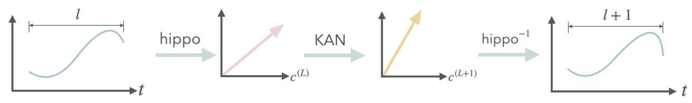
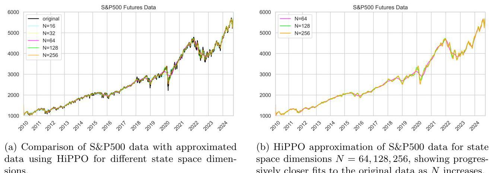
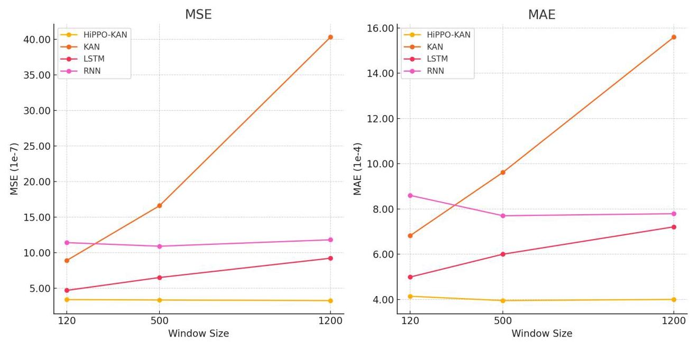
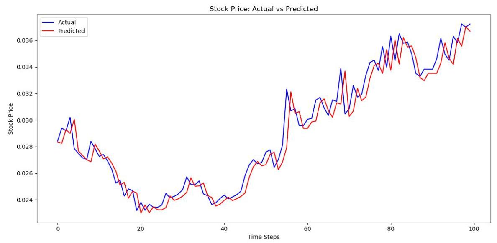
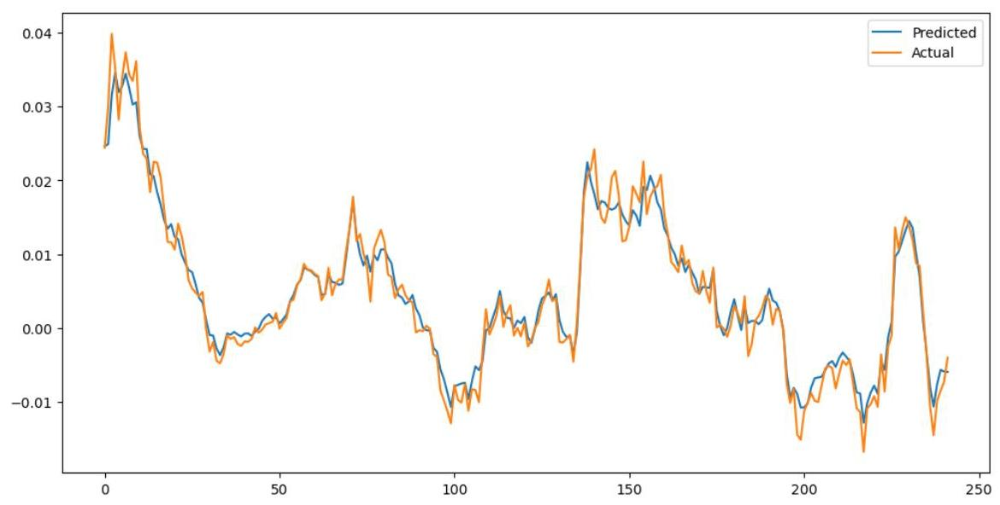
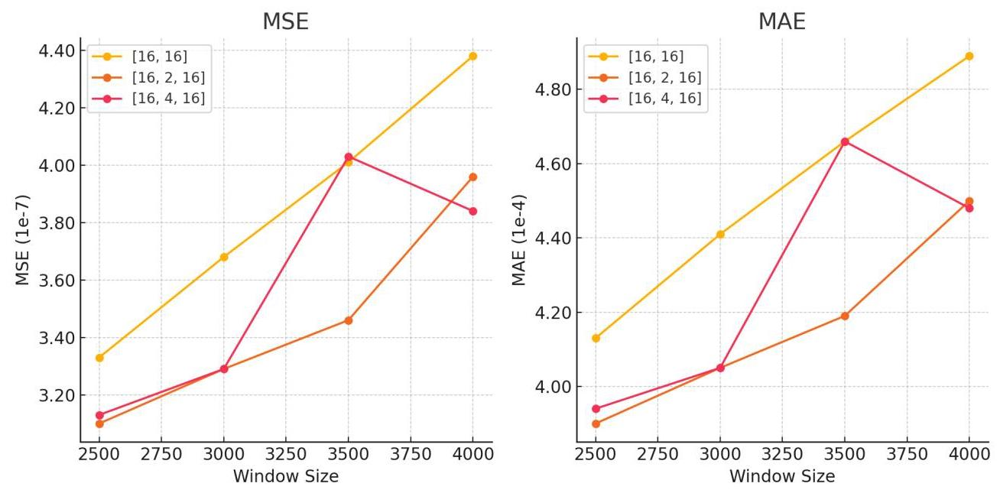

# HiPPO-KAN: Efficient KAN Model for Time Series Analysis

# HiPPO-KAN:用于时间序列分析的高效KAN模型

SangJong Lee, Jin-Kwang Kim, JunHo Kim, TaeHan Kim, James Lee

SangJong Lee, Jin-Kwang Kim, JunHo Kim, TaeHan Kim, James Lee

XaaH Corp

XaaH公司

\{sangjong, jinkwang, demyank, taehankim, jaminyx\}@xaah.xyz

{sangjong, jinkwang, demyank, taehankim, jaminyx}@xaah.xyz

## Abstract

## 摘要

In this study, we introduces a parameter-efficient model that outperforms traditional models in time series forecasting, by integrating High-order Polynomial Projection (HiPPO) theory into the Kolmogorov-Arnold network (KAN) framework. This HiPPO-KAN model achieves superior performance on long sequence data without increasing parameter count. Experimental results demonstrate that HiPPO-KAN maintains a constant parameter count while varying window sizes and prediction horizons, in contrast to KAN, whose parameter count increases linearly with window size. Surprisingly, although the HiPPO-KAN model keeps a constant parameter count as increasing window size, it significantly outperforms KAN model at larger window sizes. These results indicate that HiPPO-KAN offers significant parameter efficiency and scalability advantages for time series forecasting. Additionally, we address the lagging problem commonly encountered in time series forecasting models, where predictions fail to promptly capture sudden changes in the data. We achieve this by modifying the loss function to compute the MSE directly on the coefficient vectors in the HiPPO domain. This adjustment effectively resolves the lagging problem, resulting in predictions that closely follow the actual time series data. By incorporating HiPPO theory into KAN, this study showcases an efficient approach for handling long sequences with improved predictive accuracy, offering practical contributions for applications in large-scale time series data.

在本研究中，我们通过将高阶多项式投影(HiPPO)理论集成到柯尔莫哥洛夫 - 阿诺德网络(KAN)框架中，引入了一种参数高效的模型，该模型在时间序列预测方面优于传统模型。这种HiPPO - KAN模型在不增加参数数量的情况下，在长序列数据上实现了卓越的性能。实验结果表明，与参数数量随窗口大小线性增加的KAN相比，HiPPO - KAN在改变窗口大小和预测范围时保持参数数量不变。令人惊讶的是，尽管HiPPO - KAN模型在增加窗口大小时保持参数数量不变，但在较大窗口大小下它明显优于KAN模型。这些结果表明，HiPPO - KAN在时间序列预测方面具有显著的参数效率和可扩展性优势。此外，我们解决了时间序列预测模型中常见问题，即预测未能及时捕获数据中的突然变化。我们通过修改损失函数，直接在HiPPO域中的系数向量上计算均方误差来实现这一点。这种调整有效地解决了滞后问题，使预测紧密跟踪实际时间序列数据。通过将HiPPO理论纳入KAN，本研究展示了一种处理长序列的有效方法，提高了预测准确性，为大规模时间序列数据的应用提供了实际贡献。

## 1 Introduction

## 1 引言

The purpose of deep learning is to find a well-approximated function, especially when a target function involves non-linearity or high-dimensionality. In the case of Multilayer perceptron (MLP), a representational ability for non-linear functions is guaranteed by the universal approximation theorem [1, 2]. Recently, Kolomogorov-Arnold network (KAN) has been proposed as a promising alternative to MLP [3, 4]. This model is distinct to MLP in that it learns activations functions rather than weigths of edges. Its representational ability is partially guaranteed by Kolomogorov-Arnold theorem (KAT), while KAN slightly reshapes the theorem by assuming smooth activation functions but with a deeper network so that it can utilize the back-propagation mechanism. It outperforms MLP with a better scaling law, offering new pathway to modeling complex functions.

深度学习的目的是找到一个近似良好的函数，特别是当目标函数涉及非线性或高维性时。在多层感知器(MLP)的情况下，通用逼近定理[1, 2]保证了对非线性函数的表示能力。最近，柯尔莫哥洛夫 - 阿诺德网络(KAN)作为MLP的一种有前途的替代方案被提出[3, 4]。该模型与MLP的不同之处在于，它学习激活函数而不是边的权重。其表示能力部分由柯尔莫哥洛夫 - 阿诺德定理(KAT)保证，而KAN通过假设平滑激活函数但使用更深的网络对该定理进行了轻微重塑，以便它可以利用反向传播机制。它以更好的缩放定律优于MLP，为建模复杂函数提供了新途径。

Numerous models based on MLP, RNN, and LSTM have been developed to conduct time-series analysis, aiming to model complex patterns and non-linearities [5, 6, 7, 8, 9]. Also, deep state space model has emerged as a powerful approach for time series forecasting [10]. It combines the strengths of traditional state space models with the representation-learning capabilities of deep learning, allowing them to capture complex temporal dynamics more effectively. By integrating probabilistic reasoning and deep learning, the deep state space model offers significant improvements in forecasting time-series data $\left\lbrack  {{10},{11},{12}}\right\rbrack$ . While these methods have shown some success in capturing trends and seasonality, they often face challenges in capturing complex patterns and, especially learning long-term dependencies [13].

为了进行时间序列分析，已经开发了许多基于MLP、RNN和LSTM的模型，旨在对复杂模式和非线性进行建模[5, 6, 7, 8, 9]。此外，深度状态空间模型已成为时间序列预测的一种强大方法[10]。它结合了传统状态空间模型的优势和深度学习的表示学习能力，使其能够更有效地捕获复杂的时间动态。通过整合概率推理和深度学习，深度状态空间模型在预测时间序列数据$\left\lbrack  {{10},{11},{12}}\right\rbrack$方面有显著改进。虽然这些方法在捕获趋势和季节性方面取得了一些成功，但它们在捕获复杂模式，特别是学习长期依赖性方面常常面临挑战[13]。

Long-term dependency is particularly important in time series analysis, as many real-world datasets such as those in finance, weather forecasting, and energy consumption, involve patterns that evolve over long periods. Capturing these dependencies enables models to make more accurate predictions by considering not only short-term fluctuations but also broader trends and delayed effects that span across extended windows. To address these issues, A. Gu et al. introduced the HiPPO (High-order

长期依赖性在时间序列分析中尤为重要，因为许多现实世界的数据集，如金融、天气预报和能源消耗中的数据集涉及长期演变的模式。捕获这些依赖性使模型能够通过不仅考虑短期波动，还考虑跨越扩展窗口的更广泛趋势和延迟效应来做出更准确的预测。为了解决这些问题，A. Gu等人引入了HiPPO(高阶

Figure 1: This diagram illustrates the process of encoding time series data using the HiPPO framework, transforming it with the Kolmogorov-Arnold Network (KAN), and decoding it back to the time domain. The initial time series $l$ is projected into a coefficient vector ${c}^{\left( L\right) }$ through HiPPO. This vector is then transformed by KAN into ${c}^{\left( L + 1\right) }$ , followed by decoding through HiPPO to reconstruct the time series of length $l + 1$ . This setup serves as an auto-encoder where HiPPO and KAN handle encoding, transformation, and decoding, respectively.

图1:此图说明了使用HiPPO框架对时间序列数据进行编码、通过柯尔莫哥洛夫 - 阿诺德网络(KAN)进行转换并解码回时域的过程。初始时间序列$l$通过HiPPO投影到系数向量${c}^{\left( L\right) }$中。然后该向量由KAN转换为${c}^{\left( L + 1\right) }$，接着通过HiPPO解码以重建长度为$l + 1$的时间序列。此设置用作自动编码器，其中HiPPO和KAN分别处理编码、转换和解码。

Polynomial Projection Operator) theory and the Structured State Space (S4) model [14, 15, 16, 17], which effectively capture long-range dependencies by performing online function approximation with special initial conditions in the state space transition equation.

多项式投影算子)理论和结构化状态空间(S4)模型[14, 15, 16, 17]，它们通过在状态空间转换方程中使用特殊初始条件进行在线函数逼近，有效地捕获了长程依赖性。

In this work, we build upon the HiPPO theory to enhance the capabilities of the Kolmogorov-Arnold Network (KAN) for time series analysis. According to the HiPPO (High-order Polynomial Projection Operator) theory, a special combination of matrices $A$ and $B$ in the transition equation of a state space model enables the mapping of sequential data, such as time series, into a finite-dimensional space expanded by well-defined polynomial bases. This means that time series data can be represented as a coefficient vector whose dimension is independent of the length of the sequence.

在这项工作中，我们基于HiPPO理论来增强用于时间序列分析的柯尔莫哥洛夫 - 阿诺德网络(KAN)的能力。根据HiPPO(高阶多项式投影算子)理论，状态空间模型转移方程中矩阵$A$和$B$的特殊组合能够将诸如时间序列之类的顺序数据映射到由定义明确的多项式基扩展的有限维空间中。这意味着时间序列数据可以表示为一个系数向量，其维度与序列长度无关。

Leveraging this property, we can effectively forecast future time-series with smaller parameters. Figure 1 exhibits a schematic of the HiPPO-KAN process. It first encodes the time series data into a fixed-dimensional coefficient vector using the HiPPO framework. Then it maps this coefficient vector into another vector within the same dimensional space. This mapping is performed using the Kolmogorov-Arnold Network (KAN), which acts as a function approximator in this context. Finally, we decode the transformed coefficient vector back into the time domain using the inverse function provided by the HiPPO framework. This process is analogous to an auto-encoder, where the encoder and decoder are defined by the HiPPO transformations, and the latent space manipulation is handled by KAN.

利用这一特性，我们可以用更少的参数有效地预测未来时间序列。图1展示了HiPPO - KAN过程的示意图。它首先使用HiPPO框架将时间序列数据编码为固定维度的系数向量。然后将这个系数向量映射到同一维度空间内的另一个向量。此映射使用柯尔莫哥洛夫 - 阿诺德网络(KAN)执行，在这种情况下KAN充当函数逼近器。最后，我们使用HiPPO框架提供的逆函数将变换后的系数向量解码回时域。这个过程类似于自动编码器，其中编码器和解码器由HiPPO变换定义，而潜在空间操作由KAN处理。

Accordingly, our contributions are as follows:

因此，我们的贡献如下:

1. Parameter Efficiency and Scalability in Univariate Time Series Prediction. We demonstrate that HiPPO-KAN achieves superior parameter efficiency in univariate time-series prediction tasks. The dimension of the coefficient vector remains fixed regardless of the input sequence length, enabling the model to scale to long sequences without increasing the number of parameters. This scalability is crucial for practical applications involving large datasets.

1. 单变量时间序列预测中的参数效率和可扩展性。我们证明HiPPO - KAN在单变量时间序列预测任务中实现了卓越的参数效率。无论输入序列长度如何，系数向量的维度保持固定，使模型能够扩展到长序列而无需增加参数数量。这种可扩展性对于涉及大型数据集的实际应用至关重要。

2. Enhanced Performance Over Traditional KAN in Long-Range Forecasting. We show that HiPPO-KAN outperforms the traditional KAN as well as other traditional models specialized to handle sequential data (e.g. RNN and LSTM), especially in long-range forecasting scenarios. By effectively capturing long-term dependencies through the HiPPO framework, our model provides more accurate predictions compared to KAN alone.

2. 在长期预测中优于传统KAN的性能提升。我们表明HiPPO - KAN优于传统KAN以及其他专门处理顺序数据的传统模型(如RNN和LSTM)，特别是在长期预测场景中。通过HiPPO框架有效捕获长期依赖性，我们的模型与单独的KAN相比提供了更准确的预测。

3. Novel Integration of HiPPO Theory with KAN. The use of HiPPO coefficients provides a concise and interpretable state representation of the time series system. When combined with KAN's transparent architecture, this allows for better understanding and interpretability of the model's internal workings.

3. HiPPO理论与KAN的新颖集成。HiPPO系数的使用为时间序列系统提供了简洁且可解释的状态表示。当与KAN的透明架构相结合时，这使得能够更好地理解和解释模型的内部工作原理。

## 2 Backgrounds

## 2背景

### 2.1 State Space Model

### 2.1状态空间模型

State space model can be written as

状态空间模型可以写成

$$
\frac{\mathrm{d}}{\mathrm{d}t}\mathbf{x}\left( t\right)  = \mathbf{A}\mathbf{x}\left( t\right)  + \mathbf{B}\mathbf{u}\left( t\right) , \tag{1}
$$

$$
\mathbf{y}\left( t\right)  = \mathbf{{Cx}}\left( t\right)  + \mathbf{{Du}}\left( t\right) , \tag{2}
$$

where $\mathbf{u}\left( t\right)  \in  {\mathbb{R}}^{l}$ is an input vector, $\mathbf{x}\left( t\right)  \in  {\mathbb{R}}^{N}$ is a hidden state vector, and $\mathbf{y}\left( t\right)  \in  {\mathbb{R}}^{k}$ is an output vector. Eq.(1) describes the state dynamics, showing how the state $\mathbf{x}\left( t\right)$ evolves over time based on its current value and the input $\mathbf{u}\left( t\right)$ . The matrix $\mathbf{A} \in  {\mathbb{R}}^{N \times  N}$ defines the influence of the current state on its rate of change, while $\mathbf{B} \in  {\mathbb{R}}^{N \times  l}$ defines how the input affects the state dynamics. Eq.(2) represents the output equation, illustrating how the current state and input produce the output $\mathbf{y}\left( t\right)$ . The matrix $\mathbf{C} \in  {\mathbb{R}}^{k \times  N}$ maps the state to the output, and $\mathbf{D} \in  {\mathbb{R}}^{k \times  l}$ maps the input directly to the output.

其中$\mathbf{u}\left( t\right)  \in  {\mathbb{R}}^{l}$是输入向量，$\mathbf{x}\left( t\right)  \in  {\mathbb{R}}^{N}$是隐藏状态向量，并且$\mathbf{y}\left( t\right)  \in  {\mathbb{R}}^{k}$是输出向量。式(1)描述了状态动态，展示了状态$\mathbf{x}\left( t\right)$如何基于其当前值和输入$\mathbf{u}\left( t\right)$随时间演变。矩阵$\mathbf{A} \in  {\mathbb{R}}^{N \times  N}$定义了当前状态对其变化率的影响，而$\mathbf{B} \in  {\mathbb{R}}^{N \times  l}$定义了输入如何影响状态动态。式(2)表示输出方程，说明了当前状态和输入如何产生输出$\mathbf{y}\left( t\right)$。矩阵$\mathbf{C} \in  {\mathbb{R}}^{k \times  N}$将状态映射到输出，并且$\mathbf{D} \in  {\mathbb{R}}^{k \times  l}$将输入直接映射到输出。

In many cases, especially when implementing skip connections akin to those in deep learning architectures, we can set $\mathbf{D} = 0$ . This simplifies the output equation to

在许多情况下，特别是当实现类似于深度学习架构中的跳跃连接时，我们可以设置$\mathbf{D} = 0$。这将输出方程简化为

$$
\mathbf{y}\left( t\right)  = \mathbf{{Cx}}\left( t\right) . \tag{3}
$$

By doing so, the output depends solely on the internal state, allowing the model to focus on the learned representations within $\mathbf{x}\left( t\right)$ without direct influence from the immediate input $\mathbf{u}\left( t\right)$ . Gu et al. showed that when the system is linear time-invariant (LTI), the SSM reduces to a sequence-to-sequence mapping by defining a convolution mapping

通过这样做，输出仅取决于内部状态，使模型能够专注于$\mathbf{x}\left( t\right)$内的学习表示，而不受直接输入$\mathbf{u}\left( t\right)$的影响。Gu等人表明，当系统是线性时不变(LTI)时，通过定义卷积映射，SSM简化为序列到序列映射

$$
K\left( t\right)  = \mathbf{C}{e}^{t\mathbf{A}}\mathbf{B},\;\mathbf{y}\left( t\right)  = \left( {\mathbf{K} * \mathbf{u}}\right) \left( t\right) . \tag{4}
$$

Gu et al.[14] also showed that, by selecting specific initial conditions for the parameters $\left( {\mathbf{A},\mathbf{B}}\right) ,{e}^{t\mathbf{A}}\mathbf{B}$ becomes a vector of $N$ basis functions. This result enables the state-space model to perform online function approximation using the HiPPO theory.

Gu等人[14]还表明，通过为参数选择特定的初始条件，$\left( {\mathbf{A},\mathbf{B}}\right) ,{e}^{t\mathbf{A}}\mathbf{B}$成为$N$个基函数的向量。这一结果使状态空间模型能够利用HiPPO理论进行在线函数逼近。

### 2.2 HiPPO Theory

### 2.2 HiPPO理论

The memorization process can be considered as a symmetry breaking of fully symmetric states. The fully symmetric state represents a system with maximum entropy, where all configurations are equally probable. By introducing the information we wish to memorize as an external condition, we break this symmetry, allowing the system to settle into a specific state that encodes the memory.

记忆过程可以被视为完全对称状态的对称性破缺。完全对称状态代表一个具有最大熵的系统，其中所有配置的概率相等。通过将我们希望记忆的信息作为外部条件引入，我们打破了这种对称性，使系统能够稳定到一个编码记忆的特定状态。

In the context of continuous time series, this approach was exemplified by the Legendre Memory. Unit (LMU) [18]. The LMU employs continuous orthogonal functions specifically, Legendre polynomials to maintain a compressed representation of the entire history of input data. Building upon these principles, Gu et al. [14] connected memorization to state-space models with a strong theoretical foundation. Specifically, they demonstrated that a special initialization of the transition equation in the state-space model enables closed-form function approximation, effectively capturing long-term dependencies in sequential data. HiPPO treats memorization as an online function approximation.

在连续时间序列的背景下，这种方法以勒让德记忆单元(LMU)[18]为例。LMU专门使用连续正交函数，即勒让德多项式，来维持输入数据整个历史的压缩表示。基于这些原理，Gu等人[有坚实的理论基础将记忆与状态空间模型联系起来。具体来说，他们证明了状态空间模型中转移方程的特殊初始化能够实现闭式函数逼近，有效地捕捉序列数据中的长期依赖性。HiPPO将记忆视为在线函数逼近。

Suppose we have a univariate time series function:

假设我们有一个单变量时间序列函数:

$$
f : {\mathbb{R}}_{ \geq  0} \rightarrow  \mathbb{R},\;t \mapsto  f\left( t\right) . \tag{5}
$$

Since we are considering online function approximation, we define:

由于我们考虑的是在线函数逼近，我们定义:

$$
{x}_{n}\left( t\right)  = {\int }_{0}^{t}\mathrm{\;d}{s\omega }\left( {t, s}\right) {p}_{n}\left( {t, s}\right) u\left( s\right) ,\;{\left\langle  {p}_{n},{p}_{m}\right\rangle  }_{\omega } \equiv  {\int }_{0}^{t}\mathrm{\;d}{s\omega }\left( {t, s}\right) {p}_{n}\left( {t, s}\right) {p}_{m}\left( {t, s}\right)  = {\delta }_{n, m}, \tag{6}
$$

which states that for every fixed $t$ , the function ${p}_{n}$ belong to a Hilbert space $\mathcal{H}$ and form an orthonormal basis with respect to the measure $\omega \left( {t, s}\right)$ . Rewriting Eq.(6), we have:

其表明对于每个固定的$t$，函数${p}_{n}$属于希尔伯特空间$\mathcal{H}$，并且相对于测度$\omega \left( {t, s}\right)$形成一个正交基。重写式(6)，我们有:

$$
{x}_{n}\left( t\right)  = {\int }_{0}^{t}\mathrm{\;d}{s\omega }\left( {t, s}\right) {p}_{n}\left( {t, s}\right) u\left( s\right)  = {\left\langle  u,{p}_{n}\left( t\right) \right\rangle  }_{\omega }, \tag{7}
$$

which indicates that the state vector $\mathbf{x}\left( t\right)  = {\left\lbrack  {x}_{1}\left( t\right) ,{x}_{2}\left( t\right) ,\ldots ,{x}_{N}\left( t\right) \right\rbrack  }^{T}$ represents the projection of $u\left( s\right)$ for $s \leq  t$ onto an orthonormal basis with respect to weighted inner product defined by $\omega \left( {t, s}\right)$ .

这表明状态向量$\mathbf{x}\left( t\right)  = {\left\lbrack  {x}_{1}\left( t\right) ,{x}_{2}\left( t\right) ,\ldots ,{x}_{N}\left( t\right) \right\rbrack  }^{T}$表示$u\left( s\right)$对于$s \leq  t$在相对于由$\omega \left( {t, s}\right)$定义的加权内积的正交基上的投影。

If we assume completeness, we have:

如果我们假设完备性，我们有:

$$
u\left( s\right)  = \mathop{\lim }\limits_{{N \rightarrow  \infty }}\mathop{\sum }\limits_{{n = 1}}^{N}{x}_{n}\left( t\right) {p}_{n}\left( {t, s}\right) \tag{8}
$$

for all $s \leq  t$ due to the completeness of the basis function. Since we are dealing with a finite $N$ , by choosing an appropriate cutoff, we obtain an approximate representation of the function $u\left( s\right)$ . Gu et al. [17] defined this problem as online function approximation in the HiPPO theory.

对于所有的$s \leq  t$，这是由于基函数的完备性。由于我们处理的是有限的$N$，通过选择适当的截止值，我们得到函数$u\left( s\right)$的近似表示。Gu等人[17]将这个问题定义为HiPPO理论中的在线函数逼近。

Figure 2: HiPPO was applied to the S&P 500 data. The state space dimension used were $N =$ 16,32,64,128,256, and as $N$ increases, the approximation becomes increasingly closer to the original function, reflecting a higher fidelity representation of the underlying dynamics.

图2:HiPPO应用于标准普尔500指数数据。使用的状态空间维度为$N =$ 16、32、64、128、256，并且随着$N$增加，逼近越来越接近原始函数，反映了对基础动态的更高保真表示。

From a physical standpoint, this is analogous to a multipole expansion, where each term has a specific physical interpretation. In the case of a nonlinear function that takes the coefficients of a multipole expansion as inputs, each coefficient corresponds to a node within the function. Ideally, during the process of learning this nonlinear function, deriving a closed-form solution or understanding how each node operates would greatly aid in physical interpretation. This understanding can provide significant insights into the underlying physics and how the model represents the system. To further enhance this interpretability, we utilized KAN to model the mapping from the coefficients of sequential data of length $l$ to sequential data of length $l + 1$ .

从物理角度来看，这类似于多极展开，其中每个项都有特定的物理解释。对于一个将多极展开系数作为输入的非线性函数，每个系数对应于函数内的一个节点。理想情况下，在学习这个非线性函数过程中，推导闭式解或理解每个节点如何运作将极大地有助于物理解释。这种理解可以为基础物理以及模型如何表示系统提供重要见解。为了进一步增强这种可解释性，我们利用KAN对从长度为$l$的序列数据系数到长度为$l + 1$的序列数据的映射进行建模。

### 2.3 KAN

### 2.3 KAN

#### 2.3.1 Kolmogorov-Arnold Theorem

#### 2.3.1 柯尔莫哥洛夫 - 阿诺德定理

The Kolmogorov-Arnold Representation Theorem states that any continuous multivariate function $f$ defined on a bounded domain ${I}^{n}$ , where $n$ is the number of variables and $I = \left\lbrack  {0,1}\right\rbrack$ , can be expressed as a finite sum of compositions of continuous univariate functions and addition. Specifically, for a smooth function $f$ :

柯尔莫哥洛夫 - 阿诺德表示定理指出，任何在有界域${I}^{n}$上定义的连续多元函数$f$，其中$n$是变量数量且$I = \left\lbrack  {0,1}\right\rbrack$，都可以表示为连续单变量函数的复合与加法的有限和。具体来说，对于一个光滑函数$f$:

$$
f : {I}^{n} \rightarrow  \mathbb{R},\;\mathbf{x} \in  {I}^{n} \mapsto  f\left( {{x}_{1},\cdots ,{x}_{n}}\right)  = \mathop{\sum }\limits_{{q = 1}}^{{{2n} + 1}}{\Phi }_{q}\left( {\mathop{\sum }\limits_{{p = 1}}^{n}{\phi }_{q, p}\left( {x}_{p}\right) }\right) , \tag{9}
$$

where each ${\phi }_{q, p} : I \rightarrow  \mathbb{R}$ and ${\Phi }_{q} : \mathbb{R} \rightarrow  \mathbb{R}$ are continuous univariate functions. This theorem reveals that any multivariate continuous function can be constructed using only univariate continuous functions and addition, significantly simplifying their analysis and approximation. This decomposition reduces the complexity inherent in multivariate functions, making them more tractable for approximation methods.

其中每个${\phi }_{q, p} : I \rightarrow  \mathbb{R}$和${\Phi }_{q} : \mathbb{R} \rightarrow  \mathbb{R}$都是连续的单变量函数。该定理表明，任何多元连续函数都可以仅使用单变量连续函数和加法来构建，从而显著简化其分析和逼近。这种分解降低了多元函数固有的复杂性，使其对于逼近方法更易于处理。

#### 2.3.2 Kolmogorov-Arnold Network

#### 2.3.2 柯尔莫哥洛夫 - 阿诺德网络

Building upon the Kolmogorov-Arnold representation theorem, the Kolmogorov-Arnold Network (KAN) is designed to explicitly parametrize this representation for practical function approximation in neural networks [3, 4]. Since we have decomposed the multivariate function into univariate functions, the problem reduces to parametrizing these univariate functions. To achieve this, we can use B-splines due to their flexibility and smoothness properties, which are advantageous for interpolations. From the perspective of generalizing the Kolmogorov-Arnold (KA) representation theorem and extending it to deeper networks, the network architecture can be expressed as follows:

基于柯尔莫哥洛夫 - 阿诺德表示定理，柯尔莫哥洛夫 - 阿诺德网络(KAN)旨在为神经网络中的实际函数逼近显式地参数化这种表示[3, 4]。由于我们已将多元函数分解为单变量函数，问题就简化为对这些单变量函数进行参数化。为实现这一点，我们可以使用B样条，因为它们具有灵活性和平滑性，这对于插值是有利的。从推广柯尔莫哥洛夫 - 阿诺德(KA)表示定理并将其扩展到更深层网络的角度来看，网络架构可以表示如下:

$$
\left\lbrack  {{n}_{0},{n}_{1},\cdots ,{n}_{L}}\right\rbrack \tag{10}
$$

where ${n}_{l}$ is the number of nodes in the $l$ -th layer. The pre-activation values are given by:

其中${n}_{l}$是第$l$层中的节点数。预激活值由下式给出:

$$
{x}_{l + 1, j} = \mathop{\sum }\limits_{{i = 1}}^{{n}_{l}}{\phi }_{l, j, i}\left( {x}_{l, i}\right) ,\;l = 0,\ldots , L - 1;j = 1,\ldots ,{n}_{l + 1} \tag{11}
$$

where ${\phi }_{l, j, i}$ are the univariate functions with learnable parameters in the $l$ -th layer.

其中${\phi }_{l, j, i}$是第$l$层中具有可学习参数的单变量函数。

In practice, the univariate functions ${\phi }_{l, j, i}$ in KAN are parametrized using B-splines to capture complex nonlinearities while maintaining smoothness and flexibility. To enhance the representational capacity of the network and facilitate efficient training, KAN employs residual activation functions that combine a basis function with a spline function. Specifically, the activation function at each node is defined as

在实践中，KAN中的单变量函数${\phi }_{l, j, i}$使用B样条进行参数化，以在保持平滑性和灵活性的同时捕获复杂的非线性。为了增强网络的表示能力并促进高效训练，KAN采用将基函数与样条函数相结合的残差激活函数。具体而言，每个节点处的激活函数定义为

$$
\phi \left( x\right)  = {w}_{b}b\left( x\right)  + {w}_{s}\operatorname{spline}\left( x\right) \tag{12}
$$

where $b\left( x\right)$ is a predefined basis function, ${w}_{b}$ and ${w}_{s}$ are learnable weights, and spline $\left( x\right)$ is a spline function constructed from B-spline basis functions. The basis function $b\left( x\right)$ is typically chosen as the SiLU (Sigmoid Linear Unit) activation function due to its smoothness and nonlinearity.

其中$b\left( x\right)$是预定义的基函数，${w}_{b}$和${w}_{s}$是可学习权重，样条$\left( x\right)$是由B样条基函数构造的样条函数。基函数$b\left( x\right)$通常选择为SiLU(Sigmoid线性单元)激活函数，因为它具有平滑性和非线性。

The overall network function is then:

然后整体网络函数为:

$$
\operatorname{KAN}\left( \mathbf{x}\right)  = \left( {{\Phi }_{L - 1} \circ  {\Phi }_{L - 2} \circ  \cdots  \circ  {\Phi }_{0}}\right) \left( \mathbf{x}\right) . \tag{13}
$$

In this expression, ${\Phi }_{l}$ represents the vector of univariate functions at layer $l$ , and the composition of these functions across layers forms the basis of KAN's ability to approximate multivariate functions.

在此表达式中，${\Phi }_{l}$表示第$l$层的单变量函数向量，并且这些函数跨层的组合构成了KAN逼近多元函数能力的基础。

In the context our work, we extend KAN by integrating with the HiPPO framework to efficiently handle time series data. This integration allows us to leverage KAN's function approximation capabilities while benefiting from HiPPO's ability to represent sequential data in a fixed-dimensional space.

在我们的工作背景下，我们通过与HiPPO框架集成来扩展KAN，以有效处理时间序列数据。这种集成使我们能够利用KAN的函数逼近能力，同时受益于HiPPO在固定维空间中表示序列数据的能力。

### 2.4 Time-series forecasting using KAN

### 2.4 使用KAN进行时间序列预测

Since its introduction, KAN have been proved to be a powerful tool for time-series forecasting due to their effective approximation capabilities and training efficiency. It has been shown that KAN models outperform MLP models in time-series forecasting, both in terms of accuracy and computational efficiency [19, 20]. Furthermore, when KAN layers are incorporated within recurrent neural networks (RNNs) and transformer architectures, they excel in multi-horizon forecasting tasks with reduced overfitting issues [21, 22].

自引入以来，由于其有效的逼近能力和训练效率，KAN已被证明是时间序列预测的强大工具。研究表明，在时间序列预测方面，KAN模型在准确性和计算效率方面均优于MLP模型[19, 20]。此外，当将KAN层纳入循环神经网络(RNN)和Transformer架构中时，它们在多步预测任务中表现出色，且过拟合问题减少[21, 22]。

While these approaches validate the effectiveness of KAN models in time-series prediction and outperforms traditional models specialized in sequential data (e.g., RNN and GRU), they involve integrating KAN into complex architectures, which can increases model complexity and computational demands. In this study, however, we propose an alternative methodology that combines KAN models with HiPPO transformation. By integrating KAN with the HiPPO transformation, we construct a simpler model architecture that retains high predictive performance without relying on complex recurrent or transformer structures.

虽然这些方法验证了KAN模型在时间序列预测中的有效性，并且优于专门用于序列数据的传统模型(例如RNN和GRU)，但它们涉及将KAN集成到复杂架构中，这可能会增加模型复杂性和计算需求。然而，在本研究中，我们提出了一种替代方法，将KAN模型与HiPPO变换相结合。通过将KAN与HiPPO变换集成，我们构建了一个更简单的模型架构，该架构在不依赖复杂的循环或Transformer结构的情况下保持了高预测性能。

## 3 HiPPO-KAN

## 3 HiPPO - KAN

Building upon the HiPPO framework, we consider a univariate time series ${u}_{1 : L} \in  {\mathbb{R}}^{L}$ . The HiPPO transformation maps this time series into a coefficient vector ${\mathbf{c}}^{\left( L\right) } \in  {\mathbb{R}}^{N}$ via the mapping

基于HiPPO框架，我们考虑一个单变量时间序列${u}_{1 : L} \in  {\mathbb{R}}^{L}$。HiPPO变换通过映射将此时间序列映射为系数向量${\mathbf{c}}^{\left( L\right) } \in  {\mathbb{R}}^{N}$

$$
{\operatorname{hippo}}_{L} : {\mathbb{R}}^{L} \rightarrow  {\mathbb{R}}^{N},\;{u}_{1 : L} \mapsto  {\mathbf{c}}^{\left( L\right) } = {\operatorname{hippo}}_{L}\left( {u}_{1 : L}\right) , \tag{14}
$$

where $N$ is the dimension of the hidden state. In our proposed method, the KAN is utilized to model the mapping between coefficient vectors corresponding to time series of length $L$ and $L + 1$ . Specifically, KAN transforms the coefficient vector ${\mathbf{c}}^{\left( L\right) }$ into a new coefficient vector ${\mathbf{c}}^{\left( L + 1\right) }$ :

其中$N$是隐藏状态的维度。在我们提出的方法中，KAN用于对长度为$L$和$L + 1$的时间序列对应的系数向量之间的映射进行建模。具体来说，KAN将系数向量${\mathbf{c}}^{\left( L\right) }$转换为新的系数向量${\mathbf{c}}^{\left( L + 1\right) }$:

$$
\mathrm{{KAN}} : {\mathbb{R}}^{N} \rightarrow  {\mathbb{R}}^{N},\;{\mathbf{c}}^{\left( L\right) } \mapsto  {\mathbf{c}}^{\left( L + 1\right) } = \operatorname{KAN}\left( {\mathbf{c}}^{\left( L\right) }\right) . \tag{15}
$$

The resultant coefficient vector ${\mathbf{c}}^{\left( L + 1\right) }$ represents the encoded state of the time series extended to length $L + 1$ . Given the coefficient ${\mathbf{c}}^{\left( L + 1\right) }$ , we can easily construct a time series data of length $L + 1$ . Let this process be denoted as hippo ${}^{-1}$ :

得到的系数向量${\mathbf{c}}^{\left( L + 1\right) }$表示扩展到长度$L + 1$的时间序列的编码状态。给定系数${\mathbf{c}}^{\left( L + 1\right) }$，我们可以轻松构建长度为$L + 1$的时间序列数据。将此过程表示为河马${}^{-1}$:

$$
{\operatorname{hippo}}_{L + 1}^{-1} : {\mathbb{R}}^{N} \rightarrow  {\mathbb{R}}^{L + 1},\;{\mathbf{c}}^{\left( L + 1\right) } \mapsto  {u}_{1 : L + 1}^{\prime } = {\operatorname{hippo}}_{L + 1}^{-1}\left( {\mathbf{c}}^{\left( L + 1\right) }\right) , \tag{16}
$$

where ${u}_{1 : L}$ and ${u}_{1 : L + 1}^{\prime }$ are different time series. This process effectively extends the original time series by one time step, generating a prediction for the next value in the sequence. By operating within the fixed-dimensional coefficient space ${\mathbb{R}}^{N}$ , where $N$ is independent of the sequence length $L$ , our approach maintains parameter efficiency and scalability. The use of KAN in this context allows for the modeling of complex nonlinear relationships between the coefficients, capturing the underlying dynamics of the time series.

其中${u}_{1 : L}$和${u}_{1 : L + 1}^{\prime }$是不同的时间序列。此过程有效地将原始时间序列扩展一个时间步长，生成序列中下一个值的预测。通过在固定维度的系数空间${\mathbb{R}}^{N}$内操作，其中$N$与序列长度$L$无关，我们的方法保持了参数效率和可扩展性。在这种情况下使用KAN允许对系数之间的复杂非线性关系进行建模，捕获时间序列的潜在动态。

### 3.1 Definition of HiPPO-KAN

### 3.1 HiPPO-KAN的定义

We define the HiPPO-KAN model as a seq2seq mapping that integrates the HiPPO transformations with the KAN mapping. Formally, HiPPO-KAN is defined as

我们将HiPPO-KAN模型定义为一个seq2seq映射，它将HiPPO变换与KAN映射集成在一起。形式上，HiPPO-KAN定义为

$$
\text{ HiPPO-KAN } \equiv  {\operatorname{hippo}}_{L + 1}^{-1} \circ  \mathrm{{KAN}} \circ  {\operatorname{hippo}}_{L}\text{ . } \tag{17}
$$

This composite mapping takes the original time series ${\left\{  {u}_{t}\right\}  }_{t = 1}^{L}$ as input and produces an extended time series ${\left\{  {u}_{t}\right\}  }_{t = 1}^{L + 1}$ as output:

这个复合映射以原始时间序列${\left\{  {u}_{t}\right\}  }_{t = 1}^{L}$为输入，并产生一个扩展的时间序列${\left\{  {u}_{t}\right\}  }_{t = 1}^{L + 1}$作为输出:

$$
\text{ HiPPO-KAN : }{\mathbb{R}}^{L} \rightarrow  {\mathbb{R}}^{L + 1},\;{\left\{  {u}_{t}\right\}  }_{t = 1}^{L} \mapsto  {\left\{  {u}_{t}^{\prime }\right\}  }_{t = 1}^{L + 1}\text{ . } \tag{18}
$$

In other words, HiPPO-KAN maps a time series of length $L$ to a different time series of length $L + 1$ , effectively predicting the next value in the sequence while retaining the original sequence. By integrating these components, HiPPO-KAN effectively captures long-term dependencies and complex temporal patterns in time-series data. Operating within the coefficient space ${\mathbb{R}}^{N}$ ensures that the model remains parameter-efficient and scalable, as the dimensionality $N$ does not depend on the sequence length $L$ .

换句话说，HiPPO-KAN将长度为$L$的时间序列映射到长度为$L + 1$的不同时间序列，有效地预测序列中的下一个值，同时保留原始序列。通过集成这些组件，HiPPO-KAN有效地捕获时间序列数据中的长期依赖性和复杂的时间模式。在系数空间${\mathbb{R}}^{N}$内操作可确保模型保持参数效率和可扩展性，因为维度$N$不依赖于序列长度$L$。

Following the definition of the HiPPO-KAN model, we derive its explicit output formulation by integrating the HiPPO transformations with the KAN mapping. Applying the hippo ${}_{L}$ transformation to the input time series ${\left\{  {u}_{t}\right\}  }_{t = 1}^{L}$ , the function $f\left( s\right)$ can be approximately represented in terms of orthogonal basis functions:

根据HiPPO-KAN模型的定义，我们通过将HiPPO变换与KAN映射集成来推导其显式输出公式。将河马${}_{L}$变换应用于输入时间序列${\left\{  {u}_{t}\right\}  }_{t = 1}^{L}$，函数$f\left( s\right)$可以用正交基函数近似表示:

$$
f\left( s\right)  \approx  \mathop{\sum }\limits_{{n = 1}}^{N}{c}_{n}{p}_{n}\left( {L, s}\right) \tag{19}
$$

where ${c}_{n} \in  \mathbb{R}$ are the coefficients, and ${p}_{n}\left( {L, s}\right)$ are the HiPPO basis functions evaluated at time $L$ for all $s \leq  L$ .

其中${c}_{n} \in  \mathbb{R}$是系数，${p}_{n}\left( {L, s}\right)$是在时间$L$对所有$s \leq  L$评估的HiPPO基函数。

Utilizing the KAN mapping, we update the coefficients to incorporate the system dynamics:

利用KAN映射，我们更新系数以纳入系统动态:

$$
{c}_{n}^{\prime } = \mathop{\sum }\limits_{{m = 1}}^{N}{\Phi }_{nm}\left( {c}_{m}\right) \tag{20}
$$

where ${\Phi }_{nm}$ are the elements of the KAN matrix $\Phi  \in  {\mathbb{R}}^{N \times  N}$ . We defined hippo ${}^{-1}$ as

其中${\Phi }_{nm}$是KAN矩阵$\Phi  \in  {\mathbb{R}}^{N \times  N}$的元素。我们将河马${}^{-1}$定义为

$$
{u}_{1 : L + 1}^{\prime } = \mathop{\sum }\limits_{{n = 1}}^{N}\left( {{c}_{n}^{\prime } + B{u}_{L}}\right) {p}_{n}\left( {L + 1, s}\right)  = \mathop{\sum }\limits_{{n = 1}}^{N}\left( {\mathop{\sum }\limits_{{m = 1}}^{N}{\Phi }_{nm}\left( {c}_{m}\right)  + B{u}_{L}}\right) {p}_{n}\left( {L + 1, s}\right) , \tag{21}
$$

where $B \in  {\mathbb{R}}^{N}$ is learnable parameters. This is analogous to the $\mathbf{B}u\left( t\right)$ term in the state-space model’s state equation. Evaluating at $s = L + 1$ , the final output for the next time step is:

其中$B \in  {\mathbb{R}}^{N}$是可学习参数。这类似于状态空间模型状态方程中的$\mathbf{B}u\left( t\right)$项。在$s = L + 1$处评估，下一个时间步的最终输出为:

$$
{u}_{L + 1}^{\prime } = \mathop{\sum }\limits_{{n = 1}}^{N}\left( {\mathop{\sum }\limits_{{m = 1}}^{N}{\Phi }_{nm}\left( {c}_{m}\right)  + B{u}_{L}}\right) {p}_{n}\left( {L + 1, L + 1}\right) . \tag{22}
$$

In the case of Leg-S, from the definition of basis, we have ${p}_{n}\left( {L + 1, L + 1}\right)  = \sqrt{{2n} + 1}\left\lbrack  {{14},{17}}\right\rbrack$ . Hence, we obtain

在Leg-S情况下，根据基的定义，我们有${p}_{n}\left( {L + 1, L + 1}\right)  = \sqrt{{2n} + 1}\left\lbrack  {{14},{17}}\right\rbrack$。因此，我们得到

$$
{u}_{L + 1}^{\prime } = \mathop{\sum }\limits_{{n = 1}}^{N}\sqrt{{2n} + 1}\left( {\mathop{\sum }\limits_{{m = 1}}^{N}{\Phi }_{nm}\left( {c}_{m}\right)  + B{u}_{L}}\right) . \tag{23}
$$

This methodology resembles an auto-encoder architecture, where the encoder (HiPPO transformation) compresses the input time series into a latent coefficient vector ${\mathbf{c}}^{\left( L\right) }$ , the dynamics of which is modelled by KAN layers in our HiPPO-KAN model. The decoder (inverse HiPPO transformation) reconstructs the extended time series from ${\mathbf{c}}^{\left( L + 1\right) }$ . The fixed-dimensional latent space acts as a bottleneck, promoting efficient learning.

这种方法类似于自动编码器架构，其中编码器(HiPPO变换)将输入时间序列压缩为一个潜在系数向量${\mathbf{c}}^{\left( L\right) }$，在我们的HiPPO-KAN模型中，其动态由KAN层建模。解码器(逆HiPPO变换)从${\mathbf{c}}^{\left( L + 1\right) }$重建扩展时间序列。固定维度的潜在空间充当瓶颈，促进高效学习。

### 3.2 Method

### 3.2方法

#### 3.2.1 Task Definition

#### 3.2.1任务定义

In this study, we address the problem of time series forecasting in the context of cryptocurrency markets, specifically focusing on the BTC-USDT trading pair. The objective is to predict the next price point given a historical sequence of observed prices. Formally, let ${\left\{  {u}_{t}\right\}  }_{t = 1}^{L}$ denote a univariate time series representing the BTC-USDT prices at discrete time steps $t = 1,2,\ldots , L$ , where $L$ is the window size. The forecasting task aims to estimate the subsequent value ${u}_{L + 1}$ based on the given window of past observations.

在本研究中，我们解决加密货币市场背景下的时间序列预测问题，特别关注BTC-USDT交易对。目标是根据观察到的价格的历史序列预测下一个价格点。形式上，设${\left\{  {u}_{t}\right\}  }_{t = 1}^{L}$表示一个单变量时间序列，它表示在离散时间步$t = 1,2,\ldots , L$的BTC-USDT价格，其中$L$是窗口大小。预测任务旨在根据过去观察的给定窗口估计后续值${u}_{L + 1}$。

Mathematically, the prediction function can be expressed as:

从数学上讲，预测函数可以表示为:

$$
{\widehat{u}}_{L + 1} = f\left( {{u}_{1},{u}_{2},\ldots ,{u}_{L}}\right) , \tag{24}
$$

where $f : {\mathbb{R}}^{L} \rightarrow  \mathbb{R}$ is a mapping from the past $L$ observations to the predicted next value ${\widehat{u}}_{L + 1}$ .

其中$f : {\mathbb{R}}^{L} \rightarrow  \mathbb{R}$是从过去$L$个观察值到预测的下一个值${\widehat{u}}_{L + 1}$的映射。

The challenge inherent in this task include:

此任务中固有的挑战包括:

- Non-Stationary Cryptocurrency prices exhibit high volatility and non-stationary behavior, making it difficult to model underlying patterns using traditional statistical methods.

- 非平稳性加密货币价格表现出高波动性和非平稳行为，使得使用传统统计方法对潜在模式进行建模变得困难。

- Long-Term Dependencies Capturing long-term dependencies is essential, as market trends and cycles can influence future prices over extended periods.

- 长期依赖性捕捉长期依赖性至关重要，因为市场趋势和周期可以在很长一段时间内影响未来价格。

- Computational Efficiency Handling long sequences efficiently without a proportional increase in computational complexity or model parameters is critical for scalability.

- 计算效率在不按比例增加计算复杂度或模型参数的情况下有效处理长序列对于可扩展性至关重要。

Our approach utilize the HiPPO-KAN model to effectively tackle these challenges by encoding the input time series into a fixed-dimensional coefficient vector using the HiPPO transformation. This allows the model to process long sequence while maintaining a constant parameter count, facilitating efficient learning and improved predictive accuracy.

我们的方法利用HiPPO-KAN模型，通过使用HiPPO变换将输入时间序列编码为固定维度的系数向量，有效地应对这些挑战。这使模型能够处理长序列，同时保持恒定的参数数量，便于高效学习并提高预测准确性。

#### 3.2.2 Data Normalization

#### 3.2.2数据归一化

We evaluated the performance of HiPPO-KAN using the BTC-USDT 1-minute futures data from January 1st to Feburuary 1st, which consists of univariate time series data. Prior to training, we normalized the raw time series data using the formula $\left( {{u}_{t} - \mu }\right) /\mu$ , where $\mu$ denotes the mean value of the data within each window. This normalization serves several critical purposes in the context of time series modeling. Firstly, it centers the data around zero, which helps in stabilizing the training process and accelerating convergence by mitigating biases introduced by varying data scales. Secondly, scaling by the mean adjusts for fluctuations in the magnitude of the data across different windows, ensuring that the model's learning is not skewed by windows with larger absolute values.

我们使用1月1日至2月1日的BTC-USDT 1分钟期货数据评估了HiPPO-KAN的性能，该数据由单变量时间序列数据组成。在训练之前，我们使用公式$\left( {{u}_{t} - \mu }\right) /\mu$对原始时间序列数据进行归一化，其中$\mu$表示每个窗口内数据的平均值。这种归一化在时间序列建模的背景下有几个关键作用。首先，它将数据集中在零附近，这有助于通过减轻不同数据尺度引入的偏差来稳定训练过程并加速收敛。其次，按平均值进行缩放可调整不同窗口中数据幅度的波动，确保模型的学习不会因绝对值较大的窗口而产生偏差。

By normalizing each window individually, we effectively address the non-stationarity inherent in financial time series data, where statistical properties such as mean and variance can change over time. This window-specific normalization allows the model to focus on learning the underlying patterns and dynamics within each window without being influenced by shifts in the data scale. Consequently, this approach enhances the robustness of the model and improves its ability to generalize across different segments of the time series.

通过分别对每个窗口进行归一化，我们有效地解决了金融时间序列数据中固有的非平稳性，其中均值和方差等统计属性可能随时间变化。这种特定于窗口的归一化允许模型专注于学习每个窗口内的潜在模式和动态，而不受数据尺度变化的影响。因此，这种方法增强了模型的鲁棒性，并提高了其在时间序列不同段上的泛化能力。

#### 3.2.3 Loss Function for Model Training

#### 3.2.3模型训练的损失函数

The training of the HiPPO-KAN model involves optimizing the network parameters to minimize the discrepancy between the predicted values and the actual observed values in the time series data. We employ the Mean Squared Error (MSE) as the loss function, which is a standard choice for regression tasks in time series forecasting due to its sensitivity to large errors.

HiPPO-KAN模型的训练涉及优化网络参数，以最小化时间序列数据中预测值与实际观察值之间的差异。我们采用均方误差(MSE)作为损失函数，由于其对大误差的敏感性，它是时间序列预测中回归任务的标准选择。

The MSE loss function is defined as:

均方误差损失函数定义为:

$$
\mathcal{L}\left( \theta \right)  = \frac{1}{D}\mathop{\sum }\limits_{{i = 1}}^{D}{\left( {u}_{L + 1}^{\left( i\right) } - {\widehat{u}}_{L + 1}^{\left( i\right) }\right) }^{2}, \tag{25}
$$

where $\theta$ represents the model parameters, $D$ is the number of samples in the training set, ${u}_{L + 1}^{\left( i\right) }$ is the true next value in the time series for the $i$ -th sample, and ${\widehat{u}}_{L + 1}^{\left( i\right) }$ is the corresponding prediction made by the model.

其中$\theta$表示模型参数，$D$是训练集中的样本数量，${u}_{L + 1}^{\left( i\right) }$是第$i$个样本在时间序列中的真实下一个值，而${\widehat{u}}_{L + 1}^{\left( i\right) }$是模型做出的相应预测。

Minimizing the MSE loss encourages the model to produce predictions that are, on average, as close as possible to the actual values, with larger errors being penalized more heavily due to the squaring operation. The choice of MSE as the loss function aligns with the evaluation metrics used in our experiments, namely the Mean Squared Error (MSE) and Mean Absolute Error (MAE), facilitating a consistent assessment of the model's performance during training and testing.

最小化均方误差损失促使模型生成平均而言尽可能接近实际值的预测，由于平方运算，较大的误差会受到更重的惩罚。选择均方误差作为损失函数与我们实验中使用的评估指标一致，即均方误差(MSE)和平均绝对误差(MAE)，便于在训练和测试期间对模型性能进行一致的评估。

#### 3.2.4 Experimental Results

#### 3.2.4实验结果

The experimental results are presented in Tables 1 to facilitate a clear and concise comparison of model performances. Table 1 summarizes the results for a prediction horizon of 1. Each table includes the model name, window size, network width (architecture), Mean Squared Error (MSE), Mean Absolute Error (MAE), and the number of parameters used in the model.

实验结果列于表1中，以便清晰简洁地比较模型性能。表1总结了预测步长为1的结果。每个表包括模型名称、窗口大小、网络宽度(架构)、均方误差(MSE)、平均绝对误差(MAE)以及模型中使用的参数数量。

By organizing the results in tabular form, we provide a straightforward means to compare the effectiveness of HiPPO-KAN against baseline models such as HiPPO-MLP, KAN, LSTM, and RNN across different configurations. This structured presentation highlights the consistency and scalability of HiPPO-KAN, especially in terms of parameter efficiency and predictive accuracy over varying window sizes and prediction horizons. The tables clearly demonstrate that HiPPO-KAN achieves superior performance with fewer parameters, emphasizing the advantages of integrating HiPPO transformations with KAN mappings in time series forecasting tasks.

通过以表格形式组织结果，我们提供了一种直接的方法来比较HiPPO-KAN与基线模型(如HiPPO-MLP、KAN、LSTM和RNN)在不同配置下的有效性。这种结构化的呈现突出了HiPPO-KAN的一致性和可扩展性，特别是在参数效率和不同窗口大小及预测步长下的预测准确性方面。表格清楚地表明，HiPPO-KAN以更少的参数实现了卓越的性能，强调了在时间序列预测任务中将HiPPO变换与KAN映射相结合的优势。

We present additional experimental results in Appendix A. To evaluate the scalability of the HiPPO-KAN model, we test its performance of HiPPO-KAN on even larger window sizes. Furthermore, we demonstrate that information bottleneck theory can be effectively applied within the HiPPO-KAN framework.

我们在附录A中展示了更多实验结果。为了评估HiPPO-KAN模型的可扩展性，我们在更大的窗口大小上测试了HiPPO-KAN的性能。此外，我们证明了信息瓶颈理论可以在HiPPO-KAN框架内有效应用。

### 3.3 Lagging problem

### 3.3滞后问题

While the result presented above are impressive, we observed that the model still suffers from the lagging problem when examining the plots of the predictions. The lagging problem refers to the phenomenon where the model's predictions lag behind the actual time series, failing to capture sudden changes promptly [23]. This issue is particularly detrimental in time series forecasting, where timely and accurate predictions are crucial.

虽然上述结果令人印象深刻，但我们在检查预测图时发现模型仍然存在滞后问题。滞后问题是指模型的预测落后于实际时间序列的现象，无法及时捕捉突然变化[23]。这个问题在时间序列预测中特别有害，因为及时准确的预测至关重要。

Table 1: Performance comparison of models for prediction horizon 1. Best models are highlighted in bold.

表1:预测步长为1时模型的性能比较。最佳模型以粗体突出显示。

<table><tr><td>Model</td><td>Window Size</td><td>Width</td><td>MSE</td><td>MAE</td><td>Parameters</td></tr><tr><td>HiPPO-KAN</td><td>120</td><td>16, 16</td><td>${3.40} \times  {10}^{-7}$</td><td>${4.14} \times  {10}^{-4}$</td><td>4,384</td></tr><tr><td>HiPPO-KAN</td><td>500</td><td>16, 16</td><td>${3.34} \times  {10}^{-7}$</td><td>$\mathbf{{3.95} \times  {10}^{-4}}$</td><td>4,384</td></tr><tr><td>HiPPO-KAN</td><td>1200</td><td>16, 16</td><td>${3.26} \times  {10}^{-7}$</td><td>${4.00} \times  {10}^{-4}$</td><td>4,384</td></tr><tr><td>HiPPO-MLP</td><td>120</td><td>$\left\lbrack  {{32},{64},{64},{32},{32}}\right\rbrack$</td><td>${2.33} \times  {10}^{-6}$</td><td>${1.04} \times  {10}^{-3}$</td><td>9,792</td></tr><tr><td>HiPPO-MLP</td><td>500</td><td>$\left\lbrack  {{32},{64},{64},{32},{32}}\right\rbrack$</td><td>${2.68} \times  {10}^{-5}$</td><td>${3.84} \times  {10}^{-3}$</td><td>9,792</td></tr><tr><td>HiPPO-MLP</td><td>1200</td><td>$\left\lbrack  {{32},{64},{64},{32},{32}}\right\rbrack$</td><td>${5.87} \times  {10}^{-6}$</td><td>${1.96} \times  {10}^{-3}$</td><td>9,792</td></tr><tr><td>KAN</td><td>120</td><td>$\left\lbrack  {{120},1}\right\rbrack$</td><td>${8.9} \times  {10}^{-7}$</td><td>${6.82} \times  {10}^{-4}$</td><td>1,680</td></tr><tr><td>KAN</td><td>500</td><td>$\left\lbrack  {{500},1}\right\rbrack$</td><td>${1.66} \times  {10}^{-6}$</td><td>${9.62} \times  {10}^{-4}$</td><td>7,000</td></tr><tr><td>KAN</td><td>1200</td><td>$\left\lbrack  {{1200},1}\right\rbrack$</td><td>${4.03} \times  {10}^{-6}$</td><td>${1.56} \times  {10}^{-3}$</td><td>16,800</td></tr><tr><td>LSTM</td><td>120</td><td>-</td><td>${4.69} \times  {10}^{-7}$</td><td>${4.99} \times  {10}^{-4}$</td><td>4,513</td></tr><tr><td>LSTM</td><td>500</td><td>-</td><td>${6.50} \times  {10}^{-7}$</td><td>${6.00} \times  {10}^{-4}$</td><td>4,513</td></tr><tr><td>LSTM</td><td>1200</td><td>-</td><td>${9.21} \times  {10}^{-7}$</td><td>${7.21} \times  {10}^{-4}$</td><td>4,513</td></tr><tr><td>RNN</td><td>120</td><td>-</td><td>${1.14} \times  {10}^{-6}$</td><td>${8.60} \times  {10}^{-4}$</td><td>12,673</td></tr><tr><td>RNN</td><td>500</td><td>-</td><td>${1.09} \times  {10}^{-6}$</td><td>${7.70} \times  {10}^{-4}$</td><td>12,673</td></tr><tr><td>RNN</td><td>1200</td><td>-</td><td>${1.18} \times  {10}^{-6}$</td><td>${7.79} \times  {10}^{-4}$</td><td>12,673</td></tr></table>

Figure 3: MSE and MAE comparisons for various models (HiPPO-KAN, KAN, LSTM, RNN) using different window sizes (120, 500, 1200). The results show the performance of each model in terms of error metrics as the window size increases.

图3:使用不同窗口大小(120、500、1200)的各种模型(HiPPO-KAN、KAN、LSTM、RNN)的MSE和MAE比较。结果显示了随着窗口大小增加，每个模型在误差指标方面的性能。

To address this issue, we modified the loss function used during training and put $B = 0$ . Instead of computing the MSE between the inverse-HiPPO-transformed outputs ${\widehat{u}}_{1 : L + 1} = {\operatorname{hippo}}_{L + 1}^{-1}\left( {\widehat{\mathbf{c}}}^{\left( L + 1\right) }\right)$ and the actual time series ${u}_{1 : L + 1}$ , we computed the MSE directly on the coefficient vectors in the HiPPO domain. Specificaly, the loss function is defined as:

为了解决这个问题，我们修改了训练期间使用的损失函数并放入$B = 0$。不是计算逆HiPPO变换输出${\widehat{u}}_{1 : L + 1} = {\operatorname{hippo}}_{L + 1}^{-1}\left( {\widehat{\mathbf{c}}}^{\left( L + 1\right) }\right)$与实际时间序列${u}_{1 : L + 1}$之间的均方误差，而是直接在HiPPO域中的系数向量上计算均方误差。具体来说，损失函数定义为:

$$
\mathcal{L}\left( \theta \right)  = \frac{1}{D}\mathop{\sum }\limits_{{i = 1}}^{D}{\left| {\mathbf{c}}_{\text{ true }}^{\left( {L + 1}\right) \left( i\right) } - {\widehat{\mathbf{c}}}^{\left( {L + 1}\right) \left( i\right) }\right| }^{2} \tag{26}
$$

where $\theta$ represents the model parameters, $D$ is the number of samples in the training set, ${\mathbf{c}}_{\text{ true }}^{\left( {L + 1}\right) \left( i\right) } = \; {\operatorname{hippo}}_{L + 1}\left( {u}_{1 : L + 1}^{\left( i\right) }\right)$ is the true coefficient vector obtained by applying the HiPPO transformation to the actual time series, and ${\widehat{\mathbf{c}}}^{\left( {L + 1}\right) \left( i\right) } = \operatorname{KAN}\left( {\mathbf{c}}^{\left( L\right) \left( i\right) }\right)$ is the predicted coefficient vector output by the KAN model.

其中$\theta$表示模型参数，$D$是训练集中的样本数量，${\mathbf{c}}_{\text{ true }}^{\left( {L + 1}\right) \left( i\right) } = \; {\operatorname{hippo}}_{L + 1}\left( {u}_{1 : L + 1}^{\left( i\right) }\right)$是通过对实际时间序列应用HiPPO变换获得的真实系数向量，而${\widehat{\mathbf{c}}}^{\left( {L + 1}\right) \left( i\right) } = \operatorname{KAN}\left( {\mathbf{c}}^{\left( L\right) \left( i\right) }\right)$是KAN模型输出的预测系数向量。

By training the model using this modified loss function, we aimed to align the learning process more closely with the underlying representation in the coefficient space, where the HiPPO transformation captures the essential dynamics of the time series. This approach emphasizes learning the progression of the coefficient directly, which may help the model respond more promptly to changes in the input data.

通过使用这种修改后的损失函数训练模型，我们旨在使学习过程更紧密地与系数空间中的底层表示对齐，其中HiPPO变换捕获了时间序列的基本动态。这种方法强调直接学习系数的进展，这可能有助于模型对输入数据的变化做出更迅速的响应。

#### 3.3.1 Interpretation of the Coefficient-Based Loss Function

#### 3.3.1基于系数的损失函数的解释

Representation of Functions in Finite-Dimensional Space When obtaining the coefficient vector $\mathbf{c}$ , it is important to recognize that $\mathbf{c}$ does not represent a single, unique function. Instead, it encapsulates an approximation of the original time series function within a finite-dimensional subspace spanned by the first $N$ basis functions. The approximated function $f\left( s\right)$ of a function ${f}_{\text{ true }}$ can be expressed as:

有限维空间中函数的表示在获得系数向量$\mathbf{c}$时，重要的是要认识到$\mathbf{c}$并不代表单个唯一的函数。相反，它在由前$N$个基函数所跨越的有限维子空间内封装了原始时间序列函数的近似值。函数${f}_{\text{ true }}$的近似函数$f\left( s\right)$可以表示为:

$$
{f}_{\text{ true }}\left( s\right)  = \mathop{\sum }\limits_{{i = 1}}^{N}{c}_{i}{p}_{i}\left( {t, s}\right)  + \mathop{\sum }\limits_{{i = N + 1}}^{\infty }{c}_{i}{p}_{i}\left( {t, s}\right)  = f\left( s\right)  + \mathop{\sum }\limits_{{i = N + 1}}^{\infty }{c}_{i}{p}_{i}\left( {t, s}\right) \tag{27}
$$

where ${p}_{i}\left( {t, s}\right)$ are the orthogonal basis functions of the HiPPO transformation, and ${c}_{i}$ are the corresponding coefficients. The finite sum over $i = 1$ to $N$ captures the primary components of the function, while the infinite sum over $i = N + 1$ to $\infty$ represents the residual components not captured due to truncation at $N$ . This means that $\mathbf{c}$ represents a class of functions sharing the same coefficients for the first $N$ basis functions but potentially differing in higher-order terms. By working with this finite-dimensional approximation, the model focuses on the most significant features of the time series, enabling efficient learning and generalization.

其中${p}_{i}\left( {t, s}\right)$是HiPPO变换的正交基函数，${c}_{i}$是相应的系数。从$i = 1$到$N$的有限和捕获了函数的主要成分，而从$i = N + 1$到$\infty$的无限和表示由于在$N$处截断而未捕获的残余成分。这意味着$\mathbf{c}$代表了一类函数，它们对于前$N$个基函数共享相同的系数，但在高阶项上可能有所不同。通过处理这种有限维近似，模型专注于时间序列的最重要特征，从而实现高效的学习和泛化。

Impact of Batch Training on Loss Computation In our training process, we utilize batch training, where the model parameters are updated based on the mean loss computed over a batch of samples. Specifically, the loss function computes the average MSE between the predicted and true coefficient vectors across the batch:

批量训练对损失计算的影响在我们的训练过程中，我们使用批量训练，其中模型参数基于在一批样本上计算的平均损失进行更新。具体来说，损失函数计算批次中预测系数向量和真实系数向量之间的平均均方误差:

$$
\mathcal{L}\left( \theta \right)  = \frac{1}{D}\mathop{\sum }\limits_{{i = 1}}^{D}{\left| {\mathbf{c}}_{\text{ true }}^{\left( {L + 1}\right) \left( i\right) } - {\widehat{\mathbf{c}}}^{\left( {L + 1}\right) \left( i\right) }\right| }^{2}, \tag{28}
$$

where $D$ is the batch size. This approach means that the model learns to minimize the average discrepancy between the predicted and actual coefficients over various time series segments within the batch.

其中$D$是批量大小。这种方法意味着模型学习最小化批次内各个时间序列段上预测系数和实际系数之间的平均差异。

Convergence to a Specific Function Through Batch Averaging By minimizing the average loss across the batch, the model effectively converges towards a specific coefficient vector $\mathbf{c}$ that represents the common underlying dynamics present in the batch samples. This process is akin to converging to a specific function among the possible ones within the function space defined by the finite-dimensional basis. The batch averaging acts as a mechanism to align the model's prediction with the shared features across different time series segments, guiding it towards a consensus representation.

通过批量平均收敛到特定函数通过最小化批次上的平均损失，模型有效地收敛到一个特定的系数向量$\mathbf{c}$，该向量代表批次样本中存在的共同底层动态。这个过程类似于在由有限维基定义的函数空间内收敛到可能的特定函数之一。批量平均充当一种机制，使模型的预测与不同时间序列段之间的共享特征对齐，引导其走向一致的表示。

As a result, the model captures the dominant patterns and trends that are consistent across the batch, enhancing its ability to generalize and reducing the likelihood of overfitting to specific instances. The batch mean effectively smooths out idiosyncratic variations in individual samples, promoting the learning of robust features pertinent to the forecasting task. This convergence towards a specific function helps the model to produce more accurate and reliable predictions, particularly when dealing with complex and noisy time series data.

结果，模型捕获了批次中一致的主导模式和趋势，增强了其泛化能力并降低了过度拟合特定实例的可能性。批量均值有效地平滑了单个样本中的特殊变化，促进了与预测任务相关的鲁棒特征的学习。这种向特定函数的收敛有助于模型产生更准确和可靠的预测，特别是在处理复杂和有噪声的时间序列数据时。

Advantages of the Legendre Basis with Exponential Decay Weighting In the HiPPO transformation, the choice of the Leg-S plays a crucial role in enhancing the model's predictive capabilities. The Leg-S approximation employs a weighting scheme with exponential decay, meaning that the weights assigned to past inputs decrease exponentially over time. This weighting effectively implements a memorization scheme that places more emphasis on the present than on the past. As a result, recent inputs have a stronger influence on the model's state representation than older inputs.

具有指数衰减加权的勒让德基的优势在HiPPO变换中，Leg-S的选择在增强模型的预测能力方面起着关键作用。Leg-S近似采用具有指数衰减的加权方案，这意味着分配给过去输入的权重随时间呈指数下降。这种加权有效地实现了一种记忆方案，该方案更强调当前而不是过去。因此，最近的输入对模型的状态表示的影响比旧的输入更强。

This characteristic leads to more accurate approximations near the final boundary of the time interval, specifically at the prediction point $s = t = L + 1$ . Since the model assigns greater importance to recent data, the approximated function $f\left( s\right)$ closely matches the actual time series values in the neighborhood of the final boundary. Therefore the Legendre basis functions in the Leg-S approximation provide almost equal to the actual values at the final time steps.

这一特性导致在时间间隔的最终边界附近，特别是在预测点$s = t = L + 1$处有更准确的近似。由于模型更重视最近的数据，近似函数$f\left( s\right)$在最终边界附近与实际时间序列值紧密匹配。因此，Leg-S近似中的勒让德基函数在最终时间步长处几乎与实际值相等。

By leveraging the exponential decay weighting of the Leg-S basis, the model can produce predictions that closely follow the actual data where it matters most-the immediate future. This enhanced accuracy at the prediction boundary is particularly beneficial in time series forecasting applications, where capturing sudden changes and trends promptly is crucial for timely and accurate predictions. The ability to emphasize recent observations allows the HiPPO-KAN model to be more responsive to new information, effectively mitigating issues like the lagging problem and improving overall forecasting performance. As illustrated in Figure 5, the predictions made by the model are now more accurately aligned with the actual time series, effectively capturing sudden changes without delay. Additional results can be found in Appendix A.

通过利用Leg-S基的指数衰减加权，模型可以在最重要的地方——即不久的将来——产生与实际数据紧密跟随的预测。在预测边界处的这种增强的准确性在时间序列预测应用中特别有益，在这些应用中，及时捕获突然变化和趋势对于及时和准确的预测至关重要。强调最近观测值的能力使HiPPO-KAN模型能够对新信息更敏感，有效地减轻诸如滞后问题等问题并提高整体预测性能。如图5所示，模型做出的预测现在与实际时间序列更准确地对齐，有效地毫无延迟地捕获突然变化。更多结果可在附录A中找到。

Figure 4: Lagging Effect in KAN Models. These models exhibit a tendency to produce outputs that closely mimic the preceding values, indicating an inability to capture rapid changes in the data effectively.

图4:KAN模型中的滞后效应。这些模型倾向于产生与先前值紧密相似的输出，表明无法有效地捕捉数据中的快速变化。

Figure 5: The modified loss function effectively resolves the lagging problem, resulting in predictions that closely follow the actual time series data. This result is based on a randomly selected segment of BTC-USDT 1-minute interval data, using a KAN architecture with a width of $\left\lbrack  {{16},2,{16}}\right\rbrack$ .

图5:修改后的损失函数有效地解决了滞后问题，使得预测能够紧密跟踪实际时间序列数据。该结果基于BTC-USDT 1分钟间隔数据的随机选择段，使用宽度为$\left\lbrack  {{16},2,{16}}\right\rbrack$的KAN架构。

## 4 Conclusion

## 4结论

In this study, we introduced HiPPO-KAN, a novel model that integrates the HiPPO framework with the KAN model to enhance time series forecasting. By encoding time series data into a fixed-dimensional coefficient vector using the HiPPO transformation, and then modeling the progression of these coefficients with KAN, HiPPO-KAN efficiently performed time-series prediction task.

在本研究中，我们引入了HiPPO-KAN，这是一种将HiPPO框架与KAN模型集成以增强时间序列预测的新型模型。通过使用HiPPO变换将时间序列数据编码为固定维系数向量，然后用KAN对这些系数的进展进行建模，HiPPO-KAN有效地执行了时间序列预测任务。

Our experimental results, as presented in Table 1, demonstrate that HiPPO-KAN consistently outperforms traditional KAN and other baseline models such as HiPPO-MLP, LSTM, and RNN across various window sizes and prediction horizons. Notably, HiPPO-KAN maintains a constant parameter count regardless of sequence length, highlighting its parameter efficiency and scalability. For example, at a window size of 1,200 and a prediction horizon of 1, HiPPO-KAN achieved an MSE of ${3.26} \times  {10}^{-7}$ and an MAE of ${4.00} \times  {10}^{-4}$ , compared to KAN’s MSE of ${4.03} \times  {10}^{-6}$ and MAE of ${1.56} \times  {10}^{-3}$ , with fewer parameters.

如表1所示，我们的实验结果表明，在各种窗口大小和预测范围内，HiPPO-KAN始终优于传统的KAN以及其他基线模型，如HiPPO-MLP、LSTM和RNN。值得注意的是，无论序列长度如何，HiPPO-KAN的参数数量保持不变，突出了其参数效率和可扩展性。例如，在窗口大小为1200和预测范围为1时，HiPPO-KAN的均方误差为${3.26} \times  {10}^{-7}$，平均绝对误差为${4.00} \times  {10}^{-4}$，而KAN的均方误差为${4.03} \times  {10}^{-6}$，平均绝对误差为${1.56} \times  {10}^{-3}$，且HiPPO-KAN的参数更少。

The integration of HiPPO theory into the KAN framework provides a powerful approach for handling long sequences without increasing the model size. By operating within a fixed-dimensional latent space, HiPPO-KAN not only improves predictive accuracy but also offers better interpretability of the model's internal workings. The use of KAN allows for modeling complex nonlinear relationships between the HiPPO coefficients, capturing the underlying dynamics of the time series more effectively than traditional methods. These promising results position HiPPO-KAN as a significant advancement in time-series forecasting, offering a scalable and efficient solution that could potentially revolutionize applications across various domains, from financial modeling to climate prediction.

将HiPPO理论集成到KAN框架中提供了一种在不增加模型大小的情况下处理长序列的强大方法。通过在固定维潜在空间中操作，HiPPO-KAN不仅提高了预测准确性，还提供了对模型内部工作原理更好的可解释性。使用KAN允许对HiPPO系数之间的复杂非线性关系进行建模，比传统方法更有效地捕捉时间序列的潜在动态。这些有希望的结果将HiPPO-KAN定位为时间序列预测的重大进展，提供了一种可扩展且高效的解决方案，有可能彻底改变从金融建模到气候预测等各个领域的应用。

Additionally, we addressed the lagging problem commonly encountered in time series forecasting models. By modifying the loss function to compute the MSE directly on the coefficient vectors in the HiPPO domain, we significantly improved the model's ability to capture sudden changes in the data without delay. This adjustment aligns the learning process more closely with the underlying dynamics of the time series, allowing HiPPO-KAN to produce predictions that closely follow the actual data, as illustrated in Figure 5.

此外，我们解决了时间序列预测模型中常见的滞后问题。通过修改损失函数以直接在HiPPO域中的系数向量上计算均方误差，我们显著提高了模型捕捉数据中突然变化的能力，且没有延迟。这种调整使学习过程更紧密地与时间序列的潜在动态对齐，使HiPPO-KAN能够产生紧密跟踪实际数据的预测，如图5所示。

### 4.1 Future Work

### 4.1未来工作

## Integration with Graph Neural Networks for Multivariate Time Series

## 与图神经网络集成用于多变量时间序列

To extend HiPPO-KAN to handle multivariate time series data, we propose integrating it with Graph Neural Networks (GNNs) [1]. In this framework, each variable or time series in the multivariate dataset is represented as a node within a graph structure. At each node, the HiPPO transformation encodes the local time series data into a fixed-dimensional coefficient vector, analogous to a gauge vector in physics.

为了扩展HiPPO-KAN以处理多变量时间序列数据，我们建议将其与图神经网络(GNN)[1]集成。在这个框架中，多变量数据集中的每个变量或时间序列都表示为图结构中的一个节点。在每个节点处，HiPPO变换将局部时间序列数据编码为固定维系数向量，类似于物理学中的规范向量。

These gauge-like vectors serve as localized representations of the temporal dynamics at each node. The edges of the graph define the interactions between nodes, capturing the dependencies and relationships among different variables in the dataset. By modeling these interactions, we can define functions that operate on pairs or groups of coefficient vectors, effectively allowing information to flow across the graph and capturing the multivariate dependencies.

这些类似规范的向量作为每个节点处时间动态的局部表示。图的边定义了节点之间的相互作用，捕捉了数据集中不同变量之间的依赖关系和关系。通过对这些相互作用进行建模，我们可以定义在系数向量对或组上操作的函数，有效地允许信息在图中流动并捕捉多变量依赖关系。

This integration leverages the strength of HiPPO-KAN in modeling individual time series efficiently while utilizing the relational modeling capabilities of GNNs to handle the interconnectedness of multivariate data. Future work could focus on developing this combined HiPPO-KAN-GNN architecture, investigating how the interactions between nodes can be effectively modeled, and exploring the impact on forecasting accuracy and interpretability. This approach has the potential to address complex systems where variables are interdependent, such as in financial markets, climate modeling, and social network analysis.

这种集成利用了HiPPO-KAN在有效建模单个时间序列方面的优势，同时利用GNN的关系建模能力来处理多变量数据的相互连接性。未来的工作可以集中在开发这种组合的HiPPO-KAN-GNN架构，研究如何有效地对节点之间的相互作用进行建模，并探索对预测准确性和可解释性的影响。这种方法有可能解决变量相互依赖的复杂系统，如金融市场、气候建模和社会网络分析。

## References

## 参考文献

[1] M. M. Bronstein, J. Bruna, T. Cohen, and P. Velickovic. Geometric deep learning: Grids, groups, graphs, geodesics, and gauges. arXiv preprint arXiv:2104.13478, 2021.

[2] I. Goodfellow, Y. Bengjo, and A. Courville. Deep Learning. Adaptive Computation and Machine Learning series. The MIT Press, 2016.

[3] Z. Liu, Y. Wang, S. Vaidya, F. Ruehle, J. Halverson, M. Soljiacic, T. Y. Hou, and M. Tegmark. Kan: Kolmogorov-arnold networks. arXiv preprint arXiv:2404.19756, 2024.

[4] Z. Liu, P. Ma, Y. Wang, W. Matusik, and M. Tegmark. Kan 2.0: Kolmogorov-arnold networks meet science. arXiv preprint arXiv:2408.10205, 2024.

[5] G. P. Zhang. An investigation of neural networks for linear time-series forecasting. Computers & Operations Research, 28(12):1183-1202, 2001.

[6] H. S. Hippert, C. E. Pedreira, and R. C. Souza. Neural networks for short-term load forecasting: A review and evaluation. IEEE Transactions on Power Systems, 16(1):44-55, 2001.

[7] Z. C. Lipton, J. Berkowitz, and C. Elkan. A critical review of recurrent neural networks for sequence learning. arXiv preprint arXiv:1506.00019, 2015.

[8] F. A. Gers, J. Schmidhuber, and F. Cummnins. Learning to forget: Continual prediction with lstm. Neural Computation, 12(10):2451-2471, 2000.

[9] Y. Kong, Z. Wang, Y. Nie, T. Zhou, S. Zohren, Y. Liang, P. Sun, and Q. Wen. Unlocking the power of lstm for long term time series forecasting. arXiv preprint arXiv:2408:10006, 2024.

[10] S. S. Rangapuram, M. Seeger, J. Gasthaus, L. Stella, Y. Wang, and T. Januschowski. Deep statespace models for time series forecasting. In Advances in Neural Information Processing Systems, pages 7796-7805, 2018.

用于时间序列预测的空间模型。《神经信息处理系统进展》，第7796 - 7805页，2018年。

[11] L. Li, J. Yan, X. Yang, and Y. Jin. Learning interpretable deep state space model for probabilistic time series forecasting. arXiv preprint arXiv:2102.00397, 2021.

[12] H. Inzirillo. Deep state space recurrent neural networks for time series forecasting. arXiv preprint arXiv:2407.15236, 2024.

[13] Yoshua Bengio, Patrice Simard, and Paolo Frasconi. Learning long-term dependencies with gradient descent is difficult. IEEE transactions on neural networks, 5(2):157-166, 1994.

[14] A. Gu, T. Dao, S. Ermon, A. Rudra, and C. Ré. Hippo: Recurrent memory with optimal polynomial projections. arXiv preprint arXiv:2008.07669, 2020.

[15] A. Gu, K. Goel, and C. Ré. Efficiently modeling long sequences with structured state spaces. arXiv preprint arXiv:2111.00396, 2022.

[16] A. Gu, A. Gupta, K. Goel, and C. Ré. On the parametrization and initialization of diagonal state space models. arXiv preprint arXiv:2206.11893, 2022.

[17] A. Gu, I. Johnson, A. Timalsina, A. Rudra, and C. Re. How to train your hippo: State space models with generalized orthogonal basis projections. arXiv preprint arXiv:2206.12037, 2022.

[18] A. R. Voelker, I. Kajic, and C. Eliasmith. Legendre memory units: Continuous-time representationin recurrent neural networks. In Advances in Neural Information Processing Systems (NeurIPS

在循环神经网络中。《神经信息处理系统进展》(NeurIPS2019), Vancouver, Canada, 2019.

[19] Cristian J Vaca-Rubio, Luis Blanco, Roberto Pereira, and Màrius Caus. Kolmogorov-arnold networks (kans) for time series analysis. arXiv preprint arXiv:2405.08790, 2024.

[20] Kunpeng Xu, Lifei Chen, and Shengrui Wang. Kolmogorov-arnold networks for time series: Bridging predictive power and interpretability. arXiv preprint arXiv:2406.02496, 2024.

[21] Remi Genet and Hugo Inzirillo. Tkan: Temporal kolmogorov-arnold networks. arXiv preprint arXiv:2405.07344, 2024.

[22] Remi Genet and Hugo Inzirillo. A temporal kolmogorov-arnold transformer for time series forecasting. arXiv preprint arXiv:2406.02486, 2024.

[23] J. Li, L. Song, D. Wu, J. Shui, and T. Wang. Lagging problem in financial time series forecasting. Neural Computing and Applications, 35:20819-20839, 2023.

[24] Tishby Naftali and Zaslavsky Noga. Deep learning and the information bottleneck principle. arXiv preprint arXiv:1503.02406, 2015.

[25] Andrew M Saxe, Yamini Bansal, Joel Dapello, Madhu Advani, Artemy Kolchinsky, Brendan DTracey, and David D Cox. On the information bottleneck theory of deep learning*. Journal of

特雷西，以及大卫·D·考克斯。关于深度学习的信息瓶颈理论*。《期刊》Statistical Mechanics: Theory and Experiment, 2019(12):124020, 2019.

## APPENDIX

## 附录

## A Additional Experimental Results

## A 其他实验结果

To further elucidate the scalability and robustness of the HiPPO-KAN model, we conducted a series of experiments with larger window sizes of 2500, 3000, 3500, and 4000. The results are summarized in Table 2. Our findings indicate that the model's accuracy experiences only marginal degradation as the window size increases up to 4000 . Notably, while the window size expands by a factor of 33 , the MSE loss of the model increases by a mere factor of approximately 1.3, with model parameters held constant. This small increase in error relative to the substantial increase in window size demonstrates the exceptional scalability and computational efficiency of the HiPPO-KAN model. These results not only demonstrate the model's resilience to increased input complexity but also underscore its potential for application in scenarios demanding the processing of extensive temporal sequences without significant compromise in performance.

为了进一步阐明HiPPO-KAN模型的可扩展性和鲁棒性，我们进行了一系列实验，窗口大小分别为2500、3000、3500和4000。结果总结在表2中。我们的研究结果表明，当窗口大小增加到4000时，模型的准确率仅略有下降。值得注意的是，虽然窗口大小扩大了33倍，但在模型参数保持不变的情况下，模型的均方误差(MSE)损失仅增加了约1.3倍。相对于窗口大小的大幅增加，误差的小幅增加证明了HiPPO-KAN模型具有出色的可扩展性和计算效率。这些结果不仅证明了模型对输入复杂性增加的适应性，也强调了其在需要处理大量时间序列且性能不受显著影响的场景中的应用潜力。

Table 2: Performance of HiPPO-KAN on larger window sizes. Best models are highlighted in bold.

表2:HiPPO-KAN在更大窗口大小上的性能。最佳模型以粗体突出显示。

<table><tr><td>Model</td><td>Window Size</td><td>Width</td><td>MSE</td><td>MAE</td><td>Parameters</td></tr><tr><td>HiPPO-KAN</td><td>2500</td><td>[16, 16]</td><td>${3.33} \times  {10}^{-7}$</td><td>${4.13} \times  {10}^{-4}$</td><td>4384</td></tr><tr><td>HiPPO-KAN</td><td>3000</td><td>[16, 16]</td><td>${3.68} \times  {10}^{-7}$</td><td>${4.41} \times  {10}^{-4}$</td><td>4384</td></tr><tr><td>HiPPO-KAN</td><td>3500</td><td>[16, 16]</td><td>${4.01} \times  {10}^{-7}$</td><td>${4.66} \times  {10}^{-4}$</td><td>4384</td></tr><tr><td>HiPPO-KAN</td><td>4000</td><td>[16, 16]</td><td>${4.38} \times  {10}^{-7}$</td><td>${4.89} \times  {10}^{-4}$</td><td>4384</td></tr><tr><td>HiPPO-KAN</td><td>2500</td><td>$\left\lbrack  {{16},2,{16}}\right\rbrack$</td><td>$\mathbf{3.{10}} \times  {\mathbf{{10}}}^{-\mathbf{7}}$</td><td>${3.90} \times  {10}^{-4}$</td><td>1344</td></tr><tr><td>HiPPO-KAN</td><td>3000</td><td>$\left\lbrack  {{16},2,{16}}\right\rbrack$</td><td>${3.29} \times  {10}^{-7}$</td><td>${4.05} \times  {10}^{-4}$</td><td>1344</td></tr><tr><td>HiPPO-KAN</td><td>3500</td><td>$\left\lbrack  {{16},2,{16}}\right\rbrack$</td><td>${3.46} \times  {10}^{-7}$</td><td>${4.19} \times  {10}^{-4}$</td><td>1344</td></tr><tr><td>HiPPO-KAN</td><td>4000</td><td>$\left\lbrack  {{16},2,{16}}\right\rbrack$</td><td>${3.96} \times  {10}^{-7}$</td><td>${4.50} \times  {10}^{-4}$</td><td>1344</td></tr><tr><td>HiPPO-KAN</td><td>2500</td><td>[16, 4, 16]</td><td>${3.13} \times  {10}^{-7}$</td><td>${3.94} \times  {10}^{-4}$</td><td>2400</td></tr><tr><td>HiPPO-KAN</td><td>3000</td><td>[16, 4, 16]</td><td>${3.29} \times  {10}^{-7}$</td><td>${4.05} \times  {10}^{-4}$</td><td>2400</td></tr><tr><td>HiPPO-KAN</td><td>3500</td><td>[16, 4, 16]</td><td>${4.03} \times  {10}^{-7}$</td><td>${4.66} \times  {10}^{-4}$</td><td>2400</td></tr><tr><td>HiPPO-KAN</td><td>4000</td><td>[16, 4, 16]</td><td>${3.84} \times  {10}^{-7}$</td><td>${4.48} \times  {10}^{-4}$</td><td>2400</td></tr></table>

Figure 6: Performance of HiPPO-KAN on larger window sizes, illustrating the impact of the bottleneck layer on model efficiency. Configurations with a bottleneck achieve lower Mean Squared Error (MSE) and Mean Absolute Error (MAE) compared to models without a bottleneck despite having fewer parameters.

图6:HiPPO-KAN在更大窗口大小上的性能，展示了瓶颈层对模型效率的影响。与没有瓶颈层的模型相比，具有瓶颈层的配置尽管参数较少，但均方误差(MSE)和平均绝对误差(MAE)更低。

In addition, we conducted experiments with HiPPO-KAN models incorporating a bottleneck layer within their network architecture. Intriguingly, as demonstrated in Table 2 and Fig. 6, the HiPPO-KAN model featuring a bottleneck layer exhibited better performance compared to its counterpart without such a layer, despite having fewer parameters. This seemingly counterintuitive outcome can be elucidated through the lens of information bottleneck theory [24, 25]. This theoretical framework posits that models can derive benefits from compressing input information, thereby distilling the most salient features pertinent to the prediction task. The enhanced performance of the bottleneck model aligns with this principle, suggesting that the constrained representation enforced by the bottleneck layer facilitates more effective feature extraction and, consequently, improved predictive capability.

此外，我们对网络架构中包含瓶颈层的HiPPO-KAN模型进行了实验。有趣的是，如表2和图6所示，具有瓶颈层的HiPPO-KAN模型尽管参数较少，但表现优于没有该层的对应模型。这种看似违反直觉的结果可以通过信息瓶颈理论[24, 25]来解释。该理论框架认为，模型可以从压缩输入信息中受益，从而提炼出与预测任务相关的最显著特征。瓶颈模型的性能提升与这一原则相符，表明瓶颈层施加的受限表示有助于更有效地提取特征，从而提高预测能力。