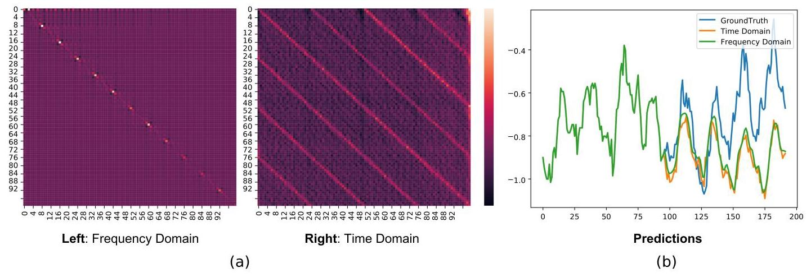
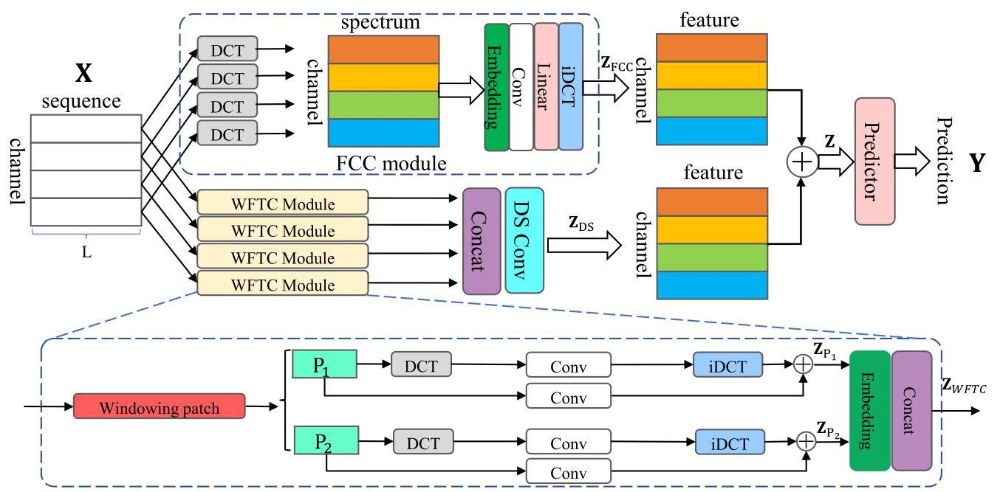
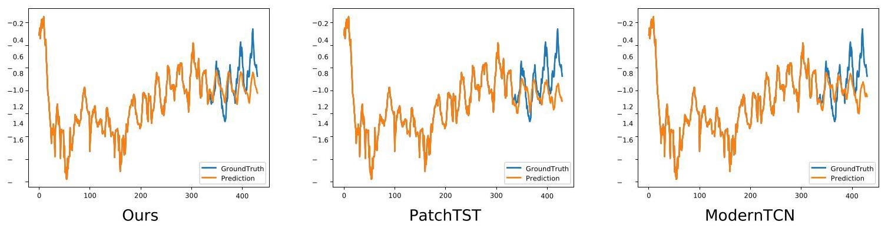
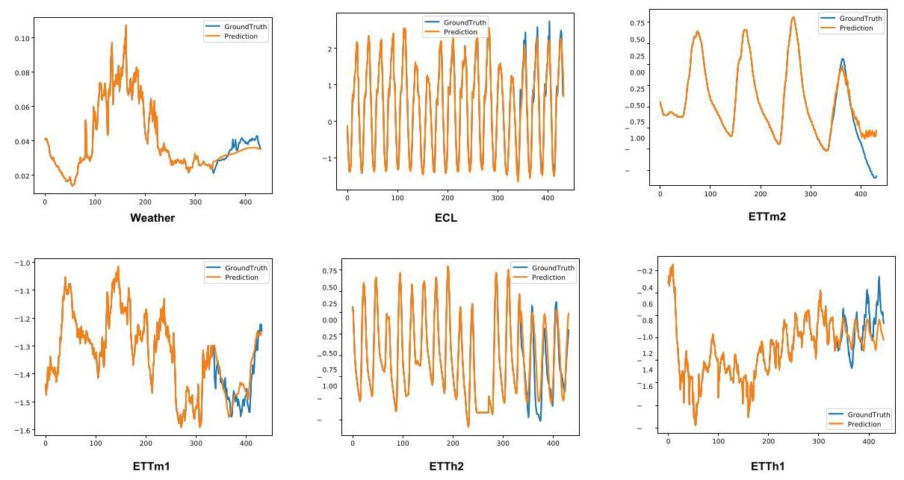

# FTMixer: Frequency and Time Domain Representations Fusion for Time Series Forecasting

# FTMixer:用于时间序列预测的频域和时域表示融合

Zhengnan Li

李政男

lzhengnan389@gmail.com

Communication University of china

中国传媒大学

China, Beijing

中国北京

Yunxiao Qin

秦云霄

qinyunxiao@cuc.edu.cn

Communication University of china

中国传媒大学

China, Beijing

中国北京

Xilong Cheng

程希龙

xilongcheng330@gmail.com

Communication University of china

中国传媒大学

China, Beijing

中国北京

Yuting Tan

谭雨婷

YutingTan@cuc.edu.cn

Communication University of china

中国传媒大学

China, Beijing

中国北京

## Abstract

## 摘要

Time series data can be represented in both the time and frequency domains, with the time domain emphasizing local dependencies and the frequency domain highlighting global dependencies. To harness the strengths of both domains in capturing local and global dependencies, we propose a novel Frequency and Time Domain Mixer (FTMixer) method. To exploit the global characteristics of the frequency domain, we introduce a novel Frequency Channel Convolution (FCC) module, designed to capture global inter-series dependencies. Inspired by the windowing concept in frequency domain transformations, we further propose a novel Windowed Frequency-Time Convolution (WFTC) module, which captures local dependencies by leveraging both frequency domain representations obtained from windowed transformations and time domain representations. Notably, FTMixer employs the Discrete Cosine Transformation (DCT) with real numbers instead of the complex-number-based Discrete Fourier Transformation (DFT), enabling direct utilization of modern deep learning operators in the frequency domain. Extensive experimental results across seven real-world long-term time series datasets demonstrate the superiority of FT-Mixer, in terms of both forecasting performance and computational efficiency. Code is avaliable here.

时间序列数据可以在时域和频域中表示，时域强调局部依赖性，频域突出全局依赖性。为了利用两个域在捕获局部和全局依赖性方面的优势，我们提出了一种新颖的频域和时域混合器(FTMixer)方法。为了利用频域的全局特征，我们引入了一种新颖的频率通道卷积(FCC)模块，旨在捕获全局序列间依赖性。受频域变换中的加窗概念启发，我们进一步提出了一种新颖的加窗频率 - 时间卷积(WFTC)模块，它通过利用从加窗变换获得的频域表示和时域表示来捕获局部依赖性。值得注意的是，FTMixer采用实数离散余弦变换(DCT)而非基于复数的离散傅里叶变换(DFT)，从而能够在频域中直接利用现代深度学习算子。在七个真实世界的长期时间序列数据集上的广泛实验结果证明了FT - Mixer在预测性能和计算效率方面的优越性。代码可在此处获取。

## CCS Concepts

## CCS概念

- Mathematics of computing $\rightarrow$ Time series analysis.

- 计算数学$\rightarrow$时间序列分析。

## Keywords

## 关键词

Time series forecasting

时间序列预测

## ACM Reference Format:

## ACM引用格式:

Zhengnan Li, Yunxiao Qin, Xilong Cheng, and Yuting Tan. 2018. FTMixer: Frequency and Time Domain Representations Fusion for Time Series Forecasting. In . ACM, New York, NY, USA, 12 pages. https://doi.org/XXXXXX.XXXXXXX

李政男、秦云霄、程希龙、谭宇婷。2018年。FTMixer:用于时间序列预测的频域和时域表示融合。在……中。美国计算机协会，纽约，纽约，美国，12页。https://doi.org/XXXXXX.XXXXXXX

## 1 Introduction

## 1 引言

Time series forecasting finds wide application across various domains, including traffic flows [40], ECL consumption [16, 36, 46], and weather forecasting [4, 20, 22, 25]. In recent years, advancements in deep learning have revolutionized time series forecasting [24, 26, 31, 44]..Among these advancements, Transformer-based methods [22, 30, 40, 49, 53] and MLP-based methods [7, 12, 15, 35, 48] dominate this field. Most previous methods have concentrated on learning time series in the time domain and have achieved promising performance [32].

时间序列预测在各个领域都有广泛应用，包括交通流量[40]、ECL消耗[16, 36, 46]和天气预报[4, 20, 22, 25]。近年来，深度学习的进展彻底改变了时间序列预测[24, 26, 31, 44]。在这些进展中，基于Transformer的方法[22, 30, 40, 49, 53]和基于MLP的方法[7, 12, 15, 35, 48]主导了该领域。大多数先前的方法都集中在时域中学习时间序列，并取得了有前景的性能[32]。

On the other hand, recent studies [6, 11, 18, 39, 50, 52] have demonstrated that, under certain conditions (e.g., early stopping or large step size), deep neural networks (DNNs) tend to gravitate towards simpler solutions. This phenomenon, known as implicit sparse regularization [18, 52], suggests that deep regression models focus on the most influential data points within the input sequence for regression tasks.

另一方面，最近的研究[6, 11, 18, 39, 50, 52]表明，在某些条件下(例如，提前停止或大步长)，深度神经网络(DNN)倾向于趋向更简单的解决方案。这种现象，称为隐式稀疏正则化[18, 52]，表明深度回归模型在回归任务中专注于输入序列中最有影响力的数据点。

In the context of time series forecasting, when the model operating in the time domain, these influential data points correspond to specific time instants, enabling the model to focus on the critical moments that are most predictive of future values. In contrast, when operating in the frequency domain, implicit sparse regularization directs the model's focus towards the most significant frequency components. Since each frequency component represents a sinusoid in the time domain, this focus allows the model to capture the primary periodicities of the data, thereby preserving essential patterns while effectively filtering out noise [45, 47, 53]. Figure 1(a) shows that the weights of the frequency domain Fully Connected layer reveal prominent diagonal patterns, highlighting the model's ability to capture periodicity by focusing on significant frequencies. In contrast, the time domain Fully Connected layer's weights must manage data across periodic intervals to identify periodic patterns, resulting in more complex and less sparse representations. This increased sparsity in the frequency domain enhances Deep Neural Network (DNN) learning by improving feature extraction and reducing overfitting [18, 28]. Figure 1(b) further illustrates that outputs from the frequency domain are smoother and capture more periodic information, while time domain outputs emphasize local dependencies.

在时间序列预测的背景下，当模型在时域中运行时，这些有影响力的数据点对应于特定的时刻，使模型能够专注于对未来值最具预测性的关键时刻。相比之下，当在频域中运行时，隐式稀疏正则化将模型的注意力引向最重要的频率分量。由于每个频率分量在时域中表示一个正弦波，这种关注使模型能够捕获数据的主要周期性，从而在有效滤除噪声的同时保留基本模式[45, 47, 53]。图1(a)显示频域全连接层的权重呈现出明显的对角线模式，突出了模型通过关注重要频率来捕获周期性的能力。相比之下，时域全连接层的权重必须在周期性间隔内管理数据以识别周期性模式，导致更复杂且更不稀疏的表示。频域中这种增加的稀疏性通过改进特征提取和减少过拟合来增强深度神经网络(DNN)学习[18, 28]。图1(b)进一步说明，频域输出更平滑，捕获更多周期性信息，而时域输出强调局部依赖性。

Several studies have leveraged the frequency domain to analyze time series data $\left\lbrack  {9,{38},{43},{45},{47},{53}}\right\rbrack$ . For example, TSLA-Net [9] employs frequency domain adaptive denoising to enhance the model's capability to identify long-term periodic patterns and improve computational efficiency. Similarly, TimesNet [41] utilizes the Fast Fourier Transform (FFT) to detect periodicities in time series data and performs convolution based on these identified periodic components.

几项研究利用频域来分析时间序列数据$\left\lbrack  {9,{38},{43},{45},{47},{53}}\right\rbrack$。例如，TSLA-Net[9]采用频域自适应去噪来增强模型识别长期周期性模式的能力并提高计算效率。同样，TimesNet[41]利用快速傅里叶变换(FFT)来检测时间序列数据中的周期性，并基于这些识别出的周期性分量进行卷积。

Figure 1: (a) Visualizations of the Fully Connected (FC) layer weights learned in the time and frequency domains on the ETTh1 dataset, with both the input and output length equal to 96, resulting in a ${96} \times  {96}$ weight matrix ( $y$ -axis: the output, $x$ -axis: the input). Note that we train the frequency domain FC layer by employing the Discrete Cosine Transform (DCT). From the FC layer weight visualizations, we can see that learning in the frequency domain identifies clearer diagonal dependencies and key patterns than in the time domain. (b) Predictions of the frequency domain FC layer and the time domain FC layer. The frequency domain output is smoother and emphasizes periodic information with smaller MSE=0.379, while the time domain output captures more local dependencies with larger MSE=0.383.

图1:(a)在ETTh1数据集上时域和频域学习的全连接(FC)层权重的可视化，输入和输出长度均为96，得到一个${96} \times  {96}$权重矩阵($y$轴:输出，$x$轴:输入)。请注意，我们通过采用离散余弦变换(DCT)来训练频域FC层。从FC层权重可视化中可以看出，频域学习比时域学习能识别更清晰的对角线依赖性和关键模式。(b)频域FC层和时域FC层的预测。频域输出更平滑，强调周期性信息，MSE = 0.379较小，而时域输出捕获更多局部依赖性，MSE = 0.383较大。

Despite advancements in leveraging the frequency domain for time series analysis, two major challenges still remain: 1) Handling Complex Number Representations. Existing methods often rely on the Discrete Fourier Transform (DFT) [41, 43, 53], which introduces complex representations of time series data. Deep learning techniques such as Batch Normalization [14] and activation functions [10] are not well-suited for these complex numbers. Although it is possible to process the real and imaginary parts separately with distinct models to adapt complex numbers to deep learning techniques, this approach increases the number of parameters and computational complexity, and may perform not well. The experimental result in Table 5 demonstrate the unsatisfactory performance of this approach. 2) Loss of Local information. Global frequency domain transformations mainly capture global dependencies, potentially masking critical variations and phenomena, such as sudden spikes and irregular patterns $\left\lbrack  {8,{13},{33},{34},{42}}\right\rbrack$ , which are essential for accurate predictions and understanding time series dynamics [27].

尽管在利用频域进行时间序列分析方面取得了进展，但仍存在两个主要挑战:1)处理复数表示。现有方法通常依赖离散傅里叶变换(DFT)[41, 43, 53]，这会引入时间序列数据的复数表示。诸如批量归一化[14]和激活函数[10]等深度学习技术并不适合这些复数。虽然可以使用不同的模型分别处理实部和虚部，以使复数适应深度学习技术，但这种方法会增加参数数量和计算复杂度，并且可能表现不佳。表5中的实验结果证明了这种方法的不理想性能。2)局部信息丢失。全局频域变换主要捕获全局依赖性，可能会掩盖关键变化和现象，例如突然的峰值和不规则模式$\left\lbrack  {8,{13},{33},{34},{42}}\right\rbrack$，而这些对于准确预测和理解时间序列动态[27]至关重要。

To address aforementioned challenges, we propose a method that effectively combines insights from both the time domain and the frequency domain: Frequency and Time domain Mixer (FTMixer). First, to fully utilize the frequency domain with deep learning models, we employ the Discrete Cosine Transformation (DCT) [2]. Unlike the Discrete Fourier Transform (DFT) [2, 34], which involves complex numbers, the DCT operates exclusively on real numbers, making it more compatible with modern deep learning techniques.

为了解决上述挑战，我们提出了一种有效结合时域和频域见解的方法:频域和时域混合器(FTMixer)。首先，为了在深度学习模型中充分利用频域，我们采用离散余弦变换(DCT)[2]。与涉及复数的离散傅里叶变换(DFT)[2, 34]不同，DCT仅对实数进行操作，使其与现代深度学习技术更兼容。

Additionaly, to capture inter-series global dependencies, we propose a novel Frequency Channel Convolution (FCC) module. The FCC embeds the entire sequence in the frequency domain before performing convolution, allowing for a comprehensive analysis of global patterns. To enhance the capture of local dependencies, we draw inspiration from the windowed Discrete Fourier Transform (DFT) [34, 42] and introduce Windowed Frequency-Time Convolution (WFTC) module. The WFTC segments the time series into patches of varying scales, applies frequency domain transformations within each patch, and then performs convolution across these patches to effectively capture local variations. After extracting frequency domain representations, we transform them back to the time domain and integrate them with the results of the convolution performed directly in the time domain on the patches. We use Depth-Wise Separable Convolution to process features extracted by WFTC, balancing efficiency with performance. The outputs of the Depth-Wise Separable Convolution and FCC are added together and passed through a projection layer to yield the final model output.

此外，为了捕获序列间的全局依赖性，我们提出了一种新颖的频域通道卷积(FCC)模块。FCC在执行卷积之前将整个序列嵌入频域，从而能够对全局模式进行全面分析。为了增强对局部依赖性的捕获，我们从加窗离散傅里叶变换(DFT)[34, 42]中获得灵感，并引入了加窗频域 - 时间卷积(WFTC)模块。WFTC将时间序列分割成不同尺度的片段，在每个片段内应用频域变换，然后对这些片段进行卷积以有效捕获局部变化。在提取频域表示后，我们将它们转换回时域，并将其与在时域中直接对片段执行卷积的结果进行整合。我们使用深度可分离卷积来处理WFTC提取的特征，在效率和性能之间取得平衡。深度可分离卷积和FCC的输出相加并通过一个投影层以产生最终的模型输出。

Moreover, we propose the Dual-Domain Loss Function (DDLF), which computes losses separately in the time and frequency domains. Leveraging the DCT's ability to concentrate energy into fewer coefficients and operate with real numbers, this loss function improves the model's ability to capture and utilize domain-specific features effectively.

此外，我们提出了双域损失函数(DDLF)，它在时域和频域分别计算损失。利用DCT将能量集中到较少系数并对实数进行操作的能力，该损失函数提高了模型有效捕获和利用特定域特征的能力。

Contribution. In this work, we explore the potential of integrating time and frequency domains for time series forecasting and propose a novel approach, FTMixer. We incorporate the Discrete Cosine Transform (DCT) into time series forecasting and introduce the Frequency Capture Convolution (FCC) module to capture global dependencies. Inspired by windowed DCT, we propose the Windowed Frequency-Time Convolution (WFTC) module to capture local dependencies across both time and frequency domains. Additionally, we introduce the Dual-Domain Loss Function (DDLF) to leverage the strengths of both domains. Extensive experiments across seven datasets demonstrate that FTMixer outperforms state-of-the-art methods.

贡献。在这项工作中，我们探索了将时域和频域集成用于时间序列预测的潜力，并提出了一种新颖的方法FTMixer。我们将离散余弦变换(DCT)纳入时间序列预测，并引入频域捕获卷积(FCC)模块来捕获全局依赖性。受加窗DCT的启发，我们提出了加窗频域 - 时间卷积(WFTC)模块来跨时域和频域捕获局部依赖性。此外，我们引入了双域损失函数(DDLF)以利用两个域的优势。在七个数据集上进行的广泛实验表明，FTMixer优于现有方法。

## 2 Related Work

## 2相关工作

### 2.1 Time Series Forecasting

### 2.1时间序列预测

Time series forecasting plays a crucial role in various domains, including finance, public health, and weather forecasting [40]. Recent years have witnessed significant development in this field driven by deep learning models specifically designed for time series tasks. Among these models, three prominent architectures have garnered considerable attention: Multi-Layer Perceptrons (MLPs), Transformers, and Temporal Convolutional Networks (TCNs).

时间序列预测在包括金融、公共卫生和天气预报等各个领域中都起着至关重要的作用[40]。近年来，受专门为时间序列任务设计的深度学习模型的推动，该领域取得了显著发展。在这些模型中，三种突出的架构受到了相当大的关注:多层感知器(MLP)、Transformer和时间卷积网络(TCN)。

Inspired by their success in natural language processing, Transformers have been adapted for time series analysis with remarkable results (e.g., [17], [29], [45]). Examples include Autoformer [40], which utilizes attention mechanisms to decompose sequences, PatchTST [30] which segments sequences inspired by the Vision Transformer (ViT) architecture, and iTransformer [22] that embeds the entire sequence then computing attention across channel dimensions.

受其在自然语言处理中成功的启发，Transformer已被应用于时间序列分析并取得了显著成果(例如[17]，[29]，[45])。示例包括利用注意力机制分解序列的Autoformer [40]、受视觉Transformer(ViT)架构启发分割序列的PatchTST [30]以及嵌入整个序列然后跨通道维度计算注意力的iTransformer [22]。

Known for their simplicity and effectiveness, MLPs have also found application in time series analysis (e.g., [15], [23], [35], [19], [48], [43], [7],[3]). DLinear [48], for instance, performs trend-season decomposition and learns using two MLPs. RLinear [15] implements reversible instance norm and achieves impressive performance. Additionally, FITS [43] directly learns in the frequency domain, leading to surprising results.

以其简单性和有效性而闻名的MLP也已在时间序列分析中得到应用(例如[15]，[23]，[35]，[19]，[48]，[43]，[7]，[3])。例如，DLinear [48]执行趋势 - 季节分解并使用两个MLP进行学习。RLinear [15]实现了可逆实例归一化并取得了令人印象深刻的性能。此外, FITS [43]直接在频域中学习，取得了惊人的结果。

Temporal Convolutional Networks (TCNs) are another class of deep learning models excelling at capturing local dependencies within time series data (e.g., [4], [41], [37], [26]). TimesNet [41] utilizes CNN for feature extraction, with a particular focus on leveraging Fast Fourier Transform (FFT) for periodicity extraction. Mod-ernTCN [26], drawing inspiration from transformers, captures inter-series and cross-time information simultaneously. ConvTimeNet [4] proposes a novel patch method to determine the suitable length of the patch window, enhancing the adaptability of TCNs to various time series datasets.

时序卷积网络(TCN)是另一类擅长捕捉时间序列数据中局部依赖关系的深度学习模型(例如，[4]、[41]、[37]、[26])。TimesNet [41]利用卷积神经网络进行特征提取，特别关注利用快速傅里叶变换(FFT)进行周期性提取。ModernTCN [26]从变压器中汲取灵感，同时捕捉序列间和跨时间信息。ConvTimeNet [4]提出了一种新颖的补丁方法来确定补丁窗口的合适长度，增强了TCN对各种时间序列数据集的适应性。

### 2.2 Frequency-Aware Time Series Forecasting

### 2.2 频率感知时间序列预测

Several successful approaches have demonstrated the value of incorporating frequency domain information. TSLA-Net [9] employs frequency domain adaptive denoising to enhance the model's capability to identify long-term periodic patterns and improve computational efficiency. Similarly, TimesNet [41] utilizes the Fast Fourier Transform (FFT) to detect periodicities in time series data and performs convolution based on these identified periodic components. FreTS [47] forecasts time series by leveraging both inner-series and inter-series information. On the other hand, FITS [43] achieves improved performance by training sequences directly in the frequency domain using a fully connected layer. However, a single linear model often proves insufficient for capturing non-linear patterns in the frequency domain. Additionally, the effectiveness of traditional deep learning techniques like activation functions and batch normalization on complex number data (used in the DFT) remains uncertain.

几种成功的方法已经证明了纳入频域信息的价值。TSLA-Net [9]采用频域自适应去噪来增强模型识别长期周期性模式的能力并提高计算效率。同样，TimesNet [41]利用快速傅里叶变换(FFT)来检测时间序列数据中的周期性，并基于这些识别出的周期性成分进行卷积。FreTS [47]通过利用序列内和序列间信息来预测时间序列。另一方面，FITS [43]通过使用全连接层在频域中直接训练序列来提高性能。然而，单个线性模型通常不足以捕捉频域中的非线性模式。此外，诸如激活函数和批量归一化等传统深度学习技术对复数数据(用于离散傅里叶变换)的有效性仍然不确定。

This work addresses these limitations by introducing the Discrete Cosine Transform (DCT) for the first time in time series analysis. Compared to the Discrete Fourier Transform (DFT) [2], DCT operates exclusively on real numbers, making it more suitable for modern deep learning techniques. Furthermore, DCT utilizes only amplitude to represent the frequency domain information, simplifying the computation of the loss function in the frequency domain. These advantages of DCT pave the way for a novel and potentially more effective approach to frequency-aware time series forecasting.

这项工作通过在时间序列分析中首次引入离散余弦变换(DCT)来解决这些限制。与离散傅里叶变换(DFT)[2]相比，DCT仅对实数进行操作，使其更适合现代深度学习技术。此外，DCT仅利用幅度来表示频域信息，简化了频域中损失函数的计算。DCT的这些优点为一种新颖且可能更有效的频率感知时间序列预测方法铺平了道路。

### 2.3 Implicit Sparse Regulariation

### 2.3 隐式稀疏正则化

Recent studies [11, 18, 39, 50, 52] have shown that, under specific conditions such as early stopping or large step sizes, deep neural networks (DNNs) naturally evolve towards simpler solutions. Specifically, [50] shows that when gradient descent is applied directly to the residual sum of squares with sufficiently small initial values, and proper early stopping rules are employed, the iterates converge to a nearly sparse, rate-optimal solution that often surpasses explicitly regularized approaches. Similarly, [18] proves that early stopping tends to lead models towards sparser solutions. Additionally, [6] demonstrates that if an exact solution exists, vanilla gradient flow for the overparameterized loss functional converges to a good approximation of the solution with minimal ${\ell }_{1}$ -norm.

最近的研究[11, 18, 39, 50, 52]表明，在诸如提前停止或大步长等特定条件下，深度神经网络(DNN)自然会朝着更简单的解决方案发展。具体而言，[50]表明，当梯度下降直接应用于具有足够小初始值的残差平方和，并采用适当的提前停止规则时，迭代会收敛到一个几乎稀疏的、速率最优的解决方案，该方案通常优于显式正则化方法。同样，[18]证明提前停止往往会使模型朝着更稀疏的解决方案发展。此外，[6]表明，如果存在精确解，过参数化损失函数的原始梯度流会收敛到具有最小${\ell }_{1}$范数的解的良好近似。

## 3 Methodology

## 3 方法

### 3.1 Prelimiary

### 3.1 预备知识

3.1.1 Problem Definition. Let $\left\lbrack  {{X}_{1},{X}_{2},\cdots ,{X}_{T}}\right\rbrack   \in  {\mathbb{R}}^{N \times  T}$ stand for the regularly sampled multi-channel time series dataset with $N$ series and $T$ timestamps, where ${X}_{t} \in  {\mathbb{R}}^{N}$ denotes the multi-channel values of $N$ distinct series at timestamp $t$ . We consider a time series lookback window of length- $L$ at each timestamp $t$ as the model input, namely ${\mathbf{X}}_{t} = \left\lbrack  {{X}_{t - L + 1},{X}_{t - L + 2},\cdots ,{X}_{t}}\right\rbrack   \in  {\mathbb{R}}^{N \times  L}$ ; also, we consider a horizon window of length- $\tau$ at timestamp $t$ as the prediction target, denoted as ${\mathrm{Y}}_{t} = \left\lbrack  {{X}_{t + 1},{X}_{t + 2},\cdots ,{X}_{t + \tau }}\right\rbrack   \in  {\mathbb{R}}^{N \times  \tau }$ . Then the time series forecasting formulation is to use historical observations ${\mathbf{X}}_{t}$ to predict future values ${\mathbf{Y}}_{t}$ . For simplicity, we shorten the model input ${\mathbf{X}}_{t}$ as $\mathbf{X} = \left\lbrack  {{X}_{1},{X}_{2},\cdots ,{X}_{L}}\right\rbrack   \in  {\mathbb{R}}^{N \times  L}$ and reformulate the prediction target as $\mathbf{Y} = \left\lbrack  {{X}_{L + 1},{X}_{L + 2},\cdots ,{X}_{L + \tau }}\right\rbrack   \in \; {\mathbb{R}}^{N \times  \tau }$ , in the rest of the paper.

3.1.1 问题定义。令$\left\lbrack  {{X}_{1},{X}_{2},\cdots ,{X}_{T}}\right\rbrack   \in  {\mathbb{R}}^{N \times  T}$代表具有$N$个序列和$T$个时间戳的定期采样多通道时间序列数据集，其中${X}_{t} \in  {\mathbb{R}}^{N}$表示在时间戳$t$处$N$个不同序列的多通道值。我们将每个时间戳$t$处长度为$L$的时间序列回溯窗口视为模型输入，即${\mathbf{X}}_{t} = \left\lbrack  {{X}_{t - L + 1},{X}_{t - L + 2},\cdots ,{X}_{t}}\right\rbrack   \in  {\mathbb{R}}^{N \times  L}$；此外，我们将时间戳$t$处长度为$\tau$的预测窗口视为预测目标，记为${\mathrm{Y}}_{t} = \left\lbrack  {{X}_{t + 1},{X}_{t + 2},\cdots ,{X}_{t + \tau }}\right\rbrack   \in  {\mathbb{R}}^{N \times  \tau }$。那么时间序列预测公式就是使用历史观测值${\mathbf{X}}_{t}$来预测未来值${\mathbf{Y}}_{t}$。为简单起见，在本文其余部分，我们将模型输入${\mathbf{X}}_{t}$简记为$\mathbf{X} = \left\lbrack  {{X}_{1},{X}_{2},\cdots ,{X}_{L}}\right\rbrack   \in  {\mathbb{R}}^{N \times  L}$，并将预测目标重新表述为$\mathbf{Y} = \left\lbrack  {{X}_{L + 1},{X}_{L + 2},\cdots ,{X}_{L + \tau }}\right\rbrack   \in \; {\mathbb{R}}^{N \times  \tau }$。

3.1.2 Discrete Cosine Transformation. Our methodology utilizes the Discrete Cosine Transform (DCT) to convert input data into the frequency domain. This section provides an overview of the DCT and its relationship to the Discrete Fourier Transform (DFT).

3.1.2 离散余弦变换。我们的方法利用离散余弦变换(DCT)将输入数据转换到频域。本节概述DCT及其与离散傅里叶变换(DFT)的关系。

The Cosine Transform is a variant of the Fourier Transform that focuses exclusively on the cosine components [1]. It is particularly advantageous for functions with symmetry, simplifying the transformation process compared to the Fourier Transform, which includes both sine and cosine components.

余弦变换是傅里叶变换的一种变体，它只关注余弦分量[1]。对于具有对称性的函数，它特别有利，与包含正弦和余弦分量的傅里叶变换相比，简化了变换过程。

The continuous Fourier Transform of a function $f\left( t\right)$ is given by:

函数$f\left( t\right)$的连续傅里叶变换由下式给出:

$$
F\left( \omega \right)  = {\int }_{-\infty }^{\infty }f\left( t\right) {e}^{-{i\omega t}}{dt}
$$

where $F\left( \omega \right)$ represents the frequency domain representation of $f\left( t\right)$ . For even functions ${f}_{e}\left( t\right)$ , the Fourier Transform can be expressed purely in terms of cosine functions:

其中$F\left( \omega \right)$表示$f\left( t\right)$的频域表示。对于偶函数${f}_{e}\left( t\right)$，傅里叶变换可以仅用余弦函数表示为:

$$
F\left( \omega \right)  = {\int }_{-\infty }^{\infty }{f}_{e}\left( t\right) \cos \left( {\omega t}\right) {dt}.
$$

This relationship highlights the efficiency of cosine components for symmetric functions. We formalize this connection between the Discrete Cosine Transform (DCT) and the Discrete Fourier Transform (DFT) with the following theorem:

这种关系突出了余弦分量对于对称函数的效率。我们用以下定理形式化离散余弦变换(DCT)和离散傅里叶变换(DFT)之间的这种联系:

The Discrete Cosine Transform (DCT) of a sequence can be derived from the Discrete Fourier Transform (DFT) of a symmetrically extended version of the sequence [1]. The DCT for a sequence $\mathbf{x}$ of length $L$ is defined as:

序列的离散余弦变换(DCT)可以从该序列对称扩展版本的离散傅里叶变换(DFT)推导得出[1]。长度为$L$的序列$\mathbf{x}$的DCT定义为:

$$
{\bar{x}}_{k} = \mathop{\sum }\limits_{{n = 0}}^{{L - 1}}{x}_{n}\cos \left( {\frac{\pi }{L}\left( {n + \frac{1}{2}}\right) k}\right) , \tag{1}
$$

where ${x}_{n}$ is the $n$ -th element of the sequence $\mathbf{x}$ , and ${\bar{x}}_{k}$ denotes the $k$ - th frequency component in the DCT frequency domain coefficients, with $k \in  \{ 0,1,\ldots , L - 1\}$ .

其中${x}_{n}$是序列$\mathbf{x}$的第$n$个元素，${\bar{x}}_{k}$表示DCT频域系数中的第$k$个频率分量，其中$k \in  \{ 0,1,\ldots , L - 1\}$。

Using Eq. 1, we obtain $\overline{\mathbf{x}} = \left\lbrack  {{\bar{x}}_{0},{\bar{x}}_{1},\ldots ,{\bar{x}}_{L - 1}}\right\rbrack$ , representing the frequency features of $\mathbf{x}$ .

使用式1，我们得到$\overline{\mathbf{x}} = \left\lbrack  {{\bar{x}}_{0},{\bar{x}}_{1},\ldots ,{\bar{x}}_{L - 1}}\right\rbrack$，表示$\mathbf{x}$的频率特征。

The DCT is reversible, allowing the transformation of frequency domain coefficients back to the time domain through the inverse Discrete Cosine Transform (iDCT):

DCT是可逆的，允许通过离散余弦逆变换(iDCT)将频域系数转换回时域:

$$
{x}_{n} = \frac{1}{2}{\bar{x}}_{0} + \mathop{\sum }\limits_{{k = 1}}^{{L - 1}}{\bar{x}}_{k}\cos \left( {\frac{\pi }{L}\left( {k + \frac{1}{2}}\right) n}\right) . \tag{2}
$$

By employing the DCT, our methodology effectively transitions input data into the frequency domain. The DCT, renowned in signal processing, emphasizes cosine components and operates efficiently with real numbers, making it well-suited for integration with deep learning frameworks.

通过采用离散余弦变换(DCT)，我们的方法有效地将输入数据转换到频域。DCT在信号处理领域久负盛名，它强调余弦分量并且能有效地处理实数，这使其非常适合与深度学习框架集成。

### 3.2 Overall Architecture

### 3.2 整体架构

To address the challenge of capturing both local and global patterns in time series data, we introduce the Frequency and Time domain Mixer (FTMixer) method. As shown in Figure 2, FTMixer incorporates two key modules: Frequency Channel Convolution (FCC) and Windowed Frequency-Time Convolution (WFTC).

为了应对在时间序列数据中捕捉局部和全局模式的挑战，我们引入了频域和时域混合器(FTMixer)方法。如图2所示，FTMixer包含两个关键模块:频率通道卷积(FCC)和加窗频时卷积(WFTC)。

The FCC module is designed to capture inter-series dependencies in the frequency domain, enhancing the model's ability to detect global patterns that may be missed in the time domain. Meanwhile, the WFTC module employs multi-scale windowing to capture detailed local frequency information, addressing the limitation of traditional methods that rely solely on global frequency representations.

FCC模块旨在捕捉频域中的序列间依赖关系，增强模型检测时域中可能被忽略的全局模式的能力。同时，WFTC模块采用多尺度加窗来捕捉详细的局部频率信息，解决了传统方法仅依赖全局频率表示的局限性。

These components work together to balance local and global feature extraction, improving overall performance in time series forecasting.

这些组件协同工作以平衡局部和全局特征提取，提高时间序列预测的整体性能。

The model structure of FTMixer is summarized as follows:

FTMixer的模型结构总结如下:

$$
\left\{  \begin{array}{l} {\mathbf{Z}}_{\mathrm{{FCC}}} = {f}_{\mathrm{{FCC}}}\left( \mathbf{X}\right) , \\  {\mathbf{Z}}_{\mathrm{{DS}}} = {f}_{\mathrm{{DS}}}\left( {\operatorname{Concate}\left( {{f}_{\mathrm{{WFTC}}}\left( \mathbf{X}\right) }\right) ,}\right. \\  \mathbf{Z} = {\mathbf{Z}}_{\mathrm{{FCC}}} + {\mathbf{Z}}_{\mathrm{{DS}}}, \\  \widehat{\mathbf{Y}} = {f}_{\mathrm{{Pre}}}\left( \mathbf{Z}\right) , \end{array}\right. \tag{3}
$$

Here, $\widehat{\mathbf{Y}}$ denotes the model’s output, and $\mathbf{X}$ represents the input time series. ${f}_{\text{ WFTC }}$ applies the WFTC module to each channel of $\mathbf{X}$ , with ${f}_{\mathrm{{DS}}}$ and ${f}_{\mathrm{{Pre}}}$ representing depth-wise separable convolution (DS-Conv) and the model predictor, respectively.

在此，$\widehat{\mathbf{Y}}$表示模型的输出，$\mathbf{X}$表示输入时间序列。${f}_{\text{ WFTC }}$对$\mathbf{X}$的每个通道应用WFTC模块，${f}_{\mathrm{{DS}}}$和${f}_{\mathrm{{Pre}}}$分别表示深度可分离卷积(DS-Conv)和模型预测器。

### 3.3 Frequency Channel Convolution

### 3.3 频率通道卷积

The FCC module is designed to capture global inter-series dependencies in the frequency domain. Standard convolution tends to emphasize local dependencies, which usually overlook broader, global patterns due to its inherent focus on local features. To address this limitation, we apply the Discrete Cosine Transform (DCT) to each channel of the input sequence, converting it into the frequency domain, which can be formulated as:

FCC模块旨在捕捉频域中的全局序列间依赖关系。标准卷积往往强调局部依赖关系，由于其固有地关注局部特征，通常会忽略更广泛的全局模式。为了解决这一局限性，我们对输入序列的每个通道应用离散余弦变换(DCT)，将其转换到频域，可表示为:

$$
{\mathbf{X}}_{f} = \text{ Embedding }\left( {\operatorname{DCT}\left( \mathbf{X}\right) }\right) \tag{4}
$$

${\mathrm{X}}_{f}$ represents the frequency domain representation of the input $\mathrm{X}$ . The Discrete Cosine Transform (DCT) is applied to the input $\mathrm{X}$ , and the resulting frequency domain representation is then embedded along the sequence dimension. Following this transformation, we perform convolution with kernel sizes equal to the variable dimensions, effectively allowing convolution across the entire variable dimension.

${\mathrm{X}}_{f}$表示输入$\mathrm{X}$的频域表示。对输入$\mathrm{X}$应用离散余弦变换(DCT)，然后将得到的频域表示沿序列维度嵌入。经过此变换后，我们使用等于变量维度的内核大小进行卷积，从而有效地允许在整个变量维度上进行卷积。

$$
{\mathbf{Z}}_{\mathrm{{FCC}}} = \operatorname{iDCT}\left( {\operatorname{Linear}\left( {\operatorname{Conv}1\mathrm{\;d}\left( {\mathbf{X}}_{f}\right) }\right) }\right) \tag{5}
$$

This approach allows the FCC module to effectively capture global dependencies and periodic patterns, enhancing the model's ability to understand long-term trends in time series data.

这种方法使FCC模块能够有效地捕捉全局依赖关系和周期性模式，增强模型理解时间序列数据中长期趋势的能力。

### 3.4 Windowed Frequency-Time Convolution

### 3.4 加窗频时卷积

Existing frequency-domain models often concentrate solely on the global frequency representation of entire sequences, which may result in similar representations for distinct time-domain sequences. Inspired by the windowing technique in frequency domain transformations [27, 33], we propose the Windowed Frequency-Time Convolution (WFTC) module to capture fine-grained information by applying the Discrete Cosine Transform (DCT) within multi-scale windows.

现有的频域模型通常仅专注于整个序列的全局频率表示，这可能导致不同时域序列具有相似的表示。受频域变换中的加窗技术[27, 33]启发，我们提出加窗频时卷积(WFTC)模块，通过在多尺度窗口内应用离散余弦变换(DCT)来捕捉细粒度信息。

In the WFTC module, as illustrated in Figure 2, each channel of the input sequence is initially segmented into patches of various scales. The DCT is then applied within each patch to derive the local frequency domain representation. To capture local dependencies, we perform convolution on these patches. Subsequently, we transform the frequency domain embeddings back to the time domain and add them to the result of the convolution performed directly in the time domain on the patches. This approach enhances the model's ability to capture local dependencies. The overall process can be formulated as:

在WFTC模块中，如图2所示，输入序列的每个通道首先被分割成各种尺度的块。然后在每个块内应用DCT以获得局部频域表示。为了捕捉局部依赖关系，我们对这些块进行卷积。随后，我们将频域嵌入转换回时域，并将其添加到直接在时域中对块进行卷积的结果中。这种方法增强了模型捕捉局部依赖关系的能力。整个过程可表示为:

$$
\left\{  \begin{array}{l} {\mathbf{F}}_{{\mathbf{P}}_{j}} = \operatorname{iDCT}\left( {\operatorname{Conv}\left( {\operatorname{DCT}\left( {\mathbf{P}}_{j}\right) }\right) }\right) , \\  {\mathbf{Z}}_{{\mathbf{P}}_{j}} = {\mathbf{F}}_{{\mathbf{P}}_{j}} + \operatorname{Conv}\left( {\mathbf{P}}_{j}\right) \\  {\widetilde{\mathbf{Z}}}_{{\mathbf{P}}_{j}} = \operatorname{Embedding}\left( {\mathbf{Z}}_{{\mathbf{P}}_{j}}\right) \\  {\mathbf{Z}}_{\text{ WFTC }} = \operatorname{Concate}\left( {{\widetilde{\mathbf{Z}}}_{{\mathbf{P}}_{1}},{\widetilde{\mathbf{Z}}}_{{\mathbf{P}}_{2}},\ldots ,{\widetilde{\mathbf{Z}}}_{{\mathbf{P}}_{n}}}\right) , \end{array}\right. \tag{6}
$$

where ${\mathbf{P}}_{j}$ denotes the $j$ -th patch (e.g., ${\mathbf{P}}_{1}$ or ${\mathbf{P}}_{2}$ in Figure 2) in the WFTC module. ${\mathbf{Z}}_{{\mathbf{P}}_{j}}$ represents the features extracted for the $j$ -th patch following the embedding layer, where embedding is applied along the sequence dimension of each patch in a manner similar to a feed-forward layer. ${\mathbf{Z}}_{\text{ WFTC }}$ is the output of the WFTC module for the current input channel. Note that we separately apply the WFTC module on each input channel, which is shown in Figure 2.

其中${\mathbf{P}}_{j}$表示WFTC模块中的第$j$个块(例如图2中的${\mathbf{P}}_{1}$或${\mathbf{P}}_{2}$)。${\mathbf{Z}}_{{\mathbf{P}}_{j}}$表示在嵌入层之后为第$j$个块提取的特征，其中嵌入是沿着每个块的序列维度以类似于前馈层的方式应用的。${\mathbf{Z}}_{\text{ WFTC }}$是WFTC模块对当前输入通道的输出。请注意，我们在每个输入通道上分别应用WFTC模块，如图2所示。

Figure 2: The framework of FTMixer. FTMixer comprises two main modules: FCC and WFTC. An example X containing four channels is visualized here for easier understanding. The model predictor is a Linear layer.

图2:FTMixer的框架。FTMixer包括两个主要模块:FCC和WFTC。这里可视化了一个包含四个通道的示例X以便于理解。模型预测器是一个线性层。

### 3.5 Depth-Wise Separable Convolution

### 3.5 深度可分离卷积

After obtain ${\mathbf{Z}}_{\text{ WFTC }}$ for all input channel, we first concate them and then apply Depth-Wise Separable Convolution (DS Convolution) [5], to further process the obtained feature. DS Convolution decouples the learning of intra-patch dimensions from the learning of inter-patch dimensions. It is more computationally efficient than vanilla convolution and comprises two components: Depth-Wise Convolution (DW Conv) and Point-Wise Convolution (PW Conv). DW Conv aggregates inter-patch information through grouped convolution, while PW Conv operates akin to a Feed Forward Network (FFN) to extract intra-patch information.

在为所有输入通道获取${\mathbf{Z}}_{\text{ WFTC }}$之后，我们首先将它们连接起来，然后应用深度可分离卷积(DS卷积)[5]，以进一步处理获得的特征。DS卷积将块内维度的学习与块间维度的学习解耦。它比普通卷积在计算上更高效，并且由两个部分组成:深度卷积(DW卷积)和逐点卷积(PW卷积)。DW卷积通过分组卷积聚合块间信息，而PW卷积的操作类似于前馈网络(FFN)以提取块内信息。

### 3.6 Dual-Domain Loss Function

### 3.6 双域损失函数

To fully leverage the advantages of both the frequency and time domains, we propose a Dual-Domain Loss Function (DDLF) that computes losses separately in each domain. For the time domain, we use Mean Squared Error (MSE), consistent with most time-domain-based methods [22, 26, 30, 40, 48]. In the frequency domain, we employ Mean Absolute Error (MAE), following [38], due to its effectiveness in handling varying magnitudes of frequency components and its stability compared to squared loss functions. The use of Discrete Cosine Transform (DCT) facilitates this approach by concentrating energy into fewer coefficients and utilizing real numbers, which enhances the capture of frequency domain information. The overall loss function of our method is thus formulated as:

为了充分利用频域和时域的优势，我们提出了一种双域损失函数(DDLF)，它在每个域中分别计算损失。对于时域，我们使用均方误差(MSE)，这与大多数基于时域的方法[22, 26, 30, 40, 48]一致。在频域中，我们采用平均绝对误差(MAE)，遵循[38]，因为它在处理不同幅度的频率分量方面有效，并且与平方损失函数相比具有稳定性。离散余弦变换(DCT)的使用通过将能量集中到更少的系数并利用实数来促进这种方法，这增强了对频域信息的捕获。因此，我们方法的整体损失函数被公式化为:

$$
\left\{  \begin{array}{l} {\mathcal{L}}_{\text{ time }} = {MSE}\left( {\mathbf{Y} - F\left( \mathbf{X}\right) }\right) , \\  {\mathcal{L}}_{\text{ fre }} = {MAE}\left( {{DCT}\left( \mathbf{Y}\right)  - {DCT}\left( {F\left( \mathbf{X}\right) }\right) }\right) , \\  {\mathcal{L}}_{\text{ total }} = {\mathcal{L}}_{\text{ time }} + {\mathcal{L}}_{\text{ fre }}. \end{array}\right. \tag{7}
$$

Where $F\left( X\right)$ represents the prediction of the model.

其中$F\left( X\right)$表示模型的预测。

## 4 Experiment

## 4 实验

### 4.1 Experiment Settings

### 4.1 实验设置

In this section, we evaluate the efficacy of FTMixer on time series forecasting, and anomaly detection tasks. We show that our FTMixer can serve as a foundation model with competitive performance on these tasks.

在本节中，我们评估FTMixer在时间序列预测和异常检测任务上的有效性。我们表明我们的FTMixer可以作为在这些任务上具有竞争力性能的基础模型。

Table 1: The Statistics of the seven datasets used in our experiments.

表1:我们实验中使用的七个数据集的统计信息。

<table><tr><td>Datasets</td><td>ETTh1&2</td><td>ETTm1&2</td><td>Traffic</td><td>ECL</td><td>Weather</td></tr><tr><td>Channels</td><td>7</td><td>7</td><td>862</td><td>321</td><td>21</td></tr><tr><td>Timesteps</td><td>17,420</td><td>69,680</td><td>17,544</td><td>26,304</td><td>52,696</td></tr><tr><td>Granularity</td><td>1 hour</td><td>5 min</td><td>1 hour</td><td>1 hour</td><td>10 min</td></tr></table>

Datasets. We perform all experiments on seven widely-used real-world multi-channel time series forecasting datasets. These datasets encompass diverse domains, including ECL Transformer Temperature (ETTh1, ETTh2, ETTm1, and ETTm2) [51], ECL, Traffic, and Weather, as utilized by Autoformer [40]. For fairness in comparison, we adhere to a standardized protocol [22], dividing all forecasting datasets into training, validation, and test sets. Specifically, we employ a ratio of 6:2:2 for the ETT dataset and 7:1:2 for the remaining datasets, in line with [9, 22, 26, 30, 41]. Refer to Table 1 for an overview of the characteristics of these datasets.

数据集。我们在七个广泛使用的真实世界多通道时间序列预测数据集上进行所有实验。这些数据集涵盖不同领域，包括ECL变压器温度(ETTh1、ETTh2、ETTm1和ETTm2)[51]、ECL、交通和天气，如Autoformer[40]所使用的。为了进行公平比较，我们遵循标准化协议[22]，将所有预测数据集划分为训练集、验证集和测试集。具体来说，对于ETT数据集，我们采用6:2:2的比例，对于其余数据集采用7:1:2的比例，与[9, 22, 26, 30, 41]一致。有关这些数据集特征的概述，请参阅表1。

Evaluation protocol. Our evaluation framework, inspired by TimesNet [41], is based on two key metrics: Mean Squared Error (MSE) and Mean Absolute Error (MAE). To ensure fair comparison, we use prediction lengths of $\{ {96},{192},{336},{720}\}$ and set the historical horizon length to $T = {336}$ for our model. For other models, we follow [30,41] by treating the historical horizon $T$ as a hyper-parameter and using the settings from their original papers, as some models may exhibit performance degradation with increasing historical horizons. For baselines, we report the best results from their original works if their settings match ours; otherwise, we re-run their official codes to ensure fair comparison. Notably, some official codes of baselines contain a bug that drops the last batch during testing ${}^{1}$ . We fixed this issue and re-run these baselines. All reported results are averaged over 10 random seeds.

评估协议。我们的评估框架受TimesNet[41]启发，基于两个关键指标:均方误差(MSE)和平均绝对误差(MAE)。为了确保公平比较，我们使用$\{ {96},{192},{336},{720}\}$的预测长度，并将我们模型的历史视野长度设置为$T = {336}$。对于其他模型，我们遵循[30,41]，将历史视野$T$视为超参数，并使用其原始论文中的设置，因为一些模型可能会随着历史视野的增加而表现出性能下降。对于基线，我们报告其原始工作中的最佳结果，如果其设置与我们的匹配；否则，我们重新运行其官方代码以确保公平比较。值得注意的是，一些基线的官方代码包含一个错误，即在测试${}^{1}$期间丢弃最后一批。我们修复了这个问题并重新运行这些基线。所有报告的结果均在10个随机种子上进行平均。

Table 2: Full forecasting results on different prediction lengths $\in  \{ {96},{192},{336},{720}\}$ . Lower MSE and MAE indicate better performance. We highlight the best performance with red bold text.

表2:不同预测长度$\in  \{ {96},{192},{336},{720}\}$的完整预测结果。较低的MSE和MAE表示更好的性能。我们用红色粗体文本突出显示最佳性能。

<table><tr><td colspan="2">Methods Methods</td><td colspan="2">FTMixer   -</td><td colspan="2">ModernTCN ICLR 2024</td><td colspan="2">TSLANet ICML 2024</td><td colspan="2">iTransformer   ICLR 2024</td><td colspan="2">PatchTST   ICLR 2023</td><td colspan="2">Crossformer   ICLR 2023</td><td colspan="2">FEDformer   ICML 2022</td><td colspan="2">RLinear   ICLR'Z 2022</td><td colspan="2">Dlinear   AAAI 2023</td><td colspan="2">TimesNet   ICLR 2023</td></tr><tr><td colspan="2">Metric</td><td>MSE</td><td>MAE</td><td>MSE</td><td>MAE</td><td>MSE</td><td>MAE</td><td>MSE</td><td>MAE</td><td>MSE</td><td>MAE</td><td>MSE</td><td>MAE</td><td>MSE</td><td>MAE</td><td>MSE</td><td>MAE</td><td>MSE</td><td>MAE</td><td>MSE</td><td>MAE</td></tr><tr><td rowspan="5">ETTh1</td><td>96</td><td>0.356</td><td>0.388</td><td>0.391</td><td>0.410</td><td>0.382</td><td>0.406</td><td>0.386</td><td>0.405</td><td>0.382</td><td>0.401</td><td>0.423</td><td>0.448</td><td>0.376</td><td>0.419</td><td>0.386</td><td>0.395</td><td>0.375</td><td>0.399</td><td>0.384</td><td>0.402</td></tr><tr><td>192</td><td>0.401</td><td>0.410</td><td>0.416</td><td>0.423</td><td>0.422</td><td>0.435</td><td>0.441</td><td>0.436</td><td>0.428</td><td>0.425</td><td>0.471</td><td>0.474</td><td>0.420</td><td>0.448</td><td>0.437</td><td>0.424</td><td>0.405</td><td>0.416</td><td>0.436</td><td>0.429</td></tr><tr><td>336</td><td>0.422</td><td>0.425</td><td>0.437</td><td>0.435</td><td>0.443</td><td>0.451</td><td>0.487</td><td>0.458</td><td>0.451</td><td>0.436</td><td>0.570</td><td>0.546</td><td>0.459</td><td>0.465</td><td>0.479</td><td>0.446</td><td>0.439</td><td>0.443</td><td>0.491</td><td>0.469</td></tr><tr><td>720</td><td>0.430</td><td>0.454</td><td>0.461</td><td>0.470</td><td>0.499</td><td>0.498</td><td>0.503</td><td>0.491</td><td>0.452</td><td>0.459</td><td>0.653</td><td>0.621</td><td>0.506</td><td>0.507</td><td>0.481</td><td>0.470</td><td>0.472</td><td>0.490</td><td>0.521</td><td>0.500</td></tr><tr><td>Avg</td><td>0.402</td><td>0.419</td><td>0.426</td><td>0.434</td><td>0.434</td><td>0.447</td><td>0.454</td><td>0.448</td><td>0.428</td><td>0.430</td><td>0.529</td><td>0.522</td><td>0.440</td><td>0.460</td><td>0.446</td><td>0.434</td><td>0.423</td><td>0.437</td><td>0.458</td><td>0.450</td></tr><tr><td rowspan="5">ETTh2</td><td>96</td><td>0.275</td><td>0.335</td><td>0.279</td><td>0.344</td><td>0.289</td><td>0.351</td><td>0.297</td><td>0.349</td><td>0.285</td><td>0.340</td><td>0.745</td><td>0.584</td><td>0.358</td><td>0.397</td><td>0.288</td><td>0.338</td><td>0.289</td><td>0.353</td><td>0.340</td><td>0.374</td></tr><tr><td>192</td><td>0.336</td><td>0.375</td><td>0.342</td><td>0.387</td><td>0.342</td><td>0.388</td><td>0.380</td><td>0.400</td><td>0.356</td><td>0.386</td><td>0.877</td><td>0.656</td><td>0.429</td><td>0.439</td><td>0.374</td><td>0.390</td><td>0.383</td><td>0.418</td><td>0.402</td><td>0.414</td></tr><tr><td>336</td><td>0.359</td><td>0.398</td><td>0.363</td><td>0.402</td><td>0.371</td><td>0.413</td><td>0.428</td><td>0.432</td><td>0.365</td><td>0.405</td><td>1.043</td><td>0.731</td><td>0.496</td><td>0.487</td><td>0.415</td><td>0.426</td><td>0.448</td><td>0.465</td><td>0.452</td><td>0.452</td></tr><tr><td>720</td><td>0.388</td><td>0.427</td><td>0.390</td><td>0.428</td><td>0.417</td><td>0.450</td><td>0.427</td><td>0.445</td><td>0.395</td><td>0.427</td><td>1.104</td><td>0.763</td><td>0.463</td><td>0.474</td><td>0.420</td><td>0.440</td><td>0.605</td><td>0.551</td><td>0.462</td><td>0.468</td></tr><tr><td>Avg</td><td>0.339</td><td>0.383</td><td>0.344</td><td>0.390</td><td>0.355</td><td>0.401</td><td>0.383</td><td>0.407</td><td>0.347</td><td>0.387</td><td>0.942</td><td>0.684</td><td>0.437</td><td>0.449</td><td>0.374</td><td>0.399</td><td>0.431</td><td>0.447</td><td>0.414</td><td>0.427</td></tr><tr><td rowspan="5">ETTm1</td><td>96</td><td>0.284</td><td>0.334</td><td>0.293</td><td>0.345</td><td>0.286</td><td>0.340</td><td>0.334</td><td>0.368</td><td>0.291</td><td>0.340</td><td>0.404</td><td>0.426</td><td>0.379</td><td>0.419</td><td>0.355</td><td>0.376</td><td>0.299</td><td>0.343</td><td>0.338</td><td>0.375</td></tr><tr><td>192</td><td>0.321</td><td>0.361</td><td>0.336</td><td>0.372</td><td>0.329</td><td>0.372</td><td>0.377</td><td>0.391</td><td>0.328</td><td>0.365</td><td>0.450</td><td>0.451</td><td>0.426</td><td>0.441</td><td>0.391</td><td>0.392</td><td>0.335</td><td>0.365</td><td>0.374</td><td>0.387</td></tr><tr><td>336</td><td>0.355</td><td>0.384</td><td>0.370</td><td>0.391</td><td>0.356</td><td>0.387</td><td>0.426</td><td>0.420</td><td>0.365</td><td>0.389</td><td>0.532</td><td>0.515</td><td>0.445</td><td>0.459</td><td>0.424</td><td>0.415</td><td>0.369</td><td>0.386</td><td>0.410</td><td>0.411</td></tr><tr><td>720</td><td>0.415</td><td>0.417</td><td>0.422</td><td>0.419</td><td>0.417</td><td>0.418</td><td>0.491</td><td>0.459</td><td>0.422</td><td>0.423</td><td>0.666</td><td>0.589</td><td>0.543</td><td>0.490</td><td>0.487</td><td>0.450</td><td>0.425</td><td>0.421</td><td>0.478</td><td>0.450</td></tr><tr><td>Avg</td><td>0.343</td><td>0.373</td><td>0.355</td><td>0.382</td><td>0.347</td><td>0.380</td><td>0.407</td><td>0.410</td><td>0.352</td><td>0.379</td><td>0.513</td><td>0.495</td><td>0.448</td><td>0.452</td><td>0.414</td><td>0.408</td><td>0.357</td><td>0.379</td><td>0.400</td><td>0.406</td></tr><tr><td rowspan="5">ETTm2</td><td>96</td><td>0.163</td><td>0.252</td><td>0.168</td><td>0.257</td><td>0.167</td><td>0.262</td><td>0.180</td><td>0.264</td><td>0.169</td><td>0.254</td><td>0.287</td><td>0.366</td><td>0.203</td><td>0.287</td><td>0.182</td><td>0.265</td><td>0.167</td><td>0.260</td><td>0.187</td><td>0.267</td></tr><tr><td>192</td><td>0.219</td><td>0.287</td><td>0.225</td><td>0.297</td><td>0.230</td><td>0.305</td><td>0.250</td><td>0.309</td><td>0.230</td><td>0.294</td><td>0.414</td><td>0.492</td><td>0.269</td><td>0.328</td><td>0.246</td><td>0.304</td><td>0.224</td><td>0.303</td><td>0.249</td><td>0.309</td></tr><tr><td>336</td><td>0.269</td><td>0.320</td><td>0.273</td><td>0.328</td><td>0.284</td><td>0.337</td><td>0.311</td><td>0.348</td><td>0.280</td><td>0.329</td><td>0.597</td><td>0.542</td><td>0.325</td><td>0.366</td><td>0.307</td><td>0.342</td><td>0.281</td><td>0.342</td><td>0.321</td><td>0.351</td></tr><tr><td>720</td><td>0.351</td><td>0.377</td><td>0.370</td><td>0.390</td><td>0.368</td><td>0.391</td><td>0.412</td><td>0.407</td><td>0.378</td><td>0.386</td><td>1.730</td><td>1.042</td><td>0.421</td><td>0.415</td><td>0.407</td><td>0.398</td><td>0.397</td><td>0.421</td><td>0.408</td><td>0.403</td></tr><tr><td>Avg</td><td>0.250</td><td>0.309</td><td>0.259</td><td>0.318</td><td>0.262</td><td>0.324</td><td>0.288</td><td>0.332</td><td>0.264</td><td>0.316</td><td>0.757</td><td>0.611</td><td>0.305</td><td>0.349</td><td>0.286</td><td>0.327</td><td>0.267</td><td>0.332</td><td>0.291</td><td>0.333</td></tr><tr><td rowspan="5">Traffic</td><td>96</td><td>0.362</td><td>0.238</td><td>0.425</td><td>0.298</td><td>0.372</td><td>0.261</td><td>0.395</td><td>0.268</td><td>0.401</td><td>0.267</td><td>0.522</td><td>0.290</td><td>0.587</td><td>0.366</td><td>0.649</td><td>0.389</td><td>0.410</td><td>0.282</td><td>0.593</td><td>0.321</td></tr><tr><td>192</td><td>0.382</td><td>0.252</td><td>0.435</td><td>0.302</td><td>0.388</td><td>0.266</td><td>0.417</td><td>0.276</td><td>0.406</td><td>0.268</td><td>0.530</td><td>0.293</td><td>0.604</td><td>0.373</td><td>0.601</td><td>0.366</td><td>0.423</td><td>0.287</td><td>0.617</td><td>0.336</td></tr><tr><td>336</td><td>0.389</td><td>0.256</td><td>0.446</td><td>0.306</td><td>0.394</td><td>0.269</td><td>0.433</td><td>0.283</td><td>0.421</td><td>0.277</td><td>0.558</td><td>0.305</td><td>0.621</td><td>0.383</td><td>0.609</td><td>0.369</td><td>0.436</td><td>0.296</td><td>0.629</td><td>0.336</td></tr><tr><td>720</td><td>0.425</td><td>0.281</td><td>0.452</td><td>0.311</td><td>0.430</td><td>0.289</td><td>0.467</td><td>0.302</td><td>0.452</td><td>0.297</td><td>0.589</td><td>0.328</td><td>0.626</td><td>0.382</td><td>0.647</td><td>0.387</td><td>0.466</td><td>0.315</td><td>0.640</td><td>0.350</td></tr><tr><td>Avg</td><td>0.390</td><td>0.257</td><td>0.440</td><td>0.304</td><td>0.396</td><td>0.271</td><td>0.428</td><td>0.282</td><td>0.420</td><td>0.277</td><td>0.550</td><td>0.304</td><td>0.610</td><td>0.376</td><td>0.627</td><td>0.378</td><td>0.434</td><td>0.295</td><td>0.620</td><td>0.336</td></tr><tr><td rowspan="5">Weather</td><td>96</td><td>0.143</td><td>0.187</td><td>0.150</td><td>0.204</td><td>0.148</td><td>0.198</td><td>0.174</td><td>0.214</td><td>0.160</td><td>0.204</td><td>0.158</td><td>0.230</td><td>0.217</td><td>0.296</td><td>0.192</td><td>0.232</td><td>0.176</td><td>0.237</td><td>0.172</td><td>0.220</td></tr><tr><td>192</td><td>0.188</td><td>0.232</td><td>0.196</td><td>0.247</td><td>0.194</td><td>0.242</td><td>0.221</td><td>0.254</td><td>0.204</td><td>0.245</td><td>0.206</td><td>0.277</td><td>0.276</td><td>0.336</td><td>0.240</td><td>0.271</td><td>0.220</td><td>0.282</td><td>0.219</td><td>0.261</td></tr><tr><td>336</td><td>0.241</td><td>0.276</td><td>0.247</td><td>0.286</td><td>0.245</td><td>0.282</td><td>0.278</td><td>0.296</td><td>0.257</td><td>0.285</td><td>0.272</td><td>0.335</td><td>0.339</td><td>0.380</td><td>0.292</td><td>0.307</td><td>0.265</td><td>0.319</td><td>0.280</td><td>0.306</td></tr><tr><td>720</td><td>0.318</td><td>0.332</td><td>0.330</td><td>0.339</td><td>0.325</td><td>0.337</td><td>0.358</td><td>0.349</td><td>0.329</td><td>0.338</td><td>0.398</td><td>0.418</td><td>0.403</td><td>0.428</td><td>0.364</td><td>0.353</td><td>0.323</td><td>0.362</td><td>0.365</td><td>0.359</td></tr><tr><td>Avg</td><td>0.223</td><td>0.257</td><td>0.231</td><td>0.269</td><td>0.228</td><td>0.265</td><td>0.258</td><td>0.278</td><td>0.238</td><td>0.268</td><td>0.259</td><td>0.315</td><td>0.309</td><td>0.360</td><td>0.272</td><td>0.291</td><td>0.246</td><td>0.300</td><td>0.259</td><td>0.287</td></tr><tr><td rowspan="5">ECL</td><td>96</td><td>0.127</td><td>0.217</td><td>0.142</td><td>0.345</td><td>0.136</td><td>0.229</td><td>0.148</td><td>0.240</td><td>0.138</td><td>0.230</td><td>0.219</td><td>0.314</td><td>0.193</td><td>0.308</td><td>0.201</td><td>0.281</td><td>0.140</td><td>0.237</td><td>0.168</td><td>0.272</td></tr><tr><td>192</td><td>0.145</td><td>0.235</td><td>0.156</td><td>0.25</td><td>0.152</td><td>0.244</td><td>0.162</td><td>0.253</td><td>0.149</td><td>0.243</td><td>0.231</td><td>0.322</td><td>0.201</td><td>0.315</td><td>0.201</td><td>0.283</td><td>0.153</td><td>0.249</td><td>0.184</td><td>0.289</td></tr><tr><td>336</td><td>0.163</td><td>0.262</td><td>0.174</td><td>0.269</td><td>0.168</td><td>0.262</td><td>0.178</td><td>0.269</td><td>0.169</td><td>0.262</td><td>0.246</td><td>0.337</td><td>0.214</td><td>0.329</td><td>0.215</td><td>0.298</td><td>0.169</td><td>0.267</td><td>0.198</td><td>0.300</td></tr><tr><td>720</td><td>0.199</td><td>0.285</td><td>0.211</td><td>0.297</td><td>0.205</td><td>0.293</td><td>0.225</td><td>0.317</td><td>0.211</td><td>0.299</td><td>0.280</td><td>0.363</td><td>0.246</td><td>0.355</td><td>0.257</td><td>0.331</td><td>0.203</td><td>0.301</td><td>0.220</td><td>0.320</td></tr><tr><td>Avg</td><td>0.159</td><td>0.249</td><td>0.171</td><td>0.290</td><td>0.165</td><td>0.257</td><td>0.178</td><td>0.270</td><td>0.167</td><td>0.259</td><td>0.244</td><td>0.334</td><td>0.214</td><td>0.327</td><td>0.219</td><td>0.298</td><td>0.166</td><td>0.264</td><td>0.193</td><td>0.295</td></tr></table>

Baseline setting. We compare FTMixer against a variety of state-of-the-art baselines. Transformer-based baselines include iTrans-former, PatchTST, Crossformer, FEDformer, and Autoformer. MLP-based baselines include RLinear [15] and DLinear [48]. Besides, we also consider the Convolutional-based baseline SCINet [21], the general-purpose time series models TimesNet, another frequency domain related baseline TSLANet [9], and ModernTCN [26].

基线设置。我们将FTMixer与各种最新的基线进行比较。基于Transformer的基线包括iTransformer、PatchTST、Crossformer、FEDformer和Autoformer。基于MLP的基线包括RLinear[15]和DLinear[48]。此外，我们还考虑基于卷积的基线SCINet[21]、通用时间序列模型TimesNet、另一个与频域相关的基线TSLANet[9]和ModernTCN[26]。

### 4.2 Experimental Results

### 4.2 实验结果

Quantitative Comparison. Table 2 presents the comprehensive forecasting results, with the top-performing results highlighted in bold red and the second-best results underlined in blue. Lower values of Mean Squared Error (MSE) and Mean Absolute Error (MAE) indicate better predictive performance. It is evident that FTMixer consistently demonstrates the most promising predictive performance across all datasets. On the ETTh1 dataset, FTMixer outperforms ModernTCN and TSLANet, achieving noticeable reductions in MSE and MAE, which underscores its effectiveness in capturing complex patterns. This trend continues on the ETTh2 dataset, where FTMixer excels beyond Crossformer and FEDformer, especially in longer forecasting horizons such as 720. Additionally, on the Traffic dataset, FTMixer consistently delivers the lowest loss compared to Dlinear and TimesNet.

定量比较。表2展示了综合预测结果，表现最佳的结果以粗体红色突出显示，第二好的结果以蓝色下划线标注。均方误差(MSE)和平均绝对误差(MAE)的值越低表明预测性能越好。显然，FTMixer在所有数据集中始终展现出最具潜力的预测性能。在ETTh1数据集上，FTMixer优于ModernTCN和TSLANet，MSE和MAE显著降低，这突出了其在捕捉复杂模式方面的有效性。这种趋势在ETTh2数据集上继续，FTMixer在该数据集上超越了Crossformer和FEDformer，尤其是在720等较长预测期内。此外，在交通数据集上，与Dlinear和TimesNet相比，FTMixer始终实现最低损失。

---

${}^{1}$ We found this bug at: https://github.com/yuqinie98/PatchTST/issues/7.

${}^{1}$ 我们在以下链接发现了此漏洞:https://github.com/yuqinie98/PatchTST/issues/7。

---

Table 3: The ablation experimental results about WFTC and FCC (MSE).

表3:关于WFTC和FCC的消融实验结果(MSE)。

<table><tr><td></td><td>ETTh1</td><td>ECL</td><td>Weather</td><td>ETTm2</td></tr><tr><td>w/o WFTC</td><td>0.447</td><td>0.186</td><td>0.255</td><td>0.263</td></tr><tr><td>w/o FCC</td><td>0.427</td><td>0.171</td><td>0.242</td><td>0.258</td></tr><tr><td>Ours</td><td>0.402</td><td>0.159</td><td>0.223</td><td>0.250</td></tr></table>

To provide a deeper understanding of why our method outperforms others, we analyze its performance on three representative datasets: ETTh1 Dataset: The ETTh1 dataset features both global and complex local multi-scale dependencies [45]. In this context, FTMixer excels by leveraging its ability to capture both global dependencies through FCC and local dependencies through WFTC, resulting in superior performance. Weather Dataset: Characterized by local dependencies and significant noise [45], this dataset poses a challenge. FTMixer effectively captures intricate patterns despite the noise, demonstrating its promising performance in noisy environments. ECL Dataset: With significant global dependencies [36], this dataset highlights FTMixer's capability to excel even when global patterns are prevalent. FTMixer consistently outperforms other models, showcasing its effectiveness in capturing both global and local dependencies across diverse datasets.

为了更深入地理解我们的方法为何优于其他方法，我们在三个代表性数据集上分析其性能:ETTh1数据集:ETTh1数据集具有全局和复杂的局部多尺度依赖性[45]。在此背景下，FTMixer通过利用其通过FCC捕捉全局依赖性和通过WFTC捕捉局部依赖性的能力而表现出色，从而实现卓越性能。天气数据集:该数据集具有局部依赖性和大量噪声[45]，构成了挑战。尽管存在噪声，FTMixer仍能有效捕捉复杂模式，展示了其在噪声环境中的良好性能。ECL数据集:该数据集具有显著的全局依赖性[36]，突出了FTMixer即使在全局模式普遍存在时也能表现出色的能力。FTMixer始终优于其他模型，展示了其在跨不同数据集捕捉全局和局部依赖性方面的有效性。

## 5 Model Analysis

## 5模型分析

### 5.1 Ablation Study

### 5.1消融研究

In this subsection, we assess the contributions of each component of our FTMixer method by removing it from FTMixer. The results, presented in Tables 3 and 4, underscore the significance of each component. The experimental settings for this ablation study are consistent with those employed in the main experiments.

在本小节中，我们通过从FTMixer中移除各个组件来评估FTMixer方法各组件的贡献。表3和表4中的结果强调了每个组件的重要性。此消融研究的实验设置与主要实验中使用的设置一致。

The Effectiveness of WFTC. The Windowed Frequency-Time Convolution (WFTC) module is designed to capture local dependencies. It is particularly effective on datasets with pronounced local patterns, such as Weather and ETTh1. As demonstrated in Table 3, the removal of WFTC leads to a marked decrease in performance. For instance, without WFTC, the mean squared error (MSE)increases to 0.447 on the ETTh1 dataset and to 0.186 on the ECL dataset. This decline emphasizes the WFTC's critical role in extracting complex multi-scale local features and improving the model's ability to handle intricate local dependencies.

WFTC的有效性。窗口频率 - 时间卷积(WFTC)模块旨在捕捉局部依赖性。它在具有明显局部模式的数据集(如天气和ETTh1)上特别有效。如表3所示，移除WFTC会导致性能显著下降。例如，在没有WFTC的情况下，ETTh1数据集上的均方误差(MSE)增加到0.447，ECL数据集上增加到0.186。这种下降强调了WFTC在提取复杂多尺度局部特征和提高模型处理复杂局部依赖性能力方面的关键作用。

The Effectiveness of FCC. The Frequency Channel Convolution (FCC) module focuses on capturing global dependencies and inter-series relationships, which are crucial for datasets with complex inter-series structures. As shown in Table 3, omitting FCC results in significant performance degradation, particularly on the ECL dataset, where the MSE rises from 0.159 to 0.171 when FCC is removed. This indicates FCC's essential role in leveraging global frequency domain information to enhance forecasting accuracy.

FCC的有效性。频率通道卷积(FCC)模块专注于捕捉全局依赖性和系列间关系，这对于具有复杂系列间结构的数据集至关重要。如表3所示，省略FCC会导致性能显著下降，特别是在ECL数据集上，移除FCC时MSE从0.159上升到0.171。这表明FCC在利用全局频域信息提高预测准确性方面的重要作用。

Table 4: The ablation experiments about loss function (MSE).

表4:关于损失函数的消融实验(MSE)。

<table><tr><td></td><td>ETTh1</td><td>Weather</td><td>ECL</td><td>ETTm2</td></tr><tr><td>w/o Fre Loss</td><td>0.419</td><td>0.231</td><td>0.169</td><td>0.262</td></tr><tr><td>w/o Time Loss</td><td>0.418</td><td>0.246</td><td>0.164</td><td>0.256</td></tr><tr><td>Ours</td><td>0.402</td><td>0.223</td><td>0.159</td><td>0.250</td></tr></table>

Table 5: Experimental results comparing the DCT and DFT versions of our model (MSE). Although the DCT version shows only a marginal improvement over the DFT version in terms of performance, it is more efficient as it avoids the additional complexity of separately processing the real and imaginary parts of complex numbers.

表5:比较我们模型的DCT和DFT版本的实验结果(MSE)。尽管DCT版本在性能方面仅比DFT版本有轻微改进，但它更高效，因为它避免了单独处理复数实部和虚部的额外复杂性。

<table><tr><td></td><td>ETTh1</td><td>ECL</td><td>Weather</td><td>ETTm2</td></tr><tr><td>Ours (DFT Version)</td><td>0.407</td><td>0.164</td><td>0.226</td><td>0.254</td></tr><tr><td>Ours (DCT Version)</td><td>0.402</td><td>0.159</td><td>0.223</td><td>0.250</td></tr></table>

The Effectiveness of DDLF. We assess the effectiveness of the Dual-Domain Loss Function (DDLF) through ablation experiments on the ETTh1 and Weather datasets. For ETTh1, which features complex seasonal patterns and long-term trends [40, 45], excluding the frequency domain loss component, ${\mathcal{L}}_{\text{ fre }}$ , results in an increased MSE from 0.402 to 0.419. This suggests that frequency domain information is crucial for capturing periodic trends. Removing the time domain loss component, ${\mathcal{L}}_{\text{ time }}$ , also degrades performance, raising the MSE to 0.418, indicating the importance of capturing local dependencies. Similarly, in the Weather dataset, which involves less pronounced periodic patterns but has significant local variations [45], the MSE increases from 0.223 to 0.231 when ${\mathcal{L}}_{\text{ fre }}$ is omitted, and to 0.246 when ${\mathcal{L}}_{\text{ time }}$ is removed. These findings underscore the necessity of integrating both frequency and time domain losses to effectively capture the diverse features present in different datasets, thereby enhancing overall forecasting accuracy.

双域损失函数(DDLF)的有效性。我们通过在ETTh1和天气数据集上进行消融实验来评估双域损失函数(DDLF)的有效性。对于具有复杂季节模式和长期趋势的ETTh1数据集[40, 45]，排除频域损失分量${\mathcal{L}}_{\text{ fre }}$，会导致均方误差(MSE)从0.402增加到0.419。这表明频域信息对于捕捉周期性趋势至关重要。去除时域损失分量${\mathcal{L}}_{\text{ time }}$也会降低性能，将MSE提高到0.418，这表明捕捉局部依赖性的重要性。同样，在天气数据集中，虽然周期性模式不太明显，但存在显著的局部变化[45]，当省略${\mathcal{L}}_{\text{ fre }}$时，MSE从0.223增加到0.231，当去除${\mathcal{L}}_{\text{ time }}$时，MSE增加到0.246。这些发现强调了整合频域和时域损失以有效捕捉不同数据集中存在的各种特征的必要性，从而提高整体预测准确性。

### 5.2 DCT vs DFT

### 5.2 离散余弦变换(DCT)与离散傅里叶变换(DFT)

In this section, we replace DCT with DFT to compare their performance under the same experimental setup as the main experiments. Since DFT produces complex numbers, we separately predict the real and imaginary parts. These components are then combined and transformed back to the time domain using the inverse DFT (IDFT). Processing real and imaginary parts independently introduces additional parameters and computational overhead, making this approach less efficient compared to using DCT. As shown in Table 5, the DCT version of the model consistently outperforms the DFT version. For example, on the ETTh1 dataset, DCT achieves a Mean Squared Error (MSE) of 0.402, whereas DFT results in an MSE of 0.407. We hypothesize that the superior performance of

在本节中我们将离散余弦变换(DCT)替换为离散傅里叶变换(DFT)，在与主要实验相同的实验设置下比较它们的性能。由于DFT会产生复数，我们分别预测实部和虚部。然后将这些分量组合起来，并使用逆离散傅里叶变换(IDFT)转换回时域。独立处理实部和虚部会引入额外的参数和计算开销，使得这种方法与使用DCT相比效率较低。如表5所示，模型的DCT版本始终优于DFT版本。例如，在ETTh1数据集上，DCT的均方误差(MSE)为0.402，而DFT的MSE为0.407。我们推测DCT优于DFT的原因在于分别处理实部和虚部所涉及的低效率和额外复杂性，这会影响整体预测准确性。

Figure 3: The visualization of predictions by FTMixer, PatchTST, and ModernTCN on the ETTh1 dataset shows that the proposed FTMixer achieves the best performance with an MSE of 0.356, compared to PatchTST's 0.382 and ModernTCN's 0.375.

图3:FTMixer、PatchTST和ModernTCN在ETTh1数据集上的预测可视化结果表明，所提出的FTMixer实现了最佳性能，MSE为0.356，而PatchTST为0.382，ModernTCN为0.375。

Table 6: The computational cost comparison between the proposed FTMixer, iTransformer, and PatchTST. The batch size for ETTh1 dataset here is 32, while the batch size for ECL dataset here is 1 .

表6:所提出的FTMixer、iTransformer和PatchTST之间的计算成本比较。此处ETTh1数据集的批量大小为32，而ECL数据集的批量大小为1。

<table><tr><td>Cost</td><td>Benchmark</td><td>FTMixer</td><td>ModernTCN</td><td>PatchTST</td></tr><tr><td rowspan="2">Time</td><td>ETTh1</td><td>0.021s</td><td>0.043s</td><td>0.027s</td></tr><tr><td>ECL</td><td>0.023s</td><td>0.141s</td><td>0.036s</td></tr><tr><td rowspan="2">Memory</td><td>ETTh1</td><td>272MB</td><td>316MB</td><td>448MB</td></tr><tr><td>ECL</td><td>304MB</td><td>3350MB</td><td>828MB</td></tr></table>

Table 7: The performance of the proposed FTMixer under diverse input lengths.

表7:所提出的FTMixer在不同输入长度下的性能。

<table><tr><td rowspan="2"></td><td colspan="2">ETTh1</td><td colspan="2">Weather</td><td colspan="2">Traffic</td></tr><tr><td>MSE</td><td>MAE</td><td>MSE</td><td>MAE</td><td>MSE</td><td>MAE</td></tr><tr><td>96</td><td>0.368</td><td>0.390</td><td>0.165</td><td>0.207</td><td>0.392</td><td>0.261</td></tr><tr><td>192</td><td>0.360</td><td>0.389</td><td>0.153</td><td>0.195</td><td>0.376</td><td>0.247</td></tr><tr><td>336</td><td>0.356</td><td>0.388</td><td>0.143</td><td>0.187</td><td>0.362</td><td>0.238</td></tr><tr><td>720</td><td>0.355</td><td>0.387</td><td>0.142</td><td>0.189</td><td>0.354</td><td>0.231</td></tr></table>

DCT over DFT is due to the inefficiency and additional complexity involved in separately processing real and imaginary components, which impacts the overall forecasting accuracy.

离散余弦变换(DCT)优于离散傅里叶变换(DFT)的原因在于分别处理实部和虚部所涉及的低效率和额外复杂性，这会影响整体预测准确性。

### 5.3 Computational Efficiency

### 5.3 计算效率

In this subsection, we delve into the computational efficiency analysis of the proposed FTMixer. FTMixer stands out as a purely Temporal Convolutional Network (TCN)-based method, distinguished by its streamlined computational overhead. Unlike Transformer-based methodologies, which typically entail a computational complexity of $O\left( {T}^{2}\right)$ per layer, FTMixer significantly mitigates this burden to $O\left( {KT}\right)$ , where $K$ denotes the size of the convolution kernel. The computational complexity of the Feature Vision Convolution (FCC) component within FTMixer is expressed as $O\left( {TMK}\right)$ , where $M$ signifies the number of channels and $K$ denotes the size of the convolution kernel. To substantiate the efficiency claims of FT-Mixer, experiments were conducted with an input length of 336 and an output length of 96 on the ETTh1 and ECL datasets. As delineated in Table 6, FTMixer showcased superior efficiency when compared to two prominent state-of-the-art methods ModernTCN and PatchTST. ModernTCN's efficiency diminishes as the number of channels escalates due to the linear complexity of its convolution kernel with respect to channel count. For instance, the ETTh1 dataset comprises 7 channels, while the ECL dataset comprises 321 channels. In contrast, FTMixer exhibits lower memory costs under similar conditions, demonstrating its efficiency across varying channel counts.

在本小节中，我们深入探讨所提出的FTMixer的计算效率分析。FTMixer作为一种纯粹基于时间卷积网络(TCN)的方法脱颖而出，其特点是计算开销精简。与基于Transformer的方法不同，基于Transformer的方法通常每层的计算复杂度为$O\left( {T}^{2}\right)$，FTMixer将此负担显著减轻至$O\left( {KT}\right)$，其中$K$表示卷积核的大小。FTMixer中特征视觉卷积(FCC)组件的计算复杂度表示为$O\left( {TMK}\right)$，其中$M$表示通道数，$K$表示卷积核的大小。为了证实FT - Mixer的效率声明，在ETTh1和ECL数据集上进行了输入长度为336和输出长度为96的实验。如表6所示，与两种著名的先进方法ModernTCN和PatchTST相比，FTMixer展现出更高的效率。由于ModernTCN卷积核的线性复杂度与通道数相关，随着通道数的增加，其效率会降低。例如，ETTh1数据集包含7个通道，而ECL数据集包含321个通道。相比之下，FTMixer在类似条件下表现出更低的内存成本，证明了其在不同通道数下的效率。

### 5.4 Visualization

### 5.4 可视化

Here, we visualize the predictions on the ETTh1 dataset. As illustrated in Figure 3, our FTMixer model more effectively captures the primary trends, aligning more closely with the ground truth compared to the two baselines, PatchTST and ModernTCN. In contrast, ModernTCN and PatchTST exhibit more localized features and are less accurate in reflecting the overall trend.

在此，我们对ETTh1数据集上的预测进行可视化。如图3所示，我们的FTMixer模型更有效地捕捉了主要趋势，与两个基线PatchTST和ModernTCN相比，与地面真值的对齐更紧密。相比之下，ModernTCN和PatchTST表现出更多的局部特征，在反映整体趋势方面不太准确。

### 5.5 Varying Input Length

### 5.5 变化的输入长度

In this section, we evaluate the performance of our model with varying input lengths $L \in  \{ {96},{192},{336},{720}\}$ while maintaining a fixed prediction length of 96. As illustrated in Table 7, the performance of FTMixer improves with longer input lengths. For instance, on the ETTh1 dataset, the MSE decreases from 0.368 at $L = {96}$ to 0.355 at $L = {720}$ , demonstrating the model’s enhanced ability in capturing long-term dependencies. Similarly, on the Weather dataset, MSE drops from 0.165 at $L = {96}$ to 0.142 at $L = {720}$ , indicating improved performance in managing complex seasonal and trend patterns. These improvements can be attributed to FTMixer's Windowed Frequency-Time Convolution (WFTC) and Frequency Channel Convolution (FCC), which effectively capture both local and global patterns. Longer input lengths provide the model with a more comprehensive temporal context, enabling it to better manage and integrate various dependencies present in the data.

在本节中，我们在保持固定预测长度为96的同时，评估了模型在不同输入长度$L \in  \{ {96},{192},{336},{720}\}$下的性能。如表7所示，FTMixer的性能随着输入长度的增加而提高。例如，在ETTh1数据集上，均方误差(MSE)从$L = {96}$处的0.368降至$L = {720}$处的0.355，这表明模型在捕捉长期依赖关系方面的能力得到了增强。同样，在Weather数据集上，MSE从$L = {96}$处的0.165降至$L = {720}$处的0.142，这表明在管理复杂的季节性和趋势模式方面性能有所提升。这些改进可归因于FTMixer的窗口频率 - 时间卷积(WFTC)和频率通道卷积(FCC)，它们有效地捕捉了局部和全局模式。更长的输入长度为模型提供了更全面的时间上下文，使其能够更好地管理和整合数据中存在的各种依赖关系。

## 6 Conclusion

## 6结论

This paper investigates the potential of combining information from both the time domain and the frequency domain for time series forecasting tasks. We propose a novel method called FTMixer, which integrates the Discrete Cosine Transform (DCT). Our approach includes the Frequency Convolution Component (FCC) for capturing global dependencies and the Windowed Frequency-Time Convolution (WFTC) module for local dependency extraction in both domains. Extensive experiments demonstrate the effectiveness of FTMixer, showcasing its state-of-the-art performance and computational efficiency. These findings underscore the significant value of frequency domain information and the combined approach of FCC and WFTC in enhancing time series forecasting. We believe these results can inspire further exploration into the frequency domain's role in time series forecasting tasks.

本文研究了将时域和频域信息相结合用于时间序列预测任务的潜力。我们提出了一种名为FTMixer的新方法，该方法集成了离散余弦变换(DCT)。我们的方法包括用于捕捉全局依赖关系的频率卷积组件(FCC)和用于在两个域中提取局部依赖关系的窗口频率 - 时间卷积(WFTC)模块。广泛的实验证明了FTMixer的有效性，展示了其先进的性能和计算效率。这些发现强调了频域信息以及FCC和WFTC的组合方法在增强时间序列预测方面的重要价值。我们相信这些结果可以激发对频域在时间序列预测任务中作用的进一步探索。

## References

## 参考文献

[1] N. Ahmed, T. Natarajan, and K. Rao. Discrete cosine transform. IEEE Transactions on Computers, C-23(1):90-93, 1974. doi: 10.1109/T-C.1974.223784.

[2] N. Ahmed, T. Natarajan, and K. R. Rao. Discrete cosine transform. IEEE transactions on Computers, 100(1):90-93, 1974.

[3] C. Challu, K. G. Olivares, B. N. Oreshkin, F. Garza, M. Mergenthaler-Canseco,and A. Dubrawski. N-hits: Neural hierarchical interpolation for time series forecasting, 2022.

以及A. Dubrawski。N - hits:用于时间序列预测的神经层次插值，2022年。

[4] M. Cheng, J. Yang, T. Pan, Q. Liu, and Z. Li. Convtimenet: A deep hierarchicalfully convolutional model for multivariate time series analysis. arXiv preprint

用于多变量时间序列分析的全卷积模型。arXiv预印本arXiv:2403.01493, 2024.

[5] F. Chollet. Xception: Deep learning with depthwise separable convolutions, 2017.URL https://arxiv.org/abs/1610.02357.

网址https://arxiv.org/abs/1610.02357。

[6] H.-H. Chou, J. Maly, and H. Rauhut. More is less: Inducing sparsity via overpa-rameterization, 2023. URL https://arxiv.org/abs/2112.11027.

参数化，2023年。网址https://arxiv.org/abs/2112.11027。

[7] A. Das, W. Kong, A. Leach, R. Sen, and R. Yu. Long-term forecasting with tide: Time-series dense encoder. arXiv preprint arXiv:2304.08424, 2023.

[8] I. Daubechies. The wavelet transform, time-frequency localization and signal analysis. IEEE Transactions on Information Theory, 36(5):961-1005, 1990. doi:10.1109/18.57199.

[9] E. Eldele, M. Ragab, Z. Chen, M. Wu, and X. Li. Tslanet: Rethinking transformersfor time series representation learning. In International Conference on Machine Learning, 2024.

用于时间序列表示学习。在国际机器学习会议上，2024年。

[10] K. Fukushima. Visual feature extraction by a multilayered network of analogthreshold elements. IEEE Transactions on Systems Science and Cybernetics, 5(4): 322-333, 1969. doi: 10.1109/TSSC.1969.300225.

阈值元素。《系统科学与控制论汇刊》，5(4):322 - 333，1969年。doi:10.1109/TSSC.1969.300225。

[11] D. Gissin, S. Shalev-Shwartz, and A. Daniely. The implicit bias of depth: Howincremental learning drives generalization, 2019. URL https://arxiv.org/abs/1909.12051.

增量学习驱动泛化，2019年。网址https://arxiv.org/abs/1909.12051。

[12] L. Han, X.-Y. Chen, H.-J. Ye, and D.-C. Zhan. Softs: Efficient multivariate timeseries forecasting with series-core fusion, 2024.

具有序列 - 核心融合的时间序列预测，2024年。

[13] F. Harris. On the use of windows for harmonic analysis with the discrete fourier transform. Proceedings of the IEEE, 66(1):51-83, 1978. doi: 10.1109/PROC.1978.10837.

[14] S. Ioffe and C. Szegedy. Batch normalization: Accelerating deep network trainingby reducing internal covariate shift, 2015. URL https://arxiv.org/abs/1502.03167.

通过减少内部协变量偏移，2015年。网址https://arxiv.org/abs/1502.03167。

[15] T. Kim, J. Kim, Y. Tae, C. Park, J.-H. Choi, and J. Choo. Reversible instancenormalization for accurate time-series forecasting against distribution shift. In

针对分布偏移的准确时间序列预测的归一化。在International Conference on Learning Representations, 2021.

[16] G. Lai, W.-C. Chang, Y. Yang, and H. Liu. Modeling long- and short-term temporalpatterns with deep neural networks, 2018.

使用深度神经网络的模式，2018年。

[17] B. Li, W. Cui, L. Zhang, C. Zhu, W. Wang, I. W. Tsang, and J. T. Zhou. Difformer:Multi-resolutional differencing transformer with dynamic ranging for time series analysis. IEEE Transactions on Pattern Analysis and Machine Intelligence, 45(11): 13586-13598, 2023. doi: 10.1109/TPAMI.2023.3293516.

具有动态范围的多分辨率差分变压器用于时间序列分析。《模式分析与机器智能汇刊》，45(11):13586 - 13598，2023年。doi:10.1109/TPAMI.2023.3293516。

[18] J. Li, T. V. Nguyen, C. Hegde, and R. K. W. Wong. Implicit sparse regularization:The impact of depth and early stopping, 2021. URL https://arxiv.org/abs/2108.05574.

深度和早期停止的影响，2021年。网址:https://arxiv.org/abs/2108.05574。

[19] Z. Li, R. Cai, Z. Yang, H. Huang, G. Chen, Y. Shen, Z. Chen, X. Song, Z. Hao, andK. Zhang. When and how: Learning identifiable latent states for nonstationary time series forecasting, 2024.

K. 张。何时以及如何:为非平稳时间序列预测学习可识别的潜在状态，2024年。

[20] B. Lim, S. O. Arik, N. Loeff, and T. Pfister. Temporal fusion transformers forinterpretable multi-horizon time series forecasting, 2020.

可解释的多步时间序列预测，2020年。

[21] M. Liu, A. Zeng, M. Chen, Z. Xu, Q. Lai, L. Ma, and Q. Xu. Scinet: Time seriesmodeling and forecasting with sample convolution and interaction. Advances in

使用样本卷积和交互进行建模与预测。进展于Neural Information Processing Systems, 35:5816-5828, 2022.

[22] Y. Liu, T. Hu, H. Zhang, H. Wu, S. Wang, L. Ma, and M. Long. itransformer:Inverted transformers are effective for time series forecasting. arXiv preprint

逆变换器对时间序列预测有效。arXiv预印本arXiv:2310.06625, 2023.

[23] Y. Liu, C. Li, J. Wang, and M. Long. Koopa: Learning non-stationary time seriesdynamics with koopman predictors, 2023.

使用库普曼预测器的动力学，2023年。

[24] Y. Liu, H. Wu, J. Wang, and M. Long. Non-stationary transformers: Exploringthe stationarity in time series forecasting, 2023.

时间序列预测中的平稳性，2023年。

[25] Y. Liu, H. Zhang, C. Li, X. Huang, J. Wang, and M. Long. Timer: Transformersfor time series analysis at scale, 2024.

用于大规模时间序列分析，2024年。

[26] D. Luo and X. Wang. Moderntcn: A modern pure convolution structure forgeneral time series analysis. In The Twelfth International Conference on Learning Representations, 2024.

一般时间序列分析。在第十二届国际学习表征会议上，2024年。

[27] G. Michau, G. Frusque, and O. Fink. Fully learnable deep wavelet transformfor unsupervised monitoring of high-frequency time series. Proceedings of the

用于高频时间序列的无监督监测。会议论文集National Academy of Sciences, 119(8), Feb. 2022. ISSN 1091-6490. doi: 10.1073/pnas.2106598119. URL http://dx.doi.org/10.1073/pnas.2106598119.

pnas.2106598119。网址:http://dx.doi.org/10.1073/pnas.2106598119。

[28] R. Mukherji, M. Schöne, K. K. Nazeer, C. Mayr, D. Kappel, and A. Subramoney.Weight sparsity complements activity sparsity in neuromorphic language models, 2024.

权重稀疏性在神经形态语言模型中补充活动稀疏性作用，2024年。

[29] Z. Ni, H. Yu, S. Liu, J. Li, and W. Lin. Basisformer: Attention-based time seriesforecasting with learnable and interpretable basis, 2024.

基于可学习和可解释基的预测，2024年。

[30] Y. Nie, N. H. Nguyen, P. Sinthong, and J. Kalagnanam. A time series is worth 64 words: Long-term forecasting with transformers. arXiv preprint arXiv:2211.14730,2022.

[31] B. N. Oreshkin, D. Carpov, N. Chapados, and Y. Bengio. N-beats: Neural basisexpansion analysis for interpretable time series forecasting, 2020.

用于可解释时间序列预测的展开分析，2020年。

[32] S. Qi, Z. Xu, Y. Li, L. Wen, Q. Wen, Q. Wang, and Y. Qi. Pdetime: Rethinkinglong-term multivariate time series forecasting from the perspective of partial differential equations, 2024.

从偏微分方程角度的长期多变量时间序列预测，2024年。

[33] L. F. Richardson and W. F. Eddy. Algorithm 991: The 2d tree sliding windowdiscrete fourier transform. ACM Transactions on Mathematical Software, 45(1): 1-12, Feb. 2019. ISSN 1557-7295. doi: 10.1145/3264426. URL http://dx.doi.org/10.1145/3264426.

离散傅里叶变换。《ACM数学软件汇刊》，45(1): 1 - 12，2019年2月。ISSN 1557 - 7295。doi: 10.1145/3264426。网址:http://dx.doi.org/10.1145/3264426。

[34] R. Stasiński. Dct computation using real-valued dft algorithms. In 2002 11th European Signal Processing Conference, pages 1-4, 2002.

[35] W. Toner and L. Darlow. An analysis of linear time series forecasting models,2024.

[36] A. Trindade. ElectricityLoadDiagrams20112014. UCI Machine Learning Repository, 2015. DOI:https://doi.org/10.24432/C58C86.

[37] H. Wang, J. Peng, F. Huang, J. Wang, J. Chen, and Y. Xiao. Micn: Multi-scale localand global context modeling for long-term series forecasting. In The Eleventh

以及用于长期序列预测的全局上下文建模。在第十一届International Conference on Learning Representations, 2022.

[38] H. Wang, L. Pan, Z. Chen, D. Yang, S. Zhang, Y. Yang, X. Liu, H. Li, and D. Tao. Fredf: Learning to forecast in frequency domain. arXiv preprint arXiv:2402.02399,2024.

[39] B. Woodworth, S. Gunasekar, J. D. Lee, E. Moroshko, P. Savarese, I. Golan,D. Soudry, and N. Srebro. Kernel and rich regimes in overparametrized models,

D. 苏德瑞和N. 斯雷布罗。过参数化模型中的核与丰富模式，2020. URL https://arxiv.org/abs/2002.09277.

[40] H. Wu, J. Xu, J. Wang, and M. Long. Autoformer: Decomposition transform-ers with auto-correlation for long-term series forecasting. Advances in neural

具有自相关性的长期序列预测的方法。神经科学进展information processing systems, 34:22419-22430, 2021.

[41] H. Wu, T. Hu, Y. Liu, H. Zhou, J. Wang, and M. Long. Timesnet: Temporal 2d-variation modeling for general time series analysis. In The eleventh international

用于一般时间序列分析的变分建模。在第十一届国际conference on learning representations, 2022.

[42] K. Xu, M. Qin, F. Sun, Y. Wang, Y.-K. Chen, and F. Ren. Learning in the frequencydomain. In Proceedings of the IEEE/CVF conference on computer vision and pattern

领域。在IEEE/CVF计算机视觉与模式识别会议论文集recognition, pages 1740-1749, 2020.

[43] Z. Xu, A. Zeng, and Q. Xu. Fits: Modeling time series with ${10k}$ parameters. arXiv preprint arXiv:2307.03756, 2023.

[44] W. Xue, T. Zhou, Q. Wen, J. Gao, B. Ding, and R. Jin. Card: Channel alignedrobust blend transformer for time series forecasting, 2024.

用于时间序列预测的鲁棒混合变压器，2024年。

[45] H. Ye, J. Chen, S. Gong, F. Jiang, T. Zhang, J. Chen, and X. Gao. Atfnet: Adaptivetime-frequency ensembled network for long-term time series forecasting, 2024.

用于长期时间序列预测的时频集成网络，2024年。

[46] J. Ye, W. Zhang, K. Yi, Y. Yu, Z. Li, J. Li, and F. Tsung. A survey of time seriesfoundation models: Generalizing time series representation with large language model, 2024.

基础模型:用大语言模型泛化时间序列表示，2024年。

[47] K. Yi, Q. Zhang, W. Fan, S. Wang, P. Wang, H. He, D. Lian, N. An, L. Cao, and Z. Niu.Frequency-domain mlps are more effective learners in time series forecasting, 2023.

频域多层感知器在时间序列预测中是更有效的学习器，2023年。

[48] A. Zeng, M. Chen, L. Zhang, and Q. Xu. Are transformers effective for time seriesforecasting?, 2022.

预测？，2022年。

[49] Y. Zhang and J. Yan. Crossformer: Transformer utilizing cross-dimension de-pendency for multivariate time series forecasting. In The eleventh international

多变量时间序列预测的依赖性。在第十一届国际conference on learning representations, 2022.

[50] P. Zhao, Y. Yang, and Q.-C. He. High-dimensional linear regression via implicit regularization. Biometrika, 109(4):1033-1046, Feb. 2022. ISSN 1464-3510. doi:10.1093/biomet/asac010. URL http://dx.doi.org/10.1093/biomet/asac010.

10.1093/biomet/asac010。网址http://dx.doi.org/10.1093/biomet/asac010。

[51] H. Zhou, S. Zhang, J. Peng, S. Zhang, J. Li, H. Xiong, and W. Zhang. Informer:Beyond efficient transformer for long sequence time-series forecasting. In The

超越用于长序列时间序列预测的高效变压器。在Thirty-Fifth AAAI Conference on Artificial Intelligence, AAAI 2021, Virtual Conference, volume 35, pages 11106-11115. AAAI Press, 2021.

[52] M. Zhou and R. Ge. Implicit regularization leads to benign overfitting for sparselinear regression, 2023. URL https://arxiv.org/abs/2302.00257.

线性回归，2023年。网址https://arxiv.org/abs/2302.00257。

[53] T. Zhou, Z. Ma, Q. Wen, X. Wang, L. Sun, and R. Jin. Fedformer: Frequency en-hanced decomposed transformer for long-term series forecasting. In International

用于长期序列预测的增强分解变压器。在国际conference on machine learning, pages 27268-27286. PMLR, 2022.

## A Visualization of results

## 结果可视化

Figure 4 visualizes the output of FTMixer on six real benchmarks. FTMixer demonstrates exceptional accuracy, producing predictions highly consistent with ground truth.

图4展示了FTMixer在六个真实基准测试上的输出。FTMixer表现出卓越的准确性，其预测结果与真实情况高度一致。

## B Impact of Window Size on WFTC Performance

## B窗口大小对WFTC性能的影响

In this section, we analyze the impact of window size on the ETTh1 dataset, with input lengths of 96, 192, 336, 720 and an output length of 96. The results are reported in Table 8. We find that the proposed FTMixer performs the best with a window size of 24.

在本节中，我们分析窗口大小对ETTh1数据集的影响，输入长度为96、192、336、720，输出长度为96。结果见表8。我们发现，所提出的FTMixer在窗口大小为24时性能最佳。

Figure 4: Visualization of Meta-Tuner forecasting on six dataset.

图4:Meta-Tuner在六个数据集上的预测可视化。

Table 8: The performance of the proposed FTMixer under diverse WFTC window size.

表8:所提出的FTMixer在不同WFTC窗口大小下的性能。

<table><tr><td rowspan="2">Window Size   Input length</td><td colspan="2">12</td><td colspan="2">24</td><td colspan="2">48</td></tr><tr><td>MSE</td><td>MAE</td><td>MSE</td><td>MAE</td><td>MSE</td><td>MAE</td></tr><tr><td>96</td><td>0.373</td><td>0.391</td><td>0.368</td><td>0.390</td><td>0.370</td><td>0.391</td></tr><tr><td>192</td><td>0.364</td><td>0.390</td><td>0.360</td><td>0.389</td><td>0.363</td><td>0.390</td></tr><tr><td>336</td><td>0.360</td><td>0.389</td><td>0.356</td><td>0.388</td><td>0.359</td><td>0.389</td></tr><tr><td>720</td><td>0.357</td><td>0.388</td><td>0.355</td><td>0.387</td><td>0.356</td><td>0.388</td></tr></table>