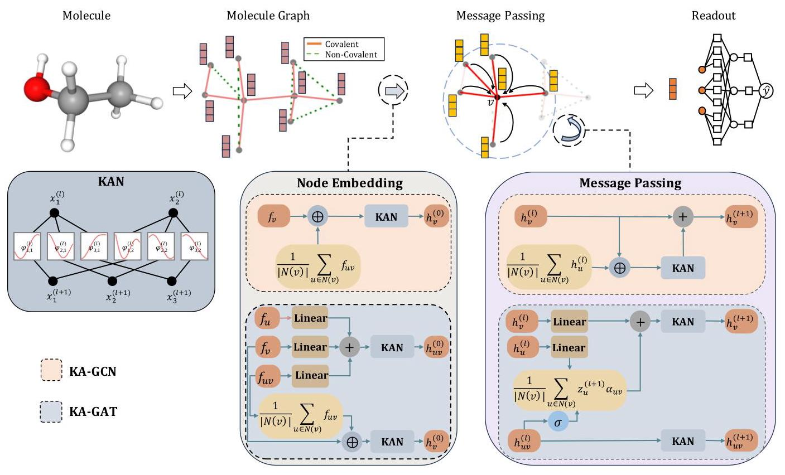
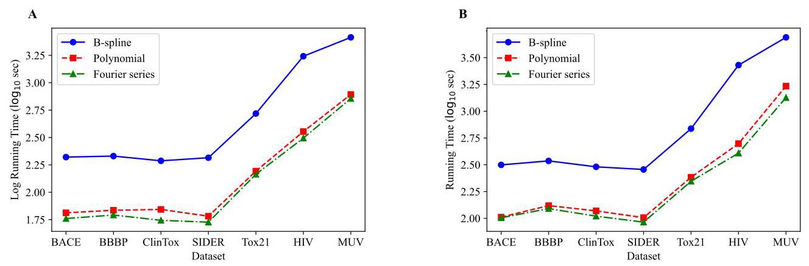
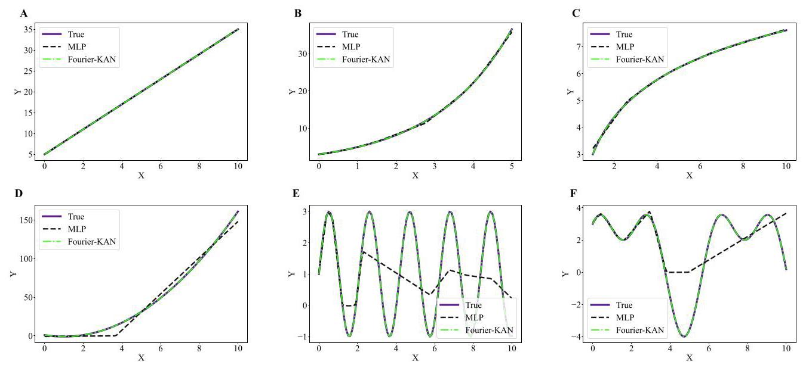

# KA-GNN: KOLMOGOROV-ARNOLD GRAPH NEURAL NETWORKS FOR MOLECULAR PROPERTY PREDICTION

# KA-GNN:用于分子性质预测的柯尔莫哥洛夫-阿诺德图神经网络

Longlong ${\mathrm{{Li}}}^{1,2,3}$ , Yipeng Zhang ${}^{3}$ , Guanghui Wang ${}^{1}$ , and Kelin Xia ${}^{3}$

很久很久以前，张逸鹏${\mathrm{{Li}}}^{1,2,3}$、王光辉${}^{3}$和夏克勤${}^{3}$，还有Longlong ${}^{1}$

${}^{1}$ School of Mathematics, Shandong University, Jinan 250100, China ${}^{2}$ Data Science Institute, Shandong University, Jinan 250100, China

${}^{1}$ 山东大学数学学院，中国济南250100 ${}^{2}$ 山东大学数据科学研究院，中国济南250100

${}^{3}$ Division of Mathematical Sciences, School of Physical and Mathematical Sciences, Nanyang Technological University, Singapore 637371, Singapore

${}^{3}$ 南洋理工大学物理与数学科学学院数学科学部，新加坡637371

Emails: longlee@mail.sdu.edu.cn, yipeng001@e.ntu.edu.sg, ghwang@sdu.edu.cn, xiakelin@ntu.edu.sg

邮箱:longlee@mail.sdu.edu.cn，yipeng001@e.ntu.edu.sg，ghwang@sdu.edu.cn，xiakelin@ntu.edu.sg

## ABSTRACT

## 摘要

As key models in geometric deep learning, graph neural networks have demonstrated enormous power in molecular data analysis. Recently, a specially-designed learning scheme, known as Kolmogorov-Arnold Network (KAN), shows unique potential for the improvement of model accuracy, efficiency, and explainability. Here we propose the first non-trivial Kolmogorov-Arnold Network-based Graph Neural Networks (KA-GNNs), including KAN-based graph convolutional networks(KA-GCN) and KAN-based graph attention network (KA-GAT). The essential idea is to utilizes KAN's unique power to optimize GNN architectures at three major levels, including node embedding, message passing, and readout. Further, with the strong approximation capability of Fourier series, we develop Fourier series-based KAN model and provide a rigorous mathematical prove of the robust approximation capability of this Fourier KAN architecture. To validate our KA-GNNs, we consider seven most-widely-used benchmark datasets for molecular property prediction and extensively compare with existing state-of-the-art models. It has been found that our KA-GNNs can outperform traditional GNN models. More importantly, our Fourier KAN module can not only increase the model accuracy but also reduce the computational time. This work not only highlights the great power of KA-GNNs in molecular property prediction but also provides a novel geometric deep learning framework for the general non-Euclidean data analysis.

作为几何深度学习中的关键模型，图神经网络在分子数据分析中展现出了巨大的威力。最近，一种专门设计的学习方案，即柯尔莫哥洛夫-阿诺德网络(KAN)，在提高模型准确性、效率和可解释性方面显示出独特的潜力。在此，我们提出了首个基于非平凡柯尔莫哥洛夫-阿诺德网络的图神经网络(KA-GNN)，包括基于KAN的图卷积网络(KA-GCN)和基于KAN的图注意力网络(KA-GAT)。其核心思想是利用KAN的独特能力在三个主要层面优化GNN架构，包括节点嵌入、消息传递和读出。此外，借助傅里叶级数强大的逼近能力，我们开发了基于傅里叶级数的KAN模型，并对该傅里叶KAN架构的鲁棒逼近能力给出了严格的数学证明。为验证我们的KA-GNN，我们考虑了七个最广泛使用的用于分子性质预测的基准数据集，并与现有的最先进模型进行了广泛比较。结果发现，我们的KA-GNN能够超越传统的GNN模型。更重要的是，我们的傅里叶KAN模块不仅可以提高模型准确性，还能减少计算时间。这项工作不仅突出了KA-GNN在分子性质预测中的强大能力，还为一般的非欧几里得数据分析提供了一个新颖的几何深度学习框架。

Keywords Kolmogorov-Arnold Network, Fourier series, Graph Neural Network, Molecular Property Prediction

关键词 柯尔莫哥洛夫-阿诺德网络，傅里叶级数，图神经网络，分子性质预测

## 1 Introduction

## 1 引言

Drug development is a complex and costly process, typically requiring decades of time and substantial investment [1]. In this challenging landscape, artificial intelligence (AI) has become particularly valuable, significantly impacting the prediction of molecular properties and showing immense promise in drug design [2, 3]. AI has greatly advanced virtual screening processes, potentially reducing the time and investment required [4, 5, 6]. AI-based molecular models, which drive these advancements, generally fall into two categories: those based on molecular descriptors and end-to-end deep learning models [7].

药物研发是一个复杂且成本高昂的过程，通常需要数十年时间和大量投资[1]。在这一充满挑战的领域中，人工智能(AI)变得尤为重要，对分子性质预测产生了重大影响，并在药物设计中展现出巨大潜力[2, 3]。AI极大地推动了虚拟筛选过程，有可能减少所需的时间和投资[4, 5, 6]。驱动这些进展的基于AI 的分子模型通常分为两类:基于分子描述符的模型和端到端深度学习模型[7]。

The first category relies on molecular descriptors or fingerprints as input features for machine learning algorithms. This process, known as featurization or feature engineering, involves not only capturing physical, chemical, and biological properties but also incorporating a wide array of fingerprints based on molecular structure information. Among these, structure-based fingerprints, particularly those derived from topological data analysis methods, have proven highly effective in molecular representation and featurization [8, 9, 10, 11]. The integration of these fingerprints with learning models has achieved significant success in various stages of drug design, including protein-ligand binding affinity prediction [12, 13], protein mutation analysis [14, 15], and drug design [16, 17], among other areas.

第一类模型依赖分子描述符或指纹作为机器学习算法的输入特征。这个过程，即特征化或特征工程，不仅涉及捕获物理、化学和生物学性质，还包括基于分子结构信息纳入各种各样的指纹。其中，基于结构的指纹，特别是那些源自拓扑数据分析方法的指纹，在分子表示和特征化方面已被证明非常有效[8, 9, 10, 11]。这些指纹与学习模型的结合在药物设计的各个阶段都取得了显著成功，包括蛋白质-配体结合亲和力预测[12, 13]、蛋白质突变分析[14, 15]以及药物设计[16, 17]等领域。

The second category includes end-to-end deep learning models that utilize various molecular representations such as Simplified Molecular Input Line Entry System (SMILES) strings, images, or molecular graphs, and deploy architectures like Transformers, Convolutional Neural Networks (CNNs), and Graph Neural Networks (GNNs) for prediction [18, 19, 20, 21, 22, 23]. Among these, molecular graphs based on covalent bonds are predominantly employed to describe molecular topology. Geometric deep learning models based on these molecular graphs, such as Graph Convolutional Networks (GCNs) [24], graph autoencoders [25], and graph transformers [26], have been extensively used in molecular data analysis and drug design. Additionally, recent research has demonstrated that molecular descriptors based on non-covalent interactions perform exceptionally well in predicting protein-ligand and protein-protein binding affinities [27]. These observations imply that new geometric molecular graph representations could surpass traditional covalent-bond-based graphs. By integrating these geometry-based molecular graphs into Geometric Deep Learning (GDL) models, it is possible to enhance model performance and deepen the understanding of molecular geometry [28].

第二类包括端到端深度学习模型，这些模型利用各种分子表示，如简化分子输入线性条目系统(SMILES)字符串、图像或分子图，并采用Transformer、卷积神经网络(CNN)和图神经网络(GNN)等架构进行预测[18, 19, 20, 21, 22, 23]。其中，基于共价键的分子图主要用于描述分子拓扑结构。基于这些分子图的几何深度学习模型，如图卷积网络(GCN)[24]、图自动编码器[25]和图Transformer[26]，已被广泛应用于分子数据分析和药物设计。此外，最近的研究表明，基于非共价相互作用的分子描述符在预测蛋白质-配体和蛋白质-蛋白质结合亲和力方面表现出色[27]。这些观察结果意味着新的几何分子图表示可能超越传统的基于共价键的图。通过将这些基于几何的分子图集成到几何深度学习(GDL)模型中，可以提高模型性能并加深对分子几何结构的理解[28]。

Figure 1: Overview of the KA-GNN model architecture. The flowchart illustrates the modified components within the GNN: node embedding, message-passing, pooling and prediction modules.

图1:KA-GNN模型架构概述。流程图展示了GNN中经过修改的组件:节点嵌入、消息传递、池化和预测模块。

Kolmogorov-Arnold Networks (KANs), which are based on the Kolmogorov-Arnold representation theorem, are increasingly recognized as a potent alternative to Multi-layer Perceptrons (MLPs). KANs distinguished by their unique architecture that employs different learnable activation functions, eliminate traditional linear weight matrices and enhance model accuracy and efficiency, particularly in solving partial differential equations, as described by Liu et al. [29]. Recent research highlights the versatility and adaptability of KANs across various domains [30,31,32,33]. One notable application is the integration of KANs with existing neural network models to enhance performance. For instance, Genet et al. [33] significantly improved multi-step time series forecasting by integrating KANs with Long Short-Term Memory networks (LSTMs). Cheon et al. [34] effectively classified remote sensing scenes by merging KANs with pre-trained Convolutional Neural Network (CNN) models. Kiamari et al. [35] demonstrated their multifunctionality by incorporating KANs into Graph Convolutional Networks (GCNs) for semi-supervised graph learning tasks. Furthermore, adaptations in the base functions of KANs to better suit neural network applications have led to significant enhancements. Bozorgasl et al. [36] improved the interpretability and performance of KANs by incorporating wavelet functions that more effectively capture the frequency components of data. Tashin et al. [37] employed KANs with Fourier transform basis functions for feature transformation before GNN processing, validating their utility in Small Molecule-Protein Interaction Predictions. Li et al. [38] used adaptive Radial Basis Functions (RBFs) in KANs to enhance feature updating and replace MLPs in the prediction phase, demonstrating robust integration capabilities with various neural network frameworks. Kashefi et al. [39] applied Jacobi polynomials to design KAN layers for GNNs, effectively predicting fluid fields on irregular geometries. These advancements underscore the significant potential of KANs to refine neural network architectures. The ongoing exploration of how to further enhance KANs and integrate it into node feature embedding, message passing in different GNN frameworks, and the prediction phase remains a vital area of research.

基于柯尔莫哥洛夫 - 阿诺德表示定理的柯尔莫哥洛夫 - 阿诺德网络(KANs)，越来越被认为是多层感知器(MLPs)的有力替代方案。KANs以其独特的架构为特征，采用不同的可学习激活函数，消除了传统的线性权重矩阵，并提高了模型的准确性和效率，特别是在求解偏微分方程方面，如Liu等人[29]所述。最近的研究强调了KANs在各个领域的通用性和适应性[30,31,32,33]。一个值得注意的应用是将KANs与现有的神经网络模型集成以提高性能。例如，Genet等人[33]通过将KANs与长短期记忆网络(LSTMs)集成，显著改进了多步时间序列预测。Cheon等人[34]通过将KANs与预训练的卷积神经网络(CNN)模型合并，有效地对遥感场景进行了分类。Kiamari等人[35]通过将KANs纳入图卷积网络(GCNs)用于半监督图学习任务，展示了它们的多功能性。此外，对KANs的基函数进行调整以更好地适应神经网络应用，带来了显著的提升。Bozorgasl等人[36]通过纳入能更有效地捕获数据频率成分的小波函数，提高了KANs的可解释性和性能。Tashin等人[37]在GNN处理之前，将具有傅里叶变换基函数的KANs用于特征变换，验证了它们在小分子 - 蛋白质相互作用预测中的效用。Li等人[38]在KANs中使用自适应径向基函数(RBFs)来增强特征更新，并在预测阶段取代MLPs，展示了与各种神经网络框架的强大集成能力。Kashefi等人[39]将雅可比多项式应用于为GNN设计KAN层，有效地预测了不规则几何形状上的流场。这些进展强调了KANs在优化神经网络架构方面的巨大潜力。如何进一步增强KANs并将其集成到节点特征嵌入、不同GNN框架中的消息传递以及预测阶段的持续探索，仍然是一个至关重要的研究领域。

In this paper, we introduce the first non-trivial Kolmogorov-Arnold Network-based Graph Neural Networks (KA-GNNs), including KAN-based convolutional networks (KA-GCN) and KAN-based graph attention network (KA-GAT). Figure 1 outlines the general KA-GNNs architecture. Different from all the previous trivial KAN-based GNN models, which only replace the MLP in the readout part with a standard KAN module, we utilizes KAN to optimize GNN architectures at three major levels, including node embedding, message passing, and readout. Further, a Fourier series-based KAN model has been developed and a rigorous theoretical prove of its robust approximation capability is given. Based on seven benchmark datasets, we have extensively validated our KA-GNNs and compared with state-of-the-art models. Our KA-GNNs have achieved both great accuracy and efficiency, providing a novel geometric deep learning framework for analyzing general non-Euclidean data.

在本文中，我们介绍了首个基于柯尔莫哥洛夫 - 阿诺德网络的非平凡图神经网络(KA-GNNs)，包括基于KAN的卷积网络(KA-GCN)和基于KAN的图注意力网络(KA-GAT)。图1概述了通用的KA-GNNs架构。与所有先前基于KAN的平凡GNN模型不同，那些模型仅用标准KAN模块替换读出部分的MLP，我们利用KAN在三个主要层面优化GNN架构，包括节点嵌入、消息传递和读出。此外，还开发了基于傅里叶级数的KAN模型，并给出了其强大逼近能力的严格理论证明。基于七个基准数据集，我们广泛验证了我们的KA-GNNs，并与当前的先进模型进行了比较。我们的KA-GNNs在准确性和效率方面都取得了很好的成绩，为分析一般非欧几里得数据提供了一个新颖的几何深度学习框架。

## 2 Results

## 第二章 结果

### 2.1 Kolmogorov-Arnold Network (KAN)

### 2.1柯尔莫哥洛夫 - 阿诺德网络(KAN)

Kolmogorov-Arnold Representation Theorem The Kolmogorov-Arnold Representation Theorem (or Superposition Theorem) is a milestone in the field of real analysis and approximation theory. It states that every multivariate continuous function can be represented as superposition of the addition of continuous functions of one variable. This theorem not only solves Hilbert's thirteenth problem itself but also generalizes it to a broader form.

柯尔莫哥洛夫 - 阿诺德表示定理 柯尔莫哥洛夫 - 阿诺德表示定理(或叠加定理)是实分析和逼近理论领域的一个里程碑。它指出，每个多元连续函数都可以表示为一元连续函数加法的叠加。这个定理不仅解决了希尔伯特第十三问题本身，还将其推广到了更广泛的形式。

Vladimir Arnold and Andrey Kolmogorov's works [40] prove that arbitrary multivariate continuous function $f$ can be written as a finite composition of continuous functions of a single variable and the binary operation of addition. More specifically,

弗拉基米尔·阿诺德和安德烈·柯尔莫哥洛夫的著作[40]证明，任意多元连续函数$f$可以写成一元连续函数和加法二元运算的有限组合。更具体地说，

$$
f\left( {{x}_{1},\ldots ,{x}_{n}}\right)  = \mathop{\sum }\limits_{{q = 0}}^{{{2n} + 1}}{\Phi }_{q}\left( {\mathop{\sum }\limits_{{p = 1}}^{n}{\phi }_{q, p}\left( {x}_{p}\right) }\right) , \tag{1}
$$

where $n$ denote the number of variables of the function $f.{\Phi }_{q} : \mathbb{R} \rightarrow  \mathbb{R}$ and ${\phi }_{q, p} : \left\lbrack  {0,1}\right\rbrack   \rightarrow  \mathbb{R}$ are continues function.

其中$n$表示函数$f.{\Phi }_{q} : \mathbb{R} \rightarrow  \mathbb{R}$的变量数量，${\phi }_{q, p} : \left\lbrack  {0,1}\right\rbrack   \rightarrow  \mathbb{R}$是连续函数。

#### 2.1.1 Kolmogorov-Arnold Network (KAN)

#### 2.1.1柯尔莫哥洛夫 - 阿诺德网络(KAN)

Inspired by the Kolmogorov-Arnold representation theorem, Liu et al. [29] proposed a new deep learning architecture called the Kolmogorov-Arnold Network (KAN) as a promising alternative to the Multi-Layer Perceptron (MLP). To enhance the KAN's representational capacity and leverage modern techniques (e.g., backpropagation) for training the networks, KAN transcends several limitations of the Kolmogorov-Arnold representation theorem:

受柯尔莫哥洛夫-阿诺德表示定理的启发，Liu等人[29]提出了一种名为柯尔莫哥洛夫-阿诺德网络(KAN)的新深度学习架构，作为多层感知器(MLP)的一种有前途的替代方案。为了增强KAN的表示能力并利用现代技术(例如反向传播)来训练网络，KAN超越了柯尔莫哥洛夫-阿诺德表示定理的几个局限性:

- KAN does not adhere to the original depth-2 width- $\left( {{2n} + 1}\right)$ representation; instead, it generalizes to arbitrary widths and depths. Specifically, let the activation values in layer $l$ be denoted by ${\mathbf{x}}^{\left( l\right) } \mathrel{\text{ := }} \left( {{x}_{1}^{\left( l\right) },{x}_{2}^{\left( l\right) },\cdots ,{x}_{{n}_{l}}^{\left( l\right) }}\right)$ , where ${n}_{l}$ is the width of layer $l$ . The activation value in layer $l + 1$ is then simply the sum of all incoming post-activations:

- KAN不遵循原始的深度为2宽度为$\left( {{2n} + 1}\right)$的表示；相反，它推广到任意宽度和深度。具体来说，设层$l$中的激活值用${\mathbf{x}}^{\left( l\right) } \mathrel{\text{ := }} \left( {{x}_{1}^{\left( l\right) },{x}_{2}^{\left( l\right) },\cdots ,{x}_{{n}_{l}}^{\left( l\right) }}\right)$表示，其中${n}_{l}$是层$l$的宽度。那么层$l + 1$中的激活值就是所有传入的激活后的值的总和:

$$
{x}_{j}^{\left( l + 1\right) } = \mathop{\sum }\limits_{{i = 1}}^{{n}_{l}}{\phi }_{j, i}^{\left( l\right) }\left( {x}_{i}^{\left( l\right) }\right) ,\;j = 1,\ldots ,{n}_{l + 1}. \tag{2}
$$

Here, ${\phi }_{j, i}^{\left( l\right) }$ for $i = 1,\ldots ,{n}_{l}$ and $j = 1,\ldots ,{n}_{l + 1}$ are the pre-activation functions in layer $l$ . The roles of these functions in KAN are analogous to the roles of the inner functions ${\phi }_{q, p}$ in equation 1

这里，层$l$中$i = 1,\ldots ,{n}_{l}$和$j = 1,\ldots ,{n}_{l + 1}$的${\phi }_{j, i}^{\left( l\right) }$是激活前的函数。这些函数在KAN中的作用类似于方程1中内函数${\phi }_{q, p}$的作用

- Although many constructive proofs of the Kolmogorov-Arnold representation theorem indicate that the inner functions ${\phi }_{q, p}$ in equation 1 are highly non-smooth [41,42], KAN opts for smooth functions as pre-activation functions ${\phi }_{j, i}^{\left( l\right) }$ to facilitate backpropagation. Liu et al. [29] selected functions based on B-splines.

- 尽管柯尔莫哥洛夫-阿诺德表示定理的许多构造性证明表明方程1中的内函数${\phi }_{q, p}$是高度非光滑的[41,42]，但KAN选择光滑函数作为激活前的函数${\phi }_{j, i}^{\left( l\right) }$以促进反向传播。Liu等人[29]基于B样条选择函数。

#### 2.1.2 Fourier-series KAN model

#### 2.1.2傅里叶级数KAN模型

To optimize the network and avoid complex calculations, we propose to utilize Fourier series as the pre-activation functions for KAN [37] as in Eq.(2):

为了优化网络并避免复杂计算，我们建议如式(2)所示，将傅里叶级数用作KAN的激活前函数[37]:

$$
{\phi }_{j, i}^{\left( l\right) }\left( x\right)  = \mathop{\sum }\limits_{{k = 1}}^{K}\left( {{A}_{k, j, i}^{\left( l\right) }\cos \left( {kx}\right)  + {B}_{k, j, i}^{\left( l\right) }\sin \left( {kx}\right) }\right) , \tag{3}
$$

where $K$ is the number of harmonics, and ${A}_{k, j, i}^{\left( l\right) }$ and ${B}_{k, j, i}^{\left( l\right) }$ are learnable parameters initially sampled from a normal distribution $\mathrm{N}\left( {0,\frac{1}{{n}_{l + 1} \times  K}}\right)$ .

其中$K$是谐波数量，${A}_{k, j, i}^{\left( l\right) }$和${B}_{k, j, i}^{\left( l\right) }$是最初从正态分布$\mathrm{N}\left( {0,\frac{1}{{n}_{l + 1} \times  K}}\right)$中采样的可学习参数。

Consequently, the activation value at the $j$ -th neuron in layer $l + 1$ can be obtained by,

因此，层$l + 1$中第$j$个神经元的激活值可以通过下式获得，

$$
{x}_{j}^{\left( l + 1\right) } = \mathop{\sum }\limits_{{i = 1}}^{{n}_{l}}\mathop{\sum }\limits_{{k = 1}}^{K}\left( {{A}_{k, j, i}^{\left( l\right) }\cos \left( {k{x}_{i}^{\left( l\right) }}\right)  + {B}_{k, j, i}^{\left( l\right) }\sin \left( {k{x}_{i}^{\left( l\right) }}\right) }\right) , \tag{4}
$$

where ${\mathbf{x}}^{\left( l\right) } = \left( {{x}_{1}^{\left( l\right) },{x}_{2}^{\left( l\right) },\ldots ,{x}_{{n}_{l}}^{\left( l\right) }}\right)$ denotes the input vector of activation values in layer $l$ of the KAN, and ${\mathbf{x}}^{\left( l + 1\right) } = \; \left( {{x}_{1}^{\left( l + 1\right) },{x}_{2}^{\left( l + 1\right) },\ldots ,{x}_{{n}_{l + 1}}^{\left( l + 1\right) }}\right)$ represents the output vector. Eq (4) can be concisely expressed as: ${\mathbf{x}}^{\left( l + 1\right) } = {\operatorname{KAN}}_{l}\left( {\mathbf{x}}^{\left( l\right) }\right)$ , where ${\operatorname{KAN}}_{l}\left( \cdot \right)$ denotes the above KAN function in layer $l$ . This network is integrated into a graph neural network, culminating in a novel architecture named KA-GNNs, which is employed for molecular property prediction tasks.

其中${\mathbf{x}}^{\left( l\right) } = \left( {{x}_{1}^{\left( l\right) },{x}_{2}^{\left( l\right) },\ldots ,{x}_{{n}_{l}}^{\left( l\right) }}\right)$表示KAN层$l$中激活值的输入向量，${\mathbf{x}}^{\left( l + 1\right) } = \; \left( {{x}_{1}^{\left( l + 1\right) },{x}_{2}^{\left( l + 1\right) },\ldots ,{x}_{{n}_{l + 1}}^{\left( l + 1\right) }}\right)$表示输出向量。式(4)可以简洁地表示为:${\mathbf{x}}^{\left( l + 1\right) } = {\operatorname{KAN}}_{l}\left( {\mathbf{x}}^{\left( l\right) }\right)$，其中${\operatorname{KAN}}_{l}\left( \cdot \right)$表示层$l$中的上述KAN函数。该网络被集成到图神经网络中，最终形成一种名为KA-GNNs的新颖架构，用于分子性质预测任务。

Given that the inner functions in Eq (1) of the Kolmogorov-Arnold representation theorem can exhibit significant non-smoothness, we do not use this theorem as the foundational theory for showing the approximation capability of our model. Instead, we base our approach on the extension of Carleson's theorem [43] regarding the convergence of Fourier series for multivariable functions, as proved by Fefferman in [44]:

鉴于柯尔莫哥洛夫 - 阿诺德表示定理(Kolmogorov - Arnold representation theorem)中方程 (1) 的内函数可能表现出显著的非光滑性，我们不将此定理用作展示我们模型逼近能力的基础理论。相反，我们的方法基于卡尔森定理(Carleson's theorem)[43] 的扩展，该扩展涉及多变量函数傅里叶级数的收敛性，正如费弗曼(Fefferman)在 [44] 中所证明的:

Theorem 1 Let ${\mathbf{Z}}^{n}$ denote the $n$ -dimensional integer lattice, and let ${Z}_{N}^{n} = \{ 1,2,\ldots , N{\} }^{n} \subset  {\mathbf{Z}}^{n}$ . Then for the function $f \in  {L}^{2}\left( {\left\lbrack  0,2\pi \right\rbrack  }^{n}\right)$ and its Fourier expansion:

定理1 设${\mathbf{Z}}^{n}$表示$n$维整数格，且设${Z}_{N}^{n} = \{ 1,2,\ldots , N{\} }^{n} \subset  {\mathbf{Z}}^{n}$。那么对于函数$f \in  {L}^{2}\left( {\left\lbrack  0,2\pi \right\rbrack  }^{n}\right)$及其傅里叶展开式:

$$
f\left( \overrightarrow{\mathbf{x}}\right)  \sim  \mathop{\sum }\limits_{{\overrightarrow{\mathbf{k}} \in  {\mathbf{Z}}^{n}}}\left( {{a}_{\overrightarrow{\mathbf{k}}}\cos \left( {\overrightarrow{\mathbf{k}} \cdot  \overrightarrow{\mathbf{x}}}\right)  + {b}_{\overrightarrow{\mathbf{k}}}\sin \left( {\overrightarrow{\mathbf{k}} \cdot  \overrightarrow{\mathbf{x}}}\right) }\right) ,
$$

where $x \in  {\left\lbrack  0,2\pi \right\rbrack  }^{n}$ and ${L}^{2}\left( {\left\lbrack  0,2\pi \right\rbrack  }^{n}\right)$ denotes the space of square-integrable functions on ${\left\lbrack  0,2\pi \right\rbrack  }^{n}$ , which consists of all functions $f$ such that ${\int }_{{\left\lbrack  0,2\pi \right\rbrack  }^{n}}{\left| f\left( \overrightarrow{\mathbf{x}}\right) \right| }^{2}d\overrightarrow{\mathbf{x}} < \infty$ . We have

其中$x \in  {\left\lbrack  0,2\pi \right\rbrack  }^{n}$和${L}^{2}\left( {\left\lbrack  0,2\pi \right\rbrack  }^{n}\right)$表示${\left\lbrack  0,2\pi \right\rbrack  }^{n}$上平方可积函数的空间，它由所有满足${\int }_{{\left\lbrack  0,2\pi \right\rbrack  }^{n}}{\left| f\left( \overrightarrow{\mathbf{x}}\right) \right| }^{2}d\overrightarrow{\mathbf{x}} < \infty$的函数$f$组成。我们有

$$
f\left( \overrightarrow{\mathbf{x}}\right)  = \mathop{\lim }\limits_{{N \rightarrow  \infty }}\mathop{\sum }\limits_{{\overrightarrow{\mathbf{k}} \in  {Z}_{N}^{n}}}\left( {{a}_{\overrightarrow{\mathbf{k}}}\cos \left( {\overrightarrow{\mathbf{k}} \cdot  \overrightarrow{\mathbf{x}}}\right)  + {b}_{\overrightarrow{\mathbf{k}}}\sin \left( {\overrightarrow{\mathbf{k}} \cdot  \overrightarrow{\mathbf{x}}}\right) }\right)
$$

almost everywhere.

几乎处处成立。

The above theorem demonstrates the strong approximation capability of Fourier series, which is why we adopt Fourier series as the foundational basis for our model. Therefore, we retain the architecture of the Kolmogorov-Arnold network but replace the pre-activation functions with Fourier series. We can further prove that this new KAN architecture provides the potential of robust approximation capability:

上述定理展示了傅里叶级数强大的逼近能力，这就是我们采用傅里叶级数作为模型基础的原因。因此，我们保留了柯尔莫哥洛夫 - 阿诺德网络(Kolmogorov - Arnold network)的架构，但用傅里叶级数替换了预激活函数。我们可以进一步证明，这种新的KAN架构具有强大的逼近能力潜力:

Theorem 2 Let $f \in  {L}^{2}\left( {\left\lbrack  0,2\pi \right\rbrack  }^{n}\right)$ be a square-integrable function. For almost every $\overrightarrow{x} \in  {\left\lbrack  0,2\pi \right\rbrack  }^{n}$ and for any $\epsilon  > 0$ , there exist a positive integer $K$ and a sequence of Fourier-based KAN functions ${\mathrm{{KAN}}}_{l}$ at multiple layers $l = 0,1,\ldots , L$ , such that the number of harmonics in the pre-activation functions of these KAN functions does not exceed $K$ , and

定理2 设$f \in  {L}^{2}\left( {\left\lbrack  0,2\pi \right\rbrack  }^{n}\right)$是一个平方可积函数。对于几乎所有的$\overrightarrow{x} \in  {\left\lbrack  0,2\pi \right\rbrack  }^{n}$以及任意的$\epsilon  > 0$，存在一个正整数$K$和一系列基于傅里叶的多层$l = 0,1,\ldots , L$的KAN函数${\mathrm{{KAN}}}_{l}$，使得这些KAN函数的预激活函数中的谐波数量不超过$K$，并且

$$
\left| {f\left( \overrightarrow{x}\right)  - {\mathrm{{KAN}}}_{L} \circ  {\mathrm{{KAN}}}_{L - 1} \circ  \cdots  \circ  {\mathrm{{KAN}}}_{0}\left( \overrightarrow{x}\right) }\right|  < \epsilon ,
$$

where $\circ$ denotes function composition.

其中$\circ$表示函数复合。

In summary, our model extends the Kolmogorov-Arnold Network (KAN) architecture by incorporating Fourier series as pre-activation functions to enhance approximation capability.

总之，我们的模型通过纳入傅里叶级数作为预激活函数来扩展柯尔莫哥洛夫 - 阿诺德网络(KAN)架构，以增强逼近能力。

### 2.2 Kolmogorov-Arnold Network-based Graph Neural Network Models

### 2.2基于柯尔莫哥洛夫 - 阿诺德网络的图神经网络模型

In our KA-GNN models, a molecule is represented as a graph $G = \left( {V, E}\right)$ , where $V$ denotes the set of nodes and $E$ denotes the set of edges. Each node represents an atom and an edge is formed among any two atoms if their distance is within a cutoff distance (in our model, we use cutoff distance as 5 Å). Figure 1 A illustrates the complex interactions within the molecule, highlighting both the covalent bonds (solid lines) and non-covalent cut-off bonds (dashed lines) with distances less than 5 angstroms are considered in our KA-GNN model. Our atomic features—comprising atomic number, radius, and electronegativity—are derived using Rdkit, following the approach in CGCNN [45] and PCNN [46]. Each node $v \in  V$ is associated with a feature vector ${f}_{v}$ , which is a 92-dimensional vector composed of one-hot encoded representations of atomic properties, following the approach described in [45]. Similarly, each edge ${uv} \in  E$ is associated with a feature vector ${f}_{uv}$ , which is a 21-dimensional vector incorporating both chemical and geometrical information of the bond ${uv}$ . The edges in our model can be classified into two types, i.e., covalent bonds and non-covalent bonds, with different initial features. Detailed descriptions of the feature vectors are provided in Table [1]

在我们的KA-GNN模型中，分子被表示为一个图$G = \left( {V, E}\right)$，其中$V$表示节点集，$E$表示边集。每个节点代表一个原子，如果任意两个原子之间的距离在截止距离内(在我们的模型中，我们使用的截止距离为5埃)，则它们之间会形成一条边。图1A展示了分子内部的复杂相互作用，突出显示了我们的KA-GNN模型中考虑的共价键(实线)和距离小于5埃的非共价截止键(虚线)。我们的原子特征——包括原子序数、半径和电负性——是使用Rdkit按照CGCNN [45]和PCNN [46]中的方法推导出来的。每个节点$v \in  V$与一个特征向量${f}_{v}$相关联，该特征向量是一个92维向量，由原子属性的独热编码表示组成，遵循[45]中描述的方法。同样，每条边${uv} \in  E$与一个特征向量${f}_{uv}$相关联，该特征向量是一个21维向量，包含键${uv}$的化学和几何信息。我们模型中的边可以分为两种类型，即共价键和非共价键，具有不同的初始特征。特征向量的详细描述在表[1]中给出。

Table 1: Features Type and Description in KA-GNN models. Here we list both atom, covalent bond, and non-covalent bond features.

表1:KA-GNN模型中的特征类型和描述。这里我们列出了原子、共价键和非共价键的特征。

<table><tr><td colspan="2">Features Type</td><td>Description</td><td>Type</td><td>Size</td></tr><tr><td>Atom</td><td>CGCNN</td><td>Atomic number, Radius, and electronegativity</td><td>One-Hot</td><td>92</td></tr><tr><td rowspan="4">Covalent Bond</td><td>Bond Directionality</td><td>None, Beginwedge, Begindash, etc.</td><td>One-Hot</td><td>7</td></tr><tr><td>Bond Type</td><td>Single, Double, Triple, or Aromatic.</td><td>One-Hot</td><td>4</td></tr><tr><td>Bond Length</td><td>Numerical and square length of the bond.</td><td>Float</td><td>2</td></tr><tr><td>In Ring</td><td>Indicates if the bond is part of a chemical ring.</td><td>One-Hot</td><td>2</td></tr><tr><td rowspan="2">Non-Covalent Bond</td><td>Atom charges</td><td>Atoms charges in Molecular $\left( {{q}_{i},{q}_{j},{q}_{i} \cdot  {q}_{j}}\right)$</td><td>Float</td><td>3</td></tr><tr><td>Distance between atoms</td><td>Distance between atoms $\left( {\frac{1}{{d}_{ij}},\frac{1}{{d}_{ij}^{6}},\frac{1}{{d}_{ij}^{12}}}\right)$</td><td>Float</td><td>3</td></tr></table>

#### 2.2.1 KA-GCN Model

#### 2.2.1 KA-GCN模型

Our KA-GCN architecture has three major steps, including node embedding, message-passing, and readout. First, one KAN layer is employed in the initialization of node embeddings ${h}_{v}^{\left( 0\right) }, v \in  V$ as follows,

我们的KA-GCN架构有三个主要步骤，包括节点嵌入、消息传递和读出。首先，在节点嵌入${h}_{v}^{\left( 0\right) }, v \in  V$的初始化中使用一个KAN层，如下所示:

$$
{h}_{v}^{\left( 0\right) } \mathrel{\text{ := }} \operatorname{KAN}\left( {{f}_{v} \oplus  \left( {\frac{1}{\left| N\left( v\right) \right| }\mathop{\sum }\limits_{{u \in  N\left( v\right) }}{f}_{uv}}\right) }\right) , \tag{5}
$$

where $N\left( v\right)$ represents the set of the neighboring nodes of node $v$ (excluding $v$ itself), $\left| {N\left( v\right) }\right|$ is the number of neighboring nodes, and $\oplus$ represents vector concatenation.

其中$N\left( v\right)$表示节点$v$的相邻节点集(不包括$v$本身)，$\left| {N\left( v\right) }\right|$是相邻节点的数量，$\oplus$表示向量连接。

Second, one or several KAN layers are employed in the message passing module. At the layer $l$ , the KAN-based message passing module can be expressed as,

其次，在消息传递模块中使用一个或多个KAN层。在层$l$，基于KAN的消息传递模块可以表示为:

$$
{h}_{v}^{\left( l + 1\right) } \mathrel{\text{ := }} {h}_{v}^{\left( l\right) } + \operatorname{KAN}\left( {{h}_{v}^{\left( l\right) } \oplus  \left( {\frac{1}{\left| N\left( v\right) \right| }\mathop{\sum }\limits_{{u \in  N\left( v\right) }}{h}_{u}^{\left( l\right) }}\right) }\right) . \tag{6}
$$

Computationally, the first KAN layer maps initial feature vector ${f}_{v}$ from dimension 113 to updated feature vector ${h}_{v}$ with dimension 64. After that, the feature dimension will stay the same in the later message-passing process.

在计算上，第一个KAN层将初始特征向量${f}_{v}$从113维映射到64维的更新特征向量${h}_{v}$。之后，在后续的消息传递过程中特征维度将保持不变。

Third, one or several KAN layers are employed in the readout module. After $L$ -th the message passing phases, we apply average pooling across all node features to obtain a latent vector for the molecular graph $G$ . An one-layer or two-layer KAN model is employed in readout module for the final prediction as follows,

第三，在读出模块中使用一个或多个KAN层。在第$L$次消息传递阶段之后，我们对所有节点特征应用平均池化以获得分子图$G$的潜在向量。读出模块中使用一个一层或两层的KAN模型进行最终预测，如下所示:

$$
\widehat{y} \mathrel{\text{ := }} \operatorname{KAN}\left( {\frac{1}{\left| V\right| }\mathop{\sum }\limits_{{v \in  V}}{h}_{v}^{\left( L\right) }}\right) \text{ or, }\widehat{y} \mathrel{\text{ := }} \operatorname{KAN}\left( {\operatorname{KAN}\left( {\frac{1}{\left| V\right| }\mathop{\sum }\limits_{{v \in  V}}{h}_{v}^{\left( L\right) }}\right) }\right)
$$

The cross-entropy is used as the loss function as follows,

交叉熵用作损失函数，如下所示:

$$
\mathcal{L} \mathrel{\text{ := }}  - \mathop{\sum }\limits_{i}\left( {{y}_{i}\log \left( {\widehat{y}}_{i}\right)  + \left( {1 - {y}_{i}}\right) \log \left( {1 - {\widehat{y}}_{i}}\right) }\right) ,
$$

where ${y}_{i}$ denotes the actual label, and ${\widehat{y}}_{i}$ denotes the predicted label.

其中${y}_{i}$表示实际标签，${\widehat{y}}_{i}$表示预测标签。

#### 2.2.2 KA-GAT Model

#### 2.2.2 KA-GAT模型

Similar to the KA-GCN architecture, the KA-GAT model initializes the node and edge embeddings, ${h}_{v}^{\left( 0\right) }$ and ${h}_{uv}^{\left( 0\right) }$ , using a KAN layer as follows:

与KA-GCN架构类似，KA-GAT模型使用一个KAN层初始化节点和边嵌入${h}_{v}^{\left( 0\right) }$和${h}_{uv}^{\left( 0\right) }$，如下所示:

$$
{h}_{v}^{\left( 0\right) } \mathrel{\text{ := }} \operatorname{KAN}\left( {{f}_{v} \oplus  \left( {\frac{1}{\left| N\left( v\right) \right| }\mathop{\sum }\limits_{{u \in  N\left( v\right) }}{f}_{uv}}\right) }\right) , \tag{7}
$$

$$
{h}_{uv}^{\left( 0\right) } \mathrel{\text{ := }} \operatorname{KAN}\left( {\operatorname{Linear}\left( {f}_{v}\right)  + \operatorname{Linear}\left( {f}_{uv}\right)  + \operatorname{Linear}\left( {f}_{u}\right) }\right)
$$

Subsequently, the KA-GAT model uses these initial embeddings to compute attention scores that guide the aggregation of messages:

随后，KA-GAT模型使用这些初始嵌入来计算引导消息聚合的注意力分数:

$$
{z}_{v}^{\left( l + 1\right) } \mathrel{\text{ := }} \operatorname{Linear}\left( {h}_{v}^{\left( l\right) }\right) ,{z}_{u}^{\left( l + 1\right) } \mathrel{\text{ := }} \operatorname{Linear}\left( {h}_{u}^{\left( l\right) }\right) ,
$$

$$
{\alpha }_{uv} \mathrel{\text{ := }} \operatorname{Softmax}\left( {h}_{uv}^{\left( l\right) }\right) ,{m}_{uv}^{\left( l + 1\right) } \mathrel{\text{ := }} {z}_{u}^{\left( l + 1\right) } \cdot  {\alpha }_{uv} \tag{8}
$$

$$
{m}_{v}^{\left( l + 1\right) } \mathrel{\text{ := }} {z}_{v}^{\left( l + 1\right) } + \frac{1}{\left| N\left( v\right) \right| }\left( {\mathop{\sum }\limits_{{u \in  N\left( v\right) }}{m}_{uv}^{\left( l + 1\right) }}\right)
$$

Then, one or more KAN layers are used to update the node and edge features:

然后，使用一个或多个KAN层来更新节点和边特征:

$$
{h}_{v}^{\left( l + 1\right) } \mathrel{\text{ := }} \operatorname{KAN}\left( {m}_{v}^{\left( l + 1\right) }\right) ,\;{h}_{uv}^{\left( l + 1\right) } \mathrel{\text{ := }} \operatorname{KAN}\left( {h}_{uv}^{\left( l\right) }\right) \tag{9}
$$

Finally, after message passing, the KA-GAT model employs the same readout module as used in the KA-GCN.

最后，在消息传递之后，KA-GAT模型使用与KA-GCN中相同的读出模块。

### 2.3 KA-GNNs for Molecular Property Analysis

### 2.3用于分子性质分析的KA-GNN

#### 2.3.1 Performance and comparison of KA-GNNs

#### 2.3.1 KA-GNNs的性能与比较

To evaluate the performance of our proposed KA-GNN models, we consider seven widely-used benchmark datasets from MoleculeNet [47]. Of these, three datasets—MUV, HIV, and BACE—are from the biophysics domain. The rest four datasets are from the physiology domain, including BBBP, Tox21, SIDER, and ClinTox.

为了评估我们提出的KA-GNN模型的性能，我们考虑了来自MoleculeNet [47]的七个广泛使用的基准数据集。其中，三个数据集——MUV、HIV和BACE——来自生物物理领域。其余四个数据集来自生理领域，包括BBBP、Tox21、SIDER和ClinTox。

In our comparative analysis across seven datasets, we evaluated a range of geometric deep learning models, including AttentiveFP [48], D-MPNN [49], Mol-GDL [28], N-Gram [50], PretrainGNN [51], GROVER [26], GraphMVP [52], MolCLR [53], GEM [54], Uni-mol [55], SMPT [56], and GNN-SKAN [38]. Additionally, we included our KAN-based GNN models, such as the GNN-SKAN [38]. Further details on these models can be found in Subsection Baseline Models

在我们对七个数据集的比较分析中，我们评估了一系列几何深度学习模型，包括AttentiveFP [48]、D-MPNN [49]、Mol-GDL [28]、N-Gram [50]、PretrainGNN [51]、GROVER [26]、GraphMVP [52]、MolCLR [53]、GEM [54]、Uni-mol [55]、SMPT [56]和GNN-SKAN [38]。此外，我们还纳入了基于KAN的GNN模型，如GNN-SKAN [38]。这些模型的更多详细信息可在“基线模型”小节中找到。

The comparative results in Table 2 further confirm the superiority of the KA-GNNs model. Our model achieves state-of-the-art performance across all benchmark datasets, particularly excelling on complex and challenging datasets such as ClinTox and MUV. These results demonstrate the robust capability of our model in handling molecular data. Notably, in the BBBP dataset, the AUC for KA-GCN and KA-GAT showed improvements of approximately 7.95% and 7.68%.

表2中的比较结果进一步证实了KA-GNNs模型的优越性。我们的模型在所有基准数据集上都取得了领先的性能，特别是在ClinTox和MUV等复杂且具有挑战性的数据集上表现出色。这些结果证明了我们的模型在处理分子数据方面的强大能力。值得注意的是，在BBBP数据集中，KA-GCN和KA-GAT的AUC分别提高了约7.95%和7.68%。

#### 2.3.2 Importance of Fourier series for KA-GNNs

#### 2.3.2 傅里叶级数对KA-GNNs的重要性

In this research, we employed a Fourier-based Kolmogorov-Arnold Network (KAN) as the primary computational mechanism within our GNN architecture, which differs significantly from traditional MLP-based approaches. To assess the impact of different base functions on the prediction of molecular properties, we explored several base function including B-spline, polynomial, Fourier-series, in the KA-GCNs architecture. These models were tested within the traditional GCN framework as well as the GAT framework. The comparative results are summarized in Table 3 The Polynomial-base function can be expressed in Eq (10).

在本研究中，我们采用基于傅里叶的柯尔莫哥洛夫 - 阿诺德网络(KAN)作为我们GNN架构中的主要计算机制，这与传统的基于MLP的方法有显著不同。为了评估不同基函数对分子性质预测的影响，我们在KA-GCNs架构中探索了几种基函数，包括B样条、多项式、傅里叶级数。这些模型在传统的GCN框架以及GAT框架中进行了测试。比较结果总结在表3中。多项式基函数可以用式(10)表示。

$$
{x}_{j}^{\left( l + 1\right) } = \mathop{\sum }\limits_{{i = 1}}^{{n}_{l}}\mathop{\sum }\limits_{{k = 1}}^{K}\left( {{C}_{k, j, i}^{\left( l\right) }{\left( {x}_{i}^{\left( l\right) }\right) }^{k}}\right) , \tag{10}
$$

where, ${C}_{k, j, i}^{\left( l\right) }$ is learnable parameters initially sampled from a normal distribution $\mathcal{N}\left( {0,\frac{1}{{n}_{l + 1} \times  K}}\right) .\;{\mathbf{x}}^{\left( l\right) } = \; \left( {{x}_{1}^{\left( l\right) },{x}_{2}^{\left( l\right) },\ldots ,{x}_{{n}_{l}}^{\left( l\right) }}\right)$ denotes the input vector of activation values in layer $l$ of the Polynomial-series based KAN.

其中，${C}_{k, j, i}^{\left( l\right) }$是最初从正态分布中采样的可学习参数，$\mathcal{N}\left( {0,\frac{1}{{n}_{l + 1} \times  K}}\right) .\;{\mathbf{x}}^{\left( l\right) } = \; \left( {{x}_{1}^{\left( l\right) },{x}_{2}^{\left( l\right) },\ldots ,{x}_{{n}_{l}}^{\left( l\right) }}\right)$表示基于多项式序列的KAN的第$l$层中激活值的输入向量。

Table 2: Comparison of KA-GNNs with state-of-the-art geometric deep learning models in different molecular property datasets. The performance metric is the average of Receiver Operating Characteristic - Area Under the Curve (ROC-AUC). The standard deviation results are denoted as subscripts. The best model for each category is highlighted in bold, while the second-best performance is marked with underline. The notation - indicates that the results were not reported.

表2:KA-GNNs与不同分子性质数据集中的领先几何深度学习模型的比较。性能指标是接收者操作特征曲线下面积(ROC-AUC)的平均值。标准差结果用下标表示。每个类别的最佳模型用粗体突出显示，第二好的性能用下划线标记。符号“-”表示未报告结果。

<table><tr><td>Model</td><td>BACE</td><td>BBBP</td><td>ClinTox</td><td>SIDER</td><td>Tox21</td><td>HIV</td><td>MUV</td></tr><tr><td>No. molecules</td><td>1513</td><td>2039</td><td>1478</td><td>1427</td><td>7831</td><td>41127</td><td>93808</td></tr><tr><td>No. avg atoms</td><td>65</td><td>46</td><td>50.58</td><td>65</td><td>36</td><td>46</td><td>43</td></tr><tr><td>No. tasks</td><td>1</td><td>1</td><td>2</td><td>27</td><td>12</td><td>1</td><td>17</td></tr><tr><td>D-MPNN 49</td><td>0.809</td><td>0.710</td><td>0.906 (0.007)</td><td>${0.570}_{\left( {0.007}\right) }$</td><td>0.759(0.007)</td><td>0.771(0.005)</td><td>0.786 ${}_{\left( {0.014}\right) }$</td></tr><tr><td>AttentiveFP 48</td><td>0.784 ${}_{\left( {0.022}\right) }$ )</td><td>0.663 (0.018)</td><td>0.847 (0.003)</td><td>${0.606}_{\left( {0.032}\right) }$</td><td>${0.781}_{\left( {0.005}\right) }$</td><td>0.757(0.014)</td><td>0.786 ${}_{\left( {0.015}\right) }$</td></tr><tr><td>N-GramRF [50]</td><td>0.779 ${}_{\left( {0.015}\right) }$</td><td>0.697 (0.006)</td><td>0.775 (0.040)</td><td>${0.668}_{\left( {0.007}\right) }$</td><td>0.743 ${}_{\left( {0.009}\right) }$</td><td>0.772 ${}_{\left( {0.004}\right) }$</td><td>0.769 ${}_{\left( {0.002}\right) }$ )</td></tr><tr><td>N-GramXGB |50</td><td>0.791 ${}_{\left( {0.013}\right) }$</td><td>0.691 (0.008)</td><td>0.875 (0.027)</td><td>${0.655}_{\left( {0.007}\right) }$</td><td>0.758 $\left( {0.009}\right)$</td><td>0.787 ${}_{\left( {0.004}\right) }$</td><td>0.748 ${}_{\left( {0.002}\right) }$ )</td></tr><tr><td>PretrainGNN [51]</td><td>0.845 ${}_{\left( {0.007}\right) }$</td><td>0.687 ${}_{\left( {0.013}\right) }$</td><td>0.726 (0.015)</td><td>${0.627}_{\left( {0.008}\right) }$</td><td>0.781 ${}_{\left( {0.006}\right) }$</td><td>0.799 ${}_{\left( {0.007}\right) }$</td><td>0.813 ${}_{\left( {0.021}\right) }$</td></tr><tr><td>GROVE_base 26</td><td>0.821 (0.007)</td><td>0.700 ${}_{\left( {0.001}\right) }$</td><td>0.812 (0.030)</td><td>${0.648}_{\left( {0.006}\right) }$</td><td>0.743 ${}_{\left( {0.001}\right) }$</td><td>0.625 ${}_{\left( {0.009}\right) }$ )</td><td>0.673</td></tr><tr><td>GROVE_large 26</td><td>0.810 (0.014)</td><td>0.695 (0.001)</td><td>0.762 (0.037)</td><td>${0.654}_{\left( {0.001}\right) }$</td><td>0.735 (0.001)</td><td>0.682 ${}_{\left( {0.011}\right) }$</td><td>0.673 ${}_{\left( {0.018}\right) }$</td></tr><tr><td>GraphMVP 52</td><td>0.812 (0.009)</td><td>0.724 (0.016)</td><td>0.791 (0.028)</td><td>0.639 (0.012)</td><td>0.759 (0.005)</td><td>0.770 (0.012)</td><td>0.777 (0.006)</td></tr><tr><td>MolCLR [53]</td><td>0.824 (0.009)</td><td>0.722 (0.021)</td><td>0.912 (0.035)</td><td>0.589 (0.014)</td><td>0.750 (0.002)</td><td>0.781 $\left( {0.005}\right)$</td><td>0.796 (0.019)</td></tr><tr><td>GEM [54]</td><td>0.856 (0.011)</td><td>0.724 (0.004)</td><td>0.901 (0.013)</td><td>0.672 (0.004)</td><td>0.781 (0.001)</td><td>0.806</td><td>0.817 (0.005)</td></tr><tr><td>Mol-GDL 28</td><td>0.863 (0.019)</td><td>0.728 ${}_{\left( {0.019}\right) }$</td><td>0.966 (0.002)</td><td>0.831 (0.002)</td><td>0.794 ${}_{\left( {0.005}\right) }$</td><td>0.808</td><td>0.675 (0.014)</td></tr><tr><td>Uni-mol 55</td><td>0.857 (0.002)</td><td>0.729 (0.006)</td><td>0.919 (0.018)</td><td>0.659 (0.013)</td><td>0.796 (0.005)</td><td>0.808 (0.003)</td><td>0.821 (0.013)</td></tr><tr><td>SMPT 56</td><td>0.873 (0.015)</td><td>0.734 (0.003)</td><td>0.927 (0.002)</td><td>0.676 (0.050)</td><td>0.797 (0.001)</td><td>0.812 (0.001)</td><td>0.822 (0.008)</td></tr><tr><td>GNN-SKAN 38</td><td>0.747 (0.009)</td><td>0.676 (0.014)</td><td>-</td><td>0.614(0.005)</td><td>0.747 (0.005)</td><td>0.786 (0.015)</td><td>-</td></tr><tr><td>KA-GCN</td><td>0.890 (0.014)</td><td>0.787 (0.014)</td><td>0.989</td><td>0.842 $\left( {0.001}\right)$</td><td>0.799 (0.005)</td><td>0.821 (0.005)</td><td>${\mathbf{{0.834}}}_{\left( {0.009}\right) }$</td></tr><tr><td>KA-GAT</td><td>0.884</td><td>0.785 (0.021)</td><td>${\mathbf{{0.991}}}_{\left( {0.005}\right) }$</td><td>$\mathbf{{0.847}}\left( {0.002}\right)$</td><td>${\mathbf{{0.800}}}_{\left( {0.006}\right) }$</td><td>${\mathbf{{0.823}}}_{\left( {0.002}\right) }$</td><td>${\underline{0.834}}_{\left( {0.010}\right) }$</td></tr></table>

Table 3: Comparison of the performance of KA-GNN (and KA-GAT) models with three types of base functions, including B-spline, polynomial, and Fourier series.

表3:KA-GNN(和KA-GAT)模型与三种基函数(包括B样条、多项式和傅里叶级数)的性能比较。

<table><tr><td rowspan="2">Dataset</td><td colspan="3">KA-GCN Models</td><td colspan="3">KA-GAT Models</td></tr><tr><td>B-spline</td><td>Polynomial</td><td>Fourier series</td><td>B-spline</td><td>Polynomial</td><td>Fourier series</td></tr><tr><td>BACE</td><td>0.771 (0.012)</td><td>0.853 $\left( {0.027}\right)$</td><td>0.890 (0.014)</td><td>${0.808}_{\left( {0.009}\right) }$</td><td>0.8319 ${}_{\left( {0.007}\right) }$</td><td>${0.884}_{\left( {0.004}\right) }$</td></tr><tr><td>BBBP</td><td>0.723 (0.008)</td><td>0.654</td><td>0.787 (0.014)</td><td>${0.657}_{\left( {0.004}\right) }$</td><td>0.708 ${}_{\left( {0.005}\right) }$</td><td>${0.785}_{\left( {0.021}\right) }$</td></tr><tr><td>ChinTox</td><td>0.973 ${}_{\left( {0.006}\right) }$</td><td>0.981</td><td>0.989 (0.003)</td><td>${0.948}_{\left( {0.003}\right) }$</td><td>0.983 ${}_{\left( {0.003}\right) }$</td><td>${\overrightarrow{0.991}}_{\left( {0.005}\right) }$</td></tr><tr><td>SIDER</td><td>0.824 (0.003)</td><td>0.832</td><td>${\mathbf{{0.842}}}_{\left( {0.001}\right) }$</td><td>${0.825}_{\left( {0.004}\right) }$</td><td>0.836 ${}_{\left( {0.001}\right) }$</td><td>${\mathbf{{0.847}}}_{\left( {0.002}\right) }$</td></tr><tr><td>Tox21</td><td>0.724 (0.005)</td><td>0.715 (0.004)</td><td>${\mathbf{{0.799}}}_{\left( {0.005}\right) }$</td><td>${0.731}_{\left( {0.012}\right) }$</td><td>0.753 ${}_{\left( {0.004}\right) }$</td><td>${\mathbf{{0.800}}}_{\left( {0.006}\right) }$</td></tr><tr><td>HIV</td><td>0.753 (0.007)</td><td>0.804 (0.010)</td><td>${\mathbf{{0.821}}}_{\left( {0.005}\right) }$</td><td>${0.744}_{\left( {0.013}\right) }$</td><td>0.818 ${}_{\left( {0.006}\right) }$</td><td>${\mathbf{{0.823}}}_{\left( {0.002}\right) }$</td></tr><tr><td>MUV</td><td>0.638 (0.008)</td><td>0.787</td><td>${\mathbf{{0.834}}}_{\left( {0.009}\right) }$</td><td>${0.792}_{\left( {0.013}\right) }$</td><td>0.797 ${}_{\left( {0.011}\right) }$</td><td>${\mathbf{{0.834}}}_{\left( {0.010}\right) }$</td></tr></table>

The data in the table illustrate that the KA-GCN and KA-GAT models, which incorporate Fourier-based methods, consistently outperform other models across all tested datasets. This underscores the substantial advantages of integrating Fourier-based approaches in enhancing the predictive accuracy and generalizability of GNN architectures. The superiority of these models is largely attributable to the powerful approximation capabilities of Fourier-based KAN, which we have substantiated in Theorem 2 and will further validate through subsequent function fitting evaluations. Furthermore, our ablation study not only validates our hypothesis that Fourier-based KAN provides a robust framework for improving molecular property prediction, significantly enhancing everything from molecular feature initialization to message passing in graph neural networks and prediction computations, but also compares the operational efficiency of models under different base functions. As shown in Figure 2 A and B, the results demonstrate that Fourier-based KAN significantly outperforms B-spline KAN in terms of efficiency. The Fourier-based models also clearly surpass the GCN and GAT models that utilize these other two base functions.

表中的数据表明，采用基于傅里叶方法的KA-GCN和KA-GAT模型在所有测试数据集中始终优于其他模型。这突出了在增强GNN架构的预测准确性和泛化能力方面整合基于傅里叶方法的显著优势。这些模型的优越性很大程度上归因于基于傅里叶的KAN的强大逼近能力，我们在定理2中已经证实了这一点，并将通过后续的函数拟合评估进一步验证。此外，我们的消融研究不仅验证了我们的假设，即基于傅里叶的KAN为改进分子性质预测提供了一个强大的框架，显著增强了从分子特征初始化到图神经网络中的消息传递和预测计算的各个方面，而且还比较了不同基函数下模型的运行效率。如图2 A和B所示，结果表明基于傅里叶的KAN在效率方面明显优于B样条KAN。基于傅里叶的模型也明显超过了使用其他两种基函数的GCN和GAT模型。

Furthermore, in this study, we also compared the traditional GCN and GAT models with our KA-GNNs (KA-GCN and KA-GAT), on the same feature molecular graphs. Table 4 illustrates that KA-GNNs demonstrate significant performance improvements across all datasets. This confirms that the incorporation of Fourier series significantly enhances the models' ability to recognize and express the inherent periodicity and complexity in chemical structures.

此外，在本研究中，我们还在相同的特征分子图上，将传统的GCN和GAT模型与我们的KA - GNN(KA - GCN和KA - GAT)进行了比较。表4表明，KA - GNN在所有数据集上都展现出显著的性能提升。这证实了傅里叶级数的纳入显著增强了模型识别和表达化学结构中固有周期性和复杂性的能力。

Table 4: Comparison of GCN/GAT models and KA-GCN/KA-GAT with Fourier series.

表4:GCN/GAT模型与带有傅里叶级数的KA - GCN/KA - GAT的比较。

<table><tr><td>Dataset</td><td>GCN</td><td>KA-GCN</td><td>GAT</td><td>KA-GAT</td></tr><tr><td>BACE</td><td>0.835 (0.014)</td><td>${\mathbf{{0.890}}}_{\left( {0.014}\right) }$</td><td>0.834</td><td>${\mathbf{{0.884}}}_{\left( {0.004}\right) }$</td></tr><tr><td>BBBP</td><td>0.735 (0.011)</td><td>0.787(0.014)</td><td>0.707(0.007)</td><td>${\mathbf{{0.785}}}_{\left( {0.021}\right) }$</td></tr><tr><td>ChinTox</td><td>0.979 (0.004)</td><td>$\mathbf{{0.989}_{\left( {0.003}\right) }}$</td><td>0.983</td><td>${\underline{0.991}}_{\left( {0.005}\right) }$</td></tr><tr><td>SIDER</td><td>${0.834}_{\left( {0.001}\right) }$</td><td>0.842 $\left( {0.001}\right)$</td><td>0.836</td><td>${\mathbf{{0.847}}}_{\left( {0.002}\right) }$</td></tr><tr><td>Tox21</td><td>0.747 (0.006)</td><td>$\mathbf{{0.799}}\left( {0.005}\right)$</td><td>0.751 (0.007)</td><td>${\mathbf{{0.800}}}_{\left( {0.006}\right) }$</td></tr><tr><td>HIV</td><td>0.762 (0.005)</td><td>${\mathbf{{0.821}}}_{\left( {0.005}\right) }$</td><td>0.761 ${}_{\left( {0.003}\right) }$</td><td>${\mathbf{{0.823}}}_{\left( {0.002}\right) }$</td></tr><tr><td>MUV</td><td>0.741 (0.006)</td><td>0.834 $\left( {0.009}\right)$</td><td>0.784 ${}_{\left( {0.019}\right) }$</td><td>${\mathbf{{0.834}}}_{\left( {0.010}\right) }$</td></tr></table>

## Discussion

## 讨论

We attribute the effectiveness and power of the KA-GNNs model to three core innovations. First, in constructing molecular graphs, we incorporate edges not only from traditional covalent bonds but also from non-covalent interactions based on a cut-off distance. This approach significantly enhances the model's understanding of molecular structures, enabling it to capture more molecular properties than traditional covalent interactions alone. Second, we integrate the Kolmogorov-Arnold Network (KAN) into our model. KAN significantly reduces the number of parameters while providing high interpretability and enhanced expressive power, leading to superior performance of the KA-GNNs model. Third, we replace the pre-activation function in the KAN model from the original B-splines to Fourier series functions. Fourier series functions, widely used in signal processing, have proven effective in our model for analyzing and learning high-dimensional graphical data. By learning and optimizing the coefficients of these Fourier series functions for different variables, KA-GNNs improves the accuracy and stability of predictions when dealing with complex chemical and biological data structures. These three innovations collectively contribute to the outstanding performance of KA-GNNs, making it a powerful tool for molecular property prediction.

我们将KA - GNN模型的有效性和强大功能归因于三项核心创新。首先，在构建分子图时，我们不仅纳入了来自传统共价键的边，还基于截止距离纳入了来自非共价相互作用的边。这种方法显著增强了模型对分子结构的理解，使其能够比仅依靠传统共价相互作用捕获更多的分子性质。其次，我们将柯尔莫哥洛夫 - 阿诺德网络(KAN)集成到我们的模型中。KAN显著减少了参数数量，同时提供了高可解释性和增强的表达能力，从而使KA - GNN模型具有卓越的性能。第三，我们将KAN模型中的预激活函数从原来的B样条函数替换为傅里叶级数函数。傅里叶级数函数在信号处理中广泛使用，在我们的模型中已证明对分析和学习高维图形数据有效。通过学习和优化这些傅里叶级数函数针对不同变量的系数，KA - GNN在处理复杂的化学和生物数据结构时提高了预测的准确性和稳定性。这三项创新共同促成了KA - GNN的出色性能，使其成为分子性质预测的强大工具。

However, our KA-GNNs still have limitations. One of the key challenges is their interpretability. Even though KANs have been designed for excellent interpretability and indeed show good results in PDE examples. In our study, the pruning process however does not generate biologically meaningful superposition structures, that are easy to interpretate.

然而，我们的KA - GNN仍然存在局限性。关键挑战之一是其可解释性。尽管KAN被设计用于具有出色的可解释性，并且在偏微分方程示例中确实显示出良好的结果。但在我们的研究中，剪枝过程却没有生成易于解释的具有生物学意义的叠加结构。

Figure 2: The comparison the computational efficiency of KA-GNNs based on B-spline, polynomial, and Fourier series. A. Running time of KA-GCN model for 100 epochs across different datasets. B. Running time of KA-GAT Model for 100 epochs across different datasets.

图2:基于B样条、多项式和傅里叶级数的KA - GNN的计算效率比较。A. KA - GCN模型在不同数据集上100个轮次的运行时间。B. KA - GAT模型在不同数据集上100个轮次的运行时间。

## 3 Methods

## 3方法

### 3.1 Approximation Capability of Fourier KAN

### 3.1傅里叶KAN的逼近能力

Given that the inner functions in Eq (1) of the Kolmogorov-Arnold representation theorem can exhibit significant non-smoothness, we do not use this theorem as the foundational theory for showing the approximation capability of our model. Instead, we base our approach on the extension of Carleson's theorem [43] regarding the convergence of Fourier series for multivariable functions, as proved by Fefferman in [44]:

鉴于柯尔莫哥洛夫 - 阿诺德表示定理(1)式中的内函数可能表现出显著的非光滑性，我们不将此定理用作展示我们模型逼近能力的基础理论。相反，我们的方法基于卡尔森定理[43]关于多变量函数傅里叶级数收敛性的扩展，如费弗曼在[44]中所证明的:

Theorem 3 Let ${\mathbf{Z}}^{n}$ denote the $n$ -dimensional integer lattice, and let ${Z}_{N}^{n} = \{ 1,2,\ldots , N{\} }^{n} \subset  {\mathbf{Z}}^{n}$ . Then for the function $f \in  {L}^{2}\left( {\left\lbrack  0,2\pi \right\rbrack  }^{n}\right)$ and its Fourier expansion:

定理3 设${\mathbf{Z}}^{n}$表示$n$维整数格，且设${Z}_{N}^{n} = \{ 1,2,\ldots , N{\} }^{n} \subset  {\mathbf{Z}}^{n}$。那么对于函数$f \in  {L}^{2}\left( {\left\lbrack  0,2\pi \right\rbrack  }^{n}\right)$及其傅里叶展开:

$$
f\left( \overrightarrow{\mathbf{x}}\right)  \sim  \mathop{\sum }\limits_{{\overrightarrow{\mathbf{k}} \in  {\mathbf{Z}}^{n}}}\left( {{a}_{\overrightarrow{\mathbf{k}}}\cos \left( {\overrightarrow{\mathbf{k}} \cdot  \overrightarrow{\mathbf{x}}}\right)  + {b}_{\overrightarrow{\mathbf{k}}}\sin \left( {\overrightarrow{\mathbf{k}} \cdot  \overrightarrow{\mathbf{x}}}\right) }\right) ,
$$

where $x \in  {\left\lbrack  0,2\pi \right\rbrack  }^{n}$ and ${L}^{2}\left( {\left\lbrack  0,2\pi \right\rbrack  }^{n}\right)$ denotes the space of square-integrable functions on ${\left\lbrack  0,2\pi \right\rbrack  }^{n}$ , which consists of all functions $f$ such that ${\int }_{{\left\lbrack  0,2\pi \right\rbrack  }^{n}}{\left| f\left( \overrightarrow{\mathbf{x}}\right) \right| }^{2}d\overrightarrow{\mathbf{x}} < \infty$ . We have

其中$x \in  {\left\lbrack  0,2\pi \right\rbrack  }^{n}$和${L}^{2}\left( {\left\lbrack  0,2\pi \right\rbrack  }^{n}\right)$表示${\left\lbrack  0,2\pi \right\rbrack  }^{n}$上平方可积函数的空间，它由所有满足$f$使得${\int }_{{\left\lbrack  0,2\pi \right\rbrack  }^{n}}{\left| f\left( \overrightarrow{\mathbf{x}}\right) \right| }^{2}d\overrightarrow{\mathbf{x}} < \infty$的函数$f$组成。我们有

$$
f\left( \overrightarrow{\mathbf{x}}\right)  = \mathop{\lim }\limits_{{N \rightarrow  \infty }}\mathop{\sum }\limits_{{\overrightarrow{\mathbf{k}} \in  {Z}_{N}^{n}}}\left( {{a}_{\overrightarrow{\mathbf{k}}}\cos \left( {\overrightarrow{\mathbf{k}} \cdot  \overrightarrow{\mathbf{x}}}\right)  + {b}_{\overrightarrow{\mathbf{k}}}\sin \left( {\overrightarrow{\mathbf{k}} \cdot  \overrightarrow{\mathbf{x}}}\right) }\right)
$$

almost everywhere.

几乎处处成立。

The above theorem demonstrates the strong approximation capability of Fourier series, which is why we adopt Fourier series as the foundational basis for our model. Therefore, we retain the architecture of the Kolmogorov-Arnold network but replace the pre-activation functions with Fourier series. We can further prove that this new KAN architecture provides the potential of robust approximation capability:

上述定理展示了傅里叶级数强大的逼近能力，这就是为什么我们采用傅里叶级数作为我们模型的基础。因此，我们保留柯尔莫哥洛夫 - 阿诺德网络的架构，但用傅里叶级数替换预激活函数。我们可以进一步证明这种新的KAN架构提供了强大逼近能力的潜力:

Theorem 4 Let $f \in  {L}^{2}\left( {\left\lbrack  0,2\pi \right\rbrack  }^{n}\right)$ be a square-integrable function. For almost every $\overrightarrow{x} \in  {\left\lbrack  0,2\pi \right\rbrack  }^{n}$ and for any $\epsilon  > 0$ , there exist a positive integer $K$ and a sequence of Fourier-based KAN functions ${\mathrm{{KAN}}}_{l}$ at multiple layers $l = 0,1,\ldots , L$ , such that the number of harmonics in the pre-activation functions of these KAN functions does not exceed $K$ , and

定理4 设$f \in  {L}^{2}\left( {\left\lbrack  0,2\pi \right\rbrack  }^{n}\right)$为平方可积函数。对于几乎所有的$\overrightarrow{x} \in  {\left\lbrack  0,2\pi \right\rbrack  }^{n}$以及任意的$\epsilon  > 0$，存在正整数$K$以及多层基于傅里叶的KAN函数序列${\mathrm{{KAN}}}_{l}$于$l = 0,1,\ldots , L$，使得这些KAN函数的预激活函数中的谐波数量不超过$K$，并且

$$
\left| {f\left( \overrightarrow{x}\right)  - {\mathrm{{KAN}}}_{L} \circ  {\mathrm{{KAN}}}_{L - 1} \circ  \cdots  \circ  {\mathrm{{KAN}}}_{0}\left( \overrightarrow{x}\right) }\right|  < \epsilon ,
$$

where $\circ$ denotes function composition.

其中$\circ$表示函数复合。

Theorem 5 Let ${\mathbf{Z}}^{n}$ denote the $n$ -dimensional integer lattice, and let ${Z}_{N}^{n} = \{ 1,2,\ldots , N{\} }^{n} \subset  {\mathbf{Z}}^{n}$ . Then for the function $f \in  {L}^{2}\left( {\left\lbrack  0,2\pi \right\rbrack  }^{n}\right)$ and its Fourier expansion:

定理5 设${\mathbf{Z}}^{n}$表示$n$维整数格，且设${Z}_{N}^{n} = \{ 1,2,\ldots , N{\} }^{n} \subset  {\mathbf{Z}}^{n}$。那么对于函数$f \in  {L}^{2}\left( {\left\lbrack  0,2\pi \right\rbrack  }^{n}\right)$及其傅里叶展开:

$$
f\left( \overrightarrow{\mathbf{x}}\right)  \sim  \mathop{\sum }\limits_{{\overrightarrow{\mathbf{k}} \in  {\mathbf{Z}}^{n}}}\left( {{a}_{\overrightarrow{\mathbf{k}}}\cos \left( {\overrightarrow{\mathbf{k}} \cdot  \overrightarrow{\mathbf{x}}}\right)  + {b}_{\overrightarrow{\mathbf{k}}}\sin \left( {\overrightarrow{\mathbf{k}} \cdot  \overrightarrow{\mathbf{x}}}\right) }\right) ,
$$

where $x \in  {\left\lbrack  0,2\pi \right\rbrack  }^{n}$ and ${L}^{2}\left( {\left\lbrack  0,2\pi \right\rbrack  }^{n}\right)$ denotes the space of square-integrable functions on ${\left\lbrack  0,2\pi \right\rbrack  }^{n}$ , which consists of all functions $f$ such that ${\int }_{{\left\lbrack  0,2\pi \right\rbrack  }^{n}}{\left| f\left( \overrightarrow{\mathbf{x}}\right) \right| }^{2}d\overrightarrow{\mathbf{x}} < \infty$ .

其中$x \in  {\left\lbrack  0,2\pi \right\rbrack  }^{n}$且${L}^{2}\left( {\left\lbrack  0,2\pi \right\rbrack  }^{n}\right)$表示${\left\lbrack  0,2\pi \right\rbrack  }^{n}$上平方可积函数的空间，它由所有满足${\int }_{{\left\lbrack  0,2\pi \right\rbrack  }^{n}}{\left| f\left( \overrightarrow{\mathbf{x}}\right) \right| }^{2}d\overrightarrow{\mathbf{x}} < \infty$的函数$f$组成。

We have

我们有

$$
f\left( \overrightarrow{\mathbf{x}}\right)  = \mathop{\lim }\limits_{{N \rightarrow  \infty }}\mathop{\sum }\limits_{{\overrightarrow{\mathbf{k}} \in  {Z}_{N}^{n}}}\left( {{a}_{\overrightarrow{\mathbf{k}}}\cos \left( {\overrightarrow{\mathbf{k}} \cdot  \overrightarrow{\mathbf{x}}}\right)  + {b}_{\overrightarrow{\mathbf{k}}}\sin \left( {\overrightarrow{\mathbf{k}} \cdot  \overrightarrow{\mathbf{x}}}\right) }\right)
$$

almost everywhere.

几乎处处成立。

Proof. The theorem follows as a particular instance of the multidimensional Carleson theorem, as established in [44].

证明。该定理是[44]中所确立的多维卡尔松定理的一个特殊情形。

Theorem 6 Let $f \in  {L}^{2}\left( {\left\lbrack  0,2\pi \right\rbrack  }^{n}\right)$ be a square-integrable function. For almost every $\overrightarrow{x} \in  {\left\lbrack  0,2\pi \right\rbrack  }^{n}$ and for any $\epsilon  > 0$ , there exist a positive integer $K$ and a sequence of Fourier-based KAN functions ${\mathrm{{KAN}}}_{l}$ at multiple layers $l = 0,1,\ldots , L$ , such that the number of harmonics in the pre-activation functions of these KAN functions does not exceed $K$ , and

定理6 设$f \in  {L}^{2}\left( {\left\lbrack  0,2\pi \right\rbrack  }^{n}\right)$为平方可积函数。对于几乎所有的$\overrightarrow{x} \in  {\left\lbrack  0,2\pi \right\rbrack  }^{n}$以及任意的$\epsilon  > 0$，存在正整数$K$以及多层基于傅里叶的KAN函数序列${\mathrm{{KAN}}}_{l}$于$l = 0,1,\ldots , L$，使得这些KAN函数的预激活函数中的谐波数量不超过$K$，并且

$$
\left| {f\left( \overrightarrow{x}\right)  - {\mathrm{{KAN}}}_{L} \circ  {\mathrm{{KAN}}}_{L - 1} \circ  \cdots  \circ  {\mathrm{{KAN}}}_{0}\left( \overrightarrow{x}\right) }\right|  < \epsilon ,
$$

where $\circ$ denotes function composition.

其中$\circ$表示函数复合。

Proof. Based on Theorem 1, there exists a number $N$ such that

证明。基于定理1，存在一个数$N$使得

$$
\left| {f\left( \overrightarrow{\mathbf{x}}\right)  - \mathop{\sum }\limits_{{\overrightarrow{\mathbf{k}} \in  {Z}_{N}^{n}}}\left( {{a}_{\overrightarrow{\mathbf{k}}}\cos \left( {\overrightarrow{\mathbf{k}} \cdot  \overrightarrow{\mathbf{x}}}\right)  + {b}_{\overrightarrow{\mathbf{k}}}\sin \left( {\overrightarrow{\mathbf{k}} \cdot  \overrightarrow{\mathbf{x}}}\right) }\right) }\right|  < \frac{\epsilon }{2}. \tag{11}
$$

Furthermore, there exists $\delta  > 0$ such that for any $\overrightarrow{\mathbf{k}} \in  {\mathbb{Z}}_{N}^{n}$ and any $y \in  \mathbb{R}$ with $\parallel y - \overrightarrow{\mathbf{k}} \cdot  \overrightarrow{\mathbf{x}}\parallel  < \delta$ , we have

此外，存在$\delta  > 0$使得对于任意的$\overrightarrow{\mathbf{k}} \in  {\mathbb{Z}}_{N}^{n}$以及任意满足$\parallel y - \overrightarrow{\mathbf{k}} \cdot  \overrightarrow{\mathbf{x}}\parallel  < \delta$的$y \in  \mathbb{R}$，我们有

$$
\left| {\cos \left( y\right)  - \cos \left( {\overrightarrow{\mathbf{k}} \cdot  \overrightarrow{\mathbf{x}}}\right) }\right|  < \frac{\epsilon }{4{N}^{n}{a}_{\overrightarrow{\mathbf{k}}}}, \tag{12}
$$

and

并且

$$
\left| {\sin \left( y\right)  - \sin \left( {\overrightarrow{\mathbf{k}} \cdot  \overrightarrow{\mathbf{x}}}\right) }\right|  < \frac{\epsilon }{4{N}^{n}{b}_{\overrightarrow{\mathbf{k}}}}. \tag{13}
$$

Let $S\left( {{N}_{1},{id}}\right) \left( x\right)$ denote the partial sum of the first ${N}_{1}$ terms of the Fourier expansion of $f$ , where ${N}_{1}$ is such that

设$S\left( {{N}_{1},{id}}\right) \left( x\right)$表示$f$的傅里叶展开的前${N}_{1}$项的部分和，其中${N}_{1}$使得

$$
\left| {x - S\left( {{N}_{1},{id}}\right) \left( x\right) }\right|  < \frac{\delta }{nN}, \tag{14}
$$

and ${id} : x \mapsto  x$ is the identity function on $\left\lbrack  {0,{2\pi }}\right\rbrack$ .

且${id} : x \mapsto  x$是$\left\lbrack  {0,{2\pi }}\right\rbrack$上的恒等函数。

To prove the result, select $K = \max \left\{  {N,{N}_{1}}\right\}$ . We construct KAN functions ${\mathrm{{KAN}}}_{0}$ and ${\mathrm{{KAN}}}_{1}$ in two layers to achieve $\left| {f\left( \overrightarrow{\mathbf{x}}\right)  - {\operatorname{KAN}}_{1} \circ  {\operatorname{KAN}}_{0}\left( \overrightarrow{\mathbf{x}}\right) }\right|  < \epsilon$ . In the following proof, we denote the input vector at layer $l$ by ${\mathbf{x}}^{\left( l\right) } = \left( {{x}_{1}^{\left( l\right) },{x}_{2}^{\left( l\right) },\ldots }\right)$ , and let the initial input vector ${\mathbf{x}}^{\left( 0\right) } = \overrightarrow{\mathbf{x}}$

为证明该结果，选择$K = \max \left\{  {N,{N}_{1}}\right\}$。我们在两层中构造KAN函数${\mathrm{{KAN}}}_{0}$和${\mathrm{{KAN}}}_{1}$以实现$\left| {f\left( \overrightarrow{\mathbf{x}}\right)  - {\operatorname{KAN}}_{1} \circ  {\operatorname{KAN}}_{0}\left( \overrightarrow{\mathbf{x}}\right) }\right|  < \epsilon$。在以下证明中，我们将第$l$层的输入向量记为${\mathbf{x}}^{\left( l\right) } = \left( {{x}_{1}^{\left( l\right) },{x}_{2}^{\left( l\right) },\ldots }\right)$，并设初始输入向量为${\mathbf{x}}^{\left( 0\right) } = \overrightarrow{\mathbf{x}}$

For ${Z}_{N}^{n} = \left\{  {{\overrightarrow{\mathbf{k}}}_{1},{\overrightarrow{\mathbf{k}}}_{2},\ldots ,{\overrightarrow{\mathbf{k}}}_{{N}^{n}}}\right\}$ with ${\overrightarrow{\mathbf{k}}}_{j} = \left( {{k}_{j,1},{k}_{j,2},\ldots ,{k}_{j, n}}\right)$ , define the pre-activation function at layer 0 as

对于具有${\overrightarrow{\mathbf{k}}}_{j} = \left( {{k}_{j,1},{k}_{j,2},\ldots ,{k}_{j, n}}\right)$的${Z}_{N}^{n} = \left\{  {{\overrightarrow{\mathbf{k}}}_{1},{\overrightarrow{\mathbf{k}}}_{2},\ldots ,{\overrightarrow{\mathbf{k}}}_{{N}^{n}}}\right\}$，将第0层的预激活函数定义为

$$
{\phi }_{j, i}^{\left( 0\right) }\left( x\right)  = {k}_{j, i}S\left( {{N}_{1},{id}}\right) \left( x\right) ,\;i = 1,2,\ldots , n, j = 1,2,\ldots ,{N}^{n}.
$$

Then the $j$ -th neuron at layer 1 is ${x}_{j}^{\left( 1\right) } = \mathop{\sum }\limits_{{i = 1}}^{n}{k}_{j, i}S\left( {{N}_{1},{id}}\right) \left( {x}_{i}^{\left( 0\right) }\right)$ . From [14], we have

那么第1层的第$j$个神经元是${x}_{j}^{\left( 1\right) } = \mathop{\sum }\limits_{{i = 1}}^{n}{k}_{j, i}S\left( {{N}_{1},{id}}\right) \left( {x}_{i}^{\left( 0\right) }\right)$。根据[14]，我们有

$$
\left| {{x}_{j}^{\left( 1\right) } - {\overrightarrow{\mathbf{k}}}_{j} \cdot  {\mathbf{x}}^{\left( 0\right) }}\right|  < \delta ,\;\text{ for all }j = 1,2,\ldots ,{N}^{n}. \tag{15}
$$

At layer 1, define the pre-activation function as

在第1层，将预激活函数定义为

$$
{\phi }_{j, i}^{\left( 1\right) }\left( x\right)  = {a}_{{\overrightarrow{\mathbf{k}}}_{i}}\cos \left( x\right)  + {b}_{{\overrightarrow{\mathbf{k}}}_{i}}\sin \left( x\right) ,\;i = 1,2,\ldots ,{N}^{n}, j = 1.
$$

The single neuron at layer 2 is

第2层的单个神经元是

$$
{x}_{1}^{\left( 2\right) } = \mathop{\sum }\limits_{{i = 1}}^{{N}^{n}}\left( {{a}_{{\overrightarrow{\mathbf{k}}}_{i}}\cos \left( {x}_{i}^{\left( 1\right) }\right)  + {b}_{{\overrightarrow{\mathbf{k}}}_{i}}\sin \left( {x}_{i}^{\left( 1\right) }\right) }\right) .
$$

Using [12), [13], and [15], we get

使用[12]、[13]和[15]，我们得到

$$
\left| {{x}_{1}^{\left( 2\right) } - \mathop{\sum }\limits_{{\overrightarrow{\mathbf{k}} \in  {Z}_{N}^{n}}}\left( {{a}_{\overrightarrow{\mathbf{k}}}\cos \left( {\overrightarrow{\mathbf{k}} \cdot  {\mathbf{x}}^{\left( 0\right) }}\right)  + {b}_{\overrightarrow{\mathbf{k}}}\sin \left( {\overrightarrow{\mathbf{k}} \cdot  {\mathbf{x}}^{\left( 0\right) }}\right) }\right) }\right|  < \frac{\epsilon }{2}.
$$

Finally, using the inequality 11 , we conclude

最后，使用不等式11，我们得出结论

$$
\left| {f\left( \overrightarrow{\mathbf{x}}\right)  - {x}_{1}^{\left( 2\right) }}\right|  < \frac{\epsilon }{2} + \frac{\epsilon }{2} = \epsilon
$$

Notice that ${x}_{1}^{\left( 2\right) } = {\mathrm{{KAN}}}_{1} \circ  {\mathrm{{KAN}}}_{0}\left( {\mathbf{x}}^{\left( 0\right) }\right)$ by definition, we complete the proof.

注意，根据定义${x}_{1}^{\left( 2\right) } = {\mathrm{{KAN}}}_{1} \circ  {\mathrm{{KAN}}}_{0}\left( {\mathbf{x}}^{\left( 0\right) }\right)$，我们完成了证明。

Figure 3: Fourier-series KAN and two-layers MLP fit six different functions: A. Linear function $y = {3x} + 5, K = {200}$ in Fourier-series KAN; B. Exponential function $y = 3\exp \left( {\frac{1}{2}x}\right) , K = {120}$ in Fourier-series KAN; C. Logarithmic function $y = 2\log \left( x\right)  + 3, K = {100}$ in Fourier-series KAN; D. Polynomial function $y = 2{x}^{2} - {4x} + 1, K = {500}$ in Fourier-series KAN; E. Sin function $y = 2\sin \left( {3x}\right)  + 1, K = {100}$ in Fourier-series KAN; F. Sin and Cos function $y = 3\sin \left( x\right)  + 2\cos \left( {2x}\right)  + 1, K = {100}$ in Fourier-series KAN.

图3:傅里叶级数KAN和两层MLP拟合六种不同函数:A.傅里叶级数KAN中的线性函数$y = {3x} + 5, K = {200}$；B.傅里叶级数KAN中的指数函数$y = 3\exp \left( {\frac{1}{2}x}\right) , K = {120}$；C.傅里叶级数KAN中的对数函数$y = 2\log \left( x\right)  + 3, K = {100}$；D.傅里叶级数KAN中的多项式函数$y = 2{x}^{2} - {4x} + 1, K = {500}$；E.傅里叶级数KAN中的正弦函数$y = 2\sin \left( {3x}\right)  + 1, K = {100}$；F.傅里叶级数KAN中的正弦和余弦函数$y = 3\sin \left( x\right)  + 2\cos \left( {2x}\right)  + 1, K = {100}$。

In contrast to the multilayer perceptron (MLP) approach, which increases the number of layers to enhance the model's ability to fit the data, the Fourier KAN model enhances its fitting ability by adjusting the number of Fourier basis functions (controlled by the K parameter) and the option to include a bias term to decompose complex functions into simpler sine and cosine waveforms. This strategic decomposition not only improves the model's expressiveness but also reduces the computational burden. We evaluated the fitting ability of two-layers MLP and one-layer Fourier series KAN on six different function types, and the results are shown in Figure 3 Our analysis shows that Fourier KAN captures the underlying properties of the function more skillfully and exhibits superior expressiveness, especially in the ability to fit periodic functions.

与多层感知器(MLP)方法不同，MLP方法通过增加层数来增强模型拟合数据的能力，傅里叶KAN模型通过调整傅里叶基函数的数量(由K参数控制)以及包含偏差项的选项来增强其拟合能力，从而将复杂函数分解为更简单的正弦和余弦波形。这种策略性分解不仅提高了模型的表现力，还减轻了计算负担。我们评估了两层MLP和一层傅里叶级数KAN对六种不同函数类型的拟合能力，结果如图3所示。我们的分析表明，傅里叶KAN更巧妙地捕捉了函数的基本特性，并表现出卓越的表现力，尤其是在拟合周期函数的能力方面。

### 3.2 Benchmark Datasets

### 3.2基准数据集

For an extensive validation of our KA-GNN model, we used seven benchmark datasets from MoleculeNet [47]. Three datasets are from the biophysics domain: MUV, HIV, and BACE. MUV, a subset of PubChem BioAssay refined using nearest neighbor analysis, is designed for validating virtual screening techniques. The HIV dataset measures the ability of molecules to inhibit HIV replication. BACE includes both quantitative (IC50) and qualitative (binary) binding results for inhibitors of human $\beta$ -secretase 1 (BACE-1). The remaining four datasets are from the physiology domain: BBBP, Tox21, SIDER, and ClinTox. BBBP contains binary labels for blood-brain barrier penetration. Tox21 provides qualitative toxicity measurements for 12 biological targets. SIDER is a database of marketed drugs and their adverse drug reactions (ADRs), grouped into 27 system organ classes. ClinTox includes qualitative data on FDA-approved drugs and those that failed clinical trials due to toxicity.

为了对我们的KA-GNN模型进行广泛验证，我们使用了来自MoleculeNet [47]的七个基准数据集。三个数据集来自生物物理学领域:MUV、HIV和BACE。MUV是使用最近邻分析细化的PubChem生物测定的一个子集，用于验证虚拟筛选技术。HIV数据集测量分子抑制HIV复制的能力。BACE包括人$\beta$-分泌酶1(BACE-1)抑制剂的定量(IC50)和定性(二元)结合结果。其余四个数据集来自生理学领域:BBBP、Tox21、SIDER和ClinTox。BBBP包含血脑屏障穿透的二元标签。Tox21提供了针对12个生物靶点的定性毒性测量。SIDER是一个上市药物及其药物不良反应(ADR)的数据库，分为27个系统器官类别。ClinTox包括关于FDA批准药物以及因毒性而未能通过临床试验的药物的定性数据。

The original data in these datasets are SMILES strings of the molecules. During data preprocessing, we use the Merck molecular force field (MMFF94) function from the RDKit package to generate 3D molecular structures from the SMILES strings. Based on the generated structures, we construct graphs for the GNN in our KA-GNN model to predict the relevant properties. For evaluation, we use the Receiver Operating Characteristic - Area Under the Curve (ROC-AUC) metric. Additionally, we employ the scaffold splitting method [57] to divide the datasets into training, validation, and test sets in a ratio of 8:1:1.

这些数据集中的原始数据是分子的SMILES字符串。在数据预处理期间，我们使用RDKit包中的默克分子力场(MMFF94)函数从SMILES字符串生成3D分子结构。基于生成的结构，我们在我们的KA-GNN模型中为GNN构建图以预测相关属性。为了进行评估，我们使用接收器操作特征-曲线下面积(ROC-AUC)指标。此外，我们采用支架分割方法[57]以8:1:1的比例将数据集划分为训练集、验证集和测试集。

Table 5: KA-GCN and KA-GAT parameters for different datasets.

表5:不同数据集的KA-GCN和KA-GAT参数。

<table><tr><td>Dataset</td><td>Model</td><td>Batch size</td><td>LR</td><td>K</td><td>Layers</td><td>Heads</td><td>Epochs</td></tr><tr><td>BACE</td><td>KA-GNN</td><td>128</td><td>1e-4</td><td>1</td><td>3</td><td>-</td><td>500</td></tr><tr><td>BACE</td><td>KA-GAT</td><td>64</td><td>1e-4</td><td>2</td><td>2</td><td>4</td><td>500</td></tr><tr><td>BBBP</td><td>KA-GNN</td><td>128</td><td>1e-4</td><td>2</td><td>1</td><td>-</td><td>500</td></tr><tr><td>BBBP</td><td>KA-GAT</td><td>128</td><td>1e-4</td><td>5</td><td>2</td><td>2</td><td>500</td></tr><tr><td>ChinTox</td><td>KA-GNN</td><td>128</td><td>1e-4</td><td>2</td><td>2</td><td>-</td><td>500</td></tr><tr><td>ChinTox</td><td>KA-GAT</td><td>128</td><td>1e-4</td><td>5</td><td>2</td><td>2</td><td>500</td></tr><tr><td>SIDER</td><td>KA-GNN</td><td>128</td><td>1e-4</td><td>2</td><td>1</td><td>-</td><td>500</td></tr><tr><td>SIDER</td><td>KA-GAT</td><td>128</td><td>1e-4</td><td>4</td><td>2</td><td>2</td><td>500</td></tr><tr><td>Tox21</td><td>KA-GNN</td><td>512</td><td>1e-4</td><td>2</td><td>2</td><td>-</td><td>500</td></tr><tr><td>Tox21</td><td>KA-GAT</td><td>512</td><td>1e-4</td><td>3</td><td>2</td><td>2</td><td>500</td></tr><tr><td>HIV</td><td>KA-GNN</td><td>512</td><td>1e-4</td><td>2</td><td>2</td><td>-</td><td>500</td></tr><tr><td>HIV</td><td>KA-GAT</td><td>512</td><td>1e-4</td><td>2</td><td>2</td><td>4</td><td>500</td></tr><tr><td>MUV</td><td>KA-GNN</td><td>512</td><td>1e-4</td><td>2</td><td>2</td><td>-</td><td>500</td></tr><tr><td>MUV</td><td>KA-GAT</td><td>512</td><td>1e-4</td><td>3</td><td>2</td><td>4</td><td>500</td></tr></table>

### 3.3 Baseline Models

### 3.3基线模型

Our KA-GNN model has been evaluated alongside a selection of state-of-the-art GNN architectures, including both pre-trained and non-pre-trained models. These encompass MPNN frameworks like D-MPNN [49], attention-driven models such as AttentiveFP [48], and multi-scale approaches exemplified by Mol-GDL [28]. Importantly, our comparisons also extend to geometry-focused graph models that leverage pre-training, including N-Gram [50], PretrainGNN [51], GROVER [26], GraphMVP [52], MolCLR [53], GEM [54], Uni-mol [55], SMPT [56], and GNN-SKAN[38]. Table 5 is the hyperparameters setting for various datasets, including model type, batch size, learning rate (LR), number of harmonics $\left( K\right)$ , number of message passing layers, number of attention heads (for GAT), and number of epochs.

我们的KA-GNN模型已与一系列先进的GNN架构一起进行了评估，包括预训练和非预训练模型。这些架构涵盖了如D-MPNN [49]这样的MPNN框架、像AttentiveFP [48]这样的注意力驱动模型，以及以Mol-GDL [28]为代表的多尺度方法。重要的是，我们的比较还扩展到了利用预训练的几何聚焦图模型，包括N-Gram [50]、PretrainGNN [51]、GROVER [26]、GraphMVP [52]、MolCLR [53]、GEM [54]、Uni-mol [55]、SMPT [56]和GNN-SKAN[38]。表5是各种数据集的超参数设置，包括模型类型、批量大小、学习率(LR)、谐波数量$\left( K\right)$、消息传递层数、注意力头数量(用于GAT)和轮数。

Table 6: Hyperparameter Sensitivity Analysis for KA-GNN.

表6:KA-GNN的超参数敏感性分析。

<table><tr><td>Batch size</td><td>64</td><td>128</td><td>256</td><td>512</td></tr><tr><td>BACE</td><td>0.887</td><td>0.890</td><td>-</td><td>-</td></tr><tr><td>BBBP</td><td>0.696</td><td>0.787</td><td>-</td><td>-</td></tr><tr><td>ChinTox</td><td>0.992</td><td>0.989</td><td>-</td><td>-</td></tr><tr><td>SIDER</td><td>0.841</td><td>0.842</td><td>-</td><td>-</td></tr><tr><td>Tox21</td><td>0.772</td><td>0.774</td><td>0.769</td><td>0.799</td></tr><tr><td>HIV</td><td>0.754</td><td>0.768</td><td>0.778</td><td>0.821</td></tr><tr><td>MUV</td><td>0.686</td><td>0.696</td><td>0.725</td><td>0.834</td></tr><tr><td>LR</td><td>1e-3</td><td>5e-4</td><td>1e-4</td><td>5e-5</td></tr><tr><td>BACE</td><td>0.806</td><td>0.818</td><td>0.890</td><td>0.858</td></tr><tr><td>BBBP</td><td>0.692</td><td>0.717</td><td>0.787</td><td>0.736</td></tr><tr><td>ChinTox</td><td>0.984</td><td>0.979</td><td>0.991</td><td>0.989</td></tr><tr><td>SIDER</td><td>0.831</td><td>0.837</td><td>0.842</td><td>0.835</td></tr><tr><td>Tox21</td><td>0.725</td><td>0.763</td><td>0.799</td><td>0.764</td></tr><tr><td>HIV</td><td>0.754</td><td>0.779</td><td>0.821</td><td>0.819</td></tr><tr><td>MUV</td><td>0.708</td><td>0.723</td><td>0.834</td><td>0.801</td></tr><tr><td>#Layers</td><td>0</td><td>1</td><td>2</td><td>3</td></tr><tr><td>BACE</td><td>0.674</td><td>0.719</td><td>0.822</td><td>0.890</td></tr><tr><td>BBBP</td><td>0.720</td><td>0.787</td><td>0.734</td><td>0.672</td></tr><tr><td>ChinTox</td><td>0.973</td><td>0.976</td><td>0.989</td><td>0.984</td></tr><tr><td>SIDER</td><td>0.838</td><td>0.830</td><td>0.842</td><td>0.829</td></tr><tr><td>Tox21</td><td>0.702</td><td>0.721</td><td>0.799</td><td>0.760</td></tr><tr><td>HIV</td><td>0.718</td><td>0.763</td><td>0.821</td><td>0.754</td></tr><tr><td>MUV</td><td>0.700</td><td>0.756</td><td>0.834</td><td>0.710</td></tr></table>

### 3.4 Hyperparameter Sensitivity Analysis

### 3.4超参数敏感性分析

Table 6 presents an analysis of the sensitivity of various hyperparameters, including batch size, learning rate (LR), and network depth, on the performance of molecular property prediction models. The results suggest that selecting an optimal batch size and a lower learning rate tends to enhance model performance. However, increasing the number of layers does not consistently yield improvements and may even result in overfitting or diminishing returns. These findings highlight the critical role of hyperparameter tuning in achieving optimal model performance.

表6展示了各种超参数(包括批量大小、学习率(LR)和网络深度)对分子性质预测模型性能的敏感性分析。结果表明，选择最佳的批量大小和较低的学习率往往会提高模型性能。然而，增加层数并不一定会持续带来改进，甚至可能导致过拟合或收益递减。这些发现凸显了超参数调整在实现最佳模型性能方面的关键作用。

## 4 Conclusion

## 4结论

In this study, we propose the first non-trivial Kolmogorov-Arnold Network-based Graph Neural Networks (KA-GNNs). Our KA-GNNs utilize KAN's unique power to optimize GNN architectures at three major levels, including node embedding, message passing, and readout. We develop Fourier series-based KAN model and provide a rigorous mathematical prove of the robust approximation capability of the Fourier KAN architecture. We compare the effects of various pre-activation function choices on the expressive power of the KAN model in terms of model performance and computational efficiency, identifying Fourier series as the optimal pre-activation function. Based on widely-used benchmark datasets for molecular property prediction, we extensively compare with existing state-of-the-art models, and find that our KA-GNNs can outperform traditional GNN models. This work not only highlights the great power of KA-GNNs in molecular property prediction but also provides a novel geometric deep learning framework for the general non-Euclidean data analysis.

在本研究中，我们提出了首个基于非平凡柯尔莫哥洛夫 - 阿诺德网络的图神经网络(KA-GNNs)。我们的KA-GNNs利用KAN的独特能力在三个主要层面优化GNN架构，包括节点嵌入、消息传递和读出。我们开发了基于傅里叶级数的KAN模型，并为傅里叶KAN架构的强大逼近能力提供了严格的数学证明。我们从模型性能和计算效率方面比较了各种预激活函数选择对KAN模型表达能力的影响，确定傅里叶级数为最佳预激活函数。基于广泛使用的分子性质预测基准数据集，我们与现有的先进模型进行了广泛比较，发现我们的KA-GNNs能够优于传统GNN模型。这项工作不仅凸显了KA-GNNs在分子性质预测方面的强大能力，还为一般非欧几里得数据分析提供了一个新颖的几何深度学习框架。

## References

## 参考文献

[1] James P Hughes, Stephen Rees, S Barrett Kalindjian, and Karen L Philpott. Principles of early drug discovery. British journal of pharmacology, 162(6):1239-1249, 2011.

[2] Yang Zhang, Caiqi Liu, Mujiexin Liu, Tianyuan Liu, Hao Lin, Cheng-Bing Huang, and Lin Ning. Attention is all you need: utilizing attention in AI-enabled drug discovery. Briefings in bioinformatics, 25(1):bbad467, 2024.

[3] HCS Chan, H Shan, T Dahoun, H Vogel, and S Yuan. Advancing drug discovery via artificial intelligence. Trends in Pharmacological Sciences, 40(8):592-604, 2019.

[4] KA Carpenter and X Huang. Machine learning-based virtual screening and its applications to Alzheimer's drug discovery: a review. Current Pharmaceutical Design, 24(28):3347-3358, 2018.

[5] EHB Maia, LC Assis, TA De Oliveira, AM Da Silva, and AG Taranto. Structure-based virtual screening: from classical to artificial intelligence. Frontiers in Chemistry, 8:343, 2020.

[6] T Zhao, Y Hu, LR Valsdottir, T Zang, and J Peng. Identifying drug-target interactions based on graph convolutional network and deep neural network. Briefings in Bioinformatics, 22(2):2141-2150, 2021.

[7] Jun Xia, Lecheng Zhang, Xiao Zhu, Yue Liu, Zhangyang Gao, Bozhen Hu, Cheng Tan, Jiangbin Zheng, SiyuanLi, and Stan Z Li. Understanding the limitations of deep models for molecular property prediction: Insights and

李，以及斯坦·Z·李。理解深度模型在分子性质预测方面的局限性:见解与solutions. Advances in Neural Information Processing Systems, 36:64774-64792, 2023.

[8] C Durán, S Daminelli, and JM Thomas. Pioneering topological methods for network-based drug-target prediction by exploiting a brain-network self-organization theory. Briefings in Bioinformatics, 19(6):1183-1202, 2018.

[9] Duc Duy Nguyen, Zixuan Cang, and Guo-Wei Wei. A review of mathematical representations of biomolecular data. Physical Chemistry Chemical Physics, 22(8):4343-4367, 2020.

[10] Stephen Bonner et al. Implications of topological imbalance for representation learning on biomedical knowledge graphs. Briefings in Bioinformatics, 23(5):bbac279, 2022.

[11] Z Meng and K Xia. Persistent spectral-based machine learning (PerSpect ML) for protein-ligand binding affinity prediction. Science Advances, 7(19):eabc5329, 2021.

[12] DD Nguyen and GW Wei. AGL-Score: Algebraic Graph Learning Score for Protein-Ligand Binding Scoring, Ranking, Docking, and Screening. Journal of Chemical Information and Modeling, 59(7):3291-3304, 2019.

[13] NA Szule, Z Mackiewicz, and JM Bujnicki. Structural interaction fingerprints and machine learning for predicting and explaining binding of small molecule ligands to RNA. Briefings in Bioinformatics, 24(4):bbad187, 2023.

[14] J Chen, R Wang, M Wang, and GW Wei. Mutations strengthened SARS-CoV-2 infectivity. Journal of Molecular Biology, 432(19):5212-5226, 2020.

[15] R Wang, Y Hozumi, C Yin, and GW Wei. Mutations on COVID-19 diagnostic targets. Genomics, 112(6):5204-5213, 2020.

[16] K Gao, DD Nguyen, M Tu, and GW Wei. Generative network complex for the automated generation of drug-like molecules. Journal of Chemical Information and Modeling, 60(12):5682-5698, 2020.

[17] Bo-Wei Zhao, Xiao-Rui Su, Peng-Wei Hu, Yu-Peng Ma, Xi Zhou, and Lun Hu. A geometric deep learning frame-work for drug repositioning over heterogeneous information networks. Briefings in Bioinformatics, 23(6):bbac384, 2022.

关于异构信息网络上药物重新定位的工作。《生物信息学简报》，23(6):bbac384，2022年。

[18] P Li, Y Li, and CY Hsieh. TrimNet: learning molecular representation from triplet messages for biomedicine. Briefings in Bioinformatics, 22(4):bbaa266, 2021.

[19] Xiao-Shuang Li, Xiang Liu, Le Lu, Xian-Sheng Hua, Ying Chi, and Kelin Xia. Multiphysical graph neural network (MP-GNN) for COVID-19 drug design. Briefings in Bioinformatics, 23(4):bbac231, 2022.

[20] C Kang, H Zhang, and Z Liu. LR-GNN: A graph neural network based on link representation for predicting molecular associations. Briefings in Bioinformatics, 23(1):bbab513, 2022.

[21] Hanxuan Cai, Huimin Zhang, Duancheng Zhao, Jingxing Wu, and Ling Wang. FP-GNN: A versatile deep learning architecture for enhanced molecular property prediction. Briefings in Bioinformatics, 23(6):bbac408, 2022.

[22] Hui Liu, Yibiao Huang, Xuejun Liu, and Lei Deng. Attention-wise masked graph contrastive learning for predicting molecular property. Briefings in Bioinformatics, 23(5):bbac303, 2022.

[23] R Zhang, Y Lin, and Y Wu. MvMRL: A Multi-View Molecular Representation Learning Method for Molecular Property Prediction. Briefings in Bioinformatics, 25(4):bbae298, 2024.

[24] R Mercado, T Rastemo, E Lindelöf, G Klambauer, O Engkvist, H Chen, and EJ Bjerrum. Graph networks for molecular design. Machine Learning: Science and Technology, 2(2):025023, 2021.

[25] Q Liu, M Allamanis, M Brockschmidt, and A Gaunt. Constrained graph variational autoencoders for molecule design. Advances in Neural Information Processing Systems, 31, 2018.

[26] Y Rong, Y Bian, T Xu, W Xie, Y Wei, W Huang, and J Huang. Self-supervised graph transformer on large-scale molecular data. Advances in Neural Information Processing Systems, 33:12559-12571, 2020.

[27] M Wang, Z Cang, and GW Wei. A topology-based network tree for the prediction of protein-protein binding affinity changes following mutation. Nature Machine Intelligence, 2(2):116-123, 2020.

[28] C Shen, J Luo, and K Xia. Molecular geometric deep learning. Cell Reports Methods, 3(11), 2023.

[29] Z Liu, Y Wang, S Vaidya, F Ruehle, J Halverson, M Soljačić, TY Hou, and M Tegmark. Kan: Kolmogorov-Arnold networks. arXiv preprint arXiv:2404.19756, 2024.

[30] R Bresson, G Nikolentzos, and G Panagopoulos. Kagnns: Kolmogorov-Arnold networks meet graph learning. arXiv preprint arXiv:2406.18380, 2024.

[31] BC Koenig, S Kim, and S Deng. KAN-ODEs: Kolmogorov-Arnold Network Ordinary Differential Equations forLearning Dynamical Systems and Hidden Physics. Computer Methods in Applied Mechanics and Engineering, 432:117397, 2024.

学习动力系统和隐藏物理。《应用力学与工程中的计算机方法》，432:117397，2024年。

[32] M Liu, S Bian, and B Zhou. ikan: Global Incremental Learning with KAN for Human Activity Recognition Across Heterogeneous Datasets. Proceedings of the 2024 ACM International Symposium on Wearable Computers,pages 89-95, 2024.

第89 - 95页，2024年。

[33] R Genet and H Inzirillo. Tkan: Temporal kolmogorov-arnold networks. arXiv preprint arXiv:2405.07344, 2024.

[34] M Cheon. Kolmogorov-Arnold Network for Satellite Image Classification in Remote Sensing. arXiv preprint arXiv:2406.00600, 2024.

[35] M Kiamari, M Kiamari, and B Krishnamachari. GKAN: Graph Kolmogorov-Arnold Networks. arXiv preprint arXiv:2406.06470, 2024.

[36] Z Bozorgasl and H Chen. Wav-kan: Wavelet kolmogorov-arnold networks. arXiv preprint arXiv:2405.12832,2024.

[37] T Ahmed and MHR Sifat. GraphKAN: Graph Kolmogorov Arnold Network for Small Molecule-Protein InteractionPredictions. In Proceedings of the ICML'24 Workshop on Machine Learning for Life and Material Science: From Theory to Industry Applications, 2024.

预测。在ICML'24生命与材料科学机器学习研讨会论文集:从理论到工业应用，2024年。

[38] Ruifeng Li, Mingqian Li, Wei Liu, and Hongyang Chen. GNN-SKAN: Harnessing the Power of SwallowKAN to Advance Molecular Representation Learning with GNNs. arXiv preprint arXiv:2408.01018, 2024.

[39] Ali Kashefi. PointNet with KAN versus PointNet with MLP for 3D Classification and Segmentation of Point Sets. arXiv preprint arXiv:2410.10084, 2024.

[40] AN Kolmogorov. On the representation of continuous functions of many variables by superposition of continuous functions of one variable and addition. Doklady Akademii Nauk, 114:953-956, 1957.

[41] DA Sprecher. A numerical implementation of Kolmogorov's superpositions. Neural Networks, 9(5):765-772,1996.

[42] J Braun and M Griebel. On a constructive proof of Kolmogorov's superposition theorem. Constructive Approximation, 30:653-675, 2009.

[43] L Carleson. On convergence and growth of partial sums of Fourier series. Acta Mathematica, 116:135-157, 1966.

[44] C Fefferman. On the convergence of multiple Fourier series. Bulletin of the American Mathematical Society,77:744-745, 1971.

[45] T Xie and JC Grossman. Crystal graph convolutional neural networks for an accurate and interpretable prediction of material properties. Physical Review Letters, 120(14):145301, 2018.

[46] L Li, Xiang Liu, and G Wang. Path Complex Neural Network for Molecular Property Prediction. In Proceedingsof the ICML 2024 Workshop on Geometry-grounded Representation Learning and Generative Modeling, 2024.

ICML 2024几何基础表示学习与生成建模研讨会论文集，2024年。

[47] Z Wu, B Ramsundar, EN Feinberg, J Gomes, C Geniesse, AS Pappu, K Leswing, and V Pande. MoleculeNet: a benchmark for molecular machine learning. Chemical Science, 9(2):513-530, 2018.

[48] Z Xiong, D Wang, X Liu, F Zhong, X Wan, X Li, Z Li, X Luo, K Chen, H Jiang, et al. Pushing the boundaries ofmolecular representation for drug discovery with the graph attention mechanism. Journal of Medicinal Chemistry, 63(16):8749-8760, 2019.

用于药物发现的具有图注意力机制的分子表示。《药物化学杂志》，63(16):8749 - 8760，2019年。

[49] K Yang, K Swanson, W Jin, C Coley, P Eiden, H Gao, A Guzman-Perez, T Hopper, B Kelley, M Mathea, et al.Analyzing learned molecular representations for property prediction. Journal of Chemical Information and

分析用于性质预测的学习到的分子表示。《化学信息与》Modeling, 59(8):3370-3388, 2019.

[50] S Liu, MF Demirel, and Y Liang. N-gram graph: Simple unsupervised representation for graphs, with applications to molecules. Advances in Neural Information Processing Systems, 32, 2019.

[51] W Hu, B Liu, J Gomes, M Zitnik, P Liang, V Pande, and J Leskovec. Strategies for Pre-training Graph Neural Networks. In International Conference on Learning Representations, 2019.

[52] S Liu, H Wang, W Liu, J Lasenby, H Guo, and J Tang. Pre-training Molecular Graph Representation with 3D Geometry. In International Conference on Learning Representations, 2022.

[53] Y Wang, J Wang, Z Cao, and AB Farimani. Molecular contrastive learning of representations via graph neural networks. Nature Machine Intelligence, 4(3):279-287, 2022.

[54] Xiaomin Fang, Lihang Liu, Jieqiong Lei, Donglong He, Shanzhuo Zhang, Jingbo Zhou, Fan Wang, Hua Wu, andHaifeng Wang. Geometry-enhanced molecular representation learning for property prediction. Nature Machine

王海风。用于性质预测的几何增强分子表示学习。《自然机器》Intelligence, 4(2):127-134, 2022.

[55] G Zhou, Z Gao, Q Ding, H Zheng, H Xu, Z Wei, L Zhang, and G Ke. Uni-Mol: A Universal 3D Molecular Representation Learning Framework. The Eleventh International Conference on Learning Representations, 2023.

[56] Y Li, W Wang, J Liu, and C Wu. Pre-training molecular representation model with spatial geometry for property prediction. Computational Biology and Chemistry, 109:108023, 2024.

[57] B. Ramsundar, P. Eastman, P. Walters, and V. Pande. Deep Learning for the Life Sciences: Applying DeepLearning to Genomics, Microscopy, Drug Discovery, and More. O'Reilly Media, Inc., Sebastopol, CA, 1st edition, 2019.

学习基因组学、显微镜学、药物发现等。奥莱利媒体公司，加利福尼亚州塞巴斯托波尔，第1版，2019年。