# KAN: Kolmogorov-Arnold Networks

# KAN:柯尔莫哥洛夫 - 阿诺德网络

Ziming Liu ${}^{1,4 * }$ Yixuan Wang ${}^{2}$ Sachin Vaidya ${}^{1}$ Fabian Ruehle ${}^{3,4}$ James Halverson ${}^{3,4}$ Marin Soljačić ${}^{1,4}$ Thomas Y. Hou ${}^{2}$ Max Tegmark ${}^{1,4}$

刘梓铭 ${}^{1,4 * }$ 王逸轩 ${}^{2}$ 萨钦·瓦伊迪亚 ${}^{1}$ 法比安·吕勒 ${}^{3,4}$ 詹姆斯·哈尔弗森 ${}^{3,4}$ 马林·索尔亚契奇 ${}^{1,4}$ 侯一雄 ${}^{2}$ 马克斯·泰格马克 ${}^{1,4}$

${}^{1}$ Massachusetts Institute of Technology

${}^{1}$ 麻省理工学院

2 California Institute of Technology

2 加州理工学院

${}^{3}$ Northeastern University

${}^{3}$ 东北大学

4 The NSF Institute for Artificial Intelligence and Fundamental Interactions

4 美国国家科学基金会人工智能与基础相互作用研究所

## Abstract

## 摘要

Inspired by the Kolmogorov-Arnold representation theorem, we propose Kolmogorov-Arnold Networks (KANs) as promising alternatives to Multi-Layer Perceptrons (MLPs). While MLPs have fixed activation functions on nodes ("neurons"), KANs have learnable activation functions on edges ("weights"). KANs have no linear weights at all - every weight parameter is replaced by a univariate function parametrized as a spline. We show that this seemingly simple change makes KANs outperform MLPs in terms of accuracy and interpretability, on small-scale AI + Science tasks. For accuracy, smaller KANs can achieve comparable or better accuracy than larger MLPs in function fitting tasks. Theoretically and empirically, KANs possess faster neural scaling laws than MLPs. For interpretability, KANs can be intuitively visualized and can easily interact with human users. Through two examples in mathematics and physics, KANs are shown to be useful "collaborators" helping scientists (re)discover mathematical and physical laws. In summary, KANs are promising alternatives for MLPs, opening opportunities for further improving today's deep learning models which rely heavily on MLPs.

受柯尔莫哥洛夫 - 阿诺德表示定理的启发，我们提出柯尔莫哥洛夫 - 阿诺德网络(KANs)作为多层感知器(MLPs)的有前途的替代方案。虽然MLPs在节点(“神经元”)上具有固定的激活函数，但KANs在边(“权重”)上具有可学习的激活函数。KANs根本没有线性权重 - 每个权重参数都被一个参数化为样条的单变量函数所取代。我们表明，这种看似简单的改变使KANs在小规模人工智能+科学任务中在准确性和可解释性方面优于MLPs。在准确性方面，较小的KANs在函数拟合任务中可以实现与较大的MLPs相当或更好的准确性。从理论和实证上看，KANs比MLPs具有更快的神经缩放定律。在可解释性方面，KANs可以直观地可视化并且可以轻松地与人类用户交互。通过数学和物理中的两个例子，表明KANs是有用的“合作者”，帮助科学家(重新)发现数学和物理定律。总之，KANs是MLPs的有前途的替代方案，为进一步改进当今严重依赖MLPs的深度学习模型提供了机会。

<table><tr><td>Model</td><td>Multi-Layer Perceptron (MLP)</td><td>Kolmogorov-Arnold Network (KAN)</td></tr><tr><td>Theorem</td><td>Universal Approximation Theorem</td><td>Kolmogorov-Arnold Representation Theorem</td></tr><tr><td>Formula (Shallow)</td><td>$f\left( \mathbf{x}\right)  \approx  \mathop{\sum }\limits_{{i = 1}}^{{N\left( \epsilon \right) }}{a}_{i}\sigma \left( {{\mathbf{w}}_{i} \cdot  \mathbf{x} + {b}_{i}}\right)$</td><td>$f\left( \mathbf{x}\right)  = \mathop{\sum }\limits_{{q = 1}}^{{{2n} + 1}}{\Phi }_{q}\left( {\mathop{\sum }\limits_{{p = 1}}^{n}{\phi }_{q, p}\left( {x}_{p}\right) }\right)$</td></tr><tr><td>Model (Shallow)</td><td>(a)  </td><td>(b)  </td></tr><tr><td>Formula (Deep)</td><td>$\operatorname{MLP}\left( \mathbf{x}\right)  = \left( {{\mathbf{W}}_{3} \circ  {\sigma }_{2} \circ  {\mathbf{W}}_{2} \circ  {\sigma }_{1} \circ  {\mathbf{W}}_{1}}\right) \left( \mathbf{x}\right)$</td><td>$\operatorname{KAN}\left( \mathbf{x}\right)  = \left( {{\mathbf{\Phi }}_{3} \circ  {\mathbf{\Phi }}_{2} \circ  {\mathbf{\Phi }}_{1}}\right) \left( \mathbf{x}\right)$</td></tr><tr><td>Model (Deep)</td><td></td><td>(d)    </td></tr></table>

Figure 0.1: Multi-Layer Perceptrons (MLPs) vs. Kolmogorov-Arnold Networks (KANs)

图0.1:多层感知器(MLPs)与柯尔莫哥洛夫 - 阿诺德网络(KANs)

---

*zmliu@mit.edu

---

## 1 Introduction

## 1 引言

Multi-layer perceptrons (MLPs) [1, 2, 3], also known as fully-connected feedforward neural networks, are foundational building blocks of today's deep learning models. The importance of MLPs can never be overstated, since they are the default models in machine learning for approximating nonlinear functions, due to their expressive power guaranteed by the universal approximation theorem [3]. However, are MLPs the best nonlinear regressors we can build? Despite the prevalent use of MLPs, they have significant drawbacks. In transformers [4] for example, MLPs consume almost all non-embedding parameters and are typically less interpretable (relative to attention layers) without post-analysis tools [5].

多层感知器(MLPs)[1, 2, 3]，也称为全连接前馈神经网络，是当今深度学习模型的基础构建块。MLPs的重要性怎么强调都不为过，因为由于通用逼近定理[3]保证了它们的表达能力，它们是机器学习中用于逼近非线性函数的默认模型。然而，MLPs是我们能构建的最好的非线性回归器吗？尽管MLPs被广泛使用，但它们有显著的缺点。例如，在变压器[4]中，MLPs消耗了几乎所有非嵌入参数，并且在没有后分析工具[5]的情况下通常不太可解释(相对于注意力层)。

We propose a promising alternative to MLPs, called Kolmogorov-Arnold Networks (KANs). Whereas MLPs are inspired by the universal approximation theorem, KANs are inspired by the Kolmogorov-Arnold representation theorem [6, 7, 8]. Like MLPs, KANs have fully-connected structures. However, while MLPs place fixed activation functions on nodes ("neurons"), KANs place learnable activation functions on edges ("weights"), as illustrated in Figure 0.1 As a result, KANs have no linear weight matrices at all: instead, each weight parameter is replaced by a learnable 1D function parametrized as a spline. KANs' nodes simply sum incoming signals without applying any non-linearities. One might worry that KANs are hopelessly expensive, since each MLP's weight parameter becomes KAN's spline function. Fortunately, KANs usually allow much smaller computation graphs than MLPs.

我们提出了一种有前途的替代MLPs的方案，称为柯尔莫哥洛夫 - 阿诺德网络(KANs)。MLPs受通用逼近定理的启发，而KANs受柯尔莫哥洛夫 - 阿诺德表示定理[6, 7, 8]的启发。与MLPs一样，KANs具有全连接结构。然而，虽然MLPs在节点(“神经元”)上放置固定的激活函数，但KANs在边(“权重”)上放置可学习的激活函数，如图0.1所示。结果，KANs根本没有线性权重矩阵:相反，每个权重参数都被一个参数化为样条的可学习一维函数所取代。KANs的节点只是简单地对输入信号求和而不应用任何非线性。有人可能担心KANs的计算成本高得离谱，因为每个MLP的权重参数都变成了KAN的样条函数。幸运的是，KANs通常允许比MLPs小得多的计算图。

Unsurprisingly, the possibility of using Kolmogorov-Arnold representation theorem to build neural networks has been studied [9, 10, 11, 12, 13, 14, 15, 16]. However, most work has stuck with the original depth-2 width-( ${2n} + 1$ ) representation, and many did not have the chance to leverage more modern techniques (e.g., back propagation) to train the networks. In [12], a depth-2 width- $\left( {{2n} + 1}\right)$ representation was investigated, with breaking of the curse of dimensionality observed both empirically and with an approximation theory given compositional structures of the function. Our contribution lies in generalizing the original Kolmogorov-Arnold representation to arbitrary widths and depths, revitalizing and contextualizing it in today's deep learning world, as well as using extensive empirical experiments to highlight its potential for AI + Science due to its accuracy and interpretability.

不出所料，利用柯尔莫哥洛夫 - 阿诺德表示定理构建神经网络的可能性已经得到研究[9, 10, 11, 12, 13, 14, 15, 16]。然而，大多数工作都停留在原始的深度为2宽度为( ${2n} + 1$ )的表示上，并且许多工作没有机会利用更现代的技术(例如反向传播)来训练网络。在[12]中，研究了深度为2宽度为 $\left( {{2n} + 1}\right)$ 的表示，通过经验观察到维度诅咒的打破，并给出了函数组合结构的近似理论。我们的贡献在于将原始的柯尔莫哥洛夫 - 阿诺德表示推广到任意宽度和深度，在当今的深度学习世界中使其复兴并置于背景中，以及使用广泛的实证实验来突出其由于准确性和可解释性而在人工智能+科学方面的潜力。

Despite their elegant mathematical interpretation, KANs are nothing more than combinations of splines and MLPs, leveraging their respective strengths and avoiding their respective weaknesses. Splines are accurate for low-dimensional functions, easy to adjust locally, and able to switch between different resolutions. However, splines have a serious curse of dimensionality (COD) problem, because of their inability to exploit compositional structures. MLPs, on the other hand, suffer less from COD thanks to their feature learning, but are less accurate than splines in low dimensions, because of their inability to optimize univariate functions. The link between MLPs using ReLU-k as activation functions and splines have been established in [17, 18]. To learn a function accurately, a model should not only learn the compositional structure (external degrees of freedom), but should also approximate well the univariate functions (internal degrees of freedom). KANs are such models since they have MLPs on the outside and splines on the inside. As a result, KANs can not only learn features (thanks to their external similarity to MLPs), but can also optimize these learned features to great accuracy (thanks to their internal similarity to splines). For example, given a high dimensional function

尽管KANs有着优雅的数学解释，但它们不过是样条和多层感知器(MLP)的组合，利用了它们各自的优势并规避了各自的弱点。样条对于低维函数很精确，易于局部调整，并且能够在不同分辨率之间切换。然而，样条存在严重的维度灾难(COD)问题，因为它们无法利用组合结构。另一方面，MLP由于其特征学习而较少受到COD的影响，但在低维度上不如样条精确，因为它们无法优化单变量函数。使用ReLU-k作为激活函数的MLP与样条之间的联系已在[17, 18]中建立。为了准确学习一个函数，模型不仅应该学习组合结构(外部自由度)，还应该很好地逼近单变量函数(内部自由度)。KANs就是这样的模型，因为它们外部是MLP而内部是样条。因此，KANs不仅可以学习特征(由于它们与MLP的外部相似性)，还可以将这些学习到的特征优化到很高的精度(由于它们与样条的内部相似性)。例如，给定一个高维函数

$$
f\left( {{x}_{1},\cdots ,{x}_{N}}\right)  = \exp \left( {\frac{1}{N}\mathop{\sum }\limits_{{i = 1}}^{N}{\sin }^{2}\left( {x}_{i}\right) }\right) , \tag{1.1}
$$

splines would fail for large $N$ due to COD; MLPs can potentially learn the the generalized additive structure, but they are very inefficient for approximating the exponential and sine functions with say, ReLU activations. In contrast, KANs can learn both the compositional structure and the univariate functions quite well, hence outperforming MLPs by a large margin (see Figure 3.1).

由于COD，样条对于大的$N$会失效；MLP有可能学习广义加性结构，但对于用例如ReLU激活函数逼近指数和正弦函数来说效率非常低。相比之下，KANs可以很好地学习组合结构和单变量函数，因此在很大程度上优于MLP(见图3.1)。

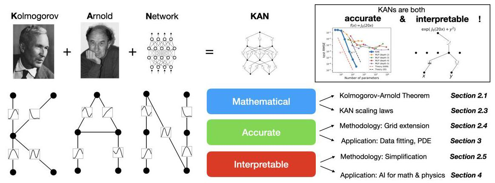

Figure 2.1: Our proposed Kolmogorov-Arnold networks are in honor of two great late mathematicians, Andrey Kolmogorov and Vladimir Arnold. KANs are mathematically sound, accurate and interpretable.

图2.1:我们提出的柯尔莫哥洛夫 - 阿诺德网络是为了纪念两位伟大的已故数学家，安德烈·柯尔莫哥洛夫和弗拉基米尔·阿诺德。KANs在数学上是合理的、准确的且可解释的。

Throughout this paper, we will use extensive numerical experiments to show that KANs can lead to accuracy and interpretability improvement over MLPs, at least on small-scale AI + Science tasks. The organization of the paper is illustrated in Figure 2.1. In Section 2, we introduce the KAN architecture and its mathematical foundation, introduce network simplification techniques to make KANs interpretable, and introduce a grid extension technique to make KANs more accurate. In Section 3 we show that KANs are more accurate than MLPs for data fitting: KANs can beat the curse of dimensionality when there is a compositional structure in data, achieving better scaling laws than MLPs. We also demonstrate the potential of KANs in PDE solving via a simple example of the Poisson equation. In Section 4, we show that KANs are interpretable and can be used for scientific discoveries. We use two examples from mathematics (knot theory) and physics (Anderson localization) to demonstrate that KANs can be helpful "collaborators" for scientists to (re)discover math and physical laws. Section 5 summarizes related works. In Section 6, we conclude by discussing broad impacts and future directions. Codes are available at https://github.com/KindXiaoming/pykan and can also be installed via pip install pykan.

在本文中，我们将使用大量数值实验来表明，至少在小规模的人工智能 + 科学任务上，KANs相对于MLP可以提高准确性和可解释性。本文的组织结构如图2.1所示。在第2节中，我们介绍KAN架构及其数学基础，介绍网络简化技术以使KANs可解释，并介绍网格扩展技术以使KANs更准确。在第3节中，我们表明KANs在数据拟合方面比MLP更准确:当数据中存在组合结构时，KANs可以克服维度灾难，实现比MLP更好的缩放定律。我们还通过泊松方程的一个简单例子展示了KANs在偏微分方程求解中的潜力。在第4节中我们表明KANs是可解释的并且可用于科学发现。我们使用来自数学(纽结理论)和物理(安德森局域化)的两个例子来证明KANs可以成为科学家(重新)发现数学和物理定律的有用“合作者”。第5节总结相关工作。在第6节中，我们通过讨论广泛的影响和未来方向来得出结论。代码可在https://github.com/KindXiaoming/pykan获取，也可以通过pip install pykan安装。

## 2 Kolmogorov-Arnold Networks (KAN)

## 2 柯尔莫哥洛夫 - 阿诺德网络(KAN)

Multi-Layer Perceptrons (MLPs) are inspired by the universal approximation theorem. We instead focus on the Kolmogorov-Arnold representation theorem, which can be realized by a new type of neural network called Kolmogorov-Arnold networks (KAN). We review the Kolmogorov-Arnold theorem in Section 2.1, to inspire the design of Kolmogorov-Arnold Networks in Section 2.2. In Section 2.3, we provide theoretical guarantees for the expressive power of KANs and their neural scaling laws, relating them to existing approximation and generalization theories in the literature. In Section 2.4, we propose a grid extension technique to make KANs increasingly more accurate. In Section 2.5 we propose simplification techniques to make KANs interpretable.

多层感知器(MLP)受到通用逼近定理的启发。相反，我们关注柯尔莫哥洛夫 - 阿诺德表示定理，它可以通过一种名为柯尔莫哥洛夫 - 阿诺德网络(KAN)的新型神经网络来实现。我们在2.1节回顾柯尔莫哥洛夫 - 阿诺德定理，以启发2.2节中柯尔莫哥洛夫 - 阿诺德网络的设计。在2.3节中，我们为KANs的表达能力及其神经缩放定律提供理论保证，将它们与文献中现有的逼近和泛化理论联系起来。在2.4节中，我们提出一种网格扩展技术以使KANs越来越准确。在2.5节中我们提出简化技术以使KANs可解释。

### 2.1 Kolmogorov-Arnold Representation theorem

### 2.1 柯尔莫哥洛夫 - 阿诺德表示定理

Vladimir Arnold and Andrey Kolmogorov established that if $f$ is a multivariate continuous function on a bounded domain, then $f$ can be written as a finite composition of continuous functions of a single variable and the binary operation of addition. More specifically, for a smooth $f : {\left\lbrack  0,1\right\rbrack  }^{n} \rightarrow  \mathbb{R}$ ,

弗拉基米尔·阿诺德和安德烈·柯尔莫哥洛夫证明，如果$f$是有界域上的多元连续函数，那么$f$可以写成单变量连续函数和加法二元运算的有限组合。更具体地说，对于一个光滑的$f : {\left\lbrack  0,1\right\rbrack  }^{n} \rightarrow  \mathbb{R}$，

$$
f\left( \mathbf{x}\right)  = f\left( {{x}_{1},\cdots ,{x}_{n}}\right)  = \mathop{\sum }\limits_{{q = 1}}^{{{2n} + 1}}{\Phi }_{q}\left( {\mathop{\sum }\limits_{{p = 1}}^{n}{\phi }_{q, p}\left( {x}_{p}\right) }\right) , \tag{2.1}
$$

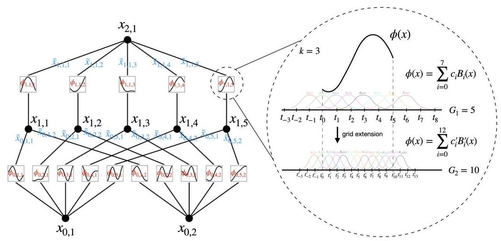

Figure 2.2: Left: Notations of activations that flow through the network. Right: an activation function is parameterized as a B-spline, which allows switching between coarse-grained and fine-grained grids.

图2.2:左:流经网络的激活的符号表示。右:一个激活函数被参数化为B样条，这允许在粗粒度和细粒度网格之间切换。

where ${\phi }_{q, p} : \left\lbrack  {0,1}\right\rbrack   \rightarrow  \mathbb{R}$ and ${\Phi }_{q} : \mathbb{R} \rightarrow  \mathbb{R}$ . In a sense, they showed that the only true multivariate function is addition, since every other function can be written using univariate functions and sum. One might naively consider this great news for machine learning: learning a high-dimensional function boils down to learning a polynomial number of 1D functions. However, these 1D functions can be non-smooth and even fractal, so they may not be learnable in practice [19, 20]. Because of this pathological behavior, the Kolmogorov-Arnold representation theorem was basically sentenced to death in machine learning, regarded as theoretically sound but practically useless [19, 20].

其中${\phi }_{q, p} : \left\lbrack  {0,1}\right\rbrack   \rightarrow  \mathbb{R}$和${\Phi }_{q} : \mathbb{R} \rightarrow  \mathbb{R}$。从某种意义上说，他们表明唯一真正的多元函数是加法，因为其他每个函数都可以用一元函数和求和来表示。有人可能天真地认为这对机器学习来说是个好消息:学习高维函数归结为学习多项式数量的一维函数。然而，这些一维函数可能是非光滑的，甚至是分形的，所以在实践中可能无法学习[19, 20]。由于这种病态行为，柯尔莫哥洛夫 - 阿诺德表示定理在机器学习中基本上被判了死刑，被认为理论上合理但实际上无用[19, 20]。

However, we are more optimistic about the usefulness of the Kolmogorov-Arnold theorem for machine learning. First of all, we need not stick to the original Eq. (2.1) which has only two-layer nonlinearities and a small number of terms $\left( {{2n} + 1}\right)$ in the hidden layer: we will generalize the network to arbitrary widths and depths. Secondly, most functions in science and daily life are often smooth and have sparse compositional structures, potentially facilitating smooth Kolmogorov-Arnold representations. The philosophy here is close to the mindset of physicists, who often care more about typical cases rather than worst cases. After all, our physical world and machine learning tasks must have structures to make physics and machine learning useful or generalizable at all [21].

然而，我们对柯尔莫哥洛夫 - 阿诺德定理对机器学习的有用性更为乐观。首先，我们不必拘泥于仅具有两层非线性且隐藏层中项数为$\left( {{2n} + 1}\right)$的原始式(2.1):我们将把网络推广到任意宽度和深度。其次，科学和日常生活中的大多数函数通常是光滑的并且具有稀疏的组合结构，这可能有助于实现光滑的柯尔莫哥洛夫 - 阿诺德表示。这里的理念与物理学家的思维方式相近，他们通常更关心典型情况而非最坏情况。毕竟，我们的物理世界和机器学习任务必须有结构，才能使物理学和机器学习在任何情况下都有用或可推广[21]。

### 2.2 KAN architecture

### 2.2 KAN架构

Suppose we have a supervised learning task consisting of input-output pairs $\left\{  {{\mathbf{x}}_{i},{y}_{i}}\right\}$ , where we want to find $f$ such that ${y}_{i} \approx  f\left( {\mathbf{x}}_{i}\right)$ for all data points. Eq. 2.1 implies that we are done if we can find appropriate univariate functions ${\phi }_{q, p}$ and ${\Phi }_{q}$ . This inspires us to design a neural network which explicitly parametrizes Eq. (2.1). Since all functions to be learned are univariate functions, we can parametrize each 1D function as a B-spline curve, with learnable coefficients of local B-spline basis functions (see Figure 2.2 right). Now we have a prototype of KAN, whose computation graph is exactly specified by Eq. 2.1 and illustrated in Figure 0.1 (b) (with the input dimension $n = 2$ ), appearing as a two-layer neural network with activation functions placed on edges instead of nodes (simple summation is performed on nodes), and with width ${2n} + 1$ in the middle layer.

假设我们有一个由输入 - 输出对$\left\{  {{\mathbf{x}}_{i},{y}_{i}}\right\}$组成的监督学习任务，我们想找到$f$，使得对于所有数据点都有${y}_{i} \approx  f\left( {\mathbf{x}}_{i}\right)$。式2.1意味着如果我们能找到合适的一元函数${\phi }_{q, p}$和${\Phi }_{q}$，我们就完成了任务。这启发我们设计一个神经网络，它明确地对式(2.1)进行参数化。由于所有要学习的函数都是一元函数，我们可以将每个一维函数参数化为一条B样条曲线，用局部B样条基函数的可学习系数来表示(见图2.2右)。现在我们有了一个KAN的原型，其计算图由式2.1精确指定，并在图0.1(b)中说明(输入维度为$n = 2$)，它看起来像一个两层神经网络，激活函数放在边上而不是节点上(在节点上进行简单求和)，中间层宽度为${2n} + 1$。

As mentioned, such a network is known to be too simple to approximate any function arbitrarily well in practice with smooth splines! We therefore generalize our KAN to be wider and deeper. It is not immediately clear how to make KANs deeper, since Kolmogorov-Arnold representations correspond to two-layer KANs. To the best of our knowledge, there is not yet a "generalized" version of the theorem that corresponds to deeper KANs.

如前所述，这样的网络在实践中已知过于简单，无法用光滑样条任意好地逼近任何函数！因此，我们将KAN推广得更宽更深。目前尚不清楚如何使KAN更深，因为柯尔莫哥洛夫 - 阿诺德表示对应于两层KAN。据我们所知，还没有与更深的KAN相对应的该定理的“广义”版本。

The breakthrough occurs when we notice the analogy between MLPs and KANs. In MLPs, once we define a layer (which is composed of a linear transformation and nonlinearties), we can stack more layers to make the network deeper. To build deep KANs, we should first answer: "what is a KAN layer?" It turns out that a KAN layer with ${n}_{\text{ in }}$ -dimensional inputs and ${n}_{\text{ out }}$ -dimensional outputs can be defined as a matrix of 1D functions

当我们注意到多层感知器(MLP)和KAN之间的类比时，突破就出现了。在MLP中，一旦我们定义了一层(由线性变换和非线性组成)，我们就可以堆叠更多层使网络更深。为了构建深度KAN，我们首先应该回答:“什么是KAN层？”结果表明，具有${n}_{\text{ in }}$维输入和${n}_{\text{ out }}$维输出的KAN层可以定义为一个一维函数矩阵

$$
\mathbf{\Phi } = \left\{  {\phi }_{q, p}\right\}  ,\;p = 1,2,\cdots ,{n}_{\text{ in }},\;q = 1,2\cdots ,{n}_{\text{ out }}, \tag{2.2}
$$

where the functions ${\phi }_{q, p}$ have trainable parameters, as detaild below. In the Kolmogov-Arnold theorem, the inner functions form a KAN layer with ${n}_{\text{ in }} = n$ and ${n}_{\text{ out }} = {2n} + 1$ , and the outer functions form a KAN layer with ${n}_{\text{ in }} = {2n} + 1$ and ${n}_{\text{ out }} = 1$ . So the Kolmogorov-Arnold representations in Eq. (2.1) are simply compositions of two KAN layers. Now it becomes clear what it means to have deeper Kolmogorov-Arnold representations: simply stack more KAN layers!

其中函数${\phi }_{q, p}$具有可训练参数，如下所述。在柯尔莫哥洛夫 - 阿诺德定理中，内层函数与${n}_{\text{ in }} = n$和${n}_{\text{ out }} = {2n} + 1$构成一个KAN层，外层函数与${n}_{\text{ in }} = {2n} + 1$和${n}_{\text{ out }} = 1$构成一个KAN层。所以式(2.1)中的柯尔莫哥洛夫 - 阿诺德表示形式仅仅是两个KAN层的复合。现在很清楚拥有更深层次的柯尔莫哥洛夫 - 阿诺德表示意味着什么了:只需堆叠更多的KAN层！

Let us introduce some notation. This paragraph will be a bit technical, but readers can refer to Figure 2.2 (left) for a concrete example and intuitive understanding. The shape of a KAN is represented by an integer array

让我们引入一些符号。这一段会有点技术性，但读者可以参考图2.2(左)以获得具体示例和直观理解。一个KAN的形状由一个整数数组表示

$$
\left\lbrack  {{n}_{0},{n}_{1},\cdots ,{n}_{L}}\right\rbrack \tag{2.3}
$$

where ${n}_{i}$ is the number of nodes in the ${i}^{\text{ th }}$ layer of the computational graph. We denote the ${i}^{\text{ th }}$ neuron in the ${l}^{\text{ th }}$ layer by $\left( {l, i}\right)$ , and the activation value of the $\left( {l, i}\right)$ -neuron by ${x}_{l, i}$ . Between layer $l$ and layer $l + 1$ , there are ${n}_{l}{n}_{l + 1}$ activation functions: the activation function that connects $\left( {l, i}\right)$ and $\left( {l + 1, j}\right)$ is denoted by

其中${n}_{i}$是计算图中${i}^{\text{ th }}$层的节点数。我们用$\left( {l, i}\right)$表示${l}^{\text{ th }}$层中的第${i}^{\text{ th }}$个神经元，用${x}_{l, i}$表示$\left( {l, i}\right)$神经元的激活值。在第$l$层和第$l + 1$层之间，有${n}_{l}{n}_{l + 1}$个激活函数:连接$\left( {l, i}\right)$和$\left( {l + 1, j}\right)$的激活函数记为

$$
{\phi }_{l, j, i},\;l = 0,\cdots , L - 1,\;i = 1,\cdots ,{n}_{l},\;j = 1,\cdots ,{n}_{l + 1}. \tag{2.4}
$$

The pre-activation of ${\phi }_{l, j, i}$ is simply ${x}_{l, i}$ ; the post-activation of ${\phi }_{l, j, i}$ is denoted by ${\widetilde{x}}_{l, j, i} \equiv \; {\phi }_{l, j, i}\left( {x}_{l, i}\right)$ . The activation value of the $\left( {l + 1, j}\right)$ neuron is simply the sum of all incoming post-activations:

${\phi }_{l, j, i}$的预激活仅仅是${x}_{l, i}$；${\phi }_{l, j, i}$的后激活记为${\widetilde{x}}_{l, j, i} \equiv \; {\phi }_{l, j, i}\left( {x}_{l, i}\right)$。$\left( {l + 1, j}\right)$神经元的激活值仅仅是所有输入后激活值的总和:

$$
{x}_{l + 1, j} = \mathop{\sum }\limits_{{i = 1}}^{{n}_{l}}{\widetilde{x}}_{l, j, i} = \mathop{\sum }\limits_{{i = 1}}^{{n}_{l}}{\phi }_{l, j, i}\left( {x}_{l, i}\right) ,\;j = 1,\cdots ,{n}_{l + 1}. \tag{2.5}
$$

In matrix form, this reads

以矩阵形式表示，如下所示

$$
{\mathbf{x}}_{l + 1} = \left( \begin{matrix} {\phi }_{l,1,1}\left( \cdot \right) & {\phi }_{l,1,2}\left( \cdot \right) & \cdots & {\phi }_{l,1,{n}_{l}}\left( \cdot \right) \\  {\phi }_{l,2,1}\left( \cdot \right) & {\phi }_{l,2,2}\left( \cdot \right) & \cdots & {\phi }_{l,2,{n}_{l}}\left( \cdot \right) \\  \vdots & \vdots & & \vdots \\  {\phi }_{l,{n}_{l + 1},1}\left( \cdot \right) & {\phi }_{l,{n}_{l + 1},2}\left( \cdot \right) & \cdots & {\phi }_{l,{n}_{l + 1},{n}_{l}}\left( \cdot \right)  \end{matrix}\right) {\mathbf{x}}_{l}, \tag{2.6}
$$

where ${\mathbf{\Phi }}_{l}$ is the function matrix corresponding to the ${l}^{\text{ th }}$ KAN layer. A general KAN network is a composition of $L$ layers: given an input vector ${\mathbf{x}}_{0} \in  {\mathbb{R}}^{{n}_{0}}$ , the output of KAN is

其中${\mathbf{\Phi }}_{l}$是与${l}^{\text{ th }}$ KAN层对应的函数矩阵。一个通用的KAN网络是$L$层的复合:给定一个输入向量${\mathbf{x}}_{0} \in  {\mathbb{R}}^{{n}_{0}}$，KAN的输出是

$$
\operatorname{KAN}\left( \mathbf{x}\right)  = \left( {{\mathbf{\Phi }}_{L - 1} \circ  {\mathbf{\Phi }}_{L - 2} \circ  \cdots  \circ  {\mathbf{\Phi }}_{1} \circ  {\mathbf{\Phi }}_{0}}\right) \mathbf{x}. \tag{2.7}
$$

We can also rewrite the above equation to make it more analogous to Eq. (2.1), assuming output dimension ${n}_{L} = 1$ , and define $f\left( \mathbf{x}\right)  \equiv  \operatorname{KAN}\left( \mathbf{x}\right)$ :

我们也可以重写上述方程使其更类似于式(2.1)，假设输出维度为${n}_{L} = 1$，并定义$f\left( \mathbf{x}\right)  \equiv  \operatorname{KAN}\left( \mathbf{x}\right)$:

$$
f\left( \mathbf{x}\right)  = \mathop{\sum }\limits_{{{i}_{L - 1} = 1}}^{{n}_{L - 1}}{\phi }_{L - 1,{i}_{L},{i}_{L - 1}}\left( {\mathop{\sum }\limits_{{{i}_{L - 2} = 1}}^{{n}_{L - 2}}\cdots \left( {\mathop{\sum }\limits_{{{i}_{2} = 1}}^{{n}_{2}}{\phi }_{2,{i}_{3},{i}_{2}}\left( {\mathop{\sum }\limits_{{{i}_{1} = 1}}^{{n}_{1}}{\phi }_{1,{i}_{2},{i}_{1}}\left( {\mathop{\sum }\limits_{{{i}_{0} = 1}}^{{n}_{0}}{\phi }_{0,{i}_{1},{i}_{0}}\left( {x}_{{i}_{0}}\right) }\right) }\right) }\right) \cdots }\right) ,
$$

(2.8)

which is quite cumbersome. In contrast, our abstraction of KAN layers and their visualizations are cleaner and intuitive. The original Kolmogorov-Arnold representation Eq. 2.1) corresponds to a 2-Layer KAN with shape $\left\lbrack  {n,{2n} + 1,1}\right\rbrack$ . Notice that all the operations are differentiable, so we can train KANs with back propagation. For comparison, an MLP can be written as interleaving of affine transformations $\mathbf{W}$ and non-linearities $\sigma$ :

这相当繁琐。相比之下，我们对KAN层的抽象及其可视化更简洁直观。原始的柯尔莫哥洛夫 - 阿诺德表示式(2.1)对应于一个形状为$\left\lbrack  {n,{2n} + 1,1}\right\rbrack$的2层KAN。注意所有操作都是可微的，所以我们可以用反向传播来训练KAN。作为对比，一个MLP可以写成仿射变换$\mathbf{W}$和非线性$\sigma$的交织:

$$
\operatorname{MLP}\left( \mathbf{x}\right)  = \left( {{\mathbf{W}}_{L - 1} \circ  \sigma  \circ  {\mathbf{W}}_{L - 2} \circ  \sigma  \circ  \cdots  \circ  {\mathbf{W}}_{1} \circ  \sigma  \circ  {\mathbf{W}}_{0}}\right) \mathbf{x}. \tag{2.9}
$$

It is clear that MLPs treat linear transformations and nonlinearities separately as $\mathbf{W}$ and $\sigma$ , while KANs treat them all together in $\Phi$ . In Figure 0.1 (c) and (d), we visualize a three-layer MLP and a three-layer KAN, to clarify their differences.

很明显，MLP将线性变换和非线性分别视为$\mathbf{W}$和$\sigma$，而KAN将它们在$\Phi$中一起处理。在图0.1(c)和(d)中，我们可视化了一个三层MLP和一个三层KAN，以阐明它们的差异。

Implementation details. Although a KAN layer Eq. (2.5) looks extremely simple, it is non-trivial to make it well optimizable. The key tricks are:

实现细节。尽管一个KAN层(式(2.5))看起来极其简单，但要使其易于优化并非易事。关键技巧如下:

(1) Residual activation functions. We include a basis function $b\left( x\right)$ (similar to residual connections) such that the activation function $\phi \left( x\right)$ is the sum of the basis function $b\left( x\right)$ and the spline function:

(1) 残差激活函数。我们包含一个基函数$b\left( x\right)$(类似于残差连接)，使得激活函数$\phi \left( x\right)$是基函数$b\left( x\right)$和样条函数的和:

$$
\phi \left( x\right)  = {w}_{b}b\left( x\right)  + {w}_{s}\operatorname{spline}\left( x\right) . \tag{2.10}
$$

We set

我们设置

$$
b\left( x\right)  = \operatorname{silu}\left( x\right)  = x/\left( {1 + {e}^{-x}}\right) \tag{2.11}
$$

in most cases. spline $\left( x\right)$ is parametrized as a linear combination of B-splines such that

在大多数情况下，样条$\left( x\right)$被参数化为B样条的线性组合，使得

$$
\operatorname{spline}\left( x\right)  = \mathop{\sum }\limits_{i}{c}_{i}{B}_{i}\left( x\right) \tag{2.12}
$$

where ${c}_{i}$ s are trainable (see Figure 2.2 for an illustration). In principle ${w}_{b}$ and ${w}_{s}$ are redundant since it can be absorbed into $b\left( x\right)$ and spline $\left( x\right)$ . However, we still include these factors (which are by default trainable) to better control the overall magnitude of the activation function.

其中${c}_{i}$是可训练的(见图2.2的示例)。原则上，${w}_{b}$和${w}_{s}$是冗余的，因为它们可以被吸收到$b\left( x\right)$和样条$\left( x\right)$中。然而，我们仍然包含这些因子(默认情况下是可训练的)，以便更好地控制激活函数的整体幅度。

(2) Initialization scales. Each activation function is initialized to have ${w}_{s} = 1$ and spline $\left( x\right)  \approx  0$ 2 ${w}_{b}$ is initialized according to the Xavier initialization, which has been used to initialize linear layers in MLPs.

(2) 初始化尺度。每个激活函数被初始化为具有${w}_{s} = 1$，样条$\left( x\right)  \approx  0$2${w}_{b}$根据Xavier初始化进行初始化，该初始化已用于初始化多层感知器(MLP)中的线性层。

(3) Update of spline grids. We update each grid on the fly according to its input activations, to address the issue that splines are defined on bounded regions but activation values can evolve out of the fixed region during training 3

(3) 样条网格的更新。我们根据其输入激活实时更新每个网格，以解决样条在有界区域上定义但激活值在训练期间可能超出固定区域的问题3

Parameter count. For simplicity, let us assume a network

参数数量。为了简单起见，让我们假设一个网络

(1) of depth $L$ ,

(1) 深度为$L$，

---

${}^{2}$ This is done by drawing B-spline coefficients ${c}_{i} \sim  \mathcal{N}\left( {0,{\sigma }^{2}}\right)$ with a small $\sigma$ , typically we set $\sigma  = {0.1}$ .

${}^{2}$ 这是通过绘制具有小$\sigma$的B样条系数${c}_{i} \sim  \mathcal{N}\left( {0,{\sigma }^{2}}\right)$来完成的，通常我们设置$\sigma  = {0.1}$。

${}^{3}$ Other possibilities are: (a) the grid is learnable with gradient descent, e.g.,[22]; (b) use normalization such that the input range is fixed. We tried (b) at first but its performance is inferior to our current approach.

${}^{3}$ 其他可能性是:(a) 网格可通过梯度下降学习，例如[22]；(b) 使用归一化使得输入范围固定。我们首先尝试了(b)，但其性能不如我们当前的方法。

---

(2) with layers of equal width ${n}_{0} = {n}_{1} = \cdots  = {n}_{L} = N$ ,

(2) 各层宽度相等${n}_{0} = {n}_{1} = \cdots  = {n}_{L} = N$，

(3) with each spline of order $k$ (usually $k = 3$ ) on $G$ intervals (for $G + 1$ grid points).

(3) 在$G$个区间上(对于$G + 1$个网格点)每个样条的阶数为$k$(通常$k = 3$)。

Then there are in total $O\left( {{N}^{2}L\left( {G + k}\right) }\right)  \sim  O\left( {{N}^{2}{LG}}\right)$ parameters. In contrast, an MLP with depth $L$ and width $N$ only needs $O\left( {{N}^{2}L}\right)$ parameters, which appears to be more efficient than KAN. Fortunately, KANs usually require much smaller $N$ than MLPs, which not only saves parameters, but also achieves better generalization (see e.g., Figure 3.1 and 3.3) and facilitates interpretability. We remark that for 1D problems, we can take $N = L = 1$ and the KAN network in our implementation is nothing but a spline approximation. For higher dimensions, we characterize the generalization behavior of KANs with a theorem below.

那么总共有$O\left( {{N}^{2}L\left( {G + k}\right) }\right)  \sim  O\left( {{N}^{2}{LG}}\right)$个参数。相比之下，一个深度为$L$且宽度为$N$的MLP只需要$O\left( {{N}^{2}L}\right)$个参数，这似乎比KAN更有效。幸运的是，KAN通常比MLP需要小得多的$N$，这不仅节省了参数，还实现了更好的泛化(例如见图3.1和3.3)并便于解释。我们注意到对于一维问题，我们可以取$N = L = 1$，并且我们实现中的KAN网络只不过是一个样条近似。对于更高维度问题，我们用下面的一个定理来刻画KAN的泛化行为。

### 2.3 KAN's Approximation Abilities and Scaling Laws

### 2.3 KAN的逼近能力和缩放定律

Recall that in Eq. (2.1), the 2-Layer width-(2n + 1) representation may be non-smooth. However, deeper representations may bring the advantages of smoother activations. For example, the 4-variable function

回想一下，在式(2.1)中，2层宽度为(2n + 1)的表示可能不光滑。然而，更深的表示可能带来激活更光滑的优点。例如，4变量函数

$$
f\left( {{x}_{1},{x}_{2},{x}_{3},{x}_{4}}\right)  = \exp \left( {\sin \left( {{x}_{1}^{2} + {x}_{2}^{2}}\right)  + \sin \left( {{x}_{3}^{2} + {x}_{4}^{2}}\right) }\right) \tag{2.13}
$$

can be smoothly represented by a $\left\lbrack  {4,2,1,1}\right\rbrack$ KAN which is 3-Layer, but may not admit a 2-Layer KAN with smooth activations. To facilitate an approximation analysis, we still assume smoothness of activations, but allow the representations to be arbitrarily wide and deep, as in Eq. (2.7). To emphasize the dependence of our KAN on the finite set of grid points, we use ${\Phi }_{l}^{G}$ and ${\Phi }_{l, i, j}^{G}$ below to replace the notation ${\mathbf{\Phi }}_{l}$ and ${\Phi }_{l, i, j}$ used in Eq. 2.5 and 2.6).

可以由一个3层的$\left\lbrack  {4,2,1,1}\right\rbrack$KAN平滑表示，但可能不存在具有光滑激活的2层KAN。为了便于进行逼近分析，我们仍然假设激活是光滑的，但允许表示任意宽和深，如式(2.7)所示。为了强调我们的KAN对有限网格点集的依赖性，我们在下面使用${\Phi }_{l}^{G}$和${\Phi }_{l, i, j}^{G}$来代替式2.5和2.6中使用的符号${\mathbf{\Phi }}_{l}$和${\Phi }_{l, i, j}$。

Theorem 2.1 (Approximation theory, KAT). Let $\mathbf{x} = \left( {{x}_{1},{x}_{2},\cdots ,{x}_{n}}\right)$ . Suppose that a function $f\left( \mathbf{x}\right)$ admits a representation

定理2.1(逼近理论，KAT)。设$\mathbf{x} = \left( {{x}_{1},{x}_{2},\cdots ,{x}_{n}}\right)$。假设一个函数$f\left( \mathbf{x}\right)$允许一种表示

$$
f = \left( {{\mathbf{\Phi }}_{L - 1} \circ  {\mathbf{\Phi }}_{L - 2} \circ  \cdots  \circ  {\mathbf{\Phi }}_{1} \circ  {\mathbf{\Phi }}_{0}}\right) \mathbf{x}, \tag{2.14}
$$

as in Eq. 2.7), where each one of the ${\Phi }_{l, i, j}$ are $\left( {k + 1}\right)$ -times continuously differentiable. Then there exists a constant $C$ depending on $f$ and its representation, such that we have the following approximation bound in terms of the grid size $G$ : there exist $k$ -th order $B$ -spline functions ${\Phi }_{l, i, j}^{G}$ such that for any $0 \leq  m \leq  k$ , we have the bound

如式(2.7)所示，其中每个${\Phi }_{l, i, j}$都是$\left( {k + 1}\right)$次连续可微的。那么存在一个取决于$f$及其表示的常数$C$，使得对于网格大小$G$，我们有以下近似界:存在$k$阶$B$样条函数${\Phi }_{l, i, j}^{G}$，使得对于任何$0 \leq  m \leq  k$，我们有该界

$$
{\begin{Vmatrix}f - \left( {\mathbf{\Phi }}_{L - 1}^{G} \circ  {\mathbf{\Phi }}_{L - 2}^{G} \circ  \cdots  \circ  {\mathbf{\Phi }}_{1}^{G} \circ  {\mathbf{\Phi }}_{0}^{G}\right) \mathbf{x}\end{Vmatrix}}_{{C}^{m}} \leq  C{G}^{-k - 1 + m}. \tag{2.15}
$$

Here we adopt the notation of ${C}^{m}$ -norm measuring the magnitude of derivatives up to order $m$ :

在此，我们采用${C}^{m}$范数的记号来衡量直至$m$阶导数的大小:

$$
\parallel g{\parallel }_{{C}^{m}} = \mathop{\max }\limits_{{\left| \beta \right|  \leq  m}}\mathop{\sup }\limits_{{x \in  {\left\lbrack  0,1\right\rbrack  }^{n}}}\left| {{D}^{\beta }g\left( x\right) }\right| .
$$

Proof. By the classical 1D B-spline theory [23] and the fact that ${\Phi }_{l, i, j}$ as continuous functions can be uniformly bounded on a bounded domain, we know that there exist finite-grid B-spline functions ${\Phi }_{l, i, j}^{G}$ such that for any $0 \leq  m \leq  k$ ,

证明。根据经典的一维B样条理论[23]以及${\Phi }_{l, i, j}$作为连续函数在有界域上可以一致有界这一事实，我们知道存在有限网格B样条函数${\Phi }_{l, i, j}^{G}$，使得对于任何$0 \leq  m \leq  k$，

$$
{\begin{Vmatrix}\left( {\Phi }_{l, i, j} \circ  {\mathbf{\Phi }}_{l - 1} \circ  {\mathbf{\Phi }}_{l - 2} \circ  \cdots  \circ  {\mathbf{\Phi }}_{1} \circ  {\mathbf{\Phi }}_{0}\right) \mathbf{x} - \left( {\Phi }_{l, i, j}^{G} \circ  {\mathbf{\Phi }}_{l - 1} \circ  {\mathbf{\Phi }}_{l - 2} \circ  \cdots  \circ  {\mathbf{\Phi }}_{1} \circ  {\mathbf{\Phi }}_{0}\right) \mathbf{x}\end{Vmatrix}}_{{C}^{m}} \leq  C{G}^{-k - 1 + m},
$$

with a constant $C$ independent of $G$ . We fix those B-spline approximations. Therefore we have that the residue ${R}_{l}$ defined via

其中常数$C$与$G$无关。我们固定这些B样条近似。因此，通过以下方式定义的残差${R}_{l}$

$$
{R}_{l} \mathrel{\text{ := }} \left( {{\mathbf{\Phi }}_{L - 1}^{G} \circ  \cdots  \circ  {\mathbf{\Phi }}_{l + 1}^{G} \circ  {\mathbf{\Phi }}_{l} \circ  {\mathbf{\Phi }}_{l - 1} \circ  \cdots  \circ  {\mathbf{\Phi }}_{0}}\right) \mathbf{x} - \left( {{\mathbf{\Phi }}_{L - 1}^{G} \circ  \cdots  \circ  {\mathbf{\Phi }}_{l + 1}^{G} \circ  {\mathbf{\Phi }}_{l}^{G} \circ  {\mathbf{\Phi }}_{l - 1} \circ  \cdots  \circ  {\mathbf{\Phi }}_{0}}\right) \mathbf{x}
$$

satisfies

满足

$$
{\begin{Vmatrix}{R}_{l}\end{Vmatrix}}_{{C}^{m}} \leq  C{G}^{-k - 1 + m}
$$

with a constant independent of $G$ . Finally notice that

其中常数与$G$无关。最后注意到

$$
f - \left( {{\mathbf{\Phi }}_{L - 1}^{G} \circ  {\mathbf{\Phi }}_{L - 2}^{G} \circ  \cdots  \circ  {\mathbf{\Phi }}_{1}^{G} \circ  {\mathbf{\Phi }}_{0}^{G}}\right) \mathbf{x} = {R}_{L - 1} + {R}_{L - 2} + \cdots  + {R}_{1} + {R}_{0},
$$

we know that 2.15 holds.

我们知道式(2.15)成立。

We know that asymptotically, provided that the assumption in Theorem 2.1 holds, KANs with finite grid size can approximate the function well with a residue rate independent of the dimension, hence beating curse of dimensionality! This comes naturally since we only use splines to approximate 1D functions. In particular, for $m = 0$ , we recover the accuracy in ${L}^{\infty }$ norm, which in turn provides a bound of RMSE on the finite domain, which gives a scaling exponent $k + 1$ . Of course, the constant $C$ is dependent on the representation; hence it will depend on the dimension. We will leave the discussion of the dependence of the constant on the dimension as a future work.

我们知道，渐近地，只要定理2.1中的假设成立，具有有限网格大小的KAN可以很好地逼近函数，其残差率与维度无关，从而克服维度灾难！这是自然的，因为我们只使用样条来逼近一维函数。特别地，对于$m = 0$，我们恢复了${L}^{\infty }$范数下的精度，这反过来又在有限域上给出了RMSE的界，从而得到一个缩放指数$k + 1$。当然，常数$C$取决于表示；因此它将取决于维度。我们将把常数对维度的依赖性讨论留作未来的工作。

We remark that although the Kolmogorov-Arnold theorem Eq. (2.1) corresponds to a KAN representation with shape $\left\lbrack  {d,{2d} + 1,1}\right\rbrack$ , its functions are not necessarily smooth. On the other hand, if we are able to identify a smooth representation (maybe at the cost of extra layers or making the KAN wider than the theory prescribes), then Theorem 2.1 indicates that we can beat the curse of dimensionality (COD). This should not come as a surprise since we can inherently learn the structure of the function and make our finite-sample KAN approximation interpretable.

我们注意到，尽管柯尔莫哥洛夫 - 阿诺德定理(式(2.1))对应于形状为$\left\lbrack  {d,{2d} + 1,1}\right\rbrack$的KAN表示，但其函数不一定是光滑的。另一方面，如果我们能够识别出一个光滑的表示(也许以增加额外层或使KAN比理论规定的更宽为代价)，那么定理2.1表明我们可以克服维度灾难(COD)。这并不奇怪，因为我们可以内在地学习函数的结构，并使我们的有限样本KAN近似可解释。

Neural scaling laws: comparison to other theories. Neural scaling laws are the phenomenon where test loss decreases with more model parameters, i.e., $\ell  \propto  {N}^{-\alpha }$ where $\ell$ is test RMSE, $N$ is the number of parameters, and $\alpha$ is the scaling exponent. A larger $\alpha$ promises more improvement by simply scaling up the model. Different theories have been proposed to predict $\alpha$ . Sharma & Kaplan [24] suggest that $\alpha$ comes from data fitting on an input manifold of intrinsic dimensionality $d$ . If the model function class is piecewise polynomials of order $k$ ( $k = 1$ for ReLU), then the standard approximation theory implies $\alpha  = \left( {k + 1}\right) /d$ from the approximation theory. This bound suffers from the curse of dimensionality, so people have sought other bounds independent of $d$ by leveraging compositional structures. In particular, Michaud et al. [25] considered computational graphs that only involve unary (e.g., squared, sine, exp) and binary (+ and $\times$ ) operations, finding $\alpha  = \left( {k + 1}\right) /{d}^{ * } = \left( {k + 1}\right) /2$ , where ${d}^{ * } = 2$ is the maximum arity. Poggio et al. [19] leveraged the idea of compositional sparsity and proved that given function class ${W}_{m}$ (function whose derivatives are continuous up to $m$ -th order), one needs $N = O\left( {\epsilon }^{-\frac{2}{m}}\right)$ number of parameters to achieve error $\epsilon$ , which is equivalent to $\alpha  = \frac{m}{2}$ . Our approach, which assumes the existence of smooth Kolmogorov-Arnold representations, decomposes the high-dimensional function into several 1D functions, giving $\alpha  = k + 1$ (where $k$ is the piecewise polynomial order of the splines). We choose $k = 3$ cubic splines so $\alpha  = 4$ which is the largest and best scaling exponent compared to other works. We will show in Section 3.1 that this bound $\alpha  = 4$ can in fact be achieved empirically with KANs, while previous work [25] reported that MLPs have problems even saturating slower bounds (e.g., $\alpha  = 1$ ) and plateau quickly. Of course, we can increase $k$ to match the smoothness of functions, but too high $k$ might be too oscillatory, leading to optimization issues.

神经缩放定律:与其他理论的比较。神经缩放定律是指测试损失随着模型参数的增加而降低的现象，即$\ell  \propto  {N}^{-\alpha }$，其中$\ell$是测试均方根误差，$N$是参数数量，$\alpha$是缩放指数。更大的$\alpha$意味着通过简单地扩大模型规模可以获得更多的改进。已经提出了不同的理论来预测$\alpha$。夏尔马和卡普兰[24]认为$\alpha$来自于对内在维度为$d$的输入流形上的数据拟合。如果模型函数类是阶数为$k$的分段多项式(对于ReLU为$k = 1$)，那么标准逼近理论意味着从逼近理论得出$\alpha  = \left( {k + 1}\right) /d$。这个界限受到维度诅咒的困扰，所以人们通过利用组合结构寻求与$d$无关的其他界限。特别是，米肖德等人[25]考虑了仅涉及一元(例如平方、正弦、指数)和二元(+和$\times$)运算的计算图，发现$\alpha  = \left( {k + 1}\right) /{d}^{ * } = \left( {k + 1}\right) /2$，其中${d}^{ * } = 2$是最大元数。波焦等人[19]利用组合稀疏性的思想并证明，给定函数类${W}_{m}$(其导数直到$m$阶连续的函数)，需要$N = O\left( {\epsilon }^{-\frac{2}{m}}\right)$数量的参数来实现误差$\epsilon$，这等同于$\alpha  = \frac{m}{2}$。我们的方法假设存在光滑的柯尔莫哥洛夫 - 阿诺德表示，将高维函数分解为几个一维函数，得到$\alpha  = k + 1$(其中$k$是样条的分段多项式阶数)。我们选择$k = 3$三次样条，因此$\alpha  = 4$，这是与其他工作相比最大且最佳的缩放指数。我们将在3.1节中表明，这个界限$\alpha  = 4$实际上可以通过KAN在经验上实现，而先前的工作[25]报告说多层感知器即使在达到较慢的界限(例如$\alpha  = 1$)时也有问题并且很快达到平稳期。当然，我们可以增加$k$以匹配函数的平滑度，但$k$过高可能会过于振荡，导致优化问题。

Comparison between KAT and UAT. The power of fully-connected neural networks is justified by the universal approximation theorem (UAT), which states that given a function and error tolerance $\epsilon  > 0$ , a two-layer network with $k > N\left( \epsilon \right)$ neurons can approximate the function within error $\epsilon$ . However, the UAT guarantees no bound for how $N\left( \epsilon \right)$ scales with $\epsilon$ . Indeed, it suffers from the COD, and $N$ has been shown to grow exponentially with $d$ in some cases [21]. The difference between

KAT与UAT的比较。全连接神经网络的能力由通用逼近定理(UAT)证明，该定理指出，给定一个函数和误差容限$\epsilon  > 0$，一个具有$k > N\left( \epsilon \right)$个神经元的两层网络可以在误差$\epsilon$内逼近该函数。然而，UAT没有保证$N\left( \epsilon \right)$如何随$\epsilon$缩放的界限。实际上，它受到维度诅咒的影响，并且$N$在某些情况下已被证明随$d$呈指数增长[21]。两者之间的差异

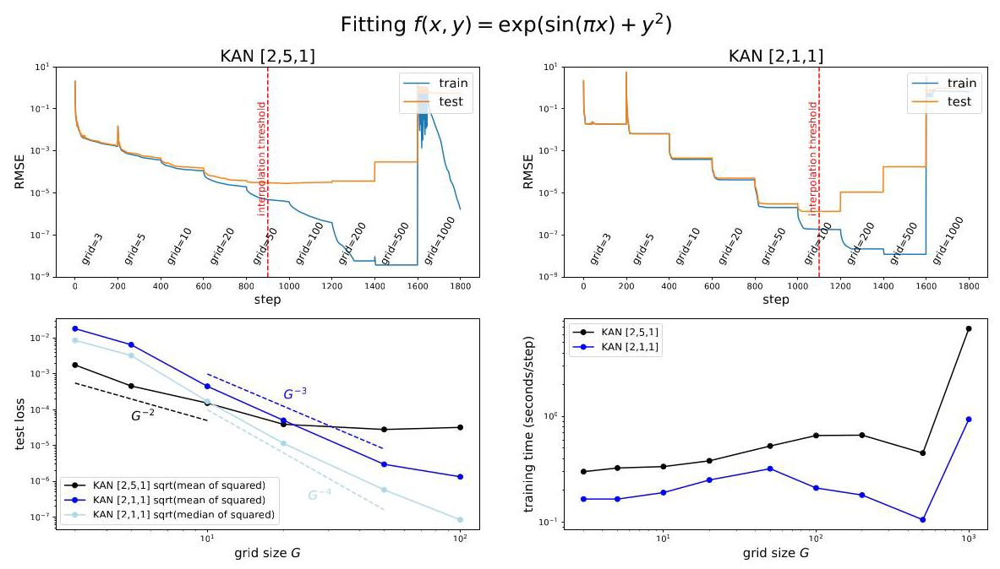

Figure 2.3: We can make KANs more accurate by grid extension (fine-graining spline grids). Top left (right): training dynamics of a $\left\lbrack  {2,5,1}\right\rbrack  \left( \left\lbrack  {2,1,1}\right\rbrack  \right)$ KAN. Both models display staircases in their loss curves, i.e., loss suddently drops then plateaus after grid extension. Bottom left: test RMSE follows scaling laws against grid size $G$ . Bottom right: training time scales favorably with grid size $G$ .

图2.3:我们可以通过网格扩展(细化样条网格)使KAN更准确。左上角(右):一个$\left\lbrack  {2,5,1}\right\rbrack  \left( \left\lbrack  {2,1,1}\right\rbrack  \right)$KAN的训练动态。两个模型在其损失曲线上都显示出阶梯状，即损失在网格扩展后突然下降然后趋于平稳。左下角:测试均方根误差遵循相对于网格大小$G$的缩放定律。右下角:训练时间与网格大小$G$成有利比例。

KAT and UAT is a consequence that KANs take advantage of the intrinsically low-dimensional representation of the function while MLPs do not. In KAT, we highlight quantifying the approximation error in the compositional space. In the literature, generalization error bounds, taking into account finite samples of training data, for a similar space have been studied for regression problems; see [26, 27], and also specifically for MLPs with ReLU activations [28]. On the other hand, for general function spaces like Sobolev or Besov spaces, the nonlinear n-widths theory [29, 30, 31] indicates that we can never beat the curse of dimensionality, while MLPs with ReLU activations can achieve the tight rate [32, 33, 34]. This fact again motivates us to consider functions of compositional structure, the much "nicer" functions that we encounter in practice and in science, to overcome the COD. Compared with MLPs, we may use a smaller architecture in practice, since we learn general nonlinear activation functions; see also [28] where the depth of the ReLU MLPs needs to reach at least $\log n$ to have the desired rate, where $n$ is the number of samples. Indeed, we will show that KANs are nicely aligned with symbolic functions while MLPs are not.

KAT和UAT的结果是，KAN利用了函数本质上的低维表示，而MLP则没有。在KAT中，我们强调在组合空间中量化近似误差。在文献中，针对回归问题研究了考虑训练数据有限样本的类似空间的泛化误差界；见[26, 27]，也特别针对具有ReLU激活函数的MLP[28]。另一方面，对于像Sobolev或Besov空间这样的一般函数空间，非线性n-宽度理论[29, 30, 31]表明我们永远无法克服维度诅咒，而具有ReLU激活函数的MLP可以达到紧密速率[32, 33, 34]。这一事实再次促使我们考虑组合结构的函数，即我们在实践和科学中遇到的更“好”的函数，以克服COD。与MLP相比，我们在实践中可以使用更小的架构，因为我们学习的是一般的非线性激活函数；另见[28]，其中ReLU MLP的深度至少需要达到$\log n$才能达到所需速率，其中$n$是样本数量。事实上，我们将表明KAN与符号函数很好地对齐，而MLP则不然。

### 2.4 For accuracy: Grid Extension

### 2.4 为了提高准确性:网格扩展

In principle, a spline can be made arbitrarily accurate to a target function as the grid can be made arbitrarily fine-grained. This good feature is inherited by KANs. By contrast, MLPs do not have the notion of "fine-graining". Admittedly, increasing the width and depth of MLPs can lead to improvement in performance ("neural scaling laws"). However, these neural scaling laws are slow (discussed in the last section). They are also expensive to obtain, because models of varying sizes are trained independently. By contrast, for KANs, one can first train a KAN with fewer parameters and then extend it to a KAN with more parameters by simply making its spline grids finer, without the need to retraining the larger model from scratch.

原则上，随着网格可以变得任意精细，样条可以对目标函数达到任意精度。KAN继承了这一良好特性。相比之下，MLP没有“精细粒度”的概念。诚然，增加MLP的宽度和深度可以导致性能提升(“神经缩放定律”)。然而，这些神经缩放定律很慢(在上一节中讨论过)。它们的获取成本也很高，因为不同大小的模型是独立训练的。相比之下，对于KAN，人们可以首先训练一个参数较少的KAN，然后通过简单地使样条网格更精细，将其扩展为一个参数更多的KAN，而无需从头重新训练更大的模型。

We next describe how to perform grid extension (illustrated in Figure 2.2 right), which is basically fitting a new fine-grained spline to an old coarse-grained spline. Suppose we want to approximate a 1D function $f$ in a bounded region $\left\lbrack  {a, b}\right\rbrack$ with B-splines of order $k$ . A coarse-grained grid with ${G}_{1}$ intervals has grid points at $\left\{  {{t}_{0} = a,{t}_{1},{t}_{2},\cdots ,{t}_{{G}_{1}} = b}\right\}$ , which is augmented to $\left\{  {{t}_{-k},\cdots ,{t}_{-1},{t}_{0},\cdots ,{t}_{{G}_{1}},{t}_{{G}_{1} + 1},\cdots ,{t}_{{G}_{1} + k}}\right\}$ . There are ${G}_{1} + k$ B-spline basis functions, with the ${i}^{\text{ th }}$ B-spline ${B}_{i}\left( x\right)$ being non-zero only on $\left\lbrack  {{t}_{-k + i},{t}_{i + 1}}\right\rbrack  \left( {i = 0,\cdots ,{G}_{1} + k - 1}\right)$ . Then $f$ on the coarse grid is expressed in terms of linear combination of these B-splines basis functions ${f}_{\text{ coarse }}\left( x\right)  = \mathop{\sum }\limits_{{i = 0}}^{{{G}_{1} + k - 1}}{c}_{i}{B}_{i}\left( x\right)$ . Given a finer grid with ${G}_{2}$ intervals, $f$ on the fine grid is correspondingly ${f}_{\text{ fine }}\left( x\right)  = \mathop{\sum }\limits_{{j = 0}}^{{{G}_{2} + k - 1}}{c}_{j}^{\prime }{B}_{j}^{\prime }\left( x\right)$ . The parameters ${c}_{j}^{\prime }\mathrm{s}$ can be initialized from the parameters ${c}_{i}$ by minimizing the distance between ${f}_{\text{ fine }}\left( x\right)$ to ${f}_{\text{ coarse }}\left( x\right)$ (over some distribution of $x)$ :

接下来我们描述如何执行网格扩展(如图2.2右侧所示)，这基本上是将一个新的细粒度样条拟合到一个旧的粗粒度样条上。假设我们想用阶数为$k$的B样条在有界区域$\left\lbrack  {a, b}\right\rbrack$中逼近一维函数$f$。一个具有${G}_{1}$个区间的粗粒度网格在$\left\{  {{t}_{0} = a,{t}_{1},{t}_{2},\cdots ,{t}_{{G}_{1}} = b}\right\}$处有网格点，该网格被扩充到$\left\{  {{t}_{-k},\cdots ,{t}_{-1},{t}_{0},\cdots ,{t}_{{G}_{1}},{t}_{{G}_{1} + 1},\cdots ,{t}_{{G}_{1} + k}}\right\}$。有${G}_{1} + k$个B样条基函数，其中第${i}^{\text{ th }}$个B样条${B}_{i}\left( x\right)$仅在$\left\lbrack  {{t}_{-k + i},{t}_{i + 1}}\right\rbrack  \left( {i = 0,\cdots ,{G}_{1} + k - 1}\right)$上非零。那么粗网格上的$f$就用这些B样条基函数${f}_{\text{ coarse }}\left( x\right)  = \mathop{\sum }\limits_{{i = 0}}^{{{G}_{1} + k - 1}}{c}_{i}{B}_{i}\left( x\right)$的线性组合来表示。给定一个具有${G}_{2}$个区间的更细网格，细网格上的$f$相应地为${f}_{\text{ fine }}\left( x\right)  = \mathop{\sum }\limits_{{j = 0}}^{{{G}_{2} + k - 1}}{c}_{j}^{\prime }{B}_{j}^{\prime }\left( x\right)$。参数${c}_{j}^{\prime }\mathrm{s}$可以通过最小化${f}_{\text{ fine }}\left( x\right)$到${f}_{\text{ coarse }}\left( x\right)$之间的距离(在$x)$的某种分布上)从参数${c}_{i}$初始化:

$$
\left\{  {c}_{j}^{\prime }\right\}   = \mathop{\operatorname{argmin}}\limits_{\left\{  {c}_{j}^{\prime }\right\}  }\underset{x \sim  p\left( x\right) }{\mathbb{E}}{\left( \mathop{\sum }\limits_{{j = 0}}^{{{G}_{2} + k - 1}}{c}_{j}^{\prime }{B}_{j}^{\prime }\left( x\right)  - \mathop{\sum }\limits_{{i = 0}}^{{{G}_{1} + k - 1}}{c}_{i}{B}_{i}\left( x\right) \right) }^{2}, \tag{2.16}
$$

which can be implemented by the least squares algorithm. We perform grid extension for all splines in a KAN independently.

这可以通过最小二乘法算法实现。我们在一个KAN中对所有样条独立执行网格扩展。

Toy example: staricase-like loss curves. We use a toy example $f\left( {x, y}\right)  = \exp \left( {\sin \left( {\pi x}\right)  + {y}^{2}}\right)$ to demonstrate the effect of grid extension. In Figure 2.3 (top left), we show the train and test RMSE for a $\left\lbrack  {2,5,1}\right\rbrack$ KAN. The number of grid points starts as 3, increases to a higher value every 200 LBFGS steps, ending up with 1000 grid points. It is clear that every time fine graining happens, the training loss drops faster than before (except for the finest grid with 1000 points, where optimization ceases to work probably due to bad loss landscapes). However, the test losses first go down then go up, displaying a U-shape, due to the bias-variance tradeoff (underfitting vs. overfitting). We conjecture that the optimal test loss is achieved at the interpolation threshold when the number of parameters match the number of data points. Since our training samples are 1000 and the total parameters of a $\left\lbrack  {2,5,1}\right\rbrack$ KAN is ${15G}$ ( $G$ is the number of grid intervals), we expect the interpolation threshold to be $G = {1000}/{15} \approx  {67}$ , which roughly agrees with our experimentally observed value $G \sim  {50}$ .

玩具示例:类似阶梯的损失曲线。我们用一个玩具示例$f\left( {x, y}\right)  = \exp \left( {\sin \left( {\pi x}\right)  + {y}^{2}}\right)$来演示网格扩展的效果。在图2.3(左上角)中，我们展示了一个$\left\lbrack  {2,5,1}\right\rbrack$ KAN的训练和测试RMSE。网格点的数量开始为3，每200步LBFGS增加到一个更高的值，最终达到1000个网格点。很明显，每次进行细粒度处理时，训练损失下降得比以前更快(除了具有1000个点的最细网格外，在该网格上优化可能由于不良的损失曲面而停止工作)。然而，由于偏差 - 方差权衡(欠拟合与过拟合)，测试损失先下降然后上升，呈现出U形。我们推测，当参数数量与数据点数量匹配时，在插值阈值处可实现最优测试损失。由于我们的训练样本是1000，并且一个$\left\lbrack  {2,5,1}\right\rbrack$ KAN的总参数为${15G}$($G$是网格区间的数量)，我们预计插值阈值为$G = {1000}/{15} \approx  {67}$，这大致与我们实验观察到的值$G \sim  {50}$一致。

Small KANs generalize better. Is this the best test performance we can achieve? Notice that the synthetic task can be represented exactly by a $\left\lbrack  {2,1,1}\right\rbrack$ KAN, so we train a $\left\lbrack  {2,1,1}\right\rbrack$ KAN and present the training dynamics in Figure 2.3 top right. Interestingly, it can achieve even lower test losses than the $\left\lbrack  {2,5,1}\right\rbrack$ KAN, with clearer staircase structures and the interpolation threshold is delayed to a larger grid size as a result of fewer parameters. This highlights a subtlety of choosing KAN architectures. If we do not know the problem structure, how can we determine the minimal KAN shape? In Section 2.5, we will propose a method to auto-discover such minimal KAN architecture via regularization and pruning.

小的KAN泛化能力更强。这是我们能达到的最佳测试性能吗？注意，合成任务可以由一个$\left\lbrack  {2,1,1}\right\rbrack$ KAN精确表示，因此我们训练了一个$\left\lbrack  {2,1,1}\right\rbrack$ KAN，并在图2.3右上角展示了训练动态。有趣的是，它能实现比$\left\lbrack  {2,5,1}\right\rbrack$ KAN更低的测试损失，具有更清晰的阶梯结构，并且由于参数较少，插值阈值被延迟到更大的网格尺寸。这突出了选择KAN架构的一个微妙之处。如果我们不知道问题结构，如何确定最小的KAN形状？在2.5节中，我们将提出一种通过正则化和剪枝自动发现这种最小KAN架构的方法。

Scaling laws: comparison with theory. We are also interested in how the test loss decreases as the number of grid parameters increases. In Figure 2.3 (bottom left), a [2,1,1] KAN scales roughly as test RMSE $\propto  {G}^{-3}$ . However, according to the Theorem 2.1, we would expect test RMSE $\propto  {G}^{-4}$ . We found that the errors across samples are not uniform. This is probably attributed to boundary effects [25]. In fact, there are a few samples that have significantly larger errors than others, making the overall scaling slow down. If we plot the square root of the median (not mean) of the squared losses, we get a scaling closer to ${G}^{-4}$ . Despite this suboptimality (probably due to optimization), KANs still have much better scaling laws than MLPs, for data fitting (Figure 3.1) and PDE solving (Figure 3.3). In addition, the training time scales favorably with the number of grid points $G$ , shown in Figure 2.3 bottom right 4

缩放定律:与理论的比较。我们还对测试损失如何随着网格参数数量的增加而降低感兴趣。在图2.3(左下角)中，一个[2,1,1] KAN的缩放大致为测试RMSE $\propto  {G}^{-3}$ 。然而，根据定理2.1，我们预期测试RMSE $\propto  {G}^{-4}$ 。我们发现样本间的误差并不均匀。这可能归因于边界效应[25]。实际上，有一些样本的误差比其他样本大得多，导致整体缩放变慢。如果我们绘制平方损失的中位数(而非均值)的平方根，我们得到的缩放更接近${G}^{-4}$ 。尽管存在这种次优性(可能是由于优化)，对于数据拟合(图3.1)和偏微分方程求解(图3.3)，KAN的缩放定律仍比多层感知器好得多。此外，训练时间与网格点数$G$ 成良好的比例关系，如图2.3右下角所示。

---

${}^{4}$ When $G = {1000}$ , training becomes significantly slower, which is specific to the use of the LBFGS optimizer with line search. We conjecture that the loss landscape becomes bad for $G = {1000}$ , so line search with trying to find an optimal step size within maximal iterations without early stopping.

${}^{4}$当$G = {1000}$ 时，训练显著变慢，这是使用带线搜索的LBFGS优化器所特有的。我们推测损失曲面对于$G = {1000}$ 变得很差，因此线搜索试图在不提前停止的最大迭代次数内找到最优步长。

---

External vs Internal degrees of freedom. A new concept that KANs highlights is a distinction between external versus internal degrees of freedom (parameters). The computational graph of how nodes are connected represents external degrees of freedom ("dofs"), while the grid points inside an activation function are internal degrees of freedom. KANs benefit from the fact that they have both external dofs and internal dofs. External dofs (that MLPs also have but splines do not) are responsible for learning compositional structures of multiple variables. Internal dofs (that splines also have but MLPs do not) are responsible for learning univariate functions.

外部与内部自由度。KAN突出的一个新概念是外部与内部自由度(参数)之间的区别。节点连接方式的计算图表示外部自由度(“dofs”)，而激活函数内部的网格点是内部自由度。KAN受益于它们同时具有外部dofs和内部dofs这一事实。外部dofs(多层感知器也有但样条没有)负责学习多个变量的组合结构。内部dofs(样条也有但多层感知器没有)负责学习单变量函数。

### 2.5 For Interpretability: Simplifying KANs and Making them interactive

### 2.5 为了可解释性:简化KAN并使其具有交互性

One loose end from the last subsection is that we do not know how to choose the KAN shape that best matches the structure of a dataset. For example, if we know that the dataset is generated via the symbolic formula $f\left( {x, y}\right)  = \exp \left( {\sin \left( {\pi x}\right)  + {y}^{2}}\right)$ , then we know that a $\left\lbrack  {2,1,1}\right\rbrack$ KAN is able to express this function. However, in practice we do not know the information a priori, so it would be nice to have approaches to determine this shape automatically. The idea is to start from a large enough KAN and train it with sparsity regularization followed by pruning. We will show that these pruned KANs are much more interpretable than non-pruned ones. To make KANs maximally interpretable, we propose a few simplification techniques in Section 2.5.1, and an example of how users can interact with KANs to make them more interpretable in Section 2.5.2

上一小节遗留的一个问题是我们不知道如何选择最匹配数据集结构的KAN形状。例如，如果我们知道数据集是通过符号公式$f\left( {x, y}\right)  = \exp \left( {\sin \left( {\pi x}\right)  + {y}^{2}}\right)$ 生成的，那么我们知道一个$\left\lbrack  {2,1,1}\right\rbrack$ KAN能够表达这个函数。然而，在实践中我们事先不知道这些信息，所以希望有自动确定这种形状的方法。想法是从一个足够大的KAN开始，用稀疏正则化训练它，然后进行剪枝。我们将表明这些剪枝后的KAN比未剪枝的更具可解释性。为了使KAN具有最大的可解释性，我们在2.5.1节提出了一些简化技术，并在2.5.2节给出了一个用户如何与KAN交互以使其更具可解释性的示例。

#### 2.5.1 Simplification techniques

#### 2.5.1 简化技术

1. Sparsification. For MLPs, L1 regularization of linear weights is used to favor sparsity. KANs can adapt this high-level idea, but need two modifications:

1. 稀疏化。对于多层感知器，线性权重的L1正则化用于促进稀疏性。KAN可以采用这个高层次的想法，但需要两个修改:

(1) There is no linear "weight" in KANs. Linear weights are replaced by learnable activation functions, so we should define the L1 norm of these activation functions.

(1) KAN中没有线性“权重”。线性权重被可学习的激活函数取代，所以我们应该定义这些激活函数的L1范数。

(2) We find L1 to be insufficient for sparsification of KANs; instead an additional entropy regularization is necessary (see Appendix C for more details).

(2) 我们发现L1不足以使KAN稀疏化；相反，需要额外的熵正则化(更多细节见附录C)。

We define the L1 norm of an activation function $\phi$ to be its average magnitude over its ${N}_{p}$ inputs, i.e.,

我们将激活函数$\phi$的L1范数定义为其在${N}_{p}$个输入上的平均幅度，即

$$
{\left| \phi \right| }_{1} \equiv  \frac{1}{{N}_{p}}\mathop{\sum }\limits_{{s = 1}}^{{N}_{p}}\left| {\phi \left( {x}^{\left( s\right) }\right) }\right| . \tag{2.17}
$$

Then for a KAN layer $\mathbf{\Phi }$ with ${n}_{\text{ in }}$ inputs and ${n}_{\text{ out }}$ outputs, we define the L1 norm of $\mathbf{\Phi }$ to be the sum of L1 norms of all activation functions, i.e.,

那么对于一个具有${n}_{\text{ in }}$个输入和${n}_{\text{ out }}$个输出的KAN层$\mathbf{\Phi }$，我们将$\mathbf{\Phi }$的L1范数定义为所有激活函数的L1范数之和，即

$$
{\left| \mathbf{\Phi }\right| }_{1} \equiv  \mathop{\sum }\limits_{{i = 1}}^{{n}_{\text{ in }}}\mathop{\sum }\limits_{{j = 1}}^{{n}_{\text{ out }}}{\left| {\phi }_{i, j}\right| }_{1}. \tag{2.18}
$$

In addition, we define the entropy of $\Phi$ to be

此外，我们将$\Phi$的熵定义为

$$
S\left( \mathbf{\Phi }\right)  \equiv   - \mathop{\sum }\limits_{{i = 1}}^{{n}_{\text{ in }}}\mathop{\sum }\limits_{{j = 1}}^{{n}_{\text{ out }}}\frac{{\left| {\phi }_{i, j}\right| }_{1}}{{\left| \mathbf{\Phi }\right| }_{1}}\log \left( \frac{{\left| {\phi }_{i, j}\right| }_{1}}{{\left| \mathbf{\Phi }\right| }_{1}}\right) . \tag{2.19}
$$

The total training objective ${\ell }_{\text{ total }}$ is the prediction loss ${\ell }_{\text{ pred }}$ plus L1 and entropy regularization of all KAN layers:

总训练目标${\ell }_{\text{ total }}$是预测损失${\ell }_{\text{ pred }}$加上所有KAN层的L1和熵正则化:

$$
{\ell }_{\text{ total }} = {\ell }_{\text{ pred }} + \lambda \left( {{\mu }_{1}\mathop{\sum }\limits_{{l = 0}}^{{L - 1}}{\left| {\mathbf{\Phi }}_{l}\right| }_{1} + {\mu }_{2}\mathop{\sum }\limits_{{l = 0}}^{{L - 1}}S\left( {\mathbf{\Phi }}_{l}\right) }\right) , \tag{2.20}
$$

where ${\mu }_{1},{\mu }_{2}$ are relative magnitudes usually set to ${\mu }_{1} = {\mu }_{2} = 1$ , and $\lambda$ controls overall regularization magnitude.

其中${\mu }_{1},{\mu }_{2}$是通常设置为${\mu }_{1} = {\mu }_{2} = 1$的相对幅度，$\lambda$控制整体正则化幅度。

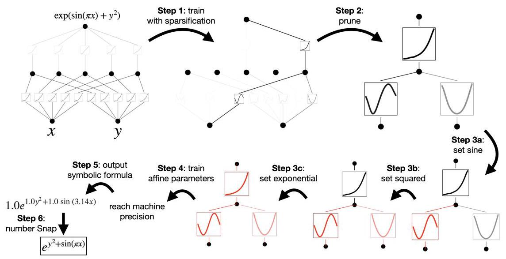

Figure 2.4: An example of how to do symbolic regression with KAN.

图2.4:使用KAN进行符号回归的示例。

2. Visualization. When we visualize a KAN, to get a sense of magnitudes, we set the transparency of an activation function ${\phi }_{l, i, j}$ proportional to $\tanh \left( {\beta {A}_{l, i, j}}\right)$ where $\beta  = 3$ . Hence, functions with small magnitude appear faded out to allow us to focus on important ones.

2. 可视化。当我们可视化一个KAN时，为了了解幅度情况，我们将激活函数${\phi }_{l, i, j}$的透明度设置为与$\tanh \left( {\beta {A}_{l, i, j}}\right)$成比例，其中$\beta  = 3$。因此，幅度小的函数会显得淡化，以便我们专注于重要的函数。

3. Pruning. After training with sparsification penalty, we may also want to prune the network to a smaller subnetwork. We sparsify KANs on the node level (rather than on the edge level). For each node (say the ${i}^{\text{ th }}$ neuron in the ${l}^{\text{ th }}$ layer), we define its incoming and outgoing score as

3. 剪枝。在使用稀疏化惩罚进行训练后，我们可能还想将网络剪枝为一个更小的子网。我们在节点级别(而不是边级别)对KAN进行稀疏化。对于每个节点(例如${l}^{\text{ th }}$层中的${i}^{\text{ th }}$神经元)，我们将其输入和输出分数定义为

$$
{I}_{l, i} = \mathop{\max }\limits_{k}\left( {\left| {\phi }_{l - 1, i, k}\right| }_{1}\right) ,\;{O}_{l, i} = \mathop{\max }\limits_{j}\left( {\left| {\phi }_{l + 1, j, i}\right| }_{1}\right) , \tag{2.21}
$$

and consider a node to be important if both incoming and outgoing scores are greater than a threshold hyperparameter $\theta  = {10}^{-2}$ by default. All unimportant neurons are pruned.

并且默认情况下，如果输入和输出分数都大于阈值超参数$\theta  = {10}^{-2}$，则认为该节点是重要的。所有不重要的神经元都将被剪枝。

4. Symbolification. In cases where we suspect that some activation functions are in fact symbolic (e.g., cos or log), we provide an interface to set them to be a specified symbolic form, fix_symbolic(1, i, j, f) can set the $\left( {l, i, j}\right)$ activation to be $f$ . However, we cannot simply set the activation function to be the exact symbolic formula, since its inputs and outputs may have shifts and scalings. So, we obtain preactivations $x$ and postactivations $y$ from samples, and fit affine parameters $\left( {a, b, c, d}\right)$ such that $y \approx  {cf}\left( {{ax} + b}\right)  + d$ . The fitting is done by iterative grid search of $a, b$ and linear regression.

4. 符号化。在我们怀疑某些激活函数实际上是符号函数(例如cos或log)的情况下，我们提供一个接口将它们设置为指定的符号形式，fix_symbolic(1, i, j, f)可以将$\left( {l, i, j}\right)$激活设置为$f$。然而，我们不能简单地将激活函数设置为精确的符号公式，因为其输入和输出可能有偏移和缩放。因此，我们从样本中获得预激活$x$和后激活$y$，并拟合仿射参数$\left( {a, b, c, d}\right)$，使得$y \approx  {cf}\left( {{ax} + b}\right)  + d$。拟合通过对$a, b$的迭代网格搜索和线性回归完成。

Besides these techniques, we provide additional tools that allow users to apply more fine-grained control to KANs, listed in Appendix A

除了这些技术，我们还提供了额外的工具，允许用户对KAN进行更细粒度的控制，列于附录A

#### 2.5.2 A toy example: how humans can interact with KANs

#### 2.5.2一个玩具示例:人类如何与KAN交互

Above we have proposed a number of simplification techniques for KANs. We can view these simplification choices as buttons one can click on. A user interacting with these buttons can decide which button is most promising to click next to make KANs more interpretable. We use an example below to showcase how a user could interact with a KAN to obtain maximally interpretable results.

上面我们为KAN提出了一些简化技术。我们可以将这些简化选择视为可以点击的按钮。与这些按钮交互的用户可以决定接下来点击哪个按钮最有希望使KAN更具可解释性。我们使用下面的示例来展示用户如何与KAN交互以获得最大程度可解释的结果。

Let us again consider the regression task

让我们再次考虑回归任务

$$
f\left( {x, y}\right)  = \exp \left( {\sin \left( {\pi x}\right)  + {y}^{2}}\right) . \tag{2.22}
$$

Given data points $\left( {{x}_{i},{y}_{i},{f}_{i}}\right) , i = 1,2,\cdots ,{N}_{p}$ , a hypothetical user Alice is interested in figuring out the symbolic formula. The steps of Alice's interaction with the KANs are described below (illustrated in Figure 2.4):

给定数据点$\left( {{x}_{i},{y}_{i},{f}_{i}}\right) , i = 1,2,\cdots ,{N}_{p}$，假设有用户爱丽丝，她想找出符号公式。爱丽丝与KANs交互的步骤如下(如图2.4所示):

Step 1: Training with sparsification. Starting from a fully-connected $\left\lbrack  {2,5,1}\right\rbrack$ KAN, training with sparsification regularization can make it quite sparse. 4 out of 5 neurons in the hidden layer appear useless, hence we want to prune them away.

步骤1:带稀疏化的训练。从一个全连接的$\left\lbrack  {2,5,1}\right\rbrack$KAN开始，带稀疏化正则化的训练可以使其变得相当稀疏。隐藏层中五分之四的神经元似乎是无用的，因此我们想将它们修剪掉。

Step 2: Pruning. Automatic pruning is seen to discard all hidden neurons except the last one, leaving a $\left\lbrack  {2,1,1}\right\rbrack$ KAN. The activation functions appear to be known symbolic functions.

步骤2:修剪。可以看到自动修剪会丢弃除最后一个之外的所有隐藏神经元，留下一个$\left\lbrack  {2,1,1}\right\rbrack$KAN。激活函数似乎是已知的符号函数。

Step 3: Setting symbolic functions. Assuming that the user can correctly guess these symbolic formulas from staring at the KAN plot, they can set

步骤3:设置符号函数。假设用户可以通过查看KAN图正确猜出这些符号公式，他们可以设置

$$
\text{ fix\_symbolic }\left( {0,0,0,\text{ ’sin’ }}\right)
$$

$$
\text{ fix\_symbolic }\left( {0,1,0,\text{ ’ }{x\hat{} }{2\text{ ’ }}}\right) \tag{2.23}
$$

$$
\text{ fix\_symbolic }\left( {1,0,0,{}^{\prime }{\mathrm{{exp}}}^{\prime }}\right) \text{ . }
$$

In case the user has no domain knowledge or no idea which symbolic functions these activation functions might be, we provide a function suggest_symbolic to suggest symbolic candidates.

如果用户没有领域知识，或者不知道这些激活函数可能是哪些符号函数，我们提供一个函数suggest_symbolic来建议符号候选。

Step 4: Further training. After symbolifying all the activation functions in the network, the only remaining parameters are the affine parameters. We continue training these affine parameters, and when we see the loss dropping to machine precision, we know that we have found the correct symbolic expression.

步骤4:进一步训练。在将网络中的所有激活函数符号化之后，唯一剩下的参数就是仿射参数。我们继续训练这些仿射参数，当我们看到损失下降到机器精度时，我们就知道我们找到了正确的符号表达式。

Step 5: Output the symbolic formula. Sympy is used to compute the symbolic formula of the output node. The user obtains ${1.0}{e}^{{1.0}{y}^{2} + {1.0}\sin \left( {3.14x}\right) }$ , which is the true answer (we only displayed two decimals for $\pi$ ).

步骤5:输出符号公式。使用Sympy来计算输出节点的符号公式。用户得到${1.0}{e}^{{1.0}{y}^{2} + {1.0}\sin \left( {3.14x}\right) }$，这就是正确答案(对于$\pi$我们只显示了两位小数)。

Remark: Why not symbolic regression (SR)? It is reasonable to use symbolic regression for this example. However, symbolic regression methods are in general brittle and hard to debug. They either return a success or a failure in the end without outputting interpretable intermediate results. In contrast, KANs do continuous search (with gradient descent) in function space, so their results are more continuous and hence more robust. Moreover, users have more control over KANs as compared to SR due to KANs' transparency. The way we visualize KANs is like displaying KANs' "brain" to users, and users can perform "surgery" (debugging) on KANs. This level of control is typically unavailable for SR. We will show examples of this in Section 4.4 More generally, when the target function is not symbolic, symbolic regression will fail but KANs can still provide something meaningful. For example, a special function (e.g., a Bessel function) is impossible to SR to learn unless it is provided in advance, but KANs can use splines to approximate it numerically anyway (see Figure 4.1 (d)).

备注:为什么不使用符号回归(SR)呢？对于这个例子使用符号回归是合理的。然而，符号回归方法通常很脆弱且难以调试。它们最终要么返回成功要么返回失败，而不会输出可解释的中间结果。相比之下，KANs在函数空间中进行连续搜索(通过梯度下降)，所以它们的结果更连续，因此更稳健。此外，由于KANs的透明度，与SR相比，用户对KANs有更多的控制权。我们可视化KANs的方式就像是向用户展示KANs的“大脑”，用户可以对KANs进行“手术”(调试)。这种控制水平通常是SR所没有的。我们将在4.4节展示这方面的例子。更一般地说，当目标函数不是符号函数时，符号回归会失败，但KANs仍然可以提供有意义的东西。例如，一个特殊函数(例如，贝塞尔函数)除非事先提供，否则符号回归无法学习，但KANs无论如何都可以使用样条对其进行数值近似(见图4.1(d))。

## 3 KANs are accurate

## 3 KANs是准确的

In this section, we demonstrate that KANs are more effective at representing functions than MLPs in various tasks (regression and PDE solving). When comparing two families of models, it is fair to compare both their accuracy (loss) and their complexity (number of parameters). We will show that KANs display more favorable Pareto Frontiers than MLPs. Moreover, in Section 3.5, we show that KANs can naturally work in continual learning without catastrophic forgetting.

在本节中，我们证明在各种任务(回归和偏微分方程求解)中，KANs在表示函数方面比多层感知器(MLP)更有效。在比较两个模型家族时，比较它们的准确性(损失)和复杂性(参数数量)是公平的。我们将表明KANs比MLP显示出更有利的帕累托前沿。此外，在3.5节中，我们表明KANs可以在持续学习中自然地工作而不会发生灾难性遗忘。

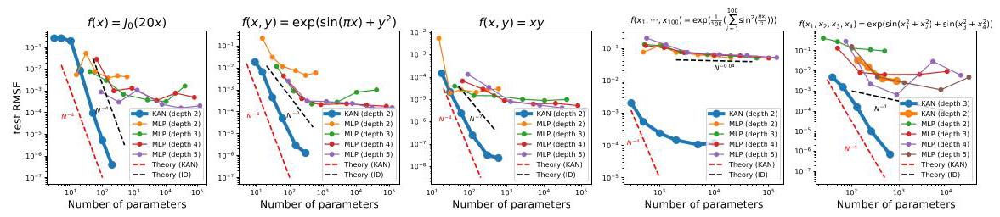

Figure 3.1: Compare KANs to MLPs on five toy examples. KANs can almost saturate the fastest scaling law predicted by our theory $\left( {\alpha  = 4}\right)$ , while MLPs scales slowly and plateau quickly.

图3.1:在五个玩具示例上比较KANs和MLP。KANs几乎可以达到我们理论$\left( {\alpha  = 4}\right)$预测的最快缩放定律，而MLP缩放缓慢且很快达到平稳期。

### 3.1 Toy datasets

### 3.1玩具数据集

In Section 2.3, our theory suggested that test RMSE loss $\ell$ scales as $\ell  \propto  {N}^{-4}$ with model parameters $N$ . However, this relies on the existence of a Kolmogorov-Arnold representation. As a sanity check, we construct five examples we know have smooth KA representations:

在2.3节中，我们的理论表明测试均方根误差损失$\ell$随着模型参数$N$按$\ell  \propto  {N}^{-4}$缩放。然而，这依赖于存在柯尔莫哥洛夫 - 阿诺德表示。作为一个合理性检查，我们构造了五个我们知道具有平滑KA表示的例子:

(1) $f\left( x\right)  = {J}_{0}\left( {20x}\right)$ , which is the Bessel function. Since it is a univariate function, it can be represented by a spline, which is a $\left\lbrack  {1,1}\right\rbrack$ KAN.

(1) $f\left( x\right)  = {J}_{0}\left( {20x}\right)$，它是贝塞尔函数。由于它是一个单变量函数，它可以由样条表示，样条是一个$\left\lbrack  {1,1}\right\rbrack$KAN。

(2) $f\left( {x, y}\right)  = \exp \left( {\sin \left( {\pi x}\right)  + {y}^{2}}\right)$ . We know that it can be exactly represented by a $\left\lbrack  {2,1,1}\right\rbrack$ KAN.

(2) $f\left( {x, y}\right)  = \exp \left( {\sin \left( {\pi x}\right)  + {y}^{2}}\right)$ 。我们知道它可以由一个 $\left\lbrack  {2,1,1}\right\rbrack$ KAN 精确表示。

(3) $f\left( {x, y}\right)  = {xy}$ . We know from Figure 4.1 that it can be exactly represented by a $\left\lbrack  {2,2,1}\right\rbrack$ KAN.

(3) $f\left( {x, y}\right)  = {xy}$ 。从图 4.1 我们知道它可以由一个 $\left\lbrack  {2,2,1}\right\rbrack$ KAN 精确表示。

(4) A high-dimensional example $f\left( {{x}_{1},\cdots ,{x}_{100}}\right)  = \exp \left( {\frac{1}{100}\mathop{\sum }\limits_{{i = 1}}^{{100}}{\sin }^{2}\left( \frac{\pi {x}_{i}}{2}\right) }\right)$ which can be represented by a $\left\lbrack  {{100},1,1}\right\rbrack$ KAN.

(4) 一个可以由 $\left\lbrack  {{100},1,1}\right\rbrack$ KAN 表示的高维示例 $f\left( {{x}_{1},\cdots ,{x}_{100}}\right)  = \exp \left( {\frac{1}{100}\mathop{\sum }\limits_{{i = 1}}^{{100}}{\sin }^{2}\left( \frac{\pi {x}_{i}}{2}\right) }\right)$ 。

(5) A four-dimensional example $f\left( {{x}_{1},{x}_{2},{x}_{3},{x}_{4}}\right)  = \exp \left( {\frac{1}{2}\left( {\sin \left( {\pi \left( {{x}_{1}^{2} + {x}_{2}^{2}}\right) }\right)  + \sin \left( {\pi \left( {{x}_{3}^{2} + {x}_{4}^{2}}\right) }\right) }\right) }\right)$ which can be represented by a $\left\lbrack  {4,4,2,1}\right\rbrack$ KAN.

(5) 一个可以由 $\left\lbrack  {4,4,2,1}\right\rbrack$ KAN 表示的四维示例 $f\left( {{x}_{1},{x}_{2},{x}_{3},{x}_{4}}\right)  = \exp \left( {\frac{1}{2}\left( {\sin \left( {\pi \left( {{x}_{1}^{2} + {x}_{2}^{2}}\right) }\right)  + \sin \left( {\pi \left( {{x}_{3}^{2} + {x}_{4}^{2}}\right) }\right) }\right) }\right)$ 。

We train these KANs by increasing grid points every 200 steps, in total covering $G = \; \{ 3,5,{10},{20},{50},{100},{200},{500},{1000}\}$ . We train MLPs with different depths and widths as baselines. Both MLPs and KANs are trained with LBFGS for 1800 steps in total. We plot test RMSE as a function of the number of parameters for KANs and MLPs in Figure 3.1, showing that KANs have better scaling curves than MLPs, especially for the high-dimensional example. For comparison, we plot the lines predicted from our KAN theory as red dashed $\left( {\alpha  = k + 1 = 4}\right)$ , and the lines predicted from Sharma & Kaplan [24] as black-dashed $\left( {\alpha  = \left( {k + 1}\right) /d = 4/d}\right)$ . KANs can almost saturate the steeper red lines, while MLPs struggle to converge even as fast as the slower black lines and plateau quickly. We also note that for the last example, the 2-Layer KAN $\left\lbrack  {4,9,1}\right\rbrack$ behaves much worse than the 3-Layer KAN (shape $\left\lbrack  {4,2,2,1}\right\rbrack$ ). This highlights the greater expressive power of deeper KANs, which is the same for MLPs: deeper MLPs have more expressive power than shallower ones. Note that we have adopted the vanilla setup where both KANs and MLPs are trained with LBFGS without advanced techniques, e.g., switching between Adam and LBFGS, or boosting [35]. We leave the comparison of KANs and MLPs in advanced setups for future work.

我们通过每 200 步增加网格点来训练这些 KAN，总共覆盖 $G = \; \{ 3,5,{10},{20},{50},{100},{200},{500},{1000}\}$ 。我们训练具有不同深度和宽度的 MLP 作为基线。MLP 和 KAN 都使用 LBFGS 总共训练 1800 步。我们在图 3.1 中绘制了测试 RMSE 作为 KAN 和 MLP 参数数量的函数，表明 KAN 比 MLP 具有更好的缩放曲线，特别是对于高维示例。为了进行比较，我们将从我们的 KAN 理论预测的线绘制为红色虚线 $\left( {\alpha  = k + 1 = 4}\right)$ ，将从 Sharma & Kaplan [24] 预测的线绘制为黑色虚线 $\left( {\alpha  = \left( {k + 1}\right) /d = 4/d}\right)$ 。KAN 几乎可以达到更陡的红色线，而 MLP 即使像较慢的黑色线一样快地收敛也很困难并且很快达到平稳期。我们还注意到对于最后一个示例，2 层 KAN $\left\lbrack  {4,9,1}\right\rbrack$ 的表现比 3 层 KAN(形状 $\left\lbrack  {4,2,2,1}\right\rbrack$ )差得多。这突出了更深的 KAN 具有更大的表达能力，这对于 MLP 也是一样的:更深的 MLP 比更浅的 MLP 具有更强的表达能力。请注意，我们采用了普通设置，其中 KAN 和 MLP 都使用 LBFGS 进行训练，没有使用先进技术，例如在 Adam 和 LBFGS 之间切换或增强 [35]。我们将在先进设置中对 KAN 和 MLP 的比较留待未来工作。

### 3.2 Special functions

### 3.2 特殊函数

One caveat for the above results is that we assume knowledge of the "true" KAN shape. In practice, we do not know the existence of KA representations. Even when we are promised that such a KA representation exists, we do not know the KAN shape a priori. Special functions in more than one variables are such cases, because it would be (mathematically) surprising if multivariate special functions (e.g., a Bessel function $f\left( {\nu , x}\right)  = {J}_{\nu }\left( x\right)$ ) could be written in KA represenations, involving only univariate functions and sums). We show below that:

上述结果的一个注意事项是我们假设知道“真实”的 KAN 形状。在实践中，我们不知道 KA 表示的存在。即使我们被告知存在这样的 KA 表示，我们也不知道先验的 KAN 形状。多个变量的特殊函数就是这样的情况，因为如果多元特殊函数(例如，贝塞尔函数 $f\left( {\nu , x}\right)  = {J}_{\nu }\left( x\right)$ )可以用 KA 表示(仅涉及单变量函数和求和)，那将是(数学上)令人惊讶的。我们在下面展示:

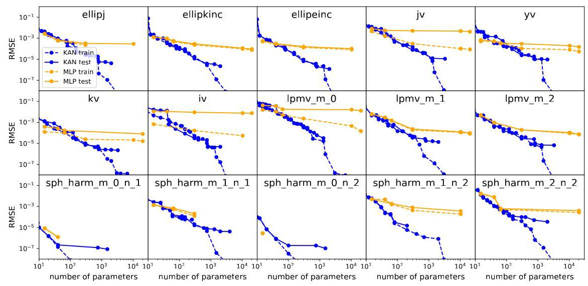

Figure 3.2: Fitting special functions. We show the Pareto Frontier of KANs and MLPs in the plane spanned by the number of model parameters and RMSE loss. Consistently accross all special functions, KANs have better Pareto Frontiers than MLPs. The definitions of these special functions are in Table 1

图3.2:拟合特殊函数。我们在由模型参数数量和均方根误差损失所构成的平面中展示了KAN和MLP的帕累托前沿。在所有特殊函数中，KAN始终比MLP具有更好的帕累托前沿。这些特殊函数的定义见表1

(1) Finding (approximate) compact KA representations of special functions is possible, revealing novel mathematical properties of special functions from the perspective of Kolmogorov-Arnold representations.

(1) 找到(近似)特殊函数的紧凑KA表示是可能的，这从柯尔莫哥洛夫 - 阿诺德表示的角度揭示了特殊函数的新数学性质。

(2) KANs are more efficient and accurate in representing special functions than MLPs.

(2) 在表示特殊函数方面，KAN比MLP更高效、更准确。

We collect 15 special functions common in math and physics, summarized in Table 1 . We choose MLPs with fixed width 5 or 100 and depths swept in $\{ 2,3,4,5,6\}$ . We run KANs both with and without pruning. KANs without pruning: We fix the shape of KAN, whose width are set to 5 and depths are swept in $\{ 2,3,4,5,6\}$ . KAN with pruning. We use the sparsification $\left( {\lambda  = {10}^{-2}\text{ or }{10}^{-3}}\right)$ and pruning technique in Section 2.5.1 to obtain a smaller KAN pruned from a fixed-shape KAN. Each KAN is initialized to have $G = 3$ , trained with LBFGS, with increasing number of grid points every 200 steps to cover $G = \{ 3,5,{10},{20},{50},{100},{200}\}$ . For each hyperparameter combination, we run 3 random seeds.

我们收集了15个数学和物理中常见的特殊函数，总结在表1中。我们选择宽度固定为5或100且深度在$\{ 2,3,4,5,6\}$中扫描的MLP。我们对KAN进行了有剪枝和无剪枝的运行。无剪枝的KAN:我们固定KAN的形状，其宽度设置为5且深度在$\{ 2,3,4,5,6\}$中扫描。有剪枝的KAN。我们使用第2.5.1节中的稀疏化$\left( {\lambda  = {10}^{-2}\text{ or }{10}^{-3}}\right)$和剪枝技术，从固定形状的KAN中获得一个更小的剪枝后的KAN。每个KAN初始化为具有$G = 3$，使用LBFGS进行训练，每200步增加网格点数量以覆盖$G = \{ 3,5,{10},{20},{50},{100},{200}\}$。对于每个超参数组合，我们运行3个随机种子。

For each dataset and each model family (KANs or MLPs), we plot the Pareto frontier 5 in the (number of parameters, RMSE) plane, shown in Figure 3.2 KANs' performance is shown to be consistently better than MLPs, i.e., KANs can achieve lower training/test losses than MLPs, given the same number of parameters. Moreover, we report the (surprisingly compact) shapes of our auto-discovered KANs for special functions in Table 1 On one hand, it is interesting to interpret what these compact representations mean mathematically (we include the KAN illustrations in Figure F.1 and F.2 in Appendix F). On the other hand, these compact representations imply the possibility of breaking down a high-dimensional lookup table into several 1D lookup tables, which can potentially save a lot of memory, with the (almost negligible) overhead to perform a few additions at inference time.

对于每个数据集和每个模型族(KAN或MLP)，我们在(参数数量，均方根误差)平面中绘制帕累托前沿5，如图3.2所示。结果表明，KAN的性能始终优于MLP，即在相同参数数量下，KAN能够比MLP实现更低的训练/测试损失。此外，我们在表1中报告了我们自动发现的用于特殊函数的KAN的(令人惊讶地紧凑)形状。一方面，从数学上解释这些紧凑表示的含义很有趣(我们在附录F的图F.1和F.2中包含了KAN的图示)。另一方面，这些紧凑表示意味着有可能将高维查找表分解为几个一维查找表，这有可能节省大量内存，并且在推理时执行一些加法的开销(几乎可以忽略不计)。

### 3.3 Feynman datasets

### 3.3 费曼数据集

The setup in Section 3.1 is when we clearly know "true" KAN shapes. The setup in Section 3.2 is when we clearly do not know "true" KAN shapes. This part investigates a setup lying in the middle:

第3.1节中的设置是当我们清楚知道“真实”的KAN形状时。第3.2节中的设置是当我们清楚不知道“真实”的KAN形状时。这部分研究处于中间的一种设置:

---

${}^{5}$ Pareto frontier is defined as fits that are optimal in the sense of no other fit being both simpler and more accurate.

${}^{5}$ 帕累托前沿被定义为在没有其他拟合既更简单又更准确的意义上是最优的拟合。

---

<table><tr><td>Name</td><td>scipy.special API</td><td>Minimal KAN shape test RMSE $< {10}^{-2}$</td><td>Minimal KAN test RMSE</td><td>Best KAN shape</td><td>Best KAN test RMSE</td><td>MLP test RMSE</td></tr><tr><td>Jacobian elliptic functions</td><td>$\operatorname{ellipj}\left( {x, y}\right)$</td><td>$\left\lbrack  {2,2,1}\right\rbrack$</td><td>${7.29} \times  {10}^{-3}$</td><td>$\left\lbrack  {2,3,2,1,1,1}\right\rbrack$</td><td>${1.33} \times  {10}^{-4}$</td><td>${6.48} \times  {10}^{-4}$</td></tr><tr><td>Incomplete elliptic integral of the first kind</td><td>$\operatorname{ellipkinc}\left( {x, y}\right)$</td><td>$\left\lbrack  {2,2,1,1}\right\rbrack$</td><td>${1.00} \times  {10}^{-3}$</td><td>$\left\lbrack  {2,2,1,1,1}\right\rbrack$</td><td>${1.24} \times  {10}^{-4}$</td><td>${5.52} \times  {10}^{-4}$</td></tr><tr><td>Incomplete elliptic integral of the second kind</td><td>$\operatorname{ellipeinc}\left( {x, y}\right)$</td><td>$\left\lbrack  {2,2,1,1}\right\rbrack$</td><td>${8.36} \times  {10}^{-5}$</td><td>$\left\lbrack  {2,2,1,1}\right\rbrack$</td><td>${8.26} \times  {10}^{-5}$</td><td>${3.04} \times  {10}^{-4}$</td></tr><tr><td>Bessel function of the first kind</td><td>$\mathrm{{jv}}\left( {x, y}\right)$</td><td>$\left\lbrack  {2,2,1}\right\rbrack$</td><td>${4.93} \times  {10}^{-3}$</td><td>$\left\lbrack  {2,3,1,1,1}\right\rbrack$</td><td>${1.64} \times  {10}^{-3}$</td><td>${5.52} \times  {10}^{-3}$</td></tr><tr><td>Bessel function of the second kind</td><td>$\mathrm{{yv}}\left( {x, y}\right)$</td><td>$\left\lbrack  {2,3,1}\right\rbrack$</td><td>${1.89} \times  {10}^{-3}$</td><td>$\left\lbrack  {2,2,2,1}\right\rbrack$</td><td>$\mathbf{{1.49} \times  {10}^{-5}}$</td><td>${3.45} \times  {10}^{-4}$</td></tr><tr><td>Modified Bessel function of the second kind</td><td>$\mathrm{{kv}}\left( {x, y}\right)$</td><td>$\left\lbrack  {2,1,1}\right\rbrack$</td><td>${4.89} \times  {10}^{-3}$</td><td>$\left\lbrack  {2,2,1}\right\rbrack$</td><td>$\mathbf{{2.52} \times  {10}^{-5}}$</td><td>${1.67} \times  {10}^{-4}$</td></tr><tr><td>Modified Bessel function of the first kind</td><td>$\mathrm{{iv}}\left( {x, y}\right)$</td><td>$\left\lbrack  {2,4,3,2,1,1}\right\rbrack$</td><td>${9.28} \times  {10}^{-3}$</td><td>$\left\lbrack  {2,4,3,2,1,1}\right\rbrack$</td><td>${9.28} \times  {10}^{-3}$</td><td>${1.07} \times  {10}^{-2}$</td></tr><tr><td>Associated Legendre function $\left( {m = 0}\right)$</td><td>$\operatorname{lpmv}\left( {0, x, y}\right)$</td><td>$\left\lbrack  {2,2,1}\right\rbrack$</td><td>${5.25} \times  {10}^{-5}$</td><td>$\left\lbrack  {2,2,1}\right\rbrack$</td><td>${5.25} \times  {10}^{-5}$</td><td>${1.74} \times  {10}^{-2}$</td></tr><tr><td>Associated Legendre function $\left( {m = 1}\right)$</td><td>$\operatorname{lpmv}\left( {1, x, y}\right)$</td><td>[2,4,1]</td><td>${6.90} \times  {10}^{-4}$</td><td>$\left\lbrack  {2,4,1}\right\rbrack$</td><td>${6.90} \times  {10}^{-4}$</td><td>${1.50} \times  {10}^{-3}$</td></tr><tr><td>Associated Legendre function $\left( {m = 2}\right)$</td><td>$\operatorname{lpmv}\left( {2, x, y}\right)$</td><td>[2,2,1]</td><td>${4.88} \times  {10}^{-3}$</td><td>$\left\lbrack  {2,3,2,1}\right\rbrack$</td><td>${2.26} \times  {10}^{-4}$</td><td>${9.43} \times  {10}^{-4}$</td></tr><tr><td>spherical harmonics $\left( {m = 0, n = 1}\right)$</td><td>sph_harm $\left( {0,1, x, y}\right)$</td><td>[2,1,1]</td><td>${2.21} \times  {10}^{-7}$</td><td>$\left\lbrack  {2,1,1}\right\rbrack$</td><td>${2.21} \times  {10}^{-7}$</td><td>${1.25} \times  {10}^{-6}$</td></tr><tr><td>spherical harmonics $\left( {m = 1, n = 1}\right)$</td><td>sph_harm $\left( {1,1, x, y}\right)$</td><td>[2,2,1]</td><td>${7.86} \times  {10}^{-4}$</td><td>$\left\lbrack  {2,3,2,1}\right\rbrack$</td><td>${1.22} \times  {10}^{-4}$</td><td>${6.70} \times  {10}^{-4}$</td></tr><tr><td>spherical harmonics $\left( {m = 0, n = 2}\right)$</td><td>sph_harm $\left( {0,2, x, y}\right)$</td><td>[2,1,1]</td><td>${1.95} \times  {10}^{-7}$</td><td>$\left\lbrack  {2,1,1}\right\rbrack$</td><td>${1.95} \times  {10}^{-7}$</td><td>${2.85} \times  {10}^{-6}$</td></tr><tr><td>spherical harmonics $\left( {m = 1, n = 2}\right)$</td><td>sph_harm(1, 2, x, y)</td><td>[2,2,1]</td><td>${4.70} \times  {10}^{-4}$</td><td>$\left\lbrack  {2,2,1,1}\right\rbrack$</td><td>${1.50} \times  {10}^{-5}$</td><td>${1.84} \times  {10}^{-3}$</td></tr><tr><td>spherical harmonics $\left( {m = 2, n = 2}\right)$</td><td>sph_harm(2, 2, x, y)</td><td>$\left\lbrack  {2,2,1}\right\rbrack$</td><td>${1.12} \times  {10}^{-3}$</td><td>$\left\lbrack  {2,2,3,2,1}\right\rbrack$</td><td>$\mathbf{{9.45} \times  {10}^{-5}}$</td><td>${6.21} \times  {10}^{-4}$</td></tr></table>

Table 1: Special functions

表1:特殊函数

<table><tr><td>Feynman Eq.</td><td>Original Formula</td><td>Dimensionless formula</td><td>Variables</td><td>Human-constructed KAN shape</td><td>Pruned KAN shape (smallest shape that achieves RMSE $< {10}^{-2}$ )</td><td>Pruned KAN shape (lowest loss)</td><td>Human-constructed KAN loss (lowest test RMSE)</td><td>Pruned KAN loss (lowest test RMSE)</td><td>Unpruned KAN loss (lowest test RMSE)</td><td>MLP loss (lowest test RMSE)</td></tr><tr><td>I.6.2</td><td>$\exp \left( {-\frac{{\theta }^{2}}{2{\sigma }^{2}}}\right) /\sqrt{{2\pi }{\sigma }^{2}}$</td><td>$\exp \left( {-\frac{{\theta }^{2}}{2{\sigma }^{2}}}\right) /\sqrt{{2\pi }{\sigma }^{2}}$</td><td>$\theta ,\sigma$</td><td>$\left\lbrack  {2,2,1,1}\right\rbrack$</td><td>$\left\lbrack  {2,2,1}\right\rbrack$</td><td>$\left\lbrack  {2,2,1,1}\right\rbrack$</td><td>${7.66} \times  {10}^{-5}$</td><td>${2.86} \times  {10}^{-5}$</td><td>${4.60} \times  {10}^{-5}$</td><td>${1.45} \times  {10}^{-4}$</td></tr><tr><td>I.6.2b</td><td>$\exp \left( {-\frac{{\left( \theta  - {\theta }_{1}\right) }^{2}}{2{\sigma }^{2}}}\right) /\sqrt{{2\pi }{\sigma }^{2}}$</td><td>$\exp \left( {-\frac{{\left( \theta  - {\theta }_{1}\right) }^{2}}{2{\sigma }^{2}}}\right) /\sqrt{{2\pi }{\sigma }^{2}}$</td><td>$\theta ,{\theta }_{1},\sigma$</td><td>$\left\lbrack  {3,2,2,1,1}\right\rbrack$</td><td>$\left\lbrack  {3,4,1}\right\rbrack$</td><td>$\left\lbrack  {3,2,2,1,1}\right\rbrack$</td><td>${1.22} \times  {10}^{-3}$</td><td>${4.45} \times  {10}^{-4}$</td><td>${1.25} \times  {10}^{-3}$</td><td>${7.40} \times  {10}^{-4}$</td></tr><tr><td>I.9.18</td><td>$G{m}_{1}{m}_{2}$</td><td>$\frac{a}{{\left( b - 1\right) }^{2} + {\left( c - d\right) }^{2} + {\left( e - f\right) }^{2}}$</td><td>$a, b, c, d, e, f$</td><td>$\left\lbrack  {6,4,2,1,1}\right\rbrack$</td><td>$\left\lbrack  {6,4,1,1}\right\rbrack$</td><td>$\left\lbrack  {6,4,1,1}\right\rbrack$</td><td>${1.48} \times  {10}^{-3}$</td><td>${8.62} \times  {10}^{-3}$</td><td>${6.56} \times  {10}^{-3}$</td><td>${1.59} \times  {10}^{-3}$</td></tr><tr><td>I.12.11</td><td>$q\left( {{E}_{f} + {Bv}\sin \theta }\right)$</td><td>$1 + a\sin \theta$</td><td>$a,\theta$</td><td>$\left\lbrack  {2,2,2,1}\right\rbrack$</td><td>$\left\lbrack  {2,2,1}\right\rbrack$</td><td>$\left\lbrack  {2,2,1}\right\rbrack$</td><td>${2.07} \times  {10}^{-3}$</td><td>${1.39} \times  {10}^{-3}$</td><td>${9.13} \times  {10}^{-4}$</td><td>${6.71} \times  {10}^{-4}$</td></tr><tr><td>I.13.12</td><td>$G{m}_{1}{m}_{2}\left( {\frac{1}{{r}_{2}} - \frac{1}{{r}_{1}}}\right)$</td><td>$a\left( {\frac{1}{b} - 1}\right)$</td><td>$a, b$</td><td>$\left\lbrack  {2,2,1}\right\rbrack$</td><td>$\left\lbrack  {2,2,1}\right\rbrack$</td><td>$\left\lbrack  {2,2,1}\right\rbrack$</td><td>${7.22} \times  {10}^{-3}$</td><td>${4.81} \times  {10}^{-3}$</td><td>${2.72} \times  {10}^{-3}$</td><td>${1.42} \times  {10}^{-3}$</td></tr><tr><td>L15.3x</td><td>$\frac{x - {ut}}{\sqrt{1 - {\left( \frac{u}{c}\right) }^{2}}}$</td><td>$\frac{1 - a}{\sqrt{1 - {a}^{2}}}$</td><td>$a, b$</td><td>$\left\lbrack  {2,2,1,1}\right\rbrack$</td><td>$\left\lbrack  {2,1,1}\right\rbrack$</td><td>$\left\lbrack  {2,2,1,1,1}\right\rbrack$</td><td>${7.35} \times  {10}^{-3}$</td><td>${1.58} \times  {10}^{-3}$</td><td>${1.14} \times  {10}^{-3}$</td><td>${8.54} \times  {10}^{-4}$</td></tr><tr><td>L16.6</td><td>$\frac{u + v}{1 + \frac{uv}{{c}^{2}}}$</td><td>$\frac{a + b}{1 + {ab}}$</td><td>$a, b$</td><td>$\left\lbrack  {2,2,2,2,2,1}\right\rbrack$</td><td>$\left\lbrack  {2,2,1}\right\rbrack$</td><td>$\left\lbrack  {2,2,1}\right\rbrack$</td><td>${1.06} \times  {10}^{-3}$</td><td>${1.19} \times  {10}^{-3}$</td><td>${1.53} \times  {10}^{-3}$</td><td>${6.20} \times  {10}^{-4}$</td></tr><tr><td>I.18.4</td><td>$\frac{{m}_{1}{r}_{1} + {m}_{2}{r}_{2}}{{m}_{1} + {m}_{2}}$</td><td>$\frac{1 + {ab}}{1 + a}$</td><td>$a, b$</td><td>$\left\lbrack  {2,2,2,1,1}\right\rbrack$</td><td>$\left\lbrack  {2,2,1}\right\rbrack$</td><td>$\left\lbrack  {2,2,1}\right\rbrack$</td><td>${3.92} \times  {10}^{-4}$</td><td>${1.50} \times  {10}^{-4}$</td><td>${1.32} \times  {10}^{-3}$</td><td>${3.68} \times  {10}^{-4}$</td></tr><tr><td>I.26.2</td><td>$\arcsin \left( {n\sin {\theta }_{2}}\right)$</td><td>$\arcsin \left( {n\sin {\theta }_{2}}\right)$</td><td>$n,{\theta }_{2}$</td><td>$\left\lbrack  {2,2,2,1,1}\right\rbrack$</td><td>$\left\lbrack  {2,2,1}\right\rbrack$</td><td>$\left\lbrack  {2,2,2,1,1}\right\rbrack$</td><td>${1.22} \times  {10}^{-4}$</td><td>${7.90} \times  {10}^{-4}$</td><td>${8.63} \times  {10}^{-4}$</td><td>${1.24} \times  {10}^{-4}$</td></tr><tr><td>I.27.6</td><td>$\frac{1}{\frac{1}{\frac{1}{{x}_{1}} + \frac{n}{{x}_{2}}}}$</td><td>$\frac{1}{1 + {ab}}$</td><td>$a, b$</td><td>$\left\lbrack  {2,2,1,1}\right\rbrack$</td><td>$\left\lbrack  {2,1,1}\right\rbrack$</td><td>$\left\lbrack  {2,1,1}\right\rbrack$</td><td>${2.22} \times  {10}^{-4}$</td><td>${1.94} \times  {10}^{-4}$</td><td>${2.14} \times  {10}^{-4}$</td><td>${2.46} \times  {10}^{-4}$</td></tr><tr><td>I.29.16</td><td>$\sqrt{{x}_{1}^{2} + {x}_{2}^{2} - 2{x}_{1}{x}_{2}\cos \left( {{\theta }_{1} - {\theta }_{2}}\right) }$</td><td>$\sqrt{1 + {a}^{2} - {2a}\mathrm{{cos}}\left( {{\theta }_{1} - {\theta }_{2}}\right) }$</td><td>$a,{\theta }_{1},{\theta }_{2}$</td><td>$\left\lbrack  {3,2,2,3,2,1,1}\right\rbrack$</td><td>$\left\lbrack  {3,2,2,1}\right\rbrack$</td><td>$\left\lbrack  {3,2,3,1}\right\rbrack$</td><td>${2.36} \times  {10}^{-1}$</td><td>${3.99} \times  {10}^{-3}$</td><td>${3.20} \times  {10}^{-3}$</td><td>${4.64} \times  {10}^{-3}$</td></tr><tr><td>1.30.3</td><td>${I}_{*,0}\frac{{\sin }^{2}\left( \frac{\pi a}{2}\right) }{{\sin }^{2}\left( \frac{\pi }{2}\right) }$</td><td>$\frac{{\sin }^{2}\left( \frac{\pi \theta }{2}\right) }{{\sin }^{2}\left( \frac{\pi }{2}\right) }$</td><td>$n,\theta$</td><td>$\left\lbrack  {2,3,2,2,1,1}\right\rbrack$</td><td>$\left\lbrack  {2,4,3,1}\right\rbrack$</td><td>$\left\lbrack  {2,3,2,3,1,1}\right\rbrack$</td><td>${3.85} \times  {10}^{-1}$</td><td>${1.03} \times  {10}^{-3}$</td><td>${1.11} \times  {10}^{-2}$</td><td>${1.50} \times  {10}^{-2}$</td></tr><tr><td>1.30.5</td><td>$\arcsin \left( \frac{\lambda }{nd}\right)$</td><td>$\arcsin \left( \frac{a}{n}\right)$</td><td>$a, n$</td><td>[2,1,1]</td><td>$\left\lbrack  {2,1,1}\right\rbrack$</td><td>$\left\lbrack  {2,1,1,1,1,1}\right\rbrack$</td><td>${2.23} \times  {10}^{-4}$</td><td>${3.49} \times  {10}^{-5}$</td><td>${6.92} \times  {10}^{-5}$</td><td>${9.45} \times  {10}^{-5}$</td></tr><tr><td>1.37.4</td><td>${I}_{ * } = {I}_{1} + {I}_{2} + 2\sqrt{{I}_{1}{I}_{2}}\cos \delta$</td><td>$1 + a + 2\sqrt{a}\cos \delta$</td><td>$a,\delta$</td><td>$\left\lbrack  {2,3,2,1}\right\rbrack$</td><td>$\left\lbrack  {2,2,1}\right\rbrack$</td><td>$\left\lbrack  {2,2,1}\right\rbrack$</td><td>${7.57} \times  {10}^{-5}$</td><td>${4.91} \times  {10}^{-6}$</td><td>${3.41} \times  {10}^{-4}$</td><td>${5.67} \times  {10}^{-4}$</td></tr><tr><td>I.40.1</td><td>${n}_{0}\exp \left( {-\frac{mgx}{{k}_{\mathrm{B}}T}}\right)$</td><td>${n}_{0}{e}^{-a}$</td><td>${n}_{0}, a$</td><td>$\left\lbrack  {2,1,1}\right\rbrack$</td><td>$\left\lbrack  {2,2,1}\right\rbrack$</td><td>$\left\lbrack  {2,2,1,1,1,2,1}\right\rbrack$</td><td>${3.45} \times  {10}^{-3}$</td><td>${5.01} \times  {10}^{-4}$</td><td>${3.12} \times  {10}^{-4}$</td><td>${3.99} \times  {10}^{-4}$</td></tr><tr><td>I.44.4</td><td>$n{k}_{b}T\ln \left( \frac{{V}_{2}}{{V}_{1}}\right)$</td><td>$n\ln a$</td><td>$n, a$</td><td>$\left\lbrack  {2,2,1}\right\rbrack$</td><td>$\left\lbrack  {2,2,1}\right\rbrack$</td><td>$\left\lbrack  {2,2,1}\right\rbrack$</td><td>$\mathbf{2.{30} \times  {10}^{-5}}$</td><td>${2.43} \times  {10}^{-5}$</td><td>${1.10} \times  {10}^{-4}$</td><td>${3.99} \times  {10}^{-4}$</td></tr><tr><td>1.50.26</td><td>${x}_{1}\left( {\cos \left( {\omega t}\right)  + \alpha {\cos }^{2}\left( {wt}\right) }\right)$</td><td>$\cos \alpha  + \alpha {\cos }^{2}\alpha$</td><td>$a,\alpha$</td><td>$\left\lbrack  {2,2,3,1}\right\rbrack$</td><td>$\left\lbrack  {2,3,1}\right\rbrack$</td><td>$\left\lbrack  {2,3,2,1}\right\rbrack$</td><td>${1.52} \times  {10}^{-4}$</td><td>${5.82} \times  {10}^{-4}$</td><td>${4.90} \times  {10}^{-4}$</td><td>${1.53} \times  {10}^{-3}$</td></tr><tr><td>II.2.42</td><td>$\frac{\frac{3}{4}\left( {{T}_{2} - {T}_{1}}\right) A}{A}$</td><td>$\left( {a - 1}\right) b$</td><td>$a, b$</td><td>$\left\lbrack  {2,2,1}\right\rbrack$</td><td>$\left\lbrack  {2,2,1}\right\rbrack$</td><td>$\left\lbrack  {2,2,2,1}\right\rbrack$</td><td>${8.54} \times  {10}^{-4}$</td><td>${7.22} \times  {10}^{-4}$</td><td>${1.22} \times  {10}^{-3}$</td><td>${1.81} \times  {10}^{-4}$</td></tr><tr><td>IL6.15a</td><td>$\frac{3}{4\pi e}\frac{{p}_{0}z}{{r}^{5}}\sqrt{{x}^{2} + {y}^{2}}$</td><td>$\frac{1}{4}c\sqrt{{a}^{2} + {b}^{2}}$</td><td>$a, b, c$</td><td>$\left\lbrack  {3,2,2,2,1}\right\rbrack$</td><td>$\left\lbrack  {3,2,1,1}\right\rbrack$</td><td>$\left\lbrack  {3,2,1,1}\right\rbrack$</td><td>${2.61} \times  {10}^{-3}$</td><td>${3.28} \times  {10}^{-3}$</td><td>${1.35} \times  {10}^{-3}$</td><td>${5.92} \times  {10}^{-4}$</td></tr><tr><td>IL11.7</td><td>${n}_{0}(1 + \frac{{p}_{d}{E}_{f}\cos \theta }{k.T})$</td><td>${n}_{0}\left( {1 + a\cos \theta }\right)$</td><td>${n}_{0}, a,\theta$</td><td>$\left\lbrack  {3,3,3,2,2,1}\right\rbrack$</td><td>$\left\lbrack  {3,3,1,1}\right\rbrack$</td><td>$\left\lbrack  {3,3,1,1}\right\rbrack$</td><td>${7.10} \times  {10}^{-3}$</td><td>${8.52} \times  {10}^{-3}$</td><td>${5.03} \times  {10}^{-3}$</td><td>${5.92} \times  {10}^{-4}$</td></tr><tr><td>II.11.27</td><td>$\frac{n\alpha }{1 - \frac{n\alpha }{2}}\epsilon {E}_{f}$</td><td>$\frac{n\alpha }{1 - \frac{n\alpha }{n}}$</td><td>$n,\alpha$</td><td>$\left\lbrack  {2,2,1,2,1}\right\rbrack$</td><td>$\left\lbrack  {2,1,1}\right\rbrack$</td><td>$\left\lbrack  {2,2,1}\right\rbrack$</td><td>${2.67} \times  {10}^{-5}$</td><td>${4.40} \times  {10}^{-5}$</td><td>${1.43} \times  {10}^{-5}$</td><td>${7.18} \times  {10}^{-5}$</td></tr><tr><td>II. 35.18</td><td>$\frac{{n}_{0}}{\exp \left( \frac{\mu  \cdot  {mB}}{k \cdot  T}\right)  + \exp \left( {-\frac{\mu  \cdot  {mB}}{k \cdot  T}}\right) }$</td><td>$\frac{{n}_{0}}{\exp \left( \alpha \right)  + \exp \left( {-\alpha }\right) }$</td><td>${n}_{0}, a$</td><td>$\left\lbrack  {2,1,1}\right\rbrack$</td><td>$\left\lbrack  {2,1,1}\right\rbrack$</td><td>$\left\lbrack  {2,1,1,1}\right\rbrack$</td><td>${4.13} \times  {10}^{-4}$</td><td>${1.58} \times  {10}^{-4}$</td><td>$\mathbf{{7.71} \times  {10}^{-5}}$</td><td>${7.92} \times  {10}^{-5}$</td></tr><tr><td>IL36.38</td><td>$\frac{{\mu }_{m}B}{k \cdot  T} + \frac{{\mu }_{m}{\alpha M}}{e{c}^{2}k \cdot  T}$</td><td>$a + {\alpha b}$</td><td>$a,\alpha , b$</td><td>$\left\lbrack  {3,3,1}\right\rbrack$</td><td>[3,2,1]</td><td>$\left\lbrack  {3,2,1}\right\rbrack$</td><td>${2.85} \times  {10}^{-3}$</td><td>${1.15} \times  {10}^{-3}$</td><td>${3.03} \times  {10}^{-3}$</td><td>${2.15} \times  {10}^{-3}$</td></tr><tr><td>II.38.3</td><td>$\frac{YAx}{d}$</td><td>$\frac{M}{L}$</td><td>$a, b$</td><td>$\left\lbrack  {2,1,1}\right\rbrack$</td><td>[2,1,1]</td><td>$\left\lbrack  {2,2,1,1,1}\right\rbrack$</td><td>${1.47} \times  {10}^{-4}$</td><td>${8.78} \times  {10}^{-5}$</td><td>${6.43} \times  {10}^{-4}$</td><td>${5.26} \times  {10}^{-4}$</td></tr><tr><td>III.9.52</td><td>$\frac{{p}_{d}{E}_{f}}{\hslash }\frac{{\sin }^{2}((\omega  - {\omega }_{0})t/2)}{((\omega  - {\omega }_{0})t/2{)}^{2}}$</td><td>$\frac{{a}^{\frac{b - c}{c - a} - 1}{b}^{\frac{c - a}{c - a - 1}}}{{a}^{\frac{b - c - a - 2}{c - a - 1}}{b}^{\frac{b - c - a - 2}{c - a - 1}}}$</td><td>$a, b, c$</td><td>$\left\lbrack  {3,2,3,1,1}\right\rbrack$</td><td>[3,3,2,1]</td><td>$\left\lbrack  {3,3,2,1,1,1}\right\rbrack$</td><td>${4.43} \times  {10}^{-2}$</td><td>${3.90} \times  {10}^{-3}$</td><td>${2.11} \times  {10}^{-2}$</td><td>${9.07} \times  {10}^{-4}$</td></tr><tr><td>III.10.19</td><td>${\mu }_{m}\sqrt{{B}_{x}^{2} + {B}_{y}^{2} + {B}_{z}^{2}}$</td><td>$\sqrt{1 + {a}^{2} + {b}^{2}}$</td><td>$a, b$</td><td>$\left\lbrack  {2,1,1}\right\rbrack$</td><td>[2,1,1]</td><td>$\left\lbrack  {2,1,2,1}\right\rbrack$</td><td>${2.54} \times  {10}^{-3}$</td><td>${1.18} \times  {10}^{-3}$</td><td>${8.16} \times  {10}^{-4}$</td><td>${1.67} \times  {10}^{-4}$</td></tr><tr><td>III.17.37</td><td>$\beta \left( {1 + \alpha \cos \theta }\right)$</td><td>$\beta \left( {1 + \alpha \cos \theta }\right)$</td><td>$\alpha ,\beta ,\theta$</td><td>$\left\lbrack  {3,3,3,2,2,1}\right\rbrack$</td><td>[3,3,1]</td><td>$\left\lbrack  {3,3,1}\right\rbrack$</td><td>${1.10} \times  {10}^{-3}$</td><td>${5.03} \times  {10}^{-4}$</td><td>${4.12} \times  {10}^{-4}$</td><td>${6.80} \times  {10}^{-4}$</td></tr></table>

Table 2: Feynman dataset

表2:费曼数据集

Given the structure of the dataset, we may construct KANs by hand, but we are not sure if they are optimal. In this regime, it is interesting to compare human-constructed KANs and auto-discovered KANs via pruning (techniques in Section 2.5.1).

鉴于数据集的结构，我们可以手动构建KAN，但我们不确定它们是否是最优的。在这种情况下，通过剪枝(第2.5.1节中的技术)比较人工构建的KAN和自动发现的KAN是很有趣的。

Feynman dataset. The Feynman dataset collects many physics equations from Feynman's textbooks [36, 37]. For our purpose, we are interested in problems in the Feynman_no_units dataset that have at least 2 variables, since univariate problems are trivial for KANs (they simplify to 1D splines). A sample equation from the Feynman dataset is the relativisic velocity addition formula

费曼数据集。费曼数据集收集了费曼教科书中的许多物理方程[36, 37]。出于我们的目的，我们对费曼无单位数据集中至少有2个变量的问题感兴趣，因为单变量问题对于KAN来说很简单(它们简化为一维样条)。费曼数据集中的一个示例方程是相对论速度加法公式

$$
f\left( {u, v}\right)  = \left( {u + v}\right) /\left( {1 + {uv}}\right) . \tag{3.1}
$$

The dataset can be constructed by randomly drawing ${u}_{i} \in  \left( {-1,1}\right) ,{v}_{i} \in  \left( {-1,1}\right)$ , and computing ${f}_{i} = f\left( {{u}_{i},{v}_{i}}\right)$ . Given many tuples $\left( {{u}_{i},{v}_{i},{f}_{i}}\right)$ , a neural network is trained and aims to predict $f$ from $u$ and $v$ . We are interested in (1) how well a neural network can perform on test samples; (2) how much we can learn about the structure of the problem from neural networks.

该数据集可以通过随机抽取${u}_{i} \in  \left( {-1,1}\right) ,{v}_{i} \in  \left( {-1,1}\right)$并计算${f}_{i} = f\left( {{u}_{i},{v}_{i}}\right)$来构建。给定许多元组$\left( {{u}_{i},{v}_{i},{f}_{i}}\right)$，训练一个神经网络，旨在从$u$和$v$预测$f$。我们感兴趣的是(1) 神经网络在测试样本上的表现如何；(2) 我们可以从神经网络中学到多少关于问题结构的知识。

(1) Human-constructued KAN. Given a symbolic formula, we rewrite it in Kolmogorov-Arnold representations. For example, to multiply two numbers $x$ and $y$ , we can use the identity ${xy} = \; \frac{{\left( x + y\right) }^{2}}{4} - \frac{{\left( x - y\right) }^{2}}{4}$ , which corresponds to a $\left\lbrack  {2,2,1}\right\rbrack$ KAN. The constructued shapes are listed in the "Human-constructed KAN shape" in Table 2

(1) 人工构建的KAN。给定一个符号公式，我们将其重写为柯尔莫哥洛夫 - 阿诺德表示形式。例如，要将两个数$x$和$y$相乘，我们可以使用恒等式${xy} = \; \frac{{\left( x + y\right) }^{2}}{4} - \frac{{\left( x - y\right) }^{2}}{4}$，它对应于一个$\left\lbrack  {2,2,1}\right\rbrack$KAN。构建的形状列在表2的“人工构建的KAN形状”中

(2) KANs without pruning. We fix the KAN shape to width 5 and depths are swept over $\{ 2,3,4,5,6\}$ .

(2) 未进行剪枝的KAN。我们将KAN形状固定为宽度5，并对深度在$\{ 2,3,4,5,6\}$范围内进行扫描。

(3) KAN with pruning. We use the sparsification $\left( {\lambda  = {10}^{-2}\text{ or }{10}^{-3}}\right)$ and the pruning technique from Section 2.5.1 to obtain a smaller KAN from a fixed-shape KAN from (2).

(3) 进行剪枝的KAN。我们使用稀疏化$\left( {\lambda  = {10}^{-2}\text{ or }{10}^{-3}}\right)$和第2.5.1节中的剪枝技术，从(2)中固定形状的KAN获得一个更小的KAN。

(4) MLPs with fixed width 5, depths swept in $\{ 2,3,4,5,6\}$ , and activations chosen from \{Tanh, ReLU, SiLU\}.

(4) 宽度固定为5的多层感知器，深度在$\{ 2,3,4,5,6\}$范围内扫描，激活函数从{Tanh, ReLU, SiLU}中选择。

Each KAN is initialized to have $G = 3$ , trained with LBFGS, with increasing number of grid points every 200 steps to cover $G = \{ 3,5,{10},{20},{50},{100},{200}\}$ . For each hyperparameter combination, we try 3 random seeds. For each dataset (equation) and each method, we report the results of the best model (minimal KAN shape, or lowest test loss) over random seeds and depths in Table 2 . We find that MLPs and KANs behave comparably on average. For each dataset and each model family (KANs or MLPs), we plot the Pareto frontier in the plane spanned by the number of parameters and RMSE losses, shown in Figure D.1 in Appendix D. We conjecture that the Feynman datasets are too simple to let KANs make further improvements, in the sense that variable dependence is usually smooth or monotonic, which is in contrast to the complexity of special functions which often demonstrate oscillatory behavior.

每个KAN初始化为具有$G = 3$，使用LBFGS进行训练，每200步增加网格点数量以覆盖$G = \{ 3,5,{10},{20},{50},{100},{200}\}$。对于每个超参数组合，我们尝试3个随机种子。对于每个数据集(方程)和每种方法，我们在表2中报告在随机种子和深度上最佳模型(最小KAN形状或最低测试损失)的结果。我们发现多层感知器和KAN平均表现相当。对于每个数据集和每个模型族(KAN或多层感知器)，我们在由参数数量和RMSE损失所构成的平面中绘制帕累托前沿，如附录D中的图D.1所示。我们推测费曼数据集过于简单，以至于KAN无法进一步改进，因为变量依赖通常是平滑的或单调的，这与通常表现出振荡行为的特殊函数的复杂性形成对比。

Auto-discovered KANs are smaller than human-constructed ones. We report the pruned KAN shape in two columns of Table 2, one column is for the minimal pruned KAN shape that can achieve reasonable loss (i.e., test RMSE smaller than ${10}^{-2}$ ); the other column is for the pruned KAN that achieves lowest test loss. For completeness, we visualize all 54 pruned KANs in Appendix D (Figure D.2 and D.3). It is interesting to observe that auto-discovered KAN shapes (for both minimal and best) are usually smaller than our human constructions. This means that KA representations can be more efficient than we imagine. At the same time, this may make interpretability subtle because information is being squashed into a smaller space than what we are comfortable with.

自动发现的KAN比人工构建的KAN更小。我们在表2的两列中报告剪枝后的KAN形状，一列是能够实现合理损失(即测试RMSE小于${10}^{-2}$)的最小剪枝KAN形状；另一列是实现最低测试损失的剪枝KAN。为了完整性，我们在附录D(图D.2和D.3)中可视化了所有54个剪枝后的KAN。有趣的是，观察到自动发现的KAN形状(最小和最佳的)通常比我们人工构建的要小。这意味着KA表示可能比我们想象的更有效。同时，这可能会使可解释性变得微妙，因为信息被压缩到了一个比我们习惯的更小的空间中。

Consider the relativistic velocity composition $f\left( {u, v}\right)  = \frac{u + v}{1 + {uv}}$ , for example. Our construction is quite deep because we were assuming that multiplication of $u, v$ would use two layers (see Figure 4.1 (a)), inversion of $1 + {uv}$ would use one layer, and multiplication of $u + v$ and $1/\left( {1 + {uv}}\right)$ would use another two layers resulting a total of 5 layers. However, the auto-discovered KANs are only 2 layers deep! In hindsight, this is actually expected if we recall the rapidity trick in relativity: define the two "rapidities" $a \equiv  \operatorname{arctanh}u$ and $b \equiv  \operatorname{arctanh}v$ . The relativistic composition of velocities are simple additions in rapidity space, i.e., $\frac{u + v}{1 + {uv}} = \tanh \left( {\operatorname{arctanh}u + \operatorname{arctanh}v}\right)$ , which can be realized by a two-layer KAN. Pretending we do not know the notion of rapidity in physics, we could potentially discover this concept right from KANs without trial-and-error symbolic manipulations. The interpretability of KANs which can facilitate scientific discovery is the main topic in Section 4

例如，考虑相对论速度合成$f\left( {u, v}\right)  = \frac{u + v}{1 + {uv}}$。我们的构建相当深入，因为我们假设$u, v$的乘法将使用两层(见图4.1(a))，$1 + {uv}$的求逆将使用一层，$u + v$和$1/\left( {1 + {uv}}\right)$的乘法将使用另外两层，总共五层。然而，自动发现的KANs只有两层深！事后看来，如果我们回忆起相对论中的快度技巧，这实际上是可以预期的:定义两个“快度”$a \equiv  \operatorname{arctanh}u$和$b \equiv  \operatorname{arctanh}v$。速度的相对论合成在快度空间中是简单相加，即$\frac{u + v}{1 + {uv}} = \tanh \left( {\operatorname{arctanh}u + \operatorname{arctanh}v}\right)$，这可以通过两层KAN实现。假设我们不知道物理学中的快度概念，我们有可能直接从KANs中发现这个概念，而无需反复试验的符号操作。KANs的可解释性有助于科学发现，这是第4节的主要主题

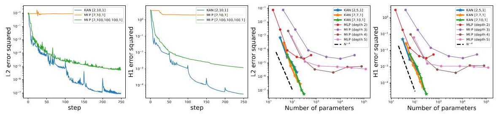

Figure 3.3: The PDE example. We plot L2 squared and H1 squared losses between the predicted solution and ground truth solution. First and second: training dynamics of losses. Third and fourth: scaling laws of losses against the number of parameters. KANs converge faster, achieve lower losses, and have steeper scaling laws than MLPs.

图3.3:偏微分方程示例。我们绘制了预测解与真实解之间的L2平方损失和H1平方损失。第一和第二个:损失的训练动态。第三和第四个:损失相对于参数数量的缩放定律。与多层感知器相比，KANs收敛更快，损失更低，缩放定律更陡。

### 3.4 Solving partial differential equations

### 3.4 求解偏微分方程

We consider a Poisson equation with zero Dirichlet boundary data. For $\Omega  = {\left\lbrack  -1,1\right\rbrack  }^{2}$ , consider the PDE

我们考虑一个具有零狄利克雷边界数据的泊松方程。对于$\Omega  = {\left\lbrack  -1,1\right\rbrack  }^{2}$，考虑偏微分方程

$$
{u}_{xx} + {u}_{yy} = f\text{ in }\Omega , \tag{3.2}
$$

$$
u = 0\;\text{ on }\partial \Omega .
$$

We consider the data $f =  - {\pi }^{2}\left( {1 + 4{y}^{2}}\right) \sin \left( {\pi x}\right) \sin \left( {\pi {y}^{2}}\right)  + {2\pi }\sin \left( {\pi x}\right) \cos \left( {\pi {y}^{2}}\right)$ for which $u = \; \sin \left( {\pi x}\right) \sin \left( {\pi {y}^{2}}\right)$ is the true solution. We use the framework of physics-informed neural networks (PINNs) [38, 39] to solve this PDE, with the loss function given by

我们考虑数据$f =  - {\pi }^{2}\left( {1 + 4{y}^{2}}\right) \sin \left( {\pi x}\right) \sin \left( {\pi {y}^{2}}\right)  + {2\pi }\sin \left( {\pi x}\right) \cos \left( {\pi {y}^{2}}\right)$，对于该数据，$u = \; \sin \left( {\pi x}\right) \sin \left( {\pi {y}^{2}}\right)$是真实解。我们使用物理信息神经网络(PINNs)[38, 39]框架来求解这个偏微分方程，损失函数由下式给出

$$
{\operatorname{loss}}_{\text{ pde }} = \alpha {\operatorname{loss}}_{i} + {\operatorname{loss}}_{b} \mathrel{\text{ := }} \alpha \frac{1}{{n}_{i}}\mathop{\sum }\limits_{{i = 1}}^{{n}_{i}}{\left| {u}_{xx}\left( {z}_{i}\right)  + {u}_{yy}\left( {z}_{i}\right)  - f\left( {z}_{i}\right) \right| }^{2} + \frac{1}{{n}_{b}}\mathop{\sum }\limits_{{i = 1}}^{{n}_{b}}{u}^{2},
$$

where we use ${\operatorname{loss}}_{i}$ to denote the interior loss, discretized and evaluated by a uniform sampling of ${n}_{i}$ points ${z}_{i} = \left( {{x}_{i},{y}_{i}}\right)$ inside the domain, and similarly we use ${\operatorname{loss}}_{b}$ to denote the boundary loss, dis-cretized and evaluated by a uniform sampling of ${n}_{b}$ points on the boundary. $\alpha$ is the hyperparameter balancing the effect of the two terms.

其中我们使用${\operatorname{loss}}_{i}$表示内部损失，通过在域内对${n}_{i}$个点${z}_{i} = \left( {{x}_{i},{y}_{i}}\right)$进行均匀采样来离散化和评估，类似地，我们使用${\operatorname{loss}}_{b}$表示边界损失，通过在边界上对${n}_{b}$个点进行均匀采样来离散化和评估。$\alpha$是平衡这两项影响的超参数。

We compare the KAN architecture with that of MLPs using the same hyperparameters ${n}_{i} = {10000}$ , ${n}_{b} = {800}$ , and $\alpha  = {0.01}$ . We measure both the error in the ${L}^{2}$ norm and energy $\left( {H}^{1}\right)$ norm and see that KAN achieves a much better scaling law with a smaller error, using smaller networks and fewer parameters; see Figure 3.3. A 2-Layer width-10 KAN is 100 times more accurate than a 4-Layer width-100 MLP $\left( {{10}^{-7}\text{ vs }{10}^{-5}\text{ MSE }}\right.$ ) and 100 times more parameter efficient $\left( {{10}^{2}\text{ vs }}\right. \; {10}^{4}$ parameters). Therefore we speculate that KANs might have the potential of serving as a good neural network representation for model reduction of PDEs. However, we want to note that our implementation of KANs are typically 10x slower than MLPs to train. The ground truth being a symbolic formula might be an unfair comparison for MLPs since KANs are good at representing symbolic formulas. In general, KANs and MLPs are good at representing different function classes of PDE solutions, which needs detailed future study to understand their respective boundaries.

我们将KAN架构与使用相同超参数${n}_{i} = {10000}$、${n}_{b} = {800}$和$\alpha  = {0.01}$的多层感知器(MLP)架构进行比较。我们测量了${L}^{2}$范数和能量$\left( {H}^{1}\right)$范数中的误差，发现KAN在使用更小的网络和更少的参数时，实现了更好的缩放定律，且误差更小；见图3.3。一个2层宽度为10的KAN比一个4层宽度为100的MLP $\left( {{10}^{-7}\text{ vs }{10}^{-5}\text{ MSE }}\right.$)精确100倍，且参数效率高100倍$\left( {{10}^{2}\text{ vs }}\right. \; {10}^{4}$参数)。因此，我们推测KAN可能有潜力作为一种良好的神经网络表示，用于偏微分方程(PDE)的模型简化。然而，我们需要注意的是，我们实现的KAN在训练时通常比MLP慢10倍。由于KAN擅长表示符号公式，对于MLP来说，以符号公式作为真实值可能是不公平的比较。一般来说，KAN和MLP擅长表示不同函数类别的PDE解，这需要未来进行详细研究以了解它们各自的边界。

### 3.5 Continual Learning

### 3.5持续学习

Catastrophic forgetting is a serious problem in current machine learning [40]. When a human masters a task and switches to another task, they do not forget how to perform the first task. Unfortunately, this is not the case for neural networks. When a neural network is trained on task 1 and then shifted to being trained on task 2, the network will soon forget about how to perform task 1. A key difference between artificial neural networks and human brains is that human brains have functionally distinct modules placed locally in space. When a new task is learned, structure re-organization only occurs in local regions responsible for relevant skills [41, 42], leaving other regions intact. Most artificial neural networks, including MLPs, do not have this notion of locality, which is probably the reason for catastrophic forgetting.

灾难性遗忘是当前机器学习中的一个严重问题[40]。当人类掌握一项任务并转向另一项任务时，他们不会忘记如何执行第一项任务。不幸的是，神经网络并非如此。当一个神经网络在任务1上进行训练，然后转向任务2进行训练时，该网络很快就会忘记如何执行任务1。人工神经网络和人类大脑之间的一个关键区别在于，人类大脑在空间上局部地具有功能不同的模块。当学习一项新任务时，结构重组仅发生在负责相关技能的局部区域[41, 42]，而其他区域保持不变。大多数人工神经网络，包括MLP，都没有这种局部性的概念，这可能就是灾难性遗忘的原因。

---

${}^{6}$ Note that we cannot use the logarithmic construction for division, because $u$ and $v$ here might be negative numbers.

${}^{6}$ 请注意，我们不能对除法使用对数构造，因为$u$和$v$在这里可能是负数。

---

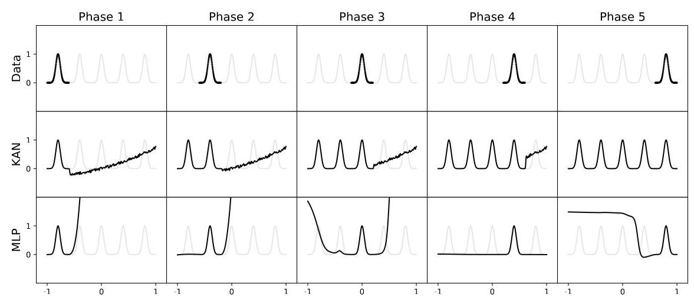

Figure 3.4: A toy continual learning problem. The dataset is a 1D regression task with 5 Gaussian peaks (top row). Data around each peak is presented sequentially (instead of all at once) to KANs and MLPs. KANs (middle row) can perfectly avoid catastrophic forgetting, while MLPs (bottom row) display severe catastrophic forgetting.

图3.4:一个简单的持续学习问题。数据集是一个具有5个高斯峰值的1D回归任务(上图)。围绕每个峰值的数据按顺序(而不是一次性全部呈现)呈现给KAN和MLP。KAN(中图)可以完美地避免灾难性遗忘，而MLP(下图)则表现出严重的灾难性遗忘。

We show that KANs have local plasticity and can avoid catastrophic forgetting by leveraging the locality of splines. The idea is simple: since spline bases are local, a sample will only affect a few nearby spline coefficients, leaving far-away coefficients intact (which is desirable since faraway regions may have already stored information that we want to preserve). By contrast, since MLPs usually use global activations, e.g., ReLU/Tanh/SiLU etc., any local change may propagate uncontrollably to regions far away, destroying the information being stored there.

我们表明，KAN具有局部可塑性，并且可以通过利用样条的局部性来避免灾难性遗忘。其思路很简单:由于样条基是局部的，一个样本只会影响几个附近的样条系数，而使远处的系数保持不变(这是理想的，因为远处区域可能已经存储了我们想要保留的信息)。相比之下，由于MLP通常使用全局激活函数，例如ReLU/Tanh/SiLU等，任何局部变化都可能不受控制地传播到远处区域，从而破坏存储在那里的信息。

We use a toy example to validate this intuition. The 1D regression task is composed of 5 Gaussian peaks. Data around each peak is presented sequentially (instead of all at once) to KANs and MLPs, as shown in Figure 3.4 top row. KAN and MLP predictions after each training phase are shown in the middle and bottom rows. As expected, KAN only remodels regions where data is present on in the current phase, leaving previous regions unchanged. By contrast, MLPs remodels the whole region after seeing new data samples, leading to catastrophic forgetting.

我们使用一个简单的例子来验证这种直觉。1D回归任务由5个高斯峰值组成。围绕每个峰值的数据按顺序(而不是一次性全部呈现)呈现给KAN和MLP，如图3.4上图所示。每个训练阶段后KAN和MLP的预测结果分别显示在中图和下图中。正如预期的那样，KAN只对当前阶段有数据的区域进行重塑，而使先前的区域保持不变。相比之下，MLP在看到新的数据样本后会对整个区域进行重塑，从而导致灾难性遗忘。

Here we simply present our preliminary results on an extremely simple example, to demonstrate how one could possibly leverage locality in KANs (thanks to spline parametrizations) to reduce catastrophic forgetting. However, it remains unclear whether our method can generalize to more realistic setups, especially in high-dimensional cases where it is unclear how to define "locality". In future work, We would also like to study how our method can be connected to and combined with SOTA methods in continual learning [43, 44].

在这里，我们只是在一个极其简单的例子上展示我们的初步结果，以说明如何利用KAN中的局部性(由于样条参数化)来减少灾难性遗忘。然而，我们的方法是否能够推广到更实际的设置，尤其是在高维情况下，目前尚不清楚，因为在高维情况下如何定义“局部性”并不明确。在未来的工作中，我们还希望研究我们的方法如何与持续学习中的现有最优方法[43, 44]相联系并结合。

## 4 KANs are interpretable

## 4 KAN是可解释的

In this section, we show that KANs are interpretable and interactive thanks to the techniques we developed in Section 2.5 We want to test the use of KANs not only on synthetic tasks (Section 4.1 and 4.2), but also in real-life scientific research. We demonstrate that KANs can (re)discover both highly non-trivial relations in knot theory (Section 4.3) and phase transition boundaries in condensed matter physics (Section 4.4). KANs could potentially be the foundation model for AI + Science due to their accuracy (last section) and interpretability (this section).

在本节中，我们展示了由于我们在2.5节中开发的技术，KAN是可解释且交互式的。我们不仅想在合成任务(4.1节和4.2节)上测试KAN的使用，还想在现实生活中的科学研究中进行测试。我们证明了KAN可以(重新)发现纽结理论中高度不平凡的关系(4.3节)以及凝聚态物理中的相变边界(4.4节)。由于其准确性(最后一节)和可解释性(本节)，KAN有可能成为人工智能+科学的基础模型。

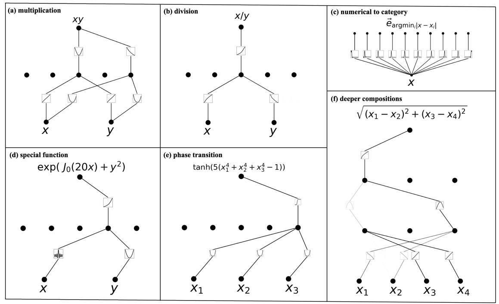

Figure 4.1: KANs are interepretable for simple symbolic tasks

图4.1:KAN对于简单符号任务是可解释的

### 4.1 Supervised toy datasets

### 4.1 监督式玩具数据集

We first examine KANs' ability to reveal the compositional structures in symbolic formulas. Six examples are listed below and their KANs are visualized in Figure 4.1. KANs are able to reveal the compositional structures present in these formulas, as well as learn the correct univariate functions.

我们首先研究KAN揭示符号公式中组合结构的能力。下面列出了六个例子，它们的KAN在图4.1中可视化。KAN能够揭示这些公式中存在的组合结构，并学习正确的单变量函数。

(a) Multiplication $f\left( {x, y}\right)  = {xy}$ . A $\left\lbrack  {2,5,1}\right\rbrack$ KAN is pruned to a $\left\lbrack  {2,2,1}\right\rbrack$ KAN. The learned activation functions are linear and quadratic. From the computation graph, we see that the way it computes ${xy}$ is leveraging ${2xy} = {\left( x + y\right) }^{2} - \left( {{x}^{2} + {y}^{2}}\right)$ .

(a) 乘法$f\left( {x, y}\right)  = {xy}$。一个$\left\lbrack  {2,5,1}\right\rbrack$ KAN被修剪为一个$\left\lbrack  {2,2,1}\right\rbrack$ KAN。学习到的激活函数是线性和二次函数。从计算图中，我们看到它计算${xy}$的方式是利用${2xy} = {\left( x + y\right) }^{2} - \left( {{x}^{2} + {y}^{2}}\right)$。

(b) Division of positive numbers $f\left( {x, y}\right)  = x/y$ . A $\left\lbrack  {2,5,1}\right\rbrack$ KAN is pruned to a $\left\lbrack  {2,1,1}\right\rbrack$ KAN. The learned activation functions are logarithmic and exponential functions, and the KAN is computing $x/y$ by leveraging the identity $x/y = \exp \left( {\log x - \log y}\right)$ .

(b) 正数除法$f\left( {x, y}\right)  = x/y$。一个$\left\lbrack  {2,5,1}\right\rbrack$ KAN被修剪为一个$\left\lbrack  {2,1,1}\right\rbrack$ KAN。学习到的激活函数是对数和指数函数，并且KAN通过利用恒等式$x/y = \exp \left( {\log x - \log y}\right)$来计算$x/y$。

(c) Numerical to categorical. The task is to convert a real number in $\left\lbrack  {0,1}\right\rbrack$ to its first decimal digit (as one hots), e.g., ${0.0618} \rightarrow  \left\lbrack  {1,0,0,0,0,\cdots }\right\rbrack  ,{0.314} \rightarrow  \left\lbrack  {0,0,0,1,0,\cdots }\right\rbrack$ . Notice that activation functions are learned to be spikes located around the corresponding decimal digits.

(c) 数值到分类。任务是将$\left\lbrack  {0,1}\right\rbrack$中的实数转换为其第一个十进制数字(作为独热编码)，例如，${0.0618} \rightarrow  \left\lbrack  {1,0,0,0,0,\cdots }\right\rbrack  ,{0.314} \rightarrow  \left\lbrack  {0,0,0,1,0,\cdots }\right\rbrack$。注意，激活函数被学习为位于相应十进制数字周围的尖峰。

(d) Special function $f\left( {x, y}\right)  = \exp \left( {{J}_{0}\left( {20x}\right)  + {y}^{2}}\right)$ . One limitation of symbolic regression is that it will never find the correct formula of a special function if the special function is not provided as prior knowledge. KANs can learn special functions - the highly wiggly Bessel function ${J}_{0}\left( {20x}\right)$ is learned (numerically) by KAN.

(d) 特殊函数$f\left( {x, y}\right)  = \exp \left( {{J}_{0}\left( {20x}\right)  + {y}^{2}}\right)$。符号回归的一个局限性是，如果特殊函数没有作为先验知识提供，它永远不会找到特殊函数的正确公式。KAN可以学习特殊函数 - KAN(通过数值方法)学习到了高度波动的贝塞尔函数${J}_{0}\left( {20x}\right)$。

(e) Phase transition $f\left( {{x}_{1},{x}_{2},{x}_{3}}\right)  = \tanh \left( {5\left( {{x}_{1}^{4} + {x}_{2}^{4} + {x}_{3}^{4} - 1}\right) }\right)$ . Phase transitions are of great interest in physics, so we want KANs to be able to detect phase transitions and to identify the correct order parameters. We use the tanh function to simulate the phase transition behavior, and the order parameter is the combination of the quartic terms of ${x}_{1},{x}_{2},{x}_{3}$ . Both the quartic dependence and tanh dependence emerge after KAN training. This is a simplified case of a localization phase transition discussed in Section 4.4

(e) 相变$f\left( {{x}_{1},{x}_{2},{x}_{3}}\right)  = \tanh \left( {5\left( {{x}_{1}^{4} + {x}_{2}^{4} + {x}_{3}^{4} - 1}\right) }\right)$。相变在物理学中非常重要，所以我们希望KAN能够检测相变并识别正确的序参量。我们使用双曲正切函数来模拟相变行为，序参量是${x}_{1},{x}_{2},{x}_{3}$的四次项的组合。在KAN训练后，四次依赖性和双曲正切依赖性都出现了。这是4.4节中讨论的局域化相变的一个简化情况

(f) Deeper compositions $f\left( {{x}_{1},{x}_{2},{x}_{3},{x}_{4}}\right)  = \sqrt{{\left( {x}_{1} - {x}_{2}\right) }^{2} + {\left( {x}_{3} - {x}_{4}\right) }^{2}}$ . To compute this, we would need the identity function, squared function, and square root, which requires at least a three-layer KAN. Indeed, we find that a $\left\lbrack  {4,3,3,1}\right\rbrack$ KAN can be auto-pruned to a $\left\lbrack  {4,2,1,1}\right\rbrack$ KAN, which exactly corresponds to the computation graph we would expect.

(f) 更深入的合成$f\left( {{x}_{1},{x}_{2},{x}_{3},{x}_{4}}\right)  = \sqrt{{\left( {x}_{1} - {x}_{2}\right) }^{2} + {\left( {x}_{3} - {x}_{4}\right) }^{2}}$。为了计算这个，我们需要恒等函数、平方函数和平方根，这至少需要一个三层的KAN。实际上，我们发现一个$\left\lbrack  {4,3,3,1}\right\rbrack$KAN可以自动剪枝为一个$\left\lbrack  {4,2,1,1}\right\rbrack$KAN，这与我们预期的计算图完全对应。

More examples from the Feynman dataset and the special function dataset are visualized in Figure D.2 D.3 F.1 F.2 in Appendices D and F

费曼数据集和特殊函数数据集的更多示例在附录D和F中的图D.2、D.3、F.1、F.2中可视化展示。

### 4.2 Unsupervised toy dataset

### 4.2无监督玩具数据集

Often, scientific discoveries are formulated as supervised learning problems, i.e., given input variables ${x}_{1},{x}_{2},\cdots ,{x}_{d}$ and output variable(s) $y$ , we want to find an interpretable function $f$ such that $y \approx  f\left( {{x}_{1},{x}_{2},\cdots ,{x}_{d}}\right)$ . However, another type of scientific discovery can be formulated as unsupervised learning, i.e., given a set of variables $\left( {{x}_{1},{x}_{2},\cdots ,{x}_{d}}\right)$ , we want to discover a structural relationship between the variables. Specifically, we want to find a non-zero $f$ such that

通常，科学发现被表述为监督学习问题，即给定输入变量${x}_{1},{x}_{2},\cdots ,{x}_{d}$和输出变量$y$ ,我们想要找到一个可解释的函数$f$使得$y \approx  f\left( {{x}_{1},{x}_{2},\cdots ,{x}_{d}}\right)$。然而，另一种类型的科学发现可以被表述为无监督学习，即给定一组变量$\left( {{x}_{1},{x}_{2},\cdots ,{x}_{d}}\right)$，我们想要发现这些变量之间的结构关系。具体来说，我们想要找到一个非零的$f$使得

$$
f\left( {{x}_{1},{x}_{2},\cdots ,{x}_{d}}\right)  \approx  0. \tag{4.1}
$$

For example, consider a set of features $\left( {{x}_{1},{x}_{2},{x}_{3}}\right)$ that satisfies ${x}_{3} = \exp \left( {\sin \left( {\pi {x}_{1}}\right)  + {x}_{2}^{2}}\right)$ . Then a valid $f$ is $f\left( {{x}_{1},{x}_{2},{x}_{3}}\right)  = \sin \left( {\pi {x}_{1}}\right)  + {x}_{2}^{2} - \log \left( {x}_{3}\right)  = 0$ , implying that points of $\left( {{x}_{1},{x}_{2},{x}_{3}}\right)$ form a 2D submanifold specified by $f = 0$ instead of filling the whole 3D space.

例如，考虑一组满足${x}_{3} = \exp \left( {\sin \left( {\pi {x}_{1}}\right)  + {x}_{2}^{2}}\right)$的特征$\left( {{x}_{1},{x}_{2},{x}_{3}}\right)$。那么一个有效的$f$是$f\left( {{x}_{1},{x}_{2},{x}_{3}}\right)  = \sin \left( {\pi {x}_{1}}\right)  + {x}_{2}^{2} - \log \left( {x}_{3}\right)  = 0$，这意味着$\left( {{x}_{1},{x}_{2},{x}_{3}}\right)$的点形成了一个由$f = 0$指定的二维子流形，而不是填满整个三维空间。

If an algorithm for solving the unsupervised problem can be devised, it has a considerable advantage over the supervised problem, since it requires only the sets of features $S = \left( {{x}_{1},{x}_{2},\cdots ,{x}_{d}}\right)$ . The supervised problem, on the other hand, tries to predict subsets of features in terms of the others, i.e. it splits $S = {S}_{\text{ in }} \cup  {S}_{\text{ out }}$ into input and output features of the function to be learned. Without domain expertise to advise the splitting, there are ${2}^{d} - 2$ possibilities such that $\left| {S}_{\text{ in }}\right|  > 0$ and $\left| {S}_{\text{ out }}\right|  > 0$ . This exponentially large space of supervised problems can be avoided by using the unsupervised approach. This unsupervised learning approach will be valuable to the knot dataset in Section 4.3 A Google Deepmind team [45] manually chose signature to be the target variable, otherwise they would face this combinatorial problem described above. This raises the question whether we can instead tackle the unsupervised learning directly. We present our method and a toy example below.

如果能设计出一种解决无监督问题的算法，它相对于监督问题有相当大的优势，因为它只需要特征集$S = \left( {{x}_{1},{x}_{2},\cdots ,{x}_{d}}\right)$。另一方面，监督问题试图根据其他特征来预测特征子集，即它将$S = {S}_{\text{ in }} \cup  {S}_{\text{ out }}$拆分为要学习的函数的输入和输出特征。如果没有领域专业知识来指导拆分，就有${2}^{d} - 2$种可能性使得$\left| {S}_{\text{ in }}\right|  > 0$和$\left| {S}_{\text{ out }}\right|  > 0$。通过使用无监督方法可以避免这种监督问题的指数级大空间。这种无监督学习方法对于4.3节中的纽结数据集将是有价值的。谷歌DeepMind团队[45]手动选择签名作为目标变量，否则他们将面临上述组合问题。这就提出了一个问题，即我们是否可以直接处理无监督学习。我们在下面展示我们的方法和一个玩具示例。

We tackle the unsupervised learning problem by turning it into a supervised learning problem on all of the $d$ features, without requiring the choice of a splitting. The essential idea is to learn a function $f\left( {{x}_{1},\ldots ,{x}_{d}}\right)  = 0$ such that $f$ is not the 0 -function. To do this, similar to contrastive learning, we define positive samples and negative samples: positive samples are feature vectors of real data. Negative samples are constructed by feature corruption. To ensure that the overall feature distribution for each topological invariant stays the same, we perform feature corruption by random permutation of each feature across the entire training set. Now we want to train a network $g$ such that $g\left( {\mathbf{x}}_{\text{ real }}\right)  = 1$ and $g\left( {\mathbf{x}}_{\text{ fake }}\right)  = 0$ which turns the problem into a supervised problem. However, remember that we originally want $f\left( {\mathbf{x}}_{\text{ real }}\right)  = 0$ and $f\left( {\mathbf{x}}_{\text{ fake }}\right)  \neq  0$ . We can achieve this by having $g = \sigma  \circ  f$ where $\sigma \left( x\right)  = \exp \left( {-\frac{{x}^{2}}{2{w}^{2}}}\right)$ is a Gaussian function with a small width $w$ , which can be conveniently realized by a KAN with shape $\left\lbrack  {\ldots ,1,1}\right\rbrack$ whose last activation is set to be the Gaussian function $\sigma$ and all previous layers form $f$ . Except for the modifications mentioned above, everything else is the same for supervised training.

我们通过将无监督学习问题转化为关于所有$d$特征的监督学习问题来解决它，而无需选择分割。基本思想是学习一个函数$f\left( {{x}_{1},\ldots ,{x}_{d}}\right)  = 0$，使得$f$不是零函数。为此，类似于对比学习，我们定义正样本和负样本:正样本是真实数据的特征向量。负样本通过特征损坏来构建。为确保每个拓扑不变量的整体特征分布保持不变，我们通过在整个训练集中对每个特征进行随机排列来执行特征损坏。现在我们想训练一个网络$g$，使得$g\left( {\mathbf{x}}_{\text{ real }}\right)  = 1$和$g\left( {\mathbf{x}}_{\text{ fake }}\right)  = 0$，这将问题转化为一个监督问题。然而，请记住，我们最初想要$f\left( {\mathbf{x}}_{\text{ real }}\right)  = 0$和$f\left( {\mathbf{x}}_{\text{ fake }}\right)  \neq  0$。我们可以通过让$g = \sigma  \circ  f$来实现这一点，其中$\sigma \left( x\right)  = \exp \left( {-\frac{{x}^{2}}{2{w}^{2}}}\right)$是一个宽度为$w$的高斯函数，这可以通过形状为$\left\lbrack  {\ldots ,1,1}\right\rbrack$的KAN方便地实现，其最后一个激活设置为高斯函数$\sigma$，并且所有先前的层形成$f$。除了上述修改之外，监督训练的其他一切都相同。

Now we demonstrate that the unsupervised paradigm works for a synthetic example. Let us consider a 6D dataset, where $\left( {{x}_{1},{x}_{2},{x}_{3}}\right)$ are dependent variables such that ${x}_{3} = \exp \left( {\sin \left( {x}_{1}\right)  + {x}_{2}^{2}}\right) ;\left( {{x}_{4},{x}_{5}}\right)$ are dependent variables with ${x}_{5} = {x}_{4}^{3};{x}_{6}$ is independent of the other variables. In Figure 4.2 we show that for seed $= 0$ , KAN reveals the functional dependence among ${x}_{1},{x}_{2}$ , and ${x}_{3}$ ; for another seed $= {2024}$ , KAN reveals the functional dependence between ${x}_{4}$ and ${x}_{5}$ . Our preliminary results rely on randomness (different seeds) to discover different relations; in the future we would like to investigate a more systematic and more controlled way to discover a complete set of relations. Even so, our tool in its current status can provide insights for scientific tasks. We present our results with the knot dataset in Section 4.3

现在我们证明无监督范式适用于一个合成示例。让我们考虑一个6D数据集，其中$\left( {{x}_{1},{x}_{2},{x}_{3}}\right)$是因变量，使得${x}_{3} = \exp \left( {\sin \left( {x}_{1}\right)  + {x}_{2}^{2}}\right) ;\left( {{x}_{4},{x}_{5}}\right)$是因变量，而${x}_{5} = {x}_{4}^{3};{x}_{6}$与其他变量无关。在图4.2中我们表明，对于种子$= 0$，KAN揭示了${x}_{1},{x}_{2}$和${x}_{3}$之间的函数依赖关系；对于另一个种子$= {2024}$，KAN揭示了${x}_{4}$和${x}_{5}$之间的函数依赖关系。我们的初步结果依赖于随机性(不同的种子)来发现不同的关系；未来我们希望研究一种更系统、更可控的方法来发现完整的关系集。即便如此，我们当前状态的工具可以为科学任务提供见解。我们将在4.3节中展示我们使用纽结数据集的结果。

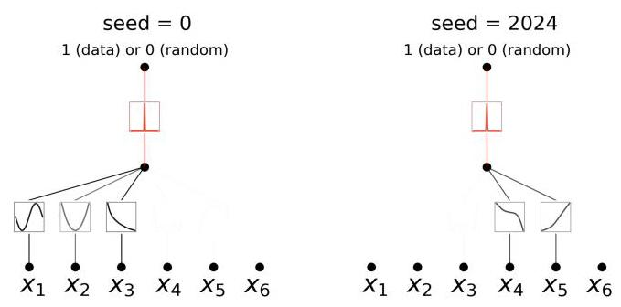

Figure 4.2: Unsupervised learning of a toy task. KANs can identify groups of dependent variables, i.e., $\left( {{x}_{1},{x}_{2},{x}_{3}}\right)$ and $\left( {{x}_{4},{x}_{5}}\right)$ in this case.

图4.2:一个玩具任务的无监督学习。KAN可以识别相关变量组，即本例中的$\left( {{x}_{1},{x}_{2},{x}_{3}}\right)$和$\left( {{x}_{4},{x}_{5}}\right)$。

### 4.3 Application to Mathematics: Knot Theory

### 4.3 数学应用:纽结理论

Knot theory is a subject in low-dimensional topology that sheds light on topological aspects of three-manifolds and four-manifolds and has a variety of applications, including in biology and topological quantum computing. Mathematically, a knot $K$ is an embedding of ${S}^{1}$ into ${S}^{3}$ . Two knots $K$ and ${K}^{\prime }$ are topologically equivalent if one can be deformed into the other via deformation of the ambient space ${S}^{3}$ , in which case we write $\left\lbrack  K\right\rbrack   = \left\lbrack  {K}^{\prime }\right\rbrack$ . Some knots are topologically trivial, meaning that they can be smoothly deformed to a standard circle. Knots have a variety of deformation-invariant features $f$ called topological invariants, which may be used to show that two knots are topologically inequivalent, $\left\lbrack  K\right\rbrack   \neq  \left\lbrack  {K}^{\prime }\right\rbrack$ if $f\left( K\right)  \neq  f\left( {K}^{\prime }\right)$ . In some cases the topological invariants are geometric in nature. For instance, a hyperbolic knot $K$ has a knot complement ${S}^{3} \smallsetminus  K$ that admits a canonical hyperbolic metric $g$ such that ${\operatorname{vol}}_{g}\left( K\right)$ is a topological invariant known as the hyperbolic volume. Other topological invariants are algebraic in nature, such as the Jones polynomial.

纽结理论是低维拓扑学中的一个主题，它揭示了三维流形和四维流形的拓扑方面，并且有多种应用，包括在生物学和拓扑量子计算中。在数学上，一个纽结$K$是${S}^{1}$到${S}^{3}$的一个嵌入。如果一个纽结$K$可以通过环境空间${S}^{3}$的变形而变形为另一个纽结${K}^{\prime }$，那么这两个纽结在拓扑上是等价的，在这种情况下我们写作$\left\lbrack  K\right\rbrack   = \left\lbrack  {K}^{\prime }\right\rbrack$。一些纽结在拓扑上是平凡的，这意味着它们可以平滑地变形为一个标准圆。纽结有各种称为拓扑不变量的变形不变特征$f$，这些不变量可用于表明两个纽结在拓扑上不等价，$\left\lbrack  K\right\rbrack   \neq  \left\lbrack  {K}^{\prime }\right\rbrack$如果$f\left( K\right)  \neq  f\left( {K}^{\prime }\right)$。在某些情况下，拓扑不变量本质上是几何的。例如，一个双曲纽结$K$有一个纽结补${S}^{3} \smallsetminus  K$，它允许一个规范的双曲度量$g$，使得${\operatorname{vol}}_{g}\left( K\right)$是一个称为双曲体积的拓扑不变量。其他拓扑不变量本质上是代数的，例如琼斯多项式。

Given the fundamental nature of knots in mathematics and the importance of its applications, it is interesting to study whether ML can lead to new results. For instance, in [46] reinforcement learning was utilized to establish ribbonness of certain knots, which ruled out many potential counterexamples to the smooth 4d Poincaré conjecture.

鉴于纽结在数学中的基本性质及其应用的重要性，研究机器学习是否能带来新结果是很有趣的。例如，在[46]中，强化学习被用于确定某些纽结的带状性，这排除了许多对光滑4维庞加莱猜想的潜在反例。

Supervised learning In [45], supervised learning and human domain experts were utilized to arrive at a new theorem relating algebraic and geometric knot invariants. In this case, gradient saliency identified key invariants for the supervised problem, which led the domain experts to make a conjecture that was subsequently refined and proven. We study whether a KAN can achieve good interpretable results on the same problem, which predicts the signature of a knot. Their main results from studying the knot theory dataset are:

监督学习 在[45]中，监督学习和人类领域专家被用于得出一个关于代数和几何纽结不变量的新定理。在这种情况下，梯度显著性确定了监督问题的关键不变量，这导致领域专家提出了一个猜想，该猜想随后得到完善和证明。我们研究一个KAN在同一个预测纽结签名的问题上是否能取得良好的可解释结果。他们研究纽结理论数据集的主要结果如下:

(1) They use network attribution methods to find that the signature $\sigma$ is mostly dependent on merid-inal distance $\mu$ (real ${\mu }_{r}$ , imag ${\mu }_{i}$ ) and longitudinal distance $\lambda$ .

(1) 他们使用网络归因方法发现签名$\sigma$主要依赖于子午线距离$\mu$(实部${\mu }_{r}$，虚部${\mu }_{i}$)和纵向距离$\lambda$。

(2) Human scientists later identified that $\sigma$ has high correlation with the slope $\equiv  \operatorname{Re}\left( \frac{\lambda }{\mu }\right)  = \frac{\lambda {\mu }_{r}}{{\mu }_{r}^{2} + {\mu }_{i}^{2}}$ and derived a bound for $\left| {{2\sigma } - \text{ slope }}\right|$ .

(2) 人类科学家后来发现$\sigma$与斜率$\equiv  \operatorname{Re}\left( \frac{\lambda }{\mu }\right)  = \frac{\lambda {\mu }_{r}}{{\mu }_{r}^{2} + {\mu }_{i}^{2}}$高度相关，并推导出了$\left| {{2\sigma } - \text{ slope }}\right|$的一个界。

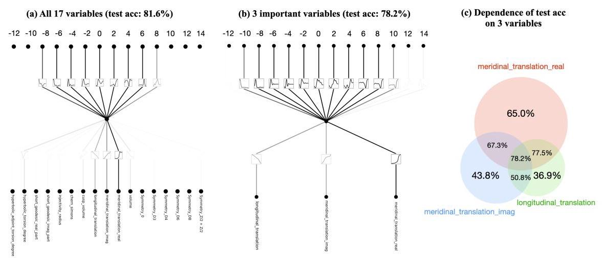

Figure 4.3: Knot dataset, supervised mode. With KANs, we rediscover Deepmind's results that signature is mainly dependent on meridinal translation (real and imaginary parts).

图4.3:纽结数据集，监督模式。使用KAN，我们重新发现了Deepmind的结果，即签名主要依赖于子午线平移(实部和虚部)。

<table><tr><td>Method</td><td>Architecture</td><td>Parameter Count</td><td>Accuracy</td></tr><tr><td>Deepmind's MLP</td><td>4 layer, width-300</td><td>$3 \times  {10}^{5}$</td><td>78.0%</td></tr><tr><td>KANs</td><td>2 layer, $\left\lbrack  {{17},1,{14}}\right\rbrack  \left( {G = 3, k = 3}\right)$</td><td>$2 \times  {10}^{2}$</td><td>81.6%</td></tr></table>

Table 3: KANs can achieve better accuracy than MLPs with much fewer parameters in the signature classification problem. Soon after our preprint was first released, Prof. Shi Lab from Georgia tech discovered that an MLP with only 60 parameters is sufficient to achieve ${80}\%$ accuracy (public but unpublished results). This is good news for AI + Science because this means perhaps many AI + Science tasks are not that computationally demanding than we might think (either with MLPs or with KANs), hence many new scientific discoveries are possible even on personal laptops.

表3:在签名分类问题中，KAN可以用少得多的参数比多层感知器(MLP)获得更好的准确率。在我们的预印本首次发布后不久，佐治亚理工学院的施实验室发现一个只有60个参数的MLP就足以达到${80}\%$准确率(公开但未发表的结果)。这对人工智能+科学来说是个好消息，因为这意味着也许许多人工智能+科学任务的计算要求并不像我们想象的那么高(无论是使用MLP还是KAN)，因此即使在个人笔记本电脑上也有可能有许多新的科学发现。

We show below that KANs not only rediscover these results with much smaller networks and much more automation, but also present some interesting new results and insights.

我们在下面表明，KAN不仅能用小得多的网络和更多的自动化重新发现这些结果，而且还呈现了一些有趣的新结果和见解。

To investigate (1), we treat 17 knot invariants as inputs and signature as outputs. Similar to the setup in [45], signatures (which are even numbers) are encoded as one-hot vectors and networks are trained with cross-entropy loss. We find that an extremely small $\left\lbrack  {{17},1,{14}}\right\rbrack$ KAN is able to achieve 81.6% test accuracy (while Deepmind's 4-layer width-300 MLP achieves 78% test accuracy). The $\left\lbrack  {{17},1,{14}}\right\rbrack  \mathrm{{KAN}}\left( {G = 3, k = 3}\right)$ has $\approx  {200}$ parameters, while the MLP has $\approx  3 \times  {10}^{5}$ parameters, shown in Table 3 It is remarkable that KANs can be both more accurate and much more parameter efficient than MLPs at the same time. In terms of interpretability, we scale the transparency of each activation according to its magnitude, so it becomes immediately clear which input variables are important without the need for feature attribution (see Figure 4.3 left): signature is mostly dependent on ${\mu }_{r}$ , and slightly dependent on ${\mu }_{i}$ and $\lambda$ , while dependence on other variables is small. We then train a $\left\lbrack  {3,1,{14}}\right\rbrack$ KAN on the three important variables, obtaining test accuracy 78.2%. Our results have one subtle difference from results in [45]: they find that signature is mostly dependent on ${\mu }_{i}$ , while we find that signature is mostly dependent on ${\mu }_{r}$ . This difference could be due to subtle algorithmic choices, but has led us to carry out the following experiments: (a) ablation studies. We show that ${\mu }_{r}$ contributes more to accuracy than ${\mu }_{i}$ (see Figure 4.3): for example, ${\mu }_{r}$ alone can achieve ${65.0}\%$ accuracy, while ${\mu }_{i}$ alone can only achieve ${43.8}\%$ accuracy. (b) We find a symbolic formula (in Table 4) which only involves ${\mu }_{r}$ and $\lambda$ , but can achieve ${77.8}\%$ test accuracy.

为了研究(1)，我们将17个纽结不变量作为输入，将符号差作为输出。与[45]中的设置类似，符号差(均为偶数)被编码为独热向量，网络使用交叉熵损失进行训练。我们发现一个极其小的$\left\lbrack  {{17},1,{14}}\right\rbrack$KAN能够达到81.6%的测试准确率(而Deepmind的4层宽度为300的MLP达到78%的测试准确率)。$\left\lbrack  {{17},1,{14}}\right\rbrack  \mathrm{{KAN}}\left( {G = 3, k = 3}\right)$有$\approx  {200}$个参数，而MLP有$\approx  3 \times  {10}^{5}$个参数，如表3所示。值得注意的是，KAN在同时比MLP更准确且参数效率更高。在可解释性方面，我们根据每个激活的幅度来缩放其透明度，这样无需特征归因就能立即清楚哪些输入变量是重要的(见图4.3左):符号差主要依赖于${\mu }_{r}$，并略微依赖于${\mu }_{i}$和$\lambda$，而对其他变量的依赖较小。然后，我们在三个重要变量上训练一个$\left\lbrack  {3,1,{14}}\right\rbrack$KAN，获得了78.2%的测试准确率。我们的结果与[45]中的结果有一个细微的差异:他们发现符号差主要依赖于${\mu }_{i}$，而我们发现符号差主要依赖于${\mu }_{r}$。这种差异可能是由于细微的算法选择，但这促使我们进行了以下实验:(a)消融研究。我们表明${\mu }_{r}$对准确率的贡献比${\mu }_{i}$更大(见图4.3):例如，仅${\mu }_{r}$就能达到${65.0}\%$的准确率，而仅${\mu }_{i}$只能达到${43.8}\%$的准确率。(b)我们找到了一个仅涉及${\mu }_{r}$和$\lambda$的符号公式(见表4)，但能达到${77.8}\%$的测试准确率。

To investigate (2), i.e., obtain the symbolic form of $\sigma$ , we formulate the problem as a regression task. Using auto-symbolic regression introduced in Section 2.5.1, we can convert a trained KAN into symbolic formulas. We train KANs with shapes $\left\lbrack  {3,1}\right\rbrack  ,\left\lbrack  {3,1,1}\right\rbrack  ,\left\lbrack  {3,2,1}\right\rbrack$ , whose corresponding symbolic formulas are displayed in Table 4 B-D. It is clear that by having a larger KAN, both accuracy and complexity increase. So KANs provide not just a single symbolic formula, but a whole Pareto frontier of formulas, trading off simplicity and accuracy. However, KANs need additional inductive biases to further simplify these equations to rediscover the formula from [45] (Table 4A). We have tested two scenarios: (1) in the first scenario, we assume the ground truth formula has a multi-variate Pade representation (division of two multi-variate Taylor series). We first train $\left\lbrack  {3,2,1}\right\rbrack$ and then fit it to a Pade representation. We can obtain Formula E in Table 4, which bears similarity with Deepmind's formula. (2) We hypothesize that the division is not very interpretable for KANs, so we train two KANs (one for the numerator and the other for the denominator) and divide them manually. Surprisingly, we end up with the formula $\mathrm{F}$ (in Table 4) which only involves ${\mu }_{r}$ and $\lambda$ , although ${\mu }_{i}$ is also provided but ignored by KANs.

为了研究(2)，即获得$\sigma$的符号形式，我们将该问题表述为一个回归任务。使用2.5.1节中介绍的自动符号回归，我们可以将训练好的KAN转换为符号公式。我们训练形状为$\left\lbrack  {3,1}\right\rbrack  ,\left\lbrack  {3,1,1}\right\rbrack  ,\left\lbrack  {3,2,1}\right\rbrack$的KAN，其对应的符号公式显示在表4 B - D中。很明显，通过使用更大的KAN，准确率和复杂度都会增加。所以KAN不仅提供了一个单一的符号公式，而且提供了一整个公式的帕累托前沿，在简单性和准确性之间进行权衡。然而，KAN需要额外的归纳偏差来进一步简化这些方程，以重新发现[45]中的公式(表4A)。我们测试了两种情况:(1)在第一种情况下，我们假设真实公式具有多元帕德表示(两个多元泰勒级数的除法)。我们首先训练$\left\lbrack  {3,2,1}\right\rbrack$，然后将其拟合为帕德表示。我们可以得到表4中的公式E，它与Deepmind的公式有相似之处。(2)我们假设这种除法对KAN来说不是很容易解释，所以我们训练两个KAN(一个用于分子，另一个用于分母)，然后手动将它们相除。令人惊讶的是，我们最终得到了公式$\mathrm{F}$(见表4)，它只涉及${\mu }_{r}$和$\lambda$，尽管也提供了${\mu }_{i}$，但KAN忽略了它。

<table><tr><td>Id</td><td>Formula</td><td>Discovered by</td><td>test acc</td><td>${r}^{2}$ with Signature</td><td>${r}^{2}$ with DM formula</td></tr><tr><td>A</td><td>$\frac{\lambda {\mu }_{r}}{\left( {\mu }_{r}^{2} + {\mu }_{i}^{2}\right) }$</td><td>Human (DM)</td><td>83.1%</td><td>0.946</td><td>1</td></tr><tr><td>B</td><td>$- {0.02}\sin \left( {{4.98}{\mu }_{i} + {0.85}}\right)  + {0.08}\left| {{4.02}{\mu }_{r} + {6.28}}\right|  - {0.52} - \; {0.04}{e}^{-{0.88}{\left( 1 - {0.45}\lambda \right) }^{2}}$</td><td>$\left\lbrack  {3,1}\right\rbrack$ KAN</td><td>62.6%</td><td>0.837</td><td>0.897</td></tr><tr><td>C</td><td>${0.17}\tan ( - {1.51} + {0.1}{e}^{-{1.43}{\left( 1 - {0.4}{\mu }_{i}\right) }^{2} + {0.09}{e}^{-{0.06}{\left( 1 - {0.21}\lambda \right) }^{2}}} + \; {1.32}{e}^{-{3.18}{\left( 1 - {0.43}{\mu }_{r}\right) }^{2}})$</td><td>$\left\lbrack  {3,1,1}\right\rbrack$ KAN</td><td>71.9%</td><td>0.871</td><td>0.934</td></tr><tr><td>D</td><td>$- {0.09} + {1.04}\exp \left( {-{9.59}\left( {-{0.62}\sin \left( {{0.61}{\mu }_{r} + {7.26}}\right) }\right)  - }\right. \; {0.32}\tan \left( {{0.03\lambda } - {6.59}}\right)  + 1 - {0.11}{e}^{-{1.77}{\left( {0.31} - {\mu }_{i}\right) }^{2}{)}^{2}} - \; {1.09}{e}^{-{7.6}\left( {{0.65}{\left( 1 - {0.01}\lambda \right) }^{3}}\right. } + {0.27}\operatorname{atan}\left( {{0.53}{\mu }_{i} - {0.6}}\right)  + \; {0.09} + \exp \left( {-{2.58}{\left( 1 - {0.36}{\mu }_{r}\right) }^{2}}\right) )$</td><td>$\left\lbrack  {3,2,1}\right\rbrack$ KAN</td><td>84.0%</td><td>0.947</td><td>0.997</td></tr><tr><td>E</td><td>${4.76\lambda }{\mu }_{r}$   ${3.09}{\mu }_{i} + {6.05}{\mu }_{r}^{2} + {3.54}{\mu }_{i}^{2}$</td><td>[3,2,1] KAN + Pade approx</td><td>82.8%</td><td>0.946</td><td>0.997</td></tr><tr><td>F</td><td>${2.94} - {2.92}{\left( 1 - {0.10}{\mu }_{r}\right) }^{2}$   ${0.32}{\left( {0.18} - {\mu }_{r}\right) }^{2} + {5.36}{\left( 1 - {0.04}\lambda \right) }^{2} + {0.50}$</td><td>$\left\lbrack  {3,1}\right\rbrack$ KAN/ $\left\lbrack  {3,1}\right\rbrack$ KAN</td><td>77.8%</td><td>0.925</td><td>0.977</td></tr></table>

Table 4: Symbolic formulas of signature as a function of meridinal translation $\mu$ (real ${\mu }_{r}$ , imag ${\mu }_{i}$ ) and longitudinal translation $\lambda$ . In [45], formula A was discovered by human scientists inspired by neural network attribution results. Formulas B-F are auto-discovered by KANs. KANs can trade-off between simplicity and accuracy (B, C, D). By adding more inductive biases, KAN is able to discover formula E which is not too dissimilar from formula A. KANs also discovered a formula F which only involves two variables $\left( {\mu }_{r}\right.$ and $\left. \lambda \right)$ instead of all three variables, with little sacrifice in accuracy.

表4:作为子午平移$\mu$(实部${\mu }_{r}$，虚部${\mu }_{i}$)和纵向平移$\lambda$的函数的签名符号公式。在[45]中，公式A是受神经网络归因结果启发的人类科学家发现的。公式B - F是由KAN自动发现的。KAN可以在简单性和准确性之间进行权衡(B、C、D)。通过添加更多归纳偏差，KAN能够发现与公式A不太不同的公式E。KAN还发现了一个公式F，它只涉及两个变量$\left( {\mu }_{r}\right.$和$\left. \lambda \right)$，而不是所有三个变量，并且在准确性上几乎没有牺牲。

So far, we have rediscovered the main results from [45]. It is remarkable to see that KANs made this discovery very intuitive and convenient. Instead of using feature attribution methods (which are great methods), one can instead simply stare at visualizations of KANs. Moreover, automatic symbolic regression also makes the discovery of symbolic formulas much easier.

到目前为止，我们重新发现了[45]中的主要结果。值得注意的是，KAN使这个发现非常直观和方便。与其使用特征归因方法(这是很好的方法)，人们可以简单地盯着KAN的可视化结果。此外，自动符号回归也使符号公式的发现变得更加容易。

In the next part, we propose a new paradigm of "AI for Math" not included in the Deepmind paper, where we aim to use KANs' unsupervised learning mode to discover more relations (besides signature) in knot invariants.

在下一部分中，我们提出了一种Deepmind论文中未包含的“数学人工智能”新范式，我们旨在使用KAN的无监督学习模式在纽结不变量中发现更多关系(除了签名)。

Unsupervised learning As we mentioned in Section 4.2, unsupervised learning is the setup that is more promising since it avoids manual partition of input and output variables which have combinatorially many possibilities. In the unsupervised learning mode, we treat all 18 variables (including signature) as inputs such that they are on the same footing. Knot data are positive samples, and we randomly shuffle features to obtain negative samples. An $\left\lbrack  {{18},1,1}\right\rbrack$ KAN is trained to classify whether a given feature vector belongs to a positive sample (1) or a negative sample (0). We manually set the second layer activation to be the Gaussian function with a peak one centered at zero, so positive samples will have activations at (around) zero, implicitly giving a relation among knot invariants $\mathop{\sum }\limits_{{i = 1}}^{{18}}{g}_{i}\left( {x}_{i}\right)  = 0$ where ${x}_{i}$ stands for a feature (invariant), and ${g}_{i}$ is the corresponding activation function which can be readily read off from KAN diagrams. We train the KANs with $\lambda  = \left\{  {{10}^{-2},{10}^{-3}}\right\}$ to favor sparse combination of inputs, and seed $= \{ 0,1,\cdots ,{99}\}$ . All 200 networks can be grouped into three clusters, with representative KANs displayed in Figure 4.4. These three groups of dependent variables are:

无监督学习 正如我们在4.2节中提到的，无监督学习是更有前景的设置，因为它避免了手动划分输入和输出变量，而这种划分有组合上的多种可能性。在无监督学习模式下，我们将所有18个变量(包括签名)视为输入，使它们处于同等地位。纽结数据是正样本，我们随机打乱特征以获得负样本。一个$\left\lbrack  {{18},1,1}\right\rbrack$ KAN被训练来分类给定的特征向量属于正样本(1)还是负样本(0)。我们手动将第二层激活设置为以零为中心的峰值为1的高斯函数，因此正样本将在(大约)零处有激活，隐含地给出纽结不变量$\mathop{\sum }\limits_{{i = 1}}^{{18}}{g}_{i}\left( {x}_{i}\right)  = 0$之间的关系，其中${x}_{i}$代表一个特征(不变量)，${g}_{i}$是相应的激活函数，可以很容易地从KAN图中读出。我们用$\lambda  = \left\{  {{10}^{-2},{10}^{-3}}\right\}$训练KAN以支持输入的稀疏组合和种子$= \{ 0,1,\cdots ,{99}\}$。所有200个网络可以分为三个簇，图4.4中展示了具有代表性的KAN。这三组因变量是:

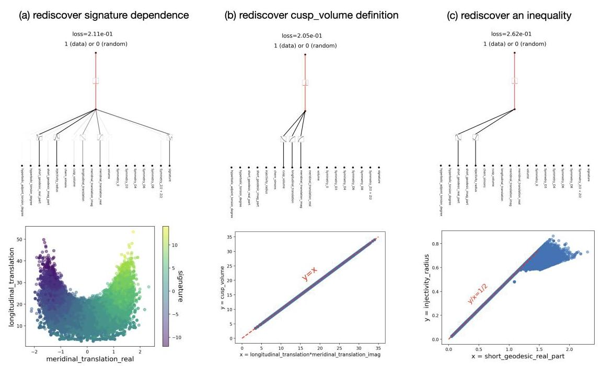

Figure 4.4: Knot dataset, unsupervised mode. With KANs, we rediscover three mathematical relations in the knot dataset.

图4.4:纽结数据集，无监督模式。使用KAN，我们在纽结数据集中重新发现了三个数学关系。

(1) The first group of dependent variables is signature, real part of meridinal distance, and longitudinal distance (plus two other variables which can be removed because of (3)). This is the signature dependence studied above, so it is very interesting to see that this dependence relation is rediscovered again in the unsupervised mode.

(1) 第一组因变量是签名、子午距离的实部和纵向距离(加上另外两个由于(3)可以去掉的变量)。这就是上面研究的签名依赖性，所以很有趣的是在无监督模式下再次重新发现了这种依赖关系。

(2) The second group of variables involve cusp volume $V$ , real part of meridinal translation ${\mu }_{r}$ and longitudinal translation $\lambda$ . Their activations all look like logarithmic functions (which can be verified by the implied symbolic functionality in Section 2.5.1). So the relation is $- \log V + \; \log {\mu }_{r} + \log \lambda  = 0$ which is equivalent to $V = {\mu }_{r}\lambda$ , which is true by definition. It is, however, reassuring that we discover this relation without any prior knowledge.

(2) 第二组变量涉及尖点体积$V$、子午平移${\mu }_{r}$的实部和纵向平移$\lambda$。它们的激活看起来都像对数函数(这可以通过2.5.1节中的隐含符号功能来验证)。所以关系是$- \log V + \; \log {\mu }_{r} + \log \lambda  = 0$，它等同于$V = {\mu }_{r}\lambda$，根据定义这是正确的。然而，我们在没有任何先验知识的情况下发现了这种关系，这让人放心。

(3) The third group of variables includes the real part of short geodesic ${g}_{r}$ and injectivity radius. Their activations look qualitatively the same but differ by a minus sign, so it is conjectured that these two variables have a linear correlation. We plot 2D scatters, finding that ${2r}$ upper bounds ${g}_{r}$ , which is also a well-known relation [47].

(3) 第三组变量包括短测地线${g}_{r}$的实部和内射半径。它们的激活在定性上看起来相同，但相差一个负号，所以推测这两个变量有线性相关性。我们绘制二维散点图，发现${2r}$是${g}_{r}$的上界，这也是一个众所周知的关系[47]。

It is interesting that KANs' unsupervised mode can rediscover several known mathematical relations. The good news is that the results discovered by KANs are probably reliable; the bad news is that we have not discovered anything new yet. It is worth noting that we have chosen a shallow KAN for simple visualization, but deeper KANs can probably find more relations if they exist. We would like to investigate how to discover more complicated relations with deeper KANs in future work.

有趣的是，KANs的无监督模式能够重新发现一些已知的数学关系。好消息是，KANs发现的结果可能是可靠的；坏消息是，我们尚未发现任何新的东西。值得注意的是，为了简单可视化，我们选择了一个浅层的KAN，但如果存在更深层次的关系，更深的KAN可能会发现更多。我们希望在未来的工作中研究如何使用更深的KAN发现更复杂的关系。

### 4.4 Application to Physics: Anderson localization

### 4.4 物理学应用:安德森局域化

Anderson localization is the fundamental phenomenon in which disorder in a quantum system leads to the localization of electronic wave functions, causing all transport to be ceased [48]. In one and two dimensions, scaling arguments show that all electronic eigenstates are exponentially localized for an infinitesimal amount of random disorder [49, 50]. In contrast, in three dimensions, a critical energy forms a phase boundary that separates the extended states from the localized states, known as a mobility edge. The understanding of these mobility edges is crucial for explaining various fundamental phenomena such as the metal-insulator transition in solids [51], as well as localization effects of light in photonic devices [52, 53, 54, 55, 56]. It is therefore necessary to develop microscopic models that exhibit mobility edges to enable detailed investigations. Developing such models is often more practical in lower dimensions, where introducing quasiperiodicity instead of random disorder can also result in mobility edges that separate localized and extended phases. Furthermore, experimental realizations of analytical mobility edges can help resolve the debate on localization in interacting systems [57, 58]. Indeed, several recent studies have focused on identifying such models and deriving exact analytic expressions for their mobility edges [59, 60, 61, 62, 63, 64, 65].

安德森局域化是一种基本现象，即量子系统中的无序会导致电子波函数的局域化，从而使所有输运停止[48]。在一维和二维中，标度论证表明，对于无限小的随机无序，所有电子本征态都是指数局域化的[49,50]。相比之下，在三维中，一个临界能量形成了一个相边界，将扩展态与局域态分开，这被称为迁移率边。理解这些迁移率边对于解释各种基本现象至关重要，例如固体中的金属 - 绝缘体转变[51]，以及光子器件中光的局域化效应[52,53,54,55,56]。因此，有必要开发能够展现迁移率边的微观模型，以便进行详细研究。在较低维度中开发这样的模型通常更实际，在这些维度中引入准周期性而非随机无序也可以导致将局域相和扩展相分开的迁移率边。此外，解析迁移率边的实验实现有助于解决关于相互作用系统中局域化的争论[57,58]。事实上，最近的几项研究都集中在识别这样的模型并推导其迁移率边的精确解析表达式[59,60,61,62,63,64,65]。

Here, we apply KANs to numerical data generated from quasiperiodic tight-binding models to extract their mobility edges. In particular, we examine three classes of models: the Mosaic model (MM) [63], the generalized Aubry-André model (GAAM) [62] and the modified Aubry-André model (MAAM) [60]. For the MM, we testify KAN's ability to accurately extract mobility edge as a 1D function of energy. For the GAAM, we find that the formula obtained from a KAN closely matches the ground truth. For the more complicated MAAM, we demonstrate yet another example of the symbolic interpretability of this framework. A user can simplify the complex expression obtained from KANs (and corresponding symbolic formulas) by means of a "collaboration" where the human generates hypotheses to obtain a better match (e.g., making an assumption of the form of certain activation function), after which KANs can carry out quick hypotheses testing.

在此，我们将KAN应用于从准周期紧束缚模型生成的数值数据，以提取其迁移率边缘。具体而言，我们研究三类模型:镶嵌模型(MM)[63]、广义奥布里 - 安德烈模型(GAAM)[62]和修正奥布里 - 安德烈模型(MAAM)[60]。对于MM，我们验证了KAN准确提取作为能量一维函数的迁移率边缘的能力。对于GAAM，我们发现从KAN获得的公式与真实情况紧密匹配。对于更复杂的MAAM，我们展示了该框架符号可解释性的另一个示例。用户可以通过“协作”简化从KAN获得的复杂表达式(以及相应的符号公式)，即人类生成假设以获得更好的匹配(例如，对某些激活函数的形式做出假设)，之后KAN可以快速进行假设检验。

To quantify the localization of states in these models, the inverse participation ratio (IPR) is commonly used. The IPR for the ${k}^{th}$ eigenstate, ${\psi }^{\left( k\right) }$ , is given by

为了量化这些模型中态的局域化，通常使用逆参与率(IPR)。${k}^{th}$本征态${\psi }^{\left( k\right) }$的IPR由下式给出

$$
{\mathrm{{IPR}}}_{k} = \frac{\mathop{\sum }\limits_{n}{\left| {\psi }_{n}^{\left( k\right) }\right| }^{4}}{{\left( \mathop{\sum }\limits_{n}{\left| {\psi }_{n}^{\left( k\right) }\right| }^{2}\right) }^{2}} \tag{4.2}
$$

where the sum runs over the site index. Here, we use the related measure of localization - the fractal dimension of the states, given by

其中求和遍历格点索引。在此，我们使用相关的局域化度量——态的分形维数，由下式给出

$$
{D}_{k} =  - \frac{\log \left( {\mathrm{{IPR}}}_{k}\right) }{\log \left( N\right) } \tag{4.3}
$$

where $N$ is the system size. ${D}_{k} = 0\left( 1\right)$ indicates localized (extended) states.

其中$N$是系统大小。${D}_{k} = 0\left( 1\right)$表示局域化(扩展)态。

Mosaic Model (MM) We first consider a class of tight-binding models defined by the Hamiltonian [63]

镶嵌模型(MM)我们首先考虑由哈密顿量定义的一类紧束缚模型[63]

$$
H = t\mathop{\sum }\limits_{n}\left( {{c}_{n + 1}^{ \dagger  }{c}_{n} + \text{ H.c. }}\right)  + \mathop{\sum }\limits_{n}{V}_{n}\left( {\lambda ,\phi }\right) {c}_{n}^{ \dagger  }{c}_{n}, \tag{4.4}
$$

where $t$ is the nearest-neighbor coupling, ${c}_{n}\left( {c}_{n}^{ \dagger  }\right)$ is the annihilation (creation) operator at site $n$ and the potential energy ${V}_{n}$ is given by

其中$t$是最近邻耦合，${c}_{n}\left( {c}_{n}^{ \dagger  }\right)$是格点$n$处的湮灭(产生)算符，势能${V}_{n}$由下式给出

$$
{V}_{n}\left( {\lambda ,\phi }\right)  = \left\{  \begin{array}{ll} \lambda \cos \left( {{2\pi nb} + \phi }\right) & j = {m\kappa } \\  0, & \text{ otherwise, } \end{array}\right. \tag{4.5}
$$

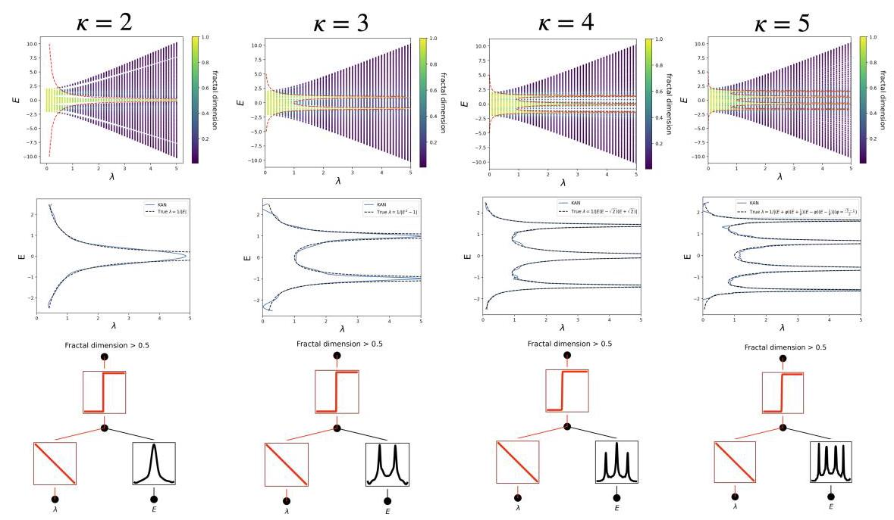

Figure 4.5: Results for the Mosaic Model. Top: phase diagram. Middle and Bottom: KANs can obtain both qualitative intuition (bottom) and extract quantitative results (middle). $\varphi  = \frac{1 + \sqrt{5}}{2}$ is the golden ratio.

图4.5:镶嵌模型的结果。顶部:相图。中间和底部:KAN既可以获得定性直观(底部)，也可以提取定量结果(中间)。$\varphi  = \frac{1 + \sqrt{5}}{2}$是黄金分割率。

To introduce quasiperiodicity, we set $b$ to be irrational (in particular, we choose $b$ to be the golden ratio $\frac{1 + \sqrt{5}}{2}).\kappa$ is an integer and the quasiperiodic potential occurs with interval $\kappa$ . The energy (E) spectrum for this model generically contains extended and localized regimes separated by a mobility edge. Interestingly, a unique feature found here is that the mobility edges are present for an arbitrarily strong quasiperiodic potential (i.e. there are always extended states present in the system that co-exist with localized ones).

为了引入准周期性，我们将$b$设为无理数(特别地，我们选择$b$为黄金分割率$\frac{1 + \sqrt{5}}{2}).\kappa$是整数，准周期势以间隔$\kappa$出现。该模型的能量(E)谱通常包含由迁移率边缘分隔的扩展和局域区域。有趣的是，在此发现的一个独特特征是，对于任意强的准周期势都存在迁移率边缘(即系统中总是存在与局域态共存的扩展态)。

The mobility edge can be described by $g\left( {\lambda , E}\right)  \equiv  \lambda  - \left| {{f}_{\kappa }\left( E\right) }\right|  = 0.g\left( {\lambda , E}\right)  > 0$ and $g\left( {\lambda , E}\right)  <$ 0 correspond to localized and extended phases, respectively. Learning the mobility edge therefore hinges on learning the "order parameter" $g\left( {\lambda , E}\right)$ . Admittedly, this problem can be tackled by many other theoretical methods for this class of models [63], but we will demonstrate below that our KAN framework is ready and convenient to take in assumptions and inductive biases from human users.

迁移率边缘可以用$g\left( {\lambda , E}\right)  \equiv  \lambda  - \left| {{f}_{\kappa }\left( E\right) }\right|  = 0.g\left( {\lambda , E}\right)  > 0$和$g\left( {\lambda , E}\right)  <$描述，$g\left( {\lambda , E}\right)  \equiv  \lambda  - \left| {{f}_{\kappa }\left( E\right) }\right|  = 0.g\left( {\lambda , E}\right)  > 0$和$g\left( {\lambda , E}\right)  <$ 0分别对应局域化和扩展相。因此，学习迁移率边缘取决于学习“序参量”$g\left( {\lambda , E}\right)$。诚然，对于这类模型，这个问题可以通过许多其他理论方法解决[63]，但我们将在下面证明，我们的KAN框架准备好且方便接受来自人类用户的假设和归纳偏差。

Let us assume a hypothetical user Alice, who is a new PhD student in condensed matter physics, and she is provided with a $\left\lbrack  {2,1}\right\rbrack$ KAN as an assistant for the task. Firstly, she understands that this is a classification task, so it is wise to set the activation function in the second layer to be sigmoid by using the fix_symbolic functionality. Secondly, she realizes that learning the whole 2D function $g\left( {\lambda , E}\right)$ is unnecessary because in the end she only cares about $\lambda  = \lambda \left( E\right)$ determined by $g\left( {\lambda , E}\right)  = 0$ . In so doing, it is reasonable to assume $g\left( {\lambda , E}\right)  = \lambda  - h\left( E\right)  = 0$ . Alice simply sets the activation function of $\lambda$ to be linear by again using the fix_symbolic functionality. Now Alice trains the KAN network and conveniently obtains the mobility edge, as shown in Figure 4.5 Alice can get both intuitive qualitative understanding (bottom) and quantitative results (middle), which well match the ground truth (top).

让我们假设一个假设的用户爱丽丝，她是一名凝聚态物理的新博士生，并且她被提供了一个$\left\lbrack  {2,1}\right\rbrack$ KAN作为该任务的助手。首先，她明白这是一个分类任务，所以通过使用fix_symbolic功能将第二层的激活函数设置为sigmoid是明智的。其次，她意识到学习整个二维函数$g\left( {\lambda , E}\right)$是不必要的，因为最终她只关心由$g\left( {\lambda , E}\right)  = 0$确定的$\lambda  = \lambda \left( E\right)$。这样做的话，假设$g\left( {\lambda , E}\right)  = \lambda  - h\left( E\right)  = 0$是合理的。爱丽丝再次通过使用fix_symbolic功能将$\lambda$的激活函数设置为线性。现在爱丽丝训练KAN网络并方便地获得了迁移率边缘，如图4.5所示。爱丽丝可以得到直观的定性理解(底部)和定量结果(中间)，它们与真实情况(顶部)非常匹配。

<table><tr><td>System</td><td>Origin</td><td>Mobility Edge Formula</td><td>Accuracy</td></tr><tr><td rowspan="2">GAAM</td><td>Theory</td><td>${\alpha E} + {2\lambda } - 2 = 0$</td><td>99.2%</td></tr><tr><td>KAN auto</td><td>${1.52}{E}^{2} + {21.06\alpha E} + {0.66E} + {3.55}{\overline{\alpha }}^{2} + {0.91}\overline{\alpha } + {45.13\lambda } - {54.45} = 0$</td><td>99.0%</td></tr><tr><td rowspan="6">MAAM</td><td>Theory</td><td>$E + \exp \left( p\right)  - \lambda \cosh p = 0$</td><td>98.6%</td></tr><tr><td>KAN auto</td><td>13.99sin $({0.28}\sin \left( {{0.87\lambda } + {2.22}}\right)  - {0.84}\arctan \left( {{0.58E} - {0.26}}\right)  + {0.85}\arctan ({0.94p} + \; {0.13}) - {8.14}) - {16.74} + {43.08}\exp ( - {0.93}({0.06}{\left( {0.13} - p\right) }^{2} - {0.27}\tanh \left( {{0.65E} + {0.25}}\right)  + \; {0.63}\arctan \left( {{0.54\lambda } - {0.62}}\right)  + 1{)}^{2}) = 0$</td><td>97.1%</td></tr><tr><td>KAN man (step 2) + auto</td><td>${4.19}\left( {{0.28}\sin \left( {{0.97\lambda } + {2.17}}\right)  - {0.77}\arctan \left( {{0.83E} - {0.19}}\right)  + \arctan \left( {{0.97p} + {0.15}}\right)  - }\right. \; {0.35}{)}^{2} - {28.93} + {39.27}\exp \left( {-{0.6}\left( {{0.28}{\cosh }^{2}\left( {{0.49p} - {0.16}}\right)  - {0.34}\arctan ({0.65E} + }\right. }\right. \; {0.51}) + {0.83}\arctan \left( {{0.54\lambda } - {0.62}}\right)  + 1{)}^{2}) = 0$</td><td>97.7%</td></tr><tr><td>KAN man (step 3) + auto</td><td>$- {4.63E} - {10.25}\left( {-{0.94}\sin \left( {{0.97\lambda } - {6.81}}\right)  + \tanh \left( {{0.8p} - {0.45}}\right)  + {0.09}{)}^{2} + }\right. \; {11.78}\sin \left( {{0.76p} - {1.41}}\right)  + {22.49}\arctan \left( {{1.08\lambda } - {1.32}}\right)  + {31.72} = 0$</td><td>97.7%</td></tr><tr><td>KAN man (step 4A)</td><td>${6.92E} - {6.23}{\left( -{0.92}\lambda  - 1\right) }^{2} + {2572.45}{\left( -{0.05}\lambda  + {0.95}\cosh \left( {0.11}p + {0.4}\right)  - 1\right) }^{2} - \; {12.96}{\cosh }^{2}\left( {{0.53p} + {0.16}}\right)  + {19.89} = 0$</td><td>96.6%</td></tr><tr><td>KAN man (step 4B)</td><td>${7.25E} - {8.81}{\left( -{0.83}\lambda  - 1\right) }^{2} - {4.08}{\left( -p - {0.04}\right) }^{2} + {12.71}( - {0.71\lambda } + {\left( {0.3}p + 1\right) }^{2} - \; {0.86}{)}^{2} + {10.29} = 0$</td><td>95.4%</td></tr></table>

Table 5: Symbolic formulas for two systems GAAM and MAAM, ground truth ones and KAN-discovered ones.

表5:两个系统GAAM和MAAM以及真实情况和KAN发现情况的符号公式。

Generalized Andre-Aubry Model (GAAM) We next consider a class of tight-binding models defined by the Hamiltonian [62]

广义安德烈 - 奥布里模型(GAAM)接下来我们考虑一类由哈密顿量[62]定义的紧束缚模型

$$
H = t\mathop{\sum }\limits_{n}\left( {{c}_{n + 1}^{ \dagger  }{c}_{n} + \text{ H.c. }}\right)  + \mathop{\sum }\limits_{n}{V}_{n}\left( {\alpha ,\lambda ,\phi }\right) {c}_{n}^{ \dagger  }{c}_{n}, \tag{4.6}
$$

where $t$ is the nearest-neighbor coupling, ${c}_{n}\left( {c}_{n}^{ \dagger  }\right)$ is the annihilation (creation) operator at site $n$ and the potential energy ${V}_{n}$ is given by

其中$t$是最近邻耦合，${c}_{n}\left( {c}_{n}^{ \dagger  }\right)$是位点$n$处的湮灭(产生)算符，势能${V}_{n}$由下式给出

$$
{V}_{n}\left( {\alpha ,\lambda ,\phi }\right)  = {2\lambda }\frac{\cos \left( {{2\pi nb} + \phi }\right) }{1 - \alpha \cos \left( {{2\pi nb} + \phi }\right) }, \tag{4.7}
$$

which is smooth for $\alpha  \in  \left( {-1,1}\right)$ . To introduce quasiperiodicity, we again set $b$ to be irrational (in particular, we choose $b$ to be the golden ratio). As before, we would like to obtain an expression for the mobility edge. For these models, the mobility edge is given by the closed form expression [62] 64],

对于$\alpha  \in  \left( {-1,1}\right)$它是光滑的。为了引入准周期性，我们再次将$b$设为无理数(特别地，我们选择$b$为黄金分割比)。和之前一样，我们希望得到迁移率边缘的表达式。对于这些模型，迁移率边缘由封闭形式的表达式[62,64]给出

$$
{\alpha E} = 2\left( {t - \lambda }\right) . \tag{4.8}
$$

We randomly sample the model parameters: $\phi ,\alpha$ and $\lambda$ (setting the energy scale $t = 1$ ) and calculate the energy eigenvalues as well as the fractal dimension of the corresponding eigenstates, which forms our training dataset.

我们随机采样模型参数:$\phi ,\alpha$和$\lambda$(设置能量尺度$t = 1$)并计算能量本征值以及相应本征态的分形维数，这构成了我们的训练数据集。

Here the "order parameter" to be learned is $g\left( {\alpha , E,\lambda ,\phi }\right)  = {\alpha E} + 2\left( {\lambda  - 1}\right)$ and mobility edge corresponds to $g = 0$ . Let us again assume that Alice wants to figure out the mobility edge but only has access to IPR or fractal dimension data, so she decides to use KAN to help her with the task. Alice wants the model to be as small as possible, so she could either start from a large model and use auto-pruning to get a small model, or she could guess a reasonable small model based on her understanding of the complexity of the given problem. Either way, let us assume she arrives at a $\left\lbrack  {4,2,1,1}\right\rbrack$ KAN. First, she sets the last activation to be sigmoid because this is a classification problem. She trains her KAN with some sparsity regularization to accuracy 98.7% and visualizes the trained KAN in Figure 4.6 (a) step 1. She observes that $\phi$ is not picked up on at all, which makes her realize that the mobility edge is independent of $\phi$ (agreeing with Eq. 4.8). In addition, she observes that almost all other activation functions are linear or quadratic, so she turns on automatic symbolic snapping, constraining the library to be only linear or quadratic. After that, she immediately gets a network which is already symbolic (shown in Figure 4.6 (a) step 2), with comparable (even slightly better) accuracy 98.9%. By using symbolic_formula functionality, Alice conveniently gets the symbolic form of $g$ , shown in Table 5 GAAM-KAN auto (row three). Perhaps she wants to cross out some small terms and snap coefficient to small integers, which takes her close to the true answer.

这里要学习的“序参量”是$g\left( {\alpha , E,\lambda ,\phi }\right)  = {\alpha E} + 2\left( {\lambda  - 1}\right)$，迁移率边缘对应于$g = 0$。让我们再次假设爱丽丝想弄清楚迁移率边缘，但只能获取IPR或分形维数数据，所以她决定使用KAN来帮助她完成任务。爱丽丝希望模型尽可能小，所以她可以要么从一个大模型开始并使用自动剪枝得到一个小模型，要么基于她对给定问题复杂性的理解猜测一个合理的小模型。不管怎样，假设她得到了一个$\left\lbrack  {4,2,1,1}\right\rbrack$ KAN。首先，她将最后一层激活设置为sigmoid，因为这是一个分类问题。她用一些稀疏正则化训练她的KAN，准确率达到98.7%，并在图4.6(a)步骤1中可视化训练后的KAN。她观察到根本没有捕捉到$\phi$，这使她意识到迁移率边缘与$\phi$无关(与式4.8一致)。此外，她观察到几乎所有其他激活函数都是线性或二次的，所以她开启自动符号捕捉，将库限制为仅线性或二次的。之后，她立即得到一个已经是符号形式的网络(如图4.6(a)步骤2所示)，准确率为98.9%(相当甚至略好)。通过使用symbolic_formula功能，爱丽丝方便地得到了$g$的符号形式，如表5中GAAM - KAN自动(第三行)所示。也许她想划掉一些小项并将系数捕捉为小整数，这使她更接近真实答案。

This hypothetical story for Alice would be completely different if she is using a symbolic regression method. If she is lucky, SR can return the exact correct formula. However, the vast majority of the time SR does not return useful results and it is impossible for Alice to "debug" or interact with the underlying process of symbolic regression. Furthermore, Alice may feel uncomfortable/inexperienced to provide a library of symbolic terms as prior knowledge to SR before SR is run. By constrast in KANs, Alice does not need to put any prior information to KANs. She can first get some clues by staring at a trained KAN and only then it is her job to decide which hypothesis she wants to make (e.g., "all activations are linear or quadratic") and implement her hypothesis in KANs. Although it is not likely for KANs to return the correct answer immediately, KANs will always return something useful, and Alice can collaborate with it to refine the results.

如果爱丽丝使用符号回归方法，这个假设的故事对她来说将会完全不同。如果她运气好，符号回归可以返回完全正确的公式。然而，在绝大多数情况下，符号回归不会返回有用的结果，爱丽丝也不可能“调试”符号回归的底层过程或与之交互。此外，在运行符号回归之前，爱丽丝可能会觉得提供一个符号项库作为先验知识会让她感到不舒服/缺乏经验。相比之下，在KANs中，爱丽丝不需要向KANs输入任何先验信息。她可以先通过观察一个经过训练的KAN获得一些线索，然后才是她决定要做出哪种假设(例如，“所有激活都是线性或二次的”)并在KANs中实现她的假设的工作。虽然KANs不太可能立即返回正确答案，但KANs总会返回一些有用的东西，爱丽丝可以与它合作来完善结果。

Modified Andre-Aubry Model (MAAM) The last class of models we consider is defined by the Hamiltonian [60]

修正的安德烈 - 奥布里模型(MAAM)我们考虑的最后一类模型由哈密顿量[60]定义

$$
H = \mathop{\sum }\limits_{{n \neq  {n}^{\prime }}}t{e}^{-p\left| {n - {n}^{\prime }}\right| }\left( {{c}_{n}^{ \dagger  }{c}_{{n}^{\prime }} + \text{ H.c. }}\right)  + \mathop{\sum }\limits_{n}{V}_{n}\left( {\lambda ,\phi }\right) {c}_{n}^{ \dagger  }{c}_{n}, \tag{4.9}
$$

where $t$ is the strength of the exponentially decaying coupling in space, ${c}_{n}\left( {c}_{n}^{ \dagger  }\right)$ is the annihilation (creation) operator at site $n$ and the potential energy ${V}_{n}$ is given by

其中$t$是空间中指数衰减耦合的强度，${c}_{n}\left( {c}_{n}^{ \dagger  }\right)$是位点$n$处的湮灭(产生)算符，势能${V}_{n}$由下式给出

$$
{V}_{n}\left( {\lambda ,\phi }\right)  = \lambda \cos \left( {{2\pi nb} + \phi }\right) , \tag{4.10}
$$

As before, to introduce quasiperiodicity, we set $b$ to be irrational (the golden ratio). For these models, the mobility edge is given by the closed form expression [60],

和之前一样，为了引入准周期性，我们将$b$设为无理数(黄金比例)。对于这些模型，迁移率边缘由封闭形式表达式[60]给出，

$$
\lambda \cosh \left( p\right)  = E + t = E + {t}_{1}\exp \left( p\right) \tag{4.11}
$$

where we define ${t}_{1} \equiv  t\exp \left( {-p}\right)$ as the nearest neighbor hopping strength, and we set ${t}_{1} = 1$ below.

其中我们将${t}_{1} \equiv  t\exp \left( {-p}\right)$定义为最近邻跳跃强度，并在下方设置${t}_{1} = 1$。

Let us assume Alice wants to figure out the mobility edge for MAAM. This task is more complicated and requires more human wisdom. As in the last example, Alice starts from a $\left\lbrack  {4,2,1,1}\right\rbrack$ KAN and trains it but gets an accuracy around ${75}\%$ which is less than acceptable. She then chooses a larger $\left\lbrack  {4,3,1,1}\right\rbrack$ KAN and successfully gets 98.4% which is acceptable (Figure 4.6 (b) step 1). Alice notices that $\phi$ is not picked up on by KANs, which means that the mobility edge is independent of the phase factor $\phi$ (agreeing with Eq. (4.11)). If Alice turns on the automatic symbolic regression (using a large library consisting of exp, tanh etc.), she would get a complicated formula in Tabel 5 MAAM-KAN auto, which has 97.1% accuracy. However, if Alice wants to find a simpler symbolic formula, she will want to use the manual mode where she does the symbolic snapping by herself. Before that she finds that the $\left\lbrack  {4,3,1,1}\right\rbrack$ KAN after training can then be pruned to be $\left\lbrack  {4,2,1,1}\right\rbrack$ , while maintaining 97.7% accuracy (Figure 4.6 (b)). Alice may think that all activation functions except those dependent on $p$ are linear or quadratic and snap them to be either linear or quadratic manually by using fix_symbolic. After snapping and retraining, the updated KAN is shown in Figure 4.6 (c) step 3, maintaining 97.7% accuracy. From now on, Alice may make two different choices based on her prior knowledge. In one case, Alice may have guessed that the dependence on $p$ is cosh, so she sets the activations of $p$ to be cosh function. She retrains KAN and gets 96.9% accuracy (Figure 4.6 (c) Step 4A). In another case, Alice does not know the cosh $p$ dependence, so she pursues simplicity and again assumes the functions of $p$ to be quadratic. She retrains KAN and gets 95.4% accuracy (Figure 4.6(c) Step 4B). If she tried both, she would realize that cosh is better in terms of accuracy, while quadratic is better in terms of simplicity. The formulas corresponding to these steps are listed in Table 5 It is clear that the more manual operations are done by Alice, the simpler the symbolic formula is (which slight sacrifice in accuracy). KANs have a "knob" that a user can tune to trade-off between simplicity and accuracy (sometimes simplicity can even lead to better accuracy, as in the GAAM case).

假设爱丽丝想要找出MAAM的迁移边缘。这项任务更加复杂，需要更多的人类智慧。与上一个例子一样，爱丽丝从一个$\left\lbrack  {4,2,1,1}\right\rbrack$ KAN开始训练，但得到的准确率约为${75}\%$，低于可接受水平。然后她选择了一个更大的$\left\lbrack  {4,3,1,1}\right\rbrack$ KAN，并成功得到了98.4%的准确率，这是可以接受的(图4.6 (b)步骤1)。爱丽丝注意到KAN没有捕捉到$\phi$，这意味着迁移边缘与相位因子$\phi$无关(与式(4.11)一致)。如果爱丽丝开启自动符号回归(使用由exp、tanh等组成的大型库)，她将在表5 MAAM-KAN自动中得到一个复杂的公式，其准确率为97.1%。然而，如果爱丽丝想要找到一个更简单的符号公式，她会想要使用手动模式，即自己进行符号拟合。在此之前，她发现训练后的$\left\lbrack  {4,3,1,1}\right\rbrack$ KAN可以修剪为$\left\lbrack  {4,2,1,1}\right\rbrack$，同时保持97.7%的准确率(图4.6 (b))。爱丽丝可能会认为，除了那些依赖于$p$的激活函数外，所有激活函数都是线性或二次的，并使用fix_symbolic手动将它们拟合为线性或二次函数。在拟合和重新训练之后，更新后的KAN如图4.6 (c)步骤3所示，保持97.7%的准确率。从现在开始，爱丽丝可以根据她的先验知识做出两种不同的选择。在一种情况下，爱丽丝可能已经猜测到对$p$的依赖是cosh，所以她将$p$的激活设置为cosh函数。她重新训练KAN，得到96.9%的准确率(图4.6 (c)步骤4A)。在另一种情况下，爱丽丝不知道cosh对$p$的依赖，所以她追求简单性，并再次假设$p$的函数是二次的。她重新训练KAN，得到95.4%的准确率(图4.6(c)步骤4B)。如果她尝试了这两种方法，她会意识到cosh在准确率方面更好，而二次函数在简单性方面更好。与这些步骤对应的公式列在表5中。很明显，爱丽丝进行的手动操作越多，符号公式就越简单(在准确率上有轻微牺牲)。KAN有一个“旋钮”，用户可以调整它以在简单性和准确率之间进行权衡(有时简单性甚至可以带来更好的准确率，如在GAAM的情况下)。

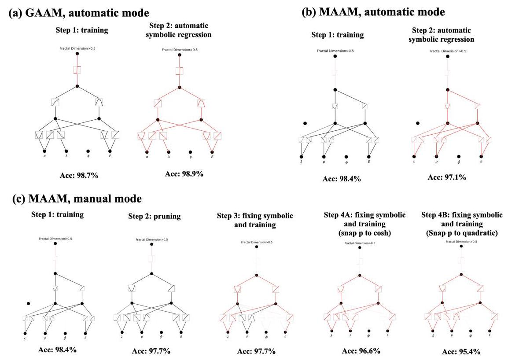

Figure 4.6: Human-KAN collaboration to discover mobility edges of GAAM and MAAM. The human user can choose to be lazy (using the auto mode) or more involved (using the manual mode). More details in text.

图4.6:人类与KAN协作发现GAAM和MAAM的迁移边缘。人类用户可以选择偷懒(使用自动模式)或更积极参与(使用手动模式)。文本中有更多细节。

## 5 Related works

## 5相关工作

Kolmogorov-Arnold theorem and neural networks. The connection between the Kolmogorov-Arnold theorem (KAT) and neural networks is not new in the literature [66, 67, 9, 10, 11, 12, 13] [14, 68, 69], but the pathological behavior of inner functions makes KAT appear unpromising in practice [66]. Most of these prior works stick to the original 2-layer width- $\left( {{2n} + 1}\right)$ networks, which were limited in expressive power and many of them are even predating back-propagation. Therefore, most studies were built on theories with rather limited or artificial toy experiments. More broadly speaking, KANs are also somewhat related to generalized additive models (GAMs) [70], graph neural networks [71] and kernel machines [72]. The connections are intriguing and fundamental but might be out of the scope of the current paper. Our contribution lies in generalizing the Kolmogorov network to arbitrary widths and depths, revitalizing and contexualizing them in today's deep learning stream, as well as highlighting its potential role as a foundation model for AI + Science.

柯尔莫哥洛夫 - 阿诺德定理与神经网络。柯尔莫哥洛夫 - 阿诺德定理(KAT)与神经网络之间的联系在文献[66, 67, 9, 10, 11, 12, 13] [14, 68, 69]中并不新鲜，但内部函数的病态行为使得KAT在实践中看起来没有前途[66]。这些先前的工作大多坚持原始的2层宽度为$\left( {{2n} + 1}\right)$的网络，其表达能力有限，而且其中许多甚至早于反向传播。因此，大多数研究是基于相当有限或人为的玩具实验理论构建的。更广泛地说，KAN在某种程度上也与广义相加模型(GAMs)[70]、图神经网络[71]和核机器[72]相关。这些联系很有趣且具有基础性，但可能超出了本文的范围。我们的贡献在于将柯尔莫哥洛夫网络推广到任意宽度和深度，在当今的深度学习潮流中使其复兴并置于具体情境中，以及突出其作为AI + 科学基础模型的潜在作用。

Neural Scaling Laws (NSLs). NSLs are the phenomena where test losses behave as power laws against model size, data, compute etc [73, 74, 75, 76, 24, 77, 78, 79]. The origin of NSLs still remains mysterious, but competitive theories include intrinsic dimensionality [73], quantization of tasks [78], resource theory [79], random features [77], compositional sparsity [66], and maximu arity [25]. This paper contributes to this space by showing that a high-dimensional function can surprisingly scale as a 1D function (which is the best possible bound one can hope for) if it has a smooth Kolmogorov-Arnold representation. Our paper brings fresh optimism to neural scaling laws, since it promises the fastest scaling exponent ever. We have shown in our experiments that this fast neural scaling law can be achieved on synthetic datasets, but future research is required to address the question whether this fast scaling is achievable for more complicated tasks (e.g., language modeling): Do KA representations exist for general tasks? If so, does our training find these representations in practice?

神经缩放定律(NSLs)。NSLs是指测试损失相对于模型大小、数据、计算等呈现幂律关系的现象[73, 74, 75, 76, 24, 77, 78, 79]。NSLs的起源仍然神秘，但有竞争力的理论包括内在维度[73]、任务量化[78]、资源理论[79]、随机特征[77]、组合稀疏性[66]和最大arity[25]。本文通过表明如果一个高维函数具有光滑的柯尔莫哥洛夫 - 阿诺德表示，它可以惊人地像一维函数一样缩放(这是人们所能期望的最佳边界)，为这一领域做出了贡献。我们的论文给神经缩放定律带来了新的乐观情绪，因为它承诺了有史以来最快的缩放指数。我们在实验中表明，这种快速神经缩放定律可以在合成数据集上实现，但未来的研究需要解决对于更复杂的任务(例如语言建模)是否可以实现这种快速缩放的问题:一般任务是否存在KA表示？如果存在，我们的训练在实践中是否能找到这些表示？

Mechanistic Interpretability (MI). MI is an emerging field that aims to mechanistically understand the inner workings of neural networks [80, 81, 82, 83, 84, 85, 86, 87, 5]. MI research can be roughly divided into passive and active MI research. Most MI research is passive in focusing on understanding existing neural networks trained with standard methods. Active MI research attempts to achieve interpretability by designing intrinsically interpretable architectures or developing training methods to explicitly encourage interpretability [86, 87]. Our work lies in the second category, where the model and training method are by design interpretable.

机械可解释性 (MI)。MI 是一个新兴领域，旨在从机制上理解神经网络的内部运作 [80, 81, 82, 83, 84, 85, 86, 87, 5]。MI 研究大致可分为被动和主动 MI 研究。大多数 MI 研究是被动的，侧重于理解用标准方法训练的现有神经网络。主动 MI 研究试图通过设计内在可解释的架构或开发明确鼓励可解释性的训练方法来实现可解释性 [86, 87]。我们的工作属于第二类，在这类工作中，模型和训练方法在设计上就是可解释的。

Learnable activations. The idea of learnable activations in neural networks is not new in machine learning. Trainable activations functions are learned in a differentiable way [88, 14, 89, 90] or searched in a discrete way [91]. Activation function are parametrized as polynomials [88], splines [14, 92, 93], sigmoid linear unit [89], or neural networks [90]. KANs use B-splines to parametrize their activation functions. We also present our preliminary results on learnable activation networks (LANs), whose properties lie between KANs and MLPs and their results are deferred to Appendix B to focus on KANs in the main paper.

可学习激活函数。神经网络中可学习激活函数的概念在机器学习中并不新鲜。可训练激活函数可以通过可微的方式进行学习[88, 14, 89, 90]，或者以离散的方式进行搜索[91]。激活函数可以参数化为多项式[88]、样条函数[14, 92, 93]、Sigmoid线性单元[89]或神经网络[90]。KAN使用B样条函数对其激活函数进行参数化。我们还展示了关于可学习激活网络(LAN)的初步结果，其特性介于KAN和MLP之间，并且我们将其结果推迟到附录B中，以便在主论文中专注于KAN。

Symbolic Regression. There are many off-the-shelf symbolic regression methods based on genetic algorithms (Eureka [94], GPLearn [95], PySR [96]), neural-network based methods (EQL [97], OccamNet [98]), physics-inspired method (AI Feynman [36,37]), and reinforcement learning-based methods [99]. KANs are most similar to neural network-based methods, but differ from previous works in that our activation functions are continuously learned before symbolic snapping rather than manually fixed [94, 98].

符号回归。有许多基于遗传算法的现成符号回归方法(Eureka [94]、GPLearn [95]、PySR [96])、基于神经网络的方法(EQL [97]、OccamNet [98])、受物理启发的方法(AI Feynman [36,37])以及基于强化学习的方法 [99]。KAN 与基于神经网络的方法最为相似，但与之前的工作不同之处在于，我们的激活函数在符号捕捉之前是持续学习的，而不是手动固定的 [94, 98]。

Physics-Informed Neural Networks (PINNs) and Physics-Informed Neural Operators (PINOs). In Subsection 3.4 we demonstrate that KANs can replace the paradigm of using MLPs for imposing PDE loss when solving PDEs. We refer to Deep Ritz Method [100], PINNs [38, 39, 101] for PDE solving, and Fourier Neural operator [102], PINOs [103, 104, 105], DeepONet [106] for operator learning methods learning the solution map. There is potential to replace MLPs with KANs in all the aforementioned networks.

物理信息神经网络(PINNs)和物理信息神经算子(PINOs)。在3.4小节中，我们证明了KANs在求解偏微分方程时可以取代使用多层感知器(MLPs)来施加偏微分方程损失的范式。我们参考用于偏微分方程求解的深度里兹方法[100]、PINNs[38, 39, 101]，以及用于学习解映射的算子学习方法的傅里叶神经算子[102]、PINOs[103, 104, 105]、深度算子网络[106]。在上述所有网络中，用KANs取代MLPs是有潜力的。

AI for Mathematics. As we saw in Subsection 4.3, AI has recently been applied to several problems in Knot theory, including detecting whether a knot is the unknot [107, 108] or a ribbon knot [46], and predicting knot invariants and uncovering relations among them [109, 110, 111, 45]. For a summary of data science applications to datasets in mathematics and theoretical physics see e.g. [112, 113], and for ideas how to obtain rigorous results from ML techniques in these fields, see [114].

数学领域的人工智能。正如我们在4.3小节中所看到的，人工智能最近已被应用于纽结理论中的几个问题，包括检测一个纽结是否为平凡纽结[107, 108]或带状纽结[46]，以及预测纽结不变量并揭示它们之间的关系[109, 110, 111, 45]。关于数据科学在数学和理论物理数据集中的应用总结，例如见[112, 113]，关于如何从这些领域的机器学习技术中获得严格结果的想法，见[114]。

## 6 Discussion

## 6 讨论

In this section, we discuss KANs' limitations and future directions from the perspective of mathematical foundation, algorithms and applications.

在本节中，我们从数学基础、算法和应用的角度讨论KANs的局限性和未来方向。

Mathematical aspects: Although we have presented preliminary mathematical analysis of KANs (Theorem 2.1), our mathematical understanding of them is still very limited. The Kolmogorov-Arnold representation theorem has been studied thoroughly in mathematics, but the theorem corresponds to KANs with shape $\left\lbrack  {n,{2n} + 1,1}\right\rbrack$ , which is a very restricted subclass of KANs. Does our empirical success with deeper KANs imply something fundamental in mathematics? An appealing generalized Kolmogorov-Arnold theorem could define "deeper" Kolmogorov-Arnold representations beyond depth-2 compositions, and potentially relate smoothness of activation functions to depth. Hypothetically, there exist functions which cannot be represented smoothly in the original (depth-2) Kolmogorov-Arnold representations, but might be smoothly represented with depth-3 or beyond. Can we use this notion of "Kolmogorov-Arnold depth" to characterize function classes?

数学方面:尽管我们已经对KAN进行了初步的数学分析(定理2.1)，但我们对它们的数学理解仍然非常有限。柯尔莫哥洛夫 - 阿诺德表示定理在数学中已经得到了深入研究，但该定理对应的是形状为$\left\lbrack  {n,{2n} + 1,1}\right\rbrack$的KAN，这只是KAN中一个非常受限的子类。我们在更深层的KAN上取得的经验性成功是否意味着数学中有一些基本的东西？一个有吸引力的广义柯尔莫哥洛夫 - 阿诺德定理可以定义深度超过2层组合的“更深层”柯尔莫哥洛夫 - 阿诺德表示，并有可能将激活函数的平滑性与深度联系起来。假设存在一些函数，它们在原始的(深度为2)柯尔莫哥洛夫 - 阿诺德表示中不能被平滑表示，但可能在深度为3或更高的表示中被平滑表示。我们能否用这种“柯尔莫哥洛夫 - 阿诺德深度”的概念来刻画函数类？

Algorithmic aspects: We discuss the following:

算法方面:我们讨论以下内容:

(1) Accuracy. Multiple choices in architecture design and training are not fully investigated so alternatives can potentially further improve accuracy. For example, spline activation functions might be replaced by radial basis functions or other local kernels. Adaptive grid strategies can be used.

(1) 准确性。架构设计和训练中的多种选择尚未得到充分研究，因此替代方案可能会进一步提高准确性。例如，样条激活函数可能会被径向基函数或其他局部核所取代。可以使用自适应网格策略。

(2) Efficiency. One major reason why KANs run slowly is because different activation functions cannot leverage batch computation (large data through the same function). Actually, one can interpolate between activation functions being all the same (MLPs) and all different (KANs), by grouping activation functions into multiple groups ("multi-head"), where members within a group share the same activation function.

(2) 效率。KAN运行缓慢的一个主要原因是不同的激活函数无法利用批量计算(通过相同函数处理大数据)。实际上，可以通过将激活函数分组为多个组(“多头”)来在激活函数完全相同(多层感知机)和完全不同(KAN)之间进行插值，其中组内成员共享相同的激活函数。

(3) Hybrid of KANs and MLPs. KANs have two major differences compared to MLPs:

(3) KAN与多层感知机的混合。与多层感知机相比，KAN有两个主要区别:

(i) activation functions are on edges instead of on nodes,

(i) 激活函数在边上而不是在节点上，

(ii) activation functions are learnable instead of fixed.

(ii) 激活函数是可学习的而不是固定的。

Which change is more essential to explain KAN's advantage? We present our preliminary results in Appendix B where we study a model which has (ii), i.e., activation functions are learnable (like KANs), but not (i), i.e., activation functions are on nodes (like MLPs). Moreover, one can also construct another model with fixed activations (like MLPs) but on edges (like KANs).

对于解释KAN的优势来说，哪种变化更关键？我们在附录B中展示了初步结果，在那里我们研究了一个具有(ii)，即激活函数是可学习(像KAN)但不具有(i)，即激活函数在节点上(像多层感知机)的模型。此外，还可以构建另一个具有固定激活函数(像多层感知机)但在边上(像KAN)的模型。

(4) Adaptivity. Thanks to the intrinsic locality of spline basis functions, we can introduce adaptivity in the design and training of KANs to enhance both accuracy and efficiency: see the idea of multi-level training like multigrid methods as in [115, 116], or domain-dependent basis functions like multiscale methods as in [117].

(4) 适应性。由于样条基函数的内在局部性，我们可以在KAN的设计和训练中引入适应性，以提高准确性和效率:例如，参见[115, 116]中像多重网格方法那样的多级训练思想，或[117]中像多尺度方法那样的依赖域的基函数。

Application aspects: We have presented some preliminary evidences that KANs are more effective than MLPs in science-related tasks, e.g., fitting physical equations and PDE solving. We would like to apply KANs to solve Navier-Stokes equations, density functional theory, or any other tasks that can be formulated as regression or PDE solving. We would also like to apply KANs to machine-learning-related tasks, which would require integrating KANs into current architectures, e.g., transformers - one may propose "kansformers" which replace MLPs by KANs in transformers.

应用方面:我们已经给出了一些初步证据，表明KAN在与科学相关的任务中比多层感知机更有效，例如拟合物理方程和求解偏微分方程。我们希望应用KAN来求解纳维 - 斯托克斯方程、密度泛函理论，或任何其他可以表述为回归或求解偏微分方程的任务。我们还希望将KAN应用于与机器学习相关的任务，这将需要把KAN集成到当前的架构中，例如变压器——人们可以提出“kanformers”，即在变压器中用KAN取代多层感知机。

KAN as a "language model" for AI + Science The reason why large language models are so transformative is because they are useful to anyone who can speak natural language. The language of science is functions. KANs are composed of interpretable functions, so when a human user stares at a KAN, it is like communicating with it using the language of functions. This paragraph aims to promote the AI-Scientist-Collaboration paradigm rather than our specific tool KANs. Just like people use different languages to communicate, we expect that in the future KANs will be just one of the languages for AI + Science, although KANs will be one of the very first languages that would enable AI and human to communicate. However, enabled by KANs, the AI-Scientist-Collaboration paradigm has never been this easy and convenient, which leads us to rethink the paradigm of how we want to approach AI + Science: Do we want AI scientists, or do we want AI that helps scientists? The intrinsic difficulty of (fully automated) AI scientists is that it is hard to make human preferences quantitative, which would codify human preferences into AI objectives. In fact, scientists in different fields may feel differently about which functions are simple or interpretable. As a result, it is more desirable for scientists to have an AI that can speak the scientific language (functions) and can conveniently interact with inductive biases of individual scientist(s) to adapt to a specific scientific domain.

KAN作为人工智能 + 科学的“语言模型” 大语言模型具有变革性的原因在于，它们对任何会说自然语言的人都有用。科学的语言是函数。KAN由可解释的函数组成，所以当人类用户看着一个KAN时，就像是在用函数的语言与它交流。这段话旨在推广人工智能 - 科学家 - 合作范式，而不是我们特定的工具KAN。就像人们用不同的语言交流一样，我们预计未来KAN将只是人工智能 + 科学的语言之一，尽管KAN将是最早能使人工智能和人类交流的语言之一。然而，在KAN的推动下，人工智能 - 科学家 - 合作范式从未如此轻松便捷，这促使我们重新思考我们想要如何处理人工智能 + 科学的范式:我们想要人工智能科学家，还是想要能帮助科学家的人工智能？(完全自动化的)人工智能科学家的内在困难在于，很难将人类偏好量化，即将人类偏好编码到人工智能目标中。实际上，不同领域的科学家对于哪些函数是简单的或可解释的可能有不同的感受。因此，更希望科学家拥有一个能说科学语言(函数)并能方便地与个体科学家的归纳偏差相互作用以适应特定科学领域的人工智能。

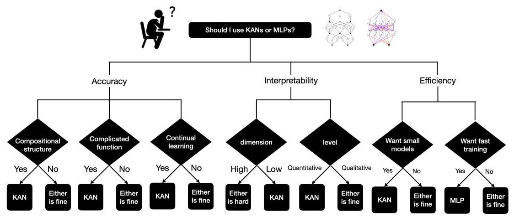

Figure 6.1: Should I use KANs or MLPs?

图6.1:我应该使用KAN还是多层感知机？

## Final takeaway: Should I use KANs or MLPs?

## 最终结论:我应该使用KAN还是多层感知机？

Currently, the biggest bottleneck of KANs lies in its slow training. KANs are usually 10x slower than MLPs, given the same number of parameters. We should be honest that we did not try hard to optimize KANs' efficiency though, so we deem KANs' slow training more as an engineering problem to be improved in the future rather than a fundamental limitation. If one wants to train a model fast, one should use MLPs. In other cases, however, KANs should be comparable or better than MLPs, which makes them worth trying. The decision tree in Figure 6.1 can help decide when to use a KAN. In short, if you care about interpretability and/or accuracy, and slow training is not a major concern, we suggest trying KANs, at least for small-scale AI + Science problems.

目前，KANs最大的瓶颈在于其训练速度慢。在参数数量相同的情况下，KANs的训练速度通常比MLPs慢10倍。不过，我们必须承认，我们并没有努力去优化KANs的效率，所以我们认为KANs训练速度慢更多是一个未来有待改进的工程问题，而非根本性的限制。如果有人想快速训练模型，应该使用MLPs。然而，在其他情况下，KANs应该与MLPs相当或更好，这使得它们值得一试。图6.1中的决策树可以帮助决定何时使用KAN。简而言之，如果您关心可解释性和/或准确性，并且训练速度慢不是主要问题，我们建议尝试KANs，至少对于小规模的人工智能+科学问题。

## Acknowledgement

## 致谢

We would like to thank Mikail Khona, Tomaso Poggio, Pingchuan Ma, Rui Wang, Di Luo, Sara Beery, Catherine Liang, Yiping Lu, Nicholas H. Nelsen, Nikola Kovachki, Jonathan W. Siegel, Hongkai Zhao, Juncai He, Shi Lab (Humphrey Shi, Steven Walton, Chuanhao Yan) and Matthieu Darcy for fruitful discussion and constructive suggestions. Z.L., F.R., J.H., M.S. and M.T. are supported by IAIFI through NSF grant PHY-2019786. The work of FR is in addition supported by the NSF grant PHY-2210333 and by startup funding from Northeastern University. Y.W and T.H are supported by the NSF Grant DMS-2205590 and the Choi Family Gift Fund. S. V. and M. S. acknowledge support from the U.S. Office of Naval Research (ONR) Multidisciplinary University Research Initiative (MURI) under Grant No. N00014-20-1-2325 on Robust Photonic Materials with Higher-Order Topological Protection.

我们要感谢Mikail Khona、Tomaso Poggio、Pingchuan Ma、Rui Wang、Di Luo、Sara Beery、Catherine Liang、Yiping Lu、Nicholas H. Nelsen、Nikola Kovachki、Jonathan W. Siegel、Hongkai Zhao、Juncai He、Shi实验室(Humphrey Shi、Steven Walton、Chuanhao Yan)和Matthieu Darcy进行的富有成果的讨论和建设性的建议。Z.L.、F.R.、J.H.、M.S.和M.T.得到了IAIFI通过NSF资助项目PHY - 2019786的支持。FR的工作还得到了NSF资助项目PHY - 2210333以及东北大学的启动资金支持。Y.W和T.H得到了NSF资助项目DMS - 2205590和Choi家族捐赠基金的支持。S.V.和M.S.感谢美国海军研究办公室(ONR)多学科大学研究计划(MURI)根据编号为N00014 - 20 - 1 - 2325的关于具有高阶拓扑保护的稳健光子材料的资助提供的支持。

## References

## 参考文献

[1] Simon Haykin. Neural networks: a comprehensive foundation. Prentice Hall PTR, 1994.

[2] George Cybenko. Approximation by superpositions of a sigmoidal function. Mathematics of control, signals and systems, 2(4):303-314, 1989.

[3] Kurt Hornik, Maxwell Stinchcombe, and Halbert White. Multilayer feedforward networks are universal approximators. Neural networks, 2(5):359-366, 1989.

[4] Ashish Vaswani, Noam Shazeer, Niki Parmar, Jakob Uszkoreit, Llion Jones, Aidan N Gomez,Łukasz Kaiser, and Illia Polosukhin. Attention is all you need. Advances in neural informa-

卢卡斯·凯泽和伊利亚·波罗苏欣。你只需要注意力。神经信息进展tion processing systems, 30, 2017.

[5] Hoagy Cunningham, Aidan Ewart, Logan Riggs, Robert Huben, and Lee Sharkey. Sparseautoencoders find highly interpretable features in language models. arXiv preprint

自动编码器在语言模型中发现高度可解释的特征。arXiv预印本arXiv:2309.08600, 2023.

[6] A.N. Kolmogorov. On the representation of continuous functions of several variables assuperpositions of continuous functions of a smaller number of variables. Dokl. Akad. Nauk, 108(2), 1956.

较少变量的连续函数的叠加。苏联科学院报告，108(2)，1956年。

[7] Andrei Nikolaevich Kolmogorov. On the representation of continuous functions of manyvariables by superposition of continuous functions of one variable and addition. In Doklady

通过一个变量的连续函数叠加和加法来表示多个变量。在苏联科学院报告中Akademii Nauk, volume 114, pages 953-956. Russian Academy of Sciences, 1957.

[8] Jürgen Braun and Michael Griebel. On a constructive proof of kolmogorov's superposition theorem. Constructive approximation, 30:653-675, 2009.

[9] David A Sprecher and Sorin Draghici. Space-filling curves and kolmogorov superposition-based neural networks. Neural Networks, 15(1):57-67, 2002.

[10] Mario Köppen. On the training of a kolmogorov network. In Artificial Neural Networks-ICANN 2002: International Conference Madrid, Spain, August 28-30, 2002 Proceedings 12, pages 474-479. Springer, 2002.

[11] Ji-Nan Lin and Rolf Unbehauen. On the realization of a kolmogorov network. Neural Computation, 5(1):18-20, 1993.

[12] Ming-Jun Lai and Zhaiming Shen. The kolmogorov superposition theorem can break thecurse of dimensionality when approximating high dimensional functions. arXiv preprint

逼近高维函数时的维度诅咒。arXiv预印本arXiv:2112.09963, 2021.

[13] Pierre-Emmanuel Leni, Yohan D Fougerolle, and Frédéric Truchetet. The kolmogorov splinenetwork for image processing. In Image Processing: Concepts, Methodologies, Tools, and

用于图像处理的网络。在《图像处理:概念、方法、工具和Applications, pages 54-78. IGI Global, 2013.

[14] Daniele Fakhoury, Emanuele Fakhoury, and Hendrik Speleers. Exsplinet: An interpretable and expressive spline-based neural network. Neural Networks, 152:332-346, 2022.

[15] Hadrien Montanelli and Haizhao Yang. Error bounds for deep relu networks using the kolmogorov-arnold superposition theorem. Neural Networks, 129:1-6, 2020.

[16] Juncai He. On the optimal expressive power of relu dnns and its application in approximation with kolmogorov superposition theorem. arXiv preprint arXiv:2308.05509, 2023.

[17] Juncai He, Lin Li, Jinchao Xu, and Chunyue Zheng. Relu deep neural networks and linear finite elements. arXiv preprint arXiv:1807.03973, 2018.

[18] Juncai He and Jinchao Xu. Deep neural networks and finite elements of any order on arbitrary dimensions. arXiv preprint arXiv:2312.14276, 2023.

[19] Tomaso Poggio, Andrzej Banburski, and Qianli Liao. Theoretical issues in deep networks. Proceedings of the National Academy of Sciences, 117(48):30039-30045, 2020.

[20] Federico Girosi and Tomaso Poggio. Representation properties of networks: Kolmogorov's theorem is irrelevant. Neural Computation, 1(4):465-469, 1989.

[21] Henry W Lin, Max Tegmark, and David Rolnick. Why does deep and cheap learning work so well? Journal of Statistical Physics, 168:1223-1247, 2017.

[22] Hongyi Xu, Funshing Sin, Yufeng Zhu, and Jernej Barbič. Nonlinear material design using principal stretches. ACM Transactions on Graphics (TOG), 34(4):1-11, 2015.

[23] Carl De Boor. A practical guide to splines, volume 27. springer-verlag New York, 1978.

[24] Utkarsh Sharma and Jared Kaplan. A neural scaling law from the dimension of the data manifold. arXiv preprint arXiv:2004.10802, 2020.

[25] Eric J Michaud, Ziming Liu, and Max Tegmark. Precision machine learning. Entropy,25(1):175, 2023.

[26] Joel L Horowitz and Enno Mammen. Rate-optimal estimation for a general class of nonpara-metric regression models with unknown link functions. 2007.

具有未知链接函数的度量回归模型。2007年。

[27] Michael Kohler and Sophie Langer. On the rate of convergence of fully connected deep neural network regression estimates. The Annals of Statistics, 49(4):2231-2249, 2021.

[28] Johannes Schmidt-Hieber. Nonparametric regression using deep neural networks with reluactivation function. 2020.

激活函数。2020年。

[29] Ronald A DeVore, Ralph Howard, and Charles Micchelli. Optimal nonlinear approximation. Manuscripta mathematica, 63:469-478, 1989.

[30] Ronald A DeVore, George Kyriazis, Dany Leviatan, and Vladimir M Tikhomirov. Wavelet compression and nonlinear n-widths. Adv. Comput. Math., 1(2):197-214, 1993.

[31] Jonathan W Siegel. Sharp lower bounds on the manifold widths of sobolev and besov spaces. arXiv preprint arXiv:2402.04407, 2024.

[32] Dmitry Yarotsky. Error bounds for approximations with deep relu networks. Neural Networks, 94:103-114, 2017.

[33] Peter L Bartlett, Nick Harvey, Christopher Liaw, and Abbas Mehrabian. Nearly-tight vc-dimension and pseudodimension bounds for piecewise linear neural networks. Journal of

分段线性神经网络的维度和伪维度界。《Journal of》Machine Learning Research, 20(63):1-17, 2019.

[34] Jonathan W Siegel. Optimal approximation rates for deep relu neural networks on sobolev and besov spaces. Journal of Machine Learning Research, 24(357):1-52, 2023.

[35] Yongji Wang and Ching-Yao Lai. Multi-stage neural networks: Function approximator of machine precision. Journal of Computational Physics, page 112865, 2024.

[36] Silviu-Marian Udrescu and Max Tegmark. Ai feynman: A physics-inspired method for symbolic regression. Science Advances, 6(16):eaay2631, 2020.

[37] Silviu-Marian Udrescu, Andrew Tan, Jiahai Feng, Orisvaldo Neto, Tailin Wu, and MaxTegmark. Ai feynman 2.0: Pareto-optimal symbolic regression exploiting graph modular-

泰格马克。人工智能费曼2.0:利用图模块性的帕累托最优符号回归ity. Advances in Neural Information Processing Systems, 33:4860-4871, 2020.

[38] Maziar Raissi, Paris Perdikaris, and George E Karniadakis. Physics-informed neural net-works: A deep learning framework for solving forward and inverse problems involving non-

网络:用于解决涉及非linear partial differential equations. Journal of Computational physics, 378:686-707, 2019.

[39] George Em Karniadakis, Ioannis G Kevrekidis, Lu Lu, Paris Perdikaris, Sifan Wang, and Liu Yang. Physics-informed machine learning. Nature Reviews Physics, 3(6):422-440, 2021.

[40] Ronald Kemker, Marc McClure, Angelina Abitino, Tyler Hayes, and Christopher Kanan.Measuring catastrophic forgetting in neural networks. In Proceedings of the AAAI conference

测量神经网络中的灾难性遗忘。在AAAI会议论文集中on artificial intelligence, volume 32, 2018.

[41] Bryan Kolb and Ian Q Whishaw. Brain plasticity and behavior. Annual review of psychology,49(1):43-64, 1998.

[42] David Meunier, Renaud Lambiotte, and Edward T Bullmore. Modular and hierarchically modular organization of brain networks. Frontiers in neuroscience, 4:7572, 2010.

[43] James Kirkpatrick, Razvan Pascanu, Neil Rabinowitz, Joel Veness, Guillaume Desjardins,Andrei A Rusu, Kieran Milan, John Quan, Tiago Ramalho, Agnieszka Grabska-Barwinska, et al. Overcoming catastrophic forgetting in neural networks. Proceedings of the national

安德烈·A·鲁苏、基兰·米兰、约翰·泉、蒂亚戈·拉马尔霍、阿格涅什卡·格拉布斯卡-巴尔温斯卡等人。克服神经网络中的灾难性遗忘。国家会议论文集academy of sciences, 114(13):3521-3526, 2017.

[44] Aojun Lu, Tao Feng, Hangjie Yuan, Xiaotian Song, and Yanan Sun. Revisiting neural net-works for continual learning: An architectural perspective, 2024.

用于持续学习的方法:架构视角，2024年。

[45] Alex Davies, Petar Veličković, Lars Buesing, Sam Blackwell, Daniel Zheng, Nenad Tomašev,Richard Tanburn, Peter Battaglia, Charles Blundell, András Juhász, et al. Advancing mathe-

理查德·坦伯恩、彼得·巴塔利亚、查尔斯·布伦德尔、安德拉斯·尤哈斯等人。推进数学matics by guiding human intuition with ai. Nature, 600(7887):70-74, 2021.

[46] Sergei Gukov, James Halverson, Ciprian Manolescu, and Fabian Ruehle. Searching for rib-bons with machine learning, 2023.

与机器学习相关的内容，2023年。

[47] P. Petersen. Riemannian Geometry. Graduate Texts in Mathematics. Springer New York,2006.

[48] Philip W Anderson. Absence of diffusion in certain random lattices. Physical review,109(5):1492, 1958.

[49] David J Thouless. A relation between the density of states and range of localization for one dimensional random systems. Journal of Physics C: Solid State Physics, 5(1):77, 1972.

[50] Elihu Abrahams, PW Anderson, DC Licciardello, and TV Ramakrishnan. Scaling theoryof localization: Absence of quantum diffusion in two dimensions. Physical Review Letters, 42(10):673, 1979.

关于定位:二维中量子扩散的缺失。《物理评论快报》，42(10):673，1979年。

[51] Ad Lagendijk, Bart van Tiggelen, and Diederik S Wiersma. Fifty years of anderson localization. Physics today, 62(8):24-29, 2009.

[52] Mordechai Segev, Yaron Silberberg, and Demetrios N Christodoulides. Anderson localization of light. Nature Photonics, 7(3):197-204, 2013.

[53] Z Valy Vardeny, Ajay Nahata, and Amit Agrawal. Optics of photonic quasicrystals. Nature photonics, 7(3):177-187, 2013.

[54] Sajeev John. Strong localization of photons in certain disordered dielectric superlattices. Physical review letters, 58(23):2486, 1987.

[55] Yoav Lahini, Rami Pugatch, Francesca Pozzi, Marc Sorel, Roberto Morandotti, Nir David-son, and Yaron Silberberg. Observation of a localization transition in quasiperiodic photonic

儿子，以及亚龙·西尔伯格。准周期光子中定位转变的观测lattices. Physical review letters, 103(1):013901, 2009.

[56] Sachin Vaidya, Christina Jörg, Kyle Linn, Megan Goh, and Mikael C Rechtsman. Reen-trant delocalization transition in one-dimensional photonic quasicrystals. Physical Review

一维光子准晶中的非局域化转变。《物理评论》Research, 5(3):033170, 2023.

[57] Wojciech De Roeck, Francois Huveneers, Markus Müller, and Mauro Schiulaz. Absence of many-body mobility edges. Physical Review B, 93(1):014203, 2016.

[58] Xiaopeng Li, Sriram Ganeshan, JH Pixley, and S Das Sarma. Many-body localization andquantum nonergodicity in a model with a single-particle mobility edge. Physical review

具有单粒子迁移边缘模型中的量子非遍历性。《物理评论》letters, 115(18):186601, 2015.

[59] Fangzhao Alex An, Karmela Padavić, Eric J Meier, Suraj Hegde, Sriram Ganeshan, JH Pixley,Smitha Vishveshwara, and Bryce Gadway. Interactions and mobility edges: Observing the

史密莎·维什韦什瓦拉，以及布莱斯·加德韦。相互作用与迁移边缘:观测generalized aubry-andré model. Physical review letters, 126(4):040603, 2021.

[60] J Biddle and S Das Sarma. Predicted mobility edges in one-dimensional incommensurateoptical lattices: An exactly solvable model of anderson localization. Physical review letters, 104(7):070601, 2010.

光学晶格:安德森定位的一个精确可解模型。《物理评论快报》，104(7):070601，2010年。

[61] Alexander Duthie, Sthitadhi Roy, and David E Logan. Self-consistent theory of mobility edges in quasiperiodic chains. Physical Review B, 103(6):L060201, 2021.

[62] Sriram Ganeshan, JH Pixley, and S Das Sarma. Nearest neighbor tight binding models with an exact mobility edge in one dimension. Physical review letters, 114(14):146601, 2015.

[63] Yucheng Wang, Xu Xia, Long Zhang, Hepeng Yao, Shu Chen, Jiangong You, Qi Zhou, andXiong-Jun Liu. One-dimensional quasiperiodic mosaic lattice with exact mobility edges.

刘雄军。具有精确迁移边缘的一维准周期镶嵌晶格。Physical Review Letters, 125(19):196604, 2020.

[64] Yucheng Wang, Xu Xia, Yongjian Wang, Zuohuan Zheng, and Xiong-Jun Liu. Duality be-tween two generalized aubry-andré models with exact mobility edges. Physical Review B, 103(17):174205, 2021.

两个具有精确迁移边缘的广义奥布里 - 安德烈模型之间的关系。《物理评论B》，103(17):174205，2021年。

[65] Xin-Chi Zhou, Yongjian Wang, Ting-Fung Jeffrey Poon, Qi Zhou, and Xiong-Jun Liu.Exact new mobility edges between critical and localized states. Physical Review Letters, 131(17):176401, 2023.

临界态和局域态之间精确的新迁移边缘。《物理评论快报》，131(17):176401，2023年。

[66] Tomaso Poggio. How deep sparse networks avoid the curse of dimensionality: Efficiently computable functions are compositionally sparse. CBMM Memo, 10:2022, 2022.

[67] Johannes Schmidt-Hieber. The kolmogorov-arnold representation theorem revisited. Neural networks, 137:119-126, 2021.

[68] Aysu Ismayilova and Vugar E Ismailov. On the kolmogorov neural networks. Neural Networks, page 106333, 2024.

[69] Michael Poluektov and Andrew Polar. A new iterative method for construction of the kolmogorov-arnold representation. arXiv preprint arXiv:2305.08194, 2023.

[70] Rishabh Agarwal, Levi Melnick, Nicholas Frosst, Xuezhou Zhang, Ben Lengerich, RichCaruana, and Geoffrey E Hinton. Neural additive models: Interpretable machine learning

卡鲁阿纳，以及杰弗里·E·辛顿。神经加法模型:可解释的机器学习with neural nets. Advances in neural information processing systems, 34:4699-4711, 2021.

[71] Manzil Zaheer, Satwik Kottur, Siamak Ravanbakhsh, Barnabas Poczos, Russ R Salakhutdi-nov, and Alexander J Smola. Deep sets. Advances in neural information processing systems, 30, 2017.

诺夫，以及亚历山大·J·斯莫拉。深度集。《神经信息处理系统进展》，30，2017年。

[72] Huan Song, Jayaraman J Thiagarajan, Prasanna Sattigeri, and Andreas Spanias. Optimizingkernel machines using deep learning. IEEE transactions on neural networks and learning

使用深度学习的核机器。《IEEE神经网络与学习汇刊》systems, 29(11):5528-5540, 2018.

[73] Jared Kaplan, Sam McCandlish, Tom Henighan, Tom B Brown, Benjamin Chess, RewonChild, Scott Gray, Alec Radford, Jeffrey Wu, and Dario Amodei. Scaling laws for neural

儿童、斯科特·格雷、亚历克·拉德福德、杰弗里·吴和达里奥·阿莫迪。神经网络的缩放定律language models. arXiv preprint arXiv:2001.08361, 2020.

[74] Tom Henighan, Jared Kaplan, Mor Katz, Mark Chen, Christopher Hesse, Jacob Jackson, Hee-woo Jun, Tom B Brown, Prafulla Dhariwal, Scott Gray, et al. Scaling laws for autoregressive

吴俊、汤姆·B·布朗、普拉富拉·达里瓦尔、斯科特·格雷等人。自回归的缩放定律generative modeling. arXiv preprint arXiv:2010.14701, 2020.

[75] Mitchell A Gordon, Kevin Duh, and Jared Kaplan. Data and parameter scaling laws for neuralmachine translation. In ACL Rolling Review - May 2021, 2021.

机器翻译。发表于《ACL滚动评论 - 2021年5月》，2021年。

[76] Joel Hestness, Sharan Narang, Newsha Ardalani, Gregory Diamos, Heewoo Jun, Hassan Kia-ninejad, Md Mostofa Ali Patwary, Yang Yang, and Yanqi Zhou. Deep learning scaling is

尼内贾德、Md Mostofa Ali Patwary、杨杨和周彦岐。深度学习缩放是predictable, empirically. arXiv preprint arXiv:1712.00409, 2017.

[77] Yasaman Bahri, Ethan Dyer, Jared Kaplan, Jaehoon Lee, and Utkarsh Sharma. Explaining neural scaling laws. arXiv preprint arXiv:2102.06701, 2021.

[78] Eric J Michaud, Ziming Liu, Uzay Girit, and Max Tegmark. The quantization model of neural scaling. In Thirty-seventh Conference on Neural Information Processing Systems, 2023.

[79] Jinyeop Song, Ziming Liu, Max Tegmark, and Jeff Gore. A resource model for neural scaling law. arXiv preprint arXiv:2402.05164, 2024.

[80] Catherine Olsson, Nelson Elhage, Neel Nanda, Nicholas Joseph, Nova DasSarma, TomHenighan, Ben Mann, Amanda Askell, Yuntao Bai, Anna Chen, et al. In-context learning

亨尼汉、本·曼、阿曼达·阿斯克尔、白云涛、陈安娜等人。上下文学习and induction heads. arXiv preprint arXiv:2209.11895, 2022.

[81] Kevin Meng, David Bau, Alex Andonian, and Yonatan Belinkov. Locating and editing factualassociations in gpt. Advances in Neural Information Processing Systems, 35:17359-17372, 2022.

GPT中的关联。《神经信息处理系统进展》，35:17359 - 17372，2022年。

[82] Kevin Ro Wang, Alexandre Variengien, Arthur Conmy, Buck Shlegeris, and Jacob Steinhardt.Interpretability in the wild: a circuit for indirect object identification in GPT-2 small. In The

野外的可解释性:GPT - 2小模型中间接宾语识别的一个电路。发表于《》Eleventh International Conference on Learning Representations, 2023.

[83] Nelson Elhage, Tristan Hume, Catherine Olsson, Nicholas Schiefer, Tom Henighan, ShaunaKravec, Zac Hatfield-Dodds, Robert Lasenby, Dawn Drain, Carol Chen, et al. Toy models of

克拉维克、扎克·哈特菲尔德 - 多兹、罗伯特·拉森比、道恩·德雷恩、卡罗尔·陈等人。通过机械可解释性进行理解的玩具模型superposition. arXiv preprint arXiv:2209.10652, 2022.

[84] Neel Nanda, Lawrence Chan, Tom Lieberum, Jess Smith, and Jacob Steinhardt. Progressmeasures for grokking via mechanistic interpretability. In The Eleventh International Conference on Learning Representations, 2023.

在第十一届国际学习表征会议上，2023年。

[85] Ziqian Zhong, Ziming Liu, Max Tegmark, and Jacob Andreas. The clock and the pizza:Two stories in mechanistic explanation of neural networks. In Thirty-seventh Conference on Neural Information Processing Systems, 2023.

神经网络机械解释中的两个故事。发表于第三十七届神经信息处理系统会议，2023年。

[86] Ziming Liu, Eric Gan, and Max Tegmark. Seeing is believing: Brain-inspired modular training for mechanistic interpretability. Entropy, 26(1):41, 2023.

[87] Nelson Elhage, Tristan Hume, Catherine Olsson, Neel Nanda, Tom Henighan, Scott Johnston,Sheer ElShowk, Nicholas Joseph, Nova DasSarma, Ben Mann, Danny Hernandez, Amanda Askell, Kamal Ndousse, Andy Jones, Dawn Drain, Anna Chen, Yuntao Bai, Deep Ganguli, Liane Lovitt, Zac Hatfield-Dodds, Jackson Kernion, Tom Conerly, Shauna Kravec, Stanislav Fort, Saurav Kadavath, Josh Jacobson, Eli Tran-Johnson, Jared Kaplan, Jack Clark, Tom Brown, Sam McCandlish, Dario Amodei, and Christopher Olah. Softmax linear units. Transformer Circuits Thread, 2022. https://transformer-circuits.pub/2022/solu/index.html.

谢尔·埃尔绍克、尼古拉斯·约瑟夫、诺瓦·达斯萨尔马、本·曼、丹尼·埃尔南德斯、阿曼达·阿斯克尔、卡迈勒·恩杜塞、安迪·琼斯、道恩·德雷恩、陈安娜、白云涛、迪普·甘古利、莉安·洛维特、扎克·哈特菲尔德 - 多兹、杰克逊·克尼恩、汤姆·科纳利、绍纳·克拉维克、斯坦尼斯拉夫·福特、索拉夫·卡达夫思、乔希·雅各布森、伊莱·特兰 - 约翰逊、贾里德·卡普兰、杰克·克拉克、汤姆·布朗、山姆·麦坎德利斯、达里奥·阿莫迪和克里斯托弗·奥拉。Softmax线性单元。Transformer Circuits Thread，2022年。https://transformer-circuits.pub/2022/solu/index.html。

[88] Mohit Goyal, Rajan Goyal, and Brejesh Lall. Learning activation functions: A new paradigm for understanding neural networks. arXiv preprint arXiv:1906.09529, 2019.

[89] Prajit Ramachandran, Barret Zoph, and Quoc V Le. Searching for activation functions. arXiv preprint arXiv:1710.05941, 2017.

[90] Shijun Zhang, Zuowei Shen, and Haizhao Yang. Neural network architecture beyond width and depth. Advances in Neural Information Processing Systems, 35:5669-5681, 2022.

[91] Garrett Bingham and Risto Miikkulainen. Discovering parametric activation functions. Neural Networks, 148:48-65, 2022.

[92] Pakshal Bohra, Joaquim Campos, Harshit Gupta, Shayan Aziznejad, and Michael Unser.Learning activation functions in deep (spline) neural networks. IEEE Open Journal of Signal

在深度(样条)神经网络中学习激活函数。《IEEE信号开放期刊》Processing, 1:295-309, 2020.

[93] Shayan Aziznejad and Michael Unser. Deep spline networks with control of lipschitz regular-ity. In ICASSP 2019-2019 IEEE International Conference on Acoustics, Speech and Signal

在ICASSP 2019 - 2019年IEEE国际声学、语音和信号会议上Processing (ICASSP), pages 3242-3246. IEEE, 2019.

[94] Renáta Dubcáková. Eureqa: software review. Genetic Programming and Evolvable Machines, 12:173-178, 2011.

[95] Gplearn. https://github.com/trevorstephens/gplearn Accessed: 2024-04-19.

[96] Miles Cranmer. Interpretable machine learning for science with pysr and symbolicregression. jl. arXiv preprint arXiv:2305.01582, 2023.

[97] Georg Martius and Christoph H Lampert. Extrapolation and learning equations. arXiv preprint arXiv:1610.02995, 2016.

[98] Owen Dugan, Rumen Dangovski, Allan Costa, Samuel Kim, Pawan Goyal, Joseph Jacobson,and Marin Soljačić. Occamnet: A fast neural model for symbolic regression at scale. arXiv

和马林·索尔贾契奇。Occamnet:一种大规模符号回归的快速神经模型。arXivpreprint arXiv:2007.10784, 2020.

[99] Terrell N. Mundhenk, Mikel Landajuela, Ruben Glatt, Claudio P. Santiago, Daniel faissol,and Brenden K. Petersen. Symbolic regression via deep reinforcement learning enhanced genetic programming seeding. In A. Beygelzimer, Y. Dauphin, P. Liang, and J. Wortman

和布伦登·K·彼得森。通过深度强化学习增强遗传编程种子进行符号回归。发表于A. Beygelzimer、Y. Dauphin、P. Liang和J. WortmanVaughan, editors, Advances in Neural Information Processing Systems, 2021.

[100] Bing Yu et al. The deep ritz method: a deep learning-based numerical algorithm for solving variational problems. Communications in Mathematics and Statistics, 6(1):1-12, 2018.

[101] Junwoo Cho, Seungtae Nam, Hyunmo Yang, Seok-Bae Yun, Youngjoon Hong, and Eun-byung Park. Separable physics-informed neural networks. Advances in Neural Information

朴炳。可分离的物理信息神经网络。《神经信息进展》Processing Systems, 36, 2024.

[102] Zongyi Li, Nikola Kovachki, Kamyar Azizzadenesheli, Burigede Liu, Kaushik Bhattacharya,Andrew Stuart, and Anima Anandkumar. Fourier neural operator for parametric partial dif-

安德鲁·斯图尔特和阿尼马·阿南德库马尔。用于参数偏微分的傅里叶神经算子ferential equations. arXiv preprint arXiv:2010.08895, 2020.

[103] Zongyi Li, Hongkai Zheng, Nikola Kovachki, David Jin, Haoxuan Chen, Burigede Liu, Kam-yar Azizzadenesheli, and Anima Anandkumar. Physics-informed neural operator for learning

亚尔·阿齐扎德内舍利和阿尼马·阿南德库马尔。用于学习的物理信息神经算子partial differential equations. ACM/JMS Journal of Data Science, 2021.

[104] Nikola Kovachki, Zongyi Li, Burigede Liu, Kamyar Azizzadenesheli, Kaushik Bhattacharya,Andrew Stuart, and Anima Anandkumar. Neural operator: Learning maps between function

安德鲁·斯图尔特和阿尼马·阿南德库马尔。神经算子:学习函数之间的映射spaces with applications to pdes. Journal of Machine Learning Research, 24(89):1-97, 2023.

[105] Haydn Maust, Zongyi Li, Yixuan Wang, Daniel Leibovici, Oscar Bruno, Thomas Hou,and Anima Anandkumar. Fourier continuation for exact derivative computation in physics-

和阿尼马·阿南德库马尔。用于物理中精确导数计算的傅里叶延拓 -informed neural operators. arXiv preprint arXiv:2211.15960, 2022.

[106] Lu Lu, Pengzhan Jin, Guofei Pang, Zhongqiang Zhang, and George Em Karniadakis. Learn-ing nonlinear operators via deeponet based on the universal approximation theorem of opera-

通过基于算子通用逼近定理的深度网络学习非线性算子 -tors. Nature machine intelligence, 3(3):218-229, 2021.

[107] Sergei Gukov, James Halverson, Fabian Ruehle, and Piotr Sufkowski. Learning to Unknot. Mach. Learn. Sci. Tech., 2(2):025035, 2021.

[108] L. H. Kauffman, N. E. Russkikh, and I. A. Taimanov. Rectangular knot diagrams classifica-tion with deep learning, 2020.

深度学习运算，2020年。

[109] Mark C Hughes. A neural network approach to predicting and computing knot invariants. Journal of Knot Theory and Its Ramifications, 29(03):2050005, 2020.

[110] Jessica Craven, Vishnu Jejjala, and Arjun Kar. Disentangling a deep learned volume formula. JHEP, 06:040, 2021.

[111] Jessica Craven, Mark Hughes, Vishnu Jejjala, and Arjun Kar. Illuminating new and knownrelations between knot invariants. 11 2022.

纽结不变量之间的关系。2022年11月。

[112] Fabian Ruehle. Data science applications to string theory. Phys. Rept., 839:1-117, 2020.

[113] Y.H. He. Machine Learning in Pure Mathematics and Theoretical Physics. G - Reference, Information and Interdisciplinary Subjects Series. World Scientific, 2023.

[114] Sergei Gukov, James Halverson, and Fabian Ruehle. Rigor with machine learning from fieldtheory to the poincaréconjecture. Nature Reviews Physics, 2024.

庞加莱猜想的理论。《自然综述:物理学》，2024年。

[115] Shumao Zhang, Pengchuan Zhang, and Thomas Y Hou. Multiscale invertible generativenetworks for high-dimensional bayesian inference. In International Conference on Machine

用于高维贝叶斯推理的网络。在国际机器学习会议上 -Learning, pages 12632-12641. PMLR, 2021.

[116] Jinchao Xu and Ludmil Zikatanov. Algebraic multigrid methods. Acta Numerica, 26:591-721, 2017.

[117] Yifan Chen, Thomas Y Hou, and Yixuan Wang. Exponentially convergent multiscale finiteelement method. Communications on Applied Mathematics and Computation, pages 1-17, 2023.

单元方法。《应用数学与计算通讯》，第1 - 17页，2023年。

[118] Vincent Sitzmann, Julien Martel, Alexander Bergman, David Lindell, and Gordon Wetzstein.Implicit neural representations with periodic activation functions. Advances in neural infor-

具有周期激活函数的隐式神经表示。神经信息进展 -mation processing systems, 33:7462-7473, 2020.

## Appendix

## 附录

## A KAN Functionalities

## A KAN功能

Table 6 includes common functionalities that users may find useful.

表6包括用户可能会觉得有用的数据。

<table><tr><td>Functionality</td><td>Descriptions</td></tr><tr><td>model.train(dataset)</td><td>training model on dataset</td></tr><tr><td>model.plot()</td><td>plotting</td></tr><tr><td>model.prune()</td><td>pruning</td></tr><tr><td>model.fix_symbolic(1, i, j, fun)</td><td>fix the activation function ${\phi }_{l, i, j}$ to be the symbolic function fun</td></tr><tr><td>model.suggest_symbolic(1, i, j)</td><td>suggest symbolic functions that match the numerical value of ${\phi }_{l, i, j}$</td></tr><tr><td>model.auto_symbolic()</td><td>use top 1 symbolic suggestions from suggest_symbolic to replace all activation functions</td></tr><tr><td>model.symbolic_formula()</td><td>return the symbolic formula</td></tr></table>

Table 6: KAN functionalities

表6:KAN功能

## B Learnable activation networks (LANs)

## B 可学习激活网络(LANs)

### B.1 Architecture

### B.1 架构

Besides KAN, we also proposed another type of learnable activation networks (LAN), which are almost MLPs but with learnable activation functions parametrized as splines. KANs have two main changes to standard MLPs: (1) the activation functions become learnable rather than being fixed; (2) the activation functions are placed on edges rather than nodes. To disentangle these two factors, we also propose learnable activation networks (LAN) which only has learnable activations but still on nodes, illustrated in Figure B. 1

除了KAN，我们还提出了另一种可学习激活网络(LAN)，它几乎就是多层感知器，但激活函数是参数化为样条的可学习函数。KAN对标准多层感知器有两个主要改变:(1)激活函数变为可学习而非固定的；(2)激活函数放在边上而非节点上。为了区分这两个因素，我们还提出了仅具有可学习激活但仍在节点上的可学习激活网络(LAN)，如图B.1所示

For a LAN with width $N$ , depth $L$ , and grid point number $G$ , the number of parameters is ${N}^{2}L + \; {NLG}$ where ${N}^{2}L$ is the number of parameters for weight matrices and ${NLG}$ is the number of parameters for spline activations, which causes little overhead in addition to MLP since usually $G \ll  N$ so ${NLG} \ll  {N}^{2}L$ . LANs are similar to MLPs so they can be initialized from pretrained MLPs and fine-tuned by allowing learnable activation functions. An example is to use LAN to improve SIREN, presented in Section B.3

对于一个宽度为$N$、深度为$L$且网格点数为$G$的局域网(LAN)，参数数量为${N}^{2}L + \; {NLG}$，其中${N}^{2}L$是权重矩阵的参数数量，${NLG}$是样条激活的参数数量。由于通常$G \ll  N$，所以${NLG} \ll  {N}^{2}L$，除了多层感知器(MLP)之外，这只会带来很少的开销。局域网与多层感知器相似，因此可以从预训练的多层感知器进行初始化，并通过允许使用可学习的激活函数进行微调。一个例子是使用局域网来改进在B.3节中介绍的SIREN。

Comparison of LAN and KAN. Pros of LANs:

局域网(LAN)和KAN的比较。局域网的优点:

(1) LANs are conceptually simpler than KANs. They are closer to standard MLPs (the only change is that activation functions become learnable).

(1) 局域网在概念上比KAN更简单。它们更接近标准的多层感知器(唯一的变化是激活函数变得可学习)。

(2) LANs scale better than KANs. LANs/KANs have learnable activation functions on nodes/edges, respectively. So activation parameters in LANs/KANs scale as $N/{N}^{2}$ , where $N$ is model width.

(2) 局域网比KAN扩展性更好。局域网/KAN分别在节点/边上具有可学习的激活函数。因此，局域网/KAN中的激活参数按$N/{N}^{2}$缩放，其中$N$是模型宽度。

Cons of LANs:

局域网的缺点:

(1) LANs seem to be less interpretable (weight matrices are hard to interpret, just like in MLPs);

(1) 局域网似乎不太容易解释(权重矩阵很难解释，就像在多层感知器中一样)；

(2) LANs also seem to be less accurate than KANs, but still more accurate than MLPs. Like KANs, LANs also admit grid extension if theLANs' activation functions are parametrized by splines.

(2) 局域网似乎也比KAN不太准确，但仍然比多层感知器更准确。与KAN一样，如果局域网的激活函数由样条参数化，局域网也允许网格扩展。

### B.2 LAN interpretability results

### B.2局域网的可解释性结果

We present preliminary interpretabilty results of LANs in Figure B.2. With the same examples in Figure 4.1 for which KANs are perfectly interpretable, LANs seem much less interpretable due to the existence of weight matrices. First, weight matrices are less readily interpretable than learnable activation functions. Second, weight matrices bring in too many degrees of freedom, making learnable activation functions too unconstrained. Our preliminary results with LANs seem to imply that getting rid of linear weight matrices (by having learnable activations on edges, like KANs) is necessary for interpretability.

我们在图B.2中展示了局域网的初步可解释性结果。对于图4.1中KAN完全可解释的相同示例，由于权重矩阵的存在，局域网似乎不太容易解释。首先，权重矩阵比可学习的激活函数更不容易解释。其次，权重矩阵带来了太多的自由度，使得可学习的激活函数过于不受约束。我们关于局域网的初步结果似乎意味着，为了实现可解释性，去除线性权重矩阵(通过在边上使用可学习的激活，如KAN)是必要的。

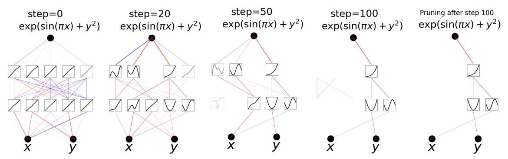

Figure B.1: Training of a learnable activation network (LAN) on the toy example $f\left( {x, y}\right)  = \exp \left( {\sin \left( {\pi x}\right)  + {y}^{2}}\right)$ .

图B.1:在玩具示例$f\left( {x, y}\right)  = \exp \left( {\sin \left( {\pi x}\right)  + {y}^{2}}\right)$上训练可学习激活网络(LAN)。

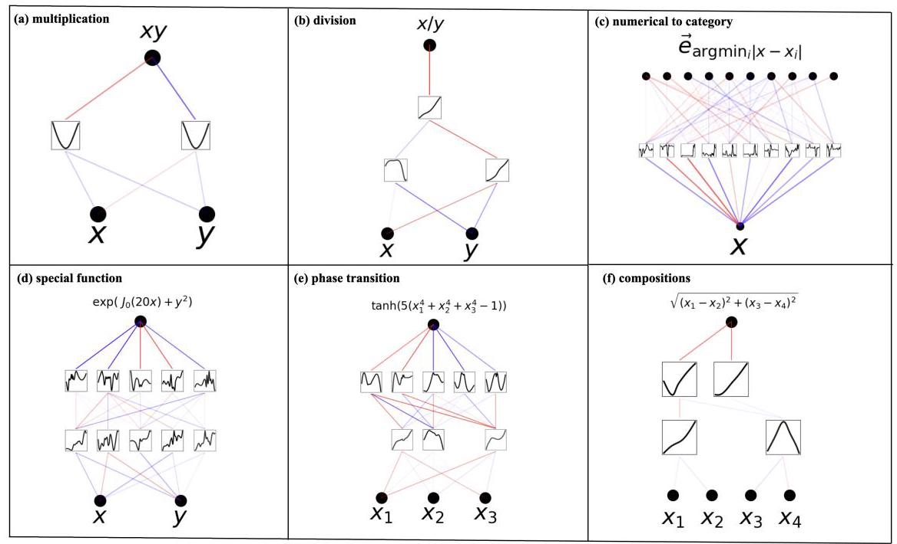

Figure B.2: LANs on synthetic examples. LANs do not appear to be very interpretable. We conjecture that the weight matrices leave too many degree of freedoms.

图B.2:合成示例上的局域网。局域网似乎不是很容易解释。我们推测权重矩阵留下了太多的自由度。

### B.3 Fitting Images (LAN)

### B.3拟合图像(局域网)

Implicit neural representations view images as 2D functions $f\left( {x, y}\right)$ , where the pixel value $f$ is a function of two coordinates of the pixel $x$ and $y$ . To compress an image, such an implicit neural representation ( $f$ is a neural network) can achieve impressive compression of parameters while maintaining almost original image quality. SIREN [118] proposed to use MLPs with periodic activation functions to fit the function $f$ . It is natural to consider other activation functions, which are allowed in LANs. However, since we initialize LAN activations to be smooth but SIREN requires high-frequency features, LAN does not work immediately. Note that each activation function in LANs is a sum of the base function and the spline function, i.e., $\phi \left( x\right)  = b\left( x\right)  + \operatorname{spline}\left( x\right)$ , we set

隐式神经表示将图像视为二维函数$f\left( {x, y}\right)$，其中像素值$f$是像素的两个坐标$x$和$y$的函数。为了压缩图像，这样的隐式神经表示($f$是一个神经网络)可以在保持几乎原始图像质量的同时，实现令人印象深刻的参数压缩。SIREN [118]提议使用具有周期性激活函数的多层感知器来拟合函数$f$。考虑局域网中允许的其他激活函数是很自然的。然而，由于我们将局域网激活初始化为平滑的，但SIREN需要高频特征，局域网不能立即起作用。请注意，局域网中的每个激活函数都是基函数和样条函数的和，即$\phi \left( x\right)  = b\left( x\right)  + \operatorname{spline}\left( x\right)$，我们设置

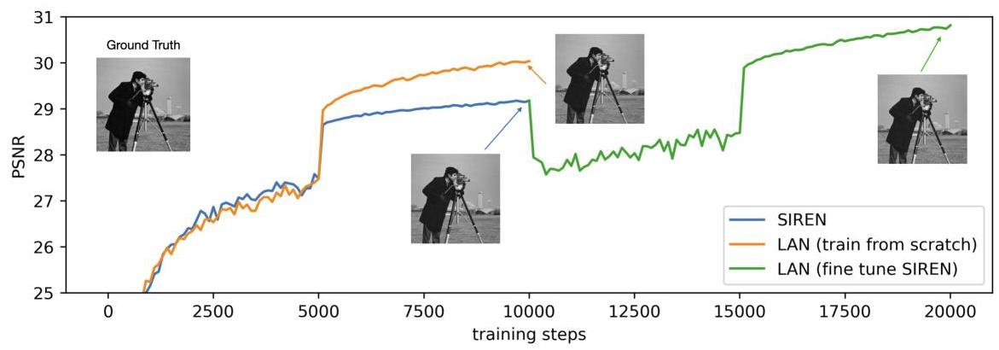

Figure B.3: A SIREN network (fixed sine activations) can be adapted to LANs (learnable activations) to improve image representations.

图B.3:一个SIREN网络(固定的正弦激活)可以适配到局域网(可学习的激活)以改进图像表示。

$b\left( x\right)$ to sine functions, the same setup as in SIREN but let spline $\left( x\right)$ be trainable. For both MLP and LAN, the shape is [2,128,128,128,128,128,1]. We train them with the Adam optimizer, batch size 4096, for 5000 steps with learning rate ${10}^{-3}$ and 5000 steps with learning rate ${10}^{-4}$ . As shown in Figure B.3, the LAN (orange) can achieve higher PSNR than the MLP (blue) due to the LAN's flexibility to fine tune activation functions. We show that it is also possible to initialize a LAN from an MLP and further fine tune the LAN (green) for better PSNR. We have chosen $G = 5$ in our experiments, so the additional parameter increase is roughly $G/N = 5/{128} \approx  4\%$ over the original parameters.

$b\left( x\right)$对于正弦函数，与SIREN中的设置相同，但让样条$\left( x\right)$可训练。对于MLP和LAN，形状均为[2,128,128,128,128,128,1]。我们使用Adam优化器训练它们，批量大小为4096，以学习率${10}^{-3}$训练5000步，以学习率${10}^{-4}$训练5000步。如图B.3所示，由于LAN在微调激活函数方面具有灵活性，LAN(橙色)比MLP(蓝色)能实现更高的PSNR。我们表明，从MLP初始化LAN并进一步微调LAN(绿色)以获得更好的PSNR也是可行的。我们在实验中选择了$G = 5$，因此额外的参数增加相对于原始参数大约为$G/N = 5/{128} \approx  4\%$。

## C Dependence on hyperparameters

## C对超参数的依赖性

We show the effects of hyperparamters on the $f\left( {x, y}\right)  = \exp \left( {\sin \left( {\pi x}\right)  + {y}^{2}}\right)$ case in Figure C. 1 To get an interpretable graph, we want the number of active activation functions to be as small (ideally 3) as possible.

我们在图C.1中展示了超参数对$f\left( {x, y}\right)  = \exp \left( {\sin \left( {\pi x}\right)  + {y}^{2}}\right)$情况的影响。为了得到一个可解释的图，我们希望激活函数的数量尽可能少(理想情况下为3)。

(1) We need entropy penalty to reduce the number of active activation functions. Without entropy penalty, there are many duplicate functions.

(1)我们需要熵惩罚来减少激活函数的数量。没有熵惩罚时，会有许多重复的函数。

(2) Results can depend on random seeds. With some unlucky seed, the pruned network could be larger than needed.

(2)结果可能取决于随机种子。使用一些不太幸运的种子时，剪枝后的网络可能会比所需的更大。

(3) The overall penalty strength $\lambda$ effectively controls the sparsity.

(3)整体惩罚强度$\lambda$有效地控制了稀疏性。

(4) The grid number $G$ also has a subtle effect on interpretability. When $G$ is too small, because each one of activation function is not very expressive, the network tends to use the ensembling strategy, making interpretation harder.

(4)网格数量$G$对可解释性也有微妙的影响。当$G$太小时，由于每个激活函数的表现力不强，网络倾向于使用集成策略，这使得解释变得更加困难。

(5) The piecewise polynomial order $k$ only has a subtle effect on interpretability. However, it behaves a bit like the random seeds which do not display any visible pattern in this toy example.

(5)分段多项式阶数$k$对可解释性只有微妙的影响。然而，在这个简单示例中，它的表现有点像随机种子，没有显示出任何明显的模式。

## D Feynman KANs

## D费曼KANs

We include more results on the Feynman dataset (Section 3.3). Figure D.1 shows the pareto frontiers of KANs and MLPs for each Feynman dataset. Figure D.3 and D.2 visualize minimal KANs (under the constraint test RMSE $< {10}^{-2}$ ) and best KANs (with the lowest test RMSE loss) for each Feynman equation fitting task.

我们在费曼数据集(第3.3节)中包含了更多结果。图D.1展示了每个费曼数据集的KANs和MLPs的帕累托前沿。图D.3和D.2分别可视化了每个费曼方程拟合任务的最小KANs(在约束测试RMSE$< {10}^{-2}$下)和最佳KANs(具有最低测试RMSE损失)。

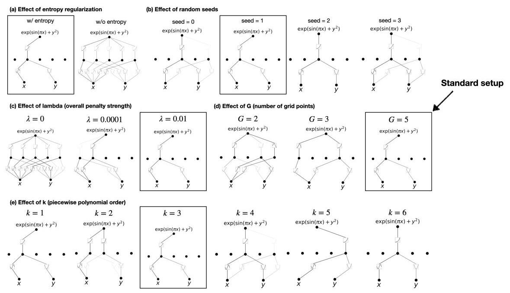

Figure C.1: Effects of hyperparameters on interpretability results.

图C.1:超参数对可解释性结果的影响。

## E Remark on grid size

## E关于网格大小的说明

For both PDE and regression tasks, when we choose the training data on uniform grids, we witness a sudden increase in training loss (i.e., sudden drop in performance) when the grid size is updated to a large level, comparable to the different training points in one spatial direction. This could be due to implementation of B-spline in higher dimensions and needs further investigation.

对于偏微分方程(PDE)和回归任务，当我们在均匀网格上选择训练数据时，当网格大小更新到较大水平时，我们会看到训练损失突然增加(即性能突然下降)，这与一个空间方向上不同的训练点数量相当。这可能是由于高维中B样条的实现问题，需要进一步研究。

## F KANs for special functions

## F特殊函数的KANs

We include more results on the special function dataset (Section 3.2). Figure F.2 and F.1 visualize minimal KANs (under the constraint test RMSE $< {10}^{-2}$ ) and best KANs (with the lowest test RMSE loss) for each special function fitting task.

我们在特殊函数数据集(第3.2节)中包含了更多结果。图F.2和F.1分别可视化了每个特殊函数拟合任务在约束测试RMSE$< {10}^{-2}$下的最小KANs和具有最低测试RMSE损失的最佳KANs。

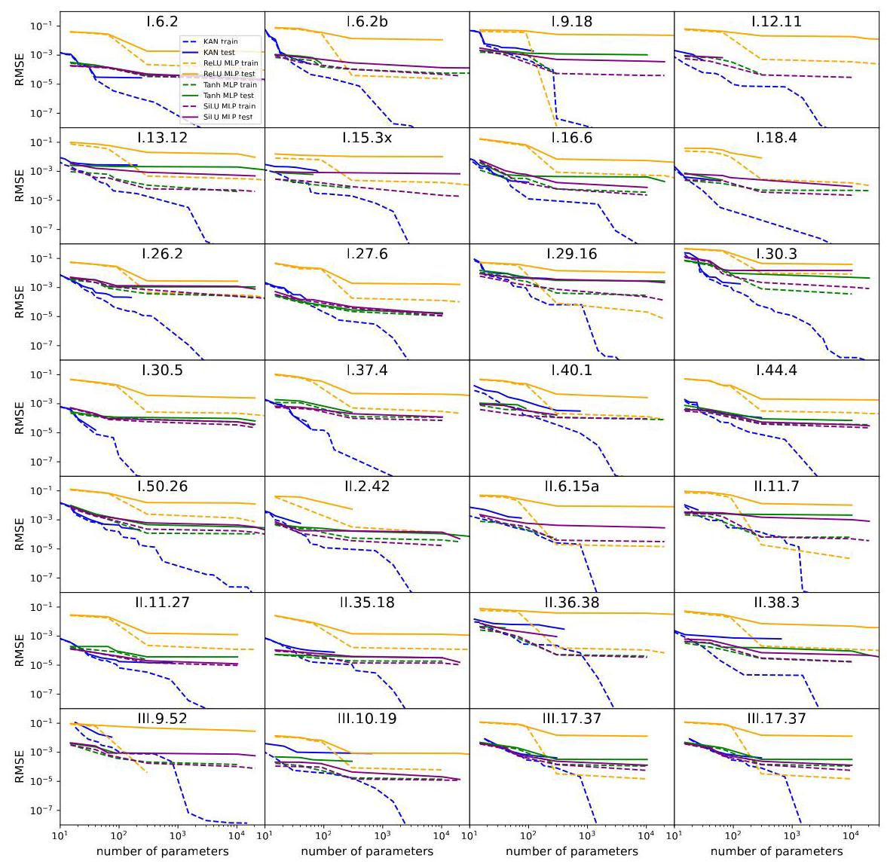

Figure D.1: The Pareto Frontiers of KANs and MLPs for Feynman datasets.

图D.1:费曼数据集的KANs和MLPs的帕累托前沿。

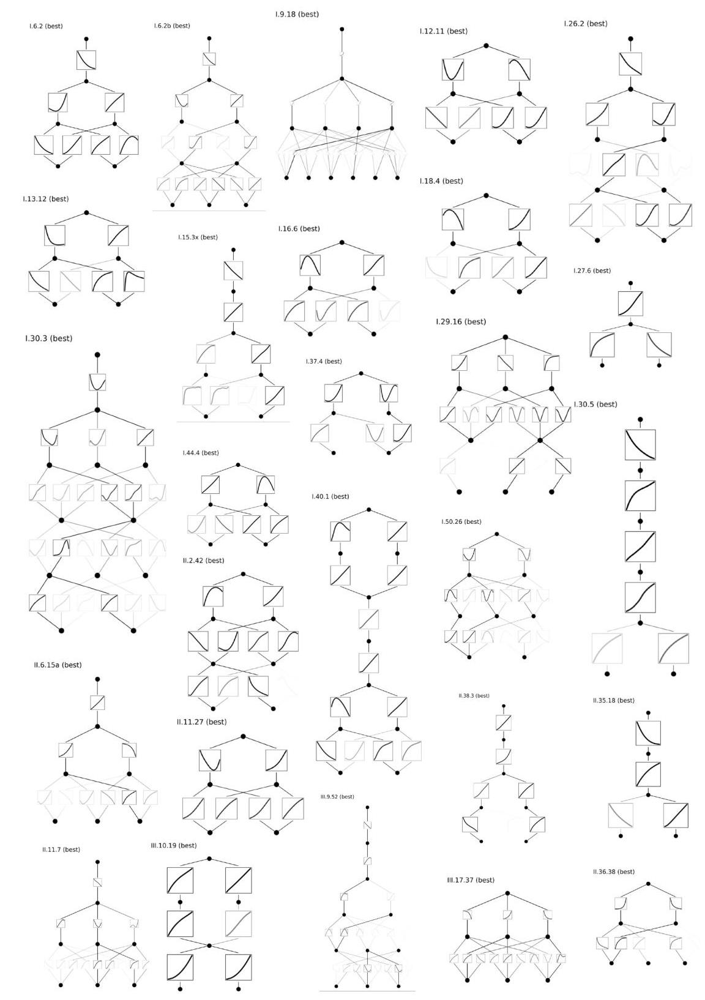

Figure D.2: Best Feynman KANs

图D.2:最佳费曼KANs

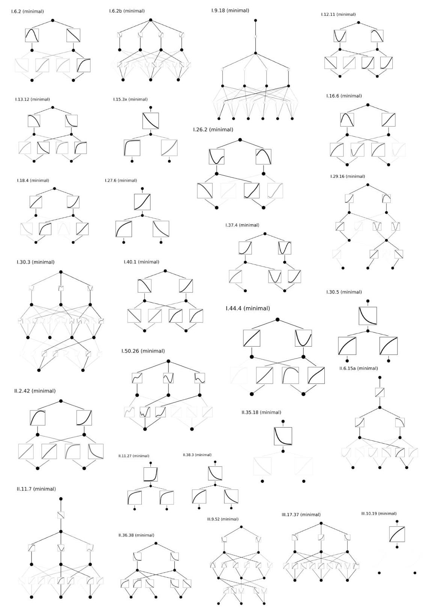

Figure D.3: Minimal Feynman KANs

图D.3:最小费曼KANs

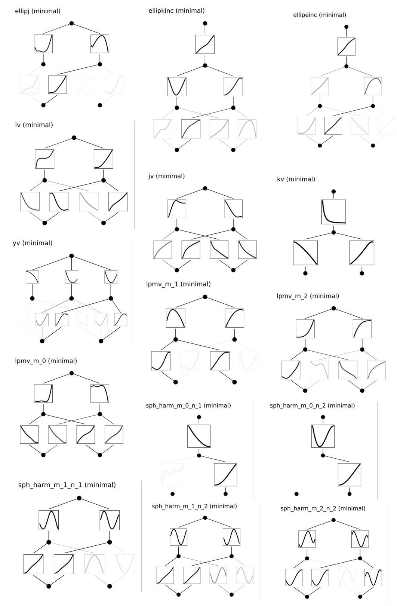

Figure F.1: Best special KANs

图F.1:最佳特殊KANs

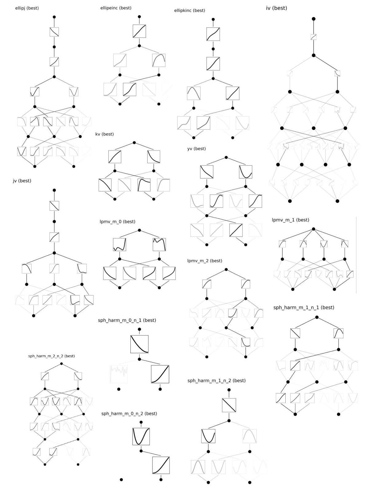

Figure F.2: Minimal special KANs

图F.2:最小特殊KANs