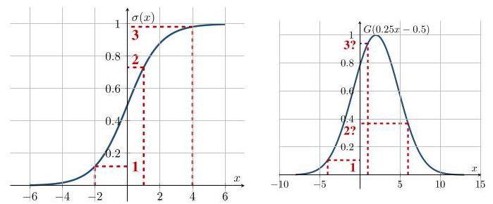
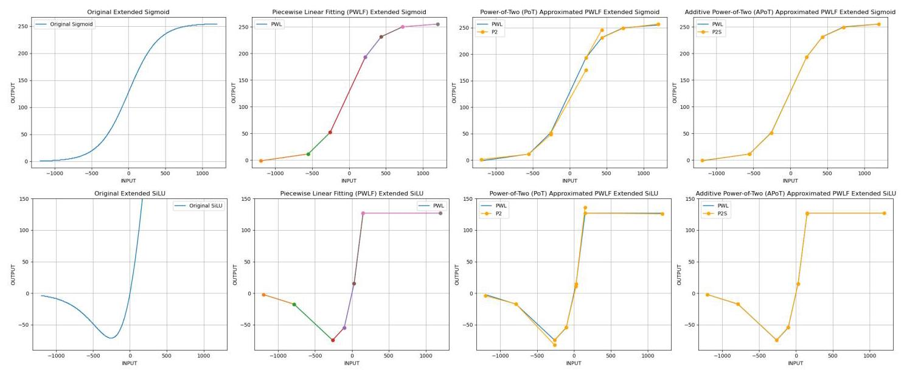
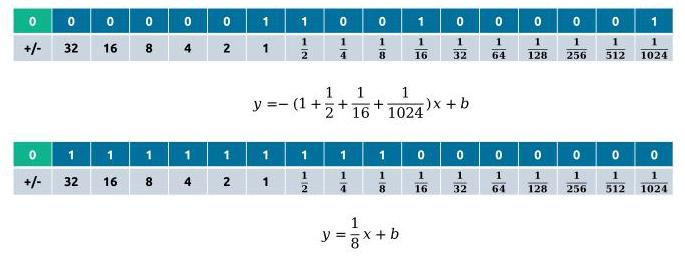
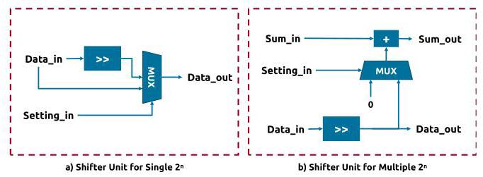
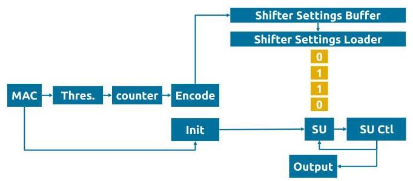
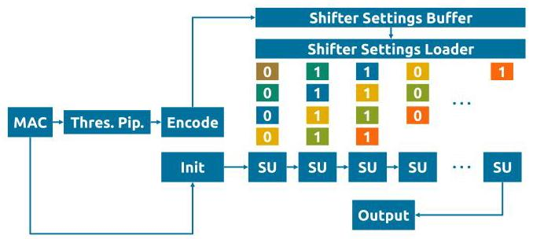

# GRAU: Generic Reconfigurable Activation Unit Design for Neural Network Hardware Accelerators

# GRAU:用于神经网络硬件加速器的通用可重构激活单元设计

Yuhao Liu ${}^{1,2,3}$ D, Student Member, IEEE, Salim Ullah ${}^{1}$ D, Akash Kumar ${}^{1}$ D, Senior Member, IEEE

刘宇豪${}^{1,2,3}$D，IEEE学生会员，萨利姆·乌拉${}^{1}$D，阿卡什·库马尔${}^{1}$D，IEEE高级会员

${}^{1}$ Ruhr University Bochum, Germany ${}^{2}$ Dresden University of Technology, Germany

${}^{1}$德国波鸿鲁尔大学${}^{2}$德国德累斯顿工业大学

${}^{3}$ Center for Scalable Data Analytics and Artificial Intelligence (ScaDS.AI Dresden/Leipzig), Germany Email: \{yuhao.liu, salim.ullah, akash.kumar\}@rub.de

${}^{3}$德国可扩展数据分析与人工智能中心(ScaDS.AI德累斯顿/莱比锡) 邮箱:\{yuhao.liu, salim.ullah, akash.kumar\}@rub.de

Abstract-With the continuous growth of neural network scales, low-precision quantization is widely used in edge accelerators. Classic multi-threshold activation hardware requires ${2}^{n}$ thresholds for $n$ -bit outputs, causing a rapid increase in hardware cost as precision increases. We propose a reconfigurable activation hardware, GRAU, based on piecewise linear fitting, where the segment slopes are approximated by powers of two. Our design requires only basic comparators and 1-bit right shifters, supporting mixed-precision quantization and nonlinear functions such as SiLU. Compared with multi-threshold activators, GRAU reduces LUT consumption by over ${90}\%$ , achieving higher hardware efficiency, flexibility, and scalability.

摘要 - 随着神经网络规模的不断增长，低精度量化在边缘加速器中得到广泛应用。传统的多阈值激活硬件对于$n$位输出需要${2}^{n}$个阈值，随着精度的提高，硬件成本会迅速增加。我们提出了一种基于分段线性拟合的可重构激活硬件GRAU，其中段斜率由2的幂近似。我们的设计仅需要基本比较器和1位移位器，支持混合精度量化和诸如SiLU等非线性函数。与多阈值激活器相比，GRAU将查找表消耗减少了超过${90}\%$，实现了更高的硬件效率、灵活性和可扩展性。

## I. INTRODUCTION

## I. 引言

Continuously growing sizes of state-of-the-art neural network models encourage researchers to explore different schemes to accelerate the network inference and improve the power efficiency by reducing memory consumption and computing power requirements. Therefore, quantization becomes one of the most widely applied methods in related works, especially by training the weights and activations in the network model as low-precision integers. Considering that the outputs of each neuron or kernel in Quantized Neural Networks (QNNs) should be the quantized integers following the selected precision, one re-quantization unit should be implemented after the activation unit to convert the outputs of the activation function to integers in the design of a QNN hardware accelerator.

不断增长的最先进神经网络模型规模促使研究人员探索不同的方案来加速网络推理，并通过减少内存消耗和计算能力需求来提高功率效率。因此，量化成为相关工作中应用最广泛的方法之一，特别是通过将网络模型中的权重和激活训练为低精度整数。考虑到量化神经网络(QNN)中每个神经元或内核的输出应该是遵循所选精度的量化整数，在QNN硬件加速器的设计中，应在激活单元之后实现一个重新量化单元，以将激活函数的输出转换为整数。

## A. Motivation

## A. 动机

Considering the nonlinear activation function and re-quantization computation are expensive on hardware implementation, previous works have extensively explored the designs of quantized activation hardware for QNN accelerators. One of the widely used design paradigms is the Multi-Threshold (MT) activation unit, adopted in well-known designs such as FINN [1] and FINN-R [2]. By folding Batch Normalization, nonlinear activation, and re-quantization into a single comparator-based block, MT units replace expensive arithmetic operations with a set of fixed thresholds. However, this design paradigm faces three major limitations as QNNs evolve:

考虑到非线性激活函数和重新量化计算在硬件实现上成本高昂，先前的工作广泛探索了用于QNN加速器的量化激活硬件设计。一种广泛使用的设计范式是多阈值(MT)激活单元，在诸如FINN [1]和FINN-R [2]等知名设计中采用。通过将批量归一化、非线性激活和重新量化折叠到一个基于比较器的单个模块中，MT单元用一组固定阈值取代了昂贵的算术运算。然而，随着QNN的发展，这种设计范式面临三个主要限制:

1) Exponential hardware scaling with precision: MT unit takes the integer outputs from Multiply-Accumulators (MAC) and compares them with ${2}^{n} - 1$ thresholds to produce $n$ -bit outputs, such as 15 thresholds for 4-bit and 255 for 8-bit. If the MAC result exceeds $m$ thresholds, the quantized activation output is an integer, $m$ . This design paradigm suggests exponentially increasing hardware resource consumption, since following an increase in output precision, the number of thresholds grows exponentially.

**1)硬件随精度呈指数级扩展**:MT单元获取乘法累加器(MAC)的整数输出，并将它们与${2}^{n} - 1$个阈值进行比较以产生$n$位输出，例如4位需要15个阈值，8位需要255个阈值。如果MAC结果超过$m$个阈值，量化激活输出就是整数$m$。这种设计范式表明硬件资源消耗呈指数级增长，因为随着输出精度的提高，阈值数量呈指数级增长。

TABLE I: Comparison between Unified-Precision and Mixed-Precision QNN on MNIST [3]

表I:MNIST上统一精度和混合精度QNN的比较[3]

<table><tr><td rowspan="2"></td><td colspan="3">MLP</td><td colspan="3">CNN</td></tr><tr><td>Full 1-bit</td><td>Mixed (baseline)</td><td>Full 8-bit</td><td>Full 1-bit</td><td>Mixed (baseline)</td><td>Full 8-bit</td></tr><tr><td>Accuracy/%</td><td>92.29</td><td>95.91</td><td>97.36</td><td>96.26</td><td>98.79</td><td>99.14</td></tr><tr><td>Loss/%</td><td>-3.62</td><td>0.00</td><td>1.45</td><td>-2.53</td><td>0.00</td><td>0.35</td></tr><tr><td>Memory/Bytes</td><td>7,376</td><td>9,984</td><td>59,008</td><td>29,848</td><td>55,712</td><td>238,784</td></tr><tr><td>Baseline Ratio</td><td>0.74</td><td>1.00</td><td>5.91</td><td>0.54</td><td>1.00</td><td>4.29</td></tr></table>

Fig. 1: Correct 2-bit quantization of Multi-Threshold unit (left) in Sigmoid and the mistake of Multi-Threshold unit in non-monotonically increasing function (right)

图1:Sigmoid中多阈值单元的正确2位量化(左)以及非单调递增函数中多阈值单元的错误(右)

2) Inefficiency in mixed-precision quantization: Mixed-precision quantization has recently emerged as a key trend in the design of lightweight AI on the edge. For instance, Liu et al. [3] compared unified-precision and mixed-precision QNNs using a small 4-layer MLP and CNN on MNIST [4]. Their results in Table I indicate that 1/2/4/8-bit mixed precision offers a trade-off between accuracy and memory usage compared to BNN and QNN, tolerating a slight accuracy loss to significantly reduce memory cost compared to QNN. However, the MT unit must implement the maximum number of thresholds required by the highest precision. For instance, in 1/2/4/8- bit mixed-precision quantization, the MT unit must implement 255 thresholds for the 8-bit precision, while only a small subset is used for lower precisions (for example, only one threshold is used for 1-bit). Serial reuse of a comparator can reduce hardware costs but significantly increases latency at higher precisions.

**2)混合精度量化效率低下**:混合精度量化最近已成为边缘轻量级人工智能设计的关键趋势。例如，Liu等人[3]使用小型4层MLP和CNN在MNIST [4]上比较了统一精度和混合精度QNN。他们在表I中的结果表明，与BNN和QNN相比，1/2/4/8位混合精度在准确性和内存使用之间提供了一种权衡，与QNN相比，容忍轻微的准确性损失以显著降低内存成本。然而，MT单元必须实现最高精度所需的最大阈值数量。例如，在1/2/4/8位混合精度量化中，MT单元必须为8位精度实现255个阈值，而对于较低精度仅使用一小部分(例如，1位仅使用一个阈值)。比较器的串行重用可以降低硬件成本，但在较高精度下会显著增加延迟。

3) Inability to represent non-monotonic activations: Since MT outputs always increase as more thresholds are exceeded by inputs, the design inherently supports only monotonically increasing functions. Emerging nonlinear activations, such as SiLU [5], violate this constraint, making the MT unit incompatible with many practical QNN settings. The left plot in Figure 1 instantiates a correct quantization processing of a Sigmoid function with three thresholds for 2-bit output. However, the right plot shows an incompatible case of MT units where the expected output, 3, at the threshold of 0.9, is larger than the expected output, 2, at 6.0, violating the monotonically increasing condition. The quantized output at 6.0 should be 3 since it exceeds three thresholds, and the output at 0.9 should be 2 instead.

3) 无法表示非单调激活:由于MT输出总是随着输入超过更多阈值而增加，该设计本质上仅支持单调递增函数。新兴的非线性激活函数，如SiLU [5]，违反了这一约束，使得MT单元与许多实际的QNN设置不兼容。图1中的左图展示了对具有三个阈值的Sigmoid函数进行2位输出的正确量化处理。然而，右图显示了MT单元的不兼容情况，在阈值0.9处的预期输出3大于在6.0处的预期输出2，违反了单调递增条件。在6.0处的量化输出应该是3，因为它超过了三个阈值，而在0.9处的输出应该是2。

## B. Related Works

## B. 相关工作

Although the MT unit has been successfully adopted in various well-known works, considering the above-discussed shortcomings, we further surveyed other potential solutions introduced in prior works, such as Piecewise Linearized Fitting (PWLF), Second-Order Polynomial Fitting (SOPF), and Lookup Table (LUT):

尽管MT单元已在各种知名工作中成功采用，但考虑到上述缺点，我们进一步研究了先前工作中引入的其他潜在解决方案，如分段线性拟合(PWLF)、二阶多项式拟合(SOPF)和查找表(LUT):

- Compared to the Multi-Threshold activation method, the LUT-based quantized activation unit is also hardware-friendly, as shown in the works of Piazza et al. [6], Pogiri et al. [7], and Kumar Meher et al. [8]. However, it shares the same shortcomings as the exponential growth of LUT storage with increased output precision and larger fan-in bit-width from the MAC output. Furthermore, for mixed precision, the LUT-based scheme requires storing different samples for each precision, which is hardware inefficient.

- 与多阈值激活方法相比，基于LUT的量化激活单元对硬件也很友好，如Piazza等人[6]、Pogiri等人[7]和Kumar Meher等人[8]的工作所示。然而，它与LUT存储随着输出精度的提高和来自MAC输出的更大扇入位宽呈指数增长具有相同的缺点。此外，对于混合精度，基于LUT的方案需要为每个精度存储不同的样本，这在硬件上效率低下。

- PWLF and SOPF are more flexible than MT units to fit various nonlinear functions, such as Zhang et al. [9], Li et al. [10], Tsmots et al. [11], and Nguyen et al. [12] explored the PWLF-based hardware design of Sigmoid activation functions. Liu et al.[13] and Bouguezzi et al. [14] presented the PWLF-based implementation for Tanh and TanhExp. Tsmots et al. and Bouguezzi et al. applied the SOPF-scheme for Sigmoid and Tanh approximation on hardware. However, these schemes are not hardware-friendly compared to the MT and LUT schemes, since they need more complex arithmetic operations on hardware.

- PWLF和SOPF比MT单元更灵活，能够拟合各种非线性函数，如Zhang等人[9]、Li等人[10]、Tsmots等人[11]和Nguyen等人[12]探索了基于PWLF的Sigmoid激活函数的硬件设计。Liu等人[13]和Bouguezzi等人[14]提出了基于PWLF的Tanh和TanhExp实现。Tsmots等人和Bouguezzi等人在硬件上应用SOPF方案进行Sigmoid和Tanh近似。然而，与MT和LUT方案相比，这些方案对硬件不友好，因为它们在硬件上需要更复杂的算术运算。

Furthermore, there are some other shortcomings across these four quantized activation design paradigms: Previous works based on PWLF and SOPF mainly focus on designing a specific activation unit for a given activation function, without the support of reconfiguring the hardware to other functions at runtime. In addition, Multi-Threshold and LUT activation units require reconfiguring a massive number of threshold values or look-up table data.

此外，这四种量化激活设计范式还存在一些其他缺点:以前基于PWLF和SOPF的工作主要集中为给定的激活函数设计特定的激活单元，而不支持在运行时将硬件重新配置为其他函数。此外，多阈值和LUT激活单元需要重新配置大量的阈值或查找表数据。

## C. Contribution

## C. 贡献

As summarized in Table II, comparing the four activation hardware design paradigms discussed above, we noticed that current activation hardware lacks a unified, hardware-efficient, and reconfigurable design that can simultaneously support multi-function, mixed-precision, and non-monotonic activations. Therefore, we propose a novel Generic Reconfigurable Activation Unit (GRAU) for low-precision quantized, integer-based QNN hardware accelerator designs with flexible support of multi-activation function and mixed-precision quantization. The main contributions of this work are as follows:

如表二总结所示，比较上述讨论的四种激活硬件设计范式，我们注意到当前的激活硬件缺乏一种统一、硬件高效且可重新配置的设计，该设计能够同时支持多功能、混合精度和非单调激活。因此，我们为基于低精度量化、整数的QNN硬件加速器设计提出了一种新颖的通用可重构激活单元(GRAU)，它灵活支持多激活函数和混合精度量化。这项工作的主要贡献如下:

TABLE II: Comparison between SOPF, PWLF, MT, LUT, and GRAU for Quantized Activation Unit

表二:量化激活单元的SOPF、PWLF、MT、LUT和GRAU之间的比较

<table><tr><td>Features</td><td>Hardware Friendly</td><td>Runtime Reconfigurable</td><td>Non-monotonically Increasing Function</td><td>Adaptive for Mixed-Precision</td></tr><tr><td>SOPF</td><td>Low</td><td>No</td><td>Yes</td><td>Yes</td></tr><tr><td>PWLF</td><td>Low</td><td>No</td><td>Yes</td><td>Yes</td></tr><tr><td>MT</td><td>High</td><td>Yes</td><td>No</td><td>No</td></tr><tr><td>LUT</td><td>High</td><td>Limited</td><td>Yes</td><td>No</td></tr><tr><td>GRAU</td><td>High</td><td>Yes</td><td>Yes</td><td>Yes</td></tr></table>

- Hardware Friendly and Runtime Reconfiguration: We propose a generic activation unit based on PWLF with Power-of-Two (PoT) and Additive Power-of-Two (APoT) slope approximation, which was used in the design of a multiplier in prior works [15, 16]. The design uses only comparators and a 1-bit shifter pipeline and can be reconfigured at runtime by updating a small set of breakpoint and shift-encoding registers. While PWLF, PoT, and APoT techniques have been individually explored in prior work, no existing design integrates these concepts into a unified activation unit with runtime configurability and mixed-precision support, nor evaluates their hardware feasibility across multiple nonlinear activations, including non-monotonic functions.

- 硬件友好和运行时重新配置:我们提出了一种基于PWLF的通用激活单元，采用二次幂(PoT)和加法二次幂(APoT)斜率近似，这在先前工作[15, 16]中的乘法器设计中使用过。该设计仅使用比较器和1位移位器流水线，并且可以通过更新一小组断点和移位编码寄存器在运行时进行重新配置。虽然PWLF、PoT和APoT技术在先前工作中已被单独探索，但没有现有设计将这些概念集成到一个具有运行时可配置性和混合精度支持的统一激活单元中，也没有评估它们在包括非单调函数在内的多个非线性激活上的硬件可行性。

- Flexible Function Support and Adaptation for Mixed-Precision Quantization: GRAU supports multiple nonlinear and non-monotonic activations (e.g., ReLU, Sigmoid, SiLU) and easily adapts to different quantization precisions through lightweight reconfiguration of breakpoints and shifts.

- 灵活的函数支持和对混合精度量化的适应性:GRAU支持多种非线性和非单调激活(例如，ReLU、Sigmoid、SiLU)，并通过对断点和移位进行轻量级重新配置轻松适应不同的量化精度。

- Approximation Experiments: As an experimental scheme, we adopted the open-source pwlf library to convert the nonlinear activation folded with batch normalization and output re-quantization. We evaluate PoT/APoT approximations on MNIST and CIFAR-10 under 4/8- bit and 1/2/4/8-bit mixed-precision settings with various activation functions. The results suggest the feasibility of our approach to hardware: GRAU maintains accuracy within 1% in most cases, and we analyze the rare cases where larger deviations occur.

- 近似实验:作为一种实验方案，我们采用了开源的pwlf库来转换经过批量归一化折叠和输出重新量化的非线性激活函数。我们在4/8位和1/2/4/8位混合精度设置下，使用各种激活函数对MNIST和CIFAR - 10数据集上的PoT/APoT近似进行评估。结果表明我们的方法在硬件方面具有可行性:GRAU在大多数情况下能将精度保持在1%以内，并且我们分析了出现较大偏差的罕见情况。

- Hardware Implementation: We implement both pipelined and serialized GRAU variants. The pipelined design achieves higher throughput, while the serialized version provides lower cost and greater configurability.

- 硬件实现:我们实现了流水线化和序列化的GRAU变体。流水线化设计实现了更高的吞吐量，而序列化版本则提供了更低的成本和更高的可配置性。

- Resource Report: Based on the synthesis and implementation in Vivado, the results show that our GRAU hardware reduces LUT usage by over 90% compared with Multi-Threshold units, achieving higher frequency, lower Area-Delay-Product (ADP), and lower Power-Delay-Product (PDP), which demonstrates promising hardware and power efficiency.

- 资源报告:基于Vivado中的综合和实现结果表明，与多阈值单元相比，我们的GRAU硬件将查找表(LUT)的使用减少了90%以上，实现了更高的频率、更低的面积延迟积(ADP)和更低的功率延迟积(PDP)，这展示了良好的硬件和功率效率。

Fig. 2: Comparing the original nonlinear function, PWLF approximated function, PoT approximated PWLF function, and APoT approximated PWLF function

图2:比较原始非线性函数、PWLF近似函数、PoT近似的PWLF函数和APoT近似的PWLF函数

TABLE III: Comparing the Accuracy of Original QNN, PWLF, PoT-PWLF, and APoT-PWLF Approximated QNN Models

表III:比较原始量化神经网络(QNN)、PWLF、PoT - PWLF和APoT - PWLF近似QNN模型的精度

<table><tr><td colspan="2">Model Dataset</td><td colspan="9">SFC MNIST</td><td colspan="3">CNV CIFAR-10</td></tr><tr><td colspan="2">Precision</td><td colspan="3">4bit</td><td colspan="3">8bit</td><td colspan="3">Mixed-Precision</td><td colspan="3">Mixed-Precision</td></tr><tr><td colspan="2">Activation</td><td>ReLU</td><td>Sigmoid</td><td>SiLU</td><td>ReLU</td><td>Sigmoid</td><td>SiLU</td><td>ReLU</td><td>Sigmoid</td><td>SiLU</td><td>ReLU</td><td>Sigmoid</td><td>SiLU</td></tr><tr><td colspan="2">Original</td><td>98.23%</td><td>98.19%</td><td>98.27%</td><td>98.13%</td><td>98.16%</td><td>98.04%</td><td>97.73%</td><td>97.82%</td><td>97.55%</td><td>78.65%</td><td>76.81%</td><td>77.81%</td></tr><tr><td colspan="2">PWLF</td><td>98.23%</td><td>98.14%</td><td>98.15%</td><td>98.14%</td><td>98.17%</td><td>98.15%</td><td>97.73%</td><td>97.82%</td><td>97.52%</td><td>78.24%</td><td>73.97%</td><td>78.21%</td></tr><tr><td rowspan="2">PoT-PWLF</td><td>16-bit</td><td>98.20%</td><td>98.19%</td><td>94.86%</td><td>98.10%</td><td>98.07%</td><td>97.90%</td><td>97.76%</td><td>97.82%</td><td>88.14%</td><td>77.56%</td><td>73.69%</td><td>67.11%</td></tr><tr><td>32-bit</td><td>98.20%</td><td>98.19%</td><td>95.00%</td><td>98.13%</td><td>98.06%</td><td>97.90%</td><td>97.76%</td><td>97.82%</td><td>88.14%</td><td>77.94%</td><td>73.64%</td><td>67.11%</td></tr><tr><td rowspan="2">APoT-PWLF</td><td>16-bit</td><td>98.22%</td><td>98.17%</td><td>94.86%</td><td>98.11%</td><td>98.18%</td><td>97.97%</td><td>97.74%</td><td>97.82%</td><td>88.39%</td><td>77.52%</td><td>73.68%</td><td>65.22%</td></tr><tr><td>32-bit</td><td>98.21%</td><td>98.18%</td><td>95.28%</td><td>98.14%</td><td>98.17%</td><td>97.98%</td><td>97.74%</td><td>97.82%</td><td>88.39%</td><td>78.18%</td><td>73.97%</td><td>67.95%</td></tr></table>

Although GRAU can be integrated into any QNN accelerator on FPGA/ASIC, the goal of this work is not to design a full accelerator architecture. Instead, we aim to establish a unified activation hardware design paradigm that enables runtime reconfiguration, multi-function support, and mixed-precision activation with significantly reduced overhead. Since quantized activation functions are present in every layer of modern QNNs, improving each activation unit directly scales across the entire accelerator.

尽管GRAU可以集成到FPGA/ASIC上的任何QNN加速器中，但这项工作的目标不是设计一个完整的加速器架构。相反，我们旨在建立一个统一的激活硬件设计范式，实现运行时重新配置、多功能支持以及混合精度激活，同时显著降低开销。由于量化激活函数存在于现代QNN的每一层中，直接改进每个激活单元可以在整个加速器中实现扩展。

## D. Organization

## D. 组织结构

This manuscript is structured in the following way: Section II discusses how to convert the original QNN models to the PoT and APoT approximated models for GRAU hardware and the hardware designs of GRAU activation units in this work. Section III shows the hardware evaluation results of the above-mentioned GRAU designs. Section IV discusses the further potential improvement and optimization of GRAU and concludes the contents of this paper.

本手稿的结构如下:第二节讨论如何将原始QNN模型转换为适用于GRAU硬件的PoT和APoT近似模型以及本工作中GRAU激活单元的硬件设计。第三节展示上述GRAU设计的硬件评估结果。第四节讨论GRAU进一步潜在的改进和优化，并总结本文内容。

## II. IMPLEMENTATION

## II. 实现

### A.PoT and APoT Approximated Activation Functions for GRAU Hardware

### A. 适用于GRAU硬件的PoT和APoT近似激活函数

Following the objectives outlined above, we transform the original nonlinear activation functions folded with BN and output re-quantization in QNNs into PWLF, PoT-PWLF, and APoT-PWLF representations compatible with the proposed GRAU architecture. As this work does not aim to introduce a novel fitting algorithm, we utilize the open-source pwlf [17] library to construct PWLF models and obtain their PoT and APoT approximations. To ensure efficient hardware realization, we additionally constrain the number of segments and limit the allowable range of power-of-two slopes when generating the PoT- and APoT-based approximations.

按照上述目标，我们将QNN中经过批量归一化(BN)折叠和输出重新量化的原始非线性激活函数转换为与所提出的GRAU架构兼容的PWLF、PoT - PWLF和APoT - PWLF表示形式。由于这项工作的目的不是引入一种新的拟合算法，我们利用开源的pwlf [17]库来构建PWLF模型并获得它们的PoT和APoT近似。为确保高效的硬件实现，在生成基于PoT和APoT的近似时，我们还额外限制了段数，并限制了2的幂次斜率的允许范围。

In Figure 2, we introduce the instances of PWLF approximated Sigmoid and SiLU functions and their PoT and APoT variants with six segments for 8-bit quantization. The first column in Figure 2 plots the original Sigmoid and SiLU folded with BN and output re-quantization. The second and third columns are their PoT and APoT approximated functions. As shown in the plot of the original SiLU, its output is out of the allowed range of signed 8-bit integers, causing the clamp shown in the PWLF, PoT-PWLF, and APoT-PWLF plots of SiLU. Therefore, in the worst-case scenario, if the original nonlinear function falls outside both the allowed maximum and minimum ranges of the quantized output, its PWLF, PoT-PWLF, and APoT-PWLF approximated functions require two segments for clamping. Therefore, we believe six is the minimum number of segments to express the approximation of original nonlinear functions.

在图2中，我们展示了8位量化下具有六个段的PWLF近似Sigmoid和SiLU函数及其PoT和APoT变体的实例。图2中的第一列绘制了经过BN折叠和输出重新量化的原始Sigmoid和SiLU。第二列和第三列是它们的PoT和APoT近似函数。如原始SiLU的图所示，其输出超出了有符号8位整数的允许范围，这导致了SiLU的PWLF、PoT - PWLF和APoT - PWLF图中的钳位情况。因此，在最坏的情况下，如果原始非线性函数落在量化输出的允许最大和最小范围之外，其PWLF、PoT - PWLF和APoT - PWLF近似函数需要两个段来进行钳位。因此，我们认为六个段是表达原始非线性函数近似的最小段数。

From PWLF to PoT- and APoT-PWLF, we adopt a three-step approximation:

从PWLF到PoT - 和APoT - PWLF，我们采用三步近似法:

- Considering that the inputs to our quantized activation unit in the QNN accelerator are the integer outputs from MACs, in PoT-PWLF and APoT-PWLF approximation, we adjust the breakpoints of segments to their nearest integers.

- 考虑到我们QNN加速器中量化激活单元的输入是乘法累加运算(MAC)的整数输出，在PoT - PWLF和APoT - PWLF近似中，我们将段的断点调整为最接近的整数。

- We approximate the slope of each segment in PWLF functions to the nearest PoT and APoT value. For instance, if we define the allowable power range for PoT and APoT approximation as $\lbrack  - {10},6)$ , it means PoT approximated slopes can be ${2}^{-{10}},{2}^{-9},\ldots ,{2}^{4},{2}^{5}$ , and APoT slopes can be the sum of one combination with any of these allowable PoT values, where one PoT value can only be used once in combination.

- 我们将PWLF函数中每个线段的斜率近似为最接近的PoT和APoT值。例如，如果我们将PoT和APoT近似的允许功率范围定义为$\lbrack  - {10},6)$，这意味着PoT近似斜率可以是${2}^{-{10}},{2}^{-9},\ldots ,{2}^{4},{2}^{5}$，并且APoT斜率可以是这些允许的PoT值中的任何一个与另一个值组合的和，其中一个PoT值在组合中只能使用一次。

- We chose the left rounded breaking point of each segment to create a new linear function with approximated PoT and APoT slopes. Therefore, as shown in the third column in Figure 2, the PoT approximation has a small gap in the right end of each segment, since the approximated breaking points and slopes have a small bias for each segment compared with the original PWLF functions. APoT approximation also has this gap. However, it's more accurate than PoT. Therefore, the fourth column cannot clearly show the tiny gap in APoT.

- 我们选择了每个线段的左圆角断点，以创建一个具有近似PoT和APoT斜率的新线性函数。因此，如图2第三列所示，PoT近似在每个线段的右端有一个小间隙，因为与原始PWLF函数相比，每个线段的近似断点和斜率有一个小偏差。APoT近似也有这个间隙。然而，它比PoT更准确。因此，第四列不能清楚地显示APoT中的微小间隙。

Therefore, based on Brevitas [18] and pwlf [17], we created the PWLF, PoT-PWLF, and APoT-PWLF approximated QNN models on MNIST and CIFAR10 after the Quantization-Aware Training (QAT) as the following steps:

因此，基于Brevitas [18]和pwlf [17]，我们在量化感知训练(QAT)之后，按照以下步骤在MNIST和CIFAR10上创建了PWLF、PoT-PWLF和APoT-PWLF近似量化神经网络(QNN)模型:

- Training the QNN models and recording the output ranges of each quantized Fully Connected (FC) layer, QuantLinear, and quantized Convolution (CONV) layers, QuantConv2d while training, which are the MAC outputs on hardware.

- 训练量子神经网络(QNN)模型，并在训练过程中记录每个量化全连接(FC)层、量化线性层(QuantLinear)以及量化卷积(CONV)层、量化二维卷积层(QuantConv2d)的输出范围，这些是硬件上的矩阵乘法累加(MAC)输出。

- For each layer, extend the recorded MAC output range as $4 \times$ wider and average generating 1000 samples from the extended range as dummy input. Then, extracting the corresponding BN and quantized activation layers, such as QuantReLU and QuantSigmoid in Brevitas, from the trained QNN model and packaging them as black-boxes. Computing the output of these black boxes with the dummy input. Then, adopt these outputs to fit a piecewise linear function based on pwlf library [17], which will be the same form as the second column in Figure 2

- 对于每一层，将记录的MAC输出范围扩展得比$4 \times$更宽，并从扩展范围中平均生成1000个样本作为虚拟输入。然后，从训练好的QNN模型中提取相应的BN和量化激活层，如Brevitas中的QuantReLU和QuantSigmoid，并将它们打包为黑盒。使用虚拟输入计算这些黑盒的输出。然后，采用这些输出基于pwlf库[17]拟合一个分段线性函数，其形式将与图2中的第二列相同

- Extracting the breaking points, slopes from the fitted piecewise linear function. Rounding the breaking points and approximating the slopes as PoT and APoT form with selected power ranges. We used $\lbrack  - {10},6)$ and $\lbrack  - {24},8)$ in this work. Then, we created the PoT and APoT PWLF functions and replaced the BN and quantized activation layers in the original model to generate the PWLF, PoT-PWLF, and APoT-PWLF approximated models.

- 从拟合的分段线性函数中提取断点和斜率。将断点四舍五入，并将斜率近似为具有选定功率范围的PoT和APoT形式。我们在这项工作中使用了$\lbrack  - {10},6)$和$\lbrack  - {24},8)$。然后，我们创建了PoT和APoT PWLF函数，并替换了原始模型中的BN和量化激活层，以生成PWLF、PoT-PWLF和APoT-PWLF近似模型。

- Evaluating the accuracy of the original accurate model and PWLF, PoT-PWLF, and APoT-PWLF approximated models

- 评估原始精确模型以及PWLF、PoT - PWLF和APoT - PWLF近似模型的准确性

As shown in Table III, we evaluated the above-mentioned four different models with a Small Fully Connected Network (SFC) and Simplified VGG-like Convolution Neural Network (CNV) from FINN [1] based on the MNIST [4] and CIFAR-10 [19] datasets. SFC has four FC layers, containing 256/256/256/10 neurons, respectively. We evaluated it with 4/8-bit QNN models and one 1/2/4/8-bit mixed-precision QNN model. CNV has three CONV blocks followed by three FC layers. Each block consists of two $3 \times  3$ CONV layers and one 2x2 max-pooling layer. The channel number of CONV layers in each CONV block is 64/128/256. The original FC layer in CNV models has 512/512/10 neurons. To reduce the time consumption of fitting the PWLF functions, we reduced it to 256/256/10. Since we use one bit to represent the usage of one power of two in the allowable range of $\lbrack  - {10},6)$ and $\lbrack  - {24},8)$ , GRAU hardware would require 16- and 32-bit data as PoT and APoT setting encoding. As a result, the models that support these two ranges are named 16/32-bit PoT-PWLF and APoT-PWLF models.

如表III所示，我们基于MNIST [4]和CIFAR-10 [19]数据集，使用来自FINN [1]的小型全连接网络(SFC)和简化的类VGG卷积神经网络(CNV)对上述四种不同模型进行了评估。SFC有四个全连接层，分别包含256/256/256/10个神经元。我们用4/8位量化神经网络模型和一个1/2/4/8位混合精度量化神经网络模型对其进行了评估。CNV有三个卷积块，后面跟着三个全连接层。每个块由两个$3 \times  3$卷积层和一个2x2最大池化层组成。每个卷积块中卷积层的通道数为64/128/256。CNV模型中的原始全连接层有512/512/10个神经元。为了减少拟合分段线性函数(PWLF)的时间消耗，我们将其减少到256/256/10。由于我们用一位来表示$\lbrack  - {10},6)$和$\lbrack  - {24},8)$允许范围内的二次幂的使用情况，GRAU硬件将需要16位和32位数据作为PoT和APoT设置编码。因此，支持这两个范围的模型被命名为16/32位PoT-PWLF和APoT-PWLF模型。

As shown in Table III, PWLF, PoT-PWLF, and APoT-PWLF approximations generally introduce less than 1% accuracy loss across most experiments. More significant losses occur primarily in SiLU-based models: PoT-PWLF and APoT-PWLF approximations degrade accuracy by approximately $3\%  \sim  {10}\%$ on 4-bit and mixed-precision SFC models, and similarly by around 10% on mixed-precision CNV models. In contrast, in Sigmoid-based CNV models, most degradation originates from PWLF itself, with PoT/APoT approximations introducing negligible additional loss.

如表III所示，在大多数实验中，PWLF、PoT - PWLF和APoT - PWLF近似通常引入的精度损失小于1%。更显著的损失主要发生在基于SiLU的模型中:PoT - PWLF和APoT - PWLF近似在4位和混合精度SFC模型上使精度下降约$3\%  \sim  {10}\%$，在混合精度CNV模型上同样下降约10%。相比之下，在基于Sigmoid的CNV模型中，大多数精度下降源于PWLF本身，PoT/APoT近似引入的额外损失可忽略不计。

To identify the source of approximation errors, we analyze the PWLF functions generated by pwlf. Since pwlf is a continuous, floating-point-oriented library, it does not naturally adapt to the discrete integer-domain characteristics of MAC outputs in QNN. When two fitted breakpoints are close (e.g., 1.2 and 1.3), both round to the same integer, collapsing the corresponding linear segment and reducing expressive capacity. We observed such degenerate segments, particularly in SiLU models, explaining the accuracy degradation in those settings.

为了确定近似误差的来源，我们分析了pwlf生成的PWLF函数。由于pwlf是一个面向连续浮点数的库，它不能自然地适应QNN中MAC输出的离散整数域特性。当两个拟合断点接近时(例如1.2和1.3)，两者都舍入到相同的整数，从而合并相应的线性段并降低表达能力。我们观察到了这种退化段，特别是在SiLU模型中，这解释了这些设置下的精度下降。

Moreover, the pwlf library can only run on a CPU optimized with multi-core acceleration. We measured the time cost of piecewise linear fitting on our server (AMD EPYC 7513 32- Core Processor with 1TB memory). Fitting a single nonlinear function with 1,000 samples takes approximately four minutes. A model like ResNet-26 contains around 4,904 activation kernels, which would require approximately 13.6 days for PWLF fitting. In our experiment setup, each model structure is explored with nine variants; therefore, a full evaluation would take around four months, excluding training. Consequently, our experiments focus on smaller networks while maintaining coverage across activation types and quantization precisions.

此外，pwlf库只能在经过多核加速优化的CPU上运行。我们在我们的服务器(具有1TB内存的AMD EPYC 7513 32核处理器)上测量了分段线性拟合的时间成本。对1000个样本拟合单个非线性函数大约需要4分钟。像ResNet - 26这样的模型包含大约4904个激活内核，PWLF拟合大约需要13.6天。在我们的实验设置中，每个模型结构用9种变体进行探索；因此，完整的评估大约需要4个月，不包括训练。因此，我们的实验专注于较小的网络，同时保持对激活类型和量化精度的覆盖。

Fig. 3: Encoding of segment slopes for PoT-PWLF (down) and APoT-PWLF (up) approximation

图3:PoT - PWLF(下)和APoT - PWLF(上)近似的段斜率编码

Fig. 4: Shifter unit design in hardware for PoT-PWLF (a) and APoT-PWLF (b) approximation

图4:PoT - PWLF(a)和APoT - PWLF(b)近似在硬件中的移位器单元设计

Importantly, these limitations come from the fitting tool rather than the GRAU architecture. GRAU is independent of the specific fitting algorithm and can be scaled to larger models once more efficient, parallel, or GPU-accelerated fitting libraries become available. Future integer-aware PWLF or PoT/APoT approximation algorithms can further improve accuracy without requiring any modification to the GRAU hardware.

重要的是，这些限制来自拟合工具而不是GRAU架构。GRAU独立于特定的拟合算法，一旦有更高效、并行或GPU加速的拟合库可用，它可以扩展到更大的模型。未来的整数感知PWLF或PoT/APoT近似算法可以进一步提高精度，而无需对GRAU硬件进行任何修改。

In summary, expressing BN-folded nonlinear activations and re-quantization through PWLF, PoT-PWLF, and APoT-PWLF approximations enables the proposed GRAU to support multi-activation, mixed-precision QNNs in a hardware-efficient manner.

总之，通过PWLF、PoT - PWLF和APoT - PWLF近似来表示BN折叠的非线性激活和重新量化，使所提出的GRAU能够以硬件高效的方式支持多激活、混合精度的QNN。

## B. Hardware Implementation of GRAU

## B. GRAU的硬件实现

Considering we limit the power range of PoT-PWLF and APoT-PWLF functions as $\lbrack  - {10},6)$ and $\lbrack  - {24},8)$ , if we give a 7/9-bit pre-left-shifting, which means timing a ${2}^{6}$ or ${2}^{8}$ , to every inputs, ${q}_{in}$ , as ${Q}_{in} = {q}_{in} \times  {2}^{6}$ or ${Q}_{in} = {q}_{in} \times  {2}^{8}$ , computing each ${q}_{in} \times  {2}^{n},\left( {-{10} \leq  n < 6}\right)$ or $\left( {-{24} \leq  n < 8}\right)$ can be converted as only right shifting, ${Q}_{in} \times  {2}^{m},( - {16} \leq \; m < 0)$ or $\left( {-{32} \leq  m < 0}\right)$ . Therefore, as shown in Figure 4 we implemented different 1-bit shifter units for PoT-PWLF and APoT-PWLF functions:

考虑到我们将PoT - PWLF和APoT - PWLF函数的功率范围限制为$\lbrack  - {10},6)$和$\lbrack  - {24},8)$，如果我们对每个输入进行7/9位的预左移，即对${2}^{6}$或${2}^{8}$进行定时，${q}_{in}$，作为${Q}_{in} = {q}_{in} \times  {2}^{6}$或${Q}_{in} = {q}_{in} \times  {2}^{8}$，计算每个${q}_{in} \times  {2}^{n},\left( {-{10} \leq  n < 6}\right)$或$\left( {-{24} \leq  n < 8}\right)$可以转换为仅右移，${Q}_{in} \times  {2}^{m},( - {16} \leq \; m < 0)$或$\left( {-{32} \leq  m < 0}\right)$。因此，如图4所示，我们为PoT - PWLF和APoT - PWLF函数实现了不同的1位移位器单元:

For PoT-PWLF, the shifter unit in Figure 4 (a) loads the input data and, according to the 1-bit setting input, decides if it needs to pass the 1-bit right-shifted data or the original input data to the next shifter unit.

对于PoT - PWLF，图4(a)中的移位器单元加载输入数据，并根据1位设置输入决定是将1位右移后的数据还是原始输入数据传递给下一个移位器单元。

Fig. 5: Serialized hardware implementation of Generic Activation Unit PoT-PWLF and APoT-PWLF shifter unit

图5:通用激活单元PoT - PWLF和APoT - PWLF移位器单元的串行硬件实现

Fig. 6: Pipelined hardware implementation of Generic Activation Unit PoT-PWLF and APoT-PWLF shifter unit

图6:通用激活单元PoT - PWLF和APoT - PWLF移位器单元的流水线硬件实现

For APoT-PWLF, the shifter unit in Figure 4 (b) loads the input data and a sum output from the prior shifter unit. After applying the 1-bit right shift to the input data, according to the 1-bit setting input, this shifter unit will determine whether to add the right-shifted data to the loaded sum output. Then, it will transfer the 1-bit right-shifted input and the sum result to the next shifter unit.

对于APoT-PWLF，图4 (b)中的移位器单元加载输入数据和前一个移位器单元的和输出。在对输入数据进行1位右移后，根据1位设置输入，该移位器单元将确定是否将右移后的数据加到加载的和输出中。然后，它将1位右移后的输入和求和结果传输到下一个移位器单元。

As a result, if we can implement a 16/32 shifter unit and connect them as a pipeline, using the 6/8-bit pre-left-shifted data as input, we can compute the results of the inputs times PoT or APoT slopes. To control these shifter units, as shown in Figure 3 we defined the shifter control encoding format, which is the Setting In signals in each shifter unit of Figure 4 Figure 3 shows the 17-bit shifter control encoding for 16 shifter units in PoT and APoT approximation with the power range of $\lbrack  - {10},6)$ . Its first bit is the sign bit. Before the computation, all inputs should apply a 6-bit pre-left-shifting.

因此，如果我们可以实现一个16/32移位器单元并将它们连接成流水线，使用6/8位预左移数据作为输入，我们就可以计算输入乘以PoT或APoT斜率的结果。为了控制这些移位器单元，如图3所示，我们定义了移位器控制编码格式，即图4中每个移位器单元中的设置输入信号。图3显示了在功率范围为$\lbrack  - {10},6)$的PoT和APoT近似中，16个移位器单元的17位移位器控制编码。其第一位是符号位。在计算之前，所有输入都应进行6位预左移。

For the PoT-PWLF shifter computation in Figure 3 (down), because it only supports the format of single ${2}^{n}$ , the setting should consist of multiple consecutive "1" and consecutive "0". For instance, if the slope is $\frac{1}{8}$ , the digits from 32 to $\frac{1}{8}$ should be "1". Then, the 6-bit pre-left-shifted input will be right-shifted 9 times in the shifter units, which received the "1" from Setting In. The result from the last shifter unit is equal to the original input divided by 8 (right shifting 3 bits).

对于图3(下方)中的PoT-PWLF移位器计算，因为它仅支持单个${2}^{n}$的格式，所以设置应由多个连续的“1”和连续的“0”组成。例如，如果斜率是$\frac{1}{8}$，则从32到$\frac{1}{8}$的数字应为“1”。然后，6位预左移输入将在从设置输入接收到“1”的移位器单元中右移9次。最后一个移位器单元的结果等于原始输入除以8(右移3位)。

For APoT-PWLF shifter computation in Figure 3 (up), if the slope is $1 + \frac{1}{2} + \frac{1}{16} + \frac{1}{1024}$ , the Setting In digits for $1,\frac{1}{2}$ , $\frac{1}{16}$ , and $\frac{1}{1024}$ should be " 1 ". Then, the 6-bit pre-left-shifted input will be executed 1-bit right shifting in every shifter unit, and the shifted data in $1,\frac{1}{2},\frac{1}{16}$ , and $\frac{1}{1024}$ units will be added into the sum.

对于图3(上方)中的APoT-PWLF移位器计算，如果斜率是$1 + \frac{1}{2} + \frac{1}{16} + \frac{1}{1024}$，则$1,\frac{1}{2}$、$\frac{1}{16}$和$\frac{1}{1024}$的设置输入数字应为“1”。然后，6位预左移输入将在每个移位器单元中执行1位右移，并且$1,\frac{1}{2},\frac{1}{16}$和$\frac{1}{1024}$单元中的移位数据将加到和中。

TABLE IV: Hardware Results of Multi-Threshold, PoT-PWLF, and APoT-PWLF Activation Units

表IV:多阈值、PoT-PWLF和APoT-PWLF激活单元的硬件结果

<table><tr><td rowspan="2">Scheme</td><td rowspan="2">Mode</td><td rowspan="2">LUT</td><td rowspan="2">FF</td><td rowspan="2">Frequency</td><td rowspan="2">Total Delay (ns)</td><td rowspan="2">Power (W)</td><td rowspan="2">Area-Delay Products</td><td rowspan="2">Power-Delay Products</td><td colspan="4">Latency (Cycles)</td></tr><tr><td>1-bit</td><td>2-bit</td><td>4-bit</td><td>8-bit</td></tr><tr><td rowspan="2">Multi-Threshold</td><td>Pipelined</td><td>10206</td><td>18568</td><td>200MHz</td><td>2.848</td><td>0.129</td><td>0.3673</td><td>29066.688</td><td>1</td><td>3</td><td>15</td><td>255</td></tr><tr><td>Serialization</td><td>2796</td><td>8264</td><td>100MHz</td><td>5.777</td><td>0.032</td><td>0.1848</td><td>16152.492</td><td>1</td><td>3</td><td>15</td><td>255</td></tr><tr><td rowspan="2">PoT-PWLF</td><td>Pipelined</td><td>660</td><td>1006</td><td>250MHz</td><td>1.57</td><td>0.018</td><td>0.0282</td><td>1036.2</td><td>6</td><td>6</td><td>24</td><td>24</td></tr><tr><td>Serialization</td><td>270</td><td>456</td><td>250MHz</td><td>2.338</td><td>0.012</td><td>0.028</td><td>631.26</td><td>6</td><td>6</td><td>24</td><td>24</td></tr><tr><td rowspan="2">APoT-PWLF</td><td>Pipelined</td><td>786</td><td>1097</td><td>250MHz</td><td>1.946</td><td>0.016</td><td>0.0311</td><td>1529.556</td><td>6</td><td>6</td><td>24</td><td>24</td></tr><tr><td>Serialization</td><td>283</td><td>463</td><td>250MHz</td><td>2.352</td><td>0.011</td><td>0.0258</td><td>665.616</td><td>6</td><td>6</td><td>24</td><td>24</td></tr></table>

If all shifter encoding bits are 0, it means the slope is 0 .

如果所有移位器编码位均为0，则表示斜率为0。

Based on the above-mentioned principle, we implemented two different GRAU architectures for PoT-PWLF and APoT-PWLF shifter units. Figure 5 shows the serialized architecture of GRAU. It only implements one shifter unit and reuses it for different slope approximations. Figure 6 shows the pipelined architecture of GRAU, which consists of a shifter unit pipeline.

基于上述原理，我们为PoT-PWLF和APoT-PWLF移位器单元实现了两种不同的GRAU架构。图5显示了GRAU的串行架构。它仅实现一个移位器单元，并将其重新用于不同的斜率近似。图6显示了GRAU的流水线架构，它由一个移位器单元流水线组成。

The integer outputs of the MAC will be loaded into the thresholds first to determine which segment they belong to. As shown in Table III, for a PWLF function with 6 segments, if we consider the inputs, which are out of the range of the function approximation, belong to the first and last segments, we only need to implement 5 thresholds to classify the inputs. After obtaining the index of the segment by thresholds, GRAU loads the shifter unit setting from the setting buffer and passes it to the setting loader to regenerate the setting encode in the correct format for both pipelined and serialized GRAU designs. The MAC output will be transmitted to the initial module simultaneously to apply the pre-left shift. After both input and shifter settings are ready for processing, they will be loaded into the serialized shifter unit or shifter unit pipeline to compute the products between the input and the slope, approximated in the PoT or APoT form. The final result will apply the sign bit and bias to complete the piecewise linear approximation for the activation unit. Therefore, based on the above-mentioned designs, if we reload the value of thresholds and shifter settings, GRAU can be reconfigured to approximate different nonlinear functions for the QNN acceleration on hardware.

MAC的整数输出将首先加载到阈值中，以确定它们所属的段。如表III所示，对于具有6个段的PWLF函数，如果我们考虑超出函数近似范围的输入属于第一段和最后一段，则我们只需要实现5个阈值来对输入进行分类。通过阈值获得段的索引后，GRAU从设置缓冲区加载移位器单元设置，并将其传递给设置加载器，以针对流水线和串行GRAU设计以正确的格式重新生成设置编码。MAC输出将同时传输到初始模块以应用预左移。在输入和移位器设置都准备好进行处理后，它们将被加载到串行移位器单元或移位器单元流水线中，以计算输入与以PoT或APoT形式近似的斜率之间的乘积。最终结果将应用符号位和偏置来完成激活单元的分段线性近似。因此，基于上述设计，如果我们重新加载阈值和移位器设置的值，GRAU可以重新配置以近似不同的非线性函数，用于硬件上的QNN加速。

## III. EVALUATION

## III. 评估

To evaluate this work, we implemented six different activation unit instances on hardware based on Multi-Threshold architecture, 16-bit PoT-PWLF, and APoT-PWLF-based GRAU architectures. Three of these six instances are implemented as a pipeline structure, and the others are serialized structures. We have not implemented the GRAU instance for 32-bit PoT-PWLF and APoT-PWLF, which support the range [-24, 8) for the power of two, because, as shown in Table III, 16-bit and 32-bit approximations of PoT-PWLF and APoT-PWLF have similar accuracy. However, the 32-bit GRAU requires more hardware resources. Considering that the Multi-Threshold activation unit can reconfigure thresholds for different activation functions, which can also be considered a kind of generic reconfigurable activation unit, we include it in this evaluation as a baseline. This baseline follows the official FINN-R implementation[2], where each output precision level requires ${2}^{n} - 1$ thresholds after BN folding. This behavior is inherent to the MT paradigm rather than a design choice, and is well documented in prior FINN literature. We optimized it as a pipelined structure consisting of 255 threshold units connected in a pipeline, and a serialized structure that implements only one reusable threshold with 255 threshold registers.

为了评估这项工作，我们基于多阈值架构、16 位 PoT - PWLF 和基于 APoT - PWLF 的 GRAU 架构在硬件上实现了六个不同的激活单元实例。这六个实例中的三个被实现为流水线结构，其他的是串行结构。我们没有为支持 [-24, 8) 范围内的 2 的幂的 32 位 PoT - PWLF 和 APoT - PWLF 实现 GRAU 实例，因为如表 III 所示，PoT - PWLF 和 APoT - PWLF 的 16 位和 32 位近似具有相似的精度。然而，32 位 GRAU 需要更多的硬件资源。考虑到多阈值激活单元可以为不同的激活函数重新配置阈值，这也可以被视为一种通用的可重构激活单元，我们将其作为基线包含在本评估中。此基线遵循官方的 FINN - R 实现[2]，其中每个输出精度级别在 BN 折叠后需要${2}^{n} - 1$个阈值。这种行为是 MT 范式所固有的，而不是一种设计选择，并且在先前的 FINN 文献中有详细记录。我们将其优化为一个由 255 个阈值单元以流水线方式连接而成的流水线结构，以及一个仅实现一个可重用阈值和 255 个阈值寄存器的串行结构。

Therefore, as shown in Table IV, we synthesized and implemented these instances using Vivado on the Ultra96-V2 FPGA platform. Based on the post-implementation timing simulation, we evaluated their power, critical path delay, emphArea-Delay-Product (ADP), and Power-Delay-Product (PDP).

因此，如表 IV 所示，我们在 Ultra96 - V2 FPGA 平台上使用 Vivado 对这些实例进行了综合和实现。基于实现后的时序仿真，我们评估了它们的功耗、关键路径延迟、面积 - 延迟积(ADP)和功耗 - 延迟积(PDP)。

1) Hardware Resource Consumption: As shown in the LUT and FF columns of Table IV, our PoT-PWLF and APoT-PWLF-based GRAU instances consume only 6.4%, 7.7%, 9.7%, and 10.1% of LUTs of the corresponding pipelined and serialized Multi-Threshold based activation units. Compared the design difference between Multi-Threshold and our GRAU units: A pipelined Multi-Threshold activation unit needs 255 threshold units and 255 threshold value registers to support the highest 8-bit quantization. A serialized Multi-Threshold activation unit needs one threshold unit and 255 threshold value registers to support the highest 8-bit quantization. However, when our GRAU activation unit applies six segments and (-10,6) ranges of power in PWLF approximation, its pipelined instances need only five threshold units, five threshold value registers, five 16-bit shifter setting registers, and 16 1-bit right shifters. Its serialized instances need only one threshold unit, five threshold value registers, five 16-bit shifter setting registers, and one 1-bit right shifter. Therefore, our GRAU architecture can cost much fewer hardware resources to support mixed-precision multiple activation functions.

1) 硬件资源消耗:如表 IV 的 LUT 和 FF 列所示，我们基于 PoT - PWLF 和 APoT - PWLF 的 GRAU 实例仅消耗相应基于流水线和串行的多阈值激活单元 LUT 的 6.4%、7.7%、9.7%和 10.1%。比较多阈值和我们的 GRAU 单元之间的设计差异:一个流水线多阈值激活单元需要 255 个阈值单元和 255 个阈值寄存器来支持最高 8 位量化。一个串行多阈值激活单元需要一个阈值单元和 255 个阈值寄存器来支持最高 8 位量化。然而，当我们的 GRAU 激活单元在 PWLF 近似中应用六个段和 (-10,6) 的幂范围时，其流水线实例仅需要五个阈值单元、五个阈值寄存器、五个 16 位移位器设置寄存器和 16 个 1 位右移器。其串行实例仅需要一个阈值单元、五个阈值寄存器、五个 16 位移位器设置寄存器和一个 1 位右移器。因此，我们的 GRAU 架构可以花费少得多的硬件资源来支持混合精度的多个激活函数。

2) Latency: As shown in the latency column in Table IV Multi-Threshold activation unit takes 1/3/15/255 cycles to processing one input. Because our GRAU instances have one pre-left-shifting unit, five thresholds, 16 right shifters, one sign bit processing unit, and one bias adder, it will take 24 cycles to complete one approximate nonlinear processing, which is slower than the 1/2/4-bit quantization of the Multi-Threshold activation unit. Therefore, considering that GRAU also has five thresholds, it can support the 1/2-bit Multi-Threshold quantization. We implemented a bypass for our GRAU instances for 1/2-bit. Therefore, as shown in the latency column in Table IV they take 6 cycles in 1/2-bit columns.

2) 延迟:如表 IV 的延迟列所示，多阈值激活单元处理一个输入需要 1/3/15/255 个周期。因为我们的 GRAU 实例有一个预左移单元、五个阈值、16 个右移器、一个符号位处理单元和一个偏置加法器，完成一次近似非线性处理需要 24 个周期，这比多阈值激活单元的 1/2/4 位量化要慢。因此，考虑到 GRAU 也有五个阈值，它可以支持 1/2 位多阈值量化。我们为我们的 GRAU 实例实现了 1/2 位的旁路。因此，如表 IV 的延迟列所示，它们在 1/2 位列中需要 6 个周期。

3) Total Delay, Power, ADP, and PDP: The post-implementation timing simulation on Vivado reported the power, critical path delay, Area-Delay-Product (ADP), and Power-Delay-Product (PDP) of our six instances. The frequency shows the highest frequency these instances can support. Therefore, we can infer that our GRAU implementations can support higher clock frequencies due to their low critical total path delay. Moreover, the lower ADP and PDP of our GRAU also show that our work has better power and design efficiency than the Multi-Threshold activation units.

3) 总延迟、功耗、ADP 和 PDP:Vivado 上的实现后时序仿真报告了我们六个实例的功耗、关键路径延迟、面积 - 延迟积(ADP)和功耗 - 延迟积(PDP)。频率显示了这些实例可以支持的最高频率。因此，我们可以推断，由于我们的 GRAU 实现的关键总路径延迟较低，它们可以支持更高的时钟频率。此外，我们的 GRAU 的较低 ADP 和 PDP 也表明我们的工作比多阈值激活单元具有更好的功耗和设计效率。

## IV. CONCLUSION AND FURTHER WORKS

## IV. 结论与进一步工作

To support the multi-function, mixed-precision QNN and optimize the hardware resource consumption, we explored the Generic Reconfigurable Activation Unit (GRAU) based on Piecewise Linear Fitting approximated function, Power-of-Two approximated PWLF function, and Additive Power-of-Two approximated PWLF function. The experiment results for the TFC and CNV models, using the MNIST and CIFAR- 10 datasets, show that the PoT-PWLF and APoT-PWLF approximations result in a small accuracy loss compared to the original, accurate QNN models. Therefore, we implemented the serialized and pipelined PoT-PWLF and APoT-PWLF approximated Generic Reconfigurable Activation Unit (GRAU) in this work. The implementation results show that our work can reduce more than 90% of the LUT consumption of Multi-Threshold-based generic activation functions, supporting higher clock frequencies with better power and hardware efficiency.

为了支持多功能、混合精度的量子神经网络(QNN)并优化硬件资源消耗，我们基于分段线性拟合近似函数、2的幂近似的逐段线性拟合函数(PWLF)以及2的幂加法近似的PWLF函数，探索了通用可重构激活单元(GRAU)。使用MNIST和CIFAR - 10数据集对TFC和CNV模型进行的实验结果表明，与原始的精确QNN模型相比，2的幂逐段线性拟合(PoT - PWLF)和2的幂加法逐段线性拟合(APoT - PWLF)近似导致的精度损失较小。因此，在本工作中，我们实现了序列化和流水线化的PoT - PWLF和APoT - PWLF近似通用可重构激活单元(GRAU)。实现结果表明，我们的工作可以减少基于多阈值的通用激活函数超过90%的查找表(LUT)消耗，支持更高的时钟频率，并具有更好的功耗和硬件效率。

Considering the higher accuracy loss of SiLU-based SFC and CNV models, we found that the fitted piecewise linear functions influence the accuracy of our approximated models, because we are just converting the fitted floating-point-based PWLF functions to our integer-based PoT-PWLF and APoT-PWLF functions. Therefore, for future work, we will explore the possibility of directly fitting the accurate nonlinear function to our PoT-PWLF and APoT-PWLF functions, or even investigate the potential paradigms of achieving learnable PoT-PWLF and APoT-PWLF functions through network training.

考虑到基于SiLU的SFC和CNV模型的精度损失较高，我们发现拟合的分段线性函数会影响我们近似模型的精度，因为我们只是将基于拟合浮点数的PWLF函数转换为基于整数的PoT - PWLF和APoT - PWLF函数。因此，对于未来的工作，我们将探索直接将精确的非线性函数拟合到我们的PoT - PWLF和APoT - PWLF函数的可能性，甚至研究通过网络训练实现可学习的PoT - PWLF和APoT - PWLF函数的潜在范式。

## REFERENCES

## 参考文献

[1] Yaman Umuroglu et al. "FINN: A framework for fast, scalable binarized neural network inference". In: Proceedings of the 2017ACM/SIGDA International Symposium on Field-Programmable Gate Arrays. 2017, pp. 65-74.

ACM/SIGDA现场可编程门阵列国际研讨会。2017年，第65 - 74页。

[2] Michaela Blott et al. "FINN-R: An end-to-end deep-learning frame-work for fast exploration of quantized neural networks". In: ACM Transactions on Reconfigurable Technology and Systems (TRETS) 11.3 (2018), pp. 1-23.

“用于快速探索量化神经网络的工作”。载于:《ACM可重构技术与系统汇刊》(TRETS)11.3(2018年)，第1 - 23页。

[3] Yuhao Liu, Salim Ullah, and Akash Kumar. "Bitwise Systolic ArrayArchitecture for Runtime-Reconfigurable Multi-Precision Quantized Multiplication on Hardware Accelerators". In: 2025 26th International Symposium on Quality Electronic Design (ISQED). 2025, pp. 1-9.

“硬件加速器上用于运行时可重构多精度量化乘法的架构”。载于:2025年第26届国际质量电子设计研讨会(ISQED)。2025年，第1 - 9页。

[4] Li Deng. "The mnist database of handwritten digit images for machinelearning research". In: IEEE Signal Processing Magazine 29.6 (2012), pp. 141-142.

“学习研究”。载于:《IEEE信号处理杂志》29.6(2012年)，第141 - 142页。

[5] Stefan Elfwing, Eiji Uchibe, and Kenji Doya. "Sigmoid-weighted lin-ear units for neural network function approximation in reinforcement learning". In: Neural networks 107 (2018), pp. 3-11.

“强化学习中用于神经网络函数近似的激活单元”。载于:《神经网络》107(2018年)，第3 - 11页。

[6] F. Piazza, A. Uncini, and M. Zenobi. "Neural networks with digital LUT activation functions". In: Proceedings of 1993 InternationalConference on Neural Networks (IJCNN-93-Nagoya, Japan). Vol. 2.

神经网络会议(IJCNN - 93 - 日本名古屋)。第2卷。1993, 1401-1404 vol.2.

[7] Revathi Pogiri, Samit Ari, and K K Mahapatra. "Design and FPGAImplementation of the LUT based Sigmoid Function for DNN Applications". In: 2022 IEEE International Symposium on Smart Electronic Systems (iSES). 2022, pp. 410-413.

“用于深度神经网络应用的基于查找表的Sigmoid函数实现”。载于:2022年IEEE智能电子系统国际研讨会(iSES)。2022年，第410 - 413页。

[8] Pramod Kumar Meher. "An optimized lookup-table for the evaluationof sigmoid function for artificial neural networks". In: 2010 18th IEEE/IFIP International Conference on VLSI and System-on-Chip. 2010, pp. 91-95.

“用于人工神经网络的Sigmoid函数”。载于:2010年第18届IEEE/IFIP超大规模集成电路与片上系统国际会议。2010年，第91 - 95页。

[9] Ming Zhang, Stamatis Vassiliadis, and Jose G. Delgado-Frias. "Sig-moid generators for neural computing using piecewise approximations". In: IEEE transactions on Computers 45.9 (1996), pp. 1045- 1049.

“使用分段近似的神经计算Sigmoid生成器”。载于:《IEEE计算机学报》45.9(1996年)，第1045 - 1049页。

[10] Zerun Li et al. "FPGA Implementation for the Sigmoid with PiecewiseLinear Fitting Method Based on Curvature Analysis". In: Electronics 11.9 (2022).

“基于曲率分析的线性拟合方法"。载于:《电子学》11.9(2022年)。

[11] Ivan Tsmots, Oleksa Skorokhoda, and Vasyl Rabyk. "HardwareImplementation of Sigmoid Activation Functions using FPGA".

“使用现场可编程门阵列(FPGA)实现Sigmoid激活函数”。In: 2019 IEEE 15th International Conference on the Experienceof Designing and Application of CAD Systems (CADSM). 2019, pp. 34-38.

“设计与应用CAD系统(CADSM)”。2019年，第34 - 38页。

[12] Vantruong Nguyen, Jueping Cai, and Linyu Wei. "Low ComplexitySigmoid Function Implementation Using Probability-Based Piecewise

“基于概率的分段Sigmoid函数实现"。Linear Function". In: Proceedings of the 2019 2nd International Con-ference on Algorithms, Computing and Artificial Intelligence. ACAI '19. New York, NY, USA: Association for Computing Machinery, 2020, 236-241.

关于算法、计算和人工智能的会议。ACAI '19。美国纽约:美国计算机协会，2020年，第236 - 241页。

[13] Kezhu Liu et al. "Cost effective Tanh activation function circuitsbased on fast piecewise linear logic". In: Microelectronics Journal 138 (2023), p. 105821.

基于快速分段线性逻辑”。载于:《微电子学杂志》138(2023年)，第105821页。

[14] Safa Bouguezzi, Hassene Faiedh, and Chokri Souani. "HardwareImplementation of Tanh Exponential Activation Function using

使用双曲正切指数激活函数的实现FPGA". In: 2021 18th International Multi-Conference on Systems, Signals, and Devices (SSD). 2021, pp. 1020-1025.

[15] Dominika Przewlocka-Rus et al. Power-of-Two Quantization for LowBitwidth and Hardware Compliant Neural Networks. 2022. arXiv: 2203.05025 [cs.LG]

位宽与硬件兼容神经网络。2022年。arXiv: 2203.05025 [cs.LG]

[16] Yuhang Li, Xin Dong, and Wei Wang. Additive Powers-of-TwoQuantization: An Efficient Non-uniform Discretization for Neural Networks. 2020. arXiv: 1909.13144 [cs.LG]

量化:神经网络的一种高效非均匀离散化。2020年。arXiv: 1909.13144 [cs.LG]

[17] Charles F. Jekel and Gerhard Venter. pwlf: A Python Library forFitting 1D Continuous Piecewise Linear Functions. 2019.

拟合一维连续分段线性函数。2019年。

[18] Alessandro Pappalardo. Xilinx/brevitas. 2023.

[19] Alex Krizhevsky, Geoffrey Hinton, et al. "Learning multiple layersof features from tiny images". In: (2009).

来自微小图像的特征”。载于:(2009年)。