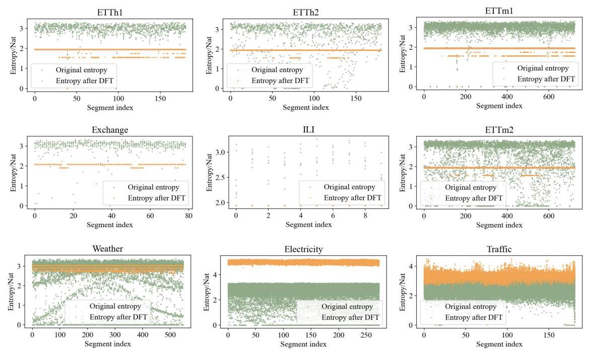
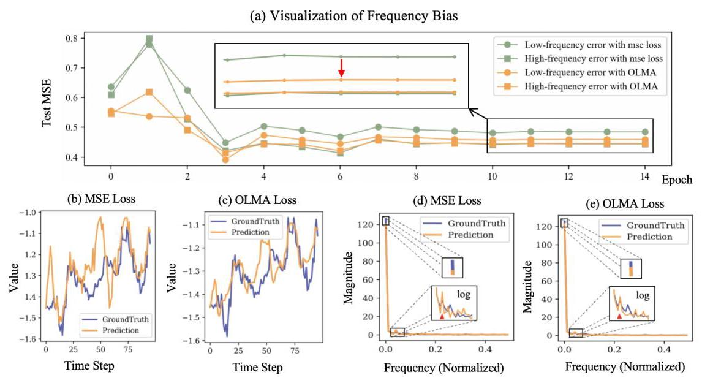
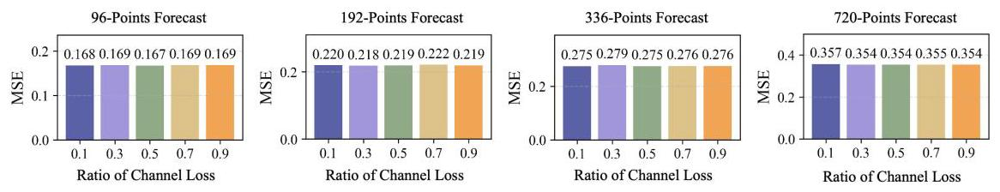
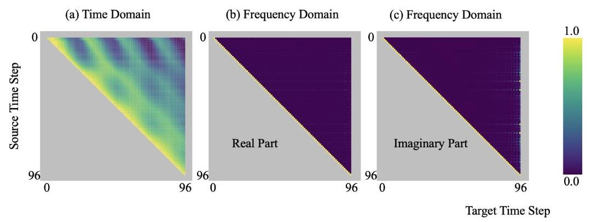
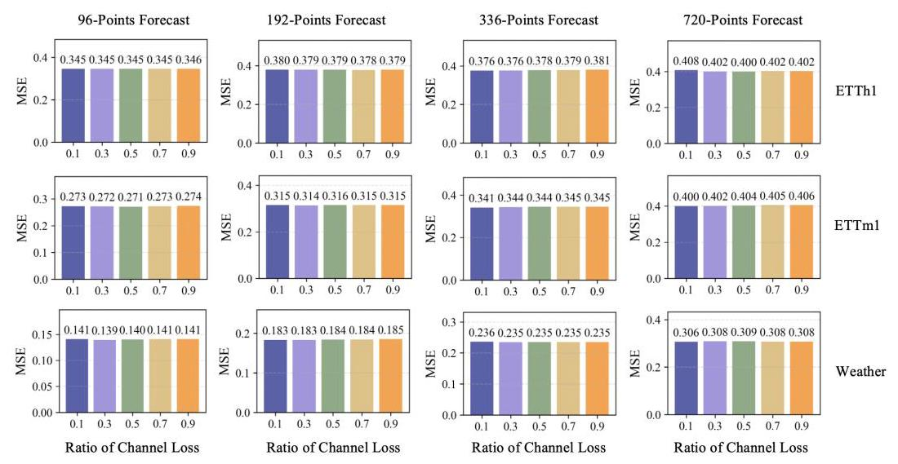

# OLMA: One Loss for More Accurate Time Series Forecasting

# OLMA:一次损失以实现更准确的时间序列预测

Tianyi Shi ${}^{1, \dagger  }$ , Zhu Meng ${}^{1, \dagger  }$ , Yue Chen ${}^{1}$ , Siyang Zheng ${}^{1}$ , Fei Su ${}^{1,2}$ , Jin Huang ${}^{3}$ , Changrui Ren ${}^{3}$ , Zhicheng Zhao ${}^{1,2, * }$

施天一${}^{1, \dagger  }$，朱萌${}^{1, \dagger  }$，陈悦${}^{1}$，郑思阳${}^{1}$，苏飞${}^{1,2}$，黄锦${}^{3}$，任长瑞${}^{3}$，赵志成${}^{1,2, * }$

${}^{1}$ Beijing University of Posts and Telecommunications

${}^{1}$ 北京邮电大学

2 Beijing Key Laboratory of Network System and Network Culture

2北京网络系统与网络文化重点实验室

${}^{3}$ Beijing Academy of Blockchain and Edge Computing

${}^{3}$ 北京区块链与边缘计算研究院

† Equal Contribution

† 同等贡献

* Corresponding Author

* 通讯作者

\{sty0622, bamboo, chenyue, zhengsiyang, sufei, zhaozc\}@bupt.edu.cn, \{huangjin, rencr\}@baec.org.cn

\{sty0622, bamboo, chenyue, zhengsiyang, sufei, zhaozc\}@bupt.edu.cn, \{huangjin, rencr\}@baec.org.cn

## Abstract

## 摘要

Time series forecasting faces two important but often overlooked challenges. Firstly, the inherent random noise in the time series labels sets a theoretical lower bound for the forecasting error, which is positively correlated with the entropy of the labels. Secondly, neural networks exhibit a frequency bias when modeling the state-space of time series, that is, the model performs well in learning certain frequency bands but poorly in others, thus restricting the overall forecasting performance. To address the first challenge, we prove a theorem that there exists a unitary transformation that can reduce the marginal entropy of multiple correlated Gaussian processes, thereby providing guidance for reducing the lower bound of forecasting error. Furthermore, experiments confirm that Discrete Fourier Transform (DFT) can reduce the entropy in the majority of scenarios. Correspondingly, to alleviate the frequency bias, we jointly introduce supervision in the frequency domain along the temporal dimension through DFT and Discrete Wavelet Transform (DWT). This supervision-side strategy is highly general and can be seamlessly integrated into any supervised learning method. Moreover, we propose a novel loss function named OLMA, which utilizes the frequency domain transformation across both channel and temporal dimensions to enhance forecasting. Finally, the experimental results on multiple datasets demonstrate the effectiveness of OLMA in addressing the above two challenges and the resulting improvement in forecasting accuracy. The results also indicate that the perspectives of entropy and frequency bias provide a new and feasible research direction for time series forecasting. The code is available at: https://github.com/Yuyun1011/ OLMA-One-Loss-for-More-Accurate-Time-Series-Forecasting

时间序列预测面临两个重要但常被忽视的挑战。首先，时间序列标签中固有的随机噪声为预测误差设定了理论下限，该下限与标签的熵呈正相关。其次，神经网络在对时间序列的状态空间进行建模时表现出频率偏差，即模型在学习某些频段时表现良好，但在其他频段表现不佳，从而限制了整体预测性能。为解决第一个挑战，我们证明了一个定理，即存在一种酉变换可以降低多个相关高斯过程的边际熵，从而为降低预测误差下限提供指导。此外，实验证实离散傅里叶变换(DFT)在大多数情况下可以降低熵。相应地，为减轻频率偏差，我们通过DFT和离散小波变换(DWT)在时间维度上联合引入频域监督。这种监督方策略具有高度通用性，可以无缝集成到任何监督学习方法中。此外，我们提出了一种名为OLMA的新型损失函数，它利用跨通道和时间维度的频域变换来增强预测。最后，在多个数据集上的实验结果证明了OLMA在解决上述两个挑战方面的有效性以及由此带来的预测精度提升。结果还表明，熵和频率偏差的观点为时间序列预测提供了一个新的可行研究方向。代码可在以下网址获取:https://github.com/Yuyun1011/ OLMA-One-Loss-for-More-Accurate-Time-Series-Forecasting

## 1 Introduction

## 1 引言

Time series forecasting is an important fundamental technique with broad applications in energy management, financial trading, transportation optimization, weather prediction and healthcare monitoring. As the volume of temporal data continues to grow rapidly, enhancing forecasting accuracy has become an urgent need. As machine learning advances, neural networks have become the dominant approach for time series forecasting. Most research efforts have concentrated on developing increasingly sophisticated models to capture the underlying distributions of time series in real-world settings ([1, 2, 3, 4]).

时间序列预测是一项重要的基础技术，在能源管理、金融交易、交通优化、天气预报和医疗监测等领域有着广泛的应用。随着时间数据量的持续快速增长，提高预测准确性已成为当务之急。随着机器学习的发展，神经网络已成为时间序列预测的主要方法。大多数研究工作都集中在开发越来越复杂的模型，以捕捉现实世界中时间序列的潜在分布([1, 2, 3, 4])。

However, from a data-centric perspective, real-world time series are inevitably corrupted by purely random noise. This noise overlays the underlying learnable patterns, rendering perfect forecasting impossible, regardless of how strong the neural network's capacity to model the data distribution is. [5, 6] have shown that the estimation error of a random variable (or stochastic process) has a theoretical lower bound, which is positively correlated with its own entropy. However, they have not further investigated whether the theoretical lower bounds of the estimation errors decrease when multiple correlated stochastic processes are present.

然而，从以数据为中心的角度来看，现实世界中的时间序列不可避免地会受到纯随机噪声的干扰。这种噪声叠加在潜在的可学习模式之上，使得完美预测变得不可能，无论神经网络对数据分布进行建模的能力有多强。[5, 6]表明，随机变量(或随机过程)的估计误差存在理论下限，该下限与其自身的熵呈正相关。然而，他们没有进一步研究当存在多个相关随机过程时，估计误差的理论下限是否会降低。

In this work, we provide a concrete result that there necessarily exists a unitary transformation that decreases the marginal entropy of multiple correlated Gaussian stochastic processes (the sum of the entropy of the individual processes). In Section 3, a detailed proof of this theorem is presented. By modeling the label data of time series as a combination of a learnable informative component and an unlearnable stochastic component, this conclusion provides theoretical guidance for reducing the lower bound of forecasting error. In particular, our experiments demonstrate that, in practical scenarios, the DFT applied along the channel dimension serves as a unitary transformation that reduces entropy.

在这项工作中，我们给出了一个具体结果，即必然存在一种酉变换，它会降低多个相关高斯随机过程的边际熵(各个过程熵的总和)。在第3节中，给出了该定理的详细证明。通过将时间序列的标签数据建模为一个可学习的信息成分和一个不可学习的随机成分的组合，这一结论为降低预测误差的下限提供了理论指导。特别是，我们的实验表明，在实际场景中，沿信道维度应用的离散傅里叶变换(DFT)作为一种降低熵的酉变换。

Another prevalent challenge in time series forecasting is the frequency bias of neural networks ([7, 8, 9]). More precisely, neural networks tend to exhibit inherent differences in their learning capacity in different frequency bands. In fact, this issue is not confined to the domain of time series forecasting, it also poses a significant challenge in the field of computer vision. [10] and [11] have independently tackled the problem of frequency bias by introducing frequency domain transformation modules into their respective architectures.

时间序列预测中的另一个普遍挑战是神经网络的频率偏差([7, 8, 9])。更确切地说，神经网络在不同频带的学习能力往往存在固有差异。事实上，这个问题并不局限于时间序列预测领域，它在计算机视觉领域也构成了重大挑战。[10]和[11]通过在各自的架构中引入频域变换模块，独立地解决了频率偏差问题。

To enhance the universality of using frequency domain transformations to alleviate the inherent frequency bias of neural networks, we embed the transformation directly into the loss function, enabling its application to any supervised learning method without altering the target network. Specifically, inspired by [12], we applied the DFT and DWT to the temporal dimension of time series labels and predictions.

为了提高使用频域变换来减轻神经网络固有频率偏差的通用性，我们将变换直接嵌入到损失函数中，使其能够应用于任何监督学习方法，而无需改变目标网络。具体来说，受[12]的启发，我们将离散傅里叶变换(DFT)和离散小波变换(DWT)应用于时间序列标签和预测的时间维度。

In summary, we propose a novel supervision method for time series forecasting, termed OLMA, which applies frequency domain transformations to both the channel and temporal dimensions of multivariate time series. This approach not only reduces the entropy of label noise, but also mitigates the inherent frequency bias of neural networks. Since this solution is formulated as a loss function, it can be seamlessly integrated into any supervised model. The contributions of this paper are summarized below.

总之，我们提出了一种用于时间序列预测的新型监督方法，称为OLMA，它将频域变换应用于多变量时间序列的通道维和时间维。这种方法不仅降低了标签噪声的熵，还减轻了神经网络固有的频率偏差。由于该解决方案被表述为一个损失函数，它可以无缝集成到任何监督模型中。本文的贡献总结如下。

- We analyze time series forecasting errors from the perspective of entropy, then we theoretically and empirically demonstrate that there exists a unitary transformation that reduces the marginal entropy of multivariate correlated Gaussian processes. Moreover, it has been validated that constructing loss in the frequency domain along the temporal dimension can alleviate the frequency bias of neural networks.

- 我们从熵的角度分析时间序列预测误差，然后从理论和实证上证明存在一种酉变换，它可以降低多元相关高斯过程的边际熵。此外，已经验证了沿着时间维度在频域中构建损失可以减轻神经网络的频率偏差。

- We propose OLMA, a supervision method that applies frequency domain loss along both the channel and temporal dimensions of time series. OLMA provides a minimalist yet effective approach to reducing the entropy of label noise while mitigating the inherent frequency bias of neural networks. Moreover, it is plug-and-play and can be seamlessly integrated into any supervised learning framework.

- 我们提出了OLMA，这是一种监督方法，它沿着时间序列的通道和时间维度应用频域损失。OLMA提供了一种简约而有效的方法来降低标签噪声的熵，同时减轻神经网络固有的频率偏差。此外，它是即插即用的，可以无缝集成到任何监督学习框架中。

- On 9 public time series forecasting datasets, OLMA was evaluated with multiple representative baseline models and demonstrated superior performance compared to their original time domain supervision methods. Our work calls for time series forecasting research not only to pursue innovations in model architectures but also to devote greater attention to the intrinsic properties of data, in order to discover more efficient and generalizable approaches for improving forecasting accuracy.

- 在9个公共时间序列预测数据集上，OLMA与多个具有代表性的基线模型进行了评估，并与它们原来的时域监督方法相比表现出卓越的性能。我们的工作呼吁时间序列预测研究不仅要追求模型架构的创新，还要更加关注数据的内在属性，以便发现更有效和可推广的方法来提高预测准确性。

## 2 Related Works

## 2 相关工作

Time series forecasting approaches. With the rise of neural networks, time series modeling had significantly evolved, particularly with the advent of recurrent neural network (RNN)-based methods (e.g., DeepAR [13], LSTNet [14], DA-RNN [15]) and convolutional neural network (CNN)-based approaches (e.g., TCN [16], SCINet [17], TimesNet [4]). The introduction of the Transformer [18] architecture, known for its exceptional modeling capacity, had led to a surge in Transformer-based forecasting models. Early examples included Informer[19], which applied Transformers directly to time series forecasting; PatchTST [20], which treated time series segments as tokens; and iTrans-former [3], which integrated both temporal and channel-wise dependencies. Interestingly, DLinear [21] demonstrated the surprising effectiveness of simple linear layers in time series forecasting, prompting the development of multilayer perceptron (MLP)-based time domain models such as TimeXer [22], TimeMixer [23], and WPMixer [24]. Furthermore, TimeLLM [25], AutoTime [26], and TimeCMA [2] proved the effectiveness of large language models (LLMs) in time series forecasting. Recently, the Mamba-based model, S-Mamba [1] and Affirm [27], had also demonstrated the superior capabilities of state space models in time series forecasting.

时间序列预测方法。随着神经网络的兴起，时间序列建模有了显著发展，特别是随着基于循环神经网络(RNN)的方法(例如，DeepAR [13]、LSTNet [14]、DA-RNN [15])和基于卷积神经网络(CNN)的方法(例如，TCN [16])的出现。以其卓越建模能力而闻名的Transformer [18]架构的引入，引发了基于Transformer的预测模型的激增。早期的例子包括Informer[19]，它将Transformer直接应用于时间序列预测；PatchTST [20]，它将时间序列段视为令牌；以及iTrans-former [3]，它整合了时间和通道维度的依赖性。有趣的是，DLinear [21]证明了简单线性层在时间序列预测中的惊人有效性，促使了基于多层感知器(MLP)的时域模型如TimeXer [22]、TimeMixer [23]和WPMixer [24]的发展。此外，TimeLLM [25]、AutoTime [26]和TimeCMA [2]证明了大语言模型(LLMs)在时间序列预测中的有效性。最近，基于曼巴的模型S-Mamba [1]和Affirm [27]也证明了状态空间模型在时间序列预测中的卓越能力。

Forecasting errors from entropy perspective. [5] established information-theoretic bounds on estimation and forecasting errors in time series, showing their dependence on the conditional entropy of the data. [6] proposed a framework to evaluate time series forecasting algorithms by relating lower bounds of forecasting error to the conditional entropy rate of the series. Both suggested that the lower bound of time series forecasting error was positively correlated with the entropy of the labels, offering an insightful perspective. Nevertheless, they did not explore how decreasing information entropy could enhance forecasting performance.

从熵的角度看预测误差。[5]建立了时间序列估计和预测误差的信息论界限，表明它们依赖于数据的条件熵。[6]提出了一个通过将预测误差的下限与序列的条件熵率相关联来评估时间序列预测算法的框架。两者都表明时间序列预测误差的下限与标签的熵呈正相关，提供了一个有见地的观点。然而，他们没有探讨信息熵的降低如何能提高预测性能。

Frequency bias of neural networks. [9] and [8] had rigorously demonstrated that neural networks exhibit frequency bias. [10] tackled the frequency bias of deep neural networks by using a frequency-based multi-grade learning approach to better capture high-frequency features. [28] addressed the frequency bias of MLPs by using Fourier feature mappings, enabling faster learning of high-frequency functions in low-dimensional tasks. [11] proposed Fredformer to mitigate frequency bias by learning features evenly across all frequency bands, improving forecasting of high- and low-frequency components. These methods addressed frequency bias by designing network architectures that incorporate frequency domain transformations, but their applicability is often limited to specific models.

神经网络的频率偏差。[9]和[8]已经严格证明神经网络存在频率偏差。[10]通过使用基于频率的多级学习方法来更好地捕捉高频特征，解决了深度神经网络的频率偏差问题。[28]通过使用傅里叶特征映射解决了多层感知器的频率偏差问题，从而在低维任务中能够更快地学习高频函数。[11]提出了Fredformer，通过在所有频带上均匀地学习特征来减轻频率偏差，改善了对高频和低频分量的预测。这些方法通过设计包含频域变换的网络架构来解决频率偏差问题，但其适用性通常限于特定模型。

## 3 Methodology

## 3 方法

This chapter first theoretically demonstrates the possibility of reducing the marginal entropy of multivariate time series (Section 3.1), and then presents the detailed formulation of the OLMA loss (Section 3.2).

本章首先从理论上论证了降低多元时间序列边际熵的可能性(3.1节)，然后给出了OLMA损失的详细公式(3.2节)。

### 3.1 Theoretical Derivation

### 3.1理论推导

Preliminaries. Let $x$ be a continuous random variable with differential entropy $h\left( x\right)$ , and let $\widehat{x}$ be an unbiased estimate of $x$ formed without any side information. Under this constraint, unbiasedness requires $\widehat{x} = \mathbb{E}\left\lbrack  x\right\rbrack$ , so the estimation error $e = x - \widehat{x} = x - \mathbb{E}\left\lbrack  x\right\rbrack$ is zero-mean. Since differential entropy is translation-invariant, $h\left( e\right)  = h\left( x\right)$ . According to the maximum entropy theorem for continuous random variables with given mean and variance ([29]), for any random variable, its entropy is upper-bounded by that of a Gaussian with the same variance,

预备知识。设$x$为具有微分熵$h\left( x\right)$的连续随机变量，且设$\widehat{x}$为在没有任何边信息的情况下形成的$x$的无偏估计。在此约束下，无偏性要求$\widehat{x} = \mathbb{E}\left\lbrack  x\right\rbrack$，所以估计误差$e = x - \widehat{x} = x - \mathbb{E}\left\lbrack  x\right\rbrack$是零均值的。由于微分熵是平移不变的，$h\left( e\right)  = h\left( x\right)$。根据具有给定均值和方差的连续随机变量的最大熵定理([29])，对于任何随机变量，其熵以上界为具有相同方差的高斯分布的熵。

$$
h\left( e\right)  = h\left( x\right)  \leq  \frac{1}{2}\log \left( {{2\pi e}\operatorname{Var}\left( e\right) }\right) , \tag{1}
$$

where Var denotes the variance. It can be rearranged to give the desired lower bound on the mean squared error,

其中Var表示方差。它可以重新排列以给出所需的均方误差下界。

$$
\mathbb{E}\left\lbrack  {\left( x - \widehat{x}\right) }^{2}\right\rbrack   = \operatorname{Var}\left( e\right)  \geq  \frac{1}{2\pi e}{2}^{{2h}\left( x\right) }. \tag{2}
$$

The equality holds if and only if $x$ is Gaussian ([5]).

当且仅当$x$是高斯分布时等式成立([5])。

Let $Y \in  {\mathbb{R}}^{c \times  l}$ denote the time series labels with $c$ dimensions (channels) and length $l$ . Followed by [30,31,32], the label is decomposed into two components as $Y = Z + N$ , where $Z, N \in  {\mathbb{R}}^{c \times  l}$ denote components of learnable deterministic process (without randomness, the entropy is theoretically zero) and components of unlearnable stochastic noise respectively. We assume that $N$ is Gaussian ([33, 34]) and mutually independent across different time steps for analytical tractability. Thus, the lower bound of ${N}_{i} \in  {\mathbb{R}}^{l}$ , the variable ${i}^{th}$ of $N$ , is

设$Y \in  {\mathbb{R}}^{c \times  l}$表示具有$c$维(通道)和长度$l$的时间序列标签。遵循[30,31,32]，标签被分解为两个分量$Y = Z + N$，其中$Z, N \in  {\mathbb{R}}^{c \times  l}$分别表示可学习的确定性过程(无随机性，理论上熵为零)的分量和不可学习的随机噪声的分量。为了便于分析，我们假设$N$是高斯分布([33, 34])并且在不同时间步之间相互独立。因此，${N}_{i} \in  {\mathbb{R}}^{l}$的下界，即$N$的变量${i}^{th}$，为

$$
\mathop{\sum }\limits_{{t = 1}}^{l}\mathbb{E}\left\lbrack  {\left( {N}_{i}\left\lbrack  t\right\rbrack   - {\widehat{N}}_{i}\left\lbrack  t\right\rbrack  \right) }^{2}\right\rbrack   \geq  \mathop{\sum }\limits_{{t = 1}}^{l}\frac{1}{2\pi e}{2}^{{2h}\left( {{N}_{i}\left\lbrack  t\right\rbrack  }\right) } = \frac{l}{2\pi e}{2}^{{2h}\left( {N}_{i}\right) }. \tag{3}
$$

This indicates that the lower bound of the forecasting error for each time series variable is positively correlated with its own entropy. If there exists an invertible transformation that can reduce entropy, the lower bound of the forecasting error can be decreased, thereby improving the forecasting accuracy. In this regard, we propose Theorem 1, which demonstrates that such transformation indeed exists.

这表明每个时间序列变量的预测误差下界与其自身的熵正相关。如果存在可以降低熵的可逆变换，则可以降低预测误差的下界，从而提高预测精度。在这方面，我们提出定理1，它证明了这样的变换确实存在。

Theorem 1. If multiple Gaussian stochastic processes are internally independent and identically distributed (i.i.d.) but exhibit correlations across processes, then there necessarily exists a unitary transformation that reduces their marginal entropy, i.e., the sum of the entropy of each individual process.

定理1。如果多个高斯随机过程在内部是独立同分布(i.i.d.)但在过程之间表现出相关性，那么必然存在一个酉变换来降低它们的边际熵，即每个单独过程的熵之和。

Before proving Theorem 1, we state 3 lemmas that will be used in the proof.

在证明定理1之前，我们陈述将在证明中使用的3个引理。

Lemma 1. Let $A \in  {\mathbb{C}}^{n \times  n}$ be a positive definite Hermitian matrix with main diagonal elements ${a}_{11},{a}_{22},\ldots ,{a}_{nn}$ . Then the determinant of $A$ satisfies the inequality:

引理1。设$A \in  {\mathbb{C}}^{n \times  n}$为具有主对角线元素${a}_{11},{a}_{22},\ldots ,{a}_{nn}$的正定埃尔米特矩阵。那么$A$的行列式满足不等式:

$$
\det \left( A\right)  \leq  \mathop{\prod }\limits_{{j = 1}}^{n}{a}_{jj} \tag{4}
$$

with equality if and only if $A$ is a diagonal matrix.

当且仅当$A$是对角矩阵时等式成立。

Proof of Lemma 1. Since $A$ is positive definite Hermitian, it admits a unique Cholesky decomposition $A = L{L}^{ * }$ , where $L$ is a lower triangular matrix with ${l}_{ii} > 0$ for $i = 1,2,\ldots , n$ , and ${L}^{ * }$ denotes the conjugate transpose of $L$ ([35]). The determinant of $A$ can be expressed as

引理1的证明。由于$A$是正定埃尔米特矩阵，它有唯一的乔列斯基分解$A = L{L}^{ * }$，其中$L$是下三角矩阵，对于$i = 1,2,\ldots , n$有${l}_{ii} > 0$，并且${L}^{ * }$表示$L$的共轭转置([35])。$A$的行列式可以表示为

$$
\det \left( A\right)  = \det \left( {L{L}^{ * }}\right)  = {\left| \det \left( L\right) \right| }^{2} = {\left( \mathop{\prod }\limits_{{i = 1}}^{n}{l}_{ii}\right) }^{2}. \tag{5}
$$

The diagonal elements of $A$ are given by ${a}_{ii} = {\sum }_{k = i}^{n}{\left| {l}_{ik}\right| }^{2} \geq  {\left| {l}_{ii}\right| }^{2}$ , for $i = 1,2,\ldots , n$ . Taking the product of these inequalities yields

$A$的对角元素由${a}_{ii} = {\sum }_{k = i}^{n}{\left| {l}_{ik}\right| }^{2} \geq  {\left| {l}_{ii}\right| }^{2}$给出，对于$i = 1,2,\ldots , n$。将这些不等式相乘得到

$$
\mathop{\prod }\limits_{{i = 1}}^{n}{a}_{ii} \geq  \mathop{\prod }\limits_{{i = 1}}^{n}{\left| {l}_{ii}\right| }^{2} = {\left( \mathop{\prod }\limits_{{i = 1}}^{n}{l}_{ii}\right) }^{2} = \det \left( A\right) . \tag{6}
$$

Equality holds if and only if ${a}_{ii} = {l}_{ii}^{2}$ for all $i$ , which requires ${l}_{ik} = 0$ for all $k < i$ . This implies $L$ is diagonal, and consequently $A = L{L}^{ * }$ is also diagonal. Thus, Lemma 1 is proved.

当且仅当对于所有$i$有${a}_{ii} = {l}_{ii}^{2}$，这要求对于所有$k < i$有${l}_{ik} = 0$时等式成立。这意味着$L$是对角的，因此$A = L{L}^{ * }$也是对角的。因此，引理1得证。

Lemma 2 (Unitary diagonalization of a Hermitian matrix). Let $A \in  {\mathbb{C}}^{n \times  n}$ be a Hermitian matrix (i.e., $A = {A}^{ * }$ ). Then there exists a unitary matrix $U \in  {\mathbb{C}}^{n \times  n}$ (i.e., ${U}^{ * } = {U}^{-1}$ ) and a real diagonal matrix $\Lambda  = \operatorname{diag}\left( {{\lambda }_{1},{\lambda }_{2},\ldots ,{\lambda }_{n}}\right)$ such that

引理2(埃尔米特矩阵的酉对角化)。设$A \in  {\mathbb{C}}^{n \times  n}$为埃尔米特矩阵(即$A = {A}^{ * }$)。则存在酉矩阵$U \in  {\mathbb{C}}^{n \times  n}$(即${U}^{ * } = {U}^{-1}$)和实对角矩阵$\Lambda  = \operatorname{diag}\left( {{\lambda }_{1},{\lambda }_{2},\ldots ,{\lambda }_{n}}\right)$，使得

$$
A = {U\Lambda }{U}^{ * }. \tag{7}
$$

The columns of $U$ form an orthonormal basis of ${\mathbb{C}}^{n}$ consisting of eigenvectors of $A$ , and the diagonal entries of $\Lambda$ are the corresponding eigenvalues. Furthermore, if $A$ is positive definite, then all eigenvalues ${\lambda }_{i}$ are positive ([36]).

$U$的列构成${\mathbb{C}}^{n}$的一个由$A$的特征向量组成的标准正交基，并且$\Lambda$的对角元素是相应的特征值。此外，如果$A$是正定的，那么所有特征值${\lambda }_{i}$都是正的([36])。

Lemma 3 (Path-Connectedness of the Unitary Group). The unitary group $\mathcal{U}\left( n\right)$ is path-connected. That is, for any two unitary matrices $U, V \in  \mathcal{U}\left( n\right)$ , there exists a continuous function $\varphi  : \left\lbrack  {0,1}\right\rbrack   \rightarrow \; \mathcal{U}\left( n\right)$ such that $\varphi \left( 0\right)  = U$ and $\varphi \left( 1\right)  = V$ ([37]).

引理3(酉群的路径连通性)。酉群$\mathcal{U}\left( n\right)$是路径连通的。也就是说，对于任意两个酉矩阵$U, V \in  \mathcal{U}\left( n\right)$，存在一个连续函数$\varphi  : \left\lbrack  {0,1}\right\rbrack   \rightarrow \; \mathcal{U}\left( n\right)$，使得$\varphi \left( 0\right)  = U$且$\varphi \left( 1\right)  = V$([37])。

Proof of Theorem 1. Let $G \in  {\mathbb{R}}^{c \times  l}$ denote $c$ correlated Gaussian stochastic processes and length $l$ . For each process ${G}_{i}$ , since the variables are i.i.d. Gaussian, its entropy is

定理1的证明。设$G \in  {\mathbb{R}}^{c \times  l}$表示$c$相关的高斯随机过程且长度为$l$。对于每个过程${G}_{i}$，由于变量是独立同分布的高斯变量，其熵为

$$
h\left( {G}_{i}\right)  = \frac{1}{2}\log \left( {{\left( 2\pi e\right) }^{l}\det \left( {\sum }_{i}\right) }\right) \overset{\text{ i.i.d. }}{ = }\frac{l}{2}\log \left( {{2\pi e}{\sigma }_{i}^{2}}\right) , \tag{8}
$$

where ${\sum }_{i}$ is the covariance matrix of ${G}_{i}$ , and ${\sigma }_{i}^{2}$ corresponds to the variance of each Gaussian random variable. The sum of the marginal entropy of $G$ is

其中${\sum }_{i}$是${G}_{i}$的协方差矩阵，并且${\sigma }_{i}^{2}$对应于每个高斯随机变量的方差。$G$的边际熵之和为

$$
\mathop{\sum }\limits_{{i = 1}}^{c}h\left( {G}_{i}\right)  = \mathop{\sum }\limits_{{i = 1}}^{c}\frac{l}{2}\log \left( {{2\pi e}{\sigma }_{i}^{2}}\right)  = \frac{l}{2}\log \left( {{\left( 2\pi e\right) }^{c}\mathop{\prod }\limits_{i}^{c}{\sigma }_{i}^{2}}\right) . \tag{9}
$$

It is evident that $\mathop{\prod }\limits_{i}^{c}{\sigma }_{i}^{2}$ is the product of the first-order principal minors of the covariance matrix of $G$ , which is denoted as $S = \frac{1}{l}G{G}^{ * }$ , where ${G}^{ * }$ is the conjugate transpose matrix of $G$ . When a unitary transformation $F$ is applied to $G$ , the covariance matrix ${S}_{u}$ is transformed into

显然，$\mathop{\prod }\limits_{i}^{c}{\sigma }_{i}^{2}$是$G$的协方差矩阵的一阶主子式的乘积，协方差矩阵记为$S = \frac{1}{l}G{G}^{ * }$，其中${G}^{ * }$是$G$的共轭转置矩阵。当对$G$应用酉变换$F$时，协方差矩阵${S}_{u}$变换为

$$
{S}_{u} = \frac{1}{l}{FG}{\left( FG\right) }^{ * } = F\left( {\frac{1}{l}G{G}^{ * }}\right) {F}^{ * } = {FS}{F}^{ * }. \tag{10}
$$

According to Lemma 1, $\det \left( S\right)  < \mathop{\prod }\limits_{i}^{c}{\sigma }_{i}^{2}$ , because the ${G}_{i}$ s are correlated, the equality does not apply. According to Lemma 2, there is necessarily a unitary transformation ${F}_{v}$ such that ${S}_{u}$ becomes a diagonal matrix, which means $\det \left( {S}_{u}\right)  = \mathop{\prod }\limits_{{i = 1}}^{c}{\widehat{\sigma }}_{i}^{2}$ , where ${\widehat{\sigma }}_{i}^{2}$ is the element on the main diagonal of ${S}_{u}$ . Since a unitary transformation does not change the determinant of a matrix, $\det \left( S\right)  = \det \left( {S}_{u}\right)$ . In summary, there exists a unitary transformation $\varphi \left( 0\right)  = I$ (identity matrix) such that the main diagonal of the covariance matrix of $G$ remains unchanged, and there also exists a unitary transformation $\varphi \left( 1\right)  = {F}_{v}$ that reduces it to its minimum value $\det \left( S\right)$ . Since the unitary space is continuous (from $\varphi \left( 0\right)  = I$ to $\varphi \left( 1\right)  = {F}_{v}$ ), the range of attainable values forms a closed real value interval (from $\mathop{\prod }\limits_{i}^{c}{\sigma }_{i}^{2}$ to $\det \left( S\right)$ ), there necessarily exists a ${F}_{\lambda } = \varphi \left( \lambda \right) ,0 < \lambda  < 1$ such that $\det \left( S\right)  < \mathop{\prod }\limits_{{i = 1}}^{c}{\widehat{\sigma }}_{i}^{2} < \mathop{\prod }\limits_{i}^{c}{\sigma }_{i}^{2}$ , that is the product of the main diagonal entries is reduced. In conjunction with Eq. 9, it can be rigorously deduced that there necessarily exists a unitary transformation that reduces the marginal entropy of the Gaussian process. Thus, Theorem 1 is proved.

根据引理1，$\det \left( S\right)  < \mathop{\prod }\limits_{i}^{c}{\sigma }_{i}^{2}$ ，因为${G}_{i}$ 是相关的，所以等式不成立。根据引理2，必然存在一个酉变换${F}_{v}$ ，使得${S}_{u}$ 成为对角矩阵，这意味着$\det \left( {S}_{u}\right)  = \mathop{\prod }\limits_{{i = 1}}^{c}{\widehat{\sigma }}_{i}^{2}$ ，其中${\widehat{\sigma }}_{i}^{2}$ 是${S}_{u}$ 主对角线上的元素。由于酉变换不会改变矩阵的行列式，所以$\det \left( S\right)  = \det \left( {S}_{u}\right)$ 。综上所述，存在一个酉变换$\varphi \left( 0\right)  = I$ (单位矩阵)，使得$G$ 的协方差矩阵的主对角线保持不变，并且也存在一个酉变换$\varphi \left( 1\right)  = {F}_{v}$ 将其减小到最小值$\det \left( S\right)$ 。由于酉空间是连续的(从$\varphi \left( 0\right)  = I$ 到$\varphi \left( 1\right)  = {F}_{v}$ )，可达到值的范围形成一个封闭的实值区间(从$\mathop{\prod }\limits_{i}^{c}{\sigma }_{i}^{2}$ 到$\det \left( S\right)$ )，必然存在一个${F}_{\lambda } = \varphi \left( \lambda \right) ,0 < \lambda  < 1$ 使得$\det \left( S\right)  < \mathop{\prod }\limits_{{i = 1}}^{c}{\widehat{\sigma }}_{i}^{2} < \mathop{\prod }\limits_{i}^{c}{\sigma }_{i}^{2}$ ，即主对角线元素的乘积减小。结合式9，可以严格推导出必然存在一个酉变换来降低高斯过程的边际熵。因此，定理1得证。

### 3.2 OLMA Loss

### 3.2 OLMA损失

The forecasting of the model is denoted as $\widehat{Y} \in  {\mathbb{R}}^{l \times  c}$ , and the corresponding label as $Y \in  {\mathbb{R}}^{l \times  c}$ . According to Theorem 1, the DFT applied along the channel dimension acts as a unitary transformation that can reduce the marginal entropy of multivariate time series labels (the experimental validation is presented in Section 4). The computation can be explicitly formulated as

模型的预测记为$\widehat{Y} \in  {\mathbb{R}}^{l \times  c}$ ，相应的标签记为$Y \in  {\mathbb{R}}^{l \times  c}$ 。根据定理1，沿通道维度应用的离散傅里叶变换(DFT)起到酉变换的作用，可以降低多元时间序列标签的边际熵(第4节给出了实验验证)。计算可以明确表示为

$$
{\mathcal{L}}_{\text{ olma }}^{\left( c\right) } = \alpha \mathop{\sum }\limits_{{t = 0}}^{{l - 1}}{\begin{Vmatrix}{F}_{f}\left( {\widehat{Y}}_{t, : }\right)  - {F}_{f}\left( {Y}_{t, : }\right) \end{Vmatrix}}_{1}, \tag{11}
$$

where $0 < \alpha  < 1$ is the hyperparameter to adjust the strength of ${\mathcal{L}}_{\text{ olma }}^{\left( c\right) },{\widehat{Y}}_{t, : }$ and ${Y}_{t, : }$ are forecasting and label sequence of the ${t}^{th}$ time step respectively and ${F}_{f}$ represents DFT that detailed calculation is

其中$0 < \alpha  < 1$ 是调整${\mathcal{L}}_{\text{ olma }}^{\left( c\right) },{\widehat{Y}}_{t, : }$ 强度的超参数，${Y}_{t, : }$ 和${t}^{th}$ 分别是${t}^{th}$ 时间步的预测和标签序列，${F}_{f}$ 表示DFT，详细计算为

$$
{F}_{f}\left( {Y}_{t, : }\right) \left\lbrack  k\right\rbrack   = \mathop{\sum }\limits_{{n = 0}}^{{c - 1}}{Y}_{t, n} \cdot  {e}^{-{2\pi }\mathrm{i}{kn}/c},\;k = 0,1,\ldots , c - 1, \tag{12}
$$

where i is the imaginary unit.

其中i是虚数单位。

To alleviate the frequency bias of neural networks, we also apply frequency domain transformations directly at the supervision stage. This provides the most convenient way to adapt to all supervised time series forecasting models. Inspired by [12], we perform DFT and DWT along the temporal dimension of the time series. Applying a full DFT to long non-stationary signals may yield misleading frequency representations, since it assumes global stationarity and overlooks localized variations. In contrast, Wavelet Transform, a localized alternative to the short-time Fourier Transform, captures both temporal and frequency information, making it effective for modeling long-term non-stationary patterns in time series. The computation of ${\mathcal{L}}_{\text{ olma }}^{\left( t\right) }$ is

为减轻神经网络的频率偏差，我们还在监督阶段直接应用频域变换。这为适应所有监督式时间序列预测模型提供了最便捷的方法。受[12]启发，我们沿时间序列的时间维度执行离散傅里叶变换(DFT)和离散小波变换(DWT)。对长的非平稳信号应用完整的DFT可能会产生误导性的频率表示，因为它假设全局平稳性并忽略局部变化。相比之下，小波变换作为短时傅里叶变换的局部替代方法，同时捕获时间和频率信息，使其对建模时间序列中的长期非平稳模式有效。${\mathcal{L}}_{\text{ olma }}^{\left( t\right) }$的计算是

$$
{\mathcal{L}}_{\text{ olma }}^{\left( t\right) } = \beta \mathop{\sum }\limits_{{i = 0}}^{{c - 1}}{\begin{Vmatrix}{F}_{f}\left( {\widehat{Y}}_{ : , i}\right)  - {F}_{f}\left( {Y}_{ : , i}\right) \end{Vmatrix}}_{1} + \gamma \mathop{\sum }\limits_{{i = 0}}^{{c - 1}}{\begin{Vmatrix}{F}_{w}\left( {\widehat{Y}}_{ : , i}\right)  - {F}_{w}\left( {Y}_{ : , i}\right) \end{Vmatrix}}_{1}, \tag{13}
$$

where ${\widehat{Y}}_{ : , i}$ and ${Y}_{ : , i}$ are forecasting and label sequence of the ${i}^{\text{ th }}$ channel respectively, the hyperpa-rameters $\beta$ and $\gamma$ (where $0 < \beta ,\gamma  < 1$ and $\alpha  + \beta  + \gamma  = 1$ ) are introduced to adjust the strength of alignment in the Fourier and Wavelet domains, respectively, and ${F}_{w}$ denotes the DWT. For $k = 1,2,\ldots , l/2$ , there are

其中${\widehat{Y}}_{ : , i}$和${Y}_{ : , i}$分别是${i}^{\text{ th }}$通道的预测序列和标签序列，引入超参数$\beta$和$\gamma$(其中$0 < \beta ,\gamma  < 1$和$\alpha  + \beta  + \gamma  = 1$)分别调整傅里叶域和小波域中的对齐强度，并且${F}_{w}$表示离散小波变换。对于$k = 1,2,\ldots , l/2$，有

$$
{Y}_{{2k} - 1, i} = \frac{c{A}_{k} + c{D}_{k}}{\sqrt{2}},\;{Y}_{{2k}, i} = \frac{c{A}_{k} - c{D}_{k}}{\sqrt{2}},\;{F}_{w}\left( {Y}_{ : , i}\right)  = \left\{  {c{A}_{1},\ldots , c{A}_{k}, c{D}_{1},\ldots , c{D}_{k}}\right\}  .
$$

(14)

where ${cA}$ is the approximation coefficient and ${cD}$ is the detail coefficient of ${Y}_{ : , i}$ . Note that squared or higher-order norms for the error are not adopted. Because, in most time series data, the magnitude of frequency components varies significantly across different bands in the frequency domain. In particular, low-frequency components typically dominate and exhibit much larger amplitudes than high-frequency components. To ensure stability of the loss, the L1 norm is adopted. Finally, the OLMA loss ${\mathcal{L}}_{\mathcal{O}}$ is defined as a linear combination of the frequency domain losses along the temporal and channel dimensions,

其中${cA}$是${Y}_{ : , i}$的近似系数，${cD}$是${Y}_{ : , i}$的细节系数。注意，这里不采用误差的平方范数或高阶范数。因为，在大多数时间序列数据中，频域中不同频段的频率分量幅度变化显著。特别是，低频分量通常占主导，并且比高频分量表现出大得多的幅度。为了确保损失的稳定性，采用L1范数。最后，OLMA损失${\mathcal{L}}_{\mathcal{O}}$被定义为沿时间和通道维度的频域损失的线性组合，

$$
{\mathcal{L}}_{\mathcal{O}} = {\mathcal{L}}_{\text{ olma }}^{\left( t\right) } + {\mathcal{L}}_{\text{ olma }}^{\left( c\right) } \tag{15}
$$

Figure 1: Entropy changes after applying channel-wise DFT in different time series datasets.

图1:在不同时间序列数据集中应用通道维度的离散傅里叶变换后的熵变化。

## 4 Experiments

## 4实验

### 4.1 Low Entropy Representation of Time Series

### 4.1时间序列的低熵表示

Inspired by Theorem 1, we aim to develop a representation method that reduces the marginal entropy of time series along the temporal dimension. Since the DFT decomposes a sequence into different frequency components, we apply it along the channel dimension so that energy from the same frequency band is concentrated within the same channel. This reduces the uncertainty within each individual channel and thereby decreases the entropy of the time series. For the original real-valued time series ${Y}_{ : , i} \in  {\mathbb{R}}^{l}$ , we compute its Shannon entropy. Because the true probability distribution of each value is inaccessible, we replace it with the empirical probability estimated from the data. Concretely, the values of ${Y}_{ : , i}$ are first partitioned into $M$ equal-width, non-overlapping bins. Let ${n}_{k} = \operatorname{number}\left( {{Y}_{j, i} \in  {M}_{k}}\right) , j = 0,1,\ldots l - 1$ denote the number of series points that fall into ${M}_{k}$ , the ${k}^{th}$ interval of $M$ . The empirical probability ${p}_{k} = {n}_{k}/l$ . Therefore, the Shannon entropy of ${Y}_{ : , i}$ can be expressed as

受定理1的启发，我们旨在开发一种表示方法，该方法可以降低时间序列在时间维度上的边际熵。由于离散傅里叶变换(DFT)将一个序列分解为不同的频率分量，我们沿通道维度应用它，以便来自同一频带的能量集中在同一通道内。这减少了每个单独通道内的不确定性，从而降低了时间序列的熵。对于原始实值时间序列${Y}_{ : , i} \in  {\mathbb{R}}^{l}$，我们计算其香农熵。因为每个值的真实概率分布是不可达的，我们用从数据中估计的经验概率来代替它。具体来说，${Y}_{ : , i}$的值首先被划分为$M$个等宽、不重叠的区间。设${n}_{k} = \operatorname{number}\left( {{Y}_{j, i} \in  {M}_{k}}\right) , j = 0,1,\ldots l - 1$表示落入${M}_{k}$($M$的${k}^{th}$区间)的序列点数量。经验概率${p}_{k} = {n}_{k}/l$。因此，${Y}_{ : , i}$的香农熵可以表示为

$$
H\left( {Y}_{ : , i}\right)  =  - \mathop{\sum }\limits_{{k = 1}}^{M}{p}_{k}\log \left( {p}_{k}\right) , \tag{16}
$$

Since ${Y}_{ : , i}$ becomes a complex-valued sequence after the DFT, we treat it as a two-dimensional discrete sequence and compute its joint entropy following the method described above. Followed by [1, 3, 4], ETT (4 subsets), Exchange, Illness (ILI), Weather, Electricity (ECL), Traffic datasets are used in our experiments (see Appendix A. 1 for dataset details). Each dataset is segmented into 96-length segments along the temporal dimension. As shown in Figure 1, the entropy of each segment is indicated with a scatter plot, where green represents the entropy of the original sequence and orange represents the entropy after applying DFT along the channel dimension. Evidently, in most scenarios, representing time series using DFT along the channel dimension can significantly reduce their marginal entropy, which experimentally validates Theorem 1. Moreover, this representation significantly reduces the entropy differences across different time series samples, which indicates a more uniform distribution of information, without extreme redundancy or uncertainty. However, for a few datasets, such as ECL, this can lead to an increase in entropy, which may affect the forecasting performance of certain models (a detailed discussion is provided in Section 4.3 and 4.4).

由于${Y}_{ : , i}$在DFT后变成一个复值序列，我们将其视为二维离散序列，并按照上述方法计算其联合熵。遵循[1, 3, 4]，我们在实验中使用ETT(4个子集)、Exchange、Illness(ILI)、Weather、Electricity(ECL)、Traffic数据集(数据集详细信息见附录A.1)。每个数据集沿时间维度被分割成长度为96的段。如图1所示，每个段的熵用散点图表示，其中绿色表示原始序列的熵，橙色表示沿通道维度应用DFT后的熵。显然，在大多数情况下，沿通道维度使用DFT表示时间序列可以显著降低其边际熵，这在实验上验证了定理1。此外，这种表示显著降低了不同时间序列样本之间的熵差异，这表明信息分布更加均匀，没有极端的冗余或不确定性。然而，对于一些数据集，如ECL，这可能会导致熵增加，这可能会影响某些模型的预测性能(在4.3节和4.4节中提供了详细讨论)。

Figure 2: (a) denotes the forecasting error across different frequency bands on the ETTh1 test set during training, reflecting the frequency bias of the network. (b) and (d) visualize the forecasting and ground truth values in the time and frequency domains under time domain MSE supervision, respectively. (c) and (e) visualize the forecasting and ground truth values in the time and frequency domains under OLMA supervision, respectively.

图2:(a)表示训练期间ETTh1测试集上不同频带的预测误差，反映了网络的频率偏差。(b)和(d)分别在时域均方误差(MSE)监督下可视化时间域和频率域中的预测值和真实值。(c)和(e)分别在OLMA监督下可视化时间域和频率域中的预测值和真实值。

### 4.2 Alleviation of Frequency Bias

### 4.2频率偏差的缓解

Followed by [7], we quantify frequency bias by measuring the forecasting errors of different frequency bands. As evidenced by the two green curves in Figure 2 (a), the model manifests a pronounced frequency bias, exhibiting a preferential tendency toward capturing high-frequency components. It is worth noting that the DLinear model employed in this experiment was specifically designed to balance low- and high-frequency learning through parallel seasonal and trend branches, yet the issue of frequency bias still persists. After applying OLMA supervision, the model's ability to learn low-frequency components is substantially enhanced, while its ability to capture high-frequency components remains largely unaffected. This provides empirical evidence that applying supervision in the frequency domain allows the network to access information across all frequency bands more directly, effectively alleviating its intrinsic frequency bias.

参照[7]，我们通过测量不同频段的预测误差来量化频率偏差。如图2 (a)中的两条绿色曲线所示，该模型表现出明显的频率偏差，呈现出捕捉高频成分的偏好趋势。值得注意的是，本实验中使用的DLinear模型专门设计用于通过并行的季节性和趋势分支来平衡低频和高频学习，但频率偏差问题仍然存在。应用OLMA监督后，模型学习低频成分的能力得到显著增强，而其捕捉高频成分的能力在很大程度上不受影响。这提供了经验证据，表明在频域中应用监督可以使网络更直接地访问所有频段的信息，有效减轻其固有的频率偏差。

For greater clarity, we visualize the forecasting in both the time and frequency domains. As illustrated in Figure 2 (b), the ground truth exhibits an overall upward trend, which is manifested primarily in the low-frequency components. However, under time domain supervision, the network exhibits limited capacity in capturing low-frequency information, and consequently, such a trend cannot be adequately fitted. In contrast, under the guidance of OLMA, the network exhibits a markedly improved capacity to approximate the trend component, as shown in the plot (c). In addition, comparison of plots (d) and (e) reveals that OLMA supervision provides a more faithful approximation of the primary and secondary spectral peaks in the low-frequency band than conventional time domain MSE. This serves as compelling evidence for the network's enhanced proficiency in modeling low-frequency structures, substantiating the claim that direct frequency domain supervision provides a principled solution to alleviate frequency bias. In addition, we also discuss the issue of frequency bias from the perspective of the data, see Appendix A.2 for details.

为了更清晰地说明，我们在时域和频域中可视化预测。如图2 (b)所示，真实值呈现出整体上升趋势，主要体现在低频成分中。然而，在时域监督下，网络捕捉低频信息的能力有限，因此这种趋势无法得到充分拟合。相比之下，在OLMA的指导下，网络在逼近趋势成分方面表现出显著提高的能力，如图 (c)所示。此外，比较图 (d)和 (e)可知，与传统的时域MSE相比，OLMA监督在低频带中对主要和次要频谱峰值提供了更准确的近似。这有力地证明了网络在建模低频结构方面的能力增强，证实了直接频域监督为减轻频率偏差提供了一种有原则的解决方案这一说法。此外，我们还从数据的角度讨论了频率偏差问题，详情见附录A.2。

### 4.3 Performance of OLMA

### 4.3 OLMA的性能

We further validate the effectiveness of OLMA by incorporating it into several state-of-the-art baseline models across diverse settings. These methods include Mamba-based S-Mamba [1], LLM-based TimeCMA [2], Transformer-based iTransformer [3], CNN-based TimesNet [4], linear-based DLinear [21], and MLP-based TimeMixer [23] and TimeXer [22]. The average forecast errors of four horizons $\{ {96},{192},{336},{720}\}$ for different methods on different datasets (ILI are $\{ {12},{24},{48},{96}\}$ ) are shown in Table 1 (complete experimental results and detailed setting of hyperparameters are provided in the Appendix A.3). In accordance with commonly adopted protocols, each dataset is divided into training (60%), validation (20%) and test (20%) subsets. The experimental results indicate that OLMA, when directly integrated into diverse baseline models, consistently outperforms the widely adopted time domain supervision approaches. More intriguingly, OLMA eliminates the reliance on time domain supervision altogether, instead representing time series labels purely within the frequency domain. This phenomenon can be explained by Parseval's Theorem [38].

我们通过将OLMA纳入多种不同设置下的先进基线模型中，进一步验证了OLMA的有效性。这些方法包括基于Mamba的S-Mamba [1]、基于LLM的TimeCMA [2]、基于Transformer的iTransformer [3]、基于CNN的TimesNet [4]、基于线性的DLinear [21]以及基于MLP的TimeMixer [23]和TimeXer [22]。不同方法在不同数据集上四个预测步长$\{ {96},{192},{336},{720}\}$的平均预测误差(ILI为$\{ {12},{24},{48},{96}\}$)如表1所示(附录A.3中提供了完整的实验结果和超参数的详细设置)。按照常用协议，每个数据集被分为训练集(60%)、验证集(20%)和测试集(20%)。实验结果表明，当直接将OLMA集成到各种基线模型中时，它始终优于广泛采用的时域监督方法。更有趣的是，OLMA完全消除了对时域监督的依赖，而是仅在频域中表示时间序列标签。这种现象可以用Parseval定理[38]来解释。

Table 1: Performance of OLMA on different time series datasets. Lower forecasting errors indicate better performance. The best results are highlighted in bold. TDL denotes the temporal domain loss (MSE) corresponding to each baseline.

表1:OLMA在不同时间序列数据集上的性能。预测误差越低表示性能越好。最佳结果用粗体突出显示。TDL表示每个基线对应的时域损失(MSE)。

<table><tr><td rowspan="2">Dataset</td><td rowspan="2">Loss</td><td colspan="2">S-Mamba</td><td colspan="2">TimeCMA</td><td colspan="2">iTransformer</td><td colspan="2">TimesNet</td><td colspan="2">TimeXer</td><td colspan="2">TimeMixer</td><td colspan="2">DLinear</td></tr><tr><td>MSE</td><td>MAE</td><td>MSE</td><td>MAE</td><td>MSE</td><td>MAE</td><td>MSE</td><td>MAE</td><td>MSE</td><td>MAE</td><td>MSE</td><td>MAE</td><td>MSE</td><td>MAE</td></tr><tr><td rowspan="2">ETTh1</td><td>TDL</td><td>0.455</td><td>0.450</td><td>0.438</td><td>0.441</td><td>0.454</td><td>0.448</td><td>0.460</td><td>0.455</td><td>0.437</td><td>0.437</td><td>0.447</td><td>0.440</td><td>0.423</td><td>0.437</td></tr><tr><td>OLMA</td><td>0.432</td><td>0.426</td><td>0.433</td><td>0.434</td><td>0.444</td><td>0.437</td><td>0.445</td><td>0.443</td><td>0.436</td><td>0.429</td><td>0.435</td><td>0.429</td><td>0.413</td><td>0.424</td></tr><tr><td rowspan="2">ETTh2</td><td>TDL</td><td>0.381</td><td>0.405</td><td>0.407</td><td>0.420</td><td>0.383</td><td>0.407</td><td>0.407</td><td>0.421</td><td>0.368</td><td>0.396</td><td>0.374</td><td>0.401</td><td>0.431</td><td>0.447</td></tr><tr><td>OLMA</td><td>0.362</td><td>0.391</td><td>0.388</td><td>0.408</td><td>0.376</td><td>0.400</td><td>0.401</td><td>0.416</td><td>0.363</td><td>0.389</td><td>0.368</td><td>0.394</td><td>0.415</td><td>0.434</td></tr><tr><td rowspan="2">ETTm1</td><td>TDL</td><td>0.398</td><td>0.405</td><td>0.393</td><td>0.406</td><td>0.407</td><td>0.410</td><td>0.411</td><td>0.418</td><td>0.382</td><td>0.397</td><td>0.381</td><td>0.396</td><td>0.357</td><td>0.379</td></tr><tr><td>OLMA</td><td>0.379</td><td>0.386</td><td>0.383</td><td>0.391</td><td>0.397</td><td>0.398</td><td>0.393</td><td>0.402</td><td>0.377</td><td>0.385</td><td>0.378</td><td>0.385</td><td>0.353</td><td>0.372</td></tr><tr><td rowspan="2">ETTm2</td><td>TDL</td><td>0.288</td><td>0.332</td><td>0.290</td><td>0.333</td><td>0.288</td><td>0.332</td><td>0.296</td><td>0.332</td><td>0.274</td><td>0.322</td><td>0.275</td><td>0.323</td><td>0.267</td><td>0.332</td></tr><tr><td>OLMA</td><td>0.278</td><td>0.319</td><td>0.285</td><td>0.323</td><td>0.283</td><td>0.324</td><td>0.285</td><td>0.323</td><td>0.271</td><td>0.315</td><td>0.273</td><td>0.319</td><td>0.263</td><td>0.322</td></tr><tr><td rowspan="2">Weather</td><td>TDL</td><td>0.251</td><td>0.276</td><td>0.248</td><td>0.281</td><td>0.258</td><td>0.278</td><td>0.259</td><td>0.286</td><td>0.241</td><td>0.271</td><td>0.240</td><td>0.272</td><td>0.246</td><td>0.300</td></tr><tr><td>OLMA</td><td>0.241</td><td>0.265</td><td>0.245</td><td>0.275</td><td>0.255</td><td>0.275</td><td>0.257</td><td>0.281</td><td>0.239</td><td>0.266</td><td>0.242</td><td>0.266</td><td>0.240</td><td>0.280</td></tr><tr><td rowspan="2">Exchange</td><td>TDL</td><td>0.367</td><td>0.408</td><td>0.446</td><td>0.457</td><td>0.360</td><td>0.403</td><td>0.408</td><td>0.439</td><td>0.372</td><td>0.409</td><td>0.352</td><td>0.398</td><td>0.367</td><td>0.416</td></tr><tr><td>OLMA</td><td>0.350</td><td>0.398</td><td>0.416</td><td>0.441</td><td>0.353</td><td>0.401</td><td>0.403</td><td>0.434</td><td>0.349</td><td>0.398</td><td>0.342</td><td>0.393</td><td>0.315</td><td>0.394</td></tr><tr><td rowspan="2">ILI</td><td>TDL</td><td>2.027</td><td>1.066</td><td>1.864</td><td>0.873</td><td>2.552</td><td>1.109</td><td>2.263</td><td>0.928</td><td>2.143</td><td>0.961</td><td>2.088</td><td>0.977</td><td>2.169</td><td>1.041</td></tr><tr><td>OLMA</td><td>1.806</td><td>0.853</td><td>1.858</td><td>0.869</td><td>2.516</td><td>1.097</td><td>2.045</td><td>0.869</td><td>2.124</td><td>0.944</td><td>1.739</td><td>0.828</td><td>2.049</td><td>0.970</td></tr><tr><td rowspan="2">ECL</td><td>TDL</td><td>0.170</td><td>0.265</td><td>0.213</td><td>0.307</td><td>0.178</td><td>0.270</td><td>0.194</td><td>0.296</td><td>0.171</td><td>0.270</td><td>0.182</td><td>0.273</td><td>0.166</td><td>0.264</td></tr><tr><td>OLMA</td><td>0.167</td><td>0.262</td><td>0.200</td><td>0.296</td><td>0.169</td><td>0.258</td><td>0.188</td><td>0.288</td><td>0.172</td><td>0.268</td><td>0.183</td><td>0.272</td><td>0.167</td><td>0.263</td></tr><tr><td rowspan="2">Traffic</td><td>TDL</td><td>0.414</td><td>0.276</td><td>0.697</td><td>0.370</td><td>0.428</td><td>0.282</td><td>0.625</td><td>0.331</td><td>0.466</td><td>0.287</td><td>0.499</td><td>0.322</td><td>0.434</td><td>0.295</td></tr><tr><td>OLMA</td><td>0.412</td><td>0.265</td><td>0.696</td><td>0.370</td><td>0.421</td><td>0.270</td><td>0.616</td><td>0.319</td><td>0.468</td><td>0.277</td><td>0.496</td><td>0.308</td><td>0.433</td><td>0.293</td></tr></table>

Parseval’s Theorem. Let $x\left( t\right)$ be the time domain signal of interest. The total energy of the signal in the time domain is equal to that in the frequency domain. Mathematically, this relationship is expressed as

Parseval定理。设$x\left( t\right)$为感兴趣的时域信号。信号在时域中的总能量等于在频域中的总能量。用数学表达式表示为

$$
{\int }_{-\infty }^{\infty }{\left| x\left( t\right) \right| }^{2}{dt} = {\int }_{-\infty }^{\infty }{\left| X\left( f\right) \right| }^{2}{df} \tag{17}
$$

where $X\left( f\right)$ is the Fourier Transform of $x\left( t\right)$ . This indicates that the frequency domain representation of a signal preserves its total energy and only redistributes it across frequency components. Therefore, applying supervision in the frequency domain does not result in any energy loss, and retains the full informational content of the original signal. Thus, combining time domain supervision with OLMA does not provide any additional information gain (experimental validation is provided in the Appendix A.4).

其中$X\left( f\right)$是$x\left( t\right)$的傅里叶变换。这表明信号的频域表示保留了其总能量，只是在频率成分之间重新分配。因此，在频域中应用监督不会导致任何能量损失，并保留了原始信号的全部信息内容。因此，将时域监督与OLMA相结合不会提供任何额外的信息增益(附录A.4中提供了实验验证)。

Consequently, OLMA constitutes an information-lossless representation of time series that effectively reduces their intrinsic disorder, as measured by entropy. Nevertheless, as shown in Figure 1, for datasets characterized by more intricate channel interactions, exemplified by ECL, the Fourier Transform can inadvertently increase the entropy of the time series. The performance of methods such as DLinear and TimeMixer on the ECL, as reported in Table 1, substantiates this finding. Because their architectures are relatively simple, these models are unable to counteract the increase in disorder induced by entropy growth, resulting in limited performance improvement.

因此，OLMA构成了时间序列的无损表示，并有效地减少了以熵衡量的固有无序性。然而，如图1所示，对于以更复杂的通道交互为特征的数据集，如ECL，傅里叶变换可能会无意中增加时间序列的熵。表1中报告的DLinear和TimeMixer等方法在ECL上的性能证实了这一发现。由于它们的架构相对简单，这些模型无法抵消由熵增长引起的无序性增加，导致性能提升有限。

### 4.4 Ablations

### 4.4 消融实验

A detailed ablation study is conducted on the ETTh1 and ECL dataset using iTransformer and TimeMixer to examine the contributions of two frequency domain loss components in OLMA, those are the channel-wise ${\mathcal{L}}_{\text{ olma }}^{\left( c\right) }$ and the temporal-wise ${\mathcal{L}}_{\text{ olma }}^{\left( t\right) }$ . In Table 2 "Channel" represents ${\mathcal{L}}_{\text{ olma }}^{\left( c\right) }$ and "Temporal" represents ${\mathcal{L}}_{\text{ olma }}^{\left( t\right) }$ . Both are discarded, denoting the MSE loss originally used by the models. For dataset such as ETTh1, where channel-wise DFT effectively reduces information entropy, iTransformer and TimeMixer achieve enhanced forecasting performance by leveraging solely ${\mathcal{L}}_{\text{ olma }}^{\left( c\right) }$ . However, for dataset like ECL, where channel-wise DFT increases entropy, MLP-based predictors such as TimeMixer are substantially affected, whereas Transformer-based models like iTransformer remain largely unaffected. Moreover, the stabilization of entropy distribution further enhances iTransformer's forecasting performance. This further corroborates the analysis presented in Section 4.1

使用iTransformer和TimeMixer对ETTh1和ECL数据集进行了详细的消融研究，以检验OLMA中两个频域损失分量的贡献，即通道维度的${\mathcal{L}}_{\text{ olma }}^{\left( c\right) }$和时间维度的${\mathcal{L}}_{\text{ olma }}^{\left( t\right) }$。在表2中，“通道”表示${\mathcal{L}}_{\text{ olma }}^{\left( c\right) }$，“时间”表示${\mathcal{L}}_{\text{ olma }}^{\left( t\right) }$。两者都被舍弃，这表示模型最初使用的均方误差损失。对于像ETTh1这样的数据集，其中通道维度的离散傅里叶变换(DFT)有效地降低了信息熵，iTransformer和TimeMixer仅通过利用${\mathcal{L}}_{\text{ olma }}^{\left( c\right) }$就实现了增强的预测性能。然而，对于像ECL这样的数据集，其中通道维度的DFT增加了熵，像TimeMixer这样基于多层感知器(MLP)的预测器受到了很大影响，而像iTransformer这样基于Transformer的模型则基本不受影响。此外，熵分布的稳定进一步提高了iTransformer的预测性能。这进一步证实了4.1节中的分析。

Table 2: Ablation study of OLMA on channel and temporal losses.

表2:OLMA在通道和时间损失上的消融研究。

<table><tr><td rowspan="2">Channel</td><td rowspan="2">Temporal</td><td colspan="4">iTransformer</td><td colspan="4">TimeMixer</td></tr><tr><td colspan="2">ETTh1</td><td colspan="2">ECL</td><td colspan="2">ETTh1</td><td colspan="2">ECL</td></tr><tr><td>✘</td><td>✘</td><td>0.454</td><td>0.448</td><td>0.178</td><td>0.270</td><td>0.447</td><td>0.440</td><td>0.182</td><td>0.273</td></tr><tr><td>✓</td><td>✘</td><td>0.448</td><td>0.440</td><td>0.172</td><td>0.263</td><td>0.439</td><td>0.433</td><td>0.197</td><td>0.284</td></tr><tr><td>✘</td><td>✓</td><td>0.451</td><td>0.444</td><td>0.175</td><td>0.262</td><td>0.442</td><td>0.436</td><td>0.183</td><td>0.274</td></tr><tr><td>✓</td><td>✓</td><td>0.444</td><td>0.437</td><td>0.169</td><td>0.258</td><td>0.435</td><td>0.429</td><td>0.183</td><td>0.272</td></tr></table>

Figure 3: Impact of the ratio between channel and temporal losses in OLMA on forecasting error.

图3:OLMA中通道和时间损失的比例对预测误差的影响。

### 4.5 Impact of Channel and Temporal Losses on Forecasting Performance

### 4.5通道和时间损失对预测性能的影响

In the ablation study, we have already demonstrated that jointly applying losses along both the channel and temporal dimensions yields superior forecasting performance. However, an open question remains that does the relative weighting between the two losses exert a significant influence on forecasting accuracy? To this end, we take the Weather dataset as an example and conduct detailed experiments using iTransformer. Specifically, as shown in Figure 3, we vary the proportion of the channel loss across $\{ {0.1},{0.3},{0.5},{0.7},{0.9}\}$ , and evaluate the model under four different forecasting lengths $\{ {96},{192},{336},{720}\}$ . It is evident that even under substantial variations in the relative weighting of channel and temporal losses, the model's forecasting performance remains largely unaffected, which implies that within a relatively wide range of weight assignments, the model forecasting performance remains stable and strong, eliminating the need for tedious and expensive hyperparameter fine-tuning. Additional experiments are provided in the Appendix A.5

在消融研究中，我们已经证明，在通道和时间维度上联合应用损失会产生更好的预测性能。然而，一个悬而未决的问题仍然存在，即这两种损失之间的相对权重是否会对预测准确性产生重大影响？为此，我们以天气数据集为例，使用iTransformer进行了详细的实验。具体来说，如图3所示，我们改变通道损失在$\{ {0.1},{0.3},{0.5},{0.7},{0.9}\}$中的比例，并在四个不同的预测长度$\{ {96},{192},{336},{720}\}$下评估模型。很明显，即使通道和时间损失的相对权重有很大变化，模型的预测性能仍然基本不受影响，这意味着在相对较宽的权重分配范围内，模型的预测性能保持稳定且强大，无需进行繁琐且昂贵的超参数微调。附录A.5中提供了更多实验。

## 5 Conclusions and Future Directions

## 5结论与未来方向

Conclusions. We prove that unitary transformations can reduce the marginal entropy of multivariate time series, yielding low-entropy representations that enhance forecasting accuracy. Meanwhile, we mitigate frequency bias of neural networks by enforcing supervision directly in the frequency domain. As a combination of these two solutions, OLMA provides a minimalist approach that can be seamlessly integrated into any supervised learning model.

结论。我们证明酉变换可以降低多元时间序列的边际熵，产生低熵表示，从而提高预测准确性。同时，我们通过直接在频域中实施监督来减轻神经网络的频率偏差。作为这两种解决方案的结合，OLMA提供了一种极简主义方法，可以无缝集成到任何监督学习模型中。

Future directions. We reveal two overlooked issues that offer valuable guidance for future research. Firstly, we analyze time series representations from the perspective of entropy. Although we have proposed an effective representation for entropy reduction in time series, this approach still leaves considerable room for improvement. Future work should strive to identify representations with minimal entropy in order to further lower the fundamental bound of forecasting error. Secondly, future work should assess model performance across different frequency bands in time series and develop more targeted solutions accordingly.

未来方向。我们揭示了两个被忽视的问题，为未来研究提供了有价值的指导。首先，我们从熵的角度分析时间序列表示。虽然我们已经提出了一种有效的时间序列熵减少表示方法，但这种方法仍有很大的改进空间。未来的工作应该努力找到具有最小熵的表示，以进一步降低预测误差的基本界限。其次，未来的工作应该评估模型在时间序列不同频段上的性能，并相应地开发更有针对性的解决方案。

## References

##参考文献

[1] Zihan Wang, Fanheng Kong, Shi Feng, Ming Wang, Xiaocui Yang, Han Zhao, Daling Wang, and Yifei Zhang. Is mamba effective for time series forecasting? Neurocomputing, 619:129178, 2025.

[2] Chenxi Liu, Qianxiong Xu, Hao Miao, Sun Yang, Lingzheng Zhang, Cheng Long, Ziyue Li, and Rui Zhao.Timecma: Towards llm-empowered time series forecasting via cross-modality alignment. arXiv preprint

Timecma:通过跨模态对齐实现基于大语言模型的时间序列预测。arXiv预印本arXiv:2406.01638, 2024.

[3] Yong Liu, Tengge Hu, Haoran Zhang, Haixu Wu, Shiyu Wang, Lintao Ma, and Mingsheng Long. itrans-former: Inverted transformers are effective for time series forecasting. arXiv preprint arXiv:2310.06625,2023.

[4] Haixu Wu, Tengge Hu, Yong Liu, Hang Zhou, Jianmin Wang, and Mingsheng Long. Timesnet: Temporal 2d-variation modeling for general time series analysis. arXiv preprint arXiv:2210.02186, 2022.

[5] Song Fang, Mikael Skoglund, Karl Henrik Johansson, Hideaki Ishii, and Quanyan Zhu. Generic variancebounds on estimation and prediction errors in time series analysis: An entropy perspective. In 2019 IEEE

时间序列分析中估计和预测误差的界限:熵的视角。发表于2019年IEEEInformation Theory Workshop (ITW), pages 1-5. IEEE, 2019.

[6] Saeyoung Rho. Estimating lower bounds for time series prediction error. PhD thesis, MassachusettsInstitute of Technology, 2020.

理工学院, 2020年。

[7] Annan Yu, Dongwei Lyu, Soon Hoe Lim, Michael W Mahoney, and N Benjamin Erichson. Tuning frequency bias of state space models. arXiv preprint arXiv:2410.02035, 2024.

[8] Jonas Kiessling and Filip Thor. A computable definition of the spectral bias. In Proceedings of the AAAI Conference on Artificial Intelligence, volume 36, pages 7168-7175, 2022.

[9] Yuan Cao, Zhiying Fang, Yue Wu, Ding-Xuan Zhou, and Quanquan Gu. Towards understanding the spectral bias of deep learning. arXiv preprint arXiv:1912.01198, 2019.

[10] Ronglong Fang and Yuesheng Xu. Addressing spectral bias of deep neural networks by multi-grade deep learning. Advances in Neural Information Processing Systems, 37:114122-114146, 2024.

[11] Xihao Piao, Zheng Chen, Taichi Murayama, Yasuko Matsubara, and Yasushi Sakurai. Fredformer:Frequency debiased transformer for time series forecasting. In Proceedings of the 30th ACM SIGKDD

用于时间序列预测的频率去偏Transformer。发表于第30届ACM SIGKDD会议论文集conference on knowledge discovery and data mining, pages 2400-2410, 2024.

[12] Ramesh Neelamani, Hyeokho Choi, and Richard Baraniuk. Forward: Fourier-wavelet regularized deconvolution for ill-conditioned systems. IEEE Transactions on signal processing, 52(2):418-433, 2004.

[13] David Salinas, Valentin Flunkert, Jan Gasthaus, and Tim Januschowski. Deepar: Probabilistic forecasting with autoregressive recurrent networks. International journal of forecasting, 36(3):1181-1191, 2020.

[14] Lida Li, Kun Wang, Shuai Li, Xiangchu Feng, and Lei Zhang. Lst-net: Learning a convolutional neuralnetwork with a learnable sparse transform. In European conference on computer vision, pages 562-579. Springer, 2020.

具有可学习稀疏变换的网络。发表于欧洲计算机视觉会议，第562 - 579页。施普林格出版社，2020年。

[15] Yao Qin, Dongjin Song, Haifeng Chen, Wei Cheng, Guofei Jiang, and Garrison Cottrell. A dual-stage attention-based recurrent neural network for time series prediction. arXiv preprint arXiv:1704.02971,2017.

[16] Shaojie Bai, J Zico Kolter, and Vladlen Koltun. An empirical evaluation of generic convolutional and recurrent networks for sequence modeling. arXiv preprint arXiv:1803.01271, 2018.

[17] Minhao Liu, Ailing Zeng, Muxi Chen, Zhijian Xu, Qiuxia Lai, Lingna Ma, and Qiang Xu. Scinet: Timeseries modeling and forecasting with sample convolution and interaction. Advances in Neural Information

基于样本卷积和交互的时间序列建模与预测。神经信息处理进展Processing Systems, 35:5816-5828, 2022.

[18] Ashish Vaswani, Noam Shazeer, Niki Parmar, Jakob Uszkoreit, Llion Jones, Aidan N Gomez, ŁukaszKaiser, and Illia Polosukhin. Attention is all you need. Advances in neural information processing systems, 30, 2017.

凯泽，以及伊利亚·波罗苏金。你只需要注意力。神经信息处理系统进展，30，2017年。

[19] Haoyi Zhou, Shanghang Zhang, Jieqi Peng, Shuai Zhang, Jianxin Li, Hui Xiong, and Wancai Zhang.Informer: Beyond efficient transformer for long sequence time-series forecasting. In Proceedings of the

《Informer:超越高效变压器的长序列时间序列预测》。发表于《……会议论文集》AAAI conference on artificial intelligence, volume 35, pages 11106-11115, 2021.

[20] Yuqi Nie, Nam H Nguyen, Phanwadee Sinthong, and Jayant Kalagnanam. A time series is worth 64 words: Long-term forecasting with transformers. arXiv preprint arXiv:2211.14730, 2022.

[21] Ailing Zeng, Muxi Chen, Lei Zhang, and Qiang Xu. Are transformers effective for time series forecasting? In Proceedings of the AAAI conference on artificial intelligence, volume 37, pages 11121-11128, 2023.

[22] Yuxuan Wang, Haixu Wu, Jiaxiang Dong, Guo Qin, Haoran Zhang, Yong Liu, Yunzhong Qiu, JianminWang, and Mingsheng Long. Timexer: Empowering transformers for time series forecasting with exogenous

王和龙明生。《Timexer:通过外部混合为变压器赋能以进行时间序列预测》variables. arXiv preprint arXiv:2402.19072, 2024.

[23] Shiyu Wang, Haixu Wu, Xiaoming Shi, Tengge Hu, Huakun Luo, Lintao Ma, James Y Zhang, and Jun Zhou. Timemixer: Decomposable multiscale mixing for time series forecasting. arXiv preprint arXiv:2405.14616,2024.

[24] Md Mahmuddun Nabi Murad, Mehmet Aktukmak, and Yasin Yilmaz. Wpmixer: Efficient multi-resolutionmixing for long-term time series forecasting. In Proceedings of the AAAI Conference on Artificial

用于长期时间序列预测的混合方法。发表于《AAAI人工智能会议论文集》Intelligence, volume 39, pages 19581-19588, 2025.

[25] Ming Jin, Shiyu Wang, Lintao Ma, Zhixuan Chu, James Y Zhang, Xiaoming Shi, Pin-Yu Chen, YuxuanLiang, Yuan-Fang Li, Shirui Pan, et al. Time-llm: Time series forecasting by reprogramming large language

梁、李元芳、潘石睿等人。《Time-llm:通过重新编程大语言模型进行时间序列预测》models. arXiv preprint arXiv:2310.01728, 2023.

[26] Yong Liu, Guo Qin, Xiangdong Huang, Jianmin Wang, and Mingsheng Long. Autotimes: Autoregressivetime series forecasters via large language models. Advances in Neural Information Processing Systems, 37:122154-122184, 2024.

通过大语言模型的时间序列预测器。《神经信息处理系统进展》，37:122154 - 122184，2024年。

[27] Yuhan Wu, Xiyu Meng, Huajin Hu, Junru Zhang, Yabo Dong, and Dongming Lu. Affirm: Interactivemamba with adaptive fourier filters for long-term time series forecasting. In Proceedings of the AAAI

具有自适应傅里叶滤波器的曼巴用于长期时间序列预测。发表于《AAAI会议论文集》Conference on Artificial Intelligence, volume 39, pages 21599-21607, 2025.

[28] Matthew Tancik, Pratul Srinivasan, Ben Mildenhall, Sara Fridovich-Keil, Nithin Raghavan, UtkarshSinghal, Ravi Ramamoorthi, Jonathan Barron, and Ren Ng. Fourier features let networks learn high frequency functions in low dimensional domains. Advances in neural information processing systems, 33:7537-7547, 2020.

辛哈尔、拉维·拉马穆尔蒂、乔纳森·巴伦和任恩·吴。《傅里叶特征使网络能够在低维域中学习高频函数》。《神经信息处理系统进展》，33:7537 - 7547，2020年。

[29] Edwin T Jaynes. Information theory and statistical mechanics. Physical review, 106(4):620, 1957.

[30] Yan Li, Xinjiang Lu, Yaqing Wang, and Dejing Dou. Generative time series forecasting with diffusion,denoise, and disentanglement. Advances in Neural Information Processing Systems, 35:23009-23022, 2022.

去噪和解缠结。《神经信息处理系统进展》，35:23009 - 23022，2022年。

[31] Tian Zhou, Ziqing Ma, Qingsong Wen, Liang Sun, Tao Yao, Wotao Yin, Rong Jin, et al. Film: Frequencyimproved legendre memory model for long-term time series forecasting. Advances in neural information

用于长期时间序列预测的改进勒让德记忆模型。《神经信息进展》processing systems, 35:12677-12690, 2022.

[32] George EP Box and Gwilym M Jenkins. Some recent advances in forecasting and control. Journal of the Royal Statistical Society. Series C (Applied Statistics), 17(2):91-109, 1968.

[33] Suzanne Aigrain and Daniel Foreman-Mackey. Gaussian process regression for astronomical time series. Annual Review of Astronomy and Astrophysics, 61(1):329-371, 2023.

[34] Xinyu Yuan and Yan Qiao. Diffusion-ts: Interpretable diffusion for general time series generation. arXiv preprint arXiv:2403.01742, 2024.

[35] Thomas Bondo Pedersen, Susi Lehtola, Ignacio Fdez. Galván, and Roland Lindh. The versatility of thecholesky decomposition in electronic structure theory. Wiley interdisciplinary reviews: Computational

电子结构理论中的乔列斯基分解。《威利跨学科评论:计算》molecular science, 14(1):e1692, 2024.

[36] LS Cederbaum, J Schirmer, and H-D Meyer. Block diagonalisation of hermitian matrices. Journal of physics A: Mathematical and General, 22(13):2427, 1989.

[37] Anthony W Knapp and Anthony William Knapp. Lie groups beyond an introduction, volume 140. Springer,1996.

[38] Gerald B Folland. Fourier analysis and its applications, volume 4. American Mathematical Soc., 2009.

[39] Victor Chernozhukov, Denis Chetverikov, Mert Demirer, Esther Duflo, Christian Hansen, Whitney Newey,and James Robins. Double/debiased machine learning for treatment and structural parameters, 2018.

以及詹姆斯·罗宾斯。《用于处理和结构参数的双重/去偏机器学习》，2018年。

Table 3: Information of each dataset. Channel represents the variate number of each dataset. Length is the total number of time steps. Sampling rate denotes the sampling interval of time steps. Domain refers to the application area to which the dataset belongs.

表3:每个数据集的信息。“通道”表示每个数据集的变量数量。“长度”是时间步长的总数。“采样率”表示时间步长的采样间隔。“领域”指的是数据集所属的应用领域。

<table><tr><td>Dataset</td><td>Channel</td><td>Length</td><td>Sampling rate</td><td>Domain</td></tr><tr><td>ETTh1&ETTh2</td><td>7</td><td>17420</td><td>1 Hour</td><td>Energy</td></tr><tr><td>ETTm1&ETTm2</td><td>7</td><td>69680</td><td>15 Minutes</td><td>Energy</td></tr><tr><td>Weather</td><td>21</td><td>52696</td><td>10 Minutes</td><td>Climate</td></tr><tr><td>Exchange</td><td>8</td><td>7588</td><td>1 Day</td><td>Finance</td></tr><tr><td>ILI</td><td>7</td><td>966</td><td>1 Week</td><td>Healthcare</td></tr><tr><td>Electricity</td><td>321</td><td>26304</td><td>1 Hour</td><td>Energy</td></tr><tr><td>Traffic</td><td>862</td><td>17544</td><td>1 Hour</td><td>Transportation</td></tr></table>

## A Appendix

## A附录

### A.1 Datasets

### A.1数据集

The datasets used in our experiments span a wide variety of real-world time series applications. The ETT dataset collects industrial temperature and torque data, divided into four subsets (ETTh1, ETTh2, ETTm1, ETTm2), each reflecting different temporal granularities and periods for evaluating long-sequence forecasting models. The Weather dataset consists of meteorological variables such as temperature, humidity, and wind speed across multiple geographic locations, and is widely used in environmental forecasting. The Exchange Rate dataset contains foreign exchange rates of eight major currencies against the US dollar and is commonly used for financial time series forecasting. The ILI dataset comprises historical weekly records of flu-related case counts released by the United States Centers for Disease Control and Prevention, suitable for epidemiological modeling. The Electricity dataset reflects household-level electricity consumption across hundreds of clients and supports studies on energy demand forecasting. The Traffic dataset captures vehicle road occupancy across California's highway system, useful for urban mobility prediction. More detailed information about the sequence length, number of channels, and sampling rate for each dataset is provided in Table 3

我们实验中使用的数据集涵盖了各种现实世界的时间序列应用。ETT数据集收集工业温度和扭矩数据，分为四个子集(ETTh1、ETTh2、ETTm1、ETTm2)，每个子集反映不同的时间粒度和周期，用于评估长序列预测模型。天气数据集由多个地理位置的温度、湿度和风速等气象变量组成，广泛用于环境预测。汇率数据集包含八种主要货币对美元的汇率，常用于金融时间序列预测。ILI数据集包括美国疾病控制与预防中心发布的流感相关病例数的历史每周记录，适用于流行病学建模。电力数据集反映了数百个客户的家庭用电情况，支持能源需求预测研究。交通数据集记录了加利福尼亚州高速公路系统的车辆道路占有率，有助于城市交通流量预测。表3提供了每个数据集的序列长度、通道数和采样率的更详细信息。

### A.2 Explaining Frequency Bias from Data Perspective

### A.2从数据角度解释频率偏差

The inherent frequency preference of neural networks is a well-recognized phenomenon. However, the characteristics of the data itself can also influence the network's ability to learn across different frequency components. In the time domain, strong correlations between time points (e.g., high values of the autocorrelation function) imply that the errors of adjacent points in the loss computation are highly correlated. This, in turn, biases gradient descent updates toward capturing local variation patterns. As illustrated in Figure 2(b), the time series exhibits strong local oscillations, indicating that high-frequency components dominate within these regions. This provides an additional explanation for why the model tends to prioritize learning high-frequency information. In the frequency domain, after applying the Fourier transform, different frequency components become approximately orthogonal (i.e., weakly correlated). This implies that the error associated with each frequency component contributes independently to the loss function. Consequently, gradient descent updates the network parameters corresponding to each frequency in an independent manner, preventing any single frequency from dominating the optimization process. To validate this, we conducted experiments on the ETTh1 dataset. As shown in Figure 4 (a), the data exhibits strong correlations among adjacent points in the time domain. In contrast, (b) and (c) clearly demonstrate that such correlations become much weaker in the frequency domain.

神经网络固有的频率偏好是一个广为人知的现象。然而，数据本身的特征也会影响网络在不同频率成分上的学习能力。在时域中，时间点之间的强相关性(例如，自相关函数的高值)意味着损失计算中相邻点的误差高度相关。这反过来又使梯度下降更新偏向于捕捉局部变化模式。如图2(b)所示，时间序列表现出强烈的局部振荡，表明高频成分在这些区域占主导地位。这为模型倾向于优先学习高频信息提供了另一种解释。在频域中，应用傅里叶变换后，不同频率成分近似正交(即弱相关)。这意味着与每个频率成分相关的误差独立地对损失函数产生贡献。因此，梯度下降以独立的方式更新与每个频率对应的网络参数，防止任何单个频率主导优化过程。为了验证这一点，我们在ETTh1数据集上进行了实验。如图4(a)所示，数据在时域中相邻点之间表现出强相关性。相比之下，(b)和(c)清楚地表明，这种相关性在频域中变得弱得多。

Specifically, we employ a Double Machine Learning (DML) 39] approach to eliminate the influence of confounders on correlation estimation. The specific computation procedure is as Algorithm 1, which estimates the causal correlation from time point $t$ to ${t}^{\prime }$ within a time series using residual regression based on the DML framework.

具体来说，我们采用双重机器学习(DML)[39]方法来消除混杂因素对相关性估计的影响。具体计算过程如算法1所示，该算法基于DML框架，使用残差回归估计时间序列中从时间点$t$到${t}^{\prime }$的因果相关性。

Let the input time series be $\left\{  {{x}_{1},{x}_{2},\ldots ,{x}_{N}}\right\}$ , where $N$ is the total sequence length. It takes four parameters: a window size $w$ (is set to 2 in this work) to define the set of confounders (assuming that confounding factors exist in the sequence near the source time steps), the source and target time steps $t$ and ${t}^{\prime }$ such that $t < {t}^{\prime }$ , and the maximum length used for computing sequence correlation ${T}_{\mathrm{{vis}}}$ (is set to 96 in this work). Each time point $i$ (from $w$ to $N - {T}_{\mathrm{{vis}}}$ ) defines a local context for causal evaluation. The value at index $j = i + t$ serves as the source time steps set $T$ , and the value at index $k = i + {t}^{\prime }$ serves as the target time steps set $O$ . For each such pair, we construct a set of confounders $C$ by collecting the ${2w}$ neighbors around ${x}_{i}$ , excluding ${x}_{i}$ itself (and optionally excluding ${x}_{j}$ if it appears in the context window).

设输入时间序列为$\left\{  {{x}_{1},{x}_{2},\ldots ,{x}_{N}}\right\}$，其中$N$是总序列长度。它有四个参数:一个窗口大小$w$(在本工作中设置为2)来定义混杂因素集(假设在源时间步附近的序列中存在混杂因素)，源时间步和目标时间步$t$和${t}^{\prime }$，使得$t < {t}^{\prime }$，以及用于计算序列相关性的最大长度${T}_{\mathrm{{vis}}}$(在本工作中设置为96)。每个时间点$i$(从$w$到$N - {T}_{\mathrm{{vis}}}$)定义一个用于因果评估的局部上下文。索引$j = i + t$处的值用作源时间步集$T$，索引$k = i + {t}^{\prime }$处的值用作目标时间步集$O$。对于每一对这样的时间步，我们通过收集${x}_{i}$周围的${2w}$个邻居来构建一组混杂因素$C$，不包括${x}_{i}$本身(如果${x}_{j}$出现在上下文窗口中，也可以选择不包括它)。

After collecting the samples of treatment, outcome, and confounders, we train two separate regression models:

在收集了处理、结果和混杂因素的样本后，我们训练两个单独的回归模型:

- ${\operatorname{Model}}_{t}$ to predict the source $T$ from the confounders $C$ , and compute the residuals $\widetilde{t}$ .

- ${\operatorname{Model}}_{t}$从混杂因素$C$预测源$T$，并计算残差$\widetilde{t}$。

- ${\operatorname{Model}}_{o}$ to predict the target $O$ from the confounders $C$ , and compute the residuals $\widetilde{o}$ .

- ${\operatorname{Model}}_{o}$ 从混杂因素 $C$ 预测目标 $O$，并计算残差 $\widetilde{o}$。

Figure 4: The correlation matrices on the ETTh1 dataset. (a) Correlation matrix in the time domain. (b) Correlation matrix of the real part after Fourier Transform. (c) Correlation matrix of the imaginary part.

图4:ETTh1数据集上的相关矩阵。(a) 时域中的相关矩阵。(b) 傅里叶变换后实部的相关矩阵。(c) 虚部的相关矩阵。

These residuals represent the parts of the source and target that are not explained by the confounders. The final causal effect estimate ${e}_{t \rightarrow  {t}^{\prime }}$ is computed as the absolute value of the regression coefficient between $\widetilde{t}$ and $\widetilde{o}$ , which is equivalent to the normalized covariance: ${e}_{t \rightarrow  {t}^{\prime }} = \left| \frac{\operatorname{Cov}\left( {\widetilde{t},\widetilde{o}}\right) }{\operatorname{Var}\left( \widetilde{t}\right) }\right|$ , where Cov denotes the covariance calculation, and Var denotes the variance calculation. This value captures the residual dependence between the source and the target after adjusting for confounding variables, and thus serves as a proxy for causal correlation. Likewise, applying this algorithm in the frequency domain only requires a preliminary fixed-length Fourier Transform on the entire time series.

这些残差表示源和目标中未被混杂因素解释的部分。最终的因果效应估计值 ${e}_{t \rightarrow  {t}^{\prime }}$ 计算为 $\widetilde{t}$ 和 $\widetilde{o}$ 之间回归系数的绝对值，这等同于归一化协方差:${e}_{t \rightarrow  {t}^{\prime }} = \left| \frac{\operatorname{Cov}\left( {\widetilde{t},\widetilde{o}}\right) }{\operatorname{Var}\left( \widetilde{t}\right) }\right|$，其中Cov表示协方差计算，Var表示方差计算。该值捕获了在调整混杂变量后源和目标之间的残差依赖性，因此可作为因果相关性的代理。同样，在频域中应用此算法仅需要对整个时间序列进行初步的固定长度傅里叶变换。

Algorithm 1 Causal Correlation of Time Series

算法1 时间序列的因果相关性

---

Require: Time series $\left\{  {{x}_{1},{x}_{2},\ldots ,{x}_{N}}\right\}$ , window size $w$ , offsets $t < {t}^{\prime }$ , visible range ${T}_{\mathrm{{vis}}}$

Ensure: Estimated causal effect ${e}_{t \rightarrow  {t}^{\prime }}$

	: Precompute confounders ${C}_{i} \leftarrow  \left\{  {{x}_{i - w},\ldots ,{x}_{i - 1},{x}_{i + 1},\ldots ,{x}_{i + w}}\right\}$

		Initialize sample list $T \leftarrow  \left\lbrack  \right\rbrack  , O \leftarrow  \left\lbrack  \right\rbrack  , C \leftarrow  \left\lbrack  \right\rbrack$

		for each $i = w$ to $N - {T}_{\mathrm{{vis}}}$ do

			$j \leftarrow  i + t,\;k \leftarrow  i + {t}^{\prime }$

			if $k \geq  N$ then

					continue

			end if

			$T \leftarrow  {x}_{j}, O \leftarrow  {x}_{k}, C \leftarrow  {C}_{i}$

		end for

		Training a double machine learning model.

		Train Model ${}_{t}\left( {C, T}\right)$ , get residuals $\widetilde{t} = {\operatorname{Model}}_{t}\left( C\right)  - T$

		Train Model ${}_{o}\left( {C, O}\right)$ , get residuals $\widetilde{o} = {\operatorname{Model}}_{o}\left( C\right)  - O$

		Compute ${e}_{t \rightarrow  {t}^{\prime }} = \left| \frac{\operatorname{Cov}\left( {\widetilde{t},\widetilde{o}}\right) }{\operatorname{Var}\left( \widetilde{t}\right) }\right|$

		return ${e}_{t \rightarrow  {t}^{\prime }}$

---

### A.3 Full Results

### A.3完整结果

The full experimental results are reported in Tables 4 and 5 | Without introducing any architectural modifications, simply replacing the original time domain loss with OLMA consistently improves the forecasting performance across models. Specifically, to respect the original supervision schemes of the various methods, all models except WPMixer employed the MSE loss, while WPMixer used the SmoothL1 loss [24]. For the hyperparameters $\left( {\alpha ,\beta ,\gamma }\right)$ of OLMA, we assign equal weights $\left( {{0.34},{0.33},{0.33}}\right)$ for all models. Specifically, for the ECL and Traffic datasets, to mitigate the impact of entropy increase caused by channel-wise Fourier transform, we set the hyperparameters to $\left( {{0.1},{0.45},{0.45}}\right)$ .

完整的实验结果报告在表4和表5中 | 在不引入任何架构修改的情况下，简单地用OLMA替换原始时域损失，始终能提高各模型的预测性能。具体来说，为了尊重各种方法的原始监督方案，除WPMixer外的所有模型都采用MSE损失，而WPMixer使用SmoothL1损失[24]。对于OLMA的超参数 $\left( {\alpha ,\beta ,\gamma }\right)$，我们为所有模型分配相等的权重 $\left( {{0.34},{0.33},{0.33}}\right)$。具体而言，对于ECL和交通数据集，为了减轻通道维度傅里叶变换引起的熵增加的影响，我们将超参数设置为 $\left( {{0.1},{0.45},{0.45}}\right)$。

### A.4 OLMA or OLMA + Time Domain Supervision?

### A.4 OLMA还是OLMA + 时域监督？

An interesting question arises, that is, can incorporating time domain supervision into OLMA lead to better forecasting performance? In other words, does the pure frequency domain supervision of OLMA already capture all the essential information in the time series, or would adding time domain supervision introduce redundant information? To explore this, we conduct experiments using the basic DLinear model. Table 6 compares the forecasting errors of OLMA alone and OLMA combined with time domain supervision. It is evident that OLMA alone achieves better performance in most cases. This suggests that temporal domain supervision does not provide additional useful information on top of OLMA and may even introduce noise that harms performance in certain scenarios.

出现了一个有趣的问题，即把时域监督纳入OLMA是否能带来更好的预测性能？换句话说，OLMA的纯频域监督是否已经捕获了时间序列中的所有重要信息，或者添加时域监督是否会引入冗余信息？为了探究这一点，我们使用基本的DLinear模型进行实验。表6比较了单独的OLMA和结合时域监督的OLMA的预测误差。显然，在大多数情况下，单独的OLMA表现更好。这表明时域监督在OLMA之上并没有提供额外的有用信息，甚至在某些情况下可能会引入损害性能的噪声。

Table 4: Full results of forecasting errors of OLMA on mainstream model baselines (TimeCMA, S-Mamba, iTransformer and TimesNet) which supervised by time domain losses (TDL) on different datasets. Lower values indicate better performance. The best results are highlighted in bold.

表4:OLMA在主流模型基线(TimeCMA、S-Mamba、iTransformer和TimesNet)上的预测误差完整结果，这些模型由不同数据集上的时域损失(TDL)监督。值越低表示性能越好。最佳结果用粗体突出显示。

<table><tr><td rowspan="3">Dataset</td><td rowspan="3">Length</td><td colspan="4">TimeCMA</td><td colspan="4">S-Mamba</td><td colspan="4">iTransformer</td><td colspan="4">TimesNet</td></tr><tr><td colspan="2">TDL</td><td colspan="2">OLMA</td><td colspan="2">TDL</td><td colspan="2">OLMA</td><td colspan="2">TDL</td><td colspan="2">OLMA</td><td colspan="2">TDL</td><td colspan="2">OLMA</td></tr><tr><td>MSE</td><td>MAE</td><td>MSE</td><td>MAE</td><td>MSE</td><td>MAE</td><td>MSE</td><td>MAE</td><td>MSE</td><td>MAE</td><td>MSE</td><td>MAE</td><td>MSE</td><td>MAE</td><td>MSE</td><td>MAE</td></tr><tr><td rowspan="5">ETTh1</td><td>96</td><td>0.392</td><td>0.413</td><td>0.389</td><td>0.406</td><td>0.386</td><td>0.405</td><td>0.368</td><td>0.387</td><td>0.386</td><td>0.405</td><td>0.382</td><td>0.396</td><td>0.389</td><td>0.412</td><td>0.382</td><td>0.403</td></tr><tr><td>192</td><td>0.432</td><td>0.435</td><td>0.431</td><td>0.428</td><td>0.443</td><td>0.437</td><td>0.422</td><td>0.417</td><td>0.441</td><td>0.436</td><td>0.435</td><td>0.427</td><td>0.439</td><td>0.442</td><td>0.432</td><td>0.435</td></tr><tr><td>336</td><td>0.467</td><td>0.452</td><td>0.464</td><td>0.445</td><td>0.489</td><td>0.468</td><td>0.466</td><td>0.438</td><td>0.487</td><td>0.458</td><td>0.483</td><td>0.454</td><td>0.494</td><td>0.471</td><td>0.480</td><td>0.458</td></tr><tr><td>720</td><td>0.461</td><td>0.465</td><td>0.449</td><td>0.456</td><td>0.502</td><td>0.489</td><td>0.470</td><td>0.463</td><td>0.503</td><td>0.491</td><td>0.476</td><td>0.472</td><td>0.516</td><td>0.494</td><td>0.485</td><td>0.476</td></tr><tr><td>Avg</td><td>0.438</td><td>0.441</td><td>0.433</td><td>0.434</td><td>0.455</td><td>0.450</td><td>0.432</td><td>0.426</td><td>0.454</td><td>0.448</td><td>0.444</td><td>0.437</td><td>0.460</td><td>0.455</td><td>0.445</td><td>0.443</td></tr><tr><td rowspan="5">ETTh2</td><td>96</td><td>0.326</td><td>0.364</td><td>0.315</td><td>0.357</td><td>0.296</td><td>0.348</td><td>0.281</td><td>0.333</td><td>0.297</td><td>0.349</td><td>0.294</td><td>0.343</td><td>0.337</td><td>0.370</td><td>0.312</td><td>0.350</td></tr><tr><td>192</td><td>0.419</td><td>0.420</td><td>0.382</td><td>0.398</td><td>0.376</td><td>0.396</td><td>0.357</td><td>0.382</td><td>0.380</td><td>0.400</td><td>0.373</td><td>0.391</td><td>0.405</td><td>0.415</td><td>0.392</td><td>0.406</td></tr><tr><td>336</td><td>0.443</td><td>0.443</td><td>0.432</td><td>0.435</td><td>0.424</td><td>0.431</td><td>0.403</td><td>0.418</td><td>0.428</td><td>0.432</td><td>0.417</td><td>0.426</td><td>0.453</td><td>0.450</td><td>0.438</td><td>0.445</td></tr><tr><td>720</td><td>0.441</td><td>0.453</td><td>0.423</td><td>0.442</td><td>0.426</td><td>0.444</td><td>0.408</td><td>0.432</td><td>0.427</td><td>0.445</td><td>0.420</td><td>0.439</td><td>0.434</td><td>0.448</td><td>0.460</td><td>0.464</td></tr><tr><td>Avg</td><td>0.407</td><td>0.420</td><td>0.388</td><td>0.408</td><td>0.381</td><td>0.405</td><td>0.362</td><td>0.391</td><td>0.383</td><td>0.407</td><td>0.376</td><td>0.400</td><td>0.407</td><td>0.421</td><td>0.401</td><td>0.416</td></tr><tr><td rowspan="5">ETTm1</td><td>96</td><td>0.324</td><td>0.365</td><td>0.313</td><td>0.352</td><td>0.333</td><td>0.368</td><td>0.311</td><td>0.348</td><td>0.334</td><td>0.368</td><td>0.325</td><td>0.359</td><td>0.334</td><td>0.375</td><td>0.326</td><td>0.360</td></tr><tr><td>192</td><td>0.374</td><td>0.394</td><td>0.362</td><td>0.377</td><td>0.376</td><td>0.390</td><td>0.357</td><td>0.372</td><td>0.377</td><td>0.391</td><td>0.373</td><td>0.381</td><td>0.408</td><td>0.414</td><td>0.390</td><td>0.397</td></tr><tr><td>336</td><td>0.407</td><td>0.415</td><td>0.396</td><td>0.399</td><td>0.408</td><td>0.413</td><td>0.393</td><td>0.395</td><td>0.426</td><td>0.420</td><td>0.411</td><td>0.407</td><td>0.415</td><td>0.422</td><td>0.402</td><td>0.410</td></tr><tr><td>720</td><td>0.469</td><td>0.448</td><td>0.462</td><td>0.437</td><td>0.475</td><td>0.448</td><td>0.455</td><td>0.430</td><td>0.491</td><td>0.459</td><td>0.479</td><td>0.445</td><td>0.485</td><td>0.461</td><td>0.454</td><td>0.439</td></tr><tr><td>Avg</td><td>0.393</td><td>0.406</td><td>0.383</td><td>0.391</td><td>0.398</td><td>0.405</td><td>0.379</td><td>0.386</td><td>0.407</td><td>0.410</td><td>0.397</td><td>0.398</td><td>0.411</td><td>0.418</td><td>0.393</td><td>0.402</td></tr><tr><td rowspan="5">ETTm2</td><td>96</td><td>0.182</td><td>0.263</td><td>0.175</td><td>0.255</td><td>0.179</td><td>0.263</td><td>0.171</td><td>0.250</td><td>0.180</td><td>0.264</td><td>0.177</td><td>0.256</td><td>0.189</td><td>0.266</td><td>0.178</td><td>0.255</td></tr><tr><td>192</td><td>0.257</td><td>0.316</td><td>0.245</td><td>0.298</td><td>0.250</td><td>0.309</td><td>0.238</td><td>0.295</td><td>0.250</td><td>0.309</td><td>0.243</td><td>0.300</td><td>0.252</td><td>0.307</td><td>0.246</td><td>0.301</td></tr><tr><td>336</td><td>0.310</td><td>0.348</td><td>0.307</td><td>0.338</td><td>0.312</td><td>0.349</td><td>0.300</td><td>0.336</td><td>0.311</td><td>0.348</td><td>0.306</td><td>0.340</td><td>0.323</td><td>0.350</td><td>0.306</td><td>0.337</td></tr><tr><td>720</td><td>0.412</td><td>0.404</td><td>0.414</td><td>0.400</td><td>0.411</td><td>0.406</td><td>0.402</td><td>0.396</td><td>0.412</td><td>0.407</td><td>0.407</td><td>0.399</td><td>0.419</td><td>0.405</td><td>0.411</td><td>0.398</td></tr><tr><td>Avg</td><td>0.290</td><td>0.333</td><td>0.285</td><td>0.323</td><td>0.288</td><td>0.332</td><td>0.278</td><td>0.319</td><td>0.288</td><td>0.332</td><td>0.283</td><td>0.324</td><td>0.296</td><td>0.332</td><td>0.285</td><td>0.323</td></tr><tr><td rowspan="5">Weather</td><td>96</td><td>0.170</td><td>0.217</td><td>0.166</td><td>0.209</td><td>0.165</td><td>0.210</td><td>0.152</td><td>0.193</td><td>0.174</td><td>0.214</td><td>0.168</td><td>0.205</td><td>0.169</td><td>0.219</td><td>0.165</td><td>0.211</td></tr><tr><td>192</td><td>0.216</td><td>0.257</td><td>0.211</td><td>0.252</td><td>0.214</td><td>0.252</td><td>0.204</td><td>0.241</td><td>0.221</td><td>0.254</td><td>0.219</td><td>0.252</td><td>0.225</td><td>0.265</td><td>0.222</td><td>0.260</td></tr><tr><td>336</td><td>0.268</td><td>0.299</td><td>0.267</td><td>0.294</td><td>0.274</td><td>0.297</td><td>0.264</td><td>0.287</td><td>0.278</td><td>0.296</td><td>0.276</td><td>0.294</td><td>0.281</td><td>0.304</td><td>0.277</td><td>0.297</td></tr><tr><td>720</td><td>0.340</td><td>0.351</td><td>0.337</td><td>0.346</td><td>0.350</td><td>0.345</td><td>0.344</td><td>0.339</td><td>0.358</td><td>0.347</td><td>0.356</td><td>0.348</td><td>0.359</td><td>0.354</td><td>0.362</td><td>0.355</td></tr><tr><td>Avg</td><td>0.248</td><td>0.281</td><td>0.245</td><td>0.275</td><td>0.251</td><td>0.276</td><td>0.241</td><td>0.265</td><td>0.258</td><td>0.278</td><td>0.255</td><td>0.275</td><td>0.259</td><td>0.286</td><td>0.257</td><td>0.281</td></tr><tr><td rowspan="5">Exchange</td><td>96</td><td>0.114</td><td>0.242</td><td>0.104</td><td>0.231</td><td>0.086</td><td>0.207</td><td>0.083</td><td>0.202</td><td>0.086</td><td>0.206</td><td>0.085</td><td>0.205</td><td>0.105</td><td>0.235</td><td>0.109</td><td>0.240</td></tr><tr><td>192</td><td>0.209</td><td>0.331</td><td>0.200</td><td>0.323</td><td>0.182</td><td>0.304</td><td>0.179</td><td>0.300</td><td>0.177</td><td>0.299</td><td>0.177</td><td>0.300</td><td>0.223</td><td>0.344</td><td>0.215</td><td>0.333</td></tr><tr><td>336</td><td>0.379</td><td>0.452</td><td>0.370</td><td>0.446</td><td>0.332</td><td>0.418</td><td>0.317</td><td>0.408</td><td>0.331</td><td>0.417</td><td>0.330</td><td>0.416</td><td>0.363</td><td>0.439</td><td>0.366</td><td>0.439</td></tr><tr><td>720</td><td>1.080</td><td>0.802</td><td>0.992</td><td>0.764</td><td>0.867</td><td>0.703</td><td>0.821</td><td>0.681</td><td>0.847</td><td>0.691</td><td>0.818</td><td>0.681</td><td>0.940</td><td>0.739</td><td>0.921</td><td>0.725</td></tr><tr><td>Avg</td><td>0.446</td><td>0.457</td><td>0.416</td><td>0.441</td><td>0.367</td><td>0.408</td><td>0.350</td><td>0.398</td><td>0.360</td><td>0.403</td><td>0.353</td><td>0.401</td><td>0.408</td><td>0.439</td><td>0.403</td><td>0.434</td></tr><tr><td rowspan="5">ILI</td><td>24</td><td>1.870</td><td>0.913</td><td>1.962</td><td>0.909</td><td>2.103</td><td>0.972</td><td>2.007</td><td>0.932</td><td>2.438</td><td>1.076</td><td>2.450</td><td>1.082</td><td>1.806</td><td>0.893</td><td>1.715</td><td>0.857</td></tr><tr><td>36</td><td>1.825</td><td>0.852</td><td>1.827</td><td>0.857</td><td>1.832</td><td>0.921</td><td>1.703</td><td>0.759</td><td>2.455</td><td>1.086</td><td>2.410</td><td>1.071</td><td>2.679</td><td>0.986</td><td>2.402</td><td>0.924</td></tr><tr><td>48</td><td>1.824</td><td>0.834</td><td>1.764</td><td>0.827</td><td>2.224</td><td>0.998</td><td>1.877</td><td>0.725</td><td>2.580</td><td>1.118</td><td>2.513</td><td>1.095</td><td>2.584</td><td>0.938</td><td>2.224</td><td>0.843</td></tr><tr><td>60</td><td>1.938</td><td>0.892</td><td>1.880</td><td>0.882</td><td>1.950</td><td>1.373</td><td>1.636</td><td>0.994</td><td>2.734</td><td>1.155</td><td>2.689</td><td>1.140</td><td>1.981</td><td>0.894</td><td>1.840</td><td>0.851</td></tr><tr><td>Avg</td><td>1.864</td><td>0.873</td><td>1.858</td><td>0.869</td><td>2.027</td><td>1.066</td><td>1.806</td><td>0.853</td><td>2.552</td><td>1.109</td><td>2.516</td><td>1.097</td><td>2.263</td><td>0.928</td><td>2.045</td><td>0.869</td></tr><tr><td rowspan="5">ECL</td><td>96</td><td>0.144</td><td>0.244</td><td>0.149</td><td>0.248</td><td>0.139</td><td>0.235</td><td>0.138</td><td>0.233</td><td>0.148</td><td>0.240</td><td>0.145</td><td>0.234</td><td>0.168</td><td>0.272</td><td>0.165</td><td>0.266</td></tr><tr><td>192</td><td>0.161</td><td>0.261</td><td>0.174</td><td>0.275</td><td>0.159</td><td>0.255</td><td>0.158</td><td>0.251</td><td>0.162</td><td>0.253</td><td>0.159</td><td>0.247</td><td>0.185</td><td>0.288</td><td>0.183</td><td>0.283</td></tr><tr><td>336</td><td>0.227</td><td>0.328</td><td>0.197</td><td>0.293</td><td>0.176</td><td>0.272</td><td>0.173</td><td>0.270</td><td>0.178</td><td>0.269</td><td>0.173</td><td>0.262</td><td>0.204</td><td>0.306</td><td>0.193</td><td>0.293</td></tr><tr><td>720</td><td>0.320</td><td>0.397</td><td>0.280</td><td>0.370</td><td>0.204</td><td>0.298</td><td>0.199</td><td>0.293</td><td>0.225</td><td>0.317</td><td>0.200</td><td>0.287</td><td>0.219</td><td>0.318</td><td>0.210</td><td>0.309</td></tr><tr><td>Avg</td><td>0.213</td><td>0.307</td><td>0.200</td><td>0.296</td><td>0.170</td><td>0.265</td><td>0.167</td><td>0.262</td><td>0.178</td><td>0.270</td><td>0.169</td><td>0.258</td><td>0.194</td><td>0.296</td><td>0.188</td><td>0.288</td></tr><tr><td rowspan="5">Traffic</td><td>96</td><td>0.717</td><td>0.379</td><td>0.705</td><td>0.373</td><td>0.382</td><td>0.261</td><td>0.381</td><td>0.250</td><td>0.395</td><td>0.268</td><td>0.388</td><td>0.254</td><td>0.589</td><td>0.315</td><td>0.573</td><td>0.306</td></tr><tr><td>192</td><td>0.708</td><td>0.377</td><td>0.682</td><td>0.364</td><td>0.396</td><td>0.267</td><td>0.389</td><td>0.255</td><td>0.417</td><td>0.276</td><td>0.410</td><td>0.264</td><td>0.618</td><td>0.324</td><td>0.623</td><td>0.320</td></tr><tr><td>336</td><td>0.655</td><td>0.351</td><td>0.668</td><td>0.351</td><td>0.417</td><td>0.276</td><td>0.417</td><td>0.266</td><td>0.433</td><td>0.283</td><td>0.426</td><td>0.271</td><td>0.632</td><td>0.336</td><td>0.626</td><td>0.323</td></tr><tr><td>720</td><td>0.709</td><td>0.374</td><td>0.730</td><td>0.392</td><td>0.460</td><td>0.300</td><td>0.461</td><td>0.287</td><td>0.467</td><td>0.302</td><td>0.461</td><td>0.289</td><td>0.659</td><td>0.349</td><td>0.643</td><td>0.328</td></tr><tr><td>Avg</td><td>0.697</td><td>0.370</td><td>0.696</td><td>0.370</td><td>0.414</td><td>0.276</td><td>0.412</td><td>0.265</td><td>0.428</td><td>0.282</td><td>0.421</td><td>0.270</td><td>0.625</td><td>0.331</td><td>0.616</td><td>0.319</td></tr></table>

Table 5: Full results of forecasting errors of OLMA on mainstream model baselines (TimeMixer, TimeXer, DLinear and WPMixer) which supervised by time domain losses (TDL) on different datasets. Lower values indicate better performance. The best results are highlighted in bold.

表5:OLMA在主流模型基线(TimeMixer、TimeXer、DLinear和WPMixer)上的预测误差完整结果，这些模型由不同数据集上的时域损失(TDL)监督。值越低表示性能越好。最佳结果用粗体突出显示。

<table><tr><td rowspan="3">Dataset</td><td rowspan="3">Length</td><td></td><td></td><td>TimeMixer</td><td></td><td colspan="4">TimeXer</td><td colspan="4">DLinear</td><td colspan="4">WPMixer</td></tr><tr><td colspan="2">TDL</td><td colspan="2">OLMA</td><td colspan="2">TDL</td><td>OLMA</td><td></td><td colspan="2">TDL</td><td colspan="2">OLMA</td><td colspan="2">TDL</td><td colspan="2">OLMA</td></tr><tr><td>MSE</td><td>MAE</td><td>MSE</td><td>MAE</td><td>MSE</td><td>MAE</td><td>MSE</td><td>MAE</td><td>MSE</td><td>MAE</td><td>MSE</td><td>MAE</td><td>MSE</td><td>MAE</td><td>MSE</td><td>MAE</td></tr><tr><td rowspan="5">ETTh1</td><td>96</td><td>0.375</td><td>0.400</td><td>0.370</td><td>0.388</td><td>0.382</td><td>0.403</td><td>0.378</td><td>0.391</td><td>0.375</td><td>0.399</td><td>0.365</td><td>0.386</td><td>0.347</td><td>0.383</td><td>0.345</td><td>0.379</td></tr><tr><td>192</td><td>0.429</td><td>0.421</td><td>0.417</td><td>0.419</td><td>0.429</td><td>0.435</td><td>0.430</td><td>0.423</td><td>0.405</td><td>0.416</td><td>0.402</td><td>0.408</td><td>0.381</td><td>0.408</td><td>0.378</td><td>0.404</td></tr><tr><td>336</td><td>0.484</td><td>0.458</td><td>0.472</td><td>0.443</td><td>0.468</td><td>0.448</td><td>0.470</td><td>0.442</td><td>0.439</td><td>0.443</td><td>0.430</td><td>0.428</td><td>0.382</td><td>0.412</td><td>0.379</td><td>0.408</td></tr><tr><td>720</td><td>0.498</td><td>0.482</td><td>0.481</td><td>0.466</td><td>0.469</td><td>0.461</td><td>0.465</td><td>0.459</td><td>0.472</td><td>0.490</td><td>0.454</td><td>0.474</td><td>0.405</td><td>0.432</td><td>0.401</td><td>0.431</td></tr><tr><td>Avg</td><td>0.447</td><td>0.440</td><td>0.435</td><td>0.429</td><td>0.437</td><td>0.437</td><td>0.436</td><td>0.429</td><td>0.423</td><td>0.437</td><td>0.413</td><td>0.424</td><td>0.379</td><td>0.409</td><td>0.376</td><td>0.406</td></tr><tr><td rowspan="5">ETTh2</td><td>96</td><td>0.289</td><td>0.341</td><td>0.286</td><td>0.335</td><td>0.286</td><td>0.338</td><td>0.279</td><td>0.330</td><td>0.289</td><td>0.353</td><td>0.284</td><td>0.346</td><td>0.253</td><td>0.328</td><td>0.253</td><td>0.326</td></tr><tr><td>192</td><td>0.372</td><td>0.392</td><td>0.365</td><td>0.386</td><td>0.363</td><td>0.389</td><td>0.365</td><td>0.384</td><td>0.383</td><td>0.418</td><td>0.370</td><td>0.402</td><td>0.303</td><td>0.364</td><td>0.304</td><td>0.363</td></tr><tr><td>336</td><td>0.417</td><td>0.431</td><td>0.407</td><td>0.420</td><td>0.414</td><td>0.423</td><td>0.414</td><td>0.419</td><td>0.448</td><td>0.465</td><td>0.448</td><td>0.461</td><td>0.305</td><td>0.371</td><td>0.305</td><td>0.370</td></tr><tr><td>720</td><td>0.419</td><td>0.440</td><td>0.414</td><td>0.434</td><td>0.408</td><td>0.432</td><td>0.395</td><td>0.422</td><td>0.605</td><td>0.551</td><td>0.556</td><td>0.525</td><td>0.373</td><td>0.417</td><td>0.371</td><td>0.413</td></tr><tr><td>Avg</td><td>0.374</td><td>0.401</td><td>0.368</td><td>0.394</td><td>0.368</td><td>0.396</td><td>0.363</td><td>0.389</td><td>0.431</td><td>0.447</td><td>0.415</td><td>0.434</td><td>0.309</td><td>0.370</td><td>0.308</td><td>0.368</td></tr><tr><td rowspan="5">ETTm1</td><td>96</td><td>0.320</td><td>0.357</td><td>0.311</td><td>0.343</td><td>0.318</td><td>0.356</td><td>0.311</td><td>0.345</td><td>0.299</td><td>0.343</td><td>0.298</td><td>0.338</td><td>0.275</td><td>0.333</td><td>0.275</td><td>0.329</td></tr><tr><td>192</td><td>0.361</td><td>0.381</td><td>0.357</td><td>0.371</td><td>0.362</td><td>0.383</td><td>0.357</td><td>0.371</td><td>0.335</td><td>0.365</td><td>0.334</td><td>0.359</td><td>0.319</td><td>0.362</td><td>0.311</td><td>0.352</td></tr><tr><td>336</td><td>0.390</td><td>0.404</td><td>0.388</td><td>0.394</td><td>0.395</td><td>0.407</td><td>0.389</td><td>0.394</td><td>0.369</td><td>0.386</td><td>0.369</td><td>0.379</td><td>0.347</td><td>0.384</td><td>0.346</td><td>0.378</td></tr><tr><td>720</td><td>0.454</td><td>0.441</td><td>0.454</td><td>0.430</td><td>0.452</td><td>0.441</td><td>0.451</td><td>0.431</td><td>0.425</td><td>0.421</td><td>0.423</td><td>0.413</td><td>0.403</td><td>0.414</td><td>0.399</td><td>0.413</td></tr><tr><td>Avg</td><td>0.381</td><td>0.396</td><td>0.378</td><td>0.385</td><td>0.382</td><td>0.397</td><td>0.377</td><td>0.385</td><td>0.357</td><td>0.379</td><td>0.356</td><td>0.372</td><td>0.336</td><td>0.373</td><td>0.333</td><td>0.368</td></tr><tr><td rowspan="5">ETTm2</td><td>96</td><td>0.175</td><td>0.258</td><td>0.171</td><td>0.251</td><td>0.171</td><td>0.256</td><td>0.168</td><td>0.249</td><td>0.167</td><td>0.260</td><td>0.164</td><td>0.253</td><td>0.159</td><td>0.246</td><td>0.157</td><td>0.243</td></tr><tr><td>192</td><td>0.237</td><td>0.299</td><td>0.235</td><td>0.295</td><td>0.237</td><td>0.299</td><td>0.232</td><td>0.291</td><td>0.224</td><td>0.303</td><td>0.224</td><td>0.289</td><td>0.214</td><td>0.286</td><td>0.214</td><td>0.281</td></tr><tr><td>336</td><td>0.298</td><td>0.340</td><td>0.294</td><td>0.335</td><td>0.296</td><td>0.338</td><td>0.290</td><td>0.328</td><td>0.281</td><td>0.342</td><td>0.282</td><td>0.339</td><td>0.266</td><td>0.322</td><td>0.267</td><td>0.319</td></tr><tr><td>720</td><td>0.391</td><td>0.396</td><td>0.390</td><td>0.396</td><td>0.392</td><td>0.394</td><td>0.393</td><td>0.391</td><td>0.397</td><td>0.421</td><td>0.383</td><td>0.408</td><td>0.344</td><td>0.374</td><td>0.344</td><td>0.370</td></tr><tr><td>Avg</td><td>0.275</td><td>0.323</td><td>0.273</td><td>0.319</td><td>0.274</td><td>0.322</td><td>0.271</td><td>0.315</td><td>0.267</td><td>0.332</td><td>0.263</td><td>0.322</td><td>0.246</td><td>0.307</td><td>0.246</td><td>0.303</td></tr><tr><td rowspan="5">Weather</td><td>96</td><td>0.163</td><td>0.209</td><td>0.158</td><td>0.198</td><td>0.157</td><td>0.205</td><td>0.155</td><td>0.198</td><td>0.176</td><td>0.237</td><td>0.172</td><td>0.221</td><td>0.141</td><td>0.188</td><td>0.140</td><td>0.186</td></tr><tr><td>192</td><td>0.208</td><td>0.250</td><td>0.206</td><td>0.243</td><td>0.204</td><td>0.247</td><td>0.202</td><td>0.242</td><td>0.220</td><td>0.282</td><td>0.213</td><td>0.260</td><td>0.185</td><td>0.229</td><td>0.185</td><td>0.230</td></tr><tr><td>336</td><td>0.251</td><td>0.287</td><td>0.261</td><td>0.285</td><td>0.261</td><td>0.290</td><td>0.259</td><td>0.285</td><td>0.265</td><td>0.319</td><td>0.257</td><td>0.298</td><td>0.236</td><td>0.271</td><td>0.235</td><td>0.271</td></tr><tr><td>720</td><td>0.339</td><td>0.341</td><td>0.341</td><td>0.338</td><td>0.340</td><td>0.341</td><td>0.338</td><td>0.337</td><td>0.323</td><td>0.362</td><td>0.320</td><td>0.351</td><td>0.307</td><td>0.321</td><td>0.306</td><td>0.322</td></tr><tr><td>Avg</td><td>0.240</td><td>0.272</td><td>0.242</td><td>0.266</td><td>0.241</td><td>0.271</td><td>0.239</td><td>0.266</td><td>0.246</td><td>0.300</td><td>0.241</td><td>0.283</td><td>0.217</td><td>0.252</td><td>0.217</td><td>0.252</td></tr><tr><td rowspan="5">Exchange</td><td>96</td><td>0.083</td><td>0.201</td><td>0.082</td><td>0.200</td><td>0.087</td><td>0.206</td><td>0.085</td><td>0.205</td><td>0.081</td><td>0.203</td><td>0.080</td><td>0.202</td><td>0.094</td><td>0.216</td><td>0.092</td><td>0.212</td></tr><tr><td>192</td><td>0.177</td><td>0.299</td><td>0.177</td><td>0.299</td><td>0.176</td><td>0.298</td><td>0.175</td><td>0.297</td><td>0.157</td><td>0.293</td><td>0.156</td><td>0.288</td><td>0.184</td><td>0.306</td><td>0.183</td><td>0.305</td></tr><tr><td>336</td><td>0.329</td><td>0.413</td><td>0.320</td><td>0.409</td><td>0.346</td><td>0.425</td><td>0.338</td><td>0.421</td><td>0.333</td><td>0.441</td><td>0.365</td><td>0.452</td><td>0.339</td><td>0.421</td><td>0.340</td><td>0.421</td></tr><tr><td>720</td><td>0.817</td><td>0.678</td><td>0.787</td><td>0.663</td><td>0.879</td><td>0.707</td><td>0.799</td><td>0.670</td><td>0.897</td><td>0.725</td><td>0.657</td><td>0.634</td><td>0.831</td><td>0.682</td><td>0.753</td><td>0.644</td></tr><tr><td>Avg</td><td>0.352</td><td>0.398</td><td>0.342</td><td>0.393</td><td>0.372</td><td>0.409</td><td>0.349</td><td>0.398</td><td>0.367</td><td>0.416</td><td>0.315</td><td>0.394</td><td>0.362</td><td>0.406</td><td>0.342</td><td>0.396</td></tr><tr><td rowspan="5">ILI</td><td>24</td><td>2.245</td><td>0.985</td><td>2.245</td><td>0.953</td><td>2.203</td><td>0.958</td><td>2.205</td><td>0.958</td><td>2.215</td><td>1.081</td><td>2.119</td><td>0.964</td><td>1.349</td><td>0.731</td><td>1.432</td><td>0.745</td></tr><tr><td>36</td><td>1.962</td><td>0.930</td><td>1.610</td><td>0.785</td><td>2.099</td><td>0.928</td><td>2.088</td><td>0.924</td><td>1.963</td><td>0.963</td><td>2.051</td><td>0.966</td><td>1.462</td><td>0.764</td><td>1.599</td><td>0.791</td></tr><tr><td>48</td><td>2.393</td><td>1.086</td><td>1.563</td><td>0.785</td><td>2.081</td><td>0.977</td><td>2.064</td><td>0.928</td><td>2.130</td><td>1.024</td><td>1.992</td><td>0.961</td><td>1.813</td><td>0.882</td><td>1.525</td><td>0.788</td></tr><tr><td>60</td><td>1.753</td><td>0.908</td><td>1.539</td><td>0.790</td><td>2.190</td><td>0.980</td><td>2.140</td><td>0.966</td><td>2.368</td><td>1.096</td><td>2.035</td><td>0.989</td><td>1.712</td><td>0.889</td><td>1.586</td><td>0.809</td></tr><tr><td>Avg</td><td>2.088</td><td>0.977</td><td>1.739</td><td>0.828</td><td>2.143</td><td>0.961</td><td>2.124</td><td>0.944</td><td>2.169</td><td>1.041</td><td>2.049</td><td>0.970</td><td>1.584</td><td>0.817</td><td>1.536</td><td>0.783</td></tr><tr><td rowspan="5">ECL</td><td>96</td><td>0.153</td><td>0.247</td><td>0.155</td><td>0.246</td><td>0.140</td><td>0.242</td><td>0.140</td><td>0.239</td><td>0.140</td><td>0.237</td><td>0.140</td><td>0.236</td><td>0.128</td><td>0.222</td><td>0.128</td><td>0.221</td></tr><tr><td>192</td><td>0.166</td><td>0.256</td><td>0.167</td><td>0.257</td><td>0.157</td><td>0.256</td><td>0.158</td><td>0.255</td><td>0.153</td><td>0.249</td><td>0.154</td><td>0.249</td><td>0.145</td><td>0.237</td><td>0.145</td><td>0.237</td></tr><tr><td>336</td><td>0.185</td><td>0.277</td><td>0.184</td><td>0.273</td><td>0.176</td><td>0.275</td><td>0.176</td><td>0.272</td><td>0.169</td><td>0.267</td><td>0.169</td><td>0.267</td><td>0.161</td><td>0.256</td><td>0.160</td><td>0.253</td></tr><tr><td>720</td><td>0.225</td><td>0.310</td><td>0.224</td><td>0.312</td><td>0.211</td><td>0.306</td><td>0.215</td><td>0.306</td><td>0.203</td><td>0.301</td><td>0.205</td><td>0.300</td><td>0.196</td><td>0.287</td><td>0.197</td><td>0.287</td></tr><tr><td>Avg</td><td>0.182</td><td>0.273</td><td>0.183</td><td>0.272</td><td>0.171</td><td>0.270</td><td>0.172</td><td>0.268</td><td>0.166</td><td>0.264</td><td>0.167</td><td>0.263</td><td>0.158</td><td>0.251</td><td>0.158</td><td>0.250</td></tr><tr><td rowspan="5">Traffic</td><td>96</td><td>0.482</td><td>0.315</td><td>0.462</td><td>0.301</td><td>0.428</td><td>0.271</td><td>0.429</td><td>0.258</td><td>0.410</td><td>0.282</td><td>0.410</td><td>0.282</td><td>0.354</td><td>0.246</td><td>0.354</td><td>0.244</td></tr><tr><td>192</td><td>0.486</td><td>0.315</td><td>0.476</td><td>0.299</td><td>0.448</td><td>0.282</td><td>0.456</td><td>0.268</td><td>0.423</td><td>0.287</td><td>0.422</td><td>0.286</td><td>0.371</td><td>0.253</td><td>0.367</td><td>0.251</td></tr><tr><td>336</td><td>0.503</td><td>0.332</td><td>0.499</td><td>0.306</td><td>0.473</td><td>0.289</td><td>0.472</td><td>0.282</td><td>0.436</td><td>0.296</td><td>0.435</td><td>0.293</td><td>0.387</td><td>0.267</td><td>0.383</td><td>0.265</td></tr><tr><td>720</td><td>0.524</td><td>0.326</td><td>0.545</td><td>0.326</td><td>0.516</td><td>0.307</td><td>0.513</td><td>0.300</td><td>0.466</td><td>0.315</td><td>0.464</td><td>0.311</td><td>0.431</td><td>0.289</td><td>0.427</td><td>0.285</td></tr><tr><td>Avg</td><td>0.499</td><td>0.322</td><td>0.496</td><td>0.308</td><td>0.466</td><td>0.287</td><td>0.468</td><td>0.277</td><td>0.434</td><td>0.295</td><td>0.433</td><td>0.293</td><td>0.386</td><td>0.264</td><td>0.383</td><td>0.261</td></tr></table>

Table 6: Comparison of forecasting errors between OLMA and the combined OLMA + MSE loss across different datasets. Lower values indicate better performance. The best results are highlighted in bold.

表6:不同数据集上OLMA与OLMA + MSE损失组合的预测误差比较。值越低表示性能越好。最佳结果用粗体突出显示。

<table><tr><td rowspan="2">Dataset</td><td rowspan="2">Loss</td><td colspan="2">96</td><td colspan="2">192</td><td colspan="2">336</td><td colspan="2">720</td><td rowspan="2">Average</td><td rowspan="2">Improvement</td></tr><tr><td>MSE</td><td>MAE</td><td>MSE</td><td>MAE</td><td>MSE</td><td>MAE</td><td>MSE</td><td>MAE</td></tr><tr><td rowspan="2">ETTh1</td><td>OLMA+MSE</td><td>0.367</td><td>0.388</td><td>0.402</td><td>0.409</td><td>0.429</td><td>0.429</td><td>0.455</td><td>0.475</td><td>0.419</td><td rowspan="2">0.3%</td></tr><tr><td>OLMA</td><td>0.365</td><td>0.386</td><td>0.402</td><td>0.408</td><td>0.429</td><td>0.428</td><td>0.453</td><td>0.474</td><td>0.418</td></tr><tr><td rowspan="2">ETTm1</td><td>OLMA+MSE</td><td>0.297</td><td>0.338</td><td>0.332</td><td>0.360</td><td>0.380</td><td>0.370</td><td>0.420</td><td>0.413</td><td>0.364</td><td rowspan="2">0.2%</td></tr><tr><td>OLMA</td><td>0.297</td><td>0.338</td><td>0.331</td><td>0.359</td><td>0.379</td><td>0.369</td><td>0.419</td><td>0.412</td><td>0.363</td></tr><tr><td rowspan="2">Weather</td><td>OLMA+MSE</td><td>0.171</td><td>0.223</td><td>0.212</td><td>0.262</td><td>0.258</td><td>0.303</td><td>0.322</td><td>0.357</td><td>0.264</td><td rowspan="2">1.4%</td></tr><tr><td>OLMA</td><td>0.171</td><td>0.217</td><td>0.211</td><td>0.257</td><td>0.256</td><td>0.296</td><td>0.320</td><td>0.351</td><td>0.260</td></tr></table>

### A.5 Impact of Channel and Temporal Losses on Forecasting Performance

### A.5通道和时域损失对预测性能的影响

The impact of the balancing channel and temporal losses of OLMA on forecasting error is further evaluated on the ETTh1, ETTm1 and Weather datasets with forecasting lengths of \{96, 192, 336, 720\}. Figure 5 illustrates the forecasting errors of WPMixer in different loss weight configurations. The results show that the performance of OLMA remains stable across a wide range of loss weight ratios between channel and temporal dimensions. This demonstrates that OLMA is a parameter-insensitive loss function, which can be seamlessly applied to any supervised method without the need for complex hyperparameter tuning.

在预测长度为{96, 192, 336, 720}的ETTh1、ETTm1和天气数据集上，进一步评估了OLMA的平衡通道和时域损失对预测误差的影响。图5说明了WPMixer在不同损失权重配置下的预测误差。结果表明，在通道和时域维度之间的广泛损失权重比范围内，OLMA的性能保持稳定。这表明OLMA是一个对参数不敏感的损失函数，无需复杂的超参数调整即可无缝应用于任何监督方法。

Figure 5: Impact of the ratio between channel and temporal dimension losses in OLMA on forecasting error on ETTh1, ETTm1 and Weather datasets under various forecasting lengths \{96, 192, 336, 720\} by WPMixer.

图5:WPMixer在各种预测长度{96, 192, 336, 720}下，OLMA中通道和时域维度损失的比例对ETTh1、ETTm1和天气数据集上预测误差的影响。