# Accurate Parameter-Efficient Test-Time Adaptation for Time Series Forecasting

# 用于时间序列预测的精确参数高效测试时间适应

Heitor R. Medeiros ${}^{*{12}}$ Hossein Sharifi-Noghabi ${}^{1}$ Gabriel L. Oliveira ${}^{1}$ Saghar Irandoust ${}^{1}$

海托尔·R·梅代罗斯 ${}^{*{12}}$ 侯赛因·沙里菲 - 诺加比 ${}^{1}$ 加布里埃尔·L·奥利维拉 ${}^{1}$ 萨哈尔·伊兰杜斯特 ${}^{1}$

## Abstract

## 摘要

Real-world time series often exhibit a nonstationary nature, degrading the performance of pre-trained forecasting models. Test-Time Adaptation (TTA) addresses this by adjusting models during inference, but existing methods typically update the full model, increasing memory and compute costs. We propose PETSA, a parameter-efficient method that adapts forecasters at test time by only updating small calibration modules on the input and output. PETSA uses low-rank adapters and dynamic gating to adjust representations without retraining. To maintain accuracy despite limited adaptation capacity, we introduce a specialized loss combining three components: (1) a robust term, (2) a frequency-domain term to preserve periodicity, and (3) a patch-wise structural term for structural alignment. PETSA improves the adaptability of various forecasting backbones while requiring fewer parameters than baselines. Experimental results on benchmark datasets show that PETSA achieves competitive or better performance across all horizons. Our code is available at: https://github.com/BorealisAI/ PETSA.

现实世界中的时间序列通常具有非平稳性，这会降低预训练预测模型的性能。测试时自适应(TTA)通过在推理过程中调整模型来解决这个问题，但现有方法通常会更新整个模型，从而增加内存和计算成本。我们提出了PETSA，这是一种参数高效的方法，它通过仅更新输入和输出上的小校准模块来在测试时使预测器适应。PETSA使用低秩适配器和动态门控来调整表示而无需重新训练。为了在适应能力有限的情况下保持准确性，我们引入了一种结合三个组件的专门损失:(1)一个稳健项，(2)一个用于保留周期性的频域项，以及(3)一个用于结构对齐的逐块结构项。PETSA提高了各种预测主干的适应性，同时所需参数比基线更少。在基准数据集上的实验结果表明，PETSA在所有预测范围内都能实现具有竞争力或更好的性能。我们的代码可在以下网址获取:https://github.com/BorealisAI/ PETSA。

## 1. Introduction

## 1. 引言

Time series forecasting (TSF) plays a critical role in applications such as weather prediction, traffic monitoring, and financial modeling (Wu et al., 2021; Zhou et al., 2021; Kudrat et al., 2025). While deep learning models like Transformers and MLPs have significantly improved TSF performance (Shabani et al., 2022; Wang et al., 2025), they often assume stationarity and struggle when the data distribution shifts over time (Kim et al., 2025). In practice, such shifts, which are normally caused by seasonality, structural breaks, or domain shifts, lead to a significant degradation in accuracy (Kim et al., 2024; 2025).

时间序列预测(TSF)在天气预报、交通监测和金融建模等应用中起着关键作用(Wu等人，2021年；Zhou等人，2021年；Kudrat等人，2025年)。虽然像Transformer和MLP这样的深度学习模型显著提高了TSF性能(Shabani等人，2022年；Wang等人，2025年)，但它们通常假设数据平稳，并且当数据分布随时间变化时会遇到困难(Kim等人，2025年)。在实际应用中，这种通常由季节性、结构突变或领域转移引起的变化会导致准确率显著下降(Kim等人，2024年；2025年)。

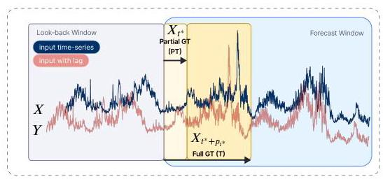

Figure 1. Illustration of the test-time adaptation setup in PETSA. The model observes a look-back window and makes predictions over the forecast window. A partial portion of the ground truth (PT) becomes available shortly after prediction (light yellow), which is used to adapt the model online. Full ground truth (T) may also be observed after the forecast window completes (shaded yellow). PETSA uses both partial and delayed T to update lightweight calibration modules during inference. The $X$ is the time-series input, and $Y$ is the same time-series with a lag, which can be partially used as ground truth. The ${X}_{{t}^{ * }}$ is the input at time ${t}^{ * }$ and the partial batch goes until ${t}^{ * } + {p}_{{t}^{ * }}$ timestep.

图1. PETSA中测试时自适应设置的示意图。模型观察一个回顾窗口并对预测窗口进行预测。预测后不久会有部分地面真值(PT)可用(浅黄色)，用于在线调整模型。预测窗口完成后也可以观察到完整的地面真值(T)(阴影黄色)。PETSA在推理过程中使用部分和延迟的T来更新轻量级校准模块。$X$是时间序列输入，$Y$是具有滞后的相同时间序列，可部分用作地面真值。${X}_{{t}^{ * }}$是时间${t}^{ * }$的输入，部分批次一直到${t}^{ * } + {p}_{{t}^{ * }}$时间步。

Test-Time Adaptation (TTA) has emerged as a promising strategy to mitigate these shifts by updating models during inference (Wang et al., 2020; Kim et al., 2025). However, most TTA methods either rely on access to source data (Wang et al., 2020) or update the entire model (Hu et al., 2022), resulting in high computational overhead. Furthermore, limited information at test time makes reliable adaptation challenging (Kim et al., 2024; Kudrat et al., 2025) In this paper, we introduce Parameter-Efficient Time-Series Adaptation (PETSA) framework (Figure 2), tailored for test-time adaptation of time-series forecasters.

测试时自适应(TTA)已成为一种很有前景的策略，可通过在推理过程中更新模型来减轻这些变化(Wang等人，2020年；Kim等人，2025年)。然而，大多数TTA方法要么依赖于访问源数据(Wang等人，2020年)，要么更新整个模型(Hu等人，2022年)，导致计算开销很高。此外，测试时的信息有限使得可靠的自适应具有挑战性(Kim等人，2024年；Kudrat等人，2025年)。在本文中，我们介绍了参数高效时间序列自适应(PETSA)框架(图2)，该框架专为时间序列预测器的测试时自适应而设计。

## Our main contributions can be summarized as follows.

## 我们的主要贡献可总结如下。

(1) We propose PETSA, a test-time adaptation framework that calibrates input and output features using lightweight low-rank adapters and dynamic gating.

(1) 我们提出了PETSA，这是一个测试时自适应框架，它使用轻量级低秩适配器和动态门控来校准输入和输出特征。

(2) We design a unified PETSA loss combining Huber, frequency, and patch-wise structural terms for robust and structure-aware adaptation.

(2) 我们设计了一种统一的PETSA损失，它结合了Huber、频率和逐块结构项，以实现鲁棒且具有结构感知能力的自适应。

(3) We benchmark PETSA across six datasets and show that it improves multiple forecasters while maintaining high efficiency.

(3) 我们在六个数据集上对PETSA进行了基准测试，并表明它在保持高效率的同时改进了多个预测器。

---

*Work done during an internship at Borealis AI.

*在北欧化工人工智能公司实习期间完成的工作。

${}^{1}$ Borealis AI, Montreal, Canada ${}^{2}$ Dept. of Systems Engineering, ETS Montreal, Canada. Correspondence to: Heitor R. Medeiros <heitor.rapela-medeiros.1@ens.etsmtl.ca>.

${}^{1}$ 北欧化工人工智能公司，加拿大蒙特利尔市 ${}^{2}$ 加拿大蒙特利尔市高等技术学院系统工程系。通信地址:Heitor R. Medeiros <heitor.rapela-medeiros.1@ens.etsmtl.ca>。

Second Workshop on Test-Time Adaptation: Putting Updates to the Test! at ICML 2025, Vancouver, Canada. 2025. Copyright 2025 by the author(s).

第二届测试时自适应研讨会:在2025年于加拿大温哥华举行的ICML 2025会议上进行更新测试！2025年。版权所有©2025作者。

---

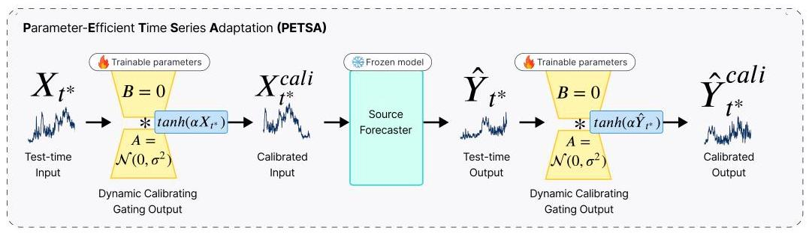

Figure 2. PETSA. At test time, the input ${X}_{t}$ is first passed through a dynamic input calibration module that applies a gated low-rank transformation. The calibrated input ${X}_{t}^{\text{ cali }}$ is then processed by a frozen pre-trained forecaster. Its output ${\widehat{Y}}_{{t}^{ * }}$ is refined by a similar output calibration module to produce the final prediction ${\widehat{Y}}_{{t}^{ * }}^{\text{ cali }}$ . Only the calibration modules are updated during test-time adaptation using the PETSA loss with partially and fully observed ground truth available with a delay. Modules with trainable parameters have a fire icon, while frozen ones have an ice icon.

图2. PETSA。在测试时，输入${X}_{t}$首先通过一个动态输入校准模块，该模块应用门控低秩变换。校准后的输入${X}_{t}^{\text{ cali }}$然后由一个冻结的预训练预测器进行处理。其输出${\widehat{Y}}_{{t}^{ * }}$由一个类似的输出校准模块进行细化，以产生最终预测${\widehat{Y}}_{{t}^{ * }}^{\text{ cali }}$。在测试时自适应过程中，仅使用PETSA损失更新校准模块，此时部分和完全观测的地面真值会延迟可用。具有可训练参数的模块有一个火焰图标，而冻结的模块有一个冰图标。

## 2. Related Works

## 2. 相关工作

Time-Series Forecasting (TSF). Recent TSF models span Transformers, linear projections, and MLP-based forecasters. Transformer-based models like iTransformer (Liu et al., 2024b) and PatchTST (Nie et al., 2023) capture long-range dependencies through self-attention, while linear approaches such as DLinear (Zeng et al., 2023) and OLS (Toner & Darlow, 2024) offer competitive performance with lower complexity. MLP-based methods like FreTS (Yi et al., 2023) and MICN (Wang et al., 2023) balance expressiveness and efficiency using global/local mixing. These models highlight the trade-off between accuracy and computational cost in TSF.

时间序列预测(TSF)。最近的TSF模型包括Transformer、线性投影和基于MLP的预测器。基于Transformer的模型，如iTransformer(Liu等人，2024b)和PatchTST(Nie等人，2023)通过自注意力捕捉长程依赖，而线性方法，如DLinear(Zeng等人，2023)和OLS(Toner & Darlow，2024)以较低的复杂度提供有竞争力的性能。基于MLP的方法，如FreTS(Yi等人，2023)和MICN(Wang等人，2023)使用全局/局部混合平衡表现力和效率。这些模型突出了TSF中准确性和计算成本之间的权衡。

Parameter-Efficient Fine-Tuning (PEFT). PEFT techniques adapt large models using a small number of tunable parameters. Popular strategies include LoRA (Hu et al., 2022), DoRA (Liu et al., 2024a), and visual adapters like VPT (Jia et al., 2022) or AdaptFormer (Chen et al., 2022). While PEFT has seen wide use in vision and NLP, recent efforts extend to TSF (Gupta et al., 2024; Ruan et al., 2024; Nie et al., 2024). However, existing methods mainly focus on fine-tuning and do not address test-time adaptation.

参数高效微调(PEFT)。PEFT技术使用少量可调整参数来适配大型模型。流行的策略包括LoRA(Hu等人，2022)、DoRA(Liu等人，2024a)以及视觉适配器，如VPT(Jia等人，2022)或AdaptFormer(Chen等人，2022)。虽然PEFT在视觉和自然语言处理中已得到广泛应用，但最近的努力已扩展到TSF(Gupta等人，2024；Ruan等人，2024；Nie等人，2024)。然而，现有方法主要集中在微调上，并未解决测试时自适应问题。

Test-Time Adaptation (TTA). TTA enables models to adapt to distribution shifts during inference using unlabeled data (Zhao et al., 2023; Liang et al., 2025). Techniques like TENT (Wang et al., 2020), LAME (Boudiaf et al., 2022), and entropy minimization update model statistics or outputs. In TSF, TAFAS (Kim et al., 2025) introduces a batch-level adaptation scheme using delayed partial labels. PETSA builds on this line by introducing a parameter-efficient, gating-based architecture with specialized losses for robust and structured test-time adaptation.

测试时自适应(TTA)。TTA使模型能够在推理期间使用未标记数据适应分布变化(Zhao等人，2023；Liang等人，2025)。像TENT(Wang等人，2020)、LAME(Boudiaf等人，2022)和熵最小化等技术会更新模型统计信息或输出。在TSF中，TAFAS(Kim等人，2025)引入了一种使用延迟部分标签的批量级自适应方案。PETSA在此基础上，通过引入一种参数高效的、基于门控的架构以及用于稳健和结构化测试时自适应的专门损失来构建。

## 3. Proposed Method

## 3. 提出的方法

### 3.1. Preliminary Definitions

### 3.1. 初步定义

TSF. TSF involves predicting future values of a sequence based on historical observations. Formally, given a historical multivariate time series $X = \left\{  {{x}_{t - L},{x}_{t - L + 1},\ldots ,{x}_{t - 1}}\right\}$ consisting of $L$ consecutive observations, the goal of TSF is to learn a forecasting model ${f}_{\theta }\left( \cdot \right)$ that generates accurate predictions of the next $T$ future steps, denoted as: $Y = \; \left\{  {{x}_{t},{x}_{t + 1},\ldots ,{x}_{t + T - 1}}\right\}   = {f}_{\theta }\left( X\right) .$

TSF。TSF涉及基于历史观测预测序列的未来值。形式上，给定一个由$L$个连续观测组成的历史多变量时间序列$X = \left\{  {{x}_{t - L},{x}_{t - L + 1},\ldots ,{x}_{t - 1}}\right\}$，TSF的目标是学习一个预测模型${f}_{\theta }\left( \cdot \right)$，该模型能生成对接下来$T$个未来步骤的准确预测，表示为:$Y = \; \left\{  {{x}_{t},{x}_{t + 1},\ldots ,{x}_{t + T - 1}}\right\}   = {f}_{\theta }\left( X\right) .$

TTA in TSF. In TSF, TTA mitigates distribution shifts by updating the model using only test inputs. Methods like TAFAS assume that partial ground truth becomes available shortly after prediction, enabling online updates. The adaptation window is defined using the dominant period, estimated via Fast Fourier Transform (FFT). PETSA adopts this setup, using both partial and full labels to update its lightweight gating modules during inference, same as in TAFAS (Kim et al., 2025).

TSF中的TTA。在TSF中，TTA通过仅使用测试输入更新模型来减轻分布变化。像TAFAS这样的方法假设部分地面真值在预测后不久可用，从而实现在线更新。自适应窗口使用通过快速傅里叶变换(FFT)估计的主导周期来定义。PETSA采用这种设置，与TAFAS(Kim等人，2025)一样，在推理期间使用部分和完整标签更新其轻量级门控模块。

### 3.2. PETSA

### 3.2. PETSA

We propose Parameter-Efficient Time-Series Adaptation (PETSA), a lightweight framework, designed to adapt time-series forecasting models at inference without modifying the core model parameters. It introduces input and output calibration modules that leverage low-rank adapters and dynamic gating mechanisms to correct for distribution shifts. Dynamic Calibration Mechanism. At test time, PETSA calibrates both the input and output of a frozen forecaster using lightweight low-rank adapters and dynamic gating, inspired by Dynamic Tanh (DyT) (Zhu et al., 2025) and TAFAS. The calibrated input $\left( {\widehat{X}}_{{t}^{ * }}^{\text{ cali }}\right)$ and calibrated output $\left( {\widehat{Y}}_{{t}^{ * }}^{\text{ cali }}\right)$ are computed as follows:

我们提出了参数高效时间序列自适应(PETSA)，这是一个轻量级框架，旨在在推理时对时间序列预测模型进行自适应调整，而无需修改核心模型参数。它引入了输入和输出校准模块，这些模块利用低秩适配器和动态门控机制来校正分布偏移。动态校准机制。在测试时，PETSA受动态双曲正切(DyT)(Zhu等人，2025年)和TAFAS的启发，使用轻量级低秩适配器和动态门控对冻结预测器的输入和输出进行校准。校准后的输入$\left( {\widehat{X}}_{{t}^{ * }}^{\text{ cali }}\right)$和校准后的输出$\left( {\widehat{Y}}_{{t}^{ * }}^{\text{ cali }}\right)$计算如下:

$$
{\widehat{X}}_{{t}^{ * }}^{\text{ cali }} = {X}_{{t}^{ * }} + \left( {\tanh \left( {\alpha  \odot  {X}_{{t}^{ * }}}\right)  \cdot  W + b}\right)
$$

$$
{\widehat{Y}}_{{t}^{ * }}^{\text{ cali }} = {\widehat{Y}}_{{t}^{ * }} + \left( {\tanh \left( {\alpha  \odot  {\widehat{Y}}_{{t}^{ * }}}\right)  \cdot  W + b}\right) , \tag{1}
$$

Table 1. MSE across datasets and window sizes. The input training sequence length is set to 96 for all baselines. Results for $\mathrm{X}$ - checkpoint, TF - TAFAS, and PETSA - PT. The lower MSE is marked in bold. Additionally, we provided a row-counter (RW), which counts the winner for each row, meaning the best for the window length on the dataset among all models, and a column-counter (CW), with the winner per model, and the total sum of column winners.

表1. 跨数据集和窗口大小的均方误差。所有基线的输入训练序列长度均设置为96。$\mathrm{X}$ - 检查点、TF - TAFAS和PETSA - PT的结果。较低的均方误差以粗体标记。此外，我们提供了一个行计数器(RW)，它计算每行的获胜者，即所有模型中该数据集窗口长度下的最佳模型，以及一个列计数器(CW)，显示每个模型的获胜者以及列获胜者的总和。

<table><tr><td colspan="2" rowspan="3">Models   Wind. ✘</td><td colspan="5">Transformer-based</td><td colspan="6">Linear-based</td><td colspan="6">MLP-based</td><td colspan="2">Counter</td></tr><tr><td colspan="2">iTransformer</td><td colspan="3">PatchTST</td><td colspan="3">DLinear</td><td colspan="3">OLS</td><td colspan="3">FreTS</td><td colspan="3">MICN</td><td colspan="2">RW</td></tr><tr><td>TF</td><td>PT</td><td>✘</td><td>TF</td><td>PT</td><td>✘</td><td>TF</td><td>PT</td><td>✘</td><td>TF</td><td>PT</td><td>✘</td><td>TF</td><td>PT</td><td>✘</td><td>TF</td><td>PT</td><td>TF</td><td>PT</td></tr><tr><td rowspan="5">ETTh1</td><td>96 0.449</td><td>0.435</td><td>0.432</td><td>0.433</td><td>0.426</td><td>0.426</td><td>0.470</td><td>0.462</td><td>0.459</td><td>0.451</td><td>0.442</td><td>0.440</td><td>0.446</td><td>0.440</td><td>0.438</td><td>0.520</td><td>0.493</td><td>0.493</td><td>2</td><td>6</td></tr><tr><td>192 0.510</td><td>0.503</td><td>0.501</td><td>0.491</td><td>0.482</td><td>0.481</td><td>0.521</td><td>0.512</td><td>0.511</td><td>0.505</td><td>0.492</td><td>0.492</td><td>0.502</td><td>0.494</td><td>0.492</td><td>0.591</td><td>0.560</td><td>0.559</td><td>1</td><td>6</td></tr><tr><td>336 0.564</td><td>0.562</td><td>0.561</td><td>0.555</td><td>0.546</td><td>0.543</td><td>0.566</td><td>0.560</td><td>0.555</td><td>0.551</td><td>0.542</td><td>0.538</td><td>0.554</td><td>0.548</td><td>0.547</td><td>0.665</td><td>0.632</td><td>0.643</td><td>1</td><td>5</td></tr><tr><td>720 0.702</td><td>0.663</td><td>0.659</td><td>0.706</td><td>0.680</td><td>0.680</td><td>0.712</td><td>0.682</td><td>0.679</td><td>0.700</td><td>0.666</td><td>0.650</td><td>0.718</td><td>0.687</td><td>0.688</td><td>0.904</td><td>0.792</td><td>0.785</td><td>2</td><td>5</td></tr><tr><td>Avg 0.557</td><td>0.541</td><td>0.538</td><td>0.546</td><td>0.533</td><td>0.532</td><td>0.567</td><td>0.554</td><td>0.551</td><td>0.552</td><td>0.535</td><td>0.530</td><td>0.555</td><td>0.542</td><td>0.541</td><td>0.670</td><td>0.619</td><td>0.620</td><td>1</td><td>5</td></tr><tr><td rowspan="5">ETTm1</td><td>96 0.439</td><td>0.416</td><td>0.413</td><td>0.451</td><td>0.437</td><td>0.436</td><td>0.444</td><td>0.417</td><td>0.414</td><td>0.444</td><td>0.416</td><td>0.415</td><td>0.433</td><td>0.421</td><td>0.416</td><td>0.487</td><td>0.458</td><td>0.456</td><td>0</td><td>6</td></tr><tr><td>192 0.508</td><td>0.476</td><td>0.473</td><td>0.504</td><td>0.486</td><td>0.489</td><td>0.518</td><td>0.480</td><td>0.474</td><td>0.518</td><td>0.479</td><td>0.475</td><td>0.501</td><td>0.482</td><td>0.475</td><td>0.554</td><td>0.511</td><td>0.510</td><td>1</td><td>5</td></tr><tr><td>336 0.613</td><td>0.556</td><td>0.552</td><td>0.558</td><td>0.539</td><td>0.542</td><td>0.593</td><td>0.549</td><td>0.545</td><td>0.593</td><td>0.548</td><td>0.543</td><td>0.570</td><td>0.547</td><td>0.543</td><td>0.612</td><td>0.579</td><td>0.573</td><td>1</td><td>5</td></tr><tr><td>720 0.485</td><td>0.453</td><td>0.450</td><td>0.479</td><td>0.463</td><td>0.465</td><td>0.482</td><td>0.449</td><td>0.446</td><td>0.481</td><td>0.449</td><td>0.446</td><td>0.468</td><td>0.452</td><td>0.448</td><td>0.525</td><td>0.486</td><td>0.484</td><td>1</td><td>5</td></tr><tr><td>Avg 0.257</td><td>0.255</td><td>0.254</td><td>0.236</td><td>0.235</td><td>0.235</td><td>0.232</td><td>0.230</td><td>0.230</td><td>0.231</td><td>0.228</td><td>0.228</td><td>0.239</td><td>0.236</td><td>0.236</td><td>0.256</td><td>0.252</td><td>0.252</td><td>5</td><td>6</td></tr><tr><td rowspan="5">ETTh2</td><td>96 0.344</td><td>0.330</td><td>0.328</td><td>0.317</td><td>0.308</td><td>0.309</td><td>0.325</td><td>0.319</td><td>0.318</td><td>0.326</td><td>0.319</td><td>0.318</td><td>0.332</td><td>0.321</td><td>0.321</td><td>0.359</td><td>0.339</td><td>0.342</td><td>3</td><td>4</td></tr><tr><td>192 0.424</td><td>0.396</td><td>0.397</td><td>0.433</td><td>0.402</td><td>0.402</td><td>0.409</td><td>0.387</td><td>0.385</td><td>0.416</td><td>0.391</td><td>0.388</td><td>0.412</td><td>0.383</td><td>0.383</td><td>0.437</td><td>0.439</td><td>0.434</td><td>3</td><td>5</td></tr><tr><td>336 0.332</td><td>0.320</td><td>0.319</td><td>0.318</td><td>0.305</td><td>0.305</td><td>0.313</td><td>0.305</td><td>0.305</td><td>0.314</td><td>0.305</td><td>0.304</td><td>0.317</td><td>0.306</td><td>0.306</td><td>0.345</td><td>0.334</td><td>0.335</td><td>4</td><td>5</td></tr><tr><td>720 0.168</td><td>0.167</td><td>0.166</td><td>0.160</td><td>0.160</td><td>0.160</td><td>0.160</td><td>0.158</td><td>0.158</td><td>0.160</td><td>0.159</td><td>0.159</td><td>0.158</td><td>0.157</td><td>0.157</td><td>0.175</td><td>0.175</td><td>0.176</td><td>5</td><td>5</td></tr><tr><td>Avg 0.220</td><td>0.217</td><td>0.215</td><td>0.207</td><td>0.204</td><td>0.204</td><td>0.193</td><td>0.191</td><td>0.191</td><td>0.194</td><td>0.192</td><td>0.192</td><td>0.192</td><td>0.191</td><td>0.191</td><td>0.213</td><td>0.209</td><td>0.203</td><td>4</td><td>6</td></tr><tr><td rowspan="5">ETTm2</td><td>96 0.339</td><td>0.330</td><td>0.322</td><td>0.334</td><td>0.327</td><td>0.328</td><td>0.306</td><td>0.297</td><td>0.296</td><td>0.307</td><td>0.298</td><td>0.298</td><td>0.301</td><td>0.292</td><td>0.293</td><td>0.332</td><td>0.322</td><td>0.320</td><td>3</td><td>4</td></tr><tr><td>192 0.250</td><td>0.244</td><td>0.241</td><td>0.237</td><td>0.235</td><td>0.235</td><td>0.223</td><td>0.219</td><td>0.219</td><td>0.223</td><td>0.220</td><td>0.220</td><td>0.221</td><td>0.217</td><td>0.218</td><td>0.243</td><td>0.238</td><td>0.236</td><td>4</td><td>5</td></tr><tr><td>336 0.087</td><td>0.085</td><td>0.086</td><td>0.086</td><td>0.082</td><td>0.083</td><td>0.091</td><td>0.089</td><td>0.088</td><td>0.081</td><td>0.080</td><td>0.078</td><td>0.083</td><td>0.079</td><td>0.079</td><td>0.115</td><td>0.115</td><td>0.109</td><td>3</td><td>4</td></tr><tr><td>720 0.181</td><td>0.174</td><td>0.175</td><td>0.188</td><td>0.174</td><td>0.179</td><td>0.183</td><td>0.176</td><td>0.173</td><td>0.173</td><td>0.164</td><td>0.165</td><td>0.173</td><td>0.164</td><td>0.163</td><td>0.216</td><td>0.198</td><td>0.198</td><td>4</td><td>3</td></tr><tr><td>Avg 0.343</td><td>0.313</td><td>0.335</td><td>0.338</td><td>0.281</td><td>0.332</td><td>0.328</td><td>0.294</td><td>0.292</td><td>0.323</td><td>0.285</td><td>0.281</td><td>0.324</td><td>0.295</td><td>0.298</td><td>0.398</td><td>0.304</td><td>0.280</td><td>3</td><td>3</td></tr><tr><td rowspan="5">Exchange</td><td>96 0.366</td><td>0.345</td><td>0.341</td><td>0.372</td><td>0.353</td><td>0.367</td><td>0.372</td><td>0.359</td><td>0.357</td><td>0.353</td><td>0.294</td><td>0.286</td><td>0.354</td><td>0.335</td><td>0.327</td><td>0.558</td><td>0.307</td><td>0.357</td><td>2</td><td>4</td></tr><tr><td>192 0.173</td><td>0.166</td><td>0.166</td><td>0.173</td><td>0.170</td><td>0.171</td><td>0.195</td><td>0.180</td><td>0.176</td><td>0.196</td><td>0.181</td><td>0.178</td><td>0.186</td><td>0.175</td><td>0.174</td><td>0.176</td><td>0.175</td><td>0.174</td><td>2</td><td>5</td></tr><tr><td>336 0.223</td><td>0.211</td><td>0.212</td><td>0.220</td><td>0.214</td><td>0.216</td><td>0.240</td><td>0.224</td><td>0.223</td><td>0.241</td><td>0.222</td><td>0.223</td><td>0.231</td><td>0.215</td><td>0.218</td><td>0.224</td><td>0.217</td><td>0.220</td><td>5</td><td>1</td></tr><tr><td>720 0.281</td><td>0.261</td><td>0.265</td><td>0.276</td><td>0.265</td><td>0.268</td><td>0.292</td><td>0.271</td><td>0.271</td><td>0.292</td><td>0.271</td><td>0.273</td><td>0.284</td><td>0.264</td><td>0.266</td><td>0.281</td><td>0.269</td><td>0.268</td><td>5</td><td>2</td></tr><tr><td>Avg 0.355</td><td>0.339</td><td>0.341</td><td>0.355</td><td>0.337</td><td>0.336</td><td>0.364</td><td>0.350</td><td>0.345</td><td>0.364</td><td>0.344</td><td>0.346</td><td>0.360</td><td>0.340</td><td>0.344</td><td>0.353</td><td>0.347</td><td>0.345</td><td>3</td><td>3</td></tr><tr><td rowspan="5">Weather</td><td>96 0.173</td><td>0.166</td><td>0.166</td><td>0.173</td><td>0.170</td><td>0.171</td><td>0.195</td><td>0.180</td><td>0.176</td><td>0.196</td><td>0.181</td><td>0.178</td><td>0.186</td><td>0.175</td><td>0.174</td><td>0.176</td><td>0.175</td><td>0.174</td><td>2</td><td>5</td></tr><tr><td>192 0.223</td><td>0.211</td><td>0.212</td><td>0.220</td><td>0.214</td><td>0.216</td><td>0.240</td><td>0.224</td><td>0.223</td><td>0.241</td><td>0.222</td><td>0.223</td><td>0.231</td><td>0.215</td><td>0.218</td><td>0.224</td><td>0.217</td><td>0.220</td><td>5</td><td>1</td></tr><tr><td>336 0.281</td><td>0.261</td><td>0.265</td><td>0.276</td><td>0.265</td><td>0.268</td><td>0.292</td><td>0.271</td><td>0.271</td><td>0.292</td><td>0.271</td><td>0.273</td><td>0.284</td><td>0.264</td><td>0.266</td><td>0.281</td><td>0.269</td><td>0.268</td><td>5</td><td>2</td></tr><tr><td>720 0.355</td><td>0.339</td><td>0.341</td><td>0.355</td><td>0.337</td><td>0.336</td><td>0.364</td><td>0.350</td><td>0.345</td><td>0.364</td><td>0.344</td><td>0.346</td><td>0.360</td><td>0.340</td><td>0.344</td><td>0.353</td><td>0.347</td><td>0.345</td><td>3</td><td>3</td></tr><tr><td>Avg 0.258</td><td>0.244</td><td>0.246</td><td>0.256</td><td>0.247</td><td>0.248</td><td>0.273</td><td>0.256</td><td>0.254</td><td>0.273</td><td>0.255</td><td>0.255</td><td>0.265</td><td>0.248</td><td>0.251</td><td>0.258</td><td>0.252</td><td>0.252</td><td>5</td><td>3</td></tr><tr><td rowspan="2">Counter</td><td>✘</td><td>TF</td><td>PT</td><td>✘</td><td>TF</td><td>PT</td><td>✘</td><td>TF</td><td>PT</td><td>✘</td><td>TF</td><td>PT</td><td>✘</td><td>TF</td><td>PT</td><td>✘</td><td>TF</td><td>PT</td><td></td><td></td></tr><tr><td>CW</td><td>13</td><td>19</td><td></td><td>24</td><td>14</td><td></td><td>7</td><td>30</td><td></td><td>14</td><td>23</td><td></td><td>18</td><td>19</td><td></td><td>12</td><td>22</td><td></td><td></td></tr><tr><td>Sum Col.</td><td>TF: 88</td><td>PT: 127</td><td></td><td></td><td></td><td></td><td></td><td></td><td></td><td></td><td></td><td></td><td></td><td></td><td></td><td></td><td></td><td></td><td></td><td></td></tr></table>

where ${X}_{{t}^{ * }} \in  {\mathbb{R}}^{B \times  L \times  V}$ and ${\widehat{Y}}_{{t}^{ * }} \in  {\mathbb{R}}^{B \times  L \times  V}$ are the test-time input and output respectively, $\alpha  \in  {\mathbb{R}}^{V}$ is a learnable gating parameter per variable (we control the initialization with a hyperparameter), applied element-wise, $W = A \cdot  B$ , with $A \in  {\mathbb{R}}^{L \times  r}, B \in  {\mathbb{R}}^{r \times  L \times  V}$ forming the low-rank weight tensor, $b \in  {\mathbb{R}}^{L \times  V}$ is a learnable bias term ( $A$ is initialized with Xavier Norm. and $B$ with zeros). This enables PETSA to efficiently calibrate time-series representations by updating only a small number of parameters at test time.

其中${X}_{{t}^{ * }} \in  {\mathbb{R}}^{B \times  L \times  V}$和${\widehat{Y}}_{{t}^{ * }} \in  {\mathbb{R}}^{B \times  L \times  V}$分别是测试时的输入和输出，$\alpha  \in  {\mathbb{R}}^{V}$是每个变量的可学习门控参数(我们用一个超参数控制其初始化)，按元素应用，$W = A \cdot  B$，其中$A \in  {\mathbb{R}}^{L \times  r}, B \in  {\mathbb{R}}^{r \times  L \times  V}$形成低秩权重张量，$b \in  {\mathbb{R}}^{L \times  V}$是可学习偏差项($A$用Xavier Norm初始化，$B$用零初始化)。这使得PETSA能够通过在测试时仅更新少量参数来有效地校准时间序列表示。

PETSA Optimization. PETSA uses a combination of different losses, while TAFAS only uses MSE loss. Our PETSA loss combines total and partial losses $\left( {{\mathcal{L}}_{PETSA} = }\right. \; \left. {{\mathcal{L}}_{T} + {\mathcal{L}}_{pt}}\right)$ , where ${\mathcal{L}}_{T}$ is computed using delayed full ground-truth labels and ${\mathcal{L}}_{pt}$ uses partially observed labels (Kim et al., 2025). Each loss term incorporates three components: (1) a Huber loss $\left( {\mathcal{L}}_{\text{ Hub }}\right)$ (Huber,1992) for robustness to outliers (Shabani et al., 2022), described as follows:

PETSA优化。PETSA使用不同损失的组合，而TAFAS仅使用均方误差损失。我们的PETSA损失结合了总损失和部分损失$\left( {{\mathcal{L}}_{PETSA} = }\right. \; \left. {{\mathcal{L}}_{T} + {\mathcal{L}}_{pt}}\right)$，其中${\mathcal{L}}_{T}$使用延迟的完整真实标签计算，${\mathcal{L}}_{pt}$使用部分观察到的标签(Kim等人，2025年)。每个损失项包含三个部分:(1)一个Huber损失$\left( {\mathcal{L}}_{\text{ Hub }}\right)$(Huber，1992年)，用于增强对异常值的鲁棒性(Shabani等人，2022年)，描述如下:

$$
{\mathcal{L}}_{\text{ Hub }} = \left\{  \begin{array}{l} {0.5}{\left( {\widehat{Y}}_{{t}^{ * }}^{\text{ cali }} - {Y}_{{t}^{ * }}\right) }^{2},\text{ if }\left| {{\widehat{Y}}_{{t}^{ * }}^{\text{ cali }} - {Y}_{{t}^{ * }}}\right|  < \delta \\  \delta  \cdot  \left( {\left| {{\widehat{Y}}_{{t}^{ * }}^{\text{ cali }} - {Y}_{{t}^{ * }}}\right|  - {0.5} \cdot  \delta }\right) ,\text{ otherwise. } \end{array}\right. \tag{2}
$$

where $\delta$ is a hyperparameter to control the sensitivity to outliers and smoothness of the predictions (in this work, $\delta$ is fixed at 0.5 ),(2) a frequency-domain loss $\left( {\mathcal{L}}_{\text{ freq }}\right)$ that aligns the FFT spectra of predictions and ground truth to preserve periodic patterns, while reducing estimation bias, as described in FreDF (Wang et al., 2025), described as follows:

其中$\delta$是一个超参数，用于控制对异常值的敏感度和预测的平滑度(在本工作中，$\delta$固定为0.5)，(2)一个频域损失$\left( {\mathcal{L}}_{\text{ freq }}\right)$，它对齐预测和真实值的快速傅里叶变换频谱以保留周期性模式，同时减少估计偏差，如FreDF(Wang等人，2025年)中所述，描述如下:

$$
{\mathcal{L}}_{\text{ freq }} = {\begin{Vmatrix}\mathcal{F}\left( {\widehat{Y}}_{{t}^{ * }}^{\text{ cali }}\right)  - \mathcal{F}\left( {Y}_{{t}^{ * }}\right) \end{Vmatrix}}_{1}, \tag{3}
$$

where $\mathcal{F}\left( \text{ . }\right)  = {FFT}$ , and (3) a patch-wise structural loss $\left( {\mathcal{L}}_{\mathrm{{pw}}}\right)$ that captures local correlations, means, and variances to enhance structural alignment (Kudrat et al., 2025), described as follows:

其中$\mathcal{F}\left( \text{ . }\right)  = {FFT}$，以及(3)一个逐块结构损失$\left( {\mathcal{L}}_{\mathrm{{pw}}}\right)$，它捕获局部相关性、均值和方差以增强结构对齐(Kudrat等人，2025年)，描述如下:

$$
{\mathcal{L}}_{pw} = \mathop{\sum }\limits_{{k \in  \{ \text{ corr, mean, var }\} }}{\mathcal{L}}_{k}\left( {{\widehat{Y}}_{{t}^{ * }}^{\text{ cali }},{Y}_{{t}^{ * }}}\right) . \tag{4}
$$

Finally, the partial (PT) and delayed GT (T) loss are described as follows:

最后，部分(PT)和延迟真实值(T)损失描述如下:

$$
{\mathcal{L}}_{pt} = {\mathcal{L}}_{{Hu}{b}_{pt}} + {\mathcal{L}}_{p{w}_{pt}} + \beta {\mathcal{L}}_{{fre}{q}_{pt}} \tag{5}
$$

$$
{\mathcal{L}}_{T} = {\mathcal{L}}_{{Hu}{b}_{T}} + {\mathcal{L}}_{p{w}_{T}} + \beta {\mathcal{L}}_{{fre}{q}_{T}}. \tag{6}
$$

To the best of our knowledge, this is the first work to do parameter-efficient TTA for TSF. By updating only a small set of calibration parameters at test time, PETSA enables fast, stable, and memory-efficient adaptation across a wide range of forecasting models and datasets.

据我们所知，这是第一项针对时间序列预测进行参数高效测试时增强(TTA)的工作。通过在测试时仅更新一小部分校准参数，PETSA能够在广泛的预测模型和数据集上实现快速、稳定且内存高效的自适应调整。

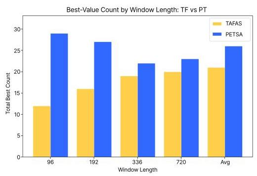

Figure 3. Total number of best-value wins grouped by window length for TAFAS and PETSA approaches. PETSA consistently outperforms TAFAS across all horizons.

图3. TAFAS和PETSA方法按窗口长度分组的最佳值获胜总数。在所有预测范围内，PETSA始终优于TAFAS。

## 4. Experiments

## 4. 实验

### 4.1. Experimental Protocol

### 4.1. 实验方案

(a) Datasets: We demonstrate the effectiveness of our method, PETSA, using widely used multivariate TSF benchmark datasets: ETTh1, ETTm1, ETTh2, ETTm2, Exchange, and Weather (Wu et al., 2021; Zhou et al., 2021).

(a) 数据集:我们使用广泛使用的多变量时间序列预测(TSF)基准数据集:ETTh1、ETTm1、ETTh2、ETTm2、Exchange和Weather(Wu等人，2021；Zhou等人，2021)来证明我们的方法PETSA的有效性。

(b) Implementation Details: Our framework is built on top of TAFAS (Kim et al., 2025). We used PyTorch for PETSA implementation, and training/adapt the models using one NVIDIA A100.

(b) 实现细节:我们的框架基于TAFAS构建(Kim等人，2025)。我们使用PyTorch实现PETSA，并使用一块NVIDIA A100训练/适配模型。

(c) Baselines: We evaluate our proposed method against a diverse set of baseline models, grouped into three main categories: (1) Transformer-based approaches, including iTrans-former (Liu et al., 2024b), PatchTST (Nie et al., 2023); (2) Linear-based models, comprising DLinear (Zeng et al., 2023), OLS (Toner & Darlow, 2024), and (3) MLP-based influential architectures, such as FreTS (Yi et al., 2023), MICN (Wang et al., 2023). Additionally, we provide the methods without and with adaptation using TAFAS (Kim et al., 2025) and PETSA. We provide additional details in the Appendix.

(c) 基线:我们将我们提出的方法与各种基线模型进行评估，这些基线模型分为三大类:(1) 基于Transformer的方法，包括iTransformer(Liu等人，2024b)、PatchTST(Nie等人，2023)；(2) 基于线性的模型，包括DLinear(Zeng等人，2023)、OLS(Toner & Darlow，2024)，以及(3) 基于MLP的有影响力的架构，如FreTS(Yi等人，2023)、MICN(Wang等人，2023)。此外，我们提供了不使用TAFAS(Kim等人，2025)和PETSA进行适配以及使用它们进行适配的方法。我们在附录中提供了更多细节。

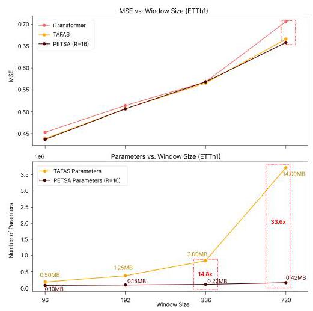

Figure 4. Comparison of PETSA and TAFAS on ETTh1 for iTransformer. Top: MSE across different window sizes with no adaptation, TAFAS, and PETSA. Bottom: Number of trainable parameters used for adaptation. PETSA achieves similar or better accuracy while using up to $\mathbf{{33}.6} \times$ fewer parameters at window size 720. Memory usage is annotated in MB.

图4. 在ETTh1数据集上，PETSA和TAFAS对于iTransformer的比较。顶部:不同窗口大小下未适配、TAFAS和PETSA的均方误差(MSE)。底部:用于适配的可训练参数数量。在窗口大小为720时，PETSA在达到相似或更好精度的同时，使用的参数比TAFAS少$\mathbf{{33}.6} \times$个。内存使用情况以MB标注。

### 4.2. Results

### 4.2. 结果

In Table 1, across all datasets and model categories, PETSA achieves the highest number of best-MSE scores (127 wins), outperforming TAFAS (88 wins). Its consistent advantage across transformer-, linear-, and MLP-based architectures demonstrates strong adaptability, where all PETSA models had fewer parameters than TAFAS. Figure 3 shows that PETSA achieves more best-value scores than TAFAS across different window lengths. Even as the forecast window increases, PETSA maintains a strong lead, demonstrating robustness to longer-term uncertainty. In Figure 4, PETSA achieves consistently lower MSE across all window sizes, and for window size 720, it has ${33} \times$ fewer parameters than TAFAS, highlighting its efficiency due to the low-rank adaptation with dynamic gating, which is input conditioned and more robust to outliers in long-range forecasting as a result of its loss optimization.

在表1中，在所有数据集和模型类别中，PETSA获得了最高数量的最佳均方误差(MSE)分数(127次获胜)，优于TAFAS(88次获胜)。它在基于Transformer、线性和MLP的架构中始终具有优势，表明其具有很强的适应性，所有PETSA模型的参数都比TAFAS少。图3显示，在不同窗口长度下，PETSA获得的最佳值分数比TAFAS更多。即使预测窗口增加，PETSA仍保持强大领先优势，表明其对长期不确定性具有鲁棒性。在图4中，PETSA在所有窗口大小下的均方误差始终较低，并且在窗口大小为720时，其参数比TAFAS少${33} \times$个，突出了其通过动态门控的低秩适配实现的效率，这种适配是输入条件化的，并且由于其损失优化，在长期预测中对异常值更具鲁棒性。

## 5. Conclusion

## 5. 结论

In this work, we introduced PETSA, a lightweight, parameter-efficient test-time adaptation framework for time-series forecasting that dynamically corrects both inputs and outputs via gated calibration modules. PETSA test-time calibration loss combines a robust component, a frequency-domain term to preserve dominant periodic patterns, and a patch-wise structural term to enforce structural alignment, which are essential to adapt the forecaster during test-time. Across diverse benchmarks, PETSA consistently improves forecasting performance while updating fewer parameters against baselines.

在这项工作中，我们介绍了PETSA，这是一种用于时间序列预测的轻量级、参数高效的测试时适配框架，它通过门控校准模块动态校正输入和输出。PETSA的测试时校准损失结合了一个鲁棒分量、一个用于保留主导周期模式的频域项和一个用于强制结构对齐的逐补丁结构项，这些对于在测试时适配预测器至关重要。在各种基准测试中，PETSA在更新比基线更少参数的情况下，始终提高预测性能。

## References

## 参考文献

Boudiaf, M., Mueller, R., Ben Ayed, I., and Bertinetto, L. Parameter-free online test-time adaptation. In Proceedings of the IEEE/CVF Conference on Computer Vision

Boudiaf, M., Mueller, R., Ben Ayed, I., and Bertinetto, L. 无参数在线测试时适配。在IEEE/CVF计算机视觉会议论文集and Pattern Recognition, pp. 8344-8353, 2022.

Chen, S., Ge, C., Tong, Z., Wang, J., Song, Y., Wang, J., and Luo, P. Adaptformer: Adapting vision transformers for scalable visual recognition. Advances in Neural

Chen, S., Ge, C., Tong, Z., Wang, J., Song, Y., Wang, J., and Luo, P. Adaptformer:为可扩展视觉识别适配视觉Transformer。神经科学进展Information Processing Systems, 35:16664-16678, 2022.

Gupta, D., Bhatti, A., Parmar, S., Dan, C., Liu, Y., Shen, B., and Lee, S. Low-rank adaptation of time series foundational models for out-of-domain modality forecasting. In Proceedings of the 26th International Conference on

Gupta, D., Bhatti, A., Parmar, S., Dan, C., Liu, Y., Shen, B., and Lee, S. 用于域外模态预测的时间序列基础模型的低秩适配。在第26届国际会议论文集Multimodal Interaction, pp. 382-386, 2024.

Hu, E. J., Shen, Y., Wallis, P., Allen-Zhu, Z., Li, Y., Wang, S., Wang, L., Chen, W., et al. Lora: Low-rank adaptation

Hu, E. J., Shen, Y., Wallis, P., Allen-Zhu, Z., Li, Y., Wang, S., Wang, L., Chen, W., et al. LoRA:低秩适配of large language models. ICLR, 1(2):3, 2022.

Huber, P. J. Robust estimation of a location parameter. In Breakthroughs in statistics: Methodology and distribu-

休伯，P. J. 位置参数的稳健估计。载于《统计学突破:方法与分布》
tion, pp. 492-518. Springer, 1992.

Jia, M., Tang, L., Chen, B.-C., Cardie, C., Belongie, S., Hariharan, B., and Lim, S.-N. Visual prompt tuning. In European conference on computer vision, pp. 709-727. Springer, 2022.

贾，M.，唐，L.，陈，B.-C.，卡迪，C.，贝隆吉，S.，哈里哈兰，B.，和林，S.-N. 视觉提示调整。载于《欧洲计算机视觉会议》，第709 - 727页。施普林格出版社，2022年。

Kim, D., Park, S., and Choo, J. When model meets new normals: test-time adaptation for unsupervised time-series anomaly detection. In Proceedings of the AAAI conference on artificial intelligence, volume 38, pp. 13113- 13121, 2024.

金，D.，朴，S.，和朱，J. 当模型遇到新的正态分布:无监督时间序列异常检测的测试时适应。载于《AAAI人工智能会议论文集》，第38卷，第13113 - 13121页，2024年。

Kim, H., Kim, S., Mok, J., and Yoon, S. Battling the non-stationarity in time series forecasting via test-time

金，H.，金，S.，莫克，J.，和尹，S. 通过测试时对抗时间序列预测中的非平稳性
adaptation. arXiv preprint arXiv:2501.04970, 2025.

Kudrat, D., Xie, Z., Sun, Y., Jia, T., and Hu, Q. Patch-wise structural loss for time series forecasting. arXiv preprint

库德拉特，D.，谢，Z.，孙，Y.，贾，T.，和胡，Q. 时间序列预测的逐块结构损失。arXiv预印本
arXiv:2503.00877, 2025.

Liang, J., He, R., and Tan, T. A comprehensive survey on test-time adaptation under distribution shifts. Interna-

梁，J.，何，R.，和谭，T. 分布偏移下测试时适应的全面综述。国际
tional Journal of Computer Vision, 133(1):31-64, 2025.

Liu, S.-Y., Wang, C.-Y., Yin, H., Molchanov, P., Wang, Y.-C. F., Cheng, K.-T., and Chen, M.-H. Dora: Weight-decomposed low-rank adaptation. In Forty-first International Conference on Machine Learning, 2024a.

刘，S.-Y.，王，C.-Y.，尹，H.，莫尔恰诺夫，P.，王，Y.-C. F.，程，K.-T.，和陈，M.-H. 多拉:权重分解低秩适应。载于《第四十一届国际机器学习会议》，2024年a。

Liu, Y., Hu, T., Zhang, H., Wu, H., Wang, S., Ma, L., and Long, M. itransformer: Inverted transformers are effective for time series forecasting. In The Twelfth International Conference on Learning Representations, 2024b.

刘，Y.，胡，T.，张，H.，吴，H.，王，S.，马，L.，和龙，M. itransformer:倒置变压器对时间序列预测有效。载于《第十二届国际学习表征会议》，2024年b。

Nie, T., Mei, Y., Qin, G., Sun, J., and Ma, W. Channel-aware low-rank adaptation in time series forecasting. In Proceedings of the 33rd ACM International Conference on Information and Knowledge Management, pp. 3959- 3963, 2024.

聂，T.梅，Y.，秦，G.,孙，J.，和马，W. 时间序列预测中的通道感知低秩适应。载于《第33届ACM国际信息与知识管理会议论文集》，第3959 - 3963页，2024年。

Nie, Y., Nguyen, N. H., Sinthong, P., and Kalagnanam, J. A time series is worth 64 words: Long-term forecasting with transformers. In The Eleventh International Conference on Learning Representations, 2023.

聂，Y.，阮，N. H.，辛通，P.，和卡拉格纳南姆，J. 一个时间序列值64个词:用变压器进行长期预测。载于《第十一届国际学习表征会议》，2023年。

Ruan, W., Chen, W., Dang, X., Zhou, J., Li, W., Liu, X., and Liang, Y. Low-rank adaptation for spatio-temporal

阮，W.，陈，W.，党，X.，周，J.，李，W.，刘，X.，和梁，Y. 时空的低秩适应
forecasting. arXiv preprint arXiv:2404.07919, 2024.

Shabani, A., Abdi, A., Meng, L., and Sylvain, T. Scale-former: Iterative multi-scale refining transformers for

沙巴尼，A.，阿卜迪，A.，孟，L.，和西尔万，T. 尺度变压器:用于迭代多尺度精炼变压器
time series forecasting. arXiv preprint arXiv:2206.04038,2022.

Toner, W. and Darlow, L. N. An analysis of linear time series forecasting models. In International Conference

托纳，W. 和达洛，L. N. 线性时间序列预测模型的分析。载于《国际会议》
on Machine Learning, pp. 48404-48427. PMLR, 2024.

Wang, D., Shelhamer, E., Liu, S., Olshausen, B., and Darrell, T. Tent: Fully test-time adaptation by entropy minimiza-

王，D.，谢尔哈默，E.，刘，S.，奥尔绍森，B.，和达雷尔，T. 帐篷:通过熵最小化进行完全测试时适应
tion. arXiv preprint arXiv:2006.10726, 2020.

Wang, H., Peng, J., Huang, F., Wang, J., Chen, J., and Xiao, Y. Micn: Multi-scale local and global context modeling for long-term series forecasting. In The eleventh interna-

王，H.，彭，J.，黄，F.，王，J.，陈，J.，和肖，Y. Micn:用于长期序列预测的多尺度局部和全局上下文建模。载于《第十一届国际》
tional conference on learning representations, 2023.

Wang, H., Pan, L., Chen, Z., Yang, D., Zhang, S., Yang, Y., Liu, X., Li, H., and Tao, D. Fredf: Learning to forecast in the frequency domain. In ICLR, 2025.

王，H.，潘，L.，陈，Z.，杨，D.，张，S.，杨，Y.，刘，X.，李，H.，和陶，D. Fredf:在频域中学习预测。载于《ICLR》，2025年。

Wu, H., Xu, J., Wang, J., and Long, M. Autoformer: Decomposition transformers with auto-correlation for long-term series forecasting. Advances in neural information pro-

吴，H.，徐，J.，王，J.，和龙，M. Autoformer:具有自相关的分解变压器用于长期序列预测。神经信息处理进展 -cessing systems, 34:22419-22430, 2021.

Yi, K., Zhang, Q., Fan, W., Wang, S., Wang, P., He, H., An, N., Lian, D., Cao, L., and Niu, Z. Frequency-domain mlps are more effective learners in time series forecasting. Advances in Neural Information Processing Systems, 36: 76656-76679, 2023.

易，K.，张，Q.，范，W.，王，S.，王，P.，何，H.，安，N.，连，D.，曹，L.，和牛，Z. 频域多层感知器在时间序列预测中是更有效的学习者。神经信息处理系统进展，36:76656 - 76679，2023。

Zeng, A., Chen, M., Zhang, L., and Xu, Q. Are transformers effective for time series forecasting? In Proceedings of the AAAI conference on artificial intelligence, volume 37, pp. 11121-11128, 2023.

曾，A.，陈，M.，张，L.，和徐，Q. 变压器对时间序列预测有效吗？在人工智能AAAI会议论文集，第37卷，第11121 - 11128页，2023。

Zhao, H., Liu, Y., Alahi, A., and Lin, T. On pitfalls of test-time adaptation. In Proceedings of the 40th International Conference on Machine Learning, pp. 42058- 42080, 2023.

赵，H.，刘，Y.，阿拉希，A.，和林，T. 关于测试时适应的陷阱。在第40届国际机器学习会议论文集，第42058 - 42080页，2023。

Zhou, H., Zhang, S., Peng, J., Zhang, S., Li, J., Xiong, H., and Zhang, W. Informer: Beyond efficient transformer for long sequence time-series forecasting. In Proceedings of the AAAI conference on artificial intelligence, volume 35, pp. 11106-11115, 2021.

周，H.，张，S.，彭，J.，张，S.，李，J.，熊，H.，和张，W. Informer:超越用于长序列时间序列预测的高效变压器。在人工智能AAAI会议论文集，第35卷，第11106 - 11115页，2021。

Zhu, J., Chen, X., He, K., LeCun, Y., and Liu, Z. Transformers without normalization. arXiv preprint

朱，J.，陈，X.，何，K.，勒昆，Y.，和刘，Z. 无归一化的变压器。arXiv预印本arXiv:2503.10622, 2025.

## Appendix

## 附录

Here we provide additional information and results for our paper.

在此我们为我们的论文提供额外的信息和结果。

## Reproducing the results

## 重现结果

Our codebase is built on top of TAFAS (Kim et al., 2025), where we followed their experimental setup and hyperpa-rameters for generating the baseline checkpoint models and adapted models. Additionally, for our method, we have hyperparameters to control the frequency loss, the number of low-rank parameters, and the gating initialization, where we provide additional ablations in the next session.

我们的代码库基于TAFAS(Kim等人，2025)构建，我们遵循他们的实验设置和超参数来生成基线检查点模型和适应模型。此外，对于我们的方法，我们有超参数来控制频率损失、低秩参数的数量和门控初始化，我们将在下一节提供额外的消融实验。

## Additional results on Parameter-Efficiency

## 参数效率的额外结果

In Figure 5, PETSA and TAFAS show very similar MSE results across all window sizes on the ETTh1 dataset using the OLS model. Both methods follow the same trend, with PETSA slightly outperforming TAFAS at larger windows. In terms of parameters, PETSA remains highly efficient, using only 0.21 MB at window size 720, while TAFAS requires 3.70 MB. Across all window sizes, PETSA keeps memory usage consistently low while achieving comparable or better performance, highlighting its parameter efficiency.

在图5中，PETSA和TAFAS在ETTh1数据集上使用OLS模型在所有窗口大小下显示出非常相似的均方误差结果。两种方法遵循相同的趋势，在较大窗口时PETSA略优于TAFAS。在参数方面，PETSA仍然非常高效，在窗口大小为720时仅使用0.21MB，而TAFAS需要3.70MB。在所有窗口大小下，PETSA在实现可比或更好性能的同时保持内存使用始终较低，突出了其参数效率。

In Figure 6, PETSA achieves similar MSE to TAFAS across all window sizes on ETTm1 with OLS, with slightly better results at short horizons. For a window of 720, we kept the memory low at 0.11MB, while TAFAS required 3.70. As this dataset is easier than the other one, we had a good trade-off between performance and memory.

在图6中，PETSA在ETTm1上使用OLS在所有窗口大小下与TAFAS实现了相似的均方误差，在短时间范围内结果略好。对于720的窗口，我们将内存保持在较低的0.11MB，而TAFAS需要3.70MB。由于这个数据集比另一个更容易，我们在性能和内存之间进行了良好的权衡。

We had similar trends for Figures 7 and Figures 8, we are comparable with TAFAS in terms of MSE, and the memory is also lower. However, we can see that ETTh1/ETTh2 requires a bit more memory than ETTm1/ETTm2 to achieve competitive results. This trade-off happens due to the fact that ETTh1/ETTh2 datasets are more challenging than ETTm1/ETTm2; thus, more memory is required to remain performing well in terms of MSE and still being parameter efficient compared to TAFAS.

我们在图7和图8中有类似的趋势，我们在均方误差方面与TAFAS相当，并且内存也更低。然而，我们可以看到ETTh1/ETTh2比ETTm1/ETTm2需要更多一点内存才能获得有竞争力的结果。这种权衡是由于ETTh1/ETTh2数据集比ETTm1/ETTm2更具挑战性；因此，需要更多内存才能在均方误差方面保持良好性能并且与TAFAS相比仍然具有参数效率。

In Figure 9, PETSA and TAFAS show similar MSE trends across window sizes, with both methods degrading as the horizon increases. However, PETSA requires over $4 \times$ less memory than TAFAS at window size 720, making it a much more efficient alternative. Finally, in Figure 10, despite similar performance, PETSA significantly reduces the adaptation cost, using less than half of the memory compared to TAFAS at window size 720.

在图9中，PETSA和TAFAS在窗口大小上显示出相似的均方误差趋势，两种方法都随着预测范围的增加而下降。然而，在窗口大小为720时，PETSA比TAFAS所需内存少超过$4 \times$，使其成为更高效的选择。最后，在图10中，尽管性能相似，PETSA显著降低了适应成本，在窗口大小为720时使用的内存不到TAFAS的一半。

## Ablation on Low-Rank (R) parameter

## 低秩(R)参数的消融实验

In this ablation, Figure 11, we conduct a study about the low-rank hyperparameter, which directly impacts the number of additional trainable parameters for the dynamic gating mechanism.

在本次消融实验(图11)中，我们对低秩超参数进行了研究，该超参数直接影响动态门控机制中额外可训练参数的数量。

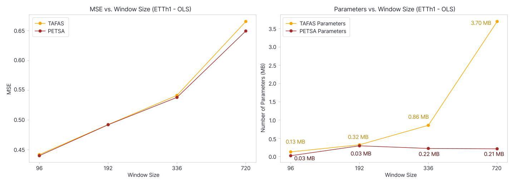

Figure 5. Comparison of PETSA and TAFAS on ETTh1 for OLS. Left: MSE across different window sizes with TAFAS, and PETSA. Right: Number of trainable parameters used for adaptation. Memory usage is annotated in MB.

图5. PETSA和TAFAS在ETTh1数据集上针对OLS的比较。左图:TAFAS和PETSA在不同窗口大小下的均方误差(MSE)。右图:用于自适应的可训练参数数量。内存使用情况以MB标注。

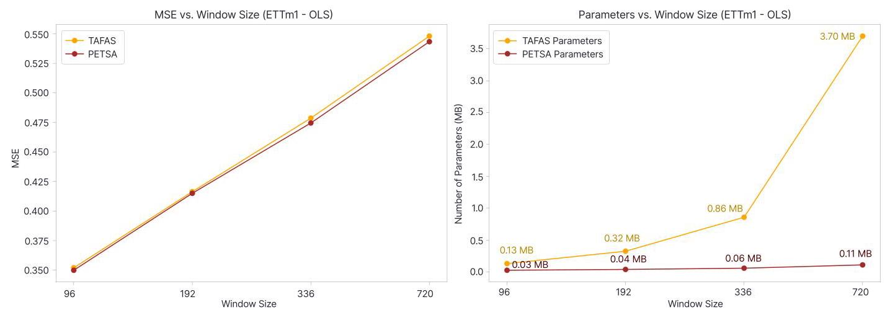

Figure 6. Comparison of PETSA and TAFAS on ETTm1 for OLS. Left: MSE across different window sizes with TAFAS, and PETSA. Right: Number of trainable parameters used for adaptation. Memory usage is annotated in MB.

图6. PETSA和TAFAS在ETTm1数据集上针对OLS的比较。左图:TAFAS和PETSA在不同窗口大小下的均方误差(MSE)。右图:用于自适应的可训练参数数量。内存使用情况以MB标注。

## Ablation on Dynamic Gating parameter

## 动态门控参数的消融实验

In this ablation, Figure 12, we study the initial value for the dynamic gating. This hyperparameter impacts the weights of the low-rank adaptation, providing a learnable way conditioned on the input to adjust its values; higher values make the weights positive due to the tanh; otherwise, lower values make the adapted weight negative, decreasing the value of the final calibrated input.

在本次消融实验(图12)中，我们研究了动态门控的初始值。这个超参数会影响低秩自适应的权重，提供一种基于输入来调整其值的可学习方式；较高的值会使权重因双曲正切函数(tanh)而变为正值；否则，较低的值会使自适应权重变为负值，从而降低最终校准输入的值。

## Ablation on Loss Components

## 损失组件的消融实验

In this ablation, we study the impact of the loss components for PETSA during TTA. In Figure 13, we see that the MSE loss is not sufficient for reaching the best performance values in terms of test MSE, similar to what occurs with only Huber loss. However, the total loss got the best results for ETTh1 OLS with $\beta$ equal to 0.0, which means that the frequency component harmed the performance for this dataset, and $\beta  = {0.0}$ means that only the Huber loss and structural patch components are being used. Depending on the model, the frequency loss helps the performance; for instance, the best performance for the FreTS model was when the $\beta$ was equal to 0.1 (for the majority of the datasets and windows). For some datasets, a higher value can be the best result, so we recommend hyperparameter tuning for optimal performance.

在本次消融实验中，我们研究了PETSA在测试时间增强(TTA)期间损失组件的影响。在图13中，我们看到均方误差(MSE)损失不足以在测试均方误差方面达到最佳性能值，这与仅使用Huber损失时的情况类似。然而，对于ETTh1数据集的OLS，当$\beta$等于0.0时，总损失取得了最佳结果，这意味着频率分量对该数据集的性能有损害，而$\beta  = {0.0}$表示仅使用了Huber损失和结构补丁组件。根据模型的不同，频率损失可能有助于提高性能；例如，对于FreTS模型，当$\beta$等于0.1时(对于大多数数据集和窗口)取得了最佳性能。对于某些数据集，较高的值可能是最佳结果，因此我们建议进行超参数调整以获得最佳性能。

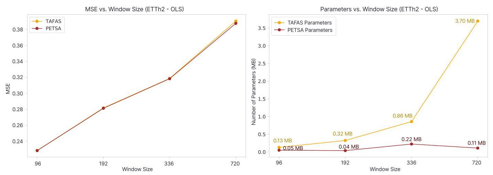

Figure 7. Comparison of PETSA and TAFAS on ETTh2 for OLS. Left: MSE across different window sizes with TAFAS, and PETSA. Right: Number of trainable parameters used for adaptation. Memory usage is annotated in MB.

图7. PETSA和TAFAS在ETTh2数据集上针对OLS的比较。左图:TAFAS和PETSA在不同窗口大小下的均方误差(MSE)。右图:用于自适应的可训练参数数量。内存使用情况以MB标注。

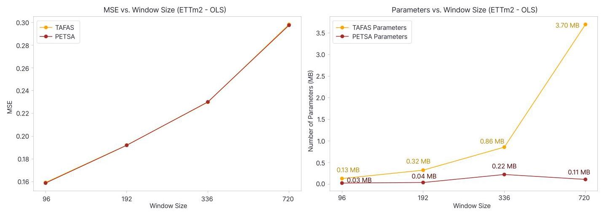

Figure 8. Comparison of PETSA and TAFAS on ETTm2 for OLS. Left: MSE across different window sizes with TAFAS, and PETSA. Right: Number of trainable parameters used for adaptation. Memory usage is annotated in MB.

图8. PETSA和TAFAS在ETTm2数据集上针对OLS的比较。左图:TAFAS和PETSA在不同窗口大小下的均方误差(MSE)。右图:用于自适应的可训练参数数量。内存使用情况以MB标注。

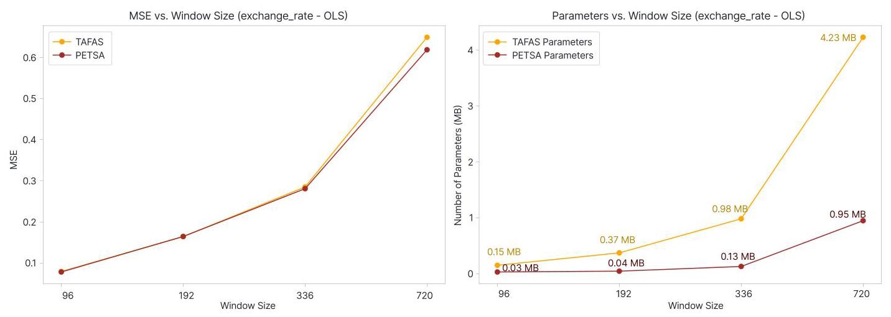

Figure 9. Comparison of PETSA and TAFAS on Exchange Rate for OLS. Left: MSE across different window sizes with TAFAS, and PETSA. Right: Number of trainable parameters used for adaptation. Memory usage is annotated in MB.

图9. PETSA和TAFAS在汇率数据集上针对OLS的比较。左图:TAFAS和PETSA在不同窗口大小下的均方误差(MSE)。右图:用于自适应的可训练参数数量。内存使用情况以MB标注。

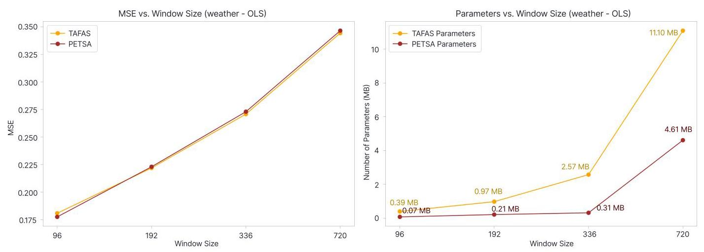

Figure 10. Comparison of PETSA and TAFAS on Weather for OLS. Left: MSE across different window sizes with TAFAS, and PETSA. Right: Number of trainable parameters used for adaptation. Memory usage is annotated in MB.

图10. PETSA和TAFAS在天气数据集上针对OLS的比较。左图:TAFAS和PETSA在不同窗口大小下的均方误差(MSE)。右图:用于自适应的可训练参数数量。内存使用情况以MB标注。

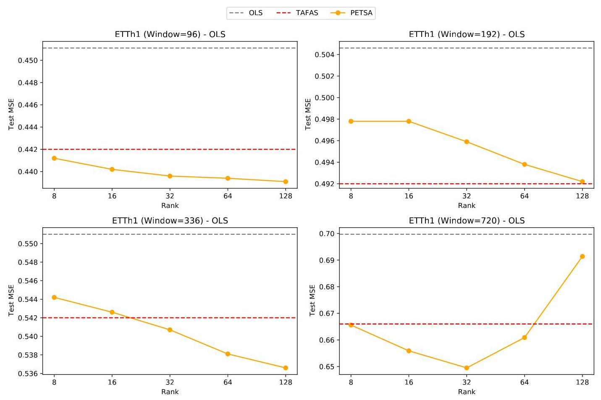

Figure 11. Comparison of the original model, TAFAS, and PETSA on ETTh1 for OLS. MSE across different ranks for windows 96, 196, 336, and 720.

图11. 原始模型、TAFAS和PETSA在ETTh1数据集上针对OLS的比较。窗口大小为96、196、336和720时，不同秩的均方误差(MSE)。

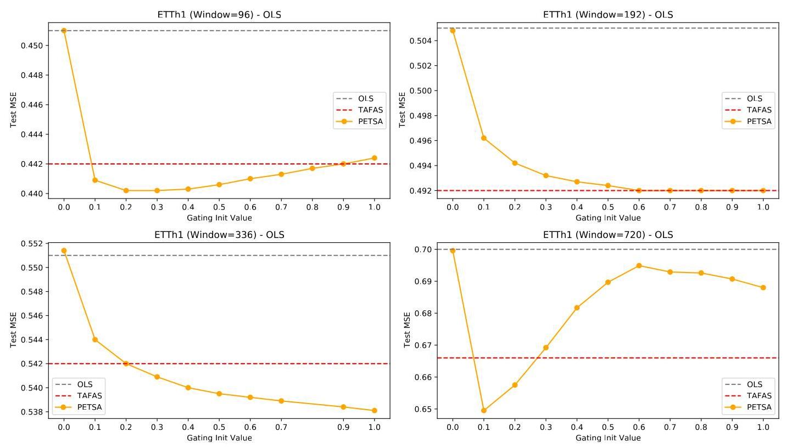

Figure 12. Comparison of the original model, TAFAS, and PETSA on ETTh1 for OLS. MSE across different gating initial values for windows 96, 196, 336, and 720.

图12. 原始模型、TAFAS和PETSA在ETTh1数据集上针对OLS的比较。窗口大小为96、196、336和720时，不同门控初始值的均方误差(MSE)。

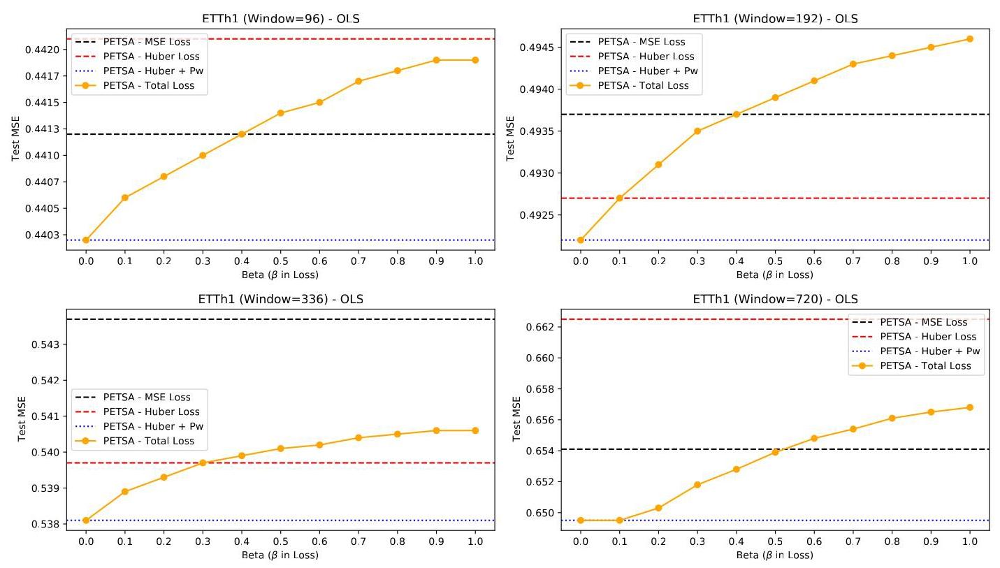

Figure 13. Comparison of different loss terms in PETSA on ETTh1 for OLS. MSE across different beta values for windows 96, 196, 336, and 720.

图13. PETSA中不同损失项在ETTh1数据集上针对OLS的比较。窗口大小为96、196、336和720时，不同β值的均方误差(MSE)。