# Lookup multivariate Kolmogorov-Arnold Networks

# 查找多元柯尔莫哥洛夫 - 阿诺德网络

Sergey Pozdnyakov ${}^{1}$

谢尔盖·波兹尼亚科夫 ${}^{1}$

sergey.pozdnyakov@epfl.ch

Philippe Schwaller ${}^{1,2}$

菲利普·施瓦勒 ${}^{1,2}$

philippe.schwaller@epfl.ch

1 École Polytechnique Fédérale de Lausanne (EPFL)

1 洛桑联邦理工学院(EPFL)

2 National Centre of Competence in Research (NCCR) Catalysis

2 国家研究能力中心(NCCR)催化

## Abstract

## 摘要

High-dimensional linear mappings, or linear layers, dominate both the parameter count and the computational cost of most modern deep-learning models. We introduce a general-purpose drop-in replacement, lookup multivariate Kolmogorov-Arnold Networks (lmKANs), which deliver a substantially better trade-off between capacity and inference cost. Our construction expresses a general high-dimensional mapping through trainable low-dimensional multivariate functions. These functions can carry dozens or hundreds of trainable parameters each, and yet it takes only a few multiplications to compute them because they are implemented as spline lookup tables. Empirically, lmKANs reduce inference FLOPs by up to ${6.0} \times$ while matching the flexibility of MLPs in general high-dimensional function approximation. In another feed-forward fully connected benchmark, on the tabular-like dataset of randomly displaced methane configurations, lmKANs enable more than 10× higher H100 throughput at equal accuracy. Within frameworks of Convolutional Neural Networks, ImKAN-based CNNs cut inference FLOPs at matched accuracy by ${1.6} - {2.1} \times$ and by ${1.7} \times$ on the CIFAR-10 and ImageNet-1k datasets, respectively. Our code, including dedicated CUDA kernels, is available online at https://github.com/schwallergroup/lmkan.

高维线性映射，即线性层，在大多数现代深度学习模型的参数数量和计算成本中占主导地位。我们引入了一种通用的即插即用替代方案，查找多元柯尔莫哥洛夫 - 阿诺德网络(lmKANs)，它在容量和推理成本之间实现了更好的权衡。我们的构造通过可训练的低维多元函数来表示一般的高维映射。这些函数每个可以携带数十或数百个可训练参数，然而由于它们被实现为样条查找表，所以计算它们只需要几次乘法运算。从经验上看，lmKANs 在一般高维函数逼近中匹配多层感知器(MLP)灵活性的同时，将推理浮点运算次数(FLOPs)减少了高达${6.0} \times$。在另一个前馈全连接基准测试中，在随机位移甲烷构型的类似表格数据集上，lmKANs 在同等精度下实现了超过10倍的H100吞吐量。在卷积神经网络框架内，基于ImKAN的卷积神经网络在匹配精度下，在CIFAR - 10和ImageNet - 1k数据集上分别将推理FLOPs减少了${1.6} - {2.1} \times$和${1.7} \times$。我们的代码，包括专用的CUDA内核，可在https://github.com/schwallergroup/lmkan在线获取。

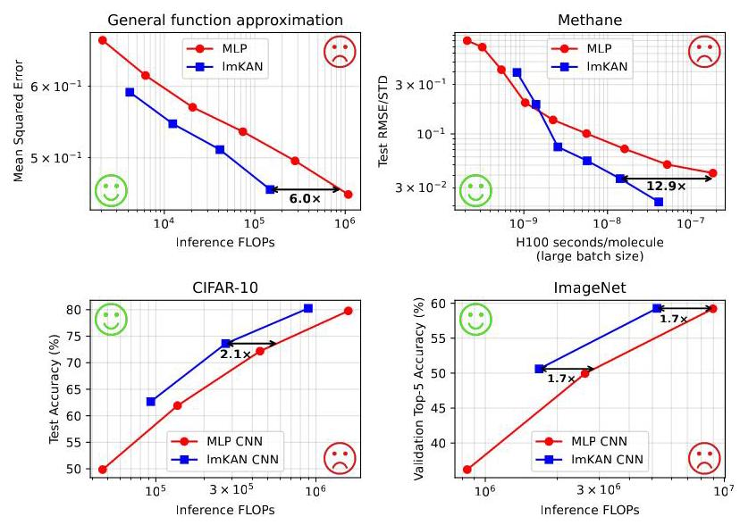

Figure 1: Performance summary. See Sec. 4 for details.

图1:性能总结。详情见第4节。

## 1 Introduction

## 1 引言

With a sufficient amount of training data, the capabilities of deep-learning models systematically improve with the number of trainable parameters [1, 2]. However, deploying very large models is challenging because of the associated inference cost.

有了足够数量的训练数据，深度学习模型的能力会随着可训练参数的数量系统地提升[1, 2]。然而，由于相关的推理成本，部署非常大的模型具有挑战性。

In most models, high-dimensional linear mappings dominate both the parameter count and the computational cost. Standard multilayer perceptrons (MLPs) alternate linear layers with activations, and sometimes with a few other layers $\left\lbrack  {3,4}\right\rbrack$ . If $N$ is the width of a layer, the parameter count and inference cost of these linear mappings scale as $\mathcal{O}\left( {N}^{2}\right)$ , whereas most other layers scale only as $\mathcal{O}\left( N\right)$ . The same observation holds for many other architectures. Transformers [5], when applied to very long sequences, are one of the few notable exceptions because the cost of attention grows quadratically with the number of tokens. Even in that case, however, the cost of the linear mappings remains substantial, not to mention the potential use of fast approximations of attention [6].

在大多数模型中，高维线性映射在参数数量和计算成本中都占主导地位。标准的多层感知器(MLP)将线性层与激活函数交替，有时还会有其他一些层$\left\lbrack  {3,4}\right\rbrack$。如果$N$是一层的宽度，这些线性映射的参数数量和推理成本按$\mathcal{O}\left( {N}^{2}\right)$缩放，而大多数其他层仅按$\mathcal{O}\left( N\right)$缩放。许多其他架构也有同样的情况。当应用于非常长的序列时，Transformer[5]是少数几个显著的例外之一，因为注意力的成本随令牌数量呈二次方增长。然而，即使在那种情况下，线性映射的成本仍然很高，更不用说注意力的快速近似值的潜在使用了[6]。

The computational cost of a linear layer is proportional to the number of its parameters: at inference, each parameter induces one multiplication per input, where the input is a whole input object in the case of MLPs, a token in the case of Recurrent Neural Networks [7] and Transformers [5], a node or an edge in the case of Graph Neural Networks [8], a patch of an image in the case of Convolutional Neural Networks [9, 10], and similarly for other architectures.

线性层的计算成本与其参数数量成正比:在推理时，每个参数对每个输入都会引发一次乘法运算，在MLP的情况下，输入是整个输入对象，在循环神经网络[7]和Transformer[5]的情况下是一个令牌，在图神经网络[8]的情况下是一个节点或一条边，在卷积神经网络[9, 10]的情况下是图像的一个补丁，其他架构也是类似情况。

Spline lookup tables make it possible to do better than that. Consider, for example, a one-dimensional piecewise-linear function $f\left( x\right)$ on the interval from 0 to 1 with a uniform grid. On each interval, it is given as $f\left( x\right)  = a\left\lbrack  i\right\rbrack   * x + b\left\lbrack  i\right\rbrack$ , where $i$ is the interval index. With $G$ intervals, the function has ${2G}$ trainable parameters, out of which $G + 1$ are independent once continuity at the internal grid points is enforced. Yet the computational cost of evaluating such a function at any given point is $\mathcal{O}\left( 1\right)$ , not depending on $G$ . The computational pipeline involves first determining the current grid interval as $i = \lfloor x * G\rfloor$ , and then evaluating only one linear function as $f\left( x\right)  = a\left\lbrack  i\right\rbrack   * x + b\left\lbrack  i\right\rbrack$ .

样条查找表使得可以做得比这更好。例如，考虑在从0到1的区间上具有均匀网格的一维分段线性函数$f\left( x\right)$。在每个区间上，它表示为$f\left( x\right)  = a\left\lbrack  i\right\rbrack   * x + b\left\lbrack  i\right\rbrack$，其中$i$是区间索引。有$G$个区间时，该函数有${2G}$个可训练参数，一旦强制内部网格点处的连续性，其中$G + 1$个是独立的。然而，在任何给定的点评估这样一个函数的计算成本是$\mathcal{O}\left( 1\right)$，不依赖于$G$。计算流程首先确定当前网格区间为$i = \lfloor x * G\rfloor$，然后仅评估一个线性函数$f\left( x\right)  = a\left\lbrack  i\right\rbrack   * x + b\left\lbrack  i\right\rbrack$。

Kolmogorov-Arnold Networks (KANs) [11], designed as a general alternative to MLPs, are natural hosts for spline lookup tables as they construct a general high-dimensional mapping through a collection of trainable univariate functions.

柯尔莫哥洛夫 - 阿诺德网络(KANs)[11]被设计为多层感知器(MLPs)的通用替代方案，是样条查找表的天然宿主，因为它们通过一系列可训练的单变量函数构建一般的高维映射。

The main contributions of this work are the following:

这项工作的主要贡献如下:

- We propose lookup multivariate Kolmogorov-Arnold Networks (lmKANs) that are built upon multivariate low-dimensional functions instead of the univariate ones that standard KANs employ. We empirically compare the 2D version of lmKANs with 1D FastKAN [12] and find that lmKANs are more accurate and easier to train.

- 我们提出了查找多元柯尔莫哥洛夫 - 阿诺德网络(lmKANs)，它们基于多元低维函数构建，而不是标准KANs所使用的单变量函数。我们通过实验将lmKANs的二维版本与一维FastKAN [12]进行比较，发现lmKANs更准确且更易于训练。

- We implement the inner functions as spline lookup tables. Ignoring a non-asymptotic $\mathcal{O}\left( N\right)$ term, the required inference FLOPs are only $2 \times$ those of a linear layer of the same shape, while the number of trainable parameters can be dozens or hundreds of times higher.

- 我们将内部函数实现为样条查找表。忽略一个非渐近的$\mathcal{O}\left( N\right)$项，所需的推理浮点运算次数(FLOPs)仅为相同形状线性层的$2 \times$，而可训练参数的数量可能高出几十倍或几百倍。

- We provide custom CUDA kernels that enable efficient inference of lmKANs on modern GPUs. When using the $8 \times  8$ tile size, on the H100 GPU, our implementation enables up to $\sim  {88} \times$ faster inference than a linear layer with the same number of trainable parameters.

- 我们提供了定制的CUDA内核，可在现代GPU上实现lmKANs的高效推理。当使用$8 \times  8$块大小，在H100 GPU上，我们的实现比具有相同数量可训练参数的线性层实现推理速度快高达$\sim  {88} \times$。

- We empirically compare lmKANs and MLPs across diverse datasets, scales, and backbones, using varied experimental setups to obtain a comprehensive view of performance. Across these conditions, lmKANs are consistently Pareto-optimal with respect to inference FLOPs. The performance of lmKANs is summarized in Fig. 1.

- 我们通过各种实验设置，在不同数据集、规模和骨干网络上对lmKANs和MLPs进行实证比较，以全面了解性能。在这些条件下，lmKANs在推理FLOPs方面始终是帕累托最优的。lmKANs的性能总结在图1中。

The proposed lmKAN layers can serve as a drop-in replacement for high-dimensional linear mappings across a wide range of deep-learning architectures.

所提出的lmKAN层可以作为广泛的深度学习架构中高维线性映射的直接替代。

## 2 Related work

## 2相关工作

Kolmogorov-Arnold Representation Theorem (KART) [13, 14] states that a continuous function $f : {\left\lbrack  0,1\right\rbrack  }^{n} \rightarrow  \mathbb{R}$ can be represented as:

柯尔莫哥洛夫 - 阿诺德表示定理(KART)[13, 14]指出，一个连续函数$f : {\left\lbrack  0,1\right\rbrack  }^{n} \rightarrow  \mathbb{R}$可以表示为:

$$
f\left( {{x}_{1},\ldots ,{x}_{n}}\right)  = \mathop{\sum }\limits_{{q = 1}}^{{{2n} + 1}}{\Phi }_{q}\left( {\mathop{\sum }\limits_{{p = 1}}^{n}{\phi }_{q, p}\left( {x}_{p}\right) }\right) , \tag{1}
$$

where ${\phi }_{q, p} : \left\lbrack  {0,1}\right\rbrack   \rightarrow  \mathbb{R}$ , and ${\Phi }_{q} : \mathbb{R} \rightarrow  \mathbb{R}$ are continuous univariate functions. There has been a long debate $\left\lbrack  {{15},{16}}\right\rbrack$ on the usefulness of this theorem for machine learning because of the general non-smoothness and wild behavior of the inner functions. Nevertheless, it inspired the construction of Kolmogorov-Arnold Networks [17, 18], whose layers are defined as ${y}_{q} = \mathop{\sum }\limits_{p}{f}_{qp}\left( {x}_{p}\right)$ , where ${f}_{qp}$ are trainable functions. Liu et al. [11] introduced the modern version, which suggests stacking an arbitrarily large number of KAN layers and using an arbitrarily large number of neurons, similarly to MLPs. While Liu et al. [11] illustrated strong performance of KANs, many test cases involve ground-truth functions with known, reasonably smooth KART or KART-like (matching KANs with more than one hidden layer and a larger number of neurons) closed-form representations. Subsequent works such as Yang and Wang [19], Kundu et al. [20], and Kashefi [21] further reinforced the efficiency of KANs. On the contrary, Yu et al. [22] found that KANs can fall short compared to MLPs for some tasks.

其中${\phi }_{q, p} : \left\lbrack  {0,1}\right\rbrack   \rightarrow  \mathbb{R}$，并且${\Phi }_{q} : \mathbb{R} \rightarrow  \mathbb{R}$是连续的单变量函数。由于内部函数通常的非光滑性和不规则行为，关于该定理对机器学习的有用性存在长期争论$\left\lbrack  {{15},{16}}\right\rbrack$。然而，它启发了柯尔莫哥洛夫 - 阿诺德网络[17, 18]的构建，其层被定义为${y}_{q} = \mathop{\sum }\limits_{p}{f}_{qp}\left( {x}_{p}\right)$，其中${f}_{qp}$是可训练函数。Liu等人[11]引入了现代版本，建议像MLPs一样堆叠任意数量的KAN层并使用任意数量的神经元。虽然Liu等人[11]展示了KANs的强大性能，但许多测试案例涉及具有已知、合理光滑的KART或类似KART(与具有多个隐藏层和更多神经元的KANs匹配)闭式表示的真实函数。随后的工作如Yang和Wang [19]、Kundu等人[20]以及Kashefi [21]进一步强化了KANs的效率。相反，Yu等人[22]发现对于某些任务，KANs可能不如MLPs。

The idea of lookup-based $\mathcal{O}\left( 1\right)$ computations of KAN univariate functions is sometimes briefly mentioned but rarely implemented in practice $\left\lbrack  {{23},{24}}\right\rbrack$ , likely because of challenges associated with an efficient GPU implementation. Surprisingly, most of the research goes in the somewhat opposite direction. B-splines, piecewise polynomial basis functions used in the original KAN paper, have compact support and thus are well suited for $\mathcal{O}\left( 1\right)$ inference. Subsequent works often replace them with dense basis functions, such as Chebyshev polynomials [25] or Fourier harmonics [26]. The case of FastKAN [12], which replaces sparse B-splines with similar-looking dense Gaussian radial basis functions exclusively for the sake of optimization, is especially notable.

基于查找的KAN单变量函数$\mathcal{O}\left( 1\right)$计算的想法有时会被简要提及，但在实践中很少实现$\left\lbrack  {{23},{24}}\right\rbrack$，可能是因为与高效GPU实现相关的挑战。令人惊讶的是，大多数研究方向与此相反。原始KAN论文中使用的B样条，即分段多项式基函数，具有紧凑支撑，因此非常适合$\mathcal{O}\left( 1\right)$推理。随后的工作经常用密集基函数取代它们，如切比雪夫多项式[25]或傅里叶谐波[26]。FastKAN [12]的情况尤其值得注意，它仅为了优化而用外观相似的密集高斯径向基函数取代稀疏B样条。

A few works, such as Moradzadeh et al. [27] and Huang et al. [28], implement the lookup idea. Moradzadeh et al. [27], however, predict B-spline coefficients using an MLP for the given grid points, which, thus, are not fully independent of each other. Huang et al. [28] achieve remarkable efficiency on a small-scale problem from the original KAN paper by algorithm-hardware co-design using the TSMC 22 nm RRAM-ACIM chip. Poluektov and Polar [29] and Polar and Poluektov [30] employ piecewise linear parametrization suitable for $\mathcal{O}\left( 1\right)$ inference but do not focus on inference efficiency.

一些作品，如Moradzadeh等人[27]和Huang等人[28]，实现了查找思想。然而，Moradzadeh等人[27]使用多层感知器(MLP)为给定的网格点预测B样条系数，因此这些系数并非完全相互独立。Huang等人[28]通过使用台积电22纳米RRAM - ACIM芯片进行算法 - 硬件协同设计，在原始KAN论文中的一个小规模问题上实现了显著的效率提升。Poluektov和Polar[29]以及Polar和Poluektov[30]采用了适用于$\mathcal{O}\left( 1\right)$推理的分段线性参数化，但没有关注推理效率。

In this work, we provide CUDA kernels for efficient inference and benchmark the introduced models against MLPs on general tasks where KART representations are not known in closed form and where there is no reason to expect them to be smoother than in other cases.

在这项工作中，我们提供了用于高效推理的CUDA内核，并在KART表示没有封闭形式且没有理由期望它们比其他情况更平滑的一般任务上，将引入的模型与多层感知器(MLP)进行基准测试。

## 3 Lookup multivariate Kolmogorov-Arnold Networks

## 3 查找多元柯尔莫哥洛夫 - 阿诺德网络

At first glance, given that the inference cost of spline lookup tables does not depend on the number of parameters, very expressive univariate functions with tens of thousands of trainable parameters each are an ideal match for the Kolmogorov-Arnold Representation Theorem. However, KANs rarely use more than a few dozen parameters per function in practice. The difference between a univariate function parametrized by tens of thousands of parameters and just a few dozen is the capability of the former to parametrize a very high frequency band. On the one hand, this expressivity is necessary for closely approximating the 'wild behavior' of KART inner functions, but on the other, it raises concerns about training stability and generalization. On the contrary, multivariate functions can "accommodate" a significantly larger number of parameters without spilling expressive power into exceedingly high frequency bands. For instance, a four-dimensional function with just 10 grid points along each dimension has roughly the same number of trainable parameters as a univariate one with $\sim  {10}^{4}$ grid intervals.

乍一看，鉴于样条查找表的推理成本不依赖于参数数量，每个具有数万个可训练参数的极具表现力的单变量函数是柯尔莫哥洛夫 - 阿诺德表示定理的理想匹配。然而，实际上KANs每个函数很少使用超过几十个参数。由数万个参数参数化的单变量函数与只有几十个参数的单变量函数之间的差异在于前者参数化非常高频带的能力。一方面，这种表现力对于紧密逼近KART内部函数的“狂野行为”是必要的，但另一方面，它引发了对训练稳定性和泛化的担忧。相反，多元函数可以“容纳”大量参数，而不会将表现力溢出到极高的频带中。例如，一个在每个维度上只有10个网格点的四维函数与一个具有$\sim  {10}^{4}$个网格间隔的单变量函数具有大致相同数量的可训练参数。

A layer of a multivariate version of Kolmogorov-Arnold Networks with dimension $d$ defines the output as:

具有维度$d$的多元版本的柯尔莫哥洛夫 - 阿诺德网络的一层将输出定义为:

$$
{y}_{q} = \mathop{\sum }\limits_{{p = 0}}^{{{N}_{\text{ in }}/d - 1}}{f}_{qp}\left( {{x}_{dp},{x}_{{dp} + 1}\ldots ,{x}_{{dp} + d - 1}}\right) , \tag{2}
$$

where ${f}_{qp}$ are trainable d-dimensional functions and ${N}_{\text{ in }}$ is the input dimensionality (assumed to be divisible by $d$ ). We implement CUDA kernels for the two-dimensional case. The motivation behind this choice is detailed in Sec. 3.3. An example of such a layer is depicted in Fig. 2. Similar to KANs, these layers do not need additional activations in between and can be stacked arbitrarily, substituting linear mapping-activation pairs in MLP-based backbones.

其中${f}_{qp}$是可训练的d维函数，${N}_{\text{ in }}$是输入维度(假设可被$d$整除)。我们为二维情况实现了CUDA内核。这种选择背后的动机在3.3节中详细说明。图2展示了这样一层的示例。与KANs类似，这些层在中间不需要额外的激活，可以任意堆叠，替代基于MLP的主干中的线性映射 - 激活对。

In Sec. 4.4, we empirically compare the two-dimensional version of lmKANs with one-dimensional FastKAN. The outcomes of these numerical experiments reinforce the intuitive considerations given here and suggest that multidimensional building blocks can indeed be more effective hosts for a large number of parameters in a practical setup.

在4.4节中，我们通过实验将二维版本的lmKANs与一维FastKAN进行比较。这些数值实验的结果强化了这里给出的直观考虑，并表明多维构建块在实际设置中确实可以更有效地承载大量参数。

Additionally, it is worth noting that, if necessary, multivariate functions ${f}_{qp}$ can always fall back to sums of univariate ones, which would make the whole lmKAN fall back to standard KAN. Thus, the Kolmogorov-Arnold Representation Theorem is applicable also to our construction.

此外，值得注意的是，如果需要，多元函数${f}_{qp}$总是可以退回到单变量函数的和，这将使整个lmKAN退回到标准KAN。因此，柯尔莫哥洛夫 - 阿诺德表示定理也适用于我们的构造。

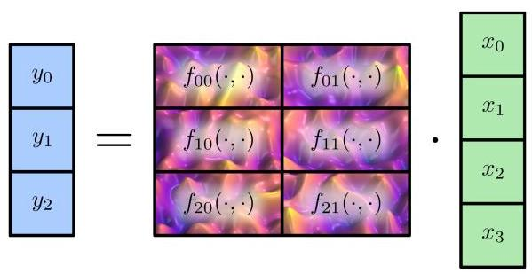

Figure 2: Schematic representation of a 2D lmKAN layer with 4 inputs and 3 outputs. This layer defines outputs as: ${y}_{0} = {f}_{00}\left( {{x}_{0},{x}_{1}}\right)  + {f}_{01}\left( {{x}_{2},{x}_{3}}\right) ,{y}_{1} = {f}_{10}\left( {{x}_{0},{x}_{1}}\right)  + {f}_{11}\left( {{x}_{2},{x}_{3}}\right)$ , and ${y}_{2} = {f}_{20}\left( {{x}_{0},{x}_{1}}\right)  + {f}_{21}\left( {{x}_{2},{x}_{3}}\right)$ . The functions ${f}_{* * }\left( {\cdot , \cdot  }\right)$ are to be trained during fitting.

图2:具有4个输入和3个输出的二维lmKAN层的示意图。该层将输出定义为:${y}_{0} = {f}_{00}\left( {{x}_{0},{x}_{1}}\right)  + {f}_{01}\left( {{x}_{2},{x}_{3}}\right) ,{y}_{1} = {f}_{10}\left( {{x}_{0},{x}_{1}}\right)  + {f}_{11}\left( {{x}_{2},{x}_{3}}\right)$，以及${y}_{2} = {f}_{20}\left( {{x}_{0},{x}_{1}}\right)  + {f}_{21}\left( {{x}_{2},{x}_{3}}\right)$。函数${f}_{* * }\left( {\cdot , \cdot  }\right)$将在拟合过程中进行训练。

### 3.1 Function parametrization

### 3.1 函数参数化

During training, activations of neurons can evolve arbitrarily, making the use of grids defined on bounded regions challenging. Therefore, we designed an unbounded grid which is still regular enough to allow $\mathcal{O}\left( 1\right)$ computations.

在训练期间，神经元的激活可以任意演变，这使得在有界区域上定义网格的使用具有挑战性。因此，我们设计了一种无界网格，它仍然足够规则，以允许$\mathcal{O}\left( 1\right)$计算。

Sigma grid The one-dimensional sigma grid, which is illustrated in Fig. 3a, is generated by any sigmoid-like function $\sigma \left( x\right)$ . If the desired number of grid intervals is $G$ , then the grid points are given as the intersection of $G - 1$ equispaced percentile levels with $\sigma \left( x\right)$ . An example of a piecewise linear function defined on such a grid is given in Fig. 3b. Such a construction spans the entire real axis. The grid has the finest resolution near the origin, and becomes progressively coarser as $\left| x\right|$ increases. For a given $x$ , the index of the corresponding grid interval can be computed as $i = \lfloor \sigma \left( x\right) G\rfloor$ , which makes such a grid suitable for $\mathcal{O}\left( 1\right)$ computations.

西格玛网格 图3a所示的一维西格玛网格由任何类似Sigmoid的函数$\sigma \left( x\right)$生成。如果所需的网格区间数量为$G$，那么网格点可作为$G - 1$个等间距百分位数水平与$\sigma \left( x\right)$的交点给出。图3b给出了在这样一个网格上定义的分段线性函数的示例。这种构造跨越整个实轴。网格在原点附近具有最精细的分辨率，并且随着$\left| x\right|$的增加逐渐变得更粗糙。对于给定的$x$，相应网格区间的索引可以计算为$i = \lfloor \sigma \left( x\right) G\rfloor$，这使得这样的网格适用于$\mathcal{O}\left( 1\right)$计算。

Static percentile grid The choice of $\sigma \left( x\right)$ in the construction above is somewhat arbitrary. An additional consideration is that it would be beneficial to distribute inputs evenly, or approximately evenly, across the grid intervals. If the probability distribution of inputs is known, then one way to ensure perfect balance is to set $\sigma \left( x\right)$ to be the corresponding cumulative distribution function (CDF). However, it is challenging to implement such a dynamic percentile grid in practice, as the distribution of inputs is unknown, can evolve during training, and the corresponding CDF can hardly be queried in $\mathcal{O}\left( 1\right)$ time.

静态百分位数网格 上述构造中$\sigma \left( x\right)$的选择有些随意。另一个需要考虑的因素是，将输入均匀或近似均匀地分布在网格区间上会很有好处。如果输入的概率分布已知，那么确保完美平衡的一种方法是将$\sigma \left( x\right)$设置为相应的累积分布函数(CDF)。然而，在实践中实现这样的动态百分位数网格具有挑战性，因为输入的分布是未知的，可能在训练期间发生变化，并且相应的CDF很难在$\mathcal{O}\left( 1\right)$时间内查询。

Instead, we keep activations in a controlled range. A batch-normalization layer without affine parameters placed before each lmKAN layer forces zero mean and unit variance. While it does not pin the entire distributions, it is safe to assume that they will be close enough to the standard normal for a reasonable ratio of neurons. Therefore, a viable solution would be to precede each lmKAN layer with a batch normalization with disabled affine transforms, and select $\sigma \left( x\right)$ to be the standard Gaussian CDF. In practice, we implement a fast approximation that requires computing only a single exponent function at inference, see Appendix B. For multivariate functions, we apply the same one-dimensional grid independently to each coordinate.

相反，我们将激活保持在一个可控范围内。在每个lmKAN层之前放置一个没有仿射参数的批归一化层，强制均值为零且方差为单位方差。虽然它并没有固定整个分布，但可以合理地假设，对于合理比例的神经元来说，它们将足够接近标准正态分布。因此，一个可行的解决方案是在每个lmKAN层之前进行禁用仿射变换的批归一化，并选择$\sigma \left( x\right)$为标准高斯CDF。在实践中，我们实现了一种快速近似方法，在推理时只需要计算一个指数函数，见附录B。对于多元函数，我们对每个坐标独立应用相同的一维网格。

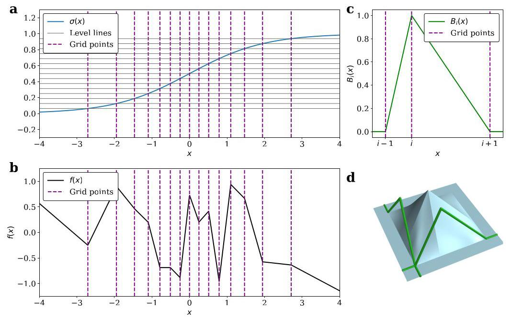

Figure 3: (a) Construction of the sigma grid; (b) an example of a piecewise linear function defined on such a grid (c) Second-order B-spline (d) Two-dimensional second-order B-spline

图3:(a)西格玛网格的构造；(b)在这样一个网格上定义的分段线性函数的示例；(c)二阶B样条；(d)二维二阶B样条

B-splines We use B-splines of second order built on top of the described grids as basis functions to parametrize the lmKAN inner functions. A one-dimensional second-order B-spline centered around grid point $i$ is given in Fig. 3c. It takes non-zero values on only two adjacent grid intervals around the center grid point. If there are $G$ intervals, then we use $G + 1$ basis functions: $G - 1$ such B-splines centered around each inner grid point, and two linear functions on the left-most and right-most infinite intervals. For any given point $x$ , there are only two non-zero B-splines ${B}_{i}\left( x\right)$ - the ones with $i = \lfloor \sigma \left( x\right) G\rfloor$ and $i = \lfloor \sigma \left( x\right) G\rfloor  + 1$ (In the corner case when $x$ coincides with one of the grid points, there is only one). Appendix B provides the definition of B-splines on edge intervals we use in this work, along with other details.

B样条 我们使用在上述网格之上构建的二阶B样条作为基函数来参数化lmKAN内部函数。图3c给出了以网格点$i$为中心的一维二阶B样条。它仅在中心网格点周围的两个相邻网格区间上取非零值。如果有$G$个区间，那么我们使用$G + 1$个基函数:$G - 1$个以每个内部网格点为中心的这样的B样条，以及在最左边和最右边无限区间上的两个线性函数。对于任何给定的点$x$，只有两个非零的B样条${B}_{i}\left( x\right)$——即$i = \lfloor \sigma \left( x\right) G\rfloor$和$i = \lfloor \sigma \left( x\right) G\rfloor  + 1$对应的那些(在$x$与其中一个网格点重合的特殊情况下只有一个)。附录B提供了我们在这项工作中使用的边缘区间上的B样条定义以及其他细节。

A two-dimensional B-spline, illustrated in Fig. 3d, is defined as ${B}_{{i}_{1}{i}_{2}}\left( {{x}_{1},{x}_{2}}\right)  = \; {B}_{{i}_{1}}\left( {x}_{1}\right) {B}_{{i}_{2}}\left( {x}_{2}\right)$ .

图3d所示的二维B样条定义为${B}_{{i}_{1}{i}_{2}}\left( {{x}_{1},{x}_{2}}\right)  = \; {B}_{{i}_{1}}\left( {x}_{1}\right) {B}_{{i}_{2}}\left( {x}_{2}\right)$。

All the functions defining a 2D lmKAN layer are parametrized as:

定义二维lmKAN层的所有函数参数化为:

$$
f\left( {{x}_{1},{x}_{2}}\right)  = \mathop{\sum }\limits_{{{i}_{1},{i}_{2}}}{p}_{{i}_{1}{i}_{2}}{B}_{{i}_{1}{i}_{2}}\left( {{x}_{1},{x}_{2}}\right) , \tag{3}
$$

where ${p}_{{i}_{1}{i}_{2}}$ are trainable coefficients.

其中${p}_{{i}_{1}{i}_{2}}$是可训练系数。

With such a construction, there are ${\left( G + 1\right) }^{2}$ independent parameters for each 2D function, parametrized functions are bilinear on each 2D grid interval, all the functions are continuous for arbitrary ${p}_{{i}_{1}{i}_{2}}$ , and all but the edge coefficients ${p}_{{i}_{1}{i}_{2}}$ have a simple interpretation as the value of the function on the corresponding grid point.

采用这样的构造，每个二维函数有${\left( G + 1\right) }^{2}$个独立参数，参数化函数在每个二维网格区间上是双线性的，对于任意${p}_{{i}_{1}{i}_{2}}$，所有函数都是连续的，并且除了边缘系数${p}_{{i}_{1}{i}_{2}}$之外，所有系数都可以简单地解释为函数在相应网格点上的值。

For any given point $\left( {{x}_{1},{x}_{2}}\right)$ , there are only four non-zero B-splines; thus, one needs to evaluate only four terms of Eq. 3 to compute $f\left( {{x}_{1},{x}_{2}}\right)$ , which forms the basis of $\mathcal{O}\left( 1\right)$ computations. The full algorithm to compute a standalone two-dimensional function is given in Appendix B.1.

对于任何给定的点$\left( {{x}_{1},{x}_{2}}\right)$，只有四个非零的B样条；因此，计算$f\left( {{x}_{1},{x}_{2}}\right)$时只需要计算式3中的四项，这构成了$\mathcal{O}\left( 1\right)$计算的基础。计算独立二维函数的完整算法在附录B.1中给出。

### 3.2 Computational cost

### 3.2计算成本

Algorithm 1 Forward pass of a 2D lmKAN layer.

算法1二维lmKAN层的前向传播。

---

Input: input vector $\mathbf{x} \in  {\mathbb{R}}^{{N}_{\text{ in }}}$ , parameter tensor $\mathbf{P} \in  {\mathbb{R}}^{\left\lbrack  G + 1, G + 1,{N}_{\text{ in }}/2,{N}_{\text{ out }}\right\rbrack  }$ .

	$\mathbf{P}\left\lbrack  {{i}_{1},{i}_{2},\text{ input\_index, output\_index }}\right\rbrack$ is the value of ${f}_{\text{ input\_index, output\_index }}$ at the

	${i}_{1} - ,{i}_{2}$ -th grid point.

Output: output vector $\mathbf{y} \in  {\mathbb{R}}^{{N}_{\text{ out }}}$

	$\mathbf{y} \leftarrow  \mathbf{0}$

	for input_index $= 0$ to ${N}_{\text{ in }}/2 - 1$ do

		${i}_{1},{i}_{2},{B}_{{i}_{1}{i}_{2}}\left( {{x}_{1},{x}_{2}}\right) ,{B}_{{i}_{1} + 1{i}_{2}}\left( {{x}_{1},{x}_{2}}\right) ,{B}_{{i}_{1}{i}_{2} + 1}\left( {{x}_{1},{x}_{2}}\right) ,{B}_{{i}_{1} + 1{i}_{2} + 1}\left( {{x}_{1},{x}_{2}}\right)  \leftarrow$

						Preamble $\left( {\mathbf{x}\left\lbrack  {2 \cdot  \text{ input\_index }}\right\rbrack  ,\mathbf{x}\left\lbrack  {2 \cdot  \text{ input\_index } + 1}\right\rbrack  }\right)$

		for output_index $= 0$ to ${N}_{\text{ out }} - 1$ do

			$\mathbf{y}\left\lbrack  \text{ output\_index }\right\rbrack   +  = {B}_{{i}_{1}{i}_{2}}\left( {{x}_{1},{x}_{2}}\right) \mathbf{P}\left\lbrack  {{i}_{1},{i}_{2},\text{ input\_index, output\_index }}\right\rbrack$

			$\mathbf{y}\left\lbrack  \text{ output\_index }\right\rbrack   +  = {B}_{{i}_{1} + 1{i}_{2}}\left( {{x}_{1},{x}_{2}}\right) \mathbf{P}\left\lbrack  {{i}_{1} + 1,{i}_{2},\text{ input\_index, output\_index }}\right\rbrack$

			$\mathbf{y}\left\lbrack  \text{ output\_index }\right\rbrack   +  = {B}_{{i}_{1}{i}_{2} + 1}\left( {{x}_{1},{x}_{2}}\right) \mathbf{P}\left\lbrack  {{i}_{1},{i}_{2} + 1,\text{ input\_index, output\_index }}\right\rbrack$

			$\mathbf{y}\left\lbrack  \text{ output\_index }\right\rbrack   +  = {B}_{{i}_{1} + 1{i}_{2} + 1}\left( {{x}_{1},{x}_{2}}\right) \mathbf{P}\left\lbrack  {{i}_{1} + 1,{i}_{2} + 1,\text{ input\_index, output\_index }}\right\rbrack$

		end for

	end for

11: function Preamble $\left( {{x}_{1},{x}_{2}}\right) \; \vartriangleright$ Handling of edge-interval cases is omitted for brevity.

	See Appendix B for more details.

Input: ${x}_{1},{x}_{2}$ ; precomputed grid points $\mathcal{G}$ ;

	precomputed inverse areas ${\mathbf{A}}_{\text{ inv }}\left\lbrack  {{i}_{1},{i}_{2}}\right\rbrack   = {\left\lbrack  \left( \mathcal{G}\left\lbrack  {i}_{1} + 1\right\rbrack   - \mathcal{G}\left\lbrack  {i}_{1}\right\rbrack  \right) \left( \mathcal{G}\left\lbrack  {i}_{2} + 1\right\rbrack   - \mathcal{G}\left\lbrack  {i}_{2}\right\rbrack  \right) \right\rbrack  }^{-1}$

Output: indices ${i}_{1},{i}_{2}$ and

	B-splines ${B}_{{i}_{1}{i}_{2}}\left( {{x}_{1},{x}_{2}}\right) ,{B}_{{i}_{1} + 1{i}_{2}}\left( {{x}_{1},{x}_{2}}\right) ,{B}_{{i}_{1}{i}_{2} + 1}\left( {{x}_{1},{x}_{2}}\right) ,{B}_{{i}_{1} + 1{i}_{2} + 1}\left( {{x}_{1},{x}_{2}}\right)$

		${i}_{1} \leftarrow  \left\lfloor  {\sigma \left( {x}_{1}\right) G}\right\rfloor$

		${i}_{2} \leftarrow  \left\lceil  {\sigma \left( {x}_{2}\right) G}\right\rceil$

		${B}_{{i}_{1}{i}_{2}}\left( {{x}_{1},{x}_{2}}\right)  \leftarrow  \left( {\mathcal{G}\left\lbrack  {{i}_{1} + 1}\right\rbrack   - {x}_{1}}\right) \left( {\mathcal{G}\left\lbrack  {{i}_{2} + 1}\right\rbrack   - {x}_{2}}\right) {\mathbf{A}}_{\mathrm{{inv}}}\left\lbrack  {{i}_{1},{i}_{2}}\right\rbrack$

		${B}_{{i}_{1} + 1{i}_{2}}\left( {{x}_{1},{x}_{2}}\right)  \leftarrow  \left( {{x}_{1} - \mathcal{G}\left\lbrack  {i}_{1}\right\rbrack  }\right) \left( {\mathcal{G}\left\lbrack  {{i}_{2} + 1}\right\rbrack   - {x}_{2}}\right) {\mathbf{A}}_{\mathrm{{inv}}}\left\lbrack  {{i}_{1},{i}_{2}}\right\rbrack$

		${B}_{{i}_{1}{i}_{2} + 1}\left( {{x}_{1},{x}_{2}}\right)  \leftarrow  \left( {\mathcal{G}\left\lbrack  {{i}_{1} + 1}\right\rbrack   - {x}_{1}}\right) \left( {{x}_{2} - \mathcal{G}\left\lbrack  {i}_{2}\right\rbrack  }\right) {\mathbf{A}}_{\mathrm{{inv}}}\left\lbrack  {{i}_{1},{i}_{2}}\right\rbrack$

		${B}_{{i}_{1} + 1{i}_{2} + 1}\left( {{x}_{1},{x}_{2}}\right)  \leftarrow  \left( {{x}_{1} - \mathcal{G}\left\lbrack  {i}_{1}\right\rbrack  }\right) \left( {{x}_{2} - \mathcal{G}\left\lbrack  {i}_{2}\right\rbrack  }\right) {\mathbf{A}}_{\text{ inv }}\left\lbrack  {{i}_{1},{i}_{2}}\right\rbrack$

		return ${i}_{1},{i}_{2},{B}_{{i}_{1}{i}_{2}}\left( {{x}_{1},{x}_{2}}\right) ,{B}_{{i}_{1} + 1{i}_{2}}\left( {{x}_{1},{x}_{2}}\right) ,{B}_{{i}_{1}{i}_{2} + 1}\left( {{x}_{1},{x}_{2}}\right) ,{B}_{{i}_{1} + 1{i}_{2} + 1}\left( {{x}_{1},{x}_{2}}\right)$

	end function

---

Overall, the functional form of lmKANs involves computations of many low-dimensional functions with exactly the same arguments (those in the same column, see Fig. 2). When doing so, it is possible to reuse many of the intermediate values, such as indices of the grid intervals and B-splines. As Algorithm 1 elaborates, these intermediate values can be computed once for each pair of inputs, and then utilized to compute the value of a given function with just four multiply-add operations for the 2D case.

总体而言，lmKAN的函数形式涉及对许多具有完全相同参数的低维函数进行计算(同一列中的参数，见图2)。这样做时，可以重用许多中间值，例如网格区间和B样条的索引。如算法1所示，这些中间值可以为每对输入计算一次，然后仅通过二维情况下的四个乘加操作来计算给定函数的值。

As the algorithm shows, the preamble part contributes only to an asymptotically insignificant $\mathcal{O}\left( N\right)$ term, where $N$ is the input $\left( {N}_{\text{ in }}\right)$ or output $\left( {N}_{\text{ out }}\right)$ dimension. Given that the total number of 2D functions in an lmKAN layer is $\left\lbrack  {{N}_{\text{ in }}/2}\right\rbrack  {N}_{\text{ out }}$ , the total number of required multiply-add operations for the dominant, $\mathcal{O}\left( {N}^{2}\right)$ , part is $4\left\lbrack  {{N}_{\text{ in }}/2}\right\rbrack  {N}_{\text{ out }} = 2{N}_{\text{ in }}{N}_{\text{ out }}$ , just $\mathbf{2} \times$ that of a linear layer of the same shape. Following the common practice [31], we estimate FLOPs as the number of fused multiply-adds of the main asymptotic term for both MLPs and lmKANs.

如算法所示，前导部分仅对一个渐近无关紧要的$\mathcal{O}\left( N\right)$项有贡献，其中$N$是输入$\left( {N}_{\text{ in }}\right)$或输出$\left( {N}_{\text{ out }}\right)$维度。鉴于lmKAN层中二维函数的总数为$\left\lbrack  {{N}_{\text{ in }}/2}\right\rbrack  {N}_{\text{ out }}$，主要部分$\mathcal{O}\left( {N}^{2}\right)$所需的乘加操作总数为$4\left\lbrack  {{N}_{\text{ in }}/2}\right\rbrack  {N}_{\text{ out }} = 2{N}_{\text{ in }}{N}_{\text{ out }}$，仅为相同形状线性层的$\mathbf{2} \times$。按照惯例[31]，我们将FLOP估计为MLP和lmKAN主要渐近项的融合乘加次数。

It is worth noting that the $\mathcal{O}\left( N\right)$ preamble term is not an additional cost relative to MLPs; it replaces the per-unit bias additions and activation evaluations that lmKANs do not require - operations that can be quite expensive when the activations are transcendental functions such as tanh.

值得注意的是，$\mathcal{O}\left( N\right)$前导项相对于MLP而言并不是额外的成本；它取代了lmKAN不需要的单位偏差加法和激活评估 - 当激活函数是诸如tanh等超越函数时，这些操作可能会非常昂贵。

### 3.3 Perspective on dimensions and spline orders

### 3.3维度和样条阶数的视角

All the constructions introduced so far straightforwardly generalize to a higher-dimensional case. Evaluation of a single d-dimensional function parametrized by d-dimensional second-order B-splines would take ${2}^{d}$ multiply-adds, which stem from the summation of B-spline contributions residing on all the corners of the corresponding d-dimensional hypercube. Given that the number of such d-dimensional functions would be $d$ times smaller compared to the number of weights of a linear layer of the same shape, the inference FLOPs of the d-dimensional lmKAN layer would be ${2}^{d}/d$ of that of the linear layer with the same shape.

到目前为止引入的所有构造都可以直接推广到更高维的情况。由d维二阶B样条参数化的单个d维函数的评估需要${2}^{d}$次乘加操作，这源于位于相应d维超立方体所有角上的B样条贡献的总和。鉴于此类d维函数的数量与相同形状线性层的权重数量相比要少$d$倍，d维lmKAN层的推理FLOP将是相同形状线性层的${2}^{d}/d$。

These slowdown factors are exactly identical, $2 \times$ , for one- and two-dimensional lmKANs, and start to grow for higher dimensions. Thus, we chose the two-dimensional version for the implementation of CUDA kernels, as this extension of the standard univariate KAN comes essentially for free.

对于一维和二维lmKAN，这些减速因子完全相同，$2 \times$，并且对于更高维度开始增长。因此，我们选择二维版本来实现CUDA内核，因为这是标准单变量KAN的这种扩展基本上是免费的。

If B-splines of order $k$ are employed for parametrization instead of the second-order ones described so far, the inference cost becomes ${k}^{d}/d$ of that of a linear layer. For more details, see the B-spline definition at De Boor and De Boor [32], and how they are used in KANs [11]. Increasing the B-spline order brings a few benefits, but they likely do not justify the associated increase in the computational cost.

如果使用$k$阶的B样条进行参数化而不是到目前为止描述的二阶B样条，推理成本将变为线性层的${k}^{d}/d$。有关更多详细信息，请参阅De Boor和De Boor [32]中的B样条定义，以及它们在KANs [11]中的使用方式。增加B样条阶数会带来一些好处，但它们可能无法证明计算成本的相应增加是合理的。

The classical theorem about B-splines [33] indicates that while the order of B-splines affects the convergence rate, any spline order is sufficient to approximate any function arbitrarily closely by increasing the resolution of the grid ${}^{1}$ . Given that the computational cost of spline look-up tables does not depend on the number of grid points, the grid resolution can be arbitrarily increased without any computational overhead at inference.

关于B样条的经典定理[33]表明，虽然B样条的阶数会影响收敛速度，但通过增加网格${}^{1}$的分辨率，任何样条阶数都足以任意接近地逼近任何函数。鉴于样条查找表的计算成本不依赖于网格点的数量，在推理时可以任意提高网格分辨率而无需任何计算开销。

On top of that, increasing the B-spline order introduces additional smoothness of the model. Functions parametrized by B-splines of order $k$ belong to ${C}^{k - 2}$ , but in general not to ${C}^{k - 1}$ . The smoothness of second-order B-splines employed in this work matches that of ReLU [34], one of the most popular and successful activation functions, which is also continuous, but not continuously differentiable. Thus, it is questionable if the additional smoothness available through higher orders $k$ is necessary and would justify the associated computational overhead.

除此之外，增加B样条阶数会引入模型的额外平滑性。由阶数为$k$的B样条参数化的函数属于${C}^{k - 2}$，但一般不属于${C}^{k - 1}$。本工作中使用的二阶B样条的平滑性与ReLU[34](最流行和成功的激活函数之一)的平滑性相匹配，ReLU也是连续的，但不是连续可微的。因此，通过更高阶$k$获得的额外平滑性是否必要以及是否能证明相关的计算开销是合理的，这是值得怀疑的。

### 3.4 CUDA kernels

### 3.4 CUDA内核

In this work, we implement CUDA kernels for efficient inference of 2D lmKANs on modern GPUs. Our kernels use the classic shared-memory tiling used in GEMM [35]. In the following, all benchmarks run in full-precision float32.

在本工作中，我们实现了CUDA内核，用于在现代GPU上高效推理二维lmKAN。我们的内核使用了GEMM[35]中使用的经典共享内存平铺。以下所有基准测试均以全精度float32运行。

With a ${16} \times  {16}$ tile, our implementation is $\sim  8 \times$ slower than a dense linear layer with the same shape on an H100-SXM, irrespective of the grid resolution. The slowdown exceeds the $\sim  2 \times$ FLOPs-based estimate from Sec. 3.2, primarily because of the less coherent memory-access pattern of algorithm 1. Additionally, dense matrix multiplication has been the cornerstone of many computational pipelines and, thus, has enjoyed decades of thorough optimization.

对于一个${16} \times  {16}$的平铺，我们的实现在H100 - SXM上比具有相同形状的密集线性层慢$\sim  8 \times$，与网格分辨率无关。减速超过了第3.2节基于$\sim  2 \times$FLOP的估计，主要是因为算法1的内存访问模式不太连贯。此外，密集矩阵乘法一直是许多计算管道的基石，因此经过了数十年的深入优化。

Finite shared-memory capacity limits the number of grid intervals to $G \leq  {20}$ on H100. At this limit, an lmKAN layer holds ${\left( {20} + 1\right) }^{2}/2 \approx  {220} \times$ more parameters than the linear baseline with the same shape, so its inference time per trainable parameter is $\left\lbrack  {{\left( {20} + 1\right) }^{2}/2}\right\rbrack  /8 \approx  {27.5} \times$ better.

有限的共享内存容量将H100上的网格间隔数量限制为$G \leq  {20}$。在此限制下，一个lmKAN层比具有相同形状的线性基线多持有${\left( {20} + 1\right) }^{2}/2 \approx  {220} \times$个参数，因此其每个可训练参数的推理时间要好$\left\lbrack  {{\left( {20} + 1\right) }^{2}/2}\right\rbrack  /8 \approx  {27.5} \times$。

Reducing the tile to $8 \times  8$ raises the slowdown to $\sim  {9.5} \times$ but lets us increase $G$ to 40, yielding $\sim  {88.5} \times$ better per-parameter efficiency.

将平铺减少到$8 \times  8$会将减速提高到$\sim  {9.5} \times$，但使我们能够将$G$增加到40，从而每个参数的效率提高$\sim  {88.5} \times$。

The performance of our kernels is even better when the feature dimension is small. The numbers reported above were obtained in the limit of large batch sizes and feature dimensions. Keeping the batch size large but setting, for instance, ${N}_{\text{ in }} = {N}_{\text{ out }} = {32}$ lowers the slowdown of the ${16} \times  {16}$ kernel to only $\sim  {2.5} \times$ relative to a linear layer of the same shape. Further details are reported in Appendix D.

当特征维度较小时，我们内核的性能甚至更好。上面报告的数字是在大批量大小和特征维度的极限情况下获得的。保持大批量大小，但例如设置${N}_{\text{ in }} = {N}_{\text{ out }} = {32}$，会将${16} \times  {16}$内核的减速相对于相同形状的线性层降低到仅$\sim  {2.5} \times$。附录D中报告了更多详细信息。

---

${}^{1}$ This is applicable, though, to functions on a bounded domain.

${}^{1}$不过，这适用于有界域上的函数。

---

### 3.5 Hessian regularization

### 3.5 海森正则化

Direct fitting of splined functions with a fine grid imposes additional challenges related to generalization. The problem is illustrated in Fig. 4a for the simple case of fitting a standalone one-dimensional function parametrized by second-order B-splines on a uniform grid on $\left\lbrack  {0,1}\right\rbrack$ with $G = {40}$ intervals, $f\left( x\right)  = \mathop{\sum }\limits_{i}{p}_{i}{B}_{i}\left( x\right)$ .

使用精细网格直接拟合样条函数会带来与泛化相关的额外挑战。图4a针对在$\left\lbrack  {0,1}\right\rbrack$上具有$G = {40}$个间隔的均匀网格上由二阶B样条参数化的独立一维函数的简单情况说明了这个问题，$f\left( x\right)  = \mathop{\sum }\limits_{i}{p}_{i}{B}_{i}\left( x\right)$。

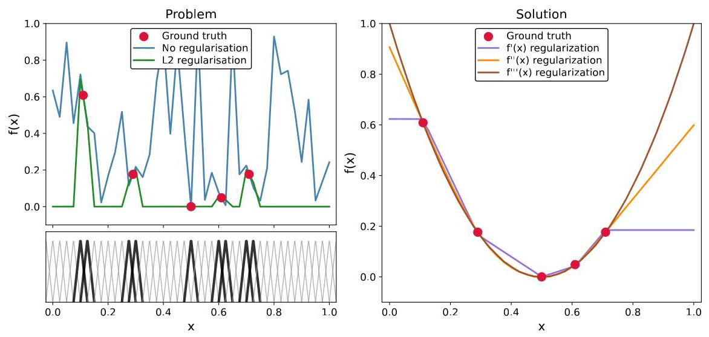

Figure 4: Generalization pitfall.

图4:泛化陷阱。

Ground truth is an exact parabola, and the training set consists of 5 points, which are illustrated on the plot. Since the number of grid points is large, the model has enough flexibility to reproduce the training set exactly, but generalization is quite off. With such a fine grid, only a few B-splines, marked as bold on the bottom panel of Fig. 4a, take non-zero values for the training points. Thus, only the coefficients ${p}_{i}$ associated with these active B-splines receive non-zero gradient during training, while all the others have no incentive to evolve from the random values assigned at initialization. Standard L2 regularization is not much better, as it simply pushes all non-active coefficients ${p}_{i}$ to zero, which also results in a non-meaningful approximation after training.

真实情况是一条精确的抛物线，训练集由5个点组成，这些点在图中有所展示。由于网格点数量众多，模型有足够的灵活性来精确重现训练集，但泛化效果却相当差。在如此精细的网格下，只有少数B样条(在图4a的底部面板中标记为粗体)在训练点处取非零值。因此，在训练期间，只有与这些活跃B样条相关联的系数${p}_{i}$会收到非零梯度，而其他所有系数都没有动力从初始化时分配的随机值中演变。标准的L2正则化也好不到哪里去，因为它只是简单地将所有非活跃系数${p}_{i}$推到零，这在训练后也会导致一个无意义的近似结果。

When dealing with a similar problem, Xie et al. [36] employed off-diagonal regularization based on a finite-difference scheme for the second derivative. One can put regularization terms as $\lambda \mathop{\sum }\limits_{i}{\left( {p}_{i} - {p}_{i + 1}\right) }^{2}$ for first derivative, $\lambda \mathop{\sum }\limits_{i}{\left( {p}_{i} - 2{p}_{i + 1} + {p}_{i + 2}\right) }^{2}$ for second, and so on. Such regularization schemes result in meaningful approximations after training, as illustrated in Fig. 4b.

在处理类似问题时，Xie等人[36]基于二阶导数的有限差分格式采用了非对角正则化。可以将正则化项设为一阶导数的$\lambda \mathop{\sum }\limits_{i}{\left( {p}_{i} - {p}_{i + 1}\right) }^{2}$，二阶导数的$\lambda \mathop{\sum }\limits_{i}{\left( {p}_{i} - 2{p}_{i + 1} + {p}_{i + 2}\right) }^{2}$，依此类推。如图4b所示，这样的正则化方案在训练后会得到有意义的近似值。

We implemented CUDA kernels for 2D lmKANs, which express general high-dimensional mapping in terms of building blocks of two-dimensional functions. For 2D functions, we use off-diagonal regularization based on the squared Frobenius norm of the Hessian, a rotationally invariant measure of curvature in any direction, which is not to be confused with the Laplacian. Furthermore, our finite-differences schemes take into account that the grids, introduced in Sec. 3.1, are not uniform. More details are given in Appendix C.

我们为二维局部平均核分析网络(lmKANs)实现了CUDA内核，其根据二维函数的构建块来表达一般的高维映射。对于二维函数，我们基于海森矩阵的弗罗贝尼乌斯范数平方使用非对角正则化，这是在任何方向上曲率的旋转不变度量，不要与拉普拉斯算子混淆。此外，我们的有限差分方案考虑到在第3.1节中引入的网格不是均匀的。更多细节见附录C。

The Hessian of a function is zero if and only if the function is linear. Therefore, the use of a very strong Hessian-based regularization leads to linearization of the trained functions, enforcing them to converge to $f\left( {{x}_{1},{x}_{2}}\right)  = a{x}_{1} + b{x}_{2} + c$ . This makes the whole lmKAN equivalent to an MLP of the same shape, modulo training dynamics. In other words, the Hessian regularization coefficient $\lambda$ can be used to smoothly adjust the lmKAN behavior between fully unconstrained lmKAN and MLP extremes. This observation-that lmKANs with heavy Hessian regularization match non-regularized MLPs suggests that one should use a combination of the proposed regularization scheme with standard ones, such as L2 or dropout [37], for the best results.

一个函数的海森矩阵为零当且仅当该函数是线性的。因此，使用非常强的基于海森矩阵的正则化会导致训练函数的线性化，迫使它们收敛到$f\left( {{x}_{1},{x}_{2}}\right)  = a{x}_{1} + b{x}_{2} + c$ 。这使得整个lmKAN在训练动态方面等同于具有相同形状的MLP。换句话说，海森矩阵正则化系数$\lambda$ 可用于在完全无约束的lmKAN和MLP极端情况之间平滑调整lmKAN的行为。这一观察结果——具有重海森矩阵正则化的lmKAN与非正则化的MLP相匹配——表明为了获得最佳结果，应该将所提出的正则化方案与标准方案(如L2或随机失活[37])结合使用。

Preconditioning and fitting scheme Similarly to the original KANs [11], we append a preconditioning term to splined functions, which in our case is linear. To further increase training stability, we employ a multi-staged fitting procedure, where the strength of the described Hessian regularization is initially set to a high value and then gradually decays. More details are available in Appendix E.

预处理和拟合方案 与原始KANs [11]类似，我们在样条函数上附加一个预处理项，在我们的案例中该项是线性的。为了进一步提高训练稳定性，我们采用多阶段拟合过程，其中所述黑塞正则化的强度最初设置为一个高值，然后逐渐衰减。更多细节见附录E。

## 4 Experiments

## 4实验

We have demonstrated so far that lmKANs can have significantly better inference cost per trainable parameter compared to linear layers in terms of both FLOPs and wall-clock time on modern GPUs. The question is, however, whether this nominal efficiency translates to real-life performance. Do lmKANs indeed represent a better trade-off between performance and inference cost?

到目前为止，我们已经证明，就现代GPU上的FLOP和挂钟时间而言，与线性层相比，lmKANs在每个可训练参数上的推理成本可以显著降低。然而，问题在于，这种名义上的效率是否能转化为实际性能。lmKANs在性能和推理成本之间是否真的代表了更好的权衡？

In this section, we empirically compare the efficiency of lmKANs and MLPs across the following settings: (i) approximating general high-dimensional functions, (ii) on a tabular-like dataset of randomly displaced methane configurations, and (iii) within CNN frameworks evaluated on CIFAR-10 and ImageNet. Across all experiments, we use identical macro-architectural backbones for lmKANs and MLPs. Overall, to obtain a comprehensive picture of the performance, we prioritized the diversity of the setups over a very large scale or the architectural complexity of a particular backbone. We found that lmKANs are consistently inference FLOPs - accuracy Pareto-optimal, with the largest gains on the methane dataset. Finally, we compare lmKANs with FastKANs.

在本节中，我们通过以下设置对lmKANs和MLPs的效率进行实证比较:(i) 逼近一般的高维函数，(ii) 在随机位移的甲烷构型的类表格数据集上，以及 (iii) 在针对CIFAR-10和ImageNet评估的CNN框架内。在所有实验中，我们对lmKANs和MLPs使用相同的宏观架构主干。总体而言，为了全面了解性能，我们优先考虑设置的多样性，而非非常大规模或特定主干的架构复杂性。我们发现lmKANs始终是推理FLOP - 准确率帕累托最优，在甲烷数据集上的增益最大。最后，我们将lmKANs与FastKANs进行比较。

### 4.1 General function approximation

### 4.1 通用函数逼近

Our first experiment is set to measure crude flexibility of lmKANs in approximating general high-dimensional functions, which we model by large teacher MLPs with fixed random weights. We define a ground-truth ${\mathbb{R}}^{32} \rightarrow  {\mathbb{R}}^{1}$ function as an MLP with 32 input neurons,10 hidden layers, each with 1024 neurons, and hyperbolic tangent activations. When weights are initialized using the default PyTorch initialization, the magnitude of activations progressively decreases from layer to layer. Thus, to avoid this, we multiplied all the weights by 3.0 after random initialization.

我们的第一个实验旨在测量lmKAN在逼近一般高维函数时的粗略灵活性，我们用具有固定随机权重的大型教师多层感知器(MLP)对其进行建模。我们将一个真实的${\mathbb{R}}^{32} \rightarrow  {\mathbb{R}}^{1}$函数定义为一个具有32个输入神经元、10个隐藏层(每层有1024个神经元)且激活函数为双曲正切的MLP。当使用默认的PyTorch初始化方法初始化权重时，激活值的大小会逐层递减。因此，为避免这种情况，我们在随机初始化后将所有权重乘以3.0。

We fit both MLP and lmKAN students to approximate this ground-truth function and compare their performance. We use the same fully connected backbone for both types of models with two hidden layers and varying hidden dimensions. Both MLPs and lmKANs use batch normalizations. We set affine=True for MLPs as it is the standard choice, and affine=False for lmKANs in accordance with static percentile grids introduced in Sec. 3.1. MLPs use ReLU activations, while lmKANs do not require any additional activation functions. We use $G = {12}$ for all the lmKAN models, as this was the optimal value found in the ablation study described below. Pseudocode for both models is available in Fig. 5. Both students have two hidden layers, which is one more than both Cybenko [38] (the one for MLPs) and Kolmogorov-Arnold universal approximation theorems require. This setup, however, is more realistic, as MLPs with exactly one hidden layer are rarely used in practice.

我们让MLP和lmKAN学生模型都去拟合这个真实函数，并比较它们的性能。对于这两种类型的模型，我们使用相同的全连接主干网络，有两个隐藏层且隐藏维度不同。MLP和lmKAN都使用批归一化。对于MLP，我们设置affine=True，因为这是标准选择；对于lmKAN，根据3.1节中引入的静态百分位数网格，我们设置affine=False。MLP使用ReLU激活函数，而lmKAN不需要任何额外的激活函数。对于所有的lmKAN模型，我们使用$G = {12}$，因为这是在下面描述的消融研究中找到的最优值。两种模型的伪代码如图5所示。两个学生模型都有两个隐藏层，这比Cybenko[38](针对MLP的)和Kolmogorov - Arnold通用逼近定理要求的多一层。然而，这种设置更现实，因为在实践中很少使用恰好有一个隐藏层的MLP。

---

MLP student

	Linear (input_dim $\rightarrow$ hidden_dim)

	BatchNorm1d(hidden_dim, affine=True)

	ReLU()

	Linear (hidden_dim $\rightarrow$ hidden_dim)

	BatchNorm1d(hidden_dim, affine=True)

	ReLU()

	Linear (hidden_dim $\rightarrow$ output_dim)

---

ImKAN student

ImKAN学生

lmKANLayer(input_dim → hidden_dim) BatchNorm1d(hidden_dim, affine=False)

lmKAN层(输入维度→隐藏维度) 批归一化1d(隐藏维度，affine=False)

lmKANLayer(hidden_dim → hidden_dim)

lmKAN层(隐藏维度→隐藏维度)

BatchNorm1d(hidden_dim, affine=False)

批归一化1d(隐藏维度，affine=False)

lmKANLayer(hidden_dim → output_dim)

lmKAN层(隐藏维度→输出维度)

Figure 5: Pseudocode for MLP and lmKAN students.

图5:MLP和lmKAN学生模型的伪代码。

We fit all the models with the Adam optimizer [39]. For each step of stochastic gradient descent, we generate random inputs from the normal distribution, and compute the corresponding targets by evaluating the ground-truth teacher MLP. In such an infinite data regime, the final Mean-Squared Error (MSE) depends on how flexible the models are, and monotonically decreases with the hidden dimension for both MLPs and lmKANs.

我们使用Adam优化器[39]来拟合所有模型。对于随机梯度下降的每一步，我们从正态分布中生成随机输入，并通过评估真实的教师MLP来计算相应的目标值。在这种无限数据的情况下，最终的均方误差(MSE)取决于模型的灵活性，并且对于MLP和lmKAN来说，它都会随着隐藏维度的增加而单调递减。

The increase of the hidden dimension inevitably entails a higher computational cost at inference, and the question is which family of models represents a better trade-off between accuracy and computational efficiency. Our findings are summarized in Fig. 6. The left column illustrates the final MSE of converged models depending on the hidden dimension, the middle column represents the Pareto front between the final MSE and FLOPs required at inference, and the last column contains the Pareto front between the final MSE and inference H100 wall-clock time.

隐藏维度的增加不可避免地会导致推理时计算成本更高，问题是哪种模型家族在准确性和计算效率之间能实现更好的权衡。我们的研究结果总结在图6中。左列展示了收敛模型的最终MSE与隐藏维度的关系，中间列表示最终MSE和推理所需的FLOP之间的帕累托前沿，最后一列包含最终MSE和推理H100挂钟时间之间的帕累托前沿。

In order to justify the claims that lmKANs are indeed more efficient, we converge baseline MLP-based models very tightly here, and in all similar experiments in this manuscript. For the MLP baseline, we have two lines - one with a full training budget and one with only half of it. The fact that these lines nearly coincide with each other demonstrates very tight convergence.

为了证明lmKAN确实更高效的说法，我们在这里以及本手稿中所有类似实验中都非常紧密地收敛基于MLP的基线模型。对于MLP基线，我们有两条线——一条使用完整的训练预算，另一条只使用一半的训练预算。这两条线几乎重合这一事实表明收敛非常紧密。

Fig. 6 clearly indicates that lmKANs are significantly more FLOPs efficient at the same accuracy level, up to $\mathbf{6} \times$ , for the largest dimensions. Furthermore, lmKANs also appeared to be H100 wall-clock time optimal for all the scales, with the speed-up factor of about ${1.8} \times$ for the largest hidden dimension.

图6清楚地表明，在相同的准确性水平下，对于最大维度，lmKAN在FLOP效率上显著更高，高达$\mathbf{6} \times$。此外，对于所有规模，lmKAN在H100挂钟时间方面似乎也是最优的，对于最大隐藏维度，加速因子约为${1.8} \times$。

As an additional experiment, we fitted the same MLP and lmKAN students to approximate an ${\mathbb{R}}^{32} \rightarrow  {\mathbb{R}}^{32}$ function represented by a similar ground-truth MLP with random weights. For this setup, ImKANs also appeared to be Pareto optimal, with FLOPs reduction up to ${4.2} \times$ . More details are available in Appendix F.2.

作为一个额外的实验，我们让相同的MLP和lmKAN学生模型去拟合一个由具有随机权重的类似真实MLP表示的${\mathbb{R}}^{32} \rightarrow  {\mathbb{R}}^{32}$函数。对于这种设置，ImKAN在FLOP减少方面也似乎是帕累托最优的，高达${4.2} \times$。更多细节见附录F.2。

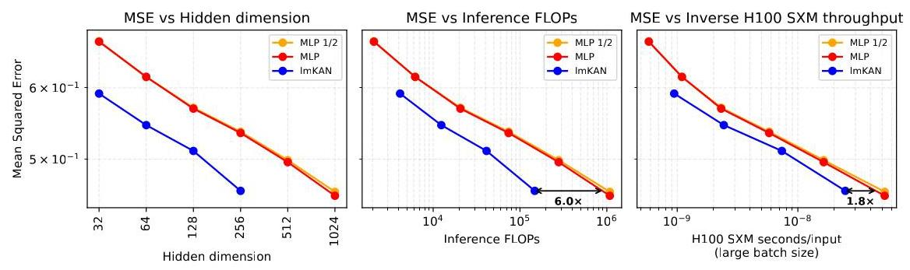

Figure 6: lmKAN vs MLP for general function approximation. The "MLP $1/2$ " line corresponds to the outcome of the fitting procedure with only half of the training steps compared to the "MLP" one.

图6:用于一般函数逼近的lmKAN与MLP对比。“MLP $1/2$ ”线对应于与“MLP”线相比仅使用一半训练步骤的拟合过程结果。

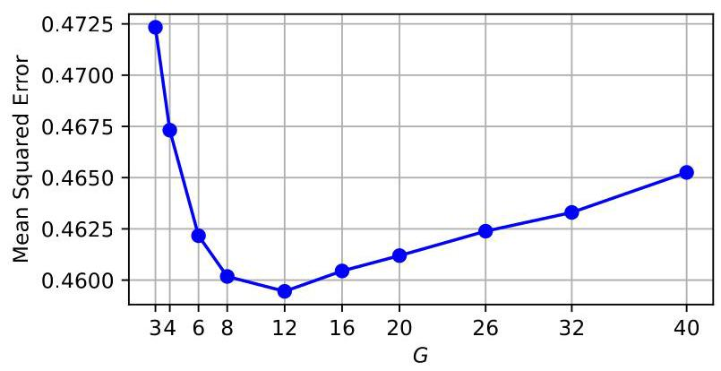

Figure 7: Final MSE vs $G$ for the hidden_dim $= {256}\mathrm{{lmKAN}}$ model.

图7:隐藏维度为$= {256}\mathrm{{lmKAN}}$的模型的最终MSE与$G$的关系。

Ablation We investigate the effect of the chosen number of grid intervals $G$ on the resulting lmKAN accuracy when approximating the ${\mathbb{R}}^{32} \rightarrow  {\mathbb{R}}^{1}$ function with hidden_dim $= {256}$ . The result is given in Fig. 7.

消融 我们研究了在使用隐藏维度$= {256}$近似${\mathbb{R}}^{32} \rightarrow  {\mathbb{R}}^{1}$函数时，所选网格间隔数量$G$对所得lmKAN精度的影响。结果如图7所示。

Contrary to our initial expectations, the final MSE does not monotonically decrease with the grid resolution, having a distinct minimum at $G = {12}$ . This is happening despite the fact that our setup effectively corresponds to an infinite data regime, effectively ruling out overfitting as an explanation. We hypothesize that the reason is that Kolmogorov-Arnold Networks are hard to converge for excessively fine grid resolution. Therefore, the optimal value of $G$ could depend on the training protocol. Appendix F. 2 reinforces this supposition by providing the MSE vs. epoch number plot with several lines corresponding to different $G$ values. Additionally, note that FastKANs were found to display the same effect to an even greater degree, as detailed in Sec. 4.4.

与我们最初的预期相反，最终的均方误差(MSE)并不会随着网格分辨率单调下降，在$G = {12}$处有一个明显的最小值。尽管我们的设置实际上相当于一个无限数据的情况，有效地排除了过拟合作为一种解释，但这种情况仍然发生。我们推测原因是，对于过于精细的网格分辨率，柯尔莫哥洛夫 - 阿诺德网络很难收敛。因此，$G$的最优值可能取决于训练协议。附录F.2通过提供MSE与轮次数量的关系图(有几条线对应不同的$G$值)强化了这一假设。此外，请注意，如第4.4节所述，FastKANs被发现表现出相同的效果，而且程度更大。

### 4.2 Randomly displaced methane configurations

### 4.2随机位移的甲烷构型

Our next step was to benchmark the performance of lmKANs on real data. Tabular datasets are the natural choice for feedforward fully connected neural networks. Popular tabular datasets, such as the Titanic [40] or housing prices [41], however, are not particularly convenient for this purpose. First, they are typically stochastic in nature - for instance, while it is possible to improve a guess on the survival based on the data available for the Titanic dataset, it is impossible to say for sure. Thus, even an arbitrarily large model fitted on arbitrarily many data points would have a non-zero limitation on the accuracy. In other words, the performance of a model translates into an error metric not so directly, making the comparisons between different models less illustrative. Second, these datasets are typically relatively small, making it challenging to sweep across a wide range of model scales to obtain a comprehensive picture of performance.

我们的下一步是在真实数据上对lmKANs的性能进行基准测试。表格数据集是前馈全连接神经网络的自然选择。然而，像泰坦尼克号[40]或房价[41]这样的流行表格数据集，在此目的下并不是特别方便。首先，它们本质上通常是随机的——例如，虽然可以根据泰坦尼克号数据集的可用数据改进对生存情况的猜测，但无法确定。因此，即使在任意多的数据点上拟合一个任意大的模型，在精度上也会有非零的限制。换句话说，模型的性能转化为误差度量的方式不是那么直接，这使得不同模型之间的比较缺乏说服力。其次，这些数据集通常相对较小，要全面了解性能，在广泛的模型规模上进行扫描具有挑战性。

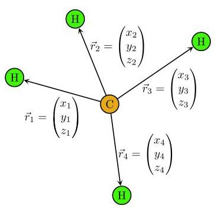

Figure 8: A methane configuration

图8:一个甲烷构型

Therefore, we chose the tabular-like dataset of randomly displaced methane configurations [42] for the comparison. It consists of multiple off-equilibrium methane configurations, as illustrated in Fig. 8. The target is given by the corresponding quantum-mechanical energy [43, 44]. Hydrogen atoms are placed around the carbon atom not as an ideal tetrahedron of an equilibrium methane molecule, but rather randomly, varying from instance to instance. Thus, the corresponding quantum-mechanical energies of such configurations are also different from each other. Machine learning models fitted on such datasets belong to the class of so-called machine learning interatomic potentials [45, 46]. This dataset is sufficiently large for the comparisons, containing more than seven million configurations. Additionally, this dataset is deterministic - the geometry of the corresponding methane configuration completely determines the target (Formally, there can be a stochastic term due to the lack of complete convergence of ab initio computations for the quantum-mechanical energy, but it is negligible in practice).

因此，我们选择了随机位移的甲烷构型的类表格数据集[42]进行比较。它由多个非平衡甲烷构型组成，如图8所示。目标由相应的量子力学能量给出[43, 44]。氢原子围绕碳原子放置，不是像平衡甲烷分子的理想四面体那样，而是随机的，每个实例都不同。因此，这些构型的相应量子力学能量也彼此不同。在这样的数据集上拟合的机器学习模型属于所谓的机器学习原子间势[45, 46]类别。这个数据集对于比较来说足够大，包含超过七百万个构型。此外，这个数据集是确定性的——相应甲烷构型的几何形状完全决定了目标(形式上，由于量子力学能量的从头计算缺乏完全收敛，可能存在一个随机项，但在实践中可以忽略不计)。

The target, the potential energy of the system, is invariant with respect to rotations and permutations of identical atoms ${}^{2}$ . Therefore, there are several viable representations of the methane molecules depending on how these symmetries are addressed:

目标，即系统的势能，在相同原子的旋转和排列下是不变的${}^{2}$。因此，根据这些对称性的处理方式，甲烷分子有几种可行的表示形式:

Cartesian Components: The simplest representation is a collection of all the Cartesian components of all displacement vectors from the carbon atom to all the hydrogen atoms. Since each methane molecule contains 4 hydrogen atoms, the total number of displacement vectors is 4, and the total number of components is 12. When using this representation, we simply concatenate all these components together and feed them to a fully connected MLP or lmKAN whose input dimension is 12. This representation is not invariant with respect to both rotations and permutations; thus, we use the corresponding augmentations during training. We randomly permute hydrogen atoms and rotate each molecule whenever we sample a minibatch from the training subset for each step of stochastic gradient descent.

笛卡尔分量:最简单的表示形式是从碳原子到所有氢原子的所有位移向量的笛卡尔分量的集合。由于每个甲烷分子包含4个氢原子，位移向量的总数为4，分量的总数为12。使用这种表示形式时，我们只需将所有这些分量连接在一起，并将它们输入到输入维度为12的全连接MLP或lmKAN中。这种表示形式在旋转和排列方面都不是不变的；因此，我们在训练期间使用相应的增强方法。在随机梯度下降的每一步，从训练子集中采样一个小批量时，我们随机排列氢原子并旋转每个分子。

---

${}^{2}$ Formally, there is an additional symmetry, inversion, but the corresponding group contains only two elements, thus it does not make much sense to treat it separately. We treat it as part of the rotation group, and in the following, by rotation we mean proper or improper rotation.

${}^{2}$形式上，还有一种额外的对称性，即反演，但相应的群只包含两个元素，因此单独处理它没有太大意义。我们将其视为旋转群的一部分，在下面，当我们说旋转时，我们指的是正常或非正常旋转。

---

Table 1: Summary of methane representations

表1:甲烷表示形式总结

<table><tr><td>Label</td><td>Rotational symmetry</td><td>Permutational symmetry</td><td>#Features</td></tr><tr><td>Cartesian Components</td><td>Augmentations</td><td>Augmentations</td><td>12</td></tr><tr><td>Distances</td><td>Features</td><td>Augmentations</td><td>10</td></tr><tr><td>Cartesian Components Polynomials</td><td>Augmentations</td><td>Features</td><td>34</td></tr><tr><td>Distances Polynomials</td><td>Features</td><td>Features</td><td>31</td></tr></table>

Distances: Another possible representation is a collection of all the interatomic distances between all the atoms. Since the total number of atoms is 5 , the number of all the interatomic distances is $5 * 4/2 = {10}$ . Therefore, the input dimension of fully connected networks applied to this representation is 10 . This representation is invariant with respect to rotations but not with respect to permutations. During training, we use only permutational augmentations.

距离:另一种可能的表示形式是所有原子之间所有原子间距离的集合。由于原子总数为5，所有原子间距离的数量为$5 * 4/2 = {10}$。因此，应用于此表示形式的全连接网络的输入维度为10。这种表示形式在旋转方面是不变的，但在排列方面不是。在训练期间，我们只使用排列增强。

Cartesian Components Polynomials: We compute power sum symmetric polynomials on top of the Cartesian components of the displacement vectors: ${P}_{{\alpha }_{x},{\alpha }_{y},{\alpha }_{z}} = \mathop{\sum }\limits_{{i = 1}}^{{i = 4}}{x}_{i}^{{\alpha }_{x}}{y}_{i}^{{\alpha }_{y}}{z}_{i}^{{\alpha }_{z}}$ for non-negative integer ${\alpha }_{x} + {\alpha }_{y} + {\alpha }_{z} \leq  4$ . The total number of such symmetric polynomials is 34 (excluding trivial ${P}_{0,0,0}$ ). This representation is invariant with respect to permutations but not with respect to rotations. Thus, during training we use only rotational augmentations.

笛卡尔分量多项式:我们在位移向量的笛卡尔分量之上计算幂和对称多项式:对于非负整数${\alpha }_{x} + {\alpha }_{y} + {\alpha }_{z} \leq  4$，为${P}_{{\alpha }_{x},{\alpha }_{y},{\alpha }_{z}} = \mathop{\sum }\limits_{{i = 1}}^{{i = 4}}{x}_{i}^{{\alpha }_{x}}{y}_{i}^{{\alpha }_{y}}{z}_{i}^{{\alpha }_{z}}$。这种对称多项式的总数为34(不包括平凡的${P}_{0,0,0}$)。这种表示形式在排列方面是不变的，但在旋转方面不是。因此，在训练期间，我们只使用旋转增强。

Distances Polynomials: The final representation is a collection of non-trivial symmetric polynomials on top of the interatomic distances, constructed similarly as in Allen et al. [47]. The total number of such polynomials is 31, and their exact formulas are given in Appendix F.3. This representation is invariant with respect to both rotations and permutations. Thus, we do not use any augmentations during training for this representation.

距离多项式:最终的表示形式是原子间距离之上的非平凡对称多项式的集合，其构造方式与Allen等人[47]类似。这种多项式的总数为31，其精确公式在附录F.3中给出。这种表示形式在旋转和排列方面都是不变的。因此，对于这种表示形式，我们在训练期间不使用任何增强。

The described representations are summarized in Table 1. We systematically evaluate all four possible combinations of how the rotational and permutational symmetries can be incorporated into the fitting pipeline. Within the Distances Polynomials representation, the methane dataset is tabular in the classical sense - it is a table with about 7.7 million rows and 31 columns. For other representations, the dataset is tabular-like given the available augmentation strategies. We randomly split the data into 7000000, 300000, and 432488 train, validation, and test molecules, respectively.

上述表示形式总结在表1中。我们系统地评估了旋转和排列对称性如何纳入拟合管道的所有四种可能组合。在距离多项式表示形式中，甲烷数据集在经典意义上是表格形式的——它是一个大约有770万行和31列的表格。对于其他表示形式，考虑到可用的增强策略，数据集类似表格形式。我们将数据随机分别划分为7000000、300000和432488个训练、验证和测试分子。

For each representation, we fit the same families of MLP and lmKAN models as in the previous section. The result is given in Fig. 9. For this dataset, we use $G = {28}$ , the optimal value we found in ablation studies. Similarly to the previous experiment, we demonstrate tight convergence of the baseline MLP models by providing three lines corresponding to full, half, and quarter of the training budget, respectively. Overall, when compared to domain-specific architectures, typically given by GNNs [48] and/or transformers [49], the introduced feedforward fully connected models occupy a non-overlapping part of the Pareto frontier - they are less accurate, but also orders of magnitude faster.

对于每种表示形式，我们拟合与上一节相同的MLP和lmKAN模型族。结果如图9所示。对于这个数据集，我们使用$G = {28}$，这是我们在消融研究中找到的最优值。与之前的实验类似，我们通过分别提供对应于训练预算的全部、一半和四分之一的三条线，展示了基线MLP模型的紧密收敛。总体而言，与通常由GNNs[48]和/或transformers[49]给出的特定领域架构相比，引入的前馈全连接模型占据了帕累托前沿的一个不重叠部分——它们的准确性较低，但速度快几个数量级。

The figure illustrates that lmKANs consistently outperform MLPs across all modalities. Furthermore, the performance improvement is much larger compared to our previous experiment. At the same accuracy level, lmKANs require dozens of times (or even up to one thousand for the Distances modality) fewer inference FLOPs, which results in more than a ${10} \times$ improvement of the inference H100 wall-clock time.

该图表明，在所有模态中，lmKANs始终优于MLPs。此外，与我们之前的实验相比，性能提升要大得多。在相同的精度水平下，lmKANs所需的推理FLOP数要少几十倍(对于距离模态甚至高达一千倍)，这导致推理H100墙上时间提高了${10} \times$以上。

On top of that, Fig. 9 provides early indications that lmKANs sometimes can be more accurate in the limit of large scale, that is, to have better generalizability. The second row of the figure, corresponding to the Distances modality, illustrates that the rate of improvement of MLP models becomes very slow, and it is questionable if this family of models would ever surpass the accuracy achieved by lmKAN models at any scale.

除此之外，图9提供了早期迹象，表明lmKANs有时在大规模极限情况下可能更准确，也就是说，具有更好的泛化能力。图的第二行对应距离模态，表明MLP模型的改进速度变得非常缓慢，并且这个模型家族是否能在任何规模上超过lmKAN模型所达到的准确率是值得怀疑的。

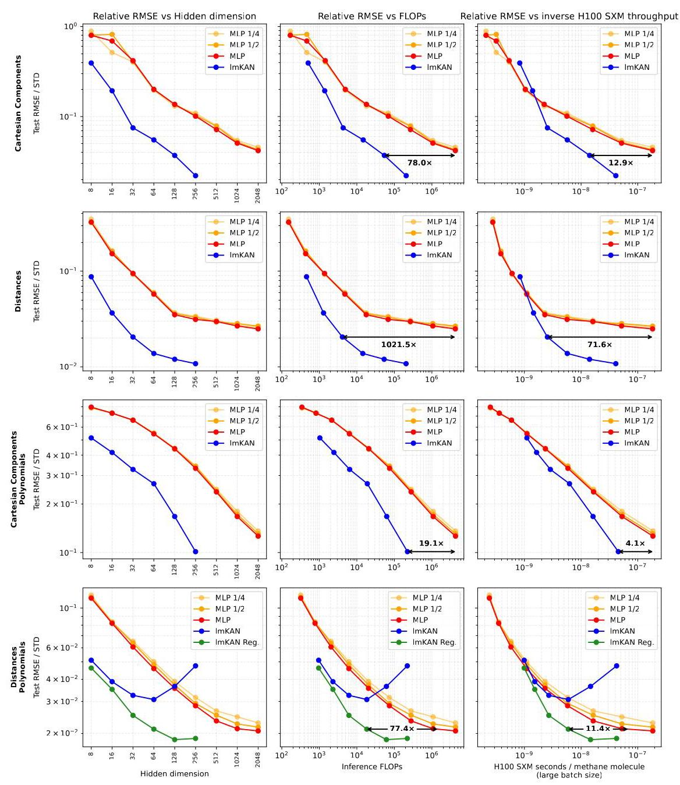

Figure 9: ImKAN vs MLP on the dataset of randomly displaced methane configurations. "lmKAN Reg." curve corresponds to lmKAN fitted with Hessian regularization introduced in Sec. 3.5. On the vertical axis, we plot the relative Root Mean Squared Error, which is given as test RMSE normalized by standard deviation of the target in the dataset. The "MLP 1/2" and "MLP 1/4" curves correspond to outcomes of fitting procedures with half and a quarter of the training budget, respectively.

图9:在随机位移甲烷构型数据集上的ImKAN与MLP对比。“lmKAN Reg.”曲线对应于采用第3.5节中引入的海森正则化拟合的lmKAN。在纵轴上，我们绘制相对均方根误差，它是通过数据集中目标的标准差对测试均方根误差进行归一化得到的。“MLP 1/2”和“MLP 1/4”曲线分别对应使用一半和四分之一训练预算的拟合过程的结果。

On the other hand, depending on the nature of the data, raw lmKANs, without the Hessian regularization we proposed in Sec. 3.5, can be more prone to overfitting. This happens for the Distances Polynomials modality as the last row of Fig. 9 illustrates. This modality incorporates all the symmetries into the representation and does not involve any sort of augmentations. Therefore, it is likely that the generalization problem we outlined in Sec. 3.5 takes place for this fitting setup. As the green line of the fourth row of Fig. 9 illustrates, the Hessian regularization is sufficient to overcome the overfitting. Properly regularized lmKANs were found to outperform the MLPs and be Pareto optimal from the point of view of both inference FLOPs and inference H100 wall-clock time.

另一方面，根据数据的性质，未采用我们在第3.5节中提出的海森正则化的原始lmKANs可能更容易过拟合。如图9最后一行所示，距离多项式模态就是这种情况。这种模态将所有对称性纳入表示中，并且不涉及任何形式的增强。因此，我们在第3.5节中概述的泛化问题可能在这种拟合设置中发生。如图9第四行的绿线所示，海森正则化足以克服过拟合。从推理FLOP和推理H100挂钟时间的角度来看，经过适当正则化的lmKANs被发现优于MLP，并且是帕累托最优的。

Ablations Appendix F.3 contains ablation studies focusing on the grid resolution $G$ and the strength of Hessian regularization.

消融研究附录F.3包含专注于网格分辨率$G$和海森正则化强度的消融研究。

### 4.3 ImKAN-based Convolutional Neural Networks

### 4.3基于ImKAN的卷积神经网络

In the introduction, we briefly outlined that high-dimensional linear mappings are the primary building blocks in most architectures, not only in feedforward fully connected neural networks. Convolutional Neural Networks are no exception.

在引言中，我们简要概述了高维线性映射是大多数架构中的主要构建块，不仅在全连接前馈神经网络中如此。卷积神经网络也不例外。

A standard computer-vision two-dimensional convolution with kernel size $k \times  k$ is parametrized by linear mapping ${\mathbb{R}}^{{k}^{2}{C}_{in}} \rightarrow  {\mathbb{R}}^{{C}_{\text{ out }}}$ , where ${C}_{in}$ and ${C}_{\text{ out }}$ are numbers of input and output channels, respectively. Since Kolmogorov-Arnold layers can be used as a general substitute for high-dimensional linear mappings, one can construct a KAN-based convolutional neural network well suited for image processing, as was done, e.g, in Bodner et al. [50]. In this section, we compare the performance of lmKAN- and MLP-based CNNs on the CIFAR-10 [51] and ImageNet [52] datasets.

一个核大小为$k \times  k$的标准计算机视觉二维卷积由线性映射${\mathbb{R}}^{{k}^{2}{C}_{in}} \rightarrow  {\mathbb{R}}^{{C}_{\text{ out }}}$参数化，其中${C}_{in}$和${C}_{\text{ out }}$分别是输入和输出通道的数量。由于柯尔莫哥洛夫 - 阿诺德层可以用作高维线性映射的通用替代品，因此可以构建一个非常适合图像处理的基于KAN的卷积神经网络，例如Bodner等人[50]所做的那样。在本节中我们比较基于lmKAN和基于MLP的CNN在CIFAR - 10 [51]和ImageNet [52]数据集上的性能。

CIFAR-10 CNN backbone

CIFAR - 10 CNN骨干网络

---

#Only convolutional and fully

	connected layers are shown

#[32, 32, 3] → [16, 16, width]

Conv2D(3 → width, kernel_size = 2,

	stride = 2)

#[16, 16, width] $\rightarrow$ [8, 8, width]

Conv2D(width $\rightarrow$ width, kernel_size =

	2, stride = 2)

#[8, 8, width] → [4, 4, width]

Conv2D(width $\rightarrow$ width, kernel_size =

	2, stride = 2)

#[4, 4, width] $\rightarrow$ [2, 2, width]

Conv2D(width $\rightarrow$ width, kernel_size =

	2, stride = 2)

#[2, 2, width] $\rightarrow$ [1, 1, width]

Conv2D(width $\rightarrow$ width, kernel_size =

	2, stride = 2)

FullyConnected(width $\rightarrow$ width)

FullyConnected(width $\rightarrow  {10}$ )

---

ImageNet CNN backbone

ImageNet CNN骨干网络

---

#Only convolutional and fully

	connected layers are shown

#[81,81,3] $\rightarrow$ [27,27, base_width]

Conv2D(3 → base_width, kernel_size =

	3, stride = 3)

#[27, 27, base_width] → [9, 9, 3*

	base_width]

Conv2D(base_width $\rightarrow$ 3*base_width,

	kernel_size $= 3$ , stride = 3)

#[9,9,3*base_width] $\rightarrow$ [3,3,9*

	base_width]

Conv2D (3*base_width $\rightarrow  9 *$ base_width,

	kernel_size = 3, stride = 3)

#[3,3,9*base_width] $\rightarrow  \lbrack 1,1,{27} *$

	base_width]

Conv2D(9*base_width $\rightarrow$ 27*base_width,

	kernel_size $= 3$ , stride $= 3$ )

FullyConnected(27*base_width $\rightarrow  {27} *$

	base_width)

FullyConnected(27*base_width $\rightarrow$ 1000)

---

Figure 10: CIFAR-10 and ImageNet CNN backbones. MLP-based CNNs additionally have ReLU activations and batch normalizations with enabled affine transforms. ImKAN-based CNNs do not require additional activations and use batch normalizations without affine transforms as suggested by our static percentile grids described in Sec. 3.1.

图10:CIFAR - 10和ImageNet CNN骨干网络。基于MLP的CNN还具有ReLU激活和启用仿射变换的批量归一化。基于ImKAN的CNN不需要额外的激活，并且如我们在第节中描述的静态百分位数网格所建议的那样，使用不带有仿射变换的批量归一化。

#### 4.3.1 CIFAR-10

#### 4.3.1 CIFAR - 10

Our backbone architecture consists of five $2 \times  2$ convolutions, each with stride 2, and two fully connected layers at the end. Since the resolution of CIFAR-10 images is ${32} \times  {32}$ , where ${32} = {2}^{5}$ , five $2 \times  2$ convolutions with stride 2 transform the spatial dimensions of an image exactly to $1 \times  1$ . All the layers use the same width (= number of filters in case of convolutions, and hidden dimension in case of fully connected layers), which we vary for both families of the models. In other aspects, the models are similar to those we employed in previous sections - we use batch normalizations with affine transforms for MLP-CNNs, and without for lmKAN-CNNs; MLP-CNNs use ReLU activations, while lmKAN-CNNs do not require additional activation layers.

我们的骨干网络架构由五个$2 \times  2$卷积组成，每个卷积步长为2，最后有两个全连接层。由于CIFAR - 10图像的分辨率是${32} \times  {32}$，其中${32} = {2}^{5}$，五个步长为2的$2 \times  2$卷积将图像空间维度精确变换为$1 \times  1$。所有层使用相同的宽度(卷积情况下为滤波器数量，全连接层情况下为隐藏维度)，我们对两个模型家族都改变这个宽度。在其他方面，这些模型与我们在前面几节中使用的模型类似 - 我们对基于MLP的CNN使用带有仿射变换的批量归一化，对基于lmKAN的CNN不使用；基于MLP的CNN使用ReLU激活，而基于lmKAN的CNN不需要额外的激活层。

The dataset comes with pre-defined full training and test subsets. We split the full training subset into training and validation parts in a ${90}\% /{10}\%$ ratio. Our augmentation pipeline consists of established techniques, such as RandAugment [53], MixUp [54], CutMix [55], and a few others. Further details about the augmentations and other aspects of our fitting setup are available in Appendix F.4.

数据集附带预定义的完整训练和测试子集。我们以${90}\% /{10}\%$的比例将完整训练子集划分为训练和验证部分。我们的增强管道由一些既定技术组成，例如RandAugment [53]、MixUp [54]、CutMix [55] 等等。关于增强以及我们拟合设置的其他方面的更多详细信息，请参阅附录F.4。

Our findings are illustrated in the upper row of Fig. 11. Similarly to previous experiments, ImKAN-based CNNs were found to be more FLOPs efficient compared to classical MLP-based CNNs at the same accuracy level. The observed speed-up factor of 1.6-2.1 $\times$ is not so dramatic as we report in sections 4.1 and 4.2, but still substantial. We have not yet implemented dedicated CUDA kernels for efficient inference of lmKAN-based convolutions. Any type of convolution can be cast to a fully connected layer by the corresponding memory manipulations, which we followed during fitting.

我们的研究结果如图11的上排所示。与之前的实验类似，在相同的准确率水平下，基于ImKAN的卷积神经网络(CNNs)被发现比基于经典多层感知器(MLP)的CNNs在计算量(FLOPs)方面更高效。观察到的1.6 - 2.1$\times$的加速因子不如我们在4.1节和4.2节中报告的那么显著，但仍然相当可观。我们尚未为基于lmKAN的卷积实现专门的CUDA内核以进行高效推理。任何类型的卷积都可以通过相应的内存操作转换为全连接层，我们在拟合过程中遵循了这一点。

Ablations Appendix F. 4 contains ablation studies on 1) the effect of the number of grid intervals $G$ and 2) the effect of the strength of Hessian regularization $\lambda$ .

消融实验 附录F.4包含关于1)网格间隔数量$G$的影响和2)海森正则化强度$\lambda$的影响的消融研究。

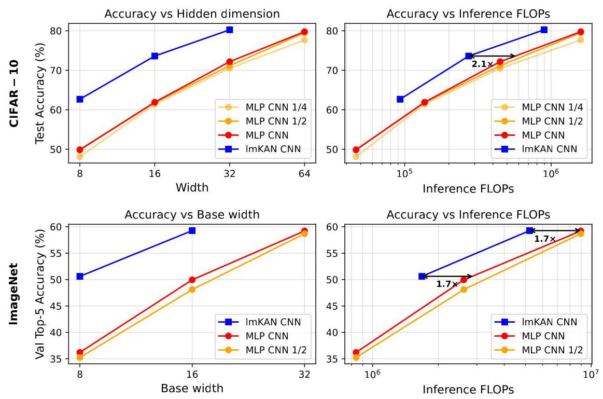

Figure 11: Comparison of the performance of standard MLP-based CNNs and lmKAN-based CNNs on the CIFAR-10 and ImageNet datasets. The "MLP CNN 1/2" line corresponds to the outcome of the fitting procedure with only half of the training steps compared to the "MLP CNN" one.

图11:基于标准MLP的CNNs和基于lmKAN的CNNs在CIFAR - 10和ImageNet数据集上的性能比较。“MLP CNN 1/2”线对应于与“MLP CNN”相比仅进行一半训练步骤的拟合过程的结果。

#### 4.3.2 ImageNet

#### 4.3.2 ImageNet

To limit the computational cost, we downsampled the images to ${81} \times  {81}\left( {{81} = {3}^{4}}\right)$ pixels. Our backbone, illustrated in the right panel of Fig. 10, consists of four convolutional layers with the $3 \times  3$ kernel size and stride 3 and two fully connected layers. In contrast to the CIFAR-10 experiment, we progressively increase the number of filters as the spatial resolution of the image decreases through the neural network. Our augmentation pipeline consists of the same techniques as the ones we use for CIFAR-10, but with different hyperparameters; see more details in Appendix F.5. Since the test subset is not publicly available, we use the validation accuracy as the target metric. The performance of the models is summarized in the bottom row of Fig. 11. The observed efficiency gains of ${1.7} \times$ are in line with those for CIFAR-10.

为了限制计算成本，我们将图像下采样到${81} \times  {81}\left( {{81} = {3}^{4}}\right)$像素。我们的主干网络如图10的右图所示，由四个卷积层组成，卷积核大小为$3 \times  3$，步长为3，以及两个全连接层。与CIFAR - 10实验不同，随着图像通过神经网络的空间分辨率降低，我们逐渐增加滤波器的数量。我们的增强管道由与用于CIFAR - 10相同的技术组成，但超参数不同；更多详细信息请参阅附录F.5。由于测试子集不公开，我们使用验证准确率作为目标指标。模型的性能总结在图11的底行。观察到的${1.7} \times$的效率提升与CIFAR - 10的情况一致。

### 4.4 Comparison with FastKAN

### 4.4与FastKAN的比较

We use the training script ${}^{3}$ for the CIFAR-10 dataset available in the FastKAN GitHub repository [56] as the basis for the comparison of lmKAN and FastKAN. However, we provide several modifications to the pipeline.

我们使用FastKAN GitHub仓库[56]中提供的用于CIFAR - 10数据集的训练脚本${}^{3}$作为比较lmKAN和FastKAN的基础。然而，我们对管道进行了一些修改。

The original script implements the fitting procedure of a fully connected FastKAN model on the CIFAR-10 dataset without augmentations. The model has only one hidden layer with 256 neurons. Without augmentati ons, it overfits the data quickly. Thus, the very short fitting procedure in the original script is sufficient.

原始脚本在没有增强的情况下在CIFAR - 10数据集上实现了全连接FastKAN模型的拟合过程。该模型只有一个包含256个神经元的隐藏层。没有增强时，它很快就会过拟合数据。因此，原始脚本中非常短的拟合过程就足够了。

We extend the script by the same augmentation pipeline as we used in Sec. 4.3 for the CIFAR-10 dataset. We observed that because of augmentations, one has to fit the model for a longer time, so the training budget was substantially increased. Additional changes are detailed in Appendix F.6.

我们通过与我们在4.3节中用于CIFAR - 10数据集相同的增强管道扩展了脚本。我们观察到由于增强，必须对模型进行更长时间的拟合，因此训练预算大幅增加。附录F.6中详细介绍了其他更改。

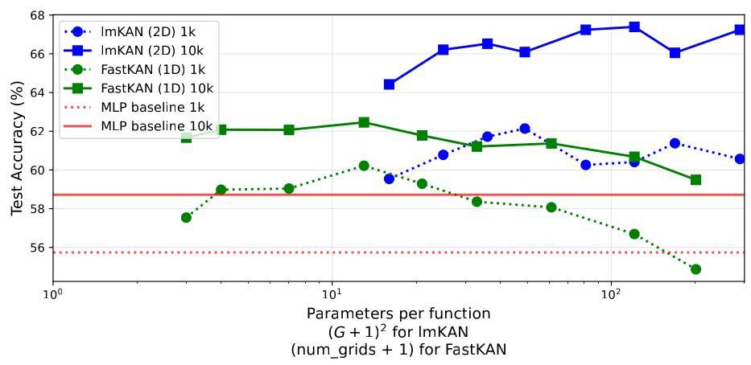

Figure 12: Comparison of lmKAN and FastKAN within the fully connected framework on the CIFAR-10 dataset. Both models were fit with 1k and 10k epochs.

图12:在全连接框架内基于CIFAR - 10数据集的lmKAN和FastKAN的比较。两个模型都进行了1k和10k个轮次的拟合。

These modifications significantly improve the performance of FastKAN models (54 - 55% validation accuracy in the original script), see Fig. 12. Furthermore, even the MLP baseline of the same shape yields better accuracy compared to the performance of the FastKAN model in the original script.

这些修改显著提高了FastKAN模型的性能(原始脚本中的验证准确率为54 - 55%)，见图12。此外，即使是相同形状的MLP基线也比原始脚本中FastKAN模型的性能产生更高的准确率。

In this section, we systematically compare the performance of the lmKAN and FastKAN models with the same backbone from the original FastKAN script. For each family of the models, we vary the grid resolution and fit the models for one or ten thousand epochs each. The comparison is given in Fig. 12.

在本节中，我们系统地比较了来自原始FastKAN脚本的具有相同主干网络的lmKAN和FastKAN模型的性能。对于每个模型家族，我们改变网格分辨率，并分别对模型进行1万或10万个轮次的拟合。比较结果如图12所示。

The first observation is that the performance of FastKAN models degrades for excessively fine grid resolutions. For the training budget of one thousand epochs, the final model is even less accurate than the MLP baseline. For the ten thousand epochs, the effect is less pronounced, but it still takes place. For ImKAN models, this degradation is much less severe, if present at all.

第一个观察结果是，对于过于精细的网格分辨率，FastKAN模型的性能会下降。对于1000个轮次的训练预算，最终模型甚至比MLP基线更不准确。对于10000个轮次，这种影响不太明显，但仍然存在。对于ImKAN模型，如果存在这种下降，其程度要小得多。

The number of parameters per function scales quadratically with grid resolution for lmKANs and linearly for FastKANs. Thus, although the rightmost lmKAN model in Fig. 12 uses more parameters per function, it operates on a much coarser grid - only $G = {16}$ grid intervals per dimension, compared with num_grids $= {200}$ for FastKANs. This suggests that, for a comparable parameter budget per function, this coarser grid enforces a lower-frequency function class and, in turn, contributes to the superior training stability observed for lmKANs.

对于lmKANs，每个函数的参数数量与网格分辨率呈二次方比例关系，而对于FastKANs则呈线性关系。因此，尽管图12中最右侧的lmKAN模型每个函数使用的参数更多，但它在一个更粗糙的网格上运行——每个维度只有$G = {16}$个网格间隔，而FastKANs为num_grids $= {200}$。这表明，对于每个函数相当的参数预算，这个更粗糙的网格强制使用更低频率的函数类，进而有助于观察到lmKANs具有更好的训练稳定性。

Another distinct feature of Fig. 12 is that lmKANs achieve notably better accuracy compared to FastKANs, even when the latter are evaluated with a very rich parametrization of inner functions. Additionally, note that the number of trainable functions $\left\lbrack  {{N}_{in}/2}\right\rbrack  {N}_{\text{ out }}$ and ${N}_{in}{N}_{\text{ out }}$ in an lmKAN and FastKAN layer, respectively. Thus, the same number of parameters per function corresponds to a two times larger FastKAN model overall.

图12的另一个显著特点是，与FastKANs相比，lmKANs即使在后者使用非常丰富的内部函数参数化进行评估时，也能实现明显更好的准确性。此外，请注意lmKAN和FastKAN层中可训练函数的数量分别为$\left\lbrack  {{N}_{in}/2}\right\rbrack  {N}_{\text{ out }}$和${N}_{in}{N}_{\text{ out }}$。因此，每个函数相同数量的参数对应于总体上两倍大的FastKAN模型。

---

${}^{3}$ https://github.com/ZiyaoLi/fast-kan/blob/master/examples/train_cifar10.py

${}^{3}$ https://github.com/ZiyaoLi/fast-kan/blob/master/examples/train_cifar10.py

---

To conclude, these findings reinforce the intuitive considerations given in Sec. 3 and suggest that building blocks of multivariate trainable functions are indeed more effective.

总之，这些发现强化了第3节中给出的直观考虑，并表明多元可训练函数的构建块确实更有效。

## 5 Limitations

## 5局限性

Many of the difficulties arise when selecting an excessively high number of grid intervals $G$ :

当选择过多的网格间隔$G$时会出现许多困难:

- When $G$ is too large, $\operatorname{lmKANs}$ were found to be hard to converge.

- 当$G$太大时，发现$\operatorname{lmKANs}$很难收敛。

- While the throughput does not depend on the grid resolution, both theoretically and empirically, $G$ still affects latency.

- 虽然吞吐量在理论和经验上都不依赖于网格分辨率，但$G$仍然会影响延迟。

- Large $G$ entails a large number of parameters; therefore, large models with fine grid resolution have high memory requirements.

- 大的$G$需要大量参数；因此，具有精细网格分辨率的大型模型有很高的内存要求。

We have implemented CUDA kernels only for the full precision float32 data type. If using data types such as bfloat16, the gains in efficiency are expected similarly to dense matrix multiplications, but such kernels are yet to be implemented.

我们仅为全精度float32数据类型实现了CUDA内核。如果使用诸如bfloat16等数据类型，效率提升预计与密集矩阵乘法类似，但此类内核尚未实现。

## 6 Summary

## 6总结

High-dimensional linear mappings are the cornerstone of modern deep learning, dominating both the parameter count and the computational cost in most models. We introduce lookup multivariate Kolmogorov-Arnold Networks (lmKANs) as a drop-in replacement that offers a substantially better capacity-inference cost trade-off. Across all experiments, lmKANs were Pareto-optimal in the inference FLOPs-performance plane. The efficiency gains are task-dependent: for general high-dimensional function approximation, modeled as a distillation from a large ground-truth teacher MLP with random weights, lmKANs achieved up to $6 \times$ fewer FLOPs at matched accuracy. On randomly displaced methane configurations, efficiency improved by up to ${78} \times$ , or even more, for the Distances representation. Within convolutional networks, the gains were smaller but still significant: ${1.6} - {2.1} \times$ on CIFAR-10 and ${1.7} \times$ on ImageNet.

高维线性映射是现代深度学习的基石，在大多数模型中主导着参数数量和计算成本。我们引入查找多元柯尔莫哥洛夫 - 阿诺德网络(lmKANs)作为直接替代品，它在容量 - 推理成本权衡方面提供了显著更好的表现。在所有实验中，lmKANs在推理FLOP - 性能平面上是帕累托最优的。效率提升取决于任务:对于一般的高维函数逼近，建模为从具有随机权重的大型真实教师MLP进行蒸馏，lmKANs在匹配精度下实现了多达$6 \times$次更少的FLOP。在随机位移的甲烷构型上，对于距离表示，效率提高了多达${78} \times$，甚至更多。在卷积网络中，提升较小但仍然显著:在CIFAR - 10上为${1.6} - {2.1} \times$，在ImageNet上为${1.7} \times$。

Our CUDA kernels compete directly with highly optimized dense matrix multiplications - the backbone of many numerical pipelines for decades. Even so, the gains were sufficient to make lmKANs Pareto-optimal in H100 wall-clock time for both the general high-dimensional function approximation and the methane dataset, achieving the speedup of more than an order of magnitude in the latter case.

我们的CUDA内核直接与高度优化的密集矩阵乘法竞争——几十年来许多数值管道的核心。即便如此，这些提升足以使lmKANs在H100挂钟时间内对于一般高维函数逼近和甲烷数据集都是帕累托最优的，在后者情况下实现了超过一个数量级的加速。

## 7 Acknowledgments

## 7致谢

S.P. thanks Prashanth Kanduri, Nicholas J. Browning, and Henrique Mendonça for fruitful discussions regarding CUDA, Bob Crovella, whose instrumental lectures are available online ${}^{4}$ , and all the teachers of the CUDA course at Yandex School of Data Analysis.

S.P.感谢Prashanth Kanduri、Nicholas J. Browning和Henrique Mendonça就CUDA进行的富有成效的讨论，感谢Bob Crovella，其在线讲座${}^{4}$很有帮助，以及Yandex数据分析学院CUDA课程的所有教师。

S.P. acknowledges support from Intel and Merck KGaA via the AWASES programme. P.S. acknowledges support from the NCCR Catalysis (grant number 225147), a National Centre of Competence in Research funded by the Swiss National Science Foundation.

S.P.感谢英特尔和默克集团通过AWASES计划提供的支持。P.S.感谢瑞士国家科学基金会资助的国家研究中心能力中心NCCR Catalysis(资助编号225147)的支持。

## References

## 参考文献

[1] Xiaohua Zhai, Alexander Kolesnikov, Neil Houlsby, and Lucas Beyer. Scaling visiontransformers. In Proceedings of the IEEE/CVF conference on computer vision and

变压器。发表于IEEE/CVF计算机视觉会议论文集及pattern recognition, pages 12104-12113, 2022.

---

${}^{4}$ https://www.youtube.com/playlist?list=PL6RdenZrxrw-zNX7uuGppWETdxt_JxdMj

${}^{4}$ https://www.youtube.com/playlist?list=PL6RdenZrxrw-zNX7uuGppWETdxt_JxdMj

---

[2] Jared Kaplan, Sam McCandlish, Tom Henighan, Tom B Brown, Benjamin Chess, RewonChild, Scott Gray, Alec Radford, Jeffrey Wu, and Dario Amodei. Scaling laws for neural

儿童、斯科特·格雷、亚历克·拉德福德、杰弗里·吴和达里奥·阿莫迪。神经网络的缩放定律language models. arXiv preprint arXiv:2001.08361, 2020.

[3] Sergey Ioffe and Christian Szegedy. Batch normalization: Accelerating deep networktraining by reducing internal covariate shift. In International conference on machine

通过减少内部协变量偏移进行训练。在国际机器学习会议上learning, pages 448-456. pmlr, 2015.

[4] Geoffrey E Hinton, Nitish Srivastava, Alex Krizhevsky, Ilya Sutskever, and Ruslan RSalakhutdinov. Improving neural networks by preventing co-adaptation of feature

萨拉胡丁诺夫。通过防止特征的共同适应来改进神经网络detectors. arXiv preprint arXiv:1207.0580, 2012.

[5] Ashish Vaswani, Noam Shazeer, Niki Parmar, Jakob Uszkoreit, Llion Jones, Aidan NGomez, Łukasz Kaiser, and Illia Polosukhin. Attention is all you need. Advances in

戈麦斯、卢卡斯·凯泽和伊利亚·波罗苏金。你只需要注意力。进展于neural information processing systems, 30, 2017.

[6] Krzysztof Choromanski, Valerii Likhosherstov, David Dohan, Xingyou Song, AndreeaGane, Tamas Sarlos, Peter Hawkins, Jared Davis, Afroz Mohiuddin, Lukasz Kaiser,

加内、塔马斯·萨罗斯、彼得·霍金斯、贾里德·戴维斯、阿夫罗兹·莫希丁、卢卡斯·凯泽et al. Rethinking attention with performers. arXiv preprint arXiv:2009.14794, 2020.

[7] Jeffrey L Elman. Finding structure in time. Cognitive science, 14(2):179-211, 1990.

[8] Jie Zhou, Ganqu Cui, Shengding Hu, Zhengyan Zhang, Cheng Yang, Zhiyuan Liu,Lifeng Wang, Changcheng Li, and Maosong Sun. Graph neural networks: A review of

王利锋、李长城和孙茂松。图神经网络:综述methods and applications. AI open, 1:57-81, 2020.

[9] Yann LeCun, Léon Bottou, Yoshua Bengio, and Patrick Haffner. Gradient-based learning applied to document recognition. Proceedings of the IEEE, 86(11):2278-2324, 2002.

[10] Alex Krizhevsky, Ilya Sutskever, and Geoffrey E Hinton. Imagenet classification withdeep convolutional neural networks. Advances in neural information processing systems, 25, 2012.

深度卷积神经网络。《神经信息处理系统进展》，第25卷，2012年。

[11] Ziming Liu, Yixuan Wang, Sachin Vaidya, Fabian Ruehle, James Halverson, MarinSoljačić, Thomas Y Hou, and Max Tegmark. Kan: Kolmogorov-arnold networks. arXiv

索尔亚契奇、托马斯·Y·侯和马克斯·泰格马克。《能:柯尔莫哥洛夫-阿诺德网络》。arXivpreprint arXiv:2404.19756, 2024.

[12] Ziyao Li. Kolmogorov-arnold networks are radial basis function networks. 2024.

[13] Andreï Kolmogorov. On the representation of continuous functions of several variablesby superpositions of continuous functions of a smaller number of variables.

通过较少数量变量的连续函数的叠加。

[14] Vladimir I Arnold. On functions of three variables. Collected Works: Representations of Functions, Celestial Mechanics and KAM Theory, 1957-1965, pages 5-8, 2009.

[15] Federico Girosi and Tomaso Poggio. Representation properties of networks: Kolmogorov's theorem is irrelevant. Neural Computation, 1(4):465-469, 1989.

[16] Johannes Schmidt-Hieber. The kolmogorov-arnold representation theorem revisited. Neural networks, 137:119-126, 2021.

[17] Robert Hecht-Nielsen. Kolmogorov's mapping neural network existence theorem. InProceedings of the international conference on Neural Networks, volume 3, pages 11-14.

神经网络国际会议论文集，第3卷，第11 - 14页。IEEE press New York, NY, USA, 1987.

[18] Boris Igelnik and Neel Parikh. Kolmogorov's spline network. IEEE transactions on neural networks, 14(4):725-733, 2003.

[19] Xingyi Yang and Xinchao Wang. Kolmogorov-arnold transformer. arXiv preprint arXiv:2409.10594, 2024.

[20] Akash Kundu, Aritra Sarkar, and Abhishek Sadhu. Kanqas: Kolmogorov-arnold network for quantum architecture search. EPJ Quantum Technology, 11(1):76, 2024.

[21] Ali Kashefi. Pointnet with kan versus pointnet with mlp for 3d classification and segmentation of point sets. Computers & Graphics, page 104319, 2025.

[22] Runpeng Yu, Weihao Yu, and Xinchao Wang. Kan or mlp: A fairer comparison. arXiv preprint arXiv:2407.16674, 2024.

[23] Shriyank Somvanshi, Syed Aaqib Javed, Md Monzurul Islam, Diwas Pandit, and SubasishDas. A survey on kolmogorov-arnold network. ACM Computing Surveys, 2024.

那篇。关于柯尔莫哥洛夫 - 阿诺德网络的一项调查。《美国计算机协会计算调查》，2024年。

[24] Tianrui Ji, Yuntian Hou, and Di Zhang. A comprehensive survey on kolmogorov arnold networks (kan). arXiv preprint arXiv:2407.11075, 2024.

[25] Sidharth SS, Keerthana AR, Anas KP, et al. Chebyshev polynomial-based kolmogorov-arnold networks: An efficient architecture for nonlinear function approximation. arXiv

阿诺德网络:一种用于非线性函数逼近的高效架构。arXivpreprint arXiv:2405.07200, 2024.

[26] Jinfeng Xu, Zheyu Chen, Jinze Li, Shuo Yang, Wei Wang, Xiping Hu, and Edith C-HNgai. Fourierkan-gcf: Fourier kolmogorov-arnold network-an effective and efficient

Ngai。傅里叶变换-广义互补滤波器:傅里叶-柯尔莫哥洛夫-阿诺德网络——一种高效且有效的feature transformation for graph collaborative filtering. arXiv preprint arXiv:2406.01034,2024.

[27] Alireza Moradzadeh, Lukasz Wawrzyniak, Miles Macklin, and Saee G Paliwal. Ukan:Unbound kolmogorov-arnold network accompanied with accelerated library. arXiv

无界柯尔莫哥洛夫 - 阿诺德网络与加速库。arXivpreprint arXiv:2408.11200, 2024.

[28] Wei-Hsing Huang, Jianwei Jia, Yuyao Kong, Faaiq Waqar, Tai-Hao Wen, Meng-FanChang, and Shimeng Yu. Hardware acceleration of kolmogorov-arnold network (kan) for lightweight edge inference. In Proceedings of the 30th Asia and South Pacific Design

张，以及于诗萌。用于轻量级边缘推理的柯尔莫哥洛夫 - 阿诺德网络(KAN)的硬件加速。在第30届亚洲及南太平洋设计会议论文集Automation Conference, pages 693-699, 2025.

[29] Michael Poluektov and Andrew Polar. Construction of the kolmogorov-arnold networks using the newton-kaczmarz method. Machine Learning, 114(8):185, 2025.

[30] Andrew Polar and Michael Poluektov. A deep machine learning algorithm for construc-tion of the kolmogorov-arnold representation. Engineering Applications of Artificial

柯尔莫哥洛夫 - 阿诺德表示的[此处原文缺失相关内容]。人工智能的工程应用Intelligence, 99:104137, 2021.

[31] Kaiming He, Xiangyu Zhang, Shaoqing Ren, and Jian Sun. Deep residual learningfor image recognition. In Proceedings of the IEEE conference on computer vision and

用于图像识别。在IEEE计算机视觉与[此处原文缺失相关内容]会议论文集中pattern recognition, pages 770-778, 2016.

[32] Carl De Boor and Carl De Boor. A practical guide to splines, volume 27. springer NewYork, 1978.

纽约，1978年。

[33] Carl De Boor. On uniform approximation by splines. J. Approx. Theory, 1(1):219-235,1968.

[34] Xavier Glorot, Antoine Bordes, and Yoshua Bengio. Deep sparse rectifier neural networks.In Proceedings of the fourteenth international conference on artificial intelligence and

在第十四届国际人工智能与[此处原文缺失相关内容]会议论文集中statistics, pages 315-323. JMLR Workshop and Conference Proceedings, 2011.

[35] Vasily Volkov and James W Demmel. Benchmarking gpus to tune dense linear algebra. In SC'08: Proceedings of the 2008 ACM/IEEE conference on Supercomputing, pages1-11. IEEE, 2008.

1 - 11。IEEE，2008年。

[36] Stephen R Xie, Matthias Rupp, and Richard G Hennig. Ultra-fast interpretable machine-learning potentials. npj Computational Materials, 9(1):162, 2023.

[37] Nitish Srivastava, Geoffrey Hinton, Alex Krizhevsky, Ilya Sutskever, and Ruslan Salakhut-dinov. Dropout: a simple way to prevent neural networks from overfitting. The journal

迪诺夫。随机失活:防止神经网络过拟合的一种简单方法。该期刊of machine learning research, 15(1):1929-1958, 2014.

[38] George Cybenko. Approximation by superpositions of a sigmoidal function. Mathematics of control, signals and systems, 2(4):303-314, 1989.

[39] Diederik P Kingma and Jimmy Ba. Adam: A method for stochastic optimization. arXiv preprint arXiv:1412.6980, 2014.

[40] Kaggle. Titanic - machine learning from disaster. https://www.kaggle.com/competitions/titanic. Accessed 2025-08-19.

竞赛/泰坦尼克号。访问时间:2025 - 08 - 19。

[41] David Harrison Jr and Daniel L Rubinfeld. Hedonic housing prices and the demand for clean air. Journal of environmental economics and management, 5(1):81-102, 1978.

[42] Sergey N Pozdnyakov, Michael J Willatt, Albert P Bartók, Christoph Ortner, GáborCsányi, and Michele Ceriotti. Incompleteness of atomic structure representations.

恰尼，以及米歇尔·切里奥蒂。原子结构表示的不完整性。Physical Review Letters, 125(16):166001, 2020.

[43] Justin M Turney, Andrew C Simmonett, Robert M Parrish, Edward G Hohenstein,Francesco A Evangelista, Justin T Fermann, Benjamin J Mintz, Lori A Burns, Jeremiah J Wilke, Micah L Abrams, et al. Psi4: an open-source ab initio electronic structure program.

弗朗切斯科·A·埃万杰利斯塔、贾斯汀·T·费尔曼、本杰明·J·明茨、洛里·A·伯恩斯、杰里米·J·威尔克、米卡·L·艾布拉姆斯等人。Psi4:一个开源的从头算电子结构程序。Wiley Interdisciplinary Reviews: Computational Molecular Science, 2(4):556-565, 2012.

[44] Walter Kohn and Lu Jeu Sham. Self-consistent equations including exchange and correlation effects. Physical review, 140(4A):A1133, 1965.

[45] Jörg Behler and Michele Parrinello. Generalized neural-network representation of high-dimensional potential-energy surfaces. Physical review letters, 98(14):146401, 2007.

[46] Albert P Bartók, Mike C Payne, Risi Kondor, and Gábor Csányi. Gaussian approxima-tion potentials: The accuracy of quantum mechanics, without the electrons. Physical

[此处原文缺失相关内容]势:没有电子的量子力学的准确性。物理review letters, 104(13):136403, 2010.

[47] Alice EA Allen, Geneviève Dusson, Christoph Ortner, and Gábor Csányi. Atomic per-mutationally invariant polynomials for fitting molecular force fields. Machine Learning:

用于拟合分子力场的突变不变多项式。机器学习:Science and Technology, 2(2):025017, 2021.

[48] Yaolong Zhang, Junfan Xia, and Bin Jiang. Physically motivated recursively embeddedatom neural networks: incorporating local completeness and nonlocality. Physical

原子神经网络:纳入局部完整性和非局部性。物理Review Letters, 127(15):156002, 2021.

[49] Sergey Pozdnyakov and Michele Ceriotti. Smooth, exact rotational symmetrization fordeep learning on point clouds. Advances in Neural Information Processing Systems, 36: 79469-79501, 2023.

点云上的深度学习。神经信息处理系统进展，36:79469 - 79501，2023年。

[50] Alexander Dylan Bodner, Antonio Santiago Tepsich, Jack Natan Spolski, and Santiago Pourteau. Convolutional kolmogorov-arnold networks. arXiv preprint arXiv:2406.13155,2024.

[51] Alex Krizhevsky, Geoffrey Hinton, et al. Learning multiple layers of features from tinyimages. 2009.

图像。2009年。

[52] Jia Deng, Wei Dong, Richard Socher, Li-Jia Li, Kai Li, and Li Fei-Fei. Imagenet: A large-scale hierarchical image database. In 2009 IEEE conference on computer vision and pattern recognition, pages 248-255. Ieee, 2009.

[53] Ekin D Cubuk, Barret Zoph, Jonathon Shlens, and Quoc V Le. Randaugment: Practicalautomated data augmentation with a reduced search space. In Proceedings of the IEEE/CVF conference on computer vision and pattern recognition workshops, pages 702-703, 2020.

具有缩减搜索空间的自动数据增强。发表于《IEEE/CVF计算机视觉与模式识别研讨会论文集》，第702 - 703页，2020年。

[54] Hongyi Zhang, Moustapha Cisse, Yann N Dauphin, and David Lopez-Paz. mixup: Beyond empirical risk minimization. arXiv preprint arXiv:1710.09412, 2017.

[55] Sangdoo Yun, Dongyoon Han, Seong Joon Oh, Sanghyuk Chun, Junsuk Choe, andYoungjoon Yoo. Cutmix: Regularization strategy to train strong classifiers with localizable features. In Proceedings of the IEEE/CVF international conference on

Youngjoon Yoo。Cutmix:使用可定位特征训练强分类器的正则化策略。发表于《IEEE/CVF国际会议论文集》computer vision, pages 6023-6032, 2019.

[56] Ziyao Li. fast-kan: Fastkan - very fast implementation of kolmogorov-arnold networks(kan). https://github.com/ZiyaoLi/fast-kan, 2024. GitHub repository.

(kan)。https://github.com/ZiyaoLi/fast-kan，2024年。GitHub代码库。

[57] Yoshua Bengio, Nicholas Léonard, and Aaron Courville. Estimating or propagatinggradients through stochastic neurons for conditional computation. arXiv preprint

用于条件计算的通过随机神经元的梯度。arXiv预印本arXiv:1308.3432, 2013.

[58] Emmanuel Bengio, Pierre-Luc Bacon, Joelle Pineau, and Doina Precup. Conditional computation in neural networks for faster models. arXiv preprint arXiv:1511.06297,2015.

[59] Robert A Jacobs, Michael I Jordan, Steven J Nowlan, and Geoffrey E Hinton. Adaptive mixtures of local experts. Neural computation, 3(1):79-87, 1991.

[60] Noam Shazeer, Azalia Mirhoseini, Krzysztof Maziarz, Andy Davis, Quoc Le, GeoffreyHinton, and Jeff Dean. Outrageously large neural networks: The sparsely-gated mixture-

辛顿，以及杰夫·迪恩。极其庞大的神经网络:稀疏门控混合 -of-experts layer. arXiv preprint arXiv:1701.06538, 2017.

[61] William Fedus, Barret Zoph, and Noam Shazeer. Switch transformers: Scaling to trillionparameter models with simple and efficient sparsity. Journal of Machine Learning

具有简单高效稀疏性的参数模型。《机器学习杂志》Research, 23(120):1-39, 2022.

[62] Shenlong Wang, Simon Suo, Wei-Chiu Ma, Andrei Pokrovsky, and Raquel Urtasun.Deep parametric continuous convolutional neural networks. In Proceedings of the IEEE

深度参数连续卷积神经网络。发表于《IEEE论文集》conference on computer vision and pattern recognition, pages 2589-2597, 2018.

[63] Ilyes Batatia, David P Kovacs, Gregor Simm, Christoph Ortner, and Gábor Csányi.Mace: Higher order equivariant message passing neural networks for fast and accurate

Mace:用于快速准确的高阶等变消息传递神经网络force fields. Advances in neural information processing systems, 35:11423-11436, 2022.

[64] Sergey Pozdnyakov, Artem R Oganov, Efim Mazhnik, Arslan Mazitov, and Ivan Kruglov.Fast general two-and three-body interatomic potential. Physical Review B, 107(12): 125160, 2023.

快速通用的二体和三体原子间势。《物理评论B》，第107卷(12):125160，2023年。

[65] Harm Derksen and Gregor Kemper. Computational invariant theory. Springer, 2015.

[66] Ilya Loshchilov and Frank Hutter. Sgdr: Stochastic gradient descent with warm restarts. arXiv preprint arXiv:1608.03983, 2016.

## A Additional related work

## A 其他相关工作

In this appendix, we review further related work beyond Kolmogorov-Arnold Networks.

在本附录中，我们回顾除了柯尔莫哥洛夫 - 阿诺德网络之外的更多相关工作。

Conditional computations The proposed lookup multivariate Kolmogorov-Arnold Networks fit within the general idea of conditional computation [57, 58], which suggests using only part of a model's parameters at inference time. The most popular subclass of such architectures is the Mixture-of-Experts (MoE) family [59-61], in which multiple experts, typically implemented as MLPs, process the current input only if they are deemed relevant.

条件计算 所提出的查找多元柯尔莫哥洛夫 - 阿诺德网络符合条件计算[57, 58]的总体思想，该思想建议在推理时仅使用模型参数的一部分。这类架构中最流行的子类是专家混合(MoE)家族[59 - 61]，其中多个专家，通常实现为多层感知器(MLP)，仅在被认为相关时才处理当前输入。

In the proposed method, the spline lookup tables enable $\mathcal{O}\left( 1\right)$ computations, which underpin the observed efficiency of our approach. For a function parametrized in this way, its value at any given point depends only on the small subset of parameters that control the function's behavior within the corresponding grid interval; all other parameters remain inactive, similarly to other conditional-computation methods.

在提出的方法中，样条查找表实现了$\mathcal{O}\left( 1\right)$计算，这是我们方法具有较高效率的基础。对于以这种方式参数化的函数，其在任何给定位置的值仅取决于控制函数在相应网格区间内行为的一小部分参数；所有其他参数保持无效状态，这与其他条件计算方法类似。

Whereas our method can be loosely characterized as performing low-level "weight lookup," classical MoE models can be viewed as performing high-level "expert lookup." In these models, entire experts-typically full MLPs or at least entire layers are either active or inactive as a whole. In general, such high-level approaches dominate the landscape of conditional-computation models, while low-level ones are very rare, likely due to the challenges associated with efficient GPU implementation.

我们的方法可以大致描述为执行低级的“权重查找”，而经典的混合专家(MoE)模型可以看作是执行高级的“专家查找”。在这些模型中，整个专家(通常是完整的多层感知器或至少是整个层)作为一个整体要么处于活动状态，要么处于非活动状态。一般来说，这种高级方法在条件计算模型领域占据主导地位，而低级方法则非常罕见，这可能是由于与高效的GPU实现相关的挑战所致。

Spline lookup tables Outside the scope of general high-dimensional mappings, spline lookup tables have found several applications in machine learning. For instance, Graph Neural Networks (GNNs) applied to point clouds in Euclidean space [62] often have trainable filters as part of the model. Such filters are one- or three-dimensional functions whose inputs are inter-point distances or displacement vectors. Sometimes these functions are splined [63] post-hoc, after the fitting of the model is finished.

样条查找表 在一般高维映射的范围之外，样条查找表在机器学习中已有多种应用。例如，应用于欧几里得空间中点云的图神经网络(GNN)[62]通常将可训练滤波器作为模型的一部分。这样的滤波器是一维或三维函数，其输入是点间距离或位移向量。有时，这些函数在模型拟合完成后进行事后样条化处理[63]。

In a more niche case, certain physics-inspired machine learning models can be parametrized exclusively by low-dimensional functions. For such setups, Pozdnyakov et al. [64] and Xie et al. [36] pushed the boundary of efficiency by applying B-spline techniques similarly to this work.

在一个更小众的情况下，某些受物理启发的机器学习模型可以仅由低维函数进行参数化。对于这样的设置，波兹尼亚科夫等人[64]和谢等人[36]通过类似于本工作的方式应用B样条技术，推动了效率的边界。

## B More details on function parametrization

## B 函数参数化的更多细节

The $\sigma \left( x\right)$ function Section 3.1 of the main text describes the construction of the static percentile grid used in the parametrization of all the functions lmKAN consists of. This construction involves any sigmoid-like function $\sigma \left( x\right)$ , and, as was discussed in the main text, it makes sense to shape it reasonably close to cumulative normal distribution to distribute function arguments $x$ evenly across grid intervals.

$\sigma \left( x\right)$函数 正文第3.1节描述了用于lmKAN所包含的所有函数参数化的静态百分位数网格的构建。这种构建涉及任何类似Sigmoid的函数$\sigma \left( x\right)$，并且如正文中所讨论的，将其形状合理地塑造为接近累积正态分布，以便在网格区间内均匀分布函数参数$x$是有意义的。

It is, however, computationally expensive to use the exact cumulative distribution function of the normal distribution. Thus, we use a fast approximation, which is given in Eq. 4 and is illustrated in Fig. 13.

然而，使用正态分布的精确累积分布函数计算成本很高。因此，我们使用一种快速近似方法，该方法在式4中给出，并在图 13中说明。

This construction is cheap to compute because the computational pipeline consists of a single exponential call and a few arithmetic operations, as elaborated in algorithm 2.

这种构建计算成本低,因为计算流程由单个指数调用和一些算术运算组成，如算法2中所阐述的。

$$
\sigma \left( x\right)  = \left\{  \begin{array}{ll} {0.5}{e}^{x}, & x \leq  0, \\  1 - {0.5}{e}^{-x}, & x > 0. \end{array}\right. \tag{4}
$$

Algorithm 2 Evaluation of $\sigma \left( x\right)$ with a single exponential call

算法2 通过单个指数调用评估$\sigma \left( x\right)$

---

Input: $x \in  \mathbb{R}$

Output: $\sigma \left( x\right)$

														$t \leftarrow  \exp \left( {-\left| x\right| }\right)$ 													 $\vartriangleright$ compute expensive exponential only once

	if $x > 0$ then

		$\sigma \left( x\right)  \leftarrow  1 - {0.5t}$

	else

		$\sigma \left( x\right)  \leftarrow  {0.5t}$

	end if

	return $\sigma \left( x\right)$

---

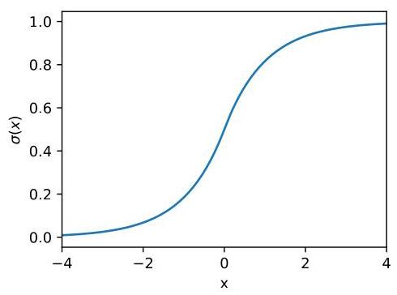

Figure 13: Plot of the $\sigma \left( x\right)$ function defined in Eq. 4.

图13:式4中定义的$\sigma \left( x\right)$函数的绘图

Edge cases Section 3.1 of the main text introduced static percentile grids and the corresponding basis of second-order B-splines. For a grid with $G$ intervals and $G - 1$ grid points, there are $G + 1$ basis functions, out of which $G - 1$ are given by second-order B-splines centered around all grid points, as illustrated in the right panel of Fig. 3 of the main text. The other two are given as linear functions on the left-most and right-most infinite intervals.

边界情况 正文第3.1节介绍了静态百分位数网格和相应的二阶B样条基。对于具有$G$个区间和$G - 1$个网格点的网格，有$G + 1$个基函数，其中$G - 1$个由围绕所有网格点的二阶B样条给出，如正文图3的右图所示。另外两个在最左边和最右边的无限区间上由线性函数给出。

The second-order B-splines given in the right panel of Fig. 3 are defined to linearly increase from 0 to 1 from the left grid point to the central one and then linearly decrease from 1 to 0 from the central grid point to the right grid point. This construction is well-defined for all the inner grid points but requires additional definitions for the B-splines centered around the left-most and right-most grid points, as these do not have left and right neighboring grid points, respectively.

图3右图中给出的二阶B样条定义为从左网格点到中心网格点从0线性增加到1，然后从中心网格点到右网格点从1线性减少到0。这种构建对于所有内部网格点都是明确的，但对于围绕最左边和最右边网格点的B样条需要额外定义，因为这些网格点分别没有左邻和右邻网格点。

In order to define these edge B-splines, we introduce 'ghost' left and right grid points. The position of the left ghost point is given as $\mathcal{G}\left\lbrack  0\right\rbrack   - \left( {\mathcal{G}\left\lbrack  1\right\rbrack   - \mathcal{G}\left\lbrack  0\right\rbrack  }\right)$ , where $\mathcal{G}\left\lbrack  0\right\rbrack$ and $\mathcal{G}\left\lbrack  1\right\rbrack$ are the positions of left-most and second left-most grid points respectively. The right ghost point is defined similarly. With such a notation of additional grid points, we can define edge B-splines similarly to all the others.

为了定义这些边缘B样条，我们引入“虚拟”左网格点和右网格点。左虚拟点的位置给定为$\mathcal{G}\left\lbrack  0\right\rbrack   - \left( {\mathcal{G}\left\lbrack  1\right\rbrack   - \mathcal{G}\left\lbrack  0\right\rbrack  }\right)$，其中$\mathcal{G}\left\lbrack  0\right\rbrack$和$\mathcal{G}\left\lbrack  1\right\rbrack$分别是最左边和第二左边网格点的位置。右虚拟点的定义类似。通过这种额外网格点的表示法，我们可以与所有其他B样条类似地定义边缘B样条。

Finally, there are two linear basis functions on the left-most and right-most infinite intervals. We define them to be zeros in the left-most and right-most grid points, linearly increasing to ones at the left and right ghost points and continuing to left and right infinities with the same slope, respectively.

最后，在最左边和最右边的无限区间上有两个线性基函数。我们将它们定义为最左边和最右边网格点处的零，在左右边界点处线性增加到一，并分别以相同的斜率延伸到左右无穷大。

Difference between the direct use of the static percentile grid and the uniform one with pre-normalization by $\sigma \left( x\right)$ A reader may ask themselves a question of what is the difference between the proposed construction involving a function $f\left( x\right)$ defined on static percentile grid on $\left( {-\infty ,\infty }\right)$ and a more simple approach which involves first mapping of an input to $\left( {0,1}\right)$ by ${x}^{\prime } = \sigma \left( x\right)$ , and then computing a piecewise linear function $g\left( {x}^{\prime }\right)$ defined on a uniform grid on $\left\lbrack  {0,1}\right\rbrack$ .

直接使用静态百分位数网格与通过$\sigma \left( x\right)$进行预归一化的均匀网格之间的差异 读者可能会问自己一个问题，即在$\left( {-\infty ,\infty }\right)$上定义的涉及函数$f\left( x\right)$的提议构造与更简单的方法之间有什么区别，后者涉及首先通过${x}^{\prime } = \sigma \left( x\right)$将输入映射到$\left( {0,1}\right)$，然后计算在$\left\lbrack  {0,1}\right\rbrack$上的均匀网格上定义的分段线性函数$g\left( {x}^{\prime }\right)$。

The answer is that the resulting functions in the initial space, $f\left( x\right)$ and ${f}^{\prime }\left( x\right)  = g\left( {\sigma \left( x\right) }\right)$ , are not identical. Specifically, ${f}^{\prime }\left( x\right)$ is no longer piecewise linear on each grid interval, with the most notable difference being the behavior when $x \rightarrow   \pm  \infty$ . Asymptotes of $f\left( x\right)$ are linear, while asymptotes of ${f}^{\prime }\left( x\right)$ are constant.

答案是，在初始空间中得到的函数$f\left( x\right)$和${f}^{\prime }\left( x\right)  = g\left( {\sigma \left( x\right) }\right)$并不相同。具体来说，${f}^{\prime }\left( x\right)$在每个网格区间上不再是分段线性的，最显著的区别在于$x \rightarrow   \pm  \infty$时的行为。$f\left( x\right)$的渐近线是线性的，而${f}^{\prime }\left( x\right)$的渐近线是恒定的。

The concern with horizontal asymptotes is that they can cause the vanishing gradient problem, which is believed to be one of the reasons why the ReLU [34] activations work better than tanh. Given these considerations, we chose the direct application of the static percentile grid for practical implementation.

对水平渐近线的担忧在于它们可能会导致梯度消失问题，这被认为是ReLU [34]激活函数比tanh更好用的原因之一。考虑到这些因素，我们在实际实现中选择直接应用静态百分位数网格。

### B.1 Standalone two-dimensional function computation

### B.1 独立二维函数计算

Algorithm 3 provides a recipe to compute a standalone two-dimensional function given our parametrization scheme. See discussion in Sec. 3.1 of the main text.

算法3提供了一种根据我们的参数化方案计算独立二维函数的方法。见正文第3.1节的讨论。

Algorithm $3\mathcal{O}\left( 1\right)$ evaluation of a standalone 2D lmKAN function. Red lines indicate computations that can be reused when computing many 2D functions for the same arguments, while green lines indicate computations that have to be repeated for each 2D function.

算法$3\mathcal{O}\left( 1\right)$对独立二维lmKAN函数的评估。红线表示在为相同参数计算多个二维函数时可以重用的计算，而绿线表示每个二维函数都必须重复的计算。

---

Input: scalars ${x}_{1},{x}_{2} \in  \mathbb{R}$ ; grid points $\mathcal{G}$ ; parameters $\mathbf{P} \in  {\mathbb{R}}^{\left\lbrack  G + 1, G + 1\right\rbrack  }$

		$\mathbf{P}\left\lbrack  {{i}_{1},{i}_{2}}\right\rbrack$ stores the function value on the $\left( {{i}_{1},{i}_{2}}\right)$ -th grid point

Output: output $y \in  \mathbb{R}$

	1: function Eval2D $\left( {{x}_{1},{x}_{2}}\right)  \vartriangleright$ Handling of edge-interval cases described above is omitted

		for brevity.

			${i}_{1} \leftarrow  \left\lbrack  {\sigma \left( {x}_{1}\right) G}\right\rbrack$

			${i}_{2} \leftarrow  \left\lfloor  {\sigma \left( {x}_{2}\right) G}\right\rfloor$

			${B}_{{i}_{1}{i}_{2}}\left( {{x}_{1},{x}_{2}}\right)  \leftarrow  \frac{\mathcal{G}\left\lbrack  {{i}_{1} + 1}\right\rbrack   - {x}_{1}}{\mathcal{G}\left\lbrack  {{i}_{1} + 1}\right\rbrack   - \mathcal{G}\left\lbrack  {i}_{1}\right\rbrack  }\frac{\mathcal{G}\left\lbrack  {{i}_{2} + 1}\right\rbrack   - {x}_{2}}{\mathcal{G}\left\lbrack  {{i}_{2} + 1}\right\rbrack   - \mathcal{G}\left\lbrack  {i}_{2}\right\rbrack  }$

			${B}_{{i}_{1} + 1{i}_{2}}\left( {{x}_{1},{x}_{2}}\right)  \leftarrow  \frac{{x}_{1} - \mathcal{G}\left\lbrack  {i}_{1}\right\rbrack  }{\mathcal{G}\left\lbrack  {{i}_{1} + 1}\right\rbrack   - \mathcal{G}\left\lbrack  {i}_{1}\right\rbrack  }\frac{\mathcal{G}\left\lbrack  {{i}_{2} + 1}\right\rbrack   - {x}_{2}}{\mathcal{G}\left\lbrack  {{i}_{2} + 1}\right\rbrack   - \mathcal{G}\left\lbrack  {i}_{2}\right\rbrack  }$

			${B}_{{i}_{1}{i}_{2} + 1}\left( {{x}_{1},{x}_{2}}\right)  \leftarrow  \frac{\mathcal{G}\left\lbrack  {{i}_{1} + 1}\right\rbrack   - {x}_{1}}{\mathcal{G}\left\lbrack  {{i}_{1} + 1}\right\rbrack   - \mathcal{G}\left\lbrack  {i}_{1}\right\rbrack  }\frac{{x}_{2} - \mathcal{G}\left\lbrack  {i}_{2}\right\rbrack  }{\mathcal{G}\left\lbrack  {{i}_{2} + 1}\right\rbrack   - \mathcal{G}\left\lbrack  {i}_{2}\right\rbrack  }$

			${B}_{{i}_{1} + 1{i}_{2} + 1}\left( {{x}_{1},{x}_{2}}\right)  \leftarrow  \frac{{x}_{1} - \mathcal{G}\left\lbrack  {i}_{1}\right\rbrack  }{\mathcal{G}\left\lbrack  {{i}_{1} + 1}\right\rbrack   - \mathcal{G}\left\lbrack  {i}_{1}\right\rbrack  }\frac{{x}_{2} - \mathcal{G}\left\lbrack  {i}_{2}\right\rbrack  }{\mathcal{G}\left\lbrack  {{i}_{2} + 1}\right\rbrack   - \mathcal{G}\left\lbrack  {i}_{2}\right\rbrack  }$

			$y \leftarrow  0$

			$y +  = {B}_{{i}_{1}{i}_{2}}\left( {{x}_{1},{x}_{2}}\right) \mathbf{P}\left\lbrack  {{i}_{1},{i}_{2}}\right\rbrack$

			$y +  = {B}_{{i}_{1} + 1{i}_{2}}\left( {{x}_{1},{x}_{2}}\right) \mathbf{P}\left\lbrack  {{i}_{1} + 1,{i}_{2}}\right\rbrack$

			$y +  = {B}_{{i}_{1}{i}_{2} + 1}\left( {{x}_{1},{x}_{2}}\right) \mathbf{P}\left\lbrack  {{i}_{1},{i}_{2} + 1}\right\rbrack$

			$y +  = {B}_{{i}_{1} + 1{i}_{2} + 1}\left( {{x}_{1},{x}_{2}}\right) \mathbf{P}\left\lbrack  {{i}_{1} + 1,{i}_{2} + 1}\right\rbrack$

			return $y$

		end function

---

## C More details on Hessian regularization

## C 关于海森矩阵正则化的更多细节

Sec. 3.5 of the main text introduced the concept of off-diagonal Hessian regularization which is based on finite difference schemes for squared Frobenius norm of the Hessian. This appendix provides the exact equations we use in our implementation.

正文第3.5节介绍了基于海森矩阵的平方弗罗贝尼乌斯范数的有限差分方案的非对角海森矩阵正则化概念。本附录提供了我们在实现中使用的精确方程。

We use the following finite-differences approximation for the second derivative with respect to ${x}_{1}$ :

我们对关于${x}_{1}$的二阶导数使用以下有限差分近似:

$$
{\left. \frac{{\partial }^{2}f}{\partial {x}_{1}^{2}}\right| }_{\left( {x}_{1},{x}_{2}\right) } \approx  \frac{2\left( {{h}_{\ell }f\left( {{x}_{1} + {h}_{r},{x}_{2}}\right)  - \left( {{h}_{\ell } + {h}_{r}}\right) f\left( {{x}_{1},{x}_{2}}\right)  + {h}_{r}f\left( {{x}_{1} - {h}_{\ell },{x}_{2}}\right) }\right) }{{h}_{\ell }{h}_{r}\left( {{h}_{\ell } + {h}_{r}}\right) }, \tag{5}
$$

where ${h}_{l}$ is the spacing between left and central grid points, while ${h}_{r}$ is the spacing between central and right grid points. The corresponding expression in terms of the coefficients ${p}_{i, j}$ is given as:

其中${h}_{l}$是左网格点和中心网格点之间的间距，而${h}_{r}$是中心网格点和右网格点之间的间距。关于系数${p}_{i, j}$的相应表达式如下:

$$
{D}_{{x}_{1},{x}_{1};i, j} = \frac{2\left( {{h}_{i}{p}_{i + 1, j} - \left( {{h}_{i} + {h}_{i + 1}}\right) {p}_{i, j} + {h}_{i + 1}{p}_{i - 1, j}}\right) }{{h}_{i}{h}_{i + 1}\left( {{h}_{i} + {h}_{i + 1}}\right) } \tag{6}
$$

For the second derivative with respect to ${x}_{2}$ we use an analogous expression:

对于关于${x}_{2}$的二阶导数，我们使用类似的表达式:

$$
{\left. \frac{{\partial }^{2}f}{\partial {x}_{2}^{2}}\right| }_{\left( {x}_{1},{x}_{2}\right) } \approx  \frac{2\left( {{h}_{b}f\left( {{x}_{1},{x}_{2} + {h}_{u}}\right)  - \left( {{h}_{b} + {h}_{u}}\right) f\left( {{x}_{1},{x}_{2}}\right)  + {h}_{u}f\left( {{x}_{1},{x}_{2} - {h}_{b}}\right) }\right) }{{h}_{b}{h}_{u}\left( {{h}_{b} + {h}_{u}}\right) }, \tag{7}
$$

where ${h}_{u}$ and ${h}_{b}$ are upper and bottom spacings, respectively.

其中${h}_{u}$和${h}_{b}$分别是上间距和下间距。

$$
{D}_{{x}_{2},{x}_{2};i, j} = \frac{2\left( {{h}_{j}{p}_{i, j + 1} - \left( {{h}_{j} + {h}_{j + 1}}\right) {p}_{i, j} + {h}_{j + 1}{p}_{i, j - 1}}\right) }{{h}_{j}{h}_{j + 1}\left( {{h}_{j} + {h}_{j + 1}}\right) } \tag{8}
$$

For the mixed derivative, our finite-differences scheme is the following:

对于混合导数，我们的有限差分方案如下:

$$
{\left. \frac{{\partial }^{2}f}{\partial {x}_{1}\partial {x}_{2}}\right| }_{\left( {x}_{1},{x}_{2}\right) } \approx \tag{9}
$$

$$
\frac{f\left( {{x}_{1} + {h}_{r},{x}_{2} + {h}_{p}}\right)  - f\left( {{x}_{1} + {h}_{r},{x}_{2} - {h}_{b}}\right)  - f\left( {{x}_{1} - {h}_{l},{x}_{2} + {h}_{p}}\right)  + f\left( {{x}_{1} - {h}_{l},{x}_{2} - {h}_{b}}\right) }{\left( {{h}_{r} + {h}_{l}}\right) \left( {{h}_{p} + {h}_{b}}\right) }
$$

$$
{D}_{{x}_{1},{x}_{2};i, j} = \frac{{p}_{i + 1, j + 1} - {p}_{i + 1, j - 1} - {p}_{i - 1, j + 1} + {p}_{i - 1, j - 1}}{\left( {{h}_{i} + {h}_{i + 1}}\right) \left( {{h}_{j} + {h}_{j + 1}}\right) } \tag{10}
$$

The final regularization term is the following:

最终的正则化项如下:

$$
{H}_{i, j} = {D}_{{x}_{1},{x}_{1};i, j}^{2} + 2{D}_{{x}_{1},{x}_{2};i, j}^{2} + {D}_{{x}_{2},{x}_{2};i, j}^{2}. \tag{11}
$$

In order to compute the total regularization term for the whole model, we 1) average ${H}_{i, j}$ across all the grid points and 2) summate these values across all the 2D functions within all the lmKAN layers in the model.

为了计算整个模型的总正则化项，我们1)在所有网格点上对${H}_{i, j}$求平均，2)在模型中所有lmKAN层内的所有二维函数上对这些值求和。

## D CUDA kernels

## D CUDA内核

The performance of our CUDA kernels with 16x16 tile size in the limit of large dimensions is summarized in Fig. 14. All the lmKAN curves are computed with the largest number of grid intervals $G = {20}$ available for the 16x16 tile size. We compare the inference efficiency of ImKAN and linear layers. On the left panel, we normalize time by the shape of the layers. Fig. 14 illustrates a clear convergence of these normalized times to the same value for all the dimensions. In the limit of large batch sizes, the forward pass of a lmKAN layer is ~8x slower compared to a linear layer with the same shape. At the same time, a lmKAN layer contains a significantly larger number of parameters than a linear layer of the same shape. Thus, inference time per parameter is significantly better for ImKAN layers, about 27 times, as illustrated on the right panel of Fig. 14.

图14总结了我们在大尺寸极限下16x16图块大小的CUDA内核的性能。所有lmKAN曲线都是使用16x16图块大小可用的最大网格间隔数$G = {20}$计算的。我们比较了ImKAN和线性层的推理效率。在左图中，我们根据层的形状对时间进行归一化。图14表明，对于所有维度，这些归一化时间明显收敛到相同的值。在大批量大小的极限情况下，lmKAN层的前向传播比相同形状的线性层慢约8倍。同时，lmKAN层包含的参数数量比相同形状的线性层多得多。因此，如图14右图所示，lmKAN层每个参数的推理时间明显更好，约为27倍。

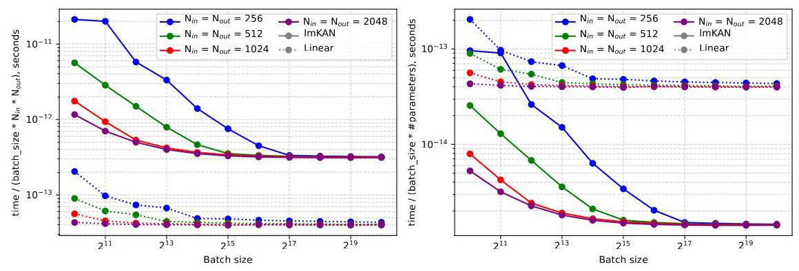

Figure 14: The performance of our CUDA kernels on the H100 SXM GPU in comparison with the linear layer in the limit of large dimensions. Left panel - time normalized by shape. Right panel - time normalized by the number of parameters.

图14:我们的CUDA内核在H100 SXM GPU上与大尺寸极限下的线性层相比的性能。左图 - 按形状归一化的时间。右图 - 按参数数量归一化的时间。

Fig. 15 is an analogous illustration but for small dimensions - 16 and 32. Our CUDA kernels are better adjusted for such small dimensions, and thus, relative performance compared to linear layers is even higher in this case.

图15是一个类似的图示，但针对小尺寸 - 16和32。我们的CUDA内核针对这种小尺寸进行了更好的调整，因此，在这种情况下与线性层相比的相对性能甚至更高。

Finally, Fig. 16 illustrates the inference efficiency depending on the number of grid intervals $G$ , which control the number of parameters. The time indeed does not depend on $G$ in the large batch size limit.

最后，图16说明了取决于控制参数数量的网格间隔数$G$的推理效率。在大批量大小极限下，时间确实不依赖于$G$。

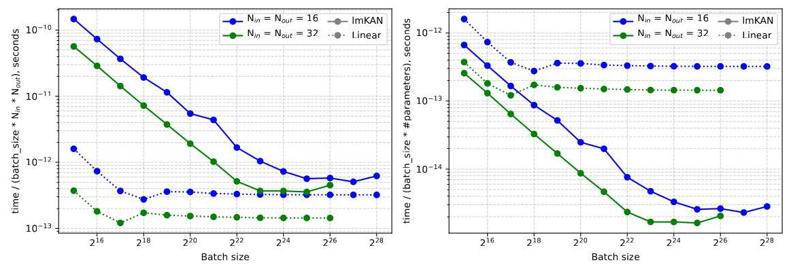

Figure 15: The performance of our CUDA kernels on the H100 SXM GPU in comparison with the linear layer for small dimensions. Left panel - time normalized by shape. Right panel - time normalized by the number of parameters.

图15:我们的CUDA内核在H100 SXM GPU上与小尺寸线性层相比的性能。左图 - 按形状归一化的时间。右图 - 按参数数量归一化的时间。

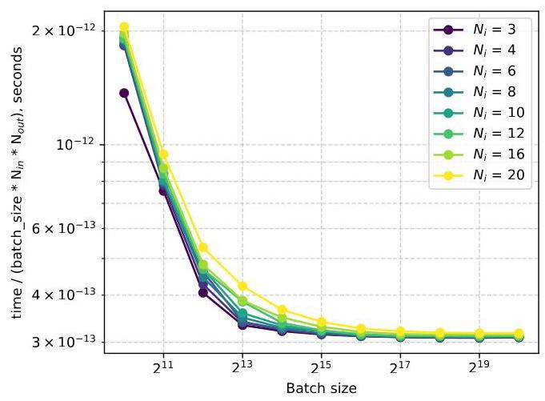

Figure 16: Inference efficiency of an lmKAN layer depending on the number of grid intervals $G$ .

图16:lmKAN层的推理效率取决于网格间隔数$G$。

## E Preconditioning and fitting scheme

## E预处理和拟合方案

The first thing we attempted upon implementing the CUDA kernels was to fit a model with the highest grid resolution, $G = {40}$ , supported for the $8 \times  8$ tile on the H100 GPU. In this setup, each 2D function had as many as ${41}^{2} = {1681}$ trainable parameters. We found that the training was unstable, so we designed a preconditioning and multi-stage fitting pipeline to stabilize it, which ended up being rather sophisticated. We employed this pipeline consistently for all our experiments.

在实现CUDA内核时，我们首先尝试在H100 GPU上使用支持$8 \times  8$图块的最高网格分辨率$G = {40}$来拟合模型。在这种设置下，每个二维函数有多达${41}^{2} = {1681}$个可训练参数。我们发现训练不稳定，因此设计了一个预处理和多阶段拟合管道来使其稳定，最终这个管道相当复杂。我们在所有实验中都一致使用这个管道。

The subsequent evidence revealed that lmKANs (similarly to KANs) are progressively harder to fit as grid resolution increases. In other words, our very first experiment was the most challenging one. At more moderate grid resolutions, preconditioning measures can likely be simplified, if not omitted altogether. Specifically, we think that a fitting scheme omitting additional preconditioning terms, but preserving the Hessian regularization decay phase, which is described in the following, could be effective. With that, below is the description of the current pipeline.

随后的证据表明，随着网格分辨率的增加，lmKANs(与KANs类似)越来越难以拟合。换句话说，我们的第一个实验是最具挑战性的。在更适中的网格分辨率下，如果不完全省略，预处理措施可能可以简化。具体来说，我们认为一种省略额外预处理项，但保留以下所述的海森正则化衰减阶段的拟合方案可能是有效的。因此，下面是当前管道的描述。

### E.1 Preconditioning

### E.1预处理

We precondition lmKAN layers by adding linear terms into the overall functional form. We use one of the following:

我们通过在整体函数形式中添加线性项来对lmKAN层进行预处理。我们使用以下之一:

$$
y = \gamma \operatorname{lmKAN}\left( x\right)  + \operatorname{ReLU}\left( {\operatorname{Linear}\left( x\right) }\right)
$$

(12a)

(12b)

where the lmKAN weight, $\gamma$ , is initially set to 0 and then gradually increased in our multistaged fitting procedure described later. In the case of ReLU-last preconditioning of Eq. 12a, we insert ReLU into all the layers except the last one; for ReLU-first preconditioning of Eq. 12b, we insert ReLU into all the layers except the first one. Therefore, at the beginning, when the lmKAN weight is zero, the model is equivalent to a pure MLP-based one for both types of preconditioning.

其中，lmKAN权重$\gamma$最初设置为0，然后在我们稍后描述的多阶段拟合过程中逐渐增加。在式12a的ReLU最后预处理的情况下，我们在除最后一层之外的所有层中插入ReLU；对于式12b的ReLU首先预处理，我们在除第一层之外的所有层中插入ReLU。因此，一开始，当lmKAN权重为零时，对于两种类型的预处理，模型都等同于基于纯MLP的模型。

A merit of ReLU-first preconditioning is that during inference the whole Eq. 12b can be absorbed into a single lmKAN layer whenever the number of grid intervals $G$ is even, that is, when the origin is one of the grid points, see more details in Appendix F.1. Thus, this type of preconditioning does not increase inference cost in any way. This is an advantage over the original KAN preconditioning scheme [11], which requires the additional computation of the computationally expensive transcendental function SiLU for each edge at inference.

ReLU首先预处理的一个优点是，在推理期间，只要网格间隔数$G$是偶数，即当原点是网格点之一时，整个式12b可以被吸收到单个lmKAN层中，更多细节见附录F.1。因此，这种类型的预处理不会以任何方式增加推理成本。这是相对于原始KAN预处理方案[11]的一个优势，原始方案在推理时需要为每个边额外计算计算成本高昂的超越函数SiLU。

Because of the possibility of such an absorption, the total inference FLOPs of a ReLU-first preconditioned lmKAN layer is $2 \times$ those of a linear layer of the same shape, while for the ReLU-last preconditioning, the slowdown factor is $3 \times$ , taking into account the linear branch.

由于存在这种吸收的可能性，ReLU首先预处理的lmKAN层的总推理FLOP是相同形状线性层总推理FLOP的$2 \times$，而对于ReLU最后预处理，考虑到线性分支，减速因子是$3 \times$。

E. 2 Fitting procedure

E.2拟合过程

Our fitting scheme consists of several phases:

我们的拟合方案由几个阶段组成:

Phase I - pure MLP: $\gamma$ is set to 0, so the whole architecture is operating in pure MLP mode. This part is typically very short.

第一阶段 - 纯MLP:$\gamma$ 设置为0，因此整个架构以纯MLP模式运行。这部分通常非常短。

Phase II - turning on lmKAN: $\gamma$ is linearly (over time) increased from 0 to 0.3 . After that, there is some part with the constant $\gamma  = {0.3}$ . At this phase, we use very strong $( =$ with a very high coefficient $\lambda$ ) Hessian regularization introduced in Appendix C. For all the subsequent phases, $\operatorname{lmKAN}$ weight $\gamma$ is fixed at 0.3 . The pipeline is also stable if $\gamma$ is increased to 1.0, but in a few experiments we found that using 0.3 value leads to slightly better final accuracy.

第二阶段 - 开启lmKAN:$\gamma$ 随时间线性增加，从0增加到0.3。之后，有一部分是常数 $\gamma  = {0.3}$。在此阶段，我们使用非常强的 $( =$，其具有在附录C中引入的非常高的系数 $\lambda$ 的黑塞正则化。对于所有后续阶段，$\operatorname{lmKAN}$ 权重 $\gamma$ 固定为0.3。如果 $\gamma$ 增加到1.0，管道也是稳定的，但在一些实验中我们发现使用0.3的值会导致最终精度略高。

Phase III - Hessian regularization decay: At this phase, we gradually decay the strength of the Hessian regularization $\lambda$ from the initial very high value to the target value if this regularization is intended to be utilized in this fitting procedure and to nearly zero otherwise.

第三阶段 - 海森正则化衰减:在这个阶段，如果打算在这个拟合过程中使用海森正则化$\lambda$，我们会将其强度从初始的非常高的值逐渐衰减到目标值，否则衰减到接近零。

Phase IV - Main ImKAN fitting part: In this final phase, we keep Hessian regularization to be constant at the value reached in the previous phase. The model is fit with the given learning rate schedule. In the experiments in this work, we use a constant learning rate for the most part of this phase, and step or exponential learning rate decay at the end.

第四阶段 - 主要ImKAN拟合部分:在这个最后阶段，我们将黑塞正则化保持在前一阶段达到的值不变。模型按照给定的学习率调度进行拟合。在这项工作的实验中，在这个阶段的大部分时间我们使用恒定的学习率，在最后使用步长或指数学习率衰减。

An example of the described fitting procedure for one of the training runs we did for numerical experiments described in Sec. 4.1 of the main text and in the Appendix F.2 is given in Fig. 17.

图17给出了我们在正文中第4.1节和附录F.2中描述的数值实验的一次训练运行中所描述的拟合过程的一个示例。

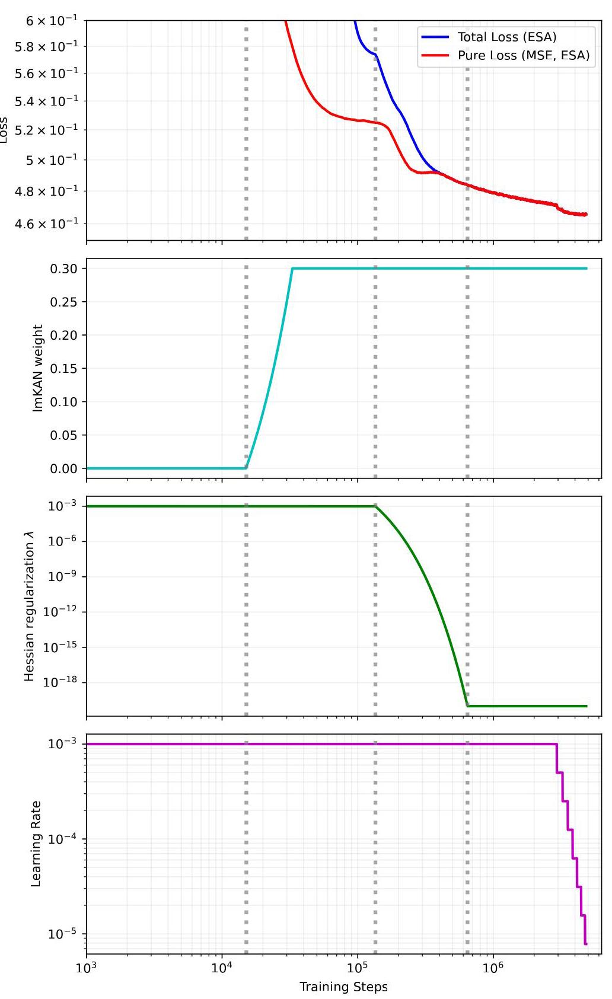

Figure 17: The multi-staged fitting procedure we use. Total loss indicates the full loss, including the Hessian regularization term. Pure loss is only the MSE part. For clarity, we plot exponential sliding averages of losses. Note that the horizontal scale is logarithmic. If it is linear, the first couple of phases are hard to discern as they are very short. The fourth phase takes most of the training budget. This training run corresponds to the unregularized lmKAN, where Hessian regularization is turned on only at the beginning of the fitting to ensure stability. At the end of phase III, it reaches nearly zero value, which, in this case, is ${10}^{-{20}}$ .

图17:我们使用的多阶段拟合过程。总损失表示包括黑塞正则化项在内的完整损失。纯损失仅为均方误差部分。为了清晰起见，我们绘制了损失的指数滑动平均值。请注意，水平轴是对数的。如果是线性的，前几个阶段很难区分，因为它们非常短。第四阶段占用了大部分训练预算。这次训练运行对应于未正则化的lmKAN，其中黑塞正则化仅在拟合开始时开启以确保稳定性。在第三阶段结束时，它达到接近零的值，在这种情况下是 ${10}^{-{20}}$。

E. 3 Comparison of the preconditioning schemes

E.3 预处理方案的比较

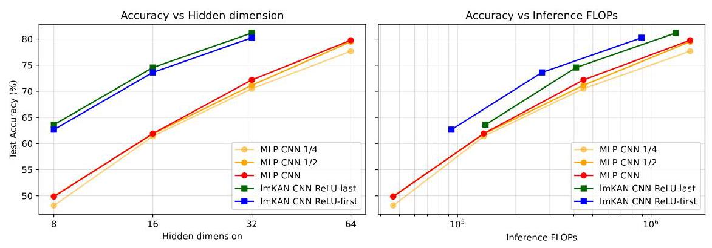

Figure 18: Comparison of the preconditioning schemes when fitting lmKANs on the CIFAR- 10 dataset.

图18:在CIFAR - 10数据集上拟合lmKAN时预处理方案的比较。

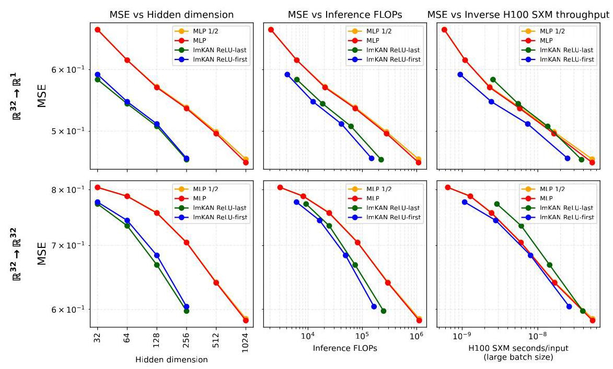

Figure 19: Comparison of the preconditioning schemes when fitting lmKANs within general function approximation setup.

图19:在一般函数逼近设置中拟合lmKAN时预处理方案的比较。

We fitted lmKAN models with both types of preconditioning for the CIFAR-10 dataset and for general function approximation. The results are given in Fig. 18 and Fig. 19. Overall, the ReLU-last type of preconditioning appeared to lead to slightly more accurate models, but this small gain in accuracy does not justify additional computational cost.

我们对CIFAR - 10数据集和一般函数逼近都使用了两种类型的预处理来拟合lmKAN模型。结果在图18和图19中给出。总体而言，ReLU - last类型的预处理似乎能得到稍微更准确的模型，但这种精度上的小提升并不能证明额外的计算成本是合理的。

When designing some of our experiments we did not know this yet. Therefore, some of them use the ReLU-last type of preconditioning.

在设计我们的一些实验时，我们还不知道这一点。因此，其中一些实验使用了ReLU - last类型的预处理。

We use the ReLU-last type of preconditioning for figures 7, 9, 21, and 22. We use the ReLU-first type of preconditioning for figures 6, 11, 12, 23, and 24.

我们在图7、9、21和22中使用ReLU - last类型的预处理。我们在图6、11、12、23和24中使用ReLU - first类型的预处理。

In other words, the performance of lmKANs on the methane datasets can likely be further improved by switching from the ReLU-last type of preconditioning to the ReLU-first one. However, since the observed gains in efficiency are already more than an order of magnitude in terms of the H100 wall-clock time, we left this for future work.

换句话说，通过从ReLU - last类型的预处理切换到ReLU - first类型的预处理，lmKAN在甲烷数据集上的性能可能会进一步提高。然而，由于就H100墙上时间而言，观察到的效率提升已经超过一个数量级，我们将此留作未来的工作。

## F Experiments

## F实验

### F.1 General details about the benchmarking protocols

### F.1 基准测试协议的一般细节

Within the scope of this work, we primarily focus on the saturated throughput in the limit of large batch sizes. Thus, we benchmark all the models for progressively large batch sizes until reaching saturation. All the models are benchmarked with10warm-up dry runs, and 20 timed runs. Overall, we tried to optimize each model as much as possible while staying within the limits of full precision float32 data type.

在本工作范围内，我们主要关注大批量情况下的饱和吞吐量。因此，我们针对逐渐增大的批量大小对所有模型进行基准测试，直至达到饱和。所有模型均经过10次热身预运行和20次定时运行的基准测试。总体而言，我们在保持全精度浮点数32数据类型限制的前提下，尽可能对每个模型进行优化。

MLPs employed in this work consist of three types of layers - linear ones, ReLU activations, and batch normalizations. At inference, batch normalizations simply perform elementwise linear transformation and thus can be absorbed into the weights of linear layers. We perform this operation manually and, on top of that, compile the model with the torch_tensorrt backend (with disabling tf32 to ensure full precision float32). We use the same compilation strategy for FastKANs.

本工作中使用的多层感知器(MLP)由三种类型的层组成——线性层、ReLU激活函数层和批归一化层。在推理时，批归一化层仅执行逐元素线性变换，因此可以并入线性层的权重中。我们手动执行此操作，并在此基础上使用torch_tensorrt后端编译模型(禁用tf32以确保全精度浮点数32)。我们对FastKANs使用相同的编译策略。

For lmKANs, when using ReLU-first preconditioning (see more details in Appendix E), we absorb all the expression in Eq. 12b into the weights of the lmKAN layer. This modification requires updating the lmKAN 2D functions as $f\left( {{x}_{1},{x}_{2}}\right)  \leftarrow  {\gamma f}\left( {{x}_{1},{x}_{2}}\right)  + {w}_{1}\operatorname{ReLU}\left( {x}_{1}\right)  + \; {w}_{2}\operatorname{ReLU}\left( {x}_{2}\right)$ . Our construction allows this absorption to be done exactly whenever the origin is one of the grid points, which, in turn, is the case when the number of grid intervals $G$ is even. On top of that, batch normalizations are absorbed similarly to MLPs. We do not compile lmKAN models.

对于lmKANs，当使用ReLU优先预处理时(见附录E中的更多细节)，我们将式12b中的所有表达式并入lmKAN层的权重中。此修改需要更新lmKAN二维函数，如$f\left( {{x}_{1},{x}_{2}}\right)  \leftarrow  {\gamma f}\left( {{x}_{1},{x}_{2}}\right)  + {w}_{1}\operatorname{ReLU}\left( {x}_{1}\right)  + \; {w}_{2}\operatorname{ReLU}\left( {x}_{2}\right)$ 。我们的构造允许在原点是网格点之一时精确进行此并入操作，而当网格间隔数$G$为偶数时就是这种情况。除此之外，批归一化层的并入方式与MLP类似。我们不对lmKAN模型进行编译。

For lmKAN models with the ReLU-last preconditioning we absorb only the lmKAN weight $\gamma$ .

对于采用ReLU最后预处理的lmKAN模型，我们仅并入lmKAN权重$\gamma$ 。

### F.2 General Function Approximation

### F.2通用函数逼近

The performance of lmKANs when approximating a ${\mathbb{R}}^{32} \rightarrow  {\mathbb{R}}^{32}$ function generated similarly as the ${\mathbb{R}}^{32} \rightarrow  {\mathbb{R}}^{1}$ described in the main text is given in Fig. 20.

图20给出了lmKANs在逼近与正文中所述${\mathbb{R}}^{32} \rightarrow  {\mathbb{R}}^{1}$类似生成的${\mathbb{R}}^{32} \rightarrow  {\mathbb{R}}^{32}$函数时的性能。

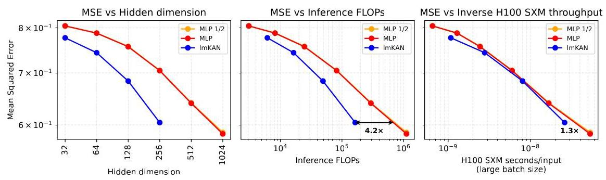

Figure 20: lmKAN vs MLP for general, ${\mathbb{R}}^{32} \rightarrow  {\mathbb{R}}^{32}$ , function approximation. The "MLP 1/2" line corresponds to the outcome of the fitting procedure with only half of the training steps compared to the "MLP" one.

图20:lmKAN与MLP在通用${\mathbb{R}}^{32} \rightarrow  {\mathbb{R}}^{32}$函数逼近方面的对比。“MLP 1/2”线对应于与“MLP”相比仅使用一半训练步骤的拟合过程结果。

There is a trend that the relative performance of lmKANs improves with the scale. It is clearly seen on the MSE vs FLOPs panel. On the MSE vs H100 wall-clock time panel, it is first masked by the non-homogeneous efficiency of the code, but next still reveals itself for the largest hidden dimensions.

存在一种趋势，即lmKANs的相对性能随规模提升。在MSE与FLOPs面板上可以清楚看到。在MSE与H100墙上时钟时间面板上，它首先被代码的非均匀效率掩盖，但对于最大隐藏维度，它仍然会显现出来。

### F.3 Methane

### F.3甲烷

#### F.3.1 The Distances Polynomials representation

#### F.3.1距离多项式表示

It was mentioned in Sec. 4.2 of the main text that the representation Distances Polynomials is given by non-trivial invariant polynomials computed on top of interatomic distances. These polynomials are constant with respect to changing the order of identical hydrogen atoms.

正文第4.2节提到，距离多项式表示由在原子间距离之上计算的非平凡不变多项式给出。这些多项式对于相同氢原子顺序的改变是恒定的。

$$
{P}_{1} = {x}_{5} + {x}_{6} + {x}_{7} + {x}_{8} + {x}_{9} + {x}_{10}
$$

$$
{P}_{2} = {x}_{1} + {x}_{2} + {x}_{3} + {x}_{4}
$$

$$
{P}_{3} = {x}_{5}^{2} + {x}_{6}^{2} + {x}_{7}^{2} + {x}_{8}^{2} + {x}_{9}^{2} + {x}_{10}^{2}
$$

$$
{P}_{4} = {x}_{5}{x}_{6} + {x}_{5}{x}_{7} + {x}_{6}{x}_{7} + {x}_{5}{x}_{8} + {x}_{6}{x}_{8} + {x}_{5}{x}_{9} + {x}_{7}{x}_{9} + {x}_{8}{x}_{9} +
$$

$$
{x}_{6}{x}_{10} + {x}_{7}{x}_{10} + {x}_{8}{x}_{10} + {x}_{9}{x}_{10}
$$

$$
{P}_{5} = {x}_{1}{x}_{5} + {x}_{2}{x}_{5} + {x}_{1}{x}_{6} + {x}_{3}{x}_{6} + {x}_{1}{x}_{7} + {x}_{4}{x}_{7} + {x}_{2}{x}_{8} + {x}_{3}{x}_{8} +
$$

$$
{x}_{2}{x}_{9} + {x}_{4}{x}_{9} + {x}_{3}{x}_{10} + {x}_{4}{x}_{10}
$$

$$
{P}_{6} = {x}_{1}^{2} + {x}_{2}^{2} + {x}_{3}^{2} + {x}_{4}^{2}
$$

$$
{P}_{7} = {x}_{5}^{3} + {x}_{6}^{3} + {x}_{7}^{3} + {x}_{8}^{3} + {x}_{9}^{3} + {x}_{10}^{3}
$$

$$
{P}_{8} = {x}_{5}^{2}{x}_{6} + {x}_{5}{x}_{6}^{2} + {x}_{5}^{2}{x}_{7} + {x}_{6}^{2}{x}_{7} + {x}_{5}{x}_{7}^{2} + {x}_{6}{x}_{7}^{2} + {x}_{5}^{2}{x}_{8} + {x}_{6}^{2}{x}_{8} +
$$

$$
{x}_{5}{x}_{8}^{2} + {x}_{6}{x}_{8}^{2} + {x}_{5}^{2}{x}_{9} + {x}_{7}^{2}{x}_{9} + {x}_{8}^{2}{x}_{9} + {x}_{5}{x}_{9}^{2} + {x}_{7}{x}_{9}^{2} + {x}_{8}{x}_{9}^{2} +
$$

$$
{x}_{6}^{2}{x}_{10} + {x}_{7}^{2}{x}_{10} + {x}_{8}^{2}{x}_{10} + {x}_{9}^{2}{x}_{10} + {x}_{6}{x}_{10}^{2} + {x}_{7}{x}_{10}^{2} + {x}_{8}{x}_{10}^{2} + {x}_{9}{x}_{10}^{2}
$$

$$
{P}_{9} = {x}_{1}{x}_{5}^{2} + {x}_{2}{x}_{5}^{2} + {x}_{1}{x}_{6}^{2} + {x}_{3}{x}_{6}^{2} + {x}_{1}{x}_{7}^{2} + {x}_{4}{x}_{7}^{2} + {x}_{2}{x}_{8}^{2} + {x}_{3}{x}_{8}^{2} +
$$

$$
{x}_{2}{x}_{9}^{2} + {x}_{4}{x}_{9}^{2} + {x}_{3}{x}_{10}^{2} + {x}_{4}{x}_{10}^{2}
$$

$$
{P}_{10} = {x}_{5}{x}_{6}{x}_{8} + {x}_{5}{x}_{7}{x}_{9} + {x}_{6}{x}_{7}{x}_{10} + {x}_{8}{x}_{9}{x}_{10}
$$

$$
{P}_{11} = {x}_{1}{x}_{5}{x}_{6} + {x}_{1}{x}_{5}{x}_{7} + {x}_{1}{x}_{6}{x}_{7} + {x}_{2}{x}_{5}{x}_{8} + {x}_{3}{x}_{6}{x}_{8} + {x}_{2}{x}_{5}{x}_{9} + {x}_{4}{x}_{7}{x}_{9} + {x}_{2}{x}_{8}{x}_{9} +
$$

$$
{x}_{3}{x}_{6}{x}_{10} + {x}_{4}{x}_{7}{x}_{10} + {x}_{3}{x}_{8}{x}_{10} + {x}_{4}{x}_{9}{x}_{10}
$$

$$
{P}_{12} = {x}_{1}^{2}{x}_{5} + {x}_{2}^{2}{x}_{5} + {x}_{1}^{2}{x}_{6} + {x}_{3}^{2}{x}_{6} + {x}_{1}^{2}{x}_{7} + {x}_{4}^{2}{x}_{7} + {x}_{2}^{2}{x}_{8} + {x}_{3}^{2}{x}_{8} +
$$

$$
{x}_{2}^{2}{x}_{9} + {x}_{4}^{2}{x}_{9} + {x}_{3}^{2}{x}_{10} + {x}_{4}^{2}{x}_{10}
$$

$$
{P}_{13} = {x}_{1}{x}_{2}{x}_{5} + {x}_{1}{x}_{3}{x}_{6} + {x}_{1}{x}_{4}{x}_{7} + {x}_{2}{x}_{3}{x}_{8} + {x}_{2}{x}_{4}{x}_{9} + {x}_{3}{x}_{4}{x}_{10}
$$

$$
{P}_{14} = {x}_{1}^{3} + {x}_{2}^{3} + {x}_{3}^{3} + {x}_{4}^{3}
$$

$$
{P}_{15} = {x}_{5}^{4} + {x}_{6}^{4} + {x}_{7}^{4} + {x}_{8}^{4} + {x}_{9}^{4} + {x}_{10}^{4}
$$

$$
{P}_{16} = {x}_{5}^{3}{x}_{6} + {x}_{5}{x}_{6}^{3} + {x}_{5}^{3}{x}_{7} + {x}_{6}^{3}{x}_{7} + {x}_{5}{x}_{7}^{3} + {x}_{6}{x}_{7}^{3} + {x}_{5}^{3}{x}_{8} + {x}_{6}^{3}{x}_{8} +
$$

$$
{x}_{5}{x}_{8}^{3} + {x}_{6}{x}_{8}^{3} + {x}_{5}^{3}{x}_{9} + {x}_{7}^{3}{x}_{9} + {x}_{8}^{3}{x}_{9} + {x}_{5}{x}_{9}^{3} + {x}_{7}{x}_{9}^{3} + {x}_{8}{x}_{9}^{3} +
$$

$$
{x}_{6}^{3}{x}_{10} + {x}_{7}^{3}{x}_{10} + {x}_{8}^{3}{x}_{10} + {x}_{9}^{3}{x}_{10} + {x}_{6}{x}_{10}^{3} + {x}_{7}{x}_{10}^{3} + {x}_{8}{x}_{10}^{3} + {x}_{9}{x}_{10}^{3}
$$

$$
{P}_{17} = {x}_{1}{x}_{5}^{3} + {x}_{2}{x}_{5}^{3} + {x}_{1}{x}_{6}^{3} + {x}_{3}{x}_{6}^{3} + {x}_{1}{x}_{7}^{3} + {x}_{4}{x}_{7}^{3} + {x}_{2}{x}_{8}^{3} + {x}_{3}{x}_{8}^{3} +
$$

$$
{x}_{2}{x}_{9}^{3} + {x}_{4}{x}_{9}^{3} + {x}_{3}{x}_{10}^{3} + {x}_{4}{x}_{10}^{3}
$$

$$
{P}_{18} = {x}_{1}{x}_{5}^{2}{x}_{6} + {x}_{1}{x}_{5}{x}_{6}^{2} + {x}_{1}{x}_{5}^{2}{x}_{7} + {x}_{1}{x}_{6}^{2}{x}_{7} + {x}_{1}{x}_{5}{x}_{7}^{2} + {x}_{1}{x}_{6}{x}_{7}^{2} + {x}_{2}{x}_{5}^{2}{x}_{8} + {x}_{3}{x}_{6}^{2}{x}_{8} +
$$

$$
{x}_{2}{x}_{5}{x}_{8}^{2} + {x}_{3}{x}_{6}{x}_{8}^{2} + {x}_{2}{x}_{5}^{2}{x}_{9} + {x}_{4}{x}_{7}^{2}{x}_{9} + {x}_{2}{x}_{8}^{2}{x}_{9} + {x}_{2}{x}_{5}{x}_{9}^{2} + {x}_{4}{x}_{7}{x}_{9}^{2} + {x}_{2}{x}_{8}{x}_{9}^{2} +
$$

$$
{x}_{3}{x}_{6}^{2}{x}_{10} + {x}_{4}{x}_{7}^{2}{x}_{10} + {x}_{3}{x}_{8}^{2}{x}_{10} + {x}_{4}{x}_{9}^{2}{x}_{10} + {x}_{3}{x}_{6}{x}_{10}^{2} + {x}_{4}{x}_{7}{x}_{10}^{2} + {x}_{3}{x}_{8}{x}_{10}^{2} + {x}_{4}{x}_{9}{x}_{10}^{2}
$$

$$
{P}_{19} = {x}_{2}{x}_{5}^{2}{x}_{6} + {x}_{3}{x}_{5}{x}_{6}^{2} + {x}_{2}{x}_{5}^{2}{x}_{7} + {x}_{3}{x}_{6}^{2}{x}_{7} + {x}_{4}{x}_{5}{x}_{7}^{2} + {x}_{4}{x}_{6}{x}_{7}^{2} + {x}_{1}{x}_{5}^{2}{x}_{8} + {x}_{1}{x}_{6}^{2}{x}_{8} +
$$

$$
{x}_{3}{x}_{5}{x}_{8}^{2} + {x}_{2}{x}_{6}{x}_{8}^{2} + {x}_{1}{x}_{5}^{2}{x}_{9} + {x}_{1}{x}_{7}^{2}{x}_{9} + {x}_{3}{x}_{8}^{2}{x}_{9} + {x}_{4}{x}_{5}{x}_{9}^{2} + {x}_{2}{x}_{7}{x}_{9}^{2} + {x}_{4}{x}_{8}{x}_{9}^{2} +
$$

$$
{x}_{1}{x}_{6}^{2}{x}_{10} + {x}_{1}{x}_{7}^{2}{x}_{10} + {x}_{2}{x}_{8}^{2}{x}_{10} + {x}_{2}{x}_{9}^{2}{x}_{10} + {x}_{4}{x}_{6}{x}_{10}^{2} + {x}_{3}{x}_{7}{x}_{10}^{2} + {x}_{4}{x}_{8}{x}_{10}^{2} + {x}_{3}{x}_{9}{x}_{10}^{2}
$$

$$
{P}_{20} = {x}_{1}^{2}{x}_{5}^{2} + {x}_{2}^{2}{x}_{5}^{2} + {x}_{1}^{2}{x}_{6}^{2} + {x}_{3}^{2}{x}_{6}^{2} + {x}_{1}^{2}{x}_{7}^{2} + {x}_{4}^{2}{x}_{7}^{2} + {x}_{2}^{2}{x}_{8}^{2} + {x}_{3}^{2}{x}_{8}^{2} +
$$

$$
{x}_{2}^{2}{x}_{9}^{2} + {x}_{4}^{2}{x}_{9}^{2} + {x}_{3}^{2}{x}_{10}^{2} + {x}_{4}^{2}{x}_{10}^{2}
$$

(13)

$$
{P}_{21} = {x}_{1}{x}_{2}{x}_{5}^{2} + {x}_{1}{x}_{3}{x}_{6}^{2} + {x}_{1}{x}_{4}{x}_{7}^{2} + {x}_{2}{x}_{3}{x}_{8}^{2} + {x}_{2}{x}_{4}{x}_{9}^{2} + {x}_{3}{x}_{4}{x}_{10}^{2}
$$

$$
{P}_{22} = {x}_{1}^{2}{x}_{5}{x}_{6} + {x}_{1}^{2}{x}_{5}{x}_{7} + {x}_{1}^{2}{x}_{6}{x}_{7} + {x}_{2}^{2}{x}_{5}{x}_{8} + {x}_{3}^{2}{x}_{6}{x}_{8} + {x}_{2}^{2}{x}_{5}{x}_{9} + {x}_{4}^{2}{x}_{7}{x}_{9} + {x}_{2}^{2}{x}_{8}{x}_{9} +
$$

$$
{x}_{3}^{2}{x}_{6}{x}_{10} + {x}_{4}^{2}{x}_{7}{x}_{10} + {x}_{3}^{2}{x}_{8}{x}_{10} + {x}_{4}^{2}{x}_{9}{x}_{10}
$$

$$
{P}_{23} = {x}_{1}^{3}{x}_{5} + {x}_{2}^{3}{x}_{5} + {x}_{1}^{3}{x}_{6} + {x}_{3}^{3}{x}_{6} + {x}_{1}^{3}{x}_{7} + {x}_{4}^{3}{x}_{7} + {x}_{2}^{3}{x}_{8} + {x}_{3}^{3}{x}_{8} +
$$

$$
{x}_{2}^{3}{x}_{9} + {x}_{4}^{3}{x}_{9} + {x}_{3}^{3}{x}_{10} + {x}_{4}^{3}{x}_{10}
$$

$$
{P}_{24} = {x}_{1}^{4} + {x}_{2}^{4} + {x}_{3}^{4} + {x}_{4}^{4}
$$

$$
{P}_{25} = {x}_{5}^{5} + {x}_{6}^{5} + {x}_{7}^{5} + {x}_{8}^{5} + {x}_{9}^{5} + {x}_{10}^{5}
$$

$$
{P}_{26} = {x}_{1}{x}_{5}^{4} + {x}_{2}{x}_{5}^{4} + {x}_{1}{x}_{6}^{4} + {x}_{3}{x}_{6}^{4} + {x}_{1}{x}_{7}^{4} + {x}_{4}{x}_{7}^{4} + {x}_{2}{x}_{8}^{4} + {x}_{3}{x}_{8}^{4} +
$$

$$
{x}_{2}{x}_{9}^{4} + {x}_{4}{x}_{9}^{4} + {x}_{3}{x}_{10}^{4} + {x}_{4}{x}_{10}^{4}
$$

$$
{P}_{27} = {x}_{1}{x}_{5}^{3}{x}_{6} + {x}_{1}{x}_{5}{x}_{6}^{3} + {x}_{1}{x}_{5}^{3}{x}_{7} + {x}_{1}{x}_{6}^{3}{x}_{7} + {x}_{1}{x}_{5}{x}_{7}^{3} + {x}_{1}{x}_{6}{x}_{7}^{3} + {x}_{2}{x}_{5}^{3}{x}_{8} + {x}_{3}{x}_{6}^{3}{x}_{8} +
$$

$$
{x}_{2}{x}_{5}{x}_{8}^{3} + {x}_{3}{x}_{6}{x}_{8}^{3} + {x}_{2}{x}_{5}^{3}{x}_{9} + {x}_{4}{x}_{7}^{3}{x}_{9} + {x}_{2}{x}_{8}^{3}{x}_{9} + {x}_{2}{x}_{5}{x}_{9}^{3} + {x}_{4}{x}_{7}{x}_{9}^{3} + {x}_{2}{x}_{8}{x}_{9}^{3} +
$$

$$
{x}_{3}{x}_{6}^{3}{x}_{10} + {x}_{4}{x}_{7}^{3}{x}_{10} + {x}_{3}{x}_{8}^{3}{x}_{10} + {x}_{4}{x}_{9}^{3}{x}_{10} + {x}_{3}{x}_{6}{x}_{10}^{3} + {x}_{4}{x}_{7}{x}_{10}^{3} + {x}_{3}{x}_{8}{x}_{10}^{3} + {x}_{4}{x}_{9}{x}_{10}^{3}
$$

$$
{P}_{28} = {x}_{1}^{2}{x}_{5}^{3} + {x}_{2}^{2}{x}_{5}^{3} + {x}_{1}^{2}{x}_{6}^{3} + {x}_{3}^{2}{x}_{6}^{3} + {x}_{1}^{2}{x}_{7}^{3} + {x}_{4}^{2}{x}_{7}^{3} + {x}_{2}^{2}{x}_{8}^{3} + {x}_{3}^{2}{x}_{8}^{3} +
$$

$$
{x}_{2}^{2}{x}_{9}^{3} + {x}_{4}^{2}{x}_{9}^{3} + {x}_{3}^{2}{x}_{10}^{3} + {x}_{4}^{2}{x}_{10}^{3}
$$

$$
{P}_{29} = {x}_{1}{x}_{2}{x}_{5}^{3} + {x}_{1}{x}_{3}{x}_{6}^{3} + {x}_{1}{x}_{4}{x}_{7}^{3} + {x}_{2}{x}_{3}{x}_{8}^{3} + {x}_{2}{x}_{4}{x}_{9}^{3} + {x}_{3}{x}_{4}{x}_{10}^{3}
$$

$$
{P}_{30} = {x}_{1}^{3}{x}_{5}^{2} + {x}_{2}^{3}{x}_{5}^{2} + {x}_{1}^{3}{x}_{6}^{2} + {x}_{3}^{3}{x}_{6}^{2} + {x}_{1}^{3}{x}_{7}^{2} + {x}_{4}^{3}{x}_{7}^{2} + {x}_{2}^{3}{x}_{8}^{2} + {x}_{3}^{3}{x}_{8}^{2} +
$$

$$
{x}_{2}^{3}{x}_{9}^{2} + {x}_{4}^{3}{x}_{9}^{2} + {x}_{3}^{3}{x}_{10}^{2} + {x}_{4}^{3}{x}_{10}^{2}
$$

$$
{P}_{31} = {x}_{1}^{3}{x}_{2}{x}_{5} + {x}_{1}{x}_{2}^{3}{x}_{5} + {x}_{1}^{3}{x}_{3}{x}_{6} + {x}_{1}{x}_{3}^{3}{x}_{6} + {x}_{1}^{3}{x}_{4}{x}_{7} + {x}_{1}{x}_{4}^{3}{x}_{7} + {x}_{2}^{3}{x}_{3}{x}_{8} + {x}_{2}{x}_{3}^{3}{x}_{8} +
$$

$$
{x}_{2}^{3}{x}_{4}{x}_{9} + {x}_{2}{x}_{4}^{3}{x}_{9} + {x}_{3}^{3}{x}_{4}{x}_{10} + {x}_{3}{x}_{4}^{3}{x}_{10}
$$

(14)

The exact form of these polynomials is given in Eq. 13 and Eq. 14, where ${x}_{1},{x}_{2},\ldots {x}_{10}$ correspond to interatomic distances $C{H}_{1}, C{H}_{2}, C{H}_{3}, C{H}_{4},{H}_{1}{H}_{2},{H}_{1}{H}_{3},{H}_{1}{H}_{4},{H}_{2}{H}_{3}$ , ${\mathrm{H}}_{2}{\mathrm{H}}_{4}$ , and ${\mathrm{H}}_{3}{\mathrm{H}}_{4}$ respectively. The presented polynomials form invariant generators [65] of the group corresponding to arbitrary permutations of the hydrogen atoms. Therefore, the Distances Polynomials representation preserves all the information about the initial $C{H}_{4}$ molecule.

这些多项式的精确形式在式13和式14中给出，其中${x}_{1},{x}_{2},\ldots {x}_{10}$分别对应原子间距离$C{H}_{1}, C{H}_{2}, C{H}_{3}, C{H}_{4},{H}_{1}{H}_{2},{H}_{1}{H}_{3},{H}_{1}{H}_{4},{H}_{2}{H}_{3}$ 、${\mathrm{H}}_{2}{\mathrm{H}}_{4}$和${\mathrm{H}}_{3}{\mathrm{H}}_{4}$ 。所呈现的多项式形成了与氢原子任意排列对应的群的不变生成元[65]。因此，距离多项式表示保留了关于初始$C{H}_{4}$分子的所有信息。

#### F.3.2 Ablations

#### F.3.2消融研究

The ablation study on the effect of Hessian regularization is given in Fig. 21, and the effect of the number of grid intervals $G$ in Fig. 22.

关于海森矩阵正则化效果的消融研究在图21中给出，网格间隔数$G$的效果在图22中给出。

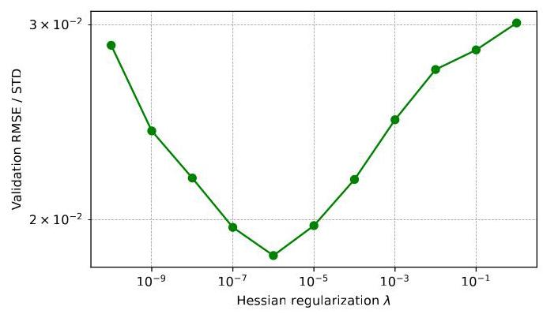

Figure 21: Effect of the strength of Hessian regularization on the validation error when fitting lmKAN with hidden_dim $= {256}$ on the methane dataset using the Distances Polynomials representation.

图21:使用距离多项式表示在甲烷数据集上对隐藏维度为$= {256}$的lmKAN进行拟合时，海森矩阵正则化强度对验证误差的影响。

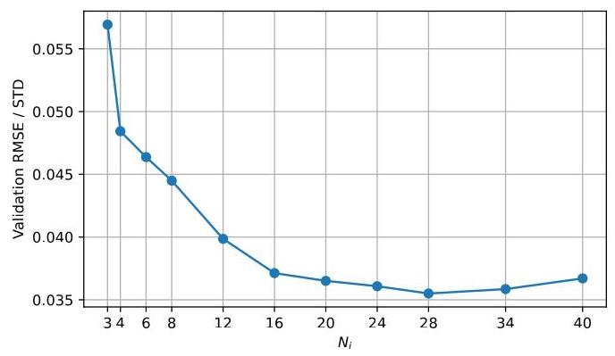

Figure 22: Effect of the number of grid intervals $G$ on the validation error when fitting lmKAN with hidden_dim $= {128}$ on the methane dataset using the Cartesian Components representation.

图22:在使用笛卡尔分量表示法对甲烷数据集上使用隐藏维度$= {128}$拟合lmKAN时，网格间隔数量$G$对验证误差的影响。

### F.4 CIFAR-10

### F.4 CIFAR-10

Augmentations We use the following pool of augmentations for the CIFAR-10 dataset:

增强 我们对CIFAR-10数据集使用以下增强组合:

CIFAR-10 augmentation pipeline

CIFAR-10增强管道

---

MEAN = (0.4914, 0.4822, 0.4465)

STD = (0.2470, 0.2435, 0.2616)

nn.Sequential(   )

	T.RandomCrop(32, padding=4),

	T.RandomHorizontalFlip(),

	T.ColorJitter $\left( {{0.3},{0.3},{0.3},{0.05}}\right)$ ,

	T.RandAugment $\left( {2,7}\right)$ ,

	T.RandomErasing(p=0.25, scale=(0.05, 0.2), ratio=(0.3, 3.3)),

	T.Normalize(MEAN, STD),

)

---

On top of these, we use MixUp [54] $\left( {\alpha  = {0.2}}\right)$ and CutMix [55] $\left( {\beta  = {1.0}}\right)$ augmentations, both with ${50}\%$ probability.

在此基础上，我们使用MixUp [54] $\left( {\alpha  = {0.2}}\right)$和CutMix [55] $\left( {\beta  = {1.0}}\right)$增强，两者的概率均为${50}\%$。

When fitting the families of convolutional neural networks described in the main text, we use the above pool of augmentations consistently for MLP-based and ImKAN-based CNNs. For all the details about the fitting procedures see the configuration files attached to these appendices.

在拟合正文中描述的卷积神经网络族时，我们对基于MLP和基于ImKAN的CNN一致地使用上述增强组合。有关拟合过程的所有详细信息，请参阅这些附录中附带的配置文件。

### F.5 ImageNet

### F.5 ImageNet

The standard data preparation pipeline introduced by AlexNet[10] involves first resizing an image to 256 pixels along the smallest dimension, then performing a random crop of ${224} \times  {224}$ pixels during training, and a center crop of ${224} \times  {224}$ pixels during validation.

AlexNet[10]引入的标准数据准备管道包括首先将图像沿最小维度调整为256像素，然后在训练期间进行${224} \times  {224}$像素的随机裁剪，在验证期间进行${224} \times  {224}$像素的中心裁剪。

We mimic this procedure by first resizing the image to ${81} * {256}/{224} \approx  {93}$ pixels across the smallest dimension, and then performing random or center crops of ${81} \times  {81}$ pixels.

我们通过首先将图像沿最小维度调整为${81} * {256}/{224} \approx  {93}$像素，然后进行${81} \times  {81}$像素的随机或中心裁剪来模仿此过程。

Next, we use the following augmentation pipeline:

接下来，我们使用以下增强管道:

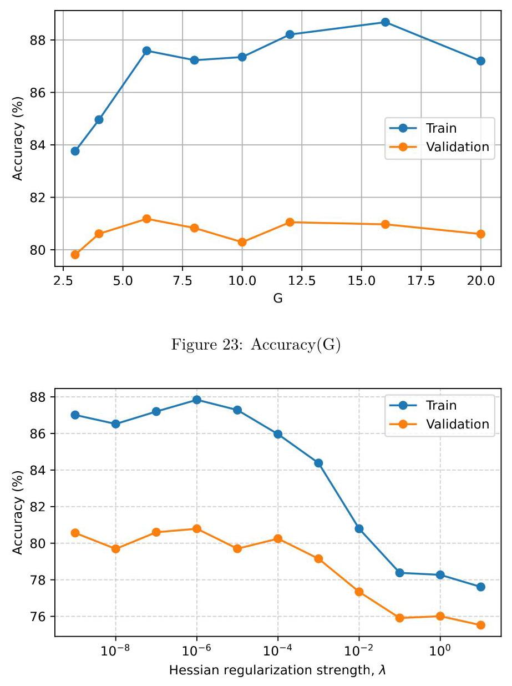

Figure 24: Accuracy(Hessian regularization strength)

图24:准确率(海森正则化强度)

ImageNet augmentation pipeline

ImageNet增强管道

---

nn. Sequential (   )

	T. RandomHorizontalFlip(),

	T. ColorJitter(brightness=0.4, contrast=0.4, saturation=0.4, hue=0.1),

	T.RandAugment(),

	T.RandomErasing(p=0.25, scale=(0.02, 0.33), ratio=(0.3, 3.3), value=0),

	T.Normalize(mean=[0.485, 0.456, 0.406], std=[0.229, 0.224, 0.225]),

)

---

On top of these, we use MixUp and CutMix.

在此基础上，我们使用MixUp和CutMix。

### F.6 Comparison with FastKAN

### F.6与FastKAN的比较

The data was split properly into train, validation, and test subsets, while the original script employed only a train-validation split. We use the cosine (without restarts) learning rate scheduler [66] instead of the exponential decay of the original script. Finally, the normalization was performed with true values of the mean and standard deviation for the CIFAR-10 dataset, instead of the placeholder 0.5 values of the original script.

数据被正确地划分为训练、验证和测试子集，而原始脚本仅使用训练-验证划分。我们使用余弦(无重启)学习率调度器[66]而不是原始脚本的指数衰减。最后，对CIFAR-10数据集使用均值和标准差的真实值进行归一化，而不是原始脚本中的占位符0.5值。