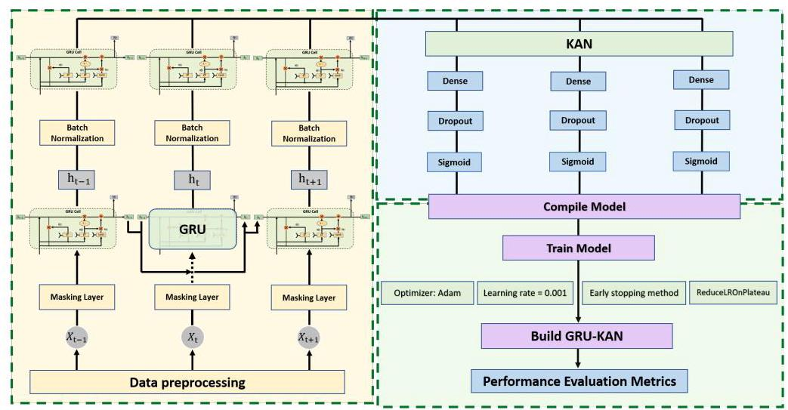
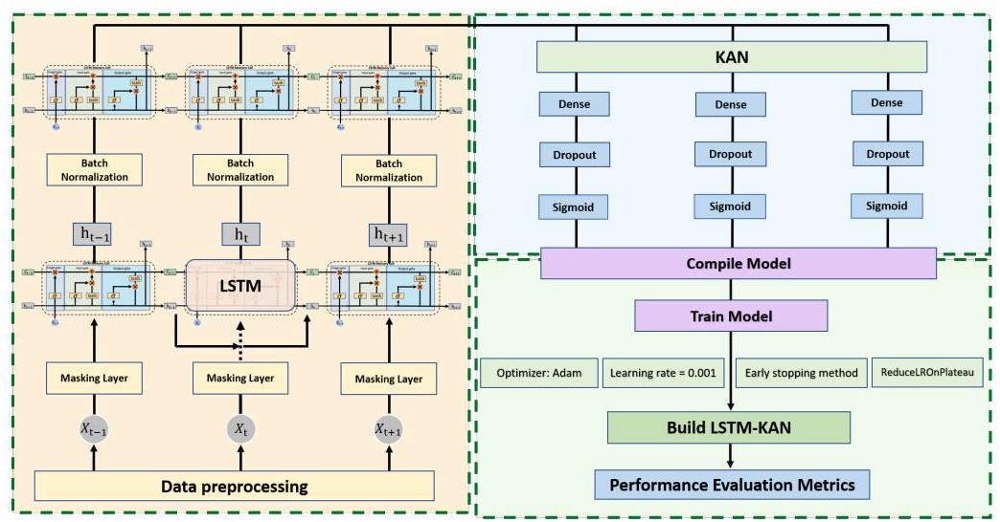
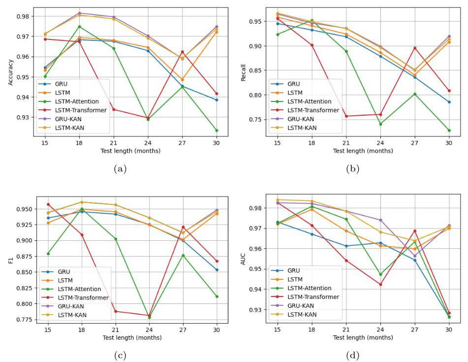
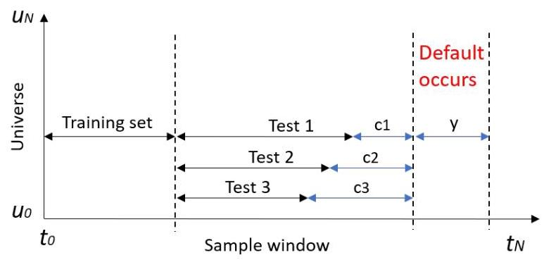
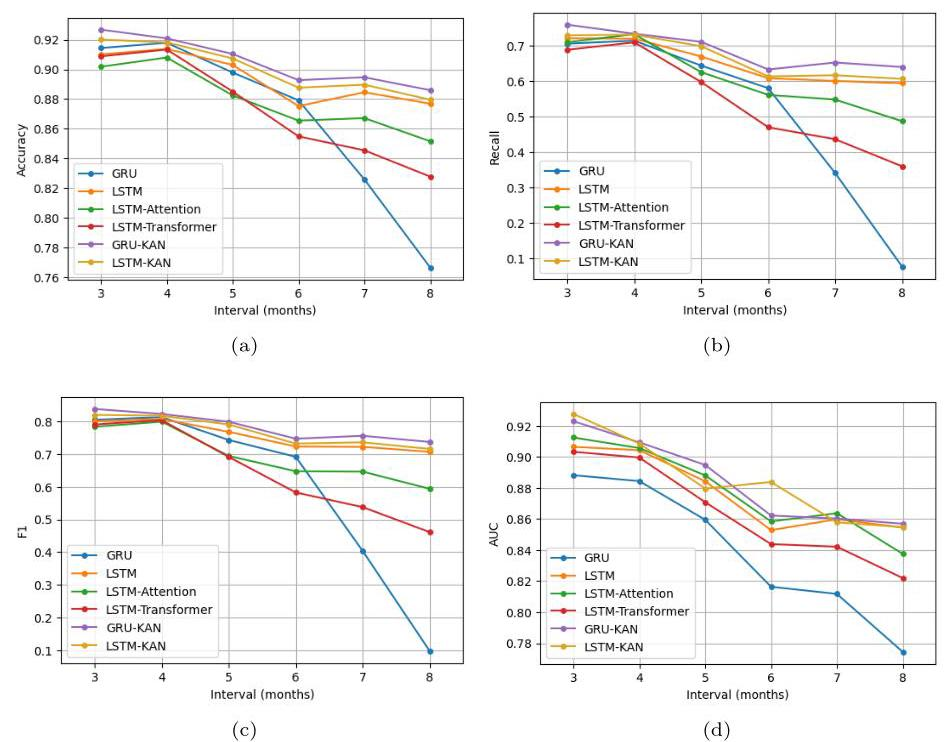
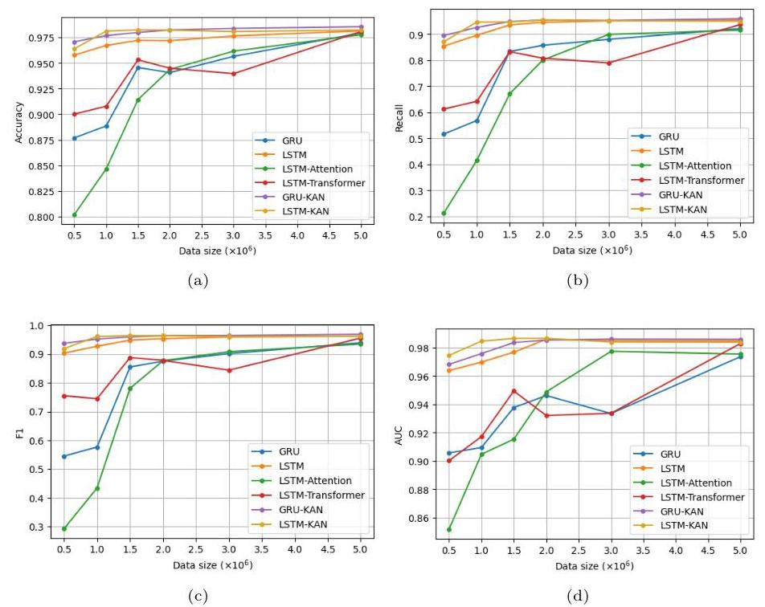
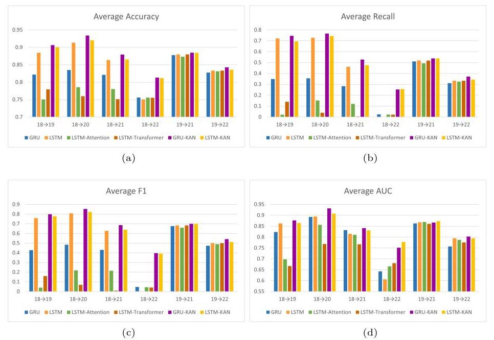

# Kolmogorov-Arnold Networks-based GRU and LSTM for Loan Default Early Prediction

基于柯尔莫哥洛夫 - 阿诺德网络的门控循环单元(GRU)和长短期记忆网络(LSTM)用于贷款违约早期预测

Yue Yang ${}^{1}$ , Zihan ${\mathrm{{Su}}}^{2}$ , Ying Zhang ${}^{2}$ , Chang Chuan Goh ${}^{1}$ , Yuxiang ${\operatorname{Lin}}^{1}$ , Anthony Graham Bellotti ${}^{1 * }$ , Boon Giin Lee ${}^{1 * }$

岳阳${}^{1}$，子涵${\mathrm{{Su}}}^{2}$，张莹${}^{2}$，张长川${}^{1}$，宇翔${\operatorname{Lin}}^{1}$，安东尼·格雷厄姆·贝洛蒂${}^{1 * }$，李文健${}^{1 * }$

${}^{1}$ School of Computer Science, University of Nottingham Ningbo China, Ningbo, 315100, Zhejiang, China.

${}^{1}$ 中国宁波诺丁汉大学计算机科学学院，浙江宁波315100

${}^{2}$ Department of Mathematical Sciences, University of Nottingham Ningbo China, Ningbo, 315100, Zhejiang, China.

${}^{2}$ 中国宁波诺丁汉大学数学科学系，浙江宁波315100

*Corresponding author(s). E-mail(s): anthony-graham.bellotti@nottingham.edu.cn; boon-giin.lee@nottingham.edu.cn; Contributing authors: scxyy2@nottingham.edu.cn; smyzs4@nottingham.edu.cn; smyyz22@nottingham.edu.cn; chang.goh@nottingham.edu.cn; ssyyl35@nottingham.edu.cn;

*通讯作者。电子邮箱:anthony - graham.bellotti@nottingham.edu.cn；boon - giin.lee@nottingham.edu.cn；贡献作者:scxyy2@nottingham.edu.cn；smyzs4@nottingham.edu.cn；smyyz22@nottingham.edu.cn；chang.goh@nottingham.edu.cn；ssyyl35@nottingham.edu.cn；

## Abstract

## 摘要

This study addresses a critical challenge in time series anomaly detection: enhancing the predictive capability of loan default models more than three months in advance to enable early identification of default events, helping financial institutions implement preventive measures before risk events materialize. Existing methods have significant drawbacks, such as their lack of accuracy in early predictions and their dependence on training and testing within the same year and specific time frames. These issues limit their practical use, particularly with out-of-time data. To address these, the study introduces two innovative architectures, GRU-KAN and LSTM-KAN, which merge Kolmogorov-Arnold Networks (KAN) with Gated Recurrent Units (GRU) and Long Short-Term Memory (LSTM) networks. The proposed models were evaluated against the baseline models (LSTM, GRU, LSTM-Attention, and LSTM-Transformer) in terms of accuracy, precision, recall, F1 and AUC in different lengths of feature window, sample sizes, and early prediction intervals. The results demonstrate that the proposed model achieves a prediction accuracy of over 92% three months in advance and over 88% eight months in advance, significantly outperforming existing baselines.

本研究应对时间序列异常检测中的一项关键挑战:将贷款违约模型的预测能力提前三个月以上提升，以便能早期识别违约事件，帮助金融机构在风险事件发生前实施预防措施。现有方法存在显著缺陷，比如早期预测缺乏准确性，且依赖同一年及特定时间框架内的训练和测试。这些问题限制了它们的实际应用，尤其是对于非同期数据。为解决这些问题，本研究引入两种创新架构，GRU - KAN和LSTM - KAN，它们将柯尔莫哥洛夫 - 阿诺德网络(KAN)与门控循环单元(GRU)和长短期记忆网络(LSTM)相融合。在不同长度的特征窗口、样本大小和早期预测间隔下，针对基线模型(LSTM、GRU、LSTM - 注意力和LSTM - 变换器)，从准确性、精确率、召回率、F1和AUC等方面对所提出的模型进行评估。结果表明，所提出的模型提前三个月预测准确率超过92%，提前八个月超过88%，显著优于现有基线模型。

## 1 Introduction

## 1 引言

Time series anomaly detection is important in data mining and machine learning, focused on identifying unusual patterns in sequential data. These anomalies often indicate considerable deviations from normal behaviors and signify potential risks. In finance, predicting loan default is a key application. Loan default refers to when a borrower cannot repay the loan principal and interest on time or if the loan is extensively overdue. Predicting loan default involves analyzing extensive historical data and borrower traits using data analysis and machine learning to predict potential defaults. This prediction is critical for financial institutions, enabling them to identify high-risk borrowers and take preventive steps to mitigate non-performing loans, ultimately enhancing asset quality and financial health.

时间序列异常检测在数据挖掘和机器学习中很重要，专注于识别序列数据中的异常模式。这些异常通常表明与正常行为有相当大的偏差，并预示潜在风险。在金融领域，预测贷款违约是一个关键应用。贷款违约是指借款人不能按时偿还贷款本金和利息，或者贷款严重逾期。预测贷款违约需要使用数据分析和机器学习分析大量历史数据和借款人特征，以预测潜在违约。这种预测对金融机构至关重要，使它们能够识别高风险借款人并采取预防措施以减少不良贷款，最终提高资产质量和财务健康状况。

Although existing loan default prediction models such as LSTM can, to some extent, identify high-risk borrowers, they still face limitations in predictive accuracy and practical use. Typically, financial models such as those based on LSTM struggle to deliver accurate, early predictions, depriving financial institutions of the time needed to prepare and respond. Early predictions of defaults are crucial for banks to implement risk reduction strategies and minimize potential losses. Timely forecasts allow banks to revise lending strategies, improve risk management by monitoring processes, and even engage with borrowers to assess their repayment capacity. If predictions occur only at the onset of default, the practical utility of the model is significantly reduced.

尽管现有的贷款违约预测模型如LSTM在一定程度上能够识别高风险借款人，但它们在预测准确性和实际应用方面仍面临局限性。通常，像基于LSTM的金融模型难以做出准确的早期预测，使金融机构失去了准备和应对所需的时间。违约的早期预测对银行实施风险降低策略和最小化潜在损失至关重要。及时的预测使银行能够调整贷款策略，通过监控流程改善风险管理，甚至与借款人沟通以评估其还款能力。如果预测仅在违约开始时才进行，模型的实际效用将显著降低。

Existing models often depend on training and testing with out-of-sample (OOS) data, meaning that both sets are of the same year. This approach affects the ability of the model to quickly integrate new data, causing the model's prediction results to not reflect the current risk conditions. Researchers face the challenge of waiting until enough data accumulate, which compromises its real-time applicability. The constantly changing financial environment requires banks to update their data analysis. This constraint not only extends the model development timeline, but also restricts the training data, impairing the utilization of extensive historical data.

现有模型通常依赖使用样本外(OOS)数据进行训练和测试，这意味着两个数据集都来自同一年。这种方法影响模型快速整合新数据的能力，导致模型的预测结果无法反映当前风险状况。研究人员面临着要等到积累足够数据的挑战，这损害了其实时适用性。不断变化的金融环境要求银行更新其数据分析。这种限制不仅延长了模型开发时间线，还限制了训练数据，损害了对大量历史数据的利用。

The novelty of this study lies in its aim to overcome the limitations of existing anomaly detection models in accurately predicting loan defaults more than three months in advance, providing financial institutions with sufficient time for proactive risk management. Specifically, we investigate designing a model capable of training and testing in different years, improving early prediction over current models. We introduce two innovative models, LSTM-KAN and GRU-KAN, based on Kolmogorov-Arnold Networks (KAN), a leading deep learning framework. We evaluated these models in three experimental scenarios. The first scenario assesses each effectiveness of models with various feature window lengths, indicating the number of historical months used for training, to determine whether similar or better predictive accuracy is achievable with shorter windows compared to baseline models. The second scenario tests the impact of a blank interval between the input feature window and the observation period, simulating the early prediction of defaults. The third scenario examines the efficiency of models across different sample sizes, with the aim of showing equal or better performance even with smaller datasets. All scenarios use out-of-time (OOT) test sets, which means that training and testing data are from different years. This setup demonstrates the ability of the proposed models to utilize extensive historical data, showing adaptability to new data and potential for near-real-time applications.

<text>本研究的新颖之处在于其旨在克服现有异常检测模型在提前三个月以上准确预测贷款违约方面的局限性，为金融机构提供足够的时间进行主动风险管理。具体而言，我们研究设计一种能够在不同年份进行训练和测试的模型，以改进当前模型的早期预测。我们基于领先的深度学习框架Kolmogorov-Arnold Networks (KAN) 引入了两种创新模型，LSTM-KAN和GRU-KAN。我们在三种实验场景中评估了这些模型。第一种场景评估具有不同特征窗口长度(即用于训练的历史月份数)的模型的有效性，以确定与基线模型相比，较短窗口是否能实现相似或更好的预测准确性。第二种场景测试输入特征窗口与观察期之间的空白间隔的影响，模拟违约的早期预测。第三种场景检查不同样本大小下模型的效率，目的是即使在较小的数据集上也能展示同等或更好的性能。所有场景都使用时间外(OOT)测试集，这意味着训练和测试数据来自不同年份。这种设置展示了所提出模型利用广泛历史数据的能力，显示了对新数据的适应性以及近实时应用的潜力。</text>

The primary contributions of our study are:

<text>我们研究的主要贡献如下:</text>

1. To introduce innovative KAN-based GRU and LSTM models that flexibly optimize activation functions for adaptable modeling of complex nonlinear relationships in time series data. This method improves predictive precision and robustness in forecasting loan defaults.

<text>1. 引入基于创新KAN的GRU和LSTM模型，该模型灵活优化激活函数，以适应时间序列数据中复杂非线性关系的建模。此方法提高了预测贷款违约的精度和稳健性。</text>

2. To introduce the inclusion of a "blank interval" enables the development of a model for the early prediction of loan defaults, serving as a key tool for financial institutions to manage risk proactively. Early identification of default risks allows banks to take preventive actions, modify credit policies, and mitigate financial losses.

<text>2. 引入“空白间隔”，能够开发贷款违约早期预测模型，作为金融机构主动管理风险的关键工具。早期识别违约风险使银行能够采取预防措施、修改信贷政策并减轻财务损失。</text>

3. To integrate the Transformer architecture into loan default prediction and performing comparative experiments to assess its ability to capture complex patterns and long-term dependencies addresses a gap in current research.

<text>3. 将Transformer架构集成到贷款违约预测中，并进行对比实验以评估其捕捉复杂模式和长期依赖关系的能力，填补了当前研究的空白。</text>

4. To propose models that demonstrate enhanced performance in handling OOT data under various conditions, as validated by experimental findings. This feature improves its suitability for near-real-time anomaly detection by integrating the most recent data in dynamic financial contexts.

<text>4. 提出在各种条件下处理OOT数据时表现出增强性能的模型，实验结果验证了这一点。此特性通过在动态金融环境中整合最新数据，提高了其对近实时异常检测的适用性。</text>

This study aims to improve the prediction of loan default by overcoming the shortcomings of current models and increasing their predictive power. We aim to provide financial institutions with a robust solution for identifying and mitigating loan default risks through an innovative model design and comprehensive evaluation.

<text>本研究旨在通过克服当前模型的缺点并提高其预测能力来改进贷款违约预测。我们旨在通过创新的模型设计和全面评估，为金融机构提供一个强大的解决方案，用于识别和减轻贷款违约风险。</text>

## 2 Related Works

<text>## 2相关工作</text>

### 2.1 Early Prediction with OOT data

<text>### 2.1使用OOT数据进行早期预测</text>

Previous studies on predicting loan defaults show differences and limitations in aspects such as test set construction and utilization of time series data. For example, Zandi et al. [1] used loan repayment data from loans issued in 2009 and 2010 in the Freddie Mac dataset, covering the period from January 2012 to June 2013, with a feature window every six months, totaling 13 windows for the training set; and used the repayment data for July to December 2013 as the feature window for the test set to forecast defaults during the next 12 months. Being a test set derived from different segments of the same borrowers' repayment behavior time series as the training set, the patterns in the test data resemble those of the training set, potentially leading to overly optimistic prediction results. Furthermore, the prolonged time after loan issuance to attain the test set indicates that the study may not have fully addressed the practical applicability of the model.

<text>先前关于预测贷款违约的研究在测试集构建和时间序列数据利用等方面存在差异和局限性。例如，Zandi等人[1]使用了Freddie Mac数据集中2009年和2010年发放贷款的还款数据，涵盖2012年1月至2013年6月期间，训练集每六个月有一个特征窗口，共13个窗口；并使用2013年7月至12月的还款数据作为测试集的特征窗口，以预测未来12个月的违约情况。作为与训练集来自同一借款人还款行为时间序列不同段的测试集，测试数据中的模式与训练集相似，可能导致过于乐观的预测结果。此外，从贷款发放到获得测试集的时间延长表明该研究可能没有充分解决模型的实际适用性问题。</text>

Wang et al. [2] integrated a survival analysis model with LSTM to examine variations in default rates during the life of the loan. By using a survival model where defaults are noted at a specific loan age, assessing default risk within the observation period post-issuance was unnecessary as is required in static credit risk models. The study uses an OOS test set from 2004 to 2013, which matches the training set in length and year. However, this data-conformity method imposes limitations. Using OOS data from the same year for both training and testing reduces the capability of the model to utilize a broad historical dataset while incorporating recent information. This restricts its effective use in real-time, with sufficient data available only after delays. This limitation highlights the necessity of OOT data, which better facilitates real-time applications.

<text>Wang等人[2]将生存分析模型与LSTM集成，以研究贷款生命周期内违约率的变化。通过使用在特定贷款期限记录违约的生存模型，无需像静态信用风险模型那样在发放后观察期内评估违约风险。该研究使用了2004年至2013年的OOS测试集，其长度和年份与训练集匹配。然而，这种数据一致性方法存在局限性。在训练和测试中使用同一年的OOS数据会降低模型利用广泛历史数据集并纳入最新信息的能力。这限制了其在实时中的有效使用，只有在延迟后才有足够的数据。这种局限性凸显了OOT数据的必要性，它更有利于实时应用。</text>

Breeden and Leonova [3] investigated the integration of machine learning with survival analysis to predict loan defaults. Using panel data from 1999 to 2019, the study used both OOS and OOT test sets over a 24-month observation period. However, the length of this period affected the model in accurately identifying if a default might occur sooner, such as within three months, thus limiting its usefulness in time-sensitive predictions. Zhu et al. [4] examined loan default prediction but omitted details on handling time series data and test set design, viewing it as a static binary classification issue for unbalanced data. Similarly, Guo et al. [5] developed the HUIHEN model to better profile loan applicants, improving the accuracy of default prediction, but also neglected time series data handling and experimental design. Lai [6], Elmasry [7], and Al-qerem et al. [8] also reduced the problem to a static binary classification, not adequately addressing temporal factors.

布里登和列昂诺娃[3]研究了机器学习与生存分析的整合，以预测贷款违约情况。该研究使用了1999年至2019年的面板数据，在24个月的观察期内使用了样本外(OOS)和样本外测试集(OOT)。然而，这段时间的长度影响了模型准确识别违约是否会更快发生(比如在三个月内)的能力，因此限制了其在时间敏感预测中的实用性。朱等人[4]研究了贷款违约预测，但省略了处理时间序列数据和测试集设计的细节，将其视为不平衡数据的静态二元分类问题。同样，郭等人[5]开发了HUIHEN模型以更好地描述贷款申请人，提高了违约预测的准确性，但也忽略了时间序列数据处理和实验设计。赖[6]、埃尔马斯里[7]和阿尔 - 凯雷姆等人[8]也将问题简化为静态二元分类，没有充分考虑时间因素。

In summary, existing studies on loan default prediction have mainly used static data and ignored the ability of time series data to detect temporal patterns and trends. Even studies using time series data have mostly concentrated on OOS data, with OOT data being less utilized. Furthermore, few have attempted to integrate blank intervals to simulate "early prediction". These limitations have led to a poor understanding of the early prediction performance of existing models and a lack of exploration of the dynamic nature of time series data. To address these issues, our study aims to develop models using OOT data that excel in early prediction tasks, thereby improving the accuracy and practical applicability of loan default prediction.

总之，现有的贷款违约预测研究主要使用静态数据，忽略了时间序列数据检测时间模式和趋势的能力。即使是使用时间序列数据的研究，大多也集中在样本外数据上，对样本外测试集数据的利用较少。此外，很少有人尝试整合空白区间来模拟“早期预测”。这些局限性导致对现有模型的早期预测性能理解不足，且缺乏对时间序列数据动态性质的探索。为解决这些问题，我们的研究旨在开发使用样本外测试集数据的模型，使其在早期预测任务中表现出色，从而提高贷款违约预测的准确性和实际适用性。

### 2.2 Time Series Anomaly Detection

### 2.2时间序列异常检测

GRU and LSTM are commonly used in time series research [9], serving as a solid basis for our proposed improvements. This section reviews research utilizing LSTM and GRU algorithms, with LSTM often preferred for time series due to its ability to capture long-term dependencies and contextual information.

门控循环单元(GRU)和长短期记忆网络(LSTM)在时间序列研究中常用[9]，为我们提出的改进提供了坚实基础。本节回顾利用LSTM和GRU算法的研究，由于LSTM能够捕捉长期依赖关系和上下文信息，在时间序列研究中常被优先选用。

#### 2.2.1 GRU related applications

#### 2.2.1 GRU相关应用

Liang and Cai [10] assessed the GRU model against LSTM, ARIMA, SVM, and ANN through two cross-validation techniques and three temporal dimensions using monthly loan default rates from the Lending Club P2P platform (2008-2015) [11]. The findings indicated better performance of LSTM in several metrics, while GRU effectively handles long-term dependencies with reduced computational demand, making it suitable for time series analysis. Hussein Sayed et al. [12] compared the prediction accuracy of five machine learning classifiers (Gaussian Naive Bayes, AdaBoost, Gradient Boosting, K-Nearest Neighbors, Decision Trees, Random Forest and Logistic Regression) and eight deep learning algorithms (multi-layer perceptron (MLP), convolutional neural networks (CNN), LSTM, Transformer, GRU, Autoencoder, ResNet, and DenseNet) to forecast loan defaults using four metrics.

梁和蔡[10]通过两种交叉验证技术和三个时间维度，使用来自Lending Club P2P平台(2008 - 2015)的月度贷款违约率[11]，将GRU模型与LSTM、自回归积分移动平均模型(ARIMA)、支持向量机(SVM)和人工神经网络(ANN)进行评估。研究结果表明，在几个指标上LSTM表现更好，而GRU能有效处理长期依赖关系且计算需求降低，适合时间序列分析。侯赛因·赛义德等人[12]比较了五个机器学习分类器(高斯朴素贝叶斯、自适应增强(AdaBoost)、梯度提升、K近邻、决策树、随机森林和逻辑回归)和八个深度学习算法(多层感知器(MLP)、卷积神经网络(CNN)、LSTM、Transformer、GRU、自动编码器、残差网络(ResNet)和密集连接网络(DenseNet))使用四个指标预测贷款违约的准确性。

ASL et al. [13] presented the LSTM-GRU model for credit scoring, which integrates GRU and LSTM. Experiments revealed that this model outperformed baseline models such as SVM, CNN, LSTM, and GRU in precision, recall, F1 score, and AUC. The study highlighted the importance of choosing the right deep learning model for credit scoring due to variations in performance and prediction ability. Tang et al. [14] introduced GRN, an interpretable multivariate time series anomaly detection method utilizing Graph Neural Networks and GRU. GRU was selected for its proficiency in capturing long- and short-term dependencies in time series data with a lower computational cost than LSTM. Liu et al. [15] developed a novel GRU-based anomaly detection approach for network logs, using the support vector domain description (SVDD). Experiments with the KDD Cup99 dataset indicated that it outperformed the classical GRU-MLP and LSTM methods. Similarly, Guo et al. [16] designed GGM-VAE, a GRU-based Gaussian mixture anomaly detection system, integrating GRU with Gaussian mixture priors to model multimodal data distributions. The tests showed significant improvements in accuracy and F1 scores over traditional GRU models. These investigations highlighted the effectiveness of GRU-based designs in improving time series anomaly detection.

ASL等人[13]提出了用于信用评分的LSTM - GRU模型，该模型整合了GRU和LSTM。实验表明，该模型在精度、召回率、F1分数和曲线下面积(AUC)方面优于支持向量机、卷积神经网络、LSTM和GRU等基线模型。该研究强调了由于性能和预测能力的差异，选择合适的深度学习模型进行信用评分的重要性。唐等人[14]引入了GRN，一种利用图神经网络和GRU的可解释多变量时间序列异常检测方法。选择GRU是因为它能够以比LSTM更低的计算成本捕捉时间序列数据中的长期和短期依赖关系。刘等人[15]开发了一种基于GRU的网络日志异常检测新方法，使用支持向量域描述(SVDD)。对KDD Cup99数据集的实验表明，它优于经典的GRU - MLP和LSTM方法。同样，郭等人[16]设计了GGM - VAE，一种基于GRU的高斯混合异常检测系统，将GRU与高斯混合先验相结合以对多模态数据分布进行建模。测试表明，与传统GRU模型相比，其在准确性和F1分数上有显著提高。这些研究突出了基于GRU设计在改进时间序列异常检测方面的有效性。

#### 2.2.2 LSTM related applications

#### 2.2.2 LSTM相关应用

Benchaji et al. [17] utilized LSTM as a model for detecting credit card fraud, focusing on historical purchase patterns to enhance the detection accuracy of new fraudulent transactions. Gao et al. [18] created a rural microcredit risk assessment model based on LSTM, named the self-organizing LSTM algorithm, designed to capture the long-term dependencies between past actions and associated risk factors of borrowers. Menggang et al. [19] introduced the sliding window and the attention mechanism LSTM (SL-ALSTM), which combines LSTM with a sliding window and the attention mechanism. This model maximizes ability of LSTM to capture both long-term and short-term dependencies in time series, using sliding windows for extracting context from loan data and attention mechanism for weighting crucial data, thus improving its ability to identify patterns and improve time series prediction. On the Lending Club public dataset, it surpassed ARIMA, SVM, ANN, LSTM, and GRU models.

本查吉等人[17]将长短期记忆网络(LSTM)用作检测信用卡欺诈的模型，重点关注历史购买模式，以提高对新欺诈交易的检测准确性。高等人[18]创建了一个基于长短期记忆网络的农村小额信贷风险评估模型，名为自组织长短期记忆网络算法，旨在捕捉借款人过去行为与相关风险因素之间的长期依赖关系。孟刚等人[19]引入了滑动窗口和注意力机制长短期记忆网络(SL - ALSTM)，该模型将长短期记忆网络与滑动窗口和注意力机制相结合。此模型最大限度地发挥了长短期记忆网络在时间序列中捕捉长期和短期依赖关系的能力，利用滑动窗口从贷款数据中提取上下文，并通过注意力机制对关键数据进行加权，从而提高其识别模式的能力并改善时间序列预测。在Lending Club公共数据集上，它超越了自回归积分移动平均模型(ARIMA)、支持向量机(SVM)、人工神经网络(ANN)、长短期记忆网络和门控循环单元(GRU)模型。

Zhang et al. [20] proposed a similar architecture of attention-based LSTM (AT-LSTM) for the prediction of financial time series, which also uses attention to select relevant input features for the LSTM network. Benchaji et al. [21] developed a credit card fraud detection system using data sequence modeling, LSTM, and an attention mechanism, which assigns varying attention to information from the hidden layer of LSTM. This system considers the sequential structure of transactions, identifying crucial transactions in the input and improving the prediction of fraudulent activities. Experiments revealed that this model achieved the highest precision and recall compared to base models such as LSTM, GRU, and ANN. Ding et al. [22] introduced LGMAD, a real-time anomaly detection algorithm which was validated on the NAB dataset [23] utilizing LSTM and a Gaussian mixture model (GMM). The anomalies in each univariate sensor time series are assessed with the LSTM, followed by multidimensional anomaly detection with the GMM.

张等人[20]提出了一种类似的基于注意力的长短期记忆网络(AT - LSTM)架构用于金融时间序列预测，该架构也使用注意力为长短期记忆网络选择相关输入特征。本查吉等人[21]开发了一种使用数据序列建模、长短期记忆网络和注意力机制的信用卡欺诈检测系统，该系统对来自长短期记忆网络隐藏层的信息赋予不同的注意力。此系统考虑交易的顺序结构，识别输入中的关键交易并改善对欺诈活动的预测。实验表明，与长短期记忆网络、门控循环单元和人工神经网络等基础模型相比，该模型实现了最高的精度和召回率。丁等人[22]引入了LGMAD，一种实时异常检测算法，该算法在NAB数据集[23]上利用长短期记忆网络和高斯混合模型(GMM)进行了验证。使用长短期记忆网络评估每个单变量传感器时间序列中的异常，然后使用高斯混合模型进行多维度异常检测。

In recent years, the emergence of Transformers has led to numerous studies exploring their use for time series data prediction [24]. However, opinions differ among scholars about the suitability of Transformers for these tasks. Kim et al. [25] used Transformer models for innovating time series anomaly detection by simultaneously assessing global and local patterns. The model features an encoder with multiple Transformer layers and a decoder with one-dimensional convolutional layers; anomaly scores are the deviations between predicted and actual values at each timestamp. Benchmark tests show that the proposed approach exceeds the performance of LSTM and CNN, underscoring the effectiveness of the Transformer layers. Shi et al. [26] introduced a forecasting model that merges the Transformer self-attention mechanism with LSTM to efficiently capture long-term dependencies. To improve search efficiency, a hybrid of random search and Bayesian optimization refines parameters and regularization. The accuracy of the LSTM-Transformer model is validated by comparisons with LSTM, CNN, Transformer, and CNN-LSTM, showing that it achieves the best accuracy. Sun et al. [27] linked BiLSTM to the three-layer Transformer encoder for return prediction to increase the performance of the portfolio model. The BiLSTM-Transformer model initially predicted alternative asset returns, which were then incorporated into a mean-variance (MV) model. Six constituent stocks of the US30 index were used as alternative assets for 270 investments, and comparisons with the LSTM and Transformer models validated the performance of BiLSTM-Transformer.

近年来，Transformer的出现引发了众多关于其用于时间序列数据预测的研究[24]。然而，学者们对于Transformer在这些任务中的适用性存在不同看法。金等人[25]使用Transformer模型通过同时评估全局和局部模式来创新时间序列异常检测。该模型具有一个带有多个Transformer层的编码器和一个带有一维卷积层的解码器；异常分数是每个时间戳处预测值与实际值之间的偏差。基准测试表明，所提出的方法超过了长短期记忆网络和卷积神经网络(CNN)的性能，突出了Transformer层的有效性。施等人[26]引入了一种将Transformer自注意力机制与长短期记忆网络相结合的预测模型，以有效地捕捉长期依赖关系。为了提高搜索效率，使用随机搜索和贝叶斯优化的混合方法来优化参数和正则化。通过与长短期记忆网络、卷积神经网络、Transformer和卷积神经网络 - 长短期记忆网络进行比较验证了长短期记忆网络 - Transformer模型的准确性，表明它实现了最佳准确性。孙等人[27]将双向长短期记忆网络(BiLSTM)与三层Transformer编码器相连用于收益预测以提高投资组合模型的性能。双向长短期记忆网络 - Transformer模型最初预测替代资产收益，然后将其纳入均值 - 方差(MV)模型。使用美国30指数的六只成分股作为270次投资的替代资产，并与长短期记忆网络和Transformer模型进行比较验证了双向长短期记忆网络 - Transformer的性能。

In contrast, Zeng et al. [24] questioned the effectiveness of popular Transformer-based methods in long-term time series forecasting (LTSF). The study used a straightforward linear model, LTSF-Linear, as the direct multi-step (DMS) benchmark to support this assertion. Importantly, the key contribution of the study is not the linear model itself but the identification of a significant concern, as shown through comparative experiments, indicating that Transformers might not be universally effective as claimed. Meanwhile, Yang et al. [28] evaluated 75 models in 16 datasets, showing that model performance varies by dataset and that both machine learning and deep learning models are dataset-specific. Hence, the critique of Transformers does not definitively prove that integrating Transformer layers with any model would fail on all time series datasets. Since Transformers have not been extensively applied to loan default prediction in the context of time series anomaly detection, exploring Transformer architectures in this area is still valuable to assess if they improve the capture of intricate patterns and long-term dependencies, thus addressing current research limitations.

相比之下，曾等人[24]质疑了基于Transformer的流行方法在长期时间序列预测(LTSF)中的有效性。该研究使用了一个简单的线性模型，即LTSF - 线性模型，作为直接多步(DMS)基准来支持这一观点。重要的是，该研究的关键贡献不是线性模型本身，而是通过比较实验确定了一个重大问题，表明Transformer可能并不像所声称的那样普遍有效。同时，杨等人[28]在16个数据集中评估了75个模型，表明模型性能因数据集而异，并且机器学习和深度学习模型都是特定于数据集的。因此，对Transformer的批评并不能确凿地证明将Transformer层与任何模型集成在所有时间序列数据集上都会失败。由于Transformer尚未在时间序列异常检测的背景下广泛应用于贷款违约预测，在这一领域探索Transformer架构对于评估它们是否能改善对复杂模式和长期依赖关系的捕捉从而解决当前研究局限性仍然很有价值。

### 2.3 KAN related applications

### 2.3与KAN相关的应用

KAN, pioneered by an MIT research team [29], is an innovative model that can potentially be used for detecting anomalies in time series. The method decomposes complex time series into univariate functions, replacing traditional linear weights with spline-parameterized alternatives, thus enabling dynamic learning of activation patterns and significantly enhancing interpretability. Zhou et al. [30] introduced KAN-AD to address KAN's susceptibility to local anomalies caused by optimizing univariate functions with spline functions. KAN-AD emphasizes global patterns with Fourier series, reducing the impact of local peaks. Consequently, by transforming existing black-box learning methods into learning weights for univariate functions, it improves both effectiveness and efficiency.

由麻省理工学院研究团队[29]率先提出的KAN，是一种创新模型，有可能用于检测时间序列中的异常。该方法将复杂的时间序列分解为单变量函数，用样条参数化的替代方法取代传统的线性权重，从而实现对激活模式的动态学习，并显著提高可解释性。周等人[30]引入了KAN - AD，以解决KAN因使用样条函数优化单变量函数而对局部异常敏感的问题。KAN - AD通过傅里叶级数强调全局模式，减少局部峰值的影响。因此，通过将现有的黑箱学习方法转换为单变量函数的学习权重，它提高了有效性和效率。

Xu et al. [31] investigated how KAN can be used for time series forecasting, introducing T-KAN and MT-KAN. T-KAN is oriented to detect concept drift, using symbolic regression to explain non-linear links between predictions and previous time steps, ensuring interpretability in dynamic contexts. MT-KAN improves forecasting by extracting and using complex connections between variables in multivariate time series. Experiments validated the efficacy of these methods, with T-KAN and MT-KAN significantly outperforming baseline models such as MLP, RNN, and LSTM in forecasting tasks. Vaca-Rubio et al. [32] explored a the use of KAN in time series prediction using its adaptive activation functions to improve predictive modeling. The experiments showed that KAN surpassed traditional MLP in real-world satellite traffic forecasting with fewer learnable parameters and higher accuracy. Livieris [33] proposed a forecasting model called C-KAN for multistep predictions, where it combines convolutional layers with the KAN architecture. This model uses convolutional layers to capture the behavior and internal patterns of time series data, facilitating promising feature analysis and potentially more precise input-output management.

徐等人[31]研究了KAN如何用于时间序列预测，引入了T - KAN和MT - KAN。T - KAN旨在检测概念漂移，使用符号回归来解释预测与先前时间步之间的非线性联系，确保在动态环境中的可解释性。MT - KAN通过提取和使用多变量时间序列中变量之间的复杂联系来改进预测。实验验证了这些方法的有效性，在预测任务中，T - KAN和MT - KAN显著优于诸如MLP、RNN和LSTM等基线模型。瓦卡 - 鲁维奥等人[32]探索了在时间序列预测中使用KAN及其自适应激活函数来改进预测建模。实验表明，在具有较少可学习参数和更高准确性的实际卫星流量预测中，KAN超过了传统的MLP。利维耶里斯[33]提出了一种用于多步预测的预测模型C - KAN，它将卷积层与KAN架构相结合。该模型使用卷积层来捕获时间序列数据的行为和内部模式，便于进行有前景的特征分析和潜在更精确的输入 - 输出管理。

KAN, considered an advanced MLP variant, has not yet been studied for the prediction of loan default. The originality and potential of such innovative algorithms in offering new insights justify exploring the application and effectiveness of KAN in this area, thus expanding its usage.

KAN被认为是一种先进的MLP变体，尚未针对贷款违约预测进行研究。这种创新算法在提供新见解方面的原创性和潜力证明了探索KAN在该领域的应用和有效性是合理的，从而扩大其用途。

## 3 Methodology

## 3方法

### 3.1 Design of GRU-KAN and LSTM-KAN

### 3.1 GRU - KAN和LSTM - KAN的设计

This study explores the interaction between different feature extraction methods and the KAN model, proposing a hybrid architecture that integrates GRU-KAN and LSTM-KAN to enhance the ability to capture complex patterns in time series data. Specifically, both models share a similar architecture comprising a data preprocessing layer, a masking layer, a feature extraction layer, a KAN layer, a fully connected layer, and an output layer. The key difference between the two lies in the recurrent neural network layer used: GRU-KAN employs a GRU network, while LSTM-KAN uses aLSTM network. LSTM retains long-term dependencies effectively through its gating mechanism in the feature extraction layer, whereas GRU simplifies this process with fewer parameters, achieving a lightweight model while maintaining robust temporal modeling capabilities.

本研究探讨了不同特征提取方法与KAN模型之间的相互作用，提出了一种集成GRU - KAN和LSTM - KAN的混合架构，以增强捕获时间序列数据中复杂模式的能力。具体而言，这两种模型共享类似的架构，包括数据预处理层、掩码层、特征提取层、KAN层、全连接层和输出层。两者的关键区别在于所使用的循环神经网络层:GRU - KAN采用GRU网络，而LSTM - KAN使用LSTM网络。LSTM通过其在特征提取层中的门控机制有效地保留长期依赖关系，而GRU用较少的参数简化了这个过程，在保持强大的时间建模能力的同时实现了轻量级模型。

Figures 1 and 2, along with the pseudocode in Algorithms 1 and 2, provide detailed descriptions of the GRU-KAN and LSTM-KAN architectures. The term "model" in the following definitions applies to both GRU-KAN and LSTM-KAN due to their shared structural characteristics.

图1和图2以及算法1和算法2中的伪代码提供了GRU - KAN和LSTM - KAN架构的详细描述。由于它们共享结构特征，以下定义中的“模型”一词适用于GRU - KAN和LSTM - KAN两者。

Fig. 1 Configuration of the proposed GRU-KAN.

图1所提出的GRU - KAN的配置。

Algorithm 1: Pseudocode of the proposed GRU-KAN

算法1:所提出的GRU - KAN的伪代码

---

	Input: Data ${X}_{i},1 < i < N$

1 Initialize model M(GRU, KAN) with parameters $\theta$

	for each input sequence $X$ from 1 to $N$ do

			${X}^{\prime } \leftarrow$ Preprocess $\left( {X,{\theta }_{\text{ masking }}}\right)$

			${\text{ Masked }}_{\text{ input }} \leftarrow$ Masking(mask_value $= {0.0})\left( {X}^{\prime }\right)$

			${h}_{\text{ gru1 }} \leftarrow$ GRU(units=128, return_sequences=True, ${\theta }_{\text{ gru }}$ )(Masked ${}_{\text{ input }}$ )

			${h}_{{\text{ gru1 }}_{\text{ norm }}} \leftarrow$ BatchNormalization $\left( {\theta }_{\text{ bn }}\right) \left( {h}_{\text{ gru1 }}\right)$

			${h}_{gru2} \leftarrow$ GRU(units $= {64}$ , return_sequences $=$ False, ${\theta }_{gru})\left( {h}_{{\text{ gru1 }}_{\text{ norm }}}\right)$

			${\text{ kan }}_{\text{ out }} \leftarrow$ KAN(output_dim $= 1$ , num_functions $= {10},{\theta }_{\text{ kan }})\left( {h}_{\text{ gru2 }}\right)$

			${\text{ dense }}_{\text{ out }} \leftarrow$ Dense(units $= {64}$ , activation $=$ ’relu’, $\left. {\theta }_{\text{ dense }}\right) \left( {\text{ kan }}_{\text{ out }}\right)$

			${\text{ dropout }}_{\text{ out }} \leftarrow$ Dropout(rate $= {0.3},{\theta }_{\text{ dropout }})\left( {\text{ dense }}_{\text{ out }}\right)$

			instance ${}_{\text{ output }} \leftarrow$ Dense(units $= 1$ , activation $=$ ’sigmoid’, ${\theta }_{\text{ output }}$ )(dropout ${}_{\text{ out }}$ )

			Return instance ${e}_{\text{ output }}$

	Output: M(GRU, KAN, ${\theta }_{\text{ output }}$ ), instance ${}_{\text{ output }}$

---

Fig. 2 Configuration of the proposed LSTM-KAN

图2所提出的LSTM - KAN的配置

Algorithm 2: Pseudocode of the proposed LSTM-KAN

算法2:所提出的LSTM - KAN的伪代码

---

	Input: Data ${X}_{i},1 < i < N$

1 Initialize model M(LSTM, KAN) with parameters $\theta$

		for each input sequence $X$ from 1 to $N$ do

			${X}^{\prime } \leftarrow$ Preprocess $\left( {X,{\theta }_{\text{ masking }}}\right)$

				${\text{ Masked }}_{\text{ input }} \leftarrow$ Masking(mask_value $= {0.0})\left( {X}^{\prime }\right)$

			${h}_{lstm1} \leftarrow$ LSTM(units=128, return_sequences=True, ${\theta }_{lstm}$ )(Masked ${}_{\text{ input }}$ )

			${h}_{{lstm}{1}_{norm}} \leftarrow$ BatchNormalization $\left( {\theta }_{bn}\right) \left( {h}_{lstm1}\right)$

			${h}_{lstm2} \leftarrow  \operatorname{LSTM}\left( {\text{ units } = {64}\text{ , return\_sequences } = \text{ False, }{\theta }_{lstm}}\right) \left( {h}_{{lstm}{1}_{norm}}\right)$

			${\operatorname{kan}}_{\text{ out }} \leftarrow  \operatorname{KAN}\left( {\text{ output\_dim } = 1,\text{ num\_functions } = {10},{\theta }_{\text{ kan }}}\right) \left( {h}_{\text{ lstm }2}\right)$

			${\text{ dense }}_{\text{ out }} \leftarrow$ Dense(units $= {64}$ , activation $=$ ’relu’, ${\theta }_{\text{ dense }}$ )(ka ${n}_{\text{ out }}$ )

			${\text{ dropout }}_{\text{ out }} \leftarrow$ Dropout(rate $= {0.3},{\theta }_{\text{ dropout }}$ )(dens ${e}_{\text{ out }}$ )

			instance ${}_{\text{ output }} \leftarrow$ Dense(units $= 1$ , activation $=$ ’sigmoid’, ${\theta }_{\text{ output }}$ )(dropout ${}_{\text{ out }}$ )

			Return instanceoutput

	Output: M(LSTM, KAN, ${\theta }_{\text{ output }}$ ), instance ${}_{\text{ output }}$

---

The data pre-processing layer is responsible for preparing loan-related input data before feeding it into the model. A detailed description of this process can be found in Section 3.2.2. The masking layer identifies padding values in the input data. Since loan-related time series data often have varying sequence lengths, shorter sequences are typically padded to match the longest sequence for batch processing. The masking layer distinguishes between actual data and padding values, ensuring the model focuses only on meaningful inputs while ignoring artificial padding. This step prevents training interference from filler values, allowing the model to capture essential patterns more effectively and improve prediction accuracy.

数据预处理层负责在将与贷款相关的输入数据输入模型之前对其进行准备。此过程的详细描述可在3.2.2节中找到。掩码层识别输入数据中的填充值。由于与贷款相关的时间序列数据通常具有不同的序列长度，较短的序列通常会被填充以匹配最长序列以进行批处理。掩码层区分实际数据和填充值，确保模型仅关注有意义的输入，同时忽略人工填充。此步骤可防止训练受到填充值的干扰，使模型能够更有效地捕获基本模式并提高预测准确性。

After masking, the data is passed to the LSTM layer for feature extraction, where two different methods-LSTM and GRU-are applied and compared. Both GRU and LSTM are variants of Recurrent Neural Networks (RNNs) designed to effectively handle time-series data by capturing dependencies across different time steps. For example, in loan data, a borrower's repayment behavior at different time points is inherently correlated. By leveraging LSTM or GRU layers, the model can learn these temporal dependencies and extract dynamic features related to loan default risks.

掩码之后，数据被传递到LSTM层进行特征提取，在该层应用并比较了两种不同的方法——LSTM和GRU。GRU和LSTM都是循环神经网络(RNN)的变体，旨在通过捕获不同时间步之间的依赖关系来有效处理时间序列数据。例如，在贷款数据中，借款人在不同时间点的还款行为本质上是相关的。通过利用LSTM或GRU层，模型可以学习这些时间依赖关系并提取与贷款违约风险相关的动态特征。

In this study, both models employ a two-layer feature extraction structure, where the sequential data is first processed through two stacked LSTM or GRU layers. To improve training stability and generalization, a Batch Normalization layer is introduced between the two feature extraction layers.

在本研究中，两种模型都采用两层特征提取结构，其中顺序数据首先通过两个堆叠的LSTM或GRU层进行处理。为了提高训练稳定性和泛化能力，在两个特征提取层之间引入了批归一化层。

## Feature Extraction Stage:

## 特征提取阶段:

LSTM (Long Short-Term Memory) is a variant of RNN (Recurrent Neural Network) that introduces a gating mechanism and memory cells to mitigate the vanishing gradient problem, thereby slowing down memory decay during back-propagation.

长短期记忆网络(LSTM)是循环神经网络(RNN)的一种变体，它引入了门控机制和记忆单元来缓解梯度消失问题，从而在反向传播过程中减缓记忆衰退。

Totally, LSTM uses six gates to regulate the flow of information. The LSTM cell first processes information through the forget gate:

LSTM总共使用六个门来调节信息流。LSTM单元首先通过遗忘门处理信息:

$$
{f}_{t} = \sigma \left( {{W}_{f}\left\lbrack  {h}_{t - 1}\right\rbrack   + {b}_{f}}\right) \tag{1}
$$

where $\sigma$ is the sigmoid activation function, and ${W}_{f},{b}_{f}$ are trainable parameters.

其中$\sigma$是 sigmoid 激活函数，${W}_{f},{b}_{f}$是可训练参数。

After the forget gate, the LSTM cell evaluates new information through the input gate and the candidate cell state. The input gate is defined as

经过遗忘门后，LSTM单元通过输入门和候选细胞状态评估新信息。输入门定义为

$$
{i}_{t} = \sigma \left( {{W}_{i}\left\lbrack  {{h}_{t - 1},{x}_{t}}\right\rbrack   + {b}_{i}}\right) \tag{2}
$$

while the candidate cell state is computed as

而候选细胞状态计算为

$$
{\widetilde{c}}_{t} = \tanh \left( {{W}_{c}\left\lbrack  {{h}_{t - 1},{x}_{t}}\right\rbrack   + {b}_{c}}\right) \tag{3}
$$

The input gate regulates how much new information is added to the memory cell, while the candidate cell state represents the new memory content that could be incorporated.

输入门调节有多少新信息被添加到记忆单元，而候选细胞状态代表可能被合并的新记忆内容。

The cell state is then updated as a combination of the old state, filtered by the forget gate, and the new candidate state. The update process follows the equation

然后，细胞状态通过遗忘门过滤后的旧状态和新候选状态的组合进行更新。更新过程遵循等式

$$
{c}_{t} = {f}_{t} \odot  {c}_{t - 1} + {i}_{t} \odot  {\widetilde{c}}_{t} \tag{4}
$$

where $\odot$ represents element-wise multiplication. This step ensures that relevant past information is preserved while new meaningful data is integrated into the memory.

其中$\odot$表示按元素乘法。这一步确保了相关的过去信息被保留，同时新的有意义的数据被整合到记忆中。

Finally, the output gate determines the hidden state, which serves as both the short-term memory and the output of the LSTM cell. This is calculated using the formula

最后，输出门确定隐藏状态，它既作为短期记忆，也是LSTM单元的输出。这是使用公式计算的

$$
{o}_{t} = \sigma \left( {{W}_{o}\left\lbrack  {{h}_{t - 1},{x}_{t}}\right\rbrack   + {b}_{o}}\right) \tag{5}
$$

followed by

接着是

$$
{h}_{t} = {o}_{t} \odot  \tanh \left( {c}_{t}\right) \tag{6}
$$

The output gate decides how much of the cell state should be exposed, while the hidden state serves as the output for the current step and as input for the next step.

输出门决定细胞状态的多少应该被暴露，而隐藏状态作为当前步骤的输出和下一步的输入。

When the feature extraction layer consists of LSTM layers, it includes two key components: the first LSTM layer with 128 units and the second LSTM layer with 64 units. Assume that the masked input time series is Masked ${}_{\text{ input }} = \left\{  {{x}_{1},{x}_{2},\ldots ,{x}_{T}}\right\}$

当特征提取层由LSTM层组成时，它包括两个关键组件:第一个有128个单元的LSTM层和第二个有64个单元的LSTM层。假设掩码输入时间序列是Masked ${}_{\text{ input }} = \left\{  {{x}_{1},{x}_{2},\ldots ,{x}_{T}}\right\}$

The first LSTM layer is structured to output a sequence of hidden states ${h}_{lstm1} = \; \left\{  {{h}_{1},{h}_{2},\ldots ,{h}_{T}}\right\}$ corresponding to each time step, rather than a single summary representation. This design choice allows the model to retain the temporal structure of the input data, ensuring that the extracted features capture both short-term and long-term dependencies.

第一个LSTM层被构建为输出与每个时间步对应的隐藏状态序列${h}_{lstm1} = \; \left\{  {{h}_{1},{h}_{2},\ldots ,{h}_{T}}\right\}$，而不是单个摘要表示。这种设计选择允许模型保留输入数据的时间结构，确保提取的特征捕获短期和长期依赖关系。

Following the first LSTM layer, a Batch Normalization (BatchNorm) layer is applied to stabilize training and improve generalization. This normalization process is governed by the following formula:

在第一个LSTM层之后，应用批归一化(BatchNorm)层来稳定训练并提高泛化能力。这种归一化过程由以下公式控制:

$$
{h}_{\text{ norm }} = \gamma \frac{{h}_{lstm1} - \mu }{\sigma  + \epsilon } + \beta \tag{7}
$$

where:

其中:

- $\mu$ and $\sigma$ are the mean and standard deviation computed over the batch.

- $\mu$和$\sigma$是在批次上计算的均值和标准差。

- $\gamma$ and $\beta$ are learnable parameters.

- $\gamma$和$\beta$是可学习参数。

- $\epsilon$ is a small constant added for numerical stability, preventing division by zero.

- $\epsilon$是为数值稳定性添加的小常数，可防止除以零。

By adjusting the mean to zero and the variance to one, Batch Normalization effectively mitigates the issues of vanishing or exploding gradients, leading to a more stable optimization process. Additionally, it accelerates convergence, enabling faster training and improved overall performance of the model.

通过将均值调整为零并将方差调整为一，批量归一化有效地减轻了梯度消失或梯度爆炸的问题，从而实现更稳定的优化过程。此外，它加速了收敛，使训练更快并提高了模型的整体性能。

After passing through the first LSTM layer and the Batch Normalization layer, the data has been transformed into a stable and feature-rich representation. To further refine these extracted features, a second LSTM layer is introduced, which selectively emphasizes the most critical information through its gating mechanisms. This layer focuses on capturing the most salient temporal dependencies from the normalized sequence, ensuring that only the most relevant patterns are retained for subsequent processing.

在通过第一个长短期记忆(LSTM)层和批量归一化层之后，数据已被转换为稳定且特征丰富的表示形式。为了进一步细化这些提取的特征，引入了第二个LSTM层，它通过其门控机制选择性地强调最关键的信息。该层专注于从归一化序列中捕获最显著的时间依赖性，确保仅保留最相关的模式以供后续处理。

Unlike the first LSTM layer, which preserves the full temporal structure, the second LSTM layer is designed to summarize the learned information into a single hidden state by returning only the final time step's hidden representation. This compressed output forms the final feature vector ${h}_{lstm2} \in  {R}^{64}$ , where 64 represents the number of hidden units in the second LSTM layer.

与保留完整时间结构的第一个LSTM层不同，第二个LSTM层旨在通过仅返回最后一个时间步的隐藏表示将学习到的信息总结为单个隐藏状态。这个压缩输出形成了最终特征向量${h}_{lstm2} \in  {R}^{64}$，其中64表示第二个LSTM层中的隐藏单元数量。

GRU (Gated Recurrent Unit) is a type of Recurrent Neural Network (RNN) that simplifies the structure of Long Short-Term Memory (LSTM) while effectively addressing the vanishing gradient problem. Unlike standard RNNs, which struggle with long-term dependencies due to gradient decay, GRU introduces two gates: the reset gate and the update gate. These gates regulate the flow of information, allowing the model to retain essential historical data while discarding irrelevant past information. Compared to LSTM, GRU has fewer parameters and is computationally more efficient while maintaining comparable performance in many sequence modeling tasks.

门控循环单元(GRU)是循环神经网络(RNN)的一种类型，它简化了长短期记忆(LSTM)的结构，同时有效地解决了梯度消失问题。与由于梯度衰减而难以处理长期依赖性的标准RNN不同，GRU引入了两个门:重置门和更新门。这些门调节信息的流动，使模型能够保留重要的历史数据，同时丢弃无关的过去信息。与LSTM相比，GRU具有更少的参数，在计算上更高效，同时在许多序列建模任务中保持可比的性能。

The update gate plays a crucial role in determining how much of the previous hidden state ${h}_{t - 1}$ should be carried forward to the current hidden state ${h}_{t}$ . It helps the model decide whether to retain past information or update it with new input from the current time step.

更新门在确定应将多少先前的隐藏状态${h}_{t - 1}$传递到当前隐藏状态${h}_{t}$方面起着关键作用。它帮助模型决定是保留过去的信息还是用当前时间步的新输入更新它。

Mathematically, the update gate is computed as:

在数学上，更新门的计算方式如下:

$$
{z}_{t} = \sigma \left( {{W}_{z}{x}_{t} + {U}_{z}{h}_{t - 1} + {b}_{z}}\right) \tag{8}
$$

where:

其中:

- ${x}_{t}$ represents the input at time step $\mathrm{t}$ .

- ${x}_{t}$表示时间步$\mathrm{t}$的输入。

- ${h}_{t - 1}$ is the hidden state from the previous time step.

- ${h}_{t - 1}$是上一个时间步的隐藏状态。

- ${W}_{z}$ and ${U}_{z}$ are weight matrices.

- ${W}_{z}$和${U}_{z}$是权重矩阵。

- ${b}_{z}$ is the bias term.

- ${b}_{z}$是偏置项。

- $\sigma \left( \cdot \right)$ is the sigmoid activation function

- $\sigma \left( \cdot \right)$是Sigmoid激活函数

Another key component of GRU is the reset gate, which controls how much of the past hidden state should be forgotten before computing the new candidate hidden state.

GRU的另一个关键组件是重置门，它控制在计算新的候选隐藏状态之前应忘记多少过去的隐藏状态。

The reset gate is defined as:

重置门定义为:

$$
{r}_{t} = \sigma \left( {{W}_{r}{x}_{t} + {U}_{r}{h}_{t - 1} + {b}_{r}}\right) \tag{9}
$$

Here, ${r}_{t}$ determines how much of the past hidden state contributes to the current computation.

在此，${r}_{t}$ 决定了过去的隐藏状态对当前计算的贡献程度。

Once the reset gate has filtered past information, a candidate hidden state ${\widetilde{h}}_{t}$ is computed using:

一旦重置门过滤了过去的信息，就使用以下公式计算候选隐藏状态 ${\widetilde{h}}_{t}$:

$$
{\widetilde{h}}_{t} = \tanh \left( {{W}_{h}{x}_{t} + {U}_{h}\left( {{r}_{t} \odot  {h}_{t - 1}}\right)  + {b}_{h}}\right) \tag{10}
$$

The final hidden state ${h}_{t}$ is a weighted combination of the old hidden state ${h}_{t - 1}$ and the candidate hidden state ${\widetilde{h}}_{t}$ , modulated by the update gate:

最终隐藏状态 ${h}_{t}$ 是旧隐藏状态 ${h}_{t - 1}$ 和候选隐藏状态 ${\widetilde{h}}_{t}$ 的加权组合，由更新门进行调制:

$$
{h}_{t} = {z}_{t} \odot  {h}_{t - 1} + \left( {1 - {z}_{t}}\right)  \odot  {\widetilde{h}}_{t} \tag{11}
$$

${z}_{t}$ here determine weather updates with new information or retain past information.

这里的 ${z}_{t}$ 决定是用新信息进行更新还是保留过去的信息。

In the feature extraction layer, the GRU structure consists of two layers, similar to the LSTM design: the first GRU layer with 128 processing units and the second with 64 units. The hidden state from the first GRU layer is passed through batch normalization, while the second GRU layer delivers the final feature vector to the KAN layer.

在特征提取层，GRU 结构由两层组成，类似于 LSTM 设计:第一层 GRU 有 128 个处理单元，第二层有 64 个单元。第一层 GRU 层的隐藏状态经过批归一化，而第二层 GRU 层将最终特征向量传递给 KAN 层。

## Nonlinear Modeling Stage:

## 非线性建模阶段:

The key idea behind Kolmogorov-Arnold Networks (KAN) is that any multi-variable function $f\left( {{x}_{1},\ldots ,{x}_{n}}\right)$ can be transformed into a combination of multiple single-variable functions. By leveraging non-linear transformation functions, KAN is capable of capturing intricate non-linear interactions between different variables, which traditional linear models may struggle to represent effectively.

柯尔莫哥洛夫 - 阿诺德网络(KAN)背后的关键思想是，任何多变量函数 $f\left( {{x}_{1},\ldots ,{x}_{n}}\right)$ 都可以转换为多个单变量函数的组合。通过利用非线性变换函数，KAN 能够捕捉不同变量之间复杂的非线性相互作用，而传统线性模型可能难以有效表示这些相互作用。

In this model, LSTM or GRU serves as the feature extraction layer, producing a hidden state vector that encodes temporal dependencies from sequential data. However, the relationships between these hidden state features are often highly complex and non-linear. For instance, in the context of loan default prediction, factors such as a borrower's credit rating, income level, and debt status do not exhibit a simple linear correlation with the likelihood of default. Instead, these factors interact in a more intricate manner, requiring a model that can effectively decompose and understand their underlying dependencies.

在这个模型中，LSTM 或 GRU 用作特征提取层，生成一个隐藏状态向量，该向量对序列数据中的时间依赖性进行编码。然而，这些隐藏状态特征之间的关系通常非常复杂且是非线性的。例如，在贷款违约预测的背景下，借款人的信用评级、收入水平和债务状况等因素与违约可能性之间并不呈现简单的线性相关性。相反，这些因素以更复杂的方式相互作用，需要一个能够有效分解并理解其潜在依赖性的模型。

KAN addresses this challenge by decomposing the complex relationships embedded in the hidden state vector. KAN layer follows sequence processing, specifically targeting the output of the second GRU and LSTM layers. Unlike MLPs, which employ fixed node activation functions, KAN utilizes edge-based learnable activation functions [34]. Specifically, each weight in MLP is replaced by a univariate function parameterized as a spline function, thus eliminating the need for linear weights in the network. In particular, a conventional "input-hidden-output" structure of an MLP can be substituted by the composition of two KAN layers, satisfying the following equation:

KAN 通过分解隐藏状态向量中嵌入的复杂关系来应对这一挑战。KAN 层遵循序列处理，特别针对第二层 GRU 和 LSTM 层的输出。与采用固定节点激活函数的多层感知器(MLP)不同，KAN 使用基于边的可学习激活函数 [34]。具体而言，MLP 中的每个权重都被一个参数化为样条函数的单变量函数所取代，从而消除了网络中线性权重的需求。特别是，MLP 的传统“输入 - 隐藏 - 输出”结构可以被两个 KAN 层的组合所替代，满足以下等式:

$$
{KA}{N}_{\text{ output }} = \mathop{\sum }\limits_{{q = 1}}^{{{2n} + 1}}{\Phi }_{q}\left( {\mathop{\sum }\limits_{{p = 1}}^{n}{\phi }_{p, q}\left( {x}_{p}\right) }\right) \tag{12}
$$

where

其中

- ${x}_{p}$ represents the p-th element of the hidden state vector.

- ${x}_{p}$ 表示隐藏状态向量的第 p 个元素。

- ${\phi }_{q, p} : \left\lbrack  {0,1}\right\rbrack   \rightarrow  \mathbb{R}$ is a learned non-linear function that transforms each individual feature separately.

- ${\phi }_{q, p} : \left\lbrack  {0,1}\right\rbrack   \rightarrow  \mathbb{R}$ 是一个学习到的非线性函数，它分别对每个单独的特征进行变换。

- ${\Phi }_{q} : \mathbb{R} \rightarrow  \mathbb{R}$ is another non-linear activation function, applied to the aggregated sum to introduce additional flexibility in modeling complex interactions.

- ${\Phi }_{q} : \mathbb{R} \rightarrow  \mathbb{R}$ 是另一个非线性激活函数，应用于聚合和，以在建模复杂相互作用时引入额外的灵活性。

When extending a single KAN layer into L stacked layers, the model can be represented in a more compact form as:

当将单个 KAN 层扩展为 L 个堆叠层时，模型可以用更紧凑的形式表示为:

$$
{KA}{N}_{\text{ output }} = \left( {{\Phi }_{L} \circ  {\Phi }_{L - 1} \circ  \ldots  \circ  {\Phi }_{1}}\right) x \tag{13}
$$

In this hierarchical KAN network, each individual KAN layer functions as a small sub-network, progressively transforming the input through multiple levels of nonlinear feature extraction. By stacking multiple KAN layers, the model gains enhanced expressive power, enabling it to capture increasingly complex relationships and deeper hierarchical representations within the data.

<text>在这个分层的KAN网络中，每个单独的KAN层都作为一个小子网络，通过多级非线性特征提取逐步转换输入。通过堆叠多个KAN层，模型获得了更强的表达能力，使其能够捕捉数据中日益复杂的关系和更深层次的分层表示。</text>

After the KAN layer, the fully connected layer performs a nonlinear transformation on the univariate functions output by the KAN layer. By applying linear transformations and activation functions, it further processes and refines the extracted features, enabling the model to learn higher-level feature representations.

<text>KAN层之后，全连接层对KAN层输出的单变量函数进行非线性变换。通过应用线性变换和激活函数，它进一步处理和细化提取的特征，使模型能够学习更高层次的特征表示。</text>

To enhance generalization and prevent overfitting, a regularization layer, specifically a Dropout layer, is introduced to randomly deactivates a portion of neurons during training. This prevents the model from over-relying on specific neurons, reducing the risk of overfitting, where the model performs well on the training set but struggles with new or unseen data.

<text>为了增强泛化能力并防止过拟合，引入了一个正则化层，具体来说是一个Dropout层，在训练期间随机停用一部分神经元。这可以防止模型过度依赖特定神经元，降低过拟合的风险，即模型在训练集上表现良好，但在处理新的或未见过的数据时遇到困难。</text>

The output layer will transform the output of the fully connected layer into a probability value ranging from 0 to 1 , representing the predicted probability of default.

<text>输出层将全连接层的输出转换为范围从0到1的概率值，表示违约的预测概率。</text>

### 3.2 Dataset and Data Preprocessing

<text>### 3.2数据集和数据预处理</text>

#### 3.2.1 Dataset

<text>#### 3.2.1数据集</text>

The experiment utilizes the Single-Family Loan-Level dataset from Freddie Mac [35]. This dataset includes comprehensive details on loan dates, overdue status, and vital information for fraud detection. The target variable, known as default, is binary, based on the current loan delinquency status (CLDS), indicating days overdue since the last installment was due. A CLDS value of 3 or more results in a default value of 1 , otherwise 0. This default definition follows the Basel II industry standard [36]. Six features per transaction are selected as input variables, detailed in Table 1.

<text>该实验使用了房地美(Freddie Mac)的单户贷款级别数据集[35]。这个数据集包括贷款日期、逾期状态的详细信息以及用于欺诈检测的重要信息。目标变量，即违约，是二元的，基于当前贷款拖欠状态(CLDS)，表示自上次分期付款到期以来的逾期天数。CLDS值为3或更高时，违约值为1，否则为0。这个违约定义遵循巴塞尔协议II行业标准[36]。每笔交易选择六个特征作为输入变量，详见表1。</text>

Table 1 Overview of feature descriptions in the Single-Family Loan-Level dataset by Freddie Mac [35]

<text>表1房地美(Freddie Mac)单户贷款级别数据集的特征描述概述[35]</text>

<table><tr><td>Feature</td><td>Description</td></tr><tr><td>Target variable: Default</td><td>Equals 1 when CLDS is 3 or more, and 0 otherwise.</td></tr><tr><td colspan="2">Input variables:</td></tr><tr><td>Assistance status code   Current actual UPB</td><td>Type of support arrangement for short-term loan payment relief.   Indicates the stated final unpaid principal balance (UPB) of the mortgage.</td></tr><tr><td>Current deferred UPB</td><td>The present non-interest accruing UPB of the adjusted loan.</td></tr><tr><td>Current interest rate</td><td>Displays the present interest rate on the mortgage note, including any modifications.</td></tr><tr><td>Estimated loan to value</td><td>Present LTV ratio as determined by Freddie Mac's AVM value.</td></tr><tr><td>Interest bearing UPB</td><td>The present UPB of the adjusted loan that accumulates interest.</td></tr></table>

The study uses data from the first quarter of 2019 for training and the first quarter of 2020 for testing. This setup mimics real-world situations where predictions are made on future events using past data, despite potential shifts in data distribution over time. It assesses the model's adaptability to changes, ensuring efficacy in practical cases. Table 2 outlines the summary statistics: the training set includes 281,050 entries with an average loan length of 29.11 months and 1.33% default rate; the test set has 517,778 entries, an average loan length of 30.52 months, and a default rate of 0.81%.

<text>该研究使用2019年第一季度的数据进行训练，2020年第一季度的数据进行测试。这种设置模拟了现实世界的情况，即使用过去的数据对未来事件进行预测，尽管随着时间的推移数据分布可能会发生潜在变化。它评估了模型对变化的适应性，确保在实际情况下的有效性。表2概述了汇总统计信息:训练集包括281,050条记录，平均贷款期限为29.11个月，违约率为1.33%；测试集有517,778条记录，平均贷款期限为30.52个月，违约率为0.81%。</text>

Table 2 Statistics of training set and test set extracted from the Single-Family Loan-Level dataset by Freddie Mac [35]

<text>表2从房地美(Freddie Mac)单户贷款级别数据集提取的训练集和测试集统计信息[35]</text>

<table><tr><td>Sample</td><td>Year</td><td>Sample Size</td><td>No. of Loans</td><td>Average Loan Length (Months)</td><td>Default Rate</td><td>No. of Default</td></tr><tr><td>Training set</td><td>2019</td><td>8,180,151</td><td>281,050</td><td>29.106</td><td>1.333%</td><td>3,746</td></tr><tr><td>Test set</td><td>2020</td><td>15,804,438</td><td>517,778</td><td>30.524</td><td>0.811%</td><td>4,199</td></tr></table>

#### 3.2.2 Data Preprocessing

<text>#### 3.2.2数据预处理</text>

The dataset is structured by loan sequence number, with data sorted by the remaining months to legal maturity to satisfy the window size and prediction period requirements. The window length is defined on the basis of the test condition, and sequences shorter than this length are removed. The borrower assistance status code is transformed using One-Hot encoding to convert the categorical variable into a binary vector suitable for model processing. A new feature, known as interest bearing UPB-delta, is derived by calculating the first-order difference of the interest bearing UPB, highlighting the changes between consecutive points. This feature replaces the interest bearing UPB to reduce long-term trends and seasonal effects, employing first-order differencing to highlight short-term variations, following the recommendation by Dong and Liu [37], as first-order differencing is a common technique in feature engineering.

<text>数据集按贷款序列号结构化，数据按距法定到期日的剩余月数排序，以满足窗口大小和预测期要求。窗口长度根据测试条件定义，短于该长度的序列将被删除。借款人援助状态代码使用独热编码进行转换，将分类变量转换为适合模型处理的二元向量。通过计算计息未偿还本金余额(interest bearing UPB)的一阶差分得出一个新特征，称为计息UPB - 增量，突出连续点之间的变化。此特征取代计息UPB以减少长期趋势和季节性影响，采用一阶差分来突出短期变化，遵循董和刘[37]的建议，因为一阶差分是特征工程中的常用技术。</text>

To address class imbalance, random undersampling is applied to training and test datasets, ensuring equal default and non-default instances. As the focus on resampling is not central to this study, random undersampling was chosen as it has been empirically proven to be the simplest and one of the most competitive resampling methods among resampling techniques [38]. The undersampling procedure retained all the default data, so that sample differences in trials from 20 repetitions were obtained by randomly selecting equal non-default samples.

<text>为了解决类别不平衡问题，对训练集和测试数据集应用随机欠采样，确保违约和非违约实例数量相等。由于重采样并非本研究的核心重点，选择随机欠采样是因为经验证明它是重采样技术中最简单且最具竞争力的重采样方法之一[38]。欠采样过程保留了所有违约数据，因此通过随机选择相等数量的非违约样本获得了20次重复试验中的样本差异。</text>

### 3.3 Evaluation Metrics

<text>### 3.3评估指标</text>

The performance of the model is assessed through standard metrics such as accuracy[39], precision[39], recall [39], F1 score [40], and AUC [40], offering a thorough evaluation of classification effectiveness. These metrics are defined as follows:

<text>通过标准指标评估模型的性能，如准确率[39]、精确率[39]、召回率[39]、F1分数[40]和AUC[40]，全面评估分类效果。这些指标定义如下:</text>

$$
\text{ Accuracy } = \frac{\mathrm{{TP}} + \mathrm{{TN}}}{\mathrm{{TP}} + \mathrm{{TN}} + \mathrm{{FP}} + \mathrm{{FN}}}
$$

$$
\text{ Precision } = \frac{\mathrm{{TP}}}{\mathrm{{TP}} + \mathrm{{FP}}}
$$

$$
\text{ Recall } = \frac{\mathrm{{TP}}}{\mathrm{{TP}} + \mathrm{{FN}}}
$$

$$
\mathrm{F}1 = 2 \cdot  \frac{\text{ Precision } \cdot  \text{ Recall }}{\text{ Precision } + \text{ Recall }}
$$

Accuracy quantifies the ratio of correctly predicted instances among all instances, providing a basic evaluation of the performance of the model. However, in imbalanced datasets, accuracy can be misleading as it often highlights the dominance of the majority class over true predictive capability. Precision denotes the fraction of true positive predictions among all predicted positives, whereas recall indicates the fraction of true positives correctly identified out of all actual positives. The studies by Cekić [41] and Hilal et al. [42] indicated that the recall rate is frequently emphasized over precision in anomaly detection. In loan default prediction, a high recall rate is vital to ensure that most actual defaulted loans are identified, helping financial institutions manage risk effectively and minimize losses.

<text>准确率量化了所有实例中正确预测实例的比例，提供了对模型性能的基本评估。然而，在不平衡数据集中，准确率可能会产生误导，因为它通常突出了多数类相对于真正预测能力的主导地位。精确率表示所有预测为正的实例中真正为正的预测比例，而召回率表示所有实际为正的实例中正确识别的真正为正的比例。Cekić[41]和Hilal等人[42]的研究表明，在异常检测中，召回率通常比精确率更受重视。在贷款违约预测中，高召回率对于确保识别出大多数实际违约贷款至关重要，有助于金融机构有效管理风险并最小化损失。</text>

Ideally, a robust model achieves high precision and recall, but there is often a trade-off between them in practice. High precision suggests a cautious model that predicts positive only with high confidence, potentially missing true positives, and thus reducing recall. However, high recall might result from predicting more positives to capture as many true positives as possible, leading to more false positives and reducing precision. This trade-off highlights the necessity to balance these metrics, where focusing on one metric alone might not produce an ideal model. F1 score (harmonic mean of precision and recall) provide a more comprehensive assessment. The classification threshold of F1 is set at 0.5 , indicating a balanced class distribution. AUC (Area Under the Curve) assesses the class differentiation ability of a model by summarizing the trade-off between true and false positive rates at various thresholds. An AUC near 1 shows better discrimination. These metrics ensure that both positive and negative classes are addressed, especially in contexts where class trade-offs are critical.

理想情况下，一个强大的模型能实现高精度和高召回率，但在实际应用中，它们之间往往存在权衡。高精度意味着模型较为谨慎，只有在高度确信时才预测为阳性，这可能会遗漏真正的阳性样本，从而降低召回率。然而，高召回率可能是由于预测更多的阳性样本以尽可能捕获所有真正的阳性样本，导致更多的假阳性，进而降低精度。这种权衡凸显了平衡这些指标的必要性，仅关注一个指标可能无法产生理想的模型。F1分数(精度和召回率的调和平均值)提供了更全面的评估。F1的分类阈值设定为0.5，表明类别分布平衡。AUC(曲线下面积)通过总结不同阈值下真阳性率和假阳性率之间的权衡来评估模型的类别区分能力。接近1的AUC表示更好的区分能力。这些指标确保了阳性和阴性类别都得到处理，特别是在类别权衡至关重要的情况下。

## 4 Experiment Design and Results Analysis

## 4实验设计与结果分析

Three experiments were designed to evaluate the performance of the proposed models in three different aspects, including the impact of different feature window lengths (see Section 4.1), the early prediction capability for default events (see Section 4.2), and with limited training samples (see Section 4.3). The evaluation involved comparing the proposed model against the baselines of GRU, LSTM, LSTM-Attention, and LSTM-Transformer. Section 4.4 further discusses model performance across cohorts from different years when using the optimal feature window, data volume, and time interval derived under the three experiments.

设计了三个实验，从三个不同方面评估所提出模型的性能，包括不同特征窗口长度的影响(见4.1节)、违约事件的早期预测能力(见4.2节)以及有限训练样本的情况(见4.3节)。评估涉及将所提出的模型与GRU、LSTM、LSTM-注意力和LSTM-Transformer的基线进行比较。4.4节进一步讨论了在使用三个实验得出的最优特征窗口、数据量和时间间隔时，不同年份队列的模型性能。

### 4.1 Feature Window Lengths Performance Analysis

### 4.1特征窗口长度性能分析

To assess how different feature window lengths affect the proposed model, the lengths of $x$ are set to 12,15,18,21,24, and 27 months. These windows serve as inputs to predict defaults within the next 3 months, with this 3-month observation period acting as the target variable $y$ . For each window length, the models are trained using historical data from the months specified prior to the observation period. This analysis reveals the trade-off between window length and model performance, highlighting the optimal feature selection configuration in predictive tasks, helping us to understand the extent of the model's dependence on the feature window length and its ability to adapt on data with different time spans.

为了评估不同特征窗口长度如何影响所提出的模型，将$x$的长度设置为12、15、18、21、24和27个月。这些窗口用作输入，以预测未来3个月内的违约情况，这3个月的观察期作为目标变量$y$。对于每个窗口长度，使用观察期之前指定月份的历史数据对模型进行训练。该分析揭示了窗口长度与模型性能之间的权衡，突出了预测任务中最优特征选择配置，有助于我们了解模型对特征窗口长度的依赖程度及其对不同时间跨度数据的适应能力。

Table A1 in the appendix presents the performance comparison of the proposed and baseline models with varying feature window lengths. The data reveals a significant influence of window length on model outcomes on the OOT dataset. In these conditions, GRU-KAN or LSTM-KAN models generally achieve high performance on most metrics. The LSTM-Transformer model demonstrates specific benefits, achieving high precision in shorter windows and higher recall and AUC in longer ones. However, the performance across all metrics exhibits significant fluctuations, highlighting the sensitivity of models to feature window length and potentially indicating challenges in maintaining consistency across diverse input setups.

附录中的表A1展示了所提出模型和具有不同特征窗口长度的基线模型的性能比较。数据显示窗口长度对OOT数据集上的模型结果有显著影响。在这些条件下，GRU-KAN或LSTM-KAN模型在大多数指标上通常表现出高性能。LSTM-Transformer模型展示了特定优势，在较短窗口中实现高精度，在较长窗口中实现较高召回率和AUC。然而，所有指标的性能都表现出显著波动，突出了模型对特征窗口长度的敏感性，并可能表明在不同输入设置下保持一致性存在挑战。

Fig. 3 Line charts depicting (a) accuracy, (b) recall, (c) F1 score, and (d) AUC for each model using varying test window lengths. The horizontal axis indicates the total time series length of the test set, inclusive of the feature window and observation period $y = 3$ (3 months).

图3为折线图，描绘了使用不同测试窗口长度时每个模型的(a)准确率、(b)召回率、(c)F1分数和(d)AUC。水平轴表示测试集的总时间序列长度，包括特征窗口和观察期$y = 3$(3个月)。

Figure 3 presents trends in average evaluation metrics from Table A1 as the feature window length changes. The horizontal axis shows the total time series length of the test set, which includes both the input feature window length and an observation period $y = 3$ , which is 3 months for each $x$ level. The line charts demonstrate the performance variations of different models over various window lengths, emphasizing the feature window length's impact on model performance. In loan default prediction, precision is less important than recall, and its impact is already reflected in the F1 score. Consequently, precision data are excluded from the charts, with detailed results available in the Table A1 in Appendix.

图3展示了表A1中随着特征窗口长度变化的平均评估指标趋势。水平轴显示测试集 的总时间序列长度，包括输入特征窗口长度和观察期$y = 3$，每个$x$水平的观察期为3个月。折线图展示了不同模型在各种窗口长度下的性能变化，强调了特征窗口长度对模型性能的影响。在贷款违约预测中，精度不如召回率重要，其影响已体现在F1分数中。因此，图表中排除了精度数据，详细结果见附录中的表A1。

GRU and LSTM show similar trends in accuracy, recall, and F1 scores, except for the longest window length, where LSTM's strong long-term dependency capture makes it more effective with longer time series than GRU. However, integrating GRU with the KAN layer greatly increases its performance by effectively modeling nonlinear structures. The performance of GRU-KAN and LSTM-KAN is similar across various metrics, indicating that the KAN layer provides comparable optimization benefits, thus narrowing the feature learning differences of the model. In terms of AUC, the variations between GRU-KAN and LSTM-KAN mirror those between GRU and LSTM, as each performs better depending on the window length, though to different degrees.

GRU和LSTM在准确率、召回率和F1分数方面呈现相似趋势，除了最长窗口长度外，在该长度下LSTM强大的长期依赖捕获能力使其在处理较长时间序列时比GRU更有效。然而，将GRU与KAN层集成通过有效建模非线性结构大大提高了其性能。GRU-KAN和LSTM-KAN在各种指标上的性能相似，表明KAN层提供了相当的优化优势，从而缩小了模型的特征学习差异。在AUC方面，GRU-KAN和LSTM-KAN之间的差异反映了GRU和LSTM之间的差异，因为它们各自根据窗口长度表现更好，只是程度不同。

Both LSTM-Attention and LSTM-Transformer exhibit significant variability across all metrics as the feature window length increases, indicating reduced robustness. The main difference between these models is the inclusion of a feedforward network in LSTM-Transformer, yet their performance trends are comparable. The difference lies in their window length preferences, with LSTM-Transformer better at managing long time series than LSTM-Attention. Specifically, these models perform best with window lengths of 18 and 27, likely due to optimal alignment with the processing of the attention layer. This situation emphasizes the sensitivity of the models to specific feature window lengths.

随着特征窗口长度的增加，LSTM-Attention和LSTM-Transformer在所有指标上均表现出显著的变异性，这表明其稳健性降低。这些模型之间的主要区别在于LSTM-Transformer中包含一个前馈网络，但其性能趋势具有可比性。区别在于它们对窗口长度的偏好，LSTM-Transformer在处理长时序列方面比LSTM-Attention更好。具体而言，这些模型在窗口长度为18和27时表现最佳，这可能是由于与注意力层的处理实现了最佳对齐。这种情况强调了模型对特定特征窗口长度的敏感性。

Generally, the proposed models consistently showed better performance across different feature window lengths, validating their robustness and adaptability. This improvement in key metrics highlights their strength in capturing complex feature relationships and managing temporal data.

一般来说，所提出的模型在不同的特征窗口长度下始终表现出更好的性能，验证了它们的稳健性和适应性。关键指标的这种提升突出了它们在捕捉复杂特征关系和管理时间数据方面的优势。

### 4.2 Early Prediction Performance Analysis

### 4.2早期预测性能分析

The "early prediction" condition is created by introducing a gap between $x$ and $y$ , where $x$ represents the window of input characteristics, and $y$ is the observation period for forecasting. In sections 4.1 and 4.3, the gap is set to zero, making $x$ and $y$ adjacent, which allows the model to use the latest features of the time period for prediction, eliminating any interval between the input and output periods.

“早期预测”条件是通过在$x$和$y$之间引入一个间隔来创建的，其中$x$代表输入特征窗口，$y$是预测的观察期。在4.1节和4.3节中，该间隔设置为零，使$x$和$y$相邻，这允许模型使用该时间段的最新特征进行预测，消除输入和输出时间段之间的任何间隔。

Blank interval gradients are established at3,4,5,6,7, and 8 months to assess the ability of models to forecast defaults by analyzing repayment behavior 3 to 8 months in advance. Both the training and the testing phases utilize the complete dataset. Here, $y$ is set for 3 months, while the total duration of $x$ and the interval remain at 21 months, altering the length of the input feature window with the interval. Figure 4 shows the test set, in which the model predicts defaults for a duration from $t$ to $t + 3$ months with data spanning $t - {21}$ to $t - i$ months, where $i$ months are denoted as the interval duration.

在3、4、5、6、7和8个月处建立空白间隔梯度，以通过提前3到8个月分析还款行为来评估模型预测违约的能力。训练和测试阶段均使用完整数据集。此处，$y$设置为3个月，而$x$的总持续时间和间隔保持在21个月，随着间隔改变输入特征窗口的长度。图4显示了测试集，其中模型使用跨越$t - {21}$到$t - i$个月的数据预测从$t$到$t + 3$个月的违约情况，其中$i$个月表示为间隔持续时间。

Table A2 provides a systematic comparison of the mean, best value, and standard deviation of five metrics over 20 trials in six models under various prediction intervals. The findings demonstrate that the GRU-KAN model outperformed the LSTM-KAN and other baselines in terms of accuracy, recall, and F1 score at every interval. The GRU-KAN maintained an F1 score advantage due to its high recall, even though its precision was not the highest across all intervals. Regarding AUC, LSTM-KAN performed best only when the blank interval was set to 3 months, with an average value of 0.9278 . The GRU-KAN consistently achieved the best results over 4 to 8-month intervals, demonstrating its robustness and excellent performance across varying conditions. Notably, our proposed models achieved the same level of Accuracy, Recall, and F1 at a 5-month blank interval as other baseline models do at a 3-month interval. This indicates that the proposed models can deliver equally accurate default predictions two months earlier. This additional reaction time provides financial institutions with a significant advantage, enabling them to implement early risk management strategies and response measures more effectively. Such a capability is crucial for mitigating potential losses and optimizing decision-making processes.

表A2系统地比较了六种模型在20次试验中不同预测间隔下五个指标的均值、最佳值和标准差。结果表明，在每个间隔下，GRU-KAN模型在准确率、召回率和F1分数方面均优于LSTM-KAN和其他基线模型。尽管GRU-KAN在所有间隔中的精度并非最高，但其由于高召回率而保持了F1分数优势。关于AUC，仅当空白间隔设置为3个月时，LSTM-KAN表现最佳，平均值为0.9278。GRU-KAN在4到8个月的间隔中始终取得最佳结果，表明其在不同条件下的稳健性和出色性能。值得注意的是，我们提出的模型在5个月的空白间隔下实现的准确率、召回率和F1水平与其他基线模型在3个月间隔下相同。这表明所提出的模型可以提前两个月提供同样准确的违约预测。这种额外的反应时间为金融机构提供了显著优势，使其能够更有效地实施早期风险管理策略和应对措施。这种能力对于减轻潜在损失和优化决策过程至关重要。

Fig. 4 Overview diagram of experiments using different blank interval configurations for different tests.

图4不同测试使用不同空白间隔配置的实验概述图。

Fig. 5 Line charts displaying (a) accuracy, (b) recall, (c) F1 score, and (d) AUC for each model under different blank intervals.

图5折线图展示了不同空白间隔下各模型的(a)准确率、(b)召回率、(c)F1分数和(d)AUC。

Figure 5 illustrates the average value from Table A2 to demonstrate the declining trend. With longer blank intervals, input information becomes more detached from default events, leading to a marked drop in model performance. Yet, GRU-KAN and LSTM-KAN consistently outperform others across metrics. As for decline rates, when the interval expands from 3 to 8 months, GRU-KAN and LSTM-KAN accuracies fall by about 4.40%, while GRU, LSTM, LSTM-Attention, and LSTM-Transformer accuracies decrease by ${16.17}\% ,{3.65}\% ,{5.57}\%$ , and ${8.91}\%$ , respectively. Despite LSTM having the smallest decline, its accuracy is still below that of the proposed models.

图5展示了表A2中的平均值以说明下降趋势。随着空白间隔变长，输入信息与违约事件的关联度降低，导致模型性能显著下降。然而，GRU-KAN和LSTM-KAN在各项指标上始终优于其他模型。至于下降率，当间隔从3个月扩展到8个月时，GRU-KAN和LSTM-KAN的准确率下降约4.40%，而GRU、LSTM、LSTM-Attention和LSTM-Transformer的准确率分别下降${16.17}\% ,{3.65}\% ,{5.57}\%$和${8.91}\%$。尽管LSTM的下降幅度最小，但其准确率仍低于所提出的模型。

Similarly, LSTM exhibits minimal decline, whereas GRU shows the largest reduction in AUC. The AUC values of GRU-KAN and LSTM-KAN decrease by 7.16% and 7.87%, respectively, during the 3 to 8-month gap. In contrast, the baseline models GRU, LSTM, LSTM-Attention, and LSTM-Transformer experience declines of 12.82%, 5.74%, 8.22%, and 9.01%. Thus, GRU-KAN and LSTM-KAN display greater robustness and adaptability over different interval settings.

同样，长短期记忆网络(LSTM)的下降幅度最小，而门控循环单元(GRU)的曲线下面积(AUC)下降幅度最大。在3至8个月的间隔期内，GRU-KAN和LSTM-KAN的AUC值分别下降了7.16%和7.87%。相比之下，基线模型GRU、LSTM、LSTM-注意力(LSTM-Attention)和LSTM-变换器(LSTM-Transformer)的下降幅度分别为12.82%、5.74%、8.22%和9.01%。因此，GRU-KAN和LSTM-KAN在不同的间隔设置下表现出更强的鲁棒性和适应性。

For Recall and F1, GRU-KAN and LSTM-KAN sustained high performance even after some reduction, showing F1 scores above 0.7 and recall values above 0.6 . In contrast, baseline models, especially GRU, experienced a significant drop in F1 (- 87.80%) and recall (-89.17%) as the blank interval increased from 3 to 8 months, nearly losing the prediction ability. Similarly, LSTM-Attention and LSTM-Transformer saw recall fall to about 0.4 at an 8-month interval. However, LSTM showed relatively stable performance, with a decline similar to the proposed models, although its absolute values were slightly lower.

对于召回率(Recall)和F1值，即使有所下降，GRU-KAN和LSTM-KAN仍保持高性能，F1得分高于0.7，召回率值高于0.6。相比之下，随着空白间隔从3个月增加到8个月，基线模型，尤其是GRU，F1值(-87.80%)和召回率(-89.17%)大幅下降，几乎失去预测能力。同样，在8个月间隔时，LSTM-注意力和LSTM-变换器的召回率降至约0.4。然而，LSTM表现出相对稳定的性能，下降幅度与所提出的模型相似，尽管其绝对值略低。

LSTM-Attention and LSTM-Transformer exhibit the lowest accuracy, recall, and F1 scores, suggesting that the weighting of the Attention layer and the self-attention mechanisms of the Transformer perform poorly under "early prediction" conditions. The Attention layer might struggle to emphasize crucial temporal details when handling long intervals, leading to a decline in model efficacy. While the Transformer layer is strong in global modeling, its complexity can add extra computational burden for short sequences or sparse data, thereby diminishing the LSTM's natural sequential modeling capability.

LSTM-注意力和LSTM-变换器的准确率、召回率和F1得分最低，这表明注意力层的加权以及变换器的自注意力机制在“早期预测”条件下表现不佳。在处理长间隔时，注意力层可能难以强调关键的时间细节，导致模型效率下降。虽然变换器层在全局建模方面很强，但其复杂性可能会给短序列或稀疏数据增加额外的计算负担，从而削弱LSTM的自然顺序建模能力。

The performance of GRU diminishes with significant input-output sequence gaps, likely due to constraints in its gating mechanism. The update and reset gates of GRU aim to model long-term dependencies, but long intervals can result in the loss of crucial temporal information. In addition, the design of GRUs has difficulty in capturing intricate patterns and monitoring dynamic characteristics over time, leading to a decreased prediction accuracy. Conversely, the KAN layer focuses on capturing non-linear relationships and dynamically learning activation functions to effectively extract features linked to the target event, even with lengthy intervals and sparse data. This method addresses performance challenges resulting from information loss, thereby improving the model's robustness and predictive precision.

随着输入输出序列间隔的显著增加，GRU的性能下降，这可能是由于其门控机制的限制。GRU的更新门和重置门旨在对长期依赖关系进行建模，但长间隔可能导致关键时间信息的丢失。此外，GRU的设计难以捕捉复杂模式并监测随时间变化的动态特征，导致预测准确率下降。相反，KAN层专注于捕捉非线性关系并动态学习激活函数，即使在间隔长和数据稀疏的情况下，也能有效地提取与目标事件相关的特征。这种方法解决了因信息丢失导致的性能挑战，从而提高了模型的鲁棒性和预测精度。

The peak metric values of the proposed models are consistently lower than those in Section 4.3 for all configurations of blank intervals, with the default interval set to 0 . This suggests that introducing a blank interval between input features and the observation period presents challenges such as feature sparsity or information loss due to the lengthy intervals. Consequently, models are unable to directly utilize features near the prediction target, resulting in reduced performance.

对于所有空白间隔配置，所提出模型的峰值指标值始终低于4.3节中的值，默认间隔设置为0。这表明在输入特征和观察期之间引入空白间隔会带来诸如特征稀疏或由于间隔长导致信息丢失等挑战。因此，模型无法直接利用预测目标附近的特征，导致性能下降。

### 4.3 Sample Size Performance Analysis

### 4.3样本量性能分析

Various sample size configurations were employed to evaluate the feasibility and predictive capability of the proposed models under limited data conditions. The total duration of the training and testing window is set at 18 months, with a feature window of 15 months, following the optimal length obtained in Section 4.1. No blank interval is utilized as early prediction is not included here. Sequences less than 18 months (15+3 months) are excluded due to inadequate historical data for effective training. Longer sequences are truncated at 18 months for consistency. Table 3 presents the count of loans lasting at least 18 months, grouped by loan sequence number, along with the number of defaulted loans and the corresponding default rate, for each sample size of repayment records (500,000,1,000,000,1,500,000,2,000,000,3,000,000, and 5,000,000 entries).

采用了各种样本量配置来评估所提出模型在有限数据条件下的可行性和预测能力。训练和测试窗口的总时长设置为18个月，特征窗口为15个月，这是根据4.1节中获得的最佳长度确定的。由于这里不包括早期预测，所以未使用空白间隔。由于历史数据不足无法进行有效训练，小于18个月(15 + 3个月)的序列被排除。为保持一致性，较长序列在18个月处截断。表3列出了按贷款序列号分组的至少持续18个月的贷款数量，以及每种还款记录样本量(500,000、1,000,000、1,500,000、2,000,000、3,000,000和5,000,000条记录)的违约贷款数量及相应违约率。

Table 3 Configurations overview for various sample sizes for training and test sets.

表3训练集和测试集各种样本量的配置概述。

<table><tr><td rowspan="2">Sample size</td><td colspan="3">Training set (2019)</td><td colspan="3">Test set (2020)</td></tr><tr><td>No. of Eligible Loans</td><td>No. of Default</td><td>Default Rate</td><td>No. of Eligible Loans</td><td>No. of Default</td><td>Default Rate</td></tr><tr><td>500,000</td><td>10,906</td><td>249</td><td>2.283%</td><td>10,777</td><td>149</td><td>1.383%</td></tr><tr><td>1,000,000</td><td>21,902</td><td>464</td><td>2.119%</td><td>21,521</td><td>300</td><td>1.394%</td></tr><tr><td>1,500,000</td><td>33,008</td><td>706</td><td>2.139%</td><td>32,292</td><td>432</td><td>1.338%</td></tr><tr><td>2,000,000</td><td>44,135</td><td>934</td><td>2.116%</td><td>43,134</td><td>584</td><td>1.354%</td></tr><tr><td>3,000,000</td><td>66,427</td><td>1,373</td><td>2.067%</td><td>64,782</td><td>862</td><td>1.331%</td></tr><tr><td>5,000,000</td><td>110,946</td><td>2,271</td><td>2.047%</td><td>108,086</td><td>1,476</td><td>1.366%</td></tr></table>

Table A3 summarizes the mean and best outcomes of 20 independent trials with standard deviation, analyzing differences in accuracy, precision, recall, F1 score, and AUC between the proposed and baseline models with varying sample sizes. The findings show that performance gaps between models are more noticeable with smaller sample sizes, which diminish as the sample size grows. GRU-KAN and LSTM-KAN demonstrate comparable performance, alternating in superiority across different sample size configurations. Both models consistently outperform the baseline models, displaying improved performance and stability across sample sizes, illustrating their effectiveness with limited data. A comparison with the results presented in Table A2 further demonstrates that including a blank interval generally enables GRU-KAN to outperform LSTM-KAN compared to the absence of such an interval.

表A3总结了20次独立试验的均值、最佳结果及标准差，分析了不同样本量下所提出模型与基线模型在准确率、精确率、召回率、F1值和AUC方面的差异。结果表明，样本量较小时模型之间的性能差距更明显，随着样本量增加差距减小。GRU-KAN和LSTM-KAN表现出可比的性能，在不同样本量配置中优势交替。两个模型始终优于基线模型，在不同样本量下均表现出更好的性能和稳定性，说明它们在有限数据下的有效性。与表A2中的结果比较进一步表明，与不设置空白间隔相比，设置空白间隔通常使GRU-KAN优于LSTM-KAN。

Figure 6 displays line charts based on the average results of Table A3, showing trends between varying sample sizes. LSTM emerges as the highest performing baseline, closely trailing GRU-KAN and LSTM-KAN in all metrics, suggesting that KAN improves GRU more than LSTM. The KAN layer effectively narrows the performance gap between GRU and LSTM in this task. GRU-KAN, LSTM-KAN, and LSTM exhibit stable trends, with low standard deviations across all sample sizes. In contrast, GRU, LSTM-Attention, and LSTM-Transformer perform poorly with small samples, as indicated by lower metric values and higher standard deviations, suggesting that they require larger datasets for reliable performance.

图6展示了基于表A3平均结果的折线图，呈现了不同样本量之间的趋势。长短期记忆网络(LSTM)是表现最佳的基线模型，在所有指标上紧随门控循环单元 - KAN(GRU - KAN)和长短期记忆网络 - KAN(LSTM - KAN)之后，这表明KAN对GRU的提升比对LSTM更多。KAN层有效地缩小了GRU和LSTM在该任务中的性能差距。GRU - KAN、LSTM - KAN和LSTM呈现出稳定的趋势，在所有样本量下标准差都很低。相比之下，GRU、长短期记忆网络 - 注意力机制(LSTM - Attention)和长短期记忆网络 - 变换器(LSTM - Transformer)在小样本时表现不佳，指标值较低且标准差较高，这表明它们需要更大的数据集才能获得可靠的性能。

Fig. 6 Line charts displaying (a) accuracy, (b) recall, (c) F1 score, and (d) AUC for each model in different sample sizes.

图6展示了不同样本量下各模型的(a)准确率、(b)召回率、(c)F1分数和(d)AUC的折线图。

### 4.4 Model Generalization Performance Analysis

### 4.4模型泛化性能分析

To evaluate the generalization of the proposed models in different data groups, experiments were performed using cohorts from different years, where each cohort contains monthly repayment data for loan applicants starting from its specific year, making each cohort an independent dataset. Six training-test pairs were formed using 2018 data for training and data from 2019 to 2022 for testing, with 2019 data also used for training and 2021 and 2022 data for testing. Data from 2023 onward were excluded, as they were not yet fully updated on the existing dataset.

为了评估所提出模型在不同数据组中的泛化能力，使用了来自不同年份的队列进行实验，每个队列包含从其特定年份开始的贷款申请人的月度还款数据，使每个队列成为一个独立的数据集。使用2018年的数据进行训练，并使用2019年至2022年的数据进行测试，形成了六对训练 - 测试集，其中2019年的数据也用于训练，2021年和2022年的数据用于测试。2023年及以后的数据被排除，因为它们在现有数据集上尚未完全更新。

The optimal sample size and feature window length from the previous results were applied to all training and test sets from different cohorts. To evaluate model performance in the "early prediction" context, a blank interval was used. Specifically, the feature window length was set at 15 months, with a 3-month blank interval and a 3- month observation period. Considering that the LSTM model's performance stabilized with 1.5 million records, the first 1.5 million repayment records from each cohort were used for training and testing to assess the model's generalization across cohorts. Table

将先前结果中的最优样本量和特征窗口长度应用于来自不同队列的所有训练集和测试集。为了评估模型在“早期预测”背景下的性能，使用了一个空白间隔。具体来说，特征窗口长度设置为15个月，有一个3个月的空白间隔和一个3个月的观察期。考虑到长短期记忆网络(LSTM)模型在150万条记录时性能稳定，每个队列的前150万条还款记录用于训练和测试，以评估模型在不同队列间的泛化能力。表

4 presents the number of unique loans within the first 1.5 million records for each cohort, the count conforming to the 21-month data length criterion $\left( {{15} + 3 + 3}\right)$ , the number classified as defaults, and their respective default rates.

4展示了每个队列前150万条记录中的唯一贷款数量、符合2条1个月数据长度标准$\left( {{15} + 3 + 3}\right)$的数量、被分类为违约的数量及其各自的违约率。

Table 4 Summary of total loan configurations and the count of loans meeting the 21-month eligibility criterion under different cohorts.

表4不同队列下总贷款配置以及符合2条1个月资格标准的贷款数量汇总。

<table><tr><td>Year of Cohort</td><td>No. of Unique Loans</td><td>No. of Eligible Loans</td><td>No. of Default</td><td>Default Rate</td></tr><tr><td>2018</td><td>33,690</td><td>30,007</td><td>558</td><td>1.8596%</td></tr><tr><td>2019</td><td>51,958</td><td>28,850</td><td>698</td><td>2.4194%</td></tr><tr><td>2020</td><td>50,511</td><td>29,339</td><td>423</td><td>1.4418%</td></tr><tr><td>2021</td><td>46,779</td><td>41,951</td><td>229</td><td>0.5459%</td></tr><tr><td>2022</td><td>67,514</td><td>63,387</td><td>580</td><td>0.9150%</td></tr></table>

Table A4 summarizes the average, best, and standard deviation for the six training-test set pairs (six cohort pairs) over 20 independent trials. Figure 7 shows a bar chart derived from the average values in Table A4. The results indicate that GRU-KAN consistently achieves a higher accuracy and F1 score across all cohort pairs, with the highest recall in five pairs and the best AUC in four, highlighting its robust generalization. In contrast, GRU shows the highest precision in four pairs but struggles with precision-recall balance, resulting in lower overall F1 scores.

表A4总结了六个训练 - 测试集对(六个队列对)在20次独立试验中的平均值、最佳值和标准差。图7展示了从表A4中的平均值得出的柱状图。结果表明，GRU - KAN在所有队列对中始终实现更高的准确率和F1分数，在五对中召回率最高，在四对中AUC最佳，突出了其强大的泛化能力。相比之下，GRU在四对中精度最高，但在精度 - 召回率平衡方面存在困难，导致总体F1分数较低。

An analysis of the impact of the time gap between the training and test sets on performance trends reveals a significant drop in all metrics when predicting 2022 loan defaults using 2018 data, compared to predictions made using 2019 data. This suggests a concept drift [43], with data distributions evolving over time, leading to new patterns in the future versus historical data. However, the decline in performance with increased temporal gaps is not entirely linear, indicating that the impact of concept drift on model performance does not strictly correlate with the temporal gap. In the evaluation of four cohort pairs using 2018 data, the proposed models consistently outperformed the baseline, with GRU-KAN showing the best performance. This indicates that the proposed models retain strong adaptability and generalization in cross-year predictions, despite the concept drift. For the pair using data from 2019 as the training set, model performance differences decreased, as shown in Sections 4.1 to 4.2, where the 2019-2020 cohort showed smaller performance gaps than the 2018 training scenario. However, GRU-KAN consistently surpassed other models in the majority of metrics, demonstrating its high generalization under different conditions.

对训练集和测试集之间的时间间隔对性能趋势的影响进行分析发现，与使用2019年数据进行预测相比，使用新2018年数据预测2022年贷款违约时，所有指标均显著下降。这表明存在概念漂移[43]，数据分布随时间演变，导致未来与历史数据出现新模式。然而，性能随时间间隔增加的下降并非完全线性，这表明概念漂移对模型性能的影响与时间间隔并不严格相关。在使用2018年数据评估四对队列时，所提出的模型始终优于基线模型，其中GRU - KAN表现最佳。这表明所提出的模型在跨年度预测中保持了强大的适应性和泛化能力，尽管存在概念漂移。对于以2019年数据作为训练集的队列对，模型性能差异减小，如4.1至4.2节所示，2019 - 2020队列的性能差距比2018年训练场景更小。然而，GRU - KAN在大多数指标上始终超过其他模型，表明其在不同条件下具有较高的泛化能力。

## 5 Limitations and Future Work

## 5局限性与未来工作

This study used only the Freddie Mac dataset. Despite its large size and the representation of real-world loan data, future work should test the models with additional datasets to evaluate their robustness and applicability in varying financial contexts. The study addressed class imbalance through undersampling. Future work could explore a wider array of resampling methods, such as synthetic data generation with SMOTE or GANs, to improve imbalance handling and model performance. Furthermore, future work might focus on developing adaptive models that can effectively address concept drifts, allowing them to adjust dynamically to changing data distributions for more reliable and accurate predictions in environments with substantial temporal shifts.

本研究仅使用了房地美数据集。尽管其规模庞大且代表了现实世界的贷款数据，但未来工作应使用其他数据集测试模型，以评估其在不同金融背景下的稳健性和适用性。本研究通过欠采样解决了类别不平衡问题。未来工作可以探索更广泛的重采样方法，如使用SMOTE或生成对抗网络(GAN)生成合成数据，以改善不平衡处理和模型性能。此外，未来工作可能专注于开发能够有效应对概念漂移的自适应模型，使其能够动态调整以适应不断变化的数据分布，从而在存在显著时间变化的环境中进行更可靠和准确的预测。

Fig. 7 Bar charts displaying (a) accuracy, (b) recall, (c) F1 score, and (d) AUC for each model across training and test sets from various years. The number preceding the " $\rightarrow$ " signifies the training data year, while the number following it denotes the test data year.

图7柱状图展示了各年份训练集和测试集上每个模型的(a)准确率、(b)召回率、(c)F1分数和(d)AUC。“$\rightarrow$”之前的数字表示训练数据年份，之后的数字表示测试数据年份。

## 6 Conclusion

## 6结论

The GRU-KAN and LSTM-KAN models improve proactive risk management for loan default prediction by allowing reliable default prediction months in advance and effectively managing OOT data. This study also fills a gap by applying LSTM-Transformer as a baseline to examine Transformer models to predict loan default. The study indicates that these models outperform the baseline models in various metrics, with GRU-KAN consistently demonstrating greater performance and robustness, independent of feature window lengths, small training datasets, and early prediction conditions. These attributes are essential in financial environments where prompt and precise predictions are critical for minimizing risks and making informed decisions. KAN-based models significantly improve existing methods by effectively adapting to concept drift, resulting in greater predictive accuracy and efficiency when analyzing recent test data with prior training data. This advancement makes them more practical and reliable for complex financial applications.

GRU-KAN和LSTM-KAN模型通过提前数月进行可靠的违约预测并有效管理OOT数据，改进了贷款违约预测的主动风险管理。本研究还通过应用LSTM-Transformer作为基线来检验Transformer模型对贷款违约进行预测，填补了一项空白。研究表明，这些模型在各项指标上均优于基线模型，GRU-KAN始终展现出更高的性能和稳健性，不受特征窗口长度、小训练数据集和早期预测条件的影响。在金融环境中，及时准确的预测对于最小化风险和做出明智决策至关重要，这些属性必不可少。基于KAN的模型通过有效适应概念漂移，显著改进了现有方法，在用先前训练数据分析近期测试数据时，提高了预测准确性和效率。这一进展使其在复杂金融应用中更具实用性和可靠性。

## 7 List of abbreviations

## 7缩写列表

<table><tr><td>Abbreviation</td><td>Definition</td></tr><tr><td>AUC</td><td>area under the ROC curve</td></tr><tr><td>CLDS</td><td>current loan delinquency status</td></tr><tr><td>CNN</td><td>convolutional neural networks</td></tr><tr><td>GRU</td><td>gated recurrent units</td></tr><tr><td>KAN</td><td>Kolmogorov-Arnold networks</td></tr><tr><td>LSTM</td><td>long-short-term memory</td></tr><tr><td>MLP</td><td>multi-layer perceptron</td></tr><tr><td>OOS</td><td>out-of-sample</td></tr><tr><td>OOT</td><td>out-of-time</td></tr><tr><td>UPB</td><td>unpaid principal balance</td></tr></table>

## Notes on Contributors

## 作者贡献说明

Yue Yang: Conceptualization, Data curation, Formal analysis, Methodology, Software, Visualization, Writing - original draft, Writing - review and editing; Zihan Su: Methodology, Software, Validation, Writing - original draft; Ying Zhang: Methodology, Software, Validation, Writing - original draft; Chang Chuan Goh: Software, Visualization; Yuxiang Lin: , Writing - original draft, Validation; Boon Giin Lee: Project administration, Resources, Supervision, Writing - review and editing, Funding acquisition; Anthony Graham Bellotti: Project administration, Resources, Supervision, Writing - review and editing, Funding acquisition.

岳洋:概念化、数据整理、形式分析、方法学、软件、可视化、撰写原始草案、撰写评审与编辑；苏子涵:方法学、软件、验证、撰写原始草案；张莹:方法学、软件、验证、撰写原始草案；吴长川:软件、可视化；林宇翔:撰写原始草案、验证；李汶锦:项目管理、资源、监督、撰写评审与编辑、资金获取；安东尼·格雷厄姆·贝洛蒂:项目管理、资源、监督、撰写评审与编辑、资金获取。

## Declaration of Competing Interest

## 利益冲突声明

The authors declare that they have no known competing financial interests or personal relationships that could have appeared to influence the work reported in this paper.

作者声明他们不存在已知的可能影响本文所报告工作的竞争性财务利益或个人关系。

## Data availability

## 数据可用性

Availability of data and material: The dataset analyzed during the current study are available in the Freddie Mac repository, https://www.freddiemac.com/research/ datasets/sf-loanlevel-dataset.

数据和材料的可用性:本研究期间分析的数据集可在房地美存储库中获取，网址为https://www.freddiemac.com/research/datasets/sf-loanlevel-dataset。

## Acknowledgment

## 致谢

his work was supported by the Ningbo Science and Technology (S&T) Bureau under Grant 2021B-008-C.

本工作得到了宁波市科学技术局2021B-008-C号资助。

## References

## 参考文献

[1] Zandi S, Korangi K, 'Oskarsd'ottir M, Mues C, Bravo C. Attention-basedDynamic Multilayer Graph Neural Networks for Loan Default Prediction. ArXiv. 2024;abs/2402.00299.

用于贷款违约预测的动态多层图神经网络。ArXiv。2024；abs/2402.00299。

[2] Wang H, Bellotti A, Qu R, Bai R. Discrete-Time Survival Models with NeuralNetworks for Age-Period-Cohort Analysis of Credit Risk. Risks. 2024;12(2):31.

信用风险年龄-时期-队列分析的网络。风险。2024；12(2):31。

[3] Breeden JL, Leonova YA. Stabilizing machine learning models with Age-Period-Cohort inputs for scoring and stress testing. In: Frontiers in Applied Mathematics and Statistics; 2023. Available from: https://api.semanticscholar.org/CorpusID: 259099888.

用于评分和压力测试的队列输入。见:《应用数学与统计学前沿》；2023年。可从以下网址获取:https://api.semanticscholar.org/CorpusID: 259099888。

[4] Zhu X, Chu Q, Song X, Hu P, Peng L. Explainable prediction of loan default basedon machine learning models. Data Science and Management. 2023;6(3):123-133. https://doi.org/https://doi.org/10.1016/j.dsm.2023.04.003.

关于机器学习模型。数据科学与管理。2023年；6(3):123 - 133。https://doi.org/https://doi.org/10.1016/j.dsm.2023.04.003。

[5] Guo H, Ren X, Wang R, Cai Z, Shuang K, Sun Y. A Hierarchical User Intention-Habit Extract Network for Credit Loan Overdue Risk Detection. ArXiv. 2020;abs/2008.07796.

用于信用贷款逾期风险检测的习惯提取网络。ArXiv。2020年；abs/2008.07796。

[6] Lai L. Loan Default Prediction with Machine Learning Techniques. In: 2020International Conference on Computer Communication and Network Security (CCNS); 2020. p. 5-9.

计算机通信与网络安全国际会议(CCNS)；2020年。第5 - 9页。

[7] Elmasry M. Machine learning approach for credit score analysis : a casestudy of predicting mortgage loan defaults; 2019. Available from: https://api.semanticscholar.org/CorpusID:182301171.

预测抵押贷款违约的研究；2019年。可从:https://api.semanticscholar.org/CorpusID:182301171获取。

[8] Al-qerem A, Al-Naymat G, Alhasan M. Loan Default Prediction Model Improve-ment through Comprehensive Preprocessing and Features Selection. In: 2019

通过综合预处理和特征选择进行[此处原文缺失具体内容]。于:2019年International Arab Conference on Information Technology (ACIT); 2019. p.235-240.

[9] Touzani Y, Douzi K. An LSTM and GRU based trading strategy adapted to the Moroccan market. Journal of Big Data. 2021;8.

[10] Liang L, Cai X. Forecasting peer-to-peer platform default rate with LSTM neu-ral network. Electronic Commerce Research and Applications. 2020;43:100997. https://doi.org/https://doi.org/10.1016/j.elerap.2020.100997.

[此处原文缺失主体内容]网络。电子商务研究与应用。2020年；43:100997。https://doi.org/https://doi.org/10.1016/j.elerap.2020.100997。

[11] LendingClub.: Lending-Club Dataset. Https://github.com/matmcreative/Lending-Club-Loan-Analysis/.

Club - Loan - Analysis/。

[12] Hussein Sayed E, Alabrah A, Hussein Rahouma K, Zohaib M, Badry RM.Machine Learning and Deep Learning for Loan Prediction in Banking: Exploring Ensemble Methods and Data Balancing. IEEE Access. 2024;12:193997-194019. https://doi.org/10.1109/ACCESS.2024.3509774.

银行业贷款预测中的机器学习和深度学习:探索集成方法和数据平衡。IEEE接入。2024年；12:193997 - 194019。https://doi.org/10.1109/ACCESS.2024.3509774。

[13] ASL GS, Shamsi K, Thulasiram RK, Akcora C, Leung C. Deep Learning-BasedCredit Score Prediction: Hybrid LSTM-GRU Model. In: 2023 IEEE Symposium Series on Computational Intelligence (SSCI); 2023. p. 395-400.

信用评分预测:混合LSTM - GRU模型。于:2023年IEEE计算智能系列研讨会(SSCI)；2023年。第395 - 400页。

[14] Tang C, Xu L, Yang B, Tang Y, Zhao D. GRU-Based Interpretable MultivariateTime Series Anomaly Detection in Industrial Control System. Computers and Security. 2023;127:103094. https://doi.org/https://doi.org/10.1016/j.cose.2023.103094.

工业控制系统中的时间序列异常检测。计算机与安全。2023年；127:103094。https://doi.org/https://doi.org/10.1016/j.cose.2023.103094。

[15] Liu S, Chen X, Peng X, Xiao R. Network Log Anomaly Detection Based onGRU and SVDD. In: 2019 IEEE Intl Conf on Parallel and Distributed Processing with Applications, Big Data and Cloud Computing, Sustainable Computing and Communications, Social Computing and Networking (ISPA/BDCloud/So-cialCom/SustainCom); 2019. p. 1244-1249.

GRU和SVDD。于:2019年IEEE国际并行与分布式处理应用、大数据与云计算、可持续计算与通信、社会计算与网络会议(ISPA/BDCloud/So - cialCom/SustainCom)；2019年。第1244 - 1249页。

[16] Guo Y, Liao W, Wang Q, Yu L, Ji T, Li P. Multidimensional Time SeriesAnomaly Detection: A GRU-based Gaussian Mixture Variational Autoencoder Approach. In: Zhu J, Takeuchi I, editors. Proceedings of The 10th Asian Conference on Machine Learning. vol. 95 of Proceedings of Machine Learning Research.

异常检测:一种基于GRU的高斯混合变分自编码器方法。于:朱J，竹内I编。第10届亚洲机器学习会议论文集。机器学习研究会议录第95卷。PMLR; 2018. p. 97-112. Available from: https://proceedings.mlr.press/v95/guo18a.html.

guo18a.html。

[17] Benchaji I, Douzi S, Ouahidi BE. Credit Card Fraud Detection Model Basedon LSTM Recurrent Neural Networks. Journal of Advances in Information Technology. 2021;12:113-118.

关于LSTM递归神经网络。信息技术进展杂志。2021年；12:113 - 118。

[18] Gao X, Yang X, Zhao Y. Rural micro-credit model design and credit riskassessment via improved LSTM algorithm. PeerJ Computer Science. 2023;9.

通过改进LSTM算法进行[此处原文缺失具体内容]评估。PeerJ计算机科学。2023年；9。

[19] Menggang L, Zhang Z, Ming L, Jia X, Liu R, Zhou X, et al. Internet FinancialCredit Risk Assessment with Sliding Window and Attention Mechanism LSTM Model. Tehnicki vjesnik - Technical Gazette. 2023;.

基于滑动窗口和注意力机制LSTM模型的信用风险评估。技术公报 - 技术公报。2023年；。

[20] Zhang X, Liang X, Zhiyuli A, Zhang S, Xu R, Wu B. AT-LSTM: An Attention-based LSTM Model for Financial Time Series Prediction. IOP Conference Series: Materials Science and Engineering. 2019;569.

用于金融时间序列预测的基于LSTM的模型。《IOP会议系列:材料科学与工程》。2019年；第569卷。

[21] Benchaji I, Douzi S, Ouahidi BE, Jaafari J. Enhanced credit card fraud detectionbased on attention mechanism and LSTM deep model. Journal of Big Data. 2021;8.

基于注意力机制和LSTM深度模型。《大数据杂志》。2021年；第8卷。

[22] Ding N, Ma H, Gao H, Ma Y, Tan G. Real-time anomaly detection based on longshort-Term memory and Gaussian Mixture Model. Comput Electr Eng. 2019;79.

短期记忆与高斯混合模型。《计算与电子工程》。2019年；第79卷。

[23] NABDataset.: NAB Dataset. Https://www.kaggle.com/datasets/boltzmannbrain/nab.

[24] Zeng A, Chen MH, Zhang L, Xu Q. Are Transformers Effective for Time Series Forecasting? In: AAAI Conference on Artificial Intelligence; 2022. Available from:https://api.semanticscholar.org/CorpusID:249097444.

[25] Kim J, Kang HG, Kang P. Time-series anomaly detection with stacked Trans-former representations and 1D convolutional network. Eng Appl Artif Intell. 2023;120:105964.

前向表示与一维卷积网络。《工程应用人工智能》。2023年；第120卷:105964。

[26] Shi J, Wang S, Qu P, Shao J. Time series prediction model using LSTM-Transformer neural network for mine water inflow. Scientific Reports. 2024;14.

用于矿井涌水量的Transformer神经网络。《科学报告》。2024年；第14卷。

[27] Sun C, Li H, Fu S. Application of BiLSTM-Transformer in Portfolio Optimiza-tion. Advances in Economics, Management and Political Sciences. 2023;.

tion。《经济、管理与政治科学进展》。2023年；。

[28] Yang Y, Fang T, Hu J, Goh CC, Zhang H, Cai Y, et al. A comprehensive study onthe interplay between dataset characteristics and oversampling methods. Journal of the Operational Research Society. 2025;0(0):1-22. https://doi.org/10.1080/ 01605682.2025.2450060. https://doi.org/10.1080/01605682.2025.2450060.

数据集特征与过采样方法之间的相互作用。《运筹学学会杂志》。2025年；0(0):1 - 22。https://doi.org/10.1080/ 01605682.2025.2450060。https://doi.org/10.1080/01605682.2025.2450060。

[29] Anonymous. KAN: Kolmogorov-Arnold Networks. In: Submitted to The Thirteenth International Conference on Learning Representations; 2024. Underreview. Available from: https://openreview.net/forum?id=Ozo7qJ5vZi.

综述。可从:https://openreview.net/forum?id=Ozo7qJ5vZi获取。

[30] Zhou Q, Pei C, Sun F, Han J, Gao Z, Pei D, et al.: KAN-AD: Time SeriesAnomaly Detection with Kolmogorov-Arnold Networks. Available from: https: //arxiv.org/abs/2411.00278.

使用柯尔莫哥洛夫 - 阿诺德网络进行异常检测。可从:https: //arxiv.org/abs/2411.00278获取。

[31] Xu K, Chen L, Wang S. Kolmogorov-Arnold Networks for Time Series: BridgingPredictive Power and Interpretability. ArXiv. 2024;abs/2406.02496.

预测能力与可解释性。ArXiv。2024年；abs/2406.02496。

[32] Vaca-Rubio CJ, Blanco L, Pereira R, Caus M.: Kolmogorov-Arnold Networks(KANs) for Time Series Analysis. Available from: https://arxiv.org/abs/2405.08790.

(KANs)用于时间序列分析。可从:https://arxiv.org/abs/2405.08790获取。

[33] Livieris IE. C-KAN: A New Approach for Integrating Convolutional Layerswith Kolmogorov-Arnold Networks for Time-Series Forecasting. Mathematics. 2024;12(19). https://doi.org/10.3390/math12193022.

关于用于时间序列预测的柯尔莫哥洛夫 - 阿诺德网络。数学。2024；12(19)。https://doi.org/10.3390/math12193022。

[34] Liu Z, Wang Y, Vaidya S, Ruehle F, Halverson J, Soljačić M, et al. Kan: Kolmogorov-arnold networks. arXiv preprint arXiv:240419756. 2024;.

[35] FreddieMac.: Freddie Mac Dataset. Https://freddiemac.embs.com.

[36] on Banking Supervision (BCBS) BC.: Basel II: International Convergence ofCapital Measurement and Capital Standards. Available from: http://www.bis.org/publ/bcbsca.htm.

资本计量与资本标准。可从:http://www.bis.org/publ/bcbsca.htm获取。

[37] Dong G, Liu H. Feature engineering for machine learning and data analytics. CRC press; 2018.

[38] Mahesh KP, Afrouz SA, Areeckal AS. Detection of fraudulent credit card trans-actions: A comparative analysis of data sampling and classification techniques.

行动:数据采样与分类技术的比较分析。Journal of Physics: Conference Series. 2022;2161.

[39] He H, Bai Y, Garcia EA, Li S. ADASYN: Adaptive synthetic sampling approach for imbalanced learning. In: 2008 IEEE International Joint Conference on NeuralNetworks (IEEE World Congress on Computational Intelligence); 2008. p. 1322- 1328.

网络(IEEE世界计算智能大会)；2008年。第1322 - 1328页。

[40] Jiang Z, Pan T, Zhang C, Yang J. A New Oversampling Method Based on theClassification Contribution Degree. Symmetry. 2021;13(2). https://doi.org/10.3390/sym13020194.

分类贡献度。对称性。2021；13(2)。https://doi.org/10.3390/sym13020194。

[41] Cekić M. Anomaly Detection in Medical Time Series with Generative AdversarialNetworks: A Selective Review. null. 2023;https://doi.org/10.5772/intechopen.112582.

网络:选择性综述。无。2023；https://doi.org/10.5772/intechopen.112582。

[42] Hilal W, Hilal W, Gadsden SA, Gadsden SA, Yawney J, Yawney J. A Reviewof Anomaly Detection Techniques and Applications in Financial Fraud. Expert Systems With Applications. 2021;https://doi.org/10.1016/j.eswa.2021.116429.

金融欺诈中异常检测技术与应用。专家系统应用。2021；https://doi.org/10.1016/j.eswa.2021.116429。

[43] zhang y, Wen Q, wang x, Chen W, Sun L, Zhang Z, et al. OneNet: EnhancingTime Series Forecasting Models under Concept Drift by Online Ensembling. In: Oh A, Naumann T, Globerson A, Saenko K, Hardt M, Levine S, editors. Advances in Neural Information Processing Systems. vol. 36. Curran Associates, Inc.; 2023. p. 69949-69980. Available from: https://proceedings.neurips.cc/paper_files/ paper/2023/file/dd6a47bc0aad6f34aa5e77706d90cdc4-Paper-Conference.pdf.

概念漂移下时间序列预测模型的在线集成。载于:Oh A、Naumann T、Globerson A、Saenko K、Hardt M、Levine S主编。神经信息处理系统进展。第36卷。Curran Associates, Inc.；2023年。第69949 - 69980页。可从:https://proceedings.neurips.cc/paper_files/ paper/2023/file/dd6a47bc0aad6f34aa5e77706d90cdc4-Paper-Conference.pdf获取。

## Appendix

## 附录

Table A1 Results of model performance based on 20 trials using different input feature window lengths

表A1基于20次试验使用不同输入特征窗口长度的模型性能结果

<table><tr><td>Test length</td><td>Model</td><td>Accuracy (Best, Std)</td><td>Precision (Best, Std)</td><td>Recall (Best, Std)</td><td>F1 (Best, Std)</td><td>AUC (Best, Std)</td></tr><tr><td rowspan="6">15</td><td>GRU</td><td>0.9546 (0.9594, 0.0021)</td><td>0.9256 (0.9479, 0.0118)</td><td>0.9453 (0.9678, 0.0074)</td><td>0.9353 (0.9426, 0.0034)</td><td>0.9730 (0.9769, 0.0031)</td></tr><tr><td>LSTM</td><td>0.9533 (0.9587, 0.0026)</td><td>0.8985 (0.9174, 0.0099)</td><td>0.9584 (0.9614, 0.0017)</td><td>0.9275 (0.9309, 0.0047)</td><td>0.9719 (0.9834, 0.0009)</td></tr><tr><td>LSTM-Attention</td><td>0.9502 (0.9679, 0.0472)</td><td>${0.8391}\left( {{0.9121},{0.1979}}\right)$</td><td>0.9231 (0.9751, 0.2173)</td><td>0.8791 (0.9377, 0.2070)</td><td>0.9723 (0.9803, 0.0267)</td></tr><tr><td>LSTM-Transformer</td><td>0.9686 (0.9721, 0.0024)</td><td>0.9489 (0.9545, 0.0044)</td><td>0.9358 (0.9473, 0.0090)</td><td>0.9423 (0.9539, 0.0042)</td><td>0.9725 (0.9816, 0.0014)</td></tr><tr><td>GRU-KAN</td><td>0.9711 (0.9764, 0.0039)</td><td>0.9235 (0.9430, 0.0147)</td><td>0.9646 (0.9682, 0.0036)</td><td>0.9435 (0.9534, 0.0071)</td><td>0.9825 (0.9854, 0.0039)</td></tr><tr><td>LSTM-KAN</td><td>0.9713 (0.9731, 0.0012)</td><td>0.9224 (0.9283, 0.0048)</td><td>0.9667 (0.9700, 0.0017)</td><td>0.9440 (0.9473, 0.0023)</td><td>0.9840 (0.9843, 0.0003)</td></tr><tr><td rowspan="6">18</td><td>GRU</td><td>0.9683 (0.9742, 0.0010)</td><td>0.9586 (0.9626, 0.0049)</td><td>0.9320 (0.9412, 0.0069)</td><td>${0.9451}\left( {{0.9565},{0.0061}}\right)$</td><td>0.9671 (0.9743, 0.0082)</td></tr><tr><td>LSTM</td><td>0.9694 (0.9805, 0.0014)</td><td>0.9575 (0.9696, 0.0073)</td><td>0.9408 (0.9544, 0.0036)</td><td>${0.9491}\left( {{0.9519},{0.0025}}\right)$</td><td>0.9792 (0.9842, 0.0019)</td></tr><tr><td>LSTM-Attention</td><td>0.9748 (0.9797, 0.0048)</td><td>0.9482 (0.9682, 0.0202)</td><td>0.9518 (0.9587, 0.0041)</td><td>0.9499 (0.9590, 0.0089)</td><td>0.9807 (0.9830, 0.0017)</td></tr><tr><td>LSTM-Transformer</td><td>0.9673 (0.9806, 0.0512)</td><td>0.9169 (0.9724, 0.2159)</td><td>0.9016 (0.9560, 0.2122)</td><td>0.9092 (0.9608, 0.2140)</td><td>0.9714 (0.9837, 0.0489)</td></tr><tr><td>GRU-KAN</td><td>0.9815 (0.9808, 0.0002)</td><td>0.9751 (0.9808, 0.0031)</td><td>0.9463 (0.9507, 0.0035)</td><td>0.9606 (0.9601, 0.0004)</td><td>0.9821 (0.9839, 0.0013)</td></tr><tr><td>LSTM-KAN</td><td>0.9805 (0.9807, 0.0001)</td><td>0.9724 (0.9738, 0.0008)</td><td>0.9490 (0.9503, 0.001)</td><td>0.9605 (0.9609, 0.0002)</td><td>0.9834 (0.9853, 0.0014)</td></tr><tr><td rowspan="6">21</td><td>GRU</td><td>0.9675 (0.9693, 0.0014)</td><td>0.9655 (0.9709, 0.0019)</td><td>0.9184 (0.9259, 0.0057)</td><td>${0.9414}\left( {{0.9456},{0.0029}}\right)$</td><td>0.9612 (0.9693, 0.0052)</td></tr><tr><td>LSTM</td><td>0.9680 (0.9699, 0.0008)</td><td>0.9683 (0.9776, 0.0063)</td><td>0.9238 (0.9443, 0.0052)</td><td>${0.9451}\left( {{0.9478},{0.0015}}\right)$</td><td>0.9686 (0.9713, 0.0038)</td></tr><tr><td>LSTM-Attention</td><td>0.9641 (0.9771, 0.0504)</td><td>0.9166 (0.9745, 0.2159)</td><td>0.8890 (0.9438, 0.2093)</td><td>0.9026 (0.9534, 0.2125)</td><td>0.9744 (0.9819, 0.0241)</td></tr><tr><td>LSTM-Transformer</td><td>0.9338 (0.9804, 0.0822)</td><td>0.8264 (0.9922, 0.3563)</td><td>0.7566 (0.9460, 0.3378)</td><td>0.7877 (0.9600, 0.3437)</td><td>0.9541 (0.9832, 0.0677)</td></tr><tr><td>GRU-KAN</td><td>0.9796 (0.9793, 0.0003)</td><td>0.9780 (0.9807, 0.002)</td><td>0.9355 (0.9379, 0.0021)</td><td>0.9563 (0.9576, 0.0007)</td><td>0.9785 (0.9843, 0.0062)</td></tr><tr><td>LSTM-KAN</td><td>0.9786 (0.9789, 0.0002)</td><td>0.9783 (0.9834, 0.0034)</td><td>0.9351 (0.9400, 0.0027)</td><td>0.9562 (0.9568, 0.0004)</td><td>0.9784 (0.9824, 0.0031)</td></tr><tr><td rowspan="6">24</td><td>GRU</td><td>0.9629 (0.9676, 0.0036)</td><td>0.9765 (0.985, 0.0059)</td><td>0.8785 (0.8945, 0.0159)</td><td>0.9249 (0.9360 , 0.0081)</td><td>0.9628 (0.9736, 0.0064)</td></tr><tr><td>LSTM</td><td>0.9645 (0.9702, 0.0039)</td><td>0.9657 (0.9797, 0.0152)</td><td>0.8863 (0.8934, 0.0055)</td><td>0.9243 (0.9102, 0.0047)</td><td>0.9613 (0.9664, 0.0033)</td></tr><tr><td>LSTM-Attention</td><td>0.9288 (0.9677, 0.0784)</td><td>0.8712 (1.0000, 0.2983)</td><td>0.7406 (0.9061, 0.3235)</td><td>0.7782 (0.9334 , 0.3372)</td><td>0.9473 (0.9750, 0.0396)</td></tr><tr><td>LSTM-Transformer</td><td>0.9296 (0.9720, 0.0797)</td><td>0.8052 (0.9771, 0.3479)</td><td>0.7600 (0.9335, 0.3339)</td><td>0.7812 (0.9433 , 0.3396)</td><td>0.9423 (0.9737, 0.0579)</td></tr><tr><td>GRU-KAN</td><td>0.9702 (0.9699, 0.0004)</td><td>0.9833 (0.9880, 0.0031)</td><td>0.8985 (0.9087, 0.0064)</td><td>0.9358 (0.9376, 0.0011)</td><td>0.9741 (0.9801, 0.0048)</td></tr><tr><td>LSTM-KAN</td><td>0.9691 (0.9701, 0.0005)</td><td>0.9787 (0.9875, 0.0052)</td><td>0.9025 (0.9123, 0.0053)</td><td>0.9391 (0.9458 , 0.0042)</td><td>0.9712 (0.9774, 0.0045)</td></tr><tr><td rowspan="6">27</td><td>GRU</td><td>0.9453 (0.9493, 0.0027)</td><td>0.9736 (0.9871, 0.0025)</td><td>0.8360 (0.8547, 0.0121)</td><td>0.8996 (0.9129, 0.0065)</td><td>0.9543 (0.9587, 0.0040)</td></tr><tr><td>LSTM</td><td>0.9486 (0.9402, 0.0006)</td><td>0.9714 (0.9898, 0.0075)</td><td>0.8406 (0.8558, 0.0070)</td><td>0.9013 (0.9103, 0.0015)</td><td>0.9598 (0.9738, 0.0136)</td></tr><tr><td>LSTM-Attention</td><td>0.9449 (0.9597, 0.0223)</td><td>0.9730 (0.9885, 0.0112)</td><td>0.8016 (0.8619, 0.0886)</td><td>0.8762 (0.9139, 0.0667)</td><td>0.9633 (0.9751, 0.0185)</td></tr><tr><td>LSTM-Transformer</td><td>0.9623 (0.9717, 0.0143)</td><td>0.9509 (0.9682, 0.0166)</td><td>0.8957 (0.9319, 0.0604)</td><td>0.9213 (0.9423, 0.0346)</td><td>0.9687 (0.9743, 0.0122)</td></tr><tr><td>GRU-KAN</td><td>0.9589 (0.9600, 0.0007)</td><td>0.9836 (0.9881, 0.0074)</td><td>0.8500 (0.8619, 0.0055)</td><td>0.9119 (0.9145, 0.0013)</td><td>0.9564 (0.9734, 0.0225)</td></tr><tr><td>LSTM-KAN</td><td>0.9591 (0.9603, 0.0005)</td><td>0.9829 (0.9881, 0.0033)</td><td>0.8513 (0.8589, 0.0043)</td><td>0.9124 (0.9154, 0.0013)</td><td>0.9638 (0.9744, 0.0102)</td></tr><tr><td rowspan="6">30</td><td>GRU</td><td>0.9385 (0.9763, 0.0461)</td><td>0.9584 (0.9820, 0.0356)</td><td>0.7853 (0.9221, 0.1741)</td><td>0.8534 (0.9511, 0.1247)</td><td>0.9263 (0.9708, 0.0655)</td></tr><tr><td>LSTM</td><td>0.9722 (0.9758, 0.0021)</td><td>0.9793 (0.9915, 0.0076)</td><td>0.9080 (0.9257, 0.0110)</td><td>0.9422 (0.9499, 0.0046)</td><td>0.9699 (0.9726, 0.0019)</td></tr><tr><td>LSTM-Attention</td><td>0.9235 (0.9755, 0.0497)</td><td>0.9530 (0.9806, 0.0290)</td><td>0.7278 (0.9284, 0.1946)</td><td>0.8114 (0.9498, 0.1383)</td><td>0.9264 (0.9707, 0.0408)</td></tr><tr><td>LSTM-Transformer</td><td>0.9417 (0.9726, 0.0330)</td><td>0.9512 (0.9787, 0.0238)</td><td>0.8084 (0.9233, 0.1339)</td><td>0.8673 (0.9437, 0.0913)</td><td>0.9284 (0.9689, 0.0436)</td></tr><tr><td>GRU-KAN</td><td>0.9748 (0.9764, 0.0011)</td><td>0.9785 (0.9880, 0.0056)</td><td>0.9194 (0.9292, 0.0079)</td><td>0.9480 (0.9515, 0.0026)</td><td>0.9714 (0.9753, 0.0023)</td></tr><tr><td>LSTM-KAN</td><td>0.9736 (0.9774, 0.0032)</td><td>0.9795 (0.9895, 0.0069)</td><td>0.9135 (0.9308, 0.0153)</td><td>0.9452 (0.9536, 0.0072)</td><td>0.9707 (0.9734, 0.0014)</td></tr></table>

Table A2 Results of model performance based on 20 trials using different blank interval.

表A2基于20次试验使用不同空白间隔的模型性能结果

<table><tr><td>Interval</td><td>Model</td><td>Accuracy (Best, Std)</td><td>Precision (Best, Std)</td><td>Recall (Best, Std)</td><td>F1 (Best, Std)</td><td>AUC (Best, Std)</td></tr><tr><td rowspan="6">3</td><td>GRU</td><td>0.9144 (0.9191, 0.0039)</td><td>0.9353 (0.9432, 0.0157)</td><td>0.7066 (0.7258, 0.0098)</td><td>0.8049 (0.8177, 0.0084)</td><td>0.8883 (0.9174, 0.0241)</td></tr><tr><td>LSTM</td><td>0.9101 (0.9296, 0.0065)</td><td>0.9006 (0.9509, 0.0350)</td><td>0.7220 (0.7892, 0.0236)</td><td>0.8007 (0.8486, 0.0130)</td><td>0.9066 (0.9357, 0.0317)</td></tr><tr><td>LSTM-Attention</td><td>0.9018 (0.9094, 0.0028)</td><td>0.8731 (0.8981, 0.0124)</td><td>0.7106 (0.7237, 0.0107)</td><td>0.7834 (0.7987, 0.0063)</td><td>0.9126 (0.9278, 0.0188)</td></tr><tr><td>LSTM-Transformer</td><td>0.9088 (0.9165, 0.0050)</td><td>0.9295 (0.9482, 0.0312)</td><td>0.6892 (0.7575, 0.0288)</td><td>0.7906 (0.8109, 0.0133)</td><td>0.9034 (0.9288, 0.0267)</td></tr><tr><td>GRU-KAN</td><td>0.9268 (0.9440, 0.0090)</td><td>0.9351 (0.9421, 0.0070)</td><td>0.7602 (0.8433, 0.0426)</td><td>0.8380 (0.8828, 0.0236)</td><td>0.9231 (0.9303, 0.0085)</td></tr><tr><td>LSTM-KAN</td><td>0.9201 (0.9320, 0.0047)</td><td>0.9375 (0.9553, 0.0189)</td><td>0.7300 (0.8295, 0.0390)</td><td>0.8199 (0.8591, 0.0155)</td><td>0.9278 (0.9339, 0.0056)</td></tr><tr><td rowspan="7">4</td><td>GRU</td><td>0.9179 (0.9232, 0.0025)</td><td>0.9428 (0.9486, 0.0048)</td><td>0.7151 (0.7354, 0.0114)</td><td>0.8132 (0.8272, 0.0068)</td><td>0.8845 (0.9113, 0.0142)</td></tr><tr><td>LSTM</td><td>0.9138 (0.9242, 0.0049)</td><td>0.9185 (0.9496, 0.0297)</td><td>0.7208 (0.8015, 0.0252)</td><td>0.8070 (0.8409, 0.0109)</td><td>0.9044 (0.9203, 0.0174)</td></tr><tr><td>LSTM-Attention</td><td>0.9080 (0.9144, 0.0020)</td><td>0.8791 (0.9022, 0.0136)</td><td>0.7332 (0.7665, 0.0162)</td><td>0.7993 (0.8174, 0.0058)</td><td>0.9058 (0.9154, 0.0097)</td></tr><tr><td>LSTM-Transformer</td><td>0.9134 (0.9181, 0.0044)</td><td>0.9277 (0.9490, 0.0271)</td><td>0.7104 (0.7837, 0.0284)</td><td>0.8038 (0.8172, 0.0122)</td><td>0.8997 (0.9169, 0.0109)</td></tr><tr><td>GRU-KAN</td><td>0.9209 (0.9269, 0.0040)</td><td>0.9351 (0.9440, 0.0071)</td><td>0.7346 (0.7592, 0.0171)</td><td>0.8227 (0.8373, 0.0105)</td><td>0.9095 (0.9169, 0.0090)</td></tr><tr><td>LSTM-KAN</td><td>0.9182 (0.9278, 0.0045)</td><td>0.9263 (0.9476, 0.0246)</td><td>0.7320 (0.7744, 0.0235)</td><td>0.8172 (0.8396, 0.0110)</td><td>0.9087 (0.9184, 0.0213)</td></tr><tr><td></td><td></td><td></td><td></td><td></td><td></td></tr><tr><td rowspan="6">5</td><td>GRU</td><td>0.8979 (0.9112, 0.0350)</td><td>0.8781 (0.9394, 0.2070)</td><td>0.6445 (0.6983, 0.1523)</td><td>0.7432 (0.7972, 0.1752)</td><td>0.8596 (0.9049, 0.0308)</td></tr><tr><td>LSTM</td><td>0.9030 (0.9150, 0.0058)</td><td>0.8996 (0.9390, 0.0281)</td><td>0.6702 (0.7302, 0.0194)</td><td>0.7681 (0.8052, 0.0128)</td><td>0.8844 (0.8957, 0.0124)</td></tr><tr><td>LSTM-Attention</td><td>0.8825 (0.9001, 0.0454)</td><td>0.7806 (0.8843, 0.2671)</td><td>0.6259 (0.7188, 0.2150)</td><td>0.6944 (0.7825, 0.2377)</td><td>0.8882 (0.9025, 0.0276)</td></tr><tr><td>LSTM-Transformer</td><td>0.8851 (0.9116, 0.0468)</td><td>0.8231 (0.9424, 0.2832)</td><td>0.5979 (0.7135, 0.2077)</td><td>0.6915 (0.8007, 0.2374)</td><td>0.8709 (0.8963, 0.0264)</td></tr><tr><td>GRU-KAN</td><td>0.9104 (0.9152, 0.0029)</td><td>0.9111 (0.9392, 0.0227)</td><td>0.7117 (0.7337, 0.0134)</td><td>7096 (0.8076, 0.0050)</td><td>0.8949 (0.9079, 0.0121)</td></tr><tr><td>LSTM-KAN</td><td>0.9074 (0.9125, 0.0037)</td><td>0.9110 (0.9350, 0.0325)</td><td>0.6994 (0.7387, 0.0219)</td><td>7906 (0.8016, 0.0067)</td><td>0.8797 (0.9064, 0.0338)</td></tr><tr><td rowspan="7">6</td><td>GRU</td><td>0.8792 (0.8909, 0.0305)</td><td>0.8559 (0.9136, 0.2018)</td><td>0.5807 (0.6265, 0.1370)</td><td>$\left( {{0.7417},{0.1630}}\right)$</td><td>8164 (0.8860, 0.0282)</td></tr><tr><td>LSTM</td><td>0.8753 (0.9112, 0.0106)</td><td>0.8904 (0.9231, 0.0231)</td><td>0.6090 (0.7617, 0.0442)</td><td>33 (0.8286, 0.0309)</td><td>8529 (0.9006, 0.0458)</td></tr><tr><td>LSTM-Attention</td><td>0.8655 (0.8906, 0.0396)</td><td>0.8643 (1.0000, 0.0474)</td><td>0.5619 (0.6770, 0.1928)</td><td>76 (0.7557, 0.2214)</td><td>8585 (0.8994, 0.0343)</td></tr><tr><td>LSTM-Transformer</td><td>${0.8549}\left( {{0.8918},{0.0456}}\right)$</td><td>0.7679 (0.9119, 0.3312)</td><td>0.4703 (0.6289, 0.2048)</td><td>0.5828 828 (0.7440, 0.2520)</td><td>.8439 (0.8862, 0.0366)</td></tr><tr><td>GRU-KAN</td><td>0.8928 $\left( {{0.9030},{0.0044}}\right)$</td><td>0.9105 (0.9182, 0.0106)</td><td>0.6336 (0.6722, 0.0158)</td><td>0.7471 11 (0.7761, 0.0120)</td><td>8623 (0.8946, 0.0294)</td></tr><tr><td>LSTM-KAN</td><td>0.8877 (0.8928, 0.0036)</td><td>0.9072 (0.9170, 0.0206)</td><td>0.6140 (0.6280, 0.0099)</td><td>0.7322 22 (0.7455, 0.0072)</td><td>0.8839 (0.8974, 0.0187)</td></tr><tr><td></td><td></td><td></td><td></td><td></td><td></td></tr><tr><td rowspan="6">7</td><td>GRU</td><td>0.8259 (0.8903, 0.0704)</td><td>0.4955 (0.9068, 0.4599)</td><td>0.3409 (0.6298, 0.3165)</td><td>0.4039 39 (0.7416, 0.3749)</td><td>0.8118 (0.8527, 0.0334)</td></tr><tr><td>LSTM</td><td>0.8846 (0.9008, 0.0046)</td><td>0.9056 (0.9165, 0.0112)</td><td>0.6011 (0.6765, 0.0214)</td><td>0.7223 3 (0.7733, 0.0142)</td><td>0.8499 499 (0.8735, 0.0272)</td></tr><tr><td>LSTM-Attention</td><td>0.8672 (0.8920, 0.0397)</td><td>0.8376 (1.0000, 0.2004)</td><td>0.5485 (0.7182, 0.1886)</td><td>(0.7688, 0.2167)</td><td>238 (0.8595, 0.0214)</td></tr><tr><td>LSTM-Transformer</td><td>0.8455 (0.8887, 0.0506)</td><td>0.7144 (0.9281, 0.3674)</td><td>0.4365 (0.7013, 0.2354)</td><td>) (0.7554, 0.2812)</td><td>3422 (0.8754, 0.0283)</td></tr><tr><td>GRU-KAN</td><td>0.8947 (0.9062, 0.0074)</td><td>0.8982 (0.9130, 0.0249)</td><td>0.6533 (0.7010, 0.0264)</td><td>(0.7889, 0.0187)</td><td>3604 (0.8818, 0.0190)</td></tr><tr><td>LSTM-KAN</td><td>0.8897 (0.9054, 0.0070)</td><td>0.9140 (0.9216, 0.0103)</td><td>0.6172 (0.7112, 0.0396)</td><td>(0.7899, 0.0237)</td><td>0.8579 9 (0.8834, 0.0200)</td></tr><tr><td rowspan="6">8</td><td>GRU</td><td>0.7665 (0.8796, 0.0403)</td><td>0.2284 (1.0000, 0.4070)</td><td>0.0765 (0.6027, 0.1874)</td><td>2 (0.7117, 0.2285)</td><td>0.7744 4 (0.8513, 0.0302)</td></tr><tr><td>LSTM</td><td>0.8769 (0.8989, 0.0065)</td><td>0.8732 (0.8963, 0.0233)</td><td>0.5948 (0.6851, 0.0300)</td><td>9 (0.7720, 0.0193)</td><td>6 (0.8741, 0.0165)</td></tr><tr><td>LSTM-Attention</td><td>0.8516 (0.8793, 0.0387)</td><td>0.8221 (1.0000, 0.1983)</td><td>0.4874 (0.6775, 0.1851)</td><td>6939 (0.7346, 0.2144)</td><td>0.8376 376 (0.8624, 0.0353)</td></tr><tr><td>LSTM-Transformer</td><td>0.8278 (0.8680, 0.0488)</td><td>0.6641 (0.9396, 0.3943)</td><td>0.3599 (0.5587, 0.2277)</td><td>0.4615 15 (0.6756, 0.2835)</td><td>0.8220 20 (0.8619, 0.0313)</td></tr><tr><td>GRU-KAN</td><td>0.8860 (0.8988, 0.0082)</td><td>(0.8973, 0.0320)</td><td>0.6405 (0.6927, 0.0332)</td><td>0.7372 372 (0.7736, 0.0211)</td><td>0.8570 70 (0.8720, 0.0177)</td></tr><tr><td>LSTM-KAN</td><td>0.8796 (0.8930, 0.0086)</td><td>62 (0.9034, 0.0423)</td><td>0.6072 (0.6494, 0.0312)</td><td>8 (0.7521, 0.0197)</td><td>0.8548 8 (0.8737, 0.0211)</td></tr></table>

Table A3 Results of model performance based on 20 trials using different sample sizes

表A3基于20次试验使用不同样本大小的模型性能结果

<table><tr><td>Sample size</td><td>Model</td><td>Accuracy (Best, Std)</td><td>Precision (Best, Std)</td><td>Recall (Best, Std)</td><td>F1 (Best, Std)</td><td>AUC (Best, Std)</td></tr><tr><td rowspan="6">500000</td><td>GRU</td><td>0.8769 (0.9825, 0.1102)</td><td>0.5911 (1.0000, 0.4951)</td><td>0.5157 (0.9484, 0.4485)</td><td>0.5453 (0.9644, 0.4643)</td><td>0.9056 (0.9775, 0.0766)</td></tr><tr><td>LSTM</td><td>0.9577 (0.9603, 0.0024)</td><td>0.9594 (0.9796, 0.0184)</td><td>0.8536 (0.8765, 0.0148)</td><td>0.9034 (0.9169, 0.0081)</td><td>0.9637 (0.9721, 0.0066)</td></tr><tr><td>LSTM-Attention</td><td>0.8019 (0.9833, 0.0912)</td><td>0.4742 (1.0000, 0.4877)</td><td>0.2121 (0.9541, 0.3721)</td><td>0.2931 (0.9662, 0.3878)</td><td>0.8516 (0.9773, 0.1015)</td></tr><tr><td>LSTM-Transformer</td><td>0.9001 (0.9544, 0.0811)</td><td>0.9858 (1.0000, 0.0105)</td><td>0.6119 (0.8378, 0.3314)</td><td>0.7551 (0.9018, 0.3551)</td><td>0.9001 (0.9142, 0.0047)</td></tr><tr><td>GRU-KAN</td><td>0.9707 (0.9851, 0.0137)</td><td>0.9874 (1.0000, 0.0059)</td><td>0.8946 (0.9554, 0.0581)</td><td>0.9376 (0.9698, 0.0326)</td><td>0.9681 (0.9881, 0.0225)</td></tr><tr><td>LSTM-KAN</td><td>0.9638 (0.9851, 0.0264)</td><td>0.9831 (0.9939, 0.0071)</td><td>0.8705 (0.9604, 0.1098)</td><td>0.9190 (0.9700, 0.0738)</td><td>$\mathbf{{0.9744}\left( {{0.9900},{0.0175}}\right) }$</td></tr><tr><td rowspan="6">1000000</td><td>GRU</td><td>0.8885 (0.9827, 0.1160)</td><td>0.5857 (0.9776, 0.4907)</td><td>0.5679 (0.9536, 0.4758)</td><td>0.5767 (0.9651, 0.4831)</td><td>0.9094 (0.9783, 0.0882)</td></tr><tr><td>LSTM</td><td>0.9671 (0.9825, 0.0126)</td><td>0.9612 (0.9820, 0.0114)</td><td>0.8954 (0.9570, 0.0528)</td><td>0.9271 (0.9568, 0.0286)</td><td>0.9697 (0.9758, 0.0046)</td></tr><tr><td>LSTM-Attention</td><td>0.8465 (0.9714, 0.1025)</td><td>0.4694 (0.9769, 0.4818)</td><td>0.4144 (0.9458, 0.4417)</td><td>0.4343 (0.9427, 0.4524)</td><td>0.9046 (0.9860, 0.0622)</td></tr><tr><td>LSTM-Transformer</td><td>0.9078 (0.9788, 0.0843)</td><td>0.8876 (1.0000, 0.3036)</td><td>0.6416 (0.9331, 0.3427)</td><td>0.7448 (0.9565, 0.3658)</td><td>0.9171 (0.9839, 0.0414)</td></tr><tr><td>GRU-KAN</td><td>0.9767 (0.9854, 0.0097)</td><td>0.9803 (0.9912, 0.0116)</td><td>0.9257 (0.9541, 0.0358)</td><td>0.9519 (0.9703, 0.0210)</td><td>0.9757 (0.9874, 0.0173)</td></tr><tr><td>LSTM-KAN</td><td>0.9811 (0.9854, 0.0053)</td><td>0.9773 (0.9870, 0.0069)</td><td>0.9462 (0.9582, 0.0199)</td><td>0.9614 (0.9704, 0.0114)</td><td>0.9845 (0.9898, 0.0075</td></tr><tr><td rowspan="6">1500000</td><td>GRU</td><td>0.9456 (0.9625, 0.0149)</td><td>0.8783 (0.9805, 0.3004)</td><td>0.8329 (0.9475, 0.2853)</td><td>0.8550 (0.9602, 0.2925)</td><td>0.9376 (0.9697, 0.0308)</td></tr><tr><td>LSTM</td><td>0.9721 (0.9840, 0.0014)</td><td>0.9622 (0.9706, 0.0053)</td><td>${0.9349}\left( {{0.9382},{0.0027}}\right)$</td><td>0.9484 (0.9531, 0.0089)</td><td>0.9767 (0.9788, 0.0014)</td></tr><tr><td>LSTM-Attention</td><td>0.9143 (0.9618, 0.0571)</td><td>0.9340 (1.0000, 0.2203)</td><td>${0.6706}\left( {{0.8706},{0.2365}}\right)$</td><td>0.7807 (0.9193, 0.2326)</td><td>0.9153 (0.9284, 0.0154)</td></tr><tr><td>LSTM-Transformer</td><td>0.9531 (0.9804, 0.0696)</td><td>0.9510 (0.9782, 0.0174)</td><td>${0.8324}\left( {{0.8959},{0.1170}}\right)$</td><td>0.8878 (0.9217, 0.0810)</td><td>0.9493 (0.9746, 0.0557)</td></tr><tr><td>GRU-KAN</td><td>0.9798 (0.9841, 0.0124)</td><td>0.9727 (0.9873, 0.0425)</td><td>${0.9482}\left( {{0.9616},{0.0091}}\right)$</td><td>0.9597 (0.9678, 0.0216)</td><td>0.9835 (0.9868, 0.0033)</td></tr><tr><td>LSTM-KAN</td><td>0.9823 (0.9835, 0.0010)</td><td>0.9817 (0.9848, 0.0035)</td><td>${0.9468}\left( {{0.9847},{0.0062}}\right)$</td><td>0.9639 (0.9665, 0.0021)</td><td>0.9864 (0.9882, 0.0011</td></tr><tr><td rowspan="6">2000000</td><td>GRU</td><td>0.9406 (0.9659, 0.0245)</td><td>0.8948 (0.8972, 0.0135)</td><td>0.8568 (0.8844, 0.0377)</td><td>0.8754 (0.8897, 0.0078)</td><td>0.9461 (0.9708, 0.0326)</td></tr><tr><td>LSTM</td><td>0.9718 (0.9834, 0.0110)</td><td>0.9613 (0.9790, 0.0152)</td><td>${0.9456}\left( {{0.9511},{0.0087}}\right)$</td><td>0.9534 (0.9563, 0.0019)</td><td>0.9858 (0.9885, 0.0019)</td></tr><tr><td>LSTM-Attention</td><td>0.9437 (0.9659, 0.0424)</td><td>0.9702 (0.9890 , 0.0083)</td><td>0.7999 (0.8883, 0.1748)</td><td>${0.8769}\left( {{0.9287},{0.1595}}\right)$</td><td>0.9487 (0.9747, 0.0324)</td></tr><tr><td>LSTM-Transformer</td><td>0.9449 (0.9666, 0.0181)</td><td>0.9675(0.9905，0.0255)</td><td>0.8075 (0.8935, 0.0741)</td><td>${0.8782}\left( {{0.9300},{0.0444}}\right)$</td><td>0.9320 (0.9706, 0.0345)</td></tr><tr><td>GRU-KAN</td><td>0.9823 (0.9830, 0.0007)</td><td>0.9747 (0.9787 , 0.0044)</td><td>0.9539 (0.9596, 0.0024)</td><td>0.9642 (0.9656 , 0.0013</td><td>0.9853 (0.9881, 0.0023)</td></tr><tr><td>LSTM-KAN</td><td>0.9821 (0.9837, 0.0010)</td><td>0.9732 (0.9807, 0.0058)</td><td>0.9547 (0.9596, 0.0032)</td><td>0.9638 (0.9670, 0.0018)</td><td>0.9865 (0.9894, 0.0013)</td></tr><tr><td rowspan="6">3000000</td><td>GRU</td><td>0.9565 (0.9669, 0.0505)</td><td>0.9246 (0.9612, 0.0180)</td><td>0.8797 (0.8908, 0.0083)</td><td>${0.9016}\left( {{0.9207},{0.0643}}\right)$</td><td>${0.9334}\left( {{0.9663},{0.0459}}\right)$</td></tr><tr><td>LSTM</td><td>0.9764 (0.9828, 0.0012)</td><td>0.9684 (0.9785 , 0.0058)</td><td>0.9504 (0.9569, 0.0018)</td><td>${0.9593}\left( {{0.9651},{0.0023}}\right)$</td><td>.9847 (0.9865, 0.0020)</td></tr><tr><td>LSTM-Attention</td><td>0.9616 (0.9791, 0.0499)</td><td>0.9182 (0.9706, 0.1619)</td><td>0.8986 (0.9594, 0.2117)</td><td>${0.9083}\left( {{0.9575},{0.1915}}\right)$</td><td>0.9773 (0.9856, 0.0266)</td></tr><tr><td>LSTM-Transformer</td><td>0.9396 (0.9654, 0.0496)</td><td>0.9126 (0.9868, 0.2215)</td><td>0.7893 (0.9014, 0.2077)</td><td>0.8440 (0.9277, 0.2101)</td><td>0.9336 (0.9647, 0.0402)</td></tr><tr><td>GRU-KAN</td><td>0.9838 (0.9847, 0.0017)</td><td>0.9765 (0.9814, 0.0100)</td><td>0.9524 (0.9581, 0.0041)</td><td>0.9643 (0.9651, 0.0032)</td><td>9859 (0.9872, 0.0022</td></tr><tr><td>LSTM-KAN</td><td>0.9807 (0.9829, 0.0026)</td><td>0.9714 (0.9814, 0.0138)</td><td>0.9511 (0.9581, 0.0045)</td><td>0.9611 (0.9652, 0.0049)</td><td>9839 (0.9861 , 0.0020)</td></tr><tr><td rowspan="6">5000000</td><td>GRU</td><td>0.9793 (0.9817, 0.0023)</td><td>0.9585 (0.9841, 0.0095)</td><td>0.9211 (0.9517, 0.0109)</td><td>${0.9394}\left( {{0.9656},{0.0048}}\right)$</td><td>0.9736 (0.9785 , 0.0026)</td></tr><tr><td>LSTM</td><td>0.9814 (0.9828, 0.0012)</td><td>0.9716 (0.9785, 0.0058)</td><td>0.9534 (0.9569, 0.0018)</td><td>${0.9624}\left( {{0.9664},{0.0025}}\right)$</td><td>9847 (0.9865 0.0020)</td></tr><tr><td>LSTM-Attention</td><td>0.9776 (0.9812, 0.0027)</td><td>0.9548 (0.9697, 0.0116)</td><td>0.9157 (0.9619, 0.2040)</td><td>${0.9348}\left( {{0.9558},{0.0059}}\right)$</td><td>.9754 (0.9773, 0.0018)</td></tr><tr><td>LSTM-Transformer</td><td>0.9808 (0.9836, 0.0043)</td><td>0.9753 (0.9799, 0.0031)</td><td>0.9368 (0.9497, 0.0425)</td><td>0.9557 (0.9594, 0.0155)</td><td>9829 (0.9846, 0.0012)</td></tr><tr><td>GRU-KAN</td><td>0.9854 (0.9869, 0.0015)</td><td>0.9790 (0.9808, 0.0009)</td><td>0.9588 (0.9658, 0.0052</td><td>0.9688 (0.9705, 0.0031</td><td>9858(0.9885、0.0019)</td></tr><tr><td>LSTM-KAN</td><td>0.9822 (0.9825, 0.0005)</td><td>0.9762 (0.9833, 0.0062)</td><td>0.9491 (0.9525, 0.0027)</td><td>0.9625 (0.9645, 0.0012)</td><td>0.9837 837 (0.9856, 0.0016)</td></tr></table>

Table A4 Results of model performance based on 20 trials using different cohorts of training and test sets

表A4基于20次试验使用不同训练集和测试集群组的模型性能结果

<table><tr><td>Training $\rightarrow$ Test</td><td>Model</td><td>Accuracy (Best, Std)</td><td>Precision (Best, Std)</td><td>Recall (Best, Std)</td><td>F1 (Best, Std)</td><td>AUC (Best, Std)</td></tr><tr><td rowspan="6">${2018} \rightarrow  {2019}$</td><td>GRU</td><td>0.8217 (0.9147, 0.0649)</td><td>0.7656 (0.9103, 0.1211)</td><td>0.3491 (0.7707, 0.2881)</td><td>0.4275 (0.8188, 0.3019)</td><td>0.8231 (0.8995, 0.0676)</td></tr><tr><td>LSTM</td><td>0.8845 (0.9075, 0.0249)</td><td>0.8155 (0.9038, 0.0961)</td><td>0.7222 (0.8082, 0.0540)</td><td>0.7594 (0.8027, 0.0330)</td><td>0.8624 (0.8933, 0.0142)</td></tr><tr><td>LSTM-Attention</td><td>0.7505 (0.7532, 0.0010)</td><td>0.4549 (1.0000, 0.2703)</td><td>0.0211 (0.0332, 0.0119)</td><td>0.0401 (0.0626, 0.0224)</td><td>0.6978 (0.8133, 0.1223)</td></tr><tr><td>LSTM-Transformer</td><td>0.7795 (0.8994, 0.0586)</td><td>0.2295 (0.8848, 0.3610)</td><td>0.1405 (0.7050, 0.2718)</td><td>0.1607 (0.7780, 0.3042)</td><td>0.6669 (0.8567, 0.1357)</td></tr><tr><td>GRU-KAN</td><td>0.9064 (0.9113, 0.0030)</td><td>0.8615 (0.8775, 0.0136)</td><td>0.7460 (0.7801, 0.0182)</td><td>0.7993 (0.8123, 0.0077)</td><td>0.8768 (0.9020, 0.0198)</td></tr><tr><td>LSTM-KAN</td><td>0.9007 (0.9090, 0.0064)</td><td>0.8835 (0.8960, 0.0117)</td><td>0.6949 (0.7298, 0.0294)</td><td>0.7775 (0.8004, 0.0183)</td><td>0.8650 (0.8909, 0.0115)</td></tr><tr><td rowspan="7">${2018} \rightarrow  {2020}$</td><td>GRU</td><td>${0.8349}\left( {{0.9250},{0.0493}}\right)$</td><td>0.9717 (0.9890, 0.0244)</td><td>0.3550 (0.7705, 0.2151)</td><td>${0.4837}\left( {{0.8370},{0.2038}}\right)$</td><td>0.8922 (0.9116, 0.0110)</td></tr><tr><td>LSTM</td><td>${0.9135}\left( {{0.9313},{0.0086}}\right)$</td><td>0.9108 (0.9597, 0.0468)</td><td>0.7286 (0.7773, 0.0253)</td><td>${0.8084}\left( {{0.8463},{0.0154}}\right)$</td><td>0.8941 (0.9345, 0.0255)</td></tr><tr><td>LSTM-Attention</td><td>0.7856 (0.9006, 0.0439)</td><td>0.6777 (1.0000, 0.4443)</td><td>0.1516 (0.6727, 0.1947)</td><td>${0.2190}\left( {{0.7718},{0.2346}}\right)$</td><td>0.8562 (0.9014, 0.0627)</td></tr><tr><td>LSTM-Transformer</td><td>0.7597 (0.7892, 0.0148)</td><td>0.3947 (1.0000, 0.4834)</td><td>0.0393 (0.1591, 0.0602)</td><td>${0.0694}\left( {{0.2740},{0.1056}}\right)$</td><td>0.7680 (0.9128, 0.1532)</td></tr><tr><td>GRU-KAN</td><td>0.9340 (0.9489, 0.0080)</td><td>0.9620 (0.9783, 0.0189)</td><td>0.7670 (0.8227, 0.0363)</td><td>${0.8528}\left( {{0.8894},{0.0204}}\right)$</td><td>0.9320 (0.9558, 0.0192)</td></tr><tr><td>LSTM-KAN</td><td>0.9205 (0.9369, 0.0090)</td><td>0.9257 (0.9637, 0.0303)</td><td>0.7443 (0.8682, 0.0610)</td><td>${0.8226}\left( {{0.8731},{0.0274}}\right)$</td><td>0.9072 (0.9639, 0.0386)</td></tr><tr><td></td><td></td><td></td><td></td><td></td><td></td></tr><tr><td rowspan="6">2018→2021</td><td>GRU</td><td>0.8209 (0.8705, 0.0273)</td><td>1.0000 (1.0000, 0.0000)</td><td>0.2836 (0.4818, 0.1092)</td><td>${0.4310}\left( {{0.6503},{0.1284}}\right)$</td><td>0.8321 (0.8669, 0.0167)</td></tr><tr><td>LSTM</td><td>0.8636 (0.8682, 0.0047)</td><td>0.9892 (1.0000, 0.0267)</td><td>0.4600 (0.4818, 0.0153)</td><td>${0.6277}\left( {{0.6463},{0.0145}}\right)$</td><td>0.8147 (0.8536, 0.0244)</td></tr><tr><td>LSTM-Attention</td><td>0.7802 (0.7977, 0.0080)</td><td>1.0000 (1.0000, 0.0000)</td><td>0.1209 (0.1909, 0.0320)</td><td>0.2143 (0.3206, 0.0502)</td><td>0.8102 (0.8263, 0.0095)</td></tr><tr><td>LSTM-Transformer</td><td>0.7511 (0.7591, 0.0027)</td><td>0.2000 (1.0000, 0.4000)</td><td>0.0045 (0.0364, 0.0109)</td><td>0.0088 (0.0702, 0.0211)</td><td>0.7669 (0.8388, 0.0595)</td></tr><tr><td>GRU-KAN</td><td>0.8793 (0.8864, 0.0050)</td><td>0.9835 (1.0000, 0.0348)</td><td>0.5273 (0.5545, 0.0195)</td><td>0.6858 (0.7693, 0.0142)</td><td>0.8408 (0.8551, 0.0065)</td></tr><tr><td>LSTM-KAN</td><td>0.8655 (0.8750, 0.0078)</td><td>0.9719 (1.0000, 0.0399)</td><td>0.4764 (0.5000, 0.0200)</td><td>0.6389 (0.6667, 0.0214)</td><td>0.8304 (0.8728, 0.0269)</td></tr><tr><td rowspan="6">2018→2022</td><td>GRU</td><td>0.7561 (0.7579, 0.0014)</td><td>1.0000 (1.0000, 0.0000)</td><td>0.0246 (0.0316, 0.0057)</td><td>${0.0479}\left( {{0.0612},{0.0108}}\right)$</td><td>${0.6429}\left( {{0.7341},{0.0515}}\right)$</td></tr><tr><td>LSTM</td><td>0.7504 (0.7535, 0.0011)</td><td>0.1000 (1.0000, 0.3000)</td><td>0.0014 (0.0140, 0.0042)</td><td>${0.0028}\left( {{0.0277},{0.0083}}\right)$</td><td>${0.6061}\left( {{0.7748},{0.1248}}\right)$</td></tr><tr><td>LSTM-Attention</td><td>0.7558 (0.7605, 0.0021)</td><td>1.0000 (1.0000, 0.0000)</td><td>0.0232 (0.0421, 0.0085)</td><td>0.0451 (0.0808, 0.0161)</td><td>0.6655 (0.7386, 0.0308)</td></tr><tr><td>LSTM-Transformer</td><td>0.7555 (0.7816, 0.0088)</td><td>1.0000 (1.0000, 0.0000)</td><td>0.0221 (0.1263, 0.0351)</td><td>0.0411 (0.2243, 0.0619)</td><td>0.6799 (0.7025, 0.0151)</td></tr><tr><td>GRU-KAN</td><td>0.8132 (0.8412, 0.0202)</td><td>1.0000 (1.0000, 0.0000)</td><td>0.2526 (0.3649, 0.0809)</td><td>0.3965 (0.5347, 0.1067)</td><td>0.7512 (0.7786, 0.0369)</td></tr><tr><td>LSTM-KAN</td><td>0.8118 (0.8412, 0.0250)</td><td>0.9775 (1.0000, 0.0432)</td><td>0.2568 (0.3965, 0.1108)</td><td>0.3920 (0.5531, 0.1422)</td><td>0.7774 (0.7991, 0.0170)</td></tr><tr><td rowspan="6">${2019} \rightarrow  {2021}$</td><td>GRU</td><td>0.8776 (0.8880, 0.0062)</td><td>1.0000 (1.0000, 0.0000)</td><td>0.5104 (0.5521, 0.0247)</td><td>${0.6755}\left( {{0.7114},{0.0214}}\right)$</td><td>0.8625 (0.8800, 0.0084)</td></tr><tr><td>LSTM</td><td>0.8799 (0.8854, 0.0036)</td><td>1.0000 (1.0000, 0.0000)</td><td>0.5198 (0.5417, 0.0143)</td><td>${0.6839}\left( {{0.7027},{0.0124}}\right)$</td><td>0.8677 (0.8830, 0.0057)</td></tr><tr><td>LSTM-Attention</td><td>0.8734 (0.8854, 0.0090)</td><td>1.0000 (1.0000, 0.0000)</td><td>0.4938 (0.5417, 0.0361)</td><td>${0.6603}\left( {{0.7027},{0.0327}}\right)$</td><td>0.8692 (0.8807, 0.0074)</td></tr><tr><td>LSTM-Transformer</td><td>0.8797 (0.8880, 0.0054)</td><td>1.0000 (1.0000, 0.0000)</td><td>0.5188 (0.5521, 0.0218)</td><td>${0.6829}\left( {{0.7114},{0.0186}}\right)$</td><td>0.8609 (0.8877, 0.0237)</td></tr><tr><td>GRU-KAN</td><td>0.8846 (0.8984, 0.0053)</td><td>1.0000 (1.0000, 0.0000)</td><td>0.5385 (0.5938, 0.0214)</td><td>0.6998 (0.7451, 0.0176)</td><td>0.8667 (0.8907, 0.0120)</td></tr><tr><td>LSTM-KAN</td><td>0.8844 (0.8932, 0.0045)</td><td>1.0000 (1.0000, 0.0000)</td><td>0.5375 (0.5729, 0.0182)</td><td>0.6990 (0.7285, 0.0151)</td><td>0.8730 (0.8815, 0.0082)</td></tr><tr><td rowspan="6">2019→2022</td><td>GRU</td><td>0.8276 (0.8298, 0.0011)</td><td>1.0000 (1.0000, 0.0000)</td><td>0.3105 (0.3193, 0.0042)</td><td>0.4739 (0.4840, 0.0049)</td><td>.7566 (0.7775, 0.0188)</td></tr><tr><td>LSTM</td><td>0.8332 (0.8404, 0.0037)</td><td>1.0000 (1.0000, 0.0000)</td><td>0.3330 (0.3614, 0.0148)</td><td>0.4994 (0.5309, 0.0166)</td><td>7941 (0.8011, 0.0044)</td></tr><tr><td>LSTM-Attention</td><td>0.8312 (0.8368, 0.0034)</td><td>1.0000 (1.0000, 0.0000)</td><td>0.3249 (0.3474, 0.0135)</td><td>0.4903 (0.5156, 0.0153)</td><td>869 (0.7965, 0.0084)</td></tr><tr><td>LSTM-Transformer</td><td>0.8334 (0.8386, 0.0029)</td><td>1.0000 (1.0000, 0.0000)</td><td>0.3337 (0.3544, 0.0117)</td><td>0.5003 (0.5233, 0.0130)</td><td>.7753 (0.7806, 0.0040)</td></tr><tr><td>GRU-KAN</td><td>0.8429 (0.8491, 0.0045)</td><td>1.0000 (1.0000, 0.0000)</td><td>0.3716 (0.3965, 0.0179)</td><td>0.5416 (0.5678, 0.0190)</td><td>) (0.8111, 0.0084)</td></tr><tr><td>LSTM-KAN</td><td>0.8360 (0.8368, 0.0007)</td><td>1.0000 (1.0000, 0.0000)</td><td>0.3439 (0.3474, 0.0027)</td><td>0.5117 (0.5156, 0.0030)</td><td>0.7942 (0.8001, 0.0047)</td></tr></table>