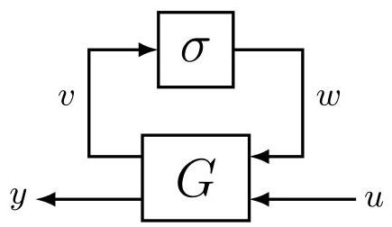
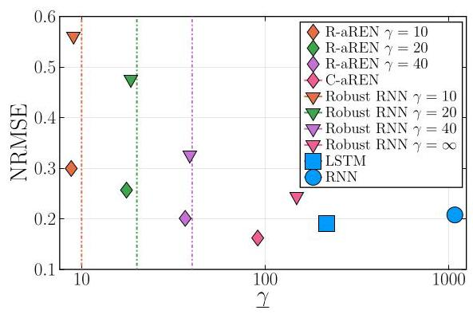
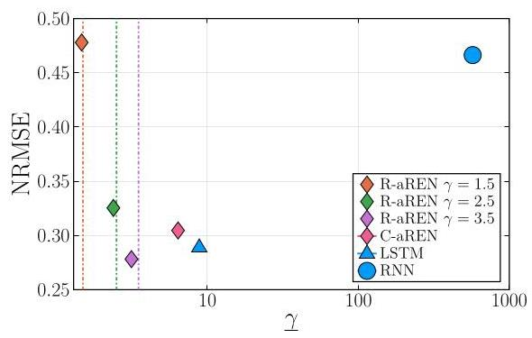
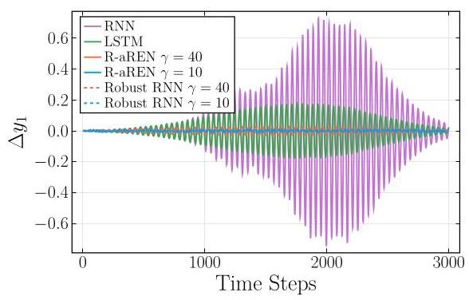
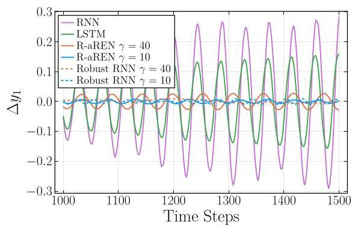
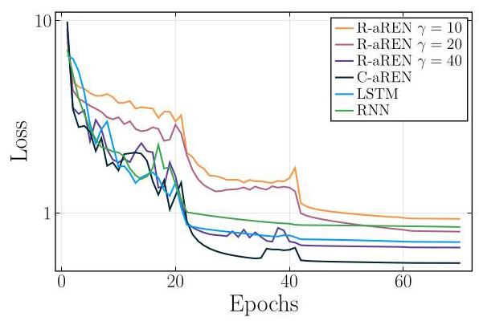
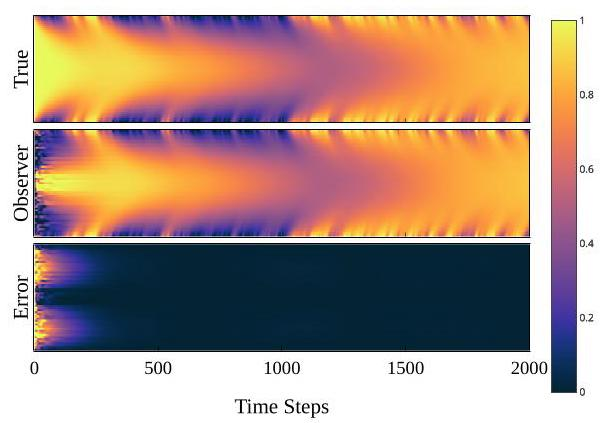
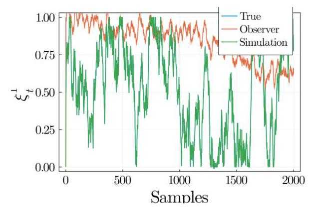
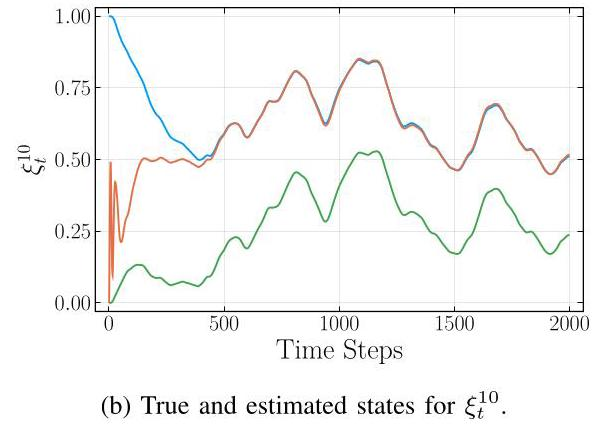
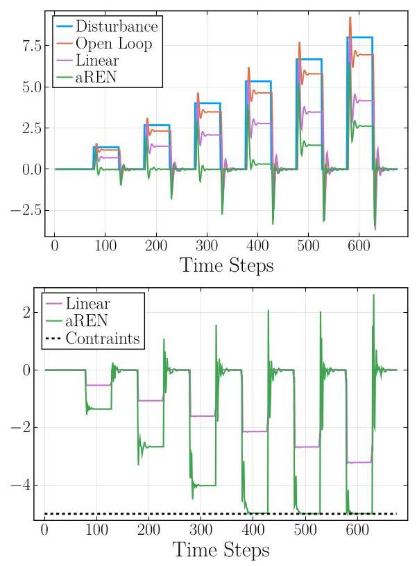

# Recurrent Equilibrium Networks: Flexible Dynamic Models with Guaranteed Stability and Robustness

# 递归平衡网络:具有稳定性和鲁棒性保证的灵活动态模型

Max Revay*, Ruigang Wang*, Ian R. Manchester

马克斯·雷瓦伊*，王瑞刚*，伊恩·R·曼彻斯特

Abstract-This paper introduces recurrent equilibrium networks (RENs), a new class of nonlinear dynamical models for applications in machine learning, system identification and control. The new model class admits "built in" behavioural guarantees of stability and robustness. All models in the proposed class are contracting - a strong form of nonlinear stability - and models can satisfy prescribed incremental integral quadratic constraints (IQC), including Lipschitz bounds and incremental passivity. RENs are otherwise very flexible: they can represent all stable linear systems, all previously-known sets of contracting recurrent neural networks and echo state networks, all deep feedforward neural networks, and all stable Wiener/Hammerstein models, and can approximate all fading-memory and contracting nonlinear systems. RENs are parameterized directly by a vector in ${\mathbb{R}}^{N}$ , i.e. stability and robustness are ensured without parameter constraints, which simplifies learning since generic methods for unconstrained optimization such as stochastic gradient descent and its variants can be used. The performance and robustness of the new model set is evaluated on benchmark nonlinear system identification problems, and the paper also presents applications in data-driven nonlinear observer design and control with stability guarantees.

摘要——本文介绍了递归平衡网络(REN)，这是一类用于机器学习、系统辨识和控制的新型非线性动态模型。新的模型类别具有“内置”的稳定性和鲁棒性行为保证。所提出类别中的所有模型都是收缩的——一种强形式的非线性稳定性——并且模型可以满足规定的增量积分二次约束(IQC)，包括利普希茨界和增量无源性。REN在其他方面非常灵活:它们可以表示所有稳定的线性系统、所有先前已知的收缩递归神经网络和回声状态网络集合、所有深度前馈神经网络以及所有稳定的维纳/哈默斯坦模型，并且可以逼近所有具有渐消记忆和收缩的非线性系统。REN直接由${\mathbb{R}}^{N}$中的一个向量进行参数化，即无需参数约束即可确保稳定性和鲁棒性，这简化了学习过程，因为可以使用诸如随机梯度下降及其变体等通用的无约束优化方法。在基准非线性系统辨识问题上评估了新模型集的性能和鲁棒性，并且本文还展示了在具有稳定性保证的数据驱动非线性观测器设计和控制中的应用。

## I. INTRODUCTION

## 一、引言

Deep neural networks (DNNs), recurrent neural networks (RNNs), and related models have revolutionised many fields of engineering and computer science [1]. Their remarkable flexibility, accuracy, and scalability has led to renewed interest in neural networks in many domains including learning-based/data-driven methods in control, identification, and related areas (see e.g. [2]-[4] and references therein).

深度神经网络(DNN)、递归神经网络(RNN)以及相关模型已经彻底改变了许多工程和计算机科学领域[1]。它们卓越的灵活性、准确性和可扩展性引发了许多领域对神经网络的新兴趣，包括控制、辨识及相关领域中基于学习/数据驱动的方法(例如参见[2]-[4]及其参考文献)。

However, it has been observed that neural networks can be very sensitive to small changes in inputs [5], and this sensitivity can extend to control policies [6]. Furthermore, their scale and complexity makes them difficult to certify for use in safety-critical systems, and it can be difficult to incorporate prior physical knowledge into a neural network model, e.g. that a model should be stable. The most accurate current methods for certifying stability and robustness of DNNs and RNNs are based on mixed-integer programming [7] and semidefinite programming [8], [9] both of which face challenges when scaling to large networks.

然而，人们已经观察到神经网络可能对输入的微小变化非常敏感[5]，并且这种敏感性可能延伸到控制策略[6]。此外，它们的规模和复杂性使得难以证明其在安全关键系统中的使用合理性，并且难以将先验物理知识纳入神经网络模型，例如模型应该是稳定的。当前用于证明DNN和RNN稳定性和鲁棒性的最准确方法基于混合整数规划[7]和半定规划[8]、[9]，这两种方法在扩展到大型网络时都面临挑战。

In this paper, we introduce a new model structure: the recurrent equilibrium network (REN).

在本文中，我们引入了一种新的模型结构:递归平衡网络(REN)。

1) RENs are highly flexible and include many established models as special cases, including DNNs, RNNs, echo-state networks and stable linear dynamical systems.

1)REN具有高度的灵活性，并且包括许多已有的模型作为特殊情况，包括DNN、RNN(递归神经网络)[1]、回声状态网络和稳定的线性动态系统。

2) RENs admit built in behavioural guarantees such as stability, incremental gain, passivity, or other properties that are relevant to safety critical systems, and are compatible with most existing frameworks for nonlinear/robust stability analysis.

2)REN具有内置的行为保证，如稳定性、增量增益、无源性或与安全关键系统相关的其他属性，并且与大多数现有的非线性/鲁棒稳定性分析框架兼容。

3) RENs are easy to use as they permit a direct (smooth, unconstrained) parameterization enabling learning of large-scale models via generic unconstrained optimization algorithms and off-the-shelf automatic-differentiation tools.

3)REN易于使用，因为它们允许直接(平滑、无约束)参数化，从而能够通过通用的无约束优化算法和现成的自动微分工具来学习大规模模型。

A REN is a dynamical model incorporating an equilibrium network [10]-[12], a.k.a. implicit network [13]. Equilibrium networks are "implicit depth" neural networks, in which the output is generated as the zero set of an equation relating inputs and outputs, which can be viewed as the equilibrium of a "fast" dynamical system. This implicit structure brings the remarkable flexibility alluded to above, but also raises the question of existence and uniqueness of solutions, i.e. well-posedness. A benefit of our parameterization approach is that the resulting RENs are always well-posed.

REN是一种结合了平衡网络[10]-[12](也称为隐式网络[13])的动态模型。平衡网络是“隐式深度”神经网络，其中输出是作为输入和输出相关方程的零集生成的，这可以看作是一个“快速”动态系统的平衡点。这种隐式结构带来了上述显著的灵活性，但也引发了解的存在性和唯一性问题，即适定性问题。我们参数化方法的一个优点是得到的REN总是适定的。

RENs can be constructed to be contracting [14], a strong form of nonlinear stability, and/or to satisfy robustness guarantees in the form of incremental integral quadratic constraints (IQCs) [15]. This class of constraints includes user-definable bounds on the network's Lipschitz constant (incremental gain), which can be used to trade off performance vs sensitivity to adversarial perturbations. The IQC framework also encompasses many commonly used tools for certifying stability and performance of system interconnections, including passivity methods in robotics [16], networked-system analysis via dissipation inequalities [17], $\mu$ analysis [18], and standard tools for analysis of nonlinear control systems [19].

REN可以被构造为收缩的[14]，一种强形式的非线性稳定性，和/或满足以增量积分二次约束(IQC)[15]形式的鲁棒性保证。这类约束包括用户可定义的网络利普希茨常数(增量增益)的界，可用于在性能与对对抗性扰动的敏感性之间进行权衡。IQC框架还包括许多用于证明系统互联稳定性和性能的常用工具，包括机器人学中的无源性方法[16]、通过耗散不等式进行的网络系统分析[17]、$\mu$分析[18]以及非线性控制系统分析的标准工具[19]。

## A. Learning and Identification of Stable Models

## A. 稳定模型的学习与辨识

The problem of learning dynamical systems with stability guarantees appears frequently in system identification. When learning models with feedback it is not uncommon for the model to be unstable even if the data-generating system is stable. For linear models, various methods have been proposed to guarantee stability via regularization and constrained optimization [20]-[24]. For nonlinear models, there has also been a substantial volume of research on stability guarantees, e.g. for polynomial models [25]-[28], Gaussian mixture models [29], and recurrent neural networks [30]-[34]. However, the problem is substantially more complex than the linear case due to the many possible nonlinear model structures and differing definitions of nonlinear stability. Contraction is a strong form of nonlinear stability [14] which is particularly well-suited to problems in learning and system identification since it guarantees stability of all solutions of the model, irrespective of inputs or initial conditions. This is important in learning since the purpose of a model is usually to simulate responses to previously unseen inputs. The works [25]-[28], [30], [33], [34] are guaranteed to find contracting models.

在系统辨识中，带有稳定性保证的动态系统学习问题经常出现。在学习具有反馈的模型时，即使数据生成系统是稳定的，模型也常常会出现不稳定的情况。对于线性模型，已经提出了各种方法通过正则化和约束优化来保证稳定性[20]-[24]。对于非线性模型，也有大量关于稳定性保证的研究，例如多项式模型[25]-[28]、高斯混合模型[29]和递归神经网络[30]-[34]。然而，由于非线性模型结构的多样性和非线性稳定性定义的不同，这个问题比线性情况要复杂得多。收缩是一种很强的非线性稳定性形式[14]，它特别适合学习和系统辨识中的问题，因为它保证了模型所有解的稳定性，而与输入或初始条件无关。这在学习中很重要，因为模型的目的通常是模拟对以前未见过的输入的响应。[25]-[28]、[30]、[33]、[34]等文献保证能找到收缩模型。

---

*M. Revay and R. Wang made equal contribution to this paper. This work was supported by the Australian Research Council, grant DP190102963.

*M. Revay和R. Wang对本文贡献相同。本研究得到了澳大利亚研究理事会的资助，项目编号DP190102963。

The authors are with the Australian Centre for Robotics and School of Aerospace, Mechanical and Mechatronic Engineering, The University of Sydney, Sydney, NSW 2006, Australia (e-mail: ian.manchester@sydney.edu.au).

作者隶属于澳大利亚机器人中心以及悉尼大学航空航天、机械与机电工程学院，地址为澳大利亚新南威尔士州悉尼市2006，邮箱:ian.manchester@sydney.edu.au。

---

## B. Lipschitz Bounds for Neural Network Robustness

## B. 神经网络鲁棒性的利普希茨界

Model robustness can be characterized in terms of sensitivity to small perturbations in the input. It has recently been shown that recurrent neural network models can be extremely fragile [35], i.e. small changes to the input produce dramatic changes in the output.

模型的稳健性可以通过对输入中微小扰动的敏感性来表征。最近的研究表明，递归神经网络模型可能极其脆弱[35]，即输入的微小变化会在输出中产生巨大变化。

Formally, sensitivity and robustness can be quantified via Lipschitz bounds on the input-output mapping associated with the model. In machine learning, Lipschitz constants are used in the proofs of generalization bounds [36], analysis of expressiveness [37] and guarantees of robustness to adversarial attacks [38], [39]. There is also ample empirical evidence to suggest that Lipschitz regularity (and model stability, where applicable) improves generalization in machine learning [40] and system identification [33]. In reinforcement learning [41], it has recently been found that the Lipschitz constant of policies has a strong effect on their robustness to adversarial attack [42]. In [43] it was shown that privacy preservation in dynamic feedback policies can be represented as an ${\ell }^{2}$ Lipschitz bound.

形式上，灵敏度和鲁棒性可以通过与模型相关的输入-输出映射的利普希茨界来量化。在机器学习中，利普希茨常数用于泛化界的证明[36]、表现力分析[37]以及对抗攻击鲁棒性的保证[38]、[39]。也有大量经验证据表明，利普希茨正则性(以及适用时的模型稳定性)可提高机器学习[40]和系统识别[33]中的泛化能力。在强化学习[41]中，最近发现策略的利普希茨常数对其对抗攻击的鲁棒性有很大影响[42]。在[43]中表明，动态反馈策略中的隐私保护可以表示为一个${\ell }^{2}$利普希茨界。

Unfortunately, even calculation of the Lipschitz constant of feedforward (static) neural networks is NP-hard [44]. The tightest tractable bounds known to date use incremental quadratic constraints to construct a behavioural description of the neural network activation functions [45], but using these results in training is complicated by the fact that the constraints are not jointly convex in model parameters and constraint multipliers. In [46], Lipschitz bounded feedforward models were trained using the Alternating Direction Method of Multipliers, and in [33], an a custom interior point solver were used. However, the requirements to satisfy linear matrix inequalities at each iteration make these methods difficult to scale. In [47], the authors introduced a direct parameterization of feedforward neural networks satisfying the bounds of [45], using techniques related to the present paper.

不幸的是，即使是计算前馈(静态)神经网络的利普希茨常数也是NP难问题[44]。迄今为止已知的最严格的可处理边界使用增量二次约束来构建神经网络激活函数的行为描述[45]，但在训练中使用这些结果会因约束在模型参数和约束乘数中不是联合凸的这一事实而变得复杂。在[46]中，使用交替方向乘子法训练了利普希茨有界前馈模型，在[33]中，使用了定制的内点求解器。然而，在每次迭代中满足线性矩阵不等式的要求使得这些方法难以扩展。在[47]中，作者使用与本文相关的技术引入了满足[45]边界的前馈神经网络的直接参数化。

## C. Applications of Contracting and Robust Models in Data- Driven Control and Estimation

## C. 收缩与鲁棒模型在数据驱动控制与估计中的应用

An ability to learn flexible dynamical models with contraction, robustness, and other behavioural constraints has many potential applications in control and related fields, some of which we explore in this paper.

一种能够学习具有收缩性、鲁棒性和其他行为约束的灵活动态模型的能力在控制及相关领域有许多潜在应用，本文将探讨其中的一些应用。

In robotics, passivity constraints are widely used to ensure stable interactions e.g. in teleoperation, vision-based control, and multi-robot control [16] and interaction with physical environments (e.g. [48], [49]). More generally, methods based on quadratic dissipativity and IQCs are a powerful tool for the design of complex interconnected cyber-physical systems [15], [17]. Within these frameworks, the proposed REN architecture can be used to learn subsystems that specify prescribed or parameterized IQCs, and which therefore cannot destabilize the system when interconnected with other components.

在机器人技术中，无源约束被广泛用于确保稳定的交互，例如在遥操作、基于视觉的控制和多机器人控制[16]以及与物理环境的交互(例如[48]、[49])。更一般地说，基于二次耗散性和积分二次约束(IQC)的方法是设计复杂互联网络物理系统的强大工具[15]、[17]。在这些框架内，所提出的REN架构可用于学习指定规定或参数化IQC的子系统，因此当与其他组件互连时不会使系统不稳定。

A classical problem in control theory is observer design: to construct a dynamical system that estimates the internal (latent) state of another system from partial measurements. A recent approach is to search for a contracting dynamical system that can reproduce true system trajectories [50], [51]. In Section VIII, we formulate the observer design problem as a supervised learning problem over a set of contracting nonlinear systems, and demonstrate the approach on an unstable nonlinear reaction diffusion PDE.

控制理论中的一个经典问题是观测器设计:构建一个动态系统，该系统根据部分测量值估计另一个系统的内部(潜在)状态。最近的一种方法是寻找一个能够再现真实系统轨迹的收缩动态系统[50]，[51]。在第八节中，我们将观测器设计问题表述为一组收缩非线性系统上的监督学习问题，并在一个不稳定的非线性反应扩散偏微分方程上演示该方法。

In optimization of linear feedback controllers, the classical Youla-Kucera (or $Q$ ) parameterization provides a convex formulation for searching over all stabilizing controllers via a "free" stable linear system parameter [18], [52], [53]. This approach can be extended to nonlinear systems [19], [54] in which the "free parameter" is a stable nonlinear model. In Sec. IX we apply this idea to optimize nonlinear feedback policies for constrained linear control.

在优化线性反馈控制器时，经典的尤拉 - 库采拉(或$Q$)参数化通过一个“自由”的稳定线性系统参数，为搜索所有稳定控制器提供了一种凸形式化方法[18], [52], [53]。这种方法可以扩展到非线性系统[19], [54]，其中“自由参数”是一个稳定的非线性模型。在第九节中，我们应用这个想法来优化受约束线性控制的非线性反馈策略。

## D. Convex and Direct Parameterizations

## D. 凸参数化和直接参数化

The central contributions of this paper are new model parameterizations which have behavioral constraints, and which are amenable to optimization. The first set of parameterizations we introduce includes (convex) linear matrix inequality (LMI) constraints, building upon [25], [34]. LMI constraints can be incorporated into a learning process either through introduction of barrier functions or projections. However, they are computationally challenging for large-scale models. For example, a path-following interior point method, as proposed in [34] generally requires computing gradients of barrier functions, line search procedures, and a combination of "inner" and "outer" iterations as the barrier parameter changes.

本文的核心贡献是具有行为约束且适合优化的新模型参数化方法。我们引入的第一组参数化方法包括(凸)线性矩阵不等式(LMI)约束，这是在[25], [34]的基础上发展而来的。LMI约束可以通过引入障碍函数或投影纳入学习过程。然而，对于大规模模型，它们在计算上具有挑战性。例如，[34]中提出的路径跟踪内点法通常需要计算障碍函数的梯度、线搜索过程，以及随着障碍参数变化的“内”迭代和“外”迭代的组合。

To address this challenge, in this paper we also introduce direct parameterizations of contracting and robust RENs. That is, we construct a smooth mapping from ${\mathbb{R}}^{N}$ to the model weights such that every model in the image of this mapping satisfies the desired behavioural constraints. This can be thought of as constructing a (redundant) intrinsic coordinate system on the constraint manifold. The construction is related to the method of [55] for semidefinite programming, in which a positive-semidefinite matrix is parameterized by square-root factors. Our parameterization differs in that it avoids introducing any nonlinear equality constraints.

为应对这一挑战，在本文中我们还引入了收缩和鲁棒递归神经网络(REN)的直接参数化方法。也就是说，我们构造了一个从${\mathbb{R}}^{N}$到模型权重的光滑映射，使得该映射图像中的每个模型都满足所需的行为约束。这可以被看作是在约束流形上构造一个(冗余的)内在坐标系。这种构造与[55]中用于半定规划的方法相关，在该方法中，一个半正定矩阵由平方根因子进行参数化。我们的参数化方法的不同之处在于它避免引入任何非线性等式约束。

As mentioned above, direct parameterization allows generic optimization methods such as stochastic gradient descent (SGD) and ADAM [56] to be applied. Another advantage is that it allows easy random sampling of nonlinear models with the required stability and robustness constraints by simply sampling a random vector in ${\mathbb{R}}^{N}$ . This allows straightforward generation of echo state networks with prescribed behavioral properties, i.e. large-scale recurrent networks with fixed dynamics and learnable output maps (see, e.g., [57], [58] and references therein).

如上所述，直接参数化允许应用诸如随机梯度下降(SGD)和ADAM[56]等通用优化方法。另一个优点是，通过简单地在${\mathbb{R}}^{N}$中采样一个随机向量，它允许轻松地对具有所需稳定性和鲁棒性约束的非线性模型进行随机采样。这使得能够直接生成具有规定行为特性的回声状态网络，即具有固定动态和可学习输出映射的大规模递归网络(例如，参见[57], [58]及其参考文献)。

## E. Structure of this Paper

## E. 本文结构

The paper structure is as follows:

本文结构如下:

- Sections II - VI discuss the proposed model class and its properties. Section II formulates the problem of learning stable and robust dynamical models; in Section III we present the REN model class; in Section IV we present convex parameterizations of stable and robust RENs; in Section V we present direct (unconstrained) parameterisations of RENs; in Section VI we discuss the expressivity of the REN model class, showing it includes many commonly-used models as special cases.

- 第二至六节讨论所提出的模型类及其性质。第二节阐述学习稳定且鲁棒的动态模型的问题；在第三节中我们介绍递归神经网络(REN)模型类；在第四节中我们给出稳定且鲁棒的递归神经网络的凸参数化方法；在第五节中我们给出递归神经网络的直接(无约束)参数化方法；在第六节中我们讨论递归神经网络模型类的表达能力，表明它包括许多常用模型作为特殊情况。

- Sections VII - IX present applications of learning stable/robust nonlinear models. Section VII presents applications to system identification; Section VIII presents applications to nonlinear observer design; Section IX presents applications to nonlinear feedback design for linear systems. Associated Julia code is available in the package RobustNeuralNetworks. jl 59].

- 第七至九节展示学习稳定/鲁棒非线性模型的应用。第七节展示在系统辨识中的应用；第八节展示在非线性观测器设计中的应用；第九节展示在非线性反馈设计中的应用。相关的Julia代码可在包RobustNeuralNetworks.jl[59]中获取。

A preliminary conference version was presented in [60]. The present paper expands the class of robustness properties to more general dissipativity conditions, removes the restriction that the model has zero direct-feedthrough, introduces the acyclic REN, adds proofs of all theoretical results, adds new material on echo state networks, and includes novel approaches to nonlinear observer design and optimization of feedback controllers enabled by the REN.

一个初步的会议版本发表于[60]。本文将鲁棒性属性的类别扩展到更一般的耗散性条件，去除了模型具有零直接馈通的限制，引入了无环递归神经网络，添加了所有理论结果的证明，增加了关于回声状态网络的新材料，并包括了由递归神经网络实现的非线性观测器设计和反馈控制器优化的新方法。

## F. Notation

## F. 符号说明

The set of sequences $x : \mathbb{N} \rightarrow  {\mathbb{R}}^{n}$ is denoted by ${\ell }_{2e}^{n}$ . Superscript $n$ is omitted when it is clear from the context. For $x \in  {\ell }_{2e}^{n},{x}_{t} \in  {\mathbb{R}}^{n}$ is the value of the sequence $x$ at time $t \in  \mathbb{N}$ . The subset ${\ell }_{2} \subset  {\ell }_{2e}$ consists of all square-summable sequences, i.e., $x \in  {\ell }_{2}$ if and only if the ${\ell }_{2}$ norm $\parallel x\parallel  \mathrel{\text{ := }} \sqrt{\mathop{\sum }\limits_{{t = 0}}^{\infty }{\left| {x}_{t}\right| }^{2}}$ is finite, where $\left| \left( \cdot \right) \right|$ denotes Euclidean norm. Given a sequence $x \in  {\ell }_{2e}$ , the ${\ell }_{2}$ norm of its truncation over $\left\lbrack  {0, T}\right\rbrack$ is $\parallel x{\parallel }_{T} \mathrel{\text{ := }} \sqrt{\mathop{\sum }\limits_{{t = 0}}^{T}{\left| {x}_{t}\right| }^{2}}$ . For two sequences $x, y \in  {\ell }_{2e}^{n}$ , the inner product over $\left\lbrack  {0, T}\right\rbrack$ is $\langle x, y{\rangle }_{T} \mathrel{\text{ := }} \mathop{\sum }\limits_{{t = 0}}^{T}{x}_{t}^{\top }{y}_{t}$ . We use $A \succ  0$ and $A \succcurlyeq  0$ to denote a positive definite and positive semi-definite matrix, respectively. We denote the set of positive-definite diagonal matrices by ${\mathbb{D}}_{ + }$ . Given a positive-definite matrix $P$ we use ${\left| \cdot \right| }_{P}$ to denote the weighted Euclidean norm, i.e. ${\left| a\right| }_{P} = \sqrt{{a}^{\top }{Pa}}$ .

序列集$x : \mathbb{N} \rightarrow  {\mathbb{R}}^{n}$用${\ell }_{2e}^{n}$表示。当上下文明确时，上标$n$可省略。对于$x \in  {\ell }_{2e}^{n},{x}_{t} \in  {\mathbb{R}}^{n}$，它是序列$x$在时刻$t \in  \mathbb{N}$的值。子集${\ell }_{2} \subset  {\ell }_{2e}$由所有平方可和序列组成，即当且仅当${\ell }_{2}$范数$\parallel x\parallel  \mathrel{\text{ := }} \sqrt{\mathop{\sum }\limits_{{t = 0}}^{\infty }{\left| {x}_{t}\right| }^{2}}$有限时，$x \in  {\ell }_{2}$成立，其中$\left| \left( \cdot \right) \right|$表示欧几里得范数。给定一个序列$x \in  {\ell }_{2e}$，其在$\left\lbrack  {0, T}\right\rbrack$上的截断的${\ell }_{2}$范数为$\parallel x{\parallel }_{T} \mathrel{\text{ := }} \sqrt{\mathop{\sum }\limits_{{t = 0}}^{T}{\left| {x}_{t}\right| }^{2}}$。对于两个序列$x, y \in  {\ell }_{2e}^{n}$，它们在$\left\lbrack  {0, T}\right\rbrack$上的内积为$\langle x, y{\rangle }_{T} \mathrel{\text{ := }} \mathop{\sum }\limits_{{t = 0}}^{T}{x}_{t}^{\top }{y}_{t}$。我们分别用$A \succ  0$和$A \succcurlyeq  0$表示正定矩阵和半正定矩阵。我们用${\mathbb{D}}_{ + }$表示正定对角矩阵的集合。给定一个正定矩阵$P$，我们用${\left| \cdot \right| }_{P}$表示加权欧几里得范数，即${\left| a\right| }_{P} = \sqrt{{a}^{\top }{Pa}}$。

## II. LEARNING STABLE AND ROBUST MODELS

## 二、学习稳定且鲁棒的模型

This paper is concerned with learning of nonlinear dynamical models, i.e. finding a particular model within a set of candidates using some data relevant to the problem at hand. The central aim of this paper is to construct model classes that are flexible enough to make full use of available data, and yet guaranteed to be well-behaved in some sense.

本文关注非线性动态模型的学习，即利用与手头问题相关的一些数据在一组候选模型中找到一个特定模型。本文的核心目标是构建足够灵活以充分利用可用数据，同时在某种意义上保证表现良好的模型类。

Given a dataset $\widetilde{z}$ , we consider the problem of learning a nonlinear state-space dynamical model of the form

给定一个数据集$\widetilde{z}$，我们考虑学习如下形式的非线性状态空间动态模型的问题

$$
{x}_{t + 1} = f\left( {{x}_{t},{u}_{t},\theta }\right) ,\;{y}_{t} = g\left( {{x}_{t},{u}_{t},\theta }\right) \tag{1}
$$

that minimizes some loss or cost function depending (in part) on the data, i.e. to solve a problem of the form

该模型使某个部分依赖于数据的损失或成本函数最小化，即求解如下形式的问题

$$
\mathop{\min }\limits_{{\theta  \in  \Theta }}\mathcal{L}\left( {\widetilde{z},\theta }\right) \tag{2}
$$

In the above, ${x}_{t} \in  {\mathbb{R}}^{n},{u}_{t} \in  {\mathbb{R}}^{m},{y}_{t} \in  {\mathbb{R}}^{p},\theta  \in  \Theta  \subseteq  {\mathbb{R}}^{N}$ are the model state, input, output and parameters, respectively. Here $f : {\mathbb{R}}^{n} \times  {\mathbb{R}}^{m} \times  \Theta  \rightarrow  {\mathbb{R}}^{n}$ and $g : {\mathbb{R}}^{n} \times  {\mathbb{R}}^{m} \times  \Theta  \rightarrow  {\mathbb{R}}^{p}$ are piecewise continuously differentiable functions.

在上述内容中，${x}_{t} \in  {\mathbb{R}}^{n},{u}_{t} \in  {\mathbb{R}}^{m},{y}_{t} \in  {\mathbb{R}}^{p},\theta  \in  \Theta  \subseteq  {\mathbb{R}}^{N}$分别是模型状态、输入、输出和参数。这里$f : {\mathbb{R}}^{n} \times  {\mathbb{R}}^{m} \times  \Theta  \rightarrow  {\mathbb{R}}^{n}$和$g : {\mathbb{R}}^{n} \times  {\mathbb{R}}^{m} \times  \Theta  \rightarrow  {\mathbb{R}}^{p}$是分段连续可微函数。

Example 1: In the context of system identification we may have $\widetilde{z} = \left( {\widetilde{y},\widetilde{u}}\right)$ consisting of finite sequences of input-output measurements, and aim to minimize simulation error:

示例1:在系统辨识的背景下，我们可能有$\widetilde{z} = \left( {\widetilde{y},\widetilde{u}}\right)$由输入 - 输出测量的有限序列组成，并且目标是最小化模拟误差:

$$
\mathcal{L}\left( {\widetilde{z},\theta }\right)  = \parallel y - \widetilde{y}{\parallel }_{T}^{2} \tag{3}
$$

where $y = {\mathfrak{R}}_{a}\left( \widetilde{u}\right)$ is the output sequence generated by the nonlinear dynamical model 1 with initial condition ${x}_{0} = a$ and inputs ${u}_{t} = {\widetilde{u}}_{t}$ . Here the initial condition $a$ may be part of the data $\widetilde{z}$ , or considered a learnable parameter in $\theta$ .

其中$y = {\mathfrak{R}}_{a}\left( \widetilde{u}\right)$是由具有初始条件${x}_{0} = a$和输入${u}_{t} = {\widetilde{u}}_{t}$的非线性动力学模型1生成的输出序列。这里，初始条件$a$可以是数据$\widetilde{z}$的一部分，或者被视为$\theta$中的一个可学习参数。

The main contributions of this paper are model parameterizations, and we make the following definitions:

本文的主要贡献在于模型参数化，我们做出如下定义:

Definition 1: A model parameterization (1) is called a convex parameterization if $\Theta  \subseteq  {\mathbb{R}}^{N}$ is a convex set. Furthermore, it is called a direct parameterization if $\Theta  = {\mathbb{R}}^{N}$ .

定义1:如果$\Theta  \subseteq  {\mathbb{R}}^{N}$是一个凸集，则模型参数化(1)称为凸参数化。此外，如果$\Theta  = {\mathbb{R}}^{N}$，则称为直接参数化。

Direct parameterizations are useful for learning large-scale models since many scalable unconstrained optimization methods (e.g. stochastic gradient descent) can be applied to solve 2). We will parameterize stable nonlinear models, and the particular form of stability we use is the following:

直接参数化对于学习大规模模型很有用，因为许多可扩展的无约束优化方法(例如随机梯度下降)可用于求解2)。我们将对稳定的非线性模型进行参数化，我们使用的稳定性的具体形式如下:

Definition 2: A model 1 is said to be contracting with rate $\alpha  \in  \left( {0,1}\right)$ if for any two initial conditions $a, b \in  {\mathbb{R}}^{n}$ , given the same input sequence $u \in  {\ell }_{2e}^{m}$ , the state sequences ${x}^{a}$ and ${x}^{b}$ satisfy

定义2:如果对于任何两个初始条件$a, b \in  {\mathbb{R}}^{n}$，在给定相同输入序列$u \in  {\ell }_{2e}^{m}$的情况下，状态序列${x}^{a}$和${x}^{b}$满足，则称模型1以速率$\alpha  \in  \left( {0,1}\right)$收缩:

$$
\left| {{x}_{t}^{a} - {x}_{t}^{b}}\right|  \leq  K{\alpha }^{t}\left| {a - b}\right| \tag{4}
$$

for some $K > 0$ .

对于某个$K > 0$。

Roughly speaking, contracting models forget their initial conditions exponentially. Beyond stability, we will also consider robustness constraints of the following form:

粗略地说，收缩模型会指数级地忘记其初始条件。除了稳定性，我们还将考虑以下形式的鲁棒性约束:

Definition 3: A model 1 is said to satisfy the incremental integral quadratic constraint (IQC) defined by $\left( {Q, S, R}\right)$ where $0 \succcurlyeq  Q \in  {\mathbb{R}}^{p \times  p}, S \in  {\mathbb{R}}^{m \times  p}$ , and $R = {R}^{\top } \in  {\mathbb{R}}^{m \times  m}$ , if for all pairs of solutions with initial conditions $a, b \in  {\mathbb{R}}^{n}$ and input sequences $u, v \in  {\ell }_{2e}^{m}$ , the output sequences ${y}^{a} = {\mathfrak{R}}_{a}\left( u\right)$ and ${y}^{b} = {\mathfrak{R}}_{b}\left( v\right)$ satisfy

定义3:如果对于所有具有初始条件$a, b \in  {\mathbb{R}}^{n}$和输入序列$u, v \in  {\ell }_{2e}^{m}$的解对，输出序列${y}^{a} = {\mathfrak{R}}_{a}\left( u\right)$和${y}^{b} = {\mathfrak{R}}_{b}\left( v\right)$满足，则称模型1满足由$\left( {Q, S, R}\right)$定义的增量积分二次约束(IQC)，其中$0 \succcurlyeq  Q \in  {\mathbb{R}}^{p \times  p}, S \in  {\mathbb{R}}^{m \times  p}$，且$R = {R}^{\top } \in  {\mathbb{R}}^{m \times  m}$:

$$
\mathop{\sum }\limits_{{t = 0}}^{T}{\left\lbrack  \begin{matrix} {y}_{t}^{a} - {y}_{t}^{b} \\  {u}_{t} - {v}_{t} \end{matrix}\right\rbrack  }^{\top }\left\lbrack  \begin{matrix} Q & {S}^{\top } \\  S & R \end{matrix}\right\rbrack  \left\lbrack  \begin{matrix} {y}_{t}^{a} - {y}_{t}^{b} \\  {u}_{t} - {v}_{t} \end{matrix}\right\rbrack   \geq   - d\left( {a, b}\right) ,\forall T \tag{5}
$$

for some function $d\left( {a, b}\right)  \geq  0$ with $d\left( {a, a}\right)  = 0$ .

对于某个满足$d\left( {a, a}\right)  = 0$的函数$d\left( {a, b}\right)  \geq  0$。

Important special cases of incremental IQCs include:

增量IQC的重要特殊情况包括:

- $Q =  - \frac{1}{\gamma }I, R = {\gamma I}, S = 0$ : the model satisfies an ${\ell }^{2}$ Lipschitz bound, a.k.a. incremental ${\ell }^{2}$ -gain bound, of $\gamma$ :

- $Q =  - \frac{1}{\gamma }I, R = {\gamma I}, S = 0$:模型满足${\ell }^{2}$Lipschitz界，也称为增量${\ell }^{2}$增益界，为$\gamma$:

$$
{\begin{Vmatrix}{\mathfrak{R}}_{a}\left( u\right)  - {\mathfrak{R}}_{a}\left( v\right) \end{Vmatrix}}_{T} \leq  \gamma \parallel u - v{\parallel }_{T},.
$$

for all $u, v \in  {\ell }_{2e}^{m}, T \in  \mathbb{N}$ .

对于所有$u, v \in  {\ell }_{2e}^{m}, T \in  \mathbb{N}$。

- $Q = 0, R =  - {2\nu I}, S = I$ where $\nu  \geq  0$ : the model is monotone on ${\ell }^{2}$ (strongly if $\nu  > 0$ ), a.k.a. incrementally passive (incrementally strictly input passive, resp.):

- $Q = 0, R =  - {2\nu I}, S = I$，其中$\nu  \geq  0$:模型在${\ell }^{2}$上是单调的(如果$\nu  > 0$则是强单调的)，也称为增量无源(分别为增量严格输入无源):

$$
{\left\langle  {\Re }_{a}\left( u\right)  - {\Re }_{a}\left( v\right) , u - v\right\rangle  }_{T} \geq  \nu \parallel u - v{\parallel }_{T}^{2}
$$

for all $u, v \in  {\ell }_{2e}^{m}$ and $T \in  \mathbb{N}$ .

对于所有$u, v \in  {\ell }_{2e}^{m}$和$T \in  \mathbb{N}$。

- $Q =  - {2\rho I}, R = 0, S = I$ where $\rho  > 0$ : the model is incrementally strictly output passive:

- $Q =  - {2\rho I}, R = 0, S = I$，其中$\rho  > 0$:模型是增量严格输出无源的:

$$
{\left\langle  {\Re }_{a}\left( u\right)  - {\Re }_{a}\left( v\right) , u - v\right\rangle  }_{T} \geq  \rho {\begin{Vmatrix}{\Re }_{a}\left( u\right)  - {\Re }_{a}\left( v\right) \end{Vmatrix}}_{T}^{2}
$$

for all $u, v \in  {\ell }_{2e}^{m}$ and $T \in  \mathbb{N}$ . If $\rho  = 1$ the model is firmly nonexpansive on ${\ell }^{2}$ .

对于所有$u, v \in  {\ell }_{2e}^{m}$和$T \in  \mathbb{N}$。如果$\rho  = 1$，则模型在${\ell }^{2}$上是强非扩张的。

In other contexts, $Q, S, R$ may themselves be decision variables in a separate optimization problem to ensure stability of interconnected systems (see, e.g., [15], [17] .

在其他情况下，$Q, S, R$本身可能是一个单独优化问题中的决策变量，以确保互联系统的稳定性(例如，参见[15]、[17])。

Remark 1: Given a model class guaranteeing incremental IQC defined by constant matrices $Q, S, R$ , it is straightforward to construct models satisfying frequency-weighted IQCs. E.g. by constructing a model $\mathfrak{R}$ that is contracting and satisfies an ${\ell }^{2}$ Lipschitz bound, and choosing stable linear filters ${\mathbf{W}}_{1},{\mathbf{W}}_{2}$ , with ${\mathbf{W}}_{1}$ having a stable inverse, the new model

注1:给定一个由常数矩阵$Q, S, R$定义的保证增量IQC的模型类，构造满足频率加权IQC的模型很简单。例如，通过构造一个收缩且满足${\ell }^{2}$Lipschitz界的模型$\mathfrak{R}$，并选择稳定的线性滤波器${\mathbf{W}}_{1},{\mathbf{W}}_{2}$，其中${\mathbf{W}}_{1}$具有稳定的逆，新模型

$$
y = {\mathfrak{W}}_{a}\left( u\right)  = {\mathbf{W}}_{1}^{-1}{\mathfrak{R}}_{a}\left( {{\mathbf{W}}_{2}u}\right)
$$

is contracting and satisfies the frequency-weighted bound

是收缩的且满足频率加权界

$$
{\begin{Vmatrix}{\mathbf{W}}_{1}\left( {\mathfrak{W}}_{a}\left( u\right)  - {\mathfrak{W}}_{a}\left( v\right) \right) \end{Vmatrix}}_{T} \leq  \gamma {\begin{Vmatrix}{\mathbf{W}}_{2}\left( u - v\right) \end{Vmatrix}}_{T}.
$$

## III. RECURRENT EQUILIBRIUM NETWORKS

## III. 递归平衡网络

The model structure we propose - the recurrent equilibrium network (REN) - is a state-space model of the form [1] with

我们提出的模型结构——递归平衡网络(REN)——是形式为[1]的状态空间模型，其中

$$
{x}_{t + 1} = A{x}_{t} + {B}_{1}{w}_{t} + {B}_{2}{u}_{t} + {b}_{x}, \tag{6}
$$

$$
{y}_{t} = {C}_{2}{x}_{t} + {D}_{21}{w}_{t} + {D}_{22}{u}_{t} + {b}_{y}, \tag{7}
$$

in which ${w}_{t}$ is the solution of an equilibrium network, a.k.a. implicit network [10]-[13]:

其中${w}_{t}$是平衡网络(也称为隐式网络[10]-[13])的解:

$$
{w}_{t} = \sigma \left( {{D}_{11}{w}_{t} + {C}_{1}{x}_{t} + {D}_{12}{u}_{t} + {b}_{v}}\right) , \tag{8}
$$

where $A, B., C., D$ . are matricies of appropriate dimension, ${b}_{x} \in  {\mathbb{R}}^{n},{b}_{y} \in  {\mathbb{R}}^{p},{b}_{v} \in  {\mathbb{R}}^{q}$ are "bias" vectors, and $\sigma$ is a scalar nonlinearity applied elementwise, referred to as an "activation function". We will show below how to ensure that a unique solution ${w}_{t}^{ * }$ to (8) exists and can be computed efficiently.

其中$A, B., C., D$是适当维度的矩阵，${b}_{x} \in  {\mathbb{R}}^{n},{b}_{y} \in  {\mathbb{R}}^{p},{b}_{v} \in  {\mathbb{R}}^{q}$是“偏差”向量，$\sigma$是逐元素应用的标量非线性，称为“激活函数”。我们将在下面展示如何确保(8)存在唯一解${w}_{t}^{ * }$并能高效计算。

Remark 2: The term "equilibrium" comes from the fact that any solution of the above implicit equation is also an equilibrium point of the difference equation ${w}_{t}^{k + 1} = \sigma \left( {D{w}_{t}^{k} + {b}_{w}}\right)$ or the ordinary differential equation $\frac{d}{ds}{w}_{t}\left( s\right)  =  - {w}_{t}\left( s\right)  + \; \sigma \left( {D{w}_{t}\left( s\right)  + {b}_{w}}\right)$ , where ${b}_{w} = {C}_{1}{x}_{t} + {D}_{12}{u}_{t} + {b}_{v}$ is considered "frozen" for each $t$ . One interpretation of the REN model is that it represents a two-timescale or singular perturbation model, in which the "fast" dynamics in $w$ are assumed to reach the equilibrium (8) well within each time-step of the "slow" dynamics in $x$ [6].

注2:“平衡”一词源于上述隐式方程的任何解也是差分方程${w}_{t}^{k + 1} = \sigma \left( {D{w}_{t}^{k} + {b}_{w}}\right)$或常微分方程$\frac{d}{ds}{w}_{t}\left( s\right)  =  - {w}_{t}\left( s\right)  + \; \sigma \left( {D{w}_{t}\left( s\right)  + {b}_{w}}\right)$的平衡点这一事实，其中对于每个$t$，${b}_{w} = {C}_{1}{x}_{t} + {D}_{12}{u}_{t} + {b}_{v}$被视为“固定”。REN模型的一种解释是它代表一个双时间尺度或奇异摄动模型，其中假设$w$中的“快速”动力学在$x$中的“慢速”动力学的每个时间步内都能很好地达到平衡(8)[6]。

Fig. 1: REN as a feedback interconnection of a linear system $G$ and a nonlinear activation $\sigma$ .

图1:REN作为线性系统$G$和非线性激活$\sigma$的反馈互联。

It will be convenient to represent the REN model as a feedback interconnection of a linear system $G$ and a memoryless nonlinear operator $\sigma$ , as depicted in Fig. 1:

将REN模型表示为线性系统$G$和无记忆非线性算子$\sigma$的反馈互联会很方便，如图1所示:

$$
\left\lbrack  \begin{matrix} {x}_{t + 1} \\  {v}_{t} \\  {y}_{t} \end{matrix}\right\rbrack   = \overset{W}{\overbrace{\left\lbrack  \begin{matrix} A & {B}_{1} & {B}_{2} \\  {C}_{1} & {D}_{11} & {D}_{12} \\  {C}_{2} & {D}_{21} & {D}_{22} \end{matrix}\right\rbrack  }}\left\lbrack  \begin{matrix} {x}_{t} \\  {w}_{t} \\  {u}_{t} \end{matrix}\right\rbrack   + \overset{b}{\overbrace{\left\lbrack  \begin{matrix} {b}_{x} \\  {b}_{y} \\  {b}_{x} \end{matrix}\right\rbrack  }}, \tag{9}
$$

$$
{w}_{t} = \sigma \left( {v}_{t}\right)  \mathrel{\text{ := }} {\left\lbrack  \begin{array}{llll} \sigma \left( {v}_{t}^{1}\right) & \sigma \left( {v}_{t}^{2}\right) & \cdots & \sigma \left( {v}_{t}^{q}\right)  \end{array}\right\rbrack  }^{\top }, \tag{10}
$$

where ${v}_{t},{w}_{t} \in  {\mathbb{R}}^{q}$ are the input and output of activation functions respectively. The learnable parameter is $\theta  \mathrel{\text{ := }} \{ W, b\}$ where $W \in  {\mathbb{R}}^{\left( {n + q + p}\right)  \times  \left( {n + q + m}\right) }$ is the weight matrix, and $b \in  {\mathbb{R}}^{n + q + p}$ the bias vector. Typically the activation function $\sigma$ is fixed, although this is not essential.

其中${v}_{t},{w}_{t} \in  {\mathbb{R}}^{q}$分别是激活函数的输入和输出。可学习参数是$\theta  \mathrel{\text{ := }} \{ W, b\}$，其中$W \in  {\mathbb{R}}^{\left( {n + q + p}\right)  \times  \left( {n + q + m}\right) }$是权重矩阵，$b \in  {\mathbb{R}}^{n + q + p}$是偏差向量。通常激活函数$\sigma$是固定的，不过这不是必需的。

## A. Flexibility of Equilibrium Networks

## A. 平衡网络的灵活性

In [34] we introduced and studied a class of models similar to 6,7,8 with the exception that ${D}_{11}$ was absent This apparently minor change to the model has far-reaching consequences in terms of greatly increased representational flexibility and significantly simpler learning algorithms, while also requiring assurances about existence of solutions and their efficient computation.

在[34]中，我们引入并研究了一类与6、7、8类似的模型，不同之处在于没有${D}_{11}$。模型的这一明显小变化在表示灵活性大大增加和学习算法显著简化方面产生了深远影响，同时也需要关于解的存在性及其高效计算的保证。

With ${D}_{11} = 0$ , the network (8) is simply a single-layer neural network. In contrast, equilibrium networks $\left( {{D}_{11} \neq  0}\right)$ are much more flexible, with many commonly-used feedforward network architectures included as special cases. For example, consider a standard $L$ -layer deep neural network:

有了${D}_{11} = 0$，网络(8)就是一个简单的单层神经网络。相比之下，平衡网络$\left( {{D}_{11} \neq  0}\right)$要灵活得多，许多常用的前馈网络架构都作为特殊情况包含在内。例如，考虑一个标准的$L$层深度神经网络:

$$
{z}_{0} = u
$$

$$
{z}_{l + 1} = \sigma \left( {{W}_{l}{z}_{l} + {b}_{l}}\right) ,\;l = 0,\ldots , L - 1 \tag{11}
$$

$$
y = {W}_{L}{z}_{L} + {b}_{L}
$$

where ${z}_{l}$ is the output of the $l$ th hidden layer. This can be written as an equilibrium network with

其中${z}_{l}$是第$l$个隐藏层的输出。这可以写成一个平衡网络，形式为

$$
w = \operatorname{col}\left( {{z}_{1},\ldots ,{z}_{L}}\right) ,\;{b}_{v} = \operatorname{col}\left( {{b}_{0},\ldots ,{b}_{L - 1}}\right) ,\;{b}_{y} = {b}_{L}
$$

$$
{C}_{1} = 0,\;{C}_{2} = 0,\;{D}_{21} = \left\lbrack  \begin{array}{llll} 0 & \cdots & 0 & {W}_{L} \end{array}\right\rbrack  ,\;{D}_{22} = 0,
$$

$$
{D}_{11} = \left\lbrack  \begin{matrix} 0 & & & \\  {W}_{1} &  \ddots  & & \\  \vdots &  \ddots  & 0 & \\  0 & \cdots & {W}_{L - 1} & 0 \end{matrix}\right\rbrack  ,\;{D}_{12} = \left\lbrack  \begin{matrix} {W}_{0} \\  0 \\  \vdots \\  0 \end{matrix}\right\rbrack  .
$$

${}^{1}$ Note that 34 used different notation, so in that paper it was actually ${D}_{22}$ which was absent, corresponding to ${D}_{11}$ in the notation of the present paper. Equilibrium networks can represent many other interesting structures including residual, convolution, and other feedfor-ward networks. The reader is referred to [10]-[13] for further discussion of equilibrium networks and their properties.

${}^{1}$ 注意，文献[34]使用了不同的符号表示，所以在那篇论文中实际上缺少的是${D}_{22}$，在本文的符号表示中它对应于${D}_{11}$。平衡网络可以表示许多其他有趣的结构，包括残差网络、卷积网络和其他前馈网络。读者可参考[10]-[13]以进一步了解平衡网络及其性质。

Allowing ${D}_{11}$ to be non-zero is also key to our construction of direct paramaterizations of contracting and robust RENs (in Sec. V). As discussed in Section I-D this enables model learning via simple and generic first-order optimization methods, whereas [34] required a specialized interior-point method to deal with model behavioural constraints. Direct parameterization also enables easy random sampling of contracting models, so-called echo state networks (see Sec. V-C) and this enables convex learning of nonlinear feedback controllers (see Sec. IX).

允许${D}_{11}$不为零也是我们构建收缩型和鲁棒型递归神经网络(REN)直接参数化的关键(见第五节)。如在第一节D部分所讨论的，这使得能够通过简单且通用的一阶优化方法进行模型学习，而[34]需要一种专门的内点法来处理模型行为约束。直接参数化还使得能够轻松地对收缩型模型进行随机采样，即所谓的回声状态网络(见第五节C部分)，这使得能够对非线性反馈控制器进行凸学习(见第九节)。

## B. Well-posedness of Equilibrium Networks and Acyclic RENs

## B. 平衡网络和无环递归神经网络的适定性

The added flexibility of equilibrium networks comes at a price: depending on the value of ${D}_{11}$ , the implicit equation (8) may or may not admit a unique solution ${w}_{t}$ for a given ${x}_{t},{u}_{t}$ . An equilibrium network or REN is well-posed if a unique solution is guaranteed. In [12] it was shown that if there exists a $\Lambda  \in  {\mathbb{D}}_{ + }^{n}$ such that

平衡网络增加的灵活性是有代价的:取决于${D}_{11}$的值，对于给定的${x}_{t},{u}_{t}$，隐式方程(8)可能有也可能没有唯一解${w}_{t}$。如果能保证有唯一解，那么平衡网络或递归神经网络就是适定的。在[12]中表明，如果存在一个$\Lambda  \in  {\mathbb{D}}_{ + }^{n}$使得

$$
{2\Lambda } - \Lambda {D}_{11} - {D}_{11}{}^{\top }\Lambda  \succ  0, \tag{12}
$$

then the equilibrium network is well-posed. We will show in Theorem 1 below that this is always satisfied for our proposed model parameterizations.

那么平衡网络就是适定的。我们将在下面的定理1中表明，对于我们提出的模型参数化，这总是成立的。

A useful subclass of REN that is trivially well-posed is the acyclic REN where the weight ${D}_{11}$ is constrained to be strictly lower triangular. In this case, the elements of ${w}_{t}$ can be explicitly computed row-by-row from (8). We can interpret ${D}_{11}$ as the adjacency matrix of a directed graph defining interconnections between the neurons in the equilibrium network and if ${D}_{11}$ is strictly lower triangular then this graph is guaranteed to be acyclic. Compared to the general REN, the acyclic REN is simpler to implement and in our experience often provides models of similar quality, as will be discussed in Sec. VII-B

递归神经网络的一个显然适定的有用子类是无环递归神经网络，其中权重${D}_{11}$被约束为严格下三角矩阵。在这种情况下，${w}_{t}$的元素可以从(8)式逐行显式计算。我们可以将${D}_{11}$解释为定义平衡网络中神经元之间连接的有向图的邻接矩阵，如果${D}_{11}$是严格下三角矩阵，那么这个图保证是无环的。与一般的递归神经网络相比，无环递归神经网络实现起来更简单，并且根据我们的经验，它通常能提供质量相似的模型，这将在第七节B部分讨论。

## C. Evaluating RENs and their gradients

## C. 评估递归神经网络及其梯度

For a well-posed REN with full ${D}_{11}$ , solutions can be computed by formulating an equivalent monotone operator splitting problem [61]. In the authors' experience, the Peaceman Rachford algorithm is reliable and efficient [12].

对于具有满秩${D}_{11}$的适定递归神经网络，可以通过构建一个等价的单调算子分裂问题[61]来计算解。根据作者的经验，Peaceman Rachford算法是可靠且高效的[12]。

When training an equilibrium network via gradient descent, we need to compute the Jacobian $\partial {w}_{t}^{ * }/\partial \left( \cdot \right)$ where ${w}_{t}^{ * }$ is the solution of the implicit equation (8), and $\left( \cdot \right)$ denotes the input to the network or model parameters. By using the implicit function theorem, $\partial {w}_{t}^{ * }/\partial \left( \cdot \right)$ can be computed via

当通过梯度下降训练平衡网络时，我们需要计算雅可比矩阵$\partial {w}_{t}^{ * }/\partial \left( \cdot \right)$，其中${w}_{t}^{ * }$是隐式方程(8)的解，$\left( \cdot \right)$表示网络的输入或模型参数。通过使用隐函数定理，$\partial {w}_{t}^{ * }/\partial \left( \cdot \right)$可以通过以下方式计算

$$
\frac{\partial {w}_{t}^{ * }}{\partial \left( \cdot \right) } = {\left( I - JD\right) }^{-1}J\frac{\partial \left( {D{w}_{t}^{ \star  } + {b}_{w}}\right) }{\partial \left( \cdot \right) } \tag{13}
$$

where $J$ is the Clarke generalized Jacobian of $\sigma$ at $D{w}_{t}^{ * } + {b}_{w}$ . From Assumption 1 in Section III-D, we have that $J$ is a singleton almost everywhere. It was shown in [12] that Condition 12 implies matrix $I - {JD}$ is invertible.

其中$J$是$\sigma$在$D{w}_{t}^{ * } + {b}_{w}$处的Clarke广义雅可比矩阵。根据第三节D部分的假设1，我们有$J$几乎处处是单元素集。在[12]中表明，条件12意味着矩阵$I - {JD}$是可逆的。

## D. Contracting and Robust RENs

## D. 收缩型和鲁棒型递归神经网络

We call the model of [9], [10] a contracting REN (C-REN) if it is contracting and a robust REN (R-REN) if it satisfies the incremental IQC. We make the following assumption on $\sigma$ , which holds for commonly-used activation functions [62]:

如果文献[9]、[10]中的模型是收缩的，我们就称其为收缩型递归神经网络(C-REN)；如果它满足增量IQC，我们就称其为鲁棒型递归神经网络(R-REN)。我们对$\sigma$做出以下假设，该假设对于常用的激活函数成立[62]:

Assumption 1: The activation function $\sigma$ is piecewise differentiable and slope-restricted in $\left\lbrack  {0,1}\right\rbrack$ , i.e.,

假设1:激活函数$\sigma$在$\left\lbrack  {0,1}\right\rbrack$上是分段可微且斜率受限的，即

$$
0 \leq  \frac{\sigma \left( y\right)  - \sigma \left( x\right) }{y - x} \leq  1,\;\forall x, y \in  \mathbb{R}, x \neq  y. \tag{14}
$$

The following theorem gives conditions for contracting and robust RENs:

以下定理给出了收缩型和鲁棒型递归神经网络的条件:

Theorem 1: Consider the REN model [9], 10 satisfying Assumption 1, and a given $\overline{\alpha } \in  (0,1\rbrack$ .

定理1:考虑满足假设1的递归神经网络模型[9]、[10]以及给定的$\overline{\alpha } \in  (0,1\rbrack$。

1) Contracting REN: suppose there exists $P = {P}^{\top } \succ  0$ and $\Lambda  \in  {\mathbb{D}}_{ + }$ such that

1) 收缩的REN:假设存在$P = {P}^{\top } \succ  0$和$\Lambda  \in  {\mathbb{D}}_{ + }$使得

$$
\left\lbrack  \begin{matrix} {\overline{\alpha }}^{2}P &  - {C}_{1}^{\top }\Lambda \\   - \Lambda {C}_{1} & W \end{matrix}\right\rbrack   - \left\lbrack  \begin{array}{l} {A}^{\top } \\  {B}_{1}^{\top } \end{array}\right\rbrack  P{\left\lbrack  \begin{array}{l} {A}^{\top } \\  {B}_{1}^{\top } \end{array}\right\rbrack  }^{\top } \succ  0 \tag{15}
$$

where $W = {2\Lambda } - \Lambda {D}_{11} - {D}_{11}^{\top }\Lambda$ . Then the REN is well-posed and contracting with some rate $\alpha  < \overline{\alpha }$ .

其中$W = {2\Lambda } - \Lambda {D}_{11} - {D}_{11}^{\top }\Lambda$。那么REN是适定的并且以某个速率$\alpha  < \overline{\alpha }$收缩。

2) Robust REN: consider the incremental defined in IQC 5 with given $\left( {Q, S, R}\right)$ where $Q \preccurlyeq  0$ . Suppose there exist $P = {P}^{\top } \succ  0$ and $\Lambda  \in  {\mathbb{D}}_{ + }$ such that

2) 鲁棒REN:考虑在具有给定$\left( {Q, S, R}\right)$的IQC 5中定义的增量，其中$Q \preccurlyeq  0$。假设存在$P = {P}^{\top } \succ  0$和$\Lambda  \in  {\mathbb{D}}_{ + }$使得

$$
\left\lbrack  \begin{matrix} {\overline{\alpha }}^{2}P &  - {C}_{1}^{\top }\Lambda & {C}_{2}^{\top }{S}^{\top } \\   - \Lambda {C}_{1} & W & {D}_{21}^{\top }{S}^{\top } - \Lambda {D}_{12} \\  S{C}_{2} & S{D}_{21} - {D}_{12}^{\top }\Lambda & R + S{D}_{22} + {D}_{22}^{\top }{S}^{\top } \end{matrix}\right\rbrack
$$

$$
- \left\lbrack  \begin{array}{l} {A}^{\top } \\  {B}_{1}^{\top } \\  {B}_{2}^{\top } \end{array}\right\rbrack  P{\left\lbrack  \begin{array}{l} {A}^{\top } \\  {B}_{1}^{\top } \\  {B}_{2}^{\top } \end{array}\right\rbrack  }^{\top } + \left\lbrack  \begin{array}{l} {C}_{2}^{\top } \\  {D}_{21}^{\top } \\  {D}_{22}^{\top } \end{array}\right\rbrack  Q{\left\lbrack  \begin{array}{l} {C}_{2}^{\top } \\  {D}_{21}^{\top } \\  {D}_{22}^{\top } \end{array}\right\rbrack  }^{\top } \succ  0.
$$

(16)

Then the REN is well-posed, satisfies (5) and is contracting with a rate $\alpha  < \overline{\alpha }$ .

那么REN是适定的，满足(5)并且以速率$\alpha  < \overline{\alpha }$收缩。

The proof can be found in Appendix A. The main idea behind the LMI for the contracting REN is to use an incremental Lyapunov function $V\left( {\Delta x}\right)  = {\left| \Delta x\right| }_{P}^{2}$ , where ${\Delta x}$ denotes the difference between a pair of solutions, and show that

证明可在附录A中找到。收缩REN的LMI背后的主要思想是使用增量李雅普诺夫函数$V\left( {\Delta x}\right)  = {\left| \Delta x\right| }_{P}^{2}$，其中${\Delta x}$表示一对解之间的差，并证明

$$
V\left( {\Delta {x}_{t + 1}}\right)  \leq  {\alpha }^{2}V\left( {\Delta {x}_{t}}\right)  - \Gamma \left( {\Delta {v}_{t},\Delta {w}_{t}}\right) \tag{17}
$$

and that $\Gamma \left( {\Delta {v}_{t},\Delta {w}_{t}}\right)  \geq  0$ for the activation function $\sigma$ , where $\Gamma$ is an incremental quadratic constraint as in [9],[34] with a multiplier matrix $\Lambda$ . The construction for the Robust REN is similar, but uses an incremental dissipation inequality.

并且对于激活函数$\sigma$，$\Gamma \left( {\Delta {v}_{t},\Delta {w}_{t}}\right)  \geq  0$，其中$\Gamma$是如[9]、[34]中具有乘子矩阵$\Lambda$的增量二次约束。鲁棒REN的构造类似，但使用增量耗散不等式。

Remark 3: Note that 15 and 16 immediately imply that $W \succ  0$ , which is precisely the equilibrium network well-posedness condition 12).

注3:注意15和16立即意味着$W \succ  0$，这正是平衡网络适定性条件12)。

Remark 4: For a fixed REN model, Conditions (15) and 16) are convex in the stability/performance certificate $P$ and IQC multiplier $\Lambda$ . However they are not jointly convex in the model parameters $\theta$ , certificate $P$ , and multiplier $\Lambda$ . We will resolve this in the next section.

注4:对于固定的REN模型，条件(15)和16)在稳定性/性能证书$P$和IQC乘子$\Lambda$中是凸的。然而，它们在模型参数$\theta$、证书$P$和乘子$\Lambda$中不是联合凸的。我们将在下一节解决这个问题。

Remark 5: The proof is based on IQC characterization of 14 with a diagonal multiplier matrix $\Lambda$ . If signal boundedness is of interest rather than contraction, then one can use a richer class of multipliers designed for repeated nonlinearities [63]- [65]. However, these multipliers are not valid for incremental IQCs and contraction [12].

备注5:证明基于使用对角乘子矩阵$\Lambda$对14进行的IQC刻画。如果关注的是信号有界性而非收缩性，那么可以使用为重复非线性设计的更丰富的乘子类[63]-[65]。然而，这些乘子对于增量IQC和收缩性是无效的[12]。

While $Q, S, R$ can be chosen so that a robust REN verifies a particular Lipschitz bound $\gamma$ , the following weaker property is true of contracting RENs:

虽然可以选择$Q, S, R$使得鲁棒REN验证特定的利普希茨界$\gamma$，但收缩性REN具有以下较弱的性质:

Theorem 2: Every contracting REN - i.e. a model [9], 10 satisfying Assumption 1 and 15 - satisfies the ${\ell }^{2}$ Lipschitz condition for some bound $\gamma  < \infty$ .

定理2:每个收缩性REN——即满足假设1和15的模型[9,10]——对于某个界$\gamma  < \infty$满足${\ell }^{2}$利普希茨条件。

The proof is in Appendix B.

证明见附录B。

## IV. CONVEX PARAMETERIZATIONS OF RENS

## 四、REN的凸参数化

In this section we propose convex parameterizations for C-RENs/R-RENs, which are based on the following implicit representation of the linear component $G$ :

在本节中，我们基于线性分量$G$的以下隐式表示，为C-REN/R-REN提出凸参数化:

$$
\left\lbrack  \begin{matrix} E{x}_{t + 1} \\  \Lambda {v}_{t} \\  {y}_{t} \end{matrix}\right\rbrack   = \overset{\widetilde{W}}{\overbrace{\left\lbrack  \begin{matrix} F & {\mathcal{B}}_{1} & {\mathcal{B}}_{2} \\  {\mathcal{C}}_{1} & {\mathcal{D}}_{11} & {\mathcal{D}}_{12} \\  {C}_{2} & {D}_{21} & {D}_{22} \end{matrix}\right\rbrack  }}\left\lbrack  \begin{matrix} {x}_{t} \\  {w}_{t} \\  {u}_{t} \end{matrix}\right\rbrack   + \widetilde{b} \tag{18}
$$

where $E$ is an invertible matrix and $\Lambda$ is a positive-definite diagonal matrix. The model parameters are ${\theta }_{\mathrm{{cvx}}} \mathrel{\text{ := }} \; \{ E,\Lambda ,\widetilde{W},\widetilde{b}\}$ .

其中$E$是一个可逆矩阵，$\Lambda$是一个正定对角矩阵。模型参数是${\theta }_{\mathrm{{cvx}}} \mathrel{\text{ := }} \; \{ E,\Lambda ,\widetilde{W},\widetilde{b}\}$。

Note that ${\theta }_{\mathrm{{cvx}}}$ can easily be mapped to $\theta$ by multiplying the first and second rows of 18 by ${E}^{-1}$ and ${\Lambda }^{-1}$ , respectively. Therefore the parameters $E$ and $\Lambda$ do not expand the model set, however the extra degrees of freedom will allow us to formulate sets of C-RENs and R-RENs that are jointly convex in the model parameters, stability certificate, and multipliers.

注意，通过分别将18的第一行和第二行乘以${E}^{-1}$和${\Lambda }^{-1}$，${\theta }_{\mathrm{{cvx}}}$可以很容易地映射到$\theta$。因此，参数$E$和$\Lambda$不会扩展模型集，但是额外的自由度将使我们能够制定在模型参数、稳定性证书和乘子方面联合凸的C-REN和R-REN集。

Definition 4: A model of the form 18 , 10 is said to be well-posed if it yields a unique $\left( {{w}_{t},{x}_{t + 1}}\right)$ for any ${x}_{t},{u}_{t}$ and $\widetilde{b}$ , and hence a unique response to any initial conditions and input.

定义4:形式为18,10的模型如果对于任何${x}_{t},{u}_{t}$和$\widetilde{b}$都产生唯一的$\left( {{w}_{t},{x}_{t + 1}}\right)$，从而对于任何初始条件和输入都产生唯一的响应，则称该模型是适定的。

To construct a convex parameterization of C-RENs, we introduce the following LMI constraint:

为了构建C-REN的凸参数化，我们引入以下LMI约束:

$$
H\left( {\theta }_{\text{ cvx }}\right)  \mathrel{\text{ := }} \left\lbrack  \begin{matrix} E + {E}^{\top } - \frac{1}{{\overline{\alpha }}^{2}}\mathcal{P} &  - {\mathcal{C}}_{1}^{\top } & {F}^{\top } \\   - {\mathcal{C}}_{1} & \mathcal{W} & {\mathcal{B}}_{1}^{\top } \\  F & {\mathcal{B}}_{1} & \mathcal{P} \end{matrix}\right\rbrack   \succ  0, \tag{19}
$$

where $\mathcal{W} = {2\Lambda } - {\mathcal{D}}_{11} - {\mathcal{D}}_{11}^{\top }$ . The convex parameterization of C-RENs is then given by

其中$\mathcal{W} = {2\Lambda } - {\mathcal{D}}_{11} - {\mathcal{D}}_{11}^{\top }$。然后C-REN的凸参数化由下式给出

$$
{\Theta }_{C} \mathrel{\text{ := }} \left\{  {{\theta }_{\text{ cvx }}\mid \exists \mathcal{P} = {\mathcal{P}}^{\top } \succ  0\text{ s.t. }H\left( {\theta }_{\text{ cvx }}\right)  \succ  0}\right\}  .
$$

To construct convex parameterization of R-RENs, we propose the following convex constraint:

为了构建R-REN的凸参数化，我们提出以下凸约束:

$$
\left\lbrack  \begin{matrix} E + {E}^{\top } - \frac{1}{{\overline{\alpha }}^{2}}\mathcal{P} &  - {\mathcal{C}}_{1}^{\top } & {C}_{2}^{\top }{S}^{\top } \\   - {\mathcal{C}}_{1} & \mathcal{W} & {D}_{21}^{\top }{S}^{\top } - {\mathcal{D}}_{12} \\  S{C}_{2} & S{D}_{21} - {\mathcal{D}}_{12}^{\top } & R + S{D}_{22} + {D}_{22}^{\top }{S}^{\top } \end{matrix}\right\rbrack
$$

$$
- \left\lbrack  \begin{array}{l} {F}^{\top } \\  {\mathcal{B}}_{1}^{\top } \\  {\mathcal{B}}_{2}^{\top } \end{array}\right\rbrack  {\mathcal{P}}^{-1}{\left\lbrack  \begin{array}{l} {F}^{\top } \\  {\mathcal{B}}_{1}^{\top } \\  {\mathcal{B}}_{2}^{\top } \end{array}\right\rbrack  }^{\top } + \left\lbrack  \begin{array}{l} {C}_{2}^{\top } \\  {D}_{21}^{\top } \\  {D}_{22}^{\top } \end{array}\right\rbrack  Q{\left\lbrack  \begin{array}{l} {C}_{2}^{\top } \\  {D}_{21}^{\top } \\  {D}_{22}^{\top } \end{array}\right\rbrack  }^{\top } \succ  0
$$

(20)

where $Q \preccurlyeq  0, S$ , and $R$ are given. The convex parameterization of R-RENs is then defined as

其中$Q \preccurlyeq  0, S$，并且$R$是给定的。然后R-REN的凸参数化定义为

$$
{\Theta }_{R} \mathrel{\text{ := }} \left\{  {{\theta }_{\text{ cvx }}\mid \exists \mathcal{P} = {\mathcal{P}}^{\top } \succ  0\text{ s.t. }|\overline{20}\rangle }\right\}
$$

The following results relates the above parameterizations to the desired model behavioural properties:

以下结果将上述参数化与所需的模型行为属性相关联:

Theorem 3: All models in ${\Theta }_{C}$ are well-posed and contracting with rate $\alpha  < \overline{\alpha }$ . All models in ${\Theta }_{R}$ are well-posed, contracting with rate $\alpha  < \overline{\alpha }$ , and satisfy the IQC defined by $\left( {Q, S, R}\right)$ .

定理3:${\Theta }_{C}$中的所有模型都是适定的，并且收缩率为$\alpha  < \overline{\alpha }$。${\Theta }_{R}$中的所有模型都是适定的，收缩率为$\alpha  < \overline{\alpha }$，并且满足由$\left( {Q, S, R}\right)$定义的IQC。

The proof can be found in the Appendix C

证明可在附录C中找到

Remark 6: With the convex parameterizations, is straightforward to enforce any desired sparsity structure on ${D}_{11}$ , e.g. corresponding to a multi-layer neural network as per Section III-A Since $\Lambda$ is diagonal, the sparsity structures of ${\mathcal{D}}_{11}$ and ${D}_{11} = {\Lambda }^{-1}{\mathcal{D}}_{11}$ are identical, and so the desired structure can be added as a linear constraint on ${\mathcal{D}}_{11}$ .

备注6:对于凸参数化，在${D}_{11}$上强制实施任何所需的稀疏结构都很简单，例如对应于第三节A部分中的多层神经网络。由于$\Lambda$是对角矩阵，${\mathcal{D}}_{11}$和${D}_{11} = {\Lambda }^{-1}{\mathcal{D}}_{11}$的稀疏结构相同，因此所需结构可以作为${\mathcal{D}}_{11}$上的线性约束添加。

## V. DIRECT PARAMETERIZATIONS OF RENS

## 五、收缩神经网络(RENs)的直接参数化

In the previous section we gave convex parameterizations of contracting and robust RENs in terms of linear matrix inequalities (LMIs), i.e. intersections of the cone of positive semidefinite matrices with affine constraints. While convexity of a model set is useful, LMIs are challenging to verify for large-scale models, and especially to enforce during training.

在上一节中，我们根据线性矩阵不等式(LMI)给出了收缩和鲁棒RENs的凸参数化，即半正定矩阵锥与仿射约束的交集。虽然模型集的凸性很有用，但对于大规模模型，LMI难以验证，尤其是在训练期间实施。

In this section we provide direct parameterizations, i.e. smooth mappings from ${\mathbb{R}}^{N}$ to the weights and biases of a REN, enabling unconstrained optimization methods to be applied. We do so by first constructing representations of RENs directly in terms of the positive semidefinite cone without affine constraints, and then parameterize this cone in terms of its square-root factors.

在本节中，我们提供直接参数化，即从${\mathbb{R}}^{N}$到REN的权重和偏差的平滑映射，使无约束优化方法能够应用。我们通过首先直接根据无仿射约束的半正定锥构造REN的表示，然后根据其平方根因子对该锥进行参数化来实现。

## A. Direct Parameterizations of Contracting RENs

## A. 收缩RENs的直接参数化

The key observation leading to our construction is that the mapping from contracting REN parameters ${\theta }_{\mathrm{{cvx}}}$ to $H$ in 21 is surjective, i.e. it maps onto the entire cone of positive-definite matrices. Furthermore, as we will show below it is straightforward to construct a (non-unique) inverse that maps from any positive-definite matrix back to ${\theta }_{\mathrm{{cvx}}}$ defining a well-posed and contracting REN.

导致我们构造的关键观察结果是，从收缩REN参数${\theta }_{\mathrm{{cvx}}}$到式(21)中的$H$的映射是满射，即它映射到整个正定矩阵锥。此外，正如我们将在下面展示的，构造一个(非唯一)逆映射很简单，该逆映射从任何正定矩阵映射回定义一个适定且收缩的REN的${\theta }_{\mathrm{{cvx}}}$。

a) Free parameters: of the parameters in ${\theta }_{\mathrm{{cvx}}}$ , the following have no effect on stability and can be freely parameterized in terms of their elements: ${\mathcal{B}}_{2} \in  {\mathbb{R}}^{n \times  m},{C}_{2} \in  {\mathbb{R}}^{p \times  n}$ , ${\mathcal{D}}_{12} \in  {\mathbb{R}}^{q \times  m},{D}_{21} \in  {\mathbb{R}}^{p \times  q},{D}_{22} \in  {\mathbb{R}}^{p \times  m},\widetilde{b} \in  {\mathbb{R}}^{\left( 2n + q\right) }$ .

a) 自由参数:在${\theta }_{\mathrm{{cvx}}}$中的参数中，以下参数对稳定性没有影响，可以根据其元素自由参数化:${\mathcal{B}}_{2} \in  {\mathbb{R}}^{n \times  m},{C}_{2} \in  {\mathbb{R}}^{p \times  n}$，${\mathcal{D}}_{12} \in  {\mathbb{R}}^{q \times  m},{D}_{21} \in  {\mathbb{R}}^{p \times  q},{D}_{22} \in  {\mathbb{R}}^{p \times  m},\widetilde{b} \in  {\mathbb{R}}^{\left( 2n + q\right) }$。

b) Constrained parameters, acyclic case: the parameters $E, F,\Lambda ,{\mathcal{B}}_{1}$ and ${\mathcal{C}}_{1}$ relate to internal dynamics and therefore affect the stability properties of a REN. Here we construct them from two free matrix variables $X \in  {\mathbb{R}}^{\left( {{2n} + q}\right)  \times  \left( {{2n} + q}\right) }$ and ${Y}_{1} \in  {\mathbb{R}}^{n \times  n}$ .

b) 受约束参数，无环情况:参数$E, F,\Lambda ,{\mathcal{B}}_{1}$和${\mathcal{C}}_{1}$与内部动态相关，因此会影响REN的稳定性属性。在这里，我们从两个自由矩阵变量$X \in  {\mathbb{R}}^{\left( {{2n} + q}\right)  \times  \left( {{2n} + q}\right) }$和${Y}_{1} \in  {\mathbb{R}}^{n \times  n}$构造它们。

We first construct $H$ from $X$ as

我们首先从$X$构造$H$如下

$$
H = \left\lbrack  \begin{array}{lll} {H}_{11} & {H}_{12} & {H}_{13} \\  {H}_{21} & {H}_{22} & {H}_{23} \\  {H}_{31} & {H}_{32} & {H}_{33} \end{array}\right\rbrack   = {X}^{\top }X + {\epsilon I} \succ  0 \tag{21}
$$

where $\epsilon$ is a small positive scalar, and we have partitioned $H$ into blocks of size $n, n$ , and $q$ . Comparing 21 to 19 we can immediately construct

其中$\epsilon$是一个小的正标量，并且我们将$H$划分为大小为$n, n$和$q$的块。将式(21)与式(19)比较，我们可以立即构造

$$
F = {H}_{31},\;{\mathcal{B}}_{1} = {H}_{32},\;\mathcal{P} = {H}_{33},\;{\mathcal{C}}_{1} =  - {H}_{21}. \tag{22}
$$

Further, it is straightforward to verify that the construction

此外，很容易验证构造

$$
E = \frac{1}{2}\left( {{H}_{11} + \frac{1}{{\overline{\alpha }}^{2}}\mathcal{P} + {Y}_{1} - {Y}_{1}^{\top }}\right) , \tag{23}
$$

results in ${H}_{11} = E + {E}^{\top } - \frac{1}{{\overline{\alpha }}^{2}}\mathcal{P}$ for any ${Y}_{1}$ .

对于任何${Y}_{1}$都能得到${H}_{11} = E + {E}^{\top } - \frac{1}{{\overline{\alpha }}^{2}}\mathcal{P}$。

We then construct a strictly lower-triangular ${\mathcal{D}}_{11}$ satisfying

然后我们构造一个严格下三角的${\mathcal{D}}_{11}$，满足

$$
{H}_{22} = \mathcal{W} = {2\Lambda } - {\mathcal{D}}_{11} - {\mathcal{D}}_{11}^{\top } \tag{24}
$$

by partitioning ${H}_{22}$ into its diagonal and strictly upper/lower triangular components:

的严格下三角${H}_{22}$，方法是将${H}_{22}$划分为其对角和严格上/下三角分量:

$$
{H}_{22} = \Phi  - L - {L}^{\top } \tag{25}
$$

where $\Phi$ is a diagonal matrix and $L$ is a strictly lower-triangular matrix, from which we construct the remaining parameters in ${\theta }_{\mathrm{{cvx}}}$ :

其中$\Phi$是一个对角矩阵，$L$是一个严格下三角矩阵，我们从其中构造${\theta }_{\mathrm{{cvx}}}$中的其余参数:

$$
\Lambda  = \frac{1}{2}\Phi ,\;{\mathcal{D}}_{11} = L. \tag{26}
$$

c) Constrained parameters, full case: The construction of a C-REN with full (not acyclic) ${D}_{11}$ is the same except that we introduce two additional free variables: $g \in  {\mathbb{R}}^{q}$ and ${Y}_{2} \in  {\mathbb{R}}^{q \times  q}$ , and then construct a positive diagonal matrix $\Lambda  = {e}^{\operatorname{diag}\left( g\right) }$ and

c) 约束参数，完整情形:具有完整(非无环)${D}_{11}$的C-REN的构建是相同的，只是我们引入了两个额外的自由变量:$g \in  {\mathbb{R}}^{q}$和${Y}_{2} \in  {\mathbb{R}}^{q \times  q}$，然后构建一个正定对角矩阵$\Lambda  = {e}^{\operatorname{diag}\left( g\right) }$并且

$$
{\mathcal{D}}_{11} = \Lambda  - \frac{1}{2}\left( {{H}_{22} + {Y}_{2} - {Y}_{2}^{\top }}\right) , \tag{27}
$$

which also results in parameters satisfying 24).

这也会导致参数满足24)。

## B. Direct Parameterizations of Robust RENs

## B. 鲁棒REN的直接参数化

We now provide a direct parameterization of RENs satisfying the robustness condition 20). The first step is to rearrange 20) into an equivalent form which will turn out to be useful in the construction since it makes explicit the connection between the R-REN and C-REN conditions:

我们现在给出满足鲁棒性条件20)的REN的直接参数化。第一步是将20)重新排列成一个等价形式，这在构建过程中会很有用，因为它明确了R-REN和C-REN条件之间的联系:

$$
\mathcal{R} \mathrel{\text{ := }} R + S{D}_{22} + {D}_{22}^{\top }{S}^{\top } + {D}_{22}^{\top }Q{D}_{22} \succ  0, \tag{28a}
$$

$$
H\left( {\theta }_{\text{ cvx }}\right)  \succ  \left\lbrack  \begin{matrix} {\mathcal{C}}_{2}^{\top } \\  {\mathcal{D}}_{21}^{\top } \\  {\mathcal{B}}_{2} \end{matrix}\right\rbrack  {\mathcal{R}}^{-1}{\left\lbrack  \begin{matrix} {\mathcal{C}}_{2}^{\top } \\  {\mathcal{D}}_{21}^{\top } \\  {\mathcal{B}}_{2} \end{matrix}\right\rbrack  }^{\top } - \left\lbrack  \begin{matrix} {C}_{2}^{\top } \\  {D}_{21}^{\top } \\  0 \end{matrix}\right\rbrack  Q{\left\lbrack  \begin{matrix} {C}_{2}^{\top } \\  {D}_{21}^{\top } \\  0 \end{matrix}\right\rbrack  }^{\top },
$$

(28b)

where $H\left( {\theta }_{\mathrm{{cvx}}}\right)$ is the C-REN condition defined in 199, ${\mathcal{C}}_{2} = \; \left( {{D}_{22}^{\top }Q + S}\right) {C}_{2}$ and ${\mathcal{D}}_{21} = \left( {{D}_{22}^{\top }Q + S}\right) {D}_{21} - {\mathcal{D}}_{12}^{\top }$ .

其中$H\left( {\theta }_{\mathrm{{cvx}}}\right)$是在199中定义的C-REN条件，${\mathcal{C}}_{2} = \; \left( {{D}_{22}^{\top }Q + S}\right) {C}_{2}$和${\mathcal{D}}_{21} = \left( {{D}_{22}^{\top }Q + S}\right) {D}_{21} - {\mathcal{D}}_{12}^{\top }$。

The first construction we give is for the simplest case without direct-feedthrough, i.e. ${D}_{22} = 0$ . However, some practically useful constraints require ${D}_{22} \neq  0$ , e.g., incremental passivity requires ${D}_{22} + {D}_{22}^{\top } \succ  0$ . We consider this more general case below.

我们给出的第一种构建是针对没有直接馈通的最简单情形，即${D}_{22} = 0$。然而，一些实际有用的约束需要${D}_{22} \neq  0$，例如，增量无源性需要${D}_{22} + {D}_{22}^{\top } \succ  0$。我们在下面考虑这个更一般的情形。

1) Models with ${D}_{22} = 0$ : for models with no direct feedthrough we have the following direct parameterization.

1) 具有${D}_{22} = 0$的模型:对于没有直接馈通的模型，我们有以下直接参数化。

a) Free variables: the following matrix variables can be freely parameterized in terms of their elements: ${\mathcal{B}}_{2} \in  {\mathbb{R}}^{n \times  m}$ , ${C}_{2} \in  {\mathbb{R}}^{p \times  n},{\mathcal{D}}_{12} \in  {\mathbb{R}}^{q \times  m},{D}_{21} \in  {\mathbb{R}}^{p \times  q},\widehat{b} \in  {\mathbb{R}}^{\left( 2n + q\right) }$

a) 自由变量:以下矩阵变量可以根据其元素自由参数化:${\mathcal{B}}_{2} \in  {\mathbb{R}}^{n \times  m}$，${C}_{2} \in  {\mathbb{R}}^{p \times  n},{\mathcal{D}}_{12} \in  {\mathbb{R}}^{q \times  m},{D}_{21} \in  {\mathbb{R}}^{p \times  q},\widehat{b} \in  {\mathbb{R}}^{\left( 2n + q\right) }$

b) Constrained parameters: the construction is similar to the contracting case in Section V-A

b) 约束参数:构建过程类似于第五节A部分的收缩情形

Since ${D}_{22} = 0$ , Condition 28a) reduces to $R \succ  0$ , which is independent of model parameters. Now Condition 28b) can be satisfied if we construct $H$ as

由于${D}_{22} = 0$，条件28a)简化为$R \succ  0$，它与模型参数无关。现在，如果我们将$H$构建为

$$
H = {X}^{\top }X + {\epsilon I} +
$$

$$
\left\lbrack  \begin{matrix} {\mathcal{C}}_{2}^{\top } \\  {\mathcal{D}}_{21}^{\top } \\  {\mathcal{B}}_{2} \end{matrix}\right\rbrack  {\mathcal{R}}^{-1}{\left\lbrack  \begin{matrix} {\mathcal{C}}_{2}^{\top } \\  {\mathcal{D}}_{21}^{\top } \\  {\mathcal{B}}_{2} \end{matrix}\right\rbrack  }^{\top } - \left\lbrack  \begin{matrix} {C}_{2}^{\top } \\  {D}_{21}^{\top } \\  0 \end{matrix}\right\rbrack  Q{\left\lbrack  \begin{matrix} {C}_{2}^{\top } \\  {D}_{21}^{\top } \\  0 \end{matrix}\right\rbrack  }^{\top } \succ  0, \tag{29}
$$

with $X$ a free matrix variable, and then recover the remaining model parameters from $H$ as per Section V-A Note that $H \succ$ 0, since $\mathcal{R} \succ  0$ and $Q \preccurlyeq  0$ .

其中$X$是一个自由矩阵变量，然后按照第五节A部分从$H$恢复其余模型参数。注意$H \succ$ 0，因为$\mathcal{R} \succ  0$和$Q \preccurlyeq  0$。

2) Models with ${D}_{22} \neq  0$ : in this case we need to construct a ${D}_{22}$ satisfying 28a). In what follows it will be useful to have $Q$ invertible but we have only assumed that $Q \preccurlyeq  0$ . If $Q$ is not negative-definite, we introduce $\mathcal{Q} = Q - {\varepsilon I} \prec  0$ and note that 28a) is equivalent to

2) 具有${D}_{22} \neq  0$的模型:在这种情况下，我们需要构建一个满足28a)的${D}_{22}$。在接下来的内容中，使$Q$可逆会很有用，但我们只假设了$Q \preccurlyeq  0$。如果$Q$不是负定的，我们引入$\mathcal{Q} = Q - {\varepsilon I} \prec  0$并注意到28a)等价于

$$
R + S{D}_{22} + {D}_{22}^{\top }{S}^{\top } + {D}_{22}^{\top }\mathcal{Q}{D}_{22} \succ  0 \tag{30}
$$

for sufficiently small $\varepsilon  > 0$ . If $Q \prec  0$ we simply set $\varepsilon  = 0$ , i.e. $\mathcal{Q} = Q$ .

对于足够小的$\varepsilon  > 0$。如果$Q \prec  0$，我们简单地设置$\varepsilon  = 0$，即$\mathcal{Q} = Q$。

We factor $\mathcal{Q} =  - {L}_{Q}^{\top }{L}_{Q}$ , and we will show (see Proposition 1) that $R - S{\mathcal{Q}}^{-1}{S}^{\top } \succ  0$ hence there is an invertible ${L}_{R} \in \; {\overline{\mathbb{R}}}^{m \times  m}$ such that ${L}_{R}^{\top }{L}_{R} = R - S{\mathcal{Q}}^{-1}{S}^{\top }$ .

我们对$\mathcal{Q} =  - {L}_{Q}^{\top }{L}_{Q}$进行因式分解，并且我们将证明(见命题1)$R - S{\mathcal{Q}}^{-1}{S}^{\top } \succ  0$，因此存在一个可逆的${L}_{R} \in \; {\overline{\mathbb{R}}}^{m \times  m}$使得${L}_{R}^{\top }{L}_{R} = R - S{\mathcal{Q}}^{-1}{S}^{\top }$。

The direct parameterization of ${D}_{22}$ is

${D}_{22}$的直接参数化是

$$
{D}_{22} =  - {\mathcal{Q}}^{-1}{S}^{\top } + {L}_{Q}^{-1}N{L}_{R}, \tag{31}
$$

where construction of $N$ depends on the input and output dimensions. If $p \geq  m$ we take

其中$N$的构造取决于输入和输出维度。如果$p \geq  m$，我们取

$$
M = {X}_{3}^{\top }{X}_{3} + {Y}_{3} - {Y}_{3}^{\top } + {Z}_{3}^{\top }{Z}_{3} + {\epsilon I}
$$

$$
N = \left\lbrack  \begin{matrix} \left( {I - M}\right) {\left( I + M\right) }^{-1} \\   - 2{Z}_{3}{\left( I + M\right) }^{-1} \end{matrix}\right\rbrack  . \tag{32}
$$

with ${X}_{3},{Y}_{3} \in  {\mathbb{R}}^{m \times  m}$ and ${Z}_{3} \in  {\mathbb{R}}^{\left( {p - m}\right)  \times  m}$ as free variables. Note that $M + {M}^{\top } \succ  0$ so $I + M$ is invertible.

以${X}_{3},{Y}_{3} \in  {\mathbb{R}}^{m \times  m}$和${Z}_{3} \in  {\mathbb{R}}^{\left( {p - m}\right)  \times  m}$作为自由变量。注意$M + {M}^{\top } \succ  0$，所以$I + M$是可逆的。

If $p < m, M$ is the same but we take

如果$p < m, M$相同但我们取

$$
N = \left\lbrack  \begin{array}{ll} {\left( I + M\right) }^{-1}\left( {I - M}\right) &  - 2{\left( I + M\right) }^{-1}{Z}_{3}^{\top } \end{array}\right\rbrack \tag{33}
$$

with ${X}_{3},{Y}_{3} \in  {\mathbb{R}}^{p \times  p}$ and ${Z}_{3} \in  {\mathbb{R}}^{\left( {m - p}\right)  \times  p}$ as free variables.

以${X}_{3},{Y}_{3} \in  {\mathbb{R}}^{p \times  p}$和${Z}_{3} \in  {\mathbb{R}}^{\left( {m - p}\right)  \times  p}$作为自由变量。

Proposition 1: The construction of ${D}_{22}$ in (31),(32) or (33) is well-defined and satisfies Condition (30).

命题1:(31)、(32)或(33)中${D}_{22}$的构造是定义良好的，并且满足条件(30)。

The proof is in Appendix D.

证明见附录D。

a) Special Cases: the following are direct parameterizations of ${D}_{22}$ for some commonly-used robustness conditions:

a) 特殊情况:以下是一些常用鲁棒性条件下${D}_{22}$的直接参数化:

- Incrementally ${\ell }_{2}$ stable RENs with Lipschitz bound of $\gamma$ (i.e., $Q =  - \frac{1}{\gamma }I, R = {\gamma I}, S = 0$ ): We have ${D}_{22}$ given in 31 with ${L}_{Q} = I$ and ${L}_{R} = {\gamma I}$ .

- 具有$\gamma$的Lipschitz界的增量${\ell }_{2}$稳定REN(即，$Q =  - \frac{1}{\gamma }I, R = {\gamma I}, S = 0$):我们有31中给出的${D}_{22}$，其中${L}_{Q} = I$和${L}_{R} = {\gamma I}$。

- Incrementally strictly output passive RENs (i.e., $Q = \; - {2\rho I}, R = 0, S = I)$ : We have ${D}_{22} = \frac{1}{\rho }{\left( I + M\right) }^{-1}$ .

- 增量严格输出无源REN(即，$Q = \; - {2\rho I}, R = 0, S = I)$):我们有${D}_{22} = \frac{1}{\rho }{\left( I + M\right) }^{-1}$。

- Incrementally input passive RENs (i.e., $Q = 0, R = \; - {2\nu I}, S = I$ ): In this case, Condition (28a) becomes an LMI of the form ${D}_{22} + {D}_{22}^{\top } - {2\nu I} \succ  0$ , which yields a simple parameterization with ${D}_{22} = {\nu I} + M$ .

- 增量输入无源REN(即，$Q = 0, R = \; - {2\nu I}, S = I$):在这种情况下，条件(28a)变为形式为${D}_{22} + {D}_{22}^{\top } - {2\nu I} \succ  0$的线性矩阵不等式，这产生了一个简单的参数化，其中${D}_{22} = {\nu I} + M$。

## C. Random Sampling of Nonlinear Systems and Echo State Networks

## C. 非线性系统和回声状态网络的随机采样

One benefit of the direct parameterizations of RENs is that it is straightforward to randomly sample systems with the desired behavioural properties. Since contracting and robust RENs are constructed as the image of ${\mathbb{R}}^{N}$ under a smooth mapping (Sections V-A and V-B), one can sample random vectors in ${\mathbb{R}}^{N}$ and map them to random stable/robust nonlinear dynamical systems.

REN直接参数化的一个好处是，可以直接随机采样具有所需行为特性的系统。由于收缩和鲁棒的REN是作为${\mathbb{R}}^{N}$在光滑映射下的像构造的(第五节A和第五节B)，可以在${\mathbb{R}}^{N}$中采样随机向量并将它们映射到随机稳定/鲁棒的非线性动力系统。

An "echo state network" is a model in which the state-space dynamics are randomly sampled but thereafter fixed, and with a learnable output map (see , e.g., [57], [58]):

“回声状态网络”是一种模型，其中状态空间动态是随机采样的，但此后是固定的，并且具有可学习的输出映射(例如，见[57]，[58]):

$$
{x}_{t + 1} = f\left( {{x}_{t},{u}_{t}}\right) \tag{34}
$$

$$
{y}_{t + 1} = g\left( {{x}_{t},{u}_{t},\theta }\right) \tag{35}
$$

where $f$ is fixed and $g$ is affinely parameterized by $\theta$ , i.e.

其中$f$是固定的，并且$g$由$\theta$仿射参数化，即

$$
g\left( {{x}_{t},{u}_{t},\theta }\right)  = {g}_{0}\left( {{x}_{t},{u}_{t}}\right)  + \mathop{\sum }\limits_{i}{\theta }_{i}{g}^{i}\left( {{x}_{t},{u}_{t}}\right) .
$$

Then, system identification with a simulation-error criteria can be solved as a basic least squares problem. This approach is reminiscent of system identification via a basis of stable linear responses (see, e.g., [66]).

然后，具有仿真误差准则的系统辨识可以作为一个基本的最小二乘问题来求解。这种方法让人联想到通过稳定线性响应的基进行系统辨识(例如，见[66])。

For this approach to work over long horizons, it is essential that the random dynamics are stable. In [57], [58] and references therein, contraction of 34 is referred to as the "echo state property", and simple parameterizations are given for which contraction is guaranteed. The direct parameterizations of REN can be used to randomly sample from a rich class of contracting models, by sampling $X,{Y}_{1},{Y}_{2},{\mathcal{B}}_{2},{\mathcal{D}}_{12}$ to construct the state-space dynamics and equilibrium network. Such a model can be used e.g. for system identification by simulating its response to inputs to generate data ${\widetilde{u}}_{t},{\widetilde{x}}_{t},{\widetilde{w}}_{t}$ , and then the output mapping

要使这种方法在长周期内有效，随机动力学必须是稳定的。在[57]、[58]及其参考文献中，34的收缩被称为“回声状态属性”，并给出了保证收缩的简单参数化方法。通过对$X,{Y}_{1},{Y}_{2},{\mathcal{B}}_{2},{\mathcal{D}}_{12}$进行采样以构建状态空间动力学和平衡网络，REN的直接参数化可用于从丰富的收缩模型类中进行随机采样。这样的模型可用于例如系统识别，通过模拟其对输入的响应来生成数据${\widetilde{u}}_{t},{\widetilde{x}}_{t},{\widetilde{w}}_{t}$，然后进行输出映射

$$
{y}_{t} = {C}_{2}{\widetilde{x}}_{t} + {D}_{21}{\widetilde{w}}_{t} + {D}_{22}{\widetilde{u}}_{t} + {b}_{y}
$$

can be fit to ${\widetilde{y}}_{t}$ , minimizing 3 via least-squares to obtain the parameters ${C}_{2},{D}_{21},{D}_{22},{b}_{y}$ . We will also see in Section IX how this approach can be applied in data-driven feedback control design.

可以拟合到${\widetilde{y}}_{t}$，通过最小二乘法最小化3以获得参数${C}_{2},{D}_{21},{D}_{22},{b}_{y}$。我们还将在第九章中看到这种方法如何应用于数据驱动的反馈控制设计。

## VI. EXPRESSIVITY OF REN MODEL CLASS

## 六、REN模型类的表现力

The set of RENs contain many widely-used model structures as special cases, some of which we briefly describe here.

REN集包含许多广泛使用的模型结构作为特殊情况，我们在此简要描述其中一些。

a) Deep, Residual, and Equilibrium Networks: as a special case with $A,{C}_{1},{C}_{2},{B}_{1},{B}_{2}$ all zero, RENs include (static) equilibrium networks, which as discussed in Section III-A and [11]-[13] include standard deep neural networks (multi-layer perceptrons), residual networks, and others.

a) 深度、残差和平衡网络:作为$A,{C}_{1},{C}_{2},{B}_{1},{B}_{2}$全为零的特殊情况，REN包括(静态)平衡网络，如在第三节A部分以及文献[11]-[13]中所讨论的，平衡网络包括标准深度神经网络(多层感知器)、残差网络等。

b) Previously proposed stable RNNs: if we set ${D}_{11} = 0$ , then the nonlinearity is not an equilibrium network but a single-hidden-layer neural network, and our model set ${\Theta }_{C}$ reduces to the model set proposed in [34]. Therefore, the REN model class also includes all other models that were proven to be in that model set in [34, Theorem 5], including prior sets of contracting RNNs including the ciRNN [33] and s-RNN [30].

b) 先前提出的稳定循环神经网络:如果我们设定${D}_{11} = 0$，那么该非线性并非平衡网络，而是单隐藏层神经网络，并且我们设定${\Theta }_{C}$的模型会简化为文献[34]中提出的模型集。因此，递归平衡网络(REN)模型类别还包括所有其他在[34, 定理5]中被证明属于该模型集的模型，包括先前收缩循环神经网络的集合，如连续注入循环神经网络(ciRNN)[33]和自稳定循环神经网络(s-RNN)[30]。

c) Stable linear systems: setting ${B}_{1},{C}_{1},{D}_{11},{D}_{12},{D}_{21}$ and $b$ to zero, RENs include all stable finite-dimensional linear time-invariant (LTI) systems (see [34, Theorem 4]).

c) 稳定线性系统:将${B}_{1},{C}_{1},{D}_{11},{D}_{12},{D}_{21}$和$b$设为零，相对误差范数包括所有稳定的有限维线性时不变(LTI)系统(见[34, 定理4])。

d) Previously proposed stable echo state networks: the stability condition for the ciRNN is the same as that proposed for echo state networks in [57], [58], hence by randomly sampling RENs as in Section V-C we sample from a strictly larger set of echo state networks than previously known.

d) 先前提出的稳定回声状态网络:ciRNN的稳定性条件与[57]、[58]中为回声状态网络提出的条件相同，因此，通过如第五节C部分那样对REN进行随机采样，我们从一个比先前已知的严格更大的回声状态网络集合中进行采样。

e) Nonlinear finite impulse response (NFIR) Models: an NFIR model a nonlinear mapping of a fixed history of inputs:

e) 非线性有限脉冲响应(NFIR)模型:NFIR模型是输入固定历史的非线性映射:

$$
{y}_{t} = f\left( {{u}_{t},{u}_{t - 1},\ldots {u}_{t - h}}\right) ,
$$

for some fixed $h$ . Setting

对于某个固定的$h$。设置

$$
A = \left\lbrack  \begin{matrix} 0 & & & \\  I & 0 & & \\   & I &  \ddots  & \\   & &  \ddots  &  \end{matrix}\right\rbrack  ,\;{B}_{2} = \left\lbrack  \begin{matrix} I \\  0 \\  0 \\  \vdots  \end{matrix}\right\rbrack  ,\;{B}_{1} = 0. \tag{36}
$$

The output $y$ is then a nonlinear function (an equilibrium network) of such truncated history of inputs.

输出$y$ 随后是这种截断输入历史的非线性函数(一个平衡网络)。

f) Block structured models: these are constructed from series interconnections of LTI systems and static nonlinearities [67], [68], and are included within the REN model set. For example:

f) 块结构化模型:这些模型由线性时不变系统和静态非线性的串联互连构成[67], [68]，并包含在REN模型集中。例如:

1) Wiener systems consist of an LTI block followed by a static non-linearity. This structure is replicated in [9], 10 when ${B}_{1} = 0$ and ${C}_{2} = 0$ . In this case the linear dynamical system evolves independently of the non-linearities and feeds into a equilibrium network.

1) 维纳系统由一个线性时不变(LTI)模块后跟一个静态非线性模块组成。当${B}_{1} = 0$和${C}_{2} = 0$时，这种结构在[9]、10中被复制。在这种情况下，线性动态系统独立于非线性部分演化，并馈入一个平衡网络。

2) Hammerstein systems consist of a static non-linearity connected to an LTI system. This is represented in the REN when ${B}_{2} = 0$ and ${C}_{1} = 0$ . In this case the input passes through a static equilibrium network and into an LTI system.

2) 哈默斯坦系统由连接到线性时不变系统的静态非线性组成。当${B}_{2} = 0$和${C}_{1} = 0$时，这在REN中表示。在这种情况下，输入通过一个静态平衡网络进入一个线性时不变系统。

More generally, arbitrary series and parallel interconnections of LTI systems and static nonlinearities can also be constructed.

更一般地，还可以构建线性时不变系统和静态非线性的任意串联和并联互连。

g) Universal approximation properties: it is well known even single-hidden-layer neural networks have universal approximation properties, i.e. as the number of neurons goes to infinity they can approximate any continuous function over a bounded domain with arbitrary accuracy. RENs immediately inherit this property for universal approximation of static maps, NFIR models, and other block-structured models.

g) 通用逼近特性:众所周知，即使是单隐藏层神经网络也具有通用逼近特性，即随着神经元数量趋于无穷大，它们可以以任意精度逼近有界域上的任何连续函数。递归神经网络(RENs)立即继承了这种用于静态映射、非FIR模型和其他块结构模型通用逼近的特性。

Furthermore, it was shown in [69] that as the number of states and activation functions grows, the REN structure is a universal approximator of fading-memory nonlinear systems as defined in [70], as well as all nonlinear dynamical systems that are contracting and have finite Lipschitz bounds.

此外，[69]表明，随着状态数和激活函数数量的增加，REN结构是[70]中定义的衰落记忆非线性系统的通用逼近器，以及所有收缩且具有有限Lipschitz界的非线性动力系统。

### VII.USE CASE: STABLE AND ROBUST NONLINEAR SYSTEM IDENTIFICATION

### VII.用例:稳定且鲁棒的非线性系统识别

In this section we demonstrate the proposed models on the F16 ground vibration [71] and Wiener Hammerstein with process noise [72] system identification benchmarks. We will compare the acyclic C-REN and Lipschitz-bounded R-REN with prescribed Lipschitz bound of $\gamma$ with the widely-used long short-term memory (LSTM) [73] and standard RNN models with a similar number of parameters. We will also compare to the Robust RNN proposed in [34] using the code from github.com/imanchester/RobustRNN

在本节中，我们在F16地面振动[71]和带有过程噪声的维纳-哈默斯坦[72]系统识别基准上演示所提出的模型。我们将把具有规定Lipschitz界$\gamma$的无环C-REN和Lipschitz有界R-REN与广泛使用的长短期记忆(LSTM)[73]和具有相似参数数量的标准RNN模型进行比较。我们还将使用来自github.com/imanchester/RobustRNN的代码与[34]中提出的鲁棒RNN进行比较。

We fit models by minimizing simulation error:

我们通过最小化模拟误差来拟合模型:

$$
{\mathcal{L}}_{se}\left( {\widetilde{z},\theta }\right)  = {\begin{Vmatrix}\widetilde{y} - {\Re }_{a}\left( \widetilde{u}\right) \end{Vmatrix}}_{T}^{2} \tag{37}
$$

using minibatch gradient descent with the Adam optimizer [56]. Model performance is measured by normalized root mean square error on the test sets, calculated as:

使用带有Adam优化器[56]的小批量梯度下降。模型性能通过测试集上的归一化均方根误差来衡量，计算方式为:

$$
\text{ NRMSE } = \frac{{\begin{Vmatrix}\widetilde{y} - {\mathfrak{R}}_{a}\left( \widetilde{u}\right) \end{Vmatrix}}_{T}}{\parallel \widetilde{y}{\parallel }_{T}}. \tag{38}
$$

Model robustness is measured in terms of the maximum observed sensitivity:

模型鲁棒性通过最大观察灵敏度来衡量:

$$
\underline{\gamma } = \mathop{\max }\limits_{{u, v, a}}\frac{{\begin{Vmatrix}{\mathfrak{R}}_{a}\left( u\right)  - {\mathfrak{R}}_{a}\left( v\right) \end{Vmatrix}}_{T}}{\parallel u - v{\parallel }_{T}}. \tag{39}
$$

We find a local solution to 39 using gradient ascent with the Adam optimizer. Consequently $\gamma$ is a lower bound on the true Lipschitz constant of the sequence-to-sequence map.

我们使用Adam优化器通过梯度上升找到39的局部解。因此，$\gamma$是序列到序列映射的真实Lipschitz常数的下限。

## A. Benchmark Datasets and Training Details

## A. 基准数据集和训练细节

1) F16 System Identification Benchmark: The F16 ground vibration benchmark dataset [71] consists of accelerations measured by three accelerometers, induced in the structure of an F16 fighter jet by a wing mounted shaker. We use the multi-sine excitation dataset with full frequency grid. This dataset consists of 7 multi-sine experiments with 73,728 samples and varying amplitude. We use datasets 1, 3, 5 and 7 for training and datasets 2, 4 and 6 for testing.

1) F16系统识别基准:F16地面振动基准数据集[71]由三个加速度计测量的加速度组成，这些加速度是由安装在机翼上的振动器在F16战斗机结构中引起的。我们使用具有全频率网格的多正弦激励数据集。该数据集由7个多正弦实验组成，有73,728个样本且幅度不同。我们使用数据集1、3、5和7进行训练，使用数据集2、4和6进行测试。

All models in our comparison have approximately 118,000 parameters: the RNN has 340 neurons, the LSTM has 170 neurons and the RENs have width $n = {75}$ and $q = {150}$ . Models were trained for 70 epochs with a sequence length of 1024. The learning rate was initalized at ${10}^{-3}$ and was reduced by a factor of 10 every 20 Epochs.

我们比较中的所有模型都有大约118,000个参数:RNN有340个神经元，LSTM有170个神经元，RENs的宽度为$n = {75}$和$q = {150}$。模型训练70个epoch，序列长度为1024。学习率初始化为${10}^{-3}$，每20个epoch降低10倍。

2) Wiener-Hammerstein With Process Noise Benchmark: The Wiener Hammerstein with process noise benchmark dataset [72] involves the estimation of the output voltage from two input voltage measurements from a Wiener-Hammerstein system with large process noise. We have used the multi-sine fade-out dataset consisting of two realisations of a multi-sine input signal with 8192 samples each. The test set consists of two experiments, a random phase multi-sine and a sine sweep, conducted without the added process noise.

2) 带有过程噪声的维纳-哈默斯坦基准:带有过程噪声的维纳-哈默斯坦基准数据集[72]涉及从具有大过程噪声的维纳-哈默斯坦系统的两个输入电压测量中估计输出电压。我们使用了由两个每个都有8192个样本的多正弦输入信号实现组成的多正弦淡出数据集。测试集由两个实验组成，一个随机相位多正弦和一个正弦扫描，在不添加过程噪声的情况下进行。

All models in our comparison have approximately 42,000 parameters: the RNN has 200 neurons, the LSTM has 100 neurons and the RENs have $n = {40}$ and $q = {100}$ . Models were trained for 60 epochs with a sequence length of 512. The initial learning rate was ${10}^{-3}$ and was reduced to ${10}^{-4}$ after 40 epochs.

我们比较中的所有模型都有大约42,000个参数:RNN有200个神经元，LSTM有100个神经元，RENs有$n = {40}$和$q = {100}$。模型训练60个epoch，序列长度为512。初始学习率为${10}^{-3}$，40个epoch后降至${10}^{-4}$。

Fig. 2: Nominal performance versus robustness for models trained on F16 ground vibration benchmark dataset. The dashed vertical lines are the guaranteed upper bounds on $\gamma$ corresponding to the models with matching color.

图2:在F16地面振动基准数据集上训练的模型的标称性能与鲁棒性。虚线垂直线是与具有匹配颜色的模型对应的$\gamma$的保证上限。

## B. Results and Discussion

## B. 结果与讨论

In Figs. 2 and 3 we have plotted the test-set NRMSE 38 versus the observed sensitivity [39] for each of the models trained on the F16 and Wiener-Hammerstein Benchmarks, respectively. The dashed vertical lines show the guaranteed Lipschitz bounds for the REN and Robust RNN models.

在图2和图3中，我们分别绘制了在F16和维纳-哈默斯坦基准上训练的每个模型的测试集NRMSE 38与观察到的灵敏度[39]。虚线垂直线显示了REN和鲁棒RNN模型的保证Lipschitz界。

We observe that the REN offers the best trade-off between nominal performance and robustness, with the REN slightly outperforming the LSTM in terms of nominal test error for large $\gamma$ . By tuning $\gamma$ , nominal test performance can be traded-off for robustness, signified by the consistent trend moving diagonally up and left with decreasing $\gamma$ . In all cases, we found that the REN was significantly more robust than the RNN, typically having about ${10}\%$ of the sensitivity for the F16 benchmark and 1% on the Wiener-Hammerstein benchmark. Also note that for small $\gamma$ , the observed lower bound on the Lipschitz constant is very close to the guaranteed upper bound, showing that the real Lipschitz constant of the models is close to the upper bound.

我们观察到，对于较大的$\gamma$，递归熵网络(REN)在标称性能和鲁棒性之间提供了最佳的权衡，在标称测试误差方面，REN略优于长短期记忆网络(LSTM)。通过调整$\gamma$，可以用标称测试性能来换取鲁棒性，这表现为随着$\gamma$的减小，沿着对角线向上和向左移动的一致趋势。在所有情况下，我们发现REN比循环神经网络(RNN)具有显著更高的鲁棒性，对于F16基准测试，其敏感度通常约为${10}\%$，在维纳 - 哈默斯坦基准测试中为1%。还需注意，对于较小的$\gamma$，观察到的李普希茨常数下限非常接近保证的上限，这表明模型的实际李普希茨常数接近上限。

Compared to the robust RNN proposed in [34], the REN has similar bounds on the incremental ${\ell }_{2}$ gain, however the added flexibility from the term ${D}_{11}$ significantly improves the nominal model performance for a given gain bound. Additionally, while both the C-REN and Robust RNN $\gamma  = \infty$ are contracting models, we note that the C-REN is significantly more expressive with a NRMSE of 0.16 versus 0.24 .

与[34]中提出的鲁棒RNN相比，REN在增量${\ell }_{2}$增益方面具有类似的界限，然而，对于给定的增益界限，${D}_{11}$项增加的灵活性显著提高了标称模型性能。此外，虽然约束递归熵网络(C - REN)和鲁棒RNN $\gamma  = \infty$都是收缩模型，但我们注意到C - REN的表达能力明显更强，其归一化均方根误差(NRMSE)为0.16，而鲁棒RNN为0.24。

It is well known that many neural networks are very sensitive to adversarial perturbations. This is shown, for instance, in Fig. 4 and 5 where we have plotted the change in output for a small adversarial perturbation $\parallel {\Delta u}\parallel  < {0.05}$ , for a selection of models trained on the F16 benchmark dataset. Here, we can see that both the RNN and LSTM are very sensitive to the input perturbation. The R-REN and R-RNN on the hand, have guaranteed bounds on the effect of the perturbation and are significantly more robust.

众所周知，许多神经网络对对抗性扰动非常敏感。例如，在图4和图5中展示了这一点，我们绘制了在F16基准数据集上训练的一些模型对于小的对抗性扰动$\parallel {\Delta u}\parallel  < {0.05}$的输出变化。在这里，我们可以看到RNN和LSTM对输入扰动都非常敏感。另一方面，正则化递归熵网络(R - REN)和正则化RNN对扰动的影响有保证的界限，并且明显更鲁棒。

We have also trained cyclic RENs (i.e. ${D}_{11}$ is a full matrix) for the F16 Benchmark dataset. The resulting nominal performance and sensitivities for the acyclic and cyclic RENs are shown in Table 1 We do not observe a significant difference in performance between the cyclic and acyclic model classes.

我们还针对F16基准数据集训练了循环REN(即${D}_{11}$是一个满矩阵)。非循环和循环REN的标称性能和敏感度结果如表1所示。我们没有观察到循环和非循环模型类别在性能上有显著差异。

Fig. 3: Nominal performance versus robustness for models trained on Wiener-Hammerstein with process noise benchmark dataset. The dashed vertical lines are the guaranteed upper bounds on $\gamma$ corresponding to the models with matching color.

图3:在带有过程噪声基准数据集的维纳-哈默斯坦模型上训练的模型的标称性能与鲁棒性对比。虚线垂直线是与具有匹配颜色的模型相对应的$\gamma$的保证上限。

Fig. 4: Change in output of models subject to an adversarial perturbation with $\parallel {\Delta u}\parallel  < {0.05}$ . The incremental gains from ${\Delta u}$ to ${\Delta y}$ are 980,290,37,8.6,38.9 and 9.1, respectively.

图4:受到具有$\parallel {\Delta u}\parallel  < {0.05}$的对抗性扰动的模型的输出变化。从${\Delta u}$到${\Delta y}$的增量增益分别为980、290、37、8.6、38.9和9.1。

Fig. 5: Zoomed in version of Fig. 4

图5:图4的放大版本

TABLE I: Nominal performance (NRMSE) and upper and lower bounds on Lipschitz constant for acyclic and cyclic RENs on F16 benchmark dataset.

表I:F16基准数据集上非循环和循环递归神经网络的标称性能(NRMSE)以及利普希茨常数的上下界。

<table><tr><td></td><td>$\gamma$</td><td>10</td><td>20</td><td>40</td><td>60</td><td>100</td><td>$\infty$</td></tr><tr><td rowspan="2">acyclic</td><td>$\gamma$</td><td>8.8</td><td>17.5</td><td>36.7</td><td>44.9</td><td>60.56</td><td>91.0</td></tr><tr><td>NRMSE (%)</td><td>30.0</td><td>25.7</td><td>20.1</td><td>18.5</td><td>17.2</td><td>16.2</td></tr><tr><td rowspan="2">cyclic</td><td>$\gamma$</td><td>9.1</td><td>17.1</td><td>36.0</td><td>44.6</td><td>57.9</td><td>85.26</td></tr><tr><td>NRMSE (%)</td><td>30.3</td><td>26.8</td><td>21.8</td><td>19.9</td><td>19.3</td><td>16.8</td></tr></table>

Fig. 6: Traing loss versus epochs for models trained on F16 ground vibration benchmark dataset.

图6:在F16地面振动基准数据集上训练的模型的训练损失与轮次的关系。

Finally, we have plotted the training loss 37 versus the number of epochs in Fig. 6 for some of the models on the F16 dataset. Compared to the LSTM, the REN takes a similar number of steps and achieves a slightly lower training loss.

最后，我们在图6中绘制了F16数据集上一些模型的训练损失与轮次的关系。与长短期记忆网络相比，递归神经网络采用了类似数量的步骤，并实现了略低的训练损失。

## VIII. Use CASE: LEARNING NONLINEAR OBSERVERS

## VIII. 用例:学习非线性观测器

Estimation of system states from incomplete and/or noisy measurements is an important problem in many practical applications. For linear systems with Gaussian noise, a simple and optimal solution exists in the form of the Kalman filter, but for nonlinear systems even finding a stable estimator (a.k.a. observer) is non-trivial and many approaches have been investigated, e.g. [74]-[76]. Observer design was one of the original motivations for contraction analysis [14], and in this section, we show how a flexible set of contracting models can be used to learn stable state observers via snapshots of a nonlinear system model.

从不完整和/或有噪声的测量中估计系统状态是许多实际应用中的一个重要问题。对于具有高斯噪声的线性系统，存在一种简单且最优的解决方案，即卡尔曼滤波器，但对于非线性系统，即使找到一个稳定的估计器(也称为观测器)也并非易事，并且已经研究了许多方法，例如[74]-[76]。观测器设计是收缩分析的最初动机之一[14]，在本节中，我们展示了如何通过非线性系统模型的快照，使用一组灵活的收缩模型来学习稳定的状态观测器。

The aim is to estimate the state of a nonlinear system of the form

目标是估计形式为

$$
{x}_{t + 1} = {f}_{m}\left( {{x}_{t},{u}_{t},{w}_{t}}\right) ,\;{y}_{t} = {g}_{m}\left( {{x}_{t},{u}_{t},{w}_{t}}\right) \tag{40}
$$

where ${x}_{t} \in  \mathbb{X}$ is an internal state to be estimated, ${y}_{t}$ is an available measurement, ${u}_{t} \in  \mathbb{U}$ is a known (e.g. control) input, and ${w}_{t} \in  \mathbb{W}$ comprises unknown disturbances and sensor noise.

的非线性系统的状态，其中${x}_{t} \in  \mathbb{X}$是要估计的内部状态，${y}_{t}$是可用测量值，${u}_{t} \in  \mathbb{U}$是已知(例如控制)输入，${w}_{t} \in  \mathbb{W}$包括未知干扰和传感器噪声。

A standard structure, pioneered by Luenberger, is an observer of the form

由Luenberger率先提出的一种标准结构是形式为

$$
{\widehat{x}}_{t + 1} = {f}_{m}\left( {{\widehat{x}}_{t},{u}_{t},0}\right)  + l\left( {{\widehat{x}}_{t},{u}_{t},{y}_{t}}\right) \tag{41}
$$

i.e. a combination of a model prediction ${f}_{m}$ and a measurement correction function $l$ . A common special case is $l\left( {{\widehat{x}}_{t},{u}_{t},{y}_{t}}\right)  = L\left( \widehat{x}\right) \left( {{y}_{t} - {g}_{m}\left( {{\widehat{x}}_{t},{u}_{t},0}\right) }\right)$ for some gain $L\left( \widehat{x}\right)$ .

的观测器，即模型预测${f}_{m}$和测量校正函数$l$的组合。一个常见的特殊情况是对于某个增益$L\left( \widehat{x}\right)$，$l\left( {{\widehat{x}}_{t},{u}_{t},{y}_{t}}\right)  = L\left( \widehat{x}\right) \left( {{y}_{t} - {g}_{m}\left( {{\widehat{x}}_{t},{u}_{t},0}\right) }\right)$。

In many practical cases the best available model ${f}_{m},{g}_{m}$ is highly complex, e.g. based on finite element methods or algorithmic mechanics [77]. This poses two major challenges to the standard paradigm:

在许多实际情况下，可用的最佳模型${f}_{m},{g}_{m}$非常复杂，例如基于有限元方法或算法力学[77]。这给标准范式带来了两个主要挑战:

1) How to design the function $l$ such that the observer 41 is stable (preferably globally) and exhibits good noise/disturbance rejection.

1)如何设计函数$l$，以使观测器41稳定(最好是全局稳定)并具有良好的噪声/干扰抑制能力。

2) The model itself may be so complex that evaluating ${f}_{m}\left( {{\widehat{x}}_{t},{u}_{t},0}\right)$ in real-time is infeasible, e.g. for stiff systems where short sample times are required.

2)模型本身可能非常复杂，以至于实时评估${f}_{m}\left( {{\widehat{x}}_{t},{u}_{t},0}\right)$是不可行的，例如对于需要短采样时间的刚性系统。

Our parameterization of contracting models enables an alternative paradigm, first suggested for the restricted case of polynomial models in [50], [51].

我们对收缩模型的参数化实现了一种替代范式，这首先是在[50]、[51]中针对多项式模型的受限情况提出的。

Proposition 2: If we construct an observer of the form

命题2:如果我们构建一个如下形式的观测器

$$
{\widehat{x}}_{t + 1} = {f}_{o}\left( {{\widehat{x}}_{t},{u}_{t},{y}_{t}}\right) \tag{42}
$$

such that the following two conditions hold:

使得以下两个条件成立:

1) The system 42 is contracting with rate $\alpha  \in  \left( {0,1}\right)$ for some constant metric $P \succ  0$ .

1) 对于某个常数度量$P \succ  0$，系统42以速率$\alpha  \in  \left( {0,1}\right)$收缩。

2) The following "correctness" condition holds:

2) 以下“正确性”条件成立:

$$
{f}_{m}\left( {x, u,0}\right)  = {f}_{o}\left( {x, u,{g}_{m}\left( {x, u,0}\right) }\right) ,\forall \left( {x, u}\right)  \in  \mathbb{X} \times  \mathbb{U}.
$$

(43)

Then when $w = 0$ we have ${\widehat{x}}_{t} \rightarrow  {x}_{t}$ as $t \rightarrow  \infty$ . Suppose instead Condition 2) does not hold but that the observer 42 satisfies Conditions 1) and

那么当$w = 0$时，我们有${\widehat{x}}_{t} \rightarrow  {x}_{t}$作为$t \rightarrow  \infty$。相反，假设条件2)不成立，但观测器42满足条件1)和

3) The following error bound holds $\forall \left( {x, u, w}\right)  \in  \mathbb{X} \times  \mathbb{U} \times \; \mathbb{W}$ :

3) 以下误差界成立$\forall \left( {x, u, w}\right)  \in  \mathbb{X} \times  \mathbb{U} \times \; \mathbb{W}$:

$$
\left| {{f}_{o}\left( {x, u,{g}_{m}\left( {x, u, w}\right) }\right)  - {f}_{m}\left( {x, u, w}\right) }\right|  \leq  \rho . \tag{44}
$$

Then the estimation error satisfies, with exponential convergence:

那么估计误差满足指数收敛:

$$
\lim \mathop{\sup }\limits_{{t \rightarrow  \infty }}\left| {{\widehat{x}}_{t} - {x}_{t}}\right|  \leq  \frac{\rho }{1 - \alpha }\sqrt{\frac{\pi }{\underline{\sigma }}}, \tag{45}
$$

where $\overline{\sigma }$ and $\underline{\sigma }$ denote the maximum and minimum singular values of the contraction metric $P$ , respectively.

其中$\overline{\sigma }$和$\underline{\sigma }$分别表示收缩度量$P$的最大和最小奇异值。

Remark 7: Note that the error term 44 may result from bounded disturbances ${w}_{t}$ , modelling errors, or interpolation errors arising from fitting the correctness condition to finite data (see Sec VIII-A), or some combination of such factors.

注7:注意误差项44可能由有界干扰${w}_{t}$、建模误差或因将正确性条件拟合到有限数据而产生的插值误差(见第八 - A节)或这些因素的某种组合导致。

The reasoning for nominal convergence of the observer is simple: $\left( {43}\right)$ implies that if ${\widehat{x}}_{0} = {x}_{0}$ then ${\widehat{x}}_{t} = {x}_{t}$ for all $t \geq  0$ , i.e. the true state is a particular solution of the observer. But contraction implies that all solutions of the observer converge to each other. Hence all solutions of the observer converge to the true state. The proof of the estimation error bound can be found in Appendix E

观测器名义收敛的推理很简单:$\left( {43}\right)$意味着如果${\widehat{x}}_{0} = {x}_{0}$，那么对于所有$t \geq  0$有${\widehat{x}}_{t} = {x}_{t}$，即真实状态是观测器的一个特解。但收缩意味着观测器的所有解相互收敛。因此观测器的所有解收敛到真实状态。估计误差界的证明可在附录E中找到

Motivated by Proposition 2 we pose the observer design problem as a supervised learning problem over our class of contracting models.

受命题2的启发，我们将观测器设计问题作为我们的收缩模型类上的监督学习问题提出。

1) Construct the dataset: sample a set of points $\widetilde{z} = \; \left\{  {\left( {{x}^{i},{u}^{i}}\right) , i = 1,2,\ldots , N}\right\}$ where $\left( {{x}^{i},{u}^{i}}\right)  \in  \mathbb{X} \times  \mathbb{U}$ , and for each compute ${g}_{m}^{i} = {g}_{m}\left( {{x}^{i},{u}^{i},0}\right)$ and ${f}_{m}^{i} = \; {f}_{m}\left( {{x}^{i},{u}^{i},0}\right)$ .

1) 构建数据集:对一组点$\widetilde{z} = \; \left\{  {\left( {{x}^{i},{u}^{i}}\right) , i = 1,2,\ldots , N}\right\}$进行采样，其中$\left( {{x}^{i},{u}^{i}}\right)  \in  \mathbb{X} \times  \mathbb{U}$，并为每个点计算${g}_{m}^{i} = {g}_{m}\left( {{x}^{i},{u}^{i},0}\right)$和${f}_{m}^{i} = \; {f}_{m}\left( {{x}^{i},{u}^{i},0}\right)$。

2) Learn a contracting system ${f}_{o}$ minimizing the loss

2) 学习一个收缩系统${f}_{o}$，使损失最小化

$$
{\mathcal{L}}_{o}\left( {\widetilde{z},\theta }\right)  = \mathop{\sum }\limits_{{i = 1}}^{N}{\left| {f}_{m}^{i} - {f}_{o}\left( {x}^{i},{u}^{i},{g}_{m}^{i}\right) \right| }^{2}. \tag{46}
$$

Remark 8: An observer of the traditional form 41 with $l\left( {{\widehat{x}}_{t},{u}_{t},{y}_{t}}\right)  = L\left( \widehat{x}\right) \left( {{y}_{t} - {g}_{m}\left( {{\widehat{x}}_{t},{u}_{t},0}\right) }\right)$ will always satisfy the correctness condition, but designing $L\left( \widehat{x}\right)$ to achieve global convergence may be difficult. In contrast, an observer design using the proposed procedure will always achieve global convergence, but may not achieve correctness exactly.

注8:具有$l\left( {{\widehat{x}}_{t},{u}_{t},{y}_{t}}\right)  = L\left( \widehat{x}\right) \left( {{y}_{t} - {g}_{m}\left( {{\widehat{x}}_{t},{u}_{t},0}\right) }\right)$的传统形式41的观测器总是满足正确性条件，但设计$L\left( \widehat{x}\right)$以实现全局收敛可能很困难。相比之下，使用所提出的过程进行观测器设计总是能实现全局收敛，但可能无法精确实现正确性。

## A. Example: Reaction-Diffusion PDE

## A. 示例:反应 - 扩散偏微分方程

We illustrate this approach by designing an observer for the following semi-linear reaction-diffusion partial differential equation:

我们通过为以下半线性反应 - 扩散偏微分方程设计一个观测器来说明这种方法:

$$
\frac{\partial \xi \left( {z, t}\right) }{\partial t} = \frac{{\partial }^{2}\xi \left( {z, t}\right) }{\partial {z}^{2}} + R\left( {\xi , z, t}\right) , \tag{47}
$$

$$
\xi \left( {z,0}\right)  = 1,\;\xi \left( {1, t}\right)  = \xi \left( {0, t}\right)  = b\left( t\right) \tag{48}
$$

$$
y = g\left( {\xi , z, t}\right) \tag{49}
$$

where the state $\xi \left( {z, t}\right)$ is a function of both the spatial coordinate $z \in  \left\lbrack  {0,1}\right\rbrack$ and time $t \in  {\mathbb{R}}_{ + }$ . Models of the form 47 model processes such as combustion [78], bioreactors [79] or neural spiking dynamics [78]. The observer design problem for such systems has been considered using complex back-stepping methods that guarantee only local stability [79].

其中状态$\xi \left( {z, t}\right)$是空间坐标$z \in  \left\lbrack  {0,1}\right\rbrack$和时间$t \in  {\mathbb{R}}_{ + }$的函数。形式为47的模型对诸如燃烧[78]、生物反应器[79]或神经脉冲动力学[78]等过程进行建模。已经使用仅保证局部稳定性的复杂反推方法考虑了此类系统的观测器设计问题[79]。

We consider the case where the local reaction dynamics have the following form, which appears in models of combustion processes [78]:

我们考虑局部反应动力学具有以下形式的情况，这种形式出现在燃烧过程模型[78]中:

$$
R\left( {\xi , z, t}\right)  = \frac{1}{2}\xi \left( {1 - \xi }\right) \left( {\xi  - \frac{1}{2}}\right) .
$$

We consider the boundary condition $b\left( t\right)$ as a known input and assume that there is a single measurement taken from the center of the spatial domain so $y\left( t\right)  = \xi \left( {{0.5}, t}\right)$ .

我们将边界条件$b\left( t\right)$视为已知输入，并假设从空间域中心进行单次测量，所以$y\left( t\right)  = \xi \left( {{0.5}, t}\right)$。

We discretize $z$ into $N$ intervals with points ${z}^{0},\ldots ,{z}^{N}$ where ${z}^{i} = {i\Delta z}$ . The state at spatial coordinate ${z}^{i}$ and time $t$ is then described by ${\overline{\xi }}_{t} = \left( {{\xi }_{t}^{0},{\xi }_{t}^{1},\ldots ,{\xi }_{t}^{N}}\right)$ where ${\xi }_{t}^{i} = \xi \left( {{z}^{i}, t}\right)$ . The dynamics over a time period ${\Delta t}$ can then be approximated using the following finite differences:

我们将$z$离散为$N$个区间，其点为${z}^{0},\ldots ,{z}^{N}$，其中${z}^{i} = {i\Delta z}$。那么空间坐标${z}^{i}$和时间$t$处的状态由${\overline{\xi }}_{t} = \left( {{\xi }_{t}^{0},{\xi }_{t}^{1},\ldots ,{\xi }_{t}^{N}}\right)$描述，其中${\xi }_{t}^{i} = \xi \left( {{z}^{i}, t}\right)$。然后可以使用以下有限差分近似时间段${\Delta t}$内的动力学:

$$
\frac{\partial \xi \left( {z, t}\right) }{\partial t} \approx  \frac{{\xi }_{t + {\Delta t}}^{i} - {\xi }_{t}^{i}}{\Delta t},\;\frac{{\partial }^{2}\xi \left( {z, t}\right) }{\partial {z}^{2}} \approx  \frac{{\xi }_{t}^{i + 1} + {\xi }_{t}^{i - 1} - 2{\xi }_{t}^{i}}{\Delta {z}^{2}}.
$$

Substituting them into 47 and rearranging for ${\overline{\xi }}_{t + {\Delta t}}$ leads to an $N + 1$ dimensional state-space model of the form:

将它们代入47并对${\overline{\xi }}_{t + {\Delta t}}$进行重新排列，得到形式如下的$N + 1$维状态空间模型:

$$
{\overline{\xi }}_{t + {\Delta t}} = {a}_{rd}\left( {{\overline{\xi }}_{t},{b}_{t}}\right) ,\;{y}_{t} = {c}_{rd}\left( {\overline{\xi }}_{t}\right) . \tag{50}
$$

We generate training data by simulating the system (50) with $N = {50}$ for ${10}^{5}$ time steps with the stochastic input ${b}_{t + 1} = \; {b}_{t} + {0.05}{\omega }_{t}$ where ${\omega }_{t} \sim  \mathcal{N}\left\lbrack  {0,1}\right\rbrack$ . We denote this training data by $\widetilde{z} = \left( {{\widetilde{\xi }}_{t},{\widetilde{y}}_{t},{\widetilde{b}}_{t}}\right)$ for $t = 0,\ldots ,{10}^{5}{\Delta t}$ .

我们通过用$N = {50}$对系统(50)进行${10}^{5}$个时间步的模拟来生成训练数据，随机输入为${b}_{t + 1} = \; {b}_{t} + {0.05}{\omega }_{t}$，其中${\omega }_{t} \sim  \mathcal{N}\left\lbrack  {0,1}\right\rbrack$。我们将此训练数据记为$\widetilde{z} = \left( {{\widetilde{\xi }}_{t},{\widetilde{y}}_{t},{\widetilde{b}}_{t}}\right)$用于$t = 0,\ldots ,{10}^{5}{\Delta t}$。

To train an observer for this system, we construct a C-REN with $n = {51}$ and $q = {200}$ . We optimize the one step ahead prediction error:

为了训练该系统的观测器，我们用$n = {51}$和$q = {200}$构建一个C-REN。我们优化一步超前预测误差:

$$
\mathcal{L}\left( {\widetilde{z},\theta }\right)  = \frac{1}{T}\mathop{\sum }\limits_{{t = 0}}^{{T - 1}}{\left| {a}_{rd}\left( {\widetilde{\xi }}_{t},{\widetilde{b}}_{t}\right)  - {f}_{o}\left( {\widetilde{\xi }}_{t},{\widetilde{b}}_{t},{\widetilde{y}}_{t}\right) \right| }^{2},
$$

using SGD with the Adam optimizer [56]. Here, ${f}_{o}\left( {\xi , b, y}\right)$ is a C-REN described by [9], [10] using direct parametrization discussed in Section V-A Note that we have taken the output mapping in 9 to be $\left\lbrack  {{C}_{2},{D}_{21},{D}_{22}}\right\rbrack   = \left\lbrack  {I,0,0}\right\rbrack$ .

使用带有Adam优化器[56]的SGD。这里，${f}_{o}\left( {\xi , b, y}\right)$是一个由[9]、[10]使用第五节A部分讨论的直接参数化描述的C-REN。注意我们已将9中的输出映射设为$\left\lbrack  {{C}_{2},{D}_{21},{D}_{22}}\right\rbrack   = \left\lbrack  {I,0,0}\right\rbrack$。

We have plotted results of the PDE simulation and the observer state estimates in Fig. 7 The simulation starts with an initial state of $\xi \left( {z,0}\right)  = 1$ and the observer has an initial state estimate of ${\overline{\xi }}_{0} = 0$ . The error between the state estimate and the PDE simulation's state quickly decays to zero and the observer state continues to track the PDE's state.

我们在图7中绘制了PDE模拟结果和观测器状态估计。模拟从初始状态$\xi \left( {z,0}\right)  = 1$开始，观测器的初始状态估计为${\overline{\xi }}_{0} = 0$。状态估计与PDE模拟状态之间的误差迅速衰减至零，并且观测器状态继续跟踪PDE的状态。

Fig. 7: Simulation of a semi-linear reaction diffusion equation and the observer's state estimate, with a measurement in the centre of the spatial domain. The $y$ -axis corresponds to the spatial dimension and the $x$ -axis corresponds to the time dimension.

图7:半线性反应扩散方程的模拟以及观测器的状态估计，在空间域中心进行测量。$y$轴对应空间维度，$x$轴对应时间维度。

(a) True and estimated states for ${\xi }_{t}^{1}$ , located at PDE boundary.

(a)位于PDE边界处${\xi }_{t}^{1}$的真实状态和估计状态。

Fig. 8: True state and state estimates from the designed observer and a free run simulation of the PDE.

图8:设计的观测器的真实状态和状态估计以及PDE的自由运行模拟。

We have also provided a comparison to a free run simulation of the PDE with initial condition $\xi \left( {z,0}\right)  = 0$ in Fig. 8 Here we can see that simulated trajectories with different initial conditions do not converge. This suggests that the system is not contracting and the state cannot be estimated by simply running a parallel simulation. The state estimates of the observer, however, quickly converge on the true state.

我们还在图8中提供了与具有初始条件$\xi \left( {z,0}\right)  = 0$的PDE自由运行模拟的比较。在这里我们可以看到，具有不同初始条件的模拟轨迹不会收敛。这表明系统不是收缩的，并且不能通过简单地运行并行模拟来估计状态。然而，观测器的状态估计很快收敛到真实状态。

### IX.Use CASE: DATA-DRIVEN FEEDBACK CONTROL DESIGN

### 九、用例:数据驱动的反馈控制设计

In this section we show how a rich class of contracting nonlinear models can be useful for nonlinear feedback design for linear dynamical systems with stability guarantees. Even if the dynamics are linear, the presence of constraints, uncertain parameters, non-quadratic costs, and non-Gaussian disturbances can mean that non-linear policies are superior to linear policies. Indeed, in the presence of constraints, model predictive control (a nonlinear policy) is a common approach.

在本节中，我们展示了一类丰富的收缩非线性模型如何有助于具有稳定性保证的线性动态系统的非线性反馈设计。即使动力学是线性的，约束、不确定参数、非二次成本和非高斯干扰的存在也可能意味着非线性策略优于线性策略。实际上，在存在约束的情况下，模型预测控制(一种非线性策略)是一种常用方法。

The basic idea we illustrate in this section is to build on a standard method for linear feedback optimization: the Youla-Kucera parameterization, a.k.a Q-augmentation [18], [52], [53], [80]. For a discrete-time linear system model

我们在本节中说明的基本思想是基于线性反馈优化的标准方法:尤拉 - 库切拉参数化，也称为Q增强[18]、[52]、[53]、[80]。对于离散时间线性系统模型

$$
{x}_{t + 1} = \mathbb{A}{x}_{t} + {\mathbb{B}}_{1}{w}_{t} + {\mathbb{B}}_{2}{u}_{t}, \tag{51}
$$

$$
{\zeta }_{t} = {\mathbb{C}}_{1}{x}_{t} + {\mathbb{D}}_{11}{w}_{t} + {\mathbb{D}}_{12}{u}_{t}. \tag{52}
$$

$$
{y}_{t} = {\mathbb{C}}_{2}{x}_{t} + {\mathbb{D}}_{21}{w}_{t}. \tag{53}
$$

with $x$ the state, $u$ the controlled input, $w$ external inputs (reference, disturbance, measurement noise), $y$ a measured output, and $\zeta$ comprises the "performance" outputs to kept small (e.g. tracking error, control signal). We assume the system is detectable and stabilizable, i.e. there exist $\mathbb{L}$ and $\mathbb{K}$ such that $\mathbb{A} - \mathbb{{LC}}$ and $\mathbb{A} - \mathbb{{BK}}$ are Schur stable. Note that if $\mathbb{A}$ is stable we can take $\mathbb{L} = 0,\mathbb{K} = 0$ . Consider a feedback controller of the form:

其中$x$为系统状态，$u$为受控输入，$w$为外部输入(参考信号、干扰、测量噪声)$y$为测量输出，$\zeta$包含需要保持较小的“性能”输出(例如跟踪误差、控制信号)。我们假设系统是可检测且可稳定的，即存在$\mathbb{L}$和$\mathbb{K}$使得$\mathbb{A} - \mathbb{{LC}}$和$\mathbb{A} - \mathbb{{BK}}$是舒尔稳定的。注意，如果$\mathbb{A}$是稳定的，我们可以取$\mathbb{L} = 0,\mathbb{K} = 0$。考虑如下形式的反馈控制器:

$$
{\widehat{x}}_{t + 1} = \mathbb{A}{\widehat{x}}_{t} + {\mathbb{B}}_{2}{u}_{t} + \mathbb{L}\widetilde{y} \tag{54}
$$

$$
{\widetilde{y}}_{t} = {y}_{t} - {\mathbb{C}}_{2}{\widehat{x}}_{t} \tag{55}
$$

$$
{u}_{t} =  - \mathbb{K}{\widehat{x}}_{t} + {\widetilde{u}}_{t} \tag{56}
$$

i.e. a standard output-feedback structure with ${v}_{t}$ an additional control augmentation. The closed-loop input-output dynamics can be written as the transfer matrix

即具有${v}_{t}$的标准输出反馈结构，这是一个额外的控制增强。闭环输入 - 输出动力学可以写成传递矩阵

$$
\left\lbrack  \begin{array}{l} \zeta \\  \widetilde{y} \end{array}\right\rbrack   = \left\lbrack  \begin{matrix} {\mathcal{T}}_{0} & {\mathcal{T}}_{1} \\  {\mathcal{T}}_{2} & 0 \end{matrix}\right\rbrack  \left\lbrack  \begin{array}{l} w \\  \widetilde{u} \end{array}\right\rbrack \tag{57}
$$

where we have used the fact that $\widetilde{u}$ maps to $x$ and $\widehat{x}$ equally, hence the mapping from $\widetilde{u}$ to $\widetilde{y}$ is zero.

其中我们利用了$\widetilde{u}$将$x$和$\widehat{x}$同等映射的事实，因此从$\widetilde{u}$到$\widetilde{y}$的映射为零。

It is well-known that the set of all stabilizing linear feedback controllers can be parameterised by stable linear systems $\mathcal{Q} : \widetilde{y} \mapsto  \widetilde{u}$ , and moreover this convexifies the closed-loop dynamics. A standard approach (e.g. [53], [80]) is to construct an affine parameterization for $\mathcal{Q}$ via a finite-dimensional truncation of a complete basis of stable linear systems, and optimize to meet various criteria on frequency response, impulse response, and response to application-dependent test inputs. However, if the control augmentation $\widetilde{u}$ is instead generated by a contracting nonlinear system $\widetilde{u} = \mathcal{Q}\left( \widetilde{y}\right)$ , then the closed-loop dynamics $w \mapsto  \zeta$ are nonlinear but contracting and have the representation

众所周知，所有稳定线性反馈控制器的集合可以由稳定线性系统$\mathcal{Q} : \widetilde{y} \mapsto  \widetilde{u}$参数化，而且这使闭环动力学凸化。一种标准方法(例如[53]、[80])是通过稳定线性系统完整基的有限维截断为$\mathcal{Q}$构造仿射参数化，并进行优化以满足关于频率响应、脉冲响应以及对与应用相关的测试输入的响应的各种标准。然而，如果控制增强$\widetilde{u}$由收缩非线性系统$\widetilde{u} = \mathcal{Q}\left( \widetilde{y}\right)$生成，那么闭环动力学$w \mapsto  \zeta$是非线性但收缩的，并且具有表示形式

$$
\zeta  = {\mathcal{T}}_{0}w + {\mathcal{T}}_{1}\mathcal{Q}\left( {{\mathcal{T}}_{2}w}\right) \tag{58}
$$

This presents opportunities for learning stabilizing controllers via parameterizations of stable nonlinear models.

这为通过稳定非线性模型的参数化学习稳定控制器提供了机会。

## A. Echo State Network and Convex Optimization

## A. 回声状态网络与凸优化

Here we describe a particular setting in which the data-driven optimization of nonlinear policies can be posed as a convex problem. Suppose we wish to design a controller solving (at least approximately) a problem of the form:

在这里，我们描述一种特定的设置，其中非线性策略的数据驱动优化可以被表述为一个凸问题。假设我们希望设计一个控制器来(至少近似地)解决形式为:的问题

$$
\mathop{\min }\limits_{\theta }J\left( \zeta \right) \;\text{ s.t. }\;c\left( \zeta \right)  \leq  0 \tag{59}
$$

where $\zeta$ is the response of the performance outputs to a particular class of disturbances $w, J$ is a convex objective function, and $c$ is a set of convex constraints, e.g. state and control signal bounds.

其中$\zeta$是性能输出对特定一类干扰的响应，$w, J$是一个凸目标函数，$c$是一组凸约束，例如状态和控制信号界限。

If we take $\mathcal{Q}$ as an echo state network, c.f. Section V-C

如果我们将$\mathcal{Q}$视为一个回声状态网络，参见第五节C部分

$$
{q}_{t + 1} = {f}_{q}\left( {{q}_{t},{\widetilde{y}}_{t}}\right) ,\;{\widetilde{u}}_{t} = {g}_{q}\left( {{q}_{t},{\widetilde{y}}_{t},\theta }\right)
$$

where ${f}_{q}$ is fixed and ${g}_{q}$ is linearly parameterized by $\theta$ , i.e.

其中${f}_{q}$是固定的，${g}_{q}$由$\theta$线性参数化，即

$$
{g}_{q}\left( {{q}_{t},{\widetilde{y}}_{t},\theta }\right)  = \mathop{\sum }\limits_{i}{\theta }_{i}{g}_{q}^{i}\left( {{q}_{t},{\widetilde{y}}_{t}}\right) .
$$

Then $\mathcal{Q}$ has the representation

那么$\mathcal{Q}$具有表示形式

$$
\mathcal{Q}\left( \widetilde{y}\right)  = \mathop{\sum }\limits_{i}{\theta }_{i}{\mathcal{Q}}^{i}\left( \widetilde{y}\right)
$$

where ${\mathcal{Q}}^{i}$ is a state-space model with dynamics ${f}_{q}$ and output ${g}_{q}^{i}$ . Then, we can perform data-driven controller optimization in the following way:

其中${\mathcal{Q}}^{i}$是一个具有动力学${f}_{q}$和输出${g}_{q}^{i}$的状态空间模型。然后，我们可以按以下方式进行数据驱动的控制器优化:

1) Construct (e.g. via random sampling, experiment) a finite set of test signals ${w}^{j}$ .

1) 通过(例如随机采样、实验)构造一组有限的测试信号${w}^{j}$。

2) Compute ${\widetilde{y}}_{t}^{j} = {\mathcal{T}}_{2}{w}^{j}$ for each $j$ .

2) 针对每个$j$计算${\widetilde{y}}_{t}^{j} = {\mathcal{T}}_{2}{w}^{j}$。

3) For each $j$ , compute the response to ${\widetilde{y}}^{j}$ :

3) 对于每个$j$，计算对${\widetilde{y}}^{j}$的响应:

$$
{q}_{t + 1} = {f}_{q}\left( {{q}_{t},{\widetilde{y}}_{t}^{j}}\right) ,\;{\widetilde{u}}_{t}^{ij} = {g}_{q}^{i}\left( {{q}_{t},{\widetilde{y}}_{t}^{j}}\right) .
$$

4) Construct the affine representation

4) 构建仿射表示

$$
{\zeta }^{j} = {\mathcal{T}}_{0}{w}^{j} + \mathop{\sum }\limits_{i}{\theta }_{i}{\mathcal{T}}_{1}{\widetilde{u}}^{ij}.
$$

5) Solve the convex optimization problem:

5) 求解凸优化问题:

$$
{\theta }^{ \star  } = \arg \mathop{\min }\limits_{\theta }J\left( \zeta \right)  + R\left( \theta \right) \;\text{ s.t. }\;c\left( {\zeta }^{j}\right)  \leq  0
$$

where $R\left( \theta \right)$ is an optional regularization term.

其中$R\left( \theta \right)$是一个可选的正则化项。

The result will of course only be approximately optimal, since ${w}^{j}$ are but a representative sample and the echo state network provides only a finite-dimensional span of policies. However it will be guaranteed to be stabilizing.

结果当然只是近似最优的，因为${w}^{j}$只是一个代表性样本，并且回声状态网络仅提供有限维的策略跨度。然而，它将保证是稳定的。

Remark 9: This framework can be extended to include learning over all REN parameters, however the optimization problem is no longer convex. We have recently shown that this amounts to learning over all stabilizing nonlinear controllers for a linear system [69] and extended the framework to learn robustly stabilizing controllers for uncertain systems [81].

注9:这个框架可以扩展到包括对所有递归神经网络参数的学习，然而优化问题不再是凸的。我们最近表明，这相当于对线性系统的所有稳定非线性控制器进行学习[69]，并将该框架扩展到对不确定系统学习鲁棒稳定控制器[81]。

## B. Example

## B. 示例

We illustrate the approach on a simple discrete-time linear system with transfer function

我们在一个具有传递函数的简单离散时间线性系统上说明该方法

$$
{\mathcal{T}}_{0} = {\mathcal{T}}_{1} =  - {\mathcal{T}}_{2} = \frac{0.3}{{q}^{2} - {2\rho }\cos \left( \phi \right) q + {\rho }^{2}}
$$

with $q$ the shift operator, $\rho  = {0.8}$ , and $\phi  = {0.2\pi }$ . We consider the task of minimizing the ${\ell }^{1}$ norm of the output in response to step disturbances, while keeping the control signal $u$ bounded: $\left| {u}_{t}\right|  \leq  5$ for all $t$ . This can be considered a data-driven approach to an explicit model predictive control [82] with stability guarantees.

其中$q$是移位算子，$\rho  = {0.8}$，以及$\phi  = {0.2\pi }$。我们考虑在响应阶跃干扰时最小化输出的${\ell }^{1}$范数的任务，同时保持控制信号$u$有界:对于所有$t$，$\left| {u}_{t}\right|  \leq  5$。这可以被认为是一种具有稳定性保证的显式模型预测控制[82]的数据驱动方法。

Training data is generated by a 25,000 sample piece-wise constant disturbance that has a hold time of 50 samples and a magnitude uniformly distributed in the interval [-10, 10].

训练数据由一个25000样本的分段常数干扰生成，其保持时间为50个样本，幅度在区间[-10, 10]上均匀分布。

We construct a contracting model $\mathcal{Q}$ with $n = {50}$ states and $q = {500}$ neurons by randomly sampling a matrix $X \in \; {\mathbb{R}}^{\left( {{2n} + q}\right)  \times  \left( {{2n} + q}\right) }$ with ${X}_{ij} \sim  \mathcal{N}\left\lbrack  {0,\frac{4}{{2n} + q}}\right\rbrack$ and constructing a C-REN via the method outline in Section V-A The remaining parameters are sampled from the Glorot normal distribution [83]. For comparison, we construct a linear $\mathcal{Q}$ parameter of the form

我们通过随机采样一个具有${X}_{ij} \sim  \mathcal{N}\left\lbrack  {0,\frac{4}{{2n} + q}}\right\rbrack$的矩阵$X \in \; {\mathbb{R}}^{\left( {{2n} + q}\right)  \times  \left( {{2n} + q}\right) }$并通过第五节A部分概述的方法构建一个C-递归神经网络来构造一个具有$n = {50}$个状态和$q = {500}$个神经元的收缩模型$\mathcal{Q}$。其余参数从Glorot正态分布[83]中采样。为了进行比较，我们构建一个形式为的线性$\mathcal{Q}$参数

$$
{q}_{t + 1} = {A}_{q}{q}_{t} + {B}_{q}{\widetilde{y}}_{t},\;{v}_{t + 1} = {C}_{q}{q}_{t} + {D}_{q}{\widetilde{y}}_{t},
$$

where ${A}_{q} = \lambda \frac{\bar{A}}{\rho \left( A\right) }$ with $\lambda  \in  \left( {0,1}\right)$ and ${\bar{A}}_{ij} \sim  \mathcal{N}\left\lbrack  {0,\frac{1}{{2n} + q}}\right\rbrack$ . Note that ${A}_{q}$ is a stable matrix with a contraction rate of $\lambda$ . We sample ${B}_{q}$ from the Glorot normal distribution [83].

其中${A}_{q} = \lambda \frac{\bar{A}}{\rho \left( A\right) }$具有$\lambda  \in  \left( {0,1}\right)$和${\bar{A}}_{ij} \sim  \mathcal{N}\left\lbrack  {0,\frac{1}{{2n} + q}}\right\rbrack$。注意${A}_{q}$是一个收缩率为$\lambda$的稳定矩阵。我们从Glorot正态分布[83]中采样${B}_{q}$。

The response to test inputs are shown in Fig. 9 The benefits of learning a nonlinear $\mathcal{Q}$ parameter are that the control can respond aggressively to small disturbances, driving the output quickly to zero, but respond less aggressively to large disturbances to stay within the control bounds. In contrast, the linear control policy must respond proportionally to disturbances of all sizes. Since the control constraints require less aggressive response to large disturbances, the linear controller must also less aggressively to small disturbances, does not drive the output to zero.

对测试输入的响应如图9所示。学习非线性$\mathcal{Q}$参数的好处是，控制可以对小干扰做出积极响应，将输出迅速驱动到零，但对大干扰的响应则不那么积极，以保持在控制范围内。相比之下，线性控制策略必须对所有大小的干扰成比例地响应。由于控制约束要求对大干扰的响应不那么积极，线性控制器对小干扰的响应也必须不那么积极，不会将输出驱动到零。

## X. CONCLUSIONS

## X. 结论

In this paper we have introduced recurrent equilibrium networks (RENs) as a new model class for learning nonlinear dynamical systems with built-in stability and robustness constraints. The model set is flexible and admits a direct parameterization, allowing learning of large-scale models via generic unconstrained optimization methods such as stochastic gradient descent.

在本文中，我们引入了递归平衡网络(RENs)作为一种新的模型类别，用于学习具有内置稳定性和鲁棒性约束的非线性动力系统。该模型集灵活且允许直接参数化，从而能够通过诸如随机梯度下降等通用无约束优化方法来学习大规模模型。

We have illustrated the benefits of the new model class on problems in system identification, observer design, and control. On system identification benchmarks, the REN structure outperformed the widely-used RNN and LSTM models in terms of model fit while achieving far lower sensitivity to input perturbations. We further showed that the REN model architecture enables new approaches to nonlinear observer design and optimization of nonlinear feedback controllers.

我们已经说明了这种新模型类别在系统辨识、观测器设计和控制问题上的优势。在系统辨识基准测试中，REN结构在模型拟合方面优于广泛使用的RNN和LSTM模型，同时对输入扰动的敏感度要低得多。我们进一步表明，REN模型架构为非线性观测器设计和非线性反馈控制器的优化带来了新方法。

Fig. 9: Output (top) and control signal (bottom) responses to step disturbances for nonlinear (C-REN) and linear data-driven optimization of feedback controllers.

图9:非线性(C-REN)和线性数据驱动的反馈控制器优化对阶跃干扰的输出(顶部)和控制信号(底部)响应。

## APPENDIX

## 附录

## A. Proof of Theorem 7

## A. 定理7的证明

Firstly, well-posedness follows directly from [15], since it implies $W \succ  0$ which is precisely 12 .

首先，适定性直接由[15]得出，因为它意味着$W \succ  0$，而这恰好是12。

To prove contraction and incremental IQCs we consider the incremental dynamics, i.e. differences between two sequences $\left( {{x}^{a},{w}^{a},{v}^{a},{u}^{a}}\right)$ and $\left( {{x}^{b},{w}^{b},{v}^{b},{u}^{b}}\right)$ , which we denote $\Delta {x}_{t} = \; {x}_{t}^{a} - {x}_{t}^{b}$ and similarly for other variables. The incremental dynamics generated by 1 are

为了证明收缩性和增量IQC，我们考虑增量动力学，即两个序列$\left( {{x}^{a},{w}^{a},{v}^{a},{u}^{a}}\right)$和$\left( {{x}^{b},{w}^{b},{v}^{b},{u}^{b}}\right)$之间的差异，我们将其表示为$\Delta {x}_{t} = \; {x}_{t}^{a} - {x}_{t}^{b}$，其他变量同理。由1产生的增量动力学为

$$
\left\lbrack  \begin{matrix} \Delta {x}_{t + 1} \\  \Delta {v}_{t} \\  \Delta {y}_{t} \end{matrix}\right\rbrack   = \left\lbrack  \begin{matrix} A & {B}_{1} & {B}_{2} \\  {C}_{1} & {D}_{11} & {D}_{12} \\  {C}_{2} & {D}_{21} & {D}_{22} \end{matrix}\right\rbrack  \left\lbrack  \begin{matrix} \Delta {x}_{t} \\  \Delta {w}_{t} \\  \Delta {u}_{t} \end{matrix}\right\rbrack  , \tag{60}
$$

$$
\Delta {w}_{t} = \sigma \left( {{v}_{t}^{b} + \Delta {v}_{t}}\right)  - \sigma \left( {v}_{t}^{b}\right) . \tag{61}
$$

To deal with the nonlinear element [61], we note that the constraint 14 can be rewritten as $\left( {\sigma \left( x\right)  - \sigma \left( y\right) }\right) \left( {x - y}\right)  \geq \; {\left( \sigma \left( x\right)  - \sigma \left( y\right) \right) }^{2}$ , and by taking a conic combinations of this inequality for each channel with multipliers ${\lambda }_{i} > 0$ , we obtain the following incremental quadratic constraint:

为了处理非线性元件[61]，我们注意到约束14可以重写为$\left( {\sigma \left( x\right)  - \sigma \left( y\right) }\right) \left( {x - y}\right)  \geq \; {\left( \sigma \left( x\right)  - \sigma \left( y\right) \right) }^{2}$，并且通过对每个通道将此不等式与乘数${\lambda }_{i} > 0$进行锥组合，我们得到以下增量二次约束:

$$
\Gamma \left( {{\Delta v},{\Delta w}}\right)  = {\left\lbrack  \begin{array}{l} {\Delta v} \\  {\Delta w} \end{array}\right\rbrack  }^{\top }\left\lbrack  \begin{matrix} 0 & \Lambda \\  \Lambda &  - {2\Lambda } \end{matrix}\right\rbrack  \left\lbrack  \begin{array}{l} {\Delta v} \\  {\Delta w} \end{array}\right\rbrack   \geq  0, \tag{62}
$$

which is valid for any $\Lambda  = \operatorname{diag}\left( {{\lambda }_{1},\ldots ,{\lambda }_{q}}\right)  \in  {\mathbb{D}}_{ + }$ .

这对任何$\Lambda  = \operatorname{diag}\left( {{\lambda }_{1},\ldots ,{\lambda }_{q}}\right)  \in  {\mathbb{D}}_{ + }$都成立。

To prove contraction, we first note that if 15 holds then

为了证明收缩性，我们首先注意到如果15成立，那么

$$
\left\lbrack  \begin{matrix} {\alpha }^{2}P &  - {C}_{1}^{\top }\Lambda \\   - \Lambda {C}_{1} & W \end{matrix}\right\rbrack   - \left\lbrack  \begin{array}{l} {A}^{\top } \\  {B}_{1}^{\top } \end{array}\right\rbrack  P{\left\lbrack  \begin{array}{l} {A}^{\top } \\  {B}_{1}^{\top } \end{array}\right\rbrack  }^{\top } \succcurlyeq  0 \tag{63}
$$

for some $\alpha  < \overline{\alpha }$ . Left-multiplying by $\left\lbrack  \begin{array}{ll} \Delta {x}_{t}^{\top } & \Delta {w}_{t}^{\top } \end{array}\right\rbrack$ and right-multiplying by ${\left\lbrack  \Delta {x}_{t}^{\top }\Delta {w}_{t}^{\top }\right\rbrack  }^{\top }$ , we obtain the following incremental Lyapunov inequality:

对于某个$\alpha  < \overline{\alpha }$。用$\left\lbrack  \begin{array}{ll} \Delta {x}_{t}^{\top } & \Delta {w}_{t}^{\top } \end{array}\right\rbrack$左乘并以${\left\lbrack  \Delta {x}_{t}^{\top }\Delta {w}_{t}^{\top }\right\rbrack  }^{\top }$右乘，我们得到以下增量李雅普诺夫不等式:

$$
{\left| \Delta {x}_{t + 1}\right| }_{P}^{2} \leq  {\alpha }^{2}{\left| \Delta {x}_{t}\right| }_{P}^{2} - \Gamma \left( {\Delta {v}_{t},\Delta {w}_{t}}\right)  \leq  {\alpha }^{2}{\left| \Delta {x}_{t}\right| }_{P}^{2}. \tag{64}
$$

where the second inequality follows by the incremental quadratic constraint 62 . Iterating over $t$ gives (4) with $K = \sqrt{\overline{\sigma }/\underline{\sigma }}$ where $\overline{\sigma }$ is the maximum singular value of $P$ , and $\underline{\sigma }$ the minimum singular value.

其中第二个不等式由增量二次约束62得出。对$t$进行迭代得到(4)式，其中$K = \sqrt{\overline{\sigma }/\underline{\sigma }}$，$\overline{\sigma }$是$P$的最大奇异值，$\underline{\sigma }$是最小奇异值。

The proof for the incremental IQC is similar: from (16) we obtain a non-strict version with $\alpha  < \overline{\alpha }$ . Left multiplying by $\left\lbrack  {\Delta {x}_{t}^{\top }\Delta {w}_{t}^{\top }\Delta {u}_{t}^{\top }}\right\rbrack$ and right-multiplying by its transpose results in:

增量IQC的证明类似:从(16)我们得到一个带有$\alpha  < \overline{\alpha }$的非严格版本。用$\left\lbrack  {\Delta {x}_{t}^{\top }\Delta {w}_{t}^{\top }\Delta {u}_{t}^{\top }}\right\rbrack$左乘并以其转置右乘得到:

$$
{\left| \Delta {x}_{t + 1}\right| }_{P}^{2} \leq  {\alpha }^{2}{\left| \Delta {x}_{t}\right| }_{P}^{2} - \Gamma \left( {\Delta {v}_{t},\Delta {w}_{t}}\right)
$$

$$
+ {\left\lbrack  \begin{matrix} \Delta {y}_{t} \\  \Delta {u}_{t} \end{matrix}\right\rbrack  }^{\top }\left\lbrack  \begin{matrix} Q & {S}^{\top } \\  S & R \end{matrix}\right\rbrack  \left\lbrack  \begin{matrix} \Delta {y}_{t} \\  \Delta {u}_{t} \end{matrix}\right\rbrack  . \tag{65}
$$

Since $\Gamma \left( {\Delta {v}_{t},\Delta {w}_{t}}\right)  \geq  0$ from 62 , and $\alpha  < 1$ we have

由于来自62的$\Gamma \left( {\Delta {v}_{t},\Delta {w}_{t}}\right)  \geq  0$，以及$\alpha  < 1$，我们有

$$
{\left| \Delta {x}_{t + 1}\right| }_{P}^{2} - {\left| \Delta {x}_{t}\right| }_{P}^{2} \leq  {\left\lbrack  \begin{matrix} \Delta {y}_{t} \\  \Delta {u}_{t} \end{matrix}\right\rbrack  }^{\top }\left\lbrack  \begin{matrix} Q & {S}^{\top } \\  S & R \end{matrix}\right\rbrack  \left\lbrack  \begin{matrix} \Delta {y}_{t} \\  \Delta {u}_{t} \end{matrix}\right\rbrack  .
$$

Telescoping sum of the above inequality yields the IQC (5) with $d\left( {a, b}\right)  = {\left( b - a\right) }^{\top }P\left( {b - a}\right)$ . Moreover, since $Q \preccurlyeq  \overline{0}$ , taking $\Delta {u}_{t} = 0$ in 65 reduces to 64 proving contraction.

上述不等式的伸缩和产生了带有$d\left( {a, b}\right)  = {\left( b - a\right) }^{\top }P\left( {b - a}\right)$的IQC(5)。此外，由于$Q \preccurlyeq  \overline{0}$，在65中取$\Delta {u}_{t} = 0$可简化为64，从而证明了收缩性。

## B. Proof of Theorem 2

## B. 定理2的证明

We note that a REN has Lipschitz bound of $\gamma$ if 28 holds with $Q =  - \frac{1}{\gamma }I, R = {\gamma I}, S = 0$ . By taking Schur complements and permuting the third and fourth columns and rows, the condition to be verified can be rewritten as:

我们注意到，如果在$Q =  - \frac{1}{\gamma }I, R = {\gamma I}, S = 0$的情况下满足28式，那么一个REN具有$\gamma$的Lipschitz界。通过取舒尔补并交换第三和第四列与行，待验证的条件可以重写为:

$$
\left\lbrack  \begin{matrix} {\overline{\alpha }}^{2}P &  - {C}_{1}^{\top }\Lambda & {A}^{\top } & 0 & {C}_{2}^{\top } \\   - \Lambda {C}_{1} & W & {B}_{1}^{\top } &  - \Lambda {D}_{12} & {D}_{21}^{\top } \\  A & {B}_{1} & {P}^{-1} & {B}_{2} & {D}_{22}^{\top } \\  0 &  - {D}_{12}^{\top }\Lambda & {B}_{2}^{\top } & {\gamma I} & 0 \\  {C}_{2} & {D}_{21} & {D}_{22} & 0 & {\gamma I} \end{matrix}\right\rbrack   \succ  0. \tag{66}
$$

Now, the upper-left quadrant is positive-definite via Schur complement of (15). Hence, by taking $\gamma$ sufficiently large, the condition 66 will be verified.

现在，通过(15)的舒尔补，左上角象限是正定的。因此，通过取足够大的$\gamma$，条件66将得到验证。

## C. Proof of Theorem 3

## C. 定理3的证明

To show well-posedness, from 19 we have $E + {E}^{\top } \succ  P \succ$ 0 and $\mathcal{W} = {2\Lambda } - \Lambda {D}_{11} - {D}_{11}^{\top }\Lambda  \succ  0$ where ${D}_{11} = {\Lambda }^{-1}{\mathcal{D}}_{11}$ . The first inequality implies that $E$ is invertible and thus (9) is well-posed. The second one ensures that the equilibrium network (8) is well-posed by the main result of [12].

为了证明适定性，从19式我们有$E + {E}^{\top } \succ  P \succ$>0且$\mathcal{W} = {2\Lambda } - \Lambda {D}_{11} - {D}_{11}^{\top }\Lambda  \succ  0$，其中${D}_{11} = {\Lambda }^{-1}{\mathcal{D}}_{11}$。第一个不等式意味着$E$是可逆的，因此(9)是适定的。第二个不等式通过[12]的主要结果确保平衡网络(8)是适定的。

To prove contraction, applying the inequality ${\overline{\alpha }}^{2}{E}^{\top }{\mathcal{P}}^{-1}E \succcurlyeq  E + {E}^{\top } - \frac{1}{{\overline{\alpha }}^{2}}\mathcal{P}$ [26, Sec. II] and a Schur complement to 19 gives

为证明收缩性，应用不等式${\overline{\alpha }}^{2}{E}^{\top }{\mathcal{P}}^{-1}E \succcurlyeq  E + {E}^{\top } - \frac{1}{{\overline{\alpha }}^{2}}\mathcal{P}$ [26, 第二节] 并对19应用舒尔补可得

$$
\left\lbrack  \begin{matrix} {\overline{\alpha }}^{2}{E}^{\top }{\mathcal{P}}^{-1}E &  - {\mathcal{C}}_{1}^{\top } \\   - {\mathcal{C}}_{1} & \mathcal{W} \end{matrix}\right\rbrack   - \left\lbrack  \begin{matrix} {F}^{\top } \\  {\mathcal{B}}_{1}^{\top } \end{matrix}\right\rbrack  {\mathcal{P}}^{-1}{\left\lbrack  \begin{matrix} {F}^{\top } \\  {\mathcal{B}}_{1}^{\top } \end{matrix}\right\rbrack  }^{\top } \succ  0.
$$

By substituting $F = {EA},{\mathcal{B}}_{1} = E{B}_{1},{\mathcal{B}}_{2} = E{B}_{2},{\mathcal{C}}_{1} = \Lambda {C}_{1}$ and ${\mathcal{D}}_{11} = \Lambda {D}_{11}$ into the above inequality, we obtain (15) with $P = {E}^{\top }{\mathcal{P}}^{-1}E$ . Thus, ${\Theta }_{C}$ is a set of C-RENs. Similarly, we can show that 20 implies 16 for R-RENs.

通过将$F = {EA},{\mathcal{B}}_{1} = E{B}_{1},{\mathcal{B}}_{2} = E{B}_{2},{\mathcal{C}}_{1} = \Lambda {C}_{1}$和${\mathcal{D}}_{11} = \Lambda {D}_{11}$代入上述不等式，我们得到带有$P = {E}^{\top }{\mathcal{P}}^{-1}E$的(15)。因此，${\Theta }_{C}$是一组C - RENs。类似地，我们可以证明对于R - RENs，20意味着16。

## D. Proof of Proposition 7

## D. 命题7的证明

With the factorization $\mathcal{Q} =  - {L}_{Q}^{\top }{L}_{Q}$ ,(30) is equivalent to

利用因式分解$\mathcal{Q} =  - {L}_{Q}^{\top }{L}_{Q}$，(30)等价于

$$
R - S{\mathcal{Q}}^{-1}{S}^{\top } \succ  {\left( {L}_{Q}{D}_{22} - {L}_{Q}^{-\top }{S}^{\top }\right) }^{\top }\left( {{L}_{Q}{D}_{22} - {L}_{Q}^{-\top }{S}^{\top }}\right) ,
$$

which implies that $R - S{\mathcal{Q}}^{-1}{S}^{\top } \succ  0$ , hence ${L}_{R}$ is well-defined.

这意味着$R - S{\mathcal{Q}}^{-1}{S}^{\top } \succ  0$，因此${L}_{R}$是定义良好的。

If $p \geq  m$ , from 32 we have ${N}^{\top }N \prec  I$ since

如果$p \geq  m$，由32我们有${N}^{\top }N \prec  I$，因为

$$
{\left( I + M\right) }^{\top }\left( {I + M}\right)  - {\left( I + M\right) }^{\top }{N}^{\top }N\left( {I + M}\right)
$$

$$
= 2\left( {{M}^{\top } + M}\right)  - 4{Z}_{3}^{\top }{Z}_{3} = 4\left( {{X}_{3}^{\top }{X}_{3} + {\epsilon I}}\right)  \succ  0.
$$

Similarly, for the case $p < m$ we can obtain $N{N}^{\top } \prec  I$ from 33), which also implies ${N}^{\top }N \prec  I$ . Finally, by substituting 31 into 30 we have

类似地，对于$p < m$的情况，我们可以从33)得到$N{N}^{\top } \prec  I$，这也意味着${N}^{\top }N \prec  I$。最后，将31代入30我们得到

$$
R + S{D}_{22} + {D}_{22}^{\top }{S}^{\top } + {D}_{22}^{\top }\mathcal{Q}{D}_{22} = {L}_{R}^{\top }\left( {I - {N}^{\top }N}\right) {L}_{R} \succ  0.
$$

## E. Proof of Proposition 2

## E. 命题2的证明

When the correctness condition 43 holds, we have that ${\widehat{x}}_{t} = {x}_{t}$ for all $t \geq  0$ if ${\widehat{x}}_{0} = {x}_{0}$ , i.e. the true state trajectory is a particular solution of the observer. But contraction implies that all solutions of the observer converge to each other. Hence when $w = 0$ we have ${\widehat{x}}_{t} \rightarrow  {x}_{t}$ as $t \rightarrow  \infty$ .

当正确性条件43成立时，如果${\widehat{x}}_{0} = {x}_{0}$，对于所有$t \geq  0$我们有${\widehat{x}}_{t} = {x}_{t}$，即真实状态轨迹是观测器的一个特解。但收缩性意味着观测器的所有解相互收敛。因此当$w = 0$时，随着$t \rightarrow  \infty$我们有${\widehat{x}}_{t} \rightarrow  {x}_{t}$。

Now we consider the case where the correctness condition does not hold but its error is bounded by 44 . The dynamics of ${\Delta x} \mathrel{\text{ := }} \widehat{x} - x$ can be written as

现在我们考虑正确性条件不成立但其误差由44界定的情况。${\Delta x} \mathrel{\text{ := }} \widehat{x} - x$的动态可以写成

$$
\Delta {x}_{t + 1} = {f}_{o}\left( {{\widehat{x}}_{t},{u}_{t},{y}_{t}}\right)  - {f}_{m}\left( {{x}_{t},{u}_{t}}\right)
$$

$$
= {f}_{o}\left( {{x}_{t} + \Delta {x}_{t},{u}_{t},{y}_{t}}\right)  - {f}_{o}\left( {{x}_{t},{u}_{t},{y}_{t}}\right)  + {e}_{t}
$$

where ${e}_{t} = {f}_{o}\left( {{x}_{t},{u}_{t},{y}_{t}}\right)  - {f}_{m}\left( {{x}_{t},{u}_{t}}\right)$ . By the mean-value theorem, $\Delta {x}_{t + 1} = F\left( {z,{u}_{t}}\right) \Delta {x}_{t} + {e}_{t}$ where ${F}_{t} = \frac{\partial \left\lbrack  {f}_{o}\right\rbrack  }{\partial x}\left( {z,{u}_{t}}\right)$ for some $z$ . By the triangle inequality ${\left| \Delta {x}_{t + 1}\right| }_{P} \leq  {\left| {F}_{t}\Delta {x}_{t}\right| }_{P} + \; {\left| {e}_{t}\right| }_{P}$ and by contraction ${\left| {F}_{t}\Delta {x}_{t}\right| }_{P} \leq  \alpha {\left| \Delta {x}_{t}\right| }_{P}$ . So we have

其中${e}_{t} = {f}_{o}\left( {{x}_{t},{u}_{t},{y}_{t}}\right)  - {f}_{m}\left( {{x}_{t},{u}_{t}}\right)$。根据中值定理，$\Delta {x}_{t + 1} = F\left( {z,{u}_{t}}\right) \Delta {x}_{t} + {e}_{t}$，其中对于某个$z$有${F}_{t} = \frac{\partial \left\lbrack  {f}_{o}\right\rbrack  }{\partial x}\left( {z,{u}_{t}}\right)$。根据三角不等式${\left| \Delta {x}_{t + 1}\right| }_{P} \leq  {\left| {F}_{t}\Delta {x}_{t}\right| }_{P} + \; {\left| {e}_{t}\right| }_{P}$且由收缩性${\left| {F}_{t}\Delta {x}_{t}\right| }_{P} \leq  \alpha {\left| \Delta {x}_{t}\right| }_{P}$。所以我们有

$$
{\left| \Delta {x}_{t + 1}\right| }_{P} - {\left| \Delta {x}_{t}\right| }_{P} \leq  \left( {\alpha  - 1}\right) {\left| \Delta {x}_{t}\right| }_{P} + {\left| {e}_{t}\right| }_{P},
$$

$$
\leq  \left( {\alpha  - 1}\right) {\left| \Delta {x}_{t}\right| }_{P} + \sqrt{\overline{\sigma }}\rho
$$

From which it follows that the set ${\left| \Delta {x}_{t}\right| }_{P} \leq  \frac{\sqrt{\overline{\sigma }}\rho }{1 - \alpha }$ is forward-invariant and exponentially attractive, since $\alpha  - 1 < 1$ . The claimed result then follows from $\sqrt{\underline{\sigma }}\left| {\Delta {x}_{t}}\right|  \leq  {\left| {\Delta }_{x}\right| }_{P}$ .

由此可知集合${\left| \Delta {x}_{t}\right| }_{P} \leq  \frac{\sqrt{\overline{\sigma }}\rho }{1 - \alpha }$是前向不变且指数吸引的，因为$\alpha  - 1 < 1$。然后根据$\sqrt{\underline{\sigma }}\left| {\Delta {x}_{t}}\right|  \leq  {\left| {\Delta }_{x}\right| }_{P}$得到所声称的结果。

## REFERENCES

## 参考文献

[1] Y. LeCun, Y. Bengio, and G. Hinton, "Deep learning," Nature, vol. 521, no. 7553, pp. 436-444, 2015.

[2] S. Levine, C. Finn, T. Darrell, and P. Abbeel, "End-to-end training ofdeep visuomotor policies," The Journal of Machine Learning Research,

深度视觉运动策略，《机器学习研究杂志》vol. 17, no. 1, pp. 1334-1373, 2016.

[3] H. Yin, P. Seiler, M. Jin, and M. Arcak, "Imitation learning with stabilityand safety guarantees," IEEE Control Systems Letters, vol. 6, pp. 409- 414, 2021.

以及安全保障，”《IEEE控制系统快报》，第6卷，第409 - 414页，2021年。

[4] L. Brunke, M. Greeff, A. W. Hall, Z. Yuan, S. Zhou, J. Panerati, andA. P. Schoellig, "Safe learning in robotics: From learning-based control to safe reinforcement learning," Annual Review of Control, Robotics,

A. P. 朔利格，“机器人技术中的安全学习:从基于学习的控制到安全强化学习”，《控制与机器人技术年度评论》and Autonomous Systems, vol. 5, pp. 411-444, 2022.

[5] C. Szegedy, W. Zaremba, I. Sutskever, J. Bruna, D. Erhan, I. Good-fellow, and R. Fergus, "Intriguing properties of neural networks," in

研究员以及R. 弗格斯，《神经网络的有趣特性》，载于International Conference on Learning Representations (ICLR), 2014.

[6] A. Russo and A. Proutiere, "Towards optimal attacks on reinforcement learning policies," in 2021 American Control Conference (ACC). IEEE,2021, pp. 4561-4567.

[7] V. Tjeng, K. Y. Xiao, and R. Tedrake, "Evaluating robustness of neuralnetworks with mixed integer programming," in International Conference on Learning Representations (ICLR), 2018.

“具有混合整数规划的网络”，发表于2018年国际学习表征会议(ICLR)。

[8] A. Raghunathan, J. Steinhardt, and P. Liang, "Certified defenses againstadversarial examples," in International Conference on Learning Representations (ICLR), 2018.

对抗性示例，发表于2018年国际学习表征会议(ICLR)。

[9] M. Fazlyab, A. Robey, H. Hassani, M. Morari, and G. J. Pappas,"Efficient and accurate estimation of Lipschitz constants for deep neural networks." in Advances in Neural Information Processing Systems, 2019.

"深度神经网络的Lipschitz常数的高效准确估计。" 发表于《神经信息处理系统进展》，2019年。

[10] S. Bai, J. Z. Kolter, and V. Koltun, "Deep equilibrium models," inAdvances in Neural Information Processing Systems, 2019.

《神经信息处理系统进展》，2019年。

[11] E. Winston and J. Z. Kolter, "Monotone operator equilibrium networks,"in Advances in Neural Information Processing Systems, 2020.

发表于《神经信息处理系统进展》，2020年。

[12] M. Revay, R. Wang, and I. R. Manchester, "Lipschitz bounded equilibrium networks," arXiv:2010.01732, 2020.

[13] L. El Ghaoui, F. Gu, B. Travacca, A. Askari, and A. Tsai, "Implicit deeplearning," SIAM Journal on Mathematics of Data Science, vol. 3, no. 3, pp. 930-958, 2021.

学习，《SIAM 数据科学数学杂志》，第 3 卷，第 3 期，第 930 - 958 页，2021 年。

[14] W. Lohmiller and J.-J. E. Slotine, "On contraction analysis for non-linear systems," Automatica, vol. 34, pp. 683-696, 1998.

[15] A. Megretski and A. Rantzer, "System analysis via integral quadraticconstraints," IEEE Transactions on Automatic Control, vol. 42, no. 6, pp. 819-830, 1997.

约束条件，《IEEE自动控制汇刊》，第42卷，第6期，第819 - 830页，1997年。

[16] T. Hatanaka, N. Chopra, M. Fujita, and M. W. Spong, Passivity-basedcontrol and estimation in networked robotics. Springer, 2015.

网络机器人技术中的控制与估计。施普林格出版社，2015年。

[17] M. Arcak, C. Meissen, and A. Packard, Networks of dissipative sys-tems: compositional certification of stability, performance, and safety. Springer, 2016.

主题:稳定性、性能和安全性的成分认证。施普林格出版社，2016年。

[18] K. Zhou, J. C. Doyle, K. Glover et al., Robust and Optimal Control. Prentice hall New Jersey, 1996, vol. 40.

[19] A. van der Schaft, L2-Gain and Passivity in Nonlinear Control, 3rd ed.Springer-Verlag, 2017.

施普林格出版社，2017年。

[20] J. M. Maciejowski, "Guaranteed stability with subspace methods," Systems & Control Letters, vol. 26, no. 2, pp. 153-156, Sep. 1995.

[21] T. Van Gestel, J. A. Suykens, P. Van Dooren, and B. De Moor,"Identification of stable models in subspace identification by using regularization," IEEE Transactions on Automatic Control, vol. 46, no. 9, pp. 1416-1420, 2001.

"通过正则化在子空间辨识中识别稳定模型"，《IEEE自动控制汇刊》，第46卷，第9期，第1416 - 1420页，2001年。

[22] S. L. Lacy and D. S. Bernstein, "Subspace identification with guar-anteed stability using constrained optimization," IEEE Transactions on

使用约束优化实现稳定性，《IEEE 汇刊》automatic control, vol. 48, no. 7, pp. 1259-1263, 2003.

[23] U. Nallasivam, B. Srinivasan, V.Kuppuraj, M. N. Karim, and R. Ren-gaswamy, "Computationally efficient identification of global ARX parameters with guaranteed stability," IEEE Transactions on Automatic

加斯瓦米，“具有稳定性保证的全局自回归滑动平均(ARX)参数的计算高效识别”，《IEEE自动控制汇刊》Control, vol. 56, no. 6, pp. 1406-1411, Jun. 2011.

[24] D. N. Miller and R. A. De Callafon, "Subspace identification with eigenvalue constraints," Automatica, vol. 49, no. 8, pp. 2468-2473, 2013.

[25] M. M. Tobenkin, I. R. Manchester, J. Wang, A. Megretski, andR. Tedrake, "Convex optimization in identification of stable non-linear state space models," in 49th IEEE Conference on Decision and Control (CDC), 2010.

R. 泰德拉克，“稳定非线性状态空间模型识别中的凸优化”，发表于第49届IEEE决策与控制会议(CDC)，2010年。

[26] M. M. Tobenkin, I. R. Manchester, and A. Megretski, "Convex parame-terizations and fidelity bounds for nonlinear identification and reduced-order modelling," IEEE Transactions on Automatic Control, vol. 62,

非线性识别和降阶建模的特征与保真度界限”，《IEEE自动控制汇刊》，第62卷，no. 7, pp. 3679-3686, Jul. 2017.

[27] J. Umenberger, J. Wagberg, I. R. Manchester, and T. B. Schön, "Max-imum likelihood identification of stable linear dynamical systems,"

稳定线性动态系统的最大似然识别”Automatica, vol. 96, pp. 280-292, 2018.

[28] J. Umenberger and I. R. Manchester, "Specialized interior-point algo-rithm for stable nonlinear system identification," IEEE Transactions on

稳定非线性系统识别算法”，《IEEE汇刊》Automatic Control, vol. 64, no. 6, pp. 2442-2456, 2018.

[29] S. M. Khansari-Zadeh and A. Billard, "Learning stable nonlinear dy-namical systems with Gaussian mixture models," IEEE Transactions on

具有高斯混合模型的动态系统”，《IEEE汇刊》Robotics, vol. 27, no. 5, pp. 943-957, Oct. 2011.

[30] J. Miller and M. Hardt, "Stable recurrent models," in International Conference on Learning Representations, 2019.

[31] J. Umenberger and I. R. Manchester, "Convex bounds for equation errorin stable nonlinear identification," IEEE Control Systems Letters, vol. 3,

稳定非线性识别中的应用”，《IEEE控制系统快报》，第3卷，no. 1, pp. 73-78, Jan. 2019.

[32] G. Manek and J. Z. Kolter, "Learning stable deep dynamics models," inAdvances in Neural Information Processing Systems, 2019.

《神经信息处理系统进展》，2019年。

[33] M. Revay and I. Manchester, "Contracting implicit recurrent neuralnetworks: Stable models with improved trainability," in Learning for

网络:具有改进可训练性的稳定模型”，发表于《学习》Dynamics and Control. PMLR, 2020, pp. 393-403.

[34] M. Revay, R. Wang, and I. R. Manchester, "A convex parameterization ofrobust recurrent neural networks," IEEE Control Systems Letters, vol. 5,

鲁棒递归神经网络”，《IEEE控制系统快报》，第5卷，no. 4, pp. 1363-1368, 2021.

[35] M. Cheng, J. Yi, P.-Y. Chen, H. Zhang, and C.-J. Hsieh, "Seq2sick: Eval-uating the robustness of sequence-to-sequence models with adversarial examples." in Association for the Advancement of Artificial Intelligence, 2020, pp. 3601-3608.

使用对抗样本评估序列到序列模型的鲁棒性。”发表于美国人工智能协会，2020年，第3601 - 3608页。

[36] P. L. Bartlett, D. J. Foster, and M. J. Telgarsky, "Spectrally-normalizedmargin bounds for neural networks," in Advances in Neural Information

神经网络的裕度界限”，发表于《神经信息进展》Processing Systems, 2017, pp. 6240-6249.

[37] S. Zhou and A. P. Schoellig, "An analysis of the expressiveness of deepneural network architectures based on their Lipschitz constants," arXiv

基于其利普希茨常数的神经网络架构”，arXivpreprint arXiv:1912.11511, 2019.

[38] T. Huster, C.-Y. J. Chiang, and R. Chadha, "Limitations of the Lip-schitz constant as a defense against adversarial examples," in Joint European Conference on Machine Learning and Knowledge Discovery

将利普希茨常数作为对抗对抗样本的防御手段”，发表于欧洲机器学习与知识发现联合会议in Databases. Springer, 2018, pp. 16-29.

[39] H. Qian and M. N. Wegman, "L2-nonexpansive neural networks," in International Conference on Learning Representations (ICLR), 2019.

[40] H. Gouk, E. Frank, B. Pfahringer, and M. J. Cree, "Regularisation ofneural networks by enforcing Lipschitz continuity," Machine Learning,

通过强制利普希茨连续性实现神经网络”，《机器学习》vol. 110, no. 2, pp. 393-416, 2021.

[41] R. S. Sutton and A. G. Barto, Reinforcement Learning: An Introduction. MIT press, 2018, vol. 2.

[42] A. Russo and A. Proutiere, "Optimal attacks on reinforcement learning policies," arXiv:1907.13548, 2019.

[43] Y. Kawano and M. Cao, "Design of privacy-preserving dynamic con-trollers," IEEE Transactions on Automatic Control, vol. 65, no. 9, pp. 3863-3878, Sep. 2020.

控制器”，《IEEE自动控制汇刊》，第65卷，第9期，第3863 - 3878页，2020年9月。

[44] A. Virmaux and K. Scaman, "Lipschitz regularity of deep neuralnetworks: analysis and efficient estimation," in Advances in Neural

网络:分析与有效估计，发表于《神经科学进展》Information Processing Systems, vol. 31, 2018.

[45] M. Fazlyab, M. Morari, and G. J. Pappas, "Safety verification androbustness analysis of neural networks via quadratic constraints and semidefinite programming," IEEE Transactions on Automatic Control,

通过二次约束和半定规划对神经网络进行鲁棒性分析，《IEEE自动控制汇刊》vol. 67, no. 1, pp. 1-15, 2020.

[46] P. Pauli, A. Koch, J. Berberich, P. Kohler, and F. Allgöwer, "Trainingrobust neural networks using Lipschitz bounds," IEEE Control Systems

使用李普希茨界的鲁棒神经网络，《IEEE控制系统》Letters, vol. 6, pp. 121-126, 2021.

[47] R. Wang and I. R. Manchester, "Direct parameterization of Lipschitz-bounded deep networks," International Conference on Machine Learning (ICML), 2023.

有界深度网络，2023年国际机器学习会议(ICML)

[48] F. Ferraguti, N. Preda, A. Manurung, M. Bonfè, O. Lambercy,R. Gassert, R. Muradore, P. Fiorini, and C. Secchi, "An energy tank-based interactive control architecture for autonomous and teleoperated robotic surgery," IEEE Transactions on Robotics, vol. 31, no. 5, pp. 1073-1088, Oct. 2015.

R. 加塞尔特、R. 穆拉多尔、P. 菲奥里尼和C. 塞奇，“一种基于能量罐的自主和远程操作机器人手术交互式控制架构”，《IEEE机器人学汇刊》，第31卷，第5期，第1073 - 1088页，2015年10月。

[49] E. Shahriari, A. Kramberger, A. Gams, A. Ude, and S. Haddadin,"Adapting to contacts: Energy tanks and task energy for passivity-based dynamic movement primitives," in 2017 IEEE-RAS 17th International

“适应接触:基于能量罐和任务能量的基于被动性的动态运动原语”，发表于2017年IEEE - RAS第17届国际会议Conference on Humanoid Robotics (Humanoids), 2017, pp. 136-142.

[50] I. R. Manchester, "Contracting nonlinear observers: Convex optimization and learning from data," in 2018 American Control Conference (ACC). IEEE, 2018, pp. 1873-1880.

[51] B. Yi, R. Wang, and I. R. Manchester, "Reduced-order nonlinearobservers via contraction analysis and convex optimization," IEEE

通过收缩分析和凸优化设计观测器，《IEEE》Transactions on Automatic Control, vol. 67, no. 8, pp. 4045-4060, 2021.

[52] D. Youla, H. Jabr, and J. Bongiorno, "Modern Wiener-Hopf design ofoptimal controllers-Part II: The multivariable case," IEEE Transactions

最优控制器 - 第二部分:多变量情况，《IEEE汇刊》on Automatic Control, vol. 21, no. 3, pp. 319-338, Jun. 1976.

[53] J. P. Hespanha, Linear Systems Theory. Princeton university press,2018.

[54] K. Fujimoto and T. Sugie, "Characterization of all nonlinear stabiliz-ing controllers via observer-based kernel representations," Automatica,

通过基于观测器的核表示设计控制器，《自动化学报》vol. 36, no. 8, pp. 1123-1135, Aug. 2000.

[55] S. Burer and R. D. Monteiro, "A nonlinear programming algorithm forsolving semidefinite programs via low-rank factorization," Mathematical

通过低秩分解求解半定规划，《数学》Programming, vol. 95, no. 2, pp. 329-357, 2003.

[56] D. P. Kingma and J. Ba, "Adam: A Method for Stochastic Optimization," International Conference for Learning Representations (ICLR), 2017.

[57] M. Buehner and P. Young, "A tighter bound for the echo state property,"IEEE Transactions on Neural Networks, vol. 17, no. 3, pp. 820-824, May 2006.

《IEEE神经网络汇刊》，第17卷，第3期，第820 - 824页，2006年5月。

[58] I. B. Yildiz, H. Jaeger, and S. J. Kiebel, "Re-visiting the echo state property," Neural Networks, vol. 35, pp. 1-9, Nov. 2012.

[59] N. H. Barbara, M. Revay, R. Wang, J. Cheng, and I. R. Manchester,"Robustneuralnetworks.jl: A package for machine learning and data-

“Robustneuralnetworks.jl:一个用于机器学习和数据的包”driven control with certified robustness," arXiv:2306.12612, 2023.

[60] M. Revay, R. Wang, and I. R. Manchester, "Recurrent equilibrium net-works: Unconstrained learning of stable and robust dynamical models,"

网络:稳定和鲁棒动态模型的无约束学习in 60th IEEE Conference on Decision and Control (CDC), 2021, pp.2282-2287.

[61] E. K. Ryu and S. Boyd, "Primer on monotone operator methods," Applied and Computational Mathematics, vol. 15, no. 1, pp. 3-43, 2016.

[62] I. Goodfellow, Y. Bengio, and A. Courville, Deep learning. MIT press,2016.

[63] Y.-C. Chu and K. Glover, "Bounds of the induced norm and modelreduction errors for systems with repeated scalar nonlinearities," IEEE

具有重复标量非线性系统的降阶误差，《IEEE》Transactions on Automatic Control, vol. 44, no. 3, pp. 471-483, 1999.

[64] F. J. D'Amato, M. A. Rotea, A. Megretski, and U. Jönsson, "Newresults for analysis of systems with repeated nonlinearities," Automatica,

具有重复非线性系统分析的结果，《自动化学报》vol. 37, no. 5, pp. 739-747, 2001.

[65] V. V. Kulkarni and M. G. Safonov, "All multipliers for repeated mono-tone nonlinearities," IEEE Transactions on Automatic Control, vol. 47,

单音非线性，《IEEE自动控制汇刊》，第47卷no. 7, pp. 1209-1212, 2002.

[66] B. Wahlberg and P. M. Mäkilä, "On approximation of stable lineardynamical systems using Laguerre and Kautz functions," Automatica,

使用拉盖尔函数和考茨函数的动态系统，《自动化学报》vol. 32, no. 5, pp. 693-708, May 1996.

[67] M. Schoukens and K. Tiels, "Identification of block-oriented nonlinearsystems starting from linear approximations: A survey," Automatica,

从线性近似开始的系统:综述，《自动化学报》vol. 85, pp. 272-292, 2017.

[68] F. Giri and E.-W. Bai, Block-oriented nonlinear system identification. Springer, 2010, vol. 1.

[69] R. Wang, N. H. Barbara, M. Revay, and I. R. Manchester, "Learningover all stabilizing nonlinear controllers for a partially-observed linear

关于所有用于部分观测线性系统的稳定非线性控制器system," IEEE Control Systems Letters, vol. 7, pp. 91-96, 2023.

[70] S. Boyd and L. Chua, "Fading memory and the problem of approxi-mating nonlinear operators with Volterra series," IEEE Transactions on

将非线性算子与沃尔泰拉级数配对，《IEEE 汇刊》circuits and systems, vol. 32, no. 11, pp. 1150-1161, 1985.

[71] J. Noël and M. Schoukens, "F-16 aircraft benchmark based on groundvibration test data," Workshop on Nonlinear System Identification Bench-

振动测试数据，非线性系统识别基准研讨会marks, pp. 15-19, 2017.

[72] M. Schoukens and J. Noël, "Wiener-hammerstein benchmark with pro-cess noise," Workshop on Nonlinear System Identification Benchmarks, pp. 19-23, 2017.

过程噪声，非线性系统识别基准研讨会，第19 - 23页，2017年

[73] S. Hochreiter and J. Schmidhuber, "Long short-term memory," Neural computation, vol. 9, pp. 1735-1780, 1997.

[74] A. Astolfi, D. Karagiannis, and R. Ortega, Nonlinear and AdaptiveControl with Applications. Springer Science & Business Media, 2007.

《控制及其应用》。施普林格科学与商业媒体出版社，2007年

[75] H. K. Khalil, High-Gain Observers in Nonlinear Feedback Control.SIAM, 2017.

工业与应用数学学会(SIAM)，2017年

[76] P. Bernard, Observer Design for Nonlinear Systems. Springer, 2019.

[77] R. Featherstone, Rigid Body Dynamics Algorithms. Springer, 2014.

[78] B. H. Gilding and R. Kersner, Travelling Waves in Nonlinear Diffusion-Convection Reaction. Birkhauser, 2012, vol. 60.

[79] T. Meurer, "On the extended Luenberger-type observer for semilineardistributed-parameter systems," IEEE Transactions on Automatic Con-

分布式参数系统，《IEEE 自动控制汇刊》trol, vol. 58, no. 7, pp. 1732-1743, 2013.

[80] S. P. Boyd and C. H. Barratt, Linear controller design: limits ofperformance. Prentice Hall, 1991.

性能。普伦蒂斯·霍尔出版社，1991年

[81] R. Wang and I. R. Manchester, "Youla-REN: Learning nonlinear feed-back policies with robust stability guarantees," in 2022 American Control

具有鲁棒稳定性保证的反馈策略，于2022年美国控制会议Conference (ACC), 2022, pp. 2116-2123.

[82] A. Alessio and A. Bemporad, "A survey on explicit model predictivecontrol," in Nonlinear Model Predictive Control: Towards New Challenging Applications, ser. Lecture Notes in Control and Information Sciences, L. Magni, D. M. Raimondo, and F. Allgöwer, Eds. Berlin,

控制，见于《非线性模型预测控制:迈向新的挑战性应用》，系列《控制与信息科学讲义》，L. 马格尼、D. M. 雷蒙多和F. 奥尔戈韦尔编。柏林Heidelberg: Springer, 2009, pp. 345-369.

[83] X. Glorot and Y. Bengio, "Understanding the difficulty of trainingdeep feedforward neural networks," in 13th international conference on artificial intelligence and statistics. JMLR Workshop and Conference

深度前馈神经网络，见于第13届人工智能与统计学国际会议。JMLR 研讨会与会议论文集Proceedings, 2010, pp. 249-256.