# Low-Complexity Frequency-Dependent Linearizers Based on Parallel Bias-Modulus and Bias-ReLU Operations

# 基于并行偏置模量和偏置ReLU运算的低复杂度频率相关线性化器

DEIJANY RODRIGUEZ LINARES®, (Graduate Student Member, IEEE), and HÄKAN JOHANSSON(C), (Senior Member, IEEE)

德亚尼·罗德里格斯·利纳雷斯(IEEE研究生会员)和哈坎·约翰松(IEEE高级会员)

Department of Electrical Engineering, Linköping University, 58183 Linköping, Sweden

瑞典林雪平大学电气工程系，林雪平58183

Corresponding author: Deijany Rodriguez Linares (e-mail: deijany.rodriguez.linares@liu.se).

通信作者:德亚尼·罗德里格斯·利纳雷斯(电子邮件:deijany.rodriguez.linares@liu.se)。

This work belongs to the project "Baseband Processing for Beyond 5G Wireless", which is financially supported by ELLIIT.

本工作属于“5G之后无线通信的基带处理”项目，由ELLIIT提供资金支持。

ABSTRACT This paper introduces low-complexity frequency-dependent (memory) linearizers designed to suppress nonlinear distortion in analog-to-digital interfaces. Two different linearizers are considered, based on nonlinearity models which correspond to sampling before and after the nonlinearity operations, respectively. The proposed linearizers are inspired by convolutional neural networks but have an order-of-magnitude lower implementation complexity compared to existing neural-network-based linearizer schemes. The proposed linearizers can also outperform the traditional parallel Hammerstein linearizers even when the nonlinearities have been generated through a Hammerstein model. Further, a design procedure is proposed in which the linearizer parameters are obtained through matrix inversion. This eliminates the need for costly and time-consuming iterative nonconvex optimization that is traditionally associated with neural network training. The design effectively handles a wide range of wideband multi-tone signals and filtered white noise. Examples demonstrate significant signal-to-noise-and-distortion ratio (SNDR) improvements of about ${20} - {30}\mathrm{\;{dB}}$ , as well as a lower implementation complexity than the Hammerstein linearizers.

摘要 本文介绍了用于抑制模数接口中非线性失真的低复杂度频率相关(有记忆)线性化器。考虑了两种不同的线性化器，它们基于分别对应于非线性操作之前和之后采样的非线性模型。所提出的线性化器受卷积神经网络启发，但与现有的基于神经网络的线性化器方案相比，实现复杂度低一个数量级。即使非线性是通过哈默斯坦模型生成的，所提出的线性化器也能优于传统的并行哈默斯坦线性化器。此外，还提出了一种设计方法，通过矩阵求逆来获得线性化器参数。这消除了传统上与神经网络训练相关的昂贵且耗时的迭代非凸优化的需求。该设计有效地处理了各种宽带多音信号和滤波白噪声。示例表明，信噪失真比(SNDR)显著提高了约${20} - {30}\mathrm{\;{dB}}$，并且实现复杂度比哈默斯坦线性化器低。

INDEX TERMS Analog-to-digital interfaces, nonlinear distortion, linearization, frequency-dependent nonlinear systems, pre-sampling, post-sampling.

关键词 模数接口；非线性失真；线性化；频率相关非线性系统；预采样；后采样

## I. INTRODUCTION

## 一、引言

Conversions between analog and digital signals constitute fundamental functions that will always be required, as the physical world is analog by nature whereas the signal processing is primarily carried out in the digital domain. These fundamental functions are implemented using analog-to-digital converters (ADCs) and digital-to-analog converters (DACs) as well as other components required before/after the ADC/DAC, like filters, power amplifiers, and mixers. The overall converters are referred to as analog-to-digital and digital-to-analog interfaces (ADIs and DAIs, respectively). With the ever-increasing demands for high-performance and low-cost signal processing and communication systems, there is a need to develop ADIs and DAIs with higher performance in terms of data rates (related to bandwidths), effective resolution [effective number of bits (ENOB) determined by the signal-to-noise-and-distortion ratio ${\left( \text{ SNDR }\right) }^{1}\rbrack$ , and low implementation cost (small chip area and low energy consumption) [1]-[5]. This paper focuses on ADIs.

模拟信号和数字信号之间的转换构成了始终需要的基本功能，因为物理世界本质上是模拟的，而信号处理主要在数字域中进行。这些基本功能通过模数转换器(ADC)和数模转换器(DAC)以及ADC/DAC之前/之后所需的其他组件(如滤波器、功率放大器和混频器)来实现。整个转换器分别称为模数接口和数模接口(ADIs和DAIs)。随着对高性能和低成本信号处理及通信系统的需求不断增加，需要开发在数据速率(与带宽相关)、有效分辨率[由信噪失真比${\left( \text{ SNDR }\right) }^{1}\rbrack$确定的有效位数(ENOB)]和低实现成本(小芯片面积和低能耗)方面具有更高性能的ADIs和DAIs [1]-[5]。本文重点关注ADIs。

In analog circuits, the ENOB is degraded by nonlinearities and linearization techniques are therefore required to reach a large ENOB which is required in many applications. For instance, decoding high-order modulation schemes such as 1024-quadrature amplitude modulation (1024-QAM) requires SNRs around ${35}\mathrm{\;{dB}}$ [6]. High SNDR is also needed for recovering weak signals that may otherwise be masked by stronger ones, due to analog front-end nonlinearities and I/Q imbalance, where over 50 dB distortion suppression is typically required [7], [8].

在模拟电路中，ENOB会因非线性而降低，因此需要线性化技术来达到许多应用中所需的大ENOB。例如，解码诸如1024正交幅度调制(1024-QAM)之类的高阶调制方案需要大约${35}\mathrm{\;{dB}}$的SNR [6]。由于模拟前端非线性和I/Q不平衡，恢复可能被更强信号掩盖的弱信号也需要高SNDR，通常需要超过50 dB的失真抑制[7]，[8]。

Linearization can however also be utilized for low/medium ENOBs. For example, it enables the use of one- or few-bit ADCs, with performance below the targeted ENOB which is subsequently achieved through digital processing. Thereby the energy consumption of the ADCs can be reduced substantially as their energy consumption is very high for large ENOBs, especially when the data rate is also high [9]. For example, the 12-bit ADC12DJ5200SE from Texas Instruments [10], dissipates approximately 4 Watts at a 10.4 GS/s data rate in single-channel mode. It is particularly important to reduce the ADC power in applications requiring many ADCs like in massive-MIMO communication systems [1], [11]. However, to reach the targeted ENOB while keeping the overall energy consumption low, it is vital to develop energy-efficient digital linearizers2.

然而，线性化也可用于低/中等ENOB。例如，它允许使用一位或几位ADC，其性能低于目标ENOB，随后通过数字处理来实现该目标ENOB。从而可以大幅降低ADC的能耗，因为对于大ENOB，尤其是当数据速率也很高时，它们的能耗非常高[9]。例如，德州仪器的12位ADC12DJ5200SE [10]，在单通道模式下以10.4 GS/s的数据速率消耗约4瓦功率。在诸如大规模MIMO通信系统[1]，[11]等需要许多ADC的应用中，降低ADC功耗尤为重要。然而，为了在保持总能耗低的同时达到目标ENOB，开发节能数字线性化器至关重要。

---

${}^{1}$ For a full-scale sinusoidal, ENOB $= \left( {\text{ SNDR } - {1.76}}\right) /{6.02}$ .

${}^{1}$ 对于满量程正弦波，ENOB $= \left( {\text{ SNDR } - {1.76}}\right) /{6.02}$。

---

The nonlinear errors can be suppressed by utilizing an a-priori assumed system model and parameter/order identification within the model. One can in principle use a Volterra series and its inverse [12], but the identification and compensation may become very complex and prohibitive. Alternatively, aiming at a reduced complexity, one may use specific structural system models [13], in particular parallel linear-nonlinear-linear (LNL) structures which include polynomial-based parallel Hammerstein, Wiener, and Wiener-Hammerstein structures. However, also for these options, there is a need to find an appropriate system model for each new circuit and their complexity still tends to be high. As an attempt to alleviate these problems, the use of neural-network based linearizers have appeared as an alternative approach, as they can model high-dimensional problems without explicit analytical expressions. However, the neural-network schemes that have appeared so far in this context typically have large design and implementation complexities. The ADI linearization papers that exist have reported schemes for which several hundreds or even thousands of multiplications are required per corrected sample [14]-[22]. For the Hammerstein linearizers (used as the benchmark in this paper, see below) and proposed linearizers, the number of multiplications required is about an order of magnitude lower, as the examples in the paper will demonstrate (see Section III-C1). Further, compared with the Hammerstein linearizers, the proposed ones offer savings between a few percent up to about 60 percent depending on the scenario (see Sections III-C1 and IV-D1).

通过利用先验假设的系统模型以及模型内的参数/阶数识别，可以抑制非线性误差。原则上，可以使用沃尔泰拉级数及其逆运算[12]，但识别和补偿可能会变得非常复杂且难以实现。或者，为了降低复杂度，可以使用特定结构的系统模型[13]，特别是并行线性-非线性-线性(LNL)结构，其中包括基于多项式的并行哈默斯坦、维纳以及维纳-哈默斯坦结构。然而，即使对于这些选项，也需要为每个新电路找到合适的系统模型，并且它们的复杂度仍然往往较高。作为缓解这些问题的一种尝试，基于神经网络的线性化器的使用已作为一种替代方法出现，因为它们可以对高维问题进行建模而无需显式的解析表达式。然而，到目前为止在这种情况下出现的神经网络方案通常具有较大的设计和实现复杂度。现有的ADI线性化论文报道的方案，每个校正样本需要数百甚至数千次乘法运算[14]-[22]。对于哈默斯坦线性化器(在本文中用作基准，见下文)和所提出的线性化器，所需的乘法次数大约低一个数量级，正如本文中的示例将展示的那样(见第三节C1部分)。此外，与哈默斯坦线性化器相比，所提出的线性化器根据具体情况可节省百分之几到约60%的计算量(见第三节C1部分和第四节D1部分)。

## A. CONTRIBUTION AND RELATION TO PREVIOUS WORKS

## A. 贡献以及与先前工作的关系

Traditional linearizers based on parallel LNL systems utilize linear filters and polynomial nonlinearity terms ${v}^{p}\left( n\right)$ , for a set of $p$ -values, where $v\left( n\right)$ is the distorted signal. Common polynomial linearizers are the parallel Hammerstein system ${}^{3}$ (seen in Fig. 2 in Section II), and the corresponding Wiener system which is obtained by interchanging the nonlinearities and filters [13]. Both systems are widely used, and they have the same complexity for the same number of branches and filter order. They are generally not equivalent though (except for the memoryless case), and the best choice depends on the system at hand that should be linearized [23, Chapt. 5]. However, this concerns finding appropriate nonlinear models, which is beyond the scope of this paper. Instead, the focus here is to introduce a novel linearizer (explained below) and show that it can outperform classical polynomial-based linearizers. To this end, we have chosen the Hammerstein linearizer as the benchmark, as it is more straightforward to design, and has been shown to be appropriate for many practical circuits and systems [3], [24]-[26]. In particular, it will be demonstrated that the proposed linearizer can outperform the Hammerstein linearizer even when the nonlinearities have been generated through a Hammerstein model.

基于并行LNL系统的传统线性化器利用线性滤波器和多项式非线性项${v}^{p}\left( n\right)$，针对一组$p$值，其中$v\left( n\right)$是失真信号。常见的多项式线性化器有并行哈默斯坦系统${}^{3}$(见图2第二节)，以及通过交换非线性项和滤波器得到的相应维纳系统[13]。这两种系统都被广泛使用，并且对于相同数量的分支和滤波器阶数，它们具有相同的复杂度。不过它们通常并不等效(无记忆情况除外))，最佳选择取决于要线性化的手头系统[23，第5章]。然而，这涉及找到合适的非线性模型，这超出了本文的范围。相反，这里的重点是引入一种新型线性化器(如下所述)并表明它可以优于基于经典多项式的线性化器。为此，我们选择哈默斯坦线性化器作为基准，因为它设计更直接，并且已被证明适用于许多实际电路和系统[3]，[24]-[26]。特别是，将证明即使非线性项是通过哈默斯坦模型生成的，所提出的线性化器也可以优于哈默斯坦线性化器。

In the proposed novel linearizer (seen in Fig. 3 in Section III), the nonlinearity terms ${v}^{p}\left( n\right)$ in the Hammerstein linearizer are replaced by the simpler nonlinearities $\left| {v\left( n\right) }\right|$ or $\max \{ 0, v\left( n\right) \}$ [rectified linear unit (ReLU)] as they can be implemented in hardware with low complexity [27], [28]. In addition, bias values are added before the nonlinearities. The proposed linearizer is inspired by convolutional neural networks, but the neural-network schemes that have appeared earlier in the literature in this context have a very high implementation complexity as mentioned earlier. The implementation complexity of the proposed linearizer is an order-of-magnitude lower, primarily because it does not contain the multiple layers and interconnections used in traditional neural networks. As mentioned above, it will also be demonstrated that it can outperform the Hammerstein linearizer. Further, a design procedure is proposed in which the parameters (filter coefficients) are obtained through matrix inversion. Thereby, one can eliminate the costly and time-consuming iterative nonconvex optimization that is traditionally used when training neural networks. Moreover, the design and evaluation incorporate a large set of wideband multi-tone signals and filtered white noise. In the previous works [14]-[18], [20], [22], the evaluations have only included single-tone and few-tone signals or narrowband multi-tone signals. Our simulations show SNDR improvements up to about ${20} - {30}\mathrm{\;{dB}}$ for a wide range of wideband signals covering most of the Nyquist band. It is noted here that the proposed linearizers are not limited to low- or high-resolution ADCs, but to investigate their distortion-suppression capabilities, the focus in the examples is on higher resolutions (10-12 bits).

在所提出的新型线性化器(见图3第三节)中，哈默斯坦线性化器中的非线性项${v}^{p}\left( n\right)$被更简单的非线性项$\left| {v\left( n\right) }\right|$或$\max \{ 0, v\left( n\right) \}$[整流线性单元(ReLU)]所取代，因为它们可以在硬件中以低复杂度实现[27]，[28]。此外，在非线性项之前添加了偏置值。所提出的线性化器受到卷积神经网络的启发，但如前所述，文献中在此背景下较早出现的神经网络方案具有非常高的实现复杂度。所提出的线性化器的实现复杂度低一个数量级，主要是因为它不包含传统神经网络中使用的多层和互连。如上所述，还将证明它可以优于哈默斯坦线性化器。此外，提出了一种设计过程，其中通过矩阵求逆获得参数(滤波器系数)。由此，可以消除传统上训练神经网络时使用的昂贵且耗时的迭代非凸优化。而且，设计和评估纳入了大量宽带多音信号和滤波白噪声。在先前的工作[14]-[18]，[20]，[22]中，评估仅包括单音和少音信号或窄带多音信号。我们的仿真表明，对于覆盖大部分奈奎斯特频段的各种宽带信号，SNDR提高高达约${20} - {30}\mathrm{\;{dB}}$。在此指出，所提出的线性化器不限于低分辨率或高分辨率ADC，但为了研究它们的失真抑制能力，示例中的重点是更高分辨率(10 - 12位)。

A special case of the proposed linearizer is obtained when the filters are replaced with single parameters, i.e., 0th-order filters. This corresponds to the memoryless linearizer which we introduced in [28] and was shown to outperform the Hammerstein linearizer. The use of a memoryless linearizer is typically sufficient for narrow to medium bandwidths and resolutions. To reach higher resolutions over wider frequency bands, one needs to incorporate memory (filters) in the modeling and linearization which is in focus here. Hence, this paper extends the memoryless linearizer in [28] to memory (frequency dependent) linearizers by incorporating arbitrary-order filters.

当用单参数替换滤波器时，即零阶滤波器，就得到了所提出的线性化器的一种特殊情况。这对应于我们在[28]中引入的无记忆线性化器，并且已证明其性能优于哈默斯坦线性化器。对于窄到中等带宽和分辨率，使用无记忆线性化器通常就足够了。为了在更宽的频带上达到更高的分辨率，需要在建模和线性化中纳入记忆(滤波器)，这正是本文的重点。因此，本文通过纳入任意阶滤波器，将[28]中的无记忆线性化器扩展为有记忆(频率相关)线性化器。

Moreover, it is often assumed that the ADI nonlinearity distortion can be modeled as occurring after sampling. If the nonlinearity distortion is incurred before sampling, problems arise though due to undersampled nonlinearities when the desired (original) signal covers the whole (or most of) the Nyquist band. In the frequency-independent (memoryless) case, the two models are equivalent as sampling and static nonlinearities commute. However, in general, the two models are not equivalent. As shown in [29], it is still possible though to recover the desired signal from the undersampled distorted signal, as long as the desired signal is Nyquist sampled. In practice, this can be carried out by incorporating interpolation in the linearization [30]. This paper considers this case as well, by extending the memoryless linearizer in [28] to incorporate both filters and additional interpolation. To this end, discrete-time equivalences of the linearizer schemes are derived which were not considered in [30].

此外，通常假设ADI非线性失真可以建模为在采样之后发生。如果非线性失真在采样之前发生，那么当期望(原始)信号覆盖整个(或大部分)奈奎斯特频带时，由于欠采样非线性会出现问题。在与频率无关(无记忆)的情况下，这两个模型是等效的，因为采样和静态非线性是可交换的。然而，一般来说，这两个模型并不等效。如[29]所示，只要期望信号是奈奎斯特采样的，仍然可以从欠采样的失真信号中恢复期望信号。在实践中，这可以通过在线性化中纳入插值来实现[30]。本文也考虑了这种情况，通过将[28]中的无记忆线性化器扩展为同时包含滤波器和额外的插值。为此，推导了线性化器方案的离散时间等效形式，这在[30]中未被考虑。

---

${}^{2}$ There are trade-offs between analog and digital implementation complexities for a targeted resolution (SNDR performance), but such trade-off studies are beyond the scope of this paper. The objective here is to, given nonlinearities emanating from analog errors, reduce the complexity of the digital linearization. To this end, the paper introduces novel linearizer structures and demonstrates through extensive simulations that they offer lower computational complexity than the benchmark Hammerstein linearizers for the same SNDR performance.

${}^{2}$ 对于目标分辨率(SNDR性能)，模拟和数字实现复杂度之间存在权衡，但此类权衡研究超出了本文的范围。这里的目标是，在存在模拟误差产生非线性的情况下，降低数字线性化的复杂度。为此，本文引入了新颖的线性化器结构，并通过大量仿真证明，对于相同的SNDR性能，它们比基准哈默斯坦线性化器具有更低的计算复杂度。

${}^{3}$ Throughout the paper, parallel Hammerstein will for simplicity be referred to as Hammerstein.

${}^{3}$ 在整篇论文中，为了简单起见，并行哈默斯坦将简称为哈默斯坦。

---

It is also noted here that neural networks have been explored for predistorting power amplifiers (PAs) in DAIs [3], [27], [31]-[37], but they are not directly transferable to ADI linearization. A significant difference is that the predistorted signal must be oversampled to enable distortion cancellation in the analog domain, which is not required for ADI linearization as mentioned above. A second major difference is that in ADIs, real-valued signals are typically considered, and the aim is to suppress all nonlinearity terms. For predistortion techniques in DAIs, one normally assumes a complex (I/Q) baseband signal in the digital domain, and it typically suffices to consider only odd-order terms in a polynomial model and to suppress the distortion centered around the signal band. The remaining distortion can in that case be removed by analog filtering.

这里还需注意，神经网络已被用于DAI中功率放大器(PA)的预失真[3]、[27]、[31]-[37]，但它们不能直接应用于ADI线性化。一个显著的区别是，预失真信号必须过采样以在模拟域中实现失真消除，而如前所述，ADI线性化不需要这样做。第二个主要区别是，在ADI中，通常考虑实值信号，目标是抑制所有非线性项。对于DAI中的预失真技术，通常在数字域中假设一个复(I/Q)基带信号，并且通常只考虑多项式模型中的奇次项并抑制围绕信号带的失真就足够了。在这种情况下，剩余的失真可以通过模拟滤波去除。

## B. OUTLINE

## B. 大纲

Following this introduction, the pre-sampling distortion model (sampling before incurred distortion) and the parallel Hammerstein linearizer are reviewed in Section II. Section III introduces the proposed linearizer and design procedure for the pre-sampling distortion model, and also provides several simulation results. Then, Section IV considers the extension incorporating interpolation for the post-sampling distortion model (sampling after incurred distortion), including several simulations. Section V provides results for linearization of circuit-simulated data. Section VI discusses alternative nonlinear functions, whereas Section VII concludes the paper.

在本引言之后，第二节回顾了预采样失真模型(失真发生前采样)和并行哈默斯坦线性化器。第三节介绍了针对预采样失真模型提出的线性化器和设计过程，并给出了一些仿真结果。然后，第四节考虑了针对采样后失真模型(失真发生后采样)纳入插值的扩展，包括一些仿真。第五节给出了电路仿真数据线性化的结果。第六节讨论了替代的非线性函数，而第七节总结了本文。

## DEFINITIONS, NOTATIONS, AND ACRONYMS

## 定义、符号和首字母缩略词

The main definitions, notations, and acronyms used throughout the paper are summarized in Table 1.

本文中使用的主要定义、符号和首字母缩略词总结在表1中。

## II. PRE-SAMPLING DISTORTION MODEL AND LINEARIZATION

## 二、预采样失真模型与线性化

Consider a desired discrete-time signal (sequence) $x\left( n\right)  = \; {x}_{a}\left( {nT}\right)$ , which is a sampled version of a continuous-time signal ${x}_{a}\left( t\right)$ with a uniform sampling interval $T$ . It is assumed that the Fourier transform ${X}_{a}\left( {j\omega }\right)$ is zero for $\left| \omega \right|  > {\omega }_{c}$ , with ${\omega }_{c} < \pi /T$ , implying that ${x}_{a}\left( t\right)$ is bandlimited and satisfy the Nyquist criterion for uniform sampling of ${x}_{a}\left( t\right)$ with a sampling frequency of $1/T$ without introducing aliasing. In practice, the output of an ADC will not be $x\left( n\right)$ but a distorted version of it, say $v\left( n\right)$ .

考虑一个期望的离散时间信号(序列)$x\left( n\right)  = \; {x}_{a}\left( {nT}\right)$，它是连续时间信号${x}_{a}\left( t\right)$以均匀采样间隔$T$进行采样的版本。假设傅里叶变换${X}_{a}\left( {j\omega }\right)$在$\left| \omega \right|  > {\omega }_{c}$时为零，其中${\omega }_{c} < \pi /T$，这意味着${x}_{a}\left( t\right)$是带限的，并且满足以采样频率$1/T$对${x}_{a}\left( t\right)$进行均匀采样的奈奎斯特准则，不会引入混叠。在实际中，ADC的输出不会是$x\left( n\right)$，而是它的一个失真版本，比如说$v\left( n\right)$。

TABLE 1. Definitions, Notations, and Acronyms

表1. 定义、符号和首字母缩写

<table><tr><td>Symbol / Acronym</td><td>Description</td></tr><tr><td>A</td><td>Matrix used in the proposed design.</td></tr><tr><td>${a}_{p}\left( k\right) ,{g}_{p}\left( k\right)$</td><td>Impulse responses of the nonlinear-distortion filters in the pre-sampling and post-sampling models.</td></tr><tr><td>b</td><td>Vector used in the proposed design.</td></tr><tr><td>${b}_{m},{w}_{m}\left( l\right)$</td><td>Bias values and filter coefficients (weights) in branch $m$ of the proposed linearizer.</td></tr><tr><td>${d}_{p}\left( l\right)$</td><td>Filter coefficients (weights) in branch $p$ of the Hammerstein linearizer.</td></tr><tr><td>$\phi \left\{  {\left( \cdot \right) }^{k}\right\}$</td><td>Minimum number of multiplications required to generate the nonlinearities ${\left( \cdot \right) }^{k}$ .</td></tr><tr><td>${h}_{k}\left( n\right)$</td><td>Impulse responses of interpolation filters.</td></tr><tr><td>ReLU $\left( \cdot \right) ,\left| \cdot \right|$</td><td>Nonlinear operations in the proposed linearizer.</td></tr><tr><td>$S\left( {P}_{K + 1}\right)$</td><td>Number of multiplications required to create all the static nonlinearities in the Hammerstein post-sampling linearizer.</td></tr><tr><td>${v}^{p}\left( \cdot \right)$</td><td>Nonlinear operations in the Hammerstein linearizer.</td></tr><tr><td>W</td><td>Vector containing all filter coefficients (weights) of the proposed linearizer.</td></tr><tr><td>${x}_{a}\left( t\right)$</td><td>Continuous-time signal.</td></tr><tr><td>$x\left( n\right) , v\left( n\right) , y\left( n\right)$</td><td>Desired, distorted, and compensated discrete-time signals.</td></tr><tr><td>入</td><td>Parameter used in the ${L}_{2}$ -regularization.</td></tr><tr><td>ADC</td><td>Analog-to-digital converter.</td></tr><tr><td>ADI</td><td>Analog-to-digital interface.</td></tr><tr><td>DAC</td><td>Digital-to-analog converter.</td></tr><tr><td>DAI</td><td>Digital-to-analog interface.</td></tr><tr><td>dBFS</td><td>Decibel full scale.</td></tr><tr><td>ENOB</td><td>Effective number of bits.</td></tr><tr><td>ELU</td><td>Exponential linear unit.</td></tr><tr><td>I/Q</td><td>In-phase/quadrature.</td></tr><tr><td>LNL</td><td>Linear-nonlinear-linear.</td></tr><tr><td>MIMO</td><td>Multiple-input multiple-output.</td></tr><tr><td>QAM</td><td>Quadrature amplitude modulation.</td></tr><tr><td>QPSK</td><td>Quadrature phase shift keying.</td></tr><tr><td>SFDR</td><td>Spurious-free dynamic range.</td></tr><tr><td>SNDR</td><td>Signal-to-noise-and-distortion ratio.</td></tr><tr><td>SNR</td><td>Signal-to-noise ratio.</td></tr></table>

In the digital pre-sampling Hammerstein model (illustrated in Fig. 1), $v\left( n\right)$ is generated via a memory polynomial according to

在数字预采样哈默斯坦模型(如图1所示)中，$v\left( n\right)$通过记忆多项式根据以下方式生成

$$
v\left( n\right)  = {a}_{0} + \mathop{\sum }\limits_{{k = 0}}^{D}{a}_{1}\left( k\right) x\left( {n - k}\right)  + \mathop{\sum }\limits_{{p = 2}}^{Q}\mathop{\sum }\limits_{{k = 0}}^{D}{a}_{p}\left( k\right) {x}^{p}\left( {n - k}\right) , \tag{1}
$$

where ${a}_{0}$ is a constant (offset), ${a}_{1}\left( k\right)$ is the impulse response of a linear-distortion discrete-time filter, and ${a}_{p}\left( k\right)$ , $p = 2,3,\ldots , Q$ , are the impulse responses of the nonlinear-distortion discrete-time filters. To keep the notation simpler, all filters are here of equal order $D$ , but they can generally have different orders. As seen in Fig. 1, this model corresponds to sampling at the input (pre-sampling) followed by nonlinarities generated in the digital domain. In the special case, when ${a}_{p}\left( k\right)$ are constants (zeroth-order filters), it can equivalently be described as nonlinearities generated in the analog domain followed by sampling since the operations then commute. However, when ${a}_{p}\left( k\right)$ correspond to general filters and the nonlinearities' bandwidths exceed the Nyquist band, one needs to incorporate interpolation for more accurate modeling of the analog distortion (see the extension in Section IV). Further, the signal contains quantization noise, but it is here excluded from the mathematical expressions for the sake of simplicity. ${}^{4}$

其中${a}_{0}$是一个常数(偏移量)，${a}_{1}\left( k\right)$是线性失真离散时间滤波器的脉冲响应，并且${a}_{p}\left( k\right)$、$p = 2,3,\ldots , Q$是非线性失真离散时间滤波器的脉冲响应。为了使符号更简单，这里所有滤波器的阶数均为$D$，但它们通常可以具有不同的阶数。如图1所示，该模型对应于在输入处进行采样(预采样)，然后在数字域中生成非线性。在特殊情况下，当${a}_{p}\left( k\right)$是常数(零阶滤波器)时，由于操作可交换，它可以等效地描述为在模拟域中生成非线性然后进行采样。然而，当${a}_{p}\left( k\right)$对应于一般滤波器且非线性的带宽超过奈奎斯特带宽时，需要纳入插值以更准确地建模模拟失真(见第四节中的扩展)。此外，信号包含量化噪声，但为了简单起见，这里在数学表达式中排除了它。${}^{4}$

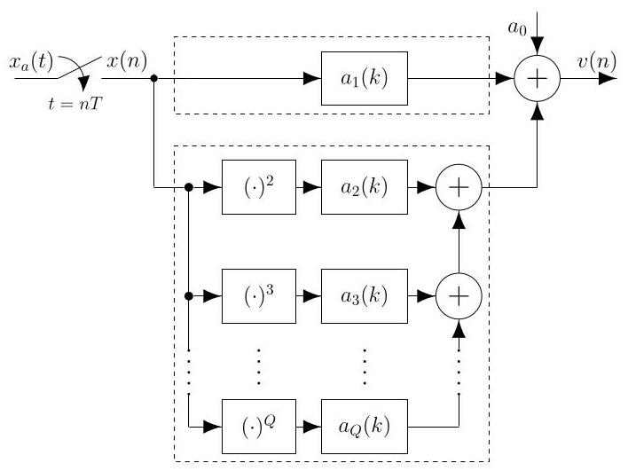

FIGURE 1. Digital pre-sampling Hammerstein model (see Footnote 2) with the upper (lower) dashed box indicating the linear branch (nonlinear branches).

图1. 数字预采样哈默斯坦模型(见脚注2)，上面(下面)的虚线框表示线性分支(非线性分支)。

Before proceeding, it is noted that, to model the signal as in (1) in a practical system, the parameters ${a}_{0}$ and ${a}_{p}\left( k\right)$ , $k = 0,1,\ldots , D, p = 1,2,\ldots , Q$ , need to be estimated. Several methods are available for this purpose [13], [24]. However, the focus of this paper is to assess and compare the performance and complexity of the Hammerstein and proposed linearizers, not to estimate model parameters. To this end, the model in (1) is used for generating distorted training and evaluation signals. It is stressed though that the proposed lin-earizers do not assume that the distorted signal is in the form of (1). It is also emphasized that the pre-sampling distortion model (and the post-sampling distortion model discussed in Section IV) is a digital model of aggregate nonlinearities occurring after sampling (before sampling in the post-sampling case). It does not require a physical implementation in the analog domain, but facilitates identification and compensation in the digital domain.

在继续之前，需要注意的是，为了在实际系统中对如(1)中的信号进行建模，需要估计参数${a}_{0}$和${a}_{p}\left( k\right)$、$k = 0,1,\ldots , D, p = 1,2,\ldots , Q$。为此有几种方法可用[13]、[24]。然而，本文的重点是评估和比较哈默斯坦和所提出的线性化器的性能和复杂度，而不是估计模型参数。为此，(1)中的模型用于生成失真的训练和评估信号。不过需要强调的是，所提出 的线性化器并不假设失真信号是(1)的形式。还需要强调的是，预采样失真模型(以及第四节中讨论的后采样失真模型)是采样后(在后采样情况下是采样前)出现的总非线性的数字模型。它不需要在模拟域中进行物理实现，但便于在数字域中进行识别和补偿。

## A. HAMMERSTEIN LINEARIZER

## A. 哈默斯坦线性化器

Given the distorted signal $v\left( n\right)$ , the linearization amounts to generating a compensated signal, say $y\left( n\right)$ , in which the distortion has been suppressed (ideally removed). In the conventional Hammerstein linearizer, illustrated in Fig. 2, $y\left( n\right)$ is generated in the same way as the distorted signal is modeled. That is,

给定失真信号$v\left( n\right)$，线性化相当于生成一个补偿信号，比如说$y\left( n\right)$，其中失真已被抑制(理想情况下已消除)。在传统的哈默斯坦线性化器中，如图2所示，$y\left( n\right)$的生成方式与对失真信号进行建模的方式相同。即

$$
y\left( n\right)  = {d}_{0} + \mathop{\sum }\limits_{{l = 0}}^{M}{d}_{1}\left( l\right) v\left( {n - l}\right)  + \mathop{\sum }\limits_{{p = 2}}^{{K + 1}}\mathop{\sum }\limits_{{l = 0}}^{M}{d}_{p}\left( l\right) {v}^{p}\left( {n - l}\right) \tag{2}
$$

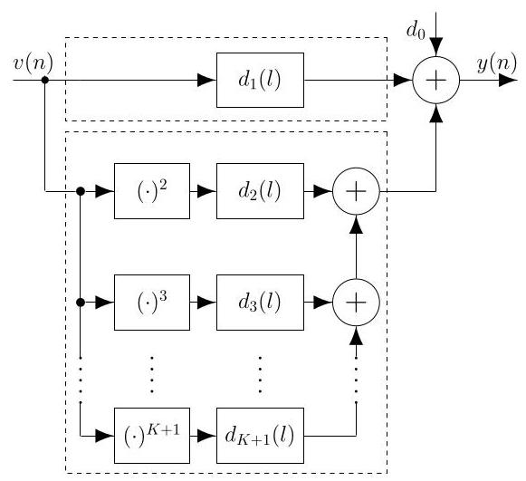

FIGURE 2. Hammerstein linearizer with the upper (lower) dashed box indicating the linear branch (nonlinear branches).

图2. 哈默斯坦线性化器，上面(下面)的虚线框表示线性分支(非线性分支)。

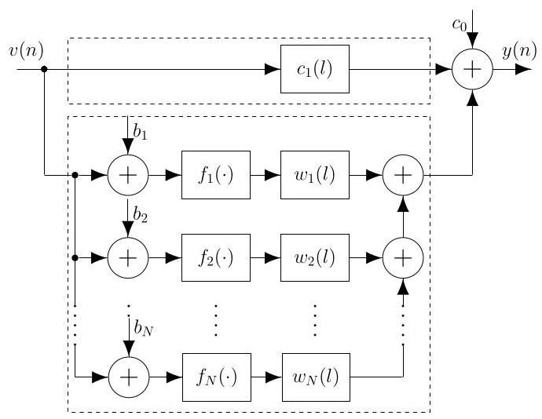

FIGURE 3. Proposed linearizer with the upper (lower) dashed box indicating the linear branch (nonlinear branches).

图3. 所提出的线性化器，上面(下面)的虚线框表示线性分支(非线性分支)。

where ${d}_{0}$ is a constant (offset), ${d}_{1}\left( l\right)$ is the impulse response of a linear-branch filter, and ${d}_{p}\left( l\right) , p = 2,3,\ldots , K + 1$ , are the $K$ impulse responses of the $K$ nonlinear-branch filters. Here, $M$ represents the filter order (memory depth). Again, for notation simplicity, all filters have the same order, but they can generally be different. In an implementation, this scheme requires $\left( {M + 1}\right) \left( {K + 1}\right)  + K$ multiplications and $\left( {M + 1}\right) \left( {K + 1}\right)$ two-input additions per corrected output sample. It involves $\left( {M + 1}\right) \left( {K + 1}\right)$ multiplications for generating the filtered versions of ${v}^{p}\left( n\right)$ , and $K$ multiplications for generating all ${v}^{p}\left( n\right)$ .

其中${d}_{0}$为常数(偏移量)，${d}_{1}\left( l\right)$为线性分支滤波器的脉冲响应，而${d}_{p}\left( l\right) , p = 2,3,\ldots , K + 1$为$K$个非线性分支滤波器的$K$脉冲响应。这里，$M$表示滤波器阶数(存储深度)。同样，为了符号表示简单，所有滤波器具有相同的阶数，但它们通常可以不同。在实现中，该方案对于每个校正后的输出样本需要$\left( {M + 1}\right) \left( {K + 1}\right)  + K$次乘法和$\left( {M + 1}\right) \left( {K + 1}\right)$次双输入加法。它涉及$\left( {M + 1}\right) \left( {K + 1}\right)$次乘法来生成${v}^{p}\left( n\right)$的滤波版本，以及$K$次乘法来生成所有${v}^{p}\left( n\right)$。

## III. PROPOSED LINEARIZER FOR THE PRE-SAMPLING DISTORTION MODEL

## 三、针对预采样失真模型提出的线性化器

In the proposed linearizer for the pre-sampling model, shown in Fig. 3, the compensated signal $y\left( n\right)$ is generated as

在图3所示的针对预采样模型提出的线性化器中，补偿信号$y\left( n\right)$按如下方式生成

$$
y\left( n\right)  = {c}_{0} + \mathop{\sum }\limits_{{l = 0}}^{M}{c}_{1}\left( l\right) v\left( {n - l}\right)  + \mathop{\sum }\limits_{{m = 1}}^{N}\mathop{\sum }\limits_{{l = 0}}^{M}{w}_{m}\left( l\right) {u}_{m}\left( {n - l}\right) \tag{3}
$$

---

${}^{4}$ Signal quantization is included in all evaluations in the examples of Sections III and IV.

${}^{4}$信号量化包含在第三节和第四节示例的所有评估中。

---

where $M$ denotes the filter order of ${c}_{1}\left( l\right)$ and of the $N$ nonlinear-branch filters ${w}_{m}\left( l\right) , m = 1,2,\ldots , N,{c}_{0}$ is a constant offset, and the terms ${u}_{m}\left( n\right)$ are

其中$M$表示${c}_{1}\left( l\right)$和$N$非线性分支滤波器的滤波器阶数，${w}_{m}\left( l\right) , m = 1,2,\ldots , N,{c}_{0}$是常数偏移量，项${u}_{m}\left( n\right)$为

$$
{u}_{m}\left( n\right)  = {f}_{m}\left( {v\left( n\right)  + {b}_{m}}\right) , \tag{4}
$$

with ${f}_{m}$ representing nonlinear operations. Specifically, ${f}_{m}\left( v\right)$ are chosen as either the modulus $\left| v\right|$ or the ReLU operation $\max \{ 0, v\}$ due to their simplicity and reduced complexity in hardware implementation [27], [28] (also see Section VI). Additionally, the bias values ${b}_{m}$ , for $m = 1,2,\ldots , N$ , are selected to be uniformly distributed within the range $\left\lbrack  {-{b}_{\max },{b}_{\max }}\right\rbrack$ where the optimal value for ${b}_{\max }$ is determined as detailed later in Section III-B. Hence, the bias values ${b}_{m}$ are chosen as

其中${f}_{m}$表示非线性运算。具体而言，由于${f}_{m}\left( v\right)$在硬件实现中简单且复杂度降低[27,28](另见第六节)，所以${f}_{m}\left( v\right)$被选为模$\left| v\right|$或ReLU运算$\max \{ 0, v\}$。此外，对于$m = 1,2,\ldots , N$的偏置值${b}_{m}$被选择为在范围$\left\lbrack  {-{b}_{\max },{b}_{\max }}\right\rbrack$内均匀分布，其中${b}_{\max }$的最优值如第三节B部分稍后详细确定。因此，偏置值${b}_{m}$被选择为

$$
{b}_{m} =  - {b}_{\max } + \frac{2\left( {m - 1}\right) {b}_{\max }}{N - 1},\;m = 1,2,\ldots , N. \tag{5}
$$

## A. IMPLEMENTATION COMPLEXITY

## A. 实现复杂度

In the implementation, the proposed scheme in (3) requires only $\left( {M + 1}\right) \left( {N + 1}\right)$ multiplications per sample, and $\left( {M + 1}\right) \left( {N + 1}\right)  + N$ two-input additions, including the $N$ bias additions. Notably, the proposed linearizer requires $K$ multiplications less than the Hammerstein model at the expense of $K$ extra additions, when they have the same number of branches $\left( {N = K}\right)$ . Hence, in particular for cases where a small $M$ is sufficient, the multiplication complexity is substantially lower for the proposed linearizer (also see Section III-C1). Further, since multiplications generally require substantially more power than additions in an implementation [38], [39], the proposed linearizer will have a lower implementation complexity.

在实现中，(3)中提出的方案每个样本仅需要$\left( {M + 1}\right) \left( {N + 1}\right)$次乘法和$\left( {M + 1}\right) \left( {N + 1}\right)  + N$次双输入加法，包括$N$次偏置加法。值得注意的是，当它们具有相同数量的分支$\left( {N = K}\right)$时，所提出的线性化器比哈默斯坦模型少需要$K$次乘法，但以$K$次额外加法为代价。因此，特别是对于$M$较小就足够的情况，所提出的线性化器的乘法复杂度要低得多(另见第三节C1部分)。此外，由于在实现中乘法通常比加法消耗更多功率[38,39]，所以所提出的线性化器将具有更低的实现复杂度。

Moreover, a significant additional advantage of the proposed linearizer is that it eliminates the need for data quantization before filtering. Conversely, in the Hammerstein lin-earizer, data quantizations must be performed at the outputs of the nonlinearities (i.e., before the filtering) to prevent excessively long and costly internal word lengths. These quan-tizations introduce quantization errors (quantization noise), which are scaled by the energy of the corresponding filters' impulse responses ${d}_{k}\left( l\right)$ which equals the sum of the squares of the impulse response values [40], [41]. Consequently, the impulse response values must be kept small to avoid significant noise amplification, which would degrade the output SNDR. Alternatively, longer internal word lengths need to be used, which also increases the implementation cost. The proposed scheme overcomes this problem since all quantizations are carried out after the filtering operations, thereby avoiding noise amplification from the quantizations to the output.

此外，所提出的线性化器的一个显著额外优势在于，它消除了滤波前对数据进行量化的需求。相反，在哈默斯坦线性化器中，必须在非线性环节的输出端(即滤波之前)进行数据量化，以防止内部字长过长且成本过高。这些量化会引入量化误差(量化噪声)，其会根据相应滤波器脉冲响应的能量进行缩放${d}_{k}\left( l\right)$，该能量等于脉冲响应值的平方和[40], [41]。因此，必须保持脉冲响应值较小，以避免显著的噪声放大，这会降低输出信噪失真比。或者，需要使用更长的内部字长，这也会增加实现成本。所提出的方案克服了这个问题，因为所有量化都是在滤波操作之后进行的，从而避免了从量化到输出的噪声放大。

## B. PROPOSED DESIGN

## B. 所提出的设计

For design purposes, we make use of the equivalent structure in Fig. 4 where ${w}_{lm} = {w}_{m}\left( l\right)$ . The design of the proposed linearizer then amounts to determining the parameters ${c}_{0}$ , ${c}_{1},{w}_{lm}$ , and ${b}_{m}$ so that the output signal $y\left( n\right)$ closely approximates the desired signal $x\left( n\right)$ in some sense, which is here assumed to be the least-squares sense. To this end, the design procedure described below is proposed, which extends our frequency-independent linearizer in [28] to accommodate frequency dependency. It is assumed that the signal is normalized so that its modulus is bounded by one.

出于设计目的，我们使用图4中的等效结构，其中${w}_{lm} = {w}_{m}\left( l\right)$ 。然后，所提出的线性化器的设计就相当于确定参数${c}_{0}$ 、${c}_{1},{w}_{lm}$和${b}_{m}$ ，以便在某种意义上输出信号$y\left( n\right)$紧密逼近期望信号$x\left( n\right)$ ，这里假设是在最小二乘意义上。为此，提出了如下所述的设计过程，它将我们在[28]中与频率无关的线性化器进行了扩展，以适应频率依赖性。假设信号已归一化，使其模值被限制在1以内。

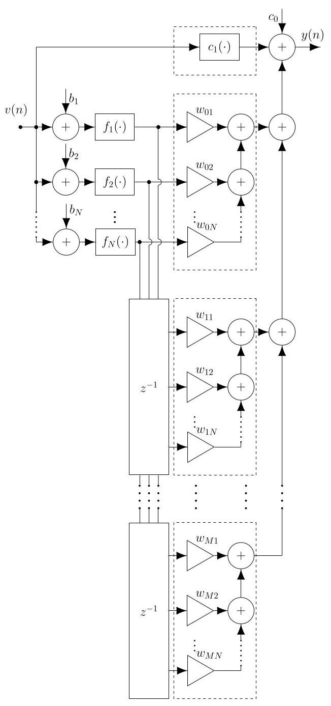

FIGURE 4. Equivalent implementation of the proposed linearizer in Fig. 3, utilized in the proposed design.

图4. 所提出的设计中使用的图3中所提出的线性化器的等效实现。

1) Generate a set of $R$ reference signals ${x}_{r}\left( n\right)$ and the corresponding distorted signals ${v}_{r}\left( n\right) , r = 1,2,\ldots , R$ , using a signal model as in (1) or measured data.

1) 使用如(1)中的信号模型或测量数据，生成一组$R$参考信号${x}_{r}\left( n\right)$和相应的失真信号${v}_{r}\left( n\right) , r = 1,2,\ldots , R$ 。

2) Generate a set of $S$ uniformly distributed values of ${b}_{\max } \in  \left\lbrack  {{b}_{l},{b}_{u}}\right\rbrack$ . We have experimentally observed that ${b}_{l} = {0.5}$ and ${b}_{u} = {1.5}$ are appropriate values when the signal is within the range $\left\lbrack  {-1,1}\right\rbrack$ .

2) 生成一组$S$均匀分布的${b}_{\max } \in  \left\lbrack  {{b}_{l},{b}_{u}}\right\rbrack$值。我们通过实验观察到，当信号在$\left\lbrack  {-1,1}\right\rbrack$范围内时，${b}_{l} = {0.5}$和${b}_{u} = {1.5}$是合适的值。

3) For each specified value of ${b}_{\max }$ , the corresponding ${b}_{m}$ values are calculated as in (5). Then, minimize the cost function $E$ given by

3) 对于每个指定的${b}_{\max }$值，按照(5)计算相应的${b}_{m}$值。然后，最小化由下式给出的代价函数$E$

$$
E = \mathop{\sum }\limits_{{r = 1}}^{R}\mathop{\sum }\limits_{{n = 1}}^{L}{\left( {y}_{r}\left( n\right)  - {x}_{r}\left( n - \frac{M}{2}\right) \right) }^{2}, \tag{6}
$$

where $L$ denotes the data length and $M/2$ compensates for the delay of the linearization filters ${}^{5}$ . The coefficients ${c}_{0},{c}_{1}$ , and ${w}_{l, m}$ (for $l = 0,1,\ldots , M$ , and $m = 1,2,\ldots , N$ ) in (3) are computed using matrix inversion, incorporating ${L}_{2}$ -regularization to avoid large parameter values and to prevent ill-conditioned matrices. Specifically, let $\mathbf{w}$ be a $\left( {\left\lbrack  {\left( {M + 1}\right) \left( {N + 1}\right)  + 1}\right\rbrack   \times  1}\right)$ column vector containing all coefficients ${w}_{l, m}$ , along with ${c}_{1}\left( l\right)$ and ${c}_{0}$ . Let ${\mathbf{A}}_{r}$ be an $\left( {L \times  \left\lbrack  {\left( {M + 1}\right) \left( {N + 1}\right)  + 1}\right\rbrack  }\right)$ matrix, where each column contains the $L$ samples of ${u}_{r, m}\left( {n - l}\right)$ for $l = 0,1,\ldots , M$ and $m = 1,2,\ldots , N$ , the $L$ input samples ${v}_{r}\left( {n - l}\right)$ for $l = 0,1,\ldots , M$ , and $L$ ones (corresponding to the constant ${c}_{0}$ ). Minimizing $E$ in (6), in the least-squares sense, yields the solution (see Appendix A)

其中$L$表示数据长度，$M/2$用于补偿线性化滤波器${}^{5}$的延迟。式(3)中的系数${c}_{0},{c}_{1}$和${w}_{l, m}$(针对$l = 0,1,\ldots , M$和$m = 1,2,\ldots , N$)通过矩阵求逆计算得出，采用${L}_{2}$正则化以避免参数值过大并防止矩阵病态。具体而言，令$\mathbf{w}$为包含所有系数${w}_{l, m}$以及${c}_{1}\left( l\right)$和${c}_{0}$的$\left( {\left\lbrack  {\left( {M + 1}\right) \left( {N + 1}\right)  + 1}\right\rbrack   \times  1}\right)$列向量。令${\mathbf{A}}_{r}$为一个$\left( {L \times  \left\lbrack  {\left( {M + 1}\right) \left( {N + 1}\right)  + 1}\right\rbrack  }\right)$矩阵，其中每列包含$l = 0,1,\ldots , M$和$m = 1,2,\ldots , N$的$L$个${u}_{r, m}\left( {n - l}\right)$样本、$l = 0,1,\ldots , M$的$L$个输入样本${v}_{r}\left( {n - l}\right)$以及$L$个1(对应于常数${c}_{0}$)。在最小二乘意义下使式(6)中的$E$最小化，可得解(见附录A)

$$
\mathbf{w} = {\mathbf{A}}^{-1}\mathbf{b}, \tag{7}
$$

where

其中

$$
\mathbf{A} = \lambda {\mathbf{I}}_{\left( {M + 1}\right) \left( {N + 1}\right)  + 1} + \mathop{\sum }\limits_{{r = 1}}^{R}{\mathbf{A}}_{r}^{\top }{\mathbf{A}}_{r},\;\mathbf{b} = \mathop{\sum }\limits_{{r = 1}}^{R}{\mathbf{A}}_{r}^{\top }{\mathbf{b}}_{r},
$$

(8)

with ${\mathbf{A}}_{r}^{\top }$ being the transpose of ${\mathbf{A}}_{r}$ , and ${\mathbf{b}}_{r}$ being an $L \times  1$ column vector containing the $L$ samples ${x}_{r}\left( {n - M/2}\right)  - {v}_{r}\left( {n - M/2}\right)$ . It is noted here that ${x}_{r}\left( {n - M/2}\right)  - {v}_{r}\left( {n - M/2}\right)$ is used in ${\mathbf{b}}_{r}$ instead of ${x}_{r}\left( {n - M/2}\right)$ , in order to compute small values of the linear-branch filter coefficients. That is, we replace ${c}_{1}\left( l\right) v\left( {n - l}\right)$ in (3) with $v\left( {n - M/2}\right)  + \Delta {c}_{1}\left( l\right) v\left( {n - l}\right)$ and then compute the value of $\Delta {c}_{1}$ . In this way, all parameters to be computed in the least-squares design are small (zero in the ideal case with no distortion). ${}^{6}$ Further, $\lambda {\mathbf{I}}_{\left( {M + 1}\right) \left( {N + 1}\right)  + 1}$ is a diagonal matrix with small diagonal entries $\lambda$ for the ${L}_{2}$ -regularization. The linearized output (treated as a row vector) ${\mathbf{y}}_{r} = {y}_{r}\left( n\right)$ , $n = 1,2,\ldots , L$ , is given by

其中${\mathbf{A}}_{r}^{\top }$是${\mathbf{A}}_{r}$的转置，${\mathbf{b}}_{r}$是包含$L$个${x}_{r}\left( {n - M/2}\right)  - {v}_{r}\left( {n - M/2}\right)$样本的$L \times  1$列向量。此处需注意，在${\mathbf{b}}_{r}$中使用${x}_{r}\left( {n - M/2}\right)  - {v}_{r}\left( {n - M/2}\right)$而非${x}_{r}\left( {n - M/2}\right)$，以便计算线性分支滤波器系数的小值。也就是说，我们在式(3)中将${c}_{1}\left( l\right) v\left( {n - l}\right)$替换为$v\left( {n - M/2}\right)  + \Delta {c}_{1}\left( l\right) v\left( {n - l}\right)$，然后计算$\Delta {c}_{1}$的值。通过这种方式，最小二乘设计中要计算的所有参数都很小(在无失真的理想情况下为零)。${}^{6}$此外，$\lambda {\mathbf{I}}_{\left( {M + 1}\right) \left( {N + 1}\right)  + 1}$是一个对角矩阵，其对角元素$\lambda$较小，用于${L}_{2}$正则化。线性化输出(视为行向量)${\mathbf{y}}_{r} = {y}_{r}\left( n\right)$、$n = 1,2,\ldots , L$由下式给出

$$
{\mathbf{y}}_{r} = {\mathbf{v}}_{r} + {\mathbf{w}}^{\top }{\mathbf{A}}_{r}^{\top }, \tag{9}
$$

where ${\mathbf{v}}_{r} = \mathop{\sum }\limits_{{l = 0}}^{M}{v}_{r}\left( {n - l}\right) , n = 1,2,\ldots , L$ is also a row vector.

其中${\mathbf{v}}_{r} = \mathop{\sum }\limits_{{l = 0}}^{M}{v}_{r}\left( {n - l}\right) , n = 1,2,\ldots , L$也是一个行向量。

4) Select the best of the $S$ solutions above.

4) 从上述$S$个解中选择最佳解。

5) Evaluate the linearizer over a large set of signals, say ${R}^{\left( \text{ eval }\right) }$ , where ${R}^{\left( \text{ eval }\right) } \gg  R$ .

5) 在一大组信号上评估线性化器，比如${R}^{\left( \text{ eval }\right) }$，其中${R}^{\left( \text{ eval }\right) } \gg  R$。

Remark 1: The proposed design uses $R$ reference signals. Once these reference signals have been collected, the design amounts to a matrix inversion for a given set of bias values. Hence, the design time (and thus convergence time) is mainly determined by the time it takes to collect the $R$ reference signals. This is however common for all linearizers, which require the same amount of data to achieve the same linearizer performance, and is thus not specific for our proposal. The additional aspect of finding the bias values can in practice be carried out only once, and one can then use those bias values when the model and model parameters change. This is because we have observed that the linearizer performance has a low sensitivity to exact bias values, as long as they are linearly spaced between the approximate minimum and maximum of the signal. ${}^{7}$ Taking this into account, the proposal has the same design time as the Hammerstein linearizer, but offers a lower linearizer implementation complexity. It is also stressed again that the proposal avoids the costly and time-consuming iterative nonconvex optimization that is traditionally used when training neural networks.

备注1:所提出的设计使用$R$参考信号。一旦收集到这些参考信号，对于给定的一组偏置值，设计就相当于进行矩阵求逆。因此，设计时间(进而收敛时间)主要由收集$R$参考信号所需的时间决定。然而，这对于所有线性化器来说都是常见的，它们都需要相同数量的数据来实现相同的线性化器性能，因此并非我们的提议所特有的。在实际中，寻找偏置值的额外方面实际上只需进行一次，然后当模型和模型参数变化时可以使用那些偏置值。这是因为我们观察到，只要偏置值在信号的近似最小值和最大值之间线性分布，线性化器性能对精确偏置值的敏感度就较低。${}^{7}$考虑到这一点，该提议与哈默斯坦线性化器具有相同的设计时间，但提供了更低的线性化器实现复杂度。还再次强调，该提议避免了传统上训练神经网络时使用的代价高昂且耗时的迭代非凸优化。

Remark 2: In the examples later on where synthetic data is used (Examples 1-5), the reference signals are known (e.g. pilot sequences). It is appropriate to use such signals when investigating the linearization capability of the linearizers, both for the proposed one and Hammerstein. In practice, the reference signals may not be completely known but have to be estimated. As long as the signal estimates are sufficiently accurate, the proposed design still works well. This will be illustrated in Example 6 where sinusoids with unknown amplitudes and phases are used. In general, existing methods for estimation of multi-sine signals can be used in this context.

备注2:在后面使用合成数据的示例(示例1 - 5)中，参考信号是已知的(例如导频序列)。在研究线性化器的线性化能力时，无论是对于所提出的线性化器还是哈默斯坦线性化器，使用这样的信号都是合适的。在实际中，参考信号可能并非完全已知，而是必须进行估计。只要信号估计足够准确，所提出的设计仍然能很好地工作。这将在示例6中说明，其中使用了幅度和相位未知的正弦波。一般来说，现有的多正弦信号估计方法可用于此背景下。

Remark 3: In the proposed method, the bias values are optimized over a discrete set of values, which means that the overall solution is not guaranteed to be globally optimal, even if each solution with fixed bias values so is. However, also for a regular optimization, where the bias values and coefficients are jointly optimized, one cannot guarantee global optimality as the problem is then not convex. Hence, only local optimality can be guaranteed. Starting with the proposed optimized solutions in the example sections, we have also carried out further joint optimizations which do not improve the results. This shows that the proposed design yields at least locally optimal solutions, which are also good solutions as they outperform the Hammerstein linearizers, whose optimized solutions are guaranteed to be globally optimal since they lack bias values.

备注3:在所提出的方法中，偏置值是在一组离散值上进行优化的，这意味着即使每个具有固定偏置值的解是全局最优的，整体解也不能保证是全局最优的。然而，对于常规优化，即偏置值和系数联合优化时，由于问题不是凸的，也不能保证全局最优性。因此只能保证局部最优性。从示例部分中所提出的优化解开始，我们还进行了进一步的联合优化，但结果并没有改善。这表明所提出的设计至少产生局部最优解，这些解也是好的解，因为它们优于哈默斯坦线性化器，哈默斯坦线性化器的优化解由于没有偏置值而保证是全局最优的。

## C. SIMULATIONS AND RESULTS

## C. 仿真与结果

For the evaluations and comparisons, we assume a distorted signal $v\left( n\right)$ with a distortion filter order of $D = 6$ . This signal is modeled as described in (1) with parameters ${}^{8} : {a}_{0} = 0$ , ${a}_{1}\left( k\right)  = \left\lbrack  {0,0,0,1,0,0,0}\right\rbrack$ , and ${a}_{p}\left( k\right)$ for $k = 0,1,\ldots , D$ and $p = 2,3,\ldots , Q$ , with $Q = {10}$ , randomly generated with frequency responses as depicted in Fig. 5. We imposed a constraint to have a mean SNDR around ${30}\mathrm{\;{dB}}$ for the set of distorted signals. The SNDR in dB for a real reference signal $x\left( n\right)$ and its distorted signal $v\left( n\right)$ , computed over $L$ samples, is

为了进行评估和比较，我们假设一个失真信号$v\left( n\right)$，其失真滤波器阶数为$D = 6$。该信号按照(1)中所述进行建模，对于$k = 0,1,\ldots , D$和$p = 2,3,\ldots , Q$，其参数为${}^{8} : {a}_{0} = 0$、${a}_{1}\left( k\right)  = \left\lbrack  {0,0,0,1,0,0,0}\right\rbrack$和${a}_{p}\left( k\right)$，其中$Q = {10}$，频率响应如图5所示，是随机生成的。我们对这组失真信号施加了一个约束，使其平均信噪失真比(SNDR)约为${30}\mathrm{\;{dB}}$。对于真实参考信号$x\left( n\right)$及其失真信号$v\left( n\right)$，在$L$个样本上计算得到的以分贝为单位的SNDR为

$$
\mathrm{{SNDR}} = {10}{\log }_{10}\left( \frac{\mathop{\sum }\limits_{{n = 0}}^{{L - 1}}{x}^{2}\left( n\right) }{\mathop{\sum }\limits_{{n = 0}}^{{L - 1}}{\left( x\left( n\right)  - v\left( n\right) \right) }^{2}}\right) \left\lbrack  \mathrm{{dB}}\right\rbrack  . \tag{10}
$$

---

${}^{5}$ It is assumed in the expression $n - M/2$ that $M$ is even, but odd $M$ can also be handled by replacing $M/2$ with $\left( {M - 1}\right) /2$ or $\left( {M + 1}\right) /2$ .

${}^{5}$ 在表达式$n - M/2$中假设$M$是偶数，但奇数$M$也可以通过用$\left( {M - 1}\right) /2$或$\left( {M + 1}\right) /2$替换$M/2$来处理。

${}^{6}$ The paper focuses on weakly nonlinear systems where the nonlinearities are much smaller than the desired signal and the model parameters are small, which is typically the case in analog circuits with undesired nonlinearities. In this case, the linearizers can also have relatively small coefficients, which in the proposed design are obtained through matrix inversion with ${L}_{2}$ - regularization. In systems with larger model parameters, the linearizers may need larger coefficients which can also be obtained through the proposed design by using a smaller $\lambda$ for the ${L}_{2}$ -regularization.

${}^{6}$ 本文聚焦于弱非线性系统，其中非线性程度远小于期望信号，且模型参数较小，这在存在不期望非线性的模拟电路中通常如此。在这种情况下，线性化器的系数也可能相对较小，在所提出的设计中，这些系数通过带 ${L}_{2}$ -正则化的矩阵求逆获得。在模型参数较大的系统中，线性化器可能需要更大的系数，这也可通过所提出的设计，对 ${L}_{2}$ -正则化使用更小的 $\lambda$ 来实现。

${}^{7}$ To assess the bias sensitivity, we changed the optimal ${b}_{\max }$ in the examples by $\pm  3$ and $\pm  5$ percent. This caused a mean SNDR reduction of less than 1 and $2\mathrm{\;{dB}}$ , respectively.

${}^{7}$ 为评估偏置灵敏度，我们在示例中将最优 ${b}_{\max }$ 分别改变了 $\pm  3$ 和 $\pm  5$ 百分比。这分别导致平均信噪失真比(SNDR)降低小于1和 $2\mathrm{\;{dB}}$。

---

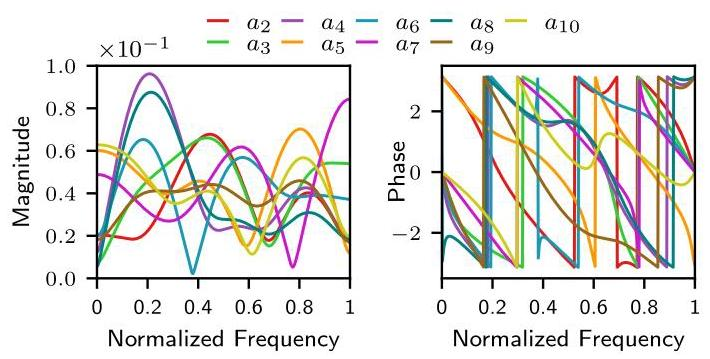

FIGURE 5. Magnitude and phase response of ${a}_{p}\left( k\right)$ , for $p = 2,\cdots ,{10}$ , in Example 1.

图5. 示例1中 ${a}_{p}\left( k\right)$ 对于 $p = 2,\cdots ,{10}$ 的幅度和相位响应。

Example 1: We consider the multi-tone signal

示例1:我们考虑多音信号

$$
x\left( n\right)  = G \times  \mathop{\sum }\limits_{{k = 1}}^{{31}}{A}_{k}\sin \left( {{\omega }_{k}n + {\alpha }_{k}}\right) , \tag{11}
$$

where ${A}_{k} = 1$ for all $k$ , and ${\alpha }_{k}$ are randomly chosen from $\{ \pi /4, - \pi /4,{3\pi }/4, - {3\pi }/4\}$ , which corresponds to quadrature phase shift keying (QPSK) modulation. The frequencies ${\omega }_{k}$ are given by

其中对于所有 $k$，${A}_{k} = 1$ 以及 ${\alpha }_{k}$ 从 $\{ \pi /4, - \pi /4,{3\pi }/4, - {3\pi }/4\}$ 中随机选取，这对应于正交相移键控(QPSK)调制。频率 ${\omega }_{k}$ 由下式给出

$$
{\omega }_{k} = \frac{2\pi k}{64} + {\Delta \omega } \tag{12}
$$

in which case the signal corresponds to the quadrature (imaginary) part of 31 active subcarriers in a 64-subcarrier OFDM signal with a random frequency offset ${\Delta \omega }$ . In the design and evaluation we use, respectively, $R = {50}$ and ${R}^{\left( eval\right) } = {5000}$ signals with randomly generated frequency offsets assuming uniform distribution between $- \pi /{64}$ and $\pi /{64}$ , quantized to 12 bits, and of length $L = {8192}$ . The gain $G$ is selected so that the distorted signals are below one in magnitude. For the ${L}_{2}$ -regularization, a linear search is used to find the value $\lambda  \in  \left\lbrack  {{10}^{-{10}},{10}^{-1}}\right\rbrack$ that best fits each instance, meaning each combination of ${b}_{\max }, M$ , and $N$ . The Hammerstein linearizer has been designed in the same way but without the bias values. The constraint was to select the optimal $\lambda$ -value ${}^{9}$ , which was primarily used to regulate the Hammerstein linearizer to avoid large parameter values and large noise amplification. The proposed linearizer does not have noise amplification and thus allows larger parameter values, but the magnitudes of those values are nevertheless below unity in magnitude, even with a relaxed ${L}_{2}$ -regularization.

在这种情况下，该信号对应于具有随机频率偏移 ${\Delta \omega }$ 的64子载波正交频分复用(OFDM)信号中31个有源子载波的正交(虚部)部分。在设计和评估中，我们分别使用具有在 $- \pi /{64}$ 和 $\pi /{64}$ 之间均匀分布的随机生成频率偏移、量化为12位且长度为 $L = {8192}$ 的 $R = {50}$ 和 ${R}^{\left( eval\right) } = {5000}$ 信号。选择增益 $G$ 使得失真信号的幅度低于1。对于 ${L}_{2}$ -正则化，使用线性搜索来找到最适合每个实例的值 $\lambda  \in  \left\lbrack  {{10}^{-{10}},{10}^{-1}}\right\rbrack$，即 ${b}_{\max }, M$ 和 $N$ 的每个组合。哈默斯坦线性化器以相同方式设计，但不考虑偏置值。约束条件是选择最优的 $\lambda$ 值 ${}^{9}$，其主要用于调节哈默斯坦线性化器以避免大参数值和大噪声放大。所提出的线性化器没有噪声放大，因此允许更大的参数值，但即使在放宽的 ${L}_{2}$ -正则化下，这些值的幅度仍低于1。

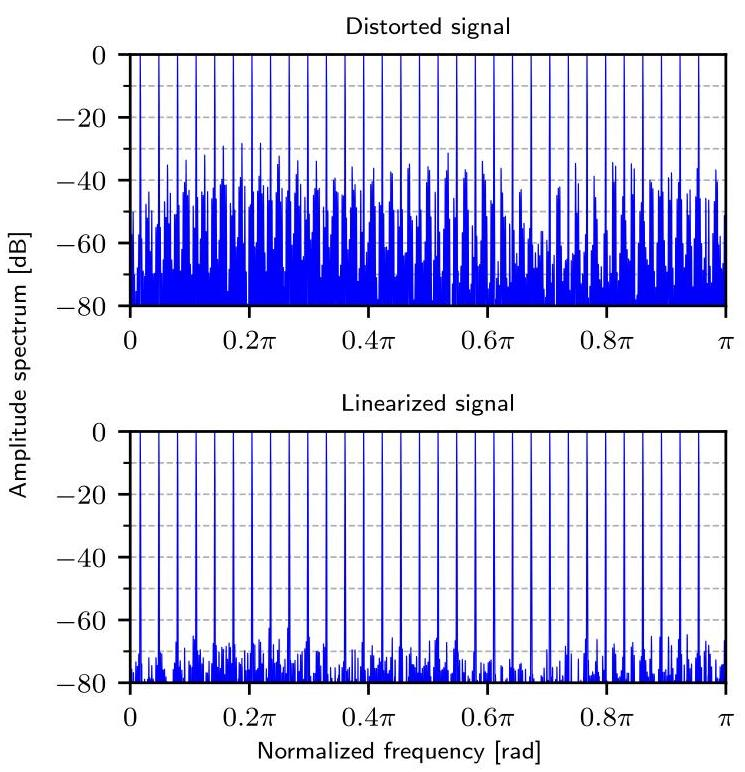

FIGURE 6. Spectrum before and after linearization for a multi-sine signal using the proposed linearizer with a filter order of $M = 6$ and $N = {12}$ nonlinear branches (Example 1).

图6. 使用滤波器阶数为 $M = 6$ 和 $N = {12}$ 个非线性分支的所提出线性化器对多正弦信号进行线性化前后的频谱(示例1)。

Further, we have considered both the modulus and ReLU as nonlinear operations, as well as combinations (modulus in some branches, ReLU in the other branches), but the different options resulted in practically the same performance. The results presented in the examples are for the modulus operation.

此外，我们考虑了模运算和ReLU作为非线性操作，以及组合方式(某些分支为模运算，其他分支为ReLU)，但不同选项导致的性能实际上相同。示例中给出的结果是关于模运算的。

Figure 6 shows the spectrum before and after linearization for one of the signals using the proposed linearizer with a filter order of $M = 6$ and $N = {12}$ nonlinear branches. Figure 7 plots the mean SNDR over 5000 signals for each linearizer instance (with an SNDR variance of approximately ${0.5}\mathrm{\;{dB}}$ for all instances) versus the number of branches for the proposed and Hammerstein linearizers. ${}^{10}$

图6展示了使用滤波器阶数为 $M = 6$ 和 $N = {12}$ 个非线性分支的所提出线性化器对其中一个信号进行线性化前后的频谱。图7绘制了每个线性化器实例(所有实例的信噪失真比方差约为 ${0.5}\mathrm{\;{dB}}$)在5000个信号上的平均信噪失真比与所提出的线性化器和哈默斯坦线性化器的分支数的关系。${}^{10}$

The signal-to-noise ratio (SNR) is approximately ${65}\mathrm{\;{dB}}$ without distortion, and the SNDR is around 30 dB for the distorted signals before linearization. As seen in Fig. 7, the SNDR approaches 62 dB for the proposed linearizer, thus an improvement by ${32}\mathrm{\;{dB}}$ which corresponds to more than five bits improvement when using a linearizer filter order of or above six, which is required here because the distortion filter order is six. For the Hammerstein linearizer, the SNDR approaches only about ${58}\mathrm{\;{dB}}$ . The difference between the SNDR values $\left( {{62}\mathrm{\;{dB}}\text{ and }{58}\mathrm{\;{dB}}}\right)$ and the bound of ${65}\mathrm{\;{dB}}$ (since SNDR ≤ SNR) can be attributed to the ${L}_{2}$ -regularization. The SNDR gap of $4\mathrm{\;{dB}}$ is due to the fact that the ${L}_{2}$ -regularization has less impact on the proposed linearizer, which is because it has relatively small coefficients even without ${L}_{2}$ -regularization. ${}^{11}$ This implies that the Hammerstein linearizer has a lower peak performance (about $4\mathrm{\;{dB}}$ in this example) than the proposed linearizer for the same ${L}_{2}$ - regularization.

在无失真情况下，信噪比(SNR)约为${65}\mathrm{\;{dB}}$，对于线性化之前的失真信号，信号与噪声和失真比(SNDR)约为30 dB。如图7所示，对于所提出的线性化器，SNDR接近62 dB，因此提高了${32}\mathrm{\;{dB}}$，当使用六阶或更高阶的线性化器滤波器时，这相当于超过五位的改善，此处需要六阶是因为失真滤波器阶数为六。对于哈默斯坦线性化器，SNDR仅接近${58}\mathrm{\;{dB}}$。SNDR值$\left( {{62}\mathrm{\;{dB}}\text{ and }{58}\mathrm{\;{dB}}}\right)$与${65}\mathrm{\;{dB}}$的界限(因为SNDR≤SNR)之间的差异可归因于${L}_{2}$正则化。$4\mathrm{\;{dB}}$的SNDR差距是由于${L}_{2}$正则化对所提出的线性化器影响较小，这是因为即使没有${L}_{2}$正则化，它的系数也相对较小。${}^{11}$这意味着对于相同的${L}_{2}$正则化，哈默斯坦线性化器的峰值性能较低(在此示例中约为$4\mathrm{\;{dB}}$)，低于所提出的线性化器。

---

${}^{8}$ We have also considered cases where ${a}_{0}$ and ${a}_{1}\left( k\right)$ were randomly generated (additional small offset and linear distortion), but the results were practically the same.

${}^{8}$我们还考虑了${a}_{0}$和${a}_{1}\left( k\right)$随机生成的情况(额外的小偏移和线性失真)，但结果实际上是相同的。

${}^{9}$ The optimal $\lambda$ -value is defined here as the value that results in the smallest error in (6) while avoiding the matrix $\lambda \mathbf{I} + {\mathbf{A}}^{\top }\mathbf{A}$ to be ill-conditioned and ensuring that all the entries in $\mathbf{w}$ are within the range $\left\lbrack  {-1,1}\right\rbrack$ .

${}^{9}$此处将最优$\lambda$值定义为在(6)中产生最小误差的值，同时避免矩阵$\lambda \mathbf{I} + {\mathbf{A}}^{\top }\mathbf{A}$病态，并确保$\mathbf{w}$中的所有元素都在$\left\lbrack  {-1,1}\right\rbrack$范围内。

${}^{10}$ For all designs, the optimized parameter values and arithmetic-operation results are quantized to 14 bits in the evaluations. This provides a practical trade-off between hardware cost and numerical accuracy. Increasing precision beyond this yields negligible SNDR improvements.

${}^{10}$对于所有设计，在评估中将优化后的参数值和算术运算结果量化为14位。这在硬件成本和数值精度之间提供了实际的权衡。超过此精度增加精度，SNDR改善可忽略不计。

---

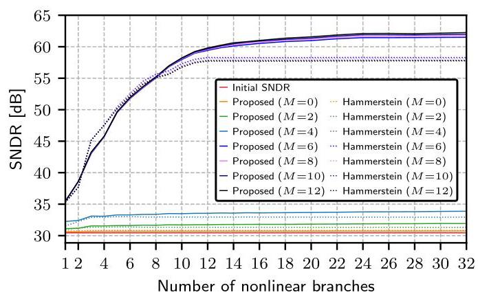

FIGURE 7. SNDR versus number of nonlinear branches in Example 1.

图7.示例1中SNDR与非线性分支数量的关系。

Example 2: To further illustrate the robustness of the proposed linearizer designed in Example 1, we have also evaluated it for the same type of multi-sine signal as in Example 1 but with some subcarriers set to zero, and for a bandpass filtered white-noise signal covering ${60}\%$ of the Nyquist band. As illustrated in Figs. 8 and 9 for one of each of these signals, essentially the same result is obtained. ${}^{12}$ Less than 1 dB SNDR degradation compared to the linearized signals considered in Example 1 is observed.

示例2:为了进一步说明示例1中设计的所提出的线性化器的鲁棒性，我们还针对与示例1中相同类型的多正弦信号(但一些子载波设置为零)以及覆盖${60}\%$奈奎斯特带宽的带通滤波白噪声信号对其进行了评估。如图8和图9所示，对于这些信号中的每一个信号，基本上都获得了相同的结果。${}^{12}$与示例1中考虑的线性化信号相比，观察到SNDR下降小于1 dB。

Remark 4: It is noted that the multi-sine signals in Examples 1 and 2 correspond to the imaginary part of an OFDM signal (as real signals are considered in the paper) with QPSK (i.e., 4-QAM) modulation, whereas the bandpass filtered white-noise signals in Example 2 resemble higher-order QAM-modulated signals. Additional simulations with 16-QAM and 64-QAM show practically the same performance, confirming that the method generalizes well across general wideband communication signals.

备注4:注意，示例1和示例2中的多正弦信号对应于具有QPSK(即4-QAM)调制的OFDM信号的虚部(因为本文考虑的是实信号)，而示例2中的带通滤波白噪声信号类似于高阶QAM调制信号。使用16-QAM和64-QAM的额外仿真显示了几乎相同的性能，证实了该方法在一般宽带通信信号中具有良好的通用性。

Example 3: This example presents results similar to those in Fig. 7 for Example 1, but with 5000 OFDM signals with QPSK modulation exhibiting second-order filtered distortion terms $\left( {D = 2}\right)$ with the parameters ${a}_{0} = 0,{a}_{1} = \left\lbrack  {0,1,0}\right\rbrack$ , and randomly generated ${a}_{p}$ for $p = 2,3,\ldots , Q$ , with $Q = {10}$ , and whose frequency responses are as shown in Fig. 10. In this case, the signal can be well linearized with an order of $M \geq  2$ , due to the simpler second-order filtered distortion terms. This is seen in Fig. 11.

示例3:此示例给出了与示例1中图7类似的结果，但有5000个具有QPSK调制的OFDM信号，其具有参数${a}_{0} = 0,{a}_{1} = \left\lbrack  {0,1,0}\right\rbrack$的二阶滤波失真项$\left( {D = 2}\right)$，并且对于$p = 2,3,\ldots , Q$随机生成${a}_{p}$，其中$Q = {10}$，其频率响应如图10所示。在这种情况下，由于二阶滤波失真项更简单，信号可以用$M \geq  2$阶很好地线性化。这在图11中可以看到。

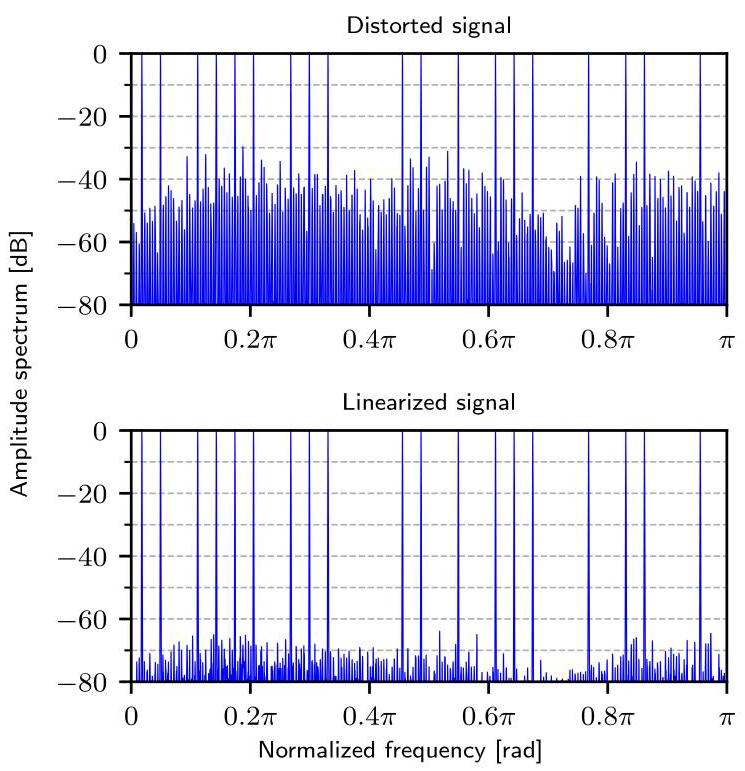

FIGURE 8. Spectrum before and after linearization for a multi-sine signal with null subcarriers using the proposed linearizer with a filter order of $M = 6$ and $N = {12}$ nonlinear branches (Example 2).

图8. 使用滤波器阶数为$M = 6$且具有$N = {12}$个非线性分支的所提出的线性化器对带有零子载波的多正弦信号进行线性化前后的频谱(示例2)。

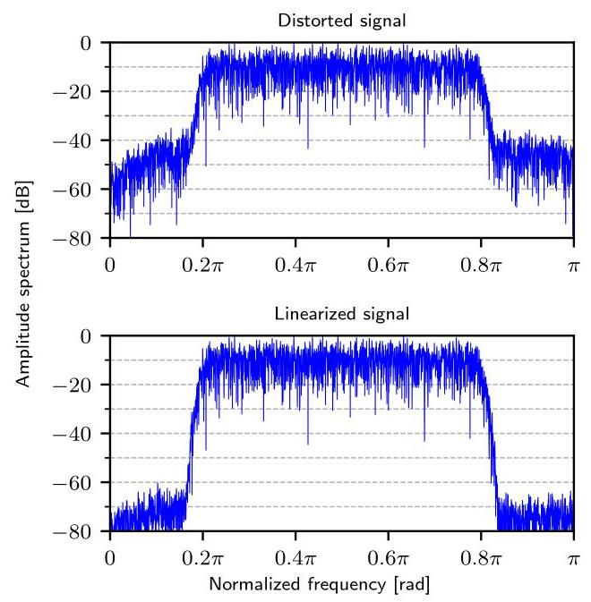

FIGURE 9. Spectrum before and after linearization for a bandpass filtered white-noise signal using the proposed linearizer with a filter order of $M = 6$ and $N = {12}$ nonlinear branches (Example 2).

图9. 使用滤波器阶数为$M = 6$且具有$N = {12}$个非线性分支的所提出的线性化器对带通滤波白噪声信号进行线性化前后的频谱(示例2)。

---

${}^{11}$ The performance gap of $4\mathrm{\;{dB}}$ can be decreased by using a smaller regularization parameter $\lambda$ but it also comes with larger coefficient values and increased implementation cost as more bits internally are then required in the Hammerstein linearizer implementation. As discussed in Section III-A, this is due to noise amplification which is present in the Hammerstein linearizer but not in the proposed linearizer. To exemplify, in Example 1 with 24 branches and $M = 6$ , reducing $\lambda$ by a factor of 250 for the Hammerstein linearizer, causes the maximum coefficient magnitude to increase by a factor of 56 compared to the optimal $\lambda$ (see Footnote 9). Further, to reduce the performance gap to, e.g., about $1\mathrm{\;{dB}},{22}$ bits are required instead 14 bits, which is sufficient in the proposed linearizer.

${}^{11}$ 通过使用较小的正则化参数$\lambda$，$4\mathrm{\;{dB}}$的性能差距可以减小，但这也会带来更大的系数值和更高的实现成本，因为在哈默斯坦线性化器实现中内部需要更多的比特。如第三节A部分所讨论的，这是由于哈默斯坦线性化器中存在噪声放大，而在所提出的线性化器中不存在。举例来说，在具有24个分支和$M = 6$的示例1中，对于哈默斯坦线性化器，将$\lambda$减小250倍，会导致最大系数幅度与最优$\lambda$相比增加56倍(见脚注9)。此外，为了将性能差距减小到例如约$1\mathrm{\;{dB}},{22}$比特，需要用14比特来替代，而在所提出的线性化器中这是足够的。

${}^{12}$ The observed out-of-band spectral reduction in Fig. 9 is due to linearization of a distorted bandpass filtered white-noise signal. In this case the linearizer suppresses the out-of-band distortion down to the noise floor which emanates from data quantization.

${}^{12}$ 图9中观察到的带外频谱降低是由于对失真的带通滤波白噪声信号进行线性化。在这种情况下，线性化器将带外失真抑制到数据量化产生的本底噪声水平。

---

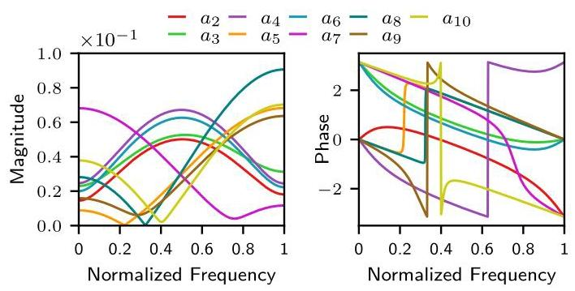

FIGURE 10. Magnitude and phase responses of ${a}_{p}\left( k\right)$ , for $p = 2,\cdots ,{10}$ , in Example 3.

图10. 示例3中${a}_{p}\left( k\right)$对于$p = 2,\cdots ,{10}$的幅度和相位响应。

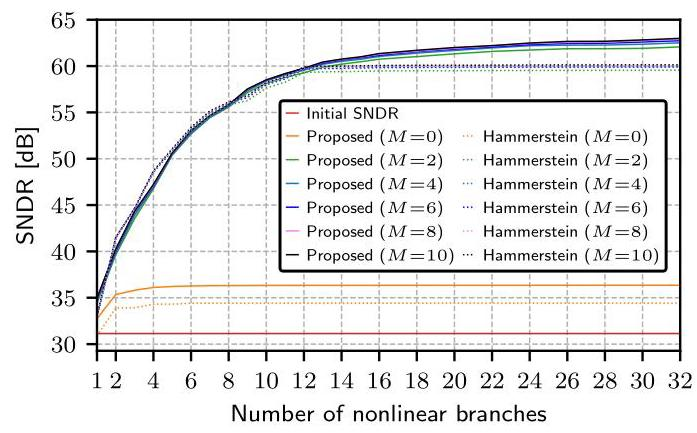

FIGURE 11. SNDR versus number of nonlinear branches in Example 3.

图11. 示例3中SNDR与非线性分支数量的关系。

## 1) Implementation Complexity

## 1) 实现复杂度

Figures 7 and 11 show the SNDR improvement versus the number of branches in the linearizer. However, as discussed in Sections II and III, with $N$ nonlinear branches, the Hammerstein linearizer (with $N = K$ ) requires $K$ additional multiplications compared to the proposed scheme, which has $K$ additional additions, but since multiplications are generally more expensive to implement than additions [38], [39], the implementation cost will be lower for the proposal. The proposed linearizer is thus more efficient for the same number of nonlinear branches, especially when $M$ is small and the relative cost of multiplications is relatively high. This efficiency is demonstrated in Figs. 12 and 13, which plot the SNDR versus the number of multiplications for both methods in Example 1 and Example 3, respectively. It is observed that the proposed linearizer clearly outperforms the Hammerstein linearizer for a small $M\left( {M = 2}\right.$ in Fig. 13) whereas the two methods have comparable performance for a larger $M(M = 6$ in Figs. 12 and 13 and $M = {10}$ in Fig. 12). For instance, in Example 3 with $M = 2$ , the Hammerstein linearizer requires 43 multiplications to reach 57 dB (Fig. 13), whereas the proposed linearizer achieves the same performance with only 30 multiplications, corresponding to a saving of ${13}/{43} \approx  {30}\%$ . It is also observed again that the proposed linearizer achieves up to $4\mathrm{\;{dB}}$ higher SNDR than the Hammerstein linearizer, as seen in Figs. 7 and 11-13, due to the ${L}_{2}$ -regularization. Finally, although the results here focus on distortion orders $D = 6$ and $D = 2$ , it should be noted that the largest savings (about ${50}\%$ ) of the proposed linearizer over the Hammerstein linearizer occur in the memory-independent case $\left( {D = 0}\right)$ , which allows a memoryless linearizer $\left( {M = 0}\right)$ , as previously shown in [28].

图7和图11展示了线性化器中SNDR的提升与分支数量的关系。然而，如第二节和第三节所讨论的，对于$N$个非线性分支，与所提出的方案相比，哈默斯坦线性化器(具有$N = K$)需要$K$次额外的乘法运算，而所提出的方案有$K$次额外的加法运算，但由于乘法运算的实现通常比加法运算更昂贵[38, 39]，所以所提出方案成本更低。因此，对于相同数量的非线性分支，所提出的线性化器效率更高，特别是当$M$较小时且乘法运算的相对成本较高时。图12和图13分别绘制了示例1和示例3中两种方法的SNDR与乘法运算次数的关系，展示了这种效率。可以观察到，在图13中对于较小的$M\left( {M = 2}\right.$，所提出的线性化器明显优于哈默斯坦线性化器；而在图12和图13中对于较大的$M(M = 6$以及图12中的$M = {10}$，两种方法具有可比的性能。例如，在具有$M = 2$的示例3中，哈默斯坦线性化器需要43次乘法运算才能达到57 dB(图13)，而所提出的线性化器仅需30次乘法运算就能达到相同性能，节省了${13}/{43} \approx  {30}\%$。还可以再次观察到，由于${L}_{2}$正则化作用，在所提出的线性化器比哈默斯坦线性化器能实现高达$4\mathrm{\;{dB}}$的更高SNDR，如图7和图11 - 13所示。最后，尽管这里的结果集中在失真阶数$D = 6$和$D = 2$上，但应该注意的是，在所提出的线性化器相对于哈默斯坦线性化器最大的节省(约${50}\%$)出现在与内存无关的情况$\left( {D = 0}\right)$中，这允许使用无记忆线性化器$\left( {M = 0}\right)$，如之前在[28]中所示。

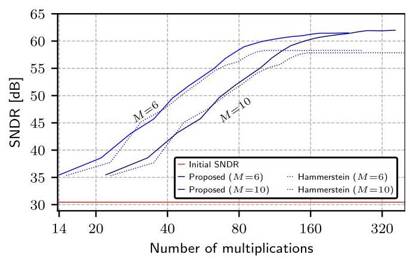

FIGURE 12. SNDR versus number of multiplications in Example 1.

图12. 示例1中SNDR与乘法运算次数的关系。

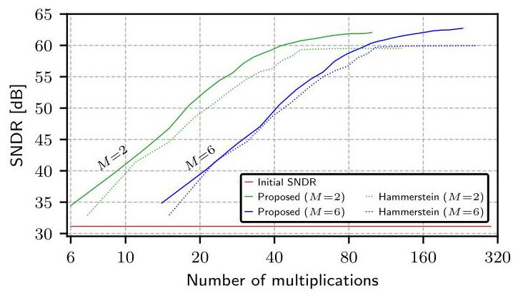

FIGURE 13. SNDR versus number of multiplications in Example 3.

图13. 示例3中SNDR与乘法运算次数的关系。

As mentioned in the introduction, it is also noted that both the proposed and Hammerstein linearizers are substantially more efficient than existing neural-network-based linearizers which require several hundreds or even thousands of multiplications to correct each output sample, even for simpler and more narrowband signals and for more modest SNDR improvements [14]-[22]. For example, the proposed linearizer in Example 3 (Figs. 11 and 13), when it starts reaching its SNDR saturation level, requires about 40 multiplications for $M = 2$ . (Increasing $M$ and $N$ further only offers a modest SNDR improvement at the cost of a higher complexity). Correspondingly, in Example 1 (Figs. 7 and 12), about 80 multiplications are required for $M = 6$ (recall that $M = 6$ and $M = 2$ correspond to the distortion filter order, $D = 6$ and $D = 2$ , in Example 1 and Example 3, respectively). This is about an order-of-magnitude lower complexity than for the existing neural-network-based linearizers.

如引言中所述，还需注意的是，所提出的线性化器和哈默斯坦线性化器都比现有的基于神经网络的线性化器高效得多，即使对于更简单、带宽更窄的信号以及更适度的信噪失真比(SNDR)改善，现有的基于神经网络的线性化器校正每个输出样本都需要数百甚至数千次乘法运算[14]-[22]。例如，示例3(图11和13)中的所提出的线性化器，当它开始达到其SNDR饱和水平时，对于$M = 2$需要大约40次乘法运算。(进一步增加$M$和$N$只会以更高的复杂度为代价带来适度的SNDR改善)。相应地，在示例1(图7和12)中，对于$M = 6$需要大约80次乘法运算(回想一下，$M = 6$和$M = 2$分别对应于示例1和示例3中的失真滤波器阶数$D = 6$和$D = 2$)。这比现有的基于神经网络的线性化器的复杂度低大约一个数量级。

## IV. PROPOSED LINEARIZER FOR THE POST-SAMPLING DISTORTION MODEL

## 四、针对采样后失真模型的所提出的线性化器

To linearize post-sampling analog distortion, the proposed linearizer in Section III is extended by incorporating interpolation. The point of departure is then the analog Hammerstein model in Fig. 14 where the distorted digital signal $v\left( n\right)$ is obtained by sampling the corresponding distorted analog signal. Here, even if ${x}_{a}\left( t\right)$ is bandlimited to the Nyquist band, the nonlinear distortion is not, because the nonlinearities ${\left( \cdot \right) }^{p}$ widen the spectrum by a factor of $p$ . However, as discussed in the introduction, it is still possible to recover the desired sequence $x\left( n\right)$ from $v\left( n\right)$ [29], which in practice can be carried out by utilizing interpolation in the linearization [30]. To this end, we will make use of a discrete-time equivalence to the structure in Fig. 14, which was not considered in [30]. The discrete-time equivalence is derived through the steps shown in Fig. 15(a)-(e) for one branch, which is further explained below.

为了对采样后的模拟失真进行线性化，通过合并插值对第三节中所提出的线性化器进行扩展。出发点是图14中的模拟哈默斯坦模型，其中失真的数字信号$v\left( n\right)$是通过对相应的失真模拟信号进行采样得到的。在此，即使${x}_{a}\left( t\right)$被限制在奈奎斯特带宽内，非线性失真也并非如此，因为非线性项${\left( \cdot \right) }^{p}$会使频谱展宽$p$倍。然而，如引言中所讨论的，仍然可以从$v\left( n\right)$中恢复所需序列$x\left( n\right)$[29]，实际上这可以通过在线性化中利用插值来实现[30]。为此，我们将利用图14中结构的离散时间等效模型，[30]中未考虑该模型。离散时间等效模型是通过图15(a)-(e)所示的一个分支的步骤推导出来的，下面将进一步解释。

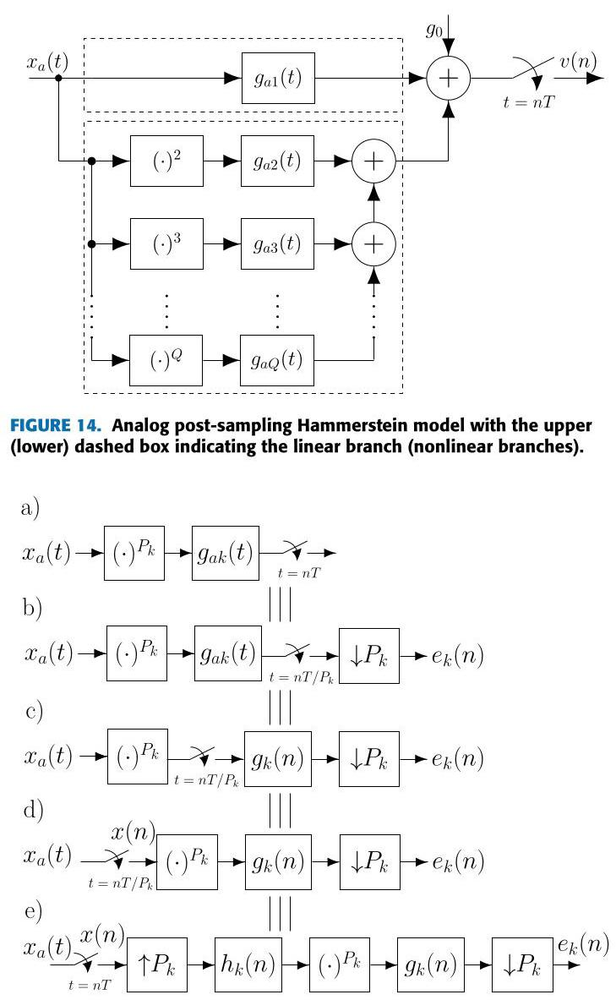

FIGURE 15. Derivation of the discrete-time equivalence of branch $k$ in Fig. 14.

图15. 图14中分支$k$的离散时间等效模型的推导。

## A. EQUIVALENT DISCRETE-TIME MODEL

## A. 等效离散时间模型

Starting with the branch scheme in Fig. 15(a), we first replace the sampling at the output with a ${P}_{k}$ -fold faster sampler ${}^{13}$ followed by a downsampler that discards the redundant samples, resulting in Fig. 15(b). Next, we note that the sampling at the output of the filter ${g}_{ak}\left( t\right)$ fulfills the sampling theorem for the sampling rate ${P}_{k}/T$ . Hence, as seen in Fig. 15(c), the filter ${g}_{ak}\left( t\right)$ followed by the sampler can be replaced by a sampler followed by a digital filter ${g}_{k}\left( n\right)$ having the same frequency response as ${g}_{ak}\left( t\right)$ , thus ${G}_{k}\left( {e}^{{j\omega T}/{P}_{k}}\right)  = {G}_{ak}\left( {j\omega }\right)$ , in the frequency region $\omega  \in  \left\lbrack  {0,\pi {P}_{k}/T}\right\rbrack$ . As the nonlinearity is static (memoryless), we can then interchange the order of the sampler and nonlinearity, as seen in Fig. 15(d). Now, we note that ${x}_{a}\left( t\right)$ is oversampled ${P}_{k}$ times. Therefore, the input to the nonlinearity can equivalently be obtained through sampling at the original lower rate $1/T$ followed by interpolation by ${P}_{k}$ , the latter being represented by upsampling by ${P}_{k}$ followed by the discrete-time interpolation filter ${h}_{k}\left( n\right)$ . This yields Fig. 15(e). Making use of this equivalence, the discrete-time equivalence to the whole scheme in Fig. 14 is obtained according to Fig. 16. Here, we have also utilized that, in the linear branch, ${g}_{a1}\left( t\right)$ can be directly modeled by its discrete-time counterpart ${g}_{1}\left( n\right)$ since filtering followed by sampling is equivalent to sampling followed by filtering, provided that only linear operations are involved and the signal is Nyquist sampled. Based on the discrete-time equivalence derived above, the linearizers follow in the same way as in Sections II and III as detailed below. The design of the linearizers follows the same procedure as proposed in Section III.

从图15(a)中的分支方案开始，我们首先将输出端的采样替换为一个采样速度快${P}_{k}$倍的采样器${}^{13}$，然后是一个丢弃冗余样本的下采样器，得到图15(b)。接下来，我们注意到滤波器${g}_{ak}\left( t\right)$输出端的采样满足采样率为${P}_{k}/T$时的采样定理。因此，如图15(c)所示，滤波器${g}_{ak}\left( t\right)$后面跟着采样器可以被一个采样器后面跟着一个频率响应与${g}_{ak}\left( t\right)$相同的数字滤波器${g}_{k}\left( n\right)$所取代，从而在频率区域$\omega  \in  \left\lbrack  {0,\pi {P}_{k}/T}\right\rbrack$中${G}_{k}\left( {e}^{{j\omega T}/{P}_{k}}\right)  = {G}_{ak}\left( {j\omega }\right)$。由于非线性是静态的(无记忆的)，我们可以交换采样器和非线性的顺序，如图15(d)所示。现在，我们注意到${x}_{a}\left( t\right)$被过采样了${P}_{k}$倍。因此，非线性部分的输入可以等效地通过以原始较低速率$1/T$采样然后以${P}_{k}$进行插值来获得，后者由以${P}_{k}$进行上采样然后是离散时间插值滤波器${h}_{k}\left( n\right)$来表示。这就得到了图15(e)。利用这种等效性，根据图16得到了图14中整个方案的离散时间等效。这里，我们还利用了，在线性分支中，${g}_{a1}\left( t\right)$可以直接由其离散时间对应物${g}_{1}\left( n\right)$建模，因为先滤波后采样等效于先采样后滤波，前提是只涉及线性操作且信号是奈奎斯特采样的。基于上述推导的离散时间等效，线性化器的设计与第二节和第三节中的方式相同，如下所述。线性化器的设计遵循与第三节中提出的相同程序。

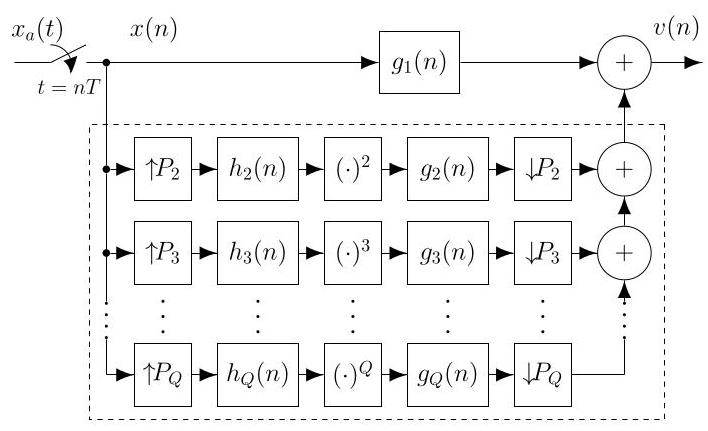

FIGURE 16. Discrete-time equivalence of the scheme in Fig. 14.

图16. 图14中方案的离散时间等效图。

## B. HAMMERSTEIN LINEARIZER

## B. 哈默斯坦线性化器

For the Hammerstein linearizer, the compensated signal $y\left( n\right)$ is again generated in the same way as the distorted signal is modeled. To avoid filtering operations at the higher sampling rate [see Fig. 15(e)] we make use of polyphase decomposition [42], and write the transfer functions ${H}_{k}\left( z\right)$ and ${G}_{k}\left( z\right)$ according to

对于哈默斯坦线性化器，补偿信号$y\left( n\right)$的生成方式与对失真信号建模的方式相同。为避免在较高采样率下进行滤波操作[见图15(e)]，我们采用多相分解[42]，并根据下式写出传递函数${H}_{k}\left( z\right)$和${G}_{k}\left( z\right)$:

$$
{H}_{k}\left( z\right)  = \mathop{\sum }\limits_{{i = 0}}^{{{P}_{k} - 1}}{z}^{-i}{H}_{ki}\left( {z}^{{P}_{k}}\right) \tag{13}
$$

and

以及

$$
{G}_{k}\left( z\right)  = \mathop{\sum }\limits_{{i = 0}}^{{{P}_{k} - 1}}{z}^{i}{G}_{ki}\left( {z}^{{P}_{k}}\right) , \tag{14}
$$

respectively. Through the use of the corresponding polyphase realizations, each nonlinear branch can then be implemented according to Fig. 17(b) where all operations are carried out at the input-output sampling rate. Utilizing this, it is observed that the final discrete-time model and linearizer belong to the class of parallel LNL systems, where each branch comprises a filter (here polyphase component), a static nonlinearity ${\left( \cdot \right) }^{{P}_{k}}$ , and a filter whose coefficients are determined by the ADI's distortion. The main difference from the Hammerstein linearizer in Section II (Fig. 2) is that, here, each static nonlinearity ${\left( \cdot \right) }^{{P}_{k}}$ is present in ${P}_{k}$ polyphase branches and each branch incorporates the interpolation filters' polyphase components [Fig. 17(b)].

分别。通过使用相应的多相实现方式，每个非线性分支随后可根据图17(b)实现，其中所有操作均在输入 - 输出采样率下进行。利用这一点，可以观察到最终的离散时间模型和线性化器属于并行LNL系统类别，其中每个分支包括一个滤波器(这里是多相分量)、一个静态非线性${\left( \cdot \right) }^{{P}_{k}}$以及一个其系数由ADI失真确定的滤波器。与第二节中的哈默斯坦线性化器(图2)的主要区别在于，这里每个静态非线性${\left( \cdot \right) }^{{P}_{k}}$存在于${P}_{k}$个多相分支中，并且每个分支包含插值滤波器的多相分量[图17(b)]。

---

${}^{13}$ It is assumed here that ${P}_{k} = k$ , for $k = 2,3,\ldots , Q$ ,(Fig. 14), but in general, ${P}_{k}$ can take on values from a set of integer values.

${}^{13}$ 这里假设${P}_{k} = k$，对于$k = 2,3,\ldots , Q$，(图14)，但一般来说，${P}_{k}$可以取一组整数值中的值。

---

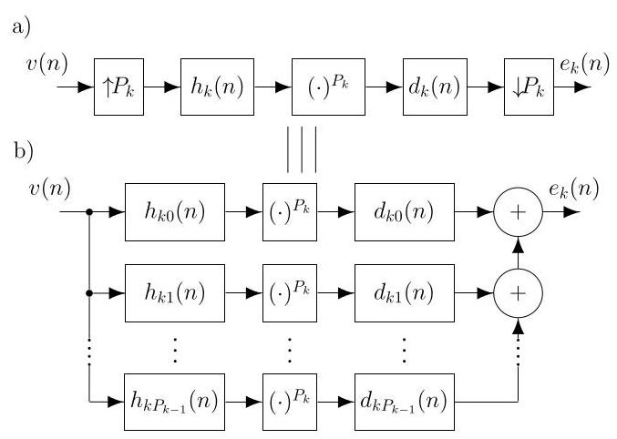

FIGURE 17. Nonlinear-branch implementation of the Hammerstein linearizer.

图17. 哈默斯坦线性化器的非线性分支实现。

## 1) Implementation Complexity

## 1) 实现复杂度

The interpolation filters are excluded in the complexity comparisons as they are common for the Hammerstein and the proposed schemes. Compared with the pre-sampling scheme, the number of multiplications required for the post-sampling Hammerstein linearizer increases because several copies of each static nonlinearity ${\left( \cdot \right) }^{{P}_{k}}$ need to be implemented and the generation of the different nonlinearities can not be shared between the branches as they have different inputs (different polyphase components' outputs). Thus, the number of multiplications required to correct each output sample increases to $\left( {M + 1}\right)  \times  \left( {K + 1}\right)  + S\left( {P}_{K + 1}\right)$ , where

在复杂度比较中不考虑插值滤波器，因为它们对于哈默斯坦方案和所提出的方案是相同的。与预采样方案相比，采样后哈默斯坦线性化器所需的乘法次数增加，因为每个静态非线性${\left( \cdot \right) }^{{P}_{k}}$需要实现多个副本，并且不同非线性的生成不能在分支之间共享，因为它们有不同的输入(不同多相分量的输出)。因此，校正每个输出样本所需的乘法次数增加到$\left( {M + 1}\right)  \times  \left( {K + 1}\right)  + S\left( {P}_{K + 1}\right)$，其中

$$
S\left( {P}_{K + 1}\right)  = \mathop{\sum }\limits_{{k = 2}}^{{P}_{K + 1}}\underset{{S}_{k}}{\underbrace{\min \left( {k, M + 1}\right) \phi \left\{  {\left( \cdot \right) }^{k}\right\}  }} \tag{15}
$$

represents the number of multiplications required to create all the static nonlinearities ${\left( \cdot \right) }^{k}$ for the nonlinear branches $k = 2,\cdots ,{P}_{K + 1}$ . Here, $\phi \left\{  {\left( \cdot \right) }^{k}\right\}$ represents the minimum number of multiplications required to generate one of the nonlinearities ${\left( \cdot \right) }^{k}$ in a particular branch $k$ , which can be found through an optimal addition-chain exponentiation algorithm [43], whereas ${S}_{k}$ represents the total nonlinearity-multiplication complexity of branch $k$ . Further, when the filter length $M + 1$ is smaller than ${P}_{k} = k, k - M - 1$ polyphase components become zero, which explains the term $\min \left( {k, M + 1}\right)$ in the summation. To exemplify, the minimum number of multiplications to generate all the nonlinearities ${\left( \cdot \right) }^{k}$ , for ${P}_{K + 1} = {10}$ and $M = 2\left( {M + 1 \geq  {10}}\right)$ , is $S\left( {10}\right)  = {77}\left( {177}\right)$ , distributed as ${S}_{2} = 2\left( 2\right) ,{S}_{3} = 6\left( 6\right) ,{S}_{4} = 6\left( 8\right)$ , and so on until ${S}_{10} = {12}\left( {40}\right)$ with the sequence ${}^{14}$ of four multiplications $\left( \cdot \right) \overset{\times \left( \cdot \right) }{ \rightarrow  }{\left( \cdot \right) }^{2}\overset{\times \left( \cdot \right) }{ \rightarrow  }{\left( \cdot \right) }^{3}\overset{\times {\left( \cdot \right) }^{2}}{ \rightarrow  }{\left( \cdot \right) }^{5}\overset{\times {\left( \cdot \right) }^{5}}{ \rightarrow  }{\left( \cdot \right) }^{10}.$

表示为非线性分支$k = 2,\cdots ,{P}_{K + 1}$创建所有静态非线性${\left( \cdot \right) }^{k}$所需的乘法次数。这里，$\phi \left\{  {\left( \cdot \right) }^{k}\right\}$表示在特定分支$k$中生成一个非线性${\left( \cdot \right) }^{k}$所需的最少乘法次数，可通过最优加法链指数算法[43]找到，而${S}_{k}$表示分支$k$的总非线性乘法复杂度。此外，当滤波器长度$M + 1$小于${P}_{k} = k, k - M - 1$时，多相分量变为零，这解释了求和项中的$\min \left( {k, M + 1}\right)$。举例来说，对于${P}_{K + 1} = {10}$和$M = 2\left( {M + 1 \geq  {10}}\right)$，生成所有非线性${\left( \cdot \right) }^{k}$所需的最少乘法次数为$S\left( {10}\right)  = {77}\left( {177}\right)$，分布为${S}_{2} = 2\left( 2\right) ,{S}_{3} = 6\left( 6\right) ,{S}_{4} = 6\left( 8\right)$，依此类推，直到${S}_{10} = {12}\left( {40}\right)$，其序列${}^{14}$包含四个乘法$\left( \cdot \right) \overset{\times \left( \cdot \right) }{ \rightarrow  }{\left( \cdot \right) }^{2}\overset{\times \left( \cdot \right) }{ \rightarrow  }{\left( \cdot \right) }^{3}\overset{\times {\left( \cdot \right) }^{2}}{ \rightarrow  }{\left( \cdot \right) }^{5}\overset{\times {\left( \cdot \right) }^{5}}{ \rightarrow  }{\left( \cdot \right) }^{10}.$

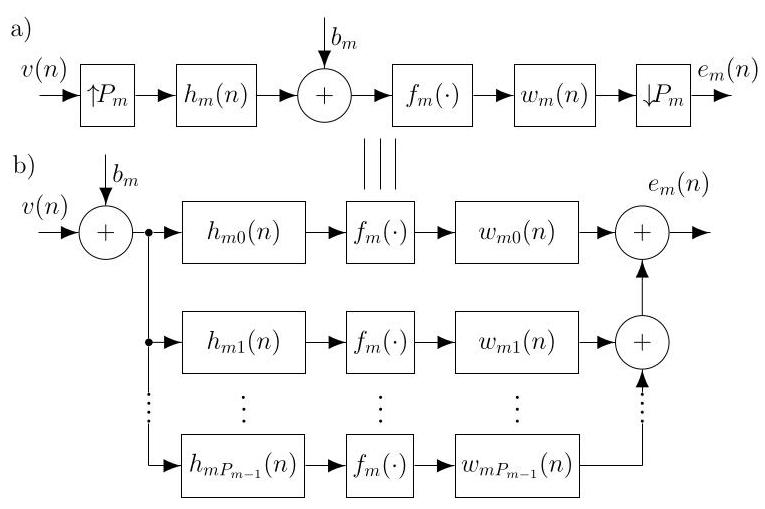

FIGURE 18. Nonlinear-branch implementation of the proposed linearizer.

图18. 所提出的线性化器的非线性分支实现。

## C. PROPOSED LINEARIZER

## C. 所提出的线性化器

Utilizing again the polyphase decomposition of ${H}_{k}\left( z\right)$ in (13) and that of ${w}_{m}\left( n\right)$ according to

再次利用(13)中${H}_{k}\left( z\right)$的多相分解以及根据${w}_{m}\left( n\right)$的多相分解

$$
{W}_{m}\left( z\right)  = \mathop{\sum }\limits_{{i = 0}}^{{{P}_{m} - 1}}{z}^{i}{W}_{mi}\left( {z}^{{P}_{m}}\right) , \tag{16}
$$

and the corresponding polyphase realizations, each nonlinear branch in the proposed linearizer can be implemented according to Fig. 18(b), where the bias values have been moved to the input (see the explanation below). As seen, for the proposed linearizer, the static nonlinearities ${\left( \cdot \right) }^{p}$ present in the Hammerstein linearizer are again replaced with additive bias values followed by the simpler nonlinear modulus or ReLU operations (compare Figs. 17 and 18).

以及相应的多相实现，所提出的线性化器中的每个非线性分支都可以根据图18(b)实现，其中偏置值已移至输入端(见下文解释)。如图所示，对于所提出的线性化器，哈默斯坦线性化器中存在的静态非线性${\left( \cdot \right) }^{p}$再次被加法偏置值取代，随后是更简单的非线性模量或ReLU运算(比较图17和18)。

## 1) Implementation Complexity

## 1) 实现复杂度

For the proposed linearizer with $N = K$ , the number of multiplications is always $\left( {M + 1}\right)  \times  \left( {K + 1}\right)$ as there are no multiplications involved in the nonlinear operations. If implemented straightforwardly, this comes at the cost of an increase in the number of bias additions as ${P}_{m}$ such additions are required in each nonlinear branch. However, observing that the polyphase components approximate unity-gain allpass filters [44], one can carry out only one bias addition at the input of each nonlinear branch as seen in Fig. 18. This is because a

对于具有$N = K$的所提出的线性化器，乘法次数始终为$\left( {M + 1}\right)  \times  \left( {K + 1}\right)$，因为非线性运算中不涉及乘法。如果直接实现，这将以增加偏置加法次数为代价，因为每个非线性分支需要${P}_{m}$次这样的加法。然而，观察到多相分量近似为单位增益全通滤波器[44]，如图18所示，在每个非线性分支的输入端只需进行一次偏置加法。这是因为

${}^{14}$ Note that the sequences $\left( \cdot \right) \xrightarrow[]{\times \left( \cdot \right) }{\left( \cdot \right) }^{2}\xrightarrow[]{\times {\left( \cdot \right) }^{2}}{\left( \cdot \right) }^{4}\xrightarrow[]{\times {\left( \cdot \right) }^{2}}{\left( \cdot \right) }^{6}\xrightarrow[]{\times {\left( \cdot \right) }^{4}}{\left( \cdot \right) }^{10}$ , and $\left( \cdot \right) \overset{\times \left( \cdot \right) }{ \rightarrow  }{\left( \cdot \right) }^{2}\overset{\times {\left( \cdot \right) }^{2}}{ \rightarrow  }{\left( \cdot \right) }^{4}\overset{\times {\left( \cdot \right) }^{4}}{ \rightarrow  }{\left( \cdot \right) }^{8}\overset{\times {\left( \cdot \right) }^{2}}{ \rightarrow  }{\left( \cdot \right) }^{10}$ can also be used to obtain the nonlinearity ${\left( \cdot \right) }^{10}$ with four multiplications. constant ${b}_{m}$ at the input of a linear and time-invariant filter ${h}_{mk}\left( n\right)$ results in the constant ${b}_{m}{H}_{mk}\left( {e}^{j0}\right)  = {b}_{m}$ at its output for a unity-gain allpass filter with a real impulse response ${h}_{mk}\left( n\right)$ which is the assumption here. In this way, the overall number of bias additions will be the same as in the proposed pre-sampling scheme in Section III.

${}^{14}$ 请注意，序列$\left( \cdot \right) \xrightarrow[]{\times \left( \cdot \right) }{\left( \cdot \right) }^{2}\xrightarrow[]{\times {\left( \cdot \right) }^{2}}{\left( \cdot \right) }^{4}\xrightarrow[]{\times {\left( \cdot \right) }^{2}}{\left( \cdot \right) }^{6}\xrightarrow[]{\times {\left( \cdot \right) }^{4}}{\left( \cdot \right) }^{10}$和$\left( \cdot \right) \overset{\times \left( \cdot \right) }{ \rightarrow  }{\left( \cdot \right) }^{2}\overset{\times {\left( \cdot \right) }^{2}}{ \rightarrow  }{\left( \cdot \right) }^{4}\overset{\times {\left( \cdot \right) }^{4}}{ \rightarrow  }{\left( \cdot \right) }^{8}\overset{\times {\left( \cdot \right) }^{2}}{ \rightarrow  }{\left( \cdot \right) }^{10}$也可用于通过四次乘法获得非线性度${\left( \cdot \right) }^{10}$。线性时不变滤波器${h}_{mk}\left( n\right)$输入端的常数${b}_{m}$，对于具有实脉冲响应的单位增益全通滤波器${h}_{mk}\left( n\right)$(这里是假设)，在其输出端会产生常数${b}_{m}{H}_{mk}\left( {e}^{j0}\right)  = {b}_{m}$。这样，偏置加法的总数将与第三节中提出的预采样方案相同。

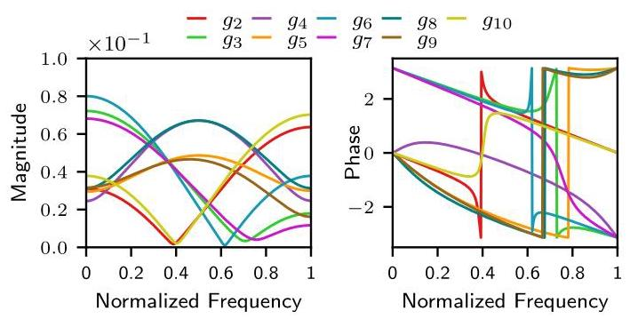

FIGURE 19. Magnitude and phase responses of ${g}_{p}\left( k\right)$ , for $p = 2,\cdots ,{10}$ , in Example 4.

图19. 示例4中${g}_{p}\left( k\right)$对于$p = 2,\cdots ,{10}$的幅度和相位响应。

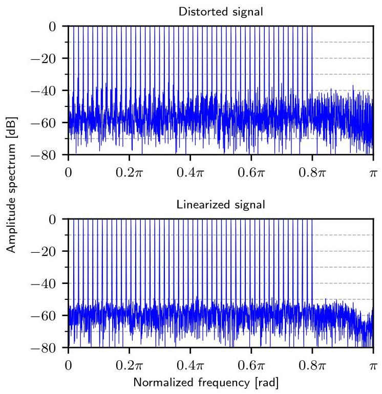

FIGURE 20. Spectrum before and after linearization for a multi-sine signal using the proposed linearizer with a filter order of $M = 6$ and $N = {16}$ nonlinear branches (Example 4).

图20. 使用所提出的线性化器对多正弦信号进行线性化前后的频谱，该线性化器具有$M = 6$阶滤波器和$N = {16}$个非线性分支(示例4)。

## D. SIMULATIONS AND RESULTS

## D. 仿真与结果

We assume a distorted signal $v\left( n\right)$ generated in the analog domain through the discrete-time equivalence in Fig. 16. The nonlinear-model coefficients were chosen in the same way as before (see Footnote 4), thus here with ${g}_{0} = 0,{g}_{1}\left( k\right)  = \left\lbrack  {0,1,0}\right\rbrack$ , and ${g}_{p}\left( k\right)$ randomly generated for $k = 0,1,\ldots , D, p = 2,3,\ldots , Q$ with $D = 2$ and $Q = {10}$ . We thus assume a distorted signal $v\left( n\right)$ exhibiting second-order filtered distortion, with ${g}_{p}\left( k\right)$ randomly generated with frequency responses as seen in Fig. 19.

我们假设通过图16中的离散时间等效在模拟域中生成的失真信号$v\left( n\right)$。非线性模型系数的选择方式与之前相同(见脚注4)，因此这里${g}_{0} = 0,{g}_{1}\left( k\right)  = \left\lbrack  {0,1,0}\right\rbrack$和${g}_{p}\left( k\right)$是为$k = 0,1,\ldots , D, p = 2,3,\ldots , Q$随机生成的，其中$D = 2$和$Q = {10}$。因此，我们假设失真信号$v\left( n\right)$呈现二阶滤波失真，${g}_{p}\left( k\right)$的频率响应如图19所示随机生成。

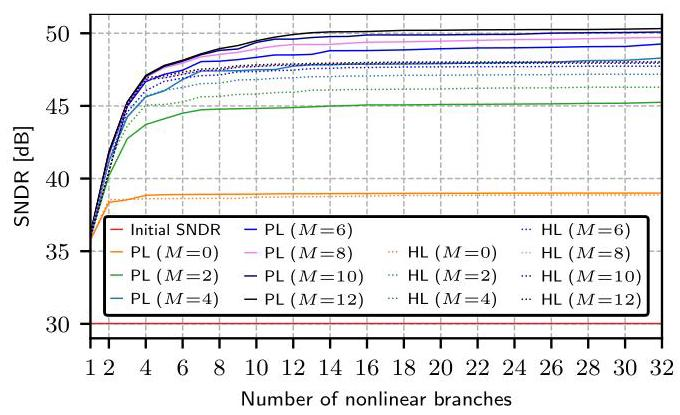

FIGURE 21. SNDR versus number of nonlinearity branches. Here PL stands for the proposed linearizer and HL for the Hammerstein linearizer. (Example 4)

图21. 信噪失真比与非线性分支数量的关系。这里PL代表所提出的线性化器，HL代表哈默斯坦线性化器。(示例4)

Example 4: We consider a set of multi-tone signals similar to those in Example 1, and Example 3, generated through (11), with ${A}_{k} = 1$ for all $k,{\omega }_{k}$ computed as in (12), and ${\alpha }_{k}$ also randomly selected from $\{ \pi /4, - \pi /4,{3\pi }/4, - {3\pi }/4\}$ , corresponding to QPSK modulation. Here, we use 50 active carriers out of 64, covering approximately ${80}\%$ of the first Nyquist band. Both the reference and distorted signals are quantized to 10 bits for a data set with $R = {50}$ and ${R}^{\left( eval\right) } = {5000}$ signals. Figure 20 displays the spectrum before and after linearization for one of the multi-tone signals, whereas Fig. 21 plots the mean SNDR over all signals for each instance of the proposed and Hammerstein linearizers.

示例4:我们考虑一组类似于示例1和示例3中的多音信号，这些信号通过(11)生成，其中所有$k,{\omega }_{k}$的${A}_{k} = 1$如(12)中所计算，并且${\alpha }_{k}$也从$\{ \pi /4, - \pi /4,{3\pi }/4, - {3\pi }/4\}$中随机选择，对应于QPSK调制。这里，我们在64个载波中使用50个有源载波，覆盖了第一个奈奎斯特频段的大约${80}\%$。对于具有$R = {50}$和${R}^{\left( eval\right) } = {5000}$信号的数据集，参考信号和失真信号都被量化为10位。图20显示了其中一个多音信号线性化前后的频谱，而图21绘制了所提出的线性化器和哈默斯坦线性化器每个实例下所有信号的平均SNDR。

In this example, the SNR is approximately 53 dB without distortion, whereas the SNDR is about ${30}\mathrm{\;{dB}}$ for the distorted signals before linearization. As seen in Fig. 21, with a linearizer filter order of $M = 2$ , the SNDR can be enhanced by about ${15}\mathrm{\;{dB}}$ . With $M = 4$ , an additional $3\mathrm{\;{dB}}$ SNDR improvement can be achieved. Increasing the order to $M = {12}$ can further enhance the SNDR by 3 dB, totaling a 21 dB improvement and approaching 51 dB, which is about 2 dB below the SNR. Beyond this level, additional increases in the linearizer filter order yield progressively smaller improvements, making further enhancements computationally inefficient. Hence, as for the pre-sampling linearizer, there is a clear trade-off between additional computational complexity and SNDR improvement. For the Hammerstein linearizer, the SNDR saturates at a somewhat lower level due to ${L}_{2}$ - regularization, which is needed to keep the multiplier values small to avoid large quantization noise amplification, as discussed earlier in Section III. Finally, comparing this example with Examples 1-3, where 12-bit data was used, it is seen that the data wordlength does not affect the robustness, but only the SNDR levels (compare Figs. 7 and 21).

在本示例中，无失真时SNR约为53 dB，而线性化前失真信号的SNDR约为${30}\mathrm{\;{dB}}$。如图21所示，对于线性化器滤波器阶数为$M = 2$的情况，SNDR可提高约${15}\mathrm{\;{dB}}$。使用$M = 4$，可实现额外的$3\mathrm{\;{dB}}$SNDR改善。将阶数增加到$M = {12}$可使SNDR进一步提高3 dB，总共提高21 dB并接近51 dB，比SNR低约2 dB。超过此水平，线性化器滤波器阶数的进一步增加带来的改善逐渐变小，使得进一步增强在计算上效率低下。因此，对于预采样线性化器，在额外的计算复杂度和SNDR改善之间存在明显的权衡。对于哈默斯坦线性化器，由于${L}_{2}$正则化，SNDR在略低的水平饱和，如第三节前面所讨论的，这是为了保持乘法器值较小以避免大量量化噪声放大。最后，将此示例与使用12位数据的示例1 - 3进行比较，可以看出数据字长不影响鲁棒性，只影响SNDR水平(比较图7和图21)。

## 1) Implementation Complexity

## 1) 实现复杂度

An observation from Fig. 21 is that the Hammerstein lin-earizer appears slightly better than the proposed one when increasing the number of branches for the case with $M = 2$ . However, when comparing the SNDR against the number of multiplications for both methods, the proposed linearizer achieves a higher SNDR with lower complexity. This is illustrated in Fig. 22.

从图21可以观察到，在$M = 2$情况下增加分支数量时，哈默斯坦线性化器似乎比所提出的线性化器略好。然而，当比较两种方法的SNDR与乘法次数时，所提出的线性化器以更低的复杂度实现了更高的SNDR。图22对此进行了说明。

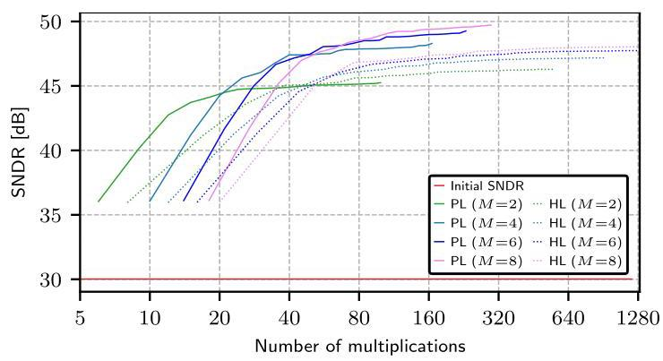

FIGURE 22. SNDR versus number of multiplications in Example 4. Here PL stands for the proposed linearizer and HL for the Hammerstein linearizer.

图22. 示例4中SNDR与乘法次数的关系。这里PL代表所提出的线性化器，HL代表哈默斯坦线性化器。

It is seen that for any chosen Hammerstein linearizer configuration, there is always a configuration in the proposed method that achieves superior performance with lower complexity. The savings range from a few percent up to about 60% depending on the scenario. For example, for $M = 4$ , to reach an SNDR of ${46}\mathrm{\;{dB}}$ , the proposed linearizer requires 30 multiplications, whereas the Hammerstein linearizer requires 76, corresponding to a saving of ${46}/{76} \approx  {60.5}\%$ .

可以看出，对于任何选定的哈默斯坦线性化器配置，在所提出的方法中总是存在一种配置，能够以更低的复杂度实现更好的性能。节省范围从百分之几到约60%，具体取决于场景。例如，对于$M = 4$，要达到${46}\mathrm{\;{dB}}$的SNDR，所提出的线性化器需要30次乘法，而哈默斯坦线性化器需要76次，节省了${46}/{76} \approx  {60.5}\%$。

Compared with the pre-sampling linearizers, the difference in complexity is larger here for the post-sampling linearizers. This is because the overall complexity of the static nonlinearities ${\left( \cdot \right) }^{p}$ is much higher here since several copies of them need to be implemented, and they have to be implemented separately. In the pre-sampling case, one can share computations between the different nonlinearities, which is why it suffices to compute $K$ multiplications in total to generate all nonlinearities ${\left( \cdot \right) }^{p}$ in Fig. 2. Hence, in general, the proposed linearizer is more efficient in the post-sampling case than in the pre-sampling case, when comparing with the corresponding Hammerstein linearizers.

与预采样线性化器相比，后采样线性化器在这里的复杂度差异更大。这是因为这里静态非线性${\left( \cdot \right) }^{p}$的总体复杂度要高得多，因为需要实现它们的多个副本，并且必须单独实现。在预采样情况下，可以在不同的非线性之间共享计算，这就是为什么在图2中总共只需计算$K$次乘法就能生成所有非线性${\left( \cdot \right) }^{p}$。因此，一般来说，与相应的哈默斯坦线性化器相比，所提出的线性化器在后采样情况下比在预采样情况下更高效。

Example 5: To further illustrate the robustness of the proposed post-sampling linearizer, we have also evaluated it using the same type of multi-sine signal as in Example 4, but with some subcarriers set to zero, and a bandpass filtered white-noise signal covering 60% of the Nyquist band. As illustrated in Figs. 23 and 24 for each of these signals, essentially the same results are obtained as before. There is less than 1 dB SNDR degradation compared to the signals in Example 4 for which the linearizer was designed.

示例5:为了进一步说明所提出的采样后线性化器的鲁棒性，我们还使用了与示例4中相同类型的多正弦信号对其进行评估，但将一些子载波设置为零，并使用覆盖奈奎斯特频段60%的带通滤波白噪声信号。如图23和图24所示，对于这些信号中的每一个，获得的结果与之前基本相同。与设计线性化器时所使用的示例4中的信号相比，SNDR下降小于1 dB。

## V. LINEARIZATION PERFORMANCE FOR CIRCUIT-SIMULATED DATA

## V. 电路仿真数据的线性化性能

Example 6: This example will demonstrate that the proposed design and linearizers also work when the reference signals are not known but have to be estimated. For this purpose, we assess the performance of the proposed linearizer applied on data obtained from circuit simulations in Cadence, and again compare with the Hammerstein linearizer.

示例6:本示例将证明，当参考信号未知但必须进行估计时，所提出的设计和线性化器也能正常工作。为此，我们评估了所提出的线性化器应用于从Cadence电路仿真中获得的数据时的性能，并再次与哈默斯坦线性化器进行比较。

We use a dataset of distorted single-tone complex signals provided in an industry-collaboration project in which an internal non-commercial ADC was designed. The signals were initially generated at an RF frequency of ${3.6}\mathrm{{GHz}}$ and subsequently demodulated to their corresponding complex baseband signals. As this paper focuses on real signals, we use the real parts of the signals in the evaluation. Further, in the design of the linearizers, it is here necessary to estimate the reference signals, as only the frequencies are known but not the exact gain and phase offsets of the signals. We have used the least-squares based estimation technique detailed in Chapter 1.6 of [45] for this purpose.

我们使用了一个行业合作项目中提供的失真单音复信号数据集，该项目设计了一个内部非商业ADC。信号最初在${3.6}\mathrm{{GHz}}$的射频频率下生成，随后解调为相应的复基带信号。由于本文关注的是实信号，我们在评估中使用信号的实部。此外，在设计线性化器时，这里需要估计参考信号，因为仅知道频率，而信号的确切增益和相位偏移未知。为此，我们使用了[45]第1.6章中详细介绍的基于最小二乘法的估计技术。

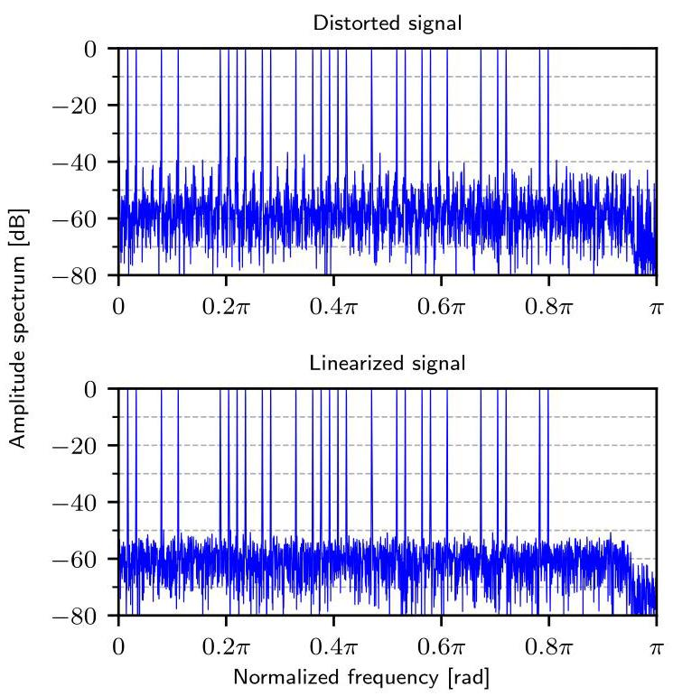

FIGURE 23. Spectrum before and after linearization for a multi-sine signal with null subcarriers using the proposed linearizer with a filter order of $M = 6$ and $N = {16}$ nonlinear branches (Example 5).

图23. 使用滤波器阶数为$M = 6$和$N = {16}$个非线性分支的所提出的线性化器对具有零子载波的多正弦信号进行线性化前后的频谱(示例5)。

The signal frequencies are $f = {f}_{s} \times  \left\lbrack  {{73},{93},{113}}\right\rbrack  /L$ , where the sampling frequency is ${f}_{s} = {10}\mathrm{{GS}}/\mathrm{s}$ and the signal length is $L = {8192}$ . It corresponds to the rounded frequencies [89.1, 113.5, 137.9] MHz. The signal level is approximately -1 dB full scale (dBFS). In the project, the focus was to improve the spurious-free dynamic range (SFDR), measured in dBFS, which is why we use this metric here as well as the SNDR. Further, as the baseband signal bandwidth (below 138 MHz) is much smaller than the sampling frequency, we use the pre-sampling linearizers in Section III (i.e., without additional interpolation).

信号频率为$f = {f}_{s} \times  \left\lbrack  {{73},{93},{113}}\right\rbrack  /L$，其中采样频率为${f}_{s} = {10}\mathrm{{GS}}/\mathrm{s}$，信号长度为$L = {8192}$。它对应于四舍五入后的频率[89.1, 113.5, 137.9] MHz。信号电平约为-1 dB满量程(dBFS)。在该项目中，重点是提高以dBFS为单位测量的无杂散动态范围(SFDR)，这就是为什么我们在这里使用该指标以及SNDR的原因。此外，由于基带信号带宽(低于138 MHz)远小于采样频率，我们使用第三节中的预采样线性化器(即无需额外插值)。

It is observed that the signals contain high-order nonlinearity terms. The ${x}^{11}$ -term is around $- {65}\mathrm{{dBFS}}$ , whereas power terms above 11 are below -80 dBFS. The nonlinearities also have a rather strong frequency dependency, which emanates from several sources (mixers, filters, and ADCs). This leads to relatively high filter orders for the linearizer filters when large SFDR improvements are targeted. This is because abrupt frequency dependent changes (corresponding to narrow transitions bands) require high filter orders [46]. For only a few signals, one may use lower filter orders, but then the quantization noise will be amplified due to ill-conditioned filter design.

可以观察到信号包含高阶非线性项。${x}^{11}$项约为$- {65}\mathrm{{dBFS}}$，而高于11的功率项低于-80 dBFS。非线性也具有相当强的频率依赖性，这源于多个来源(混频器、滤波器和ADC)。当目标是大幅提高SFDR时，这会导致线性化器滤波器的阶数相对较高。这是因为与频率相关的突然变化(对应于窄过渡带)需要高阶滤波器[46]。对于少数信号，可以使用较低的滤波器阶数，但由于滤波器设计条件不佳，量化噪声会被放大。

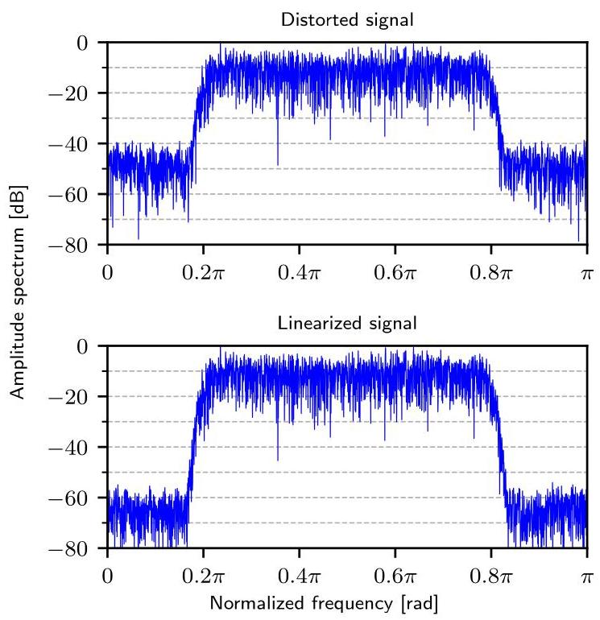

FIGURE 24. Spectrum before and after linearization for a bandpass filtered white-noise signal using the proposed linearizer with a filter order of $M = 6$ and $N = {16}$ nonlinear branches.

图24. 使用滤波器阶数为$M = 6$和$N = {16}$个非线性分支的所提出的线性化器对带通滤波白噪声信号进行线性化前后的频谱。

Using the proposed linearizer with 9 branches, to suppress all the nonlinearities to around -75 dBFS we need a filter order of $M = {22}$ . For this design, the SNDR is ${68}\mathrm{\;{dB}}$ . The Hammerstein linearizer with the same number of branches and filter order achieves practically the same SFDR and SNDR. Recall that the performance of the proposed pre-sampling linearizer is comparable to that of the corresponding Hammerstein linearizer for larger values of $M$ , both regarding SNDR (and SFDR) improvements and implementation complexity (see the discussion in Section III-C1). Again, however, the proposed linearizer has the advantage that it does not require internal data quantizations. The spectra of the linearized signals are as shown in Fig. 25 when using the proposed linearizer.

使用具有9个分支的所提出的线性化器，为了将所有非线性抑制到约-75 dBFS，我们需要滤波器阶数为$M = {22}$。对于此设计，SNDR为${68}\mathrm{\;{dB}}$。具有相同分支数和滤波器阶数的哈默斯坦线性化器实现了几乎相同的SFDR和SNDR。回想一下，对于较大的$M$值，所提出的预采样线性化器在SNDR(和SFDR)改善以及实现复杂度方面的性能与相应的哈默斯坦线性化器相当(见第三节C1部分的讨论)。然而，所提出的线性化器的优点是它不需要内部数据量化。使用所提出的线性化器时，线性化后信号的频谱如图25所示。

For comparison, commercial GS/s-rate 12-bit ADCs operating in similar bandwidth regimes typically report ENOB values around 8-10 (corresponding to SNDR values around 50-62 dB) and SFDR values in the 65-78 dBFS range under standard single-tone testing (see for example [47]). Hence, the 68 dB SNDR and 75 dBFS SFDR obtained here after linearization represent state-of-the art performance.

作为对比，在类似带宽条件下工作的商用GS/s速率12位ADC，在标准单音测试中(例如参见[47])，通常报告的ENOB值约为8 - 10(对应SNDR值约为50 - 62 dB)，SFDR值在65 - 78 dBFS范围内。因此，线性化后在此处获得的68 dB SNDR和75 dBFS SFDR代表了当前的先进性能。

## VI. ALTERNATIVE NONLINEAR FUNCTIONS

## 六、替代非线性函数

In this paper, the nonlinear functions ${f}_{m}\left( v\right)$ are chosen as either the modulus or ReLU due to their simplicity and low complexity in hardware implementation [27], [28]. We have also considered other common nonlinear functions such as the sigmoid, hyperbolic tangent, and exponential linear unit (ELU), but they significantly increase the implementation complexity for a targeted SNDR, as they require additional multiplications and additions. To illustrate this, Fig. 26 shows, for the second-order distortion in Example 3, the performance of the different nonlinear functions in terms of SNDR versus the number of multiplications. As seen, the use of these alternative nonlinear functions leads to worse performance and substantially increased complexity compared to the use of the modulus (or ReLU) as well as the Hammerstein nonlinearities. Here, the complexities when using the alternative functions are based on their Taylor expansions with three and five terms, and not counting trivial multiplications like 1/2. The plot in Fig. 26 also includes the nonlinear function leaky ReLU (with negative-slope coefficient $\alpha  = {0.1}$ ) which leads to a linearizer with approximately the same complexity as for the Hammerstein linearizer (with the same number of branches), but also with worse linearization performance when the number of branches is relatively small.

在本文中，非线性函数${f}_{m}\left( v\right)$被选为模函数或ReLU，这是由于它们的简单性以及在硬件实现中的低复杂度[27, 28]。我们也考虑了其他常见的非线性函数，如Sigmoid函数、双曲正切函数和指数线性单元(ELU)，但对于目标SNDR，它们会显著增加实现复杂度，因为它们需要额外的乘法和加法运算。为了说明这一点，图26展示了在示例3中二阶失真情况下，不同非线性函数在SNDR与乘法次数方面的性能。可以看出，与使用模函数(或ReLU)以及哈默斯坦非线性函数相比，使用这些替代非线性函数会导致性能变差且复杂度大幅增加。这里，使用替代函数时的复杂度基于它们具有三项和五项的泰勒展开式，不包括像1/2这样的简单乘法。图26中的图表还包括了泄漏ReLU非线性函数(负斜率系数为$\alpha  = {0.1}$)，当分支数量相对较少时，它会导致一个线性化器，其复杂度与哈默斯坦线性化器(具有相同数量的分支)大致相同，但线性化性能也更差。

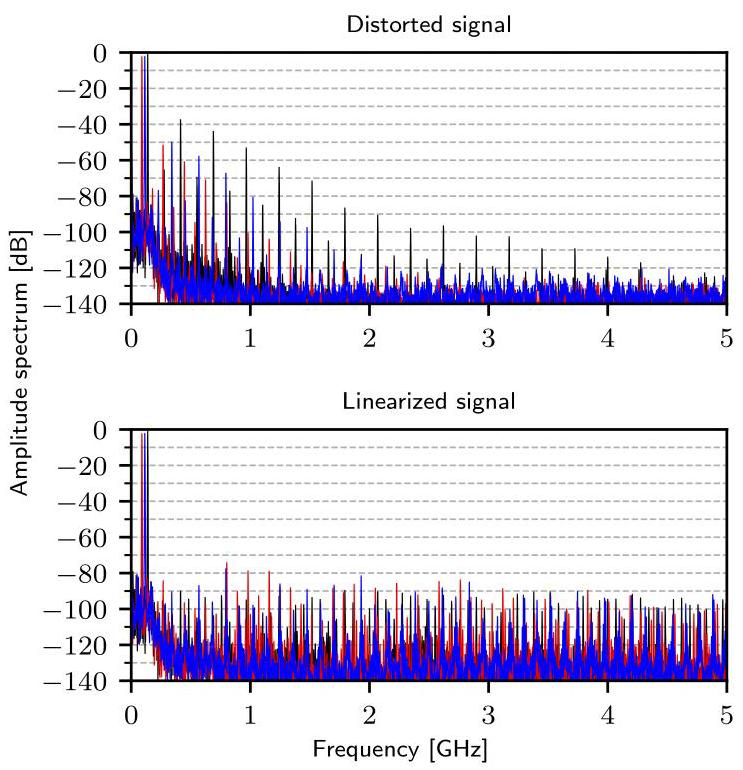

FIGURE 25. Spectrum before and after linearization for single-tone signals (superimposed) using the proposed linearizer in Example 6.

图25. 使用示例6中提出的线性化器对单音信号进行线性化前后的频谱(叠加)。

Another alternative is the simple binary step function which corresponds to 1-bit quantization. Thereby, the multiplications can be eliminated as their inputs are either zero or one. However, it was shown in [48] for the frequency-independent case $(M = 0$ , the only case considered in that paper), that the linearizer then requires at least an order of magnitude more branches than the proposed linearizer (and also the Hammerstein linearizer), in order to achieve the same moderate SNDR level (eight-bit data). For higher SNDR levels, even two orders of magnitude more branches may be required. This implies that the number of additions required will increase ten times or more and implies that the total implementation complexity may even exceed that of the proposed linearizer. It was also shown in [48] that, with properly selected bias values, an alternative implementation based on look-up tables can be used, thereby eliminating all computations except for one addition and one multiplication. The price to pay is the implementation cost of the lookup table whose memory size equals the number of branches plus one $\left( {N + 1}\right)$ . Thus, that alternative is attractive primarily for the frequency-independent case and moderate resolutions. For the general frequency dependent case studied in this paper $\left( {M > 0}\right)$ , an extension of that approach would become less attractive as the cost of the memory then becomes high, especially for higher resolutions requiring many branches and because the memory size is here $\left( {N + 1}\right)  \times  \left( {M + 1}\right)$ . It is also noted that the look-up table approach proposed in [48] can only be extended to the pre-sampling linearizer in this paper (Fig. 3), not the post-sampling linearizer (Fig. 18). For the latter, one may consider using a look-up table in each branch, but then the total memory size would grow exponentially as $\left( {N + 1}\right)  \times  {2}^{M + 1}$ which becomes prohibitive when $M$ and $N$ increase.

另一种替代方案是简单的二进制阶跃函数，它对应于1位量化。这样一来，由于其输入要么为零要么为一，乘法运算可以被消除。然而，在[48]中针对与频率无关的情况$(M = 0$(该论文中仅考虑的情况)表明，为了达到相同的中等SNDR水平(八位数据)，此时线性化器所需的分支数量比所提出的线性化器(以及哈默斯坦线性化器)至少多一个数量级。对于更高的SNDR水平，甚至可能需要多两个数量级的分支。这意味着所需的加法数量将增加十倍或更多，并且意味着总实现复杂度甚至可能超过所提出的线性化器。[48]中还表明，通过适当选择偏置值，可以使用基于查找表的替代实现方式，从而除了一次加法和一次乘法之外消除所有计算。付出的代价是查找表的实现成本，其内存大小等于分支数量加一$\left( {N + 1}\right)$。因此，该替代方案主要对于与频率无关的情况和中等分辨率具有吸引力。对于本文研究的一般频率相关情况$\left( {M > 0}\right)$，随着内存成本变高，该方法的扩展将变得不那么有吸引力，特别是对于需要许多分支的高分辨率情况，并且因为这里的内存大小是$\left( {N + 1}\right)  \times  \left( {M + 1}\right)$。还应注意，[48]中提出的查找表方法只能扩展到本文中的预采样线性化器(图3)，而不能扩展到后采样线性化器(图18)。对于后者，可以考虑在每个分支中使用查找表，但此时总内存大小将随着$\left( {N + 1}\right)  \times  {2}^{M + 1}$呈指数增长，当$M$和$N$增加时这将变得令人望而却步。

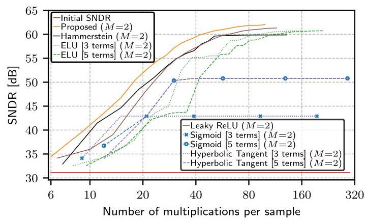

FIGURE 26. SNDR versus the number of multiplications for different nonlinear functions.

图26. 不同非线性函数的SNDR与乘法次数的关系。

To conclude, considering frequency dependent as well as pre-sampling-distortion and post-sampling-distortion models, the modulus and ReLU are generally the most efficient choices for low-complexity linearization, especially for higher resolutions.

总之，考虑到频率相关以及预采样失真和后采样失真模型，模函数和ReLU通常是低复杂度线性化的最有效选择，特别是对于更高的分辨率。

## VII. CONCLUSION

## 七、结论

This paper introduced low-complexity linearizers for the suppression of nonlinear distortion in ADIs. Two different lin-earizers were considered, based on models where the nonlinearities are incurred after and before sampling, respectively (referred to as pre-sampling and post-sampling linearizers, respectively). The proposed linearizers are inspired by neural networks but have an order-of-magnitude lower implementation complexity compared to traditional neural-network-based linearizer schemes. The proposed linearizers can also outperform the traditional parallel Hammerstein linearizers even when the nonlinearities have been generated through a Hammerstein model. This was demonstrated through numerous design examples for various signal types and scenarios, including both simulated and circuit-simulated data. In general, the analysis and simulations show that the proposed linearizer is more efficient in the post-sampling case than in the pre-sampling case, when comparing with the corresponding Hammerstein linearizers. An additional advantage of the proposed linearizer, over the Hammerstein linearizer, is that it eliminates the need for internal data quantizations, thereby automatically avoiding noise amplification from the quantizations to the output.

本文介绍了用于抑制模拟数字接口(ADIs)中非线性失真的低复杂度线性化器。考虑了两种不同的线性化器，分别基于非线性在采样之后和之前产生的模型(分别称为采样后和采样前线性化器)。所提出的线性化器受神经网络启发，但与传统的基于神经网络的线性化器方案相比，实现复杂度降低了一个数量级。即使非线性是通过哈默斯坦模型生成的，所提出的线性化器也能优于传统的并行哈默斯坦线性化器。通过针对各种信号类型和场景的大量设计示例进行了证明，包括模拟数据和电路模拟数据。一般来说，分析和模拟表明，与相应的哈默斯坦线性化器相比，所提出的线性化器在采样后情况下比在采样前情况下更有效。所提出的线性化器相对于哈默斯坦线性化器的另一个优点是，它无需内部数据量化，从而自动避免了从量化到输出的噪声放大。

A design procedure was also proposed in which the lin-earizer parameters are obtained through matrix inversion. Thereby, one can circumvent the costly, time-consuming, and time-unpredictable iterative nonconvex optimization that is traditionally adopted for neural network training. It also offers predictable online training and real-time updates in response to changes in circuitry. The proposed design effectively handles a wide range of wideband multi-tone signals and filtered white noise. Simulations demonstrated significant signal-to-noise-and-distortion ratio (SNDR) improvements of about 20-30 dB for both the simulated and circuit-simulated data.

还提出了一种设计过程，其中通过矩阵求逆获得线性化器参数。由此，可以规避传统上用于神经网络训练的代价高昂、耗时且时间不可预测的迭代非凸优化。它还提供可预测的在线训练和响应电路变化的实时更新。所提出的设计有效地处理了各种宽带多音信号和滤波白噪声。模拟表明，对于模拟数据和电路模拟数据，信噪失真比(SNDR)都有显著提高，约为20 - 30 dB。

Further, related to hardware implementation cost, the proposed linearizers can achieve the same SNDR as the benchmark Hammerstein linearizers with a lower computational (arithmetic) complexity which correlates with the hardware implementation complexity. One can therefore conjecture that the proposed linearizers can offer more efficient hardware implementations than Hammerstein. It was however beyond the scope of this paper to investigate hardware implementations but is left for future work. The focus of the paper was to assess the fundamental properties of the proposed linearizers and show that they are computationally more efficient than the Hammerstein linearizers.

此外，关于硬件实现成本，所提出的线性化器可以以较低的计算(算术)复杂度实现与基准哈默斯坦线性化器相同的SNDR，而计算复杂度与硬件实现复杂度相关。因此，可以推测所提出的线性化器比哈默斯坦线性化器能提供更高效的硬件实现。然而，研究硬件实现超出了本文的范围，留待未来工作。本文的重点是评估所提出的线性化器的基本特性，并表明它们在计算上比哈默斯坦线性化器更高效。

Finally, it is noted that the proposed linearizers resemble the Hammerstein linearizers in that the filters appear after the nonlinear operations. Future work will also consider cases where filters appear before the nonlinear operations, as in Wiener and Wiener-Hammerstein linearizers (see the discussion in Section I-A).

最后，需要注意的是，所提出的线性化器与哈默斯坦线性化器类似，即滤波器出现在非线性操作之后。未来的工作还将考虑滤波器出现在非线性操作之前的情况，如维纳和维纳 - 哈默斯坦线性化器(见第一节A部分的讨论)。

## APPENDIX A LEAST-SQUARES SOLUTION

## 附录A 最小二乘解

The equation ${\mathbf{A}}_{\mathbf{r}}\mathbf{w} = {\mathbf{b}}_{\mathbf{r}}$ can be solved in the least-squares sense by finding $\mathbf{w}$ that satisfies ${\mathbf{A}}_{\mathbf{r}}{}^{\top }{\mathbf{A}}_{\mathbf{r}}\mathbf{w} = {\mathbf{A}}_{\mathbf{r}}{}^{\top }{\mathbf{b}}_{\mathbf{r}}$ , which yields $\mathbf{w} = {\left( {\mathbf{A}}_{\mathbf{r}}^{\top }{\mathbf{A}}_{\mathbf{r}}\right) }^{-1}{\mathbf{A}}_{\mathbf{r}}^{\top }{\mathbf{b}}_{\mathbf{r}}$ [49]. For a set of such equations,

方程${\mathbf{A}}_{\mathbf{r}}\mathbf{w} = {\mathbf{b}}_{\mathbf{r}}$可以通过找到满足${\mathbf{A}}_{\mathbf{r}}{}^{\top }{\mathbf{A}}_{\mathbf{r}}\mathbf{w} = {\mathbf{A}}_{\mathbf{r}}{}^{\top }{\mathbf{b}}_{\mathbf{r}}$的$\mathbf{w}$，在最小二乘意义下求解，得到$\mathbf{w} = {\left( {\mathbf{A}}_{\mathbf{r}}^{\top }{\mathbf{A}}_{\mathbf{r}}\right) }^{-1}{\mathbf{A}}_{\mathbf{r}}^{\top }{\mathbf{b}}_{\mathbf{r}}$ [49]。对于一组这样的方程，

$$
\left\{  \begin{matrix} {\mathbf{A}}_{1}\mathbf{w} = {\mathbf{b}}_{1}, \\  {\mathbf{A}}_{2}\mathbf{w} = {\mathbf{b}}_{2}, \\  \vdots \\  {\mathbf{A}}_{B}\mathbf{w} = {\mathbf{b}}_{B}, \end{matrix}\right. \tag{A.1}
$$

the problem can be rewritten as

该问题可以重写为

$$
{\mathbf{A}}_{\text{ stack }}\mathbf{w} = {\mathbf{b}}_{\text{ stack }}, \tag{A.2}
$$

with

其中

$$
{\mathbf{A}}_{\text{ stack }} = \left\lbrack  \begin{matrix} {\mathbf{A}}_{1} \\  {\mathbf{A}}_{2} \\  \vdots \\  {\mathbf{A}}_{R} \end{matrix}\right\rbrack  ,\;{\mathbf{b}}_{\text{ stack }} = \left\lbrack  \begin{matrix} {\mathbf{b}}_{1} \\  {\mathbf{b}}_{2} \\  \vdots \\  {\mathbf{b}}_{R} \end{matrix}\right\rbrack \tag{A.3}
$$

which yields

得到

$$
\mathbf{w} = {\left( \underset{\mathbf{A}}{\underbrace{{\mathbf{A}}_{\text{ stack }}^{\top }{\mathbf{A}}_{\text{ stack }}}}\right) }^{-1}\underset{\mathbf{b}}{\underbrace{{\mathbf{A}}_{\text{ stack }}^{\top }{\mathbf{b}}_{\text{ stack }}}}. \tag{A.4}
$$

This can be equivalently written as

这可以等效地写为

$$
\mathbf{w} = {\left( \mathop{\sum }\limits_{{r = 1}}^{R}{\mathbf{A}}_{r}^{\top }{\mathbf{A}}_{r}\right) }^{-1}\mathop{\sum }\limits_{{r = 1}}^{R}{\mathbf{A}}_{r}^{\top }{\mathbf{b}}_{r}. \tag{A.5}
$$

Including ${L}_{2}$ -regularization (a.k.a. Tikhonov regularization), a diagonal matrix $\lambda \mathbf{I}$ with small diagonal entries $\lambda$ is added to the right-hand side of (A.5). The resulting equation is then equivalent to (7), with $\mathbf{A}$ and $\mathbf{b}$ in (8) and ${\mathbf{A}}_{r}$ and ${\mathbf{b}}_{r}$ defined in Section III-B.

包括${L}_{2}$正则化(也称为蒂霍诺夫正则化)，将一个对角元素$\lambda$较小的对角矩阵$\lambda \mathbf{I}$添加到(A.5)的右侧。得到的方程然后等同于(7)，其中(8)中的$\mathbf{A}$和$\mathbf{b}$以及第三节B部分定义的${\mathbf{A}}_{r}$和${\mathbf{b}}_{r}$。

## REFERENCES

## 参考文献

[1] E. Björnson and Ö. Demir, Introduction to Multiple Antenna Commu-nications and Reconfigurable Surfaces. Delft, The Netherlands: Now

通信与可重构表面。荷兰代尔夫特:NowPublishers, Inc., 2024.

[2] C. G. Tsinos, A. Kaushik, A. Arora, C. Masouros, F. Liu, and S. Chatzino-tas, "Low complexity joint radar-communication systems design in the RF

塔斯，“射频中低复杂度联合雷达通信系统设计”domain," IEEE Trans. Green Commun. Netw., Apr. 2025, early Access.

[3] M. F. Haider, F. You, S. He, T. Rahkonen, and J. P. Aikio, "Predistortion-based linearization for 5G and beyond millimeter-wave transceiver systems: A comprehensive survey," IEEE Commun. Surv. Tuts., vol. 24, no. 4, pp. 2029-2072, Aug. 2022.

“面向5G及以后毫米波收发器系统的基于线性化:全面综述”，《IEEE通信综述与教程》，第24卷，第4期，第2029 - 2072页，2022年8月。

[4] H. Chu, X. Pan, J. Jiang, X. Li, and L. Zheng, "Adaptive and robust channelestimation for IRS-aided millimeter-wave communications," IEEE Trans.

“用于智能反射面辅助毫米波通信的估计”，《IEEE汇刊》Veh. Technol., vol. 73, no. 7, pp. 9411-9423, Jul. 2024.

[5] Z. Zhao, X. Chen, F. Meng, Z. Yang, B. Liu, N. Zhu, K. Wang, K. Ma,and K. Seng Yeo, "Design and analysis of a 22.6-to-73.9 GHz low-noise amplifier for 5G NR FR2 and NR-U multiband/multistandard communications," IEEE J. Solid-State Circuits, vol. 60, no. 9, pp. 3189-3201, Sep. 2025.

以及K. Seng Yeo，“用于5G NR FR2和NR-U多频段/多标准通信的22.6至73.9 GHz低噪声放大器的设计与分析”，《IEEE固态电路杂志》，第60卷，第9期，第3189 - 3201页，2025年9月。

[6] Interline, "Minimum 802.11 SNR Sensitivity," https://interline.pl/ Information-and-Tips/Minimum-802.11-SNR-Sensitivity. Accessed on2025-11-21.

[7] M. Valkama, A. Shahed Hagh Ghadam, L. Anttila, and M. Renfors, "Ad-vanced digital signal processing techniques for compensation of nonlinear distortion in wideband multicarrier radio receivers," IEEE Trans. Microw.

用于宽带多载波无线电接收机中非线性失真补偿的先进数字信号处理技术，《IEEE微波汇刊》Theory Tech., vol. 54, no. 6, pp. 2356-2366, Jun. 2006.

[8] M. Valkama, M. Renfors, and V. Koivunen, "Advanced methods for I/Qimbalance compensation in communication receivers," IEEE Trans. Signal

通信接收机中的不平衡补偿，《IEEE信号汇刊》Process., vol. 49, no. 10, pp. 2335-2344, Oct. 2001.

[9] B. Murmann, "ADC performance survey 1997-2024," https://github.com/ bmurmann/ADC-survey. Accessed on 2025-11-21.

[10] Texas Instruments (ADC12DJ5200SE), "10.4 GSPS Single-Channel or 5.2GSPS Dual-Channel, 12-bit, RF-Sampling Analog-to-Digital Converter,"

GSPS双通道、12位、射频采样模数转换器https://www.ti.com/product/ADC12DJ5200SE, 2023, Accessed: 2025-11-21.

[11] T. L. Marzetta, E. G. Larsson, H. Yang, and H. Q. Ngo, Fundamentals of Massive MIMO. Cambridge, U.K.: Cambridge Univ. Press, 2016.

[12] W. A. Frank, "Sampling requirements for Volterra system identification," IEEE Signal Process. Lett., vol. 3, pp. 266-268, Sep. 1996.

[13] H.-W. Chen, "Modeling and identification of parallel nonlinear systems:structural classification and parameter estimation methods," Proc. IEEE,

结构分类和参数估计方法，《IEEE会刊》vol. 83, no. 1, pp. 39-66, Jan. 1995.

[14] S. Xu, X. Zou, B. Ma, J. Chen, L. Yu, and W. Zou, "Deep-learning-poweredphotonic analog-to-digital conversion," Light Sci. Appl., vol. 8, no. 66, Jul. 2019.

光子模数转换，《光科学与应用》，第8卷，第66期，2019年7月。

[15] Y. Xiang, M. Chen, D. Zhai, Y. Zhao, J. Ren, and F. Ye, "A neural networkbased background calibration for pipelined-SAR ADCs at low hardware

基于低硬件条件下流水线式逐次逼近寄存器模数转换器的背景校准cost," Electronics Letters, vol. 59, no. 15, pp. 1-3, Aug. 2023.

[16] H. Deng, Y. Hu, and L. Wang, "An efficient background calibration tech-nique for analog-to-digital converters based on neural network," Integr.

基于神经网络的模数转换器技术，《集成电路》VLSI J., vol. 74, pp. 63-70, Sep. 2020.

[17] X. Peng, Y. Mi, Y. Zhang, Y. Xiao, W. Zhang, Y. Tang, and H. Tang, "Aneural network-based harmonic suppression algorithm for medium-to-high resolution ADCs," in Proc. IEEE Electron Devices Technol. Manuf. Conf.

基于神经网络的中高分辨率模数转换器谐波抑制算法，发表于《IEEE电子器件技术与制造会议论文集》(EDTM), Apr. 2021, pp. 1-3.

[18] M. Chen, Y. Zhao, N. Xu, F. Ye, and J. Ren, "A partially binarized andfixed neural network based calibrator for SAR-pipelined ADCs achieving

用于实现SAR流水线式模数转换器的基于固定神经网络的校准器95.0-dB SFDR," in IEEE Int. Symp. Circuits Syst. (ISCAS), May 2021.

[19] M. Fayazi, Z. Colter, E. Afshari, and R. Dreslinski, "Applications ofartificial intelligence on the modeling and optimization for analog and mixed-signal circuits: A review," IEEE Trans. Circuits Syst. I, Reg. Papers,

人工智能在模拟和混合信号电路建模与优化中的应用综述，《IEEE电路与系统学报I:常规论文》vol. 68, no. 6, pp. 2418-2431, Jun. 2021.

[20] D. Zhai, W. Jiang, X. Jia, J. Lan, M. Guo, S.-W. Sin, F. Ye, Q. Liu, J. Ren,and C. Chen, "High-speed and time-interleaved ADCs using additive-neural-network-based calibration for nonlinear amplitude and phase distortion," IEEE Trans. Circuits Syst. I, Reg. Papers, vol. 69, no. 12, pp. 4944-4957, Dec. 2022.

以及C. Chen，“使用基于加法神经网络校准的高速和时间交织模数转换器用于非线性幅度和相位失真”，《IEEE电路与系统学报I:常规论文》，第69卷，第12期，第4944 - 4957页，2022年12月。

[21] Z. Lu, B. Zhang, X. Peng, H. Liu, X. Ye, Y. Li, Y. Peng, Y. Xiao,W. Zhang, and H. Tang, "A new artificial neural network-based calibration mechanism for ADCs: A time-interleaved ADC case study," IEEE Trans. Very Large Scale Integr. (VLSI) Syst, vol. 32, no. 7, pp. 1184-1194, May 2024.

W. Zhang和H. Tang，“一种基于人工神经网络的模数转换器校准新机制:时间交织模数转换器案例研究”，《IEEE超大规模集成电路系统汇刊》，第32卷，第7期，第1184 - 1194页，2024年5月。

[22] Y. Peng, Y. Xiao, L. Chen, H. Tang, and X. Peng, "A novel calibrationalgorithm for ADCs based on inverse mapping by neural network," IEEE Trans. Circuits Syst. II: Express Briefs, vol. 71, no. 7, pp. 3283-3287, Feb. 2024.

基于神经网络逆映射的模数转换器算法，《IEEE电路与系统学报II:快报》，第71卷，第7期，第3283 - 3287页，2024年2月。

[23] L. Ljung, System Identification: Theory for the User, ser. Prentice HallInformation and System Sciences Series. Upper Saddle River, NJ: Prentice Hall, 1999.

信息与系统科学系列。新泽西州上鞍河:普伦蒂斯·霍尔出版社，1999年。

[24] Y. Mao, F. Ding, L. Xu, and T. Hayat, "Highly efficient parameter estima-tion algorithms for Hammerstein non-linear systems," IET Control Theory

哈默斯坦非线性系统的辨识算法，《IET控制理论》Appl., vol. 13, no. 4, pp. 477-485, Feb. 2019.

[25] P. Gilabert, G. Montoro, and E. Bertran, "On the Wiener and Hammersteinmodels for power amplifier predistortion," in Proc. Asia-Pacific Microw.

功率放大器预失真模型，发表于《亚太微波会议论文集》。Conf. (APMC), vol. 2, Dec. 2005, pp. 1-4.

[26] T. Sadeghpour, H. Karkhaneh, R. Abd-Alhameed, A. Ghorbani, I. T. E.Elfergani, and Y. A. S. Dama, "Hammerstein predistorter for high power RF amplifiers in OFDM transmitters," in Proc. URSI Gen. Assem. Sci.

埃尔费加尼和Y. A. S. 达马，“用于正交频分复用发射机中高功率射频放大器的哈默斯坦预失真器”，发表于《国际无线电科学联盟大会论文集》。Symp (GASS), Aug. 2011, pp. 1-4.

[27] C. Tarver, A. Balatsoukas-Stimming, and J. R. Cavallaro, "Design andimplementation of a neural network based predistorter for enhanced mobile

基于神经网络的预失真器在增强移动设备中的实现broadband," in 2019 IEEE Int. Workshop Signal Process. Syst. (SiPS), Oct.2019, pp. 296-301.

[28] D. R. Linares and H. Johansson, "Low-complexity memoryless linearizerfor analog-to-digital interfaces," in Proc. 24th Int. Conf. on Digital Signal

用于模数接口，发表于第24届国际数字信号会议论文集Process. (DSP), Rhodes, Greece, Jun. 2023, pp. 1-5.

[29] J. Tsimbinos and K. V. Lever, "Input Nyquist sampling suffices to identifyand compensate nonlinear systems," IEEE Trans. Signal Process., vol. 46,

并补偿非线性系统，《IEEE信号处理汇刊》，第46卷no. 10, pp. 2833-2837, Oct. 1998.

[30] R. Vansebrouck, C. Jabbour, O. Jamin, and P. Desgreys, "Fully-digitalblind compensation of non-linear distortions in wideband receivers," IEEE Trans. Circuits Syst. I: Reg. Papers, vol. 64, no. 8, pp. 2112-2123, Aug. 2017.

宽带接收机中非线性失真的盲补偿，《IEEE电路与系统学报I:常规论文》，第64卷，第8期，第2112 - 2123页，2017年8月。

[31] Z. Liu, X. Hu, L. Xu, W. Wang, and F. M. Ghannouchi, "Low com-putational complexity digital predistortion based on convolutional neural network for wideband power amplifiers," IEEE Trans. on Circuits Syst. II:

基于卷积神经网络的宽带功率放大器数字预失真的计算复杂度，《IEEE电路与系统学报II》Express Briefs, vol. 69, no. 3, pp. 1702-1706, Mar. 2022.

[32] S. Li, G. Zhao, C. Yu, F. Li, and Y. Liu, "Power scalable neural networkmodel for wideband digital predistortion," IEEE Microw. Wirel. Technol.

宽带数字预失真模型，《IEEE微波与无线技术》Lett., vol. 33, no. 12, pp. 1658-1661, Dec. 2023.

[33] C. Jiang, G. Yang, R. Han, J. Tan, and F. Liu, "Gated dynamic neural net-work model for digital predistortion of RF power amplifiers with varying transmission configurations," IEEE Trans. Microw. Theory Tech., vol. 71,

具有不同传输配置的射频功率放大器数字预失真的工作模型，《IEEE微波理论与技术汇刊》，第71卷no. 8, pp. 3605-3616, Aug. 2023.

[34] P. Ghazanfarianpoor, S.-H. Javid-Hosseini, F. Abbasnezhad, A. Arian,V. Nayyeri, and P. Colantonio, "A neural network-based pre-distorter for linearization of RF power amplifiers," in 2023 22nd Mediterranean

V. 纳耶里和P. 科兰托尼奥，“一种基于神经网络的射频功率放大器线性化预失真器”，发表于2023年第22届地中海会议Microw. Symp. (MMS), Oct. 2023, pp. 1-4.

[35] G. Prasad and H. Johansson, "A low-complexity post-weighting predis-torter in a mMIMO transmitter under crosstalk," IEEE Commun. Lett.,

在串扰情况下毫微微蜂窝多输入多输出发射机中的预失真器，《IEEE通信快报》vol. 27, no. 12, pp. 3315-3319, Dec. 2023.

[36] G. Prasad, H. Johansson, and R. Hussain Laskar, "A general approachto fully linearize the power amplifiers in mMIMO with low complexity,"

以低复杂度完全线性化毫微微蜂窝多输入多输出中的功率放大器IEEE Trans. Commun., vol. 73, no. 7, pp. 4749-4765, Dec. 2025.

[37] S.-H. Javid-Hosseini, P. Ghazanfarianpoor, V. Nayyeri, and P. Colantonio,"A unified neural network-based approach to nonlinear modeling and digital predistortion of RF power amplifier," IEEE Trans. Microw. Theory

“一种基于统一神经网络的射频功率放大器非线性建模与数字预失真方法”，《IEEE微波理论》Tech., vol. 72, no. 9, pp. 5031-5038, Sep. 2024.

[38] K. K. Parhi, VLSI Digital Signal Processing Systems: Design and Implementation. Hoboken, NJ, USA: John Wiley & Sons, 2007.

[39] I. Koren, Computer Arithmetic Algorithms, Second Edition, ser. Ak Peters Series. Natick, MA, USA: Taylor & Francis, 2001.

[40] L. B. Jackson, Digital Filters and Signal Processing (3rd Ed.). Boston, MA, USA: Kluwer Academic Publishers, 1996.

[41] L. Wanhammar and H. Johansson, Digital Filters Using MATLAB. Linköping, Sweden: Linköping Univ., 2013.

[42] P. P. Vaidyanathan, Multirate Systems and Filter Banks. Englewood Cliffs,NJ: Prentice Hall, 1993.

新泽西州:普伦蒂斯·霍尔出版社，1993年。

[43] H. M. Bahig, M. H. El-Zahar, and K. Nakamula, "Some results for someconjectures in addition chains," in Combinatorics, Computability and

加法链中的猜想，发表于《组合数学、可计算性与》Logic. London, U.K.: Springer London, 2001, pp. 47-54.

[44] H. Johansson and O. Gustafsson, "Linear-phase FIR interpolation, deci-mation, and $M$ th-band filters utilizing the Farrow structure," IEEE Trans.

利用法罗结构的信息以及$M$ 带滤波器，《IEEE汇刊》Circuits Syst. I, vol. 52, no. 10, pp. 2197-2207, Oct. 2005.

[45] P. Löwenborg, Mixed-Signal Processing Systems, 2nd ed. Linköping,Sweden: Linköping University, 2006.

瑞典:林雪平大学，2006年。

[46] K. Ichige, M. Iwaki, and R. Ishii, "Accurate estimation of minimum filterlength for optimum FIR digital filters," IEEE Trans. Circuits Syst. II,

用于优化FIR数字滤波器的长度，”《IEEE电路与系统汇刊II》，vol. 47, no. 10, pp. 1008-1016, Oct. 2000.

[47] Texas Instruments, "Analog-to-digital converters (ADCs): High-SpeedADCs." https://www.ti.com/product-category/data-converters/adcs/ high-speed/overview.html, accessed: 2025-11-21.

模数转换器。”https://www.ti.com/product-category/data-converters/adcs/high-speed/overview.html，访问时间:2025年11月21日。

[48] D. R. Linares and H. Johansson, "Digital linearizer based on 1-bit quanti-zations," in Proc. IEEE Int. Conf. Commun. Technol. (ICCT), Oct. 2024,pp. 1659-1663.

[49] T. Hastie, R. Tibshirani, and J. Friedman, The Elements of StatisticalLearning: Data Mining, Inference, and Prediction, 2nd ed., ser. Springer

《学习:数据挖掘、推理与预测》，第2版，施普林格系列Series in Statistics. New York, NY, USA: Springer, 2009.

DEIJANY RODRIGUEZ LINARES (Graduate Student Member, IEEE) received the Bachelor of Science in Nuclear Engineering, a Postgraduate Diploma in Medical Physics and the Master of Science degree in Nuclear Engineering from the Higher Institute of Technologies and Applied Sciences (InSTEC), University of Havana, Cuba, in 2015, 2016 and 2018, respectively. He is currently pursuing a Ph.D. degree with the Division of Communication Systems, Department of Electrical Engineering, Linköping University, Sweden. From 2019 to 2020, he was an Associate Researcher at InSTEC, and from 2015 to 2018, he worked as a Junior Medical Physicist at the Cuban State Center for the Control of Drugs, Equipment and Medical Devices (CECMED). Since 2019, he has been a Junior Associate of the Abdus Salam International Centre for Theoretical Physics (ICTP), Trieste, Italy. His research interests include signal processing, wireless communication, reinforcement learning, and mathematical optimization.

德亚尼·罗德里格斯·利纳雷斯(IEEE研究生会员)分别于2015年、2016年和2018年在古巴哈瓦那大学高等技术与应用科学学院(InSTEC)获得核工程理学学士学位、医学物理研究生文凭和核工程理学硕士学位。他目前正在瑞典林雪平大学电气工程系通信系统分部攻读博士学位。2019年至2020年，他是InSTEC的副研究员，2015年至2018年，他在古巴国家药品、设备和医疗器械控制中心(CECMED)担任初级医学物理学家。自2019年以来，他一直是意大利的里雅斯特阿卜杜勒·萨拉姆国际理论物理中心(ICTP)的初级准会员。他的研究兴趣包括信号处理、无线通信、强化学习和数学优化。

HÅKAN JOHANSSON (S'97-M'98-SM'06) received the Master of Science degree in Computer Science and Engineering, and the Licentiate, Doctoral, and Docent degrees in Electronics Systems, from Linköping University, Sweden, in 1995, 1997, 1998, and 2001, respectively. During 1998 and 1999 he held a postdoctoral position with the Signal Processing Laboratory, Tampere University of Technology, Finland. He is currently a Professor at the Division of Communication Systems, Department of Electrical Engineering, Linköping University. He was one of the founders of the spin-off company Signal Processing Devices Sweden AB in 2004 (now Teledyne SP Devices). His research encompasses theory, design, and implementation of efficient and flexible signal processing systems for various purposes. He has authored or co-authored four books and some 80 journal papers and 150 conference papers. He has co-authored one journal paper and two conference papers that have received best paper awards and authored or co-authored three invited journal papers and four invited book chapters. He also holds eight patents. He served as a Technical Program Co-Chair for IEEE Int. Symposium on Circuits and Systems (ISCAS) 2017 and 2025. He has served as an Associate Editor for IEEE Trans. on Circuits and Systems I and II, IEEE Trans. Signal Processing, and IEEE Signal Processing Letters, and as an Area Editor for Digital Signal Processing (Elsevier).

哈坎·约翰松(S'97 - M'98 - SM'06)分别于1995年、1997年、1998年和2001年在瑞典林雪平大学获得计算机科学与工程理学硕士学位，以及电子系统的准博士、博士和教授学位。1998年至1999年，他在芬兰坦佩雷理工大学信号处理实验室担任博士后职位。他目前是林雪平大学电气工程系通信系统分部的教授。他是2004年衍生公司瑞典信号处理设备公司(现泰雷兹SP设备公司)的创始人之一。他的研究涵盖了针对各种目的的高效灵活信号处理系统的理论、设计和实现。他撰写或合著了四本书、约80篇期刊论文和150篇会议论文。他合著了一篇获得最佳论文奖的期刊论文和两篇会议论文，并撰写或合著了三篇特邀期刊论文和四章特邀书籍章节。他还拥有八项专利。他曾担任IEEE国际电路与系统研讨会(ISCAS)2017年和2025年的技术程序联合主席。他曾担任IEEE电路与系统学报I和II、IEEE信号处理学报以及IEEE信号处理快报的副主编，以及《数字信号处理》(爱思唯尔)的领域编辑。